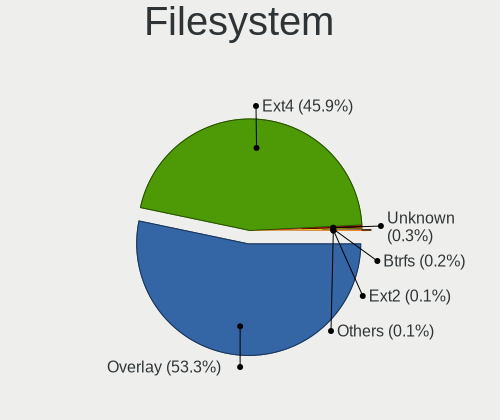
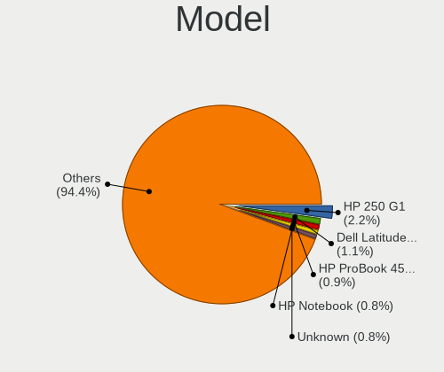
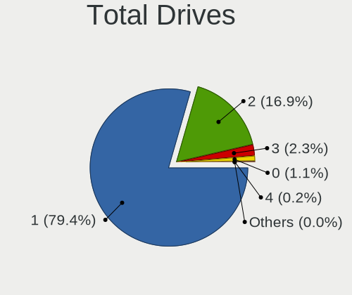
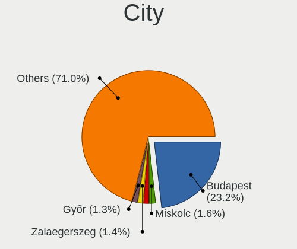
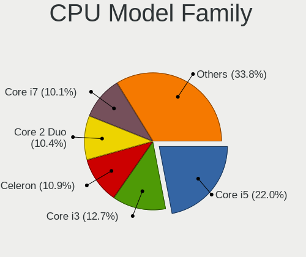
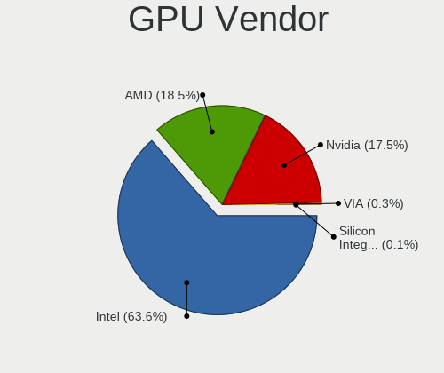
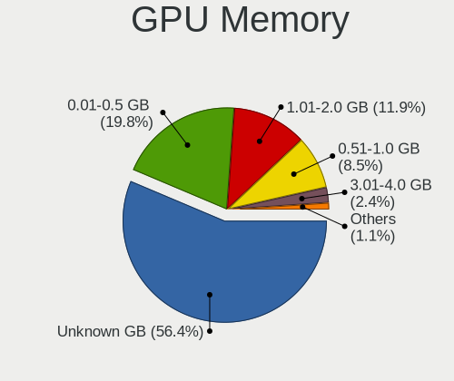
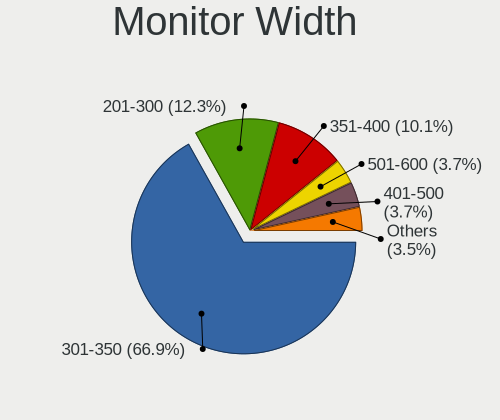
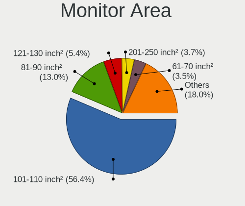
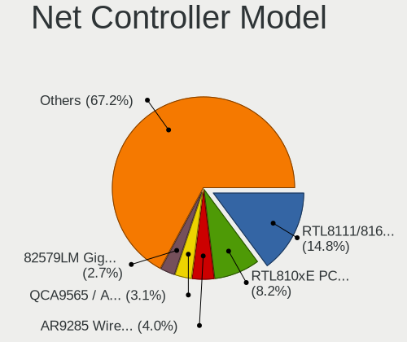

BlackPanther - Tested Hardware & Statistics (Notebooks)
-------------------------------------------------------

A project to collect tested hardware configurations for BlackPanther.

Anyone can contribute to this report by the [hw-probe](https://github.com/linuxhw/hw-probe) tool:

    sudo -E hw-probe -all -upload

Please contribute! Especially if your hardware is rare.

Contents
--------

* [ Test Cases ](#test-cases)

* [ System ](#system)
  - [ OS                       ](#os)
  - [ OS Family                ](#os-family)
  - [ Kernel                   ](#kernel)
  - [ Kernel Family            ](#kernel-family)
  - [ Kernel Major Ver.        ](#kernel-major-ver)
  - [ Arch                     ](#arch)
  - [ DE                       ](#de)
  - [ Display Server           ](#display-server)
  - [ Display Manager          ](#display-manager)
  - [ OS Lang                  ](#os-lang)
  - [ Boot Mode                ](#boot-mode)
  - [ Filesystem               ](#filesystem)
  - [ Part. scheme             ](#part-scheme)
  - [ Dual Boot with Linux/BSD ](#dual-boot-with-linuxbsd)
  - [ Dual Boot (Win)          ](#dual-boot-win)

* [ Board ](#board)
  - [ Vendor                   ](#vendor)
  - [ Model                    ](#model)
  - [ Model Family             ](#model-family)
  - [ MFG Year                 ](#mfg-year)
  - [ Form Factor              ](#form-factor)
  - [ Secure Boot              ](#secure-boot)
  - [ Coreboot                 ](#coreboot)
  - [ RAM Size                 ](#ram-size)
  - [ RAM Used                 ](#ram-used)
  - [ Total Drives             ](#total-drives)
  - [ Has CD-ROM               ](#has-cd-rom)
  - [ Has Ethernet             ](#has-ethernet)
  - [ Has WiFi                 ](#has-wifi)
  - [ Has Bluetooth            ](#has-bluetooth)

* [ Location ](#location)
  - [ Country                  ](#country)
  - [ City                     ](#city)

* [ Drives ](#drives)
  - [ Drive Vendor             ](#drive-vendor)
  - [ Drive Model              ](#drive-model)
  - [ HDD Vendor               ](#hdd-vendor)
  - [ SSD Vendor               ](#ssd-vendor)
  - [ Drive Kind               ](#drive-kind)
  - [ Drive Connector          ](#drive-connector)
  - [ Drive Size               ](#drive-size)
  - [ Space Total              ](#space-total)
  - [ Space Used               ](#space-used)
  - [ Malfunc. Drives          ](#malfunc-drives)
  - [ Malfunc. Drive Vendor    ](#malfunc-drive-vendor)
  - [ Malfunc. HDD Vendor      ](#malfunc-hdd-vendor)
  - [ Malfunc. Drive Kind      ](#malfunc-drive-kind)
  - [ Failed Drives            ](#failed-drives)
  - [ Failed Drive Vendor      ](#failed-drive-vendor)
  - [ Drive Status             ](#drive-status)

* [ Storage controller ](#storage-controller)
  - [ Storage Vendor           ](#storage-vendor)
  - [ Storage Model            ](#storage-model)
  - [ Storage Kind             ](#storage-kind)

* [ Processor ](#processor)
  - [ CPU Vendor               ](#cpu-vendor)
  - [ CPU Model                ](#cpu-model)
  - [ CPU Model Family         ](#cpu-model-family)
  - [ CPU Cores                ](#cpu-cores)
  - [ CPU Sockets              ](#cpu-sockets)
  - [ CPU Threads              ](#cpu-threads)
  - [ CPU Op-Modes             ](#cpu-op-modes)
  - [ CPU Microcode            ](#cpu-microcode)
  - [ CPU Microarch            ](#cpu-microarch)

* [ Graphics ](#graphics)
  - [ GPU Vendor               ](#gpu-vendor)
  - [ GPU Model                ](#gpu-model)
  - [ GPU Combo                ](#gpu-combo)
  - [ GPU Driver               ](#gpu-driver)
  - [ GPU Memory               ](#gpu-memory)

* [ Monitor ](#monitor)
  - [ Monitor Vendor           ](#monitor-vendor)
  - [ Monitor Model            ](#monitor-model)
  - [ Monitor Resolution       ](#monitor-resolution)
  - [ Monitor Diagonal         ](#monitor-diagonal)
  - [ Monitor Width            ](#monitor-width)
  - [ Aspect Ratio             ](#aspect-ratio)
  - [ Monitor Area             ](#monitor-area)
  - [ Pixel Density            ](#pixel-density)
  - [ Multiple Monitors        ](#multiple-monitors)

* [ Network ](#network)
  - [ Net Controller Vendor    ](#net-controller-vendor)
  - [ Net Controller Model     ](#net-controller-model)
  - [ Wireless Vendor          ](#wireless-vendor)
  - [ Wireless Model           ](#wireless-model)
  - [ Ethernet Vendor          ](#ethernet-vendor)
  - [ Ethernet Model           ](#ethernet-model)
  - [ Net Controller Kind      ](#net-controller-kind)
  - [ Used Controller          ](#used-controller)
  - [ NICs                     ](#nics)
  - [ IPv6                     ](#ipv6)

* [ Bluetooth ](#bluetooth)
  - [ Bluetooth Vendor         ](#bluetooth-vendor)
  - [ Bluetooth Model          ](#bluetooth-model)

* [ Sound ](#sound)
  - [ Sound Vendor             ](#sound-vendor)
  - [ Sound Model              ](#sound-model)

* [ Memory ](#memory)
  - [ Memory Vendor            ](#memory-vendor)
  - [ Memory Model             ](#memory-model)
  - [ Memory Kind              ](#memory-kind)
  - [ Memory Form Factor       ](#memory-form-factor)
  - [ Memory Size              ](#memory-size)
  - [ Memory Speed             ](#memory-speed)

* [ Printers & scanners ](#printers--scanners)
  - [ Printer Vendor           ](#printer-vendor)
  - [ Printer Model            ](#printer-model)
  - [ Scanner Vendor           ](#scanner-vendor)
  - [ Scanner Model            ](#scanner-model)

* [ Camera ](#camera)
  - [ Camera Vendor            ](#camera-vendor)
  - [ Camera Model             ](#camera-model)

* [ Security ](#security)
  - [ Fingerprint Vendor       ](#fingerprint-vendor)
  - [ Fingerprint Model        ](#fingerprint-model)
  - [ Chipcard Vendor          ](#chipcard-vendor)
  - [ Chipcard Model           ](#chipcard-model)

* [ Unsupported ](#unsupported)
  - [ Unsupported Devices      ](#unsupported-devices)
  - [ Unsupported Device Types ](#unsupported-device-types)

Test Cases
----------

Total: 3436

| Vendor        | Model                       | Probe                                                      | Date         |
|---------------|-----------------------------|------------------------------------------------------------|--------------|
| Acer          | Aspire R3-471T              | [01b021f810](https://linux-hardware.org/?probe=01b021f810) | Aug 31, 2022 |
| eMachines     | E725                        | [3e5c01d133](https://linux-hardware.org/?probe=3e5c01d133) | Aug 28, 2022 |
| Lenovo        | IdeaPad 110-15ISK 80UD      | [1dd156b433](https://linux-hardware.org/?probe=1dd156b433) | Aug 27, 2022 |
| ASUSTek       | X200MA                      | [dcadb94c69](https://linux-hardware.org/?probe=dcadb94c69) | Aug 27, 2022 |
| ASUSTek       | X200MA                      | [5d22a1baa9](https://linux-hardware.org/?probe=5d22a1baa9) | Aug 27, 2022 |
| eMachines     | E725                        | [b73baa0850](https://linux-hardware.org/?probe=b73baa0850) | Aug 25, 2022 |
| ASUSTek       | X200MA                      | [8d375ef1fd](https://linux-hardware.org/?probe=8d375ef1fd) | Aug 24, 2022 |
| ASUSTek       | X200MA                      | [69af3fb82a](https://linux-hardware.org/?probe=69af3fb82a) | Aug 24, 2022 |
| Lenovo        | ThinkPad T410 2537BF9       | [be0227ed47](https://linux-hardware.org/?probe=be0227ed47) | Aug 23, 2022 |
| ASUSTek       | 1015BX                      | [61edccb8dd](https://linux-hardware.org/?probe=61edccb8dd) | Aug 21, 2022 |
| ASUSTek       | 1015BX                      | [94f3284833](https://linux-hardware.org/?probe=94f3284833) | Aug 21, 2022 |
| Lenovo        | ThinkPad X220 4290L39       | [31a7893b95](https://linux-hardware.org/?probe=31a7893b95) | Aug 20, 2022 |
| Dell          | Latitude 5580               | [5c9db9ff58](https://linux-hardware.org/?probe=5c9db9ff58) | Aug 18, 2022 |
| Lenovo        | IdeaPad 110-15ISK 80UD      | [f6f60b3012](https://linux-hardware.org/?probe=f6f60b3012) | Aug 15, 2022 |
| Lenovo        | IdeaPad 110-15ISK 80UD      | [14a398eaec](https://linux-hardware.org/?probe=14a398eaec) | Aug 15, 2022 |
| Lenovo        | IdeaPad 110-15ISK 80UD      | [6649d66a82](https://linux-hardware.org/?probe=6649d66a82) | Aug 15, 2022 |
| eMachines     | E725                        | [928cfd8881](https://linux-hardware.org/?probe=928cfd8881) | Aug 13, 2022 |
| eMachines     | E725                        | [e1d0d38a1c](https://linux-hardware.org/?probe=e1d0d38a1c) | Aug 13, 2022 |
| Lenovo        | IdeaPad 320-15ABR 80XS      | [1d7c1c5212](https://linux-hardware.org/?probe=1d7c1c5212) | Aug 13, 2022 |
| Lenovo        | IdeaPad 320-15ABR 80XS      | [70b0d2bb45](https://linux-hardware.org/?probe=70b0d2bb45) | Aug 13, 2022 |
| eMachines     | E520 V1.10                  | [a5c7ca58d9](https://linux-hardware.org/?probe=a5c7ca58d9) | Aug 06, 2022 |
| Fujitsu       | LIFEBOOK U745               | [c6d5fcceee](https://linux-hardware.org/?probe=c6d5fcceee) | Aug 05, 2022 |
| Fujitsu       | LIFEBOOK U745               | [0e067ccc56](https://linux-hardware.org/?probe=0e067ccc56) | Aug 05, 2022 |
| eMachines     | E725                        | [8028786618](https://linux-hardware.org/?probe=8028786618) | Aug 04, 2022 |
| ASUSTek       | X550JX                      | [469c737a9b](https://linux-hardware.org/?probe=469c737a9b) | Aug 03, 2022 |
| eMachines     | E725                        | [fe35b6624b](https://linux-hardware.org/?probe=fe35b6624b) | Aug 02, 2022 |
| eMachines     | E725                        | [25d51b3945](https://linux-hardware.org/?probe=25d51b3945) | Aug 02, 2022 |
| ASUSTek       | X550JX                      | [edf8c765aa](https://linux-hardware.org/?probe=edf8c765aa) | Aug 02, 2022 |
| eMachines     | E520 V1.10                  | [89a18a0be1](https://linux-hardware.org/?probe=89a18a0be1) | Aug 01, 2022 |
| eMachines     | E520 V1.10                  | [bb16305e18](https://linux-hardware.org/?probe=bb16305e18) | Aug 01, 2022 |
| HP            | EliteBook 8470p             | [a1d5593420](https://linux-hardware.org/?probe=a1d5593420) | Aug 01, 2022 |
| HP            | EliteBook 8470p             | [0cecb854f4](https://linux-hardware.org/?probe=0cecb854f4) | Jul 31, 2022 |
| HP            | EliteBook 8470p             | [5e73e33a77](https://linux-hardware.org/?probe=5e73e33a77) | Jul 31, 2022 |
| eMachines     | E725                        | [ca033cf053](https://linux-hardware.org/?probe=ca033cf053) | Jul 26, 2022 |
| eMachines     | E725                        | [b975298e85](https://linux-hardware.org/?probe=b975298e85) | Jul 25, 2022 |
| Alcor         | Intel Education Tablet      | [a04ad41c5a](https://linux-hardware.org/?probe=a04ad41c5a) | Jul 24, 2022 |
| Alcor         | Intel Education Tablet      | [700f83a555](https://linux-hardware.org/?probe=700f83a555) | Jul 24, 2022 |
| Dell          | Latitude D630               | [a9fc5a41aa](https://linux-hardware.org/?probe=a9fc5a41aa) | Jul 24, 2022 |
| Dell          | Latitude D630               | [7476af3363](https://linux-hardware.org/?probe=7476af3363) | Jul 23, 2022 |
| ASUSTek       | Strix 15 GL503GE            | [e543e58f00](https://linux-hardware.org/?probe=e543e58f00) | Jul 22, 2022 |
| Lenovo        | IdeaPad 320-15ISK 80XH      | [33f5176a6c](https://linux-hardware.org/?probe=33f5176a6c) | Jul 21, 2022 |
| Dell          | Precision M4400             | [cf3bbe255a](https://linux-hardware.org/?probe=cf3bbe255a) | Jul 20, 2022 |
| Dell          | Latitude D630C              | [124c9fa2bd](https://linux-hardware.org/?probe=124c9fa2bd) | Jul 15, 2022 |
| eMachines     | E725                        | [771942dd5e](https://linux-hardware.org/?probe=771942dd5e) | Jul 15, 2022 |
| Dell          | Latitude D630C              | [41d2b7ede2](https://linux-hardware.org/?probe=41d2b7ede2) | Jul 15, 2022 |
| HP            | 255 G5 Notebook PC          | [86b8dc8c6d](https://linux-hardware.org/?probe=86b8dc8c6d) | Jul 15, 2022 |
| ASUSTek       | ASUS TUF Gaming F15 FX50... | [23077c70b2](https://linux-hardware.org/?probe=23077c70b2) | Jul 14, 2022 |
| ASUSTek       | ASUS TUF Gaming F15 FX50... | [10192c3d0b](https://linux-hardware.org/?probe=10192c3d0b) | Jul 14, 2022 |
| HP            | 255 G5 Notebook PC          | [fa6486dcd9](https://linux-hardware.org/?probe=fa6486dcd9) | Jul 13, 2022 |
| eMachines     | E725                        | [27fb6a6cab](https://linux-hardware.org/?probe=27fb6a6cab) | Jul 12, 2022 |
| ASUSTek       | VivoBook_ASUSLaptop X530... | [9ae6c29438](https://linux-hardware.org/?probe=9ae6c29438) | Jul 08, 2022 |
| Dell          | Latitude D630C              | [5e5cd08804](https://linux-hardware.org/?probe=5e5cd08804) | Jul 08, 2022 |
| Packard Be... | EasyNote ML65               | [c8c6125dc3](https://linux-hardware.org/?probe=c8c6125dc3) | Jul 06, 2022 |
| Packard Be... | EasyNote ML65               | [09d1580fd5](https://linux-hardware.org/?probe=09d1580fd5) | Jul 06, 2022 |
| Sony          | VPCEH2J1E                   | [e51b908744](https://linux-hardware.org/?probe=e51b908744) | Jul 06, 2022 |
| Lenovo        | ThinkPad W510 431924G       | [d65b149a5f](https://linux-hardware.org/?probe=d65b149a5f) | Jul 04, 2022 |
| eMachines     | E725                        | [18d7561b19](https://linux-hardware.org/?probe=18d7561b19) | Jul 04, 2022 |
| eMachines     | E725                        | [8ba1579921](https://linux-hardware.org/?probe=8ba1579921) | Jul 01, 2022 |
| eMachines     | E725                        | [874b6bd7de](https://linux-hardware.org/?probe=874b6bd7de) | Jul 01, 2022 |
| eMachines     | E725                        | [021bcca061](https://linux-hardware.org/?probe=021bcca061) | Jun 30, 2022 |
| eMachines     | E725                        | [b8b332e92f](https://linux-hardware.org/?probe=b8b332e92f) | Jun 30, 2022 |
| eMachines     | E725                        | [3b272a4e25](https://linux-hardware.org/?probe=3b272a4e25) | Jun 26, 2022 |
| Dell          | Latitude E5500              | [8002c78586](https://linux-hardware.org/?probe=8002c78586) | Jun 25, 2022 |
| Lenovo        | IdeaPad 320-17ABR 80YN      | [a26161ba2f](https://linux-hardware.org/?probe=a26161ba2f) | Jun 23, 2022 |
| Dell          | Latitude D630               | [60c9b1089c](https://linux-hardware.org/?probe=60c9b1089c) | Jun 23, 2022 |
| Dell          | Latitude E5500              | [ad849dbfe7](https://linux-hardware.org/?probe=ad849dbfe7) | Jun 22, 2022 |
| HP            | 255 G5 Notebook PC          | [d230e8311a](https://linux-hardware.org/?probe=d230e8311a) | Jun 21, 2022 |
| HP            | 255 G5 Notebook PC          | [7d1b0cfc99](https://linux-hardware.org/?probe=7d1b0cfc99) | Jun 21, 2022 |
| eMachines     | E725                        | [6e81be09d2](https://linux-hardware.org/?probe=6e81be09d2) | Jun 19, 2022 |
| Lenovo        | IdeaPad 320-15IAP 80XR      | [e9eb39efa4](https://linux-hardware.org/?probe=e9eb39efa4) | Jun 16, 2022 |
| Lenovo        | IdeaPad 320-15IAP 80XR      | [bffb7f61cb](https://linux-hardware.org/?probe=bffb7f61cb) | Jun 15, 2022 |
| Lenovo        | Z50-75 80EC                 | [2600b8aa7a](https://linux-hardware.org/?probe=2600b8aa7a) | Jun 14, 2022 |
| HP            | Compaq 6710b (KE121EA#AK... | [940eb51107](https://linux-hardware.org/?probe=940eb51107) | Jun 09, 2022 |
| HP            | ProBook 640 G8 Notebook ... | [15e4cca5bc](https://linux-hardware.org/?probe=15e4cca5bc) | Jun 03, 2022 |
| HP            | ProBook 640 G8 Notebook ... | [b99a9b1bce](https://linux-hardware.org/?probe=b99a9b1bce) | Jun 03, 2022 |
| HP            | ProBook 640 G8 Notebook ... | [96768b6e5c](https://linux-hardware.org/?probe=96768b6e5c) | Jun 02, 2022 |
| HP            | Pavilion Laptop 14-ce0xx... | [d11a49f42b](https://linux-hardware.org/?probe=d11a49f42b) | Jun 02, 2022 |
| HP            | Pavilion Laptop 14-ce0xx... | [968decd1af](https://linux-hardware.org/?probe=968decd1af) | Jun 02, 2022 |
| Dell          | Latitude E6400              | [cea3337908](https://linux-hardware.org/?probe=cea3337908) | Jun 01, 2022 |
| HP            | 255 G5 Notebook PC          | [4ff7c85a84](https://linux-hardware.org/?probe=4ff7c85a84) | May 31, 2022 |
| HP            | 255 G5 Notebook PC          | [c65fb5ddb9](https://linux-hardware.org/?probe=c65fb5ddb9) | May 31, 2022 |
| ASUSTek       | K53U                        | [efd067c3a8](https://linux-hardware.org/?probe=efd067c3a8) | May 30, 2022 |
| ASUSTek       | K53U                        | [a26756238b](https://linux-hardware.org/?probe=a26756238b) | May 30, 2022 |
| Dell          | Latitude E6230              | [068d9b4143](https://linux-hardware.org/?probe=068d9b4143) | May 29, 2022 |
| Dell          | Latitude E6230              | [c50bb14e9a](https://linux-hardware.org/?probe=c50bb14e9a) | May 29, 2022 |
| HP            | 255 G5 Notebook PC          | [672f924aec](https://linux-hardware.org/?probe=672f924aec) | May 28, 2022 |
| ASUSTek       | K53U                        | [fdbe31f666](https://linux-hardware.org/?probe=fdbe31f666) | May 28, 2022 |
| HP            | 255 G5 Notebook PC          | [7f91291747](https://linux-hardware.org/?probe=7f91291747) | May 28, 2022 |
| ASUSTek       | K53U                        | [28565fc028](https://linux-hardware.org/?probe=28565fc028) | May 28, 2022 |
| HP            | 620                         | [b5bf98b16a](https://linux-hardware.org/?probe=b5bf98b16a) | May 23, 2022 |
| HP            | 620                         | [8bf9517a97](https://linux-hardware.org/?probe=8bf9517a97) | May 23, 2022 |
| HP            | Presario CQ58               | [bdf8b7e229](https://linux-hardware.org/?probe=bdf8b7e229) | May 22, 2022 |
| HP            | Presario CQ58               | [383a27dd29](https://linux-hardware.org/?probe=383a27dd29) | May 22, 2022 |
| MSI           | GT60 2OC/2OD                | [c3b5eb704d](https://linux-hardware.org/?probe=c3b5eb704d) | May 22, 2022 |
| MSI           | GT60 2OC/2OD                | [96f6fda5d5](https://linux-hardware.org/?probe=96f6fda5d5) | May 22, 2022 |
| Lenovo        | B590 20208                  | [b32a821a4c](https://linux-hardware.org/?probe=b32a821a4c) | May 21, 2022 |
| Lenovo        | B590 20208                  | [3386aeef48](https://linux-hardware.org/?probe=3386aeef48) | May 21, 2022 |
| Fujitsu       | LIFEBOOK U745               | [9003466ff8](https://linux-hardware.org/?probe=9003466ff8) | May 21, 2022 |
| Fujitsu       | LIFEBOOK U745               | [2e05001696](https://linux-hardware.org/?probe=2e05001696) | May 21, 2022 |
| HP            | 620                         | [babb1f392a](https://linux-hardware.org/?probe=babb1f392a) | May 21, 2022 |
| Lenovo        | G570 20079                  | [f4b9c3997d](https://linux-hardware.org/?probe=f4b9c3997d) | May 16, 2022 |
| Toshiba       | Satellite L775-18R          | [ec012c6b3d](https://linux-hardware.org/?probe=ec012c6b3d) | May 16, 2022 |
| Lenovo        | G580 20150                  | [75f2c0ab4e](https://linux-hardware.org/?probe=75f2c0ab4e) | May 15, 2022 |
| Lenovo        | G580 20150                  | [8d710ae7c3](https://linux-hardware.org/?probe=8d710ae7c3) | May 15, 2022 |
| Lenovo        | IdeaPad 320-17ABR 80YN      | [758e2b869d](https://linux-hardware.org/?probe=758e2b869d) | May 15, 2022 |
| Lenovo        | IdeaPad 320-17ABR 80YN      | [91c6da69a9](https://linux-hardware.org/?probe=91c6da69a9) | May 15, 2022 |
| Dell          | Latitude E6430              | [e805d60a6b](https://linux-hardware.org/?probe=e805d60a6b) | May 14, 2022 |
| HP            | ProBook 640 G8 Notebook ... | [bfc1a518db](https://linux-hardware.org/?probe=bfc1a518db) | May 14, 2022 |
| HP            | 620                         | [62369d924a](https://linux-hardware.org/?probe=62369d924a) | May 12, 2022 |
| Lenovo        | Yoga 300-11IBY 80M0         | [af186fe9e3](https://linux-hardware.org/?probe=af186fe9e3) | May 10, 2022 |
| Lenovo        | Yoga 300-11IBY 80M0         | [b6fed1d4fe](https://linux-hardware.org/?probe=b6fed1d4fe) | May 10, 2022 |
| Dell          | Latitude E6230              | [d9d1e38394](https://linux-hardware.org/?probe=d9d1e38394) | May 09, 2022 |
| Acer          | Aspire 6930G                | [49228d9f61](https://linux-hardware.org/?probe=49228d9f61) | May 08, 2022 |
| Acer          | Aspire 6930G                | [912dbb8280](https://linux-hardware.org/?probe=912dbb8280) | May 08, 2022 |
| MSI           | GT60 2OC/2OD                | [954fdc5841](https://linux-hardware.org/?probe=954fdc5841) | May 06, 2022 |
| MSI           | GT60 2OC/2OD                | [21f08dbab6](https://linux-hardware.org/?probe=21f08dbab6) | May 06, 2022 |
| HUAWEI        | HVY-WXX9                    | [fbd1c44f53](https://linux-hardware.org/?probe=fbd1c44f53) | May 02, 2022 |
| Sony          | VPCEH2J1E                   | [86f6b8c750](https://linux-hardware.org/?probe=86f6b8c750) | Apr 30, 2022 |
| Dell          | Inspiron MP061              | [e41e5725a7](https://linux-hardware.org/?probe=e41e5725a7) | Apr 28, 2022 |
| Toshiba       | NB550D                      | [386409d233](https://linux-hardware.org/?probe=386409d233) | Apr 24, 2022 |
| Lenovo        | B590 20208                  | [af6b076e21](https://linux-hardware.org/?probe=af6b076e21) | Apr 18, 2022 |
| Hungaro Fl... | Navon Loop 360              | [48b6f0e313](https://linux-hardware.org/?probe=48b6f0e313) | Apr 18, 2022 |
| Hungaro Fl... | Navon Loop 360              | [cde65f88c1](https://linux-hardware.org/?probe=cde65f88c1) | Apr 17, 2022 |
| ASUSTek       | TP201SA                     | [2898b67bff](https://linux-hardware.org/?probe=2898b67bff) | Apr 16, 2022 |
| HP            | ProBook 470 G1              | [ee1f05022a](https://linux-hardware.org/?probe=ee1f05022a) | Apr 10, 2022 |
| Lenovo        | G580 20150                  | [00215e25c0](https://linux-hardware.org/?probe=00215e25c0) | Apr 10, 2022 |
| Acer          | Aspire A114-31              | [8779ba2891](https://linux-hardware.org/?probe=8779ba2891) | Apr 09, 2022 |
| Fujitsu       | LIFEBOOK U745               | [9dc3653255](https://linux-hardware.org/?probe=9dc3653255) | Apr 09, 2022 |
| Acer          | Aspire A114-31              | [298acab48c](https://linux-hardware.org/?probe=298acab48c) | Apr 08, 2022 |
| Lenovo        | ThinkPad T61 6458WK6        | [5303af9863](https://linux-hardware.org/?probe=5303af9863) | Apr 07, 2022 |
| ASUSTek       | N75SF                       | [e3f8003fb7](https://linux-hardware.org/?probe=e3f8003fb7) | Apr 07, 2022 |
| Fujitsu       | LIFEBOOK U745               | [5d73ae026b](https://linux-hardware.org/?probe=5d73ae026b) | Apr 05, 2022 |
| Acer          | TravelMate P215-52          | [a5d16dc93e](https://linux-hardware.org/?probe=a5d16dc93e) | Apr 03, 2022 |
| Samsung       | RV410/RV510/S3510/E3510     | [495e271511](https://linux-hardware.org/?probe=495e271511) | Apr 03, 2022 |
| Dell          | Latitude E5420              | [a60c1a4785](https://linux-hardware.org/?probe=a60c1a4785) | Apr 03, 2022 |
| Lenovo        | G780 20138                  | [a7cad8a09a](https://linux-hardware.org/?probe=a7cad8a09a) | Apr 02, 2022 |
| Acer          | TravelMate P215-52          | [752d283e54](https://linux-hardware.org/?probe=752d283e54) | Apr 01, 2022 |
| ASUSTek       | X540LA                      | [732406d8b0](https://linux-hardware.org/?probe=732406d8b0) | Apr 01, 2022 |
| Samsung       | RV410/RV510/S3510/E3510     | [666c8daa31](https://linux-hardware.org/?probe=666c8daa31) | Apr 01, 2022 |
| HP            | Unknown                     | [c6a02a2df5](https://linux-hardware.org/?probe=c6a02a2df5) | Apr 01, 2022 |
| HP            | Unknown                     | [71ae764e9f](https://linux-hardware.org/?probe=71ae764e9f) | Apr 01, 2022 |
| HP            | Compaq nx6125 (PZ896UA#A... | [bba6b8d33d](https://linux-hardware.org/?probe=bba6b8d33d) | Mar 30, 2022 |
| HP            | Compaq nx6125 (PZ896UA#A... | [9f382b5166](https://linux-hardware.org/?probe=9f382b5166) | Mar 30, 2022 |
| HP            | Pavilion dv8000 (EP409UA... | [56c91c9396](https://linux-hardware.org/?probe=56c91c9396) | Mar 29, 2022 |
| eMachines     | E725                        | [475f79831d](https://linux-hardware.org/?probe=475f79831d) | Mar 29, 2022 |
| eMachines     | E725                        | [f8e777c318](https://linux-hardware.org/?probe=f8e777c318) | Mar 29, 2022 |
| HP            | ProBook 640 G8 Notebook ... | [60da33f3aa](https://linux-hardware.org/?probe=60da33f3aa) | Mar 28, 2022 |
| Dell          | Latitude E5540              | [838350f357](https://linux-hardware.org/?probe=838350f357) | Mar 28, 2022 |
| Lenovo        | ThinkPad W530 2463A58       | [8e8bd0aad5](https://linux-hardware.org/?probe=8e8bd0aad5) | Mar 28, 2022 |
| Sony          | VPCEH2J1E                   | [23d5b99aca](https://linux-hardware.org/?probe=23d5b99aca) | Mar 27, 2022 |
| Lenovo        | G580 20150                  | [ec430f1afc](https://linux-hardware.org/?probe=ec430f1afc) | Mar 27, 2022 |
| Dell          | Inspiron M5030              | [a36af1ef0f](https://linux-hardware.org/?probe=a36af1ef0f) | Mar 27, 2022 |
| Dell          | Inspiron M5030              | [c3b9926b94](https://linux-hardware.org/?probe=c3b9926b94) | Mar 27, 2022 |
| Lenovo        | IdeaPad 320-17ABR 80YN      | [ed4ed6851f](https://linux-hardware.org/?probe=ed4ed6851f) | Mar 23, 2022 |
| Lenovo        | IdeaPad 330-15IKB 81DE      | [5b8c4678af](https://linux-hardware.org/?probe=5b8c4678af) | Mar 22, 2022 |
| Acer          | TravelMate P238-G2-M        | [7aa968ca84](https://linux-hardware.org/?probe=7aa968ca84) | Mar 22, 2022 |
| Apple         | MacBookPro6,2               | [5611c90f20](https://linux-hardware.org/?probe=5611c90f20) | Mar 21, 2022 |
| Apple         | MacBookPro6,2               | [2a71c88e71](https://linux-hardware.org/?probe=2a71c88e71) | Mar 21, 2022 |
| Lenovo        | G505s 20255                 | [9f18cfb328](https://linux-hardware.org/?probe=9f18cfb328) | Mar 19, 2022 |
| Sony          | VPCEH2J1E                   | [ae54fc4033](https://linux-hardware.org/?probe=ae54fc4033) | Mar 19, 2022 |
| Lenovo        | G505s 20255                 | [716d4ed3be](https://linux-hardware.org/?probe=716d4ed3be) | Mar 18, 2022 |
| ASUSTek       | X201EP                      | [864fc80ac3](https://linux-hardware.org/?probe=864fc80ac3) | Mar 17, 2022 |
| HP            | Compaq CQ58                 | [ef6cbc7487](https://linux-hardware.org/?probe=ef6cbc7487) | Mar 17, 2022 |
| Lenovo        | IdeaPad 320-17ABR 80YN      | [6ae5708fe3](https://linux-hardware.org/?probe=6ae5708fe3) | Mar 16, 2022 |
| Fujitsu       | LIFEBOOK U745               | [e8e4e5d953](https://linux-hardware.org/?probe=e8e4e5d953) | Mar 15, 2022 |
| HP            | 650                         | [3266dba7df](https://linux-hardware.org/?probe=3266dba7df) | Mar 14, 2022 |
| HP            | 650                         | [54df12f572](https://linux-hardware.org/?probe=54df12f572) | Mar 14, 2022 |
| HP            | Pavilion 17                 | [d623639513](https://linux-hardware.org/?probe=d623639513) | Mar 14, 2022 |
| ASUSTek       | Strix 15 GL503GE            | [29c3688c05](https://linux-hardware.org/?probe=29c3688c05) | Mar 13, 2022 |
| ASUSTek       | X541UVK                     | [74ba6d5353](https://linux-hardware.org/?probe=74ba6d5353) | Mar 12, 2022 |
| eMachines     | E725                        | [05b157a340](https://linux-hardware.org/?probe=05b157a340) | Mar 12, 2022 |
| HP            | Pavilion 17                 | [f5ff2a8a14](https://linux-hardware.org/?probe=f5ff2a8a14) | Mar 10, 2022 |
| HP            | Pavilion 17                 | [b6bfe40827](https://linux-hardware.org/?probe=b6bfe40827) | Mar 10, 2022 |
| ASUSTek       | ASUS TUF Gaming A15 FA50... | [299209635a](https://linux-hardware.org/?probe=299209635a) | Mar 09, 2022 |
| Dell          | Latitude E6230              | [20ca54a46c](https://linux-hardware.org/?probe=20ca54a46c) | Mar 09, 2022 |
| Sony          | VPCEH2J1E                   | [713f08757a](https://linux-hardware.org/?probe=713f08757a) | Mar 09, 2022 |
| Sony          | SVS13118GBB                 | [64dc07d0af](https://linux-hardware.org/?probe=64dc07d0af) | Mar 08, 2022 |
| Sony          | SVS13118GBB                 | [76afe39f5e](https://linux-hardware.org/?probe=76afe39f5e) | Mar 08, 2022 |
| Toshiba       | Satellite Pro C50-A-1E5     | [ac3b4acda7](https://linux-hardware.org/?probe=ac3b4acda7) | Mar 06, 2022 |
| Lenovo        | ThinkPad T60 6370A55        | [3a01549416](https://linux-hardware.org/?probe=3a01549416) | Mar 06, 2022 |
| Lenovo        | ThinkPad T60 6370A55        | [48d2d5d234](https://linux-hardware.org/?probe=48d2d5d234) | Mar 06, 2022 |
| HP            | Compaq 6710b (GB890EA#AK... | [c313b8ee39](https://linux-hardware.org/?probe=c313b8ee39) | Mar 05, 2022 |
| HP            | Compaq 6720s                | [f83b83214e](https://linux-hardware.org/?probe=f83b83214e) | Mar 04, 2022 |
| Toshiba       | dynabook RX3 SN240Y/3HD     | [2f2d99c83f](https://linux-hardware.org/?probe=2f2d99c83f) | Mar 03, 2022 |
| Toshiba       | dynabook RX3 SN240Y/3HD     | [0d0a2bab7a](https://linux-hardware.org/?probe=0d0a2bab7a) | Mar 03, 2022 |
| MSI           | GP75 Leopard 9SE            | [6090fb66ea](https://linux-hardware.org/?probe=6090fb66ea) | Mar 02, 2022 |
| Dell          | Latitude E5540              | [0e5ce3685b](https://linux-hardware.org/?probe=0e5ce3685b) | Mar 02, 2022 |
| HP            | G60                         | [3921a7d345](https://linux-hardware.org/?probe=3921a7d345) | Mar 02, 2022 |
| HP            | Compaq 6720s                | [9d3882f4c5](https://linux-hardware.org/?probe=9d3882f4c5) | Mar 02, 2022 |
| MSI           | GP75 Leopard 9SE            | [c56a98389f](https://linux-hardware.org/?probe=c56a98389f) | Mar 01, 2022 |
| Acer          | Aspire ES1-571              | [acc272ef5a](https://linux-hardware.org/?probe=acc272ef5a) | Feb 28, 2022 |
| Acer          | Aspire ES1-571              | [cf51003466](https://linux-hardware.org/?probe=cf51003466) | Feb 28, 2022 |
| Dell          | Latitude 5480               | [43ae797918](https://linux-hardware.org/?probe=43ae797918) | Feb 28, 2022 |
| ASUSTek       | K53U                        | [16c5ebe7c3](https://linux-hardware.org/?probe=16c5ebe7c3) | Feb 27, 2022 |
| HP            | Pavilion g6                 | [2aea4ab8f4](https://linux-hardware.org/?probe=2aea4ab8f4) | Feb 27, 2022 |
| HP            | ProBook 6470b               | [76e9b5f896](https://linux-hardware.org/?probe=76e9b5f896) | Feb 26, 2022 |
| HP            | ProBook 6470b               | [3b86510929](https://linux-hardware.org/?probe=3b86510929) | Feb 26, 2022 |
| Lenovo        | ThinkPad T430 2350B58       | [f247d6c3ca](https://linux-hardware.org/?probe=f247d6c3ca) | Feb 25, 2022 |
| Lenovo        | ThinkPad T430 2350B58       | [ececeadefe](https://linux-hardware.org/?probe=ececeadefe) | Feb 25, 2022 |
| HP            | Pavilion 17                 | [97c44abef4](https://linux-hardware.org/?probe=97c44abef4) | Feb 22, 2022 |
| Lenovo        | IdeaPad 330-15IKB 81DE      | [80ceccfdc7](https://linux-hardware.org/?probe=80ceccfdc7) | Feb 22, 2022 |
| eMachines     | E725                        | [4aa5e2b180](https://linux-hardware.org/?probe=4aa5e2b180) | Feb 21, 2022 |
| Lenovo        | IdeaPad Y700-15ISK 80NV     | [d1f67de0fb](https://linux-hardware.org/?probe=d1f67de0fb) | Feb 21, 2022 |
| Dell          | Latitude D630               | [067e57eab9](https://linux-hardware.org/?probe=067e57eab9) | Feb 20, 2022 |
| Packard Be... | EasyNote ENLG81BA           | [fb281e6c00](https://linux-hardware.org/?probe=fb281e6c00) | Feb 20, 2022 |
| Packard Be... | EasyNote ENLG81BA           | [58e5e2c95c](https://linux-hardware.org/?probe=58e5e2c95c) | Feb 20, 2022 |
| ASUSTek       | X550VX                      | [2cf18df101](https://linux-hardware.org/?probe=2cf18df101) | Feb 19, 2022 |
| HP            | Compaq 6530b (NJ641UC#AB... | [ab91a058c0](https://linux-hardware.org/?probe=ab91a058c0) | Feb 19, 2022 |
| HP            | Compaq 6530b (NJ641UC#AB... | [70ab79b3b4](https://linux-hardware.org/?probe=70ab79b3b4) | Feb 19, 2022 |
| Lenovo        | IdeaPad S145-15IGM 81MX     | [dc8d1eb5eb](https://linux-hardware.org/?probe=dc8d1eb5eb) | Feb 18, 2022 |
| Lenovo        | IdeaPad S145-15IGM 81MX     | [58b92a0176](https://linux-hardware.org/?probe=58b92a0176) | Feb 18, 2022 |
| HP            | ProBook 6470b               | [4c37154dc3](https://linux-hardware.org/?probe=4c37154dc3) | Feb 17, 2022 |
| Dell          | Latitude E5430 non-vPro     | [a7afdd9d95](https://linux-hardware.org/?probe=a7afdd9d95) | Feb 17, 2022 |
| HP            | Pavilion 17                 | [166e1147d2](https://linux-hardware.org/?probe=166e1147d2) | Feb 17, 2022 |
| Lenovo        | IdeaPad 330S-15IKB 81F5     | [934591472d](https://linux-hardware.org/?probe=934591472d) | Feb 16, 2022 |
| Lenovo        | IdeaPad 320-15ABR 80XS      | [c5eab4c7d9](https://linux-hardware.org/?probe=c5eab4c7d9) | Feb 16, 2022 |
| HP            | EliteBook 8570w             | [bdfcf410e6](https://linux-hardware.org/?probe=bdfcf410e6) | Feb 16, 2022 |
| Samsung       | RV411/RV511/E3511/S3511/... | [23e6094c83](https://linux-hardware.org/?probe=23e6094c83) | Feb 16, 2022 |
| Samsung       | RV411/RV511/E3511/S3511/... | [a0a9cf96a8](https://linux-hardware.org/?probe=a0a9cf96a8) | Feb 15, 2022 |
| HP            | Compaq 6530b (NJ641UC#AB... | [357881c642](https://linux-hardware.org/?probe=357881c642) | Feb 15, 2022 |
| Dell          | Latitude D630               | [17929b78ff](https://linux-hardware.org/?probe=17929b78ff) | Feb 15, 2022 |
| HP            | Compaq 6530b (NJ641UC#AB... | [1cfe8d6cc4](https://linux-hardware.org/?probe=1cfe8d6cc4) | Feb 14, 2022 |
| HP            | 250 G1                      | [0c35eb7e0c](https://linux-hardware.org/?probe=0c35eb7e0c) | Feb 14, 2022 |
| HP            | 250 G1                      | [0e47dcd6ff](https://linux-hardware.org/?probe=0e47dcd6ff) | Feb 14, 2022 |
| Lenovo        | ThinkPad T410 2537VFQ       | [004fd97714](https://linux-hardware.org/?probe=004fd97714) | Feb 13, 2022 |
| Lenovo        | 3000 N500 423332G           | [5f673420ca](https://linux-hardware.org/?probe=5f673420ca) | Feb 13, 2022 |
| Fujitsu Si... | LIFEBOOK S7110              | [a3f36901a2](https://linux-hardware.org/?probe=a3f36901a2) | Feb 13, 2022 |
| HP            | 255 G6 Notebook PC          | [30c3320bb3](https://linux-hardware.org/?probe=30c3320bb3) | Feb 12, 2022 |
| HP            | 255 G6 Notebook PC          | [d4f9b2d0e3](https://linux-hardware.org/?probe=d4f9b2d0e3) | Feb 12, 2022 |
| Lenovo        | 3000 N500 423332G           | [aa5079471b](https://linux-hardware.org/?probe=aa5079471b) | Feb 12, 2022 |
| Acer          | TravelMate 8571             | [df168b8134](https://linux-hardware.org/?probe=df168b8134) | Feb 11, 2022 |
| Acer          | TravelMate 8571             | [c8493474f0](https://linux-hardware.org/?probe=c8493474f0) | Feb 11, 2022 |
| Acer          | Predator PH517-51           | [de32d3b86d](https://linux-hardware.org/?probe=de32d3b86d) | Feb 10, 2022 |
| Acer          | F                           | [a5dd4a459a](https://linux-hardware.org/?probe=a5dd4a459a) | Feb 10, 2022 |
| ASUSTek       | X550VX                      | [8fd69ee74c](https://linux-hardware.org/?probe=8fd69ee74c) | Feb 09, 2022 |
| Dell          | Latitude 5480               | [0d2e568733](https://linux-hardware.org/?probe=0d2e568733) | Feb 09, 2022 |
| ASUSTek       | X541UVK                     | [c4556ed732](https://linux-hardware.org/?probe=c4556ed732) | Feb 08, 2022 |
| Dell          | Latitude E6410              | [c71db9d118](https://linux-hardware.org/?probe=c71db9d118) | Feb 08, 2022 |
| Dell          | Latitude E6410              | [61aae88463](https://linux-hardware.org/?probe=61aae88463) | Feb 08, 2022 |
| ASUSTek       | X541UVK                     | [f293b3a040](https://linux-hardware.org/?probe=f293b3a040) | Feb 07, 2022 |
| Dell          | Inspiron 15-3567            | [e897975636](https://linux-hardware.org/?probe=e897975636) | Feb 06, 2022 |
| Dell          | Latitude D630               | [553512c6fa](https://linux-hardware.org/?probe=553512c6fa) | Feb 06, 2022 |
| Acer          | Aspire A114-31              | [caa9365785](https://linux-hardware.org/?probe=caa9365785) | Feb 04, 2022 |
| Sony          | VPCEH2J1E                   | [f5ed0cbaa4](https://linux-hardware.org/?probe=f5ed0cbaa4) | Feb 04, 2022 |
| HP            | 650                         | [63c7a9f5bc](https://linux-hardware.org/?probe=63c7a9f5bc) | Feb 03, 2022 |
| Sony          | SVS13118GBB                 | [44ef5a252e](https://linux-hardware.org/?probe=44ef5a252e) | Feb 01, 2022 |
| HP            | Unknown                     | [6aa3eb854c](https://linux-hardware.org/?probe=6aa3eb854c) | Jan 31, 2022 |
| ASUSTek       | X541UVK                     | [e923d26564](https://linux-hardware.org/?probe=e923d26564) | Jan 30, 2022 |
| ASUSTek       | X541UVK                     | [01a2239429](https://linux-hardware.org/?probe=01a2239429) | Jan 30, 2022 |
| ASUSTek       | X541UVK                     | [d231ae37d8](https://linux-hardware.org/?probe=d231ae37d8) | Jan 29, 2022 |
| Sony          | SVS13118GBB                 | [1e7063ddb5](https://linux-hardware.org/?probe=1e7063ddb5) | Jan 28, 2022 |
| HP            | 250 G6 Notebook PC          | [1168d4d65b](https://linux-hardware.org/?probe=1168d4d65b) | Jan 28, 2022 |
| HP            | 250 G6 Notebook PC          | [975facb986](https://linux-hardware.org/?probe=975facb986) | Jan 28, 2022 |
| Lenovo        | ThinkPad T61 6458Y56        | [4cef262fd4](https://linux-hardware.org/?probe=4cef262fd4) | Jan 28, 2022 |
| Apple         | MacBookPro6,2               | [a2475cad56](https://linux-hardware.org/?probe=a2475cad56) | Jan 27, 2022 |
| HP            | ProBook 6470b               | [81afdce4bb](https://linux-hardware.org/?probe=81afdce4bb) | Jan 27, 2022 |
| ASUSTek       | X550VX                      | [a92b98a4cf](https://linux-hardware.org/?probe=a92b98a4cf) | Jan 26, 2022 |
| Insyde        | Braswell                    | [0d8764b0d5](https://linux-hardware.org/?probe=0d8764b0d5) | Jan 26, 2022 |
| Samsung       | RV411/RV511/E3511/S3511/... | [242f7d0fec](https://linux-hardware.org/?probe=242f7d0fec) | Jan 25, 2022 |
| Insyde        | Braswell                    | [c082266f28](https://linux-hardware.org/?probe=c082266f28) | Jan 25, 2022 |
| HP            | ProBook 6470b               | [820d0a16ea](https://linux-hardware.org/?probe=820d0a16ea) | Jan 24, 2022 |
| Sony          | VGN-N31S_W                  | [ce8de203fb](https://linux-hardware.org/?probe=ce8de203fb) | Jan 24, 2022 |
| Sony          | VGN-N31S_W                  | [fed17ac82e](https://linux-hardware.org/?probe=fed17ac82e) | Jan 24, 2022 |
| Dell          | Inspiron M5030              | [0918a672e0](https://linux-hardware.org/?probe=0918a672e0) | Jan 22, 2022 |
| Lenovo        | ThinkPad L420 78544UG       | [26c13c7d16](https://linux-hardware.org/?probe=26c13c7d16) | Jan 22, 2022 |
| Lenovo        | ThinkPad L420 78544UG       | [dc6c0d3559](https://linux-hardware.org/?probe=dc6c0d3559) | Jan 22, 2022 |
| ASUSTek       | K50IN                       | [64a1640588](https://linux-hardware.org/?probe=64a1640588) | Jan 21, 2022 |
| ASUSTek       | K50IN                       | [43c8a1b1ec](https://linux-hardware.org/?probe=43c8a1b1ec) | Jan 21, 2022 |
| Dell          | Inspiron 5558               | [fc8a233818](https://linux-hardware.org/?probe=fc8a233818) | Jan 21, 2022 |
| Lenovo        | IdeaPad 320-15IAP 80XR      | [87bd7d315f](https://linux-hardware.org/?probe=87bd7d315f) | Jan 18, 2022 |
| Lenovo        | IdeaPad S145-15IGM 81MX     | [42a841fb5b](https://linux-hardware.org/?probe=42a841fb5b) | Jan 17, 2022 |
| ASUSTek       | VivoBook 14_ASUS Laptop ... | [10983d5883](https://linux-hardware.org/?probe=10983d5883) | Jan 17, 2022 |
| ASUSTek       | VivoBook 14_ASUS Laptop ... | [0bd3f0c6c1](https://linux-hardware.org/?probe=0bd3f0c6c1) | Jan 17, 2022 |
| HP            | Pavilion Gaming Laptop 1... | [30c367f8ca](https://linux-hardware.org/?probe=30c367f8ca) | Jan 15, 2022 |
| Packard Be... | EasyNote TK37               | [4b9de8a4a2](https://linux-hardware.org/?probe=4b9de8a4a2) | Jan 15, 2022 |
| Packard Be... | EasyNote TK37               | [b511ea2a93](https://linux-hardware.org/?probe=b511ea2a93) | Jan 14, 2022 |
| Packard Be... | EasyNote TK37               | [28b9c9ef8e](https://linux-hardware.org/?probe=28b9c9ef8e) | Jan 14, 2022 |
| HP            | 255 G5 Notebook PC          | [6f20015e15](https://linux-hardware.org/?probe=6f20015e15) | Jan 13, 2022 |
| Medion        | CRAWLER E10                 | [d658e7cd88](https://linux-hardware.org/?probe=d658e7cd88) | Jan 13, 2022 |
| Lenovo        | ThinkPad T500 2056CL8       | [ef244e06d3](https://linux-hardware.org/?probe=ef244e06d3) | Jan 10, 2022 |
| Lenovo        | ThinkPad X61 76753BJ        | [8f0b1342b0](https://linux-hardware.org/?probe=8f0b1342b0) | Jan 10, 2022 |
| Lenovo        | IdeaPad 320-17ABR 80YN      | [81f7bfbced](https://linux-hardware.org/?probe=81f7bfbced) | Jan 10, 2022 |
| Lenovo        | ThinkPad X61 76753BJ        | [73ff2bcb33](https://linux-hardware.org/?probe=73ff2bcb33) | Jan 10, 2022 |
| ASUSTek       | K53U                        | [d39f634e72](https://linux-hardware.org/?probe=d39f634e72) | Jan 10, 2022 |
| ASUSTek       | K53U                        | [a174ee5aa1](https://linux-hardware.org/?probe=a174ee5aa1) | Jan 10, 2022 |
| Dell          | Latitude E6430              | [e25ec7e140](https://linux-hardware.org/?probe=e25ec7e140) | Jan 09, 2022 |
| Acer          | Aspire ES1-532G             | [7cecf04619](https://linux-hardware.org/?probe=7cecf04619) | Jan 09, 2022 |
| Acer          | Aspire ES1-532G             | [d2dfc8da4c](https://linux-hardware.org/?probe=d2dfc8da4c) | Jan 09, 2022 |
| Acer          | Aspire F5-573G              | [719238f99c](https://linux-hardware.org/?probe=719238f99c) | Jan 08, 2022 |
| Acer          | Aspire F5-573G              | [3d833877a7](https://linux-hardware.org/?probe=3d833877a7) | Jan 08, 2022 |
| Dell          | Inspiron 1525               | [11ecdbec1b](https://linux-hardware.org/?probe=11ecdbec1b) | Jan 02, 2022 |
| Dell          | Inspiron 1525               | [c1c0a04b87](https://linux-hardware.org/?probe=c1c0a04b87) | Jan 02, 2022 |
| HP            | EliteBook 820 G1            | [a474addf38](https://linux-hardware.org/?probe=a474addf38) | Jan 01, 2022 |
| Lenovo        | ThinkPad W510 431924G       | [c0ef5f6b84](https://linux-hardware.org/?probe=c0ef5f6b84) | Dec 29, 2021 |
| Lenovo        | B590 20208                  | [84ca821541](https://linux-hardware.org/?probe=84ca821541) | Dec 29, 2021 |
| MSI           | GP75 Leopard 9SE            | [af923f06cc](https://linux-hardware.org/?probe=af923f06cc) | Dec 29, 2021 |
| Toshiba       | dynabook RX3 SN240Y/3HD     | [0b20db823c](https://linux-hardware.org/?probe=0b20db823c) | Dec 29, 2021 |
| MSI           | GP75 Leopard 9SE            | [a7a37c26c7](https://linux-hardware.org/?probe=a7a37c26c7) | Dec 29, 2021 |
| HP            | 15                          | [76fef17b30](https://linux-hardware.org/?probe=76fef17b30) | Dec 27, 2021 |
| ASUSTek       | ASUS TUF Gaming A15 FA50... | [988628f6b6](https://linux-hardware.org/?probe=988628f6b6) | Dec 25, 2021 |
| Dell          | Latitude E6410              | [0588df88b2](https://linux-hardware.org/?probe=0588df88b2) | Dec 24, 2021 |
| Dell          | Latitude E6410              | [c30a066afc](https://linux-hardware.org/?probe=c30a066afc) | Dec 24, 2021 |
| HP            | EliteBook 8760w             | [5eac4e1b94](https://linux-hardware.org/?probe=5eac4e1b94) | Dec 24, 2021 |
| Dell          | Precision M6600             | [6be07fde65](https://linux-hardware.org/?probe=6be07fde65) | Dec 23, 2021 |
| Dell          | Precision M6600             | [a4f1415897](https://linux-hardware.org/?probe=a4f1415897) | Dec 23, 2021 |
| Medion        | E7218                       | [8d6ee5cd3e](https://linux-hardware.org/?probe=8d6ee5cd3e) | Dec 23, 2021 |
| Medion        | E7218                       | [6b930af32f](https://linux-hardware.org/?probe=6b930af32f) | Dec 22, 2021 |
| HP            | EliteBook 8570w             | [3d19abb9a8](https://linux-hardware.org/?probe=3d19abb9a8) | Dec 22, 2021 |
| Acer          | Aspire 3050                 | [888f7795aa](https://linux-hardware.org/?probe=888f7795aa) | Dec 22, 2021 |
| Acer          | Aspire 3050                 | [cfec9fece6](https://linux-hardware.org/?probe=cfec9fece6) | Dec 21, 2021 |
| Acer          | Aspire ES1-532G             | [cf832b7bf6](https://linux-hardware.org/?probe=cf832b7bf6) | Dec 19, 2021 |
| Acer          | Aspire ES1-532G             | [23d3dd911d](https://linux-hardware.org/?probe=23d3dd911d) | Dec 19, 2021 |
| Dell          | Latitude E6430              | [5b026ea45f](https://linux-hardware.org/?probe=5b026ea45f) | Dec 19, 2021 |
| Dell          | Latitude E6430              | [ae951db282](https://linux-hardware.org/?probe=ae951db282) | Dec 18, 2021 |
| Dell          | Precision M2800             | [0a3b99488f](https://linux-hardware.org/?probe=0a3b99488f) | Dec 11, 2021 |
| HP            | Pavilion dv7                | [394ba3e1b7](https://linux-hardware.org/?probe=394ba3e1b7) | Dec 06, 2021 |
| Dell          | Latitude E6420              | [51073dcf26](https://linux-hardware.org/?probe=51073dcf26) | Dec 05, 2021 |
| Dell          | Latitude E6420              | [6826928218](https://linux-hardware.org/?probe=6826928218) | Dec 05, 2021 |
| MSI           | CX600                       | [38b84f0feb](https://linux-hardware.org/?probe=38b84f0feb) | Dec 05, 2021 |
| Dell          | Latitude 5480               | [412919400e](https://linux-hardware.org/?probe=412919400e) | Dec 05, 2021 |
| Dell          | Latitude D630               | [718e2268fa](https://linux-hardware.org/?probe=718e2268fa) | Dec 04, 2021 |
| Lenovo        | ThinkPad T61 6458WK6        | [e24ba2f637](https://linux-hardware.org/?probe=e24ba2f637) | Dec 03, 2021 |
| HP            | Pavilion dv7                | [445f67242b](https://linux-hardware.org/?probe=445f67242b) | Dec 03, 2021 |
| Dell          | Latitude 5480               | [d1a9d603a9](https://linux-hardware.org/?probe=d1a9d603a9) | Nov 30, 2021 |
| Apple         | MacBookPro5,5               | [c32c22a4b9](https://linux-hardware.org/?probe=c32c22a4b9) | Nov 30, 2021 |
| Apple         | MacBookPro5,5               | [01a1e9ffb0](https://linux-hardware.org/?probe=01a1e9ffb0) | Nov 30, 2021 |
| Acer          | Aspire 5930                 | [17eed17c54](https://linux-hardware.org/?probe=17eed17c54) | Nov 29, 2021 |
| Acer          | Aspire 5930                 | [9a4712d7ad](https://linux-hardware.org/?probe=9a4712d7ad) | Nov 29, 2021 |
| Dell          | Latitude E6430              | [39087042b7](https://linux-hardware.org/?probe=39087042b7) | Nov 28, 2021 |
| Dell          | Latitude 5480               | [70e231854b](https://linux-hardware.org/?probe=70e231854b) | Nov 28, 2021 |
| HP            | EliteBook 8540p             | [38dd850a7c](https://linux-hardware.org/?probe=38dd850a7c) | Nov 26, 2021 |
| HP            | EliteBook 8540p             | [e6df5b59a8](https://linux-hardware.org/?probe=e6df5b59a8) | Nov 26, 2021 |
| BenQ          | Joybook A52                 | [f11e0f093f](https://linux-hardware.org/?probe=f11e0f093f) | Nov 26, 2021 |
| Lenovo        | G40-45 80E1                 | [0460c1b728](https://linux-hardware.org/?probe=0460c1b728) | Nov 25, 2021 |
| Dell          | Latitude 5480               | [c2079e6c03](https://linux-hardware.org/?probe=c2079e6c03) | Nov 23, 2021 |
| HP            | ProBook 4330s               | [74e6151748](https://linux-hardware.org/?probe=74e6151748) | Nov 23, 2021 |
| Dell          | Latitude E6230              | [5df4406c5b](https://linux-hardware.org/?probe=5df4406c5b) | Nov 23, 2021 |
| Toshiba       | NB550D                      | [ff322fa9a1](https://linux-hardware.org/?probe=ff322fa9a1) | Nov 21, 2021 |
| Apple         | MacBookPro6,2               | [33f1433007](https://linux-hardware.org/?probe=33f1433007) | Nov 21, 2021 |
| Lenovo        | G550 20023                  | [531304bd76](https://linux-hardware.org/?probe=531304bd76) | Nov 20, 2021 |
| MSI           | CR610                       | [63411cafc4](https://linux-hardware.org/?probe=63411cafc4) | Nov 20, 2021 |
| MSI           | CR610                       | [6f2f218e21](https://linux-hardware.org/?probe=6f2f218e21) | Nov 20, 2021 |
| Lenovo        | G550 20023                  | [ce28fd38d4](https://linux-hardware.org/?probe=ce28fd38d4) | Nov 20, 2021 |
| HP            | ENVY 15                     | [f4752615c9](https://linux-hardware.org/?probe=f4752615c9) | Nov 19, 2021 |
| Lenovo        | ThinkPad T530 2429NL6       | [44649d8cb3](https://linux-hardware.org/?probe=44649d8cb3) | Nov 19, 2021 |
| Lenovo        | ThinkPad T530 2429NL6       | [40e07deebb](https://linux-hardware.org/?probe=40e07deebb) | Nov 19, 2021 |
| Lenovo        | IdeaPad 330S-15IKB 81F5     | [2f5c8e09bf](https://linux-hardware.org/?probe=2f5c8e09bf) | Nov 19, 2021 |
| Dell          | Latitude E6410              | [17e575c418](https://linux-hardware.org/?probe=17e575c418) | Nov 19, 2021 |
| Dell          | Latitude E7470              | [9fb42a7a17](https://linux-hardware.org/?probe=9fb42a7a17) | Nov 19, 2021 |
| Apple         | MacBookPro6,2               | [0dd964d22b](https://linux-hardware.org/?probe=0dd964d22b) | Nov 18, 2021 |
| Lenovo        | ThinkPad A475 20KMS0EJ00    | [e029652647](https://linux-hardware.org/?probe=e029652647) | Nov 18, 2021 |
| Fujitsu       | LIFEBOOK U745               | [647cd257ec](https://linux-hardware.org/?probe=647cd257ec) | Nov 18, 2021 |
| Apple         | MacBookPro5,5               | [e56e34b28a](https://linux-hardware.org/?probe=e56e34b28a) | Nov 18, 2021 |
| Apple         | MacBookPro5,5               | [35206eb5d3](https://linux-hardware.org/?probe=35206eb5d3) | Nov 18, 2021 |
| Dell          | Inspiron 5558               | [e86c8890fa](https://linux-hardware.org/?probe=e86c8890fa) | Nov 18, 2021 |
| Lenovo        | ThinkPad A475 20KMS0EJ00    | [26a144a0c7](https://linux-hardware.org/?probe=26a144a0c7) | Nov 17, 2021 |
| Lenovo        | Z50-75 80EC                 | [cbca714862](https://linux-hardware.org/?probe=cbca714862) | Nov 17, 2021 |
| Dell          | Latitude E5430 non-vPro     | [d4cf8a16f2](https://linux-hardware.org/?probe=d4cf8a16f2) | Nov 16, 2021 |
| Dell          | Latitude E5430 non-vPro     | [8d694f749f](https://linux-hardware.org/?probe=8d694f749f) | Nov 16, 2021 |
| Toshiba       | Satellite L750              | [f6ddfdb8ce](https://linux-hardware.org/?probe=f6ddfdb8ce) | Nov 16, 2021 |
| Toshiba       | Satellite L750              | [cc7c9dddca](https://linux-hardware.org/?probe=cc7c9dddca) | Nov 16, 2021 |
| Lenovo        | B50-70 20384                | [da69364d7a](https://linux-hardware.org/?probe=da69364d7a) | Nov 16, 2021 |
| Lenovo        | B50-70 20384                | [ec91da9f30](https://linux-hardware.org/?probe=ec91da9f30) | Nov 16, 2021 |
| Lenovo        | G550 20023                  | [520ebfcf8a](https://linux-hardware.org/?probe=520ebfcf8a) | Nov 16, 2021 |
| HP            | ProBook 4330s               | [4682329a97](https://linux-hardware.org/?probe=4682329a97) | Nov 14, 2021 |
| Lenovo        | IdeaPad 330S-15IKB 81F5     | [1db693cc35](https://linux-hardware.org/?probe=1db693cc35) | Nov 14, 2021 |
| Acer          | Aspire A315-55KG            | [eddf767a4f](https://linux-hardware.org/?probe=eddf767a4f) | Nov 13, 2021 |
| Lenovo        | IdeaPad 330-15IKB 81DE      | [9b3707de59](https://linux-hardware.org/?probe=9b3707de59) | Nov 13, 2021 |
| Samsung       | NC210/NC110                 | [126116dbac](https://linux-hardware.org/?probe=126116dbac) | Nov 12, 2021 |
| Acer          | Aspire ES1-572              | [871bd7121a](https://linux-hardware.org/?probe=871bd7121a) | Nov 11, 2021 |
| Lenovo        | Z50-75 80EC                 | [f49b4f30dc](https://linux-hardware.org/?probe=f49b4f30dc) | Nov 11, 2021 |
| Dell          | Latitude D630               | [bd546ec46b](https://linux-hardware.org/?probe=bd546ec46b) | Nov 11, 2021 |
| Jumper        | EZbook                      | [f1391c1f4b](https://linux-hardware.org/?probe=f1391c1f4b) | Nov 10, 2021 |
| Dell          | Latitude 7280               | [c59152a648](https://linux-hardware.org/?probe=c59152a648) | Nov 10, 2021 |
| eMachines     | eME732G                     | [1e7c39c762](https://linux-hardware.org/?probe=1e7c39c762) | Nov 09, 2021 |
| Acer          | Aspire A315-55KG            | [14826ce238](https://linux-hardware.org/?probe=14826ce238) | Nov 09, 2021 |
| eMachines     | eME732G                     | [b0c186d2e4](https://linux-hardware.org/?probe=b0c186d2e4) | Nov 09, 2021 |
| HP            | Pavilion Notebook           | [6ed0c89edd](https://linux-hardware.org/?probe=6ed0c89edd) | Nov 08, 2021 |
| Toshiba       | Satellite L500              | [82d6b16382](https://linux-hardware.org/?probe=82d6b16382) | Nov 08, 2021 |
| Toshiba       | Satellite L500              | [70e2057cff](https://linux-hardware.org/?probe=70e2057cff) | Nov 07, 2021 |
| Lenovo        | IdeaPad 320-17ABR 80YN      | [3ad8721d2a](https://linux-hardware.org/?probe=3ad8721d2a) | Nov 07, 2021 |
| Lenovo        | IdeaPad 320-17ABR 80YN      | [0807858e11](https://linux-hardware.org/?probe=0807858e11) | Nov 07, 2021 |
| Dell          | Vostro 1540                 | [1372b6afee](https://linux-hardware.org/?probe=1372b6afee) | Nov 07, 2021 |
| Fujitsu Si... | LIFEBOOK S7110              | [6787f46858](https://linux-hardware.org/?probe=6787f46858) | Nov 06, 2021 |
| Sony          | VPCEH2J1E                   | [02a4a3ea01](https://linux-hardware.org/?probe=02a4a3ea01) | Nov 06, 2021 |
| HP            | 250 G4                      | [8167957b46](https://linux-hardware.org/?probe=8167957b46) | Nov 06, 2021 |
| Sony          | SVS13118GBB                 | [741a2c8c9e](https://linux-hardware.org/?probe=741a2c8c9e) | Nov 06, 2021 |
| ASUSTek       | K53U                        | [6c7d579e49](https://linux-hardware.org/?probe=6c7d579e49) | Nov 05, 2021 |
| ASUSTek       | K50IN                       | [8c356405f0](https://linux-hardware.org/?probe=8c356405f0) | Nov 05, 2021 |
| Toshiba       | Satellite U400              | [7b2364e53a](https://linux-hardware.org/?probe=7b2364e53a) | Nov 04, 2021 |
| Lenovo        | G505s 20255                 | [c9fb91eefc](https://linux-hardware.org/?probe=c9fb91eefc) | Nov 04, 2021 |
| ASUSTek       | K53U                        | [15adf4f30a](https://linux-hardware.org/?probe=15adf4f30a) | Nov 03, 2021 |
| ASUSTek       | K50IN                       | [570da581ab](https://linux-hardware.org/?probe=570da581ab) | Nov 02, 2021 |
| Dell          | Vostro 1540                 | [0e6d351a5f](https://linux-hardware.org/?probe=0e6d351a5f) | Nov 01, 2021 |
| Fujitsu Si... | LIFEBOOK S7110              | [e5a8a22561](https://linux-hardware.org/?probe=e5a8a22561) | Nov 01, 2021 |
| Lenovo        | IdeaPad S145-15IWL 81MV     | [f55ff834af](https://linux-hardware.org/?probe=f55ff834af) | Nov 01, 2021 |
| Lenovo        | IdeaPad S145-15IWL 81MV     | [56fe9a754b](https://linux-hardware.org/?probe=56fe9a754b) | Nov 01, 2021 |
| Dell          | Latitude E6530              | [40d78b6ddd](https://linux-hardware.org/?probe=40d78b6ddd) | Nov 01, 2021 |
| Acer          | TravelMate 8571             | [57ed306b65](https://linux-hardware.org/?probe=57ed306b65) | Oct 31, 2021 |
| Dell          | Vostro 1700                 | [a9ba9df656](https://linux-hardware.org/?probe=a9ba9df656) | Oct 30, 2021 |
| Fujitsu Si... | AMILO Pro Edition V3505     | [1517ac0d45](https://linux-hardware.org/?probe=1517ac0d45) | Oct 30, 2021 |
| HP            | Pavilion 15                 | [1014243935](https://linux-hardware.org/?probe=1014243935) | Oct 29, 2021 |
| Lenovo        | IdeaPad S145-15IWL 81MV     | [dad06f3e70](https://linux-hardware.org/?probe=dad06f3e70) | Oct 29, 2021 |
| Lenovo        | G570 20079                  | [b2f7ab7e8a](https://linux-hardware.org/?probe=b2f7ab7e8a) | Oct 28, 2021 |
| Lenovo        | G570 20079                  | [b16cb4d0dc](https://linux-hardware.org/?probe=b16cb4d0dc) | Oct 28, 2021 |
| HP            | EliteBook 6930p             | [77895f2a3b](https://linux-hardware.org/?probe=77895f2a3b) | Oct 28, 2021 |
| HP            | ProBook 6475b               | [c4c890f06a](https://linux-hardware.org/?probe=c4c890f06a) | Oct 27, 2021 |
| Lenovo        | G70-70 80HW                 | [3cdde1061c](https://linux-hardware.org/?probe=3cdde1061c) | Oct 26, 2021 |
| HP            | ProBook 6470b               | [1b2fbcdfa0](https://linux-hardware.org/?probe=1b2fbcdfa0) | Oct 26, 2021 |
| HP            | OMEN by Laptop 17-an0xx     | [57cd00ef8b](https://linux-hardware.org/?probe=57cd00ef8b) | Oct 25, 2021 |
| HP            | OMEN by Laptop 17-an0xx     | [e6f20aae28](https://linux-hardware.org/?probe=e6f20aae28) | Oct 24, 2021 |
| HP            | ProBook 6470b               | [bef890f3d9](https://linux-hardware.org/?probe=bef890f3d9) | Oct 23, 2021 |
| HP            | Presario CQ57               | [8e3ceb5db9](https://linux-hardware.org/?probe=8e3ceb5db9) | Oct 23, 2021 |
| HP            | 255 G5 Notebook PC          | [421c375338](https://linux-hardware.org/?probe=421c375338) | Oct 22, 2021 |
| Acer          | Aspire A315-53G             | [ebb8572b41](https://linux-hardware.org/?probe=ebb8572b41) | Oct 22, 2021 |
| Fujitsu Si... | AMILO Li1705                | [a61c777014](https://linux-hardware.org/?probe=a61c777014) | Oct 21, 2021 |
| Fujitsu Si... | AMILO Li1705                | [3a627aab0a](https://linux-hardware.org/?probe=3a627aab0a) | Oct 21, 2021 |
| Acer          | Aspire A315-53G             | [9231eabdb2](https://linux-hardware.org/?probe=9231eabdb2) | Oct 21, 2021 |
| HP            | Presario CQ57               | [78828b2790](https://linux-hardware.org/?probe=78828b2790) | Oct 21, 2021 |
| HP            | 250 G1                      | [b0ed67249e](https://linux-hardware.org/?probe=b0ed67249e) | Oct 21, 2021 |
| HP            | 250 G1                      | [0790e099fa](https://linux-hardware.org/?probe=0790e099fa) | Oct 21, 2021 |
| speedmaste... | E131x series                | [44a79e6330](https://linux-hardware.org/?probe=44a79e6330) | Oct 21, 2021 |
| speedmaste... | E131x series                | [e539db1fcd](https://linux-hardware.org/?probe=e539db1fcd) | Oct 20, 2021 |
| Fujitsu       | LIFEBOOK AH531              | [e8729886f0](https://linux-hardware.org/?probe=e8729886f0) | Oct 19, 2021 |
| Fujitsu       | LIFEBOOK A530               | [1c293cc8f0](https://linux-hardware.org/?probe=1c293cc8f0) | Oct 18, 2021 |
| HP            | 650                         | [f27e07a82b](https://linux-hardware.org/?probe=f27e07a82b) | Oct 17, 2021 |
| Lenovo        | Z710 20250                  | [d2a9cd32b1](https://linux-hardware.org/?probe=d2a9cd32b1) | Oct 17, 2021 |
| Acer          | Aspire A315-21G             | [e740a4de27](https://linux-hardware.org/?probe=e740a4de27) | Oct 17, 2021 |
| Fujitsu       | LIFEBOOK A512               | [7a71621dde](https://linux-hardware.org/?probe=7a71621dde) | Oct 17, 2021 |
| Dell          | Latitude D630               | [b3e12559af](https://linux-hardware.org/?probe=b3e12559af) | Oct 17, 2021 |
| ASUSTek       | N50Vn                       | [3494a7c5b6](https://linux-hardware.org/?probe=3494a7c5b6) | Oct 16, 2021 |
| ASUSTek       | N50Vn                       | [a725c6feba](https://linux-hardware.org/?probe=a725c6feba) | Oct 16, 2021 |
| Fujitsu       | LIFEBOOK A530               | [8bf8b89539](https://linux-hardware.org/?probe=8bf8b89539) | Oct 15, 2021 |
| Samsung       | 300E4Z/300E5Z/300E7Z        | [70cb0eacd3](https://linux-hardware.org/?probe=70cb0eacd3) | Oct 15, 2021 |
| Samsung       | 300E4Z/300E5Z/300E7Z        | [b2342ea37d](https://linux-hardware.org/?probe=b2342ea37d) | Oct 15, 2021 |
| Lenovo        | ThinkPad R500 27147KG       | [610e2ba453](https://linux-hardware.org/?probe=610e2ba453) | Oct 14, 2021 |
| HP            | Presario CQ58               | [595d5385bc](https://linux-hardware.org/?probe=595d5385bc) | Oct 14, 2021 |
| HP            | Presario CQ58               | [8c8587b079](https://linux-hardware.org/?probe=8c8587b079) | Oct 14, 2021 |
| HP            | 250 G1                      | [2ec296247f](https://linux-hardware.org/?probe=2ec296247f) | Oct 14, 2021 |
| HP            | 250 G1                      | [c0cff54f9d](https://linux-hardware.org/?probe=c0cff54f9d) | Oct 14, 2021 |
| Toshiba       | Satellite C55D-A            | [087fc97d07](https://linux-hardware.org/?probe=087fc97d07) | Oct 13, 2021 |
| Fujitsu Si... | AMILO Xi 3650               | [6b1cf875fd](https://linux-hardware.org/?probe=6b1cf875fd) | Oct 11, 2021 |
| HUAWEI        | HVY-WXX9                    | [0ef9f6ae5f](https://linux-hardware.org/?probe=0ef9f6ae5f) | Oct 11, 2021 |
| HP            | Pavilion Gaming Laptop 1... | [bf181ddf64](https://linux-hardware.org/?probe=bf181ddf64) | Oct 10, 2021 |
| HP            | ProBook 645 G1              | [102902cf2b](https://linux-hardware.org/?probe=102902cf2b) | Oct 10, 2021 |
| HP            | Pavilion dv6                | [dbfa388218](https://linux-hardware.org/?probe=dbfa388218) | Oct 10, 2021 |
| Lenovo        | E50-80 80J2                 | [80fc6ad252](https://linux-hardware.org/?probe=80fc6ad252) | Oct 08, 2021 |
| Lenovo        | E50-80 80J2                 | [ffdda637c6](https://linux-hardware.org/?probe=ffdda637c6) | Oct 08, 2021 |
| Dell          | Inspiron M5040              | [170de9cffb](https://linux-hardware.org/?probe=170de9cffb) | Oct 08, 2021 |
| HP            | Pavilion Gaming Laptop 1... | [fe285a30ea](https://linux-hardware.org/?probe=fe285a30ea) | Oct 07, 2021 |
| Dell          | Studio XPS 1340             | [e54daea8f9](https://linux-hardware.org/?probe=e54daea8f9) | Oct 06, 2021 |
| Dell          | Studio XPS 1340             | [ed56dc2a85](https://linux-hardware.org/?probe=ed56dc2a85) | Oct 06, 2021 |
| Dell          | Inspiron 3537               | [db580317ec](https://linux-hardware.org/?probe=db580317ec) | Oct 01, 2021 |
| Fujitsu       | LIFEBOOK AH531              | [4df59159e7](https://linux-hardware.org/?probe=4df59159e7) | Sep 30, 2021 |
| Fujitsu       | LIFEBOOK AH531              | [36d1048928](https://linux-hardware.org/?probe=36d1048928) | Sep 30, 2021 |
| Fujitsu       | LIFEBOOK AH531              | [fbf1e4bd46](https://linux-hardware.org/?probe=fbf1e4bd46) | Sep 30, 2021 |
| ASUSTek       | Strix 15 GL503GE            | [21165a1b6d](https://linux-hardware.org/?probe=21165a1b6d) | Sep 30, 2021 |
| HP            | 650                         | [665fe92981](https://linux-hardware.org/?probe=665fe92981) | Sep 29, 2021 |
| HP            | 650                         | [068771ce30](https://linux-hardware.org/?probe=068771ce30) | Sep 29, 2021 |
| eMachines     | E525                        | [e562d136e9](https://linux-hardware.org/?probe=e562d136e9) | Sep 29, 2021 |
| eMachines     | E525                        | [7962a481cb](https://linux-hardware.org/?probe=7962a481cb) | Sep 29, 2021 |
| Acer          | Aspire 2930Z                | [95cf81718f](https://linux-hardware.org/?probe=95cf81718f) | Sep 28, 2021 |
| Dell          | Inspiron 3537               | [cd2db35a2e](https://linux-hardware.org/?probe=cd2db35a2e) | Sep 25, 2021 |
| HP            | Pavilion 17                 | [e97612e636](https://linux-hardware.org/?probe=e97612e636) | Sep 22, 2021 |
| Dell          | Vostro 15-3568              | [78b53bb20b](https://linux-hardware.org/?probe=78b53bb20b) | Sep 21, 2021 |
| Dell          | Vostro 15-3568              | [b65c308c97](https://linux-hardware.org/?probe=b65c308c97) | Sep 21, 2021 |
| Acer          | Aspire ES1-532G             | [ae4a442880](https://linux-hardware.org/?probe=ae4a442880) | Sep 20, 2021 |
| Acer          | Aspire ES1-532G             | [d0709692c6](https://linux-hardware.org/?probe=d0709692c6) | Sep 20, 2021 |
| Acer          | Aspire 2930Z                | [837506804e](https://linux-hardware.org/?probe=837506804e) | Sep 20, 2021 |
| Acer          | Aspire 2930Z                | [720324554e](https://linux-hardware.org/?probe=720324554e) | Sep 20, 2021 |
| Lenovo        | ThinkPad T470s 20HF005BM... | [9117426417](https://linux-hardware.org/?probe=9117426417) | Sep 20, 2021 |
| Acer          | Aspire 2930Z                | [85e19ff9ba](https://linux-hardware.org/?probe=85e19ff9ba) | Sep 20, 2021 |
| Dell          | Latitude E6430              | [b559ccbcf6](https://linux-hardware.org/?probe=b559ccbcf6) | Sep 18, 2021 |
| Packard Be... | EasyNote TK11BZ             | [3e3f80f7c6](https://linux-hardware.org/?probe=3e3f80f7c6) | Sep 18, 2021 |
| Samsung       | 300E4A/300E5A/300E7A/343... | [3ad0348b26](https://linux-hardware.org/?probe=3ad0348b26) | Sep 18, 2021 |
| ASUSTek       | VivoBook 15_ASUS Laptop ... | [1677f375b2](https://linux-hardware.org/?probe=1677f375b2) | Sep 18, 2021 |
| Samsung       | R540/R580/R780/SA41/E452... | [9896fa3fa4](https://linux-hardware.org/?probe=9896fa3fa4) | Sep 15, 2021 |
| Samsung       | N150/N210/N220              | [5443518a3c](https://linux-hardware.org/?probe=5443518a3c) | Sep 08, 2021 |
| Acer          | F                           | [62b3bc2222](https://linux-hardware.org/?probe=62b3bc2222) | Sep 06, 2021 |
| Acer          | F                           | [016acbf29e](https://linux-hardware.org/?probe=016acbf29e) | Sep 06, 2021 |
| Apple         | MacBookPro5,5               | [24df839d4e](https://linux-hardware.org/?probe=24df839d4e) | Sep 03, 2021 |
| Apple         | MacBookPro5,5               | [07b86a638e](https://linux-hardware.org/?probe=07b86a638e) | Sep 03, 2021 |
| Samsung       | NC210/NC110                 | [1d2c227997](https://linux-hardware.org/?probe=1d2c227997) | Aug 30, 2021 |
| Insyde        | Braswell                    | [7857026d8a](https://linux-hardware.org/?probe=7857026d8a) | Aug 30, 2021 |
| Apple         | MacBookPro5,5               | [6a972a6bfa](https://linux-hardware.org/?probe=6a972a6bfa) | Aug 29, 2021 |
| Apple         | MacBookPro5,5               | [db789db29f](https://linux-hardware.org/?probe=db789db29f) | Aug 29, 2021 |
| Insyde        | Braswell                    | [8bdfa03ff1](https://linux-hardware.org/?probe=8bdfa03ff1) | Aug 29, 2021 |
| Insyde        | Braswell                    | [ef2719079d](https://linux-hardware.org/?probe=ef2719079d) | Aug 29, 2021 |
| Lenovo        | IdeaPad 320-15IAP 80XR      | [71a5232043](https://linux-hardware.org/?probe=71a5232043) | Aug 27, 2021 |
| Lenovo        | IdeaPad 320-15IAP 80XR      | [102e77fac6](https://linux-hardware.org/?probe=102e77fac6) | Aug 27, 2021 |
| Lenovo        | ThinkPad T420 4236Z9U       | [ccb6add1f8](https://linux-hardware.org/?probe=ccb6add1f8) | Aug 26, 2021 |
| Dell          | Latitude E6320              | [b9c8e81050](https://linux-hardware.org/?probe=b9c8e81050) | Aug 26, 2021 |
| Dell          | Latitude E6320              | [3d908f1107](https://linux-hardware.org/?probe=3d908f1107) | Aug 26, 2021 |
| Packard Be... | EasyNote TK36               | [b21ca64b11](https://linux-hardware.org/?probe=b21ca64b11) | Aug 25, 2021 |
| Fujitsu Si... | AMILO PRO V3515             | [696cade909](https://linux-hardware.org/?probe=696cade909) | Aug 25, 2021 |
| Lenovo        | V145-15AST 81MT             | [07a2d6ed16](https://linux-hardware.org/?probe=07a2d6ed16) | Aug 25, 2021 |
| Dell          | Precision 5520              | [12782a8da6](https://linux-hardware.org/?probe=12782a8da6) | Aug 24, 2021 |
| MSI           | M670                        | [8db6fa7a1c](https://linux-hardware.org/?probe=8db6fa7a1c) | Aug 24, 2021 |
| Dell          | Precision 5520              | [43f1c9c69c](https://linux-hardware.org/?probe=43f1c9c69c) | Aug 24, 2021 |
| Lenovo        | ThinkPad T430 2349KQ3       | [04815c4b3a](https://linux-hardware.org/?probe=04815c4b3a) | Aug 23, 2021 |
| Lenovo        | IdeaPad 330-15IGM 81D1      | [6f6ea69bb2](https://linux-hardware.org/?probe=6f6ea69bb2) | Aug 23, 2021 |
| Lenovo        | IdeaPad 330-15IGM 81D1      | [4c718cb3f4](https://linux-hardware.org/?probe=4c718cb3f4) | Aug 22, 2021 |
| Lenovo        | IdeaPad L340-17IRH Gamin... | [d966ab0abc](https://linux-hardware.org/?probe=d966ab0abc) | Aug 22, 2021 |
| HP            | ProBook 6470b               | [3f31314b69](https://linux-hardware.org/?probe=3f31314b69) | Aug 22, 2021 |
| Dell          | Inspiron 5558               | [3141d99537](https://linux-hardware.org/?probe=3141d99537) | Aug 22, 2021 |
| Fujitsu Si... | ESPRIMO Mobile D9500        | [7257fbcb36](https://linux-hardware.org/?probe=7257fbcb36) | Aug 21, 2021 |
| Fujitsu Si... | ESPRIMO Mobile D9500        | [6b0d0cd446](https://linux-hardware.org/?probe=6b0d0cd446) | Aug 21, 2021 |
| Dell          | Latitude 7390               | [d45edee596](https://linux-hardware.org/?probe=d45edee596) | Aug 19, 2021 |
| Dell          | Latitude 7390               | [a24f4f931b](https://linux-hardware.org/?probe=a24f4f931b) | Aug 19, 2021 |
| Dell          | Precision 5520              | [bb6728e105](https://linux-hardware.org/?probe=bb6728e105) | Aug 19, 2021 |
| Dell          | Precision 5520              | [87389dc90a](https://linux-hardware.org/?probe=87389dc90a) | Aug 19, 2021 |
| Lenovo        | ThinkPad X60 1706GMG        | [263db92845](https://linux-hardware.org/?probe=263db92845) | Aug 17, 2021 |
| Dell          | Latitude E6400              | [71dc5f8ba2](https://linux-hardware.org/?probe=71dc5f8ba2) | Aug 17, 2021 |
| Dell          | Latitude E6400              | [e479330726](https://linux-hardware.org/?probe=e479330726) | Aug 17, 2021 |
| Dell          | Latitude D630               | [d2df28f3ce](https://linux-hardware.org/?probe=d2df28f3ce) | Aug 15, 2021 |
| Lenovo        | IdeaPadFlex 15 20309        | [9c86901884](https://linux-hardware.org/?probe=9c86901884) | Aug 15, 2021 |
| HP            | G62                         | [b6eeeba9d1](https://linux-hardware.org/?probe=b6eeeba9d1) | Aug 15, 2021 |
| HP            | Compaq nc6400 (RM100AW#A... | [55629bc5f5](https://linux-hardware.org/?probe=55629bc5f5) | Aug 14, 2021 |
| HP            | Compaq nc6400 (RM100AW#A... | [4847736f17](https://linux-hardware.org/?probe=4847736f17) | Aug 14, 2021 |
| HP            | 630                         | [97a34d2f5f](https://linux-hardware.org/?probe=97a34d2f5f) | Aug 12, 2021 |
| HP            | 630                         | [2a6623dd17](https://linux-hardware.org/?probe=2a6623dd17) | Aug 12, 2021 |
| HP            | ProBook 6450b               | [bc4f97b57d](https://linux-hardware.org/?probe=bc4f97b57d) | Aug 11, 2021 |
| HP            | 250 G5 Notebook PC          | [2e6a0e2dc9](https://linux-hardware.org/?probe=2e6a0e2dc9) | Aug 11, 2021 |
| HP            | 250 G5 Notebook PC          | [645f860f95](https://linux-hardware.org/?probe=645f860f95) | Aug 11, 2021 |
| Dell          | Inspiron 1564               | [86ab410358](https://linux-hardware.org/?probe=86ab410358) | Aug 10, 2021 |
| Dell          | Inspiron 1564               | [d7ad85015d](https://linux-hardware.org/?probe=d7ad85015d) | Aug 10, 2021 |
| Acer          | Acadia V1.45                | [674c93fe23](https://linux-hardware.org/?probe=674c93fe23) | Aug 10, 2021 |
| Samsung       | 300E4A/300E5A/300E7A/343... | [d9e1a05930](https://linux-hardware.org/?probe=d9e1a05930) | Aug 09, 2021 |
| Toshiba       | Satellite C55-A-19D         | [1f942e8a05](https://linux-hardware.org/?probe=1f942e8a05) | Aug 06, 2021 |
| Toshiba       | Satellite C55-A-19D         | [f22eea3167](https://linux-hardware.org/?probe=f22eea3167) | Aug 06, 2021 |
| Dell          | Latitude E7450              | [57ff5a6546](https://linux-hardware.org/?probe=57ff5a6546) | Aug 06, 2021 |
| Dell          | Latitude E7450              | [0441f9ea79](https://linux-hardware.org/?probe=0441f9ea79) | Aug 06, 2021 |
| HP            | 2000                        | [2909375db3](https://linux-hardware.org/?probe=2909375db3) | Aug 06, 2021 |
| HP            | 2000                        | [df5d5e05c6](https://linux-hardware.org/?probe=df5d5e05c6) | Aug 06, 2021 |
| Lenovo        | Flex 2-14D 20376            | [dc5060d3a4](https://linux-hardware.org/?probe=dc5060d3a4) | Aug 05, 2021 |
| Lenovo        | Flex 2-14D 20376            | [92e83fc372](https://linux-hardware.org/?probe=92e83fc372) | Aug 05, 2021 |
| Packard Be... | DOT S                       | [75a693f42f](https://linux-hardware.org/?probe=75a693f42f) | Aug 05, 2021 |
| MSI           | U-100 Ver.001               | [480423bc8b](https://linux-hardware.org/?probe=480423bc8b) | Aug 04, 2021 |
| ASUSTek       | A7U                         | [011dfdf872](https://linux-hardware.org/?probe=011dfdf872) | Aug 03, 2021 |
| Dell          | G3 3579                     | [60616651d0](https://linux-hardware.org/?probe=60616651d0) | Aug 02, 2021 |
| MSI           | GP70 2OD                    | [dfb3466f64](https://linux-hardware.org/?probe=dfb3466f64) | Aug 01, 2021 |
| Lenovo        | ThinkPad L420 78544UG       | [469a25a387](https://linux-hardware.org/?probe=469a25a387) | Aug 01, 2021 |
| ASUSTek       | ROG Strix G531GU_G531GU     | [29fa0f3b47](https://linux-hardware.org/?probe=29fa0f3b47) | Jul 31, 2021 |
| ASUSTek       | X550JX                      | [c69e06e7dc](https://linux-hardware.org/?probe=c69e06e7dc) | Jul 31, 2021 |
| Dell          | G5 5587                     | [035e2c24e8](https://linux-hardware.org/?probe=035e2c24e8) | Jul 31, 2021 |
| Dell          | G5 5587                     | [9f67659f5a](https://linux-hardware.org/?probe=9f67659f5a) | Jul 31, 2021 |
| HP            | ProBook 6470b               | [eec04aa99a](https://linux-hardware.org/?probe=eec04aa99a) | Jul 31, 2021 |
| HP            | ProBook 6470b               | [94632328c8](https://linux-hardware.org/?probe=94632328c8) | Jul 31, 2021 |
| MSI           | GE70 2QE                    | [6f9f7cd697](https://linux-hardware.org/?probe=6f9f7cd697) | Jul 31, 2021 |
| Lenovo        | Y720-15IKB 80VR             | [db19ed5f30](https://linux-hardware.org/?probe=db19ed5f30) | Jul 30, 2021 |
| MSI           | GE70 2QE                    | [b1ed8c9459](https://linux-hardware.org/?probe=b1ed8c9459) | Jul 30, 2021 |
| ASUSTek       | ROG Strix G531GU_G531GU     | [189ae5737f](https://linux-hardware.org/?probe=189ae5737f) | Jul 30, 2021 |
| Acer          | Aspire E5-475G              | [65ad8ece4a](https://linux-hardware.org/?probe=65ad8ece4a) | Jul 30, 2021 |
| Lenovo        | G50-30 80G0                 | [6a85bc6617](https://linux-hardware.org/?probe=6a85bc6617) | Jul 29, 2021 |
| Dell          | Latitude E6520              | [6cb51e76c3](https://linux-hardware.org/?probe=6cb51e76c3) | Jul 29, 2021 |
| HP            | 2000                        | [9fbfcf95d2](https://linux-hardware.org/?probe=9fbfcf95d2) | Jul 29, 2021 |
| Acer          | Aspire ES1-523              | [8c4ca90fbe](https://linux-hardware.org/?probe=8c4ca90fbe) | Jul 28, 2021 |
| ASUSTek       | X550LD                      | [9bb5027af8](https://linux-hardware.org/?probe=9bb5027af8) | Jul 26, 2021 |
| ASUSTek       | X550LD                      | [f5ffd08a2d](https://linux-hardware.org/?probe=f5ffd08a2d) | Jul 26, 2021 |
| ASUSTek       | X541UAK                     | [67542ebb2f](https://linux-hardware.org/?probe=67542ebb2f) | Jul 25, 2021 |
| Apple         | MacBookAir7,2               | [23b984dcc7](https://linux-hardware.org/?probe=23b984dcc7) | Jul 25, 2021 |
| Acer          | Predator PH517-51           | [3c02eeb3b3](https://linux-hardware.org/?probe=3c02eeb3b3) | Jul 25, 2021 |
| Acer          | Predator PH517-51           | [98f2d80e8e](https://linux-hardware.org/?probe=98f2d80e8e) | Jul 25, 2021 |
| Lenovo        | Flex 2-14D 20376            | [978cd052c6](https://linux-hardware.org/?probe=978cd052c6) | Jul 24, 2021 |
| HP            | EliteBook 8470p             | [296379d47c](https://linux-hardware.org/?probe=296379d47c) | Jul 24, 2021 |
| HP            | EliteBook 8470p             | [2dffc70504](https://linux-hardware.org/?probe=2dffc70504) | Jul 24, 2021 |
| ASUSTek       | X551CAP                     | [08a65e17b5](https://linux-hardware.org/?probe=08a65e17b5) | Jul 23, 2021 |
| ASUSTek       | X551CAP                     | [4bca8c2135](https://linux-hardware.org/?probe=4bca8c2135) | Jul 23, 2021 |
| Lenovo        | Flex 2-14D 20376            | [fdec85be7e](https://linux-hardware.org/?probe=fdec85be7e) | Jul 22, 2021 |
| Acer          | Aspire ES1-523              | [b7b78a52d1](https://linux-hardware.org/?probe=b7b78a52d1) | Jul 22, 2021 |
| ASUSTek       | X455LA                      | [2a7cc920d2](https://linux-hardware.org/?probe=2a7cc920d2) | Jul 22, 2021 |
| HP            | 2000                        | [f3c7f85988](https://linux-hardware.org/?probe=f3c7f85988) | Jul 21, 2021 |
| Intel         | Corbett Park CRB Revisio... | [17f1a1e73e](https://linux-hardware.org/?probe=17f1a1e73e) | Jul 21, 2021 |
| Dell          | Inspiron 15-7579            | [11e496d162](https://linux-hardware.org/?probe=11e496d162) | Jul 21, 2021 |
| Dell          | Inspiron 15-7579            | [07a410fc39](https://linux-hardware.org/?probe=07a410fc39) | Jul 21, 2021 |
| Acer          | Aspire ES1-523              | [cbbd57725a](https://linux-hardware.org/?probe=cbbd57725a) | Jul 20, 2021 |
| HP            | EliteBook 8530p             | [589a2ba326](https://linux-hardware.org/?probe=589a2ba326) | Jul 19, 2021 |
| HP            | EliteBook 8530p             | [e57777224a](https://linux-hardware.org/?probe=e57777224a) | Jul 19, 2021 |
| Dell          | Inspiron 1520               | [b842c5ba03](https://linux-hardware.org/?probe=b842c5ba03) | Jul 19, 2021 |
| Dell          | G3 3579                     | [b376dde166](https://linux-hardware.org/?probe=b376dde166) | Jul 18, 2021 |
| Lenovo        | V145-15AST 81MT             | [ac665bab2e](https://linux-hardware.org/?probe=ac665bab2e) | Jul 17, 2021 |
| Acer          | Aspire A315-21G             | [cbdec1f626](https://linux-hardware.org/?probe=cbdec1f626) | Jul 17, 2021 |
| ASUSTek       | K53SJ                       | [79aaf800c6](https://linux-hardware.org/?probe=79aaf800c6) | Jul 16, 2021 |
| Lenovo        | V145-15AST 81MT             | [861a7247ea](https://linux-hardware.org/?probe=861a7247ea) | Jul 16, 2021 |
| HP            | Presario CQ57               | [3726c1e8c4](https://linux-hardware.org/?probe=3726c1e8c4) | Jul 15, 2021 |
| Dell          | G3 3579                     | [309fc0b931](https://linux-hardware.org/?probe=309fc0b931) | Jul 15, 2021 |
| Dell          | G3 3579                     | [4db8825aa6](https://linux-hardware.org/?probe=4db8825aa6) | Jul 15, 2021 |
| HP            | Pavilion dv6                | [4ffd108654](https://linux-hardware.org/?probe=4ffd108654) | Jul 15, 2021 |
| ASUSTek       | K73BR                       | [a89091affa](https://linux-hardware.org/?probe=a89091affa) | Jul 14, 2021 |
| Acer          | Aspire A317-51G             | [d078aff664](https://linux-hardware.org/?probe=d078aff664) | Jul 14, 2021 |
| Acer          | Aspire A317-51G             | [ed6a05fdc8](https://linux-hardware.org/?probe=ed6a05fdc8) | Jul 14, 2021 |
| ASUSTek       | K73BR                       | [c0242a5e17](https://linux-hardware.org/?probe=c0242a5e17) | Jul 14, 2021 |
| Samsung       | 300V3A/300V4A/300V5A/200... | [5b765cf0bb](https://linux-hardware.org/?probe=5b765cf0bb) | Jul 12, 2021 |
| Samsung       | 300V3A/300V4A/300V5A/200... | [437fa3ab41](https://linux-hardware.org/?probe=437fa3ab41) | Jul 12, 2021 |
| HP            | 2000                        | [e6019f1bd3](https://linux-hardware.org/?probe=e6019f1bd3) | Jul 12, 2021 |
| HP            | ProBook 6570b               | [c96bdaba36](https://linux-hardware.org/?probe=c96bdaba36) | Jul 11, 2021 |
| HP            | ProBook 6570b               | [0142f24cd4](https://linux-hardware.org/?probe=0142f24cd4) | Jul 11, 2021 |
| Acer          | Aspire E5-773               | [7c4e8d0c1c](https://linux-hardware.org/?probe=7c4e8d0c1c) | Jul 10, 2021 |
| Lenovo        | ThinkPad T400 6475W81       | [21a71a8f23](https://linux-hardware.org/?probe=21a71a8f23) | Jul 09, 2021 |
| Dell          | Latitude E6410              | [423920bd30](https://linux-hardware.org/?probe=423920bd30) | Jul 09, 2021 |
| Fujitsu Si... | AMILO Li 2727               | [53ae08bbd7](https://linux-hardware.org/?probe=53ae08bbd7) | Jul 08, 2021 |
| Fujitsu Si... | AMILO Li 2727               | [a11e614ce0](https://linux-hardware.org/?probe=a11e614ce0) | Jul 08, 2021 |
| Dell          | G3 3579                     | [fb8f8476e1](https://linux-hardware.org/?probe=fb8f8476e1) | Jul 08, 2021 |
| Dell          | G3 3579                     | [245dc98218](https://linux-hardware.org/?probe=245dc98218) | Jul 08, 2021 |
| HP            | 250 G1                      | [294432f8ce](https://linux-hardware.org/?probe=294432f8ce) | Jul 08, 2021 |
| HP            | 250 G1                      | [af0ffff3e9](https://linux-hardware.org/?probe=af0ffff3e9) | Jul 08, 2021 |
| Dell          | Latitude E6410              | [c27b4de36e](https://linux-hardware.org/?probe=c27b4de36e) | Jul 07, 2021 |
| Lenovo        | G580                        | [e90428609f](https://linux-hardware.org/?probe=e90428609f) | Jul 07, 2021 |
| Dell          | Latitude E7470              | [30a4ee08e3](https://linux-hardware.org/?probe=30a4ee08e3) | Jul 07, 2021 |
| HP            | 250 G1                      | [5a2900dc56](https://linux-hardware.org/?probe=5a2900dc56) | Jul 07, 2021 |
| HP            | 250 G1                      | [a400d0ff73](https://linux-hardware.org/?probe=a400d0ff73) | Jul 07, 2021 |
| Lenovo        | IdeaPad 320-17ABR 80YN      | [dcad6f0184](https://linux-hardware.org/?probe=dcad6f0184) | Jul 06, 2021 |
| Sony          | VPCEH2J1E                   | [dcad426e53](https://linux-hardware.org/?probe=dcad426e53) | Jul 06, 2021 |
| HP            | Pavilion g6                 | [c5091057e7](https://linux-hardware.org/?probe=c5091057e7) | Jul 06, 2021 |
| HP            | Pavilion g6                 | [93863aeca0](https://linux-hardware.org/?probe=93863aeca0) | Jul 05, 2021 |
| Lenovo        | IdeaPad L340-17IRH Gamin... | [4eef36a1a8](https://linux-hardware.org/?probe=4eef36a1a8) | Jul 05, 2021 |
| Lenovo        | IdeaPad L340-17IRH Gamin... | [f4376853bb](https://linux-hardware.org/?probe=f4376853bb) | Jul 05, 2021 |
| Sony          | VPCEH2J1E                   | [d9c094da9f](https://linux-hardware.org/?probe=d9c094da9f) | Jul 05, 2021 |
| Dell          | Vostro 15-3568              | [12a581cdf9](https://linux-hardware.org/?probe=12a581cdf9) | Jul 04, 2021 |
| HP            | ProBook 430 G2              | [82608fa1f4](https://linux-hardware.org/?probe=82608fa1f4) | Jul 04, 2021 |
| HP            | EliteBook 8440p             | [54918be301](https://linux-hardware.org/?probe=54918be301) | Jul 04, 2021 |
| Lenovo        | ThinkPad T400 6475W81       | [72f395a13b](https://linux-hardware.org/?probe=72f395a13b) | Jul 04, 2021 |
| Lenovo        | ThinkPad T400 6475W81       | [2b96de1195](https://linux-hardware.org/?probe=2b96de1195) | Jul 04, 2021 |
| HP            | ProBook 430 G2              | [73af72bee1](https://linux-hardware.org/?probe=73af72bee1) | Jul 04, 2021 |
| Acer          | Aspire A315-32              | [abd46bd701](https://linux-hardware.org/?probe=abd46bd701) | Jul 03, 2021 |
| Toshiba       | Satellite C55-A-1NV         | [a5e757600b](https://linux-hardware.org/?probe=a5e757600b) | Jul 02, 2021 |
| Alcor         | Intel Education Tablet      | [c4ab659262](https://linux-hardware.org/?probe=c4ab659262) | Jul 01, 2021 |
| Alcor         | Intel Education Tablet      | [8157b090f8](https://linux-hardware.org/?probe=8157b090f8) | Jul 01, 2021 |
| Dell          | Latitude E7470              | [ef7ffab7f2](https://linux-hardware.org/?probe=ef7ffab7f2) | Jun 30, 2021 |
| Fujitsu Si... | ESPRIMO Mobile D9500        | [d337aa625e](https://linux-hardware.org/?probe=d337aa625e) | Jun 30, 2021 |
| Acer          | Aspire V3-371               | [2b1182e01b](https://linux-hardware.org/?probe=2b1182e01b) | Jun 30, 2021 |
| Acer          | Aspire V3-371               | [f41326486c](https://linux-hardware.org/?probe=f41326486c) | Jun 30, 2021 |
| Alcor         | Intel Education Tablet      | [1164543f34](https://linux-hardware.org/?probe=1164543f34) | Jun 30, 2021 |
| Lenovo        | IdeaPad 110-15IBR 80T7      | [a2e3d692b7](https://linux-hardware.org/?probe=a2e3d692b7) | Jun 30, 2021 |
| Lenovo        | IdeaPad 110-15IBR 80T7      | [e465108823](https://linux-hardware.org/?probe=e465108823) | Jun 30, 2021 |
| Fujitsu       | LIFEBOOK S761               | [67b2b5e436](https://linux-hardware.org/?probe=67b2b5e436) | Jun 28, 2021 |
| ASUSTek       | Strix 15 GL503GE            | [9256c09b4f](https://linux-hardware.org/?probe=9256c09b4f) | Jun 27, 2021 |
| Acer          | Aspire 7738                 | [3f7b3f2d6b](https://linux-hardware.org/?probe=3f7b3f2d6b) | Jun 26, 2021 |
| Sony          | VGN-CR42S_W                 | [26b02ccda4](https://linux-hardware.org/?probe=26b02ccda4) | Jun 26, 2021 |
| Fujitsu       | LIFEBOOK S761               | [9991b431aa](https://linux-hardware.org/?probe=9991b431aa) | Jun 26, 2021 |
| Lenovo        | ThinkPad T410 2537KR6       | [dcfc0c4e7e](https://linux-hardware.org/?probe=dcfc0c4e7e) | Jun 25, 2021 |
| Clevo         | Unknown                     | [bfe26c3f21](https://linux-hardware.org/?probe=bfe26c3f21) | Jun 25, 2021 |
| Clevo         | Unknown                     | [2109e1a52e](https://linux-hardware.org/?probe=2109e1a52e) | Jun 25, 2021 |
| Lenovo        | ThinkPad T410 2537KR6       | [0586c90301](https://linux-hardware.org/?probe=0586c90301) | Jun 25, 2021 |
| Fujitsu       | LIFEBOOK S760               | [e8d028ff55](https://linux-hardware.org/?probe=e8d028ff55) | Jun 25, 2021 |
| Dell          | G3 3579                     | [c401a50882](https://linux-hardware.org/?probe=c401a50882) | Jun 25, 2021 |
| Lenovo        | IdeaPad 320-15IKB 81BG      | [dffe4efcd1](https://linux-hardware.org/?probe=dffe4efcd1) | Jun 24, 2021 |
| Lenovo        | IdeaPad 320-15IKB 81BG      | [52be010ec4](https://linux-hardware.org/?probe=52be010ec4) | Jun 24, 2021 |
| Dell          | Latitude E5520              | [d62458bdba](https://linux-hardware.org/?probe=d62458bdba) | Jun 24, 2021 |
| Lenovo        | G550 20023                  | [4f1e828f8f](https://linux-hardware.org/?probe=4f1e828f8f) | Jun 23, 2021 |
| Lenovo        | G580 20150                  | [365b7a8c77](https://linux-hardware.org/?probe=365b7a8c77) | Jun 22, 2021 |
| Medion        | E6220                       | [f51542090f](https://linux-hardware.org/?probe=f51542090f) | Jun 22, 2021 |
| Medion        | E6220                       | [3e82c8d336](https://linux-hardware.org/?probe=3e82c8d336) | Jun 22, 2021 |
| Dell          | Studio XPS 1647             | [fc9cf612e0](https://linux-hardware.org/?probe=fc9cf612e0) | Jun 22, 2021 |
| Dell          | Studio XPS 1647             | [29c1017d6a](https://linux-hardware.org/?probe=29c1017d6a) | Jun 22, 2021 |
| Lenovo        | ThinkPad T400 6474W66       | [0a7af0b209](https://linux-hardware.org/?probe=0a7af0b209) | Jun 22, 2021 |
| HP            | 2000                        | [6a169f2d87](https://linux-hardware.org/?probe=6a169f2d87) | Jun 22, 2021 |
| ASUSTek       | K501UX                      | [0292523378](https://linux-hardware.org/?probe=0292523378) | Jun 21, 2021 |
| ASUSTek       | K501UX                      | [78f1b02bde](https://linux-hardware.org/?probe=78f1b02bde) | Jun 21, 2021 |
| Lenovo        | ThinkPad T400 6474W66       | [30c9e5abef](https://linux-hardware.org/?probe=30c9e5abef) | Jun 21, 2021 |
| Toshiba       | Satellite M50D-A            | [418ed859c6](https://linux-hardware.org/?probe=418ed859c6) | Jun 21, 2021 |
| Toshiba       | Satellite M50D-A            | [79390f4848](https://linux-hardware.org/?probe=79390f4848) | Jun 20, 2021 |
| Lenovo        | G550 20023                  | [c61bd1175b](https://linux-hardware.org/?probe=c61bd1175b) | Jun 20, 2021 |
| Lenovo        | S10-3                       | [eb48df4717](https://linux-hardware.org/?probe=eb48df4717) | Jun 20, 2021 |
| Dell          | Latitude E5430 non-vPro     | [ed52fe230a](https://linux-hardware.org/?probe=ed52fe230a) | Jun 19, 2021 |
| Toshiba       | Satellite M50D-A            | [c2d32cddb9](https://linux-hardware.org/?probe=c2d32cddb9) | Jun 18, 2021 |
| Apple         | MacBookPro6,2               | [1d7c85d953](https://linux-hardware.org/?probe=1d7c85d953) | Jun 18, 2021 |
| Toshiba       | Satellite C660              | [26ee332633](https://linux-hardware.org/?probe=26ee332633) | Jun 18, 2021 |
| HP            | 250 G1                      | [999f6b9bf6](https://linux-hardware.org/?probe=999f6b9bf6) | Jun 18, 2021 |
| HP            | 250 G1                      | [7e2901e0e7](https://linux-hardware.org/?probe=7e2901e0e7) | Jun 18, 2021 |
| ASUSTek       | X550LN                      | [70db0f03dc](https://linux-hardware.org/?probe=70db0f03dc) | Jun 18, 2021 |
| ASUSTek       | X550LN                      | [133c18b17f](https://linux-hardware.org/?probe=133c18b17f) | Jun 17, 2021 |
| Sony          | VGN-FZ31S                   | [2d9cce8f8d](https://linux-hardware.org/?probe=2d9cce8f8d) | Jun 17, 2021 |
| HP            | 2000                        | [b2e5075aaf](https://linux-hardware.org/?probe=b2e5075aaf) | Jun 17, 2021 |
| Lenovo        | IdeaPad S145-15AST 81N3     | [4b29060bda](https://linux-hardware.org/?probe=4b29060bda) | Jun 16, 2021 |
| Acer          | Aspire V3-371               | [9c8972c01a](https://linux-hardware.org/?probe=9c8972c01a) | Jun 16, 2021 |
| Toshiba       | Satellite A200              | [13c72ed91c](https://linux-hardware.org/?probe=13c72ed91c) | Jun 15, 2021 |
| HP            | Laptop 15-bs0xx             | [045b35dd19](https://linux-hardware.org/?probe=045b35dd19) | Jun 14, 2021 |
| Medion        | Akoya THE TOUCH 10          | [b5c89fa6c1](https://linux-hardware.org/?probe=b5c89fa6c1) | Jun 14, 2021 |
| HP            | Presario CQ56               | [921b0ebcdc](https://linux-hardware.org/?probe=921b0ebcdc) | Jun 13, 2021 |
| HP            | Presario CQ56               | [f91003573a](https://linux-hardware.org/?probe=f91003573a) | Jun 13, 2021 |
| Sony          | VPCEB3L1E                   | [9048edb5d2](https://linux-hardware.org/?probe=9048edb5d2) | Jun 13, 2021 |
| Sony          | VPCEB3L1E                   | [93557b8c32](https://linux-hardware.org/?probe=93557b8c32) | Jun 13, 2021 |
| Medion        | Akoya THE TOUCH 10          | [56b32c2b32](https://linux-hardware.org/?probe=56b32c2b32) | Jun 12, 2021 |
| HP            | 250 G1                      | [693e61bf6a](https://linux-hardware.org/?probe=693e61bf6a) | Jun 12, 2021 |
| HP            | 250 G1                      | [9a83c195c4](https://linux-hardware.org/?probe=9a83c195c4) | Jun 12, 2021 |
| Hungaro Fl... | Navon Stark NX14 PRO 201... | [7db65618da](https://linux-hardware.org/?probe=7db65618da) | Jun 11, 2021 |
| Hungaro Fl... | Navon Stark NX14 PRO 201... | [4b06513768](https://linux-hardware.org/?probe=4b06513768) | Jun 11, 2021 |
| Lenovo        | V145-15AST 81MT             | [cbd2756905](https://linux-hardware.org/?probe=cbd2756905) | Jun 11, 2021 |
| Sony          | VPCEB3L1E                   | [b90e553e8e](https://linux-hardware.org/?probe=b90e553e8e) | Jun 11, 2021 |
| Toshiba       | Satellite L300              | [3cceb6e3b5](https://linux-hardware.org/?probe=3cceb6e3b5) | Jun 10, 2021 |
| Toshiba       | Satellite L300              | [f48e689dcc](https://linux-hardware.org/?probe=f48e689dcc) | Jun 10, 2021 |
| ASUSTek       | K53TA                       | [f8db9dd91d](https://linux-hardware.org/?probe=f8db9dd91d) | Jun 09, 2021 |
| HP            | Pavilion Laptop 15-cc5xx    | [560b3be08f](https://linux-hardware.org/?probe=560b3be08f) | Jun 09, 2021 |
| HP            | Compaq 6710b (GR684EA#AK... | [a9e775e56c](https://linux-hardware.org/?probe=a9e775e56c) | Jun 09, 2021 |
| HP            | Compaq 6710b (GR684EA#AK... | [37af9a1167](https://linux-hardware.org/?probe=37af9a1167) | Jun 09, 2021 |
| MSI           | MS-1674 Ver                 | [2b037b30b1](https://linux-hardware.org/?probe=2b037b30b1) | Jun 08, 2021 |
| MSI           | MS-1674 Ver                 | [6c52c94714](https://linux-hardware.org/?probe=6c52c94714) | Jun 08, 2021 |
| HP            | 250 G1                      | [ad972b5829](https://linux-hardware.org/?probe=ad972b5829) | Jun 07, 2021 |
| ASUSTek       | X540LJ                      | [634949901a](https://linux-hardware.org/?probe=634949901a) | Jun 07, 2021 |
| HP            | 2000                        | [6a1c91ae8d](https://linux-hardware.org/?probe=6a1c91ae8d) | Jun 07, 2021 |
| HP            | 650                         | [c20dad874f](https://linux-hardware.org/?probe=c20dad874f) | Jun 07, 2021 |
| HP            | 650                         | [c7fce24360](https://linux-hardware.org/?probe=c7fce24360) | Jun 07, 2021 |
| Timi          | Mi Gaming Laptop 15.6       | [4766b913b6](https://linux-hardware.org/?probe=4766b913b6) | Jun 07, 2021 |
| Samsung       | N150/N210/N220              | [f8ee78fcd6](https://linux-hardware.org/?probe=f8ee78fcd6) | Jun 06, 2021 |
| Dell          | G3 3579                     | [cda7c1f13e](https://linux-hardware.org/?probe=cda7c1f13e) | Jun 06, 2021 |
| Lenovo        | ThinkPad T440 20B7S27U00    | [6e357d5654](https://linux-hardware.org/?probe=6e357d5654) | Jun 06, 2021 |
| Lenovo        | ThinkPad T440 20B7S27U00    | [f0e837b577](https://linux-hardware.org/?probe=f0e837b577) | Jun 06, 2021 |
| Toshiba       | Satellite Pro C850-1LZ      | [a3b1bfc5e8](https://linux-hardware.org/?probe=a3b1bfc5e8) | Jun 06, 2021 |
| Packard Be... | EasyNote TM86               | [72778d6fb0](https://linux-hardware.org/?probe=72778d6fb0) | Jun 06, 2021 |
| Packard Be... | EasyNote TM86               | [c58e894035](https://linux-hardware.org/?probe=c58e894035) | Jun 06, 2021 |
| ASUSTek       | TUF Gaming FX506LU_FX506... | [5a8e01e79d](https://linux-hardware.org/?probe=5a8e01e79d) | Jun 05, 2021 |
| ASUSTek       | TUF Gaming FX506LU_FX506... | [98c6853a46](https://linux-hardware.org/?probe=98c6853a46) | Jun 05, 2021 |
| Dell          | Latitude E6430              | [3a7533a647](https://linux-hardware.org/?probe=3a7533a647) | Jun 03, 2021 |
| Acer          | Aspire 5736Z                | [3af4bd4aee](https://linux-hardware.org/?probe=3af4bd4aee) | Jun 02, 2021 |
| Acer          | Aspire 5736Z                | [47262b3d8b](https://linux-hardware.org/?probe=47262b3d8b) | Jun 02, 2021 |
| Acer          | Aspire S7-191               | [0b0c0919e0](https://linux-hardware.org/?probe=0b0c0919e0) | Jun 02, 2021 |
| Lenovo        | ThinkPad X230 2325AC7       | [23bb129cd2](https://linux-hardware.org/?probe=23bb129cd2) | Jun 02, 2021 |
| Acer          | Aspire 5733Z                | [8aebb15f31](https://linux-hardware.org/?probe=8aebb15f31) | Jun 02, 2021 |
| Dell          | Latitude E5420              | [9593642c34](https://linux-hardware.org/?probe=9593642c34) | Jun 01, 2021 |
| Dell          | Latitude E5420              | [eab182df77](https://linux-hardware.org/?probe=eab182df77) | Jun 01, 2021 |
| HP            | ProBook 455 G4              | [3ea595a278](https://linux-hardware.org/?probe=3ea595a278) | May 31, 2021 |
| Dell          | Inspiron 5558               | [6a14872523](https://linux-hardware.org/?probe=6a14872523) | May 31, 2021 |
| ASUSTek       | K55VJ                       | [228b340863](https://linux-hardware.org/?probe=228b340863) | May 31, 2021 |
| ASUSTek       | K55VJ                       | [d6ec1b57c5](https://linux-hardware.org/?probe=d6ec1b57c5) | May 31, 2021 |
| ASUSTek       | X751MA                      | [a5a95a0f7b](https://linux-hardware.org/?probe=a5a95a0f7b) | May 31, 2021 |
| Timi          | Mi Gaming Laptop 15.6       | [ecc7f6b940](https://linux-hardware.org/?probe=ecc7f6b940) | May 31, 2021 |
| Dell          | Inspiron 7375               | [a638ecee38](https://linux-hardware.org/?probe=a638ecee38) | May 31, 2021 |
| Dell          | Inspiron 7375               | [9b6f1aa519](https://linux-hardware.org/?probe=9b6f1aa519) | May 31, 2021 |
| Dell          | Precision M4600             | [ee6c9c38b0](https://linux-hardware.org/?probe=ee6c9c38b0) | May 31, 2021 |
| HP            | ProBook 4730s               | [deddbf979a](https://linux-hardware.org/?probe=deddbf979a) | May 30, 2021 |
| HP            | ProBook 4730s               | [b159faf10b](https://linux-hardware.org/?probe=b159faf10b) | May 30, 2021 |
| ASUSTek       | X751MA                      | [1f32496911](https://linux-hardware.org/?probe=1f32496911) | May 29, 2021 |
| ASUSTek       | X550EA                      | [e8b5dd859f](https://linux-hardware.org/?probe=e8b5dd859f) | May 29, 2021 |
| ASUSTek       | X550EA                      | [c8313d0a4a](https://linux-hardware.org/?probe=c8313d0a4a) | May 29, 2021 |
| Lenovo        | ThinkPad W510 431924G       | [41032e0f42](https://linux-hardware.org/?probe=41032e0f42) | May 28, 2021 |
| eMachines     | eME730G                     | [2c401bfdb4](https://linux-hardware.org/?probe=2c401bfdb4) | May 28, 2021 |
| eMachines     | eME730G                     | [c2b6786ab1](https://linux-hardware.org/?probe=c2b6786ab1) | May 28, 2021 |
| Lenovo        | S10-3                       | [8dfadf5edb](https://linux-hardware.org/?probe=8dfadf5edb) | May 27, 2021 |
| Lenovo        | V145-15AST 81MT             | [be27200090](https://linux-hardware.org/?probe=be27200090) | May 27, 2021 |
| Dell          | Latitude E6530              | [2907e3bb7d](https://linux-hardware.org/?probe=2907e3bb7d) | May 27, 2021 |
| Lenovo        | G505s 20255                 | [d6021a2855](https://linux-hardware.org/?probe=d6021a2855) | May 27, 2021 |
| Lenovo        | IdeaPad S145-15AST 81N3     | [ac6b459712](https://linux-hardware.org/?probe=ac6b459712) | May 27, 2021 |
| Dell          | Inspiron MP061              | [a3087d50b3](https://linux-hardware.org/?probe=a3087d50b3) | May 27, 2021 |
| Dell          | Inspiron MP061              | [79e931118f](https://linux-hardware.org/?probe=79e931118f) | May 27, 2021 |
| Lenovo        | B590 62743BG                | [2ba1aa7c62](https://linux-hardware.org/?probe=2ba1aa7c62) | May 27, 2021 |
| Acer          | Aspire 4820TG               | [e80569aa52](https://linux-hardware.org/?probe=e80569aa52) | May 27, 2021 |
| Acer          | Aspire 4820TG               | [578940c81d](https://linux-hardware.org/?probe=578940c81d) | May 27, 2021 |
| Lenovo        | B590 62743BG                | [2822bc9ca7](https://linux-hardware.org/?probe=2822bc9ca7) | May 27, 2021 |
| Panasonic     | CF-19KDR80SH                | [99920ad031](https://linux-hardware.org/?probe=99920ad031) | May 26, 2021 |
| Panasonic     | CF-19KDR80SH                | [62858c1431](https://linux-hardware.org/?probe=62858c1431) | May 26, 2021 |
| eMachines     | E725                        | [f573488bda](https://linux-hardware.org/?probe=f573488bda) | May 25, 2021 |
| Fujitsu Si... | LIFEBOOK S7220              | [b9c73baf1d](https://linux-hardware.org/?probe=b9c73baf1d) | May 25, 2021 |
| ASUSTek       | K53BR                       | [6c0b7d6353](https://linux-hardware.org/?probe=6c0b7d6353) | May 24, 2021 |
| ASUSTek       | K53BR                       | [749f7b2e97](https://linux-hardware.org/?probe=749f7b2e97) | May 24, 2021 |
| Lenovo        | G505s 20255                 | [abd645e7e0](https://linux-hardware.org/?probe=abd645e7e0) | May 23, 2021 |
| Lenovo        | V145-15AST 81MT             | [594255735f](https://linux-hardware.org/?probe=594255735f) | May 23, 2021 |
| Lenovo        | V330-15IKB 81AX             | [220542e252](https://linux-hardware.org/?probe=220542e252) | May 23, 2021 |
| HP            | Pavilion dv7                | [4e073a7e79](https://linux-hardware.org/?probe=4e073a7e79) | May 23, 2021 |
| HP            | Pavilion dv7                | [f6c91f906d](https://linux-hardware.org/?probe=f6c91f906d) | May 23, 2021 |
| ASUSTek       | X550CC                      | [26f506ff94](https://linux-hardware.org/?probe=26f506ff94) | May 23, 2021 |
| Sony          | VPCYB3V1E                   | [02a7199588](https://linux-hardware.org/?probe=02a7199588) | May 23, 2021 |
| Sony          | VPCYB3V1E                   | [abe64c1425](https://linux-hardware.org/?probe=abe64c1425) | May 23, 2021 |
| Toshiba       | Satellite L750              | [f676707da3](https://linux-hardware.org/?probe=f676707da3) | May 23, 2021 |
| Toshiba       | Satellite L750              | [b2a5682582](https://linux-hardware.org/?probe=b2a5682582) | May 23, 2021 |
| HP            | Stream Laptop 14-ax0XX      | [ab155989aa](https://linux-hardware.org/?probe=ab155989aa) | May 23, 2021 |
| HP            | Stream Laptop 14-ax0XX      | [7d7fba74e7](https://linux-hardware.org/?probe=7d7fba74e7) | May 23, 2021 |
| Acer          | Aspire A315-31              | [4e48dda86f](https://linux-hardware.org/?probe=4e48dda86f) | May 23, 2021 |
| HP            | Pavilion g7                 | [5deedda73f](https://linux-hardware.org/?probe=5deedda73f) | May 22, 2021 |
| HP            | Pavilion g7                 | [571a1f70a4](https://linux-hardware.org/?probe=571a1f70a4) | May 22, 2021 |
| Dell          | Inspiron 5558               | [1d53531d20](https://linux-hardware.org/?probe=1d53531d20) | May 22, 2021 |
| ONE-NETBOO... | ONE-GX                      | [427b79a289](https://linux-hardware.org/?probe=427b79a289) | May 22, 2021 |
| ONE-NETBOO... | ONE-GX                      | [66cc25544e](https://linux-hardware.org/?probe=66cc25544e) | May 22, 2021 |
| HP            | EliteBook 2540p             | [383932e73b](https://linux-hardware.org/?probe=383932e73b) | May 22, 2021 |
| HP            | ProBook 645 G1              | [dc3a057a95](https://linux-hardware.org/?probe=dc3a057a95) | May 22, 2021 |
| HP            | ProBook 645 G1              | [9953d450e6](https://linux-hardware.org/?probe=9953d450e6) | May 22, 2021 |
| ASUSTek       | X302LA                      | [083220e9b6](https://linux-hardware.org/?probe=083220e9b6) | May 22, 2021 |
| HP            | Laptop 15-bw0xx             | [535d153c75](https://linux-hardware.org/?probe=535d153c75) | May 21, 2021 |
| HUAWEI        | HVY-WXX9                    | [5a6bc1e5db](https://linux-hardware.org/?probe=5a6bc1e5db) | May 21, 2021 |
| HP            | 15                          | [ab211b6ad8](https://linux-hardware.org/?probe=ab211b6ad8) | May 21, 2021 |
| HP            | 15                          | [d285154a2b](https://linux-hardware.org/?probe=d285154a2b) | May 21, 2021 |
| Lenovo        | ThinkPad W510 431924G       | [c9fa162681](https://linux-hardware.org/?probe=c9fa162681) | May 20, 2021 |
| ASUSTek       | X553SA                      | [218b46a19b](https://linux-hardware.org/?probe=218b46a19b) | May 19, 2021 |
| HP            | EliteBook 2540p             | [6821c0f82d](https://linux-hardware.org/?probe=6821c0f82d) | May 19, 2021 |
| HP            | 250 G1                      | [a49b4080f6](https://linux-hardware.org/?probe=a49b4080f6) | May 19, 2021 |
| HP            | 250 G1                      | [89018d40b0](https://linux-hardware.org/?probe=89018d40b0) | May 19, 2021 |
| HP            | 620                         | [702bda56a6](https://linux-hardware.org/?probe=702bda56a6) | May 18, 2021 |
| HP            | 620                         | [c02423a6cb](https://linux-hardware.org/?probe=c02423a6cb) | May 18, 2021 |
| HP            | 620                         | [b223c8dc46](https://linux-hardware.org/?probe=b223c8dc46) | May 18, 2021 |
| HP            | 620                         | [f257a4e2c6](https://linux-hardware.org/?probe=f257a4e2c6) | May 18, 2021 |
| ASUSTek       | VivoBook 15_ASUS Laptop ... | [71c6165923](https://linux-hardware.org/?probe=71c6165923) | May 18, 2021 |
| ASUSTek       | VivoBook 15_ASUS Laptop ... | [571aa17b05](https://linux-hardware.org/?probe=571aa17b05) | May 18, 2021 |
| Lenovo        | Yoga 2 11 20332             | [649e6fb788](https://linux-hardware.org/?probe=649e6fb788) | May 17, 2021 |
| HP            | ProBook 470 G1              | [136f81ef7f](https://linux-hardware.org/?probe=136f81ef7f) | May 17, 2021 |
| HP            | ProBook 470 G1              | [6e18c4e275](https://linux-hardware.org/?probe=6e18c4e275) | May 17, 2021 |
| HP            | 250 G1                      | [91b556e2a3](https://linux-hardware.org/?probe=91b556e2a3) | May 17, 2021 |
| HP            | 250 G1                      | [a8d99782e0](https://linux-hardware.org/?probe=a8d99782e0) | May 17, 2021 |
| HP            | EliteBook 8460p             | [37f8994bef](https://linux-hardware.org/?probe=37f8994bef) | May 17, 2021 |
| HP            | Laptop 15-da0xxx            | [eb1d2a1481](https://linux-hardware.org/?probe=eb1d2a1481) | May 17, 2021 |
| HP            | 2000                        | [1469c94a5f](https://linux-hardware.org/?probe=1469c94a5f) | May 17, 2021 |
| Acer          | Nitro AN515-54              | [c8ac6c4b93](https://linux-hardware.org/?probe=c8ac6c4b93) | May 16, 2021 |
| Lenovo        | ThinkPad X220 4293ER9       | [d2d5707dfd](https://linux-hardware.org/?probe=d2d5707dfd) | May 16, 2021 |
| Lenovo        | ThinkPad X220 4293ER9       | [5be89fccef](https://linux-hardware.org/?probe=5be89fccef) | May 16, 2021 |
| Acer          | Aspire E5-771G              | [f6cabd185c](https://linux-hardware.org/?probe=f6cabd185c) | May 16, 2021 |
| Acer          | Aspire E5-771G              | [1b56935a19](https://linux-hardware.org/?probe=1b56935a19) | May 16, 2021 |
| Acer          | Aspire 5333                 | [9327d7f9d1](https://linux-hardware.org/?probe=9327d7f9d1) | May 16, 2021 |
| Acer          | Aspire 5333                 | [44a472472a](https://linux-hardware.org/?probe=44a472472a) | May 15, 2021 |
| Acer          | Aspire 5610Z                | [4a0ee2eaa5](https://linux-hardware.org/?probe=4a0ee2eaa5) | May 14, 2021 |
| Fujitsu       | STYLISTIC Q702              | [0da0a0a3f3](https://linux-hardware.org/?probe=0da0a0a3f3) | May 14, 2021 |
| Fujitsu       | STYLISTIC Q702              | [01aab4d79b](https://linux-hardware.org/?probe=01aab4d79b) | May 14, 2021 |
| HP            | ProBook 470 G1              | [66aabe5a6b](https://linux-hardware.org/?probe=66aabe5a6b) | May 13, 2021 |
| Jumper        | EZbook                      | [8a28589e34](https://linux-hardware.org/?probe=8a28589e34) | May 13, 2021 |
| Toshiba       | Satellite C50D-A-133        | [0933fd31a1](https://linux-hardware.org/?probe=0933fd31a1) | May 13, 2021 |
| Fujitsu       | FMVWE3AB11                  | [6c767dc0df](https://linux-hardware.org/?probe=6c767dc0df) | May 13, 2021 |
| Fujitsu       | FMVWE3AB11                  | [5ed8fb5a9f](https://linux-hardware.org/?probe=5ed8fb5a9f) | May 13, 2021 |
| Toshiba       | Satellite C50D-A-133        | [2a7ec0ced7](https://linux-hardware.org/?probe=2a7ec0ced7) | May 12, 2021 |
| Acer          | Aspire SW3-013              | [ce6278c83c](https://linux-hardware.org/?probe=ce6278c83c) | May 12, 2021 |
| ASUSTek       | K50IJ                       | [9932cbdd1a](https://linux-hardware.org/?probe=9932cbdd1a) | May 12, 2021 |
| ASUSTek       | K52F                        | [9a11016355](https://linux-hardware.org/?probe=9a11016355) | May 12, 2021 |
| Acer          | Aspire SW3-013              | [83527d6c70](https://linux-hardware.org/?probe=83527d6c70) | May 12, 2021 |
| Lenovo        | ThinkPad SL510 2847D8G      | [a687d09de6](https://linux-hardware.org/?probe=a687d09de6) | May 12, 2021 |
| ASUSTek       | K52F                        | [7e069d7ec9](https://linux-hardware.org/?probe=7e069d7ec9) | May 11, 2021 |
| ASUSTek       | F3Sc                        | [2494100ecb](https://linux-hardware.org/?probe=2494100ecb) | May 11, 2021 |
| ASUSTek       | F3Sc                        | [b274e46d26](https://linux-hardware.org/?probe=b274e46d26) | May 11, 2021 |
| Lenovo        | IdeaPad 120S-11IAP 81A4     | [e1e3be9efa](https://linux-hardware.org/?probe=e1e3be9efa) | May 11, 2021 |
| Lenovo        | IdeaPad 120S-11IAP 81A4     | [d8c688b688](https://linux-hardware.org/?probe=d8c688b688) | May 11, 2021 |
| Dell          | Inspiron MP061              | [1a056ea44d](https://linux-hardware.org/?probe=1a056ea44d) | May 11, 2021 |
| Acer          | Aspire E1-530G              | [b890252fee](https://linux-hardware.org/?probe=b890252fee) | May 11, 2021 |
| HP            | EliteBook 8460p             | [e9b0567130](https://linux-hardware.org/?probe=e9b0567130) | May 11, 2021 |
| Acer          | Aspire A515-51G             | [03c919462c](https://linux-hardware.org/?probe=03c919462c) | May 11, 2021 |
| Fujitsu       | LIFEBOOK E751               | [70d2c30d2e](https://linux-hardware.org/?probe=70d2c30d2e) | May 11, 2021 |
| Acer          | Aspire A515-51G             | [9c1f8fc4cc](https://linux-hardware.org/?probe=9c1f8fc4cc) | May 10, 2021 |
| Fujitsu       | LIFEBOOK E751               | [dd73d6b0ec](https://linux-hardware.org/?probe=dd73d6b0ec) | May 10, 2021 |
| Dell          | Inspiron 1018               | [d6c52e4456](https://linux-hardware.org/?probe=d6c52e4456) | May 09, 2021 |
| Dell          | Inspiron 1018               | [2d89d05cad](https://linux-hardware.org/?probe=2d89d05cad) | May 09, 2021 |
| Acer          | Aspire A315-53G             | [a706597a80](https://linux-hardware.org/?probe=a706597a80) | May 09, 2021 |
| Acer          | Aspire A315-53G             | [e2cb22ac9f](https://linux-hardware.org/?probe=e2cb22ac9f) | May 09, 2021 |
| ASUSTek       | X553SA                      | [075cfa61b8](https://linux-hardware.org/?probe=075cfa61b8) | May 09, 2021 |
| ASUSTek       | X553SA                      | [4eb5ce5eda](https://linux-hardware.org/?probe=4eb5ce5eda) | May 09, 2021 |
| Fujitsu       | FMVWE3AB11                  | [e7238c107c](https://linux-hardware.org/?probe=e7238c107c) | May 09, 2021 |
| Packard Be... | DOT S                       | [3938d2c1bc](https://linux-hardware.org/?probe=3938d2c1bc) | May 08, 2021 |
| Toshiba       | Satellite L500              | [743decd6fb](https://linux-hardware.org/?probe=743decd6fb) | May 08, 2021 |
| Dell          | Latitude D830               | [0b37bdb895](https://linux-hardware.org/?probe=0b37bdb895) | May 08, 2021 |
| HP            | ProBook 4740s               | [d8d5635b4a](https://linux-hardware.org/?probe=d8d5635b4a) | May 08, 2021 |
| Jumper        | EZbook                      | [9c48c2d8c5](https://linux-hardware.org/?probe=9c48c2d8c5) | May 07, 2021 |
| HP            | Pavilion dv6                | [cd6682785d](https://linux-hardware.org/?probe=cd6682785d) | May 07, 2021 |
| Dell          | Inspiron 3576               | [743ffeb160](https://linux-hardware.org/?probe=743ffeb160) | May 06, 2021 |
| Dell          | Inspiron 3576               | [3ca8016da2](https://linux-hardware.org/?probe=3ca8016da2) | May 06, 2021 |
| Jumper        | EZbook                      | [741a5fbc51](https://linux-hardware.org/?probe=741a5fbc51) | May 06, 2021 |
| Notebook      | NL40_50CU                   | [f3f13603e2](https://linux-hardware.org/?probe=f3f13603e2) | May 06, 2021 |
| Notebook      | NL40_50CU                   | [2f83b33af5](https://linux-hardware.org/?probe=2f83b33af5) | May 06, 2021 |
| Toshiba       | Satellite L300              | [8c5a2f7078](https://linux-hardware.org/?probe=8c5a2f7078) | May 05, 2021 |
| Toshiba       | Satellite L300              | [e09bf3a647](https://linux-hardware.org/?probe=e09bf3a647) | May 05, 2021 |
| Lenovo        | V145-15AST 81MT             | [e8994663d5](https://linux-hardware.org/?probe=e8994663d5) | May 05, 2021 |
| Acer          | Aspire E5-771G              | [5225241361](https://linux-hardware.org/?probe=5225241361) | May 04, 2021 |
| Dell          | Inspiron 5547               | [dc736c2997](https://linux-hardware.org/?probe=dc736c2997) | May 04, 2021 |
| Dell          | Inspiron 5547               | [323100dee1](https://linux-hardware.org/?probe=323100dee1) | May 03, 2021 |
| HP            | Compaq 6710b (KE121EA#AK... | [7d7629b2dc](https://linux-hardware.org/?probe=7d7629b2dc) | May 03, 2021 |
| HP            | ProBook 6470b               | [6f4dfe8056](https://linux-hardware.org/?probe=6f4dfe8056) | May 02, 2021 |
| Lenovo        | G580 20150                  | [9e26f24725](https://linux-hardware.org/?probe=9e26f24725) | May 02, 2021 |
| Lenovo        | IdeaPad S145-15IGM 81MX     | [fa2f690693](https://linux-hardware.org/?probe=fa2f690693) | May 02, 2021 |
| Lenovo        | G550 20023                  | [b9ce65486b](https://linux-hardware.org/?probe=b9ce65486b) | May 02, 2021 |
| Lenovo        | G550 20023                  | [3e6a6c06c0](https://linux-hardware.org/?probe=3e6a6c06c0) | May 02, 2021 |
| HP            | 250 G6 Notebook PC          | [e8192d388e](https://linux-hardware.org/?probe=e8192d388e) | May 02, 2021 |
| Dell          | Latitude E6410              | [fa7d551f9c](https://linux-hardware.org/?probe=fa7d551f9c) | May 01, 2021 |
| ASUSTek       | K50AB                       | [30be682e1d](https://linux-hardware.org/?probe=30be682e1d) | Apr 30, 2021 |
| Fujitsu       | STYLISTIC Q702              | [9156cb6434](https://linux-hardware.org/?probe=9156cb6434) | Apr 30, 2021 |
| HP            | 250 G6 Notebook PC          | [cd5fe9200b](https://linux-hardware.org/?probe=cd5fe9200b) | Apr 29, 2021 |
| Acer          | Aspire E5-573G              | [a72228a343](https://linux-hardware.org/?probe=a72228a343) | Apr 29, 2021 |
| Acer          | Aspire one                  | [49995bd052](https://linux-hardware.org/?probe=49995bd052) | Apr 28, 2021 |
| Lenovo        | IdeaPad 320-17ABR 80YN      | [5886b4f226](https://linux-hardware.org/?probe=5886b4f226) | Apr 28, 2021 |
| Dell          | Inspiron 1525               | [cc25ad321c](https://linux-hardware.org/?probe=cc25ad321c) | Apr 25, 2021 |
| Dell          | Inspiron 1525               | [556597aee7](https://linux-hardware.org/?probe=556597aee7) | Apr 25, 2021 |
| ASUSTek       | K52F                        | [15a47f7878](https://linux-hardware.org/?probe=15a47f7878) | Apr 23, 2021 |
| Lenovo        | IdeaPad 3 17IML05 81WC      | [284bb4ca17](https://linux-hardware.org/?probe=284bb4ca17) | Apr 23, 2021 |
| Lenovo        | ThinkPad T61 6458Y56        | [7ce9f79723](https://linux-hardware.org/?probe=7ce9f79723) | Apr 23, 2021 |
| Lenovo        | G550 20023                  | [5ef8b1f387](https://linux-hardware.org/?probe=5ef8b1f387) | Apr 23, 2021 |
| Lenovo        | ThinkPad T61 6458Y56        | [13d048c774](https://linux-hardware.org/?probe=13d048c774) | Apr 23, 2021 |
| Lenovo        | IdeaPad 3 17IML05 81WC      | [8508d7af0d](https://linux-hardware.org/?probe=8508d7af0d) | Apr 22, 2021 |
| HP            | Pavilion 15                 | [87a58b7ab7](https://linux-hardware.org/?probe=87a58b7ab7) | Apr 22, 2021 |
| HP            | Pavilion 15                 | [65e4923f35](https://linux-hardware.org/?probe=65e4923f35) | Apr 22, 2021 |
| Dell          | Inspiron 1501               | [0d9873f612](https://linux-hardware.org/?probe=0d9873f612) | Apr 22, 2021 |
| Dell          | Inspiron 1501               | [c65615941e](https://linux-hardware.org/?probe=c65615941e) | Apr 22, 2021 |
| Acer          | Aspire 5732Z                | [3438da2b11](https://linux-hardware.org/?probe=3438da2b11) | Apr 21, 2021 |
| Toshiba       | Satellite C650              | [e030b89f2e](https://linux-hardware.org/?probe=e030b89f2e) | Apr 20, 2021 |
| Acer          | Aspire 5732Z                | [e95186c6ea](https://linux-hardware.org/?probe=e95186c6ea) | Apr 20, 2021 |
| HP            | EliteBook 8570w             | [1125997cc5](https://linux-hardware.org/?probe=1125997cc5) | Apr 20, 2021 |
| HP            | EliteBook 8570w             | [fe8fb4909f](https://linux-hardware.org/?probe=fe8fb4909f) | Apr 20, 2021 |
| HP            | 250 G1                      | [5cd293482f](https://linux-hardware.org/?probe=5cd293482f) | Apr 20, 2021 |
| HP            | 250 G1                      | [78f5d2ed14](https://linux-hardware.org/?probe=78f5d2ed14) | Apr 20, 2021 |
| Dell          | Inspiron N5010              | [c500bd2809](https://linux-hardware.org/?probe=c500bd2809) | Apr 19, 2021 |
| Lenovo        | G580 20150                  | [a48e280881](https://linux-hardware.org/?probe=a48e280881) | Apr 19, 2021 |
| Packard Be... | EasyNote TX86               | [1d212ff9a7](https://linux-hardware.org/?probe=1d212ff9a7) | Apr 19, 2021 |
| Toshiba       | Satellite C650              | [49fd3f9b56](https://linux-hardware.org/?probe=49fd3f9b56) | Apr 19, 2021 |
| Toshiba       | Satellite C650              | [e3b0f7e80b](https://linux-hardware.org/?probe=e3b0f7e80b) | Apr 19, 2021 |
| Dell          | System XPS L702X            | [6752a255ca](https://linux-hardware.org/?probe=6752a255ca) | Apr 18, 2021 |
| Dell          | System XPS L702X            | [20c39630ac](https://linux-hardware.org/?probe=20c39630ac) | Apr 18, 2021 |
| Acer          | Aspire E5-772G              | [f391112497](https://linux-hardware.org/?probe=f391112497) | Apr 18, 2021 |
| Acer          | Aspire E5-772G              | [b0de5e017d](https://linux-hardware.org/?probe=b0de5e017d) | Apr 18, 2021 |
| HP            | EliteBook 2530p             | [a5594a75d1](https://linux-hardware.org/?probe=a5594a75d1) | Apr 18, 2021 |
| Lenovo        | V145-15AST 81MT             | [5e4713eb5b](https://linux-hardware.org/?probe=5e4713eb5b) | Apr 18, 2021 |
| NOBLEX        | SF20BA                      | [565b65be26](https://linux-hardware.org/?probe=565b65be26) | Apr 18, 2021 |
| HP            | Pavilion 15                 | [62c864ead5](https://linux-hardware.org/?probe=62c864ead5) | Apr 17, 2021 |
| Acer          | Aspire V5-132P              | [ee640eb5c2](https://linux-hardware.org/?probe=ee640eb5c2) | Apr 17, 2021 |
| Lenovo        | IdeaPad 330-15ICH 81FK      | [0e0ef35397](https://linux-hardware.org/?probe=0e0ef35397) | Apr 17, 2021 |
| Dell          | Vostro 1015                 | [c55f3ca871](https://linux-hardware.org/?probe=c55f3ca871) | Apr 17, 2021 |
| Dell          | Latitude E6530              | [5fa024e64f](https://linux-hardware.org/?probe=5fa024e64f) | Apr 17, 2021 |
| Dell          | Latitude E6530              | [f395388089](https://linux-hardware.org/?probe=f395388089) | Apr 17, 2021 |
| Lenovo        | IdeaPad S145-15IGM 81MX     | [5235d38647](https://linux-hardware.org/?probe=5235d38647) | Apr 17, 2021 |
| ASUSTek       | K50AB                       | [1f686c8c38](https://linux-hardware.org/?probe=1f686c8c38) | Apr 16, 2021 |
| Lenovo        | IdeaPad 3 15IML05 81WB      | [0e860ee7ba](https://linux-hardware.org/?probe=0e860ee7ba) | Apr 16, 2021 |
| Dell          | Inspiron 1520               | [b032dce890](https://linux-hardware.org/?probe=b032dce890) | Apr 16, 2021 |
| Lenovo        | IdeaPad 3 17IML05 81WC      | [796ff42739](https://linux-hardware.org/?probe=796ff42739) | Apr 16, 2021 |
| Acer          | Aspire ES1-131              | [5e36e69b21](https://linux-hardware.org/?probe=5e36e69b21) | Apr 15, 2021 |
| HP            | ProBook 6570b               | [9f433657f2](https://linux-hardware.org/?probe=9f433657f2) | Apr 15, 2021 |
| HP            | ProBook 6570b               | [bbfe232b00](https://linux-hardware.org/?probe=bbfe232b00) | Apr 15, 2021 |
| Lenovo        | IdeaPad 100-15IBD 80QQ      | [ebab7a1a23](https://linux-hardware.org/?probe=ebab7a1a23) | Apr 15, 2021 |
| HP            | Laptop 15-db0xxx            | [215a18ed7f](https://linux-hardware.org/?probe=215a18ed7f) | Apr 14, 2021 |
| Dell          | Latitude E5500              | [512a27b159](https://linux-hardware.org/?probe=512a27b159) | Apr 14, 2021 |
| Dell          | Latitude E5500              | [5c8f1783e1](https://linux-hardware.org/?probe=5c8f1783e1) | Apr 14, 2021 |
| Lenovo        | IdeaPadFlex 3 11IGL05 82... | [eda2fbc232](https://linux-hardware.org/?probe=eda2fbc232) | Apr 14, 2021 |
| Lenovo        | IdeaPadFlex 3 11IGL05 82... | [973dc69b2c](https://linux-hardware.org/?probe=973dc69b2c) | Apr 14, 2021 |
| ASUSTek       | TP201SA                     | [e45685044d](https://linux-hardware.org/?probe=e45685044d) | Apr 14, 2021 |
| Apple         | MacBookPro8,1               | [baded6aebc](https://linux-hardware.org/?probe=baded6aebc) | Apr 13, 2021 |
| Apple         | MacBookPro8,1               | [c551f2bdff](https://linux-hardware.org/?probe=c551f2bdff) | Apr 13, 2021 |
| Dell          | Inspiron 3521               | [2c86cb6a03](https://linux-hardware.org/?probe=2c86cb6a03) | Apr 13, 2021 |
| Lenovo        | ThinkPad T400 64741EG       | [eb9c8a25e2](https://linux-hardware.org/?probe=eb9c8a25e2) | Apr 13, 2021 |
| Lenovo        | ThinkPad T400 64741EG       | [b16c5440aa](https://linux-hardware.org/?probe=b16c5440aa) | Apr 13, 2021 |
| Toshiba       | Satellite L505              | [0433354514](https://linux-hardware.org/?probe=0433354514) | Apr 13, 2021 |
| Lenovo        | IdeaPad 100S-14IBR 80R9     | [082fe11ffb](https://linux-hardware.org/?probe=082fe11ffb) | Apr 12, 2021 |
| Lenovo        | IdeaPad 100S-14IBR 80R9     | [2e69cf4f5a](https://linux-hardware.org/?probe=2e69cf4f5a) | Apr 12, 2021 |
| Dell          | Inspiron 5584               | [81e060632a](https://linux-hardware.org/?probe=81e060632a) | Apr 11, 2021 |
| MSI           | EX620                       | [2641fba144](https://linux-hardware.org/?probe=2641fba144) | Apr 11, 2021 |
| MSI           | EX620                       | [60bcfde431](https://linux-hardware.org/?probe=60bcfde431) | Apr 11, 2021 |
| eMachines     | E525                        | [01be9fdecb](https://linux-hardware.org/?probe=01be9fdecb) | Apr 10, 2021 |
| Lenovo        | IdeaPad 330-15IKB 81DE      | [61f1bc3a08](https://linux-hardware.org/?probe=61f1bc3a08) | Apr 10, 2021 |
| Alcor         | Flashbook D1423I            | [7497df766d](https://linux-hardware.org/?probe=7497df766d) | Apr 10, 2021 |
| Alcor         | Flashbook D1423I            | [c6e457061a](https://linux-hardware.org/?probe=c6e457061a) | Apr 10, 2021 |
| ASUSTek       | TP201SA                     | [0feaa30009](https://linux-hardware.org/?probe=0feaa30009) | Apr 10, 2021 |
| HP            | Pavilion g6                 | [79f0cadcdc](https://linux-hardware.org/?probe=79f0cadcdc) | Apr 10, 2021 |
| ASUSTek       | VivoBook 12_ASUS Laptop ... | [6ba02442d7](https://linux-hardware.org/?probe=6ba02442d7) | Apr 09, 2021 |
| ASUSTek       | VivoBook 12_ASUS Laptop ... | [6cad3accc9](https://linux-hardware.org/?probe=6cad3accc9) | Apr 09, 2021 |
| Dell          | Inspiron 5584               | [40e72b232a](https://linux-hardware.org/?probe=40e72b232a) | Apr 08, 2021 |
| HP            | 250 G1                      | [e96e21eb4c](https://linux-hardware.org/?probe=e96e21eb4c) | Apr 08, 2021 |
| HP            | Compaq 6710b (KE121EA#AK... | [0c96e91853](https://linux-hardware.org/?probe=0c96e91853) | Apr 08, 2021 |
| Acer          | Extensa 5635Z               | [815083f947](https://linux-hardware.org/?probe=815083f947) | Apr 08, 2021 |
| Acer          | Extensa 5635Z               | [8633c9d7b3](https://linux-hardware.org/?probe=8633c9d7b3) | Apr 08, 2021 |
| Acer          | Aspire E5-572G              | [17042db699](https://linux-hardware.org/?probe=17042db699) | Apr 08, 2021 |
| Lenovo        | ThinkPad X130e 0627A17      | [fad005747e](https://linux-hardware.org/?probe=fad005747e) | Apr 07, 2021 |
| Toshiba       | dynabook BX/33M             | [06580ff422](https://linux-hardware.org/?probe=06580ff422) | Apr 06, 2021 |
| Lenovo        | G550 20023                  | [a96062e31f](https://linux-hardware.org/?probe=a96062e31f) | Apr 06, 2021 |
| HP            | 650                         | [1ce32ec6d8](https://linux-hardware.org/?probe=1ce32ec6d8) | Apr 06, 2021 |
| Dell          | Vostro 3550                 | [af302c8ef5](https://linux-hardware.org/?probe=af302c8ef5) | Apr 05, 2021 |
| Dell          | Inspiron 5584               | [f51c8134ea](https://linux-hardware.org/?probe=f51c8134ea) | Apr 05, 2021 |
| Lenovo        | ThinkPad T420 4236S3T       | [37f63d4dce](https://linux-hardware.org/?probe=37f63d4dce) | Apr 05, 2021 |
| HP            | 650                         | [c89c9113ad](https://linux-hardware.org/?probe=c89c9113ad) | Apr 04, 2021 |
| ASUSTek       | K53TA                       | [e6a17619d6](https://linux-hardware.org/?probe=e6a17619d6) | Apr 04, 2021 |
| Acer          | Aspire 7738                 | [d08e3b9cc7](https://linux-hardware.org/?probe=d08e3b9cc7) | Apr 03, 2021 |
| Toshiba       | NB550D                      | [913cfa6e46](https://linux-hardware.org/?probe=913cfa6e46) | Apr 03, 2021 |
| Acer          | Aspire F5-573G              | [da8838647c](https://linux-hardware.org/?probe=da8838647c) | Apr 03, 2021 |
| ASUSTek       | K53SJ                       | [c161a80f4d](https://linux-hardware.org/?probe=c161a80f4d) | Apr 03, 2021 |
| ONE-NETBOO... | ONE-GX                      | [3161a7cb0c](https://linux-hardware.org/?probe=3161a7cb0c) | Apr 03, 2021 |
| HP            | ProBook 6470b               | [09b18a9fc4](https://linux-hardware.org/?probe=09b18a9fc4) | Apr 02, 2021 |
| Lenovo        | IdeaPad 100-15IBY 80MJ      | [9834fa97d4](https://linux-hardware.org/?probe=9834fa97d4) | Apr 02, 2021 |
| Lenovo        | IdeaPad 100-15IBY 80MJ      | [0f579a986d](https://linux-hardware.org/?probe=0f579a986d) | Apr 02, 2021 |
| Lenovo        | ThinkPad X201 3626F9G       | [6205c1bc53](https://linux-hardware.org/?probe=6205c1bc53) | Apr 02, 2021 |
| Lenovo        | ThinkPad X201 3626F9G       | [be1072da12](https://linux-hardware.org/?probe=be1072da12) | Apr 02, 2021 |
| Lenovo        | IdeaPad L340-17IRH Gamin... | [1dd356e401](https://linux-hardware.org/?probe=1dd356e401) | Apr 01, 2021 |
| Fujitsu       | LIFEBOOK NH751              | [27bf374b6e](https://linux-hardware.org/?probe=27bf374b6e) | Apr 01, 2021 |
| Fujitsu       | LIFEBOOK NH751              | [24b8bc435b](https://linux-hardware.org/?probe=24b8bc435b) | Apr 01, 2021 |
| HP            | ProBook 6570b               | [eab5d4cdab](https://linux-hardware.org/?probe=eab5d4cdab) | Mar 31, 2021 |
| Lenovo        | ThinkPad W510 431924G       | [f07c1c58d4](https://linux-hardware.org/?probe=f07c1c58d4) | Mar 31, 2021 |
| ASUSTek       | X540LA                      | [280ac2515b](https://linux-hardware.org/?probe=280ac2515b) | Mar 29, 2021 |
| ASUSTek       | X540LA                      | [d454811086](https://linux-hardware.org/?probe=d454811086) | Mar 29, 2021 |
| ASUSTek       | ASUS TUF Gaming A15 FA50... | [c8fd3965d2](https://linux-hardware.org/?probe=c8fd3965d2) | Mar 29, 2021 |
| Lenovo        | G550 20023                  | [4b5d7dc64b](https://linux-hardware.org/?probe=4b5d7dc64b) | Mar 29, 2021 |
| HP            | 250 G1                      | [f29918fb28](https://linux-hardware.org/?probe=f29918fb28) | Mar 29, 2021 |
| Dell          | Inspiron 3521               | [2e65a0f466](https://linux-hardware.org/?probe=2e65a0f466) | Mar 29, 2021 |
| HP            | EliteBook 8540p             | [1ad126d1ca](https://linux-hardware.org/?probe=1ad126d1ca) | Mar 28, 2021 |
| HP            | EliteBook 8540p             | [76e68d794d](https://linux-hardware.org/?probe=76e68d794d) | Mar 28, 2021 |
| ASUSTek       | K52Je                       | [c569cad679](https://linux-hardware.org/?probe=c569cad679) | Mar 27, 2021 |
| ASUSTek       | X540LJ                      | [95314d8279](https://linux-hardware.org/?probe=95314d8279) | Mar 27, 2021 |
| Acer          | Aspire V5-122P              | [f41eab205a](https://linux-hardware.org/?probe=f41eab205a) | Mar 27, 2021 |
| Acer          | Aspire V5-122P              | [be5f930563](https://linux-hardware.org/?probe=be5f930563) | Mar 27, 2021 |
| Lenovo        | IdeaPad 310-15ISK 80SM      | [dc78493d04](https://linux-hardware.org/?probe=dc78493d04) | Mar 27, 2021 |
| Toshiba       | Satellite C50-A-14G         | [42a4e083a7](https://linux-hardware.org/?probe=42a4e083a7) | Mar 27, 2021 |
| Acer          | Aspire 5310                 | [72e13cd94b](https://linux-hardware.org/?probe=72e13cd94b) | Mar 26, 2021 |
| Dell          | Inspiron 1440               | [64dba061ca](https://linux-hardware.org/?probe=64dba061ca) | Mar 26, 2021 |
| ASUSTek       | X541UAK                     | [fb156f123e](https://linux-hardware.org/?probe=fb156f123e) | Mar 26, 2021 |
| ASUSTek       | X541UAK                     | [8f800ab93f](https://linux-hardware.org/?probe=8f800ab93f) | Mar 26, 2021 |
| Acer          | Aspire ES1-531              | [4379311707](https://linux-hardware.org/?probe=4379311707) | Mar 26, 2021 |
| Toshiba       | Satellite C650              | [8ef9a1bb0d](https://linux-hardware.org/?probe=8ef9a1bb0d) | Mar 25, 2021 |
| Medion        | Akoya E1317T                | [5b9f33d75d](https://linux-hardware.org/?probe=5b9f33d75d) | Mar 25, 2021 |
| Lenovo        | Legion Y540-15IRH-PG0 81... | [f4f55b8315](https://linux-hardware.org/?probe=f4f55b8315) | Mar 25, 2021 |
| ASUSTek       | GL752VW                     | [b5571f477a](https://linux-hardware.org/?probe=b5571f477a) | Mar 25, 2021 |
| HP            | 250 G1                      | [571c5e86ca](https://linux-hardware.org/?probe=571c5e86ca) | Mar 25, 2021 |
| Lenovo        | ThinkPad X201 Tablet 323... | [6d77d65333](https://linux-hardware.org/?probe=6d77d65333) | Mar 25, 2021 |
| Lenovo        | V330-15IKB 81AX             | [54c3c0f350](https://linux-hardware.org/?probe=54c3c0f350) | Mar 24, 2021 |
| MSI           | GP72 2QE                    | [b2f358b988](https://linux-hardware.org/?probe=b2f358b988) | Mar 24, 2021 |
| MSI           | GP72 2QE                    | [5ad697075a](https://linux-hardware.org/?probe=5ad697075a) | Mar 24, 2021 |
| HP            | 250 G1                      | [31152f4a4d](https://linux-hardware.org/?probe=31152f4a4d) | Mar 24, 2021 |
| HP            | 250 G1                      | [c86932b151](https://linux-hardware.org/?probe=c86932b151) | Mar 24, 2021 |
| ASUSTek       | K53U                        | [098cd60d2e](https://linux-hardware.org/?probe=098cd60d2e) | Mar 23, 2021 |
| ASUSTek       | K53U                        | [d681adcc3d](https://linux-hardware.org/?probe=d681adcc3d) | Mar 23, 2021 |
| Dell          | Inspiron MP061              | [263b8475c6](https://linux-hardware.org/?probe=263b8475c6) | Mar 23, 2021 |
| HP            | 250 G1                      | [bb19807dca](https://linux-hardware.org/?probe=bb19807dca) | Mar 23, 2021 |
| Dell          | Inspiron MP061              | [9f6fbaf237](https://linux-hardware.org/?probe=9f6fbaf237) | Mar 23, 2021 |
| ASUSTek       | X540YA                      | [0a72e96074](https://linux-hardware.org/?probe=0a72e96074) | Mar 23, 2021 |
| Acer          | TravelMate 4230             | [b658db9732](https://linux-hardware.org/?probe=b658db9732) | Mar 23, 2021 |
| ASUSTek       | VivoBook 15_ASUS Laptop ... | [6c53e53a64](https://linux-hardware.org/?probe=6c53e53a64) | Mar 23, 2021 |
| ASUSTek       | VivoBook 15_ASUS Laptop ... | [c4854dcae9](https://linux-hardware.org/?probe=c4854dcae9) | Mar 23, 2021 |
| Dell          | Latitude E5420              | [949b0b9c84](https://linux-hardware.org/?probe=949b0b9c84) | Mar 23, 2021 |
| Dell          | Latitude E5420              | [b310a1e0d3](https://linux-hardware.org/?probe=b310a1e0d3) | Mar 23, 2021 |
| Toshiba       | Satellite C55D-A            | [9ecd11c65f](https://linux-hardware.org/?probe=9ecd11c65f) | Mar 23, 2021 |
| Lenovo        | ThinkPad T400 6475VZZ       | [4c690bf6d0](https://linux-hardware.org/?probe=4c690bf6d0) | Mar 22, 2021 |
| Lenovo        | ThinkPad T400 6475VZZ       | [cfa452546d](https://linux-hardware.org/?probe=cfa452546d) | Mar 22, 2021 |
| HP            | 250 G1                      | [33687fcd77](https://linux-hardware.org/?probe=33687fcd77) | Mar 22, 2021 |
| Packard Be... | EasyNote TS44HR             | [5602ef0a89](https://linux-hardware.org/?probe=5602ef0a89) | Mar 22, 2021 |
| Packard Be... | EasyNote TS44HR             | [bc1ed5af2c](https://linux-hardware.org/?probe=bc1ed5af2c) | Mar 22, 2021 |
| HP            | 250 G1                      | [6c53653092](https://linux-hardware.org/?probe=6c53653092) | Mar 22, 2021 |
| Acer          | Aspire 5738                 | [f5dc1b6871](https://linux-hardware.org/?probe=f5dc1b6871) | Mar 21, 2021 |
| ASUSTek       | X540YA                      | [998e4d57a2](https://linux-hardware.org/?probe=998e4d57a2) | Mar 21, 2021 |
| HP            | 250 G4                      | [f758afe9ec](https://linux-hardware.org/?probe=f758afe9ec) | Mar 21, 2021 |
| Dell          | Latitude E6320              | [aff5d25f77](https://linux-hardware.org/?probe=aff5d25f77) | Mar 21, 2021 |
| HP            | 250 G4                      | [434c23e406](https://linux-hardware.org/?probe=434c23e406) | Mar 21, 2021 |
| Fujitsu Si... | AMILO Pro Edition V3505     | [37d02ad16c](https://linux-hardware.org/?probe=37d02ad16c) | Mar 21, 2021 |
| ASUSTek       | GL752VW                     | [1164af9892](https://linux-hardware.org/?probe=1164af9892) | Mar 20, 2021 |
| Lenovo        | IdeaPad 320-17IKB 80XM      | [26d1b7aa86](https://linux-hardware.org/?probe=26d1b7aa86) | Mar 20, 2021 |
| Lenovo        | IdeaPad 320-17IKB 80XM      | [7603a54df2](https://linux-hardware.org/?probe=7603a54df2) | Mar 20, 2021 |
| Lenovo        | IdeaPad 700-15ISK 80RU      | [fe0b110232](https://linux-hardware.org/?probe=fe0b110232) | Mar 20, 2021 |
| Lenovo        | IdeaPad 700-15ISK 80RU      | [e5c0bd65b4](https://linux-hardware.org/?probe=e5c0bd65b4) | Mar 20, 2021 |
| ASUSTek       | VivoBook 12_ASUS Laptop ... | [fd534c61e7](https://linux-hardware.org/?probe=fd534c61e7) | Mar 20, 2021 |
| ASUSTek       | VivoBook 12_ASUS Laptop ... | [231e5ba27d](https://linux-hardware.org/?probe=231e5ba27d) | Mar 20, 2021 |
| ASUSTek       | X550CC                      | [67ef60c8b1](https://linux-hardware.org/?probe=67ef60c8b1) | Mar 20, 2021 |
| HP            | Pavilion dv5                | [f84bed8734](https://linux-hardware.org/?probe=f84bed8734) | Mar 19, 2021 |
| HP            | Notebook                    | [1f1f1e9b8e](https://linux-hardware.org/?probe=1f1f1e9b8e) | Mar 19, 2021 |
| HP            | Notebook                    | [424c6ac58f](https://linux-hardware.org/?probe=424c6ac58f) | Mar 18, 2021 |
| Acer          | TravelMate B113             | [f93ee2f87d](https://linux-hardware.org/?probe=f93ee2f87d) | Mar 18, 2021 |
| ASUSTek       | Strix GL703GS_GL703GS       | [13d4c8dbbb](https://linux-hardware.org/?probe=13d4c8dbbb) | Mar 18, 2021 |
| Medion        | Akoya E1317T                | [cdf507be57](https://linux-hardware.org/?probe=cdf507be57) | Mar 18, 2021 |
| ASUSTek       | ASUS TUF Gaming A15 FA50... | [66520b695a](https://linux-hardware.org/?probe=66520b695a) | Mar 18, 2021 |
| HP            | Laptop 17-ak0xx             | [2eee8ebb3d](https://linux-hardware.org/?probe=2eee8ebb3d) | Mar 18, 2021 |
| HP            | Laptop 17-ak0xx             | [4e9b5c0bbe](https://linux-hardware.org/?probe=4e9b5c0bbe) | Mar 18, 2021 |
| HP            | Laptop 17-ak0xx             | [f6768a311c](https://linux-hardware.org/?probe=f6768a311c) | Mar 18, 2021 |
| ASUSTek       | X550CC                      | [2f2bf700ae](https://linux-hardware.org/?probe=2f2bf700ae) | Mar 18, 2021 |
| Dell          | Latitude E6410              | [044f4a3f1d](https://linux-hardware.org/?probe=044f4a3f1d) | Mar 17, 2021 |
| Dell          | Latitude E6410              | [71d191a783](https://linux-hardware.org/?probe=71d191a783) | Mar 17, 2021 |
| ASUSTek       | X550CC                      | [0f7e04c439](https://linux-hardware.org/?probe=0f7e04c439) | Mar 17, 2021 |
| Medion        | Akoya E1317T                | [2799502802](https://linux-hardware.org/?probe=2799502802) | Mar 17, 2021 |
| Medion        | Akoya E1317T                | [0ba7cb99d4](https://linux-hardware.org/?probe=0ba7cb99d4) | Mar 17, 2021 |
| Acer          | Aspire 5720Z                | [3c8537dfe3](https://linux-hardware.org/?probe=3c8537dfe3) | Mar 16, 2021 |
| Acer          | Aspire 5720Z                | [51abe2f5bb](https://linux-hardware.org/?probe=51abe2f5bb) | Mar 16, 2021 |
| HP            | 250 G1                      | [23738f1488](https://linux-hardware.org/?probe=23738f1488) | Mar 16, 2021 |
| HP            | 250 G1                      | [127e667f59](https://linux-hardware.org/?probe=127e667f59) | Mar 16, 2021 |
| ASUSTek       | X541NA                      | [c18feddb7b](https://linux-hardware.org/?probe=c18feddb7b) | Mar 15, 2021 |
| Lenovo        | ThinkPad T61 6458WK6        | [36086458e0](https://linux-hardware.org/?probe=36086458e0) | Mar 15, 2021 |
| Lenovo        | ThinkBook 15 G2 ITL 20VE    | [89ae55d07e](https://linux-hardware.org/?probe=89ae55d07e) | Mar 15, 2021 |
| Acer          | TravelMate P215-52          | [fac5349431](https://linux-hardware.org/?probe=fac5349431) | Mar 14, 2021 |
| Acer          | TravelMate P215-52          | [4e72aff862](https://linux-hardware.org/?probe=4e72aff862) | Mar 14, 2021 |
| A15HV01       | Unknown                     | [b35e7ae1ba](https://linux-hardware.org/?probe=b35e7ae1ba) | Mar 14, 2021 |
| A15HV01       | Unknown                     | [a89e4e3b11](https://linux-hardware.org/?probe=a89e4e3b11) | Mar 14, 2021 |
| Dell          | BNPPE5400___1_              | [80afc315b0](https://linux-hardware.org/?probe=80afc315b0) | Mar 14, 2021 |
| ASUSTek       | N552VX                      | [79120776d5](https://linux-hardware.org/?probe=79120776d5) | Mar 14, 2021 |
| ASUSTek       | N552VX                      | [2bb101d8ca](https://linux-hardware.org/?probe=2bb101d8ca) | Mar 14, 2021 |
| Dell          | BNPPE5400___1_              | [29efe45c73](https://linux-hardware.org/?probe=29efe45c73) | Mar 14, 2021 |
| Acer          | AOHAPPY                     | [2b59c324e6](https://linux-hardware.org/?probe=2b59c324e6) | Mar 14, 2021 |
| Lenovo        | G50-45 80E3                 | [34a9e811c9](https://linux-hardware.org/?probe=34a9e811c9) | Mar 14, 2021 |
| Toshiba       | Satellite A300              | [e1148ec276](https://linux-hardware.org/?probe=e1148ec276) | Mar 14, 2021 |
| Lenovo        | G50-45 80E3                 | [740b1749cb](https://linux-hardware.org/?probe=740b1749cb) | Mar 14, 2021 |
| ASUSTek       | ZenBook UX431DA_UM431DA     | [fbebe98252](https://linux-hardware.org/?probe=fbebe98252) | Mar 13, 2021 |
| Dell          | Inspiron 5737               | [34f67ab4f3](https://linux-hardware.org/?probe=34f67ab4f3) | Mar 13, 2021 |
| Dell          | Inspiron 5737               | [399a4677b9](https://linux-hardware.org/?probe=399a4677b9) | Mar 13, 2021 |
| Lenovo        | ThinkPad X201 3680AQ1       | [210d440087](https://linux-hardware.org/?probe=210d440087) | Mar 13, 2021 |
| Lenovo        | ThinkPad X201 3680AQ1       | [a9068d7ec4](https://linux-hardware.org/?probe=a9068d7ec4) | Mar 12, 2021 |
| Lenovo        | ThinkPad W510 4876A46       | [87e9190663](https://linux-hardware.org/?probe=87e9190663) | Mar 12, 2021 |
| Lenovo        | V15-ADA 82C7                | [395af60d19](https://linux-hardware.org/?probe=395af60d19) | Mar 12, 2021 |
| Dell          | Latitude D630               | [3db6fef5ae](https://linux-hardware.org/?probe=3db6fef5ae) | Mar 12, 2021 |
| Dell          | Latitude E6330              | [1860c44201](https://linux-hardware.org/?probe=1860c44201) | Mar 12, 2021 |
| Dell          | Latitude E6320              | [9b5ab0b208](https://linux-hardware.org/?probe=9b5ab0b208) | Mar 11, 2021 |
| Dell          | Latitude E6320              | [e2d83357e4](https://linux-hardware.org/?probe=e2d83357e4) | Mar 11, 2021 |
| HP            | 250 G1                      | [fbec2919a3](https://linux-hardware.org/?probe=fbec2919a3) | Mar 11, 2021 |
| Samsung       | 300E4A/300E5A/300E7A/343... | [090f2f9923](https://linux-hardware.org/?probe=090f2f9923) | Mar 11, 2021 |
| HP            | Notebook                    | [1f562e80a0](https://linux-hardware.org/?probe=1f562e80a0) | Mar 11, 2021 |
| HP            | Notebook                    | [211d3dd45c](https://linux-hardware.org/?probe=211d3dd45c) | Mar 11, 2021 |
| Dell          | Latitude E5440              | [c189f8d7d1](https://linux-hardware.org/?probe=c189f8d7d1) | Mar 10, 2021 |
| Dell          | Latitude E6420              | [00313f1a80](https://linux-hardware.org/?probe=00313f1a80) | Mar 10, 2021 |
| Dell          | Latitude E6420              | [10ed3d6907](https://linux-hardware.org/?probe=10ed3d6907) | Mar 10, 2021 |
| Dell          | Latitude E6320              | [87984c523d](https://linux-hardware.org/?probe=87984c523d) | Mar 10, 2021 |
| Lenovo        | ThinkPad X100e 287627G      | [3f010214d1](https://linux-hardware.org/?probe=3f010214d1) | Mar 10, 2021 |
| Lenovo        | ThinkPad X100e 287627G      | [0f9f81dbf1](https://linux-hardware.org/?probe=0f9f81dbf1) | Mar 10, 2021 |
| HP            | ProBook 6460b               | [d2997a258f](https://linux-hardware.org/?probe=d2997a258f) | Mar 09, 2021 |
| HP            | ProBook 6460b               | [9426162f4a](https://linux-hardware.org/?probe=9426162f4a) | Mar 09, 2021 |
| Dell          | Inspiron MM061              | [5f7050ed78](https://linux-hardware.org/?probe=5f7050ed78) | Mar 09, 2021 |
| Dell          | Inspiron MM061              | [cf40d9e104](https://linux-hardware.org/?probe=cf40d9e104) | Mar 09, 2021 |
| ASUSTek       | X540SA                      | [3be46fe93c](https://linux-hardware.org/?probe=3be46fe93c) | Mar 09, 2021 |
| ASUSTek       | X540SA                      | [4a86730d8a](https://linux-hardware.org/?probe=4a86730d8a) | Mar 09, 2021 |
| eMachines     | E525                        | [ee09927df0](https://linux-hardware.org/?probe=ee09927df0) | Mar 09, 2021 |
| MSI           | GF65 Thin 10SDR             | [332f4238da](https://linux-hardware.org/?probe=332f4238da) | Mar 09, 2021 |
| HP            | ProBook 640 G1              | [c745fe0fbf](https://linux-hardware.org/?probe=c745fe0fbf) | Mar 09, 2021 |
| Lenovo        | E50-80 80J2                 | [308df9bec1](https://linux-hardware.org/?probe=308df9bec1) | Mar 08, 2021 |
| Lenovo        | E50-80 80J2                 | [f7974a4b31](https://linux-hardware.org/?probe=f7974a4b31) | Mar 08, 2021 |
| ASUSTek       | GL752VW                     | [dd7392cb01](https://linux-hardware.org/?probe=dd7392cb01) | Mar 07, 2021 |
| ASUSTek       | VivoBook 15_ASUS Laptop ... | [756d77e26f](https://linux-hardware.org/?probe=756d77e26f) | Mar 07, 2021 |
| HP            | EliteBook 820 G1            | [c666b27cd2](https://linux-hardware.org/?probe=c666b27cd2) | Mar 07, 2021 |
| Fujitsu       | FMVNP7HE                    | [11791b29bc](https://linux-hardware.org/?probe=11791b29bc) | Mar 07, 2021 |
| Fujitsu       | FMVNP7HE                    | [448e959623](https://linux-hardware.org/?probe=448e959623) | Mar 07, 2021 |
| HP            | EliteBook 820 G1            | [01f12453af](https://linux-hardware.org/?probe=01f12453af) | Mar 07, 2021 |
| Acer          | Aspire 5755G                | [6b82d5c050](https://linux-hardware.org/?probe=6b82d5c050) | Mar 07, 2021 |
| Sony          | SVF1521B1EW                 | [a8a79ee4e9](https://linux-hardware.org/?probe=a8a79ee4e9) | Mar 07, 2021 |
| Lenovo        | IdeaPad 330-15IKB 81DE      | [626e4300f4](https://linux-hardware.org/?probe=626e4300f4) | Mar 07, 2021 |
| Acer          | Aspire 5755G                | [227244211b](https://linux-hardware.org/?probe=227244211b) | Mar 07, 2021 |
| Lenovo        | IdeaPad 330-15IKB 81DE      | [a5cd163b82](https://linux-hardware.org/?probe=a5cd163b82) | Mar 07, 2021 |
| ASUSTek       | UX51VZA                     | [14ae24e6d8](https://linux-hardware.org/?probe=14ae24e6d8) | Mar 07, 2021 |
| ASUSTek       | GL752VW                     | [196293bb97](https://linux-hardware.org/?probe=196293bb97) | Mar 07, 2021 |
| Lenovo        | IdeaPad 320-17ABR 80YN      | [f7fc7ae3ae](https://linux-hardware.org/?probe=f7fc7ae3ae) | Mar 06, 2021 |
| Lenovo        | G500 20236                  | [d3f859d949](https://linux-hardware.org/?probe=d3f859d949) | Mar 06, 2021 |
| Lenovo        | IdeaPad 330-15IKB 81DE      | [7d5313fdad](https://linux-hardware.org/?probe=7d5313fdad) | Mar 06, 2021 |
| Fujitsu       | FMVNP7HE                    | [a7db027c0d](https://linux-hardware.org/?probe=a7db027c0d) | Mar 06, 2021 |
| Dell          | Inspiron 3584               | [20d71b7b1f](https://linux-hardware.org/?probe=20d71b7b1f) | Mar 05, 2021 |
| ASUSTek       | VivoBook 15_ASUS Laptop ... | [80284f83dd](https://linux-hardware.org/?probe=80284f83dd) | Mar 05, 2021 |
| Acer          | Aspire 5755G                | [acc7434851](https://linux-hardware.org/?probe=acc7434851) | Mar 05, 2021 |
| Acer          | Aspire 5755G                | [6a759c27c3](https://linux-hardware.org/?probe=6a759c27c3) | Mar 05, 2021 |
| HP            | Pavilion dv6                | [c26d9748f4](https://linux-hardware.org/?probe=c26d9748f4) | Mar 05, 2021 |
| Sony          | VPCSB21FD                   | [a7e6825441](https://linux-hardware.org/?probe=a7e6825441) | Mar 05, 2021 |
| Dell          | Latitude D630               | [90ccb71f49](https://linux-hardware.org/?probe=90ccb71f49) | Mar 05, 2021 |
| Dell          | Latitude E6220              | [d0b6c97a41](https://linux-hardware.org/?probe=d0b6c97a41) | Mar 05, 2021 |
| Dell          | Inspiron MP061              | [182ffdb3a9](https://linux-hardware.org/?probe=182ffdb3a9) | Mar 04, 2021 |
| Dell          | Inspiron MP061              | [b306ce2679](https://linux-hardware.org/?probe=b306ce2679) | Mar 04, 2021 |
| ASUSTek       | X550CC                      | [d9d0226043](https://linux-hardware.org/?probe=d9d0226043) | Mar 04, 2021 |
| ASUSTek       | X550CC                      | [3f8aa76720](https://linux-hardware.org/?probe=3f8aa76720) | Mar 04, 2021 |
| Lenovo        | IdeaPad 330-15IKB 81DE      | [16d0cd0b17](https://linux-hardware.org/?probe=16d0cd0b17) | Mar 04, 2021 |
| Lenovo        | IdeaPad 330-15IKB 81DE      | [7a3239606c](https://linux-hardware.org/?probe=7a3239606c) | Mar 04, 2021 |
| Lenovo        | ThinkPad W510 4876A46       | [5a37c63d6b](https://linux-hardware.org/?probe=5a37c63d6b) | Mar 03, 2021 |
| HP            | EliteBook 8460p             | [e02da0932b](https://linux-hardware.org/?probe=e02da0932b) | Mar 03, 2021 |
| Lenovo        | IdeaPad 510-15IKB 80SV      | [0dec6a51ae](https://linux-hardware.org/?probe=0dec6a51ae) | Mar 03, 2021 |
| HP            | EliteBook 6930p             | [5399ac86cd](https://linux-hardware.org/?probe=5399ac86cd) | Mar 03, 2021 |
| Acer          | Aspire F5-572G              | [1524ce2771](https://linux-hardware.org/?probe=1524ce2771) | Mar 03, 2021 |
| Acer          | Aspire F5-572G              | [9f22ceac3b](https://linux-hardware.org/?probe=9f22ceac3b) | Mar 03, 2021 |
| Lenovo        | IdeaPad 510-15IKB 80SV      | [42d9585ddc](https://linux-hardware.org/?probe=42d9585ddc) | Mar 03, 2021 |
| HP            | ProBook 650 G1              | [e21aaf16e3](https://linux-hardware.org/?probe=e21aaf16e3) | Mar 03, 2021 |
| HP            | Notebook                    | [2c72d2b104](https://linux-hardware.org/?probe=2c72d2b104) | Mar 02, 2021 |
| HP            | Notebook                    | [3b38a5f774](https://linux-hardware.org/?probe=3b38a5f774) | Mar 02, 2021 |
| HP            | EliteBook 8460p             | [7600790edf](https://linux-hardware.org/?probe=7600790edf) | Mar 02, 2021 |
| Lenovo        | 3000 N100 0768BNG           | [107a372549](https://linux-hardware.org/?probe=107a372549) | Mar 02, 2021 |
| HP            | 250 G1                      | [9ab9fe3df3](https://linux-hardware.org/?probe=9ab9fe3df3) | Mar 02, 2021 |
| Lenovo        | 3000 N100 0768BNG           | [1948693afe](https://linux-hardware.org/?probe=1948693afe) | Mar 02, 2021 |
| HP            | 250 G1                      | [c9e270c528](https://linux-hardware.org/?probe=c9e270c528) | Mar 02, 2021 |
| Dell          | Latitude E5540              | [dd7e5ca24d](https://linux-hardware.org/?probe=dd7e5ca24d) | Mar 02, 2021 |
| HP            | EliteBook 2540p             | [8112c59573](https://linux-hardware.org/?probe=8112c59573) | Mar 01, 2021 |
| HP            | EliteBook 2540p             | [f07d7ca74a](https://linux-hardware.org/?probe=f07d7ca74a) | Mar 01, 2021 |
| Samsung       | 350V5C/351V5C/3540VC/344... | [9c9f262fa8](https://linux-hardware.org/?probe=9c9f262fa8) | Mar 01, 2021 |
| HP            | Compaq 6710b (GB890EA#AK... | [4ca9714ef8](https://linux-hardware.org/?probe=4ca9714ef8) | Mar 01, 2021 |
| ASUSTek       | T300FA                      | [83760cad91](https://linux-hardware.org/?probe=83760cad91) | Feb 28, 2021 |
| Lenovo        | G585 20137                  | [b7804f3c41](https://linux-hardware.org/?probe=b7804f3c41) | Feb 28, 2021 |
| Lenovo        | G585 20137                  | [b0e869ae8d](https://linux-hardware.org/?probe=b0e869ae8d) | Feb 28, 2021 |
| HP            | ProBook 6570b               | [0e8689327d](https://linux-hardware.org/?probe=0e8689327d) | Feb 28, 2021 |
| Acer          | Aspire 5738                 | [cc0c3a8b65](https://linux-hardware.org/?probe=cc0c3a8b65) | Feb 28, 2021 |
| Acer          | Aspire 5738                 | [43f9d43867](https://linux-hardware.org/?probe=43f9d43867) | Feb 28, 2021 |
| Lenovo        | Y520-15IKBA 80WY            | [3c30cf3fc2](https://linux-hardware.org/?probe=3c30cf3fc2) | Feb 28, 2021 |
| ASUSTek       | K54C                        | [14005a55c9](https://linux-hardware.org/?probe=14005a55c9) | Feb 28, 2021 |
| Lenovo        | Y520-15IKBA 80WY            | [b330cba09d](https://linux-hardware.org/?probe=b330cba09d) | Feb 28, 2021 |
| Dell          | Latitude E7240              | [d5e3143971](https://linux-hardware.org/?probe=d5e3143971) | Feb 27, 2021 |
| Dell          | Latitude E7240              | [f136a8d103](https://linux-hardware.org/?probe=f136a8d103) | Feb 27, 2021 |
| HP            | Compaq 610                  | [b5b8949ca0](https://linux-hardware.org/?probe=b5b8949ca0) | Feb 27, 2021 |
| Dell          | G3 3579                     | [1f810bb2a2](https://linux-hardware.org/?probe=1f810bb2a2) | Feb 27, 2021 |
| HP            | ProBook 6450b               | [f1609d8f61](https://linux-hardware.org/?probe=f1609d8f61) | Feb 27, 2021 |
| HP            | ProBook 6450b               | [0529572419](https://linux-hardware.org/?probe=0529572419) | Feb 27, 2021 |
| Lenovo        | IdeaPad L340-15IWL 81LG     | [42f70696d8](https://linux-hardware.org/?probe=42f70696d8) | Feb 27, 2021 |
| ASUSTek       | K50AB                       | [846d821461](https://linux-hardware.org/?probe=846d821461) | Feb 27, 2021 |
| Apple         | MacBookAir4,2               | [f3cafd6de8](https://linux-hardware.org/?probe=f3cafd6de8) | Feb 27, 2021 |
| ASUSTek       | K50AB                       | [b61301dfd6](https://linux-hardware.org/?probe=b61301dfd6) | Feb 27, 2021 |
| HP            | EliteBook 2560p             | [fcb94e721c](https://linux-hardware.org/?probe=fcb94e721c) | Feb 27, 2021 |
| Acer          | Aspire E5-411               | [04bfc6df09](https://linux-hardware.org/?probe=04bfc6df09) | Feb 27, 2021 |
| Acer          | Aspire A315-21              | [36ed48d998](https://linux-hardware.org/?probe=36ed48d998) | Feb 26, 2021 |
| Acer          | Aspire A315-21              | [7b1524c02b](https://linux-hardware.org/?probe=7b1524c02b) | Feb 26, 2021 |
| Packard Be... | EasyNote TE11HC             | [d3328777ce](https://linux-hardware.org/?probe=d3328777ce) | Feb 26, 2021 |
| Acer          | Aspire E1-530G              | [25d1490e00](https://linux-hardware.org/?probe=25d1490e00) | Feb 26, 2021 |
| Lenovo        | ThinkPad X201 3680AQ1       | [0eb94c0487](https://linux-hardware.org/?probe=0eb94c0487) | Feb 26, 2021 |
| HP            | Pavilion Notebook           | [566be917bf](https://linux-hardware.org/?probe=566be917bf) | Feb 26, 2021 |
| Dell          | Latitude E6410              | [6f3fa9e9f2](https://linux-hardware.org/?probe=6f3fa9e9f2) | Feb 26, 2021 |
| Lenovo        | ThinkPad X201 3680AQ1       | [5582abd577](https://linux-hardware.org/?probe=5582abd577) | Feb 26, 2021 |
| HP            | EliteBook 2560p             | [cfe7bc97ee](https://linux-hardware.org/?probe=cfe7bc97ee) | Feb 26, 2021 |
| Dell          | Latitude E6220              | [dd5034ad28](https://linux-hardware.org/?probe=dd5034ad28) | Feb 25, 2021 |
| Medion        | P6678 MD61550               | [4aca789d07](https://linux-hardware.org/?probe=4aca789d07) | Feb 25, 2021 |
| Lenovo        | B51-80 80LM                 | [3aedd69b19](https://linux-hardware.org/?probe=3aedd69b19) | Feb 25, 2021 |
| Lenovo        | Z50-70 20354                | [1dfe73ce7d](https://linux-hardware.org/?probe=1dfe73ce7d) | Feb 24, 2021 |
| ASUSTek       | X550VX                      | [b9d78cc0df](https://linux-hardware.org/?probe=b9d78cc0df) | Feb 24, 2021 |
| HP            | 620                         | [4608f73b7c](https://linux-hardware.org/?probe=4608f73b7c) | Feb 24, 2021 |
| Lenovo        | ThinkPad Yoga 11e 20D900... | [c9760380b4](https://linux-hardware.org/?probe=c9760380b4) | Feb 24, 2021 |
| Lenovo        | ThinkPad Yoga 11e 20D900... | [0694e9b67d](https://linux-hardware.org/?probe=0694e9b67d) | Feb 24, 2021 |
| HP            | 620                         | [a7df560942](https://linux-hardware.org/?probe=a7df560942) | Feb 24, 2021 |
| Lenovo        | G585 20137                  | [f6edfe8704](https://linux-hardware.org/?probe=f6edfe8704) | Feb 24, 2021 |
| Dell          | Inspiron 3580               | [aec0175dda](https://linux-hardware.org/?probe=aec0175dda) | Feb 24, 2021 |
| HP            | 250 G2                      | [9d3487fb0f](https://linux-hardware.org/?probe=9d3487fb0f) | Feb 23, 2021 |
| eMachines     | E525                        | [25c11f3181](https://linux-hardware.org/?probe=25c11f3181) | Feb 23, 2021 |
| HP            | EliteBook 2570p             | [f303c87784](https://linux-hardware.org/?probe=f303c87784) | Feb 23, 2021 |
| Dell          | Inspiron 3521               | [915894fb55](https://linux-hardware.org/?probe=915894fb55) | Feb 23, 2021 |
| ASUSTek       | N53SM                       | [c6266b72dd](https://linux-hardware.org/?probe=c6266b72dd) | Feb 23, 2021 |
| Dell          | Inspiron 3521               | [e9926664b0](https://linux-hardware.org/?probe=e9926664b0) | Feb 23, 2021 |
| ASUSTek       | N53SM                       | [1bddb9f9a9](https://linux-hardware.org/?probe=1bddb9f9a9) | Feb 23, 2021 |
| Dell          | Inspiron 3580               | [fc10e3808e](https://linux-hardware.org/?probe=fc10e3808e) | Feb 23, 2021 |
| ASUSTek       | VivoBook 15_ASUS Laptop ... | [f3bc5bcc4f](https://linux-hardware.org/?probe=f3bc5bcc4f) | Feb 23, 2021 |
| Lenovo        | ThinkPad Edge 02212SG       | [619a1a83d8](https://linux-hardware.org/?probe=619a1a83d8) | Feb 22, 2021 |
| HP            | 650                         | [78fdb5c4bc](https://linux-hardware.org/?probe=78fdb5c4bc) | Feb 22, 2021 |
| Lenovo        | ThinkPad T410 2522A92       | [cbc3d700ee](https://linux-hardware.org/?probe=cbc3d700ee) | Feb 22, 2021 |
| eMachines     | E525                        | [481741977f](https://linux-hardware.org/?probe=481741977f) | Feb 22, 2021 |
| Dell          | Latitude E6420              | [b2e5f33e69](https://linux-hardware.org/?probe=b2e5f33e69) | Feb 21, 2021 |
| Lenovo        | Z50-75 80EC                 | [a1272a7f5d](https://linux-hardware.org/?probe=a1272a7f5d) | Feb 21, 2021 |
| eMachines     | E525                        | [5b6e9566e7](https://linux-hardware.org/?probe=5b6e9566e7) | Feb 21, 2021 |
| Lenovo        | B51-80 80LM                 | [38bce8bed4](https://linux-hardware.org/?probe=38bce8bed4) | Feb 21, 2021 |
| HP            | ProBook 6560b               | [ff06ba428e](https://linux-hardware.org/?probe=ff06ba428e) | Feb 20, 2021 |
| Packard Be... | EasyNote TS44HR             | [dedfe3e8c0](https://linux-hardware.org/?probe=dedfe3e8c0) | Feb 20, 2021 |
| Lenovo        | ThinkPad X200 Tablet 745... | [4b4e21e607](https://linux-hardware.org/?probe=4b4e21e607) | Feb 20, 2021 |
| Lenovo        | ThinkPad X200 Tablet 745... | [937ee2d5ae](https://linux-hardware.org/?probe=937ee2d5ae) | Feb 20, 2021 |
| eMachines     | E525                        | [632a9307f6](https://linux-hardware.org/?probe=632a9307f6) | Feb 20, 2021 |
| Lenovo        | ThinkPad Edge 02212SG       | [e785a1317b](https://linux-hardware.org/?probe=e785a1317b) | Feb 20, 2021 |
| HP            | Mini 110-3500               | [adf2557c53](https://linux-hardware.org/?probe=adf2557c53) | Feb 20, 2021 |
| Packard Be... | EasyNote TK81               | [70477a7af1](https://linux-hardware.org/?probe=70477a7af1) | Feb 19, 2021 |
| ASUSTek       | K52JB                       | [f11acb5bec](https://linux-hardware.org/?probe=f11acb5bec) | Feb 19, 2021 |
| Lenovo        | ThinkPad T440p 20AWS16U0... | [7bcb358d5a](https://linux-hardware.org/?probe=7bcb358d5a) | Feb 19, 2021 |
| ASUSTek       | X550CL                      | [6eb28f1624](https://linux-hardware.org/?probe=6eb28f1624) | Feb 19, 2021 |
| HP            | Compaq 6820s                | [26295aee0f](https://linux-hardware.org/?probe=26295aee0f) | Feb 18, 2021 |
| HP            | Compaq 6820s                | [b8c238fd7a](https://linux-hardware.org/?probe=b8c238fd7a) | Feb 18, 2021 |
| Toshiba       | Satellite L655              | [6c51f6bcd8](https://linux-hardware.org/?probe=6c51f6bcd8) | Feb 18, 2021 |
| Fujitsu Si... | AMILO Pi 2540               | [e3f58cd216](https://linux-hardware.org/?probe=e3f58cd216) | Feb 18, 2021 |
| Acer          | Aspire E5-571G              | [d4a6b5ba05](https://linux-hardware.org/?probe=d4a6b5ba05) | Feb 18, 2021 |
| Acer          | Aspire E5-571G              | [2537521256](https://linux-hardware.org/?probe=2537521256) | Feb 18, 2021 |
| Lenovo        | IdeaPadFlex 10 20324        | [46f59cac87](https://linux-hardware.org/?probe=46f59cac87) | Feb 18, 2021 |
| Lenovo        | ThinkPad X230 Tablet 343... | [f9abaeb3f9](https://linux-hardware.org/?probe=f9abaeb3f9) | Feb 18, 2021 |
| ASUSTek       | 1011PX                      | [499fb41a44](https://linux-hardware.org/?probe=499fb41a44) | Feb 17, 2021 |
| ASUSTek       | 1011PX                      | [6bdaec6040](https://linux-hardware.org/?probe=6bdaec6040) | Feb 17, 2021 |
| Acer          | Aspire E5-411               | [8c0c324cb3](https://linux-hardware.org/?probe=8c0c324cb3) | Feb 16, 2021 |
| eMachines     | E525                        | [909a6a2329](https://linux-hardware.org/?probe=909a6a2329) | Feb 16, 2021 |
| ASUSTek       | K52Jr                       | [fae30cb04a](https://linux-hardware.org/?probe=fae30cb04a) | Feb 16, 2021 |
| ASUSTek       | K52Jr                       | [5a908f8b24](https://linux-hardware.org/?probe=5a908f8b24) | Feb 16, 2021 |
| Samsung       | NC210/NC110                 | [ba009009f1](https://linux-hardware.org/?probe=ba009009f1) | Feb 16, 2021 |
| ASUSTek       | X200MA                      | [489457e409](https://linux-hardware.org/?probe=489457e409) | Feb 15, 2021 |
| Samsung       | 730U3E/740U3E               | [094783ff7a](https://linux-hardware.org/?probe=094783ff7a) | Feb 15, 2021 |
| Samsung       | R540/R580/R780/SA41/E452... | [58e49bec1a](https://linux-hardware.org/?probe=58e49bec1a) | Feb 15, 2021 |
| ASUSTek       | X541UJ                      | [62cee7f93a](https://linux-hardware.org/?probe=62cee7f93a) | Feb 14, 2021 |
| ASUSTek       | X541UJ                      | [24109da610](https://linux-hardware.org/?probe=24109da610) | Feb 14, 2021 |
| HP            | 250 G2                      | [d9662e6e62](https://linux-hardware.org/?probe=d9662e6e62) | Feb 14, 2021 |
| Samsung       | R540/R580/R780/SA41/E452... | [6267428693](https://linux-hardware.org/?probe=6267428693) | Feb 14, 2021 |
| Lenovo        | IdeaPad Z460 20059          | [b0b1eb3196](https://linux-hardware.org/?probe=b0b1eb3196) | Feb 14, 2021 |
| Lenovo        | V145-15AST 81MT             | [f60b949558](https://linux-hardware.org/?probe=f60b949558) | Feb 14, 2021 |
| Lenovo        | V145-15AST 81MT             | [48ef485e40](https://linux-hardware.org/?probe=48ef485e40) | Feb 14, 2021 |
| Lenovo        | IdeaPad Z460 20059          | [68fdda8114](https://linux-hardware.org/?probe=68fdda8114) | Feb 14, 2021 |
| Lenovo        | IdeaPad 330-15IKB 81DE      | [9b487b6e58](https://linux-hardware.org/?probe=9b487b6e58) | Feb 14, 2021 |
| Lenovo        | IdeaPad 330-15IKB 81DE      | [5d0620c83d](https://linux-hardware.org/?probe=5d0620c83d) | Feb 14, 2021 |
| ASUSTek       | ASUS TUF Gaming A15 FA50... | [fcd45a3dc4](https://linux-hardware.org/?probe=fcd45a3dc4) | Feb 14, 2021 |
| Lenovo        | ThinkPad X240 20AMA0YDHV    | [42a52f9660](https://linux-hardware.org/?probe=42a52f9660) | Feb 14, 2021 |
| Samsung       | NC210/NC110                 | [0b872e61b1](https://linux-hardware.org/?probe=0b872e61b1) | Feb 14, 2021 |
| Acer          | Aspire 5741G                | [822eaa3e23](https://linux-hardware.org/?probe=822eaa3e23) | Feb 13, 2021 |
| Acer          | Aspire 5741G                | [e8df86336e](https://linux-hardware.org/?probe=e8df86336e) | Feb 13, 2021 |
| Dell          | Latitude E5420              | [d6cb24338b](https://linux-hardware.org/?probe=d6cb24338b) | Feb 13, 2021 |
| Lenovo        | ThinkPad X240 20AMA0YDHV    | [05441468a9](https://linux-hardware.org/?probe=05441468a9) | Feb 13, 2021 |
| Dell          | Latitude E5420              | [e14362e581](https://linux-hardware.org/?probe=e14362e581) | Feb 13, 2021 |
| Sony          | VPCEB4M1E                   | [8baf4338cd](https://linux-hardware.org/?probe=8baf4338cd) | Feb 13, 2021 |
| Sony          | VPCEB4M1E                   | [d1feea0a6b](https://linux-hardware.org/?probe=d1feea0a6b) | Feb 13, 2021 |
| Toshiba       | Satellite C855D-12N         | [4c6329a7a2](https://linux-hardware.org/?probe=4c6329a7a2) | Feb 13, 2021 |
| Toshiba       | Satellite C855D-12N         | [8ec19f60ae](https://linux-hardware.org/?probe=8ec19f60ae) | Feb 13, 2021 |
| Dell          | Latitude E5420              | [213509a58e](https://linux-hardware.org/?probe=213509a58e) | Feb 12, 2021 |
| Samsung       | 730U3E/740U3E               | [df4eb897c9](https://linux-hardware.org/?probe=df4eb897c9) | Feb 12, 2021 |
| HP            | ProBook 650 G1              | [b5aaa11bbc](https://linux-hardware.org/?probe=b5aaa11bbc) | Feb 11, 2021 |
| Packard Be... | EasyNote TS44HR             | [f4440d6539](https://linux-hardware.org/?probe=f4440d6539) | Feb 11, 2021 |
| Acer          | Aspire A315-32              | [0cabeaae69](https://linux-hardware.org/?probe=0cabeaae69) | Feb 11, 2021 |
| HP            | ProBook 650 G1              | [f629f81661](https://linux-hardware.org/?probe=f629f81661) | Feb 10, 2021 |
| HP            | 250 G1                      | [f893c5b619](https://linux-hardware.org/?probe=f893c5b619) | Feb 10, 2021 |
| Acer          | Aspire E1-530G              | [bbff22aeb1](https://linux-hardware.org/?probe=bbff22aeb1) | Feb 10, 2021 |
| HP            | EliteBook 8440p             | [2e2711b55d](https://linux-hardware.org/?probe=2e2711b55d) | Feb 10, 2021 |
| Lenovo        | ThinkPad E520 1143GZG       | [68527c180a](https://linux-hardware.org/?probe=68527c180a) | Feb 10, 2021 |
| Acer          | Aspire ES1-511              | [1978e01d5f](https://linux-hardware.org/?probe=1978e01d5f) | Feb 10, 2021 |
| ASUSTek       | 1011PX                      | [e61467f73c](https://linux-hardware.org/?probe=e61467f73c) | Feb 10, 2021 |
| ASUSTek       | 1011PX                      | [8145d4d80e](https://linux-hardware.org/?probe=8145d4d80e) | Feb 10, 2021 |
| Dell          | Latitude XT2                | [082037fcc0](https://linux-hardware.org/?probe=082037fcc0) | Feb 10, 2021 |
| HP            | ProBook 650 G1              | [1d63d4f78d](https://linux-hardware.org/?probe=1d63d4f78d) | Feb 10, 2021 |
| Acer          | Aspire V3-731               | [7775d5d9df](https://linux-hardware.org/?probe=7775d5d9df) | Feb 10, 2021 |
| Lenovo        | ThinkPad T400 6474E18       | [e462c59db7](https://linux-hardware.org/?probe=e462c59db7) | Feb 09, 2021 |
| Dell          | Latitude E6530              | [411acc476b](https://linux-hardware.org/?probe=411acc476b) | Feb 09, 2021 |
| MSI           | MEGA BOOK GX620             | [93f0d8d3f2](https://linux-hardware.org/?probe=93f0d8d3f2) | Feb 09, 2021 |
| Acer          | TravelMate 4230             | [7b86af6955](https://linux-hardware.org/?probe=7b86af6955) | Feb 09, 2021 |
| Fujitsu       | LIFEBOOK T902               | [02bb4b97f9](https://linux-hardware.org/?probe=02bb4b97f9) | Feb 09, 2021 |
| Acer          | TravelMate 4230             | [a43a972e62](https://linux-hardware.org/?probe=a43a972e62) | Feb 09, 2021 |
| Dell          | Inspiron 15-3552            | [f90e25519c](https://linux-hardware.org/?probe=f90e25519c) | Feb 09, 2021 |
| Dell          | Inspiron 15-3552            | [d9dc4f82fd](https://linux-hardware.org/?probe=d9dc4f82fd) | Feb 09, 2021 |
| ASUSTek       | N552VW                      | [dc6ec39ea9](https://linux-hardware.org/?probe=dc6ec39ea9) | Feb 08, 2021 |
| Lenovo        | G550 20023                  | [b359ae508c](https://linux-hardware.org/?probe=b359ae508c) | Feb 08, 2021 |
| Toshiba       | Satellite P870              | [dc8940596b](https://linux-hardware.org/?probe=dc8940596b) | Feb 08, 2021 |
| Lenovo        | ThinkPad L420 78544UG       | [fbfbf15f89](https://linux-hardware.org/?probe=fbfbf15f89) | Feb 08, 2021 |
| Lenovo        | ThinkPad L420 78544UG       | [1458fd9fa5](https://linux-hardware.org/?probe=1458fd9fa5) | Feb 08, 2021 |
| Fujitsu       | LIFEBOOK T902               | [7d4d4a7e58](https://linux-hardware.org/?probe=7d4d4a7e58) | Feb 08, 2021 |
| Acer          | Aspire ES1-511              | [ed0b8aaff9](https://linux-hardware.org/?probe=ed0b8aaff9) | Feb 08, 2021 |
| Acer          | Aspire ES1-511              | [b1b622e7ad](https://linux-hardware.org/?probe=b1b622e7ad) | Feb 07, 2021 |
| Dell          | Latitude E5440              | [55ee435a1f](https://linux-hardware.org/?probe=55ee435a1f) | Feb 07, 2021 |
| Toshiba       | Satellite L750              | [ef6d41cc6c](https://linux-hardware.org/?probe=ef6d41cc6c) | Feb 07, 2021 |
| Toshiba       | Satellite L750              | [f90432950f](https://linux-hardware.org/?probe=f90432950f) | Feb 07, 2021 |
| Fujitsu Si... | ESPRIMO Mobile V5535        | [cbe5666380](https://linux-hardware.org/?probe=cbe5666380) | Feb 07, 2021 |
| Fujitsu Si... | ESPRIMO Mobile V5535        | [e40f3ead0b](https://linux-hardware.org/?probe=e40f3ead0b) | Feb 07, 2021 |
| Lenovo        | G550 20023                  | [d96250849e](https://linux-hardware.org/?probe=d96250849e) | Feb 07, 2021 |
| HP            | 250 G4                      | [0f8f50f795](https://linux-hardware.org/?probe=0f8f50f795) | Feb 07, 2021 |
| Dell          | Latitude E6330              | [672ad9d2e4](https://linux-hardware.org/?probe=672ad9d2e4) | Feb 07, 2021 |
| Acer          | Aspire E5-475G              | [360e7155d7](https://linux-hardware.org/?probe=360e7155d7) | Feb 06, 2021 |
| Lenovo        | ThinkPad T61 6458WK6        | [8d2918f06c](https://linux-hardware.org/?probe=8d2918f06c) | Feb 06, 2021 |
| HP            | EliteBook 2540p             | [80f2845dd1](https://linux-hardware.org/?probe=80f2845dd1) | Feb 06, 2021 |
| HP            | ProBook 6450b               | [e065e4826b](https://linux-hardware.org/?probe=e065e4826b) | Feb 06, 2021 |
| HP            | 15                          | [42d8bf57f7](https://linux-hardware.org/?probe=42d8bf57f7) | Feb 06, 2021 |
| Dell          | Latitude E6410              | [02a7d362ab](https://linux-hardware.org/?probe=02a7d362ab) | Feb 05, 2021 |
| ASUSTek       | K52De                       | [d50c2dfa52](https://linux-hardware.org/?probe=d50c2dfa52) | Feb 05, 2021 |
| ASUSTek       | K52De                       | [4b71cf0f9d](https://linux-hardware.org/?probe=4b71cf0f9d) | Feb 05, 2021 |
| ASUSTek       | TP300LDB                    | [e670d0f3e7](https://linux-hardware.org/?probe=e670d0f3e7) | Feb 05, 2021 |
| Dell          | Latitude E6230              | [856adf745b](https://linux-hardware.org/?probe=856adf745b) | Feb 05, 2021 |
| HP            | ProBook 650 G1              | [61c6a4c8bb](https://linux-hardware.org/?probe=61c6a4c8bb) | Feb 04, 2021 |
| HP            | ProBook 650 G1              | [85a6b90a87](https://linux-hardware.org/?probe=85a6b90a87) | Feb 04, 2021 |
| Lenovo        | ThinkPad T400 6474Y32       | [7375b7880b](https://linux-hardware.org/?probe=7375b7880b) | Feb 04, 2021 |
| Lenovo        | ThinkPad T400 6474Y32       | [27f00207e3](https://linux-hardware.org/?probe=27f00207e3) | Feb 04, 2021 |
| ASUSTek       | TP300LDB                    | [37a59a3d43](https://linux-hardware.org/?probe=37a59a3d43) | Feb 04, 2021 |
| ASUSTek       | TP300LDB                    | [03c1252a7d](https://linux-hardware.org/?probe=03c1252a7d) | Feb 04, 2021 |
| HP            | Notebook                    | [1eba29c510](https://linux-hardware.org/?probe=1eba29c510) | Feb 04, 2021 |
| Fujitsu Si... | LIFEBOOK E8410              | [1cc016f60c](https://linux-hardware.org/?probe=1cc016f60c) | Feb 03, 2021 |
| Acer          | Aspire F5-573G              | [0da3f32511](https://linux-hardware.org/?probe=0da3f32511) | Feb 03, 2021 |
| HP            | Pro x2 612 G1 Tablet        | [b42fce1a23](https://linux-hardware.org/?probe=b42fce1a23) | Feb 02, 2021 |
| Lenovo        | ThinkPad T61 6458WK6        | [ae4d68636d](https://linux-hardware.org/?probe=ae4d68636d) | Feb 02, 2021 |
| Toshiba       | Satellite L500              | [2364e873bf](https://linux-hardware.org/?probe=2364e873bf) | Feb 02, 2021 |
| Lenovo        | V15-ADA 82C7                | [a80684e16a](https://linux-hardware.org/?probe=a80684e16a) | Feb 01, 2021 |
| Lenovo        | V15-ADA 82C7                | [01afa047d6](https://linux-hardware.org/?probe=01afa047d6) | Feb 01, 2021 |
| Toshiba       | Satellite L655              | [dedf6c5871](https://linux-hardware.org/?probe=dedf6c5871) | Feb 01, 2021 |
| Packard Be... | EasyNote LE69KB             | [7816091bb8](https://linux-hardware.org/?probe=7816091bb8) | Jan 31, 2021 |
| Acer          | Aspire ES1-572              | [09f8b1e97b](https://linux-hardware.org/?probe=09f8b1e97b) | Jan 31, 2021 |
| Dell          | Venue 11 Pro 7139           | [b2db29e616](https://linux-hardware.org/?probe=b2db29e616) | Jan 31, 2021 |
| ASUSTek       | X553MA                      | [1c1ede2b91](https://linux-hardware.org/?probe=1c1ede2b91) | Jan 31, 2021 |
| ASUSTek       | X553MA                      | [4592677cd8](https://linux-hardware.org/?probe=4592677cd8) | Jan 31, 2021 |
| Fujitsu       | LIFEBOOK AH512              | [f1131173b2](https://linux-hardware.org/?probe=f1131173b2) | Jan 31, 2021 |
| Fujitsu       | LIFEBOOK AH512              | [c7d95e1ab5](https://linux-hardware.org/?probe=c7d95e1ab5) | Jan 31, 2021 |
| HP            | EliteBook 850 G1            | [0cce9f1071](https://linux-hardware.org/?probe=0cce9f1071) | Jan 31, 2021 |
| Acer          | AOD260                      | [17e4faa701](https://linux-hardware.org/?probe=17e4faa701) | Jan 31, 2021 |
| Acer          | AOD260                      | [5b761a698d](https://linux-hardware.org/?probe=5b761a698d) | Jan 31, 2021 |
| HP            | EliteBook 850 G1            | [af0e04722e](https://linux-hardware.org/?probe=af0e04722e) | Jan 31, 2021 |
| Packard Be... | EasyNote LE69KB             | [293e968294](https://linux-hardware.org/?probe=293e968294) | Jan 30, 2021 |
| Lenovo        | IdeaPad 320-17ABR 80YN      | [c53c505ab6](https://linux-hardware.org/?probe=c53c505ab6) | Jan 30, 2021 |
| Packard Be... | EasyNote TK85               | [c65fd44528](https://linux-hardware.org/?probe=c65fd44528) | Jan 30, 2021 |
| HP            | 15                          | [b871b51d0f](https://linux-hardware.org/?probe=b871b51d0f) | Jan 30, 2021 |
| ASUSTek       | TUF Gaming FX504GD_FX80G... | [b7f4191e49](https://linux-hardware.org/?probe=b7f4191e49) | Jan 30, 2021 |
| HP            | 15                          | [13a8523f75](https://linux-hardware.org/?probe=13a8523f75) | Jan 30, 2021 |
| ASUSTek       | TUF Gaming FX504GD_FX80G... | [f44cb9b8bf](https://linux-hardware.org/?probe=f44cb9b8bf) | Jan 30, 2021 |
| HP            | ProBook 6570b               | [8894e9a5ba](https://linux-hardware.org/?probe=8894e9a5ba) | Jan 29, 2021 |
| Acer          | Aspire ES1-523              | [5068058109](https://linux-hardware.org/?probe=5068058109) | Jan 29, 2021 |
| Lenovo        | ThinkPad T460s 20FAS0P90... | [e53b9e29ce](https://linux-hardware.org/?probe=e53b9e29ce) | Jan 29, 2021 |
| Lenovo        | ThinkPad T460s 20FAS0P90... | [43253657a3](https://linux-hardware.org/?probe=43253657a3) | Jan 29, 2021 |
| Lenovo        | G580 20150                  | [4ff748844d](https://linux-hardware.org/?probe=4ff748844d) | Jan 29, 2021 |
| Lenovo        | G580 20150                  | [28ab877fd2](https://linux-hardware.org/?probe=28ab877fd2) | Jan 29, 2021 |
| HP            | ENVY Notebook 13-ab0XX      | [2a88cf3422](https://linux-hardware.org/?probe=2a88cf3422) | Jan 29, 2021 |
| HP            | ENVY Notebook 13-ab0XX      | [0745dc3bf5](https://linux-hardware.org/?probe=0745dc3bf5) | Jan 29, 2021 |
| Dell          | Latitude E6220              | [c940c5f094](https://linux-hardware.org/?probe=c940c5f094) | Jan 28, 2021 |
| Dell          | Latitude E6220              | [08ecbfd1b9](https://linux-hardware.org/?probe=08ecbfd1b9) | Jan 28, 2021 |
| HP            | 250 G4                      | [1439cd5477](https://linux-hardware.org/?probe=1439cd5477) | Jan 28, 2021 |
| Lenovo        | G580 20150                  | [a1a00af891](https://linux-hardware.org/?probe=a1a00af891) | Jan 28, 2021 |
| Dell          | Latitude E4310              | [1f602b4a6b](https://linux-hardware.org/?probe=1f602b4a6b) | Jan 28, 2021 |
| Dell          | Latitude E4310              | [62030c4e17](https://linux-hardware.org/?probe=62030c4e17) | Jan 28, 2021 |
| ASUSTek       | E502SA                      | [2edfdc183b](https://linux-hardware.org/?probe=2edfdc183b) | Jan 28, 2021 |
| ASUSTek       | E502SA                      | [14f031445b](https://linux-hardware.org/?probe=14f031445b) | Jan 28, 2021 |
| Lenovo        | ThinkPad T400 6475ZFX       | [c3038fd781](https://linux-hardware.org/?probe=c3038fd781) | Jan 27, 2021 |
| HP            | EliteBook 8540p             | [11f33ea64e](https://linux-hardware.org/?probe=11f33ea64e) | Jan 27, 2021 |
| HP            | 530 (KD088AA#ABB)           | [b73abc6f76](https://linux-hardware.org/?probe=b73abc6f76) | Jan 27, 2021 |
| Samsung       | 300E4A/300E5A/300E7A/343... | [9bb49593b8](https://linux-hardware.org/?probe=9bb49593b8) | Jan 27, 2021 |
| ASUSTek       | E502SA                      | [485e03f522](https://linux-hardware.org/?probe=485e03f522) | Jan 26, 2021 |
| HP            | OMEN by Laptop 15-ce0xx     | [d7f47e4fc7](https://linux-hardware.org/?probe=d7f47e4fc7) | Jan 26, 2021 |
| HP            | 255 G5 Notebook PC          | [9af37cc441](https://linux-hardware.org/?probe=9af37cc441) | Jan 26, 2021 |
| Lenovo        | ThinkPad T420 4236S3T       | [b19ad0ddc5](https://linux-hardware.org/?probe=b19ad0ddc5) | Jan 26, 2021 |
| Dell          | Inspiron 1018               | [e297b7f16d](https://linux-hardware.org/?probe=e297b7f16d) | Jan 26, 2021 |
| Fujitsu       | LIFEBOOK E751               | [663e547ee8](https://linux-hardware.org/?probe=663e547ee8) | Jan 26, 2021 |
| Dell          | Latitude E6220              | [ba4dbd088b](https://linux-hardware.org/?probe=ba4dbd088b) | Jan 26, 2021 |
| Lenovo        | ThinkPad X260 20F5S5VD00    | [525bffab24](https://linux-hardware.org/?probe=525bffab24) | Jan 26, 2021 |
| BANGHO        | W240HU/W250HUQ              | [d962a9f838](https://linux-hardware.org/?probe=d962a9f838) | Jan 26, 2021 |
| Fujitsu       | STYLISTIC Q702              | [1ea03e2a92](https://linux-hardware.org/?probe=1ea03e2a92) | Jan 26, 2021 |
| HP            | ZBook 17 G2                 | [689f3a13e2](https://linux-hardware.org/?probe=689f3a13e2) | Jan 26, 2021 |
| HP            | ZBook 17 G2                 | [e4a9deda20](https://linux-hardware.org/?probe=e4a9deda20) | Jan 25, 2021 |
| Alcor         | Flashbook D1423I            | [bf34fd0f6c](https://linux-hardware.org/?probe=bf34fd0f6c) | Jan 25, 2021 |
| HP            | Presario CQ57               | [7dcbdb9d0d](https://linux-hardware.org/?probe=7dcbdb9d0d) | Jan 25, 2021 |
| Fujitsu       | STYLISTIC Q702              | [cdde88caca](https://linux-hardware.org/?probe=cdde88caca) | Jan 25, 2021 |
| Lenovo        | IdeaPad 320-15ISK 80XH      | [f7ae00f708](https://linux-hardware.org/?probe=f7ae00f708) | Jan 24, 2021 |
| Sony          | VPCEB4Z1E                   | [b1f783f8c0](https://linux-hardware.org/?probe=b1f783f8c0) | Jan 24, 2021 |
| Dell          | Latitude E6330              | [b1e58acab1](https://linux-hardware.org/?probe=b1e58acab1) | Jan 24, 2021 |
| Packard Be... | EasyNote TS13SB             | [6372f79bc4](https://linux-hardware.org/?probe=6372f79bc4) | Jan 23, 2021 |
| Acer          | Extensa 5635Z               | [8b06ad7ba6](https://linux-hardware.org/?probe=8b06ad7ba6) | Jan 23, 2021 |
| Packard Be... | EasyNote TS13SB             | [e1ca74f1f5](https://linux-hardware.org/?probe=e1ca74f1f5) | Jan 23, 2021 |
| Acer          | Extensa 5635Z               | [d58d993bc7](https://linux-hardware.org/?probe=d58d993bc7) | Jan 23, 2021 |
| Samsung       | RV410/RV510/S3510/E3510     | [4aba574c22](https://linux-hardware.org/?probe=4aba574c22) | Jan 23, 2021 |
| Samsung       | RV410/RV510/S3510/E3510     | [259c05eda2](https://linux-hardware.org/?probe=259c05eda2) | Jan 23, 2021 |
| Apple         | MacBookPro5,5               | [59bbe75918](https://linux-hardware.org/?probe=59bbe75918) | Jan 23, 2021 |
| Apple         | MacBookPro5,5               | [ec1d4cbd31](https://linux-hardware.org/?probe=ec1d4cbd31) | Jan 23, 2021 |
| HP            | Notebook                    | [8446405348](https://linux-hardware.org/?probe=8446405348) | Jan 22, 2021 |
| HP            | Notebook                    | [6cb5047223](https://linux-hardware.org/?probe=6cb5047223) | Jan 22, 2021 |
| IBM           | Unknown                     | [3be2271444](https://linux-hardware.org/?probe=3be2271444) | Jan 22, 2021 |
| Lenovo        | ThinkPad W510 431924G       | [86c6abc57b](https://linux-hardware.org/?probe=86c6abc57b) | Jan 22, 2021 |
| Lenovo        | G50-45 80E3                 | [1022a2c818](https://linux-hardware.org/?probe=1022a2c818) | Jan 22, 2021 |
| Packard Be... | EasyNote TK36               | [c573f9ceac](https://linux-hardware.org/?probe=c573f9ceac) | Jan 22, 2021 |
| ASUSTek       | TP300LA                     | [890339ddee](https://linux-hardware.org/?probe=890339ddee) | Jan 22, 2021 |
| Acer          | Aspire ES1-523              | [4690d43450](https://linux-hardware.org/?probe=4690d43450) | Jan 22, 2021 |
| Lenovo        | G505s 20255                 | [a70f24a3d4](https://linux-hardware.org/?probe=a70f24a3d4) | Jan 22, 2021 |
| ASUSTek       | ASUS TUF Gaming A15 FA50... | [ebb77e712e](https://linux-hardware.org/?probe=ebb77e712e) | Jan 21, 2021 |
| HP            | 250 G1                      | [fa7943e3c1](https://linux-hardware.org/?probe=fa7943e3c1) | Jan 21, 2021 |
| Dell          | Latitude E6530              | [41a0637bfa](https://linux-hardware.org/?probe=41a0637bfa) | Jan 21, 2021 |
| HP            | 250 G1                      | [f28eb8dd92](https://linux-hardware.org/?probe=f28eb8dd92) | Jan 21, 2021 |
| HP            | 250 G1                      | [07ae0b8525](https://linux-hardware.org/?probe=07ae0b8525) | Jan 21, 2021 |
| Medion        | E122X                       | [3cc8872d47](https://linux-hardware.org/?probe=3cc8872d47) | Jan 20, 2021 |
| Notebook      | Satori                      | [070f3ccef6](https://linux-hardware.org/?probe=070f3ccef6) | Jan 20, 2021 |
| Lenovo        | G505s 20255                 | [5521ddef20](https://linux-hardware.org/?probe=5521ddef20) | Jan 20, 2021 |
| HP            | EliteBook 8560w             | [ee7957f581](https://linux-hardware.org/?probe=ee7957f581) | Jan 19, 2021 |
| HP            | Pavilion Laptop 15-cc5xx    | [0c0ad1edec](https://linux-hardware.org/?probe=0c0ad1edec) | Jan 19, 2021 |
| HP            | EliteBook 8560w             | [90e0c0cec0](https://linux-hardware.org/?probe=90e0c0cec0) | Jan 18, 2021 |
| Dell          | G3 3579                     | [ad25060944](https://linux-hardware.org/?probe=ad25060944) | Jan 17, 2021 |
| HP            | 250 G1                      | [e63d94044e](https://linux-hardware.org/?probe=e63d94044e) | Jan 17, 2021 |
| Dell          | System Vostro 3750          | [9937221a43](https://linux-hardware.org/?probe=9937221a43) | Jan 17, 2021 |
| Dell          | System Vostro 3750          | [a418e425c7](https://linux-hardware.org/?probe=a418e425c7) | Jan 17, 2021 |
| Unknown       | Unknown                     | [d6ebcf3393](https://linux-hardware.org/?probe=d6ebcf3393) | Jan 17, 2021 |
| HP            | Laptop 17-ak0xx             | [5760ec207f](https://linux-hardware.org/?probe=5760ec207f) | Jan 16, 2021 |
| Dell          | Inspiron N5040              | [e6a927609f](https://linux-hardware.org/?probe=e6a927609f) | Jan 16, 2021 |
| Acer          | Aspire 7250G                | [404d2573a6](https://linux-hardware.org/?probe=404d2573a6) | Jan 16, 2021 |
| Acer          | Aspire 7250G                | [be6f46ae1f](https://linux-hardware.org/?probe=be6f46ae1f) | Jan 16, 2021 |
| ASUSTek       | 1011PX                      | [8f2dd48c15](https://linux-hardware.org/?probe=8f2dd48c15) | Jan 15, 2021 |
| MSI           | CR500                       | [ff982a100f](https://linux-hardware.org/?probe=ff982a100f) | Jan 14, 2021 |
| MSI           | CR500                       | [509fd7cfd1](https://linux-hardware.org/?probe=509fd7cfd1) | Jan 14, 2021 |
| Dell          | Latitude 5480               | [3f873878ed](https://linux-hardware.org/?probe=3f873878ed) | Jan 14, 2021 |
| HP            | Pavilion g6                 | [822e6b6c4f](https://linux-hardware.org/?probe=822e6b6c4f) | Jan 12, 2021 |
| ASUSTek       | N550JV                      | [a1701cb21f](https://linux-hardware.org/?probe=a1701cb21f) | Jan 12, 2021 |
| Samsung       | R540/R580/R780/SA41/E452... | [82effa71c4](https://linux-hardware.org/?probe=82effa71c4) | Jan 11, 2021 |
| Lenovo        | ThinkPad W510 4876A46       | [d4688142cc](https://linux-hardware.org/?probe=d4688142cc) | Jan 11, 2021 |
| Fujitsu Si... | AMILO Xi 3650               | [0ed58f1c19](https://linux-hardware.org/?probe=0ed58f1c19) | Jan 11, 2021 |
| Fujitsu Si... | AMILO Xi 3650               | [b5b08b8e5c](https://linux-hardware.org/?probe=b5b08b8e5c) | Jan 11, 2021 |
| HP            | Compaq nc6320 (RH368EA#A... | [6b11dc5ae6](https://linux-hardware.org/?probe=6b11dc5ae6) | Jan 11, 2021 |
| Toshiba       | Satellite L750              | [d3716d3643](https://linux-hardware.org/?probe=d3716d3643) | Jan 11, 2021 |
| ASUSTek       | X550CC                      | [95a034c1f0](https://linux-hardware.org/?probe=95a034c1f0) | Jan 10, 2021 |
| HP            | 650                         | [984bbb5863](https://linux-hardware.org/?probe=984bbb5863) | Jan 10, 2021 |
| HP            | EliteBook 8470p             | [2a359fdfaf](https://linux-hardware.org/?probe=2a359fdfaf) | Jan 10, 2021 |
| HP            | EliteBook 8440p             | [ba250ee708](https://linux-hardware.org/?probe=ba250ee708) | Jan 09, 2021 |
| HP            | EliteBook 8440p             | [f6a9c2b7b9](https://linux-hardware.org/?probe=f6a9c2b7b9) | Jan 09, 2021 |
| HP            | 655                         | [9b8501d2f9](https://linux-hardware.org/?probe=9b8501d2f9) | Jan 09, 2021 |
| Lenovo        | ThinkPad T420 4236WCS       | [92abca59a9](https://linux-hardware.org/?probe=92abca59a9) | Jan 09, 2021 |
| Lenovo        | ThinkPad T420 4236WCS       | [2caf1727af](https://linux-hardware.org/?probe=2caf1727af) | Jan 09, 2021 |
| ASUSTek       | K53SC                       | [5bdf46531d](https://linux-hardware.org/?probe=5bdf46531d) | Jan 09, 2021 |
| ASUSTek       | TP300LA                     | [67fa6528dc](https://linux-hardware.org/?probe=67fa6528dc) | Jan 09, 2021 |
| ASUSTek       | K53SJ                       | [19c9d1cd7e](https://linux-hardware.org/?probe=19c9d1cd7e) | Jan 09, 2021 |
| ASUSTek       | K53SC                       | [14e9aa89c7](https://linux-hardware.org/?probe=14e9aa89c7) | Jan 09, 2021 |
| Dell          | Latitude E7240              | [dbb6065703](https://linux-hardware.org/?probe=dbb6065703) | Jan 09, 2021 |
| ASUSTek       | G752VT                      | [dbc78aa02e](https://linux-hardware.org/?probe=dbc78aa02e) | Jan 09, 2021 |
| Dell          | Inspiron 3585               | [a1ecf2b574](https://linux-hardware.org/?probe=a1ecf2b574) | Jan 08, 2021 |
| Lenovo        | IdeaPad 320-15AST 80XV      | [2d414e0050](https://linux-hardware.org/?probe=2d414e0050) | Jan 08, 2021 |
| Lenovo        | IdeaPad 320-15AST 80XV      | [be3082e900](https://linux-hardware.org/?probe=be3082e900) | Jan 08, 2021 |
| Dell          | Inspiron 3585               | [3f5bec0fd5](https://linux-hardware.org/?probe=3f5bec0fd5) | Jan 08, 2021 |
| Acer          | Aspire V3-551G              | [7f54c3b6fc](https://linux-hardware.org/?probe=7f54c3b6fc) | Jan 08, 2021 |
| Acer          | Aspire V3-551G              | [14431ab03a](https://linux-hardware.org/?probe=14431ab03a) | Jan 07, 2021 |
| Lenovo        | Z50-75 80EC                 | [ed8b12eae1](https://linux-hardware.org/?probe=ed8b12eae1) | Jan 07, 2021 |
| HP            | EliteBook 8560w             | [87a6fe0110](https://linux-hardware.org/?probe=87a6fe0110) | Jan 07, 2021 |
| ASUSTek       | ASUS TUF Gaming A15 FA50... | [eb5f1ef793](https://linux-hardware.org/?probe=eb5f1ef793) | Jan 07, 2021 |
| Lenovo        | Z50-75 80EC                 | [96f9b08bac](https://linux-hardware.org/?probe=96f9b08bac) | Jan 07, 2021 |
| Dell          | Latitude E7240              | [5c6b3b4c89](https://linux-hardware.org/?probe=5c6b3b4c89) | Jan 07, 2021 |
| eMachines     | eME728                      | [9e4afb5c82](https://linux-hardware.org/?probe=9e4afb5c82) | Jan 06, 2021 |
| Dell          | G3 3579                     | [688778fe70](https://linux-hardware.org/?probe=688778fe70) | Jan 06, 2021 |
| Dell          | Inspiron MXC061             | [31325155e6](https://linux-hardware.org/?probe=31325155e6) | Jan 06, 2021 |
| Dell          | Inspiron MXC061             | [3795955b65](https://linux-hardware.org/?probe=3795955b65) | Jan 06, 2021 |
| HP            | EliteBook 8560w             | [a38c239161](https://linux-hardware.org/?probe=a38c239161) | Jan 05, 2021 |
| Sony          | VPCEH2J1E                   | [6ef61078ae](https://linux-hardware.org/?probe=6ef61078ae) | Jan 05, 2021 |
| Sony          | VPCEH2J1E                   | [a063086db9](https://linux-hardware.org/?probe=a063086db9) | Jan 05, 2021 |
| Acer          | Aspire F5-573G              | [f1a5da029b](https://linux-hardware.org/?probe=f1a5da029b) | Jan 05, 2021 |
| HP            | ProBook 4540s               | [03c94ff635](https://linux-hardware.org/?probe=03c94ff635) | Jan 04, 2021 |
| HP            | ProBook 4540s               | [eb99a077b0](https://linux-hardware.org/?probe=eb99a077b0) | Jan 04, 2021 |
| Google        | Parrot                      | [a3a6c2f819](https://linux-hardware.org/?probe=a3a6c2f819) | Jan 04, 2021 |
| Google        | Parrot                      | [55b807260c](https://linux-hardware.org/?probe=55b807260c) | Jan 04, 2021 |
| Lenovo        | IdeaPad 300-15ISK 80Q7      | [745424e91c](https://linux-hardware.org/?probe=745424e91c) | Jan 04, 2021 |
| Lenovo        | IdeaPad 300-15ISK 80Q7      | [67575589ab](https://linux-hardware.org/?probe=67575589ab) | Jan 03, 2021 |
| Lenovo        | IdeaPad 330-15IKB 81DE      | [caa3d1d91f](https://linux-hardware.org/?probe=caa3d1d91f) | Jan 03, 2021 |
| Lenovo        | G580 20150                  | [da0b2a8b72](https://linux-hardware.org/?probe=da0b2a8b72) | Jan 03, 2021 |
| Acer          | Aspire 7720                 | [87a91e32b6](https://linux-hardware.org/?probe=87a91e32b6) | Jan 03, 2021 |
| Acer          | Aspire 7720                 | [c385eeb89a](https://linux-hardware.org/?probe=c385eeb89a) | Jan 02, 2021 |
| HP            | Notebook                    | [0d1a9a7376](https://linux-hardware.org/?probe=0d1a9a7376) | Jan 02, 2021 |
| HP            | Notebook                    | [c73e79444f](https://linux-hardware.org/?probe=c73e79444f) | Jan 02, 2021 |
| Dell          | Inspiron 7737               | [2cec563402](https://linux-hardware.org/?probe=2cec563402) | Jan 01, 2021 |
| Dell          | Inspiron N5050              | [b027354a9f](https://linux-hardware.org/?probe=b027354a9f) | Jan 01, 2021 |
| Dell          | Inspiron N5050              | [9182d97e2f](https://linux-hardware.org/?probe=9182d97e2f) | Jan 01, 2021 |
| Dell          | Latitude E4300              | [272cc1ce98](https://linux-hardware.org/?probe=272cc1ce98) | Jan 01, 2021 |
| Dell          | Inspiron N5050              | [394d608dea](https://linux-hardware.org/?probe=394d608dea) | Jan 01, 2021 |
| Dell          | Inspiron 15-3552            | [0fd3b973ac](https://linux-hardware.org/?probe=0fd3b973ac) | Jan 01, 2021 |
| HP            | EliteBook 8440p             | [4569e4959d](https://linux-hardware.org/?probe=4569e4959d) | Dec 31, 2020 |
| HP            | EliteBook 8440p             | [6f0539d8eb](https://linux-hardware.org/?probe=6f0539d8eb) | Dec 31, 2020 |
| Lenovo        | IdeaPad Z570 HuronRiver ... | [50a80314e8](https://linux-hardware.org/?probe=50a80314e8) | Dec 31, 2020 |
| Lenovo        | IdeaPad 330-15IKB 81FE      | [b6a8e655cf](https://linux-hardware.org/?probe=b6a8e655cf) | Dec 31, 2020 |
| Lenovo        | IdeaPad 510-15ISK 80SR      | [cd8f240ffa](https://linux-hardware.org/?probe=cd8f240ffa) | Dec 30, 2020 |
| Lenovo        | IdeaPad 510-15ISK 80SR      | [5a2c5f2678](https://linux-hardware.org/?probe=5a2c5f2678) | Dec 30, 2020 |
| Toshiba       | Satellite C660              | [e6163896fb](https://linux-hardware.org/?probe=e6163896fb) | Dec 30, 2020 |
| Lenovo        | IdeaPad 330-15IKB 81DE      | [ab1115640a](https://linux-hardware.org/?probe=ab1115640a) | Dec 30, 2020 |
| HP            | ProBook 6570b               | [30b31762db](https://linux-hardware.org/?probe=30b31762db) | Dec 30, 2020 |
| HP            | ProBook 6570b               | [d31e77cf2d](https://linux-hardware.org/?probe=d31e77cf2d) | Dec 30, 2020 |
| Acer          | Aspire V5-122P              | [ea8b2bd7a1](https://linux-hardware.org/?probe=ea8b2bd7a1) | Dec 29, 2020 |
| Lenovo        | ThinkPad T400 6474E18       | [2c5f4da774](https://linux-hardware.org/?probe=2c5f4da774) | Dec 29, 2020 |
| Lenovo        | ThinkPad T400 6474E18       | [07981976b5](https://linux-hardware.org/?probe=07981976b5) | Dec 29, 2020 |
| Alcor         | Flashbook D1423I            | [838d77c388](https://linux-hardware.org/?probe=838d77c388) | Dec 29, 2020 |
| Acer          | Aspire E1-530               | [3f6cbf75f1](https://linux-hardware.org/?probe=3f6cbf75f1) | Dec 29, 2020 |
| Acer          | Aspire 8930                 | [c9e3c337e0](https://linux-hardware.org/?probe=c9e3c337e0) | Dec 29, 2020 |
| Acer          | Aspire 8930                 | [0c2886cc08](https://linux-hardware.org/?probe=0c2886cc08) | Dec 29, 2020 |
| Samsung       | 300V3A/300V4A/300V5A/200... | [da0f58d30c](https://linux-hardware.org/?probe=da0f58d30c) | Dec 29, 2020 |
| Dell          | Latitude E6400              | [4074e91eb7](https://linux-hardware.org/?probe=4074e91eb7) | Dec 29, 2020 |
| Samsung       | 300V3A/300V4A/300V5A/200... | [42cd53b99c](https://linux-hardware.org/?probe=42cd53b99c) | Dec 28, 2020 |
| ASUSTek       | K53E                        | [9d1dc95853](https://linux-hardware.org/?probe=9d1dc95853) | Dec 28, 2020 |
| HP            | 650                         | [671043372d](https://linux-hardware.org/?probe=671043372d) | Dec 28, 2020 |
| HP            | Pavilion g7                 | [5182b86541](https://linux-hardware.org/?probe=5182b86541) | Dec 28, 2020 |
| HP            | 250 G4                      | [941d5d8bda](https://linux-hardware.org/?probe=941d5d8bda) | Dec 27, 2020 |
| HP            | 250 G1                      | [0ced050f60](https://linux-hardware.org/?probe=0ced050f60) | Dec 27, 2020 |
| Fujitsu       | CELSIUS H920                | [5d0bfd3988](https://linux-hardware.org/?probe=5d0bfd3988) | Dec 27, 2020 |
| ASUSTek       | N55SF                       | [989f4dec22](https://linux-hardware.org/?probe=989f4dec22) | Dec 27, 2020 |
| ASUSTek       | K53E                        | [9cd923608c](https://linux-hardware.org/?probe=9cd923608c) | Dec 26, 2020 |
| Lenovo        | B50-70 80EU                 | [fb005ac0ab](https://linux-hardware.org/?probe=fb005ac0ab) | Dec 26, 2020 |
| Lenovo        | B50-70 80EU                 | [f535e9b9bc](https://linux-hardware.org/?probe=f535e9b9bc) | Dec 26, 2020 |
| HP            | ProBook 6460b               | [308082255b](https://linux-hardware.org/?probe=308082255b) | Dec 26, 2020 |
| Dell          | Inspiron 7737               | [9903e3e092](https://linux-hardware.org/?probe=9903e3e092) | Dec 26, 2020 |
| HP            | 635                         | [8b759a0aa0](https://linux-hardware.org/?probe=8b759a0aa0) | Dec 26, 2020 |
| HP            | 635                         | [39ab2cefd8](https://linux-hardware.org/?probe=39ab2cefd8) | Dec 26, 2020 |
| Dell          | Inspiron 7737               | [a91f762908](https://linux-hardware.org/?probe=a91f762908) | Dec 26, 2020 |
| ASUSTek       | VivoBook_ASUSLaptop X509... | [c24291e06b](https://linux-hardware.org/?probe=c24291e06b) | Dec 26, 2020 |
| ASUSTek       | VivoBook_ASUSLaptop X509... | [9c3ab34497](https://linux-hardware.org/?probe=9c3ab34497) | Dec 26, 2020 |
| Acer          | Aspire 5542                 | [b61f73224f](https://linux-hardware.org/?probe=b61f73224f) | Dec 25, 2020 |
| Acer          | Aspire 5542                 | [5c31519f77](https://linux-hardware.org/?probe=5c31519f77) | Dec 25, 2020 |
| Toshiba       | Satellite L750              | [fb2add6887](https://linux-hardware.org/?probe=fb2add6887) | Dec 24, 2020 |
| Acer          | Aspire F5-573G              | [0866912c49](https://linux-hardware.org/?probe=0866912c49) | Dec 24, 2020 |
| Dell          | Inspiron 1440               | [6b169325ea](https://linux-hardware.org/?probe=6b169325ea) | Dec 23, 2020 |
| ASUSTek       | G752VT                      | [f2e1f5a299](https://linux-hardware.org/?probe=f2e1f5a299) | Dec 23, 2020 |
| Dell          | Inspiron 1090               | [86e4bdcdff](https://linux-hardware.org/?probe=86e4bdcdff) | Dec 23, 2020 |
| Dell          | Inspiron 1090               | [e32dfaa1e4](https://linux-hardware.org/?probe=e32dfaa1e4) | Dec 23, 2020 |
| HP            | Pavilion g7                 | [aa99273f61](https://linux-hardware.org/?probe=aa99273f61) | Dec 23, 2020 |
| HP            | Laptop 15-db0xxx            | [c45b7f36d9](https://linux-hardware.org/?probe=c45b7f36d9) | Dec 23, 2020 |
| ASUSTek       | VivoBook 15_ASUS Laptop ... | [4c62752cb9](https://linux-hardware.org/?probe=4c62752cb9) | Dec 23, 2020 |
| ASUSTek       | K53E                        | [a8d66cc547](https://linux-hardware.org/?probe=a8d66cc547) | Dec 23, 2020 |
| Lenovo        | IdeaPad 305-15IBD 80NJ      | [ba67f77c49](https://linux-hardware.org/?probe=ba67f77c49) | Dec 23, 2020 |
| Lenovo        | G50-45 80E3                 | [02e7794674](https://linux-hardware.org/?probe=02e7794674) | Dec 23, 2020 |
| Toshiba       | Satellite Pro L300          | [6472a832b4](https://linux-hardware.org/?probe=6472a832b4) | Dec 22, 2020 |
| Toshiba       | Satellite Pro L300          | [617710ee2d](https://linux-hardware.org/?probe=617710ee2d) | Dec 22, 2020 |
| HP            | Pavilion 11 x360 PC         | [66c5d91373](https://linux-hardware.org/?probe=66c5d91373) | Dec 22, 2020 |
| HP            | Pavilion 11 x360 PC         | [f0e36419ae](https://linux-hardware.org/?probe=f0e36419ae) | Dec 22, 2020 |
| HP            | Unknown                     | [8b9367606b](https://linux-hardware.org/?probe=8b9367606b) | Dec 22, 2020 |
| ASUSTek       | N55SF                       | [6558706cf9](https://linux-hardware.org/?probe=6558706cf9) | Dec 22, 2020 |
| Acer          | Aspire E5-772G              | [7159f22b25](https://linux-hardware.org/?probe=7159f22b25) | Dec 21, 2020 |
| Samsung       | N150/N210/N220              | [854cf323a6](https://linux-hardware.org/?probe=854cf323a6) | Dec 21, 2020 |
| Lenovo        | ThinkPad T61 6458WK6        | [aa2b5741ba](https://linux-hardware.org/?probe=aa2b5741ba) | Dec 21, 2020 |
| HP            | Unknown                     | [926ad2cdb1](https://linux-hardware.org/?probe=926ad2cdb1) | Dec 21, 2020 |
| Acer          | Aspire E5-772G              | [f2427e7402](https://linux-hardware.org/?probe=f2427e7402) | Dec 21, 2020 |
| ASUSTek       | K53SK                       | [dc73de2e9f](https://linux-hardware.org/?probe=dc73de2e9f) | Dec 20, 2020 |
| Samsung       | N150/N210/N220              | [d1c819d6b8](https://linux-hardware.org/?probe=d1c819d6b8) | Dec 20, 2020 |
| ASUSTek       | VivoBook 15_ASUS Laptop ... | [c7efde2762](https://linux-hardware.org/?probe=c7efde2762) | Dec 20, 2020 |
| ASUSTek       | VivoBook 15_ASUS Laptop ... | [fed08acf3a](https://linux-hardware.org/?probe=fed08acf3a) | Dec 20, 2020 |
| HP            | 250 G4                      | [9bf0ebf1fd](https://linux-hardware.org/?probe=9bf0ebf1fd) | Dec 20, 2020 |
| HP            | EliteBook 8440p             | [d63fa9d025](https://linux-hardware.org/?probe=d63fa9d025) | Dec 20, 2020 |
| HP            | ProBook 640 G2              | [6ff52b5c37](https://linux-hardware.org/?probe=6ff52b5c37) | Dec 19, 2020 |
| HP            | ProBook 640 G2              | [aa0abb8eb0](https://linux-hardware.org/?probe=aa0abb8eb0) | Dec 19, 2020 |
| Notebook      | Satori                      | [8f23177daf](https://linux-hardware.org/?probe=8f23177daf) | Dec 19, 2020 |
| Lenovo        | IdeaPad 305-15IBD 80NJ      | [d1ae7a057a](https://linux-hardware.org/?probe=d1ae7a057a) | Dec 19, 2020 |
| Fujitsu       | CELSIUS H920                | [355d708b29](https://linux-hardware.org/?probe=355d708b29) | Dec 19, 2020 |
| Toshiba       | Satellite P100              | [c817dd53f4](https://linux-hardware.org/?probe=c817dd53f4) | Dec 19, 2020 |
| Dell          | Inspiron 1525               | [747b27942b](https://linux-hardware.org/?probe=747b27942b) | Dec 19, 2020 |
| Lenovo        | IdeaPad L340-17IRH Gamin... | [0b0d3f98f9](https://linux-hardware.org/?probe=0b0d3f98f9) | Dec 19, 2020 |
| Fujitsu       | CELSIUS H920                | [8948650052](https://linux-hardware.org/?probe=8948650052) | Dec 19, 2020 |
| Dell          | Inspiron 5548               | [95464006dd](https://linux-hardware.org/?probe=95464006dd) | Dec 18, 2020 |
| Acer          | Aspire 5732Z                | [94baf83aa4](https://linux-hardware.org/?probe=94baf83aa4) | Dec 18, 2020 |
| Acer          | Aspire 5732Z                | [6eaad6d04b](https://linux-hardware.org/?probe=6eaad6d04b) | Dec 18, 2020 |
| Fujitsu Si... | AMILO Li 2727               | [af3b3c5a1a](https://linux-hardware.org/?probe=af3b3c5a1a) | Dec 18, 2020 |
| Fujitsu Si... | AMILO Li 2727               | [518297ccb8](https://linux-hardware.org/?probe=518297ccb8) | Dec 18, 2020 |
| Toshiba       | Satellite Pro L300          | [e8335f20c1](https://linux-hardware.org/?probe=e8335f20c1) | Dec 18, 2020 |
| HP            | 250 G2                      | [adc6f86d58](https://linux-hardware.org/?probe=adc6f86d58) | Dec 17, 2020 |
| Lenovo        | ThinkPad T400 6474E18       | [670a033f37](https://linux-hardware.org/?probe=670a033f37) | Dec 17, 2020 |
| HP            | G56                         | [1f1c829cd3](https://linux-hardware.org/?probe=1f1c829cd3) | Dec 17, 2020 |
| HP            | G56                         | [d8304a5c9b](https://linux-hardware.org/?probe=d8304a5c9b) | Dec 17, 2020 |
| HP            | 250 G1                      | [609b871759](https://linux-hardware.org/?probe=609b871759) | Dec 17, 2020 |
| HP            | 250 G1                      | [8bb5e1f25d](https://linux-hardware.org/?probe=8bb5e1f25d) | Dec 17, 2020 |
| HP            | Notebook                    | [3334d9b574](https://linux-hardware.org/?probe=3334d9b574) | Dec 16, 2020 |
| Acer          | Aspire ES1-431              | [6a99509d25](https://linux-hardware.org/?probe=6a99509d25) | Dec 16, 2020 |
| HP            | ProBook 6560b               | [6248c9008c](https://linux-hardware.org/?probe=6248c9008c) | Dec 16, 2020 |
| HP            | ProBook 6560b               | [c0b44db2bb](https://linux-hardware.org/?probe=c0b44db2bb) | Dec 16, 2020 |
| Fujitsu Si... | AMILO PRO V3515             | [4c0df03f70](https://linux-hardware.org/?probe=4c0df03f70) | Dec 15, 2020 |
| eMachines     | eME730G                     | [fb77fd1216](https://linux-hardware.org/?probe=fb77fd1216) | Dec 15, 2020 |
| Acer          | AO532h                      | [1a7648205f](https://linux-hardware.org/?probe=1a7648205f) | Dec 15, 2020 |
| Acer          | AO532h                      | [633d3c684e](https://linux-hardware.org/?probe=633d3c684e) | Dec 14, 2020 |
| HP            | Compaq 6715b (GB835EA#AK... | [d19283bc91](https://linux-hardware.org/?probe=d19283bc91) | Dec 14, 2020 |
| Acer          | Aspire F5-573G              | [a355470e32](https://linux-hardware.org/?probe=a355470e32) | Dec 14, 2020 |
| Acer          | Aspire F5-573G              | [7c47f34320](https://linux-hardware.org/?probe=7c47f34320) | Dec 14, 2020 |
| HP            | Compaq 6715b (GB835EA#AK... | [9a93ae3d7f](https://linux-hardware.org/?probe=9a93ae3d7f) | Dec 14, 2020 |
| ASUSTek       | F5N                         | [9f7742f32e](https://linux-hardware.org/?probe=9f7742f32e) | Dec 14, 2020 |
| ASUSTek       | F5N                         | [b25d8e2391](https://linux-hardware.org/?probe=b25d8e2391) | Dec 14, 2020 |
| ASUSTek       | K52Jr                       | [f01486b052](https://linux-hardware.org/?probe=f01486b052) | Dec 14, 2020 |
| ASUSTek       | K52Jr                       | [033a2c37e3](https://linux-hardware.org/?probe=033a2c37e3) | Dec 14, 2020 |
| Dell          | Latitude D630               | [3cc91fd794](https://linux-hardware.org/?probe=3cc91fd794) | Dec 13, 2020 |
| Acer          | Aspire 5732Z                | [2dd9847217](https://linux-hardware.org/?probe=2dd9847217) | Dec 13, 2020 |
| Toshiba       | Satellite P300              | [207e6367f2](https://linux-hardware.org/?probe=207e6367f2) | Dec 13, 2020 |
| HP            | EliteBook 8440p             | [a8a956b2f7](https://linux-hardware.org/?probe=a8a956b2f7) | Dec 12, 2020 |
| HP            | EliteBook 8440p             | [0a6dda5809](https://linux-hardware.org/?probe=0a6dda5809) | Dec 12, 2020 |
| Dell          | Latitude E4300              | [0b9e0759b6](https://linux-hardware.org/?probe=0b9e0759b6) | Dec 11, 2020 |
| Toshiba       | Satellite P300              | [3c0a54f9df](https://linux-hardware.org/?probe=3c0a54f9df) | Dec 11, 2020 |
| ASUSTek       | ASUS TUF Gaming A15 FA50... | [fe9eb7f00e](https://linux-hardware.org/?probe=fe9eb7f00e) | Dec 11, 2020 |
| Acer          | TravelMate 8571             | [2bab87c562](https://linux-hardware.org/?probe=2bab87c562) | Dec 11, 2020 |
| Acer          | Aspire 5732Z                | [adf2187447](https://linux-hardware.org/?probe=adf2187447) | Dec 11, 2020 |
| Lenovo        | IdeaPad 320-15IAP 80XR      | [9f9eae2212](https://linux-hardware.org/?probe=9f9eae2212) | Dec 11, 2020 |
| Lenovo        | IdeaPad 320-15IAP 80XR      | [e57a5c5302](https://linux-hardware.org/?probe=e57a5c5302) | Dec 11, 2020 |
| Dell          | Latitude E5500              | [6ce937d023](https://linux-hardware.org/?probe=6ce937d023) | Dec 10, 2020 |
| Samsung       | 905S3G/906S3G/915S3G/930... | [5c03c0c342](https://linux-hardware.org/?probe=5c03c0c342) | Dec 10, 2020 |
| HP            | Compaq 615                  | [1a6fc28bdc](https://linux-hardware.org/?probe=1a6fc28bdc) | Dec 09, 2020 |
| Packard Be... | EasyNote TS11HR             | [e21990cfd8](https://linux-hardware.org/?probe=e21990cfd8) | Dec 09, 2020 |
| Lenovo        | IdeaPad 520-15IKB 81BF      | [b34f8631c6](https://linux-hardware.org/?probe=b34f8631c6) | Dec 08, 2020 |
| HP            | Compaq 615                  | [1d5cf3a97d](https://linux-hardware.org/?probe=1d5cf3a97d) | Dec 08, 2020 |
| HP            | 530                         | [e613d164e7](https://linux-hardware.org/?probe=e613d164e7) | Dec 08, 2020 |
| HP            | 530                         | [7677ffebd6](https://linux-hardware.org/?probe=7677ffebd6) | Dec 08, 2020 |
| Acer          | E1-572G                     | [e9917f98d4](https://linux-hardware.org/?probe=e9917f98d4) | Dec 07, 2020 |
| HP            | Pavilion 15                 | [f85041de83](https://linux-hardware.org/?probe=f85041de83) | Dec 07, 2020 |
| HP            | Pavilion 15                 | [1cdb6d4983](https://linux-hardware.org/?probe=1cdb6d4983) | Dec 07, 2020 |
| Dell          | Latitude E5500              | [09cc0ae26d](https://linux-hardware.org/?probe=09cc0ae26d) | Dec 06, 2020 |
| ASUSTek       | X540SA                      | [d7038b23de](https://linux-hardware.org/?probe=d7038b23de) | Dec 05, 2020 |
| Lenovo        | V145-15AST 81MT             | [63ecdee517](https://linux-hardware.org/?probe=63ecdee517) | Dec 05, 2020 |
| Lenovo        | V145-15AST 81MT             | [82139756d8](https://linux-hardware.org/?probe=82139756d8) | Dec 05, 2020 |
| Dell          | Latitude E4310              | [002f0cda4a](https://linux-hardware.org/?probe=002f0cda4a) | Dec 04, 2020 |
| HP            | ProBook 640 G2              | [366f05d4d1](https://linux-hardware.org/?probe=366f05d4d1) | Dec 04, 2020 |
| HP            | Pavilion g6                 | [ac1a52456d](https://linux-hardware.org/?probe=ac1a52456d) | Dec 04, 2020 |
| Dell          | Inspiron 1525               | [6a256292c1](https://linux-hardware.org/?probe=6a256292c1) | Dec 04, 2020 |
| Dell          | Inspiron 1525               | [d22375cf55](https://linux-hardware.org/?probe=d22375cf55) | Dec 04, 2020 |
| HP            | Pavilion g6                 | [9e0e778e94](https://linux-hardware.org/?probe=9e0e778e94) | Dec 04, 2020 |
| HP            | 255 G2                      | [a49abb56b5](https://linux-hardware.org/?probe=a49abb56b5) | Dec 04, 2020 |
| Acer          | Aspire 5732Z                | [29ccd1be66](https://linux-hardware.org/?probe=29ccd1be66) | Dec 03, 2020 |
| Dell          | Latitude D630               | [7ca5122c8e](https://linux-hardware.org/?probe=7ca5122c8e) | Dec 03, 2020 |
| Acer          | Aspire 5732Z                | [6d39206cdb](https://linux-hardware.org/?probe=6d39206cdb) | Dec 03, 2020 |
| ASUSTek       | F9E                         | [14e9013532](https://linux-hardware.org/?probe=14e9013532) | Dec 03, 2020 |
| ASUSTek       | F9E                         | [6742378935](https://linux-hardware.org/?probe=6742378935) | Dec 03, 2020 |
| HP            | OMEN by Laptop 15-ce0xx     | [c78434ecd2](https://linux-hardware.org/?probe=c78434ecd2) | Dec 03, 2020 |
| ASUSTek       | Strix 15 GL503GE            | [b60e89e6b0](https://linux-hardware.org/?probe=b60e89e6b0) | Dec 02, 2020 |
| Dell          | Latitude E4310              | [b69c559451](https://linux-hardware.org/?probe=b69c559451) | Dec 02, 2020 |
| Dell          | Latitude E4310              | [523b28f370](https://linux-hardware.org/?probe=523b28f370) | Dec 02, 2020 |
| ASUSTek       | K54L                        | [d10ce66631](https://linux-hardware.org/?probe=d10ce66631) | Dec 02, 2020 |
| Dell          | Precision M4800             | [c6b54987f0](https://linux-hardware.org/?probe=c6b54987f0) | Dec 02, 2020 |
| HP            | EliteBook 8570p             | [fa751628e8](https://linux-hardware.org/?probe=fa751628e8) | Dec 02, 2020 |
| HP            | Pavilion dv6                | [38d1338392](https://linux-hardware.org/?probe=38d1338392) | Dec 02, 2020 |
| HP            | Pavilion dv6                | [fa9afce5c3](https://linux-hardware.org/?probe=fa9afce5c3) | Dec 02, 2020 |
| ASUSTek       | G73Sw                       | [9b1e1d6799](https://linux-hardware.org/?probe=9b1e1d6799) | Dec 02, 2020 |
| ASUSTek       | G73Sw                       | [b01fce2bb9](https://linux-hardware.org/?probe=b01fce2bb9) | Dec 02, 2020 |
| Samsung       | 730U3E/740U3E               | [f392da9fc9](https://linux-hardware.org/?probe=f392da9fc9) | Dec 02, 2020 |
| Lenovo        | G50-30 80G0                 | [ea306050eb](https://linux-hardware.org/?probe=ea306050eb) | Dec 01, 2020 |
| Lenovo        | G50-30 80G0                 | [de79017e16](https://linux-hardware.org/?probe=de79017e16) | Dec 01, 2020 |
| HP            | ProBook 4510s               | [9ebf817fd1](https://linux-hardware.org/?probe=9ebf817fd1) | Dec 01, 2020 |
| Fujitsu Si... | AMILO Li3710                | [9d462e3ce2](https://linux-hardware.org/?probe=9d462e3ce2) | Dec 01, 2020 |
| Lenovo        | ThinkPad T400 2768G17       | [7fe76b1b56](https://linux-hardware.org/?probe=7fe76b1b56) | Dec 01, 2020 |
| Lenovo        | ThinkPad T400 2768G17       | [f34a6172e5](https://linux-hardware.org/?probe=f34a6172e5) | Dec 01, 2020 |
| ASUSTek       | K54L                        | [2013a05582](https://linux-hardware.org/?probe=2013a05582) | Dec 01, 2020 |
| Fujitsu Si... | AMILO Li3710                | [c4b77f4529](https://linux-hardware.org/?probe=c4b77f4529) | Dec 01, 2020 |
| Acer          | Aspire E5-475G              | [53a62697ed](https://linux-hardware.org/?probe=53a62697ed) | Dec 01, 2020 |
| HP            | Compaq Presario CQ70        | [731f2e58f3](https://linux-hardware.org/?probe=731f2e58f3) | Nov 30, 2020 |
| Acer          | Aspire E5-475G              | [719a24bc0f](https://linux-hardware.org/?probe=719a24bc0f) | Nov 30, 2020 |
| HP            | ProBook 4510s               | [ce4302caf8](https://linux-hardware.org/?probe=ce4302caf8) | Nov 30, 2020 |
| Toshiba       | Satellite C70D-B            | [a9a8e81621](https://linux-hardware.org/?probe=a9a8e81621) | Nov 30, 2020 |
| Dell          | Precision M4800             | [f5d9e0ee82](https://linux-hardware.org/?probe=f5d9e0ee82) | Nov 29, 2020 |
| HP            | EliteBook Folio 9470m       | [b3ff293458](https://linux-hardware.org/?probe=b3ff293458) | Nov 29, 2020 |
| HP            | EliteBook Folio 9470m       | [5d18fe2e3f](https://linux-hardware.org/?probe=5d18fe2e3f) | Nov 29, 2020 |
| Dell          | Latitude D630               | [b93effc5c1](https://linux-hardware.org/?probe=b93effc5c1) | Nov 29, 2020 |
| Toshiba       | Satellite C50D-A-11M        | [e9ce7ac669](https://linux-hardware.org/?probe=e9ce7ac669) | Nov 29, 2020 |
| Toshiba       | Satellite C50D-A-11M        | [cdd71a9145](https://linux-hardware.org/?probe=cdd71a9145) | Nov 29, 2020 |
| ASUSTek       | K72Jr                       | [08ac103c8e](https://linux-hardware.org/?probe=08ac103c8e) | Nov 29, 2020 |
| HP            | Laptop 17-ak0xx             | [127da8d94b](https://linux-hardware.org/?probe=127da8d94b) | Nov 29, 2020 |
| Acer          | Aspire V5-121               | [0da1b79137](https://linux-hardware.org/?probe=0da1b79137) | Nov 29, 2020 |
| Acer          | Aspire V5-121               | [39bf9b7d6b](https://linux-hardware.org/?probe=39bf9b7d6b) | Nov 29, 2020 |
| HP            | ProBook 4510s               | [9d7796813c](https://linux-hardware.org/?probe=9d7796813c) | Nov 29, 2020 |
| Dell          | Latitude E5400              | [d23b16220d](https://linux-hardware.org/?probe=d23b16220d) | Nov 29, 2020 |
| Dell          | Precision M4800             | [376253c81b](https://linux-hardware.org/?probe=376253c81b) | Nov 29, 2020 |
| Gateway       | NV57H                       | [4559b18c20](https://linux-hardware.org/?probe=4559b18c20) | Nov 29, 2020 |
| ASUSTek       | G73Sw                       | [410a4cad90](https://linux-hardware.org/?probe=410a4cad90) | Nov 28, 2020 |
| HP            | Laptop 15-db0xxx            | [ee563af17f](https://linux-hardware.org/?probe=ee563af17f) | Nov 28, 2020 |
| Lenovo        | G50-30 80G0                 | [e15310855c](https://linux-hardware.org/?probe=e15310855c) | Nov 28, 2020 |
| HP            | EliteBook 2540p             | [c02afe9dff](https://linux-hardware.org/?probe=c02afe9dff) | Nov 28, 2020 |
| Lenovo        | G550 20023                  | [2101abe01a](https://linux-hardware.org/?probe=2101abe01a) | Nov 27, 2020 |
| HP            | Compaq 6530b (NJ641UC#AB... | [eff4e0824b](https://linux-hardware.org/?probe=eff4e0824b) | Nov 27, 2020 |
| HP            | G42                         | [d0ba370faf](https://linux-hardware.org/?probe=d0ba370faf) | Nov 26, 2020 |
| ASUSTek       | K53SK                       | [dd2db2307a](https://linux-hardware.org/?probe=dd2db2307a) | Nov 26, 2020 |
| HP            | G42                         | [b8d91ec7c4](https://linux-hardware.org/?probe=b8d91ec7c4) | Nov 26, 2020 |
| Dell          | Studio 1737                 | [67da4bbe97](https://linux-hardware.org/?probe=67da4bbe97) | Nov 25, 2020 |
| Dell          | Studio 1737                 | [2586b260ab](https://linux-hardware.org/?probe=2586b260ab) | Nov 25, 2020 |
| HP            | 255 G2                      | [53ade96366](https://linux-hardware.org/?probe=53ade96366) | Nov 25, 2020 |
| Samsung       | 300E4A/300E5A/300E7A/343... | [186512fa3a](https://linux-hardware.org/?probe=186512fa3a) | Nov 24, 2020 |
| Samsung       | 300E4A/300E5A/300E7A/343... | [e0a5e95708](https://linux-hardware.org/?probe=e0a5e95708) | Nov 24, 2020 |
| Dell          | Latitude E6430              | [e4bbfe0245](https://linux-hardware.org/?probe=e4bbfe0245) | Nov 24, 2020 |
| Dell          | Latitude E6430              | [214941a824](https://linux-hardware.org/?probe=214941a824) | Nov 24, 2020 |
| ASUSTek       | G73Sw                       | [e3f441cd1d](https://linux-hardware.org/?probe=e3f441cd1d) | Nov 23, 2020 |
| ASUSTek       | G73Sw                       | [1dfdd6d63c](https://linux-hardware.org/?probe=1dfdd6d63c) | Nov 23, 2020 |
| HP            | 250 G1                      | [b3bbb9f8c7](https://linux-hardware.org/?probe=b3bbb9f8c7) | Nov 22, 2020 |
| ASUSTek       | G73Sw                       | [6a01d589bc](https://linux-hardware.org/?probe=6a01d589bc) | Nov 22, 2020 |
| HP            | 250 G1                      | [e596417714](https://linux-hardware.org/?probe=e596417714) | Nov 22, 2020 |
| HP            | 250 G1                      | [66202ab0a3](https://linux-hardware.org/?probe=66202ab0a3) | Nov 22, 2020 |
| HP            | 250 G1                      | [73f41fd5c2](https://linux-hardware.org/?probe=73f41fd5c2) | Nov 22, 2020 |
| HP            | 250 G1                      | [b4940889f4](https://linux-hardware.org/?probe=b4940889f4) | Nov 22, 2020 |
| HP            | 250 G1                      | [38e86cb449](https://linux-hardware.org/?probe=38e86cb449) | Nov 22, 2020 |
| HP            | 250 G1                      | [e0c3ec4cff](https://linux-hardware.org/?probe=e0c3ec4cff) | Nov 22, 2020 |
| HP            | 250 G1                      | [db9f898d6a](https://linux-hardware.org/?probe=db9f898d6a) | Nov 22, 2020 |
| HP            | 250 G1                      | [df2c67173b](https://linux-hardware.org/?probe=df2c67173b) | Nov 22, 2020 |
| HP            | 250 G1                      | [e33e058e5b](https://linux-hardware.org/?probe=e33e058e5b) | Nov 22, 2020 |
| HP            | 250 G1                      | [65e41a1346](https://linux-hardware.org/?probe=65e41a1346) | Nov 22, 2020 |
| HP            | 250 G1                      | [63cce65c34](https://linux-hardware.org/?probe=63cce65c34) | Nov 22, 2020 |
| HP            | ProBook 6450b               | [8eaf59db41](https://linux-hardware.org/?probe=8eaf59db41) | Nov 22, 2020 |
| HP            | 15 TS                       | [07b1a04ff3](https://linux-hardware.org/?probe=07b1a04ff3) | Nov 22, 2020 |
| Toshiba       | Satellite Pro L300          | [f8b3366ea0](https://linux-hardware.org/?probe=f8b3366ea0) | Nov 22, 2020 |
| ASUSTek       | G752VY                      | [d7d0f64b0c](https://linux-hardware.org/?probe=d7d0f64b0c) | Nov 22, 2020 |
| ASUSTek       | G752VY                      | [225f411e3d](https://linux-hardware.org/?probe=225f411e3d) | Nov 21, 2020 |
| HP            | ProBook 6450b               | [f070695d52](https://linux-hardware.org/?probe=f070695d52) | Nov 21, 2020 |
| Lenovo        | IdeaPad 700-15ISK 80RU      | [6e6bb4eef2](https://linux-hardware.org/?probe=6e6bb4eef2) | Nov 21, 2020 |
| HP            | 250 G1                      | [cbe6c3767c](https://linux-hardware.org/?probe=cbe6c3767c) | Nov 21, 2020 |
| HP            | 250 G1                      | [135fba12b0](https://linux-hardware.org/?probe=135fba12b0) | Nov 21, 2020 |
| ASUSTek       | K53SK                       | [a4e2616410](https://linux-hardware.org/?probe=a4e2616410) | Nov 21, 2020 |
| Toshiba       | Satellite L750              | [1357d5a302](https://linux-hardware.org/?probe=1357d5a302) | Nov 21, 2020 |
| Acer          | Aspire 5745G                | [e697e86626](https://linux-hardware.org/?probe=e697e86626) | Nov 21, 2020 |
| ASUSTek       | X550CC                      | [0d8cea2372](https://linux-hardware.org/?probe=0d8cea2372) | Nov 21, 2020 |
| Medion        | Unknown                     | [6cc7e51747](https://linux-hardware.org/?probe=6cc7e51747) | Nov 20, 2020 |
| Lenovo        | IdeaPad 305-15IBD 80NJ      | [bce1e70334](https://linux-hardware.org/?probe=bce1e70334) | Nov 20, 2020 |
| Lenovo        | IdeaPad 305-15IBD 80NJ      | [3a61438008](https://linux-hardware.org/?probe=3a61438008) | Nov 20, 2020 |
| Lenovo        | IdeaPad 330-15AST 81D6      | [cc2b24605a](https://linux-hardware.org/?probe=cc2b24605a) | Nov 20, 2020 |
| Lenovo        | IdeaPad 330-15AST 81D6      | [1869593cdb](https://linux-hardware.org/?probe=1869593cdb) | Nov 20, 2020 |
| Acer          | Extensa 5620                | [b5ede5c96b](https://linux-hardware.org/?probe=b5ede5c96b) | Nov 20, 2020 |
| Dell          | Latitude E6400              | [6861789d99](https://linux-hardware.org/?probe=6861789d99) | Nov 20, 2020 |
| Gateway       | NV57H                       | [772f75eab6](https://linux-hardware.org/?probe=772f75eab6) | Nov 20, 2020 |
| Acer          | Extensa 5620                | [73352df219](https://linux-hardware.org/?probe=73352df219) | Nov 20, 2020 |
| Dell          | Latitude E6400              | [4d35331393](https://linux-hardware.org/?probe=4d35331393) | Nov 20, 2020 |
| Lenovo        | 3000 G530 444622G           | [0d985dc8b1](https://linux-hardware.org/?probe=0d985dc8b1) | Nov 19, 2020 |
| Samsung       | 300V3A/300V4A/300V5A/200... | [66cd39bdfb](https://linux-hardware.org/?probe=66cd39bdfb) | Nov 19, 2020 |
| Gateway       | NV57H                       | [3abad082df](https://linux-hardware.org/?probe=3abad082df) | Nov 19, 2020 |
| HP            | Notebook                    | [a47e0ec0f5](https://linux-hardware.org/?probe=a47e0ec0f5) | Nov 18, 2020 |
| ASUSTek       | VivoBook 15_ASUS Laptop ... | [e9e0b4e8a8](https://linux-hardware.org/?probe=e9e0b4e8a8) | Nov 18, 2020 |
| HP            | Presario CQ57               | [43ffcec233](https://linux-hardware.org/?probe=43ffcec233) | Nov 18, 2020 |
| HP            | 250 G1                      | [909f88604f](https://linux-hardware.org/?probe=909f88604f) | Nov 17, 2020 |
| HP            | EliteBook 2540p             | [c5324cbe9f](https://linux-hardware.org/?probe=c5324cbe9f) | Nov 17, 2020 |
| HP            | Presario CQ57               | [ff87b0c6d6](https://linux-hardware.org/?probe=ff87b0c6d6) | Nov 16, 2020 |
| HP            | 250 G1                      | [7fd18cdfeb](https://linux-hardware.org/?probe=7fd18cdfeb) | Nov 16, 2020 |
| Gateway       | NV57H                       | [d2f3b34af9](https://linux-hardware.org/?probe=d2f3b34af9) | Nov 16, 2020 |
| HP            | 250 G1                      | [e0067597a7](https://linux-hardware.org/?probe=e0067597a7) | Nov 16, 2020 |
| HP            | 250 G1                      | [67eba59bfe](https://linux-hardware.org/?probe=67eba59bfe) | Nov 16, 2020 |
| Medion        | Unknown                     | [bce8626f48](https://linux-hardware.org/?probe=bce8626f48) | Nov 15, 2020 |
| Lenovo        | ThinkPad T410 253723G       | [d1d3998f45](https://linux-hardware.org/?probe=d1d3998f45) | Nov 15, 2020 |
| Lenovo        | ThinkPad T410 253723G       | [ec4e9009af](https://linux-hardware.org/?probe=ec4e9009af) | Nov 15, 2020 |
| Acer          | Aspire 8930                 | [24e3233d7a](https://linux-hardware.org/?probe=24e3233d7a) | Nov 15, 2020 |
| Apple         | MacBookPro9,2               | [b2fdafbfe7](https://linux-hardware.org/?probe=b2fdafbfe7) | Nov 15, 2020 |
| Gateway       | NV57H                       | [58931a635c](https://linux-hardware.org/?probe=58931a635c) | Nov 15, 2020 |
| Lenovo        | G585 20137                  | [954b3568e6](https://linux-hardware.org/?probe=954b3568e6) | Nov 14, 2020 |
| Lenovo        | ThinkPad T61 6458WK6        | [b400bd3c48](https://linux-hardware.org/?probe=b400bd3c48) | Nov 14, 2020 |
| HP            | Compaq nx9420 (RU480ET#A... | [3ffd093a67](https://linux-hardware.org/?probe=3ffd093a67) | Nov 14, 2020 |
| Lenovo        | G50-30 80G0                 | [98a6788ce9](https://linux-hardware.org/?probe=98a6788ce9) | Nov 13, 2020 |
| Acer          | Aspire 5745G                | [62cbade85e](https://linux-hardware.org/?probe=62cbade85e) | Nov 13, 2020 |
| Acer          | Aspire 5745G                | [92ce5f634e](https://linux-hardware.org/?probe=92ce5f634e) | Nov 13, 2020 |
| HP            | Unknown                     | [f470a75dfe](https://linux-hardware.org/?probe=f470a75dfe) | Nov 13, 2020 |
| Lenovo        | G50-30 80G0                 | [aa5c8505dc](https://linux-hardware.org/?probe=aa5c8505dc) | Nov 12, 2020 |
| Lenovo        | IdeaPad 330-15IKB 81DE      | [78d0a27bf0](https://linux-hardware.org/?probe=78d0a27bf0) | Nov 12, 2020 |
| HP            | 250 G1                      | [7d00459686](https://linux-hardware.org/?probe=7d00459686) | Nov 12, 2020 |
| HP            | 250 G4                      | [45ff9070b8](https://linux-hardware.org/?probe=45ff9070b8) | Nov 12, 2020 |
| HP            | 250 G1                      | [559400d348](https://linux-hardware.org/?probe=559400d348) | Nov 12, 2020 |
| eMachines     | Rhine V1.44                 | [c5af2df9bc](https://linux-hardware.org/?probe=c5af2df9bc) | Nov 11, 2020 |
| Dell          | Latitude E6420              | [9b397c378e](https://linux-hardware.org/?probe=9b397c378e) | Nov 11, 2020 |
| MSI           | GP70 2PE                    | [b5f3acce26](https://linux-hardware.org/?probe=b5f3acce26) | Nov 11, 2020 |
| Acer          | Aspire 5745G                | [a533350727](https://linux-hardware.org/?probe=a533350727) | Nov 10, 2020 |
| Lenovo        | G585 20137                  | [9c7693245c](https://linux-hardware.org/?probe=9c7693245c) | Nov 10, 2020 |
| ASUSTek       | X551MA                      | [031166474a](https://linux-hardware.org/?probe=031166474a) | Nov 10, 2020 |
| HP            | 255 G2                      | [8d2c4c0826](https://linux-hardware.org/?probe=8d2c4c0826) | Nov 10, 2020 |
| ASUSTek       | X551MA                      | [ac5cc3ad3c](https://linux-hardware.org/?probe=ac5cc3ad3c) | Nov 10, 2020 |
| Packard Be... | EasyNote MB87               | [004c9d1fa7](https://linux-hardware.org/?probe=004c9d1fa7) | Nov 09, 2020 |
| Lenovo        | ThinkPad 11e 20D90020US     | [a2f96f8c92](https://linux-hardware.org/?probe=a2f96f8c92) | Nov 09, 2020 |
| ASUSTek       | VivoBook 15_ASUS Laptop ... | [aacbf98a23](https://linux-hardware.org/?probe=aacbf98a23) | Nov 09, 2020 |
| ASUSTek       | VivoBook 15_ASUS Laptop ... | [0a94255cd7](https://linux-hardware.org/?probe=0a94255cd7) | Nov 09, 2020 |
| HP            | Compaq nc6320 (RH368EA#A... | [146d8409d7](https://linux-hardware.org/?probe=146d8409d7) | Nov 09, 2020 |
| ASUSTek       | X201EP                      | [221566c86d](https://linux-hardware.org/?probe=221566c86d) | Nov 09, 2020 |
| ASUSTek       | X201EP                      | [f70a0508e1](https://linux-hardware.org/?probe=f70a0508e1) | Nov 09, 2020 |
| Packard Be... | EasyNote TK81               | [8d407e72c0](https://linux-hardware.org/?probe=8d407e72c0) | Nov 09, 2020 |
| HP            | 250 G1                      | [be5abac629](https://linux-hardware.org/?probe=be5abac629) | Nov 09, 2020 |
| Lenovo        | ThinkPad 11e 20D90020US     | [9997ca7c1e](https://linux-hardware.org/?probe=9997ca7c1e) | Nov 09, 2020 |
| ASUSTek       | ROG Strix G531GV_G531GV     | [e57921a880](https://linux-hardware.org/?probe=e57921a880) | Nov 09, 2020 |
| ASUSTek       | ROG Strix G531GV_G531GV     | [cdd96c128f](https://linux-hardware.org/?probe=cdd96c128f) | Nov 08, 2020 |
| IBM           | Unknown                     | [ddf98baf67](https://linux-hardware.org/?probe=ddf98baf67) | Nov 08, 2020 |
| Positivo      | C14RV01                     | [13d82de46e](https://linux-hardware.org/?probe=13d82de46e) | Nov 08, 2020 |
| Fujitsu       | LIFEBOOK S760               | [115fcdd152](https://linux-hardware.org/?probe=115fcdd152) | Nov 08, 2020 |
| HP            | ProBook 4510s               | [c4da38504a](https://linux-hardware.org/?probe=c4da38504a) | Nov 08, 2020 |
| ASUSTek       | UX32VD                      | [a84706c108](https://linux-hardware.org/?probe=a84706c108) | Nov 08, 2020 |
| Dell          | Inspiron N5050              | [d5dc14532e](https://linux-hardware.org/?probe=d5dc14532e) | Nov 07, 2020 |
| ASUSTek       | VivoBook_ASUSLaptop X409... | [f0868a3007](https://linux-hardware.org/?probe=f0868a3007) | Nov 07, 2020 |
| ASUSTek       | VivoBook_ASUSLaptop X409... | [35ababaa99](https://linux-hardware.org/?probe=35ababaa99) | Nov 07, 2020 |
| ASUSTek       | UX32VD                      | [4b635b4f2b](https://linux-hardware.org/?probe=4b635b4f2b) | Nov 07, 2020 |
| Acer          | Aspire E1-532               | [62b49d5109](https://linux-hardware.org/?probe=62b49d5109) | Nov 07, 2020 |
| Fujitsu       | LIFEBOOK E754               | [fc4499f25a](https://linux-hardware.org/?probe=fc4499f25a) | Nov 06, 2020 |
| Fujitsu       | LIFEBOOK E754               | [e22c2e1ee9](https://linux-hardware.org/?probe=e22c2e1ee9) | Nov 06, 2020 |
| Toshiba       | Satellite L750              | [34721ce733](https://linux-hardware.org/?probe=34721ce733) | Nov 05, 2020 |
| HP            | 255 G2                      | [8da2baba47](https://linux-hardware.org/?probe=8da2baba47) | Nov 05, 2020 |
| HP            | 250 G1                      | [8537c39cae](https://linux-hardware.org/?probe=8537c39cae) | Nov 05, 2020 |
| HP            | 250 G1                      | [7921c02e99](https://linux-hardware.org/?probe=7921c02e99) | Nov 05, 2020 |
| Fujitsu       | FMVNF70W                    | [aedfc24e7e](https://linux-hardware.org/?probe=aedfc24e7e) | Nov 05, 2020 |
| Fujitsu       | FMVNF70W                    | [6039056d5c](https://linux-hardware.org/?probe=6039056d5c) | Nov 05, 2020 |
| BANGHO        | MAX G0101                   | [59451b99e9](https://linux-hardware.org/?probe=59451b99e9) | Nov 05, 2020 |
| BANGHO        | MAX G0101                   | [0a30aa6677](https://linux-hardware.org/?probe=0a30aa6677) | Nov 05, 2020 |
| Unknown       | KN12A                       | [c20ab86b50](https://linux-hardware.org/?probe=c20ab86b50) | Nov 04, 2020 |
| Unknown       | KN12A                       | [6e07a808f5](https://linux-hardware.org/?probe=6e07a808f5) | Nov 04, 2020 |
| Lenovo        | IdeaPad 100-15IBD 80QQ      | [f04c475c87](https://linux-hardware.org/?probe=f04c475c87) | Nov 03, 2020 |
| Fujitsu       | LIFEBOOK AH530              | [b94cef8d24](https://linux-hardware.org/?probe=b94cef8d24) | Nov 03, 2020 |
| Fujitsu       | LIFEBOOK AH530              | [c872f1d76f](https://linux-hardware.org/?probe=c872f1d76f) | Nov 03, 2020 |
| Packard Be... | EasyNote TK36               | [5a140b0dec](https://linux-hardware.org/?probe=5a140b0dec) | Nov 03, 2020 |
| Acer          | Aspire E1-532               | [e824fde3f1](https://linux-hardware.org/?probe=e824fde3f1) | Nov 03, 2020 |
| Apple         | MacBookPro8,1               | [c41ddc2f73](https://linux-hardware.org/?probe=c41ddc2f73) | Nov 03, 2020 |
| Apple         | MacBookPro8,1               | [321bdb49c4](https://linux-hardware.org/?probe=321bdb49c4) | Nov 02, 2020 |
| Apple         | MacBookPro9,2               | [7ac11599ba](https://linux-hardware.org/?probe=7ac11599ba) | Nov 02, 2020 |
| Acer          | Aspire E5-772G              | [5a898c1812](https://linux-hardware.org/?probe=5a898c1812) | Nov 02, 2020 |
| Acer          | Aspire E5-772G              | [7a61db9db9](https://linux-hardware.org/?probe=7a61db9db9) | Nov 02, 2020 |
| Medion        | Unknown                     | [c7701aa4af](https://linux-hardware.org/?probe=c7701aa4af) | Nov 02, 2020 |
| Lenovo        | ThinkPad L450 20DSS1X52L    | [dc2c531b35](https://linux-hardware.org/?probe=dc2c531b35) | Nov 01, 2020 |
| Lenovo        | ThinkPad L450 20DSS1X52L    | [850cdbed76](https://linux-hardware.org/?probe=850cdbed76) | Nov 01, 2020 |
| HP            | 650                         | [07b95d5d88](https://linux-hardware.org/?probe=07b95d5d88) | Nov 01, 2020 |
| HP            | Pavilion Notebook           | [c41845981b](https://linux-hardware.org/?probe=c41845981b) | Nov 01, 2020 |
| HP            | 650                         | [d08f4fbf95](https://linux-hardware.org/?probe=d08f4fbf95) | Nov 01, 2020 |
| HP            | Pavilion Notebook           | [7a1fd75c56](https://linux-hardware.org/?probe=7a1fd75c56) | Nov 01, 2020 |
| Lenovo        | IdeaPad 520-15IKB 80YL      | [c45660f01d](https://linux-hardware.org/?probe=c45660f01d) | Oct 31, 2020 |
| Lenovo        | IdeaPad 520-15IKB 80YL      | [6ddb0983ac](https://linux-hardware.org/?probe=6ddb0983ac) | Oct 31, 2020 |
| Alcor         | Flashbook D1423I            | [1ecc856ca2](https://linux-hardware.org/?probe=1ecc856ca2) | Oct 31, 2020 |
| Lenovo        | ThinkPad T440p 20AWS16U0... | [8c6e1506b5](https://linux-hardware.org/?probe=8c6e1506b5) | Oct 31, 2020 |
| Lenovo        | ThinkPad T440p 20AWS16U0... | [0866254476](https://linux-hardware.org/?probe=0866254476) | Oct 31, 2020 |
| Acer          | Aspire 5738                 | [8fcc155ebc](https://linux-hardware.org/?probe=8fcc155ebc) | Oct 30, 2020 |
| Sony          | VPCEH2N1E                   | [f0ebf41365](https://linux-hardware.org/?probe=f0ebf41365) | Oct 30, 2020 |
| Sony          | VPCEH2N1E                   | [a919612c52](https://linux-hardware.org/?probe=a919612c52) | Oct 30, 2020 |
| HP            | 255 G2                      | [eed8f6b472](https://linux-hardware.org/?probe=eed8f6b472) | Oct 30, 2020 |
| ASUSTek       | X541UVK                     | [bfa0b2b521](https://linux-hardware.org/?probe=bfa0b2b521) | Oct 29, 2020 |
| ASUSTek       | X541UVK                     | [405d022f51](https://linux-hardware.org/?probe=405d022f51) | Oct 29, 2020 |
| Toshiba       | Satellite C55D-A            | [89623ed729](https://linux-hardware.org/?probe=89623ed729) | Oct 29, 2020 |
| ASUSTek       | X540LA                      | [c5bfef2a87](https://linux-hardware.org/?probe=c5bfef2a87) | Oct 28, 2020 |
| Acer          | Aspire ES1-531              | [fb1db58c15](https://linux-hardware.org/?probe=fb1db58c15) | Oct 28, 2020 |
| Acer          | Aspire 5738                 | [e20b887c4d](https://linux-hardware.org/?probe=e20b887c4d) | Oct 27, 2020 |
| HP            | Compaq 8710p (GC100EA#AB... | [9355c0eac9](https://linux-hardware.org/?probe=9355c0eac9) | Oct 27, 2020 |
| Dell          | G3 3579                     | [fd89a0651f](https://linux-hardware.org/?probe=fd89a0651f) | Oct 27, 2020 |
| Dell          | Latitude E5410              | [030406a017](https://linux-hardware.org/?probe=030406a017) | Oct 27, 2020 |
| Dell          | Latitude E5410              | [ae2d38870e](https://linux-hardware.org/?probe=ae2d38870e) | Oct 27, 2020 |
| Toshiba       | Satellite C50-B             | [0edec7c57f](https://linux-hardware.org/?probe=0edec7c57f) | Oct 27, 2020 |
| Toshiba       | Satellite C50-B             | [21e26c80bc](https://linux-hardware.org/?probe=21e26c80bc) | Oct 27, 2020 |
| Sony          | VPCEH2J1E                   | [63d6cbf81b](https://linux-hardware.org/?probe=63d6cbf81b) | Oct 26, 2020 |
| Samsung       | 300E4A/300E5A/300E7A/343... | [a071445291](https://linux-hardware.org/?probe=a071445291) | Oct 26, 2020 |
| Lenovo        | IdeaPad 520-15IKB 80YL      | [289e1e78b3](https://linux-hardware.org/?probe=289e1e78b3) | Oct 26, 2020 |
| Dell          | Latitude E6420              | [e1f1909639](https://linux-hardware.org/?probe=e1f1909639) | Oct 25, 2020 |
| Dell          | Latitude E6420              | [e1bbf1beb6](https://linux-hardware.org/?probe=e1bbf1beb6) | Oct 25, 2020 |
| ASUSTek       | K50IJ                       | [41d94ba840](https://linux-hardware.org/?probe=41d94ba840) | Oct 25, 2020 |
| Lenovo        | G50-45 80E3                 | [01b35d7467](https://linux-hardware.org/?probe=01b35d7467) | Oct 25, 2020 |
| Acer          | Aspire ES1-511              | [471f0ec3d6](https://linux-hardware.org/?probe=471f0ec3d6) | Oct 25, 2020 |
| Acer          | Aspire ES1-511              | [9d6ac47af5](https://linux-hardware.org/?probe=9d6ac47af5) | Oct 25, 2020 |
| HP            | 620                         | [52d7c81419](https://linux-hardware.org/?probe=52d7c81419) | Oct 25, 2020 |
| Acer          | Nitro AN515-53              | [08235cd1ad](https://linux-hardware.org/?probe=08235cd1ad) | Oct 25, 2020 |
| Acer          | Nitro AN515-53              | [80a32fe04b](https://linux-hardware.org/?probe=80a32fe04b) | Oct 24, 2020 |
| Lenovo        | ThinkPad X230 2325AC7       | [84f608bcec](https://linux-hardware.org/?probe=84f608bcec) | Oct 24, 2020 |
| ASUSTek       | X556UQ                      | [952525adc3](https://linux-hardware.org/?probe=952525adc3) | Oct 24, 2020 |
| Acer          | Aspire 6930G                | [5b6c8b8155](https://linux-hardware.org/?probe=5b6c8b8155) | Oct 24, 2020 |
| Acer          | Aspire 6930G                | [63b1ce55e9](https://linux-hardware.org/?probe=63b1ce55e9) | Oct 24, 2020 |
| ASUSTek       | X556UQ                      | [16b7ef2bad](https://linux-hardware.org/?probe=16b7ef2bad) | Oct 24, 2020 |
| ASUSTek       | K50IJ                       | [a92adf353f](https://linux-hardware.org/?probe=a92adf353f) | Oct 24, 2020 |
| Dell          | Inspiron 15-3573            | [f44afb87f4](https://linux-hardware.org/?probe=f44afb87f4) | Oct 24, 2020 |
| Dell          | Inspiron 15-3573            | [e1c6f99cb1](https://linux-hardware.org/?probe=e1c6f99cb1) | Oct 24, 2020 |
| ASUSTek       | VivoBook_ASUSLaptop X409... | [039fb44636](https://linux-hardware.org/?probe=039fb44636) | Oct 24, 2020 |
| ASUSTek       | VivoBook_ASUSLaptop X409... | [692bf25870](https://linux-hardware.org/?probe=692bf25870) | Oct 24, 2020 |
| Dell          | Inspiron 1110               | [62092186ca](https://linux-hardware.org/?probe=62092186ca) | Oct 23, 2020 |
| ASUSTek       | E200HA                      | [2db5bc3b28](https://linux-hardware.org/?probe=2db5bc3b28) | Oct 23, 2020 |
| Toshiba       | Satellite C855-248          | [9cb35dc352](https://linux-hardware.org/?probe=9cb35dc352) | Oct 23, 2020 |
| ASUSTek       | E200HA                      | [acc7a651ac](https://linux-hardware.org/?probe=acc7a651ac) | Oct 23, 2020 |
| ASUSTek       | X555SJ                      | [055675c5c1](https://linux-hardware.org/?probe=055675c5c1) | Oct 23, 2020 |
| Acer          | Aspire E5-522G              | [4ba3d57eb8](https://linux-hardware.org/?probe=4ba3d57eb8) | Oct 23, 2020 |
| Acer          | Aspire E5-522G              | [3a49431dbd](https://linux-hardware.org/?probe=3a49431dbd) | Oct 23, 2020 |
| TUXEDO        | N24_25BU                    | [359d90087e](https://linux-hardware.org/?probe=359d90087e) | Oct 23, 2020 |
| Apple         | MacBookPro8,1               | [f3db274c0f](https://linux-hardware.org/?probe=f3db274c0f) | Oct 23, 2020 |
| eMachines     | E725                        | [ba8ca77e06](https://linux-hardware.org/?probe=ba8ca77e06) | Oct 23, 2020 |
| ASUSTek       | X555SJ                      | [723bbf8486](https://linux-hardware.org/?probe=723bbf8486) | Oct 23, 2020 |
| Apple         | MacBookPro8,1               | [e2f13df9fb](https://linux-hardware.org/?probe=e2f13df9fb) | Oct 22, 2020 |
| ASUSTek       | K50IJ                       | [4ff1d3656b](https://linux-hardware.org/?probe=4ff1d3656b) | Oct 22, 2020 |
| ASUSTek       | K50IJ                       | [0fbbb2e687](https://linux-hardware.org/?probe=0fbbb2e687) | Oct 22, 2020 |
| ASUSTek       | VivoBook 15_ASUS Laptop ... | [88aa6bddcd](https://linux-hardware.org/?probe=88aa6bddcd) | Oct 21, 2020 |
| ASUSTek       | VivoBook 15_ASUS Laptop ... | [bd22dae2d0](https://linux-hardware.org/?probe=bd22dae2d0) | Oct 21, 2020 |
| MSI           | M670                        | [4ef9bcc780](https://linux-hardware.org/?probe=4ef9bcc780) | Oct 21, 2020 |
| Lenovo        | IdeaPad 305-15IBD 80NJ      | [50ecd105fc](https://linux-hardware.org/?probe=50ecd105fc) | Oct 21, 2020 |
| MSI           | M670                        | [57e5943c8c](https://linux-hardware.org/?probe=57e5943c8c) | Oct 21, 2020 |
| ASUSTek       | X751SJ                      | [0ca73f1022](https://linux-hardware.org/?probe=0ca73f1022) | Oct 21, 2020 |
| MSI           | GP70 2PE                    | [5ec17bded9](https://linux-hardware.org/?probe=5ec17bded9) | Oct 21, 2020 |
| MSI           | GP70 2PE                    | [07ab48fccc](https://linux-hardware.org/?probe=07ab48fccc) | Oct 21, 2020 |
| ASUSTek       | X751SJ                      | [357df9aca0](https://linux-hardware.org/?probe=357df9aca0) | Oct 20, 2020 |
| Acer          | Aspire E5-772               | [bcaeae1fdd](https://linux-hardware.org/?probe=bcaeae1fdd) | Oct 20, 2020 |
| Toshiba       | TECRA A10                   | [f75ac94851](https://linux-hardware.org/?probe=f75ac94851) | Oct 19, 2020 |
| Acer          | Aspire A315-41              | [4de8d1be4b](https://linux-hardware.org/?probe=4de8d1be4b) | Oct 19, 2020 |
| Sony          | VPCEH2J1E                   | [1eaddc7d21](https://linux-hardware.org/?probe=1eaddc7d21) | Oct 19, 2020 |
| ASUSTek       | F3F                         | [a4cf3b1e1d](https://linux-hardware.org/?probe=a4cf3b1e1d) | Oct 19, 2020 |
| Samsung       | R519/R719                   | [0018fa7eee](https://linux-hardware.org/?probe=0018fa7eee) | Oct 19, 2020 |
| Samsung       | R519/R719                   | [fc6eefb607](https://linux-hardware.org/?probe=fc6eefb607) | Oct 19, 2020 |
| Acer          | Aspire A315-41              | [6c5dcbb906](https://linux-hardware.org/?probe=6c5dcbb906) | Oct 19, 2020 |
| Lenovo        | ThinkPad SL 2746P3G         | [a2939d2cbe](https://linux-hardware.org/?probe=a2939d2cbe) | Oct 19, 2020 |
| ASUSTek       | X555YA                      | [6fb9dd87d8](https://linux-hardware.org/?probe=6fb9dd87d8) | Oct 19, 2020 |
| Lenovo        | IdeaPad S145-15AST 81N3     | [a3d0cd6813](https://linux-hardware.org/?probe=a3d0cd6813) | Oct 18, 2020 |
| Lenovo        | IdeaPad S145-15AST 81N3     | [5d27da395a](https://linux-hardware.org/?probe=5d27da395a) | Oct 18, 2020 |
| Acer          | Aspire A315-22              | [205f362a38](https://linux-hardware.org/?probe=205f362a38) | Oct 18, 2020 |
| HP            | Compaq nc6320 (RH368EA#A... | [2cbc90e7de](https://linux-hardware.org/?probe=2cbc90e7de) | Oct 18, 2020 |
| Acer          | Aspire 5755G                | [1e5e1826b8](https://linux-hardware.org/?probe=1e5e1826b8) | Oct 18, 2020 |
| HP            | Notebook                    | [f828800ef0](https://linux-hardware.org/?probe=f828800ef0) | Oct 18, 2020 |
| Apple         | MacBook6,1                  | [5e7d1fd97b](https://linux-hardware.org/?probe=5e7d1fd97b) | Oct 18, 2020 |
| Apple         | MacBook6,1                  | [c26771b87e](https://linux-hardware.org/?probe=c26771b87e) | Oct 18, 2020 |
| Lenovo        | Z50-70 20354                | [5fb91bed81](https://linux-hardware.org/?probe=5fb91bed81) | Oct 17, 2020 |
| Fujitsu       | FMVNF70W                    | [af9ba22806](https://linux-hardware.org/?probe=af9ba22806) | Oct 17, 2020 |
| Lenovo        | Z50-70 20354                | [b76fdf709b](https://linux-hardware.org/?probe=b76fdf709b) | Oct 17, 2020 |
| Dell          | Inspiron 1545               | [9c648dd410](https://linux-hardware.org/?probe=9c648dd410) | Oct 17, 2020 |
| Dell          | Precision M4800             | [6ec62a21ec](https://linux-hardware.org/?probe=6ec62a21ec) | Oct 16, 2020 |
| Lenovo        | G50-45 80E3                 | [2906ab6483](https://linux-hardware.org/?probe=2906ab6483) | Oct 16, 2020 |
| Lenovo        | G50-45 80E3                 | [81e1a7c77b](https://linux-hardware.org/?probe=81e1a7c77b) | Oct 16, 2020 |
| Lenovo        | IdeaPad 110-15IBR 80T7      | [04938ec3c9](https://linux-hardware.org/?probe=04938ec3c9) | Oct 15, 2020 |
| HP            | Compaq 6710b (KE121EA#AK... | [3f1e352f39](https://linux-hardware.org/?probe=3f1e352f39) | Oct 14, 2020 |
| HP            | Presario CQ57               | [d2883f7a48](https://linux-hardware.org/?probe=d2883f7a48) | Oct 14, 2020 |
| HP            | Presario CQ57               | [3646e51370](https://linux-hardware.org/?probe=3646e51370) | Oct 13, 2020 |
| Lenovo        | IdeaPad 330-15AST 81D6      | [90bf8df135](https://linux-hardware.org/?probe=90bf8df135) | Oct 12, 2020 |
| HP            | 250 G1                      | [9d22d73548](https://linux-hardware.org/?probe=9d22d73548) | Oct 12, 2020 |
| Samsung       | 300E4A/300E5A/300E7A        | [15c757dc32](https://linux-hardware.org/?probe=15c757dc32) | Oct 12, 2020 |
| HP            | 250 G1                      | [caf9970d05](https://linux-hardware.org/?probe=caf9970d05) | Oct 12, 2020 |
| Samsung       | 300E4A/300E5A/300E7A        | [e45eae4fd8](https://linux-hardware.org/?probe=e45eae4fd8) | Oct 12, 2020 |
| Lenovo        | Z50-70 20354                | [b8d993427d](https://linux-hardware.org/?probe=b8d993427d) | Oct 12, 2020 |
| Lenovo        | Z50-70 20354                | [387d3bf936](https://linux-hardware.org/?probe=387d3bf936) | Oct 11, 2020 |
| Alienware     | 13 R3                       | [2b3e14e3e2](https://linux-hardware.org/?probe=2b3e14e3e2) | Oct 11, 2020 |
| Lenovo        | ThinkPad X61 7673BW3        | [8e0342ed4f](https://linux-hardware.org/?probe=8e0342ed4f) | Oct 11, 2020 |
| Lenovo        | ThinkPad X61 7673BW3        | [675ac103c5](https://linux-hardware.org/?probe=675ac103c5) | Oct 11, 2020 |
| ASUSTek       | 1201N                       | [15d97a9353](https://linux-hardware.org/?probe=15d97a9353) | Oct 11, 2020 |
| ASUSTek       | 1201N                       | [3ef9d56dc5](https://linux-hardware.org/?probe=3ef9d56dc5) | Oct 11, 2020 |
| ASUSTek       | X402CA                      | [b2b269d822](https://linux-hardware.org/?probe=b2b269d822) | Oct 09, 2020 |
| ASUSTek       | X402CA                      | [16cf7025b0](https://linux-hardware.org/?probe=16cf7025b0) | Oct 09, 2020 |
| Dell          | Latitude E6430              | [d51aec6b61](https://linux-hardware.org/?probe=d51aec6b61) | Oct 09, 2020 |
| HP            | ProBook 4540s               | [095196f795](https://linux-hardware.org/?probe=095196f795) | Oct 09, 2020 |
| HP            | ProBook 4540s               | [0272418c87](https://linux-hardware.org/?probe=0272418c87) | Oct 09, 2020 |
| Lenovo        | IdeaPad 330-15IKB 81DE      | [dd1a01df40](https://linux-hardware.org/?probe=dd1a01df40) | Oct 09, 2020 |
| Acer          | Nitro AN515-53              | [fe2889ef02](https://linux-hardware.org/?probe=fe2889ef02) | Oct 08, 2020 |
| Apple         | MacBookPro9,2               | [dcf000f443](https://linux-hardware.org/?probe=dcf000f443) | Oct 08, 2020 |
| Apple         | MacBookPro9,2               | [4ab1bbf92b](https://linux-hardware.org/?probe=4ab1bbf92b) | Oct 08, 2020 |
| Toshiba       | Satellite C55D-A            | [4de322e70e](https://linux-hardware.org/?probe=4de322e70e) | Oct 08, 2020 |
| Acer          | AOD257                      | [dc05d7202b](https://linux-hardware.org/?probe=dc05d7202b) | Oct 07, 2020 |
| HP            | 2140                        | [bde3dc449f](https://linux-hardware.org/?probe=bde3dc449f) | Oct 07, 2020 |
| Toshiba       | Satellite L300              | [58d5ec31bb](https://linux-hardware.org/?probe=58d5ec31bb) | Oct 07, 2020 |
| Toshiba       | Satellite L300              | [17f8ebc0ff](https://linux-hardware.org/?probe=17f8ebc0ff) | Oct 07, 2020 |
| HP            | EliteBook 8470p             | [51aeeb5a22](https://linux-hardware.org/?probe=51aeeb5a22) | Oct 07, 2020 |
| HP            | EliteBook 8470p             | [6bd0eacb71](https://linux-hardware.org/?probe=6bd0eacb71) | Oct 07, 2020 |
| Dell          | Vostro 1700                 | [9c48306437](https://linux-hardware.org/?probe=9c48306437) | Oct 07, 2020 |
| Dell          | Vostro 1700                 | [f6b7e65512](https://linux-hardware.org/?probe=f6b7e65512) | Oct 07, 2020 |
| HP            | Compaq nx7400 (RH412EA#A... | [e407430195](https://linux-hardware.org/?probe=e407430195) | Oct 07, 2020 |
| BANGHO        | MOV                         | [7d46d0bdaf](https://linux-hardware.org/?probe=7d46d0bdaf) | Oct 07, 2020 |
| Dell          | Inspiron 15-3567            | [686fcd1775](https://linux-hardware.org/?probe=686fcd1775) | Oct 06, 2020 |
| Dell          | Inspiron 15-3567            | [f8f1202815](https://linux-hardware.org/?probe=f8f1202815) | Oct 06, 2020 |
| Lenovo        | ThinkPad T440s 20ARS0BH0... | [0872481f4a](https://linux-hardware.org/?probe=0872481f4a) | Oct 06, 2020 |
| Dell          | Latitude E6430              | [853a19b0da](https://linux-hardware.org/?probe=853a19b0da) | Oct 06, 2020 |
| Lenovo        | ThinkPad X61 76753BJ        | [ebe29c2e8c](https://linux-hardware.org/?probe=ebe29c2e8c) | Oct 06, 2020 |
| Lenovo        | 3000 G530 444622G           | [f86fb3c189](https://linux-hardware.org/?probe=f86fb3c189) | Oct 05, 2020 |
| Lenovo        | 3000 G530 444622G           | [3c90bf1f15](https://linux-hardware.org/?probe=3c90bf1f15) | Oct 05, 2020 |
| Lenovo        | B50-45 20388                | [c25c3ef2d8](https://linux-hardware.org/?probe=c25c3ef2d8) | Oct 05, 2020 |
| Lenovo        | B50-45 20388                | [e3d174f961](https://linux-hardware.org/?probe=e3d174f961) | Oct 05, 2020 |
| Lenovo        | ThinkPad X61 76753BJ        | [4c90a49a16](https://linux-hardware.org/?probe=4c90a49a16) | Oct 05, 2020 |
| eMachines     | eME728                      | [a9cf9971ed](https://linux-hardware.org/?probe=a9cf9971ed) | Oct 05, 2020 |
| Packard Be... | EasyNote TK81               | [e8a2595183](https://linux-hardware.org/?probe=e8a2595183) | Oct 05, 2020 |
| BANGHO        | MOV                         | [ac64037d70](https://linux-hardware.org/?probe=ac64037d70) | Oct 05, 2020 |
| BANGHO        | MOV                         | [33d4f04681](https://linux-hardware.org/?probe=33d4f04681) | Oct 05, 2020 |
| Lenovo        | ThinkPad L540 20AUA128HV    | [1892d178c6](https://linux-hardware.org/?probe=1892d178c6) | Oct 05, 2020 |
| HP            | ProBook 645 G1              | [6a95a69346](https://linux-hardware.org/?probe=6a95a69346) | Oct 04, 2020 |
| Acer          | Aspire E1-570G              | [13b54afceb](https://linux-hardware.org/?probe=13b54afceb) | Oct 04, 2020 |
| Acer          | Aspire E1-570G              | [c524e2cc84](https://linux-hardware.org/?probe=c524e2cc84) | Oct 04, 2020 |
| HP            | Notebook                    | [725127fd94](https://linux-hardware.org/?probe=725127fd94) | Oct 04, 2020 |
| HP            | ProBook 6560b               | [cd475a5a99](https://linux-hardware.org/?probe=cd475a5a99) | Oct 04, 2020 |
| MSI           | MS-1672 Ver                 | [503719edc3](https://linux-hardware.org/?probe=503719edc3) | Oct 04, 2020 |
| MSI           | MS-1672 Ver                 | [1bbde8c84f](https://linux-hardware.org/?probe=1bbde8c84f) | Oct 04, 2020 |
| HP            | ProBook 645 G1              | [fc81852ffb](https://linux-hardware.org/?probe=fc81852ffb) | Oct 04, 2020 |
| Dell          | Latitude E6330              | [b379188d3c](https://linux-hardware.org/?probe=b379188d3c) | Oct 04, 2020 |
| ASUSTek       | X55A                        | [17fd11ed65](https://linux-hardware.org/?probe=17fd11ed65) | Oct 04, 2020 |
| Dell          | Inspiron 5570               | [9d31f1fcb2](https://linux-hardware.org/?probe=9d31f1fcb2) | Oct 04, 2020 |
| HP            | ProBook 6560b               | [5e9c6edf8e](https://linux-hardware.org/?probe=5e9c6edf8e) | Oct 04, 2020 |
| Dell          | Inspiron N5040              | [3585dd52ca](https://linux-hardware.org/?probe=3585dd52ca) | Oct 04, 2020 |
| Acer          | Nitro AN515-53              | [a1d00d9bc3](https://linux-hardware.org/?probe=a1d00d9bc3) | Oct 03, 2020 |
| Acer          | Nitro AN515-53              | [be2aafbbae](https://linux-hardware.org/?probe=be2aafbbae) | Oct 03, 2020 |
| Samsung       | RV411/RV511/E3511/S3511/... | [6285ea29da](https://linux-hardware.org/?probe=6285ea29da) | Oct 03, 2020 |
| Samsung       | RV411/RV511/E3511/S3511/... | [4fb391497b](https://linux-hardware.org/?probe=4fb391497b) | Oct 03, 2020 |
| Lenovo        | V145-15AST 81MT             | [db56d33cac](https://linux-hardware.org/?probe=db56d33cac) | Oct 03, 2020 |
| Lenovo        | V145-15AST 81MT             | [23346ac0e6](https://linux-hardware.org/?probe=23346ac0e6) | Oct 03, 2020 |
| Gateway       | NV570P                      | [98f93afe5b](https://linux-hardware.org/?probe=98f93afe5b) | Oct 03, 2020 |
| Gateway       | NV570P                      | [6f916affde](https://linux-hardware.org/?probe=6f916affde) | Oct 03, 2020 |
| HP            | ProBook 4540s               | [99911be77c](https://linux-hardware.org/?probe=99911be77c) | Oct 02, 2020 |
| Toshiba       | Satellite A200              | [cf7135723d](https://linux-hardware.org/?probe=cf7135723d) | Oct 02, 2020 |
| Lenovo        | ThinkPad X61 76753BJ        | [117567ed8a](https://linux-hardware.org/?probe=117567ed8a) | Oct 02, 2020 |
| Lenovo        | ThinkPad X61 76753BJ        | [c1729c7402](https://linux-hardware.org/?probe=c1729c7402) | Oct 02, 2020 |
| Dell          | Latitude E6440              | [fd7d0876dd](https://linux-hardware.org/?probe=fd7d0876dd) | Oct 02, 2020 |
| Dell          | Latitude E6440              | [f059e14504](https://linux-hardware.org/?probe=f059e14504) | Oct 02, 2020 |
| HP            | 530                         | [d55c2c396f](https://linux-hardware.org/?probe=d55c2c396f) | Oct 02, 2020 |
| Dell          | Vostro 1510                 | [d9ebf271ea](https://linux-hardware.org/?probe=d9ebf271ea) | Oct 02, 2020 |
| Lenovo        | 3000 N100 07686VG           | [5e31620078](https://linux-hardware.org/?probe=5e31620078) | Oct 02, 2020 |
| HP            | ProBook 4540s               | [35d24d8dfe](https://linux-hardware.org/?probe=35d24d8dfe) | Oct 01, 2020 |
| HP            | ProBook 4540s               | [79aa030173](https://linux-hardware.org/?probe=79aa030173) | Oct 01, 2020 |
| Lenovo        | IdeaPad 110-15IBR 80T7      | [d19ffbb6b6](https://linux-hardware.org/?probe=d19ffbb6b6) | Oct 01, 2020 |
| Lenovo        | IdeaPad 110-15IBR 80T7      | [16e8175178](https://linux-hardware.org/?probe=16e8175178) | Oct 01, 2020 |
| HP            | EliteBook 2560p             | [1e8d8c11bd](https://linux-hardware.org/?probe=1e8d8c11bd) | Oct 01, 2020 |
| ASUSTek       | Strix 15 GL503GE            | [e380012053](https://linux-hardware.org/?probe=e380012053) | Oct 01, 2020 |
| HP            | EliteBook 2560p             | [224b783206](https://linux-hardware.org/?probe=224b783206) | Sep 30, 2020 |
| Dell          | Inspiron N5010              | [3c26f539a5](https://linux-hardware.org/?probe=3c26f539a5) | Sep 30, 2020 |
| ASUSTek       | X551CAP                     | [47e7324b87](https://linux-hardware.org/?probe=47e7324b87) | Sep 29, 2020 |
| Lenovo        | ThinkPad W510 431924G       | [28f5d612b7](https://linux-hardware.org/?probe=28f5d612b7) | Sep 29, 2020 |
| ASUSTek       | X551CAP                     | [3add5753e6](https://linux-hardware.org/?probe=3add5753e6) | Sep 29, 2020 |
| HP            | ProBook 4540s               | [c4f70904bf](https://linux-hardware.org/?probe=c4f70904bf) | Sep 29, 2020 |
| ASUSTek       | X551CAP                     | [812f15f371](https://linux-hardware.org/?probe=812f15f371) | Sep 28, 2020 |
| Acer          | Aspire E1-531               | [20ca35bf09](https://linux-hardware.org/?probe=20ca35bf09) | Sep 28, 2020 |
| HP            | EliteBook 2540p (WK303EA... | [90eb71c4f7](https://linux-hardware.org/?probe=90eb71c4f7) | Sep 28, 2020 |
| HP            | ProBook 4540s               | [57c4c0144b](https://linux-hardware.org/?probe=57c4c0144b) | Sep 28, 2020 |
| Lenovo        | IdeaPad 330-15AST 81D6      | [1deb8c6e50](https://linux-hardware.org/?probe=1deb8c6e50) | Sep 27, 2020 |
| Lenovo        | V145-15AST 81MT             | [5771eebd85](https://linux-hardware.org/?probe=5771eebd85) | Sep 27, 2020 |
| Hungaro Fl... | Navon Loop 360              | [0c629fde52](https://linux-hardware.org/?probe=0c629fde52) | Sep 27, 2020 |
| Acer          | Aspire 5710                 | [dedd73d125](https://linux-hardware.org/?probe=dedd73d125) | Sep 27, 2020 |
| Lenovo        | V145-15AST 81MT             | [07c0db93c6](https://linux-hardware.org/?probe=07c0db93c6) | Sep 27, 2020 |
| Dell          | Inspiron N5110              | [b23e266947](https://linux-hardware.org/?probe=b23e266947) | Sep 27, 2020 |
| Dell          | Latitude E6400              | [67f6c20a2e](https://linux-hardware.org/?probe=67f6c20a2e) | Sep 27, 2020 |
| HP            | Laptop 15-bs0xx             | [5a367b46b2](https://linux-hardware.org/?probe=5a367b46b2) | Sep 27, 2020 |
| Dell          | Inspiron N5110              | [8026151048](https://linux-hardware.org/?probe=8026151048) | Sep 27, 2020 |
| ASUSTek       | TP201SA                     | [932a0a60f7](https://linux-hardware.org/?probe=932a0a60f7) | Sep 27, 2020 |
| Acer          | Aspire 5732Z                | [aa36dd358e](https://linux-hardware.org/?probe=aa36dd358e) | Sep 27, 2020 |
| Lenovo        | ThinkPad T500 20828WG       | [ab464ab430](https://linux-hardware.org/?probe=ab464ab430) | Sep 27, 2020 |
| HP            | ProBook 4540s               | [2d701d47c9](https://linux-hardware.org/?probe=2d701d47c9) | Sep 27, 2020 |
| ASUSTek       | Strix 15 GL503GE            | [6f28c0f7e7](https://linux-hardware.org/?probe=6f28c0f7e7) | Sep 27, 2020 |
| HP            | EliteBook 2540p (WK303EA... | [37bd7657bf](https://linux-hardware.org/?probe=37bd7657bf) | Sep 27, 2020 |
| HP            | 355 G2                      | [07981744ab](https://linux-hardware.org/?probe=07981744ab) | Sep 27, 2020 |
| HP            | 355 G2                      | [08e4ab3c53](https://linux-hardware.org/?probe=08e4ab3c53) | Sep 26, 2020 |
| HP            | Compaq nx7400 (RH412EA#A... | [5d7aceebef](https://linux-hardware.org/?probe=5d7aceebef) | Sep 26, 2020 |
| HP            | Compaq nx7400 (RH412EA#A... | [1702cc45b6](https://linux-hardware.org/?probe=1702cc45b6) | Sep 26, 2020 |
| Acer          | Aspire V3-731               | [4126b04fa0](https://linux-hardware.org/?probe=4126b04fa0) | Sep 26, 2020 |
| Acer          | Aspire V3-731               | [1aa983d577](https://linux-hardware.org/?probe=1aa983d577) | Sep 26, 2020 |
| HP            | Presario CQ57               | [bfd317474c](https://linux-hardware.org/?probe=bfd317474c) | Sep 25, 2020 |
| Sony          | SVE15113FDW                 | [e8013b8154](https://linux-hardware.org/?probe=e8013b8154) | Sep 25, 2020 |
| HP            | 650                         | [46e5ed2227](https://linux-hardware.org/?probe=46e5ed2227) | Sep 24, 2020 |
| HP            | Presario CQ57               | [e11f916bd4](https://linux-hardware.org/?probe=e11f916bd4) | Sep 24, 2020 |
| HP            | 630                         | [93b9122bde](https://linux-hardware.org/?probe=93b9122bde) | Sep 23, 2020 |
| HP            | 630                         | [a8d65b0185](https://linux-hardware.org/?probe=a8d65b0185) | Sep 23, 2020 |
| Medion        | Unknown                     | [b02bda38c2](https://linux-hardware.org/?probe=b02bda38c2) | Sep 22, 2020 |
| Lenovo        | IdeaPad 320-15ABR 80XS      | [9e94e7e3be](https://linux-hardware.org/?probe=9e94e7e3be) | Sep 21, 2020 |
| Acer          | V5-131                      | [c7a2b4065f](https://linux-hardware.org/?probe=c7a2b4065f) | Sep 21, 2020 |
| ASUSTek       | TP201SA                     | [7ad7fb15a1](https://linux-hardware.org/?probe=7ad7fb15a1) | Sep 21, 2020 |
| Acer          | Aspire V5-121               | [45e2636f1d](https://linux-hardware.org/?probe=45e2636f1d) | Sep 21, 2020 |
| Lenovo        | G710 20252                  | [db5ee3605f](https://linux-hardware.org/?probe=db5ee3605f) | Sep 21, 2020 |
| Lenovo        | G710 20252                  | [274deeb9af](https://linux-hardware.org/?probe=274deeb9af) | Sep 21, 2020 |
| HP            | 250 G1                      | [f5c5812346](https://linux-hardware.org/?probe=f5c5812346) | Sep 21, 2020 |
| Acer          | Aspire 5755G                | [34514b88b3](https://linux-hardware.org/?probe=34514b88b3) | Sep 20, 2020 |
| Acer          | Aspire V5-121               | [62394c7389](https://linux-hardware.org/?probe=62394c7389) | Sep 20, 2020 |
| ASUSTek       | G750JZA                     | [0f045b46bd](https://linux-hardware.org/?probe=0f045b46bd) | Sep 20, 2020 |
| Lenovo        | Y50-70 20378                | [1b5cd85b2f](https://linux-hardware.org/?probe=1b5cd85b2f) | Sep 20, 2020 |
| HP            | Notebook                    | [9513ff9545](https://linux-hardware.org/?probe=9513ff9545) | Sep 20, 2020 |
| HP            | Notebook                    | [b69494cbb0](https://linux-hardware.org/?probe=b69494cbb0) | Sep 20, 2020 |
| Dell          | Inspiron 5570               | [a150af2a98](https://linux-hardware.org/?probe=a150af2a98) | Sep 19, 2020 |
| Lenovo        | IdeaPad 110-15ACL 80TJ      | [2bd0c68297](https://linux-hardware.org/?probe=2bd0c68297) | Sep 19, 2020 |
| ASUSTek       | X555LB                      | [64109fc31e](https://linux-hardware.org/?probe=64109fc31e) | Sep 18, 2020 |
| ASUSTek       | X555LB                      | [ac389754da](https://linux-hardware.org/?probe=ac389754da) | Sep 18, 2020 |
| Acer          | Aspire 9410                 | [b780b8d998](https://linux-hardware.org/?probe=b780b8d998) | Sep 18, 2020 |
| HP            | Notebook                    | [94c2f71e62](https://linux-hardware.org/?probe=94c2f71e62) | Sep 18, 2020 |
| Lenovo        | IdeaPad 330-15AST 81D6      | [eed71513a5](https://linux-hardware.org/?probe=eed71513a5) | Sep 17, 2020 |
| Dell          | Latitude E6230              | [66d4b65b89](https://linux-hardware.org/?probe=66d4b65b89) | Sep 17, 2020 |
| Matsushita... | CF-52CD402NW                | [9d437e60cf](https://linux-hardware.org/?probe=9d437e60cf) | Sep 16, 2020 |
| Lenovo        | ThinkPad T400 2768WGB       | [31c09f5239](https://linux-hardware.org/?probe=31c09f5239) | Sep 16, 2020 |
| Acer          | Aspire V3-571G              | [01823a254f](https://linux-hardware.org/?probe=01823a254f) | Sep 16, 2020 |
| Positivo      | H14BT58                     | [8b3a556996](https://linux-hardware.org/?probe=8b3a556996) | Sep 16, 2020 |
| Positivo      | H14BT58                     | [acf8f13e54](https://linux-hardware.org/?probe=acf8f13e54) | Sep 15, 2020 |
| Acer          | Aspire 8930                 | [2b4861ffe7](https://linux-hardware.org/?probe=2b4861ffe7) | Sep 15, 2020 |
| Lenovo        | ThinkPad T400 2768WGB       | [f23a7d1768](https://linux-hardware.org/?probe=f23a7d1768) | Sep 15, 2020 |
| Fujitsu       | LIFEBOOK AH530              | [486dd12a7f](https://linux-hardware.org/?probe=486dd12a7f) | Sep 15, 2020 |
| Fujitsu       | LIFEBOOK AH530              | [8db841bd3b](https://linux-hardware.org/?probe=8db841bd3b) | Sep 15, 2020 |
| HP            | 250 G1                      | [8b80d9ab04](https://linux-hardware.org/?probe=8b80d9ab04) | Sep 15, 2020 |
| Lenovo        | IdeaPad 330-15AST 81D6      | [71d421fb37](https://linux-hardware.org/?probe=71d421fb37) | Sep 15, 2020 |
| Dell          | XPS 12 9Q23                 | [877be59ac2](https://linux-hardware.org/?probe=877be59ac2) | Sep 15, 2020 |
| Dell          | Inspiron 3584               | [fd7c20e3ff](https://linux-hardware.org/?probe=fd7c20e3ff) | Sep 14, 2020 |
| Dell          | Inspiron N5110              | [13fb4b7f32](https://linux-hardware.org/?probe=13fb4b7f32) | Sep 14, 2020 |
| Notebook      | N2x0LU                      | [86354a1c26](https://linux-hardware.org/?probe=86354a1c26) | Sep 14, 2020 |
| Lenovo        | V110-15ISK 80TL             | [1c7564950b](https://linux-hardware.org/?probe=1c7564950b) | Sep 13, 2020 |
| Dell          | Inspiron N5110              | [47f3dc5654](https://linux-hardware.org/?probe=47f3dc5654) | Sep 13, 2020 |
| Fujitsu       | LIFEBOOK S751               | [10a9a710ab](https://linux-hardware.org/?probe=10a9a710ab) | Sep 13, 2020 |
| LG Electro... | P310-S.CBRAG                | [d0364b9f0c](https://linux-hardware.org/?probe=d0364b9f0c) | Sep 12, 2020 |
| Samsung       | 300E5EV/300E4EV/270E5EV/... | [2879ac2881](https://linux-hardware.org/?probe=2879ac2881) | Sep 12, 2020 |
| Dell          | Latitude E6420              | [f8bfac0dc8](https://linux-hardware.org/?probe=f8bfac0dc8) | Sep 12, 2020 |
| Samsung       | 300E5EV/300E4EV/270E5EV/... | [8c18da9906](https://linux-hardware.org/?probe=8c18da9906) | Sep 12, 2020 |
| LG Electro... | P310-S.CBRAG                | [5b043121d8](https://linux-hardware.org/?probe=5b043121d8) | Sep 12, 2020 |
| HP            | ProBook 645 G1              | [0a888dfc64](https://linux-hardware.org/?probe=0a888dfc64) | Sep 12, 2020 |
| Dell          | Inspiron N5110              | [be913cfe66](https://linux-hardware.org/?probe=be913cfe66) | Sep 12, 2020 |
| Dell          | Inspiron N5110              | [6884736dd5](https://linux-hardware.org/?probe=6884736dd5) | Sep 11, 2020 |
| Acer          | E1-572G                     | [f929666b56](https://linux-hardware.org/?probe=f929666b56) | Sep 11, 2020 |
| Acer          | E1-572G                     | [410b8f1ec1](https://linux-hardware.org/?probe=410b8f1ec1) | Sep 11, 2020 |
| Dell          | Latitude E6420              | [65cda67833](https://linux-hardware.org/?probe=65cda67833) | Sep 11, 2020 |
| ASUSTek       | K50IJ                       | [d1bd6d8d99](https://linux-hardware.org/?probe=d1bd6d8d99) | Sep 11, 2020 |
| HP            | HDX18                       | [973446c893](https://linux-hardware.org/?probe=973446c893) | Sep 11, 2020 |
| Sony          | VGN-NW50JB                  | [f5115778c1](https://linux-hardware.org/?probe=f5115778c1) | Sep 11, 2020 |
| ASUSTek       | K50IJ                       | [b1cbc51d3f](https://linux-hardware.org/?probe=b1cbc51d3f) | Sep 11, 2020 |
| HP            | 250 G5 Notebook PC          | [e5fc7b736b](https://linux-hardware.org/?probe=e5fc7b736b) | Sep 10, 2020 |
| Fujitsu       | LIFEBOOK AH530              | [009e26123c](https://linux-hardware.org/?probe=009e26123c) | Sep 10, 2020 |
| HP            | HDX18                       | [72defe5b90](https://linux-hardware.org/?probe=72defe5b90) | Sep 10, 2020 |
| ASUSTek       | X550CC                      | [c28899f07f](https://linux-hardware.org/?probe=c28899f07f) | Sep 10, 2020 |
| ASUSTek       | X550CC                      | [3a6d68dfe1](https://linux-hardware.org/?probe=3a6d68dfe1) | Sep 10, 2020 |
| Alienware     | 13 R3                       | [a2df94910f](https://linux-hardware.org/?probe=a2df94910f) | Sep 09, 2020 |
| Fujitsu Si... | LIFEBOOK E8310              | [09522a75c2](https://linux-hardware.org/?probe=09522a75c2) | Sep 09, 2020 |
| Fujitsu Si... | LIFEBOOK E8310              | [699359cd69](https://linux-hardware.org/?probe=699359cd69) | Sep 09, 2020 |
| Dell          | Inspiron 1018               | [52f8e584c5](https://linux-hardware.org/?probe=52f8e584c5) | Sep 09, 2020 |
| HP            | 250 G5 Notebook PC          | [2995bc48ad](https://linux-hardware.org/?probe=2995bc48ad) | Sep 09, 2020 |
| HP            | 250 G5 Notebook PC          | [e155944bd9](https://linux-hardware.org/?probe=e155944bd9) | Sep 08, 2020 |
| HP            | ProBook 4540s               | [34b1dc92eb](https://linux-hardware.org/?probe=34b1dc92eb) | Sep 08, 2020 |
| ASUSTek       | 1011PX                      | [03d93777a4](https://linux-hardware.org/?probe=03d93777a4) | Sep 08, 2020 |
| Samsung       | 300E4A/300E5A/300E7A/343... | [b5e7dae48e](https://linux-hardware.org/?probe=b5e7dae48e) | Sep 08, 2020 |
| ASUSTek       | 1011PX                      | [cc8acefa5d](https://linux-hardware.org/?probe=cc8acefa5d) | Sep 08, 2020 |
| Acer          | Aspire 3810T                | [724dc30019](https://linux-hardware.org/?probe=724dc30019) | Sep 08, 2020 |
| Acer          | Aspire 3810T                | [364bc63d96](https://linux-hardware.org/?probe=364bc63d96) | Sep 08, 2020 |
| HP            | Pavilion dv2500             | [8626b52852](https://linux-hardware.org/?probe=8626b52852) | Sep 08, 2020 |
| Lenovo        | G560 0679                   | [263430a3c9](https://linux-hardware.org/?probe=263430a3c9) | Sep 07, 2020 |
| Medion        | Akoya P7818                 | [87db741693](https://linux-hardware.org/?probe=87db741693) | Sep 07, 2020 |
| Medion        | Akoya P7818                 | [a9a45316ee](https://linux-hardware.org/?probe=a9a45316ee) | Sep 07, 2020 |
| Dell          | Inspiron N5110              | [fa3ab0be44](https://linux-hardware.org/?probe=fa3ab0be44) | Sep 06, 2020 |
| eMachines     | eME730G                     | [9ad58191ef](https://linux-hardware.org/?probe=9ad58191ef) | Sep 06, 2020 |
| Dell          | Latitude E6400              | [c2dda36017](https://linux-hardware.org/?probe=c2dda36017) | Sep 06, 2020 |
| HP            | ENVY 15                     | [d83d48dc61](https://linux-hardware.org/?probe=d83d48dc61) | Sep 06, 2020 |
| HP            | ENVY 15                     | [bbd870d961](https://linux-hardware.org/?probe=bbd870d961) | Sep 06, 2020 |
| Toshiba       | Satellite L50-B             | [f57000b8a3](https://linux-hardware.org/?probe=f57000b8a3) | Sep 06, 2020 |
| Toshiba       | Satellite L50-B             | [d0468f01e6](https://linux-hardware.org/?probe=d0468f01e6) | Sep 06, 2020 |
| Dell          | Inspiron 1018               | [cb764ba0cb](https://linux-hardware.org/?probe=cb764ba0cb) | Sep 06, 2020 |
| Dell          | Inspiron 1018               | [0899321767](https://linux-hardware.org/?probe=0899321767) | Sep 05, 2020 |
| Dell          | Inspiron 5758               | [740fd6b861](https://linux-hardware.org/?probe=740fd6b861) | Sep 05, 2020 |
| Dell          | Inspiron 5758               | [d003e33155](https://linux-hardware.org/?probe=d003e33155) | Sep 05, 2020 |
| Lenovo        | ThinkPad L540 20AUA128HV    | [c0cf7ba97c](https://linux-hardware.org/?probe=c0cf7ba97c) | Sep 05, 2020 |
| Lenovo        | ThinkPad L540 20AUA128HV    | [a680e564ce](https://linux-hardware.org/?probe=a680e564ce) | Sep 05, 2020 |
| Dell          | Inspiron 15-3573            | [975ef0be47](https://linux-hardware.org/?probe=975ef0be47) | Sep 05, 2020 |
| Acer          | Aspire V3-571G              | [1e0b93171c](https://linux-hardware.org/?probe=1e0b93171c) | Sep 05, 2020 |
| HP            | EliteBook 8540p             | [45852b242b](https://linux-hardware.org/?probe=45852b242b) | Sep 05, 2020 |
| Lenovo        | ThinkPad T420 4236A26       | [f6817fa146](https://linux-hardware.org/?probe=f6817fa146) | Sep 04, 2020 |
| Lenovo        | ThinkPad T420 4236A26       | [1e16bff40c](https://linux-hardware.org/?probe=1e16bff40c) | Sep 04, 2020 |
| Dell          | Latitude E5440              | [b17b828025](https://linux-hardware.org/?probe=b17b828025) | Sep 04, 2020 |
| Dell          | Latitude E5440              | [0cd98933cc](https://linux-hardware.org/?probe=0cd98933cc) | Sep 04, 2020 |
| Lenovo        | G505 20240                  | [9fa55678ea](https://linux-hardware.org/?probe=9fa55678ea) | Sep 04, 2020 |
| Lenovo        | G505 20240                  | [de01986083](https://linux-hardware.org/?probe=de01986083) | Sep 04, 2020 |
| HP            | Compaq 8510p                | [74e0b56a8b](https://linux-hardware.org/?probe=74e0b56a8b) | Sep 04, 2020 |
| HP            | Compaq 8510p                | [64a60f9e6a](https://linux-hardware.org/?probe=64a60f9e6a) | Sep 04, 2020 |
| HP            | Presario CQ57               | [e443bcec3b](https://linux-hardware.org/?probe=e443bcec3b) | Sep 04, 2020 |
| CEVEN         | GFAST                       | [4b465becc6](https://linux-hardware.org/?probe=4b465becc6) | Sep 04, 2020 |
| Acer          | Aspire V3-571G              | [198862a2eb](https://linux-hardware.org/?probe=198862a2eb) | Sep 03, 2020 |
| ASUSTek       | K52F                        | [d28986cd8f](https://linux-hardware.org/?probe=d28986cd8f) | Sep 02, 2020 |
| ASUSTek       | K52F                        | [7e044786a8](https://linux-hardware.org/?probe=7e044786a8) | Sep 02, 2020 |
| ASUSTek       | X550CC                      | [654281ba17](https://linux-hardware.org/?probe=654281ba17) | Sep 02, 2020 |
| Samsung       | RV411/RV511/E3511/S3511/... | [678260ccb5](https://linux-hardware.org/?probe=678260ccb5) | Sep 01, 2020 |
| Lenovo        | ThinkPad T440p 20AWS1DA0... | [1637913a3f](https://linux-hardware.org/?probe=1637913a3f) | Sep 01, 2020 |
| Lenovo        | ThinkPad T440p 20AWS1DA0... | [f698298e4d](https://linux-hardware.org/?probe=f698298e4d) | Sep 01, 2020 |
| HP            | EliteBook 720 G1            | [7e6318f49b](https://linux-hardware.org/?probe=7e6318f49b) | Sep 01, 2020 |
| HP            | EliteBook 2560p             | [c6b2d14c4a](https://linux-hardware.org/?probe=c6b2d14c4a) | Sep 01, 2020 |
| HP            | EliteBook 720 G1            | [e67598037e](https://linux-hardware.org/?probe=e67598037e) | Sep 01, 2020 |
| Dell          | XPS 11 9P33                 | [503aaa8e6a](https://linux-hardware.org/?probe=503aaa8e6a) | Sep 01, 2020 |
| Dell          | XPS 11 9P33                 | [a30302f24f](https://linux-hardware.org/?probe=a30302f24f) | Sep 01, 2020 |
| HP            | ProBook 5330m               | [16fba68861](https://linux-hardware.org/?probe=16fba68861) | Sep 01, 2020 |
| HP            | ProBook 5330m               | [b52ee4569e](https://linux-hardware.org/?probe=b52ee4569e) | Sep 01, 2020 |
| HP            | EliteBook 720 G1            | [8ff99b7ad9](https://linux-hardware.org/?probe=8ff99b7ad9) | Sep 01, 2020 |
| HP            | EliteBook 720 G1            | [26989f1b53](https://linux-hardware.org/?probe=26989f1b53) | Sep 01, 2020 |
| ASUSTek       | X555LJ                      | [f40b687fb7](https://linux-hardware.org/?probe=f40b687fb7) | Sep 01, 2020 |
| HP            | 350 G1                      | [80815864dc](https://linux-hardware.org/?probe=80815864dc) | Sep 01, 2020 |
| Lenovo        | IdeaPad 330-15AST 81D6      | [1cb821434f](https://linux-hardware.org/?probe=1cb821434f) | Aug 31, 2020 |
| Acer          | AOA150                      | [d7397a31d7](https://linux-hardware.org/?probe=d7397a31d7) | Aug 31, 2020 |
| HP            | 350 G1                      | [90a49cee89](https://linux-hardware.org/?probe=90a49cee89) | Aug 31, 2020 |
| Samsung       | RV411/RV511/E3511/S3511/... | [f6a049cc84](https://linux-hardware.org/?probe=f6a049cc84) | Aug 31, 2020 |
| Samsung       | RV411/RV511/E3511/S3511/... | [da1b679cda](https://linux-hardware.org/?probe=da1b679cda) | Aug 31, 2020 |
| ASUSTek       | X555LJ                      | [fe2ce87bda](https://linux-hardware.org/?probe=fe2ce87bda) | Aug 31, 2020 |
| Fujitsu       | FMVNF70W                    | [b782fe1564](https://linux-hardware.org/?probe=b782fe1564) | Aug 31, 2020 |
| Fujitsu       | FMVNF70W                    | [7451d691b9](https://linux-hardware.org/?probe=7451d691b9) | Aug 31, 2020 |
| ASUSTek       | X555UB                      | [8f8d6b009a](https://linux-hardware.org/?probe=8f8d6b009a) | Aug 30, 2020 |
| Lenovo        | ThinkPad T410 2537BF9       | [18ac8539a0](https://linux-hardware.org/?probe=18ac8539a0) | Aug 30, 2020 |
| Lenovo        | ThinkPad T410 2537BF9       | [2370f8c2d0](https://linux-hardware.org/?probe=2370f8c2d0) | Aug 30, 2020 |
| HP            | EliteBook 8460p             | [4c59d52fae](https://linux-hardware.org/?probe=4c59d52fae) | Aug 30, 2020 |
| HP            | EliteBook 8460p             | [39c7a844e0](https://linux-hardware.org/?probe=39c7a844e0) | Aug 30, 2020 |
| ASUSTek       | X550CC                      | [92266759e0](https://linux-hardware.org/?probe=92266759e0) | Aug 29, 2020 |
| ASUSTek       | X550CC                      | [93baa51bda](https://linux-hardware.org/?probe=93baa51bda) | Aug 29, 2020 |
| Lenovo        | ThinkPad X301 2774LFG       | [9c4b231cdb](https://linux-hardware.org/?probe=9c4b231cdb) | Aug 28, 2020 |
| Lenovo        | ThinkPad X301 2774LFG       | [636db2465f](https://linux-hardware.org/?probe=636db2465f) | Aug 28, 2020 |
| Lenovo        | ThinkPad W510 431924G       | [39c6ce673d](https://linux-hardware.org/?probe=39c6ce673d) | Aug 28, 2020 |
| Dell          | Latitude D830               | [75b838c87c](https://linux-hardware.org/?probe=75b838c87c) | Aug 27, 2020 |
| Dell          | Latitude D830               | [275b991b94](https://linux-hardware.org/?probe=275b991b94) | Aug 27, 2020 |
| Dell          | Latitude E4310              | [d7434e1c05](https://linux-hardware.org/?probe=d7434e1c05) | Aug 26, 2020 |
| BANGHO        | MOV                         | [1d0422ca92](https://linux-hardware.org/?probe=1d0422ca92) | Aug 26, 2020 |
| BANGHO        | MOV                         | [f1890b9096](https://linux-hardware.org/?probe=f1890b9096) | Aug 26, 2020 |
| Dell          | Latitude E5420              | [c3335bda3f](https://linux-hardware.org/?probe=c3335bda3f) | Aug 26, 2020 |
| Dell          | Latitude E5420              | [4fb6579ef7](https://linux-hardware.org/?probe=4fb6579ef7) | Aug 26, 2020 |
| Lenovo        | IdeaPad 110-15ACL 80TJ      | [04c9d66c4f](https://linux-hardware.org/?probe=04c9d66c4f) | Aug 26, 2020 |
| Lenovo        | IdeaPad 110-15ACL 80TJ      | [bd66e962d5](https://linux-hardware.org/?probe=bd66e962d5) | Aug 26, 2020 |
| ASUSTek       | X555LJ                      | [cad3453382](https://linux-hardware.org/?probe=cad3453382) | Aug 26, 2020 |
| ASUSTek       | K55VD                       | [c1e87554d1](https://linux-hardware.org/?probe=c1e87554d1) | Aug 26, 2020 |
| ASUSTek       | K55VD                       | [094af396d9](https://linux-hardware.org/?probe=094af396d9) | Aug 26, 2020 |
| Acer          | Aspire ES1-511              | [ae8c7effee](https://linux-hardware.org/?probe=ae8c7effee) | Aug 26, 2020 |
| Acer          | Aspire ES1-511              | [70d3a04bf9](https://linux-hardware.org/?probe=70d3a04bf9) | Aug 26, 2020 |
| Lenovo        | IdeaPad 330-15AST 81D6      | [bb0ce6b9ce](https://linux-hardware.org/?probe=bb0ce6b9ce) | Aug 26, 2020 |
| Dell          | Latitude E6430              | [bb1cad481e](https://linux-hardware.org/?probe=bb1cad481e) | Aug 25, 2020 |
| ASUSTek       | G750JZA                     | [3093532c5a](https://linux-hardware.org/?probe=3093532c5a) | Aug 25, 2020 |
| Dell          | Latitude E6430              | [45a1c36a9a](https://linux-hardware.org/?probe=45a1c36a9a) | Aug 25, 2020 |
| ASUSTek       | VivoBook 15_ASUS Laptop ... | [9fece39e61](https://linux-hardware.org/?probe=9fece39e61) | Aug 25, 2020 |
| ASUSTek       | VivoBook 15_ASUS Laptop ... | [715d89b1a5](https://linux-hardware.org/?probe=715d89b1a5) | Aug 25, 2020 |
| Lenovo        | IdeaPad 110-15ACL 80TJ      | [7bd7e7d8d8](https://linux-hardware.org/?probe=7bd7e7d8d8) | Aug 25, 2020 |
| HP            | ZBook 15                    | [3475715fe2](https://linux-hardware.org/?probe=3475715fe2) | Aug 25, 2020 |
| HP            | ZBook 15                    | [7f3c51a801](https://linux-hardware.org/?probe=7f3c51a801) | Aug 25, 2020 |
| Lenovo        | G70-70 80HW                 | [fa6cb45c9b](https://linux-hardware.org/?probe=fa6cb45c9b) | Aug 24, 2020 |
| Dell          | Latitude E4310              | [f3a8d03820](https://linux-hardware.org/?probe=f3a8d03820) | Aug 24, 2020 |
| Lenovo        | IdeaPad 110-15ACL 80TJ      | [eae7fef49d](https://linux-hardware.org/?probe=eae7fef49d) | Aug 24, 2020 |
| Acer          | Aspire V3-571               | [8b32c068dc](https://linux-hardware.org/?probe=8b32c068dc) | Aug 24, 2020 |
| Acer          | Aspire ES1-571              | [c9625b0618](https://linux-hardware.org/?probe=c9625b0618) | Aug 23, 2020 |
| Dell          | Inspiron N5110              | [10543b6890](https://linux-hardware.org/?probe=10543b6890) | Aug 23, 2020 |
| Dell          | Latitude E6410              | [4217658a1b](https://linux-hardware.org/?probe=4217658a1b) | Aug 23, 2020 |
| HP            | Laptop 15-bs0xx             | [41ed3ca700](https://linux-hardware.org/?probe=41ed3ca700) | Aug 23, 2020 |
| Dell          | Inspiron 15-3567            | [707ebd4da3](https://linux-hardware.org/?probe=707ebd4da3) | Aug 23, 2020 |
| HP            | Stream Laptop 14-ax0XX      | [899ef0029f](https://linux-hardware.org/?probe=899ef0029f) | Aug 23, 2020 |
| Lenovo        | IdeaPad S145-15IGM 81MX     | [ee5415f1b7](https://linux-hardware.org/?probe=ee5415f1b7) | Aug 23, 2020 |
| Acer          | Aspire A315-31              | [a22dc21a0c](https://linux-hardware.org/?probe=a22dc21a0c) | Aug 23, 2020 |
| Acer          | Aspire A315-31              | [ff4a3fdddf](https://linux-hardware.org/?probe=ff4a3fdddf) | Aug 23, 2020 |
| Fujitsu       | LIFEBOOK S751               | [f6d3886103](https://linux-hardware.org/?probe=f6d3886103) | Aug 22, 2020 |
| Dell          | Latitude E4310              | [240a4795ec](https://linux-hardware.org/?probe=240a4795ec) | Aug 22, 2020 |
| HP            | EliteBook 8460p             | [e31307fb47](https://linux-hardware.org/?probe=e31307fb47) | Aug 22, 2020 |
| Dell          | Latitude E4310              | [9cdd24c9e6](https://linux-hardware.org/?probe=9cdd24c9e6) | Aug 22, 2020 |
| Dell          | Latitude E6540              | [c3a33f5bd3](https://linux-hardware.org/?probe=c3a33f5bd3) | Aug 22, 2020 |
| Dell          | Latitude E6540              | [39bf142aa8](https://linux-hardware.org/?probe=39bf142aa8) | Aug 22, 2020 |
| Dell          | Precision M6800             | [df6995d103](https://linux-hardware.org/?probe=df6995d103) | Aug 22, 2020 |
| HP            | Presario CQ57               | [67eba29e4c](https://linux-hardware.org/?probe=67eba29e4c) | Aug 22, 2020 |
| Lenovo        | IdeaPad S145-15IGM 81MX     | [105b239349](https://linux-hardware.org/?probe=105b239349) | Aug 22, 2020 |
| Packard Be... | EasyNote TK36               | [007a5cedcb](https://linux-hardware.org/?probe=007a5cedcb) | Aug 22, 2020 |
| Toshiba       | Satellite C855-1TT          | [7a5dc01f13](https://linux-hardware.org/?probe=7a5dc01f13) | Aug 22, 2020 |
| Lenovo        | Legion Y7000 2019 PG0 81... | [09da46f5d5](https://linux-hardware.org/?probe=09da46f5d5) | Aug 22, 2020 |
| Lenovo        | Legion Y7000 2019 PG0 81... | [c252e7658b](https://linux-hardware.org/?probe=c252e7658b) | Aug 22, 2020 |
| HP            | EliteBook 8460p             | [39ffacf310](https://linux-hardware.org/?probe=39ffacf310) | Aug 22, 2020 |
| Dell          | Precision M6800             | [6ddfabdda3](https://linux-hardware.org/?probe=6ddfabdda3) | Aug 22, 2020 |
| ASUSTek       | X101CH                      | [ef84a5397b](https://linux-hardware.org/?probe=ef84a5397b) | Aug 21, 2020 |
| Acer          | Acadia V1.45                | [94ad672425](https://linux-hardware.org/?probe=94ad672425) | Aug 21, 2020 |
| Acer          | Acadia V1.45                | [8efaa72adb](https://linux-hardware.org/?probe=8efaa72adb) | Aug 21, 2020 |
| Lenovo        | G560 0679                   | [99c996a86e](https://linux-hardware.org/?probe=99c996a86e) | Aug 21, 2020 |
| Acer          | Aspire A315-33              | [80a21949e0](https://linux-hardware.org/?probe=80a21949e0) | Aug 21, 2020 |
| Toshiba       | Satellite C855-1TT          | [98b59c7ddf](https://linux-hardware.org/?probe=98b59c7ddf) | Aug 21, 2020 |
| Acer          | Aspire A315-33              | [4b9320979e](https://linux-hardware.org/?probe=4b9320979e) | Aug 21, 2020 |
| Acer          | Aspire E5-521               | [193abc405d](https://linux-hardware.org/?probe=193abc405d) | Aug 21, 2020 |
| ASUSTek       | Strix 15 GL503GE            | [0328ae6fb9](https://linux-hardware.org/?probe=0328ae6fb9) | Aug 21, 2020 |
| HP            | ProBook 450 G1              | [fe46cd0a41](https://linux-hardware.org/?probe=fe46cd0a41) | Aug 21, 2020 |
| Acer          | Aspire ES1-572              | [859a6dbda0](https://linux-hardware.org/?probe=859a6dbda0) | Aug 20, 2020 |
| HP            | ProBook 450 G1              | [cd21111dfc](https://linux-hardware.org/?probe=cd21111dfc) | Aug 20, 2020 |
| Samsung       | 350V5C/351V5C/3540VC/344... | [d8a8cf122c](https://linux-hardware.org/?probe=d8a8cf122c) | Aug 20, 2020 |
| ASUSTek       | X550CC                      | [a02734e111](https://linux-hardware.org/?probe=a02734e111) | Aug 20, 2020 |
| ASUSTek       | X550CC                      | [5d14236180](https://linux-hardware.org/?probe=5d14236180) | Aug 20, 2020 |
| Acer          | Aspire E5-521               | [93426b4185](https://linux-hardware.org/?probe=93426b4185) | Aug 20, 2020 |
| ASUSTek       | X553MA                      | [be3f386e55](https://linux-hardware.org/?probe=be3f386e55) | Aug 20, 2020 |
| ASUSTek       | N61Jv                       | [f36cae45ea](https://linux-hardware.org/?probe=f36cae45ea) | Aug 20, 2020 |
| ASUSTek       | N61Jv                       | [83cdaa5ef2](https://linux-hardware.org/?probe=83cdaa5ef2) | Aug 20, 2020 |
| Alienware     | 13 R3                       | [e5d57fe55b](https://linux-hardware.org/?probe=e5d57fe55b) | Aug 19, 2020 |
| ASUSTek       | X55A                        | [2f2fc84e80](https://linux-hardware.org/?probe=2f2fc84e80) | Aug 19, 2020 |
| Lenovo        | ThinkPad T410 2537CS0       | [d390ae1026](https://linux-hardware.org/?probe=d390ae1026) | Aug 19, 2020 |
| Lenovo        | ThinkPad T410 2537CS0       | [9008b8a6de](https://linux-hardware.org/?probe=9008b8a6de) | Aug 19, 2020 |
| Acer          | Aspire 8930                 | [1141ff574e](https://linux-hardware.org/?probe=1141ff574e) | Aug 19, 2020 |
| Lenovo        | ThinkPad T420 4180W15       | [a5bfc9ca87](https://linux-hardware.org/?probe=a5bfc9ca87) | Aug 19, 2020 |
| ASUSTek       | K52Je                       | [ec04a8cfc1](https://linux-hardware.org/?probe=ec04a8cfc1) | Aug 19, 2020 |
| ASUSTek       | K52Je                       | [aef391fee5](https://linux-hardware.org/?probe=aef391fee5) | Aug 19, 2020 |
| ASUSTek       | X540YA                      | [bdf7a80b9a](https://linux-hardware.org/?probe=bdf7a80b9a) | Aug 19, 2020 |
| Fujitsu       | LIFEBOOK E554               | [9ab157686a](https://linux-hardware.org/?probe=9ab157686a) | Aug 18, 2020 |
| Fujitsu       | LIFEBOOK E554               | [c62a88f717](https://linux-hardware.org/?probe=c62a88f717) | Aug 18, 2020 |
| HP            | EliteBook 6930p             | [27e2e2d70c](https://linux-hardware.org/?probe=27e2e2d70c) | Aug 18, 2020 |
| HP            | EliteBook 6930p             | [9eb9b2b1e3](https://linux-hardware.org/?probe=9eb9b2b1e3) | Aug 18, 2020 |
| Lenovo        | G70-70 80HW                 | [97fd3ea86f](https://linux-hardware.org/?probe=97fd3ea86f) | Aug 18, 2020 |
| Lenovo        | G70-70 80HW                 | [ae00b8f92a](https://linux-hardware.org/?probe=ae00b8f92a) | Aug 18, 2020 |
| Dell          | Latitude E6430              | [4504b5491e](https://linux-hardware.org/?probe=4504b5491e) | Aug 18, 2020 |
| Dell          | Latitude E6430              | [d6c6637d01](https://linux-hardware.org/?probe=d6c6637d01) | Aug 18, 2020 |
| ASUSTek       | VivoBook 15_ASUS Laptop ... | [660303468b](https://linux-hardware.org/?probe=660303468b) | Aug 18, 2020 |
| CEVEN         | GFAST                       | [d7feb269d0](https://linux-hardware.org/?probe=d7feb269d0) | Aug 18, 2020 |
| Dell          | Inspiron 3585               | [358ac64e9c](https://linux-hardware.org/?probe=358ac64e9c) | Aug 18, 2020 |
| Samsung       | 300V3A/300V4A/300V5A/200... | [3f5b1781c3](https://linux-hardware.org/?probe=3f5b1781c3) | Aug 17, 2020 |
| Lenovo        | Z50-75 80EC                 | [3967255b87](https://linux-hardware.org/?probe=3967255b87) | Aug 17, 2020 |
| Dell          | Latitude E6330              | [43a324d886](https://linux-hardware.org/?probe=43a324d886) | Aug 17, 2020 |
| Dell          | Latitude D630               | [2a089cce28](https://linux-hardware.org/?probe=2a089cce28) | Aug 17, 2020 |
| HP            | 250 G6 Notebook PC          | [573feaa3a2](https://linux-hardware.org/?probe=573feaa3a2) | Aug 17, 2020 |
| HP            | 250 G6 Notebook PC          | [22d19d2369](https://linux-hardware.org/?probe=22d19d2369) | Aug 17, 2020 |
| Dell          | Latitude E7240              | [c534de1b0f](https://linux-hardware.org/?probe=c534de1b0f) | Aug 17, 2020 |
| Dell          | Latitude E6430              | [0039dc6fd6](https://linux-hardware.org/?probe=0039dc6fd6) | Aug 17, 2020 |
| Lenovo        | ThinkPad T420 4236Z9U       | [b589cb4a2f](https://linux-hardware.org/?probe=b589cb4a2f) | Aug 17, 2020 |
| CEVEN         | GFAST                       | [bd67618634](https://linux-hardware.org/?probe=bd67618634) | Aug 17, 2020 |
| HP            | EliteBook 2540p             | [9fe0f4da0b](https://linux-hardware.org/?probe=9fe0f4da0b) | Aug 16, 2020 |
| Acer          | Aspire E5-521               | [0e1e5eae0b](https://linux-hardware.org/?probe=0e1e5eae0b) | Aug 16, 2020 |
| Dell          | Latitude D630               | [99d75dac5b](https://linux-hardware.org/?probe=99d75dac5b) | Aug 15, 2020 |
| CEVEN         | GFAST                       | [7a24a74da7](https://linux-hardware.org/?probe=7a24a74da7) | Aug 15, 2020 |
| Alienware     | 18                          | [d57273a928](https://linux-hardware.org/?probe=d57273a928) | Aug 14, 2020 |
| Alienware     | 18                          | [dd8d2e94a7](https://linux-hardware.org/?probe=dd8d2e94a7) | Aug 14, 2020 |
| Toshiba       | Satellite C55-C             | [e21594a307](https://linux-hardware.org/?probe=e21594a307) | Aug 14, 2020 |
| HP            | EliteBook 2540p             | [3568944dfb](https://linux-hardware.org/?probe=3568944dfb) | Aug 14, 2020 |
| ASUSTek       | K53TA                       | [814ef3ac33](https://linux-hardware.org/?probe=814ef3ac33) | Aug 14, 2020 |
| HP            | Presario CQ61               | [f0240de631](https://linux-hardware.org/?probe=f0240de631) | Aug 14, 2020 |
| HP            | Presario CQ61               | [a823a116cc](https://linux-hardware.org/?probe=a823a116cc) | Aug 14, 2020 |
| Fujitsu       | FMVNF70W                    | [ea2752e5b3](https://linux-hardware.org/?probe=ea2752e5b3) | Aug 14, 2020 |
| CEVEN         | GFAST                       | [703bfe50ff](https://linux-hardware.org/?probe=703bfe50ff) | Aug 14, 2020 |
| HP            | Compaq 6530b (GW688AV)      | [90dbb75c0b](https://linux-hardware.org/?probe=90dbb75c0b) | Aug 13, 2020 |
| Samsung       | N145P/N250P/N260P           | [1cc1148442](https://linux-hardware.org/?probe=1cc1148442) | Aug 13, 2020 |
| HP            | Compaq 6530b (GW688AV)      | [c9372eb2f7](https://linux-hardware.org/?probe=c9372eb2f7) | Aug 13, 2020 |
| Dell          | Latitude D830               | [bd4705452c](https://linux-hardware.org/?probe=bd4705452c) | Aug 12, 2020 |
| Lenovo        | IdeaPad 330-15AST 81D6      | [7726f83eb6](https://linux-hardware.org/?probe=7726f83eb6) | Aug 12, 2020 |
| ASUSTek       | VivoBook 15_ASUS Laptop ... | [b5da9463da](https://linux-hardware.org/?probe=b5da9463da) | Aug 12, 2020 |
| ASUSTek       | VivoBook 15_ASUS Laptop ... | [0048514cec](https://linux-hardware.org/?probe=0048514cec) | Aug 11, 2020 |
| ASUSTek       | VivoBook 15_ASUS Laptop ... | [d1994ace38](https://linux-hardware.org/?probe=d1994ace38) | Aug 11, 2020 |
| Lenovo        | IdeaPad S145-15IGM 81MX     | [fc94d09264](https://linux-hardware.org/?probe=fc94d09264) | Aug 11, 2020 |
| Dell          | Inspiron 1018               | [fd96ebe278](https://linux-hardware.org/?probe=fd96ebe278) | Aug 11, 2020 |
| Lenovo        | IdeaPad 100-15IBY 80MJ      | [0be61fdc2c](https://linux-hardware.org/?probe=0be61fdc2c) | Aug 11, 2020 |
| Lenovo        | IdeaPad 100-15IBY 80MJ      | [bab4e4b6b3](https://linux-hardware.org/?probe=bab4e4b6b3) | Aug 10, 2020 |
| Lenovo        | IdeaPad 110-15ISK 80UD      | [1441e93848](https://linux-hardware.org/?probe=1441e93848) | Aug 10, 2020 |
| Acer          | Extensa 5635ZG              | [e34aab5c40](https://linux-hardware.org/?probe=e34aab5c40) | Aug 10, 2020 |
| ASUSTek       | X540SA                      | [e5ef1f4a85](https://linux-hardware.org/?probe=e5ef1f4a85) | Aug 10, 2020 |
| Samsung       | 300E4A/300E5A/300E7A/343... | [06f46d57ef](https://linux-hardware.org/?probe=06f46d57ef) | Aug 09, 2020 |
| Acer          | Aspire 5732Z                | [193c114ad0](https://linux-hardware.org/?probe=193c114ad0) | Aug 09, 2020 |
| Samsung       | 300E4Z/300E5Z/300E7Z        | [49f890e3cf](https://linux-hardware.org/?probe=49f890e3cf) | Aug 09, 2020 |
| Samsung       | 300E4Z/300E5Z/300E7Z        | [04a58954c0](https://linux-hardware.org/?probe=04a58954c0) | Aug 09, 2020 |
| Medion        | E122X                       | [c125ffcb3d](https://linux-hardware.org/?probe=c125ffcb3d) | Aug 09, 2020 |
| Medion        | E122X                       | [a9239bb8dc](https://linux-hardware.org/?probe=a9239bb8dc) | Aug 09, 2020 |
| Samsung       | 300E4A/300E5A/300E7A/343... | [0b6ddb5626](https://linux-hardware.org/?probe=0b6ddb5626) | Aug 09, 2020 |
| ASUSTek       | Strix 15 GL503GE            | [afcdfa8d46](https://linux-hardware.org/?probe=afcdfa8d46) | Aug 08, 2020 |
| Lenovo        | ThinkPad X250 20CLS1JN00    | [baac22f66a](https://linux-hardware.org/?probe=baac22f66a) | Aug 08, 2020 |
| Lenovo        | ThinkPad X250 20CLS1JN00    | [430602d59a](https://linux-hardware.org/?probe=430602d59a) | Aug 08, 2020 |
| Acer          | Aspire V5-121               | [a031319ce7](https://linux-hardware.org/?probe=a031319ce7) | Aug 08, 2020 |
| Toshiba       | Satellite A200              | [e06a576378](https://linux-hardware.org/?probe=e06a576378) | Aug 07, 2020 |
| Lenovo        | ThinkPad T530 239238G       | [d016cb32fd](https://linux-hardware.org/?probe=d016cb32fd) | Aug 07, 2020 |
| Dell          | Latitude E7450              | [2d43213819](https://linux-hardware.org/?probe=2d43213819) | Aug 07, 2020 |
| Acer          | Aspire 5349                 | [fdae61b8d4](https://linux-hardware.org/?probe=fdae61b8d4) | Aug 07, 2020 |
| ASUSTek       | E200HA                      | [d702543fbb](https://linux-hardware.org/?probe=d702543fbb) | Aug 06, 2020 |
| MSI           | CR500                       | [6b04b72ba8](https://linux-hardware.org/?probe=6b04b72ba8) | Aug 06, 2020 |
| Dell          | Inspiron 5577               | [f10ef91563](https://linux-hardware.org/?probe=f10ef91563) | Aug 06, 2020 |
| Gigabyte      | MMLP5AP-00                  | [9fa9fcb073](https://linux-hardware.org/?probe=9fa9fcb073) | Aug 06, 2020 |
| Dell          | Latitude D430               | [08a7b521df](https://linux-hardware.org/?probe=08a7b521df) | Aug 06, 2020 |
| ASUSTek       | X541UJ                      | [ce8023840f](https://linux-hardware.org/?probe=ce8023840f) | Aug 05, 2020 |
| ASUSTek       | X541UJ                      | [29018cc865](https://linux-hardware.org/?probe=29018cc865) | Aug 05, 2020 |
| Lenovo        | G50-45 80E3                 | [0feebc49c0](https://linux-hardware.org/?probe=0feebc49c0) | Aug 04, 2020 |
| Acer          | Aspire ES1-132              | [f82817880e](https://linux-hardware.org/?probe=f82817880e) | Aug 04, 2020 |
| Dell          | Latitude E5420              | [0f29c1cfc9](https://linux-hardware.org/?probe=0f29c1cfc9) | Aug 03, 2020 |
| Lenovo        | ThinkPad X200s 7470Y1K      | [e8ca410719](https://linux-hardware.org/?probe=e8ca410719) | Aug 03, 2020 |
| Lenovo        | ThinkPad X200s 7470Y1K      | [d4673dcb65](https://linux-hardware.org/?probe=d4673dcb65) | Aug 03, 2020 |
| MSI           | CR500                       | [a347574891](https://linux-hardware.org/?probe=a347574891) | Aug 03, 2020 |
| MSI           | CR500                       | [21b1264f8c](https://linux-hardware.org/?probe=21b1264f8c) | Aug 03, 2020 |
| Acer          | Aspire ES1-132              | [3cd035912e](https://linux-hardware.org/?probe=3cd035912e) | Aug 03, 2020 |
| Acer          | Aspire 5349                 | [4eb24fc6e7](https://linux-hardware.org/?probe=4eb24fc6e7) | Aug 03, 2020 |
| Acer          | Aspire 5349                 | [49ec27b0a8](https://linux-hardware.org/?probe=49ec27b0a8) | Aug 03, 2020 |
| HP            | ProBook 6550b               | [3f8f0958cf](https://linux-hardware.org/?probe=3f8f0958cf) | Aug 02, 2020 |
| Lenovo        | G580                        | [f34ebc9a9d](https://linux-hardware.org/?probe=f34ebc9a9d) | Aug 01, 2020 |
| Lenovo        | G580                        | [4f8510d353](https://linux-hardware.org/?probe=4f8510d353) | Aug 01, 2020 |
| ASUSTek       | X553MA                      | [3010338c86](https://linux-hardware.org/?probe=3010338c86) | Aug 01, 2020 |
| Lenovo        | ThinkPad X200s 7470Y1K      | [5905e36563](https://linux-hardware.org/?probe=5905e36563) | Aug 01, 2020 |
| Toshiba       | Satellite L40               | [2bfeced980](https://linux-hardware.org/?probe=2bfeced980) | Jul 31, 2020 |
| Toshiba       | Satellite L40               | [fbbbc2b1ab](https://linux-hardware.org/?probe=fbbbc2b1ab) | Jul 31, 2020 |
| HP            | Laptop 15-bs0xx             | [edb456d8c5](https://linux-hardware.org/?probe=edb456d8c5) | Jul 31, 2020 |
| HP            | Laptop 15-bs0xx             | [86caec9af6](https://linux-hardware.org/?probe=86caec9af6) | Jul 31, 2020 |
| eMachines     | E727                        | [1f41baa69d](https://linux-hardware.org/?probe=1f41baa69d) | Jul 31, 2020 |
| eMachines     | E727                        | [2f462186c0](https://linux-hardware.org/?probe=2f462186c0) | Jul 31, 2020 |
| Lenovo        | ThinkPad R61 7735ah7        | [b6deb16d5a](https://linux-hardware.org/?probe=b6deb16d5a) | Jul 30, 2020 |
| ASUSTek       | VivoBook 15_ASUS Laptop ... | [352bdf1d40](https://linux-hardware.org/?probe=352bdf1d40) | Jul 29, 2020 |
| ASUSTek       | X200MA                      | [a34da34ec9](https://linux-hardware.org/?probe=a34da34ec9) | Jul 29, 2020 |
| ASUSTek       | X200MA                      | [25b3b26cdc](https://linux-hardware.org/?probe=25b3b26cdc) | Jul 29, 2020 |
| Acer          | Aspire one                  | [ab42d57be4](https://linux-hardware.org/?probe=ab42d57be4) | Jul 29, 2020 |
| Lenovo        | ThinkPad X200s 7470Y1K      | [a54e02fee8](https://linux-hardware.org/?probe=a54e02fee8) | Jul 28, 2020 |
| ASUSTek       | K50IJ                       | [6fac9d3b06](https://linux-hardware.org/?probe=6fac9d3b06) | Jul 28, 2020 |
| ASUSTek       | X55A                        | [e37c15bae8](https://linux-hardware.org/?probe=e37c15bae8) | Jul 28, 2020 |
| Medion        | P7624                       | [c5a4cd4b17](https://linux-hardware.org/?probe=c5a4cd4b17) | Jul 28, 2020 |
| ASUSTek       | K50IJ                       | [b414b2e721](https://linux-hardware.org/?probe=b414b2e721) | Jul 28, 2020 |
| Medion        | P7624                       | [ca493bacf0](https://linux-hardware.org/?probe=ca493bacf0) | Jul 28, 2020 |
| ASUSTek       | 1005HAG                     | [b86466965b](https://linux-hardware.org/?probe=b86466965b) | Jul 27, 2020 |
| Lenovo        | ThinkPad X200s 7470Y1K      | [470a0e3653](https://linux-hardware.org/?probe=470a0e3653) | Jul 27, 2020 |
| Acer          | Aspire E5-772G              | [5dc5e85dda](https://linux-hardware.org/?probe=5dc5e85dda) | Jul 26, 2020 |
| Acer          | Aspire E5-772G              | [a2debcfa4c](https://linux-hardware.org/?probe=a2debcfa4c) | Jul 26, 2020 |
| Lenovo        | ThinkPad T430 2349G5G       | [527f864610](https://linux-hardware.org/?probe=527f864610) | Jul 26, 2020 |
| ASUSTek       | Strix 15 GL503GE            | [fa9c5656b4](https://linux-hardware.org/?probe=fa9c5656b4) | Jul 26, 2020 |
| Lenovo        | ThinkPad W510 431924G       | [6143d3181f](https://linux-hardware.org/?probe=6143d3181f) | Jul 26, 2020 |
| Lenovo        | ThinkPad R61 7735ah7        | [403d064247](https://linux-hardware.org/?probe=403d064247) | Jul 25, 2020 |
| Lenovo        | ThinkPad R61 7735ah7        | [d150357be5](https://linux-hardware.org/?probe=d150357be5) | Jul 25, 2020 |
| Hungaro Fl... | Navon Stark NX14 PRO 201... | [8d1a6b1cc1](https://linux-hardware.org/?probe=8d1a6b1cc1) | Jul 25, 2020 |
| Toshiba       | Satellite L40               | [6624afde28](https://linux-hardware.org/?probe=6624afde28) | Jul 25, 2020 |
| Toshiba       | Satellite L40               | [5d2b79518a](https://linux-hardware.org/?probe=5d2b79518a) | Jul 25, 2020 |
| Samsung       | 350V5C/351V5C/3540VC/344... | [582a942887](https://linux-hardware.org/?probe=582a942887) | Jul 25, 2020 |
| Lenovo        | Z50-70 20354                | [ba5506eb4c](https://linux-hardware.org/?probe=ba5506eb4c) | Jul 24, 2020 |
| Lenovo        | ThinkPad X200 7458C81       | [6b5e1aab81](https://linux-hardware.org/?probe=6b5e1aab81) | Jul 24, 2020 |
| Toshiba       | Satellite L50-A-19N         | [1bf97ce75f](https://linux-hardware.org/?probe=1bf97ce75f) | Jul 23, 2020 |
| HP            | Laptop 15-ra0xx             | [f97d817e5b](https://linux-hardware.org/?probe=f97d817e5b) | Jul 23, 2020 |
| Dell          | Latitude E6230              | [899b9a192a](https://linux-hardware.org/?probe=899b9a192a) | Jul 23, 2020 |
| HP            | Laptop 15-ra0xx             | [a428ac6b7e](https://linux-hardware.org/?probe=a428ac6b7e) | Jul 23, 2020 |
| Hungaro Fl... | Navon Stark NX14 PRO 201... | [927345cbaa](https://linux-hardware.org/?probe=927345cbaa) | Jul 22, 2020 |
| HP            | Compaq 6710b                | [38fe8cbb0b](https://linux-hardware.org/?probe=38fe8cbb0b) | Jul 22, 2020 |
| HP            | Compaq 6710b                | [e7a7e9d11c](https://linux-hardware.org/?probe=e7a7e9d11c) | Jul 22, 2020 |
| Acidanther... | MacBookPro14,1              | [212fcf71f3](https://linux-hardware.org/?probe=212fcf71f3) | Jul 22, 2020 |
| Toshiba       | Satellite Pro A300          | [f6f47ddd48](https://linux-hardware.org/?probe=f6f47ddd48) | Jul 22, 2020 |
| Lenovo        | B50-70 20384                | [9b70bb4251](https://linux-hardware.org/?probe=9b70bb4251) | Jul 21, 2020 |
| HP            | Pavilion dv6700             | [2310c3e075](https://linux-hardware.org/?probe=2310c3e075) | Jul 21, 2020 |
| ASUSTek       | X451CAP                     | [b4a3b63689](https://linux-hardware.org/?probe=b4a3b63689) | Jul 21, 2020 |
| ASUSTek       | X451CAP                     | [948bec3418](https://linux-hardware.org/?probe=948bec3418) | Jul 21, 2020 |
| Dell          | Latitude D620               | [fbd409e68e](https://linux-hardware.org/?probe=fbd409e68e) | Jul 21, 2020 |
| Dell          | Latitude D620               | [b6cd576626](https://linux-hardware.org/?probe=b6cd576626) | Jul 21, 2020 |
| HP            | EliteBook 8560p             | [7977c4f9f1](https://linux-hardware.org/?probe=7977c4f9f1) | Jul 21, 2020 |
| Dell          | Latitude D620               | [51a8ac6e51](https://linux-hardware.org/?probe=51a8ac6e51) | Jul 20, 2020 |
| ASUSTek       | X451CAP                     | [9043a7e401](https://linux-hardware.org/?probe=9043a7e401) | Jul 20, 2020 |
| HP            | 2000                        | [1facf761c9](https://linux-hardware.org/?probe=1facf761c9) | Jul 19, 2020 |
| Lenovo        | Z50-70 20354                | [d103625336](https://linux-hardware.org/?probe=d103625336) | Jul 19, 2020 |
| HP            | Presario CQ57               | [680685ed32](https://linux-hardware.org/?probe=680685ed32) | Jul 19, 2020 |
| HP            | Presario V6000 (RR735EA#... | [8736d5c850](https://linux-hardware.org/?probe=8736d5c850) | Jul 19, 2020 |
| Lenovo        | B50-70 20384                | [34276f195b](https://linux-hardware.org/?probe=34276f195b) | Jul 19, 2020 |
| Lenovo        | IdeaPad 305-15IBD 80NJ      | [10ecc95be1](https://linux-hardware.org/?probe=10ecc95be1) | Jul 19, 2020 |
| Dell          | Inspiron 3542               | [b84c824e4c](https://linux-hardware.org/?probe=b84c824e4c) | Jul 19, 2020 |
| Lenovo        | IdeaPad 305-15IBD 80NJ      | [6d704e644c](https://linux-hardware.org/?probe=6d704e644c) | Jul 19, 2020 |
| Dell          | Inspiron 15-3573            | [5457aedab9](https://linux-hardware.org/?probe=5457aedab9) | Jul 18, 2020 |
| Toshiba       | Satellite A200              | [3626eb537e](https://linux-hardware.org/?probe=3626eb537e) | Jul 18, 2020 |
| Acer          | Aspire 5755G                | [bf81b23d9a](https://linux-hardware.org/?probe=bf81b23d9a) | Jul 18, 2020 |
| ASUSTek       | X510UA                      | [0201389c88](https://linux-hardware.org/?probe=0201389c88) | Jul 18, 2020 |
| ASUSTek       | X510UA                      | [0f39d68444](https://linux-hardware.org/?probe=0f39d68444) | Jul 18, 2020 |
| Lenovo        | ThinkPad T400 6474W66       | [b6114e356e](https://linux-hardware.org/?probe=b6114e356e) | Jul 18, 2020 |
| Lenovo        | ThinkPad T400 6474W66       | [36580b0231](https://linux-hardware.org/?probe=36580b0231) | Jul 18, 2020 |
| eMachines     | eME732Z                     | [fc471c2d21](https://linux-hardware.org/?probe=fc471c2d21) | Jul 17, 2020 |
| HP            | 2000                        | [4618daa7f2](https://linux-hardware.org/?probe=4618daa7f2) | Jul 17, 2020 |
| HP            | 2000                        | [b71ad7520e](https://linux-hardware.org/?probe=b71ad7520e) | Jul 17, 2020 |
| Lenovo        | ThinkPad T540p 20BF002CH... | [17057eabf3](https://linux-hardware.org/?probe=17057eabf3) | Jul 17, 2020 |
| Lenovo        | ThinkPad T540p 20BF002CH... | [408263ca6a](https://linux-hardware.org/?probe=408263ca6a) | Jul 17, 2020 |
| Dell          | Latitude D620               | [8e243aa5ca](https://linux-hardware.org/?probe=8e243aa5ca) | Jul 17, 2020 |
| Dell          | Latitude E5410              | [ac90111589](https://linux-hardware.org/?probe=ac90111589) | Jul 17, 2020 |
| Samsung       | 350V5C/351V5C/3540VC/344... | [f7c324b6cd](https://linux-hardware.org/?probe=f7c324b6cd) | Jul 17, 2020 |
| AMI           | Cherry Trail CR             | [788afcbff5](https://linux-hardware.org/?probe=788afcbff5) | Jul 16, 2020 |
| Samsung       | 300E4A/300E5A/300E7A/343... | [a4072a6c25](https://linux-hardware.org/?probe=a4072a6c25) | Jul 16, 2020 |
| AMI           | Cherry Trail CR             | [b67ab4839e](https://linux-hardware.org/?probe=b67ab4839e) | Jul 16, 2020 |
| Lenovo        | IdeaPad 100-15IBD 80QQ      | [11fcf09961](https://linux-hardware.org/?probe=11fcf09961) | Jul 15, 2020 |
| ASUSTek       | 1015BXO                     | [9595a993e1](https://linux-hardware.org/?probe=9595a993e1) | Jul 14, 2020 |
| ASUSTek       | 1015BXO                     | [49c16057fe](https://linux-hardware.org/?probe=49c16057fe) | Jul 14, 2020 |
| Toshiba       | Satellite Pro A300          | [161d2f4301](https://linux-hardware.org/?probe=161d2f4301) | Jul 13, 2020 |
| ASUSTek       | Strix 15 GL503GE            | [d3c46dfc18](https://linux-hardware.org/?probe=d3c46dfc18) | Jul 13, 2020 |
| Dell          | Latitude E6410              | [e3f35182be](https://linux-hardware.org/?probe=e3f35182be) | Jul 12, 2020 |
| Dell          | Latitude D620               | [d3fd4f8cf9](https://linux-hardware.org/?probe=d3fd4f8cf9) | Jul 12, 2020 |
| Acer          | Aspire E1-772G              | [2aa637baf6](https://linux-hardware.org/?probe=2aa637baf6) | Jul 12, 2020 |
| Fujitsu       | LIFEBOOK E554               | [190bbd1209](https://linux-hardware.org/?probe=190bbd1209) | Jul 12, 2020 |
| Fujitsu       | LIFEBOOK E554               | [810545a108](https://linux-hardware.org/?probe=810545a108) | Jul 12, 2020 |
| Dell          | Latitude E6410              | [a2317af125](https://linux-hardware.org/?probe=a2317af125) | Jul 12, 2020 |
| Lenovo        | G505s 20255                 | [fd0b49c43d](https://linux-hardware.org/?probe=fd0b49c43d) | Jul 12, 2020 |
| Lenovo        | G505s 20255                 | [3c1a864273](https://linux-hardware.org/?probe=3c1a864273) | Jul 12, 2020 |
| Lenovo        | IdeaPad 100-15IBD 80QQ      | [5567326619](https://linux-hardware.org/?probe=5567326619) | Jul 12, 2020 |
| HP            | Compaq 6710b (KE121EA#AK... | [206106ba5c](https://linux-hardware.org/?probe=206106ba5c) | Jul 12, 2020 |
| Lenovo        | ThinkPad T430 2347H2U       | [83d45f1c8d](https://linux-hardware.org/?probe=83d45f1c8d) | Jul 11, 2020 |
| Lenovo        | ThinkPad T430 2347H2U       | [a3c744d1ac](https://linux-hardware.org/?probe=a3c744d1ac) | Jul 11, 2020 |
| Dell          | Latitude E7240              | [d758435a2d](https://linux-hardware.org/?probe=d758435a2d) | Jul 11, 2020 |
| Dell          | Latitude E7240              | [d3b184d9c2](https://linux-hardware.org/?probe=d3b184d9c2) | Jul 11, 2020 |
| HP            | EliteBook 8470p             | [c2e123516e](https://linux-hardware.org/?probe=c2e123516e) | Jul 11, 2020 |
| HP            | ProBook 6555b               | [356a79988b](https://linux-hardware.org/?probe=356a79988b) | Jul 10, 2020 |
| HP            | ProBook 6555b               | [699cd52b2c](https://linux-hardware.org/?probe=699cd52b2c) | Jul 10, 2020 |
| ASUSTek       | X510UA                      | [debdb3c3ee](https://linux-hardware.org/?probe=debdb3c3ee) | Jul 10, 2020 |
| ASUSTek       | VivoBook 15_ASUS Laptop ... | [a4074b0ce0](https://linux-hardware.org/?probe=a4074b0ce0) | Jul 10, 2020 |
| Lenovo        | ThinkPad T540p 20BF002CH... | [67f7a5e843](https://linux-hardware.org/?probe=67f7a5e843) | Jul 09, 2020 |
| Dell          | Latitude E6330              | [3e26e4cb42](https://linux-hardware.org/?probe=3e26e4cb42) | Jul 09, 2020 |
| HP            | Compaq 6710b (GR679EA#AK... | [5f0ab4c9cd](https://linux-hardware.org/?probe=5f0ab4c9cd) | Jul 09, 2020 |
| HP            | Compaq 6710b (GR679EA#AK... | [4d589c42d5](https://linux-hardware.org/?probe=4d589c42d5) | Jul 08, 2020 |
| Lenovo        | ThinkPad T450 20BUS0G500    | [439f2ff831](https://linux-hardware.org/?probe=439f2ff831) | Jul 07, 2020 |
| Lenovo        | ThinkPad T450 20BUS0G500    | [770f2f3b0b](https://linux-hardware.org/?probe=770f2f3b0b) | Jul 07, 2020 |
| eMachines     | E727                        | [1c85fa3b3e](https://linux-hardware.org/?probe=1c85fa3b3e) | Jul 06, 2020 |
| eMachines     | E727                        | [841f094e77](https://linux-hardware.org/?probe=841f094e77) | Jul 06, 2020 |
| Packard Be... | EasyNote TM85               | [01bd1661f6](https://linux-hardware.org/?probe=01bd1661f6) | Jul 06, 2020 |
| Sony          | VPCW22M1E                   | [d2527d279c](https://linux-hardware.org/?probe=d2527d279c) | Jul 06, 2020 |
| Dell          | Latitude E5570              | [7181a84595](https://linux-hardware.org/?probe=7181a84595) | Jul 05, 2020 |
| Toshiba       | Unknown                     | [30d646257f](https://linux-hardware.org/?probe=30d646257f) | Jul 04, 2020 |
| Dell          | Latitude E6330              | [acce568eef](https://linux-hardware.org/?probe=acce568eef) | Jul 04, 2020 |
| ASUSTek       | K54C                        | [f936cec21b](https://linux-hardware.org/?probe=f936cec21b) | Jul 04, 2020 |
| ASUSTek       | K54C                        | [d72c8b2b69](https://linux-hardware.org/?probe=d72c8b2b69) | Jul 04, 2020 |
| Alcor         | Flashbook D1423I            | [df9d5958c0](https://linux-hardware.org/?probe=df9d5958c0) | Jul 03, 2020 |
| Lenovo        | G550 20023                  | [500301dc41](https://linux-hardware.org/?probe=500301dc41) | Jul 03, 2020 |
| Dell          | Inspiron 3737               | [767a39b33b](https://linux-hardware.org/?probe=767a39b33b) | Jul 03, 2020 |
| ASUSTek       | U53Jc                       | [3a09838831](https://linux-hardware.org/?probe=3a09838831) | Jul 02, 2020 |
| ASUSTek       | K52F                        | [5eab41677a](https://linux-hardware.org/?probe=5eab41677a) | Jul 02, 2020 |
| ASUSTek       | K52F                        | [4143df4d99](https://linux-hardware.org/?probe=4143df4d99) | Jul 02, 2020 |
| HP            | ProBook 450 G0              | [141927b3e6](https://linux-hardware.org/?probe=141927b3e6) | Jul 02, 2020 |
| Fujitsu       | FMVNF70W                    | [5b28cc735f](https://linux-hardware.org/?probe=5b28cc735f) | Jul 02, 2020 |
| Fujitsu       | FMVNF70W                    | [28307d3d6c](https://linux-hardware.org/?probe=28307d3d6c) | Jul 02, 2020 |
| Dell          | Precision M6600             | [9c15ac2418](https://linux-hardware.org/?probe=9c15ac2418) | Jul 02, 2020 |
| Dell          | Precision M6600             | [dc9766965e](https://linux-hardware.org/?probe=dc9766965e) | Jul 02, 2020 |
| HP            | EliteBook 8470p             | [76c43ea41d](https://linux-hardware.org/?probe=76c43ea41d) | Jul 01, 2020 |
| HP            | EliteBook 8470p             | [a107d5308a](https://linux-hardware.org/?probe=a107d5308a) | Jul 01, 2020 |
| Lenovo        | ThinkPad T410 2537V2L       | [aed7203289](https://linux-hardware.org/?probe=aed7203289) | Jul 01, 2020 |
| Lenovo        | ThinkPad T410 2537V2L       | [dfa429a19a](https://linux-hardware.org/?probe=dfa429a19a) | Jul 01, 2020 |
| Dell          | Latitude E6410              | [b513852fb4](https://linux-hardware.org/?probe=b513852fb4) | Jun 30, 2020 |
| Dell          | Latitude E6410              | [15103a67cf](https://linux-hardware.org/?probe=15103a67cf) | Jun 30, 2020 |
| Toshiba       | Satellite C50-B             | [67edc53f1b](https://linux-hardware.org/?probe=67edc53f1b) | Jun 30, 2020 |
| Dell          | Inspiron 5379               | [be1acb452b](https://linux-hardware.org/?probe=be1acb452b) | Jun 30, 2020 |
| Lenovo        | ThinkPad T420 42367A4       | [2d15d63764](https://linux-hardware.org/?probe=2d15d63764) | Jun 30, 2020 |
| Lenovo        | ThinkPad T420 42367A4       | [d485d7df4e](https://linux-hardware.org/?probe=d485d7df4e) | Jun 30, 2020 |
| Sony          | SVE14A3V1EB                 | [9106956197](https://linux-hardware.org/?probe=9106956197) | Jun 29, 2020 |
| Dell          | Latitude E6420              | [5bf9e46087](https://linux-hardware.org/?probe=5bf9e46087) | Jun 27, 2020 |
| Dell          | Latitude E4310              | [d7b710d7b2](https://linux-hardware.org/?probe=d7b710d7b2) | Jun 26, 2020 |
| Minix         | M1200 Series                | [dd694ed67b](https://linux-hardware.org/?probe=dd694ed67b) | Jun 26, 2020 |
| Dell          | Inspiron 15-3567            | [32c2a0e279](https://linux-hardware.org/?probe=32c2a0e279) | Jun 25, 2020 |
| Dell          | Inspiron 15-3567            | [bde5aaa2f6](https://linux-hardware.org/?probe=bde5aaa2f6) | Jun 25, 2020 |
| HP            | Laptop 15-bs0xx             | [de4ebdb760](https://linux-hardware.org/?probe=de4ebdb760) | Jun 24, 2020 |
| Medion        | E7214                       | [569c936d9e](https://linux-hardware.org/?probe=569c936d9e) | Jun 24, 2020 |
| ASUSTek       | VivoBook E14 E402WAS        | [c0c85439f6](https://linux-hardware.org/?probe=c0c85439f6) | Jun 23, 2020 |
| HP            | EliteBook 8560p             | [8fbdffecf0](https://linux-hardware.org/?probe=8fbdffecf0) | Jun 23, 2020 |
| Dell          | System Inspiron N7110       | [9d4406c5a3](https://linux-hardware.org/?probe=9d4406c5a3) | Jun 22, 2020 |
| HP            | Pavilion Notebook           | [734c3a7d86](https://linux-hardware.org/?probe=734c3a7d86) | Jun 22, 2020 |
| HP            | Pavilion Notebook           | [9451ca4468](https://linux-hardware.org/?probe=9451ca4468) | Jun 22, 2020 |
| ASUSTek       | UX32VD                      | [0ed5ebf652](https://linux-hardware.org/?probe=0ed5ebf652) | Jun 22, 2020 |
| HP            | G62                         | [9f802845e8](https://linux-hardware.org/?probe=9f802845e8) | Jun 22, 2020 |
| HP            | G62                         | [724c2b3afe](https://linux-hardware.org/?probe=724c2b3afe) | Jun 22, 2020 |
| HP            | Laptop 15-bw0xx             | [e133326c53](https://linux-hardware.org/?probe=e133326c53) | Jun 21, 2020 |
| HP            | Laptop 15-bw0xx             | [a8f7e24434](https://linux-hardware.org/?probe=a8f7e24434) | Jun 21, 2020 |
| Acer          | Aspire E5-772G              | [d560f8695c](https://linux-hardware.org/?probe=d560f8695c) | Jun 21, 2020 |
| ASUSTek       | VivoBook E14 E402WAS        | [9c7ed9e4c2](https://linux-hardware.org/?probe=9c7ed9e4c2) | Jun 21, 2020 |
| Lenovo        | IdeaPad U300s 1080          | [dca0b5baa2](https://linux-hardware.org/?probe=dca0b5baa2) | Jun 21, 2020 |
| Minix         | M1200 Series                | [626bfa6c77](https://linux-hardware.org/?probe=626bfa6c77) | Jun 21, 2020 |
| Lenovo        | IdeaPad U300s 1080          | [198cec29f3](https://linux-hardware.org/?probe=198cec29f3) | Jun 21, 2020 |
| HP            | ProBook 6570b               | [f2370339d5](https://linux-hardware.org/?probe=f2370339d5) | Jun 21, 2020 |
| Dell          | Vostro 15-3568              | [b533788722](https://linux-hardware.org/?probe=b533788722) | Jun 20, 2020 |
| HP            | EliteBook 820 G3            | [0e8c28df8e](https://linux-hardware.org/?probe=0e8c28df8e) | Jun 20, 2020 |
| Acer          | Aspire 7250G                | [c3ca03da7f](https://linux-hardware.org/?probe=c3ca03da7f) | Jun 20, 2020 |
| Acer          | Aspire 7250G                | [972e238686](https://linux-hardware.org/?probe=972e238686) | Jun 20, 2020 |
| eMachines     | eME730G                     | [4882c24467](https://linux-hardware.org/?probe=4882c24467) | Jun 20, 2020 |
| HP            | Compaq 6710b (GB890EA#AK... | [a98a015405](https://linux-hardware.org/?probe=a98a015405) | Jun 20, 2020 |
| HP            | EliteBook 8560p             | [04db9e93dc](https://linux-hardware.org/?probe=04db9e93dc) | Jun 20, 2020 |
| Philco        | 14I                         | [9412bbf453](https://linux-hardware.org/?probe=9412bbf453) | Jun 20, 2020 |
| Philco        | 14I                         | [887913f115](https://linux-hardware.org/?probe=887913f115) | Jun 20, 2020 |
| AZW           | Z83 V                       | [126a1de793](https://linux-hardware.org/?probe=126a1de793) | Jun 19, 2020 |
| Acer          | Aspire A715-71G             | [792164a91d](https://linux-hardware.org/?probe=792164a91d) | Jun 19, 2020 |
| Acer          | Aspire A715-71G             | [8293c98601](https://linux-hardware.org/?probe=8293c98601) | Jun 19, 2020 |
| HP            | ProBook 6570b               | [c477dc5d5b](https://linux-hardware.org/?probe=c477dc5d5b) | Jun 18, 2020 |
| HP            | ProBook 6570b               | [d1f562df2f](https://linux-hardware.org/?probe=d1f562df2f) | Jun 18, 2020 |
| ASUSTek       | K53U                        | [8fd080e8c0](https://linux-hardware.org/?probe=8fd080e8c0) | Jun 18, 2020 |
| Acer          | Aspire A315-55KG            | [5f8560fecd](https://linux-hardware.org/?probe=5f8560fecd) | Jun 17, 2020 |
| Acer          | Aspire A315-55KG            | [23f978175b](https://linux-hardware.org/?probe=23f978175b) | Jun 17, 2020 |
| Lenovo        | 3000 V200 076472G           | [41093b8cec](https://linux-hardware.org/?probe=41093b8cec) | Jun 17, 2020 |
| Lenovo        | 3000 V200 076472G           | [00ee827d2b](https://linux-hardware.org/?probe=00ee827d2b) | Jun 17, 2020 |
| Packard Be... | EasyNote TV43HC             | [f96ba991ea](https://linux-hardware.org/?probe=f96ba991ea) | Jun 17, 2020 |
| Lenovo        | IdeaPad 330-15IKB 81DE      | [6f16c5a682](https://linux-hardware.org/?probe=6f16c5a682) | Jun 17, 2020 |
| Dell          | Inspiron 5558               | [86e3e4e9b3](https://linux-hardware.org/?probe=86e3e4e9b3) | Jun 16, 2020 |
| HP            | Laptop 15-bs0xx             | [b7aad273e4](https://linux-hardware.org/?probe=b7aad273e4) | Jun 16, 2020 |
| Fujitsu Si... | AMILO Xi 2528               | [912200dde3](https://linux-hardware.org/?probe=912200dde3) | Jun 16, 2020 |
| Fujitsu Si... | AMILO Xi 2528               | [eaf6f8054e](https://linux-hardware.org/?probe=eaf6f8054e) | Jun 16, 2020 |
| Dell          | Latitude E5420              | [fce7dd38a2](https://linux-hardware.org/?probe=fce7dd38a2) | Jun 15, 2020 |
| Lenovo        | ThinkPad T420 42367A4       | [f9d6709068](https://linux-hardware.org/?probe=f9d6709068) | Jun 15, 2020 |
| Lenovo        | ThinkPad X230 2325AC7       | [5d03f14c67](https://linux-hardware.org/?probe=5d03f14c67) | Jun 14, 2020 |
| Lenovo        | ThinkPad X230 2325AC7       | [f683673b9a](https://linux-hardware.org/?probe=f683673b9a) | Jun 14, 2020 |
| ASUSTek       | VivoBook E14 E402WAS        | [8720d5a7da](https://linux-hardware.org/?probe=8720d5a7da) | Jun 14, 2020 |
| Dell          | Latitude E7240              | [389e7537a3](https://linux-hardware.org/?probe=389e7537a3) | Jun 14, 2020 |
| Dell          | Latitude E7240              | [3f502fabdc](https://linux-hardware.org/?probe=3f502fabdc) | Jun 14, 2020 |
| Lenovo        | G580 20150                  | [64d910ae93](https://linux-hardware.org/?probe=64d910ae93) | Jun 14, 2020 |
| Dell          | XPS 11 9P33                 | [725e866779](https://linux-hardware.org/?probe=725e866779) | Jun 14, 2020 |
| Dell          | System Inspiron N7110       | [951aa04cf7](https://linux-hardware.org/?probe=951aa04cf7) | Jun 14, 2020 |
| Packard Be... | EasyNote TV43HC             | [8bc972e43c](https://linux-hardware.org/?probe=8bc972e43c) | Jun 13, 2020 |
| Lenovo        | M5400 20281                 | [126abfe6b7](https://linux-hardware.org/?probe=126abfe6b7) | Jun 13, 2020 |
| Lenovo        | M5400 20281                 | [55658f5dee](https://linux-hardware.org/?probe=55658f5dee) | Jun 13, 2020 |
| Packard Be... | EasyNote TV43HC             | [dd17456f76](https://linux-hardware.org/?probe=dd17456f76) | Jun 13, 2020 |
| HP            | Pavilion Sleekbook 15       | [e14e7dcee9](https://linux-hardware.org/?probe=e14e7dcee9) | Jun 13, 2020 |
| Acer          | Aspire 5742G                | [07e3988023](https://linux-hardware.org/?probe=07e3988023) | Jun 13, 2020 |
| Unknown       | T3 MRD                      | [1d3b3acea9](https://linux-hardware.org/?probe=1d3b3acea9) | Jun 13, 2020 |
| Unknown       | T3 MRD                      | [0e99d2a7d7](https://linux-hardware.org/?probe=0e99d2a7d7) | Jun 13, 2020 |
| Lenovo        | IdeaPad 330-15IKB 81DE      | [d85da8f9ab](https://linux-hardware.org/?probe=d85da8f9ab) | Jun 12, 2020 |
| Fujitsu Si... | AMILO Pro Edition V3505     | [5aa1642777](https://linux-hardware.org/?probe=5aa1642777) | Jun 12, 2020 |
| ASUSTek       | 1016P                       | [f815796cfd](https://linux-hardware.org/?probe=f815796cfd) | Jun 12, 2020 |
| Lenovo        | M5400 20281                 | [dbb653aa9f](https://linux-hardware.org/?probe=dbb653aa9f) | Jun 12, 2020 |
| HP            | EliteBook 8440p             | [f19f73b851](https://linux-hardware.org/?probe=f19f73b851) | Jun 11, 2020 |
| Fujitsu Si... | AMILO Pro Edition V3505     | [344bc5cf43](https://linux-hardware.org/?probe=344bc5cf43) | Jun 11, 2020 |
| Alcor         | Intel Education Tablet      | [18349fc93e](https://linux-hardware.org/?probe=18349fc93e) | Jun 11, 2020 |
| Alcor         | Intel Education Tablet      | [b1cb3a54bf](https://linux-hardware.org/?probe=b1cb3a54bf) | Jun 11, 2020 |
| HP            | Pavilion g6                 | [bd9d643bf3](https://linux-hardware.org/?probe=bd9d643bf3) | Jun 11, 2020 |
| Dell          | Latitude E6430              | [983e66e5cf](https://linux-hardware.org/?probe=983e66e5cf) | Jun 10, 2020 |
| Dell          | Latitude E6430              | [b18091287d](https://linux-hardware.org/?probe=b18091287d) | Jun 10, 2020 |
| Acer          | Aspire E5-575G              | [352f6eea95](https://linux-hardware.org/?probe=352f6eea95) | Jun 10, 2020 |
| Acer          | Aspire E5-575G              | [0d79921dd2](https://linux-hardware.org/?probe=0d79921dd2) | Jun 10, 2020 |
| ASUSTek       | U53Jc                       | [a6f6a752c1](https://linux-hardware.org/?probe=a6f6a752c1) | Jun 10, 2020 |
| HP            | EliteBook 8530p             | [379528cc6b](https://linux-hardware.org/?probe=379528cc6b) | Jun 10, 2020 |
| Dell          | System Inspiron N7110       | [1e4e0cb9cd](https://linux-hardware.org/?probe=1e4e0cb9cd) | Jun 10, 2020 |
| Dell          | System Inspiron N7110       | [b06001fc15](https://linux-hardware.org/?probe=b06001fc15) | Jun 10, 2020 |
| Acer          | AOD257                      | [c1b8eea87f](https://linux-hardware.org/?probe=c1b8eea87f) | Jun 10, 2020 |
| Acer          | AOD257                      | [ca2b1cd11c](https://linux-hardware.org/?probe=ca2b1cd11c) | Jun 10, 2020 |
| Dell          | Inspiron 5748               | [d7010adabe](https://linux-hardware.org/?probe=d7010adabe) | Jun 09, 2020 |
| Dell          | Inspiron 5570               | [f68f77d75c](https://linux-hardware.org/?probe=f68f77d75c) | Jun 09, 2020 |
| Lenovo        | ThinkPad T410 2537V2L       | [662170927a](https://linux-hardware.org/?probe=662170927a) | Jun 09, 2020 |
| Dell          | Inspiron 5570               | [5d9a239089](https://linux-hardware.org/?probe=5d9a239089) | Jun 09, 2020 |
| Dell          | Latitude E6520              | [562518e066](https://linux-hardware.org/?probe=562518e066) | Jun 09, 2020 |
| HP            | Compaq 6715s (GA009ET#AB... | [bbfe74d0cf](https://linux-hardware.org/?probe=bbfe74d0cf) | Jun 08, 2020 |
| Acer          | Aspire E1-571               | [d95570bdfb](https://linux-hardware.org/?probe=d95570bdfb) | Jun 08, 2020 |
| Dell          | Latitude E6520              | [0092736486](https://linux-hardware.org/?probe=0092736486) | Jun 08, 2020 |
| Acer          | TravelMate 4060             | [4709aa7a69](https://linux-hardware.org/?probe=4709aa7a69) | Jun 08, 2020 |
| Dell          | Latitude 3350               | [f7bbe9e509](https://linux-hardware.org/?probe=f7bbe9e509) | Jun 07, 2020 |
| ASUSTek       | X555SJ                      | [3ed99b5264](https://linux-hardware.org/?probe=3ed99b5264) | Jun 07, 2020 |
| NEC Comput... | PC-GL20ESYA6                | [523026c1bf](https://linux-hardware.org/?probe=523026c1bf) | Jun 07, 2020 |
| ASUSTek       | VivoBook E14 E402WAS        | [d7387b56cc](https://linux-hardware.org/?probe=d7387b56cc) | Jun 07, 2020 |
| ASUSTek       | VivoBook E14 E402WAS        | [919f49ca10](https://linux-hardware.org/?probe=919f49ca10) | Jun 07, 2020 |
| Alcor         | Intel Education Tablet      | [7e79d46068](https://linux-hardware.org/?probe=7e79d46068) | Jun 07, 2020 |
| Lenovo        | IdeaPad 100-15IBY 80MJ      | [5239aadad7](https://linux-hardware.org/?probe=5239aadad7) | Jun 07, 2020 |
| Dell          | Latitude E6410              | [3aa32c6eec](https://linux-hardware.org/?probe=3aa32c6eec) | Jun 06, 2020 |
| Dell          | Inspiron 15-3567            | [9b6cd896be](https://linux-hardware.org/?probe=9b6cd896be) | Jun 06, 2020 |
| Toshiba       | Satellite L500              | [20f1ae8860](https://linux-hardware.org/?probe=20f1ae8860) | Jun 06, 2020 |
| Acer          | Aspire 5732Z                | [811b582b16](https://linux-hardware.org/?probe=811b582b16) | Jun 06, 2020 |
| Acer          | Aspire 5732Z                | [5a16f8fb7f](https://linux-hardware.org/?probe=5a16f8fb7f) | Jun 06, 2020 |
| Acer          | TravelMate 2490             | [95db700f93](https://linux-hardware.org/?probe=95db700f93) | Jun 06, 2020 |
| Lenovo        | ThinkPad T410 2537V2L       | [93e81f1ce0](https://linux-hardware.org/?probe=93e81f1ce0) | Jun 06, 2020 |
| ASUSTek       | K53SC                       | [7a0cda0747](https://linux-hardware.org/?probe=7a0cda0747) | Jun 06, 2020 |
| Acer          | TravelMate 5760             | [4e21d9498e](https://linux-hardware.org/?probe=4e21d9498e) | Jun 05, 2020 |
| HP            | EliteBook 8530p             | [80c42736a1](https://linux-hardware.org/?probe=80c42736a1) | Jun 05, 2020 |
| Acer          | TravelMate 5760             | [c5e2bb41cf](https://linux-hardware.org/?probe=c5e2bb41cf) | Jun 05, 2020 |
| HP            | EliteBook 8530p             | [80584c791c](https://linux-hardware.org/?probe=80584c791c) | Jun 05, 2020 |
| Dell          | Inspiron 15-3567            | [e80bee428d](https://linux-hardware.org/?probe=e80bee428d) | Jun 05, 2020 |
| Dell          | Inspiron 1012               | [580dbabc2c](https://linux-hardware.org/?probe=580dbabc2c) | Jun 04, 2020 |
| Dell          | Latitude E5420              | [8a80a119eb](https://linux-hardware.org/?probe=8a80a119eb) | Jun 04, 2020 |
| Dell          | Inspiron 5558               | [5ab3161b2d](https://linux-hardware.org/?probe=5ab3161b2d) | Jun 04, 2020 |
| Acer          | Aspire 5720Z                | [125f8f6f08](https://linux-hardware.org/?probe=125f8f6f08) | Jun 04, 2020 |
| MSI           | MS-N014                     | [e9fd398a70](https://linux-hardware.org/?probe=e9fd398a70) | Jun 04, 2020 |
| ASUSTek       | K401UB                      | [0bdc4b43f4](https://linux-hardware.org/?probe=0bdc4b43f4) | Jun 04, 2020 |
| Acer          | Nitro AN515-51              | [aab0994586](https://linux-hardware.org/?probe=aab0994586) | Jun 03, 2020 |
| HP            | Stream Laptop 14-ax0XX      | [1577c9a99c](https://linux-hardware.org/?probe=1577c9a99c) | Jun 03, 2020 |
| Acer          | AOA150                      | [4c8c319a43](https://linux-hardware.org/?probe=4c8c319a43) | Jun 03, 2020 |
| Dell          | Latitude E5540              | [e9d89375c8](https://linux-hardware.org/?probe=e9d89375c8) | Jun 03, 2020 |
| Lenovo        | G50-45 80E3                 | [106c3af66c](https://linux-hardware.org/?probe=106c3af66c) | Jun 03, 2020 |
| Lenovo        | G50-45 80E3                 | [31a63a4579](https://linux-hardware.org/?probe=31a63a4579) | Jun 03, 2020 |
| HP            | Stream Laptop 14-ax0XX      | [9f2d21c17a](https://linux-hardware.org/?probe=9f2d21c17a) | Jun 03, 2020 |
| Acer          | Aspire E5-522G              | [f2933caad2](https://linux-hardware.org/?probe=f2933caad2) | Jun 03, 2020 |
| ASUSTek       | X553MA                      | [4c806ac902](https://linux-hardware.org/?probe=4c806ac902) | Jun 03, 2020 |
| ASUSTek       | X553MA                      | [dce6989d3c](https://linux-hardware.org/?probe=dce6989d3c) | Jun 03, 2020 |
| Lenovo        | ThinkPad T60 2008VKP        | [d7af92ab85](https://linux-hardware.org/?probe=d7af92ab85) | Jun 03, 2020 |
| Toshiba       | Satellite C660              | [b9b6a99e5b](https://linux-hardware.org/?probe=b9b6a99e5b) | Jun 02, 2020 |
| Acer          | Aspire E1-570G              | [b05371b38e](https://linux-hardware.org/?probe=b05371b38e) | Jun 02, 2020 |
| Acer          | Aspire E1-570G              | [fbbc79ed98](https://linux-hardware.org/?probe=fbbc79ed98) | Jun 02, 2020 |
| HP            | Pavilion dv6                | [5a2f390fc9](https://linux-hardware.org/?probe=5a2f390fc9) | Jun 02, 2020 |
| Dell          | Latitude E7240              | [7a06c8e313](https://linux-hardware.org/?probe=7a06c8e313) | Jun 02, 2020 |
| HP            | Spectre 13 Ultrabook        | [e42d9a0a09](https://linux-hardware.org/?probe=e42d9a0a09) | Jun 01, 2020 |
| HP            | Spectre 13 Ultrabook        | [bd7e98703f](https://linux-hardware.org/?probe=bd7e98703f) | Jun 01, 2020 |
| Lenovo        | G500 20236                  | [d7046fbc7b](https://linux-hardware.org/?probe=d7046fbc7b) | Jun 01, 2020 |
| Lenovo        | G500 20236                  | [1354d0a689](https://linux-hardware.org/?probe=1354d0a689) | Jun 01, 2020 |
| Alcor         | Intel Education Tablet      | [914ffced39](https://linux-hardware.org/?probe=914ffced39) | Jun 01, 2020 |
| ASUSTek       | K54C                        | [3aadbaf7df](https://linux-hardware.org/?probe=3aadbaf7df) | Jun 01, 2020 |
| Toshiba       | Satellite C660              | [ebfd5cc437](https://linux-hardware.org/?probe=ebfd5cc437) | Jun 01, 2020 |
| Toshiba       | Satellite C660              | [772658ba5f](https://linux-hardware.org/?probe=772658ba5f) | Jun 01, 2020 |
| ASUSTek       | VivoBook 15_ASUS Laptop ... | [ada71e183e](https://linux-hardware.org/?probe=ada71e183e) | Jun 01, 2020 |
| Dell          | Latitude E6430              | [ad78c45f8d](https://linux-hardware.org/?probe=ad78c45f8d) | May 31, 2020 |
| Medion        | Akoya E1317T                | [9f9fd282c0](https://linux-hardware.org/?probe=9f9fd282c0) | May 31, 2020 |
| Medion        | Akoya E1317T                | [44b73ea787](https://linux-hardware.org/?probe=44b73ea787) | May 31, 2020 |
| Dell          | Latitude E4310              | [3928d2b887](https://linux-hardware.org/?probe=3928d2b887) | May 30, 2020 |
| Dell          | Latitude E6500              | [7c50268f4f](https://linux-hardware.org/?probe=7c50268f4f) | May 30, 2020 |
| Acer          | Aspire 5536                 | [f8d78992d0](https://linux-hardware.org/?probe=f8d78992d0) | May 30, 2020 |
| Acer          | Aspire 5536                 | [95321b6ac7](https://linux-hardware.org/?probe=95321b6ac7) | May 30, 2020 |
| HP            | EliteBook 2560p             | [9ae00bd212](https://linux-hardware.org/?probe=9ae00bd212) | May 30, 2020 |
| HP            | EliteBook 2560p             | [579f692f05](https://linux-hardware.org/?probe=579f692f05) | May 30, 2020 |
| Lenovo        | G50-80 80E5                 | [496d5f27c0](https://linux-hardware.org/?probe=496d5f27c0) | May 29, 2020 |
| Lenovo        | G50-80 80E5                 | [0479a66ce9](https://linux-hardware.org/?probe=0479a66ce9) | May 29, 2020 |
| HP            | Laptop 15-bs0xx             | [e4efca872f](https://linux-hardware.org/?probe=e4efca872f) | May 29, 2020 |
| ASUSTek       | VivoBook E14 E402WA         | [d56379f560](https://linux-hardware.org/?probe=d56379f560) | May 29, 2020 |
| Dell          | Inspiron M5040              | [cec49fe521](https://linux-hardware.org/?probe=cec49fe521) | May 29, 2020 |
| Lenovo        | Y520-15IKBN 80WK            | [30ae792fa6](https://linux-hardware.org/?probe=30ae792fa6) | May 28, 2020 |
| Lenovo        | Y520-15IKBN 80WK            | [23a1cf10b7](https://linux-hardware.org/?probe=23a1cf10b7) | May 28, 2020 |
| Hungaro Fl... | Navon Vision Book           | [d9719b16b7](https://linux-hardware.org/?probe=d9719b16b7) | May 28, 2020 |
| Hungaro Fl... | Navon Vision Book           | [ccbf4538ac](https://linux-hardware.org/?probe=ccbf4538ac) | May 28, 2020 |
| ASUSTek       | T300FA                      | [42d53f4fa3](https://linux-hardware.org/?probe=42d53f4fa3) | May 28, 2020 |
| Lenovo        | G50-45 80E3                 | [8512ddfc22](https://linux-hardware.org/?probe=8512ddfc22) | May 28, 2020 |
| Lenovo        | G50-45 80E3                 | [2ac77f8722](https://linux-hardware.org/?probe=2ac77f8722) | May 28, 2020 |
| HP            | ProBook 4535s               | [c9b410a1da](https://linux-hardware.org/?probe=c9b410a1da) | May 28, 2020 |
| Lenovo        | V110-15IAP 80TG             | [5359d4331c](https://linux-hardware.org/?probe=5359d4331c) | May 28, 2020 |
| Lenovo        | V110-15IAP 80TG             | [242a7532aa](https://linux-hardware.org/?probe=242a7532aa) | May 28, 2020 |
| HP            | EliteBook 8470p             | [e713c7d51a](https://linux-hardware.org/?probe=e713c7d51a) | May 28, 2020 |
| HP            | EliteBook 8470p             | [d833b4ad7a](https://linux-hardware.org/?probe=d833b4ad7a) | May 28, 2020 |
| Acer          | Aspire ES1-711              | [a8b162f110](https://linux-hardware.org/?probe=a8b162f110) | May 27, 2020 |
| Dell          | Inspiron 3521               | [9528241314](https://linux-hardware.org/?probe=9528241314) | May 27, 2020 |
| ASUSTek       | X550ZE                      | [92057cfea6](https://linux-hardware.org/?probe=92057cfea6) | May 27, 2020 |
| Fujitsu       | LIFEBOOK E780               | [26c7c388c2](https://linux-hardware.org/?probe=26c7c388c2) | May 27, 2020 |
| Fujitsu       | LIFEBOOK E780               | [f4d9f5b808](https://linux-hardware.org/?probe=f4d9f5b808) | May 27, 2020 |
| Fujitsu       | LIFEBOOK E780               | [22fad2b819](https://linux-hardware.org/?probe=22fad2b819) | May 27, 2020 |
| Dell          | Latitude E6410              | [19b60f0dfd](https://linux-hardware.org/?probe=19b60f0dfd) | May 27, 2020 |
| Dell          | Latitude E6410              | [3f6b112812](https://linux-hardware.org/?probe=3f6b112812) | May 27, 2020 |
| ASUSTek       | K53TA                       | [905df686ae](https://linux-hardware.org/?probe=905df686ae) | May 27, 2020 |
| Acer          | Aspire ES1-711              | [02323f25cb](https://linux-hardware.org/?probe=02323f25cb) | May 26, 2020 |
| Lenovo        | Y520-15IKBN 80WK            | [7c5cff83d6](https://linux-hardware.org/?probe=7c5cff83d6) | May 26, 2020 |
| Lenovo        | IdeaPad 110-15IBR 80T7      | [cca70cdefb](https://linux-hardware.org/?probe=cca70cdefb) | May 26, 2020 |
| Acer          | Aspire A515-52G             | [1708615beb](https://linux-hardware.org/?probe=1708615beb) | May 26, 2020 |
| Dell          | Inspiron 3583               | [9586c5b0a1](https://linux-hardware.org/?probe=9586c5b0a1) | May 26, 2020 |
| Dell          | Inspiron 3583               | [a6373fa26d](https://linux-hardware.org/?probe=a6373fa26d) | May 26, 2020 |
| HP            | EliteBook 8540p             | [2c00474a77](https://linux-hardware.org/?probe=2c00474a77) | May 25, 2020 |
| HP            | 620                         | [5bbc6d248d](https://linux-hardware.org/?probe=5bbc6d248d) | May 25, 2020 |
| HP            | Compaq nc4200 (PA750AV)     | [27e013bc5f](https://linux-hardware.org/?probe=27e013bc5f) | May 25, 2020 |
| HP            | 620                         | [3459f8d789](https://linux-hardware.org/?probe=3459f8d789) | May 25, 2020 |
| HP            | 620                         | [3430cf518f](https://linux-hardware.org/?probe=3430cf518f) | May 25, 2020 |
| Dell          | Inspiron 1545               | [670c9551e0](https://linux-hardware.org/?probe=670c9551e0) | May 25, 2020 |
| Dell          | Inspiron MM061              | [0f03f8bf11](https://linux-hardware.org/?probe=0f03f8bf11) | May 25, 2020 |
| HP            | Compaq Mini CQ10-400        | [ca1724eea3](https://linux-hardware.org/?probe=ca1724eea3) | May 25, 2020 |
| Dell          | Inspiron 3521               | [355527de5f](https://linux-hardware.org/?probe=355527de5f) | May 24, 2020 |
| Lenovo        | IdeaPad 100-15IBY 80MJ      | [768f8edb59](https://linux-hardware.org/?probe=768f8edb59) | May 24, 2020 |
| Acer          | Aspire A515-52G             | [c00fa3247b](https://linux-hardware.org/?probe=c00fa3247b) | May 24, 2020 |
| Acer          | Aspire A715-71G             | [3533ba173f](https://linux-hardware.org/?probe=3533ba173f) | May 24, 2020 |
| Lenovo        | IdeaPad 700-15ISK 80RU      | [372a446fd0](https://linux-hardware.org/?probe=372a446fd0) | May 24, 2020 |
| Packard Be... | EasyNote TE11HC             | [1fd9e50e15](https://linux-hardware.org/?probe=1fd9e50e15) | May 24, 2020 |
| Packard Be... | EasyNote TE11HC             | [d2e8cefcb0](https://linux-hardware.org/?probe=d2e8cefcb0) | May 24, 2020 |
| Packard Be... | EasyNote TE11HC             | [bd5aba1b09](https://linux-hardware.org/?probe=bd5aba1b09) | May 24, 2020 |
| Lenovo        | IdeaPad 330-15IKB 81DE      | [7c44f570b3](https://linux-hardware.org/?probe=7c44f570b3) | May 24, 2020 |
| HP            | ProBook 6475b               | [e751bd4702](https://linux-hardware.org/?probe=e751bd4702) | May 24, 2020 |
| Lenovo        | ThinkPad W510 431924G       | [3149353cfa](https://linux-hardware.org/?probe=3149353cfa) | May 24, 2020 |
| HP            | ProBook 6475b               | [c15f3eded2](https://linux-hardware.org/?probe=c15f3eded2) | May 24, 2020 |
| ASUSTek       | X541UAK                     | [edd27e78b5](https://linux-hardware.org/?probe=edd27e78b5) | May 24, 2020 |
| HP            | EliteBook 840 G1            | [c2ab0ef6ea](https://linux-hardware.org/?probe=c2ab0ef6ea) | May 24, 2020 |
| HP            | EliteBook 840 G1            | [de8b87f24c](https://linux-hardware.org/?probe=de8b87f24c) | May 24, 2020 |
| Dell          | Inspiron 5558               | [6d3341c8be](https://linux-hardware.org/?probe=6d3341c8be) | May 24, 2020 |
| Lenovo        | G580 20150                  | [b6af882614](https://linux-hardware.org/?probe=b6af882614) | May 23, 2020 |
| ASUSTek       | K50IJ                       | [8a53b66af5](https://linux-hardware.org/?probe=8a53b66af5) | May 23, 2020 |
| HP            | ProBook 6475b               | [011b0613db](https://linux-hardware.org/?probe=011b0613db) | May 23, 2020 |
| Lenovo        | G580 20150                  | [eba5bab4d3](https://linux-hardware.org/?probe=eba5bab4d3) | May 23, 2020 |
| HP            | ProBook 6475b               | [747ad055cb](https://linux-hardware.org/?probe=747ad055cb) | May 23, 2020 |
| Acer          | Aspire E5-772G              | [6800b50380](https://linux-hardware.org/?probe=6800b50380) | May 23, 2020 |
| Gigabyte      | Q1580L                      | [671db3df19](https://linux-hardware.org/?probe=671db3df19) | May 23, 2020 |
| Gigabyte      | Q1580L                      | [077339a2e0](https://linux-hardware.org/?probe=077339a2e0) | May 23, 2020 |
| Gigabyte      | Q1580L                      | [31b973ab41](https://linux-hardware.org/?probe=31b973ab41) | May 23, 2020 |
| Acer          | TravelMate B117-M           | [24cd2f449d](https://linux-hardware.org/?probe=24cd2f449d) | May 23, 2020 |
| Acer          | TravelMate B117-M           | [96c1637828](https://linux-hardware.org/?probe=96c1637828) | May 23, 2020 |
| Acer          | TravelMate B117-M           | [ecfbc8c720](https://linux-hardware.org/?probe=ecfbc8c720) | May 23, 2020 |
| Acer          | TravelMate B117-M           | [5c361bb8c5](https://linux-hardware.org/?probe=5c361bb8c5) | May 22, 2020 |
| Acer          | Aspire 5742G                | [b8da87dc77](https://linux-hardware.org/?probe=b8da87dc77) | May 22, 2020 |
| Acer          | Aspire 5742G                | [fb688653af](https://linux-hardware.org/?probe=fb688653af) | May 22, 2020 |
| Acer          | Aspire 5742G                | [41a4c93478](https://linux-hardware.org/?probe=41a4c93478) | May 21, 2020 |
| Toshiba       | Satellite L20               | [d2372ec185](https://linux-hardware.org/?probe=d2372ec185) | May 20, 2020 |
| Acer          | Aspire ES1-431              | [58ad8d0b01](https://linux-hardware.org/?probe=58ad8d0b01) | May 18, 2020 |
| Acer          | Aspire ES1-431              | [32fb20af11](https://linux-hardware.org/?probe=32fb20af11) | May 16, 2020 |
| Fujitsu Si... | AMILO Ui 3520               | [325eb98a43](https://linux-hardware.org/?probe=325eb98a43) | May 16, 2020 |
| Acer          | Aspire 7750G                | [4cb65c6a75](https://linux-hardware.org/?probe=4cb65c6a75) | May 15, 2020 |
| Samsung       | 300E5EV/300E4EV/270E5EV/... | [9221984693](https://linux-hardware.org/?probe=9221984693) | May 10, 2020 |
| Medion        | E7214                       | [3dd5830933](https://linux-hardware.org/?probe=3dd5830933) | May 10, 2020 |
| ASUSTek       | 1005HA                      | [58f2b991e1](https://linux-hardware.org/?probe=58f2b991e1) | May 10, 2020 |
| Samsung       | 350V5C/351V5C/3540VC/344... | [9440e144fe](https://linux-hardware.org/?probe=9440e144fe) | May 09, 2020 |
| HP            | ProBook 4320s               | [69124ccee6](https://linux-hardware.org/?probe=69124ccee6) | May 09, 2020 |
| Acer          | Aspire E5-575G              | [88cc0769d1](https://linux-hardware.org/?probe=88cc0769d1) | May 09, 2020 |
| Dell          | Latitude E6430              | [a1b86748a9](https://linux-hardware.org/?probe=a1b86748a9) | May 09, 2020 |
| HP            | EliteBook 8460p             | [361bf46faa](https://linux-hardware.org/?probe=361bf46faa) | May 08, 2020 |
| Lenovo        | IdeaPad 330-15IKB 81DE      | [f9aa057dd8](https://linux-hardware.org/?probe=f9aa057dd8) | May 08, 2020 |
| Acer          | Aspire 7750G                | [6a1cafa7bc](https://linux-hardware.org/?probe=6a1cafa7bc) | May 08, 2020 |
| ASUSTek       | X541NA                      | [64c1b1fcc0](https://linux-hardware.org/?probe=64c1b1fcc0) | May 07, 2020 |
| Lenovo        | 3000 N500 423338G           | [ef15e4b171](https://linux-hardware.org/?probe=ef15e4b171) | May 07, 2020 |
| Lenovo        | ThinkPad T60 1952VYF        | [205d8a73ee](https://linux-hardware.org/?probe=205d8a73ee) | May 07, 2020 |
| Fujitsu Si... | AMILO La1703                | [841c85d27a](https://linux-hardware.org/?probe=841c85d27a) | May 07, 2020 |
| HP            | 620                         | [544caa6c45](https://linux-hardware.org/?probe=544caa6c45) | May 07, 2020 |
| ASUSTek       | X550VX                      | [a59971972d](https://linux-hardware.org/?probe=a59971972d) | May 06, 2020 |
| Dell          | Latitude E5540              | [deda61d84e](https://linux-hardware.org/?probe=deda61d84e) | May 06, 2020 |
| Sony          | SVE1512W1ESI                | [174a86b409](https://linux-hardware.org/?probe=174a86b409) | May 06, 2020 |
| Lenovo        | ThinkPad L520 5016BK3       | [1e9562d830](https://linux-hardware.org/?probe=1e9562d830) | May 06, 2020 |
| Fujitsu       | LIFEBOOK E744               | [0821bd8b68](https://linux-hardware.org/?probe=0821bd8b68) | May 06, 2020 |
| Lenovo        | ThinkPad T60 1952VYF        | [91db5be25e](https://linux-hardware.org/?probe=91db5be25e) | May 05, 2020 |
| Lenovo        | ThinkPad X61 7673BW3        | [94bb4ce023](https://linux-hardware.org/?probe=94bb4ce023) | May 05, 2020 |
| Acer          | TravelMate 8571             | [0260f00269](https://linux-hardware.org/?probe=0260f00269) | May 05, 2020 |
| HP            | 250 G1                      | [54e9461053](https://linux-hardware.org/?probe=54e9461053) | May 05, 2020 |
| HP            | EliteBook 840 G2            | [7ae2bf0c39](https://linux-hardware.org/?probe=7ae2bf0c39) | May 05, 2020 |
| Toshiba       | Satellite L300              | [d84957d374](https://linux-hardware.org/?probe=d84957d374) | May 05, 2020 |
| Lenovo        | B50-80 80EW                 | [557dd56394](https://linux-hardware.org/?probe=557dd56394) | May 05, 2020 |
| ASUSTek       | 1101HA                      | [0d3abba09d](https://linux-hardware.org/?probe=0d3abba09d) | May 05, 2020 |
| Sony          | VPCYB3V1E                   | [dc2d35826a](https://linux-hardware.org/?probe=dc2d35826a) | May 05, 2020 |
| Lenovo        | IdeaPad 330-15IKB 81DC      | [2a83f63a3a](https://linux-hardware.org/?probe=2a83f63a3a) | May 05, 2020 |
| Lenovo        | ThinkPad X200 74595FG       | [a7363bfa6e](https://linux-hardware.org/?probe=a7363bfa6e) | May 05, 2020 |
| HP            | 15                          | [fbcdce31d2](https://linux-hardware.org/?probe=fbcdce31d2) | May 05, 2020 |
| HP            | Pavilion dv6                | [63e29bba3c](https://linux-hardware.org/?probe=63e29bba3c) | May 05, 2020 |
| ASUSTek       | K54HR                       | [4ac7b4ec3e](https://linux-hardware.org/?probe=4ac7b4ec3e) | May 04, 2020 |
| Medion        | E7214                       | [f67257c904](https://linux-hardware.org/?probe=f67257c904) | May 04, 2020 |
| Lenovo        | G70-70 80HW                 | [b8552fcf16](https://linux-hardware.org/?probe=b8552fcf16) | May 04, 2020 |
| eMachines     | eME730G                     | [cde2877de5](https://linux-hardware.org/?probe=cde2877de5) | May 04, 2020 |
| Lenovo        | IdeaPad 320-15ISK 80XH      | [291a82af97](https://linux-hardware.org/?probe=291a82af97) | May 04, 2020 |
| Lenovo        | ThinkPad T450 20BUS09Y0E    | [3c6bbb0634](https://linux-hardware.org/?probe=3c6bbb0634) | May 04, 2020 |
| HP            | ProBook 450 G1              | [2730754663](https://linux-hardware.org/?probe=2730754663) | May 04, 2020 |
| ASUSTek       | X541SA                      | [bd56c2f0c4](https://linux-hardware.org/?probe=bd56c2f0c4) | May 04, 2020 |
| HP            | Pavilion g6                 | [26c5cf3251](https://linux-hardware.org/?probe=26c5cf3251) | May 04, 2020 |
| Dell          | System XPS L502X            | [0eb233d98d](https://linux-hardware.org/?probe=0eb233d98d) | May 04, 2020 |
| HP            | ProBook 5330m               | [d86984d786](https://linux-hardware.org/?probe=d86984d786) | May 04, 2020 |
| ASUSTek       | X550CC                      | [62159b77c6](https://linux-hardware.org/?probe=62159b77c6) | May 04, 2020 |
| Dell          | Latitude 5480               | [55ae584f78](https://linux-hardware.org/?probe=55ae584f78) | May 04, 2020 |
| Fujitsu       | LIFEBOOK A555               | [ae283ab838](https://linux-hardware.org/?probe=ae283ab838) | May 04, 2020 |
| Acer          | Aspire A315-21              | [c3b4f188d0](https://linux-hardware.org/?probe=c3b4f188d0) | May 04, 2020 |
| ASUSTek       | K52Jr                       | [f62a0b5177](https://linux-hardware.org/?probe=f62a0b5177) | May 04, 2020 |
| Acer          | Aspire 5742G                | [38175190e2](https://linux-hardware.org/?probe=38175190e2) | May 03, 2020 |
| Dell          | Latitude D630               | [58dad68d1d](https://linux-hardware.org/?probe=58dad68d1d) | May 03, 2020 |
| Acer          | Aspire 3810T                | [9be9f49f0d](https://linux-hardware.org/?probe=9be9f49f0d) | May 03, 2020 |
| HP            | Laptop 15-bs0xx             | [40f722892f](https://linux-hardware.org/?probe=40f722892f) | May 03, 2020 |
| Acer          | Aspire ES1-431              | [429d4a7720](https://linux-hardware.org/?probe=429d4a7720) | May 03, 2020 |
| Lenovo        | ThinkPad X1 Carbon 34608... | [34eeee2e97](https://linux-hardware.org/?probe=34eeee2e97) | May 03, 2020 |
| Dell          | Latitude E7240              | [ada31e1562](https://linux-hardware.org/?probe=ada31e1562) | May 03, 2020 |
| Dell          | Latitude E5420              | [6ece305dcb](https://linux-hardware.org/?probe=6ece305dcb) | May 03, 2020 |
| ASUSTek       | X200MA                      | [b21018798e](https://linux-hardware.org/?probe=b21018798e) | May 03, 2020 |
| Dell          | Vostro 1700                 | [28816a64b9](https://linux-hardware.org/?probe=28816a64b9) | May 03, 2020 |
| Dell          | Latitude E6410              | [cd5ef956a8](https://linux-hardware.org/?probe=cd5ef956a8) | May 03, 2020 |
| HP            | Notebook                    | [fffd7bab85](https://linux-hardware.org/?probe=fffd7bab85) | May 03, 2020 |
| HP            | Pavilion g6                 | [36190a060b](https://linux-hardware.org/?probe=36190a060b) | May 03, 2020 |
| Acer          | Aspire 5742G                | [3b95947884](https://linux-hardware.org/?probe=3b95947884) | May 03, 2020 |
| Acer          | Aspire A315-21              | [3c875f5cce](https://linux-hardware.org/?probe=3c875f5cce) | May 02, 2020 |
| ASUSTek       | E205SA                      | [7571621a3d](https://linux-hardware.org/?probe=7571621a3d) | May 02, 2020 |
| Acer          | Aspire E5-575G              | [8b05316ebe](https://linux-hardware.org/?probe=8b05316ebe) | May 02, 2020 |
| Lenovo        | Z51-70 80K6                 | [88e2b10d54](https://linux-hardware.org/?probe=88e2b10d54) | May 02, 2020 |
| Lenovo        | G50-45 80E3                 | [582a58130b](https://linux-hardware.org/?probe=582a58130b) | May 02, 2020 |
| Dell          | Latitude D630               | [05ea46edf5](https://linux-hardware.org/?probe=05ea46edf5) | May 01, 2020 |
| Dell          | Latitude E5540              | [3772ccfc75](https://linux-hardware.org/?probe=3772ccfc75) | May 01, 2020 |
| Dell          | Inspiron 7737               | [af18c1f61e](https://linux-hardware.org/?probe=af18c1f61e) | Apr 30, 2020 |
| ASUSTek       | X550VX                      | [6cc63c8d97](https://linux-hardware.org/?probe=6cc63c8d97) | Apr 30, 2020 |
| Lenovo        | ThinkPad Twist 33474HU      | [c62949c203](https://linux-hardware.org/?probe=c62949c203) | Apr 29, 2020 |
| Lenovo        | ThinkPad Twist 33474HU      | [779e50a5a1](https://linux-hardware.org/?probe=779e50a5a1) | Apr 29, 2020 |
| HP            | EliteBook 8470p             | [cc455e8353](https://linux-hardware.org/?probe=cc455e8353) | Apr 29, 2020 |
| ASUSTek       | X550VX                      | [8dd83e435e](https://linux-hardware.org/?probe=8dd83e435e) | Apr 29, 2020 |
| Acer          | TravelMate P246-M           | [a73f0af0e3](https://linux-hardware.org/?probe=a73f0af0e3) | Apr 29, 2020 |
| Dell          | Latitude E5530 non-vPro     | [73d821eb2f](https://linux-hardware.org/?probe=73d821eb2f) | Apr 29, 2020 |
| Lenovo        | G550 20023                  | [b4052e2b99](https://linux-hardware.org/?probe=b4052e2b99) | Apr 29, 2020 |
| Acer          | AO756                       | [db0c9db262](https://linux-hardware.org/?probe=db0c9db262) | Apr 28, 2020 |
| Acer          | AO756                       | [4a73449023](https://linux-hardware.org/?probe=4a73449023) | Apr 28, 2020 |
| HP            | EliteBook 8460p             | [cc0851e314](https://linux-hardware.org/?probe=cc0851e314) | Apr 28, 2020 |
| HP            | Stream Notebook PC 11       | [06e120c9bf](https://linux-hardware.org/?probe=06e120c9bf) | Apr 28, 2020 |
| HP            | Pavilion Notebook           | [3fcfd8cc63](https://linux-hardware.org/?probe=3fcfd8cc63) | Apr 26, 2020 |
| HP            | Presario CQ57               | [0ba9cb0077](https://linux-hardware.org/?probe=0ba9cb0077) | Apr 25, 2020 |
| Acer          | Aspire 5710                 | [95f601e42d](https://linux-hardware.org/?probe=95f601e42d) | Apr 25, 2020 |
| Lenovo        | ThinkPad T61 6458WK6        | [25956359b1](https://linux-hardware.org/?probe=25956359b1) | Apr 24, 2020 |
| HP            | Compaq nc4200 (PA750AV)     | [5f47fcb36c](https://linux-hardware.org/?probe=5f47fcb36c) | Apr 24, 2020 |
| Dell          | Inspiron 1010               | [75b73090f8](https://linux-hardware.org/?probe=75b73090f8) | Apr 24, 2020 |
| eMachines     | eM250                       | [53a663b394](https://linux-hardware.org/?probe=53a663b394) | Apr 23, 2020 |
| Toshiba       | Satellite C50-A-1G1         | [ae93aff6bf](https://linux-hardware.org/?probe=ae93aff6bf) | Apr 23, 2020 |
| HP            | EliteBook 2560p             | [4b1c02f879](https://linux-hardware.org/?probe=4b1c02f879) | Apr 23, 2020 |
| HP            | EliteBook 8440p             | [18fe9e1834](https://linux-hardware.org/?probe=18fe9e1834) | Apr 22, 2020 |
| Dell          | Latitude E5540              | [7d72490792](https://linux-hardware.org/?probe=7d72490792) | Apr 22, 2020 |
| Lenovo        | 3000 N100 07686VG           | [02617e2da3](https://linux-hardware.org/?probe=02617e2da3) | Apr 22, 2020 |
| Acer          | Aspire ES1-523              | [edbfff433a](https://linux-hardware.org/?probe=edbfff433a) | Apr 22, 2020 |
| Fujitsu Si... | AMILO Pro Edition V3405     | [eb3d16c4ec](https://linux-hardware.org/?probe=eb3d16c4ec) | Apr 22, 2020 |
| Acer          | Aspire V5-123               | [703e5d5a58](https://linux-hardware.org/?probe=703e5d5a58) | Apr 22, 2020 |
| ASUSTek       | X751NA                      | [00df7a44a6](https://linux-hardware.org/?probe=00df7a44a6) | Apr 21, 2020 |
| Dell          | Inspiron 5558               | [d02e383afa](https://linux-hardware.org/?probe=d02e383afa) | Apr 21, 2020 |
| Lenovo        | IdeaPad 330-15IKB 81DE      | [117134fa79](https://linux-hardware.org/?probe=117134fa79) | Apr 20, 2020 |
| ASUSTek       | K54C                        | [e93a47161f](https://linux-hardware.org/?probe=e93a47161f) | Apr 20, 2020 |
| Dell          | Latitude E5470              | [56593ad320](https://linux-hardware.org/?probe=56593ad320) | Apr 20, 2020 |
| Dell          | Latitude E6540              | [5fa0cb8aac](https://linux-hardware.org/?probe=5fa0cb8aac) | Apr 20, 2020 |
| ASUSTek       | K70IO                       | [f6786e9ae1](https://linux-hardware.org/?probe=f6786e9ae1) | Apr 20, 2020 |
| ASUSTek       | K70IO                       | [358380f1b1](https://linux-hardware.org/?probe=358380f1b1) | Apr 20, 2020 |
| Lenovo        | Z710 20250                  | [cf3d4e04cc](https://linux-hardware.org/?probe=cf3d4e04cc) | Apr 19, 2020 |
| HP            | ProBook 450 G1              | [4cefaa67d7](https://linux-hardware.org/?probe=4cefaa67d7) | Apr 19, 2020 |
| Samsung       | NC210/NC110                 | [4840b56872](https://linux-hardware.org/?probe=4840b56872) | Apr 19, 2020 |
| Acer          | Aspire one                  | [d840d1f1c8](https://linux-hardware.org/?probe=d840d1f1c8) | Apr 19, 2020 |
| Lenovo        | G505s 20255                 | [2178918e30](https://linux-hardware.org/?probe=2178918e30) | Apr 19, 2020 |
| Lenovo        | G550 20023                  | [4bf5755400](https://linux-hardware.org/?probe=4bf5755400) | Apr 19, 2020 |
| Dell          | Vostro 1015                 | [ddd1946bd2](https://linux-hardware.org/?probe=ddd1946bd2) | Apr 19, 2020 |
| Samsung       | N150/N210/N220              | [0a5a4e6c06](https://linux-hardware.org/?probe=0a5a4e6c06) | Apr 18, 2020 |
| Dell          | Latitude E5540              | [552a8727e3](https://linux-hardware.org/?probe=552a8727e3) | Apr 18, 2020 |
| ASUSTek       | X541SA                      | [d7a0ed87ca](https://linux-hardware.org/?probe=d7a0ed87ca) | Apr 18, 2020 |
| Sony          | VPCEB46FX                   | [8a7d101ee4](https://linux-hardware.org/?probe=8a7d101ee4) | Apr 18, 2020 |
| Samsung       | NC210/NC110                 | [2bfc6d5089](https://linux-hardware.org/?probe=2bfc6d5089) | Apr 17, 2020 |
| Samsung       | NC210/NC110                 | [560c37edcb](https://linux-hardware.org/?probe=560c37edcb) | Apr 17, 2020 |
| Sony          | VPCEB46FX                   | [0607b57487](https://linux-hardware.org/?probe=0607b57487) | Apr 17, 2020 |
| Sony          | VPCEB46FX                   | [9fa2a26c44](https://linux-hardware.org/?probe=9fa2a26c44) | Apr 17, 2020 |
| Dell          | Latitude E6530              | [3aa4cd1887](https://linux-hardware.org/?probe=3aa4cd1887) | Apr 17, 2020 |
| Acer          | Aspire 7750G                | [f77fbd80cd](https://linux-hardware.org/?probe=f77fbd80cd) | Apr 16, 2020 |
| Dell          | Latitude E6530              | [aca6136878](https://linux-hardware.org/?probe=aca6136878) | Apr 16, 2020 |
| Toshiba       | Satellite C55-C             | [052bdab78d](https://linux-hardware.org/?probe=052bdab78d) | Apr 16, 2020 |
| Fujitsu Si... | ESPRIMO Mobile U9200        | [c886d54d5d](https://linux-hardware.org/?probe=c886d54d5d) | Apr 15, 2020 |
| Acer          | Aspire 7750G                | [a7c03efd68](https://linux-hardware.org/?probe=a7c03efd68) | Apr 15, 2020 |
| HP            | 255 G1                      | [4e51f33173](https://linux-hardware.org/?probe=4e51f33173) | Apr 15, 2020 |
| Lenovo        | IdeaPad 320-15ISK 80XH      | [11796b4b36](https://linux-hardware.org/?probe=11796b4b36) | Apr 14, 2020 |
| Acer          | Aspire 5710Z                | [8b779c1c32](https://linux-hardware.org/?probe=8b779c1c32) | Apr 14, 2020 |
| HP            | Pavilion dv7                | [2b7a34eac4](https://linux-hardware.org/?probe=2b7a34eac4) | Apr 14, 2020 |
| Lenovo        | ThinkPad T410 2537CS0       | [a28cce80a7](https://linux-hardware.org/?probe=a28cce80a7) | Apr 14, 2020 |
| HP            | Presario CQ57               | [811b113efe](https://linux-hardware.org/?probe=811b113efe) | Apr 13, 2020 |
| Fujitsu Si... | AMILO PRO V2030             | [b4e4a1f374](https://linux-hardware.org/?probe=b4e4a1f374) | Apr 13, 2020 |
| HP            | Presario CQ57               | [cc829427cb](https://linux-hardware.org/?probe=cc829427cb) | Apr 13, 2020 |
| HP            | Presario CQ57               | [9e1ad378a1](https://linux-hardware.org/?probe=9e1ad378a1) | Apr 13, 2020 |
| HP            | Presario CQ57               | [7e8847f054](https://linux-hardware.org/?probe=7e8847f054) | Apr 13, 2020 |
| ASUSTek       | X302LJ                      | [f96917d84c](https://linux-hardware.org/?probe=f96917d84c) | Apr 12, 2020 |
| ASUSTek       | X302LJ                      | [d84b0c6e60](https://linux-hardware.org/?probe=d84b0c6e60) | Apr 12, 2020 |
| Packard Be... | EasyNote TE11HC             | [30591600d3](https://linux-hardware.org/?probe=30591600d3) | Apr 12, 2020 |
| Toshiba       | Satellite L300              | [c294186204](https://linux-hardware.org/?probe=c294186204) | Apr 12, 2020 |
| Lenovo        | Yoga 300-11IBY 80M0         | [6696bf32b5](https://linux-hardware.org/?probe=6696bf32b5) | Apr 12, 2020 |
| Acer          | Aspire E5-573               | [fdfab4d5fc](https://linux-hardware.org/?probe=fdfab4d5fc) | Apr 11, 2020 |
| Lenovo        | IdeaPad 110-15ACL 80TJ      | [7c76fa3d2f](https://linux-hardware.org/?probe=7c76fa3d2f) | Apr 11, 2020 |
| HP            | ProBook 450 G1              | [f97c0ded43](https://linux-hardware.org/?probe=f97c0ded43) | Apr 10, 2020 |
| HP            | ENVY Notebook               | [9e161b49dd](https://linux-hardware.org/?probe=9e161b49dd) | Apr 10, 2020 |
| Lenovo        | G50-45 80E3                 | [711256bbd3](https://linux-hardware.org/?probe=711256bbd3) | Apr 10, 2020 |
| Lenovo        | G50-80 80E5                 | [0fed3389ef](https://linux-hardware.org/?probe=0fed3389ef) | Apr 09, 2020 |
| Dell          | Latitude E7240              | [3150a762ff](https://linux-hardware.org/?probe=3150a762ff) | Apr 09, 2020 |
| Dell          | Latitude E7240              | [8a18d92a27](https://linux-hardware.org/?probe=8a18d92a27) | Apr 09, 2020 |
| Acer          | AO725                       | [d96e18ebbb](https://linux-hardware.org/?probe=d96e18ebbb) | Apr 09, 2020 |
| Acer          | Aspire 7750G                | [aad61bcbe7](https://linux-hardware.org/?probe=aad61bcbe7) | Apr 09, 2020 |
| Dell          | Inspiron 5559               | [945a30f5ab](https://linux-hardware.org/?probe=945a30f5ab) | Apr 08, 2020 |
| HP            | ProBook 450 G1              | [454b33e2de](https://linux-hardware.org/?probe=454b33e2de) | Apr 08, 2020 |
| HP            | EliteBook 8460p             | [21db702c1f](https://linux-hardware.org/?probe=21db702c1f) | Apr 08, 2020 |
| Lenovo        | G70-70 80HW                 | [9c961688e9](https://linux-hardware.org/?probe=9c961688e9) | Apr 08, 2020 |
| Chiligreen    | Unknown                     | [e22efac1b5](https://linux-hardware.org/?probe=e22efac1b5) | Apr 07, 2020 |
| Dell          | Latitude E6420              | [63776b0ecb](https://linux-hardware.org/?probe=63776b0ecb) | Apr 07, 2020 |
| HP            | Presario CQ57               | [d18a7c0310](https://linux-hardware.org/?probe=d18a7c0310) | Apr 07, 2020 |
| speedmaste... | E131x series                | [7ee6ac275c](https://linux-hardware.org/?probe=7ee6ac275c) | Apr 07, 2020 |
| HP            | Pavilion Notebook           | [d955b04ce1](https://linux-hardware.org/?probe=d955b04ce1) | Apr 07, 2020 |
| ASUSTek       | 1011PX                      | [613772d03c](https://linux-hardware.org/?probe=613772d03c) | Apr 07, 2020 |
| Alcor         | Intel Education Tablet      | [22e25b4433](https://linux-hardware.org/?probe=22e25b4433) | Apr 07, 2020 |
| Acer          | Aspire 7750G                | [2161238e1c](https://linux-hardware.org/?probe=2161238e1c) | Apr 07, 2020 |
| Acer          | Aspire ES1-431              | [3bf24f9dd6](https://linux-hardware.org/?probe=3bf24f9dd6) | Apr 07, 2020 |
| Lenovo        | IdeaPad 110-15IBR 80T7      | [f3595ffc7d](https://linux-hardware.org/?probe=f3595ffc7d) | Apr 06, 2020 |
| HP            | 550                         | [ab2beb2398](https://linux-hardware.org/?probe=ab2beb2398) | Apr 06, 2020 |
| Dell          | Inspiron 11-3168            | [da83849403](https://linux-hardware.org/?probe=da83849403) | Apr 06, 2020 |
| Dell          | Latitude E6410              | [48ad76329f](https://linux-hardware.org/?probe=48ad76329f) | Apr 05, 2020 |
| HP            | Laptop 15-db0xxx            | [f153a3d436](https://linux-hardware.org/?probe=f153a3d436) | Apr 05, 2020 |
| Dell          | Latitude 5480               | [92a070aab4](https://linux-hardware.org/?probe=92a070aab4) | Apr 04, 2020 |
| Lenovo        | IdeaPad S100 20109          | [2829c078d5](https://linux-hardware.org/?probe=2829c078d5) | Apr 04, 2020 |
| Lenovo        | G505s 20255                 | [390fea121d](https://linux-hardware.org/?probe=390fea121d) | Apr 04, 2020 |
| Lenovo        | Flex 2-15 20405             | [f3a0d9bdc7](https://linux-hardware.org/?probe=f3a0d9bdc7) | Apr 04, 2020 |
| Toshiba       | Satellite L50-B             | [cdaf570f74](https://linux-hardware.org/?probe=cdaf570f74) | Apr 04, 2020 |
| Insyde        | M66xN                       | [5686c1435b](https://linux-hardware.org/?probe=5686c1435b) | Apr 04, 2020 |
| Lenovo        | G505 20240                  | [7ee93e59d7](https://linux-hardware.org/?probe=7ee93e59d7) | Apr 04, 2020 |
| Lenovo        | IdeaPad 700-15ISK 80RU      | [74fd76934b](https://linux-hardware.org/?probe=74fd76934b) | Apr 03, 2020 |
| Lenovo        | IdeaPad S205 10382JG        | [49cb85adfd](https://linux-hardware.org/?probe=49cb85adfd) | Apr 03, 2020 |
| Dell          | Inspiron 3543               | [1de56736e0](https://linux-hardware.org/?probe=1de56736e0) | Apr 03, 2020 |
| HP            | 620                         | [66915e5b24](https://linux-hardware.org/?probe=66915e5b24) | Apr 03, 2020 |
| ASUSTek       | VivoBook_ASUSLaptop X509... | [9c7efb01cd](https://linux-hardware.org/?probe=9c7efb01cd) | Apr 03, 2020 |
| Lenovo        | B50-80 80EW                 | [c474dc2345](https://linux-hardware.org/?probe=c474dc2345) | Apr 02, 2020 |
| Lenovo        | B50-80 80EW                 | [724e79ed78](https://linux-hardware.org/?probe=724e79ed78) | Apr 02, 2020 |
| Sony          | VPCEH2N1E                   | [1f19e43165](https://linux-hardware.org/?probe=1f19e43165) | Apr 02, 2020 |
| Lenovo        | ThinkPad T500 2056CL8       | [84040ff493](https://linux-hardware.org/?probe=84040ff493) | Apr 02, 2020 |
| Acer          | Aspire ES1-431              | [3959954db3](https://linux-hardware.org/?probe=3959954db3) | Apr 02, 2020 |
| HP            | EliteBook 8560p             | [30b998ab80](https://linux-hardware.org/?probe=30b998ab80) | Apr 01, 2020 |
| Lenovo        | B50-80 80EW                 | [08b048f130](https://linux-hardware.org/?probe=08b048f130) | Apr 01, 2020 |
| Acer          | AOD255E                     | [f04d1a1bf5](https://linux-hardware.org/?probe=f04d1a1bf5) | Apr 01, 2020 |
| Lenovo        | B50-80 80EW                 | [d1ac466914](https://linux-hardware.org/?probe=d1ac466914) | Apr 01, 2020 |
| Lenovo        | B50-80 80EW                 | [e71494ee7e](https://linux-hardware.org/?probe=e71494ee7e) | Mar 31, 2020 |
| Lenovo        | Z710 20250                  | [0f9b8a8fc0](https://linux-hardware.org/?probe=0f9b8a8fc0) | Mar 31, 2020 |
| HP            | 620                         | [051a30cc0f](https://linux-hardware.org/?probe=051a30cc0f) | Mar 31, 2020 |
| Lenovo        | B50-80 80EW                 | [adae1cc4b3](https://linux-hardware.org/?probe=adae1cc4b3) | Mar 31, 2020 |
| Medion        | Unknown                     | [e19febc7b2](https://linux-hardware.org/?probe=e19febc7b2) | Mar 31, 2020 |
| Acer          | Aspire 5349                 | [a8bc8c9290](https://linux-hardware.org/?probe=a8bc8c9290) | Mar 30, 2020 |
| Acer          | Aspire 7750G                | [11dcd19b80](https://linux-hardware.org/?probe=11dcd19b80) | Mar 30, 2020 |
| Lenovo        | ThinkPad X201 3680D13       | [04fd353218](https://linux-hardware.org/?probe=04fd353218) | Mar 29, 2020 |
| Acer          | Swift SF114-32              | [c083fb971c](https://linux-hardware.org/?probe=c083fb971c) | Mar 29, 2020 |
| Dell          | Latitude E7240              | [042ac82374](https://linux-hardware.org/?probe=042ac82374) | Mar 29, 2020 |
| Gateway       | M-7315U                     | [b6980ade8e](https://linux-hardware.org/?probe=b6980ade8e) | Mar 29, 2020 |
| Lenovo        | B50-80 80EW                 | [66b91a8ff4](https://linux-hardware.org/?probe=66b91a8ff4) | Mar 28, 2020 |
| Dell          | Latitude E6540              | [c7fab28d34](https://linux-hardware.org/?probe=c7fab28d34) | Mar 28, 2020 |
| Samsung       | RV411/RV511/E3511/S3511/... | [9c84641419](https://linux-hardware.org/?probe=9c84641419) | Mar 28, 2020 |
| ASUSTek       | X541NA                      | [1e51eb504f](https://linux-hardware.org/?probe=1e51eb504f) | Mar 28, 2020 |
| Packard Be... | EasyNote TK11BZ             | [81b20e6f4b](https://linux-hardware.org/?probe=81b20e6f4b) | Mar 28, 2020 |
| ASUSTek       | X55U                        | [0d77eb5730](https://linux-hardware.org/?probe=0d77eb5730) | Mar 27, 2020 |
| Lenovo        | G585 20137                  | [6193211eb7](https://linux-hardware.org/?probe=6193211eb7) | Mar 27, 2020 |
| ASUSTek       | X541UJ                      | [f3c8144c70](https://linux-hardware.org/?probe=f3c8144c70) | Mar 26, 2020 |
| Lenovo        | IdeaPad 110-15ISK 80UD      | [010b5ba201](https://linux-hardware.org/?probe=010b5ba201) | Mar 25, 2020 |
| Lenovo        | IdeaPad 110-15ISK 80UD      | [80bc427cc2](https://linux-hardware.org/?probe=80bc427cc2) | Mar 25, 2020 |
| Lenovo        | IdeaPad 310-15IAP 80TT      | [62d04b32f4](https://linux-hardware.org/?probe=62d04b32f4) | Mar 25, 2020 |
| HP            | 250 G1                      | [9fd65a1385](https://linux-hardware.org/?probe=9fd65a1385) | Mar 24, 2020 |
| Dell          | Inspiron 5558               | [8c93e0f6e6](https://linux-hardware.org/?probe=8c93e0f6e6) | Mar 24, 2020 |
| Samsung       | R510/P510                   | [3498539c38](https://linux-hardware.org/?probe=3498539c38) | Mar 23, 2020 |
| Samsung       | R510/P510                   | [2ac09f45ec](https://linux-hardware.org/?probe=2ac09f45ec) | Mar 23, 2020 |
| ASUSTek       | X541UJ                      | [ae871c19d9](https://linux-hardware.org/?probe=ae871c19d9) | Mar 23, 2020 |
| HP            | 250 G5 Notebook PC          | [d48b06d02b](https://linux-hardware.org/?probe=d48b06d02b) | Mar 23, 2020 |
| Toshiba       | Satellite P300              | [e51afe4271](https://linux-hardware.org/?probe=e51afe4271) | Mar 23, 2020 |
| Toshiba       | Satellite C55D-A            | [b640fc3e8e](https://linux-hardware.org/?probe=b640fc3e8e) | Mar 23, 2020 |
| Toshiba       | Satellite C55D-A            | [f42a18b146](https://linux-hardware.org/?probe=f42a18b146) | Mar 23, 2020 |
| Acer          | AOA150                      | [b046e757aa](https://linux-hardware.org/?probe=b046e757aa) | Mar 22, 2020 |
| Packard Be... | EasyNote LE69KB             | [dd581c1d89](https://linux-hardware.org/?probe=dd581c1d89) | Mar 22, 2020 |
| ASUSTek       | X541UJ                      | [4c75a81d16](https://linux-hardware.org/?probe=4c75a81d16) | Mar 22, 2020 |
| Packard Be... | EasyNote LE69KB             | [5b6f36e504](https://linux-hardware.org/?probe=5b6f36e504) | Mar 22, 2020 |
| Dell          | Latitude E7240              | [2c7176ef63](https://linux-hardware.org/?probe=2c7176ef63) | Mar 22, 2020 |
| Fujitsu Si... | AMILO Pro Series V8210      | [d99250b47c](https://linux-hardware.org/?probe=d99250b47c) | Mar 22, 2020 |
| Lenovo        | G50-45 80E3                 | [cfb803b98c](https://linux-hardware.org/?probe=cfb803b98c) | Mar 21, 2020 |
| Lenovo        | IdeaPad 310-15ABR 80ST      | [f5f57bbe2c](https://linux-hardware.org/?probe=f5f57bbe2c) | Mar 21, 2020 |
| Albacomp      | Intel powered classmate ... | [0ced530b98](https://linux-hardware.org/?probe=0ced530b98) | Mar 21, 2020 |
| HP            | ENVY Notebook               | [0aac1919dd](https://linux-hardware.org/?probe=0aac1919dd) | Mar 21, 2020 |
| Dell          | Inspiron 5567               | [7fd82af53f](https://linux-hardware.org/?probe=7fd82af53f) | Mar 20, 2020 |
| Lenovo        | Z50-70 20354                | [2384218ea0](https://linux-hardware.org/?probe=2384218ea0) | Mar 20, 2020 |
| Dell          | Latitude E6410              | [0ee3cac055](https://linux-hardware.org/?probe=0ee3cac055) | Mar 19, 2020 |
| ASUSTek       | K50IE                       | [0d0b6384b6](https://linux-hardware.org/?probe=0d0b6384b6) | Mar 19, 2020 |
| HP            | ENVY Notebook               | [decfe8d3c1](https://linux-hardware.org/?probe=decfe8d3c1) | Mar 18, 2020 |
| HP            | EliteBook 8560p             | [f4d2956a4b](https://linux-hardware.org/?probe=f4d2956a4b) | Mar 18, 2020 |
| HP            | 530                         | [3aebcf0814](https://linux-hardware.org/?probe=3aebcf0814) | Mar 18, 2020 |
| HP            | Presario CQ56               | [fa89c58e7d](https://linux-hardware.org/?probe=fa89c58e7d) | Mar 18, 2020 |
| ASUSTek       | X55U                        | [a2579fb8a9](https://linux-hardware.org/?probe=a2579fb8a9) | Mar 18, 2020 |
| Acer          | Aspire 5349                 | [491ff33177](https://linux-hardware.org/?probe=491ff33177) | Mar 17, 2020 |
| ASUSTek       | K53BY                       | [7c444e7f57](https://linux-hardware.org/?probe=7c444e7f57) | Mar 17, 2020 |
| Acer          | Aspire 1650                 | [b8567ee0ee](https://linux-hardware.org/?probe=b8567ee0ee) | Mar 17, 2020 |
| Lenovo        | Flex 2-15 20405             | [8f39a07222](https://linux-hardware.org/?probe=8f39a07222) | Mar 16, 2020 |
| Lenovo        | ThinkPad X201 3680DE3       | [7df4296bd4](https://linux-hardware.org/?probe=7df4296bd4) | Mar 16, 2020 |
| HP            | Pavilion Notebook           | [5cd86dffe9](https://linux-hardware.org/?probe=5cd86dffe9) | Mar 16, 2020 |
| HP            | Pavilion 15                 | [7046c208d8](https://linux-hardware.org/?probe=7046c208d8) | Mar 15, 2020 |
| Dell          | Latitude E6540              | [f3c7ac656f](https://linux-hardware.org/?probe=f3c7ac656f) | Mar 15, 2020 |
| ASUSTek       | K50ID                       | [5ad7e03755](https://linux-hardware.org/?probe=5ad7e03755) | Mar 15, 2020 |
| Acer          | TravelMate 6292             | [13a5e4d74d](https://linux-hardware.org/?probe=13a5e4d74d) | Mar 15, 2020 |
| ASUSTek       | X550CC                      | [4180ea3167](https://linux-hardware.org/?probe=4180ea3167) | Mar 15, 2020 |
| Acer          | Aspire 5742G                | [6066a17ff2](https://linux-hardware.org/?probe=6066a17ff2) | Mar 15, 2020 |
| Lenovo        | IdeaPad 330-15IGM 81D1      | [ef8db8dba1](https://linux-hardware.org/?probe=ef8db8dba1) | Mar 15, 2020 |
| Toshiba       | Satellite C660              | [82891215b8](https://linux-hardware.org/?probe=82891215b8) | Mar 15, 2020 |
| Packard Be... | EasyNote TS44HR             | [cea0a95fb5](https://linux-hardware.org/?probe=cea0a95fb5) | Mar 15, 2020 |
| Dell          | Latitude E6410              | [d556aaa907](https://linux-hardware.org/?probe=d556aaa907) | Mar 14, 2020 |
| HP            | EliteBook 2530p             | [5c21990489](https://linux-hardware.org/?probe=5c21990489) | Mar 14, 2020 |
| Acer          | Aspire A315-21G             | [7cd95460a9](https://linux-hardware.org/?probe=7cd95460a9) | Mar 14, 2020 |
| HP            | EliteBook 8560p             | [b1d69e02e8](https://linux-hardware.org/?probe=b1d69e02e8) | Mar 14, 2020 |
| MSI           | U270DX                      | [7a8bbf6c96](https://linux-hardware.org/?probe=7a8bbf6c96) | Mar 14, 2020 |
| ASUSTek       | X55U                        | [18d0a2b9ee](https://linux-hardware.org/?probe=18d0a2b9ee) | Mar 13, 2020 |
| Dell          | Inspiron 5558               | [fa5d5fba02](https://linux-hardware.org/?probe=fa5d5fba02) | Mar 12, 2020 |
| HP            | Notebook                    | [68f27b2e1d](https://linux-hardware.org/?probe=68f27b2e1d) | Mar 11, 2020 |
| Lenovo        | G580 20150                  | [80cf78af28](https://linux-hardware.org/?probe=80cf78af28) | Mar 11, 2020 |
| Toshiba       | PORTEGE R830                | [89a86357f2](https://linux-hardware.org/?probe=89a86357f2) | Mar 11, 2020 |
| HP            | Pavilion Notebook           | [87df29714d](https://linux-hardware.org/?probe=87df29714d) | Mar 11, 2020 |
| HP            | Pavilion 15                 | [8c931f1b85](https://linux-hardware.org/?probe=8c931f1b85) | Mar 10, 2020 |
| ASUSTek       | X550CL                      | [e08640756c](https://linux-hardware.org/?probe=e08640756c) | Mar 10, 2020 |
| HP            | Pavilion 15                 | [e934c5f53a](https://linux-hardware.org/?probe=e934c5f53a) | Mar 10, 2020 |
| HP            | Pavilion 17                 | [7f794d6e4e](https://linux-hardware.org/?probe=7f794d6e4e) | Mar 10, 2020 |
| HP            | Pavilion 17                 | [16e7ffa736](https://linux-hardware.org/?probe=16e7ffa736) | Mar 10, 2020 |
| HP            | Stream Laptop 14-cb1xxx     | [52f409b65d](https://linux-hardware.org/?probe=52f409b65d) | Mar 10, 2020 |
| Lenovo        | ThinkPad R500 27148UG       | [3e4e077c2d](https://linux-hardware.org/?probe=3e4e077c2d) | Mar 10, 2020 |
| HP            | 250 G1                      | [cbaab736c7](https://linux-hardware.org/?probe=cbaab736c7) | Mar 09, 2020 |
| Lenovo        | Flex 2-15 20405             | [2f9e0a8dce](https://linux-hardware.org/?probe=2f9e0a8dce) | Mar 09, 2020 |
| HP            | Pavilion g6                 | [072db2873d](https://linux-hardware.org/?probe=072db2873d) | Mar 08, 2020 |
| Packard Be... | EasyNote TE11HC             | [da9b7e8a25](https://linux-hardware.org/?probe=da9b7e8a25) | Mar 08, 2020 |
| ASUSTek       | K53U                        | [b2e18c3ae4](https://linux-hardware.org/?probe=b2e18c3ae4) | Mar 08, 2020 |
| HP            | Pavilion 17                 | [8bf63f7e90](https://linux-hardware.org/?probe=8bf63f7e90) | Mar 08, 2020 |
| Lenovo        | IdeaPad 330-15IKB 81FE      | [d91dcc3c2b](https://linux-hardware.org/?probe=d91dcc3c2b) | Mar 08, 2020 |
| Lenovo        | IdeaPad S100 20109          | [7a0199a783](https://linux-hardware.org/?probe=7a0199a783) | Mar 08, 2020 |
| ASUSTek       | VivoBook 15_ASUS Laptop ... | [1518ac36c0](https://linux-hardware.org/?probe=1518ac36c0) | Mar 07, 2020 |
| HP            | G62                         | [086381cfff](https://linux-hardware.org/?probe=086381cfff) | Mar 07, 2020 |
| Dell          | Latitude E6410              | [c44ea57ed1](https://linux-hardware.org/?probe=c44ea57ed1) | Mar 07, 2020 |
| ASUSTek       | X55CR                       | [78b850564d](https://linux-hardware.org/?probe=78b850564d) | Mar 07, 2020 |
| Dell          | Inspiron 7737               | [22a40c8ccf](https://linux-hardware.org/?probe=22a40c8ccf) | Mar 07, 2020 |
| HP            | OMEN by Laptop 15-ce0xx     | [31ff4ac5f1](https://linux-hardware.org/?probe=31ff4ac5f1) | Mar 07, 2020 |
| ASUSTek       | X541UA                      | [588631ac38](https://linux-hardware.org/?probe=588631ac38) | Mar 07, 2020 |
| Lenovo        | G70-70 80HW                 | [76b2915149](https://linux-hardware.org/?probe=76b2915149) | Mar 06, 2020 |
| ASUSTek       | X550CL                      | [26c49a1705](https://linux-hardware.org/?probe=26c49a1705) | Mar 06, 2020 |
| ASUSTek       | K52Jr                       | [5d736c45e2](https://linux-hardware.org/?probe=5d736c45e2) | Mar 06, 2020 |
| Lenovo        | ThinkPad T500 2056W2J       | [1923e28174](https://linux-hardware.org/?probe=1923e28174) | Mar 05, 2020 |
| Dell          | Latitude E6530              | [98cd2f4c05](https://linux-hardware.org/?probe=98cd2f4c05) | Mar 05, 2020 |
| Acer          | TravelMate X349-G2-M        | [45e5b2371a](https://linux-hardware.org/?probe=45e5b2371a) | Mar 05, 2020 |
| Samsung       | SQ45S70S                    | [dbe14b075c](https://linux-hardware.org/?probe=dbe14b075c) | Mar 05, 2020 |
| Dell          | Latitude D610               | [9b5dd0e798](https://linux-hardware.org/?probe=9b5dd0e798) | Mar 04, 2020 |
| Lenovo        | G550 20023                  | [8fa0b95557](https://linux-hardware.org/?probe=8fa0b95557) | Mar 04, 2020 |
| Samsung       | SQ45S70S                    | [3c58c3f3bc](https://linux-hardware.org/?probe=3c58c3f3bc) | Mar 04, 2020 |
| HP            | EliteBook 8460p             | [a49124244a](https://linux-hardware.org/?probe=a49124244a) | Mar 04, 2020 |
| HP            | Notebook                    | [e297672fde](https://linux-hardware.org/?probe=e297672fde) | Mar 04, 2020 |
| Dell          | Latitude E6410              | [4443ea2ca7](https://linux-hardware.org/?probe=4443ea2ca7) | Mar 03, 2020 |
| HP            | Compaq 6530b (GW688AV)      | [937fec0133](https://linux-hardware.org/?probe=937fec0133) | Mar 03, 2020 |
| Dell          | Inspiron 1501               | [f3ae17034a](https://linux-hardware.org/?probe=f3ae17034a) | Mar 03, 2020 |
| Lenovo        | IdeaPad 330-15IKB 81DC      | [4af9eb070e](https://linux-hardware.org/?probe=4af9eb070e) | Mar 03, 2020 |
| Dell          | Latitude E6400              | [9730a8dd11](https://linux-hardware.org/?probe=9730a8dd11) | Mar 03, 2020 |

...

See full list of test cases in the file [Test_Cases.md](</Dist/BlackPanther/Notebook/Test_Cases.md>).

System
------

OS
--

Installed operating systems

| Name              | Notebooks | Percent |
|-------------------|-----------|---------|
| BlackPanther 18.1 | 1452      | 88.81%  |
| BlackPanther 16.2 | 182       | 11.13%  |
| BlackPanther 16.1 | 1         | 0.06%   |

OS Family
---------

OS without a version

| Name         | Notebooks | Percent |
|--------------|-----------|---------|
| BlackPanther | 1606      | 100%    |

Kernel
------

Version of the Linux kernel

| Version                 | Notebooks | Percent |
|-------------------------|-----------|---------|
| 4.18.16-desktop-1bP     | 1096      | 61.78%  |
| 5.6.14-desktop-2bP      | 412       | 23.22%  |
| 4.9.20-desktop-pae-1bP  | 172       | 9.7%    |
| 5.1.15-desktop-1bP      | 78        | 4.4%    |
| 4.9.20-desktop-1bP      | 5         | 0.28%   |
| 4.7.0-desktop-1bP       | 3         | 0.17%   |
| 5.10.1-desktop-1bP      | 2         | 0.11%   |
| 4.14.14-desktop-pae-1bP | 2         | 0.11%   |
| 5.8.11-desktop-2bP      | 1         | 0.06%   |
| 5.10.1-desktop-2bP      | 1         | 0.06%   |
| 5.1.15-server-1bP       | 1         | 0.06%   |
| 4.15.0-desktop-pae-1bP  | 1         | 0.06%   |

Kernel Family
-------------

Linux kernel without a distro release

| Version | Notebooks | Percent |
|---------|-----------|---------|
| 4.18.16 | 1096      | 61.82%  |
| 5.6.14  | 412       | 23.24%  |
| 4.9.20  | 177       | 9.98%   |
| 5.1.15  | 78        | 4.4%    |
| 5.10.1  | 3         | 0.17%   |
| 4.7.0   | 3         | 0.17%   |
| 4.14.14 | 2         | 0.11%   |
| 5.8.11  | 1         | 0.06%   |
| 4.15.0  | 1         | 0.06%   |

Kernel Major Ver.
-----------------

Linux kernel major version

| Version | Notebooks | Percent |
|---------|-----------|---------|
| 4.18    | 1096      | 61.82%  |
| 5.6     | 412       | 23.24%  |
| 4.9     | 177       | 9.98%   |
| 5.1     | 78        | 4.4%    |
| 5.10    | 3         | 0.17%   |
| 4.7     | 3         | 0.17%   |
| 4.14    | 2         | 0.11%   |
| 5.8     | 1         | 0.06%   |
| 4.15    | 1         | 0.06%   |

Arch
----

OS architecture (x86_64, i586, etc.)

| Name   | Notebooks | Percent |
|--------|-----------|---------|
| x86_64 | 1452      | 88.81%  |
| i686   | 183       | 11.19%  |

DE
--

Desktop Environment

| Name     | Notebooks | Percent |
|----------|-----------|---------|
| KDE5     | 1598      | 99.19%  |
| Unknown  | 8         | 0.5%    |
| KDE      | 3         | 0.19%   |
| Cinnamon | 1         | 0.06%   |
| Budgie   | 1         | 0.06%   |

Display Server
--------------

X11 or Wayland

| Name    | Notebooks | Percent |
|---------|-----------|---------|
| X11     | 1603      | 99.75%  |
| Wayland | 4         | 0.25%   |

Display Manager
---------------

SDDM, LightDM, etc.

| Name    | Notebooks | Percent |
|---------|-----------|---------|
| SDDM    | 1603      | 99.63%  |
| Unknown | 5         | 0.31%   |
| LightDM | 1         | 0.06%   |

OS Lang
-------

Language

| Lang    | Notebooks | Percent |
|---------|-----------|---------|
| Unknown | 1605      | 99.75%  |
| hu_HU   | 4         | 0.25%   |

Boot Mode
---------

EFI or BIOS

| Mode | Notebooks | Percent |
|------|-----------|---------|
| BIOS | 1115      | 66.45%  |
| EFI  | 563       | 33.55%  |

Filesystem
----------

Type of filesystem

| Type    | Notebooks | Percent |
|---------|-----------|---------|
| Overlay | 1056      | 59.03%  |
| Ext4    | 720       | 40.25%  |
| Unknown | 5         | 0.28%   |
| Ext2    | 3         | 0.17%   |
| Ext3    | 2         | 0.11%   |
| Btrfs   | 2         | 0.11%   |
| Ntfs    | 1         | 0.06%   |

Part. scheme
------------

Scheme of partitioning

| Type    | Notebooks | Percent |
|---------|-----------|---------|
| MBR     | 1079      | 64.15%  |
| GPT     | 590       | 35.08%  |
| Unknown | 13        | 0.77%   |

Dual Boot with Linux/BSD
------------------------

Hosting more than one Linux/BSD

| Dual boot | Notebooks | Percent |
|-----------|-----------|---------|
| No        | 1144      | 64.74%  |
| Yes       | 623       | 35.26%  |

Dual Boot (Win)
---------------

Hosting Linux and Windows

| Dual boot | Notebooks | Percent |
|-----------|-----------|---------|
| No        | 900       | 52.14%  |
| Yes       | 826       | 47.86%  |

Board
-----

Vendor
------

Motherboard manufacturer

| Name                           | Notebooks | Percent |
|--------------------------------|-----------|---------|
| Hewlett-Packard                | 337       | 20.98%  |
| Lenovo                         | 290       | 18.06%  |
| Dell                           | 242       | 15.07%  |
| ASUSTek Computer               | 218       | 13.57%  |
| Acer                           | 182       | 11.33%  |
| Toshiba                        | 71        | 4.42%   |
| Samsung Electronics            | 36        | 2.24%   |
| Fujitsu                        | 27        | 1.68%   |
| Packard Bell                   | 26        | 1.62%   |
| Fujitsu Siemens                | 26        | 1.62%   |
| MSI                            | 23        | 1.43%   |
| Sony                           | 21        | 1.31%   |
| eMachines                      | 17        | 1.06%   |
| Medion                         | 15        | 0.93%   |
| Apple                          | 14        | 0.87%   |
| Hungaro Flotta Kft             | 5         | 0.31%   |
| Alcor                          | 5         | 0.31%   |
| Gateway                        | 4         | 0.25%   |
| BANGHO                         | 4         | 0.25%   |
| Insyde                         | 3         | 0.19%   |
| Unknown                        | 3         | 0.19%   |
| speedmaster                    | 2         | 0.12%   |
| Positivo                       | 2         | 0.12%   |
| Panasonic                      | 2         | 0.12%   |
| Notebook                       | 2         | 0.12%   |
| Jumper                         | 2         | 0.12%   |
| Intel                          | 2         | 0.12%   |
| Gigabyte Technology            | 2         | 0.12%   |
| Alienware                      | 2         | 0.12%   |
| TUXEDO                         | 1         | 0.06%   |
| Timi                           | 1         | 0.06%   |
| Philco                         | 1         | 0.06%   |
| ONE-NETBOOK TECHNOLOGY         | 1         | 0.06%   |
| NOBLEX                         | 1         | 0.06%   |
| NEC Computers                  | 1         | 0.06%   |
| Minix                          | 1         | 0.06%   |
| Matsushita Electric Industrial | 1         | 0.06%   |
| LG Electronics                 | 1         | 0.06%   |
| IBM                            | 1         | 0.06%   |
| HUAWEI                         | 1         | 0.06%   |
| Google                         | 1         | 0.06%   |
| Clevo                          | 1         | 0.06%   |
| Chiligreen                     | 1         | 0.06%   |
| CEVEN                          | 1         | 0.06%   |
| BenQ                           | 1         | 0.06%   |
| AZW                            | 1         | 0.06%   |
| AMI                            | 1         | 0.06%   |
| Albacomp                       | 1         | 0.06%   |
| Acidanthera                    | 1         | 0.06%   |
| A15HV01                        | 1         | 0.06%   |

Model
-----

Motherboard model

| Name                                    | Notebooks | Percent |
|-----------------------------------------|-----------|---------|
| HP 250 G1                               | 40        | 2.49%   |
| Dell Latitude E6410                     | 18        | 1.12%   |
| HP Notebook                             | 13        | 0.81%   |
| Unknown                                 | 13        | 0.81%   |
| Lenovo IdeaPad 330-15IKB 81DE           | 11        | 0.68%   |
| Lenovo G50-45 80E3                      | 10        | 0.62%   |
| Lenovo IdeaPad 100-15IBD 80QQ           | 9         | 0.56%   |
| HP Pavilion g6                          | 9         | 0.56%   |
| ASUS X550CC                             | 8         | 0.5%    |
| ASUS K50IJ                              | 8         | 0.5%    |
| Toshiba Satellite C660                  | 7         | 0.44%   |
| HP Pavilion Notebook                    | 7         | 0.44%   |
| HP 650                                  | 7         | 0.44%   |
| HP 620                                  | 7         | 0.44%   |
| Dell Latitude E6430                     | 7         | 0.44%   |
| Dell Latitude E6400                     | 7         | 0.44%   |
| ASUS VivoBook 15_ASUS Laptop X540UBR    | 7         | 0.44%   |
| HP EliteBook 8470p                      | 6         | 0.37%   |
| HP EliteBook 8460p                      | 6         | 0.37%   |
| Dell Latitude E4310                     | 6         | 0.37%   |
| ASUS VivoBook 15_ASUS Laptop X540UAR    | 6         | 0.37%   |
| Acer Aspire 5732Z                       | 6         | 0.37%   |
| Toshiba Satellite L300                  | 5         | 0.31%   |
| Lenovo G550 20023                       | 5         | 0.31%   |
| Lenovo G505s 20255                      | 5         | 0.31%   |
| Lenovo G50-30 80G0                      | 5         | 0.31%   |
| HP ProBook 6450b                        | 5         | 0.31%   |
| HP Pavilion dv6                         | 5         | 0.31%   |
| HP EliteBook 8440p                      | 5         | 0.31%   |
| HP EliteBook 6930p                      | 5         | 0.31%   |
| HP 250 G5 Notebook PC                   | 5         | 0.31%   |
| HP 15                                   | 5         | 0.31%   |
| eMachines E525                          | 5         | 0.31%   |
| Dell Latitude E7240                     | 5         | 0.31%   |
| Dell Latitude E6420                     | 5         | 0.31%   |
| Dell Latitude E5420                     | 5         | 0.31%   |
| Dell Latitude D630                      | 5         | 0.31%   |
| Dell Inspiron 3521                      | 5         | 0.31%   |
| Dell Inspiron 1525                      | 5         | 0.31%   |
| Dell Inspiron 15-3567                   | 5         | 0.31%   |
| ASUS K53U                               | 5         | 0.31%   |
| ASUS 1011PX                             | 5         | 0.31%   |
| Lenovo Z50-75 80EC                      | 4         | 0.25%   |
| Lenovo V145-15AST 81MT                  | 4         | 0.25%   |
| Lenovo IdeaPad 110-15IBR 80T7           | 4         | 0.25%   |
| HP ProBook 4540s                        | 4         | 0.25%   |
| HP Pavilion dv7                         | 4         | 0.25%   |
| HP Pavilion 17                          | 4         | 0.25%   |
| HP Pavilion 15                          | 4         | 0.25%   |
| HP EliteBook 8540p                      | 4         | 0.25%   |
| HP EliteBook 2560p                      | 4         | 0.25%   |
| HP EliteBook 2540p                      | 4         | 0.25%   |
| Fujitsu Siemens AMILO Pro Edition V3505 | 4         | 0.25%   |
| Dell Latitude E6530                     | 4         | 0.25%   |
| Dell Latitude E5500                     | 4         | 0.25%   |
| Dell Inspiron N5110                     | 4         | 0.25%   |
| Dell Inspiron 5558                      | 4         | 0.25%   |
| ASUS X553MA                             | 4         | 0.25%   |
| ASUS X541UVK                            | 4         | 0.25%   |
| ASUS X541NA                             | 4         | 0.25%   |

Model Family
------------

Motherboard model prefix

| Name                     | Notebooks | Percent |
|--------------------------|-----------|---------|
| Acer Aspire              | 142       | 8.84%   |
| Dell Latitude            | 119       | 7.41%   |
| Lenovo ThinkPad          | 104       | 6.48%   |
| Dell Inspiron            | 88        | 5.48%   |
| Lenovo IdeaPad           | 84        | 5.23%   |
| Toshiba Satellite        | 63        | 3.92%   |
| HP EliteBook             | 55        | 3.42%   |
| HP 250                   | 52        | 3.24%   |
| HP ProBook               | 49        | 3.05%   |
| HP Pavilion              | 45        | 2.8%    |
| HP Compaq                | 32        | 1.99%   |
| ASUS VivoBook            | 28        | 1.74%   |
| Packard Bell EasyNote    | 25        | 1.56%   |
| Fujitsu LIFEBOOK         | 20        | 1.25%   |
| Fujitsu Siemens AMILO    | 18        | 1.12%   |
| Acer TravelMate          | 15        | 0.93%   |
| HP Notebook              | 13        | 0.81%   |
| HP Laptop                | 13        | 0.81%   |
| Unknown                  | 13        | 0.81%   |
| Lenovo G50-45            | 10        | 0.62%   |
| Dell Precision           | 10        | 0.62%   |
| Lenovo 3000              | 9         | 0.56%   |
| Dell Vostro              | 9         | 0.56%   |
| HP Presario              | 8         | 0.5%    |
| ASUS X550CC              | 8         | 0.5%    |
| ASUS K50IJ               | 8         | 0.5%    |
| HP 650                   | 7         | 0.44%   |
| HP 620                   | 7         | 0.44%   |
| HP 255                   | 6         | 0.37%   |
| HP 15                    | 6         | 0.37%   |
| Lenovo G580              | 5         | 0.31%   |
| Lenovo G550              | 5         | 0.31%   |
| Lenovo G505s             | 5         | 0.31%   |
| Lenovo G50-30            | 5         | 0.31%   |
| Hungaro Flotta Kft Navon | 5         | 0.31%   |
| Fujitsu Siemens LIFEBOOK | 5         | 0.31%   |
| eMachines E525           | 5         | 0.31%   |
| Dell System              | 5         | 0.31%   |
| ASUS K53U                | 5         | 0.31%   |
| ASUS 1011PX              | 5         | 0.31%   |
| Acer Extensa             | 5         | 0.31%   |
| Samsung 300E4A           | 4         | 0.25%   |
| Medion Akoya             | 4         | 0.25%   |
| Lenovo Z50-75            | 4         | 0.25%   |
| Lenovo V145-15AST        | 4         | 0.25%   |
| HP OMEN                  | 4         | 0.25%   |
| HP ENVY                  | 4         | 0.25%   |
| HP 530                   | 4         | 0.25%   |
| Dell XPS                 | 4         | 0.25%   |
| ASUS X553MA              | 4         | 0.25%   |
| ASUS X541UVK             | 4         | 0.25%   |
| ASUS X541NA              | 4         | 0.25%   |
| Samsung RV411            | 3         | 0.19%   |
| Samsung R540             | 3         | 0.19%   |
| Samsung NC210            | 3         | 0.19%   |
| Samsung N150             | 3         | 0.19%   |
| Samsung 300V3A           | 3         | 0.19%   |
| Lenovo Yoga              | 3         | 0.19%   |
| Lenovo IdeaPadFlex       | 3         | 0.19%   |
| Lenovo G70-70            | 3         | 0.19%   |

MFG Year
--------

Motherboard manufacture year

| Year    | Notebooks | Percent |
|---------|-----------|---------|
| 2011    | 208       | 12.95%  |
| 2013    | 182       | 11.33%  |
| 2010    | 169       | 10.52%  |
| 2012    | 138       | 8.59%   |
| 2008    | 135       | 8.41%   |
| 2014    | 117       | 7.29%   |
| 2009    | 113       | 7.04%   |
| 2015    | 96        | 5.98%   |
| 2016    | 95        | 5.92%   |
| 2007    | 83        | 5.17%   |
| 2018    | 80        | 4.98%   |
| 2017    | 79        | 4.92%   |
| 2019    | 40        | 2.49%   |
| 2006    | 38        | 2.37%   |
| 2020    | 19        | 1.18%   |
| 2005    | 9         | 0.56%   |
| 2021    | 4         | 0.25%   |
| Unknown | 1         | 0.06%   |

Form Factor
-----------

Physical design of the computer

| Name     | Notebooks | Percent |
|----------|-----------|---------|
| Notebook | 1606      | 100%    |

Secure Boot
-----------

Enabled or disabled

| State    | Notebooks | Percent |
|----------|-----------|---------|
| Disabled | 1606      | 100%    |

Coreboot
--------

Have coreboot on board

| Used | Notebooks | Percent |
|------|-----------|---------|
| No   | 1605      | 99.94%  |
| Yes  | 1         | 0.06%   |

RAM Size
--------

Total RAM memory

| Size in GB | Notebooks | Percent |
|------------|-----------|---------|
| 3.01-4.0   | 671       | 40.74%  |
| 4.01-8.0   | 339       | 20.58%  |
| 1.01-2.0   | 224       | 13.6%   |
| 8.01-16.0  | 215       | 13.05%  |
| 2.01-3.0   | 83        | 5.04%   |
| 16.01-24.0 | 68        | 4.13%   |
| 0.51-1.0   | 33        | 2%      |
| 32.01-64.0 | 7         | 0.43%   |
| 24.01-32.0 | 7         | 0.43%   |

RAM Used
--------

Used RAM memory

| Used GB   | Notebooks | Percent |
|-----------|-----------|---------|
| 0.51-1.0  | 991       | 53.28%  |
| 1.01-2.0  | 551       | 29.62%  |
| 0.01-0.5  | 255       | 13.71%  |
| 2.01-3.0  | 45        | 2.42%   |
| 3.01-4.0  | 13        | 0.7%    |
| 4.01-8.0  | 4         | 0.22%   |
| 8.01-16.0 | 1         | 0.05%   |

Total Drives
------------

Number of drives on board

| Drives | Notebooks | Percent |
|--------|-----------|---------|
| 1      | 1359      | 81.04%  |
| 2      | 266       | 15.86%  |
| 3      | 34        | 2.03%   |
| 0      | 14        | 0.83%   |
| 4      | 3         | 0.18%   |
| 5      | 1         | 0.06%   |

Has CD-ROM
----------

Has CD-ROM on board

| Presented | Notebooks | Percent |
|-----------|-----------|---------|
| Yes       | 1077      | 66.4%   |
| No        | 545       | 33.6%   |

Has Ethernet
------------

Has Ethernet on board

| Presented | Notebooks | Percent |
|-----------|-----------|---------|
| Yes       | 1504      | 93.53%  |
| No        | 104       | 6.47%   |

Has WiFi
--------

Has WiFi module

| Presented | Notebooks | Percent |
|-----------|-----------|---------|
| Yes       | 1583      | 98.57%  |
| No        | 23        | 1.43%   |

Has Bluetooth
-------------

Has Bluetooth module

| Presented | Notebooks | Percent |
|-----------|-----------|---------|
| Yes       | 1125      | 69.02%  |
| No        | 505       | 30.98%  |

Location
--------

Country
-------

Geographic location (country)

| Country       | Notebooks | Percent |
|---------------|-----------|---------|
| Hungary       | 1139      | 70.53%  |
| Germany       | 91        | 5.63%   |
| USA           | 72        | 4.46%   |
| Slovakia      | 28        | 1.73%   |
| Romania       | 28        | 1.73%   |
| UK            | 26        | 1.61%   |
| Italy         | 19        | 1.18%   |
| Austria       | 19        | 1.18%   |
| France        | 18        | 1.11%   |
| Spain         | 16        | 0.99%   |
| Argentina     | 16        | 0.99%   |
| Canada        | 15        | 0.93%   |
| Japan         | 11        | 0.68%   |
| Brazil        | 11        | 0.68%   |
| Serbia        | 10        | 0.62%   |
| Russia        | 6         | 0.37%   |
| Poland        | 6         | 0.37%   |
| Switzerland   | 5         | 0.31%   |
| Belgium       | 5         | 0.31%   |
| Sweden        | 4         | 0.25%   |
| Ireland       | 4         | 0.25%   |
| Australia     | 4         | 0.25%   |
| Netherlands   | 3         | 0.19%   |
| Greece        | 3         | 0.19%   |
| Finland       | 3         | 0.19%   |
| Czechia       | 3         | 0.19%   |
| China         | 3         | 0.19%   |
| UAE           | 2         | 0.12%   |
| Turkey        | 2         | 0.12%   |
| Puerto Rico   | 2         | 0.12%   |
| Philippines   | 2         | 0.12%   |
| Moldova       | 2         | 0.12%   |
| Mexico        | 2         | 0.12%   |
| Madagascar    | 2         | 0.12%   |
| Indonesia     | 2         | 0.12%   |
| India         | 2         | 0.12%   |
| Ghana         | 2         | 0.12%   |
| Ecuador       | 2         | 0.12%   |
| Cyprus        | 2         | 0.12%   |
| Algeria       | 2         | 0.12%   |
| Uruguay       | 1         | 0.06%   |
| Ukraine       | 1         | 0.06%   |
| Tunisia       | 1         | 0.06%   |
| Thailand      | 1         | 0.06%   |
| Slovenia      | 1         | 0.06%   |
| Portugal      | 1         | 0.06%   |
| New Zealand   | 1         | 0.06%   |
| Martinique    | 1         | 0.06%   |
| Luxembourg    | 1         | 0.06%   |
| Liechtenstein | 1         | 0.06%   |
| Kenya         | 1         | 0.06%   |
| Jordan        | 1         | 0.06%   |
| Jamaica       | 1         | 0.06%   |
| Israel        | 1         | 0.06%   |
| Hong Kong     | 1         | 0.06%   |
| El Salvador   | 1         | 0.06%   |
| Egypt         | 1         | 0.06%   |
| Denmark       | 1         | 0.06%   |
| Chile         | 1         | 0.06%   |
| Barbados      | 1         | 0.06%   |

City
----

Geographic location (city)

| City                     | Notebooks | Percent |
|--------------------------|-----------|---------|
| Budapest                 | 431       | 22.72%  |
| Pcs                    | 28        | 1.48%   |
| Miskolc                  | 27        | 1.42%   |
| Gyr                    | 26        | 1.37%   |
| Debrecen                 | 26        | 1.37%   |
| Tatabnya               | 25        | 1.32%   |
| Veszprm                | 22        | 1.16%   |
| Szkesfehrvr        | 22        | 1.16%   |
| Szeged                   | 22        | 1.16%   |
| Zalaegerszeg             | 18        | 0.95%   |
| Nyiregyhaza              | 18        | 0.95%   |
| Szombathely              | 14        | 0.74%   |
| Toekoel                  | 13        | 0.69%   |
| Vienna                   | 12        | 0.63%   |
| Szorgalmatos             | 12        | 0.63%   |
| Salgotarjan              | 12        | 0.63%   |
| rd                     | 12        | 0.63%   |
| Szolnok                  | 11        | 0.58%   |
| Szigetszentmiklos        | 11        | 0.58%   |
| Kecskemt               | 11        | 0.58%   |
| Trgu Mure            | 10        | 0.53%   |
| Szekszrd               | 10        | 0.53%   |
| Regensburg               | 10        | 0.53%   |
| Kiskunfelegyhaza         | 10        | 0.53%   |
| Kaposvr                | 10        | 0.53%   |
| Kazincbarcika            | 9         | 0.47%   |
| Dunajvros            | 9         | 0.47%   |
| Bratislava               | 9         | 0.47%   |
| Ajka                     | 9         | 0.47%   |
| Sopron                   | 8         | 0.42%   |
| Pomaz                    | 8         | 0.42%   |
| Karcag                   | 8         | 0.42%   |
| Tiszaujvaros             | 7         | 0.37%   |
| Tarnok                   | 7         | 0.37%   |
| Obertraubling            | 7         | 0.37%   |
| Nagykanizsa              | 7         | 0.37%   |
| Gyomro                   | 7         | 0.37%   |
| Cegled                   | 7         | 0.37%   |
| Bansk Bystrica         | 7         | 0.37%   |
| San Martn de los Andes | 6         | 0.32%   |
| North Hollywood          | 6         | 0.32%   |
| Munich                   | 6         | 0.32%   |
| Monor                    | 6         | 0.32%   |
| Jaszbereny               | 6         | 0.32%   |
| Hatvan                   | 6         | 0.32%   |
| Gdll               | 6         | 0.32%   |
| Tolna                    | 5         | 0.26%   |
| Tata                     | 5         | 0.26%   |
| Ozd                      | 5         | 0.26%   |
| Oroshaza                 | 5         | 0.26%   |
| Mosonmagyarvr        | 5         | 0.26%   |
| Maglod                   | 5         | 0.26%   |
| Genoa                    | 5         | 0.26%   |
| Baja                     | 5         | 0.26%   |
| Avellaneda               | 5         | 0.26%   |
| Toeroekbalint            | 4         | 0.21%   |
| Tet                      | 4         | 0.21%   |
| Szabadbattyan            | 4         | 0.21%   |
| Sifok                  | 4         | 0.21%   |
| Sarvar                   | 4         | 0.21%   |

Drives
------

Drive Vendor
------------

Hard drive vendors

| Vendor              | Notebooks | Drives | Percent |
|---------------------|-----------|--------|---------|
| Seagate             | 333       | 485    | 16.75%  |
| WDC                 | 288       | 390    | 14.49%  |
| Toshiba             | 220       | 320    | 11.07%  |
| Kingston            | 199       | 286    | 10.01%  |
| Samsung Electronics | 154       | 233    | 7.75%   |
| HGST                | 142       | 197    | 7.14%   |
| Hitachi             | 139       | 187    | 6.99%   |
| Unknown             | 69        | 103    | 3.47%   |
| SanDisk             | 69        | 125    | 3.47%   |
| Fujitsu             | 44        | 54     | 2.21%   |
| Intel               | 32        | 44     | 1.61%   |
| A-DATA Technology   | 32        | 44     | 1.61%   |
| Crucial             | 30        | 42     | 1.51%   |
| SK hynix            | 25        | 35     | 1.26%   |
| Micron Technology   | 15        | 27     | 0.75%   |
| PNY                 | 14        | 16     | 0.7%    |
| JMicron Technology  | 14        | 15     | 0.7%    |
| Apacer              | 13        | 22     | 0.65%   |
| SPCC                | 12        | 14     | 0.6%    |
| Intenso             | 12        | 21     | 0.6%    |
| LITEON              | 11        | 12     | 0.55%   |
| China               | 11        | 19     | 0.55%   |
| Patriot             | 10        | 15     | 0.5%    |
| LITEONIT            | 8         | 12     | 0.4%    |
| Transcend           | 7         | 7      | 0.35%   |
| OCZ                 | 6         | 7      | 0.3%    |
| Kingmax             | 6         | 6      | 0.3%    |
| Gigabyte Technology | 6         | 9      | 0.3%    |
| Team                | 4         | 6      | 0.2%    |
| KingSpec            | 4         | 5      | 0.2%    |
| BHT                 | 4         | 4      | 0.2%    |
| SSSTC               | 3         | 4      | 0.15%   |
| Netac               | 3         | 3      | 0.15%   |
| GOODRAM             | 3         | 3      | 0.15%   |
| Apple               | 3         | 3      | 0.15%   |
| Verbatim            | 2         | 3      | 0.1%    |
| ShanDianZhe         | 2         | 2      | 0.1%    |
| Plextor             | 2         | 3      | 0.1%    |
| IBM/Hitachi         | 2         | 3      | 0.1%    |
| HS-SSD-C100         | 2         | 2      | 0.1%    |
| HGST HTS            | 2         | 7      | 0.1%    |
| Hewlett-Packard     | 2         | 1      | 0.1%    |
| Corsair             | 2         | 3      | 0.1%    |
| Unknown             | 2         | 3      | 0.1%    |
| ZTE                 | 1         | 1      | 0.05%   |
| Zheino              | 1         | 1      | 0.05%   |
| XPG                 | 1         | 1      | 0.05%   |
| USB2.0              | 1         | 1      | 0.05%   |
| Union Memory        | 1         | 5      | 0.05%   |
| TCSUNBOW            | 1         | 1      | 0.05%   |
| T-FORCE             | 1         | 1      | 0.05%   |
| Solid               | 1         | 4      | 0.05%   |
| sobetter            | 1         | 1      | 0.05%   |
| SATAFIRM            | 1         | 1      | 0.05%   |
| QC-FT-D             | 1         | 1      | 0.05%   |
| PNY USB             | 1         | 1      | 0.05%   |
| Phison              | 1         | 2      | 0.05%   |
| Philips             | 1         | 2      | 0.05%   |
| N300 224            | 1         | 1      | 0.05%   |
| MARSHAL             | 1         | 2      | 0.05%   |

Drive Model
-----------

Hard drive models

| Model                               | Notebooks | Percent |
|-------------------------------------|-----------|---------|
| Kingston SA400S37120G 120GB SSD     | 49        | 2.38%   |
| Kingston SA400S37240G 240GB SSD     | 48        | 2.33%   |
| Seagate ST1000LM035-1RK172 1TB      | 42        | 2.04%   |
| Toshiba MQ01ABD100 1TB              | 37        | 1.8%    |
| Toshiba MQ01ABF050 500GB            | 35        | 1.7%    |
| Seagate ST500LT012-1DG142 500GB     | 34        | 1.65%   |
| HGST HTS545050A7E680 500GB          | 33        | 1.6%    |
| HGST HTS545032A7E380 320GB          | 33        | 1.6%    |
| Seagate ST1000LM024 HN-M101MBB 1TB  | 32        | 1.55%   |
| Kingston SV300S37A120G 120GB SSD    | 25        | 1.21%   |
| Seagate ST9320325AS 320GB           | 20        | 0.97%   |
| Toshiba MQ04ABF100 1TB              | 18        | 0.87%   |
| Seagate ST9500325AS 500GB           | 18        | 0.87%   |
| Kingston SA400S37480G 480GB SSD     | 17        | 0.83%   |
| WDC WD10JPVX-22JC3T0 1TB            | 16        | 0.78%   |
| HGST HTS721010A9E630 1TB            | 14        | 0.68%   |
| Seagate ST9250315AS 250GB           | 13        | 0.63%   |
| Kingston SUV400S37120G 120GB SSD    | 13        | 0.63%   |
| HGST HTS541010A9E680 1TB            | 13        | 0.63%   |
| HGST HTS545050A7E380 500GB          | 12        | 0.58%   |
| Toshiba MQ01ABD050 500GB            | 11        | 0.53%   |
| Seagate ST500LT012-9WS142 500GB     | 11        | 0.53%   |
| Seagate ST500LM000-1EJ162 500GB     | 11        | 0.53%   |
| Seagate M3 Portable 4TB             | 11        | 0.53%   |
| HGST HTS725050A7E630 500GB          | 11        | 0.53%   |
| WDC WD1600BEVT-22ZCT0 160GB         | 10        | 0.49%   |
| Samsung SSD 850 EVO 250GB           | 10        | 0.49%   |
| WDC WD5000LPCX-24VHAT0 500GB        | 9         | 0.44%   |
| Toshiba MQ01ABD075 752GB            | 9         | 0.44%   |
| Samsung HM160HI 160GB               | 9         | 0.44%   |
| Hitachi HTS543232A7A384 320GB       | 9         | 0.44%   |
| WDC WD5000LPVX-22V0TT0 500GB        | 8         | 0.39%   |
| WDC WD3200BEVT-22ZCT0 320GB         | 8         | 0.39%   |
| Hitachi HTS723232A7A364 320GB       | 8         | 0.39%   |
| WDC WDS240G2G0A-00JH30 240GB SSD    | 7         | 0.34%   |
| WDC WD3200BPVT-22JJ5T0 320GB        | 7         | 0.34%   |
| WDC WD2500BEVS-22UST0 250GB         | 7         | 0.34%   |
| WDC WD10JPVX-60JC3T0 1TB            | 7         | 0.34%   |
| Seagate ST9320423AS 320GB           | 7         | 0.34%   |
| Seagate ST500LM012 HN-M500MBB 500GB | 7         | 0.34%   |
| SanDisk SSD PLUS 240GB              | 7         | 0.34%   |
| SanDisk SDSSDH3250G 250GB           | 7         | 0.34%   |
| PNY CS900 120GB SSD                 | 7         | 0.34%   |
| Kingston SUV400S37240G 240GB SSD    | 7         | 0.34%   |
| JMicron Generic 160GB               | 7         | 0.34%   |
| Hitachi HTS545050A7E380 500GB       | 7         | 0.34%   |
| Hitachi HTS545025B9A300 250GB       | 7         | 0.34%   |
| Crucial CT240BX500SSD1 240GB        | 7         | 0.34%   |
| Crucial CT120BX500SSD1 120GB        | 7         | 0.34%   |
| WDC WD5000LPCX-24C6HT0 500GB        | 6         | 0.29%   |
| WDC WD10SPZX-24Z10 1TB              | 6         | 0.29%   |
| Toshiba MQ01ACF032 320GB            | 6         | 0.29%   |
| Toshiba MK6475GSX 640GB             | 6         | 0.29%   |
| Seagate ST980811AS 80GB             | 6         | 0.29%   |
| Seagate ST9500420AS 500GB           | 6         | 0.29%   |
| Seagate ST1000LM048-2E7172 1TB      | 6         | 0.29%   |
| JMicron Tech 250GB                  | 6         | 0.29%   |
| Hitachi HTS547575A9E384 752GB       | 6         | 0.29%   |
| Hitachi HTS547550A9E384 500GB       | 6         | 0.29%   |
| Hitachi HTS545050B9A300 500GB       | 6         | 0.29%   |

HDD Vendor
----------

Hard disk drive vendors

| Vendor              | Notebooks | Drives | Percent |
|---------------------|-----------|--------|---------|
| Seagate             | 322       | 469    | 28.02%  |
| WDC                 | 261       | 345    | 22.72%  |
| Toshiba             | 201       | 279    | 17.49%  |
| HGST                | 142       | 197    | 12.36%  |
| Hitachi             | 139       | 187    | 12.1%   |
| Fujitsu             | 44        | 54     | 3.83%   |
| Samsung Electronics | 31        | 42     | 2.7%    |
| Unknown             | 3         | 4      | 0.26%   |
| IBM/Hitachi         | 2         | 3      | 0.17%   |
| SATAFIRM            | 1         | 1      | 0.09%   |
| QC-FT-D             | 1         | 1      | 0.09%   |
| MARSHAL             | 1         | 2      | 0.09%   |
| JMicron Technology  | 1         | 1      | 0.09%   |

SSD Vendor
----------

Solid state drive vendors

| Vendor              | Notebooks | Drives | Percent |
|---------------------|-----------|--------|---------|
| Kingston            | 194       | 278    | 28.74%  |
| Samsung Electronics | 98        | 140    | 14.52%  |
| SanDisk             | 60        | 112    | 8.89%   |
| Crucial             | 30        | 42     | 4.44%   |
| A-DATA Technology   | 30        | 42     | 4.44%   |
| Intel               | 26        | 37     | 3.85%   |
| WDC                 | 25        | 37     | 3.7%    |
| SK hynix            | 22        | 29     | 3.26%   |
| PNY                 | 14        | 16     | 2.07%   |
| Micron Technology   | 13        | 20     | 1.93%   |
| Intenso             | 12        | 21     | 1.78%   |
| Apacer              | 12        | 21     | 1.78%   |
| SPCC                | 11        | 13     | 1.63%   |
| LITEON              | 11        | 12     | 1.63%   |
| China               | 11        | 19     | 1.63%   |
| Toshiba             | 10        | 22     | 1.48%   |
| Patriot             | 10        | 15     | 1.48%   |
| LITEONIT            | 8         | 12     | 1.19%   |
| Transcend           | 7         | 7      | 1.04%   |
| JMicron Technology  | 7         | 7      | 1.04%   |
| OCZ                 | 6         | 7      | 0.89%   |
| Kingmax             | 6         | 6      | 0.89%   |
| Gigabyte Technology | 6         | 9      | 0.89%   |
| Team                | 4         | 6      | 0.59%   |
| KingSpec            | 4         | 5      | 0.59%   |
| BHT                 | 4         | 4      | 0.59%   |
| Netac               | 3         | 3      | 0.44%   |
| GOODRAM             | 3         | 3      | 0.44%   |
| Apple               | 3         | 3      | 0.44%   |
| Verbatim            | 2         | 3      | 0.3%    |
| ShanDianZhe         | 2         | 2      | 0.3%    |
| HS-SSD-C100         | 2         | 2      | 0.3%    |
| Corsair             | 2         | 3      | 0.3%    |
| Zheino              | 1         | 1      | 0.15%   |
| Unknown             | 1         | 3      | 0.15%   |
| Union Memory        | 1         | 5      | 0.15%   |
| TCSUNBOW            | 1         | 1      | 0.15%   |
| T-FORCE             | 1         | 1      | 0.15%   |
| Solid               | 1         | 4      | 0.15%   |
| Seagate             | 1         | 1      | 0.15%   |
| PNY USB             | 1         | 1      | 0.15%   |
| Plextor             | 1         | 1      | 0.15%   |
| Philips             | 1         | 2      | 0.15%   |
| Leven               | 1         | 1      | 0.15%   |
| Hewlett-Packard     | 1         | 1      | 0.15%   |
| FORESEE             | 1         | 1      | 0.15%   |
| Faspeed             | 1         | 1      | 0.15%   |
| DeTech              | 1         | 1      | 0.15%   |
| AS25                | 1         | 1      | 0.15%   |
| AMD                 | 1         | 1      | 0.15%   |

Drive Kind
----------

HDD or SSD

| Kind    | Notebooks | Drives | Percent |
|---------|-----------|--------|---------|
| HDD     | 1090      | 1585   | 57.98%  |
| SSD     | 620       | 985    | 32.98%  |
| MMC     | 79        | 119    | 4.2%    |
| NVMe    | 63        | 112    | 3.35%   |
| Unknown | 28        | 36     | 1.49%   |

Drive Connector
---------------

SATA, SAS, NVMe, etc.

| Type | Notebooks | Drives | Percent |
|------|-----------|--------|---------|
| SATA | 1527      | 2518   | 88.06%  |
| MMC  | 79        | 119    | 4.56%   |
| SAS  | 65        | 88     | 3.75%   |
| NVMe | 63        | 112    | 3.63%   |

Drive Size
----------

Size of hard drive

| Size in TB | Notebooks | Drives | Percent |
|------------|-----------|--------|---------|
| 0.01-0.5   | 1304      | 2058   | 79.9%   |
| 0.51-1.0   | 311       | 484    | 19.06%  |
| 1.01-2.0   | 14        | 25     | 0.86%   |
| 4.01-10.0  | 3         | 3      | 0.18%   |

Space Total
-----------

Amount of disk space available on the file system

| Size in GB     | Notebooks | Percent |
|----------------|-----------|---------|
| Unknown        | 1002      | 53.16%  |
| 101-250        | 339       | 17.98%  |
| 251-500        | 208       | 11.03%  |
| 51-100         | 128       | 6.79%   |
| 21-50          | 76        | 4.03%   |
| 501-1000       | 75        | 3.98%   |
| 1-20           | 24        | 1.27%   |
| 1001-2000      | 20        | 1.06%   |
| 2001-3000      | 11        | 0.58%   |
| More than 3000 | 1         | 0.05%   |
| 0              | 1         | 0.05%   |

Space Used
----------

Amount of used disk space

| Used GB   | Notebooks | Percent |
|-----------|-----------|---------|
| Unknown   | 1002      | 52.88%  |
| 1-20      | 677       | 35.73%  |
| 21-50     | 71        | 3.75%   |
| 51-100    | 54        | 2.85%   |
| 101-250   | 44        | 2.32%   |
| 251-500   | 25        | 1.32%   |
| 1001-2000 | 12        | 0.63%   |
| 501-1000  | 9         | 0.47%   |
| 0         | 1         | 0.05%   |

Malfunc. Drives
---------------

Drive models with a malfunction

| Model                               | Notebooks | Drives | Percent |
|-------------------------------------|-----------|--------|---------|
| HGST HTS545032A7E380 320GB          | 31        | 42     | 5.42%   |
| HGST HTS545050A7E680 500GB          | 24        | 33     | 4.2%    |
| Seagate ST500LT012-1DG142 500GB     | 14        | 20     | 2.45%   |
| Toshiba MQ01ABD100 1TB              | 11        | 12     | 1.92%   |
| Seagate ST1000LM024 HN-M101MBB 1TB  | 11        | 15     | 1.92%   |
| Seagate ST9500325AS 500GB           | 10        | 14     | 1.75%   |
| Seagate ST9320325AS 320GB           | 10        | 21     | 1.75%   |
| Toshiba MQ01ABF050 500GB            | 9         | 25     | 1.57%   |
| Seagate ST500LT012-9WS142 500GB     | 9         | 10     | 1.57%   |
| HGST HTS541010A9E680 1TB            | 9         | 16     | 1.57%   |
| Seagate ST9250315AS 250GB           | 8         | 10     | 1.4%    |
| Samsung Electronics HM160HI 160GB   | 8         | 12     | 1.4%    |
| HGST HTS545050A7E380 500GB          | 8         | 12     | 1.4%    |
| Hitachi HTS723232A7A364 320GB       | 7         | 7      | 1.22%   |
| WDC WD10JPVX-22JC3T0 1TB            | 6         | 9      | 1.05%   |
| Seagate ST9320423AS 320GB           | 6         | 6      | 1.05%   |
| Seagate ST1000LM035-1RK172 1TB      | 6         | 6      | 1.05%   |
| Kingston SV300S37A120G 120GB SSD    | 6         | 9      | 1.05%   |
| Hitachi HTS543232A7A384 320GB       | 6         | 8      | 1.05%   |
| Toshiba MQ01ABD050 500GB            | 5         | 5      | 0.87%   |
| Seagate ST9500420AS 500GB           | 5         | 7      | 0.87%   |
| Hitachi HTS545050B9A300 500GB       | 5         | 6      | 0.87%   |
| Hitachi HTS545050A7E380 500GB       | 5         | 7      | 0.87%   |
| Hitachi HTS545016B9A300 160GB       | 5         | 5      | 0.87%   |
| Hitachi HTS541680J9SA00 80GB        | 5         | 5      | 0.87%   |
| Seagate ST980811AS 80GB             | 4         | 5      | 0.7%    |
| Seagate ST500LM012 HN-M500MBB 500GB | 4         | 5      | 0.7%    |
| Seagate ST500LM000-1EJ162 500GB     | 4         | 6      | 0.7%    |
| Seagate ST320LT007-9ZV142 320GB     | 4         | 4      | 0.7%    |
| Samsung Electronics HM321HI 320GB   | 4         | 6      | 0.7%    |
| Hitachi HTS725025A9A364 250GB       | 4         | 5      | 0.7%    |
| Hitachi HTS547550A9E384 500GB       | 4         | 9      | 0.7%    |
| Hitachi HTS545032B9A300 320GB       | 4         | 5      | 0.7%    |
| Hitachi HTS545025B9A300 250GB       | 4         | 9      | 0.7%    |
| Hitachi HTS542516K9SA00 160GB       | 4         | 4      | 0.7%    |
| HGST HTS725050A7E630 500GB          | 4         | 4      | 0.7%    |
| WDC WD2500BEKT-75PVMT0 250GB        | 3         | 3      | 0.52%   |
| Toshiba MQ01ABD075 752GB            | 3         | 5      | 0.52%   |
| Seagate ST9250410AS 250GB           | 3         | 3      | 0.52%   |
| Seagate ST9160821AS 160GB           | 3         | 3      | 0.52%   |
| Seagate ST9160314AS 160GB           | 3         | 3      | 0.52%   |
| Seagate ST1000LX015-1U7172 1TB      | 3         | 9      | 0.52%   |
| Hitachi HTS723216L9A360 160GB       | 3         | 3      | 0.52%   |
| Hitachi HTS547575A9E384 752GB       | 3         | 5      | 0.52%   |
| Hitachi HTS543232L9A300 320GB       | 3         | 3      | 0.52%   |
| Hitachi HTS541612J9SA00 120GB       | 3         | 3      | 0.52%   |
| Fujitsu MHY2120BH 120GB             | 3         | 6      | 0.52%   |
| WDC WDS120G2G0A-00JH30 120GB SSD    | 2         | 2      | 0.35%   |
| WDC WD7500BPVT-60HXZT3 752GB        | 2         | 5      | 0.35%   |
| WDC WD5000LPVX-80V0TT0 500GB        | 2         | 2      | 0.35%   |
| WDC WD5000LPCX-24VHAT0 500GB        | 2         | 2      | 0.35%   |
| WDC WD5000LPCX-24C6HT0 500GB        | 2         | 2      | 0.35%   |
| WDC WD5000BPVT-80HXZT3 500GB        | 2         | 2      | 0.35%   |
| WDC WD3200BEVT-22ZCT0 320GB         | 2         | 2      | 0.35%   |
| WDC WD3200BEVT-22A23T0 320GB        | 2         | 4      | 0.35%   |
| WDC WD3200BEKT-60V5T1 320GB         | 2         | 2      | 0.35%   |
| WDC WD2500BEVT-22A23T0 250GB        | 2         | 2      | 0.35%   |
| WDC WD2500BEKT-60PVMT0 250GB        | 2         | 4      | 0.35%   |
| Toshiba THNSFJ256GCSU 256GB SSD     | 2         | 7      | 0.35%   |
| Toshiba MQ01ABF032 320GB            | 2         | 2      | 0.35%   |

Malfunc. Drive Vendor
---------------------

Vendors of faulty drives

| Vendor              | Notebooks | Drives | Percent |
|---------------------|-----------|--------|---------|
| Seagate             | 139       | 198    | 24.51%  |
| Hitachi             | 94        | 126    | 16.58%  |
| Toshiba             | 87        | 121    | 15.34%  |
| HGST                | 83        | 117    | 14.64%  |
| WDC                 | 71        | 88     | 12.52%  |
| Samsung Electronics | 23        | 32     | 4.06%   |
| Fujitsu             | 18        | 25     | 3.17%   |
| Kingston            | 16        | 25     | 2.82%   |
| Intel               | 10        | 15     | 1.76%   |
| SK hynix            | 6         | 7      | 1.06%   |
| SanDisk             | 3         | 4      | 0.53%   |
| A-DATA Technology   | 3         | 3      | 0.53%   |
| Intenso             | 2         | 2      | 0.35%   |
| Crucial             | 2         | 2      | 0.35%   |
| SPCC                | 1         | 1      | 0.18%   |
| Netac               | 1         | 1      | 0.18%   |
| Micron Technology   | 1         | 1      | 0.18%   |
| MARSHAL             | 1         | 1      | 0.18%   |
| LITEONIT            | 1         | 2      | 0.18%   |
| Kingmax             | 1         | 1      | 0.18%   |
| JMicron Technology  | 1         | 1      | 0.18%   |
| IBM/Hitachi         | 1         | 1      | 0.18%   |
| Apple               | 1         | 1      | 0.18%   |
| Apacer              | 1         | 2      | 0.18%   |

Malfunc. HDD Vendor
-------------------

Vendors of faulty HDD drives

| Vendor              | Notebooks | Drives | Percent |
|---------------------|-----------|--------|---------|
| Seagate             | 139       | 198    | 27.36%  |
| Hitachi             | 94        | 126    | 18.5%   |
| Toshiba             | 83        | 111    | 16.34%  |
| HGST                | 83        | 117    | 16.34%  |
| WDC                 | 69        | 86     | 13.58%  |
| Samsung Electronics | 20        | 28     | 3.94%   |
| Fujitsu             | 18        | 25     | 3.54%   |
| MARSHAL             | 1         | 1      | 0.2%    |
| IBM/Hitachi         | 1         | 1      | 0.2%    |

Malfunc. Drive Kind
-------------------

Kinds of faulty drives

| Kind    | Notebooks | Drives | Percent |
|---------|-----------|--------|---------|
| HDD     | 491       | 693    | 89.27%  |
| SSD     | 56        | 81     | 10.18%  |
| NVMe    | 2         | 2      | 0.36%   |
| Unknown | 1         | 1      | 0.18%   |

Failed Drives
-------------

Failed drive models

| Model                              | Notebooks | Drives | Percent |
|------------------------------------|-----------|--------|---------|
| WDC WD5000BEVT-22ZAT0 500GB        | 2         | 2      | 9.52%   |
| Toshiba MQ01ABD100 1TB             | 2         | 2      | 9.52%   |
| Toshiba MK6475GSX 640GB            | 2         | 2      | 9.52%   |
| Seagate ST1000LM024 HN-M101MBB 1TB | 2         | 2      | 9.52%   |
| WDC WD5000BEVT-22A0RT0 500GB       | 1         | 5      | 4.76%   |
| WDC WD3200BVVT-63A26Y0 320GB       | 1         | 1      | 4.76%   |
| WDC WD3200BPVT-24JJ5T0 320GB       | 1         | 1      | 4.76%   |
| WDC WD3200BEVT-08A23T1 320GB       | 1         | 1      | 4.76%   |
| WDC WD2500LPCX-24C6HT0 250GB       | 1         | 1      | 4.76%   |
| WDC WD1600BEVT-22ZCT0 160GB        | 1         | 1      | 4.76%   |
| Toshiba MQ01ABD050V 500GB          | 1         | 1      | 4.76%   |
| Toshiba MK5055GSX 500GB            | 1         | 1      | 4.76%   |
| Toshiba MK3275GSX 320GB            | 1         | 1      | 4.76%   |
| Toshiba MK1665GSX 160GB            | 1         | 1      | 4.76%   |
| Toshiba MK1646GSX 160GB            | 1         | 1      | 4.76%   |
| Seagate ST9320325AS 320GB          | 1         | 1      | 4.76%   |
| Samsung Electronics HM060HI 64GB   | 1         | 1      | 4.76%   |

Failed Drive Vendor
-------------------

Failed drive vendors

| Vendor              | Notebooks | Drives | Percent |
|---------------------|-----------|--------|---------|
| Toshiba             | 9         | 9      | 42.86%  |
| WDC                 | 8         | 12     | 38.1%   |
| Seagate             | 3         | 3      | 14.29%  |
| Samsung Electronics | 1         | 1      | 4.76%   |

Drive Status
------------

Number of failed and malfunc. drives

| Status   | Notebooks | Drives | Percent |
|----------|-----------|--------|---------|
| Works    | 1100      | 1815   | 60.87%  |
| Malfunc  | 544       | 777    | 30.11%  |
| Detected | 142       | 220    | 7.86%   |
| Failed   | 21        | 25     | 1.16%   |

Storage controller
------------------

Storage Vendor
--------------

Storage controller vendors

| Vendor                           | Notebooks | Percent |
|----------------------------------|-----------|---------|
| Intel                            | 1340      | 81.56%  |
| AMD                              | 211       | 12.84%  |
| Samsung Electronics              | 29        | 1.77%   |
| Nvidia                           | 16        | 0.97%   |
| SanDisk                          | 8         | 0.49%   |
| VIA Technologies                 | 6         | 0.37%   |
| Toshiba America Info Systems     | 6         | 0.37%   |
| Kingston Technology Company      | 5         | 0.3%    |
| JMicron Technology               | 4         | 0.24%   |
| Solid State Storage Technology   | 3         | 0.18%   |
| KIOXIA                           | 3         | 0.18%   |
| Silicon Integrated Systems [SiS] | 2         | 0.12%   |
| Phison Electronics               | 2         | 0.12%   |
| Micron Technology                | 2         | 0.12%   |
| ADATA Technology                 | 2         | 0.12%   |
| Silicon Motion                   | 1         | 0.06%   |
| Silicon Image                    | 1         | 0.06%   |
| Realtek Semiconductor            | 1         | 0.06%   |
| Lite-On Technology               | 1         | 0.06%   |

Storage Model
-------------

Storage controller models

| Model                                                                                  | Notebooks | Percent |
|----------------------------------------------------------------------------------------|-----------|---------|
| Intel 7 Series Chipset Family 6-port SATA Controller [AHCI mode]                       | 189       | 10.01%  |
| AMD FCH SATA Controller [AHCI mode]                                                    | 145       | 7.68%   |
| Intel 82801IBM/IEM (ICH9M/ICH9M-E) 4 port SATA Controller [AHCI mode]                  | 137       | 7.26%   |
| Intel 6 Series/C200 Series Chipset Family 6 port Mobile SATA AHCI Controller           | 127       | 6.73%   |
| Intel Sunrise Point-LP SATA Controller [AHCI mode]                                     | 110       | 5.83%   |
| Intel 82801HM/HEM (ICH8M/ICH8M-E) IDE Controller                                       | 85        | 4.5%    |
| Intel 82801 Mobile SATA Controller [RAID mode]                                         | 83        | 4.4%    |
| Intel 82801HM/HEM (ICH8M/ICH8M-E) SATA Controller [AHCI mode]                          | 70        | 3.71%   |
| Intel 5 Series/3400 Series Chipset 4 port SATA AHCI Controller                         | 70        | 3.71%   |
| Intel 8 Series SATA Controller 1 [AHCI mode]                                           | 69        | 3.65%   |
| Intel Wildcat Point-LP SATA Controller [AHCI Mode]                                     | 50        | 2.65%   |
| Intel 5 Series/3400 Series Chipset 6 port SATA AHCI Controller                         | 50        | 2.65%   |
| Intel Atom/Celeron/Pentium Processor x5-E8000/J3xxx/N3xxx Series SATA Controller       | 44        | 2.33%   |
| AMD SB7x0/SB8x0/SB9x0 SATA Controller [AHCI mode]                                      | 41        | 2.17%   |
| Intel 8 Series/C220 Series Chipset Family 6-port SATA Controller 1 [AHCI mode]         | 39        | 2.07%   |
| Intel Atom Processor E3800 Series SATA AHCI Controller                                 | 33        | 1.75%   |
| Intel 82801G (ICH7 Family) IDE Controller                                              | 33        | 1.75%   |
| Intel NM10/ICH7 Family SATA Controller [AHCI mode]                                     | 31        | 1.64%   |
| Intel 82801GBM/GHM (ICH7-M Family) SATA Controller [AHCI mode]                         | 30        | 1.59%   |
| Intel 82801GBM/GHM (ICH7-M Family) SATA Controller [IDE mode]                          | 29        | 1.54%   |
| Intel 82801IBM/IEM (ICH9M/ICH9M-E) 2 port SATA Controller [IDE mode]                   | 26        | 1.38%   |
| Intel Celeron N3350/Pentium N4200/Atom E3900 Series SATA AHCI Controller               | 20        | 1.06%   |
| Intel 82801HM/HEM (ICH8M/ICH8M-E) SATA Controller [IDE mode]                           | 20        | 1.06%   |
| Intel 5 Series/3400 Series Chipset 4 port SATA IDE Controller                          | 19        | 1.01%   |
| Intel 5 Series/3400 Series Chipset 2 port SATA IDE Controller                          | 19        | 1.01%   |
| Intel HM170/QM170 Chipset SATA Controller [AHCI Mode]                                  | 18        | 0.95%   |
| Intel Cannon Lake Mobile PCH SATA AHCI Controller                                      | 16        | 0.85%   |
| Intel Mobile 4 Series Chipset PT IDER Controller                                       | 14        | 0.74%   |
| Intel Celeron/Pentium Silver Processor SATA Controller                                 | 14        | 0.74%   |
| AMD SB7x0/SB8x0/SB9x0 IDE Controller                                                   | 13        | 0.69%   |
| Samsung NVMe SSD Controller SM981/PM981/PM983                                          | 12        | 0.64%   |
| Intel NM10/ICH7 Family SATA Controller [IDE mode]                                      | 11        | 0.58%   |
| AMD FCH SATA Controller [IDE mode]                                                     | 11        | 0.58%   |
| Nvidia MCP79 AHCI Controller                                                           | 10        | 0.53%   |
| Intel 7 Series Chipset Family 4-port SATA Controller [IDE mode]                        | 10        | 0.53%   |
| Intel 7 Series Chipset Family 2-port SATA Controller [IDE mode]                        | 10        | 0.53%   |
| Intel 6 Series/C200 Series Chipset Family Mobile SATA Controller (IDE mode, ports 0-3) | 9         | 0.48%   |
| Intel Mobile PM965/GM965 PT IDER Controller                                            | 8         | 0.42%   |
| Intel 6 Series/C200 Series Chipset Family Mobile SATA Controller (IDE mode, ports 4-5) | 8         | 0.42%   |
| Samsung NVMe SSD Controller 980                                                        | 7         | 0.37%   |
| Samsung NVMe SSD Controller SM961/PM961/SM963                                          | 6         | 0.32%   |
| AMD SB7x0/SB8x0/SB9x0 SATA Controller [IDE mode]                                       | 6         | 0.32%   |
| AMD FCH IDE Controller                                                                 | 6         | 0.32%   |
| VIA VT82C586A/B/VT82C686/A/B/VT823x/A/C PIPC Bus Master IDE                            | 5         | 0.26%   |
| AMD SB600 Non-Raid-5 SATA                                                              | 5         | 0.26%   |
| AMD SB600 IDE                                                                          | 5         | 0.26%   |
| VIA VT8237A SATA 2-Port Controller                                                     | 4         | 0.21%   |
| Intel Volume Management Device NVMe RAID Controller                                    | 4         | 0.21%   |
| Intel Comet Lake SATA AHCI Controller                                                  | 4         | 0.21%   |
| Intel Cannon Point-LP SATA Controller [AHCI Mode]                                      | 4         | 0.21%   |
| Intel 82801FB/FBM/FR/FW/FRW (ICH6 Family) IDE Controller                               | 4         | 0.21%   |
| AMD IXP SB4x0 IDE Controller                                                           | 4         | 0.21%   |
| Toshiba America Info Systems Toshiba America Info Non-Volatile memory controller       | 3         | 0.16%   |
| Toshiba America Info Systems BG3 NVMe SSD Controller                                   | 3         | 0.16%   |
| Solid State Storage Non-Volatile memory controller                                     | 3         | 0.16%   |
| KIOXIA NVMe SSD Controller BG4                                                         | 3         | 0.16%   |
| Kingston Company A2000 NVMe SSD                                                        | 3         | 0.16%   |
| JMicron JMB360 AHCI Controller                                                         | 3         | 0.16%   |
| Intel SSD 660P Series                                                                  | 3         | 0.16%   |
| Intel Q170/Q150/B150/H170/H110/Z170/CM236 Chipset SATA Controller [AHCI Mode]          | 3         | 0.16%   |

Storage Kind
------------

Kind of storage controller (IDE, SATA, NVMe, SAS, ...)

| Kind | Notebooks | Percent |
|------|-----------|---------|
| SATA | 1352      | 75.15%  |
| IDE  | 295       | 16.4%   |
| RAID | 89        | 4.95%   |
| NVMe | 63        | 3.5%    |

Processor
---------

CPU Vendor
----------

Processor vendors

| Vendor       | Notebooks | Percent |
|--------------|-----------|---------|
| Intel        | 1387      | 86.36%  |
| AMD          | 218       | 13.57%  |
| CentaurHauls | 1         | 0.06%   |

CPU Model
---------

Processor models

| Model                                       | Notebooks | Percent |
|---------------------------------------------|-----------|---------|
| Intel Celeron CPU 1000M @ 1.80GHz           | 41        | 2.55%   |
| Intel Core i5-2520M CPU @ 2.50GHz           | 37        | 2.3%    |
| Intel Core i5-7200U CPU @ 2.50GHz           | 23        | 1.43%   |
| Intel Core i5 CPU M 520 @ 2.40GHz           | 22        | 1.37%   |
| Intel Core i3-6006U CPU @ 2.00GHz           | 22        | 1.37%   |
| Intel Pentium Dual-Core CPU T4400 @ 2.20GHz | 19        | 1.18%   |
| Intel Core i3-5005U CPU @ 2.00GHz           | 19        | 1.18%   |
| Intel Celeron CPU N3060 @ 1.60GHz           | 19        | 1.18%   |
| Intel Core i5-8250U CPU @ 1.60GHz           | 17        | 1.06%   |
| Intel Core i5-3210M CPU @ 2.50GHz           | 17        | 1.06%   |
| Intel Core i3-7020U CPU @ 2.30GHz           | 17        | 1.06%   |
| Intel Core 2 Duo CPU P8600 @ 2.40GHz        | 17        | 1.06%   |
| Intel Core i5-5200U CPU @ 2.20GHz           | 16        | 0.99%   |
| Intel Core 2 Duo CPU P8400 @ 2.26GHz        | 16        | 0.99%   |
| Intel Atom CPU N455 @ 1.66GHz               | 16        | 0.99%   |
| Intel Celeron CPU N2840 @ 2.16GHz           | 15        | 0.93%   |
| Intel Core i5-4210U CPU @ 1.70GHz           | 14        | 0.87%   |
| Intel Core i3-2350M CPU @ 2.30GHz           | 14        | 0.87%   |
| Intel Core i3 CPU M 370 @ 2.40GHz           | 14        | 0.87%   |
| Intel Core 2 Duo CPU T7500 @ 2.20GHz        | 14        | 0.87%   |
| Intel Celeron CPU N3350 @ 1.10GHz           | 14        | 0.87%   |
| Intel Atom CPU N450 @ 1.66GHz               | 14        | 0.87%   |
| Intel Core i5-3320M CPU @ 2.60GHz           | 13        | 0.81%   |
| Intel Core i5 CPU M 540 @ 2.53GHz           | 13        | 0.81%   |
| Intel Core i3-3217U CPU @ 1.80GHz           | 13        | 0.81%   |
| Intel Core i3 CPU M 350 @ 2.27GHz           | 13        | 0.81%   |
| Intel Core i5-3230M CPU @ 2.60GHz           | 12        | 0.74%   |
| Intel Core i5 CPU M 560 @ 2.67GHz           | 12        | 0.74%   |
| Intel Core i3-2310M CPU @ 2.10GHz           | 12        | 0.74%   |
| Intel Core 2 CPU T5500 @ 1.66GHz            | 12        | 0.74%   |
| Intel Atom CPU N270 @ 1.60GHz               | 12        | 0.74%   |
| Intel Pentium CPU B960 @ 2.20GHz            | 11        | 0.68%   |
| Intel Core i3 CPU M 380 @ 2.53GHz           | 11        | 0.68%   |
| Intel Pentium Dual-Core CPU T4200 @ 2.00GHz | 10        | 0.62%   |
| Intel Pentium CPU N3710 @ 1.60GHz           | 10        | 0.62%   |
| Intel Pentium CPU 2117U @ 1.80GHz           | 10        | 0.62%   |
| Intel Core i5-6200U CPU @ 2.30GHz           | 10        | 0.62%   |
| Intel Core i5-2450M CPU @ 2.50GHz           | 10        | 0.62%   |
| Intel Core 2 Duo CPU P8700 @ 2.53GHz        | 10        | 0.62%   |
| Intel Atom x5-Z8350 CPU @ 1.44GHz           | 10        | 0.62%   |
| Intel Pentium Dual-Core CPU T4500 @ 2.30GHz | 9         | 0.56%   |
| Intel Core i7-6700HQ CPU @ 2.60GHz          | 9         | 0.56%   |
| Intel Core i7-2670QM CPU @ 2.20GHz          | 9         | 0.56%   |
| Intel Core i5-3340M CPU @ 2.70GHz           | 9         | 0.56%   |
| Intel Core i5-2430M CPU @ 2.40GHz           | 9         | 0.56%   |
| Intel Core i3-4030U CPU @ 1.90GHz           | 9         | 0.56%   |
| Intel Core 2 Duo CPU T7300 @ 2.00GHz        | 9         | 0.56%   |
| Intel Core 2 Duo CPU T7250 @ 2.00GHz        | 9         | 0.56%   |
| AMD A8-6410 APU with AMD Radeon R5 Graphics | 9         | 0.56%   |
| Intel Pentium Dual-Core CPU T4300 @ 2.10GHz | 8         | 0.5%    |
| Intel Core i5-4300U CPU @ 1.90GHz           | 8         | 0.5%    |
| Intel Core i5-4200U CPU @ 1.60GHz           | 8         | 0.5%    |
| Intel Core i5-2410M CPU @ 2.30GHz           | 8         | 0.5%    |
| Intel Core i5 CPU M 430 @ 2.27GHz           | 8         | 0.5%    |
| Intel Core 2 CPU T7200 @ 2.00GHz            | 8         | 0.5%    |
| Intel Core 2 CPU T5600 @ 1.83GHz            | 8         | 0.5%    |
| Intel Celeron CPU 900 @ 2.20GHz             | 8         | 0.5%    |
| AMD E-450 APU with Radeon HD Graphics       | 8         | 0.5%    |
| AMD A8-7410 APU with AMD Radeon R5 Graphics | 8         | 0.5%    |
| AMD A6-6310 APU with AMD Radeon R4 Graphics | 8         | 0.5%    |

CPU Model Family
----------------

Processor model prefix

| Model                                | Notebooks | Percent |
|--------------------------------------|-----------|---------|
| Intel Core i5                        | 354       | 21.99%  |
| Intel Core i3                        | 211       | 13.11%  |
| Intel Celeron                        | 179       | 11.12%  |
| Intel Core 2 Duo                     | 173       | 10.75%  |
| Intel Core i7                        | 159       | 9.88%   |
| Intel Pentium                        | 86        | 5.34%   |
| Intel Atom                           | 69        | 4.29%   |
| Intel Pentium Dual-Core              | 46        | 2.86%   |
| Intel Core 2                         | 31        | 1.93%   |
| AMD A4                               | 31        | 1.93%   |
| AMD A8                               | 28        | 1.74%   |
| AMD A6                               | 24        | 1.49%   |
| Intel Pentium Dual                   | 23        | 1.43%   |
| AMD E1                               | 18        | 1.12%   |
| AMD E                                | 18        | 1.12%   |
| AMD E2                               | 16        | 0.99%   |
| Intel Genuine                        | 13        | 0.81%   |
| Other                                | 11        | 0.68%   |
| Intel Celeron Dual-Core              | 10        | 0.62%   |
| AMD A10                              | 10        | 0.62%   |
| AMD Ryzen 5                          | 9         | 0.56%   |
| Intel Celeron M                      | 8         | 0.5%    |
| Intel Pentium Silver                 | 7         | 0.43%   |
| Intel Pentium M                      | 7         | 0.43%   |
| Intel Core Duo                       | 7         | 0.43%   |
| AMD C-60                             | 7         | 0.43%   |
| AMD Athlon II                        | 6         | 0.37%   |
| AMD Turion 64 X2 Mobile              | 5         | 0.31%   |
| AMD FX                               | 5         | 0.31%   |
| AMD C-50                             | 4         | 0.25%   |
| AMD Athlon II Dual-Core              | 4         | 0.25%   |
| AMD Mobile Sempron                   | 3         | 0.19%   |
| AMD Athlon X2                        | 3         | 0.19%   |
| AMD A12                              | 3         | 0.19%   |
| AMD Turion X2 Ultra Dual-Core Mobile | 2         | 0.12%   |
| AMD Turion 64 Mobile                 | 2         | 0.12%   |
| AMD C-70                             | 2         | 0.12%   |
| AMD Athlon 64 X2                     | 2         | 0.12%   |
| Intel Core 2 Solo                    | 1         | 0.06%   |
| Intel Core 2 Quad                    | 1         | 0.06%   |
| CentaurHauls VIA C7                  | 1         | 0.06%   |
| AMD V160                             | 1         | 0.06%   |
| AMD V140                             | 1         | 0.06%   |
| AMD Turion X2 Dual-Core Mobile       | 1         | 0.06%   |
| AMD Ryzen 7                          | 1         | 0.06%   |
| AMD Ryzen 3                          | 1         | 0.06%   |
| AMD Quad-Core                        | 1         | 0.06%   |
| AMD Phenom II                        | 1         | 0.06%   |
| AMD C-30                             | 1         | 0.06%   |
| AMD Athlon Neo                       | 1         | 0.06%   |
| AMD Athlon II Neo                    | 1         | 0.06%   |
| AMD Athlon                           | 1         | 0.06%   |

CPU Cores
---------

Number of processor cores

| Number | Notebooks | Percent |
|--------|-----------|---------|
| 2      | 1224      | 75.93%  |
| 4      | 235       | 14.58%  |
| 1      | 134       | 8.31%   |
| 6      | 16        | 0.99%   |
| 8      | 3         | 0.19%   |

CPU Sockets
-----------

Number of sockets

| Number | Notebooks | Percent |
|--------|-----------|---------|
| 1      | 1606      | 100%    |

CPU Threads
-----------

Threads per core (Hyper-Threading)

| Number | Notebooks | Percent |
|--------|-----------|---------|
| 1      | 827       | 51.21%  |
| 2      | 788       | 48.79%  |

CPU Op-Modes
------------

CPU Operation Modes (32-bit, 64-bit)

| Op mode        | Notebooks | Percent |
|----------------|-----------|---------|
| 32-bit, 64-bit | 1561      | 97.14%  |
| 32-bit         | 43        | 2.68%   |
| Unknown        | 3         | 0.19%   |

CPU Microcode
-------------

Microcode number

| Number     | Notebooks | Percent |
|------------|-----------|---------|
| 0x206a7    | 176       | 10.72%  |
| 0x306a9    | 172       | 10.48%  |
| 0x1067a    | 134       | 8.16%   |
| 0x20655    | 103       | 6.27%   |
| Unknown    | 86        | 5.24%   |
| 0x40651    | 70        | 4.26%   |
| 0x6fd      | 67        | 4.08%   |
| 0x306d4    | 54        | 3.29%   |
| 0x306c3    | 45        | 2.74%   |
| 0x406c4    | 42        | 2.56%   |
| 0x10676    | 42        | 2.56%   |
| 0x406e3    | 40        | 2.44%   |
| 0x806e9    | 39        | 2.38%   |
| 0x20652    | 38        | 2.31%   |
| 0x106ca    | 38        | 2.31%   |
| 0x30678    | 32        | 1.95%   |
| 0x05000119 | 32        | 1.95%   |
| 0x806ea    | 31        | 1.89%   |
| 0x07030105 | 28        | 1.71%   |
| 0x6f6      | 19        | 1.16%   |
| 0x0700010f | 19        | 1.16%   |
| 0x406c3    | 17        | 1.04%   |
| 0x906ea    | 16        | 0.97%   |
| 0x6fb      | 16        | 0.97%   |
| 0x506c9    | 16        | 0.97%   |
| 0x106c2    | 16        | 0.97%   |
| 0x06006705 | 15        | 0.91%   |
| 0x706a1    | 13        | 0.79%   |
| 0x6f2      | 13        | 0.79%   |
| 0x06001119 | 13        | 0.79%   |
| 0x506e3    | 12        | 0.73%   |
| 0x906e9    | 11        | 0.67%   |
| 0x806ec    | 10        | 0.61%   |
| 0x6ec      | 10        | 0.61%   |
| 0x10661    | 10        | 0.61%   |
| 0x05000029 | 10        | 0.61%   |
| 0x6d8      | 8         | 0.49%   |
| 0x03000027 | 8         | 0.49%   |
| 0x010000c8 | 8         | 0.49%   |
| 0x806eb    | 7         | 0.43%   |
| 0x07030104 | 7         | 0.43%   |
| 0x06003106 | 7         | 0.43%   |
| 0x6e8      | 6         | 0.37%   |
| 0x07030106 | 6         | 0.37%   |
| 0x06006118 | 6         | 0.37%   |
| 0x6fa      | 5         | 0.3%    |
| 0x30673    | 5         | 0.3%    |
| 0x06006704 | 5         | 0.3%    |
| 0xa0652    | 4         | 0.24%   |
| 0x806c1    | 4         | 0.24%   |
| 0x02000057 | 4         | 0.24%   |
| 0x906ed    | 3         | 0.18%   |
| 0x106e5    | 3         | 0.18%   |
| 0x0810100b | 3         | 0.18%   |
| 0x0600611a | 3         | 0.18%   |
| 0x0600111f | 3         | 0.18%   |
| 0x0500010d | 3         | 0.18%   |
| 0x506ca    | 2         | 0.12%   |
| 0x30661    | 2         | 0.12%   |
| 0x08600106 | 2         | 0.12%   |

CPU Microarch
-------------

Microarchitecture

| Name            | Notebooks | Percent |
|-----------------|-----------|---------|
| SandyBridge     | 177       | 11.02%  |
| Penryn          | 177       | 11.02%  |
| IvyBridge       | 174       | 10.83%  |
| Westmere        | 143       | 8.9%    |
| Core            | 133       | 8.28%   |
| KabyLake        | 120       | 7.47%   |
| Haswell         | 119       | 7.41%   |
| Silvermont      | 98        | 6.1%    |
| Skylake         | 60        | 3.74%   |
| Broadwell       | 57        | 3.55%   |
| Bonnell         | 57        | 3.55%   |
| Bobcat          | 45        | 2.8%    |
| Puma            | 41        | 2.55%   |
| Excavator       | 31        | 1.93%   |
| P6              | 26        | 1.62%   |
| Jaguar          | 22        | 1.37%   |
| Goldmont        | 20        | 1.25%   |
| Piledriver      | 17        | 1.06%   |
| Goldmont plus   | 15        | 0.93%   |
| K8 Hammer       | 14        | 0.87%   |
| K10             | 14        | 0.87%   |
| Steamroller     | 8         | 0.5%    |
| K10 Llano       | 8         | 0.5%    |
| Zen             | 6         | 0.37%   |
| K8 & K10 hybrid | 6         | 0.37%   |
| TigerLake       | 4         | 0.25%   |
| CometLake       | 4         | 0.25%   |
| Zen+            | 3         | 0.19%   |
| Zen 2           | 3         | 0.19%   |
| Nehalem         | 3         | 0.19%   |
| Unknown         | 1         | 0.06%   |

Graphics
--------

GPU Vendor
----------

Vendors of graphics cards

| Vendor                           | Notebooks | Percent |
|----------------------------------|-----------|---------|
| Intel                            | 1220      | 64.08%  |
| AMD                              | 344       | 18.07%  |
| Nvidia                           | 333       | 17.49%  |
| VIA Technologies                 | 6         | 0.32%   |
| Silicon Integrated Systems [SiS] | 1         | 0.05%   |

GPU Model
---------

Graphics card models

| Model                                                                                    | Notebooks | Percent |
|------------------------------------------------------------------------------------------|-----------|---------|
| Intel 3rd Gen Core processor Graphics Controller                                         | 168       | 8.12%   |
| Intel 2nd Generation Core Processor Family Integrated Graphics Controller                | 161       | 7.79%   |
| Intel Mobile 4 Series Chipset Integrated Graphics Controller                             | 135       | 6.53%   |
| Intel Core Processor Integrated Graphics Controller                                      | 101       | 4.88%   |
| Intel Haswell-ULT Integrated Graphics Controller                                         | 70        | 3.38%   |
| Intel Atom/Celeron/Pentium Processor x5-E8000/J3xxx/N3xxx Integrated Graphics Controller | 61        | 2.95%   |
| Intel Mobile GM965/GL960 Integrated Graphics Controller (secondary)                      | 59        | 2.85%   |
| Intel Mobile GM965/GL960 Integrated Graphics Controller (primary)                        | 59        | 2.85%   |
| Intel Mobile 945GM/GMS/GME, 943/940GML Express Integrated Graphics Controller            | 57        | 2.76%   |
| Intel HD Graphics 5500                                                                   | 49        | 2.37%   |
| Intel 4th Gen Core Processor Integrated Graphics Controller                              | 43        | 2.08%   |
| Intel Skylake GT2 [HD Graphics 520]                                                      | 42        | 2.03%   |
| Intel Mobile 945GM/GMS, 943/940GML Express Integrated Graphics Controller                | 40        | 1.93%   |
| Intel Atom Processor D4xx/D5xx/N4xx/N5xx Integrated Graphics Controller                  | 39        | 1.89%   |
| Intel Atom Processor Z36xxx/Z37xxx Series Graphics & Display                             | 37        | 1.79%   |
| Intel HD Graphics 620                                                                    | 35        | 1.69%   |
| AMD Mullins [Radeon R4/R5 Graphics]                                                      | 29        | 1.4%    |
| Nvidia GF117M [GeForce 610M/710M/810M/820M / GT 620M/625M/630M/720M]                     | 24        | 1.16%   |
| Intel UHD Graphics 620                                                                   | 24        | 1.16%   |
| Nvidia GK208BM [GeForce 920M]                                                            | 21        | 1.02%   |
| AMD Topaz XT [Radeon R7 M260/M265 / M340/M360 / M440/M445 / 530/535 / 620/625 Mobile]    | 21        | 1.02%   |
| AMD Stoney [Radeon R2/R3/R4/R5 Graphics]                                                 | 21        | 1.02%   |
| AMD Sun XT [Radeon HD 8670A/8670M/8690M / R5 M330 / M430 / Radeon 520 Mobile]            | 20        | 0.97%   |
| Intel Mobile 945GSE Express Integrated Graphics Controller                               | 17        | 0.82%   |
| Intel HD Graphics 500                                                                    | 17        | 0.82%   |
| AMD Seymour [Radeon HD 6400M/7400M Series]                                               | 17        | 0.82%   |
| AMD Park [Mobility Radeon HD 5430/5450/5470]                                             | 16        | 0.77%   |
| Intel CoffeeLake-H GT2 [UHD Graphics 630]                                                | 13        | 0.63%   |
| AMD RV710/M92 [Mobility Radeon HD 4530/4570/545v]                                        | 13        | 0.63%   |
| Intel Kaby Lake-U GT2f HD 620 Graphics Controller                                        | 12        | 0.58%   |
| Nvidia GM107M [GeForce GTX 950M]                                                         | 11        | 0.53%   |
| Nvidia GM108M [GeForce 920MX]                                                            | 10        | 0.48%   |
| Intel HD Graphics 530                                                                    | 10        | 0.48%   |
| AMD Wrestler [Radeon HD 6310]                                                            | 10        | 0.48%   |
| AMD Wani [Radeon R5/R6/R7 Graphics]                                                      | 10        | 0.48%   |
| AMD Thames [Radeon HD 7500M/7600M Series]                                                | 10        | 0.48%   |
| AMD RS880M [Mobility Radeon HD 4225/4250]                                                | 10        | 0.48%   |
| Nvidia GM108M [GeForce MX110]                                                            | 9         | 0.44%   |
| Intel WhiskeyLake-U GT2 [UHD Graphics 620]                                               | 9         | 0.44%   |
| Intel HD Graphics 630                                                                    | 9         | 0.44%   |
| AMD Sun LE [Radeon HD 8550M / R5 M230]                                                   | 9         | 0.44%   |
| AMD Jet PRO [Radeon R5 M230 / R7 M260DX / Radeon 520 Mobile]                             | 9         | 0.44%   |
| Nvidia GP107M [GeForce GTX 1050 Mobile]                                                  | 8         | 0.39%   |
| Nvidia GM108M [GeForce 840M]                                                             | 8         | 0.39%   |
| Nvidia G96CM [GeForce 9600M GT]                                                          | 8         | 0.39%   |
| Intel GeminiLake [UHD Graphics 600]                                                      | 8         | 0.39%   |
| AMD Wrestler [Radeon HD 7310]                                                            | 8         | 0.39%   |
| Nvidia GP108M [GeForce MX150]                                                            | 7         | 0.34%   |
| Nvidia GM108M [GeForce 940M]                                                             | 7         | 0.34%   |
| Nvidia GM108M [GeForce 940MX]                                                            | 7         | 0.34%   |
| Nvidia GF119M [GeForce GT 520MX]                                                         | 7         | 0.34%   |
| Nvidia GF108M [GeForce GT 620M/630M/635M/640M LE]                                        | 7         | 0.34%   |
| Nvidia GF108M [GeForce GT 525M]                                                          | 7         | 0.34%   |
| Intel GeminiLake [UHD Graphics 605]                                                      | 7         | 0.34%   |
| AMD Wrestler [Radeon HD 6320]                                                            | 7         | 0.34%   |
| AMD Wrestler [Radeon HD 6290]                                                            | 7         | 0.34%   |
| AMD Kabini [Radeon HD 8210]                                                              | 7         | 0.34%   |
| Nvidia GM108M [GeForce MX130]                                                            | 6         | 0.29%   |
| Nvidia GK208M [GeForce GT 720M]                                                          | 6         | 0.29%   |
| Nvidia GF108M [GeForce GT 540M]                                                          | 6         | 0.29%   |

GPU Combo
---------

Combinations of graphics cards

| Name           | Notebooks | Percent |
|----------------|-----------|---------|
| 1 x Intel      | 927       | 57.65%  |
| 1 x AMD        | 228       | 14.18%  |
| Intel + Nvidia | 227       | 14.12%  |
| 1 x Nvidia     | 103       | 6.41%   |
| Intel + AMD    | 67        | 4.17%   |
| 2 x AMD        | 47        | 2.92%   |
| 1 x VIA        | 6         | 0.37%   |
| AMD + Nvidia   | 2         | 0.12%   |
| 1 x SiS        | 1         | 0.06%   |

GPU Driver
----------

Free vs proprietary

| Driver      | Notebooks | Percent |
|-------------|-----------|---------|
| Free        | 1589      | 98.82%  |
| Unknown     | 17        | 1.06%   |
| Proprietary | 2         | 0.12%   |

GPU Memory
----------

Total video memory

| Size in GB | Notebooks | Percent |
|------------|-----------|---------|
| Unknown    | 904       | 54.92%  |
| 0.01-0.5   | 347       | 21.08%  |
| 1.01-2.0   | 211       | 12.82%  |
| 0.51-1.0   | 127       | 7.72%   |
| 3.01-4.0   | 40        | 2.43%   |
| 5.01-6.0   | 10        | 0.61%   |
| 2.01-3.0   | 4         | 0.24%   |
| 7.01-8.0   | 3         | 0.18%   |

Monitor
-------

Monitor Vendor
--------------

Monitor vendors

| Vendor                  | Notebooks | Percent |
|-------------------------|-----------|---------|
| LG Display              | 336       | 20.27%  |
| AU Optronics            | 323       | 19.48%  |
| Samsung Electronics     | 279       | 16.83%  |
| Chimei Innolux          | 175       | 10.55%  |
| BOE                     | 139       | 8.38%   |
| Chi Mei Optoelectronics | 106       | 6.39%   |
| Lenovo                  | 60        | 3.62%   |
| LG Philips              | 35        | 2.11%   |
| InfoVision              | 21        | 1.27%   |
| CPT                     | 15        | 0.9%    |
| Apple                   | 15        | 0.9%    |
| HannStar                | 13        | 0.78%   |
| Goldstar                | 13        | 0.78%   |
| Hewlett-Packard         | 10        | 0.6%    |
| Dell                    | 9         | 0.54%   |
| PANDA                   | 8         | 0.48%   |
| Quanta Display          | 7         | 0.42%   |
| Philips                 | 7         | 0.42%   |
| Vestel Elektronik       | 6         | 0.36%   |
| Sony                    | 6         | 0.36%   |
| Sharp                   | 6         | 0.36%   |
| Toshiba                 | 5         | 0.3%    |
| InnoLux Display         | 5         | 0.3%    |
| BenQ                    | 5         | 0.3%    |
| Acer                    | 5         | 0.3%    |
| Fujitsu Siemens         | 4         | 0.24%   |
| ASUSTek Computer        | 4         | 0.24%   |
| Panasonic               | 3         | 0.18%   |
| IBM                     | 3         | 0.18%   |
| AOC                     | 3         | 0.18%   |
| Ancor Communications    | 3         | 0.18%   |
| SKY                     | 2         | 0.12%   |
| Plain Tree Systems      | 2         | 0.12%   |
| NEC Computers           | 2         | 0.12%   |
| MiTAC                   | 2         | 0.12%   |
| Hitachi                 | 2         | 0.12%   |
| Eizo                    | 2         | 0.12%   |
| CTV                     | 2         | 0.12%   |
| ViewSonic               | 1         | 0.06%   |
| Unknown                 | 1         | 0.06%   |
| STD                     | 1         | 0.06%   |
| ONN                     | 1         | 0.06%   |
| Onkyo                   | 1         | 0.06%   |
| OEM                     | 1         | 0.06%   |
| MStar                   | 1         | 0.06%   |
| Lenovo Group Limited    | 1         | 0.06%   |
| ITE                     | 1         | 0.06%   |
| Iiyama                  | 1         | 0.06%   |
| HKC                     | 1         | 0.06%   |
| Daewoo                  | 1         | 0.06%   |
| CHI                     | 1         | 0.06%   |
| CHD                     | 1         | 0.06%   |
| BBK                     | 1         | 0.06%   |

Monitor Model
-------------

Monitor models

| Model                                                                    | Notebooks | Percent |
|--------------------------------------------------------------------------|-----------|---------|
| LG Display LCD Monitor LGD0395 1366x768 344x194mm 15.5-inch              | 47        | 2.82%   |
| Samsung Electronics LCD Monitor SEC5441 1366x768 344x194mm 15.5-inch     | 28        | 1.68%   |
| AU Optronics LCD Monitor AUO38ED 1920x1080 344x193mm 15.5-inch           | 25        | 1.5%    |
| Chi Mei Optoelectronics LCD Monitor CMO15A7 1366x768 344x193mm 15.5-inch | 23        | 1.38%   |
| LG Display LCD Monitor LGD02DC 1366x768 344x194mm 15.5-inch              | 22        | 1.32%   |
| BOE LCD Monitor BOE06A5 1366x768 344x194mm 15.5-inch                     | 22        | 1.32%   |
| AU Optronics LCD Monitor AUO22EC 1366x768 344x193mm 15.5-inch            | 21        | 1.26%   |
| Chimei Innolux LCD Monitor CMN15DB 1366x768 344x193mm 15.5-inch          | 18        | 1.08%   |
| AU Optronics LCD Monitor AUO26EC 1366x768 344x193mm 15.5-inch            | 17        | 1.02%   |
| LG Display LCD Monitor LGD033A 1366x768 344x194mm 15.5-inch              | 16        | 0.96%   |
| BOE LCD Monitor BOE0675 1366x768 344x194mm 15.5-inch                     | 13        | 0.78%   |
| Chi Mei Optoelectronics LCD Monitor CMO1592 1366x768 350x190mm 15.7-inch | 12        | 0.72%   |
| Chimei Innolux LCD Monitor CMN15CA 1366x768 344x193mm 15.5-inch          | 11        | 0.66%   |
| BOE LCD Monitor BOE0672 1366x768 344x194mm 15.5-inch                     | 11        | 0.66%   |
| Chimei Innolux LCD Monitor CMN15AB 1366x768 344x193mm 15.5-inch          | 10        | 0.6%    |
| AU Optronics LCD Monitor AUO20EC 1366x768 344x193mm 15.5-inch            | 10        | 0.6%    |
| AU Optronics LCD Monitor AUO46EC 1366x768 344x193mm 15.5-inch            | 9         | 0.54%   |
| AU Optronics LCD Monitor AUO21ED 1920x1080 344x193mm 15.5-inch           | 9         | 0.54%   |
| Samsung Electronics LCD Monitor SEC3046 1366x768 344x193mm 15.5-inch     | 8         | 0.48%   |
| LG Display LP156WH2-TLAA LGD0230 1366x768 344x194mm 15.5-inch            | 8         | 0.48%   |
| LG Display LCD Monitor LGD038E 1366x768 344x194mm 15.5-inch              | 8         | 0.48%   |
| Chimei Innolux LCD Monitor CMN1734 1600x900 382x214mm 17.2-inch          | 8         | 0.48%   |
| Chi Mei Optoelectronics LCD Monitor CMO15A1 1366x768 344x193mm 15.5-inch | 8         | 0.48%   |
| AU Optronics LCD Monitor AUO61ED 1920x1080 344x193mm 15.5-inch           | 8         | 0.48%   |
| AU Optronics LCD Monitor AUO10EC 1366x768 344x193mm 15.5-inch            | 8         | 0.48%   |
| Samsung Electronics LCD Monitor SEC325A 1366x768 344x194mm 15.5-inch     | 7         | 0.42%   |
| Samsung Electronics LCD Monitor SEC324A 1366x768 344x194mm 15.5-inch     | 7         | 0.42%   |
| Samsung Electronics LCD Monitor SEC3245 1366x768 344x194mm 15.5-inch     | 7         | 0.42%   |
| LG Display LCD Monitor LGD01E8 1366x768 344x194mm 15.5-inch              | 7         | 0.42%   |
| Lenovo LCD Monitor LEN4035 1280x800 303x190mm 14.1-inch                  | 7         | 0.42%   |
| Lenovo LCD Monitor LEN4011 1280x800 261x163mm 12.1-inch                  | 7         | 0.42%   |
| HannStar LCD Monitor HSD03E9 1024x600 220x129mm 10.0-inch                | 7         | 0.42%   |
| Chimei Innolux LCD Monitor CMN15D5 1920x1080 344x193mm 15.5-inch         | 7         | 0.42%   |
| Chimei Innolux LCD Monitor CMN15C4 1920x1080 344x193mm 15.5-inch         | 7         | 0.42%   |
| Chi Mei Optoelectronics LCD Monitor CMO1526 1280x800 331x207mm 15.4-inch | 7         | 0.42%   |
| AU Optronics LCD Monitor AUO70EC 1366x768 344x193mm 15.5-inch            | 7         | 0.42%   |
| AU Optronics LCD Monitor AUO193C 1366x768 309x173mm 13.9-inch            | 7         | 0.42%   |
| Vestel Elektronik 50UHD_LCD_TV VES3700 3840x2160 1872x1053mm 84.6-inch   | 6         | 0.36%   |
| Samsung Electronics LCD Monitor SEC3358 1280x800 331x207mm 15.4-inch     | 6         | 0.36%   |
| Samsung Electronics LCD Monitor SEC3157 1280x800 303x190mm 14.1-inch     | 6         | 0.36%   |
| Samsung Electronics LCD Monitor SEC304C 1366x768 353x198mm 15.9-inch     | 6         | 0.36%   |
| LG Display LCD Monitor LGD0468 1366x768 344x194mm 15.5-inch              | 6         | 0.36%   |
| LG Display LCD Monitor LGD0456 1366x768 344x194mm 15.5-inch              | 6         | 0.36%   |
| LG Display LCD Monitor LGD03AB 1366x768 344x194mm 15.5-inch              | 6         | 0.36%   |
| LG Display LCD Monitor LGD039F 1366x768 345x194mm 15.6-inch              | 6         | 0.36%   |
| LG Display LCD Monitor LGD0250 1366x768 345x194mm 15.6-inch              | 6         | 0.36%   |
| Lenovo LCD Monitor LEN4050 1280x800 331x207mm 15.4-inch                  | 6         | 0.36%   |
| Lenovo LCD Monitor LEN4036 1440x900 304x190mm 14.1-inch                  | 6         | 0.36%   |
| Lenovo LCD Monitor LEN4031 1280x800 304x190mm 14.1-inch                  | 6         | 0.36%   |
| Chi Mei Optoelectronics LCD Monitor CMO15A3 1366x768 344x193mm 15.5-inch | 6         | 0.36%   |
| BOE LCD Monitor BOE069C 1920x1080 344x193mm 15.5-inch                    | 6         | 0.36%   |
| BOE LCD Monitor BOE0687 1920x1080 344x193mm 15.5-inch                    | 6         | 0.36%   |
| AU Optronics LCD Monitor AUO8174 1280x800 331x207mm 15.4-inch            | 6         | 0.36%   |
| AU Optronics LCD Monitor AUO71EC 1366x768 344x193mm 15.5-inch            | 6         | 0.36%   |
| AU Optronics LCD Monitor AUO61D2 1024x600 222x125mm 10.0-inch            | 6         | 0.36%   |
| AU Optronics LCD Monitor AUO5544 1280x800 303x189mm 14.1-inch            | 6         | 0.36%   |
| AU Optronics LCD Monitor AUO313C 1366x768 309x173mm 13.9-inch            | 6         | 0.36%   |
| AU Optronics LCD Monitor AUO23EC 1366x768 344x193mm 15.5-inch            | 6         | 0.36%   |
| Samsung Electronics LCD Monitor SEC5541 1366x768 344x193mm 15.5-inch     | 5         | 0.3%    |
| Samsung Electronics LCD Monitor SEC5442 1440x900 303x190mm 14.1-inch     | 5         | 0.3%    |

Monitor Resolution
------------------

Monitor screen resolution

| Resolution         | Notebooks | Percent |
|--------------------|-----------|---------|
| 1366x768 (WXGA)    | 817       | 49.97%  |
| 1920x1080 (FHD)    | 306       | 18.72%  |
| 1280x800 (WXGA)    | 176       | 10.76%  |
| 1600x900 (HD+)     | 127       | 7.77%   |
| 1440x900 (WXGA+)   | 56        | 3.43%   |
| 1024x600           | 42        | 2.57%   |
| 3840x2160 (4K)     | 24        | 1.47%   |
| 1680x1050 (WSXGA+) | 19        | 1.16%   |
| 1920x1200 (WUXGA)  | 17        | 1.04%   |
| 1024x768 (XGA)     | 10        | 0.61%   |
| 1280x1024 (SXGA)   | 9         | 0.55%   |
| 1360x768           | 8         | 0.49%   |
| 2560x1440 (QHD)    | 4         | 0.24%   |
| 1920x540           | 4         | 0.24%   |
| 1280x720 (HD)      | 3         | 0.18%   |
| 2560x1080          | 2         | 0.12%   |
| 2288x1287          | 2         | 0.12%   |
| 1280x768           | 2         | 0.12%   |
| 3840x2400          | 1         | 0.06%   |
| 3440x1440          | 1         | 0.06%   |
| 2560x1600          | 1         | 0.06%   |
| 2160x1440          | 1         | 0.06%   |
| 1680x945           | 1         | 0.06%   |
| 1400x1050          | 1         | 0.06%   |
| 1024x576           | 1         | 0.06%   |

Monitor Diagonal
----------------

Diagonal size in inches

| Inches  | Notebooks | Percent |
|---------|-----------|---------|
| 15      | 967       | 58.18%  |
| 14      | 162       | 9.75%   |
| 17      | 130       | 7.82%   |
| 13      | 96        | 5.78%   |
| 12      | 57        | 3.43%   |
| 10      | 47        | 2.83%   |
| 11      | 41        | 2.47%   |
| 23      | 25        | 1.5%    |
| 18      | 19        | 1.14%   |
| 24      | 16        | 0.96%   |
| 21      | 16        | 0.96%   |
| 27      | 15        | 0.9%    |
| 20      | 7         | 0.42%   |
| 19      | 7         | 0.42%   |
| 84      | 6         | 0.36%   |
| 22      | 6         | 0.36%   |
| 32      | 5         | 0.3%    |
| 31      | 5         | 0.3%    |
| 8       | 5         | 0.3%    |
| Unknown | 5         | 0.3%    |
| 72      | 3         | 0.18%   |
| 54      | 3         | 0.18%   |
| 52      | 3         | 0.18%   |
| 40      | 3         | 0.18%   |
| 34      | 3         | 0.18%   |
| 16      | 2         | 0.12%   |
| 142     | 1         | 0.06%   |
| 65      | 1         | 0.06%   |
| 50      | 1         | 0.06%   |
| 49      | 1         | 0.06%   |
| 39      | 1         | 0.06%   |
| 37      | 1         | 0.06%   |
| 26      | 1         | 0.06%   |
| 9       | 1         | 0.06%   |

Monitor Width
-------------

Physical width

| Width in mm    | Notebooks | Percent |
|----------------|-----------|---------|
| 301-350        | 1136      | 68.6%   |
| 201-300        | 196       | 11.84%  |
| 351-400        | 171       | 10.33%  |
| 501-600        | 56        | 3.38%   |
| 401-500        | 48        | 2.9%    |
| 1501-2000      | 9         | 0.54%   |
| 1001-1500      | 9         | 0.54%   |
| 701-800        | 8         | 0.48%   |
| 601-700        | 6         | 0.36%   |
| 101-200        | 6         | 0.36%   |
| 801-900        | 5         | 0.3%    |
| Unknown        | 5         | 0.3%    |
| More than 2000 | 1         | 0.06%   |

Aspect Ratio
------------

Proportional relationship between the width and the height

| Ratio   | Notebooks | Percent |
|---------|-----------|---------|
| 16/9    | 1277      | 81.18%  |
| 16/10   | 262       | 16.66%  |
| 4/3     | 11        | 0.7%    |
| 5/4     | 9         | 0.57%   |
| 3/2     | 8         | 0.51%   |
| 21/9    | 3         | 0.19%   |
| 1.00    | 1         | 0.06%   |
| 0.62    | 1         | 0.06%   |
| Unknown | 1         | 0.06%   |

Monitor Area
------------

Area in inch

| Area in inch | Notebooks | Percent |
|----------------|-----------|---------|
| 101-110        | 965       | 58.17%  |
| 81-90          | 217       | 13.08%  |
| 121-130        | 91        | 5.49%   |
| 61-70          | 55        | 3.32%   |
| 201-250        | 51        | 3.07%   |
| 41-50          | 47        | 2.83%   |
| 51-60          | 41        | 2.47%   |
| 71-80          | 40        | 2.41%   |
| 131-140        | 35        | 2.11%   |
| 141-150        | 21        | 1.27%   |
| 151-200        | 20        | 1.21%   |
| More than 1000 | 18        | 1.08%   |
| 301-350        | 15        | 0.9%    |
| 351-500        | 12        | 0.72%   |
| 251-300        | 9         | 0.54%   |
| 1-40           | 6         | 0.36%   |
| 91-100         | 6         | 0.36%   |
| 501-1000       | 5         | 0.3%    |
| Unknown        | 5         | 0.3%    |

Pixel Density
-------------

Pixels per inch

| Density       | Notebooks | Percent |
|---------------|-----------|---------|
| 101-120       | 854       | 51.98%  |
| 121-160       | 392       | 23.86%  |
| 51-100        | 351       | 21.36%  |
| 161-240       | 23        | 1.4%    |
| 1-50          | 14        | 0.85%   |
| Unknown       | 5         | 0.3%    |
| More than 240 | 4         | 0.24%   |

Multiple Monitors
-----------------

Total monitors connected

| Total | Notebooks | Percent |
|-------|-----------|---------|
| 1     | 1505      | 91.55%  |
| 2     | 129       | 7.85%   |
| 0     | 7         | 0.43%   |
| 3     | 3         | 0.18%   |

Network
-------

Net Controller Vendor
---------------------

Controller vendors

| Vendor                            | Notebooks | Percent |
|-----------------------------------|-----------|---------|
| Realtek Semiconductor             | 825       | 30.56%  |
| Intel                             | 658       | 24.37%  |
| Qualcomm Atheros                  | 562       | 20.81%  |
| Broadcom                          | 265       | 9.81%   |
| Ralink                            | 86        | 3.19%   |
| Broadcom Limited                  | 79        | 2.93%   |
| Marvell Technology Group          | 55        | 2.04%   |
| Dell                              | 15        | 0.56%   |
| Ralink Technology                 | 14        | 0.52%   |
| JMicron Technology                | 14        | 0.52%   |
| Hewlett-Packard                   | 14        | 0.52%   |
| Huawei Technologies               | 13        | 0.48%   |
| Ericsson Business Mobile Networks | 12        | 0.44%   |
| Nvidia                            | 10        | 0.37%   |
| Sierra Wireless                   | 9         | 0.33%   |
| Samsung Electronics               | 9         | 0.33%   |
| Attansic Technology               | 8         | 0.3%    |
| VIA Technologies                  | 5         | 0.19%   |
| Qualcomm Atheros Communications   | 4         | 0.15%   |
| MediaTek                          | 4         | 0.15%   |
| ASIX Electronics                  | 4         | 0.15%   |
| Xiaomi                            | 3         | 0.11%   |
| TP-Link                           | 3         | 0.11%   |
| T & A Mobile Phones               | 3         | 0.11%   |
| D-Link                            | 3         | 0.11%   |
| Silicon Integrated Systems [SiS]  | 2         | 0.07%   |
| NetGear                           | 2         | 0.07%   |
| LG Electronics                    | 2         | 0.07%   |
| Belkin Components                 | 2         | 0.07%   |
| ASUSTek Computer                  | 2         | 0.07%   |
| AMD                               | 2         | 0.07%   |
| ZTE WCDMA Technologies MSM        | 1         | 0.04%   |
| Toshiba                           | 1         | 0.04%   |
| Spreadtrum Communications         | 1         | 0.04%   |
| Shenzhen Goodix Technology        | 1         | 0.04%   |
| OPPO Electronics                  | 1         | 0.04%   |
| Motorola PCS                      | 1         | 0.04%   |
| Micro Star International          | 1         | 0.04%   |
| ICS Advent                        | 1         | 0.04%   |
| HMD Global                        | 1         | 0.04%   |
| Fujitsu Siemens Computers         | 1         | 0.04%   |
| Davicom Semiconductor             | 1         | 0.04%   |

Net Controller Model
--------------------

Controller models

| Model                                                                   | Notebooks | Percent |
|-------------------------------------------------------------------------|-----------|---------|
| Realtek RTL8111/8168/8411 PCI Express Gigabit Ethernet Controller       | 471       | 14.56%  |
| Realtek RTL810xE PCI Express Fast Ethernet controller                   | 289       | 8.93%   |
| Qualcomm Atheros AR9285 Wireless Network Adapter (PCI-Express)          | 126       | 3.89%   |
| Qualcomm Atheros QCA9565 / AR9565 Wireless Network Adapter              | 104       | 3.21%   |
| Intel 82579LM Gigabit Network Connection (Lewisville)                   | 84        | 2.6%    |
| Qualcomm Atheros AR9485 Wireless Network Adapter                        | 76        | 2.35%   |
| Qualcomm Atheros QCA9377 802.11ac Wireless Network Adapter              | 73        | 2.26%   |
| Intel PRO/Wireless 3945ABG [Golan] Network Connection                   | 67        | 2.07%   |
| Intel Centrino Advanced-N 6205 [Taylor Peak]                            | 67        | 2.07%   |
| Realtek RTL8723BE PCIe Wireless Network Adapter                         | 65        | 2.01%   |
| Ralink RT3290 Wireless 802.11n 1T/1R PCIe                               | 56        | 1.73%   |
| Intel 82577LM Gigabit Network Connection                                | 55        | 1.7%    |
| Intel Wireless 7260                                                     | 52        | 1.61%   |
| Broadcom BCM4313 802.11bgn Wireless Network Adapter                     | 48        | 1.48%   |
| Qualcomm Atheros AR242x / AR542x Wireless Network Adapter (PCI-Express) | 47        | 1.45%   |
| Intel 82567LM Gigabit Network Connection                                | 44        | 1.36%   |
| Intel Centrino Advanced-N 6200                                          | 42        | 1.3%    |
| Intel Wireless 3165                                                     | 34        | 1.05%   |
| Intel Wireless 3160                                                     | 32        | 0.99%   |
| Intel Centrino Ultimate-N 6300                                          | 31        | 0.96%   |
| Intel WiFi Link 5100                                                    | 30        | 0.93%   |
| Intel PRO/Wireless 4965 AG or AGN [Kedron] Network Connection           | 30        | 0.93%   |
| Broadcom BCM43142 802.11b/g/n                                           | 30        | 0.93%   |
| Qualcomm Atheros AR8132 Fast Ethernet                                   | 29        | 0.9%    |
| Intel Wireless 7265                                                     | 28        | 0.87%   |
| Intel PRO/Wireless 5100 AGN [Shiloh] Network Connection                 | 28        | 0.87%   |
| Qualcomm Atheros AR928X Wireless Network Adapter (PCI-Express)          | 25        | 0.77%   |
| Intel Wireless 8265 / 8275                                              | 25        | 0.77%   |
| Broadcom BCM4312 802.11b/g LP-PHY                                       | 24        | 0.74%   |
| Realtek RTL8821AE 802.11ac PCIe Wireless Network Adapter                | 22        | 0.68%   |
| Qualcomm Atheros AR8151 v2.0 Gigabit Ethernet                           | 21        | 0.65%   |
| Marvell Group 88E8040 PCI-E Fast Ethernet Controller                    | 20        | 0.62%   |
| Intel Ethernet Connection I218-LM                                       | 20        | 0.62%   |
| Broadcom NetLink BCM57785 Gigabit Ethernet PCIe                         | 20        | 0.62%   |
| Qualcomm Atheros AR9462 Wireless Network Adapter                        | 17        | 0.53%   |
| Intel Ultimate N WiFi Link 5300                                         | 17        | 0.53%   |
| Intel 82566MM Gigabit Network Connection                                | 17        | 0.53%   |
| Broadcom BCM43228 802.11a/b/g/n                                         | 17        | 0.53%   |
| Realtek RTL8821CE 802.11ac PCIe Wireless Network Adapter                | 16        | 0.49%   |
| Realtek RTL8188CE 802.11b/g/n WiFi Adapter                              | 16        | 0.49%   |
| Qualcomm Atheros QCA8172 Fast Ethernet                                  | 16        | 0.49%   |
| Broadcom Limited BCM4312 802.11b/g LP-PHY                               | 16        | 0.49%   |
| Intel Ethernet Connection I217-LM                                       | 15        | 0.46%   |
| Realtek RTL8191SEvB Wireless LAN Controller                             | 14        | 0.43%   |
| Qualcomm Atheros AR8131 Gigabit Ethernet                                | 14        | 0.43%   |
| Marvell Group 88E8055 PCI-E Gigabit Ethernet Controller                 | 14        | 0.43%   |
| JMicron JMC250 PCI Express Gigabit Ethernet Controller                  | 14        | 0.43%   |
| Realtek RTL-8100/8101L/8139 PCI Fast Ethernet Adapter                   | 13        | 0.4%    |
| Ralink RT3090 Wireless 802.11n 1T/1R PCIe                               | 13        | 0.4%    |
| Intel 82579V Gigabit Network Connection                                 | 13        | 0.4%    |
| Broadcom NetLink BCM5787M Gigabit Ethernet PCI Express                  | 13        | 0.4%    |
| Broadcom BCM4401-B0 100Base-TX                                          | 13        | 0.4%    |
| Realtek RTL8188EE Wireless Network Adapter                              | 12        | 0.37%   |
| Qualcomm Atheros AR9287 Wireless Network Adapter (PCI-Express)          | 12        | 0.37%   |
| Qualcomm Atheros AR8121/AR8113/AR8114 Gigabit or Fast Ethernet          | 12        | 0.37%   |
| Intel Dual Band Wireless-AC 3165 Plus Bluetooth                         | 12        | 0.37%   |
| Broadcom NetLink BCM57780 Gigabit Ethernet PCIe                         | 12        | 0.37%   |
| Broadcom Limited NetLink BCM5787M Gigabit Ethernet PCI Express          | 12        | 0.37%   |
| Qualcomm Atheros AR8161 Gigabit Ethernet                                | 11        | 0.34%   |
| Intel Dual Band Wireless-AC 3168NGW [Stone Peak]                        | 11        | 0.34%   |

Wireless Vendor
---------------

Wireless vendors

| Vendor                            | Notebooks | Percent |
|-----------------------------------|-----------|---------|
| Intel                             | 606       | 36.66%  |
| Qualcomm Atheros                  | 497       | 30.07%  |
| Realtek Semiconductor             | 203       | 12.28%  |
| Broadcom                          | 168       | 10.16%  |
| Ralink                            | 86        | 5.2%    |
| Broadcom Limited                  | 37        | 2.24%   |
| Ralink Technology                 | 14        | 0.85%   |
| Sierra Wireless                   | 9         | 0.54%   |
| Dell                              | 8         | 0.48%   |
| Qualcomm Atheros Communications   | 4         | 0.24%   |
| TP-Link                           | 3         | 0.18%   |
| Hewlett-Packard                   | 3         | 0.18%   |
| D-Link                            | 3         | 0.18%   |
| NetGear                           | 2         | 0.12%   |
| MediaTek                          | 2         | 0.12%   |
| Ericsson Business Mobile Networks | 2         | 0.12%   |
| Belkin Components                 | 2         | 0.12%   |
| ASUSTek Computer                  | 2         | 0.12%   |
| Micro Star International          | 1         | 0.06%   |
| Fujitsu Siemens Computers         | 1         | 0.06%   |

Wireless Model
--------------

Wireless models

| Model                                                                   | Notebooks | Percent |
|-------------------------------------------------------------------------|-----------|---------|
| Qualcomm Atheros AR9285 Wireless Network Adapter (PCI-Express)          | 126       | 7.6%    |
| Qualcomm Atheros QCA9565 / AR9565 Wireless Network Adapter              | 104       | 6.27%   |
| Qualcomm Atheros AR9485 Wireless Network Adapter                        | 76        | 4.58%   |
| Qualcomm Atheros QCA9377 802.11ac Wireless Network Adapter              | 73        | 4.4%    |
| Intel PRO/Wireless 3945ABG [Golan] Network Connection                   | 67        | 4.04%   |
| Intel Centrino Advanced-N 6205 [Taylor Peak]                            | 67        | 4.04%   |
| Realtek RTL8723BE PCIe Wireless Network Adapter                         | 65        | 3.92%   |
| Ralink RT3290 Wireless 802.11n 1T/1R PCIe                               | 56        | 3.38%   |
| Intel Wireless 7260                                                     | 52        | 3.14%   |
| Broadcom BCM4313 802.11bgn Wireless Network Adapter                     | 48        | 2.9%    |
| Qualcomm Atheros AR242x / AR542x Wireless Network Adapter (PCI-Express) | 47        | 2.83%   |
| Intel Centrino Advanced-N 6200                                          | 42        | 2.53%   |
| Intel Wireless 3165                                                     | 34        | 2.05%   |
| Intel Wireless 3160                                                     | 32        | 1.93%   |
| Intel Centrino Ultimate-N 6300                                          | 31        | 1.87%   |
| Intel WiFi Link 5100                                                    | 30        | 1.81%   |
| Intel PRO/Wireless 4965 AG or AGN [Kedron] Network Connection           | 30        | 1.81%   |
| Broadcom BCM43142 802.11b/g/n                                           | 30        | 1.81%   |
| Intel Wireless 7265                                                     | 28        | 1.69%   |
| Intel PRO/Wireless 5100 AGN [Shiloh] Network Connection                 | 28        | 1.69%   |
| Qualcomm Atheros AR928X Wireless Network Adapter (PCI-Express)          | 25        | 1.51%   |
| Intel Wireless 8265 / 8275                                              | 25        | 1.51%   |
| Broadcom BCM4312 802.11b/g LP-PHY                                       | 24        | 1.45%   |
| Realtek RTL8821AE 802.11ac PCIe Wireless Network Adapter                | 22        | 1.33%   |
| Qualcomm Atheros AR9462 Wireless Network Adapter                        | 17        | 1.03%   |
| Intel Ultimate N WiFi Link 5300                                         | 17        | 1.03%   |
| Broadcom BCM43228 802.11a/b/g/n                                         | 17        | 1.03%   |
| Realtek RTL8821CE 802.11ac PCIe Wireless Network Adapter                | 16        | 0.97%   |
| Realtek RTL8188CE 802.11b/g/n WiFi Adapter                              | 16        | 0.97%   |
| Broadcom Limited BCM4312 802.11b/g LP-PHY                               | 16        | 0.97%   |
| Realtek RTL8191SEvB Wireless LAN Controller                             | 14        | 0.84%   |
| Ralink RT3090 Wireless 802.11n 1T/1R PCIe                               | 13        | 0.78%   |
| Realtek RTL8188EE Wireless Network Adapter                              | 12        | 0.72%   |
| Qualcomm Atheros AR9287 Wireless Network Adapter (PCI-Express)          | 12        | 0.72%   |
| Intel Dual Band Wireless-AC 3165 Plus Bluetooth                         | 12        | 0.72%   |
| Intel Dual Band Wireless-AC 3168NGW [Stone Peak]                        | 11        | 0.66%   |
| Intel Cannon Lake PCH CNVi WiFi                                         | 11        | 0.66%   |
| Broadcom BCM43224 802.11a/b/g/n                                         | 11        | 0.66%   |
| Ralink RT5390 Wireless 802.11n 1T/1R PCIe                               | 10        | 0.6%    |
| Broadcom BCM4322 802.11a/b/g/n Wireless LAN Controller                  | 10        | 0.6%    |
| Realtek RTL8723DE Wireless Network Adapter                              | 9         | 0.54%   |
| Intel Centrino Wireless-N 2230                                          | 9         | 0.54%   |
| Intel Centrino Advanced-N 6235                                          | 9         | 0.54%   |
| Intel Wireless 8260                                                     | 8         | 0.48%   |
| Intel Centrino Wireless-N 130                                           | 8         | 0.48%   |
| Intel Centrino Wireless-N 1000 [Condor Peak]                            | 8         | 0.48%   |
| Realtek RTL8188EUS 802.11n Wireless Network Adapter                     | 7         | 0.42%   |
| Qualcomm Atheros QCA6174 802.11ac Wireless Network Adapter              | 7         | 0.42%   |
| Intel PRO/Wireless 2200BG [Calexico2] Network Connection                | 7         | 0.42%   |
| Intel Centrino Wireless-N 1030 [Rainbow Peak]                           | 7         | 0.42%   |
| Broadcom BCM43225 802.11b/g/n                                           | 7         | 0.42%   |
| Realtek RTL8723BU 802.11b/g/n WLAN Adapter                              | 6         | 0.36%   |
| Realtek RTL8723AE PCIe Wireless Network Adapter                         | 6         | 0.36%   |
| Realtek RTL8822BE 802.11a/b/g/n/ac WiFi adapter                         | 5         | 0.3%    |
| Ralink RT5370 Wireless Adapter                                          | 5         | 0.3%    |
| Ralink MT7601U Wireless Adapter                                         | 5         | 0.3%    |
| Intel Gemini Lake PCH CNVi WiFi                                         | 5         | 0.3%    |
| Intel Centrino Wireless-N 100                                           | 5         | 0.3%    |
| Broadcom Limited BCM4313 802.11bgn Wireless Network Adapter             | 5         | 0.3%    |
| Broadcom BCM4311 802.11b/g WLAN                                         | 5         | 0.3%    |

Ethernet Vendor
---------------

Ethernet vendors

| Vendor                           | Notebooks | Percent |
|----------------------------------|-----------|---------|
| Realtek Semiconductor            | 783       | 51.11%  |
| Intel                            | 304       | 19.84%  |
| Qualcomm Atheros                 | 149       | 9.73%   |
| Broadcom                         | 121       | 7.9%    |
| Marvell Technology Group         | 55        | 3.59%   |
| Broadcom Limited                 | 43        | 2.81%   |
| JMicron Technology               | 14        | 0.91%   |
| Nvidia                           | 10        | 0.65%   |
| Huawei Technologies              | 10        | 0.65%   |
| Samsung Electronics              | 9         | 0.59%   |
| Attansic Technology              | 8         | 0.52%   |
| VIA Technologies                 | 5         | 0.33%   |
| ASIX Electronics                 | 4         | 0.26%   |
| Xiaomi                           | 3         | 0.2%    |
| T & A Mobile Phones              | 3         | 0.2%    |
| Silicon Integrated Systems [SiS] | 2         | 0.13%   |
| LG Electronics                   | 2         | 0.13%   |
| Spreadtrum Communications        | 1         | 0.07%   |
| OPPO Electronics                 | 1         | 0.07%   |
| Motorola PCS                     | 1         | 0.07%   |
| MediaTek                         | 1         | 0.07%   |
| ICS Advent                       | 1         | 0.07%   |
| HMD Global                       | 1         | 0.07%   |
| Davicom Semiconductor            | 1         | 0.07%   |

Ethernet Model
--------------

Ethernet models

| Model                                                                          | Notebooks | Percent |
|--------------------------------------------------------------------------------|-----------|---------|
| Realtek RTL8111/8168/8411 PCI Express Gigabit Ethernet Controller              | 471       | 30.7%   |
| Realtek RTL810xE PCI Express Fast Ethernet controller                          | 289       | 18.84%  |
| Intel 82579LM Gigabit Network Connection (Lewisville)                          | 84        | 5.48%   |
| Intel 82577LM Gigabit Network Connection                                       | 55        | 3.59%   |
| Intel 82567LM Gigabit Network Connection                                       | 44        | 2.87%   |
| Qualcomm Atheros AR8132 Fast Ethernet                                          | 29        | 1.89%   |
| Qualcomm Atheros AR8151 v2.0 Gigabit Ethernet                                  | 21        | 1.37%   |
| Marvell Group 88E8040 PCI-E Fast Ethernet Controller                           | 20        | 1.3%    |
| Intel Ethernet Connection I218-LM                                              | 20        | 1.3%    |
| Broadcom NetLink BCM57785 Gigabit Ethernet PCIe                                | 20        | 1.3%    |
| Intel 82566MM Gigabit Network Connection                                       | 17        | 1.11%   |
| Qualcomm Atheros QCA8172 Fast Ethernet                                         | 16        | 1.04%   |
| Intel Ethernet Connection I217-LM                                              | 15        | 0.98%   |
| Qualcomm Atheros AR8131 Gigabit Ethernet                                       | 14        | 0.91%   |
| Marvell Group 88E8055 PCI-E Gigabit Ethernet Controller                        | 14        | 0.91%   |
| JMicron JMC250 PCI Express Gigabit Ethernet Controller                         | 14        | 0.91%   |
| Realtek RTL-8100/8101L/8139 PCI Fast Ethernet Adapter                          | 13        | 0.85%   |
| Intel 82579V Gigabit Network Connection                                        | 13        | 0.85%   |
| Broadcom NetLink BCM5787M Gigabit Ethernet PCI Express                         | 13        | 0.85%   |
| Broadcom BCM4401-B0 100Base-TX                                                 | 13        | 0.85%   |
| Qualcomm Atheros AR8121/AR8113/AR8114 Gigabit or Fast Ethernet                 | 12        | 0.78%   |
| Broadcom NetLink BCM57780 Gigabit Ethernet PCIe                                | 12        | 0.78%   |
| Broadcom Limited NetLink BCM5787M Gigabit Ethernet PCI Express                 | 12        | 0.78%   |
| Qualcomm Atheros AR8161 Gigabit Ethernet                                       | 11        | 0.72%   |
| Broadcom NetLink BCM5906M Fast Ethernet PCI Express                            | 11        | 0.72%   |
| Broadcom NetLink BCM5784M Gigabit Ethernet PCIe                                | 11        | 0.72%   |
| Broadcom Limited NetLink BCM57780 Gigabit Ethernet PCIe                        | 10        | 0.65%   |
| Qualcomm Atheros AR8162 Fast Ethernet                                          | 9         | 0.59%   |
| Qualcomm Atheros AR8152 v2.0 Fast Ethernet                                     | 9         | 0.59%   |
| Huawei JNY-LX1                                                                 | 9         | 0.59%   |
| Broadcom NetXtreme BCM57786 Gigabit Ethernet PCIe                              | 9         | 0.59%   |
| Intel Ethernet Connection (3) I218-LM                                          | 8         | 0.52%   |
| Intel 82577LC Gigabit Network Connection                                       | 8         | 0.52%   |
| Attansic AR8152 v2.0 Fast Ethernet                                             | 8         | 0.52%   |
| Qualcomm Atheros AR8152 v1.1 Fast Ethernet                                     | 7         | 0.46%   |
| Nvidia MCP79 Ethernet                                                          | 7         | 0.46%   |
| Qualcomm Atheros QCA8171 Gigabit Ethernet                                      | 6         | 0.39%   |
| Intel Ethernet Connection (4) I219-LM                                          | 6         | 0.39%   |
| Broadcom NetXtreme BCM5761e Gigabit Ethernet PCIe                              | 6         | 0.39%   |
| Broadcom NetXtreme BCM5755M Gigabit Ethernet PCI Express                       | 6         | 0.39%   |
| VIA VT6102/VT6103 [Rhine-II]                                                   | 5         | 0.33%   |
| Samsung Galaxy series, misc. (tethering mode)                                  | 5         | 0.33%   |
| Realtek RTL8152 Fast Ethernet Adapter                                          | 5         | 0.33%   |
| Qualcomm Atheros Killer E220x Gigabit Ethernet Controller                      | 5         | 0.33%   |
| Marvell Group Yukon Optima 88E8059 [PCIe Gigabit Ethernet Controller with AVB] | 5         | 0.33%   |
| Broadcom NetXtreme BCM5761 Gigabit Ethernet PCIe                               | 5         | 0.33%   |
| Broadcom Limited NetXtreme BCM5761 Gigabit Ethernet PCIe                       | 5         | 0.33%   |
| Realtek RTL8153 Gigabit Ethernet Adapter                                       | 4         | 0.26%   |
| Intel Ethernet Connection I219-LM                                              | 4         | 0.26%   |
| Intel Ethernet Connection I217-V                                               | 4         | 0.26%   |
| Intel 82573L Gigabit Ethernet Controller                                       | 4         | 0.26%   |
| Intel 82562GT 10/100 Network Connection                                        | 4         | 0.26%   |
| Intel 82562ET/EZ/GT/GZ - PRO/100 VE (LOM) Ethernet Controller Mobile           | 4         | 0.26%   |
| Broadcom NetXtreme BCM57765 Gigabit Ethernet PCIe                              | 4         | 0.26%   |
| Xiaomi Mi/Redmi series (RNDIS)                                                 | 3         | 0.2%    |
| T & A Mobile Phones ALCATEL ONETOUCH PIXI 3 (4)                                | 3         | 0.2%    |
| Qualcomm Atheros Attansic L1 Gigabit Ethernet                                  | 3         | 0.2%    |
| Qualcomm Atheros AR8151 v1.0 Gigabit Ethernet                                  | 3         | 0.2%    |
| Marvell Group 88E8042 PCI-E Fast Ethernet Controller                           | 3         | 0.2%    |
| Marvell Group 88E8039 PCI-E Fast Ethernet Controller                           | 3         | 0.2%    |

Net Controller Kind
-------------------

Ethernet, WiFi or modem

| Kind     | Notebooks | Percent |
|----------|-----------|---------|
| WiFi     | 1583      | 50.59%  |
| Ethernet | 1503      | 48.03%  |
| Modem    | 42        | 1.34%   |
| Unknown  | 1         | 0.03%   |

Used Controller
---------------

Currently used network controller

| Kind     | Notebooks | Percent |
|----------|-----------|---------|
| WiFi     | 1267      | 72.77%  |
| Ethernet | 474       | 27.23%  |

NICs
----

Total network controllers on board

| Total | Notebooks | Percent |
|-------|-----------|---------|
| 2     | 1459      | 90.68%  |
| 1     | 127       | 7.89%   |
| 0     | 19        | 1.18%   |
| 3     | 4         | 0.25%   |

IPv6
----

IPv6 vs IPv4

| Used | Notebooks | Percent |
|------|-----------|---------|
| No   | 1492      | 90.42%  |
| Yes  | 158       | 9.58%   |

Bluetooth
---------

Bluetooth Vendor
----------------

Controller vendors

| Vendor                          | Notebooks | Percent |
|---------------------------------|-----------|---------|
| Intel                           | 270       | 23.81%  |
| Qualcomm Atheros Communications | 148       | 13.05%  |
| Broadcom                        | 137       | 12.08%  |
| Realtek Semiconductor           | 104       | 9.17%   |
| Dell                            | 73        | 6.44%   |
| Lite-On Technology              | 66        | 5.82%   |
| Foxconn / Hon Hai               | 61        | 5.38%   |
| Hewlett-Packard                 | 60        | 5.29%   |
| Ralink                          | 56        | 4.94%   |
| IMC Networks                    | 45        | 3.97%   |
| Toshiba                         | 28        | 2.47%   |
| Cambridge Silicon Radio         | 23        | 2.03%   |
| Apple                           | 14        | 1.23%   |
| ASUSTek Computer                | 11        | 0.97%   |
| Ralink Technology               | 7         | 0.62%   |
| Foxconn International           | 7         | 0.62%   |
| Askey Computer                  | 5         | 0.44%   |
| Alps Electric                   | 5         | 0.44%   |
| Realtek                         | 3         | 0.26%   |
| Micro Star International        | 3         | 0.26%   |
| Chicony Electronics             | 3         | 0.26%   |
| Taiyo Yuden                     | 2         | 0.18%   |
| MediaTek                        | 1         | 0.09%   |
| Fujitsu Siemens Computers       | 1         | 0.09%   |
| Fujitsu                         | 1         | 0.09%   |

Bluetooth Model
---------------

Controller models

| Model                                                                               | Notebooks | Percent |
|-------------------------------------------------------------------------------------|-----------|---------|
| Intel Bluetooth wireless interface                                                  | 188       | 16.53%  |
| Ralink RT3290 Bluetooth                                                             | 56        | 4.93%   |
| Realtek Bluetooth Radio                                                             | 54        | 4.75%   |
| Qualcomm Atheros  Bluetooth Device                                                  | 53        | 4.66%   |
| Qualcomm Atheros AR3011 Bluetooth                                                   | 38        | 3.34%   |
| Dell DW375 Bluetooth Module                                                         | 34        | 2.99%   |
| HP Broadcom 2070 Bluetooth Combo                                                    | 31        | 2.73%   |
| Qualcomm Atheros AR3012 Bluetooth 4.0                                               | 30        | 2.64%   |
| HP Bluetooth 2.0 Interface [Broadcom BCM2045]                                       | 28        | 2.46%   |
| Broadcom BCM2045B (BDC-2.1)                                                         | 27        | 2.37%   |
| Lite-On Qualcomm Atheros QCA9377 Bluetooth                                          | 24        | 2.11%   |
| Cambridge Silicon Radio Bluetooth Dongle (HCI mode)                                 | 23        | 2.02%   |
| Intel Bluetooth 9460/9560 Jefferson Peak (JfP)                                      | 22        | 1.93%   |
| Foxconn / Hon Hai Bluetooth Device                                                  | 22        | 1.93%   |
| Broadcom HP Portable SoftSailing                                                    | 20        | 1.76%   |
| Lite-On Atheros AR3012 Bluetooth                                                    | 19        | 1.67%   |
| Intel Centrino Bluetooth Wireless Transceiver                                       | 19        | 1.67%   |
| Realtek RTL8821A Bluetooth                                                          | 18        | 1.58%   |
| IMC Networks Bluetooth Device                                                       | 18        | 1.58%   |
| Intel Centrino Advanced-N 6230 Bluetooth adapter                                    | 17        | 1.5%    |
| Realtek RTL8723B Bluetooth                                                          | 16        | 1.41%   |
| Broadcom BCM2045B (BDC-2.1) [Bluetooth Controller]                                  | 16        | 1.41%   |
| Realtek  Bluetooth 4.2 Adapter                                                      | 14        | 1.23%   |
| Toshiba Bluetooth Device                                                            | 13        | 1.14%   |
| Dell BCM20702A0 Bluetooth Module                                                    | 13        | 1.14%   |
| Lite-On Bluetooth Device                                                            | 12        | 1.06%   |
| Intel Wireless-AC 3168 Bluetooth                                                    | 11        | 0.97%   |
| Broadcom BCM2070 Bluetooth Device                                                   | 11        | 0.97%   |
| Qualcomm Atheros AR9462 Bluetooth                                                   | 10        | 0.88%   |
| Intel AX201 Bluetooth                                                               | 10        | 0.88%   |
| Foxconn / Hon Hai BCM20702A0                                                        | 10        | 0.88%   |
| IMC Networks Bluetooth Radio                                                        | 9         | 0.79%   |
| IMC Networks Atheros AR3012 Bluetooth 4.0 Adapter                                   | 9         | 0.79%   |
| Broadcom BCM43142A0 Bluetooth 4.0                                                   | 9         | 0.79%   |
| Broadcom BCM2045B (BDC-2) [Bluetooth Controller]                                    | 9         | 0.79%   |
| Dell Wireless 355 Bluetooth                                                         | 8         | 0.7%    |
| Broadcom BCM20702 Bluetooth 4.0 [ThinkPad]                                          | 8         | 0.7%    |
| Apple Bluetooth Host Controller                                                     | 8         | 0.7%    |
| Ralink Motorola BC4 Bluetooth 3.0+HS Adapter                                        | 7         | 0.62%   |
| Qualcomm Atheros Bluetooth                                                          | 7         | 0.62%   |
| Foxconn International BCM43142A0 Bluetooth module                                   | 7         | 0.62%   |
| Dell Wireless 365 Bluetooth                                                         | 7         | 0.62%   |
| Broadcom BCM2046 Bluetooth Device                                                   | 7         | 0.62%   |
| Toshiba Integrated Bluetooth HCI                                                    | 6         | 0.53%   |
| Foxconn / Hon Hai Foxconn T77H114 BCM2070 [Single-Chip Bluetooth 2.1 + EDR Adapter] | 6         | 0.53%   |
| Dell Wireless 370 Bluetooth Mini-card                                               | 6         | 0.53%   |
| Broadcom BCM2045 Bluetooth                                                          | 6         | 0.53%   |
| Foxconn / Hon Hai Broadcom Bluetooth 2.1 Device                                     | 5         | 0.44%   |
| Foxconn / Hon Hai Bluetooth USB Host Controller                                     | 5         | 0.44%   |
| Dell Wireless 360 Bluetooth                                                         | 5         | 0.44%   |
| Askey Bluetooth Device                                                              | 5         | 0.44%   |
| Qualcomm Atheros QCA61x4 Bluetooth 4.0                                              | 4         | 0.35%   |
| Qualcomm Atheros AR3012 Bluetooth                                                   | 4         | 0.35%   |
| Lite-On Qualcomm Atheros Bluetooth                                                  | 4         | 0.35%   |
| Foxconn / Hon Hai Acer Bluetooth module                                             | 4         | 0.35%   |
| Broadcom HP Portable Bumble Bee                                                     | 4         | 0.35%   |
| Broadcom BCM43142A0 Bluetooth Device                                                | 4         | 0.35%   |
| Broadcom BCM43142 Bluetooth 4.0                                                     | 4         | 0.35%   |
| Broadcom BCM2070 Bluetooth 2.1 + EDR                                                | 4         | 0.35%   |
| ASUS BT-270 Bluetooth Adapter                                                       | 4         | 0.35%   |

Sound
-----

Sound Vendor
------------

Sound card vendors

| Vendor                           | Notebooks | Percent |
|----------------------------------|-----------|---------|
| Intel                            | 1356      | 77.4%   |
| AMD                              | 263       | 15.01%  |
| Nvidia                           | 105       | 5.99%   |
| C-Media Electronics              | 8         | 0.46%   |
| VIA Technologies                 | 6         | 0.34%   |
| Texas Instruments                | 2         | 0.11%   |
| Silicon Integrated Systems [SiS] | 2         | 0.11%   |
| Logitech                         | 2         | 0.11%   |
| Creative Technology              | 2         | 0.11%   |
| Tenx Technology                  | 1         | 0.06%   |
| PreSonus Audio Electronics       | 1         | 0.06%   |
| Numark                           | 1         | 0.06%   |
| M-Audio                          | 1         | 0.06%   |
| Focusrite-Novation               | 1         | 0.06%   |
| ASUSTek Computer                 | 1         | 0.06%   |

Sound Model
-----------

Sound card models

| Model                                                                                             | Notebooks | Percent |
|---------------------------------------------------------------------------------------------------|-----------|---------|
| Intel 7 Series/C216 Chipset Family High Definition Audio Controller                               | 210       | 9.91%   |
| Intel 82801I (ICH9 Family) HD Audio Controller                                                    | 170       | 8.02%   |
| Intel 5 Series/3400 Series Chipset High Definition Audio                                          | 146       | 6.89%   |
| Intel 6 Series/C200 Series Chipset Family High Definition Audio Controller                        | 141       | 6.65%   |
| Intel Sunrise Point-LP HD Audio                                                                   | 122       | 5.75%   |
| AMD FCH Azalia Controller                                                                         | 115       | 5.42%   |
| Intel NM10/ICH7 Family High Definition Audio Controller                                           | 104       | 4.91%   |
| Intel 82801H (ICH8 Family) HD Audio Controller                                                    | 91        | 4.29%   |
| Intel 8 Series HD Audio Controller                                                                | 73        | 3.44%   |
| AMD Kabini HDMI/DP Audio                                                                          | 73        | 3.44%   |
| Intel Haswell-ULT HD Audio Controller                                                             | 72        | 3.4%    |
| Intel Broadwell-U Audio Controller                                                                | 57        | 2.69%   |
| Intel Wildcat Point-LP High Definition Audio Controller                                           | 56        | 2.64%   |
| AMD SBx00 Azalia (Intel HDA)                                                                      | 52        | 2.45%   |
| Intel Atom/Celeron/Pentium Processor x5-E8000/J3xxx/N3xxx Series High Definition Audio Controller | 50        | 2.36%   |
| Intel 8 Series/C220 Series Chipset High Definition Audio Controller                               | 46        | 2.17%   |
| Intel Xeon E3-1200 v3/4th Gen Core Processor HD Audio Controller                                  | 41        | 1.93%   |
| AMD Wrestler HDMI Audio                                                                           | 41        | 1.93%   |
| Intel Atom Processor Z36xxx/Z37xxx Series High Definition Audio Controller                        | 36        | 1.7%    |
| AMD Family 15h (Models 60h-6fh) Audio Controller                                                  | 31        | 1.46%   |
| AMD High Definition Audio Controller                                                              | 21        | 0.99%   |
| Intel Celeron N3350/Pentium N4200/Atom E3900 Series Audio Cluster                                 | 20        | 0.94%   |
| Intel Cannon Lake PCH cAVS                                                                        | 19        | 0.9%    |
| AMD Trinity HDMI Audio Controller                                                                 | 17        | 0.8%    |
| AMD RV710/730 HDMI Audio [Radeon HD 4000 series]                                                  | 16        | 0.75%   |
| Intel Celeron/Pentium Silver Processor High Definition Audio                                      | 15        | 0.71%   |
| Nvidia High Definition Audio Controller                                                           | 13        | 0.61%   |
| Nvidia GF108 High Definition Audio Controller                                                     | 13        | 0.61%   |
| AMD Cedar HDMI Audio [Radeon HD 5400/6300/7300 Series]                                            | 13        | 0.61%   |
| Nvidia MCP79 High Definition Audio                                                                | 12        | 0.57%   |
| Nvidia GT216 HDMI Audio Controller                                                                | 12        | 0.57%   |
| Intel 100 Series/C230 Series Chipset Family HD Audio Controller                                   | 12        | 0.57%   |
| AMD Family 17h/19h HD Audio Controller                                                            | 12        | 0.57%   |
| Intel CM238 HD Audio Controller                                                                   | 11        | 0.52%   |
| Intel Cannon Point-LP High Definition Audio Controller                                            | 11        | 0.52%   |
| Nvidia GK208 HDMI/DP Audio Controller                                                             | 10        | 0.47%   |
| AMD Raven/Raven2/Fenghuang HDMI/DP Audio Controller                                               | 9         | 0.42%   |
| AMD RS880 HDMI Audio [Radeon HD 4200 Series]                                                      | 8         | 0.38%   |
| AMD Kaveri HDMI/DP Audio Controller                                                               | 8         | 0.38%   |
| AMD BeaverCreek HDMI Audio [Radeon HD 6500D and 6400G-6600G series]                               | 8         | 0.38%   |
| Nvidia TU107 GeForce GTX 1650 High Definition Audio Controller                                    | 6         | 0.28%   |
| Intel 82801FB/FBM/FR/FW/FRW (ICH6 Family) AC'97 Audio Controller                                  | 6         | 0.28%   |
| AMD Turks HDMI Audio [Radeon HD 6500/6600 / 6700M Series]                                         | 6         | 0.28%   |
| VIA Technologies VX900/VT8xxx High Definition Audio Controller                                    | 5         | 0.24%   |
| Nvidia TU116 High Definition Audio Controller                                                     | 5         | 0.24%   |
| Nvidia GP107GL High Definition Audio Controller                                                   | 5         | 0.24%   |
| Nvidia GF119 HDMI Audio Controller                                                                | 5         | 0.24%   |
| Intel Comet Lake PCH-LP cAVS                                                                      | 5         | 0.24%   |
| AMD Caicos HDMI Audio [Radeon HD 6450 / 7450/8450/8490 OEM / R5 230/235/235X OEM]                 | 5         | 0.24%   |
| Intel Tiger Lake-LP Smart Sound Technology Audio Controller                                       | 4         | 0.19%   |
| Intel Comet Lake PCH cAVS                                                                         | 4         | 0.19%   |
| AMD RV620 HDMI Audio [Radeon HD 3450/3470/3550/3570]                                              | 4         | 0.19%   |
| AMD Redwood HDMI Audio [Radeon HD 5000 Series]                                                    | 4         | 0.19%   |
| Nvidia TU106 High Definition Audio Controller                                                     | 3         | 0.14%   |
| Nvidia GP106 High Definition Audio Controller                                                     | 3         | 0.14%   |
| Nvidia GK107 HDMI Audio Controller                                                                | 3         | 0.14%   |
| C-Media Electronics CM108 Audio Controller                                                        | 3         | 0.14%   |
| AMD RV635 HDMI Audio [Radeon HD 3650/3730/3750]                                                   | 3         | 0.14%   |
| AMD RV630 HDMI Audio [Radeon HD 2600 PRO/XT / HD 3610]                                            | 3         | 0.14%   |
| Texas Instruments PCM2902 Audio Codec                                                             | 2         | 0.09%   |

Memory
------

Memory Vendor
-------------

Memory module vendors

| Vendor                | Notebooks | Percent |
|-----------------------|-----------|---------|
| Samsung Electronics   | 506       | 26.55%  |
| SK hynix              | 476       | 24.97%  |
| Unknown               | 221       | 11.59%  |
| Kingston              | 195       | 10.23%  |
| Micron Technology     | 165       | 8.66%   |
| Elpida                | 78        | 4.09%   |
| Nanya Technology      | 66        | 3.46%   |
| Ramaxel Technology    | 45        | 2.36%   |
| A-DATA Technology     | 33        | 1.73%   |
| Crucial               | 19        | 1%      |
| Corsair               | 15        | 0.79%   |
| Kingmax               | 14        | 0.73%   |
| ASint Technology      | 11        | 0.58%   |
| 48spaces              | 10        | 0.52%   |
| Transcend             | 8         | 0.42%   |
| Qimonda               | 6         | 0.31%   |
| Unknown (ABCD)        | 5         | 0.26%   |
| Patriot               | 4         | 0.21%   |
| SHARETRONIC           | 3         | 0.16%   |
| Kingmax Semiconductor | 3         | 0.16%   |
| Apacer                | 3         | 0.16%   |
| Infineon              | 2         | 0.1%    |
| CSX                   | 2         | 0.1%    |
| Axiom                 | 2         | 0.1%    |
| Unifosa               | 1         | 0.05%   |
| Toshiba               | 1         | 0.05%   |
| Teikon                | 1         | 0.05%   |
| Smart Brazil          | 1         | 0.05%   |
| PNY                   | 1         | 0.05%   |
| Memory Solution       | 1         | 0.05%   |
| Melco                 | 1         | 0.05%   |
| Magnum Tech           | 1         | 0.05%   |
| Goodram               | 1         | 0.05%   |
| Goldkey               | 1         | 0.05%   |
| G.Skill               | 1         | 0.05%   |
| Catalyst              | 1         | 0.05%   |
| Aeneon                | 1         | 0.05%   |
| Unknown               | 1         | 0.05%   |

Memory Model
------------

Memory module models

| Model                                                                        | Notebooks | Percent |
|------------------------------------------------------------------------------|-----------|---------|
| SK hynix RAM HMT451S6BFR8A-PB 4GB SODIMM DDR3 1600MT/s                       | 46        | 2.24%   |
| Unknown RAM Module 2048MB SODIMM DDR2 667MT/s                                | 39        | 1.9%    |
| Samsung RAM M471B5173EB0-YK0 4GB SODIMM DDR3 1600MT/s                        | 38        | 1.85%   |
| Samsung RAM M471B5273DH0-CH9 4096MB SODIMM DDR3 1334MT/s                     | 37        | 1.8%    |
| SK hynix RAM HMT351S6CFR8C-PB 4GB SODIMM DDR3 1600MT/s                       | 31        | 1.51%   |
| Samsung RAM M471B5173DB0-YK0 4096MB SODIMM DDR3 1600MT/s                     | 31        | 1.51%   |
| Samsung RAM M471B5173QH0-YK0 4GB SODIMM DDR3 1600MT/s                        | 30        | 1.46%   |
| Samsung RAM M471A5244CB0-CRC 4GB SODIMM DDR4 2667MT/s                        | 30        | 1.46%   |
| SK hynix RAM HMT325S6CFR8A-PB 2GB SODIMM DDR3 1600MT/s                       | 24        | 1.17%   |
| Unknown RAM Module 2048MB SODIMM DDR2                                        | 23        | 1.12%   |
| Samsung RAM M471B5273DH0-CK0 4GB SODIMM DDR3 1600MT/s                        | 22        | 1.07%   |
| SK hynix RAM HMT351S6EFR8A-PB 4GB SODIMM DDR3 1600MT/s                       | 21        | 1.02%   |
| Samsung RAM M471B5773DH0-CH9 2048MB SODIMM DDR3 1600MT/s                     | 21        | 1.02%   |
| SK hynix RAM HMT451S6AFR8A-PB 4096MB SODIMM DDR3 1600MT/s                    | 20        | 0.97%   |
| Samsung RAM M471B5673FH0-CF8 2048MB SODIMM DDR3 1067MT/s                     | 20        | 0.97%   |
| Samsung RAM M471B5273CH0-CH9 4096MB SODIMM DDR3 1334MT/s                     | 20        | 0.97%   |
| SK hynix RAM HMA851S6AFR6N-UH 4GB SODIMM DDR4 2667MT/s                       | 19        | 0.93%   |
| Samsung RAM M471A5244CB0-CTD 4096MB SODIMM DDR4 3266MT/s                     | 19        | 0.93%   |
| Micron RAM 8KTF51264HZ-1G6E1 4096MB SODIMM DDR3 1600MT/s                     | 18        | 0.88%   |
| Unknown RAM Module 1024MB SODIMM DDR2 667MT/s                                | 17        | 0.83%   |
| Samsung RAM M471B5773CHS-CH9 2GB SODIMM DDR3 4199MT/s                        | 17        | 0.83%   |
| Unknown RAM Module 1024MB SODIMM DDR2                                        | 16        | 0.78%   |
| SK hynix RAM HMT325S6EFR8A-PB 2GB SODIMM DDR3 1600MT/s                       | 16        | 0.78%   |
| SK hynix RAM HMT41GS6BFR8A-PB 8GB SODIMM DDR3 1600MT/s                       | 15        | 0.73%   |
| Samsung RAM M471B5673FH0-CH9 2GB SODIMM DDR3 1334MT/s                        | 13        | 0.63%   |
| Samsung RAM M471B1G73DB0-YK0 8GB SODIMM DDR3 1600MT/s                        | 13        | 0.63%   |
| Unknown RAM Module 2048MB SODIMM 800MT/s                                     | 12        | 0.58%   |
| SK hynix RAM HMT125S6BFR8C-G7 2GB SODIMM DDR3 1067MT/s                       | 12        | 0.58%   |
| Samsung RAM M471B1G73QH0-YK0 8GB SODIMM DDR3 1600MT/s                        | 12        | 0.58%   |
| Nanya RAM NT4GC64B8HB0NS-CG 4GB SODIMM DDR3 1334MT/s                         | 12        | 0.58%   |
| Micron RAM 4ATF51264HZ-2G6E1 4GB SODIMM DDR4 2667MT/s                        | 12        | 0.58%   |
| Elpida RAM EBJ41UF8BCS0-DJ-F 4GB SODIMM DDR3 1334MT/s                        | 12        | 0.58%   |
| SK hynix RAM HYMP125S64CP8-S6 2GB SODIMM DDR2 800MT/s                        | 11        | 0.54%   |
| SK hynix RAM HMT325S6BFR8C-H9 2GB SODIMM DDR3 1600MT/s                       | 11        | 0.54%   |
| Samsung RAM M471B5273CH0-CK0 4GB SODIMM DDR3 1600MT/s                        | 11        | 0.54%   |
| Elpida RAM EBJ21UE8BFU0-DJ-F 2GB SODIMM DDR3 1334MT/s                        | 11        | 0.54%   |
| Unknown RAM Module 4096MB SODIMM DDR3 1600MT/s                               | 10        | 0.49%   |
| SK hynix RAM HMT351S6BFR8C-H9 4096MB SODIMM DDR3 1333MT/s                    | 10        | 0.49%   |
| Nanya RAM NT2GC64B88B0NS-CG 2GB SODIMM DDR3 1334MT/s                         | 10        | 0.49%   |
| Micron RAM 8JSF25664HZ-1G4D1 2GB SODIMM DDR3 1334MT/s                        | 10        | 0.49%   |
| Elpida RAM EBJ21UE8BDS0-DJ-F 2GB SODIMM DDR3 1334MT/s                        | 10        | 0.49%   |
| 48spaces RAM 012345678901234567890123456789012345 2048MB SODIMM DDR2 667MT/s | 10        | 0.49%   |
| SK hynix RAM HMT451S6CFR6A-PB 4GB SODIMM DDR3 1600MT/s                       | 9         | 0.44%   |
| SK hynix RAM HMT325S6BFR8C-H9 2GB SODIMM DDR3 1333MT/s                       | 9         | 0.44%   |
| Samsung RAM M471B5673EH1-CF8 2048MB SODIMM DDR3 4199MT/s                     | 9         | 0.44%   |
| Samsung RAM M4 70T5663QZ3-CF7 2048MB SODIMM DDR2 2048MT/s                    | 9         | 0.44%   |
| Nanya RAM NT4GC64B8HG0NS-CG 4GB SODIMM DDR3 1334MT/s                         | 9         | 0.44%   |
| Micron RAM 16KTF51264HZ-1G6M1 4GB SODIMM DDR3 1600MT/s                       | 9         | 0.44%   |
| Unknown RAM Module 512MB SODIMM DDR2                                         | 8         | 0.39%   |
| SK hynix RAM HMA81GS6AFR8N-UH 8GB SODIMM DDR4 2667MT/s                       | 8         | 0.39%   |
| Samsung RAM M471B5173BH0-CK0 4GB SODIMM DDR3 1600MT/s                        | 8         | 0.39%   |
| Samsung RAM M471B2873FHS-CH9 1GB SODIMM DDR3 1334MT/s                        | 8         | 0.39%   |
| Samsung RAM M471A1K43CB1-CRC 8GB SODIMM DDR4 2667MT/s                        | 8         | 0.39%   |
| Ramaxel RAM RMT3170ME68F9F1600 4096MB SODIMM DDR3 1600MT/s                   | 8         | 0.39%   |
| A-DATA RAM AM1U16BC4P2-B19H 4GB SODIMM DDR3 1600MT/s                         | 8         | 0.39%   |
| A-DATA RAM AD73I1C1674EV 4GB SODIMM DDR3 1334MT/s                            | 8         | 0.39%   |
| Unknown RAM Module 4096MB SODIMM DDR3                                        | 7         | 0.34%   |
| Unknown RAM Module 2048MB SODIMM DDR3                                        | 7         | 0.34%   |
| Unknown RAM Module 1024MB SODIMM DDR2 533MT/s                                | 7         | 0.34%   |
| SK hynix RAM HYMP125S64CP8-Y5 2GB SODIMM DDR2 667MT/s                        | 7         | 0.34%   |

Memory Kind
-----------

Memory module kinds

| Kind    | Notebooks | Percent |
|---------|-----------|---------|
| DDR3    | 974       | 60.53%  |
| DDR2    | 239       | 14.85%  |
| DDR4    | 216       | 13.42%  |
| SDRAM   | 88        | 5.47%   |
| Unknown | 30        | 1.86%   |
| LPDDR4  | 27        | 1.68%   |
| DDR     | 22        | 1.37%   |
| DRAM    | 8         | 0.5%    |
| LPDDR3  | 5         | 0.31%   |

Memory Form Factor
------------------

Physical design of the memory module

| Name         | Notebooks | Percent |
|--------------|-----------|---------|
| SODIMM       | 1531      | 98.27%  |
| DIMM         | 13        | 0.83%   |
| Row Of Chips | 9         | 0.58%   |
| Chip         | 5         | 0.32%   |

Memory Size
-----------

Memory module size

| Size    | Notebooks | Percent |
|---------|-----------|---------|
| 4096    | 795       | 44.99%  |
| 2048    | 534       | 30.22%  |
| 8192    | 224       | 12.68%  |
| 1024    | 167       | 9.45%   |
| 512     | 24        | 1.36%   |
| 16384   | 21        | 1.19%   |
| Unknown | 2         | 0.11%   |

Memory Speed
------------

Memory module speed

| Speed   | Notebooks | Percent |
|---------|-----------|---------|
| 1600    | 633       | 35.76%  |
| 1334    | 202       | 11.41%  |
| 667     | 146       | 8.25%   |
| 2667    | 141       | 7.97%   |
| 1333    | 109       | 6.16%   |
| 1067    | 85        | 4.8%    |
| Unknown | 68        | 3.84%   |
| 2400    | 67        | 3.79%   |
| 800     | 63        | 3.56%   |
| 4199    | 43        | 2.43%   |
| 2048    | 36        | 2.03%   |
| 533     | 30        | 1.69%   |
| 2133    | 29        | 1.64%   |
| 975     | 24        | 1.36%   |
| 3266    | 19        | 1.07%   |
| 1066    | 17        | 0.96%   |
| 3200    | 13        | 0.73%   |
| 333     | 12        | 0.68%   |
| 1867    | 9         | 0.51%   |
| 1639    | 9         | 0.51%   |
| 1776    | 3         | 0.17%   |
| 8400    | 2         | 0.11%   |
| 2267    | 2         | 0.11%   |
| 400     | 2         | 0.11%   |
| 3733    | 1         | 0.06%   |
| 1866    | 1         | 0.06%   |
| 1400    | 1         | 0.06%   |
| 1200    | 1         | 0.06%   |
| 266     | 1         | 0.06%   |
| 200     | 1         | 0.06%   |

Printers & scanners
-------------------

Printer Vendor
--------------

Printer device vendors

| Vendor                | Notebooks | Percent |
|-----------------------|-----------|---------|
| Hewlett-Packard       | 11        | 55%     |
| Samsung Electronics   | 2         | 10%     |
| Canon                 | 2         | 10%     |
| Brother Industries    | 2         | 10%     |
| Seiko Epson           | 1         | 5%      |
| Oki Data              | 1         | 5%      |
| Lexmark International | 1         | 5%      |

Printer Model
-------------

Printer device models

| Model                                   | Notebooks | Percent |
|-----------------------------------------|-----------|---------|
| HP Officejet J4500 series               | 2         | 10%     |
| HP DeskJet 2130 series                  | 2         | 10%     |
| Seiko Epson XP-243 245 247 Series       | 1         | 5%      |
| Samsung Xerox Phaser 3117 Laser Printer | 1         | 5%      |
| Samsung Composite Device                | 1         | 5%      |
| Oki Data USB Device                     | 1         | 5%      |
| Lexmark International Lexmark X203n     | 1         | 5%      |
| HP LaserJet P1102                       | 1         | 5%      |
| HP LaserJet 1022                        | 1         | 5%      |
| HP LaserJet 1020                        | 1         | 5%      |
| HP ENVY 4520 series                     | 1         | 5%      |
| HP DeskJet 5550                         | 1         | 5%      |
| HP DeskJet 3630 series                  | 1         | 5%      |
| HP Deskjet 1510                         | 1         | 5%      |
| Canon TS5100 series                     | 1         | 5%      |
| Canon LBP6020                           | 1         | 5%      |
| Brother HL-1110 series                  | 1         | 5%      |
| Brother DCP-1610W                       | 1         | 5%      |

Scanner Vendor
--------------

Scanner device vendors

Zero info for selected period =(

Scanner Model
-------------

Scanner device models

Zero info for selected period =(

Camera
------

Camera Vendor
-------------

Camera device vendors

| Vendor                                 | Notebooks | Percent |
|----------------------------------------|-----------|---------|
| Chicony Electronics                    | 373       | 28.47%  |
| Realtek Semiconductor                  | 115       | 8.78%   |
| IMC Networks                           | 115       | 8.78%   |
| Microdia                               | 99        | 7.56%   |
| Suyin                                  | 97        | 7.4%    |
| Sunplus Innovation Technology          | 92        | 7.02%   |
| Acer                                   | 82        | 6.26%   |
| Cheng Uei Precision Industry (Foxlink) | 51        | 3.89%   |
| Syntek                                 | 45        | 3.44%   |
| Silicon Motion                         | 29        | 2.21%   |
| Quanta                                 | 27        | 2.06%   |
| Lenovo                                 | 22        | 1.68%   |
| Primax Electronics                     | 21        | 1.6%    |
| Alcor Micro                            | 21        | 1.6%    |
| Ricoh                                  | 18        | 1.37%   |
| Lite-On Technology                     | 14        | 1.07%   |
| ALi                                    | 14        | 1.07%   |
| Z-Star Microelectronics                | 11        | 0.84%   |
| OmniVision Technologies                | 11        | 0.84%   |
| Apple                                  | 11        | 0.84%   |
| Importek                               | 8         | 0.61%   |
| Logitech                               | 6         | 0.46%   |
| Genesys Logic                          | 4         | 0.31%   |
| DigiTech                               | 4         | 0.31%   |
| SHENZHEN EMEET TECHNOLOGY              | 2         | 0.15%   |
| Samsung Electronics                    | 2         | 0.15%   |
| Nebraska Furniture Mart                | 2         | 0.15%   |
| Intel                                  | 2         | 0.15%   |
| GEMBIRD                                | 2         | 0.15%   |
| Xiaomi                                 | 1         | 0.08%   |
| webcam                                 | 1         | 0.08%   |
| Trust                                  | 1         | 0.08%   |
| Sunplus Technology                     | 1         | 0.08%   |
| Spreadtrum Communications              | 1         | 0.08%   |
| Hewlett-Packard                        | 1         | 0.08%   |
| Google                                 | 1         | 0.08%   |
| Generalplus Technology                 | 1         | 0.08%   |
| Cubeternet                             | 1         | 0.08%   |
| Alpha Imaging Technology               | 1         | 0.08%   |

Camera Model
------------

Camera device models

| Model                                                   | Notebooks | Percent |
|---------------------------------------------------------|-----------|---------|
| Chicony HP Truevision HD                                | 39        | 2.97%   |
| IMC Networks USB2.0 VGA UVC WebCam                      | 35        | 2.67%   |
| Chicony HD WebCam                                       | 31        | 2.36%   |
| Acer Lenovo EasyCamera                                  | 30        | 2.29%   |
| Realtek USB Camera                                      | 26        | 1.98%   |
| Sunplus HP Truevision HD                                | 24        | 1.83%   |
| Chicony USB2.0 VGA UVC WebCam                           | 23        | 1.75%   |
| Suyin Acer/HP Integrated Webcam [CN0314]                | 21        | 1.6%    |
| Microdia Integrated Webcam                              | 19        | 1.45%   |
| Chicony Lenovo EasyCamera                               | 18        | 1.37%   |
| IMC Networks EasyCamera                                 | 17        | 1.3%    |
| Chicony integrated camera                               | 17        | 1.3%    |
| Sunplus Integrated_Webcam_HD                            | 16        | 1.22%   |
| Chicony USB2.0 HD UVC WebCam                            | 16        | 1.22%   |
| Syntek EasyCamera                                       | 15        | 1.14%   |
| Primax HP HD Webcam [Fixed]                             | 15        | 1.14%   |
| Chicony FJ Camera                                       | 15        | 1.14%   |
| Sunplus HD WebCam                                       | 13        | 0.99%   |
| Microdia Integrated_Webcam_HD                           | 13        | 0.99%   |
| Chicony EasyCamera                                      | 13        | 0.99%   |
| Chicony 2.0M UVC Webcam / CNF7129                       | 13        | 0.99%   |
| Realtek Lenovo EasyCamera                               | 12        | 0.92%   |
| Realtek Integrated Webcam                               | 12        | 0.92%   |
| Chicony VGA WebCam                                      | 12        | 0.92%   |
| Chicony TOSHIBA Web Camera - HD                         | 12        | 0.92%   |
| Chicony Integrated HP HD Webcam                         | 12        | 0.92%   |
| Cheng Uei Precision Industry (Foxlink) HP Truevision HD | 12        | 0.92%   |
| Acer Lenovo Integrated Webcam                           | 12        | 0.92%   |
| Realtek USB2.0 VGA UVC WebCam                           | 11        | 0.84%   |
| OmniVision OV2640 Webcam                                | 11        | 0.84%   |
| IMC Networks USB2.0 HD UVC WebCam                       | 11        | 0.84%   |
| ALi Gateway Webcam                                      | 11        | 0.84%   |
| Suyin Acer CrystalEye Webcam                            | 10        | 0.76%   |
| Silicon Motion WebCam SC-0311139N                       | 10        | 0.76%   |
| Quanta VGA WebCam                                       | 10        | 0.76%   |
| Lenovo Integrated Webcam [R5U877]                       | 10        | 0.76%   |
| IMC Networks Integrated Webcam                          | 10        | 0.76%   |
| Chicony USB 2.0 Camera                                  | 10        | 0.76%   |
| Chicony HP Webcam [2 MP Macro]                          | 10        | 0.76%   |
| Syntek Lenovo EasyCamera                                | 9         | 0.69%   |
| Suyin HD WebCam                                         | 9         | 0.69%   |
| Suyin HD Video WebCam                                   | 9         | 0.69%   |
| Suyin 1.3M HD WebCam                                    | 9         | 0.69%   |
| Sunplus HP HD Webcam [Fixed]                            | 9         | 0.69%   |
| Realtek Integrated_Webcam_HD                            | 9         | 0.69%   |
| Realtek Acer 640 x 480 laptop camera                    | 9         | 0.69%   |
| Lenovo Integrated Webcam                                | 9         | 0.69%   |
| Chicony HP Webcam                                       | 9         | 0.69%   |
| Chicony CNF9055 Toshiba Webcam                          | 9         | 0.69%   |
| Syntek Integrated Camera                                | 8         | 0.61%   |
| Suyin HP Truevision HD                                  | 8         | 0.61%   |
| Realtek Integrated Webcam HD                            | 8         | 0.61%   |
| Microdia Laptop_Integrated_Webcam_HD                    | 8         | 0.61%   |
| IMC Networks UVC VGA Webcam                             | 8         | 0.61%   |
| Chicony HD WebCam (Acer)                                | 8         | 0.61%   |
| Chicony 1.3M Webcam                                     | 8         | 0.61%   |
| Cheng Uei Precision Industry (Foxlink) Webcam           | 8         | 0.61%   |
| Alcor Micro Asus Integrated Webcam                      | 8         | 0.61%   |
| Sunplus ASUS USB2.0 Webcam                              | 7         | 0.53%   |
| Ricoh HD Webcam                                         | 7         | 0.53%   |

Security
--------

Fingerprint Vendor
------------------

Fingerprint sensor vendors

| Vendor                     | Notebooks | Percent |
|----------------------------|-----------|---------|
| Validity Sensors           | 60        | 38.96%  |
| AuthenTec                  | 55        | 35.71%  |
| Upek                       | 16        | 10.39%  |
| LighTuning Technology      | 10        | 6.49%   |
| STMicroelectronics         | 8         | 5.19%   |
| Synaptics                  | 2         | 1.3%    |
| Elan Microelectronics      | 2         | 1.3%    |
| Shenzhen Goodix Technology | 1         | 0.65%   |

Fingerprint Model
-----------------

Fingerprint sensor models

| Model                                                                      | Notebooks | Percent |
|----------------------------------------------------------------------------|-----------|---------|
| AuthenTec AES2810                                                          | 23        | 14.94%  |
| AuthenTec AES2501 Fingerprint Sensor                                       | 18        | 11.69%  |
| Upek Biometric Touchchip/Touchstrip Fingerprint Sensor                     | 16        | 10.39%  |
| Validity Sensors VFS471 Fingerprint Reader                                 | 11        | 7.14%   |
| Validity Sensors VFS491                                                    | 9         | 5.84%   |
| Validity Sensors VFS451 Fingerprint Reader                                 | 9         | 5.84%   |
| STMicroelectronics Fingerprint Reader                                      | 8         | 5.19%   |
| AuthenTec Fingerprint Sensor                                               | 8         | 5.19%   |
| Validity Sensors VFS495 Fingerprint Reader                                 | 7         | 4.55%   |
| Validity Sensors VFS5011 Fingerprint Reader                                | 6         | 3.9%    |
| LighTuning Fingerprint Reader                                              | 6         | 3.9%    |
| Validity Sensors VFS101 Fingerprint Reader                                 | 5         | 3.25%   |
| Validity Sensors Fingerprint scanner                                       | 4         | 2.6%    |
| AuthenTec AES1600                                                          | 4         | 2.6%    |
| Validity Sensors VFS 5011 fingerprint sensor                               | 2         | 1.3%    |
| Validity Sensors Swipe Fingerprint Sensor                                  | 2         | 1.3%    |
| Synaptics  WBDI                                                            | 2         | 1.3%    |
| LighTuning ES603 Swipe Fingerprint Sensor                                  | 2         | 1.3%    |
| LighTuning EgisTec Touch Fingerprint Sensor                                | 2         | 1.3%    |
| Elan ELAN:Fingerprint                                                      | 2         | 1.3%    |
| Validity Sensors VFS7500 Touch Fingerprint Sensor                          | 1         | 0.65%   |
| Validity Sensors VFS301 Fingerprint Reader                                 | 1         | 0.65%   |
| Validity Sensors VFS300 Fingerprint Reader                                 | 1         | 0.65%   |
| Validity Sensors Synaptics WBDI                                            | 1         | 0.65%   |
| Validity Sensors Synaptics VFS7552 Touch Fingerprint Sensor with PurePrint | 1         | 0.65%   |
| Shenzhen Goodix  FingerPrint Device                                        | 1         | 0.65%   |
| AuthenTec AES2550 Fingerprint Sensor                                       | 1         | 0.65%   |
| AuthenTec AES1660 Fingerprint Sensor                                       | 1         | 0.65%   |

Chipcard Vendor
---------------

Chipcard module vendors

| Vendor                | Notebooks | Percent |
|-----------------------|-----------|---------|
| Broadcom              | 72        | 57.14%  |
| O2 Micro              | 24        | 19.05%  |
| Lenovo                | 17        | 13.49%  |
| Alcor Micro           | 8         | 6.35%   |
| Upek                  | 4         | 3.17%   |
| Gemalto (was Gemplus) | 1         | 0.79%   |

Chipcard Model
--------------

Chipcard module models

| Model                                                                        | Notebooks | Percent |
|------------------------------------------------------------------------------|-----------|---------|
| Broadcom BCM5880 Secure Applications Processor                               | 57        | 45.24%  |
| O2 Micro OZ776 CCID Smartcard Reader                                         | 21        | 16.67%  |
| Lenovo Integrated Smart Card Reader                                          | 17        | 13.49%  |
| Broadcom BCM5880 Secure Applications Processor with fingerprint swipe sensor | 11        | 8.73%   |
| Alcor Micro AU9540 Smartcard Reader                                          | 8         | 6.35%   |
| Upek TouchChip Fingerprint Coprocessor (WBF advanced mode)                   | 4         | 3.17%   |
| Broadcom 5880                                                                | 4         | 3.17%   |
| O2 Micro Oz776 SmartCard Reader                                              | 3         | 2.38%   |
| Gemalto (was Gemplus) Compact Smart Card Reader Writer                       | 1         | 0.79%   |

Unsupported
-----------

Unsupported Devices
-------------------

Total unsupported devices on board

| Total | Notebooks | Percent |
|-------|-----------|---------|
| 0     | 1154      | 70.19%  |
| 1     | 417       | 25.36%  |
| 2     | 66        | 4.01%   |
| 3     | 5         | 0.3%    |
| 5     | 1         | 0.06%   |
| 4     | 1         | 0.06%   |

Unsupported Device Types
------------------------

Types of unsupported devices

| Type                     | Notebooks | Percent |
|--------------------------|-----------|---------|
| Fingerprint reader       | 154       | 28.15%  |
| Chipcard                 | 126       | 23.03%  |
| Graphics card            | 77        | 14.08%  |
| Bluetooth                | 59        | 10.79%  |
| Net/wireless             | 42        | 7.68%   |
| Storage                  | 35        | 6.4%    |
| Multimedia controller    | 17        | 3.11%   |
| Flash memory             | 14        | 2.56%   |
| Communication controller | 13        | 2.38%   |
| Camera                   | 6         | 1.1%    |
| Sound                    | 2         | 0.37%   |
| Storage/raid             | 1         | 0.18%   |
| Network                  | 1         | 0.18%   |

