BlackPanther - Tested Hardware & Statistics (Notebooks)
-------------------------------------------------------

A project to collect tested hardware configurations for BlackPanther.

Anyone can contribute to this report by the [hw-probe](https://github.com/linuxhw/hw-probe) tool:

    sudo -E hw-probe -all -upload

Please contribute! Especially if your hardware is rare.

Contents
--------

* [ Test Cases ](#test-cases)

* [ System ](#system)
  - [ OS                       ](#os)
  - [ OS Family                ](#os-family)
  - [ Kernel                   ](#kernel)
  - [ Kernel Family            ](#kernel-family)
  - [ Kernel Major Ver.        ](#kernel-major-ver)
  - [ Arch                     ](#arch)
  - [ DE                       ](#de)
  - [ Display Server           ](#display-server)
  - [ Display Manager          ](#display-manager)
  - [ OS Lang                  ](#os-lang)
  - [ Boot Mode                ](#boot-mode)
  - [ Filesystem               ](#filesystem)
  - [ Part. scheme             ](#part-scheme)
  - [ Dual Boot with Linux/BSD ](#dual-boot-with-linuxbsd)
  - [ Dual Boot (Win)          ](#dual-boot-win)

* [ Board ](#board)
  - [ Vendor                   ](#vendor)
  - [ Model                    ](#model)
  - [ Model Family             ](#model-family)
  - [ MFG Year                 ](#mfg-year)
  - [ Form Factor              ](#form-factor)
  - [ Secure Boot              ](#secure-boot)
  - [ Coreboot                 ](#coreboot)
  - [ RAM Size                 ](#ram-size)
  - [ RAM Used                 ](#ram-used)
  - [ Total Drives             ](#total-drives)
  - [ Has CD-ROM               ](#has-cd-rom)
  - [ Has Ethernet             ](#has-ethernet)
  - [ Has WiFi                 ](#has-wifi)
  - [ Has Bluetooth            ](#has-bluetooth)

* [ Location ](#location)
  - [ Country                  ](#country)
  - [ City                     ](#city)

* [ Drives ](#drives)
  - [ Drive Vendor             ](#drive-vendor)
  - [ Drive Model              ](#drive-model)
  - [ HDD Vendor               ](#hdd-vendor)
  - [ SSD Vendor               ](#ssd-vendor)
  - [ Drive Kind               ](#drive-kind)
  - [ Drive Connector          ](#drive-connector)
  - [ Drive Size               ](#drive-size)
  - [ Space Total              ](#space-total)
  - [ Space Used               ](#space-used)
  - [ Malfunc. Drives          ](#malfunc-drives)
  - [ Malfunc. Drive Vendor    ](#malfunc-drive-vendor)
  - [ Malfunc. HDD Vendor      ](#malfunc-hdd-vendor)
  - [ Malfunc. Drive Kind      ](#malfunc-drive-kind)
  - [ Failed Drives            ](#failed-drives)
  - [ Failed Drive Vendor      ](#failed-drive-vendor)
  - [ Drive Status             ](#drive-status)

* [ Storage controller ](#storage-controller)
  - [ Storage Vendor           ](#storage-vendor)
  - [ Storage Model            ](#storage-model)
  - [ Storage Kind             ](#storage-kind)

* [ Processor ](#processor)
  - [ CPU Vendor               ](#cpu-vendor)
  - [ CPU Model                ](#cpu-model)
  - [ CPU Model Family         ](#cpu-model-family)
  - [ CPU Cores                ](#cpu-cores)
  - [ CPU Sockets              ](#cpu-sockets)
  - [ CPU Threads              ](#cpu-threads)
  - [ CPU Op-Modes             ](#cpu-op-modes)
  - [ CPU Microcode            ](#cpu-microcode)
  - [ CPU Microarch            ](#cpu-microarch)

* [ Graphics ](#graphics)
  - [ GPU Vendor               ](#gpu-vendor)
  - [ GPU Model                ](#gpu-model)
  - [ GPU Combo                ](#gpu-combo)
  - [ GPU Driver               ](#gpu-driver)
  - [ GPU Memory               ](#gpu-memory)

* [ Monitor ](#monitor)
  - [ Monitor Vendor           ](#monitor-vendor)
  - [ Monitor Model            ](#monitor-model)
  - [ Monitor Resolution       ](#monitor-resolution)
  - [ Monitor Diagonal         ](#monitor-diagonal)
  - [ Monitor Width            ](#monitor-width)
  - [ Aspect Ratio             ](#aspect-ratio)
  - [ Monitor Area             ](#monitor-area)
  - [ Pixel Density            ](#pixel-density)
  - [ Multiple Monitors        ](#multiple-monitors)

* [ Network ](#network)
  - [ Net Controller Vendor    ](#net-controller-vendor)
  - [ Net Controller Model     ](#net-controller-model)
  - [ Wireless Vendor          ](#wireless-vendor)
  - [ Wireless Model           ](#wireless-model)
  - [ Ethernet Vendor          ](#ethernet-vendor)
  - [ Ethernet Model           ](#ethernet-model)
  - [ Net Controller Kind      ](#net-controller-kind)
  - [ Used Controller          ](#used-controller)
  - [ NICs                     ](#nics)
  - [ IPv6                     ](#ipv6)

* [ Bluetooth ](#bluetooth)
  - [ Bluetooth Vendor         ](#bluetooth-vendor)
  - [ Bluetooth Model          ](#bluetooth-model)

* [ Sound ](#sound)
  - [ Sound Vendor             ](#sound-vendor)
  - [ Sound Model              ](#sound-model)

* [ Memory ](#memory)
  - [ Memory Vendor            ](#memory-vendor)
  - [ Memory Model             ](#memory-model)
  - [ Memory Kind              ](#memory-kind)
  - [ Memory Form Factor       ](#memory-form-factor)
  - [ Memory Size              ](#memory-size)
  - [ Memory Speed             ](#memory-speed)

* [ Printers & scanners ](#printers--scanners)
  - [ Printer Vendor           ](#printer-vendor)
  - [ Printer Model            ](#printer-model)
  - [ Scanner Vendor           ](#scanner-vendor)
  - [ Scanner Model            ](#scanner-model)

* [ Camera ](#camera)
  - [ Camera Vendor            ](#camera-vendor)
  - [ Camera Model             ](#camera-model)

* [ Security ](#security)
  - [ Fingerprint Vendor       ](#fingerprint-vendor)
  - [ Fingerprint Model        ](#fingerprint-model)
  - [ Chipcard Vendor          ](#chipcard-vendor)
  - [ Chipcard Model           ](#chipcard-model)

* [ Unsupported ](#unsupported)
  - [ Unsupported Devices      ](#unsupported-devices)
  - [ Unsupported Device Types ](#unsupported-device-types)

Test Cases
----------

Total: 4060

| Vendor        | Model                       | Probe                                                      | Date         |
|---------------|-----------------------------|------------------------------------------------------------|--------------|
| Dell          | Latitude E6540              | [2832b1dd0d](https://linux-hardware.org/?probe=2832b1dd0d) | Sep 06, 2023 |
| ASUSTek       | X200MA                      | [e5a99beac7](https://linux-hardware.org/?probe=e5a99beac7) | Sep 06, 2023 |
| Gateway       | NE56R                       | [ade8432ca6](https://linux-hardware.org/?probe=ade8432ca6) | Sep 06, 2023 |
| Dell          | Latitude 7390               | [4d913a8444](https://linux-hardware.org/?probe=4d913a8444) | Sep 05, 2023 |
| Dell          | Inspiron 15-3567            | [2fe06014b3](https://linux-hardware.org/?probe=2fe06014b3) | Sep 05, 2023 |
| Dell          | Latitude 7390               | [2c6e7f955b](https://linux-hardware.org/?probe=2c6e7f955b) | Sep 05, 2023 |
| HP            | Notebook                    | [76a4d54b3b](https://linux-hardware.org/?probe=76a4d54b3b) | Sep 04, 2023 |
| Gateway       | NE56R                       | [99b1c83e93](https://linux-hardware.org/?probe=99b1c83e93) | Sep 04, 2023 |
| Dell          | Latitude 7390               | [cdee70b142](https://linux-hardware.org/?probe=cdee70b142) | Sep 04, 2023 |
| HP            | Laptop 15-dw1xxx            | [435d20add8](https://linux-hardware.org/?probe=435d20add8) | Sep 04, 2023 |
| eMachines     | E725                        | [cb1c5bd673](https://linux-hardware.org/?probe=cb1c5bd673) | Sep 03, 2023 |
| HP            | Pavilion dv6                | [cf6a67d073](https://linux-hardware.org/?probe=cf6a67d073) | Sep 03, 2023 |
| Lenovo        | Flex 2-15D 20377            | [88c1e6be3b](https://linux-hardware.org/?probe=88c1e6be3b) | Sep 03, 2023 |
| HP            | Pavilion x2 Detachable      | [c98b2d5aba](https://linux-hardware.org/?probe=c98b2d5aba) | Sep 03, 2023 |
| HP            | ProBook 640 G8 Notebook ... | [90fb74ac63](https://linux-hardware.org/?probe=90fb74ac63) | Sep 03, 2023 |
| Lenovo        | Flex 2-15D 20377            | [7b0445b6d8](https://linux-hardware.org/?probe=7b0445b6d8) | Sep 03, 2023 |
| HP            | ProBook 640 G8 Notebook ... | [3e196c9509](https://linux-hardware.org/?probe=3e196c9509) | Sep 03, 2023 |
| Dell          | Inspiron 5558               | [87cb36af8d](https://linux-hardware.org/?probe=87cb36af8d) | Sep 03, 2023 |
| ASUSTek       | ASUS EXPERTBOOK B1500CEA... | [4764776393](https://linux-hardware.org/?probe=4764776393) | Sep 02, 2023 |
| Dell          | Inspiron 7737               | [c1ad093dbb](https://linux-hardware.org/?probe=c1ad093dbb) | Sep 02, 2023 |
| HP            | ProBook 650 G2              | [a00c4f0a62](https://linux-hardware.org/?probe=a00c4f0a62) | Sep 02, 2023 |
| HP            | 250 G5 Notebook PC          | [75ad357b16](https://linux-hardware.org/?probe=75ad357b16) | Sep 01, 2023 |
| ASUSTek       | X550CL                      | [e1eb9c4b56](https://linux-hardware.org/?probe=e1eb9c4b56) | Sep 01, 2023 |
| Sony          | VPCEH2J1E                   | [0d1017e65a](https://linux-hardware.org/?probe=0d1017e65a) | Aug 31, 2023 |
| Lenovo        | IdeaPad 330-15IKB 81DE      | [458b3b6310](https://linux-hardware.org/?probe=458b3b6310) | Aug 31, 2023 |
| HP            | Pavilion Gaming Laptop 1... | [4d1e47297b](https://linux-hardware.org/?probe=4d1e47297b) | Aug 30, 2023 |
| Dell          | Inspiron 5567               | [0eddf6dfcd](https://linux-hardware.org/?probe=0eddf6dfcd) | Aug 30, 2023 |
| Dell          | Latitude E7240              | [ba4d78320f](https://linux-hardware.org/?probe=ba4d78320f) | Aug 30, 2023 |
| Apple         | MacBookAir5,2               | [8e595f3214](https://linux-hardware.org/?probe=8e595f3214) | Aug 30, 2023 |
| Acer          | Aspire A114-31              | [6bf92318e7](https://linux-hardware.org/?probe=6bf92318e7) | Aug 30, 2023 |
| HP            | Pavilion Gaming Laptop 1... | [41797b2df4](https://linux-hardware.org/?probe=41797b2df4) | Aug 30, 2023 |
| HP            | 250 G1                      | [6821396f96](https://linux-hardware.org/?probe=6821396f96) | Aug 29, 2023 |
| Lenovo        | G70-35 80Q5                 | [0e3563cf3e](https://linux-hardware.org/?probe=0e3563cf3e) | Aug 29, 2023 |
| Lenovo        | IdeaPad 110-15ACL 80TJ      | [0f7047f2c2](https://linux-hardware.org/?probe=0f7047f2c2) | Aug 29, 2023 |
| Acer          | Aspire E5-575G              | [9c733aac9d](https://linux-hardware.org/?probe=9c733aac9d) | Aug 28, 2023 |
| Toshiba       | Satellite C55D-A-14W        | [9f725ce1a7](https://linux-hardware.org/?probe=9f725ce1a7) | Aug 28, 2023 |
| Apple         | MacBookPro5,1               | [62464b6b0d](https://linux-hardware.org/?probe=62464b6b0d) | Aug 28, 2023 |
| Sony          | VPCEH2N1E                   | [a3e59b2f83](https://linux-hardware.org/?probe=a3e59b2f83) | Aug 28, 2023 |
| Toshiba       | Satellite C55D-A-14W        | [c091e0bc8b](https://linux-hardware.org/?probe=c091e0bc8b) | Aug 28, 2023 |
| Apple         | MacBookAir5,2               | [635743c7d4](https://linux-hardware.org/?probe=635743c7d4) | Aug 28, 2023 |
| Lenovo        | ThinkPad X250 20CLS1JN00    | [cb57dd666e](https://linux-hardware.org/?probe=cb57dd666e) | Aug 28, 2023 |
| MSI           | GP75 Leopard 9SE            | [a8a97f9555](https://linux-hardware.org/?probe=a8a97f9555) | Aug 27, 2023 |
| eMachines     | E725                        | [415b4166b9](https://linux-hardware.org/?probe=415b4166b9) | Aug 27, 2023 |
| eMachines     | E725                        | [edb02e1501](https://linux-hardware.org/?probe=edb02e1501) | Aug 27, 2023 |
| ASUSTek       | K54HR                       | [28217feff7](https://linux-hardware.org/?probe=28217feff7) | Aug 27, 2023 |
| Dell          | Inspiron 17 7000 Series ... | [7f67a243d7](https://linux-hardware.org/?probe=7f67a243d7) | Aug 27, 2023 |
| HP            | Compaq 6730b (NB025EA#AB... | [3f742c8393](https://linux-hardware.org/?probe=3f742c8393) | Aug 27, 2023 |
| HP            | Compaq 6730b (NB025EA#AB... | [3b462ade1a](https://linux-hardware.org/?probe=3b462ade1a) | Aug 27, 2023 |
| HP            | 250 G1                      | [27baf9b755](https://linux-hardware.org/?probe=27baf9b755) | Aug 27, 2023 |
| Acer          | Aspire One 753              | [6070c05860](https://linux-hardware.org/?probe=6070c05860) | Aug 27, 2023 |
| HP            | EliteBook 2540p             | [6641de7018](https://linux-hardware.org/?probe=6641de7018) | Aug 27, 2023 |
| MSI           | GT60 2OC/2OD                | [998ee50b04](https://linux-hardware.org/?probe=998ee50b04) | Aug 27, 2023 |
| HP            | 650                         | [ed399f8cfb](https://linux-hardware.org/?probe=ed399f8cfb) | Aug 27, 2023 |
| Acer          | Aspire One 753              | [f8ae4bfb92](https://linux-hardware.org/?probe=f8ae4bfb92) | Aug 27, 2023 |
| ASUSTek       | X550CL                      | [679808ec60](https://linux-hardware.org/?probe=679808ec60) | Aug 26, 2023 |
| Lenovo        | ThinkPad X250 20CLS1JN00    | [e8e1a3d429](https://linux-hardware.org/?probe=e8e1a3d429) | Aug 26, 2023 |
| Lenovo        | ThinkPad T470 20HES58A1L    | [b1fe190515](https://linux-hardware.org/?probe=b1fe190515) | Aug 26, 2023 |
| Lenovo        | ThinkPad T470 20HES58A1L    | [bc1cdf2ce7](https://linux-hardware.org/?probe=bc1cdf2ce7) | Aug 26, 2023 |
| MSI           | GP75 Leopard 9SE            | [db9336b4db](https://linux-hardware.org/?probe=db9336b4db) | Aug 26, 2023 |
| Lenovo        | ThinkPad T410 2537VFQ       | [d8b8b7565b](https://linux-hardware.org/?probe=d8b8b7565b) | Aug 26, 2023 |
| HP            | 250 G1                      | [d2989d3be0](https://linux-hardware.org/?probe=d2989d3be0) | Aug 26, 2023 |
| Dell          | Inspiron 5558               | [8a59de1138](https://linux-hardware.org/?probe=8a59de1138) | Aug 26, 2023 |
| ASUSTek       | K54HR                       | [55da0d1667](https://linux-hardware.org/?probe=55da0d1667) | Aug 26, 2023 |
| Dell          | Latitude E6410              | [20134aee31](https://linux-hardware.org/?probe=20134aee31) | Aug 25, 2023 |
| Lenovo        | G70-35 80Q5                 | [1025de1dcf](https://linux-hardware.org/?probe=1025de1dcf) | Aug 25, 2023 |
| Dell          | Latitude E5520              | [6e27e77275](https://linux-hardware.org/?probe=6e27e77275) | Aug 25, 2023 |
| Fujitsu       | LIFEBOOK A555               | [1dc34b7cc5](https://linux-hardware.org/?probe=1dc34b7cc5) | Aug 25, 2023 |
| Lenovo        | IdeaPad 110-15ACL 80TJ      | [7d90deb5b1](https://linux-hardware.org/?probe=7d90deb5b1) | Aug 25, 2023 |
| Dell          | Latitude E6220              | [6afbb8e146](https://linux-hardware.org/?probe=6afbb8e146) | Aug 24, 2023 |
| Dell          | Precision M6600             | [60acc9bcb0](https://linux-hardware.org/?probe=60acc9bcb0) | Aug 23, 2023 |
| MSI           | GT60 2OC/2OD                | [e610051fdc](https://linux-hardware.org/?probe=e610051fdc) | Aug 20, 2023 |
| Dell          | Latitude E6230              | [7888184dd0](https://linux-hardware.org/?probe=7888184dd0) | Aug 19, 2023 |
| Dell          | Latitude E6230              | [1672d92536](https://linux-hardware.org/?probe=1672d92536) | Aug 19, 2023 |
| HP            | Notebook                    | [661cb258ef](https://linux-hardware.org/?probe=661cb258ef) | Aug 19, 2023 |
| Dell          | Precision M6600             | [15df8fbaaf](https://linux-hardware.org/?probe=15df8fbaaf) | Aug 18, 2023 |
| HP            | Pavilion dv6                | [a6d62bc041](https://linux-hardware.org/?probe=a6d62bc041) | Aug 18, 2023 |
| Dell          | Latitude E6410              | [9cc0b91505](https://linux-hardware.org/?probe=9cc0b91505) | Aug 14, 2023 |
| HP            | 250 G5 Notebook PC          | [d5b2c3b80a](https://linux-hardware.org/?probe=d5b2c3b80a) | Aug 14, 2023 |
| HP            | ProBook 650 G2              | [b310a70636](https://linux-hardware.org/?probe=b310a70636) | Aug 14, 2023 |
| Acer          | Extensa 5220                | [92605dd73d](https://linux-hardware.org/?probe=92605dd73d) | Aug 12, 2023 |
| Acer          | Aspire E1-532               | [84cbdf027b](https://linux-hardware.org/?probe=84cbdf027b) | Aug 12, 2023 |
| HP            | ProBook 650 G2              | [8fbbf1483d](https://linux-hardware.org/?probe=8fbbf1483d) | Aug 09, 2023 |
| HP            | Notebook                    | [59e006f729](https://linux-hardware.org/?probe=59e006f729) | Aug 09, 2023 |
| ASUSTek       | X540LJ                      | [e28870563c](https://linux-hardware.org/?probe=e28870563c) | Aug 09, 2023 |
| HP            | ProBook 650 G2              | [78859b39fb](https://linux-hardware.org/?probe=78859b39fb) | Aug 09, 2023 |
| HP            | Notebook                    | [5cfbf14023](https://linux-hardware.org/?probe=5cfbf14023) | Aug 07, 2023 |
| ASUSTek       | X540SA                      | [db952b584b](https://linux-hardware.org/?probe=db952b584b) | Aug 07, 2023 |
| Dell          | Inspiron 15-3567            | [cf49ab1496](https://linux-hardware.org/?probe=cf49ab1496) | Aug 04, 2023 |
| Dell          | Inspiron 15-3567            | [49e694bb22](https://linux-hardware.org/?probe=49e694bb22) | Aug 04, 2023 |
| Lenovo        | V15-ADA 82C7                | [effe3c3d6d](https://linux-hardware.org/?probe=effe3c3d6d) | Aug 04, 2023 |
| HP            | Laptop 17-ak0xx             | [30b14bc4f6](https://linux-hardware.org/?probe=30b14bc4f6) | Aug 04, 2023 |
| HP            | Laptop 17-ak0xx             | [0e36ac41e4](https://linux-hardware.org/?probe=0e36ac41e4) | Aug 04, 2023 |
| HP            | Pavilion 17                 | [e0cf9c4fce](https://linux-hardware.org/?probe=e0cf9c4fce) | Aug 03, 2023 |
| Acer          | Aspire ES1-533              | [4c45ace98b](https://linux-hardware.org/?probe=4c45ace98b) | Aug 03, 2023 |
| Acer          | Aspire ES1-533              | [b7ffeb681e](https://linux-hardware.org/?probe=b7ffeb681e) | Aug 03, 2023 |
| ASUSTek       | X541NA                      | [b8ece2fce1](https://linux-hardware.org/?probe=b8ece2fce1) | Aug 03, 2023 |
| HP            | Pavilion 17                 | [abad0a7963](https://linux-hardware.org/?probe=abad0a7963) | Aug 02, 2023 |
| HP            | Notebook                    | [b73fa31837](https://linux-hardware.org/?probe=b73fa31837) | Aug 02, 2023 |
| Lenovo        | Z50-75 80EC                 | [0b22fa6444](https://linux-hardware.org/?probe=0b22fa6444) | Aug 02, 2023 |
| HP            | Notebook                    | [329c725795](https://linux-hardware.org/?probe=329c725795) | Jul 31, 2023 |
| Dell          | Inspiron 17 7000 Series ... | [c3b01ce24d](https://linux-hardware.org/?probe=c3b01ce24d) | Jul 30, 2023 |
| Dell          | Inspiron 17 7000 Series ... | [8e26feba38](https://linux-hardware.org/?probe=8e26feba38) | Jul 30, 2023 |
| Fujitsu       | LIFEBOOK A512               | [7bcd0d7683](https://linux-hardware.org/?probe=7bcd0d7683) | Jul 30, 2023 |
| Dell          | Inspiron 7737               | [6fd92e6150](https://linux-hardware.org/?probe=6fd92e6150) | Jul 29, 2023 |
| ASUSTek       | ASUS EXPERTBOOK B1500CEA... | [68d5cb02bf](https://linux-hardware.org/?probe=68d5cb02bf) | Jul 29, 2023 |
| ASUSTek       | X550CL                      | [3c326304ab](https://linux-hardware.org/?probe=3c326304ab) | Jul 29, 2023 |
| ASUSTek       | X550CL                      | [4e19477a40](https://linux-hardware.org/?probe=4e19477a40) | Jul 29, 2023 |
| Fujitsu       | LIFEBOOK A512               | [404f75d04c](https://linux-hardware.org/?probe=404f75d04c) | Jul 28, 2023 |
| HP            | ProBook 640 G8 Notebook ... | [19d341d49d](https://linux-hardware.org/?probe=19d341d49d) | Jul 28, 2023 |
| HP            | ProBook 640 G8 Notebook ... | [a7c322fa40](https://linux-hardware.org/?probe=a7c322fa40) | Jul 28, 2023 |
| Lenovo        | ThinkPad T500 2056CL8       | [180a80b4fe](https://linux-hardware.org/?probe=180a80b4fe) | Jul 26, 2023 |
| Dell          | Latitude E5410              | [e26148754b](https://linux-hardware.org/?probe=e26148754b) | Jul 25, 2023 |
| Toshiba       | Satellite C660              | [11a6a3a607](https://linux-hardware.org/?probe=11a6a3a607) | Jul 23, 2023 |
| Acer          | Aspire ES1-571              | [8f2c838141](https://linux-hardware.org/?probe=8f2c838141) | Jul 22, 2023 |
| ASUSTek       | X550CL                      | [c4da72acde](https://linux-hardware.org/?probe=c4da72acde) | Jul 21, 2023 |
| ASUSTek       | X550CL                      | [2d8ae98d9c](https://linux-hardware.org/?probe=2d8ae98d9c) | Jul 21, 2023 |
| Acer          | Aspire ES1-571              | [e022b7bd64](https://linux-hardware.org/?probe=e022b7bd64) | Jul 21, 2023 |
| Dell          | Inspiron 7737               | [1faafe201d](https://linux-hardware.org/?probe=1faafe201d) | Jul 19, 2023 |
| Acer          | Aspire One 753              | [f2b71747bc](https://linux-hardware.org/?probe=f2b71747bc) | Jul 18, 2023 |
| Acer          | Aspire One 753              | [53d0821b75](https://linux-hardware.org/?probe=53d0821b75) | Jul 18, 2023 |
| Acer          | Aspire 8930                 | [8b9534387b](https://linux-hardware.org/?probe=8b9534387b) | Jul 17, 2023 |
| Dell          | Inspiron 17 7000 Series ... | [b6925518be](https://linux-hardware.org/?probe=b6925518be) | Jul 16, 2023 |
| HP            | EliteBook 8570w             | [05a330fa6c](https://linux-hardware.org/?probe=05a330fa6c) | Jul 16, 2023 |
| HP            | ProBook 640 G8 Notebook ... | [60947b35a4](https://linux-hardware.org/?probe=60947b35a4) | Jul 16, 2023 |
| HP            | ProBook 640 G8 Notebook ... | [856a25b9d5](https://linux-hardware.org/?probe=856a25b9d5) | Jul 16, 2023 |
| Dell          | Inspiron 17 7000 Series ... | [1ccdf38dfa](https://linux-hardware.org/?probe=1ccdf38dfa) | Jul 16, 2023 |
| Samsung       | RV411/RV511/E3511/S3511/... | [71045dea53](https://linux-hardware.org/?probe=71045dea53) | Jul 16, 2023 |
| Lenovo        | ThinkPad R400 7440EL1       | [8cc38e55a2](https://linux-hardware.org/?probe=8cc38e55a2) | Jul 15, 2023 |
| Lenovo        | ThinkPad R400 7440EL1       | [c0101c7ae1](https://linux-hardware.org/?probe=c0101c7ae1) | Jul 15, 2023 |
| Acer          | Aspire 6930G                | [ba12b5ff3e](https://linux-hardware.org/?probe=ba12b5ff3e) | Jul 14, 2023 |
| RM            | Mobile ONE WIDESCREEN       | [34e242c377](https://linux-hardware.org/?probe=34e242c377) | Jul 13, 2023 |
| RM            | Mobile ONE WIDESCREEN       | [bc67d71f5f](https://linux-hardware.org/?probe=bc67d71f5f) | Jul 13, 2023 |
| HP            | EliteBook 8570w             | [5d1ed4c0a4](https://linux-hardware.org/?probe=5d1ed4c0a4) | Jul 12, 2023 |
| Fujitsu       | LIFEBOOK U745               | [c23f2219b4](https://linux-hardware.org/?probe=c23f2219b4) | Jul 12, 2023 |
| Fujitsu       | LIFEBOOK U745               | [e169b67c63](https://linux-hardware.org/?probe=e169b67c63) | Jul 12, 2023 |
| Toshiba       | Satellite C55-A-1NV         | [8528943b9e](https://linux-hardware.org/?probe=8528943b9e) | Jul 11, 2023 |
| Toshiba       | Satellite C55-A-1NV         | [1f9c336539](https://linux-hardware.org/?probe=1f9c336539) | Jul 11, 2023 |
| eMachines     | E725                        | [69e7b54469](https://linux-hardware.org/?probe=69e7b54469) | Jul 10, 2023 |
| eMachines     | E725                        | [307f75ef0a](https://linux-hardware.org/?probe=307f75ef0a) | Jul 09, 2023 |
| Lenovo        | B50-30 20382                | [fe0bc25044](https://linux-hardware.org/?probe=fe0bc25044) | Jul 09, 2023 |
| Lenovo        | B50-30 20382                | [70e2ac254a](https://linux-hardware.org/?probe=70e2ac254a) | Jul 09, 2023 |
| eMachines     | E725                        | [c70b217933](https://linux-hardware.org/?probe=c70b217933) | Jul 08, 2023 |
| Acer          | Aspire One 753              | [f47888ce55](https://linux-hardware.org/?probe=f47888ce55) | Jul 08, 2023 |
| Acer          | Aspire One 753              | [9f56cc566d](https://linux-hardware.org/?probe=9f56cc566d) | Jul 08, 2023 |
| Sony          | VPCYB3V1E                   | [2dd9b76ce0](https://linux-hardware.org/?probe=2dd9b76ce0) | Jul 06, 2023 |
| Acer          | Aspire E5-575G              | [713b52b0c5](https://linux-hardware.org/?probe=713b52b0c5) | Jul 05, 2023 |
| Samsung       | 300E4C/300E5C/300E7C        | [11537fb0f5](https://linux-hardware.org/?probe=11537fb0f5) | Jul 04, 2023 |
| Acer          | Aspire E5-575G              | [fe616ea0ed](https://linux-hardware.org/?probe=fe616ea0ed) | Jul 03, 2023 |
| Dell          | Inspiron 5558               | [22879dbc9e](https://linux-hardware.org/?probe=22879dbc9e) | Jul 03, 2023 |
| Dell          | Inspiron 5558               | [496b83b6b8](https://linux-hardware.org/?probe=496b83b6b8) | Jul 03, 2023 |
| eMachines     | E725                        | [ca2b670023](https://linux-hardware.org/?probe=ca2b670023) | Jul 03, 2023 |
| Dell          | Inspiron 15-3567            | [efa8ecd790](https://linux-hardware.org/?probe=efa8ecd790) | Jul 03, 2023 |
| Dell          | Inspiron 15-3567            | [72af61849b](https://linux-hardware.org/?probe=72af61849b) | Jul 03, 2023 |
| eMachines     | E725                        | [622425a84f](https://linux-hardware.org/?probe=622425a84f) | Jul 02, 2023 |
| Dell          | Inspiron 15-3567            | [ef1c856eb5](https://linux-hardware.org/?probe=ef1c856eb5) | Jul 02, 2023 |
| HP            | 650                         | [279f48a7df](https://linux-hardware.org/?probe=279f48a7df) | Jul 01, 2023 |
| HP            | Notebook                    | [552c6713e1](https://linux-hardware.org/?probe=552c6713e1) | Jun 30, 2023 |
| Dell          | Inspiron 15-3567            | [d3f7bcfb2c](https://linux-hardware.org/?probe=d3f7bcfb2c) | Jun 27, 2023 |
| HP            | Pavilion Gaming Laptop 1... | [1efefadbdf](https://linux-hardware.org/?probe=1efefadbdf) | Jun 27, 2023 |
| HP            | Pavilion Gaming Laptop 1... | [e304e9beeb](https://linux-hardware.org/?probe=e304e9beeb) | Jun 27, 2023 |
| Dell          | Inspiron 5558               | [126187748f](https://linux-hardware.org/?probe=126187748f) | Jun 27, 2023 |
| eMachines     | E725                        | [e1ed487442](https://linux-hardware.org/?probe=e1ed487442) | Jun 26, 2023 |
| eMachines     | E725                        | [909f61c87a](https://linux-hardware.org/?probe=909f61c87a) | Jun 26, 2023 |
| HP            | Notebook                    | [ce52423528](https://linux-hardware.org/?probe=ce52423528) | Jun 26, 2023 |
| Lenovo        | IdeaPad 330-15AST 81D6      | [604d6b2b6f](https://linux-hardware.org/?probe=604d6b2b6f) | Jun 26, 2023 |
| HP            | ProBook 650 G2              | [d34d125de2](https://linux-hardware.org/?probe=d34d125de2) | Jun 26, 2023 |
| HP            | ProBook 650 G2              | [1858ae62ee](https://linux-hardware.org/?probe=1858ae62ee) | Jun 26, 2023 |
| Dell          | Inspiron 5558               | [43849169cb](https://linux-hardware.org/?probe=43849169cb) | Jun 25, 2023 |
| HP            | EliteBook 2540p             | [2b3a2327fb](https://linux-hardware.org/?probe=2b3a2327fb) | Jun 24, 2023 |
| HP            | Pavilion Gaming Laptop 1... | [186b2c5cb7](https://linux-hardware.org/?probe=186b2c5cb7) | Jun 24, 2023 |
| Acer          | Aspire A114-31              | [3cb015a09d](https://linux-hardware.org/?probe=3cb015a09d) | Jun 23, 2023 |
| HP            | Notebook                    | [6710ed8c9c](https://linux-hardware.org/?probe=6710ed8c9c) | Jun 21, 2023 |
| Dell          | Latitude E6410              | [1d89edd254](https://linux-hardware.org/?probe=1d89edd254) | Jun 20, 2023 |
| Dell          | Latitude E6410              | [5230b985a8](https://linux-hardware.org/?probe=5230b985a8) | Jun 20, 2023 |
| ASUSTek       | ASUS EXPERTBOOK B1500CEA... | [9fa828d2e4](https://linux-hardware.org/?probe=9fa828d2e4) | Jun 20, 2023 |
| Dell          | Latitude E6400              | [9dca1fab41](https://linux-hardware.org/?probe=9dca1fab41) | Jun 20, 2023 |
| Lenovo        | IdeaPad Y700-15ISK 80NV     | [53b1d3f262](https://linux-hardware.org/?probe=53b1d3f262) | Jun 20, 2023 |
| Dell          | Latitude 7390               | [98d09ed56c](https://linux-hardware.org/?probe=98d09ed56c) | Jun 20, 2023 |
| eMachines     | E725                        | [4317f04272](https://linux-hardware.org/?probe=4317f04272) | Jun 19, 2023 |
| Lenovo        | V15-ADA 82C7                | [0423e23a21](https://linux-hardware.org/?probe=0423e23a21) | Jun 19, 2023 |
| Dell          | Inspiron 7737               | [8ccea52f65](https://linux-hardware.org/?probe=8ccea52f65) | Jun 19, 2023 |
| Dell          | Inspiron 5558               | [a1bb681c50](https://linux-hardware.org/?probe=a1bb681c50) | Jun 17, 2023 |
| ASUSTek       | K54HR                       | [6fd4c94830](https://linux-hardware.org/?probe=6fd4c94830) | Jun 16, 2023 |
| eMachines     | E725                        | [c2ffc64913](https://linux-hardware.org/?probe=c2ffc64913) | Jun 15, 2023 |
| eMachines     | E725                        | [6a88f4f2be](https://linux-hardware.org/?probe=6a88f4f2be) | Jun 14, 2023 |
| Dell          | Latitude 7390               | [aad70ac5b5](https://linux-hardware.org/?probe=aad70ac5b5) | Jun 14, 2023 |
| Dell          | Latitude 7390               | [b718d8d672](https://linux-hardware.org/?probe=b718d8d672) | Jun 14, 2023 |
| Samsung       | RV410/RV510/S3510/E3510     | [26493eeedc](https://linux-hardware.org/?probe=26493eeedc) | Jun 13, 2023 |
| HP            | ProBook 640 G8 Notebook ... | [03f59dc88a](https://linux-hardware.org/?probe=03f59dc88a) | Jun 13, 2023 |
| Samsung       | RV410/RV510/S3510/E3510     | [e68c648de4](https://linux-hardware.org/?probe=e68c648de4) | Jun 13, 2023 |
| HP            | Laptop 15-dw1xxx            | [058f5805e3](https://linux-hardware.org/?probe=058f5805e3) | Jun 13, 2023 |
| HP            | Pavilion Gaming Laptop 1... | [8c939c89a3](https://linux-hardware.org/?probe=8c939c89a3) | Jun 13, 2023 |
| Dell          | Latitude E5520              | [a86c677685](https://linux-hardware.org/?probe=a86c677685) | Jun 13, 2023 |
| HP            | 250 G1                      | [f8406758e3](https://linux-hardware.org/?probe=f8406758e3) | Jun 13, 2023 |
| HP            | 250 G1                      | [477f9bbabd](https://linux-hardware.org/?probe=477f9bbabd) | Jun 13, 2023 |
| HP            | Notebook                    | [aa5016380c](https://linux-hardware.org/?probe=aa5016380c) | Jun 13, 2023 |
| MSI           | GP75 Leopard 9SE            | [9e763f2e63](https://linux-hardware.org/?probe=9e763f2e63) | Jun 12, 2023 |
| ASUSTek       | ASUS EXPERTBOOK B1500CEA... | [93fe499e47](https://linux-hardware.org/?probe=93fe499e47) | Jun 12, 2023 |
| Acer          | TravelMate P259-G2-M        | [abc5444c45](https://linux-hardware.org/?probe=abc5444c45) | Jun 12, 2023 |
| Lenovo        | IdeaPad Gaming 3 15ACH6 ... | [c0d6d68272](https://linux-hardware.org/?probe=c0d6d68272) | Jun 12, 2023 |
| MSI           | GT60 2OC/2OD                | [f5a1226b72](https://linux-hardware.org/?probe=f5a1226b72) | Jun 12, 2023 |
| Lenovo        | ThinkPad X200 74595FG       | [6d6fb0c276](https://linux-hardware.org/?probe=6d6fb0c276) | Jun 12, 2023 |
| Apple         | MacBookAir5,2               | [4b84ec2ade](https://linux-hardware.org/?probe=4b84ec2ade) | Jun 12, 2023 |
| Lenovo        | ThinkPad T540p 20BE003YU... | [5286f937d8](https://linux-hardware.org/?probe=5286f937d8) | Jun 11, 2023 |
| Dell          | Latitude E6230              | [c46f103733](https://linux-hardware.org/?probe=c46f103733) | Jun 11, 2023 |
| Dell          | Latitude E6230              | [390606f3f6](https://linux-hardware.org/?probe=390606f3f6) | Jun 11, 2023 |
| Dell          | Inspiron 17 7000 Series ... | [43d52c8efe](https://linux-hardware.org/?probe=43d52c8efe) | Jun 11, 2023 |
| HP            | 250 G1                      | [e229888d41](https://linux-hardware.org/?probe=e229888d41) | Jun 11, 2023 |
| Lenovo        | V15-ADA 82C7                | [aee2df0fb7](https://linux-hardware.org/?probe=aee2df0fb7) | Jun 11, 2023 |
| Dell          | Inspiron 7737               | [eff8eec9d8](https://linux-hardware.org/?probe=eff8eec9d8) | Jun 11, 2023 |
| Dell          | Inspiron 17 7000 Series ... | [068826c25b](https://linux-hardware.org/?probe=068826c25b) | Jun 10, 2023 |
| HP            | 250 G1                      | [1b9c881cae](https://linux-hardware.org/?probe=1b9c881cae) | Jun 10, 2023 |
| HP            | 250 G1                      | [0591407196](https://linux-hardware.org/?probe=0591407196) | Jun 10, 2023 |
| ASUSTek       | K54HR                       | [6eada916c0](https://linux-hardware.org/?probe=6eada916c0) | Jun 10, 2023 |
| Toshiba       | Satellite C660D             | [a6c222681d](https://linux-hardware.org/?probe=a6c222681d) | Jun 09, 2023 |
| Acer          | Aspire 8930                 | [f8eb3278fe](https://linux-hardware.org/?probe=f8eb3278fe) | Jun 09, 2023 |
| Dell          | Inspiron 7737               | [6f7077634a](https://linux-hardware.org/?probe=6f7077634a) | Jun 08, 2023 |
| Lenovo        | ThinkPad X200 74595FG       | [26f1962805](https://linux-hardware.org/?probe=26f1962805) | Jun 07, 2023 |
| HP            | EliteBook 2540p             | [96a6ae8f4d](https://linux-hardware.org/?probe=96a6ae8f4d) | Jun 07, 2023 |
| Apple         | MacBookAir5,2               | [8ef73cacf2](https://linux-hardware.org/?probe=8ef73cacf2) | Jun 07, 2023 |
| HP            | 250 G1                      | [f5c0548f17](https://linux-hardware.org/?probe=f5c0548f17) | Jun 07, 2023 |
| ASUSTek       | K73SJ                       | [a77a12f870](https://linux-hardware.org/?probe=a77a12f870) | Jun 06, 2023 |
| Lenovo        | IdeaPad 330-15IKB 81DE      | [bb5f9c1964](https://linux-hardware.org/?probe=bb5f9c1964) | Jun 06, 2023 |
| ASUSTek       | X200MA                      | [7c0552ad30](https://linux-hardware.org/?probe=7c0552ad30) | Jun 06, 2023 |
| MSI           | GP75 Leopard 9SE            | [05530e670e](https://linux-hardware.org/?probe=05530e670e) | Jun 06, 2023 |
| HP            | 250 G1                      | [f6cab30981](https://linux-hardware.org/?probe=f6cab30981) | Jun 06, 2023 |
| eMachines     | E725                        | [4e50fbb5a2](https://linux-hardware.org/?probe=4e50fbb5a2) | Jun 05, 2023 |
| Lenovo        | ThinkPad T540p 20BE003YU... | [413ef09459](https://linux-hardware.org/?probe=413ef09459) | Jun 05, 2023 |
| ASUSTek       | ASUS EXPERTBOOK B1500CEA... | [5b7617b9c0](https://linux-hardware.org/?probe=5b7617b9c0) | Jun 05, 2023 |
| MSI           | GT60 2OC/2OD                | [ed3b6abc56](https://linux-hardware.org/?probe=ed3b6abc56) | Jun 05, 2023 |
| Dell          | Latitude E5520              | [ab87df9910](https://linux-hardware.org/?probe=ab87df9910) | Jun 05, 2023 |
| Lenovo        | IdeaPad 330-15IKB 81DE      | [e1fabecae3](https://linux-hardware.org/?probe=e1fabecae3) | Jun 04, 2023 |
| Lenovo        | IdeaPad 330-15IKB 81DE      | [66ed048f40](https://linux-hardware.org/?probe=66ed048f40) | Jun 04, 2023 |
| Lenovo        | V15-ADA 82C7                | [0fb6670b07](https://linux-hardware.org/?probe=0fb6670b07) | Jun 03, 2023 |
| ASUSTek       | X540SA                      | [e9e8995d2e](https://linux-hardware.org/?probe=e9e8995d2e) | Jun 03, 2023 |
| Samsung       | RV411/RV511/E3511/S3511/... | [bcf794dd14](https://linux-hardware.org/?probe=bcf794dd14) | Jun 03, 2023 |
| Dell          | Inspiron 5558               | [746c0d0644](https://linux-hardware.org/?probe=746c0d0644) | Jun 03, 2023 |
| Dell          | Vostro 1015                 | [055866f703](https://linux-hardware.org/?probe=055866f703) | Jun 02, 2023 |
| Dell          | Inspiron 5558               | [c747f45c48](https://linux-hardware.org/?probe=c747f45c48) | Jun 02, 2023 |
| ASUSTek       | ASUS EXPERTBOOK B1500CEA... | [c0d0a7cb50](https://linux-hardware.org/?probe=c0d0a7cb50) | Jun 01, 2023 |
| Fujitsu       | LIFEBOOK A555               | [f7e3bde58c](https://linux-hardware.org/?probe=f7e3bde58c) | Jun 01, 2023 |
| Samsung       | 300E4C/300E5C/300E7C        | [871cbcbb88](https://linux-hardware.org/?probe=871cbcbb88) | May 31, 2023 |
| Lenovo        | Z50-75 80EC                 | [6dd815a00b](https://linux-hardware.org/?probe=6dd815a00b) | May 31, 2023 |
| Lenovo        | Z50-75 80EC                 | [36767ec389](https://linux-hardware.org/?probe=36767ec389) | May 31, 2023 |
| HP            | Notebook                    | [7d7934f727](https://linux-hardware.org/?probe=7d7934f727) | May 31, 2023 |
| HP            | Notebook                    | [161aaf4150](https://linux-hardware.org/?probe=161aaf4150) | May 31, 2023 |
| Samsung       | 300E4C/300E5C/300E7C        | [f0d7ab6b7e](https://linux-hardware.org/?probe=f0d7ab6b7e) | May 31, 2023 |
| ASUSTek       | X550CL                      | [ac1e17e897](https://linux-hardware.org/?probe=ac1e17e897) | May 30, 2023 |
| Toshiba       | Satellite M50D-A            | [9f7a16aa7b](https://linux-hardware.org/?probe=9f7a16aa7b) | May 25, 2023 |
| Toshiba       | Satellite M50D-A            | [bbb23b2823](https://linux-hardware.org/?probe=bbb23b2823) | May 25, 2023 |
| Fujitsu       | LIFEBOOK A555               | [920a4901d9](https://linux-hardware.org/?probe=920a4901d9) | May 24, 2023 |
| Lenovo        | V15-ADA 82C7                | [5fff4f66c1](https://linux-hardware.org/?probe=5fff4f66c1) | May 22, 2023 |
| eMachines     | E725                        | [c75d7eb314](https://linux-hardware.org/?probe=c75d7eb314) | May 22, 2023 |
| eMachines     | E725                        | [f32fb866fa](https://linux-hardware.org/?probe=f32fb866fa) | May 22, 2023 |
| Lenovo        | V15-ADA 82C7                | [6e859c48e1](https://linux-hardware.org/?probe=6e859c48e1) | May 21, 2023 |
| Dell          | Inspiron 5558               | [958b40f42c](https://linux-hardware.org/?probe=958b40f42c) | May 21, 2023 |
| Dell          | Inspiron 5558               | [5043ac245f](https://linux-hardware.org/?probe=5043ac245f) | May 21, 2023 |
| Dell          | Inspiron 15-3567            | [7db14b0f6f](https://linux-hardware.org/?probe=7db14b0f6f) | May 20, 2023 |
| eMachines     | E725                        | [517ba05822](https://linux-hardware.org/?probe=517ba05822) | May 19, 2023 |
| Dell          | Latitude D630               | [9526ff1765](https://linux-hardware.org/?probe=9526ff1765) | May 19, 2023 |
| Dell          | Latitude D630               | [7a7497a4b3](https://linux-hardware.org/?probe=7a7497a4b3) | May 18, 2023 |
| HUAWEI        | HVY-WXX9                    | [eb15dc415d](https://linux-hardware.org/?probe=eb15dc415d) | May 18, 2023 |
| HUAWEI        | HVY-WXX9                    | [b30078ae71](https://linux-hardware.org/?probe=b30078ae71) | May 18, 2023 |
| Fujitsu       | LIFEBOOK A555               | [400b91098c](https://linux-hardware.org/?probe=400b91098c) | May 18, 2023 |
| Lenovo        | V15-ADA 82C7                | [6856deb5d7](https://linux-hardware.org/?probe=6856deb5d7) | May 16, 2023 |
| HP            | ProBook 640 G8 Notebook ... | [e228d9926b](https://linux-hardware.org/?probe=e228d9926b) | May 16, 2023 |
| HP            | ProBook 640 G8 Notebook ... | [f286932235](https://linux-hardware.org/?probe=f286932235) | May 15, 2023 |
| Samsung       | R530/R730/P530              | [9f619133b7](https://linux-hardware.org/?probe=9f619133b7) | May 15, 2023 |
| eMachines     | E725                        | [32c12bfb05](https://linux-hardware.org/?probe=32c12bfb05) | May 14, 2023 |
| eMachines     | E725                        | [8768af826f](https://linux-hardware.org/?probe=8768af826f) | May 14, 2023 |
| Lenovo        | G580 20150                  | [f6cf41154f](https://linux-hardware.org/?probe=f6cf41154f) | May 14, 2023 |
| eMachines     | E725                        | [fed9273467](https://linux-hardware.org/?probe=fed9273467) | May 14, 2023 |
| HP            | ProBook 640 G8 Notebook ... | [ae4ee3c43d](https://linux-hardware.org/?probe=ae4ee3c43d) | May 13, 2023 |
| HP            | ProBook 640 G8 Notebook ... | [0ae54cb7c4](https://linux-hardware.org/?probe=0ae54cb7c4) | May 13, 2023 |
| Dell          | Latitude 5480               | [63cd615fa8](https://linux-hardware.org/?probe=63cd615fa8) | May 13, 2023 |
| HP            | Notebook                    | [9840f334f5](https://linux-hardware.org/?probe=9840f334f5) | May 13, 2023 |
| HP            | Notebook                    | [db9aaf4ce9](https://linux-hardware.org/?probe=db9aaf4ce9) | May 13, 2023 |
| eMachines     | E725                        | [52848aa6bd](https://linux-hardware.org/?probe=52848aa6bd) | May 13, 2023 |
| Toshiba       | Satellite C55-A-1NV         | [d06987bfd6](https://linux-hardware.org/?probe=d06987bfd6) | May 12, 2023 |
| HP            | Notebook                    | [bc25329bce](https://linux-hardware.org/?probe=bc25329bce) | May 12, 2023 |
| Lenovo        | IdeaPad Y700-15ISK 80NV     | [8bad0045f6](https://linux-hardware.org/?probe=8bad0045f6) | May 12, 2023 |
| Lenovo        | IdeaPad Y700-15ISK 80NV     | [78e2c8b948](https://linux-hardware.org/?probe=78e2c8b948) | May 12, 2023 |
| HP            | Notebook                    | [d527d781af](https://linux-hardware.org/?probe=d527d781af) | May 11, 2023 |
| Dell          | Latitude 7390               | [ab2ea4f7a0](https://linux-hardware.org/?probe=ab2ea4f7a0) | May 11, 2023 |
| eMachines     | E725                        | [94e51437e6](https://linux-hardware.org/?probe=94e51437e6) | May 11, 2023 |
| Sony          | VPCEH2J1E                   | [fb307bc1bb](https://linux-hardware.org/?probe=fb307bc1bb) | May 11, 2023 |
| Lenovo        | V15-ADA 82C7                | [0c8d19bdf0](https://linux-hardware.org/?probe=0c8d19bdf0) | May 10, 2023 |
| Dell          | Inspiron 5558               | [dbc75c5600](https://linux-hardware.org/?probe=dbc75c5600) | May 10, 2023 |
| Dell          | Inspiron 5558               | [396be908b5](https://linux-hardware.org/?probe=396be908b5) | May 10, 2023 |
| HP            | 250 G1                      | [09879bd463](https://linux-hardware.org/?probe=09879bd463) | May 10, 2023 |
| Apple         | MacBookAir5,2               | [bd3934d526](https://linux-hardware.org/?probe=bd3934d526) | May 10, 2023 |
| Fujitsu       | LIFEBOOK U745               | [7a97cdf93b](https://linux-hardware.org/?probe=7a97cdf93b) | May 09, 2023 |
| HP            | Pavilion dv6                | [733703c761](https://linux-hardware.org/?probe=733703c761) | May 09, 2023 |
| Dell          | Inspiron 7737               | [f900658289](https://linux-hardware.org/?probe=f900658289) | May 09, 2023 |
| Packard Be... | EasyNote TK36               | [18f7e68fb1](https://linux-hardware.org/?probe=18f7e68fb1) | May 09, 2023 |
| Acer          | V5-131                      | [d68eaead66](https://linux-hardware.org/?probe=d68eaead66) | May 08, 2023 |
| Lenovo        | G570 20079                  | [bd15eaa1e6](https://linux-hardware.org/?probe=bd15eaa1e6) | May 08, 2023 |
| Lenovo        | IdeaPad 700-15ISK 80RU      | [ad9af07a7c](https://linux-hardware.org/?probe=ad9af07a7c) | May 08, 2023 |
| eMachines     | E725                        | [bb9c7992f8](https://linux-hardware.org/?probe=bb9c7992f8) | May 08, 2023 |
| HP            | Laptop 15-dw1xxx            | [1f677501c0](https://linux-hardware.org/?probe=1f677501c0) | May 07, 2023 |
| HP            | 650                         | [3ece9ca18a](https://linux-hardware.org/?probe=3ece9ca18a) | May 07, 2023 |
| Acer          | TravelMate P215-52          | [b76e0e7397](https://linux-hardware.org/?probe=b76e0e7397) | May 06, 2023 |
| Acer          | TravelMate P215-52          | [5cad7b7e28](https://linux-hardware.org/?probe=5cad7b7e28) | May 06, 2023 |
| Lenovo        | ThinkPad T540p 20BE003YU... | [a7ef6c976c](https://linux-hardware.org/?probe=a7ef6c976c) | May 06, 2023 |
| ASUSTek       | K53BY                       | [6a9ae368ba](https://linux-hardware.org/?probe=6a9ae368ba) | May 06, 2023 |
| eMachines     | E725                        | [15807b1086](https://linux-hardware.org/?probe=15807b1086) | May 06, 2023 |
| eMachines     | E725                        | [290d356d4c](https://linux-hardware.org/?probe=290d356d4c) | May 05, 2023 |
| Acer          | Aspire A114-31              | [a7e0c2d3b6](https://linux-hardware.org/?probe=a7e0c2d3b6) | May 05, 2023 |
| Fujitsu       | LIFEBOOK A555               | [9640ef7fa5](https://linux-hardware.org/?probe=9640ef7fa5) | May 05, 2023 |
| Toshiba       | Satellite U300              | [470632e542](https://linux-hardware.org/?probe=470632e542) | May 05, 2023 |
| Lenovo        | ThinkPad T500 2056CL8       | [df56d361ef](https://linux-hardware.org/?probe=df56d361ef) | May 05, 2023 |
| ASUSTek       | X550CC                      | [0e338f138d](https://linux-hardware.org/?probe=0e338f138d) | May 04, 2023 |
| ASUSTek       | K54HR                       | [4114d6e81c](https://linux-hardware.org/?probe=4114d6e81c) | May 04, 2023 |
| Sony          | VPCEH2J1E                   | [c9b6063699](https://linux-hardware.org/?probe=c9b6063699) | May 04, 2023 |
| Lenovo        | ThinkPad T420 4236W8L       | [aaad7b3a55](https://linux-hardware.org/?probe=aaad7b3a55) | May 04, 2023 |
| Lenovo        | ThinkPad X200 74595FG       | [45035a5981](https://linux-hardware.org/?probe=45035a5981) | May 04, 2023 |
| ASUSTek       | K54HR                       | [77cbfa62cd](https://linux-hardware.org/?probe=77cbfa62cd) | May 04, 2023 |
| Lenovo        | ThinkPad X250 20CLS1JN00    | [438c1a31ea](https://linux-hardware.org/?probe=438c1a31ea) | May 04, 2023 |
| MSI           | GT60 2OC/2OD                | [8754e79840](https://linux-hardware.org/?probe=8754e79840) | May 04, 2023 |
| HP            | ProBook 640 G8 Notebook ... | [182df1bb15](https://linux-hardware.org/?probe=182df1bb15) | May 04, 2023 |
| MSI           | GP75 Leopard 9SE            | [425ecbf896](https://linux-hardware.org/?probe=425ecbf896) | May 04, 2023 |
| Acer          | Aspire 8930                 | [6e2629de4d](https://linux-hardware.org/?probe=6e2629de4d) | May 03, 2023 |
| Lenovo        | E50-80 80J2                 | [c82dd5d579](https://linux-hardware.org/?probe=c82dd5d579) | May 03, 2023 |
| Dell          | Latitude E5520              | [0861e85947](https://linux-hardware.org/?probe=0861e85947) | May 03, 2023 |
| Lenovo        | IdeaPad 110-15ACL 80TJ      | [7e731cb85c](https://linux-hardware.org/?probe=7e731cb85c) | May 03, 2023 |
| ASUSTek       | 1001PX                      | [7a04e30859](https://linux-hardware.org/?probe=7a04e30859) | May 03, 2023 |
| ASUSTek       | X200MA                      | [31e08853ae](https://linux-hardware.org/?probe=31e08853ae) | May 03, 2023 |
| Lenovo        | V15-ADA 82C7                | [c8a19f5567](https://linux-hardware.org/?probe=c8a19f5567) | May 02, 2023 |
| Fujitsu       | LIFEBOOK A555               | [2280876e20](https://linux-hardware.org/?probe=2280876e20) | May 02, 2023 |
| Dell          | Inspiron 7737               | [9fcb4f708c](https://linux-hardware.org/?probe=9fcb4f708c) | May 02, 2023 |
| HP            | ProBook 640 G8 Notebook ... | [31e13940be](https://linux-hardware.org/?probe=31e13940be) | May 01, 2023 |
| Lenovo        | ThinkPad T420 4236W8L       | [96a8ba3062](https://linux-hardware.org/?probe=96a8ba3062) | May 01, 2023 |
| Lenovo        | ThinkPad T420 4236W8L       | [856577ad04](https://linux-hardware.org/?probe=856577ad04) | May 01, 2023 |
| HP            | ProBook 640 G8 Notebook ... | [f84a692777](https://linux-hardware.org/?probe=f84a692777) | Apr 30, 2023 |
| eMachines     | E725                        | [282c0c9f11](https://linux-hardware.org/?probe=282c0c9f11) | Apr 30, 2023 |
| eMachines     | E725                        | [25da91560d](https://linux-hardware.org/?probe=25da91560d) | Apr 30, 2023 |
| Lenovo        | ThinkPad T420 4236W8L       | [25c6042b4e](https://linux-hardware.org/?probe=25c6042b4e) | Apr 30, 2023 |
| Lenovo        | ThinkPad T420 4236W8L       | [230f3dd04b](https://linux-hardware.org/?probe=230f3dd04b) | Apr 30, 2023 |
| HP            | ProBook 640 G8 Notebook ... | [9d5cd21a8f](https://linux-hardware.org/?probe=9d5cd21a8f) | Apr 30, 2023 |
| HP            | ProBook 640 G8 Notebook ... | [9bb7a9b712](https://linux-hardware.org/?probe=9bb7a9b712) | Apr 30, 2023 |
| Acer          | Aspire 5110                 | [b43b059257](https://linux-hardware.org/?probe=b43b059257) | Apr 28, 2023 |
| Dell          | Inspiron 5558               | [ada78ae33d](https://linux-hardware.org/?probe=ada78ae33d) | Apr 28, 2023 |
| Dell          | Inspiron 5558               | [9c2dd52f1e](https://linux-hardware.org/?probe=9c2dd52f1e) | Apr 28, 2023 |
| eMachines     | E725                        | [668de483ca](https://linux-hardware.org/?probe=668de483ca) | Apr 27, 2023 |
| Dell          | Latitude E5410              | [1efb62110c](https://linux-hardware.org/?probe=1efb62110c) | Apr 27, 2023 |
| Dell          | Latitude E5410              | [02be2c8f0b](https://linux-hardware.org/?probe=02be2c8f0b) | Apr 26, 2023 |
| Dell          | Inspiron 5558               | [9dd9301581](https://linux-hardware.org/?probe=9dd9301581) | Apr 26, 2023 |
| Lenovo        | ThinkPad T400 2768WGB       | [6b9130ca88](https://linux-hardware.org/?probe=6b9130ca88) | Apr 23, 2023 |
| Dell          | Latitude E6230              | [3ec9acadaa](https://linux-hardware.org/?probe=3ec9acadaa) | Apr 23, 2023 |
| Dell          | Latitude E6230              | [8114b606fb](https://linux-hardware.org/?probe=8114b606fb) | Apr 23, 2023 |
| Lenovo        | ThinkPad T420 4236B87       | [f855722ff3](https://linux-hardware.org/?probe=f855722ff3) | Apr 23, 2023 |
| Dell          | Inspiron 5558               | [174aa789ca](https://linux-hardware.org/?probe=174aa789ca) | Apr 22, 2023 |
| Lenovo        | IdeaPad Y700-15ISK 80NV     | [dfbfce9d2e](https://linux-hardware.org/?probe=dfbfce9d2e) | Apr 21, 2023 |
| Sony          | VPCS13V9E                   | [c0f35fa0d2](https://linux-hardware.org/?probe=c0f35fa0d2) | Apr 21, 2023 |
| Lenovo        | IdeaPad Y700-15ISK 80NV     | [66f95f2851](https://linux-hardware.org/?probe=66f95f2851) | Apr 21, 2023 |
| Dell          | Latitude D630               | [4e4c4f519b](https://linux-hardware.org/?probe=4e4c4f519b) | Apr 18, 2023 |
| Samsung       | RV411/RV511/E3511/S3511/... | [bd73c6ceb9](https://linux-hardware.org/?probe=bd73c6ceb9) | Apr 18, 2023 |
| Fujitsu       | LIFEBOOK U745               | [fd7551020f](https://linux-hardware.org/?probe=fd7551020f) | Apr 17, 2023 |
| MSI           | GT60 2OC/2OD                | [2a389c9c58](https://linux-hardware.org/?probe=2a389c9c58) | Apr 16, 2023 |
| MSI           | GT60 2OC/2OD                | [af0678336d](https://linux-hardware.org/?probe=af0678336d) | Apr 16, 2023 |
| Sony          | VPCS13V9E                   | [40d1573897](https://linux-hardware.org/?probe=40d1573897) | Apr 16, 2023 |
| Samsung       | RV411/RV511/E3511/S3511/... | [f9b8914504](https://linux-hardware.org/?probe=f9b8914504) | Apr 15, 2023 |
| Fujitsu       | LIFEBOOK U745               | [3c0ca40bc5](https://linux-hardware.org/?probe=3c0ca40bc5) | Apr 15, 2023 |
| Toshiba       | Satellite M50D-A            | [17fc6af63a](https://linux-hardware.org/?probe=17fc6af63a) | Apr 15, 2023 |
| eMachines     | E725                        | [bd87462ced](https://linux-hardware.org/?probe=bd87462ced) | Apr 13, 2023 |
| Lenovo        | ThinkPad T420 4236B87       | [6d2971f926](https://linux-hardware.org/?probe=6d2971f926) | Apr 13, 2023 |
| eMachines     | E725                        | [7cd5cba939](https://linux-hardware.org/?probe=7cd5cba939) | Apr 13, 2023 |
| THD           | PX1 01                      | [c2c6b63123](https://linux-hardware.org/?probe=c2c6b63123) | Apr 12, 2023 |
| THD           | PX1 01                      | [f4efc1c20d](https://linux-hardware.org/?probe=f4efc1c20d) | Apr 12, 2023 |
| Dell          | Latitude D630               | [8c211bb7c5](https://linux-hardware.org/?probe=8c211bb7c5) | Apr 12, 2023 |
| Dell          | Inspiron M5030              | [a5dd0e262b](https://linux-hardware.org/?probe=a5dd0e262b) | Apr 10, 2023 |
| Dell          | Inspiron M5030              | [03fb4c2b22](https://linux-hardware.org/?probe=03fb4c2b22) | Apr 10, 2023 |
| Dell          | Inspiron 5558               | [57ed286290](https://linux-hardware.org/?probe=57ed286290) | Apr 09, 2023 |
| Lenovo        | ThinkPad T400 2768WGB       | [ae224a45a1](https://linux-hardware.org/?probe=ae224a45a1) | Apr 06, 2023 |
| ASUSTek       | VivoBook_ASUS Laptop E40... | [a451cfcce3](https://linux-hardware.org/?probe=a451cfcce3) | Apr 05, 2023 |
| Lenovo        | ThinkPad T400 2768WGB       | [1e40d6be20](https://linux-hardware.org/?probe=1e40d6be20) | Apr 04, 2023 |
| HP            | Notebook                    | [d8951b66b8](https://linux-hardware.org/?probe=d8951b66b8) | Apr 03, 2023 |
| HP            | Notebook                    | [05bdafdb5a](https://linux-hardware.org/?probe=05bdafdb5a) | Apr 03, 2023 |
| HP            | Notebook                    | [7b9f1f44c9](https://linux-hardware.org/?probe=7b9f1f44c9) | Mar 31, 2023 |
| HP            | Notebook                    | [ad90621225](https://linux-hardware.org/?probe=ad90621225) | Mar 31, 2023 |
| Dell          | Inspiron 5558               | [796d0b6775](https://linux-hardware.org/?probe=796d0b6775) | Mar 28, 2023 |
| Lenovo        | ThinkPad T420 4236W8L       | [bc301a57a0](https://linux-hardware.org/?probe=bc301a57a0) | Mar 27, 2023 |
| Lenovo        | ThinkPad T420 4236W8L       | [e31b586083](https://linux-hardware.org/?probe=e31b586083) | Mar 27, 2023 |
| Dell          | Inspiron 5558               | [fd675e2bf8](https://linux-hardware.org/?probe=fd675e2bf8) | Mar 27, 2023 |
| ASUSTek       | X540SA                      | [b2586a8e30](https://linux-hardware.org/?probe=b2586a8e30) | Mar 27, 2023 |
| ASUSTek       | X540SA                      | [b165f6aa7a](https://linux-hardware.org/?probe=b165f6aa7a) | Mar 27, 2023 |
| Toshiba       | Satellite L650              | [5006536f60](https://linux-hardware.org/?probe=5006536f60) | Mar 27, 2023 |
| eMachines     | E725                        | [5212ab8375](https://linux-hardware.org/?probe=5212ab8375) | Mar 26, 2023 |
| eMachines     | E725                        | [8e1945a2c2](https://linux-hardware.org/?probe=8e1945a2c2) | Mar 26, 2023 |
| Dell          | Latitude 5480               | [a663d3bc84](https://linux-hardware.org/?probe=a663d3bc84) | Mar 26, 2023 |
| Lenovo        | G570 20079                  | [ed6328937a](https://linux-hardware.org/?probe=ed6328937a) | Mar 24, 2023 |
| ASUSTek       | X540SA                      | [bbb8b8bc48](https://linux-hardware.org/?probe=bbb8b8bc48) | Mar 23, 2023 |
| eMachines     | E725                        | [a5d9ff191b](https://linux-hardware.org/?probe=a5d9ff191b) | Mar 23, 2023 |
| eMachines     | E725                        | [4204fbff83](https://linux-hardware.org/?probe=4204fbff83) | Mar 23, 2023 |
| ASUSTek       | X540SA                      | [7216fd6d18](https://linux-hardware.org/?probe=7216fd6d18) | Mar 22, 2023 |
| THD           | PX1 01                      | [d210243a53](https://linux-hardware.org/?probe=d210243a53) | Mar 20, 2023 |
| THD           | PX1 01                      | [246c888564](https://linux-hardware.org/?probe=246c888564) | Mar 20, 2023 |
| HP            | ProBook 6470b               | [dd23ab1a2e](https://linux-hardware.org/?probe=dd23ab1a2e) | Mar 19, 2023 |
| Dell          | Inspiron 5558               | [79324bb5ca](https://linux-hardware.org/?probe=79324bb5ca) | Mar 19, 2023 |
| Dell          | Inspiron 5558               | [aad9ecc316](https://linux-hardware.org/?probe=aad9ecc316) | Mar 19, 2023 |
| HP            | Pavilion Gaming Laptop 1... | [c89c2e1369](https://linux-hardware.org/?probe=c89c2e1369) | Mar 18, 2023 |
| HP            | Pavilion Gaming Laptop 1... | [31299394e0](https://linux-hardware.org/?probe=31299394e0) | Mar 18, 2023 |
| Toshiba       | Satellite C50-B             | [338da8730f](https://linux-hardware.org/?probe=338da8730f) | Mar 18, 2023 |
| HP            | Notebook                    | [aa27725a50](https://linux-hardware.org/?probe=aa27725a50) | Mar 18, 2023 |
| HP            | Laptop 17-ak0xx             | [32fbf8242d](https://linux-hardware.org/?probe=32fbf8242d) | Mar 17, 2023 |
| HP            | EliteBook 2570p             | [374bab39d7](https://linux-hardware.org/?probe=374bab39d7) | Mar 17, 2023 |
| Dell          | Inspiron 5558               | [b0fa0d95b6](https://linux-hardware.org/?probe=b0fa0d95b6) | Mar 17, 2023 |
| Dell          | Inspiron 5558               | [871677af38](https://linux-hardware.org/?probe=871677af38) | Mar 17, 2023 |
| eMachines     | E725                        | [0ea3d3a0ca](https://linux-hardware.org/?probe=0ea3d3a0ca) | Mar 17, 2023 |
| MSI           | CR500                       | [28eeb3bd71](https://linux-hardware.org/?probe=28eeb3bd71) | Mar 16, 2023 |
| HP            | ProBook 640 G8 Notebook ... | [d7fbdbbc9f](https://linux-hardware.org/?probe=d7fbdbbc9f) | Mar 15, 2023 |
| HP            | ProBook 640 G8 Notebook ... | [34a0e74a78](https://linux-hardware.org/?probe=34a0e74a78) | Mar 15, 2023 |
| Lenovo        | G570 20079                  | [aad6765ba3](https://linux-hardware.org/?probe=aad6765ba3) | Mar 14, 2023 |
| HP            | Laptop 17-ak0xx             | [0acca6eb92](https://linux-hardware.org/?probe=0acca6eb92) | Mar 14, 2023 |
| ASUSTek       | X551CA                      | [08924a17f9](https://linux-hardware.org/?probe=08924a17f9) | Mar 14, 2023 |
| ASUSTek       | X551CA                      | [ba5c82bc14](https://linux-hardware.org/?probe=ba5c82bc14) | Mar 14, 2023 |
| eMachines     | E725                        | [9a49d6defc](https://linux-hardware.org/?probe=9a49d6defc) | Mar 12, 2023 |
| HP            | ProBook 650 G2              | [2eb6d39ced](https://linux-hardware.org/?probe=2eb6d39ced) | Mar 12, 2023 |
| HP            | ProBook 650 G2              | [01f61fad51](https://linux-hardware.org/?probe=01f61fad51) | Mar 12, 2023 |
| Fujitsu       | LIFEBOOK AH530              | [eca94a98c0](https://linux-hardware.org/?probe=eca94a98c0) | Mar 09, 2023 |
| eMachines     | E725                        | [a4a1665906](https://linux-hardware.org/?probe=a4a1665906) | Mar 09, 2023 |
| eMachines     | E725                        | [8efce0fe6f](https://linux-hardware.org/?probe=8efce0fe6f) | Mar 08, 2023 |
| HP            | Laptop 17-ak0xx             | [cda5fafaf9](https://linux-hardware.org/?probe=cda5fafaf9) | Mar 07, 2023 |
| HP            | Laptop 17-ak0xx             | [c27eecca48](https://linux-hardware.org/?probe=c27eecca48) | Mar 07, 2023 |
| Fujitsu       | LIFEBOOK AH530              | [5f336adb00](https://linux-hardware.org/?probe=5f336adb00) | Mar 07, 2023 |
| Toshiba       | Satellite L650              | [ee9717cba3](https://linux-hardware.org/?probe=ee9717cba3) | Mar 07, 2023 |
| Toshiba       | Satellite L650              | [77f0d6b014](https://linux-hardware.org/?probe=77f0d6b014) | Mar 07, 2023 |
| Toshiba       | Satellite L650              | [267c62f49a](https://linux-hardware.org/?probe=267c62f49a) | Mar 07, 2023 |
| Alcor         | SnugBook Q series           | [3b3c4fd9fd](https://linux-hardware.org/?probe=3b3c4fd9fd) | Mar 05, 2023 |
| HP            | ProBook 650 G2              | [886fdbe7c9](https://linux-hardware.org/?probe=886fdbe7c9) | Mar 05, 2023 |
| HP            | ProBook 650 G2              | [2fdc151d2f](https://linux-hardware.org/?probe=2fdc151d2f) | Mar 05, 2023 |
| Lenovo        | Y50-70 20378                | [c564adb32c](https://linux-hardware.org/?probe=c564adb32c) | Mar 04, 2023 |
| HP            | 650                         | [f595da7b8c](https://linux-hardware.org/?probe=f595da7b8c) | Mar 04, 2023 |
| HP            | 650                         | [9d0b38c967](https://linux-hardware.org/?probe=9d0b38c967) | Mar 04, 2023 |
| ASUSTek       | X540SA                      | [497c564d49](https://linux-hardware.org/?probe=497c564d49) | Mar 01, 2023 |
| ASUSTek       | X540SA                      | [b2c4dbb868](https://linux-hardware.org/?probe=b2c4dbb868) | Mar 01, 2023 |
| Acer          | Nitro AN515-51              | [984b6e660d](https://linux-hardware.org/?probe=984b6e660d) | Feb 28, 2023 |
| HP            | ProBook 650 G2              | [a9a8184201](https://linux-hardware.org/?probe=a9a8184201) | Feb 27, 2023 |
| HP            | ProBook 650 G2              | [07f46e8e62](https://linux-hardware.org/?probe=07f46e8e62) | Feb 27, 2023 |
| Acer          | Nitro AN515-51              | [e5fa16c859](https://linux-hardware.org/?probe=e5fa16c859) | Feb 25, 2023 |
| HP            | Unknown                     | [18a8d556cb](https://linux-hardware.org/?probe=18a8d556cb) | Feb 25, 2023 |
| HP            | Unknown                     | [dc26b08a65](https://linux-hardware.org/?probe=dc26b08a65) | Feb 25, 2023 |
| HP            | Laptop 15-dw1xxx            | [bf47e38ec4](https://linux-hardware.org/?probe=bf47e38ec4) | Feb 22, 2023 |
| Acer          | Nitro AN515-51              | [c2be84fb6c](https://linux-hardware.org/?probe=c2be84fb6c) | Feb 21, 2023 |
| HP            | Laptop 17-ak0xx             | [d282ac975d](https://linux-hardware.org/?probe=d282ac975d) | Feb 21, 2023 |
| eMachines     | E725                        | [d982b1aa72](https://linux-hardware.org/?probe=d982b1aa72) | Feb 20, 2023 |
| Acer          | Nitro AN515-51              | [5df682e5d6](https://linux-hardware.org/?probe=5df682e5d6) | Feb 20, 2023 |
| ASUSTek       | K52F                        | [2cbb8f3f38](https://linux-hardware.org/?probe=2cbb8f3f38) | Feb 20, 2023 |
| HP            | Laptop 15-dw1xxx            | [22dfb58516](https://linux-hardware.org/?probe=22dfb58516) | Feb 19, 2023 |
| HP            | ProBook 650 G2              | [58ca93166c](https://linux-hardware.org/?probe=58ca93166c) | Feb 18, 2023 |
| HP            | ProBook 650 G2              | [9ab628bcf2](https://linux-hardware.org/?probe=9ab628bcf2) | Feb 18, 2023 |
| HP            | ProBook 650 G2              | [33d9c73cb9](https://linux-hardware.org/?probe=33d9c73cb9) | Feb 17, 2023 |
| Dell          | Inspiron 5558               | [40f71233c4](https://linux-hardware.org/?probe=40f71233c4) | Feb 17, 2023 |
| Dell          | Inspiron 5558               | [44e9817292](https://linux-hardware.org/?probe=44e9817292) | Feb 17, 2023 |
| HP            | Pavilion Gaming Laptop 1... | [a4f7bc0d84](https://linux-hardware.org/?probe=a4f7bc0d84) | Feb 17, 2023 |
| HP            | Pavilion Gaming Laptop 1... | [a6bde6db60](https://linux-hardware.org/?probe=a6bde6db60) | Feb 17, 2023 |
| Fujitsu       | LIFEBOOK U745               | [4f0e88ce52](https://linux-hardware.org/?probe=4f0e88ce52) | Feb 16, 2023 |
| Fujitsu       | LIFEBOOK U745               | [eac8d6ab9d](https://linux-hardware.org/?probe=eac8d6ab9d) | Feb 16, 2023 |
| HP            | 250 G1                      | [a673746c67](https://linux-hardware.org/?probe=a673746c67) | Feb 16, 2023 |
| HP            | 250 G1                      | [cc5e272ca9](https://linux-hardware.org/?probe=cc5e272ca9) | Feb 16, 2023 |
| HP            | Pavilion Gaming Laptop 1... | [33b1f65ec0](https://linux-hardware.org/?probe=33b1f65ec0) | Feb 15, 2023 |
| Lenovo        | Z710 20250                  | [7b40745c7f](https://linux-hardware.org/?probe=7b40745c7f) | Feb 14, 2023 |
| Lenovo        | Z710 20250                  | [903deba17a](https://linux-hardware.org/?probe=903deba17a) | Feb 14, 2023 |
| HP            | Pavilion dv5                | [fd6bd7275b](https://linux-hardware.org/?probe=fd6bd7275b) | Feb 14, 2023 |
| Acer          | TravelMate 8571             | [609cc404fb](https://linux-hardware.org/?probe=609cc404fb) | Feb 12, 2023 |
| HP            | Compaq 6910p                | [328acaf5ee](https://linux-hardware.org/?probe=328acaf5ee) | Feb 12, 2023 |
| ASUSTek       | K52F                        | [ee35b00a7e](https://linux-hardware.org/?probe=ee35b00a7e) | Feb 12, 2023 |
| ASUSTek       | K52F                        | [364c41f9aa](https://linux-hardware.org/?probe=364c41f9aa) | Feb 11, 2023 |
| Dell          | Latitude E6230              | [d0a04b130a](https://linux-hardware.org/?probe=d0a04b130a) | Feb 09, 2023 |
| Dell          | Latitude E6230              | [11a1ba46f3](https://linux-hardware.org/?probe=11a1ba46f3) | Feb 09, 2023 |
| HP            | Unknown                     | [eb01c0393d](https://linux-hardware.org/?probe=eb01c0393d) | Feb 07, 2023 |
| HP            | Unknown                     | [db607a1e03](https://linux-hardware.org/?probe=db607a1e03) | Feb 07, 2023 |
| Dell          | Latitude D630               | [a1ea4874cf](https://linux-hardware.org/?probe=a1ea4874cf) | Feb 03, 2023 |
| Toshiba       | Satellite C660              | [9cabffbc86](https://linux-hardware.org/?probe=9cabffbc86) | Feb 03, 2023 |
| Dell          | Latitude D630               | [7f34868246](https://linux-hardware.org/?probe=7f34868246) | Feb 02, 2023 |
| Dell          | Inspiron 7737               | [fb42f48fbe](https://linux-hardware.org/?probe=fb42f48fbe) | Feb 01, 2023 |
| eMachines     | E725                        | [4b1805b3f6](https://linux-hardware.org/?probe=4b1805b3f6) | Feb 01, 2023 |
| Apple         | MacBookAir5,2               | [8a90f64e68](https://linux-hardware.org/?probe=8a90f64e68) | Feb 01, 2023 |
| HP            | 250 G1                      | [41f3eccf2e](https://linux-hardware.org/?probe=41f3eccf2e) | Feb 01, 2023 |
| Apple         | MacBookAir5,2               | [2bdd007ce6](https://linux-hardware.org/?probe=2bdd007ce6) | Feb 01, 2023 |
| HP            | 250 G1                      | [345cb01bcc](https://linux-hardware.org/?probe=345cb01bcc) | Feb 01, 2023 |
| Acer          | Aspire A315-21G             | [1a3af834c9](https://linux-hardware.org/?probe=1a3af834c9) | Feb 01, 2023 |
| Acer          | Aspire A315-21G             | [78f5b5c42b](https://linux-hardware.org/?probe=78f5b5c42b) | Feb 01, 2023 |
| Lenovo        | Y50-70 20378                | [04c77927f5](https://linux-hardware.org/?probe=04c77927f5) | Jan 31, 2023 |
| Lenovo        | Y50-70 20378                | [5dc21f30b5](https://linux-hardware.org/?probe=5dc21f30b5) | Jan 31, 2023 |
| Lenovo        | G580 20150                  | [339aef175f](https://linux-hardware.org/?probe=339aef175f) | Jan 30, 2023 |
| Lenovo        | G580 20150                  | [e0b08d335b](https://linux-hardware.org/?probe=e0b08d335b) | Jan 30, 2023 |
| Lenovo        | ThinkPad W510 431924G       | [c899463c77](https://linux-hardware.org/?probe=c899463c77) | Jan 30, 2023 |
| Samsung       | N102S                       | [c23908cf42](https://linux-hardware.org/?probe=c23908cf42) | Jan 28, 2023 |
| Lenovo        | G580 20150                  | [7597b19143](https://linux-hardware.org/?probe=7597b19143) | Jan 26, 2023 |
| Lenovo        | IdeaPad 700-15ISK 80RU      | [4804425adc](https://linux-hardware.org/?probe=4804425adc) | Jan 25, 2023 |
| HP            | EliteBook Folio 9480m       | [39c54a5f09](https://linux-hardware.org/?probe=39c54a5f09) | Jan 24, 2023 |
| HP            | EliteBook Folio 9480m       | [ae139e78a0](https://linux-hardware.org/?probe=ae139e78a0) | Jan 22, 2023 |
| HP            | EliteBook Folio 9480m       | [d43d26ff9f](https://linux-hardware.org/?probe=d43d26ff9f) | Jan 22, 2023 |
| Acer          | TravelMate 8571             | [2933c64a6d](https://linux-hardware.org/?probe=2933c64a6d) | Jan 15, 2023 |
| Acer          | TravelMate 8571             | [ad01651917](https://linux-hardware.org/?probe=ad01651917) | Jan 15, 2023 |
| Acer          | TravelMate B117-M           | [c760a021bf](https://linux-hardware.org/?probe=c760a021bf) | Jan 14, 2023 |
| Acer          | TravelMate B117-M           | [bee982f325](https://linux-hardware.org/?probe=bee982f325) | Jan 14, 2023 |
| Dell          | Inspiron 5558               | [798c78aaf7](https://linux-hardware.org/?probe=798c78aaf7) | Jan 14, 2023 |
| Fujitsu       | LIFEBOOK U745               | [e3eb62db83](https://linux-hardware.org/?probe=e3eb62db83) | Jan 12, 2023 |
| Fujitsu       | LIFEBOOK U745               | [b36d8e79ea](https://linux-hardware.org/?probe=b36d8e79ea) | Jan 12, 2023 |
| HP            | EliteBook 2540p             | [9eebe49454](https://linux-hardware.org/?probe=9eebe49454) | Jan 11, 2023 |
| HP            | EliteBook 2540p             | [106e3d9073](https://linux-hardware.org/?probe=106e3d9073) | Jan 11, 2023 |
| Lenovo        | G580 20150                  | [b1fb0a1f64](https://linux-hardware.org/?probe=b1fb0a1f64) | Jan 10, 2023 |
| ASUSTek       | Strix 15 GL503GE            | [07b77ef803](https://linux-hardware.org/?probe=07b77ef803) | Jan 09, 2023 |
| HP            | Laptop 17-ak0xx             | [beef7a74d4](https://linux-hardware.org/?probe=beef7a74d4) | Jan 08, 2023 |
| HP            | ProBook 6570b               | [ac7eff1b5e](https://linux-hardware.org/?probe=ac7eff1b5e) | Jan 08, 2023 |
| HP            | ProBook 6570b               | [819a1c02df](https://linux-hardware.org/?probe=819a1c02df) | Jan 08, 2023 |
| HP            | Laptop 17-ak0xx             | [ffed123536](https://linux-hardware.org/?probe=ffed123536) | Jan 07, 2023 |
| Lenovo        | G580 20150                  | [daad153e9a](https://linux-hardware.org/?probe=daad153e9a) | Jan 06, 2023 |
| HP            | 255 G5 Notebook PC          | [7c62a0a238](https://linux-hardware.org/?probe=7c62a0a238) | Jan 06, 2023 |
| Dell          | Inspiron 5558               | [1473e6f0d9](https://linux-hardware.org/?probe=1473e6f0d9) | Jan 06, 2023 |
| Dell          | Inspiron 5558               | [74f479bd3e](https://linux-hardware.org/?probe=74f479bd3e) | Jan 06, 2023 |
| Lenovo        | G580 20150                  | [9a16949691](https://linux-hardware.org/?probe=9a16949691) | Jan 05, 2023 |
| Lenovo        | G580 20150                  | [b7119b52a7](https://linux-hardware.org/?probe=b7119b52a7) | Jan 05, 2023 |
| Lenovo        | ThinkPad T410 2537BF9       | [30195a4ca0](https://linux-hardware.org/?probe=30195a4ca0) | Jan 04, 2023 |
| Lenovo        | ThinkPad T410 2537BF9       | [2e29dd8142](https://linux-hardware.org/?probe=2e29dd8142) | Jan 04, 2023 |
| HP            | Pavilion Gaming Laptop 1... | [4247d8d8b0](https://linux-hardware.org/?probe=4247d8d8b0) | Jan 04, 2023 |
| HP            | 255 G5 Notebook PC          | [cdb140b891](https://linux-hardware.org/?probe=cdb140b891) | Jan 03, 2023 |
| HP            | Pavilion Gaming Laptop 1... | [ed9ddacdce](https://linux-hardware.org/?probe=ed9ddacdce) | Jan 01, 2023 |
| Lenovo        | IdeaPad 330-15IKB 81DE      | [cc19d2cf24](https://linux-hardware.org/?probe=cc19d2cf24) | Dec 31, 2022 |
| HP            | Pavilion Gaming Laptop 1... | [e0f696a9b9](https://linux-hardware.org/?probe=e0f696a9b9) | Dec 31, 2022 |
| HP            | Pavilion Gaming Laptop 1... | [6c00206f7e](https://linux-hardware.org/?probe=6c00206f7e) | Dec 30, 2022 |
| Dell          | Latitude 5480               | [e02be15b45](https://linux-hardware.org/?probe=e02be15b45) | Dec 30, 2022 |
| Dell          | Latitude 5480               | [5afd8e73be](https://linux-hardware.org/?probe=5afd8e73be) | Dec 30, 2022 |
| Dell          | Latitude 5480               | [64aa4b9161](https://linux-hardware.org/?probe=64aa4b9161) | Dec 30, 2022 |
| Dell          | Latitude 5480               | [b578e196dd](https://linux-hardware.org/?probe=b578e196dd) | Dec 29, 2022 |
| Dell          | Latitude E6230              | [a8df3d8262](https://linux-hardware.org/?probe=a8df3d8262) | Dec 29, 2022 |
| Dell          | Latitude E6230              | [a57d2f5ccb](https://linux-hardware.org/?probe=a57d2f5ccb) | Dec 29, 2022 |
| Dell          | Latitude 5480               | [4b2fda33f4](https://linux-hardware.org/?probe=4b2fda33f4) | Dec 28, 2022 |
| Dell          | Latitude 5480               | [abcd3bea2f](https://linux-hardware.org/?probe=abcd3bea2f) | Dec 28, 2022 |
| Lenovo        | IdeaPadFlex 15 20309        | [5cbcee30c7](https://linux-hardware.org/?probe=5cbcee30c7) | Dec 28, 2022 |
| Lenovo        | IdeaPadFlex 15 20309        | [743ed4d93a](https://linux-hardware.org/?probe=743ed4d93a) | Dec 27, 2022 |
| HP            | Pavilion Gaming Laptop 1... | [819f9be803](https://linux-hardware.org/?probe=819f9be803) | Dec 27, 2022 |
| HP            | Pavilion Gaming Laptop 1... | [ad4d919e36](https://linux-hardware.org/?probe=ad4d919e36) | Dec 27, 2022 |
| Acer          | Aspire A515-51G             | [56ceb67978](https://linux-hardware.org/?probe=56ceb67978) | Dec 26, 2022 |
| Acer          | Aspire A515-51G             | [e44b069b44](https://linux-hardware.org/?probe=e44b069b44) | Dec 26, 2022 |
| HP            | Compaq 610                  | [198b4d0586](https://linux-hardware.org/?probe=198b4d0586) | Dec 25, 2022 |
| HP            | Compaq 610                  | [0e9ab46e66](https://linux-hardware.org/?probe=0e9ab46e66) | Dec 25, 2022 |
| Acer          | E1-510                      | [463c668d4e](https://linux-hardware.org/?probe=463c668d4e) | Dec 23, 2022 |
| HP            | Laptop 17-ak0xx             | [7e77870894](https://linux-hardware.org/?probe=7e77870894) | Dec 21, 2022 |
| HP            | Laptop 17-ak0xx             | [04c205c943](https://linux-hardware.org/?probe=04c205c943) | Dec 21, 2022 |
| Dell          | Latitude E6230              | [80012cb415](https://linux-hardware.org/?probe=80012cb415) | Dec 19, 2022 |
| Dell          | Latitude E6230              | [ba7fa25841](https://linux-hardware.org/?probe=ba7fa25841) | Dec 17, 2022 |
| Dell          | Inspiron M5030              | [265739601c](https://linux-hardware.org/?probe=265739601c) | Dec 16, 2022 |
| HP            | Laptop 17-ak0xx             | [0ed9c8a241](https://linux-hardware.org/?probe=0ed9c8a241) | Dec 16, 2022 |
| Lenovo        | E50-80 80J2                 | [9dc9070ae6](https://linux-hardware.org/?probe=9dc9070ae6) | Dec 13, 2022 |
| Lenovo        | E50-80 80J2                 | [cf9f4d4a79](https://linux-hardware.org/?probe=cf9f4d4a79) | Dec 13, 2022 |
| HP            | 650                         | [add4ca69e3](https://linux-hardware.org/?probe=add4ca69e3) | Dec 11, 2022 |
| Acer          | TravelMate 8571             | [63aa77ba8d](https://linux-hardware.org/?probe=63aa77ba8d) | Dec 10, 2022 |
| ASUSTek       | X540SA                      | [ac26a0f572](https://linux-hardware.org/?probe=ac26a0f572) | Dec 10, 2022 |
| ASUSTek       | K54HR                       | [32870f2fa3](https://linux-hardware.org/?probe=32870f2fa3) | Dec 10, 2022 |
| ASUSTek       | K54HR                       | [fac8091847](https://linux-hardware.org/?probe=fac8091847) | Dec 10, 2022 |
| ASUSTek       | X540SA                      | [abda33d50f](https://linux-hardware.org/?probe=abda33d50f) | Dec 10, 2022 |
| ASUSTek       | X200MA                      | [1cb00c612b](https://linux-hardware.org/?probe=1cb00c612b) | Dec 09, 2022 |
| HP            | Laptop 15-db0xxx            | [9617825518](https://linux-hardware.org/?probe=9617825518) | Dec 09, 2022 |
| HP            | Laptop 15-db0xxx            | [7b1075fd9b](https://linux-hardware.org/?probe=7b1075fd9b) | Dec 09, 2022 |
| Acer          | TravelMate 8571             | [89270d1f7c](https://linux-hardware.org/?probe=89270d1f7c) | Dec 08, 2022 |
| Acer          | Nitro AN515-51              | [177d3d8e16](https://linux-hardware.org/?probe=177d3d8e16) | Dec 08, 2022 |
| Dell          | Inspiron M5030              | [f73021e3c7](https://linux-hardware.org/?probe=f73021e3c7) | Dec 08, 2022 |
| ASUSTek       | K54HR                       | [66433bdc5e](https://linux-hardware.org/?probe=66433bdc5e) | Dec 07, 2022 |
| Acer          | TravelMate 8571             | [9e7f0672b2](https://linux-hardware.org/?probe=9e7f0672b2) | Dec 06, 2022 |
| ASUSTek       | K54HR                       | [264d0d02bb](https://linux-hardware.org/?probe=264d0d02bb) | Dec 04, 2022 |
| Acer          | TravelMate 8571             | [df032cacb6](https://linux-hardware.org/?probe=df032cacb6) | Dec 03, 2022 |
| HP            | Pavilion Gaming Laptop 1... | [32dbbbf380](https://linux-hardware.org/?probe=32dbbbf380) | Dec 03, 2022 |
| Dell          | Latitude E5520              | [1b3b69b19f](https://linux-hardware.org/?probe=1b3b69b19f) | Nov 28, 2022 |
| Dell          | Latitude E5520              | [ce72f1c2a9](https://linux-hardware.org/?probe=ce72f1c2a9) | Nov 25, 2022 |
| HP            | Unknown                     | [f76118ac5f](https://linux-hardware.org/?probe=f76118ac5f) | Nov 13, 2022 |
| HP            | Unknown                     | [8cd95516d0](https://linux-hardware.org/?probe=8cd95516d0) | Nov 13, 2022 |
| HP            | 650                         | [100707d1eb](https://linux-hardware.org/?probe=100707d1eb) | Nov 13, 2022 |
| HP            | 650                         | [fd3b93e8fb](https://linux-hardware.org/?probe=fd3b93e8fb) | Nov 05, 2022 |
| Dell          | Inspiron 5558               | [416655ce7d](https://linux-hardware.org/?probe=416655ce7d) | Oct 30, 2022 |
| Dell          | Inspiron 5558               | [ae71fe1a19](https://linux-hardware.org/?probe=ae71fe1a19) | Oct 30, 2022 |
| HP            | Compaq nx6310 (EY589ES#A... | [a80d2e7626](https://linux-hardware.org/?probe=a80d2e7626) | Oct 27, 2022 |
| Fujitsu       | LIFEBOOK U745               | [7cb792e432](https://linux-hardware.org/?probe=7cb792e432) | Oct 27, 2022 |
| Fujitsu       | LIFEBOOK U745               | [0c33d71210](https://linux-hardware.org/?probe=0c33d71210) | Oct 27, 2022 |
| HP            | Compaq 6910p (GH717AW#AB... | [02d31506a2](https://linux-hardware.org/?probe=02d31506a2) | Oct 24, 2022 |
| Dell          | Latitude E6230              | [73ee8be4e9](https://linux-hardware.org/?probe=73ee8be4e9) | Oct 23, 2022 |
| Dell          | Latitude E6230              | [52ee15a8f5](https://linux-hardware.org/?probe=52ee15a8f5) | Oct 23, 2022 |
| eMachines     | E725                        | [ea21ca2d78](https://linux-hardware.org/?probe=ea21ca2d78) | Oct 19, 2022 |
| eMachines     | E725                        | [6d5ddca6c9](https://linux-hardware.org/?probe=6d5ddca6c9) | Oct 18, 2022 |
| eMachines     | E725                        | [f365f1eaa7](https://linux-hardware.org/?probe=f365f1eaa7) | Oct 17, 2022 |
| eMachines     | E725                        | [7003528b88](https://linux-hardware.org/?probe=7003528b88) | Oct 17, 2022 |
| Unknown       | Unknown                     | [07a141abbb](https://linux-hardware.org/?probe=07a141abbb) | Oct 14, 2022 |
| eMachines     | E725                        | [77e7244d88](https://linux-hardware.org/?probe=77e7244d88) | Oct 14, 2022 |
| eMachines     | E725                        | [34538c32c5](https://linux-hardware.org/?probe=34538c32c5) | Oct 14, 2022 |
| Unknown       | Unknown                     | [0d8c24c367](https://linux-hardware.org/?probe=0d8c24c367) | Oct 13, 2022 |
| Lenovo        | ThinkPad W530 2463A58       | [dc933df0a9](https://linux-hardware.org/?probe=dc933df0a9) | Oct 10, 2022 |
| ASUSTek       | X550VX                      | [63a8f1baa1](https://linux-hardware.org/?probe=63a8f1baa1) | Oct 10, 2022 |
| ASUSTek       | X550VX                      | [7f9e9ab40b](https://linux-hardware.org/?probe=7f9e9ab40b) | Oct 10, 2022 |
| Lenovo        | V145-15AST 81MT             | [91163f885b](https://linux-hardware.org/?probe=91163f885b) | Oct 07, 2022 |
| eMachines     | E725                        | [9a77e04f3c](https://linux-hardware.org/?probe=9a77e04f3c) | Oct 05, 2022 |
| eMachines     | E725                        | [e413d82fa5](https://linux-hardware.org/?probe=e413d82fa5) | Oct 05, 2022 |
| Dell          | Latitude D630               | [90dc2dddf8](https://linux-hardware.org/?probe=90dc2dddf8) | Oct 02, 2022 |
| Sony          | SVS13118GBB                 | [48dd8fb419](https://linux-hardware.org/?probe=48dd8fb419) | Oct 01, 2022 |
| Fujitsu       | LIFEBOOK S904               | [c9c83f0112](https://linux-hardware.org/?probe=c9c83f0112) | Oct 01, 2022 |
| Dell          | Latitude D630               | [d00c756052](https://linux-hardware.org/?probe=d00c756052) | Oct 01, 2022 |
| Sony          | SVS13118GBB                 | [75e6dbe3d2](https://linux-hardware.org/?probe=75e6dbe3d2) | Oct 01, 2022 |
| ASUSTek       | Strix 15 GL503GE            | [e48bab666f](https://linux-hardware.org/?probe=e48bab666f) | Oct 01, 2022 |
| Sony          | SVS13118GBB                 | [0e0ca26d00](https://linux-hardware.org/?probe=0e0ca26d00) | Sep 30, 2022 |
| Sony          | SVS13118GBB                 | [12868cf90f](https://linux-hardware.org/?probe=12868cf90f) | Sep 30, 2022 |
| Lenovo        | IdeaPad 320-17ABR 80YN      | [1ff8e037f4](https://linux-hardware.org/?probe=1ff8e037f4) | Sep 30, 2022 |
| Dell          | Latitude E6420              | [cdd7bd1cc2](https://linux-hardware.org/?probe=cdd7bd1cc2) | Sep 29, 2022 |
| eMachines     | E725                        | [04c9a24d86](https://linux-hardware.org/?probe=04c9a24d86) | Sep 28, 2022 |
| eMachines     | E725                        | [f99f2244c7](https://linux-hardware.org/?probe=f99f2244c7) | Sep 28, 2022 |
| Acer          | Aspire E1-531               | [b7d37d0c6f](https://linux-hardware.org/?probe=b7d37d0c6f) | Sep 27, 2022 |
| Acer          | Aspire E1-531               | [90856d2122](https://linux-hardware.org/?probe=90856d2122) | Sep 27, 2022 |
| ASUSTek       | 1015BX                      | [5190c360db](https://linux-hardware.org/?probe=5190c360db) | Sep 25, 2022 |
| HP            | 650                         | [f835e52a64](https://linux-hardware.org/?probe=f835e52a64) | Sep 25, 2022 |
| HP            | Compaq 6710b (KE125ET#AB... | [fc7831b371](https://linux-hardware.org/?probe=fc7831b371) | Sep 23, 2022 |
| HP            | Compaq 6710b (KE125ET#AB... | [15cffbb03b](https://linux-hardware.org/?probe=15cffbb03b) | Sep 23, 2022 |
| Pegatron      | A15                         | [a865984ad5](https://linux-hardware.org/?probe=a865984ad5) | Sep 23, 2022 |
| Pegatron      | A15                         | [ea527d6d5a](https://linux-hardware.org/?probe=ea527d6d5a) | Sep 23, 2022 |
| Fujitsu       | LIFEBOOK U745               | [0570d2318c](https://linux-hardware.org/?probe=0570d2318c) | Sep 23, 2022 |
| ASUSTek       | K54HR                       | [dbf0f3b1c8](https://linux-hardware.org/?probe=dbf0f3b1c8) | Sep 21, 2022 |
| ASUSTek       | K54HR                       | [25fd2ae90c](https://linux-hardware.org/?probe=25fd2ae90c) | Sep 21, 2022 |
| Toshiba       | Satellite L450              | [20b85987c4](https://linux-hardware.org/?probe=20b85987c4) | Sep 20, 2022 |
| Toshiba       | Satellite L450              | [9f694612d3](https://linux-hardware.org/?probe=9f694612d3) | Sep 20, 2022 |
| ASUSTek       | X550CL                      | [16d313fefa](https://linux-hardware.org/?probe=16d313fefa) | Sep 20, 2022 |
| eMachines     | E725                        | [141723a3e2](https://linux-hardware.org/?probe=141723a3e2) | Sep 16, 2022 |
| eMachines     | E725                        | [bf27205286](https://linux-hardware.org/?probe=bf27205286) | Sep 15, 2022 |
| Acer          | Aspire 5310                 | [963a5bcade](https://linux-hardware.org/?probe=963a5bcade) | Sep 15, 2022 |
| Acer          | Aspire 5820                 | [1820ffa037](https://linux-hardware.org/?probe=1820ffa037) | Sep 09, 2022 |
| Acer          | Aspire 5820                 | [3f0d8d8ff5](https://linux-hardware.org/?probe=3f0d8d8ff5) | Sep 09, 2022 |
| Acer          | Aspire R3-471T              | [05edd6d4ae](https://linux-hardware.org/?probe=05edd6d4ae) | Sep 08, 2022 |
| Dell          | Latitude E6230              | [41c1130440](https://linux-hardware.org/?probe=41c1130440) | Sep 07, 2022 |
| Dell          | Latitude E6230              | [5e0436a64a](https://linux-hardware.org/?probe=5e0436a64a) | Sep 07, 2022 |
| Lenovo        | IdeaPad 110-15ISK 80UD      | [32715c6eb9](https://linux-hardware.org/?probe=32715c6eb9) | Sep 06, 2022 |
| Lenovo        | IdeaPad 110-15ISK 80UD      | [cbc35f08cb](https://linux-hardware.org/?probe=cbc35f08cb) | Sep 06, 2022 |
| HP            | 650                         | [526b86a559](https://linux-hardware.org/?probe=526b86a559) | Sep 04, 2022 |
| HP            | 650                         | [6f184e96df](https://linux-hardware.org/?probe=6f184e96df) | Sep 04, 2022 |
| Acer          | Aspire R3-471T              | [eeedafee37](https://linux-hardware.org/?probe=eeedafee37) | Sep 04, 2022 |
| Acer          | Aspire R3-471T              | [01b021f810](https://linux-hardware.org/?probe=01b021f810) | Aug 31, 2022 |
| eMachines     | E725                        | [3e5c01d133](https://linux-hardware.org/?probe=3e5c01d133) | Aug 28, 2022 |
| Lenovo        | IdeaPad 110-15ISK 80UD      | [1dd156b433](https://linux-hardware.org/?probe=1dd156b433) | Aug 27, 2022 |
| ASUSTek       | X200MA                      | [dcadb94c69](https://linux-hardware.org/?probe=dcadb94c69) | Aug 27, 2022 |
| ASUSTek       | X200MA                      | [5d22a1baa9](https://linux-hardware.org/?probe=5d22a1baa9) | Aug 27, 2022 |
| eMachines     | E725                        | [b73baa0850](https://linux-hardware.org/?probe=b73baa0850) | Aug 25, 2022 |
| ASUSTek       | X200MA                      | [8d375ef1fd](https://linux-hardware.org/?probe=8d375ef1fd) | Aug 24, 2022 |
| ASUSTek       | X200MA                      | [69af3fb82a](https://linux-hardware.org/?probe=69af3fb82a) | Aug 24, 2022 |
| Lenovo        | ThinkPad T410 2537BF9       | [be0227ed47](https://linux-hardware.org/?probe=be0227ed47) | Aug 23, 2022 |
| ASUSTek       | 1015BX                      | [94f3284833](https://linux-hardware.org/?probe=94f3284833) | Aug 21, 2022 |
| Lenovo        | ThinkPad X220 4290L39       | [31a7893b95](https://linux-hardware.org/?probe=31a7893b95) | Aug 20, 2022 |
| Dell          | Latitude 5580               | [5c9db9ff58](https://linux-hardware.org/?probe=5c9db9ff58) | Aug 18, 2022 |
| Lenovo        | IdeaPad 110-15ISK 80UD      | [6649d66a82](https://linux-hardware.org/?probe=6649d66a82) | Aug 15, 2022 |
| eMachines     | E725                        | [928cfd8881](https://linux-hardware.org/?probe=928cfd8881) | Aug 13, 2022 |
| eMachines     | E725                        | [e1d0d38a1c](https://linux-hardware.org/?probe=e1d0d38a1c) | Aug 13, 2022 |
| Lenovo        | IdeaPad 320-15ABR 80XS      | [1d7c1c5212](https://linux-hardware.org/?probe=1d7c1c5212) | Aug 13, 2022 |
| Lenovo        | IdeaPad 320-15ABR 80XS      | [70b0d2bb45](https://linux-hardware.org/?probe=70b0d2bb45) | Aug 13, 2022 |
| eMachines     | E520 V1.10                  | [a5c7ca58d9](https://linux-hardware.org/?probe=a5c7ca58d9) | Aug 06, 2022 |
| Fujitsu       | LIFEBOOK U745               | [c6d5fcceee](https://linux-hardware.org/?probe=c6d5fcceee) | Aug 05, 2022 |
| Fujitsu       | LIFEBOOK U745               | [0e067ccc56](https://linux-hardware.org/?probe=0e067ccc56) | Aug 05, 2022 |
| eMachines     | E725                        | [8028786618](https://linux-hardware.org/?probe=8028786618) | Aug 04, 2022 |
| ASUSTek       | X550JX                      | [469c737a9b](https://linux-hardware.org/?probe=469c737a9b) | Aug 03, 2022 |
| eMachines     | E725                        | [fe35b6624b](https://linux-hardware.org/?probe=fe35b6624b) | Aug 02, 2022 |
| eMachines     | E725                        | [25d51b3945](https://linux-hardware.org/?probe=25d51b3945) | Aug 02, 2022 |
| ASUSTek       | X550JX                      | [edf8c765aa](https://linux-hardware.org/?probe=edf8c765aa) | Aug 02, 2022 |
| eMachines     | E520 V1.10                  | [bb16305e18](https://linux-hardware.org/?probe=bb16305e18) | Aug 01, 2022 |
| HP            | EliteBook 8470p             | [a1d5593420](https://linux-hardware.org/?probe=a1d5593420) | Aug 01, 2022 |
| HP            | EliteBook 8470p             | [0cecb854f4](https://linux-hardware.org/?probe=0cecb854f4) | Jul 31, 2022 |
| HP            | EliteBook 8470p             | [5e73e33a77](https://linux-hardware.org/?probe=5e73e33a77) | Jul 31, 2022 |
| eMachines     | E725                        | [ca033cf053](https://linux-hardware.org/?probe=ca033cf053) | Jul 26, 2022 |
| eMachines     | E725                        | [b975298e85](https://linux-hardware.org/?probe=b975298e85) | Jul 25, 2022 |
| Alcor         | Intel Education Tablet      | [a04ad41c5a](https://linux-hardware.org/?probe=a04ad41c5a) | Jul 24, 2022 |
| Alcor         | Intel Education Tablet      | [700f83a555](https://linux-hardware.org/?probe=700f83a555) | Jul 24, 2022 |
| Dell          | Latitude D630               | [a9fc5a41aa](https://linux-hardware.org/?probe=a9fc5a41aa) | Jul 24, 2022 |
| Dell          | Latitude D630               | [7476af3363](https://linux-hardware.org/?probe=7476af3363) | Jul 23, 2022 |
| ASUSTek       | Strix 15 GL503GE            | [e543e58f00](https://linux-hardware.org/?probe=e543e58f00) | Jul 22, 2022 |
| Lenovo        | IdeaPad 320-15ISK 80XH      | [33f5176a6c](https://linux-hardware.org/?probe=33f5176a6c) | Jul 21, 2022 |
| Dell          | Precision M4400             | [cf3bbe255a](https://linux-hardware.org/?probe=cf3bbe255a) | Jul 20, 2022 |
| Dell          | Latitude D630C              | [124c9fa2bd](https://linux-hardware.org/?probe=124c9fa2bd) | Jul 15, 2022 |
| eMachines     | E725                        | [771942dd5e](https://linux-hardware.org/?probe=771942dd5e) | Jul 15, 2022 |
| Dell          | Latitude D630C              | [41d2b7ede2](https://linux-hardware.org/?probe=41d2b7ede2) | Jul 15, 2022 |
| HP            | 255 G5 Notebook PC          | [86b8dc8c6d](https://linux-hardware.org/?probe=86b8dc8c6d) | Jul 15, 2022 |
| ASUSTek       | ASUS TUF Gaming F15 FX50... | [23077c70b2](https://linux-hardware.org/?probe=23077c70b2) | Jul 14, 2022 |
| ASUSTek       | ASUS TUF Gaming F15 FX50... | [10192c3d0b](https://linux-hardware.org/?probe=10192c3d0b) | Jul 14, 2022 |
| HP            | 255 G5 Notebook PC          | [fa6486dcd9](https://linux-hardware.org/?probe=fa6486dcd9) | Jul 13, 2022 |
| eMachines     | E725                        | [27fb6a6cab](https://linux-hardware.org/?probe=27fb6a6cab) | Jul 12, 2022 |
| ASUSTek       | VivoBook_ASUSLaptop X530... | [9ae6c29438](https://linux-hardware.org/?probe=9ae6c29438) | Jul 08, 2022 |
| Dell          | Latitude D630C              | [5e5cd08804](https://linux-hardware.org/?probe=5e5cd08804) | Jul 08, 2022 |
| Packard Be... | EasyNote ML65               | [c8c6125dc3](https://linux-hardware.org/?probe=c8c6125dc3) | Jul 06, 2022 |
| Packard Be... | EasyNote ML65               | [09d1580fd5](https://linux-hardware.org/?probe=09d1580fd5) | Jul 06, 2022 |
| Sony          | VPCEH2J1E                   | [e51b908744](https://linux-hardware.org/?probe=e51b908744) | Jul 06, 2022 |
| Lenovo        | ThinkPad W510 431924G       | [d65b149a5f](https://linux-hardware.org/?probe=d65b149a5f) | Jul 04, 2022 |
| eMachines     | E725                        | [18d7561b19](https://linux-hardware.org/?probe=18d7561b19) | Jul 04, 2022 |
| eMachines     | E725                        | [8ba1579921](https://linux-hardware.org/?probe=8ba1579921) | Jul 01, 2022 |
| eMachines     | E725                        | [874b6bd7de](https://linux-hardware.org/?probe=874b6bd7de) | Jul 01, 2022 |
| eMachines     | E725                        | [021bcca061](https://linux-hardware.org/?probe=021bcca061) | Jun 30, 2022 |
| eMachines     | E725                        | [b8b332e92f](https://linux-hardware.org/?probe=b8b332e92f) | Jun 30, 2022 |
| eMachines     | E725                        | [3b272a4e25](https://linux-hardware.org/?probe=3b272a4e25) | Jun 26, 2022 |
| Dell          | Latitude E5500              | [8002c78586](https://linux-hardware.org/?probe=8002c78586) | Jun 25, 2022 |
| Lenovo        | IdeaPad 320-17ABR 80YN      | [a26161ba2f](https://linux-hardware.org/?probe=a26161ba2f) | Jun 23, 2022 |
| Dell          | Latitude D630               | [60c9b1089c](https://linux-hardware.org/?probe=60c9b1089c) | Jun 23, 2022 |
| Dell          | Latitude E5500              | [ad849dbfe7](https://linux-hardware.org/?probe=ad849dbfe7) | Jun 22, 2022 |
| HP            | 255 G5 Notebook PC          | [d230e8311a](https://linux-hardware.org/?probe=d230e8311a) | Jun 21, 2022 |
| HP            | 255 G5 Notebook PC          | [7d1b0cfc99](https://linux-hardware.org/?probe=7d1b0cfc99) | Jun 21, 2022 |
| eMachines     | E725                        | [6e81be09d2](https://linux-hardware.org/?probe=6e81be09d2) | Jun 19, 2022 |
| Lenovo        | IdeaPad 320-15IAP 80XR      | [e9eb39efa4](https://linux-hardware.org/?probe=e9eb39efa4) | Jun 16, 2022 |
| Lenovo        | IdeaPad 320-15IAP 80XR      | [bffb7f61cb](https://linux-hardware.org/?probe=bffb7f61cb) | Jun 15, 2022 |
| Lenovo        | Z50-75 80EC                 | [2600b8aa7a](https://linux-hardware.org/?probe=2600b8aa7a) | Jun 14, 2022 |
| HP            | Compaq 6710b (KE121EA#AK... | [940eb51107](https://linux-hardware.org/?probe=940eb51107) | Jun 09, 2022 |
| HP            | ProBook 640 G8 Notebook ... | [15e4cca5bc](https://linux-hardware.org/?probe=15e4cca5bc) | Jun 03, 2022 |
| HP            | ProBook 640 G8 Notebook ... | [b99a9b1bce](https://linux-hardware.org/?probe=b99a9b1bce) | Jun 03, 2022 |
| HP            | ProBook 640 G8 Notebook ... | [96768b6e5c](https://linux-hardware.org/?probe=96768b6e5c) | Jun 02, 2022 |
| HP            | Pavilion Laptop 14-ce0xx... | [d11a49f42b](https://linux-hardware.org/?probe=d11a49f42b) | Jun 02, 2022 |
| HP            | Pavilion Laptop 14-ce0xx... | [968decd1af](https://linux-hardware.org/?probe=968decd1af) | Jun 02, 2022 |
| Dell          | Latitude E6400              | [cea3337908](https://linux-hardware.org/?probe=cea3337908) | Jun 01, 2022 |
| HP            | 255 G5 Notebook PC          | [4ff7c85a84](https://linux-hardware.org/?probe=4ff7c85a84) | May 31, 2022 |
| HP            | 255 G5 Notebook PC          | [c65fb5ddb9](https://linux-hardware.org/?probe=c65fb5ddb9) | May 31, 2022 |
| ASUSTek       | K53U                        | [efd067c3a8](https://linux-hardware.org/?probe=efd067c3a8) | May 30, 2022 |
| ASUSTek       | K53U                        | [a26756238b](https://linux-hardware.org/?probe=a26756238b) | May 30, 2022 |
| Dell          | Latitude E6230              | [068d9b4143](https://linux-hardware.org/?probe=068d9b4143) | May 29, 2022 |
| Dell          | Latitude E6230              | [c50bb14e9a](https://linux-hardware.org/?probe=c50bb14e9a) | May 29, 2022 |
| HP            | 255 G5 Notebook PC          | [672f924aec](https://linux-hardware.org/?probe=672f924aec) | May 28, 2022 |
| HP            | 255 G5 Notebook PC          | [7f91291747](https://linux-hardware.org/?probe=7f91291747) | May 28, 2022 |
| HP            | 620                         | [b5bf98b16a](https://linux-hardware.org/?probe=b5bf98b16a) | May 23, 2022 |
| HP            | 620                         | [8bf9517a97](https://linux-hardware.org/?probe=8bf9517a97) | May 23, 2022 |
| HP            | Presario CQ58               | [bdf8b7e229](https://linux-hardware.org/?probe=bdf8b7e229) | May 22, 2022 |
| HP            | Presario CQ58               | [383a27dd29](https://linux-hardware.org/?probe=383a27dd29) | May 22, 2022 |
| MSI           | GT60 2OC/2OD                | [c3b5eb704d](https://linux-hardware.org/?probe=c3b5eb704d) | May 22, 2022 |
| MSI           | GT60 2OC/2OD                | [96f6fda5d5](https://linux-hardware.org/?probe=96f6fda5d5) | May 22, 2022 |
| Lenovo        | B590 20208                  | [b32a821a4c](https://linux-hardware.org/?probe=b32a821a4c) | May 21, 2022 |
| Lenovo        | B590 20208                  | [3386aeef48](https://linux-hardware.org/?probe=3386aeef48) | May 21, 2022 |
| Fujitsu       | LIFEBOOK U745               | [9003466ff8](https://linux-hardware.org/?probe=9003466ff8) | May 21, 2022 |
| Fujitsu       | LIFEBOOK U745               | [2e05001696](https://linux-hardware.org/?probe=2e05001696) | May 21, 2022 |
| HP            | 620                         | [babb1f392a](https://linux-hardware.org/?probe=babb1f392a) | May 21, 2022 |
| Lenovo        | G570 20079                  | [f4b9c3997d](https://linux-hardware.org/?probe=f4b9c3997d) | May 16, 2022 |
| Toshiba       | Satellite L775-18R          | [ec012c6b3d](https://linux-hardware.org/?probe=ec012c6b3d) | May 16, 2022 |
| Lenovo        | G580 20150                  | [75f2c0ab4e](https://linux-hardware.org/?probe=75f2c0ab4e) | May 15, 2022 |
| Lenovo        | G580 20150                  | [8d710ae7c3](https://linux-hardware.org/?probe=8d710ae7c3) | May 15, 2022 |
| Lenovo        | IdeaPad 320-17ABR 80YN      | [758e2b869d](https://linux-hardware.org/?probe=758e2b869d) | May 15, 2022 |
| Lenovo        | IdeaPad 320-17ABR 80YN      | [91c6da69a9](https://linux-hardware.org/?probe=91c6da69a9) | May 15, 2022 |
| Dell          | Latitude E6430              | [e805d60a6b](https://linux-hardware.org/?probe=e805d60a6b) | May 14, 2022 |
| HP            | ProBook 640 G8 Notebook ... | [bfc1a518db](https://linux-hardware.org/?probe=bfc1a518db) | May 14, 2022 |
| HP            | 620                         | [62369d924a](https://linux-hardware.org/?probe=62369d924a) | May 12, 2022 |
| Lenovo        | Yoga 300-11IBY 80M0         | [af186fe9e3](https://linux-hardware.org/?probe=af186fe9e3) | May 10, 2022 |
| Lenovo        | Yoga 300-11IBY 80M0         | [b6fed1d4fe](https://linux-hardware.org/?probe=b6fed1d4fe) | May 10, 2022 |
| Dell          | Latitude E6230              | [d9d1e38394](https://linux-hardware.org/?probe=d9d1e38394) | May 09, 2022 |
| Acer          | Aspire 6930G                | [49228d9f61](https://linux-hardware.org/?probe=49228d9f61) | May 08, 2022 |
| Acer          | Aspire 6930G                | [912dbb8280](https://linux-hardware.org/?probe=912dbb8280) | May 08, 2022 |
| MSI           | GT60 2OC/2OD                | [21f08dbab6](https://linux-hardware.org/?probe=21f08dbab6) | May 06, 2022 |
| HUAWEI        | HVY-WXX9                    | [fbd1c44f53](https://linux-hardware.org/?probe=fbd1c44f53) | May 02, 2022 |
| Sony          | VPCEH2J1E                   | [86f6b8c750](https://linux-hardware.org/?probe=86f6b8c750) | Apr 30, 2022 |
| Dell          | Inspiron MP061              | [e41e5725a7](https://linux-hardware.org/?probe=e41e5725a7) | Apr 28, 2022 |
| Toshiba       | NB550D                      | [386409d233](https://linux-hardware.org/?probe=386409d233) | Apr 24, 2022 |
| Lenovo        | B590 20208                  | [af6b076e21](https://linux-hardware.org/?probe=af6b076e21) | Apr 18, 2022 |
| Hungaro Fl... | Navon Loop 360              | [48b6f0e313](https://linux-hardware.org/?probe=48b6f0e313) | Apr 18, 2022 |
| Hungaro Fl... | Navon Loop 360              | [cde65f88c1](https://linux-hardware.org/?probe=cde65f88c1) | Apr 17, 2022 |
| ASUSTek       | TP201SA                     | [2898b67bff](https://linux-hardware.org/?probe=2898b67bff) | Apr 16, 2022 |
| HP            | ProBook 470 G1              | [ee1f05022a](https://linux-hardware.org/?probe=ee1f05022a) | Apr 10, 2022 |
| Lenovo        | G580 20150                  | [00215e25c0](https://linux-hardware.org/?probe=00215e25c0) | Apr 10, 2022 |
| Acer          | Aspire A114-31              | [8779ba2891](https://linux-hardware.org/?probe=8779ba2891) | Apr 09, 2022 |
| Fujitsu       | LIFEBOOK U745               | [9dc3653255](https://linux-hardware.org/?probe=9dc3653255) | Apr 09, 2022 |
| Acer          | Aspire A114-31              | [298acab48c](https://linux-hardware.org/?probe=298acab48c) | Apr 08, 2022 |
| Lenovo        | ThinkPad T61 6458WK6        | [5303af9863](https://linux-hardware.org/?probe=5303af9863) | Apr 07, 2022 |
| ASUSTek       | N75SF                       | [e3f8003fb7](https://linux-hardware.org/?probe=e3f8003fb7) | Apr 07, 2022 |
| Fujitsu       | LIFEBOOK U745               | [5d73ae026b](https://linux-hardware.org/?probe=5d73ae026b) | Apr 05, 2022 |
| Acer          | TravelMate P215-52          | [a5d16dc93e](https://linux-hardware.org/?probe=a5d16dc93e) | Apr 03, 2022 |
| Samsung       | RV410/RV510/S3510/E3510     | [495e271511](https://linux-hardware.org/?probe=495e271511) | Apr 03, 2022 |
| Dell          | Latitude E5420              | [a60c1a4785](https://linux-hardware.org/?probe=a60c1a4785) | Apr 03, 2022 |
| Lenovo        | G780 20138                  | [a7cad8a09a](https://linux-hardware.org/?probe=a7cad8a09a) | Apr 02, 2022 |
| Acer          | TravelMate P215-52          | [752d283e54](https://linux-hardware.org/?probe=752d283e54) | Apr 01, 2022 |
| ASUSTek       | X540LA                      | [732406d8b0](https://linux-hardware.org/?probe=732406d8b0) | Apr 01, 2022 |
| Samsung       | RV410/RV510/S3510/E3510     | [666c8daa31](https://linux-hardware.org/?probe=666c8daa31) | Apr 01, 2022 |
| HP            | Unknown                     | [c6a02a2df5](https://linux-hardware.org/?probe=c6a02a2df5) | Apr 01, 2022 |
| HP            | Unknown                     | [71ae764e9f](https://linux-hardware.org/?probe=71ae764e9f) | Apr 01, 2022 |
| HP            | Compaq nx6125 (PZ896UA#A... | [bba6b8d33d](https://linux-hardware.org/?probe=bba6b8d33d) | Mar 30, 2022 |
| HP            | Compaq nx6125 (PZ896UA#A... | [9f382b5166](https://linux-hardware.org/?probe=9f382b5166) | Mar 30, 2022 |
| HP            | Pavilion dv8000 (EP409UA... | [56c91c9396](https://linux-hardware.org/?probe=56c91c9396) | Mar 29, 2022 |
| eMachines     | E725                        | [475f79831d](https://linux-hardware.org/?probe=475f79831d) | Mar 29, 2022 |
| eMachines     | E725                        | [f8e777c318](https://linux-hardware.org/?probe=f8e777c318) | Mar 29, 2022 |
| HP            | ProBook 640 G8 Notebook ... | [60da33f3aa](https://linux-hardware.org/?probe=60da33f3aa) | Mar 28, 2022 |
| Dell          | Latitude E5540              | [838350f357](https://linux-hardware.org/?probe=838350f357) | Mar 28, 2022 |
| Lenovo        | ThinkPad W530 2463A58       | [8e8bd0aad5](https://linux-hardware.org/?probe=8e8bd0aad5) | Mar 28, 2022 |
| Sony          | VPCEH2J1E                   | [23d5b99aca](https://linux-hardware.org/?probe=23d5b99aca) | Mar 27, 2022 |
| Lenovo        | G580 20150                  | [ec430f1afc](https://linux-hardware.org/?probe=ec430f1afc) | Mar 27, 2022 |
| Dell          | Inspiron M5030              | [a36af1ef0f](https://linux-hardware.org/?probe=a36af1ef0f) | Mar 27, 2022 |
| Dell          | Inspiron M5030              | [c3b9926b94](https://linux-hardware.org/?probe=c3b9926b94) | Mar 27, 2022 |
| Lenovo        | IdeaPad 320-17ABR 80YN      | [ed4ed6851f](https://linux-hardware.org/?probe=ed4ed6851f) | Mar 23, 2022 |
| Lenovo        | IdeaPad 330-15IKB 81DE      | [5b8c4678af](https://linux-hardware.org/?probe=5b8c4678af) | Mar 22, 2022 |
| Acer          | TravelMate P238-G2-M        | [7aa968ca84](https://linux-hardware.org/?probe=7aa968ca84) | Mar 22, 2022 |
| Apple         | MacBookPro6,2               | [5611c90f20](https://linux-hardware.org/?probe=5611c90f20) | Mar 21, 2022 |
| Apple         | MacBookPro6,2               | [2a71c88e71](https://linux-hardware.org/?probe=2a71c88e71) | Mar 21, 2022 |
| Lenovo        | G505s 20255                 | [9f18cfb328](https://linux-hardware.org/?probe=9f18cfb328) | Mar 19, 2022 |
| Sony          | VPCEH2J1E                   | [ae54fc4033](https://linux-hardware.org/?probe=ae54fc4033) | Mar 19, 2022 |
| Lenovo        | G505s 20255                 | [716d4ed3be](https://linux-hardware.org/?probe=716d4ed3be) | Mar 18, 2022 |
| ASUSTek       | X201EP                      | [864fc80ac3](https://linux-hardware.org/?probe=864fc80ac3) | Mar 17, 2022 |
| HP            | Compaq CQ58                 | [ef6cbc7487](https://linux-hardware.org/?probe=ef6cbc7487) | Mar 17, 2022 |
| Lenovo        | IdeaPad 320-17ABR 80YN      | [6ae5708fe3](https://linux-hardware.org/?probe=6ae5708fe3) | Mar 16, 2022 |
| Fujitsu       | LIFEBOOK U745               | [e8e4e5d953](https://linux-hardware.org/?probe=e8e4e5d953) | Mar 15, 2022 |
| HP            | 650                         | [3266dba7df](https://linux-hardware.org/?probe=3266dba7df) | Mar 14, 2022 |
| HP            | 650                         | [54df12f572](https://linux-hardware.org/?probe=54df12f572) | Mar 14, 2022 |
| HP            | Pavilion 17                 | [d623639513](https://linux-hardware.org/?probe=d623639513) | Mar 14, 2022 |
| ASUSTek       | Strix 15 GL503GE            | [29c3688c05](https://linux-hardware.org/?probe=29c3688c05) | Mar 13, 2022 |
| ASUSTek       | X541UVK                     | [74ba6d5353](https://linux-hardware.org/?probe=74ba6d5353) | Mar 12, 2022 |
| eMachines     | E725                        | [05b157a340](https://linux-hardware.org/?probe=05b157a340) | Mar 12, 2022 |
| HP            | Pavilion 17                 | [f5ff2a8a14](https://linux-hardware.org/?probe=f5ff2a8a14) | Mar 10, 2022 |
| HP            | Pavilion 17                 | [b6bfe40827](https://linux-hardware.org/?probe=b6bfe40827) | Mar 10, 2022 |
| ASUSTek       | ASUS TUF Gaming A15 FA50... | [299209635a](https://linux-hardware.org/?probe=299209635a) | Mar 09, 2022 |
| Dell          | Latitude E6230              | [20ca54a46c](https://linux-hardware.org/?probe=20ca54a46c) | Mar 09, 2022 |
| Sony          | VPCEH2J1E                   | [713f08757a](https://linux-hardware.org/?probe=713f08757a) | Mar 09, 2022 |
| Sony          | SVS13118GBB                 | [64dc07d0af](https://linux-hardware.org/?probe=64dc07d0af) | Mar 08, 2022 |
| Sony          | SVS13118GBB                 | [76afe39f5e](https://linux-hardware.org/?probe=76afe39f5e) | Mar 08, 2022 |
| Toshiba       | Satellite Pro C50-A-1E5     | [ac3b4acda7](https://linux-hardware.org/?probe=ac3b4acda7) | Mar 06, 2022 |
| Lenovo        | ThinkPad T60 6370A55        | [3a01549416](https://linux-hardware.org/?probe=3a01549416) | Mar 06, 2022 |
| Lenovo        | ThinkPad T60 6370A55        | [48d2d5d234](https://linux-hardware.org/?probe=48d2d5d234) | Mar 06, 2022 |
| HP            | Compaq 6710b (GB890EA#AK... | [c313b8ee39](https://linux-hardware.org/?probe=c313b8ee39) | Mar 05, 2022 |
| HP            | Compaq 6720s                | [f83b83214e](https://linux-hardware.org/?probe=f83b83214e) | Mar 04, 2022 |
| Toshiba       | dynabook RX3 SN240Y/3HD     | [2f2d99c83f](https://linux-hardware.org/?probe=2f2d99c83f) | Mar 03, 2022 |
| Toshiba       | dynabook RX3 SN240Y/3HD     | [0d0a2bab7a](https://linux-hardware.org/?probe=0d0a2bab7a) | Mar 03, 2022 |
| MSI           | GP75 Leopard 9SE            | [6090fb66ea](https://linux-hardware.org/?probe=6090fb66ea) | Mar 02, 2022 |
| Dell          | Latitude E5540              | [0e5ce3685b](https://linux-hardware.org/?probe=0e5ce3685b) | Mar 02, 2022 |
| HP            | G60                         | [3921a7d345](https://linux-hardware.org/?probe=3921a7d345) | Mar 02, 2022 |
| HP            | Compaq 6720s                | [9d3882f4c5](https://linux-hardware.org/?probe=9d3882f4c5) | Mar 02, 2022 |
| MSI           | GP75 Leopard 9SE            | [c56a98389f](https://linux-hardware.org/?probe=c56a98389f) | Mar 01, 2022 |
| Acer          | Aspire ES1-571              | [acc272ef5a](https://linux-hardware.org/?probe=acc272ef5a) | Feb 28, 2022 |
| Acer          | Aspire ES1-571              | [cf51003466](https://linux-hardware.org/?probe=cf51003466) | Feb 28, 2022 |
| Dell          | Latitude 5480               | [43ae797918](https://linux-hardware.org/?probe=43ae797918) | Feb 28, 2022 |
| ASUSTek       | K53U                        | [16c5ebe7c3](https://linux-hardware.org/?probe=16c5ebe7c3) | Feb 27, 2022 |
| HP            | Pavilion g6                 | [2aea4ab8f4](https://linux-hardware.org/?probe=2aea4ab8f4) | Feb 27, 2022 |
| HP            | ProBook 6470b               | [76e9b5f896](https://linux-hardware.org/?probe=76e9b5f896) | Feb 26, 2022 |
| HP            | ProBook 6470b               | [3b86510929](https://linux-hardware.org/?probe=3b86510929) | Feb 26, 2022 |
| Lenovo        | ThinkPad T430 2350B58       | [f247d6c3ca](https://linux-hardware.org/?probe=f247d6c3ca) | Feb 25, 2022 |
| Lenovo        | ThinkPad T430 2350B58       | [ececeadefe](https://linux-hardware.org/?probe=ececeadefe) | Feb 25, 2022 |
| HP            | Pavilion 17                 | [97c44abef4](https://linux-hardware.org/?probe=97c44abef4) | Feb 22, 2022 |
| Lenovo        | IdeaPad 330-15IKB 81DE      | [80ceccfdc7](https://linux-hardware.org/?probe=80ceccfdc7) | Feb 22, 2022 |
| eMachines     | E725                        | [4aa5e2b180](https://linux-hardware.org/?probe=4aa5e2b180) | Feb 21, 2022 |
| Lenovo        | IdeaPad Y700-15ISK 80NV     | [d1f67de0fb](https://linux-hardware.org/?probe=d1f67de0fb) | Feb 21, 2022 |
| Dell          | Latitude D630               | [067e57eab9](https://linux-hardware.org/?probe=067e57eab9) | Feb 20, 2022 |
| Packard Be... | EasyNote ENLG81BA           | [fb281e6c00](https://linux-hardware.org/?probe=fb281e6c00) | Feb 20, 2022 |
| Packard Be... | EasyNote ENLG81BA           | [58e5e2c95c](https://linux-hardware.org/?probe=58e5e2c95c) | Feb 20, 2022 |
| ASUSTek       | X550VX                      | [2cf18df101](https://linux-hardware.org/?probe=2cf18df101) | Feb 19, 2022 |
| HP            | Compaq 6530b (NJ641UC#AB... | [ab91a058c0](https://linux-hardware.org/?probe=ab91a058c0) | Feb 19, 2022 |
| HP            | Compaq 6530b (NJ641UC#AB... | [70ab79b3b4](https://linux-hardware.org/?probe=70ab79b3b4) | Feb 19, 2022 |
| Lenovo        | IdeaPad S145-15IGM 81MX     | [dc8d1eb5eb](https://linux-hardware.org/?probe=dc8d1eb5eb) | Feb 18, 2022 |
| Lenovo        | IdeaPad S145-15IGM 81MX     | [58b92a0176](https://linux-hardware.org/?probe=58b92a0176) | Feb 18, 2022 |
| HP            | ProBook 6470b               | [4c37154dc3](https://linux-hardware.org/?probe=4c37154dc3) | Feb 17, 2022 |
| Dell          | Latitude E5430 non-vPro     | [a7afdd9d95](https://linux-hardware.org/?probe=a7afdd9d95) | Feb 17, 2022 |
| HP            | Pavilion 17                 | [166e1147d2](https://linux-hardware.org/?probe=166e1147d2) | Feb 17, 2022 |
| Lenovo        | IdeaPad 330S-15IKB 81F5     | [934591472d](https://linux-hardware.org/?probe=934591472d) | Feb 16, 2022 |
| Lenovo        | IdeaPad 320-15ABR 80XS      | [c5eab4c7d9](https://linux-hardware.org/?probe=c5eab4c7d9) | Feb 16, 2022 |
| HP            | EliteBook 8570w             | [bdfcf410e6](https://linux-hardware.org/?probe=bdfcf410e6) | Feb 16, 2022 |
| Samsung       | RV411/RV511/E3511/S3511/... | [23e6094c83](https://linux-hardware.org/?probe=23e6094c83) | Feb 16, 2022 |
| Samsung       | RV411/RV511/E3511/S3511/... | [a0a9cf96a8](https://linux-hardware.org/?probe=a0a9cf96a8) | Feb 15, 2022 |
| HP            | Compaq 6530b (NJ641UC#AB... | [357881c642](https://linux-hardware.org/?probe=357881c642) | Feb 15, 2022 |
| Dell          | Latitude D630               | [17929b78ff](https://linux-hardware.org/?probe=17929b78ff) | Feb 15, 2022 |
| HP            | Compaq 6530b (NJ641UC#AB... | [1cfe8d6cc4](https://linux-hardware.org/?probe=1cfe8d6cc4) | Feb 14, 2022 |
| HP            | 250 G1                      | [0c35eb7e0c](https://linux-hardware.org/?probe=0c35eb7e0c) | Feb 14, 2022 |
| HP            | 250 G1                      | [0e47dcd6ff](https://linux-hardware.org/?probe=0e47dcd6ff) | Feb 14, 2022 |
| Lenovo        | ThinkPad T410 2537VFQ       | [004fd97714](https://linux-hardware.org/?probe=004fd97714) | Feb 13, 2022 |
| Lenovo        | 3000 N500 423332G           | [5f673420ca](https://linux-hardware.org/?probe=5f673420ca) | Feb 13, 2022 |
| Fujitsu Si... | LIFEBOOK S7110              | [a3f36901a2](https://linux-hardware.org/?probe=a3f36901a2) | Feb 13, 2022 |
| HP            | 255 G6 Notebook PC          | [30c3320bb3](https://linux-hardware.org/?probe=30c3320bb3) | Feb 12, 2022 |
| HP            | 255 G6 Notebook PC          | [d4f9b2d0e3](https://linux-hardware.org/?probe=d4f9b2d0e3) | Feb 12, 2022 |
| Lenovo        | 3000 N500 423332G           | [aa5079471b](https://linux-hardware.org/?probe=aa5079471b) | Feb 12, 2022 |
| Acer          | TravelMate 8571             | [df168b8134](https://linux-hardware.org/?probe=df168b8134) | Feb 11, 2022 |
| Acer          | TravelMate 8571             | [c8493474f0](https://linux-hardware.org/?probe=c8493474f0) | Feb 11, 2022 |
| Acer          | Predator PH517-51           | [de32d3b86d](https://linux-hardware.org/?probe=de32d3b86d) | Feb 10, 2022 |
| Acer          | F                           | [a5dd4a459a](https://linux-hardware.org/?probe=a5dd4a459a) | Feb 10, 2022 |
| ASUSTek       | X550VX                      | [8fd69ee74c](https://linux-hardware.org/?probe=8fd69ee74c) | Feb 09, 2022 |
| Dell          | Latitude 5480               | [0d2e568733](https://linux-hardware.org/?probe=0d2e568733) | Feb 09, 2022 |
| ASUSTek       | X541UVK                     | [c4556ed732](https://linux-hardware.org/?probe=c4556ed732) | Feb 08, 2022 |
| Dell          | Latitude E6410              | [c71db9d118](https://linux-hardware.org/?probe=c71db9d118) | Feb 08, 2022 |
| Dell          | Latitude E6410              | [61aae88463](https://linux-hardware.org/?probe=61aae88463) | Feb 08, 2022 |
| ASUSTek       | X541UVK                     | [f293b3a040](https://linux-hardware.org/?probe=f293b3a040) | Feb 07, 2022 |
| Dell          | Inspiron 15-3567            | [e897975636](https://linux-hardware.org/?probe=e897975636) | Feb 06, 2022 |
| Dell          | Latitude D630               | [553512c6fa](https://linux-hardware.org/?probe=553512c6fa) | Feb 06, 2022 |
| Acer          | Aspire A114-31              | [caa9365785](https://linux-hardware.org/?probe=caa9365785) | Feb 04, 2022 |
| Sony          | VPCEH2J1E                   | [f5ed0cbaa4](https://linux-hardware.org/?probe=f5ed0cbaa4) | Feb 04, 2022 |
| HP            | 650                         | [63c7a9f5bc](https://linux-hardware.org/?probe=63c7a9f5bc) | Feb 03, 2022 |
| Sony          | SVS13118GBB                 | [44ef5a252e](https://linux-hardware.org/?probe=44ef5a252e) | Feb 01, 2022 |
| HP            | Unknown                     | [6aa3eb854c](https://linux-hardware.org/?probe=6aa3eb854c) | Jan 31, 2022 |
| ASUSTek       | X541UVK                     | [e923d26564](https://linux-hardware.org/?probe=e923d26564) | Jan 30, 2022 |
| ASUSTek       | X541UVK                     | [01a2239429](https://linux-hardware.org/?probe=01a2239429) | Jan 30, 2022 |
| ASUSTek       | X541UVK                     | [d231ae37d8](https://linux-hardware.org/?probe=d231ae37d8) | Jan 29, 2022 |
| Sony          | SVS13118GBB                 | [1e7063ddb5](https://linux-hardware.org/?probe=1e7063ddb5) | Jan 28, 2022 |
| HP            | 250 G6 Notebook PC          | [1168d4d65b](https://linux-hardware.org/?probe=1168d4d65b) | Jan 28, 2022 |
| HP            | 250 G6 Notebook PC          | [975facb986](https://linux-hardware.org/?probe=975facb986) | Jan 28, 2022 |
| Lenovo        | ThinkPad T61 6458Y56        | [4cef262fd4](https://linux-hardware.org/?probe=4cef262fd4) | Jan 28, 2022 |
| Apple         | MacBookPro6,2               | [a2475cad56](https://linux-hardware.org/?probe=a2475cad56) | Jan 27, 2022 |
| HP            | ProBook 6470b               | [81afdce4bb](https://linux-hardware.org/?probe=81afdce4bb) | Jan 27, 2022 |
| ASUSTek       | X550VX                      | [a92b98a4cf](https://linux-hardware.org/?probe=a92b98a4cf) | Jan 26, 2022 |
| Insyde        | Braswell                    | [0d8764b0d5](https://linux-hardware.org/?probe=0d8764b0d5) | Jan 26, 2022 |
| Samsung       | RV411/RV511/E3511/S3511/... | [242f7d0fec](https://linux-hardware.org/?probe=242f7d0fec) | Jan 25, 2022 |
| Insyde        | Braswell                    | [c082266f28](https://linux-hardware.org/?probe=c082266f28) | Jan 25, 2022 |
| HP            | ProBook 6470b               | [820d0a16ea](https://linux-hardware.org/?probe=820d0a16ea) | Jan 24, 2022 |
| Sony          | VGN-N31S_W                  | [ce8de203fb](https://linux-hardware.org/?probe=ce8de203fb) | Jan 24, 2022 |
| Sony          | VGN-N31S_W                  | [fed17ac82e](https://linux-hardware.org/?probe=fed17ac82e) | Jan 24, 2022 |
| Dell          | Inspiron M5030              | [0918a672e0](https://linux-hardware.org/?probe=0918a672e0) | Jan 22, 2022 |
| Lenovo        | ThinkPad L420 78544UG       | [26c13c7d16](https://linux-hardware.org/?probe=26c13c7d16) | Jan 22, 2022 |
| Lenovo        | ThinkPad L420 78544UG       | [dc6c0d3559](https://linux-hardware.org/?probe=dc6c0d3559) | Jan 22, 2022 |
| ASUSTek       | K50IN                       | [64a1640588](https://linux-hardware.org/?probe=64a1640588) | Jan 21, 2022 |
| ASUSTek       | K50IN                       | [43c8a1b1ec](https://linux-hardware.org/?probe=43c8a1b1ec) | Jan 21, 2022 |
| Dell          | Inspiron 5558               | [fc8a233818](https://linux-hardware.org/?probe=fc8a233818) | Jan 21, 2022 |
| Lenovo        | IdeaPad 320-15IAP 80XR      | [87bd7d315f](https://linux-hardware.org/?probe=87bd7d315f) | Jan 18, 2022 |
| Lenovo        | IdeaPad S145-15IGM 81MX     | [42a841fb5b](https://linux-hardware.org/?probe=42a841fb5b) | Jan 17, 2022 |
| ASUSTek       | VivoBook 14_ASUS Laptop ... | [10983d5883](https://linux-hardware.org/?probe=10983d5883) | Jan 17, 2022 |
| ASUSTek       | VivoBook 14_ASUS Laptop ... | [0bd3f0c6c1](https://linux-hardware.org/?probe=0bd3f0c6c1) | Jan 17, 2022 |
| HP            | Pavilion Gaming Laptop 1... | [30c367f8ca](https://linux-hardware.org/?probe=30c367f8ca) | Jan 15, 2022 |
| Packard Be... | EasyNote TK37               | [4b9de8a4a2](https://linux-hardware.org/?probe=4b9de8a4a2) | Jan 15, 2022 |
| Packard Be... | EasyNote TK37               | [b511ea2a93](https://linux-hardware.org/?probe=b511ea2a93) | Jan 14, 2022 |
| Packard Be... | EasyNote TK37               | [28b9c9ef8e](https://linux-hardware.org/?probe=28b9c9ef8e) | Jan 14, 2022 |
| HP            | 255 G5 Notebook PC          | [6f20015e15](https://linux-hardware.org/?probe=6f20015e15) | Jan 13, 2022 |
| Medion        | CRAWLER E10                 | [d658e7cd88](https://linux-hardware.org/?probe=d658e7cd88) | Jan 13, 2022 |
| Lenovo        | ThinkPad T500 2056CL8       | [ef244e06d3](https://linux-hardware.org/?probe=ef244e06d3) | Jan 10, 2022 |
| Lenovo        | ThinkPad X61 76753BJ        | [8f0b1342b0](https://linux-hardware.org/?probe=8f0b1342b0) | Jan 10, 2022 |
| Lenovo        | IdeaPad 320-17ABR 80YN      | [81f7bfbced](https://linux-hardware.org/?probe=81f7bfbced) | Jan 10, 2022 |
| Lenovo        | ThinkPad X61 76753BJ        | [73ff2bcb33](https://linux-hardware.org/?probe=73ff2bcb33) | Jan 10, 2022 |
| ASUSTek       | K53U                        | [d39f634e72](https://linux-hardware.org/?probe=d39f634e72) | Jan 10, 2022 |
| ASUSTek       | K53U                        | [a174ee5aa1](https://linux-hardware.org/?probe=a174ee5aa1) | Jan 10, 2022 |
| Dell          | Latitude E6430              | [e25ec7e140](https://linux-hardware.org/?probe=e25ec7e140) | Jan 09, 2022 |
| Acer          | Aspire ES1-532G             | [7cecf04619](https://linux-hardware.org/?probe=7cecf04619) | Jan 09, 2022 |
| Acer          | Aspire ES1-532G             | [d2dfc8da4c](https://linux-hardware.org/?probe=d2dfc8da4c) | Jan 09, 2022 |
| Acer          | Aspire F5-573G              | [719238f99c](https://linux-hardware.org/?probe=719238f99c) | Jan 08, 2022 |
| Acer          | Aspire F5-573G              | [3d833877a7](https://linux-hardware.org/?probe=3d833877a7) | Jan 08, 2022 |
| Dell          | Inspiron 1525               | [11ecdbec1b](https://linux-hardware.org/?probe=11ecdbec1b) | Jan 02, 2022 |
| Dell          | Inspiron 1525               | [c1c0a04b87](https://linux-hardware.org/?probe=c1c0a04b87) | Jan 02, 2022 |
| HP            | EliteBook 820 G1            | [a474addf38](https://linux-hardware.org/?probe=a474addf38) | Jan 01, 2022 |
| Lenovo        | ThinkPad W510 431924G       | [c0ef5f6b84](https://linux-hardware.org/?probe=c0ef5f6b84) | Dec 29, 2021 |
| Lenovo        | B590 20208                  | [84ca821541](https://linux-hardware.org/?probe=84ca821541) | Dec 29, 2021 |
| MSI           | GP75 Leopard 9SE            | [af923f06cc](https://linux-hardware.org/?probe=af923f06cc) | Dec 29, 2021 |
| Toshiba       | dynabook RX3 SN240Y/3HD     | [0b20db823c](https://linux-hardware.org/?probe=0b20db823c) | Dec 29, 2021 |
| MSI           | GP75 Leopard 9SE            | [a7a37c26c7](https://linux-hardware.org/?probe=a7a37c26c7) | Dec 29, 2021 |
| HP            | 15                          | [76fef17b30](https://linux-hardware.org/?probe=76fef17b30) | Dec 27, 2021 |
| ASUSTek       | ASUS TUF Gaming A15 FA50... | [988628f6b6](https://linux-hardware.org/?probe=988628f6b6) | Dec 25, 2021 |
| Dell          | Latitude E6410              | [0588df88b2](https://linux-hardware.org/?probe=0588df88b2) | Dec 24, 2021 |
| Dell          | Latitude E6410              | [c30a066afc](https://linux-hardware.org/?probe=c30a066afc) | Dec 24, 2021 |
| HP            | EliteBook 8760w             | [5eac4e1b94](https://linux-hardware.org/?probe=5eac4e1b94) | Dec 24, 2021 |
| Dell          | Precision M6600             | [6be07fde65](https://linux-hardware.org/?probe=6be07fde65) | Dec 23, 2021 |
| Dell          | Precision M6600             | [a4f1415897](https://linux-hardware.org/?probe=a4f1415897) | Dec 23, 2021 |
| Medion        | E7218                       | [8d6ee5cd3e](https://linux-hardware.org/?probe=8d6ee5cd3e) | Dec 23, 2021 |
| Medion        | E7218                       | [6b930af32f](https://linux-hardware.org/?probe=6b930af32f) | Dec 22, 2021 |
| HP            | EliteBook 8570w             | [3d19abb9a8](https://linux-hardware.org/?probe=3d19abb9a8) | Dec 22, 2021 |
| Acer          | Aspire 3050                 | [888f7795aa](https://linux-hardware.org/?probe=888f7795aa) | Dec 22, 2021 |
| Acer          | Aspire 3050                 | [cfec9fece6](https://linux-hardware.org/?probe=cfec9fece6) | Dec 21, 2021 |
| Acer          | Aspire ES1-532G             | [cf832b7bf6](https://linux-hardware.org/?probe=cf832b7bf6) | Dec 19, 2021 |
| Acer          | Aspire ES1-532G             | [23d3dd911d](https://linux-hardware.org/?probe=23d3dd911d) | Dec 19, 2021 |
| Dell          | Latitude E6430              | [5b026ea45f](https://linux-hardware.org/?probe=5b026ea45f) | Dec 19, 2021 |
| Dell          | Latitude E6430              | [ae951db282](https://linux-hardware.org/?probe=ae951db282) | Dec 18, 2021 |
| Dell          | Precision M2800             | [0a3b99488f](https://linux-hardware.org/?probe=0a3b99488f) | Dec 11, 2021 |
| HP            | Pavilion dv7                | [394ba3e1b7](https://linux-hardware.org/?probe=394ba3e1b7) | Dec 06, 2021 |
| Dell          | Latitude E6420              | [51073dcf26](https://linux-hardware.org/?probe=51073dcf26) | Dec 05, 2021 |
| Dell          | Latitude E6420              | [6826928218](https://linux-hardware.org/?probe=6826928218) | Dec 05, 2021 |
| MSI           | CX600                       | [38b84f0feb](https://linux-hardware.org/?probe=38b84f0feb) | Dec 05, 2021 |
| Dell          | Latitude 5480               | [412919400e](https://linux-hardware.org/?probe=412919400e) | Dec 05, 2021 |
| Dell          | Latitude D630               | [718e2268fa](https://linux-hardware.org/?probe=718e2268fa) | Dec 04, 2021 |
| Lenovo        | ThinkPad T61 6458WK6        | [e24ba2f637](https://linux-hardware.org/?probe=e24ba2f637) | Dec 03, 2021 |
| HP            | Pavilion dv7                | [445f67242b](https://linux-hardware.org/?probe=445f67242b) | Dec 03, 2021 |
| Dell          | Latitude 5480               | [d1a9d603a9](https://linux-hardware.org/?probe=d1a9d603a9) | Nov 30, 2021 |
| Apple         | MacBookPro5,5               | [c32c22a4b9](https://linux-hardware.org/?probe=c32c22a4b9) | Nov 30, 2021 |
| Apple         | MacBookPro5,5               | [01a1e9ffb0](https://linux-hardware.org/?probe=01a1e9ffb0) | Nov 30, 2021 |
| Acer          | Aspire 5930                 | [17eed17c54](https://linux-hardware.org/?probe=17eed17c54) | Nov 29, 2021 |
| Acer          | Aspire 5930                 | [9a4712d7ad](https://linux-hardware.org/?probe=9a4712d7ad) | Nov 29, 2021 |
| Dell          | Latitude E6430              | [39087042b7](https://linux-hardware.org/?probe=39087042b7) | Nov 28, 2021 |
| Dell          | Latitude 5480               | [70e231854b](https://linux-hardware.org/?probe=70e231854b) | Nov 28, 2021 |
| HP            | EliteBook 8540p             | [38dd850a7c](https://linux-hardware.org/?probe=38dd850a7c) | Nov 26, 2021 |
| HP            | EliteBook 8540p             | [e6df5b59a8](https://linux-hardware.org/?probe=e6df5b59a8) | Nov 26, 2021 |
| BenQ          | Joybook A52                 | [f11e0f093f](https://linux-hardware.org/?probe=f11e0f093f) | Nov 26, 2021 |
| Lenovo        | G40-45 80E1                 | [0460c1b728](https://linux-hardware.org/?probe=0460c1b728) | Nov 25, 2021 |
| Dell          | Latitude 5480               | [c2079e6c03](https://linux-hardware.org/?probe=c2079e6c03) | Nov 23, 2021 |
| HP            | ProBook 4330s               | [74e6151748](https://linux-hardware.org/?probe=74e6151748) | Nov 23, 2021 |
| Dell          | Latitude E6230              | [5df4406c5b](https://linux-hardware.org/?probe=5df4406c5b) | Nov 23, 2021 |
| Toshiba       | NB550D                      | [ff322fa9a1](https://linux-hardware.org/?probe=ff322fa9a1) | Nov 21, 2021 |
| Apple         | MacBookPro6,2               | [33f1433007](https://linux-hardware.org/?probe=33f1433007) | Nov 21, 2021 |
| Lenovo        | G550 20023                  | [531304bd76](https://linux-hardware.org/?probe=531304bd76) | Nov 20, 2021 |
| MSI           | CR610                       | [63411cafc4](https://linux-hardware.org/?probe=63411cafc4) | Nov 20, 2021 |
| MSI           | CR610                       | [6f2f218e21](https://linux-hardware.org/?probe=6f2f218e21) | Nov 20, 2021 |
| Lenovo        | G550 20023                  | [ce28fd38d4](https://linux-hardware.org/?probe=ce28fd38d4) | Nov 20, 2021 |
| HP            | ENVY 15                     | [f4752615c9](https://linux-hardware.org/?probe=f4752615c9) | Nov 19, 2021 |
| Lenovo        | ThinkPad T530 2429NL6       | [44649d8cb3](https://linux-hardware.org/?probe=44649d8cb3) | Nov 19, 2021 |
| Lenovo        | ThinkPad T530 2429NL6       | [40e07deebb](https://linux-hardware.org/?probe=40e07deebb) | Nov 19, 2021 |
| Lenovo        | IdeaPad 330S-15IKB 81F5     | [2f5c8e09bf](https://linux-hardware.org/?probe=2f5c8e09bf) | Nov 19, 2021 |
| Dell          | Latitude E6410              | [17e575c418](https://linux-hardware.org/?probe=17e575c418) | Nov 19, 2021 |
| Dell          | Latitude E7470              | [9fb42a7a17](https://linux-hardware.org/?probe=9fb42a7a17) | Nov 19, 2021 |
| Apple         | MacBookPro6,2               | [0dd964d22b](https://linux-hardware.org/?probe=0dd964d22b) | Nov 18, 2021 |
| Lenovo        | ThinkPad A475 20KMS0EJ00    | [e029652647](https://linux-hardware.org/?probe=e029652647) | Nov 18, 2021 |
| Fujitsu       | LIFEBOOK U745               | [647cd257ec](https://linux-hardware.org/?probe=647cd257ec) | Nov 18, 2021 |
| Apple         | MacBookPro5,5               | [e56e34b28a](https://linux-hardware.org/?probe=e56e34b28a) | Nov 18, 2021 |
| Apple         | MacBookPro5,5               | [35206eb5d3](https://linux-hardware.org/?probe=35206eb5d3) | Nov 18, 2021 |
| Dell          | Inspiron 5558               | [e86c8890fa](https://linux-hardware.org/?probe=e86c8890fa) | Nov 18, 2021 |
| Lenovo        | ThinkPad A475 20KMS0EJ00    | [26a144a0c7](https://linux-hardware.org/?probe=26a144a0c7) | Nov 17, 2021 |
| Lenovo        | Z50-75 80EC                 | [cbca714862](https://linux-hardware.org/?probe=cbca714862) | Nov 17, 2021 |
| Dell          | Latitude E5430 non-vPro     | [d4cf8a16f2](https://linux-hardware.org/?probe=d4cf8a16f2) | Nov 16, 2021 |
| Dell          | Latitude E5430 non-vPro     | [8d694f749f](https://linux-hardware.org/?probe=8d694f749f) | Nov 16, 2021 |
| Toshiba       | Satellite L750              | [f6ddfdb8ce](https://linux-hardware.org/?probe=f6ddfdb8ce) | Nov 16, 2021 |
| Toshiba       | Satellite L750              | [cc7c9dddca](https://linux-hardware.org/?probe=cc7c9dddca) | Nov 16, 2021 |
| Lenovo        | B50-70 20384                | [da69364d7a](https://linux-hardware.org/?probe=da69364d7a) | Nov 16, 2021 |
| Lenovo        | B50-70 20384                | [ec91da9f30](https://linux-hardware.org/?probe=ec91da9f30) | Nov 16, 2021 |
| Lenovo        | G550 20023                  | [520ebfcf8a](https://linux-hardware.org/?probe=520ebfcf8a) | Nov 16, 2021 |
| HP            | ProBook 4330s               | [4682329a97](https://linux-hardware.org/?probe=4682329a97) | Nov 14, 2021 |
| Lenovo        | IdeaPad 330S-15IKB 81F5     | [1db693cc35](https://linux-hardware.org/?probe=1db693cc35) | Nov 14, 2021 |
| Acer          | Aspire A315-55KG            | [eddf767a4f](https://linux-hardware.org/?probe=eddf767a4f) | Nov 13, 2021 |
| Lenovo        | IdeaPad 330-15IKB 81DE      | [9b3707de59](https://linux-hardware.org/?probe=9b3707de59) | Nov 13, 2021 |
| Samsung       | NC210/NC110                 | [126116dbac](https://linux-hardware.org/?probe=126116dbac) | Nov 12, 2021 |
| Acer          | Aspire ES1-572              | [871bd7121a](https://linux-hardware.org/?probe=871bd7121a) | Nov 11, 2021 |
| Lenovo        | Z50-75 80EC                 | [f49b4f30dc](https://linux-hardware.org/?probe=f49b4f30dc) | Nov 11, 2021 |
| Dell          | Latitude D630               | [bd546ec46b](https://linux-hardware.org/?probe=bd546ec46b) | Nov 11, 2021 |
| Jumper        | EZbook                      | [f1391c1f4b](https://linux-hardware.org/?probe=f1391c1f4b) | Nov 10, 2021 |
| Dell          | Latitude 7280               | [c59152a648](https://linux-hardware.org/?probe=c59152a648) | Nov 10, 2021 |
| eMachines     | eME732G                     | [1e7c39c762](https://linux-hardware.org/?probe=1e7c39c762) | Nov 09, 2021 |
| Acer          | Aspire A315-55KG            | [14826ce238](https://linux-hardware.org/?probe=14826ce238) | Nov 09, 2021 |

...

See full list of test cases in the file [Test_Cases.md](</Dist/BlackPanther/Notebook/Test_Cases.md>).

System
------

OS
--

Installed operating systems

| Name              | Notebooks | Percent |
|-------------------|-----------|---------|
| BlackPanther 18.1 | 1546      | 88.8%   |
| BlackPanther 16.2 | 185       | 10.63%  |
| BlackPanther 22.1 | 9         | 0.52%   |
| BlackPanther 16.1 | 1         | 0.06%   |

OS Family
---------

OS without a version

| Name         | Notebooks | Percent |
|--------------|-----------|---------|
| BlackPanther | 1708      | 100%    |

Kernel
------

Version of the Linux kernel

| Version                 | Notebooks | Percent |
|-------------------------|-----------|---------|
| 4.18.16-desktop-1bP     | 1145      | 59.14%  |
| 5.6.14-desktop-2bP      | 472       | 24.38%  |
| 4.9.20-desktop-pae-1bP  | 175       | 9.04%   |
| 5.1.15-desktop-1bP      | 79        | 4.08%   |
| 5.15.85-desktop-1bP     | 34        | 1.76%   |
| 6.3.8-desktop-1bP       | 5         | 0.26%   |
| 4.9.20-desktop-1bP      | 5         | 0.26%   |
| 6.4.3-desktop-1bP       | 3         | 0.15%   |
| 4.7.0-desktop-1bP       | 3         | 0.15%   |
| 6.3.3-desktop-1bP       | 2         | 0.1%    |
| 6.2.9-desktop-1bP       | 2         | 0.1%    |
| 5.10.1-desktop-1bP      | 2         | 0.1%    |
| 4.14.14-desktop-pae-1bP | 2         | 0.1%    |
| 6.1.0-1bP               | 1         | 0.05%   |
| 5.8.11-desktop-2bP      | 1         | 0.05%   |
| 5.6.14-server-2bP       | 1         | 0.05%   |
| 5.15.6-desktop-1bP      | 1         | 0.05%   |
| 5.10.1-desktop-2bP      | 1         | 0.05%   |
| 5.1.15-server-1bP       | 1         | 0.05%   |
| 4.15.0-desktop-pae-1bP  | 1         | 0.05%   |

Kernel Family
-------------

Linux kernel without a distro release

| Version | Notebooks | Percent |
|---------|-----------|---------|
| 4.18.16 | 1145      | 59.17%  |
| 5.6.14  | 473       | 24.44%  |
| 4.9.20  | 180       | 9.3%    |
| 5.1.15  | 79        | 4.08%   |
| 5.15.85 | 34        | 1.76%   |
| 6.3.8   | 5         | 0.26%   |
| 6.4.3   | 3         | 0.16%   |
| 5.10.1  | 3         | 0.16%   |
| 4.7.0   | 3         | 0.16%   |
| 6.3.3   | 2         | 0.1%    |
| 6.2.9   | 2         | 0.1%    |
| 4.14.14 | 2         | 0.1%    |
| 6.1.0   | 1         | 0.05%   |
| 5.8.11  | 1         | 0.05%   |
| 5.15.6  | 1         | 0.05%   |
| 4.15.0  | 1         | 0.05%   |

Kernel Major Ver.
-----------------

Linux kernel major version

| Version | Notebooks | Percent |
|---------|-----------|---------|
| 4.18    | 1145      | 59.2%   |
| 5.6     | 473       | 24.46%  |
| 4.9     | 180       | 9.31%   |
| 5.1     | 79        | 4.08%   |
| 5.15    | 35        | 1.81%   |
| 6.3     | 6         | 0.31%   |
| 6.4     | 3         | 0.16%   |
| 5.10    | 3         | 0.16%   |
| 4.7     | 3         | 0.16%   |
| 6.2     | 2         | 0.1%    |
| 4.14    | 2         | 0.1%    |
| 6.1     | 1         | 0.05%   |
| 5.8     | 1         | 0.05%   |
| 4.15    | 1         | 0.05%   |

Arch
----

OS architecture (x86_64, i586, etc.)

| Name   | Notebooks | Percent |
|--------|-----------|---------|
| x86_64 | 1551      | 89.29%  |
| i686   | 186       | 10.71%  |

DE
--

Desktop Environment

| Name     | Notebooks | Percent |
|----------|-----------|---------|
| KDE5     | 1692      | 98.72%  |
| Unknown  | 17        | 0.99%   |
| KDE      | 3         | 0.18%   |
| Cinnamon | 1         | 0.06%   |
| Budgie   | 1         | 0.06%   |

Display Server
--------------

X11 or Wayland

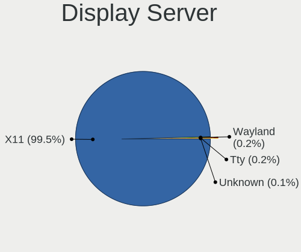

| Name    | Notebooks | Percent |
|---------|-----------|---------|
| X11     | 1705      | 99.71%  |
| Wayland | 4         | 0.23%   |
| Unknown | 1         | 0.06%   |

Display Manager
---------------

SDDM, LightDM, etc.

| Name    | Notebooks | Percent |
|---------|-----------|---------|
| SDDM    | 1703      | 99.47%  |
| Unknown | 8         | 0.47%   |
| LightDM | 1         | 0.06%   |

OS Lang
-------

Language

| Lang    | Notebooks | Percent |
|---------|-----------|---------|
| Unknown | 1707      | 99.77%  |
| hu_HU   | 4         | 0.23%   |

Boot Mode
---------

EFI or BIOS

| Mode | Notebooks | Percent |
|------|-----------|---------|
| BIOS | 1184      | 65.92%  |
| EFI  | 612       | 34.08%  |

Filesystem
----------

Type of filesystem

| Type    | Notebooks | Percent |
|---------|-----------|---------|
| Overlay | 1133      | 58.49%  |
| Ext4    | 788       | 40.68%  |
| Unknown | 6         | 0.31%   |
| Ext2    | 3         | 0.15%   |
| Btrfs   | 3         | 0.15%   |
| Ext3    | 2         | 0.1%    |
| Xfs     | 1         | 0.05%   |
| Ntfs    | 1         | 0.05%   |

Part. scheme
------------

Scheme of partitioning

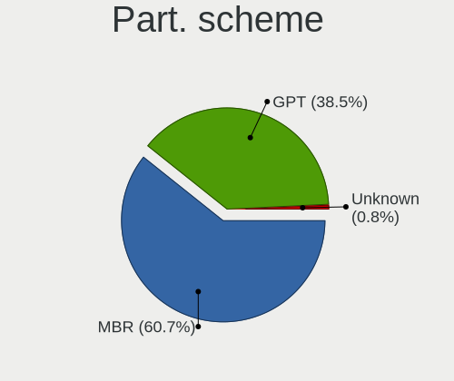

| Type    | Notebooks | Percent |
|---------|-----------|---------|
| MBR     | 1137      | 62.99%  |
| GPT     | 653       | 36.18%  |
| Unknown | 15        | 0.83%   |

Dual Boot with Linux/BSD
------------------------

Hosting more than one Linux/BSD

| Dual boot | Notebooks | Percent |
|-----------|-----------|---------|
| No        | 1225      | 64.64%  |
| Yes       | 670       | 35.36%  |

Dual Boot (Win)
---------------

Hosting Linux and Windows

| Dual boot | Notebooks | Percent |
|-----------|-----------|---------|
| No        | 969       | 52.35%  |
| Yes       | 882       | 47.65%  |

Board
-----

Vendor
------

Motherboard manufacturer

| Name                           | Notebooks | Percent |
|--------------------------------|-----------|---------|
| Hewlett-Packard                | 361       | 21.14%  |
| Lenovo                         | 306       | 17.92%  |
| Dell                           | 253       | 14.81%  |
| ASUSTek Computer               | 227       | 13.29%  |
| Acer                           | 196       | 11.48%  |
| Toshiba                        | 80        | 4.68%   |
| Samsung Electronics            | 39        | 2.28%   |
| Fujitsu                        | 31        | 1.81%   |
| Packard Bell                   | 26        | 1.52%   |
| Fujitsu Siemens                | 26        | 1.52%   |
| Sony                           | 23        | 1.35%   |
| MSI                            | 23        | 1.35%   |
| eMachines                      | 19        | 1.11%   |
| Apple                          | 16        | 0.94%   |
| Medion                         | 15        | 0.88%   |
| Alcor                          | 6         | 0.35%   |
| Hungaro Flotta Kft             | 5         | 0.29%   |
| Gateway                        | 5         | 0.29%   |
| BANGHO                         | 4         | 0.23%   |
| Unknown                        | 4         | 0.23%   |
| Insyde                         | 3         | 0.18%   |
| speedmaster                    | 2         | 0.12%   |
| Positivo                       | 2         | 0.12%   |
| Panasonic                      | 2         | 0.12%   |
| Notebook                       | 2         | 0.12%   |
| Jumper                         | 2         | 0.12%   |
| Intel                          | 2         | 0.12%   |
| Gigabyte Technology            | 2         | 0.12%   |
| Alienware                      | 2         | 0.12%   |
| TUXEDO                         | 1         | 0.06%   |
| Timi                           | 1         | 0.06%   |
| THD                            | 1         | 0.06%   |
| RM                             | 1         | 0.06%   |
| Philco                         | 1         | 0.06%   |
| Pegatron                       | 1         | 0.06%   |
| ONE-NETBOOK TECHNOLOGY         | 1         | 0.06%   |
| NOBLEX                         | 1         | 0.06%   |
| NEC Computers                  | 1         | 0.06%   |
| Minix                          | 1         | 0.06%   |
| Matsushita Electric Industrial | 1         | 0.06%   |

Model
-----

Motherboard model

| Name                                 | Notebooks | Percent |
|--------------------------------------|-----------|---------|
| HP 250 G1                            | 40        | 2.34%   |
| Dell Latitude E6410                  | 20        | 1.17%   |
| HP Notebook                          | 15        | 0.88%   |
| Unknown                              | 14        | 0.82%   |
| Lenovo IdeaPad 330-15IKB 81DE        | 11        | 0.64%   |
| Lenovo G50-45 80E3                   | 10        | 0.59%   |
| Toshiba Satellite C660               | 9         | 0.53%   |
| Lenovo IdeaPad 100-15IBD 80QQ        | 9         | 0.53%   |
| HP Pavilion g6                       | 9         | 0.53%   |
| HP 650                               | 9         | 0.53%   |
| ASUS X550CC                          | 8         | 0.47%   |
| ASUS K50IJ                           | 8         | 0.47%   |
| HP Pavilion Notebook                 | 7         | 0.41%   |
| HP 620                               | 7         | 0.41%   |
| HP 250 G5 Notebook PC                | 7         | 0.41%   |
| Dell Latitude E6430                  | 7         | 0.41%   |
| Dell Latitude E6400                  | 7         | 0.41%   |
| ASUS VivoBook 15_ASUS Laptop X540UBR | 7         | 0.41%   |
| HP Pavilion dv6                      | 6         | 0.35%   |
| HP EliteBook 8470p                   | 6         | 0.35%   |
| HP EliteBook 8460p                   | 6         | 0.35%   |
| Dell Latitude E6420                  | 6         | 0.35%   |
| Dell Latitude E4310                  | 6         | 0.35%   |
| ASUS VivoBook 15_ASUS Laptop X540UAR | 6         | 0.35%   |
| Acer Aspire 5732Z                    | 6         | 0.35%   |
| Toshiba Satellite L300               | 5         | 0.29%   |
| Lenovo Z50-75 80EC                   | 5         | 0.29%   |
| Lenovo G550 20023                    | 5         | 0.29%   |
| Lenovo G505s 20255                   | 5         | 0.29%   |
| Lenovo G50-30 80G0                   | 5         | 0.29%   |
| HP ProBook 6450b                     | 5         | 0.29%   |
| HP EliteBook 8440p                   | 5         | 0.29%   |
| HP EliteBook 6930p                   | 5         | 0.29%   |
| HP 15                                | 5         | 0.29%   |
| eMachines E725                       | 5         | 0.29%   |
| eMachines E525                       | 5         | 0.29%   |
| Dell Latitude E7240                  | 5         | 0.29%   |
| Dell Latitude E5420                  | 5         | 0.29%   |
| Dell Latitude D630                   | 5         | 0.29%   |
| Dell Inspiron 7737                   | 5         | 0.29%   |

Model Family
------------

Motherboard model prefix

| Name                     | Notebooks | Percent |
|--------------------------|-----------|---------|
| Acer Aspire              | 151       | 8.84%   |
| Dell Latitude            | 125       | 7.32%   |
| Lenovo ThinkPad          | 111       | 6.5%    |
| Dell Inspiron            | 92        | 5.39%   |
| Lenovo IdeaPad           | 87        | 5.09%   |
| Toshiba Satellite        | 72        | 4.22%   |
| HP EliteBook             | 58        | 3.4%    |
| HP 250                   | 54        | 3.16%   |
| HP ProBook               | 51        | 2.99%   |
| HP Pavilion              | 49        | 2.87%   |
| HP Compaq                | 38        | 2.22%   |
| ASUS VivoBook            | 29        | 1.7%    |
| Packard Bell EasyNote    | 25        | 1.46%   |
| Fujitsu LIFEBOOK         | 24        | 1.41%   |
| Fujitsu Siemens AMILO    | 18        | 1.05%   |
| Acer TravelMate          | 17        | 1%      |
| HP Notebook              | 15        | 0.88%   |
| HP Laptop                | 15        | 0.88%   |
| Unknown                  | 14        | 0.82%   |
| Lenovo G50-45            | 10        | 0.59%   |
| Dell Vostro              | 10        | 0.59%   |
| Dell Precision           | 10        | 0.59%   |
| Lenovo 3000              | 9         | 0.53%   |
| HP 650                   | 9         | 0.53%   |
| HP Presario              | 8         | 0.47%   |
| ASUS X550CC              | 8         | 0.47%   |
| ASUS K50IJ               | 8         | 0.47%   |
| HP 620                   | 7         | 0.41%   |
| HP 255                   | 7         | 0.41%   |
| HP 15                    | 6         | 0.35%   |
| Acer Extensa             | 6         | 0.35%   |
| Lenovo Z50-75            | 5         | 0.29%   |
| Lenovo G580              | 5         | 0.29%   |
| Lenovo G550              | 5         | 0.29%   |
| Lenovo G505s             | 5         | 0.29%   |
| Lenovo G50-30            | 5         | 0.29%   |
| Hungaro Flotta Kft Navon | 5         | 0.29%   |
| Fujitsu Siemens LIFEBOOK | 5         | 0.29%   |
| eMachines E725           | 5         | 0.29%   |
| eMachines E525           | 5         | 0.29%   |

MFG Year
--------

Motherboard manufacture year

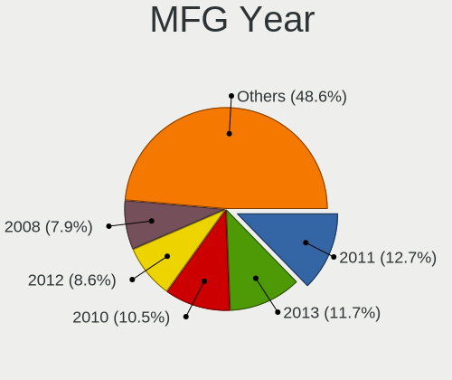

| Year    | Notebooks | Percent |
|---------|-----------|---------|
| 2011    | 218       | 12.76%  |
| 2013    | 191       | 11.18%  |
| 2010    | 184       | 10.77%  |
| 2012    | 150       | 8.78%   |
| 2008    | 140       | 8.2%    |
| 2014    | 128       | 7.49%   |
| 2009    | 119       | 6.97%   |
| 2015    | 103       | 6.03%   |
| 2016    | 101       | 5.91%   |
| 2007    | 91        | 5.33%   |
| 2018    | 85        | 4.98%   |
| 2017    | 81        | 4.74%   |
| 2019    | 42        | 2.46%   |
| 2006    | 39        | 2.28%   |
| 2020    | 20        | 1.17%   |
| 2005    | 9         | 0.53%   |
| 2021    | 6         | 0.35%   |
| Unknown | 1         | 0.06%   |

Form Factor
-----------

Physical design of the computer

| Name     | Notebooks | Percent |
|----------|-----------|---------|
| Notebook | 1708      | 100%    |

Secure Boot
-----------

Enabled or disabled

| State    | Notebooks | Percent |
|----------|-----------|---------|
| Disabled | 1708      | 100%    |

Coreboot
--------

Have coreboot on board

| Used | Notebooks | Percent |
|------|-----------|---------|
| No   | 1707      | 99.94%  |
| Yes  | 1         | 0.06%   |

RAM Size
--------

Total RAM memory

| Size in GB | Notebooks | Percent |
|------------|-----------|---------|
| 3.01-4.0   | 714       | 40.55%  |
| 4.01-8.0   | 372       | 21.12%  |
| 1.01-2.0   | 240       | 13.63%  |
| 8.01-16.0  | 227       | 12.89%  |
| 2.01-3.0   | 86        | 4.88%   |
| 16.01-24.0 | 71        | 4.03%   |
| 0.51-1.0   | 35        | 1.99%   |
| 24.01-32.0 | 8         | 0.45%   |
| 32.01-64.0 | 7         | 0.4%    |
| Unknown    | 1         | 0.06%   |

RAM Used
--------

Used RAM memory

| Used GB   | Notebooks | Percent |
|-----------|-----------|---------|
| 0.51-1.0  | 1058      | 52.27%  |
| 1.01-2.0  | 609       | 30.09%  |
| 0.01-0.5  | 267       | 13.19%  |
| 2.01-3.0  | 55        | 2.72%   |
| 3.01-4.0  | 20        | 0.99%   |
| 4.01-8.0  | 12        | 0.59%   |
| 8.01-16.0 | 2         | 0.1%    |
| Unknown   | 1         | 0.05%   |

Total Drives
------------

Number of drives on board

| Drives | Notebooks | Percent |
|--------|-----------|---------|
| 1      | 1448      | 80.62%  |
| 2      | 293       | 16.31%  |
| 3      | 35        | 1.95%   |
| 0      | 16        | 0.89%   |
| 4      | 3         | 0.17%   |
| 5      | 1         | 0.06%   |

Has CD-ROM
----------

Has CD-ROM on board

| Presented | Notebooks | Percent |
|-----------|-----------|---------|
| Yes       | 1143      | 66.11%  |
| No        | 586       | 33.89%  |

Has Ethernet
------------

Has Ethernet on board

| Presented | Notebooks | Percent |
|-----------|-----------|---------|
| Yes       | 1599      | 93.51%  |
| No        | 111       | 6.49%   |

Has WiFi
--------

Has WiFi module

| Presented | Notebooks | Percent |
|-----------|-----------|---------|
| Yes       | 1684      | 98.54%  |
| No        | 25        | 1.46%   |

Has Bluetooth
-------------

Has Bluetooth module

| Presented | Notebooks | Percent |
|-----------|-----------|---------|
| Yes       | 1200      | 69.01%  |
| No        | 539       | 30.99%  |

Location
--------

Country
-------

Geographic location (country)

| Country     | Notebooks | Percent |
|-------------|-----------|---------|
| Hungary     | 1212      | 70.38%  |
| Germany     | 94        | 5.46%   |
| USA         | 74        | 4.3%    |
| Slovakia    | 35        | 2.03%   |
| Romania     | 31        | 1.8%    |
| UK          | 30        | 1.74%   |
| Austria     | 23        | 1.34%   |
| Italy       | 20        | 1.16%   |
| France      | 20        | 1.16%   |
| Argentina   | 17        | 0.99%   |
| Spain       | 16        | 0.93%   |
| Canada      | 16        | 0.93%   |
| Japan       | 11        | 0.64%   |
| Brazil      | 11        | 0.64%   |
| Serbia      | 10        | 0.58%   |
| Poland      | 7         | 0.41%   |
| Russia      | 6         | 0.35%   |
| Australia   | 6         | 0.35%   |
| Switzerland | 5         | 0.29%   |
| Belgium     | 5         | 0.29%   |
| Sweden      | 4         | 0.23%   |
| Ireland     | 4         | 0.23%   |
| Greece      | 4         | 0.23%   |
| Netherlands | 3         | 0.17%   |
| India       | 3         | 0.17%   |
| Finland     | 3         | 0.17%   |
| Czechia     | 3         | 0.17%   |
| China       | 3         | 0.17%   |
| UAE         | 2         | 0.12%   |
| Turkey      | 2         | 0.12%   |
| Puerto Rico | 2         | 0.12%   |
| Philippines | 2         | 0.12%   |
| Moldova     | 2         | 0.12%   |
| Mexico      | 2         | 0.12%   |
| Madagascar  | 2         | 0.12%   |
| Israel      | 2         | 0.12%   |
| Indonesia   | 2         | 0.12%   |
| Ghana       | 2         | 0.12%   |
| Ecuador     | 2         | 0.12%   |
| Cyprus      | 2         | 0.12%   |

City
----

Geographic location (city)

| City              | Notebooks | Percent |
|-------------------|-----------|---------|
| Budapest          | 463       | 22.18%  |
| Pcs             | 30        | 1.44%   |
| Miskolc           | 30        | 1.44%   |
| Tatabnya        | 29        | 1.39%   |
| Gyr             | 29        | 1.39%   |
| Debrecen          | 29        | 1.39%   |
| Veszprm         | 23        | 1.1%    |
| Szkesfehrvr | 23        | 1.1%    |
| Szeged            | 23        | 1.1%    |
| Zalaegerszeg      | 22        | 1.05%   |
| Nyiregyhaza       | 20        | 0.96%   |
| Szolnok           | 17        | 0.81%   |
| Szombathely       | 16        | 0.77%   |
| Vienna            | 15        | 0.72%   |
| Salgotarjan       | 14        | 0.67%   |
| Toekoel           | 13        | 0.62%   |
| Szorgalmatos      | 12        | 0.57%   |
| Szekszrd        | 12        | 0.57%   |
| Kecskemt        | 12        | 0.57%   |
| rd              | 12        | 0.57%   |
| Szigetszentmiklos | 11        | 0.53%   |
| Regensburg        | 11        | 0.53%   |
| Bratislava        | 11        | 0.53%   |
| Trgu Mure     | 10        | 0.48%   |
| Kiskunfelegyhaza  | 10        | 0.48%   |
| Kazincbarcika     | 10        | 0.48%   |
| Karcag            | 10        | 0.48%   |
| Kaposvr         | 10        | 0.48%   |
| Dunajvros     | 10        | 0.48%   |
| Cegled            | 9         | 0.43%   |
| Bansk Bystrica  | 9         | 0.43%   |
| Ajka              | 9         | 0.43%   |
| Tiszaujvaros      | 8         | 0.38%   |
| Sopron            | 8         | 0.38%   |
| Pomaz             | 8         | 0.38%   |
| Obertraubling     | 8         | 0.38%   |
| Nagykanizsa       | 8         | 0.38%   |
| Tarnok            | 7         | 0.34%   |
| Hatvan            | 7         | 0.34%   |
| Gyomro            | 7         | 0.34%   |

Drives
------

Drive Vendor
------------

Hard drive vendors

| Vendor              | Notebooks | Drives | Percent |
|---------------------|-----------|--------|---------|
| Seagate             | 351       | 541    | 16.49%  |
| WDC                 | 306       | 453    | 14.37%  |
| Toshiba             | 233       | 354    | 10.94%  |
| Kingston            | 218       | 341    | 10.24%  |
| Samsung Electronics | 167       | 296    | 7.84%   |
| Hitachi             | 147       | 205    | 6.9%    |
| HGST                | 147       | 212    | 6.9%    |
| Unknown             | 75        | 118    | 3.52%   |
| SanDisk             | 71        | 135    | 3.33%   |
| Fujitsu             | 45        | 55     | 2.11%   |
| Intel               | 34        | 53     | 1.6%    |
| A-DATA Technology   | 34        | 48     | 1.6%    |
| Crucial             | 32        | 45     | 1.5%    |
| SK hynix            | 27        | 38     | 1.27%   |
| Micron Technology   | 17        | 35     | 0.8%    |
| Intenso             | 17        | 36     | 0.8%    |
| Apacer              | 17        | 26     | 0.8%    |
| PNY                 | 15        | 19     | 0.7%    |
| SPCC                | 14        | 18     | 0.66%   |
| JMicron Technology  | 14        | 15     | 0.66%   |
| Patriot             | 13        | 18     | 0.61%   |
| LITEON              | 12        | 16     | 0.56%   |
| China               | 12        | 23     | 0.56%   |
| LITEONIT            | 8         | 14     | 0.38%   |
| Transcend           | 7         | 7      | 0.33%   |
| Kingmax             | 7         | 7      | 0.33%   |
| OCZ                 | 6         | 7      | 0.28%   |
| Gigabyte Technology | 6         | 9      | 0.28%   |
| Team                | 4         | 8      | 0.19%   |
| KingSpec            | 4         | 5      | 0.19%   |
| BHT                 | 4         | 4      | 0.19%   |
| Apple               | 4         | 7      | 0.19%   |
| Verbatim            | 3         | 6      | 0.14%   |
| SSSTC               | 3         | 10     | 0.14%   |
| Netac               | 3         | 3      | 0.14%   |
| Hewlett-Packard     | 3         | 3      | 0.14%   |
| GOODRAM             | 3         | 3      | 0.14%   |
| Unknown             | 3         | 4      | 0.14%   |
| ShanDianZhe         | 2         | 2      | 0.09%   |
| Plextor             | 2         | 3      | 0.09%   |

Drive Model
-----------

Hard drive models

| Model                              | Notebooks | Percent |
|------------------------------------|-----------|---------|
| Kingston SA400S37240G 240GB SSD    | 52        | 2.35%   |
| Kingston SA400S37120G 120GB SSD    | 51        | 2.31%   |
| Seagate ST1000LM035-1RK172 1TB     | 47        | 2.12%   |
| Toshiba MQ01ABD100 1TB             | 39        | 1.76%   |
| Toshiba MQ01ABF050 500GB           | 37        | 1.67%   |
| Seagate ST500LT012-1DG142 500GB    | 36        | 1.63%   |
| HGST HTS545050A7E680 500GB         | 35        | 1.58%   |
| Seagate ST1000LM024 HN-M101MBB 1TB | 34        | 1.54%   |
| HGST HTS545032A7E380 320GB         | 33        | 1.49%   |
| Kingston SV300S37A120G 120GB SSD   | 26        | 1.18%   |
| Kingston SA400S37480G 480GB SSD    | 23        | 1.04%   |
| Seagate ST9320325AS 320GB          | 21        | 0.95%   |
| Seagate ST9500325AS 500GB          | 19        | 0.86%   |
| WDC WD10JPVX-22JC3T0 1TB           | 18        | 0.81%   |
| Toshiba MQ04ABF100 1TB             | 18        | 0.81%   |
| Seagate ST9250315AS 250GB          | 14        | 0.63%   |
| HGST HTS721010A9E630 1TB           | 14        | 0.63%   |
| Kingston SUV400S37120G 120GB SSD   | 13        | 0.59%   |
| HGST HTS725050A7E630 500GB         | 13        | 0.59%   |
| HGST HTS541010A9E680 1TB           | 13        | 0.59%   |
| Seagate ST500LT012-9WS142 500GB    | 12        | 0.54%   |
| HGST HTS545050A7E380 500GB         | 12        | 0.54%   |
| Toshiba MQ01ABD050 500GB           | 11        | 0.5%    |
| Seagate ST500LM000-1EJ162 500GB    | 11        | 0.5%    |
| Seagate M3 Portable 1TB            | 11        | 0.5%    |
| Samsung SSD 860 EVO 500GB          | 11        | 0.5%    |
| WDC WD5000LPCX-24VHAT0 500GB       | 10        | 0.45%   |
| WDC WD1600BEVT-22ZCT0 160GB        | 10        | 0.45%   |
| Samsung SSD 850 EVO 250GB          | 10        | 0.45%   |
| Samsung HM160HI 160GB              | 10        | 0.45%   |
| WDC WD5000LPVX-22V0TT0 500GB       | 9         | 0.41%   |
| Toshiba MQ01ABD075 752GB           | 9         | 0.41%   |
| Hitachi HTS723232A7A364 320GB      | 9         | 0.41%   |
| Hitachi HTS543232A7A384 320GB      | 9         | 0.41%   |
| WDC WD3200BEVT-22ZCT0 320GB        | 8         | 0.36%   |
| WDC WD2500BEVS-22UST0 250GB        | 8         | 0.36%   |
| WDC WD10JPVX-60JC3T0 1TB           | 8         | 0.36%   |
| Kingston SA400S37960G 960GB SSD    | 8         | 0.36%   |
| Hitachi HTS547550A9E384 500GB      | 8         | 0.36%   |
| Hitachi HTS545025B9A300 250GB      | 8         | 0.36%   |

HDD Vendor
----------

Hard disk drive vendors

| Vendor              | Notebooks | Drives | Percent |
|---------------------|-----------|--------|---------|
| Seagate             | 340       | 525    | 28.01%  |
| WDC                 | 279       | 407    | 22.98%  |
| Toshiba             | 212       | 307    | 17.46%  |
| Hitachi             | 147       | 205    | 12.11%  |
| HGST                | 147       | 212    | 12.11%  |
| Fujitsu             | 45        | 55     | 3.71%   |
| Samsung Electronics | 32        | 44     | 2.64%   |
| Unknown             | 3         | 5      | 0.25%   |
| IBM/Hitachi         | 2         | 3      | 0.16%   |
| QC-FT-D             | 1         | 1      | 0.08%   |
| MARSHAL             | 1         | 2      | 0.08%   |
| JMicron Technology  | 1         | 1      | 0.08%   |
| Initio              | 1         | 2      | 0.08%   |
| IB-1122             | 1         | 1      | 0.08%   |
| HGST HTS            | 1         | 6      | 0.08%   |
| CSD                 | 1         | 2      | 0.08%   |

SSD Vendor
----------

Solid state drive vendors

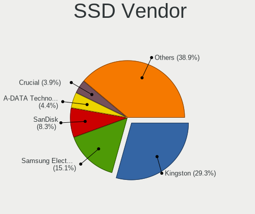

| Vendor              | Notebooks | Drives | Percent |
|---------------------|-----------|--------|---------|
| Kingston            | 211       | 327    | 28.67%  |
| Samsung Electronics | 109       | 187    | 14.81%  |
| SanDisk             | 61        | 118    | 8.29%   |
| Crucial             | 32        | 45     | 4.35%   |
| A-DATA Technology   | 32        | 46     | 4.35%   |
| Intel               | 27        | 43     | 3.67%   |
| WDC                 | 26        | 38     | 3.53%   |
| SK hynix            | 23        | 31     | 3.13%   |
| Intenso             | 17        | 36     | 2.31%   |
| PNY                 | 15        | 19     | 2.04%   |
| Micron Technology   | 15        | 28     | 2.04%   |
| Apacer              | 15        | 24     | 2.04%   |
| SPCC                | 13        | 17     | 1.77%   |
| Patriot             | 13        | 18     | 1.77%   |
| China               | 12        | 23     | 1.63%   |
| Toshiba             | 11        | 27     | 1.49%   |
| LITEON              | 11        | 15     | 1.49%   |
| LITEONIT            | 8         | 14     | 1.09%   |
| Transcend           | 7         | 7      | 0.95%   |
| Kingmax             | 7         | 7      | 0.95%   |
| JMicron Technology  | 7         | 7      | 0.95%   |
| OCZ                 | 6         | 7      | 0.82%   |
| Gigabyte Technology | 6         | 9      | 0.82%   |
| Team                | 4         | 8      | 0.54%   |
| KingSpec            | 4         | 5      | 0.54%   |
| BHT                 | 4         | 4      | 0.54%   |
| Apple               | 4         | 7      | 0.54%   |
| Verbatim            | 3         | 6      | 0.41%   |
| Netac               | 3         | 3      | 0.41%   |
| GOODRAM             | 3         | 3      | 0.41%   |
| ShanDianZhe         | 2         | 2      | 0.27%   |
| HS-SSD-C100         | 2         | 2      | 0.27%   |
| Hewlett-Packard     | 2         | 3      | 0.27%   |
| Corsair             | 2         | 3      | 0.27%   |
| Zheino              | 1         | 1      | 0.14%   |
| Unknown             | 1         | 3      | 0.14%   |
| Union Memory        | 1         | 5      | 0.14%   |
| Timetec             | 1         | 5      | 0.14%   |
| TCSUNBOW            | 1         | 1      | 0.14%   |
| T-FORCE             | 1         | 1      | 0.14%   |

Drive Kind
----------

HDD or SSD

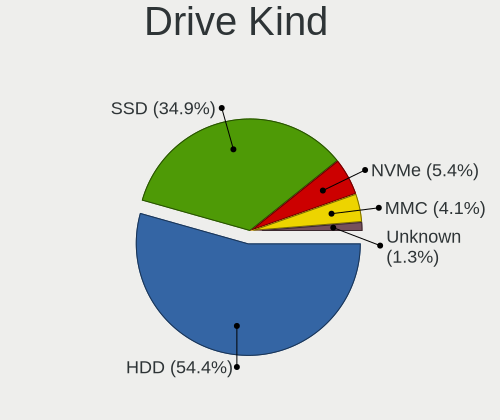

| Kind    | Notebooks | Drives | Percent |
|---------|-----------|--------|---------|
| HDD     | 1148      | 1778   | 57.23%  |
| SSD     | 674       | 1175   | 33.6%   |
| MMC     | 87        | 135    | 4.34%   |
| NVMe    | 70        | 152    | 3.49%   |
| Unknown | 27        | 30     | 1.35%   |

Drive Connector
---------------

SATA, SAS, NVMe, etc.

| Type | Notebooks | Drives | Percent |
|------|-----------|--------|---------|
| SATA | 1624      | 2887   | 87.83%  |
| MMC  | 87        | 135    | 4.71%   |
| NVMe | 70        | 152    | 3.79%   |
| SAS  | 68        | 96     | 3.68%   |

Drive Size
----------

Size of hard drive

| Size in TB | Notebooks | Drives | Percent |
|------------|-----------|--------|---------|
| 0.01-0.5   | 1384      | 2336   | 78.95%  |
| 0.51-1.0   | 345       | 575    | 19.68%  |
| 1.01-2.0   | 21        | 39     | 1.2%    |
| 4.01-10.0  | 3         | 3      | 0.17%   |

Space Total
-----------

Amount of disk space available on the file system

| Size in GB     | Notebooks | Percent |
|----------------|-----------|---------|
| Unknown        | 1077      | 52.46%  |
| 101-250        | 376       | 18.31%  |
| 251-500        | 227       | 11.06%  |
| 51-100         | 135       | 6.58%   |
| 501-1000       | 86        | 4.19%   |
| 21-50          | 82        | 3.99%   |
| 1-20           | 27        | 1.32%   |
| 1001-2000      | 26        | 1.27%   |
| 2001-3000      | 15        | 0.73%   |
| More than 3000 | 1         | 0.05%   |
| 0              | 1         | 0.05%   |

Space Used
----------

Amount of used disk space

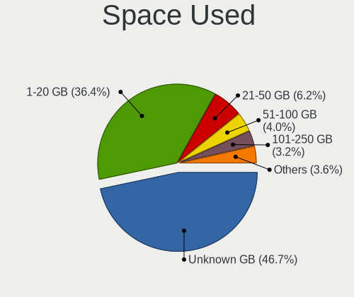

| Used GB   | Notebooks | Percent |
|-----------|-----------|---------|
| Unknown   | 1077      | 52.08%  |
| 1-20      | 722       | 34.91%  |
| 21-50     | 89        | 4.3%    |
| 51-100    | 67        | 3.24%   |
| 101-250   | 54        | 2.61%   |
| 251-500   | 28        | 1.35%   |
| 1001-2000 | 15        | 0.73%   |
| 501-1000  | 13        | 0.63%   |
| 2001-3000 | 2         | 0.1%    |
| 0         | 1         | 0.05%   |

Malfunc. Drives
---------------

Drive models with a malfunction

| Model                                   | Notebooks | Drives | Percent |
|-----------------------------------------|-----------|--------|---------|
| HGST HTS545032A7E380 320GB              | 32        | 48     | 5.2%    |
| HGST HTS545050A7E680 500GB              | 25        | 34     | 4.07%   |
| Seagate ST500LT012-1DG142 500GB         | 15        | 22     | 2.44%   |
| Seagate ST1000LM024 HN-M101MBB 1TB      | 12        | 16     | 1.95%   |
| Toshiba MQ01ABF050 500GB                | 11        | 32     | 1.79%   |
| Toshiba MQ01ABD100 1TB                  | 11        | 12     | 1.79%   |
| Seagate ST9500325AS 500GB               | 11        | 17     | 1.79%   |
| Seagate ST9320325AS 320GB               | 11        | 22     | 1.79%   |
| Seagate ST500LT012-9WS142 500GB         | 10        | 13     | 1.63%   |
| Seagate ST9250315AS 250GB               | 9         | 11     | 1.46%   |
| Samsung Electronics HM160HI 160GB       | 9         | 14     | 1.46%   |
| HGST HTS541010A9E680 1TB                | 9         | 19     | 1.46%   |
| Hitachi HTS723232A7A364 320GB           | 8         | 8      | 1.3%    |
| HGST HTS545050A7E380 500GB              | 8         | 12     | 1.3%    |
| Seagate ST1000LM035-1RK172 1TB          | 7         | 8      | 1.14%   |
| Kingston SV300S37A120G 120GB SSD        | 7         | 10     | 1.14%   |
| WDC WD10JPVX-22JC3T0 1TB                | 6         | 9      | 0.98%   |
| Seagate ST9320423AS 320GB               | 6         | 6      | 0.98%   |
| Hitachi HTS547550A9E384 500GB           | 6         | 18     | 0.98%   |
| Hitachi HTS543232A7A384 320GB           | 6         | 8      | 0.98%   |
| HGST HTS725050A7E630 500GB              | 6         | 6      | 0.98%   |
| Toshiba MQ01ABD050 500GB                | 5         | 5      | 0.81%   |
| Seagate ST9500420AS 500GB               | 5         | 8      | 0.81%   |
| Hitachi HTS725025A9A364 250GB           | 5         | 6      | 0.81%   |
| Hitachi HTS545050B9A300 500GB           | 5         | 7      | 0.81%   |
| Hitachi HTS545050A7E380 500GB           | 5         | 7      | 0.81%   |
| Hitachi HTS545016B9A300 160GB           | 5         | 5      | 0.81%   |
| Hitachi HTS541680J9SA00 80GB            | 5         | 5      | 0.81%   |
| WDC WD2500BEKT-75PVMT0 250GB            | 4         | 5      | 0.65%   |
| Seagate ST980811AS 80GB                 | 4         | 5      | 0.65%   |
| Seagate ST500LM012 HN-M500MBB 500GB     | 4         | 5      | 0.65%   |
| Seagate ST500LM000-1EJ162 500GB         | 4         | 6      | 0.65%   |
| Seagate ST320LT007-9ZV142 320GB         | 4         | 4      | 0.65%   |
| Samsung Electronics HM321HI 320GB       | 4         | 6      | 0.65%   |
| Hitachi HTS545032B9A300 320GB           | 4         | 5      | 0.65%   |
| Hitachi HTS545025B9A300 250GB           | 4         | 9      | 0.65%   |
| Hitachi HTS542516K9SA00 160GB           | 4         | 4      | 0.65%   |
| Toshiba MQ01ABD075 752GB                | 3         | 5      | 0.49%   |
| Toshiba MK2035GSS 200GB                 | 3         | 3      | 0.49%   |
| Toshiba KSG60ZMV256G M.2 2280 256GB SSD | 3         | 6      | 0.49%   |

Malfunc. Drive Vendor
---------------------

Vendors of faulty drives

| Vendor              | Notebooks | Drives | Percent |
|---------------------|-----------|--------|---------|
| Seagate             | 148       | 219    | 24.26%  |
| Hitachi             | 99        | 139    | 16.23%  |
| Toshiba             | 95        | 138    | 15.57%  |
| HGST                | 87        | 130    | 14.26%  |
| WDC                 | 79        | 110    | 12.95%  |
| Samsung Electronics | 25        | 42     | 4.1%    |
| Kingston            | 18        | 28     | 2.95%   |
| Fujitsu             | 18        | 25     | 2.95%   |
| Intel               | 10        | 20     | 1.64%   |
| SK hynix            | 6         | 7      | 0.98%   |
| SanDisk             | 3         | 4      | 0.49%   |
| A-DATA Technology   | 3         | 3      | 0.49%   |
| Intenso             | 2         | 2      | 0.33%   |
| Crucial             | 2         | 2      | 0.33%   |
| Apple               | 2         | 5      | 0.33%   |
| Timetec             | 1         | 3      | 0.16%   |
| SPCC                | 1         | 1      | 0.16%   |
| Netac               | 1         | 1      | 0.16%   |
| Micron Technology   | 1         | 1      | 0.16%   |
| MARSHAL             | 1         | 1      | 0.16%   |
| LITEONIT            | 1         | 2      | 0.16%   |
| Kingmax             | 1         | 1      | 0.16%   |
| JMicron Technology  | 1         | 1      | 0.16%   |
| Initio              | 1         | 2      | 0.16%   |
| IBM/Hitachi         | 1         | 1      | 0.16%   |
| CSD                 | 1         | 2      | 0.16%   |
| China               | 1         | 1      | 0.16%   |
| Apacer              | 1         | 2      | 0.16%   |

Malfunc. HDD Vendor
-------------------

Vendors of faulty HDD drives

| Vendor              | Notebooks | Drives | Percent |
|---------------------|-----------|--------|---------|
| Seagate             | 148       | 219    | 27.21%  |
| Hitachi             | 99        | 139    | 18.2%   |
| Toshiba             | 90        | 125    | 16.54%  |
| HGST                | 87        | 130    | 15.99%  |
| WDC                 | 77        | 108    | 14.15%  |
| Samsung Electronics | 21        | 30     | 3.86%   |
| Fujitsu             | 18        | 25     | 3.31%   |
| MARSHAL             | 1         | 1      | 0.18%   |
| Initio              | 1         | 2      | 0.18%   |
| IBM/Hitachi         | 1         | 1      | 0.18%   |
| CSD                 | 1         | 2      | 0.18%   |

Malfunc. Drive Kind
-------------------

Kinds of faulty drives

| Kind    | Notebooks | Drives | Percent |
|---------|-----------|--------|---------|
| HDD     | 527       | 782    | 88.87%  |
| SSD     | 63        | 107    | 10.62%  |
| NVMe    | 2         | 3      | 0.34%   |
| Unknown | 1         | 1      | 0.17%   |

Failed Drives
-------------

Failed drive models

| Model                              | Notebooks | Drives | Percent |
|------------------------------------|-----------|--------|---------|
| WDC WD5000BEVT-22ZAT0 500GB        | 2         | 2      | 9.09%   |
| Toshiba MQ01ABD100 1TB             | 2         | 2      | 9.09%   |
| Toshiba MK6475GSX 640GB            | 2         | 2      | 9.09%   |
| Seagate ST1000LM024 HN-M101MBB 1TB | 2         | 2      | 9.09%   |
| WDC WD5000BEVT-22A0RT0 500GB       | 1         | 7      | 4.55%   |
| WDC WD3200BVVT-63A26Y0 320GB       | 1         | 1      | 4.55%   |
| WDC WD3200BPVT-24JJ5T0 320GB       | 1         | 1      | 4.55%   |
| WDC WD3200BEVT-08A23T1 320GB       | 1         | 1      | 4.55%   |
| WDC WD2500LPCX-24C6HT0 250GB       | 1         | 1      | 4.55%   |
| WDC WD1600BEVT-22ZCT0 160GB        | 1         | 1      | 4.55%   |
| Toshiba MQ01ABD050V 500GB          | 1         | 1      | 4.55%   |
| Toshiba MK5055GSX 500GB            | 1         | 1      | 4.55%   |
| Toshiba MK3275GSX 320GB            | 1         | 1      | 4.55%   |
| Toshiba MK1665GSX 160GB            | 1         | 1      | 4.55%   |
| Toshiba MK1646GSX 160GB            | 1         | 1      | 4.55%   |
| Seagate ST9320325AS 320GB          | 1         | 1      | 4.55%   |
| Samsung Electronics HM060HI 64GB   | 1         | 1      | 4.55%   |
| Intel SSDPEKKW256G7 256GB          | 1         | 1      | 4.55%   |

Failed Drive Vendor
-------------------

Failed drive vendors

| Vendor              | Notebooks | Drives | Percent |
|---------------------|-----------|--------|---------|
| Toshiba             | 9         | 9      | 40.91%  |
| WDC                 | 8         | 14     | 36.36%  |
| Seagate             | 3         | 3      | 13.64%  |
| Samsung Electronics | 1         | 1      | 4.55%   |
| Intel               | 1         | 1      | 4.55%   |

Drive Status
------------

Number of failed and malfunc. drives

| Status   | Notebooks | Drives | Percent |
|----------|-----------|--------|---------|
| Works    | 1173      | 2108   | 60.75%  |
| Malfunc  | 585       | 893    | 30.3%   |
| Detected | 151       | 241    | 7.82%   |
| Failed   | 22        | 28     | 1.14%   |

Storage controller
------------------

Storage Vendor
--------------

Storage controller vendors

| Vendor                           | Notebooks | Percent |
|----------------------------------|-----------|---------|
| Intel                            | 1423      | 81.18%  |
| AMD                              | 228       | 13.01%  |
| Samsung Electronics              | 31        | 1.77%   |
| Nvidia                           | 17        | 0.97%   |
| SanDisk                          | 9         | 0.51%   |
| Toshiba America Info Systems     | 8         | 0.46%   |
| Kingston Technology Company      | 7         | 0.4%    |
| VIA Technologies                 | 6         | 0.34%   |
| JMicron Technology               | 4         | 0.23%   |
| Solid State Storage Technology   | 3         | 0.17%   |
| Phison Electronics               | 3         | 0.17%   |
| KIOXIA                           | 3         | 0.17%   |
| Silicon Integrated Systems [SiS] | 2         | 0.11%   |
| Micron Technology                | 2         | 0.11%   |
| Lite-On Technology               | 2         | 0.11%   |
| ADATA Technology                 | 2         | 0.11%   |
| Silicon Motion                   | 1         | 0.06%   |
| Silicon Image                    | 1         | 0.06%   |
| Realtek Semiconductor            | 1         | 0.06%   |

Storage Model
-------------

Storage controller models

| Model                                                                                  | Notebooks | Percent |
|----------------------------------------------------------------------------------------|-----------|---------|
| Intel 7 Series Chipset Family 6-port SATA Controller [AHCI mode]                       | 200       | 9.9%    |
| AMD FCH SATA Controller [AHCI mode]                                                    | 156       | 7.72%   |
| Intel 82801IBM/IEM (ICH9M/ICH9M-E) 4 port SATA Controller [AHCI mode]                  | 146       | 7.23%   |
| Intel 6 Series/C200 Series Chipset Family 6 port Mobile SATA AHCI Controller           | 133       | 6.58%   |
| Intel Sunrise Point-LP SATA Controller [AHCI mode]                                     | 114       | 5.64%   |
| Intel 82801HM/HEM (ICH8M/ICH8M-E) IDE Controller                                       | 91        | 4.5%    |
| Intel 82801 Mobile SATA Controller [RAID mode]                                         | 91        | 4.5%    |
| Intel 5 Series/3400 Series Chipset 4 port SATA AHCI Controller                         | 80        | 3.96%   |
| Intel 82801HM/HEM (ICH8M/ICH8M-E) SATA Controller [AHCI mode]                          | 76        | 3.76%   |
| Intel 8 Series SATA Controller 1 [AHCI mode]                                           | 76        | 3.76%   |
| Intel Wildcat Point-LP SATA Controller [AHCI Mode]                                     | 54        | 2.67%   |
| Intel 5 Series/3400 Series Chipset 6 port SATA AHCI Controller                         | 51        | 2.52%   |
| Intel Atom/Celeron/Pentium Processor x5-E8000/J3xxx/N3xxx Series SATA Controller       | 47        | 2.33%   |
| AMD SB7x0/SB8x0/SB9x0 SATA Controller [AHCI mode]                                      | 44        | 2.18%   |
| Intel 8 Series/C220 Series Chipset Family 6-port SATA Controller 1 [AHCI mode]         | 41        | 2.03%   |
| Intel Atom Processor E3800 Series SATA AHCI Controller                                 | 36        | 1.78%   |
| Intel 82801G (ICH7 Family) IDE Controller                                              | 34        | 1.68%   |
| Intel NM10/ICH7 Family SATA Controller [AHCI mode]                                     | 33        | 1.63%   |
| Intel 82801GBM/GHM (ICH7-M Family) SATA Controller [AHCI mode]                         | 31        | 1.53%   |
| Intel 82801GBM/GHM (ICH7-M Family) SATA Controller [IDE mode]                          | 30        | 1.49%   |
| Intel 82801IBM/IEM (ICH9M/ICH9M-E) 2 port SATA Controller [IDE mode]                   | 26        | 1.29%   |
| Intel Celeron N3350/Pentium N4200/Atom E3900 Series SATA AHCI Controller               | 21        | 1.04%   |
| Intel 82801HM/HEM (ICH8M/ICH8M-E) SATA Controller [IDE mode]                           | 21        | 1.04%   |
| Intel HM170/QM170 Chipset SATA Controller [AHCI Mode]                                  | 19        | 0.94%   |
| Intel 5 Series/3400 Series Chipset 4 port SATA IDE Controller                          | 19        | 0.94%   |
| Intel 5 Series/3400 Series Chipset 2 port SATA IDE Controller                          | 19        | 0.94%   |
| Intel Cannon Lake Mobile PCH SATA AHCI Controller                                      | 16        | 0.79%   |
| Intel Celeron/Pentium Silver Processor SATA Controller                                 | 15        | 0.74%   |
| Intel Mobile 4 Series Chipset PT IDER Controller                                       | 14        | 0.69%   |
| AMD SB7x0/SB8x0/SB9x0 IDE Controller                                                   | 14        | 0.69%   |
| Samsung NVMe SSD Controller SM981/PM981/PM983                                          | 13        | 0.64%   |
| Intel NM10/ICH7 Family SATA Controller [IDE mode]                                      | 12        | 0.59%   |
| Intel 7 Series Chipset Family 4-port SATA Controller [IDE mode]                        | 12        | 0.59%   |
| Intel 7 Series Chipset Family 2-port SATA Controller [IDE mode]                        | 12        | 0.59%   |
| AMD FCH SATA Controller [IDE mode]                                                     | 12        | 0.59%   |
| Nvidia MCP79 AHCI Controller                                                           | 11        | 0.54%   |
| Intel Mobile PM965/GM965 PT IDER Controller                                            | 10        | 0.5%    |
| Intel 6 Series/C200 Series Chipset Family Mobile SATA Controller (IDE mode, ports 0-3) | 9         | 0.45%   |
| Samsung NVMe SSD Controller 980                                                        | 8         | 0.4%    |
| Intel 6 Series/C200 Series Chipset Family Mobile SATA Controller (IDE mode, ports 4-5) | 8         | 0.4%    |

Storage Kind
------------

Kind of storage controller (IDE, SATA, NVMe, SAS, ...)

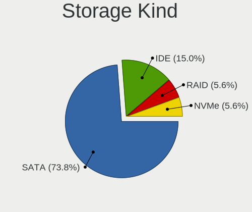

| Kind | Notebooks | Percent |
|------|-----------|---------|
| SATA | 1441      | 75.01%  |
| IDE  | 312       | 16.24%  |
| RAID | 98        | 5.1%    |
| NVMe | 70        | 3.64%   |

Processor
---------

CPU Vendor
----------

Processor vendors

| Vendor       | Notebooks | Percent |
|--------------|-----------|---------|
| Intel        | 1473      | 86.24%  |
| AMD          | 234       | 13.7%   |
| CentaurHauls | 1         | 0.06%   |

CPU Model
---------

Processor models

| Model                                       | Notebooks | Percent |
|---------------------------------------------|-----------|---------|
| Intel Celeron CPU 1000M @ 1.80GHz           | 41        | 2.39%   |
| Intel Core i5-2520M CPU @ 2.50GHz           | 39        | 2.28%   |
| Intel Core i5-7200U CPU @ 2.50GHz           | 25        | 1.46%   |
| Intel Core i5 CPU M 520 @ 2.40GHz           | 23        | 1.34%   |
| Intel Core i3-6006U CPU @ 2.00GHz           | 22        | 1.28%   |
| Intel Core i3-5005U CPU @ 2.00GHz           | 21        | 1.23%   |
| Intel Pentium Dual-Core CPU T4400 @ 2.20GHz | 20        | 1.17%   |
| Intel Celeron CPU N3060 @ 1.60GHz           | 20        | 1.17%   |
| Intel Core 2 Duo CPU P8600 @ 2.40GHz        | 19        | 1.11%   |
| Intel Core i5-8250U CPU @ 1.60GHz           | 18        | 1.05%   |
| Intel Core i5-5200U CPU @ 2.20GHz           | 17        | 0.99%   |
| Intel Core i5-3210M CPU @ 2.50GHz           | 17        | 0.99%   |
| Intel Core i3-7020U CPU @ 2.30GHz           | 17        | 0.99%   |
| Intel Atom CPU N455 @ 1.66GHz               | 17        | 0.99%   |
| Intel Core 2 Duo CPU T7500 @ 2.20GHz        | 16        | 0.93%   |
| Intel Core 2 Duo CPU P8400 @ 2.26GHz        | 16        | 0.93%   |
| Intel Celeron CPU N2840 @ 2.16GHz           | 16        | 0.93%   |
| Intel Atom CPU N450 @ 1.66GHz               | 15        | 0.88%   |
| Intel Core i5-4210U CPU @ 1.70GHz           | 14        | 0.82%   |
| Intel Core i3-3217U CPU @ 1.80GHz           | 14        | 0.82%   |
| Intel Core i3-2350M CPU @ 2.30GHz           | 14        | 0.82%   |
| Intel Core i3 CPU M 370 @ 2.40GHz           | 14        | 0.82%   |
| Intel Core i3 CPU M 350 @ 2.27GHz           | 14        | 0.82%   |
| Intel Celeron CPU N3350 @ 1.10GHz           | 14        | 0.82%   |
| Intel Core i5-3320M CPU @ 2.60GHz           | 13        | 0.76%   |
| Intel Core i5 CPU M 560 @ 2.67GHz           | 13        | 0.76%   |
| Intel Core i5 CPU M 540 @ 2.53GHz           | 13        | 0.76%   |
| Intel Core i3 CPU M 380 @ 2.53GHz           | 13        | 0.76%   |
| Intel Pentium CPU B960 @ 2.20GHz            | 12        | 0.7%    |
| Intel Core i5-3230M CPU @ 2.60GHz           | 12        | 0.7%    |
| Intel Core i3-2310M CPU @ 2.10GHz           | 12        | 0.7%    |
| Intel Core 2 Duo CPU P8700 @ 2.53GHz        | 12        | 0.7%    |
| Intel Core 2 CPU T5500 @ 1.66GHz            | 12        | 0.7%    |
| Intel Atom CPU N270 @ 1.60GHz               | 12        | 0.7%    |
| Intel Pentium Dual-Core CPU T4500 @ 2.30GHz | 11        | 0.64%   |
| Intel Core i5-6200U CPU @ 2.30GHz           | 11        | 0.64%   |
| Intel Atom x5-Z8350 CPU @ 1.44GHz           | 11        | 0.64%   |
| Intel Pentium Dual-Core CPU T4200 @ 2.00GHz | 10        | 0.58%   |
| Intel Pentium CPU N3710 @ 1.60GHz           | 10        | 0.58%   |
| Intel Pentium CPU 2117U @ 1.80GHz           | 10        | 0.58%   |

CPU Model Family
----------------

Processor model prefix

| Model                                | Notebooks | Percent |
|--------------------------------------|-----------|---------|
| Intel Core i5                        | 373       | 21.77%  |
| Intel Core i3                        | 224       | 13.08%  |
| Intel Celeron                        | 194       | 11.33%  |
| Intel Core 2 Duo                     | 183       | 10.68%  |
| Intel Core i7                        | 169       | 9.87%   |
| Intel Pentium                        | 93        | 5.43%   |
| Intel Atom                           | 74        | 4.32%   |
| Intel Pentium Dual-Core              | 50        | 2.92%   |
| AMD A4                               | 33        | 1.93%   |
| Intel Core 2                         | 31        | 1.81%   |
| AMD A8                               | 31        | 1.81%   |
| AMD A6                               | 26        | 1.52%   |
| Intel Pentium Dual                   | 23        | 1.34%   |
| AMD E                                | 19        | 1.11%   |
| AMD E1                               | 18        | 1.05%   |
| AMD E2                               | 16        | 0.93%   |
| Intel Genuine                        | 13        | 0.76%   |
| Other                                | 12        | 0.7%    |
| AMD Ryzen 5                          | 11        | 0.64%   |
| AMD A10                              | 11        | 0.64%   |
| Intel Celeron M                      | 10        | 0.58%   |
| Intel Celeron Dual-Core              | 10        | 0.58%   |
| Intel Pentium Silver                 | 8         | 0.47%   |
| Intel Pentium M                      | 7         | 0.41%   |
| Intel Core Duo                       | 7         | 0.41%   |
| AMD Turion 64 X2 Mobile              | 7         | 0.41%   |
| AMD C-60                             | 7         | 0.41%   |
| AMD Athlon II                        | 6         | 0.35%   |
| AMD FX                               | 5         | 0.29%   |
| AMD C-50                             | 4         | 0.23%   |
| AMD Athlon X2                        | 4         | 0.23%   |
| AMD Athlon II Dual-Core              | 4         | 0.23%   |
| AMD Mobile Sempron                   | 3         | 0.18%   |
| AMD A12                              | 3         | 0.18%   |
| AMD V140                             | 2         | 0.12%   |
| AMD Turion X2 Ultra Dual-Core Mobile | 2         | 0.12%   |
| AMD Turion 64 Mobile                 | 2         | 0.12%   |
| AMD Ryzen 3                          | 2         | 0.12%   |
| AMD C-70                             | 2         | 0.12%   |
| AMD Athlon 64 X2                     | 2         | 0.12%   |

CPU Cores
---------

Number of processor cores

| Number | Notebooks | Percent |
|--------|-----------|---------|
| 2      | 1296      | 75.57%  |
| 4      | 252       | 14.69%  |
| 1      | 146       | 8.51%   |
| 6      | 18        | 1.05%   |
| 8      | 3         | 0.17%   |

CPU Sockets
-----------

Number of sockets

| Number | Notebooks | Percent |
|--------|-----------|---------|
| 1      | 1708      | 100%    |

CPU Threads
-----------

Threads per core (Hyper-Threading)

| Number | Notebooks | Percent |
|--------|-----------|---------|
| 1      | 878       | 51.05%  |
| 2      | 842       | 48.95%  |

CPU Op-Modes
------------

CPU Operation Modes (32-bit, 64-bit)

| Op mode        | Notebooks | Percent |
|----------------|-----------|---------|
| 32-bit, 64-bit | 1661      | 97.13%  |
| 32-bit         | 44        | 2.57%   |
| Unknown        | 5         | 0.29%   |

CPU Microcode
-------------

Microcode number

| Number     | Notebooks | Percent |
|------------|-----------|---------|
| 0x206a7    | 188       | 10.69%  |
| 0x306a9    | 180       | 10.24%  |
| 0x1067a    | 143       | 8.13%   |
| 0x20655    | 111       | 6.31%   |
| Unknown    | 104       | 5.92%   |
| 0x40651    | 74        | 4.21%   |
| 0x6fd      | 68        | 3.87%   |
| 0x306d4    | 57        | 3.24%   |
| 0x306c3    | 47        | 2.67%   |
| 0x406c4    | 45        | 2.56%   |
| 0x10676    | 45        | 2.56%   |
| 0x406e3    | 43        | 2.45%   |
| 0x806e9    | 42        | 2.39%   |
| 0x20652    | 42        | 2.39%   |
| 0x106ca    | 41        | 2.33%   |
| 0x30678    | 34        | 1.93%   |
| 0x806ea    | 32        | 1.82%   |
| 0x05000119 | 32        | 1.82%   |
| 0x07030105 | 30        | 1.71%   |
| 0x6f6      | 20        | 1.14%   |
| 0x0700010f | 20        | 1.14%   |
| 0x406c3    | 19        | 1.08%   |
| 0x6fb      | 18        | 1.02%   |
| 0x506c9    | 17        | 0.97%   |
| 0x906ea    | 16        | 0.91%   |
| 0x106c2    | 16        | 0.91%   |
| 0x06006705 | 16        | 0.91%   |
| 0x706a1    | 14        | 0.8%    |
| 0x6f2      | 13        | 0.74%   |
| 0x506e3    | 13        | 0.74%   |
| 0x06001119 | 13        | 0.74%   |
| 0x10661    | 12        | 0.68%   |
| 0x906e9    | 11        | 0.63%   |
| 0x806ec    | 11        | 0.63%   |
| 0x6ec      | 10        | 0.57%   |
| 0x05000029 | 10        | 0.57%   |
| 0x06003106 | 9         | 0.51%   |
| 0x6d8      | 8         | 0.46%   |
| 0x07030104 | 8         | 0.46%   |
| 0x03000027 | 8         | 0.46%   |

CPU Microarch
-------------

Microarchitecture

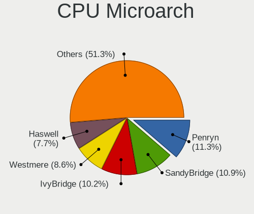

| Name            | Notebooks | Percent |
|-----------------|-----------|---------|
| Penryn          | 189       | 11.07%  |
| SandyBridge     | 188       | 11.01%  |
| IvyBridge       | 182       | 10.66%  |
| Westmere        | 155       | 9.07%   |
| Core            | 139       | 8.14%   |
| Haswell         | 128       | 7.49%   |
| KabyLake        | 125       | 7.32%   |
| Silvermont      | 106       | 6.21%   |
| Skylake         | 64        | 3.75%   |
| Broadwell       | 61        | 3.57%   |
| Bonnell         | 60        | 3.51%   |
| Bobcat          | 46        | 2.69%   |
| Puma            | 44        | 2.58%   |
| Excavator       | 32        | 1.87%   |
| P6              | 27        | 1.58%   |
| Jaguar          | 23        | 1.35%   |
| Goldmont        | 21        | 1.23%   |
| Piledriver      | 17        | 1%      |
| K8 Hammer       | 16        | 0.94%   |
| Goldmont plus   | 16        | 0.94%   |
| K10             | 15        | 0.88%   |
| Steamroller     | 11        | 0.64%   |
| K10 Llano       | 8         | 0.47%   |
| Zen             | 7         | 0.41%   |
| K8 & K10 hybrid | 7         | 0.41%   |
| TigerLake       | 5         | 0.29%   |
| Zen 2           | 4         | 0.23%   |
| CometLake       | 4         | 0.23%   |
| Zen+            | 3         | 0.18%   |
| Nehalem         | 3         | 0.18%   |
| Zen 3           | 1         | 0.06%   |
| Unknown         | 1         | 0.06%   |

Graphics
--------

GPU Vendor
----------

Vendors of graphics cards

| Vendor                           | Notebooks | Percent |
|----------------------------------|-----------|---------|
| Intel                            | 1297      | 64.14%  |
| AMD                              | 366       | 18.1%   |
| Nvidia                           | 352       | 17.41%  |
| VIA Technologies                 | 6         | 0.3%    |
| Silicon Integrated Systems [SiS] | 1         | 0.05%   |

GPU Model
---------

Graphics card models

| Model                                                                                    | Notebooks | Percent |
|------------------------------------------------------------------------------------------|-----------|---------|
| Intel 3rd Gen Core processor Graphics Controller                                         | 175       | 7.97%   |
| Intel 2nd Generation Core Processor Family Integrated Graphics Controller                | 171       | 7.78%   |
| Intel Mobile 4 Series Chipset Integrated Graphics Controller                             | 143       | 6.51%   |
| Intel Core Processor Integrated Graphics Controller                                      | 109       | 4.96%   |
| Intel Haswell-ULT Integrated Graphics Controller                                         | 77        | 3.5%    |
| Intel Atom/Celeron/Pentium Processor x5-E8000/J3xxx/N3xxx Integrated Graphics Controller | 66        | 3%      |
| Intel Mobile GM965/GL960 Integrated Graphics Controller (secondary)                      | 64        | 2.91%   |
| Intel Mobile GM965/GL960 Integrated Graphics Controller (primary)                        | 64        | 2.91%   |
| Intel Mobile 945GM/GMS/GME, 943/940GML Express Integrated Graphics Controller            | 59        | 2.69%   |
| Intel HD Graphics 5500                                                                   | 53        | 2.41%   |
| Intel HD Graphics 620                                                                    | 50        | 2.28%   |
| Intel Skylake GT2 [HD Graphics 520]                                                      | 45        | 2.05%   |
| Intel 4th Gen Core Processor Integrated Graphics Controller                              | 45        | 2.05%   |
| Intel Mobile 945GM/GMS, 943/940GML Express Integrated Graphics Controller                | 42        | 1.91%   |
| Intel Atom Processor D4xx/D5xx/N4xx/N5xx Integrated Graphics Controller                  | 42        | 1.91%   |
| Intel Atom Processor Z36xxx/Z37xxx Series Graphics & Display                             | 40        | 1.82%   |
| AMD Mullins [Radeon R4/R5 Graphics]                                                      | 32        | 1.46%   |
| Nvidia GF117M [GeForce 610M/710M/810M/820M / GT 620M/625M/630M/720M]                     | 26        | 1.18%   |
| Intel UHD Graphics 620                                                                   | 25        | 1.14%   |
| AMD Topaz XT [Radeon R7 M260/M265 / M340/M360 / M440/M445 / 530/535 / 620/625 Mobile]    | 23        | 1.05%   |
| Nvidia GK208BM [GeForce 920M]                                                            | 22        | 1%      |
| AMD Stoney [Radeon R2/R3/R4/R5 Graphics]                                                 | 22        | 1%      |
| AMD Sun XT [Radeon HD 8670A/8670M/8690M / R5 M330 / M430 / Radeon 520 Mobile]            | 21        | 0.96%   |
| AMD Seymour [Radeon HD 6400M/7400M Series]                                               | 18        | 0.82%   |
| Intel Mobile 945GSE Express Integrated Graphics Controller                               | 17        | 0.77%   |
| Intel HD Graphics 500                                                                    | 17        | 0.77%   |
| AMD Park [Mobility Radeon HD 5430/5450/5470]                                             | 16        | 0.73%   |
| Intel CoffeeLake-H GT2 [UHD Graphics 630]                                                | 13        | 0.59%   |
| AMD RV710/M92 [Mobility Radeon HD 4530/4570/5145/530v/540v/545v]                         | 13        | 0.59%   |
| Nvidia GM107M [GeForce GTX 950M]                                                         | 11        | 0.5%    |
| Intel HD Graphics 530                                                                    | 11        | 0.5%    |
| AMD RS880M [Mobility Radeon HD 4225/4250]                                                | 11        | 0.5%    |
| Nvidia GM108M [GeForce 920MX]                                                            | 10        | 0.46%   |
| AMD Wrestler [Radeon HD 6310]                                                            | 10        | 0.46%   |
| AMD Wani [Radeon R5/R6/R7 Graphics]                                                      | 10        | 0.46%   |
| AMD Thames [Radeon HD 7500M/7600M Series]                                                | 10        | 0.46%   |
| AMD Sun LE [Radeon HD 8550M / R5 M230]                                                   | 10        | 0.46%   |
| Nvidia GM108M [GeForce MX110]                                                            | 9         | 0.41%   |
| Nvidia G96CM [GeForce 9600M GT]                                                          | 9         | 0.41%   |
| Intel WhiskeyLake-U GT2 [UHD Graphics 620]                                               | 9         | 0.41%   |

GPU Combo
---------

Combinations of graphics cards

| Name           | Notebooks | Percent |
|----------------|-----------|---------|
| 1 x Intel      | 990       | 57.89%  |
| 1 x AMD        | 243       | 14.21%  |
| Intel + Nvidia | 239       | 13.98%  |
| 1 x Nvidia     | 107       | 6.26%   |
| Intel + AMD    | 69        | 4.04%   |
| 2 x AMD        | 50        | 2.92%   |
| 1 x VIA        | 6         | 0.35%   |
| AMD + Nvidia   | 4         | 0.23%   |
| 2 x Nvidia     | 1         | 0.06%   |
| 1 x SiS        | 1         | 0.06%   |

GPU Driver
----------

Free vs proprietary

| Driver      | Notebooks | Percent |
|-------------|-----------|---------|
| Free        | 1689      | 98.66%  |
| Unknown     | 21        | 1.23%   |
| Proprietary | 2         | 0.12%   |

GPU Memory
----------

Total video memory

| Size in GB | Notebooks | Percent |
|------------|-----------|---------|
| Unknown    | 974       | 55.53%  |
| 0.01-0.5   | 362       | 20.64%  |
| 1.01-2.0   | 220       | 12.54%  |
| 0.51-1.0   | 138       | 7.87%   |
| 3.01-4.0   | 43        | 2.45%   |
| 5.01-6.0   | 10        | 0.57%   |
| 2.01-3.0   | 4         | 0.23%   |
| 7.01-8.0   | 3         | 0.17%   |

Monitor
-------

Monitor Vendor
--------------

Monitor vendors

| Vendor                  | Notebooks | Percent |
|-------------------------|-----------|---------|
| LG Display              | 361       | 20.53%  |
| AU Optronics            | 337       | 19.17%  |
| Samsung Electronics     | 293       | 16.67%  |
| Chimei Innolux          | 187       | 10.64%  |
| BOE                     | 146       | 8.3%    |
| Chi Mei Optoelectronics | 114       | 6.48%   |
| Lenovo                  | 62        | 3.53%   |
| LG Philips              | 35        | 1.99%   |
| InfoVision              | 22        | 1.25%   |
| Apple                   | 18        | 1.02%   |
| Goldstar                | 16        | 0.91%   |
| CPT                     | 15        | 0.85%   |
| HannStar                | 13        | 0.74%   |
| Hewlett-Packard         | 11        | 0.63%   |
| Dell                    | 10        | 0.57%   |
| Quanta Display          | 9         | 0.51%   |
| Vestel Elektronik       | 8         | 0.46%   |
| PANDA                   | 8         | 0.46%   |
| Sony                    | 7         | 0.4%    |
| Sharp                   | 7         | 0.4%    |
| Philips                 | 7         | 0.4%    |
| InnoLux Display         | 6         | 0.34%   |
| Toshiba                 | 5         | 0.28%   |
| BenQ                    | 5         | 0.28%   |
| Acer                    | 5         | 0.28%   |
| Fujitsu Siemens         | 4         | 0.23%   |
| ASUSTek Computer        | 4         | 0.23%   |
| Ancor Communications    | 4         | 0.23%   |
| Panasonic               | 3         | 0.17%   |
| IBM                     | 3         | 0.17%   |
| AOC                     | 3         | 0.17%   |
| Unknown                 | 2         | 0.11%   |
| SKY                     | 2         | 0.11%   |
| Plain Tree Systems      | 2         | 0.11%   |
| NEC Computers           | 2         | 0.11%   |
| MiTAC                   | 2         | 0.11%   |
| Hitachi                 | 2         | 0.11%   |
| Eizo                    | 2         | 0.11%   |
| CTV                     | 2         | 0.11%   |
| ViewSonic               | 1         | 0.06%   |

Monitor Model
-------------

Monitor models

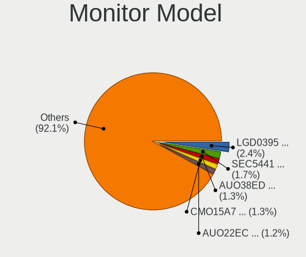

| Model                                                                    | Notebooks | Percent |
|--------------------------------------------------------------------------|-----------|---------|
| LG Display LCD Monitor LGD0395 1366x768 344x194mm 15.5-inch              | 47        | 2.65%   |
| Samsung Electronics LCD Monitor SEC5441 1280x800 331x207mm 15.4-inch     | 30        | 1.69%   |
| AU Optronics LCD Monitor AUO38ED 1920x1080 344x193mm 15.5-inch           | 27        | 1.52%   |
| LG Display LCD Monitor LGD02DC 1366x768 344x194mm 15.5-inch              | 24        | 1.35%   |
| Chi Mei Optoelectronics LCD Monitor CMO15A7 1366x768 344x193mm 15.5-inch | 24        | 1.35%   |
| BOE LCD Monitor BOE06A5 1366x768 344x194mm 15.5-inch                     | 23        | 1.3%    |
| AU Optronics LCD Monitor AUO22EC 1366x768 344x193mm 15.5-inch            | 22        | 1.24%   |
| Chimei Innolux LCD Monitor CMN15DB 1366x768 344x193mm 15.5-inch          | 18        | 1.02%   |
| AU Optronics LCD Monitor AUO26EC 1366x768 344x193mm 15.5-inch            | 17        | 0.96%   |
| LG Display LCD Monitor LGD033A 1366x768 344x194mm 15.5-inch              | 16        | 0.9%    |
| Chimei Innolux LCD Monitor CMN15CA 1366x768 344x193mm 15.5-inch          | 13        | 0.73%   |
| BOE LCD Monitor BOE0675 1366x768 344x194mm 15.5-inch                     | 13        | 0.73%   |
| LG Display LP156WH2-TLAA LGD0230 1366x768 344x194mm 15.5-inch            | 12        | 0.68%   |
| Chi Mei Optoelectronics LCD Monitor CMO1592 1366x768 344x193mm 15.5-inch | 12        | 0.68%   |
| BOE LCD Monitor BOE0672 1366x768 344x194mm 15.5-inch                     | 12        | 0.68%   |
| Chimei Innolux LCD Monitor CMN15AB 1366x768 344x194mm 15.5-inch          | 10        | 0.56%   |
| AU Optronics LCD Monitor AUO20EC 1366x768 344x193mm 15.5-inch            | 10        | 0.56%   |
| AU Optronics LCD Monitor AUO10EC 1366x768 344x193mm 15.5-inch            | 10        | 0.56%   |
| Samsung Electronics LCD Monitor SEC3046 1366x768 344x193mm 15.5-inch     | 9         | 0.51%   |
| Chimei Innolux LCD Monitor CMN1734 1600x900 382x214mm 17.2-inch          | 9         | 0.51%   |
| AU Optronics LCD Monitor AUO46EC 1366x768 344x193mm 15.5-inch            | 9         | 0.51%   |
| AU Optronics LCD Monitor AUO21ED 1920x1080 344x193mm 15.5-inch           | 9         | 0.51%   |
| Vestel Elektronik 40W_LCD_TV VES3700 1920x540                            | 8         | 0.45%   |
| LG Display LCD Monitor LGD038E 1366x768 344x194mm 15.5-inch              | 8         | 0.45%   |
| Lenovo LCD Monitor LEN4035 1280x800 303x190mm 14.1-inch                  | 8         | 0.45%   |
| Chimei Innolux LCD Monitor CMN15C4 1920x1080 344x193mm 15.5-inch         | 8         | 0.45%   |
| Chi Mei Optoelectronics LCD Monitor CMO15A1 1366x768 344x193mm 15.5-inch | 8         | 0.45%   |
| Chi Mei Optoelectronics LCD Monitor CMO1526 1280x800 331x207mm 15.4-inch | 8         | 0.45%   |
| AU Optronics LCD Monitor AUO23EC 1366x768 344x193mm 15.5-inch            | 8         | 0.45%   |
| Samsung Electronics LCD Monitor SEC5541 1366x768 344x193mm 15.5-inch     | 7         | 0.39%   |
| Samsung Electronics LCD Monitor SEC325A 1366x768 344x194mm 15.5-inch     | 7         | 0.39%   |
| Samsung Electronics LCD Monitor SEC324A 1366x768 344x194mm 15.5-inch     | 7         | 0.39%   |
| Samsung Electronics LCD Monitor SEC3245 1280x800 331x207mm 15.4-inch     | 7         | 0.39%   |
| LG Display LCD Monitor LGD0456 1366x768 344x194mm 15.5-inch              | 7         | 0.39%   |
| LG Display LCD Monitor LGD0250 1366x768 345x194mm 15.6-inch              | 7         | 0.39%   |
| LG Display LCD Monitor LGD01E8 1366x768 344x194mm 15.5-inch              | 7         | 0.39%   |
| Lenovo LCD Monitor LEN4036 1440x900 303x190mm 14.1-inch                  | 7         | 0.39%   |
| Lenovo LCD Monitor LEN4011 1280x800 261x163mm 12.1-inch                  | 7         | 0.39%   |
| HannStar LCD Monitor HSD03E9 1024x600 220x129mm 10.0-inch                | 7         | 0.39%   |
| Chimei Innolux LCD Monitor CMN15D5 1920x1080 344x193mm 15.5-inch         | 7         | 0.39%   |

Monitor Resolution
------------------

Monitor screen resolution

| Resolution         | Notebooks | Percent |
|--------------------|-----------|---------|
| 1366x768 (WXGA)    | 862       | 49.54%  |
| 1920x1080 (FHD)    | 322       | 18.51%  |
| 1280x800 (WXGA)    | 188       | 10.8%   |
| 1600x900 (HD+)     | 140       | 8.05%   |
| 1440x900 (WXGA+)   | 60        | 3.45%   |
| 1024x600           | 44        | 2.53%   |
| 3840x2160 (4K)     | 30        | 1.72%   |
| 1680x1050 (WSXGA+) | 21        | 1.21%   |
| 1920x1200 (WUXGA)  | 17        | 0.98%   |
| 1360x768           | 11        | 0.63%   |
| 1024x768 (XGA)     | 11        | 0.63%   |
| 1280x1024 (SXGA)   | 9         | 0.52%   |
| 2560x1440 (QHD)    | 4         | 0.23%   |
| 1920x540           | 4         | 0.23%   |
| 2288x1287          | 3         | 0.17%   |
| 1280x720 (HD)      | 3         | 0.17%   |
| 2560x1080          | 2         | 0.11%   |
| 1280x768           | 2         | 0.11%   |
| 3840x2400          | 1         | 0.06%   |
| 3440x1440          | 1         | 0.06%   |
| 2560x1600          | 1         | 0.06%   |
| 2160x1440          | 1         | 0.06%   |
| 1680x945           | 1         | 0.06%   |
| 1400x1050          | 1         | 0.06%   |
| 1024x576           | 1         | 0.06%   |

Monitor Diagonal
----------------

Diagonal size in inches

| Inches  | Notebooks | Percent |
|---------|-----------|---------|
| 15      | 1018      | 57.55%  |
| 14      | 177       | 10.01%  |
| 17      | 140       | 7.91%   |
| 13      | 102       | 5.77%   |
| 12      | 57        | 3.22%   |
| 10      | 50        | 2.83%   |
| 11      | 45        | 2.54%   |
| 23      | 29        | 1.64%   |
| 21      | 20        | 1.13%   |
| 18      | 20        | 1.13%   |
| 27      | 16        | 0.9%    |
| 24      | 16        | 0.9%    |
| 19      | 9         | 0.51%   |
| 84      | 8         | 0.45%   |
| 22      | 7         | 0.4%    |
| 20      | 7         | 0.4%    |
| 31      | 6         | 0.34%   |
| 32      | 5         | 0.28%   |
| 8       | 5         | 0.28%   |
| Unknown | 5         | 0.28%   |
| 72      | 3         | 0.17%   |
| 54      | 3         | 0.17%   |
| 52      | 3         | 0.17%   |
| 34      | 3         | 0.17%   |
| 142     | 2         | 0.11%   |
| 65      | 2         | 0.11%   |
| 49      | 2         | 0.11%   |
| 40      | 2         | 0.11%   |
| 16      | 2         | 0.11%   |
| 50      | 1         | 0.06%   |
| 39      | 1         | 0.06%   |
| 37      | 1         | 0.06%   |
| 26      | 1         | 0.06%   |
| 9       | 1         | 0.06%   |

Monitor Width
-------------

Physical width

| Width in mm    | Notebooks | Percent |
|----------------|-----------|---------|
| 301-350        | 1202      | 68.26%  |
| 201-300        | 208       | 11.81%  |
| 351-400        | 184       | 10.45%  |
| 501-600        | 61        | 3.46%   |
| 401-500        | 52        | 2.95%   |
| 1501-2000      | 11        | 0.62%   |
| 1001-1500      | 11        | 0.62%   |
| 701-800        | 8         | 0.45%   |
| 601-700        | 7         | 0.4%    |
| 101-200        | 6         | 0.34%   |
| Unknown        | 5         | 0.28%   |
| 801-900        | 4         | 0.23%   |
| More than 2000 | 2         | 0.11%   |

Aspect Ratio
------------

Proportional relationship between the width and the height

| Ratio   | Notebooks | Percent |
|---------|-----------|---------|
| 16/9    | 1352      | 81.1%   |
| 16/10   | 279       | 16.74%  |
| 4/3     | 12        | 0.72%   |
| 5/4     | 9         | 0.54%   |
| 3/2     | 8         | 0.48%   |
| 21/9    | 3         | 0.18%   |
| 1.00    | 2         | 0.12%   |
| 0.62    | 1         | 0.06%   |
| Unknown | 1         | 0.06%   |

Monitor Area
------------

Area in inch

| Area in inch | Notebooks | Percent |
|----------------|-----------|---------|
| 101-110        | 1015      | 57.64%  |
| 81-90          | 235       | 13.34%  |
| 121-130        | 97        | 5.51%   |
| 201-250        | 56        | 3.18%   |
| 61-70          | 55        | 3.12%   |
| 41-50          | 50        | 2.84%   |
| 51-60          | 45        | 2.56%   |
| 71-80          | 43        | 2.44%   |
| 131-140        | 39        | 2.21%   |
| 141-150        | 24        | 1.36%   |
| More than 1000 | 22        | 1.25%   |
| 151-200        | 20        | 1.14%   |
| 301-350        | 16        | 0.91%   |
| 351-500        | 13        | 0.74%   |
| 251-300        | 9         | 0.51%   |
| 91-100         | 7         | 0.4%    |
| 1-40           | 6         | 0.34%   |
| Unknown        | 5         | 0.28%   |
| 501-1000       | 4         | 0.23%   |

Pixel Density
-------------

Pixels per inch

| Density       | Notebooks | Percent |
|---------------|-----------|---------|
| 101-120       | 908       | 52.09%  |
| 121-160       | 412       | 23.64%  |
| 51-100        | 372       | 21.34%  |
| 161-240       | 26        | 1.49%   |
| 1-50          | 16        | 0.92%   |
| Unknown       | 5         | 0.29%   |
| More than 240 | 4         | 0.23%   |

Multiple Monitors
-----------------

Total monitors connected

| Total | Notebooks | Percent |
|-------|-----------|---------|
| 1     | 1600      | 91.27%  |
| 2     | 136       | 7.76%   |
| 0     | 10        | 0.57%   |
| 4     | 4         | 0.23%   |
| 3     | 3         | 0.17%   |

Network
-------

Net Controller Vendor
---------------------

Controller vendors

| Vendor                            | Notebooks | Percent |
|-----------------------------------|-----------|---------|
| Realtek Semiconductor             | 876       | 30.48%  |
| Intel                             | 703       | 24.46%  |
| Qualcomm Atheros                  | 600       | 20.88%  |
| Broadcom                          | 281       | 9.78%   |
| Ralink                            | 88        | 3.06%   |
| Broadcom Limited                  | 85        | 2.96%   |
| Marvell Technology Group          | 57        | 1.98%   |
| Ralink Technology                 | 15        | 0.52%   |
| JMicron Technology                | 15        | 0.52%   |
| Huawei Technologies               | 15        | 0.52%   |
| Hewlett-Packard                   | 15        | 0.52%   |
| Dell                              | 15        | 0.52%   |
| Ericsson Business Mobile Networks | 14        | 0.49%   |
| Nvidia                            | 11        | 0.38%   |
| Sierra Wireless                   | 9         | 0.31%   |
| Samsung Electronics               | 9         | 0.31%   |
| Attansic Technology               | 8         | 0.28%   |
| Xiaomi                            | 6         | 0.21%   |
| VIA Technologies                  | 5         | 0.17%   |
| TP-Link                           | 5         | 0.17%   |
| Qualcomm Atheros Communications   | 4         | 0.14%   |
| MediaTek                          | 4         | 0.14%   |
| ASIX Electronics                  | 4         | 0.14%   |
| T & A Mobile Phones               | 3         | 0.1%    |
| D-Link                            | 3         | 0.1%    |
| Silicon Integrated Systems [SiS]  | 2         | 0.07%   |
| NetGear                           | 2         | 0.07%   |
| LG Electronics                    | 2         | 0.07%   |
| Belkin Components                 | 2         | 0.07%   |
| ASUSTek Computer                  | 2         | 0.07%   |
| AMD                               | 2         | 0.07%   |
| ZTE WCDMA Technologies MSM        | 1         | 0.03%   |
| Toshiba                           | 1         | 0.03%   |
| Spreadtrum Communications         | 1         | 0.03%   |
| Shenzhen Goodix Technology        | 1         | 0.03%   |
| OPPO Electronics                  | 1         | 0.03%   |
| Motorola PCS                      | 1         | 0.03%   |
| Micro Star International          | 1         | 0.03%   |
| ICS Advent                        | 1         | 0.03%   |
| HMD Global                        | 1         | 0.03%   |

Net Controller Model
--------------------

Controller models

| Model                                                                   | Notebooks | Percent |
|-------------------------------------------------------------------------|-----------|---------|
| Realtek RTL8111/8168/8411 PCI Express Gigabit Ethernet Controller       | 501       | 14.52%  |
| Realtek RTL810xE PCI Express Fast Ethernet controller                   | 303       | 8.78%   |
| Qualcomm Atheros AR9285 Wireless Network Adapter (PCI-Express)          | 137       | 3.97%   |
| Qualcomm Atheros QCA9565 / AR9565 Wireless Network Adapter              | 114       | 3.3%    |
| Intel 82579LM Gigabit Network Connection (Lewisville)                   | 91        | 2.64%   |
| Qualcomm Atheros AR9485 Wireless Network Adapter                        | 81        | 2.35%   |
| Qualcomm Atheros QCA9377 802.11ac Wireless Network Adapter              | 75        | 2.17%   |
| Intel Centrino Advanced-N 6205 [Taylor Peak]                            | 70        | 2.03%   |
| Realtek RTL8723BE PCIe Wireless Network Adapter                         | 69        | 2%      |
| Intel PRO/Wireless 3945ABG [Golan] Network Connection                   | 68        | 1.97%   |
| Intel Wireless 7260                                                     | 61        | 1.77%   |
| Intel 82577LM Gigabit Network Connection                                | 57        | 1.65%   |
| Ralink RT3290 Wireless 802.11n 1T/1R PCIe                               | 56        | 1.62%   |
| Broadcom BCM4313 802.11bgn Wireless Network Adapter                     | 54        | 1.57%   |
| Qualcomm Atheros AR242x / AR542x Wireless Network Adapter (PCI-Express) | 48        | 1.39%   |
| Intel Centrino Advanced-N 6200                                          | 45        | 1.3%    |
| Intel 82567LM Gigabit Network Connection                                | 45        | 1.3%    |
| Intel Wireless 3165                                                     | 38        | 1.1%    |
| Intel PRO/Wireless 4965 AG or AGN [Kedron] Network Connection           | 34        | 0.99%   |
| Intel Centrino Ultimate-N 6300                                          | 33        | 0.96%   |
| Qualcomm Atheros AR8132 Fast Ethernet                                   | 32        | 0.93%   |
| Intel Wireless 7265                                                     | 32        | 0.93%   |
| Intel Wireless 3160                                                     | 32        | 0.93%   |
| Intel PRO/Wireless 5100 AGN [Shiloh] Network Connection                 | 32        | 0.93%   |
| Broadcom BCM43142 802.11b/g/n                                           | 31        | 0.9%    |
| Intel WiFi Link 5100                                                    | 30        | 0.87%   |
| Intel Wireless 8265 / 8275                                              | 29        | 0.84%   |
| Qualcomm Atheros AR928X Wireless Network Adapter (PCI-Express)          | 26        | 0.75%   |
| Qualcomm Atheros AR8151 v2.0 Gigabit Ethernet                           | 24        | 0.7%    |
| Broadcom BCM4312 802.11b/g LP-PHY                                       | 24        | 0.7%    |
| Realtek RTL8821AE 802.11ac PCIe Wireless Network Adapter                | 22        | 0.64%   |
| Intel Ethernet Connection I218-LM                                       | 22        | 0.64%   |
| Broadcom NetLink BCM57785 Gigabit Ethernet PCIe                         | 22        | 0.64%   |
| Marvell Group 88E8040 PCI-E Fast Ethernet Controller                    | 20        | 0.58%   |
| Realtek RTL8188CE 802.11b/g/n WiFi Adapter                              | 19        | 0.55%   |
| Intel 82566MM Gigabit Network Connection                                | 19        | 0.55%   |
| Qualcomm Atheros AR9462 Wireless Network Adapter                        | 18        | 0.52%   |
| Broadcom BCM43228 802.11a/b/g/n                                         | 18        | 0.52%   |
| Realtek RTL8821CE 802.11ac PCIe Wireless Network Adapter                | 17        | 0.49%   |
| Qualcomm Atheros QCA8172 Fast Ethernet                                  | 17        | 0.49%   |

Wireless Vendor
---------------

Wireless vendors

| Vendor                            | Notebooks | Percent |
|-----------------------------------|-----------|---------|
| Intel                             | 649       | 36.85%  |
| Qualcomm Atheros                  | 529       | 30.04%  |
| Realtek Semiconductor             | 217       | 12.32%  |
| Broadcom                          | 180       | 10.22%  |
| Ralink                            | 88        | 5%      |
| Broadcom Limited                  | 39        | 2.21%   |
| Ralink Technology                 | 15        | 0.85%   |
| Sierra Wireless                   | 9         | 0.51%   |
| Dell                              | 8         | 0.45%   |
| TP-Link                           | 5         | 0.28%   |
| Qualcomm Atheros Communications   | 4         | 0.23%   |
| Hewlett-Packard                   | 3         | 0.17%   |
| D-Link                            | 3         | 0.17%   |
| NetGear                           | 2         | 0.11%   |
| MediaTek                          | 2         | 0.11%   |
| Ericsson Business Mobile Networks | 2         | 0.11%   |
| Belkin Components                 | 2         | 0.11%   |
| ASUSTek Computer                  | 2         | 0.11%   |
| Micro Star International          | 1         | 0.06%   |
| Fujitsu Siemens Computers         | 1         | 0.06%   |

Wireless Model
--------------

Wireless models

| Model                                                                   | Notebooks | Percent |
|-------------------------------------------------------------------------|-----------|---------|
| Qualcomm Atheros AR9285 Wireless Network Adapter (PCI-Express)          | 137       | 7.74%   |
| Qualcomm Atheros QCA9565 / AR9565 Wireless Network Adapter              | 114       | 6.44%   |
| Qualcomm Atheros AR9485 Wireless Network Adapter                        | 81        | 4.58%   |
| Qualcomm Atheros QCA9377 802.11ac Wireless Network Adapter              | 75        | 4.24%   |
| Intel Centrino Advanced-N 6205 [Taylor Peak]                            | 70        | 3.96%   |
| Realtek RTL8723BE PCIe Wireless Network Adapter                         | 69        | 3.9%    |
| Intel PRO/Wireless 3945ABG [Golan] Network Connection                   | 68        | 3.84%   |
| Intel Wireless 7260                                                     | 61        | 3.45%   |
| Ralink RT3290 Wireless 802.11n 1T/1R PCIe                               | 56        | 3.17%   |
| Broadcom BCM4313 802.11bgn Wireless Network Adapter                     | 54        | 3.05%   |
| Qualcomm Atheros AR242x / AR542x Wireless Network Adapter (PCI-Express) | 48        | 2.71%   |
| Intel Centrino Advanced-N 6200                                          | 45        | 2.54%   |
| Intel Wireless 3165                                                     | 38        | 2.15%   |
| Intel PRO/Wireless 4965 AG or AGN [Kedron] Network Connection           | 34        | 1.92%   |
| Intel Centrino Ultimate-N 6300                                          | 33        | 1.87%   |
| Intel Wireless 7265                                                     | 32        | 1.81%   |
| Intel Wireless 3160                                                     | 32        | 1.81%   |
| Intel PRO/Wireless 5100 AGN [Shiloh] Network Connection                 | 32        | 1.81%   |
| Broadcom BCM43142 802.11b/g/n                                           | 31        | 1.75%   |
| Intel WiFi Link 5100                                                    | 30        | 1.7%    |
| Intel Wireless 8265 / 8275                                              | 29        | 1.64%   |
| Qualcomm Atheros AR928X Wireless Network Adapter (PCI-Express)          | 26        | 1.47%   |
| Broadcom BCM4312 802.11b/g LP-PHY                                       | 24        | 1.36%   |
| Realtek RTL8821AE 802.11ac PCIe Wireless Network Adapter                | 22        | 1.24%   |
| Realtek RTL8188CE 802.11b/g/n WiFi Adapter                              | 19        | 1.07%   |
| Qualcomm Atheros AR9462 Wireless Network Adapter                        | 18        | 1.02%   |
| Broadcom BCM43228 802.11a/b/g/n                                         | 18        | 1.02%   |
| Realtek RTL8821CE 802.11ac PCIe Wireless Network Adapter                | 17        | 0.96%   |
| Intel Ultimate N WiFi Link 5300                                         | 17        | 0.96%   |
| Broadcom Limited BCM4312 802.11b/g LP-PHY                               | 17        | 0.96%   |
| Realtek RTL8191SEvB Wireless LAN Controller                             | 15        | 0.85%   |
| Ralink RT3090 Wireless 802.11n 1T/1R PCIe                               | 13        | 0.73%   |
| Qualcomm Atheros AR9287 Wireless Network Adapter (PCI-Express)          | 13        | 0.73%   |
| Realtek RTL8188EE Wireless Network Adapter                              | 12        | 0.68%   |
| Ralink RT5390 Wireless 802.11n 1T/1R PCIe                               | 12        | 0.68%   |
| Intel Dual Band Wireless-AC 3168NGW [Stone Peak]                        | 12        | 0.68%   |
| Intel Dual Band Wireless-AC 3165 Plus Bluetooth                         | 12        | 0.68%   |
| Broadcom BCM43224 802.11a/b/g/n                                         | 12        | 0.68%   |
| Intel Cannon Lake PCH CNVi WiFi                                         | 11        | 0.62%   |
| Broadcom BCM4322 802.11a/b/g/n Wireless LAN Controller                  | 11        | 0.62%   |

Ethernet Vendor
---------------

Ethernet vendors

| Vendor                           | Notebooks | Percent |
|----------------------------------|-----------|---------|
| Realtek Semiconductor            | 831       | 50.92%  |
| Intel                            | 325       | 19.91%  |
| Qualcomm Atheros                 | 162       | 9.93%   |
| Broadcom                         | 126       | 7.72%   |
| Marvell Technology Group         | 57        | 3.49%   |
| Broadcom Limited                 | 47        | 2.88%   |
| JMicron Technology               | 15        | 0.92%   |
| Nvidia                           | 11        | 0.67%   |
| Huawei Technologies              | 11        | 0.67%   |
| Samsung Electronics              | 9         | 0.55%   |
| Attansic Technology              | 8         | 0.49%   |
| Xiaomi                           | 6         | 0.37%   |
| VIA Technologies                 | 5         | 0.31%   |
| ASIX Electronics                 | 4         | 0.25%   |
| T & A Mobile Phones              | 3         | 0.18%   |
| Silicon Integrated Systems [SiS] | 2         | 0.12%   |
| LG Electronics                   | 2         | 0.12%   |
| ZTE WCDMA Technologies MSM       | 1         | 0.06%   |
| Spreadtrum Communications        | 1         | 0.06%   |
| OPPO Electronics                 | 1         | 0.06%   |
| Motorola PCS                     | 1         | 0.06%   |
| MediaTek                         | 1         | 0.06%   |
| ICS Advent                       | 1         | 0.06%   |
| HMD Global                       | 1         | 0.06%   |
| Davicom Semiconductor            | 1         | 0.06%   |

Ethernet Model
--------------

Ethernet models

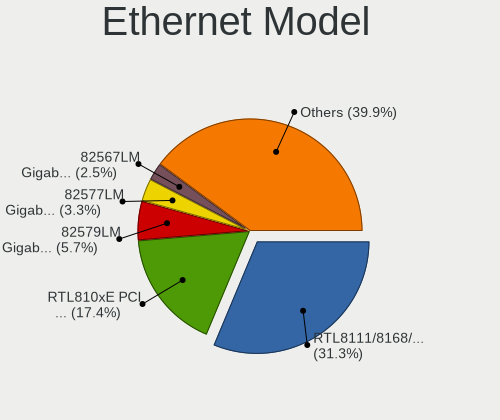

| Model                                                             | Notebooks | Percent |
|-------------------------------------------------------------------|-----------|---------|
| Realtek RTL8111/8168/8411 PCI Express Gigabit Ethernet Controller | 501       | 30.66%  |
| Realtek RTL810xE PCI Express Fast Ethernet controller             | 303       | 18.54%  |
| Intel 82579LM Gigabit Network Connection (Lewisville)             | 91        | 5.57%   |
| Intel 82577LM Gigabit Network Connection                          | 57        | 3.49%   |
| Intel 82567LM Gigabit Network Connection                          | 45        | 2.75%   |
| Qualcomm Atheros AR8132 Fast Ethernet                             | 32        | 1.96%   |
| Qualcomm Atheros AR8151 v2.0 Gigabit Ethernet                     | 24        | 1.47%   |
| Intel Ethernet Connection I218-LM                                 | 22        | 1.35%   |
| Broadcom NetLink BCM57785 Gigabit Ethernet PCIe                   | 22        | 1.35%   |
| Marvell Group 88E8040 PCI-E Fast Ethernet Controller              | 20        | 1.22%   |
| Intel 82566MM Gigabit Network Connection                          | 19        | 1.16%   |
| Qualcomm Atheros QCA8172 Fast Ethernet                            | 17        | 1.04%   |
| Qualcomm Atheros AR8131 Gigabit Ethernet                          | 16        | 0.98%   |
| Intel Ethernet Connection I217-LM                                 | 16        | 0.98%   |
| JMicron JMC250 PCI Express Gigabit Ethernet Controller            | 15        | 0.92%   |
| Broadcom Limited NetLink BCM5787M Gigabit Ethernet PCI Express    | 15        | 0.92%   |
| Realtek RTL-8100/8101L/8139 PCI Fast Ethernet Adapter             | 14        | 0.86%   |
| Marvell Group 88E8055 PCI-E Gigabit Ethernet Controller           | 14        | 0.86%   |
| Broadcom NetLink BCM5787M Gigabit Ethernet PCI Express            | 14        | 0.86%   |
| Intel 82579V Gigabit Network Connection                           | 13        | 0.8%    |
| Broadcom BCM4401-B0 100Base-TX                                    | 13        | 0.8%    |
| Qualcomm Atheros AR8121/AR8113/AR8114 Gigabit or Fast Ethernet    | 12        | 0.73%   |
| Broadcom NetLink BCM57780 Gigabit Ethernet PCIe                   | 12        | 0.73%   |
| Qualcomm Atheros AR8161 Gigabit Ethernet                          | 11        | 0.67%   |
| Broadcom NetLink BCM5906M Fast Ethernet PCI Express               | 11        | 0.67%   |
| Broadcom NetLink BCM5784M Gigabit Ethernet PCIe                   | 11        | 0.67%   |
| Huawei MLA-L11                                                    | 10        | 0.61%   |
| Broadcom NetXtreme BCM57786 Gigabit Ethernet PCIe                 | 10        | 0.61%   |
| Broadcom Limited NetLink BCM57780 Gigabit Ethernet PCIe           | 10        | 0.61%   |
| Qualcomm Atheros AR8162 Fast Ethernet                             | 9         | 0.55%   |
| Qualcomm Atheros AR8152 v2.0 Fast Ethernet                        | 9         | 0.55%   |
| Qualcomm Atheros AR8152 v1.1 Fast Ethernet                        | 9         | 0.55%   |
| Intel Ethernet Connection (4) I219-LM                             | 9         | 0.55%   |
| Nvidia MCP79 Ethernet                                             | 8         | 0.49%   |
| Intel Ethernet Connection (3) I218-LM                             | 8         | 0.49%   |
| Intel 82577LC Gigabit Network Connection                          | 8         | 0.49%   |
| Attansic AR8152 v2.0 Fast Ethernet                                | 8         | 0.49%   |
| Broadcom NetXtreme BCM5761e Gigabit Ethernet PCIe                 | 7         | 0.43%   |
| Xiaomi Mi/Redmi series (RNDIS)                                    | 6         | 0.37%   |
| Realtek RTL8152 Fast Ethernet Adapter                             | 6         | 0.37%   |

Net Controller Kind
-------------------

Ethernet, WiFi or modem

| Kind     | Notebooks | Percent |
|----------|-----------|---------|
| WiFi     | 1684      | 50.59%  |
| Ethernet | 1598      | 48%     |
| Modem    | 45        | 1.35%   |
| Unknown  | 2         | 0.06%   |

Used Controller
---------------

Currently used network controller

| Kind     | Notebooks | Percent |
|----------|-----------|---------|
| WiFi     | 1359      | 72.91%  |
| Ethernet | 505       | 27.09%  |

NICs
----

Total network controllers on board

| Total | Notebooks | Percent |
|-------|-----------|---------|
| 2     | 1553      | 90.66%  |
| 1     | 134       | 7.82%   |
| 0     | 22        | 1.28%   |
| 3     | 4         | 0.23%   |

IPv6
----

IPv6 vs IPv4

| Used | Notebooks | Percent |
|------|-----------|---------|
| No   | 1555      | 87.02%  |
| Yes  | 232       | 12.98%  |

Bluetooth
---------

Bluetooth Vendor
----------------

Controller vendors

| Vendor                          | Notebooks | Percent |
|---------------------------------|-----------|---------|
| Intel                           | 297       | 24.55%  |
| Qualcomm Atheros Communications | 155       | 12.81%  |
| Broadcom                        | 141       | 11.65%  |
| Realtek Semiconductor           | 114       | 9.42%   |
| Dell                            | 74        | 6.12%   |
| Lite-On Technology              | 70        | 5.79%   |
| Hewlett-Packard                 | 65        | 5.37%   |
| Foxconn / Hon Hai               | 64        | 5.29%   |
| Ralink                          | 56        | 4.63%   |
| IMC Networks                    | 46        | 3.8%    |
| Toshiba                         | 35        | 2.89%   |
| Cambridge Silicon Radio         | 26        | 2.15%   |
| Apple                           | 16        | 1.32%   |
| ASUSTek Computer                | 11        | 0.91%   |
| Foxconn International           | 8         | 0.66%   |
| Ralink Technology               | 7         | 0.58%   |
| Askey Computer                  | 6         | 0.5%    |
| Alps Electric                   | 5         | 0.41%   |
| Realtek                         | 3         | 0.25%   |
| Micro Star International        | 3         | 0.25%   |
| Chicony Electronics             | 3         | 0.25%   |
| Taiyo Yuden                     | 2         | 0.17%   |
| MediaTek                        | 1         | 0.08%   |
| Fujitsu Siemens Computers       | 1         | 0.08%   |
| Fujitsu                         | 1         | 0.08%   |

Bluetooth Model
---------------

Controller models

| Model                                               | Notebooks | Percent |
|-----------------------------------------------------|-----------|---------|
| Intel Bluetooth wireless interface                  | 210       | 17.31%  |
| Realtek Bluetooth Radio                             | 79        | 6.51%   |
| Ralink RT3290 Bluetooth                             | 56        | 4.62%   |
| Qualcomm Atheros  Bluetooth Device                  | 55        | 4.53%   |
| Qualcomm Atheros AR3011 Bluetooth                   | 39        | 3.22%   |
| Dell DW375 Bluetooth Module                         | 35        | 2.89%   |
| Qualcomm Atheros AR3012 Bluetooth 4.0               | 32        | 2.64%   |
| HP Broadcom 2070 Bluetooth Combo                    | 32        | 2.64%   |
| HP Bluetooth 2.0 Interface [Broadcom BCM2045]       | 32        | 2.64%   |
| Broadcom BCM2045B (BDC-2.1)                         | 28        | 2.31%   |
| Cambridge Silicon Radio Bluetooth Dongle (HCI mode) | 26        | 2.14%   |
| Lite-On Qualcomm Atheros QCA9377 Bluetooth          | 25        | 2.06%   |
| Intel Bluetooth 9460/9560 Jefferson Peak (JfP)      | 23        | 1.9%    |
| Foxconn / Hon Hai Bluetooth Device                  | 23        | 1.9%    |
| Broadcom HP Portable SoftSailing                    | 22        | 1.81%   |
| Lite-On Atheros AR3012 Bluetooth                    | 21        | 1.73%   |
| Intel Centrino Bluetooth Wireless Transceiver       | 20        | 1.65%   |
| IMC Networks Bluetooth Device                       | 19        | 1.57%   |
| Realtek RTL8821A Bluetooth                          | 18        | 1.48%   |
| Intel Centrino Advanced-N 6230 Bluetooth adapter    | 18        | 1.48%   |
| Broadcom BCM2045B (BDC-2.1) [Bluetooth Controller]  | 17        | 1.4%    |
| Toshiba Bluetooth Device                            | 15        | 1.24%   |
| Realtek  Bluetooth 4.2 Adapter                      | 15        | 1.24%   |
| Dell BCM20702A0 Bluetooth Module                    | 13        | 1.07%   |
| Lite-On Bluetooth Device                            | 12        | 0.99%   |
| Intel Bluetooth Device                              | 12        | 0.99%   |
| Intel AX201 Bluetooth                               | 11        | 0.91%   |
| Broadcom BCM2070 Bluetooth Device                   | 11        | 0.91%   |
| Qualcomm Atheros AR9462 Bluetooth                   | 10        | 0.82%   |
| Foxconn / Hon Hai BCM20702A0                        | 10        | 0.82%   |
| IMC Networks Bluetooth Radio                        | 9         | 0.74%   |
| IMC Networks Atheros AR3012 Bluetooth 4.0 Adapter   | 9         | 0.74%   |
| Broadcom BCM43142A0 Bluetooth 4.0                   | 9         | 0.74%   |
| Broadcom BCM2045B (BDC-2) [Bluetooth Controller]    | 9         | 0.74%   |
| Apple Bluetooth Host Controller                     | 9         | 0.74%   |
| Foxconn International BCM43142A0 Bluetooth module   | 8         | 0.66%   |
| Dell Wireless 355 Bluetooth                         | 8         | 0.66%   |
| Broadcom BCM20702 Bluetooth 4.0 [ThinkPad]          | 8         | 0.66%   |
| Toshiba Integrated Bluetooth HCI                    | 7         | 0.58%   |
| Ralink Motorola BC4 Bluetooth 3.0+HS Adapter        | 7         | 0.58%   |

Sound
-----

Sound Vendor
------------

Sound card vendors

| Vendor                           | Notebooks | Percent |
|----------------------------------|-----------|---------|
| Intel                            | 1439      | 77.16%  |
| AMD                              | 282       | 15.12%  |
| Nvidia                           | 114       | 6.11%   |
| C-Media Electronics              | 8         | 0.43%   |
| VIA Technologies                 | 6         | 0.32%   |
| Logitech                         | 3         | 0.16%   |
| Creative Technology              | 3         | 0.16%   |
| Texas Instruments                | 2         | 0.11%   |
| Silicon Integrated Systems [SiS] | 2         | 0.11%   |
| Tenx Technology                  | 1         | 0.05%   |
| PreSonus Audio Electronics       | 1         | 0.05%   |
| Numark                           | 1         | 0.05%   |
| M-Audio                          | 1         | 0.05%   |
| Focusrite-Novation               | 1         | 0.05%   |
| ASUSTek Computer                 | 1         | 0.05%   |

Sound Model
-----------

Sound card models

| Model                                                                                             | Notebooks | Percent |
|---------------------------------------------------------------------------------------------------|-----------|---------|
| Intel 7 Series/C216 Chipset Family High Definition Audio Controller                               | 222       | 9.83%   |
| Intel 82801I (ICH9 Family) HD Audio Controller                                                    | 179       | 7.93%   |
| Intel 5 Series/3400 Series Chipset High Definition Audio                                          | 158       | 7%      |
| Intel 6 Series/C200 Series Chipset Family High Definition Audio Controller                        | 148       | 6.55%   |
| Intel Sunrise Point-LP HD Audio                                                                   | 129       | 5.71%   |
| AMD FCH Azalia Controller                                                                         | 122       | 5.4%    |
| Intel NM10/ICH7 Family High Definition Audio Controller                                           | 109       | 4.83%   |
| Intel 82801H (ICH8 Family) HD Audio Controller                                                    | 98        | 4.34%   |
| Intel 8 Series HD Audio Controller                                                                | 80        | 3.54%   |
| Intel Haswell-ULT HD Audio Controller                                                             | 79        | 3.5%    |
| AMD Kabini HDMI/DP Audio                                                                          | 77        | 3.41%   |
| Intel Broadwell-U Audio Controller                                                                | 61        | 2.7%    |
| Intel Wildcat Point-LP High Definition Audio Controller                                           | 60        | 2.66%   |
| AMD SBx00 Azalia (Intel HDA)                                                                      | 55        | 2.44%   |
| Intel Atom/Celeron/Pentium Processor x5-E8000/J3xxx/N3xxx Series High Definition Audio Controller | 53        | 2.35%   |
| Intel 8 Series/C220 Series Chipset High Definition Audio Controller                               | 48        | 2.13%   |
| Intel Xeon E3-1200 v3/4th Gen Core Processor HD Audio Controller                                  | 43        | 1.9%    |
| AMD Wrestler HDMI Audio                                                                           | 42        | 1.86%   |
| Intel Atom Processor Z36xxx/Z37xxx Series High Definition Audio Controller                        | 39        | 1.73%   |
| AMD Family 15h (Models 60h-6fh) Audio Controller                                                  | 32        | 1.42%   |
| AMD High Definition Audio Controller                                                              | 22        | 0.97%   |
| Intel Celeron N3350/Pentium N4200/Atom E3900 Series Audio Cluster                                 | 21        | 0.93%   |
| Intel Cannon Lake PCH cAVS                                                                        | 19        | 0.84%   |
| Nvidia High Definition Audio Controller                                                           | 17        | 0.75%   |
| AMD Trinity HDMI Audio Controller                                                                 | 17        | 0.75%   |
| Intel Celeron/Pentium Silver Processor High Definition Audio                                      | 16        | 0.71%   |
| AMD RV710/730 HDMI Audio [Radeon HD 4000 series]                                                  | 16        | 0.71%   |
| AMD Family 17h/19h HD Audio Controller                                                            | 15        | 0.66%   |
| Nvidia MCP79 High Definition Audio                                                                | 13        | 0.58%   |
| Nvidia GF108 High Definition Audio Controller                                                     | 13        | 0.58%   |
| Intel 100 Series/C230 Series Chipset Family HD Audio Controller                                   | 13        | 0.58%   |
| AMD Cedar HDMI Audio [Radeon HD 5400/6300/7300 Series]                                            | 13        | 0.58%   |
| Nvidia GT216 HDMI Audio Controller                                                                | 12        | 0.53%   |
| Intel CM238 HD Audio Controller                                                                   | 11        | 0.49%   |
| Intel Cannon Point-LP High Definition Audio Controller                                            | 11        | 0.49%   |
| AMD Kaveri HDMI/DP Audio Controller                                                               | 11        | 0.49%   |
| Nvidia GK208 HDMI/DP Audio Controller                                                             | 10        | 0.44%   |
| AMD Raven/Raven2/Fenghuang HDMI/DP Audio Controller                                               | 10        | 0.44%   |
| AMD RS880 HDMI Audio [Radeon HD 4200 Series]                                                      | 8         | 0.35%   |
| AMD BeaverCreek HDMI Audio [Radeon HD 6500D and 6400G-6600G series]                               | 8         | 0.35%   |

Memory
------

Memory Vendor
-------------

Memory module vendors

| Vendor                | Notebooks | Percent |
|-----------------------|-----------|---------|
| Samsung Electronics   | 537       | 26.47%  |
| SK hynix              | 510       | 25.14%  |
| Unknown               | 230       | 11.34%  |
| Kingston              | 208       | 10.25%  |
| Micron Technology     | 173       | 8.53%   |
| Elpida                | 80        | 3.94%   |
| Nanya Technology      | 69        | 3.4%    |
| Ramaxel Technology    | 52        | 2.56%   |
| A-DATA Technology     | 35        | 1.72%   |
| Crucial               | 21        | 1.03%   |
| Corsair               | 16        | 0.79%   |
| Kingmax               | 14        | 0.69%   |
| ASint Technology      | 11        | 0.54%   |
| 48spaces              | 11        | 0.54%   |
| Transcend             | 10        | 0.49%   |
| Qimonda               | 7         | 0.34%   |
| Unknown (ABCD)        | 5         | 0.25%   |
| Toshiba               | 4         | 0.2%    |
| Patriot               | 4         | 0.2%    |
| SHARETRONIC           | 3         | 0.15%   |
| Kingmax Semiconductor | 3         | 0.15%   |
| Apacer                | 3         | 0.15%   |
| Melco                 | 2         | 0.1%    |
| Infineon              | 2         | 0.1%    |
| CSX                   | 2         | 0.1%    |
| Axiom                 | 2         | 0.1%    |
| Unifosa               | 1         | 0.05%   |
| Teikon                | 1         | 0.05%   |
| Team                  | 1         | 0.05%   |
| Smart Brazil          | 1         | 0.05%   |
| PUSKILL               | 1         | 0.05%   |
| PNY                   | 1         | 0.05%   |
| Memory Solution       | 1         | 0.05%   |
| Magnum Tech           | 1         | 0.05%   |
| Hikvision             | 1         | 0.05%   |
| GOODRAM               | 1         | 0.05%   |
| Goldkey               | 1         | 0.05%   |
| G.Skill               | 1         | 0.05%   |
| Catalyst              | 1         | 0.05%   |
| Aeneon                | 1         | 0.05%   |

Memory Model
------------

Memory module models

| Model                                                                     | Notebooks | Percent |
|---------------------------------------------------------------------------|-----------|---------|
| SK hynix RAM HMT451S6BFR8A-PB 4GB SODIMM DDR3 1600MT/s                    | 49        | 2.24%   |
| Samsung RAM M471B5173EB0-YK0 4GB SODIMM DDR3 1600MT/s                     | 41        | 1.87%   |
| Unknown RAM Module 2048MB SODIMM DDR2 667MT/s                             | 40        | 1.83%   |
| Samsung RAM M471B5273DH0-CH9 4GB SODIMM DDR3 1334MT/s                     | 38        | 1.74%   |
| Samsung RAM M471B5173QH0-YK0 4GB SODIMM DDR3 1600MT/s                     | 36        | 1.64%   |
| SK hynix RAM HMT351S6CFR8C-PB 4GB SODIMM DDR3 1600MT/s                    | 33        | 1.51%   |
| Samsung RAM M471B5173DB0-YK0 4GB SODIMM DDR3 1600MT/s                     | 33        | 1.51%   |
| Samsung RAM M471A5244CB0-CRC 4GB SODIMM DDR4 2667MT/s                     | 30        | 1.37%   |
| SK hynix RAM HMT325S6CFR8A-PB 2048MB SODIMM DDR3 1600MT/s                 | 25        | 1.14%   |
| Unknown RAM Module 2048MB SODIMM DDR2                                     | 24        | 1.1%    |
| Samsung RAM M471B5273DH0-CK0 4GB SODIMM DDR3 1600MT/s                     | 24        | 1.1%    |
| Samsung RAM M471B5773DH0-CH9 2GB SODIMM DDR3 1600MT/s                     | 23        | 1.05%   |
| Samsung RAM M471B5673FH0-CF8 2GB SODIMM DDR3 1067MT/s                     | 23        | 1.05%   |
| SK hynix RAM HMA851S6AFR6N-UH 4GB SODIMM DDR4 2667MT/s                    | 21        | 0.96%   |
| Samsung RAM M471B5273CH0-CH9 4GB SODIMM DDR3 1334MT/s                     | 21        | 0.96%   |
| SK hynix RAM HMT451S6AFR8A-PB 4GB SODIMM DDR3 1600MT/s                    | 20        | 0.91%   |
| Samsung RAM M471A5244CB0-CTD 4GB SODIMM DDR4 3266MT/s                     | 20        | 0.91%   |
| Unknown RAM Module 1024MB SODIMM DDR2 667MT/s                             | 19        | 0.87%   |
| Samsung RAM M471B5773CHS-CH9 2048MB SODIMM DDR3 4199MT/s                  | 19        | 0.87%   |
| Micron RAM 8KTF51264HZ-1G6E1 4GB SODIMM DDR3 1600MT/s                     | 19        | 0.87%   |
| Unknown RAM Module 1024MB SODIMM DDR2                                     | 18        | 0.82%   |
| SK hynix RAM HMT351S6EFR8A-PB 4096MB SODIMM DDR3 1600MT/s                 | 17        | 0.78%   |
| SK hynix RAM HMT325S6EFR8A-PB 2GB SODIMM DDR3 1600MT/s                    | 15        | 0.69%   |
| SK hynix RAM HMT325S6BFR8C-H9 2GB SODIMM DDR3 1600MT/s                    | 14        | 0.64%   |
| Samsung RAM M471B5673FH0-CH9 2GB SODIMM DDR3 1334MT/s                     | 14        | 0.64%   |
| Samsung RAM M471B1G73DB0-YK0 8GB SODIMM DDR3 1600MT/s                     | 14        | 0.64%   |
| Unknown RAM Module 2048MB SODIMM 800MT/s                                  | 13        | 0.59%   |
| SK hynix RAM HMT41GS6BFR8A-PB 8192MB SODIMM DDR3 1600MT/s                 | 13        | 0.59%   |
| SK hynix RAM HMT351S6BFR8C-H9 4GB SODIMM DDR3 1333MT/s                    | 12        | 0.55%   |
| SK hynix RAM HMT125S6BFR8C-G7 2GB SODIMM DDR3 1067MT/s                    | 12        | 0.55%   |
| Samsung RAM M471B1G73QH0-YK0 8GB SODIMM DDR3 1867MT/s                     | 12        | 0.55%   |
| Nanya RAM NT4GC64B8HB0NS-CG 4GB SODIMM DDR3 1334MT/s                      | 12        | 0.55%   |
| Micron RAM 4ATF51264HZ-2G6E1 4GB SODIMM DDR4 2667MT/s                     | 12        | 0.55%   |
| Elpida RAM EBJ41UF8BCS0-DJ-F 4GB SODIMM DDR3 1334MT/s                     | 12        | 0.55%   |
| Samsung RAM M471B5273CH0-CK0 4GB SODIMM DDR3 1600MT/s                     | 11        | 0.5%    |
| Ramaxel RAM RMT3170ME68F9F1600 4GB SODIMM DDR3 1600MT/s                   | 11        | 0.5%    |
| Nanya RAM NT2GC64B88B0NS-CG 2GB SODIMM DDR3 1334MT/s                      | 11        | 0.5%    |
| Elpida RAM EBJ21UE8BFU0-DJ-F 2GB SODIMM DDR3 1334MT/s                     | 11        | 0.5%    |
| Elpida RAM EBJ21UE8BDS0-DJ-F 2GB SODIMM DDR3 1334MT/s                     | 11        | 0.5%    |
| 48spaces RAM 012345678901234567890123456789012345 2GB SODIMM DDR2 667MT/s | 11        | 0.5%    |

Memory Kind
-----------

Memory module kinds

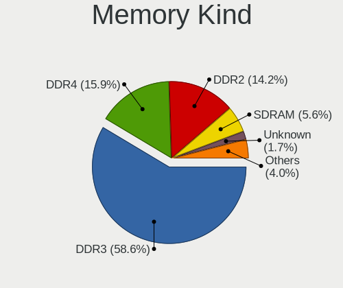

| Kind    | Notebooks | Percent |
|---------|-----------|---------|
| DDR3    | 1035      | 60.31%  |
| DDR2    | 256       | 14.92%  |
| DDR4    | 232       | 13.52%  |
| SDRAM   | 98        | 5.71%   |
| Unknown | 31        | 1.81%   |
| LPDDR4  | 29        | 1.69%   |
| DDR     | 22        | 1.28%   |
| DRAM    | 8         | 0.47%   |
| LPDDR3  | 5         | 0.29%   |

Memory Form Factor
------------------

Physical design of the memory module

| Name         | Notebooks | Percent |
|--------------|-----------|---------|
| SODIMM       | 1632      | 98.31%  |
| DIMM         | 14        | 0.84%   |
| Row Of Chips | 9         | 0.54%   |
| Chip         | 5         | 0.3%    |

Memory Size
-----------

Memory module size

| Size    | Notebooks | Percent |
|---------|-----------|---------|
| 4096    | 799       | 41.9%   |
| 2048    | 565       | 29.63%  |
| 8192    | 311       | 16.31%  |
| 1024    | 174       | 9.12%   |
| 512     | 25        | 1.31%   |
| 16384   | 24        | 1.26%   |
| 32768   | 7         | 0.37%   |
| Unknown | 2         | 0.1%    |

Memory Speed
------------

Memory module speed

| Speed   | Notebooks | Percent |
|---------|-----------|---------|
| 1600    | 677       | 35.88%  |
| 1334    | 213       | 11.29%  |
| 667     | 154       | 8.16%   |
| 2667    | 147       | 7.79%   |
| 1333    | 112       | 5.94%   |
| 1067    | 89        | 4.72%   |
| Unknown | 72        | 3.82%   |
| 2400    | 70        | 3.71%   |
| 800     | 66        | 3.5%    |
| 4199    | 49        | 2.6%    |
| 2048    | 40        | 2.12%   |
| 533     | 32        | 1.7%    |
| 2133    | 30        | 1.59%   |
| 975     | 25        | 1.32%   |
| 3200    | 24        | 1.27%   |
| 3266    | 20        | 1.06%   |
| 1066    | 20        | 1.06%   |
| 333     | 12        | 0.64%   |
| 1867    | 10        | 0.53%   |
| 1639    | 9         | 0.48%   |
| 1776    | 3         | 0.16%   |
| 8400    | 2         | 0.11%   |
| 2267    | 2         | 0.11%   |
| 400     | 2         | 0.11%   |
| 3733    | 1         | 0.05%   |
| 2134    | 1         | 0.05%   |
| 1866    | 1         | 0.05%   |
| 1400    | 1         | 0.05%   |
| 1200    | 1         | 0.05%   |
| 266     | 1         | 0.05%   |
| 200     | 1         | 0.05%   |

Printers & scanners
-------------------

Printer Vendor
--------------

Printer device vendors

| Vendor                | Notebooks | Percent |
|-----------------------|-----------|---------|
| Hewlett-Packard       | 11        | 55%     |
| Samsung Electronics   | 2         | 10%     |
| Canon                 | 2         | 10%     |
| Brother Industries    | 2         | 10%     |
| Seiko Epson           | 1         | 5%      |
| Oki Data              | 1         | 5%      |
| Lexmark International | 1         | 5%      |

Printer Model
-------------

Printer device models

| Model                                   | Notebooks | Percent |
|-----------------------------------------|-----------|---------|
| HP Officejet J4500 series               | 2         | 10%     |
| HP DeskJet 2130 series                  | 2         | 10%     |
| Seiko Epson XP-240 Series               | 1         | 5%      |
| Samsung Xerox Phaser 3117 Laser Printer | 1         | 5%      |
| Samsung Composite Device                | 1         | 5%      |
| Oki Data USB Device                     | 1         | 5%      |
| Lexmark International Lexmark X203n     | 1         | 5%      |
| HP LaserJet P1102                       | 1         | 5%      |
| HP LaserJet 1022                        | 1         | 5%      |
| HP LaserJet 1020                        | 1         | 5%      |
| HP ENVY 4520 series                     | 1         | 5%      |
| HP DeskJet 5550                         | 1         | 5%      |
| HP DeskJet 3630 series                  | 1         | 5%      |
| HP Deskjet 1510                         | 1         | 5%      |
| Canon TS5100 series                     | 1         | 5%      |
| Canon LBP6020                           | 1         | 5%      |
| Brother HL-1110 series                  | 1         | 5%      |
| Brother DCP-1610W                       | 1         | 5%      |

Scanner Vendor
--------------

Scanner device vendors

Zero info for selected period =(

Scanner Model
-------------

Scanner device models

Zero info for selected period =(

Camera
------

Camera Vendor
-------------

Camera device vendors

| Vendor                                 | Notebooks | Percent |
|----------------------------------------|-----------|---------|
| Chicony Electronics                    | 399       | 28.38%  |
| Realtek Semiconductor                  | 124       | 8.82%   |
| IMC Networks                           | 122       | 8.68%   |
| Microdia                               | 105       | 7.47%   |
| Suyin                                  | 102       | 7.25%   |
| Sunplus Innovation Technology          | 95        | 6.76%   |
| Cheng Uei Precision Industry (Foxlink) | 58        | 4.13%   |
| Bison Electronics                      | 57        | 4.05%   |
| Syntek                                 | 48        | 3.41%   |
| Silicon Motion                         | 31        | 2.2%    |
| Quanta                                 | 31        | 2.2%    |
| Acer                                   | 31        | 2.2%    |
| Lenovo                                 | 23        | 1.64%   |
| Alcor Micro                            | 23        | 1.64%   |
| Ricoh                                  | 21        | 1.49%   |
| Primax Electronics                     | 21        | 1.49%   |
| Lite-On Technology                     | 15        | 1.07%   |
| ALi                                    | 15        | 1.07%   |
| Apple                                  | 14        | 1%      |
| Z-Star Microelectronics                | 11        | 0.78%   |
| OmniVision Technologies                | 11        | 0.78%   |
| Importek                               | 10        | 0.71%   |
| Logitech                               | 6         | 0.43%   |
| DigiTech                               | 5         | 0.36%   |
| Genesys Logic                          | 4         | 0.28%   |
| Samsung Electronics                    | 3         | 0.21%   |
| SHENZHEN EMEET TECHNOLOGY              | 2         | 0.14%   |
| Nebraska Furniture Mart                | 2         | 0.14%   |
| KYE Systems (Mouse Systems)            | 2         | 0.14%   |
| Intel                                  | 2         | 0.14%   |
| GEMBIRD                                | 2         | 0.14%   |
| Xiaomi                                 | 1         | 0.07%   |
| Trust                                  | 1         | 0.07%   |
| Sunplus Technology                     | 1         | 0.07%   |
| Spreadtrum Communications              | 1         | 0.07%   |
| Luxvisions Innotech Limited            | 1         | 0.07%   |
| Hewlett-Packard                        | 1         | 0.07%   |
| Google                                 | 1         | 0.07%   |
| Generalplus Technology                 | 1         | 0.07%   |
| Cubeternet                             | 1         | 0.07%   |

Camera Model
------------

Camera device models

| Model                                                   | Notebooks | Percent |
|---------------------------------------------------------|-----------|---------|
| Chicony HP Truevision HD                                | 39        | 2.77%   |
| IMC Networks USB2.0 VGA UVC WebCam                      | 35        | 2.49%   |
| Chicony HD Webcam                                       | 29        | 2.06%   |
| Sunplus HP Truevision HD                                | 24        | 1.71%   |
| Chicony USB2.0 VGA UVC WebCam                           | 24        | 1.71%   |
| Suyin Acer/HP Integrated Webcam [CN0314]                | 22        | 1.56%   |
| Realtek USB Camera                                      | 20        | 1.42%   |
| Microdia Integrated Webcam                              | 20        | 1.42%   |
| Chicony Integrated Camera                               | 20        | 1.42%   |
| Acer Lenovo EasyCamera                                  | 20        | 1.42%   |
| Sunplus HD WebCam                                       | 18        | 1.28%   |
| Chicony Lenovo EasyCamera                               | 18        | 1.28%   |
| Chicony FJ Camera                                       | 18        | 1.28%   |
| IMC Networks EasyCamera                                 | 17        | 1.21%   |
| Chicony USB2.0 HD UVC WebCam                            | 17        | 1.21%   |
| Syntek EasyCamera                                       | 16        | 1.14%   |
| Sunplus Integrated_Webcam_HD                            | 16        | 1.14%   |
| Primax HP HD Webcam [Fixed]                             | 15        | 1.07%   |
| Realtek Lenovo EasyCamera                               | 14        | 1%      |
| Chicony EasyCamera                                      | 14        | 1%      |
| Cheng Uei Precision Industry (Foxlink) HP Truevision HD | 14        | 1%      |
| Chicony VGA WebCam                                      | 13        | 0.92%   |
| Chicony TOSHIBA Web Camera - HD                         | 13        | 0.92%   |
| Chicony 2.0M UVC Webcam / CNF7129                       | 13        | 0.92%   |
| Realtek USB2.0 VGA UVC WebCam                           | 12        | 0.85%   |
| Realtek Integrated Webcam                               | 12        | 0.85%   |
| IMC Networks USB2.0 HD UVC WebCam                       | 12        | 0.85%   |
| Chicony Integrated HP HD Webcam                         | 12        | 0.85%   |
| Bison Lenovo EasyCamera                                 | 12        | 0.85%   |
| ALi Gateway Webcam                                      | 12        | 0.85%   |
| Silicon Motion WebCam SC-0311139N                       | 11        | 0.78%   |
| Quanta VGA Webcam                                       | 11        | 0.78%   |
| OmniVision OV2640 Webcam                                | 11        | 0.78%   |
| IMC Networks Integrated Webcam                          | 11        | 0.78%   |
| Chicony HP Webcam                                       | 11        | 0.78%   |
| Chicony CNF9055 Toshiba Webcam                          | 11        | 0.78%   |
| Bison Lenovo Integrated Webcam                          | 11        | 0.78%   |
| Syntek Lenovo EasyCamera                                | 10        | 0.71%   |
| Suyin HD WebCam                                         | 10        | 0.71%   |
| Suyin Acer CrystalEye Webcam                            | 10        | 0.71%   |

Security
--------

Fingerprint Vendor
------------------

Fingerprint sensor vendors

| Vendor                     | Notebooks | Percent |
|----------------------------|-----------|---------|
| Validity Sensors           | 69        | 41.07%  |
| AuthenTec                  | 57        | 33.93%  |
| Upek                       | 19        | 11.31%  |
| LighTuning Technology      | 10        | 5.95%   |
| STMicroelectronics         | 8         | 4.76%   |
| Synaptics                  | 2         | 1.19%   |
| Elan Microelectronics      | 2         | 1.19%   |
| Shenzhen Goodix Technology | 1         | 0.6%    |

Fingerprint Model
-----------------

Fingerprint sensor models

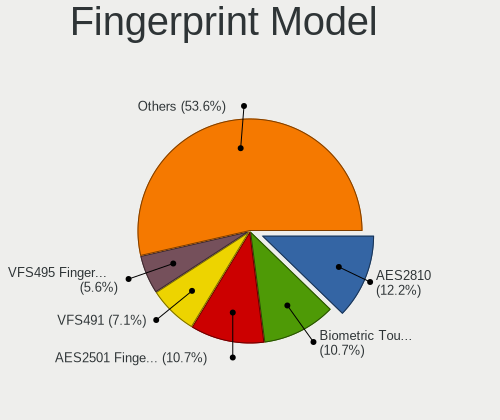

| Model                                                                      | Notebooks | Percent |
|----------------------------------------------------------------------------|-----------|---------|
| AuthenTec AES2810                                                          | 23        | 13.69%  |
| AuthenTec AES2501 Fingerprint Sensor                                       | 20        | 11.9%   |
| Upek Biometric Touchchip/Touchstrip Fingerprint Sensor                     | 18        | 10.71%  |
| Validity Sensors VFS491                                                    | 12        | 7.14%   |
| Validity Sensors VFS471 Fingerprint Reader                                 | 11        | 6.55%   |
| Validity Sensors VFS451 Fingerprint Reader                                 | 9         | 5.36%   |
| Validity Sensors VFS495 Fingerprint Reader                                 | 8         | 4.76%   |
| STMicroelectronics Fingerprint Reader                                      | 8         | 4.76%   |
| AuthenTec Fingerprint Sensor                                               | 8         | 4.76%   |
| Validity Sensors VFS5011 Fingerprint Reader                                | 7         | 4.17%   |
| LighTuning Fingerprint Reader                                              | 6         | 3.57%   |
| Validity Sensors VFS101 Fingerprint Reader                                 | 5         | 2.98%   |
| Validity Sensors Fingerprint scanner                                       | 4         | 2.38%   |
| AuthenTec AES1600                                                          | 4         | 2.38%   |
| Validity Sensors VFS 5011 fingerprint sensor                               | 3         | 1.79%   |
| Validity Sensors Swipe Fingerprint Sensor                                  | 3         | 1.79%   |
| Validity Sensors VFS301 Fingerprint Reader                                 | 2         | 1.19%   |
| Validity Sensors Synaptics WBDI                                            | 2         | 1.19%   |
| Synaptics  WBDI                                                            | 2         | 1.19%   |
| LighTuning ES603 Swipe Fingerprint Sensor                                  | 2         | 1.19%   |
| LighTuning EgisTec Touch Fingerprint Sensor                                | 2         | 1.19%   |
| Validity Sensors VFS7500 Touch Fingerprint Sensor                          | 1         | 0.6%    |
| Validity Sensors VFS300 Fingerprint Reader                                 | 1         | 0.6%    |
| Validity Sensors Synaptics VFS7552 Touch Fingerprint Sensor with PurePrint | 1         | 0.6%    |
| Upek TCS5B Fingerprint sensor                                              | 1         | 0.6%    |
| Shenzhen Goodix  FingerPrint Device                                        | 1         | 0.6%    |
| Elan WBF Fingerprint Sensor                                                | 1         | 0.6%    |
| Elan ELAN:Fingerprint                                                      | 1         | 0.6%    |
| AuthenTec AES2550 Fingerprint Sensor                                       | 1         | 0.6%    |
| AuthenTec AES1660 Fingerprint Sensor                                       | 1         | 0.6%    |

Chipcard Vendor
---------------

Chipcard module vendors

| Vendor                | Notebooks | Percent |
|-----------------------|-----------|---------|
| Broadcom              | 75        | 56.39%  |
| O2 Micro              | 25        | 18.8%   |
| Lenovo                | 19        | 14.29%  |
| Alcor Micro           | 9         | 6.77%   |
| Upek                  | 4         | 3.01%   |
| Gemalto (was Gemplus) | 1         | 0.75%   |

Chipcard Model
--------------

Chipcard module models

| Model                                                                        | Notebooks | Percent |
|------------------------------------------------------------------------------|-----------|---------|
| Broadcom BCM5880 Secure Applications Processor                               | 59        | 44.36%  |
| O2 Micro OZ776 CCID Smartcard Reader                                         | 22        | 16.54%  |
| Lenovo Integrated Smart Card Reader                                          | 19        | 14.29%  |
| Broadcom BCM5880 Secure Applications Processor with fingerprint swipe sensor | 12        | 9.02%   |
| Alcor Micro AU9540 Smartcard Reader                                          | 9         | 6.77%   |
| Upek TouchChip Fingerprint Coprocessor (WBF advanced mode)                   | 4         | 3.01%   |
| Broadcom 5880                                                                | 4         | 3.01%   |
| O2 Micro Oz776 SmartCard Reader                                              | 3         | 2.26%   |
| Gemalto (was Gemplus) Compact Smart Card Reader Writer                       | 1         | 0.75%   |

Unsupported
-----------

Unsupported Devices
-------------------

Total unsupported devices on board

| Total | Notebooks | Percent |
|-------|-----------|---------|
| 0     | 1191      | 67.9%   |
| 1     | 461       | 26.28%  |
| 2     | 91        | 5.19%   |
| 3     | 8         | 0.46%   |
| 10    | 1         | 0.06%   |
| 5     | 1         | 0.06%   |
| 4     | 1         | 0.06%   |

Unsupported Device Types
------------------------

Types of unsupported devices

| Type                     | Notebooks | Percent |
|--------------------------|-----------|---------|
| Fingerprint reader       | 168       | 25.81%  |
| Graphics card            | 145       | 22.27%  |
| Chipcard                 | 133       | 20.43%  |
| Bluetooth                | 59        | 9.06%   |
| Net/wireless             | 44        | 6.76%   |
| Storage                  | 36        | 5.53%   |
| Multimedia controller    | 19        | 2.92%   |
| Flash memory             | 17        | 2.61%   |
| Communication controller | 14        | 2.15%   |
| Camera                   | 8         | 1.23%   |
| Sound                    | 3         | 0.46%   |
| Storage/raid             | 1         | 0.15%   |
| Storage/ata              | 1         | 0.15%   |
| Network                  | 1         | 0.15%   |
| Net/ethernet             | 1         | 0.15%   |
| Card reader              | 1         | 0.15%   |

