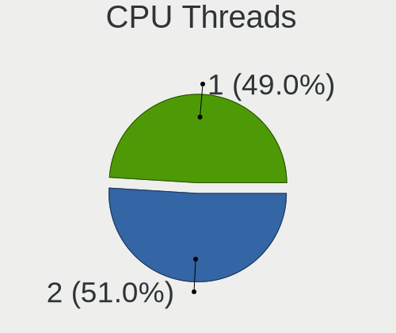
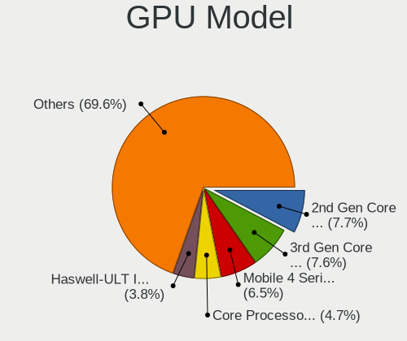
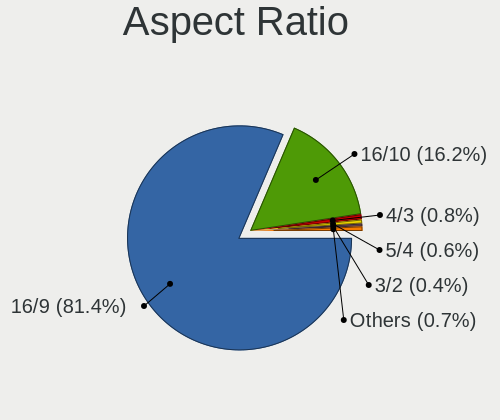
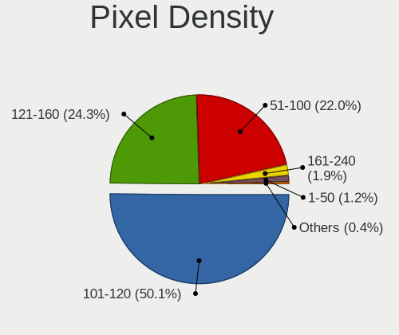
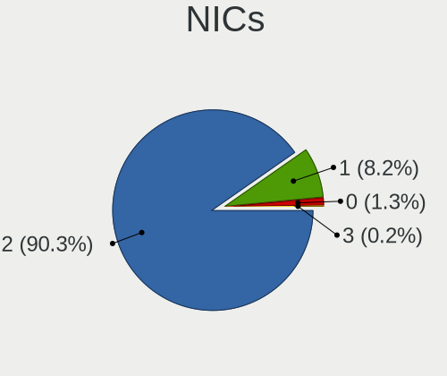
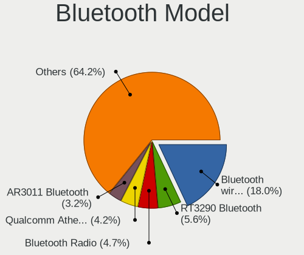
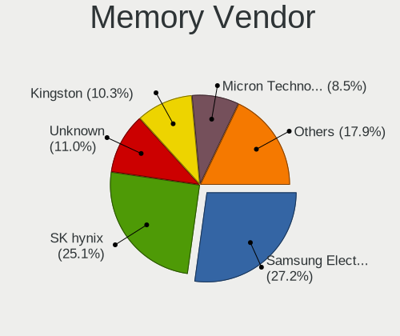
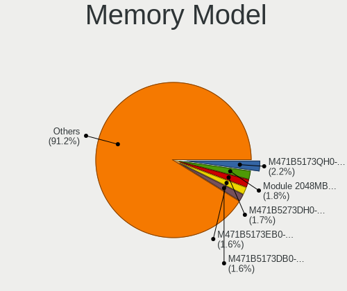
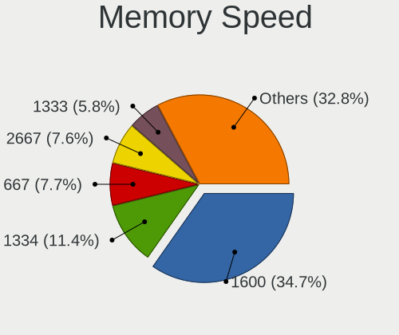

BlackPanther - Tested Hardware & Statistics (Notebooks)
-------------------------------------------------------

A project to collect tested hardware configurations for BlackPanther.

Anyone can contribute to this report by the [hw-probe](https://github.com/linuxhw/hw-probe) tool:

    sudo -E hw-probe -all -upload

Please contribute! Especially if your hardware is rare.

Contents
--------

* [ Test Cases ](#test-cases)

* [ System ](#system)
  - [ OS                       ](#os)
  - [ OS Family                ](#os-family)
  - [ Kernel                   ](#kernel)
  - [ Kernel Family            ](#kernel-family)
  - [ Kernel Major Ver.        ](#kernel-major-ver)
  - [ Arch                     ](#arch)
  - [ DE                       ](#de)
  - [ Display Server           ](#display-server)
  - [ Display Manager          ](#display-manager)
  - [ OS Lang                  ](#os-lang)
  - [ Boot Mode                ](#boot-mode)
  - [ Filesystem               ](#filesystem)
  - [ Part. scheme             ](#part-scheme)
  - [ Dual Boot with Linux/BSD ](#dual-boot-with-linuxbsd)
  - [ Dual Boot (Win)          ](#dual-boot-win)

* [ Board ](#board)
  - [ Vendor                   ](#vendor)
  - [ Model                    ](#model)
  - [ Model Family             ](#model-family)
  - [ MFG Year                 ](#mfg-year)
  - [ Form Factor              ](#form-factor)
  - [ Secure Boot              ](#secure-boot)
  - [ Coreboot                 ](#coreboot)
  - [ RAM Size                 ](#ram-size)
  - [ RAM Used                 ](#ram-used)
  - [ Total Drives             ](#total-drives)
  - [ Has CD-ROM               ](#has-cd-rom)
  - [ Has Ethernet             ](#has-ethernet)
  - [ Has WiFi                 ](#has-wifi)
  - [ Has Bluetooth            ](#has-bluetooth)

* [ Location ](#location)
  - [ Country                  ](#country)
  - [ City                     ](#city)

* [ Drives ](#drives)
  - [ Drive Vendor             ](#drive-vendor)
  - [ Drive Model              ](#drive-model)
  - [ HDD Vendor               ](#hdd-vendor)
  - [ SSD Vendor               ](#ssd-vendor)
  - [ Drive Kind               ](#drive-kind)
  - [ Drive Connector          ](#drive-connector)
  - [ Drive Size               ](#drive-size)
  - [ Space Total              ](#space-total)
  - [ Space Used               ](#space-used)
  - [ Malfunc. Drives          ](#malfunc-drives)
  - [ Malfunc. Drive Vendor    ](#malfunc-drive-vendor)
  - [ Malfunc. HDD Vendor      ](#malfunc-hdd-vendor)
  - [ Malfunc. Drive Kind      ](#malfunc-drive-kind)
  - [ Failed Drives            ](#failed-drives)
  - [ Failed Drive Vendor      ](#failed-drive-vendor)
  - [ Drive Status             ](#drive-status)

* [ Storage controller ](#storage-controller)
  - [ Storage Vendor           ](#storage-vendor)
  - [ Storage Model            ](#storage-model)
  - [ Storage Kind             ](#storage-kind)

* [ Processor ](#processor)
  - [ CPU Vendor               ](#cpu-vendor)
  - [ CPU Model                ](#cpu-model)
  - [ CPU Model Family         ](#cpu-model-family)
  - [ CPU Cores                ](#cpu-cores)
  - [ CPU Sockets              ](#cpu-sockets)
  - [ CPU Threads              ](#cpu-threads)
  - [ CPU Op-Modes             ](#cpu-op-modes)
  - [ CPU Microcode            ](#cpu-microcode)
  - [ CPU Microarch            ](#cpu-microarch)

* [ Graphics ](#graphics)
  - [ GPU Vendor               ](#gpu-vendor)
  - [ GPU Model                ](#gpu-model)
  - [ GPU Combo                ](#gpu-combo)
  - [ GPU Driver               ](#gpu-driver)
  - [ GPU Memory               ](#gpu-memory)

* [ Monitor ](#monitor)
  - [ Monitor Vendor           ](#monitor-vendor)
  - [ Monitor Model            ](#monitor-model)
  - [ Monitor Resolution       ](#monitor-resolution)
  - [ Monitor Diagonal         ](#monitor-diagonal)
  - [ Monitor Width            ](#monitor-width)
  - [ Aspect Ratio             ](#aspect-ratio)
  - [ Monitor Area             ](#monitor-area)
  - [ Pixel Density            ](#pixel-density)
  - [ Multiple Monitors        ](#multiple-monitors)

* [ Network ](#network)
  - [ Net Controller Vendor    ](#net-controller-vendor)
  - [ Net Controller Model     ](#net-controller-model)
  - [ Wireless Vendor          ](#wireless-vendor)
  - [ Wireless Model           ](#wireless-model)
  - [ Ethernet Vendor          ](#ethernet-vendor)
  - [ Ethernet Model           ](#ethernet-model)
  - [ Net Controller Kind      ](#net-controller-kind)
  - [ Used Controller          ](#used-controller)
  - [ NICs                     ](#nics)
  - [ IPv6                     ](#ipv6)

* [ Bluetooth ](#bluetooth)
  - [ Bluetooth Vendor         ](#bluetooth-vendor)
  - [ Bluetooth Model          ](#bluetooth-model)

* [ Sound ](#sound)
  - [ Sound Vendor             ](#sound-vendor)
  - [ Sound Model              ](#sound-model)

* [ Memory ](#memory)
  - [ Memory Vendor            ](#memory-vendor)
  - [ Memory Model             ](#memory-model)
  - [ Memory Kind              ](#memory-kind)
  - [ Memory Form Factor       ](#memory-form-factor)
  - [ Memory Size              ](#memory-size)
  - [ Memory Speed             ](#memory-speed)

* [ Printers & scanners ](#printers--scanners)
  - [ Printer Vendor           ](#printer-vendor)
  - [ Printer Model            ](#printer-model)
  - [ Scanner Vendor           ](#scanner-vendor)
  - [ Scanner Model            ](#scanner-model)

* [ Camera ](#camera)
  - [ Camera Vendor            ](#camera-vendor)
  - [ Camera Model             ](#camera-model)

* [ Security ](#security)
  - [ Fingerprint Vendor       ](#fingerprint-vendor)
  - [ Fingerprint Model        ](#fingerprint-model)
  - [ Chipcard Vendor          ](#chipcard-vendor)
  - [ Chipcard Model           ](#chipcard-model)

* [ Unsupported ](#unsupported)
  - [ Unsupported Devices      ](#unsupported-devices)
  - [ Unsupported Device Types ](#unsupported-device-types)

Test Cases
----------

Total: 3540

| Vendor        | Model                       | Probe                                                      | Date         |
|---------------|-----------------------------|------------------------------------------------------------|--------------|
| Lenovo        | IdeaPad 330-15IKB 81DE      | [cc19d2cf24](https://linux-hardware.org/?probe=cc19d2cf24) | Dec 31, 2022 |
| HP            | Pavilion Gaming Laptop 1... | [e0f696a9b9](https://linux-hardware.org/?probe=e0f696a9b9) | Dec 31, 2022 |
| HP            | Pavilion Gaming Laptop 1... | [6c00206f7e](https://linux-hardware.org/?probe=6c00206f7e) | Dec 30, 2022 |
| Dell          | Latitude 5480               | [e02be15b45](https://linux-hardware.org/?probe=e02be15b45) | Dec 30, 2022 |
| Dell          | Latitude 5480               | [5afd8e73be](https://linux-hardware.org/?probe=5afd8e73be) | Dec 30, 2022 |
| Dell          | Latitude 5480               | [64aa4b9161](https://linux-hardware.org/?probe=64aa4b9161) | Dec 30, 2022 |
| Dell          | Latitude 5480               | [b578e196dd](https://linux-hardware.org/?probe=b578e196dd) | Dec 29, 2022 |
| Dell          | Latitude E6230              | [a8df3d8262](https://linux-hardware.org/?probe=a8df3d8262) | Dec 29, 2022 |
| Dell          | Latitude E6230              | [a57d2f5ccb](https://linux-hardware.org/?probe=a57d2f5ccb) | Dec 29, 2022 |
| Dell          | Latitude 5480               | [4b2fda33f4](https://linux-hardware.org/?probe=4b2fda33f4) | Dec 28, 2022 |
| Dell          | Latitude 5480               | [abcd3bea2f](https://linux-hardware.org/?probe=abcd3bea2f) | Dec 28, 2022 |
| Lenovo        | IdeaPadFlex 15 20309        | [5cbcee30c7](https://linux-hardware.org/?probe=5cbcee30c7) | Dec 28, 2022 |
| Lenovo        | IdeaPadFlex 15 20309        | [743ed4d93a](https://linux-hardware.org/?probe=743ed4d93a) | Dec 27, 2022 |
| HP            | Pavilion Gaming Laptop 1... | [819f9be803](https://linux-hardware.org/?probe=819f9be803) | Dec 27, 2022 |
| HP            | Pavilion Gaming Laptop 1... | [ad4d919e36](https://linux-hardware.org/?probe=ad4d919e36) | Dec 27, 2022 |
| Acer          | Aspire A515-51G             | [56ceb67978](https://linux-hardware.org/?probe=56ceb67978) | Dec 26, 2022 |
| Acer          | Aspire A515-51G             | [e44b069b44](https://linux-hardware.org/?probe=e44b069b44) | Dec 26, 2022 |
| HP            | Compaq 610                  | [198b4d0586](https://linux-hardware.org/?probe=198b4d0586) | Dec 25, 2022 |
| HP            | Compaq 610                  | [0e9ab46e66](https://linux-hardware.org/?probe=0e9ab46e66) | Dec 25, 2022 |
| Acer          | E1-510                      | [463c668d4e](https://linux-hardware.org/?probe=463c668d4e) | Dec 23, 2022 |
| HP            | Laptop 17-ak0xx             | [7e77870894](https://linux-hardware.org/?probe=7e77870894) | Dec 21, 2022 |
| HP            | Laptop 17-ak0xx             | [04c205c943](https://linux-hardware.org/?probe=04c205c943) | Dec 21, 2022 |
| Dell          | Latitude E6230              | [80012cb415](https://linux-hardware.org/?probe=80012cb415) | Dec 19, 2022 |
| Dell          | Latitude E6230              | [ba7fa25841](https://linux-hardware.org/?probe=ba7fa25841) | Dec 17, 2022 |
| Dell          | Inspiron M5030              | [265739601c](https://linux-hardware.org/?probe=265739601c) | Dec 16, 2022 |
| HP            | Laptop 17-ak0xx             | [0ed9c8a241](https://linux-hardware.org/?probe=0ed9c8a241) | Dec 16, 2022 |
| Lenovo        | E50-80 80J2                 | [9dc9070ae6](https://linux-hardware.org/?probe=9dc9070ae6) | Dec 13, 2022 |
| Lenovo        | E50-80 80J2                 | [cf9f4d4a79](https://linux-hardware.org/?probe=cf9f4d4a79) | Dec 13, 2022 |
| HP            | 650                         | [add4ca69e3](https://linux-hardware.org/?probe=add4ca69e3) | Dec 11, 2022 |
| Acer          | TravelMate 8571             | [63aa77ba8d](https://linux-hardware.org/?probe=63aa77ba8d) | Dec 10, 2022 |
| ASUSTek       | X540SA                      | [ac26a0f572](https://linux-hardware.org/?probe=ac26a0f572) | Dec 10, 2022 |
| ASUSTek       | K54HR                       | [32870f2fa3](https://linux-hardware.org/?probe=32870f2fa3) | Dec 10, 2022 |
| ASUSTek       | K54HR                       | [fac8091847](https://linux-hardware.org/?probe=fac8091847) | Dec 10, 2022 |
| ASUSTek       | X540SA                      | [abda33d50f](https://linux-hardware.org/?probe=abda33d50f) | Dec 10, 2022 |
| ASUSTek       | X200MA                      | [1cb00c612b](https://linux-hardware.org/?probe=1cb00c612b) | Dec 09, 2022 |
| HP            | Laptop 15-db0xxx            | [9617825518](https://linux-hardware.org/?probe=9617825518) | Dec 09, 2022 |
| HP            | Laptop 15-db0xxx            | [7b1075fd9b](https://linux-hardware.org/?probe=7b1075fd9b) | Dec 09, 2022 |
| Acer          | TravelMate 8571             | [89270d1f7c](https://linux-hardware.org/?probe=89270d1f7c) | Dec 08, 2022 |
| Acer          | Nitro AN515-51              | [177d3d8e16](https://linux-hardware.org/?probe=177d3d8e16) | Dec 08, 2022 |
| Dell          | Inspiron M5030              | [f73021e3c7](https://linux-hardware.org/?probe=f73021e3c7) | Dec 08, 2022 |
| ASUSTek       | K54HR                       | [66433bdc5e](https://linux-hardware.org/?probe=66433bdc5e) | Dec 07, 2022 |
| Acer          | TravelMate 8571             | [9e7f0672b2](https://linux-hardware.org/?probe=9e7f0672b2) | Dec 06, 2022 |
| ASUSTek       | K54HR                       | [264d0d02bb](https://linux-hardware.org/?probe=264d0d02bb) | Dec 04, 2022 |
| Acer          | TravelMate 8571             | [df032cacb6](https://linux-hardware.org/?probe=df032cacb6) | Dec 03, 2022 |
| HP            | Pavilion Gaming Laptop 1... | [32dbbbf380](https://linux-hardware.org/?probe=32dbbbf380) | Dec 03, 2022 |
| Dell          | Latitude E5520              | [1b3b69b19f](https://linux-hardware.org/?probe=1b3b69b19f) | Nov 28, 2022 |
| Dell          | Latitude E5520              | [ce72f1c2a9](https://linux-hardware.org/?probe=ce72f1c2a9) | Nov 25, 2022 |
| HP            | Unknown                     | [f76118ac5f](https://linux-hardware.org/?probe=f76118ac5f) | Nov 13, 2022 |
| HP            | Unknown                     | [8cd95516d0](https://linux-hardware.org/?probe=8cd95516d0) | Nov 13, 2022 |
| HP            | 650                         | [100707d1eb](https://linux-hardware.org/?probe=100707d1eb) | Nov 13, 2022 |
| HP            | 650                         | [fd3b93e8fb](https://linux-hardware.org/?probe=fd3b93e8fb) | Nov 05, 2022 |
| Dell          | Inspiron 5558               | [416655ce7d](https://linux-hardware.org/?probe=416655ce7d) | Oct 30, 2022 |
| Dell          | Inspiron 5558               | [ae71fe1a19](https://linux-hardware.org/?probe=ae71fe1a19) | Oct 30, 2022 |
| HP            | Compaq nx6310 (EY589ES#A... | [a80d2e7626](https://linux-hardware.org/?probe=a80d2e7626) | Oct 27, 2022 |
| Fujitsu       | LIFEBOOK U745               | [7cb792e432](https://linux-hardware.org/?probe=7cb792e432) | Oct 27, 2022 |
| Fujitsu       | LIFEBOOK U745               | [0c33d71210](https://linux-hardware.org/?probe=0c33d71210) | Oct 27, 2022 |
| HP            | Compaq 6910p (GH717AW#AB... | [02d31506a2](https://linux-hardware.org/?probe=02d31506a2) | Oct 24, 2022 |
| Dell          | Latitude E6230              | [73ee8be4e9](https://linux-hardware.org/?probe=73ee8be4e9) | Oct 23, 2022 |
| Dell          | Latitude E6230              | [52ee15a8f5](https://linux-hardware.org/?probe=52ee15a8f5) | Oct 23, 2022 |
| eMachines     | E725                        | [ea21ca2d78](https://linux-hardware.org/?probe=ea21ca2d78) | Oct 19, 2022 |
| eMachines     | E725                        | [6d5ddca6c9](https://linux-hardware.org/?probe=6d5ddca6c9) | Oct 18, 2022 |
| eMachines     | E725                        | [f365f1eaa7](https://linux-hardware.org/?probe=f365f1eaa7) | Oct 17, 2022 |
| eMachines     | E725                        | [7003528b88](https://linux-hardware.org/?probe=7003528b88) | Oct 17, 2022 |
| Unknown       | Unknown                     | [07a141abbb](https://linux-hardware.org/?probe=07a141abbb) | Oct 14, 2022 |
| eMachines     | E725                        | [77e7244d88](https://linux-hardware.org/?probe=77e7244d88) | Oct 14, 2022 |
| eMachines     | E725                        | [34538c32c5](https://linux-hardware.org/?probe=34538c32c5) | Oct 14, 2022 |
| Unknown       | Unknown                     | [0d8c24c367](https://linux-hardware.org/?probe=0d8c24c367) | Oct 13, 2022 |
| Lenovo        | ThinkPad W530 2463A58       | [dc933df0a9](https://linux-hardware.org/?probe=dc933df0a9) | Oct 10, 2022 |
| ASUSTek       | X550VX                      | [63a8f1baa1](https://linux-hardware.org/?probe=63a8f1baa1) | Oct 10, 2022 |
| ASUSTek       | X550VX                      | [7f9e9ab40b](https://linux-hardware.org/?probe=7f9e9ab40b) | Oct 10, 2022 |
| Lenovo        | V145-15AST 81MT             | [91163f885b](https://linux-hardware.org/?probe=91163f885b) | Oct 07, 2022 |
| eMachines     | E725                        | [9a77e04f3c](https://linux-hardware.org/?probe=9a77e04f3c) | Oct 05, 2022 |
| eMachines     | E725                        | [e413d82fa5](https://linux-hardware.org/?probe=e413d82fa5) | Oct 05, 2022 |
| Dell          | Latitude D630               | [90dc2dddf8](https://linux-hardware.org/?probe=90dc2dddf8) | Oct 02, 2022 |
| Sony          | SVS13118GBB                 | [48dd8fb419](https://linux-hardware.org/?probe=48dd8fb419) | Oct 01, 2022 |
| Fujitsu       | LIFEBOOK S904               | [c9c83f0112](https://linux-hardware.org/?probe=c9c83f0112) | Oct 01, 2022 |
| Dell          | Latitude D630               | [d00c756052](https://linux-hardware.org/?probe=d00c756052) | Oct 01, 2022 |
| Sony          | SVS13118GBB                 | [75e6dbe3d2](https://linux-hardware.org/?probe=75e6dbe3d2) | Oct 01, 2022 |
| ASUSTek       | Strix 15 GL503GE            | [e48bab666f](https://linux-hardware.org/?probe=e48bab666f) | Oct 01, 2022 |
| Sony          | SVS13118GBB                 | [0e0ca26d00](https://linux-hardware.org/?probe=0e0ca26d00) | Sep 30, 2022 |
| Sony          | SVS13118GBB                 | [12868cf90f](https://linux-hardware.org/?probe=12868cf90f) | Sep 30, 2022 |
| Lenovo        | IdeaPad 320-17ABR 80YN      | [1ff8e037f4](https://linux-hardware.org/?probe=1ff8e037f4) | Sep 30, 2022 |
| Dell          | Latitude E6420              | [cdd7bd1cc2](https://linux-hardware.org/?probe=cdd7bd1cc2) | Sep 29, 2022 |
| eMachines     | E725                        | [04c9a24d86](https://linux-hardware.org/?probe=04c9a24d86) | Sep 28, 2022 |
| eMachines     | E725                        | [f99f2244c7](https://linux-hardware.org/?probe=f99f2244c7) | Sep 28, 2022 |
| Acer          | Aspire E1-531               | [b7d37d0c6f](https://linux-hardware.org/?probe=b7d37d0c6f) | Sep 27, 2022 |
| Acer          | Aspire E1-531               | [90856d2122](https://linux-hardware.org/?probe=90856d2122) | Sep 27, 2022 |
| ASUSTek       | 1015BX                      | [5190c360db](https://linux-hardware.org/?probe=5190c360db) | Sep 25, 2022 |
| HP            | 650                         | [f835e52a64](https://linux-hardware.org/?probe=f835e52a64) | Sep 25, 2022 |
| HP            | Compaq 6710b (KE125ET#AB... | [fc7831b371](https://linux-hardware.org/?probe=fc7831b371) | Sep 23, 2022 |
| HP            | Compaq 6710b (KE125ET#AB... | [15cffbb03b](https://linux-hardware.org/?probe=15cffbb03b) | Sep 23, 2022 |
| Pegatron      | A15                         | [a865984ad5](https://linux-hardware.org/?probe=a865984ad5) | Sep 23, 2022 |
| Pegatron      | A15                         | [ea527d6d5a](https://linux-hardware.org/?probe=ea527d6d5a) | Sep 23, 2022 |
| Fujitsu       | LIFEBOOK U745               | [0570d2318c](https://linux-hardware.org/?probe=0570d2318c) | Sep 23, 2022 |
| ASUSTek       | K54HR                       | [dbf0f3b1c8](https://linux-hardware.org/?probe=dbf0f3b1c8) | Sep 21, 2022 |
| ASUSTek       | K54HR                       | [25fd2ae90c](https://linux-hardware.org/?probe=25fd2ae90c) | Sep 21, 2022 |
| Toshiba       | Satellite L450              | [20b85987c4](https://linux-hardware.org/?probe=20b85987c4) | Sep 20, 2022 |
| Toshiba       | Satellite L450              | [9f694612d3](https://linux-hardware.org/?probe=9f694612d3) | Sep 20, 2022 |
| ASUSTek       | X550CL                      | [16d313fefa](https://linux-hardware.org/?probe=16d313fefa) | Sep 20, 2022 |
| eMachines     | E725                        | [141723a3e2](https://linux-hardware.org/?probe=141723a3e2) | Sep 16, 2022 |
| eMachines     | E725                        | [bf27205286](https://linux-hardware.org/?probe=bf27205286) | Sep 15, 2022 |
| Acer          | Aspire 5310                 | [963a5bcade](https://linux-hardware.org/?probe=963a5bcade) | Sep 15, 2022 |
| Acer          | Aspire 5820                 | [1820ffa037](https://linux-hardware.org/?probe=1820ffa037) | Sep 09, 2022 |
| Acer          | Aspire 5820                 | [3f0d8d8ff5](https://linux-hardware.org/?probe=3f0d8d8ff5) | Sep 09, 2022 |
| Acer          | Aspire R3-471T              | [05edd6d4ae](https://linux-hardware.org/?probe=05edd6d4ae) | Sep 08, 2022 |
| Dell          | Latitude E6230              | [41c1130440](https://linux-hardware.org/?probe=41c1130440) | Sep 07, 2022 |
| Dell          | Latitude E6230              | [5e0436a64a](https://linux-hardware.org/?probe=5e0436a64a) | Sep 07, 2022 |
| Lenovo        | IdeaPad 110-15ISK 80UD      | [32715c6eb9](https://linux-hardware.org/?probe=32715c6eb9) | Sep 06, 2022 |
| Lenovo        | IdeaPad 110-15ISK 80UD      | [cbc35f08cb](https://linux-hardware.org/?probe=cbc35f08cb) | Sep 06, 2022 |
| HP            | 650                         | [526b86a559](https://linux-hardware.org/?probe=526b86a559) | Sep 04, 2022 |
| HP            | 650                         | [6f184e96df](https://linux-hardware.org/?probe=6f184e96df) | Sep 04, 2022 |
| Acer          | Aspire R3-471T              | [eeedafee37](https://linux-hardware.org/?probe=eeedafee37) | Sep 04, 2022 |
| Acer          | Aspire R3-471T              | [01b021f810](https://linux-hardware.org/?probe=01b021f810) | Aug 31, 2022 |
| eMachines     | E725                        | [3e5c01d133](https://linux-hardware.org/?probe=3e5c01d133) | Aug 28, 2022 |
| Lenovo        | IdeaPad 110-15ISK 80UD      | [1dd156b433](https://linux-hardware.org/?probe=1dd156b433) | Aug 27, 2022 |
| ASUSTek       | X200MA                      | [dcadb94c69](https://linux-hardware.org/?probe=dcadb94c69) | Aug 27, 2022 |
| ASUSTek       | X200MA                      | [5d22a1baa9](https://linux-hardware.org/?probe=5d22a1baa9) | Aug 27, 2022 |
| eMachines     | E725                        | [b73baa0850](https://linux-hardware.org/?probe=b73baa0850) | Aug 25, 2022 |
| ASUSTek       | X200MA                      | [8d375ef1fd](https://linux-hardware.org/?probe=8d375ef1fd) | Aug 24, 2022 |
| ASUSTek       | X200MA                      | [69af3fb82a](https://linux-hardware.org/?probe=69af3fb82a) | Aug 24, 2022 |
| Lenovo        | ThinkPad T410 2537BF9       | [be0227ed47](https://linux-hardware.org/?probe=be0227ed47) | Aug 23, 2022 |
| ASUSTek       | 1015BX                      | [94f3284833](https://linux-hardware.org/?probe=94f3284833) | Aug 21, 2022 |
| Lenovo        | ThinkPad X220 4290L39       | [31a7893b95](https://linux-hardware.org/?probe=31a7893b95) | Aug 20, 2022 |
| Dell          | Latitude 5580               | [5c9db9ff58](https://linux-hardware.org/?probe=5c9db9ff58) | Aug 18, 2022 |
| Lenovo        | IdeaPad 110-15ISK 80UD      | [6649d66a82](https://linux-hardware.org/?probe=6649d66a82) | Aug 15, 2022 |
| eMachines     | E725                        | [928cfd8881](https://linux-hardware.org/?probe=928cfd8881) | Aug 13, 2022 |
| eMachines     | E725                        | [e1d0d38a1c](https://linux-hardware.org/?probe=e1d0d38a1c) | Aug 13, 2022 |
| Lenovo        | IdeaPad 320-15ABR 80XS      | [1d7c1c5212](https://linux-hardware.org/?probe=1d7c1c5212) | Aug 13, 2022 |
| Lenovo        | IdeaPad 320-15ABR 80XS      | [70b0d2bb45](https://linux-hardware.org/?probe=70b0d2bb45) | Aug 13, 2022 |
| eMachines     | E520 V1.10                  | [a5c7ca58d9](https://linux-hardware.org/?probe=a5c7ca58d9) | Aug 06, 2022 |
| Fujitsu       | LIFEBOOK U745               | [c6d5fcceee](https://linux-hardware.org/?probe=c6d5fcceee) | Aug 05, 2022 |
| Fujitsu       | LIFEBOOK U745               | [0e067ccc56](https://linux-hardware.org/?probe=0e067ccc56) | Aug 05, 2022 |
| eMachines     | E725                        | [8028786618](https://linux-hardware.org/?probe=8028786618) | Aug 04, 2022 |
| ASUSTek       | X550JX                      | [469c737a9b](https://linux-hardware.org/?probe=469c737a9b) | Aug 03, 2022 |
| eMachines     | E725                        | [fe35b6624b](https://linux-hardware.org/?probe=fe35b6624b) | Aug 02, 2022 |
| eMachines     | E725                        | [25d51b3945](https://linux-hardware.org/?probe=25d51b3945) | Aug 02, 2022 |
| ASUSTek       | X550JX                      | [edf8c765aa](https://linux-hardware.org/?probe=edf8c765aa) | Aug 02, 2022 |
| eMachines     | E520 V1.10                  | [bb16305e18](https://linux-hardware.org/?probe=bb16305e18) | Aug 01, 2022 |
| HP            | EliteBook 8470p             | [a1d5593420](https://linux-hardware.org/?probe=a1d5593420) | Aug 01, 2022 |
| HP            | EliteBook 8470p             | [0cecb854f4](https://linux-hardware.org/?probe=0cecb854f4) | Jul 31, 2022 |
| HP            | EliteBook 8470p             | [5e73e33a77](https://linux-hardware.org/?probe=5e73e33a77) | Jul 31, 2022 |
| eMachines     | E725                        | [ca033cf053](https://linux-hardware.org/?probe=ca033cf053) | Jul 26, 2022 |
| eMachines     | E725                        | [b975298e85](https://linux-hardware.org/?probe=b975298e85) | Jul 25, 2022 |
| Alcor         | Intel Education Tablet      | [a04ad41c5a](https://linux-hardware.org/?probe=a04ad41c5a) | Jul 24, 2022 |
| Alcor         | Intel Education Tablet      | [700f83a555](https://linux-hardware.org/?probe=700f83a555) | Jul 24, 2022 |
| Dell          | Latitude D630               | [a9fc5a41aa](https://linux-hardware.org/?probe=a9fc5a41aa) | Jul 24, 2022 |
| Dell          | Latitude D630               | [7476af3363](https://linux-hardware.org/?probe=7476af3363) | Jul 23, 2022 |
| ASUSTek       | Strix 15 GL503GE            | [e543e58f00](https://linux-hardware.org/?probe=e543e58f00) | Jul 22, 2022 |
| Lenovo        | IdeaPad 320-15ISK 80XH      | [33f5176a6c](https://linux-hardware.org/?probe=33f5176a6c) | Jul 21, 2022 |
| Dell          | Precision M4400             | [cf3bbe255a](https://linux-hardware.org/?probe=cf3bbe255a) | Jul 20, 2022 |
| Dell          | Latitude D630C              | [124c9fa2bd](https://linux-hardware.org/?probe=124c9fa2bd) | Jul 15, 2022 |
| eMachines     | E725                        | [771942dd5e](https://linux-hardware.org/?probe=771942dd5e) | Jul 15, 2022 |
| Dell          | Latitude D630C              | [41d2b7ede2](https://linux-hardware.org/?probe=41d2b7ede2) | Jul 15, 2022 |
| HP            | 255 G5 Notebook PC          | [86b8dc8c6d](https://linux-hardware.org/?probe=86b8dc8c6d) | Jul 15, 2022 |
| ASUSTek       | ASUS TUF Gaming F15 FX50... | [23077c70b2](https://linux-hardware.org/?probe=23077c70b2) | Jul 14, 2022 |
| ASUSTek       | ASUS TUF Gaming F15 FX50... | [10192c3d0b](https://linux-hardware.org/?probe=10192c3d0b) | Jul 14, 2022 |
| HP            | 255 G5 Notebook PC          | [fa6486dcd9](https://linux-hardware.org/?probe=fa6486dcd9) | Jul 13, 2022 |
| eMachines     | E725                        | [27fb6a6cab](https://linux-hardware.org/?probe=27fb6a6cab) | Jul 12, 2022 |
| ASUSTek       | VivoBook_ASUSLaptop X530... | [9ae6c29438](https://linux-hardware.org/?probe=9ae6c29438) | Jul 08, 2022 |
| Dell          | Latitude D630C              | [5e5cd08804](https://linux-hardware.org/?probe=5e5cd08804) | Jul 08, 2022 |
| Packard Be... | EasyNote ML65               | [c8c6125dc3](https://linux-hardware.org/?probe=c8c6125dc3) | Jul 06, 2022 |
| Packard Be... | EasyNote ML65               | [09d1580fd5](https://linux-hardware.org/?probe=09d1580fd5) | Jul 06, 2022 |
| Sony          | VPCEH2J1E                   | [e51b908744](https://linux-hardware.org/?probe=e51b908744) | Jul 06, 2022 |
| Lenovo        | ThinkPad W510 431924G       | [d65b149a5f](https://linux-hardware.org/?probe=d65b149a5f) | Jul 04, 2022 |
| eMachines     | E725                        | [18d7561b19](https://linux-hardware.org/?probe=18d7561b19) | Jul 04, 2022 |
| eMachines     | E725                        | [8ba1579921](https://linux-hardware.org/?probe=8ba1579921) | Jul 01, 2022 |
| eMachines     | E725                        | [874b6bd7de](https://linux-hardware.org/?probe=874b6bd7de) | Jul 01, 2022 |
| eMachines     | E725                        | [021bcca061](https://linux-hardware.org/?probe=021bcca061) | Jun 30, 2022 |
| eMachines     | E725                        | [b8b332e92f](https://linux-hardware.org/?probe=b8b332e92f) | Jun 30, 2022 |
| eMachines     | E725                        | [3b272a4e25](https://linux-hardware.org/?probe=3b272a4e25) | Jun 26, 2022 |
| Dell          | Latitude E5500              | [8002c78586](https://linux-hardware.org/?probe=8002c78586) | Jun 25, 2022 |
| Lenovo        | IdeaPad 320-17ABR 80YN      | [a26161ba2f](https://linux-hardware.org/?probe=a26161ba2f) | Jun 23, 2022 |
| Dell          | Latitude D630               | [60c9b1089c](https://linux-hardware.org/?probe=60c9b1089c) | Jun 23, 2022 |
| Dell          | Latitude E5500              | [ad849dbfe7](https://linux-hardware.org/?probe=ad849dbfe7) | Jun 22, 2022 |
| HP            | 255 G5 Notebook PC          | [d230e8311a](https://linux-hardware.org/?probe=d230e8311a) | Jun 21, 2022 |
| HP            | 255 G5 Notebook PC          | [7d1b0cfc99](https://linux-hardware.org/?probe=7d1b0cfc99) | Jun 21, 2022 |
| eMachines     | E725                        | [6e81be09d2](https://linux-hardware.org/?probe=6e81be09d2) | Jun 19, 2022 |
| Lenovo        | IdeaPad 320-15IAP 80XR      | [e9eb39efa4](https://linux-hardware.org/?probe=e9eb39efa4) | Jun 16, 2022 |
| Lenovo        | IdeaPad 320-15IAP 80XR      | [bffb7f61cb](https://linux-hardware.org/?probe=bffb7f61cb) | Jun 15, 2022 |
| Lenovo        | Z50-75 80EC                 | [2600b8aa7a](https://linux-hardware.org/?probe=2600b8aa7a) | Jun 14, 2022 |
| HP            | Compaq 6710b (KE121EA#AK... | [940eb51107](https://linux-hardware.org/?probe=940eb51107) | Jun 09, 2022 |
| HP            | ProBook 640 G8 Notebook ... | [15e4cca5bc](https://linux-hardware.org/?probe=15e4cca5bc) | Jun 03, 2022 |
| HP            | ProBook 640 G8 Notebook ... | [b99a9b1bce](https://linux-hardware.org/?probe=b99a9b1bce) | Jun 03, 2022 |
| HP            | ProBook 640 G8 Notebook ... | [96768b6e5c](https://linux-hardware.org/?probe=96768b6e5c) | Jun 02, 2022 |
| HP            | Pavilion Laptop 14-ce0xx... | [d11a49f42b](https://linux-hardware.org/?probe=d11a49f42b) | Jun 02, 2022 |
| HP            | Pavilion Laptop 14-ce0xx... | [968decd1af](https://linux-hardware.org/?probe=968decd1af) | Jun 02, 2022 |
| Dell          | Latitude E6400              | [cea3337908](https://linux-hardware.org/?probe=cea3337908) | Jun 01, 2022 |
| HP            | 255 G5 Notebook PC          | [4ff7c85a84](https://linux-hardware.org/?probe=4ff7c85a84) | May 31, 2022 |
| HP            | 255 G5 Notebook PC          | [c65fb5ddb9](https://linux-hardware.org/?probe=c65fb5ddb9) | May 31, 2022 |
| ASUSTek       | K53U                        | [efd067c3a8](https://linux-hardware.org/?probe=efd067c3a8) | May 30, 2022 |
| ASUSTek       | K53U                        | [a26756238b](https://linux-hardware.org/?probe=a26756238b) | May 30, 2022 |
| Dell          | Latitude E6230              | [068d9b4143](https://linux-hardware.org/?probe=068d9b4143) | May 29, 2022 |
| Dell          | Latitude E6230              | [c50bb14e9a](https://linux-hardware.org/?probe=c50bb14e9a) | May 29, 2022 |
| HP            | 255 G5 Notebook PC          | [672f924aec](https://linux-hardware.org/?probe=672f924aec) | May 28, 2022 |
| HP            | 255 G5 Notebook PC          | [7f91291747](https://linux-hardware.org/?probe=7f91291747) | May 28, 2022 |
| HP            | 620                         | [b5bf98b16a](https://linux-hardware.org/?probe=b5bf98b16a) | May 23, 2022 |
| HP            | 620                         | [8bf9517a97](https://linux-hardware.org/?probe=8bf9517a97) | May 23, 2022 |
| HP            | Presario CQ58               | [bdf8b7e229](https://linux-hardware.org/?probe=bdf8b7e229) | May 22, 2022 |
| HP            | Presario CQ58               | [383a27dd29](https://linux-hardware.org/?probe=383a27dd29) | May 22, 2022 |
| MSI           | GT60 2OC/2OD                | [c3b5eb704d](https://linux-hardware.org/?probe=c3b5eb704d) | May 22, 2022 |
| MSI           | GT60 2OC/2OD                | [96f6fda5d5](https://linux-hardware.org/?probe=96f6fda5d5) | May 22, 2022 |
| Lenovo        | B590 20208                  | [b32a821a4c](https://linux-hardware.org/?probe=b32a821a4c) | May 21, 2022 |
| Lenovo        | B590 20208                  | [3386aeef48](https://linux-hardware.org/?probe=3386aeef48) | May 21, 2022 |
| Fujitsu       | LIFEBOOK U745               | [9003466ff8](https://linux-hardware.org/?probe=9003466ff8) | May 21, 2022 |
| Fujitsu       | LIFEBOOK U745               | [2e05001696](https://linux-hardware.org/?probe=2e05001696) | May 21, 2022 |
| HP            | 620                         | [babb1f392a](https://linux-hardware.org/?probe=babb1f392a) | May 21, 2022 |
| Lenovo        | G570 20079                  | [f4b9c3997d](https://linux-hardware.org/?probe=f4b9c3997d) | May 16, 2022 |
| Toshiba       | Satellite L775-18R          | [ec012c6b3d](https://linux-hardware.org/?probe=ec012c6b3d) | May 16, 2022 |
| Lenovo        | G580 20150                  | [75f2c0ab4e](https://linux-hardware.org/?probe=75f2c0ab4e) | May 15, 2022 |
| Lenovo        | G580 20150                  | [8d710ae7c3](https://linux-hardware.org/?probe=8d710ae7c3) | May 15, 2022 |
| Lenovo        | IdeaPad 320-17ABR 80YN      | [758e2b869d](https://linux-hardware.org/?probe=758e2b869d) | May 15, 2022 |
| Lenovo        | IdeaPad 320-17ABR 80YN      | [91c6da69a9](https://linux-hardware.org/?probe=91c6da69a9) | May 15, 2022 |
| Dell          | Latitude E6430              | [e805d60a6b](https://linux-hardware.org/?probe=e805d60a6b) | May 14, 2022 |
| HP            | ProBook 640 G8 Notebook ... | [bfc1a518db](https://linux-hardware.org/?probe=bfc1a518db) | May 14, 2022 |
| HP            | 620                         | [62369d924a](https://linux-hardware.org/?probe=62369d924a) | May 12, 2022 |
| Lenovo        | Yoga 300-11IBY 80M0         | [af186fe9e3](https://linux-hardware.org/?probe=af186fe9e3) | May 10, 2022 |
| Lenovo        | Yoga 300-11IBY 80M0         | [b6fed1d4fe](https://linux-hardware.org/?probe=b6fed1d4fe) | May 10, 2022 |
| Dell          | Latitude E6230              | [d9d1e38394](https://linux-hardware.org/?probe=d9d1e38394) | May 09, 2022 |
| Acer          | Aspire 6930G                | [49228d9f61](https://linux-hardware.org/?probe=49228d9f61) | May 08, 2022 |
| Acer          | Aspire 6930G                | [912dbb8280](https://linux-hardware.org/?probe=912dbb8280) | May 08, 2022 |
| MSI           | GT60 2OC/2OD                | [21f08dbab6](https://linux-hardware.org/?probe=21f08dbab6) | May 06, 2022 |
| HUAWEI        | HVY-WXX9                    | [fbd1c44f53](https://linux-hardware.org/?probe=fbd1c44f53) | May 02, 2022 |
| Sony          | VPCEH2J1E                   | [86f6b8c750](https://linux-hardware.org/?probe=86f6b8c750) | Apr 30, 2022 |
| Dell          | Inspiron MP061              | [e41e5725a7](https://linux-hardware.org/?probe=e41e5725a7) | Apr 28, 2022 |
| Toshiba       | NB550D                      | [386409d233](https://linux-hardware.org/?probe=386409d233) | Apr 24, 2022 |
| Lenovo        | B590 20208                  | [af6b076e21](https://linux-hardware.org/?probe=af6b076e21) | Apr 18, 2022 |
| Hungaro Fl... | Navon Loop 360              | [48b6f0e313](https://linux-hardware.org/?probe=48b6f0e313) | Apr 18, 2022 |
| Hungaro Fl... | Navon Loop 360              | [cde65f88c1](https://linux-hardware.org/?probe=cde65f88c1) | Apr 17, 2022 |
| ASUSTek       | TP201SA                     | [2898b67bff](https://linux-hardware.org/?probe=2898b67bff) | Apr 16, 2022 |
| HP            | ProBook 470 G1              | [ee1f05022a](https://linux-hardware.org/?probe=ee1f05022a) | Apr 10, 2022 |
| Lenovo        | G580 20150                  | [00215e25c0](https://linux-hardware.org/?probe=00215e25c0) | Apr 10, 2022 |
| Acer          | Aspire A114-31              | [8779ba2891](https://linux-hardware.org/?probe=8779ba2891) | Apr 09, 2022 |
| Fujitsu       | LIFEBOOK U745               | [9dc3653255](https://linux-hardware.org/?probe=9dc3653255) | Apr 09, 2022 |
| Acer          | Aspire A114-31              | [298acab48c](https://linux-hardware.org/?probe=298acab48c) | Apr 08, 2022 |
| Lenovo        | ThinkPad T61 6458WK6        | [5303af9863](https://linux-hardware.org/?probe=5303af9863) | Apr 07, 2022 |
| ASUSTek       | N75SF                       | [e3f8003fb7](https://linux-hardware.org/?probe=e3f8003fb7) | Apr 07, 2022 |
| Fujitsu       | LIFEBOOK U745               | [5d73ae026b](https://linux-hardware.org/?probe=5d73ae026b) | Apr 05, 2022 |
| Acer          | TravelMate P215-52          | [a5d16dc93e](https://linux-hardware.org/?probe=a5d16dc93e) | Apr 03, 2022 |
| Samsung       | RV410/RV510/S3510/E3510     | [495e271511](https://linux-hardware.org/?probe=495e271511) | Apr 03, 2022 |
| Dell          | Latitude E5420              | [a60c1a4785](https://linux-hardware.org/?probe=a60c1a4785) | Apr 03, 2022 |
| Lenovo        | G780 20138                  | [a7cad8a09a](https://linux-hardware.org/?probe=a7cad8a09a) | Apr 02, 2022 |
| Acer          | TravelMate P215-52          | [752d283e54](https://linux-hardware.org/?probe=752d283e54) | Apr 01, 2022 |
| ASUSTek       | X540LA                      | [732406d8b0](https://linux-hardware.org/?probe=732406d8b0) | Apr 01, 2022 |
| Samsung       | RV410/RV510/S3510/E3510     | [666c8daa31](https://linux-hardware.org/?probe=666c8daa31) | Apr 01, 2022 |
| HP            | Unknown                     | [c6a02a2df5](https://linux-hardware.org/?probe=c6a02a2df5) | Apr 01, 2022 |
| HP            | Unknown                     | [71ae764e9f](https://linux-hardware.org/?probe=71ae764e9f) | Apr 01, 2022 |
| HP            | Compaq nx6125 (PZ896UA#A... | [bba6b8d33d](https://linux-hardware.org/?probe=bba6b8d33d) | Mar 30, 2022 |
| HP            | Compaq nx6125 (PZ896UA#A... | [9f382b5166](https://linux-hardware.org/?probe=9f382b5166) | Mar 30, 2022 |
| HP            | Pavilion dv8000 (EP409UA... | [56c91c9396](https://linux-hardware.org/?probe=56c91c9396) | Mar 29, 2022 |
| eMachines     | E725                        | [475f79831d](https://linux-hardware.org/?probe=475f79831d) | Mar 29, 2022 |
| eMachines     | E725                        | [f8e777c318](https://linux-hardware.org/?probe=f8e777c318) | Mar 29, 2022 |
| HP            | ProBook 640 G8 Notebook ... | [60da33f3aa](https://linux-hardware.org/?probe=60da33f3aa) | Mar 28, 2022 |
| Dell          | Latitude E5540              | [838350f357](https://linux-hardware.org/?probe=838350f357) | Mar 28, 2022 |
| Lenovo        | ThinkPad W530 2463A58       | [8e8bd0aad5](https://linux-hardware.org/?probe=8e8bd0aad5) | Mar 28, 2022 |
| Sony          | VPCEH2J1E                   | [23d5b99aca](https://linux-hardware.org/?probe=23d5b99aca) | Mar 27, 2022 |
| Lenovo        | G580 20150                  | [ec430f1afc](https://linux-hardware.org/?probe=ec430f1afc) | Mar 27, 2022 |
| Dell          | Inspiron M5030              | [a36af1ef0f](https://linux-hardware.org/?probe=a36af1ef0f) | Mar 27, 2022 |
| Dell          | Inspiron M5030              | [c3b9926b94](https://linux-hardware.org/?probe=c3b9926b94) | Mar 27, 2022 |
| Lenovo        | IdeaPad 320-17ABR 80YN      | [ed4ed6851f](https://linux-hardware.org/?probe=ed4ed6851f) | Mar 23, 2022 |
| Lenovo        | IdeaPad 330-15IKB 81DE      | [5b8c4678af](https://linux-hardware.org/?probe=5b8c4678af) | Mar 22, 2022 |
| Acer          | TravelMate P238-G2-M        | [7aa968ca84](https://linux-hardware.org/?probe=7aa968ca84) | Mar 22, 2022 |
| Apple         | MacBookPro6,2               | [5611c90f20](https://linux-hardware.org/?probe=5611c90f20) | Mar 21, 2022 |
| Apple         | MacBookPro6,2               | [2a71c88e71](https://linux-hardware.org/?probe=2a71c88e71) | Mar 21, 2022 |
| Lenovo        | G505s 20255                 | [9f18cfb328](https://linux-hardware.org/?probe=9f18cfb328) | Mar 19, 2022 |
| Sony          | VPCEH2J1E                   | [ae54fc4033](https://linux-hardware.org/?probe=ae54fc4033) | Mar 19, 2022 |
| Lenovo        | G505s 20255                 | [716d4ed3be](https://linux-hardware.org/?probe=716d4ed3be) | Mar 18, 2022 |
| ASUSTek       | X201EP                      | [864fc80ac3](https://linux-hardware.org/?probe=864fc80ac3) | Mar 17, 2022 |
| HP            | Compaq CQ58                 | [ef6cbc7487](https://linux-hardware.org/?probe=ef6cbc7487) | Mar 17, 2022 |
| Lenovo        | IdeaPad 320-17ABR 80YN      | [6ae5708fe3](https://linux-hardware.org/?probe=6ae5708fe3) | Mar 16, 2022 |
| Fujitsu       | LIFEBOOK U745               | [e8e4e5d953](https://linux-hardware.org/?probe=e8e4e5d953) | Mar 15, 2022 |
| HP            | 650                         | [3266dba7df](https://linux-hardware.org/?probe=3266dba7df) | Mar 14, 2022 |
| HP            | 650                         | [54df12f572](https://linux-hardware.org/?probe=54df12f572) | Mar 14, 2022 |
| HP            | Pavilion 17                 | [d623639513](https://linux-hardware.org/?probe=d623639513) | Mar 14, 2022 |
| ASUSTek       | Strix 15 GL503GE            | [29c3688c05](https://linux-hardware.org/?probe=29c3688c05) | Mar 13, 2022 |
| ASUSTek       | X541UVK                     | [74ba6d5353](https://linux-hardware.org/?probe=74ba6d5353) | Mar 12, 2022 |
| eMachines     | E725                        | [05b157a340](https://linux-hardware.org/?probe=05b157a340) | Mar 12, 2022 |
| HP            | Pavilion 17                 | [f5ff2a8a14](https://linux-hardware.org/?probe=f5ff2a8a14) | Mar 10, 2022 |
| HP            | Pavilion 17                 | [b6bfe40827](https://linux-hardware.org/?probe=b6bfe40827) | Mar 10, 2022 |
| ASUSTek       | ASUS TUF Gaming A15 FA50... | [299209635a](https://linux-hardware.org/?probe=299209635a) | Mar 09, 2022 |
| Dell          | Latitude E6230              | [20ca54a46c](https://linux-hardware.org/?probe=20ca54a46c) | Mar 09, 2022 |
| Sony          | VPCEH2J1E                   | [713f08757a](https://linux-hardware.org/?probe=713f08757a) | Mar 09, 2022 |
| Sony          | SVS13118GBB                 | [64dc07d0af](https://linux-hardware.org/?probe=64dc07d0af) | Mar 08, 2022 |
| Sony          | SVS13118GBB                 | [76afe39f5e](https://linux-hardware.org/?probe=76afe39f5e) | Mar 08, 2022 |
| Toshiba       | Satellite Pro C50-A-1E5     | [ac3b4acda7](https://linux-hardware.org/?probe=ac3b4acda7) | Mar 06, 2022 |
| Lenovo        | ThinkPad T60 6370A55        | [3a01549416](https://linux-hardware.org/?probe=3a01549416) | Mar 06, 2022 |
| Lenovo        | ThinkPad T60 6370A55        | [48d2d5d234](https://linux-hardware.org/?probe=48d2d5d234) | Mar 06, 2022 |
| HP            | Compaq 6710b (GB890EA#AK... | [c313b8ee39](https://linux-hardware.org/?probe=c313b8ee39) | Mar 05, 2022 |
| HP            | Compaq 6720s                | [f83b83214e](https://linux-hardware.org/?probe=f83b83214e) | Mar 04, 2022 |
| Toshiba       | dynabook RX3 SN240Y/3HD     | [2f2d99c83f](https://linux-hardware.org/?probe=2f2d99c83f) | Mar 03, 2022 |
| Toshiba       | dynabook RX3 SN240Y/3HD     | [0d0a2bab7a](https://linux-hardware.org/?probe=0d0a2bab7a) | Mar 03, 2022 |
| MSI           | GP75 Leopard 9SE            | [6090fb66ea](https://linux-hardware.org/?probe=6090fb66ea) | Mar 02, 2022 |
| Dell          | Latitude E5540              | [0e5ce3685b](https://linux-hardware.org/?probe=0e5ce3685b) | Mar 02, 2022 |
| HP            | G60                         | [3921a7d345](https://linux-hardware.org/?probe=3921a7d345) | Mar 02, 2022 |
| HP            | Compaq 6720s                | [9d3882f4c5](https://linux-hardware.org/?probe=9d3882f4c5) | Mar 02, 2022 |
| MSI           | GP75 Leopard 9SE            | [c56a98389f](https://linux-hardware.org/?probe=c56a98389f) | Mar 01, 2022 |
| Acer          | Aspire ES1-571              | [acc272ef5a](https://linux-hardware.org/?probe=acc272ef5a) | Feb 28, 2022 |
| Acer          | Aspire ES1-571              | [cf51003466](https://linux-hardware.org/?probe=cf51003466) | Feb 28, 2022 |
| Dell          | Latitude 5480               | [43ae797918](https://linux-hardware.org/?probe=43ae797918) | Feb 28, 2022 |
| ASUSTek       | K53U                        | [16c5ebe7c3](https://linux-hardware.org/?probe=16c5ebe7c3) | Feb 27, 2022 |
| HP            | Pavilion g6                 | [2aea4ab8f4](https://linux-hardware.org/?probe=2aea4ab8f4) | Feb 27, 2022 |
| HP            | ProBook 6470b               | [76e9b5f896](https://linux-hardware.org/?probe=76e9b5f896) | Feb 26, 2022 |
| HP            | ProBook 6470b               | [3b86510929](https://linux-hardware.org/?probe=3b86510929) | Feb 26, 2022 |
| Lenovo        | ThinkPad T430 2350B58       | [f247d6c3ca](https://linux-hardware.org/?probe=f247d6c3ca) | Feb 25, 2022 |
| Lenovo        | ThinkPad T430 2350B58       | [ececeadefe](https://linux-hardware.org/?probe=ececeadefe) | Feb 25, 2022 |
| HP            | Pavilion 17                 | [97c44abef4](https://linux-hardware.org/?probe=97c44abef4) | Feb 22, 2022 |
| Lenovo        | IdeaPad 330-15IKB 81DE      | [80ceccfdc7](https://linux-hardware.org/?probe=80ceccfdc7) | Feb 22, 2022 |
| eMachines     | E725                        | [4aa5e2b180](https://linux-hardware.org/?probe=4aa5e2b180) | Feb 21, 2022 |
| Lenovo        | IdeaPad Y700-15ISK 80NV     | [d1f67de0fb](https://linux-hardware.org/?probe=d1f67de0fb) | Feb 21, 2022 |
| Dell          | Latitude D630               | [067e57eab9](https://linux-hardware.org/?probe=067e57eab9) | Feb 20, 2022 |
| Packard Be... | EasyNote ENLG81BA           | [fb281e6c00](https://linux-hardware.org/?probe=fb281e6c00) | Feb 20, 2022 |
| Packard Be... | EasyNote ENLG81BA           | [58e5e2c95c](https://linux-hardware.org/?probe=58e5e2c95c) | Feb 20, 2022 |
| ASUSTek       | X550VX                      | [2cf18df101](https://linux-hardware.org/?probe=2cf18df101) | Feb 19, 2022 |
| HP            | Compaq 6530b (NJ641UC#AB... | [ab91a058c0](https://linux-hardware.org/?probe=ab91a058c0) | Feb 19, 2022 |
| HP            | Compaq 6530b (NJ641UC#AB... | [70ab79b3b4](https://linux-hardware.org/?probe=70ab79b3b4) | Feb 19, 2022 |
| Lenovo        | IdeaPad S145-15IGM 81MX     | [dc8d1eb5eb](https://linux-hardware.org/?probe=dc8d1eb5eb) | Feb 18, 2022 |
| Lenovo        | IdeaPad S145-15IGM 81MX     | [58b92a0176](https://linux-hardware.org/?probe=58b92a0176) | Feb 18, 2022 |
| HP            | ProBook 6470b               | [4c37154dc3](https://linux-hardware.org/?probe=4c37154dc3) | Feb 17, 2022 |
| Dell          | Latitude E5430 non-vPro     | [a7afdd9d95](https://linux-hardware.org/?probe=a7afdd9d95) | Feb 17, 2022 |
| HP            | Pavilion 17                 | [166e1147d2](https://linux-hardware.org/?probe=166e1147d2) | Feb 17, 2022 |
| Lenovo        | IdeaPad 330S-15IKB 81F5     | [934591472d](https://linux-hardware.org/?probe=934591472d) | Feb 16, 2022 |
| Lenovo        | IdeaPad 320-15ABR 80XS      | [c5eab4c7d9](https://linux-hardware.org/?probe=c5eab4c7d9) | Feb 16, 2022 |
| HP            | EliteBook 8570w             | [bdfcf410e6](https://linux-hardware.org/?probe=bdfcf410e6) | Feb 16, 2022 |
| Samsung       | RV411/RV511/E3511/S3511/... | [23e6094c83](https://linux-hardware.org/?probe=23e6094c83) | Feb 16, 2022 |
| Samsung       | RV411/RV511/E3511/S3511/... | [a0a9cf96a8](https://linux-hardware.org/?probe=a0a9cf96a8) | Feb 15, 2022 |
| HP            | Compaq 6530b (NJ641UC#AB... | [357881c642](https://linux-hardware.org/?probe=357881c642) | Feb 15, 2022 |
| Dell          | Latitude D630               | [17929b78ff](https://linux-hardware.org/?probe=17929b78ff) | Feb 15, 2022 |
| HP            | Compaq 6530b (NJ641UC#AB... | [1cfe8d6cc4](https://linux-hardware.org/?probe=1cfe8d6cc4) | Feb 14, 2022 |
| HP            | 250 G1                      | [0c35eb7e0c](https://linux-hardware.org/?probe=0c35eb7e0c) | Feb 14, 2022 |
| HP            | 250 G1                      | [0e47dcd6ff](https://linux-hardware.org/?probe=0e47dcd6ff) | Feb 14, 2022 |
| Lenovo        | ThinkPad T410 2537VFQ       | [004fd97714](https://linux-hardware.org/?probe=004fd97714) | Feb 13, 2022 |
| Lenovo        | 3000 N500 423332G           | [5f673420ca](https://linux-hardware.org/?probe=5f673420ca) | Feb 13, 2022 |
| Fujitsu Si... | LIFEBOOK S7110              | [a3f36901a2](https://linux-hardware.org/?probe=a3f36901a2) | Feb 13, 2022 |
| HP            | 255 G6 Notebook PC          | [30c3320bb3](https://linux-hardware.org/?probe=30c3320bb3) | Feb 12, 2022 |
| HP            | 255 G6 Notebook PC          | [d4f9b2d0e3](https://linux-hardware.org/?probe=d4f9b2d0e3) | Feb 12, 2022 |
| Lenovo        | 3000 N500 423332G           | [aa5079471b](https://linux-hardware.org/?probe=aa5079471b) | Feb 12, 2022 |
| Acer          | TravelMate 8571             | [df168b8134](https://linux-hardware.org/?probe=df168b8134) | Feb 11, 2022 |
| Acer          | TravelMate 8571             | [c8493474f0](https://linux-hardware.org/?probe=c8493474f0) | Feb 11, 2022 |
| Acer          | Predator PH517-51           | [de32d3b86d](https://linux-hardware.org/?probe=de32d3b86d) | Feb 10, 2022 |
| Acer          | F                           | [a5dd4a459a](https://linux-hardware.org/?probe=a5dd4a459a) | Feb 10, 2022 |
| ASUSTek       | X550VX                      | [8fd69ee74c](https://linux-hardware.org/?probe=8fd69ee74c) | Feb 09, 2022 |
| Dell          | Latitude 5480               | [0d2e568733](https://linux-hardware.org/?probe=0d2e568733) | Feb 09, 2022 |
| ASUSTek       | X541UVK                     | [c4556ed732](https://linux-hardware.org/?probe=c4556ed732) | Feb 08, 2022 |
| Dell          | Latitude E6410              | [c71db9d118](https://linux-hardware.org/?probe=c71db9d118) | Feb 08, 2022 |
| Dell          | Latitude E6410              | [61aae88463](https://linux-hardware.org/?probe=61aae88463) | Feb 08, 2022 |
| ASUSTek       | X541UVK                     | [f293b3a040](https://linux-hardware.org/?probe=f293b3a040) | Feb 07, 2022 |
| Dell          | Inspiron 15-3567            | [e897975636](https://linux-hardware.org/?probe=e897975636) | Feb 06, 2022 |
| Dell          | Latitude D630               | [553512c6fa](https://linux-hardware.org/?probe=553512c6fa) | Feb 06, 2022 |
| Acer          | Aspire A114-31              | [caa9365785](https://linux-hardware.org/?probe=caa9365785) | Feb 04, 2022 |
| Sony          | VPCEH2J1E                   | [f5ed0cbaa4](https://linux-hardware.org/?probe=f5ed0cbaa4) | Feb 04, 2022 |
| HP            | 650                         | [63c7a9f5bc](https://linux-hardware.org/?probe=63c7a9f5bc) | Feb 03, 2022 |
| Sony          | SVS13118GBB                 | [44ef5a252e](https://linux-hardware.org/?probe=44ef5a252e) | Feb 01, 2022 |
| HP            | Unknown                     | [6aa3eb854c](https://linux-hardware.org/?probe=6aa3eb854c) | Jan 31, 2022 |
| ASUSTek       | X541UVK                     | [e923d26564](https://linux-hardware.org/?probe=e923d26564) | Jan 30, 2022 |
| ASUSTek       | X541UVK                     | [01a2239429](https://linux-hardware.org/?probe=01a2239429) | Jan 30, 2022 |
| ASUSTek       | X541UVK                     | [d231ae37d8](https://linux-hardware.org/?probe=d231ae37d8) | Jan 29, 2022 |
| Sony          | SVS13118GBB                 | [1e7063ddb5](https://linux-hardware.org/?probe=1e7063ddb5) | Jan 28, 2022 |
| HP            | 250 G6 Notebook PC          | [1168d4d65b](https://linux-hardware.org/?probe=1168d4d65b) | Jan 28, 2022 |
| HP            | 250 G6 Notebook PC          | [975facb986](https://linux-hardware.org/?probe=975facb986) | Jan 28, 2022 |
| Lenovo        | ThinkPad T61 6458Y56        | [4cef262fd4](https://linux-hardware.org/?probe=4cef262fd4) | Jan 28, 2022 |
| Apple         | MacBookPro6,2               | [a2475cad56](https://linux-hardware.org/?probe=a2475cad56) | Jan 27, 2022 |
| HP            | ProBook 6470b               | [81afdce4bb](https://linux-hardware.org/?probe=81afdce4bb) | Jan 27, 2022 |
| ASUSTek       | X550VX                      | [a92b98a4cf](https://linux-hardware.org/?probe=a92b98a4cf) | Jan 26, 2022 |
| Insyde        | Braswell                    | [0d8764b0d5](https://linux-hardware.org/?probe=0d8764b0d5) | Jan 26, 2022 |
| Samsung       | RV411/RV511/E3511/S3511/... | [242f7d0fec](https://linux-hardware.org/?probe=242f7d0fec) | Jan 25, 2022 |
| Insyde        | Braswell                    | [c082266f28](https://linux-hardware.org/?probe=c082266f28) | Jan 25, 2022 |
| HP            | ProBook 6470b               | [820d0a16ea](https://linux-hardware.org/?probe=820d0a16ea) | Jan 24, 2022 |
| Sony          | VGN-N31S_W                  | [ce8de203fb](https://linux-hardware.org/?probe=ce8de203fb) | Jan 24, 2022 |
| Sony          | VGN-N31S_W                  | [fed17ac82e](https://linux-hardware.org/?probe=fed17ac82e) | Jan 24, 2022 |
| Dell          | Inspiron M5030              | [0918a672e0](https://linux-hardware.org/?probe=0918a672e0) | Jan 22, 2022 |
| Lenovo        | ThinkPad L420 78544UG       | [26c13c7d16](https://linux-hardware.org/?probe=26c13c7d16) | Jan 22, 2022 |
| Lenovo        | ThinkPad L420 78544UG       | [dc6c0d3559](https://linux-hardware.org/?probe=dc6c0d3559) | Jan 22, 2022 |
| ASUSTek       | K50IN                       | [64a1640588](https://linux-hardware.org/?probe=64a1640588) | Jan 21, 2022 |
| ASUSTek       | K50IN                       | [43c8a1b1ec](https://linux-hardware.org/?probe=43c8a1b1ec) | Jan 21, 2022 |
| Dell          | Inspiron 5558               | [fc8a233818](https://linux-hardware.org/?probe=fc8a233818) | Jan 21, 2022 |
| Lenovo        | IdeaPad 320-15IAP 80XR      | [87bd7d315f](https://linux-hardware.org/?probe=87bd7d315f) | Jan 18, 2022 |
| Lenovo        | IdeaPad S145-15IGM 81MX     | [42a841fb5b](https://linux-hardware.org/?probe=42a841fb5b) | Jan 17, 2022 |
| ASUSTek       | VivoBook 14_ASUS Laptop ... | [10983d5883](https://linux-hardware.org/?probe=10983d5883) | Jan 17, 2022 |
| ASUSTek       | VivoBook 14_ASUS Laptop ... | [0bd3f0c6c1](https://linux-hardware.org/?probe=0bd3f0c6c1) | Jan 17, 2022 |
| HP            | Pavilion Gaming Laptop 1... | [30c367f8ca](https://linux-hardware.org/?probe=30c367f8ca) | Jan 15, 2022 |
| Packard Be... | EasyNote TK37               | [4b9de8a4a2](https://linux-hardware.org/?probe=4b9de8a4a2) | Jan 15, 2022 |
| Packard Be... | EasyNote TK37               | [b511ea2a93](https://linux-hardware.org/?probe=b511ea2a93) | Jan 14, 2022 |
| Packard Be... | EasyNote TK37               | [28b9c9ef8e](https://linux-hardware.org/?probe=28b9c9ef8e) | Jan 14, 2022 |
| HP            | 255 G5 Notebook PC          | [6f20015e15](https://linux-hardware.org/?probe=6f20015e15) | Jan 13, 2022 |
| Medion        | CRAWLER E10                 | [d658e7cd88](https://linux-hardware.org/?probe=d658e7cd88) | Jan 13, 2022 |
| Lenovo        | ThinkPad T500 2056CL8       | [ef244e06d3](https://linux-hardware.org/?probe=ef244e06d3) | Jan 10, 2022 |
| Lenovo        | ThinkPad X61 76753BJ        | [8f0b1342b0](https://linux-hardware.org/?probe=8f0b1342b0) | Jan 10, 2022 |
| Lenovo        | IdeaPad 320-17ABR 80YN      | [81f7bfbced](https://linux-hardware.org/?probe=81f7bfbced) | Jan 10, 2022 |
| Lenovo        | ThinkPad X61 76753BJ        | [73ff2bcb33](https://linux-hardware.org/?probe=73ff2bcb33) | Jan 10, 2022 |
| ASUSTek       | K53U                        | [d39f634e72](https://linux-hardware.org/?probe=d39f634e72) | Jan 10, 2022 |
| ASUSTek       | K53U                        | [a174ee5aa1](https://linux-hardware.org/?probe=a174ee5aa1) | Jan 10, 2022 |
| Dell          | Latitude E6430              | [e25ec7e140](https://linux-hardware.org/?probe=e25ec7e140) | Jan 09, 2022 |
| Acer          | Aspire ES1-532G             | [7cecf04619](https://linux-hardware.org/?probe=7cecf04619) | Jan 09, 2022 |
| Acer          | Aspire ES1-532G             | [d2dfc8da4c](https://linux-hardware.org/?probe=d2dfc8da4c) | Jan 09, 2022 |
| Acer          | Aspire F5-573G              | [719238f99c](https://linux-hardware.org/?probe=719238f99c) | Jan 08, 2022 |
| Acer          | Aspire F5-573G              | [3d833877a7](https://linux-hardware.org/?probe=3d833877a7) | Jan 08, 2022 |
| Dell          | Inspiron 1525               | [11ecdbec1b](https://linux-hardware.org/?probe=11ecdbec1b) | Jan 02, 2022 |
| Dell          | Inspiron 1525               | [c1c0a04b87](https://linux-hardware.org/?probe=c1c0a04b87) | Jan 02, 2022 |
| HP            | EliteBook 820 G1            | [a474addf38](https://linux-hardware.org/?probe=a474addf38) | Jan 01, 2022 |
| Lenovo        | ThinkPad W510 431924G       | [c0ef5f6b84](https://linux-hardware.org/?probe=c0ef5f6b84) | Dec 29, 2021 |
| Lenovo        | B590 20208                  | [84ca821541](https://linux-hardware.org/?probe=84ca821541) | Dec 29, 2021 |
| MSI           | GP75 Leopard 9SE            | [af923f06cc](https://linux-hardware.org/?probe=af923f06cc) | Dec 29, 2021 |
| Toshiba       | dynabook RX3 SN240Y/3HD     | [0b20db823c](https://linux-hardware.org/?probe=0b20db823c) | Dec 29, 2021 |
| MSI           | GP75 Leopard 9SE            | [a7a37c26c7](https://linux-hardware.org/?probe=a7a37c26c7) | Dec 29, 2021 |
| HP            | 15                          | [76fef17b30](https://linux-hardware.org/?probe=76fef17b30) | Dec 27, 2021 |
| ASUSTek       | ASUS TUF Gaming A15 FA50... | [988628f6b6](https://linux-hardware.org/?probe=988628f6b6) | Dec 25, 2021 |
| Dell          | Latitude E6410              | [0588df88b2](https://linux-hardware.org/?probe=0588df88b2) | Dec 24, 2021 |
| Dell          | Latitude E6410              | [c30a066afc](https://linux-hardware.org/?probe=c30a066afc) | Dec 24, 2021 |
| HP            | EliteBook 8760w             | [5eac4e1b94](https://linux-hardware.org/?probe=5eac4e1b94) | Dec 24, 2021 |
| Dell          | Precision M6600             | [6be07fde65](https://linux-hardware.org/?probe=6be07fde65) | Dec 23, 2021 |
| Dell          | Precision M6600             | [a4f1415897](https://linux-hardware.org/?probe=a4f1415897) | Dec 23, 2021 |
| Medion        | E7218                       | [8d6ee5cd3e](https://linux-hardware.org/?probe=8d6ee5cd3e) | Dec 23, 2021 |
| Medion        | E7218                       | [6b930af32f](https://linux-hardware.org/?probe=6b930af32f) | Dec 22, 2021 |
| HP            | EliteBook 8570w             | [3d19abb9a8](https://linux-hardware.org/?probe=3d19abb9a8) | Dec 22, 2021 |
| Acer          | Aspire 3050                 | [888f7795aa](https://linux-hardware.org/?probe=888f7795aa) | Dec 22, 2021 |
| Acer          | Aspire 3050                 | [cfec9fece6](https://linux-hardware.org/?probe=cfec9fece6) | Dec 21, 2021 |
| Acer          | Aspire ES1-532G             | [cf832b7bf6](https://linux-hardware.org/?probe=cf832b7bf6) | Dec 19, 2021 |
| Acer          | Aspire ES1-532G             | [23d3dd911d](https://linux-hardware.org/?probe=23d3dd911d) | Dec 19, 2021 |
| Dell          | Latitude E6430              | [5b026ea45f](https://linux-hardware.org/?probe=5b026ea45f) | Dec 19, 2021 |
| Dell          | Latitude E6430              | [ae951db282](https://linux-hardware.org/?probe=ae951db282) | Dec 18, 2021 |
| Dell          | Precision M2800             | [0a3b99488f](https://linux-hardware.org/?probe=0a3b99488f) | Dec 11, 2021 |
| HP            | Pavilion dv7                | [394ba3e1b7](https://linux-hardware.org/?probe=394ba3e1b7) | Dec 06, 2021 |
| Dell          | Latitude E6420              | [51073dcf26](https://linux-hardware.org/?probe=51073dcf26) | Dec 05, 2021 |
| Dell          | Latitude E6420              | [6826928218](https://linux-hardware.org/?probe=6826928218) | Dec 05, 2021 |
| MSI           | CX600                       | [38b84f0feb](https://linux-hardware.org/?probe=38b84f0feb) | Dec 05, 2021 |
| Dell          | Latitude 5480               | [412919400e](https://linux-hardware.org/?probe=412919400e) | Dec 05, 2021 |
| Dell          | Latitude D630               | [718e2268fa](https://linux-hardware.org/?probe=718e2268fa) | Dec 04, 2021 |
| Lenovo        | ThinkPad T61 6458WK6        | [e24ba2f637](https://linux-hardware.org/?probe=e24ba2f637) | Dec 03, 2021 |
| HP            | Pavilion dv7                | [445f67242b](https://linux-hardware.org/?probe=445f67242b) | Dec 03, 2021 |
| Dell          | Latitude 5480               | [d1a9d603a9](https://linux-hardware.org/?probe=d1a9d603a9) | Nov 30, 2021 |
| Apple         | MacBookPro5,5               | [c32c22a4b9](https://linux-hardware.org/?probe=c32c22a4b9) | Nov 30, 2021 |
| Apple         | MacBookPro5,5               | [01a1e9ffb0](https://linux-hardware.org/?probe=01a1e9ffb0) | Nov 30, 2021 |
| Acer          | Aspire 5930                 | [17eed17c54](https://linux-hardware.org/?probe=17eed17c54) | Nov 29, 2021 |
| Acer          | Aspire 5930                 | [9a4712d7ad](https://linux-hardware.org/?probe=9a4712d7ad) | Nov 29, 2021 |
| Dell          | Latitude E6430              | [39087042b7](https://linux-hardware.org/?probe=39087042b7) | Nov 28, 2021 |
| Dell          | Latitude 5480               | [70e231854b](https://linux-hardware.org/?probe=70e231854b) | Nov 28, 2021 |
| HP            | EliteBook 8540p             | [38dd850a7c](https://linux-hardware.org/?probe=38dd850a7c) | Nov 26, 2021 |
| HP            | EliteBook 8540p             | [e6df5b59a8](https://linux-hardware.org/?probe=e6df5b59a8) | Nov 26, 2021 |
| BenQ          | Joybook A52                 | [f11e0f093f](https://linux-hardware.org/?probe=f11e0f093f) | Nov 26, 2021 |
| Lenovo        | G40-45 80E1                 | [0460c1b728](https://linux-hardware.org/?probe=0460c1b728) | Nov 25, 2021 |
| Dell          | Latitude 5480               | [c2079e6c03](https://linux-hardware.org/?probe=c2079e6c03) | Nov 23, 2021 |
| HP            | ProBook 4330s               | [74e6151748](https://linux-hardware.org/?probe=74e6151748) | Nov 23, 2021 |
| Dell          | Latitude E6230              | [5df4406c5b](https://linux-hardware.org/?probe=5df4406c5b) | Nov 23, 2021 |
| Toshiba       | NB550D                      | [ff322fa9a1](https://linux-hardware.org/?probe=ff322fa9a1) | Nov 21, 2021 |
| Apple         | MacBookPro6,2               | [33f1433007](https://linux-hardware.org/?probe=33f1433007) | Nov 21, 2021 |
| Lenovo        | G550 20023                  | [531304bd76](https://linux-hardware.org/?probe=531304bd76) | Nov 20, 2021 |
| MSI           | CR610                       | [63411cafc4](https://linux-hardware.org/?probe=63411cafc4) | Nov 20, 2021 |
| MSI           | CR610                       | [6f2f218e21](https://linux-hardware.org/?probe=6f2f218e21) | Nov 20, 2021 |
| Lenovo        | G550 20023                  | [ce28fd38d4](https://linux-hardware.org/?probe=ce28fd38d4) | Nov 20, 2021 |
| HP            | ENVY 15                     | [f4752615c9](https://linux-hardware.org/?probe=f4752615c9) | Nov 19, 2021 |
| Lenovo        | ThinkPad T530 2429NL6       | [44649d8cb3](https://linux-hardware.org/?probe=44649d8cb3) | Nov 19, 2021 |
| Lenovo        | ThinkPad T530 2429NL6       | [40e07deebb](https://linux-hardware.org/?probe=40e07deebb) | Nov 19, 2021 |
| Lenovo        | IdeaPad 330S-15IKB 81F5     | [2f5c8e09bf](https://linux-hardware.org/?probe=2f5c8e09bf) | Nov 19, 2021 |
| Dell          | Latitude E6410              | [17e575c418](https://linux-hardware.org/?probe=17e575c418) | Nov 19, 2021 |
| Dell          | Latitude E7470              | [9fb42a7a17](https://linux-hardware.org/?probe=9fb42a7a17) | Nov 19, 2021 |
| Apple         | MacBookPro6,2               | [0dd964d22b](https://linux-hardware.org/?probe=0dd964d22b) | Nov 18, 2021 |
| Lenovo        | ThinkPad A475 20KMS0EJ00    | [e029652647](https://linux-hardware.org/?probe=e029652647) | Nov 18, 2021 |
| Fujitsu       | LIFEBOOK U745               | [647cd257ec](https://linux-hardware.org/?probe=647cd257ec) | Nov 18, 2021 |
| Apple         | MacBookPro5,5               | [e56e34b28a](https://linux-hardware.org/?probe=e56e34b28a) | Nov 18, 2021 |
| Apple         | MacBookPro5,5               | [35206eb5d3](https://linux-hardware.org/?probe=35206eb5d3) | Nov 18, 2021 |
| Dell          | Inspiron 5558               | [e86c8890fa](https://linux-hardware.org/?probe=e86c8890fa) | Nov 18, 2021 |
| Lenovo        | ThinkPad A475 20KMS0EJ00    | [26a144a0c7](https://linux-hardware.org/?probe=26a144a0c7) | Nov 17, 2021 |
| Lenovo        | Z50-75 80EC                 | [cbca714862](https://linux-hardware.org/?probe=cbca714862) | Nov 17, 2021 |
| Dell          | Latitude E5430 non-vPro     | [d4cf8a16f2](https://linux-hardware.org/?probe=d4cf8a16f2) | Nov 16, 2021 |
| Dell          | Latitude E5430 non-vPro     | [8d694f749f](https://linux-hardware.org/?probe=8d694f749f) | Nov 16, 2021 |
| Toshiba       | Satellite L750              | [f6ddfdb8ce](https://linux-hardware.org/?probe=f6ddfdb8ce) | Nov 16, 2021 |
| Toshiba       | Satellite L750              | [cc7c9dddca](https://linux-hardware.org/?probe=cc7c9dddca) | Nov 16, 2021 |
| Lenovo        | B50-70 20384                | [da69364d7a](https://linux-hardware.org/?probe=da69364d7a) | Nov 16, 2021 |
| Lenovo        | B50-70 20384                | [ec91da9f30](https://linux-hardware.org/?probe=ec91da9f30) | Nov 16, 2021 |
| Lenovo        | G550 20023                  | [520ebfcf8a](https://linux-hardware.org/?probe=520ebfcf8a) | Nov 16, 2021 |
| HP            | ProBook 4330s               | [4682329a97](https://linux-hardware.org/?probe=4682329a97) | Nov 14, 2021 |
| Lenovo        | IdeaPad 330S-15IKB 81F5     | [1db693cc35](https://linux-hardware.org/?probe=1db693cc35) | Nov 14, 2021 |
| Acer          | Aspire A315-55KG            | [eddf767a4f](https://linux-hardware.org/?probe=eddf767a4f) | Nov 13, 2021 |
| Lenovo        | IdeaPad 330-15IKB 81DE      | [9b3707de59](https://linux-hardware.org/?probe=9b3707de59) | Nov 13, 2021 |
| Samsung       | NC210/NC110                 | [126116dbac](https://linux-hardware.org/?probe=126116dbac) | Nov 12, 2021 |
| Acer          | Aspire ES1-572              | [871bd7121a](https://linux-hardware.org/?probe=871bd7121a) | Nov 11, 2021 |
| Lenovo        | Z50-75 80EC                 | [f49b4f30dc](https://linux-hardware.org/?probe=f49b4f30dc) | Nov 11, 2021 |
| Dell          | Latitude D630               | [bd546ec46b](https://linux-hardware.org/?probe=bd546ec46b) | Nov 11, 2021 |
| Jumper        | EZbook                      | [f1391c1f4b](https://linux-hardware.org/?probe=f1391c1f4b) | Nov 10, 2021 |
| Dell          | Latitude 7280               | [c59152a648](https://linux-hardware.org/?probe=c59152a648) | Nov 10, 2021 |
| eMachines     | eME732G                     | [1e7c39c762](https://linux-hardware.org/?probe=1e7c39c762) | Nov 09, 2021 |
| Acer          | Aspire A315-55KG            | [14826ce238](https://linux-hardware.org/?probe=14826ce238) | Nov 09, 2021 |
| eMachines     | eME732G                     | [b0c186d2e4](https://linux-hardware.org/?probe=b0c186d2e4) | Nov 09, 2021 |
| HP            | Pavilion Notebook           | [6ed0c89edd](https://linux-hardware.org/?probe=6ed0c89edd) | Nov 08, 2021 |
| Toshiba       | Satellite L500              | [82d6b16382](https://linux-hardware.org/?probe=82d6b16382) | Nov 08, 2021 |
| Toshiba       | Satellite L500              | [70e2057cff](https://linux-hardware.org/?probe=70e2057cff) | Nov 07, 2021 |
| Lenovo        | IdeaPad 320-17ABR 80YN      | [3ad8721d2a](https://linux-hardware.org/?probe=3ad8721d2a) | Nov 07, 2021 |
| Lenovo        | IdeaPad 320-17ABR 80YN      | [0807858e11](https://linux-hardware.org/?probe=0807858e11) | Nov 07, 2021 |
| Dell          | Vostro 1540                 | [1372b6afee](https://linux-hardware.org/?probe=1372b6afee) | Nov 07, 2021 |
| Fujitsu Si... | LIFEBOOK S7110              | [6787f46858](https://linux-hardware.org/?probe=6787f46858) | Nov 06, 2021 |
| Sony          | VPCEH2J1E                   | [02a4a3ea01](https://linux-hardware.org/?probe=02a4a3ea01) | Nov 06, 2021 |
| HP            | 250 G4                      | [8167957b46](https://linux-hardware.org/?probe=8167957b46) | Nov 06, 2021 |
| Sony          | SVS13118GBB                 | [741a2c8c9e](https://linux-hardware.org/?probe=741a2c8c9e) | Nov 06, 2021 |
| ASUSTek       | K53U                        | [6c7d579e49](https://linux-hardware.org/?probe=6c7d579e49) | Nov 05, 2021 |
| ASUSTek       | K50IN                       | [8c356405f0](https://linux-hardware.org/?probe=8c356405f0) | Nov 05, 2021 |
| Toshiba       | Satellite U400              | [7b2364e53a](https://linux-hardware.org/?probe=7b2364e53a) | Nov 04, 2021 |
| Lenovo        | G505s 20255                 | [c9fb91eefc](https://linux-hardware.org/?probe=c9fb91eefc) | Nov 04, 2021 |
| ASUSTek       | K53U                        | [15adf4f30a](https://linux-hardware.org/?probe=15adf4f30a) | Nov 03, 2021 |
| ASUSTek       | K50IN                       | [570da581ab](https://linux-hardware.org/?probe=570da581ab) | Nov 02, 2021 |
| Dell          | Vostro 1540                 | [0e6d351a5f](https://linux-hardware.org/?probe=0e6d351a5f) | Nov 01, 2021 |
| Fujitsu Si... | LIFEBOOK S7110              | [e5a8a22561](https://linux-hardware.org/?probe=e5a8a22561) | Nov 01, 2021 |
| Lenovo        | IdeaPad S145-15IWL 81MV     | [f55ff834af](https://linux-hardware.org/?probe=f55ff834af) | Nov 01, 2021 |
| Lenovo        | IdeaPad S145-15IWL 81MV     | [56fe9a754b](https://linux-hardware.org/?probe=56fe9a754b) | Nov 01, 2021 |
| Dell          | Latitude E6530              | [40d78b6ddd](https://linux-hardware.org/?probe=40d78b6ddd) | Nov 01, 2021 |
| Acer          | TravelMate 8571             | [57ed306b65](https://linux-hardware.org/?probe=57ed306b65) | Oct 31, 2021 |
| Dell          | Vostro 1700                 | [a9ba9df656](https://linux-hardware.org/?probe=a9ba9df656) | Oct 30, 2021 |
| Fujitsu Si... | AMILO Pro Edition V3505     | [1517ac0d45](https://linux-hardware.org/?probe=1517ac0d45) | Oct 30, 2021 |
| HP            | Pavilion 15                 | [1014243935](https://linux-hardware.org/?probe=1014243935) | Oct 29, 2021 |
| Lenovo        | IdeaPad S145-15IWL 81MV     | [dad06f3e70](https://linux-hardware.org/?probe=dad06f3e70) | Oct 29, 2021 |
| Lenovo        | G570 20079                  | [b2f7ab7e8a](https://linux-hardware.org/?probe=b2f7ab7e8a) | Oct 28, 2021 |
| Lenovo        | G570 20079                  | [b16cb4d0dc](https://linux-hardware.org/?probe=b16cb4d0dc) | Oct 28, 2021 |
| HP            | EliteBook 6930p             | [77895f2a3b](https://linux-hardware.org/?probe=77895f2a3b) | Oct 28, 2021 |
| HP            | ProBook 6475b               | [c4c890f06a](https://linux-hardware.org/?probe=c4c890f06a) | Oct 27, 2021 |
| Lenovo        | G70-70 80HW                 | [3cdde1061c](https://linux-hardware.org/?probe=3cdde1061c) | Oct 26, 2021 |
| HP            | ProBook 6470b               | [1b2fbcdfa0](https://linux-hardware.org/?probe=1b2fbcdfa0) | Oct 26, 2021 |
| HP            | OMEN by Laptop 17-an0xx     | [57cd00ef8b](https://linux-hardware.org/?probe=57cd00ef8b) | Oct 25, 2021 |
| HP            | OMEN by Laptop 17-an0xx     | [e6f20aae28](https://linux-hardware.org/?probe=e6f20aae28) | Oct 24, 2021 |
| HP            | ProBook 6470b               | [bef890f3d9](https://linux-hardware.org/?probe=bef890f3d9) | Oct 23, 2021 |
| HP            | Presario CQ57               | [8e3ceb5db9](https://linux-hardware.org/?probe=8e3ceb5db9) | Oct 23, 2021 |
| HP            | 255 G5 Notebook PC          | [421c375338](https://linux-hardware.org/?probe=421c375338) | Oct 22, 2021 |
| Acer          | Aspire A315-53G             | [ebb8572b41](https://linux-hardware.org/?probe=ebb8572b41) | Oct 22, 2021 |
| Fujitsu Si... | AMILO Li1705                | [a61c777014](https://linux-hardware.org/?probe=a61c777014) | Oct 21, 2021 |
| Fujitsu Si... | AMILO Li1705                | [3a627aab0a](https://linux-hardware.org/?probe=3a627aab0a) | Oct 21, 2021 |
| Acer          | Aspire A315-53G             | [9231eabdb2](https://linux-hardware.org/?probe=9231eabdb2) | Oct 21, 2021 |
| HP            | Presario CQ57               | [78828b2790](https://linux-hardware.org/?probe=78828b2790) | Oct 21, 2021 |
| HP            | 250 G1                      | [b0ed67249e](https://linux-hardware.org/?probe=b0ed67249e) | Oct 21, 2021 |
| HP            | 250 G1                      | [0790e099fa](https://linux-hardware.org/?probe=0790e099fa) | Oct 21, 2021 |
| speedmaste... | E131x series                | [44a79e6330](https://linux-hardware.org/?probe=44a79e6330) | Oct 21, 2021 |
| speedmaste... | E131x series                | [e539db1fcd](https://linux-hardware.org/?probe=e539db1fcd) | Oct 20, 2021 |
| Fujitsu       | LIFEBOOK AH531              | [e8729886f0](https://linux-hardware.org/?probe=e8729886f0) | Oct 19, 2021 |
| Fujitsu       | LIFEBOOK A530               | [1c293cc8f0](https://linux-hardware.org/?probe=1c293cc8f0) | Oct 18, 2021 |
| HP            | 650                         | [f27e07a82b](https://linux-hardware.org/?probe=f27e07a82b) | Oct 17, 2021 |
| Lenovo        | Z710 20250                  | [d2a9cd32b1](https://linux-hardware.org/?probe=d2a9cd32b1) | Oct 17, 2021 |
| Acer          | Aspire A315-21G             | [e740a4de27](https://linux-hardware.org/?probe=e740a4de27) | Oct 17, 2021 |
| Fujitsu       | LIFEBOOK A512               | [7a71621dde](https://linux-hardware.org/?probe=7a71621dde) | Oct 17, 2021 |
| Dell          | Latitude D630               | [b3e12559af](https://linux-hardware.org/?probe=b3e12559af) | Oct 17, 2021 |
| ASUSTek       | N50Vn                       | [3494a7c5b6](https://linux-hardware.org/?probe=3494a7c5b6) | Oct 16, 2021 |
| ASUSTek       | N50Vn                       | [a725c6feba](https://linux-hardware.org/?probe=a725c6feba) | Oct 16, 2021 |
| Fujitsu       | LIFEBOOK A530               | [8bf8b89539](https://linux-hardware.org/?probe=8bf8b89539) | Oct 15, 2021 |
| Samsung       | 300E4Z/300E5Z/300E7Z        | [70cb0eacd3](https://linux-hardware.org/?probe=70cb0eacd3) | Oct 15, 2021 |
| Samsung       | 300E4Z/300E5Z/300E7Z        | [b2342ea37d](https://linux-hardware.org/?probe=b2342ea37d) | Oct 15, 2021 |
| Lenovo        | ThinkPad R500 27147KG       | [610e2ba453](https://linux-hardware.org/?probe=610e2ba453) | Oct 14, 2021 |
| HP            | Presario CQ58               | [595d5385bc](https://linux-hardware.org/?probe=595d5385bc) | Oct 14, 2021 |
| HP            | Presario CQ58               | [8c8587b079](https://linux-hardware.org/?probe=8c8587b079) | Oct 14, 2021 |
| HP            | 250 G1                      | [2ec296247f](https://linux-hardware.org/?probe=2ec296247f) | Oct 14, 2021 |
| HP            | 250 G1                      | [c0cff54f9d](https://linux-hardware.org/?probe=c0cff54f9d) | Oct 14, 2021 |
| Toshiba       | Satellite C55D-A            | [087fc97d07](https://linux-hardware.org/?probe=087fc97d07) | Oct 13, 2021 |
| Fujitsu Si... | AMILO Xi 3650               | [6b1cf875fd](https://linux-hardware.org/?probe=6b1cf875fd) | Oct 11, 2021 |
| HUAWEI        | HVY-WXX9                    | [0ef9f6ae5f](https://linux-hardware.org/?probe=0ef9f6ae5f) | Oct 11, 2021 |
| HP            | Pavilion Gaming Laptop 1... | [bf181ddf64](https://linux-hardware.org/?probe=bf181ddf64) | Oct 10, 2021 |
| HP            | ProBook 645 G1              | [102902cf2b](https://linux-hardware.org/?probe=102902cf2b) | Oct 10, 2021 |
| HP            | Pavilion dv6                | [dbfa388218](https://linux-hardware.org/?probe=dbfa388218) | Oct 10, 2021 |
| Lenovo        | E50-80 80J2                 | [80fc6ad252](https://linux-hardware.org/?probe=80fc6ad252) | Oct 08, 2021 |
| Lenovo        | E50-80 80J2                 | [ffdda637c6](https://linux-hardware.org/?probe=ffdda637c6) | Oct 08, 2021 |
| Dell          | Inspiron M5040              | [170de9cffb](https://linux-hardware.org/?probe=170de9cffb) | Oct 08, 2021 |
| HP            | Pavilion Gaming Laptop 1... | [fe285a30ea](https://linux-hardware.org/?probe=fe285a30ea) | Oct 07, 2021 |
| Dell          | Studio XPS 1340             | [e54daea8f9](https://linux-hardware.org/?probe=e54daea8f9) | Oct 06, 2021 |
| Dell          | Studio XPS 1340             | [ed56dc2a85](https://linux-hardware.org/?probe=ed56dc2a85) | Oct 06, 2021 |
| Dell          | Inspiron 3537               | [db580317ec](https://linux-hardware.org/?probe=db580317ec) | Oct 01, 2021 |
| Fujitsu       | LIFEBOOK AH531              | [4df59159e7](https://linux-hardware.org/?probe=4df59159e7) | Sep 30, 2021 |
| Fujitsu       | LIFEBOOK AH531              | [36d1048928](https://linux-hardware.org/?probe=36d1048928) | Sep 30, 2021 |
| Fujitsu       | LIFEBOOK AH531              | [fbf1e4bd46](https://linux-hardware.org/?probe=fbf1e4bd46) | Sep 30, 2021 |
| ASUSTek       | Strix 15 GL503GE            | [21165a1b6d](https://linux-hardware.org/?probe=21165a1b6d) | Sep 30, 2021 |
| HP            | 650                         | [665fe92981](https://linux-hardware.org/?probe=665fe92981) | Sep 29, 2021 |
| HP            | 650                         | [068771ce30](https://linux-hardware.org/?probe=068771ce30) | Sep 29, 2021 |
| eMachines     | E525                        | [e562d136e9](https://linux-hardware.org/?probe=e562d136e9) | Sep 29, 2021 |
| eMachines     | E525                        | [7962a481cb](https://linux-hardware.org/?probe=7962a481cb) | Sep 29, 2021 |
| Acer          | Aspire 2930Z                | [95cf81718f](https://linux-hardware.org/?probe=95cf81718f) | Sep 28, 2021 |
| Dell          | Inspiron 3537               | [cd2db35a2e](https://linux-hardware.org/?probe=cd2db35a2e) | Sep 25, 2021 |
| HP            | Pavilion 17                 | [e97612e636](https://linux-hardware.org/?probe=e97612e636) | Sep 22, 2021 |
| Dell          | Vostro 15-3568              | [78b53bb20b](https://linux-hardware.org/?probe=78b53bb20b) | Sep 21, 2021 |
| Dell          | Vostro 15-3568              | [b65c308c97](https://linux-hardware.org/?probe=b65c308c97) | Sep 21, 2021 |
| Acer          | Aspire ES1-532G             | [ae4a442880](https://linux-hardware.org/?probe=ae4a442880) | Sep 20, 2021 |
| Acer          | Aspire ES1-532G             | [d0709692c6](https://linux-hardware.org/?probe=d0709692c6) | Sep 20, 2021 |
| Acer          | Aspire 2930Z                | [837506804e](https://linux-hardware.org/?probe=837506804e) | Sep 20, 2021 |
| Acer          | Aspire 2930Z                | [720324554e](https://linux-hardware.org/?probe=720324554e) | Sep 20, 2021 |
| Lenovo        | ThinkPad T470s 20HF005BM... | [9117426417](https://linux-hardware.org/?probe=9117426417) | Sep 20, 2021 |
| Acer          | Aspire 2930Z                | [85e19ff9ba](https://linux-hardware.org/?probe=85e19ff9ba) | Sep 20, 2021 |
| Dell          | Latitude E6430              | [b559ccbcf6](https://linux-hardware.org/?probe=b559ccbcf6) | Sep 18, 2021 |
| Packard Be... | EasyNote TK11BZ             | [3e3f80f7c6](https://linux-hardware.org/?probe=3e3f80f7c6) | Sep 18, 2021 |
| Samsung       | 300E4A/300E5A/300E7A/343... | [3ad0348b26](https://linux-hardware.org/?probe=3ad0348b26) | Sep 18, 2021 |
| ASUSTek       | VivoBook 15_ASUS Laptop ... | [1677f375b2](https://linux-hardware.org/?probe=1677f375b2) | Sep 18, 2021 |
| Samsung       | R540/R580/R780/SA41/E452... | [9896fa3fa4](https://linux-hardware.org/?probe=9896fa3fa4) | Sep 15, 2021 |
| Samsung       | N150/N210/N220              | [5443518a3c](https://linux-hardware.org/?probe=5443518a3c) | Sep 08, 2021 |
| Acer          | F                           | [62b3bc2222](https://linux-hardware.org/?probe=62b3bc2222) | Sep 06, 2021 |
| Acer          | F                           | [016acbf29e](https://linux-hardware.org/?probe=016acbf29e) | Sep 06, 2021 |
| Apple         | MacBookPro5,5               | [24df839d4e](https://linux-hardware.org/?probe=24df839d4e) | Sep 03, 2021 |
| Apple         | MacBookPro5,5               | [07b86a638e](https://linux-hardware.org/?probe=07b86a638e) | Sep 03, 2021 |
| Samsung       | NC210/NC110                 | [1d2c227997](https://linux-hardware.org/?probe=1d2c227997) | Aug 30, 2021 |
| Insyde        | Braswell                    | [7857026d8a](https://linux-hardware.org/?probe=7857026d8a) | Aug 30, 2021 |
| Apple         | MacBookPro5,5               | [6a972a6bfa](https://linux-hardware.org/?probe=6a972a6bfa) | Aug 29, 2021 |
| Apple         | MacBookPro5,5               | [db789db29f](https://linux-hardware.org/?probe=db789db29f) | Aug 29, 2021 |
| Insyde        | Braswell                    | [8bdfa03ff1](https://linux-hardware.org/?probe=8bdfa03ff1) | Aug 29, 2021 |
| Insyde        | Braswell                    | [ef2719079d](https://linux-hardware.org/?probe=ef2719079d) | Aug 29, 2021 |
| Lenovo        | IdeaPad 320-15IAP 80XR      | [71a5232043](https://linux-hardware.org/?probe=71a5232043) | Aug 27, 2021 |
| Lenovo        | IdeaPad 320-15IAP 80XR      | [102e77fac6](https://linux-hardware.org/?probe=102e77fac6) | Aug 27, 2021 |
| Lenovo        | ThinkPad T420 4236Z9U       | [ccb6add1f8](https://linux-hardware.org/?probe=ccb6add1f8) | Aug 26, 2021 |
| Dell          | Latitude E6320              | [b9c8e81050](https://linux-hardware.org/?probe=b9c8e81050) | Aug 26, 2021 |
| Dell          | Latitude E6320              | [3d908f1107](https://linux-hardware.org/?probe=3d908f1107) | Aug 26, 2021 |
| Packard Be... | EasyNote TK36               | [b21ca64b11](https://linux-hardware.org/?probe=b21ca64b11) | Aug 25, 2021 |
| Fujitsu Si... | AMILO PRO V3515             | [696cade909](https://linux-hardware.org/?probe=696cade909) | Aug 25, 2021 |
| Lenovo        | V145-15AST 81MT             | [07a2d6ed16](https://linux-hardware.org/?probe=07a2d6ed16) | Aug 25, 2021 |
| Dell          | Precision 5520              | [12782a8da6](https://linux-hardware.org/?probe=12782a8da6) | Aug 24, 2021 |
| MSI           | M670                        | [8db6fa7a1c](https://linux-hardware.org/?probe=8db6fa7a1c) | Aug 24, 2021 |
| Dell          | Precision 5520              | [43f1c9c69c](https://linux-hardware.org/?probe=43f1c9c69c) | Aug 24, 2021 |
| Lenovo        | ThinkPad T430 2349KQ3       | [04815c4b3a](https://linux-hardware.org/?probe=04815c4b3a) | Aug 23, 2021 |
| Lenovo        | IdeaPad 330-15IGM 81D1      | [6f6ea69bb2](https://linux-hardware.org/?probe=6f6ea69bb2) | Aug 23, 2021 |
| Lenovo        | IdeaPad 330-15IGM 81D1      | [4c718cb3f4](https://linux-hardware.org/?probe=4c718cb3f4) | Aug 22, 2021 |
| Lenovo        | IdeaPad L340-17IRH Gamin... | [d966ab0abc](https://linux-hardware.org/?probe=d966ab0abc) | Aug 22, 2021 |
| HP            | ProBook 6470b               | [3f31314b69](https://linux-hardware.org/?probe=3f31314b69) | Aug 22, 2021 |
| Dell          | Inspiron 5558               | [3141d99537](https://linux-hardware.org/?probe=3141d99537) | Aug 22, 2021 |
| Fujitsu Si... | ESPRIMO Mobile D9500        | [7257fbcb36](https://linux-hardware.org/?probe=7257fbcb36) | Aug 21, 2021 |
| Fujitsu Si... | ESPRIMO Mobile D9500        | [6b0d0cd446](https://linux-hardware.org/?probe=6b0d0cd446) | Aug 21, 2021 |
| Dell          | Latitude 7390               | [d45edee596](https://linux-hardware.org/?probe=d45edee596) | Aug 19, 2021 |
| Dell          | Latitude 7390               | [a24f4f931b](https://linux-hardware.org/?probe=a24f4f931b) | Aug 19, 2021 |
| Dell          | Precision 5520              | [bb6728e105](https://linux-hardware.org/?probe=bb6728e105) | Aug 19, 2021 |
| Dell          | Precision 5520              | [87389dc90a](https://linux-hardware.org/?probe=87389dc90a) | Aug 19, 2021 |
| Lenovo        | ThinkPad X60 1706GMG        | [263db92845](https://linux-hardware.org/?probe=263db92845) | Aug 17, 2021 |
| Dell          | Latitude E6400              | [71dc5f8ba2](https://linux-hardware.org/?probe=71dc5f8ba2) | Aug 17, 2021 |
| Dell          | Latitude E6400              | [e479330726](https://linux-hardware.org/?probe=e479330726) | Aug 17, 2021 |
| Dell          | Latitude D630               | [d2df28f3ce](https://linux-hardware.org/?probe=d2df28f3ce) | Aug 15, 2021 |
| Lenovo        | IdeaPadFlex 15 20309        | [9c86901884](https://linux-hardware.org/?probe=9c86901884) | Aug 15, 2021 |
| HP            | G62                         | [b6eeeba9d1](https://linux-hardware.org/?probe=b6eeeba9d1) | Aug 15, 2021 |
| HP            | Compaq nc6400 (RM100AW#A... | [55629bc5f5](https://linux-hardware.org/?probe=55629bc5f5) | Aug 14, 2021 |
| HP            | Compaq nc6400 (RM100AW#A... | [4847736f17](https://linux-hardware.org/?probe=4847736f17) | Aug 14, 2021 |
| HP            | 630                         | [97a34d2f5f](https://linux-hardware.org/?probe=97a34d2f5f) | Aug 12, 2021 |
| HP            | 630                         | [2a6623dd17](https://linux-hardware.org/?probe=2a6623dd17) | Aug 12, 2021 |
| HP            | ProBook 6450b               | [bc4f97b57d](https://linux-hardware.org/?probe=bc4f97b57d) | Aug 11, 2021 |
| HP            | 250 G5 Notebook PC          | [2e6a0e2dc9](https://linux-hardware.org/?probe=2e6a0e2dc9) | Aug 11, 2021 |
| HP            | 250 G5 Notebook PC          | [645f860f95](https://linux-hardware.org/?probe=645f860f95) | Aug 11, 2021 |
| Dell          | Inspiron 1564               | [86ab410358](https://linux-hardware.org/?probe=86ab410358) | Aug 10, 2021 |
| Dell          | Inspiron 1564               | [d7ad85015d](https://linux-hardware.org/?probe=d7ad85015d) | Aug 10, 2021 |
| Acer          | Acadia V1.45                | [674c93fe23](https://linux-hardware.org/?probe=674c93fe23) | Aug 10, 2021 |
| Samsung       | 300E4A/300E5A/300E7A/343... | [d9e1a05930](https://linux-hardware.org/?probe=d9e1a05930) | Aug 09, 2021 |
| Toshiba       | Satellite C55-A-19D         | [1f942e8a05](https://linux-hardware.org/?probe=1f942e8a05) | Aug 06, 2021 |
| Toshiba       | Satellite C55-A-19D         | [f22eea3167](https://linux-hardware.org/?probe=f22eea3167) | Aug 06, 2021 |
| Dell          | Latitude E7450              | [57ff5a6546](https://linux-hardware.org/?probe=57ff5a6546) | Aug 06, 2021 |
| Dell          | Latitude E7450              | [0441f9ea79](https://linux-hardware.org/?probe=0441f9ea79) | Aug 06, 2021 |
| HP            | 2000                        | [2909375db3](https://linux-hardware.org/?probe=2909375db3) | Aug 06, 2021 |
| HP            | 2000                        | [df5d5e05c6](https://linux-hardware.org/?probe=df5d5e05c6) | Aug 06, 2021 |
| Lenovo        | Flex 2-14D 20376            | [dc5060d3a4](https://linux-hardware.org/?probe=dc5060d3a4) | Aug 05, 2021 |
| Lenovo        | Flex 2-14D 20376            | [92e83fc372](https://linux-hardware.org/?probe=92e83fc372) | Aug 05, 2021 |
| Packard Be... | DOT S                       | [75a693f42f](https://linux-hardware.org/?probe=75a693f42f) | Aug 05, 2021 |
| MSI           | U-100 Ver.001               | [480423bc8b](https://linux-hardware.org/?probe=480423bc8b) | Aug 04, 2021 |
| ASUSTek       | A7U                         | [011dfdf872](https://linux-hardware.org/?probe=011dfdf872) | Aug 03, 2021 |
| Dell          | G3 3579                     | [60616651d0](https://linux-hardware.org/?probe=60616651d0) | Aug 02, 2021 |
| MSI           | GP70 2OD                    | [dfb3466f64](https://linux-hardware.org/?probe=dfb3466f64) | Aug 01, 2021 |
| Lenovo        | ThinkPad L420 78544UG       | [469a25a387](https://linux-hardware.org/?probe=469a25a387) | Aug 01, 2021 |
| ASUSTek       | ROG Strix G531GU_G531GU     | [29fa0f3b47](https://linux-hardware.org/?probe=29fa0f3b47) | Jul 31, 2021 |
| ASUSTek       | X550JX                      | [c69e06e7dc](https://linux-hardware.org/?probe=c69e06e7dc) | Jul 31, 2021 |
| Dell          | G5 5587                     | [035e2c24e8](https://linux-hardware.org/?probe=035e2c24e8) | Jul 31, 2021 |
| Dell          | G5 5587                     | [9f67659f5a](https://linux-hardware.org/?probe=9f67659f5a) | Jul 31, 2021 |
| HP            | ProBook 6470b               | [eec04aa99a](https://linux-hardware.org/?probe=eec04aa99a) | Jul 31, 2021 |
| HP            | ProBook 6470b               | [94632328c8](https://linux-hardware.org/?probe=94632328c8) | Jul 31, 2021 |
| MSI           | GE70 2QE                    | [6f9f7cd697](https://linux-hardware.org/?probe=6f9f7cd697) | Jul 31, 2021 |
| Lenovo        | Y720-15IKB 80VR             | [db19ed5f30](https://linux-hardware.org/?probe=db19ed5f30) | Jul 30, 2021 |
| MSI           | GE70 2QE                    | [b1ed8c9459](https://linux-hardware.org/?probe=b1ed8c9459) | Jul 30, 2021 |
| ASUSTek       | ROG Strix G531GU_G531GU     | [189ae5737f](https://linux-hardware.org/?probe=189ae5737f) | Jul 30, 2021 |
| Acer          | Aspire E5-475G              | [65ad8ece4a](https://linux-hardware.org/?probe=65ad8ece4a) | Jul 30, 2021 |
| Lenovo        | G50-30 80G0                 | [6a85bc6617](https://linux-hardware.org/?probe=6a85bc6617) | Jul 29, 2021 |
| Dell          | Latitude E6520              | [6cb51e76c3](https://linux-hardware.org/?probe=6cb51e76c3) | Jul 29, 2021 |
| HP            | 2000                        | [9fbfcf95d2](https://linux-hardware.org/?probe=9fbfcf95d2) | Jul 29, 2021 |
| Acer          | Aspire ES1-523              | [8c4ca90fbe](https://linux-hardware.org/?probe=8c4ca90fbe) | Jul 28, 2021 |
| ASUSTek       | X550LD                      | [9bb5027af8](https://linux-hardware.org/?probe=9bb5027af8) | Jul 26, 2021 |
| ASUSTek       | X550LD                      | [f5ffd08a2d](https://linux-hardware.org/?probe=f5ffd08a2d) | Jul 26, 2021 |
| ASUSTek       | X541UAK                     | [67542ebb2f](https://linux-hardware.org/?probe=67542ebb2f) | Jul 25, 2021 |
| Apple         | MacBookAir7,2               | [23b984dcc7](https://linux-hardware.org/?probe=23b984dcc7) | Jul 25, 2021 |
| Acer          | Predator PH517-51           | [3c02eeb3b3](https://linux-hardware.org/?probe=3c02eeb3b3) | Jul 25, 2021 |
| Acer          | Predator PH517-51           | [98f2d80e8e](https://linux-hardware.org/?probe=98f2d80e8e) | Jul 25, 2021 |
| Lenovo        | Flex 2-14D 20376            | [978cd052c6](https://linux-hardware.org/?probe=978cd052c6) | Jul 24, 2021 |
| HP            | EliteBook 8470p             | [296379d47c](https://linux-hardware.org/?probe=296379d47c) | Jul 24, 2021 |
| HP            | EliteBook 8470p             | [2dffc70504](https://linux-hardware.org/?probe=2dffc70504) | Jul 24, 2021 |
| ASUSTek       | X551CAP                     | [08a65e17b5](https://linux-hardware.org/?probe=08a65e17b5) | Jul 23, 2021 |
| ASUSTek       | X551CAP                     | [4bca8c2135](https://linux-hardware.org/?probe=4bca8c2135) | Jul 23, 2021 |
| Lenovo        | Flex 2-14D 20376            | [fdec85be7e](https://linux-hardware.org/?probe=fdec85be7e) | Jul 22, 2021 |
| Acer          | Aspire ES1-523              | [b7b78a52d1](https://linux-hardware.org/?probe=b7b78a52d1) | Jul 22, 2021 |
| ASUSTek       | X455LA                      | [2a7cc920d2](https://linux-hardware.org/?probe=2a7cc920d2) | Jul 22, 2021 |
| HP            | 2000                        | [f3c7f85988](https://linux-hardware.org/?probe=f3c7f85988) | Jul 21, 2021 |
| Intel         | Corbett Park CRB Revisio... | [17f1a1e73e](https://linux-hardware.org/?probe=17f1a1e73e) | Jul 21, 2021 |
| Dell          | Inspiron 15-7579            | [11e496d162](https://linux-hardware.org/?probe=11e496d162) | Jul 21, 2021 |
| Dell          | Inspiron 15-7579            | [07a410fc39](https://linux-hardware.org/?probe=07a410fc39) | Jul 21, 2021 |
| Acer          | Aspire ES1-523              | [cbbd57725a](https://linux-hardware.org/?probe=cbbd57725a) | Jul 20, 2021 |
| HP            | EliteBook 8530p             | [589a2ba326](https://linux-hardware.org/?probe=589a2ba326) | Jul 19, 2021 |
| HP            | EliteBook 8530p             | [e57777224a](https://linux-hardware.org/?probe=e57777224a) | Jul 19, 2021 |
| Dell          | Inspiron 1520               | [b842c5ba03](https://linux-hardware.org/?probe=b842c5ba03) | Jul 19, 2021 |
| Dell          | G3 3579                     | [b376dde166](https://linux-hardware.org/?probe=b376dde166) | Jul 18, 2021 |
| Lenovo        | V145-15AST 81MT             | [ac665bab2e](https://linux-hardware.org/?probe=ac665bab2e) | Jul 17, 2021 |
| Acer          | Aspire A315-21G             | [cbdec1f626](https://linux-hardware.org/?probe=cbdec1f626) | Jul 17, 2021 |
| ASUSTek       | K53SJ                       | [79aaf800c6](https://linux-hardware.org/?probe=79aaf800c6) | Jul 16, 2021 |
| Lenovo        | V145-15AST 81MT             | [861a7247ea](https://linux-hardware.org/?probe=861a7247ea) | Jul 16, 2021 |
| HP            | Presario CQ57               | [3726c1e8c4](https://linux-hardware.org/?probe=3726c1e8c4) | Jul 15, 2021 |
| Dell          | G3 3579                     | [309fc0b931](https://linux-hardware.org/?probe=309fc0b931) | Jul 15, 2021 |
| Dell          | G3 3579                     | [4db8825aa6](https://linux-hardware.org/?probe=4db8825aa6) | Jul 15, 2021 |
| HP            | Pavilion dv6                | [4ffd108654](https://linux-hardware.org/?probe=4ffd108654) | Jul 15, 2021 |
| ASUSTek       | K73BR                       | [a89091affa](https://linux-hardware.org/?probe=a89091affa) | Jul 14, 2021 |
| Acer          | Aspire A317-51G             | [d078aff664](https://linux-hardware.org/?probe=d078aff664) | Jul 14, 2021 |
| Acer          | Aspire A317-51G             | [ed6a05fdc8](https://linux-hardware.org/?probe=ed6a05fdc8) | Jul 14, 2021 |
| ASUSTek       | K73BR                       | [c0242a5e17](https://linux-hardware.org/?probe=c0242a5e17) | Jul 14, 2021 |
| Samsung       | 300V3A/300V4A/300V5A/200... | [5b765cf0bb](https://linux-hardware.org/?probe=5b765cf0bb) | Jul 12, 2021 |
| Samsung       | 300V3A/300V4A/300V5A/200... | [437fa3ab41](https://linux-hardware.org/?probe=437fa3ab41) | Jul 12, 2021 |
| HP            | 2000                        | [e6019f1bd3](https://linux-hardware.org/?probe=e6019f1bd3) | Jul 12, 2021 |
| HP            | ProBook 6570b               | [c96bdaba36](https://linux-hardware.org/?probe=c96bdaba36) | Jul 11, 2021 |
| HP            | ProBook 6570b               | [0142f24cd4](https://linux-hardware.org/?probe=0142f24cd4) | Jul 11, 2021 |
| Acer          | Aspire E5-773               | [7c4e8d0c1c](https://linux-hardware.org/?probe=7c4e8d0c1c) | Jul 10, 2021 |
| Lenovo        | ThinkPad T400 6475W81       | [21a71a8f23](https://linux-hardware.org/?probe=21a71a8f23) | Jul 09, 2021 |
| Dell          | Latitude E6410              | [423920bd30](https://linux-hardware.org/?probe=423920bd30) | Jul 09, 2021 |
| Fujitsu Si... | AMILO Li 2727               | [53ae08bbd7](https://linux-hardware.org/?probe=53ae08bbd7) | Jul 08, 2021 |
| Fujitsu Si... | AMILO Li 2727               | [a11e614ce0](https://linux-hardware.org/?probe=a11e614ce0) | Jul 08, 2021 |
| Dell          | G3 3579                     | [fb8f8476e1](https://linux-hardware.org/?probe=fb8f8476e1) | Jul 08, 2021 |
| Dell          | G3 3579                     | [245dc98218](https://linux-hardware.org/?probe=245dc98218) | Jul 08, 2021 |
| HP            | 250 G1                      | [294432f8ce](https://linux-hardware.org/?probe=294432f8ce) | Jul 08, 2021 |
| HP            | 250 G1                      | [af0ffff3e9](https://linux-hardware.org/?probe=af0ffff3e9) | Jul 08, 2021 |
| Dell          | Latitude E6410              | [c27b4de36e](https://linux-hardware.org/?probe=c27b4de36e) | Jul 07, 2021 |
| Lenovo        | G580                        | [e90428609f](https://linux-hardware.org/?probe=e90428609f) | Jul 07, 2021 |
| Dell          | Latitude E7470              | [30a4ee08e3](https://linux-hardware.org/?probe=30a4ee08e3) | Jul 07, 2021 |
| HP            | 250 G1                      | [5a2900dc56](https://linux-hardware.org/?probe=5a2900dc56) | Jul 07, 2021 |
| HP            | 250 G1                      | [a400d0ff73](https://linux-hardware.org/?probe=a400d0ff73) | Jul 07, 2021 |
| Lenovo        | IdeaPad 320-17ABR 80YN      | [dcad6f0184](https://linux-hardware.org/?probe=dcad6f0184) | Jul 06, 2021 |
| Sony          | VPCEH2J1E                   | [dcad426e53](https://linux-hardware.org/?probe=dcad426e53) | Jul 06, 2021 |
| HP            | Pavilion g6                 | [c5091057e7](https://linux-hardware.org/?probe=c5091057e7) | Jul 06, 2021 |
| HP            | Pavilion g6                 | [93863aeca0](https://linux-hardware.org/?probe=93863aeca0) | Jul 05, 2021 |
| Lenovo        | IdeaPad L340-17IRH Gamin... | [4eef36a1a8](https://linux-hardware.org/?probe=4eef36a1a8) | Jul 05, 2021 |
| Lenovo        | IdeaPad L340-17IRH Gamin... | [f4376853bb](https://linux-hardware.org/?probe=f4376853bb) | Jul 05, 2021 |
| Sony          | VPCEH2J1E                   | [d9c094da9f](https://linux-hardware.org/?probe=d9c094da9f) | Jul 05, 2021 |
| Dell          | Vostro 15-3568              | [12a581cdf9](https://linux-hardware.org/?probe=12a581cdf9) | Jul 04, 2021 |
| HP            | ProBook 430 G2              | [82608fa1f4](https://linux-hardware.org/?probe=82608fa1f4) | Jul 04, 2021 |
| HP            | EliteBook 8440p             | [54918be301](https://linux-hardware.org/?probe=54918be301) | Jul 04, 2021 |
| Lenovo        | ThinkPad T400 6475W81       | [72f395a13b](https://linux-hardware.org/?probe=72f395a13b) | Jul 04, 2021 |
| Lenovo        | ThinkPad T400 6475W81       | [2b96de1195](https://linux-hardware.org/?probe=2b96de1195) | Jul 04, 2021 |
| HP            | ProBook 430 G2              | [73af72bee1](https://linux-hardware.org/?probe=73af72bee1) | Jul 04, 2021 |
| Acer          | Aspire A315-32              | [abd46bd701](https://linux-hardware.org/?probe=abd46bd701) | Jul 03, 2021 |
| Toshiba       | Satellite C55-A-1NV         | [a5e757600b](https://linux-hardware.org/?probe=a5e757600b) | Jul 02, 2021 |
| Alcor         | Intel Education Tablet      | [c4ab659262](https://linux-hardware.org/?probe=c4ab659262) | Jul 01, 2021 |
| Alcor         | Intel Education Tablet      | [8157b090f8](https://linux-hardware.org/?probe=8157b090f8) | Jul 01, 2021 |
| Dell          | Latitude E7470              | [ef7ffab7f2](https://linux-hardware.org/?probe=ef7ffab7f2) | Jun 30, 2021 |
| Fujitsu Si... | ESPRIMO Mobile D9500        | [d337aa625e](https://linux-hardware.org/?probe=d337aa625e) | Jun 30, 2021 |
| Acer          | Aspire V3-371               | [2b1182e01b](https://linux-hardware.org/?probe=2b1182e01b) | Jun 30, 2021 |
| Acer          | Aspire V3-371               | [f41326486c](https://linux-hardware.org/?probe=f41326486c) | Jun 30, 2021 |
| Alcor         | Intel Education Tablet      | [1164543f34](https://linux-hardware.org/?probe=1164543f34) | Jun 30, 2021 |
| Lenovo        | IdeaPad 110-15IBR 80T7      | [a2e3d692b7](https://linux-hardware.org/?probe=a2e3d692b7) | Jun 30, 2021 |
| Lenovo        | IdeaPad 110-15IBR 80T7      | [e465108823](https://linux-hardware.org/?probe=e465108823) | Jun 30, 2021 |
| Fujitsu       | LIFEBOOK S761               | [67b2b5e436](https://linux-hardware.org/?probe=67b2b5e436) | Jun 28, 2021 |
| ASUSTek       | Strix 15 GL503GE            | [9256c09b4f](https://linux-hardware.org/?probe=9256c09b4f) | Jun 27, 2021 |
| Acer          | Aspire 7738                 | [3f7b3f2d6b](https://linux-hardware.org/?probe=3f7b3f2d6b) | Jun 26, 2021 |
| Sony          | VGN-CR42S_W                 | [26b02ccda4](https://linux-hardware.org/?probe=26b02ccda4) | Jun 26, 2021 |
| Fujitsu       | LIFEBOOK S761               | [9991b431aa](https://linux-hardware.org/?probe=9991b431aa) | Jun 26, 2021 |
| Lenovo        | ThinkPad T410 2537KR6       | [dcfc0c4e7e](https://linux-hardware.org/?probe=dcfc0c4e7e) | Jun 25, 2021 |
| Clevo         | Unknown                     | [bfe26c3f21](https://linux-hardware.org/?probe=bfe26c3f21) | Jun 25, 2021 |
| Clevo         | Unknown                     | [2109e1a52e](https://linux-hardware.org/?probe=2109e1a52e) | Jun 25, 2021 |
| Lenovo        | ThinkPad T410 2537KR6       | [0586c90301](https://linux-hardware.org/?probe=0586c90301) | Jun 25, 2021 |
| Fujitsu       | LIFEBOOK S760               | [e8d028ff55](https://linux-hardware.org/?probe=e8d028ff55) | Jun 25, 2021 |
| Dell          | G3 3579                     | [c401a50882](https://linux-hardware.org/?probe=c401a50882) | Jun 25, 2021 |
| Lenovo        | IdeaPad 320-15IKB 81BG      | [dffe4efcd1](https://linux-hardware.org/?probe=dffe4efcd1) | Jun 24, 2021 |
| Lenovo        | IdeaPad 320-15IKB 81BG      | [52be010ec4](https://linux-hardware.org/?probe=52be010ec4) | Jun 24, 2021 |
| Dell          | Latitude E5520              | [d62458bdba](https://linux-hardware.org/?probe=d62458bdba) | Jun 24, 2021 |
| Lenovo        | G550 20023                  | [4f1e828f8f](https://linux-hardware.org/?probe=4f1e828f8f) | Jun 23, 2021 |
| Lenovo        | G580 20150                  | [365b7a8c77](https://linux-hardware.org/?probe=365b7a8c77) | Jun 22, 2021 |
| Medion        | E6220                       | [f51542090f](https://linux-hardware.org/?probe=f51542090f) | Jun 22, 2021 |
| Medion        | E6220                       | [3e82c8d336](https://linux-hardware.org/?probe=3e82c8d336) | Jun 22, 2021 |
| Dell          | Studio XPS 1647             | [fc9cf612e0](https://linux-hardware.org/?probe=fc9cf612e0) | Jun 22, 2021 |
| Dell          | Studio XPS 1647             | [29c1017d6a](https://linux-hardware.org/?probe=29c1017d6a) | Jun 22, 2021 |
| Lenovo        | ThinkPad T400 6474W66       | [0a7af0b209](https://linux-hardware.org/?probe=0a7af0b209) | Jun 22, 2021 |
| HP            | 2000                        | [6a169f2d87](https://linux-hardware.org/?probe=6a169f2d87) | Jun 22, 2021 |
| ASUSTek       | K501UX                      | [0292523378](https://linux-hardware.org/?probe=0292523378) | Jun 21, 2021 |
| ASUSTek       | K501UX                      | [78f1b02bde](https://linux-hardware.org/?probe=78f1b02bde) | Jun 21, 2021 |
| Lenovo        | ThinkPad T400 6474W66       | [30c9e5abef](https://linux-hardware.org/?probe=30c9e5abef) | Jun 21, 2021 |
| Toshiba       | Satellite M50D-A            | [418ed859c6](https://linux-hardware.org/?probe=418ed859c6) | Jun 21, 2021 |
| Toshiba       | Satellite M50D-A            | [79390f4848](https://linux-hardware.org/?probe=79390f4848) | Jun 20, 2021 |
| Lenovo        | G550 20023                  | [c61bd1175b](https://linux-hardware.org/?probe=c61bd1175b) | Jun 20, 2021 |
| Lenovo        | S10-3                       | [eb48df4717](https://linux-hardware.org/?probe=eb48df4717) | Jun 20, 2021 |
| Dell          | Latitude E5430 non-vPro     | [ed52fe230a](https://linux-hardware.org/?probe=ed52fe230a) | Jun 19, 2021 |
| Toshiba       | Satellite M50D-A            | [c2d32cddb9](https://linux-hardware.org/?probe=c2d32cddb9) | Jun 18, 2021 |
| Apple         | MacBookPro6,2               | [1d7c85d953](https://linux-hardware.org/?probe=1d7c85d953) | Jun 18, 2021 |
| Toshiba       | Satellite C660              | [26ee332633](https://linux-hardware.org/?probe=26ee332633) | Jun 18, 2021 |
| HP            | 250 G1                      | [999f6b9bf6](https://linux-hardware.org/?probe=999f6b9bf6) | Jun 18, 2021 |
| HP            | 250 G1                      | [7e2901e0e7](https://linux-hardware.org/?probe=7e2901e0e7) | Jun 18, 2021 |
| ASUSTek       | X550LN                      | [70db0f03dc](https://linux-hardware.org/?probe=70db0f03dc) | Jun 18, 2021 |
| ASUSTek       | X550LN                      | [133c18b17f](https://linux-hardware.org/?probe=133c18b17f) | Jun 17, 2021 |
| Sony          | VGN-FZ31S                   | [2d9cce8f8d](https://linux-hardware.org/?probe=2d9cce8f8d) | Jun 17, 2021 |
| HP            | 2000                        | [b2e5075aaf](https://linux-hardware.org/?probe=b2e5075aaf) | Jun 17, 2021 |
| Lenovo        | IdeaPad S145-15AST 81N3     | [4b29060bda](https://linux-hardware.org/?probe=4b29060bda) | Jun 16, 2021 |
| Acer          | Aspire V3-371               | [9c8972c01a](https://linux-hardware.org/?probe=9c8972c01a) | Jun 16, 2021 |
| Toshiba       | Satellite A200              | [13c72ed91c](https://linux-hardware.org/?probe=13c72ed91c) | Jun 15, 2021 |
| HP            | Laptop 15-bs0xx             | [045b35dd19](https://linux-hardware.org/?probe=045b35dd19) | Jun 14, 2021 |
| Medion        | Akoya THE TOUCH 10          | [b5c89fa6c1](https://linux-hardware.org/?probe=b5c89fa6c1) | Jun 14, 2021 |
| HP            | Presario CQ56               | [921b0ebcdc](https://linux-hardware.org/?probe=921b0ebcdc) | Jun 13, 2021 |
| HP            | Presario CQ56               | [f91003573a](https://linux-hardware.org/?probe=f91003573a) | Jun 13, 2021 |
| Sony          | VPCEB3L1E                   | [9048edb5d2](https://linux-hardware.org/?probe=9048edb5d2) | Jun 13, 2021 |
| Sony          | VPCEB3L1E                   | [93557b8c32](https://linux-hardware.org/?probe=93557b8c32) | Jun 13, 2021 |
| Medion        | Akoya THE TOUCH 10          | [56b32c2b32](https://linux-hardware.org/?probe=56b32c2b32) | Jun 12, 2021 |
| HP            | 250 G1                      | [693e61bf6a](https://linux-hardware.org/?probe=693e61bf6a) | Jun 12, 2021 |
| HP            | 250 G1                      | [9a83c195c4](https://linux-hardware.org/?probe=9a83c195c4) | Jun 12, 2021 |
| Hungaro Fl... | Navon Stark NX14 PRO 201... | [7db65618da](https://linux-hardware.org/?probe=7db65618da) | Jun 11, 2021 |
| Hungaro Fl... | Navon Stark NX14 PRO 201... | [4b06513768](https://linux-hardware.org/?probe=4b06513768) | Jun 11, 2021 |
| Lenovo        | V145-15AST 81MT             | [cbd2756905](https://linux-hardware.org/?probe=cbd2756905) | Jun 11, 2021 |
| Sony          | VPCEB3L1E                   | [b90e553e8e](https://linux-hardware.org/?probe=b90e553e8e) | Jun 11, 2021 |
| Toshiba       | Satellite L300              | [3cceb6e3b5](https://linux-hardware.org/?probe=3cceb6e3b5) | Jun 10, 2021 |
| Toshiba       | Satellite L300              | [f48e689dcc](https://linux-hardware.org/?probe=f48e689dcc) | Jun 10, 2021 |
| ASUSTek       | K53TA                       | [f8db9dd91d](https://linux-hardware.org/?probe=f8db9dd91d) | Jun 09, 2021 |
| HP            | Pavilion Laptop 15-cc5xx    | [560b3be08f](https://linux-hardware.org/?probe=560b3be08f) | Jun 09, 2021 |
| HP            | Compaq 6710b (GR684EA#AK... | [a9e775e56c](https://linux-hardware.org/?probe=a9e775e56c) | Jun 09, 2021 |
| HP            | Compaq 6710b (GR684EA#AK... | [37af9a1167](https://linux-hardware.org/?probe=37af9a1167) | Jun 09, 2021 |
| MSI           | MS-1674 Ver                 | [2b037b30b1](https://linux-hardware.org/?probe=2b037b30b1) | Jun 08, 2021 |
| MSI           | MS-1674 Ver                 | [6c52c94714](https://linux-hardware.org/?probe=6c52c94714) | Jun 08, 2021 |
| HP            | 250 G1                      | [ad972b5829](https://linux-hardware.org/?probe=ad972b5829) | Jun 07, 2021 |
| ASUSTek       | X540LJ                      | [634949901a](https://linux-hardware.org/?probe=634949901a) | Jun 07, 2021 |
| HP            | 2000                        | [6a1c91ae8d](https://linux-hardware.org/?probe=6a1c91ae8d) | Jun 07, 2021 |
| HP            | 650                         | [c20dad874f](https://linux-hardware.org/?probe=c20dad874f) | Jun 07, 2021 |
| HP            | 650                         | [c7fce24360](https://linux-hardware.org/?probe=c7fce24360) | Jun 07, 2021 |
| Timi          | Mi Gaming Laptop 15.6       | [4766b913b6](https://linux-hardware.org/?probe=4766b913b6) | Jun 07, 2021 |
| Samsung       | N150/N210/N220              | [f8ee78fcd6](https://linux-hardware.org/?probe=f8ee78fcd6) | Jun 06, 2021 |
| Dell          | G3 3579                     | [cda7c1f13e](https://linux-hardware.org/?probe=cda7c1f13e) | Jun 06, 2021 |
| Lenovo        | ThinkPad T440 20B7S27U00    | [6e357d5654](https://linux-hardware.org/?probe=6e357d5654) | Jun 06, 2021 |
| Lenovo        | ThinkPad T440 20B7S27U00    | [f0e837b577](https://linux-hardware.org/?probe=f0e837b577) | Jun 06, 2021 |
| Toshiba       | Satellite Pro C850-1LZ      | [a3b1bfc5e8](https://linux-hardware.org/?probe=a3b1bfc5e8) | Jun 06, 2021 |
| Packard Be... | EasyNote TM86               | [72778d6fb0](https://linux-hardware.org/?probe=72778d6fb0) | Jun 06, 2021 |
| Packard Be... | EasyNote TM86               | [c58e894035](https://linux-hardware.org/?probe=c58e894035) | Jun 06, 2021 |
| ASUSTek       | TUF Gaming FX506LU_FX506... | [5a8e01e79d](https://linux-hardware.org/?probe=5a8e01e79d) | Jun 05, 2021 |
| ASUSTek       | TUF Gaming FX506LU_FX506... | [98c6853a46](https://linux-hardware.org/?probe=98c6853a46) | Jun 05, 2021 |
| Dell          | Latitude E6430              | [3a7533a647](https://linux-hardware.org/?probe=3a7533a647) | Jun 03, 2021 |
| Acer          | Aspire 5736Z                | [3af4bd4aee](https://linux-hardware.org/?probe=3af4bd4aee) | Jun 02, 2021 |
| Acer          | Aspire 5736Z                | [47262b3d8b](https://linux-hardware.org/?probe=47262b3d8b) | Jun 02, 2021 |
| Acer          | Aspire S7-191               | [0b0c0919e0](https://linux-hardware.org/?probe=0b0c0919e0) | Jun 02, 2021 |
| Lenovo        | ThinkPad X230 2325AC7       | [23bb129cd2](https://linux-hardware.org/?probe=23bb129cd2) | Jun 02, 2021 |
| Acer          | Aspire 5733Z                | [8aebb15f31](https://linux-hardware.org/?probe=8aebb15f31) | Jun 02, 2021 |
| Dell          | Latitude E5420              | [9593642c34](https://linux-hardware.org/?probe=9593642c34) | Jun 01, 2021 |
| Dell          | Latitude E5420              | [eab182df77](https://linux-hardware.org/?probe=eab182df77) | Jun 01, 2021 |
| HP            | ProBook 455 G4              | [3ea595a278](https://linux-hardware.org/?probe=3ea595a278) | May 31, 2021 |
| Dell          | Inspiron 5558               | [6a14872523](https://linux-hardware.org/?probe=6a14872523) | May 31, 2021 |
| ASUSTek       | K55VJ                       | [228b340863](https://linux-hardware.org/?probe=228b340863) | May 31, 2021 |
| ASUSTek       | K55VJ                       | [d6ec1b57c5](https://linux-hardware.org/?probe=d6ec1b57c5) | May 31, 2021 |
| ASUSTek       | X751MA                      | [a5a95a0f7b](https://linux-hardware.org/?probe=a5a95a0f7b) | May 31, 2021 |
| Timi          | Mi Gaming Laptop 15.6       | [ecc7f6b940](https://linux-hardware.org/?probe=ecc7f6b940) | May 31, 2021 |
| Dell          | Inspiron 7375               | [a638ecee38](https://linux-hardware.org/?probe=a638ecee38) | May 31, 2021 |
| Dell          | Inspiron 7375               | [9b6f1aa519](https://linux-hardware.org/?probe=9b6f1aa519) | May 31, 2021 |
| Dell          | Precision M4600             | [ee6c9c38b0](https://linux-hardware.org/?probe=ee6c9c38b0) | May 31, 2021 |
| HP            | ProBook 4730s               | [deddbf979a](https://linux-hardware.org/?probe=deddbf979a) | May 30, 2021 |
| HP            | ProBook 4730s               | [b159faf10b](https://linux-hardware.org/?probe=b159faf10b) | May 30, 2021 |
| ASUSTek       | X751MA                      | [1f32496911](https://linux-hardware.org/?probe=1f32496911) | May 29, 2021 |
| ASUSTek       | X550EA                      | [e8b5dd859f](https://linux-hardware.org/?probe=e8b5dd859f) | May 29, 2021 |
| ASUSTek       | X550EA                      | [c8313d0a4a](https://linux-hardware.org/?probe=c8313d0a4a) | May 29, 2021 |
| Lenovo        | ThinkPad W510 431924G       | [41032e0f42](https://linux-hardware.org/?probe=41032e0f42) | May 28, 2021 |
| eMachines     | eME730G                     | [2c401bfdb4](https://linux-hardware.org/?probe=2c401bfdb4) | May 28, 2021 |
| eMachines     | eME730G                     | [c2b6786ab1](https://linux-hardware.org/?probe=c2b6786ab1) | May 28, 2021 |
| Lenovo        | S10-3                       | [8dfadf5edb](https://linux-hardware.org/?probe=8dfadf5edb) | May 27, 2021 |
| Lenovo        | V145-15AST 81MT             | [be27200090](https://linux-hardware.org/?probe=be27200090) | May 27, 2021 |
| Dell          | Latitude E6530              | [2907e3bb7d](https://linux-hardware.org/?probe=2907e3bb7d) | May 27, 2021 |
| Lenovo        | G505s 20255                 | [d6021a2855](https://linux-hardware.org/?probe=d6021a2855) | May 27, 2021 |
| Lenovo        | IdeaPad S145-15AST 81N3     | [ac6b459712](https://linux-hardware.org/?probe=ac6b459712) | May 27, 2021 |
| Dell          | Inspiron MP061              | [a3087d50b3](https://linux-hardware.org/?probe=a3087d50b3) | May 27, 2021 |
| Dell          | Inspiron MP061              | [79e931118f](https://linux-hardware.org/?probe=79e931118f) | May 27, 2021 |
| Lenovo        | B590 62743BG                | [2ba1aa7c62](https://linux-hardware.org/?probe=2ba1aa7c62) | May 27, 2021 |
| Acer          | Aspire 4820TG               | [e80569aa52](https://linux-hardware.org/?probe=e80569aa52) | May 27, 2021 |
| Acer          | Aspire 4820TG               | [578940c81d](https://linux-hardware.org/?probe=578940c81d) | May 27, 2021 |
| Lenovo        | B590 62743BG                | [2822bc9ca7](https://linux-hardware.org/?probe=2822bc9ca7) | May 27, 2021 |
| Panasonic     | CF-19KDR80SH                | [99920ad031](https://linux-hardware.org/?probe=99920ad031) | May 26, 2021 |
| Panasonic     | CF-19KDR80SH                | [62858c1431](https://linux-hardware.org/?probe=62858c1431) | May 26, 2021 |
| eMachines     | E725                        | [f573488bda](https://linux-hardware.org/?probe=f573488bda) | May 25, 2021 |
| Fujitsu Si... | LIFEBOOK S7220              | [b9c73baf1d](https://linux-hardware.org/?probe=b9c73baf1d) | May 25, 2021 |
| ASUSTek       | K53BR                       | [6c0b7d6353](https://linux-hardware.org/?probe=6c0b7d6353) | May 24, 2021 |
| ASUSTek       | K53BR                       | [749f7b2e97](https://linux-hardware.org/?probe=749f7b2e97) | May 24, 2021 |
| Lenovo        | G505s 20255                 | [abd645e7e0](https://linux-hardware.org/?probe=abd645e7e0) | May 23, 2021 |
| Lenovo        | V145-15AST 81MT             | [594255735f](https://linux-hardware.org/?probe=594255735f) | May 23, 2021 |
| Lenovo        | V330-15IKB 81AX             | [220542e252](https://linux-hardware.org/?probe=220542e252) | May 23, 2021 |
| HP            | Pavilion dv7                | [4e073a7e79](https://linux-hardware.org/?probe=4e073a7e79) | May 23, 2021 |
| HP            | Pavilion dv7                | [f6c91f906d](https://linux-hardware.org/?probe=f6c91f906d) | May 23, 2021 |
| ASUSTek       | X550CC                      | [26f506ff94](https://linux-hardware.org/?probe=26f506ff94) | May 23, 2021 |
| Sony          | VPCYB3V1E                   | [02a7199588](https://linux-hardware.org/?probe=02a7199588) | May 23, 2021 |
| Sony          | VPCYB3V1E                   | [abe64c1425](https://linux-hardware.org/?probe=abe64c1425) | May 23, 2021 |
| Toshiba       | Satellite L750              | [f676707da3](https://linux-hardware.org/?probe=f676707da3) | May 23, 2021 |
| Toshiba       | Satellite L750              | [b2a5682582](https://linux-hardware.org/?probe=b2a5682582) | May 23, 2021 |
| HP            | Stream Laptop 14-ax0XX      | [ab155989aa](https://linux-hardware.org/?probe=ab155989aa) | May 23, 2021 |
| HP            | Stream Laptop 14-ax0XX      | [7d7fba74e7](https://linux-hardware.org/?probe=7d7fba74e7) | May 23, 2021 |
| Acer          | Aspire A315-31              | [4e48dda86f](https://linux-hardware.org/?probe=4e48dda86f) | May 23, 2021 |
| HP            | Pavilion g7                 | [5deedda73f](https://linux-hardware.org/?probe=5deedda73f) | May 22, 2021 |
| HP            | Pavilion g7                 | [571a1f70a4](https://linux-hardware.org/?probe=571a1f70a4) | May 22, 2021 |
| Dell          | Inspiron 5558               | [1d53531d20](https://linux-hardware.org/?probe=1d53531d20) | May 22, 2021 |
| ONE-NETBOO... | ONE-GX                      | [427b79a289](https://linux-hardware.org/?probe=427b79a289) | May 22, 2021 |
| ONE-NETBOO... | ONE-GX                      | [66cc25544e](https://linux-hardware.org/?probe=66cc25544e) | May 22, 2021 |
| HP            | EliteBook 2540p             | [383932e73b](https://linux-hardware.org/?probe=383932e73b) | May 22, 2021 |
| HP            | ProBook 645 G1              | [dc3a057a95](https://linux-hardware.org/?probe=dc3a057a95) | May 22, 2021 |
| HP            | ProBook 645 G1              | [9953d450e6](https://linux-hardware.org/?probe=9953d450e6) | May 22, 2021 |
| ASUSTek       | X302LA                      | [083220e9b6](https://linux-hardware.org/?probe=083220e9b6) | May 22, 2021 |
| HP            | Laptop 15-bw0xx             | [535d153c75](https://linux-hardware.org/?probe=535d153c75) | May 21, 2021 |
| HUAWEI        | HVY-WXX9                    | [5a6bc1e5db](https://linux-hardware.org/?probe=5a6bc1e5db) | May 21, 2021 |
| HP            | 15                          | [ab211b6ad8](https://linux-hardware.org/?probe=ab211b6ad8) | May 21, 2021 |
| HP            | 15                          | [d285154a2b](https://linux-hardware.org/?probe=d285154a2b) | May 21, 2021 |
| Lenovo        | ThinkPad W510 431924G       | [c9fa162681](https://linux-hardware.org/?probe=c9fa162681) | May 20, 2021 |
| ASUSTek       | X553SA                      | [218b46a19b](https://linux-hardware.org/?probe=218b46a19b) | May 19, 2021 |
| HP            | EliteBook 2540p             | [6821c0f82d](https://linux-hardware.org/?probe=6821c0f82d) | May 19, 2021 |
| HP            | 250 G1                      | [a49b4080f6](https://linux-hardware.org/?probe=a49b4080f6) | May 19, 2021 |
| HP            | 250 G1                      | [89018d40b0](https://linux-hardware.org/?probe=89018d40b0) | May 19, 2021 |
| HP            | 620                         | [702bda56a6](https://linux-hardware.org/?probe=702bda56a6) | May 18, 2021 |
| HP            | 620                         | [c02423a6cb](https://linux-hardware.org/?probe=c02423a6cb) | May 18, 2021 |
| HP            | 620                         | [b223c8dc46](https://linux-hardware.org/?probe=b223c8dc46) | May 18, 2021 |
| HP            | 620                         | [f257a4e2c6](https://linux-hardware.org/?probe=f257a4e2c6) | May 18, 2021 |
| ASUSTek       | VivoBook 15_ASUS Laptop ... | [71c6165923](https://linux-hardware.org/?probe=71c6165923) | May 18, 2021 |
| ASUSTek       | VivoBook 15_ASUS Laptop ... | [571aa17b05](https://linux-hardware.org/?probe=571aa17b05) | May 18, 2021 |
| Lenovo        | Yoga 2 11 20332             | [649e6fb788](https://linux-hardware.org/?probe=649e6fb788) | May 17, 2021 |
| HP            | ProBook 470 G1              | [136f81ef7f](https://linux-hardware.org/?probe=136f81ef7f) | May 17, 2021 |
| HP            | ProBook 470 G1              | [6e18c4e275](https://linux-hardware.org/?probe=6e18c4e275) | May 17, 2021 |
| HP            | 250 G1                      | [91b556e2a3](https://linux-hardware.org/?probe=91b556e2a3) | May 17, 2021 |
| HP            | 250 G1                      | [a8d99782e0](https://linux-hardware.org/?probe=a8d99782e0) | May 17, 2021 |
| HP            | EliteBook 8460p             | [37f8994bef](https://linux-hardware.org/?probe=37f8994bef) | May 17, 2021 |
| HP            | Laptop 15-da0xxx            | [eb1d2a1481](https://linux-hardware.org/?probe=eb1d2a1481) | May 17, 2021 |
| HP            | 2000                        | [1469c94a5f](https://linux-hardware.org/?probe=1469c94a5f) | May 17, 2021 |
| Acer          | Nitro AN515-54              | [c8ac6c4b93](https://linux-hardware.org/?probe=c8ac6c4b93) | May 16, 2021 |
| Lenovo        | ThinkPad X220 4293ER9       | [d2d5707dfd](https://linux-hardware.org/?probe=d2d5707dfd) | May 16, 2021 |
| Lenovo        | ThinkPad X220 4293ER9       | [5be89fccef](https://linux-hardware.org/?probe=5be89fccef) | May 16, 2021 |
| Acer          | Aspire E5-771G              | [f6cabd185c](https://linux-hardware.org/?probe=f6cabd185c) | May 16, 2021 |
| Acer          | Aspire E5-771G              | [1b56935a19](https://linux-hardware.org/?probe=1b56935a19) | May 16, 2021 |
| Acer          | Aspire 5333                 | [9327d7f9d1](https://linux-hardware.org/?probe=9327d7f9d1) | May 16, 2021 |
| Acer          | Aspire 5333                 | [44a472472a](https://linux-hardware.org/?probe=44a472472a) | May 15, 2021 |
| Acer          | Aspire 5610Z                | [4a0ee2eaa5](https://linux-hardware.org/?probe=4a0ee2eaa5) | May 14, 2021 |
| Fujitsu       | STYLISTIC Q702              | [0da0a0a3f3](https://linux-hardware.org/?probe=0da0a0a3f3) | May 14, 2021 |
| Fujitsu       | STYLISTIC Q702              | [01aab4d79b](https://linux-hardware.org/?probe=01aab4d79b) | May 14, 2021 |
| HP            | ProBook 470 G1              | [66aabe5a6b](https://linux-hardware.org/?probe=66aabe5a6b) | May 13, 2021 |
| Jumper        | EZbook                      | [8a28589e34](https://linux-hardware.org/?probe=8a28589e34) | May 13, 2021 |
| Toshiba       | Satellite C50D-A-133        | [0933fd31a1](https://linux-hardware.org/?probe=0933fd31a1) | May 13, 2021 |
| Fujitsu       | FMVWE3AB11                  | [6c767dc0df](https://linux-hardware.org/?probe=6c767dc0df) | May 13, 2021 |
| Fujitsu       | FMVWE3AB11                  | [5ed8fb5a9f](https://linux-hardware.org/?probe=5ed8fb5a9f) | May 13, 2021 |
| Toshiba       | Satellite C50D-A-133        | [2a7ec0ced7](https://linux-hardware.org/?probe=2a7ec0ced7) | May 12, 2021 |
| Acer          | Aspire SW3-013              | [ce6278c83c](https://linux-hardware.org/?probe=ce6278c83c) | May 12, 2021 |
| ASUSTek       | K50IJ                       | [9932cbdd1a](https://linux-hardware.org/?probe=9932cbdd1a) | May 12, 2021 |
| ASUSTek       | K52F                        | [9a11016355](https://linux-hardware.org/?probe=9a11016355) | May 12, 2021 |
| Acer          | Aspire SW3-013              | [83527d6c70](https://linux-hardware.org/?probe=83527d6c70) | May 12, 2021 |
| Lenovo        | ThinkPad SL510 2847D8G      | [a687d09de6](https://linux-hardware.org/?probe=a687d09de6) | May 12, 2021 |
| ASUSTek       | K52F                        | [7e069d7ec9](https://linux-hardware.org/?probe=7e069d7ec9) | May 11, 2021 |
| ASUSTek       | F3Sc                        | [2494100ecb](https://linux-hardware.org/?probe=2494100ecb) | May 11, 2021 |
| ASUSTek       | F3Sc                        | [b274e46d26](https://linux-hardware.org/?probe=b274e46d26) | May 11, 2021 |
| Lenovo        | IdeaPad 120S-11IAP 81A4     | [e1e3be9efa](https://linux-hardware.org/?probe=e1e3be9efa) | May 11, 2021 |
| Lenovo        | IdeaPad 120S-11IAP 81A4     | [d8c688b688](https://linux-hardware.org/?probe=d8c688b688) | May 11, 2021 |
| Dell          | Inspiron MP061              | [1a056ea44d](https://linux-hardware.org/?probe=1a056ea44d) | May 11, 2021 |
| Acer          | Aspire E1-530G              | [b890252fee](https://linux-hardware.org/?probe=b890252fee) | May 11, 2021 |
| HP            | EliteBook 8460p             | [e9b0567130](https://linux-hardware.org/?probe=e9b0567130) | May 11, 2021 |
| Acer          | Aspire A515-51G             | [03c919462c](https://linux-hardware.org/?probe=03c919462c) | May 11, 2021 |
| Fujitsu       | LIFEBOOK E751               | [70d2c30d2e](https://linux-hardware.org/?probe=70d2c30d2e) | May 11, 2021 |
| Acer          | Aspire A515-51G             | [9c1f8fc4cc](https://linux-hardware.org/?probe=9c1f8fc4cc) | May 10, 2021 |
| Fujitsu       | LIFEBOOK E751               | [dd73d6b0ec](https://linux-hardware.org/?probe=dd73d6b0ec) | May 10, 2021 |
| Dell          | Inspiron 1018               | [d6c52e4456](https://linux-hardware.org/?probe=d6c52e4456) | May 09, 2021 |
| Dell          | Inspiron 1018               | [2d89d05cad](https://linux-hardware.org/?probe=2d89d05cad) | May 09, 2021 |
| Acer          | Aspire A315-53G             | [a706597a80](https://linux-hardware.org/?probe=a706597a80) | May 09, 2021 |
| Acer          | Aspire A315-53G             | [e2cb22ac9f](https://linux-hardware.org/?probe=e2cb22ac9f) | May 09, 2021 |
| ASUSTek       | X553SA                      | [075cfa61b8](https://linux-hardware.org/?probe=075cfa61b8) | May 09, 2021 |
| ASUSTek       | X553SA                      | [4eb5ce5eda](https://linux-hardware.org/?probe=4eb5ce5eda) | May 09, 2021 |
| Fujitsu       | FMVWE3AB11                  | [e7238c107c](https://linux-hardware.org/?probe=e7238c107c) | May 09, 2021 |
| Packard Be... | DOT S                       | [3938d2c1bc](https://linux-hardware.org/?probe=3938d2c1bc) | May 08, 2021 |
| Toshiba       | Satellite L500              | [743decd6fb](https://linux-hardware.org/?probe=743decd6fb) | May 08, 2021 |
| Dell          | Latitude D830               | [0b37bdb895](https://linux-hardware.org/?probe=0b37bdb895) | May 08, 2021 |
| HP            | ProBook 4740s               | [d8d5635b4a](https://linux-hardware.org/?probe=d8d5635b4a) | May 08, 2021 |
| Jumper        | EZbook                      | [9c48c2d8c5](https://linux-hardware.org/?probe=9c48c2d8c5) | May 07, 2021 |
| HP            | Pavilion dv6                | [cd6682785d](https://linux-hardware.org/?probe=cd6682785d) | May 07, 2021 |
| Dell          | Inspiron 3576               | [743ffeb160](https://linux-hardware.org/?probe=743ffeb160) | May 06, 2021 |
| Dell          | Inspiron 3576               | [3ca8016da2](https://linux-hardware.org/?probe=3ca8016da2) | May 06, 2021 |
| Jumper        | EZbook                      | [741a5fbc51](https://linux-hardware.org/?probe=741a5fbc51) | May 06, 2021 |
| Notebook      | NL40_50CU                   | [f3f13603e2](https://linux-hardware.org/?probe=f3f13603e2) | May 06, 2021 |
| Notebook      | NL40_50CU                   | [2f83b33af5](https://linux-hardware.org/?probe=2f83b33af5) | May 06, 2021 |
| Toshiba       | Satellite L300              | [8c5a2f7078](https://linux-hardware.org/?probe=8c5a2f7078) | May 05, 2021 |
| Toshiba       | Satellite L300              | [e09bf3a647](https://linux-hardware.org/?probe=e09bf3a647) | May 05, 2021 |
| Lenovo        | V145-15AST 81MT             | [e8994663d5](https://linux-hardware.org/?probe=e8994663d5) | May 05, 2021 |
| Acer          | Aspire E5-771G              | [5225241361](https://linux-hardware.org/?probe=5225241361) | May 04, 2021 |
| Dell          | Inspiron 5547               | [dc736c2997](https://linux-hardware.org/?probe=dc736c2997) | May 04, 2021 |
| Dell          | Inspiron 5547               | [323100dee1](https://linux-hardware.org/?probe=323100dee1) | May 03, 2021 |
| HP            | Compaq 6710b (KE121EA#AK... | [7d7629b2dc](https://linux-hardware.org/?probe=7d7629b2dc) | May 03, 2021 |
| HP            | ProBook 6470b               | [6f4dfe8056](https://linux-hardware.org/?probe=6f4dfe8056) | May 02, 2021 |
| Lenovo        | G580 20150                  | [9e26f24725](https://linux-hardware.org/?probe=9e26f24725) | May 02, 2021 |
| Lenovo        | IdeaPad S145-15IGM 81MX     | [fa2f690693](https://linux-hardware.org/?probe=fa2f690693) | May 02, 2021 |
| Lenovo        | G550 20023                  | [b9ce65486b](https://linux-hardware.org/?probe=b9ce65486b) | May 02, 2021 |
| Lenovo        | G550 20023                  | [3e6a6c06c0](https://linux-hardware.org/?probe=3e6a6c06c0) | May 02, 2021 |
| HP            | 250 G6 Notebook PC          | [e8192d388e](https://linux-hardware.org/?probe=e8192d388e) | May 02, 2021 |
| Dell          | Latitude E6410              | [fa7d551f9c](https://linux-hardware.org/?probe=fa7d551f9c) | May 01, 2021 |
| ASUSTek       | K50AB                       | [30be682e1d](https://linux-hardware.org/?probe=30be682e1d) | Apr 30, 2021 |
| Fujitsu       | STYLISTIC Q702              | [9156cb6434](https://linux-hardware.org/?probe=9156cb6434) | Apr 30, 2021 |
| HP            | 250 G6 Notebook PC          | [cd5fe9200b](https://linux-hardware.org/?probe=cd5fe9200b) | Apr 29, 2021 |
| Acer          | Aspire E5-573G              | [a72228a343](https://linux-hardware.org/?probe=a72228a343) | Apr 29, 2021 |
| Acer          | Aspire one                  | [49995bd052](https://linux-hardware.org/?probe=49995bd052) | Apr 28, 2021 |
| Lenovo        | IdeaPad 320-17ABR 80YN      | [5886b4f226](https://linux-hardware.org/?probe=5886b4f226) | Apr 28, 2021 |
| Dell          | Inspiron 1525               | [cc25ad321c](https://linux-hardware.org/?probe=cc25ad321c) | Apr 25, 2021 |
| Dell          | Inspiron 1525               | [556597aee7](https://linux-hardware.org/?probe=556597aee7) | Apr 25, 2021 |
| ASUSTek       | K52F                        | [15a47f7878](https://linux-hardware.org/?probe=15a47f7878) | Apr 23, 2021 |
| Lenovo        | IdeaPad 3 17IML05 81WC      | [284bb4ca17](https://linux-hardware.org/?probe=284bb4ca17) | Apr 23, 2021 |
| Lenovo        | ThinkPad T61 6458Y56        | [7ce9f79723](https://linux-hardware.org/?probe=7ce9f79723) | Apr 23, 2021 |
| Lenovo        | G550 20023                  | [5ef8b1f387](https://linux-hardware.org/?probe=5ef8b1f387) | Apr 23, 2021 |
| Lenovo        | ThinkPad T61 6458Y56        | [13d048c774](https://linux-hardware.org/?probe=13d048c774) | Apr 23, 2021 |
| Lenovo        | IdeaPad 3 17IML05 81WC      | [8508d7af0d](https://linux-hardware.org/?probe=8508d7af0d) | Apr 22, 2021 |
| HP            | Pavilion 15                 | [87a58b7ab7](https://linux-hardware.org/?probe=87a58b7ab7) | Apr 22, 2021 |
| HP            | Pavilion 15                 | [65e4923f35](https://linux-hardware.org/?probe=65e4923f35) | Apr 22, 2021 |
| Dell          | Inspiron 1501               | [0d9873f612](https://linux-hardware.org/?probe=0d9873f612) | Apr 22, 2021 |
| Dell          | Inspiron 1501               | [c65615941e](https://linux-hardware.org/?probe=c65615941e) | Apr 22, 2021 |
| Acer          | Aspire 5732Z                | [3438da2b11](https://linux-hardware.org/?probe=3438da2b11) | Apr 21, 2021 |
| Toshiba       | Satellite C650              | [e030b89f2e](https://linux-hardware.org/?probe=e030b89f2e) | Apr 20, 2021 |
| Acer          | Aspire 5732Z                | [e95186c6ea](https://linux-hardware.org/?probe=e95186c6ea) | Apr 20, 2021 |
| HP            | EliteBook 8570w             | [1125997cc5](https://linux-hardware.org/?probe=1125997cc5) | Apr 20, 2021 |
| HP            | EliteBook 8570w             | [fe8fb4909f](https://linux-hardware.org/?probe=fe8fb4909f) | Apr 20, 2021 |
| HP            | 250 G1                      | [5cd293482f](https://linux-hardware.org/?probe=5cd293482f) | Apr 20, 2021 |
| HP            | 250 G1                      | [78f5d2ed14](https://linux-hardware.org/?probe=78f5d2ed14) | Apr 20, 2021 |
| Dell          | Inspiron N5010              | [c500bd2809](https://linux-hardware.org/?probe=c500bd2809) | Apr 19, 2021 |
| Lenovo        | G580 20150                  | [a48e280881](https://linux-hardware.org/?probe=a48e280881) | Apr 19, 2021 |
| Packard Be... | EasyNote TX86               | [1d212ff9a7](https://linux-hardware.org/?probe=1d212ff9a7) | Apr 19, 2021 |
| Toshiba       | Satellite C650              | [49fd3f9b56](https://linux-hardware.org/?probe=49fd3f9b56) | Apr 19, 2021 |
| Toshiba       | Satellite C650              | [e3b0f7e80b](https://linux-hardware.org/?probe=e3b0f7e80b) | Apr 19, 2021 |
| Dell          | System XPS L702X            | [6752a255ca](https://linux-hardware.org/?probe=6752a255ca) | Apr 18, 2021 |

...

See full list of test cases in the file [Test_Cases.md](</Dist/BlackPanther/Notebook/Test_Cases.md>).

System
------

OS
--

Installed operating systems

| Name              | Notebooks | Percent |
|-------------------|-----------|---------|
| BlackPanther 18.1 | 1471      | 88.88%  |
| BlackPanther 16.2 | 183       | 11.06%  |
| BlackPanther 16.1 | 1         | 0.06%   |

OS Family
---------

OS without a version

| Name         | Notebooks | Percent |
|--------------|-----------|---------|
| BlackPanther | 1626      | 100%    |

Kernel
------

Version of the Linux kernel

| Version                 | Notebooks | Percent |
|-------------------------|-----------|---------|
| 4.18.16-desktop-1bP     | 1109      | 61.68%  |
| 5.6.14-desktop-2bP      | 422       | 23.47%  |
| 4.9.20-desktop-pae-1bP  | 173       | 9.62%   |
| 5.1.15-desktop-1bP      | 78        | 4.34%   |
| 4.9.20-desktop-1bP      | 5         | 0.28%   |
| 4.7.0-desktop-1bP       | 3         | 0.17%   |
| 5.10.1-desktop-1bP      | 2         | 0.11%   |
| 4.14.14-desktop-pae-1bP | 2         | 0.11%   |
| 5.8.11-desktop-2bP      | 1         | 0.06%   |
| 5.10.1-desktop-2bP      | 1         | 0.06%   |
| 5.1.15-server-1bP       | 1         | 0.06%   |
| 4.15.0-desktop-pae-1bP  | 1         | 0.06%   |

Kernel Family
-------------

Linux kernel without a distro release

| Version | Notebooks | Percent |
|---------|-----------|---------|
| 4.18.16 | 1109      | 61.71%  |
| 5.6.14  | 422       | 23.48%  |
| 4.9.20  | 178       | 9.91%   |
| 5.1.15  | 78        | 4.34%   |
| 5.10.1  | 3         | 0.17%   |
| 4.7.0   | 3         | 0.17%   |
| 4.14.14 | 2         | 0.11%   |
| 5.8.11  | 1         | 0.06%   |
| 4.15.0  | 1         | 0.06%   |

Kernel Major Ver.
-----------------

Linux kernel major version

| Version | Notebooks | Percent |
|---------|-----------|---------|
| 4.18    | 1109      | 61.71%  |
| 5.6     | 422       | 23.48%  |
| 4.9     | 178       | 9.91%   |
| 5.1     | 78        | 4.34%   |
| 5.10    | 3         | 0.17%   |
| 4.7     | 3         | 0.17%   |
| 4.14    | 2         | 0.11%   |
| 5.8     | 1         | 0.06%   |
| 4.15    | 1         | 0.06%   |

Arch
----

OS architecture (x86_64, i586, etc.)

| Name   | Notebooks | Percent |
|--------|-----------|---------|
| x86_64 | 1471      | 88.88%  |
| i686   | 184       | 11.12%  |

DE
--

Desktop Environment

| Name     | Notebooks | Percent |
|----------|-----------|---------|
| KDE5     | 1618      | 99.2%   |
| Unknown  | 8         | 0.49%   |
| KDE      | 3         | 0.18%   |
| Cinnamon | 1         | 0.06%   |
| Budgie   | 1         | 0.06%   |

Display Server
--------------

X11 or Wayland

| Name    | Notebooks | Percent |
|---------|-----------|---------|
| X11     | 1623      | 99.75%  |
| Wayland | 4         | 0.25%   |

Display Manager
---------------

SDDM, LightDM, etc.

| Name    | Notebooks | Percent |
|---------|-----------|---------|
| SDDM    | 1623      | 99.63%  |
| Unknown | 5         | 0.31%   |
| LightDM | 1         | 0.06%   |

OS Lang
-------

Language

| Lang    | Notebooks | Percent |
|---------|-----------|---------|
| Unknown | 1625      | 99.75%  |
| hu_HU   | 4         | 0.25%   |

Boot Mode
---------

EFI or BIOS

| Mode | Notebooks | Percent |
|------|-----------|---------|
| BIOS | 1132      | 66.39%  |
| EFI  | 573       | 33.61%  |

Filesystem
----------

Type of filesystem

| Type    | Notebooks | Percent |
|---------|-----------|---------|
| Overlay | 1072      | 59.19%  |
| Ext4    | 726       | 40.09%  |
| Unknown | 5         | 0.28%   |
| Ext2    | 3         | 0.17%   |
| Ext3    | 2         | 0.11%   |
| Btrfs   | 2         | 0.11%   |
| Ntfs    | 1         | 0.06%   |

Part. scheme
------------

Scheme of partitioning

| Type    | Notebooks | Percent |
|---------|-----------|---------|
| MBR     | 1090      | 63.93%  |
| GPT     | 602       | 35.31%  |
| Unknown | 13        | 0.76%   |

Dual Boot with Linux/BSD
------------------------

Hosting more than one Linux/BSD

| Dual boot | Notebooks | Percent |
|-----------|-----------|---------|
| No        | 1157      | 64.56%  |
| Yes       | 635       | 35.44%  |

Dual Boot (Win)
---------------

Hosting Linux and Windows

| Dual boot | Notebooks | Percent |
|-----------|-----------|---------|
| No        | 912       | 52.17%  |
| Yes       | 836       | 47.83%  |

Board
-----

Vendor
------

Motherboard manufacturer

| Name                           | Notebooks | Percent |
|--------------------------------|-----------|---------|
| Hewlett-Packard                | 344       | 21.16%  |
| Lenovo                         | 292       | 17.96%  |
| Dell                           | 243       | 14.94%  |
| ASUSTek Computer               | 220       | 13.53%  |
| Acer                           | 186       | 11.44%  |
| Toshiba                        | 72        | 4.43%   |
| Samsung Electronics            | 36        | 2.21%   |
| Fujitsu                        | 28        | 1.72%   |
| Packard Bell                   | 26        | 1.6%    |
| Fujitsu Siemens                | 26        | 1.6%    |
| MSI                            | 23        | 1.41%   |
| Sony                           | 21        | 1.29%   |
| eMachines                      | 17        | 1.05%   |
| Medion                         | 15        | 0.92%   |
| Apple                          | 14        | 0.86%   |
| Hungaro Flotta Kft             | 5         | 0.31%   |
| Alcor                          | 5         | 0.31%   |
| Gateway                        | 4         | 0.25%   |
| BANGHO                         | 4         | 0.25%   |
| Unknown                        | 4         | 0.25%   |
| Insyde                         | 3         | 0.18%   |
| speedmaster                    | 2         | 0.12%   |
| Positivo                       | 2         | 0.12%   |
| Panasonic                      | 2         | 0.12%   |
| Notebook                       | 2         | 0.12%   |
| Jumper                         | 2         | 0.12%   |
| Intel                          | 2         | 0.12%   |
| Gigabyte Technology            | 2         | 0.12%   |
| Alienware                      | 2         | 0.12%   |
| TUXEDO                         | 1         | 0.06%   |
| Timi                           | 1         | 0.06%   |
| Philco                         | 1         | 0.06%   |
| Pegatron                       | 1         | 0.06%   |
| ONE-NETBOOK TECHNOLOGY         | 1         | 0.06%   |
| NOBLEX                         | 1         | 0.06%   |
| NEC Computers                  | 1         | 0.06%   |
| Minix                          | 1         | 0.06%   |
| Matsushita Electric Industrial | 1         | 0.06%   |
| LG Electronics                 | 1         | 0.06%   |
| IBM                            | 1         | 0.06%   |

Model
-----

Motherboard model

| Name                                 | Notebooks | Percent |
|--------------------------------------|-----------|---------|
| HP 250 G1                            | 40        | 2.46%   |
| Dell Latitude E6410                  | 18        | 1.11%   |
| Unknown                              | 14        | 0.86%   |
| HP Notebook                          | 13        | 0.8%    |
| Lenovo IdeaPad 330-15IKB 81DE        | 11        | 0.68%   |
| Lenovo G50-45 80E3                   | 10        | 0.62%   |
| Lenovo IdeaPad 100-15IBD 80QQ        | 9         | 0.55%   |
| HP Pavilion g6                       | 9         | 0.55%   |
| HP 650                               | 9         | 0.55%   |
| ASUS X550CC                          | 8         | 0.49%   |
| ASUS K50IJ                           | 8         | 0.49%   |
| Toshiba Satellite C660               | 7         | 0.43%   |
| HP Pavilion Notebook                 | 7         | 0.43%   |
| HP 620                               | 7         | 0.43%   |
| Dell Latitude E6430                  | 7         | 0.43%   |
| Dell Latitude E6400                  | 7         | 0.43%   |
| ASUS VivoBook 15_ASUS Laptop X540UBR | 7         | 0.43%   |
| HP EliteBook 8470p                   | 6         | 0.37%   |
| HP EliteBook 8460p                   | 6         | 0.37%   |
| Dell Latitude E6420                  | 6         | 0.37%   |
| Dell Latitude E4310                  | 6         | 0.37%   |
| ASUS VivoBook 15_ASUS Laptop X540UAR | 6         | 0.37%   |
| Acer Aspire 5732Z                    | 6         | 0.37%   |
| Toshiba Satellite L300               | 5         | 0.31%   |
| Lenovo G550 20023                    | 5         | 0.31%   |
| Lenovo G505s 20255                   | 5         | 0.31%   |
| Lenovo G50-30 80G0                   | 5         | 0.31%   |
| HP ProBook 6450b                     | 5         | 0.31%   |
| HP Pavilion dv6                      | 5         | 0.31%   |
| HP EliteBook 8440p                   | 5         | 0.31%   |
| HP EliteBook 6930p                   | 5         | 0.31%   |
| HP 250 G5 Notebook PC                | 5         | 0.31%   |
| HP 15                                | 5         | 0.31%   |
| eMachines E525                       | 5         | 0.31%   |
| Dell Latitude E7240                  | 5         | 0.31%   |
| Dell Latitude E5420                  | 5         | 0.31%   |
| Dell Latitude D630                   | 5         | 0.31%   |
| Dell Inspiron 3521                   | 5         | 0.31%   |
| Dell Inspiron 1525                   | 5         | 0.31%   |
| Dell Inspiron 15-3567                | 5         | 0.31%   |

Model Family
------------

Motherboard model prefix

| Name                     | Notebooks | Percent |
|--------------------------|-----------|---------|
| Acer Aspire              | 145       | 8.92%   |
| Dell Latitude            | 120       | 7.38%   |
| Lenovo ThinkPad          | 104       | 6.4%    |
| Dell Inspiron            | 88        | 5.41%   |
| Lenovo IdeaPad           | 85        | 5.23%   |
| Toshiba Satellite        | 64        | 3.94%   |
| HP EliteBook             | 55        | 3.38%   |
| HP 250                   | 52        | 3.2%    |
| HP ProBook               | 49        | 3.01%   |
| HP Pavilion              | 45        | 2.77%   |
| HP Compaq                | 36        | 2.21%   |
| ASUS VivoBook            | 28        | 1.72%   |
| Packard Bell EasyNote    | 25        | 1.54%   |
| Fujitsu LIFEBOOK         | 21        | 1.29%   |
| Fujitsu Siemens AMILO    | 18        | 1.11%   |
| Acer TravelMate          | 15        | 0.92%   |
| HP Laptop                | 14        | 0.86%   |
| Unknown                  | 14        | 0.86%   |
| HP Notebook              | 13        | 0.8%    |
| Lenovo G50-45            | 10        | 0.62%   |
| Dell Precision           | 10        | 0.62%   |
| Lenovo 3000              | 9         | 0.55%   |
| HP 650                   | 9         | 0.55%   |
| Dell Vostro              | 9         | 0.55%   |
| HP Presario              | 8         | 0.49%   |
| ASUS X550CC              | 8         | 0.49%   |
| ASUS K50IJ               | 8         | 0.49%   |
| HP 620                   | 7         | 0.43%   |
| HP 255                   | 6         | 0.37%   |
| HP 15                    | 6         | 0.37%   |
| Lenovo G580              | 5         | 0.31%   |
| Lenovo G550              | 5         | 0.31%   |
| Lenovo G505s             | 5         | 0.31%   |
| Lenovo G50-30            | 5         | 0.31%   |
| Hungaro Flotta Kft Navon | 5         | 0.31%   |
| Fujitsu Siemens LIFEBOOK | 5         | 0.31%   |
| eMachines E525           | 5         | 0.31%   |
| Dell System              | 5         | 0.31%   |
| ASUS K53U                | 5         | 0.31%   |
| ASUS 1011PX              | 5         | 0.31%   |

MFG Year
--------

Motherboard manufacture year

| Year    | Notebooks | Percent |
|---------|-----------|---------|
| 2011    | 211       | 12.98%  |
| 2013    | 184       | 11.32%  |
| 2010    | 170       | 10.46%  |
| 2012    | 141       | 8.67%   |
| 2008    | 136       | 8.36%   |
| 2014    | 118       | 7.26%   |
| 2009    | 115       | 7.07%   |
| 2015    | 97        | 5.97%   |
| 2016    | 96        | 5.9%    |
| 2007    | 86        | 5.29%   |
| 2018    | 81        | 4.98%   |
| 2017    | 79        | 4.86%   |
| 2019    | 40        | 2.46%   |
| 2006    | 39        | 2.4%    |
| 2020    | 19        | 1.17%   |
| 2005    | 9         | 0.55%   |
| 2021    | 4         | 0.25%   |
| Unknown | 1         | 0.06%   |

Form Factor
-----------

Physical design of the computer

| Name     | Notebooks | Percent |
|----------|-----------|---------|
| Notebook | 1626      | 100%    |

Secure Boot
-----------

Enabled or disabled

| State    | Notebooks | Percent |
|----------|-----------|---------|
| Disabled | 1626      | 100%    |

Coreboot
--------

Have coreboot on board

| Used | Notebooks | Percent |
|------|-----------|---------|
| No   | 1625      | 99.94%  |
| Yes  | 1         | 0.06%   |

RAM Size
--------

Total RAM memory

| Size in GB | Notebooks | Percent |
|------------|-----------|---------|
| 3.01-4.0   | 682       | 40.84%  |
| 4.01-8.0   | 344       | 20.6%   |
| 1.01-2.0   | 227       | 13.59%  |
| 8.01-16.0  | 216       | 12.93%  |
| 2.01-3.0   | 86        | 5.15%   |
| 16.01-24.0 | 68        | 4.07%   |
| 0.51-1.0   | 33        | 1.98%   |
| 32.01-64.0 | 7         | 0.42%   |
| 24.01-32.0 | 7         | 0.42%   |

RAM Used
--------

Used RAM memory

| Used GB   | Notebooks | Percent |
|-----------|-----------|---------|
| 0.51-1.0  | 1006      | 53.43%  |
| 1.01-2.0  | 556       | 29.53%  |
| 0.01-0.5  | 258       | 13.7%   |
| 2.01-3.0  | 45        | 2.39%   |
| 3.01-4.0  | 13        | 0.69%   |
| 4.01-8.0  | 4         | 0.21%   |
| 8.01-16.0 | 1         | 0.05%   |

Total Drives
------------

Number of drives on board

| Drives | Notebooks | Percent |
|--------|-----------|---------|
| 1      | 1378      | 81.06%  |
| 2      | 269       | 15.82%  |
| 3      | 34        | 2%      |
| 0      | 15        | 0.88%   |
| 4      | 3         | 0.18%   |
| 5      | 1         | 0.06%   |

Has CD-ROM
----------

Has CD-ROM on board

| Presented | Notebooks | Percent |
|-----------|-----------|---------|
| Yes       | 1090      | 66.38%  |
| No        | 552       | 33.62%  |

Has Ethernet
------------

Has Ethernet on board

| Presented | Notebooks | Percent |
|-----------|-----------|---------|
| Yes       | 1523      | 93.55%  |
| No        | 105       | 6.45%   |

Has WiFi
--------

Has WiFi module

| Presented | Notebooks | Percent |
|-----------|-----------|---------|
| Yes       | 1603      | 98.59%  |
| No        | 23        | 1.41%   |

Has Bluetooth
-------------

Has Bluetooth module

| Presented | Notebooks | Percent |
|-----------|-----------|---------|
| Yes       | 1135      | 68.79%  |
| No        | 515       | 31.21%  |

Location
--------

Country
-------

Geographic location (country)

| Country     | Notebooks | Percent |
|-------------|-----------|---------|
| Hungary     | 1153      | 70.52%  |
| Germany     | 93        | 5.69%   |
| USA         | 73        | 4.46%   |
| Slovakia    | 28        | 1.71%   |
| Romania     | 28        | 1.71%   |
| UK          | 26        | 1.59%   |
| Italy       | 20        | 1.22%   |
| France      | 19        | 1.16%   |
| Austria     | 19        | 1.16%   |
| Spain       | 16        | 0.98%   |
| Argentina   | 16        | 0.98%   |
| Canada      | 15        | 0.92%   |
| Japan       | 11        | 0.67%   |
| Brazil      | 11        | 0.67%   |
| Serbia      | 10        | 0.61%   |
| Russia      | 6         | 0.37%   |
| Poland      | 6         | 0.37%   |
| Switzerland | 5         | 0.31%   |
| Belgium     | 5         | 0.31%   |
| Sweden      | 4         | 0.24%   |
| Ireland     | 4         | 0.24%   |
| Australia   | 4         | 0.24%   |
| Netherlands | 3         | 0.18%   |
| Greece      | 3         | 0.18%   |
| Finland     | 3         | 0.18%   |
| Czechia     | 3         | 0.18%   |
| China       | 3         | 0.18%   |
| UAE         | 2         | 0.12%   |
| Turkey      | 2         | 0.12%   |
| Puerto Rico | 2         | 0.12%   |
| Philippines | 2         | 0.12%   |
| Moldova     | 2         | 0.12%   |
| Mexico      | 2         | 0.12%   |
| Madagascar  | 2         | 0.12%   |
| Israel      | 2         | 0.12%   |
| Indonesia   | 2         | 0.12%   |
| India       | 2         | 0.12%   |
| Ghana       | 2         | 0.12%   |
| Ecuador     | 2         | 0.12%   |
| Cyprus      | 2         | 0.12%   |

City
----

Geographic location (city)

| City                     | Notebooks | Percent |
|--------------------------|-----------|---------|
| Budapest                 | 437       | 22.6%   |
| Debrecen                 | 29        | 1.5%    |
| Pcs                    | 28        | 1.45%   |
| Miskolc                  | 28        | 1.45%   |
| Tatabnya               | 27        | 1.4%    |
| Gyr                    | 26        | 1.34%   |
| Veszprm                | 23        | 1.19%   |
| Szkesfehrvr        | 22        | 1.14%   |
| Szeged                   | 22        | 1.14%   |
| Zalaegerszeg             | 18        | 0.93%   |
| Nyiregyhaza              | 18        | 0.93%   |
| Szombathely              | 14        | 0.72%   |
| Toekoel                  | 13        | 0.67%   |
| Vienna                   | 12        | 0.62%   |
| Szorgalmatos             | 12        | 0.62%   |
| Szolnok                  | 12        | 0.62%   |
| Salgotarjan              | 12        | 0.62%   |
| rd                     | 12        | 0.62%   |
| Szigetszentmiklos        | 11        | 0.57%   |
| Szekszrd               | 11        | 0.57%   |
| Kecskemt               | 11        | 0.57%   |
| Trgu Mure            | 10        | 0.52%   |
| Regensburg               | 10        | 0.52%   |
| Kiskunfelegyhaza         | 10        | 0.52%   |
| Kazincbarcika            | 10        | 0.52%   |
| Kaposvr                | 10        | 0.52%   |
| Dunajvros            | 9         | 0.47%   |
| Bratislava               | 9         | 0.47%   |
| Ajka                     | 9         | 0.47%   |
| Sopron                   | 8         | 0.41%   |
| Pomaz                    | 8         | 0.41%   |
| Nagykanizsa              | 8         | 0.41%   |
| Karcag                   | 8         | 0.41%   |
| Tiszaujvaros             | 7         | 0.36%   |
| Tarnok                   | 7         | 0.36%   |
| Obertraubling            | 7         | 0.36%   |
| Gyomro                   | 7         | 0.36%   |
| Cegled                   | 7         | 0.36%   |
| Bansk Bystrica         | 7         | 0.36%   |
| San Martn de los Andes | 6         | 0.31%   |

Drives
------

Drive Vendor
------------

Hard drive vendors

| Vendor              | Notebooks | Drives | Percent |
|---------------------|-----------|--------|---------|
| Seagate             | 337       | 495    | 16.75%  |
| WDC                 | 293       | 403    | 14.56%  |
| Toshiba             | 223       | 328    | 11.08%  |
| Kingston            | 202       | 293    | 10.04%  |
| Samsung Electronics | 157       | 243    | 7.8%    |
| Hitachi             | 142       | 193    | 7.06%   |
| HGST                | 142       | 197    | 7.06%   |
| Unknown             | 69        | 103    | 3.43%   |
| SanDisk             | 69        | 125    | 3.43%   |
| Fujitsu             | 45        | 55     | 2.24%   |
| Intel               | 32        | 46     | 1.59%   |
| A-DATA Technology   | 32        | 44     | 1.59%   |
| Crucial             | 30        | 42     | 1.49%   |
| SK hynix            | 25        | 35     | 1.24%   |
| Micron Technology   | 15        | 28     | 0.75%   |
| PNY                 | 14        | 17     | 0.7%    |
| JMicron Technology  | 14        | 15     | 0.7%    |
| SPCC                | 13        | 15     | 0.65%   |
| Apacer              | 13        | 22     | 0.65%   |
| Intenso             | 12        | 22     | 0.6%    |
| Patriot             | 11        | 16     | 0.55%   |
| LITEON              | 11        | 12     | 0.55%   |
| China               | 11        | 19     | 0.55%   |
| LITEONIT            | 8         | 12     | 0.4%    |
| Transcend           | 7         | 7      | 0.35%   |
| OCZ                 | 6         | 7      | 0.3%    |
| Kingmax             | 6         | 6      | 0.3%    |
| Gigabyte Technology | 6         | 9      | 0.3%    |
| Team                | 4         | 7      | 0.2%    |
| KingSpec            | 4         | 5      | 0.2%    |
| BHT                 | 4         | 4      | 0.2%    |
| SSSTC               | 3         | 4      | 0.15%   |
| Netac               | 3         | 3      | 0.15%   |
| GOODRAM             | 3         | 3      | 0.15%   |
| Apple               | 3         | 3      | 0.15%   |
| Verbatim            | 2         | 4      | 0.1%    |
| ShanDianZhe         | 2         | 2      | 0.1%    |
| Plextor             | 2         | 3      | 0.1%    |
| IBM/Hitachi         | 2         | 3      | 0.1%    |
| HS-SSD-C100         | 2         | 2      | 0.1%    |

Drive Model
-----------

Hard drive models

| Model                              | Notebooks | Percent |
|------------------------------------|-----------|---------|
| Kingston SA400S37240G 240GB SSD    | 50        | 2.4%    |
| Kingston SA400S37120G 120GB SSD    | 49        | 2.35%   |
| Seagate ST1000LM035-1RK172 1TB     | 43        | 2.07%   |
| Toshiba MQ01ABD100 1TB             | 38        | 1.83%   |
| Toshiba MQ01ABF050 500GB           | 35        | 1.68%   |
| Seagate ST500LT012-1DG142 500GB    | 35        | 1.68%   |
| HGST HTS545050A7E680 500GB         | 33        | 1.59%   |
| HGST HTS545032A7E380 320GB         | 33        | 1.59%   |
| Seagate ST1000LM024 HN-M101MBB 1TB | 32        | 1.54%   |
| Kingston SV300S37A120G 120GB SSD   | 25        | 1.2%    |
| Seagate ST9320325AS 320GB          | 20        | 0.96%   |
| Seagate ST9500325AS 500GB          | 19        | 0.91%   |
| Toshiba MQ04ABF100 1TB             | 18        | 0.86%   |
| WDC WD10JPVX-22JC3T0 1TB           | 17        | 0.82%   |
| Kingston SA400S37480G 480GB SSD    | 17        | 0.82%   |
| HGST HTS721010A9E630 1TB           | 14        | 0.67%   |
| Seagate ST9250315AS 250GB          | 13        | 0.62%   |
| Kingston SUV400S37120G 120GB SSD   | 13        | 0.62%   |
| HGST HTS541010A9E680 1TB           | 13        | 0.62%   |
| HGST HTS545050A7E380 500GB         | 12        | 0.58%   |
| Toshiba MQ01ABD050 500GB           | 11        | 0.53%   |
| Seagate ST500LT012-9WS142 500GB    | 11        | 0.53%   |
| Seagate ST500LM000-1EJ162 500GB    | 11        | 0.53%   |
| Seagate M3 Portable 4TB            | 11        | 0.53%   |
| HGST HTS725050A7E630 500GB         | 11        | 0.53%   |
| WDC WD1600BEVT-22ZCT0 160GB        | 10        | 0.48%   |
| Samsung SSD 850 EVO 250GB          | 10        | 0.48%   |
| WDC WD5000LPCX-24VHAT0 500GB       | 9         | 0.43%   |
| Toshiba MQ01ABD075 752GB           | 9         | 0.43%   |
| Samsung HM160HI 160GB              | 9         | 0.43%   |
| Hitachi HTS723232A7A364 320GB      | 9         | 0.43%   |
| Hitachi HTS543232A7A384 320GB      | 9         | 0.43%   |
| WDC WD5000LPVX-22V0TT0 500GB       | 8         | 0.38%   |
| WDC WD3200BEVT-22ZCT0 320GB        | 8         | 0.38%   |
| WDC WD2500BEVS-22UST0 250GB        | 8         | 0.38%   |
| Hitachi HTS547550A9E384 500GB      | 8         | 0.38%   |
| WDC WDS240G2G0A-00JH30 240GB SSD   | 7         | 0.34%   |
| WDC WD3200BPVT-22JJ5T0 320GB       | 7         | 0.34%   |
| WDC WD10JPVX-60JC3T0 1TB           | 7         | 0.34%   |
| Seagate ST9320423AS 320GB          | 7         | 0.34%   |

HDD Vendor
----------

Hard disk drive vendors

| Vendor              | Notebooks | Drives | Percent |
|---------------------|-----------|--------|---------|
| Seagate             | 326       | 479    | 27.98%  |
| WDC                 | 266       | 358    | 22.83%  |
| Toshiba             | 204       | 286    | 17.51%  |
| Hitachi             | 142       | 193    | 12.19%  |
| HGST                | 142       | 197    | 12.19%  |
| Fujitsu             | 45        | 55     | 3.86%   |
| Samsung Electronics | 31        | 42     | 2.66%   |
| Unknown             | 3         | 4      | 0.26%   |
| IBM/Hitachi         | 2         | 3      | 0.17%   |
| QC-FT-D             | 1         | 1      | 0.09%   |
| MARSHAL             | 1         | 2      | 0.09%   |
| JMicron Technology  | 1         | 1      | 0.09%   |
| HGST HTS            | 1         | 6      | 0.09%   |

SSD Vendor
----------

Solid state drive vendors

| Vendor              | Notebooks | Drives | Percent |
|---------------------|-----------|--------|---------|
| Kingston            | 197       | 285    | 28.84%  |
| Samsung Electronics | 100       | 147    | 14.64%  |
| SanDisk             | 60        | 112    | 8.78%   |
| Crucial             | 30        | 42     | 4.39%   |
| A-DATA Technology   | 30        | 42     | 4.39%   |
| Intel               | 26        | 38     | 3.81%   |
| WDC                 | 25        | 37     | 3.66%   |
| SK hynix            | 22        | 29     | 3.22%   |
| PNY                 | 14        | 17     | 2.05%   |
| Micron Technology   | 13        | 21     | 1.9%    |
| SPCC                | 12        | 14     | 1.76%   |
| Intenso             | 12        | 22     | 1.76%   |
| Apacer              | 12        | 21     | 1.76%   |
| Patriot             | 11        | 16     | 1.61%   |
| LITEON              | 11        | 12     | 1.61%   |
| China               | 11        | 19     | 1.61%   |
| Toshiba             | 10        | 23     | 1.46%   |
| LITEONIT            | 8         | 12     | 1.17%   |
| Transcend           | 7         | 7      | 1.02%   |
| JMicron Technology  | 7         | 7      | 1.02%   |
| OCZ                 | 6         | 7      | 0.88%   |
| Kingmax             | 6         | 6      | 0.88%   |
| Gigabyte Technology | 6         | 9      | 0.88%   |
| Team                | 4         | 7      | 0.59%   |
| KingSpec            | 4         | 5      | 0.59%   |
| BHT                 | 4         | 4      | 0.59%   |
| Netac               | 3         | 3      | 0.44%   |
| GOODRAM             | 3         | 3      | 0.44%   |
| Apple               | 3         | 3      | 0.44%   |
| Verbatim            | 2         | 4      | 0.29%   |
| ShanDianZhe         | 2         | 2      | 0.29%   |
| HS-SSD-C100         | 2         | 2      | 0.29%   |
| Corsair             | 2         | 3      | 0.29%   |
| Zheino              | 1         | 1      | 0.15%   |
| Unknown             | 1         | 3      | 0.15%   |
| Union Memory        | 1         | 5      | 0.15%   |
| TCSUNBOW            | 1         | 1      | 0.15%   |
| T-FORCE             | 1         | 1      | 0.15%   |
| Solid               | 1         | 6      | 0.15%   |
| Seagate             | 1         | 1      | 0.15%   |

Drive Kind
----------

HDD or SSD

| Kind    | Notebooks | Drives | Percent |
|---------|-----------|--------|---------|
| HDD     | 1106      | 1627   | 58.18%  |
| SSD     | 625       | 1011   | 32.88%  |
| MMC     | 79        | 119    | 4.16%   |
| NVMe    | 64        | 116    | 3.37%   |
| Unknown | 27        | 30     | 1.42%   |

Drive Connector
---------------

SATA, SAS, NVMe, etc.

| Type | Notebooks | Drives | Percent |
|------|-----------|--------|---------|
| SATA | 1547      | 2577   | 88.15%  |
| MMC  | 79        | 119    | 4.5%    |
| SAS  | 65        | 91     | 3.7%    |
| NVMe | 64        | 116    | 3.65%   |

Drive Size
----------

Size of hard drive

| Size in TB | Notebooks | Drives | Percent |
|------------|-----------|--------|---------|
| 0.01-0.5   | 1319      | 2098   | 79.55%  |
| 0.51-1.0   | 318       | 503    | 19.18%  |
| 1.01-2.0   | 14        | 27     | 0.84%   |
| 3.01-4.0   | 5         | 8      | 0.3%    |
| 4.01-10.0  | 2         | 2      | 0.12%   |

Space Total
-----------

Amount of disk space available on the file system

| Size in GB     | Notebooks | Percent |
|----------------|-----------|---------|
| Unknown        | 1019      | 53.35%  |
| 101-250        | 341       | 17.85%  |
| 251-500        | 211       | 11.05%  |
| 51-100         | 130       | 6.81%   |
| 21-50          | 76        | 3.98%   |
| 501-1000       | 75        | 3.93%   |
| 1-20           | 25        | 1.31%   |
| 1001-2000      | 20        | 1.05%   |
| 2001-3000      | 11        | 0.58%   |
| More than 3000 | 1         | 0.05%   |
| 0              | 1         | 0.05%   |

Space Used
----------

Amount of used disk space

| Used GB   | Notebooks | Percent |
|-----------|-----------|---------|
| Unknown   | 1019      | 53.13%  |
| 1-20      | 683       | 35.61%  |
| 21-50     | 71        | 3.7%    |
| 51-100    | 54        | 2.82%   |
| 101-250   | 44        | 2.29%   |
| 251-500   | 25        | 1.3%    |
| 1001-2000 | 12        | 0.63%   |
| 501-1000  | 9         | 0.47%   |
| 0         | 1         | 0.05%   |

Malfunc. Drives
---------------

Drive models with a malfunction

| Model                               | Notebooks | Drives | Percent |
|-------------------------------------|-----------|--------|---------|
| HGST HTS545032A7E380 320GB          | 31        | 42     | 5.32%   |
| HGST HTS545050A7E680 500GB          | 24        | 33     | 4.12%   |
| Seagate ST500LT012-1DG142 500GB     | 14        | 20     | 2.4%    |
| Toshiba MQ01ABD100 1TB              | 11        | 12     | 1.89%   |
| Seagate ST9500325AS 500GB           | 11        | 15     | 1.89%   |
| Seagate ST1000LM024 HN-M101MBB 1TB  | 11        | 15     | 1.89%   |
| Seagate ST9320325AS 320GB           | 10        | 21     | 1.72%   |
| Toshiba MQ01ABF050 500GB            | 9         | 26     | 1.54%   |
| Seagate ST500LT012-9WS142 500GB     | 9         | 10     | 1.54%   |
| HGST HTS541010A9E680 1TB            | 9         | 16     | 1.54%   |
| Seagate ST9250315AS 250GB           | 8         | 10     | 1.37%   |
| Samsung Electronics HM160HI 160GB   | 8         | 12     | 1.37%   |
| Hitachi HTS723232A7A364 320GB       | 8         | 8      | 1.37%   |
| HGST HTS545050A7E380 500GB          | 8         | 12     | 1.37%   |
| Seagate ST1000LM035-1RK172 1TB      | 7         | 7      | 1.2%    |
| WDC WD10JPVX-22JC3T0 1TB            | 6         | 9      | 1.03%   |
| Seagate ST9320423AS 320GB           | 6         | 6      | 1.03%   |
| Kingston SV300S37A120G 120GB SSD    | 6         | 9      | 1.03%   |
| Hitachi HTS547550A9E384 500GB       | 6         | 14     | 1.03%   |
| Hitachi HTS543232A7A384 320GB       | 6         | 8      | 1.03%   |
| Toshiba MQ01ABD050 500GB            | 5         | 5      | 0.86%   |
| Seagate ST9500420AS 500GB           | 5         | 7      | 0.86%   |
| Hitachi HTS545050B9A300 500GB       | 5         | 6      | 0.86%   |
| Hitachi HTS545050A7E380 500GB       | 5         | 7      | 0.86%   |
| Hitachi HTS545016B9A300 160GB       | 5         | 5      | 0.86%   |
| Hitachi HTS541680J9SA00 80GB        | 5         | 5      | 0.86%   |
| Seagate ST980811AS 80GB             | 4         | 5      | 0.69%   |
| Seagate ST500LM012 HN-M500MBB 500GB | 4         | 5      | 0.69%   |
| Seagate ST500LM000-1EJ162 500GB     | 4         | 6      | 0.69%   |
| Seagate ST320LT007-9ZV142 320GB     | 4         | 4      | 0.69%   |
| Samsung Electronics HM321HI 320GB   | 4         | 6      | 0.69%   |
| Hitachi HTS725025A9A364 250GB       | 4         | 5      | 0.69%   |
| Hitachi HTS545032B9A300 320GB       | 4         | 5      | 0.69%   |
| Hitachi HTS545025B9A300 250GB       | 4         | 9      | 0.69%   |
| Hitachi HTS542516K9SA00 160GB       | 4         | 4      | 0.69%   |
| HGST HTS725050A7E630 500GB          | 4         | 4      | 0.69%   |
| WDC WD2500BEKT-75PVMT0 250GB        | 3         | 3      | 0.51%   |
| Toshiba MQ01ABD075 752GB            | 3         | 5      | 0.51%   |
| Seagate ST9250410AS 250GB           | 3         | 3      | 0.51%   |
| Seagate ST9160821AS 160GB           | 3         | 3      | 0.51%   |

Malfunc. Drive Vendor
---------------------

Vendors of faulty drives

| Vendor              | Notebooks | Drives | Percent |
|---------------------|-----------|--------|---------|
| Seagate             | 142       | 202    | 24.57%  |
| Hitachi             | 97        | 132    | 16.78%  |
| Toshiba             | 88        | 125    | 15.22%  |
| HGST                | 83        | 117    | 14.36%  |
| WDC                 | 74        | 92     | 12.8%   |
| Samsung Electronics | 23        | 32     | 3.98%   |
| Fujitsu             | 18        | 25     | 3.11%   |
| Kingston            | 17        | 27     | 2.94%   |
| Intel               | 10        | 16     | 1.73%   |
| SK hynix            | 6         | 7      | 1.04%   |
| SanDisk             | 3         | 4      | 0.52%   |
| A-DATA Technology   | 3         | 3      | 0.52%   |
| Intenso             | 2         | 2      | 0.35%   |
| Crucial             | 2         | 2      | 0.35%   |
| SPCC                | 1         | 1      | 0.17%   |
| Netac               | 1         | 1      | 0.17%   |
| Micron Technology   | 1         | 1      | 0.17%   |
| MARSHAL             | 1         | 1      | 0.17%   |
| LITEONIT            | 1         | 2      | 0.17%   |
| Kingmax             | 1         | 1      | 0.17%   |
| JMicron Technology  | 1         | 1      | 0.17%   |
| IBM/Hitachi         | 1         | 1      | 0.17%   |
| Apple               | 1         | 1      | 0.17%   |
| Apacer              | 1         | 2      | 0.17%   |

Malfunc. HDD Vendor
-------------------

Vendors of faulty HDD drives

| Vendor              | Notebooks | Drives | Percent |
|---------------------|-----------|--------|---------|
| Seagate             | 142       | 202    | 27.41%  |
| Hitachi             | 97        | 132    | 18.73%  |
| Toshiba             | 84        | 114    | 16.22%  |
| HGST                | 83        | 117    | 16.02%  |
| WDC                 | 72        | 90     | 13.9%   |
| Samsung Electronics | 20        | 28     | 3.86%   |
| Fujitsu             | 18        | 25     | 3.47%   |
| MARSHAL             | 1         | 1      | 0.19%   |
| IBM/Hitachi         | 1         | 1      | 0.19%   |

Malfunc. Drive Kind
-------------------

Kinds of faulty drives

| Kind    | Notebooks | Drives | Percent |
|---------|-----------|--------|---------|
| HDD     | 501       | 710    | 89.3%   |
| SSD     | 57        | 84     | 10.16%  |
| NVMe    | 2         | 3      | 0.36%   |
| Unknown | 1         | 1      | 0.18%   |

Failed Drives
-------------

Failed drive models

| Model                              | Notebooks | Drives | Percent |
|------------------------------------|-----------|--------|---------|
| WDC WD5000BEVT-22ZAT0 500GB        | 2         | 2      | 9.52%   |
| Toshiba MQ01ABD100 1TB             | 2         | 2      | 9.52%   |
| Toshiba MK6475GSX 640GB            | 2         | 2      | 9.52%   |
| Seagate ST1000LM024 HN-M101MBB 1TB | 2         | 2      | 9.52%   |
| WDC WD5000BEVT-22A0RT0 500GB       | 1         | 7      | 4.76%   |
| WDC WD3200BVVT-63A26Y0 320GB       | 1         | 1      | 4.76%   |
| WDC WD3200BPVT-24JJ5T0 320GB       | 1         | 1      | 4.76%   |
| WDC WD3200BEVT-08A23T1 320GB       | 1         | 1      | 4.76%   |
| WDC WD2500LPCX-24C6HT0 250GB       | 1         | 1      | 4.76%   |
| WDC WD1600BEVT-22ZCT0 160GB        | 1         | 1      | 4.76%   |
| Toshiba MQ01ABD050V 500GB          | 1         | 1      | 4.76%   |
| Toshiba MK5055GSX 500GB            | 1         | 1      | 4.76%   |
| Toshiba MK3275GSX 320GB            | 1         | 1      | 4.76%   |
| Toshiba MK1665GSX 160GB            | 1         | 1      | 4.76%   |
| Toshiba MK1646GSX 160GB            | 1         | 1      | 4.76%   |
| Seagate ST9320325AS 320GB          | 1         | 1      | 4.76%   |
| Samsung Electronics HM060HI 64GB   | 1         | 1      | 4.76%   |

Failed Drive Vendor
-------------------

Failed drive vendors

| Vendor              | Notebooks | Drives | Percent |
|---------------------|-----------|--------|---------|
| Toshiba             | 9         | 9      | 42.86%  |
| WDC                 | 8         | 14     | 38.1%   |
| Seagate             | 3         | 3      | 14.29%  |
| Samsung Electronics | 1         | 1      | 4.76%   |

Drive Status
------------

Number of failed and malfunc. drives

| Status   | Notebooks | Drives | Percent |
|----------|-----------|--------|---------|
| Works    | 1112      | 1855   | 60.83%  |
| Malfunc  | 553       | 798    | 30.25%  |
| Detected | 142       | 223    | 7.77%   |
| Failed   | 21        | 27     | 1.15%   |

Storage controller
------------------

Storage Vendor
--------------

Storage controller vendors

| Vendor                           | Notebooks | Percent |
|----------------------------------|-----------|---------|
| Intel                            | 1358      | 81.61%  |
| AMD                              | 213       | 12.8%   |
| Samsung Electronics              | 30        | 1.8%    |
| Nvidia                           | 16        | 0.96%   |
| SanDisk                          | 8         | 0.48%   |
| VIA Technologies                 | 6         | 0.36%   |
| Toshiba America Info Systems     | 6         | 0.36%   |
| Kingston Technology Company      | 5         | 0.3%    |
| JMicron Technology               | 4         | 0.24%   |
| Solid State Storage Technology   | 3         | 0.18%   |
| KIOXIA                           | 3         | 0.18%   |
| Silicon Integrated Systems [SiS] | 2         | 0.12%   |
| Phison Electronics               | 2         | 0.12%   |
| Micron Technology                | 2         | 0.12%   |
| ADATA Technology                 | 2         | 0.12%   |
| Silicon Motion                   | 1         | 0.06%   |
| Silicon Image                    | 1         | 0.06%   |
| Realtek Semiconductor            | 1         | 0.06%   |
| Lite-On Technology               | 1         | 0.06%   |

Storage Model
-------------

Storage controller models

| Model                                                                                  | Notebooks | Percent |
|----------------------------------------------------------------------------------------|-----------|---------|
| Intel 7 Series Chipset Family 6-port SATA Controller [AHCI mode]                       | 192       | 10.01%  |
| AMD FCH SATA Controller [AHCI mode]                                                    | 146       | 7.61%   |
| Intel 82801IBM/IEM (ICH9M/ICH9M-E) 4 port SATA Controller [AHCI mode]                  | 138       | 7.19%   |
| Intel 6 Series/C200 Series Chipset Family 6 port Mobile SATA AHCI Controller           | 129       | 6.73%   |
| Intel Sunrise Point-LP SATA Controller [AHCI mode]                                     | 111       | 5.79%   |
| Intel 82801HM/HEM (ICH8M/ICH8M-E) IDE Controller                                       | 88        | 4.59%   |
| Intel 82801 Mobile SATA Controller [RAID mode]                                         | 85        | 4.43%   |
| Intel 82801HM/HEM (ICH8M/ICH8M-E) SATA Controller [AHCI mode]                          | 73        | 3.81%   |
| Intel 8 Series SATA Controller 1 [AHCI mode]                                           | 71        | 3.7%    |
| Intel 5 Series/3400 Series Chipset 4 port SATA AHCI Controller                         | 71        | 3.7%    |
| Intel Wildcat Point-LP SATA Controller [AHCI Mode]                                     | 50        | 2.61%   |
| Intel 5 Series/3400 Series Chipset 6 port SATA AHCI Controller                         | 50        | 2.61%   |
| Intel Atom/Celeron/Pentium Processor x5-E8000/J3xxx/N3xxx Series SATA Controller       | 45        | 2.35%   |
| AMD SB7x0/SB8x0/SB9x0 SATA Controller [AHCI mode]                                      | 41        | 2.14%   |
| Intel 8 Series/C220 Series Chipset Family 6-port SATA Controller 1 [AHCI mode]         | 39        | 2.03%   |
| Intel Atom Processor E3800 Series SATA AHCI Controller                                 | 34        | 1.77%   |
| Intel 82801G (ICH7 Family) IDE Controller                                              | 34        | 1.77%   |
| Intel NM10/ICH7 Family SATA Controller [AHCI mode]                                     | 31        | 1.62%   |
| Intel 82801GBM/GHM (ICH7-M Family) SATA Controller [AHCI mode]                         | 31        | 1.62%   |
| Intel 82801GBM/GHM (ICH7-M Family) SATA Controller [IDE mode]                          | 30        | 1.56%   |
| Intel 82801IBM/IEM (ICH9M/ICH9M-E) 2 port SATA Controller [IDE mode]                   | 26        | 1.36%   |
| Intel Celeron N3350/Pentium N4200/Atom E3900 Series SATA AHCI Controller               | 20        | 1.04%   |
| Intel 82801HM/HEM (ICH8M/ICH8M-E) SATA Controller [IDE mode]                           | 20        | 1.04%   |
| Intel 5 Series/3400 Series Chipset 4 port SATA IDE Controller                          | 19        | 0.99%   |
| Intel 5 Series/3400 Series Chipset 2 port SATA IDE Controller                          | 19        | 0.99%   |
| Intel HM170/QM170 Chipset SATA Controller [AHCI Mode]                                  | 18        | 0.94%   |
| Intel Cannon Lake Mobile PCH SATA AHCI Controller                                      | 16        | 0.83%   |
| Intel Mobile 4 Series Chipset PT IDER Controller                                       | 14        | 0.73%   |
| Intel Celeron/Pentium Silver Processor SATA Controller                                 | 14        | 0.73%   |
| Samsung NVMe SSD Controller SM981/PM981/PM983                                          | 13        | 0.68%   |
| AMD SB7x0/SB8x0/SB9x0 IDE Controller                                                   | 13        | 0.68%   |
| Intel NM10/ICH7 Family SATA Controller [IDE mode]                                      | 11        | 0.57%   |
| Intel 7 Series Chipset Family 4-port SATA Controller [IDE mode]                        | 11        | 0.57%   |
| Intel 7 Series Chipset Family 2-port SATA Controller [IDE mode]                        | 11        | 0.57%   |
| AMD FCH SATA Controller [IDE mode]                                                     | 11        | 0.57%   |
| Nvidia MCP79 AHCI Controller                                                           | 10        | 0.52%   |
| Intel Mobile PM965/GM965 PT IDER Controller                                            | 9         | 0.47%   |
| Intel 6 Series/C200 Series Chipset Family Mobile SATA Controller (IDE mode, ports 0-3) | 9         | 0.47%   |
| Intel 6 Series/C200 Series Chipset Family Mobile SATA Controller (IDE mode, ports 4-5) | 8         | 0.42%   |
| Samsung NVMe SSD Controller 980                                                        | 7         | 0.36%   |

Storage Kind
------------

Kind of storage controller (IDE, SATA, NVMe, SAS, ...)

| Kind | Notebooks | Percent |
|------|-----------|---------|
| SATA | 1368      | 74.92%  |
| IDE  | 302       | 16.54%  |
| RAID | 92        | 5.04%   |
| NVMe | 64        | 3.5%    |

Processor
---------

CPU Vendor
----------

Processor vendors

| Vendor       | Notebooks | Percent |
|--------------|-----------|---------|
| Intel        | 1405      | 86.41%  |
| AMD          | 220       | 13.53%  |
| CentaurHauls | 1         | 0.06%   |

CPU Model
---------

Processor models

| Model                                       | Notebooks | Percent |
|---------------------------------------------|-----------|---------|
| Intel Celeron CPU 1000M @ 1.80GHz           | 41        | 2.51%   |
| Intel Core i5-2520M CPU @ 2.50GHz           | 38        | 2.33%   |
| Intel Core i5-7200U CPU @ 2.50GHz           | 23        | 1.41%   |
| Intel Core i5 CPU M 520 @ 2.40GHz           | 22        | 1.35%   |
| Intel Core i3-6006U CPU @ 2.00GHz           | 22        | 1.35%   |
| Intel Pentium Dual-Core CPU T4400 @ 2.20GHz | 19        | 1.16%   |
| Intel Core i3-5005U CPU @ 2.00GHz           | 19        | 1.16%   |
| Intel Celeron CPU N3060 @ 1.60GHz           | 19        | 1.16%   |
| Intel Core i5-8250U CPU @ 1.60GHz           | 17        | 1.04%   |
| Intel Core i5-3210M CPU @ 2.50GHz           | 17        | 1.04%   |
| Intel Core i3-7020U CPU @ 2.30GHz           | 17        | 1.04%   |
| Intel Core 2 Duo CPU P8600 @ 2.40GHz        | 17        | 1.04%   |
| Intel Core i5-5200U CPU @ 2.20GHz           | 16        | 0.98%   |
| Intel Core 2 Duo CPU P8400 @ 2.26GHz        | 16        | 0.98%   |
| Intel Atom CPU N455 @ 1.66GHz               | 16        | 0.98%   |
| Intel Core 2 Duo CPU T7500 @ 2.20GHz        | 15        | 0.92%   |
| Intel Celeron CPU N2840 @ 2.16GHz           | 15        | 0.92%   |
| Intel Core i5-4210U CPU @ 1.70GHz           | 14        | 0.86%   |
| Intel Core i3-2350M CPU @ 2.30GHz           | 14        | 0.86%   |
| Intel Core i3 CPU M 370 @ 2.40GHz           | 14        | 0.86%   |
| Intel Celeron CPU N3350 @ 1.10GHz           | 14        | 0.86%   |
| Intel Atom CPU N450 @ 1.66GHz               | 14        | 0.86%   |
| Intel Core i5-3320M CPU @ 2.60GHz           | 13        | 0.8%    |
| Intel Core i5 CPU M 540 @ 2.53GHz           | 13        | 0.8%    |
| Intel Core i3-3217U CPU @ 1.80GHz           | 13        | 0.8%    |
| Intel Core i3 CPU M 350 @ 2.27GHz           | 13        | 0.8%    |
| Intel Core i5-3230M CPU @ 2.60GHz           | 12        | 0.74%   |
| Intel Core i5 CPU M 560 @ 2.67GHz           | 12        | 0.74%   |
| Intel Core i3-2310M CPU @ 2.10GHz           | 12        | 0.74%   |
| Intel Core i3 CPU M 380 @ 2.53GHz           | 12        | 0.74%   |
| Intel Core 2 CPU T5500 @ 1.66GHz            | 12        | 0.74%   |
| Intel Atom CPU N270 @ 1.60GHz               | 12        | 0.74%   |
| Intel Pentium CPU B960 @ 2.20GHz            | 11        | 0.67%   |
| Intel Pentium Dual-Core CPU T4200 @ 2.00GHz | 10        | 0.61%   |
| Intel Pentium CPU N3710 @ 1.60GHz           | 10        | 0.61%   |
| Intel Pentium CPU 2117U @ 1.80GHz           | 10        | 0.61%   |
| Intel Core i5-6200U CPU @ 2.30GHz           | 10        | 0.61%   |
| Intel Core i5-4200U CPU @ 1.60GHz           | 10        | 0.61%   |
| Intel Core i5-2450M CPU @ 2.50GHz           | 10        | 0.61%   |
| Intel Core 2 Duo CPU P8700 @ 2.53GHz        | 10        | 0.61%   |

CPU Model Family
----------------

Processor model prefix

| Model                                | Notebooks | Percent |
|--------------------------------------|-----------|---------|
| Intel Core i5                        | 357       | 21.9%   |
| Intel Core i3                        | 213       | 13.07%  |
| Intel Celeron                        | 185       | 11.35%  |
| Intel Core 2 Duo                     | 176       | 10.8%   |
| Intel Core i7                        | 159       | 9.75%   |
| Intel Pentium                        | 88        | 5.4%    |
| Intel Atom                           | 69        | 4.23%   |
| Intel Pentium Dual-Core              | 46        | 2.82%   |
| Intel Core 2                         | 31        | 1.9%    |
| AMD A4                               | 31        | 1.9%    |
| AMD A8                               | 28        | 1.72%   |
| AMD A6                               | 24        | 1.47%   |
| Intel Pentium Dual                   | 23        | 1.41%   |
| AMD E1                               | 18        | 1.1%    |
| AMD E                                | 18        | 1.1%    |
| AMD E2                               | 16        | 0.98%   |
| Intel Genuine                        | 13        | 0.8%    |
| Other                                | 11        | 0.67%   |
| Intel Celeron M                      | 10        | 0.61%   |
| Intel Celeron Dual-Core              | 10        | 0.61%   |
| AMD A10                              | 10        | 0.61%   |
| AMD Ryzen 5                          | 9         | 0.55%   |
| Intel Pentium Silver                 | 7         | 0.43%   |
| Intel Pentium M                      | 7         | 0.43%   |
| Intel Core Duo                       | 7         | 0.43%   |
| AMD C-60                             | 7         | 0.43%   |
| AMD Turion 64 X2 Mobile              | 6         | 0.37%   |
| AMD Athlon II                        | 6         | 0.37%   |
| AMD FX                               | 5         | 0.31%   |
| AMD C-50                             | 4         | 0.25%   |
| AMD Athlon II Dual-Core              | 4         | 0.25%   |
| AMD Mobile Sempron                   | 3         | 0.18%   |
| AMD Athlon X2                        | 3         | 0.18%   |
| AMD A12                              | 3         | 0.18%   |
| AMD Turion X2 Ultra Dual-Core Mobile | 2         | 0.12%   |
| AMD Turion 64 Mobile                 | 2         | 0.12%   |
| AMD Ryzen 3                          | 2         | 0.12%   |
| AMD C-70                             | 2         | 0.12%   |
| AMD Athlon 64 X2                     | 2         | 0.12%   |
| Intel Core 2 Solo                    | 1         | 0.06%   |

CPU Cores
---------

Number of processor cores

| Number | Notebooks | Percent |
|--------|-----------|---------|
| 2      | 1239      | 75.92%  |
| 4      | 237       | 14.52%  |
| 1      | 137       | 8.39%   |
| 6      | 16        | 0.98%   |
| 8      | 3         | 0.18%   |

CPU Sockets
-----------

Number of sockets

| Number | Notebooks | Percent |
|--------|-----------|---------|
| 1      | 1626      | 100%    |

CPU Threads
-----------

Threads per core (Hyper-Threading)

| Number | Notebooks | Percent |
|--------|-----------|---------|
| 1      | 841       | 51.41%  |
| 2      | 795       | 48.59%  |

CPU Op-Modes
------------

CPU Operation Modes (32-bit, 64-bit)

| Op mode        | Notebooks | Percent |
|----------------|-----------|---------|
| 32-bit, 64-bit | 1580      | 97.11%  |
| 32-bit         | 44        | 2.7%    |
| Unknown        | 3         | 0.18%   |

CPU Microcode
-------------

Microcode number

| Number     | Notebooks | Percent |
|------------|-----------|---------|
| 0x206a7    | 182       | 10.94%  |
| 0x306a9    | 173       | 10.4%   |
| 0x1067a    | 135       | 8.11%   |
| 0x20655    | 104       | 6.25%   |
| Unknown    | 87        | 5.23%   |
| 0x40651    | 72        | 4.33%   |
| 0x6fd      | 68        | 4.09%   |
| 0x306d4    | 54        | 3.25%   |
| 0x306c3    | 45        | 2.7%    |
| 0x10676    | 43        | 2.58%   |
| 0x406c4    | 42        | 2.52%   |
| 0x406e3    | 41        | 2.46%   |
| 0x806e9    | 39        | 2.34%   |
| 0x20652    | 38        | 2.28%   |
| 0x106ca    | 38        | 2.28%   |
| 0x30678    | 32        | 1.92%   |
| 0x05000119 | 32        | 1.92%   |
| 0x806ea    | 31        | 1.86%   |
| 0x07030105 | 28        | 1.68%   |
| 0x6f6      | 20        | 1.2%    |
| 0x0700010f | 19        | 1.14%   |
| 0x406c3    | 18        | 1.08%   |
| 0x6fb      | 17        | 1.02%   |
| 0x906ea    | 16        | 0.96%   |
| 0x506c9    | 16        | 0.96%   |
| 0x106c2    | 16        | 0.96%   |
| 0x06006705 | 16        | 0.96%   |
| 0x706a1    | 13        | 0.78%   |
| 0x6f2      | 13        | 0.78%   |
| 0x06001119 | 13        | 0.78%   |
| 0x506e3    | 12        | 0.72%   |
| 0x906e9    | 11        | 0.66%   |
| 0x806ec    | 10        | 0.6%    |
| 0x6ec      | 10        | 0.6%    |
| 0x10661    | 10        | 0.6%    |
| 0x05000029 | 10        | 0.6%    |
| 0x6d8      | 8         | 0.48%   |
| 0x03000027 | 8         | 0.48%   |
| 0x010000c8 | 8         | 0.48%   |
| 0x806eb    | 7         | 0.42%   |

CPU Microarch
-------------

Microarchitecture

| Name            | Notebooks | Percent |
|-----------------|-----------|---------|
| SandyBridge     | 182       | 11.19%  |
| Penryn          | 179       | 11.01%  |
| IvyBridge       | 175       | 10.76%  |
| Westmere        | 144       | 8.86%   |
| Core            | 136       | 8.36%   |
| Haswell         | 121       | 7.44%   |
| KabyLake        | 120       | 7.38%   |
| Silvermont      | 100       | 6.15%   |
| Skylake         | 61        | 3.75%   |
| Broadwell       | 57        | 3.51%   |
| Bonnell         | 57        | 3.51%   |
| Bobcat          | 45        | 2.77%   |
| Puma            | 41        | 2.52%   |
| Excavator       | 31        | 1.91%   |
| P6              | 27        | 1.66%   |
| Jaguar          | 22        | 1.35%   |
| Goldmont        | 20        | 1.23%   |
| Piledriver      | 17        | 1.05%   |
| K8 Hammer       | 15        | 0.92%   |
| Goldmont plus   | 15        | 0.92%   |
| K10             | 14        | 0.86%   |
| Steamroller     | 8         | 0.49%   |
| K10 Llano       | 8         | 0.49%   |
| Zen             | 7         | 0.43%   |
| K8 & K10 hybrid | 6         | 0.37%   |
| TigerLake       | 4         | 0.25%   |
| CometLake       | 4         | 0.25%   |
| Zen+            | 3         | 0.18%   |
| Zen 2           | 3         | 0.18%   |
| Nehalem         | 3         | 0.18%   |
| Unknown         | 1         | 0.06%   |

Graphics
--------

GPU Vendor
----------

Vendors of graphics cards

| Vendor                           | Notebooks | Percent |
|----------------------------------|-----------|---------|
| Intel                            | 1236      | 64.21%  |
| AMD                              | 348       | 18.08%  |
| Nvidia                           | 334       | 17.35%  |
| VIA Technologies                 | 6         | 0.31%   |
| Silicon Integrated Systems [SiS] | 1         | 0.05%   |

GPU Model
---------

Graphics card models

| Model                                                                                    | Notebooks | Percent |
|------------------------------------------------------------------------------------------|-----------|---------|
| Intel 3rd Gen Core processor Graphics Controller                                         | 169       | 8.07%   |
| Intel 2nd Generation Core Processor Family Integrated Graphics Controller                | 165       | 7.88%   |
| Intel Mobile 4 Series Chipset Integrated Graphics Controller                             | 136       | 6.5%    |
| Intel Core Processor Integrated Graphics Controller                                      | 102       | 4.87%   |
| Intel Haswell-ULT Integrated Graphics Controller                                         | 72        | 3.44%   |
| Intel Atom/Celeron/Pentium Processor x5-E8000/J3xxx/N3xxx Integrated Graphics Controller | 62        | 2.96%   |
| Intel Mobile GM965/GL960 Integrated Graphics Controller (secondary)                      | 60        | 2.87%   |
| Intel Mobile GM965/GL960 Integrated Graphics Controller (primary)                        | 60        | 2.87%   |
| Intel Mobile 945GM/GMS/GME, 943/940GML Express Integrated Graphics Controller            | 59        | 2.82%   |
| Intel HD Graphics 5500                                                                   | 49        | 2.34%   |
| Intel HD Graphics 620                                                                    | 47        | 2.25%   |
| Intel Skylake GT2 [HD Graphics 520]                                                      | 43        | 2.05%   |
| Intel 4th Gen Core Processor Integrated Graphics Controller                              | 43        | 2.05%   |
| Intel Mobile 945GM/GMS, 943/940GML Express Integrated Graphics Controller                | 42        | 2.01%   |
| Intel Atom Processor D4xx/D5xx/N4xx/N5xx Integrated Graphics Controller                  | 39        | 1.86%   |
| Intel Atom Processor Z36xxx/Z37xxx Series Graphics & Display                             | 38        | 1.82%   |
| AMD Mullins [Radeon R4/R5 Graphics]                                                      | 29        | 1.39%   |
| Nvidia GF117M [GeForce 610M/710M/810M/820M / GT 620M/625M/630M/720M]                     | 25        | 1.19%   |
| Intel UHD Graphics 620                                                                   | 24        | 1.15%   |
| AMD Topaz XT [Radeon R7 M260/M265 / M340/M360 / M440/M445 / 530/535 / 620/625 Mobile]    | 22        | 1.05%   |
| Nvidia GK208BM [GeForce 920M]                                                            | 21        | 1%      |
| AMD Stoney [Radeon R2/R3/R4/R5 Graphics]                                                 | 21        | 1%      |
| AMD Sun XT [Radeon HD 8670A/8670M/8690M / R5 M330 / M430 / Radeon 520 Mobile]            | 20        | 0.96%   |
| AMD Seymour [Radeon HD 6400M/7400M Series]                                               | 18        | 0.86%   |
| Intel Mobile 945GSE Express Integrated Graphics Controller                               | 17        | 0.81%   |
| Intel HD Graphics 500                                                                    | 17        | 0.81%   |
| AMD Park [Mobility Radeon HD 5430/5450/5470]                                             | 16        | 0.76%   |
| Intel CoffeeLake-H GT2 [UHD Graphics 630]                                                | 13        | 0.62%   |
| AMD RV710/M92 [Mobility Radeon HD 4530/4570/545v]                                        | 13        | 0.62%   |
| Nvidia GM107M [GeForce GTX 950M]                                                         | 11        | 0.53%   |
| Nvidia GM108M [GeForce 920MX]                                                            | 10        | 0.48%   |
| Intel HD Graphics 530                                                                    | 10        | 0.48%   |
| AMD Wrestler [Radeon HD 6310]                                                            | 10        | 0.48%   |
| AMD Wani [Radeon R5/R6/R7 Graphics]                                                      | 10        | 0.48%   |
| AMD Thames [Radeon HD 7500M/7600M Series]                                                | 10        | 0.48%   |
| AMD RS880M [Mobility Radeon HD 4225/4250]                                                | 10        | 0.48%   |
| Nvidia GM108M [GeForce MX110]                                                            | 9         | 0.43%   |
| Intel WhiskeyLake-U GT2 [UHD Graphics 620]                                               | 9         | 0.43%   |
| Intel HD Graphics 630                                                                    | 9         | 0.43%   |
| AMD Sun LE [Radeon HD 8550M / R5 M230]                                                   | 9         | 0.43%   |

GPU Combo
---------

Combinations of graphics cards

| Name           | Notebooks | Percent |
|----------------|-----------|---------|
| 1 x Intel      | 942       | 57.86%  |
| 1 x AMD        | 231       | 14.19%  |
| Intel + Nvidia | 228       | 14%     |
| 1 x Nvidia     | 103       | 6.33%   |
| Intel + AMD    | 67        | 4.12%   |
| 2 x AMD        | 48        | 2.95%   |
| 1 x VIA        | 6         | 0.37%   |
| AMD + Nvidia   | 2         | 0.12%   |
| 1 x SiS        | 1         | 0.06%   |

GPU Driver
----------

Free vs proprietary

| Driver      | Notebooks | Percent |
|-------------|-----------|---------|
| Free        | 1609      | 98.83%  |
| Unknown     | 17        | 1.04%   |
| Proprietary | 2         | 0.12%   |

GPU Memory
----------

Total video memory

| Size in GB | Notebooks | Percent |
|------------|-----------|---------|
| Unknown    | 918       | 55.07%  |
| 0.01-0.5   | 350       | 21%     |
| 1.01-2.0   | 213       | 12.78%  |
| 0.51-1.0   | 128       | 7.68%   |
| 3.01-4.0   | 41        | 2.46%   |
| 5.01-6.0   | 10        | 0.6%    |
| 2.01-3.0   | 4         | 0.24%   |
| 7.01-8.0   | 3         | 0.18%   |

Monitor
-------

Monitor Vendor
--------------

Monitor vendors

| Vendor                  | Notebooks | Percent |
|-------------------------|-----------|---------|
| LG Display              | 343       | 20.43%  |
| AU Optronics            | 329       | 19.59%  |
| Samsung Electronics     | 280       | 16.68%  |
| Chimei Innolux          | 176       | 10.48%  |
| BOE                     | 140       | 8.34%   |
| Chi Mei Optoelectronics | 107       | 6.37%   |
| Lenovo                  | 60        | 3.57%   |
| LG Philips              | 35        | 2.08%   |
| InfoVision              | 21        | 1.25%   |
| CPT                     | 15        | 0.89%   |
| Apple                   | 15        | 0.89%   |
| HannStar                | 13        | 0.77%   |
| Goldstar                | 13        | 0.77%   |
| Hewlett-Packard         | 10        | 0.6%    |
| Dell                    | 9         | 0.54%   |
| Quanta Display          | 8         | 0.48%   |
| PANDA                   | 8         | 0.48%   |
| Vestel Elektronik       | 7         | 0.42%   |
| Sharp                   | 7         | 0.42%   |
| Philips                 | 7         | 0.42%   |
| Sony                    | 6         | 0.36%   |
| InnoLux Display         | 6         | 0.36%   |
| Toshiba                 | 5         | 0.3%    |
| BenQ                    | 5         | 0.3%    |
| Acer                    | 5         | 0.3%    |
| Fujitsu Siemens         | 4         | 0.24%   |
| ASUSTek Computer        | 4         | 0.24%   |
| Panasonic               | 3         | 0.18%   |
| IBM                     | 3         | 0.18%   |
| AOC                     | 3         | 0.18%   |
| Ancor Communications    | 3         | 0.18%   |
| SKY                     | 2         | 0.12%   |
| Plain Tree Systems      | 2         | 0.12%   |
| NEC Computers           | 2         | 0.12%   |
| MiTAC                   | 2         | 0.12%   |
| Hitachi                 | 2         | 0.12%   |
| Eizo                    | 2         | 0.12%   |
| CTV                     | 2         | 0.12%   |
| ViewSonic               | 1         | 0.06%   |
| Unknown                 | 1         | 0.06%   |

Monitor Model
-------------

Monitor models

| Model                                                                    | Notebooks | Percent |
|--------------------------------------------------------------------------|-----------|---------|
| LG Display LCD Monitor LGD0395 1366x768 344x194mm 15.5-inch              | 47        | 2.79%   |
| Samsung Electronics LCD Monitor SEC5441 1366x768 344x194mm 15.5-inch     | 28        | 1.66%   |
| AU Optronics LCD Monitor AUO38ED 1920x1080 344x193mm 15.5-inch           | 26        | 1.54%   |
| LG Display LCD Monitor LGD02DC 1366x768 344x194mm 15.5-inch              | 24        | 1.42%   |
| Chi Mei Optoelectronics LCD Monitor CMO15A7 1366x768 344x193mm 15.5-inch | 23        | 1.36%   |
| BOE LCD Monitor BOE06A5 1366x768 344x194mm 15.5-inch                     | 22        | 1.3%    |
| AU Optronics LCD Monitor AUO22EC 1366x768 344x193mm 15.5-inch            | 21        | 1.25%   |
| Chimei Innolux LCD Monitor CMN15DB 1366x768 344x193mm 15.5-inch          | 18        | 1.07%   |
| AU Optronics LCD Monitor AUO26EC 1366x768 344x193mm 15.5-inch            | 17        | 1.01%   |
| LG Display LCD Monitor LGD033A 1366x768 344x194mm 15.5-inch              | 16        | 0.95%   |
| BOE LCD Monitor BOE0675 1366x768 344x194mm 15.5-inch                     | 13        | 0.77%   |
| Chimei Innolux LCD Monitor CMN15CA 1366x768 344x193mm 15.5-inch          | 12        | 0.71%   |
| Chi Mei Optoelectronics LCD Monitor CMO1592 1366x768 344x193mm 15.5-inch | 12        | 0.71%   |
| BOE LCD Monitor BOE0672 1366x768 344x194mm 15.5-inch                     | 12        | 0.71%   |
| Chimei Innolux LCD Monitor CMN15AB 1366x768 344x194mm 15.5-inch          | 10        | 0.59%   |
| AU Optronics LCD Monitor AUO20EC 1366x768 344x193mm 15.5-inch            | 10        | 0.59%   |
| AU Optronics LCD Monitor AUO46EC 1366x768 344x193mm 15.5-inch            | 9         | 0.53%   |
| AU Optronics LCD Monitor AUO21ED 1920x1080 344x193mm 15.5-inch           | 9         | 0.53%   |
| AU Optronics LCD Monitor AUO10EC 1366x768 344x193mm 15.5-inch            | 9         | 0.53%   |
| Samsung Electronics LCD Monitor SEC3046 1366x768 344x193mm 15.5-inch     | 8         | 0.47%   |
| LG Display LP156WH2-TLAA LGD0230 1366x768 344x194mm 15.5-inch            | 8         | 0.47%   |
| LG Display LCD Monitor LGD038E 1366x768 344x194mm 15.5-inch              | 8         | 0.47%   |
| Chimei Innolux LCD Monitor CMN1734 1600x900 382x214mm 17.2-inch          | 8         | 0.47%   |
| Chi Mei Optoelectronics LCD Monitor CMO15A1 1366x768 344x193mm 15.5-inch | 8         | 0.47%   |
| AU Optronics LCD Monitor AUO61ED 1920x1080 344x194mm 15.5-inch           | 8         | 0.47%   |
| AU Optronics LCD Monitor AUO23EC 1366x768 344x193mm 15.5-inch            | 8         | 0.47%   |
| Vestel Elektronik 40UHD_LCD_TV VES3700 3840x2160 890x500mm 40.2-inch     | 7         | 0.42%   |
| Samsung Electronics LCD Monitor SEC325A 1366x768 344x194mm 15.5-inch     | 7         | 0.42%   |
| Samsung Electronics LCD Monitor SEC324A 1366x768 344x194mm 15.5-inch     | 7         | 0.42%   |
| Samsung Electronics LCD Monitor SEC3245 1366x768 344x194mm 15.5-inch     | 7         | 0.42%   |
| LG Display LCD Monitor LGD01E8 1366x768 344x194mm 15.5-inch              | 7         | 0.42%   |
| Lenovo LCD Monitor LEN4035 1280x800 303x190mm 14.1-inch                  | 7         | 0.42%   |
| Lenovo LCD Monitor LEN4011 1280x800 261x163mm 12.1-inch                  | 7         | 0.42%   |
| HannStar HSD101PFW2 HSD03E9 1024x600 222x125mm 10.0-inch                 | 7         | 0.42%   |
| Chimei Innolux LCD Monitor CMN15D5 1920x1080 344x193mm 15.5-inch         | 7         | 0.42%   |
| Chimei Innolux LCD Monitor CMN15C4 1920x1080 344x193mm 15.5-inch         | 7         | 0.42%   |
| Chi Mei Optoelectronics LCD Monitor CMO1526 1280x800 331x207mm 15.4-inch | 7         | 0.42%   |
| AU Optronics LCD Monitor AUO8174 1280x800 331x207mm 15.4-inch            | 7         | 0.42%   |
| AU Optronics LCD Monitor AUO70EC 1366x768 344x193mm 15.5-inch            | 7         | 0.42%   |
| AU Optronics LCD Monitor AUO193C 1366x768 309x173mm 13.9-inch            | 7         | 0.42%   |

Monitor Resolution
------------------

Monitor screen resolution

| Resolution         | Notebooks | Percent |
|--------------------|-----------|---------|
| 1366x768 (WXGA)    | 828       | 50.03%  |
| 1920x1080 (FHD)    | 308       | 18.61%  |
| 1280x800 (WXGA)    | 180       | 10.88%  |
| 1600x900 (HD+)     | 128       | 7.73%   |
| 1440x900 (WXGA+)   | 56        | 3.38%   |
| 1024x600           | 42        | 2.54%   |
| 3840x2160 (4K)     | 25        | 1.51%   |
| 1680x1050 (WSXGA+) | 19        | 1.15%   |
| 1920x1200 (WUXGA)  | 17        | 1.03%   |
| 1024x768 (XGA)     | 11        | 0.66%   |
| 1280x1024 (SXGA)   | 9         | 0.54%   |
| 1360x768           | 8         | 0.48%   |
| 2560x1440 (QHD)    | 4         | 0.24%   |
| 1920x540           | 4         | 0.24%   |
| 1280x720 (HD)      | 3         | 0.18%   |
| 2560x1080          | 2         | 0.12%   |
| 2288x1287          | 2         | 0.12%   |
| 1280x768           | 2         | 0.12%   |
| 3840x2400          | 1         | 0.06%   |
| 3440x1440          | 1         | 0.06%   |
| 2560x1600          | 1         | 0.06%   |
| 2160x1440          | 1         | 0.06%   |
| 1680x945           | 1         | 0.06%   |
| 1400x1050          | 1         | 0.06%   |
| 1024x576           | 1         | 0.06%   |

Monitor Diagonal
----------------

Diagonal size in inches

| Inches  | Notebooks | Percent |
|---------|-----------|---------|
| 15      | 983       | 58.44%  |
| 14      | 164       | 9.75%   |
| 17      | 130       | 7.73%   |
| 13      | 97        | 5.77%   |
| 12      | 57        | 3.39%   |
| 10      | 47        | 2.79%   |
| 11      | 41        | 2.44%   |
| 23      | 25        | 1.49%   |
| 18      | 19        | 1.13%   |
| 24      | 16        | 0.95%   |
| 21      | 16        | 0.95%   |
| 27      | 15        | 0.89%   |
| 84      | 7         | 0.42%   |
| 20      | 7         | 0.42%   |
| 19      | 7         | 0.42%   |
| 22      | 6         | 0.36%   |
| 32      | 5         | 0.3%    |
| 31      | 5         | 0.3%    |
| 8       | 5         | 0.3%    |
| Unknown | 5         | 0.3%    |
| 72      | 3         | 0.18%   |
| 54      | 3         | 0.18%   |
| 52      | 3         | 0.18%   |
| 40      | 3         | 0.18%   |
| 34      | 3         | 0.18%   |
| 16      | 2         | 0.12%   |
| 142     | 1         | 0.06%   |
| 65      | 1         | 0.06%   |
| 50      | 1         | 0.06%   |
| 49      | 1         | 0.06%   |
| 39      | 1         | 0.06%   |
| 37      | 1         | 0.06%   |
| 26      | 1         | 0.06%   |
| 9       | 1         | 0.06%   |

Monitor Width
-------------

Physical width

| Width in mm    | Notebooks | Percent |
|----------------|-----------|---------|
| 301-350        | 1155      | 68.87%  |
| 201-300        | 197       | 11.75%  |
| 351-400        | 171       | 10.2%   |
| 501-600        | 56        | 3.34%   |
| 401-500        | 48        | 2.86%   |
| 1501-2000      | 10        | 0.6%    |
| 1001-1500      | 9         | 0.54%   |
| 701-800        | 8         | 0.48%   |
| 601-700        | 6         | 0.36%   |
| 101-200        | 6         | 0.36%   |
| 801-900        | 5         | 0.3%    |
| Unknown        | 5         | 0.3%    |
| More than 2000 | 1         | 0.06%   |

Aspect Ratio
------------

Proportional relationship between the width and the height

| Ratio   | Notebooks | Percent |
|---------|-----------|---------|
| 16/9    | 1292      | 81.16%  |
| 16/10   | 265       | 16.65%  |
| 4/3     | 12        | 0.75%   |
| 5/4     | 9         | 0.57%   |
| 3/2     | 8         | 0.5%    |
| 21/9    | 3         | 0.19%   |
| 1.00    | 1         | 0.06%   |
| 0.62    | 1         | 0.06%   |
| Unknown | 1         | 0.06%   |

Monitor Area
------------

Area in inch

| Area in inch | Notebooks | Percent |
|----------------|-----------|---------|
| 101-110        | 981       | 58.43%  |
| 81-90          | 219       | 13.04%  |
| 121-130        | 91        | 5.42%   |
| 61-70          | 55        | 3.28%   |
| 201-250        | 51        | 3.04%   |
| 41-50          | 47        | 2.8%    |
| 71-80          | 41        | 2.44%   |
| 51-60          | 41        | 2.44%   |
| 131-140        | 35        | 2.08%   |
| 141-150        | 21        | 1.25%   |
| 151-200        | 20        | 1.19%   |
| More than 1000 | 19        | 1.13%   |
| 301-350        | 15        | 0.89%   |
| 351-500        | 12        | 0.71%   |
| 251-300        | 9         | 0.54%   |
| 1-40           | 6         | 0.36%   |
| 91-100         | 6         | 0.36%   |
| 501-1000       | 5         | 0.3%    |
| Unknown        | 5         | 0.3%    |

Pixel Density
-------------

Pixels per inch

| Density       | Notebooks | Percent |
|---------------|-----------|---------|
| 101-120       | 867       | 52.1%   |
| 121-160       | 393       | 23.62%  |
| 51-100        | 357       | 21.45%  |
| 161-240       | 24        | 1.44%   |
| 1-50          | 14        | 0.84%   |
| Unknown       | 5         | 0.3%    |
| More than 240 | 4         | 0.24%   |

Multiple Monitors
-----------------

Total monitors connected

| Total | Notebooks | Percent |
|-------|-----------|---------|
| 1     | 1525      | 91.59%  |
| 2     | 130       | 7.81%   |
| 0     | 7         | 0.42%   |
| 3     | 3         | 0.18%   |

Network
-------

Net Controller Vendor
---------------------

Controller vendors

| Vendor                            | Notebooks | Percent |
|-----------------------------------|-----------|---------|
| Realtek Semiconductor             | 834       | 30.46%  |
| Intel                             | 664       | 24.25%  |
| Qualcomm Atheros                  | 571       | 20.85%  |
| Broadcom                          | 269       | 9.82%   |
| Ralink                            | 87        | 3.18%   |
| Broadcom Limited                  | 83        | 3.03%   |
| Marvell Technology Group          | 56        | 2.05%   |
| Dell                              | 15        | 0.55%   |
| Ralink Technology                 | 14        | 0.51%   |
| JMicron Technology                | 14        | 0.51%   |
| Huawei Technologies               | 14        | 0.51%   |
| Hewlett-Packard                   | 14        | 0.51%   |
| Ericsson Business Mobile Networks | 12        | 0.44%   |
| Nvidia                            | 10        | 0.37%   |
| Sierra Wireless                   | 9         | 0.33%   |
| Samsung Electronics               | 9         | 0.33%   |
| Attansic Technology               | 8         | 0.29%   |
| VIA Technologies                  | 5         | 0.18%   |
| Xiaomi                            | 4         | 0.15%   |
| TP-Link                           | 4         | 0.15%   |
| Qualcomm Atheros Communications   | 4         | 0.15%   |
| MediaTek                          | 4         | 0.15%   |
| ASIX Electronics                  | 4         | 0.15%   |
| T & A Mobile Phones               | 3         | 0.11%   |
| D-Link                            | 3         | 0.11%   |
| Silicon Integrated Systems [SiS]  | 2         | 0.07%   |
| NetGear                           | 2         | 0.07%   |
| LG Electronics                    | 2         | 0.07%   |
| Belkin Components                 | 2         | 0.07%   |
| ASUSTek Computer                  | 2         | 0.07%   |
| AMD                               | 2         | 0.07%   |
| ZTE WCDMA Technologies MSM        | 1         | 0.04%   |
| Toshiba                           | 1         | 0.04%   |
| Spreadtrum Communications         | 1         | 0.04%   |
| Shenzhen Goodix Technology        | 1         | 0.04%   |
| OPPO Electronics                  | 1         | 0.04%   |
| Motorola PCS                      | 1         | 0.04%   |
| Micro Star International          | 1         | 0.04%   |
| ICS Advent                        | 1         | 0.04%   |
| HMD Global                        | 1         | 0.04%   |

Net Controller Model
--------------------

Controller models

| Model                                                                   | Notebooks | Percent |
|-------------------------------------------------------------------------|-----------|---------|
| Realtek RTL8111/8168/8411 PCI Express Gigabit Ethernet Controller       | 475       | 14.49%  |
| Realtek RTL810xE PCI Express Fast Ethernet controller                   | 292       | 8.91%   |
| Qualcomm Atheros AR9285 Wireless Network Adapter (PCI-Express)          | 127       | 3.87%   |
| Qualcomm Atheros QCA9565 / AR9565 Wireless Network Adapter              | 107       | 3.26%   |
| Intel 82579LM Gigabit Network Connection (Lewisville)                   | 85        | 2.59%   |
| Qualcomm Atheros AR9485 Wireless Network Adapter                        | 78        | 2.38%   |
| Qualcomm Atheros QCA9377 802.11ac Wireless Network Adapter              | 74        | 2.26%   |
| Intel PRO/Wireless 3945ABG [Golan] Network Connection                   | 68        | 2.07%   |
| Intel Centrino Advanced-N 6205 [Taylor Peak]                            | 67        | 2.04%   |
| Realtek RTL8723BE PCIe Wireless Network Adapter                         | 65        | 1.98%   |
| Ralink RT3290 Wireless 802.11n 1T/1R PCIe                               | 56        | 1.71%   |
| Intel 82577LM Gigabit Network Connection                                | 55        | 1.68%   |
| Intel Wireless 7260                                                     | 54        | 1.65%   |
| Broadcom BCM4313 802.11bgn Wireless Network Adapter                     | 49        | 1.49%   |
| Qualcomm Atheros AR242x / AR542x Wireless Network Adapter (PCI-Express) | 47        | 1.43%   |
| Intel 82567LM Gigabit Network Connection                                | 44        | 1.34%   |
| Intel Centrino Advanced-N 6200                                          | 42        | 1.28%   |
| Intel Wireless 3165                                                     | 34        | 1.04%   |
| Intel Wireless 3160                                                     | 32        | 0.98%   |
| Intel PRO/Wireless 4965 AG or AGN [Kedron] Network Connection           | 31        | 0.95%   |
| Intel Centrino Ultimate-N 6300                                          | 31        | 0.95%   |
| Intel WiFi Link 5100                                                    | 30        | 0.91%   |
| Broadcom BCM43142 802.11b/g/n                                           | 30        | 0.91%   |
| Qualcomm Atheros AR8132 Fast Ethernet                                   | 29        | 0.88%   |
| Intel PRO/Wireless 5100 AGN [Shiloh] Network Connection                 | 29        | 0.88%   |
| Intel Wireless 7265                                                     | 28        | 0.85%   |
| Qualcomm Atheros AR928X Wireless Network Adapter (PCI-Express)          | 25        | 0.76%   |
| Intel Wireless 8265 / 8275                                              | 25        | 0.76%   |
| Broadcom BCM4312 802.11b/g LP-PHY                                       | 24        | 0.73%   |
| Qualcomm Atheros AR8151 v2.0 Gigabit Ethernet                           | 23        | 0.7%    |
| Realtek RTL8821AE 802.11ac PCIe Wireless Network Adapter                | 22        | 0.67%   |
| Intel Ethernet Connection I218-LM                                       | 21        | 0.64%   |
| Broadcom NetLink BCM57785 Gigabit Ethernet PCIe                         | 21        | 0.64%   |
| Marvell Group 88E8040 PCI-E Fast Ethernet Controller                    | 20        | 0.61%   |
| Intel 82566MM Gigabit Network Connection                                | 18        | 0.55%   |
| Qualcomm Atheros AR9462 Wireless Network Adapter                        | 17        | 0.52%   |
| Intel Ultimate N WiFi Link 5300                                         | 17        | 0.52%   |
| Broadcom BCM43228 802.11a/b/g/n                                         | 17        | 0.52%   |
| Realtek RTL8821CE 802.11ac PCIe Wireless Network Adapter                | 16        | 0.49%   |
| Realtek RTL8188CE 802.11b/g/n WiFi Adapter                              | 16        | 0.49%   |

Wireless Vendor
---------------

Wireless vendors

| Vendor                          | Notebooks | Percent |
|---------------------------------|-----------|---------|
| Intel                           | 611       | 36.54%  |
| Qualcomm Atheros                | 505       | 30.2%   |
| Realtek Semiconductor           | 205       | 12.26%  |
| Broadcom                        | 171       | 10.23%  |
| Ralink                          | 87        | 5.2%    |
| Broadcom Limited                | 38        | 2.27%   |
| Ralink Technology               | 14        | 0.84%   |
| Sierra Wireless                 | 9         | 0.54%   |
| Dell                            | 8         | 0.48%   |
| TP-Link                         | 4         | 0.24%   |
| Qualcomm Atheros Communications | 4         | 0.24%   |
| Hewlett-Packard                 | 3         | 0.18%   |
| D-Link                          | 3         | 0.18%   |
| NetGear                         | 2         | 0.12%   |
| MediaTek                        | 2         | 0.12%   |
| Belkin Components               | 2         | 0.12%   |
| ASUSTek Computer                | 2         | 0.12%   |
| Micro Star International        | 1         | 0.06%   |
| Fujitsu Siemens Computers       | 1         | 0.06%   |

Wireless Model
--------------

Wireless models

| Model                                                                   | Notebooks | Percent |
|-------------------------------------------------------------------------|-----------|---------|
| Qualcomm Atheros AR9285 Wireless Network Adapter (PCI-Express)          | 127       | 7.57%   |
| Qualcomm Atheros QCA9565 / AR9565 Wireless Network Adapter              | 107       | 6.38%   |
| Qualcomm Atheros AR9485 Wireless Network Adapter                        | 78        | 4.65%   |
| Qualcomm Atheros QCA9377 802.11ac Wireless Network Adapter              | 74        | 4.41%   |
| Intel PRO/Wireless 3945ABG [Golan] Network Connection                   | 68        | 4.05%   |
| Intel Centrino Advanced-N 6205 [Taylor Peak]                            | 67        | 3.99%   |
| Realtek RTL8723BE PCIe Wireless Network Adapter                         | 65        | 3.87%   |
| Ralink RT3290 Wireless 802.11n 1T/1R PCIe                               | 56        | 3.34%   |
| Intel Wireless 7260                                                     | 54        | 3.22%   |
| Broadcom BCM4313 802.11bgn Wireless Network Adapter                     | 49        | 2.92%   |
| Qualcomm Atheros AR242x / AR542x Wireless Network Adapter (PCI-Express) | 47        | 2.8%    |
| Intel Centrino Advanced-N 6200                                          | 42        | 2.5%    |
| Intel Wireless 3165                                                     | 34        | 2.03%   |
| Intel Wireless 3160                                                     | 32        | 1.91%   |
| Intel PRO/Wireless 4965 AG or AGN [Kedron] Network Connection           | 31        | 1.85%   |
| Intel Centrino Ultimate-N 6300                                          | 31        | 1.85%   |
| Intel WiFi Link 5100                                                    | 30        | 1.79%   |
| Broadcom BCM43142 802.11b/g/n                                           | 30        | 1.79%   |
| Intel PRO/Wireless 5100 AGN [Shiloh] Network Connection                 | 29        | 1.73%   |
| Intel Wireless 7265                                                     | 28        | 1.67%   |
| Qualcomm Atheros AR928X Wireless Network Adapter (PCI-Express)          | 25        | 1.49%   |
| Intel Wireless 8265 / 8275                                              | 25        | 1.49%   |
| Broadcom BCM4312 802.11b/g LP-PHY                                       | 24        | 1.43%   |
| Realtek RTL8821AE 802.11ac PCIe Wireless Network Adapter                | 22        | 1.31%   |
| Qualcomm Atheros AR9462 Wireless Network Adapter                        | 17        | 1.01%   |
| Intel Ultimate N WiFi Link 5300                                         | 17        | 1.01%   |
| Broadcom BCM43228 802.11a/b/g/n                                         | 17        | 1.01%   |
| Realtek RTL8821CE 802.11ac PCIe Wireless Network Adapter                | 16        | 0.95%   |
| Realtek RTL8188CE 802.11b/g/n WiFi Adapter                              | 16        | 0.95%   |
| Broadcom Limited BCM4312 802.11b/g LP-PHY                               | 16        | 0.95%   |
| Realtek RTL8191SEvB Wireless LAN Controller                             | 14        | 0.83%   |
| Ralink RT3090 Wireless 802.11n 1T/1R PCIe                               | 13        | 0.77%   |
| Qualcomm Atheros AR9287 Wireless Network Adapter (PCI-Express)          | 13        | 0.77%   |
| Realtek RTL8188EE Wireless Network Adapter                              | 12        | 0.72%   |
| Intel Dual Band Wireless-AC 3165 Plus Bluetooth                         | 12        | 0.72%   |
| Ralink RT5390 Wireless 802.11n 1T/1R PCIe                               | 11        | 0.66%   |
| Intel Dual Band Wireless-AC 3168NGW [Stone Peak]                        | 11        | 0.66%   |
| Intel Cannon Lake PCH CNVi WiFi                                         | 11        | 0.66%   |
| Broadcom BCM43224 802.11a/b/g/n                                         | 11        | 0.66%   |
| Broadcom BCM4322 802.11a/b/g/n Wireless LAN Controller                  | 10        | 0.6%    |

Ethernet Vendor
---------------

Ethernet vendors

| Vendor                           | Notebooks | Percent |
|----------------------------------|-----------|---------|
| Realtek Semiconductor            | 791       | 50.93%  |
| Intel                            | 307       | 19.77%  |
| Qualcomm Atheros                 | 152       | 9.79%   |
| Broadcom                         | 122       | 7.86%   |
| Marvell Technology Group         | 56        | 3.61%   |
| Broadcom Limited                 | 46        | 2.96%   |
| JMicron Technology               | 14        | 0.9%    |
| Nvidia                           | 10        | 0.64%   |
| Huawei Technologies              | 10        | 0.64%   |
| Samsung Electronics              | 9         | 0.58%   |
| Attansic Technology              | 8         | 0.52%   |
| VIA Technologies                 | 5         | 0.32%   |
| Xiaomi                           | 4         | 0.26%   |
| ASIX Electronics                 | 4         | 0.26%   |
| T & A Mobile Phones              | 3         | 0.19%   |
| Silicon Integrated Systems [SiS] | 2         | 0.13%   |
| LG Electronics                   | 2         | 0.13%   |
| ZTE WCDMA Technologies MSM       | 1         | 0.06%   |
| Spreadtrum Communications        | 1         | 0.06%   |
| OPPO Electronics                 | 1         | 0.06%   |
| Motorola PCS                     | 1         | 0.06%   |
| MediaTek                         | 1         | 0.06%   |
| ICS Advent                       | 1         | 0.06%   |
| HMD Global                       | 1         | 0.06%   |
| Davicom Semiconductor            | 1         | 0.06%   |

Ethernet Model
--------------

Ethernet models

| Model                                                             | Notebooks | Percent |
|-------------------------------------------------------------------|-----------|---------|
| Realtek RTL8111/8168/8411 PCI Express Gigabit Ethernet Controller | 475       | 30.55%  |
| Realtek RTL810xE PCI Express Fast Ethernet controller             | 292       | 18.78%  |
| Intel 82579LM Gigabit Network Connection (Lewisville)             | 85        | 5.47%   |
| Intel 82577LM Gigabit Network Connection                          | 55        | 3.54%   |
| Intel 82567LM Gigabit Network Connection                          | 44        | 2.83%   |
| Qualcomm Atheros AR8132 Fast Ethernet                             | 29        | 1.86%   |
| Qualcomm Atheros AR8151 v2.0 Gigabit Ethernet                     | 23        | 1.48%   |
| Intel Ethernet Connection I218-LM                                 | 21        | 1.35%   |
| Broadcom NetLink BCM57785 Gigabit Ethernet PCIe                   | 21        | 1.35%   |
| Marvell Group 88E8040 PCI-E Fast Ethernet Controller              | 20        | 1.29%   |
| Intel 82566MM Gigabit Network Connection                          | 18        | 1.16%   |
| Qualcomm Atheros QCA8172 Fast Ethernet                            | 16        | 1.03%   |
| Intel Ethernet Connection I217-LM                                 | 15        | 0.96%   |
| Realtek RTL-8100/8101L/8139 PCI Fast Ethernet Adapter             | 14        | 0.9%    |
| Qualcomm Atheros AR8131 Gigabit Ethernet                          | 14        | 0.9%    |
| Marvell Group 88E8055 PCI-E Gigabit Ethernet Controller           | 14        | 0.9%    |
| JMicron JMC250 PCI Express Gigabit Ethernet Controller            | 14        | 0.9%    |
| Broadcom Limited NetLink BCM5787M Gigabit Ethernet PCI Express    | 14        | 0.9%    |
| Intel 82579V Gigabit Network Connection                           | 13        | 0.84%   |
| Broadcom NetLink BCM5787M Gigabit Ethernet PCI Express            | 13        | 0.84%   |
| Broadcom BCM4401-B0 100Base-TX                                    | 13        | 0.84%   |
| Qualcomm Atheros AR8121/AR8113/AR8114 Gigabit or Fast Ethernet    | 12        | 0.77%   |
| Broadcom NetLink BCM57780 Gigabit Ethernet PCIe                   | 12        | 0.77%   |
| Qualcomm Atheros AR8161 Gigabit Ethernet                          | 11        | 0.71%   |
| Broadcom NetLink BCM5906M Fast Ethernet PCI Express               | 11        | 0.71%   |
| Broadcom NetLink BCM5784M Gigabit Ethernet PCIe                   | 11        | 0.71%   |
| Broadcom Limited NetLink BCM57780 Gigabit Ethernet PCIe           | 10        | 0.64%   |
| Qualcomm Atheros AR8162 Fast Ethernet                             | 9         | 0.58%   |
| Qualcomm Atheros AR8152 v2.0 Fast Ethernet                        | 9         | 0.58%   |
| Huawei STK-L21                                                    | 9         | 0.58%   |
| Broadcom NetXtreme BCM57786 Gigabit Ethernet PCIe                 | 9         | 0.58%   |
| Intel Ethernet Connection (3) I218-LM                             | 8         | 0.51%   |
| Intel 82577LC Gigabit Network Connection                          | 8         | 0.51%   |
| Attansic AR8152 v2.0 Fast Ethernet                                | 8         | 0.51%   |
| Qualcomm Atheros AR8152 v1.1 Fast Ethernet                        | 7         | 0.45%   |
| Nvidia MCP79 Ethernet                                             | 7         | 0.45%   |
| Qualcomm Atheros QCA8171 Gigabit Ethernet                         | 6         | 0.39%   |
| Intel Ethernet Connection (4) I219-LM                             | 6         | 0.39%   |
| Broadcom NetXtreme BCM5761e Gigabit Ethernet PCIe                 | 6         | 0.39%   |
| Broadcom NetXtreme BCM5755M Gigabit Ethernet PCI Express          | 6         | 0.39%   |

Net Controller Kind
-------------------

Ethernet, WiFi or modem

| Kind     | Notebooks | Percent |
|----------|-----------|---------|
| WiFi     | 1603      | 50.55%  |
| Ethernet | 1522      | 48%     |
| Modem    | 44        | 1.39%   |
| Unknown  | 2         | 0.06%   |

Used Controller
---------------

Currently used network controller

| Kind     | Notebooks | Percent |
|----------|-----------|---------|
| WiFi     | 1285      | 72.89%  |
| Ethernet | 478       | 27.11%  |

NICs
----

Total network controllers on board

| Total | Notebooks | Percent |
|-------|-----------|---------|
| 2     | 1478      | 90.73%  |
| 1     | 127       | 7.8%    |
| 0     | 20        | 1.23%   |
| 3     | 4         | 0.25%   |

IPv6
----

IPv6 vs IPv4

| Used | Notebooks | Percent |
|------|-----------|---------|
| No   | 1507      | 89.97%  |
| Yes  | 168       | 10.03%  |

Bluetooth
---------

Bluetooth Vendor
----------------

Controller vendors

| Vendor                          | Notebooks | Percent |
|---------------------------------|-----------|---------|
| Intel                           | 272       | 23.78%  |
| Qualcomm Atheros Communications | 151       | 13.2%   |
| Broadcom                        | 137       | 11.98%  |
| Realtek Semiconductor           | 105       | 9.18%   |
| Dell                            | 73        | 6.38%   |
| Lite-On Technology              | 66        | 5.77%   |
| Hewlett-Packard                 | 63        | 5.51%   |
| Foxconn / Hon Hai               | 62        | 5.42%   |
| Ralink                          | 56        | 4.9%    |
| IMC Networks                    | 45        | 3.93%   |
| Toshiba                         | 28        | 2.45%   |
| Cambridge Silicon Radio         | 23        | 2.01%   |
| Apple                           | 14        | 1.22%   |
| ASUSTek Computer                | 11        | 0.96%   |
| Ralink Technology               | 7         | 0.61%   |
| Foxconn International           | 7         | 0.61%   |
| Askey Computer                  | 5         | 0.44%   |
| Alps Electric                   | 5         | 0.44%   |
| Realtek                         | 3         | 0.26%   |
| Micro Star International        | 3         | 0.26%   |
| Chicony Electronics             | 3         | 0.26%   |
| Taiyo Yuden                     | 2         | 0.17%   |
| MediaTek                        | 1         | 0.09%   |
| Fujitsu Siemens Computers       | 1         | 0.09%   |
| Fujitsu                         | 1         | 0.09%   |

Bluetooth Model
---------------

Controller models

| Model                                               | Notebooks | Percent |
|-----------------------------------------------------|-----------|---------|
| Intel Bluetooth wireless interface                  | 190       | 16.56%  |
| Ralink RT3290 Bluetooth                             | 56        | 4.88%   |
| Realtek Bluetooth Radio                             | 55        | 4.8%    |
| Qualcomm Atheros  Bluetooth Device                  | 54        | 4.71%   |
| Qualcomm Atheros AR3011 Bluetooth                   | 38        | 3.31%   |
| Dell DW375 Bluetooth Module                         | 34        | 2.96%   |
| HP Broadcom 2070 Bluetooth Combo                    | 32        | 2.79%   |
| Qualcomm Atheros AR3012 Bluetooth 4.0               | 30        | 2.62%   |
| HP Bluetooth 2.0 Interface [Broadcom BCM2045]       | 30        | 2.62%   |
| Broadcom BCM2045B (BDC-2.1)                         | 27        | 2.35%   |
| Lite-On Qualcomm Atheros QCA9377 Bluetooth          | 24        | 2.09%   |
| Foxconn / Hon Hai Bluetooth Device                  | 23        | 2.01%   |
| Cambridge Silicon Radio Bluetooth Dongle (HCI mode) | 23        | 2.01%   |
| Intel Bluetooth 9460/9560 Jefferson Peak (JfP)      | 22        | 1.92%   |
| Broadcom HP Portable SoftSailing                    | 20        | 1.74%   |
| Lite-On Atheros AR3012 Bluetooth                    | 19        | 1.66%   |
| Intel Centrino Bluetooth Wireless Transceiver       | 19        | 1.66%   |
| Realtek RTL8821A Bluetooth                          | 18        | 1.57%   |
| IMC Networks Bluetooth Device                       | 18        | 1.57%   |
| Intel Centrino Advanced-N 6230 Bluetooth adapter    | 17        | 1.48%   |
| Realtek RTL8723B Bluetooth                          | 16        | 1.39%   |
| Broadcom BCM2045B (BDC-2.1) [Bluetooth Controller]  | 16        | 1.39%   |
| Realtek  Bluetooth 4.2 Adapter                      | 15        | 1.31%   |
| Toshiba Bluetooth Device                            | 13        | 1.13%   |
| Dell BCM20702A0 Bluetooth Module                    | 13        | 1.13%   |
| Lite-On Bluetooth Device                            | 12        | 1.05%   |
| Intel Wireless-AC 3168 Bluetooth                    | 11        | 0.96%   |
| Broadcom BCM2070 Bluetooth Device                   | 11        | 0.96%   |
| Qualcomm Atheros AR9462 Bluetooth                   | 10        | 0.87%   |
| Intel AX201 Bluetooth                               | 10        | 0.87%   |
| Foxconn / Hon Hai BCM20702A0                        | 10        | 0.87%   |
| IMC Networks Bluetooth Radio                        | 9         | 0.78%   |
| IMC Networks Atheros AR3012 Bluetooth 4.0 Adapter   | 9         | 0.78%   |
| Broadcom BCM43142A0 Bluetooth 4.0                   | 9         | 0.78%   |
| Broadcom BCM2045B (BDC-2) [Bluetooth Controller]    | 9         | 0.78%   |
| Dell Wireless 355 Bluetooth                         | 8         | 0.7%    |
| Broadcom BCM20702 Bluetooth 4.0 [ThinkPad]          | 8         | 0.7%    |
| Apple Bluetooth Host Controller                     | 8         | 0.7%    |
| Ralink Motorola BC4 Bluetooth 3.0+HS Adapter        | 7         | 0.61%   |
| Qualcomm Atheros Bluetooth                          | 7         | 0.61%   |

Sound
-----

Sound Vendor
------------

Sound card vendors

| Vendor                           | Notebooks | Percent |
|----------------------------------|-----------|---------|
| Intel                            | 1374      | 77.5%   |
| AMD                              | 266       | 15%     |
| Nvidia                           | 105       | 5.92%   |
| C-Media Electronics              | 8         | 0.45%   |
| VIA Technologies                 | 6         | 0.34%   |
| Texas Instruments                | 2         | 0.11%   |
| Silicon Integrated Systems [SiS] | 2         | 0.11%   |
| Logitech                         | 2         | 0.11%   |
| Creative Technology              | 2         | 0.11%   |
| Tenx Technology                  | 1         | 0.06%   |
| PreSonus Audio Electronics       | 1         | 0.06%   |
| Numark                           | 1         | 0.06%   |
| M-Audio                          | 1         | 0.06%   |
| Focusrite-Novation               | 1         | 0.06%   |
| ASUSTek Computer                 | 1         | 0.06%   |

Sound Model
-----------

Sound card models

| Model                                                                                             | Notebooks | Percent |
|---------------------------------------------------------------------------------------------------|-----------|---------|
| Intel 7 Series/C216 Chipset Family High Definition Audio Controller                               | 213       | 9.93%   |
| Intel 82801I (ICH9 Family) HD Audio Controller                                                    | 171       | 7.98%   |
| Intel 5 Series/3400 Series Chipset High Definition Audio                                          | 147       | 6.86%   |
| Intel 6 Series/C200 Series Chipset Family High Definition Audio Controller                        | 144       | 6.72%   |
| Intel Sunrise Point-LP HD Audio                                                                   | 123       | 5.74%   |
| AMD FCH Azalia Controller                                                                         | 115       | 5.36%   |
| Intel NM10/ICH7 Family High Definition Audio Controller                                           | 106       | 4.94%   |
| Intel 82801H (ICH8 Family) HD Audio Controller                                                    | 94        | 4.38%   |
| Intel 8 Series HD Audio Controller                                                                | 75        | 3.5%    |
| Intel Haswell-ULT HD Audio Controller                                                             | 74        | 3.45%   |
| AMD Kabini HDMI/DP Audio                                                                          | 73        | 3.4%    |
| Intel Broadwell-U Audio Controller                                                                | 57        | 2.66%   |
| Intel Wildcat Point-LP High Definition Audio Controller                                           | 56        | 2.61%   |
| AMD SBx00 Azalia (Intel HDA)                                                                      | 52        | 2.43%   |
| Intel Atom/Celeron/Pentium Processor x5-E8000/J3xxx/N3xxx Series High Definition Audio Controller | 51        | 2.38%   |
| Intel 8 Series/C220 Series Chipset High Definition Audio Controller                               | 46        | 2.15%   |
| Intel Xeon E3-1200 v3/4th Gen Core Processor HD Audio Controller                                  | 41        | 1.91%   |
| AMD Wrestler HDMI Audio                                                                           | 41        | 1.91%   |
| Intel Atom Processor Z36xxx/Z37xxx Series High Definition Audio Controller                        | 37        | 1.73%   |
| AMD Family 15h (Models 60h-6fh) Audio Controller                                                  | 31        | 1.45%   |
| AMD High Definition Audio Controller                                                              | 21        | 0.98%   |
| Intel Celeron N3350/Pentium N4200/Atom E3900 Series Audio Cluster                                 | 20        | 0.93%   |
| Intel Cannon Lake PCH cAVS                                                                        | 19        | 0.89%   |
| AMD Trinity HDMI Audio Controller                                                                 | 17        | 0.79%   |
| AMD RV710/730 HDMI Audio [Radeon HD 4000 series]                                                  | 16        | 0.75%   |
| Intel Celeron/Pentium Silver Processor High Definition Audio                                      | 15        | 0.7%    |
| Nvidia High Definition Audio Controller                                                           | 13        | 0.61%   |
| Nvidia GF108 High Definition Audio Controller                                                     | 13        | 0.61%   |
| AMD Family 17h/19h HD Audio Controller                                                            | 13        | 0.61%   |
| AMD Cedar HDMI Audio [Radeon HD 5400/6300/7300 Series]                                            | 13        | 0.61%   |
| Nvidia MCP79 High Definition Audio                                                                | 12        | 0.56%   |
| Nvidia GT216 HDMI Audio Controller                                                                | 12        | 0.56%   |
| Intel 100 Series/C230 Series Chipset Family HD Audio Controller                                   | 12        | 0.56%   |
| Intel CM238 HD Audio Controller                                                                   | 11        | 0.51%   |
| Intel Cannon Point-LP High Definition Audio Controller                                            | 11        | 0.51%   |
| Nvidia GK208 HDMI/DP Audio Controller                                                             | 10        | 0.47%   |
| AMD Raven/Raven2/Fenghuang HDMI/DP Audio Controller                                               | 10        | 0.47%   |
| AMD RS880 HDMI Audio [Radeon HD 4200 Series]                                                      | 8         | 0.37%   |
| AMD Kaveri HDMI/DP Audio Controller                                                               | 8         | 0.37%   |
| AMD BeaverCreek HDMI Audio [Radeon HD 6500D and 6400G-6600G series]                               | 8         | 0.37%   |

Memory
------

Memory Vendor
-------------

Memory module vendors

| Vendor                | Notebooks | Percent |
|-----------------------|-----------|---------|
| Samsung Electronics   | 510       | 26.41%  |
| SK hynix              | 482       | 24.96%  |
| Unknown               | 223       | 11.55%  |
| Kingston              | 198       | 10.25%  |
| Micron Technology     | 167       | 8.65%   |
| Elpida                | 79        | 4.09%   |
| Nanya Technology      | 68        | 3.52%   |
| Ramaxel Technology    | 45        | 2.33%   |
| A-DATA Technology     | 33        | 1.71%   |
| Crucial               | 19        | 0.98%   |
| Corsair               | 15        | 0.78%   |
| Kingmax               | 14        | 0.73%   |
| ASint Technology      | 11        | 0.57%   |
| Transcend             | 10        | 0.52%   |
| 48spaces              | 10        | 0.52%   |
| Qimonda               | 7         | 0.36%   |
| Unknown (ABCD)        | 5         | 0.26%   |
| Patriot               | 4         | 0.21%   |
| SHARETRONIC           | 3         | 0.16%   |
| Kingmax Semiconductor | 3         | 0.16%   |
| Apacer                | 3         | 0.16%   |
| Toshiba               | 2         | 0.1%    |
| Melco                 | 2         | 0.1%    |
| Infineon              | 2         | 0.1%    |
| CSX                   | 2         | 0.1%    |
| Axiom                 | 2         | 0.1%    |
| Unifosa               | 1         | 0.05%   |
| Teikon                | 1         | 0.05%   |
| Smart Brazil          | 1         | 0.05%   |
| PNY                   | 1         | 0.05%   |
| Memory Solution       | 1         | 0.05%   |
| Magnum Tech           | 1         | 0.05%   |
| Goodram               | 1         | 0.05%   |
| Goldkey               | 1         | 0.05%   |
| G.Skill               | 1         | 0.05%   |
| Catalyst              | 1         | 0.05%   |
| Aeneon                | 1         | 0.05%   |
| Unknown               | 1         | 0.05%   |

Memory Model
------------

Memory module models

| Model                                                     | Notebooks | Percent |
|-----------------------------------------------------------|-----------|---------|
| SK hynix RAM HMT451S6BFR8A-PB 4GB SODIMM DDR3 1600MT/s    | 46        | 2.21%   |
| Unknown RAM Module 2048MB SODIMM DDR2 667MT/s             | 39        | 1.87%   |
| Samsung RAM M471B5173EB0-YK0 4GB SODIMM DDR3 1600MT/s     | 38        | 1.83%   |
| Samsung RAM M471B5273DH0-CH9 4096MB SODIMM DDR3 1334MT/s  | 37        | 1.78%   |
| SK hynix RAM HMT351S6CFR8C-PB 4GB SODIMM DDR3 1600MT/s    | 31        | 1.49%   |
| Samsung RAM M471B5173DB0-YK0 4GB SODIMM DDR3 1600MT/s     | 31        | 1.49%   |
| Samsung RAM M471B5173QH0-YK0 4GB SODIMM DDR3 1600MT/s     | 30        | 1.44%   |
| Samsung RAM M471A5244CB0-CRC 4GB SODIMM DDR4 2667MT/s     | 30        | 1.44%   |
| SK hynix RAM HMT325S6CFR8A-PB 2GB SODIMM DDR3 1600MT/s    | 24        | 1.15%   |
| Samsung RAM M471B5273DH0-CK0 4GB SODIMM DDR3 1600MT/s     | 24        | 1.15%   |
| Unknown RAM Module 2048MB SODIMM DDR2                     | 23        | 1.11%   |
| Samsung RAM M471B5773DH0-CH9 2GB SODIMM DDR3 1600MT/s     | 21        | 1.01%   |
| SK hynix RAM HMT451S6AFR8A-PB 4GB SODIMM DDR3 1600MT/s    | 20        | 0.96%   |
| Samsung RAM M471B5673FH0-CF8 2GB SODIMM DDR3 1067MT/s     | 20        | 0.96%   |
| Samsung RAM M471B5273CH0-CH9 4GB SODIMM DDR3 1334MT/s     | 20        | 0.96%   |
| SK hynix RAM HMA851S6AFR6N-UH 2GB SODIMM LPDDR4 2667MT/s  | 19        | 0.91%   |
| Samsung RAM M471A5244CB0-CTD 4GB SODIMM DDR4 3266MT/s     | 19        | 0.91%   |
| Micron RAM 8KTF51264HZ-1G6E1 4GB SODIMM DDR3 1600MT/s     | 19        | 0.91%   |
| Unknown RAM Module 1024MB SODIMM DDR2                     | 18        | 0.86%   |
| Unknown RAM Module 1024MB SODIMM DDR2 667MT/s             | 17        | 0.82%   |
| Samsung RAM M471B5773CHS-CH9 2GB SODIMM DDR3 4199MT/s     | 17        | 0.82%   |
| SK hynix RAM HMT325S6EFR8A-PB 2GB SODIMM DDR3 1600MT/s    | 16        | 0.77%   |
| SK hynix RAM HMT41GS6BFR8A-PB 8GB SODIMM DDR3 1600MT/s    | 15        | 0.72%   |
| Samsung RAM M471B5673FH0-CH9 2GB SODIMM DDR3 1334MT/s     | 13        | 0.62%   |
| Samsung RAM M471B1G73DB0-YK0 8GB SODIMM DDR3 1600MT/s     | 13        | 0.62%   |
| Unknown RAM Module 2048MB SODIMM 800MT/s                  | 12        | 0.58%   |
| SK hynix RAM HMT351S6EFR8A-PB 4GB SODIMM DDR3 1600MT/s    | 12        | 0.58%   |
| SK hynix RAM HMT351S6BFR8C-H9 4GB SODIMM DDR3 1333MT/s    | 12        | 0.58%   |
| SK hynix RAM HMT325S6BFR8C-H9 2GB SODIMM DDR3 1600MT/s    | 12        | 0.58%   |
| SK hynix RAM HMT125S6BFR8C-G7 2GB SODIMM DDR3 1067MT/s    | 12        | 0.58%   |
| Samsung RAM M471B1G73QH0-YK0 8192MB SODIMM DDR3 1600MT/s  | 12        | 0.58%   |
| Nanya RAM NT4GC64B8HB0NS-CG 4GB SODIMM DDR3 1334MT/s      | 12        | 0.58%   |
| Micron RAM 4ATF51264HZ-2G6E1 4GB SODIMM DDR4 2667MT/s     | 12        | 0.58%   |
| Elpida RAM EBJ41UF8BCS0-DJ-F 4GB SODIMM DDR3 1334MT/s     | 12        | 0.58%   |
| SK hynix RAM HMT351S6EFR8A-PB 4096MB SODIMM DDR3 1600MT/s | 11        | 0.53%   |
| Samsung RAM M471B5273CH0-CK0 4GB SODIMM DDR3 1600MT/s     | 11        | 0.53%   |
| Elpida RAM EBJ21UE8BFU0-DJ-F 2GB SODIMM DDR3 1334MT/s     | 11        | 0.53%   |
| Unknown RAM Module 4096MB SODIMM DDR3 1600MT/s            | 10        | 0.48%   |
| Nanya RAM NT4GC64B8HG0NS-CG 4096MB SODIMM DDR3 1334MT/s   | 10        | 0.48%   |
| Nanya RAM NT2GC64B88B0NS-CG 2GB SODIMM DDR3 1334MT/s      | 10        | 0.48%   |

Memory Kind
-----------

Memory module kinds

| Kind    | Notebooks | Percent |
|---------|-----------|---------|
| DDR3    | 983       | 60.27%  |
| DDR2    | 245       | 15.02%  |
| DDR4    | 219       | 13.43%  |
| SDRAM   | 92        | 5.64%   |
| Unknown | 30        | 1.84%   |
| LPDDR4  | 27        | 1.66%   |
| DDR     | 22        | 1.35%   |
| DRAM    | 8         | 0.49%   |
| LPDDR3  | 5         | 0.31%   |

Memory Form Factor
------------------

Physical design of the memory module

| Name         | Notebooks | Percent |
|--------------|-----------|---------|
| SODIMM       | 1551      | 98.29%  |
| DIMM         | 13        | 0.82%   |
| Row Of Chips | 9         | 0.57%   |
| Chip         | 5         | 0.32%   |

Memory Size
-----------

Memory module size

| Size    | Notebooks | Percent |
|---------|-----------|---------|
| 4096    | 790       | 44.08%  |
| 2048    | 539       | 30.08%  |
| 8192    | 244       | 13.62%  |
| 1024    | 171       | 9.54%   |
| 512     | 25        | 1.4%    |
| 16384   | 21        | 1.17%   |
| Unknown | 2         | 0.11%   |

Memory Speed
------------

Memory module speed

| Speed   | Notebooks | Percent |
|---------|-----------|---------|
| 1600    | 640       | 35.71%  |
| 1334    | 204       | 11.38%  |
| 667     | 149       | 8.31%   |
| 2667    | 142       | 7.92%   |
| 1333    | 111       | 6.19%   |
| 1067    | 83        | 4.63%   |
| Unknown | 70        | 3.91%   |
| 2400    | 68        | 3.79%   |
| 800     | 63        | 3.52%   |
| 4199    | 45        | 2.51%   |
| 2048    | 38        | 2.12%   |
| 533     | 30        | 1.67%   |
| 2133    | 28        | 1.56%   |
| 975     | 25        | 1.4%    |
| 3266    | 19        | 1.06%   |
| 1066    | 18        | 1%      |
| 3200    | 13        | 0.73%   |
| 333     | 12        | 0.67%   |
| 1867    | 9         | 0.5%    |
| 1639    | 9         | 0.5%    |
| 1776    | 3         | 0.17%   |
| 8400    | 2         | 0.11%   |
| 2267    | 2         | 0.11%   |
| 400     | 2         | 0.11%   |
| 3733    | 1         | 0.06%   |
| 2134    | 1         | 0.06%   |
| 1866    | 1         | 0.06%   |
| 1400    | 1         | 0.06%   |
| 1200    | 1         | 0.06%   |
| 266     | 1         | 0.06%   |
| 200     | 1         | 0.06%   |

Printers & scanners
-------------------

Printer Vendor
--------------

Printer device vendors

| Vendor                | Notebooks | Percent |
|-----------------------|-----------|---------|
| Hewlett-Packard       | 11        | 55%     |
| Samsung Electronics   | 2         | 10%     |
| Canon                 | 2         | 10%     |
| Brother Industries    | 2         | 10%     |
| Seiko Epson           | 1         | 5%      |
| Oki Data              | 1         | 5%      |
| Lexmark International | 1         | 5%      |

Printer Model
-------------

Printer device models

| Model                                   | Notebooks | Percent |
|-----------------------------------------|-----------|---------|
| HP Officejet J4500 series               | 2         | 10%     |
| HP DeskJet 2130 series                  | 2         | 10%     |
| Seiko Epson XP-243 245 247 Series       | 1         | 5%      |
| Samsung Xerox Phaser 3117 Laser Printer | 1         | 5%      |
| Samsung Composite Device                | 1         | 5%      |
| Oki Data USB Device                     | 1         | 5%      |
| Lexmark International Lexmark X203n     | 1         | 5%      |
| HP LaserJet P1102                       | 1         | 5%      |
| HP LaserJet 1022                        | 1         | 5%      |
| HP LaserJet 1020                        | 1         | 5%      |
| HP ENVY 4520 series                     | 1         | 5%      |
| HP DeskJet 5550                         | 1         | 5%      |
| HP DeskJet 3630 series                  | 1         | 5%      |
| HP Deskjet 1510                         | 1         | 5%      |
| Canon TS5100 series                     | 1         | 5%      |
| Canon LBP6020                           | 1         | 5%      |
| Brother HL-1110 series                  | 1         | 5%      |
| Brother DCP-1610W                       | 1         | 5%      |

Scanner Vendor
--------------

Scanner device vendors

Zero info for selected period =(

Scanner Model
-------------

Scanner device models

Zero info for selected period =(

Camera
------

Camera Vendor
-------------

Camera device vendors

| Vendor                                 | Notebooks | Percent |
|----------------------------------------|-----------|---------|
| Chicony Electronics                    | 377       | 28.47%  |
| Realtek Semiconductor                  | 116       | 8.76%   |
| IMC Networks                           | 115       | 8.69%   |
| Microdia                               | 99        | 7.48%   |
| Suyin                                  | 97        | 7.33%   |
| Sunplus Innovation Technology          | 94        | 7.1%    |
| Acer                                   | 83        | 6.27%   |
| Cheng Uei Precision Industry (Foxlink) | 55        | 4.15%   |
| Syntek                                 | 45        | 3.4%    |
| Silicon Motion                         | 29        | 2.19%   |
| Quanta                                 | 27        | 2.04%   |
| Lenovo                                 | 22        | 1.66%   |
| Alcor Micro                            | 22        | 1.66%   |
| Primax Electronics                     | 21        | 1.59%   |
| Ricoh                                  | 18        | 1.36%   |
| ALi                                    | 15        | 1.13%   |
| Lite-On Technology                     | 14        | 1.06%   |
| Z-Star Microelectronics                | 11        | 0.83%   |
| OmniVision Technologies                | 11        | 0.83%   |
| Apple                                  | 11        | 0.83%   |
| Importek                               | 8         | 0.6%    |
| Logitech                               | 6         | 0.45%   |
| Genesys Logic                          | 4         | 0.3%    |
| DigiTech                               | 4         | 0.3%    |
| SHENZHEN EMEET TECHNOLOGY              | 2         | 0.15%   |
| Samsung Electronics                    | 2         | 0.15%   |
| Nebraska Furniture Mart                | 2         | 0.15%   |
| Intel                                  | 2         | 0.15%   |
| GEMBIRD                                | 2         | 0.15%   |
| Xiaomi                                 | 1         | 0.08%   |
| Trust                                  | 1         | 0.08%   |
| Sunplus Technology                     | 1         | 0.08%   |
| Spreadtrum Communications              | 1         | 0.08%   |
| Hewlett-Packard                        | 1         | 0.08%   |
| HD 2MP WEBCAM                          | 1         | 0.08%   |
| Google                                 | 1         | 0.08%   |
| Generalplus Technology                 | 1         | 0.08%   |
| Cubeternet                             | 1         | 0.08%   |
| Alpha Imaging Technology               | 1         | 0.08%   |

Camera Model
------------

Camera device models

| Model                                                   | Notebooks | Percent |
|---------------------------------------------------------|-----------|---------|
| Chicony HP Truevision HD                                | 39        | 2.94%   |
| IMC Networks USB2.0 VGA UVC WebCam                      | 35        | 2.64%   |
| Chicony HD WebCam                                       | 31        | 2.34%   |
| Acer Lenovo EasyCamera                                  | 30        | 2.26%   |
| Realtek USB Camera                                      | 26        | 1.96%   |
| Sunplus HP Truevision HD                                | 24        | 1.81%   |
| Chicony USB2.0 VGA UVC WebCam                           | 23        | 1.74%   |
| Suyin Acer/HP Integrated Webcam [CN0314]                | 21        | 1.58%   |
| Microdia Integrated Webcam                              | 19        | 1.43%   |
| Chicony Lenovo EasyCamera                               | 18        | 1.36%   |
| IMC Networks EasyCamera                                 | 17        | 1.28%   |
| Chicony integrated camera                               | 17        | 1.28%   |
| Sunplus Integrated_Webcam_HD                            | 16        | 1.21%   |
| Chicony USB2.0 HD UVC WebCam                            | 16        | 1.21%   |
| Chicony FJ Camera                                       | 16        | 1.21%   |
| Syntek EasyCamera                                       | 15        | 1.13%   |
| Sunplus HD WebCam                                       | 15        | 1.13%   |
| Primax HP HD Webcam [Fixed]                             | 15        | 1.13%   |
| Chicony EasyCamera                                      | 14        | 1.06%   |
| Cheng Uei Precision Industry (Foxlink) HP Truevision HD | 14        | 1.06%   |
| Realtek Integrated_Webcam_HD                            | 13        | 0.98%   |
| Chicony 2.0M UVC Webcam / CNF7129                       | 13        | 0.98%   |
| Acer Lenovo Integrated Webcam                           | 13        | 0.98%   |
| Realtek USB2.0 VGA UVC WebCam                           | 12        | 0.91%   |
| Realtek Lenovo EasyCamera                               | 12        | 0.91%   |
| Realtek Integrated Webcam                               | 12        | 0.91%   |
| Chicony VGA WebCam                                      | 12        | 0.91%   |
| Chicony TOSHIBA Web Camera - HD                         | 12        | 0.91%   |
| Chicony Integrated HP HD Webcam                         | 12        | 0.91%   |
| ALi Gateway Webcam                                      | 12        | 0.91%   |
| OmniVision OV2640 Webcam                                | 11        | 0.83%   |
| IMC Networks USB2.0 HD UVC WebCam                       | 11        | 0.83%   |
| Suyin Acer CrystalEye Webcam                            | 10        | 0.75%   |
| Silicon Motion WebCam SC-0311139N                       | 10        | 0.75%   |
| Quanta VGA WebCam                                       | 10        | 0.75%   |
| Microdia Integrated_Webcam_HD                           | 10        | 0.75%   |
| Lenovo Integrated Webcam [R5U877]                       | 10        | 0.75%   |
| IMC Networks Integrated Webcam                          | 10        | 0.75%   |
| Chicony USB 2.0 Camera                                  | 10        | 0.75%   |
| Chicony HP Webcam [2 MP Macro]                          | 10        | 0.75%   |

Security
--------

Fingerprint Vendor
------------------

Fingerprint sensor vendors

| Vendor                     | Notebooks | Percent |
|----------------------------|-----------|---------|
| Validity Sensors           | 61        | 38.85%  |
| AuthenTec                  | 57        | 36.31%  |
| Upek                       | 16        | 10.19%  |
| LighTuning Technology      | 10        | 6.37%   |
| STMicroelectronics         | 8         | 5.1%    |
| Synaptics                  | 2         | 1.27%   |
| Elan Microelectronics      | 2         | 1.27%   |
| Shenzhen Goodix Technology | 1         | 0.64%   |

Fingerprint Model
-----------------

Fingerprint sensor models

| Model                                                                      | Notebooks | Percent |
|----------------------------------------------------------------------------|-----------|---------|
| AuthenTec AES2810                                                          | 23        | 14.65%  |
| AuthenTec AES2501 Fingerprint Sensor                                       | 20        | 12.74%  |
| Upek Biometric Touchchip/Touchstrip Fingerprint Sensor                     | 16        | 10.19%  |
| Validity Sensors VFS471 Fingerprint Reader                                 | 11        | 7.01%   |
| Validity Sensors VFS491                                                    | 9         | 5.73%   |
| Validity Sensors VFS451 Fingerprint Reader                                 | 9         | 5.73%   |
| STMicroelectronics Fingerprint Reader                                      | 8         | 5.1%    |
| AuthenTec Fingerprint Sensor                                               | 8         | 5.1%    |
| Validity Sensors VFS495 Fingerprint Reader                                 | 7         | 4.46%   |
| Validity Sensors VFS5011 Fingerprint Reader                                | 6         | 3.82%   |
| LighTuning Fingerprint Reader                                              | 6         | 3.82%   |
| Validity Sensors VFS101 Fingerprint Reader                                 | 5         | 3.18%   |
| Validity Sensors Fingerprint scanner                                       | 4         | 2.55%   |
| AuthenTec AES1600                                                          | 4         | 2.55%   |
| Validity Sensors Swipe Fingerprint Sensor                                  | 3         | 1.91%   |
| Validity Sensors VFS 5011 fingerprint sensor                               | 2         | 1.27%   |
| Synaptics  WBDI                                                            | 2         | 1.27%   |
| LighTuning ES603 Swipe Fingerprint Sensor                                  | 2         | 1.27%   |
| LighTuning EgisTec Touch Fingerprint Sensor                                | 2         | 1.27%   |
| Elan ELAN:Fingerprint                                                      | 2         | 1.27%   |
| Validity Sensors VFS7500 Touch Fingerprint Sensor                          | 1         | 0.64%   |
| Validity Sensors VFS301 Fingerprint Reader                                 | 1         | 0.64%   |
| Validity Sensors VFS300 Fingerprint Reader                                 | 1         | 0.64%   |
| Validity Sensors Synaptics WBDI                                            | 1         | 0.64%   |
| Validity Sensors Synaptics VFS7552 Touch Fingerprint Sensor with PurePrint | 1         | 0.64%   |
| Shenzhen Goodix  FingerPrint Device                                        | 1         | 0.64%   |
| AuthenTec AES2550 Fingerprint Sensor                                       | 1         | 0.64%   |
| AuthenTec AES1660 Fingerprint Sensor                                       | 1         | 0.64%   |

Chipcard Vendor
---------------

Chipcard module vendors

| Vendor                | Notebooks | Percent |
|-----------------------|-----------|---------|
| Broadcom              | 73        | 57.03%  |
| O2 Micro              | 25        | 19.53%  |
| Lenovo                | 17        | 13.28%  |
| Alcor Micro           | 8         | 6.25%   |
| Upek                  | 4         | 3.13%   |
| Gemalto (was Gemplus) | 1         | 0.78%   |

Chipcard Model
--------------

Chipcard module models

| Model                                                                        | Notebooks | Percent |
|------------------------------------------------------------------------------|-----------|---------|
| Broadcom BCM5880 Secure Applications Processor                               | 58        | 45.31%  |
| O2 Micro OZ776 CCID Smartcard Reader                                         | 22        | 17.19%  |
| Lenovo Integrated Smart Card Reader                                          | 17        | 13.28%  |
| Broadcom BCM5880 Secure Applications Processor with fingerprint swipe sensor | 11        | 8.59%   |
| Alcor Micro AU9540 Smartcard Reader                                          | 8         | 6.25%   |
| Upek TouchChip Fingerprint Coprocessor (WBF advanced mode)                   | 4         | 3.13%   |
| Broadcom 5880                                                                | 4         | 3.13%   |
| O2 Micro Oz776 SmartCard Reader                                              | 3         | 2.34%   |
| Gemalto (was Gemplus) Compact Smart Card Reader Writer                       | 1         | 0.78%   |

Unsupported
-----------

Unsupported Devices
-------------------

Total unsupported devices on board

| Total | Notebooks | Percent |
|-------|-----------|---------|
| 0     | 1161      | 69.73%  |
| 1     | 421       | 25.29%  |
| 2     | 75        | 4.5%    |
| 3     | 6         | 0.36%   |
| 5     | 1         | 0.06%   |
| 4     | 1         | 0.06%   |

Unsupported Device Types
------------------------

Types of unsupported devices

| Type                     | Notebooks | Percent |
|--------------------------|-----------|---------|
| Fingerprint reader       | 157       | 27.54%  |
| Chipcard                 | 128       | 22.46%  |
| Graphics card            | 92        | 16.14%  |
| Bluetooth                | 59        | 10.35%  |
| Net/wireless             | 42        | 7.37%   |
| Storage                  | 36        | 6.32%   |
| Multimedia controller    | 17        | 2.98%   |
| Flash memory             | 16        | 2.81%   |
| Communication controller | 13        | 2.28%   |
| Camera                   | 6         | 1.05%   |
| Sound                    | 2         | 0.35%   |
| Storage/raid             | 1         | 0.18%   |
| Network                  | 1         | 0.18%   |

