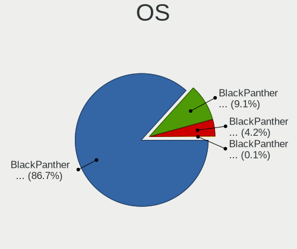
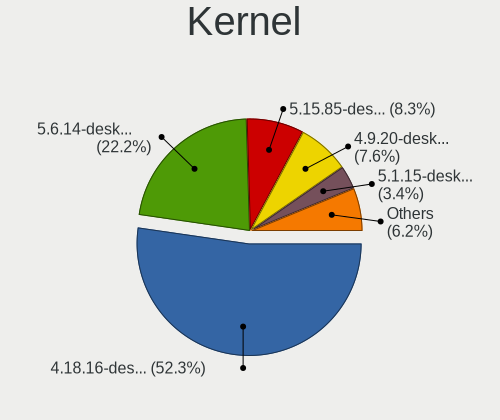
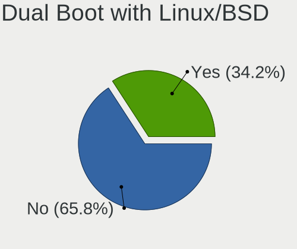
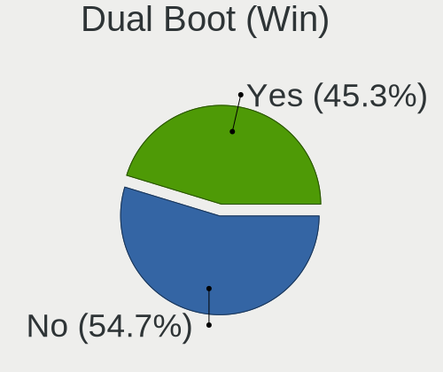
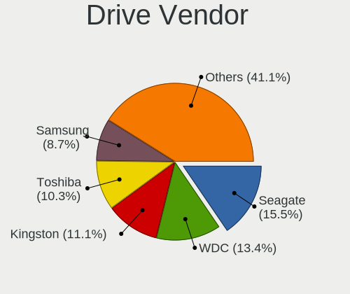
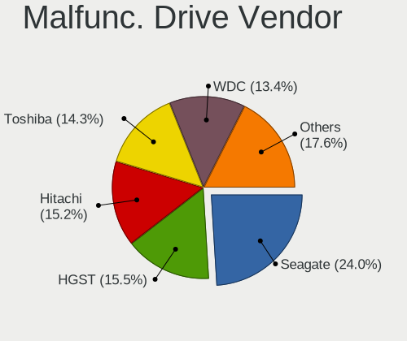
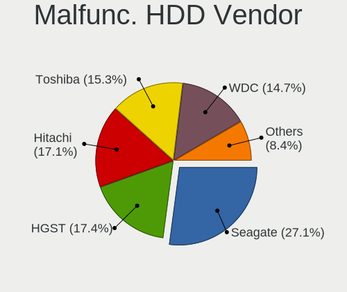
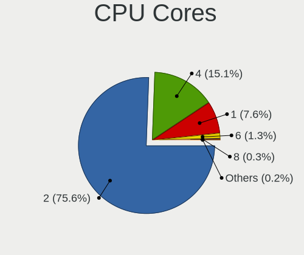
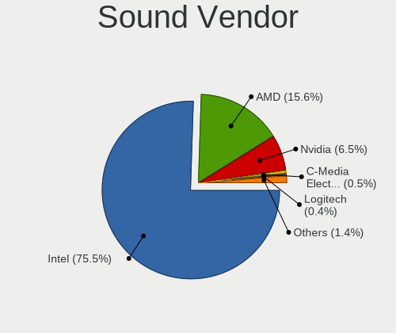

BlackPanther - Tested Hardware & Statistics (Notebooks)
-------------------------------------------------------

A project to collect tested hardware configurations for BlackPanther.

Anyone can contribute to this report by the [hw-probe](https://github.com/linuxhw/hw-probe) tool:

    sudo -E hw-probe -all -upload

Please contribute! Especially if your hardware is rare.

Contents
--------

* [ Test Cases ](#test-cases)

* [ System ](#system)
  - [ OS                       ](#os)
  - [ OS Family                ](#os-family)
  - [ Kernel                   ](#kernel)
  - [ Kernel Family            ](#kernel-family)
  - [ Kernel Major Ver.        ](#kernel-major-ver)
  - [ Arch                     ](#arch)
  - [ DE                       ](#de)
  - [ Display Server           ](#display-server)
  - [ Display Manager          ](#display-manager)
  - [ OS Lang                  ](#os-lang)
  - [ Boot Mode                ](#boot-mode)
  - [ Filesystem               ](#filesystem)
  - [ Part. scheme             ](#part-scheme)
  - [ Dual Boot with Linux/BSD ](#dual-boot-with-linuxbsd)
  - [ Dual Boot (Win)          ](#dual-boot-win)

* [ Board ](#board)
  - [ Vendor                   ](#vendor)
  - [ Model                    ](#model)
  - [ Model Family             ](#model-family)
  - [ MFG Year                 ](#mfg-year)
  - [ Form Factor              ](#form-factor)
  - [ Secure Boot              ](#secure-boot)
  - [ Coreboot                 ](#coreboot)
  - [ RAM Size                 ](#ram-size)
  - [ RAM Used                 ](#ram-used)
  - [ Total Drives             ](#total-drives)
  - [ Has CD-ROM               ](#has-cd-rom)
  - [ Has Ethernet             ](#has-ethernet)
  - [ Has WiFi                 ](#has-wifi)
  - [ Has Bluetooth            ](#has-bluetooth)

* [ Location ](#location)
  - [ Country                  ](#country)
  - [ City                     ](#city)

* [ Drives ](#drives)
  - [ Drive Vendor             ](#drive-vendor)
  - [ Drive Model              ](#drive-model)
  - [ HDD Vendor               ](#hdd-vendor)
  - [ SSD Vendor               ](#ssd-vendor)
  - [ Drive Kind               ](#drive-kind)
  - [ Drive Connector          ](#drive-connector)
  - [ Drive Size               ](#drive-size)
  - [ Space Total              ](#space-total)
  - [ Space Used               ](#space-used)
  - [ Malfunc. Drives          ](#malfunc-drives)
  - [ Malfunc. Drive Vendor    ](#malfunc-drive-vendor)
  - [ Malfunc. HDD Vendor      ](#malfunc-hdd-vendor)
  - [ Malfunc. Drive Kind      ](#malfunc-drive-kind)
  - [ Failed Drives            ](#failed-drives)
  - [ Failed Drive Vendor      ](#failed-drive-vendor)
  - [ Drive Status             ](#drive-status)

* [ Storage controller ](#storage-controller)
  - [ Storage Vendor           ](#storage-vendor)
  - [ Storage Model            ](#storage-model)
  - [ Storage Kind             ](#storage-kind)

* [ Processor ](#processor)
  - [ CPU Vendor               ](#cpu-vendor)
  - [ CPU Model                ](#cpu-model)
  - [ CPU Model Family         ](#cpu-model-family)
  - [ CPU Cores                ](#cpu-cores)
  - [ CPU Sockets              ](#cpu-sockets)
  - [ CPU Threads              ](#cpu-threads)
  - [ CPU Op-Modes             ](#cpu-op-modes)
  - [ CPU Microcode            ](#cpu-microcode)
  - [ CPU Microarch            ](#cpu-microarch)

* [ Graphics ](#graphics)
  - [ GPU Vendor               ](#gpu-vendor)
  - [ GPU Model                ](#gpu-model)
  - [ GPU Combo                ](#gpu-combo)
  - [ GPU Driver               ](#gpu-driver)
  - [ GPU Memory               ](#gpu-memory)

* [ Monitor ](#monitor)
  - [ Monitor Vendor           ](#monitor-vendor)
  - [ Monitor Model            ](#monitor-model)
  - [ Monitor Resolution       ](#monitor-resolution)
  - [ Monitor Diagonal         ](#monitor-diagonal)
  - [ Monitor Width            ](#monitor-width)
  - [ Aspect Ratio             ](#aspect-ratio)
  - [ Monitor Area             ](#monitor-area)
  - [ Pixel Density            ](#pixel-density)
  - [ Multiple Monitors        ](#multiple-monitors)

* [ Network ](#network)
  - [ Net Controller Vendor    ](#net-controller-vendor)
  - [ Net Controller Model     ](#net-controller-model)
  - [ Wireless Vendor          ](#wireless-vendor)
  - [ Wireless Model           ](#wireless-model)
  - [ Ethernet Vendor          ](#ethernet-vendor)
  - [ Ethernet Model           ](#ethernet-model)
  - [ Net Controller Kind      ](#net-controller-kind)
  - [ Used Controller          ](#used-controller)
  - [ NICs                     ](#nics)
  - [ IPv6                     ](#ipv6)

* [ Bluetooth ](#bluetooth)
  - [ Bluetooth Vendor         ](#bluetooth-vendor)
  - [ Bluetooth Model          ](#bluetooth-model)

* [ Sound ](#sound)
  - [ Sound Vendor             ](#sound-vendor)
  - [ Sound Model              ](#sound-model)

* [ Memory ](#memory)
  - [ Memory Vendor            ](#memory-vendor)
  - [ Memory Model             ](#memory-model)
  - [ Memory Kind              ](#memory-kind)
  - [ Memory Form Factor       ](#memory-form-factor)
  - [ Memory Size              ](#memory-size)
  - [ Memory Speed             ](#memory-speed)

* [ Printers & scanners ](#printers--scanners)
  - [ Printer Vendor           ](#printer-vendor)
  - [ Printer Model            ](#printer-model)
  - [ Scanner Vendor           ](#scanner-vendor)
  - [ Scanner Model            ](#scanner-model)

* [ Camera ](#camera)
  - [ Camera Vendor            ](#camera-vendor)
  - [ Camera Model             ](#camera-model)

* [ Security ](#security)
  - [ Fingerprint Vendor       ](#fingerprint-vendor)
  - [ Fingerprint Model        ](#fingerprint-model)
  - [ Chipcard Vendor          ](#chipcard-vendor)
  - [ Chipcard Model           ](#chipcard-model)

* [ Unsupported ](#unsupported)
  - [ Unsupported Devices      ](#unsupported-devices)
  - [ Unsupported Device Types ](#unsupported-device-types)

Test Cases
----------

Total: 5289

| Vendor        | Model                       | Probe                                                      | Date         |
|---------------|-----------------------------|------------------------------------------------------------|--------------|
| Lenovo        | IdeaPad 3-15ITL6 82H8       | [58de0987c9](https://linux-hardware.org/?probe=58de0987c9) | Jan 05, 2025 |
| Lenovo        | IdeaPad 3-15ITL6 82H8       | [f033408474](https://linux-hardware.org/?probe=f033408474) | Jan 05, 2025 |
| Lenovo        | ThinkPad R400 7440EL1       | [dd61c503c2](https://linux-hardware.org/?probe=dd61c503c2) | Jan 04, 2025 |
| ASUSTek       | K50IE                       | [ff1622416c](https://linux-hardware.org/?probe=ff1622416c) | Jan 04, 2025 |
| ASUSTek       | K50IE                       | [42c7d66495](https://linux-hardware.org/?probe=42c7d66495) | Jan 04, 2025 |
| Fujitsu       | LIFEBOOK U745               | [518b2a257e](https://linux-hardware.org/?probe=518b2a257e) | Jan 03, 2025 |
| Fujitsu       | LIFEBOOK U745               | [28629fe967](https://linux-hardware.org/?probe=28629fe967) | Jan 03, 2025 |
| HP            | EliteBook 8470p             | [63e91f06ef](https://linux-hardware.org/?probe=63e91f06ef) | Jan 02, 2025 |
| Apple         | MacBook7,1                  | [cee1ead4a5](https://linux-hardware.org/?probe=cee1ead4a5) | Jan 01, 2025 |
| HP            | EliteBook 8470p             | [e489955373](https://linux-hardware.org/?probe=e489955373) | Jan 01, 2025 |
| MSI           | EX600                       | [7cf72a2ecd](https://linux-hardware.org/?probe=7cf72a2ecd) | Jan 01, 2025 |
| MSI           | EX600                       | [1e51dc5052](https://linux-hardware.org/?probe=1e51dc5052) | Jan 01, 2025 |
| Lenovo        | ThinkPad E550 20DF007YRI    | [8ad38acc8a](https://linux-hardware.org/?probe=8ad38acc8a) | Dec 31, 2024 |
| HP            | ProBook 4535s               | [e0f48651c0](https://linux-hardware.org/?probe=e0f48651c0) | Dec 30, 2024 |
| Dell          | Latitude E6410              | [a9b5de08b4](https://linux-hardware.org/?probe=a9b5de08b4) | Dec 30, 2024 |
| HP            | Pavilion Gaming Laptop 1... | [cd3975c657](https://linux-hardware.org/?probe=cd3975c657) | Dec 28, 2024 |
| HP            | Laptop 15-bs0xx             | [3734fe1027](https://linux-hardware.org/?probe=3734fe1027) | Dec 28, 2024 |
| HP            | Laptop 15-bs0xx             | [3078dcda8e](https://linux-hardware.org/?probe=3078dcda8e) | Dec 28, 2024 |
| MSI           | CR610                       | [cdac4d6ac5](https://linux-hardware.org/?probe=cdac4d6ac5) | Dec 27, 2024 |
| HP            | HDX 16                      | [17ec6d80db](https://linux-hardware.org/?probe=17ec6d80db) | Dec 25, 2024 |
| HP            | HDX 16                      | [cae2b345f8](https://linux-hardware.org/?probe=cae2b345f8) | Dec 25, 2024 |
| Fujitsu Si... | AMILO Li 2727               | [582307f2f4](https://linux-hardware.org/?probe=582307f2f4) | Dec 24, 2024 |
| Fujitsu Si... | AMILO Li 2727               | [9485bf3c97](https://linux-hardware.org/?probe=9485bf3c97) | Dec 24, 2024 |
| Dell          | Vostro 1015                 | [a9e17cca23](https://linux-hardware.org/?probe=a9e17cca23) | Dec 24, 2024 |
| Dell          | Vostro 1015                 | [13644c036c](https://linux-hardware.org/?probe=13644c036c) | Dec 24, 2024 |
| ASUSTek       | X200MA                      | [9ca1965839](https://linux-hardware.org/?probe=9ca1965839) | Dec 22, 2024 |
| Lenovo        | ThinkPad L430 246834G       | [cbc0d50579](https://linux-hardware.org/?probe=cbc0d50579) | Dec 20, 2024 |
| ASUSTek       | VivoBook_ASUSLaptop M350... | [9748115a00](https://linux-hardware.org/?probe=9748115a00) | Dec 20, 2024 |
| ASUSTek       | VivoBook_ASUSLaptop M350... | [09a86b3e16](https://linux-hardware.org/?probe=09a86b3e16) | Dec 20, 2024 |
| HP            | ProBook 440 G5              | [c5a9ba7441](https://linux-hardware.org/?probe=c5a9ba7441) | Dec 19, 2024 |
| HP            | ProBook 440 G5              | [da60bd4ae5](https://linux-hardware.org/?probe=da60bd4ae5) | Dec 19, 2024 |
| ASUSTek       | K50IE                       | [e19aa860da](https://linux-hardware.org/?probe=e19aa860da) | Dec 18, 2024 |
| ASUSTek       | ZenBook UX425UA_UM425UA     | [7e82e5049a](https://linux-hardware.org/?probe=7e82e5049a) | Dec 17, 2024 |
| HP            | EliteBook 850 G3            | [e01e3eeaf1](https://linux-hardware.org/?probe=e01e3eeaf1) | Dec 16, 2024 |
| Lenovo        | ThinkPad T520 4242A25       | [85c87ae6e1](https://linux-hardware.org/?probe=85c87ae6e1) | Dec 16, 2024 |
| Toshiba       | Satellite Pro A120          | [11c52f70d5](https://linux-hardware.org/?probe=11c52f70d5) | Dec 15, 2024 |
| HP            | 250 G1                      | [bdcc1c77b0](https://linux-hardware.org/?probe=bdcc1c77b0) | Dec 15, 2024 |
| Dell          | Latitude 5590               | [308f71f2dd](https://linux-hardware.org/?probe=308f71f2dd) | Dec 14, 2024 |
| Acer          | Aspire E5-571G              | [b81f4da779](https://linux-hardware.org/?probe=b81f4da779) | Dec 12, 2024 |
| Acer          | Aspire 5732Z                | [fd6a7390c7](https://linux-hardware.org/?probe=fd6a7390c7) | Dec 10, 2024 |
| Acer          | Aspire E5-571G              | [4e3d903b5d](https://linux-hardware.org/?probe=4e3d903b5d) | Dec 10, 2024 |
| ASUSTek       | ZenBook UX425UA_UM425UA     | [d48355806f](https://linux-hardware.org/?probe=d48355806f) | Dec 10, 2024 |
| Lenovo        | ThinkPad T410 2537KR6       | [9fde9fe106](https://linux-hardware.org/?probe=9fde9fe106) | Dec 09, 2024 |
| Lenovo        | Z710 20250                  | [9ec30a66d1](https://linux-hardware.org/?probe=9ec30a66d1) | Dec 08, 2024 |
| Lenovo        | G550 20023                  | [f8b607f0af](https://linux-hardware.org/?probe=f8b607f0af) | Dec 08, 2024 |
| HP            | Pavilion Gaming Laptop 1... | [769c4b5be5](https://linux-hardware.org/?probe=769c4b5be5) | Dec 07, 2024 |
| Lenovo        | G550 20023                  | [efcb2e6de7](https://linux-hardware.org/?probe=efcb2e6de7) | Dec 07, 2024 |
| HP            | 620                         | [debb6026ee](https://linux-hardware.org/?probe=debb6026ee) | Dec 07, 2024 |
| Dell          | Latitude E6230              | [0d86402acb](https://linux-hardware.org/?probe=0d86402acb) | Dec 01, 2024 |
| Dell          | Inspiron 17 7000 Series ... | [d588437f56](https://linux-hardware.org/?probe=d588437f56) | Dec 01, 2024 |
| eMachines     | E725                        | [c90258d992](https://linux-hardware.org/?probe=c90258d992) | Dec 01, 2024 |
| eMachines     | E725                        | [e6b68a13a8](https://linux-hardware.org/?probe=e6b68a13a8) | Dec 01, 2024 |
| Samsung       | 300E4A/300E5A/300E7A/343... | [c400fc86cb](https://linux-hardware.org/?probe=c400fc86cb) | Nov 30, 2024 |
| ASUSTek       | X55U                        | [b227d1be26](https://linux-hardware.org/?probe=b227d1be26) | Nov 30, 2024 |
| Dell          | Inspiron 15-3573            | [9f15756447](https://linux-hardware.org/?probe=9f15756447) | Nov 30, 2024 |
| Dell          | Inspiron 15-3573            | [ffd2440975](https://linux-hardware.org/?probe=ffd2440975) | Nov 30, 2024 |
| Samsung       | 300E4A/300E5A/300E7A/343... | [cdeefac044](https://linux-hardware.org/?probe=cdeefac044) | Nov 30, 2024 |
| ASUSTek       | X401U                       | [a311a92d34](https://linux-hardware.org/?probe=a311a92d34) | Nov 30, 2024 |
| ASUSTek       | X401U                       | [b43b40d15d](https://linux-hardware.org/?probe=b43b40d15d) | Nov 30, 2024 |
| Lenovo        | ThinkPad E550 20DF007YRI    | [8be5fd8c72](https://linux-hardware.org/?probe=8be5fd8c72) | Nov 25, 2024 |
| ASUSTek       | K50IE                       | [554cc7d2da](https://linux-hardware.org/?probe=554cc7d2da) | Nov 24, 2024 |
| Dell          | Vostro 3500                 | [97daaed0c7](https://linux-hardware.org/?probe=97daaed0c7) | Nov 24, 2024 |
| Lenovo        | ThinkPad E550 20DF007YRI    | [f652a62a8c](https://linux-hardware.org/?probe=f652a62a8c) | Nov 23, 2024 |
| ASUSTek       | K50IE                       | [9de648a95f](https://linux-hardware.org/?probe=9de648a95f) | Nov 23, 2024 |
| Lenovo        | ThinkPad X280 20KES35J00    | [72a362e0ce](https://linux-hardware.org/?probe=72a362e0ce) | Nov 23, 2024 |
| Toshiba       | PORTEGE Z930                | [a6549dee5e](https://linux-hardware.org/?probe=a6549dee5e) | Nov 22, 2024 |
| Toshiba       | PORTEGE Z930                | [b1a189cb58](https://linux-hardware.org/?probe=b1a189cb58) | Nov 22, 2024 |
| Apple         | MacBookPro11,1              | [a315c80c2c](https://linux-hardware.org/?probe=a315c80c2c) | Nov 22, 2024 |
| ASUSTek       | K50IE                       | [88afa62033](https://linux-hardware.org/?probe=88afa62033) | Nov 21, 2024 |
| Dell          | Latitude 5501               | [d5ff7909f7](https://linux-hardware.org/?probe=d5ff7909f7) | Nov 21, 2024 |
| Acer          | Aspire 5742G                | [c117d227dd](https://linux-hardware.org/?probe=c117d227dd) | Nov 21, 2024 |
| Acer          | Aspire 5742G                | [87ecfdfb41](https://linux-hardware.org/?probe=87ecfdfb41) | Nov 20, 2024 |
| Dell          | Latitude E7270              | [3aa67229b8](https://linux-hardware.org/?probe=3aa67229b8) | Nov 20, 2024 |
| Insyde        | Braswell                    | [317bc41ff8](https://linux-hardware.org/?probe=317bc41ff8) | Nov 20, 2024 |
| Fujitsu       | LIFEBOOK E782               | [cfb43c6627](https://linux-hardware.org/?probe=cfb43c6627) | Nov 20, 2024 |
| Fujitsu       | LIFEBOOK E782               | [4ebc12b553](https://linux-hardware.org/?probe=4ebc12b553) | Nov 20, 2024 |
| Packard Be... | EasyNote TS44HR             | [43524f1599](https://linux-hardware.org/?probe=43524f1599) | Nov 19, 2024 |
| Valve         | Jupiter                     | [0d1a908294](https://linux-hardware.org/?probe=0d1a908294) | Nov 19, 2024 |
| Valve         | Jupiter                     | [2262bd5974](https://linux-hardware.org/?probe=2262bd5974) | Nov 19, 2024 |
| HP            | Compaq 6710b (KE121EA#AK... | [e02fd427cb](https://linux-hardware.org/?probe=e02fd427cb) | Nov 19, 2024 |
| ASUSTek       | VivoBook_ASUSLaptop M350... | [ad9200ca27](https://linux-hardware.org/?probe=ad9200ca27) | Nov 19, 2024 |
| Samsung       | RV415/RV515/E3415           | [03e8547704](https://linux-hardware.org/?probe=03e8547704) | Nov 18, 2024 |
| Lenovo        | ThinkPad P50 20EQS2CC00     | [ee47266bd4](https://linux-hardware.org/?probe=ee47266bd4) | Nov 17, 2024 |
| HP            | Pavilion Gaming Laptop 1... | [4bcb60287c](https://linux-hardware.org/?probe=4bcb60287c) | Nov 17, 2024 |
| Apple         | MacBookAir7,2               | [b899e73287](https://linux-hardware.org/?probe=b899e73287) | Nov 16, 2024 |
| Toshiba       | Satellite Pro L550          | [f41b33701f](https://linux-hardware.org/?probe=f41b33701f) | Nov 16, 2024 |
| ASUSTek       | X550LN                      | [f0d77d344b](https://linux-hardware.org/?probe=f0d77d344b) | Nov 15, 2024 |
| Lenovo        | ThinkPad P50 20EQS2CC00     | [8815cf243a](https://linux-hardware.org/?probe=8815cf243a) | Nov 14, 2024 |
| Toshiba       | Satellite Pro L550          | [d39da20aec](https://linux-hardware.org/?probe=d39da20aec) | Nov 14, 2024 |
| Lenovo        | IdeaPad Slim 3 15IRU8 82... | [a32fbc9189](https://linux-hardware.org/?probe=a32fbc9189) | Nov 14, 2024 |
| Dell          | Latitude E7270              | [dba418a89f](https://linux-hardware.org/?probe=dba418a89f) | Nov 12, 2024 |
| Apple         | MacBookAir7,2               | [9f8aadd091](https://linux-hardware.org/?probe=9f8aadd091) | Nov 11, 2024 |
| MSI           | GT60 2OC/2OD                | [d4624f582f](https://linux-hardware.org/?probe=d4624f582f) | Nov 11, 2024 |
| Dell          | Latitude E6230              | [73b9f97d94](https://linux-hardware.org/?probe=73b9f97d94) | Nov 10, 2024 |
| ASUSTek       | ZenBook UX425UA_UM425UA     | [455db089b7](https://linux-hardware.org/?probe=455db089b7) | Nov 08, 2024 |
| HP            | EliteBook Folio 9480m       | [2f9be02490](https://linux-hardware.org/?probe=2f9be02490) | Nov 08, 2024 |
| Packard Be... | EasyNote TK11BZ             | [610e6cd0aa](https://linux-hardware.org/?probe=610e6cd0aa) | Nov 07, 2024 |
| Packard Be... | EasyNote TK11BZ             | [1a19aa0d42](https://linux-hardware.org/?probe=1a19aa0d42) | Nov 07, 2024 |
| HP            | Laptop 15-db0xxx            | [47b6df1477](https://linux-hardware.org/?probe=47b6df1477) | Nov 07, 2024 |
| Toshiba       | Satellite L650              | [49f804a9fc](https://linux-hardware.org/?probe=49f804a9fc) | Nov 07, 2024 |
| Toshiba       | Satellite L650              | [5d1d0b74f1](https://linux-hardware.org/?probe=5d1d0b74f1) | Nov 06, 2024 |
| HP            | Laptop 15-db0xxx            | [9d2ab8f727](https://linux-hardware.org/?probe=9d2ab8f727) | Nov 06, 2024 |
| ASUSTek       | TUF Gaming FX505DU          | [81def84e4a](https://linux-hardware.org/?probe=81def84e4a) | Nov 06, 2024 |
| ASUSTek       | ZenBook UX425UA_UM425UA     | [c7e836cc68](https://linux-hardware.org/?probe=c7e836cc68) | Nov 05, 2024 |
| Acer          | Aspire ES1-571              | [f307a1d91c](https://linux-hardware.org/?probe=f307a1d91c) | Nov 02, 2024 |
| Lenovo        | ThinkPad T420 4236B87       | [168db3bc7f](https://linux-hardware.org/?probe=168db3bc7f) | Nov 01, 2024 |
| HP            | 250 G1                      | [ea7fd9f0ad](https://linux-hardware.org/?probe=ea7fd9f0ad) | Nov 01, 2024 |
| Lenovo        | ThinkPad T420 4236B87       | [0726eeb9fe](https://linux-hardware.org/?probe=0726eeb9fe) | Oct 31, 2024 |
| Lenovo        | G40-30 80FY                 | [2af3b2835a](https://linux-hardware.org/?probe=2af3b2835a) | Oct 30, 2024 |
| ASUSTek       | X555LJ                      | [9e5c496f61](https://linux-hardware.org/?probe=9e5c496f61) | Oct 28, 2024 |
| Dell          | Inspiron 17 7000 Series ... | [3c9f89ea2c](https://linux-hardware.org/?probe=3c9f89ea2c) | Oct 27, 2024 |
| HP            | Pavilion Gaming Laptop 1... | [523b7a9651](https://linux-hardware.org/?probe=523b7a9651) | Oct 27, 2024 |
| Lenovo        | IdeaPad 330-15IKB 81DE      | [71dd2a69e3](https://linux-hardware.org/?probe=71dd2a69e3) | Oct 25, 2024 |
| HP            | 250 G5 Notebook PC          | [3d903fc0d5](https://linux-hardware.org/?probe=3d903fc0d5) | Oct 25, 2024 |
| Lenovo        | IdeaPad 3 15IAU7 82RK       | [29ef72f5d5](https://linux-hardware.org/?probe=29ef72f5d5) | Oct 24, 2024 |
| HP            | 650                         | [f849b8c96e](https://linux-hardware.org/?probe=f849b8c96e) | Oct 23, 2024 |
| ASUSTek       | K54HR                       | [794912c4c5](https://linux-hardware.org/?probe=794912c4c5) | Oct 22, 2024 |
| NVISEN        | MU01                        | [d383333ed3](https://linux-hardware.org/?probe=d383333ed3) | Oct 22, 2024 |
| Dell          | Latitude 5480               | [35580984a7](https://linux-hardware.org/?probe=35580984a7) | Oct 22, 2024 |
| HP            | Presario CQ57               | [c061615cbe](https://linux-hardware.org/?probe=c061615cbe) | Oct 22, 2024 |
| Dell          | Latitude 5501               | [017aaa4343](https://linux-hardware.org/?probe=017aaa4343) | Oct 21, 2024 |
| Acer          | Predator PHN18-71           | [96aa39db09](https://linux-hardware.org/?probe=96aa39db09) | Oct 20, 2024 |
| Toshiba       | PORTEGE Z20t-C              | [b07a566014](https://linux-hardware.org/?probe=b07a566014) | Oct 20, 2024 |
| Toshiba       | PORTEGE Z20t-C              | [2c1d79c7b6](https://linux-hardware.org/?probe=2c1d79c7b6) | Oct 20, 2024 |
| Fujitsu Si... | AMILO Li 2727               | [ffe04d97c2](https://linux-hardware.org/?probe=ffe04d97c2) | Oct 17, 2024 |
| Fujitsu Si... | AMILO Li 2727               | [83cf97184f](https://linux-hardware.org/?probe=83cf97184f) | Oct 17, 2024 |
| ASUSTek       | X556UQK                     | [5352e1a931](https://linux-hardware.org/?probe=5352e1a931) | Oct 16, 2024 |
| ASUSTek       | VivoBook_ASUSLaptop M350... | [d6137f1d53](https://linux-hardware.org/?probe=d6137f1d53) | Oct 13, 2024 |
| Acer          | Aspire ES1-571              | [2421f59e29](https://linux-hardware.org/?probe=2421f59e29) | Oct 12, 2024 |
| Samsung       | RF510/RF410/RF710           | [e905d56a2d](https://linux-hardware.org/?probe=e905d56a2d) | Oct 12, 2024 |
| Samsung       | RF510/RF410/RF710           | [7b87f88a5a](https://linux-hardware.org/?probe=7b87f88a5a) | Oct 12, 2024 |
| Fujitsu Si... | AMILO Pro V3205             | [b42a8282e2](https://linux-hardware.org/?probe=b42a8282e2) | Oct 05, 2024 |
| Dell          | Inspiron 1545               | [7e10bcffe5](https://linux-hardware.org/?probe=7e10bcffe5) | Oct 05, 2024 |
| Fujitsu       | LIFEBOOK U745               | [c152afbda7](https://linux-hardware.org/?probe=c152afbda7) | Oct 05, 2024 |
| Fujitsu       | LIFEBOOK U745               | [fb6df6137e](https://linux-hardware.org/?probe=fb6df6137e) | Oct 05, 2024 |
| Lenovo        | ThinkPad L470 W10DG 20JV... | [5122894a2f](https://linux-hardware.org/?probe=5122894a2f) | Oct 02, 2024 |
| Lenovo        | ThinkPad X280 20KES35J00    | [92e6899ce0](https://linux-hardware.org/?probe=92e6899ce0) | Sep 28, 2024 |
| HP            | ProBook 650 G2              | [6d71a656f2](https://linux-hardware.org/?probe=6d71a656f2) | Sep 28, 2024 |
| Lenovo        | IdeaPad 3 15IAU7 82RK       | [cdca4fcda4](https://linux-hardware.org/?probe=cdca4fcda4) | Sep 27, 2024 |
| HP            | EliteBook 8440p             | [28d6c731df](https://linux-hardware.org/?probe=28d6c731df) | Sep 23, 2024 |
| HP            | EliteBook 8440p             | [b738b40ff9](https://linux-hardware.org/?probe=b738b40ff9) | Sep 23, 2024 |
| HP            | ProBook 640 G8 Notebook ... | [c045aea9f8](https://linux-hardware.org/?probe=c045aea9f8) | Sep 15, 2024 |
| HP            | Pavilion dv6                | [f4e2729ed2](https://linux-hardware.org/?probe=f4e2729ed2) | Sep 14, 2024 |
| HP            | Pavilion dv6                | [0ffe1545df](https://linux-hardware.org/?probe=0ffe1545df) | Sep 14, 2024 |
| Acer          | TravelMate 8571             | [f4d875d702](https://linux-hardware.org/?probe=f4d875d702) | Sep 13, 2024 |
| Acer          | TravelMate 8571             | [8d636145a9](https://linux-hardware.org/?probe=8d636145a9) | Sep 13, 2024 |
| Acer          | Aspire 5750                 | [e4744fdd71](https://linux-hardware.org/?probe=e4744fdd71) | Sep 13, 2024 |
| Toshiba       | Satellite C660D             | [a42039bbd8](https://linux-hardware.org/?probe=a42039bbd8) | Sep 12, 2024 |
| Toshiba       | Satellite C660D             | [c07c39b882](https://linux-hardware.org/?probe=c07c39b882) | Sep 12, 2024 |
| Dell          | Latitude E6410              | [f4784ee22f](https://linux-hardware.org/?probe=f4784ee22f) | Sep 11, 2024 |
| eMachines     | E725                        | [8f337cd36a](https://linux-hardware.org/?probe=8f337cd36a) | Sep 10, 2024 |
| Lenovo        | IdeaPad 3-15ITL6 82H8       | [d5537d0a74](https://linux-hardware.org/?probe=d5537d0a74) | Sep 06, 2024 |
| Toshiba       | Satellite C660D             | [8fb0696edc](https://linux-hardware.org/?probe=8fb0696edc) | Sep 06, 2024 |
| ASUSTek       | X200MA                      | [e683cda350](https://linux-hardware.org/?probe=e683cda350) | Sep 06, 2024 |
| Lenovo        | ThinkPad R400 7440EL1       | [7ae1076887](https://linux-hardware.org/?probe=7ae1076887) | Sep 06, 2024 |
| Lenovo        | ThinkPad R400 7440EL1       | [48ea54144b](https://linux-hardware.org/?probe=48ea54144b) | Sep 06, 2024 |
| Toshiba       | Satellite C660D             | [601966494b](https://linux-hardware.org/?probe=601966494b) | Sep 06, 2024 |
| Lenovo        | ThinkPad T500 2241AK5       | [a55ee00215](https://linux-hardware.org/?probe=a55ee00215) | Sep 05, 2024 |
| eMachines     | E725                        | [5dcbbe3e40](https://linux-hardware.org/?probe=5dcbbe3e40) | Sep 04, 2024 |
| Lenovo        | ThinkPad T500 2241AK5       | [4b4b6c1e84](https://linux-hardware.org/?probe=4b4b6c1e84) | Sep 04, 2024 |
| eMachines     | E725                        | [9e6ac6f05a](https://linux-hardware.org/?probe=9e6ac6f05a) | Sep 02, 2024 |
| ASUSTek       | ZenBook UX425UA_UM425UA     | [3c5e306348](https://linux-hardware.org/?probe=3c5e306348) | Sep 02, 2024 |
| Lenovo        | Flex 2-15D 20377            | [cb1b7cf825](https://linux-hardware.org/?probe=cb1b7cf825) | Sep 02, 2024 |
| Samsung       | RV409/RV509/RV709           | [60cd573aa7](https://linux-hardware.org/?probe=60cd573aa7) | Sep 01, 2024 |
| Valve         | Jupiter                     | [f91d938389](https://linux-hardware.org/?probe=f91d938389) | Sep 01, 2024 |
| Valve         | Jupiter                     | [8de5f2b188](https://linux-hardware.org/?probe=8de5f2b188) | Sep 01, 2024 |
| Samsung       | RV409/RV509/RV709           | [d04dd86976](https://linux-hardware.org/?probe=d04dd86976) | Aug 31, 2024 |
| MSI           | GT60 2OC/2OD                | [4266a67086](https://linux-hardware.org/?probe=4266a67086) | Aug 30, 2024 |
| Lenovo        | IdeaPad Slim 3 15IRU8 82... | [e81c51a77c](https://linux-hardware.org/?probe=e81c51a77c) | Aug 29, 2024 |
| Dell          | Inspiron 5558               | [cf488da03c](https://linux-hardware.org/?probe=cf488da03c) | Aug 26, 2024 |
| ASUSTek       | ZenBook UX425UA_UM425UA     | [4adf7833f2](https://linux-hardware.org/?probe=4adf7833f2) | Aug 25, 2024 |
| Dell          | Latitude E6540              | [2b2c3eaaf2](https://linux-hardware.org/?probe=2b2c3eaaf2) | Aug 22, 2024 |
| ASUSTek       | VivoBook_ASUSLaptop E410... | [323797ef6d](https://linux-hardware.org/?probe=323797ef6d) | Aug 22, 2024 |
| Lenovo        | IdeaPad Slim 3 15IRU8 82... | [e371b64a4f](https://linux-hardware.org/?probe=e371b64a4f) | Aug 21, 2024 |
| Fujitsu       | LIFEBOOK A512               | [e689cb79d7](https://linux-hardware.org/?probe=e689cb79d7) | Aug 20, 2024 |
| HP            | EliteBook 840 G1            | [2968ed0be9](https://linux-hardware.org/?probe=2968ed0be9) | Aug 19, 2024 |
| HP            | EliteBook 840 G1            | [33ec2cb9ef](https://linux-hardware.org/?probe=33ec2cb9ef) | Aug 19, 2024 |
| ASUSTek       | X551MA                      | [73073769aa](https://linux-hardware.org/?probe=73073769aa) | Aug 17, 2024 |
| HP            | EliteBook 8570w             | [cf4f55c38d](https://linux-hardware.org/?probe=cf4f55c38d) | Aug 16, 2024 |
| Gericom       | Unknown                     | [153bbb049b](https://linux-hardware.org/?probe=153bbb049b) | Aug 11, 2024 |
| Packard Be... | EasyNote TV43HC             | [edbae7eead](https://linux-hardware.org/?probe=edbae7eead) | Aug 09, 2024 |
| Packard Be... | EasyNote TV43HC             | [a5375f025b](https://linux-hardware.org/?probe=a5375f025b) | Aug 09, 2024 |
| Lenovo        | G505 20240                  | [a5bd4d3150](https://linux-hardware.org/?probe=a5bd4d3150) | Aug 07, 2024 |
| Dell          | Latitude 5480               | [919786dc13](https://linux-hardware.org/?probe=919786dc13) | Aug 07, 2024 |
| Dell          | Inspiron 5558               | [252d2eeb0e](https://linux-hardware.org/?probe=252d2eeb0e) | Aug 07, 2024 |
| MSI           | GT60 2OC/2OD                | [a7e9801aa5](https://linux-hardware.org/?probe=a7e9801aa5) | Aug 05, 2024 |
| Dell          | Latitude E6520              | [ff98fc991b](https://linux-hardware.org/?probe=ff98fc991b) | Aug 05, 2024 |
| Lenovo        | ThinkPad X240 20AMA0YDHV    | [dda75993d2](https://linux-hardware.org/?probe=dda75993d2) | Aug 04, 2024 |
| Lenovo        | ThinkPad X240 20AMA0YDHV    | [0b6472b7d4](https://linux-hardware.org/?probe=0b6472b7d4) | Aug 04, 2024 |
| ASUSTek       | X555LJ                      | [740054e26e](https://linux-hardware.org/?probe=740054e26e) | Aug 03, 2024 |
| HP            | Pavilion Gaming Laptop 1... | [febff2f437](https://linux-hardware.org/?probe=febff2f437) | Aug 03, 2024 |
| ASUSTek       | X555LJ                      | [af9ad3b380](https://linux-hardware.org/?probe=af9ad3b380) | Aug 03, 2024 |
| Packard Be... | EasyNote TS44HR             | [81463008aa](https://linux-hardware.org/?probe=81463008aa) | Aug 02, 2024 |
| ASUSTek       | TUF Gaming FX505DU          | [2acfea96de](https://linux-hardware.org/?probe=2acfea96de) | Jul 31, 2024 |
| ASUSTek       | TUF Gaming FX505DU          | [9383e42283](https://linux-hardware.org/?probe=9383e42283) | Jul 31, 2024 |
| Packard Be... | EasyNote TS44HR             | [5441df8d03](https://linux-hardware.org/?probe=5441df8d03) | Jul 31, 2024 |
| Samsung       | RV409/RV509/RV709           | [76845a949d](https://linux-hardware.org/?probe=76845a949d) | Jul 28, 2024 |
| Samsung       | RV409/RV509/RV709           | [3ee1da45f4](https://linux-hardware.org/?probe=3ee1da45f4) | Jul 28, 2024 |
| Acer          | Aspire ES1-531              | [4f2fc221ca](https://linux-hardware.org/?probe=4f2fc221ca) | Jul 27, 2024 |
| Acer          | Aspire ES1-531              | [f0b8b05eb6](https://linux-hardware.org/?probe=f0b8b05eb6) | Jul 27, 2024 |
| ASUSTek       | ZenBook UX425UA_UM425UA     | [1409e51ce8](https://linux-hardware.org/?probe=1409e51ce8) | Jul 25, 2024 |
| ASUSTek       | ZenBook UX425UA_UM425UA     | [ebec078714](https://linux-hardware.org/?probe=ebec078714) | Jul 25, 2024 |
| ASUSTek       | TUF Gaming FX505DU          | [2f3174294e](https://linux-hardware.org/?probe=2f3174294e) | Jul 25, 2024 |
| Dell          | Inspiron 1545               | [ea8cee568c](https://linux-hardware.org/?probe=ea8cee568c) | Jul 24, 2024 |
| HP            | ProBook 650 G2              | [275e64bf16](https://linux-hardware.org/?probe=275e64bf16) | Jul 24, 2024 |
| Lenovo        | B50-30 20382                | [944499ba13](https://linux-hardware.org/?probe=944499ba13) | Jul 22, 2024 |
| AWOW          | AK41                        | [f74132aa25](https://linux-hardware.org/?probe=f74132aa25) | Jul 22, 2024 |
| AWOW          | AK41                        | [4de34b7a2d](https://linux-hardware.org/?probe=4de34b7a2d) | Jul 22, 2024 |
| Lenovo        | B50-30 20382                | [1e1ad98eab](https://linux-hardware.org/?probe=1e1ad98eab) | Jul 21, 2024 |
| Dell          | Latitude E6230              | [7a1fb6fdd4](https://linux-hardware.org/?probe=7a1fb6fdd4) | Jul 20, 2024 |
| HP            | 650                         | [1fcbfe0601](https://linux-hardware.org/?probe=1fcbfe0601) | Jul 20, 2024 |
| ASUSTek       | K54C                        | [9c5567184d](https://linux-hardware.org/?probe=9c5567184d) | Jul 19, 2024 |
| ASUSTek       | K54C                        | [9b6917ee3a](https://linux-hardware.org/?probe=9b6917ee3a) | Jul 19, 2024 |
| Samsung       | RV410/RV510/S3510/E3510     | [c7935356db](https://linux-hardware.org/?probe=c7935356db) | Jul 19, 2024 |
| Samsung       | RV410/RV510/S3510/E3510     | [c972da89d0](https://linux-hardware.org/?probe=c972da89d0) | Jul 19, 2024 |
| HP            | 250 G5 Notebook PC          | [c3bf5f71da](https://linux-hardware.org/?probe=c3bf5f71da) | Jul 19, 2024 |
| ASUSTek       | K54HR                       | [97282062cf](https://linux-hardware.org/?probe=97282062cf) | Jul 18, 2024 |
| Fujitsu       | LIFEBOOK A555               | [70542d3e5f](https://linux-hardware.org/?probe=70542d3e5f) | Jul 18, 2024 |
| HP            | Laptop 15-dw1xxx            | [3894a31e21](https://linux-hardware.org/?probe=3894a31e21) | Jul 17, 2024 |
| Lenovo        | V15-ADA 82C7                | [e4754b62e9](https://linux-hardware.org/?probe=e4754b62e9) | Jul 17, 2024 |
| Acer          | Aspire E1-532               | [90ce36b10f](https://linux-hardware.org/?probe=90ce36b10f) | Jul 17, 2024 |
| Acer          | Aspire E1-532               | [a62e6a1eb9](https://linux-hardware.org/?probe=a62e6a1eb9) | Jul 17, 2024 |
| ASUSTek       | ASUS EXPERTBOOK B1500CEA... | [d1f69d6fa7](https://linux-hardware.org/?probe=d1f69d6fa7) | Jul 17, 2024 |
| HP            | Laptop 15-dw1xxx            | [a2a511102e](https://linux-hardware.org/?probe=a2a511102e) | Jul 17, 2024 |
| Lenovo        | ThinkPad T500 2241AK5       | [2597e98159](https://linux-hardware.org/?probe=2597e98159) | Jul 16, 2024 |
| Dell          | Inspiron 17 7000 Series ... | [94e11f4f64](https://linux-hardware.org/?probe=94e11f4f64) | Jul 14, 2024 |
| HP            | Laptop 15-dw1xxx            | [87afecec6b](https://linux-hardware.org/?probe=87afecec6b) | Jul 14, 2024 |
| Lenovo        | V15-ADA 82C7                | [1d04b111a5](https://linux-hardware.org/?probe=1d04b111a5) | Jul 13, 2024 |
| ASUSTek       | X55U                        | [0250c5901e](https://linux-hardware.org/?probe=0250c5901e) | Jul 13, 2024 |
| Lenovo        | ThinkPad T500 2241AK5       | [bc14cc0c9b](https://linux-hardware.org/?probe=bc14cc0c9b) | Jul 13, 2024 |
| Lenovo        | ThinkPad T530 2429NL6       | [21a6af16a8](https://linux-hardware.org/?probe=21a6af16a8) | Jul 13, 2024 |
| Acer          | Predator PHN18-71           | [38cbe6953e](https://linux-hardware.org/?probe=38cbe6953e) | Jul 12, 2024 |
| Dell          | Inspiron 5558               | [8365e4fb51](https://linux-hardware.org/?probe=8365e4fb51) | Jul 12, 2024 |
| HP            | 650                         | [8b9b76f1b6](https://linux-hardware.org/?probe=8b9b76f1b6) | Jul 10, 2024 |
| HP            | Pavilion Gaming Laptop 1... | [42a3c0928f](https://linux-hardware.org/?probe=42a3c0928f) | Jul 10, 2024 |
| HP            | 250 G5 Notebook PC          | [2ba3e3018d](https://linux-hardware.org/?probe=2ba3e3018d) | Jul 10, 2024 |
| Lenovo        | ThinkPad X230 2333A91       | [ae52b86cf3](https://linux-hardware.org/?probe=ae52b86cf3) | Jul 09, 2024 |
| ASUSTek       | K54HR                       | [a4a8b55064](https://linux-hardware.org/?probe=a4a8b55064) | Jul 09, 2024 |
| Lenovo        | IdeaPad 700-15ISK 80RU      | [7f6a57a5ac](https://linux-hardware.org/?probe=7f6a57a5ac) | Jul 09, 2024 |
| Fujitsu       | LIFEBOOK A555               | [619774655b](https://linux-hardware.org/?probe=619774655b) | Jul 09, 2024 |
| Dell          | Inspiron 1545               | [85747e200c](https://linux-hardware.org/?probe=85747e200c) | Jul 08, 2024 |
| HP            | 250 G1                      | [d5da3e9f11](https://linux-hardware.org/?probe=d5da3e9f11) | Jul 07, 2024 |
| ASUSTek       | X541NA                      | [4978b7c152](https://linux-hardware.org/?probe=4978b7c152) | Jul 07, 2024 |
| MSI           | GT60 2OC/2OD                | [a05ce4ae88](https://linux-hardware.org/?probe=a05ce4ae88) | Jul 07, 2024 |
| Lenovo        | B50-30 20382                | [3563e89348](https://linux-hardware.org/?probe=3563e89348) | Jul 06, 2024 |
| ASUSTek       | X55U                        | [b1184e8c81](https://linux-hardware.org/?probe=b1184e8c81) | Jul 06, 2024 |
| ASUSTek       | K54HR                       | [47b4ec1529](https://linux-hardware.org/?probe=47b4ec1529) | Jul 06, 2024 |
| HP            | 650                         | [86465473fa](https://linux-hardware.org/?probe=86465473fa) | Jul 06, 2024 |
| Dell          | Inspiron 5558               | [742273c039](https://linux-hardware.org/?probe=742273c039) | Jul 05, 2024 |
| Lenovo        | ThinkPad T530 2429NL6       | [dffeea22e4](https://linux-hardware.org/?probe=dffeea22e4) | Jul 05, 2024 |
| HP            | Pavilion Gaming Laptop 1... | [1be6e9cd49](https://linux-hardware.org/?probe=1be6e9cd49) | Jul 04, 2024 |
| Lenovo        | IdeaPad 700-15ISK 80RU      | [99ceb1f6ba](https://linux-hardware.org/?probe=99ceb1f6ba) | Jul 04, 2024 |
| ASUSTek       | ASUS EXPERTBOOK B1500CEA... | [dd7c5a0658](https://linux-hardware.org/?probe=dd7c5a0658) | Jul 04, 2024 |
| Dell          | Latitude 5480               | [1d703076b9](https://linux-hardware.org/?probe=1d703076b9) | Jul 04, 2024 |
| AWOW          | AK41                        | [fae9aeeb30](https://linux-hardware.org/?probe=fae9aeeb30) | Jul 04, 2024 |
| ASUSTek       | K54HR                       | [df54dfec9b](https://linux-hardware.org/?probe=df54dfec9b) | Jul 03, 2024 |
| Lenovo        | V15-ADA 82C7                | [207b3e1b5f](https://linux-hardware.org/?probe=207b3e1b5f) | Jul 02, 2024 |
| ASUSTek       | ASUS EXPERTBOOK B1500CEA... | [9cae1483de](https://linux-hardware.org/?probe=9cae1483de) | Jul 02, 2024 |
| Dell          | Inspiron 1545               | [982360e1d0](https://linux-hardware.org/?probe=982360e1d0) | Jun 30, 2024 |
| Dell          | Inspiron 1545               | [4086d535a5](https://linux-hardware.org/?probe=4086d535a5) | Jun 30, 2024 |
| Acer          | Aspire 5750ZG               | [c1138e3566](https://linux-hardware.org/?probe=c1138e3566) | Jun 30, 2024 |
| HP            | 530                         | [83a0e6b7d6](https://linux-hardware.org/?probe=83a0e6b7d6) | Jun 30, 2024 |
| HP            | Pavilion dv6                | [9223a7cb0e](https://linux-hardware.org/?probe=9223a7cb0e) | Jun 28, 2024 |
| Dell          | Inspiron 17 7000 Series ... | [99644748f5](https://linux-hardware.org/?probe=99644748f5) | Jun 28, 2024 |
| Lenovo        | IdeaPad 700-15ISK 80RU      | [689543a8b3](https://linux-hardware.org/?probe=689543a8b3) | Jun 26, 2024 |
| HP            | EliteBook Folio 9480m       | [1506a344e9](https://linux-hardware.org/?probe=1506a344e9) | Jun 24, 2024 |
| Lenovo        | V15-ADA 82C7                | [3eba6dc5d3](https://linux-hardware.org/?probe=3eba6dc5d3) | Jun 24, 2024 |
| Dell          | Inspiron 3542               | [ae70c14ece](https://linux-hardware.org/?probe=ae70c14ece) | Jun 24, 2024 |
| MSI           | GT60 2OC/2OD                | [60f48f36ca](https://linux-hardware.org/?probe=60f48f36ca) | Jun 23, 2024 |
| Dell          | Latitude 5501               | [d5c5b53590](https://linux-hardware.org/?probe=d5c5b53590) | Jun 23, 2024 |
| Acer          | Aspire E5-571G              | [82c55dfff1](https://linux-hardware.org/?probe=82c55dfff1) | Jun 22, 2024 |
| Dell          | Latitude 5480               | [2734079498](https://linux-hardware.org/?probe=2734079498) | Jun 22, 2024 |
| HP            | ProBook 650 G2              | [5b51e02595](https://linux-hardware.org/?probe=5b51e02595) | Jun 22, 2024 |
| Lenovo        | B50-30 20382                | [d5b7ee8cb0](https://linux-hardware.org/?probe=d5b7ee8cb0) | Jun 22, 2024 |
| HP            | ProBook 6560b               | [ae0a25d0f0](https://linux-hardware.org/?probe=ae0a25d0f0) | Jun 21, 2024 |
| Dell          | Latitude E6230              | [bdfda0d359](https://linux-hardware.org/?probe=bdfda0d359) | Jun 21, 2024 |
| ASUSTek       | X55U                        | [e4002664c8](https://linux-hardware.org/?probe=e4002664c8) | Jun 20, 2024 |
| PC Special... | P65_67RSRP                  | [7ac90d298c](https://linux-hardware.org/?probe=7ac90d298c) | Jun 20, 2024 |
| Fujitsu       | LIFEBOOK A555               | [0bde7623e7](https://linux-hardware.org/?probe=0bde7623e7) | Jun 20, 2024 |
| Dell          | Latitude 5501               | [bfdb7a13ee](https://linux-hardware.org/?probe=bfdb7a13ee) | Jun 18, 2024 |
| ASUSTek       | ASUS TUF Gaming F15 FX50... | [4679a6da39](https://linux-hardware.org/?probe=4679a6da39) | Jun 15, 2024 |
| ASUSTek       | ASUS TUF Gaming A15 FA50... | [78b16b8b40](https://linux-hardware.org/?probe=78b16b8b40) | Jun 15, 2024 |
| HP            | EliteBook 820 G3            | [ebdc8ae5c0](https://linux-hardware.org/?probe=ebdc8ae5c0) | Jun 15, 2024 |
| HP            | EliteBook 820 G3            | [14c8f290a6](https://linux-hardware.org/?probe=14c8f290a6) | Jun 15, 2024 |
| Samsung       | N150/N210/N220              | [fa863c2663](https://linux-hardware.org/?probe=fa863c2663) | Jun 14, 2024 |
| Dell          | Inspiron 17 7000 Series ... | [20d6d11248](https://linux-hardware.org/?probe=20d6d11248) | Jun 13, 2024 |
| Acer          | TravelMate B117-M           | [0072129fca](https://linux-hardware.org/?probe=0072129fca) | Jun 12, 2024 |
| Acer          | TravelMate B117-M           | [bebe4f0911](https://linux-hardware.org/?probe=bebe4f0911) | Jun 12, 2024 |
| Lenovo        | IdeaPad 330-15IKB 81DE      | [6afaa51855](https://linux-hardware.org/?probe=6afaa51855) | Jun 11, 2024 |
| ASUSTek       | ASUS EXPERTBOOK B1500CEA... | [e711ead01f](https://linux-hardware.org/?probe=e711ead01f) | Jun 11, 2024 |
| Lenovo        | G550 20023                  | [f00e748380](https://linux-hardware.org/?probe=f00e748380) | Jun 11, 2024 |
| ASUSTek       | K54HR                       | [bada9b31bc](https://linux-hardware.org/?probe=bada9b31bc) | Jun 10, 2024 |
| Acer          | Predator PHN18-71           | [d46a0dc35e](https://linux-hardware.org/?probe=d46a0dc35e) | Jun 10, 2024 |
| Dell          | Inspiron 7737               | [6df32534aa](https://linux-hardware.org/?probe=6df32534aa) | Jun 08, 2024 |
| Dell          | Vostro 1015                 | [e48492dbd6](https://linux-hardware.org/?probe=e48492dbd6) | Jun 08, 2024 |
| Dell          | Latitude 7390               | [66814a0f0d](https://linux-hardware.org/?probe=66814a0f0d) | Jun 04, 2024 |
| Lenovo        | ThinkPad T420 4236B87       | [085cf1747a](https://linux-hardware.org/?probe=085cf1747a) | Jun 04, 2024 |
| Lenovo        | ThinkPad T500 2056CL8       | [56de2a45c3](https://linux-hardware.org/?probe=56de2a45c3) | Jun 04, 2024 |
| Fujitsu Si... | ESPRIMO Mobile V6505        | [c95dfdb10d](https://linux-hardware.org/?probe=c95dfdb10d) | Jun 03, 2024 |
| HP            | ProBook 6560b               | [d459b37896](https://linux-hardware.org/?probe=d459b37896) | Jun 02, 2024 |
| Acer          | TravelMate 8571             | [dad5e5839b](https://linux-hardware.org/?probe=dad5e5839b) | Jun 01, 2024 |
| Lenovo        | Flex 2-15D 20377            | [d34245a835](https://linux-hardware.org/?probe=d34245a835) | May 31, 2024 |
| Samsung       | R530/R730/R540              | [0223b457d4](https://linux-hardware.org/?probe=0223b457d4) | May 30, 2024 |
| Samsung       | R530/R730/R540              | [87d0731ced](https://linux-hardware.org/?probe=87d0731ced) | May 30, 2024 |
| HP            | Compaq 6910p                | [c16cb9bd5a](https://linux-hardware.org/?probe=c16cb9bd5a) | May 28, 2024 |
| Acer          | Aspire A114-31              | [c374bb1a0f](https://linux-hardware.org/?probe=c374bb1a0f) | May 23, 2024 |
| HP            | 250 G5 Notebook PC          | [ffce0e75ec](https://linux-hardware.org/?probe=ffce0e75ec) | May 22, 2024 |
| Toshiba       | Satellite L750              | [d33147236e](https://linux-hardware.org/?probe=d33147236e) | May 22, 2024 |
| ASUSTek       | ZenBook UX425UA_UM425UA     | [c113ecf132](https://linux-hardware.org/?probe=c113ecf132) | May 22, 2024 |
| ASUSTek       | S451LN                      | [931eab97f8](https://linux-hardware.org/?probe=931eab97f8) | May 22, 2024 |
| HP            | 250 G5 Notebook PC          | [4928a31c8e](https://linux-hardware.org/?probe=4928a31c8e) | May 22, 2024 |
| HP            | ProBook 455 G1              | [c07d680d8d](https://linux-hardware.org/?probe=c07d680d8d) | May 22, 2024 |
| HP            | EliteBook 840 G8 Noteboo... | [924b987f12](https://linux-hardware.org/?probe=924b987f12) | May 21, 2024 |
| HP            | Pavilion Gaming Laptop 1... | [b5b1f1efbd](https://linux-hardware.org/?probe=b5b1f1efbd) | May 21, 2024 |
| HP            | ProBook 450 G1              | [38973e9fe2](https://linux-hardware.org/?probe=38973e9fe2) | May 20, 2024 |
| ASUSTek       | X541SA                      | [5c49cf42c1](https://linux-hardware.org/?probe=5c49cf42c1) | May 20, 2024 |
| Lenovo        | ThinkPad T400 2768WGB       | [66e5502a86](https://linux-hardware.org/?probe=66e5502a86) | May 19, 2024 |
| HP            | ProBook 640 G8 Notebook ... | [642792f7e6](https://linux-hardware.org/?probe=642792f7e6) | May 19, 2024 |
| HP            | ProBook 640 G8 Notebook ... | [e65060a787](https://linux-hardware.org/?probe=e65060a787) | May 19, 2024 |
| HP            | ProBook 640 G8 Notebook ... | [ae9dfd3201](https://linux-hardware.org/?probe=ae9dfd3201) | May 19, 2024 |
| HP            | ProBook 640 G8 Notebook ... | [4151c6d3bc](https://linux-hardware.org/?probe=4151c6d3bc) | May 19, 2024 |
| Dell          | Latitude E4300              | [21b77cff4e](https://linux-hardware.org/?probe=21b77cff4e) | May 19, 2024 |
| ASUSTek       | X551CA                      | [c93aa8e9a7](https://linux-hardware.org/?probe=c93aa8e9a7) | May 19, 2024 |
| Packard Be... | EasyNote TE11BZ             | [22f47c5591](https://linux-hardware.org/?probe=22f47c5591) | May 19, 2024 |
| Dell          | Latitude 5480               | [6c8a85ad01](https://linux-hardware.org/?probe=6c8a85ad01) | May 19, 2024 |
| Google        | Cyan                        | [fc8ad8fa30](https://linux-hardware.org/?probe=fc8ad8fa30) | May 19, 2024 |
| Google        | Cyan                        | [d2752f0518](https://linux-hardware.org/?probe=d2752f0518) | May 19, 2024 |
| Dell          | Latitude E6220              | [9a6ada02ca](https://linux-hardware.org/?probe=9a6ada02ca) | May 18, 2024 |
| HP            | ProBook 650 G2              | [48674210ca](https://linux-hardware.org/?probe=48674210ca) | May 18, 2024 |
| ASUSTek       | K54HR                       | [2b01c432ef](https://linux-hardware.org/?probe=2b01c432ef) | May 18, 2024 |
| Acer          | Aspire V5-121               | [eafe1478f2](https://linux-hardware.org/?probe=eafe1478f2) | May 17, 2024 |
| Fujitsu Si... | ESPRIMO Mobile U9200        | [a3af70482b](https://linux-hardware.org/?probe=a3af70482b) | May 17, 2024 |
| ASUSTek       | ASUS TUF Gaming F15 FX50... | [9f3b4b3929](https://linux-hardware.org/?probe=9f3b4b3929) | May 17, 2024 |
| HP            | 250 G1                      | [5bf0db04e2](https://linux-hardware.org/?probe=5bf0db04e2) | May 17, 2024 |
| HP            | 250 G1                      | [7f743550c9](https://linux-hardware.org/?probe=7f743550c9) | May 17, 2024 |
| HP            | ProBook 640 G8 Notebook ... | [2d0b76f767](https://linux-hardware.org/?probe=2d0b76f767) | May 17, 2024 |
| Lenovo        | ThinkPad X200 74595FG       | [19fd63383c](https://linux-hardware.org/?probe=19fd63383c) | May 16, 2024 |
| Acer          | Aspire E5-575G              | [4399be7a39](https://linux-hardware.org/?probe=4399be7a39) | May 16, 2024 |
| Dell          | Inspiron 17 7000 Series ... | [dc144668fc](https://linux-hardware.org/?probe=dc144668fc) | May 16, 2024 |
| Dell          | Inspiron 5558               | [44736fae17](https://linux-hardware.org/?probe=44736fae17) | May 16, 2024 |
| Lenovo        | IdeaPad 700-15ISK 80RU      | [1394803f10](https://linux-hardware.org/?probe=1394803f10) | May 15, 2024 |
| HP            | ProBook 455 G1              | [59337b1bc0](https://linux-hardware.org/?probe=59337b1bc0) | May 15, 2024 |
| Fujitsu       | LIFEBOOK A555               | [a11be2fab6](https://linux-hardware.org/?probe=a11be2fab6) | May 15, 2024 |
| HP            | 250 G3                      | [f71884e89d](https://linux-hardware.org/?probe=f71884e89d) | May 14, 2024 |
| HP            | 250 G3                      | [87f2bfdf19](https://linux-hardware.org/?probe=87f2bfdf19) | May 14, 2024 |
| Samsung       | RV410/RV510/S3510/E3510     | [5d00aa63da](https://linux-hardware.org/?probe=5d00aa63da) | May 14, 2024 |
| Samsung       | RV410/RV510/S3510/E3510     | [f3f96332ec](https://linux-hardware.org/?probe=f3f96332ec) | May 14, 2024 |
| ASUSTek       | S451LN                      | [82b29aa333](https://linux-hardware.org/?probe=82b29aa333) | May 14, 2024 |
| Lenovo        | IdeaPad 330-15IKB 81DE      | [d05298bbb0](https://linux-hardware.org/?probe=d05298bbb0) | May 14, 2024 |
| HP            | ProBook 455 G1              | [9f414c8bce](https://linux-hardware.org/?probe=9f414c8bce) | May 14, 2024 |
| HP            | ProBook 455 G1              | [fed6cb4f5b](https://linux-hardware.org/?probe=fed6cb4f5b) | May 14, 2024 |
| HP            | ProBook 455 G1              | [8af3a5ddc9](https://linux-hardware.org/?probe=8af3a5ddc9) | May 14, 2024 |
| HP            | ProBook 455 G1              | [133cd95b5e](https://linux-hardware.org/?probe=133cd95b5e) | May 14, 2024 |
| HP            | ProBook 455 G1              | [beb28c3a23](https://linux-hardware.org/?probe=beb28c3a23) | May 14, 2024 |
| HP            | EliteBook 2540p             | [b0eb4a80cc](https://linux-hardware.org/?probe=b0eb4a80cc) | May 14, 2024 |
| Insyde        | Braswell                    | [6f164df894](https://linux-hardware.org/?probe=6f164df894) | May 14, 2024 |
| Lenovo        | ThinkPad X250 20CLS1JN00    | [0090956ce9](https://linux-hardware.org/?probe=0090956ce9) | May 14, 2024 |
| Lenovo        | ThinkPad T540p 20BE003YU... | [63cdd989ae](https://linux-hardware.org/?probe=63cdd989ae) | May 13, 2024 |
| HP            | Laptop 15-dw1xxx            | [019867d274](https://linux-hardware.org/?probe=019867d274) | May 13, 2024 |
| Dell          | Latitude E7240              | [df5ebf9574](https://linux-hardware.org/?probe=df5ebf9574) | May 13, 2024 |
| Fujitsu       | LIFEBOOK AH530              | [73acc31380](https://linux-hardware.org/?probe=73acc31380) | May 13, 2024 |
| Dell          | Inspiron 5567               | [86cb8ecc04](https://linux-hardware.org/?probe=86cb8ecc04) | May 13, 2024 |
| Fujitsu       | LIFEBOOK AH530              | [b7113b7875](https://linux-hardware.org/?probe=b7113b7875) | May 13, 2024 |
| Lenovo        | ThinkPad T530 2429NL6       | [a6178c67e6](https://linux-hardware.org/?probe=a6178c67e6) | May 13, 2024 |
| Apple         | MacBookAir5,2               | [3fdb7bdd77](https://linux-hardware.org/?probe=3fdb7bdd77) | May 13, 2024 |
| HP            | ProBook 455 G1              | [d7ab415bd5](https://linux-hardware.org/?probe=d7ab415bd5) | May 13, 2024 |
| HP            | ProBook 455 G1              | [e03cdaf4b0](https://linux-hardware.org/?probe=e03cdaf4b0) | May 13, 2024 |
| HP            | ProBook 455 G1              | [2a15e43462](https://linux-hardware.org/?probe=2a15e43462) | May 13, 2024 |
| HP            | ProBook 455 G1              | [dd137249bc](https://linux-hardware.org/?probe=dd137249bc) | May 13, 2024 |
| Lenovo        | ThinkPad L470 20J5S2RA00    | [6151d8f73e](https://linux-hardware.org/?probe=6151d8f73e) | May 13, 2024 |
| HP            | ProBook 455 G1              | [f7590ccc6a](https://linux-hardware.org/?probe=f7590ccc6a) | May 13, 2024 |
| HP            | ProBook 455 G1              | [cf1874cc22](https://linux-hardware.org/?probe=cf1874cc22) | May 13, 2024 |
| Lenovo        | IdeaPad 110-15ACL 80TJ      | [ec78abd233](https://linux-hardware.org/?probe=ec78abd233) | May 13, 2024 |
| ASUSTek       | K53BY                       | [c5e44d7870](https://linux-hardware.org/?probe=c5e44d7870) | May 12, 2024 |
| Sony          | SVS13118GBB                 | [dab837b7df](https://linux-hardware.org/?probe=dab837b7df) | May 12, 2024 |
| Acer          | TravelMate P215-52          | [ff4a17bc17](https://linux-hardware.org/?probe=ff4a17bc17) | May 12, 2024 |
| Lenovo        | ThinkPad T410 2537VFQ       | [1884d3b36b](https://linux-hardware.org/?probe=1884d3b36b) | May 12, 2024 |
| Acer          | Aspire E1-571               | [cc373fe540](https://linux-hardware.org/?probe=cc373fe540) | May 12, 2024 |
| HP            | Presario CQ57               | [b3f66446d1](https://linux-hardware.org/?probe=b3f66446d1) | May 12, 2024 |
| Lenovo        | IdeaPad Y700-15ISK 80NV     | [d5e8d7f1ef](https://linux-hardware.org/?probe=d5e8d7f1ef) | May 11, 2024 |
| ASUSTek       | K50IJ                       | [4a578f13b0](https://linux-hardware.org/?probe=4a578f13b0) | May 11, 2024 |
| ASUSTek       | K50IJ                       | [64f0dd7f2c](https://linux-hardware.org/?probe=64f0dd7f2c) | May 11, 2024 |
| Toshiba       | Satellite Pro U200          | [1f1490f08a](https://linux-hardware.org/?probe=1f1490f08a) | May 11, 2024 |
| HP            | ProBook 6560b               | [f653119178](https://linux-hardware.org/?probe=f653119178) | May 11, 2024 |
| eMachines     | E725                        | [f5c5030551](https://linux-hardware.org/?probe=f5c5030551) | May 11, 2024 |
| Packard Be... | EasyNote TV43HC             | [f38a75c703](https://linux-hardware.org/?probe=f38a75c703) | May 11, 2024 |
| ASUSTek       | K54HR                       | [115cd40622](https://linux-hardware.org/?probe=115cd40622) | May 11, 2024 |
| Lenovo        | ThinkPad T420 4236B87       | [17cc739380](https://linux-hardware.org/?probe=17cc739380) | May 11, 2024 |
| Dell          | Latitude E4300              | [f395e4e486](https://linux-hardware.org/?probe=f395e4e486) | May 11, 2024 |
| Dell          | Latitude E5250              | [054a837b99](https://linux-hardware.org/?probe=054a837b99) | May 11, 2024 |
| HP            | 650                         | [1f5d510c0e](https://linux-hardware.org/?probe=1f5d510c0e) | May 11, 2024 |
| Lenovo        | ThinkPad T420 4236B87       | [8d20c2d866](https://linux-hardware.org/?probe=8d20c2d866) | May 11, 2024 |
| Dell          | Inspiron 7737               | [2c1682294d](https://linux-hardware.org/?probe=2c1682294d) | May 10, 2024 |
| Samsung       | 300E4C/300E5C/300E7C        | [97411fc9fc](https://linux-hardware.org/?probe=97411fc9fc) | May 10, 2024 |
| Dell          | Latitude 5480               | [cf0bdc109e](https://linux-hardware.org/?probe=cf0bdc109e) | May 10, 2024 |
| HP            | Pavilion dv6                | [1abf1a3f44](https://linux-hardware.org/?probe=1abf1a3f44) | May 10, 2024 |
| HP            | 250 G1                      | [3469b0f316](https://linux-hardware.org/?probe=3469b0f316) | May 10, 2024 |
| Lenovo        | ThinkPad T500 2056CL8       | [3f74cf450e](https://linux-hardware.org/?probe=3f74cf450e) | May 10, 2024 |
| HP            | 250 G1                      | [4ce3297fe2](https://linux-hardware.org/?probe=4ce3297fe2) | May 10, 2024 |
| AWOW          | AK41                        | [3b50d599c3](https://linux-hardware.org/?probe=3b50d599c3) | May 09, 2024 |
| Dell          | Latitude E5520              | [b8cb5edd95](https://linux-hardware.org/?probe=b8cb5edd95) | May 09, 2024 |
| Lenovo        | ThinkPad L470 20J5S2RA00    | [9ce0d2cad0](https://linux-hardware.org/?probe=9ce0d2cad0) | May 09, 2024 |
| Lenovo        | ThinkPad X230 2333A91       | [3ad48e3ebe](https://linux-hardware.org/?probe=3ad48e3ebe) | May 08, 2024 |
| ASUSTek       | K54HR                       | [67ddde3a75](https://linux-hardware.org/?probe=67ddde3a75) | May 08, 2024 |
| Dell          | Latitude E5520              | [1dc92b60a8](https://linux-hardware.org/?probe=1dc92b60a8) | May 08, 2024 |
| ASUSTek       | ASUS TUF Gaming F15 FX50... | [20ab787216](https://linux-hardware.org/?probe=20ab787216) | May 08, 2024 |
| MSI           | GT60 2OC/2OD                | [aa9d5951b9](https://linux-hardware.org/?probe=aa9d5951b9) | May 08, 2024 |
| Lenovo        | ThinkPad X250 20CLS1JN00    | [b1a0c45242](https://linux-hardware.org/?probe=b1a0c45242) | May 07, 2024 |
| Dell          | Latitude 5501               | [35d264df4c](https://linux-hardware.org/?probe=35d264df4c) | May 07, 2024 |
| HP            | Laptop 15-dw1xxx            | [7d4c93ea72](https://linux-hardware.org/?probe=7d4c93ea72) | May 07, 2024 |
| AWOW          | AK41                        | [21d739c59c](https://linux-hardware.org/?probe=21d739c59c) | May 07, 2024 |
| HP            | Pavilion Gaming Laptop 1... | [e27e19897e](https://linux-hardware.org/?probe=e27e19897e) | May 07, 2024 |
| Lenovo        | V15-ADA 82C7                | [db9ea4ffaf](https://linux-hardware.org/?probe=db9ea4ffaf) | May 07, 2024 |
| Fujitsu       | LIFEBOOK AH530              | [b8e70b0693](https://linux-hardware.org/?probe=b8e70b0693) | May 07, 2024 |
| Fujitsu       | LIFEBOOK AH530              | [55fdc987e5](https://linux-hardware.org/?probe=55fdc987e5) | May 07, 2024 |
| ASUSTek       | ASUS EXPERTBOOK B1500CEA... | [3236268f3d](https://linux-hardware.org/?probe=3236268f3d) | May 06, 2024 |
| Dell          | Inspiron 7737               | [73f61be8b5](https://linux-hardware.org/?probe=73f61be8b5) | May 06, 2024 |
| MSI           | GT60 2OC/2OD                | [d71303b21c](https://linux-hardware.org/?probe=d71303b21c) | May 06, 2024 |
| MSI           | GT60 2OC/2OD                | [3330ada128](https://linux-hardware.org/?probe=3330ada128) | May 06, 2024 |
| Acer          | Aspire 5750                 | [c414f0202a](https://linux-hardware.org/?probe=c414f0202a) | May 06, 2024 |
| HP            | 650                         | [6e66ce7389](https://linux-hardware.org/?probe=6e66ce7389) | May 05, 2024 |
| HP            | 650                         | [aa4f605e5e](https://linux-hardware.org/?probe=aa4f605e5e) | May 05, 2024 |
| HP            | EliteBook 8570w             | [d18669833b](https://linux-hardware.org/?probe=d18669833b) | May 04, 2024 |
| Lenovo        | ThinkPad X1 Carbon 2nd 2... | [1342233681](https://linux-hardware.org/?probe=1342233681) | May 03, 2024 |
| Dell          | Inspiron 5558               | [f3e4760d0f](https://linux-hardware.org/?probe=f3e4760d0f) | May 03, 2024 |
| Dell          | Inspiron 5558               | [ded6bb6fdc](https://linux-hardware.org/?probe=ded6bb6fdc) | May 02, 2024 |
| Dell          | Inspiron 5558               | [6f084542fa](https://linux-hardware.org/?probe=6f084542fa) | May 02, 2024 |
| eMachines     | E725                        | [f8c6e397e1](https://linux-hardware.org/?probe=f8c6e397e1) | May 01, 2024 |
| HP            | 255 G5 Notebook PC          | [945efc5a98](https://linux-hardware.org/?probe=945efc5a98) | May 01, 2024 |
| Packard Be... | EasyNote TE11BZ             | [fe163fcb48](https://linux-hardware.org/?probe=fe163fcb48) | May 01, 2024 |
| Packard Be... | EasyNote TE11BZ             | [db92c4f28a](https://linux-hardware.org/?probe=db92c4f28a) | May 01, 2024 |
| eMachines     | E725                        | [f48c8f52da](https://linux-hardware.org/?probe=f48c8f52da) | Apr 30, 2024 |
| Lenovo        | ThinkPad T420 423662G       | [e67bde685e](https://linux-hardware.org/?probe=e67bde685e) | Apr 29, 2024 |
| Lenovo        | ThinkPad T420 423662G       | [c21e1e6ad3](https://linux-hardware.org/?probe=c21e1e6ad3) | Apr 29, 2024 |
| HP            | Laptop 15-dw1xxx            | [7332d6602f](https://linux-hardware.org/?probe=7332d6602f) | Apr 28, 2024 |
| HP            | Notebook                    | [43a6b1537a](https://linux-hardware.org/?probe=43a6b1537a) | Apr 28, 2024 |
| HP            | Pavilion Gaming Laptop 1... | [3f7c1cff47](https://linux-hardware.org/?probe=3f7c1cff47) | Apr 28, 2024 |
| HP            | Pavilion Gaming Laptop 1... | [4ea4b9b731](https://linux-hardware.org/?probe=4ea4b9b731) | Apr 28, 2024 |
| Dell          | Inspiron 3542               | [947b81aba4](https://linux-hardware.org/?probe=947b81aba4) | Apr 27, 2024 |
| HP            | ProBook 455 G1              | [b67b7fc16d](https://linux-hardware.org/?probe=b67b7fc16d) | Apr 26, 2024 |
| HP            | ProBook 455 G1              | [59808a41b2](https://linux-hardware.org/?probe=59808a41b2) | Apr 26, 2024 |
| HP            | 255 G5 Notebook PC          | [b3b73c7c85](https://linux-hardware.org/?probe=b3b73c7c85) | Apr 24, 2024 |
| ASUSTek       | K53BY                       | [b00f35b89c](https://linux-hardware.org/?probe=b00f35b89c) | Apr 23, 2024 |
| ASUSTek       | K54C                        | [9204edfa98](https://linux-hardware.org/?probe=9204edfa98) | Apr 21, 2024 |
| ASUSTek       | K54C                        | [0853f021e9](https://linux-hardware.org/?probe=0853f021e9) | Apr 21, 2024 |
| Packard Be... | EasyNote TK36               | [f44f785257](https://linux-hardware.org/?probe=f44f785257) | Apr 21, 2024 |
| ASUSTek       | K53TA                       | [128c0946a5](https://linux-hardware.org/?probe=128c0946a5) | Apr 21, 2024 |
| ASUSTek       | K53TA                       | [411dc2f51d](https://linux-hardware.org/?probe=411dc2f51d) | Apr 21, 2024 |
| HP            | Presario CQ57               | [366b704066](https://linux-hardware.org/?probe=366b704066) | Apr 21, 2024 |
| HP            | Laptop 15-dw1xxx            | [4a2376cdfa](https://linux-hardware.org/?probe=4a2376cdfa) | Apr 21, 2024 |
| HP            | Presario CQ57               | [956b5fe458](https://linux-hardware.org/?probe=956b5fe458) | Apr 20, 2024 |
| HP            | ProBook 640 G8 Notebook ... | [473affb537](https://linux-hardware.org/?probe=473affb537) | Apr 19, 2024 |
| ASUSTek       | ASUS TUF Gaming F15 FX50... | [6f826f9c64](https://linux-hardware.org/?probe=6f826f9c64) | Apr 18, 2024 |
| Dell          | Latitude D520               | [d0f7ecac0a](https://linux-hardware.org/?probe=d0f7ecac0a) | Apr 17, 2024 |
| Dell          | Latitude D520               | [faf18ae19f](https://linux-hardware.org/?probe=faf18ae19f) | Apr 17, 2024 |
| Lenovo        | IdeaPad 120S-14IAP 81A5     | [59cf1e0ea1](https://linux-hardware.org/?probe=59cf1e0ea1) | Apr 17, 2024 |
| Acer          | Aspire E1-571               | [3a38e7fc4f](https://linux-hardware.org/?probe=3a38e7fc4f) | Apr 16, 2024 |
| Toshiba       | Satellite L650              | [b05f51b2c8](https://linux-hardware.org/?probe=b05f51b2c8) | Apr 15, 2024 |
| Toshiba       | Satellite L650              | [0a98edcca4](https://linux-hardware.org/?probe=0a98edcca4) | Apr 15, 2024 |
| Toshiba       | Satellite L650              | [e706aef914](https://linux-hardware.org/?probe=e706aef914) | Apr 15, 2024 |
| Toshiba       | Satellite L650              | [1ffbc9aa24](https://linux-hardware.org/?probe=1ffbc9aa24) | Apr 15, 2024 |
| ASUSTek       | X551CA                      | [5bf06a6ae1](https://linux-hardware.org/?probe=5bf06a6ae1) | Apr 14, 2024 |
| Lenovo        | ThinkPad T470 20HES58A1L    | [fd97b7444d](https://linux-hardware.org/?probe=fd97b7444d) | Apr 14, 2024 |
| Lenovo        | ThinkPad X200 74595FG       | [708440ed39](https://linux-hardware.org/?probe=708440ed39) | Apr 14, 2024 |
| Lenovo        | IdeaPad 120S-14IAP 81A5     | [8dd990563f](https://linux-hardware.org/?probe=8dd990563f) | Apr 11, 2024 |
| ASUSTek       | ZenBook UX425UA_UM425UA     | [a4cda4b4f0](https://linux-hardware.org/?probe=a4cda4b4f0) | Apr 10, 2024 |
| ASUSTek       | ZenBook UX425UA_UM425UA     | [2359c23a41](https://linux-hardware.org/?probe=2359c23a41) | Apr 10, 2024 |
| Packard Be... | EasyNote TV43HC             | [07aac9c6e6](https://linux-hardware.org/?probe=07aac9c6e6) | Apr 10, 2024 |
| Packard Be... | EasyNote TV43HC             | [036bbb75eb](https://linux-hardware.org/?probe=036bbb75eb) | Apr 10, 2024 |
| HP            | ProBook 455 G1              | [d332e44b92](https://linux-hardware.org/?probe=d332e44b92) | Apr 10, 2024 |
| Lenovo        | ThinkPad T530 2429NL6       | [d16f3981f4](https://linux-hardware.org/?probe=d16f3981f4) | Apr 10, 2024 |
| Dell          | Inspiron 5558               | [a583587fa0](https://linux-hardware.org/?probe=a583587fa0) | Apr 09, 2024 |
| ASUSTek       | X541NA                      | [4118d01689](https://linux-hardware.org/?probe=4118d01689) | Apr 09, 2024 |
| HP            | ProBook 455 G1              | [9a0d60a4e6](https://linux-hardware.org/?probe=9a0d60a4e6) | Apr 09, 2024 |
| HP            | Notebook                    | [1ef4d18969](https://linux-hardware.org/?probe=1ef4d18969) | Apr 09, 2024 |
| Lenovo        | ThinkPad T530 2429NL6       | [ee82d8efd8](https://linux-hardware.org/?probe=ee82d8efd8) | Apr 08, 2024 |
| Packard Be... | EasyNote TK36               | [7b4011aa67](https://linux-hardware.org/?probe=7b4011aa67) | Apr 08, 2024 |
| HP            | ProBook 455 G1              | [cf0a1167a4](https://linux-hardware.org/?probe=cf0a1167a4) | Apr 08, 2024 |
| HP            | ProBook 455 G1              | [aca7655496](https://linux-hardware.org/?probe=aca7655496) | Apr 08, 2024 |
| ASUSTek       | K53BY                       | [fe40c5b1ae](https://linux-hardware.org/?probe=fe40c5b1ae) | Apr 07, 2024 |
| Dell          | Latitude E6330              | [c32426747e](https://linux-hardware.org/?probe=c32426747e) | Apr 07, 2024 |
| HP            | ProBook 650 G2              | [005b1cfa0d](https://linux-hardware.org/?probe=005b1cfa0d) | Apr 07, 2024 |
| HP            | ProBook 650 G2              | [fa83ab6042](https://linux-hardware.org/?probe=fa83ab6042) | Apr 07, 2024 |
| HP            | Presario CQ57               | [2506e7958a](https://linux-hardware.org/?probe=2506e7958a) | Apr 06, 2024 |
| Packard Be... | EasyNote TK36               | [a0d6051c56](https://linux-hardware.org/?probe=a0d6051c56) | Apr 06, 2024 |
| HP            | Presario CQ57               | [781ff00313](https://linux-hardware.org/?probe=781ff00313) | Apr 06, 2024 |
| ASUSTek       | K53BY                       | [c202d85a6a](https://linux-hardware.org/?probe=c202d85a6a) | Apr 06, 2024 |
| HP            | Pavilion dv7                | [a84ff5282d](https://linux-hardware.org/?probe=a84ff5282d) | Apr 05, 2024 |
| HP            | 250 G3                      | [94b04f5a94](https://linux-hardware.org/?probe=94b04f5a94) | Apr 04, 2024 |
| HP            | 630                         | [35dd7e2dc4](https://linux-hardware.org/?probe=35dd7e2dc4) | Apr 04, 2024 |
| Acer          | TravelMate 8571             | [057645b066](https://linux-hardware.org/?probe=057645b066) | Apr 04, 2024 |
| Dell          | Inspiron 3521               | [ee70d25db0](https://linux-hardware.org/?probe=ee70d25db0) | Apr 04, 2024 |
| Lenovo        | IdeaPad 330-15IKB 81DE      | [b165b6fe04](https://linux-hardware.org/?probe=b165b6fe04) | Apr 03, 2024 |
| Dell          | Latitude E6520              | [f27403f5b8](https://linux-hardware.org/?probe=f27403f5b8) | Apr 02, 2024 |
| Dell          | Vostro 1015                 | [807e851743](https://linux-hardware.org/?probe=807e851743) | Apr 02, 2024 |
| Dell          | Latitude 5480               | [3cfb6f8944](https://linux-hardware.org/?probe=3cfb6f8944) | Apr 01, 2024 |
| Dell          | Latitude E6220              | [56d82e4651](https://linux-hardware.org/?probe=56d82e4651) | Mar 30, 2024 |
| HP            | Presario CQ57               | [f731d051bc](https://linux-hardware.org/?probe=f731d051bc) | Mar 28, 2024 |
| ASUSTek       | ASUS TUF Gaming F15 FX50... | [3c061242d5](https://linux-hardware.org/?probe=3c061242d5) | Mar 27, 2024 |
| Insyde        | Braswell                    | [36cefae839](https://linux-hardware.org/?probe=36cefae839) | Mar 26, 2024 |
| ASUSTek       | X55U                        | [39ac7513a1](https://linux-hardware.org/?probe=39ac7513a1) | Mar 25, 2024 |
| Lenovo        | IdeaPad 100-15IBY 80MJ      | [4f6aeb519e](https://linux-hardware.org/?probe=4f6aeb519e) | Mar 25, 2024 |
| Apple         | MacBookAir5,2               | [26a63eb1aa](https://linux-hardware.org/?probe=26a63eb1aa) | Mar 25, 2024 |
| Medion        | E7218                       | [276473d8eb](https://linux-hardware.org/?probe=276473d8eb) | Mar 25, 2024 |
| Lenovo        | ThinkPad L470 20J5S2RA00    | [1f780ec544](https://linux-hardware.org/?probe=1f780ec544) | Mar 25, 2024 |
| Lenovo        | ThinkPad T430 234452G       | [fe81289ee2](https://linux-hardware.org/?probe=fe81289ee2) | Mar 24, 2024 |
| Lenovo        | ThinkPad T430 234452G       | [cc4e22e5bb](https://linux-hardware.org/?probe=cc4e22e5bb) | Mar 24, 2024 |
| Samsung       | 300E4C/300E5C/300E7C        | [152813c2d7](https://linux-hardware.org/?probe=152813c2d7) | Mar 24, 2024 |
| Sony          | VPCEB4M1E                   | [770546fc7a](https://linux-hardware.org/?probe=770546fc7a) | Mar 24, 2024 |
| HP            | Pavilion dv6                | [9070fdfab3](https://linux-hardware.org/?probe=9070fdfab3) | Mar 23, 2024 |
| Fujitsu       | LIFEBOOK A555               | [5238348a6f](https://linux-hardware.org/?probe=5238348a6f) | Mar 23, 2024 |
| HP            | 250 G1                      | [55e152c109](https://linux-hardware.org/?probe=55e152c109) | Mar 23, 2024 |
| Dell          | Latitude 5480               | [11476d6105](https://linux-hardware.org/?probe=11476d6105) | Mar 23, 2024 |
| Sony          | SVS13118GBB                 | [b21f07100b](https://linux-hardware.org/?probe=b21f07100b) | Mar 23, 2024 |
| Acer          | Aspire E1-571               | [fa4ac16f77](https://linux-hardware.org/?probe=fa4ac16f77) | Mar 23, 2024 |
| HP            | 650                         | [fcdc2e81ff](https://linux-hardware.org/?probe=fcdc2e81ff) | Mar 23, 2024 |
| Lenovo        | ThinkPad T400 2768WGB       | [903d677c51](https://linux-hardware.org/?probe=903d677c51) | Mar 23, 2024 |
| HP            | 250 G1                      | [37f1c0eef8](https://linux-hardware.org/?probe=37f1c0eef8) | Mar 23, 2024 |
| Lenovo        | Flex 2-15D 20377            | [e285a594eb](https://linux-hardware.org/?probe=e285a594eb) | Mar 23, 2024 |
| Toshiba       | Satellite M50D-A            | [1551082716](https://linux-hardware.org/?probe=1551082716) | Mar 23, 2024 |
| Acer          | Aspire V5-121               | [3b266ed105](https://linux-hardware.org/?probe=3b266ed105) | Mar 22, 2024 |
| Dell          | Inspiron 17 7000 Series ... | [ba43b4e2f3](https://linux-hardware.org/?probe=ba43b4e2f3) | Mar 22, 2024 |
| HP            | ProBook 650 G2              | [f37b764c1f](https://linux-hardware.org/?probe=f37b764c1f) | Mar 22, 2024 |
| ASUSTek       | X200MA                      | [e6502ec467](https://linux-hardware.org/?probe=e6502ec467) | Mar 22, 2024 |
| Dell          | Latitude E7240              | [fba5ef74a3](https://linux-hardware.org/?probe=fba5ef74a3) | Mar 22, 2024 |
| eMachines     | E725                        | [ed7591a944](https://linux-hardware.org/?probe=ed7591a944) | Mar 22, 2024 |
| Lenovo        | IdeaPad 110-15ACL 80TJ      | [20860dcb34](https://linux-hardware.org/?probe=20860dcb34) | Mar 22, 2024 |
| Dell          | Latitude 7390               | [ded1cffb21](https://linux-hardware.org/?probe=ded1cffb21) | Mar 22, 2024 |
| Lenovo        | ThinkPad X250 20CLS1JN00    | [4922ac4c1e](https://linux-hardware.org/?probe=4922ac4c1e) | Mar 21, 2024 |
| ASUSTek       | K52N                        | [7f4a855bc0](https://linux-hardware.org/?probe=7f4a855bc0) | Mar 21, 2024 |
| ASUSTek       | K52N                        | [31c9cc7e95](https://linux-hardware.org/?probe=31c9cc7e95) | Mar 21, 2024 |
| ASUSTek       | X55U                        | [99ed199098](https://linux-hardware.org/?probe=99ed199098) | Mar 21, 2024 |
| Lenovo        | ThinkPad T540p 20BE003YU... | [2bcb8453c8](https://linux-hardware.org/?probe=2bcb8453c8) | Mar 21, 2024 |
| MSI           | GT60 2OC/2OD                | [11156842cb](https://linux-hardware.org/?probe=11156842cb) | Mar 21, 2024 |
| Lenovo        | ThinkPad T410 2537VFQ       | [6e650c99d9](https://linux-hardware.org/?probe=6e650c99d9) | Mar 21, 2024 |
| Acer          | Aspire 5750ZG               | [cd447c8d09](https://linux-hardware.org/?probe=cd447c8d09) | Mar 21, 2024 |
| Dell          | Latitude E5250              | [7afd8ad90c](https://linux-hardware.org/?probe=7afd8ad90c) | Mar 21, 2024 |
| Acer          | TravelMate P215-52          | [ea1412ec3b](https://linux-hardware.org/?probe=ea1412ec3b) | Mar 21, 2024 |
| HP            | ProBook 455 G1              | [deaf0f8deb](https://linux-hardware.org/?probe=deaf0f8deb) | Mar 21, 2024 |
| HP            | ProBook 455 G1              | [d6511f30e4](https://linux-hardware.org/?probe=d6511f30e4) | Mar 21, 2024 |
| HP            | ProBook 455 G1              | [81377c9f3c](https://linux-hardware.org/?probe=81377c9f3c) | Mar 21, 2024 |
| HP            | ProBook 455 G1              | [e56b916758](https://linux-hardware.org/?probe=e56b916758) | Mar 21, 2024 |
| HP            | ProBook 455 G1              | [ae202e3d04](https://linux-hardware.org/?probe=ae202e3d04) | Mar 21, 2024 |
| HP            | ProBook 455 G1              | [8a5c25a49d](https://linux-hardware.org/?probe=8a5c25a49d) | Mar 21, 2024 |
| HP            | ProBook 455 G1              | [9d4a29e34c](https://linux-hardware.org/?probe=9d4a29e34c) | Mar 21, 2024 |
| Toshiba       | Satellite M50D-A            | [28efb8633c](https://linux-hardware.org/?probe=28efb8633c) | Mar 20, 2024 |
| ASUSTek       | ASUS EXPERTBOOK B1500CEA... | [89bd2eb279](https://linux-hardware.org/?probe=89bd2eb279) | Mar 20, 2024 |
| Lenovo        | V15-ADA 82C7                | [ad20e511df](https://linux-hardware.org/?probe=ad20e511df) | Mar 20, 2024 |
| Dell          | Inspiron 7737               | [d94c08d5bb](https://linux-hardware.org/?probe=d94c08d5bb) | Mar 20, 2024 |
| Lenovo        | ThinkPad X395 20NMS0YG00    | [dccc8e498c](https://linux-hardware.org/?probe=dccc8e498c) | Mar 20, 2024 |
| Lenovo        | ThinkPad X395 20NMS0YG00    | [54b4d8c3f7](https://linux-hardware.org/?probe=54b4d8c3f7) | Mar 20, 2024 |
| Insyde        | Braswell                    | [52052f3a4c](https://linux-hardware.org/?probe=52052f3a4c) | Mar 20, 2024 |
| Valve         | Jupiter                     | [ea06aa4de3](https://linux-hardware.org/?probe=ea06aa4de3) | Mar 19, 2024 |
| Valve         | Jupiter                     | [49641a93e9](https://linux-hardware.org/?probe=49641a93e9) | Mar 19, 2024 |
| Sony          | SVS13118GBB                 | [e9ffb83f97](https://linux-hardware.org/?probe=e9ffb83f97) | Mar 19, 2024 |
| HP            | ProBook 455 G1              | [d49e68b665](https://linux-hardware.org/?probe=d49e68b665) | Mar 19, 2024 |
| HP            | ProBook 455 G1              | [ca61401c93](https://linux-hardware.org/?probe=ca61401c93) | Mar 19, 2024 |
| HP            | ProBook 455 G1              | [9af57393f1](https://linux-hardware.org/?probe=9af57393f1) | Mar 19, 2024 |
| HP            | 250 G3                      | [df2aa0348f](https://linux-hardware.org/?probe=df2aa0348f) | Mar 18, 2024 |
| Dell          | Inspiron 1545               | [b71fbb3c42](https://linux-hardware.org/?probe=b71fbb3c42) | Mar 18, 2024 |
| HP            | Pavilion Gaming Laptop 1... | [f18e6f9a20](https://linux-hardware.org/?probe=f18e6f9a20) | Mar 17, 2024 |
| HP            | Pavilion Gaming Laptop 1... | [cbf9e80869](https://linux-hardware.org/?probe=cbf9e80869) | Mar 17, 2024 |
| HP            | 250 G1                      | [3562985bc8](https://linux-hardware.org/?probe=3562985bc8) | Mar 17, 2024 |
| Lenovo        | G550 20023                  | [cfc63cec90](https://linux-hardware.org/?probe=cfc63cec90) | Mar 17, 2024 |
| Dell          | Inspiron 1545               | [c941a3660f](https://linux-hardware.org/?probe=c941a3660f) | Mar 17, 2024 |
| HP            | 650                         | [2504aba44f](https://linux-hardware.org/?probe=2504aba44f) | Mar 15, 2024 |
| HP            | ProBook 455 G1              | [6e6de8b85d](https://linux-hardware.org/?probe=6e6de8b85d) | Mar 14, 2024 |
| HP            | ProBook 455 G1              | [8d9d1c239d](https://linux-hardware.org/?probe=8d9d1c239d) | Mar 14, 2024 |
| HP            | Notebook                    | [86866cc6d3](https://linux-hardware.org/?probe=86866cc6d3) | Mar 14, 2024 |
| HP            | Notebook                    | [a14e0f5083](https://linux-hardware.org/?probe=a14e0f5083) | Mar 14, 2024 |
| Lenovo        | IdeaPad 3 15ADA05 81W1      | [044b9f1cf9](https://linux-hardware.org/?probe=044b9f1cf9) | Mar 13, 2024 |
| Fujitsu Si... | AMILO Li 2727               | [4e7fe59e31](https://linux-hardware.org/?probe=4e7fe59e31) | Mar 13, 2024 |
| ASUSTek       | ASUS TUF Gaming F15 FX50... | [89f277edc6](https://linux-hardware.org/?probe=89f277edc6) | Mar 13, 2024 |
| Dell          | Inspiron 3542               | [b1d7825b45](https://linux-hardware.org/?probe=b1d7825b45) | Mar 13, 2024 |
| Dell          | Inspiron 3542               | [8146ec44da](https://linux-hardware.org/?probe=8146ec44da) | Mar 13, 2024 |
| Dell          | Inspiron 3542               | [004f9952b4](https://linux-hardware.org/?probe=004f9952b4) | Mar 13, 2024 |
| Dell          | Latitude E6440              | [4f51ad06c1](https://linux-hardware.org/?probe=4f51ad06c1) | Mar 12, 2024 |
| Dell          | Latitude E6440              | [48d271828f](https://linux-hardware.org/?probe=48d271828f) | Mar 12, 2024 |
| HP            | ProBook 455 G1              | [a61c8a52d5](https://linux-hardware.org/?probe=a61c8a52d5) | Mar 12, 2024 |
| HP            | ProBook 455 G1              | [b61326e2fe](https://linux-hardware.org/?probe=b61326e2fe) | Mar 12, 2024 |
| HP            | ProBook 455 G1              | [31ba38a204](https://linux-hardware.org/?probe=31ba38a204) | Mar 12, 2024 |
| HP            | ProBook 455 G1              | [b3fb9458f2](https://linux-hardware.org/?probe=b3fb9458f2) | Mar 12, 2024 |
| Lenovo        | IdeaPad 3 15ADA05 81W1      | [268fefa14b](https://linux-hardware.org/?probe=268fefa14b) | Mar 12, 2024 |
| HP            | ProBook 455 G1              | [33d6628f25](https://linux-hardware.org/?probe=33d6628f25) | Mar 12, 2024 |
| Dell          | Latitude E6230              | [9f3d83bb2e](https://linux-hardware.org/?probe=9f3d83bb2e) | Mar 11, 2024 |
| Dell          | Latitude E6230              | [9d6a4dad8d](https://linux-hardware.org/?probe=9d6a4dad8d) | Mar 11, 2024 |
| HP            | ProBook 455 G1              | [8cf6a45c74](https://linux-hardware.org/?probe=8cf6a45c74) | Mar 11, 2024 |
| HP            | ProBook 455 G1              | [6db391732c](https://linux-hardware.org/?probe=6db391732c) | Mar 11, 2024 |
| HP            | ProBook 455 G1              | [f553df5906](https://linux-hardware.org/?probe=f553df5906) | Mar 11, 2024 |
| HP            | ProBook 455 G1              | [3e07d3db1c](https://linux-hardware.org/?probe=3e07d3db1c) | Mar 11, 2024 |
| Dell          | Latitude 5501               | [38df224a3f](https://linux-hardware.org/?probe=38df224a3f) | Mar 10, 2024 |
| Dell          | Latitude 5501               | [9bf3b70fdc](https://linux-hardware.org/?probe=9bf3b70fdc) | Mar 10, 2024 |
| HP            | Compaq 15                   | [933a624e6f](https://linux-hardware.org/?probe=933a624e6f) | Mar 10, 2024 |
| eMachines     | E525                        | [025c5c7d72](https://linux-hardware.org/?probe=025c5c7d72) | Mar 10, 2024 |
| ASUSTek       | K53BY                       | [16d91e8a4e](https://linux-hardware.org/?probe=16d91e8a4e) | Mar 10, 2024 |
| HP            | 530                         | [4027275e1e](https://linux-hardware.org/?probe=4027275e1e) | Mar 10, 2024 |
| HP            | ProBook 430 G3              | [f631777def](https://linux-hardware.org/?probe=f631777def) | Mar 09, 2024 |
| HP            | ProBook 430 G3              | [9f3f002632](https://linux-hardware.org/?probe=9f3f002632) | Mar 09, 2024 |
| Dell          | Latitude E4300              | [b5b51d6e8d](https://linux-hardware.org/?probe=b5b51d6e8d) | Mar 08, 2024 |
| Dell          | Latitude E4300              | [cdb623a5cf](https://linux-hardware.org/?probe=cdb623a5cf) | Mar 08, 2024 |
| Acer          | Aspire 5750                 | [5160c66ffb](https://linux-hardware.org/?probe=5160c66ffb) | Mar 08, 2024 |
| Acer          | Aspire 5750                 | [505c8aa361](https://linux-hardware.org/?probe=505c8aa361) | Mar 08, 2024 |
| HP            | ProBook 650 G2              | [93b1986cc2](https://linux-hardware.org/?probe=93b1986cc2) | Mar 07, 2024 |
| eMachines     | E725                        | [c9020b1bd8](https://linux-hardware.org/?probe=c9020b1bd8) | Mar 06, 2024 |
| ASUSTek       | UX32A                       | [2c11401160](https://linux-hardware.org/?probe=2c11401160) | Mar 06, 2024 |
| HP            | Pavilion dv7                | [f9ceb7f595](https://linux-hardware.org/?probe=f9ceb7f595) | Mar 06, 2024 |
| Acer          | Aspire 7738                 | [881cdc21ae](https://linux-hardware.org/?probe=881cdc21ae) | Mar 04, 2024 |
| Acer          | Aspire 7738                 | [799b49346a](https://linux-hardware.org/?probe=799b49346a) | Mar 04, 2024 |
| Lenovo        | IdeaPad 330-15IKB 81DE      | [7527854f8a](https://linux-hardware.org/?probe=7527854f8a) | Mar 04, 2024 |
| ASUSTek       | X550CL                      | [5805ba00d1](https://linux-hardware.org/?probe=5805ba00d1) | Mar 03, 2024 |
| HP            | ProBook 455 G1              | [38bfa9d3ce](https://linux-hardware.org/?probe=38bfa9d3ce) | Mar 01, 2024 |
| Lenovo        | G550 20023                  | [8ba9bb5abb](https://linux-hardware.org/?probe=8ba9bb5abb) | Mar 01, 2024 |
| Lenovo        | IdeaPad 120S-14IAP 81A5     | [f308193329](https://linux-hardware.org/?probe=f308193329) | Mar 01, 2024 |
| HP            | ProBook 640 G8 Notebook ... | [5d4ce61a86](https://linux-hardware.org/?probe=5d4ce61a86) | Mar 01, 2024 |
| HP            | ProBook 640 G8 Notebook ... | [0196251cd6](https://linux-hardware.org/?probe=0196251cd6) | Mar 01, 2024 |
| Acer          | Aspire V5-121               | [9e2634a2f7](https://linux-hardware.org/?probe=9e2634a2f7) | Mar 01, 2024 |
| Lenovo        | IdeaPad 120S-14IAP 81A5     | [0eb65d42bc](https://linux-hardware.org/?probe=0eb65d42bc) | Feb 29, 2024 |
| HP            | ProBook 455 G1              | [fbe7d6e064](https://linux-hardware.org/?probe=fbe7d6e064) | Feb 29, 2024 |
| HP            | Compaq 6710b (KE121EA#AK... | [7d8b42acf1](https://linux-hardware.org/?probe=7d8b42acf1) | Feb 29, 2024 |
| ASUSTek       | X541NA                      | [8e85741592](https://linux-hardware.org/?probe=8e85741592) | Feb 29, 2024 |
| Samsung       | 300E4C/300E5C/300E7C        | [722c76a7ca](https://linux-hardware.org/?probe=722c76a7ca) | Feb 28, 2024 |
| Lenovo        | ThinkPad T440s 20ARA0Y50... | [fcca63a62e](https://linux-hardware.org/?probe=fcca63a62e) | Feb 28, 2024 |
| Acer          | EX5235                      | [98b84f5c24](https://linux-hardware.org/?probe=98b84f5c24) | Feb 27, 2024 |
| Dell          | Latitude 7390               | [0fe5214832](https://linux-hardware.org/?probe=0fe5214832) | Feb 26, 2024 |
| Dell          | Latitude E7250              | [1e052f4295](https://linux-hardware.org/?probe=1e052f4295) | Feb 26, 2024 |
| HP            | Compaq 15                   | [d72d6ed080](https://linux-hardware.org/?probe=d72d6ed080) | Feb 26, 2024 |
| Samsung       | R530/R730/P530              | [a178c4f940](https://linux-hardware.org/?probe=a178c4f940) | Feb 26, 2024 |
| Dell          | Latitude E6520              | [572f49f06c](https://linux-hardware.org/?probe=572f49f06c) | Feb 25, 2024 |
| Samsung       | R530/R730/P530              | [4a557d45bc](https://linux-hardware.org/?probe=4a557d45bc) | Feb 25, 2024 |
| Lenovo        | G505s 20255                 | [40385fdfe2](https://linux-hardware.org/?probe=40385fdfe2) | Feb 25, 2024 |
| Toshiba       | Satellite L450              | [d5042332dd](https://linux-hardware.org/?probe=d5042332dd) | Feb 24, 2024 |
| Acer          | EX5235                      | [898256f492](https://linux-hardware.org/?probe=898256f492) | Feb 24, 2024 |
| Lenovo        | IdeaPad Y700-15ISK 80NV     | [76aab23263](https://linux-hardware.org/?probe=76aab23263) | Feb 23, 2024 |
| eMachines     | E725                        | [2f82c253cf](https://linux-hardware.org/?probe=2f82c253cf) | Feb 23, 2024 |
| Acer          | Aspire E5-575G              | [4c03371299](https://linux-hardware.org/?probe=4c03371299) | Feb 22, 2024 |
| Acer          | Aspire E5-575G              | [f26ddca849](https://linux-hardware.org/?probe=f26ddca849) | Feb 22, 2024 |
| ASUSTek       | X541SA                      | [5da541263b](https://linux-hardware.org/?probe=5da541263b) | Feb 21, 2024 |
| Lenovo        | ThinkPad L470 20J5S2RA00    | [cafc678da6](https://linux-hardware.org/?probe=cafc678da6) | Feb 21, 2024 |
| HP            | Pavilion Gaming Laptop 1... | [d6abb294f4](https://linux-hardware.org/?probe=d6abb294f4) | Feb 20, 2024 |
| HP            | ProBook 640 G8 Notebook ... | [0d2fe29e16](https://linux-hardware.org/?probe=0d2fe29e16) | Feb 20, 2024 |
| HP            | ProBook 640 G8 Notebook ... | [7cccaa021a](https://linux-hardware.org/?probe=7cccaa021a) | Feb 20, 2024 |
| Lenovo        | IdeaPad 330-15IKB 81DE      | [13aee4c968](https://linux-hardware.org/?probe=13aee4c968) | Feb 19, 2024 |
| Lenovo        | IdeaPad 700-15ISK 80RU      | [e7f7c0235e](https://linux-hardware.org/?probe=e7f7c0235e) | Feb 19, 2024 |
| Lenovo        | ThinkPad X200 74595FG       | [164d346b67](https://linux-hardware.org/?probe=164d346b67) | Feb 18, 2024 |
| Dell          | Inspiron 5558               | [8e1a67c565](https://linux-hardware.org/?probe=8e1a67c565) | Feb 18, 2024 |
| HP            | Pavilion dv6                | [30a1d043d5](https://linux-hardware.org/?probe=30a1d043d5) | Feb 18, 2024 |
| ASUSTek       | ZenBook UX425UA_UM425UA     | [d1ae872fcd](https://linux-hardware.org/?probe=d1ae872fcd) | Feb 18, 2024 |
| ASUSTek       | ZenBook UX425UA_UM425UA     | [1ec748cdd4](https://linux-hardware.org/?probe=1ec748cdd4) | Feb 18, 2024 |
| HP            | EliteBook 8570w             | [93fa82661b](https://linux-hardware.org/?probe=93fa82661b) | Feb 18, 2024 |
| Dell          | Inspiron 5567               | [77042df39a](https://linux-hardware.org/?probe=77042df39a) | Feb 18, 2024 |
| HP            | Pavilion Gaming Laptop 1... | [980a3f6e0e](https://linux-hardware.org/?probe=980a3f6e0e) | Feb 17, 2024 |
| Dell          | Latitude E6540              | [ac5c8c3a96](https://linux-hardware.org/?probe=ac5c8c3a96) | Feb 17, 2024 |
| Dell          | Latitude E5250              | [1079517ab7](https://linux-hardware.org/?probe=1079517ab7) | Feb 17, 2024 |
| Dell          | Latitude E6220              | [41583d4638](https://linux-hardware.org/?probe=41583d4638) | Feb 16, 2024 |
| ASUSTek       | K54HR                       | [b573486a80](https://linux-hardware.org/?probe=b573486a80) | Feb 16, 2024 |
| Dell          | Latitude E5250              | [9fc8178d12](https://linux-hardware.org/?probe=9fc8178d12) | Feb 15, 2024 |
| Medion        | E7220                       | [7ab5fb1ba6](https://linux-hardware.org/?probe=7ab5fb1ba6) | Feb 15, 2024 |
| Acer          | Aspire 5750ZG               | [2a57a4a8c6](https://linux-hardware.org/?probe=2a57a4a8c6) | Feb 15, 2024 |
| Lenovo        | ThinkPad T500 2056CL8       | [a50088ad4a](https://linux-hardware.org/?probe=a50088ad4a) | Feb 15, 2024 |
| Acer          | TravelMate P215-52          | [83bbc1c6c9](https://linux-hardware.org/?probe=83bbc1c6c9) | Feb 15, 2024 |
| Dell          | Latitude E5410              | [530aadfacc](https://linux-hardware.org/?probe=530aadfacc) | Feb 15, 2024 |
| HP            | ProBook 650 G2              | [f304239696](https://linux-hardware.org/?probe=f304239696) | Feb 14, 2024 |
| ASUSTek       | K54HR                       | [c55115ae2a](https://linux-hardware.org/?probe=c55115ae2a) | Feb 13, 2024 |
| HP            | Laptop 15-dw1xxx            | [257ef56895](https://linux-hardware.org/?probe=257ef56895) | Feb 13, 2024 |
| Apple         | MacBookPro5,1               | [d75cce37b1](https://linux-hardware.org/?probe=d75cce37b1) | Feb 13, 2024 |
| Dell          | Latitude E5520              | [a9081eadde](https://linux-hardware.org/?probe=a9081eadde) | Feb 13, 2024 |
| HP            | 250 G1                      | [763a7bd9b9](https://linux-hardware.org/?probe=763a7bd9b9) | Feb 13, 2024 |
| Fujitsu       | LIFEBOOK U745               | [1688a50d1e](https://linux-hardware.org/?probe=1688a50d1e) | Feb 12, 2024 |
| Lenovo        | G550 20023                  | [aecea25db9](https://linux-hardware.org/?probe=aecea25db9) | Feb 12, 2024 |
| Fujitsu       | LIFEBOOK U745               | [e4aae3223d](https://linux-hardware.org/?probe=e4aae3223d) | Feb 12, 2024 |
| Dell          | Latitude 5480               | [94fe2aa10d](https://linux-hardware.org/?probe=94fe2aa10d) | Feb 12, 2024 |
| Dell          | Latitude E7240              | [53c500181c](https://linux-hardware.org/?probe=53c500181c) | Feb 11, 2024 |
| HP            | EliteBook 840 G8 Noteboo... | [8e1a4bf348](https://linux-hardware.org/?probe=8e1a4bf348) | Feb 11, 2024 |
| HP            | 650                         | [ff19b46e6b](https://linux-hardware.org/?probe=ff19b46e6b) | Feb 11, 2024 |
| HP            | 250 G1                      | [c4666d7fd3](https://linux-hardware.org/?probe=c4666d7fd3) | Feb 11, 2024 |
| Lenovo        | Flex 2-15D 20377            | [d35bcfd4ab](https://linux-hardware.org/?probe=d35bcfd4ab) | Feb 11, 2024 |
| Lenovo        | IdeaPad 110-15ACL 80TJ      | [4c6b2bc534](https://linux-hardware.org/?probe=4c6b2bc534) | Feb 11, 2024 |
| Dell          | Inspiron 5558               | [aad0bc9f91](https://linux-hardware.org/?probe=aad0bc9f91) | Feb 11, 2024 |
| Fujitsu       | LIFEBOOK A555               | [6680a7379f](https://linux-hardware.org/?probe=6680a7379f) | Feb 10, 2024 |
| Fujitsu       | LIFEBOOK A512               | [7ec4aa564c](https://linux-hardware.org/?probe=7ec4aa564c) | Feb 10, 2024 |
| Toshiba       | Satellite L500              | [cf27175afe](https://linux-hardware.org/?probe=cf27175afe) | Feb 10, 2024 |
| Fujitsu       | LIFEBOOK A530               | [0c29733abb](https://linux-hardware.org/?probe=0c29733abb) | Feb 09, 2024 |
| Dell          | Vostro 3500                 | [add4d7702b](https://linux-hardware.org/?probe=add4d7702b) | Feb 09, 2024 |
| HP            | ProBook 450 G1              | [a7c4eba2e5](https://linux-hardware.org/?probe=a7c4eba2e5) | Feb 09, 2024 |
| Apple         | MacBookAir5,2               | [003eb18536](https://linux-hardware.org/?probe=003eb18536) | Feb 09, 2024 |
| Lenovo        | IdeaPad 110-15ACL 80TJ      | [69ed9fbfdd](https://linux-hardware.org/?probe=69ed9fbfdd) | Feb 09, 2024 |
| Dell          | Inspiron 17 7000 Series ... | [22b25994b5](https://linux-hardware.org/?probe=22b25994b5) | Feb 09, 2024 |
| Lenovo        | ThinkPad X250 20CLS1JN00    | [dd560cf505](https://linux-hardware.org/?probe=dd560cf505) | Feb 09, 2024 |
| Fujitsu       | LIFEBOOK A512               | [ecbc2a4791](https://linux-hardware.org/?probe=ecbc2a4791) | Feb 08, 2024 |
| Lenovo        | ThinkPad T400 2768WGB       | [b03d2cbb00](https://linux-hardware.org/?probe=b03d2cbb00) | Feb 08, 2024 |
| HP            | Notebook                    | [325c3db46c](https://linux-hardware.org/?probe=325c3db46c) | Feb 08, 2024 |
| Lenovo        | ThinkPad T540p 20BE003YU... | [64d88e023c](https://linux-hardware.org/?probe=64d88e023c) | Feb 08, 2024 |
| Dell          | Latitude E6230              | [be690710c1](https://linux-hardware.org/?probe=be690710c1) | Feb 08, 2024 |
| Lenovo        | ThinkPad T410 2537VFQ       | [c1ed2f5d1d](https://linux-hardware.org/?probe=c1ed2f5d1d) | Feb 08, 2024 |
| Acer          | Aspire E1-571               | [8dfa1ec3ed](https://linux-hardware.org/?probe=8dfa1ec3ed) | Feb 08, 2024 |
| eMachines     | E725                        | [f476a7c5da](https://linux-hardware.org/?probe=f476a7c5da) | Feb 08, 2024 |
| HP            | ProBook 650 G2              | [f24353913b](https://linux-hardware.org/?probe=f24353913b) | Feb 08, 2024 |
| ASUSTek       | X541SA                      | [e763494c80](https://linux-hardware.org/?probe=e763494c80) | Feb 07, 2024 |
| HP            | EliteBook 840 G8 Noteboo... | [b416d53662](https://linux-hardware.org/?probe=b416d53662) | Feb 07, 2024 |
| Acer          | TravelMate P215-52          | [ba98fb542b](https://linux-hardware.org/?probe=ba98fb542b) | Feb 06, 2024 |
| HP            | 250 G1                      | [ae71670f43](https://linux-hardware.org/?probe=ae71670f43) | Feb 06, 2024 |
| Acer          | Aspire A114-31              | [067304d657](https://linux-hardware.org/?probe=067304d657) | Feb 06, 2024 |
| ASUSTek       | X55U                        | [e11bc4cf1c](https://linux-hardware.org/?probe=e11bc4cf1c) | Feb 06, 2024 |
| Apple         | MacBookAir5,2               | [4936c65b66](https://linux-hardware.org/?probe=4936c65b66) | Feb 06, 2024 |
| HP            | 250 G1                      | [2183b2a7c8](https://linux-hardware.org/?probe=2183b2a7c8) | Feb 06, 2024 |
| HP            | Pavilion Gaming Laptop 1... | [63bb44eed5](https://linux-hardware.org/?probe=63bb44eed5) | Feb 06, 2024 |
| Toshiba       | Satellite L450              | [b2e699c155](https://linux-hardware.org/?probe=b2e699c155) | Feb 06, 2024 |
| Toshiba       | Satellite L450              | [49a92fe54f](https://linux-hardware.org/?probe=49a92fe54f) | Feb 06, 2024 |
| AWOW          | AK41                        | [622838c8ff](https://linux-hardware.org/?probe=622838c8ff) | Feb 06, 2024 |
| MSI           | GT60 2OC/2OD                | [77186f987a](https://linux-hardware.org/?probe=77186f987a) | Feb 05, 2024 |
| Lenovo        | ThinkPad T410 2537VFQ       | [677162fdcb](https://linux-hardware.org/?probe=677162fdcb) | Feb 05, 2024 |
| Lenovo        | ThinkPad T480s 20L70059M... | [19b52f3744](https://linux-hardware.org/?probe=19b52f3744) | Feb 05, 2024 |
| Dell          | Inspiron 17 7000 Series ... | [ac5865b6df](https://linux-hardware.org/?probe=ac5865b6df) | Feb 04, 2024 |
| ASUSTek       | X200MA                      | [0ad5383685](https://linux-hardware.org/?probe=0ad5383685) | Feb 04, 2024 |
| Google        | Kefka                       | [fe649957f9](https://linux-hardware.org/?probe=fe649957f9) | Feb 04, 2024 |
| Google        | Kefka                       | [133aedd402](https://linux-hardware.org/?probe=133aedd402) | Feb 04, 2024 |
| MSI           | CR620                       | [738e384612](https://linux-hardware.org/?probe=738e384612) | Feb 04, 2024 |
| Lenovo        | Flex 2-15D 20377            | [c1e928308b](https://linux-hardware.org/?probe=c1e928308b) | Feb 04, 2024 |
| HP            | Laptop 15-dw1xxx            | [bb65d3b37c](https://linux-hardware.org/?probe=bb65d3b37c) | Feb 04, 2024 |
| Toshiba       | Satellite L500              | [1bf3363342](https://linux-hardware.org/?probe=1bf3363342) | Feb 03, 2024 |
| ASUSTek       | K54HR                       | [d19f02e6c7](https://linux-hardware.org/?probe=d19f02e6c7) | Feb 03, 2024 |
| Lenovo        | ThinkPad X230 2333A91       | [6b6678eed7](https://linux-hardware.org/?probe=6b6678eed7) | Feb 03, 2024 |
| Lenovo        | IdeaPad Y700-15ISK 80NV     | [92429be3e2](https://linux-hardware.org/?probe=92429be3e2) | Feb 03, 2024 |
| HP            | 650                         | [02e7184f0a](https://linux-hardware.org/?probe=02e7184f0a) | Feb 03, 2024 |
| Dell          | Latitude E6220              | [b8c542661d](https://linux-hardware.org/?probe=b8c542661d) | Feb 03, 2024 |
| Lenovo        | IdeaPad 110-15ACL 80TJ      | [6300a79454](https://linux-hardware.org/?probe=6300a79454) | Feb 02, 2024 |
| eMachines     | E725                        | [e421aa20d1](https://linux-hardware.org/?probe=e421aa20d1) | Feb 02, 2024 |
| Dell          | Inspiron 5567               | [51c9bc9ff2](https://linux-hardware.org/?probe=51c9bc9ff2) | Feb 02, 2024 |
| Medion        | E7218                       | [d99d2a5d9c](https://linux-hardware.org/?probe=d99d2a5d9c) | Feb 02, 2024 |
| Lenovo        | G505s 20255                 | [f1903f6323](https://linux-hardware.org/?probe=f1903f6323) | Feb 02, 2024 |
| Acer          | TravelMate P215-52          | [917516e40b](https://linux-hardware.org/?probe=917516e40b) | Feb 01, 2024 |
| HP            | 250 G1                      | [af6c2e58b5](https://linux-hardware.org/?probe=af6c2e58b5) | Feb 01, 2024 |
| HP            | 250 G1                      | [1cc61ac6b5](https://linux-hardware.org/?probe=1cc61ac6b5) | Feb 01, 2024 |
| HP            | 250 G1                      | [b99ad906cf](https://linux-hardware.org/?probe=b99ad906cf) | Feb 01, 2024 |
| ASUSTek       | X541SA                      | [6bd34cb6e0](https://linux-hardware.org/?probe=6bd34cb6e0) | Jan 31, 2024 |
| ASUSTek       | X541SA                      | [8477157f76](https://linux-hardware.org/?probe=8477157f76) | Jan 31, 2024 |
| Apple         | MacBookPro5,1               | [85b45c9a2f](https://linux-hardware.org/?probe=85b45c9a2f) | Jan 31, 2024 |
| Apple         | MacBook5,1                  | [e12d7e5691](https://linux-hardware.org/?probe=e12d7e5691) | Jan 31, 2024 |
| Apple         | MacBook5,1                  | [68076b1cbd](https://linux-hardware.org/?probe=68076b1cbd) | Jan 31, 2024 |
| Lenovo        | ThinkPad T540p 20BE003YU... | [809fd2e9fa](https://linux-hardware.org/?probe=809fd2e9fa) | Jan 30, 2024 |
| HP            | ProBook 650 G2              | [cd22b7035d](https://linux-hardware.org/?probe=cd22b7035d) | Jan 30, 2024 |
| HP            | EliteBook 8570w             | [90936fe065](https://linux-hardware.org/?probe=90936fe065) | Jan 30, 2024 |
| Dell          | Latitude E7240              | [3093481906](https://linux-hardware.org/?probe=3093481906) | Jan 30, 2024 |
| ASUSTek       | ZenBook UX425UA_UM425UA     | [2585f65922](https://linux-hardware.org/?probe=2585f65922) | Jan 30, 2024 |
| Acer          | Aspire E1-571               | [261ad8d1d0](https://linux-hardware.org/?probe=261ad8d1d0) | Jan 30, 2024 |
| AWOW          | AK41                        | [4e8816ed0c](https://linux-hardware.org/?probe=4e8816ed0c) | Jan 30, 2024 |
| Lenovo        | IdeaPad 110-15ACL 80TJ      | [e94c77f59d](https://linux-hardware.org/?probe=e94c77f59d) | Jan 30, 2024 |
| HP            | 250 G1                      | [2e10da4cf7](https://linux-hardware.org/?probe=2e10da4cf7) | Jan 30, 2024 |
| Dell          | Latitude 7390               | [defc75091c](https://linux-hardware.org/?probe=defc75091c) | Jan 30, 2024 |
| Toshiba       | Satellite M50D-A            | [4d7778b932](https://linux-hardware.org/?probe=4d7778b932) | Jan 30, 2024 |
| Lenovo        | ThinkPad X250 20CLS1JN00    | [8ee7ee6174](https://linux-hardware.org/?probe=8ee7ee6174) | Jan 30, 2024 |
| HP            | Notebook                    | [9203e745cd](https://linux-hardware.org/?probe=9203e745cd) | Jan 29, 2024 |
| Acer          | Aspire E5-575G              | [d4fdcb8580](https://linux-hardware.org/?probe=d4fdcb8580) | Jan 29, 2024 |
| ASUSTek       | K54HR                       | [171ab4ceee](https://linux-hardware.org/?probe=171ab4ceee) | Jan 29, 2024 |
| ASUSTek       | X55U                        | [d62fec19c9](https://linux-hardware.org/?probe=d62fec19c9) | Jan 29, 2024 |
| Acer          | Aspire A114-31              | [9c767147fc](https://linux-hardware.org/?probe=9c767147fc) | Jan 29, 2024 |
| Dell          | Latitude E5520              | [904d3d23cb](https://linux-hardware.org/?probe=904d3d23cb) | Jan 29, 2024 |
| MSI           | GT60 2OC/2OD                | [182643a957](https://linux-hardware.org/?probe=182643a957) | Jan 29, 2024 |
| Lenovo        | IdeaPad 330-15IKB 81DE      | [169bc52190](https://linux-hardware.org/?probe=169bc52190) | Jan 29, 2024 |
| Lenovo        | ThinkPad T410 2537VFQ       | [e007b6155a](https://linux-hardware.org/?probe=e007b6155a) | Jan 29, 2024 |
| Apple         | MacBookAir5,2               | [7d2b32915e](https://linux-hardware.org/?probe=7d2b32915e) | Jan 29, 2024 |
| Dell          | Latitude E6540              | [1d94b95f41](https://linux-hardware.org/?probe=1d94b95f41) | Jan 28, 2024 |
| HP            | Pavilion dv6                | [68d4e31014](https://linux-hardware.org/?probe=68d4e31014) | Jan 28, 2024 |
| HP            | Pavilion Gaming Laptop 1... | [2b39dd89e1](https://linux-hardware.org/?probe=2b39dd89e1) | Jan 28, 2024 |
| Dell          | Inspiron 5567               | [6dcfbe7bb7](https://linux-hardware.org/?probe=6dcfbe7bb7) | Jan 28, 2024 |
| Dell          | Inspiron 5558               | [d4df85a4b6](https://linux-hardware.org/?probe=d4df85a4b6) | Jan 28, 2024 |
| Dell          | Latitude E6230              | [9225ea832f](https://linux-hardware.org/?probe=9225ea832f) | Jan 28, 2024 |
| Dell          | Inspiron 3521               | [c1602b9504](https://linux-hardware.org/?probe=c1602b9504) | Jan 28, 2024 |
| Dell          | Inspiron 17 7000 Series ... | [f9adbc6592](https://linux-hardware.org/?probe=f9adbc6592) | Jan 28, 2024 |
| Lenovo        | ThinkPad T400 2768WGB       | [dd4a6395ad](https://linux-hardware.org/?probe=dd4a6395ad) | Jan 28, 2024 |
| Lenovo        | Flex 2-15D 20377            | [4f358fd188](https://linux-hardware.org/?probe=4f358fd188) | Jan 28, 2024 |
| Lenovo        | ThinkPad T440s 20ARA0Y50... | [4010d9f5db](https://linux-hardware.org/?probe=4010d9f5db) | Jan 27, 2024 |
| Dell          | Latitude 5480               | [1af6d00744](https://linux-hardware.org/?probe=1af6d00744) | Jan 27, 2024 |
| eMachines     | E725                        | [84147d8349](https://linux-hardware.org/?probe=84147d8349) | Jan 27, 2024 |
| ASUSTek       | X551CA                      | [2147b3f8f3](https://linux-hardware.org/?probe=2147b3f8f3) | Jan 27, 2024 |
| Lenovo        | IdeaPad 110-15ACL 80TJ      | [4d86c780d1](https://linux-hardware.org/?probe=4d86c780d1) | Jan 27, 2024 |
| HP            | Laptop 15-dw1xxx            | [a7ed96434c](https://linux-hardware.org/?probe=a7ed96434c) | Jan 27, 2024 |
| Dell          | Latitude E6230              | [37f5e13538](https://linux-hardware.org/?probe=37f5e13538) | Jan 26, 2024 |
| Acer          | Aspire E1-571               | [312d47e134](https://linux-hardware.org/?probe=312d47e134) | Jan 26, 2024 |
| HP            | 250 G1                      | [521decddfe](https://linux-hardware.org/?probe=521decddfe) | Jan 26, 2024 |
| eMachines     | E725                        | [112f370e34](https://linux-hardware.org/?probe=112f370e34) | Jan 26, 2024 |
| Lenovo        | G505s 20255                 | [b3fb33d826](https://linux-hardware.org/?probe=b3fb33d826) | Jan 25, 2024 |
| HP            | ProBook 650 G2              | [169fd21256](https://linux-hardware.org/?probe=169fd21256) | Jan 25, 2024 |
| Lenovo        | ThinkPad X250 20CLS1JN00    | [7e4faa6c08](https://linux-hardware.org/?probe=7e4faa6c08) | Jan 25, 2024 |
| Dell          | Latitude 7390               | [ba979ded0e](https://linux-hardware.org/?probe=ba979ded0e) | Jan 24, 2024 |
| Acer          | TravelMate P215-52          | [6796026981](https://linux-hardware.org/?probe=6796026981) | Jan 24, 2024 |
| Lenovo        | ThinkPad T410 2537VFQ       | [50080cf267](https://linux-hardware.org/?probe=50080cf267) | Jan 24, 2024 |
| Acer          | TravelMate 8371             | [e8e5b4c378](https://linux-hardware.org/?probe=e8e5b4c378) | Jan 24, 2024 |
| Acer          | TravelMate 8371             | [fb2f053fd4](https://linux-hardware.org/?probe=fb2f053fd4) | Jan 24, 2024 |
| HP            | 650                         | [dd3291b0b8](https://linux-hardware.org/?probe=dd3291b0b8) | Jan 24, 2024 |
| Acer          | Aspire A114-31              | [f08742602c](https://linux-hardware.org/?probe=f08742602c) | Jan 23, 2024 |
| Lenovo        | IdeaPad 330-15IKB 81DE      | [c4dcf1f288](https://linux-hardware.org/?probe=c4dcf1f288) | Jan 23, 2024 |
| Dell          | Latitude 5480               | [c833a05833](https://linux-hardware.org/?probe=c833a05833) | Jan 23, 2024 |
| MSI           | GT60 2OC/2OD                | [2a30b19d47](https://linux-hardware.org/?probe=2a30b19d47) | Jan 23, 2024 |
| Dell          | Inspiron 7737               | [6b9c1b8d86](https://linux-hardware.org/?probe=6b9c1b8d86) | Jan 23, 2024 |
| Fujitsu       | LIFEBOOK A555               | [136059d131](https://linux-hardware.org/?probe=136059d131) | Jan 23, 2024 |
| ASUSTek       | ASUS EXPERTBOOK B1500CEA... | [09cb74358d](https://linux-hardware.org/?probe=09cb74358d) | Jan 23, 2024 |
| HP            | 250 G1                      | [1fe3185392](https://linux-hardware.org/?probe=1fe3185392) | Jan 23, 2024 |
| Dell          | Latitude E6220              | [4a2011df5b](https://linux-hardware.org/?probe=4a2011df5b) | Jan 23, 2024 |
| Lenovo        | IdeaPad 700-15ISK 80RU      | [4ae03ead13](https://linux-hardware.org/?probe=4ae03ead13) | Jan 22, 2024 |
| Lenovo        | V15-ADA 82C7                | [84e28771e9](https://linux-hardware.org/?probe=84e28771e9) | Jan 22, 2024 |
| Toshiba       | Satellite L500              | [3a68e22a09](https://linux-hardware.org/?probe=3a68e22a09) | Jan 22, 2024 |
| ASUSTek       | X55U                        | [2f57cfccb4](https://linux-hardware.org/?probe=2f57cfccb4) | Jan 22, 2024 |
| Samsung       | NC10                        | [75275f27da](https://linux-hardware.org/?probe=75275f27da) | Jan 22, 2024 |
| Fujitsu       | LIFEBOOK A512               | [be9e04db5f](https://linux-hardware.org/?probe=be9e04db5f) | Jan 21, 2024 |
| Fujitsu       | LIFEBOOK A512               | [2b0f56de19](https://linux-hardware.org/?probe=2b0f56de19) | Jan 21, 2024 |
| HP            | Pavilion Gaming Laptop 1... | [2a24247ca2](https://linux-hardware.org/?probe=2a24247ca2) | Jan 20, 2024 |
| Lenovo        | ThinkPad T440s 20ARA0Y50... | [04f5d15e0c](https://linux-hardware.org/?probe=04f5d15e0c) | Jan 20, 2024 |
| Fujitsu Si... | LIFEBOOK S7110              | [c5b364eec0](https://linux-hardware.org/?probe=c5b364eec0) | Jan 19, 2024 |
| ASUSTek       | G551JW                      | [60145f8dc4](https://linux-hardware.org/?probe=60145f8dc4) | Jan 19, 2024 |
| ASUSTek       | G551JW                      | [de74c01024](https://linux-hardware.org/?probe=de74c01024) | Jan 19, 2024 |
| Medion        | E7218                       | [4d82edaf22](https://linux-hardware.org/?probe=4d82edaf22) | Jan 18, 2024 |
| Fujitsu Si... | LIFEBOOK S7110              | [59e61beacb](https://linux-hardware.org/?probe=59e61beacb) | Jan 17, 2024 |
| Lenovo        | ThinkPad T420 4236B87       | [e7afcc3ce9](https://linux-hardware.org/?probe=e7afcc3ce9) | Jan 14, 2024 |
| Lenovo        | B50-30 20382                | [e98a3e78f4](https://linux-hardware.org/?probe=e98a3e78f4) | Jan 14, 2024 |
| Lenovo        | ThinkPad T420 4236B87       | [e6f7ad5a81](https://linux-hardware.org/?probe=e6f7ad5a81) | Jan 14, 2024 |
| Lenovo        | IdeaPad 100-15IBY 80MJ      | [60d61005cb](https://linux-hardware.org/?probe=60d61005cb) | Jan 14, 2024 |
| Lenovo        | IdeaPad 100-15IBY 80MJ      | [a4ccd82a41](https://linux-hardware.org/?probe=a4ccd82a41) | Jan 14, 2024 |
| Fujitsu Si... | ESPRIMO Mobile U9210        | [0a6e40447c](https://linux-hardware.org/?probe=0a6e40447c) | Jan 14, 2024 |
| Acer          | Aspire V5-121               | [95cd91d3ff](https://linux-hardware.org/?probe=95cd91d3ff) | Jan 13, 2024 |
| Acer          | Aspire V5-121               | [278f45c6db](https://linux-hardware.org/?probe=278f45c6db) | Jan 13, 2024 |
| Dell          | Inspiron 3521               | [5569799f07](https://linux-hardware.org/?probe=5569799f07) | Jan 13, 2024 |
| ASUSTek       | X541NA                      | [f909e0ce7b](https://linux-hardware.org/?probe=f909e0ce7b) | Jan 13, 2024 |
| Dell          | Latitude 3350               | [cadeab67e5](https://linux-hardware.org/?probe=cadeab67e5) | Jan 12, 2024 |
| Dell          | Inspiron 5559               | [cab13bdc85](https://linux-hardware.org/?probe=cab13bdc85) | Jan 11, 2024 |
| Lenovo        | G505s 20255                 | [2d6c3b77e9](https://linux-hardware.org/?probe=2d6c3b77e9) | Jan 10, 2024 |
| Dell          | Vostro 1015                 | [4a3e247dd8](https://linux-hardware.org/?probe=4a3e247dd8) | Jan 09, 2024 |
| Samsung       | 300E4C/300E5C/300E7C        | [070c844364](https://linux-hardware.org/?probe=070c844364) | Jan 09, 2024 |
| HP            | Notebook                    | [45febe4c2e](https://linux-hardware.org/?probe=45febe4c2e) | Jan 08, 2024 |
| Dell          | Latitude 5480               | [1ac1a307dc](https://linux-hardware.org/?probe=1ac1a307dc) | Jan 08, 2024 |
| Dell          | Inspiron 3521               | [2b8bf09bd1](https://linux-hardware.org/?probe=2b8bf09bd1) | Jan 08, 2024 |
| Dell          | Inspiron 3521               | [2a29a6c24b](https://linux-hardware.org/?probe=2a29a6c24b) | Jan 08, 2024 |
| Lenovo        | IdeaPad 3-15ITL6 82H8       | [a50c2be0bd](https://linux-hardware.org/?probe=a50c2be0bd) | Jan 08, 2024 |
| HP            | EliteBook 8570w             | [2c4d04c553](https://linux-hardware.org/?probe=2c4d04c553) | Jan 08, 2024 |
| AWOW          | AK41                        | [62d6e6b631](https://linux-hardware.org/?probe=62d6e6b631) | Jan 08, 2024 |
| HP            | 250 G1                      | [74853cc60e](https://linux-hardware.org/?probe=74853cc60e) | Jan 08, 2024 |
| Dell          | Inspiron 15-3567            | [fe8b450484](https://linux-hardware.org/?probe=fe8b450484) | Jan 07, 2024 |
| Acer          | Aspire E5-575G              | [54ae8808da](https://linux-hardware.org/?probe=54ae8808da) | Jan 07, 2024 |
| ASUSTek       | 1001PX                      | [c1b065d9d5](https://linux-hardware.org/?probe=c1b065d9d5) | Jan 07, 2024 |
| Dell          | Inspiron 5558               | [ee83fbddaf](https://linux-hardware.org/?probe=ee83fbddaf) | Jan 07, 2024 |
| ASUSTek       | X551CA                      | [78faa77bac](https://linux-hardware.org/?probe=78faa77bac) | Jan 06, 2024 |
| Lenovo        | B50-30 20382                | [d4e763662a](https://linux-hardware.org/?probe=d4e763662a) | Jan 06, 2024 |
| Acer          | Aspire 5750ZG               | [8325c5264f](https://linux-hardware.org/?probe=8325c5264f) | Jan 06, 2024 |
| eMachines     | E725                        | [2f966d5eeb](https://linux-hardware.org/?probe=2f966d5eeb) | Jan 06, 2024 |
| Fujitsu       | LIFEBOOK A530               | [6b26d6ac5e](https://linux-hardware.org/?probe=6b26d6ac5e) | Jan 06, 2024 |
| Fujitsu       | LIFEBOOK A530               | [d01bdc4286](https://linux-hardware.org/?probe=d01bdc4286) | Jan 06, 2024 |
| Dell          | Inspiron MXC061             | [bbc09ef129](https://linux-hardware.org/?probe=bbc09ef129) | Jan 05, 2024 |
| ASUSTek       | K54HR                       | [8e42bbee46](https://linux-hardware.org/?probe=8e42bbee46) | Jan 05, 2024 |
| HP            | Pavilion dv6                | [d0a6270f74](https://linux-hardware.org/?probe=d0a6270f74) | Jan 04, 2024 |
| Lenovo        | Flex 2-15D 20377            | [69b6518a5c](https://linux-hardware.org/?probe=69b6518a5c) | Jan 04, 2024 |
| Sony          | VPCS13V9E                   | [5dbb868168](https://linux-hardware.org/?probe=5dbb868168) | Jan 03, 2024 |
| ASUSTek       | X200MA                      | [8898e6d6d3](https://linux-hardware.org/?probe=8898e6d6d3) | Jan 03, 2024 |
| Lenovo        | ThinkPad T540p 20BE003YU... | [934cb11b0b](https://linux-hardware.org/?probe=934cb11b0b) | Jan 03, 2024 |
| HP            | 650                         | [11be3085af](https://linux-hardware.org/?probe=11be3085af) | Jan 03, 2024 |
| eMachines     | E725                        | [e3c0315f84](https://linux-hardware.org/?probe=e3c0315f84) | Jan 03, 2024 |
| Dell          | Latitude E7240              | [1ddcf15c95](https://linux-hardware.org/?probe=1ddcf15c95) | Jan 02, 2024 |
| eMachines     | E725                        | [1c62e8a613](https://linux-hardware.org/?probe=1c62e8a613) | Jan 02, 2024 |
| eMachines     | E725                        | [6485437ffb](https://linux-hardware.org/?probe=6485437ffb) | Jan 01, 2024 |
| ASUSTek       | K54HR                       | [c84a5fe9d7](https://linux-hardware.org/?probe=c84a5fe9d7) | Jan 01, 2024 |
| ASUSTek       | K54HR                       | [03ce083285](https://linux-hardware.org/?probe=03ce083285) | Jan 01, 2024 |
| eMachines     | E525                        | [a99f0e3394](https://linux-hardware.org/?probe=a99f0e3394) | Jan 01, 2024 |
| Dell          | Inspiron 15-3567            | [54e9b80fb3](https://linux-hardware.org/?probe=54e9b80fb3) | Jan 01, 2024 |
| Dell          | Inspiron 15-3567            | [c67f642893](https://linux-hardware.org/?probe=c67f642893) | Jan 01, 2024 |
| Fujitsu       | LIFEBOOK A530               | [044d66edb4](https://linux-hardware.org/?probe=044d66edb4) | Jan 01, 2024 |
| Lenovo        | ThinkPad T410 2537BF9       | [5d62cfc80b](https://linux-hardware.org/?probe=5d62cfc80b) | Jan 01, 2024 |
| Apple         | MacBookPro8,1               | [85665aae4c](https://linux-hardware.org/?probe=85665aae4c) | Dec 31, 2023 |
| ASUSTek       | K54HR                       | [0e5edd355d](https://linux-hardware.org/?probe=0e5edd355d) | Dec 31, 2023 |
| ASUSTek       | 1001PX                      | [e0e36774e8](https://linux-hardware.org/?probe=e0e36774e8) | Dec 31, 2023 |
| Dell          | Inspiron 5567               | [c271898460](https://linux-hardware.org/?probe=c271898460) | Dec 31, 2023 |
| Acer          | EX5235                      | [c92709aa57](https://linux-hardware.org/?probe=c92709aa57) | Dec 31, 2023 |
| Acer          | EX5235                      | [4a0cb756ff](https://linux-hardware.org/?probe=4a0cb756ff) | Dec 31, 2023 |
| Dell          | Latitude E6540              | [aa122de07a](https://linux-hardware.org/?probe=aa122de07a) | Dec 31, 2023 |
| HP            | ProBook 450 G1              | [a83eb9d306](https://linux-hardware.org/?probe=a83eb9d306) | Dec 31, 2023 |
| HP            | 250 G1                      | [da6bcc5b27](https://linux-hardware.org/?probe=da6bcc5b27) | Dec 31, 2023 |
| HP            | EliteBook 840 G8 Noteboo... | [1258df680a](https://linux-hardware.org/?probe=1258df680a) | Dec 31, 2023 |
| Dell          | Latitude 5480               | [3d096bf8e4](https://linux-hardware.org/?probe=3d096bf8e4) | Dec 31, 2023 |
| Lenovo        | ThinkPad T400 2768WGB       | [9894c7bf9f](https://linux-hardware.org/?probe=9894c7bf9f) | Dec 31, 2023 |
| Lenovo        | IdeaPad 330-15IKB 81DE      | [4582e28453](https://linux-hardware.org/?probe=4582e28453) | Dec 31, 2023 |
| Dell          | Latitude E5520              | [bdc879aa29](https://linux-hardware.org/?probe=bdc879aa29) | Dec 30, 2023 |
| Dell          | Inspiron 17 7000 Series ... | [63794eecd3](https://linux-hardware.org/?probe=63794eecd3) | Dec 29, 2023 |
| HP            | Pavilion dv5                | [f347184b5c](https://linux-hardware.org/?probe=f347184b5c) | Dec 29, 2023 |
| Dell          | Latitude 5480               | [ddcc69c02c](https://linux-hardware.org/?probe=ddcc69c02c) | Dec 29, 2023 |
| Dell          | Latitude E6220              | [c106ee001b](https://linux-hardware.org/?probe=c106ee001b) | Dec 29, 2023 |
| Lenovo        | IdeaPad 110-15ACL 80TJ      | [55a9c00e34](https://linux-hardware.org/?probe=55a9c00e34) | Dec 29, 2023 |
| ASUSTek       | K54HR                       | [ce4e5d4a5b](https://linux-hardware.org/?probe=ce4e5d4a5b) | Dec 29, 2023 |
| HP            | 250 G1                      | [c0c195904c](https://linux-hardware.org/?probe=c0c195904c) | Dec 29, 2023 |
| MSI           | GP75 Leopard 9SE            | [29e0740b9d](https://linux-hardware.org/?probe=29e0740b9d) | Dec 29, 2023 |
| Lenovo        | IdeaPad 110-15ACL 80TJ      | [bb3e77da36](https://linux-hardware.org/?probe=bb3e77da36) | Dec 29, 2023 |
| HP            | ProBook 650 G2              | [1dd3970627](https://linux-hardware.org/?probe=1dd3970627) | Dec 29, 2023 |
| Dell          | Inspiron 5558               | [be6a80140f](https://linux-hardware.org/?probe=be6a80140f) | Dec 29, 2023 |
| eMachines     | E725                        | [b3be8d374c](https://linux-hardware.org/?probe=b3be8d374c) | Dec 28, 2023 |
| Lenovo        | ThinkPad X250 20CLS1JN00    | [fd565ed585](https://linux-hardware.org/?probe=fd565ed585) | Dec 28, 2023 |
| ASUSTek       | K54HR                       | [dca5908bc4](https://linux-hardware.org/?probe=dca5908bc4) | Dec 28, 2023 |
| HP            | EliteBook Folio 9480m       | [45adbe7c2a](https://linux-hardware.org/?probe=45adbe7c2a) | Dec 28, 2023 |
| Lenovo        | IdeaPad 110-15ACL 80TJ      | [324bfb9f22](https://linux-hardware.org/?probe=324bfb9f22) | Dec 28, 2023 |
| HP            | Laptop 15-dw1xxx            | [86c11fc47f](https://linux-hardware.org/?probe=86c11fc47f) | Dec 28, 2023 |
| Lenovo        | ThinkPad X230 2333A91       | [ecd05eabd6](https://linux-hardware.org/?probe=ecd05eabd6) | Dec 28, 2023 |
| Lenovo        | IdeaPad 320-17ABR 80YN      | [88fe73b44c](https://linux-hardware.org/?probe=88fe73b44c) | Dec 28, 2023 |
| MSI           | GT60 2OC/2OD                | [d0a3fb037a](https://linux-hardware.org/?probe=d0a3fb037a) | Dec 28, 2023 |
| Apple         | MacBookAir5,2               | [14b41c4c72](https://linux-hardware.org/?probe=14b41c4c72) | Dec 28, 2023 |
| Lenovo        | G70-70 80HW                 | [3b6b661f7d](https://linux-hardware.org/?probe=3b6b661f7d) | Dec 28, 2023 |
| AWOW          | AK41                        | [d081509ed9](https://linux-hardware.org/?probe=d081509ed9) | Dec 28, 2023 |
| Acer          | TravelMate P215-52          | [4191cc3d32](https://linux-hardware.org/?probe=4191cc3d32) | Dec 28, 2023 |
| eMachines     | E725                        | [1b90f2bf06](https://linux-hardware.org/?probe=1b90f2bf06) | Dec 27, 2023 |
| HP            | Pavilion Gaming Laptop 1... | [594935ef8c](https://linux-hardware.org/?probe=594935ef8c) | Dec 27, 2023 |
| Lenovo        | IdeaPad 700-15ISK 80RU      | [6ce71dea49](https://linux-hardware.org/?probe=6ce71dea49) | Dec 27, 2023 |
| Acer          | Aspire A114-31              | [dfa2a6458d](https://linux-hardware.org/?probe=dfa2a6458d) | Dec 27, 2023 |
| HP            | EliteBook 8570w             | [4cd7501dc7](https://linux-hardware.org/?probe=4cd7501dc7) | Dec 27, 2023 |
| ASUSTek       | X55U                        | [a29a0b8a23](https://linux-hardware.org/?probe=a29a0b8a23) | Dec 27, 2023 |
| Lenovo        | ThinkPad T410 2537VFQ       | [9d710b8199](https://linux-hardware.org/?probe=9d710b8199) | Dec 27, 2023 |
| Dell          | Latitude 7390               | [32c3fcc941](https://linux-hardware.org/?probe=32c3fcc941) | Dec 27, 2023 |
| Dell          | Inspiron 7737               | [b0bde36cc7](https://linux-hardware.org/?probe=b0bde36cc7) | Dec 27, 2023 |
| HP            | EliteBook 2540p             | [a23b223ac4](https://linux-hardware.org/?probe=a23b223ac4) | Dec 27, 2023 |
| Lenovo        | IdeaPad 3-15ITL6 82H8       | [b465280108](https://linux-hardware.org/?probe=b465280108) | Dec 27, 2023 |
| Lenovo        | IdeaPad 3-15ITL6 82H8       | [67849c584b](https://linux-hardware.org/?probe=67849c584b) | Dec 26, 2023 |
| Acer          | Aspire E1-532               | [c7d5bac798](https://linux-hardware.org/?probe=c7d5bac798) | Dec 26, 2023 |
| ASUSTek       | X55U                        | [a467fa6d5e](https://linux-hardware.org/?probe=a467fa6d5e) | Dec 25, 2023 |
| Lenovo        | IdeaPad 320-17ABR 80YN      | [4b67581412](https://linux-hardware.org/?probe=4b67581412) | Dec 25, 2023 |
| Sony          | VPCS13V9E                   | [61230cc69b](https://linux-hardware.org/?probe=61230cc69b) | Dec 24, 2023 |
| Lenovo        | IdeaPad 320-17ABR 80YN      | [fd501fc946](https://linux-hardware.org/?probe=fd501fc946) | Dec 23, 2023 |
| Sony          | VPCS13V9E                   | [05f387de9b](https://linux-hardware.org/?probe=05f387de9b) | Dec 23, 2023 |
| Lenovo        | IdeaPad 320-17ABR 80YN      | [7d9fabde46](https://linux-hardware.org/?probe=7d9fabde46) | Dec 23, 2023 |
| Samsung       | 300E4C/300E5C/300E7C        | [bf31061d97](https://linux-hardware.org/?probe=bf31061d97) | Dec 23, 2023 |
| Samsung       | 300E4C/300E5C/300E7C        | [a4ecaaf236](https://linux-hardware.org/?probe=a4ecaaf236) | Dec 23, 2023 |
| Dell          | Latitude E6410              | [7e14c30601](https://linux-hardware.org/?probe=7e14c30601) | Dec 23, 2023 |
| Fujitsu Si... | ESPRIMO Mobile U9210        | [2cc486fed2](https://linux-hardware.org/?probe=2cc486fed2) | Dec 23, 2023 |
| HP            | Notebook                    | [bb4cdbdf05](https://linux-hardware.org/?probe=bb4cdbdf05) | Dec 22, 2023 |
| HP            | Notebook                    | [1b95abcc1b](https://linux-hardware.org/?probe=1b95abcc1b) | Dec 22, 2023 |
| Dell          | Inspiron 3537               | [e4c0a2d0d7](https://linux-hardware.org/?probe=e4c0a2d0d7) | Dec 22, 2023 |
| HP            | EliteBook 840 G8 Noteboo... | [b8f11e5aeb](https://linux-hardware.org/?probe=b8f11e5aeb) | Dec 22, 2023 |
| Dell          | Inspiron 3537               | [41b209e906](https://linux-hardware.org/?probe=41b209e906) | Dec 22, 2023 |
| HP            | EliteBook 840 G8 Noteboo... | [7d521242f4](https://linux-hardware.org/?probe=7d521242f4) | Dec 22, 2023 |
| Lenovo        | Flex 2-15D 20377            | [a22602448b](https://linux-hardware.org/?probe=a22602448b) | Dec 22, 2023 |
| Lenovo        | G70-70 80HW                 | [b5d6e26b97](https://linux-hardware.org/?probe=b5d6e26b97) | Dec 21, 2023 |
| Dell          | Inspiron 5559               | [7666e1047d](https://linux-hardware.org/?probe=7666e1047d) | Dec 21, 2023 |
| eMachines     | E725                        | [7b9f0ee917](https://linux-hardware.org/?probe=7b9f0ee917) | Dec 20, 2023 |
| eMachines     | E725                        | [950542e12b](https://linux-hardware.org/?probe=950542e12b) | Dec 20, 2023 |
| Apple         | MacBookPro5,4               | [da996ce093](https://linux-hardware.org/?probe=da996ce093) | Dec 18, 2023 |
| Apple         | MacBookPro5,4               | [ee0f91ec22](https://linux-hardware.org/?probe=ee0f91ec22) | Dec 18, 2023 |
| HP            | Compaq 6710b                | [8a4026815f](https://linux-hardware.org/?probe=8a4026815f) | Dec 18, 2023 |
| HP            | Compaq 6710b                | [01324b2772](https://linux-hardware.org/?probe=01324b2772) | Dec 18, 2023 |
| Fujitsu       | LIFEBOOK A512               | [a7d805aa7c](https://linux-hardware.org/?probe=a7d805aa7c) | Dec 18, 2023 |
| Fujitsu       | LIFEBOOK A512               | [72663c66da](https://linux-hardware.org/?probe=72663c66da) | Dec 18, 2023 |
| Lenovo        | G70-70 80HW                 | [dc86fb0437](https://linux-hardware.org/?probe=dc86fb0437) | Dec 18, 2023 |
| Acer          | Aspire 7738                 | [1333627761](https://linux-hardware.org/?probe=1333627761) | Dec 17, 2023 |
| Acer          | Aspire 7738                 | [96b31f90ac](https://linux-hardware.org/?probe=96b31f90ac) | Dec 17, 2023 |
| ASUSTek       | K53BY                       | [db6b177a99](https://linux-hardware.org/?probe=db6b177a99) | Dec 17, 2023 |
| Lenovo        | ThinkPad T410 2537AL8       | [8749a1d67d](https://linux-hardware.org/?probe=8749a1d67d) | Dec 16, 2023 |
| Lenovo        | ThinkPad T410 2537AL8       | [9e40928011](https://linux-hardware.org/?probe=9e40928011) | Dec 15, 2023 |
| Apple         | MacBookPro5,4               | [89a318eaa6](https://linux-hardware.org/?probe=89a318eaa6) | Dec 14, 2023 |
| Apple         | MacBookPro5,4               | [1160e51426](https://linux-hardware.org/?probe=1160e51426) | Dec 14, 2023 |
| HP            | EliteBook 840 G8 Noteboo... | [a3ef12171e](https://linux-hardware.org/?probe=a3ef12171e) | Dec 13, 2023 |
| HP            | EliteBook 840 G8 Noteboo... | [3cfb1663a2](https://linux-hardware.org/?probe=3cfb1663a2) | Dec 13, 2023 |
| Acer          | Aspire A515-51G             | [00de2ee3d8](https://linux-hardware.org/?probe=00de2ee3d8) | Dec 12, 2023 |
| ASUSTek       | K51AE                       | [382bc13632](https://linux-hardware.org/?probe=382bc13632) | Dec 12, 2023 |
| Acer          | Aspire A515-51G             | [13c7114723](https://linux-hardware.org/?probe=13c7114723) | Dec 12, 2023 |
| Lenovo        | G505s 20255                 | [446bcccc18](https://linux-hardware.org/?probe=446bcccc18) | Dec 11, 2023 |
| Dell          | Latitude 5480               | [cdc50c85ce](https://linux-hardware.org/?probe=cdc50c85ce) | Dec 10, 2023 |
| Lenovo        | ThinkPad T540p 20BE003YU... | [f604df3e48](https://linux-hardware.org/?probe=f604df3e48) | Dec 10, 2023 |
| HP            | Pavilion dv7                | [853bcfa739](https://linux-hardware.org/?probe=853bcfa739) | Dec 10, 2023 |
| HP            | Pavilion dv7                | [354a9cc9b6](https://linux-hardware.org/?probe=354a9cc9b6) | Dec 10, 2023 |
| Acer          | Nitro AN515-51              | [5c9d12b2c0](https://linux-hardware.org/?probe=5c9d12b2c0) | Dec 10, 2023 |
| Acer          | Aspire E5-575G              | [2c8df80a5f](https://linux-hardware.org/?probe=2c8df80a5f) | Dec 09, 2023 |
| eMachines     | E525                        | [0b83a89d59](https://linux-hardware.org/?probe=0b83a89d59) | Dec 09, 2023 |
| Dell          | Latitude 5480               | [0dd9110b39](https://linux-hardware.org/?probe=0dd9110b39) | Dec 09, 2023 |
| eMachines     | E725                        | [7c8234f296](https://linux-hardware.org/?probe=7c8234f296) | Dec 08, 2023 |
| HP            | Notebook                    | [4d688ddd0c](https://linux-hardware.org/?probe=4d688ddd0c) | Dec 08, 2023 |
| ASUSTek       | X541NA                      | [82c95b312a](https://linux-hardware.org/?probe=82c95b312a) | Dec 07, 2023 |
| HP            | ProBook 640 G8 Notebook ... | [ba710398bd](https://linux-hardware.org/?probe=ba710398bd) | Dec 06, 2023 |
| HP            | ProBook 640 G8 Notebook ... | [4389884ac0](https://linux-hardware.org/?probe=4389884ac0) | Dec 05, 2023 |
| Fujitsu Si... | ESPRIMO Mobile U9210        | [84cbb3e6b5](https://linux-hardware.org/?probe=84cbb3e6b5) | Dec 05, 2023 |
| HP            | ProBook 650 G2              | [16cd39b5e2](https://linux-hardware.org/?probe=16cd39b5e2) | Dec 04, 2023 |
| Dell          | Latitude E6230              | [4c2a286dd8](https://linux-hardware.org/?probe=4c2a286dd8) | Dec 03, 2023 |
| Dell          | Latitude E6230              | [6ac9013399](https://linux-hardware.org/?probe=6ac9013399) | Dec 03, 2023 |
| ASUSTek       | X551CA                      | [08ce611291](https://linux-hardware.org/?probe=08ce611291) | Dec 02, 2023 |
| Acer          | Aspire 7738                 | [f41b4f3bd4](https://linux-hardware.org/?probe=f41b4f3bd4) | Dec 02, 2023 |
| Acer          | Aspire 7738                 | [fc1e5f26f3](https://linux-hardware.org/?probe=fc1e5f26f3) | Dec 02, 2023 |
| HP            | Pavilion dv6                | [6c2a58400d](https://linux-hardware.org/?probe=6c2a58400d) | Dec 01, 2023 |
| HP            | Pavilion dv6                | [6ee138ba11](https://linux-hardware.org/?probe=6ee138ba11) | Dec 01, 2023 |
| HP            | ProBook 640 G8 Notebook ... | [71ecd72ded](https://linux-hardware.org/?probe=71ecd72ded) | Dec 01, 2023 |
| Lenovo        | ThinkPad T400 2768WGB       | [dd5b07ee50](https://linux-hardware.org/?probe=dd5b07ee50) | Dec 01, 2023 |
| Acer          | Aspire 5750ZG               | [6578e9c195](https://linux-hardware.org/?probe=6578e9c195) | Dec 01, 2023 |
| Acer          | Nitro AN515-51              | [116d65dc76](https://linux-hardware.org/?probe=116d65dc76) | Dec 01, 2023 |
| HP            | ProBook 650 G2              | [ce6f82a6b0](https://linux-hardware.org/?probe=ce6f82a6b0) | Nov 30, 2023 |
| Lenovo        | IdeaPad 700-15ISK 80RU      | [ff4348f86f](https://linux-hardware.org/?probe=ff4348f86f) | Nov 30, 2023 |
| HP            | 620                         | [3b69da88c5](https://linux-hardware.org/?probe=3b69da88c5) | Nov 30, 2023 |
| Lenovo        | G550 20023                  | [dab859b1f5](https://linux-hardware.org/?probe=dab859b1f5) | Nov 30, 2023 |
| Lenovo        | G550 20023                  | [6115cb75f9](https://linux-hardware.org/?probe=6115cb75f9) | Nov 30, 2023 |
| ASUSTek       | K54HR                       | [ca91d466bf](https://linux-hardware.org/?probe=ca91d466bf) | Nov 29, 2023 |
| Lenovo        | IdeaPad Y700-15ISK 80NV     | [f2b1e6e4a9](https://linux-hardware.org/?probe=f2b1e6e4a9) | Nov 28, 2023 |
| Dell          | Latitude 7390               | [4cacd41fee](https://linux-hardware.org/?probe=4cacd41fee) | Nov 28, 2023 |
| Lenovo        | ThinkPad X230 2333A91       | [ce03712596](https://linux-hardware.org/?probe=ce03712596) | Nov 28, 2023 |
| AWOW          | AK41                        | [34d9bc9a34](https://linux-hardware.org/?probe=34d9bc9a34) | Nov 28, 2023 |
| AWOW          | AK41                        | [17f3a70619](https://linux-hardware.org/?probe=17f3a70619) | Nov 28, 2023 |
| HP            | Presario CQ57               | [d8178138ad](https://linux-hardware.org/?probe=d8178138ad) | Nov 28, 2023 |
| ASUSTek       | K54HR                       | [d75b3fd958](https://linux-hardware.org/?probe=d75b3fd958) | Nov 28, 2023 |
| HP            | 250 G1                      | [01e4d8a87b](https://linux-hardware.org/?probe=01e4d8a87b) | Nov 28, 2023 |
| Fujitsu       | LIFEBOOK A555               | [988c87ee59](https://linux-hardware.org/?probe=988c87ee59) | Nov 28, 2023 |
| eMachines     | E725                        | [5035b9380f](https://linux-hardware.org/?probe=5035b9380f) | Nov 28, 2023 |
| Lenovo        | IdeaPad 110-15ACL 80TJ      | [ee62c7d97a](https://linux-hardware.org/?probe=ee62c7d97a) | Nov 28, 2023 |
| Dell          | Inspiron 5567               | [b67bf4064d](https://linux-hardware.org/?probe=b67bf4064d) | Nov 28, 2023 |

...

See full list of test cases in the file [Test_Cases.md](</Dist/BlackPanther/Notebook/Test_Cases.md>).

System
------

OS
--

Installed operating systems

| Name              | Notebooks | Percent |
|-------------------|-----------|---------|
| BlackPanther 18.1 | 1770      | 86.68%  |
| BlackPanther 16.2 | 185       | 9.06%   |
| BlackPanther 22.1 | 85        | 4.16%   |
| BlackPanther 16.1 | 2         | 0.1%    |

OS Family
---------

OS without a version

| Name         | Notebooks | Percent |
|--------------|-----------|---------|
| BlackPanther | 1985      | 100%    |

Kernel
------

Version of the Linux kernel

| Version                 | Notebooks | Percent |
|-------------------------|-----------|---------|
| 4.18.16-desktop-1bP     | 1211      | 52.29%  |
| 5.6.14-desktop-2bP      | 515       | 22.24%  |
| 5.15.85-desktop-1bP     | 192       | 8.29%   |
| 4.9.20-desktop-pae-1bP  | 175       | 7.56%   |
| 5.1.15-desktop-1bP      | 79        | 3.41%   |
| 6.6.32-power-1bP        | 49        | 2.12%   |
| 6.3.8-desktop-1bP       | 29        | 1.25%   |
| 6.6.34-power-1bP        | 11        | 0.47%   |
| 6.3.3-desktop-1bP       | 8         | 0.35%   |
| 6.6.11-power-1bP        | 6         | 0.26%   |
| 6.5.3-power-1bP         | 6         | 0.26%   |
| 4.9.20-desktop-1bP      | 5         | 0.22%   |
| 4.7.0-desktop-1bP       | 4         | 0.17%   |
| 6.4.3-desktop-1bP       | 3         | 0.13%   |
| 6.2.9-desktop-1bP       | 3         | 0.13%   |
| 6.5.7-power-1bP         | 2         | 0.09%   |
| 5.6.14-server-2bP       | 2         | 0.09%   |
| 5.10.1-desktop-1bP      | 2         | 0.09%   |
| 4.14.14-desktop-pae-1bP | 2         | 0.09%   |
| 6.9.7-power-1bP         | 1         | 0.04%   |
| 6.6.4-200.fc39.x86_64   | 1         | 0.04%   |
| 6.6.33-power-2bP        | 1         | 0.04%   |
| 6.6.30-power-1bP        | 1         | 0.04%   |
| 6.11.4-power-1bP        | 1         | 0.04%   |
| 6.1.0-1bP               | 1         | 0.04%   |
| 5.8.11-desktop-2bP      | 1         | 0.04%   |
| 5.15.6-desktop-1bP      | 1         | 0.04%   |
| 5.15.160-desktop-1bP    | 1         | 0.04%   |
| 5.10.1-desktop-2bP      | 1         | 0.04%   |
| 5.1.15-server-1bP       | 1         | 0.04%   |
| 4.15.0-desktop-pae-1bP  | 1         | 0.04%   |

Kernel Family
-------------

Linux kernel without a distro release

| Version  | Notebooks | Percent |
|----------|-----------|---------|
| 4.18.16  | 1211      | 52.31%  |
| 5.6.14   | 517       | 22.33%  |
| 5.15.85  | 192       | 8.29%   |
| 4.9.20   | 180       | 7.78%   |
| 5.1.15   | 79        | 3.41%   |
| 6.6.32   | 49        | 2.12%   |
| 6.3.8    | 29        | 1.25%   |
| 6.6.34   | 11        | 0.48%   |
| 6.3.3    | 8         | 0.35%   |
| 6.6.11   | 6         | 0.26%   |
| 6.5.3    | 6         | 0.26%   |
| 4.7.0    | 4         | 0.17%   |
| 6.4.3    | 3         | 0.13%   |
| 6.2.9    | 3         | 0.13%   |
| 5.10.1   | 3         | 0.13%   |
| 6.5.7    | 2         | 0.09%   |
| 4.14.14  | 2         | 0.09%   |
| 6.9.7    | 1         | 0.04%   |
| 6.6.4    | 1         | 0.04%   |
| 6.6.33   | 1         | 0.04%   |
| 6.6.30   | 1         | 0.04%   |
| 6.11.4   | 1         | 0.04%   |
| 6.1.0    | 1         | 0.04%   |
| 5.8.11   | 1         | 0.04%   |
| 5.15.6   | 1         | 0.04%   |
| 5.15.160 | 1         | 0.04%   |
| 4.15.0   | 1         | 0.04%   |

Kernel Major Ver.
-----------------

Linux kernel major version

| Version | Notebooks | Percent |
|---------|-----------|---------|
| 4.18    | 1211      | 52.61%  |
| 5.6     | 517       | 22.46%  |
| 5.15    | 193       | 8.38%   |
| 4.9     | 180       | 7.82%   |
| 5.1     | 79        | 3.43%   |
| 6.6     | 60        | 2.61%   |
| 6.3     | 34        | 1.48%   |
| 6.5     | 8         | 0.35%   |
| 4.7     | 4         | 0.17%   |
| 6.4     | 3         | 0.13%   |
| 6.2     | 3         | 0.13%   |
| 5.10    | 3         | 0.13%   |
| 4.14    | 2         | 0.09%   |
| 6.9     | 1         | 0.04%   |
| 6.11    | 1         | 0.04%   |
| 6.1     | 1         | 0.04%   |
| 5.8     | 1         | 0.04%   |
| 4.15    | 1         | 0.04%   |

Arch
----

OS architecture (x86_64, i586, etc.)

| Name   | Notebooks | Percent |
|--------|-----------|---------|
| x86_64 | 1827      | 90.71%  |
| i686   | 187       | 9.29%   |

DE
--

Desktop Environment

| Name     | Notebooks | Percent |
|----------|-----------|---------|
| KDE5     | 1889      | 94.88%  |
| Unknown  | 97        | 4.87%   |
| KDE      | 3         | 0.15%   |
| Cinnamon | 1         | 0.05%   |
| Budgie   | 1         | 0.05%   |

Display Server
--------------

X11 or Wayland

| Name    | Notebooks | Percent |
|---------|-----------|---------|
| X11     | 1978      | 99.55%  |
| Wayland | 4         | 0.2%    |
| Tty     | 3         | 0.15%   |
| Unknown | 2         | 0.1%    |

Display Manager
---------------

SDDM, LightDM, etc.

| Name    | Notebooks | Percent |
|---------|-----------|---------|
| SDDM    | 1977      | 99.35%  |
| Unknown | 10        | 0.5%    |
| LightDM | 2         | 0.1%    |
| XDM     | 1         | 0.05%   |

OS Lang
-------

Language

| Lang    | Notebooks | Percent |
|---------|-----------|---------|
| Unknown | 1981      | 99.65%  |
| hu_HU   | 7         | 0.35%   |

Boot Mode
---------

EFI or BIOS

| Mode | Notebooks | Percent |
|------|-----------|---------|
| BIOS | 1341      | 64.22%  |
| EFI  | 747       | 35.78%  |

Filesystem
----------

Type of filesystem

| Type    | Notebooks | Percent |
|---------|-----------|---------|
| Overlay | 1216      | 53.29%  |
| Ext4    | 1048      | 45.92%  |
| Unknown | 7         | 0.31%   |
| Btrfs   | 5         | 0.22%   |
| Ext2    | 3         | 0.13%   |
| Xfs     | 1         | 0.04%   |
| Ntfs    | 1         | 0.04%   |
| Ext3    | 1         | 0.04%   |

Part. scheme
------------

Scheme of partitioning

| Type    | Notebooks | Percent |
|---------|-----------|---------|
| MBR     | 1274      | 60.72%  |
| GPT     | 808       | 38.51%  |
| Unknown | 16        | 0.76%   |

Dual Boot with Linux/BSD
------------------------

Hosting more than one Linux/BSD

| Dual boot | Notebooks | Percent |
|-----------|-----------|---------|
| No        | 1462      | 65.83%  |
| Yes       | 759       | 34.17%  |

Dual Boot (Win)
---------------

Hosting Linux and Windows

| Dual boot | Notebooks | Percent |
|-----------|-----------|---------|
| No        | 1187      | 54.7%   |
| Yes       | 983       | 45.3%   |

Board
-----

Vendor
------

Motherboard manufacturer

| Name                   | Notebooks | Percent |
|------------------------|-----------|---------|
| Hewlett-Packard        | 418       | 21.06%  |
| Lenovo                 | 355       | 17.88%  |
| Dell                   | 305       | 15.37%  |
| ASUSTek Computer       | 264       | 13.3%   |
| Acer                   | 214       | 10.78%  |
| Toshiba                | 89        | 4.48%   |
| Samsung Electronics    | 52        | 2.62%   |
| Fujitsu                | 38        | 1.91%   |
| Packard Bell           | 33        | 1.66%   |
| Fujitsu Siemens        | 32        | 1.61%   |
| MSI                    | 27        | 1.36%   |
| Sony                   | 24        | 1.21%   |
| Apple                  | 22        | 1.11%   |
| eMachines              | 20        | 1.01%   |
| Medion                 | 17        | 0.86%   |
| Alcor                  | 6         | 0.3%    |
| Hungaro Flotta Kft     | 5         | 0.25%   |
| Gateway                | 5         | 0.25%   |
| BANGHO                 | 4         | 0.2%    |
| Unknown                | 4         | 0.2%    |
| Insyde                 | 3         | 0.15%   |
| Google                 | 3         | 0.15%   |
| speedmaster            | 2         | 0.1%    |
| Positivo               | 2         | 0.1%    |
| Panasonic              | 2         | 0.1%    |
| Notebook               | 2         | 0.1%    |
| Jumper                 | 2         | 0.1%    |
| Intel                  | 2         | 0.1%    |
| Gigabyte Technology    | 2         | 0.1%    |
| AWOW                   | 2         | 0.1%    |
| Alienware              | 2         | 0.1%    |
| Valve                  | 1         | 0.05%   |
| TUXEDO                 | 1         | 0.05%   |
| Timi                   | 1         | 0.05%   |
| THD                    | 1         | 0.05%   |
| RM                     | 1         | 0.05%   |
| Philco                 | 1         | 0.05%   |
| Pegatron               | 1         | 0.05%   |
| PC Specialist          | 1         | 0.05%   |
| ONE-NETBOOK TECHNOLOGY | 1         | 0.05%   |

Model
-----

Motherboard model

| Name                                 | Notebooks | Percent |
|--------------------------------------|-----------|---------|
| HP 250 G1                            | 43        | 2.17%   |
| Dell Latitude E6410                  | 21        | 1.06%   |
| HP ProBook 455 G1                    | 18        | 0.91%   |
| HP Notebook                          | 15        | 0.76%   |
| Unknown                              | 15        | 0.76%   |
| Lenovo IdeaPad 330-15IKB 81DE        | 14        | 0.71%   |
| Lenovo G50-45 80E3                   | 11        | 0.55%   |
| Dell Inspiron 7737                   | 11        | 0.55%   |
| Toshiba Satellite C660               | 9         | 0.45%   |
| Lenovo IdeaPad 100-15IBD 80QQ        | 9         | 0.45%   |
| HP Pavilion g6                       | 9         | 0.45%   |
| HP 650                               | 9         | 0.45%   |
| HP 620                               | 9         | 0.45%   |
| Dell Latitude 5480                   | 9         | 0.45%   |
| ASUS K50IJ                           | 9         | 0.45%   |
| HP 250 G5 Notebook PC                | 8         | 0.4%    |
| Dell Inspiron 3521                   | 8         | 0.4%    |
| ASUS X550CC                          | 8         | 0.4%    |
| HP Pavilion Notebook                 | 7         | 0.35%   |
| HP EliteBook 8470p                   | 7         | 0.35%   |
| Dell Latitude E6430                  | 7         | 0.35%   |
| Dell Latitude E6400                  | 7         | 0.35%   |
| ASUS VivoBook 15_ASUS Laptop X540UBR | 7         | 0.35%   |
| Acer Aspire 5732Z                    | 7         | 0.35%   |
| Lenovo G550 20023                    | 6         | 0.3%    |
| Lenovo G50-30 80G0                   | 6         | 0.3%    |
| HP ProBook 640 G8 Notebook PC        | 6         | 0.3%    |
| HP Pavilion Gaming Laptop 15-ec1xxx  | 6         | 0.3%    |
| HP Pavilion dv6                      | 6         | 0.3%    |
| HP EliteBook 8460p                   | 6         | 0.3%    |
| HP EliteBook 8440p                   | 6         | 0.3%    |
| eMachines E525                       | 6         | 0.3%    |
| Dell Vostro 1015                     | 6         | 0.3%    |
| Dell Latitude E6420                  | 6         | 0.3%    |
| Dell Latitude E4310                  | 6         | 0.3%    |
| ASUS X200MA                          | 6         | 0.3%    |
| ASUS VivoBook 15_ASUS Laptop X540UAR | 6         | 0.3%    |
| Toshiba Satellite L300               | 5         | 0.25%   |
| Lenovo Z50-75 80EC                   | 5         | 0.25%   |
| Lenovo G505s 20255                   | 5         | 0.25%   |

Model Family
------------

Motherboard model prefix

| Name                    | Notebooks | Percent |
|-------------------------|-----------|---------|
| Acer Aspire             | 162       | 8.16%   |
| Dell Latitude           | 151       | 7.61%   |
| Lenovo ThinkPad         | 138       | 6.95%   |
| Dell Inspiron           | 113       | 5.69%   |
| Lenovo IdeaPad          | 100       | 5.04%   |
| Toshiba Satellite       | 79        | 3.98%   |
| HP ProBook              | 78        | 3.93%   |
| HP EliteBook            | 67        | 3.38%   |
| HP 250                  | 60        | 3.02%   |
| HP Pavilion             | 53        | 2.67%   |
| HP Compaq               | 41        | 2.07%   |
| Packard Bell EasyNote   | 32        | 1.61%   |
| Fujitsu LIFEBOOK        | 31        | 1.56%   |
| ASUS VivoBook           | 31        | 1.56%   |
| Fujitsu Siemens AMILO   | 21        | 1.06%   |
| Acer TravelMate         | 20        | 1.01%   |
| HP Laptop               | 17        | 0.86%   |
| HP Notebook             | 15        | 0.76%   |
| Dell Vostro             | 15        | 0.76%   |
| Unknown                 | 15        | 0.76%   |
| Lenovo G50-45           | 11        | 0.55%   |
| HP Presario             | 10        | 0.5%    |
| Dell Precision          | 10        | 0.5%    |
| Lenovo 3000             | 9         | 0.45%   |
| HP 650                  | 9         | 0.45%   |
| HP 620                  | 9         | 0.45%   |
| ASUS K50IJ              | 9         | 0.45%   |
| ASUS ASUS               | 9         | 0.45%   |
| ASUS X550CC             | 8         | 0.4%    |
| HP 255                  | 7         | 0.35%   |
| Lenovo G550             | 6         | 0.3%    |
| Lenovo G50-30           | 6         | 0.3%    |
| HP 15                   | 6         | 0.3%    |
| Fujitsu Siemens ESPRIMO | 6         | 0.3%    |
| eMachines E525          | 6         | 0.3%    |
| ASUS X200MA             | 6         | 0.3%    |
| Acer Extensa            | 6         | 0.3%    |
| Samsung 300E4A          | 5         | 0.25%   |
| Lenovo Z50-75           | 5         | 0.25%   |
| Lenovo G580             | 5         | 0.25%   |

MFG Year
--------

Motherboard manufacture year

| Year    | Notebooks | Percent |
|---------|-----------|---------|
| 2011    | 252       | 12.7%   |
| 2013    | 232       | 11.69%  |
| 2010    | 209       | 10.53%  |
| 2012    | 171       | 8.61%   |
| 2008    | 156       | 7.86%   |
| 2014    | 151       | 7.61%   |
| 2009    | 141       | 7.1%    |
| 2015    | 116       | 5.84%   |
| 2016    | 111       | 5.59%   |
| 2007    | 98        | 4.94%   |
| 2018    | 92        | 4.63%   |
| 2017    | 92        | 4.63%   |
| 2019    | 47        | 2.37%   |
| 2006    | 45        | 2.27%   |
| 2020    | 30        | 1.51%   |
| 2021    | 21        | 1.06%   |
| 2005    | 9         | 0.45%   |
| 2024    | 6         | 0.3%    |
| 2023    | 4         | 0.2%    |
| 2022    | 1         | 0.05%   |
| Unknown | 1         | 0.05%   |

Form Factor
-----------

Physical design of the computer

| Name     | Notebooks | Percent |
|----------|-----------|---------|
| Notebook | 1985      | 100%    |

Secure Boot
-----------

Enabled or disabled

| State    | Notebooks | Percent |
|----------|-----------|---------|
| Disabled | 1985      | 99.95%  |
| Enabled  | 1         | 0.05%   |

Coreboot
--------

Have coreboot on board

| Used | Notebooks | Percent |
|------|-----------|---------|
| No   | 1982      | 99.85%  |
| Yes  | 3         | 0.15%   |

RAM Size
--------

Total RAM memory

| Size in GB | Notebooks | Percent |
|------------|-----------|---------|
| 3.01-4.0   | 811       | 39.46%  |
| 4.01-8.0   | 454       | 22.09%  |
| 8.01-16.0  | 284       | 13.82%  |
| 1.01-2.0   | 256       | 12.46%  |
| 2.01-3.0   | 96        | 4.67%   |
| 16.01-24.0 | 91        | 4.43%   |
| 0.51-1.0   | 35        | 1.7%    |
| 32.01-64.0 | 14        | 0.68%   |
| 24.01-32.0 | 12        | 0.58%   |
| Unknown    | 2         | 0.1%    |

RAM Used
--------

Used RAM memory

| Used GB    | Notebooks | Percent |
|------------|-----------|---------|
| 0.51-1.0   | 1181      | 48.8%   |
| 1.01-2.0   | 757       | 31.28%  |
| 0.01-0.5   | 294       | 12.15%  |
| 2.01-3.0   | 108       | 4.46%   |
| 3.01-4.0   | 37        | 1.53%   |
| 4.01-8.0   | 32        | 1.32%   |
| 8.01-16.0  | 6         | 0.25%   |
| 16.01-24.0 | 3         | 0.12%   |
| Unknown    | 2         | 0.08%   |

Total Drives
------------

Number of drives on board

| Drives | Notebooks | Percent |
|--------|-----------|---------|
| 1      | 1665      | 79.44%  |
| 2      | 355       | 16.94%  |
| 3      | 48        | 2.29%   |
| 0      | 23        | 1.1%    |
| 4      | 4         | 0.19%   |
| 5      | 1         | 0.05%   |

Has CD-ROM
----------

Has CD-ROM on board

| Presented | Notebooks | Percent |
|-----------|-----------|---------|
| Yes       | 1297      | 64.34%  |
| No        | 719       | 35.66%  |

Has Ethernet
------------

Has Ethernet on board

| Presented | Notebooks | Percent |
|-----------|-----------|---------|
| Yes       | 1857      | 93.41%  |
| No        | 131       | 6.59%   |

Has WiFi
--------

Has WiFi module

| Presented | Notebooks | Percent |
|-----------|-----------|---------|
| Yes       | 1955      | 98.39%  |
| No        | 32        | 1.61%   |

Has Bluetooth
-------------

Has Bluetooth module

| Presented | Notebooks | Percent |
|-----------|-----------|---------|
| Yes       | 1420      | 70.09%  |
| No        | 606       | 29.91%  |

Location
--------

Country
-------

Geographic location (country)

| Country     | Notebooks | Percent |
|-------------|-----------|---------|
| Hungary     | 1457      | 72.89%  |
| Germany     | 97        | 4.85%   |
| USA         | 75        | 3.75%   |
| Slovakia    | 39        | 1.95%   |
| UK          | 37        | 1.85%   |
| Romania     | 32        | 1.6%    |
| Austria     | 29        | 1.45%   |
| Italy       | 21        | 1.05%   |
| France      | 20        | 1%      |
| Argentina   | 18        | 0.9%    |
| Spain       | 17        | 0.85%   |
| Canada      | 17        | 0.85%   |
| Japan       | 11        | 0.55%   |
| Brazil      | 11        | 0.55%   |
| Serbia      | 10        | 0.5%    |
| Poland      | 7         | 0.35%   |
| Ireland     | 7         | 0.35%   |
| Russia      | 6         | 0.3%    |
| Australia   | 6         | 0.3%    |
| Switzerland | 5         | 0.25%   |
| Belgium     | 5         | 0.25%   |
| Sweden      | 4         | 0.2%    |
| Netherlands | 4         | 0.2%    |
| Greece      | 4         | 0.2%    |
| India       | 3         | 0.15%   |
| Finland     | 3         | 0.15%   |
| Czechia     | 3         | 0.15%   |
| China       | 3         | 0.15%   |
| UAE         | 2         | 0.1%    |
| Turkey      | 2         | 0.1%    |
| Puerto Rico | 2         | 0.1%    |
| Philippines | 2         | 0.1%    |
| Moldova     | 2         | 0.1%    |
| Mexico      | 2         | 0.1%    |
| Madagascar  | 2         | 0.1%    |
| Israel      | 2         | 0.1%    |
| Indonesia   | 2         | 0.1%    |
| Ghana       | 2         | 0.1%    |
| Ecuador     | 2         | 0.1%    |
| Cyprus      | 2         | 0.1%    |

City
----

Geographic location (city)

| City              | Notebooks | Percent |
|-------------------|-----------|---------|
| Budapest          | 579       | 23.23%  |
| Miskolc           | 41        | 1.64%   |
| Tatabnya        | 35        | 1.4%    |
| Zalaegerszeg      | 34        | 1.36%   |
| Gyr             | 33        | 1.32%   |
| Pcs             | 32        | 1.28%   |
| Debrecen          | 32        | 1.28%   |
| Veszprm         | 26        | 1.04%   |
| Szkesfehrvr | 25        | 1%      |
| Nyiregyhaza       | 25        | 1%      |
| Szeged            | 24        | 0.96%   |
| Szombathely       | 22        | 0.88%   |
| Szolnok           | 19        | 0.76%   |
| Cegled            | 19        | 0.76%   |
| Vienna            | 18        | 0.72%   |
| Szigetszentmiklos | 17        | 0.68%   |
| Pomaz             | 17        | 0.68%   |
| Kecskemt        | 17        | 0.68%   |
| Salgotarjan       | 16        | 0.64%   |
| Berettyjfalu  | 15        | 0.6%    |
| Szekszrd        | 14        | 0.56%   |
| rd              | 13        | 0.52%   |
| Bratislava        | 13        | 0.52%   |
| Toekoel           | 12        | 0.48%   |
| Szorgalmatos      | 12        | 0.48%   |
| Kazincbarcika     | 12        | 0.48%   |
| Kaposvr         | 12        | 0.48%   |
| Dunajvros     | 12        | 0.48%   |
| Sopron            | 11        | 0.44%   |
| Regensburg        | 11        | 0.44%   |
| Tiszaujvaros      | 10        | 0.4%    |
| Trgu Mure     | 10        | 0.4%    |
| Kiskunfelegyhaza  | 10        | 0.4%    |
| Karcag            | 10        | 0.4%    |
| Bansk Bystrica  | 10        | 0.4%    |
| Ajka              | 10        | 0.4%    |
| Nagykanizsa       | 9         | 0.36%   |
| Gyomro            | 9         | 0.36%   |
| Oroshaza          | 8         | 0.32%   |
| Obertraubling     | 8         | 0.32%   |

Drives
------

Drive Vendor
------------

Hard drive vendors

| Vendor                      | Notebooks | Drives | Percent |
|-----------------------------|-----------|--------|---------|
| Seagate                     | 388       | 655    | 15.48%  |
| WDC                         | 335       | 565    | 13.37%  |
| Kingston                    | 278       | 504    | 11.09%  |
| Toshiba                     | 257       | 403    | 10.26%  |
| Samsung Electronics         | 218       | 448    | 8.7%    |
| HGST                        | 170       | 281    | 6.78%   |
| Hitachi                     | 160       | 236    | 6.38%   |
| SanDisk                     | 91        | 171    | 3.63%   |
| Unknown                     | 82        | 153    | 3.27%   |
| Fujitsu                     | 50        | 65     | 2%      |
| Intel                       | 44        | 76     | 1.76%   |
| A-DATA Technology           | 42        | 71     | 1.68%   |
| Crucial                     | 35        | 48     | 1.4%    |
| SK hynix                    | 34        | 67     | 1.36%   |
| Intenso                     | 24        | 63     | 0.96%   |
| SPCC                        | 20        | 40     | 0.8%    |
| Micron Technology           | 20        | 40     | 0.8%    |
| Apacer                      | 20        | 35     | 0.8%    |
| JMicron Technology          | 17        | 18     | 0.68%   |
| China                       | 17        | 28     | 0.68%   |
| PNY                         | 16        | 29     | 0.64%   |
| LITEON                      | 14        | 28     | 0.56%   |
| Patriot                     | 13        | 19     | 0.52%   |
| Kingmax                     | 9         | 13     | 0.36%   |
| Transcend                   | 8         | 9      | 0.32%   |
| Team                        | 8         | 14     | 0.32%   |
| LITEONIT                    | 8         | 20     | 0.32%   |
| Unknown                     | 8         | 18     | 0.32%   |
| SSSTC                       | 7         | 21     | 0.28%   |
| Gigabyte Technology         | 7         | 10     | 0.28%   |
| Verbatim                    | 6         | 14     | 0.24%   |
| OCZ                         | 6         | 7      | 0.24%   |
| Apple                       | 6         | 16     | 0.24%   |
| KingSpec                    | 4         | 5      | 0.16%   |
| BHT                         | 4         | 4      | 0.16%   |
| Netac                       | 3         | 3      | 0.12%   |
| KIOXIA                      | 3         | 11     | 0.12%   |
| Kingston Technology Company | 3         | 6      | 0.12%   |
| HGST HTS                    | 3         | 8      | 0.12%   |
| Hewlett-Packard             | 3         | 3      | 0.12%   |

Drive Model
-----------

Hard drive models

| Model                              | Notebooks | Percent |
|------------------------------------|-----------|---------|
| Kingston SA400S37240G 240GB SSD    | 69        | 2.64%   |
| Kingston SA400S37120G 120GB SSD    | 59        | 2.26%   |
| Seagate ST1000LM035-1RK172 1TB     | 47        | 1.8%    |
| Toshiba MQ01ABD100 1TB             | 42        | 1.61%   |
| Toshiba MQ01ABF050 500GB           | 40        | 1.53%   |
| Kingston SA400S37480G 480GB SSD    | 40        | 1.53%   |
| Seagate ST500LT012-1DG142 500GB    | 38        | 1.46%   |
| Seagate ST1000LM024 HN-M101MBB 1TB | 38        | 1.46%   |
| HGST HTS545050A7E680 500GB         | 35        | 1.34%   |
| HGST HTS545032A7E380 320GB         | 35        | 1.34%   |
| HGST HTS725050A7E630 500GB         | 28        | 1.07%   |
| Kingston SV300S37A120G 120GB SSD   | 27        | 1.03%   |
| Seagate ST9500325AS 500GB          | 25        | 0.96%   |
| Seagate ST9320325AS 320GB          | 22        | 0.84%   |
| WDC WD10JPVX-22JC3T0 1TB           | 18        | 0.69%   |
| Toshiba MQ04ABF100 1TB             | 18        | 0.69%   |
| Seagate ST500LT012-9WS142 500GB    | 16        | 0.61%   |
| Kingston SUV400S37120G 120GB SSD   | 16        | 0.61%   |
| HGST HTS721010A9E630 1TB           | 16        | 0.61%   |
| Kingston SA400S37960G 960GB SSD    | 15        | 0.57%   |
| HGST HTS541010A9E680 1TB           | 15        | 0.57%   |
| Toshiba MQ01ABD050 500GB           | 14        | 0.54%   |
| Seagate ST9250315AS 250GB          | 14        | 0.54%   |
| HGST HTS545050A7E380 500GB         | 14        | 0.54%   |
| Samsung SSD 860 EVO 500GB          | 13        | 0.5%    |
| Samsung SSD 850 EVO 250GB          | 12        | 0.46%   |
| WDC WD1600BEVT-22ZCT0 160GB        | 11        | 0.42%   |
| Seagate ST500LM000-1EJ162 500GB    | 11        | 0.42%   |
| Seagate M3 Portable 4TB            | 11        | 0.42%   |
| WDC WD5000LPVX-22V0TT0 500GB       | 10        | 0.38%   |
| WDC WD5000LPCX-24VHAT0 500GB       | 10        | 0.38%   |
| WDC WD3200BPVT-22JJ5T0 320GB       | 10        | 0.38%   |
| WDC WD10JPVX-60JC3T0 1TB           | 10        | 0.38%   |
| Samsung HM160HI 160GB              | 10        | 0.38%   |
| JMicron Generic 500GB              | 10        | 0.38%   |
| Hitachi HTS723232A7A364 320GB      | 10        | 0.38%   |
| Hitachi HTS543232A7A384 320GB      | 10        | 0.38%   |
| Toshiba MQ01ABD075 752GB           | 9         | 0.34%   |
| Samsung SSD 850 EVO 500GB          | 9         | 0.34%   |
| Hitachi HTS545050B9A300 500GB      | 9         | 0.34%   |

HDD Vendor
----------

Hard disk drive vendors

| Vendor              | Notebooks | Drives | Percent |
|---------------------|-----------|--------|---------|
| Seagate             | 375       | 637    | 27.63%  |
| WDC                 | 305       | 513    | 22.48%  |
| Toshiba             | 232       | 344    | 17.1%   |
| HGST                | 170       | 281    | 12.53%  |
| Hitachi             | 160       | 236    | 11.79%  |
| Fujitsu             | 50        | 65     | 3.68%   |
| Samsung Electronics | 37        | 52     | 2.73%   |
| JMicron Technology  | 11        | 11     | 0.81%   |
| Unknown             | 5         | 13     | 0.37%   |
| TO Exter            | 2         | 3      | 0.15%   |
| IBM/Hitachi         | 2         | 3      | 0.15%   |
| HGST HTS            | 2         | 7      | 0.15%   |
| QC-FT-D             | 1         | 1      | 0.07%   |
| MARSHAL             | 1         | 2      | 0.07%   |
| Initio              | 1         | 2      | 0.07%   |
| ICY BOX             | 1         | 1      | 0.07%   |
| IB-1122             | 1         | 1      | 0.07%   |
| CSD                 | 1         | 2      | 0.07%   |

SSD Vendor
----------

Solid state drive vendors

| Vendor              | Notebooks | Drives | Percent |
|---------------------|-----------|--------|---------|
| Kingston            | 264       | 469    | 29.33%  |
| Samsung Electronics | 136       | 279    | 15.11%  |
| SanDisk             | 75        | 142    | 8.33%   |
| A-DATA Technology   | 40        | 69     | 4.44%   |
| Crucial             | 35        | 48     | 3.89%   |
| Intel               | 33        | 54     | 3.67%   |
| WDC                 | 29        | 43     | 3.22%   |
| SK hynix            | 24        | 40     | 2.67%   |
| Intenso             | 24        | 63     | 2.67%   |
| SPCC                | 18        | 38     | 2%      |
| Apacer              | 18        | 31     | 2%      |
| Micron Technology   | 17        | 32     | 1.89%   |
| China               | 17        | 28     | 1.89%   |
| PNY                 | 16        | 29     | 1.78%   |
| Toshiba             | 13        | 36     | 1.44%   |
| Patriot             | 13        | 19     | 1.44%   |
| LITEON              | 12        | 20     | 1.33%   |
| Kingmax             | 9         | 13     | 1%      |
| Transcend           | 8         | 9      | 0.89%   |
| Team                | 8         | 14     | 0.89%   |
| LITEONIT            | 8         | 20     | 0.89%   |
| Gigabyte Technology | 7         | 10     | 0.78%   |
| Verbatim            | 6         | 14     | 0.67%   |
| OCZ                 | 6         | 7      | 0.67%   |
| Apple               | 6         | 16     | 0.67%   |
| KingSpec            | 4         | 5      | 0.44%   |
| BHT                 | 4         | 4      | 0.44%   |
| Netac               | 3         | 3      | 0.33%   |
| GOODRAM             | 3         | 3      | 0.33%   |
| Solid               | 2         | 9      | 0.22%   |
| ShanDianZhe         | 2         | 2      | 0.22%   |
| Seagate             | 2         | 2      | 0.22%   |
| SATA SSD            | 2         | 2      | 0.22%   |
| HS-SSD-C100         | 2         | 2      | 0.22%   |
| Hewlett-Packard     | 2         | 3      | 0.22%   |
| Corsair             | 2         | 3      | 0.22%   |
| Zheino              | 1         | 1      | 0.11%   |
| XrayDisk            | 1         | 1      | 0.11%   |
| USB3.0              | 1         | 1      | 0.11%   |
| Unknown             | 1         | 3      | 0.11%   |

Drive Kind
----------

HDD or SSD

| Kind    | Notebooks | Drives | Percent |
|---------|-----------|--------|---------|
| HDD     | 1274      | 2174   | 54.37%  |
| SSD     | 817       | 1641   | 34.87%  |
| NVMe    | 126       | 310    | 5.38%   |
| MMC     | 96        | 175    | 4.1%    |
| Unknown | 30        | 34     | 1.28%   |

Drive Connector
---------------

SATA, SAS, NVMe, etc.

| Type | Notebooks | Drives | Percent |
|------|-----------|--------|---------|
| SATA | 1854      | 3719   | 85.6%   |
| NVMe | 126       | 310    | 5.82%   |
| MMC  | 96        | 175    | 4.43%   |
| SAS  | 90        | 130    | 4.16%   |

Drive Size
----------

Size of hard drive

| Size in TB | Notebooks | Drives | Percent |
|------------|-----------|--------|---------|
| 0.01-0.5   | 1593      | 3004   | 79.06%  |
| 0.51-1.0   | 395       | 758    | 19.6%   |
| 1.01-2.0   | 23        | 49     | 1.14%   |
| 4.01-10.0  | 3         | 3      | 0.15%   |
| 3.01-4.0   | 1         | 1      | 0.05%   |

Space Total
-----------

Amount of disk space available on the file system

| Size in GB     | Notebooks | Percent |
|----------------|-----------|---------|
| Unknown        | 1157      | 47.48%  |
| 101-250        | 490       | 20.11%  |
| 251-500        | 320       | 13.13%  |
| 51-100         | 160       | 6.57%   |
| 501-1000       | 114       | 4.68%   |
| 21-50          | 96        | 3.94%   |
| 1001-2000      | 47        | 1.93%   |
| 1-20           | 32        | 1.31%   |
| 2001-3000      | 19        | 0.78%   |
| More than 3000 | 1         | 0.04%   |
| 0              | 1         | 0.04%   |

Space Used
----------

Amount of used disk space

| Used GB   | Notebooks | Percent |
|-----------|-----------|---------|
| Unknown   | 1157      | 46.69%  |
| 1-20      | 901       | 36.36%  |
| 21-50     | 153       | 6.17%   |
| 51-100    | 100       | 4.04%   |
| 101-250   | 79        | 3.19%   |
| 251-500   | 41        | 1.65%   |
| 1001-2000 | 25        | 1.01%   |
| 501-1000  | 17        | 0.69%   |
| 2001-3000 | 4         | 0.16%   |
| 0         | 1         | 0.04%   |

Malfunc. Drives
---------------

Drive models with a malfunction

| Model                               | Notebooks | Drives | Percent |
|-------------------------------------|-----------|--------|---------|
| HGST HTS545032A7E380 320GB          | 34        | 63     | 4.8%    |
| HGST HTS545050A7E680 500GB          | 25        | 34     | 3.53%   |
| HGST HTS725050A7E630 500GB          | 21        | 30     | 2.96%   |
| Seagate ST500LT012-1DG142 500GB     | 18        | 35     | 2.54%   |
| Seagate ST9500325AS 500GB           | 14        | 24     | 1.97%   |
| Seagate ST500LT012-9WS142 500GB     | 14        | 20     | 1.97%   |
| Seagate ST1000LM024 HN-M101MBB 1TB  | 13        | 17     | 1.83%   |
| Toshiba MQ01ABF050 500GB            | 12        | 36     | 1.69%   |
| Seagate ST9320325AS 320GB           | 12        | 28     | 1.69%   |
| Toshiba MQ01ABD100 1TB              | 11        | 12     | 1.55%   |
| HGST HTS541010A9E680 1TB            | 11        | 27     | 1.55%   |
| HGST HTS545050A7E380 500GB          | 10        | 17     | 1.41%   |
| Seagate ST9250315AS 250GB           | 9         | 11     | 1.27%   |
| Samsung Electronics HM160HI 160GB   | 9         | 14     | 1.27%   |
| Hitachi HTS723232A7A364 320GB       | 9         | 9      | 1.27%   |
| Seagate ST1000LM035-1RK172 1TB      | 8         | 10     | 1.13%   |
| WDC WD10JPVX-22JC3T0 1TB            | 7         | 14     | 0.99%   |
| Samsung Electronics HM321HI 320GB   | 7         | 12     | 0.99%   |
| Kingston SV300S37A120G 120GB SSD    | 7         | 12     | 0.99%   |
| Hitachi HTS545050A7E380 500GB       | 7         | 11     | 0.99%   |
| Hitachi HTS543232A7A384 320GB       | 7         | 9      | 0.99%   |
| Toshiba MQ01ABD050 500GB            | 6         | 8      | 0.85%   |
| Seagate ST9500420AS 500GB           | 6         | 15     | 0.85%   |
| Seagate ST9320423AS 320GB           | 6         | 6      | 0.85%   |
| Hitachi HTS547550A9E384 500GB       | 6         | 24     | 0.85%   |
| Hitachi HTS545050B9A300 500GB       | 6         | 10     | 0.85%   |
| Seagate ST980811AS 80GB             | 5         | 6      | 0.71%   |
| Seagate ST500LM000-SSHD-8GB         | 5         | 12     | 0.71%   |
| Hitachi HTS725025A9A364 250GB       | 5         | 6      | 0.71%   |
| Hitachi HTS545016B9A300 160GB       | 5         | 5      | 0.71%   |
| Hitachi HTS542516K9SA00 160GB       | 5         | 5      | 0.71%   |
| Hitachi HTS541680J9SA00 80GB        | 5         | 5      | 0.71%   |
| WDC WD2500BEKT-75PVMT0 250GB        | 4         | 6      | 0.56%   |
| Seagate ST9160310AS 160GB           | 4         | 6      | 0.56%   |
| Seagate ST500LM012 HN-M500MBB 500GB | 4         | 5      | 0.56%   |
| Seagate ST500LM000-1EJ162 500GB     | 4         | 6      | 0.56%   |
| Seagate ST320LT007-9ZV142 320GB     | 4         | 4      | 0.56%   |
| Hitachi HTS545032B9A300 320GB       | 4         | 5      | 0.56%   |
| Hitachi HTS545025B9A300 250GB       | 4         | 9      | 0.56%   |
| WDC WD7500BPKX-60HPJT0 752GB        | 3         | 3      | 0.42%   |

Malfunc. Drive Vendor
---------------------

Vendors of faulty drives

| Vendor              | Notebooks | Drives | Percent |
|---------------------|-----------|--------|---------|
| Seagate             | 168       | 284    | 24.03%  |
| HGST                | 108       | 183    | 15.45%  |
| Hitachi             | 106       | 162    | 15.16%  |
| Toshiba             | 100       | 150    | 14.31%  |
| WDC                 | 94        | 163    | 13.45%  |
| Samsung Electronics | 29        | 59     | 4.15%   |
| Fujitsu             | 22        | 34     | 3.15%   |
| Kingston            | 20        | 35     | 2.86%   |
| Intel               | 16        | 31     | 2.29%   |
| SK hynix            | 7         | 9      | 1%      |
| SanDisk             | 4         | 5      | 0.57%   |
| A-DATA Technology   | 3         | 3      | 0.43%   |
| Intenso             | 2         | 2      | 0.29%   |
| Crucial             | 2         | 2      | 0.29%   |
| China               | 2         | 2      | 0.29%   |
| Apple               | 2         | 12     | 0.29%   |
| Timetec             | 1         | 13     | 0.14%   |
| SPCC                | 1         | 1      | 0.14%   |
| Netac               | 1         | 1      | 0.14%   |
| Micron Technology   | 1         | 1      | 0.14%   |
| MARSHAL             | 1         | 1      | 0.14%   |
| LITEONIT            | 1         | 2      | 0.14%   |
| Kingmax             | 1         | 1      | 0.14%   |
| KING                | 1         | 1      | 0.14%   |
| JMicron Technology  | 1         | 1      | 0.14%   |
| Initio              | 1         | 2      | 0.14%   |
| ICY BOX             | 1         | 1      | 0.14%   |
| IBM/Hitachi         | 1         | 1      | 0.14%   |
| CSD                 | 1         | 2      | 0.14%   |
| Apacer              | 1         | 2      | 0.14%   |

Malfunc. HDD Vendor
-------------------

Vendors of faulty HDD drives

| Vendor              | Notebooks | Drives | Percent |
|---------------------|-----------|--------|---------|
| Seagate             | 168       | 284    | 27.1%   |
| HGST                | 108       | 183    | 17.42%  |
| Hitachi             | 106       | 162    | 17.1%   |
| Toshiba             | 95        | 137    | 15.32%  |
| WDC                 | 91        | 160    | 14.68%  |
| Samsung Electronics | 25        | 37     | 4.03%   |
| Fujitsu             | 22        | 34     | 3.55%   |
| MARSHAL             | 1         | 1      | 0.16%   |
| Initio              | 1         | 2      | 0.16%   |
| ICY BOX             | 1         | 1      | 0.16%   |
| IBM/Hitachi         | 1         | 1      | 0.16%   |
| CSD                 | 1         | 2      | 0.16%   |

Malfunc. Drive Kind
-------------------

Kinds of faulty drives

| Kind    | Notebooks | Drives | Percent |
|---------|-----------|--------|---------|
| HDD     | 597       | 1004   | 88.44%  |
| SSD     | 75        | 158    | 11.11%  |
| NVMe    | 2         | 3      | 0.3%    |
| Unknown | 1         | 1      | 0.15%   |

Failed Drives
-------------

Failed drive models

| Model                              | Notebooks | Drives | Percent |
|------------------------------------|-----------|--------|---------|
| WDC WD5000BEVT-22ZAT0 500GB        | 2         | 2      | 8.7%    |
| Toshiba MQ01ABD100 1TB             | 2         | 2      | 8.7%    |
| Toshiba MK6475GSX 640GB            | 2         | 2      | 8.7%    |
| Seagate ST1000LM024 HN-M101MBB 1TB | 2         | 2      | 8.7%    |
| WDC WD5000BEVT-22A0RT0 500GB       | 1         | 7      | 4.35%   |
| WDC WD3200BVVT-63A26Y0 320GB       | 1         | 1      | 4.35%   |
| WDC WD3200BPVT-24JJ5T0 320GB       | 1         | 1      | 4.35%   |
| WDC WD3200BEVT-08A23T1 320GB       | 1         | 1      | 4.35%   |
| WDC WD2500LPCX-24C6HT0 250GB       | 1         | 1      | 4.35%   |
| WDC WD1600BEVT-22ZCT0 160GB        | 1         | 1      | 4.35%   |
| Toshiba MQ01ABD050V 500GB          | 1         | 1      | 4.35%   |
| Toshiba MK5055GSX 500GB            | 1         | 1      | 4.35%   |
| Toshiba MK3275GSX 320GB            | 1         | 1      | 4.35%   |
| Toshiba MK1665GSX 160GB            | 1         | 1      | 4.35%   |
| Toshiba MK1646GSX 160GB            | 1         | 1      | 4.35%   |
| Seagate ST9320325AS 320GB          | 1         | 1      | 4.35%   |
| Samsung Electronics SSD 980 500GB  | 1         | 1      | 4.35%   |
| Samsung Electronics HM060HI 64GB   | 1         | 1      | 4.35%   |
| Intel SSDPEKKW256G7 256GB          | 1         | 1      | 4.35%   |

Failed Drive Vendor
-------------------

Failed drive vendors

| Vendor              | Notebooks | Drives | Percent |
|---------------------|-----------|--------|---------|
| Toshiba             | 9         | 9      | 39.13%  |
| WDC                 | 8         | 14     | 34.78%  |
| Seagate             | 3         | 3      | 13.04%  |
| Samsung Electronics | 2         | 2      | 8.7%    |
| Intel               | 1         | 1      | 4.35%   |

Drive Status
------------

Number of failed and malfunc. drives

| Status   | Notebooks | Drives | Percent |
|----------|-----------|--------|---------|
| Works    | 1382      | 2821   | 61.39%  |
| Malfunc  | 666       | 1166   | 29.59%  |
| Detected | 180       | 318    | 8%      |
| Failed   | 23        | 29     | 1.02%   |

Storage controller
------------------

Storage Vendor
--------------

Storage controller vendors

| Vendor                           | Notebooks | Percent |
|----------------------------------|-----------|---------|
| Intel                            | 1629      | 78.73%  |
| AMD                              | 276       | 13.34%  |
| Samsung Electronics              | 53        | 2.56%   |
| Nvidia                           | 21        | 1.01%   |
| Kingston Technology Company      | 17        | 0.82%   |
| SanDisk                          | 15        | 0.72%   |
| Toshiba America Info Systems     | 11        | 0.53%   |
| Solid State Storage Technology   | 7         | 0.34%   |
| VIA Technologies                 | 6         | 0.29%   |
| SK hynix                         | 6         | 0.29%   |
| JMicron Technology               | 4         | 0.19%   |
| Silicon Integrated Systems [SiS] | 3         | 0.14%   |
| Phison Electronics               | 3         | 0.14%   |
| Micron Technology                | 3         | 0.14%   |
| Lite-On Technology               | 3         | 0.14%   |
| KIOXIA                           | 3         | 0.14%   |
| Silicon Image                    | 2         | 0.1%    |
| Realtek Semiconductor            | 2         | 0.1%    |
| ADATA Technology                 | 2         | 0.1%    |
| Silicon Motion                   | 1         | 0.05%   |
| O2 Micro                         | 1         | 0.05%   |
| MAXIO Technology (Hangzhou)      | 1         | 0.05%   |

Storage Model
-------------

Storage controller models

| Model                                                                                  | Notebooks | Percent |
|----------------------------------------------------------------------------------------|-----------|---------|
| Intel 7 Series Chipset Family 6-port SATA Controller [AHCI mode]                       | 225       | 9.52%   |
| AMD FCH SATA Controller [AHCI mode]                                                    | 192       | 8.13%   |
| Intel 82801IBM/IEM (ICH9M/ICH9M-E) 4 port SATA Controller [AHCI mode]                  | 167       | 7.07%   |
| Intel 6 Series/C200 Series Chipset Family 6 port Mobile SATA AHCI Controller           | 152       | 6.43%   |
| Intel Sunrise Point-LP SATA Controller [AHCI mode]                                     | 130       | 5.5%    |
| Intel 82801 Mobile SATA Controller [RAID mode]                                         | 104       | 4.4%    |
| Intel 82801HM/HEM (ICH8M/ICH8M-E) IDE Controller                                       | 95        | 4.02%   |
| Intel 8 Series SATA Controller 1 [AHCI mode]                                           | 94        | 3.98%   |
| Intel 5 Series/3400 Series Chipset 4 port SATA AHCI Controller                         | 90        | 3.81%   |
| Intel 82801HM/HEM (ICH8M/ICH8M-E) SATA Controller [AHCI mode]                          | 80        | 3.39%   |
| Intel Wildcat Point-LP SATA Controller [AHCI Mode]                                     | 65        | 2.75%   |
| Intel 5 Series/3400 Series Chipset 6 port SATA AHCI Controller                         | 57        | 2.41%   |
| AMD SB7x0/SB8x0/SB9x0 SATA Controller [AHCI mode]                                      | 55        | 2.33%   |
| Intel Atom/Celeron/Pentium Processor x5-E8000/J3xxx/N3xxx Series SATA Controller       | 49        | 2.07%   |
| Intel Atom Processor E3800 Series SATA AHCI Controller                                 | 47        | 1.99%   |
| Intel 8 Series/C220 Series Chipset Family 6-port SATA Controller 1 [AHCI mode]         | 46        | 1.95%   |
| Intel 82801G (ICH7 Family) IDE Controller                                              | 35        | 1.48%   |
| Intel NM10/ICH7 Family SATA Controller [AHCI mode]                                     | 34        | 1.44%   |
| Intel 82801GBM/GHM (ICH7-M Family) SATA Controller [IDE mode]                          | 34        | 1.44%   |
| Intel 82801IBM/IEM (ICH9M/ICH9M-E) 2 port SATA Controller [IDE mode]                   | 33        | 1.4%    |
| Intel 82801GBM/GHM (ICH7-M Family) SATA Controller [AHCI mode]                         | 32        | 1.35%   |
| Intel HM170/QM170 Chipset SATA Controller [AHCI Mode]                                  | 23        | 0.97%   |
| Intel 82801HM/HEM (ICH8M/ICH8M-E) SATA Controller [IDE mode]                           | 23        | 0.97%   |
| Intel Celeron N3350/Pentium N4200/Atom E3900 Series SATA AHCI Controller               | 22        | 0.93%   |
| Samsung NVMe SSD Controller SM981/PM981/PM983                                          | 21        | 0.89%   |
| Intel 5 Series/3400 Series Chipset 4 port SATA IDE Controller                          | 19        | 0.8%    |
| Intel 5 Series/3400 Series Chipset 2 port SATA IDE Controller                          | 19        | 0.8%    |
| Intel Celeron/Pentium Silver Processor SATA Controller                                 | 18        | 0.76%   |
| Intel Cannon Lake Mobile PCH SATA AHCI Controller                                      | 18        | 0.76%   |
| Samsung NVMe SSD Controller 980 (DRAM-less)                                            | 17        | 0.72%   |
| Intel Volume Management Device NVMe RAID Controller                                    | 16        | 0.68%   |
| AMD SB7x0/SB8x0/SB9x0 IDE Controller                                                   | 15        | 0.63%   |
| Nvidia MCP79 AHCI Controller                                                           | 14        | 0.59%   |
| Intel Mobile 4 Series Chipset PT IDER Controller                                       | 14        | 0.59%   |
| AMD FCH SATA Controller [IDE mode]                                                     | 14        | 0.59%   |
| Intel NM10/ICH7 Family SATA Controller [IDE mode]                                      | 13        | 0.55%   |
| Intel 7 Series Chipset Family 4-port SATA Controller [IDE mode]                        | 13        | 0.55%   |
| Intel 7 Series Chipset Family 2-port SATA Controller [IDE mode]                        | 13        | 0.55%   |
| Intel 6 Series/C200 Series Chipset Family Mobile SATA Controller (IDE mode, ports 0-3) | 11        | 0.47%   |
| Intel Mobile PM965/GM965 PT IDER Controller                                            | 10        | 0.42%   |

Storage Kind
------------

Kind of storage controller (IDE, SATA, NVMe, SAS, ...)

| Kind | Notebooks | Percent |
|------|-----------|---------|
| SATA | 1664      | 73.79%  |
| IDE  | 338       | 14.99%  |
| RAID | 127       | 5.63%   |
| NVMe | 126       | 5.59%   |

Processor
---------

CPU Vendor
----------

Processor vendors

| Vendor       | Notebooks | Percent |
|--------------|-----------|---------|
| Intel        | 1696      | 85.44%  |
| AMD          | 288       | 14.51%  |
| CentaurHauls | 1         | 0.05%   |

CPU Model
---------

Processor models

| Model                                       | Notebooks | Percent |
|---------------------------------------------|-----------|---------|
| Intel Celeron CPU 1000M @ 1.80GHz           | 44        | 2.21%   |
| Intel Core i5-2520M CPU @ 2.50GHz           | 42        | 2.11%   |
| Intel Core i5-7200U CPU @ 2.50GHz           | 29        | 1.46%   |
| Intel Core i5 CPU M 520 @ 2.40GHz           | 28        | 1.4%    |
| Intel Core i5-8250U CPU @ 1.60GHz           | 24        | 1.2%    |
| Intel Core i3-5005U CPU @ 2.00GHz           | 24        | 1.2%    |
| Intel Core 2 Duo CPU P8600 @ 2.40GHz        | 23        | 1.15%   |
| Intel Pentium Dual-Core CPU T4400 @ 2.20GHz | 22        | 1.1%    |
| Intel Core i3-6006U CPU @ 2.00GHz           | 22        | 1.1%    |
| Intel Celeron CPU N3060 @ 1.60GHz           | 21        | 1.05%   |
| Intel Celeron CPU N2840 @ 2.16GHz           | 20        | 1%      |
| Intel Pentium Dual-Core CPU T4500 @ 2.30GHz | 19        | 0.95%   |
| Intel Core i5-3320M CPU @ 2.60GHz           | 19        | 0.95%   |
| Intel Core i5-3210M CPU @ 2.50GHz           | 19        | 0.95%   |
| Intel Core i7-4510U CPU @ 2.00GHz           | 18        | 0.9%    |
| Intel Core i5-5200U CPU @ 2.20GHz           | 18        | 0.9%    |
| Intel Core i3-2310M CPU @ 2.10GHz           | 18        | 0.9%    |
| AMD A10-5750M APU with Radeon HD Graphics   | 18        | 0.9%    |
| Intel Core i3-7020U CPU @ 2.30GHz           | 17        | 0.85%   |
| Intel Core 2 Duo CPU P8400 @ 2.26GHz        | 17        | 0.85%   |
| Intel Atom CPU N455 @ 1.66GHz               | 17        | 0.85%   |
| Intel Atom CPU N450 @ 1.66GHz               | 17        | 0.85%   |
| Intel Core i5-6200U CPU @ 2.30GHz           | 16        | 0.8%    |
| Intel Core i5-4210U CPU @ 1.70GHz           | 16        | 0.8%    |
| Intel Core 2 Duo CPU T7500 @ 2.20GHz        | 16        | 0.8%    |
| Intel Core i5-2540M CPU @ 2.60GHz           | 15        | 0.75%   |
| Intel Core i3-3217U CPU @ 1.80GHz           | 15        | 0.75%   |
| Intel Core i3-2350M CPU @ 2.30GHz           | 15        | 0.75%   |
| Intel Core i3 CPU M 370 @ 2.40GHz           | 15        | 0.75%   |
| Intel Core i3 CPU M 350 @ 2.27GHz           | 15        | 0.75%   |
| Intel Core 2 CPU T5500 @ 1.66GHz            | 15        | 0.75%   |
| Intel Core i5 CPU M 560 @ 2.67GHz           | 14        | 0.7%    |
| Intel Core i3 CPU M 380 @ 2.53GHz           | 14        | 0.7%    |
| Intel Core 2 Duo CPU P8700 @ 2.53GHz        | 14        | 0.7%    |
| Intel Celeron CPU N3350 @ 1.10GHz           | 14        | 0.7%    |
| Intel Core i5 CPU M 540 @ 2.53GHz           | 13        | 0.65%   |
| Intel Atom CPU N270 @ 1.60GHz               | 13        | 0.65%   |
| Intel Pentium CPU B960 @ 2.20GHz            | 12        | 0.6%    |
| Intel Core i5-3340M CPU @ 2.70GHz           | 12        | 0.6%    |
| Intel Core i5-3230M CPU @ 2.60GHz           | 12        | 0.6%    |

CPU Model Family
----------------

Processor model prefix

| Model                                | Notebooks | Percent |
|--------------------------------------|-----------|---------|
| Intel Core i5                        | 438       | 21.99%  |
| Intel Core i3                        | 253       | 12.7%   |
| Intel Celeron                        | 218       | 10.94%  |
| Intel Core 2 Duo                     | 208       | 10.44%  |
| Intel Core i7                        | 202       | 10.14%  |
| Intel Pentium                        | 101       | 5.07%   |
| Intel Atom                           | 77        | 3.87%   |
| Intel Pentium Dual-Core              | 60        | 3.01%   |
| Intel Core 2                         | 35        | 1.76%   |
| AMD A4                               | 35        | 1.76%   |
| AMD A8                               | 32        | 1.61%   |
| AMD A10                              | 29        | 1.46%   |
| Other                                | 28        | 1.41%   |
| AMD A6                               | 27        | 1.36%   |
| AMD E                                | 25        | 1.26%   |
| Intel Pentium Dual                   | 23        | 1.15%   |
| AMD E1                               | 21        | 1.05%   |
| AMD Ryzen 5                          | 19        | 0.95%   |
| AMD E2                               | 18        | 0.9%    |
| Intel Genuine                        | 14        | 0.7%    |
| Intel Celeron Dual-Core              | 13        | 0.65%   |
| Intel Celeron M                      | 10        | 0.5%    |
| Intel Pentium Silver                 | 8         | 0.4%    |
| Intel Pentium M                      | 7         | 0.35%   |
| Intel Core Duo                       | 7         | 0.35%   |
| AMD Turion 64 X2 Mobile              | 7         | 0.35%   |
| AMD C-60                             | 7         | 0.35%   |
| AMD Athlon II                        | 7         | 0.35%   |
| AMD C-50                             | 6         | 0.3%    |
| AMD Athlon II Dual-Core              | 6         | 0.3%    |
| AMD Ryzen 7                          | 5         | 0.25%   |
| AMD FX                               | 5         | 0.25%   |
| AMD Athlon X2                        | 4         | 0.2%    |
| Intel Core i9                        | 3         | 0.15%   |
| AMD Mobile Sempron                   | 3         | 0.15%   |
| AMD C-70                             | 3         | 0.15%   |
| AMD A12                              | 3         | 0.15%   |
| Intel Core 2 Quad                    | 2         | 0.1%    |
| AMD V140                             | 2         | 0.1%    |
| AMD Turion X2 Ultra Dual-Core Mobile | 2         | 0.1%    |

CPU Cores
---------

Number of processor cores

| Number | Notebooks | Percent |
|--------|-----------|---------|
| 2      | 1508      | 75.59%  |
| 4      | 301       | 15.09%  |
| 1      | 152       | 7.62%   |
| 6      | 25        | 1.25%   |
| 8      | 5         | 0.25%   |
| 24     | 3         | 0.15%   |
| 10     | 1         | 0.05%   |

CPU Sockets
-----------

Number of sockets

| Number | Notebooks | Percent |
|--------|-----------|---------|
| 1      | 1985      | 100%    |

CPU Threads
-----------

Threads per core (Hyper-Threading)

| Number | Notebooks | Percent |
|--------|-----------|---------|
| 2      | 1020      | 50.97%  |
| 1      | 981       | 49.03%  |

CPU Op-Modes
------------

CPU Operation Modes (32-bit, 64-bit)

| Op mode        | Notebooks | Percent |
|----------------|-----------|---------|
| 32-bit, 64-bit | 1936      | 97.43%  |
| 32-bit         | 45        | 2.26%   |
| Unknown        | 6         | 0.3%    |

CPU Microcode
-------------

Microcode number

| Number     | Notebooks | Percent |
|------------|-----------|---------|
| 0x206a7    | 212       | 10.23%  |
| Unknown    | 204       | 9.84%   |
| 0x306a9    | 195       | 9.41%   |
| 0x1067a    | 171       | 8.25%   |
| 0x20655    | 124       | 5.98%   |
| 0x40651    | 85        | 4.1%    |
| 0x6fd      | 71        | 3.42%   |
| 0x306d4    | 63        | 3.04%   |
| 0x406e3    | 53        | 2.56%   |
| 0x306c3    | 51        | 2.46%   |
| 0x10676    | 50        | 2.41%   |
| 0x806e9    | 47        | 2.27%   |
| 0x406c4    | 47        | 2.27%   |
| 0x20652    | 44        | 2.12%   |
| 0x106ca    | 43        | 2.07%   |
| 0x30678    | 40        | 1.93%   |
| 0x05000119 | 37        | 1.78%   |
| 0x806ea    | 33        | 1.59%   |
| 0x07030105 | 32        | 1.54%   |
| 0x06001119 | 31        | 1.5%    |
| 0x6f6      | 22        | 1.06%   |
| 0x406c3    | 21        | 1.01%   |
| 0x0700010f | 21        | 1.01%   |
| 0x6fb      | 19        | 0.92%   |
| 0x506c9    | 18        | 0.87%   |
| 0x106c2    | 17        | 0.82%   |
| 0x906ea    | 16        | 0.77%   |
| 0x06006705 | 16        | 0.77%   |
| 0x706a1    | 15        | 0.72%   |
| 0x6f2      | 15        | 0.72%   |
| 0x506e3    | 15        | 0.72%   |
| 0x05000029 | 14        | 0.68%   |
| 0x806ec    | 13        | 0.63%   |
| 0x10661    | 13        | 0.63%   |
| 0x906e9    | 11        | 0.53%   |
| 0x806c1    | 10        | 0.48%   |
| 0x6ec      | 10        | 0.48%   |
| 0x30673    | 9         | 0.43%   |
| 0x06003106 | 9         | 0.43%   |
| 0x03000027 | 9         | 0.43%   |

CPU Microarch
-------------

Microarchitecture

| Name             | Notebooks | Percent |
|------------------|-----------|---------|
| Penryn           | 224       | 11.28%  |
| SandyBridge      | 216       | 10.88%  |
| IvyBridge        | 202       | 10.18%  |
| Westmere         | 171       | 8.61%   |
| Haswell          | 153       | 7.71%   |
| Core             | 148       | 7.46%   |
| KabyLake         | 144       | 7.25%   |
| Silvermont       | 121       | 6.1%    |
| Skylake          | 81        | 4.08%   |
| Broadwell        | 74        | 3.73%   |
| Bonnell          | 63        | 3.17%   |
| Bobcat           | 58        | 2.92%   |
| Puma             | 46        | 2.32%   |
| Piledriver       | 35        | 1.76%   |
| Excavator        | 32        | 1.61%   |
| P6               | 27        | 1.36%   |
| Jaguar           | 25        | 1.26%   |
| Goldmont         | 22        | 1.11%   |
| K10              | 19        | 0.96%   |
| Goldmont plus    | 19        | 0.96%   |
| TigerLake        | 16        | 0.81%   |
| K8 Hammer        | 16        | 0.81%   |
| Steamroller      | 11        | 0.55%   |
| K10 Llano        | 10        | 0.5%    |
| Zen+             | 9         | 0.45%   |
| Zen 2            | 8         | 0.4%    |
| Zen              | 7         | 0.35%   |
| K8 & K10 hybrid  | 7         | 0.35%   |
| Unknown          | 6         | 0.3%    |
| Nehalem          | 4         | 0.2%    |
| CometLake        | 4         | 0.2%    |
| Alderlake Hybrid | 4         | 0.2%    |
| Zen 3            | 2         | 0.1%    |
| Gracemont        | 1         | 0.05%   |

Graphics
--------

GPU Vendor
----------

Vendors of graphics cards

| Vendor                           | Notebooks | Percent |
|----------------------------------|-----------|---------|
| Intel                            | 1495      | 63.59%  |
| AMD                              | 436       | 18.55%  |
| Nvidia                           | 412       | 17.52%  |
| VIA Technologies                 | 6         | 0.26%   |
| Silicon Integrated Systems [SiS] | 2         | 0.09%   |

GPU Model
---------

Graphics card models

| Model                                                                                    | Notebooks | Percent |
|------------------------------------------------------------------------------------------|-----------|---------|
| Intel 2nd Generation Core Processor Family Integrated Graphics Controller                | 196       | 7.72%   |
| Intel 3rd Gen Core processor Graphics Controller                                         | 194       | 7.64%   |
| Intel Mobile 4 Series Chipset Integrated Graphics Controller                             | 166       | 6.54%   |
| Intel Core Processor Integrated Graphics Controller                                      | 120       | 4.73%   |
| Intel Haswell-ULT Integrated Graphics Controller                                         | 96        | 3.78%   |
| Intel Atom/Celeron/Pentium Processor x5-E8000/J3xxx/N3xxx Integrated Graphics Controller | 70        | 2.76%   |
| Intel Mobile GM965/GL960 Integrated Graphics Controller (secondary)                      | 68        | 2.68%   |
| Intel Mobile GM965/GL960 Integrated Graphics Controller (primary)                        | 68        | 2.68%   |
| Intel HD Graphics 5500                                                                   | 65        | 2.56%   |
| Intel Mobile 945GM/GMS/GME, 943/940GML Express Integrated Graphics Controller            | 64        | 2.52%   |
| Intel Skylake GT2 [HD Graphics 520]                                                      | 56        | 2.21%   |
| Intel HD Graphics 620                                                                    | 56        | 2.21%   |
| Intel Atom Processor Z36xxx/Z37xxx Series Graphics & Display                             | 51        | 2.01%   |
| Intel 4th Gen Core Processor Integrated Graphics Controller                              | 51        | 2.01%   |
| Intel Mobile 945GM/GMS, 943/940GML Express Integrated Graphics Controller                | 46        | 1.81%   |
| Intel Atom Processor D4xx/D5xx/N4xx/N5xx Integrated Graphics Controller                  | 44        | 1.73%   |
| Intel UHD Graphics 620                                                                   | 33        | 1.3%    |
| AMD Mullins [Radeon R4/R5 Graphics]                                                      | 33        | 1.3%    |
| Nvidia GF117M [GeForce 610M/710M/810M/820M / GT 620M/625M/630M/720M]                     | 30        | 1.18%   |
| AMD Sun XT [Radeon HD 8670A/8670M/8690M / R5 M330 / M430 / Radeon 520 Mobile]            | 25        | 0.99%   |
| AMD Seymour [Radeon HD 6400M/7400M Series]                                               | 25        | 0.99%   |
| Nvidia GK208BM [GeForce 920M]                                                            | 23        | 0.91%   |
| AMD Topaz XT [Radeon R7 M260/M265 / M340/M360 / M440/M445 / 530/535 / 620/625 Mobile]    | 23        | 0.91%   |
| AMD Stoney [Radeon R2/R3/R4/R5 Graphics]                                                 | 22        | 0.87%   |
| Intel Mobile 945GSE Express Integrated Graphics Controller                               | 18        | 0.71%   |
| Intel HD Graphics 500                                                                    | 18        | 0.71%   |
| AMD Richland [Radeon HD 8650G]                                                           | 18        | 0.71%   |
| AMD Park [Mobility Radeon HD 5430/5450/5470]                                             | 18        | 0.71%   |
| AMD RV710/M92 [Mobility Radeon HD 4530/4570/5145/530v/540v/545v]                         | 16        | 0.63%   |
| Intel CoffeeLake-H GT2 [UHD Graphics 630]                                                | 15        | 0.59%   |
| AMD RS880M [Mobility Radeon HD 4225/4250]                                                | 15        | 0.59%   |
| Intel HD Graphics 530                                                                    | 14        | 0.55%   |
| Nvidia GM107M [GeForce GTX 950M]                                                         | 13        | 0.51%   |
| Nvidia GK107M [GeForce GT 750M]                                                          | 13        | 0.51%   |
| AMD Wrestler [Radeon HD 6310]                                                            | 13        | 0.51%   |
| Nvidia GM108M [GeForce 840M]                                                             | 11        | 0.43%   |
| Intel GeminiLake [UHD Graphics 600]                                                      | 11        | 0.43%   |
| Nvidia GP108M [GeForce MX150]                                                            | 10        | 0.39%   |
| Nvidia GM108M [GeForce 920MX]                                                            | 10        | 0.39%   |
| Nvidia G96CM [GeForce 9600M GT]                                                          | 10        | 0.39%   |

GPU Combo
---------

Combinations of graphics cards

| Name           | Notebooks | Percent |
|----------------|-----------|---------|
| 1 x Intel      | 1141      | 57.37%  |
| 1 x AMD        | 298       | 14.98%  |
| Intel + Nvidia | 280       | 14.08%  |
| 1 x Nvidia     | 121       | 6.08%   |
| Intel + AMD    | 75        | 3.77%   |
| 2 x AMD        | 53        | 2.66%   |
| AMD + Nvidia   | 10        | 0.5%    |
| 1 x VIA        | 6         | 0.3%    |
| 2 x Intel      | 2         | 0.1%    |
| 1 x SiS        | 2         | 0.1%    |
| 2 x Nvidia     | 1         | 0.05%   |

GPU Driver
----------

Free vs proprietary

| Driver      | Notebooks | Percent |
|-------------|-----------|---------|
| Free        | 1961      | 98.59%  |
| Unknown     | 26        | 1.31%   |
| Proprietary | 2         | 0.1%    |

GPU Memory
----------

Total video memory

| Size in GB | Notebooks | Percent |
|------------|-----------|---------|
| Unknown    | 1151      | 56.37%  |
| 0.01-0.5   | 404       | 19.78%  |
| 1.01-2.0   | 242       | 11.85%  |
| 0.51-1.0   | 173       | 8.47%   |
| 3.01-4.0   | 50        | 2.45%   |
| 5.01-6.0   | 12        | 0.59%   |
| 7.01-8.0   | 6         | 0.29%   |
| 2.01-3.0   | 4         | 0.2%    |

Monitor
-------

Monitor Vendor
--------------

Monitor vendors

| Vendor                  | Notebooks | Percent |
|-------------------------|-----------|---------|
| LG Display              | 418       | 20.11%  |
| AU Optronics            | 398       | 19.14%  |
| Samsung Electronics     | 338       | 16.26%  |
| Chimei Innolux          | 228       | 10.97%  |
| BOE                     | 161       | 7.74%   |
| Chi Mei Optoelectronics | 131       | 6.3%    |
| Lenovo                  | 69        | 3.32%   |
| LG Philips              | 36        | 1.73%   |
| InfoVision              | 26        | 1.25%   |
| Apple                   | 24        | 1.15%   |
| Goldstar                | 22        | 1.06%   |
| Hewlett-Packard         | 18        | 0.87%   |
| CPT                     | 17        | 0.82%   |
| PANDA                   | 16        | 0.77%   |
| HannStar                | 15        | 0.72%   |
| Dell                    | 13        | 0.63%   |
| Toshiba                 | 11        | 0.53%   |
| Philips                 | 11        | 0.53%   |
| Sony                    | 10        | 0.48%   |
| Quanta Display          | 10        | 0.48%   |
| Ancor Communications    | 10        | 0.48%   |
| Vestel Elektronik       | 9         | 0.43%   |
| InnoLux Display         | 9         | 0.43%   |
| BenQ                    | 8         | 0.38%   |
| Acer                    | 8         | 0.38%   |
| Sharp                   | 7         | 0.34%   |
| AOC                     | 6         | 0.29%   |
| Fujitsu Siemens         | 4         | 0.19%   |
| ASUSTek Computer        | 4         | 0.19%   |
| Panasonic               | 3         | 0.14%   |
| IBM                     | 3         | 0.14%   |
| Hitachi                 | 3         | 0.14%   |
| Unknown                 | 2         | 0.1%    |
| SKY                     | 2         | 0.1%    |
| Plain Tree Systems      | 2         | 0.1%    |
| OEM                     | 2         | 0.1%    |
| NEC Computers           | 2         | 0.1%    |
| MiTAC                   | 2         | 0.1%    |
| Eizo                    | 2         | 0.1%    |
| CTV                     | 2         | 0.1%    |

Monitor Model
-------------

Monitor models

| Model                                                                    | Notebooks | Percent |
|--------------------------------------------------------------------------|-----------|---------|
| LG Display LCD Monitor LGD0395 1366x768 344x194mm 15.5-inch              | 50        | 2.38%   |
| Samsung Electronics LCD Monitor SEC5441 1280x800 286x179mm 13.3-inch     | 36        | 1.71%   |
| AU Optronics LCD Monitor AUO38ED 1920x1080 344x193mm 15.5-inch           | 28        | 1.33%   |
| Chi Mei Optoelectronics LCD Monitor CMO15A7 1366x768 344x193mm 15.5-inch | 27        | 1.28%   |
| AU Optronics LCD Monitor AUO22EC 1366x768 344x193mm 15.5-inch            | 26        | 1.24%   |
| LG Display LCD Monitor LGD02DC 1366x768 344x194mm 15.5-inch              | 25        | 1.19%   |
| BOE LCD Monitor BOE06A5 1366x768 344x194mm 15.5-inch                     | 23        | 1.09%   |
| AU Optronics LCD Monitor AUO26EC 1366x768 344x193mm 15.5-inch            | 19        | 0.9%    |
| Chimei Innolux LCD Monitor CMN15DB 1366x768 344x193mm 15.5-inch          | 18        | 0.86%   |
| Chi Mei Optoelectronics LCD Monitor CMO1592 1366x768 350x190mm 15.7-inch | 17        | 0.81%   |
| LG Display LCD Monitor LGD033A 1366x768 340x190mm 15.3-inch              | 16        | 0.76%   |
| LG Display LP156WH2-TLAA LGD0230 1366x768 344x194mm 15.5-inch            | 15        | 0.71%   |
| Chimei Innolux LCD Monitor CMN15CA 1366x768 344x193mm 15.5-inch          | 13        | 0.62%   |
| BOE LCD Monitor BOE0675 1366x768 344x194mm 15.5-inch                     | 13        | 0.62%   |
| AU Optronics LCD Monitor AUO10EC 1366x768 344x193mm 15.5-inch            | 13        | 0.62%   |
| Chimei Innolux LCD Monitor CMN15BC 1366x768 344x194mm 15.5-inch          | 12        | 0.57%   |
| BOE LCD Monitor BOE0672 1366x768 344x194mm 15.5-inch                     | 12        | 0.57%   |
| LG Display LCD Monitor LGD0365 1600x900 382x215mm 17.3-inch              | 11        | 0.52%   |
| Chimei Innolux LCD Monitor CMN15AB 1366x768 344x193mm 15.5-inch          | 11        | 0.52%   |
| Chi Mei Optoelectronics LCD Monitor CMO15A1 1366x768 344x193mm 15.5-inch | 11        | 0.52%   |
| AU Optronics LCD Monitor AUO20EC 1366x768 344x193mm 15.5-inch            | 11        | 0.52%   |
| Chimei Innolux LCD Monitor CMN1734 1600x900 382x214mm 17.2-inch          | 10        | 0.48%   |
| Chimei Innolux LCD Monitor CMN15D5 1920x1080 344x193mm 15.5-inch         | 10        | 0.48%   |
| Chimei Innolux LCD Monitor CMN1119 1366x768 256x144mm 11.6-inch          | 10        | 0.48%   |
| AU Optronics LCD Monitor AUO46EC 1366x768 344x193mm 15.5-inch            | 10        | 0.48%   |
| AU Optronics LCD Monitor AUO23EC 1366x768 344x193mm 15.5-inch            | 10        | 0.48%   |
| AU Optronics LCD Monitor AUO21ED 1920x1080 344x193mm 15.5-inch           | 10        | 0.48%   |
| Vestel Elektronik 49FHD_LCD_TV VES3700 1920x1080 1280x720mm 57.8-inch    | 9         | 0.43%   |
| Samsung Electronics LCD Monitor SEC324A 1366x768 344x194mm 15.5-inch     | 9         | 0.43%   |
| Samsung Electronics LCD Monitor SEC3245 1366x768 344x194mm 15.5-inch     | 9         | 0.43%   |
| Samsung Electronics LCD Monitor SEC3046 1366x768 344x193mm 15.5-inch     | 9         | 0.43%   |
| LG Display LCD Monitor LGD03AB 1366x768 344x194mm 15.5-inch              | 9         | 0.43%   |
| LG Display LCD Monitor LGD0250 1366x768 345x194mm 15.6-inch              | 9         | 0.43%   |
| Lenovo LCD Monitor LEN4036 1440x900 303x189mm 14.1-inch                  | 9         | 0.43%   |
| Lenovo LCD Monitor LEN4035 1280x800 304x190mm 14.1-inch                  | 9         | 0.43%   |
| HannStar LCD Monitor HSD03E9 1024x600 220x129mm 10.0-inch                | 9         | 0.43%   |
| Samsung Electronics LCD Monitor SEC5541 1366x768 344x193mm 15.5-inch     | 8         | 0.38%   |
| Samsung Electronics LCD Monitor SEC325A 1366x768 344x194mm 15.5-inch     | 8         | 0.38%   |
| LG Display LCD Monitor LGD0456 1366x768 344x194mm 15.5-inch              | 8         | 0.38%   |
| LG Display LCD Monitor LGD038E 1366x768 344x194mm 15.5-inch              | 8         | 0.38%   |

Monitor Resolution
------------------

Monitor screen resolution

| Resolution         | Notebooks | Percent |
|--------------------|-----------|---------|
| 1366x768 (WXGA)    | 1005      | 49.17%  |
| 1920x1080 (FHD)    | 405       | 19.81%  |
| 1280x800 (WXGA)    | 206       | 10.08%  |
| 1600x900 (HD+)     | 159       | 7.78%   |
| 1440x900 (WXGA+)   | 65        | 3.18%   |
| 1024x600           | 47        | 2.3%    |
| 3840x2160 (4K)     | 34        | 1.66%   |
| 1680x1050 (WSXGA+) | 28        | 1.37%   |
| 1920x1200 (WUXGA)  | 23        | 1.13%   |
| 1024x768 (XGA)     | 13        | 0.64%   |
| 1280x1024 (SXGA)   | 11        | 0.54%   |
| 1360x768           | 10        | 0.49%   |
| 2560x1600          | 5         | 0.24%   |
| 2560x1440 (QHD)    | 5         | 0.24%   |
| 1920x540           | 5         | 0.24%   |
| 3840x1080          | 4         | 0.2%    |
| 2560x1080          | 3         | 0.15%   |
| 2288x1287          | 3         | 0.15%   |
| 1280x720 (HD)      | 3         | 0.15%   |
| 1680x945           | 2         | 0.1%    |
| 1280x768           | 2         | 0.1%    |
| 800x1280           | 1         | 0.05%   |
| 3840x2400          | 1         | 0.05%   |
| 3440x1440          | 1         | 0.05%   |
| 2160x1440          | 1         | 0.05%   |
| 1400x1050          | 1         | 0.05%   |
| 1024x576           | 1         | 0.05%   |

Monitor Diagonal
----------------

Diagonal size in inches

| Inches  | Notebooks | Percent |
|---------|-----------|---------|
| 15      | 1178      | 56.23%  |
| 14      | 198       | 9.45%   |
| 17      | 155       | 7.4%    |
| 13      | 134       | 6.4%    |
| 12      | 76        | 3.63%   |
| 10      | 53        | 2.53%   |
| 11      | 52        | 2.48%   |
| 23      | 34        | 1.62%   |
| 21      | 33        | 1.58%   |
| 18      | 26        | 1.24%   |
| 27      | 20        | 0.95%   |
| 24      | 20        | 0.95%   |
| 22      | 13        | 0.62%   |
| 20      | 13        | 0.62%   |
| 19      | 11        | 0.53%   |
| 84      | 10        | 0.48%   |
| 31      | 8         | 0.38%   |
| 32      | 6         | 0.29%   |
| 54      | 5         | 0.24%   |
| 8       | 5         | 0.24%   |
| Unknown | 5         | 0.24%   |
| 48      | 4         | 0.19%   |
| 16      | 4         | 0.19%   |
| 72      | 3         | 0.14%   |
| 52      | 3         | 0.14%   |
| 40      | 3         | 0.14%   |
| 34      | 3         | 0.14%   |
| 142     | 2         | 0.1%    |
| 75      | 2         | 0.1%    |
| 65      | 2         | 0.1%    |
| 55      | 2         | 0.1%    |
| 49      | 2         | 0.1%    |
| 29      | 2         | 0.1%    |
| 25      | 2         | 0.1%    |
| 50      | 1         | 0.05%   |
| 39      | 1         | 0.05%   |
| 37      | 1         | 0.05%   |
| 26      | 1         | 0.05%   |
| 9       | 1         | 0.05%   |
| 7       | 1         | 0.05%   |

Monitor Width
-------------

Physical width

| Width in mm    | Notebooks | Percent |
|----------------|-----------|---------|
| 301-350        | 1392      | 66.89%  |
| 201-300        | 255       | 12.25%  |
| 351-400        | 210       | 10.09%  |
| 501-600        | 76        | 3.65%   |
| 401-500        | 76        | 3.65%   |
| 1001-1500      | 19        | 0.91%   |
| 1501-2000      | 14        | 0.67%   |
| 601-700        | 11        | 0.53%   |
| 701-800        | 9         | 0.43%   |
| 101-200        | 6         | 0.29%   |
| 801-900        | 5         | 0.24%   |
| Unknown        | 5         | 0.24%   |
| More than 2000 | 2         | 0.1%    |
| 1-100          | 1         | 0.05%   |

Aspect Ratio
------------

Proportional relationship between the width and the height

| Ratio   | Notebooks | Percent |
|---------|-----------|---------|
| 16/9    | 1594      | 81.41%  |
| 16/10   | 317       | 16.19%  |
| 4/3     | 15        | 0.77%   |
| 5/4     | 11        | 0.56%   |
| 3/2     | 8         | 0.41%   |
| 32/9    | 4         | 0.2%    |
| 21/9    | 4         | 0.2%    |
| 1.00    | 2         | 0.1%    |
| 0.67    | 1         | 0.05%   |
| 0.62    | 1         | 0.05%   |
| Unknown | 1         | 0.05%   |

Monitor Area
------------

Area in inch

| Area in inch | Notebooks | Percent |
|----------------|-----------|---------|
| 101-110        | 1176      | 56.38%  |
| 81-90          | 272       | 13.04%  |
| 121-130        | 112       | 5.37%   |
| 201-250        | 77        | 3.69%   |
| 61-70          | 74        | 3.55%   |
| 71-80          | 57        | 2.73%   |
| 41-50          | 53        | 2.54%   |
| 51-60          | 52        | 2.49%   |
| 131-140        | 40        | 1.92%   |
| 151-200        | 33        | 1.58%   |
| 141-150        | 31        | 1.49%   |
| More than 1000 | 30        | 1.44%   |
| 301-350        | 21        | 1.01%   |
| 351-500        | 17        | 0.81%   |
| 251-300        | 12        | 0.58%   |
| 501-1000       | 9         | 0.43%   |
| 91-100         | 8         | 0.38%   |
| 1-40           | 7         | 0.34%   |
| Unknown        | 5         | 0.24%   |

Pixel Density
-------------

Pixels per inch

| Density       | Notebooks | Percent |
|---------------|-----------|---------|
| 101-120       | 1031      | 50.15%  |
| 121-160       | 500       | 24.32%  |
| 51-100        | 452       | 21.98%  |
| 161-240       | 40        | 1.95%   |
| 1-50          | 24        | 1.17%   |
| Unknown       | 5         | 0.24%   |
| More than 240 | 4         | 0.19%   |

Multiple Monitors
-----------------

Total monitors connected

| Total | Notebooks | Percent |
|-------|-----------|---------|
| 1     | 1844      | 90.3%   |
| 2     | 166       | 8.13%   |
| 3     | 16        | 0.78%   |
| 0     | 11        | 0.54%   |
| 4     | 5         | 0.24%   |

Network
-------

Net Controller Vendor
---------------------

Controller vendors

| Vendor                            | Notebooks | Percent |
|-----------------------------------|-----------|---------|
| Realtek Semiconductor             | 1015      | 30.44%  |
| Intel                             | 824       | 24.72%  |
| Qualcomm Atheros                  | 674       | 20.22%  |
| Broadcom                          | 309       | 9.27%   |
| Ralink                            | 116       | 3.48%   |
| Broadcom Limited                  | 96        | 2.88%   |
| Marvell Technology Group          | 68        | 2.04%   |
| Dell                              | 19        | 0.57%   |
| Ralink Technology                 | 16        | 0.48%   |
| JMicron Technology                | 16        | 0.48%   |
| Huawei Technologies               | 15        | 0.45%   |
| Hewlett-Packard                   | 15        | 0.45%   |
| Ericsson Business Mobile Networks | 15        | 0.45%   |
| Nvidia                            | 14        | 0.42%   |
| DisplayLink                       | 14        | 0.42%   |
| Samsung Electronics               | 12        | 0.36%   |
| Sierra Wireless                   | 10        | 0.3%    |
| Xiaomi                            | 9         | 0.27%   |
| Attansic Technology               | 9         | 0.27%   |
| TP-Link                           | 8         | 0.24%   |
| Qualcomm Atheros Communications   | 7         | 0.21%   |
| MediaTek                          | 7         | 0.21%   |
| VIA Technologies                  | 5         | 0.15%   |
| T & A Mobile Phones               | 4         | 0.12%   |
| ASUSTek Computer                  | 4         | 0.12%   |
| ASIX Electronics                  | 4         | 0.12%   |
| Silicon Integrated Systems [SiS]  | 3         | 0.09%   |
| D-Link                            | 3         | 0.09%   |
| QinHeng Electronics               | 2         | 0.06%   |
| NetGear                           | 2         | 0.06%   |
| LG Electronics                    | 2         | 0.06%   |
| Belkin Components                 | 2         | 0.06%   |
| AMD                               | 2         | 0.06%   |
| ZTE WCDMA Technologies MSM        | 1         | 0.03%   |
| Toshiba                           | 1         | 0.03%   |
| STMicroelectronics                | 1         | 0.03%   |
| Spreadtrum Communications         | 1         | 0.03%   |
| Shenzhen Goodix Technology        | 1         | 0.03%   |
| OPPO Electronics                  | 1         | 0.03%   |
| Motorola PCS                      | 1         | 0.03%   |

Net Controller Model
--------------------

Controller models

| Model                                                                   | Notebooks | Percent |
|-------------------------------------------------------------------------|-----------|---------|
| Realtek RTL8111/8168/8211/8411 PCI Express Gigabit Ethernet Controller  | 597       | 14.85%  |
| Realtek RTL810xE PCI Express Fast Ethernet controller                   | 331       | 8.23%   |
| Qualcomm Atheros AR9285 Wireless Network Adapter (PCI-Express)          | 160       | 3.98%   |
| Qualcomm Atheros QCA9565 / AR9565 Wireless Network Adapter              | 123       | 3.06%   |
| Intel 82579LM Gigabit Network Connection (Lewisville)                   | 108       | 2.69%   |
| Qualcomm Atheros AR9485 Wireless Network Adapter                        | 90        | 2.24%   |
| Qualcomm Atheros QCA9377 802.11ac Wireless Network Adapter              | 82        | 2.04%   |
| Intel Centrino Advanced-N 6205 [Taylor Peak]                            | 81        | 2.01%   |
| Ralink RT3290 Wireless 802.11n 1T/1R PCIe                               | 80        | 1.99%   |
| Intel Wireless 7260                                                     | 75        | 1.87%   |
| Realtek RTL8723BE PCIe Wireless Network Adapter                         | 73        | 1.82%   |
| Intel PRO/Wireless 3945ABG [Golan] Network Connection                   | 73        | 1.82%   |
| Intel 82577LM Gigabit Network Connection                                | 63        | 1.57%   |
| Broadcom BCM4313 802.11bgn Wireless Network Adapter                     | 60        | 1.49%   |
| Qualcomm Atheros AR242x / AR542x Wireless Network Adapter (PCI-Express) | 52        | 1.29%   |
| Intel Centrino Advanced-N 6200                                          | 49        | 1.22%   |
| Intel 82567LM Gigabit Network Connection                                | 48        | 1.19%   |
| Intel Wireless 7265                                                     | 43        | 1.07%   |
| Intel Wireless 8265 / 8275                                              | 42        | 1.04%   |
| Intel Wireless 3165                                                     | 41        | 1.02%   |
| Intel Centrino Ultimate-N 6300                                          | 41        | 1.02%   |
| Intel PRO/Wireless 4965 AG or AGN [Kedron] Network Connection           | 37        | 0.92%   |
| Qualcomm Atheros AR8132 Fast Ethernet                                   | 35        | 0.87%   |
| Intel Wireless 3160                                                     | 35        | 0.87%   |
| Intel WiFi Link 5100                                                    | 35        | 0.87%   |
| Intel PRO/Wireless 5100 AGN [Shiloh] Network Connection                 | 34        | 0.85%   |
| Broadcom BCM43142 802.11b/g/n                                           | 33        | 0.82%   |
| Qualcomm Atheros AR8151 v2.0 Gigabit Ethernet                           | 32        | 0.8%    |
| Broadcom NetLink BCM57785 Gigabit Ethernet PCIe                         | 28        | 0.7%    |
| Marvell Group 88E8040 PCI-E Fast Ethernet Controller                    | 27        | 0.67%   |
| Realtek RTL8821AE 802.11ac PCIe Wireless Network Adapter                | 26        | 0.65%   |
| Qualcomm Atheros AR928X Wireless Network Adapter (PCI-Express)          | 26        | 0.65%   |
| Intel Ethernet Connection I218-LM                                       | 26        | 0.65%   |
| Broadcom BCM4312 802.11b/g LP-PHY                                       | 25        | 0.62%   |
| Broadcom Limited BCM4312 802.11b/g LP-PHY                               | 23        | 0.57%   |
| Realtek RTL8188CE 802.11b/g/n WiFi Adapter                              | 22        | 0.55%   |
| Qualcomm Atheros AR9462 Wireless Network Adapter                        | 22        | 0.55%   |
| Intel 82566MM Gigabit Network Connection                                | 21        | 0.52%   |
| Broadcom BCM43228 802.11a/b/g/n                                         | 21        | 0.52%   |
| Qualcomm Atheros AR9287 Wireless Network Adapter (PCI-Express)          | 19        | 0.47%   |

Wireless Vendor
---------------

Wireless vendors

| Vendor                          | Notebooks | Percent |
|---------------------------------|-----------|---------|
| Intel                           | 768       | 37.54%  |
| Qualcomm Atheros                | 594       | 29.03%  |
| Realtek Semiconductor           | 248       | 12.12%  |
| Broadcom                        | 200       | 9.78%   |
| Ralink                          | 116       | 5.67%   |
| Broadcom Limited                | 47        | 2.3%    |
| Ralink Technology               | 16        | 0.78%   |
| Dell                            | 11        | 0.54%   |
| Sierra Wireless                 | 10        | 0.49%   |
| TP-Link                         | 8         | 0.39%   |
| Qualcomm Atheros Communications | 7         | 0.34%   |
| MediaTek                        | 5         | 0.24%   |
| ASUSTek Computer                | 4         | 0.2%    |
| Hewlett-Packard                 | 3         | 0.15%   |
| D-Link                          | 3         | 0.15%   |
| NetGear                         | 2         | 0.1%    |
| Belkin Components               | 2         | 0.1%    |
| Micro Star International        | 1         | 0.05%   |
| Fujitsu Siemens Computers       | 1         | 0.05%   |

Wireless Model
--------------

Wireless models

| Model                                                                   | Notebooks | Percent |
|-------------------------------------------------------------------------|-----------|---------|
| Qualcomm Atheros AR9285 Wireless Network Adapter (PCI-Express)          | 160       | 7.79%   |
| Qualcomm Atheros QCA9565 / AR9565 Wireless Network Adapter              | 123       | 5.99%   |
| Qualcomm Atheros AR9485 Wireless Network Adapter                        | 90        | 4.38%   |
| Qualcomm Atheros QCA9377 802.11ac Wireless Network Adapter              | 82        | 3.99%   |
| Intel Centrino Advanced-N 6205 [Taylor Peak]                            | 81        | 3.94%   |
| Ralink RT3290 Wireless 802.11n 1T/1R PCIe                               | 80        | 3.89%   |
| Intel Wireless 7260                                                     | 75        | 3.65%   |
| Realtek RTL8723BE PCIe Wireless Network Adapter                         | 73        | 3.55%   |
| Intel PRO/Wireless 3945ABG [Golan] Network Connection                   | 73        | 3.55%   |
| Broadcom BCM4313 802.11bgn Wireless Network Adapter                     | 60        | 2.92%   |
| Qualcomm Atheros AR242x / AR542x Wireless Network Adapter (PCI-Express) | 52        | 2.53%   |
| Intel Centrino Advanced-N 6200                                          | 49        | 2.38%   |
| Intel Wireless 7265                                                     | 43        | 2.09%   |
| Intel Wireless 8265 / 8275                                              | 42        | 2.04%   |
| Intel Wireless 3165                                                     | 41        | 2%      |
| Intel Centrino Ultimate-N 6300                                          | 41        | 2%      |
| Intel PRO/Wireless 4965 AG or AGN [Kedron] Network Connection           | 37        | 1.8%    |
| Intel Wireless 3160                                                     | 35        | 1.7%    |
| Intel WiFi Link 5100                                                    | 35        | 1.7%    |
| Intel PRO/Wireless 5100 AGN [Shiloh] Network Connection                 | 34        | 1.65%   |
| Broadcom BCM43142 802.11b/g/n                                           | 33        | 1.61%   |
| Realtek RTL8821AE 802.11ac PCIe Wireless Network Adapter                | 26        | 1.27%   |
| Qualcomm Atheros AR928X Wireless Network Adapter (PCI-Express)          | 26        | 1.27%   |
| Broadcom BCM4312 802.11b/g LP-PHY                                       | 25        | 1.22%   |
| Broadcom Limited BCM4312 802.11b/g LP-PHY                               | 23        | 1.12%   |
| Realtek RTL8188CE 802.11b/g/n WiFi Adapter                              | 22        | 1.07%   |
| Qualcomm Atheros AR9462 Wireless Network Adapter                        | 22        | 1.07%   |
| Broadcom BCM43228 802.11a/b/g/n                                         | 21        | 1.02%   |
| Qualcomm Atheros AR9287 Wireless Network Adapter (PCI-Express)          | 19        | 0.92%   |
| Realtek RTL8821CE 802.11ac PCIe Wireless Network Adapter                | 18        | 0.88%   |
| Intel Ultimate N WiFi Link 5300                                         | 18        | 0.88%   |
| Intel Wireless 8260                                                     | 17        | 0.83%   |
| Realtek RTL8191SEvB Wireless LAN Controller                             | 16        | 0.78%   |
| Ralink RT5390 Wireless 802.11n 1T/1R PCIe                               | 16        | 0.78%   |
| Realtek RTL8822CE 802.11ac PCIe Wireless Network Adapter                | 15        | 0.73%   |
| Intel Wi-Fi 6 AX201                                                     | 15        | 0.73%   |
| Ralink RT3090 Wireless 802.11n 1T/1R PCIe                               | 13        | 0.63%   |
| Intel Cannon Lake PCH CNVi WiFi                                         | 13        | 0.63%   |
| Broadcom BCM43224 802.11a/b/g/n                                         | 13        | 0.63%   |
| Broadcom BCM4322 802.11a/b/g/n Wireless LAN Controller                  | 13        | 0.63%   |

Ethernet Vendor
---------------

Ethernet vendors

| Vendor                           | Notebooks | Percent |
|----------------------------------|-----------|---------|
| Realtek Semiconductor            | 965       | 50.68%  |
| Intel                            | 394       | 20.69%  |
| Qualcomm Atheros                 | 182       | 9.56%   |
| Broadcom                         | 139       | 7.3%    |
| Marvell Technology Group         | 68        | 3.57%   |
| Broadcom Limited                 | 50        | 2.63%   |
| JMicron Technology               | 16        | 0.84%   |
| Nvidia                           | 14        | 0.74%   |
| DisplayLink                      | 14        | 0.74%   |
| Huawei Technologies              | 11        | 0.58%   |
| Xiaomi                           | 9         | 0.47%   |
| Attansic Technology              | 9         | 0.47%   |
| Samsung Electronics              | 6         | 0.32%   |
| VIA Technologies                 | 5         | 0.26%   |
| T & A Mobile Phones              | 4         | 0.21%   |
| ASIX Electronics                 | 4         | 0.21%   |
| Silicon Integrated Systems [SiS] | 3         | 0.16%   |
| QinHeng Electronics              | 2         | 0.11%   |
| LG Electronics                   | 2         | 0.11%   |
| Spreadtrum Communications        | 1         | 0.05%   |
| OPPO Electronics                 | 1         | 0.05%   |
| Motorola PCS                     | 1         | 0.05%   |
| MediaTek                         | 1         | 0.05%   |
| ICS Advent                       | 1         | 0.05%   |
| HMD Global                       | 1         | 0.05%   |
| Davicom Semiconductor            | 1         | 0.05%   |

Ethernet Model
--------------

Ethernet models

| Model                                                                  | Notebooks | Percent |
|------------------------------------------------------------------------|-----------|---------|
| Realtek RTL8111/8168/8211/8411 PCI Express Gigabit Ethernet Controller | 597       | 31.31%  |
| Realtek RTL810xE PCI Express Fast Ethernet controller                  | 331       | 17.36%  |
| Intel 82579LM Gigabit Network Connection (Lewisville)                  | 108       | 5.66%   |
| Intel 82577LM Gigabit Network Connection                               | 63        | 3.3%    |
| Intel 82567LM Gigabit Network Connection                               | 48        | 2.52%   |
| Qualcomm Atheros AR8132 Fast Ethernet                                  | 35        | 1.84%   |
| Qualcomm Atheros AR8151 v2.0 Gigabit Ethernet                          | 32        | 1.68%   |
| Broadcom NetLink BCM57785 Gigabit Ethernet PCIe                        | 28        | 1.47%   |
| Marvell Group 88E8040 PCI-E Fast Ethernet Controller                   | 27        | 1.42%   |
| Intel Ethernet Connection I218-LM                                      | 26        | 1.36%   |
| Intel 82566MM Gigabit Network Connection                               | 21        | 1.1%    |
| Intel Ethernet Connection I217-LM                                      | 18        | 0.94%   |
| Qualcomm Atheros QCA8172 Fast Ethernet                                 | 17        | 0.89%   |
| Qualcomm Atheros AR8131 Gigabit Ethernet                               | 17        | 0.89%   |
| Marvell Group 88E8055 PCI-E Gigabit Ethernet Controller                | 16        | 0.84%   |
| JMicron JMC250 PCI Express Gigabit Ethernet Controller                 | 16        | 0.84%   |
| Broadcom Limited NetLink BCM5787M Gigabit Ethernet PCI Express         | 16        | 0.84%   |
| Qualcomm Atheros AR8121/AR8113/AR8114 Gigabit or Fast Ethernet         | 15        | 0.79%   |
| Intel 82579V Gigabit Network Connection                                | 15        | 0.79%   |
| Realtek RTL-8100/8101L/8139 PCI Fast Ethernet Adapter                  | 14        | 0.73%   |
| DisplayLink USB3 TO HDMI                                               | 14        | 0.73%   |
| Broadcom NetLink BCM5787M Gigabit Ethernet PCI Express                 | 14        | 0.73%   |
| Broadcom BCM4401-B0 100Base-TX                                         | 14        | 0.73%   |
| Intel Ethernet Connection (4) I219-LM                                  | 13        | 0.68%   |
| Broadcom NetLink BCM57780 Gigabit Ethernet PCIe                        | 13        | 0.68%   |
| Qualcomm Atheros AR8161 Gigabit Ethernet                               | 12        | 0.63%   |
| Broadcom NetLink BCM5906M Fast Ethernet PCI Express                    | 12        | 0.63%   |
| Broadcom NetLink BCM5784M Gigabit Ethernet PCIe                        | 12        | 0.63%   |
| Broadcom Limited NetLink BCM57780 Gigabit Ethernet PCIe                | 12        | 0.63%   |
| Realtek RTL8153 Gigabit Ethernet Adapter                               | 11        | 0.58%   |
| Intel Ethernet Connection (3) I218-LM                                  | 11        | 0.58%   |
| Intel Ethernet Connection (13) I219-V                                  | 11        | 0.58%   |
| Qualcomm Atheros AR8162 Fast Ethernet                                  | 10        | 0.52%   |
| Qualcomm Atheros AR8152 v2.0 Fast Ethernet                             | 10        | 0.52%   |
| Qualcomm Atheros AR8152 v1.1 Fast Ethernet                             | 10        | 0.52%   |
| Nvidia MCP79 Ethernet                                                  | 10        | 0.52%   |
| Huawei FOA-LX9                                                         | 10        | 0.52%   |
| Broadcom NetXtreme BCM57786 Gigabit Ethernet PCIe                      | 10        | 0.52%   |
| Attansic AR8152 v2.0 Fast Ethernet                                     | 9         | 0.47%   |
| Xiaomi Mi/Redmi series (RNDIS)                                         | 8         | 0.42%   |

Net Controller Kind
-------------------

Ethernet, WiFi or modem

| Kind     | Notebooks | Percent |
|----------|-----------|---------|
| WiFi     | 1955      | 50.52%  |
| Ethernet | 1856      | 47.96%  |
| Modem    | 57        | 1.47%   |
| Unknown  | 2         | 0.05%   |

Used Controller
---------------

Currently used network controller

| Kind     | Notebooks | Percent |
|----------|-----------|---------|
| WiFi     | 1576      | 72.46%  |
| Ethernet | 599       | 27.54%  |

NICs
----

Total network controllers on board

| Total | Notebooks | Percent |
|-------|-----------|---------|
| 2     | 1798      | 90.31%  |
| 1     | 163       | 8.19%   |
| 0     | 26        | 1.31%   |
| 3     | 4         | 0.2%    |

IPv6
----

IPv6 vs IPv4

| Used | Notebooks | Percent |
|------|-----------|---------|
| No   | 1744      | 82.97%  |
| Yes  | 358       | 17.03%  |

Bluetooth
---------

Bluetooth Vendor
----------------

Controller vendors

| Vendor                          | Notebooks | Percent |
|---------------------------------|-----------|---------|
| Intel                           | 372       | 25.94%  |
| Qualcomm Atheros Communications | 181       | 12.62%  |
| Broadcom                        | 160       | 11.16%  |
| Realtek Semiconductor           | 131       | 9.14%   |
| Dell                            | 87        | 6.07%   |
| Ralink                          | 80        | 5.58%   |
| Foxconn / Hon Hai               | 73        | 5.09%   |
| Lite-On Technology              | 72        | 5.02%   |
| Hewlett-Packard                 | 71        | 4.95%   |
| IMC Networks                    | 56        | 3.91%   |
| Toshiba                         | 38        | 2.65%   |
| Cambridge Silicon Radio         | 35        | 2.44%   |
| Apple                           | 22        | 1.53%   |
| ASUSTek Computer                | 11        | 0.77%   |
| Askey Computer                  | 9         | 0.63%   |
| Foxconn International           | 8         | 0.56%   |
| Ralink Technology               | 7         | 0.49%   |
| Alps Electric                   | 5         | 0.35%   |
| Chicony Electronics             | 4         | 0.28%   |
| Realtek                         | 3         | 0.21%   |
| Micro Star International        | 3         | 0.21%   |
| Taiyo Yuden                     | 2         | 0.14%   |
| MediaTek                        | 2         | 0.14%   |
| Fujitsu Siemens Computers       | 1         | 0.07%   |
| Fujitsu                         | 1         | 0.07%   |

Bluetooth Model
---------------

Controller models

| Model                                               | Notebooks | Percent |
|-----------------------------------------------------|-----------|---------|
| Intel Bluetooth wireless interface                  | 259       | 18.02%  |
| Ralink RT3290 Bluetooth                             | 80        | 5.57%   |
| Realtek Bluetooth Radio                             | 68        | 4.73%   |
| Qualcomm Atheros  Bluetooth Device                  | 61        | 4.24%   |
| Qualcomm Atheros AR3011 Bluetooth                   | 46        | 3.2%    |
| Dell DW375 Bluetooth Module                         | 40        | 2.78%   |
| Qualcomm Atheros AR3012 Bluetooth 4.0               | 38        | 2.64%   |
| HP Broadcom 2070 Bluetooth Combo                    | 38        | 2.64%   |
| Cambridge Silicon Radio Bluetooth Dongle (HCI mode) | 35        | 2.44%   |
| Broadcom BCM2045B (BDC-2.1)                         | 33        | 2.3%    |
| HP Bluetooth 2.0 Interface [Broadcom BCM2045]       | 32        | 2.23%   |
| Intel Bluetooth 9460/9560 Jefferson Peak (JfP)      | 29        | 2.02%   |
| Lite-On Qualcomm Atheros QCA9377 Bluetooth          | 26        | 1.81%   |
| Foxconn / Hon Hai Bluetooth Device                  | 25        | 1.74%   |
| Broadcom HP Portable SoftSailing                    | 24        | 1.67%   |
| Intel Centrino Bluetooth Wireless Transceiver       | 23        | 1.6%    |
| Lite-On Atheros AR3012 Bluetooth                    | 22        | 1.53%   |
| Intel AX201 Bluetooth                               | 22        | 1.53%   |
| Realtek RTL8821A Bluetooth                          | 21        | 1.46%   |
| Realtek RTL8723B Bluetooth                          | 21        | 1.46%   |
| IMC Networks Bluetooth Device                       | 21        | 1.46%   |
| Intel Centrino Advanced-N 6230 Bluetooth adapter    | 20        | 1.39%   |
| Broadcom BCM2045B (BDC-2.1) [Bluetooth Controller]  | 17        | 1.18%   |
| Realtek  Bluetooth 4.2 Adapter                      | 16        | 1.11%   |
| Toshiba Bluetooth Device                            | 15        | 1.04%   |
| Qualcomm Atheros AR9462 Bluetooth                   | 15        | 1.04%   |
| IMC Networks Bluetooth Radio                        | 14        | 0.97%   |
| Dell BCM20702A0 Bluetooth Module                    | 14        | 0.97%   |
| Broadcom BCM20702 Bluetooth 4.0 [ThinkPad]          | 14        | 0.97%   |
| Broadcom BCM2070 Bluetooth Device                   | 14        | 0.97%   |
| Apple Bluetooth Host Controller                     | 14        | 0.97%   |
| Lite-On Bluetooth Device                            | 12        | 0.84%   |
| Intel Wireless-AC 3168 Bluetooth                    | 12        | 0.84%   |
| Foxconn / Hon Hai BCM20702A0                        | 11        | 0.77%   |
| Dell Wireless 365 Bluetooth                         | 11        | 0.77%   |
| IMC Networks Atheros AR3012 Bluetooth 4.0 Adapter   | 9         | 0.63%   |
| Broadcom BCM43142A0 Bluetooth 4.0                   | 9         | 0.63%   |
| Broadcom BCM2045B (BDC-2) [Bluetooth Controller]    | 9         | 0.63%   |
| Askey Bluetooth Device                              | 9         | 0.63%   |
| Foxconn International BCM43142A0 Bluetooth module   | 8         | 0.56%   |

Sound
-----

Sound Vendor
------------

Sound card vendors

| Vendor                                       | Notebooks | Percent |
|----------------------------------------------|-----------|---------|
| Intel                                        | 1656      | 75.51%  |
| AMD                                          | 343       | 15.64%  |
| Nvidia                                       | 143       | 6.52%   |
| C-Media Electronics                          | 12        | 0.55%   |
| Logitech                                     | 8         | 0.36%   |
| Creative Technology                          | 7         | 0.32%   |
| VIA Technologies                             | 6         | 0.27%   |
| Texas Instruments                            | 3         | 0.14%   |
| Silicon Integrated Systems [SiS]             | 3         | 0.14%   |
| M-Audio                                      | 2         | 0.09%   |
| Hewlett-Packard                              | 2         | 0.09%   |
| Zoran Co. Personal Media Division (Nogatech) | 1         | 0.05%   |
| Tenx Technology                              | 1         | 0.05%   |
| PreSonus Audio Electronics                   | 1         | 0.05%   |
| Numark                                       | 1         | 0.05%   |
| Kingston Technology                          | 1         | 0.05%   |
| Focusrite-Novation                           | 1         | 0.05%   |
| ESS Technology                               | 1         | 0.05%   |
| ASUSTek Computer                             | 1         | 0.05%   |

Sound Model
-----------

Sound card models

| Model                                                                                             | Notebooks | Percent |
|---------------------------------------------------------------------------------------------------|-----------|---------|
| Intel 7 Series/C216 Chipset Family High Definition Audio Controller                               | 247       | 9.26%   |
| Intel 82801I (ICH9 Family) HD Audio Controller                                                    | 208       | 7.8%    |
| Intel 5 Series/3400 Series Chipset High Definition Audio                                          | 175       | 6.56%   |
| Intel 6 Series/C200 Series Chipset Family High Definition Audio Controller                        | 171       | 6.41%   |
| Intel Sunrise Point-LP HD Audio                                                                   | 154       | 5.77%   |
| AMD FCH Azalia Controller                                                                         | 150       | 5.62%   |
| Intel NM10/ICH7 Family High Definition Audio Controller                                           | 116       | 4.35%   |
| Intel 82801H (ICH8 Family) HD Audio Controller                                                    | 104       | 3.9%    |
| Intel 8 Series HD Audio Controller                                                                | 99        | 3.71%   |
| Intel Haswell-ULT HD Audio Controller                                                             | 98        | 3.67%   |
| AMD Kabini HDMI/DP Audio                                                                          | 81        | 3.04%   |
| Intel Broadwell-U Audio Controller                                                                | 74        | 2.77%   |
| Intel Wildcat Point-LP High Definition Audio Controller                                           | 73        | 2.74%   |
| AMD SBx00 Azalia (Intel HDA)                                                                      | 67        | 2.51%   |
| Intel Atom/Celeron/Pentium Processor x5-E8000/J3xxx/N3xxx Series High Definition Audio Controller | 57        | 2.14%   |
| Intel 8 Series/C220 Series Chipset High Definition Audio Controller                               | 54        | 2.02%   |
| Intel Atom Processor Z36xxx/Z37xxx Series High Definition Audio Controller                        | 50        | 1.87%   |
| Intel Xeon E3-1200 v3/4th Gen Core Processor HD Audio Controller                                  | 48        | 1.8%    |
| AMD Wrestler HDMI Audio                                                                           | 48        | 1.8%    |
| AMD Trinity HDMI Audio Controller                                                                 | 35        | 1.31%   |
| AMD Family 15h (Models 60h-6fh) Audio Controller                                                  | 32        | 1.2%    |
| AMD Family 17h/19h/1ah HD Audio Controller                                                        | 28        | 1.05%   |
| Intel Celeron N3350/Pentium N4200/Atom E3900 Series Audio Cluster                                 | 22        | 0.82%   |
| AMD High Definition Audio Controller                                                              | 22        | 0.82%   |
| Nvidia High Definition Audio Controller                                                           | 21        | 0.79%   |
| Intel Cannon Lake PCH cAVS                                                                        | 21        | 0.79%   |
| Intel Celeron/Pentium Silver Processor High Definition Audio                                      | 19        | 0.71%   |
| Intel 100 Series/C230 Series Chipset Family HD Audio Controller                                   | 18        | 0.67%   |
| AMD RV710/730 HDMI Audio [Radeon HD 4000 series]                                                  | 18        | 0.67%   |
| Nvidia MCP79 High Definition Audio                                                                | 16        | 0.6%    |
| Intel Tiger Lake-LP Smart Sound Technology Audio Controller                                       | 16        | 0.6%    |
| Nvidia GF108 High Definition Audio Controller                                                     | 15        | 0.56%   |
| AMD Cedar HDMI Audio [Radeon HD 5400/6300/7300 Series]                                            | 15        | 0.56%   |
| Nvidia GT216 HDMI Audio Controller                                                                | 14        | 0.52%   |
| AMD Raven/Raven2/Fenghuang HDMI/DP Audio Controller                                               | 14        | 0.52%   |
| AMD RS880 HDMI Audio [Radeon HD 4200 Series]                                                      | 12        | 0.45%   |
| AMD Caicos HDMI Audio [Radeon HD 6450 / 7450/8450/8490 OEM / R5 230/235/235X OEM]                 | 12        | 0.45%   |
| Nvidia GK208 HDMI/DP Audio Controller                                                             | 11        | 0.41%   |
| Intel CM238 HD Audio Controller                                                                   | 11        | 0.41%   |
| Intel Cannon Point-LP High Definition Audio Controller                                            | 11        | 0.41%   |

Memory
------

Memory Vendor
-------------

Memory module vendors

| Vendor                       | Notebooks | Percent |
|------------------------------|-----------|---------|
| Samsung Electronics          | 649       | 27.18%  |
| SK hynix                     | 600       | 25.13%  |
| Unknown                      | 262       | 10.97%  |
| Kingston                     | 245       | 10.26%  |
| Micron Technology            | 204       | 8.54%   |
| Elpida                       | 85        | 3.56%   |
| Nanya Technology             | 76        | 3.18%   |
| Ramaxel Technology           | 61        | 2.55%   |
| A-DATA Technology            | 41        | 1.72%   |
| Crucial                      | 28        | 1.17%   |
| Corsair                      | 17        | 0.71%   |
| Kingmax                      | 15        | 0.63%   |
| ASint Technology             | 13        | 0.54%   |
| 48spaces                     | 12        | 0.5%    |
| Transcend                    | 10        | 0.42%   |
| Unknown (ABCD)               | 7         | 0.29%   |
| Qimonda                      | 7         | 0.29%   |
| Toshiba                      | 6         | 0.25%   |
| Apacer                       | 6         | 0.25%   |
| Kingmax Semiconductor        | 5         | 0.21%   |
| SHARETRONIC                  | 4         | 0.17%   |
| Patriot                      | 4         | 0.17%   |
| Hikvision                    | 3         | 0.13%   |
| PUSKILL                      | 2         | 0.08%   |
| Melco                        | 2         | 0.08%   |
| Infineon                     | 2         | 0.08%   |
| CSX                          | 2         | 0.08%   |
| Axiom                        | 2         | 0.08%   |
| Unknown                      | 2         | 0.08%   |
| Unknown (0x8325)             | 1         | 0.04%   |
| Unknown (0x0080)             | 1         | 0.04%   |
| Unifosa                      | 1         | 0.04%   |
| Teikon                       | 1         | 0.04%   |
| Team                         | 1         | 0.04%   |
| Smart Brazil                 | 1         | 0.04%   |
| PNY                          | 1         | 0.04%   |
| Patriot Memory (PDP Systems) | 1         | 0.04%   |
| Memory Solution              | 1         | 0.04%   |
| Magnum Tech                  | 1         | 0.04%   |
| KingSpec                     | 1         | 0.04%   |

Memory Model
------------

Memory module models

| Model                                                     | Notebooks | Percent |
|-----------------------------------------------------------|-----------|---------|
| Samsung RAM M471B5173QH0-YK0 4GB SODIMM DDR3 1600MT/s     | 57        | 2.21%   |
| Unknown RAM Module 2048MB SODIMM DDR2 667MT/s             | 47        | 1.82%   |
| Samsung RAM M471B5273DH0-CH9 4GB SODIMM DDR3 1334MT/s     | 43        | 1.67%   |
| Samsung RAM M471B5173EB0-YK0 4GB SODIMM DDR3 1600MT/s     | 41        | 1.59%   |
| SK hynix RAM HMT451S6BFR8A-PB 4096MB SODIMM DDR3 1600MT/s | 40        | 1.55%   |
| Samsung RAM M471B5173DB0-YK0 4GB SODIMM DDR3 1600MT/s     | 40        | 1.55%   |
| SK hynix RAM HMT351S6CFR8C-PB 4GB SODIMM DDR3 1600MT/s    | 37        | 1.44%   |
| SK hynix RAM HMT351S6EFR8A-PB 4GB SODIMM DDR3 1600MT/s    | 33        | 1.28%   |
| Samsung RAM M471A5244CB0-CRC 4GB SODIMM DDR4 2667MT/s     | 33        | 1.28%   |
| Samsung RAM M471B5773DH0-CH9 2GB SODIMM DDR3 1600MT/s     | 30        | 1.16%   |
| Samsung RAM M471B5273CH0-CH9 4GB SODIMM DDR3 1334MT/s     | 30        | 1.16%   |
| Unknown RAM Module 2048MB SODIMM DDR2                     | 25        | 0.97%   |
| SK hynix RAM HMT41GS6BFR8A-PB 8GB SODIMM DDR3 1600MT/s    | 25        | 0.97%   |
| SK hynix RAM HMT325S6CFR8A-PB 2048MB SODIMM DDR3 1600MT/s | 25        | 0.97%   |
| Samsung RAM M471B5773CHS-CH9 2GB SODIMM DDR3 4199MT/s     | 25        | 0.97%   |
| Samsung RAM M471B5673FH0-CF8 2GB SODIMM DDR3 1067MT/s     | 25        | 0.97%   |
| Samsung RAM M471B5273DH0-CK0 4GB SODIMM DDR3 2400MT/s     | 25        | 0.97%   |
| Unknown RAM Module 1024MB SODIMM DDR2 667MT/s             | 23        | 0.89%   |
| Samsung RAM M471A5244CB0-CTD 4GB SODIMM DDR4 3266MT/s     | 23        | 0.89%   |
| SK hynix RAM HMT451S6AFR8A-PB 4GB SODIMM DDR3 1600MT/s    | 22        | 0.85%   |
| SK hynix RAM HMA851S6AFR6N-UH 4GB SODIMM DDR4 2667MT/s    | 22        | 0.85%   |
| Micron RAM 8KTF51264HZ-1G6E1 4GB SODIMM DDR3 1600MT/s     | 21        | 0.81%   |
| SK hynix RAM HMT451S6BFR8A-PB 4GB SODIMM DDR3 1600MT/s    | 19        | 0.74%   |
| Samsung RAM M471B5673FH0-CH9 2GB SODIMM DDR3 1334MT/s     | 19        | 0.74%   |
| Unknown RAM Module 1024MB SODIMM DDR2                     | 18        | 0.7%    |
| SK hynix RAM HMT325S6EFR8A-PB 2GB SODIMM DDR3 1600MT/s    | 17        | 0.66%   |
| Unknown RAM Module 2048MB SODIMM 800MT/s                  | 16        | 0.62%   |
| Samsung RAM M471B5273CH0-CK0 4GB SODIMM DDR3 1600MT/s     | 15        | 0.58%   |
| Samsung RAM M471B1G73DB0-YK0 8GB SODIMM DDR3 1600MT/s     | 15        | 0.58%   |
| SK hynix RAM HMT325S6BFR8C-H9 2048MB SODIMM DDR3 1600MT/s | 14        | 0.54%   |
| Nanya RAM NT2GC64B88B0NS-CG 2GB SODIMM DDR3 1334MT/s      | 14        | 0.54%   |
| SK hynix RAM HMT351S6BFR8C-H9 4GB SODIMM DDR3 1333MT/s    | 13        | 0.5%    |
| Elpida RAM EBJ41UF8BCS0-DJ-F 4GB SODIMM DDR3 1334MT/s     | 13        | 0.5%    |
| SK hynix RAM HMT325S6BFR8C-H9 2GB SODIMM DDR3 1333MT/s    | 12        | 0.47%   |
| SK hynix RAM HMT125S6BFR8C-G7 2GB SODIMM DDR3 1067MT/s    | 12        | 0.47%   |
| Samsung RAM M471B1G73QH0-YK0 8GB SODIMM DDR3 1600MT/s     | 12        | 0.47%   |
| Nanya RAM NT4GC64B8HG0NS-CG 4GB SODIMM DDR3 1334MT/s      | 12        | 0.47%   |
| Nanya RAM NT4GC64B8HB0NS-CG 4GB SODIMM DDR3 1334MT/s      | 12        | 0.47%   |
| Micron RAM 4ATF51264HZ-2G6E1 4GB SODIMM DDR4 2667MT/s     | 12        | 0.47%   |
| A-DATA RAM AM1U16BC4P2-B19H 4GB SODIMM DDR3 1600MT/s      | 12        | 0.47%   |

Memory Kind
-----------

Memory module kinds

| Kind    | Notebooks | Percent |
|---------|-----------|---------|
| DDR3    | 1185      | 58.58%  |
| DDR4    | 322       | 15.92%  |
| DDR2    | 287       | 14.19%  |
| SDRAM   | 113       | 5.59%   |
| Unknown | 35        | 1.73%   |
| LPDDR4  | 34        | 1.68%   |
| DDR     | 25        | 1.24%   |
| DRAM    | 9         | 0.44%   |
| LPDDR3  | 7         | 0.35%   |
| DDR5    | 4         | 0.2%    |
| LPDDR5  | 2         | 0.1%    |

Memory Form Factor
------------------

Physical design of the memory module

| Name         | Notebooks | Percent |
|--------------|-----------|---------|
| SODIMM       | 1903      | 98.04%  |
| Row Of Chips | 15        | 0.77%   |
| DIMM         | 14        | 0.72%   |
| Chip         | 7         | 0.36%   |
| Unknown      | 2         | 0.1%    |

Memory Size
-----------

Memory module size

| Size    | Notebooks | Percent |
|---------|-----------|---------|
| 4096    | 946       | 42.12%  |
| 2048    | 606       | 26.98%  |
| 8192    | 414       | 18.43%  |
| 1024    | 191       | 8.5%    |
| 16384   | 52        | 2.32%   |
| 512     | 28        | 1.25%   |
| 32768   | 7         | 0.31%   |
| Unknown | 2         | 0.09%   |

Memory Speed
------------

Memory module speed

| Speed   | Notebooks | Percent |
|---------|-----------|---------|
| 1600    | 777       | 34.75%  |
| 1334    | 255       | 11.4%   |
| 667     | 172       | 7.69%   |
| 2667    | 169       | 7.56%   |
| 1333    | 130       | 5.81%   |
| 2400    | 120       | 5.37%   |
| 1067    | 96        | 4.29%   |
| Unknown | 76        | 3.4%    |
| 800     | 73        | 3.26%   |
| 4199    | 63        | 2.82%   |
| 3200    | 53        | 2.37%   |
| 2048    | 41        | 1.83%   |
| 2133    | 38        | 1.7%    |
| 975     | 34        | 1.52%   |
| 533     | 34        | 1.52%   |
| 1066    | 24        | 1.07%   |
| 3266    | 23        | 1.03%   |
| 333     | 14        | 0.63%   |
| 1867    | 10        | 0.45%   |
| 1639    | 9         | 0.4%    |
| 5600    | 3         | 0.13%   |
| 2267    | 3         | 0.13%   |
| 1776    | 3         | 0.13%   |
| 400     | 3         | 0.13%   |
| 8400    | 2         | 0.09%   |
| 4266    | 2         | 0.09%   |
| 6400    | 1         | 0.04%   |
| 4800    | 1         | 0.04%   |
| 3733    | 1         | 0.04%   |
| 2134    | 1         | 0.04%   |
| 1866    | 1         | 0.04%   |
| 1400    | 1         | 0.04%   |
| 1200    | 1         | 0.04%   |
| 266     | 1         | 0.04%   |
| 200     | 1         | 0.04%   |

Printers & scanners
-------------------

Printer Vendor
--------------

Printer device vendors

| Vendor                | Notebooks | Percent |
|-----------------------|-----------|---------|
| Hewlett-Packard       | 11        | 52.38%  |
| Canon                 | 3         | 14.29%  |
| Samsung Electronics   | 2         | 9.52%   |
| Brother Industries    | 2         | 9.52%   |
| Seiko Epson           | 1         | 4.76%   |
| Oki Data              | 1         | 4.76%   |
| Lexmark International | 1         | 4.76%   |

Printer Model
-------------

Printer device models

| Model                                   | Notebooks | Percent |
|-----------------------------------------|-----------|---------|
| HP Officejet J4500 series               | 2         | 9.52%   |
| HP DeskJet 2130 series                  | 2         | 9.52%   |
| Seiko Epson XP-243 245 247 Series       | 1         | 4.76%   |
| Samsung Xerox Phaser 3117 Laser Printer | 1         | 4.76%   |
| Samsung Composite Device                | 1         | 4.76%   |
| Oki Data USB Device                     | 1         | 4.76%   |
| Lexmark International Lexmark X203n     | 1         | 4.76%   |
| HP LaserJet P1102                       | 1         | 4.76%   |
| HP LaserJet 1022                        | 1         | 4.76%   |
| HP LaserJet 1020                        | 1         | 4.76%   |
| HP ENVY 4520 series                     | 1         | 4.76%   |
| HP DeskJet 5550                         | 1         | 4.76%   |
| HP DeskJet 3630 series                  | 1         | 4.76%   |
| HP Deskjet 1510                         | 1         | 4.76%   |
| Canon TS5100 series                     | 1         | 4.76%   |
| Canon PIXMA MG2500 Series               | 1         | 4.76%   |
| Canon CAPT USB Device                   | 1         | 4.76%   |
| Brother HL-1110 series                  | 1         | 4.76%   |
| Brother DCP-1610W                       | 1         | 4.76%   |

Scanner Vendor
--------------

Scanner device vendors

| Vendor | Notebooks | Percent |
|--------|-----------|---------|
| Canon  | 2         | 100%    |

Scanner Model
-------------

Scanner device models

| Model                   | Notebooks | Percent |
|-------------------------|-----------|---------|
| Canon CanoScan LiDE 120 | 2         | 100%    |

Camera
------

Camera Vendor
-------------

Camera device vendors

| Vendor                                 | Notebooks | Percent |
|----------------------------------------|-----------|---------|
| Chicony Electronics                    | 470       | 28.26%  |
| Realtek Semiconductor                  | 144       | 8.66%   |
| IMC Networks                           | 141       | 8.48%   |
| Microdia                               | 126       | 7.58%   |
| Suyin                                  | 112       | 6.73%   |
| Sunplus Innovation Technology          | 105       | 6.31%   |
| Bison Electronics                      | 76        | 4.57%   |
| Cheng Uei Precision Industry (Foxlink) | 66        | 3.97%   |
| Syntek                                 | 56        | 3.37%   |
| Silicon Motion                         | 40        | 2.41%   |
| Quanta                                 | 40        | 2.41%   |
| Lite-On Technology                     | 35        | 2.1%    |
| Lenovo                                 | 27        | 1.62%   |
| Alcor Micro                            | 27        | 1.62%   |
| Ricoh                                  | 24        | 1.44%   |
| Primax Electronics                     | 24        | 1.44%   |
| Acer                                   | 22        | 1.32%   |
| Apple                                  | 19        | 1.14%   |
| ALi                                    | 17        | 1.02%   |
| Z-Star Microelectronics                | 13        | 0.78%   |
| OmniVision Technologies                | 11        | 0.66%   |
| Importek                               | 11        | 0.66%   |
| KYE Systems (Mouse Systems)            | 8         | 0.48%   |
| DigiTech                               | 7         | 0.42%   |
| Logitech                               | 6         | 0.36%   |
| Samsung Electronics                    | 5         | 0.3%    |
| Genesys Logic                          | 4         | 0.24%   |
| Trust                                  | 3         | 0.18%   |
| Luxvisions Innotech Limited            | 3         | 0.18%   |
| Intel                                  | 3         | 0.18%   |
| Sunplus Technology                     | 2         | 0.12%   |
| SHENZHEN EMEET TECHNOLOGY              | 2         | 0.12%   |
| Nebraska Furniture Mart                | 2         | 0.12%   |
| GEMBIRD                                | 2         | 0.12%   |
| Xiaomi                                 | 1         | 0.06%   |
| Spreadtrum Communications              | 1         | 0.06%   |
| Sonix Technology                       | 1         | 0.06%   |
| MacroSilicon                           | 1         | 0.06%   |
| Hewlett-Packard                        | 1         | 0.06%   |
| Google                                 | 1         | 0.06%   |

Camera Model
------------

Camera device models

| Model                                                   | Notebooks | Percent |
|---------------------------------------------------------|-----------|---------|
| Chicony HP Truevision HD                                | 42        | 2.52%   |
| IMC Networks USB2.0 VGA UVC WebCam                      | 37        | 2.22%   |
| Chicony HD WebCam                                       | 32        | 1.92%   |
| Bison Lenovo EasyCamera                                 | 28        | 1.68%   |
| Chicony Integrated Camera                               | 27        | 1.62%   |
| Suyin Acer/HP Integrated Webcam [CN0314]                | 25        | 1.5%    |
| Chicony USB2.0 VGA UVC WebCam                           | 25        | 1.5%    |
| Sunplus HP Truevision HD                                | 24        | 1.44%   |
| Realtek USB Camera                                      | 23        | 1.38%   |
| Chicony USB2.0 HD UVC WebCam                            | 23        | 1.38%   |
| Microdia Integrated Webcam                              | 21        | 1.26%   |
| IMC Networks USB2.0 HD UVC WebCam                       | 21        | 1.26%   |
| Chicony FJ Camera                                       | 21        | 1.26%   |
| IMC Networks EasyCamera                                 | 20        | 1.2%    |
| Sunplus HD WebCam                                       | 19        | 1.14%   |
| Sunplus Integrated_Webcam_HD                            | 18        | 1.08%   |
| Chicony Lenovo EasyCamera                               | 18        | 1.08%   |
| Syntek EasyCamera                                       | 17        | 1.02%   |
| Realtek Lenovo EasyCamera                               | 17        | 1.02%   |
| Primax HP HD Webcam [Fixed]                             | 17        | 1.02%   |
| Lite-On HP HD Webcam                                    | 17        | 1.02%   |
| Chicony 2.0M UVC Webcam / CNF7129                       | 16        | 0.96%   |
| Realtek Integrated Webcam HD                            | 15        | 0.9%    |
| Microdia Integrated_Webcam_HD                           | 15        | 0.9%    |
| Chicony EasyCamera                                      | 15        | 0.9%    |
| Cheng Uei Precision Industry (Foxlink) HP TrueVision HD | 15        | 0.9%    |
| Syntek Integrated Camera                                | 14        | 0.84%   |
| Chicony TOSHIBA Web Camera - HD                         | 14        | 0.84%   |
| ALi Gateway Webcam                                      | 14        | 0.84%   |
| Silicon Motion WebCam SC-0311139N                       | 13        | 0.78%   |
| Realtek Integrated Webcam                               | 13        | 0.78%   |
| Microdia Integrated HD Webcam                           | 13        | 0.78%   |
| Lenovo Integrated Webcam [R5U877]                       | 13        | 0.78%   |
| Chicony VGA WebCam                                      | 13        | 0.78%   |
| Chicony Integrated HP HD Webcam                         | 13        | 0.78%   |
| Realtek USB2.0 VGA UVC WebCam                           | 12        | 0.72%   |
| IMC Networks UVC VGA Webcam                             | 12        | 0.72%   |
| Chicony USB 2.0 Camera                                  | 12        | 0.72%   |
| Chicony HP Webcam                                       | 12        | 0.72%   |
| Bison Lenovo Integrated Webcam                          | 12        | 0.72%   |

Security
--------

Fingerprint Vendor
------------------

Fingerprint sensor vendors

| Vendor                     | Notebooks | Percent |
|----------------------------|-----------|---------|
| Validity Sensors           | 81        | 41.33%  |
| AuthenTec                  | 61        | 31.12%  |
| Upek                       | 22        | 11.22%  |
| LighTuning Technology      | 14        | 7.14%   |
| STMicroelectronics         | 10        | 5.1%    |
| Synaptics                  | 5         | 2.55%   |
| Elan Microelectronics      | 2         | 1.02%   |
| Shenzhen Goodix Technology | 1         | 0.51%   |

Fingerprint Model
-----------------

Fingerprint sensor models

| Model                                                                      | Notebooks | Percent |
|----------------------------------------------------------------------------|-----------|---------|
| AuthenTec AES2810                                                          | 24        | 12.24%  |
| Upek Biometric Touchchip/Touchstrip Fingerprint Sensor                     | 21        | 10.71%  |
| AuthenTec AES2501 Fingerprint Sensor                                       | 21        | 10.71%  |
| Validity Sensors VFS491                                                    | 14        | 7.14%   |
| Validity Sensors VFS495 Fingerprint Reader                                 | 11        | 5.61%   |
| Validity Sensors VFS471 Fingerprint Reader                                 | 11        | 5.61%   |
| Validity Sensors VFS451 Fingerprint Reader                                 | 10        | 5.1%    |
| STMicroelectronics Fingerprint Reader                                      | 10        | 5.1%    |
| Validity Sensors VFS5011 Fingerprint Reader                                | 9         | 4.59%   |
| LighTuning Fingerprint Reader                                              | 9         | 4.59%   |
| AuthenTec Fingerprint Sensor                                               | 9         | 4.59%   |
| Validity Sensors VFS101 Fingerprint Reader                                 | 6         | 3.06%   |
| Validity Sensors VFS 5011 fingerprint sensor                               | 5         | 2.55%   |
| Validity Sensors Fingerprint scanner                                       | 4         | 2.04%   |
| AuthenTec AES1600                                                          | 4         | 2.04%   |
| Validity Sensors Swipe Fingerprint Sensor                                  | 3         | 1.53%   |
| LighTuning ES603 Swipe Fingerprint Sensor                                  | 3         | 1.53%   |
| Validity Sensors VFS7500 Touch Fingerprint Sensor                          | 2         | 1.02%   |
| Validity Sensors VFS301 Fingerprint Reader                                 | 2         | 1.02%   |
| Validity Sensors Synaptics WBDI                                            | 2         | 1.02%   |
| Synaptics  WBDI                                                            | 2         | 1.02%   |
| Synaptics FS7604 Touch Fingerprint Sensor with PurePrint                   | 2         | 1.02%   |
| LighTuning EgisTec Touch Fingerprint Sensor                                | 2         | 1.02%   |
| AuthenTec AES1660 Fingerprint Sensor                                       | 2         | 1.02%   |
| Validity Sensors VFS300 Fingerprint Reader                                 | 1         | 0.51%   |
| Validity Sensors Synaptics VFS7552 Touch Fingerprint Sensor with PurePrint | 1         | 0.51%   |
| Upek TCS5B Fingerprint sensor                                              | 1         | 0.51%   |
| Synaptics Metallica MIS Touch Fingerprint Reader                           | 1         | 0.51%   |
| Shenzhen Goodix  FingerPrint Device                                        | 1         | 0.51%   |
| Elan WBF Fingerprint Sensor                                                | 1         | 0.51%   |
| Elan ELAN:Fingerprint                                                      | 1         | 0.51%   |
| AuthenTec AES2550 Fingerprint Sensor                                       | 1         | 0.51%   |

Chipcard Vendor
---------------

Chipcard module vendors

| Vendor                | Notebooks | Percent |
|-----------------------|-----------|---------|
| Broadcom              | 88        | 55.7%   |
| O2 Micro              | 27        | 17.09%  |
| Lenovo                | 21        | 13.29%  |
| Alcor Micro           | 16        | 10.13%  |
| Upek                  | 5         | 3.16%   |
| Gemalto (was Gemplus) | 1         | 0.63%   |

Chipcard Model
--------------

Chipcard module models

| Model                                                                        | Notebooks | Percent |
|------------------------------------------------------------------------------|-----------|---------|
| Broadcom BCM5880 Secure Applications Processor                               | 64        | 40.51%  |
| O2 Micro OZ776 CCID Smartcard Reader                                         | 24        | 15.19%  |
| Lenovo Integrated Smart Card Reader                                          | 21        | 13.29%  |
| Broadcom BCM5880 Secure Applications Processor with fingerprint swipe sensor | 16        | 10.13%  |
| Alcor Micro AU9540 Smartcard Reader                                          | 16        | 10.13%  |
| Broadcom 5880                                                                | 6         | 3.8%    |
| Upek TouchChip Fingerprint Coprocessor (WBF advanced mode)                   | 5         | 3.16%   |
| O2 Micro Oz776 SmartCard Reader                                              | 3         | 1.9%    |
| Broadcom 58200                                                               | 2         | 1.27%   |
| Gemalto (was Gemplus) Compact Smart Card Reader Writer                       | 1         | 0.63%   |

Unsupported
-----------

Unsupported Devices
-------------------

Total unsupported devices on board

| Total | Notebooks | Percent |
|-------|-----------|---------|
| 0     | 1325      | 64.76%  |
| 1     | 579       | 28.3%   |
| 2     | 128       | 6.26%   |
| 3     | 9         | 0.44%   |
| 4     | 2         | 0.1%    |
| 10    | 1         | 0.05%   |
| 9     | 1         | 0.05%   |
| 5     | 1         | 0.05%   |

Unsupported Device Types
------------------------

Types of unsupported devices

| Type                     | Notebooks | Percent |
|--------------------------|-----------|---------|
| Graphics card            | 228       | 26.89%  |
| Fingerprint reader       | 196       | 23.11%  |
| Chipcard                 | 158       | 18.63%  |
| Bluetooth                | 85        | 10.02%  |
| Net/wireless             | 64        | 7.55%   |
| Storage                  | 42        | 4.95%   |
| Multimedia controller    | 22        | 2.59%   |
| Flash memory             | 17        | 2%      |
| Communication controller | 15        | 1.77%   |
| Camera                   | 9         | 1.06%   |
| Sound                    | 4         | 0.47%   |
| Storage/ata              | 2         | 0.24%   |
| Net/ethernet             | 2         | 0.24%   |
| Card reader              | 2         | 0.24%   |
| Storage/raid             | 1         | 0.12%   |
| Network                  | 1         | 0.12%   |

