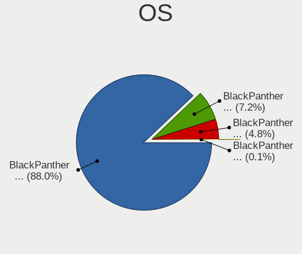
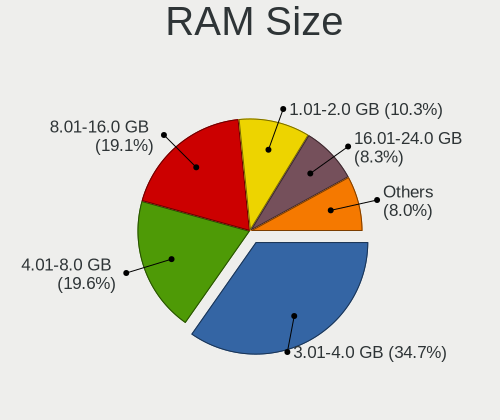
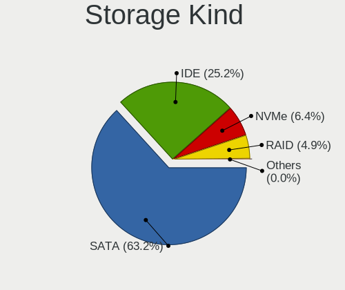
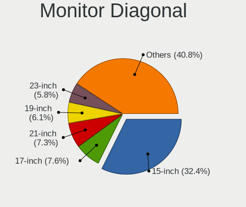
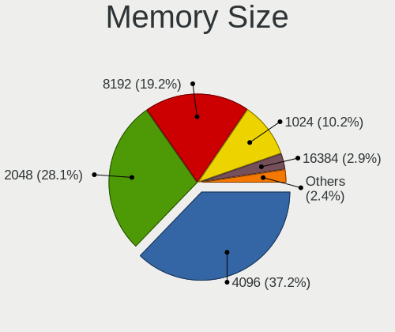
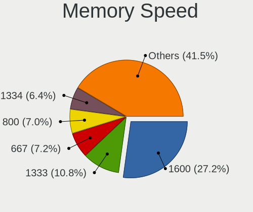
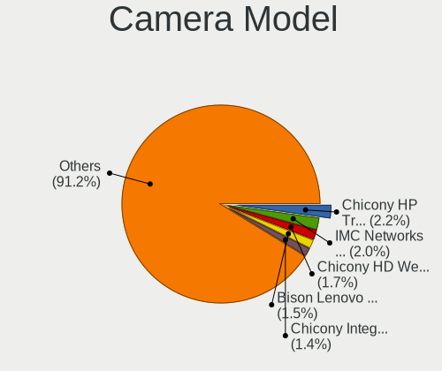

BlackPanther - Tested Hardware & Statistics
-------------------------------------------

A project to collect tested hardware configurations for BlackPanther.

Anyone can contribute to this report by the [hw-probe](https://github.com/linuxhw/hw-probe) tool:

    sudo -E hw-probe -all -upload

Please contribute! Especially if your hardware is rare.

This is a report for all computer types. See also reports for [desktops](/Dist/BlackPanther/Desktop/README.md) and [notebooks](/Dist/BlackPanther/Notebook/README.md).

Contents
--------

* [ Test Cases ](#test-cases)

* [ System ](#system)
  - [ OS                       ](#os)
  - [ OS Family                ](#os-family)
  - [ Kernel                   ](#kernel)
  - [ Kernel Family            ](#kernel-family)
  - [ Kernel Major Ver.        ](#kernel-major-ver)
  - [ Arch                     ](#arch)
  - [ DE                       ](#de)
  - [ Display Server           ](#display-server)
  - [ Display Manager          ](#display-manager)
  - [ OS Lang                  ](#os-lang)
  - [ Boot Mode                ](#boot-mode)
  - [ Filesystem               ](#filesystem)
  - [ Part. scheme             ](#part-scheme)
  - [ Dual Boot with Linux/BSD ](#dual-boot-with-linuxbsd)
  - [ Dual Boot (Win)          ](#dual-boot-win)

* [ Board ](#board)
  - [ Vendor                   ](#vendor)
  - [ Model                    ](#model)
  - [ Model Family             ](#model-family)
  - [ MFG Year                 ](#mfg-year)
  - [ Form Factor              ](#form-factor)
  - [ Secure Boot              ](#secure-boot)
  - [ Coreboot                 ](#coreboot)
  - [ RAM Size                 ](#ram-size)
  - [ RAM Used                 ](#ram-used)
  - [ Total Drives             ](#total-drives)
  - [ Has CD-ROM               ](#has-cd-rom)
  - [ Has Ethernet             ](#has-ethernet)
  - [ Has WiFi                 ](#has-wifi)
  - [ Has Bluetooth            ](#has-bluetooth)

* [ Location ](#location)
  - [ Country                  ](#country)
  - [ City                     ](#city)

* [ Drives ](#drives)
  - [ Drive Vendor             ](#drive-vendor)
  - [ Drive Model              ](#drive-model)
  - [ HDD Vendor               ](#hdd-vendor)
  - [ SSD Vendor               ](#ssd-vendor)
  - [ Drive Kind               ](#drive-kind)
  - [ Drive Connector          ](#drive-connector)
  - [ Drive Size               ](#drive-size)
  - [ Space Total              ](#space-total)
  - [ Space Used               ](#space-used)
  - [ Malfunc. Drives          ](#malfunc-drives)
  - [ Malfunc. Drive Vendor    ](#malfunc-drive-vendor)
  - [ Malfunc. HDD Vendor      ](#malfunc-hdd-vendor)
  - [ Malfunc. Drive Kind      ](#malfunc-drive-kind)
  - [ Failed Drives            ](#failed-drives)
  - [ Failed Drive Vendor      ](#failed-drive-vendor)
  - [ Drive Status             ](#drive-status)

* [ Storage controller ](#storage-controller)
  - [ Storage Vendor           ](#storage-vendor)
  - [ Storage Model            ](#storage-model)
  - [ Storage Kind             ](#storage-kind)

* [ Processor ](#processor)
  - [ CPU Vendor               ](#cpu-vendor)
  - [ CPU Model                ](#cpu-model)
  - [ CPU Model Family         ](#cpu-model-family)
  - [ CPU Cores                ](#cpu-cores)
  - [ CPU Sockets              ](#cpu-sockets)
  - [ CPU Threads              ](#cpu-threads)
  - [ CPU Op-Modes             ](#cpu-op-modes)
  - [ CPU Microcode            ](#cpu-microcode)
  - [ CPU Microarch            ](#cpu-microarch)

* [ Graphics ](#graphics)
  - [ GPU Vendor               ](#gpu-vendor)
  - [ GPU Model                ](#gpu-model)
  - [ GPU Combo                ](#gpu-combo)
  - [ GPU Driver               ](#gpu-driver)
  - [ GPU Memory               ](#gpu-memory)

* [ Monitor ](#monitor)
  - [ Monitor Vendor           ](#monitor-vendor)
  - [ Monitor Model            ](#monitor-model)
  - [ Monitor Resolution       ](#monitor-resolution)
  - [ Monitor Diagonal         ](#monitor-diagonal)
  - [ Monitor Width            ](#monitor-width)
  - [ Aspect Ratio             ](#aspect-ratio)
  - [ Monitor Area             ](#monitor-area)
  - [ Pixel Density            ](#pixel-density)
  - [ Multiple Monitors        ](#multiple-monitors)

* [ Network ](#network)
  - [ Net Controller Vendor    ](#net-controller-vendor)
  - [ Net Controller Model     ](#net-controller-model)
  - [ Wireless Vendor          ](#wireless-vendor)
  - [ Wireless Model           ](#wireless-model)
  - [ Ethernet Vendor          ](#ethernet-vendor)
  - [ Ethernet Model           ](#ethernet-model)
  - [ Net Controller Kind      ](#net-controller-kind)
  - [ Used Controller          ](#used-controller)
  - [ NICs                     ](#nics)
  - [ IPv6                     ](#ipv6)

* [ Bluetooth ](#bluetooth)
  - [ Bluetooth Vendor         ](#bluetooth-vendor)
  - [ Bluetooth Model          ](#bluetooth-model)

* [ Sound ](#sound)
  - [ Sound Vendor             ](#sound-vendor)
  - [ Sound Model              ](#sound-model)

* [ Memory ](#memory)
  - [ Memory Vendor            ](#memory-vendor)
  - [ Memory Model             ](#memory-model)
  - [ Memory Kind              ](#memory-kind)
  - [ Memory Form Factor       ](#memory-form-factor)
  - [ Memory Size              ](#memory-size)
  - [ Memory Speed             ](#memory-speed)

* [ Printers & scanners ](#printers--scanners)
  - [ Printer Vendor           ](#printer-vendor)
  - [ Printer Model            ](#printer-model)
  - [ Scanner Vendor           ](#scanner-vendor)
  - [ Scanner Model            ](#scanner-model)

* [ Camera ](#camera)
  - [ Camera Vendor            ](#camera-vendor)
  - [ Camera Model             ](#camera-model)

* [ Security ](#security)
  - [ Fingerprint Vendor       ](#fingerprint-vendor)
  - [ Fingerprint Model        ](#fingerprint-model)
  - [ Chipcard Vendor          ](#chipcard-vendor)
  - [ Chipcard Model           ](#chipcard-model)

* [ Unsupported ](#unsupported)
  - [ Unsupported Devices      ](#unsupported-devices)
  - [ Unsupported Device Types ](#unsupported-device-types)

Test Cases
----------

Total: 6173

| Vendor        | Model                       | Form-Factor | Probe                                                      | Date         |
|---------------|-----------------------------|-------------|------------------------------------------------------------|--------------|
| HP            | 255 G5 Notebook PC          | Notebook    | [4ff7c85a84](https://linux-hardware.org/?probe=4ff7c85a84) | May 31, 2022 |
| HP            | 255 G5 Notebook PC          | Notebook    | [c65fb5ddb9](https://linux-hardware.org/?probe=c65fb5ddb9) | May 31, 2022 |
| ASUSTek       | K53U                        | Notebook    | [efd067c3a8](https://linux-hardware.org/?probe=efd067c3a8) | May 30, 2022 |
| ASUSTek       | K53U                        | Notebook    | [a26756238b](https://linux-hardware.org/?probe=a26756238b) | May 30, 2022 |
| Lenovo        | ThinkCentre A57 98517HG     | Desktop     | [254fda14c1](https://linux-hardware.org/?probe=254fda14c1) | May 30, 2022 |
| Gigabyte      | B450M GAMING                | Desktop     | [2f4ff624ba](https://linux-hardware.org/?probe=2f4ff624ba) | May 29, 2022 |
| Gigabyte      | B450M GAMING                | Desktop     | [726cb8d22e](https://linux-hardware.org/?probe=726cb8d22e) | May 29, 2022 |
| Dell          | Latitude E6230              | Notebook    | [068d9b4143](https://linux-hardware.org/?probe=068d9b4143) | May 29, 2022 |
| Dell          | Latitude E6230              | Notebook    | [c50bb14e9a](https://linux-hardware.org/?probe=c50bb14e9a) | May 29, 2022 |
| Gigabyte      | H61M-S1                     | Desktop     | [444e61772c](https://linux-hardware.org/?probe=444e61772c) | May 29, 2022 |
| Gigabyte      | H61M-S1                     | Desktop     | [09b39cf91e](https://linux-hardware.org/?probe=09b39cf91e) | May 29, 2022 |
| Gigabyte      | G41MT-S2                    | Desktop     | [255d32d2b3](https://linux-hardware.org/?probe=255d32d2b3) | May 28, 2022 |
| HP            | 255 G5 Notebook PC          | Notebook    | [672f924aec](https://linux-hardware.org/?probe=672f924aec) | May 28, 2022 |
| ASUSTek       | K53U                        | Notebook    | [fdbe31f666](https://linux-hardware.org/?probe=fdbe31f666) | May 28, 2022 |
| HP            | 255 G5 Notebook PC          | Notebook    | [7f91291747](https://linux-hardware.org/?probe=7f91291747) | May 28, 2022 |
| ASUSTek       | K53U                        | Notebook    | [28565fc028](https://linux-hardware.org/?probe=28565fc028) | May 28, 2022 |
| Gigabyte      | H61M-S1                     | Desktop     | [3db842adc9](https://linux-hardware.org/?probe=3db842adc9) | May 27, 2022 |
| MSI           | X370 GAMING PLUS            | Desktop     | [2f96ea6c22](https://linux-hardware.org/?probe=2f96ea6c22) | May 26, 2022 |
| HP            | 620                         | Notebook    | [b5bf98b16a](https://linux-hardware.org/?probe=b5bf98b16a) | May 23, 2022 |
| HP            | 620                         | Notebook    | [8bf9517a97](https://linux-hardware.org/?probe=8bf9517a97) | May 23, 2022 |
| Lenovo        | SDK0E50510 WIN              | Desktop     | [1f8b067cca](https://linux-hardware.org/?probe=1f8b067cca) | May 23, 2022 |
| HP            | Presario CQ58               | Notebook    | [bdf8b7e229](https://linux-hardware.org/?probe=bdf8b7e229) | May 22, 2022 |
| HP            | Presario CQ58               | Notebook    | [383a27dd29](https://linux-hardware.org/?probe=383a27dd29) | May 22, 2022 |
| Fujitsu       | D2828-A2 S26361-D2828-A2    | Desktop     | [43d5dce3ee](https://linux-hardware.org/?probe=43d5dce3ee) | May 22, 2022 |
| MSI           | GT60 2OC/2OD                | Notebook    | [c3b5eb704d](https://linux-hardware.org/?probe=c3b5eb704d) | May 22, 2022 |
| MSI           | GT60 2OC/2OD                | Notebook    | [96f6fda5d5](https://linux-hardware.org/?probe=96f6fda5d5) | May 22, 2022 |
| Lenovo        | B590 20208                  | Notebook    | [b32a821a4c](https://linux-hardware.org/?probe=b32a821a4c) | May 21, 2022 |
| Lenovo        | B590 20208                  | Notebook    | [3386aeef48](https://linux-hardware.org/?probe=3386aeef48) | May 21, 2022 |
| Fujitsu       | LIFEBOOK U745               | Notebook    | [9003466ff8](https://linux-hardware.org/?probe=9003466ff8) | May 21, 2022 |
| Fujitsu       | LIFEBOOK U745               | Notebook    | [2e05001696](https://linux-hardware.org/?probe=2e05001696) | May 21, 2022 |
| HP            | 620                         | Notebook    | [babb1f392a](https://linux-hardware.org/?probe=babb1f392a) | May 21, 2022 |
| Lenovo        | SDK0E50510 WIN              | Desktop     | [0044468fc2](https://linux-hardware.org/?probe=0044468fc2) | May 19, 2022 |
| Lenovo        | SDK0E50510 WIN              | Desktop     | [ae6f7ab64b](https://linux-hardware.org/?probe=ae6f7ab64b) | May 19, 2022 |
| ASUSTek       | P8B75-M LX PLUS             | Desktop     | [5995dc5192](https://linux-hardware.org/?probe=5995dc5192) | May 18, 2022 |
| Lenovo        | SDK0E50510 WIN              | Desktop     | [26837853fd](https://linux-hardware.org/?probe=26837853fd) | May 17, 2022 |
| Lenovo        | ThinkCentre M90p 5536WAZ    | Desktop     | [45d6eb4008](https://linux-hardware.org/?probe=45d6eb4008) | May 17, 2022 |
| Lenovo        | G570 20079                  | Notebook    | [f4b9c3997d](https://linux-hardware.org/?probe=f4b9c3997d) | May 16, 2022 |
| Gigabyte      | H61M-S1                     | Desktop     | [153c3cb471](https://linux-hardware.org/?probe=153c3cb471) | May 16, 2022 |
| Toshiba       | Satellite L775-18R          | Notebook    | [ec012c6b3d](https://linux-hardware.org/?probe=ec012c6b3d) | May 16, 2022 |
| Dell          | 0W0CHX A00                  | Desktop     | [e545d0925d](https://linux-hardware.org/?probe=e545d0925d) | May 15, 2022 |
| Lenovo        | G580 20150                  | Notebook    | [75f2c0ab4e](https://linux-hardware.org/?probe=75f2c0ab4e) | May 15, 2022 |
| Lenovo        | G580 20150                  | Notebook    | [8d710ae7c3](https://linux-hardware.org/?probe=8d710ae7c3) | May 15, 2022 |
| Lenovo        | IdeaPad 320-17ABR 80YN      | Notebook    | [758e2b869d](https://linux-hardware.org/?probe=758e2b869d) | May 15, 2022 |
| Dell          | 0W0CHX A00                  | Desktop     | [4b8a2d1eec](https://linux-hardware.org/?probe=4b8a2d1eec) | May 15, 2022 |
| Lenovo        | IdeaPad 320-17ABR 80YN      | Notebook    | [91c6da69a9](https://linux-hardware.org/?probe=91c6da69a9) | May 15, 2022 |
| Dell          | Latitude E6430              | Notebook    | [e805d60a6b](https://linux-hardware.org/?probe=e805d60a6b) | May 14, 2022 |
| MSI           | B85M-P32                    | Desktop     | [9585181994](https://linux-hardware.org/?probe=9585181994) | May 14, 2022 |
| HP            | ProBook 640 G8 Notebook ... | Notebook    | [bfc1a518db](https://linux-hardware.org/?probe=bfc1a518db) | May 14, 2022 |
| HP            | 620                         | Notebook    | [62369d924a](https://linux-hardware.org/?probe=62369d924a) | May 12, 2022 |
| Gigabyte      | B450M GAMING                | Desktop     | [146d11b8f2](https://linux-hardware.org/?probe=146d11b8f2) | May 10, 2022 |
| Gigabyte      | B450M GAMING                | Desktop     | [6c4bf376bd](https://linux-hardware.org/?probe=6c4bf376bd) | May 10, 2022 |
| Lenovo        | Yoga 300-11IBY 80M0         | Notebook    | [af186fe9e3](https://linux-hardware.org/?probe=af186fe9e3) | May 10, 2022 |
| Lenovo        | Yoga 300-11IBY 80M0         | Notebook    | [b6fed1d4fe](https://linux-hardware.org/?probe=b6fed1d4fe) | May 10, 2022 |
| ASUSTek       | PRIME B365M-A               | Desktop     | [5a694d9de8](https://linux-hardware.org/?probe=5a694d9de8) | May 10, 2022 |
| ASUSTek       | PRIME B365M-A               | Desktop     | [af7f41e61f](https://linux-hardware.org/?probe=af7f41e61f) | May 10, 2022 |
| Dell          | Latitude E6230              | Notebook    | [d9d1e38394](https://linux-hardware.org/?probe=d9d1e38394) | May 09, 2022 |
| Acer          | Aspire 6930G                | Notebook    | [49228d9f61](https://linux-hardware.org/?probe=49228d9f61) | May 08, 2022 |
| Acer          | Aspire 6930G                | Notebook    | [912dbb8280](https://linux-hardware.org/?probe=912dbb8280) | May 08, 2022 |
| Fujitsu       | D2828-A2 S26361-D2828-A2    | Desktop     | [f1bdc60827](https://linux-hardware.org/?probe=f1bdc60827) | May 08, 2022 |
| Gigabyte      | H61M-S1                     | Desktop     | [e4030c65d7](https://linux-hardware.org/?probe=e4030c65d7) | May 07, 2022 |
| MSI           | GT60 2OC/2OD                | Notebook    | [954fdc5841](https://linux-hardware.org/?probe=954fdc5841) | May 06, 2022 |
| MSI           | GT60 2OC/2OD                | Notebook    | [21f08dbab6](https://linux-hardware.org/?probe=21f08dbab6) | May 06, 2022 |
| HUAWEI        | HVY-WXX9                    | Notebook    | [fbd1c44f53](https://linux-hardware.org/?probe=fbd1c44f53) | May 02, 2022 |
| Dell          | 0TY915                      | Desktop     | [7de07e1186](https://linux-hardware.org/?probe=7de07e1186) | May 01, 2022 |
| Fujitsu Si... | D2660-A1 S26361-D2660-A1    | Desktop     | [bb192229b3](https://linux-hardware.org/?probe=bb192229b3) | Apr 30, 2022 |
| Fujitsu Si... | D2660-A1 S26361-D2660-A1    | Desktop     | [a5ce52429c](https://linux-hardware.org/?probe=a5ce52429c) | Apr 30, 2022 |
| Sony          | VPCEH2J1E                   | Notebook    | [86f6b8c750](https://linux-hardware.org/?probe=86f6b8c750) | Apr 30, 2022 |
| Dell          | Inspiron MP061              | Notebook    | [e41e5725a7](https://linux-hardware.org/?probe=e41e5725a7) | Apr 28, 2022 |
| ASUSTek       | B85M-E                      | Desktop     | [05896f4d55](https://linux-hardware.org/?probe=05896f4d55) | Apr 27, 2022 |
| ASUSTek       | B85M-E                      | Desktop     | [c4ccc166be](https://linux-hardware.org/?probe=c4ccc166be) | Apr 27, 2022 |
| ASRock        | FM2A75M Pro4+               | Desktop     | [0fc510a45a](https://linux-hardware.org/?probe=0fc510a45a) | Apr 26, 2022 |
| Toshiba       | NB550D                      | Notebook    | [386409d233](https://linux-hardware.org/?probe=386409d233) | Apr 24, 2022 |
| ASRock        | FM2A75M Pro4+               | Desktop     | [2ccbcae022](https://linux-hardware.org/?probe=2ccbcae022) | Apr 23, 2022 |
| ASRock        | FM2A75M Pro4+               | Desktop     | [ec77795911](https://linux-hardware.org/?probe=ec77795911) | Apr 23, 2022 |
| Lenovo        | Gardenia CRB SDK0J40709 ... | All in one  | [e8e0b5fd5d](https://linux-hardware.org/?probe=e8e0b5fd5d) | Apr 22, 2022 |
| Lenovo        | Gardenia CRB SDK0J40709 ... | All in one  | [df18833e16](https://linux-hardware.org/?probe=df18833e16) | Apr 21, 2022 |
| Dell          | 0T1D10 A01                  | Desktop     | [2cb73e0d8b](https://linux-hardware.org/?probe=2cb73e0d8b) | Apr 21, 2022 |
| HP            | 339A                        | Desktop     | [229032eb98](https://linux-hardware.org/?probe=229032eb98) | Apr 19, 2022 |
| MSI           | AMETHYST-M                  | Desktop     | [73864e97e4](https://linux-hardware.org/?probe=73864e97e4) | Apr 19, 2022 |
| Lenovo        | B590 20208                  | Notebook    | [af6b076e21](https://linux-hardware.org/?probe=af6b076e21) | Apr 18, 2022 |
| Hungaro Fl... | Navon Loop 360              | Notebook    | [48b6f0e313](https://linux-hardware.org/?probe=48b6f0e313) | Apr 18, 2022 |
| Lenovo        | ThinkCentre A57 98517HG     | Desktop     | [d624a31b69](https://linux-hardware.org/?probe=d624a31b69) | Apr 18, 2022 |
| Hungaro Fl... | Navon Loop 360              | Notebook    | [cde65f88c1](https://linux-hardware.org/?probe=cde65f88c1) | Apr 17, 2022 |
| ASUSTek       | TP201SA                     | Notebook    | [2898b67bff](https://linux-hardware.org/?probe=2898b67bff) | Apr 16, 2022 |
| ASRock        | ConRoe1333-D667             | Desktop     | [d2bba273a0](https://linux-hardware.org/?probe=d2bba273a0) | Apr 15, 2022 |
| ASUSTek       | M4A78 PRO                   | Desktop     | [9ed3f59682](https://linux-hardware.org/?probe=9ed3f59682) | Apr 14, 2022 |
| Gigabyte      | GA-MA74GM-S2                | Desktop     | [5e30e0e56d](https://linux-hardware.org/?probe=5e30e0e56d) | Apr 12, 2022 |
| Gigabyte      | GA-MA74GM-S2                | Desktop     | [67175f0019](https://linux-hardware.org/?probe=67175f0019) | Apr 12, 2022 |
| Gigabyte      | GA-MA74GM-S2                | Desktop     | [c11ab04912](https://linux-hardware.org/?probe=c11ab04912) | Apr 12, 2022 |
| HP            | ProBook 470 G1              | Notebook    | [ee1f05022a](https://linux-hardware.org/?probe=ee1f05022a) | Apr 10, 2022 |
| Lenovo        | G580 20150                  | Notebook    | [00215e25c0](https://linux-hardware.org/?probe=00215e25c0) | Apr 10, 2022 |
| Apple         | Mac-F4208DC8 PVT            | Desktop     | [3d91f855bc](https://linux-hardware.org/?probe=3d91f855bc) | Apr 09, 2022 |
| Lenovo        | ThinkCentre M70e 0832A26    | Desktop     | [6130d7e1e6](https://linux-hardware.org/?probe=6130d7e1e6) | Apr 09, 2022 |
| Gigabyte      | G41MT-S2PT                  | Desktop     | [7dde5fefd1](https://linux-hardware.org/?probe=7dde5fefd1) | Apr 09, 2022 |
| Acer          | Aspire A114-31              | Notebook    | [8779ba2891](https://linux-hardware.org/?probe=8779ba2891) | Apr 09, 2022 |
| Fujitsu       | LIFEBOOK U745               | Notebook    | [9dc3653255](https://linux-hardware.org/?probe=9dc3653255) | Apr 09, 2022 |
| Acer          | Aspire A114-31              | Notebook    | [298acab48c](https://linux-hardware.org/?probe=298acab48c) | Apr 08, 2022 |
| Lenovo        | ThinkPad T61 6458WK6        | Notebook    | [5303af9863](https://linux-hardware.org/?probe=5303af9863) | Apr 07, 2022 |
| ASUSTek       | N75SF                       | Notebook    | [e3f8003fb7](https://linux-hardware.org/?probe=e3f8003fb7) | Apr 07, 2022 |
| HP            | 0AA8h                       | Desktop     | [0de7915496](https://linux-hardware.org/?probe=0de7915496) | Apr 06, 2022 |
| Fujitsu       | LIFEBOOK U745               | Notebook    | [5d73ae026b](https://linux-hardware.org/?probe=5d73ae026b) | Apr 05, 2022 |
| ASRock        | B85M                        | Desktop     | [5e03e9532d](https://linux-hardware.org/?probe=5e03e9532d) | Apr 04, 2022 |
| Acer          | TravelMate P215-52          | Notebook    | [a5d16dc93e](https://linux-hardware.org/?probe=a5d16dc93e) | Apr 03, 2022 |
| Samsung       | RV410/RV510/S3510/E3510     | Notebook    | [495e271511](https://linux-hardware.org/?probe=495e271511) | Apr 03, 2022 |
| Dell          | Latitude E5420              | Notebook    | [a60c1a4785](https://linux-hardware.org/?probe=a60c1a4785) | Apr 03, 2022 |
| Gigabyte      | H61M-S1                     | Desktop     | [a10a00d2f1](https://linux-hardware.org/?probe=a10a00d2f1) | Apr 03, 2022 |
| Lenovo        | G780 20138                  | Notebook    | [a7cad8a09a](https://linux-hardware.org/?probe=a7cad8a09a) | Apr 02, 2022 |
| Acer          | TravelMate P215-52          | Notebook    | [752d283e54](https://linux-hardware.org/?probe=752d283e54) | Apr 01, 2022 |
| ASUSTek       | X540LA                      | Notebook    | [732406d8b0](https://linux-hardware.org/?probe=732406d8b0) | Apr 01, 2022 |
| Samsung       | RV410/RV510/S3510/E3510     | Notebook    | [666c8daa31](https://linux-hardware.org/?probe=666c8daa31) | Apr 01, 2022 |
| HP            | Unknown                     | Notebook    | [c6a02a2df5](https://linux-hardware.org/?probe=c6a02a2df5) | Apr 01, 2022 |
| HP            | Unknown                     | Notebook    | [71ae764e9f](https://linux-hardware.org/?probe=71ae764e9f) | Apr 01, 2022 |
| ASRock        | B75 Pro3                    | Desktop     | [01c8b92976](https://linux-hardware.org/?probe=01c8b92976) | Mar 31, 2022 |
| HP            | 18E7                        | Desktop     | [4503b657fe](https://linux-hardware.org/?probe=4503b657fe) | Mar 30, 2022 |
| Apple         | Mac-F226BEC8 PVT            | All in one  | [6e9d4f3b25](https://linux-hardware.org/?probe=6e9d4f3b25) | Mar 30, 2022 |
| Apple         | Mac-F226BEC8 PVT            | All in one  | [2362d1fd43](https://linux-hardware.org/?probe=2362d1fd43) | Mar 30, 2022 |
| HP            | Compaq nx6125 (PZ896UA#A... | Notebook    | [bba6b8d33d](https://linux-hardware.org/?probe=bba6b8d33d) | Mar 30, 2022 |
| HP            | Compaq nx6125 (PZ896UA#A... | Notebook    | [9f382b5166](https://linux-hardware.org/?probe=9f382b5166) | Mar 30, 2022 |
| HP            | Pavilion dv8000 (EP409UA... | Notebook    | [56c91c9396](https://linux-hardware.org/?probe=56c91c9396) | Mar 29, 2022 |
| eMachines     | E725                        | Notebook    | [475f79831d](https://linux-hardware.org/?probe=475f79831d) | Mar 29, 2022 |
| eMachines     | E725                        | Notebook    | [f8e777c318](https://linux-hardware.org/?probe=f8e777c318) | Mar 29, 2022 |
| HP            | ProBook 640 G8 Notebook ... | Notebook    | [60da33f3aa](https://linux-hardware.org/?probe=60da33f3aa) | Mar 28, 2022 |
| Gigabyte      | B450M GAMING                | Desktop     | [6cff18109b](https://linux-hardware.org/?probe=6cff18109b) | Mar 28, 2022 |
| Gigabyte      | B450M GAMING                | Desktop     | [b650c90413](https://linux-hardware.org/?probe=b650c90413) | Mar 28, 2022 |
| Dell          | Latitude E5540              | Notebook    | [838350f357](https://linux-hardware.org/?probe=838350f357) | Mar 28, 2022 |
| Lenovo        | ThinkPad W530 2463A58       | Notebook    | [8e8bd0aad5](https://linux-hardware.org/?probe=8e8bd0aad5) | Mar 28, 2022 |
| Sony          | VPCEH2J1E                   | Notebook    | [23d5b99aca](https://linux-hardware.org/?probe=23d5b99aca) | Mar 27, 2022 |
| Lenovo        | G580 20150                  | Notebook    | [ec430f1afc](https://linux-hardware.org/?probe=ec430f1afc) | Mar 27, 2022 |
| Dell          | Inspiron M5030              | Notebook    | [a36af1ef0f](https://linux-hardware.org/?probe=a36af1ef0f) | Mar 27, 2022 |
| Dell          | Inspiron M5030              | Notebook    | [c3b9926b94](https://linux-hardware.org/?probe=c3b9926b94) | Mar 27, 2022 |
| Fujitsu       | D3161-A1 S26361-D3161-A1    | Desktop     | [5d62943116](https://linux-hardware.org/?probe=5d62943116) | Mar 27, 2022 |
| Gigabyte      | H61M-D2-B3                  | Desktop     | [e807733708](https://linux-hardware.org/?probe=e807733708) | Mar 26, 2022 |
| Gigabyte      | H61M-D2-B3                  | Desktop     | [59df12dc12](https://linux-hardware.org/?probe=59df12dc12) | Mar 26, 2022 |
| Lenovo        | ThinkCentre M70e 0832A26    | Desktop     | [fd041828d0](https://linux-hardware.org/?probe=fd041828d0) | Mar 26, 2022 |
| Lenovo        | IdeaPad 320-17ABR 80YN      | Notebook    | [ed4ed6851f](https://linux-hardware.org/?probe=ed4ed6851f) | Mar 23, 2022 |
| Lenovo        | IdeaPad 330-15IKB 81DE      | Notebook    | [5b8c4678af](https://linux-hardware.org/?probe=5b8c4678af) | Mar 22, 2022 |
| ASUSTek       | M5A78L-M PLUS/USB3          | Desktop     | [d2e30b1d8b](https://linux-hardware.org/?probe=d2e30b1d8b) | Mar 22, 2022 |
| ASUSTek       | M5A78L-M PLUS/USB3          | Desktop     | [72e8662f26](https://linux-hardware.org/?probe=72e8662f26) | Mar 22, 2022 |
| Acer          | TravelMate P238-G2-M        | Notebook    | [7aa968ca84](https://linux-hardware.org/?probe=7aa968ca84) | Mar 22, 2022 |
| Apple         | MacBookPro6,2               | Notebook    | [5611c90f20](https://linux-hardware.org/?probe=5611c90f20) | Mar 21, 2022 |
| Apple         | MacBookPro6,2               | Notebook    | [2a71c88e71](https://linux-hardware.org/?probe=2a71c88e71) | Mar 21, 2022 |
| Lenovo        | G505s 20255                 | Notebook    | [9f18cfb328](https://linux-hardware.org/?probe=9f18cfb328) | Mar 19, 2022 |
| Sony          | VPCEH2J1E                   | Notebook    | [ae54fc4033](https://linux-hardware.org/?probe=ae54fc4033) | Mar 19, 2022 |
| Gigabyte      | GA-78LMT-USB3 R2            | Desktop     | [399ab158b9](https://linux-hardware.org/?probe=399ab158b9) | Mar 19, 2022 |
| Lenovo        | G505s 20255                 | Notebook    | [716d4ed3be](https://linux-hardware.org/?probe=716d4ed3be) | Mar 18, 2022 |
| Gigabyte      | GA-78LMT-USB3 R2            | Desktop     | [661d9fcffa](https://linux-hardware.org/?probe=661d9fcffa) | Mar 18, 2022 |
| ASUSTek       | X201EP                      | Notebook    | [864fc80ac3](https://linux-hardware.org/?probe=864fc80ac3) | Mar 17, 2022 |
| HP            | Compaq CQ58                 | Notebook    | [ef6cbc7487](https://linux-hardware.org/?probe=ef6cbc7487) | Mar 17, 2022 |
| MSI           | X470 GAMING PRO CARBON      | Desktop     | [46af9af40c](https://linux-hardware.org/?probe=46af9af40c) | Mar 17, 2022 |
| MSI           | X470 GAMING PRO CARBON      | Desktop     | [1b697ade27](https://linux-hardware.org/?probe=1b697ade27) | Mar 17, 2022 |
| ASUSTek       | Rampage III Extreme         | Desktop     | [6533ff3270](https://linux-hardware.org/?probe=6533ff3270) | Mar 16, 2022 |
| ASUSTek       | Rampage III Extreme         | Desktop     | [1e13431147](https://linux-hardware.org/?probe=1e13431147) | Mar 16, 2022 |
| Lenovo        | IdeaPad 320-17ABR 80YN      | Notebook    | [6ae5708fe3](https://linux-hardware.org/?probe=6ae5708fe3) | Mar 16, 2022 |
| Fujitsu       | LIFEBOOK U745               | Notebook    | [e8e4e5d953](https://linux-hardware.org/?probe=e8e4e5d953) | Mar 15, 2022 |
| HP            | 650                         | Notebook    | [3266dba7df](https://linux-hardware.org/?probe=3266dba7df) | Mar 14, 2022 |
| HP            | 650                         | Notebook    | [54df12f572](https://linux-hardware.org/?probe=54df12f572) | Mar 14, 2022 |
| HP            | Pavilion 17                 | Notebook    | [d623639513](https://linux-hardware.org/?probe=d623639513) | Mar 14, 2022 |
| ASUSTek       | Strix 15 GL503GE            | Notebook    | [29c3688c05](https://linux-hardware.org/?probe=29c3688c05) | Mar 13, 2022 |
| Dell          | 0GM819                      | Desktop     | [e06d400f29](https://linux-hardware.org/?probe=e06d400f29) | Mar 13, 2022 |
| ASUSTek       | X541UVK                     | Notebook    | [74ba6d5353](https://linux-hardware.org/?probe=74ba6d5353) | Mar 12, 2022 |
| ASRock        | FM2A75M Pro4+               | Desktop     | [912b670e0f](https://linux-hardware.org/?probe=912b670e0f) | Mar 12, 2022 |
| ASRock        | FM2A75M Pro4+               | Desktop     | [64f83fa328](https://linux-hardware.org/?probe=64f83fa328) | Mar 12, 2022 |
| eMachines     | E725                        | Notebook    | [05b157a340](https://linux-hardware.org/?probe=05b157a340) | Mar 12, 2022 |
| Acer          | Veriton M4610G              | Desktop     | [ec980460ed](https://linux-hardware.org/?probe=ec980460ed) | Mar 12, 2022 |
| HP            | Pavilion 17                 | Notebook    | [f5ff2a8a14](https://linux-hardware.org/?probe=f5ff2a8a14) | Mar 10, 2022 |
| HP            | Pavilion 17                 | Notebook    | [b6bfe40827](https://linux-hardware.org/?probe=b6bfe40827) | Mar 10, 2022 |
| ASUSTek       | ASUS TUF Gaming A15 FA50... | Notebook    | [299209635a](https://linux-hardware.org/?probe=299209635a) | Mar 09, 2022 |
| Dell          | Latitude E6230              | Notebook    | [20ca54a46c](https://linux-hardware.org/?probe=20ca54a46c) | Mar 09, 2022 |
| Sony          | VPCEH2J1E                   | Notebook    | [713f08757a](https://linux-hardware.org/?probe=713f08757a) | Mar 09, 2022 |
| Gigabyte      | H61M-S2PV                   | Desktop     | [71e8b113b4](https://linux-hardware.org/?probe=71e8b113b4) | Mar 09, 2022 |
| Gigabyte      | H61M-S2PV                   | Desktop     | [0148e15f51](https://linux-hardware.org/?probe=0148e15f51) | Mar 09, 2022 |
| Sony          | SVS13118GBB                 | Notebook    | [64dc07d0af](https://linux-hardware.org/?probe=64dc07d0af) | Mar 08, 2022 |
| Sony          | SVS13118GBB                 | Notebook    | [76afe39f5e](https://linux-hardware.org/?probe=76afe39f5e) | Mar 08, 2022 |
| Lenovo        | Dory CRB                    | Desktop     | [e8cfaeca24](https://linux-hardware.org/?probe=e8cfaeca24) | Mar 08, 2022 |
| Fujitsu Si... | MS-7504VP-PV                | Desktop     | [8dcdbb2b22](https://linux-hardware.org/?probe=8dcdbb2b22) | Mar 07, 2022 |
| ASUSTek       | M5A78L-M PLUS/USB3          | Desktop     | [378234e501](https://linux-hardware.org/?probe=378234e501) | Mar 07, 2022 |
| Toshiba       | Satellite Pro C50-A-1E5     | Notebook    | [ac3b4acda7](https://linux-hardware.org/?probe=ac3b4acda7) | Mar 06, 2022 |
| ASUSTek       | ROG STRIX X370-F GAMING     | Desktop     | [e45f91366e](https://linux-hardware.org/?probe=e45f91366e) | Mar 06, 2022 |
| Lenovo        | ThinkPad T60 6370A55        | Notebook    | [3a01549416](https://linux-hardware.org/?probe=3a01549416) | Mar 06, 2022 |
| Lenovo        | ThinkPad T60 6370A55        | Notebook    | [48d2d5d234](https://linux-hardware.org/?probe=48d2d5d234) | Mar 06, 2022 |
| ASUSTek       | T101HA                      | Tablet      | [05983a1e06](https://linux-hardware.org/?probe=05983a1e06) | Mar 06, 2022 |
| HP            | Compaq 6710b (GB890EA#AK... | Notebook    | [c313b8ee39](https://linux-hardware.org/?probe=c313b8ee39) | Mar 05, 2022 |
| ASUSTek       | ROG STRIX X370-F GAMING     | Desktop     | [a74b04333e](https://linux-hardware.org/?probe=a74b04333e) | Mar 05, 2022 |
| HP            | Compaq 6720s                | Notebook    | [f83b83214e](https://linux-hardware.org/?probe=f83b83214e) | Mar 04, 2022 |
| Toshiba       | dynabook RX3 SN240Y/3HD     | Notebook    | [2f2d99c83f](https://linux-hardware.org/?probe=2f2d99c83f) | Mar 03, 2022 |
| Toshiba       | dynabook RX3 SN240Y/3HD     | Notebook    | [0d0a2bab7a](https://linux-hardware.org/?probe=0d0a2bab7a) | Mar 03, 2022 |
| Gigabyte      | H61M-D2-B3                  | Desktop     | [ad003c1394](https://linux-hardware.org/?probe=ad003c1394) | Mar 02, 2022 |
| Gigabyte      | H61M-D2-B3                  | Desktop     | [8225572009](https://linux-hardware.org/?probe=8225572009) | Mar 02, 2022 |
| MSI           | GP75 Leopard 9SE            | Notebook    | [6090fb66ea](https://linux-hardware.org/?probe=6090fb66ea) | Mar 02, 2022 |
| Dell          | Latitude E5540              | Notebook    | [0e5ce3685b](https://linux-hardware.org/?probe=0e5ce3685b) | Mar 02, 2022 |
| HP            | G60                         | Notebook    | [3921a7d345](https://linux-hardware.org/?probe=3921a7d345) | Mar 02, 2022 |
| HP            | Compaq 6720s                | Notebook    | [9d3882f4c5](https://linux-hardware.org/?probe=9d3882f4c5) | Mar 02, 2022 |
| MSI           | GP75 Leopard 9SE            | Notebook    | [c56a98389f](https://linux-hardware.org/?probe=c56a98389f) | Mar 01, 2022 |
| HP            | 339A                        | Desktop     | [59d197fac4](https://linux-hardware.org/?probe=59d197fac4) | Mar 01, 2022 |
| Acer          | Aspire ES1-571              | Notebook    | [acc272ef5a](https://linux-hardware.org/?probe=acc272ef5a) | Feb 28, 2022 |
| Acer          | Aspire ES1-571              | Notebook    | [cf51003466](https://linux-hardware.org/?probe=cf51003466) | Feb 28, 2022 |
| Dell          | Latitude 5480               | Notebook    | [43ae797918](https://linux-hardware.org/?probe=43ae797918) | Feb 28, 2022 |
| ASUSTek       | K53U                        | Notebook    | [16c5ebe7c3](https://linux-hardware.org/?probe=16c5ebe7c3) | Feb 27, 2022 |
| HP            | Pavilion g6                 | Notebook    | [2aea4ab8f4](https://linux-hardware.org/?probe=2aea4ab8f4) | Feb 27, 2022 |
| HP            | ProBook 6470b               | Notebook    | [76e9b5f896](https://linux-hardware.org/?probe=76e9b5f896) | Feb 26, 2022 |
| HP            | ProBook 6470b               | Notebook    | [3b86510929](https://linux-hardware.org/?probe=3b86510929) | Feb 26, 2022 |
| Lenovo        | ThinkPad T430 2350B58       | Notebook    | [f247d6c3ca](https://linux-hardware.org/?probe=f247d6c3ca) | Feb 25, 2022 |
| Lenovo        | ThinkPad T430 2350B58       | Notebook    | [ececeadefe](https://linux-hardware.org/?probe=ececeadefe) | Feb 25, 2022 |
| Gigabyte      | B85M-DS3H-A                 | Desktop     | [e1284695f2](https://linux-hardware.org/?probe=e1284695f2) | Feb 24, 2022 |
| Gigabyte      | B85M-DS3H-A                 | Desktop     | [c7c60ad7ac](https://linux-hardware.org/?probe=c7c60ad7ac) | Feb 24, 2022 |
| Shenzhen W... | GB1                         | Mini pc     | [78762d9561](https://linux-hardware.org/?probe=78762d9561) | Feb 24, 2022 |
| Shenzhen W... | GB1                         | Mini pc     | [25f0f61205](https://linux-hardware.org/?probe=25f0f61205) | Feb 24, 2022 |
| Gigabyte      | Z370 AORUS Gaming 7         | Desktop     | [f1f42dcf94](https://linux-hardware.org/?probe=f1f42dcf94) | Feb 22, 2022 |
| HP            | Pavilion 17                 | Notebook    | [97c44abef4](https://linux-hardware.org/?probe=97c44abef4) | Feb 22, 2022 |
| Gigabyte      | Z370 AORUS Gaming 7         | Desktop     | [0dbe303c5a](https://linux-hardware.org/?probe=0dbe303c5a) | Feb 22, 2022 |
| Lenovo        | IdeaPad 330-15IKB 81DE      | Notebook    | [80ceccfdc7](https://linux-hardware.org/?probe=80ceccfdc7) | Feb 22, 2022 |
| eMachines     | E725                        | Notebook    | [4aa5e2b180](https://linux-hardware.org/?probe=4aa5e2b180) | Feb 21, 2022 |
| Lenovo        | IdeaPad Y700-15ISK 80NV     | Notebook    | [d1f67de0fb](https://linux-hardware.org/?probe=d1f67de0fb) | Feb 21, 2022 |
| Dell          | Latitude D630               | Notebook    | [067e57eab9](https://linux-hardware.org/?probe=067e57eab9) | Feb 20, 2022 |
| Gigabyte      | H61M-S1                     | Desktop     | [e667cfc4cf](https://linux-hardware.org/?probe=e667cfc4cf) | Feb 20, 2022 |
| Fujitsu       | D3162-A1 S26361-D3162-A1    | Desktop     | [ee84460851](https://linux-hardware.org/?probe=ee84460851) | Feb 20, 2022 |
| Fujitsu       | D3162-A1 S26361-D3162-A1    | Desktop     | [158e5bd3bb](https://linux-hardware.org/?probe=158e5bd3bb) | Feb 20, 2022 |
| Packard Be... | EasyNote ENLG81BA           | Notebook    | [fb281e6c00](https://linux-hardware.org/?probe=fb281e6c00) | Feb 20, 2022 |
| Packard Be... | EasyNote ENLG81BA           | Notebook    | [58e5e2c95c](https://linux-hardware.org/?probe=58e5e2c95c) | Feb 20, 2022 |
| ASUSTek       | X550VX                      | Notebook    | [2cf18df101](https://linux-hardware.org/?probe=2cf18df101) | Feb 19, 2022 |
| HP            | Compaq 6530b (NJ641UC#AB... | Notebook    | [ab91a058c0](https://linux-hardware.org/?probe=ab91a058c0) | Feb 19, 2022 |
| HP            | Compaq 6530b (NJ641UC#AB... | Notebook    | [70ab79b3b4](https://linux-hardware.org/?probe=70ab79b3b4) | Feb 19, 2022 |
| Gigabyte      | B85M-D3H                    | Desktop     | [7b5e16621e](https://linux-hardware.org/?probe=7b5e16621e) | Feb 18, 2022 |
| Gigabyte      | B85M-D3H                    | Desktop     | [85a5aca2eb](https://linux-hardware.org/?probe=85a5aca2eb) | Feb 18, 2022 |
| Lenovo        | IdeaPad S145-15IGM 81MX     | Notebook    | [dc8d1eb5eb](https://linux-hardware.org/?probe=dc8d1eb5eb) | Feb 18, 2022 |
| Lenovo        | IdeaPad S145-15IGM 81MX     | Notebook    | [58b92a0176](https://linux-hardware.org/?probe=58b92a0176) | Feb 18, 2022 |
| HP            | ProBook 6470b               | Notebook    | [4c37154dc3](https://linux-hardware.org/?probe=4c37154dc3) | Feb 17, 2022 |
| Medion        | MS-7748                     | Desktop     | [0f9283e5e9](https://linux-hardware.org/?probe=0f9283e5e9) | Feb 17, 2022 |
| Dell          | Latitude E5430 non-vPro     | Notebook    | [a7afdd9d95](https://linux-hardware.org/?probe=a7afdd9d95) | Feb 17, 2022 |
| ASUSTek       | P5KPL-AM IN/ROEM/SI         | Desktop     | [8b373bbfec](https://linux-hardware.org/?probe=8b373bbfec) | Feb 17, 2022 |
| Medion        | MS-7748                     | Desktop     | [72e17bd510](https://linux-hardware.org/?probe=72e17bd510) | Feb 17, 2022 |
| HP            | 2820h                       | Desktop     | [ecf8b8bc60](https://linux-hardware.org/?probe=ecf8b8bc60) | Feb 17, 2022 |
| HP            | 2820h                       | Desktop     | [89f7abcbf4](https://linux-hardware.org/?probe=89f7abcbf4) | Feb 17, 2022 |
| HP            | Pavilion 17                 | Notebook    | [166e1147d2](https://linux-hardware.org/?probe=166e1147d2) | Feb 17, 2022 |
| Lenovo        | IdeaPad 330S-15IKB 81F5     | Notebook    | [934591472d](https://linux-hardware.org/?probe=934591472d) | Feb 16, 2022 |
| Lenovo        | IdeaPad 320-15ABR 80XS      | Notebook    | [c5eab4c7d9](https://linux-hardware.org/?probe=c5eab4c7d9) | Feb 16, 2022 |
| HP            | EliteBook 8570w             | Notebook    | [bdfcf410e6](https://linux-hardware.org/?probe=bdfcf410e6) | Feb 16, 2022 |
| Samsung       | RV411/RV511/E3511/S3511/... | Notebook    | [23e6094c83](https://linux-hardware.org/?probe=23e6094c83) | Feb 16, 2022 |
| Samsung       | RV411/RV511/E3511/S3511/... | Notebook    | [a0a9cf96a8](https://linux-hardware.org/?probe=a0a9cf96a8) | Feb 15, 2022 |
| HP            | 1850                        | Desktop     | [5a4288672d](https://linux-hardware.org/?probe=5a4288672d) | Feb 15, 2022 |
| HP            | Compaq 6530b (NJ641UC#AB... | Notebook    | [357881c642](https://linux-hardware.org/?probe=357881c642) | Feb 15, 2022 |
| Dell          | Latitude D630               | Notebook    | [17929b78ff](https://linux-hardware.org/?probe=17929b78ff) | Feb 15, 2022 |
| MSI           | B85M-P32                    | Desktop     | [e0a962d224](https://linux-hardware.org/?probe=e0a962d224) | Feb 15, 2022 |
| ASRock        | B550M Pro4                  | Desktop     | [5897907111](https://linux-hardware.org/?probe=5897907111) | Feb 15, 2022 |
| AMI           | Aptio CRB                   | Mini pc     | [85a08428df](https://linux-hardware.org/?probe=85a08428df) | Feb 14, 2022 |
| ASUSTek       | Crosshair IV Formula        | Desktop     | [f33f7c184e](https://linux-hardware.org/?probe=f33f7c184e) | Feb 14, 2022 |
| AMI           | Aptio CRB                   | Mini pc     | [65bc09e992](https://linux-hardware.org/?probe=65bc09e992) | Feb 14, 2022 |
| MSI           | H61M-P20                    | Desktop     | [63dbb68d31](https://linux-hardware.org/?probe=63dbb68d31) | Feb 14, 2022 |
| HP            | Compaq 6530b (NJ641UC#AB... | Notebook    | [1cfe8d6cc4](https://linux-hardware.org/?probe=1cfe8d6cc4) | Feb 14, 2022 |
| HP            | 250 G1                      | Notebook    | [0c35eb7e0c](https://linux-hardware.org/?probe=0c35eb7e0c) | Feb 14, 2022 |
| HP            | 250 G1                      | Notebook    | [0e47dcd6ff](https://linux-hardware.org/?probe=0e47dcd6ff) | Feb 14, 2022 |
| Lenovo        | ThinkPad T410 2537VFQ       | Notebook    | [004fd97714](https://linux-hardware.org/?probe=004fd97714) | Feb 13, 2022 |
| Gigabyte      | Z370 AORUS Gaming 7         | Desktop     | [ead5c5ff20](https://linux-hardware.org/?probe=ead5c5ff20) | Feb 13, 2022 |
| Lenovo        | 3000 N500 423332G           | Notebook    | [5f673420ca](https://linux-hardware.org/?probe=5f673420ca) | Feb 13, 2022 |
| Gigabyte      | Z370 AORUS Gaming 7         | Desktop     | [2e1614e8b3](https://linux-hardware.org/?probe=2e1614e8b3) | Feb 13, 2022 |
| MSI           | H61M-P20                    | Desktop     | [d0996e1c65](https://linux-hardware.org/?probe=d0996e1c65) | Feb 13, 2022 |
| Fujitsu Si... | LIFEBOOK S7110              | Notebook    | [a3f36901a2](https://linux-hardware.org/?probe=a3f36901a2) | Feb 13, 2022 |
| ASUSTek       | P5KPL-AM IN/ROEM/SI         | Desktop     | [7968062d45](https://linux-hardware.org/?probe=7968062d45) | Feb 13, 2022 |
| HP            | 255 G6 Notebook PC          | Notebook    | [30c3320bb3](https://linux-hardware.org/?probe=30c3320bb3) | Feb 12, 2022 |
| HP            | 255 G6 Notebook PC          | Notebook    | [d4f9b2d0e3](https://linux-hardware.org/?probe=d4f9b2d0e3) | Feb 12, 2022 |
| ASRock        | B550M Pro4                  | Desktop     | [18b9c160a9](https://linux-hardware.org/?probe=18b9c160a9) | Feb 12, 2022 |
| Lenovo        | 3000 N500 423332G           | Notebook    | [aa5079471b](https://linux-hardware.org/?probe=aa5079471b) | Feb 12, 2022 |
| Gigabyte      | AB350M-D3H-CF               | Desktop     | [406bd79f86](https://linux-hardware.org/?probe=406bd79f86) | Feb 11, 2022 |
| ASUSTek       | V222GA                      | All in one  | [23082ab8ca](https://linux-hardware.org/?probe=23082ab8ca) | Feb 11, 2022 |
| ASUSTek       | V222GA                      | All in one  | [40dcd4cb7e](https://linux-hardware.org/?probe=40dcd4cb7e) | Feb 11, 2022 |
| Acer          | TravelMate 8571             | Notebook    | [df168b8134](https://linux-hardware.org/?probe=df168b8134) | Feb 11, 2022 |
| Acer          | TravelMate 8571             | Notebook    | [c8493474f0](https://linux-hardware.org/?probe=c8493474f0) | Feb 11, 2022 |
| Gigabyte      | H61M-D2-B3                  | Desktop     | [4a05dcdd20](https://linux-hardware.org/?probe=4a05dcdd20) | Feb 11, 2022 |
| Acer          | Predator PH517-51           | Notebook    | [de32d3b86d](https://linux-hardware.org/?probe=de32d3b86d) | Feb 10, 2022 |
| Acer          | F                           | Notebook    | [a5dd4a459a](https://linux-hardware.org/?probe=a5dd4a459a) | Feb 10, 2022 |
| HP            | 0AA8h                       | Desktop     | [a78b5c3460](https://linux-hardware.org/?probe=a78b5c3460) | Feb 10, 2022 |
| MSI           | MS-7253                     | Desktop     | [c6d4e8933e](https://linux-hardware.org/?probe=c6d4e8933e) | Feb 10, 2022 |
| MSI           | MS-7253                     | Desktop     | [ee60e146a7](https://linux-hardware.org/?probe=ee60e146a7) | Feb 10, 2022 |
| Acer          | Aspire X1470                | Desktop     | [323c95ffdc](https://linux-hardware.org/?probe=323c95ffdc) | Feb 10, 2022 |
| ASUSTek       | X550VX                      | Notebook    | [8fd69ee74c](https://linux-hardware.org/?probe=8fd69ee74c) | Feb 09, 2022 |
| Fujitsu Si... | D2811-A1 S26361-D2811-A1    | Desktop     | [b56694aaf5](https://linux-hardware.org/?probe=b56694aaf5) | Feb 09, 2022 |
| Dell          | Latitude 5480               | Notebook    | [0d2e568733](https://linux-hardware.org/?probe=0d2e568733) | Feb 09, 2022 |
| Gigabyte      | H310M H x.x                 | Desktop     | [1ca3e5ad44](https://linux-hardware.org/?probe=1ca3e5ad44) | Feb 08, 2022 |
| ASUSTek       | X541UVK                     | Notebook    | [c4556ed732](https://linux-hardware.org/?probe=c4556ed732) | Feb 08, 2022 |
| Fanless Mi... | PCG02 GLE                   | Stick pc    | [9670ac12a4](https://linux-hardware.org/?probe=9670ac12a4) | Feb 08, 2022 |
| Fanless Mi... | PCG02 GLE                   | Stick pc    | [fe65919edc](https://linux-hardware.org/?probe=fe65919edc) | Feb 08, 2022 |
| Dell          | Latitude E6410              | Notebook    | [c71db9d118](https://linux-hardware.org/?probe=c71db9d118) | Feb 08, 2022 |
| Dell          | Latitude E6410              | Notebook    | [61aae88463](https://linux-hardware.org/?probe=61aae88463) | Feb 08, 2022 |
| Gigabyte      | F2A88XM-HD3                 | Desktop     | [a76a47a11f](https://linux-hardware.org/?probe=a76a47a11f) | Feb 07, 2022 |
| Gigabyte      | F2A88XM-HD3                 | Desktop     | [071fcc6209](https://linux-hardware.org/?probe=071fcc6209) | Feb 07, 2022 |
| HP            | 805D                        | Desktop     | [c60a6bdbbe](https://linux-hardware.org/?probe=c60a6bdbbe) | Feb 07, 2022 |
| HP            | 805D                        | Desktop     | [c744f9c342](https://linux-hardware.org/?probe=c744f9c342) | Feb 07, 2022 |
| ASUSTek       | X541UVK                     | Notebook    | [f293b3a040](https://linux-hardware.org/?probe=f293b3a040) | Feb 07, 2022 |
| Fujitsu       | D2778-B1 S26361-D2778-B1    | Desktop     | [43f1fc6098](https://linux-hardware.org/?probe=43f1fc6098) | Feb 06, 2022 |
| Dell          | Inspiron 15-3567            | Notebook    | [e897975636](https://linux-hardware.org/?probe=e897975636) | Feb 06, 2022 |
| Dell          | Latitude D630               | Notebook    | [553512c6fa](https://linux-hardware.org/?probe=553512c6fa) | Feb 06, 2022 |
| Fujitsu       | D3161-A1 S26361-D3161-A1    | Desktop     | [f45c4ae60c](https://linux-hardware.org/?probe=f45c4ae60c) | Feb 05, 2022 |
| Fanless Mi... | PCG02 GLE                   | Stick pc    | [8853c3aff1](https://linux-hardware.org/?probe=8853c3aff1) | Feb 05, 2022 |
| Acer          | Aspire A114-31              | Notebook    | [caa9365785](https://linux-hardware.org/?probe=caa9365785) | Feb 04, 2022 |
| Sony          | VPCEH2J1E                   | Notebook    | [f5ed0cbaa4](https://linux-hardware.org/?probe=f5ed0cbaa4) | Feb 04, 2022 |
| HP            | 805D                        | Desktop     | [a1c655471b](https://linux-hardware.org/?probe=a1c655471b) | Feb 04, 2022 |
| HP            | 805D                        | Desktop     | [1d5437358e](https://linux-hardware.org/?probe=1d5437358e) | Feb 04, 2022 |
| HP            | 2820h                       | Desktop     | [29ca2cd67e](https://linux-hardware.org/?probe=29ca2cd67e) | Feb 04, 2022 |
| HP            | 2820h                       | Desktop     | [81782756a3](https://linux-hardware.org/?probe=81782756a3) | Feb 04, 2022 |
| ASUSTek       | VM40B                       | Desktop     | [81ae77ad68](https://linux-hardware.org/?probe=81ae77ad68) | Feb 03, 2022 |
| ASUSTek       | VM40B                       | Desktop     | [3f29251c4f](https://linux-hardware.org/?probe=3f29251c4f) | Feb 03, 2022 |
| HP            | 650                         | Notebook    | [63c7a9f5bc](https://linux-hardware.org/?probe=63c7a9f5bc) | Feb 03, 2022 |
| Gigabyte      | P67A-D3-B3                  | Desktop     | [e490dd8875](https://linux-hardware.org/?probe=e490dd8875) | Feb 02, 2022 |
| Sony          | SVS13118GBB                 | Notebook    | [44ef5a252e](https://linux-hardware.org/?probe=44ef5a252e) | Feb 01, 2022 |
| ASUSTek       | AM1M-A                      | Desktop     | [7967848128](https://linux-hardware.org/?probe=7967848128) | Feb 01, 2022 |
| HP            | Unknown                     | Notebook    | [6aa3eb854c](https://linux-hardware.org/?probe=6aa3eb854c) | Jan 31, 2022 |
| HP            | 18E7                        | Desktop     | [fb9b13b49b](https://linux-hardware.org/?probe=fb9b13b49b) | Jan 30, 2022 |
| ASUSTek       | X541UVK                     | Notebook    | [e923d26564](https://linux-hardware.org/?probe=e923d26564) | Jan 30, 2022 |
| Gigabyte      | P35-S3G                     | Desktop     | [21f5490cc5](https://linux-hardware.org/?probe=21f5490cc5) | Jan 30, 2022 |
| Fujitsu       | D3012-A1 S26361-D3012-A1    | Desktop     | [88218319a7](https://linux-hardware.org/?probe=88218319a7) | Jan 30, 2022 |
| Fujitsu       | D3012-A1 S26361-D3012-A1    | Desktop     | [1ddd377c2c](https://linux-hardware.org/?probe=1ddd377c2c) | Jan 30, 2022 |
| ASUSTek       | X541UVK                     | Notebook    | [01a2239429](https://linux-hardware.org/?probe=01a2239429) | Jan 30, 2022 |
| Lenovo        | Dory CRB                    | Desktop     | [6c48175227](https://linux-hardware.org/?probe=6c48175227) | Jan 30, 2022 |
| Gigabyte      | H61M-D2-B3                  | Desktop     | [19f3d984b0](https://linux-hardware.org/?probe=19f3d984b0) | Jan 30, 2022 |
| ASUSTek       | X541UVK                     | Notebook    | [d231ae37d8](https://linux-hardware.org/?probe=d231ae37d8) | Jan 29, 2022 |
| ASUSTek       | PRIME H370-PLUS             | Desktop     | [c5e9f1b68c](https://linux-hardware.org/?probe=c5e9f1b68c) | Jan 29, 2022 |
| Sony          | SVS13118GBB                 | Notebook    | [1e7063ddb5](https://linux-hardware.org/?probe=1e7063ddb5) | Jan 28, 2022 |
| HP            | 250 G6 Notebook PC          | Notebook    | [1168d4d65b](https://linux-hardware.org/?probe=1168d4d65b) | Jan 28, 2022 |
| HP            | 250 G6 Notebook PC          | Notebook    | [975facb986](https://linux-hardware.org/?probe=975facb986) | Jan 28, 2022 |
| Lenovo        | ThinkPad T61 6458Y56        | Notebook    | [4cef262fd4](https://linux-hardware.org/?probe=4cef262fd4) | Jan 28, 2022 |
| Unknown       | P4M800CE-8237               | Desktop     | [ff8ade4a5a](https://linux-hardware.org/?probe=ff8ade4a5a) | Jan 28, 2022 |
| Apple         | MacBookPro6,2               | Notebook    | [a2475cad56](https://linux-hardware.org/?probe=a2475cad56) | Jan 27, 2022 |
| HP            | ProBook 6470b               | Notebook    | [81afdce4bb](https://linux-hardware.org/?probe=81afdce4bb) | Jan 27, 2022 |
| Dell          | 02YYK5 A00                  | Desktop     | [af828f5f84](https://linux-hardware.org/?probe=af828f5f84) | Jan 26, 2022 |
| ASUSTek       | X550VX                      | Notebook    | [a92b98a4cf](https://linux-hardware.org/?probe=a92b98a4cf) | Jan 26, 2022 |
| Insyde        | Braswell                    | Notebook    | [0d8764b0d5](https://linux-hardware.org/?probe=0d8764b0d5) | Jan 26, 2022 |
| Dell          | 02YYK5 A00                  | Desktop     | [d357a59431](https://linux-hardware.org/?probe=d357a59431) | Jan 26, 2022 |
| Samsung       | RV411/RV511/E3511/S3511/... | Notebook    | [242f7d0fec](https://linux-hardware.org/?probe=242f7d0fec) | Jan 25, 2022 |
| ASUSTek       | V222GA                      | All in one  | [e003990aa9](https://linux-hardware.org/?probe=e003990aa9) | Jan 25, 2022 |
| Insyde        | Braswell                    | Notebook    | [c082266f28](https://linux-hardware.org/?probe=c082266f28) | Jan 25, 2022 |
| HP            | ProBook 6470b               | Notebook    | [820d0a16ea](https://linux-hardware.org/?probe=820d0a16ea) | Jan 24, 2022 |
| Lenovo        | Yoga 310-11IAP 80U2         | Convertible | [3121064ff5](https://linux-hardware.org/?probe=3121064ff5) | Jan 24, 2022 |
| Sony          | VGN-N31S_W                  | Notebook    | [ce8de203fb](https://linux-hardware.org/?probe=ce8de203fb) | Jan 24, 2022 |
| Lenovo        | Yoga 310-11IAP 80U2         | Convertible | [24bb7a61dc](https://linux-hardware.org/?probe=24bb7a61dc) | Jan 24, 2022 |
| Medion        | MS-7748                     | Desktop     | [859e4baa04](https://linux-hardware.org/?probe=859e4baa04) | Jan 24, 2022 |
| Sony          | VGN-N31S_W                  | Notebook    | [fed17ac82e](https://linux-hardware.org/?probe=fed17ac82e) | Jan 24, 2022 |
| Dell          | Inspiron M5030              | Notebook    | [0918a672e0](https://linux-hardware.org/?probe=0918a672e0) | Jan 22, 2022 |
| ASUSTek       | VM40B                       | Desktop     | [35ab4cf978](https://linux-hardware.org/?probe=35ab4cf978) | Jan 22, 2022 |
| Lenovo        | ThinkPad L420 78544UG       | Notebook    | [26c13c7d16](https://linux-hardware.org/?probe=26c13c7d16) | Jan 22, 2022 |
| Lenovo        | ThinkPad L420 78544UG       | Notebook    | [dc6c0d3559](https://linux-hardware.org/?probe=dc6c0d3559) | Jan 22, 2022 |
| ASUSTek       | K50IN                       | Notebook    | [64a1640588](https://linux-hardware.org/?probe=64a1640588) | Jan 21, 2022 |
| ASUSTek       | K50IN                       | Notebook    | [43c8a1b1ec](https://linux-hardware.org/?probe=43c8a1b1ec) | Jan 21, 2022 |
| Dell          | Inspiron 5558               | Notebook    | [fc8a233818](https://linux-hardware.org/?probe=fc8a233818) | Jan 21, 2022 |
| HP            | 3647h                       | Desktop     | [8c83ed4e1a](https://linux-hardware.org/?probe=8c83ed4e1a) | Jan 21, 2022 |
| ASUSTek       | VM40B                       | Desktop     | [64aa40b399](https://linux-hardware.org/?probe=64aa40b399) | Jan 21, 2022 |
| Gigabyte      | P35-S3G                     | Desktop     | [64049e547a](https://linux-hardware.org/?probe=64049e547a) | Jan 21, 2022 |
| ASUSTek       | P6T7 WS SUPERCOMPUTER       | Desktop     | [918378014c](https://linux-hardware.org/?probe=918378014c) | Jan 21, 2022 |
| ASUSTek       | P6T7 WS SUPERCOMPUTER       | Desktop     | [d258269f4e](https://linux-hardware.org/?probe=d258269f4e) | Jan 20, 2022 |
| HP            | 3647h                       | Desktop     | [b393fe2f3a](https://linux-hardware.org/?probe=b393fe2f3a) | Jan 19, 2022 |
| Lenovo        | IdeaPad 320-15IAP 80XR      | Notebook    | [87bd7d315f](https://linux-hardware.org/?probe=87bd7d315f) | Jan 18, 2022 |
| Gigabyte      | H61M-S2PV                   | Desktop     | [330f414282](https://linux-hardware.org/?probe=330f414282) | Jan 18, 2022 |
| Lenovo        | IdeaPad S145-15IGM 81MX     | Notebook    | [42a841fb5b](https://linux-hardware.org/?probe=42a841fb5b) | Jan 17, 2022 |
| ASUSTek       | VivoBook 14_ASUS Laptop ... | Notebook    | [10983d5883](https://linux-hardware.org/?probe=10983d5883) | Jan 17, 2022 |
| ASUSTek       | VivoBook 14_ASUS Laptop ... | Notebook    | [0bd3f0c6c1](https://linux-hardware.org/?probe=0bd3f0c6c1) | Jan 17, 2022 |
| MSI           | 890GXM-G65                  | Desktop     | [62c8eab51c](https://linux-hardware.org/?probe=62c8eab51c) | Jan 16, 2022 |
| MSI           | 890GXM-G65                  | Desktop     | [e59fd1ba13](https://linux-hardware.org/?probe=e59fd1ba13) | Jan 16, 2022 |
| HP            | Pavilion Gaming Laptop 1... | Notebook    | [30c367f8ca](https://linux-hardware.org/?probe=30c367f8ca) | Jan 15, 2022 |
| Packard Be... | EasyNote TK37               | Notebook    | [4b9de8a4a2](https://linux-hardware.org/?probe=4b9de8a4a2) | Jan 15, 2022 |
| Packard Be... | EasyNote TK37               | Notebook    | [b511ea2a93](https://linux-hardware.org/?probe=b511ea2a93) | Jan 14, 2022 |
| Packard Be... | EasyNote TK37               | Notebook    | [28b9c9ef8e](https://linux-hardware.org/?probe=28b9c9ef8e) | Jan 14, 2022 |
| HP            | 255 G5 Notebook PC          | Notebook    | [6f20015e15](https://linux-hardware.org/?probe=6f20015e15) | Jan 13, 2022 |
| ASRock        | G31M-VS                     | Desktop     | [016c34dc7a](https://linux-hardware.org/?probe=016c34dc7a) | Jan 13, 2022 |
| ASRock        | G31M-VS                     | Desktop     | [c9d6ddaddc](https://linux-hardware.org/?probe=c9d6ddaddc) | Jan 13, 2022 |
| Medion        | CRAWLER E10                 | Notebook    | [d658e7cd88](https://linux-hardware.org/?probe=d658e7cd88) | Jan 13, 2022 |
| Medion        | MS-7748                     | Desktop     | [a5a11345ba](https://linux-hardware.org/?probe=a5a11345ba) | Jan 12, 2022 |
| ASRock        | G31M-VS                     | Desktop     | [cbf7421335](https://linux-hardware.org/?probe=cbf7421335) | Jan 11, 2022 |
| Medion        | MS-7646                     | Desktop     | [9bc224fcf4](https://linux-hardware.org/?probe=9bc224fcf4) | Jan 10, 2022 |
| Lenovo        | ThinkPad T500 2056CL8       | Notebook    | [ef244e06d3](https://linux-hardware.org/?probe=ef244e06d3) | Jan 10, 2022 |
| Lenovo        | ThinkPad X61 76753BJ        | Notebook    | [8f0b1342b0](https://linux-hardware.org/?probe=8f0b1342b0) | Jan 10, 2022 |
| Lenovo        | IdeaPad 320-17ABR 80YN      | Notebook    | [81f7bfbced](https://linux-hardware.org/?probe=81f7bfbced) | Jan 10, 2022 |
| Lenovo        | ThinkPad X61 76753BJ        | Notebook    | [73ff2bcb33](https://linux-hardware.org/?probe=73ff2bcb33) | Jan 10, 2022 |
| ASUSTek       | K53U                        | Notebook    | [d39f634e72](https://linux-hardware.org/?probe=d39f634e72) | Jan 10, 2022 |
| ASUSTek       | K53U                        | Notebook    | [a174ee5aa1](https://linux-hardware.org/?probe=a174ee5aa1) | Jan 10, 2022 |
| Gigabyte      | F2A88XN-WIFI                | Desktop     | [d3117e8b94](https://linux-hardware.org/?probe=d3117e8b94) | Jan 10, 2022 |
| Gigabyte      | F2A88XN-WIFI                | Desktop     | [2a515d8620](https://linux-hardware.org/?probe=2a515d8620) | Jan 10, 2022 |
| Dell          | Latitude E6430              | Notebook    | [e25ec7e140](https://linux-hardware.org/?probe=e25ec7e140) | Jan 09, 2022 |
| Acer          | Aspire ES1-532G             | Notebook    | [7cecf04619](https://linux-hardware.org/?probe=7cecf04619) | Jan 09, 2022 |
| Acer          | Aspire ES1-532G             | Notebook    | [d2dfc8da4c](https://linux-hardware.org/?probe=d2dfc8da4c) | Jan 09, 2022 |
| Acer          | Aspire F5-573G              | Notebook    | [719238f99c](https://linux-hardware.org/?probe=719238f99c) | Jan 08, 2022 |
| Acer          | Aspire F5-573G              | Notebook    | [3d833877a7](https://linux-hardware.org/?probe=3d833877a7) | Jan 08, 2022 |
| HP            | 1496                        | Desktop     | [9b373bd8f1](https://linux-hardware.org/?probe=9b373bd8f1) | Jan 08, 2022 |
| ASUSTek       | PRIME H370-PLUS             | Desktop     | [4af527ae61](https://linux-hardware.org/?probe=4af527ae61) | Jan 05, 2022 |
| Gigabyte      | B450M GAMING                | Desktop     | [0c8a502a11](https://linux-hardware.org/?probe=0c8a502a11) | Jan 04, 2022 |
| Gigabyte      | H310M H x.x                 | Desktop     | [45f7689f8d](https://linux-hardware.org/?probe=45f7689f8d) | Jan 03, 2022 |
| Gigabyte      | H61M-S2PV                   | Desktop     | [f527f05637](https://linux-hardware.org/?probe=f527f05637) | Jan 02, 2022 |
| Dell          | Inspiron 1525               | Notebook    | [11ecdbec1b](https://linux-hardware.org/?probe=11ecdbec1b) | Jan 02, 2022 |
| Dell          | Inspiron 1525               | Notebook    | [c1c0a04b87](https://linux-hardware.org/?probe=c1c0a04b87) | Jan 02, 2022 |
| HP            | EliteBook 820 G1            | Notebook    | [a474addf38](https://linux-hardware.org/?probe=a474addf38) | Jan 01, 2022 |
| Dell          | 0M859N A00                  | Desktop     | [64c79ba7c1](https://linux-hardware.org/?probe=64c79ba7c1) | Jan 01, 2022 |
| HP            | 3029h                       | Desktop     | [94547ef9f8](https://linux-hardware.org/?probe=94547ef9f8) | Jan 01, 2022 |
| Dell          | 0DFRFW A00                  | Desktop     | [f27e8a7f9e](https://linux-hardware.org/?probe=f27e8a7f9e) | Dec 30, 2021 |
| ASUSTek       | H110M-A/M.2                 | Desktop     | [8d180dcd18](https://linux-hardware.org/?probe=8d180dcd18) | Dec 30, 2021 |
| ASUSTek       | H110M-A/M.2                 | Desktop     | [9c9af63993](https://linux-hardware.org/?probe=9c9af63993) | Dec 30, 2021 |
| Lenovo        | ThinkPad W510 431924G       | Notebook    | [c0ef5f6b84](https://linux-hardware.org/?probe=c0ef5f6b84) | Dec 29, 2021 |
| Lenovo        | B590 20208                  | Notebook    | [84ca821541](https://linux-hardware.org/?probe=84ca821541) | Dec 29, 2021 |
| ASUSTek       | M5A78L-M LE/USB3            | Desktop     | [649d41e3f8](https://linux-hardware.org/?probe=649d41e3f8) | Dec 29, 2021 |
| ASUSTek       | M5A78L-M LE/USB3            | Desktop     | [4d94e6a36c](https://linux-hardware.org/?probe=4d94e6a36c) | Dec 29, 2021 |
| ASUSTek       | PRIME H310M-E R2.0          | Desktop     | [3b7ee11eda](https://linux-hardware.org/?probe=3b7ee11eda) | Dec 29, 2021 |
| Lenovo        | Dory CRB                    | Desktop     | [b5d2b24d12](https://linux-hardware.org/?probe=b5d2b24d12) | Dec 29, 2021 |
| MSI           | GP75 Leopard 9SE            | Notebook    | [af923f06cc](https://linux-hardware.org/?probe=af923f06cc) | Dec 29, 2021 |
| ASUSTek       | PRIME H310M-E R2.0          | Desktop     | [01bfccb835](https://linux-hardware.org/?probe=01bfccb835) | Dec 29, 2021 |
| Toshiba       | dynabook RX3 SN240Y/3HD     | Notebook    | [0b20db823c](https://linux-hardware.org/?probe=0b20db823c) | Dec 29, 2021 |
| MSI           | GP75 Leopard 9SE            | Notebook    | [a7a37c26c7](https://linux-hardware.org/?probe=a7a37c26c7) | Dec 29, 2021 |
| Medion        | MS-7646                     | Desktop     | [ab5dc2c634](https://linux-hardware.org/?probe=ab5dc2c634) | Dec 27, 2021 |
| Lenovo        | No DPK                      | Desktop     | [373571fe93](https://linux-hardware.org/?probe=373571fe93) | Dec 27, 2021 |
| Lenovo        | No DPK                      | Desktop     | [393b6187f9](https://linux-hardware.org/?probe=393b6187f9) | Dec 27, 2021 |
| HP            | 15                          | Notebook    | [76fef17b30](https://linux-hardware.org/?probe=76fef17b30) | Dec 27, 2021 |
| Gigabyte      | EG41MF-US2H                 | Desktop     | [82d9c23e0a](https://linux-hardware.org/?probe=82d9c23e0a) | Dec 25, 2021 |
| ASUSTek       | ASUS TUF Gaming A15 FA50... | Notebook    | [988628f6b6](https://linux-hardware.org/?probe=988628f6b6) | Dec 25, 2021 |
| Dell          | 0M858N A01                  | Desktop     | [ecc633d588](https://linux-hardware.org/?probe=ecc633d588) | Dec 24, 2021 |
| Dell          | Latitude E6410              | Notebook    | [0588df88b2](https://linux-hardware.org/?probe=0588df88b2) | Dec 24, 2021 |
| Dell          | Latitude E6410              | Notebook    | [c30a066afc](https://linux-hardware.org/?probe=c30a066afc) | Dec 24, 2021 |
| HP            | EliteBook 8760w             | Notebook    | [5eac4e1b94](https://linux-hardware.org/?probe=5eac4e1b94) | Dec 24, 2021 |
| Dell          | 0M858N A01                  | Desktop     | [3889da20c0](https://linux-hardware.org/?probe=3889da20c0) | Dec 23, 2021 |
| Dell          | 0M858N A01                  | Desktop     | [5f084eff7c](https://linux-hardware.org/?probe=5f084eff7c) | Dec 23, 2021 |
| Acer          | MCP73VE NVIDIA MCP73        | Desktop     | [db48e82f65](https://linux-hardware.org/?probe=db48e82f65) | Dec 23, 2021 |
| ASUSTek       | PRIME A320M-K               | Desktop     | [9820c373d7](https://linux-hardware.org/?probe=9820c373d7) | Dec 23, 2021 |
| Dell          | Precision M6600             | Notebook    | [6be07fde65](https://linux-hardware.org/?probe=6be07fde65) | Dec 23, 2021 |
| Dell          | Precision M6600             | Notebook    | [a4f1415897](https://linux-hardware.org/?probe=a4f1415897) | Dec 23, 2021 |
| Medion        | E7218                       | Notebook    | [8d6ee5cd3e](https://linux-hardware.org/?probe=8d6ee5cd3e) | Dec 23, 2021 |
| Medion        | E7218                       | Notebook    | [6b930af32f](https://linux-hardware.org/?probe=6b930af32f) | Dec 22, 2021 |
| Gigabyte      | P67A-D3-B3                  | Desktop     | [8d4aef89ae](https://linux-hardware.org/?probe=8d4aef89ae) | Dec 22, 2021 |
| HP            | EliteBook 8570w             | Notebook    | [3d19abb9a8](https://linux-hardware.org/?probe=3d19abb9a8) | Dec 22, 2021 |
| ASUSTek       | PRIME A320M-K               | Desktop     | [c09ffa2786](https://linux-hardware.org/?probe=c09ffa2786) | Dec 22, 2021 |
| Acer          | Aspire 3050                 | Notebook    | [888f7795aa](https://linux-hardware.org/?probe=888f7795aa) | Dec 22, 2021 |
| Acer          | Aspire 3050                 | Notebook    | [cfec9fece6](https://linux-hardware.org/?probe=cfec9fece6) | Dec 21, 2021 |
| Dell          | 0XPDFK A00                  | Desktop     | [5c8f9aee8c](https://linux-hardware.org/?probe=5c8f9aee8c) | Dec 21, 2021 |
| Dell          | 0XPDFK A00                  | Desktop     | [1ed5e7631a](https://linux-hardware.org/?probe=1ed5e7631a) | Dec 21, 2021 |
| Gigabyte      | H61M-DS2 DVI                | Desktop     | [02ccd7fb7d](https://linux-hardware.org/?probe=02ccd7fb7d) | Dec 21, 2021 |
| Gigabyte      | B450 AORUS ELITE            | Desktop     | [75bff2c415](https://linux-hardware.org/?probe=75bff2c415) | Dec 20, 2021 |
| HP            | 1905                        | Desktop     | [e153d159bf](https://linux-hardware.org/?probe=e153d159bf) | Dec 20, 2021 |
| Acer          | Aspire ES1-532G             | Notebook    | [cf832b7bf6](https://linux-hardware.org/?probe=cf832b7bf6) | Dec 19, 2021 |
| Acer          | Aspire ES1-532G             | Notebook    | [23d3dd911d](https://linux-hardware.org/?probe=23d3dd911d) | Dec 19, 2021 |
| Dell          | Latitude E6430              | Notebook    | [5b026ea45f](https://linux-hardware.org/?probe=5b026ea45f) | Dec 19, 2021 |
| Dell          | Latitude E6430              | Notebook    | [ae951db282](https://linux-hardware.org/?probe=ae951db282) | Dec 18, 2021 |
| TYAN Compu... | S2925                       | Desktop     | [139d3a4d16](https://linux-hardware.org/?probe=139d3a4d16) | Dec 18, 2021 |
| ASRock        | AM1B-ITX                    | Desktop     | [e66952c0c4](https://linux-hardware.org/?probe=e66952c0c4) | Dec 18, 2021 |
| Lenovo        | Dory CRB                    | Desktop     | [a6f93a8b7f](https://linux-hardware.org/?probe=a6f93a8b7f) | Dec 17, 2021 |
| Gigabyte      | A520M S2H                   | Desktop     | [c266bd78d7](https://linux-hardware.org/?probe=c266bd78d7) | Dec 17, 2021 |
| Gigabyte      | A520M S2H                   | Desktop     | [b23ba421f5](https://linux-hardware.org/?probe=b23ba421f5) | Dec 17, 2021 |
| Foxconn       | 2ABF                        | Desktop     | [a27e441ee7](https://linux-hardware.org/?probe=a27e441ee7) | Dec 17, 2021 |
| Foxconn       | 2ABF                        | Desktop     | [eb78990a42](https://linux-hardware.org/?probe=eb78990a42) | Dec 17, 2021 |
| MSI           | B460M-A PRO                 | Desktop     | [5cd26fcd62](https://linux-hardware.org/?probe=5cd26fcd62) | Dec 15, 2021 |
| MSI           | B460M-A PRO                 | Desktop     | [eb08e1c888](https://linux-hardware.org/?probe=eb08e1c888) | Dec 15, 2021 |
| ASRock        | FM2A75M Pro4+               | Desktop     | [88d54712f5](https://linux-hardware.org/?probe=88d54712f5) | Dec 15, 2021 |
| ASRock        | AM1B-ITX                    | Desktop     | [7b567d7211](https://linux-hardware.org/?probe=7b567d7211) | Dec 14, 2021 |
| Gigabyte      | P67A-D3-B3                  | Desktop     | [481ac9664e](https://linux-hardware.org/?probe=481ac9664e) | Dec 14, 2021 |
| Dell          | 0KP561                      | Desktop     | [a39e88c6a1](https://linux-hardware.org/?probe=a39e88c6a1) | Dec 14, 2021 |
| ASUSTek       | PRIME H310M-E R2.0          | Desktop     | [79238447b1](https://linux-hardware.org/?probe=79238447b1) | Dec 14, 2021 |
| ASRock        | FM2A75M Pro4+               | Desktop     | [bb9e6067a6](https://linux-hardware.org/?probe=bb9e6067a6) | Dec 12, 2021 |
| ASRock        | FM2A75M Pro4+               | Desktop     | [06bcf3473b](https://linux-hardware.org/?probe=06bcf3473b) | Dec 12, 2021 |
| Dell          | Precision M2800             | Notebook    | [0a3b99488f](https://linux-hardware.org/?probe=0a3b99488f) | Dec 11, 2021 |
| ASUSTek       | TUF X470-PLUS GAMING        | Desktop     | [de13fff449](https://linux-hardware.org/?probe=de13fff449) | Dec 08, 2021 |
| ASUSTek       | TUF X470-PLUS GAMING        | Desktop     | [782e5be1e8](https://linux-hardware.org/?probe=782e5be1e8) | Dec 08, 2021 |
| Gigabyte      | B450 AORUS ELITE            | Desktop     | [82e5fa3606](https://linux-hardware.org/?probe=82e5fa3606) | Dec 08, 2021 |
| HP            | Pavilion dv7                | Notebook    | [394ba3e1b7](https://linux-hardware.org/?probe=394ba3e1b7) | Dec 06, 2021 |
| Dell          | Latitude E6420              | Notebook    | [51073dcf26](https://linux-hardware.org/?probe=51073dcf26) | Dec 05, 2021 |
| Dell          | Latitude E6420              | Notebook    | [6826928218](https://linux-hardware.org/?probe=6826928218) | Dec 05, 2021 |
| MSI           | CX600                       | Notebook    | [38b84f0feb](https://linux-hardware.org/?probe=38b84f0feb) | Dec 05, 2021 |
| Dell          | Latitude 5480               | Notebook    | [412919400e](https://linux-hardware.org/?probe=412919400e) | Dec 05, 2021 |
| Foxconn       | 2ABF                        | Desktop     | [6f668098a9](https://linux-hardware.org/?probe=6f668098a9) | Dec 05, 2021 |
| ASUSTek       | M4A88TD-V EVO/USB3          | Desktop     | [d9f0e2da32](https://linux-hardware.org/?probe=d9f0e2da32) | Dec 05, 2021 |
| Dell          | Latitude D630               | Notebook    | [718e2268fa](https://linux-hardware.org/?probe=718e2268fa) | Dec 04, 2021 |
| Lenovo        | ThinkPad T61 6458WK6        | Notebook    | [e24ba2f637](https://linux-hardware.org/?probe=e24ba2f637) | Dec 03, 2021 |
| HP            | Pavilion dv7                | Notebook    | [445f67242b](https://linux-hardware.org/?probe=445f67242b) | Dec 03, 2021 |
| Gigabyte      | G41MT-S2PT                  | Desktop     | [77e63c266d](https://linux-hardware.org/?probe=77e63c266d) | Dec 02, 2021 |
| Foxconn       | 2ABF                        | Desktop     | [f194eb6d68](https://linux-hardware.org/?probe=f194eb6d68) | Dec 01, 2021 |
| Dell          | Latitude 5480               | Notebook    | [d1a9d603a9](https://linux-hardware.org/?probe=d1a9d603a9) | Nov 30, 2021 |
| ASRock        | FM2A75M Pro4+               | Desktop     | [ca55fa2fac](https://linux-hardware.org/?probe=ca55fa2fac) | Nov 30, 2021 |
| Apple         | MacBookPro5,5               | Notebook    | [c32c22a4b9](https://linux-hardware.org/?probe=c32c22a4b9) | Nov 30, 2021 |
| Apple         | MacBookPro5,5               | Notebook    | [01a1e9ffb0](https://linux-hardware.org/?probe=01a1e9ffb0) | Nov 30, 2021 |
| ASUSTek       | P5B-PLUS Series             | Desktop     | [ab546ec9e3](https://linux-hardware.org/?probe=ab546ec9e3) | Nov 30, 2021 |
| Fujitsu       | D3162-A1 S26361-D3162-A1    | Desktop     | [e065a179a8](https://linux-hardware.org/?probe=e065a179a8) | Nov 30, 2021 |
| Fujitsu       | D3162-A1 S26361-D3162-A1    | Desktop     | [fd4ce799f3](https://linux-hardware.org/?probe=fd4ce799f3) | Nov 30, 2021 |
| ASUSTek       | P5B-PLUS Series             | Desktop     | [7ac4ce7fff](https://linux-hardware.org/?probe=7ac4ce7fff) | Nov 30, 2021 |
| Acer          | Aspire 5930                 | Notebook    | [17eed17c54](https://linux-hardware.org/?probe=17eed17c54) | Nov 29, 2021 |
| Acer          | Aspire 5930                 | Notebook    | [9a4712d7ad](https://linux-hardware.org/?probe=9a4712d7ad) | Nov 29, 2021 |
| Medion        | MS-7646                     | Desktop     | [44d5c45bcb](https://linux-hardware.org/?probe=44d5c45bcb) | Nov 29, 2021 |
| ASUSTek       | V222GA                      | All in one  | [c1b34bb918](https://linux-hardware.org/?probe=c1b34bb918) | Nov 29, 2021 |
| Dell          | Latitude E6430              | Notebook    | [39087042b7](https://linux-hardware.org/?probe=39087042b7) | Nov 28, 2021 |
| ASUSTek       | H81M-D                      | Desktop     | [b08d192653](https://linux-hardware.org/?probe=b08d192653) | Nov 28, 2021 |
| ASUSTek       | H81M-D                      | Desktop     | [822d1d4f8c](https://linux-hardware.org/?probe=822d1d4f8c) | Nov 28, 2021 |
| Dell          | Latitude 5480               | Notebook    | [70e231854b](https://linux-hardware.org/?probe=70e231854b) | Nov 28, 2021 |
| HP            | 339A                        | Desktop     | [e12ad89244](https://linux-hardware.org/?probe=e12ad89244) | Nov 27, 2021 |
| HP            | 339A                        | Desktop     | [94bb470b5e](https://linux-hardware.org/?probe=94bb470b5e) | Nov 27, 2021 |
| HP            | EliteBook 8540p             | Notebook    | [38dd850a7c](https://linux-hardware.org/?probe=38dd850a7c) | Nov 26, 2021 |
| HP            | EliteBook 8540p             | Notebook    | [e6df5b59a8](https://linux-hardware.org/?probe=e6df5b59a8) | Nov 26, 2021 |
| BenQ          | Joybook A52                 | Notebook    | [f11e0f093f](https://linux-hardware.org/?probe=f11e0f093f) | Nov 26, 2021 |
| Lenovo        | G40-45 80E1                 | Notebook    | [0460c1b728](https://linux-hardware.org/?probe=0460c1b728) | Nov 25, 2021 |
| Dell          | Latitude 5480               | Notebook    | [c2079e6c03](https://linux-hardware.org/?probe=c2079e6c03) | Nov 23, 2021 |
| HP            | ProBook 4330s               | Notebook    | [74e6151748](https://linux-hardware.org/?probe=74e6151748) | Nov 23, 2021 |
| Dell          | Latitude E6230              | Notebook    | [5df4406c5b](https://linux-hardware.org/?probe=5df4406c5b) | Nov 23, 2021 |
| HP            | 805D                        | Desktop     | [38636001e3](https://linux-hardware.org/?probe=38636001e3) | Nov 22, 2021 |
| Gigabyte      | H510M H                     | Desktop     | [0c1d0d8398](https://linux-hardware.org/?probe=0c1d0d8398) | Nov 22, 2021 |
| Medion        | MS-7748                     | Desktop     | [76cc89176e](https://linux-hardware.org/?probe=76cc89176e) | Nov 22, 2021 |
| Medion        | MS-7748                     | Desktop     | [acf3d75c25](https://linux-hardware.org/?probe=acf3d75c25) | Nov 22, 2021 |
| ASRock        | ION3D-HT                    | Desktop     | [915f7c5918](https://linux-hardware.org/?probe=915f7c5918) | Nov 21, 2021 |
| ASRock        | ION3D-HT                    | Desktop     | [2ca36fa3fc](https://linux-hardware.org/?probe=2ca36fa3fc) | Nov 21, 2021 |
| Dell          | 0GY6Y8 A01                  | Desktop     | [341c878a77](https://linux-hardware.org/?probe=341c878a77) | Nov 21, 2021 |
| Toshiba       | NB550D                      | Notebook    | [ff322fa9a1](https://linux-hardware.org/?probe=ff322fa9a1) | Nov 21, 2021 |
| Apple         | MacBookPro6,2               | Notebook    | [33f1433007](https://linux-hardware.org/?probe=33f1433007) | Nov 21, 2021 |
| ASRock        | B85M Pro4                   | Desktop     | [b628dc0d86](https://linux-hardware.org/?probe=b628dc0d86) | Nov 21, 2021 |
| ASRock        | B85M Pro4                   | Desktop     | [0000384b9e](https://linux-hardware.org/?probe=0000384b9e) | Nov 20, 2021 |
| Lenovo        | G550 20023                  | Notebook    | [531304bd76](https://linux-hardware.org/?probe=531304bd76) | Nov 20, 2021 |
| MSI           | CR610                       | Notebook    | [63411cafc4](https://linux-hardware.org/?probe=63411cafc4) | Nov 20, 2021 |
| MSI           | CR610                       | Notebook    | [6f2f218e21](https://linux-hardware.org/?probe=6f2f218e21) | Nov 20, 2021 |
| Apple         | Mac-F227BEC8 PVT            | All in one  | [294296289e](https://linux-hardware.org/?probe=294296289e) | Nov 20, 2021 |
| Lenovo        | G550 20023                  | Notebook    | [ce28fd38d4](https://linux-hardware.org/?probe=ce28fd38d4) | Nov 20, 2021 |
| HP            | ENVY 15                     | Notebook    | [f4752615c9](https://linux-hardware.org/?probe=f4752615c9) | Nov 19, 2021 |
| Lenovo        | ThinkPad T530 2429NL6       | Notebook    | [44649d8cb3](https://linux-hardware.org/?probe=44649d8cb3) | Nov 19, 2021 |
| Lenovo        | ThinkPad T530 2429NL6       | Notebook    | [40e07deebb](https://linux-hardware.org/?probe=40e07deebb) | Nov 19, 2021 |
| Lenovo        | IdeaPad 330S-15IKB 81F5     | Notebook    | [2f5c8e09bf](https://linux-hardware.org/?probe=2f5c8e09bf) | Nov 19, 2021 |
| Dell          | Latitude E6410              | Notebook    | [17e575c418](https://linux-hardware.org/?probe=17e575c418) | Nov 19, 2021 |
| Dell          | Latitude E7470              | Notebook    | [9fb42a7a17](https://linux-hardware.org/?probe=9fb42a7a17) | Nov 19, 2021 |
| Apple         | MacBookPro6,2               | Notebook    | [0dd964d22b](https://linux-hardware.org/?probe=0dd964d22b) | Nov 18, 2021 |
| Gigabyte      | B450M S2H                   | Desktop     | [7781307d3c](https://linux-hardware.org/?probe=7781307d3c) | Nov 18, 2021 |
| Lenovo        | ThinkPad A475 20KMS0EJ00    | Notebook    | [e029652647](https://linux-hardware.org/?probe=e029652647) | Nov 18, 2021 |
| Fujitsu       | LIFEBOOK U745               | Notebook    | [647cd257ec](https://linux-hardware.org/?probe=647cd257ec) | Nov 18, 2021 |
| Apple         | MacBookPro5,5               | Notebook    | [e56e34b28a](https://linux-hardware.org/?probe=e56e34b28a) | Nov 18, 2021 |
| Apple         | MacBookPro5,5               | Notebook    | [35206eb5d3](https://linux-hardware.org/?probe=35206eb5d3) | Nov 18, 2021 |
| Dell          | Inspiron 5558               | Notebook    | [e86c8890fa](https://linux-hardware.org/?probe=e86c8890fa) | Nov 18, 2021 |
| Lenovo        | ThinkPad A475 20KMS0EJ00    | Notebook    | [26a144a0c7](https://linux-hardware.org/?probe=26a144a0c7) | Nov 17, 2021 |
| ASUSTek       | PRIME H270-PLUS             | Desktop     | [050f65927b](https://linux-hardware.org/?probe=050f65927b) | Nov 17, 2021 |
| Lenovo        | Z50-75 80EC                 | Notebook    | [cbca714862](https://linux-hardware.org/?probe=cbca714862) | Nov 17, 2021 |
| ASUSTek       | PRIME H270-PLUS             | Desktop     | [a809aa1e3c](https://linux-hardware.org/?probe=a809aa1e3c) | Nov 17, 2021 |
| Dell          | Latitude E5430 non-vPro     | Notebook    | [d4cf8a16f2](https://linux-hardware.org/?probe=d4cf8a16f2) | Nov 16, 2021 |
| Dell          | Latitude E5430 non-vPro     | Notebook    | [8d694f749f](https://linux-hardware.org/?probe=8d694f749f) | Nov 16, 2021 |
| Toshiba       | Satellite L750              | Notebook    | [f6ddfdb8ce](https://linux-hardware.org/?probe=f6ddfdb8ce) | Nov 16, 2021 |
| Toshiba       | Satellite L750              | Notebook    | [cc7c9dddca](https://linux-hardware.org/?probe=cc7c9dddca) | Nov 16, 2021 |
| HP            | 304Bh                       | Desktop     | [0983c3daf2](https://linux-hardware.org/?probe=0983c3daf2) | Nov 16, 2021 |
| Lenovo        | B50-70 20384                | Notebook    | [da69364d7a](https://linux-hardware.org/?probe=da69364d7a) | Nov 16, 2021 |
| Lenovo        | B50-70 20384                | Notebook    | [ec91da9f30](https://linux-hardware.org/?probe=ec91da9f30) | Nov 16, 2021 |
| Lenovo        | G550 20023                  | Notebook    | [520ebfcf8a](https://linux-hardware.org/?probe=520ebfcf8a) | Nov 16, 2021 |
| ASUSTek       | PRIME A320M-R               | Desktop     | [2932e00969](https://linux-hardware.org/?probe=2932e00969) | Nov 15, 2021 |
| HP            | 3047h                       | Desktop     | [13eea6a00c](https://linux-hardware.org/?probe=13eea6a00c) | Nov 15, 2021 |
| HP            | ProBook 4330s               | Notebook    | [4682329a97](https://linux-hardware.org/?probe=4682329a97) | Nov 14, 2021 |
| Lenovo        | IdeaPad 330S-15IKB 81F5     | Notebook    | [1db693cc35](https://linux-hardware.org/?probe=1db693cc35) | Nov 14, 2021 |
| Acer          | Aspire A315-55KG            | Notebook    | [eddf767a4f](https://linux-hardware.org/?probe=eddf767a4f) | Nov 13, 2021 |
| Lenovo        | IdeaPad 330-15IKB 81DE      | Notebook    | [9b3707de59](https://linux-hardware.org/?probe=9b3707de59) | Nov 13, 2021 |
| Samsung       | NC210/NC110                 | Notebook    | [126116dbac](https://linux-hardware.org/?probe=126116dbac) | Nov 12, 2021 |
| Fujitsu       | D3221-A1 S26361-D3221-A1    | Desktop     | [57d648d573](https://linux-hardware.org/?probe=57d648d573) | Nov 11, 2021 |
| Fujitsu       | D3221-A1 S26361-D3221-A1    | Desktop     | [9234274a5e](https://linux-hardware.org/?probe=9234274a5e) | Nov 11, 2021 |
| Acer          | Aspire ES1-572              | Notebook    | [871bd7121a](https://linux-hardware.org/?probe=871bd7121a) | Nov 11, 2021 |
| Lenovo        | Z50-75 80EC                 | Notebook    | [f49b4f30dc](https://linux-hardware.org/?probe=f49b4f30dc) | Nov 11, 2021 |
| ASUSTek       | PRIME B450-PLUS             | Desktop     | [51dd491e34](https://linux-hardware.org/?probe=51dd491e34) | Nov 11, 2021 |
| Dell          | Latitude D630               | Notebook    | [bd546ec46b](https://linux-hardware.org/?probe=bd546ec46b) | Nov 11, 2021 |
| ASUSTek       | H110-PLUS                   | Desktop     | [a6bfcee068](https://linux-hardware.org/?probe=a6bfcee068) | Nov 11, 2021 |
| ASUSTek       | H110-PLUS                   | Desktop     | [e50d021703](https://linux-hardware.org/?probe=e50d021703) | Nov 11, 2021 |
| Shanghai Z... | EA170_ TBD                  | Desktop     | [edc1846e0f](https://linux-hardware.org/?probe=edc1846e0f) | Nov 10, 2021 |
| Shanghai Z... | EA170_ TBD                  | Desktop     | [9f839630ac](https://linux-hardware.org/?probe=9f839630ac) | Nov 10, 2021 |
| Jumper        | EZbook                      | Notebook    | [f1391c1f4b](https://linux-hardware.org/?probe=f1391c1f4b) | Nov 10, 2021 |
| MSI           | IONA                        | Desktop     | [1b000ee1a0](https://linux-hardware.org/?probe=1b000ee1a0) | Nov 10, 2021 |
| Dell          | Latitude 7280               | Notebook    | [c59152a648](https://linux-hardware.org/?probe=c59152a648) | Nov 10, 2021 |
| MSI           | IONA                        | Desktop     | [060bfa8681](https://linux-hardware.org/?probe=060bfa8681) | Nov 10, 2021 |
| eMachines     | eME732G                     | Notebook    | [1e7c39c762](https://linux-hardware.org/?probe=1e7c39c762) | Nov 09, 2021 |
| Acer          | Aspire A315-55KG            | Notebook    | [14826ce238](https://linux-hardware.org/?probe=14826ce238) | Nov 09, 2021 |
| eMachines     | eME732G                     | Notebook    | [b0c186d2e4](https://linux-hardware.org/?probe=b0c186d2e4) | Nov 09, 2021 |
| Gigabyte      | H110M-S2H-CF                | Desktop     | [a180319758](https://linux-hardware.org/?probe=a180319758) | Nov 08, 2021 |
| HP            | Pavilion Notebook           | Notebook    | [6ed0c89edd](https://linux-hardware.org/?probe=6ed0c89edd) | Nov 08, 2021 |
| Toshiba       | Satellite L500              | Notebook    | [82d6b16382](https://linux-hardware.org/?probe=82d6b16382) | Nov 08, 2021 |
| Toshiba       | Satellite L500              | Notebook    | [70e2057cff](https://linux-hardware.org/?probe=70e2057cff) | Nov 07, 2021 |
| Lenovo        | IdeaPad 320-17ABR 80YN      | Notebook    | [3ad8721d2a](https://linux-hardware.org/?probe=3ad8721d2a) | Nov 07, 2021 |
| Lenovo        | IdeaPad 320-17ABR 80YN      | Notebook    | [0807858e11](https://linux-hardware.org/?probe=0807858e11) | Nov 07, 2021 |
| Dell          | Vostro 1540                 | Notebook    | [1372b6afee](https://linux-hardware.org/?probe=1372b6afee) | Nov 07, 2021 |
| Fujitsu Si... | LIFEBOOK S7110              | Notebook    | [6787f46858](https://linux-hardware.org/?probe=6787f46858) | Nov 06, 2021 |
| Sony          | VPCEH2J1E                   | Notebook    | [02a4a3ea01](https://linux-hardware.org/?probe=02a4a3ea01) | Nov 06, 2021 |
| HP            | 250 G4                      | Notebook    | [8167957b46](https://linux-hardware.org/?probe=8167957b46) | Nov 06, 2021 |
| Sony          | SVS13118GBB                 | Notebook    | [741a2c8c9e](https://linux-hardware.org/?probe=741a2c8c9e) | Nov 06, 2021 |
| ASUSTek       | P6T7 WS SUPERCOMPUTER       | Desktop     | [fd49440f09](https://linux-hardware.org/?probe=fd49440f09) | Nov 06, 2021 |
| ASUSTek       | K53U                        | Notebook    | [6c7d579e49](https://linux-hardware.org/?probe=6c7d579e49) | Nov 05, 2021 |
| Dell          | 0HH807                      | Desktop     | [60b8032ffc](https://linux-hardware.org/?probe=60b8032ffc) | Nov 05, 2021 |
| ASUSTek       | K50IN                       | Notebook    | [8c356405f0](https://linux-hardware.org/?probe=8c356405f0) | Nov 05, 2021 |
| Dell          | 0HH807                      | Desktop     | [4b5694433e](https://linux-hardware.org/?probe=4b5694433e) | Nov 05, 2021 |
| Toshiba       | Satellite U400              | Notebook    | [7b2364e53a](https://linux-hardware.org/?probe=7b2364e53a) | Nov 04, 2021 |
| Gigabyte      | GA-E350N                    | Desktop     | [7a1569cd1b](https://linux-hardware.org/?probe=7a1569cd1b) | Nov 04, 2021 |
| Gigabyte      | GA-E350N                    | Desktop     | [636653cd60](https://linux-hardware.org/?probe=636653cd60) | Nov 04, 2021 |
| ASRock        | G31M-GS                     | Desktop     | [4c527af865](https://linux-hardware.org/?probe=4c527af865) | Nov 04, 2021 |
| Lenovo        | G505s 20255                 | Notebook    | [c9fb91eefc](https://linux-hardware.org/?probe=c9fb91eefc) | Nov 04, 2021 |
| ASUSTek       | K53U                        | Notebook    | [15adf4f30a](https://linux-hardware.org/?probe=15adf4f30a) | Nov 03, 2021 |
| Dell          | 0XCR8D A02                  | Desktop     | [cb9a694f6a](https://linux-hardware.org/?probe=cb9a694f6a) | Nov 02, 2021 |
| ASUSTek       | K50IN                       | Notebook    | [570da581ab](https://linux-hardware.org/?probe=570da581ab) | Nov 02, 2021 |
| ASUSTek       | PRIME A320M-R               | Desktop     | [f47dd27f3d](https://linux-hardware.org/?probe=f47dd27f3d) | Nov 02, 2021 |
| Dell          | Vostro 1540                 | Notebook    | [0e6d351a5f](https://linux-hardware.org/?probe=0e6d351a5f) | Nov 01, 2021 |
| Fujitsu Si... | LIFEBOOK S7110              | Notebook    | [e5a8a22561](https://linux-hardware.org/?probe=e5a8a22561) | Nov 01, 2021 |
| Gigabyte      | J4005ND2P-CF                | Desktop     | [9f1fa5a3cf](https://linux-hardware.org/?probe=9f1fa5a3cf) | Nov 01, 2021 |
| Gigabyte      | J4005ND2P-CF                | Desktop     | [29a98234db](https://linux-hardware.org/?probe=29a98234db) | Nov 01, 2021 |
| Lenovo        | IdeaPad S145-15IWL 81MV     | Notebook    | [f55ff834af](https://linux-hardware.org/?probe=f55ff834af) | Nov 01, 2021 |
| Lenovo        | IdeaPad S145-15IWL 81MV     | Notebook    | [56fe9a754b](https://linux-hardware.org/?probe=56fe9a754b) | Nov 01, 2021 |
| Dell          | 051FJ8 A00                  | Desktop     | [304737ad06](https://linux-hardware.org/?probe=304737ad06) | Nov 01, 2021 |
| Dell          | Latitude E6530              | Notebook    | [40d78b6ddd](https://linux-hardware.org/?probe=40d78b6ddd) | Nov 01, 2021 |
| Dell          | 051FJ8 A00                  | Desktop     | [ee0915d7d7](https://linux-hardware.org/?probe=ee0915d7d7) | Nov 01, 2021 |
| ASUSTek       | P5KPL-AM IN/ROEM/SI         | Desktop     | [183f547eb4](https://linux-hardware.org/?probe=183f547eb4) | Nov 01, 2021 |
| ASUSTek       | P5KPL-AM IN/ROEM/SI         | Desktop     | [29f9ae21ee](https://linux-hardware.org/?probe=29f9ae21ee) | Nov 01, 2021 |
| Lenovo        | 7052-A9G                    | Desktop     | [40df1b0b1a](https://linux-hardware.org/?probe=40df1b0b1a) | Nov 01, 2021 |
| Lenovo        | 7052-A9G                    | Desktop     | [af48c29603](https://linux-hardware.org/?probe=af48c29603) | Nov 01, 2021 |
| Acer          | TravelMate 8571             | Notebook    | [57ed306b65](https://linux-hardware.org/?probe=57ed306b65) | Oct 31, 2021 |
| HP            | 3561                        | All in one  | [41323f324c](https://linux-hardware.org/?probe=41323f324c) | Oct 31, 2021 |
| Dell          | Vostro 1700                 | Notebook    | [a9ba9df656](https://linux-hardware.org/?probe=a9ba9df656) | Oct 30, 2021 |
| Medion        | B75MA-P45                   | Desktop     | [c483a48272](https://linux-hardware.org/?probe=c483a48272) | Oct 30, 2021 |
| Fujitsu Si... | AMILO Pro Edition V3505     | Notebook    | [1517ac0d45](https://linux-hardware.org/?probe=1517ac0d45) | Oct 30, 2021 |
| Gigabyte      | EX58-UD3R                   | Desktop     | [45661425ff](https://linux-hardware.org/?probe=45661425ff) | Oct 30, 2021 |
| Gigabyte      | H61M-S1                     | Desktop     | [17d03d73f7](https://linux-hardware.org/?probe=17d03d73f7) | Oct 30, 2021 |
| Fujitsu       | D3162-A1 S26361-D3162-A1    | Desktop     | [79a9123be0](https://linux-hardware.org/?probe=79a9123be0) | Oct 29, 2021 |
| Gigabyte      | B560M H                     | Desktop     | [be8b71d264](https://linux-hardware.org/?probe=be8b71d264) | Oct 29, 2021 |
| HP            | Pavilion 15                 | Notebook    | [1014243935](https://linux-hardware.org/?probe=1014243935) | Oct 29, 2021 |
| Lenovo        | IdeaPad S145-15IWL 81MV     | Notebook    | [dad06f3e70](https://linux-hardware.org/?probe=dad06f3e70) | Oct 29, 2021 |
| Lenovo        | G570 20079                  | Notebook    | [b2f7ab7e8a](https://linux-hardware.org/?probe=b2f7ab7e8a) | Oct 28, 2021 |
| Lenovo        | G570 20079                  | Notebook    | [b16cb4d0dc](https://linux-hardware.org/?probe=b16cb4d0dc) | Oct 28, 2021 |
| ASUSTek       | H81M-C                      | Desktop     | [67b9ea1699](https://linux-hardware.org/?probe=67b9ea1699) | Oct 28, 2021 |
| HP            | EliteBook 6930p             | Notebook    | [77895f2a3b](https://linux-hardware.org/?probe=77895f2a3b) | Oct 28, 2021 |
| HP            | ProBook 6475b               | Notebook    | [c4c890f06a](https://linux-hardware.org/?probe=c4c890f06a) | Oct 27, 2021 |
| ASRock        | FM2A75M Pro4+               | Desktop     | [7b85c81082](https://linux-hardware.org/?probe=7b85c81082) | Oct 27, 2021 |
| ASRock        | FM2A75M Pro4+               | Desktop     | [5e6e002dd7](https://linux-hardware.org/?probe=5e6e002dd7) | Oct 27, 2021 |
| Packard Be... | IMEDIA S1350                | Desktop     | [9da4beff51](https://linux-hardware.org/?probe=9da4beff51) | Oct 27, 2021 |
| Packard Be... | IMEDIA S1350                | Desktop     | [7a6881c4be](https://linux-hardware.org/?probe=7a6881c4be) | Oct 27, 2021 |
| MSI           | 970 GAMING                  | Desktop     | [648fd9dac9](https://linux-hardware.org/?probe=648fd9dac9) | Oct 27, 2021 |
| ASRock        | FM2A68M-DG3+                | Desktop     | [0564545bcd](https://linux-hardware.org/?probe=0564545bcd) | Oct 27, 2021 |
| ASRock        | FM2A68M-DG3+                | Desktop     | [59e7bb5715](https://linux-hardware.org/?probe=59e7bb5715) | Oct 27, 2021 |
| Gigabyte      | EP41-UD3L                   | Desktop     | [77c4005bd9](https://linux-hardware.org/?probe=77c4005bd9) | Oct 26, 2021 |
| Lenovo        | G70-70 80HW                 | Notebook    | [3cdde1061c](https://linux-hardware.org/?probe=3cdde1061c) | Oct 26, 2021 |
| HP            | ProBook 6470b               | Notebook    | [1b2fbcdfa0](https://linux-hardware.org/?probe=1b2fbcdfa0) | Oct 26, 2021 |
| HP            | OMEN by Laptop 17-an0xx     | Notebook    | [57cd00ef8b](https://linux-hardware.org/?probe=57cd00ef8b) | Oct 25, 2021 |
| ASRock        | FM2A75M Pro4+               | Desktop     | [2575618c9d](https://linux-hardware.org/?probe=2575618c9d) | Oct 24, 2021 |
| ASRock        | FM2A75M Pro4+               | Desktop     | [219c9e69dd](https://linux-hardware.org/?probe=219c9e69dd) | Oct 24, 2021 |
| Acer          | Aspire X1935                | Desktop     | [b4ed3c0529](https://linux-hardware.org/?probe=b4ed3c0529) | Oct 24, 2021 |
| HP            | OMEN by Laptop 17-an0xx     | Notebook    | [e6f20aae28](https://linux-hardware.org/?probe=e6f20aae28) | Oct 24, 2021 |
| HP            | ProBook 6470b               | Notebook    | [bef890f3d9](https://linux-hardware.org/?probe=bef890f3d9) | Oct 23, 2021 |
| HP            | Presario CQ57               | Notebook    | [8e3ceb5db9](https://linux-hardware.org/?probe=8e3ceb5db9) | Oct 23, 2021 |
| HP            | 255 G5 Notebook PC          | Notebook    | [421c375338](https://linux-hardware.org/?probe=421c375338) | Oct 22, 2021 |
| Acer          | Aspire A315-53G             | Notebook    | [ebb8572b41](https://linux-hardware.org/?probe=ebb8572b41) | Oct 22, 2021 |
| ASRock        | G31M-GS                     | Desktop     | [28e9f5e95f](https://linux-hardware.org/?probe=28e9f5e95f) | Oct 22, 2021 |
| ASRock        | G31M-GS                     | Desktop     | [94acb8fa87](https://linux-hardware.org/?probe=94acb8fa87) | Oct 21, 2021 |
| Fujitsu Si... | AMILO Li1705                | Notebook    | [a61c777014](https://linux-hardware.org/?probe=a61c777014) | Oct 21, 2021 |
| Fujitsu Si... | AMILO Li1705                | Notebook    | [3a627aab0a](https://linux-hardware.org/?probe=3a627aab0a) | Oct 21, 2021 |
| Acer          | Aspire A315-53G             | Notebook    | [9231eabdb2](https://linux-hardware.org/?probe=9231eabdb2) | Oct 21, 2021 |
| HP            | Presario CQ57               | Notebook    | [78828b2790](https://linux-hardware.org/?probe=78828b2790) | Oct 21, 2021 |
| HP            | 250 G1                      | Notebook    | [b0ed67249e](https://linux-hardware.org/?probe=b0ed67249e) | Oct 21, 2021 |
| Dell          | 040DDP A01                  | Desktop     | [c401dcdeb5](https://linux-hardware.org/?probe=c401dcdeb5) | Oct 21, 2021 |
| HP            | 250 G1                      | Notebook    | [0790e099fa](https://linux-hardware.org/?probe=0790e099fa) | Oct 21, 2021 |
| Lenovo        | ThinkCentre M57 6066A11     | Desktop     | [f094a159cc](https://linux-hardware.org/?probe=f094a159cc) | Oct 21, 2021 |
| speedmaste... | E131x series                | Notebook    | [44a79e6330](https://linux-hardware.org/?probe=44a79e6330) | Oct 21, 2021 |
| speedmaste... | E131x series                | Notebook    | [e539db1fcd](https://linux-hardware.org/?probe=e539db1fcd) | Oct 20, 2021 |
| Medion        | MS-7646                     | Desktop     | [2656cf8992](https://linux-hardware.org/?probe=2656cf8992) | Oct 20, 2021 |
| Medion        | MS-7646                     | Desktop     | [107a002bf4](https://linux-hardware.org/?probe=107a002bf4) | Oct 20, 2021 |
| ASRock        | AB350M-HDV R3.0             | Desktop     | [ac305398b3](https://linux-hardware.org/?probe=ac305398b3) | Oct 20, 2021 |
| Fujitsu       | LIFEBOOK AH531              | Notebook    | [e8729886f0](https://linux-hardware.org/?probe=e8729886f0) | Oct 19, 2021 |
| Dell          | 042P49 A00                  | Desktop     | [534a66a78e](https://linux-hardware.org/?probe=534a66a78e) | Oct 18, 2021 |
| Fujitsu       | LIFEBOOK A530               | Notebook    | [1c293cc8f0](https://linux-hardware.org/?probe=1c293cc8f0) | Oct 18, 2021 |
| ASRock        | M3A785GXH/128M              | Desktop     | [9268bda6a2](https://linux-hardware.org/?probe=9268bda6a2) | Oct 17, 2021 |
| HP            | 650                         | Notebook    | [f27e07a82b](https://linux-hardware.org/?probe=f27e07a82b) | Oct 17, 2021 |
| Dell          | 0HH807                      | Desktop     | [79fdffe8ec](https://linux-hardware.org/?probe=79fdffe8ec) | Oct 17, 2021 |
| Lenovo        | Z710 20250                  | Notebook    | [d2a9cd32b1](https://linux-hardware.org/?probe=d2a9cd32b1) | Oct 17, 2021 |
| Acer          | Aspire A315-21G             | Notebook    | [e740a4de27](https://linux-hardware.org/?probe=e740a4de27) | Oct 17, 2021 |
| Fujitsu       | LIFEBOOK A512               | Notebook    | [7a71621dde](https://linux-hardware.org/?probe=7a71621dde) | Oct 17, 2021 |
| ASRock        | A320M-HDV R3.0              | Desktop     | [e5f58b5d76](https://linux-hardware.org/?probe=e5f58b5d76) | Oct 17, 2021 |
| ASRock        | A320M-HDV R3.0              | Desktop     | [4bf3c6eea6](https://linux-hardware.org/?probe=4bf3c6eea6) | Oct 17, 2021 |
| Dell          | Latitude D630               | Notebook    | [b3e12559af](https://linux-hardware.org/?probe=b3e12559af) | Oct 17, 2021 |
| HP            | 3048h                       | Desktop     | [66aba742a1](https://linux-hardware.org/?probe=66aba742a1) | Oct 16, 2021 |
| HP            | 3048h                       | Desktop     | [e10815e28b](https://linux-hardware.org/?probe=e10815e28b) | Oct 16, 2021 |
| Gigabyte      | Z590 AORUS ELITE AX         | Desktop     | [2dc6a1d295](https://linux-hardware.org/?probe=2dc6a1d295) | Oct 16, 2021 |
| Gigabyte      | Z590 AORUS ELITE AX         | Desktop     | [1112150233](https://linux-hardware.org/?probe=1112150233) | Oct 16, 2021 |
| ASUSTek       | N50Vn                       | Notebook    | [3494a7c5b6](https://linux-hardware.org/?probe=3494a7c5b6) | Oct 16, 2021 |
| ASUSTek       | N50Vn                       | Notebook    | [a725c6feba](https://linux-hardware.org/?probe=a725c6feba) | Oct 16, 2021 |
| Gigabyte      | GA-78LMT-USB3 R2            | Desktop     | [4c78e0cb2b](https://linux-hardware.org/?probe=4c78e0cb2b) | Oct 15, 2021 |
| Fujitsu       | D2901-A1 S26361-D2901-A1    | Desktop     | [8fe0fccc66](https://linux-hardware.org/?probe=8fe0fccc66) | Oct 15, 2021 |
| Fujitsu       | D2901-A1 S26361-D2901-A1    | Desktop     | [42d90aa70b](https://linux-hardware.org/?probe=42d90aa70b) | Oct 15, 2021 |
| Fujitsu       | LIFEBOOK A530               | Notebook    | [8bf8b89539](https://linux-hardware.org/?probe=8bf8b89539) | Oct 15, 2021 |
| Samsung       | 300E4Z/300E5Z/300E7Z        | Notebook    | [70cb0eacd3](https://linux-hardware.org/?probe=70cb0eacd3) | Oct 15, 2021 |
| Gigabyte      | GA-MA790X-UD4P              | Desktop     | [5c680571ad](https://linux-hardware.org/?probe=5c680571ad) | Oct 15, 2021 |
| Samsung       | 300E4Z/300E5Z/300E7Z        | Notebook    | [b2342ea37d](https://linux-hardware.org/?probe=b2342ea37d) | Oct 15, 2021 |
| Lenovo        | ThinkPad R500 27147KG       | Notebook    | [610e2ba453](https://linux-hardware.org/?probe=610e2ba453) | Oct 14, 2021 |
| HP            | Presario CQ58               | Notebook    | [595d5385bc](https://linux-hardware.org/?probe=595d5385bc) | Oct 14, 2021 |
| HP            | Presario CQ58               | Notebook    | [8c8587b079](https://linux-hardware.org/?probe=8c8587b079) | Oct 14, 2021 |
| Fujitsu       | D2901-A1 S26361-D2901-A1    | Desktop     | [8cb5f6619c](https://linux-hardware.org/?probe=8cb5f6619c) | Oct 14, 2021 |
| HP            | 250 G1                      | Notebook    | [2ec296247f](https://linux-hardware.org/?probe=2ec296247f) | Oct 14, 2021 |
| HP            | 250 G1                      | Notebook    | [c0cff54f9d](https://linux-hardware.org/?probe=c0cff54f9d) | Oct 14, 2021 |
| Toshiba       | Satellite C55D-A            | Notebook    | [087fc97d07](https://linux-hardware.org/?probe=087fc97d07) | Oct 13, 2021 |
| Fujitsu       | D3162-A1 S26361-D3162-A1    | Desktop     | [297e015743](https://linux-hardware.org/?probe=297e015743) | Oct 13, 2021 |
| ASUSTek       | P5G41T-M LX                 | Desktop     | [da72dae510](https://linux-hardware.org/?probe=da72dae510) | Oct 12, 2021 |
| ASRock        | AB350M-HDV R3.0             | Desktop     | [a214b95fb1](https://linux-hardware.org/?probe=a214b95fb1) | Oct 11, 2021 |
| Fujitsu Si... | AMILO Xi 3650               | Notebook    | [6b1cf875fd](https://linux-hardware.org/?probe=6b1cf875fd) | Oct 11, 2021 |
| ASUSTek       | P5G41T-M LX                 | Desktop     | [3d26775340](https://linux-hardware.org/?probe=3d26775340) | Oct 11, 2021 |
| HUAWEI        | HVY-WXX9                    | Notebook    | [0ef9f6ae5f](https://linux-hardware.org/?probe=0ef9f6ae5f) | Oct 11, 2021 |
| HP            | Pavilion Gaming Laptop 1... | Notebook    | [bf181ddf64](https://linux-hardware.org/?probe=bf181ddf64) | Oct 10, 2021 |
| Dell          | 0HH807                      | Desktop     | [692c125ea1](https://linux-hardware.org/?probe=692c125ea1) | Oct 10, 2021 |
| Gigabyte      | H61M-S1                     | Desktop     | [d7a1eaa74f](https://linux-hardware.org/?probe=d7a1eaa74f) | Oct 10, 2021 |
| Gigabyte      | H61M-S1                     | Desktop     | [e7294698d5](https://linux-hardware.org/?probe=e7294698d5) | Oct 10, 2021 |
| HP            | ProBook 645 G1              | Notebook    | [102902cf2b](https://linux-hardware.org/?probe=102902cf2b) | Oct 10, 2021 |
| HP            | Pavilion dv6                | Notebook    | [dbfa388218](https://linux-hardware.org/?probe=dbfa388218) | Oct 10, 2021 |
| ASRock        | QC5000-ITX/WiFi             | Desktop     | [74391da331](https://linux-hardware.org/?probe=74391da331) | Oct 09, 2021 |
| ASUSTek       | PRIME B450M-A               | Desktop     | [34bd8d1731](https://linux-hardware.org/?probe=34bd8d1731) | Oct 08, 2021 |
| HP            | 1850                        | Desktop     | [f015e1d723](https://linux-hardware.org/?probe=f015e1d723) | Oct 08, 2021 |
| ASUSTek       | PRIME B450M-A               | Desktop     | [cede000cfe](https://linux-hardware.org/?probe=cede000cfe) | Oct 08, 2021 |
| Gigabyte      | P67A-D3-B3                  | Desktop     | [679674342a](https://linux-hardware.org/?probe=679674342a) | Oct 08, 2021 |
| Lenovo        | E50-80 80J2                 | Notebook    | [80fc6ad252](https://linux-hardware.org/?probe=80fc6ad252) | Oct 08, 2021 |
| Lenovo        | E50-80 80J2                 | Notebook    | [ffdda637c6](https://linux-hardware.org/?probe=ffdda637c6) | Oct 08, 2021 |
| Dell          | Inspiron M5040              | Notebook    | [170de9cffb](https://linux-hardware.org/?probe=170de9cffb) | Oct 08, 2021 |
| Gigabyte      | GA-78LMT-USB3 R2            | Desktop     | [b4f0a3ac81](https://linux-hardware.org/?probe=b4f0a3ac81) | Oct 07, 2021 |
| Dell          | 042P49 A00                  | Desktop     | [ae38db7950](https://linux-hardware.org/?probe=ae38db7950) | Oct 07, 2021 |
| HP            | Pavilion Gaming Laptop 1... | Notebook    | [fe285a30ea](https://linux-hardware.org/?probe=fe285a30ea) | Oct 07, 2021 |
| Dell          | Studio XPS 1340             | Notebook    | [e54daea8f9](https://linux-hardware.org/?probe=e54daea8f9) | Oct 06, 2021 |
| Dell          | Studio XPS 1340             | Notebook    | [ed56dc2a85](https://linux-hardware.org/?probe=ed56dc2a85) | Oct 06, 2021 |
| Lenovo        | Yoga C740-14IML 81TC        | Convertible | [4d45d7e8b5](https://linux-hardware.org/?probe=4d45d7e8b5) | Oct 05, 2021 |
| ASUSTek       | PRIME B365M-A               | Desktop     | [c0bcda2558](https://linux-hardware.org/?probe=c0bcda2558) | Oct 05, 2021 |
| MITSUSHIBA    | Intel NUC I3 BP-011F / B... | Mini pc     | [401691db3b](https://linux-hardware.org/?probe=401691db3b) | Oct 04, 2021 |
| MITSUSHIBA    | Intel NUC I3 BP-011F / B... | Mini pc     | [565165373d](https://linux-hardware.org/?probe=565165373d) | Oct 04, 2021 |
| Dell          | 053CWD A00                  | Desktop     | [2c4113a15a](https://linux-hardware.org/?probe=2c4113a15a) | Oct 04, 2021 |
| Dell          | 053CWD A00                  | Desktop     | [0d70c08e7a](https://linux-hardware.org/?probe=0d70c08e7a) | Oct 04, 2021 |
| ASRock        | FM2A78M-ITX+                | Desktop     | [ac327f6ccd](https://linux-hardware.org/?probe=ac327f6ccd) | Oct 03, 2021 |
| ASUSTek       | P5K-E                       | Desktop     | [047ba385fb](https://linux-hardware.org/?probe=047ba385fb) | Oct 03, 2021 |
| ASUSTek       | Crosshair IV Formula        | Desktop     | [37ab8645f2](https://linux-hardware.org/?probe=37ab8645f2) | Oct 02, 2021 |
| Dell          | Inspiron 3537               | Notebook    | [db580317ec](https://linux-hardware.org/?probe=db580317ec) | Oct 01, 2021 |
| ASUSTek       | P5KPL-AM IN/ROEM/SI         | Desktop     | [b3820e4c5b](https://linux-hardware.org/?probe=b3820e4c5b) | Oct 01, 2021 |
| Fujitsu       | LIFEBOOK AH531              | Notebook    | [4df59159e7](https://linux-hardware.org/?probe=4df59159e7) | Sep 30, 2021 |
| HP            | 339A                        | Desktop     | [b5af0617de](https://linux-hardware.org/?probe=b5af0617de) | Sep 30, 2021 |
| HP            | 339A                        | Desktop     | [40f2319534](https://linux-hardware.org/?probe=40f2319534) | Sep 30, 2021 |
| Fujitsu       | LIFEBOOK AH531              | Notebook    | [36d1048928](https://linux-hardware.org/?probe=36d1048928) | Sep 30, 2021 |
| Fujitsu       | LIFEBOOK AH531              | Notebook    | [fbf1e4bd46](https://linux-hardware.org/?probe=fbf1e4bd46) | Sep 30, 2021 |
| ASUSTek       | Strix 15 GL503GE            | Notebook    | [21165a1b6d](https://linux-hardware.org/?probe=21165a1b6d) | Sep 30, 2021 |
| HP            | 650                         | Notebook    | [665fe92981](https://linux-hardware.org/?probe=665fe92981) | Sep 29, 2021 |
| HP            | 650                         | Notebook    | [068771ce30](https://linux-hardware.org/?probe=068771ce30) | Sep 29, 2021 |
| MSI           | G31M3-L V2                  | Desktop     | [2c6743db1a](https://linux-hardware.org/?probe=2c6743db1a) | Sep 29, 2021 |
| eMachines     | E525                        | Notebook    | [e562d136e9](https://linux-hardware.org/?probe=e562d136e9) | Sep 29, 2021 |
| eMachines     | E525                        | Notebook    | [7962a481cb](https://linux-hardware.org/?probe=7962a481cb) | Sep 29, 2021 |
| ASRock        | FM2A75M Pro4+               | Desktop     | [ea770dbf08](https://linux-hardware.org/?probe=ea770dbf08) | Sep 28, 2021 |
| ASRock        | FM2A75M Pro4+               | Desktop     | [117bf7a43d](https://linux-hardware.org/?probe=117bf7a43d) | Sep 28, 2021 |
| ASRock        | FM2A68M-HD+                 | Desktop     | [a9ea3df1de](https://linux-hardware.org/?probe=a9ea3df1de) | Sep 28, 2021 |
| Acer          | Aspire 2930Z                | Notebook    | [95cf81718f](https://linux-hardware.org/?probe=95cf81718f) | Sep 28, 2021 |
| Dell          | Inspiron 3537               | Notebook    | [cd2db35a2e](https://linux-hardware.org/?probe=cd2db35a2e) | Sep 25, 2021 |
| Lenovo        | SDK0E50510 WIN              | Desktop     | [f8502b5c83](https://linux-hardware.org/?probe=f8502b5c83) | Sep 25, 2021 |
| Fujitsu       | D3012-A1 S26361-D3012-A1    | Desktop     | [e051a4f0a5](https://linux-hardware.org/?probe=e051a4f0a5) | Sep 25, 2021 |
| ASUSTek       | P5KPL-AM IN/ROEM/SI         | Desktop     | [5c9a5f607c](https://linux-hardware.org/?probe=5c9a5f607c) | Sep 24, 2021 |
| Gigabyte      | P67A-D3-B3                  | Desktop     | [b0fc31da96](https://linux-hardware.org/?probe=b0fc31da96) | Sep 22, 2021 |
| ASUSTek       | Crosshair IV Formula        | Desktop     | [9476202052](https://linux-hardware.org/?probe=9476202052) | Sep 22, 2021 |
| HP            | Pavilion 17                 | Notebook    | [e97612e636](https://linux-hardware.org/?probe=e97612e636) | Sep 22, 2021 |
| Dell          | Vostro 15-3568              | Notebook    | [78b53bb20b](https://linux-hardware.org/?probe=78b53bb20b) | Sep 21, 2021 |
| Dell          | Vostro 15-3568              | Notebook    | [b65c308c97](https://linux-hardware.org/?probe=b65c308c97) | Sep 21, 2021 |
| Acer          | Aspire ES1-532G             | Notebook    | [ae4a442880](https://linux-hardware.org/?probe=ae4a442880) | Sep 20, 2021 |
| Acer          | Aspire ES1-532G             | Notebook    | [d0709692c6](https://linux-hardware.org/?probe=d0709692c6) | Sep 20, 2021 |
| Acer          | Aspire 2930Z                | Notebook    | [837506804e](https://linux-hardware.org/?probe=837506804e) | Sep 20, 2021 |
| Acer          | Aspire 2930Z                | Notebook    | [720324554e](https://linux-hardware.org/?probe=720324554e) | Sep 20, 2021 |
| Lenovo        | ThinkPad T470s 20HF005BM... | Notebook    | [9117426417](https://linux-hardware.org/?probe=9117426417) | Sep 20, 2021 |
| Acer          | Aspire 2930Z                | Notebook    | [85e19ff9ba](https://linux-hardware.org/?probe=85e19ff9ba) | Sep 20, 2021 |
| Lenovo        | SDK0E50510 WIN              | Desktop     | [59da5f6189](https://linux-hardware.org/?probe=59da5f6189) | Sep 19, 2021 |
| Dell          | 042P49 A00                  | Desktop     | [aac5ee2d08](https://linux-hardware.org/?probe=aac5ee2d08) | Sep 18, 2021 |
| Dell          | Latitude E6430              | Notebook    | [b559ccbcf6](https://linux-hardware.org/?probe=b559ccbcf6) | Sep 18, 2021 |
| Packard Be... | EasyNote TK11BZ             | Notebook    | [3e3f80f7c6](https://linux-hardware.org/?probe=3e3f80f7c6) | Sep 18, 2021 |
| Samsung       | 300E4A/300E5A/300E7A/343... | Notebook    | [3ad0348b26](https://linux-hardware.org/?probe=3ad0348b26) | Sep 18, 2021 |
| ASUSTek       | VivoBook 15_ASUS Laptop ... | Notebook    | [1677f375b2](https://linux-hardware.org/?probe=1677f375b2) | Sep 18, 2021 |
| Unknown       | P4M800CE-8237               | Desktop     | [f7a252e496](https://linux-hardware.org/?probe=f7a252e496) | Sep 18, 2021 |
| Unknown       | P4M800CE-8237               | Desktop     | [13e024d15e](https://linux-hardware.org/?probe=13e024d15e) | Sep 18, 2021 |
| ASUSTek       | P7P55D                      | Desktop     | [9b2fccd56c](https://linux-hardware.org/?probe=9b2fccd56c) | Sep 17, 2021 |
| Samsung       | R540/R580/R780/SA41/E452... | Notebook    | [9896fa3fa4](https://linux-hardware.org/?probe=9896fa3fa4) | Sep 15, 2021 |
| ASUSTek       | H81M-C                      | Desktop     | [535e1cd490](https://linux-hardware.org/?probe=535e1cd490) | Sep 14, 2021 |
| ASRock        | 945GCM-S                    | Desktop     | [03499bb636](https://linux-hardware.org/?probe=03499bb636) | Sep 13, 2021 |
| ASUSTek       | H110M-K                     | Desktop     | [3cf94cab9f](https://linux-hardware.org/?probe=3cf94cab9f) | Sep 11, 2021 |
| Dell          | 042P49 A00                  | Desktop     | [58329f197b](https://linux-hardware.org/?probe=58329f197b) | Sep 10, 2021 |
| Gigabyte      | H61M-S1                     | Desktop     | [6207dd28b2](https://linux-hardware.org/?probe=6207dd28b2) | Sep 09, 2021 |
| Samsung       | N150/N210/N220              | Notebook    | [5443518a3c](https://linux-hardware.org/?probe=5443518a3c) | Sep 08, 2021 |
| HP            | 1850                        | Desktop     | [411bf15eca](https://linux-hardware.org/?probe=411bf15eca) | Sep 08, 2021 |
| HP            | 1850                        | Desktop     | [c3028e21d9](https://linux-hardware.org/?probe=c3028e21d9) | Sep 07, 2021 |
| Fujitsu       | D2778-B1 S26361-D2778-B1    | Desktop     | [a3ecb14c0c](https://linux-hardware.org/?probe=a3ecb14c0c) | Sep 07, 2021 |
| Acer          | F                           | Notebook    | [62b3bc2222](https://linux-hardware.org/?probe=62b3bc2222) | Sep 06, 2021 |
| Acer          | F                           | Notebook    | [016acbf29e](https://linux-hardware.org/?probe=016acbf29e) | Sep 06, 2021 |
| Intel         | DG35EC AAE29266-206         | Desktop     | [ea929e2d7e](https://linux-hardware.org/?probe=ea929e2d7e) | Sep 06, 2021 |
| Intel         | DG43GT AAE62768-300         | Desktop     | [b28bb3b1fb](https://linux-hardware.org/?probe=b28bb3b1fb) | Sep 05, 2021 |
| Intel         | DG43GT AAE62768-300         | Desktop     | [ea3126da5b](https://linux-hardware.org/?probe=ea3126da5b) | Sep 05, 2021 |
| ASUSTek       | F1A75-M PRO                 | Desktop     | [a3e8627869](https://linux-hardware.org/?probe=a3e8627869) | Sep 04, 2021 |
| Apple         | Mac-F4208DC8 PVT            | Desktop     | [c0df973810](https://linux-hardware.org/?probe=c0df973810) | Sep 04, 2021 |
| ASRock        | 4CoreDual-SATA2             | Desktop     | [cad3b9b0f1](https://linux-hardware.org/?probe=cad3b9b0f1) | Sep 04, 2021 |
| Fujitsu       | D3221-A1 S26361-D3221-A1    | Desktop     | [c6d512b026](https://linux-hardware.org/?probe=c6d512b026) | Sep 03, 2021 |
| ASUSTek       | H110M-A                     | Desktop     | [ccec98ba3b](https://linux-hardware.org/?probe=ccec98ba3b) | Sep 03, 2021 |
| Apple         | MacBookPro5,5               | Notebook    | [24df839d4e](https://linux-hardware.org/?probe=24df839d4e) | Sep 03, 2021 |
| Apple         | MacBookPro5,5               | Notebook    | [07b86a638e](https://linux-hardware.org/?probe=07b86a638e) | Sep 03, 2021 |
| ASUSTek       | PRIME A320M-R               | Desktop     | [6c6942f44c](https://linux-hardware.org/?probe=6c6942f44c) | Sep 03, 2021 |
| ASUSTek       | F1A75-M PRO                 | Desktop     | [7462e7862f](https://linux-hardware.org/?probe=7462e7862f) | Sep 01, 2021 |
| ASRock        | FM2A75M Pro4+               | Desktop     | [fd885351b2](https://linux-hardware.org/?probe=fd885351b2) | Aug 31, 2021 |
| Samsung       | NC210/NC110                 | Notebook    | [1d2c227997](https://linux-hardware.org/?probe=1d2c227997) | Aug 30, 2021 |
| ASRock        | FM2A55M-DGS                 | Desktop     | [4e5483f8ac](https://linux-hardware.org/?probe=4e5483f8ac) | Aug 30, 2021 |
| Insyde        | Braswell                    | Notebook    | [7857026d8a](https://linux-hardware.org/?probe=7857026d8a) | Aug 30, 2021 |
| Lenovo        | ThinkCentre A57 98517HG     | Desktop     | [01068c79df](https://linux-hardware.org/?probe=01068c79df) | Aug 29, 2021 |
| Apple         | MacBookPro5,5               | Notebook    | [6a972a6bfa](https://linux-hardware.org/?probe=6a972a6bfa) | Aug 29, 2021 |
| Apple         | MacBookPro5,5               | Notebook    | [db789db29f](https://linux-hardware.org/?probe=db789db29f) | Aug 29, 2021 |
| Insyde        | Braswell                    | Notebook    | [8bdfa03ff1](https://linux-hardware.org/?probe=8bdfa03ff1) | Aug 29, 2021 |
| Insyde        | Braswell                    | Notebook    | [ef2719079d](https://linux-hardware.org/?probe=ef2719079d) | Aug 29, 2021 |
| Gigabyte      | G41MT-S2PT                  | Desktop     | [d9b8d68a27](https://linux-hardware.org/?probe=d9b8d68a27) | Aug 27, 2021 |
| Dell          | 0HN7XN A01                  | Desktop     | [af8a3aac02](https://linux-hardware.org/?probe=af8a3aac02) | Aug 27, 2021 |
| Lenovo        | IdeaPad 320-15IAP 80XR      | Notebook    | [71a5232043](https://linux-hardware.org/?probe=71a5232043) | Aug 27, 2021 |
| Lenovo        | IdeaPad 320-15IAP 80XR      | Notebook    | [102e77fac6](https://linux-hardware.org/?probe=102e77fac6) | Aug 27, 2021 |
| ASUSTek       | A8N-SLI                     | Desktop     | [f43dbdd84f](https://linux-hardware.org/?probe=f43dbdd84f) | Aug 27, 2021 |
| Dell          | 0KP561                      | Desktop     | [945a17243f](https://linux-hardware.org/?probe=945a17243f) | Aug 27, 2021 |
| Lenovo        | ThinkPad T420 4236Z9U       | Notebook    | [ccb6add1f8](https://linux-hardware.org/?probe=ccb6add1f8) | Aug 26, 2021 |
| Dell          | Latitude E6320              | Notebook    | [b9c8e81050](https://linux-hardware.org/?probe=b9c8e81050) | Aug 26, 2021 |
| Dell          | Latitude E6320              | Notebook    | [3d908f1107](https://linux-hardware.org/?probe=3d908f1107) | Aug 26, 2021 |
| Packard Be... | EasyNote TK36               | Notebook    | [b21ca64b11](https://linux-hardware.org/?probe=b21ca64b11) | Aug 25, 2021 |
| Fujitsu Si... | AMILO PRO V3515             | Notebook    | [696cade909](https://linux-hardware.org/?probe=696cade909) | Aug 25, 2021 |
| ASUSTek       | PRIME A320M-R               | Desktop     | [743bb647e8](https://linux-hardware.org/?probe=743bb647e8) | Aug 25, 2021 |
| Lenovo        | V145-15AST 81MT             | Notebook    | [07a2d6ed16](https://linux-hardware.org/?probe=07a2d6ed16) | Aug 25, 2021 |
| Dell          | Precision 5520              | Notebook    | [12782a8da6](https://linux-hardware.org/?probe=12782a8da6) | Aug 24, 2021 |
| MSI           | B450 TOMAHAWK MAX           | Desktop     | [4ca08670f9](https://linux-hardware.org/?probe=4ca08670f9) | Aug 24, 2021 |
| MSI           | B450 TOMAHAWK MAX           | Desktop     | [c2083e6b60](https://linux-hardware.org/?probe=c2083e6b60) | Aug 24, 2021 |
| MSI           | M670                        | Notebook    | [8db6fa7a1c](https://linux-hardware.org/?probe=8db6fa7a1c) | Aug 24, 2021 |
| Dell          | Precision 5520              | Notebook    | [43f1c9c69c](https://linux-hardware.org/?probe=43f1c9c69c) | Aug 24, 2021 |
| Foxconn       | 2ABF                        | Desktop     | [0ea76af952](https://linux-hardware.org/?probe=0ea76af952) | Aug 24, 2021 |
| Foxconn       | 2ABF                        | Desktop     | [c276a9ab0a](https://linux-hardware.org/?probe=c276a9ab0a) | Aug 24, 2021 |
| Lenovo        | ThinkPad T430 2349KQ3       | Notebook    | [04815c4b3a](https://linux-hardware.org/?probe=04815c4b3a) | Aug 23, 2021 |
| Lenovo        | IdeaPad 330-15IGM 81D1      | Notebook    | [6f6ea69bb2](https://linux-hardware.org/?probe=6f6ea69bb2) | Aug 23, 2021 |
| ASUSTek       | PRIME A320M-R               | Desktop     | [aa83132d79](https://linux-hardware.org/?probe=aa83132d79) | Aug 23, 2021 |
| Lenovo        | IdeaPad 330-15IGM 81D1      | Notebook    | [4c718cb3f4](https://linux-hardware.org/?probe=4c718cb3f4) | Aug 22, 2021 |
| Lenovo        | IdeaPad L340-17IRH Gamin... | Notebook    | [d966ab0abc](https://linux-hardware.org/?probe=d966ab0abc) | Aug 22, 2021 |
| Gigabyte      | GA-MA790X-UD4P              | Desktop     | [4951e3a5e3](https://linux-hardware.org/?probe=4951e3a5e3) | Aug 22, 2021 |
| HP            | ProBook 6470b               | Notebook    | [3f31314b69](https://linux-hardware.org/?probe=3f31314b69) | Aug 22, 2021 |
| Dell          | Inspiron 5558               | Notebook    | [3141d99537](https://linux-hardware.org/?probe=3141d99537) | Aug 22, 2021 |
| HP            | 339A                        | Desktop     | [f573e88cd9](https://linux-hardware.org/?probe=f573e88cd9) | Aug 22, 2021 |
| Fujitsu Si... | ESPRIMO Mobile D9500        | Notebook    | [7257fbcb36](https://linux-hardware.org/?probe=7257fbcb36) | Aug 21, 2021 |
| Fujitsu Si... | ESPRIMO Mobile D9500        | Notebook    | [6b0d0cd446](https://linux-hardware.org/?probe=6b0d0cd446) | Aug 21, 2021 |
| Dell          | 0KP561                      | Desktop     | [b136ea3e88](https://linux-hardware.org/?probe=b136ea3e88) | Aug 21, 2021 |
| Dell          | Latitude 7390               | Notebook    | [d45edee596](https://linux-hardware.org/?probe=d45edee596) | Aug 19, 2021 |
| Dell          | Latitude 7390               | Notebook    | [a24f4f931b](https://linux-hardware.org/?probe=a24f4f931b) | Aug 19, 2021 |
| ASUSTek       | ROG STRIX B450-F GAMING ... | Desktop     | [969bb451d5](https://linux-hardware.org/?probe=969bb451d5) | Aug 19, 2021 |
| Dell          | Precision 5520              | Notebook    | [bb6728e105](https://linux-hardware.org/?probe=bb6728e105) | Aug 19, 2021 |
| Dell          | Precision 5520              | Notebook    | [87389dc90a](https://linux-hardware.org/?probe=87389dc90a) | Aug 19, 2021 |
| ASUSTek       | ROG STRIX B450-F GAMING     | Desktop     | [46614b6e2e](https://linux-hardware.org/?probe=46614b6e2e) | Aug 18, 2021 |
| Gigabyte      | G41MT-S2PT                  | Desktop     | [0cebce03bb](https://linux-hardware.org/?probe=0cebce03bb) | Aug 17, 2021 |
| Lenovo        | ThinkPad X60 1706GMG        | Notebook    | [263db92845](https://linux-hardware.org/?probe=263db92845) | Aug 17, 2021 |
| Dell          | Latitude E6400              | Notebook    | [71dc5f8ba2](https://linux-hardware.org/?probe=71dc5f8ba2) | Aug 17, 2021 |
| Dell          | Latitude E6400              | Notebook    | [e479330726](https://linux-hardware.org/?probe=e479330726) | Aug 17, 2021 |
| ASUSTek       | PRIME B365M-A               | Desktop     | [5a5a31dc0b](https://linux-hardware.org/?probe=5a5a31dc0b) | Aug 16, 2021 |
| ASUSTek       | PRIME B365M-A               | Desktop     | [0c67b898b6](https://linux-hardware.org/?probe=0c67b898b6) | Aug 16, 2021 |
| Dell          | 0C27VV A01                  | Desktop     | [c811f7984e](https://linux-hardware.org/?probe=c811f7984e) | Aug 15, 2021 |
| Dell          | 0C27VV A01                  | Desktop     | [6c7f7a7f72](https://linux-hardware.org/?probe=6c7f7a7f72) | Aug 15, 2021 |
| Dell          | Latitude D630               | Notebook    | [d2df28f3ce](https://linux-hardware.org/?probe=d2df28f3ce) | Aug 15, 2021 |
| Lenovo        | IdeaPadFlex 15 20309        | Notebook    | [9c86901884](https://linux-hardware.org/?probe=9c86901884) | Aug 15, 2021 |
| HP            | G62                         | Notebook    | [b6eeeba9d1](https://linux-hardware.org/?probe=b6eeeba9d1) | Aug 15, 2021 |
| ASUSTek       | P6T7 WS SUPERCOMPUTER       | Desktop     | [337dd88949](https://linux-hardware.org/?probe=337dd88949) | Aug 14, 2021 |
| ASUSTek       | ROG STRIX B450-F GAMING ... | Desktop     | [816a9456a3](https://linux-hardware.org/?probe=816a9456a3) | Aug 14, 2021 |
| HP            | Compaq nc6400 (RM100AW#A... | Notebook    | [55629bc5f5](https://linux-hardware.org/?probe=55629bc5f5) | Aug 14, 2021 |
| HP            | Compaq nc6400 (RM100AW#A... | Notebook    | [4847736f17](https://linux-hardware.org/?probe=4847736f17) | Aug 14, 2021 |
| HP            | 630                         | Notebook    | [97a34d2f5f](https://linux-hardware.org/?probe=97a34d2f5f) | Aug 12, 2021 |
| HP            | 630                         | Notebook    | [2a6623dd17](https://linux-hardware.org/?probe=2a6623dd17) | Aug 12, 2021 |
| Dell          | 0D6H9T A01                  | Desktop     | [1f6e069ee8](https://linux-hardware.org/?probe=1f6e069ee8) | Aug 12, 2021 |
| Lenovo        | ThinkStation C30 1097A34    | Desktop     | [8841f4eb25](https://linux-hardware.org/?probe=8841f4eb25) | Aug 11, 2021 |
| HP            | ProBook 6450b               | Notebook    | [bc4f97b57d](https://linux-hardware.org/?probe=bc4f97b57d) | Aug 11, 2021 |
| HP            | 250 G5 Notebook PC          | Notebook    | [2e6a0e2dc9](https://linux-hardware.org/?probe=2e6a0e2dc9) | Aug 11, 2021 |
| HP            | 250 G5 Notebook PC          | Notebook    | [645f860f95](https://linux-hardware.org/?probe=645f860f95) | Aug 11, 2021 |
| Gigabyte      | GA-MA790X-UD4P              | Desktop     | [77f7e27f04](https://linux-hardware.org/?probe=77f7e27f04) | Aug 11, 2021 |
| ASUSTek       | H110M-K                     | Desktop     | [4746c16098](https://linux-hardware.org/?probe=4746c16098) | Aug 10, 2021 |
| Dell          | Inspiron 1564               | Notebook    | [86ab410358](https://linux-hardware.org/?probe=86ab410358) | Aug 10, 2021 |
| Dell          | Inspiron 1564               | Notebook    | [d7ad85015d](https://linux-hardware.org/?probe=d7ad85015d) | Aug 10, 2021 |
| Acer          | Acadia V1.45                | Notebook    | [674c93fe23](https://linux-hardware.org/?probe=674c93fe23) | Aug 10, 2021 |
| Lenovo        | 3135 SDK0J40697 WIN 3305... | Mini pc     | [b41631ff89](https://linux-hardware.org/?probe=b41631ff89) | Aug 10, 2021 |
| Lenovo        | 3135 SDK0J40697 WIN 3305... | Mini pc     | [0e9412b929](https://linux-hardware.org/?probe=0e9412b929) | Aug 10, 2021 |
| Samsung       | 300E4A/300E5A/300E7A/343... | Notebook    | [d9e1a05930](https://linux-hardware.org/?probe=d9e1a05930) | Aug 09, 2021 |
| Lenovo        | ThinkStation D20 4158AF8    | Desktop     | [f3a8efacf0](https://linux-hardware.org/?probe=f3a8efacf0) | Aug 07, 2021 |
| ASRock        | B85M                        | Desktop     | [a3363aaf61](https://linux-hardware.org/?probe=a3363aaf61) | Aug 06, 2021 |
| Toshiba       | Satellite C55-A-19D         | Notebook    | [1f942e8a05](https://linux-hardware.org/?probe=1f942e8a05) | Aug 06, 2021 |
| Toshiba       | Satellite C55-A-19D         | Notebook    | [f22eea3167](https://linux-hardware.org/?probe=f22eea3167) | Aug 06, 2021 |
| ASRock        | B85M                        | Desktop     | [d2667fd78f](https://linux-hardware.org/?probe=d2667fd78f) | Aug 06, 2021 |
| Dell          | Latitude E7450              | Notebook    | [57ff5a6546](https://linux-hardware.org/?probe=57ff5a6546) | Aug 06, 2021 |
| Dell          | Latitude E7450              | Notebook    | [0441f9ea79](https://linux-hardware.org/?probe=0441f9ea79) | Aug 06, 2021 |
| HP            | 2000                        | Notebook    | [2909375db3](https://linux-hardware.org/?probe=2909375db3) | Aug 06, 2021 |
| HP            | 2000                        | Notebook    | [df5d5e05c6](https://linux-hardware.org/?probe=df5d5e05c6) | Aug 06, 2021 |
| Lenovo        | Flex 2-14D 20376            | Notebook    | [dc5060d3a4](https://linux-hardware.org/?probe=dc5060d3a4) | Aug 05, 2021 |
| Lenovo        | Flex 2-14D 20376            | Notebook    | [92e83fc372](https://linux-hardware.org/?probe=92e83fc372) | Aug 05, 2021 |
| Packard Be... | DOT S                       | Notebook    | [75a693f42f](https://linux-hardware.org/?probe=75a693f42f) | Aug 05, 2021 |
| Gigabyte      | H310M S2H x.x               | Desktop     | [5324364e30](https://linux-hardware.org/?probe=5324364e30) | Aug 05, 2021 |
| Gigabyte      | H310M S2H x.x               | Desktop     | [3464207bf9](https://linux-hardware.org/?probe=3464207bf9) | Aug 05, 2021 |
| Dell          | 0GM819                      | Desktop     | [6dd45e20cc](https://linux-hardware.org/?probe=6dd45e20cc) | Aug 05, 2021 |
| MSI           | U-100 Ver.001               | Notebook    | [480423bc8b](https://linux-hardware.org/?probe=480423bc8b) | Aug 04, 2021 |
| ASUSTek       | A7U                         | Notebook    | [011dfdf872](https://linux-hardware.org/?probe=011dfdf872) | Aug 03, 2021 |
| Gigabyte      | G41MT-S2                    | Desktop     | [88dc4d9a30](https://linux-hardware.org/?probe=88dc4d9a30) | Aug 02, 2021 |
| Gigabyte      | G41MT-S2                    | Desktop     | [bebba22bf9](https://linux-hardware.org/?probe=bebba22bf9) | Aug 02, 2021 |
| Dell          | 0T10XW A02                  | Desktop     | [327446469c](https://linux-hardware.org/?probe=327446469c) | Aug 02, 2021 |
| Dell          | 0T10XW A02                  | Desktop     | [5839d9a2b9](https://linux-hardware.org/?probe=5839d9a2b9) | Aug 02, 2021 |
| Dell          | G3 3579                     | Notebook    | [60616651d0](https://linux-hardware.org/?probe=60616651d0) | Aug 02, 2021 |
| MSI           | GP70 2OD                    | Notebook    | [dfb3466f64](https://linux-hardware.org/?probe=dfb3466f64) | Aug 01, 2021 |
| ASUSTek       | B75M-A                      | Desktop     | [a5019e4b32](https://linux-hardware.org/?probe=a5019e4b32) | Aug 01, 2021 |
| Gigabyte      | EP45-UD3                    | Desktop     | [c2ed86e850](https://linux-hardware.org/?probe=c2ed86e850) | Aug 01, 2021 |
| ASRock        | 4CoreDual-SATA2             | Desktop     | [5b17caa94d](https://linux-hardware.org/?probe=5b17caa94d) | Aug 01, 2021 |
| Gigabyte      | EP45-UD3                    | Desktop     | [6775219be1](https://linux-hardware.org/?probe=6775219be1) | Aug 01, 2021 |
| ASUSTek       | B75M-A                      | Desktop     | [314c09e02e](https://linux-hardware.org/?probe=314c09e02e) | Aug 01, 2021 |
| Lenovo        | ThinkPad L420 78544UG       | Notebook    | [469a25a387](https://linux-hardware.org/?probe=469a25a387) | Aug 01, 2021 |
| ASUSTek       | ROG Strix G531GU_G531GU     | Notebook    | [29fa0f3b47](https://linux-hardware.org/?probe=29fa0f3b47) | Jul 31, 2021 |
| ASUSTek       | X550JX                      | Notebook    | [c69e06e7dc](https://linux-hardware.org/?probe=c69e06e7dc) | Jul 31, 2021 |
| Dell          | G5 5587                     | Notebook    | [035e2c24e8](https://linux-hardware.org/?probe=035e2c24e8) | Jul 31, 2021 |
| Dell          | G5 5587                     | Notebook    | [9f67659f5a](https://linux-hardware.org/?probe=9f67659f5a) | Jul 31, 2021 |
| Foxconn       | G41MXP/G41MXP-V             | Desktop     | [bbc2a8730c](https://linux-hardware.org/?probe=bbc2a8730c) | Jul 31, 2021 |
| Foxconn       | G41MXP/G41MXP-V             | Desktop     | [2fcda4fa72](https://linux-hardware.org/?probe=2fcda4fa72) | Jul 31, 2021 |
| MSI           | B450I GAMING PLUS AC        | Desktop     | [cacd4b91a5](https://linux-hardware.org/?probe=cacd4b91a5) | Jul 31, 2021 |
| MSI           | B450I GAMING PLUS AC        | Desktop     | [1caefe66d6](https://linux-hardware.org/?probe=1caefe66d6) | Jul 31, 2021 |
| HP            | ProBook 6470b               | Notebook    | [eec04aa99a](https://linux-hardware.org/?probe=eec04aa99a) | Jul 31, 2021 |
| HP            | ProBook 6470b               | Notebook    | [94632328c8](https://linux-hardware.org/?probe=94632328c8) | Jul 31, 2021 |
| MSI           | GE70 2QE                    | Notebook    | [6f9f7cd697](https://linux-hardware.org/?probe=6f9f7cd697) | Jul 31, 2021 |
| Gigabyte      | P85-D3                      | Desktop     | [5ba8f24eda](https://linux-hardware.org/?probe=5ba8f24eda) | Jul 30, 2021 |
| Lenovo        | Y720-15IKB 80VR             | Notebook    | [db19ed5f30](https://linux-hardware.org/?probe=db19ed5f30) | Jul 30, 2021 |
| MSI           | GE70 2QE                    | Notebook    | [b1ed8c9459](https://linux-hardware.org/?probe=b1ed8c9459) | Jul 30, 2021 |
| Lenovo        | ThinkCentre M57p 9196AB5    | Desktop     | [171501e566](https://linux-hardware.org/?probe=171501e566) | Jul 30, 2021 |
| ASUSTek       | ROG Strix G531GU_G531GU     | Notebook    | [189ae5737f](https://linux-hardware.org/?probe=189ae5737f) | Jul 30, 2021 |
| Acer          | Aspire E5-475G              | Notebook    | [65ad8ece4a](https://linux-hardware.org/?probe=65ad8ece4a) | Jul 30, 2021 |
| ASUSTek       | PRIME B365M-A               | Desktop     | [b72fa42ea7](https://linux-hardware.org/?probe=b72fa42ea7) | Jul 29, 2021 |
| Lenovo        | G50-30 80G0                 | Notebook    | [6a85bc6617](https://linux-hardware.org/?probe=6a85bc6617) | Jul 29, 2021 |
| Dell          | Latitude E6520              | Notebook    | [6cb51e76c3](https://linux-hardware.org/?probe=6cb51e76c3) | Jul 29, 2021 |
| HP            | 2000                        | Notebook    | [9fbfcf95d2](https://linux-hardware.org/?probe=9fbfcf95d2) | Jul 29, 2021 |
| Dell          | 0VD5HY A00                  | Desktop     | [f4115403fe](https://linux-hardware.org/?probe=f4115403fe) | Jul 28, 2021 |
| Gigabyte      | 970A-DS3P                   | Desktop     | [fde3c4fa9f](https://linux-hardware.org/?probe=fde3c4fa9f) | Jul 28, 2021 |
| Acer          | Aspire ES1-523              | Notebook    | [8c4ca90fbe](https://linux-hardware.org/?probe=8c4ca90fbe) | Jul 28, 2021 |
| Gigabyte      | 970A-DS3P                   | Desktop     | [f3daafb698](https://linux-hardware.org/?probe=f3daafb698) | Jul 27, 2021 |
| ASUSTek       | M5A97 EVO R2.0              | Desktop     | [da264c335c](https://linux-hardware.org/?probe=da264c335c) | Jul 27, 2021 |
| ASUSTek       | M5A97 EVO R2.0              | Desktop     | [4279830fce](https://linux-hardware.org/?probe=4279830fce) | Jul 27, 2021 |
| ASUSTek       | P7P55D                      | Desktop     | [1895c9117e](https://linux-hardware.org/?probe=1895c9117e) | Jul 26, 2021 |
| ASUSTek       | X550LD                      | Notebook    | [9bb5027af8](https://linux-hardware.org/?probe=9bb5027af8) | Jul 26, 2021 |
| ASUSTek       | X550LD                      | Notebook    | [f5ffd08a2d](https://linux-hardware.org/?probe=f5ffd08a2d) | Jul 26, 2021 |
| ASRock        | B250M Pro4                  | Desktop     | [5b604a949d](https://linux-hardware.org/?probe=5b604a949d) | Jul 26, 2021 |
| ASRock        | B250M Pro4                  | Desktop     | [d8f05d9acc](https://linux-hardware.org/?probe=d8f05d9acc) | Jul 26, 2021 |
| MSI           | 2A9Ch                       | Desktop     | [93ee78c8d1](https://linux-hardware.org/?probe=93ee78c8d1) | Jul 25, 2021 |
| ASUSTek       | X541UAK                     | Notebook    | [67542ebb2f](https://linux-hardware.org/?probe=67542ebb2f) | Jul 25, 2021 |
| Apple         | MacBookAir7,2               | Notebook    | [23b984dcc7](https://linux-hardware.org/?probe=23b984dcc7) | Jul 25, 2021 |
| Acer          | Predator PH517-51           | Notebook    | [3c02eeb3b3](https://linux-hardware.org/?probe=3c02eeb3b3) | Jul 25, 2021 |
| Acer          | Predator PH517-51           | Notebook    | [98f2d80e8e](https://linux-hardware.org/?probe=98f2d80e8e) | Jul 25, 2021 |
| ASUSTek       | P5QC                        | Desktop     | [1964e96f5b](https://linux-hardware.org/?probe=1964e96f5b) | Jul 25, 2021 |
| ASUSTek       | P5Q-E                       | Desktop     | [1dea1565fb](https://linux-hardware.org/?probe=1dea1565fb) | Jul 25, 2021 |
| ASRock        | B250M Pro4                  | Desktop     | [a85901b6d4](https://linux-hardware.org/?probe=a85901b6d4) | Jul 24, 2021 |
| ASRock        | B250M Pro4                  | Desktop     | [c2e8f0fec8](https://linux-hardware.org/?probe=c2e8f0fec8) | Jul 24, 2021 |
| ASUSTek       | P8H61-M LE/USB3             | Desktop     | [ba86e264fc](https://linux-hardware.org/?probe=ba86e264fc) | Jul 24, 2021 |
| Lenovo        | Flex 2-14D 20376            | Notebook    | [978cd052c6](https://linux-hardware.org/?probe=978cd052c6) | Jul 24, 2021 |
| HP            | EliteBook 8470p             | Notebook    | [296379d47c](https://linux-hardware.org/?probe=296379d47c) | Jul 24, 2021 |
| HP            | EliteBook 8470p             | Notebook    | [2dffc70504](https://linux-hardware.org/?probe=2dffc70504) | Jul 24, 2021 |
| Unknown       | 775i65G                     | Desktop     | [b92a942f9e](https://linux-hardware.org/?probe=b92a942f9e) | Jul 23, 2021 |
| HP            | 8055                        | Desktop     | [1b9ebeb8fa](https://linux-hardware.org/?probe=1b9ebeb8fa) | Jul 23, 2021 |
| ASUSTek       | X551CAP                     | Notebook    | [08a65e17b5](https://linux-hardware.org/?probe=08a65e17b5) | Jul 23, 2021 |
| ASUSTek       | X551CAP                     | Notebook    | [4bca8c2135](https://linux-hardware.org/?probe=4bca8c2135) | Jul 23, 2021 |
| HP            | 0AA8h                       | Desktop     | [a04f3a673d](https://linux-hardware.org/?probe=a04f3a673d) | Jul 23, 2021 |
| Lenovo        | ThinkCentre M57 6066A11     | Desktop     | [54a35ebdd2](https://linux-hardware.org/?probe=54a35ebdd2) | Jul 22, 2021 |
| Gigabyte      | H81M-HD3                    | Desktop     | [c3ddc34552](https://linux-hardware.org/?probe=c3ddc34552) | Jul 22, 2021 |
| Lenovo        | Flex 2-14D 20376            | Notebook    | [fdec85be7e](https://linux-hardware.org/?probe=fdec85be7e) | Jul 22, 2021 |
| ASUSTek       | H81M-E                      | Desktop     | [4c55d81b47](https://linux-hardware.org/?probe=4c55d81b47) | Jul 22, 2021 |
| ASRock        | B250M Pro4                  | Desktop     | [ca9889003b](https://linux-hardware.org/?probe=ca9889003b) | Jul 22, 2021 |
| ASUSTek       | H81M-E                      | Desktop     | [df85b3a98b](https://linux-hardware.org/?probe=df85b3a98b) | Jul 22, 2021 |
| Acer          | Aspire ES1-523              | Notebook    | [b7b78a52d1](https://linux-hardware.org/?probe=b7b78a52d1) | Jul 22, 2021 |
| ASUSTek       | P5Q-E                       | Desktop     | [94f2685de7](https://linux-hardware.org/?probe=94f2685de7) | Jul 22, 2021 |
| ASUSTek       | X455LA                      | Notebook    | [2a7cc920d2](https://linux-hardware.org/?probe=2a7cc920d2) | Jul 22, 2021 |
| HP            | 0AA8h                       | Desktop     | [b3bbc0186c](https://linux-hardware.org/?probe=b3bbc0186c) | Jul 22, 2021 |
| Lenovo        | ThinkCentre M57 6066A11     | Desktop     | [33d0133c6f](https://linux-hardware.org/?probe=33d0133c6f) | Jul 22, 2021 |
| HP            | 2000                        | Notebook    | [f3c7f85988](https://linux-hardware.org/?probe=f3c7f85988) | Jul 21, 2021 |
| Intel         | Corbett Park CRB Revisio... | Notebook    | [17f1a1e73e](https://linux-hardware.org/?probe=17f1a1e73e) | Jul 21, 2021 |
| Acer          | Aspire Z3-715               | All in one  | [3273d1d45a](https://linux-hardware.org/?probe=3273d1d45a) | Jul 21, 2021 |
| Dell          | Inspiron 15-7579            | Notebook    | [11e496d162](https://linux-hardware.org/?probe=11e496d162) | Jul 21, 2021 |
| Dell          | Inspiron 15-7579            | Notebook    | [07a410fc39](https://linux-hardware.org/?probe=07a410fc39) | Jul 21, 2021 |
| Acer          | Aspire ES1-523              | Notebook    | [cbbd57725a](https://linux-hardware.org/?probe=cbbd57725a) | Jul 20, 2021 |
| ASUSTek       | PRIME B365M-A               | Desktop     | [68b7c3ed61](https://linux-hardware.org/?probe=68b7c3ed61) | Jul 19, 2021 |
| HP            | EliteBook 8530p             | Notebook    | [589a2ba326](https://linux-hardware.org/?probe=589a2ba326) | Jul 19, 2021 |
| HP            | EliteBook 8530p             | Notebook    | [e57777224a](https://linux-hardware.org/?probe=e57777224a) | Jul 19, 2021 |
| Dell          | Inspiron 1520               | Notebook    | [b842c5ba03](https://linux-hardware.org/?probe=b842c5ba03) | Jul 19, 2021 |
| Dell          | G3 3579                     | Notebook    | [b376dde166](https://linux-hardware.org/?probe=b376dde166) | Jul 18, 2021 |
| HP            | 0A68h                       | Desktop     | [0d65da8218](https://linux-hardware.org/?probe=0d65da8218) | Jul 18, 2021 |
| HP            | 0A68h                       | Desktop     | [5abf71b3b5](https://linux-hardware.org/?probe=5abf71b3b5) | Jul 18, 2021 |
| ASUSTek       | H110M-A                     | Desktop     | [58d78b8e65](https://linux-hardware.org/?probe=58d78b8e65) | Jul 17, 2021 |
| Apple         | Mac-F2218FA9                | All in one  | [00edd6a98c](https://linux-hardware.org/?probe=00edd6a98c) | Jul 17, 2021 |
| HP            | 3047h                       | Desktop     | [ac149ca840](https://linux-hardware.org/?probe=ac149ca840) | Jul 17, 2021 |
| Apple         | Mac-F2218FA9                | All in one  | [05517aa8f4](https://linux-hardware.org/?probe=05517aa8f4) | Jul 17, 2021 |
| Lenovo        | V145-15AST 81MT             | Notebook    | [ac665bab2e](https://linux-hardware.org/?probe=ac665bab2e) | Jul 17, 2021 |
| ASUSTek       | P5KPL-AM SE                 | Desktop     | [f03b137212](https://linux-hardware.org/?probe=f03b137212) | Jul 17, 2021 |
| HP            | 1850                        | Desktop     | [7a7e737a89](https://linux-hardware.org/?probe=7a7e737a89) | Jul 17, 2021 |
| ASUSTek       | M2N68-AM Plus               | Desktop     | [0a56fa942f](https://linux-hardware.org/?probe=0a56fa942f) | Jul 17, 2021 |
| ASUSTek       | M2N68-AM Plus               | Desktop     | [5291ceb2e8](https://linux-hardware.org/?probe=5291ceb2e8) | Jul 17, 2021 |
| Acer          | Aspire A315-21G             | Notebook    | [cbdec1f626](https://linux-hardware.org/?probe=cbdec1f626) | Jul 17, 2021 |
| HP            | 3029h                       | Desktop     | [cdd0072823](https://linux-hardware.org/?probe=cdd0072823) | Jul 17, 2021 |
| ASUSTek       | H110M-K                     | Desktop     | [ec7c6d946b](https://linux-hardware.org/?probe=ec7c6d946b) | Jul 17, 2021 |
| ASUSTek       | P7P55D                      | Desktop     | [1fdccf0b8c](https://linux-hardware.org/?probe=1fdccf0b8c) | Jul 16, 2021 |
| ASUSTek       | P7P55D                      | Desktop     | [732e6e2b14](https://linux-hardware.org/?probe=732e6e2b14) | Jul 16, 2021 |
| ASUSTek       | P7P55D                      | Desktop     | [764653dba1](https://linux-hardware.org/?probe=764653dba1) | Jul 16, 2021 |
| ASUSTek       | K53SJ                       | Notebook    | [79aaf800c6](https://linux-hardware.org/?probe=79aaf800c6) | Jul 16, 2021 |
| Lenovo        | V145-15AST 81MT             | Notebook    | [861a7247ea](https://linux-hardware.org/?probe=861a7247ea) | Jul 16, 2021 |
| ASUSTek       | M2N68-AM Plus               | Desktop     | [0369488ec1](https://linux-hardware.org/?probe=0369488ec1) | Jul 15, 2021 |
| HP            | Presario CQ57               | Notebook    | [3726c1e8c4](https://linux-hardware.org/?probe=3726c1e8c4) | Jul 15, 2021 |
| Dell          | G3 3579                     | Notebook    | [309fc0b931](https://linux-hardware.org/?probe=309fc0b931) | Jul 15, 2021 |
| Dell          | G3 3579                     | Notebook    | [4db8825aa6](https://linux-hardware.org/?probe=4db8825aa6) | Jul 15, 2021 |
| HP            | Pavilion dv6                | Notebook    | [4ffd108654](https://linux-hardware.org/?probe=4ffd108654) | Jul 15, 2021 |
| Dell          | 0V8WGR A00                  | Desktop     | [e8fe0e62a8](https://linux-hardware.org/?probe=e8fe0e62a8) | Jul 15, 2021 |
| ASUSTek       | K73BR                       | Notebook    | [a89091affa](https://linux-hardware.org/?probe=a89091affa) | Jul 14, 2021 |
| Acer          | Aspire A317-51G             | Notebook    | [d078aff664](https://linux-hardware.org/?probe=d078aff664) | Jul 14, 2021 |
| Acer          | Aspire A317-51G             | Notebook    | [ed6a05fdc8](https://linux-hardware.org/?probe=ed6a05fdc8) | Jul 14, 2021 |
| ASUSTek       | K73BR                       | Notebook    | [c0242a5e17](https://linux-hardware.org/?probe=c0242a5e17) | Jul 14, 2021 |
| Acer          | MCP73VE NVIDIA MCP73        | Desktop     | [fded86e377](https://linux-hardware.org/?probe=fded86e377) | Jul 14, 2021 |
| Acer          | Veriton X4630G              | Desktop     | [080363027e](https://linux-hardware.org/?probe=080363027e) | Jul 14, 2021 |
| Acer          | Veriton X4630G              | Desktop     | [5fa2645a1f](https://linux-hardware.org/?probe=5fa2645a1f) | Jul 14, 2021 |
| Pegatron      | 2A73                        | Desktop     | [2bff425af7](https://linux-hardware.org/?probe=2bff425af7) | Jul 14, 2021 |
| Pegatron      | 2A73                        | Desktop     | [44ea7169ef](https://linux-hardware.org/?probe=44ea7169ef) | Jul 14, 2021 |
| ASUSTek       | P7P55D                      | Desktop     | [384f2488c8](https://linux-hardware.org/?probe=384f2488c8) | Jul 13, 2021 |
| Dell          | 0D6H9T A01                  | Desktop     | [895f38efc3](https://linux-hardware.org/?probe=895f38efc3) | Jul 13, 2021 |
| Gigabyte      | H81M-HD3                    | Desktop     | [0d72e1d70d](https://linux-hardware.org/?probe=0d72e1d70d) | Jul 12, 2021 |
| Samsung       | 300V3A/300V4A/300V5A/200... | Notebook    | [5b765cf0bb](https://linux-hardware.org/?probe=5b765cf0bb) | Jul 12, 2021 |
| Samsung       | 300V3A/300V4A/300V5A/200... | Notebook    | [437fa3ab41](https://linux-hardware.org/?probe=437fa3ab41) | Jul 12, 2021 |
| HP            | 2000                        | Notebook    | [e6019f1bd3](https://linux-hardware.org/?probe=e6019f1bd3) | Jul 12, 2021 |
| Biostar       | N61PA-M2S                   | Desktop     | [346b5914bf](https://linux-hardware.org/?probe=346b5914bf) | Jul 11, 2021 |
| Dell          | 0XCR8D A02                  | Desktop     | [b918423898](https://linux-hardware.org/?probe=b918423898) | Jul 11, 2021 |
| Dell          | 0XCR8D A02                  | Desktop     | [01e642b870](https://linux-hardware.org/?probe=01e642b870) | Jul 11, 2021 |
| HP            | ProBook 6570b               | Notebook    | [c96bdaba36](https://linux-hardware.org/?probe=c96bdaba36) | Jul 11, 2021 |
| HP            | ProBook 6570b               | Notebook    | [0142f24cd4](https://linux-hardware.org/?probe=0142f24cd4) | Jul 11, 2021 |
| Acer          | Aspire E5-773               | Notebook    | [7c4e8d0c1c](https://linux-hardware.org/?probe=7c4e8d0c1c) | Jul 10, 2021 |
| MSI           | MS-7369                     | Desktop     | [caf783ce91](https://linux-hardware.org/?probe=caf783ce91) | Jul 10, 2021 |
| ASUSTek       | VC65R                       | Desktop     | [790c5f73db](https://linux-hardware.org/?probe=790c5f73db) | Jul 09, 2021 |
| Lenovo        | ThinkPad T400 6475W81       | Notebook    | [21a71a8f23](https://linux-hardware.org/?probe=21a71a8f23) | Jul 09, 2021 |
| Dell          | Latitude E6410              | Notebook    | [423920bd30](https://linux-hardware.org/?probe=423920bd30) | Jul 09, 2021 |
| Fujitsu Si... | AMILO Li 2727               | Notebook    | [53ae08bbd7](https://linux-hardware.org/?probe=53ae08bbd7) | Jul 08, 2021 |
| Fujitsu Si... | AMILO Li 2727               | Notebook    | [a11e614ce0](https://linux-hardware.org/?probe=a11e614ce0) | Jul 08, 2021 |
| Dell          | G3 3579                     | Notebook    | [fb8f8476e1](https://linux-hardware.org/?probe=fb8f8476e1) | Jul 08, 2021 |
| Dell          | G3 3579                     | Notebook    | [245dc98218](https://linux-hardware.org/?probe=245dc98218) | Jul 08, 2021 |
| HP            | 250 G1                      | Notebook    | [294432f8ce](https://linux-hardware.org/?probe=294432f8ce) | Jul 08, 2021 |
| HP            | 250 G1                      | Notebook    | [af0ffff3e9](https://linux-hardware.org/?probe=af0ffff3e9) | Jul 08, 2021 |
| ASUSTek       | P6T SE                      | Desktop     | [1e0efd2fa6](https://linux-hardware.org/?probe=1e0efd2fa6) | Jul 07, 2021 |
| Dell          | Latitude E6410              | Notebook    | [c27b4de36e](https://linux-hardware.org/?probe=c27b4de36e) | Jul 07, 2021 |
| Lenovo        | G580                        | Notebook    | [e90428609f](https://linux-hardware.org/?probe=e90428609f) | Jul 07, 2021 |
| Dell          | Latitude E7470              | Notebook    | [30a4ee08e3](https://linux-hardware.org/?probe=30a4ee08e3) | Jul 07, 2021 |
| ASRock        | X370 Gaming X               | Desktop     | [df5a9e402e](https://linux-hardware.org/?probe=df5a9e402e) | Jul 07, 2021 |
| HP            | 250 G1                      | Notebook    | [5a2900dc56](https://linux-hardware.org/?probe=5a2900dc56) | Jul 07, 2021 |
| HP            | 250 G1                      | Notebook    | [a400d0ff73](https://linux-hardware.org/?probe=a400d0ff73) | Jul 07, 2021 |
| ASUSTek       | PRIME H370-PLUS             | Desktop     | [500b07927d](https://linux-hardware.org/?probe=500b07927d) | Jul 06, 2021 |
| Lenovo        | IdeaPad 320-17ABR 80YN      | Notebook    | [dcad6f0184](https://linux-hardware.org/?probe=dcad6f0184) | Jul 06, 2021 |
| ASUSTek       | P7P55-M                     | Desktop     | [3248d46b49](https://linux-hardware.org/?probe=3248d46b49) | Jul 06, 2021 |
| Sony          | VPCEH2J1E                   | Notebook    | [dcad426e53](https://linux-hardware.org/?probe=dcad426e53) | Jul 06, 2021 |
| ASUSTek       | P7P55-M                     | Desktop     | [c4e2ad4152](https://linux-hardware.org/?probe=c4e2ad4152) | Jul 06, 2021 |
| HP            | Pavilion g6                 | Notebook    | [c5091057e7](https://linux-hardware.org/?probe=c5091057e7) | Jul 06, 2021 |
| HP            | Pavilion g6                 | Notebook    | [93863aeca0](https://linux-hardware.org/?probe=93863aeca0) | Jul 05, 2021 |
| ASRock        | 970M Pro3                   | Desktop     | [afcf713572](https://linux-hardware.org/?probe=afcf713572) | Jul 05, 2021 |
| Lenovo        | IdeaPad L340-17IRH Gamin... | Notebook    | [4eef36a1a8](https://linux-hardware.org/?probe=4eef36a1a8) | Jul 05, 2021 |
| Lenovo        | IdeaPad L340-17IRH Gamin... | Notebook    | [f4376853bb](https://linux-hardware.org/?probe=f4376853bb) | Jul 05, 2021 |
| Sony          | VPCEH2J1E                   | Notebook    | [d9c094da9f](https://linux-hardware.org/?probe=d9c094da9f) | Jul 05, 2021 |
| Gigabyte      | EP45-UD3                    | Desktop     | [0bb7172bae](https://linux-hardware.org/?probe=0bb7172bae) | Jul 05, 2021 |
| Dell          | Vostro 15-3568              | Notebook    | [12a581cdf9](https://linux-hardware.org/?probe=12a581cdf9) | Jul 04, 2021 |
| ASRock        | 970M Pro3                   | Desktop     | [0601bffa1e](https://linux-hardware.org/?probe=0601bffa1e) | Jul 04, 2021 |
| HP            | ProBook 430 G2              | Notebook    | [82608fa1f4](https://linux-hardware.org/?probe=82608fa1f4) | Jul 04, 2021 |
| HP            | EliteBook 8440p             | Notebook    | [54918be301](https://linux-hardware.org/?probe=54918be301) | Jul 04, 2021 |
| Lenovo        | ThinkPad T400 6475W81       | Notebook    | [72f395a13b](https://linux-hardware.org/?probe=72f395a13b) | Jul 04, 2021 |
| Lenovo        | ThinkPad T400 6475W81       | Notebook    | [2b96de1195](https://linux-hardware.org/?probe=2b96de1195) | Jul 04, 2021 |
| HP            | ProBook 430 G2              | Notebook    | [73af72bee1](https://linux-hardware.org/?probe=73af72bee1) | Jul 04, 2021 |
| ASUSTek       | P7P55D                      | Desktop     | [7a537952d2](https://linux-hardware.org/?probe=7a537952d2) | Jul 04, 2021 |
| ASRock        | B450 Pro4                   | Desktop     | [cddc04f9bf](https://linux-hardware.org/?probe=cddc04f9bf) | Jul 04, 2021 |
| HP            | 82FE 11                     | Desktop     | [6b7bf6d029](https://linux-hardware.org/?probe=6b7bf6d029) | Jul 04, 2021 |
| Acer          | Aspire A315-32              | Notebook    | [abd46bd701](https://linux-hardware.org/?probe=abd46bd701) | Jul 03, 2021 |
| ASUSTek       | P6T SE                      | Desktop     | [e94c8d8817](https://linux-hardware.org/?probe=e94c8d8817) | Jul 02, 2021 |
| HP            | 82FE 11                     | Desktop     | [6d390e63e0](https://linux-hardware.org/?probe=6d390e63e0) | Jul 02, 2021 |
| HP            | 82FE 11                     | Desktop     | [962889fb52](https://linux-hardware.org/?probe=962889fb52) | Jul 02, 2021 |
| Toshiba       | Satellite C55-A-1NV         | Notebook    | [a5e757600b](https://linux-hardware.org/?probe=a5e757600b) | Jul 02, 2021 |
| ASUSTek       | H110M-A                     | Desktop     | [7f5ac19a94](https://linux-hardware.org/?probe=7f5ac19a94) | Jul 01, 2021 |
| Dell          | 055H3G A01                  | Desktop     | [15d111f1ae](https://linux-hardware.org/?probe=15d111f1ae) | Jul 01, 2021 |
| ASRock        | B450 Pro4                   | Desktop     | [1164a5f913](https://linux-hardware.org/?probe=1164a5f913) | Jul 01, 2021 |
| Alcor         | Intel Education Tablet      | Notebook    | [c4ab659262](https://linux-hardware.org/?probe=c4ab659262) | Jul 01, 2021 |
| Alcor         | Intel Education Tablet      | Notebook    | [8157b090f8](https://linux-hardware.org/?probe=8157b090f8) | Jul 01, 2021 |
| ASRock        | AB350M-HDV R3.0             | Desktop     | [03fe042535](https://linux-hardware.org/?probe=03fe042535) | Jul 01, 2021 |
| Dell          | Latitude E7470              | Notebook    | [ef7ffab7f2](https://linux-hardware.org/?probe=ef7ffab7f2) | Jun 30, 2021 |
| Fujitsu Si... | ESPRIMO Mobile D9500        | Notebook    | [d337aa625e](https://linux-hardware.org/?probe=d337aa625e) | Jun 30, 2021 |
| Acer          | Aspire V3-371               | Notebook    | [2b1182e01b](https://linux-hardware.org/?probe=2b1182e01b) | Jun 30, 2021 |
| Acer          | Aspire V3-371               | Notebook    | [f41326486c](https://linux-hardware.org/?probe=f41326486c) | Jun 30, 2021 |
| Alcor         | Intel Education Tablet      | Notebook    | [1164543f34](https://linux-hardware.org/?probe=1164543f34) | Jun 30, 2021 |
| Lenovo        | IdeaPad 110-15IBR 80T7      | Notebook    | [a2e3d692b7](https://linux-hardware.org/?probe=a2e3d692b7) | Jun 30, 2021 |
| HP            | 3048h                       | Desktop     | [55ef919e8e](https://linux-hardware.org/?probe=55ef919e8e) | Jun 30, 2021 |
| Lenovo        | IdeaPad 110-15IBR 80T7      | Notebook    | [e465108823](https://linux-hardware.org/?probe=e465108823) | Jun 30, 2021 |
| Gigabyte      | GA-78LMT-USB3 SEx           | Desktop     | [aa65df73e9](https://linux-hardware.org/?probe=aa65df73e9) | Jun 30, 2021 |
| HP            | 339A                        | Desktop     | [4ffe82aac9](https://linux-hardware.org/?probe=4ffe82aac9) | Jun 30, 2021 |
| Gigabyte      | GA-78LMT-USB3 SEx           | Desktop     | [6ade3f59ae](https://linux-hardware.org/?probe=6ade3f59ae) | Jun 30, 2021 |
| ASUSTek       | PRIME A320M-R               | Desktop     | [78c94a5398](https://linux-hardware.org/?probe=78c94a5398) | Jun 29, 2021 |
| Fujitsu       | LIFEBOOK S761               | Notebook    | [67b2b5e436](https://linux-hardware.org/?probe=67b2b5e436) | Jun 28, 2021 |
| Lenovo        | 7052-A9G                    | Desktop     | [596f502ebb](https://linux-hardware.org/?probe=596f502ebb) | Jun 27, 2021 |
| Lenovo        | 7052-A9G                    | Desktop     | [619feb575b](https://linux-hardware.org/?probe=619feb575b) | Jun 27, 2021 |
| Lenovo        | 3642 SDK0J40700 WIN 3258... | Desktop     | [4fb336b017](https://linux-hardware.org/?probe=4fb336b017) | Jun 27, 2021 |
| ASUSTek       | Strix 15 GL503GE            | Notebook    | [9256c09b4f](https://linux-hardware.org/?probe=9256c09b4f) | Jun 27, 2021 |
| Gigabyte      | 945GCM-S2L                  | Desktop     | [602f35c3ff](https://linux-hardware.org/?probe=602f35c3ff) | Jun 27, 2021 |
| ASUSTek       | P7P55-M                     | Desktop     | [53556ddcf3](https://linux-hardware.org/?probe=53556ddcf3) | Jun 27, 2021 |
| Lenovo        | 3642 SDK0J40700 WIN 3258... | Desktop     | [9e8c1270f9](https://linux-hardware.org/?probe=9e8c1270f9) | Jun 26, 2021 |
| Pegatron      | Benicia                     | Desktop     | [2e2484cb24](https://linux-hardware.org/?probe=2e2484cb24) | Jun 26, 2021 |
| Gigabyte      | 945GCM-S2L                  | Desktop     | [770971c70a](https://linux-hardware.org/?probe=770971c70a) | Jun 26, 2021 |
| Gigabyte      | B450M GAMING                | Desktop     | [437db234e1](https://linux-hardware.org/?probe=437db234e1) | Jun 26, 2021 |
| Acer          | Aspire 7738                 | Notebook    | [3f7b3f2d6b](https://linux-hardware.org/?probe=3f7b3f2d6b) | Jun 26, 2021 |
| Pegatron      | 2A73                        | Desktop     | [45e9b6e0ca](https://linux-hardware.org/?probe=45e9b6e0ca) | Jun 26, 2021 |
| Pegatron      | 2A73                        | Desktop     | [af6808a93c](https://linux-hardware.org/?probe=af6808a93c) | Jun 26, 2021 |
| Sony          | VGN-CR42S_W                 | Notebook    | [26b02ccda4](https://linux-hardware.org/?probe=26b02ccda4) | Jun 26, 2021 |
| Fujitsu       | LIFEBOOK S761               | Notebook    | [9991b431aa](https://linux-hardware.org/?probe=9991b431aa) | Jun 26, 2021 |
| ASUSTek       | PRIME A320M-R               | Desktop     | [9b6d40dbd1](https://linux-hardware.org/?probe=9b6d40dbd1) | Jun 25, 2021 |
| Lenovo        | ThinkPad T410 2537KR6       | Notebook    | [dcfc0c4e7e](https://linux-hardware.org/?probe=dcfc0c4e7e) | Jun 25, 2021 |
| Lenovo        | ThinkCentre M81 5048BC8     | Desktop     | [1e44038d9f](https://linux-hardware.org/?probe=1e44038d9f) | Jun 25, 2021 |
| Clevo         | Unknown                     | Notebook    | [bfe26c3f21](https://linux-hardware.org/?probe=bfe26c3f21) | Jun 25, 2021 |
| Clevo         | Unknown                     | Notebook    | [2109e1a52e](https://linux-hardware.org/?probe=2109e1a52e) | Jun 25, 2021 |
| ASUSTek       | AM1M-A                      | Desktop     | [7926f5f9ec](https://linux-hardware.org/?probe=7926f5f9ec) | Jun 25, 2021 |
| Lenovo        | ThinkCentre M81 5048BC8     | Desktop     | [c7b597d184](https://linux-hardware.org/?probe=c7b597d184) | Jun 25, 2021 |
| Lenovo        | ThinkPad T410 2537KR6       | Notebook    | [0586c90301](https://linux-hardware.org/?probe=0586c90301) | Jun 25, 2021 |
| Fujitsu       | LIFEBOOK S760               | Notebook    | [e8d028ff55](https://linux-hardware.org/?probe=e8d028ff55) | Jun 25, 2021 |
| Dell          | G3 3579                     | Notebook    | [c401a50882](https://linux-hardware.org/?probe=c401a50882) | Jun 25, 2021 |
| HP            | 339A                        | Desktop     | [c892f37835](https://linux-hardware.org/?probe=c892f37835) | Jun 25, 2021 |
| Lenovo        | IdeaPad 320-15IKB 81BG      | Notebook    | [dffe4efcd1](https://linux-hardware.org/?probe=dffe4efcd1) | Jun 24, 2021 |
| Lenovo        | IdeaPad 320-15IKB 81BG      | Notebook    | [52be010ec4](https://linux-hardware.org/?probe=52be010ec4) | Jun 24, 2021 |
| Dell          | Latitude E5520              | Notebook    | [d62458bdba](https://linux-hardware.org/?probe=d62458bdba) | Jun 24, 2021 |
| ASUSTek       | PRIME H310M-CS R2.0         | Desktop     | [1bc2fafd63](https://linux-hardware.org/?probe=1bc2fafd63) | Jun 23, 2021 |
| ASUSTek       | PRIME Z370-A                | Desktop     | [208a9ee715](https://linux-hardware.org/?probe=208a9ee715) | Jun 23, 2021 |
| ASUSTek       | PRIME Z370-A                | Desktop     | [86fce52939](https://linux-hardware.org/?probe=86fce52939) | Jun 23, 2021 |
| ASRock        | FM2A68M-HD+                 | Desktop     | [1e37b435ea](https://linux-hardware.org/?probe=1e37b435ea) | Jun 23, 2021 |
| Lenovo        | G550 20023                  | Notebook    | [4f1e828f8f](https://linux-hardware.org/?probe=4f1e828f8f) | Jun 23, 2021 |
| ASUSTek       | TUF X470-PLUS GAMING        | Desktop     | [f3de105f7c](https://linux-hardware.org/?probe=f3de105f7c) | Jun 23, 2021 |
| Lenovo        | G580 20150                  | Notebook    | [365b7a8c77](https://linux-hardware.org/?probe=365b7a8c77) | Jun 22, 2021 |
| Medion        | E6220                       | Notebook    | [f51542090f](https://linux-hardware.org/?probe=f51542090f) | Jun 22, 2021 |
| Medion        | E6220                       | Notebook    | [3e82c8d336](https://linux-hardware.org/?probe=3e82c8d336) | Jun 22, 2021 |
| Dell          | Studio XPS 1647             | Notebook    | [fc9cf612e0](https://linux-hardware.org/?probe=fc9cf612e0) | Jun 22, 2021 |
| Dell          | Studio XPS 1647             | Notebook    | [29c1017d6a](https://linux-hardware.org/?probe=29c1017d6a) | Jun 22, 2021 |
| Lenovo        | ThinkPad T400 6474W66       | Notebook    | [0a7af0b209](https://linux-hardware.org/?probe=0a7af0b209) | Jun 22, 2021 |
| HP            | 2000                        | Notebook    | [6a169f2d87](https://linux-hardware.org/?probe=6a169f2d87) | Jun 22, 2021 |
| ASUSTek       | K501UX                      | Notebook    | [0292523378](https://linux-hardware.org/?probe=0292523378) | Jun 21, 2021 |
| ASUSTek       | K501UX                      | Notebook    | [78f1b02bde](https://linux-hardware.org/?probe=78f1b02bde) | Jun 21, 2021 |
| Lenovo        | ThinkPad T400 6474W66       | Notebook    | [30c9e5abef](https://linux-hardware.org/?probe=30c9e5abef) | Jun 21, 2021 |
| Toshiba       | Satellite M50D-A            | Notebook    | [418ed859c6](https://linux-hardware.org/?probe=418ed859c6) | Jun 21, 2021 |
| ASUSTek       | P7P55D-E                    | Desktop     | [e2e01634fe](https://linux-hardware.org/?probe=e2e01634fe) | Jun 21, 2021 |
| Toshiba       | Satellite M50D-A            | Notebook    | [79390f4848](https://linux-hardware.org/?probe=79390f4848) | Jun 20, 2021 |
| Lenovo        | G550 20023                  | Notebook    | [c61bd1175b](https://linux-hardware.org/?probe=c61bd1175b) | Jun 20, 2021 |
| ASUSTek       | TUF X470-PLUS GAMING        | Desktop     | [29be4d18e9](https://linux-hardware.org/?probe=29be4d18e9) | Jun 20, 2021 |
| Lenovo        | S10-3                       | Notebook    | [eb48df4717](https://linux-hardware.org/?probe=eb48df4717) | Jun 20, 2021 |
| ASUSTek       | P7P55D-E                    | Desktop     | [c9bfcd2d0e](https://linux-hardware.org/?probe=c9bfcd2d0e) | Jun 20, 2021 |
| Dell          | Latitude E5430 non-vPro     | Notebook    | [ed52fe230a](https://linux-hardware.org/?probe=ed52fe230a) | Jun 19, 2021 |
| ASUSTek       | P7P55D-E                    | Desktop     | [69dba0a341](https://linux-hardware.org/?probe=69dba0a341) | Jun 19, 2021 |
| ASRock        | G41M-VS3                    | Desktop     | [761cc9a0fd](https://linux-hardware.org/?probe=761cc9a0fd) | Jun 18, 2021 |
| Toshiba       | Satellite M50D-A            | Notebook    | [c2d32cddb9](https://linux-hardware.org/?probe=c2d32cddb9) | Jun 18, 2021 |
| Apple         | MacBookPro6,2               | Notebook    | [1d7c85d953](https://linux-hardware.org/?probe=1d7c85d953) | Jun 18, 2021 |
| Toshiba       | Satellite C660              | Notebook    | [26ee332633](https://linux-hardware.org/?probe=26ee332633) | Jun 18, 2021 |
| HP            | 250 G1                      | Notebook    | [999f6b9bf6](https://linux-hardware.org/?probe=999f6b9bf6) | Jun 18, 2021 |
| HP            | 250 G1                      | Notebook    | [7e2901e0e7](https://linux-hardware.org/?probe=7e2901e0e7) | Jun 18, 2021 |
| HP            | 339A                        | Desktop     | [af1b944cce](https://linux-hardware.org/?probe=af1b944cce) | Jun 18, 2021 |
| HP            | 339A                        | Desktop     | [3ff641be94](https://linux-hardware.org/?probe=3ff641be94) | Jun 18, 2021 |
| ASUSTek       | X550LN                      | Notebook    | [70db0f03dc](https://linux-hardware.org/?probe=70db0f03dc) | Jun 18, 2021 |
| ASUSTek       | X550LN                      | Notebook    | [133c18b17f](https://linux-hardware.org/?probe=133c18b17f) | Jun 17, 2021 |
| Sony          | VGN-FZ31S                   | Notebook    | [2d9cce8f8d](https://linux-hardware.org/?probe=2d9cce8f8d) | Jun 17, 2021 |
| ASRock        | G41M-VS3                    | Desktop     | [a4cae20589](https://linux-hardware.org/?probe=a4cae20589) | Jun 17, 2021 |
| Lenovo        | NOK                         | Desktop     | [7cd1c48ff7](https://linux-hardware.org/?probe=7cd1c48ff7) | Jun 17, 2021 |
| Lenovo        | NOK                         | Desktop     | [4a5ca01289](https://linux-hardware.org/?probe=4a5ca01289) | Jun 17, 2021 |
| ASUSTek       | CM6330_CM6630_CM6730_CM6... | Desktop     | [07a7bd0dcf](https://linux-hardware.org/?probe=07a7bd0dcf) | Jun 17, 2021 |
| ASUSTek       | CM6330_CM6630_CM6730_CM6... | Desktop     | [430e051485](https://linux-hardware.org/?probe=430e051485) | Jun 17, 2021 |
| Lenovo        | SDK0E50510 WIN              | Desktop     | [ffa931b206](https://linux-hardware.org/?probe=ffa931b206) | Jun 17, 2021 |
| ASUSTek       | M2N68-AM Plus               | Desktop     | [4f3b7ea314](https://linux-hardware.org/?probe=4f3b7ea314) | Jun 17, 2021 |
| ASUSTek       | M2N68-AM Plus               | Desktop     | [3ffaaf7165](https://linux-hardware.org/?probe=3ffaaf7165) | Jun 17, 2021 |
| HP            | 2000                        | Notebook    | [b2e5075aaf](https://linux-hardware.org/?probe=b2e5075aaf) | Jun 17, 2021 |
| Lenovo        | IdeaPad S145-15AST 81N3     | Notebook    | [4b29060bda](https://linux-hardware.org/?probe=4b29060bda) | Jun 16, 2021 |
| Acer          | Aspire V3-371               | Notebook    | [9c8972c01a](https://linux-hardware.org/?probe=9c8972c01a) | Jun 16, 2021 |
| Gigabyte      | 945GCM-S2L                  | Desktop     | [342ae79c5a](https://linux-hardware.org/?probe=342ae79c5a) | Jun 16, 2021 |
| ASUSTek       | M5A97 PLUS                  | Desktop     | [987ef5946e](https://linux-hardware.org/?probe=987ef5946e) | Jun 16, 2021 |
| ASUSTek       | M5A97 PLUS                  | Desktop     | [d6831d4bd5](https://linux-hardware.org/?probe=d6831d4bd5) | Jun 16, 2021 |
| Toshiba       | Satellite A200              | Notebook    | [13c72ed91c](https://linux-hardware.org/?probe=13c72ed91c) | Jun 15, 2021 |
| ASUSTek       | P7P55D-E                    | Desktop     | [fd58a1c56f](https://linux-hardware.org/?probe=fd58a1c56f) | Jun 15, 2021 |
| Gigabyte      | 945GCM-S2C                  | Desktop     | [c7e324e6c2](https://linux-hardware.org/?probe=c7e324e6c2) | Jun 14, 2021 |
| HP            | Laptop 15-bs0xx             | Notebook    | [045b35dd19](https://linux-hardware.org/?probe=045b35dd19) | Jun 14, 2021 |
| Gigabyte      | 945GCM-S2C                  | Desktop     | [be08e30ca5](https://linux-hardware.org/?probe=be08e30ca5) | Jun 14, 2021 |
| Biostar       | GF8100 M2+ TE               | Desktop     | [3e6c6ba221](https://linux-hardware.org/?probe=3e6c6ba221) | Jun 14, 2021 |
| Biostar       | GF8100 M2+ TE               | Desktop     | [9b8d3b7ead](https://linux-hardware.org/?probe=9b8d3b7ead) | Jun 14, 2021 |
| Medion        | Akoya THE TOUCH 10          | Notebook    | [b5c89fa6c1](https://linux-hardware.org/?probe=b5c89fa6c1) | Jun 14, 2021 |
| MSI           | MS-7369                     | Desktop     | [9852368309](https://linux-hardware.org/?probe=9852368309) | Jun 13, 2021 |
| HP            | Presario CQ56               | Notebook    | [921b0ebcdc](https://linux-hardware.org/?probe=921b0ebcdc) | Jun 13, 2021 |
| HP            | Presario CQ56               | Notebook    | [f91003573a](https://linux-hardware.org/?probe=f91003573a) | Jun 13, 2021 |
| Sony          | VPCEB3L1E                   | Notebook    | [9048edb5d2](https://linux-hardware.org/?probe=9048edb5d2) | Jun 13, 2021 |
| Sony          | VPCEB3L1E                   | Notebook    | [93557b8c32](https://linux-hardware.org/?probe=93557b8c32) | Jun 13, 2021 |
| ASRock        | B550M Pro4                  | Desktop     | [a18d8c2f61](https://linux-hardware.org/?probe=a18d8c2f61) | Jun 12, 2021 |
| Medion        | Akoya THE TOUCH 10          | Notebook    | [56b32c2b32](https://linux-hardware.org/?probe=56b32c2b32) | Jun 12, 2021 |
| Lenovo        | ThinkCentre M57e 9488Y25    | Desktop     | [41310d3373](https://linux-hardware.org/?probe=41310d3373) | Jun 12, 2021 |
| HP            | 250 G1                      | Notebook    | [693e61bf6a](https://linux-hardware.org/?probe=693e61bf6a) | Jun 12, 2021 |
| HP            | 250 G1                      | Notebook    | [9a83c195c4](https://linux-hardware.org/?probe=9a83c195c4) | Jun 12, 2021 |
| ASRock        | G41M-VS3                    | Desktop     | [1df7b23225](https://linux-hardware.org/?probe=1df7b23225) | Jun 11, 2021 |
| Hungaro Fl... | Navon Stark NX14 PRO 201... | Notebook    | [7db65618da](https://linux-hardware.org/?probe=7db65618da) | Jun 11, 2021 |
| Hungaro Fl... | Navon Stark NX14 PRO 201... | Notebook    | [4b06513768](https://linux-hardware.org/?probe=4b06513768) | Jun 11, 2021 |
| Lenovo        | V145-15AST 81MT             | Notebook    | [cbd2756905](https://linux-hardware.org/?probe=cbd2756905) | Jun 11, 2021 |
| MSI           | 970A-G43                    | Desktop     | [009fc99fc0](https://linux-hardware.org/?probe=009fc99fc0) | Jun 11, 2021 |
| Sony          | VPCEB3L1E                   | Notebook    | [b90e553e8e](https://linux-hardware.org/?probe=b90e553e8e) | Jun 11, 2021 |
| ASUSTek       | M5A78L-M LX                 | Desktop     | [fae540293a](https://linux-hardware.org/?probe=fae540293a) | Jun 10, 2021 |
| Pegatron      | Benicia                     | Desktop     | [63b3d6c67e](https://linux-hardware.org/?probe=63b3d6c67e) | Jun 10, 2021 |
| Pegatron      | Benicia                     | Desktop     | [5233f7f85c](https://linux-hardware.org/?probe=5233f7f85c) | Jun 10, 2021 |
| Toshiba       | Satellite L300              | Notebook    | [3cceb6e3b5](https://linux-hardware.org/?probe=3cceb6e3b5) | Jun 10, 2021 |
| Toshiba       | Satellite L300              | Notebook    | [f48e689dcc](https://linux-hardware.org/?probe=f48e689dcc) | Jun 10, 2021 |
| ASUSTek       | K53TA                       | Notebook    | [f8db9dd91d](https://linux-hardware.org/?probe=f8db9dd91d) | Jun 09, 2021 |
| ASUSTek       | M5A78L-M LX                 | Desktop     | [87ba6489f8](https://linux-hardware.org/?probe=87ba6489f8) | Jun 09, 2021 |
| ASRock        | G41M-VS3                    | Desktop     | [6b978deb9d](https://linux-hardware.org/?probe=6b978deb9d) | Jun 09, 2021 |
| Fujitsu       | D2778-B1 S26361-D2778-B1    | Desktop     | [2e1cf6ba65](https://linux-hardware.org/?probe=2e1cf6ba65) | Jun 09, 2021 |
| HP            | Pavilion Laptop 15-cc5xx    | Notebook    | [560b3be08f](https://linux-hardware.org/?probe=560b3be08f) | Jun 09, 2021 |
| HP            | Compaq 6710b (GR684EA#AK... | Notebook    | [a9e775e56c](https://linux-hardware.org/?probe=a9e775e56c) | Jun 09, 2021 |
| HP            | 86E9 A                      | Desktop     | [b150b51c29](https://linux-hardware.org/?probe=b150b51c29) | Jun 09, 2021 |
| HP            | 86E9 A                      | Desktop     | [7e14e26f80](https://linux-hardware.org/?probe=7e14e26f80) | Jun 09, 2021 |
| HP            | Compaq 6710b (GR684EA#AK... | Notebook    | [37af9a1167](https://linux-hardware.org/?probe=37af9a1167) | Jun 09, 2021 |
| MSI           | MS-1674 Ver                 | Notebook    | [2b037b30b1](https://linux-hardware.org/?probe=2b037b30b1) | Jun 08, 2021 |
| Gigabyte      | EP45-UD3                    | Desktop     | [0e24e807e1](https://linux-hardware.org/?probe=0e24e807e1) | Jun 08, 2021 |
| Lenovo        | Yoga 310-11IAP 80U2         | Convertible | [2f98168372](https://linux-hardware.org/?probe=2f98168372) | Jun 08, 2021 |
| MSI           | MS-1674 Ver                 | Notebook    | [6c52c94714](https://linux-hardware.org/?probe=6c52c94714) | Jun 08, 2021 |
| MSI           | 970A-G43                    | Desktop     | [c0523d2ed9](https://linux-hardware.org/?probe=c0523d2ed9) | Jun 08, 2021 |
| HP            | 8054                        | Desktop     | [ec649716ce](https://linux-hardware.org/?probe=ec649716ce) | Jun 08, 2021 |
| Gigabyte      | P55-US3L                    | Desktop     | [46186d595e](https://linux-hardware.org/?probe=46186d595e) | Jun 08, 2021 |
| Gigabyte      | P55-US3L                    | Desktop     | [e04be7a5d4](https://linux-hardware.org/?probe=e04be7a5d4) | Jun 08, 2021 |
| HP            | 8054                        | Desktop     | [132b21848b](https://linux-hardware.org/?probe=132b21848b) | Jun 08, 2021 |
| ASRock        | B550M Pro4                  | Desktop     | [b69db7738f](https://linux-hardware.org/?probe=b69db7738f) | Jun 07, 2021 |
| HP            | 250 G1                      | Notebook    | [ad972b5829](https://linux-hardware.org/?probe=ad972b5829) | Jun 07, 2021 |
| Dell          | 0Y7WYT A00                  | Desktop     | [e7b9652dbd](https://linux-hardware.org/?probe=e7b9652dbd) | Jun 07, 2021 |
| ASUSTek       | X540LJ                      | Notebook    | [634949901a](https://linux-hardware.org/?probe=634949901a) | Jun 07, 2021 |
| HP            | 2000                        | Notebook    | [6a1c91ae8d](https://linux-hardware.org/?probe=6a1c91ae8d) | Jun 07, 2021 |
| HP            | 650                         | Notebook    | [c20dad874f](https://linux-hardware.org/?probe=c20dad874f) | Jun 07, 2021 |
| HP            | 650                         | Notebook    | [c7fce24360](https://linux-hardware.org/?probe=c7fce24360) | Jun 07, 2021 |
| Timi          | Mi Gaming Laptop 15.6       | Notebook    | [4766b913b6](https://linux-hardware.org/?probe=4766b913b6) | Jun 07, 2021 |
| HP            | 1998                        | Desktop     | [ced90ab9e8](https://linux-hardware.org/?probe=ced90ab9e8) | Jun 06, 2021 |
| Fujitsu       | D2778-B1 S26361-D2778-B1    | Desktop     | [f35d5a648d](https://linux-hardware.org/?probe=f35d5a648d) | Jun 06, 2021 |
| Dell          | 0M5DCD A00                  | Desktop     | [0fe7ee6fef](https://linux-hardware.org/?probe=0fe7ee6fef) | Jun 06, 2021 |
| Dell          | 0M5DCD A00                  | Desktop     | [9eb9a008db](https://linux-hardware.org/?probe=9eb9a008db) | Jun 06, 2021 |
| Samsung       | N150/N210/N220              | Notebook    | [f8ee78fcd6](https://linux-hardware.org/?probe=f8ee78fcd6) | Jun 06, 2021 |
| Dell          | G3 3579                     | Notebook    | [cda7c1f13e](https://linux-hardware.org/?probe=cda7c1f13e) | Jun 06, 2021 |
| ASUSTek       | M4A87TD EVO                 | Desktop     | [08680fe9a9](https://linux-hardware.org/?probe=08680fe9a9) | Jun 06, 2021 |
| Lenovo        | ThinkPad T440 20B7S27U00    | Notebook    | [6e357d5654](https://linux-hardware.org/?probe=6e357d5654) | Jun 06, 2021 |
| Lenovo        | ThinkPad T440 20B7S27U00    | Notebook    | [f0e837b577](https://linux-hardware.org/?probe=f0e837b577) | Jun 06, 2021 |
| Toshiba       | Satellite Pro C850-1LZ      | Notebook    | [a3b1bfc5e8](https://linux-hardware.org/?probe=a3b1bfc5e8) | Jun 06, 2021 |
| Packard Be... | EasyNote TM86               | Notebook    | [72778d6fb0](https://linux-hardware.org/?probe=72778d6fb0) | Jun 06, 2021 |
| Packard Be... | EasyNote TM86               | Notebook    | [c58e894035](https://linux-hardware.org/?probe=c58e894035) | Jun 06, 2021 |
| ASUSTek       | TUF Gaming FX506LU_FX506... | Notebook    | [5a8e01e79d](https://linux-hardware.org/?probe=5a8e01e79d) | Jun 05, 2021 |
| Lenovo        | 3135 SDK0J40697 WIN 3305... | Mini pc     | [9712b91f05](https://linux-hardware.org/?probe=9712b91f05) | Jun 05, 2021 |
| ASUSTek       | TUF Gaming FX506LU_FX506... | Notebook    | [98c6853a46](https://linux-hardware.org/?probe=98c6853a46) | Jun 05, 2021 |
| Medion        | MS-7646                     | Desktop     | [3bd37e342e](https://linux-hardware.org/?probe=3bd37e342e) | Jun 05, 2021 |
| Medion        | MS-7646                     | Desktop     | [28a12de5d3](https://linux-hardware.org/?probe=28a12de5d3) | Jun 05, 2021 |
| Lenovo        | 0B98401 WIN                 | Desktop     | [c432c046f1](https://linux-hardware.org/?probe=c432c046f1) | Jun 04, 2021 |
| HP            | 8054                        | Desktop     | [8ee390f293](https://linux-hardware.org/?probe=8ee390f293) | Jun 04, 2021 |
| HP            | 8054                        | Desktop     | [e11f83223c](https://linux-hardware.org/?probe=e11f83223c) | Jun 04, 2021 |
| ASRock        | G41M-GS                     | Desktop     | [32c5a6d38f](https://linux-hardware.org/?probe=32c5a6d38f) | Jun 03, 2021 |
| ASRock        | G41M-GS                     | Desktop     | [dde78b5387](https://linux-hardware.org/?probe=dde78b5387) | Jun 03, 2021 |
| Fujitsu       | D3120-A1 S26361-D3120-A1    | Desktop     | [5bae22ec0f](https://linux-hardware.org/?probe=5bae22ec0f) | Jun 03, 2021 |
| Dell          | Latitude E6430              | Notebook    | [3a7533a647](https://linux-hardware.org/?probe=3a7533a647) | Jun 03, 2021 |
| Dell          | 0F3KHR A00                  | Desktop     | [d47172f080](https://linux-hardware.org/?probe=d47172f080) | Jun 03, 2021 |
| Dell          | 0F3KHR A00                  | Desktop     | [5885a8491e](https://linux-hardware.org/?probe=5885a8491e) | Jun 03, 2021 |
| Itautec       | ST 4254 ST-4254 Padrao 0... | Desktop     | [cb9845776e](https://linux-hardware.org/?probe=cb9845776e) | Jun 03, 2021 |
| ASRock        | ConRoe1333-D667             | Desktop     | [6a899d4598](https://linux-hardware.org/?probe=6a899d4598) | Jun 02, 2021 |
| Acer          | Aspire 5736Z                | Notebook    | [3af4bd4aee](https://linux-hardware.org/?probe=3af4bd4aee) | Jun 02, 2021 |
| Acer          | Aspire 5736Z                | Notebook    | [47262b3d8b](https://linux-hardware.org/?probe=47262b3d8b) | Jun 02, 2021 |
| Acer          | Aspire S7-191               | Notebook    | [0b0c0919e0](https://linux-hardware.org/?probe=0b0c0919e0) | Jun 02, 2021 |
| Fujitsu       | D3120-A1 S26361-D3120-A1    | Desktop     | [fab345e84e](https://linux-hardware.org/?probe=fab345e84e) | Jun 02, 2021 |
| Lenovo        | ThinkPad X230 2325AC7       | Notebook    | [23bb129cd2](https://linux-hardware.org/?probe=23bb129cd2) | Jun 02, 2021 |
| Acer          | Aspire 5733Z                | Notebook    | [8aebb15f31](https://linux-hardware.org/?probe=8aebb15f31) | Jun 02, 2021 |
| HP            | 1850                        | Desktop     | [0664b7e2ac](https://linux-hardware.org/?probe=0664b7e2ac) | Jun 02, 2021 |
| Lenovo        | IdeaPadFlex Pro-13IKB 81... | Convertible | [0518926628](https://linux-hardware.org/?probe=0518926628) | Jun 01, 2021 |
| ASRock        | FM2A75 Pro4-M               | Desktop     | [a42b9e9b4c](https://linux-hardware.org/?probe=a42b9e9b4c) | Jun 01, 2021 |
| Dell          | Latitude E5420              | Notebook    | [9593642c34](https://linux-hardware.org/?probe=9593642c34) | Jun 01, 2021 |
| Dell          | Latitude E5420              | Notebook    | [eab182df77](https://linux-hardware.org/?probe=eab182df77) | Jun 01, 2021 |
| Gateway       | SX2110GA                    | Desktop     | [5235448caf](https://linux-hardware.org/?probe=5235448caf) | Jun 01, 2021 |
| Dell          | 0D6H9T A01                  | Desktop     | [959e3dde54](https://linux-hardware.org/?probe=959e3dde54) | Jun 01, 2021 |
| Dell          | 0D6H9T A01                  | Desktop     | [46a6a9a2fa](https://linux-hardware.org/?probe=46a6a9a2fa) | Jun 01, 2021 |
| ASRock        | G41M-GS                     | Desktop     | [87c40fcd51](https://linux-hardware.org/?probe=87c40fcd51) | May 31, 2021 |
| HP            | ProBook 455 G4              | Notebook    | [3ea595a278](https://linux-hardware.org/?probe=3ea595a278) | May 31, 2021 |
| Dell          | Inspiron 5558               | Notebook    | [6a14872523](https://linux-hardware.org/?probe=6a14872523) | May 31, 2021 |
| ASUSTek       | H110M-D                     | Desktop     | [47aa9c9e14](https://linux-hardware.org/?probe=47aa9c9e14) | May 31, 2021 |
| ASRock        | FM2A75 Pro4-M               | Desktop     | [3d65247771](https://linux-hardware.org/?probe=3d65247771) | May 31, 2021 |
| ASUSTek       | P5KPL-AM EPU                | Desktop     | [441067c1c2](https://linux-hardware.org/?probe=441067c1c2) | May 31, 2021 |
| ASUSTek       | K55VJ                       | Notebook    | [228b340863](https://linux-hardware.org/?probe=228b340863) | May 31, 2021 |
| ASUSTek       | K55VJ                       | Notebook    | [d6ec1b57c5](https://linux-hardware.org/?probe=d6ec1b57c5) | May 31, 2021 |
| ASUSTek       | X751MA                      | Notebook    | [a5a95a0f7b](https://linux-hardware.org/?probe=a5a95a0f7b) | May 31, 2021 |
| Timi          | Mi Gaming Laptop 15.6       | Notebook    | [ecc7f6b940](https://linux-hardware.org/?probe=ecc7f6b940) | May 31, 2021 |
| Dell          | Inspiron 7375               | Notebook    | [a638ecee38](https://linux-hardware.org/?probe=a638ecee38) | May 31, 2021 |
| Dell          | Inspiron 7375               | Notebook    | [9b6f1aa519](https://linux-hardware.org/?probe=9b6f1aa519) | May 31, 2021 |
| MSI           | B450M BAZOOKA V2            | Desktop     | [3056db282e](https://linux-hardware.org/?probe=3056db282e) | May 31, 2021 |
| Dell          | Precision M4600             | Notebook    | [ee6c9c38b0](https://linux-hardware.org/?probe=ee6c9c38b0) | May 31, 2021 |
| HP            | 0A68h                       | Desktop     | [0959557733](https://linux-hardware.org/?probe=0959557733) | May 30, 2021 |
| HP            | ProBook 4730s               | Notebook    | [deddbf979a](https://linux-hardware.org/?probe=deddbf979a) | May 30, 2021 |
| HP            | ProBook 4730s               | Notebook    | [b159faf10b](https://linux-hardware.org/?probe=b159faf10b) | May 30, 2021 |
| ASUSTek       | P5KPL-AM EPU                | Desktop     | [e9fc8eb1f1](https://linux-hardware.org/?probe=e9fc8eb1f1) | May 30, 2021 |
| ASRock        | FM2A58M-DG3+                | Desktop     | [9d17b2ff73](https://linux-hardware.org/?probe=9d17b2ff73) | May 30, 2021 |
| ASUSTek       | X751MA                      | Notebook    | [1f32496911](https://linux-hardware.org/?probe=1f32496911) | May 29, 2021 |
| ASUSTek       | X550EA                      | Notebook    | [e8b5dd859f](https://linux-hardware.org/?probe=e8b5dd859f) | May 29, 2021 |
| ASUSTek       | X550EA                      | Notebook    | [c8313d0a4a](https://linux-hardware.org/?probe=c8313d0a4a) | May 29, 2021 |
| MSI           | B150M MORTAR                | Desktop     | [20c36e7f2a](https://linux-hardware.org/?probe=20c36e7f2a) | May 29, 2021 |
| MSI           | B150M MORTAR                | Desktop     | [bcc715ad42](https://linux-hardware.org/?probe=bcc715ad42) | May 29, 2021 |
| Lenovo        | ThinkPad W510 431924G       | Notebook    | [41032e0f42](https://linux-hardware.org/?probe=41032e0f42) | May 28, 2021 |
| eMachines     | eME730G                     | Notebook    | [2c401bfdb4](https://linux-hardware.org/?probe=2c401bfdb4) | May 28, 2021 |
| eMachines     | eME730G                     | Notebook    | [c2b6786ab1](https://linux-hardware.org/?probe=c2b6786ab1) | May 28, 2021 |
| Gigabyte      | EP31-DS3L                   | Desktop     | [f39bcb5de8](https://linux-hardware.org/?probe=f39bcb5de8) | May 28, 2021 |
| Lenovo        | S10-3                       | Notebook    | [8dfadf5edb](https://linux-hardware.org/?probe=8dfadf5edb) | May 27, 2021 |
| Lenovo        | V145-15AST 81MT             | Notebook    | [be27200090](https://linux-hardware.org/?probe=be27200090) | May 27, 2021 |
| Dell          | Latitude E6530              | Notebook    | [2907e3bb7d](https://linux-hardware.org/?probe=2907e3bb7d) | May 27, 2021 |
| Sapphire      | PI-AM3RS785G                | Desktop     | [f977555a51](https://linux-hardware.org/?probe=f977555a51) | May 27, 2021 |
| Lenovo        | G505s 20255                 | Notebook    | [d6021a2855](https://linux-hardware.org/?probe=d6021a2855) | May 27, 2021 |
| Lenovo        | IdeaPad S145-15AST 81N3     | Notebook    | [ac6b459712](https://linux-hardware.org/?probe=ac6b459712) | May 27, 2021 |
| Dell          | Inspiron MP061              | Notebook    | [a3087d50b3](https://linux-hardware.org/?probe=a3087d50b3) | May 27, 2021 |
| Dell          | Inspiron MP061              | Notebook    | [79e931118f](https://linux-hardware.org/?probe=79e931118f) | May 27, 2021 |
| Lenovo        | B590 62743BG                | Notebook    | [2ba1aa7c62](https://linux-hardware.org/?probe=2ba1aa7c62) | May 27, 2021 |
| Acer          | Aspire 4820TG               | Notebook    | [e80569aa52](https://linux-hardware.org/?probe=e80569aa52) | May 27, 2021 |
| Acer          | Aspire 4820TG               | Notebook    | [578940c81d](https://linux-hardware.org/?probe=578940c81d) | May 27, 2021 |
| Lenovo        | B590 62743BG                | Notebook    | [2822bc9ca7](https://linux-hardware.org/?probe=2822bc9ca7) | May 27, 2021 |
| Panasonic     | CF-19KDR80SH                | Notebook    | [99920ad031](https://linux-hardware.org/?probe=99920ad031) | May 26, 2021 |
| Panasonic     | CF-19KDR80SH                | Notebook    | [62858c1431](https://linux-hardware.org/?probe=62858c1431) | May 26, 2021 |
| Gigabyte      | P67A-D3-B3                  | Desktop     | [2ab2dabd84](https://linux-hardware.org/?probe=2ab2dabd84) | May 26, 2021 |
| eMachines     | E725                        | Notebook    | [f573488bda](https://linux-hardware.org/?probe=f573488bda) | May 25, 2021 |
| Fujitsu Si... | LIFEBOOK S7220              | Notebook    | [b9c73baf1d](https://linux-hardware.org/?probe=b9c73baf1d) | May 25, 2021 |
| MSI           | A320M PRO-E                 | Desktop     | [dfa36657a7](https://linux-hardware.org/?probe=dfa36657a7) | May 25, 2021 |
| MSI           | A320M PRO-E                 | Desktop     | [052e68d307](https://linux-hardware.org/?probe=052e68d307) | May 25, 2021 |
| Unknown       | Unknown                     | Desktop     | [f54143a81d](https://linux-hardware.org/?probe=f54143a81d) | May 24, 2021 |
| ASRock        | Z170M Extreme4              | Desktop     | [f850d90312](https://linux-hardware.org/?probe=f850d90312) | May 24, 2021 |
| ASRock        | Z170M Extreme4              | Desktop     | [6b18cfc1f9](https://linux-hardware.org/?probe=6b18cfc1f9) | May 24, 2021 |
| ASUSTek       | K53BR                       | Notebook    | [6c0b7d6353](https://linux-hardware.org/?probe=6c0b7d6353) | May 24, 2021 |
| ASUSTek       | K53BR                       | Notebook    | [749f7b2e97](https://linux-hardware.org/?probe=749f7b2e97) | May 24, 2021 |
| Gigabyte      | G31M-S2L                    | Desktop     | [17db6d39fe](https://linux-hardware.org/?probe=17db6d39fe) | May 24, 2021 |
| Gigabyte      | G31M-S2L                    | Desktop     | [69341df289](https://linux-hardware.org/?probe=69341df289) | May 24, 2021 |
| Lenovo        | G505s 20255                 | Notebook    | [abd645e7e0](https://linux-hardware.org/?probe=abd645e7e0) | May 23, 2021 |
| Lenovo        | V145-15AST 81MT             | Notebook    | [594255735f](https://linux-hardware.org/?probe=594255735f) | May 23, 2021 |
| Lenovo        | V330-15IKB 81AX             | Notebook    | [220542e252](https://linux-hardware.org/?probe=220542e252) | May 23, 2021 |
| HP            | Pavilion dv7                | Notebook    | [4e073a7e79](https://linux-hardware.org/?probe=4e073a7e79) | May 23, 2021 |
| HP            | Pavilion dv7                | Notebook    | [f6c91f906d](https://linux-hardware.org/?probe=f6c91f906d) | May 23, 2021 |
| Gigabyte      | G31M-S2C                    | Desktop     | [1104900eb7](https://linux-hardware.org/?probe=1104900eb7) | May 23, 2021 |
| ASUSTek       | X550CC                      | Notebook    | [26f506ff94](https://linux-hardware.org/?probe=26f506ff94) | May 23, 2021 |
| Sony          | VPCYB3V1E                   | Notebook    | [02a7199588](https://linux-hardware.org/?probe=02a7199588) | May 23, 2021 |
| Sony          | VPCYB3V1E                   | Notebook    | [abe64c1425](https://linux-hardware.org/?probe=abe64c1425) | May 23, 2021 |
| Toshiba       | Satellite L750              | Notebook    | [f676707da3](https://linux-hardware.org/?probe=f676707da3) | May 23, 2021 |
| Toshiba       | Satellite L750              | Notebook    | [b2a5682582](https://linux-hardware.org/?probe=b2a5682582) | May 23, 2021 |
| HP            | Stream Laptop 14-ax0XX      | Notebook    | [ab155989aa](https://linux-hardware.org/?probe=ab155989aa) | May 23, 2021 |
| HP            | Stream Laptop 14-ax0XX      | Notebook    | [7d7fba74e7](https://linux-hardware.org/?probe=7d7fba74e7) | May 23, 2021 |
| Acer          | Aspire A315-31              | Notebook    | [4e48dda86f](https://linux-hardware.org/?probe=4e48dda86f) | May 23, 2021 |
| HP            | Pavilion g7                 | Notebook    | [5deedda73f](https://linux-hardware.org/?probe=5deedda73f) | May 22, 2021 |
| HP            | Pavilion g7                 | Notebook    | [571a1f70a4](https://linux-hardware.org/?probe=571a1f70a4) | May 22, 2021 |
| Dell          | Inspiron 5558               | Notebook    | [1d53531d20](https://linux-hardware.org/?probe=1d53531d20) | May 22, 2021 |
| ASUSTek       | B85M-G                      | Desktop     | [d271efb0c6](https://linux-hardware.org/?probe=d271efb0c6) | May 22, 2021 |
| ONE-NETBOO... | ONE-GX                      | Notebook    | [427b79a289](https://linux-hardware.org/?probe=427b79a289) | May 22, 2021 |
| ONE-NETBOO... | ONE-GX                      | Notebook    | [66cc25544e](https://linux-hardware.org/?probe=66cc25544e) | May 22, 2021 |
| Fujitsu       | D3011-A1 S26361-D3011-A1    | Desktop     | [a9b9eb3480](https://linux-hardware.org/?probe=a9b9eb3480) | May 22, 2021 |
| Fujitsu       | D3011-A1 S26361-D3011-A1    | Desktop     | [79ca888dc3](https://linux-hardware.org/?probe=79ca888dc3) | May 22, 2021 |
| HP            | EliteBook 2540p             | Notebook    | [383932e73b](https://linux-hardware.org/?probe=383932e73b) | May 22, 2021 |
| HP            | ProBook 645 G1              | Notebook    | [dc3a057a95](https://linux-hardware.org/?probe=dc3a057a95) | May 22, 2021 |
| HP            | ProBook 645 G1              | Notebook    | [9953d450e6](https://linux-hardware.org/?probe=9953d450e6) | May 22, 2021 |
| ASUSTek       | X302LA                      | Notebook    | [083220e9b6](https://linux-hardware.org/?probe=083220e9b6) | May 22, 2021 |
| Gigabyte      | H61M-DS2                    | Desktop     | [e31519274b](https://linux-hardware.org/?probe=e31519274b) | May 22, 2021 |
| Gigabyte      | H61M-DS2                    | Desktop     | [523ced455c](https://linux-hardware.org/?probe=523ced455c) | May 22, 2021 |
| Datto         | SSD                         | Desktop     | [30ab1d4155](https://linux-hardware.org/?probe=30ab1d4155) | May 21, 2021 |
| HP            | Laptop 15-bw0xx             | Notebook    | [535d153c75](https://linux-hardware.org/?probe=535d153c75) | May 21, 2021 |
| HUAWEI        | HVY-WXX9                    | Notebook    | [5a6bc1e5db](https://linux-hardware.org/?probe=5a6bc1e5db) | May 21, 2021 |
| HP            | 15                          | Notebook    | [ab211b6ad8](https://linux-hardware.org/?probe=ab211b6ad8) | May 21, 2021 |
| HP            | 15                          | Notebook    | [d285154a2b](https://linux-hardware.org/?probe=d285154a2b) | May 21, 2021 |
| Lenovo        | ThinkPad W510 431924G       | Notebook    | [c9fa162681](https://linux-hardware.org/?probe=c9fa162681) | May 20, 2021 |
| HP            | 3029h                       | Desktop     | [1f0ebaa79c](https://linux-hardware.org/?probe=1f0ebaa79c) | May 20, 2021 |
| HP            | 3029h                       | Desktop     | [9eac66bf17](https://linux-hardware.org/?probe=9eac66bf17) | May 20, 2021 |
| Gigabyte      | H170-D3HP-CF                | Desktop     | [6ceb83052e](https://linux-hardware.org/?probe=6ceb83052e) | May 20, 2021 |
| ASUSTek       | M5A78L-M PLUS/USB3          | Desktop     | [0f9bda5ad3](https://linux-hardware.org/?probe=0f9bda5ad3) | May 20, 2021 |
| Dell          | 0GM819                      | Desktop     | [bb967fb5bb](https://linux-hardware.org/?probe=bb967fb5bb) | May 20, 2021 |
| ASUSTek       | X553SA                      | Notebook    | [218b46a19b](https://linux-hardware.org/?probe=218b46a19b) | May 19, 2021 |
| HP            | EliteBook 2540p             | Notebook    | [6821c0f82d](https://linux-hardware.org/?probe=6821c0f82d) | May 19, 2021 |
| HP            | 250 G1                      | Notebook    | [a49b4080f6](https://linux-hardware.org/?probe=a49b4080f6) | May 19, 2021 |
| HP            | 250 G1                      | Notebook    | [89018d40b0](https://linux-hardware.org/?probe=89018d40b0) | May 19, 2021 |
| HP            | 620                         | Notebook    | [702bda56a6](https://linux-hardware.org/?probe=702bda56a6) | May 18, 2021 |
| HP            | 620                         | Notebook    | [c02423a6cb](https://linux-hardware.org/?probe=c02423a6cb) | May 18, 2021 |
| HP            | 82DD                        | All in one  | [0a0be4f02f](https://linux-hardware.org/?probe=0a0be4f02f) | May 18, 2021 |
| HP            | 82DD                        | All in one  | [31b3e3b82a](https://linux-hardware.org/?probe=31b3e3b82a) | May 18, 2021 |
| ASUSTek       | M2N68-AM Plus               | Desktop     | [e77c8b3902](https://linux-hardware.org/?probe=e77c8b3902) | May 18, 2021 |
| HP            | 620                         | Notebook    | [b223c8dc46](https://linux-hardware.org/?probe=b223c8dc46) | May 18, 2021 |
| HP            | 620                         | Notebook    | [f257a4e2c6](https://linux-hardware.org/?probe=f257a4e2c6) | May 18, 2021 |
| ASUSTek       | VivoBook 15_ASUS Laptop ... | Notebook    | [71c6165923](https://linux-hardware.org/?probe=71c6165923) | May 18, 2021 |
| ASUSTek       | VivoBook 15_ASUS Laptop ... | Notebook    | [571aa17b05](https://linux-hardware.org/?probe=571aa17b05) | May 18, 2021 |
| ASUSTek       | M2N68-AM Plus               | Desktop     | [a74749d6f3](https://linux-hardware.org/?probe=a74749d6f3) | May 18, 2021 |
| Gigabyte      | M57SLI-S4                   | Desktop     | [deea9868fb](https://linux-hardware.org/?probe=deea9868fb) | May 17, 2021 |
| Lenovo        | Yoga 2 11 20332             | Notebook    | [649e6fb788](https://linux-hardware.org/?probe=649e6fb788) | May 17, 2021 |
| HP            | ProBook 470 G1              | Notebook    | [136f81ef7f](https://linux-hardware.org/?probe=136f81ef7f) | May 17, 2021 |
| HP            | ProBook 470 G1              | Notebook    | [6e18c4e275](https://linux-hardware.org/?probe=6e18c4e275) | May 17, 2021 |
| HP            | 250 G1                      | Notebook    | [91b556e2a3](https://linux-hardware.org/?probe=91b556e2a3) | May 17, 2021 |
| HP            | 250 G1                      | Notebook    | [a8d99782e0](https://linux-hardware.org/?probe=a8d99782e0) | May 17, 2021 |
| HP            | EliteBook 8460p             | Notebook    | [37f8994bef](https://linux-hardware.org/?probe=37f8994bef) | May 17, 2021 |
| HP            | Laptop 15-da0xxx            | Notebook    | [eb1d2a1481](https://linux-hardware.org/?probe=eb1d2a1481) | May 17, 2021 |
| HP            | 2000                        | Notebook    | [1469c94a5f](https://linux-hardware.org/?probe=1469c94a5f) | May 17, 2021 |
| Acer          | Nitro AN515-54              | Notebook    | [c8ac6c4b93](https://linux-hardware.org/?probe=c8ac6c4b93) | May 16, 2021 |
| Lenovo        | ThinkPad X220 4293ER9       | Notebook    | [d2d5707dfd](https://linux-hardware.org/?probe=d2d5707dfd) | May 16, 2021 |
| Lenovo        | ThinkPad X220 4293ER9       | Notebook    | [5be89fccef](https://linux-hardware.org/?probe=5be89fccef) | May 16, 2021 |
| Acer          | Aspire E5-771G              | Notebook    | [f6cabd185c](https://linux-hardware.org/?probe=f6cabd185c) | May 16, 2021 |
| Acer          | Aspire E5-771G              | Notebook    | [1b56935a19](https://linux-hardware.org/?probe=1b56935a19) | May 16, 2021 |
| Acer          | Aspire 5333                 | Notebook    | [9327d7f9d1](https://linux-hardware.org/?probe=9327d7f9d1) | May 16, 2021 |
| MSI           | MS-7312                     | Desktop     | [46a65e835d](https://linux-hardware.org/?probe=46a65e835d) | May 16, 2021 |
| Acer          | Aspire 5333                 | Notebook    | [44a472472a](https://linux-hardware.org/?probe=44a472472a) | May 15, 2021 |
| ASUSTek       | M2N-E                       | Desktop     | [5eb35e54f9](https://linux-hardware.org/?probe=5eb35e54f9) | May 14, 2021 |
| ASUSTek       | M2N-E                       | Desktop     | [6d079f811a](https://linux-hardware.org/?probe=6d079f811a) | May 14, 2021 |
| Acer          | Aspire 5610Z                | Notebook    | [4a0ee2eaa5](https://linux-hardware.org/?probe=4a0ee2eaa5) | May 14, 2021 |
| Fujitsu       | STYLISTIC Q702              | Notebook    | [0da0a0a3f3](https://linux-hardware.org/?probe=0da0a0a3f3) | May 14, 2021 |
| Fujitsu       | STYLISTIC Q702              | Notebook    | [01aab4d79b](https://linux-hardware.org/?probe=01aab4d79b) | May 14, 2021 |
| HP            | ProBook 470 G1              | Notebook    | [66aabe5a6b](https://linux-hardware.org/?probe=66aabe5a6b) | May 13, 2021 |
| Jumper        | EZbook                      | Notebook    | [8a28589e34](https://linux-hardware.org/?probe=8a28589e34) | May 13, 2021 |
| Toshiba       | Satellite C50D-A-133        | Notebook    | [0933fd31a1](https://linux-hardware.org/?probe=0933fd31a1) | May 13, 2021 |
| Fujitsu       | FMVWE3AB11                  | Notebook    | [6c767dc0df](https://linux-hardware.org/?probe=6c767dc0df) | May 13, 2021 |
| Fujitsu       | FMVWE3AB11                  | Notebook    | [5ed8fb5a9f](https://linux-hardware.org/?probe=5ed8fb5a9f) | May 13, 2021 |
| Toshiba       | Satellite C50D-A-133        | Notebook    | [2a7ec0ced7](https://linux-hardware.org/?probe=2a7ec0ced7) | May 12, 2021 |
| Acer          | Aspire SW3-013              | Notebook    | [ce6278c83c](https://linux-hardware.org/?probe=ce6278c83c) | May 12, 2021 |
| ASUSTek       | K50IJ                       | Notebook    | [9932cbdd1a](https://linux-hardware.org/?probe=9932cbdd1a) | May 12, 2021 |
| ASUSTek       | K52F                        | Notebook    | [9a11016355](https://linux-hardware.org/?probe=9a11016355) | May 12, 2021 |
| Acer          | Aspire SW3-013              | Notebook    | [83527d6c70](https://linux-hardware.org/?probe=83527d6c70) | May 12, 2021 |
| Lenovo        | ThinkPad SL510 2847D8G      | Notebook    | [a687d09de6](https://linux-hardware.org/?probe=a687d09de6) | May 12, 2021 |
| ASUSTek       | K52F                        | Notebook    | [7e069d7ec9](https://linux-hardware.org/?probe=7e069d7ec9) | May 11, 2021 |
| ASUSTek       | F3Sc                        | Notebook    | [2494100ecb](https://linux-hardware.org/?probe=2494100ecb) | May 11, 2021 |
| ASUSTek       | F3Sc                        | Notebook    | [b274e46d26](https://linux-hardware.org/?probe=b274e46d26) | May 11, 2021 |
| Lenovo        | IdeaPad 120S-11IAP 81A4     | Notebook    | [e1e3be9efa](https://linux-hardware.org/?probe=e1e3be9efa) | May 11, 2021 |
| Lenovo        | IdeaPad 120S-11IAP 81A4     | Notebook    | [d8c688b688](https://linux-hardware.org/?probe=d8c688b688) | May 11, 2021 |
| Dell          | Inspiron MP061              | Notebook    | [1a056ea44d](https://linux-hardware.org/?probe=1a056ea44d) | May 11, 2021 |
| ASUSTek       | P5W DH Deluxe               | Desktop     | [7b73e4a20f](https://linux-hardware.org/?probe=7b73e4a20f) | May 11, 2021 |
| ASUSTek       | P5W DH Deluxe               | Desktop     | [e840ee6854](https://linux-hardware.org/?probe=e840ee6854) | May 11, 2021 |
| Lenovo        | NOK                         | Desktop     | [749127a8a5](https://linux-hardware.org/?probe=749127a8a5) | May 11, 2021 |
| Acer          | Aspire E1-530G              | Notebook    | [b890252fee](https://linux-hardware.org/?probe=b890252fee) | May 11, 2021 |
| MSI           | H110M GAMING                | Desktop     | [7a9397a33b](https://linux-hardware.org/?probe=7a9397a33b) | May 11, 2021 |
| MSI           | H110M GAMING                | Desktop     | [906ee1d594](https://linux-hardware.org/?probe=906ee1d594) | May 11, 2021 |
| HP            | EliteBook 8460p             | Notebook    | [e9b0567130](https://linux-hardware.org/?probe=e9b0567130) | May 11, 2021 |
| Acer          | Aspire A515-51G             | Notebook    | [03c919462c](https://linux-hardware.org/?probe=03c919462c) | May 11, 2021 |
| Fujitsu       | LIFEBOOK E751               | Notebook    | [70d2c30d2e](https://linux-hardware.org/?probe=70d2c30d2e) | May 11, 2021 |
| Acer          | Aspire A515-51G             | Notebook    | [9c1f8fc4cc](https://linux-hardware.org/?probe=9c1f8fc4cc) | May 10, 2021 |
| Fujitsu       | LIFEBOOK E751               | Notebook    | [dd73d6b0ec](https://linux-hardware.org/?probe=dd73d6b0ec) | May 10, 2021 |
| Intel         | NUC7JYB J67967-405          | Mini pc     | [6872fa0523](https://linux-hardware.org/?probe=6872fa0523) | May 10, 2021 |
| Intel         | NUC7JYB J67967-405          | Mini pc     | [209d3eb1ce](https://linux-hardware.org/?probe=209d3eb1ce) | May 10, 2021 |
| Dell          | Inspiron 1018               | Notebook    | [d6c52e4456](https://linux-hardware.org/?probe=d6c52e4456) | May 09, 2021 |
| Fujitsu Si... | D2811-A1 S26361-D2811-A1    | Desktop     | [aed3f5dadf](https://linux-hardware.org/?probe=aed3f5dadf) | May 09, 2021 |
| Dell          | Inspiron 1018               | Notebook    | [2d89d05cad](https://linux-hardware.org/?probe=2d89d05cad) | May 09, 2021 |
| Acer          | Aspire A315-53G             | Notebook    | [a706597a80](https://linux-hardware.org/?probe=a706597a80) | May 09, 2021 |
| Acer          | Aspire A315-53G             | Notebook    | [e2cb22ac9f](https://linux-hardware.org/?probe=e2cb22ac9f) | May 09, 2021 |
| ASUSTek       | X553SA                      | Notebook    | [075cfa61b8](https://linux-hardware.org/?probe=075cfa61b8) | May 09, 2021 |
| ASUSTek       | X553SA                      | Notebook    | [4eb5ce5eda](https://linux-hardware.org/?probe=4eb5ce5eda) | May 09, 2021 |
| MSI           | Z390-A PRO                  | Desktop     | [bcedc9faa3](https://linux-hardware.org/?probe=bcedc9faa3) | May 09, 2021 |
| Fujitsu       | FMVWE3AB11                  | Notebook    | [e7238c107c](https://linux-hardware.org/?probe=e7238c107c) | May 09, 2021 |
| ASUSTek       | Q87M-E                      | Desktop     | [c6f266f354](https://linux-hardware.org/?probe=c6f266f354) | May 08, 2021 |
| ASUSTek       | Q87M-E                      | Desktop     | [858cc5f0d4](https://linux-hardware.org/?probe=858cc5f0d4) | May 08, 2021 |
| Packard Be... | DOT S                       | Notebook    | [3938d2c1bc](https://linux-hardware.org/?probe=3938d2c1bc) | May 08, 2021 |
| MSI           | Z390-A PRO                  | Desktop     | [e4b16328df](https://linux-hardware.org/?probe=e4b16328df) | May 08, 2021 |
| Toshiba       | Satellite L500              | Notebook    | [743decd6fb](https://linux-hardware.org/?probe=743decd6fb) | May 08, 2021 |
| Acer          | Predator G3610              | Desktop     | [a32f68c5fd](https://linux-hardware.org/?probe=a32f68c5fd) | May 08, 2021 |
| Dell          | Latitude D830               | Notebook    | [0b37bdb895](https://linux-hardware.org/?probe=0b37bdb895) | May 08, 2021 |
| Acer          | Predator G3610              | Desktop     | [e824f3cdd4](https://linux-hardware.org/?probe=e824f3cdd4) | May 08, 2021 |
| HP            | ProBook 4740s               | Notebook    | [d8d5635b4a](https://linux-hardware.org/?probe=d8d5635b4a) | May 08, 2021 |
| Acer          | RS880M05                    | Desktop     | [fb8f612ec3](https://linux-hardware.org/?probe=fb8f612ec3) | May 08, 2021 |
| Acer          | RS880M05                    | Desktop     | [089679ad9f](https://linux-hardware.org/?probe=089679ad9f) | May 08, 2021 |
| Intel         | DH55TC AAE70932-302         | Desktop     | [15ff525efc](https://linux-hardware.org/?probe=15ff525efc) | May 07, 2021 |
| ASRock        | G31M-GS                     | Desktop     | [6e383b2696](https://linux-hardware.org/?probe=6e383b2696) | May 07, 2021 |
| Intel         | DH55TC AAE70932-302         | Desktop     | [5ad81d36fd](https://linux-hardware.org/?probe=5ad81d36fd) | May 07, 2021 |
| ASUSTek       | M5A97 R2.0                  | Desktop     | [143d4d07ab](https://linux-hardware.org/?probe=143d4d07ab) | May 07, 2021 |
| Jumper        | EZbook                      | Notebook    | [9c48c2d8c5](https://linux-hardware.org/?probe=9c48c2d8c5) | May 07, 2021 |
| HP            | Pavilion dv6                | Notebook    | [cd6682785d](https://linux-hardware.org/?probe=cd6682785d) | May 07, 2021 |
| ASUSTek       | T101HA                      | Tablet      | [83db758b8e](https://linux-hardware.org/?probe=83db758b8e) | May 06, 2021 |
| Gigabyte      | Z68X-UD3H-B3                | Desktop     | [4b74fbc44d](https://linux-hardware.org/?probe=4b74fbc44d) | May 06, 2021 |
| Gigabyte      | Z68X-UD3H-B3                | Desktop     | [63a05aa6f3](https://linux-hardware.org/?probe=63a05aa6f3) | May 06, 2021 |
| Dell          | Inspiron 3576               | Notebook    | [743ffeb160](https://linux-hardware.org/?probe=743ffeb160) | May 06, 2021 |
| Dell          | Inspiron 3576               | Notebook    | [3ca8016da2](https://linux-hardware.org/?probe=3ca8016da2) | May 06, 2021 |
| Jumper        | EZbook                      | Notebook    | [741a5fbc51](https://linux-hardware.org/?probe=741a5fbc51) | May 06, 2021 |
| Notebook      | NL40_50CU                   | Notebook    | [f3f13603e2](https://linux-hardware.org/?probe=f3f13603e2) | May 06, 2021 |
| Notebook      | NL40_50CU                   | Notebook    | [2f83b33af5](https://linux-hardware.org/?probe=2f83b33af5) | May 06, 2021 |
| Lenovo        | MAHOBAY NO DPK              | Desktop     | [03938b1fb9](https://linux-hardware.org/?probe=03938b1fb9) | May 05, 2021 |
| Toshiba       | Satellite L300              | Notebook    | [8c5a2f7078](https://linux-hardware.org/?probe=8c5a2f7078) | May 05, 2021 |
| Toshiba       | Satellite L300              | Notebook    | [e09bf3a647](https://linux-hardware.org/?probe=e09bf3a647) | May 05, 2021 |
| Lenovo        | V145-15AST 81MT             | Notebook    | [e8994663d5](https://linux-hardware.org/?probe=e8994663d5) | May 05, 2021 |
| Gigabyte      | GA-MA770-UD3                | Desktop     | [2f2e4e3ccc](https://linux-hardware.org/?probe=2f2e4e3ccc) | May 04, 2021 |
| Gigabyte      | GA-MA770-UD3                | Desktop     | [5d43e628f4](https://linux-hardware.org/?probe=5d43e628f4) | May 04, 2021 |
| Lenovo        | MAHOBAY NO DPK              | Desktop     | [e9a6af506f](https://linux-hardware.org/?probe=e9a6af506f) | May 04, 2021 |
| Acer          | Aspire E5-771G              | Notebook    | [5225241361](https://linux-hardware.org/?probe=5225241361) | May 04, 2021 |
| ASUSTek       | M5A97 R2.0                  | Desktop     | [18fedce180](https://linux-hardware.org/?probe=18fedce180) | May 04, 2021 |
| Intel         | DQ77MK AAG39642-500         | Desktop     | [b1a5da541f](https://linux-hardware.org/?probe=b1a5da541f) | May 04, 2021 |
| Lenovo        | 3714 SDK0R32862 WIN 3258... | Desktop     | [51be76bdc9](https://linux-hardware.org/?probe=51be76bdc9) | May 04, 2021 |
| Dell          | Inspiron 5547               | Notebook    | [dc736c2997](https://linux-hardware.org/?probe=dc736c2997) | May 04, 2021 |
| Dell          | Inspiron 5547               | Notebook    | [323100dee1](https://linux-hardware.org/?probe=323100dee1) | May 03, 2021 |
| HP            | Compaq 6710b (KE121EA#AK... | Notebook    | [7d7629b2dc](https://linux-hardware.org/?probe=7d7629b2dc) | May 03, 2021 |
| Intel         | DQ77MK AAG39642-500         | Desktop     | [155da00fc0](https://linux-hardware.org/?probe=155da00fc0) | May 03, 2021 |
| Sapphire      | PI-AM3RS785G                | Desktop     | [5b7591d213](https://linux-hardware.org/?probe=5b7591d213) | May 02, 2021 |
| HP            | ProBook 6470b               | Notebook    | [6f4dfe8056](https://linux-hardware.org/?probe=6f4dfe8056) | May 02, 2021 |
| Sapphire      | PI-AM3RS785G                | Desktop     | [976ed1ca6e](https://linux-hardware.org/?probe=976ed1ca6e) | May 02, 2021 |
| ASRock        | FM2A68M-DG3+                | Desktop     | [56d18e1b25](https://linux-hardware.org/?probe=56d18e1b25) | May 02, 2021 |
| Lenovo        | G580 20150                  | Notebook    | [9e26f24725](https://linux-hardware.org/?probe=9e26f24725) | May 02, 2021 |
| Lenovo        | IdeaPad S145-15IGM 81MX     | Notebook    | [fa2f690693](https://linux-hardware.org/?probe=fa2f690693) | May 02, 2021 |
| Lenovo        | G550 20023                  | Notebook    | [b9ce65486b](https://linux-hardware.org/?probe=b9ce65486b) | May 02, 2021 |
| Lenovo        | G550 20023                  | Notebook    | [3e6a6c06c0](https://linux-hardware.org/?probe=3e6a6c06c0) | May 02, 2021 |
| Pegatron      | 2AE4                        | Desktop     | [604b735ad8](https://linux-hardware.org/?probe=604b735ad8) | May 02, 2021 |
| HP            | 250 G6 Notebook PC          | Notebook    | [e8192d388e](https://linux-hardware.org/?probe=e8192d388e) | May 02, 2021 |
| Dell          | Latitude E6410              | Notebook    | [fa7d551f9c](https://linux-hardware.org/?probe=fa7d551f9c) | May 01, 2021 |
| HP            | 82DD                        | All in one  | [ef8adc3362](https://linux-hardware.org/?probe=ef8adc3362) | May 01, 2021 |
| ASUSTek       | K50AB                       | Notebook    | [30be682e1d](https://linux-hardware.org/?probe=30be682e1d) | Apr 30, 2021 |
| ASRock        | D1800M                      | Desktop     | [ac1f5df594](https://linux-hardware.org/?probe=ac1f5df594) | Apr 30, 2021 |
| ASUSTek       | Maximus VII HERO            | Desktop     | [f91f457178](https://linux-hardware.org/?probe=f91f457178) | Apr 30, 2021 |
| ASUSTek       | Maximus VII HERO            | Desktop     | [9d47f4035f](https://linux-hardware.org/?probe=9d47f4035f) | Apr 30, 2021 |
| Fujitsu       | STYLISTIC Q702              | Notebook    | [9156cb6434](https://linux-hardware.org/?probe=9156cb6434) | Apr 30, 2021 |
| HP            | 250 G6 Notebook PC          | Notebook    | [cd5fe9200b](https://linux-hardware.org/?probe=cd5fe9200b) | Apr 29, 2021 |
| ASRock        | Z170 Extreme6+              | Desktop     | [74e3dec02b](https://linux-hardware.org/?probe=74e3dec02b) | Apr 29, 2021 |
| ASRock        | Z170 Extreme6+              | Desktop     | [7f2a8a7ab8](https://linux-hardware.org/?probe=7f2a8a7ab8) | Apr 29, 2021 |
| Gigabyte      | H310M S2H x.x               | Desktop     | [4260340e8d](https://linux-hardware.org/?probe=4260340e8d) | Apr 29, 2021 |
| Acer          | Aspire E5-573G              | Notebook    | [a72228a343](https://linux-hardware.org/?probe=a72228a343) | Apr 29, 2021 |
| HP            | 82DD                        | All in one  | [10bc928fd1](https://linux-hardware.org/?probe=10bc928fd1) | Apr 28, 2021 |
| Lenovo        | NO DPK                      | Desktop     | [d6273dfd6c](https://linux-hardware.org/?probe=d6273dfd6c) | Apr 28, 2021 |
| Acer          | Aspire one                  | Notebook    | [49995bd052](https://linux-hardware.org/?probe=49995bd052) | Apr 28, 2021 |
| Lenovo        | IdeaPad 320-17ABR 80YN      | Notebook    | [5886b4f226](https://linux-hardware.org/?probe=5886b4f226) | Apr 28, 2021 |
| Lenovo        | Yoga 310-11IAP 80U2         | Convertible | [7e35d8f4e7](https://linux-hardware.org/?probe=7e35d8f4e7) | Apr 27, 2021 |
| ASRock        | FM2A75M Pro4+               | Desktop     | [d3c1bab446](https://linux-hardware.org/?probe=d3c1bab446) | Apr 25, 2021 |
| Dell          | 0HY9JP A02                  | Desktop     | [15562c77d6](https://linux-hardware.org/?probe=15562c77d6) | Apr 25, 2021 |
| ASUSTek       | PRIME A320M-K               | Desktop     | [8a607b7d4e](https://linux-hardware.org/?probe=8a607b7d4e) | Apr 25, 2021 |
| ASUSTek       | PRIME A320M-K               | Desktop     | [5116c82924](https://linux-hardware.org/?probe=5116c82924) | Apr 25, 2021 |
| ASUSTek       | PRIME H410M-R               | Desktop     | [8bdbfb46b1](https://linux-hardware.org/?probe=8bdbfb46b1) | Apr 25, 2021 |
| ASUSTek       | H81M-D                      | Desktop     | [6eecc39763](https://linux-hardware.org/?probe=6eecc39763) | Apr 25, 2021 |
| ASUSTek       | H81M-D                      | Desktop     | [a4d0fd5ce8](https://linux-hardware.org/?probe=a4d0fd5ce8) | Apr 25, 2021 |
| ASUSTek       | ROG STRIX B450-F GAMING     | Desktop     | [8afd041673](https://linux-hardware.org/?probe=8afd041673) | Apr 25, 2021 |
| ASUSTek       | ROG STRIX B450-F GAMING     | Desktop     | [c3df47b276](https://linux-hardware.org/?probe=c3df47b276) | Apr 25, 2021 |
| Dell          | Inspiron 1525               | Notebook    | [cc25ad321c](https://linux-hardware.org/?probe=cc25ad321c) | Apr 25, 2021 |
| Dell          | Inspiron 1525               | Notebook    | [556597aee7](https://linux-hardware.org/?probe=556597aee7) | Apr 25, 2021 |
| HP            | 3048h                       | Desktop     | [8c80b61c74](https://linux-hardware.org/?probe=8c80b61c74) | Apr 24, 2021 |
| HP            | 3048h                       | Desktop     | [59bc0a6ecb](https://linux-hardware.org/?probe=59bc0a6ecb) | Apr 24, 2021 |
| ASUSTek       | T101HA                      | Tablet      | [f7126677d8](https://linux-hardware.org/?probe=f7126677d8) | Apr 24, 2021 |
| Sapphire      | PI-AM3RS760G2               | Desktop     | [f54647d31e](https://linux-hardware.org/?probe=f54647d31e) | Apr 24, 2021 |
| HP            | 339A                        | Desktop     | [c0f1207de6](https://linux-hardware.org/?probe=c0f1207de6) | Apr 24, 2021 |
| ASUSTek       | K52F                        | Notebook    | [15a47f7878](https://linux-hardware.org/?probe=15a47f7878) | Apr 23, 2021 |
| Lenovo        | IdeaPad 3 17IML05 81WC      | Notebook    | [284bb4ca17](https://linux-hardware.org/?probe=284bb4ca17) | Apr 23, 2021 |
| Lenovo        | ThinkPad T61 6458Y56        | Notebook    | [7ce9f79723](https://linux-hardware.org/?probe=7ce9f79723) | Apr 23, 2021 |
| Lenovo        | G550 20023                  | Notebook    | [5ef8b1f387](https://linux-hardware.org/?probe=5ef8b1f387) | Apr 23, 2021 |
| Lenovo        | ThinkPad T61 6458Y56        | Notebook    | [13d048c774](https://linux-hardware.org/?probe=13d048c774) | Apr 23, 2021 |
| Gigabyte      | G41M-ES2L                   | Desktop     | [d388bb85a4](https://linux-hardware.org/?probe=d388bb85a4) | Apr 23, 2021 |
| Gigabyte      | G41M-ES2L                   | Desktop     | [3cb9983956](https://linux-hardware.org/?probe=3cb9983956) | Apr 23, 2021 |
| ASUSTek       | M5A78L/USB3                 | Desktop     | [fe576d54b4](https://linux-hardware.org/?probe=fe576d54b4) | Apr 23, 2021 |
| ASUSTek       | M5A78L/USB3                 | Desktop     | [e651f5da2c](https://linux-hardware.org/?probe=e651f5da2c) | Apr 23, 2021 |
| Lenovo        | IdeaPad 3 17IML05 81WC      | Notebook    | [8508d7af0d](https://linux-hardware.org/?probe=8508d7af0d) | Apr 22, 2021 |
| HP            | Pavilion 15                 | Notebook    | [87a58b7ab7](https://linux-hardware.org/?probe=87a58b7ab7) | Apr 22, 2021 |
| HP            | Pavilion 15                 | Notebook    | [65e4923f35](https://linux-hardware.org/?probe=65e4923f35) | Apr 22, 2021 |
| ASRock        | FM2A75M Pro4+               | Desktop     | [07e689fbd8](https://linux-hardware.org/?probe=07e689fbd8) | Apr 22, 2021 |
| Dell          | Inspiron 1501               | Notebook    | [0d9873f612](https://linux-hardware.org/?probe=0d9873f612) | Apr 22, 2021 |
| Dell          | Inspiron 1501               | Notebook    | [c65615941e](https://linux-hardware.org/?probe=c65615941e) | Apr 22, 2021 |
| Acer          | Aspire 5732Z                | Notebook    | [3438da2b11](https://linux-hardware.org/?probe=3438da2b11) | Apr 21, 2021 |
| ASRock        | H87M                        | Desktop     | [1155908299](https://linux-hardware.org/?probe=1155908299) | Apr 20, 2021 |
| Toshiba       | Satellite C650              | Notebook    | [e030b89f2e](https://linux-hardware.org/?probe=e030b89f2e) | Apr 20, 2021 |
| ASRock        | H87M                        | Desktop     | [fc2678ea38](https://linux-hardware.org/?probe=fc2678ea38) | Apr 20, 2021 |
| Acer          | Aspire 5732Z                | Notebook    | [e95186c6ea](https://linux-hardware.org/?probe=e95186c6ea) | Apr 20, 2021 |
| HP            | EliteBook 8570w             | Notebook    | [1125997cc5](https://linux-hardware.org/?probe=1125997cc5) | Apr 20, 2021 |
| HP            | EliteBook 8570w             | Notebook    | [fe8fb4909f](https://linux-hardware.org/?probe=fe8fb4909f) | Apr 20, 2021 |
| HP            | 250 G1                      | Notebook    | [5cd293482f](https://linux-hardware.org/?probe=5cd293482f) | Apr 20, 2021 |
| HP            | 250 G1                      | Notebook    | [78f5d2ed14](https://linux-hardware.org/?probe=78f5d2ed14) | Apr 20, 2021 |
| ASRock        | A320M-HDV R3.0              | Desktop     | [b4ca18e121](https://linux-hardware.org/?probe=b4ca18e121) | Apr 20, 2021 |
| ASUSTek       | M5A78L/USB3                 | Desktop     | [be651d63a0](https://linux-hardware.org/?probe=be651d63a0) | Apr 19, 2021 |
| Dell          | Inspiron N5010              | Notebook    | [c500bd2809](https://linux-hardware.org/?probe=c500bd2809) | Apr 19, 2021 |
| Lenovo        | G580 20150                  | Notebook    | [a48e280881](https://linux-hardware.org/?probe=a48e280881) | Apr 19, 2021 |
| Dell          | 0M5DCD A00                  | Desktop     | [bae4f6f9ad](https://linux-hardware.org/?probe=bae4f6f9ad) | Apr 19, 2021 |
| Packard Be... | EasyNote TX86               | Notebook    | [1d212ff9a7](https://linux-hardware.org/?probe=1d212ff9a7) | Apr 19, 2021 |
| ASUSTek       | P8Z68-V LX                  | Desktop     | [060122f540](https://linux-hardware.org/?probe=060122f540) | Apr 19, 2021 |
| ASRock        | FM2A75M Pro4+               | Desktop     | [41234fe11d](https://linux-hardware.org/?probe=41234fe11d) | Apr 19, 2021 |
| Toshiba       | Satellite C650              | Notebook    | [49fd3f9b56](https://linux-hardware.org/?probe=49fd3f9b56) | Apr 19, 2021 |
| Toshiba       | Satellite C650              | Notebook    | [e3b0f7e80b](https://linux-hardware.org/?probe=e3b0f7e80b) | Apr 19, 2021 |
| MSI           | B75MA-P33                   | Desktop     | [5db26fac48](https://linux-hardware.org/?probe=5db26fac48) | Apr 18, 2021 |
| Gigabyte      | H61M-S1                     | Desktop     | [fbf399c3f2](https://linux-hardware.org/?probe=fbf399c3f2) | Apr 18, 2021 |
| Dell          | Inspiron 7791 2n1           | Convertible | [1c83b9c63c](https://linux-hardware.org/?probe=1c83b9c63c) | Apr 18, 2021 |
| Dell          | System XPS L702X            | Notebook    | [6752a255ca](https://linux-hardware.org/?probe=6752a255ca) | Apr 18, 2021 |
| Acer          | Aspire X1935                | Desktop     | [95f1a36a27](https://linux-hardware.org/?probe=95f1a36a27) | Apr 18, 2021 |
| Dell          | Inspiron 7791 2n1           | Convertible | [560b5f273a](https://linux-hardware.org/?probe=560b5f273a) | Apr 18, 2021 |
| Acer          | Aspire X1935                | Desktop     | [7b73b9a448](https://linux-hardware.org/?probe=7b73b9a448) | Apr 18, 2021 |
| MSI           | Z97 GAMING 5                | Desktop     | [254c55fa75](https://linux-hardware.org/?probe=254c55fa75) | Apr 18, 2021 |
| Dell          | System XPS L702X            | Notebook    | [20c39630ac](https://linux-hardware.org/?probe=20c39630ac) | Apr 18, 2021 |
| Acer          | Aspire E5-772G              | Notebook    | [f391112497](https://linux-hardware.org/?probe=f391112497) | Apr 18, 2021 |
| Acer          | Aspire E5-772G              | Notebook    | [b0de5e017d](https://linux-hardware.org/?probe=b0de5e017d) | Apr 18, 2021 |
| HP            | EliteBook 2530p             | Notebook    | [a5594a75d1](https://linux-hardware.org/?probe=a5594a75d1) | Apr 18, 2021 |
| Lenovo        | V145-15AST 81MT             | Notebook    | [5e4713eb5b](https://linux-hardware.org/?probe=5e4713eb5b) | Apr 18, 2021 |
| NOBLEX        | SF20BA                      | Notebook    | [565b65be26](https://linux-hardware.org/?probe=565b65be26) | Apr 18, 2021 |
| ASUSTek       | H110M-A                     | Desktop     | [974505179e](https://linux-hardware.org/?probe=974505179e) | Apr 17, 2021 |
| HP            | Pavilion 15                 | Notebook    | [62c864ead5](https://linux-hardware.org/?probe=62c864ead5) | Apr 17, 2021 |
| Acer          | Aspire V5-132P              | Notebook    | [ee640eb5c2](https://linux-hardware.org/?probe=ee640eb5c2) | Apr 17, 2021 |
| Gigabyte      | B450M S2H                   | Desktop     | [5777c5cd05](https://linux-hardware.org/?probe=5777c5cd05) | Apr 17, 2021 |
| Lenovo        | IdeaPad 330-15ICH 81FK      | Notebook    | [0e0ef35397](https://linux-hardware.org/?probe=0e0ef35397) | Apr 17, 2021 |
| Dell          | Vostro 1015                 | Notebook    | [c55f3ca871](https://linux-hardware.org/?probe=c55f3ca871) | Apr 17, 2021 |
| Dell          | Latitude E6530              | Notebook    | [5fa024e64f](https://linux-hardware.org/?probe=5fa024e64f) | Apr 17, 2021 |
| Dell          | Latitude E6530              | Notebook    | [f395388089](https://linux-hardware.org/?probe=f395388089) | Apr 17, 2021 |
| Lenovo        | IdeaPad S145-15IGM 81MX     | Notebook    | [5235d38647](https://linux-hardware.org/?probe=5235d38647) | Apr 17, 2021 |
| ASUSTek       | P8Z68-V LX                  | Desktop     | [f67c224c2d](https://linux-hardware.org/?probe=f67c224c2d) | Apr 17, 2021 |
| Intel         | Unknown                     | Desktop     | [676933db5d](https://linux-hardware.org/?probe=676933db5d) | Apr 17, 2021 |
| Acer          | F690GVM                     | Desktop     | [0cc39aaf3a](https://linux-hardware.org/?probe=0cc39aaf3a) | Apr 17, 2021 |
| ASUSTek       | K50AB                       | Notebook    | [1f686c8c38](https://linux-hardware.org/?probe=1f686c8c38) | Apr 16, 2021 |
| Acer          | F690GVM                     | Desktop     | [4929b0e708](https://linux-hardware.org/?probe=4929b0e708) | Apr 16, 2021 |
| Lenovo        | IdeaPad 3 15IML05 81WB      | Notebook    | [0e860ee7ba](https://linux-hardware.org/?probe=0e860ee7ba) | Apr 16, 2021 |
| Dell          | Inspiron 1520               | Notebook    | [b032dce890](https://linux-hardware.org/?probe=b032dce890) | Apr 16, 2021 |
| Lenovo        | IdeaPad 3 17IML05 81WC      | Notebook    | [796ff42739](https://linux-hardware.org/?probe=796ff42739) | Apr 16, 2021 |
| Acer          | Aspire ES1-131              | Notebook    | [5e36e69b21](https://linux-hardware.org/?probe=5e36e69b21) | Apr 15, 2021 |
| Pegatron      | 2AB6                        | Desktop     | [24bc39e404](https://linux-hardware.org/?probe=24bc39e404) | Apr 15, 2021 |
| HP            | ProBook 6570b               | Notebook    | [9f433657f2](https://linux-hardware.org/?probe=9f433657f2) | Apr 15, 2021 |
| HP            | ProBook 6570b               | Notebook    | [bbfe232b00](https://linux-hardware.org/?probe=bbfe232b00) | Apr 15, 2021 |
| Lenovo        | IdeaPad 100-15IBD 80QQ      | Notebook    | [ebab7a1a23](https://linux-hardware.org/?probe=ebab7a1a23) | Apr 15, 2021 |
| ASRock        | FM2A88M Extreme4+           | Desktop     | [4d012c7f4f](https://linux-hardware.org/?probe=4d012c7f4f) | Apr 15, 2021 |
| Dell          | 00V62H A01                  | Desktop     | [57eda985a5](https://linux-hardware.org/?probe=57eda985a5) | Apr 15, 2021 |
| Dell          | 00V62H A01                  | Desktop     | [421e94fefc](https://linux-hardware.org/?probe=421e94fefc) | Apr 15, 2021 |
| ASUSTek       | P7P55D-E                    | Desktop     | [de55e1fa15](https://linux-hardware.org/?probe=de55e1fa15) | Apr 15, 2021 |
| Gigabyte      | B360M D3H-CF                | Desktop     | [cb623f42c8](https://linux-hardware.org/?probe=cb623f42c8) | Apr 14, 2021 |
| HP            | Laptop 15-db0xxx            | Notebook    | [215a18ed7f](https://linux-hardware.org/?probe=215a18ed7f) | Apr 14, 2021 |
| Dell          | Latitude E5500              | Notebook    | [512a27b159](https://linux-hardware.org/?probe=512a27b159) | Apr 14, 2021 |
| Dell          | Latitude E5500              | Notebook    | [5c8f1783e1](https://linux-hardware.org/?probe=5c8f1783e1) | Apr 14, 2021 |
| Lenovo        | IdeaPadFlex 3 11IGL05 82... | Notebook    | [eda2fbc232](https://linux-hardware.org/?probe=eda2fbc232) | Apr 14, 2021 |
| Lenovo        | IdeaPadFlex 3 11IGL05 82... | Notebook    | [973dc69b2c](https://linux-hardware.org/?probe=973dc69b2c) | Apr 14, 2021 |
| ASUSTek       | TP201SA                     | Notebook    | [e45685044d](https://linux-hardware.org/?probe=e45685044d) | Apr 14, 2021 |
| Fujitsu Si... | D2679-A1 S26361-D2679-Ax... | Desktop     | [7b01144675](https://linux-hardware.org/?probe=7b01144675) | Apr 14, 2021 |
| Dell          | 0YXT71 A03                  | Desktop     | [a83dfd361b](https://linux-hardware.org/?probe=a83dfd361b) | Apr 14, 2021 |
| Dell          | 0YXT71 A03                  | Desktop     | [b8e3c87a38](https://linux-hardware.org/?probe=b8e3c87a38) | Apr 14, 2021 |
| Apple         | MacBookPro8,1               | Notebook    | [baded6aebc](https://linux-hardware.org/?probe=baded6aebc) | Apr 13, 2021 |
| Apple         | MacBookPro8,1               | Notebook    | [c551f2bdff](https://linux-hardware.org/?probe=c551f2bdff) | Apr 13, 2021 |
| Dell          | Inspiron 3521               | Notebook    | [2c86cb6a03](https://linux-hardware.org/?probe=2c86cb6a03) | Apr 13, 2021 |
| ASRock        | FM2A88M Extreme4+           | Desktop     | [208222668f](https://linux-hardware.org/?probe=208222668f) | Apr 13, 2021 |
| Lenovo        | ThinkPad T400 64741EG       | Notebook    | [eb9c8a25e2](https://linux-hardware.org/?probe=eb9c8a25e2) | Apr 13, 2021 |
| Lenovo        | ThinkPad T400 64741EG       | Notebook    | [b16c5440aa](https://linux-hardware.org/?probe=b16c5440aa) | Apr 13, 2021 |
| Dell          | 0M863N A00                  | Desktop     | [886b00db8f](https://linux-hardware.org/?probe=886b00db8f) | Apr 13, 2021 |
| Dell          | 0M863N A00                  | Desktop     | [c6e44b31d8](https://linux-hardware.org/?probe=c6e44b31d8) | Apr 13, 2021 |
| Toshiba       | Satellite L505              | Notebook    | [0433354514](https://linux-hardware.org/?probe=0433354514) | Apr 13, 2021 |
| ASRock        | FM2A58M-DG3+                | Desktop     | [5a0e980c67](https://linux-hardware.org/?probe=5a0e980c67) | Apr 12, 2021 |
| Lenovo        | IdeaPad 100S-14IBR 80R9     | Notebook    | [082fe11ffb](https://linux-hardware.org/?probe=082fe11ffb) | Apr 12, 2021 |
| Lenovo        | IdeaPad 100S-14IBR 80R9     | Notebook    | [2e69cf4f5a](https://linux-hardware.org/?probe=2e69cf4f5a) | Apr 12, 2021 |
| Medion        | B75MA-P45                   | Desktop     | [1def72a934](https://linux-hardware.org/?probe=1def72a934) | Apr 12, 2021 |
| Dell          | Inspiron 5584               | Notebook    | [81e060632a](https://linux-hardware.org/?probe=81e060632a) | Apr 11, 2021 |
| MSI           | EX620                       | Notebook    | [2641fba144](https://linux-hardware.org/?probe=2641fba144) | Apr 11, 2021 |
| Dell          | 0XGMD0 A00                  | All in one  | [a288705a4d](https://linux-hardware.org/?probe=a288705a4d) | Apr 11, 2021 |
| MSI           | EX620                       | Notebook    | [60bcfde431](https://linux-hardware.org/?probe=60bcfde431) | Apr 11, 2021 |
| Unknown       | Unknown                     | Desktop     | [b2600d2372](https://linux-hardware.org/?probe=b2600d2372) | Apr 11, 2021 |
| Gigabyte      | G41MT-S2PT                  | Desktop     | [234051e81a](https://linux-hardware.org/?probe=234051e81a) | Apr 11, 2021 |
| Gigabyte      | H61M-DS2                    | Desktop     | [f66e7cbdfd](https://linux-hardware.org/?probe=f66e7cbdfd) | Apr 11, 2021 |
| ASRock        | FM2A58M-VG3+ R2.0           | Desktop     | [42111c7f31](https://linux-hardware.org/?probe=42111c7f31) | Apr 11, 2021 |
| ASRock        | FM2A58M-VG3+ R2.0           | Desktop     | [8f18113228](https://linux-hardware.org/?probe=8f18113228) | Apr 11, 2021 |
| HP            | 3029h                       | Desktop     | [dc37ffe8c1](https://linux-hardware.org/?probe=dc37ffe8c1) | Apr 11, 2021 |
| HP            | 3029h                       | Desktop     | [d5ccc89bde](https://linux-hardware.org/?probe=d5ccc89bde) | Apr 11, 2021 |
| ASUSTek       | P7P55D                      | Desktop     | [6dcd3425df](https://linux-hardware.org/?probe=6dcd3425df) | Apr 10, 2021 |
| eMachines     | E525                        | Notebook    | [01be9fdecb](https://linux-hardware.org/?probe=01be9fdecb) | Apr 10, 2021 |
| Lenovo        | IdeaPad 330-15IKB 81DE      | Notebook    | [61f1bc3a08](https://linux-hardware.org/?probe=61f1bc3a08) | Apr 10, 2021 |
| Dell          | 0XGMD0 A00                  | All in one  | [6d3feab49b](https://linux-hardware.org/?probe=6d3feab49b) | Apr 10, 2021 |
| Gigabyte      | EG41MFT-US2H                | Desktop     | [d65c720c55](https://linux-hardware.org/?probe=d65c720c55) | Apr 10, 2021 |
| Gigabyte      | EG41MFT-US2H                | Desktop     | [a195ef1fc9](https://linux-hardware.org/?probe=a195ef1fc9) | Apr 10, 2021 |
| Alcor         | Flashbook D1423I            | Notebook    | [7497df766d](https://linux-hardware.org/?probe=7497df766d) | Apr 10, 2021 |
| Alcor         | Flashbook D1423I            | Notebook    | [c6e457061a](https://linux-hardware.org/?probe=c6e457061a) | Apr 10, 2021 |
| ASUSTek       | TP201SA                     | Notebook    | [0feaa30009](https://linux-hardware.org/?probe=0feaa30009) | Apr 10, 2021 |
| HP            | Pavilion g6                 | Notebook    | [79f0cadcdc](https://linux-hardware.org/?probe=79f0cadcdc) | Apr 10, 2021 |
| Gigabyte      | P35-S3G                     | Desktop     | [05eea3dc23](https://linux-hardware.org/?probe=05eea3dc23) | Apr 09, 2021 |
| Gigabyte      | GA-MA785GT-UD3H             | Desktop     | [17192d4f10](https://linux-hardware.org/?probe=17192d4f10) | Apr 09, 2021 |
| Gigabyte      | GA-MA785GT-UD3H             | Desktop     | [7b26933952](https://linux-hardware.org/?probe=7b26933952) | Apr 09, 2021 |
| Lenovo        | IdeaPad C340-14IML 81TK     | Convertible | [d9d123ff85](https://linux-hardware.org/?probe=d9d123ff85) | Apr 09, 2021 |
| ASUSTek       | VivoBook 12_ASUS Laptop ... | Notebook    | [6ba02442d7](https://linux-hardware.org/?probe=6ba02442d7) | Apr 09, 2021 |
| ASUSTek       | VivoBook 12_ASUS Laptop ... | Notebook    | [6cad3accc9](https://linux-hardware.org/?probe=6cad3accc9) | Apr 09, 2021 |
| Dell          | Inspiron 5584               | Notebook    | [40e72b232a](https://linux-hardware.org/?probe=40e72b232a) | Apr 08, 2021 |
| HP            | 250 G1                      | Notebook    | [e96e21eb4c](https://linux-hardware.org/?probe=e96e21eb4c) | Apr 08, 2021 |
| HP            | Compaq 6710b (KE121EA#AK... | Notebook    | [0c96e91853](https://linux-hardware.org/?probe=0c96e91853) | Apr 08, 2021 |
| Acer          | Extensa 5635Z               | Notebook    | [815083f947](https://linux-hardware.org/?probe=815083f947) | Apr 08, 2021 |
| Acer          | Extensa 5635Z               | Notebook    | [8633c9d7b3](https://linux-hardware.org/?probe=8633c9d7b3) | Apr 08, 2021 |
| Lenovo        | IdeaPad C340-14IML 81TK     | Convertible | [7c24b9d7ff](https://linux-hardware.org/?probe=7c24b9d7ff) | Apr 08, 2021 |
| Gigabyte      | H81M-S1                     | Desktop     | [2c5c543960](https://linux-hardware.org/?probe=2c5c543960) | Apr 08, 2021 |
| ASUSTek       | A8V-VM SE                   | Desktop     | [d58077c2d7](https://linux-hardware.org/?probe=d58077c2d7) | Apr 08, 2021 |
| ASUSTek       | A8V-VM SE                   | Desktop     | [02c4f1df7c](https://linux-hardware.org/?probe=02c4f1df7c) | Apr 08, 2021 |
| Gigabyte      | H81M-S1                     | Desktop     | [317db0318e](https://linux-hardware.org/?probe=317db0318e) | Apr 08, 2021 |
| Acer          | Aspire E5-572G              | Notebook    | [17042db699](https://linux-hardware.org/?probe=17042db699) | Apr 08, 2021 |
| Dell          | 0PU052                      | Desktop     | [a9116acf5f](https://linux-hardware.org/?probe=a9116acf5f) | Apr 07, 2021 |
| Dell          | 0PU052                      | Desktop     | [26560b13ed](https://linux-hardware.org/?probe=26560b13ed) | Apr 07, 2021 |
| Lenovo        | ThinkPad X130e 0627A17      | Notebook    | [fad005747e](https://linux-hardware.org/?probe=fad005747e) | Apr 07, 2021 |
| Dell          | 0TY915                      | Desktop     | [e7c2c731b4](https://linux-hardware.org/?probe=e7c2c731b4) | Apr 06, 2021 |
| Toshiba       | dynabook BX/33M             | Notebook    | [06580ff422](https://linux-hardware.org/?probe=06580ff422) | Apr 06, 2021 |
| Lenovo        | G550 20023                  | Notebook    | [a96062e31f](https://linux-hardware.org/?probe=a96062e31f) | Apr 06, 2021 |
| Lenovo        | ThinkCentre A58 751577G     | Desktop     | [d5c67d25f6](https://linux-hardware.org/?probe=d5c67d25f6) | Apr 06, 2021 |
| HP            | 650                         | Notebook    | [1ce32ec6d8](https://linux-hardware.org/?probe=1ce32ec6d8) | Apr 06, 2021 |
| Dell          | 0782GW A00                  | Desktop     | [e06d5efa51](https://linux-hardware.org/?probe=e06d5efa51) | Apr 06, 2021 |
| Dell          | 0TY915                      | Desktop     | [0cf451f67e](https://linux-hardware.org/?probe=0cf451f67e) | Apr 06, 2021 |
| Dell          | Vostro 3550                 | Notebook    | [af302c8ef5](https://linux-hardware.org/?probe=af302c8ef5) | Apr 05, 2021 |
| Dell          | Inspiron 5584               | Notebook    | [f51c8134ea](https://linux-hardware.org/?probe=f51c8134ea) | Apr 05, 2021 |
| Gigabyte      | P35-S3G                     | Desktop     | [7b63b052fa](https://linux-hardware.org/?probe=7b63b052fa) | Apr 05, 2021 |
| MSI           | FM2-A55M-E33                | Desktop     | [ac0a48160a](https://linux-hardware.org/?probe=ac0a48160a) | Apr 05, 2021 |
| MSI           | FM2-A55M-E33                | Desktop     | [533ebeaa6e](https://linux-hardware.org/?probe=533ebeaa6e) | Apr 05, 2021 |
| ASRock        | H61M-VG4                    | Desktop     | [be17bb94cd](https://linux-hardware.org/?probe=be17bb94cd) | Apr 05, 2021 |
| Lenovo        | ThinkPad T420 4236S3T       | Notebook    | [37f63d4dce](https://linux-hardware.org/?probe=37f63d4dce) | Apr 05, 2021 |
| HP            | 82DD                        | All in one  | [dfb2579e9a](https://linux-hardware.org/?probe=dfb2579e9a) | Apr 05, 2021 |
| ASUSTek       | M4A88TD-V EVO/USB3          | Desktop     | [cfaa22a0a1](https://linux-hardware.org/?probe=cfaa22a0a1) | Apr 05, 2021 |
| Fujitsu Si... | P5GD1-FM                    | Desktop     | [d82ece259f](https://linux-hardware.org/?probe=d82ece259f) | Apr 04, 2021 |
| ASUSTek       | M5A97 EVO R2.0              | Desktop     | [2bf102b13f](https://linux-hardware.org/?probe=2bf102b13f) | Apr 04, 2021 |
| ASUSTek       | M5A97 EVO R2.0              | Desktop     | [2d7543cf2f](https://linux-hardware.org/?probe=2d7543cf2f) | Apr 04, 2021 |
| Dell          | 0KRC95 A00                  | Desktop     | [fa32361dbb](https://linux-hardware.org/?probe=fa32361dbb) | Apr 04, 2021 |
| HP            | 650                         | Notebook    | [c89c9113ad](https://linux-hardware.org/?probe=c89c9113ad) | Apr 04, 2021 |
| ASUSTek       | K53TA                       | Notebook    | [e6a17619d6](https://linux-hardware.org/?probe=e6a17619d6) | Apr 04, 2021 |
| ASUSTek       | P7P55D-E                    | Desktop     | [e023fc9987](https://linux-hardware.org/?probe=e023fc9987) | Apr 04, 2021 |
| Acer          | Aspire 7738                 | Notebook    | [d08e3b9cc7](https://linux-hardware.org/?probe=d08e3b9cc7) | Apr 03, 2021 |
| Toshiba       | NB550D                      | Notebook    | [913cfa6e46](https://linux-hardware.org/?probe=913cfa6e46) | Apr 03, 2021 |
| Acer          | Aspire F5-573G              | Notebook    | [da8838647c](https://linux-hardware.org/?probe=da8838647c) | Apr 03, 2021 |
| ASUSTek       | TUF B360-PRO GAMING         | Desktop     | [2eafc5985c](https://linux-hardware.org/?probe=2eafc5985c) | Apr 03, 2021 |
| ASUSTek       | TUF B360-PRO GAMING         | Desktop     | [342b55b172](https://linux-hardware.org/?probe=342b55b172) | Apr 03, 2021 |
| Dell          | 0MM599                      | Desktop     | [0a4400a847](https://linux-hardware.org/?probe=0a4400a847) | Apr 03, 2021 |
| ASUSTek       | K53SJ                       | Notebook    | [c161a80f4d](https://linux-hardware.org/?probe=c161a80f4d) | Apr 03, 2021 |
| Dell          | 0MM599                      | Desktop     | [2d00bb2736](https://linux-hardware.org/?probe=2d00bb2736) | Apr 03, 2021 |
| ONE-NETBOO... | ONE-GX                      | Notebook    | [3161a7cb0c](https://linux-hardware.org/?probe=3161a7cb0c) | Apr 03, 2021 |
| Lenovo        | Annapurna CRB 0B98401 PR... | Desktop     | [4360090c45](https://linux-hardware.org/?probe=4360090c45) | Apr 02, 2021 |
| Dell          | 0782GW A00                  | Desktop     | [de98ed0c81](https://linux-hardware.org/?probe=de98ed0c81) | Apr 02, 2021 |
| Fujitsu Si... | MS-7504VP-PV                | Desktop     | [56863bbca2](https://linux-hardware.org/?probe=56863bbca2) | Apr 02, 2021 |
| Fujitsu Si... | MS-7504VP-PV                | Desktop     | [3585968a8e](https://linux-hardware.org/?probe=3585968a8e) | Apr 02, 2021 |
| Dell          | 0782GW A00                  | Desktop     | [4095cea800](https://linux-hardware.org/?probe=4095cea800) | Apr 02, 2021 |
| HP            | 0A68h                       | Desktop     | [c0e4be6882](https://linux-hardware.org/?probe=c0e4be6882) | Apr 02, 2021 |
| HP            | ProBook 6470b               | Notebook    | [09b18a9fc4](https://linux-hardware.org/?probe=09b18a9fc4) | Apr 02, 2021 |
| Lenovo        | IdeaPad 100-15IBY 80MJ      | Notebook    | [9834fa97d4](https://linux-hardware.org/?probe=9834fa97d4) | Apr 02, 2021 |
| Lenovo        | IdeaPad 100-15IBY 80MJ      | Notebook    | [0f579a986d](https://linux-hardware.org/?probe=0f579a986d) | Apr 02, 2021 |
| Lenovo        | ThinkPad X201 3626F9G       | Notebook    | [6205c1bc53](https://linux-hardware.org/?probe=6205c1bc53) | Apr 02, 2021 |
| Lenovo        | ThinkPad X201 3626F9G       | Notebook    | [be1072da12](https://linux-hardware.org/?probe=be1072da12) | Apr 02, 2021 |
| ASRock        | FM2A68M-DG3+                | Desktop     | [65a6eb9037](https://linux-hardware.org/?probe=65a6eb9037) | Apr 02, 2021 |
| ASUSTek       | P7P55D-E                    | Desktop     | [b304fab7e4](https://linux-hardware.org/?probe=b304fab7e4) | Apr 02, 2021 |
| IBM           | 90Y4784                     | Server      | [2856aaf09f](https://linux-hardware.org/?probe=2856aaf09f) | Apr 02, 2021 |
| IBM           | 90Y4784                     | Server      | [b988213cdc](https://linux-hardware.org/?probe=b988213cdc) | Apr 02, 2021 |
| Lenovo        | IdeaPad L340-17IRH Gamin... | Notebook    | [1dd356e401](https://linux-hardware.org/?probe=1dd356e401) | Apr 01, 2021 |
| MSI           | B450M MORTAR MAX            | Desktop     | [463432c55f](https://linux-hardware.org/?probe=463432c55f) | Apr 01, 2021 |
| Fujitsu       | LIFEBOOK NH751              | Notebook    | [27bf374b6e](https://linux-hardware.org/?probe=27bf374b6e) | Apr 01, 2021 |
| Fujitsu       | LIFEBOOK NH751              | Notebook    | [24b8bc435b](https://linux-hardware.org/?probe=24b8bc435b) | Apr 01, 2021 |
| HP            | ProBook 6570b               | Notebook    | [eab5d4cdab](https://linux-hardware.org/?probe=eab5d4cdab) | Mar 31, 2021 |
| Lenovo        | ThinkPad W510 431924G       | Notebook    | [f07c1c58d4](https://linux-hardware.org/?probe=f07c1c58d4) | Mar 31, 2021 |
| HP            | 3646h                       | Desktop     | [833b887480](https://linux-hardware.org/?probe=833b887480) | Mar 30, 2021 |
| HP            | 3646h                       | Desktop     | [e01de4d7fb](https://linux-hardware.org/?probe=e01de4d7fb) | Mar 30, 2021 |
| ASUSTek       | X540LA                      | Notebook    | [280ac2515b](https://linux-hardware.org/?probe=280ac2515b) | Mar 29, 2021 |
| ASUSTek       | X540LA                      | Notebook    | [d454811086](https://linux-hardware.org/?probe=d454811086) | Mar 29, 2021 |
| Lenovo        | ThinkStation D20 4158AF8    | Desktop     | [83ecde57ce](https://linux-hardware.org/?probe=83ecde57ce) | Mar 29, 2021 |
| HP            | 3048h                       | Desktop     | [f91b63e55e](https://linux-hardware.org/?probe=f91b63e55e) | Mar 29, 2021 |
| HP            | 3048h                       | Desktop     | [456b0a7653](https://linux-hardware.org/?probe=456b0a7653) | Mar 29, 2021 |
| ASUSTek       | ASUS TUF Gaming A15 FA50... | Notebook    | [c8fd3965d2](https://linux-hardware.org/?probe=c8fd3965d2) | Mar 29, 2021 |
| Lenovo        | G550 20023                  | Notebook    | [4b5d7dc64b](https://linux-hardware.org/?probe=4b5d7dc64b) | Mar 29, 2021 |
| HP            | 250 G1                      | Notebook    | [f29918fb28](https://linux-hardware.org/?probe=f29918fb28) | Mar 29, 2021 |
| ASUSTek       | M5A97 EVO R2.0              | Desktop     | [fa7f30a3be](https://linux-hardware.org/?probe=fa7f30a3be) | Mar 29, 2021 |
| Dell          | Inspiron 3521               | Notebook    | [2e65a0f466](https://linux-hardware.org/?probe=2e65a0f466) | Mar 29, 2021 |
| MSI           | H61M-P22                    | Desktop     | [c37830a039](https://linux-hardware.org/?probe=c37830a039) | Mar 28, 2021 |
| MSI           | H61M-P22                    | Desktop     | [be1952aa88](https://linux-hardware.org/?probe=be1952aa88) | Mar 28, 2021 |
| ASRock        | FM2A68M-DG3+                | Desktop     | [aea274cf47](https://linux-hardware.org/?probe=aea274cf47) | Mar 28, 2021 |
| Acer          | Aspire GX-785               | Desktop     | [288664c64a](https://linux-hardware.org/?probe=288664c64a) | Mar 28, 2021 |
| HP            | EliteBook 8540p             | Notebook    | [1ad126d1ca](https://linux-hardware.org/?probe=1ad126d1ca) | Mar 28, 2021 |
| MSI           | H61M-P22                    | Desktop     | [9b8a067f4c](https://linux-hardware.org/?probe=9b8a067f4c) | Mar 28, 2021 |
| HP            | EliteBook 8540p             | Notebook    | [76e68d794d](https://linux-hardware.org/?probe=76e68d794d) | Mar 28, 2021 |
| Dell          | 0KRC95 A00                  | Desktop     | [9d042e8dab](https://linux-hardware.org/?probe=9d042e8dab) | Mar 28, 2021 |
| Dell          | 0KRC95 A00                  | Desktop     | [442fe70c67](https://linux-hardware.org/?probe=442fe70c67) | Mar 28, 2021 |
| ASUSTek       | K52Je                       | Notebook    | [c569cad679](https://linux-hardware.org/?probe=c569cad679) | Mar 27, 2021 |
| ASUSTek       | X540LJ                      | Notebook    | [95314d8279](https://linux-hardware.org/?probe=95314d8279) | Mar 27, 2021 |
| ASUSTek       | ROG STRIX B450-F GAMING     | Desktop     | [0faec227c9](https://linux-hardware.org/?probe=0faec227c9) | Mar 27, 2021 |
| Acer          | Aspire V5-122P              | Notebook    | [f41eab205a](https://linux-hardware.org/?probe=f41eab205a) | Mar 27, 2021 |
| Acer          | Aspire V5-122P              | Notebook    | [be5f930563](https://linux-hardware.org/?probe=be5f930563) | Mar 27, 2021 |
| ASUSTek       | ROG STRIX B450-F GAMING     | Desktop     | [add6a586b3](https://linux-hardware.org/?probe=add6a586b3) | Mar 27, 2021 |
| ASUSTek       | H61M-K                      | Desktop     | [766fff8092](https://linux-hardware.org/?probe=766fff8092) | Mar 27, 2021 |
| ASUSTek       | H61M-K                      | Desktop     | [72e7d5ad88](https://linux-hardware.org/?probe=72e7d5ad88) | Mar 27, 2021 |
| Lenovo        | IdeaPad 310-15ISK 80SM      | Notebook    | [dc78493d04](https://linux-hardware.org/?probe=dc78493d04) | Mar 27, 2021 |
| ASUSTek       | P7P55D-E                    | Desktop     | [3128c1e8f5](https://linux-hardware.org/?probe=3128c1e8f5) | Mar 27, 2021 |
| Toshiba       | Satellite C50-A-14G         | Notebook    | [42a4e083a7](https://linux-hardware.org/?probe=42a4e083a7) | Mar 27, 2021 |
| Acer          | Aspire 5310                 | Notebook    | [72e13cd94b](https://linux-hardware.org/?probe=72e13cd94b) | Mar 26, 2021 |
| Dell          | Inspiron 1440               | Notebook    | [64dba061ca](https://linux-hardware.org/?probe=64dba061ca) | Mar 26, 2021 |
| ASUSTek       | P5Q SE2                     | Desktop     | [bcc4de28fb](https://linux-hardware.org/?probe=bcc4de28fb) | Mar 26, 2021 |
| ASUSTek       | X541UAK                     | Notebook    | [fb156f123e](https://linux-hardware.org/?probe=fb156f123e) | Mar 26, 2021 |
| ASUSTek       | X541UAK                     | Notebook    | [8f800ab93f](https://linux-hardware.org/?probe=8f800ab93f) | Mar 26, 2021 |
| Acer          | Aspire ES1-531              | Notebook    | [4379311707](https://linux-hardware.org/?probe=4379311707) | Mar 26, 2021 |
| ASRock        | G31M-S                      | Desktop     | [ee71002286](https://linux-hardware.org/?probe=ee71002286) | Mar 26, 2021 |
| HP            | 0A68h                       | Desktop     | [dcbdfe3c5a](https://linux-hardware.org/?probe=dcbdfe3c5a) | Mar 26, 2021 |
| Toshiba       | Satellite C650              | Notebook    | [8ef9a1bb0d](https://linux-hardware.org/?probe=8ef9a1bb0d) | Mar 25, 2021 |
| Medion        | Akoya E1317T                | Notebook    | [5b9f33d75d](https://linux-hardware.org/?probe=5b9f33d75d) | Mar 25, 2021 |
| Lenovo        | Legion Y540-15IRH-PG0 81... | Notebook    | [f4f55b8315](https://linux-hardware.org/?probe=f4f55b8315) | Mar 25, 2021 |
| ASUSTek       | GL752VW                     | Notebook    | [b5571f477a](https://linux-hardware.org/?probe=b5571f477a) | Mar 25, 2021 |
| HP            | 250 G1                      | Notebook    | [571c5e86ca](https://linux-hardware.org/?probe=571c5e86ca) | Mar 25, 2021 |
| Lenovo        | ThinkPad X201 Tablet 323... | Notebook    | [6d77d65333](https://linux-hardware.org/?probe=6d77d65333) | Mar 25, 2021 |
| Lenovo        | V330-15IKB 81AX             | Notebook    | [54c3c0f350](https://linux-hardware.org/?probe=54c3c0f350) | Mar 24, 2021 |
| MSI           | GP72 2QE                    | Notebook    | [b2f358b988](https://linux-hardware.org/?probe=b2f358b988) | Mar 24, 2021 |
| MSI           | GP72 2QE                    | Notebook    | [5ad697075a](https://linux-hardware.org/?probe=5ad697075a) | Mar 24, 2021 |
| ASUSTek       | M5A99FX PRO R2.0            | Desktop     | [f433b76235](https://linux-hardware.org/?probe=f433b76235) | Mar 24, 2021 |
| HP            | 250 G1                      | Notebook    | [31152f4a4d](https://linux-hardware.org/?probe=31152f4a4d) | Mar 24, 2021 |
| HP            | 250 G1                      | Notebook    | [c86932b151](https://linux-hardware.org/?probe=c86932b151) | Mar 24, 2021 |
| ASUSTek       | K53U                        | Notebook    | [098cd60d2e](https://linux-hardware.org/?probe=098cd60d2e) | Mar 23, 2021 |
| ASUSTek       | K53U                        | Notebook    | [d681adcc3d](https://linux-hardware.org/?probe=d681adcc3d) | Mar 23, 2021 |
| MSI           | A320M PRO-VD/S              | Desktop     | [ec282075ee](https://linux-hardware.org/?probe=ec282075ee) | Mar 23, 2021 |
| MSI           | B450M MORTAR MAX            | Desktop     | [4176765d52](https://linux-hardware.org/?probe=4176765d52) | Mar 23, 2021 |
| Dell          | Inspiron MP061              | Notebook    | [263b8475c6](https://linux-hardware.org/?probe=263b8475c6) | Mar 23, 2021 |
| HP            | 250 G1                      | Notebook    | [bb19807dca](https://linux-hardware.org/?probe=bb19807dca) | Mar 23, 2021 |
| Dell          | Inspiron MP061              | Notebook    | [9f6fbaf237](https://linux-hardware.org/?probe=9f6fbaf237) | Mar 23, 2021 |
| ASUSTek       | X540YA                      | Notebook    | [0a72e96074](https://linux-hardware.org/?probe=0a72e96074) | Mar 23, 2021 |
| MSI           | B450M MORTAR MAX            | Desktop     | [5e1affa96d](https://linux-hardware.org/?probe=5e1affa96d) | Mar 23, 2021 |
| Acer          | TravelMate 4230             | Notebook    | [b658db9732](https://linux-hardware.org/?probe=b658db9732) | Mar 23, 2021 |
| ASUSTek       | VivoBook 15_ASUS Laptop ... | Notebook    | [6c53e53a64](https://linux-hardware.org/?probe=6c53e53a64) | Mar 23, 2021 |
| ASUSTek       | VivoBook 15_ASUS Laptop ... | Notebook    | [c4854dcae9](https://linux-hardware.org/?probe=c4854dcae9) | Mar 23, 2021 |
| Dell          | Latitude E5420              | Notebook    | [949b0b9c84](https://linux-hardware.org/?probe=949b0b9c84) | Mar 23, 2021 |
| Dell          | Latitude E5420              | Notebook    | [b310a1e0d3](https://linux-hardware.org/?probe=b310a1e0d3) | Mar 23, 2021 |
| Dell          | 0F8101                      | Desktop     | [88e218425d](https://linux-hardware.org/?probe=88e218425d) | Mar 23, 2021 |
| Toshiba       | Satellite C55D-A            | Notebook    | [9ecd11c65f](https://linux-hardware.org/?probe=9ecd11c65f) | Mar 23, 2021 |
| MSI           | Z270 PC MATE                | Desktop     | [61e1b6af74](https://linux-hardware.org/?probe=61e1b6af74) | Mar 22, 2021 |
| Lenovo        | ThinkPad T400 6475VZZ       | Notebook    | [4c690bf6d0](https://linux-hardware.org/?probe=4c690bf6d0) | Mar 22, 2021 |
| Lenovo        | ThinkPad T400 6475VZZ       | Notebook    | [cfa452546d](https://linux-hardware.org/?probe=cfa452546d) | Mar 22, 2021 |
| HP            | 250 G1                      | Notebook    | [33687fcd77](https://linux-hardware.org/?probe=33687fcd77) | Mar 22, 2021 |
| Packard Be... | EasyNote TS44HR             | Notebook    | [5602ef0a89](https://linux-hardware.org/?probe=5602ef0a89) | Mar 22, 2021 |
| Packard Be... | EasyNote TS44HR             | Notebook    | [bc1ed5af2c](https://linux-hardware.org/?probe=bc1ed5af2c) | Mar 22, 2021 |
| Dell          | 0PU052                      | Desktop     | [ba513ddcba](https://linux-hardware.org/?probe=ba513ddcba) | Mar 22, 2021 |
| Dell          | 0PU052                      | Desktop     | [78fe8701c5](https://linux-hardware.org/?probe=78fe8701c5) | Mar 22, 2021 |
| HP            | 250 G1                      | Notebook    | [6c53653092](https://linux-hardware.org/?probe=6c53653092) | Mar 22, 2021 |
| Acer          | Aspire 5738                 | Notebook    | [f5dc1b6871](https://linux-hardware.org/?probe=f5dc1b6871) | Mar 21, 2021 |
| ASUSTek       | X540YA                      | Notebook    | [998e4d57a2](https://linux-hardware.org/?probe=998e4d57a2) | Mar 21, 2021 |
| ASUSTek       | Maximus VIII RANGER         | Desktop     | [fe7b25a75f](https://linux-hardware.org/?probe=fe7b25a75f) | Mar 21, 2021 |
| HP            | 250 G4                      | Notebook    | [f758afe9ec](https://linux-hardware.org/?probe=f758afe9ec) | Mar 21, 2021 |
| ASUSTek       | Maximus VIII RANGER         | Desktop     | [dd3488f2d2](https://linux-hardware.org/?probe=dd3488f2d2) | Mar 21, 2021 |
| Dell          | Latitude E6320              | Notebook    | [aff5d25f77](https://linux-hardware.org/?probe=aff5d25f77) | Mar 21, 2021 |
| HP            | 250 G4                      | Notebook    | [434c23e406](https://linux-hardware.org/?probe=434c23e406) | Mar 21, 2021 |
| Fujitsu Si... | AMILO Pro Edition V3505     | Notebook    | [37d02ad16c](https://linux-hardware.org/?probe=37d02ad16c) | Mar 21, 2021 |
| ASUSTek       | GL752VW                     | Notebook    | [1164af9892](https://linux-hardware.org/?probe=1164af9892) | Mar 20, 2021 |
| Dell          | 0TY915                      | Desktop     | [d34cf6173e](https://linux-hardware.org/?probe=d34cf6173e) | Mar 20, 2021 |
| Lenovo        | IdeaPad 320-17IKB 80XM      | Notebook    | [26d1b7aa86](https://linux-hardware.org/?probe=26d1b7aa86) | Mar 20, 2021 |
| Fujitsu       | D3161-A1 S26361-D3161-A1    | Desktop     | [6ee42938bc](https://linux-hardware.org/?probe=6ee42938bc) | Mar 20, 2021 |
| Lenovo        | IdeaPad 320-17IKB 80XM      | Notebook    | [7603a54df2](https://linux-hardware.org/?probe=7603a54df2) | Mar 20, 2021 |
| Lenovo        | IdeaPad 700-15ISK 80RU      | Notebook    | [fe0b110232](https://linux-hardware.org/?probe=fe0b110232) | Mar 20, 2021 |
| Lenovo        | IdeaPad 700-15ISK 80RU      | Notebook    | [e5c0bd65b4](https://linux-hardware.org/?probe=e5c0bd65b4) | Mar 20, 2021 |
| Dell          | 07HXY6 A01                  | Desktop     | [6f116ecc61](https://linux-hardware.org/?probe=6f116ecc61) | Mar 20, 2021 |
| Dell          | 07HXY6 A01                  | Desktop     | [88dffe4156](https://linux-hardware.org/?probe=88dffe4156) | Mar 20, 2021 |
| MSI           | 09AC                        | Desktop     | [d104a69625](https://linux-hardware.org/?probe=d104a69625) | Mar 20, 2021 |
| ASUSTek       | P7P55D-E                    | Desktop     | [f55ed3635d](https://linux-hardware.org/?probe=f55ed3635d) | Mar 20, 2021 |
| ASUSTek       | VivoBook 12_ASUS Laptop ... | Notebook    | [fd534c61e7](https://linux-hardware.org/?probe=fd534c61e7) | Mar 20, 2021 |
| ASUSTek       | VivoBook 12_ASUS Laptop ... | Notebook    | [231e5ba27d](https://linux-hardware.org/?probe=231e5ba27d) | Mar 20, 2021 |
| ASRock        | FM2A55M-HD+                 | Desktop     | [6388310990](https://linux-hardware.org/?probe=6388310990) | Mar 20, 2021 |
| ASUSTek       | X550CC                      | Notebook    | [67ef60c8b1](https://linux-hardware.org/?probe=67ef60c8b1) | Mar 20, 2021 |
| HP            | 339A                        | Desktop     | [12cb32a420](https://linux-hardware.org/?probe=12cb32a420) | Mar 19, 2021 |
| HP            | Pavilion dv5                | Notebook    | [f84bed8734](https://linux-hardware.org/?probe=f84bed8734) | Mar 19, 2021 |
| MSI           | B85M-P32                    | Desktop     | [f8c9f3c56e](https://linux-hardware.org/?probe=f8c9f3c56e) | Mar 19, 2021 |
| HP            | Notebook                    | Notebook    | [1f1f1e9b8e](https://linux-hardware.org/?probe=1f1f1e9b8e) | Mar 19, 2021 |
| HP            | Notebook                    | Notebook    | [424c6ac58f](https://linux-hardware.org/?probe=424c6ac58f) | Mar 18, 2021 |
| Acer          | TravelMate B113             | Notebook    | [f93ee2f87d](https://linux-hardware.org/?probe=f93ee2f87d) | Mar 18, 2021 |
| ASUSTek       | Strix GL703GS_GL703GS       | Notebook    | [13d4c8dbbb](https://linux-hardware.org/?probe=13d4c8dbbb) | Mar 18, 2021 |
| MSI           | 2A9Ch                       | Desktop     | [f1c12e8608](https://linux-hardware.org/?probe=f1c12e8608) | Mar 18, 2021 |
| Dell          | 0M5DCD A00                  | Desktop     | [3002b8f729](https://linux-hardware.org/?probe=3002b8f729) | Mar 18, 2021 |
| Dell          | 0M5DCD A00                  | Desktop     | [ade377ef77](https://linux-hardware.org/?probe=ade377ef77) | Mar 18, 2021 |
| Medion        | Akoya E1317T                | Notebook    | [cdf507be57](https://linux-hardware.org/?probe=cdf507be57) | Mar 18, 2021 |
| ASUSTek       | ASUS TUF Gaming A15 FA50... | Notebook    | [66520b695a](https://linux-hardware.org/?probe=66520b695a) | Mar 18, 2021 |
| HP            | Laptop 17-ak0xx             | Notebook    | [2eee8ebb3d](https://linux-hardware.org/?probe=2eee8ebb3d) | Mar 18, 2021 |
| HP            | Laptop 17-ak0xx             | Notebook    | [4e9b5c0bbe](https://linux-hardware.org/?probe=4e9b5c0bbe) | Mar 18, 2021 |
| HP            | Laptop 17-ak0xx             | Notebook    | [f6768a311c](https://linux-hardware.org/?probe=f6768a311c) | Mar 18, 2021 |
| MSI           | B85M-P32                    | Desktop     | [99bdc6f9ba](https://linux-hardware.org/?probe=99bdc6f9ba) | Mar 18, 2021 |
| ASUSTek       | M5A78L/USB3                 | Desktop     | [1b571fd1c4](https://linux-hardware.org/?probe=1b571fd1c4) | Mar 18, 2021 |
| ASUSTek       | X550CC                      | Notebook    | [2f2bf700ae](https://linux-hardware.org/?probe=2f2bf700ae) | Mar 18, 2021 |
| Dell          | Latitude E6410              | Notebook    | [044f4a3f1d](https://linux-hardware.org/?probe=044f4a3f1d) | Mar 17, 2021 |
| Dell          | Latitude E6410              | Notebook    | [71d191a783](https://linux-hardware.org/?probe=71d191a783) | Mar 17, 2021 |
| ASRock        | H61M-VG3                    | Desktop     | [d64d38cec9](https://linux-hardware.org/?probe=d64d38cec9) | Mar 17, 2021 |
| ASRock        | H61M-VG3                    | Desktop     | [a38af98605](https://linux-hardware.org/?probe=a38af98605) | Mar 17, 2021 |
| ASUSTek       | ET1610PT                    | Desktop     | [9962e5d3c3](https://linux-hardware.org/?probe=9962e5d3c3) | Mar 17, 2021 |
| ASUSTek       | X550CC                      | Notebook    | [0f7e04c439](https://linux-hardware.org/?probe=0f7e04c439) | Mar 17, 2021 |
| ASUSTek       | P7P55D-E                    | Desktop     | [8d0393f186](https://linux-hardware.org/?probe=8d0393f186) | Mar 17, 2021 |
| Medion        | Akoya E1317T                | Notebook    | [2799502802](https://linux-hardware.org/?probe=2799502802) | Mar 17, 2021 |
| Medion        | Akoya E1317T                | Notebook    | [0ba7cb99d4](https://linux-hardware.org/?probe=0ba7cb99d4) | Mar 17, 2021 |
| MSI           | MS-7267                     | Desktop     | [9ef4729cf8](https://linux-hardware.org/?probe=9ef4729cf8) | Mar 17, 2021 |
| Gigabyte      | X570 AORUS MASTER           | Desktop     | [7a6947637a](https://linux-hardware.org/?probe=7a6947637a) | Mar 16, 2021 |
| Gigabyte      | X570 AORUS MASTER           | Desktop     | [635fc4a0a2](https://linux-hardware.org/?probe=635fc4a0a2) | Mar 16, 2021 |
| MSI           | MS-7267                     | Desktop     | [f9ddf39632](https://linux-hardware.org/?probe=f9ddf39632) | Mar 16, 2021 |
| Acer          | Aspire 5720Z                | Notebook    | [3c8537dfe3](https://linux-hardware.org/?probe=3c8537dfe3) | Mar 16, 2021 |
| Acer          | Aspire 5720Z                | Notebook    | [51abe2f5bb](https://linux-hardware.org/?probe=51abe2f5bb) | Mar 16, 2021 |
| ASRock        | G31M-VS                     | Desktop     | [ccfde471fd](https://linux-hardware.org/?probe=ccfde471fd) | Mar 16, 2021 |
| HP            | 250 G1                      | Notebook    | [23738f1488](https://linux-hardware.org/?probe=23738f1488) | Mar 16, 2021 |
| HP            | 250 G1                      | Notebook    | [127e667f59](https://linux-hardware.org/?probe=127e667f59) | Mar 16, 2021 |
| Fujitsu       | D3221-A1 S26361-D3221-A1    | Desktop     | [23ff636844](https://linux-hardware.org/?probe=23ff636844) | Mar 16, 2021 |
| ASUSTek       | X541NA                      | Notebook    | [c18feddb7b](https://linux-hardware.org/?probe=c18feddb7b) | Mar 15, 2021 |
| Dell          | 0R230R A00                  | Desktop     | [0d46e69761](https://linux-hardware.org/?probe=0d46e69761) | Mar 15, 2021 |
| Lenovo        | ThinkPad T61 6458WK6        | Notebook    | [36086458e0](https://linux-hardware.org/?probe=36086458e0) | Mar 15, 2021 |
| Intel         | NUC7JYB J67967-405          | Mini pc     | [078be725d1](https://linux-hardware.org/?probe=078be725d1) | Mar 15, 2021 |
| Intel         | NUC7JYB J67967-405          | Mini pc     | [c8fea4283f](https://linux-hardware.org/?probe=c8fea4283f) | Mar 15, 2021 |
| Lenovo        | ThinkBook 15 G2 ITL 20VE    | Notebook    | [89ae55d07e](https://linux-hardware.org/?probe=89ae55d07e) | Mar 15, 2021 |
| Gigabyte      | X570 AORUS MASTER           | Desktop     | [6bccb5f740](https://linux-hardware.org/?probe=6bccb5f740) | Mar 15, 2021 |
| Gigabyte      | GA-890GPA-UD3H              | Desktop     | [9aea38338d](https://linux-hardware.org/?probe=9aea38338d) | Mar 15, 2021 |
| Dell          | 0R230R A00                  | Desktop     | [6c49839368](https://linux-hardware.org/?probe=6c49839368) | Mar 15, 2021 |
| Acer          | TravelMate P215-52          | Notebook    | [fac5349431](https://linux-hardware.org/?probe=fac5349431) | Mar 14, 2021 |
| Acer          | TravelMate P215-52          | Notebook    | [4e72aff862](https://linux-hardware.org/?probe=4e72aff862) | Mar 14, 2021 |
| A15HV01       | Unknown                     | Notebook    | [b35e7ae1ba](https://linux-hardware.org/?probe=b35e7ae1ba) | Mar 14, 2021 |
| HP            | 18E6                        | Desktop     | [ecc9012889](https://linux-hardware.org/?probe=ecc9012889) | Mar 14, 2021 |
| A15HV01       | Unknown                     | Notebook    | [a89e4e3b11](https://linux-hardware.org/?probe=a89e4e3b11) | Mar 14, 2021 |
| HP            | 18E6                        | Desktop     | [202385488b](https://linux-hardware.org/?probe=202385488b) | Mar 14, 2021 |
| Gigabyte      | G31M-ES2L                   | Desktop     | [486007a1f1](https://linux-hardware.org/?probe=486007a1f1) | Mar 14, 2021 |
| Gigabyte      | G31M-ES2L                   | Desktop     | [c2283c8b91](https://linux-hardware.org/?probe=c2283c8b91) | Mar 14, 2021 |
| Dell          | BNPPE5400___1_              | Notebook    | [80afc315b0](https://linux-hardware.org/?probe=80afc315b0) | Mar 14, 2021 |
| ASUSTek       | N552VX                      | Notebook    | [79120776d5](https://linux-hardware.org/?probe=79120776d5) | Mar 14, 2021 |
| ASUSTek       | N552VX                      | Notebook    | [2bb101d8ca](https://linux-hardware.org/?probe=2bb101d8ca) | Mar 14, 2021 |
| Dell          | BNPPE5400___1_              | Notebook    | [29efe45c73](https://linux-hardware.org/?probe=29efe45c73) | Mar 14, 2021 |
| Acer          | AOHAPPY                     | Notebook    | [2b59c324e6](https://linux-hardware.org/?probe=2b59c324e6) | Mar 14, 2021 |
| Lenovo        | G50-45 80E3                 | Notebook    | [34a9e811c9](https://linux-hardware.org/?probe=34a9e811c9) | Mar 14, 2021 |
| Toshiba       | Satellite A300              | Notebook    | [e1148ec276](https://linux-hardware.org/?probe=e1148ec276) | Mar 14, 2021 |
| ASUSTek       | P5KPL-AM EPU                | Desktop     | [53069dd8e1](https://linux-hardware.org/?probe=53069dd8e1) | Mar 14, 2021 |
| Lenovo        | G50-45 80E3                 | Notebook    | [740b1749cb](https://linux-hardware.org/?probe=740b1749cb) | Mar 14, 2021 |
| Dell          | 0HN7XN A00                  | Desktop     | [23ea37daa8](https://linux-hardware.org/?probe=23ea37daa8) | Mar 14, 2021 |
| ASUSTek       | PN50                        | Mini pc     | [ad99b098f1](https://linux-hardware.org/?probe=ad99b098f1) | Mar 13, 2021 |
| ASUSTek       | ZenBook UX431DA_UM431DA     | Notebook    | [fbebe98252](https://linux-hardware.org/?probe=fbebe98252) | Mar 13, 2021 |
| Dell          | Inspiron 5737               | Notebook    | [34f67ab4f3](https://linux-hardware.org/?probe=34f67ab4f3) | Mar 13, 2021 |
| Dell          | Inspiron 5737               | Notebook    | [399a4677b9](https://linux-hardware.org/?probe=399a4677b9) | Mar 13, 2021 |
| Gigabyte      | H61M-S1                     | Desktop     | [099abf0789](https://linux-hardware.org/?probe=099abf0789) | Mar 13, 2021 |
| ASUSTek       | PN50                        | Mini pc     | [395a3388bc](https://linux-hardware.org/?probe=395a3388bc) | Mar 13, 2021 |
| MSI           | B450I GAMING PLUS AC        | Desktop     | [118b74b50e](https://linux-hardware.org/?probe=118b74b50e) | Mar 13, 2021 |
| Lenovo        | ThinkPad X201 3680AQ1       | Notebook    | [210d440087](https://linux-hardware.org/?probe=210d440087) | Mar 13, 2021 |
| Lenovo        | ThinkPad X201 3680AQ1       | Notebook    | [a9068d7ec4](https://linux-hardware.org/?probe=a9068d7ec4) | Mar 12, 2021 |
| Lenovo        | ThinkPad W510 4876A46       | Notebook    | [87e9190663](https://linux-hardware.org/?probe=87e9190663) | Mar 12, 2021 |
| Lenovo        | V15-ADA 82C7                | Notebook    | [395af60d19](https://linux-hardware.org/?probe=395af60d19) | Mar 12, 2021 |
| Dell          | 0XPDFK A00                  | Desktop     | [7f05c0b214](https://linux-hardware.org/?probe=7f05c0b214) | Mar 12, 2021 |
| ASUSTek       | P-P5G41                     | Desktop     | [ff6aa83006](https://linux-hardware.org/?probe=ff6aa83006) | Mar 12, 2021 |
| Dell          | Latitude D630               | Notebook    | [3db6fef5ae](https://linux-hardware.org/?probe=3db6fef5ae) | Mar 12, 2021 |
| Dell          | Latitude E6330              | Notebook    | [1860c44201](https://linux-hardware.org/?probe=1860c44201) | Mar 12, 2021 |
| HP            | 8299                        | Desktop     | [9963fbf8ca](https://linux-hardware.org/?probe=9963fbf8ca) | Mar 12, 2021 |
| ASRock        | G31M-S                      | Desktop     | [2b7f8c8404](https://linux-hardware.org/?probe=2b7f8c8404) | Mar 12, 2021 |
| Dell          | Latitude E6320              | Notebook    | [9b5ab0b208](https://linux-hardware.org/?probe=9b5ab0b208) | Mar 11, 2021 |
| Dell          | Latitude E6320              | Notebook    | [e2d83357e4](https://linux-hardware.org/?probe=e2d83357e4) | Mar 11, 2021 |
| HP            | 250 G1                      | Notebook    | [fbec2919a3](https://linux-hardware.org/?probe=fbec2919a3) | Mar 11, 2021 |
| ASUSTek       | P-P5G41                     | Desktop     | [a5c166847a](https://linux-hardware.org/?probe=a5c166847a) | Mar 11, 2021 |
| Lenovo        | ThinkStation D20 4158AF8    | Desktop     | [b18ebb71d3](https://linux-hardware.org/?probe=b18ebb71d3) | Mar 11, 2021 |
| Samsung       | 300E4A/300E5A/300E7A/343... | Notebook    | [090f2f9923](https://linux-hardware.org/?probe=090f2f9923) | Mar 11, 2021 |
| Intel         | 945                         | Desktop     | [87a90ecd5e](https://linux-hardware.org/?probe=87a90ecd5e) | Mar 11, 2021 |
| HP            | Notebook                    | Notebook    | [1f562e80a0](https://linux-hardware.org/?probe=1f562e80a0) | Mar 11, 2021 |
| HP            | Notebook                    | Notebook    | [211d3dd45c](https://linux-hardware.org/?probe=211d3dd45c) | Mar 11, 2021 |
| Dell          | Latitude E5440              | Notebook    | [c189f8d7d1](https://linux-hardware.org/?probe=c189f8d7d1) | Mar 10, 2021 |
| ASUSTek       | PRIME H310M-R R2.0          | Desktop     | [5d4a9de827](https://linux-hardware.org/?probe=5d4a9de827) | Mar 10, 2021 |
| ASUSTek       | PRIME H310M-R R2.0          | Desktop     | [b17e775d08](https://linux-hardware.org/?probe=b17e775d08) | Mar 10, 2021 |
| Dell          | Latitude E6420              | Notebook    | [00313f1a80](https://linux-hardware.org/?probe=00313f1a80) | Mar 10, 2021 |
| Intel         | 945                         | Desktop     | [4644c2d3dd](https://linux-hardware.org/?probe=4644c2d3dd) | Mar 10, 2021 |
| Dell          | Latitude E6420              | Notebook    | [10ed3d6907](https://linux-hardware.org/?probe=10ed3d6907) | Mar 10, 2021 |
| Dell          | 0XPDFK A00                  | Desktop     | [f3530946b9](https://linux-hardware.org/?probe=f3530946b9) | Mar 10, 2021 |
| Dell          | Latitude E6320              | Notebook    | [87984c523d](https://linux-hardware.org/?probe=87984c523d) | Mar 10, 2021 |
| Lenovo        | ThinkPad X100e 287627G      | Notebook    | [3f010214d1](https://linux-hardware.org/?probe=3f010214d1) | Mar 10, 2021 |
| Lenovo        | ThinkPad X100e 287627G      | Notebook    | [0f9f81dbf1](https://linux-hardware.org/?probe=0f9f81dbf1) | Mar 10, 2021 |
| HP            | ProBook 6460b               | Notebook    | [d2997a258f](https://linux-hardware.org/?probe=d2997a258f) | Mar 09, 2021 |
| HP            | ProBook 6460b               | Notebook    | [9426162f4a](https://linux-hardware.org/?probe=9426162f4a) | Mar 09, 2021 |
| ASRock        | FM2A88X Extreme4+           | Desktop     | [043ee03fa9](https://linux-hardware.org/?probe=043ee03fa9) | Mar 09, 2021 |
| Dell          | Inspiron MM061              | Notebook    | [5f7050ed78](https://linux-hardware.org/?probe=5f7050ed78) | Mar 09, 2021 |
| Dell          | Inspiron MM061              | Notebook    | [cf40d9e104](https://linux-hardware.org/?probe=cf40d9e104) | Mar 09, 2021 |
| Intel         | 945                         | Desktop     | [bdcdd4c2c9](https://linux-hardware.org/?probe=bdcdd4c2c9) | Mar 09, 2021 |
| ASUSTek       | X540SA                      | Notebook    | [3be46fe93c](https://linux-hardware.org/?probe=3be46fe93c) | Mar 09, 2021 |
| HP            | 3047h                       | Desktop     | [970a03f12b](https://linux-hardware.org/?probe=970a03f12b) | Mar 09, 2021 |
| HP            | 3047h                       | Desktop     | [2277d0a259](https://linux-hardware.org/?probe=2277d0a259) | Mar 09, 2021 |
| HP            | 3029h                       | Desktop     | [163d32c75c](https://linux-hardware.org/?probe=163d32c75c) | Mar 09, 2021 |
| ASUSTek       | X540SA                      | Notebook    | [4a86730d8a](https://linux-hardware.org/?probe=4a86730d8a) | Mar 09, 2021 |
| eMachines     | E525                        | Notebook    | [ee09927df0](https://linux-hardware.org/?probe=ee09927df0) | Mar 09, 2021 |
| MSI           | GF65 Thin 10SDR             | Notebook    | [332f4238da](https://linux-hardware.org/?probe=332f4238da) | Mar 09, 2021 |
| HP            | ProBook 640 G1              | Notebook    | [c745fe0fbf](https://linux-hardware.org/?probe=c745fe0fbf) | Mar 09, 2021 |
| ASRock        | FM2A75M Pro4+               | Desktop     | [abdb93f81d](https://linux-hardware.org/?probe=abdb93f81d) | Mar 09, 2021 |
| ASRock        | FM2A75M Pro4+               | Desktop     | [3033b2cec8](https://linux-hardware.org/?probe=3033b2cec8) | Mar 08, 2021 |
| Gigabyte      | H61M-S1                     | Desktop     | [3a07fa5f91](https://linux-hardware.org/?probe=3a07fa5f91) | Mar 08, 2021 |
| ASUSTek       | P8H77-V LE                  | Desktop     | [6a540a3e0a](https://linux-hardware.org/?probe=6a540a3e0a) | Mar 08, 2021 |
| ASUSTek       | P8H77-V LE                  | Desktop     | [48b282d4c6](https://linux-hardware.org/?probe=48b282d4c6) | Mar 08, 2021 |
| Lenovo        | E50-80 80J2                 | Notebook    | [308df9bec1](https://linux-hardware.org/?probe=308df9bec1) | Mar 08, 2021 |
| Dell          | 0GY6Y8 A02                  | Desktop     | [6eac92f735](https://linux-hardware.org/?probe=6eac92f735) | Mar 08, 2021 |
| Lenovo        | E50-80 80J2                 | Notebook    | [f7974a4b31](https://linux-hardware.org/?probe=f7974a4b31) | Mar 08, 2021 |
| ASUSTek       | GL752VW                     | Notebook    | [dd7392cb01](https://linux-hardware.org/?probe=dd7392cb01) | Mar 07, 2021 |
| ASUSTek       | VivoBook 15_ASUS Laptop ... | Notebook    | [756d77e26f](https://linux-hardware.org/?probe=756d77e26f) | Mar 07, 2021 |
| Dell          | 0R64DJ A00                  | Desktop     | [fd717d72f0](https://linux-hardware.org/?probe=fd717d72f0) | Mar 07, 2021 |
| Dell          | 0R64DJ A00                  | Desktop     | [d8fce99678](https://linux-hardware.org/?probe=d8fce99678) | Mar 07, 2021 |
| HP            | EliteBook 820 G1            | Notebook    | [c666b27cd2](https://linux-hardware.org/?probe=c666b27cd2) | Mar 07, 2021 |
| Fujitsu       | FMVNP7HE                    | Notebook    | [11791b29bc](https://linux-hardware.org/?probe=11791b29bc) | Mar 07, 2021 |
| ASRock        | 960GM-VGS3 FX               | Desktop     | [a9e44e7341](https://linux-hardware.org/?probe=a9e44e7341) | Mar 07, 2021 |
| Fujitsu       | FMVNP7HE                    | Notebook    | [448e959623](https://linux-hardware.org/?probe=448e959623) | Mar 07, 2021 |
| ASRock        | 960GM-VGS3 FX               | Desktop     | [60f46c5a79](https://linux-hardware.org/?probe=60f46c5a79) | Mar 07, 2021 |
| MSI           | A68HM-E33 V2                | Desktop     | [509aee7a35](https://linux-hardware.org/?probe=509aee7a35) | Mar 07, 2021 |
| HP            | EliteBook 820 G1            | Notebook    | [01f12453af](https://linux-hardware.org/?probe=01f12453af) | Mar 07, 2021 |
| Acer          | Aspire 5755G                | Notebook    | [6b82d5c050](https://linux-hardware.org/?probe=6b82d5c050) | Mar 07, 2021 |
| MSI           | A68HM-E33 V2                | Desktop     | [56c8a3336b](https://linux-hardware.org/?probe=56c8a3336b) | Mar 07, 2021 |
| Gigabyte      | P61-USB3-B3                 | Desktop     | [ba1ff74c2f](https://linux-hardware.org/?probe=ba1ff74c2f) | Mar 07, 2021 |
| Sony          | SVF1521B1EW                 | Notebook    | [a8a79ee4e9](https://linux-hardware.org/?probe=a8a79ee4e9) | Mar 07, 2021 |
| Lenovo        | IdeaPad 330-15IKB 81DE      | Notebook    | [626e4300f4](https://linux-hardware.org/?probe=626e4300f4) | Mar 07, 2021 |
| Acer          | Aspire 5755G                | Notebook    | [227244211b](https://linux-hardware.org/?probe=227244211b) | Mar 07, 2021 |
| Lenovo        | IdeaPad 330-15IKB 81DE      | Notebook    | [a5cd163b82](https://linux-hardware.org/?probe=a5cd163b82) | Mar 07, 2021 |
| ASUSTek       | UX51VZA                     | Notebook    | [14ae24e6d8](https://linux-hardware.org/?probe=14ae24e6d8) | Mar 07, 2021 |
| ASUSTek       | GL752VW                     | Notebook    | [196293bb97](https://linux-hardware.org/?probe=196293bb97) | Mar 07, 2021 |
| Gigabyte      | P61-USB3-B3                 | Desktop     | [6edd9b32e5](https://linux-hardware.org/?probe=6edd9b32e5) | Mar 07, 2021 |
| Lenovo        | IdeaPad 320-17ABR 80YN      | Notebook    | [f7fc7ae3ae](https://linux-hardware.org/?probe=f7fc7ae3ae) | Mar 06, 2021 |
| Acer          | Aspire GX-785               | Desktop     | [a74860d13f](https://linux-hardware.org/?probe=a74860d13f) | Mar 06, 2021 |
| Lenovo        | G500 20236                  | Notebook    | [d3f859d949](https://linux-hardware.org/?probe=d3f859d949) | Mar 06, 2021 |
| Gigabyte      | H61M-S2V-B3                 | Desktop     | [bfed440ce0](https://linux-hardware.org/?probe=bfed440ce0) | Mar 06, 2021 |
| Lenovo        | IdeaPad 330-15IKB 81DE      | Notebook    | [7d5313fdad](https://linux-hardware.org/?probe=7d5313fdad) | Mar 06, 2021 |
| Fujitsu       | FMVNP7HE                    | Notebook    | [a7db027c0d](https://linux-hardware.org/?probe=a7db027c0d) | Mar 06, 2021 |
| Lenovo        | ThinkCentre M81 0385BE3     | Desktop     | [96cb8ca55d](https://linux-hardware.org/?probe=96cb8ca55d) | Mar 06, 2021 |
| Dell          | Inspiron 3584               | Notebook    | [20d71b7b1f](https://linux-hardware.org/?probe=20d71b7b1f) | Mar 05, 2021 |
| HP            | 3029h                       | Desktop     | [bb440e1164](https://linux-hardware.org/?probe=bb440e1164) | Mar 05, 2021 |
| ASUSTek       | VivoBook 15_ASUS Laptop ... | Notebook    | [80284f83dd](https://linux-hardware.org/?probe=80284f83dd) | Mar 05, 2021 |
| Acer          | Aspire 5755G                | Notebook    | [acc7434851](https://linux-hardware.org/?probe=acc7434851) | Mar 05, 2021 |
| Acer          | Aspire 5755G                | Notebook    | [6a759c27c3](https://linux-hardware.org/?probe=6a759c27c3) | Mar 05, 2021 |
| Fujitsu       | D3041-A1 S26361-D3041-A1    | Desktop     | [e14e02e2c4](https://linux-hardware.org/?probe=e14e02e2c4) | Mar 05, 2021 |
| HP            | 1495                        | Desktop     | [224a2e7834](https://linux-hardware.org/?probe=224a2e7834) | Mar 05, 2021 |
| HP            | 1495                        | Desktop     | [e532c3854a](https://linux-hardware.org/?probe=e532c3854a) | Mar 05, 2021 |
| HP            | Pavilion dv6                | Notebook    | [c26d9748f4](https://linux-hardware.org/?probe=c26d9748f4) | Mar 05, 2021 |
| Sony          | VPCSB21FD                   | Notebook    | [a7e6825441](https://linux-hardware.org/?probe=a7e6825441) | Mar 05, 2021 |
| Dell          | Latitude D630               | Notebook    | [90ccb71f49](https://linux-hardware.org/?probe=90ccb71f49) | Mar 05, 2021 |
| HP            | 3029h                       | Desktop     | [8ee3ab9d3e](https://linux-hardware.org/?probe=8ee3ab9d3e) | Mar 05, 2021 |
| Dell          | Latitude E6220              | Notebook    | [d0b6c97a41](https://linux-hardware.org/?probe=d0b6c97a41) | Mar 05, 2021 |
| Dell          | Inspiron MP061              | Notebook    | [182ffdb3a9](https://linux-hardware.org/?probe=182ffdb3a9) | Mar 04, 2021 |
| Dell          | Inspiron MP061              | Notebook    | [b306ce2679](https://linux-hardware.org/?probe=b306ce2679) | Mar 04, 2021 |
| ASUSTek       | X550CC                      | Notebook    | [d9d0226043](https://linux-hardware.org/?probe=d9d0226043) | Mar 04, 2021 |
| ASUSTek       | X550CC                      | Notebook    | [3f8aa76720](https://linux-hardware.org/?probe=3f8aa76720) | Mar 04, 2021 |
| ASRock        | AB350M-HDV R3.0             | Desktop     | [36d6c1f0ed](https://linux-hardware.org/?probe=36d6c1f0ed) | Mar 04, 2021 |
| Gigabyte      | B360N WIFI-CF               | Desktop     | [a85b058510](https://linux-hardware.org/?probe=a85b058510) | Mar 04, 2021 |
| ASUSTek       | P7P55D-E                    | Desktop     | [2865207935](https://linux-hardware.org/?probe=2865207935) | Mar 04, 2021 |
| Lenovo        | IdeaPad 330-15IKB 81DE      | Notebook    | [16d0cd0b17](https://linux-hardware.org/?probe=16d0cd0b17) | Mar 04, 2021 |
| Lenovo        | IdeaPad 330-15IKB 81DE      | Notebook    | [7a3239606c](https://linux-hardware.org/?probe=7a3239606c) | Mar 04, 2021 |
| Dell          | 0KP561                      | Desktop     | [dc46e34af6](https://linux-hardware.org/?probe=dc46e34af6) | Mar 04, 2021 |
| MSI           | FM2-A55M-E33                | Desktop     | [11cc209d6b](https://linux-hardware.org/?probe=11cc209d6b) | Mar 03, 2021 |
| Lenovo        | ThinkPad W510 4876A46       | Notebook    | [5a37c63d6b](https://linux-hardware.org/?probe=5a37c63d6b) | Mar 03, 2021 |
| HP            | EliteBook 8460p             | Notebook    | [e02da0932b](https://linux-hardware.org/?probe=e02da0932b) | Mar 03, 2021 |
| Unknown       | Unknown                     | Desktop     | [745c41cc7d](https://linux-hardware.org/?probe=745c41cc7d) | Mar 03, 2021 |
| Lenovo        | IdeaPad 510-15IKB 80SV      | Notebook    | [0dec6a51ae](https://linux-hardware.org/?probe=0dec6a51ae) | Mar 03, 2021 |
| HP            | EliteBook 6930p             | Notebook    | [5399ac86cd](https://linux-hardware.org/?probe=5399ac86cd) | Mar 03, 2021 |
| Gigabyte      | EG41MFT-US2H                | Desktop     | [1a3d1161ba](https://linux-hardware.org/?probe=1a3d1161ba) | Mar 03, 2021 |
| Gigabyte      | EG41MFT-US2H                | Desktop     | [10887ea451](https://linux-hardware.org/?probe=10887ea451) | Mar 03, 2021 |
| Acer          | Aspire F5-572G              | Notebook    | [1524ce2771](https://linux-hardware.org/?probe=1524ce2771) | Mar 03, 2021 |
| Acer          | Aspire F5-572G              | Notebook    | [9f22ceac3b](https://linux-hardware.org/?probe=9f22ceac3b) | Mar 03, 2021 |
| Lenovo        | IdeaPad 510-15IKB 80SV      | Notebook    | [42d9585ddc](https://linux-hardware.org/?probe=42d9585ddc) | Mar 03, 2021 |
| HP            | ProBook 650 G1              | Notebook    | [e21aaf16e3](https://linux-hardware.org/?probe=e21aaf16e3) | Mar 03, 2021 |
| Lenovo        | 312A NOK                    | Desktop     | [10e16e0f14](https://linux-hardware.org/?probe=10e16e0f14) | Mar 02, 2021 |
| HP            | Notebook                    | Notebook    | [2c72d2b104](https://linux-hardware.org/?probe=2c72d2b104) | Mar 02, 2021 |
| HP            | Notebook                    | Notebook    | [3b38a5f774](https://linux-hardware.org/?probe=3b38a5f774) | Mar 02, 2021 |
| HP            | EliteBook 8460p             | Notebook    | [7600790edf](https://linux-hardware.org/?probe=7600790edf) | Mar 02, 2021 |
| Lenovo        | 3000 N100 0768BNG           | Notebook    | [107a372549](https://linux-hardware.org/?probe=107a372549) | Mar 02, 2021 |
| Dell          | 0XPDFK A00                  | Desktop     | [2c6ea47b06](https://linux-hardware.org/?probe=2c6ea47b06) | Mar 02, 2021 |
| HP            | 250 G1                      | Notebook    | [9ab9fe3df3](https://linux-hardware.org/?probe=9ab9fe3df3) | Mar 02, 2021 |
| ASRock        | H81M-VG4                    | Desktop     | [76c8a31a08](https://linux-hardware.org/?probe=76c8a31a08) | Mar 02, 2021 |
| Dell          | 0XPDFK A00                  | Desktop     | [7a9a146dc3](https://linux-hardware.org/?probe=7a9a146dc3) | Mar 02, 2021 |
| Lenovo        | 3000 N100 0768BNG           | Notebook    | [1948693afe](https://linux-hardware.org/?probe=1948693afe) | Mar 02, 2021 |
| HP            | 250 G1                      | Notebook    | [c9e270c528](https://linux-hardware.org/?probe=c9e270c528) | Mar 02, 2021 |
| Dell          | Latitude E5540              | Notebook    | [dd7e5ca24d](https://linux-hardware.org/?probe=dd7e5ca24d) | Mar 02, 2021 |
| Gigabyte      | P61-USB3-B3                 | Desktop     | [282c9c1167](https://linux-hardware.org/?probe=282c9c1167) | Mar 02, 2021 |
| HP            | EliteBook 2540p             | Notebook    | [8112c59573](https://linux-hardware.org/?probe=8112c59573) | Mar 01, 2021 |
| HP            | EliteBook 2540p             | Notebook    | [f07d7ca74a](https://linux-hardware.org/?probe=f07d7ca74a) | Mar 01, 2021 |
| Gigabyte      | B450M S2H                   | Desktop     | [8a019a55e9](https://linux-hardware.org/?probe=8a019a55e9) | Mar 01, 2021 |
| Fujitsu       | D3041-A1 S26361-D3041-A1    | Desktop     | [c119c000a6](https://linux-hardware.org/?probe=c119c000a6) | Mar 01, 2021 |
| Samsung       | 350V5C/351V5C/3540VC/344... | Notebook    | [9c9f262fa8](https://linux-hardware.org/?probe=9c9f262fa8) | Mar 01, 2021 |
| HP            | Compaq 6710b (GB890EA#AK... | Notebook    | [4ca9714ef8](https://linux-hardware.org/?probe=4ca9714ef8) | Mar 01, 2021 |
| ASUSTek       | T300FA                      | Notebook    | [83760cad91](https://linux-hardware.org/?probe=83760cad91) | Feb 28, 2021 |
| Lenovo        | G585 20137                  | Notebook    | [b7804f3c41](https://linux-hardware.org/?probe=b7804f3c41) | Feb 28, 2021 |
| Intel         | DG33BU AAD79951-407         | Desktop     | [3ac1197782](https://linux-hardware.org/?probe=3ac1197782) | Feb 28, 2021 |
| Lenovo        | G585 20137                  | Notebook    | [b0e869ae8d](https://linux-hardware.org/?probe=b0e869ae8d) | Feb 28, 2021 |
| HP            | ProLiant MicroServer        | Desktop     | [ef11b1d600](https://linux-hardware.org/?probe=ef11b1d600) | Feb 28, 2021 |
| HP            | ProBook 6570b               | Notebook    | [0e8689327d](https://linux-hardware.org/?probe=0e8689327d) | Feb 28, 2021 |
| Acer          | Aspire 5738                 | Notebook    | [cc0c3a8b65](https://linux-hardware.org/?probe=cc0c3a8b65) | Feb 28, 2021 |
| Acer          | Aspire 5738                 | Notebook    | [43f9d43867](https://linux-hardware.org/?probe=43f9d43867) | Feb 28, 2021 |
| Lenovo        | Y520-15IKBA 80WY            | Notebook    | [3c30cf3fc2](https://linux-hardware.org/?probe=3c30cf3fc2) | Feb 28, 2021 |
| ASUSTek       | K54C                        | Notebook    | [14005a55c9](https://linux-hardware.org/?probe=14005a55c9) | Feb 28, 2021 |
| Lenovo        | Y520-15IKBA 80WY            | Notebook    | [b330cba09d](https://linux-hardware.org/?probe=b330cba09d) | Feb 28, 2021 |
| HP            | 3029h                       | Desktop     | [ad816c7052](https://linux-hardware.org/?probe=ad816c7052) | Feb 28, 2021 |
| HP            | 3029h                       | Desktop     | [1a227f4b02](https://linux-hardware.org/?probe=1a227f4b02) | Feb 28, 2021 |
| Gigabyte      | Z390 M GAMING-CF            | Desktop     | [3c0c20b369](https://linux-hardware.org/?probe=3c0c20b369) | Feb 28, 2021 |
| Dell          | 0M5DCD A00                  | Desktop     | [71c6e1995d](https://linux-hardware.org/?probe=71c6e1995d) | Feb 28, 2021 |
| ASRock        | H370M-ITX/ac                | Desktop     | [abc233d3dd](https://linux-hardware.org/?probe=abc233d3dd) | Feb 28, 2021 |
| ASUSTek       | P5K SE                      | Desktop     | [31e7b7fb77](https://linux-hardware.org/?probe=31e7b7fb77) | Feb 28, 2021 |
| ASUSTek       | P5K SE                      | Desktop     | [586e5e8728](https://linux-hardware.org/?probe=586e5e8728) | Feb 28, 2021 |
| Dell          | Latitude E7240              | Notebook    | [d5e3143971](https://linux-hardware.org/?probe=d5e3143971) | Feb 27, 2021 |
| Dell          | Latitude E7240              | Notebook    | [f136a8d103](https://linux-hardware.org/?probe=f136a8d103) | Feb 27, 2021 |
| Gigabyte      | Z270-HD3P-CF                | Desktop     | [bbb98caaae](https://linux-hardware.org/?probe=bbb98caaae) | Feb 27, 2021 |
| Foxconn       | G41MXP/G41MXP-V             | Desktop     | [d83f5f230c](https://linux-hardware.org/?probe=d83f5f230c) | Feb 27, 2021 |
| Foxconn       | G41MXP/G41MXP-V             | Desktop     | [6006210374](https://linux-hardware.org/?probe=6006210374) | Feb 27, 2021 |
| Gigabyte      | Z270-HD3P-CF                | Desktop     | [5a4701e6ab](https://linux-hardware.org/?probe=5a4701e6ab) | Feb 27, 2021 |
| ASUSTek       | P8H61-M LX3 PLUS R2.0       | Desktop     | [465cf49a51](https://linux-hardware.org/?probe=465cf49a51) | Feb 27, 2021 |
| Gigabyte      | H55M-UD2H                   | Desktop     | [86dbe382d6](https://linux-hardware.org/?probe=86dbe382d6) | Feb 27, 2021 |
| ASRock        | H370M-ITX/ac                | Desktop     | [2079831e86](https://linux-hardware.org/?probe=2079831e86) | Feb 27, 2021 |
| ASUSTek       | P8H61-M LX3 PLUS R2.0       | Desktop     | [570849b72e](https://linux-hardware.org/?probe=570849b72e) | Feb 27, 2021 |
| HP            | Compaq 610                  | Notebook    | [b5b8949ca0](https://linux-hardware.org/?probe=b5b8949ca0) | Feb 27, 2021 |
| MSI           | G41M-P26                    | Desktop     | [f663f69a03](https://linux-hardware.org/?probe=f663f69a03) | Feb 27, 2021 |
| Dell          | G3 3579                     | Notebook    | [1f810bb2a2](https://linux-hardware.org/?probe=1f810bb2a2) | Feb 27, 2021 |
| MSI           | G41M-P26                    | Desktop     | [a23b0d2e71](https://linux-hardware.org/?probe=a23b0d2e71) | Feb 27, 2021 |
| HP            | ProBook 6450b               | Notebook    | [f1609d8f61](https://linux-hardware.org/?probe=f1609d8f61) | Feb 27, 2021 |
| HP            | ProBook 6450b               | Notebook    | [0529572419](https://linux-hardware.org/?probe=0529572419) | Feb 27, 2021 |
| Lenovo        | IdeaPad L340-15IWL 81LG     | Notebook    | [42f70696d8](https://linux-hardware.org/?probe=42f70696d8) | Feb 27, 2021 |
| Gigabyte      | EG41MFT-US2H                | Desktop     | [70ff19df1f](https://linux-hardware.org/?probe=70ff19df1f) | Feb 27, 2021 |
| Gigabyte      | M61PME-S2P                  | Desktop     | [576b644b34](https://linux-hardware.org/?probe=576b644b34) | Feb 27, 2021 |
| ASUSTek       | ROG STRIX Z370-G GAMING     | Desktop     | [388efb1f0e](https://linux-hardware.org/?probe=388efb1f0e) | Feb 27, 2021 |
| ASUSTek       | K50AB                       | Notebook    | [846d821461](https://linux-hardware.org/?probe=846d821461) | Feb 27, 2021 |
| Apple         | MacBookAir4,2               | Notebook    | [f3cafd6de8](https://linux-hardware.org/?probe=f3cafd6de8) | Feb 27, 2021 |
| ASUSTek       | K50AB                       | Notebook    | [b61301dfd6](https://linux-hardware.org/?probe=b61301dfd6) | Feb 27, 2021 |
| HP            | EliteBook 2560p             | Notebook    | [fcb94e721c](https://linux-hardware.org/?probe=fcb94e721c) | Feb 27, 2021 |
| Acer          | Aspire E5-411               | Notebook    | [04bfc6df09](https://linux-hardware.org/?probe=04bfc6df09) | Feb 27, 2021 |
| Acer          | Aspire A315-21              | Notebook    | [36ed48d998](https://linux-hardware.org/?probe=36ed48d998) | Feb 26, 2021 |
| Acer          | Aspire A315-21              | Notebook    | [7b1524c02b](https://linux-hardware.org/?probe=7b1524c02b) | Feb 26, 2021 |
| Lenovo        | ThinkCentre M81 0385BE3     | Desktop     | [08ec409a9e](https://linux-hardware.org/?probe=08ec409a9e) | Feb 26, 2021 |
| Packard Be... | EasyNote TE11HC             | Notebook    | [d3328777ce](https://linux-hardware.org/?probe=d3328777ce) | Feb 26, 2021 |
| ASUSTek       | SABERTOOTH X79              | Desktop     | [21a3be2645](https://linux-hardware.org/?probe=21a3be2645) | Feb 26, 2021 |
| ASUSTek       | SABERTOOTH X79              | Desktop     | [7132f8a064](https://linux-hardware.org/?probe=7132f8a064) | Feb 26, 2021 |
| Lenovo        | ThinkCentre M81 0385BE3     | Desktop     | [01f7d196db](https://linux-hardware.org/?probe=01f7d196db) | Feb 26, 2021 |
| Acer          | Aspire E1-530G              | Notebook    | [25d1490e00](https://linux-hardware.org/?probe=25d1490e00) | Feb 26, 2021 |
| Lenovo        | ThinkPad X201 3680AQ1       | Notebook    | [0eb94c0487](https://linux-hardware.org/?probe=0eb94c0487) | Feb 26, 2021 |
| Acer          | RS880M05                    | Desktop     | [52bbc50495](https://linux-hardware.org/?probe=52bbc50495) | Feb 26, 2021 |
| Acer          | RS880M05                    | Desktop     | [eef2ec526a](https://linux-hardware.org/?probe=eef2ec526a) | Feb 26, 2021 |
| HP            | Pavilion Notebook           | Notebook    | [566be917bf](https://linux-hardware.org/?probe=566be917bf) | Feb 26, 2021 |
| Dell          | Latitude E6410              | Notebook    | [6f3fa9e9f2](https://linux-hardware.org/?probe=6f3fa9e9f2) | Feb 26, 2021 |
| Gigabyte      | M61PME-S2P                  | Desktop     | [d65ef501a1](https://linux-hardware.org/?probe=d65ef501a1) | Feb 26, 2021 |
| HP            | 1495                        | Desktop     | [18cb54ab11](https://linux-hardware.org/?probe=18cb54ab11) | Feb 26, 2021 |
| ASUSTek       | M5A78L/USB3                 | Desktop     | [415bedf3b2](https://linux-hardware.org/?probe=415bedf3b2) | Feb 26, 2021 |
| Lenovo        | ThinkPad X201 3680AQ1       | Notebook    | [5582abd577](https://linux-hardware.org/?probe=5582abd577) | Feb 26, 2021 |
| ASRock        | 4Core1600-D800              | Desktop     | [f75f8a5709](https://linux-hardware.org/?probe=f75f8a5709) | Feb 26, 2021 |
| HP            | EliteBook 2560p             | Notebook    | [cfe7bc97ee](https://linux-hardware.org/?probe=cfe7bc97ee) | Feb 26, 2021 |
| HP            | 1495                        | Desktop     | [c90fb7a486](https://linux-hardware.org/?probe=c90fb7a486) | Feb 26, 2021 |
| Dell          | Latitude E6220              | Notebook    | [dd5034ad28](https://linux-hardware.org/?probe=dd5034ad28) | Feb 25, 2021 |
| ASRock        | 4Core1600-D800              | Desktop     | [0bea1c97eb](https://linux-hardware.org/?probe=0bea1c97eb) | Feb 25, 2021 |
| Medion        | P6678 MD61550               | Notebook    | [4aca789d07](https://linux-hardware.org/?probe=4aca789d07) | Feb 25, 2021 |
| Intel         | 945                         | Desktop     | [de9b7b0ef0](https://linux-hardware.org/?probe=de9b7b0ef0) | Feb 25, 2021 |
| Intel         | 945                         | Desktop     | [d0b22beef3](https://linux-hardware.org/?probe=d0b22beef3) | Feb 25, 2021 |
| Dell          | 0W0CHX A00                  | Desktop     | [efb8bb6ca2](https://linux-hardware.org/?probe=efb8bb6ca2) | Feb 25, 2021 |
| ASRock        | Z77 Extreme4-M              | Desktop     | [468703701c](https://linux-hardware.org/?probe=468703701c) | Feb 25, 2021 |
| Lenovo        | B51-80 80LM                 | Notebook    | [3aedd69b19](https://linux-hardware.org/?probe=3aedd69b19) | Feb 25, 2021 |
| Lenovo        | Z50-70 20354                | Notebook    | [1dfe73ce7d](https://linux-hardware.org/?probe=1dfe73ce7d) | Feb 24, 2021 |
| ASUSTek       | X550VX                      | Notebook    | [b9d78cc0df](https://linux-hardware.org/?probe=b9d78cc0df) | Feb 24, 2021 |
| HP            | 620                         | Notebook    | [4608f73b7c](https://linux-hardware.org/?probe=4608f73b7c) | Feb 24, 2021 |
| Lenovo        | ThinkPad Yoga 11e 20D900... | Notebook    | [c9760380b4](https://linux-hardware.org/?probe=c9760380b4) | Feb 24, 2021 |
| Lenovo        | ThinkPad Yoga 11e 20D900... | Notebook    | [0694e9b67d](https://linux-hardware.org/?probe=0694e9b67d) | Feb 24, 2021 |
| HP            | 620                         | Notebook    | [a7df560942](https://linux-hardware.org/?probe=a7df560942) | Feb 24, 2021 |
| Lenovo        | G585 20137                  | Notebook    | [f6edfe8704](https://linux-hardware.org/?probe=f6edfe8704) | Feb 24, 2021 |
| Dell          | Inspiron 3580               | Notebook    | [aec0175dda](https://linux-hardware.org/?probe=aec0175dda) | Feb 24, 2021 |
| HP            | 250 G2                      | Notebook    | [9d3487fb0f](https://linux-hardware.org/?probe=9d3487fb0f) | Feb 23, 2021 |
| ASUSTek       | B5LD2-TVM                   | Desktop     | [7312cef556](https://linux-hardware.org/?probe=7312cef556) | Feb 23, 2021 |
| eMachines     | E525                        | Notebook    | [25c11f3181](https://linux-hardware.org/?probe=25c11f3181) | Feb 23, 2021 |
| ASUSTek       | B5LD2-TVM                   | Desktop     | [cc9bca4618](https://linux-hardware.org/?probe=cc9bca4618) | Feb 23, 2021 |
| HP            | EliteBook 2570p             | Notebook    | [f303c87784](https://linux-hardware.org/?probe=f303c87784) | Feb 23, 2021 |
| ASRock        | Z77 Extreme4-M              | Desktop     | [d56bbf29fc](https://linux-hardware.org/?probe=d56bbf29fc) | Feb 23, 2021 |
| Dell          | Inspiron 3521               | Notebook    | [915894fb55](https://linux-hardware.org/?probe=915894fb55) | Feb 23, 2021 |
| ASUSTek       | N53SM                       | Notebook    | [c6266b72dd](https://linux-hardware.org/?probe=c6266b72dd) | Feb 23, 2021 |
| Dell          | Inspiron 3521               | Notebook    | [e9926664b0](https://linux-hardware.org/?probe=e9926664b0) | Feb 23, 2021 |
| ASUSTek       | N53SM                       | Notebook    | [1bddb9f9a9](https://linux-hardware.org/?probe=1bddb9f9a9) | Feb 23, 2021 |
| Dell          | Inspiron 3580               | Notebook    | [fc10e3808e](https://linux-hardware.org/?probe=fc10e3808e) | Feb 23, 2021 |
| ASUSTek       | VivoBook 15_ASUS Laptop ... | Notebook    | [f3bc5bcc4f](https://linux-hardware.org/?probe=f3bc5bcc4f) | Feb 23, 2021 |
| Lenovo        | ThinkPad Edge 02212SG       | Notebook    | [619a1a83d8](https://linux-hardware.org/?probe=619a1a83d8) | Feb 22, 2021 |
| HP            | 650                         | Notebook    | [78fdb5c4bc](https://linux-hardware.org/?probe=78fdb5c4bc) | Feb 22, 2021 |
| Acer          | Aspire GX-785               | Desktop     | [2ee1101b5b](https://linux-hardware.org/?probe=2ee1101b5b) | Feb 22, 2021 |
| Dell          | 0KP561                      | Desktop     | [27f2ecdcdc](https://linux-hardware.org/?probe=27f2ecdcdc) | Feb 22, 2021 |
| ASUSTek       | P8H61-M LE/USB3             | Desktop     | [6d545ead29](https://linux-hardware.org/?probe=6d545ead29) | Feb 22, 2021 |
| ECS           | Nettle2                     | Desktop     | [e04454fa96](https://linux-hardware.org/?probe=e04454fa96) | Feb 22, 2021 |
| ECS           | Nettle2                     | Desktop     | [8f09d0f9c8](https://linux-hardware.org/?probe=8f09d0f9c8) | Feb 22, 2021 |
| Lenovo        | ThinkPad T410 2522A92       | Notebook    | [cbc3d700ee](https://linux-hardware.org/?probe=cbc3d700ee) | Feb 22, 2021 |
| eMachines     | E525                        | Notebook    | [481741977f](https://linux-hardware.org/?probe=481741977f) | Feb 22, 2021 |
| ASRock        | D1800M                      | Desktop     | [a638291757](https://linux-hardware.org/?probe=a638291757) | Feb 22, 2021 |
| Dell          | Latitude E6420              | Notebook    | [b2e5f33e69](https://linux-hardware.org/?probe=b2e5f33e69) | Feb 21, 2021 |
| Lenovo        | Z50-75 80EC                 | Notebook    | [a1272a7f5d](https://linux-hardware.org/?probe=a1272a7f5d) | Feb 21, 2021 |
| ASUSTek       | P5K                         | Desktop     | [eabf755eaf](https://linux-hardware.org/?probe=eabf755eaf) | Feb 21, 2021 |
| eMachines     | E525                        | Notebook    | [5b6e9566e7](https://linux-hardware.org/?probe=5b6e9566e7) | Feb 21, 2021 |
| Lenovo        | B51-80 80LM                 | Notebook    | [38bce8bed4](https://linux-hardware.org/?probe=38bce8bed4) | Feb 21, 2021 |
| Gigabyte      | GA-890GPA-UD3H              | Desktop     | [888ff52208](https://linux-hardware.org/?probe=888ff52208) | Feb 21, 2021 |
| HP            | ProBook 6560b               | Notebook    | [ff06ba428e](https://linux-hardware.org/?probe=ff06ba428e) | Feb 20, 2021 |
| ASUSTek       | M5A97 R2.0                  | Desktop     | [8afeeb9a4d](https://linux-hardware.org/?probe=8afeeb9a4d) | Feb 20, 2021 |
| MSI           | 2A9Ch                       | Desktop     | [f81b02b989](https://linux-hardware.org/?probe=f81b02b989) | Feb 20, 2021 |
| Packard Be... | EasyNote TS44HR             | Notebook    | [dedfe3e8c0](https://linux-hardware.org/?probe=dedfe3e8c0) | Feb 20, 2021 |
| Lenovo        | ThinkPad X200 Tablet 745... | Notebook    | [4b4e21e607](https://linux-hardware.org/?probe=4b4e21e607) | Feb 20, 2021 |
| Lenovo        | ThinkPad X200 Tablet 745... | Notebook    | [937ee2d5ae](https://linux-hardware.org/?probe=937ee2d5ae) | Feb 20, 2021 |
| eMachines     | E525                        | Notebook    | [632a9307f6](https://linux-hardware.org/?probe=632a9307f6) | Feb 20, 2021 |
| Lenovo        | ThinkPad Edge 02212SG       | Notebook    | [e785a1317b](https://linux-hardware.org/?probe=e785a1317b) | Feb 20, 2021 |
| NEC Comput... | GA-8I945PM                  | Desktop     | [e462d670d4](https://linux-hardware.org/?probe=e462d670d4) | Feb 20, 2021 |
| HP            | Mini 110-3500               | Notebook    | [adf2557c53](https://linux-hardware.org/?probe=adf2557c53) | Feb 20, 2021 |
| Gigabyte      | Z390 UD                     | Desktop     | [990f9a4520](https://linux-hardware.org/?probe=990f9a4520) | Feb 20, 2021 |
| Packard Be... | EasyNote TK81               | Notebook    | [70477a7af1](https://linux-hardware.org/?probe=70477a7af1) | Feb 19, 2021 |
| ASUSTek       | K52JB                       | Notebook    | [f11acb5bec](https://linux-hardware.org/?probe=f11acb5bec) | Feb 19, 2021 |
| Lenovo        | ThinkPad T440p 20AWS16U0... | Notebook    | [7bcb358d5a](https://linux-hardware.org/?probe=7bcb358d5a) | Feb 19, 2021 |
| ASUSTek       | P5K                         | Desktop     | [74d025dcbd](https://linux-hardware.org/?probe=74d025dcbd) | Feb 19, 2021 |
| ASUSTek       | X550CL                      | Notebook    | [6eb28f1624](https://linux-hardware.org/?probe=6eb28f1624) | Feb 19, 2021 |
| Lenovo        | 0385-BE3                    | Desktop     | [1261170f27](https://linux-hardware.org/?probe=1261170f27) | Feb 19, 2021 |
| Lenovo        | 0385-BE3                    | Desktop     | [cface29ae3](https://linux-hardware.org/?probe=cface29ae3) | Feb 19, 2021 |
| Gigabyte      | 945GCM-S2L                  | Desktop     | [ffd1c6e248](https://linux-hardware.org/?probe=ffd1c6e248) | Feb 19, 2021 |
| Qbex          | G41T-M7                     | Desktop     | [23294d490e](https://linux-hardware.org/?probe=23294d490e) | Feb 19, 2021 |
| HP            | Compaq 6820s                | Notebook    | [26295aee0f](https://linux-hardware.org/?probe=26295aee0f) | Feb 18, 2021 |
| HP            | Compaq 6820s                | Notebook    | [b8c238fd7a](https://linux-hardware.org/?probe=b8c238fd7a) | Feb 18, 2021 |
| Toshiba       | Satellite L655              | Notebook    | [6c51f6bcd8](https://linux-hardware.org/?probe=6c51f6bcd8) | Feb 18, 2021 |
| Fujitsu Si... | AMILO Pi 2540               | Notebook    | [e3f58cd216](https://linux-hardware.org/?probe=e3f58cd216) | Feb 18, 2021 |
| Gigabyte      | Z170-HD3 DDR3-CF            | Desktop     | [6138f9b79a](https://linux-hardware.org/?probe=6138f9b79a) | Feb 18, 2021 |
| ASUSTek       | H97M-E                      | Desktop     | [a65846fe4c](https://linux-hardware.org/?probe=a65846fe4c) | Feb 18, 2021 |
| ASUSTek       | H97M-E                      | Desktop     | [c41fc6d1cc](https://linux-hardware.org/?probe=c41fc6d1cc) | Feb 18, 2021 |
| Acer          | Aspire E5-571G              | Notebook    | [d4a6b5ba05](https://linux-hardware.org/?probe=d4a6b5ba05) | Feb 18, 2021 |
| Acer          | Aspire E5-571G              | Notebook    | [2537521256](https://linux-hardware.org/?probe=2537521256) | Feb 18, 2021 |
| Lenovo        | IdeaPadFlex 10 20324        | Notebook    | [46f59cac87](https://linux-hardware.org/?probe=46f59cac87) | Feb 18, 2021 |
| Lenovo        | ThinkPad X230 Tablet 343... | Notebook    | [f9abaeb3f9](https://linux-hardware.org/?probe=f9abaeb3f9) | Feb 18, 2021 |
| Gigabyte      | 945GCM-S2L                  | Desktop     | [d1fc0d621c](https://linux-hardware.org/?probe=d1fc0d621c) | Feb 17, 2021 |
| ASUSTek       | PRIME H310M-E R2.0          | Desktop     | [9da48b0891](https://linux-hardware.org/?probe=9da48b0891) | Feb 17, 2021 |
| ASUSTek       | 1011PX                      | Notebook    | [499fb41a44](https://linux-hardware.org/?probe=499fb41a44) | Feb 17, 2021 |
| ASUSTek       | 1011PX                      | Notebook    | [6bdaec6040](https://linux-hardware.org/?probe=6bdaec6040) | Feb 17, 2021 |
| Acer          | Aspire E5-411               | Notebook    | [8c0c324cb3](https://linux-hardware.org/?probe=8c0c324cb3) | Feb 16, 2021 |
| eMachines     | E525                        | Notebook    | [909a6a2329](https://linux-hardware.org/?probe=909a6a2329) | Feb 16, 2021 |
| ASUSTek       | K52Jr                       | Notebook    | [fae30cb04a](https://linux-hardware.org/?probe=fae30cb04a) | Feb 16, 2021 |
| ASUSTek       | K52Jr                       | Notebook    | [5a908f8b24](https://linux-hardware.org/?probe=5a908f8b24) | Feb 16, 2021 |
| Samsung       | NC210/NC110                 | Notebook    | [ba009009f1](https://linux-hardware.org/?probe=ba009009f1) | Feb 16, 2021 |
| Acer          | Aspire GX-785               | Desktop     | [1043247183](https://linux-hardware.org/?probe=1043247183) | Feb 15, 2021 |
| ASUSTek       | X200MA                      | Notebook    | [489457e409](https://linux-hardware.org/?probe=489457e409) | Feb 15, 2021 |
| Samsung       | 730U3E/740U3E               | Notebook    | [094783ff7a](https://linux-hardware.org/?probe=094783ff7a) | Feb 15, 2021 |
| Samsung       | R540/R580/R780/SA41/E452... | Notebook    | [58e49bec1a](https://linux-hardware.org/?probe=58e49bec1a) | Feb 15, 2021 |
| ASRock        | H81M-HDS                    | Desktop     | [6dfb511cfa](https://linux-hardware.org/?probe=6dfb511cfa) | Feb 15, 2021 |
| ASRock        | H81M-HDS                    | Desktop     | [f6eea0cc62](https://linux-hardware.org/?probe=f6eea0cc62) | Feb 15, 2021 |
| ASUSTek       | CROSSHAIR VI HERO           | Desktop     | [e922c9676c](https://linux-hardware.org/?probe=e922c9676c) | Feb 15, 2021 |
| ASUSTek       | CROSSHAIR VI HERO           | Desktop     | [5d8fef93d0](https://linux-hardware.org/?probe=5d8fef93d0) | Feb 15, 2021 |
| ASUSTek       | X541UJ                      | Notebook    | [62cee7f93a](https://linux-hardware.org/?probe=62cee7f93a) | Feb 14, 2021 |
| Gigabyte      | F2A88XM-HD3                 | Desktop     | [d23e0ad00f](https://linux-hardware.org/?probe=d23e0ad00f) | Feb 14, 2021 |
| ASUSTek       | X541UJ                      | Notebook    | [24109da610](https://linux-hardware.org/?probe=24109da610) | Feb 14, 2021 |
| Gigabyte      | F2A88XM-HD3                 | Desktop     | [47639fc60d](https://linux-hardware.org/?probe=47639fc60d) | Feb 14, 2021 |
| HP            | 250 G2                      | Notebook    | [d9662e6e62](https://linux-hardware.org/?probe=d9662e6e62) | Feb 14, 2021 |
| ASRock        | Z77 Extreme4                | Desktop     | [22fb4249a8](https://linux-hardware.org/?probe=22fb4249a8) | Feb 14, 2021 |
| Samsung       | R540/R580/R780/SA41/E452... | Notebook    | [6267428693](https://linux-hardware.org/?probe=6267428693) | Feb 14, 2021 |
| Dell          | OptiPlex 745                | Desktop     | [1ffb2345d9](https://linux-hardware.org/?probe=1ffb2345d9) | Feb 14, 2021 |
| Lenovo        | IdeaPad Z460 20059          | Notebook    | [b0b1eb3196](https://linux-hardware.org/?probe=b0b1eb3196) | Feb 14, 2021 |
| ASRock        | 970 Extreme3                | Desktop     | [3b74077a5b](https://linux-hardware.org/?probe=3b74077a5b) | Feb 14, 2021 |
| Lenovo        | V145-15AST 81MT             | Notebook    | [f60b949558](https://linux-hardware.org/?probe=f60b949558) | Feb 14, 2021 |
| Lenovo        | V145-15AST 81MT             | Notebook    | [48ef485e40](https://linux-hardware.org/?probe=48ef485e40) | Feb 14, 2021 |
| ASUSTek       | ET1610PT                    | Desktop     | [cfd29dadc2](https://linux-hardware.org/?probe=cfd29dadc2) | Feb 14, 2021 |
| Lenovo        | IdeaPad Z460 20059          | Notebook    | [68fdda8114](https://linux-hardware.org/?probe=68fdda8114) | Feb 14, 2021 |
| Lenovo        | IdeaPad 330-15IKB 81DE      | Notebook    | [9b487b6e58](https://linux-hardware.org/?probe=9b487b6e58) | Feb 14, 2021 |
| Lenovo        | IdeaPad 330-15IKB 81DE      | Notebook    | [5d0620c83d](https://linux-hardware.org/?probe=5d0620c83d) | Feb 14, 2021 |
| ASUSTek       | ASUS TUF Gaming A15 FA50... | Notebook    | [fcd45a3dc4](https://linux-hardware.org/?probe=fcd45a3dc4) | Feb 14, 2021 |
| Lenovo        | ThinkPad X240 20AMA0YDHV    | Notebook    | [42a52f9660](https://linux-hardware.org/?probe=42a52f9660) | Feb 14, 2021 |
| HP            | 339A                        | Desktop     | [16640d2961](https://linux-hardware.org/?probe=16640d2961) | Feb 14, 2021 |
| Samsung       | NC210/NC110                 | Notebook    | [0b872e61b1](https://linux-hardware.org/?probe=0b872e61b1) | Feb 14, 2021 |
| ASRock        | FM2A88X+ Killer             | Desktop     | [62b5752dfe](https://linux-hardware.org/?probe=62b5752dfe) | Feb 13, 2021 |
| ASRock        | FM2A88X+ Killer             | Desktop     | [69c3534e51](https://linux-hardware.org/?probe=69c3534e51) | Feb 13, 2021 |
| Acer          | Aspire 5741G                | Notebook    | [822eaa3e23](https://linux-hardware.org/?probe=822eaa3e23) | Feb 13, 2021 |
| Acer          | Aspire 5741G                | Notebook    | [e8df86336e](https://linux-hardware.org/?probe=e8df86336e) | Feb 13, 2021 |
| ASRock        | B85 Pro4                    | Desktop     | [e5b190431d](https://linux-hardware.org/?probe=e5b190431d) | Feb 13, 2021 |
| ASUSTek       | P5KPL-CM                    | Desktop     | [902e9db778](https://linux-hardware.org/?probe=902e9db778) | Feb 13, 2021 |
| ASUSTek       | P5KPL-CM                    | Desktop     | [0c6358a507](https://linux-hardware.org/?probe=0c6358a507) | Feb 13, 2021 |
| ASRock        | 980DE3/U3S3 R2.0            | Desktop     | [6b7fa11ae0](https://linux-hardware.org/?probe=6b7fa11ae0) | Feb 13, 2021 |
| ASUSTek       | P7P55D-E                    | Desktop     | [c74c010c1b](https://linux-hardware.org/?probe=c74c010c1b) | Feb 13, 2021 |
| ASUSTek       | P7P55D-E                    | Desktop     | [366bf9e761](https://linux-hardware.org/?probe=366bf9e761) | Feb 13, 2021 |
| Dell          | Latitude E5420              | Notebook    | [d6cb24338b](https://linux-hardware.org/?probe=d6cb24338b) | Feb 13, 2021 |
| ASRock        | FM2A68M-HD+                 | Desktop     | [7f7899209a](https://linux-hardware.org/?probe=7f7899209a) | Feb 13, 2021 |
| Lenovo        | ThinkPad X240 20AMA0YDHV    | Notebook    | [05441468a9](https://linux-hardware.org/?probe=05441468a9) | Feb 13, 2021 |
| Dell          | Latitude E5420              | Notebook    | [e14362e581](https://linux-hardware.org/?probe=e14362e581) | Feb 13, 2021 |
| ASUSTek       | M5A97 R2.0                  | Desktop     | [ff97cc5a5f](https://linux-hardware.org/?probe=ff97cc5a5f) | Feb 13, 2021 |
| ASRock        | B85 Pro4                    | Desktop     | [dfeef3ee66](https://linux-hardware.org/?probe=dfeef3ee66) | Feb 13, 2021 |
| Sony          | VPCEB4M1E                   | Notebook    | [8baf4338cd](https://linux-hardware.org/?probe=8baf4338cd) | Feb 13, 2021 |
| Sony          | VPCEB4M1E                   | Notebook    | [d1feea0a6b](https://linux-hardware.org/?probe=d1feea0a6b) | Feb 13, 2021 |
| ASUSTek       | ET1610PT                    | Desktop     | [46c0d18b91](https://linux-hardware.org/?probe=46c0d18b91) | Feb 13, 2021 |
| Toshiba       | Satellite C855D-12N         | Notebook    | [4c6329a7a2](https://linux-hardware.org/?probe=4c6329a7a2) | Feb 13, 2021 |
| Toshiba       | Satellite C855D-12N         | Notebook    | [8ec19f60ae](https://linux-hardware.org/?probe=8ec19f60ae) | Feb 13, 2021 |
| Dell          | Latitude E5420              | Notebook    | [213509a58e](https://linux-hardware.org/?probe=213509a58e) | Feb 12, 2021 |
| MSI           | B450M BAZOOKA V2            | Desktop     | [0d6e169e25](https://linux-hardware.org/?probe=0d6e169e25) | Feb 12, 2021 |
| Dell          | OptiPlex 745                | Desktop     | [900a495a17](https://linux-hardware.org/?probe=900a495a17) | Feb 12, 2021 |
| Samsung       | 730U3E/740U3E               | Notebook    | [df4eb897c9](https://linux-hardware.org/?probe=df4eb897c9) | Feb 12, 2021 |
| Gigabyte      | B85M-DS3H                   | Desktop     | [6024201ea8](https://linux-hardware.org/?probe=6024201ea8) | Feb 11, 2021 |
| HP            | ProBook 650 G1              | Notebook    | [b5aaa11bbc](https://linux-hardware.org/?probe=b5aaa11bbc) | Feb 11, 2021 |
| Packard Be... | EasyNote TS44HR             | Notebook    | [f4440d6539](https://linux-hardware.org/?probe=f4440d6539) | Feb 11, 2021 |
| Acer          | Aspire A315-32              | Notebook    | [0cabeaae69](https://linux-hardware.org/?probe=0cabeaae69) | Feb 11, 2021 |
| Gigabyte      | G31M-S2L                    | Desktop     | [b664ab9762](https://linux-hardware.org/?probe=b664ab9762) | Feb 11, 2021 |
| Gigabyte      | G31M-S2L                    | Desktop     | [aa7f6024cf](https://linux-hardware.org/?probe=aa7f6024cf) | Feb 10, 2021 |
| HP            | ProBook 650 G1              | Notebook    | [f629f81661](https://linux-hardware.org/?probe=f629f81661) | Feb 10, 2021 |
| HP            | 250 G1                      | Notebook    | [f893c5b619](https://linux-hardware.org/?probe=f893c5b619) | Feb 10, 2021 |
| Acer          | Aspire E1-530G              | Notebook    | [bbff22aeb1](https://linux-hardware.org/?probe=bbff22aeb1) | Feb 10, 2021 |
| Gigabyte      | B450M GAMING                | Desktop     | [82ccfec58a](https://linux-hardware.org/?probe=82ccfec58a) | Feb 10, 2021 |
| HP            | EliteBook 8440p             | Notebook    | [2e2711b55d](https://linux-hardware.org/?probe=2e2711b55d) | Feb 10, 2021 |
| Lenovo        | ThinkPad E520 1143GZG       | Notebook    | [68527c180a](https://linux-hardware.org/?probe=68527c180a) | Feb 10, 2021 |
| Acer          | Aspire ES1-511              | Notebook    | [1978e01d5f](https://linux-hardware.org/?probe=1978e01d5f) | Feb 10, 2021 |
| ASRock        | ConRoe1333-D667             | Desktop     | [cd69633569](https://linux-hardware.org/?probe=cd69633569) | Feb 10, 2021 |
| ASRock        | ConRoe1333-D667             | Desktop     | [2a0bd07cfa](https://linux-hardware.org/?probe=2a0bd07cfa) | Feb 10, 2021 |
| ASUSTek       | 1011PX                      | Notebook    | [e61467f73c](https://linux-hardware.org/?probe=e61467f73c) | Feb 10, 2021 |
| Samsung       | DT_500A2M SAMSUNG_SW_REV... | All in one  | [f3306807ba](https://linux-hardware.org/?probe=f3306807ba) | Feb 10, 2021 |
| ASUSTek       | 1011PX                      | Notebook    | [8145d4d80e](https://linux-hardware.org/?probe=8145d4d80e) | Feb 10, 2021 |
| Dell          | Latitude XT2                | Notebook    | [082037fcc0](https://linux-hardware.org/?probe=082037fcc0) | Feb 10, 2021 |
| HP            | ProBook 650 G1              | Notebook    | [1d63d4f78d](https://linux-hardware.org/?probe=1d63d4f78d) | Feb 10, 2021 |
| Medion        | B75MA-P45                   | Desktop     | [26e5bf9f08](https://linux-hardware.org/?probe=26e5bf9f08) | Feb 10, 2021 |
| Acer          | Aspire V3-731               | Notebook    | [7775d5d9df](https://linux-hardware.org/?probe=7775d5d9df) | Feb 10, 2021 |
| Lenovo        | ThinkPad T400 6474E18       | Notebook    | [e462c59db7](https://linux-hardware.org/?probe=e462c59db7) | Feb 09, 2021 |
| Dell          | Latitude E6530              | Notebook    | [411acc476b](https://linux-hardware.org/?probe=411acc476b) | Feb 09, 2021 |
| MSI           | MEGA BOOK GX620             | Notebook    | [93f0d8d3f2](https://linux-hardware.org/?probe=93f0d8d3f2) | Feb 09, 2021 |
| Acer          | TravelMate 4230             | Notebook    | [7b86af6955](https://linux-hardware.org/?probe=7b86af6955) | Feb 09, 2021 |
| Fujitsu       | LIFEBOOK T902               | Notebook    | [02bb4b97f9](https://linux-hardware.org/?probe=02bb4b97f9) | Feb 09, 2021 |
| Acer          | TravelMate 4230             | Notebook    | [a43a972e62](https://linux-hardware.org/?probe=a43a972e62) | Feb 09, 2021 |
| ASUSTek       | PRIME B250M-A               | Desktop     | [f532d2f8ee](https://linux-hardware.org/?probe=f532d2f8ee) | Feb 09, 2021 |
| ASUSTek       | PRIME B250M-A               | Desktop     | [f31f4a1c74](https://linux-hardware.org/?probe=f31f4a1c74) | Feb 09, 2021 |
| HP            | 17E2                        | Mini pc     | [c70d710959](https://linux-hardware.org/?probe=c70d710959) | Feb 09, 2021 |
| HP            | 17E2                        | Mini pc     | [73fb3a39dc](https://linux-hardware.org/?probe=73fb3a39dc) | Feb 09, 2021 |
| Dell          | 0C27VV A01                  | Desktop     | [6b2fa68118](https://linux-hardware.org/?probe=6b2fa68118) | Feb 09, 2021 |
| Dell          | Inspiron 15-3552            | Notebook    | [f90e25519c](https://linux-hardware.org/?probe=f90e25519c) | Feb 09, 2021 |
| HP            | 0B54h D                     | Desktop     | [9ae491194a](https://linux-hardware.org/?probe=9ae491194a) | Feb 09, 2021 |
| HP            | 0B54h D                     | Desktop     | [c2f2b2b71e](https://linux-hardware.org/?probe=c2f2b2b71e) | Feb 09, 2021 |
| Dell          | Inspiron 15-3552            | Notebook    | [d9dc4f82fd](https://linux-hardware.org/?probe=d9dc4f82fd) | Feb 09, 2021 |
| ASUSTek       | N552VW                      | Notebook    | [dc6ec39ea9](https://linux-hardware.org/?probe=dc6ec39ea9) | Feb 08, 2021 |
| ASUSTek       | P7P55D-E                    | Desktop     | [1980557f48](https://linux-hardware.org/?probe=1980557f48) | Feb 08, 2021 |
| Lenovo        | G550 20023                  | Notebook    | [b359ae508c](https://linux-hardware.org/?probe=b359ae508c) | Feb 08, 2021 |
| Toshiba       | Satellite P870              | Notebook    | [dc8940596b](https://linux-hardware.org/?probe=dc8940596b) | Feb 08, 2021 |
| Gigabyte      | P67A-D3-B3                  | Desktop     | [f0d87db846](https://linux-hardware.org/?probe=f0d87db846) | Feb 08, 2021 |
| ASUSTek       | P5K-VM                      | Desktop     | [7bdf714af6](https://linux-hardware.org/?probe=7bdf714af6) | Feb 08, 2021 |
| ASUSTek       | P5K-VM                      | Desktop     | [d05dc6ce57](https://linux-hardware.org/?probe=d05dc6ce57) | Feb 08, 2021 |
| Lenovo        | ThinkPad L420 78544UG       | Notebook    | [fbfbf15f89](https://linux-hardware.org/?probe=fbfbf15f89) | Feb 08, 2021 |
| Lenovo        | ThinkPad L420 78544UG       | Notebook    | [1458fd9fa5](https://linux-hardware.org/?probe=1458fd9fa5) | Feb 08, 2021 |
| Fujitsu       | LIFEBOOK T902               | Notebook    | [7d4d4a7e58](https://linux-hardware.org/?probe=7d4d4a7e58) | Feb 08, 2021 |
| Acer          | Aspire ES1-511              | Notebook    | [ed0b8aaff9](https://linux-hardware.org/?probe=ed0b8aaff9) | Feb 08, 2021 |
| Acer          | Aspire ES1-511              | Notebook    | [b1b622e7ad](https://linux-hardware.org/?probe=b1b622e7ad) | Feb 07, 2021 |
| Dell          | Latitude E5440              | Notebook    | [55ee435a1f](https://linux-hardware.org/?probe=55ee435a1f) | Feb 07, 2021 |
| Toshiba       | Satellite L750              | Notebook    | [ef6d41cc6c](https://linux-hardware.org/?probe=ef6d41cc6c) | Feb 07, 2021 |
| Toshiba       | Satellite L750              | Notebook    | [f90432950f](https://linux-hardware.org/?probe=f90432950f) | Feb 07, 2021 |
| Fujitsu Si... | ESPRIMO Mobile V5535        | Notebook    | [cbe5666380](https://linux-hardware.org/?probe=cbe5666380) | Feb 07, 2021 |
| Fujitsu Si... | ESPRIMO Mobile V5535        | Notebook    | [e40f3ead0b](https://linux-hardware.org/?probe=e40f3ead0b) | Feb 07, 2021 |
| Lenovo        | G550 20023                  | Notebook    | [d96250849e](https://linux-hardware.org/?probe=d96250849e) | Feb 07, 2021 |
| ASRock        | G41M-VS3                    | Desktop     | [d672c0276f](https://linux-hardware.org/?probe=d672c0276f) | Feb 07, 2021 |
| ASRock        | G41M-VS3                    | Desktop     | [b543686e92](https://linux-hardware.org/?probe=b543686e92) | Feb 07, 2021 |
| HP            | 250 G4                      | Notebook    | [0f8f50f795](https://linux-hardware.org/?probe=0f8f50f795) | Feb 07, 2021 |
| Dell          | Latitude E6330              | Notebook    | [672ad9d2e4](https://linux-hardware.org/?probe=672ad9d2e4) | Feb 07, 2021 |
| Gigabyte      | B365M DS3H                  | Desktop     | [6b7db83192](https://linux-hardware.org/?probe=6b7db83192) | Feb 06, 2021 |
| Gigabyte      | B365M DS3H                  | Desktop     | [543b5a7398](https://linux-hardware.org/?probe=543b5a7398) | Feb 06, 2021 |
| Acer          | Aspire E5-475G              | Notebook    | [360e7155d7](https://linux-hardware.org/?probe=360e7155d7) | Feb 06, 2021 |
| Lenovo        | ThinkPad T61 6458WK6        | Notebook    | [8d2918f06c](https://linux-hardware.org/?probe=8d2918f06c) | Feb 06, 2021 |
| ASUSTek       | H81-PLUS                    | Desktop     | [5e5a94b1a6](https://linux-hardware.org/?probe=5e5a94b1a6) | Feb 06, 2021 |
| HP            | EliteBook 2540p             | Notebook    | [80f2845dd1](https://linux-hardware.org/?probe=80f2845dd1) | Feb 06, 2021 |
| HP            | ProBook 6450b               | Notebook    | [e065e4826b](https://linux-hardware.org/?probe=e065e4826b) | Feb 06, 2021 |
| HP            | 15                          | Notebook    | [42d8bf57f7](https://linux-hardware.org/?probe=42d8bf57f7) | Feb 06, 2021 |
| Dell          | 0Y5DDC A00                  | Desktop     | [16a1be9e84](https://linux-hardware.org/?probe=16a1be9e84) | Feb 05, 2021 |
| Dell          | Latitude E6410              | Notebook    | [02a7d362ab](https://linux-hardware.org/?probe=02a7d362ab) | Feb 05, 2021 |
| ASUSTek       | K52De                       | Notebook    | [d50c2dfa52](https://linux-hardware.org/?probe=d50c2dfa52) | Feb 05, 2021 |
| Dell          | 0HN7XN A00                  | Desktop     | [f00b8013f0](https://linux-hardware.org/?probe=f00b8013f0) | Feb 05, 2021 |
| ASUSTek       | K52De                       | Notebook    | [4b71cf0f9d](https://linux-hardware.org/?probe=4b71cf0f9d) | Feb 05, 2021 |
| Gigabyte      | P35-DS3R                    | Desktop     | [330e6f5ed7](https://linux-hardware.org/?probe=330e6f5ed7) | Feb 05, 2021 |
| ASUSTek       | H81-PLUS                    | Desktop     | [614c109865](https://linux-hardware.org/?probe=614c109865) | Feb 05, 2021 |
| ASUSTek       | TP300LDB                    | Notebook    | [e670d0f3e7](https://linux-hardware.org/?probe=e670d0f3e7) | Feb 05, 2021 |
| ASUSTek       | P5K-VM                      | Desktop     | [4c0ead3c69](https://linux-hardware.org/?probe=4c0ead3c69) | Feb 05, 2021 |
| Gigabyte      | B450M GAMING                | Desktop     | [30fbe6ac06](https://linux-hardware.org/?probe=30fbe6ac06) | Feb 05, 2021 |
| Dell          | Latitude E6230              | Notebook    | [856adf745b](https://linux-hardware.org/?probe=856adf745b) | Feb 05, 2021 |
| Dell          | 0Y5DDC A00                  | Desktop     | [47e9e7d806](https://linux-hardware.org/?probe=47e9e7d806) | Feb 04, 2021 |
| Gigabyte      | GA-MA770-UD3                | Desktop     | [df4338099c](https://linux-hardware.org/?probe=df4338099c) | Feb 04, 2021 |
| HP            | ProBook 650 G1              | Notebook    | [61c6a4c8bb](https://linux-hardware.org/?probe=61c6a4c8bb) | Feb 04, 2021 |
| HP            | ProBook 650 G1              | Notebook    | [85a6b90a87](https://linux-hardware.org/?probe=85a6b90a87) | Feb 04, 2021 |
| Lenovo        | ThinkPad T400 6474Y32       | Notebook    | [7375b7880b](https://linux-hardware.org/?probe=7375b7880b) | Feb 04, 2021 |
| Lenovo        | ThinkPad T400 6474Y32       | Notebook    | [27f00207e3](https://linux-hardware.org/?probe=27f00207e3) | Feb 04, 2021 |
| Gigabyte      | P35-DS3R                    | Desktop     | [8b1e721389](https://linux-hardware.org/?probe=8b1e721389) | Feb 04, 2021 |
| ASUSTek       | P5K-VM                      | Desktop     | [6eaabdeaab](https://linux-hardware.org/?probe=6eaabdeaab) | Feb 04, 2021 |
| ASUSTek       | TP300LDB                    | Notebook    | [37a59a3d43](https://linux-hardware.org/?probe=37a59a3d43) | Feb 04, 2021 |
| ASUSTek       | TP300LDB                    | Notebook    | [03c1252a7d](https://linux-hardware.org/?probe=03c1252a7d) | Feb 04, 2021 |
| ASUSTek       | PRIME A320M-R               | Desktop     | [2fa040a2a1](https://linux-hardware.org/?probe=2fa040a2a1) | Feb 04, 2021 |
| HP            | Notebook                    | Notebook    | [1eba29c510](https://linux-hardware.org/?probe=1eba29c510) | Feb 04, 2021 |
| ASRock        | N68C-S UCC                  | Desktop     | [6bd3837896](https://linux-hardware.org/?probe=6bd3837896) | Feb 03, 2021 |
| Intel         | D510MO AAE76523-403         | Desktop     | [57a684a276](https://linux-hardware.org/?probe=57a684a276) | Feb 03, 2021 |
| Fujitsu Si... | LIFEBOOK E8410              | Notebook    | [1cc016f60c](https://linux-hardware.org/?probe=1cc016f60c) | Feb 03, 2021 |
| Acer          | Aspire F5-573G              | Notebook    | [0da3f32511](https://linux-hardware.org/?probe=0da3f32511) | Feb 03, 2021 |
| ASUSTek       | H110M-A                     | Desktop     | [becf5103d5](https://linux-hardware.org/?probe=becf5103d5) | Feb 03, 2021 |
| Dell          | 0GY6Y8 A01                  | Desktop     | [fb2ea268a1](https://linux-hardware.org/?probe=fb2ea268a1) | Feb 03, 2021 |
| Dell          | 0GY6Y8 A01                  | Desktop     | [bc87273065](https://linux-hardware.org/?probe=bc87273065) | Feb 03, 2021 |
| HP            | Pro x2 612 G1 Tablet        | Notebook    | [b42fce1a23](https://linux-hardware.org/?probe=b42fce1a23) | Feb 02, 2021 |
| Dell          | 0TY915                      | Desktop     | [40ba7ea7f9](https://linux-hardware.org/?probe=40ba7ea7f9) | Feb 02, 2021 |
| Lenovo        | ThinkPad T61 6458WK6        | Notebook    | [ae4d68636d](https://linux-hardware.org/?probe=ae4d68636d) | Feb 02, 2021 |
| Toshiba       | Satellite L500              | Notebook    | [2364e873bf](https://linux-hardware.org/?probe=2364e873bf) | Feb 02, 2021 |
| Fujitsu       | D3012-A1 S26361-D3012-A1    | Desktop     | [240526ca39](https://linux-hardware.org/?probe=240526ca39) | Feb 01, 2021 |
| Lenovo        | V15-ADA 82C7                | Notebook    | [a80684e16a](https://linux-hardware.org/?probe=a80684e16a) | Feb 01, 2021 |
| Lenovo        | V15-ADA 82C7                | Notebook    | [01afa047d6](https://linux-hardware.org/?probe=01afa047d6) | Feb 01, 2021 |
| HP            | 82DD                        | All in one  | [dbac2ee770](https://linux-hardware.org/?probe=dbac2ee770) | Feb 01, 2021 |
| HP            | 82DD                        | All in one  | [465682b3cc](https://linux-hardware.org/?probe=465682b3cc) | Feb 01, 2021 |
| Foxconn       | 2ABF                        | Desktop     | [06084ca03e](https://linux-hardware.org/?probe=06084ca03e) | Feb 01, 2021 |
| Toshiba       | Satellite L655              | Notebook    | [dedf6c5871](https://linux-hardware.org/?probe=dedf6c5871) | Feb 01, 2021 |
| ASUSTek       | M5A97 LE R2.0               | Desktop     | [2546710274](https://linux-hardware.org/?probe=2546710274) | Feb 01, 2021 |
| ASUSTek       | M5A97 LE R2.0               | Desktop     | [e281909968](https://linux-hardware.org/?probe=e281909968) | Feb 01, 2021 |
| ASRock        | FM2A75M Pro4+               | Desktop     | [d828125a68](https://linux-hardware.org/?probe=d828125a68) | Feb 01, 2021 |
| Packard Be... | EasyNote LE69KB             | Notebook    | [7816091bb8](https://linux-hardware.org/?probe=7816091bb8) | Jan 31, 2021 |
| Acer          | Aspire ES1-572              | Notebook    | [09f8b1e97b](https://linux-hardware.org/?probe=09f8b1e97b) | Jan 31, 2021 |
| HP            | 3032h                       | Desktop     | [0dea1c4a74](https://linux-hardware.org/?probe=0dea1c4a74) | Jan 31, 2021 |
| Dell          | Venue 11 Pro 7139           | Notebook    | [b2db29e616](https://linux-hardware.org/?probe=b2db29e616) | Jan 31, 2021 |
| HP            | 3032h                       | Desktop     | [a720153d5b](https://linux-hardware.org/?probe=a720153d5b) | Jan 31, 2021 |
| ASUSTek       | X553MA                      | Notebook    | [1c1ede2b91](https://linux-hardware.org/?probe=1c1ede2b91) | Jan 31, 2021 |
| ASUSTek       | X553MA                      | Notebook    | [4592677cd8](https://linux-hardware.org/?probe=4592677cd8) | Jan 31, 2021 |
| Fujitsu       | LIFEBOOK AH512              | Notebook    | [f1131173b2](https://linux-hardware.org/?probe=f1131173b2) | Jan 31, 2021 |
| Fujitsu       | LIFEBOOK AH512              | Notebook    | [c7d95e1ab5](https://linux-hardware.org/?probe=c7d95e1ab5) | Jan 31, 2021 |
| HP            | EliteBook 850 G1            | Notebook    | [0cce9f1071](https://linux-hardware.org/?probe=0cce9f1071) | Jan 31, 2021 |
| ASUSTek       | ROG STRIX Z370-G GAMING     | Desktop     | [8d090bbca3](https://linux-hardware.org/?probe=8d090bbca3) | Jan 31, 2021 |
| Acer          | AOD260                      | Notebook    | [17e4faa701](https://linux-hardware.org/?probe=17e4faa701) | Jan 31, 2021 |
| Acer          | AOD260                      | Notebook    | [5b761a698d](https://linux-hardware.org/?probe=5b761a698d) | Jan 31, 2021 |
| HP            | EliteBook 850 G1            | Notebook    | [af0e04722e](https://linux-hardware.org/?probe=af0e04722e) | Jan 31, 2021 |
| ASUSTek       | H110M-A                     | Desktop     | [6810d211c0](https://linux-hardware.org/?probe=6810d211c0) | Jan 31, 2021 |
| ASUSTek       | H110M-A                     | Desktop     | [c4a25b7501](https://linux-hardware.org/?probe=c4a25b7501) | Jan 31, 2021 |
| Packard Be... | EasyNote LE69KB             | Notebook    | [293e968294](https://linux-hardware.org/?probe=293e968294) | Jan 30, 2021 |
| Lenovo        | IdeaPad 320-17ABR 80YN      | Notebook    | [c53c505ab6](https://linux-hardware.org/?probe=c53c505ab6) | Jan 30, 2021 |
| ViewSonic     | VPC221 C                    | Desktop     | [a890f1fe70](https://linux-hardware.org/?probe=a890f1fe70) | Jan 30, 2021 |
| ViewSonic     | VPC221 C                    | Desktop     | [8b0fb63937](https://linux-hardware.org/?probe=8b0fb63937) | Jan 30, 2021 |
| Lenovo        | ThinkCentre M58 7373A25     | Desktop     | [80c84ece52](https://linux-hardware.org/?probe=80c84ece52) | Jan 30, 2021 |
| HP            | 0B54h D                     | Desktop     | [70821be3a2](https://linux-hardware.org/?probe=70821be3a2) | Jan 30, 2021 |
| Packard Be... | EasyNote TK85               | Notebook    | [c65fd44528](https://linux-hardware.org/?probe=c65fd44528) | Jan 30, 2021 |
| ASUSTek       | F1A75-V PRO                 | Desktop     | [c317851bb7](https://linux-hardware.org/?probe=c317851bb7) | Jan 30, 2021 |
| HP            | 15                          | Notebook    | [b871b51d0f](https://linux-hardware.org/?probe=b871b51d0f) | Jan 30, 2021 |
| ASUSTek       | TUF Gaming FX504GD_FX80G... | Notebook    | [b7f4191e49](https://linux-hardware.org/?probe=b7f4191e49) | Jan 30, 2021 |
| HP            | 15                          | Notebook    | [13a8523f75](https://linux-hardware.org/?probe=13a8523f75) | Jan 30, 2021 |
| ASUSTek       | PRIME A320M-R               | Desktop     | [df3848fb87](https://linux-hardware.org/?probe=df3848fb87) | Jan 30, 2021 |
| ASUSTek       | TUF Gaming FX504GD_FX80G... | Notebook    | [f44cb9b8bf](https://linux-hardware.org/?probe=f44cb9b8bf) | Jan 30, 2021 |
| HP            | 1850                        | Desktop     | [19288ca451](https://linux-hardware.org/?probe=19288ca451) | Jan 29, 2021 |
| HP            | ProBook 6570b               | Notebook    | [8894e9a5ba](https://linux-hardware.org/?probe=8894e9a5ba) | Jan 29, 2021 |
| MSI           | FM2-A55M-E33                | Desktop     | [5bc93141c0](https://linux-hardware.org/?probe=5bc93141c0) | Jan 29, 2021 |
| Dell          | 0MH651                      | Desktop     | [92e88d1629](https://linux-hardware.org/?probe=92e88d1629) | Jan 29, 2021 |
| Acer          | Aspire ES1-523              | Notebook    | [5068058109](https://linux-hardware.org/?probe=5068058109) | Jan 29, 2021 |
| Lenovo        | ThinkPad T460s 20FAS0P90... | Notebook    | [e53b9e29ce](https://linux-hardware.org/?probe=e53b9e29ce) | Jan 29, 2021 |
| Lenovo        | ThinkPad T460s 20FAS0P90... | Notebook    | [43253657a3](https://linux-hardware.org/?probe=43253657a3) | Jan 29, 2021 |
| ASUSTek       | F1A75-V PRO                 | Desktop     | [a52ad0ac35](https://linux-hardware.org/?probe=a52ad0ac35) | Jan 29, 2021 |
| Lenovo        | G580 20150                  | Notebook    | [4ff748844d](https://linux-hardware.org/?probe=4ff748844d) | Jan 29, 2021 |
| ASUSTek       | H97M-E                      | Desktop     | [27168f5828](https://linux-hardware.org/?probe=27168f5828) | Jan 29, 2021 |
| Lenovo        | G580 20150                  | Notebook    | [28ab877fd2](https://linux-hardware.org/?probe=28ab877fd2) | Jan 29, 2021 |
| HP            | ENVY Notebook 13-ab0XX      | Notebook    | [2a88cf3422](https://linux-hardware.org/?probe=2a88cf3422) | Jan 29, 2021 |
| HP            | ENVY Notebook 13-ab0XX      | Notebook    | [0745dc3bf5](https://linux-hardware.org/?probe=0745dc3bf5) | Jan 29, 2021 |
| Dell          | Latitude E6220              | Notebook    | [c940c5f094](https://linux-hardware.org/?probe=c940c5f094) | Jan 28, 2021 |
| Lenovo        | ThinkCentre M58 7373A25     | Desktop     | [1610c2fab2](https://linux-hardware.org/?probe=1610c2fab2) | Jan 28, 2021 |
| Dell          | Latitude E6220              | Notebook    | [08ecbfd1b9](https://linux-hardware.org/?probe=08ecbfd1b9) | Jan 28, 2021 |
| Gigabyte      | B360M H 2019-01-02          | Desktop     | [6b2b3ee651](https://linux-hardware.org/?probe=6b2b3ee651) | Jan 28, 2021 |
| ASRock        | Z87 Extreme4                | Desktop     | [552f932229](https://linux-hardware.org/?probe=552f932229) | Jan 28, 2021 |
| HP            | 250 G4                      | Notebook    | [1439cd5477](https://linux-hardware.org/?probe=1439cd5477) | Jan 28, 2021 |
| Lenovo        | G580 20150                  | Notebook    | [a1a00af891](https://linux-hardware.org/?probe=a1a00af891) | Jan 28, 2021 |
| Foxconn       | 2ABF                        | Desktop     | [bdd918fa48](https://linux-hardware.org/?probe=bdd918fa48) | Jan 28, 2021 |
| HP            | 1850                        | Desktop     | [5a7aa9c583](https://linux-hardware.org/?probe=5a7aa9c583) | Jan 28, 2021 |
| HP            | 1850                        | Desktop     | [786dfaf821](https://linux-hardware.org/?probe=786dfaf821) | Jan 28, 2021 |
| MSI           | X370 GAMING PRO CARBON      | Desktop     | [bb2f4d1288](https://linux-hardware.org/?probe=bb2f4d1288) | Jan 28, 2021 |
| ASRock        | Q1900-ITX                   | Desktop     | [4e81062adc](https://linux-hardware.org/?probe=4e81062adc) | Jan 28, 2021 |
| Dell          | Latitude E4310              | Notebook    | [1f602b4a6b](https://linux-hardware.org/?probe=1f602b4a6b) | Jan 28, 2021 |
| Dell          | Latitude E4310              | Notebook    | [62030c4e17](https://linux-hardware.org/?probe=62030c4e17) | Jan 28, 2021 |
| ASUSTek       | E502SA                      | Notebook    | [2edfdc183b](https://linux-hardware.org/?probe=2edfdc183b) | Jan 28, 2021 |
| ASUSTek       | E502SA                      | Notebook    | [14f031445b](https://linux-hardware.org/?probe=14f031445b) | Jan 28, 2021 |
| Foxconn       | G41MX/G41MX-K 2.0 1.0       | Desktop     | [edfc992892](https://linux-hardware.org/?probe=edfc992892) | Jan 28, 2021 |
| MSI           | H81M-P33                    | Desktop     | [f2892bac62](https://linux-hardware.org/?probe=f2892bac62) | Jan 27, 2021 |
| Lenovo        | ThinkPad T400 6475ZFX       | Notebook    | [c3038fd781](https://linux-hardware.org/?probe=c3038fd781) | Jan 27, 2021 |
| Foxconn       | G41MX/G41MX-K 2.0 1.0       | Desktop     | [596c0f4645](https://linux-hardware.org/?probe=596c0f4645) | Jan 27, 2021 |
| Lenovo        | ThinkStation S10 6483AS4    | Desktop     | [c84ecfd3b0](https://linux-hardware.org/?probe=c84ecfd3b0) | Jan 27, 2021 |
| Lenovo        | ThinkStation S10 6483AS4    | Desktop     | [8cd11b427e](https://linux-hardware.org/?probe=8cd11b427e) | Jan 27, 2021 |
| HP            | EliteBook 8540p             | Notebook    | [11f33ea64e](https://linux-hardware.org/?probe=11f33ea64e) | Jan 27, 2021 |
| HP            | 530 (KD088AA#ABB)           | Notebook    | [b73abc6f76](https://linux-hardware.org/?probe=b73abc6f76) | Jan 27, 2021 |
| ASUSTek       | P8H61-M LE/USB3             | Desktop     | [9846c59e31](https://linux-hardware.org/?probe=9846c59e31) | Jan 27, 2021 |
| ASUSTek       | M2N                         | Desktop     | [ae1c6a9ac7](https://linux-hardware.org/?probe=ae1c6a9ac7) | Jan 27, 2021 |
| Samsung       | 300E4A/300E5A/300E7A/343... | Notebook    | [9bb49593b8](https://linux-hardware.org/?probe=9bb49593b8) | Jan 27, 2021 |
| ASRock        | Q1900-ITX                   | Desktop     | [13b812eb69](https://linux-hardware.org/?probe=13b812eb69) | Jan 27, 2021 |
| ASUSTek       | M2N                         | Desktop     | [1af963ba22](https://linux-hardware.org/?probe=1af963ba22) | Jan 27, 2021 |
| Gigabyte      | B450M GAMING                | Desktop     | [fd487cdc73](https://linux-hardware.org/?probe=fd487cdc73) | Jan 27, 2021 |
| ASUSTek       | M2N                         | Desktop     | [219619a6e4](https://linux-hardware.org/?probe=219619a6e4) | Jan 26, 2021 |
| ASUSTek       | E502SA                      | Notebook    | [485e03f522](https://linux-hardware.org/?probe=485e03f522) | Jan 26, 2021 |
| Dell          | 0C2KJT A00                  | Desktop     | [5a78f0898f](https://linux-hardware.org/?probe=5a78f0898f) | Jan 26, 2021 |
| HP            | OMEN by Laptop 15-ce0xx     | Notebook    | [d7f47e4fc7](https://linux-hardware.org/?probe=d7f47e4fc7) | Jan 26, 2021 |
| HP            | 3031h                       | Desktop     | [efd65d2c43](https://linux-hardware.org/?probe=efd65d2c43) | Jan 26, 2021 |
| HP            | 255 G5 Notebook PC          | Notebook    | [9af37cc441](https://linux-hardware.org/?probe=9af37cc441) | Jan 26, 2021 |
| ASUSTek       | M2N                         | Desktop     | [00c312592e](https://linux-hardware.org/?probe=00c312592e) | Jan 26, 2021 |
| ASRock        | Q1900-ITX                   | Desktop     | [c3d236c0ba](https://linux-hardware.org/?probe=c3d236c0ba) | Jan 26, 2021 |
| Lenovo        | ThinkPad T420 4236S3T       | Notebook    | [b19ad0ddc5](https://linux-hardware.org/?probe=b19ad0ddc5) | Jan 26, 2021 |
| Dell          | Inspiron 1018               | Notebook    | [e297b7f16d](https://linux-hardware.org/?probe=e297b7f16d) | Jan 26, 2021 |
| Fujitsu       | LIFEBOOK E751               | Notebook    | [663e547ee8](https://linux-hardware.org/?probe=663e547ee8) | Jan 26, 2021 |
| Dell          | Latitude E6220              | Notebook    | [ba4dbd088b](https://linux-hardware.org/?probe=ba4dbd088b) | Jan 26, 2021 |
| Lenovo        | ThinkPad X260 20F5S5VD00    | Notebook    | [525bffab24](https://linux-hardware.org/?probe=525bffab24) | Jan 26, 2021 |
| HP            | 2AFA                        | Desktop     | [b134df65e0](https://linux-hardware.org/?probe=b134df65e0) | Jan 26, 2021 |
| BANGHO        | W240HU/W250HUQ              | Notebook    | [d962a9f838](https://linux-hardware.org/?probe=d962a9f838) | Jan 26, 2021 |
| Fujitsu       | STYLISTIC Q702              | Notebook    | [1ea03e2a92](https://linux-hardware.org/?probe=1ea03e2a92) | Jan 26, 2021 |
| HP            | ZBook 17 G2                 | Notebook    | [689f3a13e2](https://linux-hardware.org/?probe=689f3a13e2) | Jan 26, 2021 |
| HP            | 2AFA                        | Desktop     | [b45e107e10](https://linux-hardware.org/?probe=b45e107e10) | Jan 25, 2021 |
| ASUSTek       | PRIME B450M-A               | Desktop     | [50afaa10c6](https://linux-hardware.org/?probe=50afaa10c6) | Jan 25, 2021 |
| HP            | ZBook 17 G2                 | Notebook    | [e4a9deda20](https://linux-hardware.org/?probe=e4a9deda20) | Jan 25, 2021 |
| MSI           | X370 GAMING PRO CARBON      | Desktop     | [8ea407cac9](https://linux-hardware.org/?probe=8ea407cac9) | Jan 25, 2021 |
| ASUSTek       | P5QL PRO                    | Desktop     | [a056713353](https://linux-hardware.org/?probe=a056713353) | Jan 25, 2021 |
| Dell          | 0VD5HY A07                  | Desktop     | [be8d192dd2](https://linux-hardware.org/?probe=be8d192dd2) | Jan 25, 2021 |
| Alcor         | Flashbook D1423I            | Notebook    | [bf34fd0f6c](https://linux-hardware.org/?probe=bf34fd0f6c) | Jan 25, 2021 |
| HP            | Presario CQ57               | Notebook    | [7dcbdb9d0d](https://linux-hardware.org/?probe=7dcbdb9d0d) | Jan 25, 2021 |
| Fujitsu       | STYLISTIC Q702              | Notebook    | [cdde88caca](https://linux-hardware.org/?probe=cdde88caca) | Jan 25, 2021 |
| Lenovo        | SKYBAY SDK0J40709 WIN 32... | All in one  | [f96b4e9eca](https://linux-hardware.org/?probe=f96b4e9eca) | Jan 24, 2021 |
| Gigabyte      | B450 AORUS M                | Desktop     | [71f658769f](https://linux-hardware.org/?probe=71f658769f) | Jan 24, 2021 |
| Lenovo        | IdeaPad 320-15ISK 80XH      | Notebook    | [f7ae00f708](https://linux-hardware.org/?probe=f7ae00f708) | Jan 24, 2021 |
| Sony          | VPCEB4Z1E                   | Notebook    | [b1f783f8c0](https://linux-hardware.org/?probe=b1f783f8c0) | Jan 24, 2021 |
| Dell          | 0R64DJ A00                  | Desktop     | [808d8559fa](https://linux-hardware.org/?probe=808d8559fa) | Jan 24, 2021 |
| Gigabyte      | 965P-DS3                    | Desktop     | [ac7fd78ab8](https://linux-hardware.org/?probe=ac7fd78ab8) | Jan 24, 2021 |
| Dell          | 0R64DJ A00                  | Desktop     | [53bf8f540e](https://linux-hardware.org/?probe=53bf8f540e) | Jan 24, 2021 |
| Gigabyte      | 965P-DS3                    | Desktop     | [1cc1a3144c](https://linux-hardware.org/?probe=1cc1a3144c) | Jan 24, 2021 |
| Fujitsu       | D3220-A1 S26361-D3220-A1    | Desktop     | [deef1cb537](https://linux-hardware.org/?probe=deef1cb537) | Jan 24, 2021 |
| Dell          | Latitude E6330              | Notebook    | [b1e58acab1](https://linux-hardware.org/?probe=b1e58acab1) | Jan 24, 2021 |
| ASUSTek       | P8H61-M LE/USB3             | Desktop     | [b77807d6c0](https://linux-hardware.org/?probe=b77807d6c0) | Jan 24, 2021 |
| Packard Be... | EasyNote TS13SB             | Notebook    | [6372f79bc4](https://linux-hardware.org/?probe=6372f79bc4) | Jan 23, 2021 |
| Acer          | Extensa 5635Z               | Notebook    | [8b06ad7ba6](https://linux-hardware.org/?probe=8b06ad7ba6) | Jan 23, 2021 |
| Packard Be... | EasyNote TS13SB             | Notebook    | [e1ca74f1f5](https://linux-hardware.org/?probe=e1ca74f1f5) | Jan 23, 2021 |
| Lenovo        | ThinkStation S10 6483AS4    | Desktop     | [c71d2ac4f2](https://linux-hardware.org/?probe=c71d2ac4f2) | Jan 23, 2021 |
| Lenovo        | ThinkStation S10 6483AS4    | Desktop     | [e46f368705](https://linux-hardware.org/?probe=e46f368705) | Jan 23, 2021 |
| Acer          | Extensa 5635Z               | Notebook    | [d58d993bc7](https://linux-hardware.org/?probe=d58d993bc7) | Jan 23, 2021 |
| Samsung       | RV410/RV510/S3510/E3510     | Notebook    | [4aba574c22](https://linux-hardware.org/?probe=4aba574c22) | Jan 23, 2021 |
| Samsung       | RV410/RV510/S3510/E3510     | Notebook    | [259c05eda2](https://linux-hardware.org/?probe=259c05eda2) | Jan 23, 2021 |
| Gigabyte      | 970A-DS3P                   | Desktop     | [1c542b4230](https://linux-hardware.org/?probe=1c542b4230) | Jan 23, 2021 |
| Gigabyte      | 970A-DS3P                   | Desktop     | [afc08fba5e](https://linux-hardware.org/?probe=afc08fba5e) | Jan 23, 2021 |
| Apple         | MacBookPro5,5               | Notebook    | [59bbe75918](https://linux-hardware.org/?probe=59bbe75918) | Jan 23, 2021 |
| Apple         | MacBookPro5,5               | Notebook    | [ec1d4cbd31](https://linux-hardware.org/?probe=ec1d4cbd31) | Jan 23, 2021 |
| HP            | 3646h                       | Desktop     | [06924779f4](https://linux-hardware.org/?probe=06924779f4) | Jan 23, 2021 |
| HP            | 3646h                       | Desktop     | [6acdcfbb99](https://linux-hardware.org/?probe=6acdcfbb99) | Jan 23, 2021 |
| ASUSTek       | H81M2                       | Desktop     | [4ebe4d7827](https://linux-hardware.org/?probe=4ebe4d7827) | Jan 23, 2021 |
| ASUSTek       | H81M2                       | Desktop     | [a5bda7d920](https://linux-hardware.org/?probe=a5bda7d920) | Jan 22, 2021 |
| Lenovo        | ThinkCentre M70e 00P5607    | Desktop     | [113f6c70f7](https://linux-hardware.org/?probe=113f6c70f7) | Jan 22, 2021 |
| HP            | Notebook                    | Notebook    | [8446405348](https://linux-hardware.org/?probe=8446405348) | Jan 22, 2021 |
| HP            | Notebook                    | Notebook    | [6cb5047223](https://linux-hardware.org/?probe=6cb5047223) | Jan 22, 2021 |
| Lenovo        | ThinkCentre M70e 00P5607    | Desktop     | [a19d7886a6](https://linux-hardware.org/?probe=a19d7886a6) | Jan 22, 2021 |
| IBM           | Unknown                     | Notebook    | [3be2271444](https://linux-hardware.org/?probe=3be2271444) | Jan 22, 2021 |
| Lenovo        | ThinkPad W510 431924G       | Notebook    | [86c6abc57b](https://linux-hardware.org/?probe=86c6abc57b) | Jan 22, 2021 |
| Lenovo        | G50-45 80E3                 | Notebook    | [1022a2c818](https://linux-hardware.org/?probe=1022a2c818) | Jan 22, 2021 |
| Lenovo        | ThinkCentre M70e 00P5607    | Desktop     | [7adbe4d9d2](https://linux-hardware.org/?probe=7adbe4d9d2) | Jan 22, 2021 |
| Packard Be... | EasyNote TK36               | Notebook    | [c573f9ceac](https://linux-hardware.org/?probe=c573f9ceac) | Jan 22, 2021 |
| ASUSTek       | TP300LA                     | Notebook    | [890339ddee](https://linux-hardware.org/?probe=890339ddee) | Jan 22, 2021 |
| Acer          | Aspire ES1-523              | Notebook    | [4690d43450](https://linux-hardware.org/?probe=4690d43450) | Jan 22, 2021 |
| Lenovo        | G505s 20255                 | Notebook    | [a70f24a3d4](https://linux-hardware.org/?probe=a70f24a3d4) | Jan 22, 2021 |
| Lenovo        | 0.1                         | Desktop     | [38203d0c6f](https://linux-hardware.org/?probe=38203d0c6f) | Jan 21, 2021 |
| Gigabyte      | B450 AORUS M                | Desktop     | [10786f1d06](https://linux-hardware.org/?probe=10786f1d06) | Jan 21, 2021 |
| ASUSTek       | ASUS TUF Gaming A15 FA50... | Notebook    | [ebb77e712e](https://linux-hardware.org/?probe=ebb77e712e) | Jan 21, 2021 |
| HP            | 250 G1                      | Notebook    | [fa7943e3c1](https://linux-hardware.org/?probe=fa7943e3c1) | Jan 21, 2021 |
| ASRock        | B85 Pro4                    | Desktop     | [969ee304a4](https://linux-hardware.org/?probe=969ee304a4) | Jan 21, 2021 |
| HP            | 0A64h                       | Desktop     | [30e56a9643](https://linux-hardware.org/?probe=30e56a9643) | Jan 21, 2021 |
| HP            | 0A64h                       | Desktop     | [754b765201](https://linux-hardware.org/?probe=754b765201) | Jan 21, 2021 |
| Dell          | Latitude E6530              | Notebook    | [41a0637bfa](https://linux-hardware.org/?probe=41a0637bfa) | Jan 21, 2021 |
| HP            | 250 G1                      | Notebook    | [f28eb8dd92](https://linux-hardware.org/?probe=f28eb8dd92) | Jan 21, 2021 |
| HP            | 250 G1                      | Notebook    | [07ae0b8525](https://linux-hardware.org/?probe=07ae0b8525) | Jan 21, 2021 |
| Lenovo        | ThinkCentre M58p 6138DK1    | Desktop     | [0e521e1e62](https://linux-hardware.org/?probe=0e521e1e62) | Jan 21, 2021 |
| Medion        | E122X                       | Notebook    | [3cc8872d47](https://linux-hardware.org/?probe=3cc8872d47) | Jan 20, 2021 |
| Shuttle       | FS35V4                      | Desktop     | [d8027f8f42](https://linux-hardware.org/?probe=d8027f8f42) | Jan 20, 2021 |
| Dell          | 0KP561                      | Desktop     | [c3a9c228e7](https://linux-hardware.org/?probe=c3a9c228e7) | Jan 20, 2021 |
| Fujitsu       | D3220-A1 S26361-D3220-A1    | Desktop     | [28c8065636](https://linux-hardware.org/?probe=28c8065636) | Jan 20, 2021 |
| Notebook      | Satori                      | Notebook    | [070f3ccef6](https://linux-hardware.org/?probe=070f3ccef6) | Jan 20, 2021 |
| Lenovo        | G505s 20255                 | Notebook    | [5521ddef20](https://linux-hardware.org/?probe=5521ddef20) | Jan 20, 2021 |
| Lenovo        | ThinkCentre M58p 6138DK1    | Desktop     | [a504a17cf7](https://linux-hardware.org/?probe=a504a17cf7) | Jan 20, 2021 |
| Lenovo        | ThinkCentre M58 7373A25     | Desktop     | [2f06637fa5](https://linux-hardware.org/?probe=2f06637fa5) | Jan 19, 2021 |
| Dell          | 0M5DCD A00                  | Desktop     | [e986b15bc6](https://linux-hardware.org/?probe=e986b15bc6) | Jan 19, 2021 |
| HP            | EliteBook 8560w             | Notebook    | [ee7957f581](https://linux-hardware.org/?probe=ee7957f581) | Jan 19, 2021 |
| HP            | Pavilion Laptop 15-cc5xx    | Notebook    | [0c0ad1edec](https://linux-hardware.org/?probe=0c0ad1edec) | Jan 19, 2021 |
| ASRock        | FM2A78 Pro4+                | Desktop     | [5537b1b40a](https://linux-hardware.org/?probe=5537b1b40a) | Jan 19, 2021 |
| ASRock        | Q1900-ITX                   | Desktop     | [f611f6333b](https://linux-hardware.org/?probe=f611f6333b) | Jan 19, 2021 |
| HP            | 3031h                       | Desktop     | [dd4dd72cd8](https://linux-hardware.org/?probe=dd4dd72cd8) | Jan 19, 2021 |
| HP            | 3048h                       | Desktop     | [743c9a2444](https://linux-hardware.org/?probe=743c9a2444) | Jan 19, 2021 |
| HP            | EliteBook 8560w             | Notebook    | [90e0c0cec0](https://linux-hardware.org/?probe=90e0c0cec0) | Jan 18, 2021 |
| ASRock        | FM2A78 Pro4+                | Desktop     | [e56bf3dac2](https://linux-hardware.org/?probe=e56bf3dac2) | Jan 18, 2021 |
| MSI           | 970 GAMING                  | Desktop     | [454cdc1cd3](https://linux-hardware.org/?probe=454cdc1cd3) | Jan 18, 2021 |
| Gigabyte      | H81M-S1                     | Desktop     | [9665ed4b60](https://linux-hardware.org/?probe=9665ed4b60) | Jan 18, 2021 |
| Pegatron      | 2A73                        | Desktop     | [4c2042c088](https://linux-hardware.org/?probe=4c2042c088) | Jan 18, 2021 |
| Pegatron      | 2A73                        | Desktop     | [c6cf8a7efe](https://linux-hardware.org/?probe=c6cf8a7efe) | Jan 18, 2021 |
| Fujitsu Si... | D2824-A1 S26361-D2824-A1    | Desktop     | [a7e58a7caf](https://linux-hardware.org/?probe=a7e58a7caf) | Jan 17, 2021 |
| Fujitsu Si... | D2824-A1 S26361-D2824-A1    | Desktop     | [a19c18392e](https://linux-hardware.org/?probe=a19c18392e) | Jan 17, 2021 |
| ASUSTek       | P5QLD PRO                   | Desktop     | [08cb968ea2](https://linux-hardware.org/?probe=08cb968ea2) | Jan 17, 2021 |
| ASUSTek       | H110M-A/M.2                 | Desktop     | [7fa3d653a2](https://linux-hardware.org/?probe=7fa3d653a2) | Jan 17, 2021 |
| ASUSTek       | H110M-A/M.2                 | Desktop     | [2f37ed2d23](https://linux-hardware.org/?probe=2f37ed2d23) | Jan 17, 2021 |
| Lenovo        | SDK0E50510 WIN              | Desktop     | [32d47af9b0](https://linux-hardware.org/?probe=32d47af9b0) | Jan 17, 2021 |
| Fujitsu       | D3221-A1 S26361-D3221-A1    | Desktop     | [570b255237](https://linux-hardware.org/?probe=570b255237) | Jan 17, 2021 |
| Dell          | G3 3579                     | Notebook    | [ad25060944](https://linux-hardware.org/?probe=ad25060944) | Jan 17, 2021 |
| Lenovo        | SHARKBAY 0B98401 PRO        | Desktop     | [536f80b3b5](https://linux-hardware.org/?probe=536f80b3b5) | Jan 17, 2021 |
| HP            | 339A                        | Desktop     | [6f7f5a9d31](https://linux-hardware.org/?probe=6f7f5a9d31) | Jan 17, 2021 |
| HP            | 250 G1                      | Notebook    | [e63d94044e](https://linux-hardware.org/?probe=e63d94044e) | Jan 17, 2021 |
| Dell          | System Vostro 3750          | Notebook    | [9937221a43](https://linux-hardware.org/?probe=9937221a43) | Jan 17, 2021 |
| Dell          | System Vostro 3750          | Notebook    | [a418e425c7](https://linux-hardware.org/?probe=a418e425c7) | Jan 17, 2021 |
| Unknown       | Unknown                     | Notebook    | [d6ebcf3393](https://linux-hardware.org/?probe=d6ebcf3393) | Jan 17, 2021 |
| HP            | Laptop 17-ak0xx             | Notebook    | [5760ec207f](https://linux-hardware.org/?probe=5760ec207f) | Jan 16, 2021 |
| Lenovo        | SHARKBAY 0B98401 PRO        | Desktop     | [7d647c8ecb](https://linux-hardware.org/?probe=7d647c8ecb) | Jan 16, 2021 |
| ASRock        | B75 Pro3-M                  | Desktop     | [17cf91c718](https://linux-hardware.org/?probe=17cf91c718) | Jan 16, 2021 |
| ASRock        | B75 Pro3-M                  | Desktop     | [7f45e62dec](https://linux-hardware.org/?probe=7f45e62dec) | Jan 16, 2021 |
| Dell          | Inspiron N5040              | Notebook    | [e6a927609f](https://linux-hardware.org/?probe=e6a927609f) | Jan 16, 2021 |
| ASUSTek       | H81M-E                      | Desktop     | [36dbdc1b25](https://linux-hardware.org/?probe=36dbdc1b25) | Jan 16, 2021 |
| Acer          | Aspire 7250G                | Notebook    | [404d2573a6](https://linux-hardware.org/?probe=404d2573a6) | Jan 16, 2021 |
| ASUSTek       | H81M-E                      | Desktop     | [38f45f70f7](https://linux-hardware.org/?probe=38f45f70f7) | Jan 16, 2021 |
| Acer          | Aspire 7250G                | Notebook    | [be6f46ae1f](https://linux-hardware.org/?probe=be6f46ae1f) | Jan 16, 2021 |
| Acer          | RS880M05                    | Desktop     | [b83d095629](https://linux-hardware.org/?probe=b83d095629) | Jan 16, 2021 |
| Acer          | RS880M05                    | Desktop     | [a7ed75d39d](https://linux-hardware.org/?probe=a7ed75d39d) | Jan 16, 2021 |
| Login Info... | LOG-H310C-M                 | Desktop     | [6098e05f0c](https://linux-hardware.org/?probe=6098e05f0c) | Jan 16, 2021 |
| Lenovo        | ThinkCentre M81 5049PF4     | Desktop     | [df512f3409](https://linux-hardware.org/?probe=df512f3409) | Jan 16, 2021 |
| Lenovo        | ThinkCentre M81 5049PF4     | Desktop     | [fa3ebeb5b4](https://linux-hardware.org/?probe=fa3ebeb5b4) | Jan 16, 2021 |
| ASUSTek       | PRIME X370-PRO              | Desktop     | [80843cdff7](https://linux-hardware.org/?probe=80843cdff7) | Jan 16, 2021 |
| HP            | 2820h                       | Desktop     | [8e0cabde28](https://linux-hardware.org/?probe=8e0cabde28) | Jan 15, 2021 |
| Acer          | EM61SM/EM61PM               | Desktop     | [1b1266e526](https://linux-hardware.org/?probe=1b1266e526) | Jan 15, 2021 |
| Acer          | EM61SM/EM61PM               | Desktop     | [e4e2093abb](https://linux-hardware.org/?probe=e4e2093abb) | Jan 15, 2021 |
| ASUSTek       | 1011PX                      | Notebook    | [8f2dd48c15](https://linux-hardware.org/?probe=8f2dd48c15) | Jan 15, 2021 |
| Packard Be... | VG300                       | Desktop     | [9a025e03bb](https://linux-hardware.org/?probe=9a025e03bb) | Jan 15, 2021 |
| Packard Be... | VG300                       | Desktop     | [7649b086c0](https://linux-hardware.org/?probe=7649b086c0) | Jan 15, 2021 |
| MSI           | CR500                       | Notebook    | [ff982a100f](https://linux-hardware.org/?probe=ff982a100f) | Jan 14, 2021 |
| Dell          | OptiPlex 580                | Desktop     | [ee7a969dba](https://linux-hardware.org/?probe=ee7a969dba) | Jan 14, 2021 |
| Lenovo        | SDK0E50510 WIN              | Desktop     | [8d2816e9b4](https://linux-hardware.org/?probe=8d2816e9b4) | Jan 14, 2021 |
| MSI           | CR500                       | Notebook    | [509fd7cfd1](https://linux-hardware.org/?probe=509fd7cfd1) | Jan 14, 2021 |
| Dell          | Latitude 5480               | Notebook    | [3f873878ed](https://linux-hardware.org/?probe=3f873878ed) | Jan 14, 2021 |
| ASRock        | AB350M Pro4                 | Desktop     | [953ed48735](https://linux-hardware.org/?probe=953ed48735) | Jan 14, 2021 |
| Intel         | DQ67SW AAG12527-310         | Desktop     | [bf6619209b](https://linux-hardware.org/?probe=bf6619209b) | Jan 14, 2021 |
| Intel         | DQ67SW AAG12527-310         | Desktop     | [708c294716](https://linux-hardware.org/?probe=708c294716) | Jan 14, 2021 |
| Intel         | DQ67SW AAG12527-310         | Desktop     | [c768ad1f5b](https://linux-hardware.org/?probe=c768ad1f5b) | Jan 14, 2021 |
| Lenovo        | ThinkCentre A57 98517HG     | Desktop     | [ca60008f75](https://linux-hardware.org/?probe=ca60008f75) | Jan 14, 2021 |
| Fujitsu       | D3164-A1 S26361-D3164-A1    | Desktop     | [40e5b67358](https://linux-hardware.org/?probe=40e5b67358) | Jan 14, 2021 |
| ASUSTek       | PRIME X370-PRO              | Desktop     | [39d22905d9](https://linux-hardware.org/?probe=39d22905d9) | Jan 13, 2021 |
| Gigabyte      | P35-S3G                     | Desktop     | [fed9162d5b](https://linux-hardware.org/?probe=fed9162d5b) | Jan 13, 2021 |
| ASUSTek       | P5KPL-AM EPU                | Desktop     | [3c2569f07f](https://linux-hardware.org/?probe=3c2569f07f) | Jan 13, 2021 |
| ASUSTek       | F1A75-M                     | Desktop     | [97ea2f8be4](https://linux-hardware.org/?probe=97ea2f8be4) | Jan 13, 2021 |
| ASUSTek       | P5KPL-AM EPU                | Desktop     | [23df31b0d6](https://linux-hardware.org/?probe=23df31b0d6) | Jan 13, 2021 |
| ASUSTek       | P5KPL-AM EPU                | Desktop     | [42e40779e2](https://linux-hardware.org/?probe=42e40779e2) | Jan 13, 2021 |
| ASUSTek       | P8B75-M LX PLUS             | Desktop     | [4b601239a6](https://linux-hardware.org/?probe=4b601239a6) | Jan 12, 2021 |
| Dell          | 0WMJ54 A01                  | Desktop     | [8860210ffa](https://linux-hardware.org/?probe=8860210ffa) | Jan 12, 2021 |
| Dell          | 0WMJ54 A01                  | Desktop     | [841d3a3805](https://linux-hardware.org/?probe=841d3a3805) | Jan 12, 2021 |
| HP            | Pavilion g6                 | Notebook    | [822e6b6c4f](https://linux-hardware.org/?probe=822e6b6c4f) | Jan 12, 2021 |
| ASUSTek       | N550JV                      | Notebook    | [a1701cb21f](https://linux-hardware.org/?probe=a1701cb21f) | Jan 12, 2021 |
| Samsung       | R540/R580/R780/SA41/E452... | Notebook    | [82effa71c4](https://linux-hardware.org/?probe=82effa71c4) | Jan 11, 2021 |
| Fujitsu       | D3164-A1 S26361-D3164-A1    | Desktop     | [4e128ed0ae](https://linux-hardware.org/?probe=4e128ed0ae) | Jan 11, 2021 |
| Lenovo        | ThinkPad W510 4876A46       | Notebook    | [d4688142cc](https://linux-hardware.org/?probe=d4688142cc) | Jan 11, 2021 |
| ASRock        | A320M-DVS R4.0              | Desktop     | [087c4ba756](https://linux-hardware.org/?probe=087c4ba756) | Jan 11, 2021 |
| Fujitsu Si... | AMILO Xi 3650               | Notebook    | [0ed58f1c19](https://linux-hardware.org/?probe=0ed58f1c19) | Jan 11, 2021 |
| Fujitsu Si... | AMILO Xi 3650               | Notebook    | [b5b08b8e5c](https://linux-hardware.org/?probe=b5b08b8e5c) | Jan 11, 2021 |
| HP            | Compaq nc6320 (RH368EA#A... | Notebook    | [6b11dc5ae6](https://linux-hardware.org/?probe=6b11dc5ae6) | Jan 11, 2021 |
| Dell          | 0KP561                      | Desktop     | [ce575abe57](https://linux-hardware.org/?probe=ce575abe57) | Jan 11, 2021 |
| Toshiba       | Satellite L750              | Notebook    | [d3716d3643](https://linux-hardware.org/?probe=d3716d3643) | Jan 11, 2021 |
| Gigabyte      | GA-MA78LMT-US2H             | Desktop     | [20416ee115](https://linux-hardware.org/?probe=20416ee115) | Jan 10, 2021 |
| IBM           | 8114WGW                     | Desktop     | [23e77f7d28](https://linux-hardware.org/?probe=23e77f7d28) | Jan 10, 2021 |
| IBM           | 8114WGW                     | Desktop     | [58741328a6](https://linux-hardware.org/?probe=58741328a6) | Jan 10, 2021 |
| ASUSTek       | X550CC                      | Notebook    | [95a034c1f0](https://linux-hardware.org/?probe=95a034c1f0) | Jan 10, 2021 |
| Gigabyte      | M57SLI-S4                   | Desktop     | [9d8998369e](https://linux-hardware.org/?probe=9d8998369e) | Jan 10, 2021 |
| TYAN Compu... | S2925                       | Desktop     | [42678be77c](https://linux-hardware.org/?probe=42678be77c) | Jan 10, 2021 |
| Gigabyte      | M57SLI-S4                   | Desktop     | [08fbe2f45c](https://linux-hardware.org/?probe=08fbe2f45c) | Jan 10, 2021 |
| ASUSTek       | P5KPL-AM EPU                | Desktop     | [6babd7a19e](https://linux-hardware.org/?probe=6babd7a19e) | Jan 10, 2021 |
| HP            | 650                         | Notebook    | [984bbb5863](https://linux-hardware.org/?probe=984bbb5863) | Jan 10, 2021 |
| HP            | EliteBook 8470p             | Notebook    | [2a359fdfaf](https://linux-hardware.org/?probe=2a359fdfaf) | Jan 10, 2021 |
| TYAN Compu... | S2925                       | Desktop     | [6f5eae8476](https://linux-hardware.org/?probe=6f5eae8476) | Jan 10, 2021 |
| MSI           | X370 GAMING PRO CARBON      | Desktop     | [fbf0622d39](https://linux-hardware.org/?probe=fbf0622d39) | Jan 09, 2021 |
| HP            | EliteBook 8440p             | Notebook    | [ba250ee708](https://linux-hardware.org/?probe=ba250ee708) | Jan 09, 2021 |
| HP            | EliteBook 8440p             | Notebook    | [f6a9c2b7b9](https://linux-hardware.org/?probe=f6a9c2b7b9) | Jan 09, 2021 |
| HP            | 655                         | Notebook    | [9b8501d2f9](https://linux-hardware.org/?probe=9b8501d2f9) | Jan 09, 2021 |
| Lenovo        | ThinkPad T420 4236WCS       | Notebook    | [92abca59a9](https://linux-hardware.org/?probe=92abca59a9) | Jan 09, 2021 |
| Lenovo        | ThinkPad T420 4236WCS       | Notebook    | [2caf1727af](https://linux-hardware.org/?probe=2caf1727af) | Jan 09, 2021 |
| Lenovo        | ThinkCentre A57 98517HG     | Desktop     | [911fcd5ab5](https://linux-hardware.org/?probe=911fcd5ab5) | Jan 09, 2021 |
| ASUSTek       | K53SC                       | Notebook    | [5bdf46531d](https://linux-hardware.org/?probe=5bdf46531d) | Jan 09, 2021 |
| ASUSTek       | TP300LA                     | Notebook    | [67fa6528dc](https://linux-hardware.org/?probe=67fa6528dc) | Jan 09, 2021 |
| ASUSTek       | K53SJ                       | Notebook    | [19c9d1cd7e](https://linux-hardware.org/?probe=19c9d1cd7e) | Jan 09, 2021 |
| ASUSTek       | K53SC                       | Notebook    | [14e9aa89c7](https://linux-hardware.org/?probe=14e9aa89c7) | Jan 09, 2021 |
| HP            | 0A58h                       | Desktop     | [a3d6c49a3c](https://linux-hardware.org/?probe=a3d6c49a3c) | Jan 09, 2021 |
| MSI           | MS-7418 100                 | Desktop     | [6f28d27a3d](https://linux-hardware.org/?probe=6f28d27a3d) | Jan 09, 2021 |
| MSI           | MS-7418 100                 | Desktop     | [c2e9c19171](https://linux-hardware.org/?probe=c2e9c19171) | Jan 09, 2021 |
| Dell          | Latitude E7240              | Notebook    | [dbb6065703](https://linux-hardware.org/?probe=dbb6065703) | Jan 09, 2021 |
| ASUSTek       | G752VT                      | Notebook    | [dbc78aa02e](https://linux-hardware.org/?probe=dbc78aa02e) | Jan 09, 2021 |
| MSI           | X470 GAMING PLUS MAX        | Desktop     | [1fdb5910b0](https://linux-hardware.org/?probe=1fdb5910b0) | Jan 08, 2021 |
| HP            | 0A58h                       | Desktop     | [96ef1be072](https://linux-hardware.org/?probe=96ef1be072) | Jan 08, 2021 |
| ASUSTek       | P8Z77-V LX2                 | Desktop     | [b550457399](https://linux-hardware.org/?probe=b550457399) | Jan 08, 2021 |
| ASUSTek       | P8Z77-V LX2                 | Desktop     | [3a943656e5](https://linux-hardware.org/?probe=3a943656e5) | Jan 08, 2021 |
| Dell          | Inspiron 3585               | Notebook    | [a1ecf2b574](https://linux-hardware.org/?probe=a1ecf2b574) | Jan 08, 2021 |
| Lenovo        | IdeaPad 320-15AST 80XV      | Notebook    | [2d414e0050](https://linux-hardware.org/?probe=2d414e0050) | Jan 08, 2021 |
| Lenovo        | IdeaPad 320-15AST 80XV      | Notebook    | [be3082e900](https://linux-hardware.org/?probe=be3082e900) | Jan 08, 2021 |
| Dell          | Inspiron 3585               | Notebook    | [3f5bec0fd5](https://linux-hardware.org/?probe=3f5bec0fd5) | Jan 08, 2021 |
| Dell          | 0KP561                      | Desktop     | [11c64df4ed](https://linux-hardware.org/?probe=11c64df4ed) | Jan 08, 2021 |
| Gigabyte      | P35-S3G                     | Desktop     | [22fecd3fdb](https://linux-hardware.org/?probe=22fecd3fdb) | Jan 08, 2021 |
| Acer          | Veriton X2631G V:1.0        | Desktop     | [2d2bc2f5ef](https://linux-hardware.org/?probe=2d2bc2f5ef) | Jan 08, 2021 |
| Acer          | Aspire V3-551G              | Notebook    | [7f54c3b6fc](https://linux-hardware.org/?probe=7f54c3b6fc) | Jan 08, 2021 |
| Medion        | MS-7728                     | Desktop     | [9eccf5361a](https://linux-hardware.org/?probe=9eccf5361a) | Jan 08, 2021 |
| Medion        | MS-7728                     | Desktop     | [1a7fd62533](https://linux-hardware.org/?probe=1a7fd62533) | Jan 08, 2021 |
| IBM           | 8114WGW                     | Desktop     | [50d01bdac4](https://linux-hardware.org/?probe=50d01bdac4) | Jan 07, 2021 |
| Acer          | Aspire V3-551G              | Notebook    | [14431ab03a](https://linux-hardware.org/?probe=14431ab03a) | Jan 07, 2021 |
| Lenovo        | Z50-75 80EC                 | Notebook    | [ed8b12eae1](https://linux-hardware.org/?probe=ed8b12eae1) | Jan 07, 2021 |
| HP            | EliteBook 8560w             | Notebook    | [87a6fe0110](https://linux-hardware.org/?probe=87a6fe0110) | Jan 07, 2021 |
| ASUSTek       | ASUS TUF Gaming A15 FA50... | Notebook    | [eb5f1ef793](https://linux-hardware.org/?probe=eb5f1ef793) | Jan 07, 2021 |
| Lenovo        | Z50-75 80EC                 | Notebook    | [96f9b08bac](https://linux-hardware.org/?probe=96f9b08bac) | Jan 07, 2021 |
| Dell          | Latitude E7240              | Notebook    | [5c6b3b4c89](https://linux-hardware.org/?probe=5c6b3b4c89) | Jan 07, 2021 |
| eMachines     | eME728                      | Notebook    | [9e4afb5c82](https://linux-hardware.org/?probe=9e4afb5c82) | Jan 06, 2021 |
| HP            | 2820h                       | Desktop     | [a25f5f2706](https://linux-hardware.org/?probe=a25f5f2706) | Jan 06, 2021 |
| Dell          | G3 3579                     | Notebook    | [688778fe70](https://linux-hardware.org/?probe=688778fe70) | Jan 06, 2021 |
| Dell          | Inspiron MXC061             | Notebook    | [31325155e6](https://linux-hardware.org/?probe=31325155e6) | Jan 06, 2021 |
| Dell          | Inspiron MXC061             | Notebook    | [3795955b65](https://linux-hardware.org/?probe=3795955b65) | Jan 06, 2021 |
| HP            | 3029h                       | Desktop     | [4b898f3196](https://linux-hardware.org/?probe=4b898f3196) | Jan 06, 2021 |
| HP            | 3029h                       | Desktop     | [3506371338](https://linux-hardware.org/?probe=3506371338) | Jan 06, 2021 |
| Shuttle       | FS35V4                      | Desktop     | [df13cdfbaa](https://linux-hardware.org/?probe=df13cdfbaa) | Jan 06, 2021 |
| ASRock        | FM2A68M-HD+                 | Desktop     | [526feae278](https://linux-hardware.org/?probe=526feae278) | Jan 06, 2021 |
| ASRock        | FM2A68M-HD+                 | Desktop     | [154717ed6b](https://linux-hardware.org/?probe=154717ed6b) | Jan 06, 2021 |
| ASUSTek       | M5A78L-M LE/USB3            | Desktop     | [97755e07c8](https://linux-hardware.org/?probe=97755e07c8) | Jan 06, 2021 |
| HP            | EliteBook 8560w             | Notebook    | [a38c239161](https://linux-hardware.org/?probe=a38c239161) | Jan 05, 2021 |
| Sony          | VPCEH2J1E                   | Notebook    | [6ef61078ae](https://linux-hardware.org/?probe=6ef61078ae) | Jan 05, 2021 |
| Sony          | VPCEH2J1E                   | Notebook    | [a063086db9](https://linux-hardware.org/?probe=a063086db9) | Jan 05, 2021 |
| Gigabyte      | Z97X-SLI-CF                 | Desktop     | [412c32c92a](https://linux-hardware.org/?probe=412c32c92a) | Jan 05, 2021 |
| Gigabyte      | Z97X-SLI-CF                 | Desktop     | [2a3e6f5a0b](https://linux-hardware.org/?probe=2a3e6f5a0b) | Jan 05, 2021 |
| Gigabyte      | H81M-HD3                    | Desktop     | [9c0917a9e4](https://linux-hardware.org/?probe=9c0917a9e4) | Jan 05, 2021 |
| Acer          | Aspire F5-573G              | Notebook    | [f1a5da029b](https://linux-hardware.org/?probe=f1a5da029b) | Jan 05, 2021 |
| Lex           | CedarView                   | Desktop     | [0eeef2ac7e](https://linux-hardware.org/?probe=0eeef2ac7e) | Jan 04, 2021 |
| Lex           | CedarView                   | Desktop     | [f76577566d](https://linux-hardware.org/?probe=f76577566d) | Jan 04, 2021 |
| HP            | ProBook 4540s               | Notebook    | [03c94ff635](https://linux-hardware.org/?probe=03c94ff635) | Jan 04, 2021 |
| HP            | ProBook 4540s               | Notebook    | [eb99a077b0](https://linux-hardware.org/?probe=eb99a077b0) | Jan 04, 2021 |
| Google        | Parrot                      | Notebook    | [a3a6c2f819](https://linux-hardware.org/?probe=a3a6c2f819) | Jan 04, 2021 |
| Google        | Parrot                      | Notebook    | [55b807260c](https://linux-hardware.org/?probe=55b807260c) | Jan 04, 2021 |
| Lenovo        | IdeaPad 300-15ISK 80Q7      | Notebook    | [745424e91c](https://linux-hardware.org/?probe=745424e91c) | Jan 04, 2021 |
| Lenovo        | IdeaPad 300-15ISK 80Q7      | Notebook    | [67575589ab](https://linux-hardware.org/?probe=67575589ab) | Jan 03, 2021 |
| Lenovo        | IdeaPad 330-15IKB 81DE      | Notebook    | [caa3d1d91f](https://linux-hardware.org/?probe=caa3d1d91f) | Jan 03, 2021 |
| Gigabyte      | GA-MA78LMT-US2H             | Desktop     | [5232dd577c](https://linux-hardware.org/?probe=5232dd577c) | Jan 03, 2021 |
| ASRock        | FM2A58M-DG3+                | Desktop     | [1afae7873e](https://linux-hardware.org/?probe=1afae7873e) | Jan 03, 2021 |
| Lenovo        | ThinkCentre M70e 00P5607    | Desktop     | [608905b30a](https://linux-hardware.org/?probe=608905b30a) | Jan 03, 2021 |
| Gigabyte      | P35-DS3                     | Desktop     | [9606024510](https://linux-hardware.org/?probe=9606024510) | Jan 03, 2021 |
| Gigabyte      | P35-DS3                     | Desktop     | [eb5351b6ae](https://linux-hardware.org/?probe=eb5351b6ae) | Jan 03, 2021 |
| Gigabyte      | P67A-D3-B3                  | Desktop     | [5f0f9f8e65](https://linux-hardware.org/?probe=5f0f9f8e65) | Jan 03, 2021 |
| Lenovo        | G580 20150                  | Notebook    | [da0b2a8b72](https://linux-hardware.org/?probe=da0b2a8b72) | Jan 03, 2021 |
| Dell          | 0TY915                      | Desktop     | [e852279ad8](https://linux-hardware.org/?probe=e852279ad8) | Jan 03, 2021 |
| Acer          | Aspire 7720                 | Notebook    | [87a91e32b6](https://linux-hardware.org/?probe=87a91e32b6) | Jan 03, 2021 |
| Acer          | Aspire 7720                 | Notebook    | [c385eeb89a](https://linux-hardware.org/?probe=c385eeb89a) | Jan 02, 2021 |
| Intel         | NUC6i7KYB H90766-408        | Mini pc     | [400efe971d](https://linux-hardware.org/?probe=400efe971d) | Jan 02, 2021 |
| Gigabyte      | H61MS                       | Desktop     | [709fe094a6](https://linux-hardware.org/?probe=709fe094a6) | Jan 02, 2021 |
| HP            | Notebook                    | Notebook    | [0d1a9a7376](https://linux-hardware.org/?probe=0d1a9a7376) | Jan 02, 2021 |
| Gigabyte      | H61MS                       | Desktop     | [0e32fc1c20](https://linux-hardware.org/?probe=0e32fc1c20) | Jan 02, 2021 |
| HP            | Notebook                    | Notebook    | [c73e79444f](https://linux-hardware.org/?probe=c73e79444f) | Jan 02, 2021 |
| HP            | 09CCh                       | Desktop     | [f7c09f2e29](https://linux-hardware.org/?probe=f7c09f2e29) | Jan 02, 2021 |
| HP            | 09CCh                       | Desktop     | [1a330114f0](https://linux-hardware.org/?probe=1a330114f0) | Jan 02, 2021 |
| Dell          | Inspiron 7737               | Notebook    | [2cec563402](https://linux-hardware.org/?probe=2cec563402) | Jan 01, 2021 |
| Dell          | Inspiron N5050              | Notebook    | [b027354a9f](https://linux-hardware.org/?probe=b027354a9f) | Jan 01, 2021 |
| Dell          | Inspiron N5050              | Notebook    | [9182d97e2f](https://linux-hardware.org/?probe=9182d97e2f) | Jan 01, 2021 |
| Dell          | Latitude E4300              | Notebook    | [272cc1ce98](https://linux-hardware.org/?probe=272cc1ce98) | Jan 01, 2021 |
| Dell          | Inspiron N5050              | Notebook    | [394d608dea](https://linux-hardware.org/?probe=394d608dea) | Jan 01, 2021 |
| HP            | 1850                        | Desktop     | [8fffd39166](https://linux-hardware.org/?probe=8fffd39166) | Jan 01, 2021 |
| ASRock        | H81M-VG4 R2.0               | Desktop     | [5f0927d93c](https://linux-hardware.org/?probe=5f0927d93c) | Jan 01, 2021 |
| ASRock        | H81M-VG4 R2.0               | Desktop     | [9cca0ad607](https://linux-hardware.org/?probe=9cca0ad607) | Jan 01, 2021 |
| Dell          | Inspiron 15-3552            | Notebook    | [0fd3b973ac](https://linux-hardware.org/?probe=0fd3b973ac) | Jan 01, 2021 |
| HP            | EliteBook 8440p             | Notebook    | [4569e4959d](https://linux-hardware.org/?probe=4569e4959d) | Dec 31, 2020 |
| Dell          | 0GM819                      | Desktop     | [5a8eb2cb67](https://linux-hardware.org/?probe=5a8eb2cb67) | Dec 31, 2020 |
| Dell          | 0GM819                      | Desktop     | [0026329cf2](https://linux-hardware.org/?probe=0026329cf2) | Dec 31, 2020 |
| HP            | EliteBook 8440p             | Notebook    | [6f0539d8eb](https://linux-hardware.org/?probe=6f0539d8eb) | Dec 31, 2020 |
| Lenovo        | IdeaPad Z570 HuronRiver ... | Notebook    | [50a80314e8](https://linux-hardware.org/?probe=50a80314e8) | Dec 31, 2020 |
| ASRock        | 760GM-GS3                   | Desktop     | [f295d578c1](https://linux-hardware.org/?probe=f295d578c1) | Dec 31, 2020 |
| Lenovo        | IdeaPad 330-15IKB 81FE      | Notebook    | [b6a8e655cf](https://linux-hardware.org/?probe=b6a8e655cf) | Dec 31, 2020 |
| Gigabyte      | H61M-S2V-B3                 | Desktop     | [cbcfbb7998](https://linux-hardware.org/?probe=cbcfbb7998) | Dec 31, 2020 |
| Gigabyte      | H61M-S2V-B3                 | Desktop     | [7fea7d117e](https://linux-hardware.org/?probe=7fea7d117e) | Dec 31, 2020 |
| Lenovo        | IdeaPad 510-15ISK 80SR      | Notebook    | [cd8f240ffa](https://linux-hardware.org/?probe=cd8f240ffa) | Dec 30, 2020 |
| Lenovo        | IdeaPad 510-15ISK 80SR      | Notebook    | [5a2c5f2678](https://linux-hardware.org/?probe=5a2c5f2678) | Dec 30, 2020 |
| HP            | 2820h                       | Desktop     | [7f5e2fdcfb](https://linux-hardware.org/?probe=7f5e2fdcfb) | Dec 30, 2020 |
| Wincor Nix... | G1-CPU-IMP Motherboard_G... | Desktop     | [135e652baa](https://linux-hardware.org/?probe=135e652baa) | Dec 30, 2020 |
| Toshiba       | Satellite C660              | Notebook    | [e6163896fb](https://linux-hardware.org/?probe=e6163896fb) | Dec 30, 2020 |
| ASUSTek       | AM1M-A                      | Desktop     | [95a55bc85e](https://linux-hardware.org/?probe=95a55bc85e) | Dec 30, 2020 |
| Dell          | 0HY9JP A02                  | Desktop     | [a562ab51c9](https://linux-hardware.org/?probe=a562ab51c9) | Dec 30, 2020 |
| Lenovo        | IdeaPad 330-15IKB 81DE      | Notebook    | [ab1115640a](https://linux-hardware.org/?probe=ab1115640a) | Dec 30, 2020 |
| HP            | ProBook 6570b               | Notebook    | [30b31762db](https://linux-hardware.org/?probe=30b31762db) | Dec 30, 2020 |
| HP            | ProBook 6570b               | Notebook    | [d31e77cf2d](https://linux-hardware.org/?probe=d31e77cf2d) | Dec 30, 2020 |
| Acer          | Aspire V5-122P              | Notebook    | [ea8b2bd7a1](https://linux-hardware.org/?probe=ea8b2bd7a1) | Dec 29, 2020 |
| Lenovo        | ThinkPad T400 6474E18       | Notebook    | [2c5f4da774](https://linux-hardware.org/?probe=2c5f4da774) | Dec 29, 2020 |
| Lenovo        | ThinkPad T400 6474E18       | Notebook    | [07981976b5](https://linux-hardware.org/?probe=07981976b5) | Dec 29, 2020 |
| HP            | 3029h                       | Desktop     | [edc69be8eb](https://linux-hardware.org/?probe=edc69be8eb) | Dec 29, 2020 |
| Alcor         | Flashbook D1423I            | Notebook    | [838d77c388](https://linux-hardware.org/?probe=838d77c388) | Dec 29, 2020 |
| Acer          | Aspire E1-530               | Notebook    | [3f6cbf75f1](https://linux-hardware.org/?probe=3f6cbf75f1) | Dec 29, 2020 |
| Gigabyte      | GA-MA790XT-UD4P             | Desktop     | [a18a514dfb](https://linux-hardware.org/?probe=a18a514dfb) | Dec 29, 2020 |
| Gigabyte      | GA-MA790XT-UD4P             | Desktop     | [5d201b140d](https://linux-hardware.org/?probe=5d201b140d) | Dec 29, 2020 |
| Acer          | Aspire 8930                 | Notebook    | [c9e3c337e0](https://linux-hardware.org/?probe=c9e3c337e0) | Dec 29, 2020 |
| Fujitsu Si... | MS-7504VP-PV                | Desktop     | [fd352757f9](https://linux-hardware.org/?probe=fd352757f9) | Dec 29, 2020 |
| Acer          | Aspire 8930                 | Notebook    | [0c2886cc08](https://linux-hardware.org/?probe=0c2886cc08) | Dec 29, 2020 |
| Samsung       | 300V3A/300V4A/300V5A/200... | Notebook    | [da0f58d30c](https://linux-hardware.org/?probe=da0f58d30c) | Dec 29, 2020 |
| Dell          | Latitude E6400              | Notebook    | [4074e91eb7](https://linux-hardware.org/?probe=4074e91eb7) | Dec 29, 2020 |
| Gigabyte      | HA65M-UD3H-B3               | Desktop     | [07d2cddba0](https://linux-hardware.org/?probe=07d2cddba0) | Dec 29, 2020 |
| Samsung       | 300V3A/300V4A/300V5A/200... | Notebook    | [42cd53b99c](https://linux-hardware.org/?probe=42cd53b99c) | Dec 28, 2020 |
| Gigabyte      | EP45-UD3LR                  | Desktop     | [60caf837f2](https://linux-hardware.org/?probe=60caf837f2) | Dec 28, 2020 |
| ASUSTek       | K53E                        | Notebook    | [9d1dc95853](https://linux-hardware.org/?probe=9d1dc95853) | Dec 28, 2020 |
| ASUSTek       | Z87-PRO                     | Desktop     | [38bf55661f](https://linux-hardware.org/?probe=38bf55661f) | Dec 28, 2020 |
| ASUSTek       | Z87-PRO                     | Desktop     | [9c1f8e8a57](https://linux-hardware.org/?probe=9c1f8e8a57) | Dec 28, 2020 |
| HP            | 650                         | Notebook    | [671043372d](https://linux-hardware.org/?probe=671043372d) | Dec 28, 2020 |
| HP            | Pavilion g7                 | Notebook    | [5182b86541](https://linux-hardware.org/?probe=5182b86541) | Dec 28, 2020 |
| MSI           | Z170A GAMING M5             | Desktop     | [3bba863bdc](https://linux-hardware.org/?probe=3bba863bdc) | Dec 28, 2020 |
| ASUSTek       | V-P5G41E                    | Desktop     | [94141a3c2f](https://linux-hardware.org/?probe=94141a3c2f) | Dec 28, 2020 |
| Gigabyte      | GA-880GMA-UD2H              | Desktop     | [4967060223](https://linux-hardware.org/?probe=4967060223) | Dec 28, 2020 |
| Gigabyte      | GA-880GMA-UD2H              | Desktop     | [addfe94ec1](https://linux-hardware.org/?probe=addfe94ec1) | Dec 28, 2020 |
| PCSMART       | Unknown                     | Desktop     | [5c91c760a5](https://linux-hardware.org/?probe=5c91c760a5) | Dec 28, 2020 |
| Gigabyte      | H61MS                       | Desktop     | [7e17e98eed](https://linux-hardware.org/?probe=7e17e98eed) | Dec 27, 2020 |
| HP            | 250 G4                      | Notebook    | [941d5d8bda](https://linux-hardware.org/?probe=941d5d8bda) | Dec 27, 2020 |
| HP            | 250 G1                      | Notebook    | [0ced050f60](https://linux-hardware.org/?probe=0ced050f60) | Dec 27, 2020 |
| Fujitsu       | CELSIUS H920                | Notebook    | [5d0bfd3988](https://linux-hardware.org/?probe=5d0bfd3988) | Dec 27, 2020 |
| ASUSTek       | N55SF                       | Notebook    | [989f4dec22](https://linux-hardware.org/?probe=989f4dec22) | Dec 27, 2020 |
| ASUSTek       | ROG STRIX B450-F GAMING     | Desktop     | [f18a7d122d](https://linux-hardware.org/?probe=f18a7d122d) | Dec 27, 2020 |
| Gigabyte      | P67A-D3-B3                  | Desktop     | [8a78cc974c](https://linux-hardware.org/?probe=8a78cc974c) | Dec 27, 2020 |
| Fujitsu       | D2828-A2 S26361-D2828-A2    | Desktop     | [55440b9bde](https://linux-hardware.org/?probe=55440b9bde) | Dec 27, 2020 |
| Biostar       | NF520D3                     | Desktop     | [12a6b07515](https://linux-hardware.org/?probe=12a6b07515) | Dec 27, 2020 |
| Gigabyte      | G41MT-S2PT                  | Desktop     | [91e7e7c14e](https://linux-hardware.org/?probe=91e7e7c14e) | Dec 27, 2020 |
| Biostar       | NF520D3                     | Desktop     | [c78780427f](https://linux-hardware.org/?probe=c78780427f) | Dec 27, 2020 |
| Biostar       | NF520D3                     | Desktop     | [60a378a184](https://linux-hardware.org/?probe=60a378a184) | Dec 27, 2020 |
| Gigabyte      | G41MT-S2PT                  | Desktop     | [3f73a22244](https://linux-hardware.org/?probe=3f73a22244) | Dec 27, 2020 |
| ASRock        | FM2A75M Pro4+               | Desktop     | [f243799579](https://linux-hardware.org/?probe=f243799579) | Dec 26, 2020 |
| ASRock        | FM2A75M Pro4+               | Desktop     | [8d58203bed](https://linux-hardware.org/?probe=8d58203bed) | Dec 26, 2020 |
| MSI           | K9N6PGM2-V2                 | Desktop     | [e62cf453c7](https://linux-hardware.org/?probe=e62cf453c7) | Dec 26, 2020 |
| Gigabyte      | H81M-S2H                    | Desktop     | [d20c51ce8a](https://linux-hardware.org/?probe=d20c51ce8a) | Dec 26, 2020 |
| ASUSTek       | K53E                        | Notebook    | [9cd923608c](https://linux-hardware.org/?probe=9cd923608c) | Dec 26, 2020 |
| Dell          | OptiPlex 745                | Desktop     | [5cc4b4c291](https://linux-hardware.org/?probe=5cc4b4c291) | Dec 26, 2020 |
| ASUSTek       | P5ND2 SE                    | Desktop     | [d8af790f9c](https://linux-hardware.org/?probe=d8af790f9c) | Dec 26, 2020 |
| Lenovo        | B50-70 80EU                 | Notebook    | [fb005ac0ab](https://linux-hardware.org/?probe=fb005ac0ab) | Dec 26, 2020 |
| Lenovo        | B50-70 80EU                 | Notebook    | [f535e9b9bc](https://linux-hardware.org/?probe=f535e9b9bc) | Dec 26, 2020 |
| ASUSTek       | P5ND2 SE                    | Desktop     | [55e2b6554b](https://linux-hardware.org/?probe=55e2b6554b) | Dec 26, 2020 |
| HP            | ProBook 6460b               | Notebook    | [308082255b](https://linux-hardware.org/?probe=308082255b) | Dec 26, 2020 |
| Dell          | Inspiron 7737               | Notebook    | [9903e3e092](https://linux-hardware.org/?probe=9903e3e092) | Dec 26, 2020 |
| HP            | 635                         | Notebook    | [8b759a0aa0](https://linux-hardware.org/?probe=8b759a0aa0) | Dec 26, 2020 |
| HP            | 635                         | Notebook    | [39ab2cefd8](https://linux-hardware.org/?probe=39ab2cefd8) | Dec 26, 2020 |
| Dell          | Inspiron 7737               | Notebook    | [a91f762908](https://linux-hardware.org/?probe=a91f762908) | Dec 26, 2020 |
| MSI           | G41M-P28                    | Desktop     | [3fa9d8ebcb](https://linux-hardware.org/?probe=3fa9d8ebcb) | Dec 26, 2020 |
| MSI           | G41M-P28                    | Desktop     | [8d6231fc5a](https://linux-hardware.org/?probe=8d6231fc5a) | Dec 26, 2020 |
| ASUSTek       | VivoBook_ASUSLaptop X509... | Notebook    | [c24291e06b](https://linux-hardware.org/?probe=c24291e06b) | Dec 26, 2020 |
| ASUSTek       | VivoBook_ASUSLaptop X509... | Notebook    | [9c3ab34497](https://linux-hardware.org/?probe=9c3ab34497) | Dec 26, 2020 |
| HP            | 2820h                       | Desktop     | [83e16dfb59](https://linux-hardware.org/?probe=83e16dfb59) | Dec 25, 2020 |
| Acer          | Aspire 5542                 | Notebook    | [b61f73224f](https://linux-hardware.org/?probe=b61f73224f) | Dec 25, 2020 |
| Acer          | Aspire 5542                 | Notebook    | [5c31519f77](https://linux-hardware.org/?probe=5c31519f77) | Dec 25, 2020 |
| Gigabyte      | H81M-S1                     | Desktop     | [86db0ee050](https://linux-hardware.org/?probe=86db0ee050) | Dec 25, 2020 |
| Dell          | 0MH651                      | Desktop     | [e4fbc4bf76](https://linux-hardware.org/?probe=e4fbc4bf76) | Dec 25, 2020 |
| Intel         | D510MO AAE76523-403         | Desktop     | [6186cd45a4](https://linux-hardware.org/?probe=6186cd45a4) | Dec 25, 2020 |
| Intel         | D510MO AAE76523-403         | Desktop     | [fe7f047ac2](https://linux-hardware.org/?probe=fe7f047ac2) | Dec 25, 2020 |
| ASRock        | A55M-HVS                    | Desktop     | [42f3b7e695](https://linux-hardware.org/?probe=42f3b7e695) | Dec 25, 2020 |
| Fujitsu       | D3162-A1 S26361-D3162-A1    | Desktop     | [ba2362a179](https://linux-hardware.org/?probe=ba2362a179) | Dec 24, 2020 |
| Fujitsu       | D3162-A1 S26361-D3162-A1    | Desktop     | [592b9305d3](https://linux-hardware.org/?probe=592b9305d3) | Dec 24, 2020 |
| ASUSTek       | P5KPL-AM SE                 | Desktop     | [d1697d43e3](https://linux-hardware.org/?probe=d1697d43e3) | Dec 24, 2020 |
| ASUSTek       | PRIME H310M-R R2.0          | Desktop     | [8d470b59c5](https://linux-hardware.org/?probe=8d470b59c5) | Dec 24, 2020 |
| Toshiba       | Satellite L750              | Notebook    | [fb2add6887](https://linux-hardware.org/?probe=fb2add6887) | Dec 24, 2020 |
| Acer          | Aspire F5-573G              | Notebook    | [0866912c49](https://linux-hardware.org/?probe=0866912c49) | Dec 24, 2020 |
| Gigabyte      | GA-880GMA-UD2H              | Desktop     | [34d999ce70](https://linux-hardware.org/?probe=34d999ce70) | Dec 24, 2020 |
| Dell          | Inspiron 1440               | Notebook    | [6b169325ea](https://linux-hardware.org/?probe=6b169325ea) | Dec 23, 2020 |
| Gigabyte      | H81M-S1                     | Desktop     | [b36252595f](https://linux-hardware.org/?probe=b36252595f) | Dec 23, 2020 |
| ASUSTek       | G752VT                      | Notebook    | [f2e1f5a299](https://linux-hardware.org/?probe=f2e1f5a299) | Dec 23, 2020 |
| Dell          | Inspiron 1090               | Notebook    | [86e4bdcdff](https://linux-hardware.org/?probe=86e4bdcdff) | Dec 23, 2020 |
| Dell          | Inspiron 1090               | Notebook    | [e32dfaa1e4](https://linux-hardware.org/?probe=e32dfaa1e4) | Dec 23, 2020 |
| HP            | Pavilion g7                 | Notebook    | [aa99273f61](https://linux-hardware.org/?probe=aa99273f61) | Dec 23, 2020 |
| HP            | Laptop 15-db0xxx            | Notebook    | [c45b7f36d9](https://linux-hardware.org/?probe=c45b7f36d9) | Dec 23, 2020 |
| ASUSTek       | VivoBook 15_ASUS Laptop ... | Notebook    | [4c62752cb9](https://linux-hardware.org/?probe=4c62752cb9) | Dec 23, 2020 |
| Dell          | 040DDP A01                  | Desktop     | [03f4bfc5af](https://linux-hardware.org/?probe=03f4bfc5af) | Dec 23, 2020 |
| Gigabyte      | P67A-D3-B3                  | Desktop     | [7a1485381d](https://linux-hardware.org/?probe=7a1485381d) | Dec 23, 2020 |
| ASUSTek       | Rampage Formula             | Desktop     | [582082294f](https://linux-hardware.org/?probe=582082294f) | Dec 23, 2020 |
| ASUSTek       | Rampage Formula             | Desktop     | [b7d28c4ce9](https://linux-hardware.org/?probe=b7d28c4ce9) | Dec 23, 2020 |
| Fujitsu       | D2618-C1 S26361-D2618-C1    | Desktop     | [ad12d1e2b9](https://linux-hardware.org/?probe=ad12d1e2b9) | Dec 23, 2020 |
| Fujitsu       | D2618-C1 S26361-D2618-C1    | Desktop     | [8685c5ed9a](https://linux-hardware.org/?probe=8685c5ed9a) | Dec 23, 2020 |
| ASUSTek       | K53E                        | Notebook    | [a8d66cc547](https://linux-hardware.org/?probe=a8d66cc547) | Dec 23, 2020 |
| Lenovo        | IdeaPad 305-15IBD 80NJ      | Notebook    | [ba67f77c49](https://linux-hardware.org/?probe=ba67f77c49) | Dec 23, 2020 |
| Lenovo        | G50-45 80E3                 | Notebook    | [02e7794674](https://linux-hardware.org/?probe=02e7794674) | Dec 23, 2020 |
| ASRock        | 970M Pro3                   | Desktop     | [8902b96f21](https://linux-hardware.org/?probe=8902b96f21) | Dec 23, 2020 |
| Toshiba       | Satellite Pro L300          | Notebook    | [6472a832b4](https://linux-hardware.org/?probe=6472a832b4) | Dec 22, 2020 |
| Toshiba       | Satellite Pro L300          | Notebook    | [617710ee2d](https://linux-hardware.org/?probe=617710ee2d) | Dec 22, 2020 |
| HP            | Pavilion 11 x360 PC         | Notebook    | [66c5d91373](https://linux-hardware.org/?probe=66c5d91373) | Dec 22, 2020 |
| HP            | Pavilion 11 x360 PC         | Notebook    | [f0e36419ae](https://linux-hardware.org/?probe=f0e36419ae) | Dec 22, 2020 |
| ASRock        | A75 Extreme6                | Desktop     | [d47e328ee9](https://linux-hardware.org/?probe=d47e328ee9) | Dec 22, 2020 |
| HP            | Unknown                     | Notebook    | [8b9367606b](https://linux-hardware.org/?probe=8b9367606b) | Dec 22, 2020 |
| Supermicro    | X7SPA-HF                    | Desktop     | [ef90389802](https://linux-hardware.org/?probe=ef90389802) | Dec 22, 2020 |
| Supermicro    | X7SPA-HF                    | Desktop     | [5ae94ea120](https://linux-hardware.org/?probe=5ae94ea120) | Dec 22, 2020 |
| ASUSTek       | PRIME H310M-K R2.0          | Desktop     | [6ad4a89b27](https://linux-hardware.org/?probe=6ad4a89b27) | Dec 22, 2020 |
| Gigabyte      | G31M-S2C                    | Desktop     | [f2fb2391a2](https://linux-hardware.org/?probe=f2fb2391a2) | Dec 22, 2020 |
| Gigabyte      | G31M-S2C                    | Desktop     | [67cdbb722b](https://linux-hardware.org/?probe=67cdbb722b) | Dec 22, 2020 |
| MSI           | H81M-P33                    | Desktop     | [2b59929656](https://linux-hardware.org/?probe=2b59929656) | Dec 22, 2020 |
| ASUSTek       | N55SF                       | Notebook    | [6558706cf9](https://linux-hardware.org/?probe=6558706cf9) | Dec 22, 2020 |
| MSI           | H81M-P33                    | Desktop     | [abae1fac44](https://linux-hardware.org/?probe=abae1fac44) | Dec 22, 2020 |
| ASUSTek       | P8H61-MX USB3               | Desktop     | [4bd395ddd4](https://linux-hardware.org/?probe=4bd395ddd4) | Dec 22, 2020 |
| ASUSTek       | P8H61-MX USB3               | Desktop     | [b2af2dc8e1](https://linux-hardware.org/?probe=b2af2dc8e1) | Dec 22, 2020 |
| Acer          | Aspire E5-772G              | Notebook    | [7159f22b25](https://linux-hardware.org/?probe=7159f22b25) | Dec 21, 2020 |
| Samsung       | N150/N210/N220              | Notebook    | [854cf323a6](https://linux-hardware.org/?probe=854cf323a6) | Dec 21, 2020 |
| Lenovo        | ThinkPad T61 6458WK6        | Notebook    | [aa2b5741ba](https://linux-hardware.org/?probe=aa2b5741ba) | Dec 21, 2020 |
| HP            | Unknown                     | Notebook    | [926ad2cdb1](https://linux-hardware.org/?probe=926ad2cdb1) | Dec 21, 2020 |
| Acer          | Aspire E5-772G              | Notebook    | [f2427e7402](https://linux-hardware.org/?probe=f2427e7402) | Dec 21, 2020 |
| HP            | 1850                        | Desktop     | [b249bd74d9](https://linux-hardware.org/?probe=b249bd74d9) | Dec 21, 2020 |
| HP            | 1850                        | Desktop     | [b8f61f6551](https://linux-hardware.org/?probe=b8f61f6551) | Dec 21, 2020 |
| ASUSTek       | K53SK                       | Notebook    | [dc73de2e9f](https://linux-hardware.org/?probe=dc73de2e9f) | Dec 20, 2020 |
| Samsung       | N150/N210/N220              | Notebook    | [d1c819d6b8](https://linux-hardware.org/?probe=d1c819d6b8) | Dec 20, 2020 |
| ASUSTek       | VivoBook 15_ASUS Laptop ... | Notebook    | [c7efde2762](https://linux-hardware.org/?probe=c7efde2762) | Dec 20, 2020 |
| ASUSTek       | VivoBook 15_ASUS Laptop ... | Notebook    | [fed08acf3a](https://linux-hardware.org/?probe=fed08acf3a) | Dec 20, 2020 |
| HP            | 250 G4                      | Notebook    | [9bf0ebf1fd](https://linux-hardware.org/?probe=9bf0ebf1fd) | Dec 20, 2020 |
| HP            | EliteBook 8440p             | Notebook    | [d63fa9d025](https://linux-hardware.org/?probe=d63fa9d025) | Dec 20, 2020 |
| ASUSTek       | F1A75-M                     | Desktop     | [06d970e484](https://linux-hardware.org/?probe=06d970e484) | Dec 20, 2020 |
| ASUSTek       | F1A75-M                     | Desktop     | [cd5ea8ef5e](https://linux-hardware.org/?probe=cd5ea8ef5e) | Dec 20, 2020 |
| ASUSTek       | H81M-K                      | Desktop     | [b24c86c61a](https://linux-hardware.org/?probe=b24c86c61a) | Dec 19, 2020 |
| ASUSTek       | P5KPL-SE                    | Desktop     | [e57035bfc4](https://linux-hardware.org/?probe=e57035bfc4) | Dec 19, 2020 |
| ASUSTek       | P5KPL-SE                    | Desktop     | [953f707801](https://linux-hardware.org/?probe=953f707801) | Dec 19, 2020 |
| HP            | ProBook 640 G2              | Notebook    | [6ff52b5c37](https://linux-hardware.org/?probe=6ff52b5c37) | Dec 19, 2020 |
| Gigabyte      | 8I945P-G                    | Desktop     | [a6cfd98040](https://linux-hardware.org/?probe=a6cfd98040) | Dec 19, 2020 |
| HP            | ProBook 640 G2              | Notebook    | [aa0abb8eb0](https://linux-hardware.org/?probe=aa0abb8eb0) | Dec 19, 2020 |
| Notebook      | Satori                      | Notebook    | [8f23177daf](https://linux-hardware.org/?probe=8f23177daf) | Dec 19, 2020 |
| ASUSTek       | P5K PRO                     | Desktop     | [5445b6993c](https://linux-hardware.org/?probe=5445b6993c) | Dec 19, 2020 |
| Gigabyte      | 8I945P-G                    | Desktop     | [59903503d8](https://linux-hardware.org/?probe=59903503d8) | Dec 19, 2020 |
| ASUSTek       | P5K PRO                     | Desktop     | [293e72d003](https://linux-hardware.org/?probe=293e72d003) | Dec 19, 2020 |
| Lenovo        | IdeaPad 305-15IBD 80NJ      | Notebook    | [d1ae7a057a](https://linux-hardware.org/?probe=d1ae7a057a) | Dec 19, 2020 |
| ASRock        | 970M Pro3                   | Desktop     | [b34c4eb0f0](https://linux-hardware.org/?probe=b34c4eb0f0) | Dec 19, 2020 |
| Fujitsu       | CELSIUS H920                | Notebook    | [355d708b29](https://linux-hardware.org/?probe=355d708b29) | Dec 19, 2020 |
| Toshiba       | Satellite P100              | Notebook    | [c817dd53f4](https://linux-hardware.org/?probe=c817dd53f4) | Dec 19, 2020 |
| Dell          | Inspiron 1525               | Notebook    | [747b27942b](https://linux-hardware.org/?probe=747b27942b) | Dec 19, 2020 |
| Lenovo        | IdeaPad L340-17IRH Gamin... | Notebook    | [0b0d3f98f9](https://linux-hardware.org/?probe=0b0d3f98f9) | Dec 19, 2020 |
| Fujitsu       | CELSIUS H920                | Notebook    | [8948650052](https://linux-hardware.org/?probe=8948650052) | Dec 19, 2020 |
| ASUSTek       | H110M-A/M.2                 | Desktop     | [c55caa2036](https://linux-hardware.org/?probe=c55caa2036) | Dec 19, 2020 |
| ASRock        | 970M Pro3                   | Desktop     | [ac7801360e](https://linux-hardware.org/?probe=ac7801360e) | Dec 18, 2020 |
| ASRock        | 970M Pro3                   | Desktop     | [806cc99d6a](https://linux-hardware.org/?probe=806cc99d6a) | Dec 18, 2020 |
| Dell          | Inspiron 5548               | Notebook    | [95464006dd](https://linux-hardware.org/?probe=95464006dd) | Dec 18, 2020 |
| Gigabyte      | G31M-ES2L                   | Desktop     | [5ce8cc8f4e](https://linux-hardware.org/?probe=5ce8cc8f4e) | Dec 18, 2020 |
| Acer          | Veriton M430G               | Desktop     | [b125029d45](https://linux-hardware.org/?probe=b125029d45) | Dec 18, 2020 |
| Acer          | Aspire 5732Z                | Notebook    | [94baf83aa4](https://linux-hardware.org/?probe=94baf83aa4) | Dec 18, 2020 |
| Acer          | Aspire 5732Z                | Notebook    | [6eaad6d04b](https://linux-hardware.org/?probe=6eaad6d04b) | Dec 18, 2020 |
| Fujitsu Si... | AMILO Li 2727               | Notebook    | [af3b3c5a1a](https://linux-hardware.org/?probe=af3b3c5a1a) | Dec 18, 2020 |
| Fujitsu Si... | AMILO Li 2727               | Notebook    | [518297ccb8](https://linux-hardware.org/?probe=518297ccb8) | Dec 18, 2020 |
| Toshiba       | Satellite Pro L300          | Notebook    | [e8335f20c1](https://linux-hardware.org/?probe=e8335f20c1) | Dec 18, 2020 |
| HP            | 250 G2                      | Notebook    | [adc6f86d58](https://linux-hardware.org/?probe=adc6f86d58) | Dec 17, 2020 |
| Lenovo        | ThinkPad T400 6474E18       | Notebook    | [670a033f37](https://linux-hardware.org/?probe=670a033f37) | Dec 17, 2020 |
| HP            | G56                         | Notebook    | [1f1c829cd3](https://linux-hardware.org/?probe=1f1c829cd3) | Dec 17, 2020 |
| HP            | G56                         | Notebook    | [d8304a5c9b](https://linux-hardware.org/?probe=d8304a5c9b) | Dec 17, 2020 |
| HP            | 250 G1                      | Notebook    | [609b871759](https://linux-hardware.org/?probe=609b871759) | Dec 17, 2020 |
| HP            | 250 G1                      | Notebook    | [8bb5e1f25d](https://linux-hardware.org/?probe=8bb5e1f25d) | Dec 17, 2020 |
| Lenovo        | SKYBAY SDK0J40709 WIN 32... | All in one  | [6cf0b4e5d4](https://linux-hardware.org/?probe=6cf0b4e5d4) | Dec 17, 2020 |
| MSI           | MAG Z390M MORTAR            | Desktop     | [7ae12c1a68](https://linux-hardware.org/?probe=7ae12c1a68) | Dec 16, 2020 |
| Gigabyte      | EP45-UD3LR                  | Desktop     | [4470cf02b9](https://linux-hardware.org/?probe=4470cf02b9) | Dec 16, 2020 |
| HP            | Notebook                    | Notebook    | [3334d9b574](https://linux-hardware.org/?probe=3334d9b574) | Dec 16, 2020 |
| Acer          | Aspire ES1-431              | Notebook    | [6a99509d25](https://linux-hardware.org/?probe=6a99509d25) | Dec 16, 2020 |
| MSI           | A55M-P33                    | Desktop     | [43267cc6f4](https://linux-hardware.org/?probe=43267cc6f4) | Dec 16, 2020 |
| ASUSTek       | PRIME H310M-E R2.0          | Desktop     | [25b160a081](https://linux-hardware.org/?probe=25b160a081) | Dec 16, 2020 |
| Gigabyte      | H61MS                       | Desktop     | [c207702232](https://linux-hardware.org/?probe=c207702232) | Dec 16, 2020 |
| HP            | ProBook 6560b               | Notebook    | [6248c9008c](https://linux-hardware.org/?probe=6248c9008c) | Dec 16, 2020 |
| HP            | ProBook 6560b               | Notebook    | [c0b44db2bb](https://linux-hardware.org/?probe=c0b44db2bb) | Dec 16, 2020 |
| Lenovo        | ThinkCentre M70e 00P5607    | Desktop     | [b0592cba0d](https://linux-hardware.org/?probe=b0592cba0d) | Dec 15, 2020 |
| Fujitsu Si... | AMILO PRO V3515             | Notebook    | [4c0df03f70](https://linux-hardware.org/?probe=4c0df03f70) | Dec 15, 2020 |
| ASRock        | ConRoe1333-D667             | Desktop     | [875b32c93a](https://linux-hardware.org/?probe=875b32c93a) | Dec 15, 2020 |
| eMachines     | eME730G                     | Notebook    | [fb77fd1216](https://linux-hardware.org/?probe=fb77fd1216) | Dec 15, 2020 |
| ASRock        | B450 Gaming K4              | Desktop     | [260c01ec7c](https://linux-hardware.org/?probe=260c01ec7c) | Dec 15, 2020 |
| ASUSTek       | M4A87TD EVO                 | Desktop     | [13ae0f7da1](https://linux-hardware.org/?probe=13ae0f7da1) | Dec 15, 2020 |
| Acer          | AO532h                      | Notebook    | [1a7648205f](https://linux-hardware.org/?probe=1a7648205f) | Dec 15, 2020 |
| Acer          | AO532h                      | Notebook    | [633d3c684e](https://linux-hardware.org/?probe=633d3c684e) | Dec 14, 2020 |
| HP            | Compaq 6715b (GB835EA#AK... | Notebook    | [d19283bc91](https://linux-hardware.org/?probe=d19283bc91) | Dec 14, 2020 |
| Acer          | Aspire F5-573G              | Notebook    | [a355470e32](https://linux-hardware.org/?probe=a355470e32) | Dec 14, 2020 |
| Acer          | Aspire F5-573G              | Notebook    | [7c47f34320](https://linux-hardware.org/?probe=7c47f34320) | Dec 14, 2020 |
| HP            | Compaq 6715b (GB835EA#AK... | Notebook    | [9a93ae3d7f](https://linux-hardware.org/?probe=9a93ae3d7f) | Dec 14, 2020 |
| ASUSTek       | F5N                         | Notebook    | [9f7742f32e](https://linux-hardware.org/?probe=9f7742f32e) | Dec 14, 2020 |
| ASUSTek       | F5N                         | Notebook    | [b25d8e2391](https://linux-hardware.org/?probe=b25d8e2391) | Dec 14, 2020 |
| HP            | 82F3 A01                    | All in one  | [e25d57f967](https://linux-hardware.org/?probe=e25d57f967) | Dec 14, 2020 |
| ASUSTek       | K52Jr                       | Notebook    | [f01486b052](https://linux-hardware.org/?probe=f01486b052) | Dec 14, 2020 |
| ASUSTek       | K52Jr                       | Notebook    | [033a2c37e3](https://linux-hardware.org/?probe=033a2c37e3) | Dec 14, 2020 |
| Gigabyte      | G31M-ES2L                   | Desktop     | [69171f27d3](https://linux-hardware.org/?probe=69171f27d3) | Dec 13, 2020 |
| Gigabyte      | G31M-ES2L                   | Desktop     | [dd397330cd](https://linux-hardware.org/?probe=dd397330cd) | Dec 13, 2020 |
| ASRock        | N68C-S UCC                  | Desktop     | [4f394cdaa8](https://linux-hardware.org/?probe=4f394cdaa8) | Dec 13, 2020 |
| ASRock        | N68C-S UCC                  | Desktop     | [ed2c6b06d4](https://linux-hardware.org/?probe=ed2c6b06d4) | Dec 13, 2020 |
| Dell          | Latitude D630               | Notebook    | [3cc91fd794](https://linux-hardware.org/?probe=3cc91fd794) | Dec 13, 2020 |
| Acer          | Aspire 5732Z                | Notebook    | [2dd9847217](https://linux-hardware.org/?probe=2dd9847217) | Dec 13, 2020 |
| Toshiba       | Satellite P300              | Notebook    | [207e6367f2](https://linux-hardware.org/?probe=207e6367f2) | Dec 13, 2020 |
| ASRock        | FM2A75M Pro4+               | Desktop     | [89044de0b9](https://linux-hardware.org/?probe=89044de0b9) | Dec 13, 2020 |
| MSI           | H110M GAMING                | Desktop     | [7ceee152fd](https://linux-hardware.org/?probe=7ceee152fd) | Dec 12, 2020 |
| Apple         | Mac-031AEE4D24BFF0B1 Mac... | Mini pc     | [0974c365ab](https://linux-hardware.org/?probe=0974c365ab) | Dec 12, 2020 |
| ASRock        | G31M-GS                     | Desktop     | [f51f75944e](https://linux-hardware.org/?probe=f51f75944e) | Dec 12, 2020 |
| MSI           | H110M GAMING                | Desktop     | [6f568d6cec](https://linux-hardware.org/?probe=6f568d6cec) | Dec 12, 2020 |
| HP            | EliteBook 8440p             | Notebook    | [a8a956b2f7](https://linux-hardware.org/?probe=a8a956b2f7) | Dec 12, 2020 |
| HP            | EliteBook 8440p             | Notebook    | [0a6dda5809](https://linux-hardware.org/?probe=0a6dda5809) | Dec 12, 2020 |
| HP            | 82F3 A01                    | All in one  | [f64decfd60](https://linux-hardware.org/?probe=f64decfd60) | Dec 12, 2020 |
| Gigabyte      | B450M GAMING                | Desktop     | [b418913a85](https://linux-hardware.org/?probe=b418913a85) | Dec 11, 2020 |
| Dell          | Latitude E4300              | Notebook    | [0b9e0759b6](https://linux-hardware.org/?probe=0b9e0759b6) | Dec 11, 2020 |
| Toshiba       | Satellite P300              | Notebook    | [3c0a54f9df](https://linux-hardware.org/?probe=3c0a54f9df) | Dec 11, 2020 |
| ASUSTek       | ASUS TUF Gaming A15 FA50... | Notebook    | [fe9eb7f00e](https://linux-hardware.org/?probe=fe9eb7f00e) | Dec 11, 2020 |
| Acer          | TravelMate 8571             | Notebook    | [2bab87c562](https://linux-hardware.org/?probe=2bab87c562) | Dec 11, 2020 |
| Acer          | Aspire 5732Z                | Notebook    | [adf2187447](https://linux-hardware.org/?probe=adf2187447) | Dec 11, 2020 |
| Lenovo        | IdeaPad 320-15IAP 80XR      | Notebook    | [9f9eae2212](https://linux-hardware.org/?probe=9f9eae2212) | Dec 11, 2020 |
| Lenovo        | IdeaPad 320-15IAP 80XR      | Notebook    | [e57a5c5302](https://linux-hardware.org/?probe=e57a5c5302) | Dec 11, 2020 |
| ASUSTek       | P5L13L-X                    | Desktop     | [408a0a1460](https://linux-hardware.org/?probe=408a0a1460) | Dec 11, 2020 |
| Dell          | Latitude E5500              | Notebook    | [6ce937d023](https://linux-hardware.org/?probe=6ce937d023) | Dec 10, 2020 |
| HP            | 3047h                       | Desktop     | [b7967b4e02](https://linux-hardware.org/?probe=b7967b4e02) | Dec 10, 2020 |
| Samsung       | 905S3G/906S3G/915S3G/930... | Notebook    | [5c03c0c342](https://linux-hardware.org/?probe=5c03c0c342) | Dec 10, 2020 |
| HP            | Compaq 615                  | Notebook    | [1a6fc28bdc](https://linux-hardware.org/?probe=1a6fc28bdc) | Dec 09, 2020 |
| Packard Be... | EasyNote TS11HR             | Notebook    | [e21990cfd8](https://linux-hardware.org/?probe=e21990cfd8) | Dec 09, 2020 |
| Gigabyte      | Z390 UD                     | Desktop     | [214f8366a4](https://linux-hardware.org/?probe=214f8366a4) | Dec 09, 2020 |
| Gigabyte      | H61M-S2PV                   | Desktop     | [8a2b334be0](https://linux-hardware.org/?probe=8a2b334be0) | Dec 09, 2020 |
| Lenovo        | IdeaPad 520-15IKB 81BF      | Notebook    | [b34f8631c6](https://linux-hardware.org/?probe=b34f8631c6) | Dec 08, 2020 |
| Gigabyte      | B75M-D3H                    | Desktop     | [cde083db0c](https://linux-hardware.org/?probe=cde083db0c) | Dec 08, 2020 |
| Lenovo        | ThinkStation D20 4158AF8    | Desktop     | [b275827ec8](https://linux-hardware.org/?probe=b275827ec8) | Dec 08, 2020 |
| HP            | Compaq 615                  | Notebook    | [1d5cf3a97d](https://linux-hardware.org/?probe=1d5cf3a97d) | Dec 08, 2020 |
| HP            | 2820h                       | Desktop     | [c318a3bef2](https://linux-hardware.org/?probe=c318a3bef2) | Dec 08, 2020 |
| HP            | 2820h                       | Desktop     | [a37424c811](https://linux-hardware.org/?probe=a37424c811) | Dec 08, 2020 |
| ASRock        | 970 Pro3 R2.0               | Desktop     | [dd07e49e09](https://linux-hardware.org/?probe=dd07e49e09) | Dec 08, 2020 |
| ASRock        | 970 Pro3 R2.0               | Desktop     | [8ade4bcf0b](https://linux-hardware.org/?probe=8ade4bcf0b) | Dec 08, 2020 |
| HP            | 530                         | Notebook    | [e613d164e7](https://linux-hardware.org/?probe=e613d164e7) | Dec 08, 2020 |
| ASRock        | J4105M                      | Desktop     | [a11d8e59e0](https://linux-hardware.org/?probe=a11d8e59e0) | Dec 08, 2020 |
| ASRock        | J4105M                      | Desktop     | [ebd8ad3f41](https://linux-hardware.org/?probe=ebd8ad3f41) | Dec 08, 2020 |
| HP            | 530                         | Notebook    | [7677ffebd6](https://linux-hardware.org/?probe=7677ffebd6) | Dec 08, 2020 |
| ASUSTek       | P6TD DELUXE                 | Desktop     | [2091251763](https://linux-hardware.org/?probe=2091251763) | Dec 08, 2020 |
| ASUSTek       | M4A785TD-V EVO              | Desktop     | [997274b093](https://linux-hardware.org/?probe=997274b093) | Dec 07, 2020 |
| ASUSTek       | M4A785TD-V EVO              | Desktop     | [d3349741ea](https://linux-hardware.org/?probe=d3349741ea) | Dec 07, 2020 |
| Acer          | E1-572G                     | Notebook    | [e9917f98d4](https://linux-hardware.org/?probe=e9917f98d4) | Dec 07, 2020 |
| MSI           | 2A9C                        | Desktop     | [b486a6b9d7](https://linux-hardware.org/?probe=b486a6b9d7) | Dec 07, 2020 |
| ASRock        | N68C-S UCC                  | Desktop     | [e95ac52242](https://linux-hardware.org/?probe=e95ac52242) | Dec 07, 2020 |
| HP            | Pavilion 15                 | Notebook    | [f85041de83](https://linux-hardware.org/?probe=f85041de83) | Dec 07, 2020 |
| HP            | Pavilion 15                 | Notebook    | [1cdb6d4983](https://linux-hardware.org/?probe=1cdb6d4983) | Dec 07, 2020 |
| ASUSTek       | P6TD DELUXE                 | Desktop     | [406e708f87](https://linux-hardware.org/?probe=406e708f87) | Dec 07, 2020 |
| Dell          | Latitude E5500              | Notebook    | [09cc0ae26d](https://linux-hardware.org/?probe=09cc0ae26d) | Dec 06, 2020 |
| MSI           | K9A2 Platinum               | Desktop     | [45cb99f887](https://linux-hardware.org/?probe=45cb99f887) | Dec 06, 2020 |
| HP            | 3048h                       | Desktop     | [828def5c74](https://linux-hardware.org/?probe=828def5c74) | Dec 06, 2020 |
| HP            | 2820h                       | Desktop     | [52d0a3c8f2](https://linux-hardware.org/?probe=52d0a3c8f2) | Dec 06, 2020 |
| MSI           | K9A2 Platinum               | Desktop     | [6cbb89a067](https://linux-hardware.org/?probe=6cbb89a067) | Dec 06, 2020 |
| Lenovo        | ThinkCentre M81 5048W6L     | Desktop     | [53d51fe945](https://linux-hardware.org/?probe=53d51fe945) | Dec 06, 2020 |
| Gigabyte      | P35-S3G                     | Desktop     | [692adc3a2f](https://linux-hardware.org/?probe=692adc3a2f) | Dec 06, 2020 |
| Gigabyte      | P35-S3G                     | Desktop     | [70a929f8db](https://linux-hardware.org/?probe=70a929f8db) | Dec 05, 2020 |
| ASUSTek       | X540SA                      | Notebook    | [d7038b23de](https://linux-hardware.org/?probe=d7038b23de) | Dec 05, 2020 |
| HP            | 2820h                       | Desktop     | [eb04cf12aa](https://linux-hardware.org/?probe=eb04cf12aa) | Dec 05, 2020 |
| Lenovo        | V145-15AST 81MT             | Notebook    | [63ecdee517](https://linux-hardware.org/?probe=63ecdee517) | Dec 05, 2020 |
| Lenovo        | V145-15AST 81MT             | Notebook    | [82139756d8](https://linux-hardware.org/?probe=82139756d8) | Dec 05, 2020 |
| Dell          | Latitude E4310              | Notebook    | [002f0cda4a](https://linux-hardware.org/?probe=002f0cda4a) | Dec 04, 2020 |
| HP            | ProBook 640 G2              | Notebook    | [366f05d4d1](https://linux-hardware.org/?probe=366f05d4d1) | Dec 04, 2020 |
| HP            | Pavilion g6                 | Notebook    | [ac1a52456d](https://linux-hardware.org/?probe=ac1a52456d) | Dec 04, 2020 |
| ASUSTek       | M5A97 EVO R2.0              | Desktop     | [d593f66ed0](https://linux-hardware.org/?probe=d593f66ed0) | Dec 04, 2020 |
| HP            | 8061                        | Desktop     | [0f0bc8b49a](https://linux-hardware.org/?probe=0f0bc8b49a) | Dec 04, 2020 |
| ASUSTek       | P7P55D-E                    | Desktop     | [e80bdbc2e1](https://linux-hardware.org/?probe=e80bdbc2e1) | Dec 04, 2020 |
| Dell          | Inspiron 1525               | Notebook    | [6a256292c1](https://linux-hardware.org/?probe=6a256292c1) | Dec 04, 2020 |
| Dell          | Inspiron 1525               | Notebook    | [d22375cf55](https://linux-hardware.org/?probe=d22375cf55) | Dec 04, 2020 |
| HP            | 8061                        | Desktop     | [a63c8237f1](https://linux-hardware.org/?probe=a63c8237f1) | Dec 04, 2020 |
| HP            | Pavilion g6                 | Notebook    | [9e0e778e94](https://linux-hardware.org/?probe=9e0e778e94) | Dec 04, 2020 |
| HP            | 255 G2                      | Notebook    | [a49abb56b5](https://linux-hardware.org/?probe=a49abb56b5) | Dec 04, 2020 |
| Dell          | 0G2DM9 A02                  | Desktop     | [73ff89fa99](https://linux-hardware.org/?probe=73ff89fa99) | Dec 04, 2020 |
| Fujitsu       | D3041-A1 S26361-D3041-A1    | Desktop     | [601a149d94](https://linux-hardware.org/?probe=601a149d94) | Dec 03, 2020 |
| Acer          | Aspire 5732Z                | Notebook    | [29ccd1be66](https://linux-hardware.org/?probe=29ccd1be66) | Dec 03, 2020 |
| ASUSTek       | M2N68-AM SE2                | Desktop     | [5d85b9810b](https://linux-hardware.org/?probe=5d85b9810b) | Dec 03, 2020 |
| Dell          | Latitude D630               | Notebook    | [7ca5122c8e](https://linux-hardware.org/?probe=7ca5122c8e) | Dec 03, 2020 |
| ASUSTek       | P5QL-E                      | Desktop     | [b74c06cc19](https://linux-hardware.org/?probe=b74c06cc19) | Dec 03, 2020 |
| ASUSTek       | P5QL-E                      | Desktop     | [c3770ada06](https://linux-hardware.org/?probe=c3770ada06) | Dec 03, 2020 |
| Acer          | Aspire 5732Z                | Notebook    | [6d39206cdb](https://linux-hardware.org/?probe=6d39206cdb) | Dec 03, 2020 |
| ASUSTek       | F9E                         | Notebook    | [14e9013532](https://linux-hardware.org/?probe=14e9013532) | Dec 03, 2020 |
| ASUSTek       | F9E                         | Notebook    | [6742378935](https://linux-hardware.org/?probe=6742378935) | Dec 03, 2020 |
| Apple         | Mac-031AEE4D24BFF0B1 Mac... | Mini pc     | [cde386d3d0](https://linux-hardware.org/?probe=cde386d3d0) | Dec 03, 2020 |
| HP            | 3048h                       | Desktop     | [4ac8c18e85](https://linux-hardware.org/?probe=4ac8c18e85) | Dec 03, 2020 |
| HP            | OMEN by Laptop 15-ce0xx     | Notebook    | [c78434ecd2](https://linux-hardware.org/?probe=c78434ecd2) | Dec 03, 2020 |
| ASUSTek       | Strix 15 GL503GE            | Notebook    | [b60e89e6b0](https://linux-hardware.org/?probe=b60e89e6b0) | Dec 02, 2020 |
| Dell          | Latitude E4310              | Notebook    | [b69c559451](https://linux-hardware.org/?probe=b69c559451) | Dec 02, 2020 |
| Dell          | Latitude E4310              | Notebook    | [523b28f370](https://linux-hardware.org/?probe=523b28f370) | Dec 02, 2020 |
| ASUSTek       | M2N68-AM SE2                | Desktop     | [4ff7dc1309](https://linux-hardware.org/?probe=4ff7dc1309) | Dec 02, 2020 |
| ASUSTek       | K54L                        | Notebook    | [d10ce66631](https://linux-hardware.org/?probe=d10ce66631) | Dec 02, 2020 |
| Dell          | Precision M4800             | Notebook    | [c6b54987f0](https://linux-hardware.org/?probe=c6b54987f0) | Dec 02, 2020 |
| HP            | EliteBook 8570p             | Notebook    | [fa751628e8](https://linux-hardware.org/?probe=fa751628e8) | Dec 02, 2020 |
| Dell          | 0G2DM9 A02                  | Desktop     | [a596fa1f03](https://linux-hardware.org/?probe=a596fa1f03) | Dec 02, 2020 |
| ASUSTek       | PRIME B460M-A               | Desktop     | [6303ca2690](https://linux-hardware.org/?probe=6303ca2690) | Dec 02, 2020 |
| Dell          | 0YP693 A02                  | Desktop     | [01238c1850](https://linux-hardware.org/?probe=01238c1850) | Dec 02, 2020 |
| Dell          | 0YP693 A02                  | Desktop     | [5314a8b4a8](https://linux-hardware.org/?probe=5314a8b4a8) | Dec 02, 2020 |
| HP            | 2820h                       | Desktop     | [2b81fdbd35](https://linux-hardware.org/?probe=2b81fdbd35) | Dec 02, 2020 |
| HP            | Pavilion dv6                | Notebook    | [38d1338392](https://linux-hardware.org/?probe=38d1338392) | Dec 02, 2020 |
| HP            | Pavilion dv6                | Notebook    | [fa9afce5c3](https://linux-hardware.org/?probe=fa9afce5c3) | Dec 02, 2020 |
| ASUSTek       | G73Sw                       | Notebook    | [9b1e1d6799](https://linux-hardware.org/?probe=9b1e1d6799) | Dec 02, 2020 |
| ASUSTek       | G73Sw                       | Notebook    | [b01fce2bb9](https://linux-hardware.org/?probe=b01fce2bb9) | Dec 02, 2020 |
| Samsung       | 730U3E/740U3E               | Notebook    | [f392da9fc9](https://linux-hardware.org/?probe=f392da9fc9) | Dec 02, 2020 |
| MSI           | X370 GAMING PLUS            | Desktop     | [51b746b135](https://linux-hardware.org/?probe=51b746b135) | Dec 01, 2020 |
| Lenovo        | G50-30 80G0                 | Notebook    | [ea306050eb](https://linux-hardware.org/?probe=ea306050eb) | Dec 01, 2020 |
| Lenovo        | G50-30 80G0                 | Notebook    | [de79017e16](https://linux-hardware.org/?probe=de79017e16) | Dec 01, 2020 |
| HP            | ProBook 4510s               | Notebook    | [9ebf817fd1](https://linux-hardware.org/?probe=9ebf817fd1) | Dec 01, 2020 |
| Fujitsu Si... | AMILO Li3710                | Notebook    | [9d462e3ce2](https://linux-hardware.org/?probe=9d462e3ce2) | Dec 01, 2020 |
| ASRock        | 970 Pro3 R2.0               | Desktop     | [0b92fa9e96](https://linux-hardware.org/?probe=0b92fa9e96) | Dec 01, 2020 |
| Lenovo        | ThinkPad T400 2768G17       | Notebook    | [7fe76b1b56](https://linux-hardware.org/?probe=7fe76b1b56) | Dec 01, 2020 |
| Lenovo        | ThinkPad T400 2768G17       | Notebook    | [f34a6172e5](https://linux-hardware.org/?probe=f34a6172e5) | Dec 01, 2020 |
| ASUSTek       | K54L                        | Notebook    | [2013a05582](https://linux-hardware.org/?probe=2013a05582) | Dec 01, 2020 |
| Fujitsu Si... | AMILO Li3710                | Notebook    | [c4b77f4529](https://linux-hardware.org/?probe=c4b77f4529) | Dec 01, 2020 |
| Acer          | Aspire E5-475G              | Notebook    | [53a62697ed](https://linux-hardware.org/?probe=53a62697ed) | Dec 01, 2020 |
| MSI           | X370 GAMING PLUS            | Desktop     | [6895936b8a](https://linux-hardware.org/?probe=6895936b8a) | Dec 01, 2020 |
| HP            | Compaq Presario CQ70        | Notebook    | [731f2e58f3](https://linux-hardware.org/?probe=731f2e58f3) | Nov 30, 2020 |
| Acer          | Aspire E5-475G              | Notebook    | [719a24bc0f](https://linux-hardware.org/?probe=719a24bc0f) | Nov 30, 2020 |
| HP            | ProBook 4510s               | Notebook    | [ce4302caf8](https://linux-hardware.org/?probe=ce4302caf8) | Nov 30, 2020 |
| Gigabyte      | B85M-D2V                    | Desktop     | [3c79523685](https://linux-hardware.org/?probe=3c79523685) | Nov 30, 2020 |
| Toshiba       | Satellite C70D-B            | Notebook    | [a9a8e81621](https://linux-hardware.org/?probe=a9a8e81621) | Nov 30, 2020 |
| ASRock        | 970 Pro3 R2.0               | Desktop     | [1526683bfc](https://linux-hardware.org/?probe=1526683bfc) | Nov 30, 2020 |
| Dell          | Precision M4800             | Notebook    | [f5d9e0ee82](https://linux-hardware.org/?probe=f5d9e0ee82) | Nov 29, 2020 |
| ASRock        | FM2A75M-DGS                 | Desktop     | [186d46eaef](https://linux-hardware.org/?probe=186d46eaef) | Nov 29, 2020 |
| ASRock        | FM2A75M-DGS                 | Desktop     | [6f5ffb97dd](https://linux-hardware.org/?probe=6f5ffb97dd) | Nov 29, 2020 |
| HP            | EliteBook Folio 9470m       | Notebook    | [b3ff293458](https://linux-hardware.org/?probe=b3ff293458) | Nov 29, 2020 |
| HP            | EliteBook Folio 9470m       | Notebook    | [5d18fe2e3f](https://linux-hardware.org/?probe=5d18fe2e3f) | Nov 29, 2020 |
| ASRock        | A55M-HVS                    | Desktop     | [7f4b731977](https://linux-hardware.org/?probe=7f4b731977) | Nov 29, 2020 |
| ASRock        | A55M-HVS                    | Desktop     | [5eb57e13e0](https://linux-hardware.org/?probe=5eb57e13e0) | Nov 29, 2020 |
| Dell          | Latitude D630               | Notebook    | [b93effc5c1](https://linux-hardware.org/?probe=b93effc5c1) | Nov 29, 2020 |
| Gigabyte      | B450 I AORUS PRO WIFI-CF    | Desktop     | [fb7b61efeb](https://linux-hardware.org/?probe=fb7b61efeb) | Nov 29, 2020 |
| Toshiba       | Satellite C50D-A-11M        | Notebook    | [e9ce7ac669](https://linux-hardware.org/?probe=e9ce7ac669) | Nov 29, 2020 |
| Gigabyte      | B450 I AORUS PRO WIFI-CF    | Desktop     | [83385d4cb2](https://linux-hardware.org/?probe=83385d4cb2) | Nov 29, 2020 |
| Toshiba       | Satellite C50D-A-11M        | Notebook    | [cdd71a9145](https://linux-hardware.org/?probe=cdd71a9145) | Nov 29, 2020 |
| Lenovo        | ThinkStation D20 4158AF8    | Desktop     | [faaa54a9f3](https://linux-hardware.org/?probe=faaa54a9f3) | Nov 29, 2020 |
| ASUSTek       | K72Jr                       | Notebook    | [08ac103c8e](https://linux-hardware.org/?probe=08ac103c8e) | Nov 29, 2020 |
| Dell          | 040DDP A01                  | Desktop     | [0f1fa15267](https://linux-hardware.org/?probe=0f1fa15267) | Nov 29, 2020 |
| HP            | Laptop 17-ak0xx             | Notebook    | [127da8d94b](https://linux-hardware.org/?probe=127da8d94b) | Nov 29, 2020 |
| Acer          | Aspire V5-121               | Notebook    | [0da1b79137](https://linux-hardware.org/?probe=0da1b79137) | Nov 29, 2020 |
| ASUSTek       | H81M-C                      | Desktop     | [7cd37a74d2](https://linux-hardware.org/?probe=7cd37a74d2) | Nov 29, 2020 |
| Acer          | Aspire V5-121               | Notebook    | [39bf9b7d6b](https://linux-hardware.org/?probe=39bf9b7d6b) | Nov 29, 2020 |
| ASUSTek       | H81M-C                      | Desktop     | [70c9816d91](https://linux-hardware.org/?probe=70c9816d91) | Nov 29, 2020 |
| HP            | ProBook 4510s               | Notebook    | [9d7796813c](https://linux-hardware.org/?probe=9d7796813c) | Nov 29, 2020 |
| Dell          | Latitude E5400              | Notebook    | [d23b16220d](https://linux-hardware.org/?probe=d23b16220d) | Nov 29, 2020 |
| Fujitsu       | D3041-A1 S26361-D3041-A1    | Desktop     | [7ce1e4cda5](https://linux-hardware.org/?probe=7ce1e4cda5) | Nov 29, 2020 |
| Dell          | Precision M4800             | Notebook    | [376253c81b](https://linux-hardware.org/?probe=376253c81b) | Nov 29, 2020 |
| Gateway       | NV57H                       | Notebook    | [4559b18c20](https://linux-hardware.org/?probe=4559b18c20) | Nov 29, 2020 |
| ZOTAC         | Unknown                     | Desktop     | [d11529a817](https://linux-hardware.org/?probe=d11529a817) | Nov 29, 2020 |
| ASUSTek       | G73Sw                       | Notebook    | [410a4cad90](https://linux-hardware.org/?probe=410a4cad90) | Nov 28, 2020 |
| ASRock        | 4CoreDual-SATA2             | Desktop     | [97ff570a12](https://linux-hardware.org/?probe=97ff570a12) | Nov 28, 2020 |
| Lenovo        | ThinkCentre A57 98517HG     | Desktop     | [ea82055cdf](https://linux-hardware.org/?probe=ea82055cdf) | Nov 28, 2020 |
| HP            | Laptop 15-db0xxx            | Notebook    | [ee563af17f](https://linux-hardware.org/?probe=ee563af17f) | Nov 28, 2020 |
| Lenovo        | G50-30 80G0                 | Notebook    | [e15310855c](https://linux-hardware.org/?probe=e15310855c) | Nov 28, 2020 |
| HP            | EliteBook 2540p             | Notebook    | [c02afe9dff](https://linux-hardware.org/?probe=c02afe9dff) | Nov 28, 2020 |
| Lenovo        | ThinkCentre A57 98517HG     | Desktop     | [202a9c807d](https://linux-hardware.org/?probe=202a9c807d) | Nov 27, 2020 |
| Lenovo        | G550 20023                  | Notebook    | [2101abe01a](https://linux-hardware.org/?probe=2101abe01a) | Nov 27, 2020 |
| Gigabyte      | B450M GAMING                | Desktop     | [375183f973](https://linux-hardware.org/?probe=375183f973) | Nov 27, 2020 |
| HP            | Compaq 6530b (NJ641UC#AB... | Notebook    | [eff4e0824b](https://linux-hardware.org/?probe=eff4e0824b) | Nov 27, 2020 |
| Gigabyte      | B250M-DS3H-CF               | Desktop     | [7dc891b5da](https://linux-hardware.org/?probe=7dc891b5da) | Nov 27, 2020 |
| ASUSTek       | P8Z68-V                     | Desktop     | [fe834e29f3](https://linux-hardware.org/?probe=fe834e29f3) | Nov 26, 2020 |
| Apple         | Mac-031AEE4D24BFF0B1 Mac... | Mini pc     | [8b65e7e6c9](https://linux-hardware.org/?probe=8b65e7e6c9) | Nov 26, 2020 |
| HP            | 2820h                       | Desktop     | [7437a44e85](https://linux-hardware.org/?probe=7437a44e85) | Nov 26, 2020 |
| HP            | G42                         | Notebook    | [d0ba370faf](https://linux-hardware.org/?probe=d0ba370faf) | Nov 26, 2020 |
| ASUSTek       | K53SK                       | Notebook    | [dd2db2307a](https://linux-hardware.org/?probe=dd2db2307a) | Nov 26, 2020 |
| HP            | G42                         | Notebook    | [b8d91ec7c4](https://linux-hardware.org/?probe=b8d91ec7c4) | Nov 26, 2020 |
| HP            | 2820h                       | Desktop     | [2afd23d45d](https://linux-hardware.org/?probe=2afd23d45d) | Nov 26, 2020 |

...

See full list of test cases in the file [Test_Cases.md](</Dist/BlackPanther/All/Test_Cases.md>).

System
------

OS
--

Installed operating systems

| Name              | Computers | Percent |
|-------------------|-----------|---------|
| BlackPanther 18.1 | 2645      | 90.89%  |
| BlackPanther 16.2 | 262       | 9%      |
| BlackPanther 16.1 | 3         | 0.1%    |

OS Family
---------

OS without a version

| Name         | Computers | Percent |
|--------------|-----------|---------|
| BlackPanther | 2859      | 100%    |

Kernel
------

Version of the Linux kernel

| Version                 | Computers | Percent |
|-------------------------|-----------|---------|
| 4.18.16-desktop-1bP     | 2029      | 64.41%  |
| 5.6.14-desktop-2bP      | 729       | 23.14%  |
| 4.9.20-desktop-pae-1bP  | 242       | 7.68%   |
| 5.1.15-desktop-1bP      | 120       | 3.81%   |
| 4.7.0-desktop-1bP       | 9         | 0.29%   |
| 4.9.20-desktop-1bP      | 8         | 0.25%   |
| 4.14.14-desktop-pae-1bP | 3         | 0.1%    |
| 5.10.1-desktop-1bP      | 2         | 0.06%   |
| 5.1.15-server-1bP       | 2         | 0.06%   |
| 5.8.11-desktop-2bP      | 1         | 0.03%   |
| 5.6.14-server-2bP       | 1         | 0.03%   |
| 5.10.1-desktop-2bP      | 1         | 0.03%   |
| 4.19.0-6-amd64          | 1         | 0.03%   |
| 4.15.0-desktop-pae-1bP  | 1         | 0.03%   |
| 3.13.0-35-generic       | 1         | 0.03%   |

Kernel Family
-------------

Linux kernel without a distro release

| Version | Computers | Percent |
|---------|-----------|---------|
| 4.18.16 | 2029      | 64.43%  |
| 5.6.14  | 730       | 23.18%  |
| 4.9.20  | 250       | 7.94%   |
| 5.1.15  | 121       | 3.84%   |
| 4.7.0   | 9         | 0.29%   |
| 5.10.1  | 3         | 0.1%    |
| 4.14.14 | 3         | 0.1%    |
| 5.8.11  | 1         | 0.03%   |
| 4.19.0  | 1         | 0.03%   |
| 4.15.0  | 1         | 0.03%   |
| 3.13.0  | 1         | 0.03%   |

Kernel Major Ver.
-----------------

Linux kernel major version

| Version | Computers | Percent |
|---------|-----------|---------|
| 4.18    | 2029      | 64.43%  |
| 5.6     | 730       | 23.18%  |
| 4.9     | 250       | 7.94%   |
| 5.1     | 121       | 3.84%   |
| 4.7     | 9         | 0.29%   |
| 5.10    | 3         | 0.1%    |
| 4.14    | 3         | 0.1%    |
| 5.8     | 1         | 0.03%   |
| 4.19    | 1         | 0.03%   |
| 4.15    | 1         | 0.03%   |
| 3.13    | 1         | 0.03%   |

Arch
----

OS architecture (x86_64, i586, etc.)

| Name   | Computers | Percent |
|--------|-----------|---------|
| x86_64 | 2645      | 90.92%  |
| i686   | 263       | 9.04%   |
| unknow | 1         | 0.03%   |

DE
--

Desktop Environment

| Name     | Computers | Percent |
|----------|-----------|---------|
| KDE5     | 2850      | 99.41%  |
| Unknown  | 11        | 0.38%   |
| KDE      | 4         | 0.14%   |
| Cinnamon | 1         | 0.03%   |
| Budgie   | 1         | 0.03%   |

Display Server
--------------

X11 or Wayland

| Name    | Computers | Percent |
|---------|-----------|---------|
| X11     | 2848      | 99.41%  |
| Wayland | 17        | 0.59%   |

Display Manager
---------------

SDDM, LightDM, etc.

| Name    | Computers | Percent |
|---------|-----------|---------|
| SDDM    | 2855      | 99.72%  |
| Unknown | 7         | 0.24%   |
| LightDM | 1         | 0.03%   |

OS Lang
-------

Language

| Lang    | Computers | Percent |
|---------|-----------|---------|
| Unknown | 2857      | 99.79%  |
| hu_HU   | 5         | 0.17%   |
| en_AU   | 1         | 0.03%   |

Boot Mode
---------

EFI or BIOS

| Mode | Computers | Percent |
|------|-----------|---------|
| BIOS | 2085      | 69.78%  |
| EFI  | 903       | 30.22%  |

Filesystem
----------

Type of filesystem

| Type    | Computers | Percent |
|---------|-----------|---------|
| Overlay | 1981      | 62.06%  |
| Ext4    | 1179      | 36.94%  |
| Btrfs   | 11        | 0.34%   |
| Unknown | 9         | 0.28%   |
| Ext3    | 6         | 0.19%   |
| Ext2    | 5         | 0.16%   |
| Ntfs    | 1         | 0.03%   |

Part. scheme
------------

Scheme of partitioning

| Type    | Computers | Percent |
|---------|-----------|---------|
| MBR     | 1950      | 65.07%  |
| GPT     | 1022      | 34.1%   |
| Unknown | 25        | 0.83%   |

Dual Boot with Linux/BSD
------------------------

Hosting more than one Linux/BSD

| Dual boot | Computers | Percent |
|-----------|-----------|---------|
| No        | 1934      | 61.3%   |
| Yes       | 1221      | 38.7%   |

Dual Boot (Win)
---------------

Hosting Linux and Windows

| Dual boot | Computers | Percent |
|-----------|-----------|---------|
| Yes       | 1585      | 51.58%  |
| No        | 1488      | 48.42%  |

Board
-----

Vendor
------

Motherboard manufacturer

| Name                           | Computers | Percent |
|--------------------------------|-----------|---------|
| Hewlett-Packard                | 460       | 16.09%  |
| ASUSTek Computer               | 448       | 15.67%  |
| Dell                           | 376       | 13.15%  |
| Lenovo                         | 359       | 12.56%  |
| Gigabyte Technology            | 218       | 7.63%   |
| Acer                           | 207       | 7.24%   |
| ASRock                         | 196       | 6.86%   |
| MSI                            | 99        | 3.46%   |
| Toshiba                        | 71        | 2.48%   |
| Fujitsu                        | 56        | 1.96%   |
| Fujitsu Siemens                | 45        | 1.57%   |
| Samsung Electronics            | 37        | 1.29%   |
| Packard Bell                   | 27        | 0.94%   |
| Medion                         | 26        | 0.91%   |
| Intel                          | 24        | 0.84%   |
| Apple                          | 23        | 0.8%    |
| Sony                           | 21        | 0.73%   |
| Foxconn                        | 17        | 0.59%   |
| eMachines                      | 17        | 0.59%   |
| Unknown                        | 13        | 0.45%   |
| Pegatron                       | 10        | 0.35%   |
| Gateway                        | 9         | 0.31%   |
| Biostar                        | 7         | 0.24%   |
| Hungaro Flotta Kft             | 5         | 0.17%   |
| ECS                            | 5         | 0.17%   |
| BANGHO                         | 4         | 0.14%   |
| Alcor                          | 4         | 0.14%   |
| Sapphire                       | 3         | 0.1%    |
| Insyde                         | 3         | 0.1%    |
| IBM                            | 3         | 0.1%    |
| AMI                            | 3         | 0.1%    |
| Alienware                      | 3         | 0.1%    |
| ABIT                           | 3         | 0.1%    |
| Supermicro                     | 2         | 0.07%   |
| speedmaster                    | 2         | 0.07%   |
| Shuttle                        | 2         | 0.07%   |
| Positivo                       | 2         | 0.07%   |
| Panasonic                      | 2         | 0.07%   |
| Nvidia                         | 2         | 0.07%   |
| Notebook                       | 2         | 0.07%   |
| NEC Computers                  | 2         | 0.07%   |
| Jumper                         | 2         | 0.07%   |
| AMD                            | 2         | 0.07%   |
| ZOTAC                          | 1         | 0.03%   |
| Wincor Nixdorf                 | 1         | 0.03%   |
| ViewSonic                      | 1         | 0.03%   |
| TYAN Computer                  | 1         | 0.03%   |
| TUXEDO                         | 1         | 0.03%   |
| Timi                           | 1         | 0.03%   |
| Shenzhen Wangang Technology    | 1         | 0.03%   |
| Shanghai Zhaoxin Semiconductor | 1         | 0.03%   |
| Quanta                         | 1         | 0.03%   |
| Qbex                           | 1         | 0.03%   |
| Philco                         | 1         | 0.03%   |
| PCSMART                        | 1         | 0.03%   |
| ONE-NETBOOK TECHNOLOGY         | 1         | 0.03%   |
| NOBLEX                         | 1         | 0.03%   |
| MouseComputer                  | 1         | 0.03%   |
| MITSUSHIBA                     | 1         | 0.03%   |
| Minix                          | 1         | 0.03%   |

Model
-----

Motherboard model

| Name                                 | Computers | Percent |
|--------------------------------------|-----------|---------|
| HP 250 G1                            | 40        | 1.4%    |
| ASRock FM2A75M Pro4+                 | 31        | 1.08%   |
| Unknown                              | 26        | 0.91%   |
| ASUS All Series                      | 24        | 0.84%   |
| Dell Latitude E6410                  | 18        | 0.63%   |
| HP Notebook                          | 13        | 0.45%   |
| Dell OptiPlex 3020                   | 13        | 0.45%   |
| Dell OptiPlex 755                    | 12        | 0.42%   |
| Lenovo IdeaPad 330-15IKB 81DE        | 11        | 0.38%   |
| Dell OptiPlex 760                    | 11        | 0.38%   |
| Lenovo G50-45 80E3                   | 10        | 0.35%   |
| Dell OptiPlex 780                    | 10        | 0.35%   |
| ASUS P5KPL-AM EPU                    | 10        | 0.35%   |
| Lenovo IdeaPad 100-15IBD 80QQ        | 9         | 0.31%   |
| HP Pavilion g6                       | 9         | 0.31%   |
| Gigabyte H61M-S1                     | 9         | 0.31%   |
| Gigabyte G31M-ES2L                   | 8         | 0.28%   |
| Dell OptiPlex 745                    | 8         | 0.28%   |
| Dell OptiPlex 7010                   | 8         | 0.28%   |
| ASUS X550CC                          | 8         | 0.28%   |
| ASUS K50IJ                           | 8         | 0.28%   |
| ASRock G41M-VS3                      | 8         | 0.28%   |
| Toshiba Satellite C660               | 7         | 0.24%   |
| HP ProDesk 600 G2 SFF                | 7         | 0.24%   |
| HP Pavilion Notebook                 | 7         | 0.24%   |
| HP 650                               | 7         | 0.24%   |
| HP 620                               | 7         | 0.24%   |
| Gigabyte 970A-DS3P                   | 7         | 0.24%   |
| Dell Latitude E6430                  | 7         | 0.24%   |
| ASUS VivoBook 15_ASUS Laptop X540UBR | 7         | 0.24%   |
| HP EliteBook 8460p                   | 6         | 0.21%   |
| HP Compaq dc5800 Small Form Factor   | 6         | 0.21%   |
| HP Compaq 8000 Elite SFF PC          | 6         | 0.21%   |
| Dell Latitude E6400                  | 6         | 0.21%   |
| Dell Latitude E4310                  | 6         | 0.21%   |
| ASUS VivoBook 15_ASUS Laptop X540UAR | 6         | 0.21%   |
| Acer Aspire 5732Z                    | 6         | 0.21%   |
| Toshiba Satellite L300               | 5         | 0.17%   |
| MSI MS-7592                          | 5         | 0.17%   |
| Lenovo G550 20023                    | 5         | 0.17%   |
| Lenovo G505s 20255                   | 5         | 0.17%   |
| Lenovo G50-30 80G0                   | 5         | 0.17%   |
| HP ProBook 6450b                     | 5         | 0.17%   |
| HP Pavilion dv6                      | 5         | 0.17%   |
| HP EliteBook 8470p                   | 5         | 0.17%   |
| HP EliteBook 8440p                   | 5         | 0.17%   |
| HP EliteBook 6930p                   | 5         | 0.17%   |
| HP Compaq dc5850 Small Form Factor   | 5         | 0.17%   |
| HP 250 G5 Notebook PC                | 5         | 0.17%   |
| HP 15                                | 5         | 0.17%   |
| Foxconn Pro 3500 Series              | 5         | 0.17%   |
| eMachines E525                       | 5         | 0.17%   |
| Dell Precision WorkStation T3500     | 5         | 0.17%   |
| Dell OptiPlex 330                    | 5         | 0.17%   |
| Dell Latitude E7240                  | 5         | 0.17%   |
| Dell Latitude E6420                  | 5         | 0.17%   |
| Dell Latitude E5420                  | 5         | 0.17%   |
| Dell Latitude D630                   | 5         | 0.17%   |
| Dell Inspiron 3521                   | 5         | 0.17%   |
| Dell Inspiron 1525                   | 5         | 0.17%   |

Model Family
------------

Motherboard model prefix

| Name                    | Computers | Percent |
|-------------------------|-----------|---------|
| Acer Aspire             | 151       | 5.28%   |
| Dell OptiPlex           | 117       | 4.09%   |
| Dell Latitude           | 115       | 4.02%   |
| HP Compaq               | 114       | 3.99%   |
| Lenovo ThinkPad         | 103       | 3.6%    |
| Dell Inspiron           | 93        | 3.25%   |
| Lenovo IdeaPad          | 85        | 2.97%   |
| Toshiba Satellite       | 63        | 2.2%    |
| HP EliteBook            | 54        | 1.89%   |
| HP 250                  | 52        | 1.82%   |
| HP ProBook              | 48        | 1.68%   |
| HP Pavilion             | 48        | 1.68%   |
| Lenovo ThinkCentre      | 45        | 1.57%   |
| ASRock FM2A75M          | 31        | 1.08%   |
| ASUS PRIME              | 30        | 1.05%   |
| ASUS VivoBook           | 27        | 0.94%   |
| Unknown                 | 26        | 0.91%   |
| Packard Bell EasyNote   | 24        | 0.84%   |
| ASUS All                | 24        | 0.84%   |
| Fujitsu ESPRIMO         | 23        | 0.8%    |
| Fujitsu LIFEBOOK        | 20        | 0.7%    |
| Fujitsu Siemens AMILO   | 19        | 0.66%   |
| Fujitsu Siemens ESPRIMO | 16        | 0.56%   |
| Dell Precision          | 16        | 0.56%   |
| ASUS P5KPL-AM           | 15        | 0.52%   |
| Acer TravelMate         | 15        | 0.52%   |
| HP Notebook             | 13        | 0.45%   |
| HP Laptop               | 13        | 0.45%   |
| HP ProDesk              | 12        | 0.42%   |
| Dell Vostro             | 12        | 0.42%   |
| Acer Veriton            | 11        | 0.38%   |
| Lenovo G50-45           | 10        | 0.35%   |
| Lenovo 3000             | 10        | 0.35%   |
| ASUS ROG                | 10        | 0.35%   |
| Gigabyte H61M-S1        | 9         | 0.31%   |
| HP Presario             | 8         | 0.28%   |
| Gigabyte G31M-ES2L      | 8         | 0.28%   |
| ASUS X550CC             | 8         | 0.28%   |
| ASUS M5A97              | 8         | 0.28%   |
| ASUS K50IJ              | 8         | 0.28%   |
| ASRock G41M-VS3         | 8         | 0.28%   |
| ASRock 970              | 8         | 0.28%   |
| Lenovo IdeaCentre       | 7         | 0.24%   |
| HP 650                  | 7         | 0.24%   |
| HP 620                  | 7         | 0.24%   |
| Gigabyte B450           | 7         | 0.24%   |
| Gigabyte 970A-DS3P      | 7         | 0.24%   |
| ASUS M5A78L-M           | 7         | 0.24%   |
| Lenovo ThinkStation     | 6         | 0.21%   |
| HP 255                  | 6         | 0.21%   |
| HP 15                   | 6         | 0.21%   |
| Fujitsu CELSIUS         | 6         | 0.21%   |
| Foxconn Pro             | 6         | 0.21%   |
| Dell Studio             | 6         | 0.21%   |
| Acer Extensa            | 6         | 0.21%   |
| MSI MS-7592             | 5         | 0.17%   |
| Lenovo Yoga             | 5         | 0.17%   |
| Lenovo G580             | 5         | 0.17%   |
| Lenovo G550             | 5         | 0.17%   |
| Lenovo G505s            | 5         | 0.17%   |

MFG Year
--------

Motherboard manufacture year

| Year    | Computers | Percent |
|---------|-----------|---------|
| 2011    | 312       | 10.91%  |
| 2013    | 309       | 10.81%  |
| 2010    | 282       | 9.86%   |
| 2012    | 273       | 9.55%   |
| 2008    | 251       | 8.78%   |
| 2009    | 244       | 8.53%   |
| 2014    | 227       | 7.94%   |
| 2007    | 180       | 6.3%    |
| 2018    | 154       | 5.39%   |
| 2015    | 144       | 5.04%   |
| 2016    | 142       | 4.97%   |
| 2017    | 113       | 3.95%   |
| 2019    | 82        | 2.87%   |
| 2006    | 72        | 2.52%   |
| 2020    | 36        | 1.26%   |
| 2005    | 23        | 0.8%    |
| 2021    | 9         | 0.31%   |
| 2004    | 4         | 0.14%   |
| 2003    | 1         | 0.03%   |
| Unknown | 1         | 0.03%   |

Form Factor
-----------

Physical design of the computer

| Name        | Computers | Percent |
|-------------|-----------|---------|
| Notebook    | 1587      | 55.51%  |
| Desktop     | 1217      | 42.57%  |
| All in one  | 25        | 0.87%   |
| Mini pc     | 15        | 0.52%   |
| Convertible | 7         | 0.24%   |
| Tablet      | 4         | 0.14%   |
| Server      | 3         | 0.1%    |
| Stick pc    | 1         | 0.03%   |

Secure Boot
-----------

Enabled or disabled

| State    | Computers | Percent |
|----------|-----------|---------|
| Disabled | 2859      | 100%    |

Coreboot
--------

Have coreboot on board

| Used | Computers | Percent |
|------|-----------|---------|
| No   | 2858      | 99.97%  |
| Yes  | 1         | 0.03%   |

RAM Size
--------

Total RAM memory

| Size in GB  | Computers | Percent |
|-------------|-----------|---------|
| 3.01-4.0    | 1073      | 36.41%  |
| 8.01-16.0   | 561       | 19.04%  |
| 4.01-8.0    | 545       | 18.49%  |
| 1.01-2.0    | 337       | 11.44%  |
| 16.01-24.0  | 221       | 7.5%    |
| 2.01-3.0    | 111       | 3.77%   |
| 0.51-1.0    | 44        | 1.49%   |
| 32.01-64.0  | 36        | 1.22%   |
| 24.01-32.0  | 16        | 0.54%   |
| 64.01-256.0 | 3         | 0.1%    |

RAM Used
--------

Used RAM memory

| Used GB   | Computers | Percent |
|-----------|-----------|---------|
| 0.51-1.0  | 1534      | 46.33%  |
| 0.01-0.5  | 864       | 26.09%  |
| 1.01-2.0  | 795       | 24.01%  |
| 2.01-3.0  | 88        | 2.66%   |
| 3.01-4.0  | 20        | 0.6%    |
| 4.01-8.0  | 8         | 0.24%   |
| 8.01-16.0 | 1         | 0.03%   |
| Unknown   | 1         | 0.03%   |

Total Drives
------------

Number of drives on board

| Drives | Computers | Percent |
|--------|-----------|---------|
| 1      | 2098      | 68.85%  |
| 2      | 618       | 20.28%  |
| 3      | 184       | 6.04%   |
| 4      | 58        | 1.9%    |
| 0      | 42        | 1.38%   |
| 5      | 31        | 1.02%   |
| 6      | 8         | 0.26%   |
| 9      | 3         | 0.1%    |
| 10     | 2         | 0.07%   |
| 7      | 2         | 0.07%   |
| 8      | 1         | 0.03%   |

Has CD-ROM
----------

Has CD-ROM on board

| Presented | Computers | Percent |
|-----------|-----------|---------|
| Yes       | 1927      | 65.97%  |
| No        | 994       | 34.03%  |

Has Ethernet
------------

Has Ethernet on board

| Presented | Computers | Percent |
|-----------|-----------|---------|
| Yes       | 2741      | 95.81%  |
| No        | 120       | 4.19%   |

Has WiFi
--------

Has WiFi module

| Presented | Computers | Percent |
|-----------|-----------|---------|
| Yes       | 1936      | 67.04%  |
| No        | 952       | 32.96%  |

Has Bluetooth
-------------

Has Bluetooth module

| Presented | Computers | Percent |
|-----------|-----------|---------|
| No        | 1599      | 55.02%  |
| Yes       | 1307      | 44.98%  |

Location
--------

Country
-------

Geographic location (country)

| Country       | Computers | Percent |
|---------------|-----------|---------|
| Hungary       | 2020      | 70.41%  |
| Germany       | 149       | 5.19%   |
| USA           | 129       | 4.5%    |
| Romania       | 59        | 2.06%   |
| Slovakia      | 41        | 1.43%   |
| UK            | 40        | 1.39%   |
| Italy         | 33        | 1.15%   |
| France        | 31        | 1.08%   |
| Brazil        | 30        | 1.05%   |
| Spain         | 28        | 0.98%   |
| Canada        | 27        | 0.94%   |
| Austria       | 23        | 0.8%    |
| Argentina     | 23        | 0.8%    |
| Serbia        | 20        | 0.7%    |
| Japan         | 18        | 0.63%   |
| Poland        | 17        | 0.59%   |
| Australia     | 17        | 0.59%   |
| Philippines   | 10        | 0.35%   |
| Russia        | 8         | 0.28%   |
| Belgium       | 8         | 0.28%   |
| Switzerland   | 7         | 0.24%   |
| Ireland       | 7         | 0.24%   |
| Greece        | 7         | 0.24%   |
| Netherlands   | 6         | 0.21%   |
| India         | 6         | 0.21%   |
| Finland       | 6         | 0.21%   |
| Ukraine       | 5         | 0.17%   |
| Turkey        | 4         | 0.14%   |
| Sweden        | 4         | 0.14%   |
| South Africa  | 4         | 0.14%   |
| Mexico        | 4         | 0.14%   |
| Egypt         | 4         | 0.14%   |
| Czechia       | 4         | 0.14%   |
| China         | 4         | 0.14%   |
| Uruguay       | 3         | 0.1%    |
| Puerto Rico   | 3         | 0.1%    |
| Denmark       | 3         | 0.1%    |
| Cyprus        | 3         | 0.1%    |
| Belarus       | 3         | 0.1%    |
| Algeria       | 3         | 0.1%    |
| UAE           | 2         | 0.07%   |
| Thailand      | 2         | 0.07%   |
| Slovenia      | 2         | 0.07%   |
| Moldova       | 2         | 0.07%   |
| Madagascar    | 2         | 0.07%   |
| Liechtenstein | 2         | 0.07%   |
| Kuwait        | 2         | 0.07%   |
| Kenya         | 2         | 0.07%   |
| Israel        | 2         | 0.07%   |
| Indonesia     | 2         | 0.07%   |
| Ghana         | 2         | 0.07%   |
| Ecuador       | 2         | 0.07%   |
| Colombia      | 2         | 0.07%   |
| Bangladesh    | 2         | 0.07%   |
| Tanzania      | 1         | 0.03%   |
| Taiwan        | 1         | 0.03%   |
| South Korea   | 1         | 0.03%   |
| San Marino    | 1         | 0.03%   |
| Portugal      | 1         | 0.03%   |
| Pakistan      | 1         | 0.03%   |

City
----

Geographic location (city)

| City              | Computers | Percent |
|-------------------|-----------|---------|
| Budapest          | 722       | 21.53%  |
| Pcs             | 52        | 1.55%   |
| Miskolc           | 49        | 1.46%   |
| Gyr             | 48        | 1.43%   |
| Debrecen          | 46        | 1.37%   |
| Szeged            | 37        | 1.1%    |
| Szkesfehrvr | 31        | 0.92%   |
| Karcag            | 29        | 0.86%   |
| Szombathely       | 28        | 0.84%   |
| Tatabnya        | 27        | 0.81%   |
| Nyiregyhaza       | 27        | 0.81%   |
| Zalaegerszeg      | 26        | 0.78%   |
| Veszprm         | 26        | 0.78%   |
| Kecskemt        | 24        | 0.72%   |
| Oroshaza          | 21        | 0.63%   |
| Szekszrd        | 19        | 0.57%   |
| Gdll        | 18        | 0.54%   |
| rd              | 18        | 0.54%   |
| Szigetszentmiklos | 17        | 0.51%   |
| Eger              | 17        | 0.51%   |
| Szolnok           | 16        | 0.48%   |
| Salgotarjan       | 16        | 0.48%   |
| Toekoel           | 15        | 0.45%   |
| Szorgalmatos      | 15        | 0.45%   |
| Regensburg        | 15        | 0.45%   |
| Nagykanizsa       | 15        | 0.45%   |
| Ajka              | 15        | 0.45%   |
| Vienna            | 14        | 0.42%   |
| Trgu Mure     | 14        | 0.42%   |
| North Hollywood   | 13        | 0.39%   |
| Mosonmagyarvr | 13        | 0.39%   |
| Kiskunfelegyhaza  | 13        | 0.39%   |
| Kaposvr         | 13        | 0.39%   |
| Dunajvros     | 13        | 0.39%   |
| Toeroekbalint     | 12        | 0.36%   |
| Papa              | 12        | 0.36%   |
| Bucharest         | 12        | 0.36%   |
| Bratislava        | 12        | 0.36%   |
| Kazincbarcika     | 11        | 0.33%   |
| Gyomro            | 11        | 0.33%   |
| Cegled            | 11        | 0.33%   |
| Sopron            | 10        | 0.3%    |
| Hatvan            | 10        | 0.3%    |
| Berettyjfalu  | 10        | 0.3%    |
| Baja              | 10        | 0.3%    |
| Tolna             | 9         | 0.27%   |
| Tiszaujvaros      | 9         | 0.27%   |
| Tiszafured        | 9         | 0.27%   |
| Tarnok            | 9         | 0.27%   |
| Pomaz             | 9         | 0.27%   |
| Esztergom         | 9         | 0.27%   |
| Szentes           | 8         | 0.24%   |
| Obertraubling     | 8         | 0.24%   |
| Mezobereny        | 8         | 0.24%   |
| Berlin            | 8         | 0.24%   |
| Stuttgart         | 7         | 0.21%   |
| Sifok           | 7         | 0.21%   |
| Mohcs           | 7         | 0.21%   |
| Maglod            | 7         | 0.21%   |
| Jaszbereny        | 7         | 0.21%   |

Drives
------

Drive Vendor
------------

Hard drive vendors

| Vendor              | Computers | Drives | Percent |
|---------------------|-----------|--------|---------|
| WDC                 | 747       | 1223   | 18.49%  |
| Seagate             | 697       | 1042   | 17.26%  |
| Samsung Electronics | 449       | 710    | 11.12%  |
| Kingston            | 416       | 653    | 10.3%   |
| Toshiba             | 354       | 550    | 8.76%   |
| Hitachi             | 248       | 348    | 6.14%   |
| HGST                | 159       | 228    | 3.94%   |
| SanDisk             | 113       | 191    | 2.8%    |
| A-DATA Technology   | 95        | 143    | 2.35%   |
| Unknown             | 78        | 117    | 1.93%   |
| Crucial             | 67        | 101    | 1.66%   |
| Fujitsu             | 57        | 66     | 1.41%   |
| MAXTOR              | 53        | 68     | 1.31%   |
| Intel               | 49        | 74     | 1.21%   |
| SK Hynix            | 34        | 49     | 0.84%   |
| SPCC                | 28        | 36     | 0.69%   |
| Patriot             | 25        | 38     | 0.62%   |
| Intenso             | 24        | 35     | 0.59%   |
| Apacer              | 24        | 40     | 0.59%   |
| PNY                 | 21        | 29     | 0.52%   |
| China               | 21        | 34     | 0.52%   |
| OCZ                 | 19        | 25     | 0.47%   |
| JMicron             | 19        | 21     | 0.47%   |
| Micron Technology   | 17        | 30     | 0.42%   |
| LITEON              | 14        | 15     | 0.35%   |
| Kingmax             | 13        | 19     | 0.32%   |
| Gigabyte Technology | 13        | 24     | 0.32%   |
| Hewlett-Packard     | 11        | 13     | 0.27%   |
| Transcend           | 10        | 12     | 0.25%   |
| Team                | 9         | 13     | 0.22%   |
| KingSpec            | 9         | 10     | 0.22%   |
| LITEONIT            | 8         | 12     | 0.2%    |
| Corsair             | 8         | 11     | 0.2%    |
| Apple               | 8         | 9      | 0.2%    |
| Zheino              | 7         | 10     | 0.17%   |
| GOODRAM             | 7         | 7      | 0.17%   |
| Verbatim            | 6         | 11     | 0.15%   |
| ASMT                | 6         | 8      | 0.15%   |
| WD MediaMax         | 5         | 6      | 0.12%   |
| Netac               | 5         | 9      | 0.12%   |
| USB3.0              | 4         | 8      | 0.1%    |
| BHT                 | 4         | 4      | 0.1%    |
| XPG                 | 3         | 5      | 0.07%   |
| sobetter            | 3         | 3      | 0.07%   |
| PLEXTOR             | 3         | 4      | 0.07%   |
| IBM/Hitachi         | 3         | 4      | 0.07%   |
| HS-SSD-C100         | 3         | 3      | 0.07%   |
| HGST HTS            | 3         | 8      | 0.07%   |
| EMTEC               | 3         | 3      | 0.07%   |
| Unknown             | 3         | 4      | 0.07%   |
| USB                 | 2         | 3      | 0.05%   |
| SSSTC               | 2         | 2      | 0.05%   |
| Silicon Motion      | 2         | 3      | 0.05%   |
| ShanDianZhe         | 2         | 2      | 0.05%   |
| SATAFIRM            | 2         | 2      | 0.05%   |
| Phison              | 2         | 4      | 0.05%   |
| Leven               | 2         | 2      | 0.05%   |
| HUAWEI              | 2         | 2      | 0.05%   |
| FORESEE             | 2         | 3      | 0.05%   |
| AMD                 | 2         | 2      | 0.05%   |

Drive Model
-----------

Hard drive models

| Model                              | Computers | Percent |
|------------------------------------|-----------|---------|
| Kingston SA400S37120G 120GB SSD    | 105       | 2.39%   |
| Kingston SA400S37240G 240GB SSD    | 94        | 2.14%   |
| Kingston SV300S37A120G 120GB SSD   | 65        | 1.48%   |
| Seagate ST1000LM035-1RK172 1TB     | 45        | 1.02%   |
| Seagate ST500DM002-1BD142 500GB    | 44        | 1%      |
| Toshiba MQ01ABF050 500GB           | 41        | 0.93%   |
| Seagate ST500LT012-1DG142 500GB    | 40        | 0.91%   |
| Toshiba DT01ACA100 1TB             | 39        | 0.89%   |
| Toshiba MQ01ABD100 1TB             | 37        | 0.84%   |
| Seagate ST1000LM024 HN-M101MBB 1TB | 37        | 0.84%   |
| HGST HTS545050A7E680 500GB         | 36        | 0.82%   |
| HGST HTS545032A7E380 320GB         | 33        | 0.75%   |
| Kingston SA400S37480G 480GB SSD    | 29        | 0.66%   |
| Kingston SUV400S37120G 120GB SSD   | 28        | 0.64%   |
| A-DATA SU630 240GB SSD             | 28        | 0.64%   |
| Toshiba DT01ACA050 500GB           | 26        | 0.59%   |
| Seagate ST380815AS 80GB            | 23        | 0.52%   |
| Toshiba MQ04ABF100 1TB             | 22        | 0.5%    |
| Seagate ST9320325AS 320GB          | 21        | 0.48%   |
| Seagate ST9500325AS 500GB          | 20        | 0.46%   |
| A-DATA SU700 120GB SSD             | 20        | 0.46%   |
| WDC WD10JPVX-22JC3T0 1TB           | 19        | 0.43%   |
| WDC WD10EZEX-08WN4A0 1TB           | 18        | 0.41%   |
| Samsung SSD 850 EVO 250GB          | 18        | 0.41%   |
| HGST HTS721010A9E630 1TB           | 18        | 0.41%   |
| Seagate ST500LT012-9WS142 500GB    | 17        | 0.39%   |
| Samsung SSD 860 EVO 500GB          | 17        | 0.39%   |
| Crucial CT120BX500SSD1 120GB       | 17        | 0.39%   |
| WDC WDS240G2G0A-00JH30 240GB SSD   | 16        | 0.36%   |
| Seagate ST3160815AS 160GB          | 16        | 0.36%   |
| SanDisk SSD PLUS 240GB             | 16        | 0.36%   |
| Samsung HD502HJ 500GB              | 16        | 0.36%   |
| Samsung HD103UJ 1TB                | 16        | 0.36%   |
| Seagate ST1000DM010-2EP102 1TB     | 15        | 0.34%   |
| Kingston SV300S37A240G 240GB SSD   | 15        | 0.34%   |
| Seagate ST9250315AS 250GB          | 14        | 0.32%   |
| Samsung SSD 860 EVO 250GB          | 14        | 0.32%   |
| Hitachi HTS543232A7A384 320GB      | 14        | 0.32%   |
| WDC WDS120G2G0A-00JH30 120GB SSD   | 13        | 0.3%    |
| WDC WD5000AAKX-001CA0 500GB        | 13        | 0.3%    |
| WDC WD1600BEVT-22ZCT0 160GB        | 13        | 0.3%    |
| Toshiba MQ01ABD050 500GB           | 13        | 0.3%    |
| Seagate ST500LM000-1EJ162 500GB    | 13        | 0.3%    |
| Seagate M3 Portable 4TB            | 13        | 0.3%    |
| PNY CS900 120GB SSD                | 13        | 0.3%    |
| HGST HTS545050A7E380 500GB         | 13        | 0.3%    |
| HGST HTS541010A9E680 1TB           | 13        | 0.3%    |
| Toshiba HDWD110 1TB                | 12        | 0.27%   |
| Seagate ST3250318AS 250GB          | 12        | 0.27%   |
| Seagate ST3160318AS 160GB          | 12        | 0.27%   |
| JMicron Generic 128GB              | 12        | 0.27%   |
| HGST HTS725050A7E630 500GB         | 12        | 0.27%   |
| Fujitsu MHZ2160BH G2 160GB         | 12        | 0.27%   |
| Crucial CT240BX500SSD1 240GB       | 12        | 0.27%   |
| China SATA SSD 120GB               | 12        | 0.27%   |
| WDC WDS240G2G0B-00EPW0 240GB SSD   | 11        | 0.25%   |
| Toshiba DT01ACA200 2TB             | 11        | 0.25%   |
| Seagate ST3500418AS 500GB          | 11        | 0.25%   |
| Samsung SSD 860 EVO 1TB            | 11        | 0.25%   |
| Samsung HM160HI 160GB              | 11        | 0.25%   |

HDD Vendor
----------

Hard disk drive vendors

| Vendor              | Computers | Drives | Percent |
|---------------------|-----------|--------|---------|
| WDC                 | 691       | 1109   | 27.86%  |
| Seagate             | 683       | 1022   | 27.54%  |
| Toshiba             | 330       | 504    | 13.31%  |
| Hitachi             | 248       | 348    | 10%     |
| Samsung Electronics | 218       | 314    | 8.79%   |
| HGST                | 159       | 228    | 6.41%   |
| Fujitsu             | 57        | 66     | 2.3%    |
| MAXTOR              | 52        | 67     | 2.1%    |
| Unknown             | 7         | 10     | 0.28%   |
| WD MediaMax         | 5         | 6      | 0.2%    |
| Hewlett-Packard     | 5         | 5      | 0.2%    |
| Apple               | 5         | 6      | 0.2%    |
| USB3.0              | 4         | 8      | 0.16%   |
| ASMT                | 4         | 6      | 0.16%   |
| IBM/Hitachi         | 3         | 4      | 0.12%   |
| USB                 | 2         | 3      | 0.08%   |
| QUANTUM             | 1         | 1      | 0.04%   |
| QC-FT-D             | 1         | 1      | 0.04%   |
| MARSHAL             | 1         | 2      | 0.04%   |
| ICY BOX             | 1         | 2      | 0.04%   |
| ExcelStor           | 1         | 1      | 0.04%   |
| Emphase             | 1         | 2      | 0.04%   |
| Asmedia             | 1         | 1      | 0.04%   |

SSD Vendor
----------

Solid state drive vendors

| Vendor              | Computers | Drives | Percent |
|---------------------|-----------|--------|---------|
| Kingston            | 401       | 617    | 30.2%   |
| Samsung Electronics | 195       | 298    | 14.68%  |
| SanDisk             | 100       | 168    | 7.53%   |
| A-DATA Technology   | 89        | 133    | 6.7%    |
| WDC                 | 62        | 96     | 4.67%   |
| Crucial             | 62        | 93     | 4.67%   |
| Intel               | 36        | 51     | 2.71%   |
| SK Hynix            | 28        | 38     | 2.11%   |
| SPCC                | 24        | 32     | 1.81%   |
| Patriot             | 24        | 37     | 1.81%   |
| Intenso             | 24        | 35     | 1.81%   |
| Apacer              | 23        | 39     | 1.73%   |
| PNY                 | 21        | 29     | 1.58%   |
| China               | 21        | 34     | 1.58%   |
| OCZ                 | 19        | 25     | 1.43%   |
| Toshiba             | 16        | 28     | 1.2%    |
| Micron Technology   | 14        | 22     | 1.05%   |
| LITEON              | 14        | 15     | 1.05%   |
| Kingmax             | 13        | 19     | 0.98%   |
| JMicron             | 13        | 14     | 0.98%   |
| Gigabyte Technology | 11        | 21     | 0.83%   |
| Transcend           | 9         | 11     | 0.68%   |
| Team                | 9         | 13     | 0.68%   |
| KingSpec            | 9         | 10     | 0.68%   |
| LITEONIT            | 8         | 12     | 0.6%    |
| Corsair             | 8         | 11     | 0.6%    |
| GOODRAM             | 7         | 7      | 0.53%   |
| Verbatim            | 6         | 11     | 0.45%   |
| Netac               | 5         | 9      | 0.38%   |
| BHT                 | 4         | 4      | 0.3%    |
| Unknown             | 3         | 6      | 0.23%   |
| HS-SSD-C100         | 3         | 3      | 0.23%   |
| Hewlett-Packard     | 3         | 3      | 0.23%   |
| EMTEC               | 3         | 3      | 0.23%   |
| Apple               | 3         | 3      | 0.23%   |
| ShanDianZhe         | 2         | 2      | 0.15%   |
| Seagate             | 2         | 2      | 0.15%   |
| SATAFIRM            | 2         | 2      | 0.15%   |
| Leven               | 2         | 2      | 0.15%   |
| FORESEE             | 2         | 3      | 0.15%   |
| AMD                 | 2         | 2      | 0.15%   |
| Zheino              | 1         | 1      | 0.08%   |
| WDC WDS             | 1         | 1      | 0.08%   |
| Vaseky              | 1         | 1      | 0.08%   |
| Union Memory        | 1         | 5      | 0.08%   |
| Teclast             | 1         | 1      | 0.08%   |
| TCSUNBOW            | 1         | 1      | 0.08%   |
| T-FORCE             | 1         | 1      | 0.08%   |
| StoreJet            | 1         | 1      | 0.08%   |
| Solid               | 1         | 4      | 0.08%   |
| SMI                 | 1         | 1      | 0.08%   |
| RECADATA            | 1         | 1      | 0.08%   |
| PNY USB             | 1         | 1      | 0.08%   |
| PLEXTOR             | 1         | 1      | 0.08%   |
| Philips             | 1         | 2      | 0.08%   |
| OCZ-AGIL            | 1         | 1      | 0.08%   |
| Mushkin             | 1         | 1      | 0.08%   |
| MSS4FV-MP           | 1         | 1      | 0.08%   |
| MAXTOR              | 1         | 1      | 0.08%   |
| KingFast            | 1         | 1      | 0.08%   |

Drive Kind
----------

HDD or SSD

| Kind    | Computers | Drives | Percent |
|---------|-----------|--------|---------|
| HDD     | 2099      | 3716   | 59.33%  |
| SSD     | 1178      | 2002   | 33.3%   |
| NVMe    | 141       | 265    | 3.99%   |
| MMC     | 84        | 134    | 2.37%   |
| Unknown | 36        | 44     | 1.02%   |

Drive Connector
---------------

SATA, SAS, NVMe, etc.

| Type | Computers | Drives | Percent |
|------|-----------|--------|---------|
| SATA | 2743      | 5598   | 89%     |
| NVMe | 141       | 265    | 4.57%   |
| SAS  | 114       | 164    | 3.7%    |
| MMC  | 84        | 134    | 2.73%   |

Drive Size
----------

Size of hard drive

| Size in TB | Computers | Drives | Percent |
|------------|-----------|--------|---------|
| 0.01-0.5   | 2399      | 4282   | 74.76%  |
| 0.51-1.0   | 647       | 1115   | 20.16%  |
| 1.01-2.0   | 95        | 194    | 2.96%   |
| 3.01-4.0   | 27        | 46     | 0.84%   |
| 2.01-3.0   | 26        | 60     | 0.81%   |
| 4.01-10.0  | 13        | 18     | 0.41%   |
| 10.01-20.0 | 2         | 3      | 0.06%   |

Space Total
-----------

Amount of disk space available on the file system

| Size in GB     | Computers | Percent |
|----------------|-----------|---------|
| Unknown        | 1911      | 56.91%  |
| 101-250        | 543       | 16.17%  |
| 251-500        | 323       | 9.62%   |
| 51-100         | 218       | 6.49%   |
| 21-50          | 131       | 3.9%    |
| 501-1000       | 128       | 3.81%   |
| 1001-2000      | 44        | 1.31%   |
| 1-20           | 43        | 1.28%   |
| 2001-3000      | 11        | 0.33%   |
| More than 3000 | 6         | 0.18%   |

Space Used
----------

Amount of used disk space

| Used GB        | Computers | Percent |
|----------------|-----------|---------|
| Unknown        | 1911      | 57.23%  |
| 1-20           | 1087      | 32.55%  |
| 21-50          | 126       | 3.77%   |
| 51-100         | 77        | 2.31%   |
| 101-250        | 66        | 1.98%   |
| 251-500        | 33        | 0.99%   |
| 501-1000       | 23        | 0.69%   |
| 1001-2000      | 13        | 0.39%   |
| More than 3000 | 2         | 0.06%   |
| 2001-3000      | 1         | 0.03%   |

Malfunc. Drives
---------------

Drive models with a malfunction

| Model                               | Computers | Drives | Percent |
|-------------------------------------|-----------|--------|---------|
| HGST HTS545032A7E380 320GB          | 31        | 42     | 2.53%   |
| HGST HTS545050A7E680 500GB          | 25        | 35     | 2.04%   |
| Seagate ST500DM002-1BD142 500GB     | 23        | 35     | 1.88%   |
| Kingston SV300S37A120G 120GB SSD    | 17        | 21     | 1.39%   |
| A-DATA Technology SU630 240GB SSD   | 17        | 18     | 1.39%   |
| Seagate ST500LT012-1DG142 500GB     | 16        | 22     | 1.31%   |
| Seagate ST500LT012-9WS142 500GB     | 15        | 16     | 1.22%   |
| Samsung Electronics HD103UJ 1TB     | 14        | 20     | 1.14%   |
| Seagate ST9500325AS 500GB           | 12        | 18     | 0.98%   |
| Toshiba MQ01ABD100 1TB              | 11        | 12     | 0.9%    |
| Seagate ST9320325AS 320GB           | 11        | 22     | 0.9%    |
| Seagate ST1000LM024 HN-M101MBB 1TB  | 11        | 15     | 0.9%    |
| WDC WD5000AAKX-001CA0 500GB         | 10        | 10     | 0.82%   |
| Samsung Electronics HM160HI 160GB   | 10        | 14     | 0.82%   |
| HGST HTS541010A9E680 1TB            | 10        | 17     | 0.82%   |
| Toshiba MQ01ABF050 500GB            | 9         | 23     | 0.73%   |
| Toshiba DT01ACA050 500GB            | 9         | 10     | 0.73%   |
| Seagate ST9250315AS 250GB           | 9         | 14     | 0.73%   |
| Hitachi HTS543232A7A384 320GB       | 9         | 13     | 0.73%   |
| Hitachi HTS545050B9A300 500GB       | 8         | 9      | 0.65%   |
| HGST HTS545050A7E380 500GB          | 8         | 12     | 0.65%   |
| Toshiba MQ01ABD050 500GB            | 7         | 8      | 0.57%   |
| Toshiba DT01ACA100 1TB              | 7         | 13     | 0.57%   |
| Seagate ST9320423AS 320GB           | 7         | 8      | 0.57%   |
| Seagate ST1000LM035-1RK172 1TB      | 7         | 7      | 0.57%   |
| Hitachi HTS723232A7A364 320GB       | 7         | 7      | 0.57%   |
| WDC WD5000AADS-00S9B0 500GB         | 6         | 8      | 0.49%   |
| WDC WD10JPVX-22JC3T0 1TB            | 6         | 9      | 0.49%   |
| Seagate ST980811AS 80GB             | 6         | 7      | 0.49%   |
| Seagate ST9500420AS 500GB           | 6         | 8      | 0.49%   |
| Seagate ST3160815AS 160GB           | 6         | 7      | 0.49%   |
| Samsung Electronics HD321KJ 320GB   | 6         | 6      | 0.49%   |
| Samsung Electronics HD103SI 1TB     | 6         | 6      | 0.49%   |
| Hitachi HTS541680J9SA00 80GB        | 6         | 6      | 0.49%   |
| Hitachi HDS721050CLA362 500GB       | 6         | 11     | 0.49%   |
| WDC WD5000AAKS-00UU3A0 500GB        | 5         | 7      | 0.41%   |
| WDC WD10EARS-00Y5B1 1TB             | 5         | 8      | 0.41%   |
| Seagate ST500LM012 HN-M500MBB 500GB | 5         | 7      | 0.41%   |
| Seagate ST380815AS 80GB             | 5         | 8      | 0.41%   |
| Seagate ST3500418AS 500GB           | 5         | 9      | 0.41%   |
| Seagate ST3250318AS 250GB           | 5         | 8      | 0.41%   |
| Samsung Electronics HM321HI 320GB   | 5         | 8      | 0.41%   |
| Samsung Electronics HD161HJ 160GB   | 5         | 5      | 0.41%   |
| Hitachi HTS545050A7E380 500GB       | 5         | 7      | 0.41%   |
| Hitachi HTS545032B9A300 320GB       | 5         | 6      | 0.41%   |
| Hitachi HTS545025B9A300 250GB       | 5         | 11     | 0.41%   |
| Hitachi HDP725050GLA360 500GB       | 5         | 5      | 0.41%   |
| HGST HTS725050A7E630 500GB          | 5         | 5      | 0.41%   |
| Toshiba MQ01ABD075 752GB            | 4         | 6      | 0.33%   |
| Seagate ST500LM000-1EJ162 500GB     | 4         | 6      | 0.33%   |
| Seagate ST320LT007-9ZV142 320GB     | 4         | 4      | 0.33%   |
| Seagate ST3160812AS 160GB           | 4         | 4      | 0.33%   |
| Samsung Electronics SP2504C 250GB   | 4         | 4      | 0.33%   |
| Samsung Electronics SP2004C 200GB   | 4         | 6      | 0.33%   |
| Samsung Electronics HD642JJ 640GB   | 4         | 7      | 0.33%   |
| Samsung Electronics HD502HJ 500GB   | 4         | 7      | 0.33%   |
| Samsung Electronics HD501LJ 500GB   | 4         | 5      | 0.33%   |
| Samsung Electronics HD161GJ 160GB   | 4         | 5      | 0.33%   |
| Samsung Electronics HD082GJ 80GB    | 4         | 4      | 0.33%   |
| Samsung Electronics HD080HJ 80GB    | 4         | 4      | 0.33%   |

Malfunc. Drive Vendor
---------------------

Vendors of faulty drives

| Vendor              | Computers | Drives | Percent |
|---------------------|-----------|--------|---------|
| Seagate             | 287       | 398    | 24.28%  |
| WDC                 | 241       | 361    | 20.39%  |
| Hitachi             | 139       | 199    | 11.76%  |
| Samsung Electronics | 124       | 169    | 10.49%  |
| Toshiba             | 120       | 163    | 10.15%  |
| HGST                | 91        | 126    | 7.7%    |
| Kingston            | 40        | 53     | 3.38%   |
| MAXTOR              | 32        | 45     | 2.71%   |
| A-DATA Technology   | 23        | 29     | 1.95%   |
| Fujitsu             | 18        | 24     | 1.52%   |
| Intel               | 11        | 16     | 0.93%   |
| SK Hynix            | 8         | 12     | 0.68%   |
| OCZ                 | 8         | 11     | 0.68%   |
| WD MediaMax         | 5         | 6      | 0.42%   |
| SanDisk             | 5         | 6      | 0.42%   |
| Intenso             | 3         | 3      | 0.25%   |
| Hewlett-Packard     | 3         | 3      | 0.25%   |
| Crucial             | 3         | 3      | 0.25%   |
| KingSpec            | 2         | 2      | 0.17%   |
| Kingmax             | 2         | 2      | 0.17%   |
| IBM/Hitachi         | 2         | 2      | 0.17%   |
| Apacer              | 2         | 3      | 0.17%   |
| SPCC                | 1         | 1      | 0.08%   |
| SATAFIRM            | 1         | 1      | 0.08%   |
| Patriot             | 1         | 1      | 0.08%   |
| Netac               | 1         | 1      | 0.08%   |
| Micron Technology   | 1         | 1      | 0.08%   |
| MARSHAL             | 1         | 1      | 0.08%   |
| LITEONIT            | 1         | 2      | 0.08%   |
| LITEON              | 1         | 1      | 0.08%   |
| JMicron             | 1         | 1      | 0.08%   |
| ExcelStor           | 1         | 1      | 0.08%   |
| Corsair             | 1         | 1      | 0.08%   |
| ASMT                | 1         | 1      | 0.08%   |
| Apple               | 1         | 1      | 0.08%   |

Malfunc. HDD Vendor
-------------------

Vendors of faulty HDD drives

| Vendor              | Computers | Drives | Percent |
|---------------------|-----------|--------|---------|
| Seagate             | 287       | 398    | 27.28%  |
| WDC                 | 238       | 358    | 22.62%  |
| Hitachi             | 139       | 199    | 13.21%  |
| Samsung Electronics | 120       | 164    | 11.41%  |
| Toshiba             | 115       | 152    | 10.93%  |
| HGST                | 91        | 126    | 8.65%   |
| MAXTOR              | 32        | 45     | 3.04%   |
| Fujitsu             | 18        | 24     | 1.71%   |
| WD MediaMax         | 5         | 6      | 0.48%   |
| IBM/Hitachi         | 2         | 2      | 0.19%   |
| Hewlett-Packard     | 2         | 2      | 0.19%   |
| MARSHAL             | 1         | 1      | 0.1%    |
| ExcelStor           | 1         | 1      | 0.1%    |
| ASMT                | 1         | 1      | 0.1%    |

Malfunc. Drive Kind
-------------------

Kinds of faulty drives

| Kind    | Computers | Drives | Percent |
|---------|-----------|--------|---------|
| HDD     | 961       | 1479   | 88.17%  |
| SSD     | 124       | 166    | 11.38%  |
| NVMe    | 4         | 4      | 0.37%   |
| Unknown | 1         | 1      | 0.09%   |

Failed Drives
-------------

Failed drive models

| Model                              | Computers | Drives | Percent |
|------------------------------------|-----------|--------|---------|
| WDC WD5000BEVT-22ZAT0 500GB        | 2         | 2      | 5.88%   |
| Toshiba MQ01ABD100 1TB             | 2         | 2      | 5.88%   |
| Toshiba MK6475GSX 640GB            | 2         | 2      | 5.88%   |
| Seagate ST1000LM024 HN-M101MBB 1TB | 2         | 2      | 5.88%   |
| Samsung Electronics HD502HJ 500GB  | 2         | 2      | 5.88%   |
| Zheino CHN-NGFFNV2280-256 256GB    | 1         | 1      | 2.94%   |
| WDC WD5000BEVT-22A0RT0 500GB       | 1         | 2      | 2.94%   |
| WDC WD3200BVVT-63A26Y0 320GB       | 1         | 1      | 2.94%   |
| WDC WD3200BPVT-24JJ5T0 320GB       | 1         | 1      | 2.94%   |
| WDC WD3200BEVT-08A23T1 320GB       | 1         | 1      | 2.94%   |
| WDC WD2500LPCX-24C6HT0 250GB       | 1         | 1      | 2.94%   |
| WDC WD1600BEVT-80A23T0 160GB       | 1         | 1      | 2.94%   |
| WDC WD1600BEVT-22ZCT0 160GB        | 1         | 1      | 2.94%   |
| Toshiba MQ01ABD050V 500GB          | 1         | 1      | 2.94%   |
| Toshiba MK5055GSX 500GB            | 1         | 1      | 2.94%   |
| Toshiba MK3275GSX 320GB            | 1         | 1      | 2.94%   |
| Toshiba MK1665GSX 160GB            | 1         | 1      | 2.94%   |
| Seagate ST9320325AS 320GB          | 1         | 1      | 2.94%   |
| Seagate ST380815AS 80GB            | 1         | 3      | 2.94%   |
| Seagate ST3160815AS 160GB          | 1         | 1      | 2.94%   |
| Samsung Electronics SP0802N 80GB   | 1         | 1      | 2.94%   |
| Samsung Electronics HM060HI 64GB   | 1         | 1      | 2.94%   |
| Samsung Electronics HD204UI 2TB    | 1         | 1      | 2.94%   |
| Samsung Electronics HD103UJ 1TB    | 1         | 1      | 2.94%   |
| Samsung Electronics HD103SJ 1TB    | 1         | 1      | 2.94%   |
| OCZ-AGIL ITY3 120GB SSD            | 1         | 1      | 2.94%   |
| Hitachi HDS721075CLA332 752GB      | 1         | 1      | 2.94%   |
| Hitachi HDS721010DLE630 1TB        | 1         | 1      | 2.94%   |
| Hewlett-Packard SSD EX900 250GB    | 1         | 1      | 2.94%   |

Failed Drive Vendor
-------------------

Failed drive vendors

| Vendor              | Computers | Drives | Percent |
|---------------------|-----------|--------|---------|
| WDC                 | 9         | 10     | 26.47%  |
| Toshiba             | 8         | 8      | 23.53%  |
| Samsung Electronics | 7         | 7      | 20.59%  |
| Seagate             | 5         | 7      | 14.71%  |
| Hitachi             | 2         | 2      | 5.88%   |
| Zheino              | 1         | 1      | 2.94%   |
| OCZ-AGIL            | 1         | 1      | 2.94%   |
| Hewlett-Packard     | 1         | 1      | 2.94%   |

Drive Status
------------

Number of failed and malfunc. drives

| Status   | Computers | Drives | Percent |
|----------|-----------|--------|---------|
| Works    | 2078      | 4083   | 60.81%  |
| Malfunc  | 1068      | 1650   | 31.26%  |
| Detected | 237       | 391    | 6.94%   |
| Failed   | 34        | 37     | 1%      |

Storage controller
------------------

Storage Vendor
--------------

Storage controller vendors

| Vendor                           | Computers | Percent |
|----------------------------------|-----------|---------|
| Intel                            | 2188      | 69.77%  |
| AMD                              | 534       | 17.03%  |
| Nvidia                           | 78        | 2.49%   |
| JMicron Technology               | 73        | 2.33%   |
| Samsung Electronics              | 59        | 1.88%   |
| ASMedia Technology               | 34        | 1.08%   |
| Marvell Technology Group         | 32        | 1.02%   |
| VIA Technologies                 | 22        | 0.7%    |
| Kingston Technology Company      | 18        | 0.57%   |
| Silicon Motion                   | 13        | 0.41%   |
| Sandisk                          | 13        | 0.41%   |
| Silicon Image                    | 12        | 0.38%   |
| Phison Electronics               | 10        | 0.32%   |
| ADATA Technology                 | 6         | 0.19%   |
| Toshiba America Info Systems     | 5         | 0.16%   |
| Micron/Crucial Technology        | 5         | 0.16%   |
| Silicon Integrated Systems [SiS] | 4         | 0.13%   |
| Micron Technology                | 4         | 0.13%   |
| SK Hynix                         | 3         | 0.1%    |
| LSI Logic / Symbios Logic        | 3         | 0.1%    |
| KIOXIA                           | 3         | 0.1%    |
| Solid State Storage Technology   | 2         | 0.06%   |
| Realtek Semiconductor            | 2         | 0.06%   |
| Lite-On Technology               | 2         | 0.06%   |
| Integrated Technology Express    | 2         | 0.06%   |
| Hewlett-Packard                  | 2         | 0.06%   |
| Zhaoxin                          | 1         | 0.03%   |
| ULi Electronics                  | 1         | 0.03%   |
| Promise Technology               | 1         | 0.03%   |
| Broadcom / LSI                   | 1         | 0.03%   |
| Apple                            | 1         | 0.03%   |
| Adaptec                          | 1         | 0.03%   |
| 3ware                            | 1         | 0.03%   |

Storage Model
-------------

Storage controller models

| Model                                                                                   | Computers | Percent |
|-----------------------------------------------------------------------------------------|-----------|---------|
| AMD FCH SATA Controller [AHCI mode]                                                     | 310       | 7.62%   |
| Intel 7 Series Chipset Family 6-port SATA Controller [AHCI mode]                        | 195       | 4.79%   |
| Intel NM10/ICH7 Family SATA Controller [IDE mode]                                       | 167       | 4.1%    |
| Intel 82801G (ICH7 Family) IDE Controller                                               | 154       | 3.78%   |
| Intel 82801IBM/IEM (ICH9M/ICH9M-E) 4 port SATA Controller [AHCI mode]                   | 134       | 3.29%   |
| Intel 8 Series/C220 Series Chipset Family 6-port SATA Controller 1 [AHCI mode]          | 128       | 3.15%   |
| Intel 6 Series/C200 Series Chipset Family 6 port Mobile SATA AHCI Controller            | 126       | 3.1%    |
| Intel Sunrise Point-LP SATA Controller [AHCI mode]                                      | 111       | 2.73%   |
| AMD SB7x0/SB8x0/SB9x0 SATA Controller [AHCI mode]                                       | 103       | 2.53%   |
| AMD SB7x0/SB8x0/SB9x0 IDE Controller                                                    | 101       | 2.48%   |
| Intel 82801HM/HEM (ICH8M/ICH8M-E) IDE Controller                                        | 89        | 2.19%   |
| Intel 82801 Mobile SATA Controller [RAID mode]                                          | 83        | 2.04%   |
| Intel 82801HM/HEM (ICH8M/ICH8M-E) SATA Controller [AHCI mode]                           | 74        | 1.82%   |
| Intel 6 Series/C200 Series Chipset Family 6 port Desktop SATA AHCI Controller           | 74        | 1.82%   |
| AMD SB7x0/SB8x0/SB9x0 SATA Controller [IDE mode]                                        | 72        | 1.77%   |
| Intel 5 Series/3400 Series Chipset 4 port SATA AHCI Controller                          | 70        | 1.72%   |
| Intel 8 Series SATA Controller 1 [AHCI mode]                                            | 69        | 1.7%    |
| Intel 5 Series/3400 Series Chipset 6 port SATA AHCI Controller                          | 64        | 1.57%   |
| AMD FCH IDE Controller                                                                  | 63        | 1.55%   |
| Intel 7 Series/C210 Series Chipset Family 6-port SATA Controller [AHCI mode]            | 54        | 1.33%   |
| Intel Wildcat Point-LP SATA Controller [AHCI Mode]                                      | 51        | 1.25%   |
| Intel Q170/Q150/B150/H170/H110/Z170/CM236 Chipset SATA Controller [AHCI Mode]           | 49        | 1.2%    |
| Intel Atom/Celeron/Pentium Processor x5-E8000/J3xxx/N3xxx Series SATA Controller        | 47        | 1.16%   |
| Intel SATA Controller [RAID mode]                                                       | 46        | 1.13%   |
| Intel 6 Series/C200 Series Chipset Family Desktop SATA Controller (IDE mode, ports 4-5) | 45        | 1.11%   |
| Intel 6 Series/C200 Series Chipset Family Desktop SATA Controller (IDE mode, ports 0-3) | 45        | 1.11%   |
| Intel 82801I (ICH9 Family) 2 port SATA Controller [IDE mode]                            | 44        | 1.08%   |
| Intel 4 Series Chipset PT IDER Controller                                               | 44        | 1.08%   |
| Intel 200 Series PCH SATA controller [AHCI mode]                                        | 44        | 1.08%   |
| Intel Atom Processor E3800 Series SATA AHCI Controller                                  | 41        | 1.01%   |
| JMicron JMB363 SATA/IDE Controller                                                      | 40        | 0.98%   |
| Intel NM10/ICH7 Family SATA Controller [AHCI mode]                                      | 38        | 0.93%   |
| Samsung NVMe SSD Controller SM981/PM981/PM983                                           | 36        | 0.88%   |
| Intel 5 Series/3400 Series Chipset 4 port SATA IDE Controller                           | 35        | 0.86%   |
| AMD 400 Series Chipset SATA Controller                                                  | 35        | 0.86%   |
| Intel 5 Series/3400 Series Chipset 2 port SATA IDE Controller                           | 34        | 0.84%   |
| ASMedia ASM1062 Serial ATA Controller                                                   | 32        | 0.79%   |
| Intel 82801JD/DO (ICH10 Family) SATA AHCI Controller                                    | 31        | 0.76%   |
| Intel 82801GBM/GHM (ICH7-M Family) SATA Controller [IDE mode]                           | 30        | 0.74%   |
| Intel 82801GBM/GHM (ICH7-M Family) SATA Controller [AHCI mode]                          | 30        | 0.74%   |
| Nvidia MCP61 SATA Controller                                                            | 28        | 0.69%   |
| JMicron JMB368 IDE controller                                                           | 28        | 0.69%   |
| Intel 82801IBM/IEM (ICH9M/ICH9M-E) 2 port SATA Controller [IDE mode]                    | 27        | 0.66%   |
| Nvidia MCP61 IDE                                                                        | 26        | 0.64%   |
| Intel 82801JI (ICH10 Family) 4 port SATA IDE Controller #1                              | 25        | 0.61%   |
| Intel 82801IR/IO/IH (ICH9R/DO/DH) 4 port SATA Controller [IDE mode]                     | 24        | 0.59%   |
| Intel Celeron/Pentium Silver Processor SATA Controller                                  | 23        | 0.57%   |
| Intel 82801JI (ICH10 Family) 2 port SATA IDE Controller #2                              | 23        | 0.57%   |
| Intel 82801JD/DO (ICH10 Family) 4-port SATA IDE Controller                              | 23        | 0.57%   |
| Intel 82801JD/DO (ICH10 Family) 2-port SATA IDE Controller                              | 23        | 0.57%   |
| AMD FCH SATA Controller [IDE mode]                                                      | 23        | 0.57%   |
| Intel Celeron N3350/Pentium N4200/Atom E3900 Series SATA AHCI Controller                | 21        | 0.52%   |
| Intel 82801HM/HEM (ICH8M/ICH8M-E) SATA Controller [IDE mode]                            | 21        | 0.52%   |
| Intel HM170/QM170 Chipset SATA Controller [AHCI Mode]                                   | 20        | 0.49%   |
| Intel 82801IR/IO/IH (ICH9R/DO/DH) 6 port SATA Controller [AHCI mode]                    | 20        | 0.49%   |
| Intel 82801IB (ICH9) 2 port SATA Controller [IDE mode]                                  | 20        | 0.49%   |
| Intel 82Q35 Express PT IDER Controller                                                  | 19        | 0.47%   |
| Intel Cannon Lake PCH SATA AHCI Controller                                              | 18        | 0.44%   |
| Intel 82801JI (ICH10 Family) SATA AHCI Controller                                       | 17        | 0.42%   |
| Intel 82801H (ICH8 Family) 4 port SATA Controller [IDE mode]                            | 17        | 0.42%   |

Storage Kind
------------

Kind of storage controller (IDE, SATA, NVMe, SAS, ...)

| Kind | Computers | Percent |
|------|-----------|---------|
| SATA | 2155      | 63.48%  |
| IDE  | 938       | 27.63%  |
| RAID | 153       | 4.51%   |
| NVMe | 142       | 4.18%   |
| SCSI | 5         | 0.15%   |
| SAS  | 2         | 0.06%   |

Processor
---------

CPU Vendor
----------

Processor vendors

| Vendor       | Computers | Percent |
|--------------|-----------|---------|
| Intel        | 2259      | 79.01%  |
| AMD          | 598       | 20.92%  |
| CentaurHauls | 2         | 0.07%   |

CPU Model
---------

Processor models

| Model                                       | Computers | Percent |
|---------------------------------------------|-----------|---------|
| Intel Core 2 Duo CPU E8400 @ 3.00GHz        | 44        | 1.53%   |
| Intel Celeron CPU 1000M @ 1.80GHz           | 41        | 1.43%   |
| Intel Core i5-2520M CPU @ 2.50GHz           | 36        | 1.25%   |
| AMD A8-6600K APU with Radeon HD Graphics    | 32        | 1.11%   |
| Intel Core i5-7200U CPU @ 2.50GHz           | 23        | 0.8%    |
| Intel Core i5-3470 CPU @ 3.20GHz            | 22        | 0.77%   |
| Intel Core i5 CPU M 520 @ 2.40GHz           | 22        | 0.77%   |
| Intel Core i3-6006U CPU @ 2.00GHz           | 21        | 0.73%   |
| Intel Core i3-5005U CPU @ 2.00GHz           | 21        | 0.73%   |
| Intel Core 2 Quad CPU Q6600 @ 2.40GHz       | 21        | 0.73%   |
| Intel Core 2 Duo CPU E7500 @ 2.93GHz        | 21        | 0.73%   |
| Intel Pentium Dual-Core CPU T4400 @ 2.20GHz | 19        | 0.66%   |
| Intel Core i3-3220 CPU @ 3.30GHz            | 19        | 0.66%   |
| Intel Core i3-2120 CPU @ 3.30GHz            | 19        | 0.66%   |
| Intel Celeron CPU N3060 @ 1.60GHz           | 19        | 0.66%   |
| Intel Core i5-6500 CPU @ 3.20GHz            | 18        | 0.63%   |
| Intel Core i5-3210M CPU @ 2.50GHz           | 18        | 0.63%   |
| Intel Core i5-2400 CPU @ 3.10GHz            | 18        | 0.63%   |
| Intel Core i5-8250U CPU @ 1.60GHz           | 17        | 0.59%   |
| Intel Core i3-7020U CPU @ 2.30GHz           | 17        | 0.59%   |
| Intel Core 2 Duo CPU P8600 @ 2.40GHz        | 17        | 0.59%   |
| Intel Celeron CPU N2840 @ 2.16GHz           | 16        | 0.56%   |
| Intel Atom CPU N455 @ 1.66GHz               | 16        | 0.56%   |
| Intel Core i5-5200U CPU @ 2.20GHz           | 15        | 0.52%   |
| Intel Core i5-4210U CPU @ 1.70GHz           | 15        | 0.52%   |
| Intel Core i3-4160 CPU @ 3.60GHz            | 15        | 0.52%   |
| Intel Core i3 CPU M 370 @ 2.40GHz           | 15        | 0.52%   |
| Intel Core 2 Duo CPU P8400 @ 2.26GHz        | 15        | 0.52%   |
| Intel Core 2 Duo CPU E7300 @ 2.66GHz        | 15        | 0.52%   |
| Intel Celeron CPU N3350 @ 1.10GHz           | 15        | 0.52%   |
| AMD FX-6300 Six-Core Processor              | 15        | 0.52%   |
| Intel Core i3-3217U CPU @ 1.80GHz           | 14        | 0.49%   |
| Intel Core i3-2350M CPU @ 2.30GHz           | 14        | 0.49%   |
| Intel Atom CPU N450 @ 1.66GHz               | 14        | 0.49%   |
| Intel Core i5-3320M CPU @ 2.60GHz           | 13        | 0.45%   |
| Intel Core i5 CPU M 540 @ 2.53GHz           | 13        | 0.45%   |
| Intel Core i3 CPU M 350 @ 2.27GHz           | 13        | 0.45%   |
| Intel Core 2 Duo CPU T7500 @ 2.20GHz        | 13        | 0.45%   |
| Intel Atom CPU N270 @ 1.60GHz               | 13        | 0.45%   |
| Intel Pentium 4 CPU 3.00GHz                 | 12        | 0.42%   |
| Intel Core i5-3230M CPU @ 2.60GHz           | 12        | 0.42%   |
| Intel Core i5 CPU M 560 @ 2.67GHz           | 12        | 0.42%   |
| Intel Core i3-2310M CPU @ 2.10GHz           | 12        | 0.42%   |
| Intel Core 2 CPU T5500 @ 1.66GHz            | 12        | 0.42%   |
| Intel Atom x5-Z8350 CPU @ 1.44GHz           | 12        | 0.42%   |
| Intel Pentium Dual-Core CPU E5700 @ 3.00GHz | 11        | 0.38%   |
| Intel Pentium CPU B960 @ 2.20GHz            | 11        | 0.38%   |
| Intel Core i5-6200U CPU @ 2.30GHz           | 11        | 0.38%   |
| Intel Core i5-4590 CPU @ 3.30GHz            | 11        | 0.38%   |
| Intel Core i3 CPU M 380 @ 2.53GHz           | 11        | 0.38%   |
| Intel Pentium Dual-Core CPU T4200 @ 2.00GHz | 10        | 0.35%   |
| Intel Pentium CPU N3710 @ 1.60GHz           | 10        | 0.35%   |
| Intel Pentium CPU G3220 @ 3.00GHz           | 10        | 0.35%   |
| Intel Pentium CPU 2117U @ 1.80GHz           | 10        | 0.35%   |
| Intel Core i5-2450M CPU @ 2.50GHz           | 10        | 0.35%   |
| AMD FX-8350 Eight-Core Processor            | 10        | 0.35%   |
| AMD A8-7410 APU with AMD Radeon R5 Graphics | 10        | 0.35%   |
| Intel Pentium Dual-Core CPU T4500 @ 2.30GHz | 9         | 0.31%   |
| Intel Pentium Dual-Core CPU E5300 @ 2.60GHz | 9         | 0.31%   |
| Intel Core i7-6700HQ CPU @ 2.60GHz          | 9         | 0.31%   |

CPU Model Family
----------------

Processor model prefix

| Model                                | Computers | Percent |
|--------------------------------------|-----------|---------|
| Intel Core i5                        | 545       | 19.02%  |
| Intel Core i3                        | 343       | 11.97%  |
| Intel Core 2 Duo                     | 308       | 10.75%  |
| Intel Celeron                        | 242       | 8.44%   |
| Intel Core i7                        | 218       | 7.61%   |
| Intel Pentium                        | 141       | 4.92%   |
| Intel Pentium Dual-Core              | 99        | 3.45%   |
| Intel Atom                           | 87        | 3.04%   |
| AMD A8                               | 83        | 2.9%    |
| Intel Core 2 Quad                    | 58        | 2.02%   |
| AMD FX                               | 52        | 1.81%   |
| AMD A4                               | 51        | 1.78%   |
| Intel Core 2                         | 50        | 1.74%   |
| AMD Ryzen 5                          | 43        | 1.5%    |
| Intel Pentium Dual                   | 42        | 1.47%   |
| AMD A6                               | 36        | 1.26%   |
| Intel Xeon                           | 33        | 1.15%   |
| AMD Athlon II X2                     | 32        | 1.12%   |
| AMD Athlon 64 X2                     | 30        | 1.05%   |
| AMD A10                              | 22        | 0.77%   |
| Intel Pentium 4                      | 20        | 0.7%    |
| AMD E                                | 20        | 0.7%    |
| AMD E1                               | 19        | 0.66%   |
| AMD Ryzen 3                          | 18        | 0.63%   |
| AMD Phenom II X4                     | 18        | 0.63%   |
| AMD E2                               | 17        | 0.59%   |
| Other                                | 16        | 0.56%   |
| Intel Genuine                        | 15        | 0.52%   |
| AMD Ryzen 7                          | 14        | 0.49%   |
| Intel Pentium D                      | 13        | 0.45%   |
| AMD Sempron                          | 13        | 0.45%   |
| AMD Athlon II X4                     | 11        | 0.38%   |
| Intel Celeron Dual-Core              | 10        | 0.35%   |
| AMD Athlon                           | 9         | 0.31%   |
| Intel Celeron M                      | 8         | 0.28%   |
| AMD Athlon Dual Core                 | 8         | 0.28%   |
| Intel Pentium Silver                 | 7         | 0.24%   |
| Intel Pentium M                      | 7         | 0.24%   |
| Intel Core Duo                       | 7         | 0.24%   |
| AMD C-60                             | 7         | 0.24%   |
| AMD Athlon X4                        | 7         | 0.24%   |
| AMD Athlon 64                        | 7         | 0.24%   |
| AMD Phenom II X6                     | 6         | 0.21%   |
| AMD Athlon II                        | 6         | 0.21%   |
| AMD Turion 64 X2 Mobile              | 5         | 0.17%   |
| AMD A12                              | 5         | 0.17%   |
| AMD Phenom II X2                     | 4         | 0.14%   |
| AMD Phenom                           | 4         | 0.14%   |
| AMD C-50                             | 4         | 0.14%   |
| AMD Athlon X2                        | 4         | 0.14%   |
| AMD Athlon II Dual-Core              | 4         | 0.14%   |
| Intel Pentium Gold                   | 3         | 0.1%    |
| AMD Turion II Neo                    | 3         | 0.1%    |
| AMD Mobile Sempron                   | 3         | 0.1%    |
| AMD Athlon II X3                     | 3         | 0.1%    |
| Intel Celeron D                      | 2         | 0.07%   |
| AMD Turion X2 Ultra Dual-Core Mobile | 2         | 0.07%   |
| AMD Turion 64 Mobile                 | 2         | 0.07%   |
| AMD Phenom II X3                     | 2         | 0.07%   |
| AMD C-70                             | 2         | 0.07%   |

CPU Cores
---------

Number of processor cores

| Number | Computers | Percent |
|--------|-----------|---------|
| 2      | 1871      | 65.08%  |
| 4      | 648       | 22.54%  |
| 1      | 223       | 7.76%   |
| 6      | 80        | 2.78%   |
| 8      | 26        | 0.9%    |
| 3      | 24        | 0.83%   |
| 12     | 2         | 0.07%   |
| 16     | 1         | 0.03%   |

CPU Sockets
-----------

Number of sockets

| Number | Computers | Percent |
|--------|-----------|---------|
| 1      | 2850      | 99.65%  |
| 2      | 9         | 0.31%   |
| 4      | 1         | 0.03%   |

CPU Threads
-----------

Threads per core (Hyper-Threading)

| Number | Computers | Percent |
|--------|-----------|---------|
| 1      | 1656      | 57.62%  |
| 2      | 1218      | 42.38%  |

CPU Op-Modes
------------

CPU Operation Modes (32-bit, 64-bit)

| Op mode        | Computers | Percent |
|----------------|-----------|---------|
| 32-bit, 64-bit | 2808      | 98.18%  |
| 32-bit         | 49        | 1.71%   |
| Unknown        | 3         | 0.1%    |

CPU Microcode
-------------

Microcode number

| Number     | Computers | Percent |
|------------|-----------|---------|
| 0x1067a    | 301       | 10.3%   |
| 0x206a7    | 281       | 9.62%   |
| 0x306a9    | 256       | 8.76%   |
| Unknown    | 172       | 5.89%   |
| 0x306c3    | 149       | 5.1%    |
| 0x20655    | 115       | 3.94%   |
| 0x6fd      | 98        | 3.36%   |
| 0x10676    | 87        | 2.98%   |
| 0x06001119 | 80        | 2.74%   |
| 0x40651    | 71        | 2.43%   |
| 0x010000c8 | 56        | 1.92%   |
| 0x306d4    | 55        | 1.88%   |
| 0x506e3    | 51        | 1.75%   |
| 0x6fb      | 47        | 1.61%   |
| 0x20652    | 46        | 1.57%   |
| 0x406c4    | 45        | 1.54%   |
| 0x906ea    | 44        | 1.51%   |
| 0x106ca    | 44        | 1.51%   |
| 0x906e9    | 43        | 1.47%   |
| 0x806e9    | 41        | 1.4%    |
| 0x406e3    | 40        | 1.37%   |
| 0x30678    | 36        | 1.23%   |
| 0x05000119 | 36        | 1.23%   |
| 0x806ea    | 31        | 1.06%   |
| 0x07030105 | 31        | 1.06%   |
| 0x6f6      | 27        | 0.92%   |
| 0x0700010f | 27        | 0.92%   |
| 0x6f2      | 26        | 0.89%   |
| 0x06000852 | 24        | 0.82%   |
| 0x106c2    | 23        | 0.79%   |
| 0x03000027 | 20        | 0.68%   |
| 0x706a1    | 19        | 0.65%   |
| 0x406c3    | 19        | 0.65%   |
| 0x06003106 | 19        | 0.65%   |
| 0x0600084f | 17        | 0.58%   |
| 0x806ec    | 16        | 0.55%   |
| 0x506c9    | 16        | 0.55%   |
| 0x06006705 | 16        | 0.55%   |
| 0x106e5    | 15        | 0.51%   |
| 0x10661    | 15        | 0.51%   |
| 0x0810100b | 14        | 0.48%   |
| 0x0800820d | 13        | 0.45%   |
| 0x010000db | 13        | 0.45%   |
| 0x906eb    | 12        | 0.41%   |
| 0x206c2    | 11        | 0.38%   |
| 0x08001138 | 11        | 0.38%   |
| 0x6ec      | 10        | 0.34%   |
| 0x106a5    | 10        | 0.34%   |
| 0x08108109 | 10        | 0.34%   |
| 0x05000029 | 10        | 0.34%   |
| 0xf43      | 9         | 0.31%   |
| 0x10677    | 9         | 0.31%   |
| 0x6d8      | 8         | 0.27%   |
| 0x30673    | 8         | 0.27%   |
| 0x07030104 | 8         | 0.27%   |
| 0x06006118 | 8         | 0.27%   |
| 0xf65      | 7         | 0.24%   |
| 0x906ed    | 7         | 0.24%   |
| 0x07030106 | 7         | 0.24%   |
| 0x0600611a | 7         | 0.24%   |

CPU Microarch
-------------

Microarchitecture

| Name            | Computers | Percent |
|-----------------|-----------|---------|
| Penryn          | 399       | 13.96%  |
| SandyBridge     | 286       | 10%     |
| IvyBridge       | 259       | 9.06%   |
| Haswell         | 225       | 7.87%   |
| Core            | 222       | 7.76%   |
| KabyLake        | 205       | 7.17%   |
| Westmere        | 174       | 6.09%   |
| Piledriver      | 123       | 4.3%    |
| Silvermont      | 111       | 3.88%   |
| K10             | 104       | 3.64%   |
| Skylake         | 100       | 3.5%    |
| Bonnell         | 72        | 2.52%   |
| K8 Hammer       | 67        | 2.34%   |
| Broadwell       | 58        | 2.03%   |
| Bobcat          | 50        | 1.75%   |
| Puma            | 46        | 1.61%   |
| NetBurst        | 39        | 1.36%   |
| Excavator       | 38        | 1.33%   |
| Zen             | 36        | 1.26%   |
| Jaguar          | 30        | 1.05%   |
| Zen+            | 26        | 0.91%   |
| P6              | 26        | 0.91%   |
| Steamroller     | 25        | 0.87%   |
| Nehalem         | 25        | 0.87%   |
| Goldmont plus   | 24        | 0.84%   |
| Goldmont        | 21        | 0.73%   |
| K10 Llano       | 20        | 0.7%    |
| Zen 2           | 15        | 0.52%   |
| Bulldozer       | 11        | 0.38%   |
| CometLake       | 10        | 0.35%   |
| K8 & K10 hybrid | 6         | 0.21%   |
| TigerLake       | 3         | 0.1%    |
| Unknown         | 2         | 0.07%   |
| Zen 3           | 1         | 0.03%   |

Graphics
--------

GPU Vendor
----------

Vendors of graphics cards

| Vendor                                       | Computers | Percent |
|----------------------------------------------|-----------|---------|
| Intel                                        | 1665      | 51.58%  |
| Nvidia                                       | 781       | 24.19%  |
| AMD                                          | 764       | 23.67%  |
| VIA Technologies                             | 11        | 0.34%   |
| Silicon Integrated Systems [SiS]             | 2         | 0.06%   |
| Matrox Electronics Systems                   | 2         | 0.06%   |
| Zhaoxin                                      | 1         | 0.03%   |
| XGI Technology (eXtreme Graphics Innovation) | 1         | 0.03%   |
| ATI Technologies                             | 1         | 0.03%   |

GPU Model
---------

Graphics card models

| Model                                                                                    | Computers | Percent |
|------------------------------------------------------------------------------------------|-----------|---------|
| Intel 2nd Generation Core Processor Family Integrated Graphics Controller                | 213       | 6.18%   |
| Intel 3rd Gen Core processor Graphics Controller                                         | 173       | 5.02%   |
| Intel Mobile 4 Series Chipset Integrated Graphics Controller                             | 133       | 3.86%   |
| Intel Core Processor Integrated Graphics Controller                                      | 109       | 3.16%   |
| Intel Haswell-ULT Integrated Graphics Controller                                         | 71        | 2.06%   |
| Intel 4 Series Chipset Integrated Graphics Controller                                    | 70        | 2.03%   |
| Intel Atom/Celeron/Pentium Processor x5-E8000/J3xxx/N3xxx Integrated Graphics Controller | 66        | 1.91%   |
| Intel Mobile GM965/GL960 Integrated Graphics Controller (secondary)                      | 60        | 1.74%   |
| Intel Mobile GM965/GL960 Integrated Graphics Controller (primary)                        | 60        | 1.74%   |
| Intel Mobile 945GM/GMS/GME, 943/940GML Express Integrated Graphics Controller            | 57        | 1.65%   |
| Intel Xeon E3-1200 v3/4th Gen Core Processor Integrated Graphics Controller              | 55        | 1.6%    |
| Intel HD Graphics 5500                                                                   | 50        | 1.45%   |
| Intel Atom Processor Z36xxx/Z37xxx Series Graphics & Display                             | 45        | 1.31%   |
| Nvidia GK208B [GeForce GT 710]                                                           | 43        | 1.25%   |
| Intel Skylake GT2 [HD Graphics 520]                                                      | 43        | 1.25%   |
| Intel Atom Processor D4xx/D5xx/N4xx/N5xx Integrated Graphics Controller                  | 42        | 1.22%   |
| Intel 4th Gen Core Processor Integrated Graphics Controller                              | 42        | 1.22%   |
| Intel Mobile 945GM/GMS, 943/940GML Express Integrated Graphics Controller                | 40        | 1.16%   |
| Nvidia GT218 [GeForce 210]                                                               | 39        | 1.13%   |
| Intel Xeon E3-1200 v2/3rd Gen Core processor Graphics Controller                         | 36        | 1.04%   |
| Intel HD Graphics 620                                                                    | 36        | 1.04%   |
| Intel 82G33/G31 Express Integrated Graphics Controller                                   | 36        | 1.04%   |
| AMD Caicos [Radeon HD 6450/7450/8450 / R5 230 OEM]                                       | 34        | 0.99%   |
| Intel HD Graphics 530                                                                    | 32        | 0.93%   |
| AMD Richland [Radeon HD 8570D]                                                           | 32        | 0.93%   |
| AMD Mullins [Radeon R4/R5 Graphics]                                                      | 32        | 0.93%   |
| AMD Ellesmere [Radeon RX 470/480/570/570X/580/580X/590]                                  | 29        | 0.84%   |
| Nvidia GF117M [GeForce 610M/710M/810M/820M / GT 620M/625M/630M/720M]                     | 24        | 0.7%    |
| Intel UHD Graphics 620                                                                   | 24        | 0.7%    |
| AMD Cedar [Radeon HD 5000/6000/7350/8350 Series]                                         | 24        | 0.7%    |
| Intel 4th Generation Core Processor Family Integrated Graphics Controller                | 23        | 0.67%   |
| Nvidia GK208BM [GeForce 920M]                                                            | 22        | 0.64%   |
| AMD Stoney [Radeon R2/R3/R4/R5 Graphics]                                                 | 22        | 0.64%   |
| Intel 82945G/GZ Integrated Graphics Controller                                           | 21        | 0.61%   |
| AMD Topaz XT [Radeon R7 M260/M265 / M340/M360 / M440/M445 / 530/535 / 620/625 Mobile]    | 21        | 0.61%   |
| AMD Sun XT [Radeon HD 8670A/8670M/8690M / R5 M330 / M430 / Radeon 520 Mobile]            | 21        | 0.61%   |
| Intel HD Graphics 630                                                                    | 20        | 0.58%   |
| Intel CoffeeLake-S GT2 [UHD Graphics 630]                                                | 20        | 0.58%   |
| AMD Oland PRO [Radeon R7 240/340 / Radeon 520]                                           | 19        | 0.55%   |
| Intel Mobile 945GSE Express Integrated Graphics Controller                               | 18        | 0.52%   |
| Intel HD Graphics 500                                                                    | 18        | 0.52%   |
| Nvidia GP107 [GeForce GTX 1050 Ti]                                                       | 17        | 0.49%   |
| Intel GeminiLake [UHD Graphics 600]                                                      | 17        | 0.49%   |
| AMD Seymour [Radeon HD 6400M/7400M Series]                                               | 17        | 0.49%   |
| AMD Raven Ridge [Radeon Vega Series / Radeon Vega Mobile Series]                         | 17        | 0.49%   |
| AMD Park [Mobility Radeon HD 5430/5450/5470]                                             | 17        | 0.49%   |
| Nvidia GF119 [GeForce GT 610]                                                            | 15        | 0.44%   |
| Nvidia GF108 [GeForce GT 630]                                                            | 14        | 0.41%   |
| AMD Redwood XT [Radeon HD 5670/5690/5730]                                                | 14        | 0.41%   |
| Nvidia GP108 [GeForce GT 1030]                                                           | 13        | 0.38%   |
| Intel CoffeeLake-H GT2 [UHD Graphics 630]                                                | 13        | 0.38%   |
| AMD RV710/M92 [Mobility Radeon HD 4530/4570/545v]                                        | 13        | 0.38%   |
| Nvidia GP106 [GeForce GTX 1060 3GB]                                                      | 12        | 0.35%   |
| Nvidia GK208B [GeForce GT 730]                                                           | 12        | 0.35%   |
| Intel Kaby Lake-U GT2f HD 620 Graphics Controller                                        | 12        | 0.35%   |
| AMD Wani [Radeon R5/R6/R7 Graphics]                                                      | 12        | 0.35%   |
| Nvidia GP106 [GeForce GTX 1060 6GB]                                                      | 11        | 0.32%   |
| Nvidia GM107M [GeForce GTX 950M]                                                         | 11        | 0.32%   |
| Nvidia GF108 [GeForce GT 730]                                                            | 11        | 0.32%   |
| Nvidia G94 [GeForce 9600 GT]                                                             | 11        | 0.32%   |

GPU Combo
---------

Combinations of graphics cards

| Name           | Computers | Percent |
|----------------|-----------|---------|
| 1 x Intel      | 1334      | 46.13%  |
| 1 x AMD        | 606       | 20.95%  |
| 1 x Nvidia     | 531       | 18.36%  |
| Intel + Nvidia | 242       | 8.37%   |
| 2 x AMD        | 86        | 2.97%   |
| Intel + AMD    | 70        | 2.42%   |
| 1 x VIA        | 11        | 0.38%   |
| AMD + Nvidia   | 5         | 0.17%   |
| 1 x SiS        | 2         | 0.07%   |
| 1 x Matrox     | 2         | 0.07%   |
| 2 x Nvidia     | 1         | 0.03%   |
| 1 x Zhaoxin    | 1         | 0.03%   |
| 1 x XGI        | 1         | 0.03%   |

GPU Driver
----------

Free vs proprietary

| Driver      | Computers | Percent |
|-------------|-----------|---------|
| Free        | 2798      | 97.42%  |
| Unknown     | 68        | 2.37%   |
| Proprietary | 6         | 0.21%   |

GPU Memory
----------

Total video memory

| Size in GB | Computers | Percent |
|------------|-----------|---------|
| Unknown    | 1355      | 45.78%  |
| 0.01-0.5   | 593       | 20.03%  |
| 0.51-1.0   | 438       | 14.8%   |
| 1.01-2.0   | 384       | 12.97%  |
| 3.01-4.0   | 106       | 3.58%   |
| 7.01-8.0   | 28        | 0.95%   |
| 5.01-6.0   | 28        | 0.95%   |
| 2.01-3.0   | 22        | 0.74%   |
| 8.01-16.0  | 5         | 0.17%   |
| 4.01-5.0   | 1         | 0.03%   |

Monitor
-------

Monitor Vendor
--------------

Monitor vendors

| Vendor                  | Computers | Percent |
|-------------------------|-----------|---------|
| Samsung Electronics     | 517       | 17.95%  |
| LG Display              | 333       | 11.56%  |
| AU Optronics            | 322       | 11.18%  |
| Goldstar                | 206       | 7.15%   |
| Chimei Innolux          | 175       | 6.08%   |
| BOE                     | 141       | 4.9%    |
| Dell                    | 116       | 4.03%   |
| Chi Mei Optoelectronics | 111       | 3.85%   |
| Hewlett-Packard         | 93        | 3.23%   |
| Lenovo                  | 83        | 2.88%   |
| Acer                    | 75        | 2.6%    |
| BenQ                    | 70        | 2.43%   |
| Philips                 | 68        | 2.36%   |
| Ancor Communications    | 57        | 1.98%   |
| Fujitsu Siemens         | 41        | 1.42%   |
| AOC                     | 38        | 1.32%   |
| LG Philips              | 34        | 1.18%   |
| HannStar                | 26        | 0.9%    |
| Eizo                    | 23        | 0.8%    |
| Apple                   | 22        | 0.76%   |
| InfoVision              | 21        | 0.73%   |
| Vestel Elektronik       | 17        | 0.59%   |
| Sony                    | 17        | 0.59%   |
| HKC                     | 16        | 0.56%   |
| CPT                     | 15        | 0.52%   |
| NEC Computers           | 14        | 0.49%   |
| Iiyama                  | 12        | 0.42%   |
| ASUSTek Computer        | 12        | 0.42%   |
| ViewSonic               | 11        | 0.38%   |
| Toshiba                 | 11        | 0.38%   |
| Plain Tree Systems      | 10        | 0.35%   |
| Medion                  | 10        | 0.35%   |
| IBM                     | 10        | 0.35%   |
| Belinea                 | 9         | 0.31%   |
| PANDA                   | 8         | 0.28%   |
| Panasonic               | 8         | 0.28%   |
| InnoLux Display         | 8         | 0.28%   |
| Quanta Display          | 7         | 0.24%   |
| Sharp                   | 6         | 0.21%   |
| OEM                     | 6         | 0.21%   |
| Videoseven              | 5         | 0.17%   |
| Unknown                 | 5         | 0.17%   |
| MStar                   | 5         | 0.17%   |
| KTC                     | 5         | 0.17%   |
| Gericom                 | 5         | 0.17%   |
| Sceptre Tech            | 3         | 0.1%    |
| Orion                   | 3         | 0.1%    |
| MiTAC                   | 3         | 0.1%    |
| Impression              | 3         | 0.1%    |
| Daewoo                  | 3         | 0.1%    |
| CVT                     | 3         | 0.1%    |
| Arnos Instruments       | 3         | 0.1%    |
| ZLS                     | 2         | 0.07%   |
| Vizio                   | 2         | 0.07%   |
| Unknown (XXX)           | 2         | 0.07%   |
| SKY                     | 2         | 0.07%   |
| S2-Tek                  | 2         | 0.07%   |
| ONN                     | 2         | 0.07%   |
| Onkyo                   | 2         | 0.07%   |
| LLL                     | 2         | 0.07%   |

Monitor Model
-------------

Monitor models

| Model                                                                    | Computers | Percent |
|--------------------------------------------------------------------------|-----------|---------|
| LG Display LCD Monitor LGD0395 1366x768 344x194mm 15.5-inch              | 47        | 1.61%   |
| Samsung Electronics LCD Monitor SEC5441 1366x768 309x174mm 14.0-inch     | 28        | 0.96%   |
| BenQ EW277HDR BNQ7948 1920x1080 598x336mm 27.0-inch                      | 28        | 0.96%   |
| AU Optronics LCD Monitor AUO38ED 1920x1080 344x193mm 15.5-inch           | 24        | 0.82%   |
| Chi Mei Optoelectronics LCD Monitor CMO15A7 1366x768 344x193mm 15.5-inch | 23        | 0.79%   |
| LG Display LCD Monitor LGD02DC 1366x768 344x194mm 15.5-inch              | 22        | 0.75%   |
| BOE LCD Monitor BOE06A5 1366x768 344x194mm 15.5-inch                     | 22        | 0.75%   |
| AU Optronics LCD Monitor AUO22EC 1366x768 344x193mm 15.5-inch            | 21        | 0.72%   |
| Chimei Innolux LCD Monitor CMN15DB 1366x768 344x193mm 15.5-inch          | 18        | 0.62%   |
| Vestel Elektronik 22W_LCD_TV VES3700 1920x540                            | 17        | 0.58%   |
| AU Optronics LCD Monitor AUO26EC 1366x768 344x193mm 15.5-inch            | 17        | 0.58%   |
| LG Display LCD Monitor LGD033A 1366x768 344x194mm 15.5-inch              | 16        | 0.55%   |
| BOE LCD Monitor BOE0675 1366x768 344x194mm 15.5-inch                     | 13        | 0.45%   |
| HKC Checksum: 0x8a (valid) HKC1850 1360x768 304x228mm 15.0-inch          | 12        | 0.41%   |
| Chi Mei Optoelectronics LCD Monitor CMO1592 1366x768 344x193mm 15.5-inch | 12        | 0.41%   |
| Samsung Electronics S19B150 SAM08A2 1366x768 410x230mm 18.5-inch         | 11        | 0.38%   |
| BOE LCD Monitor BOE0672 1366x768 344x194mm 15.5-inch                     | 11        | 0.38%   |
| Chimei Innolux LCD Monitor CMN15CA 1366x768 344x193mm 15.5-inch          | 10        | 0.34%   |
| Chimei Innolux LCD Monitor CMN15AB 1366x768 344x193mm 15.5-inch          | 10        | 0.34%   |
| AU Optronics LCD Monitor AUO20EC 1366x768 344x193mm 15.5-inch            | 10        | 0.34%   |
| AU Optronics LCD Monitor AUO46EC 1366x768 344x193mm 15.5-inch            | 9         | 0.31%   |
| AU Optronics LCD Monitor AUO21ED 1920x1080 344x194mm 15.5-inch           | 9         | 0.31%   |
| Samsung Electronics SyncMaster SAM011E 1280x1024 338x270mm 17.0-inch     | 8         | 0.27%   |
| Samsung Electronics LCD Monitor SEC3046 1366x768 344x193mm 15.5-inch     | 8         | 0.27%   |
| LG Display LP156WH2-TLAA LGD0230 1366x768 344x194mm 15.5-inch            | 8         | 0.27%   |
| LG Display LCD Monitor LGD038E 1366x768 344x194mm 15.5-inch              | 8         | 0.27%   |
| HannStar Hanns.G HX191 HSD0013 1280x1024 376x301mm 19.0-inch             | 8         | 0.27%   |
| Goldstar W1934 GSM4B7A 1440x900 410x256mm 19.0-inch                      | 8         | 0.27%   |
| Chimei Innolux LCD Monitor CMN1734 1600x900 382x214mm 17.2-inch          | 8         | 0.27%   |
| Chi Mei Optoelectronics LCD Monitor CMO15A1 1366x768 344x193mm 15.5-inch | 8         | 0.27%   |
| AU Optronics LCD Monitor AUO61ED 1920x1080 344x194mm 15.5-inch           | 8         | 0.27%   |
| AU Optronics LCD Monitor AUO10EC 1366x768 344x193mm 15.5-inch            | 8         | 0.27%   |
| Ancor Communications ASUS VW193D ACI19D5 1440x900 408x255mm 18.9-inch    | 8         | 0.27%   |
| Samsung Electronics SyncMaster SAM036F 1440x900 428x255mm 19.6-inch      | 7         | 0.24%   |
| Samsung Electronics LCD Monitor SEC325A 1366x768 344x194mm 15.5-inch     | 7         | 0.24%   |
| Samsung Electronics LCD Monitor SEC324A 1366x768 344x194mm 15.5-inch     | 7         | 0.24%   |
| Samsung Electronics LCD Monitor SEC3245 1280x800 331x207mm 15.4-inch     | 7         | 0.24%   |
| Samsung Electronics C24F390 SAM0D2C 1920x1080 521x293mm 23.5-inch        | 7         | 0.24%   |
| Philips PHL 223V5 PHLC0CF 1920x1080 480x270mm 21.7-inch                  | 7         | 0.24%   |
| LG Display LCD Monitor LGD01E8 1366x768 344x194mm 15.5-inch              | 7         | 0.24%   |
| Lenovo LCD Monitor LEN4035 1280x800 303x190mm 14.1-inch                  | 7         | 0.24%   |
| Lenovo LCD Monitor LEN4011 1280x800 261x163mm 12.1-inch                  | 7         | 0.24%   |
| HannStar LCD Monitor HSD03E9 1024x600 220x129mm 10.0-inch                | 7         | 0.24%   |
| Chimei Innolux LCD Monitor CMN15D5 1920x1080 344x193mm 15.5-inch         | 7         | 0.24%   |
| Chimei Innolux LCD Monitor CMN15C4 1920x1080 344x193mm 15.5-inch         | 7         | 0.24%   |
| Chi Mei Optoelectronics LCD Monitor CMO15A3 1366x768 344x193mm 15.5-inch | 7         | 0.24%   |
| Chi Mei Optoelectronics LCD Monitor CMO1526 1280x800 331x207mm 15.4-inch | 7         | 0.24%   |
| AU Optronics LCD Monitor AUO70EC 1366x768 344x193mm 15.5-inch            | 7         | 0.24%   |
| AU Optronics LCD Monitor AUO193C 1366x768 309x173mm 13.9-inch            | 7         | 0.24%   |
| Samsung Electronics LCD Monitor SEC3358 1280x800 331x207mm 15.4-inch     | 6         | 0.21%   |
| Samsung Electronics LCD Monitor SEC3157 1440x900 303x190mm 14.1-inch     | 6         | 0.21%   |
| Samsung Electronics LCD Monitor SEC304C 1366x768 350x200mm 15.9-inch     | 6         | 0.21%   |
| OEM 185W_LCD_TV OEM3700 1920x540                                         | 6         | 0.21%   |
| LG Display LCD Monitor LGD0468 1366x768 344x194mm 15.5-inch              | 6         | 0.21%   |
| LG Display LCD Monitor LGD0456 1366x768 344x194mm 15.5-inch              | 6         | 0.21%   |
| LG Display LCD Monitor LGD03AB 1366x768 344x194mm 15.5-inch              | 6         | 0.21%   |
| LG Display LCD Monitor LGD039F 1366x768 345x194mm 15.6-inch              | 6         | 0.21%   |
| LG Display LCD Monitor LGD0250 1366x768 345x194mm 15.6-inch              | 6         | 0.21%   |
| Lenovo LEN L171 LEN24C9 1280x1024 337x270mm 17.0-inch                    | 6         | 0.21%   |
| Lenovo LCD Monitor LEN4050 1280x800 331x207mm 15.4-inch                  | 6         | 0.21%   |

Monitor Resolution
------------------

Monitor screen resolution

| Resolution         | Computers | Percent |
|--------------------|-----------|---------|
| 1366x768 (WXGA)    | 874       | 30.93%  |
| 1920x1080 (FHD)    | 785       | 27.78%  |
| 1280x1024 (SXGA)   | 218       | 7.71%   |
| 1280x800 (WXGA)    | 175       | 6.19%   |
| 1600x900 (HD+)     | 160       | 5.66%   |
| 1440x900 (WXGA+)   | 146       | 5.17%   |
| 1680x1050 (WSXGA+) | 140       | 4.95%   |
| 3840x2160 (4K)     | 73        | 2.58%   |
| 1360x768           | 42        | 1.49%   |
| 1024x600           | 42        | 1.49%   |
| 1920x1200 (WUXGA)  | 37        | 1.31%   |
| 1024x768 (XGA)     | 30        | 1.06%   |
| 2560x1440 (QHD)    | 25        | 0.88%   |
| 2560x1080          | 18        | 0.64%   |
| 1920x540           | 17        | 0.6%    |
| 1600x1200          | 10        | 0.35%   |
| 1280x720 (HD)      | 9         | 0.32%   |
| 2288x1287          | 5         | 0.18%   |
| 3440x1440          | 3         | 0.11%   |
| 1152x864           | 3         | 0.11%   |
| 2560x1600          | 2         | 0.07%   |
| 1280x960           | 2         | 0.07%   |
| 1280x768           | 2         | 0.07%   |
| 800x600            | 1         | 0.04%   |
| 3840x1200          | 1         | 0.04%   |
| 3200x1800 (QHD+)   | 1         | 0.04%   |
| 2160x1440          | 1         | 0.04%   |
| 2048x1536          | 1         | 0.04%   |
| 1680x945           | 1         | 0.04%   |
| 1400x1050          | 1         | 0.04%   |
| 1024x576           | 1         | 0.04%   |

Monitor Diagonal
----------------

Diagonal size in inches

| Inches  | Computers | Percent |
|---------|-----------|---------|
| 15      | 990       | 34.34%  |
| 17      | 235       | 8.15%   |
| 19      | 195       | 6.76%   |
| 21      | 186       | 6.45%   |
| 14      | 162       | 5.62%   |
| 23      | 158       | 5.48%   |
| 27      | 117       | 4.06%   |
| 24      | 110       | 3.82%   |
| 18      | 104       | 3.61%   |
| 13      | 99        | 3.43%   |
| 22      | 97        | 3.36%   |
| 20      | 63        | 2.19%   |
| 12      | 58        | 2.01%   |
| 10      | 51        | 1.77%   |
| 11      | 43        | 1.49%   |
| Unknown | 29        | 1.01%   |
| 84      | 24        | 0.83%   |
| 31      | 24        | 0.83%   |
| 34      | 21        | 0.73%   |
| 40      | 20        | 0.69%   |
| 72      | 16        | 0.55%   |
| 32      | 16        | 0.55%   |
| 65      | 8         | 0.28%   |
| 52      | 7         | 0.24%   |
| 54      | 6         | 0.21%   |
| 42      | 6         | 0.21%   |
| 8       | 5         | 0.17%   |
| 55      | 4         | 0.14%   |
| 26      | 4         | 0.14%   |
| 49      | 3         | 0.1%    |
| 39      | 3         | 0.1%    |
| 142     | 2         | 0.07%   |
| 47      | 2         | 0.07%   |
| 16      | 2         | 0.07%   |
| 64      | 1         | 0.03%   |
| 60      | 1         | 0.03%   |
| 59      | 1         | 0.03%   |
| 50      | 1         | 0.03%   |
| 48      | 1         | 0.03%   |
| 46      | 1         | 0.03%   |
| 41      | 1         | 0.03%   |
| 37      | 1         | 0.03%   |
| 35      | 1         | 0.03%   |
| 33      | 1         | 0.03%   |
| 29      | 1         | 0.03%   |
| 25      | 1         | 0.03%   |
| 9       | 1         | 0.03%   |

Monitor Width
-------------

Physical width

| Width in mm    | Computers | Percent |
|----------------|-----------|---------|
| 301-350        | 1256      | 44.01%  |
| 401-500        | 516       | 18.08%  |
| 501-600        | 372       | 13.03%  |
| 351-400        | 287       | 10.06%  |
| 201-300        | 209       | 7.32%   |
| 1501-2000      | 40        | 1.4%    |
| 701-800        | 37        | 1.3%    |
| 1001-1500      | 36        | 1.26%   |
| 601-700        | 31        | 1.09%   |
| Unknown        | 29        | 1.02%   |
| 801-900        | 26        | 0.91%   |
| 901-1000       | 7         | 0.25%   |
| 101-200        | 6         | 0.21%   |
| More than 2000 | 2         | 0.07%   |

Aspect Ratio
------------

Proportional relationship between the width and the height

| Ratio   | Computers | Percent |
|---------|-----------|---------|
| 16/9    | 1946      | 71.02%  |
| 16/10   | 473       | 17.26%  |
| 5/4     | 215       | 7.85%   |
| 4/3     | 54        | 1.97%   |
| 21/9    | 22        | 0.8%    |
| 3/2     | 17        | 0.62%   |
| 6/5     | 5         | 0.18%   |
| 1.00    | 4         | 0.15%   |
| Unknown | 2         | 0.07%   |
| 32/9    | 1         | 0.04%   |
| 0.62    | 1         | 0.04%   |

Monitor Area
------------

Area in inch

| Area in inch | Computers | Percent |
|----------------|-----------|---------|
| 101-110        | 979       | 34.18%  |
| 201-250        | 459       | 16.03%  |
| 151-200        | 322       | 11.24%  |
| 81-90          | 214       | 7.47%   |
| 141-150        | 193       | 6.74%   |
| 301-350        | 118       | 4.12%   |
| 121-130        | 92        | 3.21%   |
| More than 1000 | 74        | 2.58%   |
| 351-500        | 63        | 2.2%    |
| 61-70          | 55        | 1.92%   |
| 41-50          | 51        | 1.78%   |
| 51-60          | 43        | 1.5%    |
| 71-80          | 42        | 1.47%   |
| 251-300        | 36        | 1.26%   |
| 131-140        | 34        | 1.19%   |
| 501-1000       | 34        | 1.19%   |
| Unknown        | 29        | 1.01%   |
| 111-120        | 11        | 0.38%   |
| 91-100         | 9         | 0.31%   |
| 1-40           | 6         | 0.21%   |

Pixel Density
-------------

Pixels per inch

| Density       | Computers | Percent |
|---------------|-----------|---------|
| 51-100        | 1219      | 43.63%  |
| 101-120       | 1039      | 37.19%  |
| 121-160       | 404       | 14.46%  |
| 1-50          | 66        | 2.36%   |
| 161-240       | 32        | 1.15%   |
| Unknown       | 29        | 1.04%   |
| More than 240 | 5         | 0.18%   |

Multiple Monitors
-----------------

Total monitors connected

| Total | Computers | Percent |
|-------|-----------|---------|
| 1     | 2683      | 91.95%  |
| 2     | 197       | 6.75%   |
| 0     | 29        | 0.99%   |
| 3     | 9         | 0.31%   |

Network
-------

Net Controller Vendor
---------------------

Controller vendors

| Vendor                                | Computers | Percent |
|---------------------------------------|-----------|---------|
| Realtek Semiconductor                 | 1518      | 35.29%  |
| Intel                                 | 988       | 22.97%  |
| Qualcomm Atheros                      | 717       | 16.67%  |
| Broadcom                              | 340       | 7.9%    |
| Broadcom Limited                      | 115       | 2.67%   |
| Ralink                                | 105       | 2.44%   |
| Marvell Technology Group              | 91        | 2.12%   |
| Ralink Technology                     | 61        | 1.42%   |
| Nvidia                                | 56        | 1.3%    |
| Qualcomm Atheros Communications       | 51        | 1.19%   |
| TP-Link                               | 23        | 0.53%   |
| VIA Technologies                      | 19        | 0.44%   |
| Huawei Technologies                   | 18        | 0.42%   |
| Samsung Electronics                   | 17        | 0.4%    |
| JMicron Technology                    | 16        | 0.37%   |
| Hewlett-Packard                       | 14        | 0.33%   |
| Dell                                  | 14        | 0.33%   |
| ASUSTek Computer                      | 12        | 0.28%   |
| Ericsson Business Mobile Networks     | 11        | 0.26%   |
| D-Link                                | 10        | 0.23%   |
| Sierra Wireless                       | 9         | 0.21%   |
| Attansic Technology                   | 8         | 0.19%   |
| IMC Networks                          | 7         | 0.16%   |
| D-Link System                         | 7         | 0.16%   |
| ASIX Electronics                      | 7         | 0.16%   |
| Xiaomi                                | 6         | 0.14%   |
| NetGear                               | 6         | 0.14%   |
| Belkin Components                     | 6         | 0.14%   |
| MEDIATEK                              | 5         | 0.12%   |
| T & A Mobile Phones                   | 3         | 0.07%   |
| Silicon Integrated Systems [SiS]      | 3         | 0.07%   |
| Microsoft                             | 3         | 0.07%   |
| Edimax Technology                     | 3         | 0.07%   |
| Accton Technology                     | 3         | 0.07%   |
| LG Electronics                        | 2         | 0.05%   |
| HMD Global                            | 2         | 0.05%   |
| Fujitsu Siemens Computers             | 2         | 0.05%   |
| AMD                                   | 2         | 0.05%   |
| ZyDAS                                 | 1         | 0.02%   |
| ZTE WCDMA Technologies MSM            | 1         | 0.02%   |
| Westell                               | 1         | 0.02%   |
| Wacom                                 | 1         | 0.02%   |
| TRENDnet                              | 1         | 0.02%   |
| Toshiba                               | 1         | 0.02%   |
| Texas Instruments                     | 1         | 0.02%   |
| Spreadtrum Communications             | 1         | 0.02%   |
| Shenzhen Goodix Technology            | 1         | 0.02%   |
| Qualcomm                              | 1         | 0.02%   |
| OPPO Electronics                      | 1         | 0.02%   |
| Motorola PCS                          | 1         | 0.02%   |
| Micro Star International              | 1         | 0.02%   |
| Mercucys                              | 1         | 0.02%   |
| ICS Advent                            | 1         | 0.02%   |
| IBM                                   | 1         | 0.02%   |
| Gemtek                                | 1         | 0.02%   |
| Davicom Semiconductor                 | 1         | 0.02%   |
| AVM                                   | 1         | 0.02%   |
| Aquantia                              | 1         | 0.02%   |
| 802.11g Adapter [Linksys WUSB54GC v3] | 1         | 0.02%   |
| 3Com                                  | 1         | 0.02%   |

Net Controller Model
--------------------

Controller models

| Model                                                                   | Computers | Percent |
|-------------------------------------------------------------------------|-----------|---------|
| Realtek RTL8111/8168/8411 PCI Express Gigabit Ethernet Controller       | 1031      | 20.9%   |
| Realtek RTL810xE PCI Express Fast Ethernet controller                   | 332       | 6.73%   |
| Intel 82579LM Gigabit Network Connection (Lewisville)                   | 148       | 3%      |
| Qualcomm Atheros AR9285 Wireless Network Adapter (PCI-Express)          | 128       | 2.59%   |
| Qualcomm Atheros QCA9565 / AR9565 Wireless Network Adapter              | 104       | 2.11%   |
| Qualcomm Atheros AR9485 Wireless Network Adapter                        | 80        | 1.62%   |
| Qualcomm Atheros QCA9377 802.11ac Wireless Network Adapter              | 78        | 1.58%   |
| Intel PRO/Wireless 3945ABG [Golan] Network Connection                   | 68        | 1.38%   |
| Intel Centrino Advanced-N 6205 [Taylor Peak]                            | 68        | 1.38%   |
| Realtek RTL8723BE PCIe Wireless Network Adapter                         | 66        | 1.34%   |
| Ralink RT3290 Wireless 802.11n 1T/1R PCIe                               | 56        | 1.14%   |
| Intel Wireless 7260                                                     | 55        | 1.11%   |
| Intel 82577LM Gigabit Network Connection                                | 55        | 1.11%   |
| Broadcom BCM4313 802.11bgn Wireless Network Adapter                     | 50        | 1.01%   |
| Qualcomm Atheros AR242x / AR542x Wireless Network Adapter (PCI-Express) | 48        | 0.97%   |
| Intel 82567LM-3 Gigabit Network Connection                              | 47        | 0.95%   |
| Qualcomm Atheros QCA8171 Gigabit Ethernet                               | 46        | 0.93%   |
| Qualcomm Atheros AR9271 802.11n                                         | 44        | 0.89%   |
| Intel Centrino Advanced-N 6200                                          | 42        | 0.85%   |
| Intel 82567LM Gigabit Network Connection                                | 42        | 0.85%   |
| Realtek RTL-8100/8101L/8139 PCI Fast Ethernet Adapter                   | 41        | 0.83%   |
| Intel Ethernet Connection I217-LM                                       | 41        | 0.83%   |
| Intel Wireless 3165                                                     | 38        | 0.77%   |
| Intel Wireless 7265                                                     | 34        | 0.69%   |
| Qualcomm Atheros AR8121/AR8113/AR8114 Gigabit or Fast Ethernet          | 33        | 0.67%   |
| Intel Wireless 3160                                                     | 33        | 0.67%   |
| Qualcomm Atheros AR8132 Fast Ethernet                                   | 31        | 0.63%   |
| Intel Centrino Ultimate-N 6300                                          | 30        | 0.61%   |
| Qualcomm Atheros AR8151 v2.0 Gigabit Ethernet                           | 29        | 0.59%   |
| Intel PRO/Wireless 4965 AG or AGN [Kedron] Network Connection           | 29        | 0.59%   |
| Intel 82566DM-2 Gigabit Network Connection                              | 29        | 0.59%   |
| Broadcom BCM43142 802.11b/g/n                                           | 29        | 0.59%   |
| Realtek RTL8188EUS 802.11n Wireless Network Adapter                     | 28        | 0.57%   |
| Qualcomm Atheros AR928X Wireless Network Adapter (PCI-Express)          | 28        | 0.57%   |
| Intel WiFi Link 5100                                                    | 28        | 0.57%   |
| Intel PRO/Wireless 5100 AGN [Shiloh] Network Connection                 | 28        | 0.57%   |
| Realtek RTL8821AE 802.11ac PCIe Wireless Network Adapter                | 27        | 0.55%   |
| Intel Wireless 8265 / 8275                                              | 27        | 0.55%   |
| Intel Ethernet Connection (2) I219-V                                    | 27        | 0.55%   |
| Intel 82579V Gigabit Network Connection                                 | 27        | 0.55%   |
| Broadcom BCM4312 802.11b/g LP-PHY                                       | 26        | 0.53%   |
| Qualcomm Atheros AR8131 Gigabit Ethernet                                | 25        | 0.51%   |
| Nvidia MCP61 Ethernet                                                   | 25        | 0.51%   |
| Realtek RTL8821CE 802.11ac PCIe Wireless Network Adapter                | 24        | 0.49%   |
| Realtek RTL8169 PCI Gigabit Ethernet Controller                         | 24        | 0.49%   |
| Intel I211 Gigabit Network Connection                                   | 23        | 0.47%   |
| Qualcomm Atheros AR9462 Wireless Network Adapter                        | 21        | 0.43%   |
| Qualcomm Atheros AR8152 v2.0 Fast Ethernet                              | 20        | 0.41%   |
| Marvell Group 88E8040 PCI-E Fast Ethernet Controller                    | 20        | 0.41%   |
| Intel Ethernet Connection I218-LM                                       | 20        | 0.41%   |
| Broadcom NetLink BCM57785 Gigabit Ethernet PCIe                         | 20        | 0.41%   |
| Ralink MT7601U Wireless Adapter                                         | 19        | 0.39%   |
| Ralink RT3090 Wireless 802.11n 1T/1R PCIe                               | 19        | 0.39%   |
| Marvell Group 88E8056 PCI-E Gigabit Ethernet Controller                 | 19        | 0.39%   |
| Broadcom BCM43228 802.11a/b/g/n                                         | 18        | 0.36%   |
| Realtek RTL8188EE Wireless Network Adapter                              | 17        | 0.34%   |
| Realtek RTL8188CE 802.11b/g/n WiFi Adapter                              | 17        | 0.34%   |
| Intel Dual Band Wireless-AC 3168NGW [Stone Peak]                        | 17        | 0.34%   |
| VIA VT6102/VT6103 [Rhine-II]                                            | 16        | 0.32%   |
| Qualcomm Atheros QCA8172 Fast Ethernet                                  | 16        | 0.32%   |

Wireless Vendor
---------------

Wireless vendors

| Vendor                                | Computers | Percent |
|---------------------------------------|-----------|---------|
| Intel                                 | 648       | 32.11%  |
| Qualcomm Atheros                      | 540       | 26.76%  |
| Realtek Semiconductor                 | 286       | 14.17%  |
| Broadcom                              | 184       | 9.12%   |
| Ralink                                | 105       | 5.2%    |
| Ralink Technology                     | 61        | 3.02%   |
| Qualcomm Atheros Communications       | 51        | 2.53%   |
| Broadcom Limited                      | 37        | 1.83%   |
| TP-Link                               | 23        | 1.14%   |
| ASUSTek Computer                      | 12        | 0.59%   |
| Sierra Wireless                       | 9         | 0.45%   |
| D-Link                                | 9         | 0.45%   |
| Dell                                  | 8         | 0.4%    |
| IMC Networks                          | 7         | 0.35%   |
| NetGear                               | 6         | 0.3%    |
| Belkin Components                     | 6         | 0.3%    |
| D-Link System                         | 4         | 0.2%    |
| Microsoft                             | 3         | 0.15%   |
| Hewlett-Packard                       | 3         | 0.15%   |
| Edimax Technology                     | 3         | 0.15%   |
| MEDIATEK                              | 2         | 0.1%    |
| Fujitsu Siemens Computers             | 2         | 0.1%    |
| ZyDAS                                 | 1         | 0.05%   |
| Wacom                                 | 1         | 0.05%   |
| TRENDnet                              | 1         | 0.05%   |
| Texas Instruments                     | 1         | 0.05%   |
| Micro Star International              | 1         | 0.05%   |
| Mercucys                              | 1         | 0.05%   |
| Gemtek                                | 1         | 0.05%   |
| AVM                                   | 1         | 0.05%   |
| 802.11g Adapter [Linksys WUSB54GC v3] | 1         | 0.05%   |

Wireless Model
--------------

Wireless models

| Model                                                                   | Computers | Percent |
|-------------------------------------------------------------------------|-----------|---------|
| Qualcomm Atheros AR9285 Wireless Network Adapter (PCI-Express)          | 128       | 6.32%   |
| Qualcomm Atheros QCA9565 / AR9565 Wireless Network Adapter              | 104       | 5.14%   |
| Qualcomm Atheros AR9485 Wireless Network Adapter                        | 80        | 3.95%   |
| Qualcomm Atheros QCA9377 802.11ac Wireless Network Adapter              | 78        | 3.85%   |
| Intel PRO/Wireless 3945ABG [Golan] Network Connection                   | 68        | 3.36%   |
| Intel Centrino Advanced-N 6205 [Taylor Peak]                            | 68        | 3.36%   |
| Realtek RTL8723BE PCIe Wireless Network Adapter                         | 66        | 3.26%   |
| Ralink RT3290 Wireless 802.11n 1T/1R PCIe                               | 56        | 2.77%   |
| Intel Wireless 7260                                                     | 55        | 2.72%   |
| Broadcom BCM4313 802.11bgn Wireless Network Adapter                     | 50        | 2.47%   |
| Qualcomm Atheros AR242x / AR542x Wireless Network Adapter (PCI-Express) | 48        | 2.37%   |
| Qualcomm Atheros AR9271 802.11n                                         | 44        | 2.17%   |
| Intel Centrino Advanced-N 6200                                          | 42        | 2.07%   |
| Intel Wireless 3165                                                     | 38        | 1.88%   |
| Intel Wireless 7265                                                     | 34        | 1.68%   |
| Intel Wireless 3160                                                     | 33        | 1.63%   |
| Intel Centrino Ultimate-N 6300                                          | 30        | 1.48%   |
| Intel PRO/Wireless 4965 AG or AGN [Kedron] Network Connection           | 29        | 1.43%   |
| Broadcom BCM43142 802.11b/g/n                                           | 29        | 1.43%   |
| Realtek RTL8188EUS 802.11n Wireless Network Adapter                     | 28        | 1.38%   |
| Qualcomm Atheros AR928X Wireless Network Adapter (PCI-Express)          | 28        | 1.38%   |
| Intel WiFi Link 5100                                                    | 28        | 1.38%   |
| Intel PRO/Wireless 5100 AGN [Shiloh] Network Connection                 | 28        | 1.38%   |
| Realtek RTL8821AE 802.11ac PCIe Wireless Network Adapter                | 27        | 1.33%   |
| Intel Wireless 8265 / 8275                                              | 27        | 1.33%   |
| Broadcom BCM4312 802.11b/g LP-PHY                                       | 26        | 1.28%   |
| Realtek RTL8821CE 802.11ac PCIe Wireless Network Adapter                | 24        | 1.19%   |
| Qualcomm Atheros AR9462 Wireless Network Adapter                        | 21        | 1.04%   |
| Ralink MT7601U Wireless Adapter                                         | 19        | 0.94%   |
| Ralink RT3090 Wireless 802.11n 1T/1R PCIe                               | 19        | 0.94%   |
| Broadcom BCM43228 802.11a/b/g/n                                         | 18        | 0.89%   |
| Realtek RTL8188EE Wireless Network Adapter                              | 17        | 0.84%   |
| Realtek RTL8188CE 802.11b/g/n WiFi Adapter                              | 17        | 0.84%   |
| Intel Dual Band Wireless-AC 3168NGW [Stone Peak]                        | 17        | 0.84%   |
| Intel Ultimate N WiFi Link 5300                                         | 16        | 0.79%   |
| Broadcom Limited BCM4312 802.11b/g LP-PHY                               | 16        | 0.79%   |
| Ralink RT5370 Wireless Adapter                                          | 15        | 0.74%   |
| Intel Cannon Lake PCH CNVi WiFi                                         | 15        | 0.74%   |
| Realtek RTL8191SEvB Wireless LAN Controller                             | 14        | 0.69%   |
| Qualcomm Atheros AR9287 Wireless Network Adapter (PCI-Express)          | 13        | 0.64%   |
| Intel Dual Band Wireless-AC 3165 Plus Bluetooth                         | 13        | 0.64%   |
| Broadcom BCM4322 802.11a/b/g/n Wireless LAN Controller                  | 12        | 0.59%   |
| Broadcom BCM43224 802.11a/b/g/n                                         | 11        | 0.54%   |
| TP-Link TL-WN821N Version 5 RTL8192EU                                   | 10        | 0.49%   |
| Ralink RT5390 Wireless 802.11n 1T/1R PCIe                               | 10        | 0.49%   |
| Qualcomm Atheros QCA6174 802.11ac Wireless Network Adapter              | 10        | 0.49%   |
| Intel Wireless 8260                                                     | 10        | 0.49%   |
| Realtek RTL8723DE Wireless Network Adapter                              | 9         | 0.44%   |
| Ralink RT2870/RT3070 Wireless Adapter                                   | 9         | 0.44%   |
| Intel Gemini Lake PCH CNVi WiFi                                         | 9         | 0.44%   |
| Intel Centrino Wireless-N 2230                                          | 9         | 0.44%   |
| Intel Centrino Advanced-N 6235                                          | 9         | 0.44%   |
| TP-Link TL-WN722N v2/v3 [Realtek RTL8188EUS]                            | 8         | 0.4%    |
| Realtek RTL8188CUS 802.11n WLAN Adapter                                 | 8         | 0.4%    |
| Intel Wi-Fi 6 AX200                                                     | 8         | 0.4%    |
| Intel Centrino Wireless-N 130                                           | 8         | 0.4%    |
| Intel Centrino Wireless-N 1000 [Condor Peak]                            | 8         | 0.4%    |
| Broadcom BCM43225 802.11b/g/n                                           | 8         | 0.4%    |
| Realtek RTL8192EU 802.11b/g/n WLAN Adapter                              | 7         | 0.35%   |
| Ralink RT2561/RT61 802.11g PCI                                          | 7         | 0.35%   |

Ethernet Vendor
---------------

Ethernet vendors

| Vendor                           | Computers | Percent |
|----------------------------------|-----------|---------|
| Realtek Semiconductor            | 1438      | 50.74%  |
| Intel                            | 608       | 21.45%  |
| Qualcomm Atheros                 | 265       | 9.35%   |
| Broadcom                         | 184       | 6.49%   |
| Marvell Technology Group         | 91        | 3.21%   |
| Broadcom Limited                 | 79        | 2.79%   |
| Nvidia                           | 56        | 1.98%   |
| VIA Technologies                 | 18        | 0.64%   |
| JMicron Technology               | 16        | 0.56%   |
| Samsung Electronics              | 15        | 0.53%   |
| Huawei Technologies              | 13        | 0.46%   |
| Attansic Technology              | 8         | 0.28%   |
| ASIX Electronics                 | 7         | 0.25%   |
| Xiaomi                           | 6         | 0.21%   |
| T & A Mobile Phones              | 3         | 0.11%   |
| Silicon Integrated Systems [SiS] | 3         | 0.11%   |
| D-Link System                    | 3         | 0.11%   |
| Accton Technology                | 3         | 0.11%   |
| MediaTek                         | 2         | 0.07%   |
| LG Electronics                   | 2         | 0.07%   |
| HMD Global                       | 2         | 0.07%   |
| ZTE WCDMA Technologies MSM       | 1         | 0.04%   |
| Westell                          | 1         | 0.04%   |
| Spreadtrum Communications        | 1         | 0.04%   |
| Qualcomm                         | 1         | 0.04%   |
| OPPO Electronics                 | 1         | 0.04%   |
| Motorola PCS                     | 1         | 0.04%   |
| ICS Advent                       | 1         | 0.04%   |
| IBM                              | 1         | 0.04%   |
| Davicom Semiconductor            | 1         | 0.04%   |
| D-Link                           | 1         | 0.04%   |
| Aquantia                         | 1         | 0.04%   |
| 3Com                             | 1         | 0.04%   |

Ethernet Model
--------------

Ethernet models

| Model                                                             | Computers | Percent |
|-------------------------------------------------------------------|-----------|---------|
| Realtek RTL8111/8168/8411 PCI Express Gigabit Ethernet Controller | 1031      | 36.04%  |
| Realtek RTL810xE PCI Express Fast Ethernet controller             | 332       | 11.6%   |
| Intel 82579LM Gigabit Network Connection (Lewisville)             | 148       | 5.17%   |
| Intel 82577LM Gigabit Network Connection                          | 55        | 1.92%   |
| Intel 82567LM-3 Gigabit Network Connection                        | 47        | 1.64%   |
| Qualcomm Atheros QCA8171 Gigabit Ethernet                         | 46        | 1.61%   |
| Intel 82567LM Gigabit Network Connection                          | 42        | 1.47%   |
| Realtek RTL-8100/8101L/8139 PCI Fast Ethernet Adapter             | 41        | 1.43%   |
| Intel Ethernet Connection I217-LM                                 | 41        | 1.43%   |
| Qualcomm Atheros AR8121/AR8113/AR8114 Gigabit or Fast Ethernet    | 33        | 1.15%   |
| Qualcomm Atheros AR8132 Fast Ethernet                             | 31        | 1.08%   |
| Qualcomm Atheros AR8151 v2.0 Gigabit Ethernet                     | 29        | 1.01%   |
| Intel 82566DM-2 Gigabit Network Connection                        | 29        | 1.01%   |
| Intel Ethernet Connection (2) I219-V                              | 27        | 0.94%   |
| Intel 82579V Gigabit Network Connection                           | 27        | 0.94%   |
| Qualcomm Atheros AR8131 Gigabit Ethernet                          | 25        | 0.87%   |
| Nvidia MCP61 Ethernet                                             | 25        | 0.87%   |
| Realtek RTL8169 PCI Gigabit Ethernet Controller                   | 24        | 0.84%   |
| Intel I211 Gigabit Network Connection                             | 23        | 0.8%    |
| Qualcomm Atheros AR8152 v2.0 Fast Ethernet                        | 20        | 0.7%    |
| Marvell Group 88E8040 PCI-E Fast Ethernet Controller              | 20        | 0.7%    |
| Intel Ethernet Connection I218-LM                                 | 20        | 0.7%    |
| Broadcom NetLink BCM57785 Gigabit Ethernet PCIe                   | 20        | 0.7%    |
| Marvell Group 88E8056 PCI-E Gigabit Ethernet Controller           | 19        | 0.66%   |
| VIA VT6102/VT6103 [Rhine-II]                                      | 16        | 0.56%   |
| Qualcomm Atheros QCA8172 Fast Ethernet                            | 16        | 0.56%   |
| Intel 82566MM Gigabit Network Connection                          | 16        | 0.56%   |
| Broadcom NetXtreme BCM5754 Gigabit Ethernet PCI Express           | 16        | 0.56%   |
| Broadcom NetLink BCM57780 Gigabit Ethernet PCIe                   | 16        | 0.56%   |
| JMicron JMC250 PCI Express Gigabit Ethernet Controller            | 15        | 0.52%   |
| Intel Ethernet Connection (2) I219-LM                             | 15        | 0.52%   |
| Broadcom NetXtreme BCM5761 Gigabit Ethernet PCIe                  | 15        | 0.52%   |
| Marvell Group 88E8055 PCI-E Gigabit Ethernet Controller           | 14        | 0.49%   |
| Qualcomm Atheros AR8161 Gigabit Ethernet                          | 13        | 0.45%   |
| Broadcom NetLink BCM5787M Gigabit Ethernet PCI Express            | 13        | 0.45%   |
| Broadcom NetLink BCM5784M Gigabit Ethernet PCIe                   | 13        | 0.45%   |
| Broadcom Limited NetXtreme BCM5761 Gigabit Ethernet PCIe          | 13        | 0.45%   |
| Broadcom BCM4401-B0 100Base-TX                                    | 13        | 0.45%   |
| Intel Ethernet Connection I217-V                                  | 12        | 0.42%   |
| Intel Ethernet Connection (7) I219-V                              | 12        | 0.42%   |
| Huawei MAR-LX1A                                                   | 12        | 0.42%   |
| Broadcom Limited NetLink BCM5787M Gigabit Ethernet PCI Express    | 12        | 0.42%   |
| Samsung Galaxy series, misc. (tethering mode)                     | 11        | 0.38%   |
| Nvidia MCP79 Ethernet                                             | 11        | 0.38%   |
| Broadcom NetLink BCM5906M Fast Ethernet PCI Express               | 11        | 0.38%   |
| Realtek RTL8152 Fast Ethernet Adapter                             | 10        | 0.35%   |
| Qualcomm Atheros Killer E220x Gigabit Ethernet Controller         | 10        | 0.35%   |
| Intel 82567LF-3 Gigabit Network Connection                        | 10        | 0.35%   |
| Broadcom Limited NetLink BCM57780 Gigabit Ethernet PCIe           | 10        | 0.35%   |
| Qualcomm Atheros AR8162 Fast Ethernet                             | 9         | 0.31%   |
| Broadcom NetXtreme BCM57786 Gigabit Ethernet PCIe                 | 9         | 0.31%   |
| Realtek RTL8153 Gigabit Ethernet Adapter                          | 8         | 0.28%   |
| Intel Ethernet Connection (3) I218-LM                             | 8         | 0.28%   |
| Intel 82577LC Gigabit Network Connection                          | 8         | 0.28%   |
| Broadcom Limited NetXtreme BCM5754 Gigabit Ethernet PCI Express   | 8         | 0.28%   |
| Attansic AR8152 v2.0 Fast Ethernet                                | 8         | 0.28%   |
| Qualcomm Atheros Attansic L1 Gigabit Ethernet                     | 7         | 0.24%   |
| Qualcomm Atheros AR8152 v1.1 Fast Ethernet                        | 7         | 0.24%   |
| Marvell Group 88E8057 PCI-E Gigabit Ethernet Controller           | 7         | 0.24%   |
| Intel 82574L Gigabit Network Connection                           | 7         | 0.24%   |

Net Controller Kind
-------------------

Ethernet, WiFi or modem

| Kind     | Computers | Percent |
|----------|-----------|---------|
| Ethernet | 2740      | 58.04%  |
| WiFi     | 1934      | 40.97%  |
| Modem    | 46        | 0.97%   |
| Unknown  | 1         | 0.02%   |

Used Controller
---------------

Currently used network controller

| Kind     | Computers | Percent |
|----------|-----------|---------|
| Ethernet | 1532      | 50.64%  |
| WiFi     | 1493      | 49.36%  |

NICs
----

Total network controllers on board

| Total | Computers | Percent |
|-------|-----------|---------|
| 2     | 1660      | 57.8%   |
| 1     | 1160      | 40.39%  |
| 0     | 31        | 1.08%   |
| 3     | 17        | 0.59%   |
| 4     | 4         | 0.14%   |

IPv6
----

IPv6 vs IPv4

| Used | Computers | Percent |
|------|-----------|---------|
| No   | 2660      | 90.45%  |
| Yes  | 281       | 9.55%   |

Bluetooth
---------

Bluetooth Vendor
----------------

Controller vendors

| Vendor                          | Computers | Percent |
|---------------------------------|-----------|---------|
| Intel                           | 315       | 23.94%  |
| Qualcomm Atheros Communications | 154       | 11.7%   |
| Broadcom                        | 144       | 10.94%  |
| Realtek Semiconductor           | 114       | 8.66%   |
| Cambridge Silicon Radio         | 98        | 7.45%   |
| Dell                            | 73        | 5.55%   |
| Lite-On Technology              | 69        | 5.24%   |
| Hewlett-Packard                 | 62        | 4.71%   |
| Foxconn / Hon Hai               | 61        | 4.64%   |
| Ralink                          | 56        | 4.26%   |
| IMC Networks                    | 47        | 3.57%   |
| Toshiba                         | 28        | 2.13%   |
| Apple                           | 23        | 1.75%   |
| ASUSTek Computer                | 20        | 1.52%   |
| Ralink Technology               | 7         | 0.53%   |
| Foxconn International           | 7         | 0.53%   |
| Askey Computer                  | 5         | 0.38%   |
| Alps Electric                   | 5         | 0.38%   |
| Integrated System Solution      | 4         | 0.3%    |
| Realtek                         | 3         | 0.23%   |
| Micro Star International        | 3         | 0.23%   |
| Conwise Technology              | 3         | 0.23%   |
| Chicony Electronics             | 3         | 0.23%   |
| Taiyo Yuden                     | 2         | 0.15%   |
| Logitech                        | 2         | 0.15%   |
| Edimax Technology               | 2         | 0.15%   |
| Belkin Components               | 2         | 0.15%   |
| TP-Link                         | 1         | 0.08%   |
| MediaTek                        | 1         | 0.08%   |
| Fujitsu Siemens Computers       | 1         | 0.08%   |
| Fujitsu                         | 1         | 0.08%   |

Bluetooth Model
---------------

Controller models

| Model                                                                               | Computers | Percent |
|-------------------------------------------------------------------------------------|-----------|---------|
| Intel Bluetooth wireless interface                                                  | 207       | 15.69%  |
| Cambridge Silicon Radio Bluetooth Dongle (HCI mode)                                 | 98        | 7.43%   |
| Realtek Bluetooth Radio                                                             | 75        | 5.69%   |
| Qualcomm Atheros  Bluetooth Device                                                  | 66        | 5%      |
| Ralink RT3290 Bluetooth                                                             | 56        | 4.25%   |
| Qualcomm Atheros AR3011 Bluetooth                                                   | 39        | 2.96%   |
| Dell DW375 Bluetooth Module                                                         | 34        | 2.58%   |
| Intel Bluetooth 9460/9560 Jefferson Peak (JfP)                                      | 31        | 2.35%   |
| HP Broadcom 2070 Bluetooth Combo                                                    | 31        | 2.35%   |
| Qualcomm Atheros AR3012 Bluetooth 4.0                                               | 29        | 2.2%    |
| HP Bluetooth 2.0 Interface [Broadcom BCM2045]                                       | 28        | 2.12%   |
| Broadcom BCM2045B (BDC-2.1)                                                         | 26        | 1.97%   |
| Lite-On Qualcomm Atheros QCA9377 Bluetooth                                          | 25        | 1.9%    |
| Foxconn / Hon Hai Bluetooth Device                                                  | 22        | 1.67%   |
| Lite-On Atheros AR3012 Bluetooth                                                    | 20        | 1.52%   |
| IMC Networks Bluetooth Device                                                       | 20        | 1.52%   |
| Realtek  Bluetooth 4.2 Adapter                                                      | 19        | 1.44%   |
| Intel Centrino Bluetooth Wireless Transceiver                                       | 19        | 1.44%   |
| Intel Centrino Advanced-N 6230 Bluetooth adapter                                    | 19        | 1.44%   |
| Broadcom HP Portable SoftSailing                                                    | 19        | 1.44%   |
| Realtek RTL8723B Bluetooth                                                          | 17        | 1.29%   |
| Intel Wireless-AC 3168 Bluetooth                                                    | 17        | 1.29%   |
| Broadcom BCM2045B (BDC-2.1) [Bluetooth Controller]                                  | 16        | 1.21%   |
| Lite-On Bluetooth Device                                                            | 14        | 1.06%   |
| Toshiba Bluetooth Device                                                            | 13        | 0.99%   |
| Dell BCM20702A0 Bluetooth Module                                                    | 13        | 0.99%   |
| Intel AX201 Bluetooth                                                               | 11        | 0.83%   |
| Broadcom BCM2070 Bluetooth Device                                                   | 11        | 0.83%   |
| Foxconn / Hon Hai BCM20702A0                                                        | 10        | 0.76%   |
| IMC Networks Bluetooth Radio                                                        | 9         | 0.68%   |
| IMC Networks Atheros AR3012 Bluetooth 4.0 Adapter                                   | 9         | 0.68%   |
| Broadcom BCM43142A0 Bluetooth 4.0                                                   | 9         | 0.68%   |
| Broadcom BCM2045B (BDC-2) [Bluetooth Controller]                                    | 9         | 0.68%   |
| Intel AX200 Bluetooth                                                               | 8         | 0.61%   |
| Dell Wireless 365 Bluetooth                                                         | 8         | 0.61%   |
| Dell Wireless 355 Bluetooth                                                         | 8         | 0.61%   |
| Broadcom BCM20702 Bluetooth 4.0 [ThinkPad]                                          | 8         | 0.61%   |
| Apple Bluetooth Host Controller                                                     | 8         | 0.61%   |
| Ralink Motorola BC4 Bluetooth 3.0+HS Adapter                                        | 7         | 0.53%   |
| Qualcomm Atheros QCA61x4 Bluetooth 4.0                                              | 7         | 0.53%   |
| Qualcomm Atheros Bluetooth                                                          | 7         | 0.53%   |
| Foxconn International BCM43142A0 Bluetooth module                                   | 7         | 0.53%   |
| Broadcom BCM2046 Bluetooth Device                                                   | 7         | 0.53%   |
| Broadcom BCM2045 Bluetooth                                                          | 7         | 0.53%   |
| Apple Bluetooth USB Host Controller                                                 | 7         | 0.53%   |
| Toshiba Integrated Bluetooth HCI                                                    | 6         | 0.45%   |
| Foxconn / Hon Hai Foxconn T77H114 BCM2070 [Single-Chip Bluetooth 2.1 + EDR Adapter] | 6         | 0.45%   |
| Foxconn / Hon Hai Broadcom Bluetooth 2.1 Device                                     | 5         | 0.38%   |
| Foxconn / Hon Hai Bluetooth USB Host Controller                                     | 5         | 0.38%   |
| Dell Wireless 370 Bluetooth Mini-card                                               | 5         | 0.38%   |
| Dell Wireless 360 Bluetooth                                                         | 5         | 0.38%   |
| Broadcom HP Portable Bumble Bee                                                     | 5         | 0.38%   |
| Askey Bluetooth Device                                                              | 5         | 0.38%   |
| Qualcomm Atheros AR3012 Bluetooth                                                   | 4         | 0.3%    |
| Lite-On Qualcomm Atheros Bluetooth                                                  | 4         | 0.3%    |
| Foxconn / Hon Hai Acer Bluetooth module                                             | 4         | 0.3%    |
| Broadcom BCM43142A0 Bluetooth Device                                                | 4         | 0.3%    |
| Broadcom BCM43142 Bluetooth 4.0                                                     | 4         | 0.3%    |
| Broadcom BCM2070 Bluetooth 2.1 + EDR                                                | 4         | 0.3%    |
| ASUS BT-270 Bluetooth Adapter                                                       | 4         | 0.3%    |

Sound
-----

Sound Vendor
------------

Sound card vendors

| Vendor                           | Computers | Percent |
|----------------------------------|-----------|---------|
| Intel                            | 2180      | 60.59%  |
| AMD                              | 739       | 20.54%  |
| Nvidia                           | 492       | 13.67%  |
| C-Media Electronics              | 52        | 1.45%   |
| Creative Labs                    | 30        | 0.83%   |
| VIA Technologies                 | 17        | 0.47%   |
| Logitech                         | 9         | 0.25%   |
| Texas Instruments                | 8         | 0.22%   |
| Tenx Technology                  | 5         | 0.14%   |
| JMTek                            | 5         | 0.14%   |
| Creative Technology              | 5         | 0.14%   |
| ASUSTek Computer                 | 5         | 0.14%   |
| Silicon Integrated Systems [SiS] | 4         | 0.11%   |
| Generalplus Technology           | 3         | 0.08%   |
| Ensoniq                          | 3         | 0.08%   |
| BEHRINGER International          | 3         | 0.08%   |
| Syntek                           | 2         | 0.06%   |
| Razer USA                        | 2         | 0.06%   |
| Plantronics                      | 2         | 0.06%   |
| Kingston Technology              | 2         | 0.06%   |
| GN Netcom                        | 2         | 0.06%   |
| Zhaoxin                          | 1         | 0.03%   |
| ULi Electronics                  | 1         | 0.03%   |
| Trust                            | 1         | 0.03%   |
| Superlux digit                   | 1         | 0.03%   |
| Sunplus Technology               | 1         | 0.03%   |
| SteelSeries ApS                  | 1         | 0.03%   |
| Sony                             | 1         | 0.03%   |
| SM950T Microphone                | 1         | 0.03%   |
| Reloop                           | 1         | 0.03%   |
| Promethean Limited               | 1         | 0.03%   |
| PreSonus Audio Electronics       | 1         | 0.03%   |
| Numark                           | 1         | 0.03%   |
| Nektar                           | 1         | 0.03%   |
| Native Instruments               | 1         | 0.03%   |
| MCS                              | 1         | 0.03%   |
| M-Audio                          | 1         | 0.03%   |
| KORG                             | 1         | 0.03%   |
| Hewlett-Packard                  | 1         | 0.03%   |
| Focusrite-Novation               | 1         | 0.03%   |
| Elite Silicon                    | 1         | 0.03%   |
| DigiTech                         | 1         | 0.03%   |
| Bose                             | 1         | 0.03%   |
| Blue Microphones                 | 1         | 0.03%   |
| Barco Display Systems            | 1         | 0.03%   |
| Avance Logic                     | 1         | 0.03%   |
| AudioQuest                       | 1         | 0.03%   |
| Audio-Technica                   | 1         | 0.03%   |
| ATI Technologies                 | 1         | 0.03%   |

Sound Model
-----------

Sound card models

| Model                                                                                             | Computers | Percent |
|---------------------------------------------------------------------------------------------------|-----------|---------|
| Intel 7 Series/C216 Chipset Family High Definition Audio Controller                               | 278       | 6.5%    |
| Intel 6 Series/C200 Series Chipset Family High Definition Audio Controller                        | 259       | 6.06%   |
| Intel NM10/ICH7 Family High Definition Audio Controller                                           | 257       | 6.01%   |
| Intel 82801I (ICH9 Family) HD Audio Controller                                                    | 227       | 5.31%   |
| AMD FCH Azalia Controller                                                                         | 222       | 5.19%   |
| AMD SBx00 Azalia (Intel HDA)                                                                      | 184       | 4.3%    |
| Intel 5 Series/3400 Series Chipset High Definition Audio                                          | 177       | 4.14%   |
| Intel 8 Series/C220 Series Chipset High Definition Audio Controller                               | 141       | 3.3%    |
| Intel Sunrise Point-LP HD Audio                                                                   | 124       | 2.9%    |
| Intel 82801H (ICH8 Family) HD Audio Controller                                                    | 115       | 2.69%   |
| Intel Xeon E3-1200 v3/4th Gen Core Processor HD Audio Controller                                  | 107       | 2.5%    |
| AMD Kabini HDMI/DP Audio                                                                          | 87        | 2.03%   |
| Intel 8 Series HD Audio Controller                                                                | 74        | 1.73%   |
| Intel Haswell-ULT HD Audio Controller                                                             | 73        | 1.71%   |
| AMD Trinity HDMI Audio Controller                                                                 | 73        | 1.71%   |
| Nvidia GK208 HDMI/DP Audio Controller                                                             | 69        | 1.61%   |
| Nvidia High Definition Audio Controller                                                           | 63        | 1.47%   |
| Intel Broadwell-U Audio Controller                                                                | 58        | 1.36%   |
| Intel 100 Series/C230 Series Chipset Family HD Audio Controller                                   | 58        | 1.36%   |
| Intel Wildcat Point-LP High Definition Audio Controller                                           | 56        | 1.31%   |
| Intel 82801JD/DO (ICH10 Family) HD Audio Controller                                               | 56        | 1.31%   |
| Nvidia GF108 High Definition Audio Controller                                                     | 54        | 1.26%   |
| Intel Atom/Celeron/Pentium Processor x5-E8000/J3xxx/N3xxx Series High Definition Audio Controller | 53        | 1.24%   |
| AMD Caicos HDMI Audio [Radeon HD 6450 / 7450/8450/8490 OEM / R5 230/235/235X OEM]                 | 52        | 1.22%   |
| Intel 200 Series PCH HD Audio                                                                     | 48        | 1.12%   |
| AMD Oland/Hainan/Cape Verde/Pitcairn HDMI Audio [Radeon HD 7000 Series]                           | 46        | 1.08%   |
| AMD Wrestler HDMI Audio                                                                           | 45        | 1.05%   |
| Intel Atom Processor Z36xxx/Z37xxx Series High Definition Audio Controller                        | 44        | 1.03%   |
| Intel 82801JI (ICH10 Family) HD Audio Controller                                                  | 43        | 1.01%   |
| AMD Cedar HDMI Audio [Radeon HD 5400/6300/7300 Series]                                            | 43        | 1.01%   |
| Intel Cannon Lake PCH cAVS                                                                        | 39        | 0.91%   |
| AMD Family 15h (Models 60h-6fh) Audio Controller                                                  | 38        | 0.89%   |
| AMD Family 17h/19h HD Audio Controller                                                            | 36        | 0.84%   |
| AMD RV710/730 HDMI Audio [Radeon HD 4000 series]                                                  | 32        | 0.75%   |
| AMD Family 17h (Models 00h-0fh) HD Audio Controller                                               | 30        | 0.7%    |
| AMD Ellesmere HDMI Audio [Radeon RX 470/480 / 570/580/590]                                        | 30        | 0.7%    |
| Nvidia GF119 HDMI Audio Controller                                                                | 29        | 0.68%   |
| Nvidia GP107GL High Definition Audio Controller                                                   | 28        | 0.65%   |
| Nvidia MCP61 High Definition Audio                                                                | 27        | 0.63%   |
| Nvidia GP106 High Definition Audio Controller                                                     | 27        | 0.63%   |
| AMD Raven/Raven2/Fenghuang HDMI/DP Audio Controller                                               | 26        | 0.61%   |
| Intel Celeron/Pentium Silver Processor High Definition Audio                                      | 24        | 0.56%   |
| Nvidia GK107 HDMI Audio Controller                                                                | 22        | 0.51%   |
| AMD Redwood HDMI Audio [Radeon HD 5000 Series]                                                    | 22        | 0.51%   |
| AMD High Definition Audio Controller                                                              | 22        | 0.51%   |
| Intel Celeron N3350/Pentium N4200/Atom E3900 Series Audio Cluster                                 | 21        | 0.49%   |
| Nvidia GT216 HDMI Audio Controller                                                                | 19        | 0.44%   |
| AMD Turks HDMI Audio [Radeon HD 6500/6600 / 6700M Series]                                         | 17        | 0.4%    |
| Nvidia MCP79 High Definition Audio                                                                | 16        | 0.37%   |
| C-Media Electronics CMI8738/CMI8768 PCI Audio                                                     | 16        | 0.37%   |
| AMD Kaveri HDMI/DP Audio Controller                                                               | 15        | 0.35%   |
| AMD BeaverCreek HDMI Audio [Radeon HD 6500D and 6400G-6600G series]                               | 15        | 0.35%   |
| AMD Baffin HDMI/DP Audio [Radeon RX 550 640SP / RX 560/560X]                                      | 15        | 0.35%   |
| AMD RS880 HDMI Audio [Radeon HD 4200 Series]                                                      | 14        | 0.33%   |
| Nvidia GP108 High Definition Audio Controller                                                     | 13        | 0.3%    |
| Intel Cannon Point-LP High Definition Audio Controller                                            | 13        | 0.3%    |
| AMD Juniper HDMI Audio [Radeon HD 5700 Series]                                                    | 13        | 0.3%    |
| Intel CM238 HD Audio Controller                                                                   | 12        | 0.28%   |
| Intel 82801FB/FBM/FR/FW/FRW (ICH6 Family) AC'97 Audio Controller                                  | 12        | 0.28%   |
| VIA Technologies VX900/VT8xxx High Definition Audio Controller                                    | 11        | 0.26%   |

Memory
------

Memory Vendor
-------------

Memory module vendors

| Vendor                     | Computers | Percent |
|----------------------------|-----------|---------|
| Samsung Electronics        | 667       | 19.69%  |
| Unknown                    | 664       | 19.6%   |
| SK Hynix                   | 620       | 18.31%  |
| Kingston                   | 466       | 13.76%  |
| Micron Technology          | 241       | 7.12%   |
| Nanya Technology           | 117       | 3.45%   |
| Elpida                     | 98        | 2.89%   |
| Corsair                    | 68        | 2.01%   |
| Crucial                    | 63        | 1.86%   |
| Kingmax                    | 59        | 1.74%   |
| Ramaxel Technology         | 57        | 1.68%   |
| A-DATA Technology          | 45        | 1.33%   |
| G.Skill                    | 39        | 1.15%   |
| Transcend                  | 19        | 0.56%   |
| CSX                        | 18        | 0.53%   |
| 48spaces                   | 13        | 0.38%   |
| Qimonda                    | 12        | 0.35%   |
| Patriot                    | 12        | 0.35%   |
| ASint Technology           | 12        | 0.35%   |
| Team                       | 10        | 0.3%    |
| Unknown (ABCD)             | 7         | 0.21%   |
| Melco                      | 6         | 0.18%   |
| Kingmax Semiconductor      | 6         | 0.18%   |
| GOODRAM                    | 6         | 0.18%   |
| Apacer                     | 6         | 0.18%   |
| OCZ                        | 4         | 0.12%   |
| H                          | 4         | 0.12%   |
| SHARETRONIC                | 3         | 0.09%   |
| Infineon                   | 3         | 0.09%   |
| GeIL                       | 3         | 0.09%   |
| Unifosa                    | 2         | 0.06%   |
| TwinMOS                    | 2         | 0.06%   |
| Toshiba                    | 2         | 0.06%   |
| Smart                      | 2         | 0.06%   |
| Silicon Power              | 2         | 0.06%   |
| Multilaser                 | 2         | 0.06%   |
| AXIOM                      | 2         | 0.06%   |
| Uroad                      | 1         | 0.03%   |
| Unknown (7F7F7F7F7F970000) | 1         | 0.03%   |
| Unknown (0x29E)            | 1         | 0.03%   |
| Teikon                     | 1         | 0.03%   |
| TakeMS                     | 1         | 0.03%   |
| SMART Brazil               | 1         | 0.03%   |
| Ramos Technology           | 1         | 0.03%   |
| Princeton                  | 1         | 0.03%   |
| PNY                        | 1         | 0.03%   |
| Mushkin                    | 1         | 0.03%   |
| Memory Solution            | 1         | 0.03%   |
| Magnum Tech                | 1         | 0.03%   |
| Level One Communication    | 1         | 0.03%   |
| Kreton                     | 1         | 0.03%   |
| J&A Information            | 1         | 0.03%   |
| Intersil                   | 1         | 0.03%   |
| Hyundai lnc                | 1         | 0.03%   |
| Goldkey                    | 1         | 0.03%   |
| Golden Empire              | 1         | 0.03%   |
| Catalyst                   | 1         | 0.03%   |
| Carry                      | 1         | 0.03%   |
| Avant                      | 1         | 0.03%   |
| AMI                        | 1         | 0.03%   |

Memory Model
------------

Memory module models

| Model                                                     | Computers | Percent |
|-----------------------------------------------------------|-----------|---------|
| SK Hynix RAM HMT451S6BFR8A-PB 4GB SODIMM DDR3 1600MT/s    | 47        | 1.25%   |
| Unknown RAM Module 2048MB DIMM SDRAM                      | 45        | 1.19%   |
| Kingston RAM KHX1600C10D3/4G 4GB DIMM DDR3 1866MT/s       | 41        | 1.09%   |
| Unknown RAM Module 2048MB SODIMM DDR2 667MT/s             | 40        | 1.06%   |
| Samsung RAM M471B5273DH0-CH9 4GB SODIMM DDR3 1334MT/s     | 37        | 0.98%   |
| Samsung RAM M471B5173EB0-YK0 4GB SODIMM DDR3 1600MT/s     | 37        | 0.98%   |
| Samsung RAM M471B5173QH0-YK0 4GB SODIMM DDR3 1600MT/s     | 34        | 0.9%    |
| Unknown RAM Module 2048MB DIMM 800MT/s                    | 33        | 0.87%   |
| Samsung RAM M471B5173DB0-YK0 4GB SODIMM DDR3 1600MT/s     | 33        | 0.87%   |
| SK Hynix RAM HMT351S6CFR8C-PB 4GB SODIMM DDR3 1600MT/s    | 31        | 0.82%   |
| Samsung RAM M471A5244CB0-CRC 4GB SODIMM DDR4 2667MT/s     | 31        | 0.82%   |
| Unknown RAM Module 2048MB DIMM DDR2 800MT/s               | 27        | 0.72%   |
| SK Hynix RAM HMT325S6CFR8A-PB 2048MB SODIMM DDR3 1600MT/s | 24        | 0.64%   |
| Unknown RAM Module 2048MB SODIMM DDR2                     | 23        | 0.61%   |
| Samsung RAM M471B5273DH0-CK0 4096MB SODIMM DDR3 1600MT/s  | 23        | 0.61%   |
| Unknown RAM Module 2048MB DIMM 1333MT/s                   | 22        | 0.58%   |
| Samsung RAM M471A5244CB0-CTD 4GB SODIMM DDR4 3266MT/s     | 22        | 0.58%   |
| Samsung RAM M471B5773DH0-CH9 2GB SODIMM DDR3 1600MT/s     | 21        | 0.56%   |
| Unknown RAM Module 4096MB DIMM DDR3 1333MT/s              | 20        | 0.53%   |
| SK Hynix RAM HMT451S6AFR8A-PB 4GB SODIMM DDR3 1600MT/s    | 20        | 0.53%   |
| SK Hynix RAM HMA851S6AFR6N-UH 4GB SODIMM DDR4 2667MT/s    | 20        | 0.53%   |
| Samsung RAM M471B5673FH0-CF8 2048MB SODIMM DDR3 1067MT/s  | 20        | 0.53%   |
| Samsung RAM M471B5273CH0-CH9 4GB SODIMM DDR3 1334MT/s     | 20        | 0.53%   |
| Kingston RAM KHX1600C9D3/4GX 4096MB DIMM DDR3 2400MT/s    | 20        | 0.53%   |
| Kingston RAM KHX1600C10D3/8G 4096MB DIMM DDR3 1600MT/s    | 19        | 0.5%    |
| Unknown RAM Module 4096MB DIMM 1333MT/s                   | 18        | 0.48%   |
| Unknown RAM Module 1024MB DIMM SDRAM                      | 18        | 0.48%   |
| Unknown RAM Module 1024MB DIMM 800MT/s                    | 18        | 0.48%   |
| Micron RAM 8KTF51264HZ-1G6E1 4GB SODIMM DDR3 1600MT/s     | 18        | 0.48%   |
| Unknown RAM Module 1024MB SODIMM DDR2 667MT/s             | 17        | 0.45%   |
| SK Hynix RAM HMT41GS6BFR8A-PB 8GB SODIMM DDR3 1600MT/s    | 17        | 0.45%   |
| Samsung RAM M471B5773CHS-CH9 2GB SODIMM DDR3 4199MT/s     | 17        | 0.45%   |
| Unknown RAM Module 1024MB SODIMM DDR2                     | 16        | 0.42%   |
| SK Hynix RAM HMT325S6EFR8A-PB 2GB SODIMM DDR3 1600MT/s    | 16        | 0.42%   |
| Kingston RAM 99U5584-005.A00LF 4096MB DIMM DDR3 1600MT/s  | 15        | 0.4%    |
| Unknown RAM Module 2048MB DIMM DDR2 667MT/s               | 14        | 0.37%   |
| Unknown RAM Module 1024MB DIMM DDR2 800MT/s               | 13        | 0.34%   |
| Unknown RAM Module 1024MB DIMM DDR2 667MT/s               | 13        | 0.34%   |
| Samsung RAM M471B5673FH0-CH9 2GB SODIMM DDR3 1334MT/s     | 13        | 0.34%   |
| Samsung RAM M471B1G73DB0-YK0 8192MB SODIMM DDR3 1600MT/s  | 13        | 0.34%   |
| Unknown RAM Module 2048MB SODIMM 800MT/s                  | 12        | 0.32%   |
| SK Hynix RAM HMT125S6BFR8C-G7 2GB SODIMM DDR3 1067MT/s    | 12        | 0.32%   |
| Samsung RAM M471B1G73QH0-YK0 8192MB SODIMM DDR3 1600MT/s  | 12        | 0.32%   |
| Nanya RAM NT4GC64B8HB0NS-CG 4GB SODIMM DDR3 1334MT/s      | 12        | 0.32%   |
| Micron RAM 4ATF51264HZ-2G6E1 4GB SODIMM DDR4 2667MT/s     | 12        | 0.32%   |
| Elpida RAM EBJ41UF8BCS0-DJ-F 4GB SODIMM DDR3 1334MT/s     | 12        | 0.32%   |
| Unknown RAM Module 4096MB SODIMM DDR3 1600MT/s            | 11        | 0.29%   |
| Unknown RAM Module 4096MB DIMM 1600MT/s                   | 11        | 0.29%   |
| Unknown RAM Module 2048MB DIMM DDR3 1333MT/s              | 11        | 0.29%   |
| Unknown RAM Module 1024MB DIMM 667MT/s                    | 11        | 0.29%   |
| SK Hynix RAM HMT351S6EFR8A-PB 4GB SODIMM DDR3 1600MT/s    | 11        | 0.29%   |
| SK Hynix RAM HMT325S6BFR8C-H9 2GB SODIMM DDR3 1600MT/s    | 11        | 0.29%   |
| Samsung RAM M471B5273CH0-CK0 4GB SODIMM DDR3 1600MT/s     | 11        | 0.29%   |
| Samsung RAM M378B5773DH0-CH9 2GB DIMM DDR3 1333MT/s       | 11        | 0.29%   |
| Kingston RAM KHX2666C16/8G 8GB DIMM DDR4 3466MT/s         | 11        | 0.29%   |
| Elpida RAM EBJ21UE8BFU0-DJ-F 2GB SODIMM DDR3 1334MT/s     | 11        | 0.29%   |
| SK Hynix RAM HMT351S6EFR8A-PB 4096MB SODIMM DDR3 1600MT/s | 10        | 0.27%   |
| SK Hynix RAM HMT351S6BFR8C-H9 4GB SODIMM DDR3 1333MT/s    | 10        | 0.27%   |
| SK Hynix RAM HMA81GS6AFR8N-UH 8GB SODIMM DDR4 2667MT/s    | 10        | 0.27%   |
| Samsung RAM M378B5673FH0-CH9 2GB DIMM DDR3 1600MT/s       | 10        | 0.27%   |

Memory Kind
-----------

Memory module kinds

| Kind    | Computers | Percent |
|---------|-----------|---------|
| DDR3    | 1483      | 51.17%  |
| DDR2    | 441       | 15.22%  |
| DDR4    | 416       | 14.35%  |
| SDRAM   | 248       | 8.56%   |
| Unknown | 195       | 6.73%   |
| DDR     | 72        | 2.48%   |
| LPDDR4  | 30        | 1.04%   |
| DRAM    | 8         | 0.28%   |
| LPDDR3  | 5         | 0.17%   |

Memory Form Factor
------------------

Physical design of the memory module

| Name         | Computers | Percent |
|--------------|-----------|---------|
| SODIMM       | 1588      | 57.25%  |
| DIMM         | 1170      | 42.18%  |
| Row Of Chips | 10        | 0.36%   |
| Chip         | 5         | 0.18%   |
| FB-DIMM      | 1         | 0.04%   |

Memory Size
-----------

Memory module size

| Size    | Computers | Percent |
|---------|-----------|---------|
| 4096    | 1228      | 38.22%  |
| 2048    | 1013      | 31.53%  |
| 8192    | 479       | 14.91%  |
| 1024    | 360       | 11.2%   |
| 512     | 59        | 1.84%   |
| 16384   | 55        | 1.71%   |
| 256     | 7         | 0.22%   |
| 32768   | 6         | 0.19%   |
| 16      | 2         | 0.06%   |
| Unknown | 2         | 0.06%   |
| 128     | 1         | 0.03%   |
| 13      | 1         | 0.03%   |

Memory Speed
------------

Memory module speed

| Speed   | Computers | Percent |
|---------|-----------|---------|
| 1600    | 889       | 27.67%  |
| 1333    | 358       | 11.14%  |
| 800     | 251       | 7.81%   |
| 667     | 249       | 7.75%   |
| 1334    | 207       | 6.44%   |
| 2667    | 171       | 5.32%   |
| Unknown | 161       | 5.01%   |
| 2400    | 141       | 4.39%   |
| 1067    | 104       | 3.24%   |
| 2133    | 82        | 2.55%   |
| 1866    | 59        | 1.84%   |
| 533     | 58        | 1.81%   |
| 2048    | 49        | 1.53%   |
| 4199    | 43        | 1.34%   |
| 1066    | 43        | 1.34%   |
| 1867    | 42        | 1.31%   |
| 3200    | 38        | 1.18%   |
| 400     | 28        | 0.87%   |
| 975     | 24        | 0.75%   |
| 3266    | 23        | 0.72%   |
| 1639    | 22        | 0.68%   |
| 333     | 19        | 0.59%   |
| 3600    | 14        | 0.44%   |
| 3466    | 13        | 0.4%    |
| 3000    | 12        | 0.37%   |
| 1800    | 11        | 0.34%   |
| 2933    | 10        | 0.31%   |
| 2666    | 10        | 0.31%   |
| 49926   | 8         | 0.25%   |
| 3533    | 7         | 0.22%   |
| 2000    | 6         | 0.19%   |
| 266     | 6         | 0.19%   |
| 1400    | 4         | 0.12%   |
| 3733    | 3         | 0.09%   |
| 3400    | 3         | 0.09%   |
| 3334    | 3         | 0.09%   |
| 3333    | 3         | 0.09%   |
| 2733    | 3         | 0.09%   |
| 1776    | 3         | 0.09%   |
| 200     | 3         | 0.09%   |
| 133     | 3         | 0.09%   |
| 4333    | 2         | 0.06%   |
| 3500    | 2         | 0.06%   |
| 3151    | 2         | 0.06%   |
| 3007    | 2         | 0.06%   |
| 2800    | 2         | 0.06%   |
| 2267    | 2         | 0.06%   |
| 2134    | 2         | 0.06%   |
| 66      | 2         | 0.06%   |
| 50410   | 1         | 0.03%   |
| 3100    | 1         | 0.03%   |
| 3066    | 1         | 0.03%   |
| 2465    | 1         | 0.03%   |
| 2448    | 1         | 0.03%   |
| 1904    | 1         | 0.03%   |
| 1872    | 1         | 0.03%   |
| 1648    | 1         | 0.03%   |
| 1200    | 1         | 0.03%   |
| 880     | 1         | 0.03%   |
| 166     | 1         | 0.03%   |

Printers & scanners
-------------------

Printer Vendor
--------------

Printer device vendors

| Vendor                | Computers | Percent |
|-----------------------|-----------|---------|
| Hewlett-Packard       | 52        | 52%     |
| Samsung Electronics   | 17        | 17%     |
| Canon                 | 12        | 12%     |
| Brother Industries    | 8         | 8%      |
| Seiko Epson           | 4         | 4%      |
| QinHeng Electronics   | 2         | 2%      |
| Lexmark International | 2         | 2%      |
| STMicroelectronics    | 1         | 1%      |
| Oki Data              | 1         | 1%      |
| Dymo-CoStar           | 1         | 1%      |

Printer Model
-------------

Printer device models

| Model                                                     | Computers | Percent |
|-----------------------------------------------------------|-----------|---------|
| HP DeskJet 2620 All-in-One Printer                        | 9         | 8.91%   |
| Samsung M2020 Series                                      | 4         | 3.96%   |
| HP LaserJet 1020                                          | 4         | 3.96%   |
| HP DeskJet 2130 series                                    | 4         | 3.96%   |
| Brother HL-1110 series                                    | 3         | 2.97%   |
| Samsung SCX-3400 Series                                   | 2         | 1.98%   |
| Samsung ML-1640 Series Laser Printer                      | 2         | 1.98%   |
| QinHeng CH340S                                            | 2         | 1.98%   |
| HP Officejet J4500 series                                 | 2         | 1.98%   |
| HP LaserJet P1005                                         | 2         | 1.98%   |
| HP LaserJet 1018                                          | 2         | 1.98%   |
| HP LaserJet 1010                                          | 2         | 1.98%   |
| HP DeskJet F4100 Printer series                           | 2         | 1.98%   |
| HP Deskjet F2280 series                                   | 2         | 1.98%   |
| HP Deskjet 3520 series                                    | 2         | 1.98%   |
| HP Deskjet 1510                                           | 2         | 1.98%   |
| HP Deskjet 1050 J410                                      | 2         | 1.98%   |
| Canon TS5100 series                                       | 2         | 1.98%   |
| Brother HL-L2300D series                                  | 2         | 1.98%   |
| STMicroelectronics LED badge -- mini LED display -- 11x44 | 1         | 0.99%   |
| Seiko Epson XP-243 245 247 Series                         | 1         | 0.99%   |
| Seiko Epson WF-3010 Series                                | 1         | 0.99%   |
| Seiko Epson Printer                                       | 1         | 0.99%   |
| Seiko Epson L395 Series                                   | 1         | 0.99%   |
| Samsung Xerox Phaser 3117 Laser Printer                   | 1         | 0.99%   |
| Samsung SCX-4623 Series                                   | 1         | 0.99%   |
| Samsung SCX-3200 Series                                   | 1         | 0.99%   |
| Samsung ML-2010P Mono Laser Printer                       | 1         | 0.99%   |
| Samsung ML-1660 Series                                    | 1         | 0.99%   |
| Samsung ML-1630 Series                                    | 1         | 0.99%   |
| Samsung Composite Device                                  | 1         | 0.99%   |
| Samsung CLP-310 Color Laser Printer                       | 1         | 0.99%   |
| Samsung C48x Series Color Laser Multifunction Printer     | 1         | 0.99%   |
| Oki Data USB Device                                       | 1         | 0.99%   |
| Lexmark International Lexmark X203n                       | 1         | 0.99%   |
| Lexmark International InkJet Color Printer                | 1         | 0.99%   |
| HP OfficeJet Pro 69                                       | 1         | 0.99%   |
| HP LaserJet P1102                                         | 1         | 0.99%   |
| HP LaserJet 1300                                          | 1         | 0.99%   |
| HP LaserJet 1022                                          | 1         | 0.99%   |
| HP LaserJet 1000                                          | 1         | 0.99%   |
| HP Ink Tank Wireless 410 series                           | 1         | 0.99%   |
| HP ENVY 4520 series                                       | 1         | 0.99%   |
| HP DeskJet F2100 Printer series                           | 1         | 0.99%   |
| HP Deskjet D1500 series                                   | 1         | 0.99%   |
| HP DeskJet 959c                                           | 1         | 0.99%   |
| HP DeskJet 845c                                           | 1         | 0.99%   |
| HP DeskJet 840c                                           | 1         | 0.99%   |
| HP DeskJet 5650c                                          | 1         | 0.99%   |
| HP DeskJet 5550                                           | 1         | 0.99%   |
| HP DeskJet 5000 series                                    | 1         | 0.99%   |
| HP DeskJet 3630 series                                    | 1         | 0.99%   |
| HP Deskjet 3050A                                          | 1         | 0.99%   |
| HP Deskjet 2050 J510                                      | 1         | 0.99%   |
| Dymo-CoStar LabelWriter 450                               | 1         | 0.99%   |
| Canon TS3100 series                                       | 1         | 0.99%   |
| Canon PIXMA MX360                                         | 1         | 0.99%   |
| Canon PIXMA MP280                                         | 1         | 0.99%   |
| Canon PIXMA MG3500 Series                                 | 1         | 0.99%   |
| Canon PIXMA MG2500 Series                                 | 1         | 0.99%   |

Scanner Vendor
--------------

Scanner device vendors

| Vendor          | Computers | Percent |
|-----------------|-----------|---------|
| Canon           | 8         | 72.73%  |
| Seiko Epson     | 2         | 18.18%  |
| Hewlett-Packard | 1         | 9.09%   |

Scanner Model
-------------

Scanner device models

| Model                                                   | Computers | Percent |
|---------------------------------------------------------|-----------|---------|
| Canon CanoScan N670U/N676U/LiDE 20                      | 3         | 27.27%  |
| Canon CanoScan LIDE 25                                  | 2         | 18.18%  |
| Seiko Epson GT-F720 [GT-S620/Perfection V30/V300 Photo] | 1         | 9.09%   |
| Seiko Epson GT-F700 [Perfection V350]                   | 1         | 9.09%   |
| HP ScanJet 3670                                         | 1         | 9.09%   |
| Canon CanoScan LiDE 120                                 | 1         | 9.09%   |
| Canon CanoScan LiDE 110                                 | 1         | 9.09%   |
| Canon CanoScan LiDE 100                                 | 1         | 9.09%   |

Camera
------

Camera Vendor
-------------

Camera device vendors

| Vendor                                 | Computers | Percent |
|----------------------------------------|-----------|---------|
| Chicony Electronics                    | 377       | 25.68%  |
| Realtek Semiconductor                  | 119       | 8.11%   |
| Microdia                               | 117       | 7.97%   |
| IMC Networks                           | 116       | 7.9%    |
| Suyin                                  | 96        | 6.54%   |
| Sunplus Innovation Technology          | 92        | 6.27%   |
| Acer                                   | 86        | 5.86%   |
| Cheng Uei Precision Industry (Foxlink) | 55        | 3.75%   |
| Syntek                                 | 47        | 3.2%    |
| Logitech                               | 46        | 3.13%   |
| Silicon Motion                         | 29        | 1.98%   |
| Quanta                                 | 26        | 1.77%   |
| Lenovo                                 | 22        | 1.5%    |
| Alcor Micro                            | 22        | 1.5%    |
| Z-Star Microelectronics                | 21        | 1.43%   |
| Primax Electronics                     | 21        | 1.43%   |
| Apple                                  | 21        | 1.43%   |
| Ricoh                                  | 18        | 1.23%   |
| Lite-On Technology                     | 14        | 0.95%   |
| ALi                                    | 14        | 0.95%   |
| Microsoft                              | 12        | 0.82%   |
| OmniVision Technologies                | 11        | 0.75%   |
| KYE Systems (Mouse Systems)            | 10        | 0.68%   |
| Importek                               | 8         | 0.54%   |
| Pixart Imaging                         | 7         | 0.48%   |
| Samsung Electronics                    | 6         | 0.41%   |
| GEMBIRD                                | 6         | 0.41%   |
| Trust                                  | 5         | 0.34%   |
| Cubeternet                             | 5         | 0.34%   |
| Genesys Logic                          | 4         | 0.27%   |
| DigiTech                               | 4         | 0.27%   |
| Hewlett-Packard                        | 3         | 0.2%    |
| Aveo Technology                        | 3         | 0.2%    |
| Arkmicro Technologies                  | 3         | 0.2%    |
| SHENZHEN EMEET TECHNOLOGY              | 2         | 0.14%   |
| Nebraska Furniture Mart                | 2         | 0.14%   |
| LG Electronics                         | 2         | 0.14%   |
| Intel                                  | 2         | 0.14%   |
| Creative Technology                    | 2         | 0.14%   |
| 2M UVC CAMERA                          | 2         | 0.14%   |
| Xiaomi                                 | 1         | 0.07%   |
| Unknown                                | 1         | 0.07%   |
| Sunplus Technology                     | 1         | 0.07%   |
| Spreadtrum Communications              | 1         | 0.07%   |
| Novatek Microelectronics               | 1         | 0.07%   |
| MacroSilicon                           | 1         | 0.07%   |
| Jieli Technology                       | 1         | 0.07%   |
| Google                                 | 1         | 0.07%   |
| Generalplus Technology                 | 1         | 0.07%   |
| Alpha Imaging Technology               | 1         | 0.07%   |

Camera Model
------------

Camera device models

| Model                                                   | Computers | Percent |
|---------------------------------------------------------|-----------|---------|
| Chicony HP Truevision HD                                | 39        | 2.65%   |
| IMC Networks USB2.0 VGA UVC WebCam                      | 35        | 2.38%   |
| Chicony HD WebCam                                       | 31        | 2.11%   |
| Acer Lenovo EasyCamera                                  | 29        | 1.97%   |
| Sunplus HP Truevision HD                                | 24        | 1.63%   |
| Chicony USB2.0 VGA UVC WebCam                           | 22        | 1.5%    |
| Realtek USB Camera                                      | 21        | 1.43%   |
| Suyin Acer/HP Integrated Webcam [CN0314]                | 20        | 1.36%   |
| Microdia Integrated Webcam                              | 18        | 1.22%   |
| Chicony Lenovo EasyCamera                               | 18        | 1.22%   |
| Chicony integrated camera                               | 17        | 1.16%   |
| Sunplus Integrated_Webcam_HD                            | 16        | 1.09%   |
| IMC Networks EasyCamera                                 | 16        | 1.09%   |
| Syntek EasyCamera                                       | 15        | 1.02%   |
| Primax HP HD Webcam [Fixed]                             | 15        | 1.02%   |
| Chicony USB2.0 HD UVC WebCam                            | 15        | 1.02%   |
| Chicony FJ Camera                                       | 15        | 1.02%   |
| Chicony EasyCamera                                      | 14        | 0.95%   |
| Sunplus HD WebCam                                       | 13        | 0.88%   |
| Chicony 2.0M UVC Webcam / CNF7129                       | 13        | 0.88%   |
| Cheng Uei Precision Industry (Foxlink) HP Truevision HD | 13        | 0.88%   |
| Realtek Lenovo EasyCamera                               | 12        | 0.82%   |
| Realtek Integrated Webcam                               | 12        | 0.82%   |
| Microdia Sonix USB 2.0 Camera                           | 12        | 0.82%   |
| Chicony VGA WebCam                                      | 12        | 0.82%   |
| Chicony TOSHIBA Web Camera - HD                         | 12        | 0.82%   |
| Chicony Integrated HP HD Webcam                         | 12        | 0.82%   |
| Apple Built-in iSight                                   | 12        | 0.82%   |
| Acer Lenovo Integrated Webcam                           | 12        | 0.82%   |
| Realtek USB2.0 VGA UVC WebCam                           | 11        | 0.75%   |
| Realtek Integrated_Webcam_HD                            | 11        | 0.75%   |
| OmniVision OV2640 Webcam                                | 11        | 0.75%   |
| Microdia Camera                                         | 11        | 0.75%   |
| ALi Gateway Webcam                                      | 11        | 0.75%   |
| Syntek Integrated Camera                                | 10        | 0.68%   |
| Suyin Acer CrystalEye Webcam                            | 10        | 0.68%   |
| Silicon Motion WebCam SC-0311139N                       | 10        | 0.68%   |
| Quanta VGA WebCam                                       | 10        | 0.68%   |
| Lenovo Integrated Webcam [R5U877]                       | 10        | 0.68%   |
| IMC Networks USB2.0 HD UVC WebCam                       | 10        | 0.68%   |
| IMC Networks Integrated Webcam                          | 10        | 0.68%   |
| Chicony USB 2.0 Camera                                  | 10        | 0.68%   |
| Chicony HP Webcam [2 MP Macro]                          | 10        | 0.68%   |
| Acer Integrated Camera                                  | 10        | 0.68%   |
| Syntek Lenovo EasyCamera                                | 9         | 0.61%   |
| Suyin HD WebCam                                         | 9         | 0.61%   |
| Suyin HD Video WebCam                                   | 9         | 0.61%   |
| Suyin 1.3M HD WebCam                                    | 9         | 0.61%   |
| Sunplus HP HD Webcam [Fixed]                            | 9         | 0.61%   |
| Realtek Acer 640 x 480 laptop camera                    | 9         | 0.61%   |
| Microdia Integrated_Webcam_HD                           | 9         | 0.61%   |
| Logitech Webcam C270                                    | 9         | 0.61%   |
| Lenovo Integrated Webcam                                | 9         | 0.61%   |
| Chicony HP Webcam                                       | 9         | 0.61%   |
| Chicony CNF9055 Toshiba Webcam                          | 9         | 0.61%   |
| Suyin HP Truevision HD                                  | 8         | 0.54%   |
| Sunplus Asus Webcam                                     | 8         | 0.54%   |
| Realtek Integrated Webcam HD                            | 8         | 0.54%   |
| Microdia Laptop_Integrated_Webcam_HD                    | 8         | 0.54%   |
| Logitech Webcam C600                                    | 8         | 0.54%   |

Security
--------

Fingerprint Vendor
------------------

Fingerprint sensor vendors

| Vendor                     | Computers | Percent |
|----------------------------|-----------|---------|
| Validity Sensors           | 60        | 37.97%  |
| AuthenTec                  | 55        | 34.81%  |
| Upek                       | 16        | 10.13%  |
| LighTuning Technology      | 10        | 6.33%   |
| STMicroelectronics         | 8         | 5.06%   |
| Synaptics                  | 4         | 2.53%   |
| Elan Microelectronics      | 3         | 1.9%    |
| Shenzhen Goodix Technology | 2         | 1.27%   |

Fingerprint Model
-----------------

Fingerprint sensor models

| Model                                                                      | Computers | Percent |
|----------------------------------------------------------------------------|-----------|---------|
| AuthenTec AES2810                                                          | 23        | 14.56%  |
| AuthenTec AES2501 Fingerprint Sensor                                       | 18        | 11.39%  |
| Upek Biometric Touchchip/Touchstrip Fingerprint Sensor                     | 16        | 10.13%  |
| Validity Sensors VFS471 Fingerprint Reader                                 | 11        | 6.96%   |
| Validity Sensors VFS491                                                    | 9         | 5.7%    |
| Validity Sensors VFS451 Fingerprint Reader                                 | 9         | 5.7%    |
| STMicroelectronics Fingerprint Reader                                      | 8         | 5.06%   |
| AuthenTec Fingerprint Sensor                                               | 8         | 5.06%   |
| Validity Sensors VFS495 Fingerprint Reader                                 | 7         | 4.43%   |
| Validity Sensors VFS5011 Fingerprint Reader                                | 6         | 3.8%    |
| LighTuning Fingerprint Reader                                              | 6         | 3.8%    |
| Validity Sensors VFS101 Fingerprint Reader                                 | 5         | 3.16%   |
| Validity Sensors Fingerprint scanner                                       | 4         | 2.53%   |
| AuthenTec AES1600                                                          | 4         | 2.53%   |
| Synaptics  WBDI                                                            | 3         | 1.9%    |
| Validity Sensors VFS 5011 fingerprint sensor                               | 2         | 1.27%   |
| Validity Sensors Swipe Fingerprint Sensor                                  | 2         | 1.27%   |
| LighTuning ES603 Swipe Fingerprint Sensor                                  | 2         | 1.27%   |
| LighTuning EgisTec Touch Fingerprint Sensor                                | 2         | 1.27%   |
| Elan ELAN:Fingerprint                                                      | 2         | 1.27%   |
| Validity Sensors VFS7500 Touch Fingerprint Sensor                          | 1         | 0.63%   |
| Validity Sensors VFS301 Fingerprint Reader                                 | 1         | 0.63%   |
| Validity Sensors VFS300 Fingerprint Reader                                 | 1         | 0.63%   |
| Validity Sensors Synaptics WBDI                                            | 1         | 0.63%   |
| Validity Sensors Synaptics VFS7552 Touch Fingerprint Sensor with PurePrint | 1         | 0.63%   |
| Shenzhen Goodix  FingerPrint Device                                        | 1         | 0.63%   |
| Shenzhen Goodix Fingerprint Reader                                         | 1         | 0.63%   |
| Elan fingerprint sensor [FeinTech FPS00200]                                | 1         | 0.63%   |
| AuthenTec AES2550 Fingerprint Sensor                                       | 1         | 0.63%   |
| AuthenTec AES1660 Fingerprint Sensor                                       | 1         | 0.63%   |
| Unknown                                                                    | 1         | 0.63%   |

Chipcard Vendor
---------------

Chipcard module vendors

| Vendor                    | Computers | Percent |
|---------------------------|-----------|---------|
| Broadcom                  | 69        | 55.2%   |
| O2 Micro                  | 23        | 18.4%   |
| Lenovo                    | 17        | 13.6%   |
| Alcor Micro               | 10        | 8%      |
| Upek                      | 4         | 3.2%    |
| Gemalto (was Gemplus)     | 1         | 0.8%    |
| Aladdin Knowledge Systems | 1         | 0.8%    |

Chipcard Model
--------------

Chipcard module models

| Model                                                                        | Computers | Percent |
|------------------------------------------------------------------------------|-----------|---------|
| Broadcom BCM5880 Secure Applications Processor                               | 55        | 44%     |
| O2 Micro OZ776 CCID Smartcard Reader                                         | 20        | 16%     |
| Lenovo Integrated Smart Card Reader                                          | 17        | 13.6%   |
| Broadcom BCM5880 Secure Applications Processor with fingerprint swipe sensor | 11        | 8.8%    |
| Alcor Micro AU9540 Smartcard Reader                                          | 10        | 8%      |
| Upek TouchChip Fingerprint Coprocessor (WBF advanced mode)                   | 4         | 3.2%    |
| O2 Micro Oz776 SmartCard Reader                                              | 3         | 2.4%    |
| Broadcom 5880                                                                | 3         | 2.4%    |
| Gemalto (was Gemplus) GemPC Twin SmartCard Reader                            | 1         | 0.8%    |
| Aladdin Knowledge Systems Token JC                                           | 1         | 0.8%    |

Unsupported
-----------

Unsupported Devices
-------------------

Total unsupported devices on board

| Total | Computers | Percent |
|-------|-----------|---------|
| 0     | 2306      | 78.73%  |
| 1     | 546       | 18.64%  |
| 2     | 70        | 2.39%   |
| 3     | 5         | 0.17%   |
| 5     | 1         | 0.03%   |
| 4     | 1         | 0.03%   |

Unsupported Device Types
------------------------

Types of unsupported devices

| Type                     | Computers | Percent |
|--------------------------|-----------|---------|
| Graphics card            | 162       | 23.82%  |
| Fingerprint reader       | 158       | 23.24%  |
| Chipcard                 | 125       | 18.38%  |
| Net/wireless             | 60        | 8.82%   |
| Bluetooth                | 59        | 8.68%   |
| Storage                  | 35        | 5.15%   |
| Multimedia controller    | 19        | 2.79%   |
| Communication controller | 19        | 2.79%   |
| Camera                   | 15        | 2.21%   |
| Flash memory             | 14        | 2.06%   |
| Sound                    | 3         | 0.44%   |
| Unassigned class         | 2         | 0.29%   |
| Storage/raid             | 2         | 0.29%   |
| Net/ethernet             | 2         | 0.29%   |
| Card reader              | 2         | 0.29%   |
| Storage/nvme             | 1         | 0.15%   |
| Network                  | 1         | 0.15%   |
| Dvb card                 | 1         | 0.15%   |

