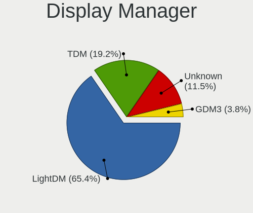
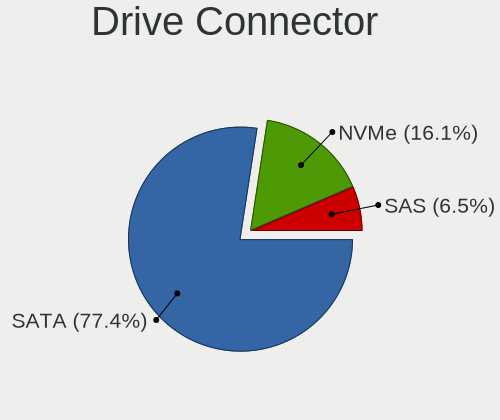
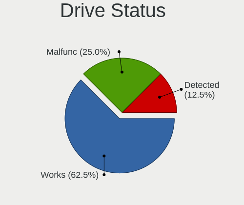
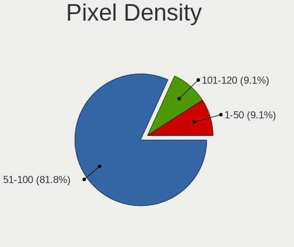
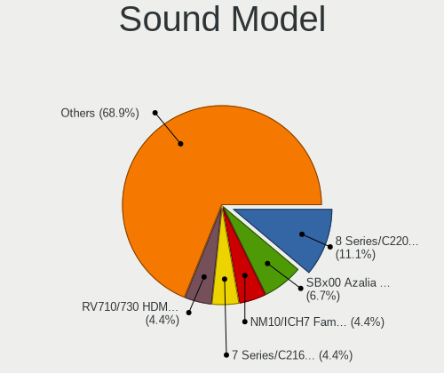

BunsenLabs - Tested Hardware & Statistics (Desktops)
----------------------------------------------------

A project to collect tested hardware configurations for BunsenLabs.

Anyone can contribute to this report by the [hw-probe](https://github.com/linuxhw/hw-probe) tool:

    sudo -E hw-probe -all -upload

Please contribute! Especially if your hardware is rare.

Contents
--------

* [ Test Cases ](#test-cases)

* [ System ](#system)
  - [ OS                       ](#os)
  - [ OS Family                ](#os-family)
  - [ Kernel                   ](#kernel)
  - [ Kernel Family            ](#kernel-family)
  - [ Kernel Major Ver.        ](#kernel-major-ver)
  - [ Arch                     ](#arch)
  - [ DE                       ](#de)
  - [ Display Server           ](#display-server)
  - [ Display Manager          ](#display-manager)
  - [ OS Lang                  ](#os-lang)
  - [ Boot Mode                ](#boot-mode)
  - [ Filesystem               ](#filesystem)
  - [ Part. scheme             ](#part-scheme)
  - [ Dual Boot with Linux/BSD ](#dual-boot-with-linuxbsd)
  - [ Dual Boot (Win)          ](#dual-boot-win)

* [ Board ](#board)
  - [ Vendor                   ](#vendor)
  - [ Model                    ](#model)
  - [ Model Family             ](#model-family)
  - [ MFG Year                 ](#mfg-year)
  - [ Form Factor              ](#form-factor)
  - [ Secure Boot              ](#secure-boot)
  - [ Coreboot                 ](#coreboot)
  - [ RAM Size                 ](#ram-size)
  - [ RAM Used                 ](#ram-used)
  - [ Total Drives             ](#total-drives)
  - [ Has CD-ROM               ](#has-cd-rom)
  - [ Has Ethernet             ](#has-ethernet)
  - [ Has WiFi                 ](#has-wifi)
  - [ Has Bluetooth            ](#has-bluetooth)

* [ Location ](#location)
  - [ Country                  ](#country)
  - [ City                     ](#city)

* [ Drives ](#drives)
  - [ Drive Vendor             ](#drive-vendor)
  - [ Drive Model              ](#drive-model)
  - [ HDD Vendor               ](#hdd-vendor)
  - [ SSD Vendor               ](#ssd-vendor)
  - [ Drive Kind               ](#drive-kind)
  - [ Drive Connector          ](#drive-connector)
  - [ Drive Size               ](#drive-size)
  - [ Space Total              ](#space-total)
  - [ Space Used               ](#space-used)
  - [ Malfunc. Drives          ](#malfunc-drives)
  - [ Malfunc. Drive Vendor    ](#malfunc-drive-vendor)
  - [ Malfunc. HDD Vendor      ](#malfunc-hdd-vendor)
  - [ Malfunc. Drive Kind      ](#malfunc-drive-kind)
  - [ Failed Drives            ](#failed-drives)
  - [ Failed Drive Vendor      ](#failed-drive-vendor)
  - [ Drive Status             ](#drive-status)

* [ Storage controller ](#storage-controller)
  - [ Storage Vendor           ](#storage-vendor)
  - [ Storage Model            ](#storage-model)
  - [ Storage Kind             ](#storage-kind)

* [ Processor ](#processor)
  - [ CPU Vendor               ](#cpu-vendor)
  - [ CPU Model                ](#cpu-model)
  - [ CPU Model Family         ](#cpu-model-family)
  - [ CPU Cores                ](#cpu-cores)
  - [ CPU Sockets              ](#cpu-sockets)
  - [ CPU Threads              ](#cpu-threads)
  - [ CPU Op-Modes             ](#cpu-op-modes)
  - [ CPU Microcode            ](#cpu-microcode)
  - [ CPU Microarch            ](#cpu-microarch)

* [ Graphics ](#graphics)
  - [ GPU Vendor               ](#gpu-vendor)
  - [ GPU Model                ](#gpu-model)
  - [ GPU Combo                ](#gpu-combo)
  - [ GPU Driver               ](#gpu-driver)
  - [ GPU Memory               ](#gpu-memory)

* [ Monitor ](#monitor)
  - [ Monitor Vendor           ](#monitor-vendor)
  - [ Monitor Model            ](#monitor-model)
  - [ Monitor Resolution       ](#monitor-resolution)
  - [ Monitor Diagonal         ](#monitor-diagonal)
  - [ Monitor Width            ](#monitor-width)
  - [ Aspect Ratio             ](#aspect-ratio)
  - [ Monitor Area             ](#monitor-area)
  - [ Pixel Density            ](#pixel-density)
  - [ Multiple Monitors        ](#multiple-monitors)

* [ Network ](#network)
  - [ Net Controller Vendor    ](#net-controller-vendor)
  - [ Net Controller Model     ](#net-controller-model)
  - [ Wireless Vendor          ](#wireless-vendor)
  - [ Wireless Model           ](#wireless-model)
  - [ Ethernet Vendor          ](#ethernet-vendor)
  - [ Ethernet Model           ](#ethernet-model)
  - [ Net Controller Kind      ](#net-controller-kind)
  - [ Used Controller          ](#used-controller)
  - [ NICs                     ](#nics)
  - [ IPv6                     ](#ipv6)

* [ Bluetooth ](#bluetooth)
  - [ Bluetooth Vendor         ](#bluetooth-vendor)
  - [ Bluetooth Model          ](#bluetooth-model)

* [ Sound ](#sound)
  - [ Sound Vendor             ](#sound-vendor)
  - [ Sound Model              ](#sound-model)

* [ Memory ](#memory)
  - [ Memory Vendor            ](#memory-vendor)
  - [ Memory Model             ](#memory-model)
  - [ Memory Kind              ](#memory-kind)
  - [ Memory Form Factor       ](#memory-form-factor)
  - [ Memory Size              ](#memory-size)
  - [ Memory Speed             ](#memory-speed)

* [ Printers & scanners ](#printers--scanners)
  - [ Printer Vendor           ](#printer-vendor)
  - [ Printer Model            ](#printer-model)
  - [ Scanner Vendor           ](#scanner-vendor)
  - [ Scanner Model            ](#scanner-model)

* [ Camera ](#camera)
  - [ Camera Vendor            ](#camera-vendor)
  - [ Camera Model             ](#camera-model)

* [ Security ](#security)
  - [ Fingerprint Vendor       ](#fingerprint-vendor)
  - [ Fingerprint Model        ](#fingerprint-model)
  - [ Chipcard Vendor          ](#chipcard-vendor)
  - [ Chipcard Model           ](#chipcard-model)

* [ Unsupported ](#unsupported)
  - [ Unsupported Devices      ](#unsupported-devices)
  - [ Unsupported Device Types ](#unsupported-device-types)

Test Cases
----------

Total: 33

| Vendor        | Model                    | Probe                                                      | Date         |
|---------------|--------------------------|------------------------------------------------------------|--------------|
| ASUSTek       | X99-E WS/USB             | [227a25d82a](https://linux-hardware.org/?probe=227a25d82a) | Nov 09, 2024 |
| Dell          | 02K9CR A02               | [9ff0a28a93](https://linux-hardware.org/?probe=9ff0a28a93) | Nov 02, 2024 |
| MSI           | A55M-P33                 | [0f6fc5a77e](https://linux-hardware.org/?probe=0f6fc5a77e) | Apr 17, 2024 |
| MSI           | 760GMA-P34               | [0c0fde4ed3](https://linux-hardware.org/?probe=0c0fde4ed3) | Jan 28, 2024 |
| Fujitsu       | D3161-A1 S26361-D3161-A1 | [34a16ab09d](https://linux-hardware.org/?probe=34a16ab09d) | Dec 06, 2023 |
| Fujitsu       | D3161-A1 S26361-D3161-A1 | [9388f41e11](https://linux-hardware.org/?probe=9388f41e11) | Nov 25, 2023 |
| Dell          | 05DN3X A00               | [7bb927bf32](https://linux-hardware.org/?probe=7bb927bf32) | Oct 10, 2023 |
| Compaq Pre... | DC477A-ABA S3100NX NA110 | [8998682eb4](https://linux-hardware.org/?probe=8998682eb4) | Sep 08, 2023 |
| HP            | 18E7                     | [7c200916bf](https://linux-hardware.org/?probe=7c200916bf) | Aug 22, 2023 |
| HP            | 18E7                     | [6cd6ef6396](https://linux-hardware.org/?probe=6cd6ef6396) | Aug 22, 2023 |
| ASRock        | H81M-VG4 R2.0            | [81711fd069](https://linux-hardware.org/?probe=81711fd069) | May 11, 2023 |
| EVERCOM NE... | Unknown                  | [d36803f05d](https://linux-hardware.org/?probe=d36803f05d) | Apr 21, 2023 |
| Lenovo        | SHARKBAY SDK0E50510 WIN  | [e35ed3cb0d](https://linux-hardware.org/?probe=e35ed3cb0d) | Apr 10, 2023 |
| MSI           | B550M PRO-VDH WIFI       | [aaeb2f2269](https://linux-hardware.org/?probe=aaeb2f2269) | Mar 29, 2023 |
| Intel         | D525MW AAE93082-401      | [6ab285c781](https://linux-hardware.org/?probe=6ab285c781) | Feb 13, 2023 |
| Dell          | 0C3YXR A01               | [01c2e9db45](https://linux-hardware.org/?probe=01c2e9db45) | Jan 06, 2023 |
| HP            | 18E7                     | [260119e159](https://linux-hardware.org/?probe=260119e159) | Dec 25, 2022 |
| ASUSTek       | P5SD2-VM                 | [6b5082a45c](https://linux-hardware.org/?probe=6b5082a45c) | Aug 12, 2022 |
| ASUSTek       | P5SD2-VM                 | [d77caddb55](https://linux-hardware.org/?probe=d77caddb55) | Aug 12, 2022 |
| ASUSTek       | Crosshair V Formula      | [44da1ea889](https://linux-hardware.org/?probe=44da1ea889) | Oct 13, 2021 |
| ASUSTek       | Crosshair V Formula      | [e693a453b1](https://linux-hardware.org/?probe=e693a453b1) | Oct 13, 2021 |
| ASRock        | B450M Steel Legend       | [b866ec6925](https://linux-hardware.org/?probe=b866ec6925) | Apr 20, 2021 |
| ASRock        | H470M-ITX/ac             | [a5ffbca106](https://linux-hardware.org/?probe=a5ffbca106) | Feb 19, 2021 |
| ASUSTek       | PRIME B450-PLUS          | [c15b5deb6b](https://linux-hardware.org/?probe=c15b5deb6b) | Nov 23, 2020 |
| ASUSTek       | M4A88TD-V EVO/USB3       | [a741e92e02](https://linux-hardware.org/?probe=a741e92e02) | Nov 09, 2020 |
| ASUSTek       | M4A88TD-V EVO/USB3       | [0132b2328a](https://linux-hardware.org/?probe=0132b2328a) | Nov 09, 2020 |
| ASUSTek       | P5K                      | [31dfecdf4a](https://linux-hardware.org/?probe=31dfecdf4a) | Aug 22, 2020 |
| ASUSTek       | P5K                      | [84d4137932](https://linux-hardware.org/?probe=84d4137932) | Aug 22, 2020 |
| Intel         | D946GZIS AAD66165-302    | [0fd4742ed7](https://linux-hardware.org/?probe=0fd4742ed7) | Jul 24, 2020 |
| Intel         | DB85FL AAG89861-201      | [337d604d5f](https://linux-hardware.org/?probe=337d604d5f) | Jul 14, 2020 |
| MSI           | MS-7093                  | [2adf367265](https://linux-hardware.org/?probe=2adf367265) | May 25, 2020 |
| MSI           | MS-7093                  | [306d3dc974](https://linux-hardware.org/?probe=306d3dc974) | May 25, 2020 |
| ASRock        | H81M-ITX                 | [c51735ee45](https://linux-hardware.org/?probe=c51735ee45) | Dec 21, 2019 |

System
------

OS
--

Installed operating systems

| Name            | Desktops | Percent |
|-----------------|----------|---------|
| BunsenLabs 11   | 11       | 42.31%  |
| BunsenLabs 10.5 | 8        | 30.77%  |
| BunsenLabs 9.8  | 4        | 15.38%  |
| BunsenLabs 12   | 3        | 11.54%  |

OS Family
---------

OS without a version

| Name       | Desktops | Percent |
|------------|----------|---------|
| BunsenLabs | 25       | 100%    |

Kernel
------

Version of the Linux kernel

| Version             | Desktops | Percent |
|---------------------|----------|---------|
| 5.10.0-26-amd64     | 3        | 11.11%  |
| 6.1.0-26-amd64      | 2        | 7.41%   |
| 5.10.0-21-amd64     | 2        | 7.41%   |
| 6.1.0-13-amd64      | 1        | 3.7%    |
| 5.9.0-3-amd64       | 1        | 3.7%    |
| 5.4.0-0.bpo.4-amd64 | 1        | 3.7%    |
| 5.10.0-3-amd64      | 1        | 3.7%    |
| 5.10.0-25-amd64     | 1        | 3.7%    |
| 5.10.0-22-amd64     | 1        | 3.7%    |
| 5.10.0-21-686-pae   | 1        | 3.7%    |
| 5.10.0-21-686       | 1        | 3.7%    |
| 5.10.0-20-amd64     | 1        | 3.7%    |
| 5.10.0-20-686       | 1        | 3.7%    |
| 4.9.0-9-amd64       | 1        | 3.7%    |
| 4.9.0-9-686-pae     | 1        | 3.7%    |
| 4.9.0-11-amd64      | 1        | 3.7%    |
| 4.19.0-9-amd64      | 1        | 3.7%    |
| 4.19.0-26-amd64     | 1        | 3.7%    |
| 4.19.0-23-amd64     | 1        | 3.7%    |
| 4.19.0-18-amd64     | 1        | 3.7%    |
| 4.19.0-17-686       | 1        | 3.7%    |
| 4.19.0-16-amd64     | 1        | 3.7%    |
| 4.19.0-10-amd64     | 1        | 3.7%    |

Kernel Family
-------------

Linux kernel without a distro release

| Version | Desktops | Percent |
|---------|----------|---------|
| 5.10.0  | 11       | 42.31%  |
| 4.19.0  | 7        | 26.92%  |
| 6.1.0   | 3        | 11.54%  |
| 4.9.0   | 3        | 11.54%  |
| 5.9.0   | 1        | 3.85%   |
| 5.4.0   | 1        | 3.85%   |

Kernel Major Ver.
-----------------

Linux kernel major version

| Version | Desktops | Percent |
|---------|----------|---------|
| 5.10    | 11       | 42.31%  |
| 4.19    | 7        | 26.92%  |
| 6.1     | 3        | 11.54%  |
| 4.9     | 3        | 11.54%  |
| 5.9     | 1        | 3.85%   |
| 5.4     | 1        | 3.85%   |

Arch
----

OS architecture (x86_64, i586, etc.)

| Name   | Desktops | Percent |
|--------|----------|---------|
| x86_64 | 20       | 80%     |
| i686   | 5        | 20%     |

DE
--

Desktop Environment

| Name       | Desktops | Percent |
|------------|----------|---------|
| Unknown    | 11       | 42.31%  |
| XFCE       | 7        | 26.92%  |
| BunsenLabs | 6        | 23.08%  |
| MATE       | 1        | 3.85%   |
| i3         | 1        | 3.85%   |

Display Server
--------------

X11 or Wayland

| Name | Desktops | Percent |
|------|----------|---------|
| X11  | 23       | 92%     |
| Tty  | 2        | 8%      |

Display Manager
---------------

SDDM, LightDM, etc.

| Name    | Desktops | Percent |
|---------|----------|---------|
| LightDM | 17       | 65.38%  |
| TDM     | 5        | 19.23%  |
| Unknown | 3        | 11.54%  |
| GDM3    | 1        | 3.85%   |

OS Lang
-------

Language

| Lang    | Desktops | Percent |
|---------|----------|---------|
| en_US   | 13       | 52%     |
| en_GB   | 4        | 16%     |
| en_CA   | 2        | 8%      |
| pt_BR   | 1        | 4%      |
| nl_NL   | 1        | 4%      |
| es_AR   | 1        | 4%      |
| en_PH   | 1        | 4%      |
| de_DE   | 1        | 4%      |
| Unknown | 1        | 4%      |

Boot Mode
---------

EFI or BIOS

| Mode | Desktops | Percent |
|------|----------|---------|
| BIOS | 15       | 60%     |
| EFI  | 10       | 40%     |

Filesystem
----------

Type of filesystem

| Type    | Desktops | Percent |
|---------|----------|---------|
| Ext4    | 22       | 88%     |
| Overlay | 2        | 8%      |
| XXXXXXX | 1        | 4%      |

Part. scheme
------------

Scheme of partitioning

| Type    | Desktops | Percent |
|---------|----------|---------|
| MBR     | 13       | 50%     |
| GPT     | 11       | 42.31%  |
| Unknown | 2        | 7.69%   |

Dual Boot with Linux/BSD
------------------------

Hosting more than one Linux/BSD

| Dual boot | Desktops | Percent |
|-----------|----------|---------|
| Yes       | 13       | 52%     |
| No        | 12       | 48%     |

Dual Boot (Win)
---------------

Hosting Linux and Windows

| Dual boot | Desktops | Percent |
|-----------|----------|---------|
| No        | 17       | 65.38%  |
| Yes       | 9        | 34.62%  |

Board
-----

Vendor
------

Motherboard manufacturer

| Name               | Desktops | Percent |
|--------------------|----------|---------|
| ASUSTek Computer   | 6        | 24%     |
| MSI                | 4        | 16%     |
| ASRock             | 4        | 16%     |
| Intel              | 3        | 12%     |
| Dell               | 3        | 12%     |
| Lenovo             | 1        | 4%      |
| Hewlett-Packard    | 1        | 4%      |
| Fujitsu            | 1        | 4%      |
| EVERCOM NETWORK    | 1        | 4%      |
| Compaq Presario 06 | 1        | 4%      |

Model
-----

Motherboard model

| Name                                        | Desktops | Percent |
|---------------------------------------------|----------|---------|
| MSI MS-7C95                                 | 1        | 4%      |
| MSI MS-7786                                 | 1        | 4%      |
| MSI MS-7641                                 | 1        | 4%      |
| MSI MS-7093                                 | 1        | 4%      |
| Lenovo ThinkCentre M73z 10BC002CUS          | 1        | 4%      |
| Intel DB85FL AAG89861-201                   | 1        | 4%      |
| Intel D946GZIS AAD66165-302                 | 1        | 4%      |
| Intel D525MW AAE93082-401                   | 1        | 4%      |
| HP ProDesk 600 G1 SFF                       | 1        | 4%      |
| Fujitsu ESPRIMO E710                        | 1        | 4%      |
| Dell Studio XPS 9100                        | 1        | 4%      |
| Dell Precision Tower 3420                   | 1        | 4%      |
| Dell Precision T1650                        | 1        | 4%      |
| Compaq Presario 06 DC477A-ABA S3100NX NA110 | 1        | 4%      |
| ASUS pro567767                              | 1        | 4%      |
| ASUS PRIME B450-PLUS                        | 1        | 4%      |
| ASUS P5SD2-VM                               | 1        | 4%      |
| ASUS P5K                                    | 1        | 4%      |
| ASUS M4A88TD-V EVO/USB3                     | 1        | 4%      |
| ASUS Crosshair V Formula                    | 1        | 4%      |
| ASRock H81M-VG4 R2.0                        | 1        | 4%      |
| ASRock H81M-ITX                             | 1        | 4%      |
| ASRock H470M-ITX/ac                         | 1        | 4%      |
| ASRock B450M Steel Legend                   | 1        | 4%      |
| Unknown                                     | 1        | 4%      |

Model Family
------------

Motherboard model prefix

| Name                          | Desktops | Percent |
|-------------------------------|----------|---------|
| Dell Precision                | 2        | 8%      |
| MSI MS-7C95                   | 1        | 4%      |
| MSI MS-7786                   | 1        | 4%      |
| MSI MS-7641                   | 1        | 4%      |
| MSI MS-7093                   | 1        | 4%      |
| Lenovo ThinkCentre            | 1        | 4%      |
| Intel DB85FL                  | 1        | 4%      |
| Intel D946GZIS                | 1        | 4%      |
| Intel D525MW                  | 1        | 4%      |
| HP ProDesk                    | 1        | 4%      |
| Fujitsu ESPRIMO               | 1        | 4%      |
| Dell Studio                   | 1        | 4%      |
| Compaq Presario 06 DC477A-ABA | 1        | 4%      |
| ASUS pro567767                | 1        | 4%      |
| ASUS PRIME                    | 1        | 4%      |
| ASUS P5SD2-VM                 | 1        | 4%      |
| ASUS P5K                      | 1        | 4%      |
| ASUS M4A88TD-V                | 1        | 4%      |
| ASUS Crosshair                | 1        | 4%      |
| ASRock H81M-VG4               | 1        | 4%      |
| ASRock H81M-ITX               | 1        | 4%      |
| ASRock H470M-ITX              | 1        | 4%      |
| ASRock B450M                  | 1        | 4%      |
| Unknown                       | 1        | 4%      |

MFG Year
--------

Motherboard manufacture year

| Year | Desktops | Percent |
|------|----------|---------|
| 2013 | 5        | 20%     |
| 2020 | 3        | 12%     |
| 2012 | 3        | 12%     |
| 2014 | 2        | 8%      |
| 2010 | 2        | 8%      |
| 2007 | 2        | 8%      |
| 2019 | 1        | 4%      |
| 2018 | 1        | 4%      |
| 2015 | 1        | 4%      |
| 2011 | 1        | 4%      |
| 2006 | 1        | 4%      |
| 2005 | 1        | 4%      |
| 2003 | 1        | 4%      |
| 2002 | 1        | 4%      |

Form Factor
-----------

Physical design of the computer

| Name    | Desktops | Percent |
|---------|----------|---------|
| Desktop | 25       | 100%    |

Secure Boot
-----------

Enabled or disabled

| State    | Desktops | Percent |
|----------|----------|---------|
| Disabled | 24       | 96%     |
| Enabled  | 1        | 4%      |

Coreboot
--------

Have coreboot on board

| Used | Desktops | Percent |
|------|----------|---------|
| No   | 25       | 100%    |

RAM Size
--------

Total RAM memory

| Size in GB  | Desktops | Percent |
|-------------|----------|---------|
| 8.01-16.0   | 8        | 30.77%  |
| 4.01-8.0    | 4        | 15.38%  |
| 3.01-4.0    | 3        | 11.54%  |
| 16.01-24.0  | 3        | 11.54%  |
| 0.51-1.0    | 3        | 11.54%  |
| 32.01-64.0  | 2        | 7.69%   |
| 1.01-2.0    | 2        | 7.69%   |
| 64.01-256.0 | 1        | 3.85%   |

RAM Used
--------

Used RAM memory

| Used GB  | Desktops | Percent |
|----------|----------|---------|
| 1.01-2.0 | 7        | 26.92%  |
| 0.51-1.0 | 7        | 26.92%  |
| 3.01-4.0 | 5        | 19.23%  |
| 4.01-8.0 | 3        | 11.54%  |
| 2.01-3.0 | 3        | 11.54%  |
| 0.01-0.5 | 1        | 3.85%   |

Total Drives
------------

Number of drives on board

| Drives | Desktops | Percent |
|--------|----------|---------|
| 2      | 10       | 40%     |
| 1      | 9        | 36%     |
| 3      | 4        | 16%     |
| 7      | 1        | 4%      |
| 0      | 1        | 4%      |

Has CD-ROM
----------

Has CD-ROM on board

| Presented | Desktops | Percent |
|-----------|----------|---------|
| Yes       | 14       | 56%     |
| No        | 11       | 44%     |

Has Ethernet
------------

Has Ethernet on board

| Presented | Desktops | Percent |
|-----------|----------|---------|
| Yes       | 25       | 100%    |

Has WiFi
--------

Has WiFi module

| Presented | Desktops | Percent |
|-----------|----------|---------|
| No        | 17       | 68%     |
| Yes       | 8        | 32%     |

Has Bluetooth
-------------

Has Bluetooth module

| Presented | Desktops | Percent |
|-----------|----------|---------|
| No        | 19       | 76%     |
| Yes       | 6        | 24%     |

Location
--------

Country
-------

Geographic location (country)

| Country                | Desktops | Percent |
|------------------------|----------|---------|
| USA                    | 8        | 32%     |
| Canada                 | 3        | 12%     |
| UK                     | 2        | 8%      |
| Brazil                 | 2        | 8%      |
| Argentina              | 2        | 8%      |
| Sweden                 | 1        | 4%      |
| Slovakia               | 1        | 4%      |
| Russia                 | 1        | 4%      |
| Philippines            | 1        | 4%      |
| Netherlands            | 1        | 4%      |
| Japan                  | 1        | 4%      |
| Jamaica                | 1        | 4%      |
| Bosnia and Herzegovina | 1        | 4%      |

City
----

Geographic location (city)

| City                       | Desktops | Percent |
|----------------------------|----------|---------|
| Victoria                   | 1        | 4%      |
| The Hague                  | 1        | 4%      |
| Syracuse                   | 1        | 4%      |
| Strasburg                  | 1        | 4%      |
| South Shields              | 1        | 4%      |
| Sarajevo                   | 1        | 4%      |
| San Juan                   | 1        | 4%      |
| Saint-Bruno-de-Montarville | 1        | 4%      |
| Porto Alegre               | 1        | 4%      |
| Nagoya                     | 1        | 4%      |
| Manchester                 | 1        | 4%      |
| Magnitogorsk               | 1        | 4%      |
| Kingston                   | 1        | 4%      |
| Godley                     | 1        | 4%      |
| Glasgow                    | 1        | 4%      |
| Flushing                   | 1        | 4%      |
| Falun                      | 1        | 4%      |
| Dasmarinas                 | 1        | 4%      |
| Colville                   | 1        | 4%      |
| Carrollton                 | 1        | 4%      |
| Buenos Aires               | 1        | 4%      |
| Bratislava                 | 1        | 4%      |
| Brampton                   | 1        | 4%      |
| Baltimore                  | 1        | 4%      |
| Amparo                     | 1        | 4%      |

Drives
------

Drive Vendor
------------

Hard drive vendors

| Vendor              | Desktops | Drives  | Percent |
|---------------------|----------|---------|---------|
| WDC                 | 12       | 14      | 26.67%  |
| Seagate             | 12       | 17      | 26.67%  |
| Samsung Electronics | 6        | 7       | 13.33%  |
| Toshiba             | 2        | 2       | 4.44%   |
| SanDisk             | 2        | 2       | 4.44%   |
| Kingston            | 2        | 2       | 4.44%   |
| Intel               | 2        | 2       | 4.44%   |
| Crucial             | 2        | 2       | 4.44%   |
| Timetec             | 1        | 1       | 2.22%   |
| LITEONIT            | 1        | 1       | 2.22%   |
| HL-DT-ST            | 1        | Unknown | 2.22%   |
| Hitachi             | 1        | 1       | 2.22%   |
| Hewlett-Packard     | 1        | 1       | 2.22%   |

Drive Model
-----------

Hard drive models

| Model                                    | Desktops | Percent |
|------------------------------------------|----------|---------|
| Seagate ST3250820AS 250GB                | 2        | 4.08%   |
| Seagate ST2000DM001-1CH164 2TB           | 2        | 4.08%   |
| WDC WDS500G3X0C-00SJG0 500GB             | 1        | 2.04%   |
| WDC WD800JB-00JJC0 80GB                  | 1        | 2.04%   |
| WDC WD50NPZZ-00A9JT0 5TB                 | 1        | 2.04%   |
| WDC WD5000LPVX-75V0TT0 500GB             | 1        | 2.04%   |
| WDC WD5000AAKX-001CA0 500GB              | 1        | 2.04%   |
| WDC WD20EZRX-00D8PB0 2TB                 | 1        | 2.04%   |
| WDC WD20EARX-00PASB0 2TB                 | 1        | 2.04%   |
| WDC WD1600AAJS-75B4A0 160GB              | 1        | 2.04%   |
| WDC WD1600AABS-52PRA0 160GB              | 1        | 2.04%   |
| WDC WD10EZEX-60M2NA0 1TB                 | 1        | 2.04%   |
| WDC WD10EFRX-68FYTN0 1TB                 | 1        | 2.04%   |
| WDC WD10EARX-32N0YB0 1TB                 | 1        | 2.04%   |
| WDC WD10EADS-00L5B1 1TB                  | 1        | 2.04%   |
| Toshiba MK7575GSX 752GB                  | 1        | 2.04%   |
| Toshiba MK2552GSX 250GB                  | 1        | 2.04%   |
| Timetec SD07 256GB SSD                   | 1        | 2.04%   |
| Seagate ST9250315AS 250GB                | 1        | 2.04%   |
| Seagate ST500DM002-1BD142 500GB          | 1        | 2.04%   |
| Seagate ST4000DM000-1F2168 4TB           | 1        | 2.04%   |
| Seagate ST3500620AS 500GB                | 1        | 2.04%   |
| Seagate ST3500413AS 500GB                | 1        | 2.04%   |
| Seagate ST320LT000-9VL142 320GB          | 1        | 2.04%   |
| Seagate ST250DM000-1BD141 250GB          | 1        | 2.04%   |
| Seagate ST2000DX002-2DV164 2TB           | 1        | 2.04%   |
| Seagate ST2000DM008-2FR102 2TB           | 1        | 2.04%   |
| Seagate ST2000DM006-2DM164 2TB           | 1        | 2.04%   |
| Seagate BUP SL 5TB                       | 1        | 2.04%   |
| SanDisk SDSSDP256G 256GB                 | 1        | 2.04%   |
| SanDisk SDSSDP128G 128GB                 | 1        | 2.04%   |
| Samsung SSD 990 PRO 2TB S7KHNU0X609514F  | 1        | 2.04%   |
| Samsung SSD 970 EVO Plus 500GB           | 1        | 2.04%   |
| Samsung SSD 860 EVO 500GB                | 1        | 2.04%   |
| Samsung SSD 850 PRO 1TB                  | 1        | 2.04%   |
| Samsung HM641JI 640GB                    | 1        | 2.04%   |
| Samsung HD103SI 1TB                      | 1        | 2.04%   |
| LITEONIT LCS-256L9S-11 2.5 7mm 256GB SSD | 1        | 2.04%   |
| Kingston SV300S37A120G 120GB SSD         | 1        | 2.04%   |
| Kingston SA2000M81000G 1TB               | 1        | 2.04%   |

HDD Vendor
----------

Hard disk drive vendors

| Vendor              | Desktops | Drives | Percent |
|---------------------|----------|--------|---------|
| Seagate             | 12       | 17     | 42.86%  |
| WDC                 | 11       | 13     | 39.29%  |
| Toshiba             | 2        | 2      | 7.14%   |
| Samsung Electronics | 2        | 2      | 7.14%   |
| Hitachi             | 1        | 1      | 3.57%   |

SSD Vendor
----------

Solid state drive vendors

| Vendor              | Desktops | Drives | Percent |
|---------------------|----------|--------|---------|
| SanDisk             | 2        | 2      | 20%     |
| Samsung Electronics | 2        | 3      | 20%     |
| Crucial             | 2        | 2      | 20%     |
| Timetec             | 1        | 1      | 10%     |
| LITEONIT            | 1        | 1      | 10%     |
| Kingston            | 1        | 1      | 10%     |
| Intel               | 1        | 1      | 10%     |

Drive Kind
----------

HDD or SSD

| Kind    | Desktops | Drives  | Percent |
|---------|----------|---------|---------|
| HDD     | 20       | 35      | 55.56%  |
| SSD     | 10       | 11      | 27.78%  |
| NVMe    | 5        | 6       | 13.89%  |
| Unknown | 1        | Unknown | 2.78%   |

Drive Connector
---------------

SATA, SAS, NVMe, etc.

| Type | Desktops | Drives | Percent |
|------|----------|--------|---------|
| SATA | 24       | 45     | 77.42%  |
| NVMe | 5        | 6      | 16.13%  |
| SAS  | 2        | 1      | 6.45%   |

Drive Size
----------

Size of hard drive

| Size in TB | Desktops | Drives | Percent |
|------------|----------|--------|---------|
| 0.01-0.5   | 16       | 26     | 48.48%  |
| 1.01-2.0   | 7        | 9      | 21.21%  |
| 0.51-1.0   | 7        | 8      | 21.21%  |
| 4.01-10.0  | 2        | 2      | 6.06%   |
| 3.01-4.0   | 1        | 1      | 3.03%   |

Space Total
-----------

Amount of disk space available on the file system

| Size in GB     | Desktops | Percent |
|----------------|----------|---------|
| 101-250        | 5        | 20%     |
| 1001-2000      | 4        | 16%     |
| 251-500        | 3        | 12%     |
| 2001-3000      | 3        | 12%     |
| 1-20           | 3        | 12%     |
| More than 3000 | 2        | 8%      |
| 501-1000       | 2        | 8%      |
| 51-100         | 2        | 8%      |
| 21-50          | 1        | 4%      |

Space Used
----------

Amount of used disk space

| Used GB        | Desktops | Percent |
|----------------|----------|---------|
| 1-20           | 12       | 46.15%  |
| 101-250        | 3        | 11.54%  |
| 501-1000       | 3        | 11.54%  |
| More than 3000 | 2        | 7.69%   |
| 21-50          | 2        | 7.69%   |
| 1001-2000      | 2        | 7.69%   |
| 251-500        | 1        | 3.85%   |
| 51-100         | 1        | 3.85%   |

Malfunc. Drives
---------------

Drive models with a malfunction

| Model                             | Desktops | Drives | Percent |
|-----------------------------------|----------|--------|---------|
| WDC WD5000AAKX-001CA0 500GB       | 1        | 1      | 12.5%   |
| WDC WD10EARX-32N0YB0 1TB          | 1        | 1      | 12.5%   |
| Toshiba MK7575GSX 752GB           | 1        | 1      | 12.5%   |
| Toshiba MK2552GSX 250GB           | 1        | 1      | 12.5%   |
| Seagate ST3250820AS 250GB         | 1        | 1      | 12.5%   |
| Seagate ST2000DM001-1CH164 2TB    | 1        | 1      | 12.5%   |
| Samsung Electronics HM641JI 640GB | 1        | 1      | 12.5%   |
| Hewlett-Packard SSD EX900 250GB   | 1        | 1      | 12.5%   |

Malfunc. Drive Vendor
---------------------

Vendors of faulty drives

| Vendor              | Desktops | Drives | Percent |
|---------------------|----------|--------|---------|
| WDC                 | 2        | 2      | 25%     |
| Toshiba             | 2        | 2      | 25%     |
| Seagate             | 2        | 2      | 25%     |
| Samsung Electronics | 1        | 1      | 12.5%   |
| Hewlett-Packard     | 1        | 1      | 12.5%   |

Malfunc. HDD Vendor
-------------------

Vendors of faulty HDD drives

| Vendor              | Desktops | Drives | Percent |
|---------------------|----------|--------|---------|
| WDC                 | 2        | 2      | 28.57%  |
| Toshiba             | 2        | 2      | 28.57%  |
| Seagate             | 2        | 2      | 28.57%  |
| Samsung Electronics | 1        | 1      | 14.29%  |

Malfunc. Drive Kind
-------------------

Kinds of faulty drives

| Kind | Desktops | Drives | Percent |
|------|----------|--------|---------|
| HDD  | 7        | 7      | 87.5%   |
| NVMe | 1        | 1      | 12.5%   |

Failed Drives
-------------

Failed drive models

Zero info for selected period =(

Failed Drive Vendor
-------------------

Failed drive vendors

Zero info for selected period =(

Drive Status
------------

Number of failed and malfunc. drives

| Status   | Desktops | Drives | Percent |
|----------|----------|--------|---------|
| Works    | 20       | 33     | 62.5%   |
| Malfunc  | 8        | 8      | 25%     |
| Detected | 4        | 11     | 12.5%   |

Storage controller
------------------

Storage Vendor
--------------

Storage controller vendors

| Vendor                           | Desktops | Percent |
|----------------------------------|----------|---------|
| Intel                            | 15       | 41.67%  |
| AMD                              | 8        | 22.22%  |
| ASMedia Technology               | 3        | 8.33%   |
| VIA Technologies                 | 2        | 5.56%   |
| Samsung Electronics              | 2        | 5.56%   |
| Silicon Motion                   | 1        | 2.78%   |
| Silicon Integrated Systems [SiS] | 1        | 2.78%   |
| Silicon Image                    | 1        | 2.78%   |
| SanDisk                          | 1        | 2.78%   |
| Kingston Technology Company      | 1        | 2.78%   |
| JMicron Technology               | 1        | 2.78%   |

Storage Model
-------------

Storage controller models

| Model                                                                          | Desktops | Percent |
|--------------------------------------------------------------------------------|----------|---------|
| Intel 8 Series/C220 Series Chipset Family 6-port SATA Controller 1 [AHCI mode] | 5        | 10.87%  |
| Intel NM10/ICH7 Family SATA Controller [IDE mode]                              | 2        | 4.35%   |
| ASMedia ASM1061/ASM1062 Serial ATA Controller                                  | 2        | 4.35%   |
| AMD SB7x0/SB8x0/SB9x0 SATA Controller [AHCI mode]                              | 2        | 4.35%   |
| AMD FCH SATA Controller [AHCI mode]                                            | 2        | 4.35%   |
| AMD 400 Series Chipset SATA Controller                                         | 2        | 4.35%   |
| VIA VT82C586A/B/VT82C686/A/B/VT823x/A/C PIPC Bus Master IDE                    | 1        | 2.17%   |
| VIA VT6415 PATA IDE Host Controller                                            | 1        | 2.17%   |
| Silicon Motion SM2263EN/SM2263XT (DRAM-less) NVMe SSD Controllers              | 1        | 2.17%   |
| Silicon Integrated Systems [SiS] SATA Controller / IDE mode                    | 1        | 2.17%   |
| Silicon Integrated Systems [SiS] 5513 IDE Controller                           | 1        | 2.17%   |
| Silicon Image SiI 3114 [SATALink/SATARaid] Serial ATA Controller               | 1        | 2.17%   |
| SanDisk Extreme Pro / WD Black SN750 / PC SN730 / Red SN700 NVMe SSD           | 1        | 2.17%   |
| Samsung NVMe SSD Controller SM981/PM981/PM983                                  | 1        | 2.17%   |
| Samsung NVMe SSD Controller S4LV008[Pascal]                                    | 1        | 2.17%   |
| Kingston Company A2000 NVMe SSD [SM2263EN]                                     | 1        | 2.17%   |
| JMicron JMB363 SATA/IDE Controller                                             | 1        | 2.17%   |
| Intel SSD 670p Series [Keystone Harbor]                                        | 1        | 2.17%   |
| Intel SATA Controller [RAID mode]                                              | 1        | 2.17%   |
| Intel Q170/Q150/B150/H170/H110/Z170/CM236 Chipset SATA Controller [AHCI Mode]  | 1        | 2.17%   |
| Intel Comet Lake SATA AHCI Controller                                          | 1        | 2.17%   |
| Intel C610/X99 series chipset 6-Port SATA Controller [AHCI mode]               | 1        | 2.17%   |
| Intel 82801JI (ICH10 Family) SATA AHCI Controller                              | 1        | 2.17%   |
| Intel 82801IB (ICH9) 2 port SATA Controller [IDE mode]                         | 1        | 2.17%   |
| Intel 82801I (ICH9 Family) 2 port SATA Controller [IDE mode]                   | 1        | 2.17%   |
| Intel 82801G (ICH7 Family) IDE Controller                                      | 1        | 2.17%   |
| Intel 82801DB (ICH4) IDE Controller                                            | 1        | 2.17%   |
| Intel 7 Series/C210 Series Chipset Family 6-port SATA Controller [AHCI mode]   | 1        | 2.17%   |
| ASMedia ASM1061 Serial ATA Controller                                          | 1        | 2.17%   |
| AMD SB7x0/SB8x0/SB9x0 SATA Controller [IDE mode]                               | 1        | 2.17%   |
| AMD SB7x0/SB8x0/SB9x0 IDE Controller                                           | 1        | 2.17%   |
| AMD IXP SB4x0 Serial ATA Controller                                            | 1        | 2.17%   |
| AMD IXP SB4x0 IDE Controller                                                   | 1        | 2.17%   |
| AMD IXP SB400 Serial ATA Controller                                            | 1        | 2.17%   |
| AMD FCH SATA Controller [IDE mode]                                             | 1        | 2.17%   |
| AMD FCH IDE Controller                                                         | 1        | 2.17%   |
| AMD 500 Series Chipset SATA Controller                                         | 1        | 2.17%   |

Storage Kind
------------

Kind of storage controller (IDE, SATA, NVMe, SAS, ...)

| Kind | Desktops | Percent |
|------|----------|---------|
| SATA | 17       | 50%     |
| IDE  | 10       | 29.41%  |
| NVMe | 5        | 14.71%  |
| RAID | 2        | 5.88%   |

Processor
---------

CPU Vendor
----------

Processor vendors

| Vendor | Desktops | Percent |
|--------|----------|---------|
| Intel  | 16       | 64%     |
| AMD    | 9        | 36%     |

CPU Model
---------

Processor models

| Model                                       | Desktops | Percent |
|---------------------------------------------|----------|---------|
| Intel Pentium CPU G3240 @ 3.10GHz           | 2        | 8%      |
| Intel Xeon CPU E5-1650 v3 @ 3.50GHz         | 1        | 4%      |
| Intel Pentium Dual CPU E2180 @ 2.00GHz      | 1        | 4%      |
| Intel Pentium 4 CPU 2.40GHz                 | 1        | 4%      |
| Intel Core i7-7700 CPU @ 3.60GHz            | 1        | 4%      |
| Intel Core i7-4770 CPU @ 3.40GHz            | 1        | 4%      |
| Intel Core i7 CPU 930 @ 2.80GHz             | 1        | 4%      |
| Intel Core i5-4570 CPU @ 3.20GHz            | 1        | 4%      |
| Intel Core i5-3550 CPU @ 3.30GHz            | 1        | 4%      |
| Intel Core i5-3470 CPU @ 3.20GHz            | 1        | 4%      |
| Intel Core i5-10400 CPU @ 2.90GHz           | 1        | 4%      |
| Intel Core i3-4170 CPU @ 3.70GHz            | 1        | 4%      |
| Intel Core 2 Quad CPU Q8400 @ 2.66GHz       | 1        | 4%      |
| Intel Core 2 CPU 6600 @ 2.40GHz             | 1        | 4%      |
| Intel Atom CPU D525 @ 1.80GHz               | 1        | 4%      |
| AMD Ryzen 7 5700G with Radeon Graphics      | 1        | 4%      |
| AMD Ryzen 5 2600 Six-Core Processor         | 1        | 4%      |
| AMD Ryzen 3 3200G with Radeon Vega Graphics | 1        | 4%      |
| AMD FX-8350 Eight-Core Processor            | 1        | 4%      |
| AMD FX-6300 Six-Core Processor              | 1        | 4%      |
| AMD Athlon XP 2200+                         | 1        | 4%      |
| AMD Athlon II X4 640 Processor              | 1        | 4%      |
| AMD Athlon 64 Processor 3800+               | 1        | 4%      |
| AMD A4-3300 APU with Radeon HD Graphics     | 1        | 4%      |

CPU Model Family
----------------

Processor model prefix

| Model              | Desktops | Percent |
|--------------------|----------|---------|
| Intel Core i5      | 4        | 16%     |
| Intel Core i7      | 3        | 12%     |
| Intel Pentium      | 2        | 8%      |
| AMD FX             | 2        | 8%      |
| Intel Xeon         | 1        | 4%      |
| Intel Pentium Dual | 1        | 4%      |
| Intel Pentium 4    | 1        | 4%      |
| Intel Core i3      | 1        | 4%      |
| Intel Core 2 Quad  | 1        | 4%      |
| Intel Core 2       | 1        | 4%      |
| Intel Atom         | 1        | 4%      |
| AMD Ryzen 7        | 1        | 4%      |
| AMD Ryzen 5        | 1        | 4%      |
| AMD Ryzen 3        | 1        | 4%      |
| AMD Athlon XP      | 1        | 4%      |
| AMD Athlon II X4   | 1        | 4%      |
| AMD Athlon 64      | 1        | 4%      |
| AMD A4             | 1        | 4%      |

CPU Cores
---------

Number of processor cores

| Number | Desktops | Percent |
|--------|----------|---------|
| 4      | 10       | 40%     |
| 2      | 6        | 24%     |
| 1      | 4        | 16%     |
| 6      | 3        | 12%     |
| 8      | 1        | 4%      |
| 3      | 1        | 4%      |

CPU Sockets
-----------

Number of sockets

| Number | Desktops | Percent |
|--------|----------|---------|
| 1      | 25       | 100%    |

CPU Threads
-----------

Threads per core (Hyper-Threading)

| Number | Desktops | Percent |
|--------|----------|---------|
| 1      | 14       | 56%     |
| 2      | 11       | 44%     |

CPU Op-Modes
------------

CPU Operation Modes (32-bit, 64-bit)

| Op mode        | Desktops | Percent |
|----------------|----------|---------|
| 32-bit, 64-bit | 23       | 92%     |
| 32-bit         | 2        | 8%      |

CPU Microcode
-------------

Microcode number

| Number     | Desktops | Percent |
|------------|----------|---------|
| 0x306c3    | 5        | 20%     |
| Unknown    | 3        | 12%     |
| 0x306a9    | 2        | 8%      |
| 0x06000852 | 2        | 8%      |
| 0xf27      | 1        | 4%      |
| 0x906e9    | 1        | 4%      |
| 0x6fd      | 1        | 4%      |
| 0x6f6      | 1        | 4%      |
| 0x306f2    | 1        | 4%      |
| 0x106ca    | 1        | 4%      |
| 0x106a5    | 1        | 4%      |
| 0x1067a    | 1        | 4%      |
| 0x0a50000d | 1        | 4%      |
| 0x08108109 | 1        | 4%      |
| 0x0800820d | 1        | 4%      |
| 0x03000027 | 1        | 4%      |
| 0x010000c8 | 1        | 4%      |

CPU Microarch
-------------

Microarchitecture

| Name       | Desktops | Percent |
|------------|----------|---------|
| Haswell    | 6        | 24%     |
| Zen+       | 2        | 8%      |
| Piledriver | 2        | 8%      |
| IvyBridge  | 2        | 8%      |
| Core       | 2        | 8%      |
| Zen 3      | 1        | 4%      |
| Penryn     | 1        | 4%      |
| NetBurst   | 1        | 4%      |
| Nehalem    | 1        | 4%      |
| KabyLake   | 1        | 4%      |
| K8 Hammer  | 1        | 4%      |
| K6         | 1        | 4%      |
| K10 Llano  | 1        | 4%      |
| K10        | 1        | 4%      |
| CometLake  | 1        | 4%      |
| Bonnell    | 1        | 4%      |

Graphics
--------

GPU Vendor
----------

Vendors of graphics cards

| Vendor | Desktops | Percent |
|--------|----------|---------|
| Nvidia | 11       | 42.31%  |
| Intel  | 8        | 30.77%  |
| AMD    | 7        | 26.92%  |

GPU Model
---------

Graphics card models

| Model                                                                       | Desktops | Percent |
|-----------------------------------------------------------------------------|----------|---------|
| Intel Xeon E3-1200 v3/4th Gen Core Processor Integrated Graphics Controller | 2        | 7.14%   |
| Nvidia TU116 [GeForce GTX 1660]                                             | 1        | 3.57%   |
| Nvidia TU104GL [Tesla T4]                                                   | 1        | 3.57%   |
| Nvidia NV34 [GeForce FX 5500]                                               | 1        | 3.57%   |
| Nvidia NV34 [GeForce FX 5200]                                               | 1        | 3.57%   |
| Nvidia GT218 [GeForce 310]                                                  | 1        | 3.57%   |
| Nvidia GP106 [GeForce GTX 1060 6GB]                                         | 1        | 3.57%   |
| Nvidia GM204 [GeForce GTX 980]                                              | 1        | 3.57%   |
| Nvidia GM200 [GeForce GTX 980 Ti]                                           | 1        | 3.57%   |
| Nvidia GK208B [GeForce GT 710]                                              | 1        | 3.57%   |
| Nvidia GK104 [GeForce GTX 760]                                              | 1        | 3.57%   |
| Nvidia GF108 [GeForce GT 430]                                               | 1        | 3.57%   |
| Nvidia G86 [GeForce 8400 GS]                                                | 1        | 3.57%   |
| Intel Xeon E3-1200 v2/3rd Gen Core processor Graphics Controller            | 1        | 3.57%   |
| Intel HD Graphics 630                                                       | 1        | 3.57%   |
| Intel DG2 [Arc A380]                                                        | 1        | 3.57%   |
| Intel CometLake-S GT2 [UHD Graphics 630]                                    | 1        | 3.57%   |
| Intel Atom Processor D4xx/D5xx/N4xx/N5xx Integrated Graphics Controller     | 1        | 3.57%   |
| Intel 4th Generation Core Processor Family Integrated Graphics Controller   | 1        | 3.57%   |
| AMD Turks PRO [Radeon HD 6570/7570/8550 / R5 230]                           | 1        | 3.57%   |
| AMD SuperSumo [Radeon HD 6410D]                                             | 1        | 3.57%   |
| AMD RV730 PRO [Radeon HD 4650]                                              | 1        | 3.57%   |
| AMD RV710 [Radeon HD 4350/4550]                                             | 1        | 3.57%   |
| AMD RV515 [Radeon X1300/X1550]                                              | 1        | 3.57%   |
| AMD RV515 [Radeon X1300/X1550 Series] (Secondary)                           | 1        | 3.57%   |
| AMD RS880 [Radeon HD 4250]                                                  | 1        | 3.57%   |
| AMD Navi 24 [Radeon RX 6400/6500 XT/6500M]                                  | 1        | 3.57%   |

GPU Combo
---------

Combinations of graphics cards

| Name        | Desktops | Percent |
|-------------|----------|---------|
| 1 x Nvidia  | 10       | 40%     |
| 1 x Intel   | 7        | 28%     |
| 1 x AMD     | 4        | 16%     |
| 2 x AMD     | 2        | 8%      |
| 2 x Nvidia  | 1        | 4%      |
| Intel + AMD | 1        | 4%      |

GPU Driver
----------

Free vs proprietary

| Driver      | Desktops | Percent |
|-------------|----------|---------|
| Free        | 19       | 76%     |
| Proprietary | 4        | 16%     |
| Unknown     | 2        | 8%      |

GPU Memory
----------

Total video memory

| Size in GB | Desktops | Percent |
|------------|----------|---------|
| Unknown    | 9        | 36%     |
| 0.01-0.5   | 8        | 32%     |
| 5.01-6.0   | 3        | 12%     |
| 3.01-4.0   | 2        | 8%      |
| 0.51-1.0   | 2        | 8%      |
| 1.01-2.0   | 1        | 4%      |

Monitor
-------

Monitor Vendor
--------------

Monitor vendors

| Vendor              | Desktops | Percent |
|---------------------|----------|---------|
| Dell                | 5        | 20.83%  |
| Hewlett-Packard     | 3        | 12.5%   |
| Goldstar            | 3        | 12.5%   |
| Acer                | 3        | 12.5%   |
| Samsung Electronics | 2        | 8.33%   |
| Lenovo              | 2        | 8.33%   |
| ViewSonic           | 1        | 4.17%   |
| Toshiba             | 1        | 4.17%   |
| Sony                | 1        | 4.17%   |
| Philips             | 1        | 4.17%   |
| BenQ                | 1        | 4.17%   |
| ASUSTek Computer    | 1        | 4.17%   |

Monitor Model
-------------

Monitor models

| Model                                                                | Desktops | Percent |
|----------------------------------------------------------------------|----------|---------|
| ViewSonic LCD Monitor VSCC826 1920x1080 510x290mm 23.1-inch          | 1        | 3.85%   |
| Toshiba TSB-TV TSB0205 1920x1080 708x398mm 32.0-inch                 | 1        | 3.85%   |
| Sony TV SNY5703 1920x1080                                            | 1        | 3.85%   |
| Samsung Electronics SyncMaster SAM0091 1600x1200 432x324mm 21.3-inch | 1        | 3.85%   |
| Samsung Electronics SMB2330HD SAM070E 1920x1080 510x290mm 23.1-inch  | 1        | 3.85%   |
| Philips 226VL PHLC081 1920x1080 480x268mm 21.6-inch                  | 1        | 3.85%   |
| Lenovo LEN-M73Z-D LEN00A0 1600x900 442x249mm 20.0-inch               | 1        | 3.85%   |
| Lenovo LEN E2323swA LEN60B0 1920x1080 477x268mm 21.5-inch            | 1        | 3.85%   |
| Hewlett-Packard w2207 HWP26A9 1680x1050 473x296mm 22.0-inch          | 1        | 3.85%   |
| Hewlett-Packard w1907 HWP26A3 1440x900 408x255mm 18.9-inch           | 1        | 3.85%   |
| Hewlett-Packard S2031 HWP2903 1600x900 443x249mm 20.0-inch           | 1        | 3.85%   |
| Hewlett-Packard E273 HPN3471 1920x1080 598x336mm 27.0-inch           | 1        | 3.85%   |
| Hewlett-Packard 24uh HWP3221 1920x1080 531x299mm 24.0-inch           | 1        | 3.85%   |
| Goldstar W2241 GSM56B3 1680x1050 474x296mm 22.0-inch                 | 1        | 3.85%   |
| Goldstar W1943 GSM4BAD 1360x768 406x229mm 18.4-inch                  | 1        | 3.85%   |
| Goldstar M237WA GSM5725 1920x1080 510x280mm 22.9-inch                | 1        | 3.85%   |
| Dell U2311H DELA05F 1920x1080 510x290mm 23.1-inch                    | 1        | 3.85%   |
| Dell S2340M DELD05A 1920x1080 510x290mm 23.1-inch                    | 1        | 3.85%   |
| Dell P2012H DEL4078 1600x900 443x249mm 20.0-inch                     | 1        | 3.85%   |
| Dell E156FP DELA013 1024x768 304x228mm 15.0-inch                     | 1        | 3.85%   |
| Dell 1907FP DEL4015 1280x1024 376x301mm 19.0-inch                    | 1        | 3.85%   |
| BenQ E900W BNQ7905 1440x900 408x255mm 18.9-inch                      | 1        | 3.85%   |
| ASUSTek Computer VA24E AUS24D1 1920x1080 527x296mm 23.8-inch         | 1        | 3.85%   |
| Acer X191 ACRAD94 1280x1024 370x300mm 18.8-inch                      | 1        | 3.85%   |
| Acer H213H ACR0082 1920x1080 476x268mm 21.5-inch                     | 1        | 3.85%   |
| Acer G236HL ACR02EB 1920x1080 509x286mm 23.0-inch                    | 1        | 3.85%   |

Monitor Resolution
------------------

Monitor screen resolution

| Resolution         | Desktops | Percent |
|--------------------|----------|---------|
| 1920x1080 (FHD)    | 14       | 53.85%  |
| 1600x900 (HD+)     | 3        | 11.54%  |
| 1680x1050 (WSXGA+) | 2        | 7.69%   |
| 1440x900 (WXGA+)   | 2        | 7.69%   |
| 1280x1024 (SXGA)   | 2        | 7.69%   |
| 1600x1200          | 1        | 3.85%   |
| 1360x768           | 1        | 3.85%   |
| 1024x768 (XGA)     | 1        | 3.85%   |

Monitor Diagonal
----------------

Diagonal size in inches

| Inches | Desktops | Percent |
|--------|----------|---------|
| 23     | 6        | 24%     |
| 24     | 3        | 12%     |
| 21     | 3        | 12%     |
| 20     | 3        | 12%     |
| 19     | 3        | 12%     |
| 72     | 2        | 8%      |
| 18     | 2        | 8%      |
| 27     | 1        | 4%      |
| 22     | 1        | 4%      |
| 15     | 1        | 4%      |

Monitor Width
-------------

Physical width

| Width in mm | Desktops | Percent |
|-------------|----------|---------|
| 501-600     | 10       | 41.67%  |
| 401-500     | 9        | 37.5%   |
| 351-400     | 2        | 8.33%   |
| 1501-2000   | 2        | 8.33%   |
| 301-350     | 1        | 4.17%   |

Aspect Ratio
------------

Proportional relationship between the width and the height

| Ratio | Desktops | Percent |
|-------|----------|---------|
| 16/9  | 17       | 70.83%  |
| 4/3   | 2        | 8.33%   |
| 16/10 | 2        | 8.33%   |
| 6/5   | 1        | 4.17%   |
| 5/4   | 1        | 4.17%   |
| 3/2   | 1        | 4.17%   |

Monitor Area
------------

Area in inch

| Area in inch | Desktops | Percent |
|----------------|----------|---------|
| 201-250        | 11       | 45.83%  |
| 151-200        | 7        | 29.17%  |
| More than 1000 | 2        | 8.33%   |
| 301-350        | 1        | 4.17%   |
| 251-300        | 1        | 4.17%   |
| 141-150        | 1        | 4.17%   |
| 101-110        | 1        | 4.17%   |

Pixel Density
-------------

Pixels per inch

| Density | Desktops | Percent |
|---------|----------|---------|
| 51-100  | 18       | 81.82%  |
| 1-50    | 2        | 9.09%   |
| 101-120 | 2        | 9.09%   |

Multiple Monitors
-----------------

Total monitors connected

| Total | Desktops | Percent |
|-------|----------|---------|
| 1     | 20       | 80%     |
| 2     | 3        | 12%     |
| 4     | 1        | 4%      |
| 0     | 1        | 4%      |

Network
-------

Net Controller Vendor
---------------------

Controller vendors

| Vendor                           | Desktops | Percent |
|----------------------------------|----------|---------|
| Realtek Semiconductor            | 12       | 37.5%   |
| Intel                            | 11       | 34.38%  |
| Qualcomm Atheros                 | 2        | 6.25%   |
| TP-Link                          | 1        | 3.13%   |
| Silicon Integrated Systems [SiS] | 1        | 3.13%   |
| Ralink Technology                | 1        | 3.13%   |
| Ralink                           | 1        | 3.13%   |
| Qualcomm Atheros Communications  | 1        | 3.13%   |
| Broadcom Limited                 | 1        | 3.13%   |
| 3Com                             | 1        | 3.13%   |

Net Controller Model
--------------------

Controller models

| Model                                                                       | Desktops | Percent |
|-----------------------------------------------------------------------------|----------|---------|
| Realtek RTL8111/8168/8211/8411 PCI Express Gigabit Ethernet Controller      | 9        | 25.71%  |
| Realtek RTL-8100/8101L/8139 PCI Fast Ethernet Adapter                       | 2        | 5.71%   |
| Intel Ethernet Connection I217-V                                            | 2        | 5.71%   |
| Intel Dual Band Wireless-AC 3168NGW [Stone Peak]                            | 2        | 5.71%   |
| TP-Link 802.11ac WLAN Adapter                                               | 1        | 2.86%   |
| Silicon Integrated Systems [SiS] 191 Gigabit Ethernet Adapter               | 1        | 2.86%   |
| Realtek RTL8169 PCI Gigabit Ethernet Controller                             | 1        | 2.86%   |
| Ralink RT5370 Wireless Adapter                                              | 1        | 2.86%   |
| Ralink RT3062 Wireless 802.11n 2T/2R                                        | 1        | 2.86%   |
| Qualcomm Atheros QCA8171 Gigabit Ethernet                                   | 1        | 2.86%   |
| Qualcomm Atheros AR9271 802.11n                                             | 1        | 2.86%   |
| Qualcomm Atheros Attansic L1 Gigabit Ethernet                               | 1        | 2.86%   |
| Intel Wireless 7260                                                         | 1        | 2.86%   |
| Intel PRO/100 VE Network Connection                                         | 1        | 2.86%   |
| Intel I210 Gigabit Network Connection                                       | 1        | 2.86%   |
| Intel Ethernet Connection I217-LM                                           | 1        | 2.86%   |
| Intel Ethernet Connection (2) I219-LM                                       | 1        | 2.86%   |
| Intel Ethernet Connection (2) I218-LM                                       | 1        | 2.86%   |
| Intel Ethernet Connection (11) I219-V                                       | 1        | 2.86%   |
| Intel 82583V Gigabit Network Connection                                     | 1        | 2.86%   |
| Intel 82579V Gigabit Network Connection                                     | 1        | 2.86%   |
| Intel 82579LM Gigabit Network Connection (Lewisville)                       | 1        | 2.86%   |
| Broadcom Limited BCM4318 [AirForce One 54g] 802.11g Wireless LAN Controller | 1        | 2.86%   |
| 3Com 3CSOHO100B-TX 910-A01 [tulip]                                          | 1        | 2.86%   |

Wireless Vendor
---------------

Wireless vendors

| Vendor                          | Desktops | Percent |
|---------------------------------|----------|---------|
| Intel                           | 3        | 37.5%   |
| TP-Link                         | 1        | 12.5%   |
| Ralink Technology               | 1        | 12.5%   |
| Ralink                          | 1        | 12.5%   |
| Qualcomm Atheros Communications | 1        | 12.5%   |
| Broadcom Limited                | 1        | 12.5%   |

Wireless Model
--------------

Wireless models

| Model                                                                       | Desktops | Percent |
|-----------------------------------------------------------------------------|----------|---------|
| Intel Dual Band Wireless-AC 3168NGW [Stone Peak]                            | 2        | 25%     |
| TP-Link 802.11ac WLAN Adapter                                               | 1        | 12.5%   |
| Ralink RT5370 Wireless Adapter                                              | 1        | 12.5%   |
| Ralink RT3062 Wireless 802.11n 2T/2R                                        | 1        | 12.5%   |
| Qualcomm Atheros AR9271 802.11n                                             | 1        | 12.5%   |
| Intel Wireless 7260                                                         | 1        | 12.5%   |
| Broadcom Limited BCM4318 [AirForce One 54g] 802.11g Wireless LAN Controller | 1        | 12.5%   |

Ethernet Vendor
---------------

Ethernet vendors

| Vendor                           | Desktops | Percent |
|----------------------------------|----------|---------|
| Realtek Semiconductor            | 12       | 46.15%  |
| Intel                            | 10       | 38.46%  |
| Qualcomm Atheros                 | 2        | 7.69%   |
| Silicon Integrated Systems [SiS] | 1        | 3.85%   |
| 3Com                             | 1        | 3.85%   |

Ethernet Model
--------------

Ethernet models

| Model                                                                  | Desktops | Percent |
|------------------------------------------------------------------------|----------|---------|
| Realtek RTL8111/8168/8211/8411 PCI Express Gigabit Ethernet Controller | 9        | 33.33%  |
| Realtek RTL-8100/8101L/8139 PCI Fast Ethernet Adapter                  | 2        | 7.41%   |
| Intel Ethernet Connection I217-V                                       | 2        | 7.41%   |
| Silicon Integrated Systems [SiS] 191 Gigabit Ethernet Adapter          | 1        | 3.7%    |
| Realtek RTL8169 PCI Gigabit Ethernet Controller                        | 1        | 3.7%    |
| Qualcomm Atheros QCA8171 Gigabit Ethernet                              | 1        | 3.7%    |
| Qualcomm Atheros Attansic L1 Gigabit Ethernet                          | 1        | 3.7%    |
| Intel PRO/100 VE Network Connection                                    | 1        | 3.7%    |
| Intel I210 Gigabit Network Connection                                  | 1        | 3.7%    |
| Intel Ethernet Connection I217-LM                                      | 1        | 3.7%    |
| Intel Ethernet Connection (2) I219-LM                                  | 1        | 3.7%    |
| Intel Ethernet Connection (2) I218-LM                                  | 1        | 3.7%    |
| Intel Ethernet Connection (11) I219-V                                  | 1        | 3.7%    |
| Intel 82583V Gigabit Network Connection                                | 1        | 3.7%    |
| Intel 82579V Gigabit Network Connection                                | 1        | 3.7%    |
| Intel 82579LM Gigabit Network Connection (Lewisville)                  | 1        | 3.7%    |
| 3Com 3CSOHO100B-TX 910-A01 [tulip]                                     | 1        | 3.7%    |

Net Controller Kind
-------------------

Ethernet, WiFi or modem

| Kind     | Desktops | Percent |
|----------|----------|---------|
| Ethernet | 25       | 75.76%  |
| WiFi     | 8        | 24.24%  |

Used Controller
---------------

Currently used network controller

| Kind     | Desktops | Percent |
|----------|----------|---------|
| Ethernet | 20       | 80%     |
| WiFi     | 5        | 20%     |

NICs
----

Total network controllers on board

| Total | Desktops | Percent |
|-------|----------|---------|
| 1     | 18       | 72%     |
| 2     | 7        | 28%     |

IPv6
----

IPv6 vs IPv4

| Used | Desktops | Percent |
|------|----------|---------|
| No   | 22       | 88%     |
| Yes  | 3        | 12%     |

Bluetooth
---------

Bluetooth Vendor
----------------

Controller vendors

| Vendor                  | Desktops | Percent |
|-------------------------|----------|---------|
| Intel                   | 3        | 50%     |
| Broadcom                | 2        | 33.33%  |
| Cambridge Silicon Radio | 1        | 16.67%  |

Bluetooth Model
---------------

Controller models

| Model                                               | Desktops | Percent |
|-----------------------------------------------------|----------|---------|
| Intel Wireless-AC 3168 Bluetooth                    | 2        | 33.33%  |
| Broadcom BCM20702A0 Bluetooth 4.0                   | 2        | 33.33%  |
| Intel Bluetooth wireless interface                  | 1        | 16.67%  |
| Cambridge Silicon Radio Bluetooth Dongle (HCI mode) | 1        | 16.67%  |

Sound
-----

Sound Vendor
------------

Sound card vendors

| Vendor                           | Desktops | Percent |
|----------------------------------|----------|---------|
| Intel                            | 16       | 39.02%  |
| AMD                              | 12       | 29.27%  |
| Nvidia                           | 8        | 19.51%  |
| VIA Technologies                 | 1        | 2.44%   |
| Silicon Integrated Systems [SiS] | 1        | 2.44%   |
| Logitech                         | 1        | 2.44%   |
| GYROCOM C&C                      | 1        | 2.44%   |
| Generalplus Technology           | 1        | 2.44%   |

Sound Model
-----------

Sound card models

| Model                                                               | Desktops | Percent |
|---------------------------------------------------------------------|----------|---------|
| Intel 8 Series/C220 Series Chipset High Definition Audio Controller | 5        | 11.11%  |
| AMD SBx00 Azalia (Intel HDA)                                        | 3        | 6.67%   |
| Intel NM10/ICH7 Family High Definition Audio Controller             | 2        | 4.44%   |
| Intel 7 Series/C216 Chipset Family High Definition Audio Controller | 2        | 4.44%   |
| AMD RV710/730 HDMI Audio [Radeon HD 4000 series]                    | 2        | 4.44%   |
| AMD Family 17h/19h/1ah HD Audio Controller                          | 2        | 4.44%   |
| VIA Technologies VT8233/A/8235/8237 AC97 Audio Controller           | 1        | 2.22%   |
| Silicon Integrated Systems [SiS] Azalia Audio Controller            | 1        | 2.22%   |
| Nvidia TU116 High Definition Audio Controller                       | 1        | 2.22%   |
| Nvidia High Definition Audio Controller                             | 1        | 2.22%   |
| Nvidia GP106 High Definition Audio Controller                       | 1        | 2.22%   |
| Nvidia GM204 High Definition Audio Controller                       | 1        | 2.22%   |
| Nvidia GM200 High Definition Audio                                  | 1        | 2.22%   |
| Nvidia GK208 HDMI/DP Audio Controller                               | 1        | 2.22%   |
| Nvidia GK104 HDMI Audio Controller                                  | 1        | 2.22%   |
| Nvidia GF108 High Definition Audio Controller                       | 1        | 2.22%   |
| Logitech BCC950 ConferenceCam audio                                 | 1        | 2.22%   |
| Intel Xeon E3-1200 v3/4th Gen Core Processor HD Audio Controller    | 1        | 2.22%   |
| Intel DG2 Audio Controller                                          | 1        | 2.22%   |
| Intel Comet Lake PCH cAVS                                           | 1        | 2.22%   |
| Intel C610/X99 series chipset HD Audio Controller                   | 1        | 2.22%   |
| Intel 82801JI (ICH10 Family) HD Audio Controller                    | 1        | 2.22%   |
| Intel 82801I (ICH9 Family) HD Audio Controller                      | 1        | 2.22%   |
| Intel 82801DB/DBL/DBM (ICH4/ICH4-L/ICH4-M) AC'97 Audio Controller   | 1        | 2.22%   |
| Intel 100 Series/C230 Series Chipset Family HD Audio Controller     | 1        | 2.22%   |
| GYROCOM C&C Fiio E10                                                | 1        | 2.22%   |
| Generalplus Technology USB Audio Device                             | 1        | 2.22%   |
| AMD Turks HDMI Audio [Radeon HD 6500/6600 / 6700M Series]           | 1        | 2.22%   |
| AMD RS880 HDMI Audio [Radeon HD 4200 Series]                        | 1        | 2.22%   |
| AMD Renoir Radeon High Definition Audio Controller                  | 1        | 2.22%   |
| AMD Navi 21/23 HDMI/DP Audio Controller                             | 1        | 2.22%   |
| AMD IXP SB400 AC'97 Audio Controller                                | 1        | 2.22%   |
| AMD FCH Azalia Controller                                           | 1        | 2.22%   |
| AMD Family 17h (Models 00h-0fh) HD Audio Controller                 | 1        | 2.22%   |
| AMD BeaverCreek HDMI Audio [Radeon HD 6500D and 6400G-6600G series] | 1        | 2.22%   |

Memory
------

Memory Vendor
-------------

Memory module vendors

| Vendor              | Desktops | Percent |
|---------------------|----------|---------|
| Unknown             | 11       | 39.29%  |
| Kingston            | 4        | 14.29%  |
| Crucial             | 3        | 10.71%  |
| Corsair             | 3        | 10.71%  |
| SK hynix            | 2        | 7.14%   |
| Samsung Electronics | 2        | 7.14%   |
| Micron Technology   | 1        | 3.57%   |
| G.Skill             | 1        | 3.57%   |
| Unknown             | 1        | 3.57%   |

Memory Model
------------

Memory module models

| Model                                                  | Desktops | Percent |
|--------------------------------------------------------|----------|---------|
| Unknown RAM Module 512MB DIMM                          | 2        | 6.25%   |
| Unknown RAM Module 8192MB DIMM DDR3 1600MT/s           | 1        | 3.13%   |
| Unknown RAM Module 512MB DIMM SDRAM                    | 1        | 3.13%   |
| Unknown RAM Module 4GB DIMM DDR3 1333MT/s              | 1        | 3.13%   |
| Unknown RAM Module 4GB DIMM 1066MT/s                   | 1        | 3.13%   |
| Unknown RAM Module 2GB DIMM DDR3 800MT/s               | 1        | 3.13%   |
| Unknown RAM Module 256MB DIMM                          | 1        | 3.13%   |
| Unknown RAM Module 2048MB DIMM DDR2 800MT/s            | 1        | 3.13%   |
| Unknown RAM Module 2048MB DIMM DDR2 667MT/s            | 1        | 3.13%   |
| Unknown RAM Module 2048MB DIMM DDR2 333MT/s            | 1        | 3.13%   |
| Unknown RAM 3733 C17 Series 8192MB DIMM DDR4 2133MT/s  | 1        | 3.13%   |
| SK hynix RAM HMT425S6AFR6A-PB 2GB SODIMM DDR3 3200MT/s | 1        | 3.13%   |
| SK hynix RAM HMT325U6EFR8C-PB 2GB DIMM DDR3 1600MT/s   | 1        | 3.13%   |
| SK hynix RAM HMT325U6CFR8C-PB 2GB DIMM DDR3 1600MT/s   | 1        | 3.13%   |
| Samsung RAM M378B5273CH0-CK0 4GB DIMM DDR3 2000MT/s    | 1        | 3.13%   |
| Samsung RAM M378B5173QH0-CK0 4GB DIMM DDR3 1600MT/s    | 1        | 3.13%   |
| Micron RAM 8ATF1G64AZ-2G3H1R 8GB DIMM DDR4 2400MT/s    | 1        | 3.13%   |
| Kingston RAM KP223C-ELD 2048MB DIMM DDR3 1600MT/s      | 1        | 3.13%   |
| Kingston RAM KHX2666C15D4/8G 8GB DIMM 3200MT/s         | 1        | 3.13%   |
| Kingston RAM KHX2133C14D4/8G 8GB DIMM DDR4 3000MT/s    | 1        | 3.13%   |
| Kingston RAM KHX1866C10D3/4G 4GB DIMM DDR3 1923MT/s    | 1        | 3.13%   |
| Kingston RAM KHX1600C9D3/4GX 4GB DIMM DDR3 1800MT/s    | 1        | 3.13%   |
| Kingston RAM K1N7HK-ELC 2GB DIMM DDR3 1333MT/s         | 1        | 3.13%   |
| G.Skill RAM F4-3200C16-8GVKB 8GB DIMM DDR4 4000MT/s    | 1        | 3.13%   |
| Crucial RAM ST51264BA1339.16FM 4GB DIMM DDR3 1333MT/s  | 1        | 3.13%   |
| Crucial RAM CT51264BA160BJ.C8 4GB DIMM DDR3 1632MT/s   | 1        | 3.13%   |
| Crucial RAM CT16G4DFRA266.C8FE 16GB DIMM DDR4 2667MT/s | 1        | 3.13%   |
| Corsair RAM Module 2048MB DIMM DDR2 667MT/s            | 1        | 3.13%   |
| Corsair RAM CMZ8GX3M1A1600C10 8GB DIMM DDR3 1600MT/s   | 1        | 3.13%   |
| Corsair RAM CMK32GX4M2B3200C16 16GB DIMM DDR4 3800MT/s | 1        | 3.13%   |
| Unknown                                                | 1        | 3.13%   |

Memory Kind
-----------

Memory module kinds

| Kind    | Desktops | Percent |
|---------|----------|---------|
| DDR3    | 11       | 44%     |
| DDR4    | 6        | 24%     |
| Unknown | 4        | 16%     |
| DDR2    | 3        | 12%     |
| SDRAM   | 1        | 4%      |

Memory Form Factor
------------------

Physical design of the memory module

| Name   | Desktops | Percent |
|--------|----------|---------|
| DIMM   | 24       | 96%     |
| SODIMM | 1        | 4%      |

Memory Size
-----------

Memory module size

| Size  | Desktops | Percent |
|-------|----------|---------|
| 8192  | 9        | 33.33%  |
| 2048  | 7        | 25.93%  |
| 4096  | 5        | 18.52%  |
| 512   | 3        | 11.11%  |
| 16384 | 2        | 7.41%   |
| 256   | 1        | 3.7%    |

Memory Speed
------------

Memory module speed

| Speed   | Desktops | Percent |
|---------|----------|---------|
| 1600    | 4        | 14.29%  |
| Unknown | 3        | 10.71%  |
| 3200    | 2        | 7.14%   |
| 2400    | 2        | 7.14%   |
| 1866    | 2        | 7.14%   |
| 1333    | 2        | 7.14%   |
| 800     | 2        | 7.14%   |
| 4000    | 1        | 3.57%   |
| 3800    | 1        | 3.57%   |
| 3733    | 1        | 3.57%   |
| 3000    | 1        | 3.57%   |
| 2667    | 1        | 3.57%   |
| 2133    | 1        | 3.57%   |
| 2000    | 1        | 3.57%   |
| 1632    | 1        | 3.57%   |
| 1066    | 1        | 3.57%   |
| 667     | 1        | 3.57%   |
| 333     | 1        | 3.57%   |

Printers & scanners
-------------------

Printer Vendor
--------------

Printer device vendors

| Vendor             | Desktops | Percent |
|--------------------|----------|---------|
| Brother Industries | 1        | 100%    |

Printer Model
-------------

Printer device models

| Model                         | Desktops | Percent |
|-------------------------------|----------|---------|
| Brother HL-2030 Laser Printer | 1        | 100%    |

Scanner Vendor
--------------

Scanner device vendors

Zero info for selected period =(

Scanner Model
-------------

Scanner device models

Zero info for selected period =(

Camera
------

Camera Vendor
-------------

Camera device vendors

| Vendor                        | Desktops | Percent |
|-------------------------------|----------|---------|
| Z-Star Microelectronics       | 1        | 25%     |
| Sunplus Innovation Technology | 1        | 25%     |
| Logitech                      | 1        | 25%     |
| Hewlett-Packard               | 1        | 25%     |

Camera Model
------------

Camera device models

| Model                         | Desktops | Percent |
|-------------------------------|----------|---------|
| Z-Star Integrated Camera      | 1        | 20%     |
| Sunplus Full HD webcam        | 1        | 20%     |
| Logitech Webcam C930e         | 1        | 20%     |
| Logitech BCC950 ConferenceCam | 1        | 20%     |
| HP Webcam HD-2200             | 1        | 20%     |

Security
--------

Fingerprint Vendor
------------------

Fingerprint sensor vendors

Zero info for selected period =(

Fingerprint Model
-----------------

Fingerprint sensor models

Zero info for selected period =(

Chipcard Vendor
---------------

Chipcard module vendors

Zero info for selected period =(

Chipcard Model
--------------

Chipcard module models

Zero info for selected period =(

Unsupported
-----------

Unsupported Devices
-------------------

Total unsupported devices on board

| Total | Desktops | Percent |
|-------|----------|---------|
| 0     | 17       | 68%     |
| 1     | 8        | 32%     |

Unsupported Device Types
------------------------

Types of unsupported devices

| Type                     | Desktops | Percent |
|--------------------------|----------|---------|
| Communication controller | 3        | 37.5%   |
| Graphics card            | 2        | 25%     |
| Unassigned class         | 1        | 12.5%   |
| Net/wireless             | 1        | 12.5%   |
| Multimedia controller    | 1        | 12.5%   |

