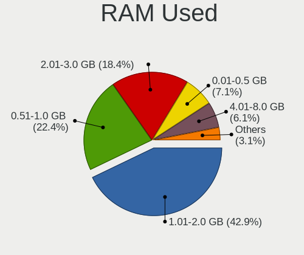
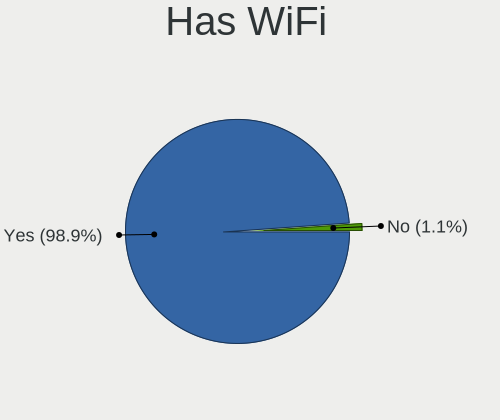
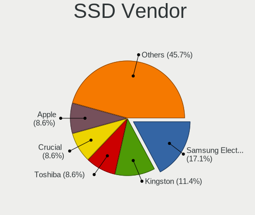
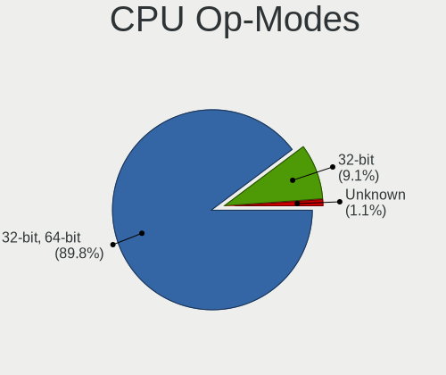

BunsenLabs - Tested Hardware & Statistics (Notebooks)
-----------------------------------------------------

A project to collect tested hardware configurations for BunsenLabs.

Anyone can contribute to this report by the [hw-probe](https://github.com/linuxhw/hw-probe) tool:

    sudo -E hw-probe -all -upload

Please contribute! Especially if your hardware is rare.

Contents
--------

* [ Test Cases ](#test-cases)

* [ System ](#system)
  - [ OS                       ](#os)
  - [ OS Family                ](#os-family)
  - [ Kernel                   ](#kernel)
  - [ Kernel Family            ](#kernel-family)
  - [ Kernel Major Ver.        ](#kernel-major-ver)
  - [ Arch                     ](#arch)
  - [ DE                       ](#de)
  - [ Display Server           ](#display-server)
  - [ Display Manager          ](#display-manager)
  - [ OS Lang                  ](#os-lang)
  - [ Boot Mode                ](#boot-mode)
  - [ Filesystem               ](#filesystem)
  - [ Part. scheme             ](#part-scheme)
  - [ Dual Boot with Linux/BSD ](#dual-boot-with-linuxbsd)
  - [ Dual Boot (Win)          ](#dual-boot-win)

* [ Board ](#board)
  - [ Vendor                   ](#vendor)
  - [ Model                    ](#model)
  - [ Model Family             ](#model-family)
  - [ MFG Year                 ](#mfg-year)
  - [ Form Factor              ](#form-factor)
  - [ Secure Boot              ](#secure-boot)
  - [ Coreboot                 ](#coreboot)
  - [ RAM Size                 ](#ram-size)
  - [ RAM Used                 ](#ram-used)
  - [ Total Drives             ](#total-drives)
  - [ Has CD-ROM               ](#has-cd-rom)
  - [ Has Ethernet             ](#has-ethernet)
  - [ Has WiFi                 ](#has-wifi)
  - [ Has Bluetooth            ](#has-bluetooth)

* [ Location ](#location)
  - [ Country                  ](#country)
  - [ City                     ](#city)

* [ Drives ](#drives)
  - [ Drive Vendor             ](#drive-vendor)
  - [ Drive Model              ](#drive-model)
  - [ HDD Vendor               ](#hdd-vendor)
  - [ SSD Vendor               ](#ssd-vendor)
  - [ Drive Kind               ](#drive-kind)
  - [ Drive Connector          ](#drive-connector)
  - [ Drive Size               ](#drive-size)
  - [ Space Total              ](#space-total)
  - [ Space Used               ](#space-used)
  - [ Malfunc. Drives          ](#malfunc-drives)
  - [ Malfunc. Drive Vendor    ](#malfunc-drive-vendor)
  - [ Malfunc. HDD Vendor      ](#malfunc-hdd-vendor)
  - [ Malfunc. Drive Kind      ](#malfunc-drive-kind)
  - [ Failed Drives            ](#failed-drives)
  - [ Failed Drive Vendor      ](#failed-drive-vendor)
  - [ Drive Status             ](#drive-status)

* [ Storage controller ](#storage-controller)
  - [ Storage Vendor           ](#storage-vendor)
  - [ Storage Model            ](#storage-model)
  - [ Storage Kind             ](#storage-kind)

* [ Processor ](#processor)
  - [ CPU Vendor               ](#cpu-vendor)
  - [ CPU Model                ](#cpu-model)
  - [ CPU Model Family         ](#cpu-model-family)
  - [ CPU Cores                ](#cpu-cores)
  - [ CPU Sockets              ](#cpu-sockets)
  - [ CPU Threads              ](#cpu-threads)
  - [ CPU Op-Modes             ](#cpu-op-modes)
  - [ CPU Microcode            ](#cpu-microcode)
  - [ CPU Microarch            ](#cpu-microarch)

* [ Graphics ](#graphics)
  - [ GPU Vendor               ](#gpu-vendor)
  - [ GPU Model                ](#gpu-model)
  - [ GPU Combo                ](#gpu-combo)
  - [ GPU Driver               ](#gpu-driver)
  - [ GPU Memory               ](#gpu-memory)

* [ Monitor ](#monitor)
  - [ Monitor Vendor           ](#monitor-vendor)
  - [ Monitor Model            ](#monitor-model)
  - [ Monitor Resolution       ](#monitor-resolution)
  - [ Monitor Diagonal         ](#monitor-diagonal)
  - [ Monitor Width            ](#monitor-width)
  - [ Aspect Ratio             ](#aspect-ratio)
  - [ Monitor Area             ](#monitor-area)
  - [ Pixel Density            ](#pixel-density)
  - [ Multiple Monitors        ](#multiple-monitors)

* [ Network ](#network)
  - [ Net Controller Vendor    ](#net-controller-vendor)
  - [ Net Controller Model     ](#net-controller-model)
  - [ Wireless Vendor          ](#wireless-vendor)
  - [ Wireless Model           ](#wireless-model)
  - [ Ethernet Vendor          ](#ethernet-vendor)
  - [ Ethernet Model           ](#ethernet-model)
  - [ Net Controller Kind      ](#net-controller-kind)
  - [ Used Controller          ](#used-controller)
  - [ NICs                     ](#nics)
  - [ IPv6                     ](#ipv6)

* [ Bluetooth ](#bluetooth)
  - [ Bluetooth Vendor         ](#bluetooth-vendor)
  - [ Bluetooth Model          ](#bluetooth-model)

* [ Sound ](#sound)
  - [ Sound Vendor             ](#sound-vendor)
  - [ Sound Model              ](#sound-model)

* [ Memory ](#memory)
  - [ Memory Vendor            ](#memory-vendor)
  - [ Memory Model             ](#memory-model)
  - [ Memory Kind              ](#memory-kind)
  - [ Memory Form Factor       ](#memory-form-factor)
  - [ Memory Size              ](#memory-size)
  - [ Memory Speed             ](#memory-speed)

* [ Printers & scanners ](#printers--scanners)
  - [ Printer Vendor           ](#printer-vendor)
  - [ Printer Model            ](#printer-model)
  - [ Scanner Vendor           ](#scanner-vendor)
  - [ Scanner Model            ](#scanner-model)

* [ Camera ](#camera)
  - [ Camera Vendor            ](#camera-vendor)
  - [ Camera Model             ](#camera-model)

* [ Security ](#security)
  - [ Fingerprint Vendor       ](#fingerprint-vendor)
  - [ Fingerprint Model        ](#fingerprint-model)
  - [ Chipcard Vendor          ](#chipcard-vendor)
  - [ Chipcard Model           ](#chipcard-model)

* [ Unsupported ](#unsupported)
  - [ Unsupported Devices      ](#unsupported-devices)
  - [ Unsupported Device Types ](#unsupported-device-types)

Test Cases
----------

Total: 127

| Vendor        | Model                       | Probe                                                      | Date         |
|---------------|-----------------------------|------------------------------------------------------------|--------------|
| Lenovo        | ThinkPad T470p 20J6003KU... | [624bca4c57](https://linux-hardware.org/?probe=624bca4c57) | Dec 23, 2024 |
| HUAWEI        | BOM-WXX9                    | [79f63e6159](https://linux-hardware.org/?probe=79f63e6159) | Dec 06, 2024 |
| ASUSTek       | N501VW                      | [c80d222867](https://linux-hardware.org/?probe=c80d222867) | Sep 07, 2024 |
| Lenovo        | IdeaPad S410p 20296         | [442752ea3a](https://linux-hardware.org/?probe=442752ea3a) | Jul 28, 2024 |
| Acer          | Aspire A315-35              | [b0dd66f64e](https://linux-hardware.org/?probe=b0dd66f64e) | Jul 19, 2024 |
| Dell          | Vostro 3500                 | [ec7ac57ad8](https://linux-hardware.org/?probe=ec7ac57ad8) | Jun 13, 2024 |
| Matsushita... | CF-74GCDADBM                | [f353aa5d7c](https://linux-hardware.org/?probe=f353aa5d7c) | May 08, 2024 |
| Acer          | Aspire E5-475               | [31e70b6cc1](https://linux-hardware.org/?probe=31e70b6cc1) | Apr 08, 2024 |
| Lenovo        | ThinkPad R400 7440WWQ       | [7c62efd0a5](https://linux-hardware.org/?probe=7c62efd0a5) | Mar 29, 2024 |
| Acer          | Aspire E5-575G              | [97fc633522](https://linux-hardware.org/?probe=97fc633522) | Mar 01, 2024 |
| IBM           | ThinkPad T43 18714AG        | [ac4a5c44a6](https://linux-hardware.org/?probe=ac4a5c44a6) | Feb 28, 2024 |
| ASUSTek       | K53SJ                       | [cb9c23cca6](https://linux-hardware.org/?probe=cb9c23cca6) | Feb 16, 2024 |
| Lenovo        | ThinkPad X60 Tablet 6365... | [f2277d87a7](https://linux-hardware.org/?probe=f2277d87a7) | Feb 04, 2024 |
| Toshiba       | Satellite P50T-A-114        | [5286decec5](https://linux-hardware.org/?probe=5286decec5) | Jan 26, 2024 |
| ASUSTek       | X75VCP                      | [63c2472460](https://linux-hardware.org/?probe=63c2472460) | Jan 21, 2024 |
| Gateway       | MT6707                      | [581410ddec](https://linux-hardware.org/?probe=581410ddec) | Jan 21, 2024 |
| HP            | 255 G3                      | [7f8af802a0](https://linux-hardware.org/?probe=7f8af802a0) | Jan 15, 2024 |
| Sony          | VPCEH2J1E                   | [39cd4a0364](https://linux-hardware.org/?probe=39cd4a0364) | Jan 08, 2024 |
| IBM           | ThinkPad X41 2525WB1        | [fe73b9a704](https://linux-hardware.org/?probe=fe73b9a704) | Jan 02, 2024 |
| Gateway       | MT6707                      | [a2a87f6e95](https://linux-hardware.org/?probe=a2a87f6e95) | Jan 02, 2024 |
| Lenovo        | ThinkPad X1 Nano Gen 1 2... | [d178358ee1](https://linux-hardware.org/?probe=d178358ee1) | Dec 21, 2023 |
| Fujitsu       | LIFEBOOK U745               | [a2f7b09b87](https://linux-hardware.org/?probe=a2f7b09b87) | Dec 20, 2023 |
| HP            | Mini 2102                   | [33a330f96d](https://linux-hardware.org/?probe=33a330f96d) | Dec 16, 2023 |
| Sony          | VPCEG18FG                   | [e1b5fa6cac](https://linux-hardware.org/?probe=e1b5fa6cac) | Dec 15, 2023 |
| Lenovo        | V110-14IAP 80TF             | [e7bbe1d5e7](https://linux-hardware.org/?probe=e7bbe1d5e7) | Dec 10, 2023 |
| Google        | Kefka                       | [7522f0b2f5](https://linux-hardware.org/?probe=7522f0b2f5) | Nov 20, 2023 |
| HP            | Stream Laptop 11-ak0xxx     | [f91d973bab](https://linux-hardware.org/?probe=f91d973bab) | Nov 19, 2023 |
| Google        | Peppy                       | [8276e5d349](https://linux-hardware.org/?probe=8276e5d349) | Oct 26, 2023 |
| Acer          | AOA110                      | [e263461ae3](https://linux-hardware.org/?probe=e263461ae3) | Oct 21, 2023 |
| Sony          | VPCSB2L1R                   | [153440d631](https://linux-hardware.org/?probe=153440d631) | Oct 20, 2023 |
| Lenovo        | G700 20251                  | [7988ecce03](https://linux-hardware.org/?probe=7988ecce03) | Oct 06, 2023 |
| Matsushita... | CF-74GCDADBM                | [81dda6dc09](https://linux-hardware.org/?probe=81dda6dc09) | Oct 05, 2023 |
| Google        | Caroline                    | [f4fba894c3](https://linux-hardware.org/?probe=f4fba894c3) | Oct 02, 2023 |
| Lenovo        | ThinkPad P53 20QNS00X00     | [d8a932e703](https://linux-hardware.org/?probe=d8a932e703) | Oct 02, 2023 |
| HP            | Compaq nc6320 (EN368UT#A... | [71ba4fd9e9](https://linux-hardware.org/?probe=71ba4fd9e9) | Sep 30, 2023 |
| Sony          | VPCSB2L1R                   | [9395b9347e](https://linux-hardware.org/?probe=9395b9347e) | Sep 26, 2023 |
| Dell          | Latitude E4300              | [ed27d2d51c](https://linux-hardware.org/?probe=ed27d2d51c) | Sep 13, 2023 |
| Google        | Droid                       | [7b7eb437c6](https://linux-hardware.org/?probe=7b7eb437c6) | Sep 12, 2023 |
| Lenovo        | ThinkPad T480s 20L70028U... | [b065e9bda2](https://linux-hardware.org/?probe=b065e9bda2) | Aug 31, 2023 |
| Apple         | MacBookAir7,2               | [bb8b8a594d](https://linux-hardware.org/?probe=bb8b8a594d) | Aug 27, 2023 |
| Lenovo        | ThinkPad T440s 20AR003RM... | [f8f097e135](https://linux-hardware.org/?probe=f8f097e135) | Aug 24, 2023 |
| Apple         | MacBookAir7,2               | [c62fc8773a](https://linux-hardware.org/?probe=c62fc8773a) | Aug 21, 2023 |
| Lenovo        | ThinkPad T440s 20AR003RM... | [d989b68c65](https://linux-hardware.org/?probe=d989b68c65) | Aug 19, 2023 |
| HP            | Laptop 14-cm0xxx            | [418fc8664d](https://linux-hardware.org/?probe=418fc8664d) | Aug 16, 2023 |
| Lenovo        | ThinkPad T480s 20L70028U... | [8b2a34a407](https://linux-hardware.org/?probe=8b2a34a407) | Aug 11, 2023 |
| Sony          | VPCSB2L1R                   | [582f50ea25](https://linux-hardware.org/?probe=582f50ea25) | Aug 02, 2023 |
| HP            | EliteBook 840 G5            | [875ac8e861](https://linux-hardware.org/?probe=875ac8e861) | Jul 31, 2023 |
| Lenovo        | ThinkPad P53 20QNS00X00     | [c196e05843](https://linux-hardware.org/?probe=c196e05843) | Jul 19, 2023 |
| Lenovo        | ThinkPad T480s 20L70028U... | [5561d22542](https://linux-hardware.org/?probe=5561d22542) | Jul 13, 2023 |
| Lenovo        | ThinkPad P53 20QNS00X00     | [1e9dbff4e1](https://linux-hardware.org/?probe=1e9dbff4e1) | Jul 12, 2023 |
| IBM           | ThinkPad T43 18714AG        | [c7d3e6a151](https://linux-hardware.org/?probe=c7d3e6a151) | Jul 09, 2023 |
| Lenovo        | ThinkPad T480s 20L70028U... | [5de59f9db1](https://linux-hardware.org/?probe=5de59f9db1) | Jul 04, 2023 |
| Lenovo        | ThinkPad T480s 20L70028U... | [d8bf0be74c](https://linux-hardware.org/?probe=d8bf0be74c) | Jul 02, 2023 |
| Lenovo        | ThinkPad P53 20QNS00X00     | [696e673b71](https://linux-hardware.org/?probe=696e673b71) | Jun 19, 2023 |
| Google        | Ampton                      | [294fa26d20](https://linux-hardware.org/?probe=294fa26d20) | Jun 14, 2023 |
| Lenovo        | ThinkPad P53 20QNS00X00     | [aa551ee6d7](https://linux-hardware.org/?probe=aa551ee6d7) | Jun 12, 2023 |
| HP            | Laptop 15-dy2xxx            | [5473496916](https://linux-hardware.org/?probe=5473496916) | May 30, 2023 |
| HP            | ZBook 15                    | [def4482b86](https://linux-hardware.org/?probe=def4482b86) | May 25, 2023 |
| Google        | Snappy                      | [8e9ad9e9d3](https://linux-hardware.org/?probe=8e9ad9e9d3) | May 24, 2023 |
| Advent        | Roma                        | [f6ca4c331a](https://linux-hardware.org/?probe=f6ca4c331a) | May 19, 2023 |
| Google        | Banon                       | [c610295744](https://linux-hardware.org/?probe=c610295744) | May 16, 2023 |
| Lenovo        | IdeaPad 110S-11IBR 80WG     | [53a5e2e7d7](https://linux-hardware.org/?probe=53a5e2e7d7) | May 16, 2023 |
| Lenovo        | IdeaPad 1 15IGL7 82V7       | [4c3f70e8d3](https://linux-hardware.org/?probe=4c3f70e8d3) | May 08, 2023 |
| Chuwi         | HeroBook Air                | [872196fb37](https://linux-hardware.org/?probe=872196fb37) | May 06, 2023 |
| Advent        | Roma                        | [ec7568545d](https://linux-hardware.org/?probe=ec7568545d) | May 02, 2023 |
| Google        | Bobba                       | [5eb10d8965](https://linux-hardware.org/?probe=5eb10d8965) | Apr 26, 2023 |
| Dell          | System XPS L321X            | [cd2af9d26f](https://linux-hardware.org/?probe=cd2af9d26f) | Apr 24, 2023 |
| Google        | Helios                      | [89b0a06d70](https://linux-hardware.org/?probe=89b0a06d70) | Apr 20, 2023 |
| LG Electro... | X120-G.C7VPG                | [2ba90d32b2](https://linux-hardware.org/?probe=2ba90d32b2) | Apr 16, 2023 |
| Google        | Ampton                      | [e3945d7727](https://linux-hardware.org/?probe=e3945d7727) | Apr 08, 2023 |
| Advent        | Roma                        | [e1bd64e5b5](https://linux-hardware.org/?probe=e1bd64e5b5) | Apr 03, 2023 |
| HP            | 250 G6 Notebook PC          | [c32ab093ae](https://linux-hardware.org/?probe=c32ab093ae) | Apr 01, 2023 |
| HP            | Laptop 15-db1xxx            | [3bc67b4224](https://linux-hardware.org/?probe=3bc67b4224) | Mar 06, 2023 |
| HP            | Laptop 15-db1xxx            | [61e07fdff6](https://linux-hardware.org/?probe=61e07fdff6) | Mar 06, 2023 |
| HP            | Presario CQ62               | [560330ba8e](https://linux-hardware.org/?probe=560330ba8e) | Mar 03, 2023 |
| Toshiba       | QOSMIO X505                 | [ba222e690b](https://linux-hardware.org/?probe=ba222e690b) | Feb 25, 2023 |
| Toshiba       | QOSMIO X505                 | [8dd3063004](https://linux-hardware.org/?probe=8dd3063004) | Feb 25, 2023 |
| Acer          | AOD255                      | [f5f5ed9b36](https://linux-hardware.org/?probe=f5f5ed9b36) | Feb 24, 2023 |
| Acer          | AOD255                      | [b4ccf00506](https://linux-hardware.org/?probe=b4ccf00506) | Feb 23, 2023 |
| HP            | Laptop 15-db1xxx            | [381d9832ae](https://linux-hardware.org/?probe=381d9832ae) | Feb 19, 2023 |
| Dell          | Latitude 5480               | [e288a18f9d](https://linux-hardware.org/?probe=e288a18f9d) | Feb 18, 2023 |
| Lenovo        | IdeaPad 3 15IGL05 81WQ      | [7360e6e667](https://linux-hardware.org/?probe=7360e6e667) | Feb 17, 2023 |
| Lenovo        | IdeaPad 3 15IGL05 81WQ      | [28ac8fee12](https://linux-hardware.org/?probe=28ac8fee12) | Feb 14, 2023 |
| Google        | Candy                       | [b2f2862759](https://linux-hardware.org/?probe=b2f2862759) | Feb 13, 2023 |
| Dell          | Precision M4700             | [6c3746d120](https://linux-hardware.org/?probe=6c3746d120) | Feb 12, 2023 |
| Acer          | Aspire V3-572G              | [7b48d97053](https://linux-hardware.org/?probe=7b48d97053) | Feb 07, 2023 |
| Dell          | Precision M4700             | [c2075893d4](https://linux-hardware.org/?probe=c2075893d4) | Feb 05, 2023 |
| WinPAD 110... | I102A                       | [0619bb5a8d](https://linux-hardware.org/?probe=0619bb5a8d) | Feb 04, 2023 |
| Acer          | AOD255                      | [1b65896663](https://linux-hardware.org/?probe=1b65896663) | Feb 03, 2023 |
| Dell          | Latitude D630C              | [401357bc99](https://linux-hardware.org/?probe=401357bc99) | Jan 30, 2023 |
| HP            | EliteBook 8470p             | [cb00a3e89d](https://linux-hardware.org/?probe=cb00a3e89d) | Jan 24, 2023 |
| ASUSTek       | K53SJ                       | [267ce15a0c](https://linux-hardware.org/?probe=267ce15a0c) | Jan 17, 2023 |
| ASUSTek       | E200HA                      | [4d9f4512a6](https://linux-hardware.org/?probe=4d9f4512a6) | Jan 13, 2023 |
| Apple         | MacBookPro9,2               | [2a71b87b09](https://linux-hardware.org/?probe=2a71b87b09) | Jan 11, 2023 |
| HP            | Compaq nc6320 (EN368UT#A... | [0a86f694f4](https://linux-hardware.org/?probe=0a86f694f4) | Jan 10, 2023 |
| Dell          | Inspiron 3543               | [c7c7419fd5](https://linux-hardware.org/?probe=c7c7419fd5) | Jan 10, 2023 |
| HP            | Compaq nc6320 (EN368UT#A... | [abd3d3cea6](https://linux-hardware.org/?probe=abd3d3cea6) | Jan 09, 2023 |
| HP            | Mini 110-3100               | [fb7810e1f3](https://linux-hardware.org/?probe=fb7810e1f3) | Jan 02, 2023 |
| Dell          | Inspiron MM061              | [34804f8a34](https://linux-hardware.org/?probe=34804f8a34) | Dec 29, 2022 |
| MSI           | Summit E13FlipEvo A12MT     | [19d3221410](https://linux-hardware.org/?probe=19d3221410) | Dec 27, 2022 |
| Lenovo        | IdeaPad 320-15ABR 80XS      | [ba03b3fbf5](https://linux-hardware.org/?probe=ba03b3fbf5) | Dec 24, 2022 |
| Acer          | Aspire ES1-111M             | [3b15bcfd88](https://linux-hardware.org/?probe=3b15bcfd88) | Nov 19, 2022 |
| Lenovo        | IdeaPad Z580                | [80a27aca02](https://linux-hardware.org/?probe=80a27aca02) | Mar 17, 2022 |
| HP            | EliteBook 8440p             | [caf1f719f4](https://linux-hardware.org/?probe=caf1f719f4) | Mar 10, 2022 |
| Lenovo        | IdeaPad Z580                | [bfdd2f78ce](https://linux-hardware.org/?probe=bfdd2f78ce) | Feb 10, 2022 |
| Apple         | MacBookAir6,2               | [35772aa50a](https://linux-hardware.org/?probe=35772aa50a) | Dec 25, 2021 |
| Apple         | MacBookAir6,2               | [41d30a91a2](https://linux-hardware.org/?probe=41d30a91a2) | Dec 24, 2021 |
| Lenovo        | ThinkPad T430 23473T1       | [4c297ab486](https://linux-hardware.org/?probe=4c297ab486) | May 18, 2021 |
| Lenovo        | ThinkPad T440s 20AR003RM... | [286287736b](https://linux-hardware.org/?probe=286287736b) | Mar 31, 2021 |
| Lenovo        | ThinkPad T490 20N2000CMC    | [b23d98dd6a](https://linux-hardware.org/?probe=b23d98dd6a) | Feb 22, 2021 |
| ASUSTek       | T102HA                      | [781a13f986](https://linux-hardware.org/?probe=781a13f986) | Feb 19, 2021 |
| Lenovo        | ThinkPad T440s 20AR003RM... | [afdde38feb](https://linux-hardware.org/?probe=afdde38feb) | Jan 08, 2021 |
| Sony          | VGN-FW11L                   | [e99fe042af](https://linux-hardware.org/?probe=e99fe042af) | Jan 06, 2021 |
| Lenovo        | ThinkPad T440s 20AR003RM... | [435ab3dc8c](https://linux-hardware.org/?probe=435ab3dc8c) | Dec 15, 2020 |
| Lenovo        | ThinkPad L440 20ASS34900    | [0320af5232](https://linux-hardware.org/?probe=0320af5232) | Nov 08, 2020 |
| Lenovo        | ThinkPad T440s 20AR003RM... | [fbb029244c](https://linux-hardware.org/?probe=fbb029244c) | Nov 07, 2020 |
| Acer          | Aspire 3000                 | [7346c396c1](https://linux-hardware.org/?probe=7346c396c1) | Oct 26, 2020 |
| Lenovo        | ThinkPad T440s 20AR003RM... | [1726e5904b](https://linux-hardware.org/?probe=1726e5904b) | Sep 13, 2020 |
| Lenovo        | ThinkPad E570 20H50070IX    | [be328f1909](https://linux-hardware.org/?probe=be328f1909) | Aug 07, 2020 |
| Lenovo        | ThinkPad E570 20H50070IX    | [5faf3a72e0](https://linux-hardware.org/?probe=5faf3a72e0) | Aug 07, 2020 |
| Samsung       | 275E4E/275E5E               | [b9b37f4a61](https://linux-hardware.org/?probe=b9b37f4a61) | Jul 01, 2019 |
| Samsung       | 275E4E/275E5E               | [26ec3bf654](https://linux-hardware.org/?probe=26ec3bf654) | Jun 29, 2019 |
| Lenovo        | IdeaPad 110-15ISK 80UD      | [cd9600fb67](https://linux-hardware.org/?probe=cd9600fb67) | Aug 28, 2017 |
| Lenovo        | IdeaPad 110-15ISK 80UD      | [18379ebd5c](https://linux-hardware.org/?probe=18379ebd5c) | Jun 30, 2017 |
| eMachines     | eME732Z                     | [684e63b609](https://linux-hardware.org/?probe=684e63b609) | May 26, 2017 |
| eMachines     | eME732Z                     | [bdc6400fbe](https://linux-hardware.org/?probe=bdc6400fbe) | May 25, 2017 |
| eMachines     | eME732Z                     | [2d931a211b](https://linux-hardware.org/?probe=2d931a211b) | May 02, 2016 |

System
------

OS
--

Installed operating systems

| Name            | Notebooks | Percent |
|-----------------|-----------|---------|
| BunsenLabs 11   | 61        | 67.03%  |
| BunsenLabs 12   | 12        | 13.19%  |
| BunsenLabs 10.5 | 11        | 12.09%  |
| BunsenLabs 8.7  | 2         | 2.2%    |
| BunsenLabs 10.0 | 2         | 2.2%    |
| BunsenLabs 9.8  | 1         | 1.1%    |
| BunsenLabs 8.4  | 1         | 1.1%    |
| BunsenLabs 10.4 | 1         | 1.1%    |

OS Family
---------

OS without a version

| Name       | Notebooks | Percent |
|------------|-----------|---------|
| BunsenLabs | 88        | 100%    |

Kernel
------

Version of the Linux kernel

| Version                    | Notebooks | Percent |
|----------------------------|-----------|---------|
| 5.10.0-20-amd64            | 15        | 14.71%  |
| 5.10.0-21-amd64            | 14        | 13.73%  |
| 5.10.0-23-amd64            | 8         | 7.84%   |
| 5.10.0-25-amd64            | 6         | 5.88%   |
| 5.10.0-26-amd64            | 5         | 4.9%    |
| 6.1.0-18-amd64             | 4         | 3.92%   |
| 5.10.0-21-686-pae          | 4         | 3.92%   |
| 4.19.0-18-amd64            | 3         | 2.94%   |
| 5.10.0-27-amd64            | 2         | 1.96%   |
| 5.10.0-26-686-pae          | 2         | 1.96%   |
| 5.10.0-22-amd64            | 2         | 1.96%   |
| 5.10.0-19-amd64            | 2         | 1.96%   |
| 3.16.0-4-amd64             | 2         | 1.96%   |
| 6.9.7+bpo-amd64            | 1         | 0.98%   |
| 6.6.7-zen1KernelZenv2-1    | 1         | 0.98%   |
| 6.11.11-x64v3-xanmod1      | 1         | 0.98%   |
| 6.1.0-7-amd64              | 1         | 0.98%   |
| 6.1.0-28-amd64             | 1         | 0.98%   |
| 6.1.0-23-amd64             | 1         | 0.98%   |
| 6.1.0-21-amd64             | 1         | 0.98%   |
| 6.1.0-16-amd64             | 1         | 0.98%   |
| 6.1.0-13-686               | 1         | 0.98%   |
| 6.1.0-10-686               | 1         | 0.98%   |
| 5.9.0-0.bpo.2-amd64        | 1         | 0.98%   |
| 5.8.0-0.bpo.2-amd64        | 1         | 0.98%   |
| 5.7.0-2-amd64              | 1         | 0.98%   |
| 5.7.0-0.bpo.2-amd64        | 1         | 0.98%   |
| 5.4.0-0.bpo.3-amd64        | 1         | 0.98%   |
| 5.16.0-8.1-liquorix-amd64  | 1         | 0.98%   |
| 5.16.0-11.1-liquorix-amd64 | 1         | 0.98%   |
| 5.10.0-5-amd64             | 1         | 0.98%   |
| 5.10.0-3-amd64             | 1         | 0.98%   |
| 5.10.0-27-686-pae          | 1         | 0.98%   |
| 5.10.0-24-amd64            | 1         | 0.98%   |
| 5.10.0-20-686-pae          | 1         | 0.98%   |
| 5.10.0-20-686              | 1         | 0.98%   |
| 5.10.0-1-amd64             | 1         | 0.98%   |
| 5.10.0-0.bpo.4-rt-amd64    | 1         | 0.98%   |
| 4.9.0-9-amd64              | 1         | 0.98%   |
| 4.9.0-0.bpo.3-amd64        | 1         | 0.98%   |

Kernel Family
-------------

Linux kernel without a distro release

| Version | Notebooks | Percent |
|---------|-----------|---------|
| 5.10.0  | 64        | 68.09%  |
| 6.1.0   | 10        | 10.64%  |
| 4.19.0  | 7         | 7.45%   |
| 5.7.0   | 2         | 2.13%   |
| 4.9.0   | 2         | 2.13%   |
| 3.16.0  | 2         | 2.13%   |
| 6.9.7   | 1         | 1.06%   |
| 6.6.7   | 1         | 1.06%   |
| 6.11.11 | 1         | 1.06%   |
| 5.9.0   | 1         | 1.06%   |
| 5.8.0   | 1         | 1.06%   |
| 5.4.0   | 1         | 1.06%   |
| 5.16.0  | 1         | 1.06%   |

Kernel Major Ver.
-----------------

Linux kernel major version

| Version | Notebooks | Percent |
|---------|-----------|---------|
| 5.10    | 64        | 68.09%  |
| 6.1     | 10        | 10.64%  |
| 4.19    | 7         | 7.45%   |
| 5.7     | 2         | 2.13%   |
| 4.9     | 2         | 2.13%   |
| 3.16    | 2         | 2.13%   |
| 6.9     | 1         | 1.06%   |
| 6.6     | 1         | 1.06%   |
| 6.11    | 1         | 1.06%   |
| 5.9     | 1         | 1.06%   |
| 5.8     | 1         | 1.06%   |
| 5.4     | 1         | 1.06%   |
| 5.16    | 1         | 1.06%   |

Arch
----

OS architecture (x86_64, i586, etc.)

| Name   | Notebooks | Percent |
|--------|-----------|---------|
| x86_64 | 77        | 85.56%  |
| i686   | 13        | 14.44%  |

DE
--

Desktop Environment

| Name       | Notebooks | Percent |
|------------|-----------|---------|
| Unknown    | 44        | 46.81%  |
| BunsenLabs | 33        | 35.11%  |
| XFCE       | 11        | 11.7%   |
| GNOME      | 2         | 2.13%   |
| X-Cinnamon | 1         | 1.06%   |
| openbox    | 1         | 1.06%   |
| KDE5       | 1         | 1.06%   |
| i3         | 1         | 1.06%   |

Display Server
--------------

X11 or Wayland

| Name    | Notebooks | Percent |
|---------|-----------|---------|
| X11     | 87        | 97.75%  |
| Wayland | 1         | 1.12%   |
| Tty     | 1         | 1.12%   |

Display Manager
---------------

SDDM, LightDM, etc.

| Name    | Notebooks | Percent |
|---------|-----------|---------|
| LightDM | 68        | 75.56%  |
| Unknown | 10        | 11.11%  |
| TDM     | 9         | 10%     |
| XDM     | 1         | 1.11%   |
| SDDM    | 1         | 1.11%   |
| LXDM    | 1         | 1.11%   |

OS Lang
-------

Language

| Lang       | Notebooks | Percent |
|------------|-----------|---------|
| en_US      | 38        | 43.18%  |
| en_GB      | 6         | 6.82%   |
| de_DE      | 6         | 6.82%   |
| fr_FR      | 5         | 5.68%   |
| it_IT      | 4         | 4.55%   |
| sv_SE      | 3         | 3.41%   |
| Unknown    | 3         | 3.41%   |
| tr_TR      | 2         | 2.27%   |
| pt_BR      | 2         | 2.27%   |
| pl_PL      | 2         | 2.27%   |
| es_SV      | 2         | 2.27%   |
| en_AU      | 2         | 2.27%   |
| ca_ES      | 2         | 2.27%   |
| ru_UA      | 1         | 1.14%   |
| ru_RU      | 1         | 1.14%   |
| hu_HU      | 1         | 1.14%   |
| es_US      | 1         | 1.14%   |
| es_ES      | 1         | 1.14%   |
| es_CO      | 1         | 1.14%   |
| en_PH      | 1         | 1.14%   |
| en_IE      | 1         | 1.14%   |
| en_CA      | 1         | 1.14%   |
| de_DE.UTF8 | 1         | 1.14%   |
| bg_BG      | 1         | 1.14%   |

Boot Mode
---------

EFI or BIOS

| Mode | Notebooks | Percent |
|------|-----------|---------|
| BIOS | 44        | 50%     |
| EFI  | 44        | 50%     |

Filesystem
----------

Type of filesystem

| Type    | Notebooks | Percent |
|---------|-----------|---------|
| Ext4    | 83        | 93.26%  |
| Unknown | 3         | 3.37%   |
| Btrfs   | 2         | 2.25%   |
| Aufs    | 1         | 1.12%   |

Part. scheme
------------

Scheme of partitioning

| Type    | Notebooks | Percent |
|---------|-----------|---------|
| GPT     | 47        | 52.22%  |
| MBR     | 33        | 36.67%  |
| Unknown | 10        | 11.11%  |

Dual Boot with Linux/BSD
------------------------

Hosting more than one Linux/BSD

| Dual boot | Notebooks | Percent |
|-----------|-----------|---------|
| No        | 75        | 84.27%  |
| Yes       | 14        | 15.73%  |

Dual Boot (Win)
---------------

Hosting Linux and Windows

| Dual boot | Notebooks | Percent |
|-----------|-----------|---------|
| No        | 69        | 76.67%  |
| Yes       | 21        | 23.33%  |

Board
-----

Vendor
------

Motherboard manufacturer

| Name                           | Notebooks | Percent |
|--------------------------------|-----------|---------|
| Lenovo                         | 20        | 22.73%  |
| Hewlett-Packard                | 14        | 15.91%  |
| Google                         | 10        | 11.36%  |
| Dell                           | 8         | 9.09%   |
| Acer                           | 8         | 9.09%   |
| ASUSTek Computer               | 5         | 5.68%   |
| Sony                           | 4         | 4.55%   |
| Apple                          | 4         | 4.55%   |
| Toshiba                        | 2         | 2.27%   |
| IBM                            | 2         | 2.27%   |
| WinPAD 110W                    | 1         | 1.14%   |
| Samsung Electronics            | 1         | 1.14%   |
| MSI                            | 1         | 1.14%   |
| Matsushita Electric Industrial | 1         | 1.14%   |
| LG Electronics                 | 1         | 1.14%   |
| HUAWEI                         | 1         | 1.14%   |
| Gateway                        | 1         | 1.14%   |
| Fujitsu                        | 1         | 1.14%   |
| eMachines                      | 1         | 1.14%   |
| Chuwi                          | 1         | 1.14%   |
| Advent                         | 1         | 1.14%   |

Model
-----

Motherboard model

| Name                                        | Notebooks | Percent |
|---------------------------------------------|-----------|---------|
| Apple MacBookAir6,2                         | 2         | 2.27%   |
| WinPAD 110W WinPAD 110W                     | 1         | 1.14%   |
| Toshiba Satellite P50T-A-114                | 1         | 1.14%   |
| Toshiba QOSMIO X505                         | 1         | 1.14%   |
| Sony VPCSB2L1R                              | 1         | 1.14%   |
| Sony VPCEH2J1E                              | 1         | 1.14%   |
| Sony VPCEG18FG                              | 1         | 1.14%   |
| Sony VGN-FW11L                              | 1         | 1.14%   |
| Samsung 275E4E/275E5E                       | 1         | 1.14%   |
| MSI Summit E13FlipEvo A12MT                 | 1         | 1.14%   |
| Matsushita Electric Industrial CF-74GCDADBM | 1         | 1.14%   |
| LG X120-G.C7VPG                             | 1         | 1.14%   |
| Lenovo V110-14IAP 80TF                      | 1         | 1.14%   |
| Lenovo ThinkPad X60 Tablet 6365CTO          | 1         | 1.14%   |
| Lenovo ThinkPad X1 Nano Gen 1 20UN0064GE    | 1         | 1.14%   |
| Lenovo ThinkPad T490 20N2000CMC             | 1         | 1.14%   |
| Lenovo ThinkPad T480s 20L70028US            | 1         | 1.14%   |
| Lenovo ThinkPad T470p 20J6003KUS            | 1         | 1.14%   |
| Lenovo ThinkPad T440s 20AR003RMS            | 1         | 1.14%   |
| Lenovo ThinkPad T430 23473T1                | 1         | 1.14%   |
| Lenovo ThinkPad R400 7440WWQ                | 1         | 1.14%   |
| Lenovo ThinkPad P53 20QNS00X00              | 1         | 1.14%   |
| Lenovo ThinkPad L440 20ASS34900             | 1         | 1.14%   |
| Lenovo ThinkPad E570 20H50070IX             | 1         | 1.14%   |
| Lenovo IdeaPad Z580                         | 1         | 1.14%   |
| Lenovo IdeaPad S410p 20296                  | 1         | 1.14%   |
| Lenovo IdeaPad 320-15ABR 80XS               | 1         | 1.14%   |
| Lenovo IdeaPad 3 15IGL05 81WQ               | 1         | 1.14%   |
| Lenovo IdeaPad 110S-11IBR 80WG              | 1         | 1.14%   |
| Lenovo IdeaPad 110-15ISK 80UD               | 1         | 1.14%   |
| Lenovo IdeaPad 1 15IGL7 82V7                | 1         | 1.14%   |
| Lenovo G700 20251                           | 1         | 1.14%   |
| IBM ThinkPad X41 2525WB1                    | 1         | 1.14%   |
| IBM ThinkPad T43 18714AG                    | 1         | 1.14%   |
| HUAWEI BOM-WXX9                             | 1         | 1.14%   |
| HP ZBook 15                                 | 1         | 1.14%   |
| HP Stream Laptop 11-ak0xxx                  | 1         | 1.14%   |
| HP Presario CQ62                            | 1         | 1.14%   |
| HP Mini 2102                                | 1         | 1.14%   |
| HP Mini 110-3100                            | 1         | 1.14%   |

Model Family
------------

Motherboard model prefix

| Name                                        | Notebooks | Percent |
|---------------------------------------------|-----------|---------|
| Lenovo ThinkPad                             | 11        | 12.5%   |
| Lenovo IdeaPad                              | 7         | 7.95%   |
| Acer Aspire                                 | 6         | 6.82%   |
| HP Laptop                                   | 3         | 3.41%   |
| HP EliteBook                                | 3         | 3.41%   |
| Dell Latitude                               | 3         | 3.41%   |
| IBM ThinkPad                                | 2         | 2.27%   |
| HP Mini                                     | 2         | 2.27%   |
| Dell Inspiron                               | 2         | 2.27%   |
| Apple MacBookAir6                           | 2         | 2.27%   |
| WinPAD 110W WinPAD                          | 1         | 1.14%   |
| Toshiba Satellite                           | 1         | 1.14%   |
| Toshiba QOSMIO                              | 1         | 1.14%   |
| Sony VPCSB2L1R                              | 1         | 1.14%   |
| Sony VPCEH2J1E                              | 1         | 1.14%   |
| Sony VPCEG18FG                              | 1         | 1.14%   |
| Sony VGN-FW11L                              | 1         | 1.14%   |
| Samsung 275E4E                              | 1         | 1.14%   |
| MSI Summit                                  | 1         | 1.14%   |
| Matsushita Electric Industrial CF-74GCDADBM | 1         | 1.14%   |
| LG X120-G.C7VPG                             | 1         | 1.14%   |
| Lenovo V110-14IAP                           | 1         | 1.14%   |
| Lenovo G700                                 | 1         | 1.14%   |
| HUAWEI BOM-WXX9                             | 1         | 1.14%   |
| HP ZBook                                    | 1         | 1.14%   |
| HP Stream                                   | 1         | 1.14%   |
| HP Presario                                 | 1         | 1.14%   |
| HP Compaq                                   | 1         | 1.14%   |
| HP 255                                      | 1         | 1.14%   |
| HP 250                                      | 1         | 1.14%   |
| Google Snappy                               | 1         | 1.14%   |
| Google Peppy                                | 1         | 1.14%   |
| Google Kefka                                | 1         | 1.14%   |
| Google Helios                               | 1         | 1.14%   |
| Google Droid                                | 1         | 1.14%   |
| Google Caroline                             | 1         | 1.14%   |
| Google Candy                                | 1         | 1.14%   |
| Google Bobba                                | 1         | 1.14%   |
| Google Banon                                | 1         | 1.14%   |
| Google Ampton                               | 1         | 1.14%   |

MFG Year
--------

Motherboard manufacture year

| Year    | Notebooks | Percent |
|---------|-----------|---------|
| 2016    | 8         | 9.09%   |
| 2013    | 8         | 9.09%   |
| 2014    | 7         | 7.95%   |
| 2010    | 7         | 7.95%   |
| 2023    | 6         | 6.82%   |
| 2022    | 6         | 6.82%   |
| 2017    | 6         | 6.82%   |
| 2011    | 6         | 6.82%   |
| 2012    | 5         | 5.68%   |
| 2019    | 4         | 4.55%   |
| 2008    | 4         | 4.55%   |
| 2007    | 4         | 4.55%   |
| 2020    | 3         | 3.41%   |
| 2018    | 3         | 3.41%   |
| 2009    | 3         | 3.41%   |
| 2005    | 3         | 3.41%   |
| 2006    | 2         | 2.27%   |
| 2021    | 1         | 1.14%   |
| 2015    | 1         | 1.14%   |
| Unknown | 1         | 1.14%   |

Form Factor
-----------

Physical design of the computer

| Name     | Notebooks | Percent |
|----------|-----------|---------|
| Notebook | 88        | 100%    |

Secure Boot
-----------

Enabled or disabled

| State    | Notebooks | Percent |
|----------|-----------|---------|
| Disabled | 84        | 95.45%  |
| Enabled  | 4         | 4.55%   |

Coreboot
--------

Have coreboot on board

| Used | Notebooks | Percent |
|------|-----------|---------|
| No   | 78        | 88.64%  |
| Yes  | 10        | 11.36%  |

RAM Size
--------

Total RAM memory

| Size in GB | Notebooks | Percent |
|------------|-----------|---------|
| 3.01-4.0   | 34        | 37.78%  |
| 4.01-8.0   | 15        | 16.67%  |
| 8.01-16.0  | 12        | 13.33%  |
| 1.01-2.0   | 10        | 11.11%  |
| 16.01-24.0 | 7         | 7.78%   |
| 0.51-1.0   | 6         | 6.67%   |
| 2.01-3.0   | 5         | 5.56%   |
| 24.01-32.0 | 1         | 1.11%   |

RAM Used
--------

Used RAM memory

| Used GB   | Notebooks | Percent |
|-----------|-----------|---------|
| 1.01-2.0  | 42        | 42.86%  |
| 0.51-1.0  | 22        | 22.45%  |
| 2.01-3.0  | 18        | 18.37%  |
| 0.01-0.5  | 7         | 7.14%   |
| 4.01-8.0  | 6         | 6.12%   |
| 3.01-4.0  | 2         | 2.04%   |
| 8.01-16.0 | 1         | 1.02%   |

Total Drives
------------

Number of drives on board

| Drives | Notebooks | Percent |
|--------|-----------|---------|
| 1      | 69        | 76.67%  |
| 2      | 19        | 21.11%  |
| 3      | 2         | 2.22%   |

Has CD-ROM
----------

Has CD-ROM on board

| Presented | Notebooks | Percent |
|-----------|-----------|---------|
| No        | 55        | 62.5%   |
| Yes       | 33        | 37.5%   |

Has Ethernet
------------

Has Ethernet on board

| Presented | Notebooks | Percent |
|-----------|-----------|---------|
| Yes       | 66        | 75%     |
| No        | 22        | 25%     |

Has WiFi
--------

Has WiFi module

| Presented | Notebooks | Percent |
|-----------|-----------|---------|
| Yes       | 87        | 98.86%  |
| No        | 1         | 1.14%   |

Has Bluetooth
-------------

Has Bluetooth module

| Presented | Notebooks | Percent |
|-----------|-----------|---------|
| Yes       | 66        | 75%     |
| No        | 22        | 25%     |

Location
--------

Country
-------

Geographic location (country)

| Country     | Notebooks | Percent |
|-------------|-----------|---------|
| USA         | 20        | 22.73%  |
| Germany     | 8         | 9.09%   |
| Sweden      | 6         | 6.82%   |
| France      | 6         | 6.82%   |
| Spain       | 5         | 5.68%   |
| Turkey      | 4         | 4.55%   |
| Italy       | 4         | 4.55%   |
| Poland      | 3         | 3.41%   |
| Brazil      | 3         | 3.41%   |
| UK          | 2         | 2.27%   |
| India       | 2         | 2.27%   |
| El Salvador | 2         | 2.27%   |
| Bulgaria    | 2         | 2.27%   |
| Australia   | 2         | 2.27%   |
| Venezuela   | 1         | 1.14%   |
| Ukraine     | 1         | 1.14%   |
| Serbia      | 1         | 1.14%   |
| Russia      | 1         | 1.14%   |
| Portugal    | 1         | 1.14%   |
| Philippines | 1         | 1.14%   |
| Netherlands | 1         | 1.14%   |
| Morocco     | 1         | 1.14%   |
| Mexico      | 1         | 1.14%   |
| Malaysia    | 1         | 1.14%   |
| Japan       | 1         | 1.14%   |
| Ireland     | 1         | 1.14%   |
| Indonesia   | 1         | 1.14%   |
| Hungary     | 1         | 1.14%   |
| Guatemala   | 1         | 1.14%   |
| Greece      | 1         | 1.14%   |
| Czechia     | 1         | 1.14%   |
| Colombia    | 1         | 1.14%   |
| Canada      | 1         | 1.14%   |

City
----

Geographic location (city)

| City                  | Notebooks | Percent |
|-----------------------|-----------|---------|
| Västerås            | 2         | 2%      |
| Tremestieri Etneo     | 2         | 2%      |
| Toulouse              | 2         | 2%      |
| Stockholm             | 2         | 2%      |
| San Salvador          | 2         | 2%      |
| Saint Paul            | 2         | 2%      |
| Mumbai                | 2         | 2%      |
| Istanbul              | 2         | 2%      |
| Harrisonburg          | 2         | 2%      |
| Barcelona             | 2         | 2%      |
| Wroclaw               | 1         | 1%      |
| Wilsonville           | 1         | 1%      |
| Walsall               | 1         | 1%      |
| Vigo                  | 1         | 1%      |
| Turin                 | 1         | 1%      |
| Thessaloniki          | 1         | 1%      |
| Telde                 | 1         | 1%      |
| Surabaya              | 1         | 1%      |
| Springfield           | 1         | 1%      |
| Södertälje          | 1         | 1%      |
| Sloviansk             | 1         | 1%      |
| Skövde               | 1         | 1%      |
| Shinjuku              | 1         | 1%      |
| Shakopee              | 1         | 1%      |
| Seville               | 1         | 1%      |
| Secaucus              | 1         | 1%      |
| Sao Bernardo do Campo | 1         | 1%      |
| Saint Joseph          | 1         | 1%      |
| Redlands              | 1         | 1%      |
| Ravensburg            | 1         | 1%      |
| Poulton-le-Fylde      | 1         | 1%      |
| Plovdiv               | 1         | 1%      |
| Petaling Jaya         | 1         | 1%      |
| Perth Amboy           | 1         | 1%      |
| Pernik                | 1         | 1%      |
| Ostrava               | 1         | 1%      |
| North Wilkesboro      | 1         | 1%      |
| Nort-sur-Erdre        | 1         | 1%      |
| Norden                | 1         | 1%      |
| Niterói              | 1         | 1%      |

Drives
------

Drive Vendor
------------

Hard drive vendors

| Vendor              | Notebooks | Drives | Percent |
|---------------------|-----------|--------|---------|
| Unknown             | 17        | 24     | 15.89%  |
| Seagate             | 15        | 18     | 14.02%  |
| Toshiba             | 11        | 20     | 10.28%  |
| Samsung Electronics | 11        | 12     | 10.28%  |
| WDC                 | 6         | 8      | 5.61%   |
| SK hynix            | 5         | 5      | 4.67%   |
| Kingston            | 4         | 4      | 3.74%   |
| Intel               | 4         | 5      | 3.74%   |
| Apple               | 4         | 4      | 3.74%   |
| Micron Technology   | 3         | 3      | 2.8%    |
| Crucial             | 3         | 3      | 2.8%    |
| SanDisk             | 2         | 2      | 1.87%   |
| KingSpec            | 2         | 2      | 1.87%   |
| Hitachi             | 2         | 2      | 1.87%   |
| Fujitsu             | 2         | 2      | 1.87%   |
| walram              | 1         | 1      | 0.93%   |
| USB2.0              | 1         | 1      | 0.93%   |
| Silicon Motion      | 1         | 1      | 0.93%   |
| LITEON              | 1         | 1      | 0.93%   |
| LDLC                | 1         | 2      | 0.93%   |
| KIOXIA-EXCERIA      | 1         | 3      | 0.93%   |
| KIOXIA              | 1         | 2      | 0.93%   |
| JMicron Technology  | 1         | 1      | 0.93%   |
| HUAWEI              | 1         | 1      | 0.93%   |
| HGST                | 1         | 1      | 0.93%   |
| HAGIWARA            | 1         | 1      | 0.93%   |
| Fanxiang            | 1         | 1      | 0.93%   |
| Corsair             | 1         | 1      | 0.93%   |
| China               | 1         | 1      | 0.93%   |
| BIWIN               | 1         | 1      | 0.93%   |
| BHT                 | 1         | 1      | 0.93%   |

Drive Model
-----------

Hard drive models

| Model                                               | Notebooks | Percent |
|-----------------------------------------------------|-----------|---------|
| Unknown SD32G  32GB                                 | 2         | 1.74%   |
| Unknown DF4016  16GB                                | 2         | 1.74%   |
| Unknown DA4032  32GB                                | 2         | 1.74%   |
| Seagate ST500LM000-1EJ162 500GB                     | 2         | 1.74%   |
| Seagate ST320LT012-9WS14C 320GB                     | 2         | 1.74%   |
| Seagate ST1000LM035-1RK172 1TB                      | 2         | 1.74%   |
| SanDisk DF4064  64GB                                | 2         | 1.74%   |
| Samsung SSD 850 EVO 250GB                           | 2         | 1.74%   |
| Samsung NVMe SSD Controller SM981/PM981/PM983 512GB | 2         | 1.74%   |
| Kingston SA400S37240G 240GB SSD                     | 2         | 1.74%   |
| Apple SSD SD0128F 121GB                             | 2         | 1.74%   |
| WDC WD5000LPVX-22V0TT0 500GB                        | 1         | 0.87%   |
| WDC WD3200BEVT-22ZCT0 320GB                         | 1         | 0.87%   |
| WDC WD3200BEVT-08A23T1 320GB                        | 1         | 0.87%   |
| WDC WD10JPVX-22JC3T0 1TB                            | 1         | 0.87%   |
| WDC WD10JPVX-08JC3T6 1TB                            | 1         | 0.87%   |
| WDC PC SN520 NVMe 256GB                             | 1         | 0.87%   |
| walram 60G                                          | 1         | 0.87%   |
| USB2.0 CardReader                                   | 1         | 0.87%   |
| Unknown SDC  8GB                                    | 1         | 0.87%   |
| Unknown SD08G  8GB                                  | 1         | 0.87%   |
| Unknown NVMe SSD Drive 128GB                        | 1         | 0.87%   |
| Unknown MMC128  128GB                               | 1         | 0.87%   |
| Unknown MMC Card  64GB                              | 1         | 0.87%   |
| Unknown MMC Card  32GB                              | 1         | 0.87%   |
| Unknown MMC Card  256GB                             | 1         | 0.87%   |
| Unknown MMC Card  16GB                              | 1         | 0.87%   |
| Unknown MMC Card  128GB                             | 1         | 0.87%   |
| Unknown HBG4a2  32GB                                | 1         | 0.87%   |
| Unknown hB8aP  32GB                                 | 1         | 0.87%   |
| Unknown HAG2e  16GB                                 | 1         | 0.87%   |
| Unknown DA4064  64GB                                | 1         | 0.87%   |
| Unknown BJNB4R  32GB                                | 1         | 0.87%   |
| Unknown Biwin  32GB                                 | 1         | 0.87%   |
| Unknown ASTC  32GB                                  | 1         | 0.87%   |
| Unknown 00000  2GB                                  | 1         | 0.87%   |
| Toshiba TR200 240GB SSD                             | 1         | 0.87%   |
| Toshiba THNSNH128GCST 128GB SSD                     | 1         | 0.87%   |
| Toshiba THNS064GG2BBAA 64GB SSD                     | 1         | 0.87%   |
| Toshiba MQ01ABF050 500GB                            | 1         | 0.87%   |

HDD Vendor
----------

Hard disk drive vendors

| Vendor              | Notebooks | Drives | Percent |
|---------------------|-----------|--------|---------|
| Seagate             | 15        | 18     | 41.67%  |
| Toshiba             | 8         | 10     | 22.22%  |
| WDC                 | 5         | 7      | 13.89%  |
| Hitachi             | 2         | 2      | 5.56%   |
| Fujitsu             | 2         | 2      | 5.56%   |
| Samsung Electronics | 1         | 1      | 2.78%   |
| JMicron Technology  | 1         | 1      | 2.78%   |
| HGST                | 1         | 1      | 2.78%   |
| Apple               | 1         | 1      | 2.78%   |

SSD Vendor
----------

Solid state drive vendors

| Vendor              | Notebooks | Drives | Percent |
|---------------------|-----------|--------|---------|
| Samsung Electronics | 6         | 6      | 17.14%  |
| Kingston            | 4         | 4      | 11.43%  |
| Toshiba             | 3         | 10     | 8.57%   |
| Crucial             | 3         | 3      | 8.57%   |
| Apple               | 3         | 3      | 8.57%   |
| SK hynix            | 2         | 2      | 5.71%   |
| Micron Technology   | 2         | 2      | 5.71%   |
| KingSpec            | 2         | 2      | 5.71%   |
| Intel               | 2         | 2      | 5.71%   |
| LITEON              | 1         | 1      | 2.86%   |
| LDLC                | 1         | 1      | 2.86%   |
| KIOXIA-EXCERIA      | 1         | 3      | 2.86%   |
| HAGIWARA            | 1         | 1      | 2.86%   |
| Corsair             | 1         | 1      | 2.86%   |
| China               | 1         | 1      | 2.86%   |
| BIWIN               | 1         | 1      | 2.86%   |
| BHT                 | 1         | 1      | 2.86%   |

Drive Kind
----------

HDD or SSD

| Kind    | Notebooks | Drives | Percent |
|---------|-----------|--------|---------|
| HDD     | 36        | 43     | 33.96%  |
| SSD     | 33        | 44     | 31.13%  |
| MMC     | 19        | 26     | 17.92%  |
| NVMe    | 15        | 18     | 14.15%  |
| Unknown | 3         | 3      | 2.83%   |

Drive Connector
---------------

SATA, SAS, NVMe, etc.

| Type | Notebooks | Drives | Percent |
|------|-----------|--------|---------|
| SATA | 62        | 85     | 61.39%  |
| MMC  | 19        | 26     | 18.81%  |
| NVMe | 15        | 18     | 14.85%  |
| SAS  | 5         | 5      | 4.95%   |

Drive Size
----------

Size of hard drive

| Size in TB | Notebooks | Drives | Percent |
|------------|-----------|--------|---------|
| 0.01-0.5   | 54        | 75     | 83.08%  |
| 0.51-1.0   | 8         | 9      | 12.31%  |
| 1.01-2.0   | 3         | 3      | 4.62%   |

Space Total
-----------

Amount of disk space available on the file system

| Size in GB | Notebooks | Percent |
|------------|-----------|---------|
| 101-250    | 30        | 32.26%  |
| 251-500    | 21        | 22.58%  |
| 21-50      | 13        | 13.98%  |
| 51-100     | 12        | 12.9%   |
| 501-1000   | 9         | 9.68%   |
| 1-20       | 6         | 6.45%   |
| 1001-2000  | 2         | 2.15%   |

Space Used
----------

Amount of used disk space

| Used GB  | Notebooks | Percent |
|----------|-----------|---------|
| 1-20     | 55        | 59.14%  |
| 101-250  | 12        | 12.9%   |
| 21-50    | 11        | 11.83%  |
| 51-100   | 8         | 8.6%    |
| 251-500  | 6         | 6.45%   |
| 501-1000 | 1         | 1.08%   |

Malfunc. Drives
---------------

Drive models with a malfunction

| Model                                          | Notebooks | Drives | Percent |
|------------------------------------------------|-----------|--------|---------|
| Seagate ST320LT012-9WS14C 320GB                | 2         | 2      | 9.52%   |
| WDC WD5000LPVX-22V0TT0 500GB                   | 1         | 1      | 4.76%   |
| WDC WD3200BEVT-08A23T1 320GB                   | 1         | 2      | 4.76%   |
| Toshiba MQ01ABF050 500GB                       | 1         | 1      | 4.76%   |
| Toshiba MQ01ABD075 752GB                       | 1         | 1      | 4.76%   |
| Toshiba MQ01ABD032 320GB                       | 1         | 1      | 4.76%   |
| Toshiba MK5059GSXP 500GB                       | 1         | 1      | 4.76%   |
| Toshiba MK4026GAX RoHS 40GB                    | 1         | 2      | 4.76%   |
| Toshiba MK1652GSX 160GB                        | 1         | 1      | 4.76%   |
| Seagate ST500LM021-1KJ152 500GB                | 1         | 2      | 4.76%   |
| Seagate ST2000LM003 HN-M201RAD 2TB             | 1         | 1      | 4.76%   |
| Samsung Electronics HM160HI 160GB              | 1         | 1      | 4.76%   |
| Micron Technology MTFDDAK256MAM-1K12 256GB SSD | 1         | 1      | 4.76%   |
| LDLC SSD 120GB                                 | 1         | 1      | 4.76%   |
| KingSpec KSD-PA18.6-064MS 64GB SSD             | 1         | 1      | 4.76%   |
| Hitachi HTS723232L9A360 320GB                  | 1         | 1      | 4.76%   |
| Hitachi HTS421260H9AT00 64GB                   | 1         | 1      | 4.76%   |
| Crucial C300-CTFDDAC128MAG 128GB SSD           | 1         | 1      | 4.76%   |
| China SSD 120GB                                | 1         | 1      | 4.76%   |
| Apple HDD HTS547575A9E384 752GB                | 1         | 1      | 4.76%   |

Malfunc. Drive Vendor
---------------------

Vendors of faulty drives

| Vendor              | Notebooks | Drives | Percent |
|---------------------|-----------|--------|---------|
| Toshiba             | 6         | 7      | 28.57%  |
| Seagate             | 4         | 5      | 19.05%  |
| WDC                 | 2         | 3      | 9.52%   |
| Hitachi             | 2         | 2      | 9.52%   |
| Samsung Electronics | 1         | 1      | 4.76%   |
| Micron Technology   | 1         | 1      | 4.76%   |
| LDLC                | 1         | 1      | 4.76%   |
| KingSpec            | 1         | 1      | 4.76%   |
| Crucial             | 1         | 1      | 4.76%   |
| China               | 1         | 1      | 4.76%   |
| Apple               | 1         | 1      | 4.76%   |

Malfunc. HDD Vendor
-------------------

Vendors of faulty HDD drives

| Vendor              | Notebooks | Drives | Percent |
|---------------------|-----------|--------|---------|
| Toshiba             | 6         | 7      | 37.5%   |
| Seagate             | 4         | 5      | 25%     |
| WDC                 | 2         | 3      | 12.5%   |
| Hitachi             | 2         | 2      | 12.5%   |
| Samsung Electronics | 1         | 1      | 6.25%   |
| Apple               | 1         | 1      | 6.25%   |

Malfunc. Drive Kind
-------------------

Kinds of faulty drives

| Kind | Notebooks | Drives | Percent |
|------|-----------|--------|---------|
| HDD  | 16        | 19     | 76.19%  |
| SSD  | 5         | 5      | 23.81%  |

Failed Drives
-------------

Failed drive models

Zero info for selected period =(

Failed Drive Vendor
-------------------

Failed drive vendors

Zero info for selected period =(

Drive Status
------------

Number of failed and malfunc. drives

| Status   | Notebooks | Drives | Percent |
|----------|-----------|--------|---------|
| Works    | 50        | 61     | 50%     |
| Detected | 29        | 49     | 29%     |
| Malfunc  | 21        | 24     | 21%     |

Storage controller
------------------

Storage Vendor
--------------

Storage controller vendors

| Vendor                           | Notebooks | Percent |
|----------------------------------|-----------|---------|
| Intel                            | 60        | 74.07%  |
| Samsung Electronics              | 5         | 6.17%   |
| AMD                              | 4         | 4.94%   |
| SK hynix                         | 2         | 2.47%   |
| Silicon Motion                   | 2         | 2.47%   |
| Marvell Technology Group         | 2         | 2.47%   |
| Silicon Integrated Systems [SiS] | 1         | 1.23%   |
| SanDisk                          | 1         | 1.23%   |
| Micron Technology                | 1         | 1.23%   |
| MAXIO Technology (Hangzhou)      | 1         | 1.23%   |
| KIOXIA                           | 1         | 1.23%   |
| Apacer Technology                | 1         | 1.23%   |

Storage Model
-------------

Storage controller models

| Model                                                                            | Notebooks | Percent |
|----------------------------------------------------------------------------------|-----------|---------|
| Intel Sunrise Point-LP SATA Controller [AHCI mode]                               | 7         | 8.05%   |
| Intel 7 Series Chipset Family 6-port SATA Controller [AHCI mode]                 | 7         | 8.05%   |
| Intel 82801IBM/IEM (ICH9M/ICH9M-E) 4 port SATA Controller [AHCI mode]            | 5         | 5.75%   |
| Intel 6 Series/C200 Series Chipset Family 6 port Mobile SATA AHCI Controller     | 5         | 5.75%   |
| AMD FCH SATA Controller [AHCI mode]                                              | 4         | 4.6%    |
| Intel Wildcat Point-LP SATA Controller [AHCI Mode]                               | 3         | 3.45%   |
| Intel NM10/ICH7 Family SATA Controller [AHCI mode]                               | 3         | 3.45%   |
| Intel Celeron/Pentium Silver Processor SATA Controller                           | 3         | 3.45%   |
| Intel 82801GBM/GHM (ICH7-M Family) SATA Controller [IDE mode]                    | 3         | 3.45%   |
| Intel 82801GBM/GHM (ICH7-M Family) SATA Controller [AHCI mode]                   | 3         | 3.45%   |
| Intel 8 Series SATA Controller 1 [AHCI mode]                                     | 3         | 3.45%   |
| Intel 5 Series/3400 Series Chipset 6 port SATA AHCI Controller                   | 3         | 3.45%   |
| Samsung NVMe SSD Controller SM981/PM981/PM983                                    | 2         | 2.3%    |
| Marvell Group 88SS9183 PCIe SSD Controller                                       | 2         | 2.3%    |
| Intel 82801HM/HEM (ICH8M/ICH8M-E) IDE Controller                                 | 2         | 2.3%    |
| Intel 82801G (ICH7 Family) IDE Controller                                        | 2         | 2.3%    |
| Intel 82801FBM (ICH6M) SATA Controller                                           | 2         | 2.3%    |
| Intel 8 Series/C220 Series Chipset Family 6-port SATA Controller 1 [AHCI mode]   | 2         | 2.3%    |
| SK hynix Gold P31/BC711/PC711 NVMe Solid State Drive                             | 1         | 1.15%   |
| SK hynix BC501 NVMe Solid State Drive                                            | 1         | 1.15%   |
| Silicon Motion SM2263EN/SM2263XT (DRAM-less) NVMe SSD Controllers                | 1         | 1.15%   |
| Silicon Motion Non-Volatile memory controller                                    | 1         | 1.15%   |
| Silicon Integrated Systems [SiS] 5513 IDE Controller                             | 1         | 1.15%   |
| SanDisk PC SN520 x2 M.2 2230 NVMe SSD                                            | 1         | 1.15%   |
| Samsung S4LN058A01[SSUBX] AHCI SSD Controller (Apple slot)                       | 1         | 1.15%   |
| Samsung NVMe SSD Controller SM961/PM961/SM963                                    | 1         | 1.15%   |
| Samsung NVMe SSD Controller SM951/PM951                                          | 1         | 1.15%   |
| Micron 3400 NVMe SSD [Hendrix]                                                   | 1         | 1.15%   |
| MAXIO (Hangzhou) NVMe SSD Controller MAP1202 (DRAM-less)                         | 1         | 1.15%   |
| KIOXIA NVMe SSD Controller BG4 (DRAM-less)                                       | 1         | 1.15%   |
| Intel Volume Management Device NVMe RAID Controller                              | 1         | 1.15%   |
| Intel SSD DC P4101/Pro 7600p/760p/E 6100p Series                                 | 1         | 1.15%   |
| Intel Optane NVME SSD H10 with Solid State Storage [Teton Glacier]               | 1         | 1.15%   |
| Intel Mobile PM965/GM965 PT IDER Controller                                      | 1         | 1.15%   |
| Intel Jasper Lake SATA AHCI Controller                                           | 1         | 1.15%   |
| Intel HM170/QM170 Chipset SATA Controller [AHCI Mode]                            | 1         | 1.15%   |
| Intel Comet Lake SATA AHCI Controller                                            | 1         | 1.15%   |
| Intel Celeron N3350/Pentium N4200/Atom E3900 Series SATA AHCI Controller         | 1         | 1.15%   |
| Intel Atom/Celeron/Pentium Processor x5-E8000/J3xxx/N3xxx Series SATA Controller | 1         | 1.15%   |
| Intel 82801HM/HEM (ICH8M/ICH8M-E) SATA Controller [IDE mode]                     | 1         | 1.15%   |

Storage Kind
------------

Kind of storage controller (IDE, SATA, NVMe, SAS, ...)

| Kind | Notebooks | Percent |
|------|-----------|---------|
| SATA | 58        | 68.24%  |
| NVMe | 15        | 17.65%  |
| IDE  | 10        | 11.76%  |
| RAID | 2         | 2.35%   |

Processor
---------

CPU Vendor
----------

Processor vendors

| Vendor | Notebooks | Percent |
|--------|-----------|---------|
| Intel  | 81        | 92.05%  |
| AMD    | 7         | 7.95%   |

CPU Model
---------

Processor models

| Model                              | Notebooks | Percent |
|------------------------------------|-----------|---------|
| Intel Celeron N4020 CPU @ 1.10GHz  | 4         | 4.55%   |
| Intel Core i5-5200U CPU @ 2.20GHz  | 3         | 3.41%   |
| Intel Celeron CPU N3060 @ 1.60GHz  | 3         | 3.41%   |
| Intel Pentium CPU 2020M @ 2.40GHz  | 2         | 2.27%   |
| Intel Core i7-7500U CPU @ 2.70GHz  | 2         | 2.27%   |
| Intel Core i5-4250U CPU @ 1.30GHz  | 2         | 2.27%   |
| Intel Core i5-3210M CPU @ 2.50GHz  | 2         | 2.27%   |
| Intel Core i3-6006U CPU @ 2.00GHz  | 2         | 2.27%   |
| Intel Celeron N4000 CPU @ 1.10GHz  | 2         | 2.27%   |
| Intel Celeron CPU N3350 @ 1.10GHz  | 2         | 2.27%   |
| Intel Celeron CPU N2840 @ 2.16GHz  | 2         | 2.27%   |
| Intel Atom x5-Z8350 CPU @ 1.44GHz  | 2         | 2.27%   |
| Intel Atom CPU N455 @ 1.66GHz      | 2         | 2.27%   |
| Intel Atom CPU N270 @ 1.60GHz      | 2         | 2.27%   |
| Intel Pentium M processor 1.86GHz  | 1         | 1.14%   |
| Intel Pentium M processor 1.60GHz  | 1         | 1.14%   |
| Intel Pentium CPU P6100 @ 2.00GHz  | 1         | 1.14%   |
| Intel Genuine CPU T2060 @ 1.60GHz  | 1         | 1.14%   |
| Intel Core m3-6Y30 CPU @ 0.90GHz   | 1         | 1.14%   |
| Intel Core i7-9750H CPU @ 2.60GHz  | 1         | 1.14%   |
| Intel Core i7-8650U CPU @ 1.90GHz  | 1         | 1.14%   |
| Intel Core i7-7820HQ CPU @ 2.90GHz | 1         | 1.14%   |
| Intel Core i7-6700HQ CPU @ 2.60GHz | 1         | 1.14%   |
| Intel Core i7-4800MQ CPU @ 2.70GHz | 1         | 1.14%   |
| Intel Core i7-3840QM CPU @ 2.80GHz | 1         | 1.14%   |
| Intel Core i7-3630QM CPU @ 2.40GHz | 1         | 1.14%   |
| Intel Core i7-2640M CPU @ 2.80GHz  | 1         | 1.14%   |
| Intel Core i7 CPU Q 720 @ 1.60GHz  | 1         | 1.14%   |
| Intel Core i7 CPU M 620 @ 2.67GHz  | 1         | 1.14%   |
| Intel Core i5-8350U CPU @ 1.70GHz  | 1         | 1.14%   |
| Intel Core i5-8265U CPU @ 1.60GHz  | 1         | 1.14%   |
| Intel Core i5-7200U CPU @ 2.50GHz  | 1         | 1.14%   |
| Intel Core i5-6300U CPU @ 2.40GHz  | 1         | 1.14%   |
| Intel Core i5-5350U CPU @ 1.80GHz  | 1         | 1.14%   |
| Intel Core i5-4300U CPU @ 1.90GHz  | 1         | 1.14%   |
| Intel Core i5-4210M CPU @ 2.60GHz  | 1         | 1.14%   |
| Intel Core i5-4200U CPU @ 1.60GHz  | 1         | 1.14%   |
| Intel Core i5-3320M CPU @ 2.60GHz  | 1         | 1.14%   |
| Intel Core i5-3230M CPU @ 2.60GHz  | 1         | 1.14%   |
| Intel Core i5-2467M CPU @ 1.60GHz  | 1         | 1.14%   |

CPU Model Family
----------------

Processor model prefix

| Model              | Notebooks | Percent |
|--------------------|-----------|---------|
| Intel Core i5      | 20        | 22.73%  |
| Intel Celeron      | 17        | 19.32%  |
| Intel Core i7      | 12        | 13.64%  |
| Intel Atom         | 8         | 9.09%   |
| Intel Core 2 Duo   | 6         | 6.82%   |
| Intel Core i3      | 5         | 5.68%   |
| Other              | 3         | 3.41%   |
| Intel Pentium      | 3         | 3.41%   |
| Intel Pentium M    | 2         | 2.27%   |
| Intel Core Duo     | 2         | 2.27%   |
| Intel Genuine      | 1         | 1.14%   |
| Intel Core m3      | 1         | 1.14%   |
| Intel Core 2       | 1         | 1.14%   |
| AMD Ryzen 7        | 1         | 1.14%   |
| AMD Ryzen 3        | 1         | 1.14%   |
| AMD Mobile Sempron | 1         | 1.14%   |
| AMD E2             | 1         | 1.14%   |
| AMD E1             | 1         | 1.14%   |
| AMD A4             | 1         | 1.14%   |
| AMD A12            | 1         | 1.14%   |

CPU Cores
---------

Number of processor cores

| Number | Notebooks | Percent |
|--------|-----------|---------|
| 2      | 59        | 67.05%  |
| 4      | 17        | 19.32%  |
| 1      | 9         | 10.23%  |
| 12     | 1         | 1.14%   |
| 8      | 1         | 1.14%   |
| 6      | 1         | 1.14%   |

CPU Sockets
-----------

Number of sockets

| Number | Notebooks | Percent |
|--------|-----------|---------|
| 1      | 88        | 100%    |

CPU Threads
-----------

Threads per core (Hyper-Threading)

| Number | Notebooks | Percent |
|--------|-----------|---------|
| 2      | 46        | 52.27%  |
| 1      | 42        | 47.73%  |

CPU Op-Modes
------------

CPU Operation Modes (32-bit, 64-bit)

| Op mode        | Notebooks | Percent |
|----------------|-----------|---------|
| 32-bit, 64-bit | 79        | 89.77%  |
| 32-bit         | 8         | 9.09%   |
| Unknown        | 1         | 1.14%   |

CPU Microcode
-------------

Microcode number

| Number     | Notebooks | Percent |
|------------|-----------|---------|
| Unknown    | 16        | 17.78%  |
| 0x306a9    | 7         | 7.78%   |
| 0x706a8    | 5         | 5.56%   |
| 0x406e3    | 4         | 4.44%   |
| 0x406c4    | 4         | 4.44%   |
| 0x306d4    | 4         | 4.44%   |
| 0x206a7    | 4         | 4.44%   |
| 0x806e9    | 3         | 3.33%   |
| 0x6ec      | 3         | 3.33%   |
| 0x40651    | 3         | 3.33%   |
| 0x30678    | 3         | 3.33%   |
| 0x1067a    | 3         | 3.33%   |
| 0x806ec    | 2         | 2.22%   |
| 0x806c1    | 2         | 2.22%   |
| 0x706a1    | 2         | 2.22%   |
| 0x506c9    | 2         | 2.22%   |
| 0x306c3    | 2         | 2.22%   |
| 0x20655    | 2         | 2.22%   |
| 0x106ca    | 2         | 2.22%   |
| 0x106c2    | 2         | 2.22%   |
| 0x10676    | 2         | 2.22%   |
| 0x906e9    | 1         | 1.11%   |
| 0x906a3    | 1         | 1.11%   |
| 0x806ea    | 1         | 1.11%   |
| 0x6fb      | 1         | 1.11%   |
| 0x6fa      | 1         | 1.11%   |
| 0x6f2      | 1         | 1.11%   |
| 0x6d8      | 1         | 1.11%   |
| 0x506e3    | 1         | 1.11%   |
| 0x106e5    | 1         | 1.11%   |
| 0x08108102 | 1         | 1.11%   |
| 0x0700010f | 1         | 1.11%   |
| 0x06006705 | 1         | 1.11%   |
| 0x06006118 | 1         | 1.11%   |

CPU Microarch
-------------

Microarchitecture

| Name          | Notebooks | Percent |
|---------------|-----------|---------|
| KabyLake      | 9         | 10.23%  |
| Silvermont    | 8         | 9.09%   |
| IvyBridge     | 8         | 9.09%   |
| Haswell       | 7         | 7.95%   |
| Goldmont plus | 7         | 7.95%   |
| Skylake       | 5         | 5.68%   |
| SandyBridge   | 5         | 5.68%   |
| Penryn        | 5         | 5.68%   |
| P6            | 5         | 5.68%   |
| Bonnell       | 5         | 5.68%   |
| Broadwell     | 4         | 4.55%   |
| Westmere      | 3         | 3.41%   |
| Core          | 3         | 3.41%   |
| TigerLake     | 2         | 2.27%   |
| Goldmont      | 2         | 2.27%   |
| Excavator     | 2         | 2.27%   |
| Unknown       | 2         | 2.27%   |
| Zen+          | 1         | 1.14%   |
| Tremont       | 1         | 1.14%   |
| Nehalem       | 1         | 1.14%   |
| K8 Hammer     | 1         | 1.14%   |
| Jaguar        | 1         | 1.14%   |
| Bobcat        | 1         | 1.14%   |

Graphics
--------

GPU Vendor
----------

Vendors of graphics cards

| Vendor                           | Notebooks | Percent |
|----------------------------------|-----------|---------|
| Intel                            | 74        | 71.84%  |
| Nvidia                           | 20        | 19.42%  |
| AMD                              | 8         | 7.77%   |
| Silicon Integrated Systems [SiS] | 1         | 0.97%   |

GPU Model
---------

Graphics card models

| Model                                                                                      | Notebooks | Percent |
|--------------------------------------------------------------------------------------------|-----------|---------|
| Intel 3rd Gen Core processor Graphics Controller                                           | 8         | 7.27%   |
| Intel GeminiLake [UHD Graphics 600]                                                        | 7         | 6.36%   |
| Intel Mobile 945GM/GMS/GME, 943/940GML Express Integrated Graphics Controller              | 6         | 5.45%   |
| Intel Haswell-ULT Integrated Graphics Controller                                           | 5         | 4.55%   |
| Intel Atom/Celeron/Pentium Processor x5-E8000/J3xxx/N3xxx Integrated Graphics Controller   | 5         | 4.55%   |
| Intel Mobile 945GM/GMS, 943/940GML Express Integrated Graphics Controller                  | 4         | 3.64%   |
| Intel Mobile 4 Series Chipset Integrated Graphics Controller                               | 4         | 3.64%   |
| Nvidia GF117M [GeForce 610M/710M/810M/820M / GT 620M/625M/630M/720M]                       | 3         | 2.73%   |
| Intel Skylake GT2 [HD Graphics 520]                                                        | 3         | 2.73%   |
| Intel HD Graphics 620                                                                      | 3         | 2.73%   |
| Intel HD Graphics 5500                                                                     | 3         | 2.73%   |
| Intel Atom Processor Z36xxx/Z37xxx Series Graphics & Display                               | 3         | 2.73%   |
| Intel Atom Processor D4xx/D5xx/N4xx/N5xx Integrated Graphics Controller                    | 3         | 2.73%   |
| Intel 2nd Generation Core Processor Family Integrated Graphics Controller                  | 3         | 2.73%   |
| Nvidia GF119M [GeForce 410M]                                                               | 2         | 1.82%   |
| Intel UHD Graphics 620                                                                     | 2         | 1.82%   |
| Intel Mobile 945GSE Express Integrated Graphics Controller                                 | 2         | 1.82%   |
| Intel Mobile 915GM/GMS/910GML Express Graphics Controller                                  | 2         | 1.82%   |
| Intel HD Graphics 500                                                                      | 2         | 1.82%   |
| Intel Core Processor Integrated Graphics Controller                                        | 2         | 1.82%   |
| Silicon Integrated Systems [SiS] 661/741/760 PCI/AGP or 662/761Gx PCIE VGA Display Adapter | 1         | 0.91%   |
| Nvidia TU117GLM [Quadro T2000 Mobile / Max-Q]                                              | 1         | 0.91%   |
| Nvidia GT218M [NVS 3100M]                                                                  | 1         | 0.91%   |
| Nvidia GT218M [GeForce 310M]                                                               | 1         | 0.91%   |
| Nvidia GT215M [GeForce GTS 250M]                                                           | 1         | 0.91%   |
| Nvidia GM108M [GeForce 940MX]                                                              | 1         | 0.91%   |
| Nvidia GM108M [GeForce 840M]                                                               | 1         | 0.91%   |
| Nvidia GM107M [GeForce GTX 960M]                                                           | 1         | 0.91%   |
| Nvidia GM107M [GeForce GTX 950M]                                                           | 1         | 0.91%   |
| Nvidia GM107 [GeForce 940MX]                                                               | 1         | 0.91%   |
| Nvidia GK208M [GeForce GT 740M]                                                            | 1         | 0.91%   |
| Nvidia GK107GLM [Quadro K2000M]                                                            | 1         | 0.91%   |
| Nvidia GK106GLM [Quadro K2100M]                                                            | 1         | 0.91%   |
| Nvidia GF119M [GeForce GT 520M]                                                            | 1         | 0.91%   |
| Nvidia GF108M [GeForce GT 620M/630M/635M/640M LE]                                          | 1         | 0.91%   |
| Nvidia G86M [Quadro NVS 135M]                                                              | 1         | 0.91%   |
| Intel WhiskeyLake-U GT2 [UHD Graphics 620]                                                 | 1         | 0.91%   |
| Intel TigerLake-LP GT2 [Iris Xe Graphics]                                                  | 1         | 0.91%   |
| Intel Tiger Lake-UP4 GT2 [Iris Xe Graphics]                                                | 1         | 0.91%   |
| Intel Mobile GM965/GL960 Integrated Graphics Controller (secondary)                        | 1         | 0.91%   |

GPU Combo
---------

Combinations of graphics cards

| Name           | Notebooks | Percent |
|----------------|-----------|---------|
| 1 x Intel      | 53        | 60.23%  |
| Intel + Nvidia | 14        | 15.91%  |
| 1 x AMD        | 7         | 7.95%   |
| 1 x Nvidia     | 6         | 6.82%   |
| Other          | 4         | 4.55%   |
| 2 x Intel      | 2         | 2.27%   |
| 1 x SiS        | 1         | 1.14%   |
| Intel + AMD    | 1         | 1.14%   |

GPU Driver
----------

Free vs proprietary

| Driver      | Notebooks | Percent |
|-------------|-----------|---------|
| Free        | 83        | 93.26%  |
| Proprietary | 3         | 3.37%   |
| Unknown     | 3         | 3.37%   |

GPU Memory
----------

Total video memory

| Size in GB | Notebooks | Percent |
|------------|-----------|---------|
| Unknown    | 67        | 75.28%  |
| 1.01-2.0   | 9         | 10.11%  |
| 0.01-0.5   | 8         | 8.99%   |
| 0.51-1.0   | 4         | 4.49%   |
| 3.01-4.0   | 1         | 1.12%   |

Monitor
-------

Monitor Vendor
--------------

Monitor vendors

| Vendor               | Notebooks | Percent |
|----------------------|-----------|---------|
| AU Optronics         | 18        | 20.22%  |
| BOE                  | 16        | 17.98%  |
| Chimei Innolux       | 15        | 16.85%  |
| LG Display           | 12        | 13.48%  |
| Apple                | 4         | 4.49%   |
| Samsung Electronics  | 3         | 3.37%   |
| LG Philips           | 3         | 3.37%   |
| Sony                 | 2         | 2.25%   |
| Quanta Display       | 2         | 2.25%   |
| Lenovo               | 2         | 2.25%   |
| InfoVision           | 2         | 2.25%   |
| Sharp                | 1         | 1.12%   |
| Seiko/Epson          | 1         | 1.12%   |
| Philips              | 1         | 1.12%   |
| HUAWEI               | 1         | 1.12%   |
| Hewlett-Packard      | 1         | 1.12%   |
| Goldstar             | 1         | 1.12%   |
| Fujitsu Siemens      | 1         | 1.12%   |
| Dell                 | 1         | 1.12%   |
| CPT                  | 1         | 1.12%   |
| Ancor Communications | 1         | 1.12%   |

Monitor Model
-------------

Monitor models

| Model                                                                | Notebooks | Percent |
|----------------------------------------------------------------------|-----------|---------|
| Sony TV SNYF301 1920x1080                                            | 2         | 2.2%    |
| Apple Color LCD APP9CDF 1440x900 286x179mm 13.3-inch                 | 2         | 2.2%    |
| Sharp LQ123P1JX31 SHP1471 2400x1600 259x173mm 12.3-inch              | 1         | 1.1%    |
| Seiko/Epson LCD Monitor 1920x1080                                    | 1         | 1.1%    |
| Samsung Electronics SMS24A650 SAM0864 1920x1080 531x299mm 24.0-inch  | 1         | 1.1%    |
| Samsung Electronics SMS24A650 SAM082A 1920x1080 531x299mm 24.0-inch  | 1         | 1.1%    |
| Samsung Electronics LCD Monitor SEC434E 1600x900 310x174mm 14.0-inch | 1         | 1.1%    |
| Samsung Electronics LCD Monitor SDC4E51 1366x768 344x194mm 15.5-inch | 1         | 1.1%    |
| Quanta Display LCD Monitor QDS0025 1024x768 304x228mm 15.0-inch      | 1         | 1.1%    |
| Quanta Display LCD Monitor QDS001D 1280x800 331x207mm 15.4-inch      | 1         | 1.1%    |
| Philips PHL 240B7QPJ PHL0903 1920x1200 518x324mm 24.1-inch           | 1         | 1.1%    |
| LG Philips LCD Monitor LPLCF00 1280x800 331x207mm 15.4-inch          | 1         | 1.1%    |
| LG Philips LCD Monitor LPLA900 1280x800 331x207mm 15.4-inch          | 1         | 1.1%    |
| LG Philips LCD Monitor LPL00E5 1440x900 304x190mm 14.1-inch          | 1         | 1.1%    |
| LG Display LP156WH2-TLQ1 LGD021B 1366x768 344x194mm 15.5-inch        | 1         | 1.1%    |
| LG Display LCD Monitor LGD0521 1920x1080 309x174mm 14.0-inch         | 1         | 1.1%    |
| LG Display LCD Monitor LGD04D4 3840x2160 344x194mm 15.5-inch         | 1         | 1.1%    |
| LG Display LCD Monitor LGD03FC 1600x900 309x174mm 14.0-inch          | 1         | 1.1%    |
| LG Display LCD Monitor LGD03B8 1366x768 310x174mm 14.0-inch          | 1         | 1.1%    |
| LG Display LCD Monitor LGD0390 1600x900 382x215mm 17.3-inch          | 1         | 1.1%    |
| LG Display LCD Monitor LGD033A 1366x768 340x190mm 15.3-inch          | 1         | 1.1%    |
| LG Display LCD Monitor LGD032C 1920x1080 344x194mm 15.5-inch         | 1         | 1.1%    |
| LG Display LCD Monitor LGD0306 1600x900 310x174mm 14.0-inch          | 1         | 1.1%    |
| LG Display LCD Monitor LGD02AC 1366x768 344x194mm 15.5-inch          | 1         | 1.1%    |
| LG Display LCD Monitor LGD029F 1024x600 224x126mm 10.1-inch          | 1         | 1.1%    |
| LG Display LCD Monitor LGD0250 1366x768 345x194mm 15.6-inch          | 1         | 1.1%    |
| Lenovo LCD Monitor LEN4035 1280x800 304x190mm 14.1-inch              | 1         | 1.1%    |
| Lenovo LCD Monitor LEN4002 1024x768 245x184mm 12.1-inch              | 1         | 1.1%    |
| InfoVision LCD Monitor IVO048E 1366x768 256x144mm 11.6-inch          | 1         | 1.1%    |
| InfoVision LCD Monitor IVO03F4 1920x1080 309x173mm 13.9-inch         | 1         | 1.1%    |
| HUAWEI AD80HW HWV2402 1920x1080 527x296mm 23.8-inch                  | 1         | 1.1%    |
| Hewlett-Packard LA2205 HWP2847 1680x1050 473x296mm 22.0-inch         | 1         | 1.1%    |
| Goldstar HD PLUS GSM5AC5 1600x900 440x250mm 19.9-inch                | 1         | 1.1%    |
| Fujitsu Siemens LSL 3230T FUS07A6 1920x1080 509x286mm 23.0-inch      | 1         | 1.1%    |
| Dell P2416D DELA0C3 2560x1440 527x296mm 23.8-inch                    | 1         | 1.1%    |
| Dell P2414H DELA09A 1920x1080 527x297mm 23.8-inch                    | 1         | 1.1%    |
| CPT LCD Monitor CPT17AB 1366x768 309x173mm 13.9-inch                 | 1         | 1.1%    |
| Chimei Innolux LCD Monitor CMN1728 1600x900 382x215mm 17.3-inch      | 1         | 1.1%    |
| Chimei Innolux LCD Monitor CMN15E6 1366x768 344x193mm 15.5-inch      | 1         | 1.1%    |
| Chimei Innolux LCD Monitor CMN15DC 1366x768 344x193mm 15.5-inch      | 1         | 1.1%    |

Monitor Resolution
------------------

Monitor screen resolution

| Resolution         | Notebooks | Percent |
|--------------------|-----------|---------|
| 1366x768 (WXGA)    | 39        | 45.88%  |
| 1920x1080 (FHD)    | 17        | 20%     |
| 1600x900 (HD+)     | 8         | 9.41%   |
| 1280x800 (WXGA)    | 6         | 7.06%   |
| 1440x900 (WXGA+)   | 4         | 4.71%   |
| 1024x600           | 3         | 3.53%   |
| 1024x768 (XGA)     | 2         | 2.35%   |
| 3840x2160 (4K)     | 1         | 1.18%   |
| 2560x1440 (QHD)    | 1         | 1.18%   |
| 2400x1600          | 1         | 1.18%   |
| 2160x1350          | 1         | 1.18%   |
| 1920x1200 (WUXGA)  | 1         | 1.18%   |
| 1680x1050 (WSXGA+) | 1         | 1.18%   |

Monitor Diagonal
----------------

Diagonal size in inches

| Inches  | Notebooks | Percent |
|---------|-----------|---------|
| 15      | 32        | 36.36%  |
| 13      | 16        | 18.18%  |
| 14      | 12        | 13.64%  |
| 11      | 11        | 12.5%   |
| 24      | 4         | 4.55%   |
| 72      | 2         | 2.27%   |
| 17      | 2         | 2.27%   |
| 12      | 2         | 2.27%   |
| 10      | 2         | 2.27%   |
| 23      | 1         | 1.14%   |
| 22      | 1         | 1.14%   |
| 19      | 1         | 1.14%   |
| 8       | 1         | 1.14%   |
| Unknown | 1         | 1.14%   |

Monitor Width
-------------

Physical width

| Width in mm | Notebooks | Percent |
|-------------|-----------|---------|
| 301-350     | 53        | 60.23%  |
| 201-300     | 22        | 25%     |
| 501-600     | 5         | 5.68%   |
| 401-500     | 2         | 2.27%   |
| 351-400     | 2         | 2.27%   |
| 1501-2000   | 2         | 2.27%   |
| 101-200     | 1         | 1.14%   |
| Unknown     | 1         | 1.14%   |

Aspect Ratio
------------

Proportional relationship between the width and the height

| Ratio   | Notebooks | Percent |
|---------|-----------|---------|
| 16/9    | 65        | 79.27%  |
| 16/10   | 13        | 15.85%  |
| 4/3     | 2         | 2.44%   |
| 3/2     | 1         | 1.22%   |
| Unknown | 1         | 1.22%   |

Monitor Area
------------

Area in inch²

| Area in inch² | Notebooks | Percent |
|----------------|-----------|---------|
| 101-110        | 31        | 34.83%  |
| 81-90          | 23        | 25.84%  |
| 51-60          | 11        | 12.36%  |
| 71-80          | 5         | 5.62%   |
| 201-250        | 5         | 5.62%   |
| More than 1000 | 2         | 2.25%   |
| 61-70          | 2         | 2.25%   |
| 41-50          | 2         | 2.25%   |
| 251-300        | 2         | 2.25%   |
| 1-40           | 1         | 1.12%   |
| 151-200        | 1         | 1.12%   |
| 131-140        | 1         | 1.12%   |
| 121-130        | 1         | 1.12%   |
| 91-100         | 1         | 1.12%   |
| Unknown        | 1         | 1.12%   |

Pixel Density
-------------

Pixels per inch

| Density       | Notebooks | Percent |
|---------------|-----------|---------|
| 121-160       | 35        | 39.33%  |
| 101-120       | 35        | 39.33%  |
| 51-100        | 13        | 14.61%  |
| 1-50          | 2         | 2.25%   |
| 161-240       | 2         | 2.25%   |
| More than 240 | 1         | 1.12%   |
| Unknown       | 1         | 1.12%   |

Multiple Monitors
-----------------

Total monitors connected

| Total | Notebooks | Percent |
|-------|-----------|---------|
| 1     | 80        | 89.89%  |
| 2     | 6         | 6.74%   |
| 4     | 1         | 1.12%   |
| 3     | 1         | 1.12%   |
| 0     | 1         | 1.12%   |

Network
-------

Net Controller Vendor
---------------------

Controller vendors

| Vendor                                | Notebooks | Percent |
|---------------------------------------|-----------|---------|
| Intel                                 | 41        | 30.6%   |
| Realtek Semiconductor                 | 34        | 25.37%  |
| Qualcomm Atheros                      | 23        | 17.16%  |
| Broadcom                              | 13        | 9.7%    |
| Broadcom Limited                      | 6         | 4.48%   |
| Marvell Technology Group              | 3         | 2.24%   |
| Qualcomm                              | 2         | 1.49%   |
| ASIX Electronics                      | 2         | 1.49%   |
| Xiaomi                                | 1         | 0.75%   |
| Silicon Integrated Systems [SiS]      | 1         | 0.75%   |
| Ralink                                | 1         | 0.75%   |
| MediaTek                              | 1         | 0.75%   |
| Lenovo                                | 1         | 0.75%   |
| Huawei Technologies                   | 1         | 0.75%   |
| Ericsson Business Mobile Networks     | 1         | 0.75%   |
| Dell                                  | 1         | 0.75%   |
| ASUSTek Computer                      | 1         | 0.75%   |
| 802.11g Adapter [Linksys WUSB54GC v3] | 1         | 0.75%   |

Net Controller Model
--------------------

Controller models

| Model                                                                                 | Notebooks | Percent |
|---------------------------------------------------------------------------------------|-----------|---------|
| Realtek RTL8111/8168/8211/8411 PCI Express Gigabit Ethernet Controller                | 16        | 9.94%   |
| Realtek RTL810xE PCI Express Fast Ethernet controller                                 | 10        | 6.21%   |
| Intel Wireless 7265                                                                   | 6         | 3.73%   |
| Qualcomm Atheros QCA9377 802.11ac Wireless Network Adapter                            | 5         | 3.11%   |
| Realtek RTL8821CE 802.11ac PCIe Wireless Network Adapter                              | 4         | 2.48%   |
| Qualcomm Atheros AR9285 Wireless Network Adapter (PCI-Express)                        | 4         | 2.48%   |
| Intel Wireless 8265 / 8275                                                            | 4         | 2.48%   |
| Intel Gemini Lake PCH CNVi WiFi                                                       | 4         | 2.48%   |
| Intel Wireless 7260                                                                   | 3         | 1.86%   |
| Intel Ethernet Connection (4) I219-LM                                                 | 3         | 1.86%   |
| Intel 82579LM Gigabit Network Connection (Lewisville)                                 | 3         | 1.86%   |
| Broadcom Limited BCM4360 802.11ac Dual Band Wireless Network Adapter                  | 3         | 1.86%   |
| Broadcom BCM43142 802.11b/g/n                                                         | 3         | 1.86%   |
| Broadcom BCM4313 802.11bgn Wireless Network Adapter                                   | 3         | 1.86%   |
| Realtek RTL8822CE 802.11ac PCIe Wireless Network Adapter                              | 2         | 1.24%   |
| Realtek RTL8821AE 802.11ac PCIe Wireless Network Adapter                              | 2         | 1.24%   |
| Realtek RTL8187SE Wireless LAN Controller                                             | 2         | 1.24%   |
| Qualcomm POCO F3                                                                      | 2         | 1.24%   |
| Qualcomm Atheros QCA9565 / AR9565 Wireless Network Adapter                            | 2         | 1.24%   |
| Qualcomm Atheros AR5418 Wireless Network Adapter [AR5008E 802.11(a)bgn] (PCI-Express) | 2         | 1.24%   |
| Marvell Group 88E8055 PCI-E Gigabit Ethernet Controller                               | 2         | 1.24%   |
| Intel PRO/Wireless 4965 AG or AGN [Kedron] Network Connection                         | 2         | 1.24%   |
| Intel Dual Band Wireless-AC 3165 Plus Bluetooth                                       | 2         | 1.24%   |
| Intel Centrino Advanced-N 6230 [Rainbow Peak]                                         | 2         | 1.24%   |
| ASIX AX88179 Gigabit Ethernet                                                         | 2         | 1.24%   |
| Xiaomi Mi/Redmi series (RNDIS)                                                        | 1         | 0.62%   |
| Silicon Integrated Systems [SiS] SiS900 PCI Fast Ethernet                             | 1         | 0.62%   |
| Silicon Integrated Systems [SiS] AC'97 Modem Controller                               | 1         | 0.62%   |
| Realtek RTL8191SEvB Wireless LAN Controller                                           | 1         | 0.62%   |
| Realtek RTL8191SEvA Wireless LAN Controller                                           | 1         | 0.62%   |
| Realtek RTL8187 Wireless Adapter                                                      | 1         | 0.62%   |
| Realtek RTL8153 Gigabit Ethernet Adapter                                              | 1         | 0.62%   |
| Realtek RTL8152 Fast Ethernet Adapter                                                 | 1         | 0.62%   |
| Realtek 802.11n WLAN Adapter                                                          | 1         | 0.62%   |
| Ralink RT5390 Wireless 802.11n 1T/1R PCIe                                             | 1         | 0.62%   |
| Qualcomm Atheros QCA8172 Fast Ethernet                                                | 1         | 0.62%   |
| Qualcomm Atheros QCA8171 Gigabit Ethernet                                             | 1         | 0.62%   |
| Qualcomm Atheros AR9485 Wireless Network Adapter                                      | 1         | 0.62%   |
| Qualcomm Atheros AR9462 Wireless Network Adapter                                      | 1         | 0.62%   |
| Qualcomm Atheros AR8162 Fast Ethernet                                                 | 1         | 0.62%   |

Wireless Vendor
---------------

Wireless vendors

| Vendor                                | Notebooks | Percent |
|---------------------------------------|-----------|---------|
| Intel                                 | 38        | 42.22%  |
| Qualcomm Atheros                      | 18        | 20%     |
| Realtek Semiconductor                 | 14        | 15.56%  |
| Broadcom                              | 11        | 12.22%  |
| Broadcom Limited                      | 4         | 4.44%   |
| Ralink                                | 1         | 1.11%   |
| MediaTek                              | 1         | 1.11%   |
| Dell                                  | 1         | 1.11%   |
| ASUSTek Computer                      | 1         | 1.11%   |
| 802.11g Adapter [Linksys WUSB54GC v3] | 1         | 1.11%   |

Wireless Model
--------------

Wireless models

| Model                                                                                 | Notebooks | Percent |
|---------------------------------------------------------------------------------------|-----------|---------|
| Intel Wireless 7265                                                                   | 6         | 6.67%   |
| Qualcomm Atheros QCA9377 802.11ac Wireless Network Adapter                            | 5         | 5.56%   |
| Realtek RTL8821CE 802.11ac PCIe Wireless Network Adapter                              | 4         | 4.44%   |
| Qualcomm Atheros AR9285 Wireless Network Adapter (PCI-Express)                        | 4         | 4.44%   |
| Intel Wireless 8265 / 8275                                                            | 4         | 4.44%   |
| Intel Gemini Lake PCH CNVi WiFi                                                       | 4         | 4.44%   |
| Intel Wireless 7260                                                                   | 3         | 3.33%   |
| Broadcom Limited BCM4360 802.11ac Dual Band Wireless Network Adapter                  | 3         | 3.33%   |
| Broadcom BCM43142 802.11b/g/n                                                         | 3         | 3.33%   |
| Broadcom BCM4313 802.11bgn Wireless Network Adapter                                   | 3         | 3.33%   |
| Realtek RTL8822CE 802.11ac PCIe Wireless Network Adapter                              | 2         | 2.22%   |
| Realtek RTL8821AE 802.11ac PCIe Wireless Network Adapter                              | 2         | 2.22%   |
| Realtek RTL8187SE Wireless LAN Controller                                             | 2         | 2.22%   |
| Qualcomm Atheros QCA9565 / AR9565 Wireless Network Adapter                            | 2         | 2.22%   |
| Qualcomm Atheros AR5418 Wireless Network Adapter [AR5008E 802.11(a)bgn] (PCI-Express) | 2         | 2.22%   |
| Intel PRO/Wireless 4965 AG or AGN [Kedron] Network Connection                         | 2         | 2.22%   |
| Intel Dual Band Wireless-AC 3165 Plus Bluetooth                                       | 2         | 2.22%   |
| Intel Centrino Advanced-N 6230 [Rainbow Peak]                                         | 2         | 2.22%   |
| Realtek RTL8191SEvB Wireless LAN Controller                                           | 1         | 1.11%   |
| Realtek RTL8191SEvA Wireless LAN Controller                                           | 1         | 1.11%   |
| Realtek RTL8187 Wireless Adapter                                                      | 1         | 1.11%   |
| Realtek 802.11n WLAN Adapter                                                          | 1         | 1.11%   |
| Ralink RT5390 Wireless 802.11n 1T/1R PCIe                                             | 1         | 1.11%   |
| Qualcomm Atheros AR9485 Wireless Network Adapter                                      | 1         | 1.11%   |
| Qualcomm Atheros AR9462 Wireless Network Adapter                                      | 1         | 1.11%   |
| Qualcomm Atheros AR5212 802.11abg NIC                                                 | 1         | 1.11%   |
| Qualcomm Atheros AR242x / AR542x Wireless Network Adapter (PCI-Express)               | 1         | 1.11%   |
| Qualcomm Atheros AR2427 802.11bg Wireless Network Adapter (PCI-Express)               | 1         | 1.11%   |
| MediaTek Wi-Fi 6E MT7902 Wireless Network Adapter                                     | 1         | 1.11%   |
| Intel WiFi Link 5100                                                                  | 1         | 1.11%   |
| Intel Wi-Fi 6 AX201                                                                   | 1         | 1.11%   |
| Intel Wi-Fi 6 AX200                                                                   | 1         | 1.11%   |
| Intel PRO/Wireless 5100 AGN [Shiloh] Network Connection                               | 1         | 1.11%   |
| Intel PRO/Wireless 3945ABG [Golan] Network Connection                                 | 1         | 1.11%   |
| Intel PRO/Wireless 2915ABG [Calexico2] Network Connection                             | 1         | 1.11%   |
| Intel Dual Band Wireless-AC 3168NGW [Stone Peak]                                      | 1         | 1.11%   |
| Intel Comet Lake PCH-LP CNVi WiFi                                                     | 1         | 1.11%   |
| Intel Centrino Wireless-N 2230                                                        | 1         | 1.11%   |
| Intel Centrino Wireless-N 2200                                                        | 1         | 1.11%   |
| Intel Centrino Ultimate-N 6300                                                        | 1         | 1.11%   |

Ethernet Vendor
---------------

Ethernet vendors

| Vendor                           | Notebooks | Percent |
|----------------------------------|-----------|---------|
| Realtek Semiconductor            | 28        | 41.18%  |
| Intel                            | 18        | 26.47%  |
| Qualcomm Atheros                 | 7         | 10.29%  |
| Marvell Technology Group         | 3         | 4.41%   |
| Broadcom                         | 3         | 4.41%   |
| Qualcomm                         | 2         | 2.94%   |
| Broadcom Limited                 | 2         | 2.94%   |
| ASIX Electronics                 | 2         | 2.94%   |
| Xiaomi                           | 1         | 1.47%   |
| Silicon Integrated Systems [SiS] | 1         | 1.47%   |
| Lenovo                           | 1         | 1.47%   |

Ethernet Model
--------------

Ethernet models

| Model                                                                  | Notebooks | Percent |
|------------------------------------------------------------------------|-----------|---------|
| Realtek RTL8111/8168/8211/8411 PCI Express Gigabit Ethernet Controller | 16        | 23.53%  |
| Realtek RTL810xE PCI Express Fast Ethernet controller                  | 10        | 14.71%  |
| Intel Ethernet Connection (4) I219-LM                                  | 3         | 4.41%   |
| Intel 82579LM Gigabit Network Connection (Lewisville)                  | 3         | 4.41%   |
| Qualcomm POCO F3                                                       | 2         | 2.94%   |
| Marvell Group 88E8055 PCI-E Gigabit Ethernet Controller                | 2         | 2.94%   |
| ASIX AX88179 Gigabit Ethernet                                          | 2         | 2.94%   |
| Xiaomi Mi/Redmi series (RNDIS)                                         | 1         | 1.47%   |
| Silicon Integrated Systems [SiS] SiS900 PCI Fast Ethernet              | 1         | 1.47%   |
| Realtek RTL8153 Gigabit Ethernet Adapter                               | 1         | 1.47%   |
| Realtek RTL8152 Fast Ethernet Adapter                                  | 1         | 1.47%   |
| Qualcomm Atheros QCA8172 Fast Ethernet                                 | 1         | 1.47%   |
| Qualcomm Atheros QCA8171 Gigabit Ethernet                              | 1         | 1.47%   |
| Qualcomm Atheros AR8162 Fast Ethernet                                  | 1         | 1.47%   |
| Qualcomm Atheros AR8161 Gigabit Ethernet                               | 1         | 1.47%   |
| Qualcomm Atheros AR8152 v1.1 Fast Ethernet                             | 1         | 1.47%   |
| Qualcomm Atheros AR8151 v2.0 Gigabit Ethernet                          | 1         | 1.47%   |
| Qualcomm Atheros AR8131 Gigabit Ethernet                               | 1         | 1.47%   |
| Marvell Group 88E8038 PCI-E Fast Ethernet Controller                   | 1         | 1.47%   |
| Lenovo ThinkPad TBT 3 Dock                                             | 1         | 1.47%   |
| Intel Ethernet Connection I218-LM                                      | 1         | 1.47%   |
| Intel Ethernet Connection I217-V                                       | 1         | 1.47%   |
| Intel Ethernet Connection I217-LM                                      | 1         | 1.47%   |
| Intel Ethernet Connection (7) I219-V                                   | 1         | 1.47%   |
| Intel Ethernet Connection (6) I219-V                                   | 1         | 1.47%   |
| Intel Ethernet Connection (5) I219-LM                                  | 1         | 1.47%   |
| Intel Ethernet Connection (3) I218-LM                                  | 1         | 1.47%   |
| Intel 82577LM Gigabit Network Connection                               | 1         | 1.47%   |
| Intel 82573L Gigabit Ethernet Controller                               | 1         | 1.47%   |
| Intel 82567LM Gigabit Network Connection                               | 1         | 1.47%   |
| Intel 82567LF Gigabit Network Connection                               | 1         | 1.47%   |
| Intel 82566MM Gigabit Network Connection                               | 1         | 1.47%   |
| Broadcom NetXtreme BCM57765 Gigabit Ethernet PCIe                      | 1         | 1.47%   |
| Broadcom NetXtreme BCM5751M Gigabit Ethernet PCI Express               | 1         | 1.47%   |
| Broadcom Limited NetXtreme BCM5788 Gigabit Ethernet                    | 1         | 1.47%   |
| Broadcom Limited NetLink BCM57780 Gigabit Ethernet PCIe                | 1         | 1.47%   |
| Broadcom BCM4401-B0 100Base-TX                                         | 1         | 1.47%   |

Net Controller Kind
-------------------

Ethernet, WiFi or modem

| Kind     | Notebooks | Percent |
|----------|-----------|---------|
| WiFi     | 87        | 55.77%  |
| Ethernet | 66        | 42.31%  |
| Modem    | 3         | 1.92%   |

Used Controller
---------------

Currently used network controller

| Kind     | Notebooks | Percent |
|----------|-----------|---------|
| WiFi     | 75        | 79.79%  |
| Ethernet | 19        | 20.21%  |

NICs
----

Total network controllers on board

| Total | Notebooks | Percent |
|-------|-----------|---------|
| 2     | 59        | 67.05%  |
| 1     | 27        | 30.68%  |
| 0     | 2         | 2.27%   |

IPv6
----

IPv6 vs IPv4

| Used | Notebooks | Percent |
|------|-----------|---------|
| No   | 66        | 74.16%  |
| Yes  | 23        | 25.84%  |

Bluetooth
---------

Bluetooth Vendor
----------------

Controller vendors

| Vendor                          | Notebooks | Percent |
|---------------------------------|-----------|---------|
| Intel                           | 28        | 42.42%  |
| Qualcomm Atheros Communications | 8         | 12.12%  |
| Realtek Semiconductor           | 7         | 10.61%  |
| Apple                           | 4         | 6.06%   |
| IMC Networks                    | 3         | 4.55%   |
| Foxconn / Hon Hai               | 3         | 4.55%   |
| Broadcom                        | 3         | 4.55%   |
| Lite-On Technology              | 2         | 3.03%   |
| Toshiba                         | 1         | 1.52%   |
| Taiyo Yuden                     | 1         | 1.52%   |
| Realtek                         | 1         | 1.52%   |
| Qcom                            | 1         | 1.52%   |
| Foxconn International           | 1         | 1.52%   |
| Dell                            | 1         | 1.52%   |
| Alps Electric                   | 1         | 1.52%   |
| Unknown                         | 1         | 1.52%   |

Bluetooth Model
---------------

Controller models

| Model                                             | Notebooks | Percent |
|---------------------------------------------------|-----------|---------|
| Intel Bluetooth wireless interface                | 15        | 22.73%  |
| Intel Bluetooth 9460/9560 Jefferson Peak (JfP)    | 5         | 7.58%   |
| Qualcomm Atheros AR3011 Bluetooth                 | 4         | 6.06%   |
| Apple Bluetooth USB Host Controller               | 4         | 6.06%   |
| Realtek  Bluetooth 4.2 Adapter                    | 3         | 4.55%   |
| Realtek RTL8821A Bluetooth                        | 2         | 3.03%   |
| Qualcomm Atheros  Bluetooth Device                | 2         | 3.03%   |
| Qualcomm Atheros AR3012 Bluetooth 4.0             | 2         | 3.03%   |
| Lite-On Qualcomm Atheros QCA9377 Bluetooth        | 2         | 3.03%   |
| Intel Centrino Advanced-N 6230 Bluetooth adapter  | 2         | 3.03%   |
| Intel AX201 Bluetooth                             | 2         | 3.03%   |
| IMC Networks Bluetooth Device                     | 2         | 3.03%   |
| Toshiba Askey for                                 | 1         | 1.52%   |
| Taiyo Yuden Bluetooth Device(BC04-External)       | 1         | 1.52%   |
| Realtek Bluetooth Radio                           | 1         | 1.52%   |
| Realtek 802.11ac WLAN Adapter                     | 1         | 1.52%   |
| Realtek Bluetooth Radio                           | 1         | 1.52%   |
| Qcom Broadcom Bluetooth USB                       | 1         | 1.52%   |
| Intel Wireless-AC 3168 Bluetooth                  | 1         | 1.52%   |
| Intel Centrino Bluetooth Wireless Transceiver     | 1         | 1.52%   |
| Intel AX211 Bluetooth                             | 1         | 1.52%   |
| Intel AX200 Bluetooth                             | 1         | 1.52%   |
| IMC Networks Wireless_Device                      | 1         | 1.52%   |
| Foxconn International BCM43142A0 Bluetooth module | 1         | 1.52%   |
| Foxconn / Hon Hai Bluetooth Device                | 1         | 1.52%   |
| Foxconn / Hon Hai BCM43142A0 broadcom bluetooth   | 1         | 1.52%   |
| Foxconn / Hon Hai BCM20702A0                      | 1         | 1.52%   |
| Dell BCM20702A0 Bluetooth Module                  | 1         | 1.52%   |
| Broadcom HP Portable SoftSailing                  | 1         | 1.52%   |
| Broadcom BCM43142 Bluetooth 4.0                   | 1         | 1.52%   |
| Broadcom BCM20702 Bluetooth 4.0 [ThinkPad]        | 1         | 1.52%   |
| Alps Electric BCM2046 Bluetooth Device            | 1         | 1.52%   |
| Unknown                                           | 1         | 1.52%   |

Sound
-----

Sound Vendor
------------

Sound card vendors

| Vendor                           | Notebooks | Percent |
|----------------------------------|-----------|---------|
| Intel                            | 78        | 78%     |
| Nvidia                           | 10        | 10%     |
| AMD                              | 7         | 7%      |
| Tenx Technology                  | 1         | 1%      |
| Silicon Integrated Systems [SiS] | 1         | 1%      |
| Lenovo                           | 1         | 1%      |
| GN Netcom                        | 1         | 1%      |
| Generalplus Technology           | 1         | 1%      |

Sound Model
-----------

Sound card models

| Model                                                                                             | Notebooks | Percent |
|---------------------------------------------------------------------------------------------------|-----------|---------|
| Intel Sunrise Point-LP HD Audio                                                                   | 9         | 7.83%   |
| Intel NM10/ICH7 Family High Definition Audio Controller                                           | 9         | 7.83%   |
| Intel 7 Series/C216 Chipset Family High Definition Audio Controller                               | 8         | 6.96%   |
| Intel Celeron/Pentium Silver Processor High Definition Audio                                      | 7         | 6.09%   |
| Intel Haswell-ULT HD Audio Controller                                                             | 5         | 4.35%   |
| Intel 82801I (ICH9 Family) HD Audio Controller                                                    | 5         | 4.35%   |
| Intel 8 Series HD Audio Controller                                                                | 5         | 4.35%   |
| Intel 6 Series/C200 Series Chipset Family High Definition Audio Controller                        | 5         | 4.35%   |
| Intel Wildcat Point-LP High Definition Audio Controller                                           | 4         | 3.48%   |
| Intel Broadwell-U Audio Controller                                                                | 4         | 3.48%   |
| Intel 5 Series/3400 Series Chipset High Definition Audio                                          | 4         | 3.48%   |
| Nvidia High Definition Audio Controller                                                           | 3         | 2.61%   |
| Intel Atom/Celeron/Pentium Processor x5-E8000/J3xxx/N3xxx Series High Definition Audio Controller | 3         | 2.61%   |
| Nvidia GF119 HDMI Audio Controller                                                                | 2         | 1.74%   |
| Intel Tiger Lake-LP Smart Sound Technology Audio Controller                                       | 2         | 1.74%   |
| Intel Celeron N3350/Pentium N4200/Atom E3900 Series Audio Cluster                                 | 2         | 1.74%   |
| Intel Atom Processor Z36xxx/Z37xxx Series High Definition Audio Controller                        | 2         | 1.74%   |
| Intel 82801H (ICH8 Family) HD Audio Controller                                                    | 2         | 1.74%   |
| Intel 82801FB/FBM/FR/FW/FRW (ICH6 Family) AC'97 Audio Controller                                  | 2         | 1.74%   |
| Intel 8 Series/C220 Series Chipset High Definition Audio Controller                               | 2         | 1.74%   |
| AMD Kabini HDMI/DP Audio                                                                          | 2         | 1.74%   |
| AMD FCH Azalia Controller                                                                         | 2         | 1.74%   |
| AMD Family 15h (Models 60h-6fh) Audio Controller                                                  | 2         | 1.74%   |
| Tenx Technology USB AUDIO                                                                         | 1         | 0.87%   |
| Silicon Integrated Systems [SiS] SiS7012 AC'97 Sound Controller                                   | 1         | 0.87%   |
| Nvidia TU107 GeForce GTX 1650 High Definition Audio Controller                                    | 1         | 0.87%   |
| Nvidia GM107 High Definition Audio Controller [GeForce 940MX]                                     | 1         | 0.87%   |
| Nvidia GK107 HDMI Audio Controller                                                                | 1         | 0.87%   |
| Nvidia GK106 HDMI Audio Controller                                                                | 1         | 0.87%   |
| Nvidia GF108 High Definition Audio Controller                                                     | 1         | 0.87%   |
| Lenovo ThinkPad Thunderbolt 3 Dock USB Audio                                                      | 1         | 0.87%   |
| Intel Xeon E3-1200 v3/4th Gen Core Processor HD Audio Controller                                  | 1         | 0.87%   |
| Intel Jasper Lake HD Audio                                                                        | 1         | 0.87%   |
| Intel Comet Lake PCH-LP cAVS                                                                      | 1         | 0.87%   |
| Intel CM238 HD Audio Controller                                                                   | 1         | 0.87%   |
| Intel Cannon Point-LP High Definition Audio Controller                                            | 1         | 0.87%   |
| Intel Cannon Lake PCH cAVS                                                                        | 1         | 0.87%   |
| Intel Alder Lake PCH-P High Definition Audio Controller                                           | 1         | 0.87%   |
| Intel 100 Series/C230 Series Chipset Family HD Audio Controller                                   | 1         | 0.87%   |
| GN Netcom Jabra Link 370                                                                          | 1         | 0.87%   |

Memory
------

Memory Vendor
-------------

Memory module vendors

| Vendor              | Notebooks | Percent |
|---------------------|-----------|---------|
| Samsung Electronics | 31        | 32.29%  |
| SK hynix            | 19        | 19.79%  |
| Unknown             | 12        | 12.5%   |
| Kingston            | 10        | 10.42%  |
| Micron Technology   | 7         | 7.29%   |
| Crucial             | 3         | 3.13%   |
| Ramaxel Technology  | 2         | 2.08%   |
| ff                  | 2         | 2.08%   |
| Elpida              | 2         | 2.08%   |
| 4ea5                | 2         | 2.08%   |
| Unknown (ABCD)      | 1         | 1.04%   |
| Qimonda             | 1         | 1.04%   |
| fef5                | 1         | 1.04%   |
| CSX                 | 1         | 1.04%   |
| A-DATA Technology   | 1         | 1.04%   |
| Unknown             | 1         | 1.04%   |

Memory Model
------------

Memory module models

| Model                                                                     | Notebooks | Percent |
|---------------------------------------------------------------------------|-----------|---------|
| Samsung RAM K4E8E324EB-EGCF 2GB LPDDR3 1867MT/s                           | 3         | 2.91%   |
| Unknown RAM Module 512MB SODIMM DDR                                       | 2         | 1.94%   |
| Unknown RAM Module 4GB SODIMM DDR3 1600MT/s                               | 2         | 1.94%   |
| Unknown RAM Module 1GB SODIMM DDR2                                        | 2         | 1.94%   |
| SK hynix RAM HMT425S6AFR6A-PB 2GB SODIMM DDR3 3200MT/s                    | 2         | 1.94%   |
| SK hynix RAM HMT41GS6BFR8A-PB 8GB SODIMM DDR3 1600MT/s                    | 2         | 1.94%   |
| SK hynix RAM H9HCNNN8KUMLHR-NME 1GB LPDDR4 2400MT/s                       | 2         | 1.94%   |
| Samsung RAM Module 4GB Row Of Chips DDR4 2400MT/s                         | 2         | 1.94%   |
| Samsung RAM M471B5173QH0-YK0 4GB SODIMM DDR3 1600MT/s                     | 2         | 1.94%   |
| Samsung RAM M471A5244CB0-CWE 4096MB SODIMM DDR4 3200MT/s                  | 2         | 1.94%   |
| Samsung RAM M471A5244CB0-CTD 4GB SODIMM DDR4 3266MT/s                     | 2         | 1.94%   |
| Samsung RAM M471A5244CB0-CRC 4GB SODIMM DDR4 2667MT/s                     | 2         | 1.94%   |
| Ramaxel RAM RMT3170EB68F9W1600 4GB SODIMM DDR3 1600MT/s                   | 2         | 1.94%   |
| Kingston RAM 99U5428-063.A00LF 8GB SODIMM DDR3 2667MT/s                   | 2         | 1.94%   |
| Unknown RAM Module 8GB SODIMM DDR3                                        | 1         | 0.97%   |
| Unknown RAM Module 2GB SODIMM DDR2 800MT/s                                | 1         | 0.97%   |
| Unknown RAM Module 2GB SODIMM DDR                                         | 1         | 0.97%   |
| Unknown RAM Module 2GB DIMM DDR3 1333MT/s                                 | 1         | 0.97%   |
| Unknown RAM Module 2048MB SODIMM DDR2                                     | 1         | 0.97%   |
| Unknown RAM Module 1GB SODIMM DDR2 533MT/s                                | 1         | 0.97%   |
| Unknown RAM Module 1GB SODIMM DDR                                         | 1         | 0.97%   |
| Unknown RAM Module 1024MB SODIMM DDR                                      | 1         | 0.97%   |
| Unknown (ABCD) RAM 123456789012345678 2GB SODIMM LPDDR3 2400MT/s          | 1         | 0.97%   |
| SK hynix RAM Module 512MB SODIMM DDR2 533MT/s                             | 1         | 0.97%   |
| SK hynix RAM Module 4GB SODIMM DDR3 1600MT/s                              | 1         | 0.97%   |
| SK hynix RAM Module 2GB SODIMM DDR3 1600MT/s                              | 1         | 0.97%   |
| SK hynix RAM HYMP112S64CP6-Y5 1GB SODIMM DDR2 667MT/s                     | 1         | 0.97%   |
| SK hynix RAM HT2SCRCH 2GB SODIMM DDR3 1333MT/s                            | 1         | 0.97%   |
| SK hynix RAM HMT351S6CFR8C-PB 4GB SODIMM DDR3 1600MT/s                    | 1         | 0.97%   |
| SK hynix RAM HMT325S6BFR8C-H9 2GB SODIMM DDR3 1334MT/s                    | 1         | 0.97%   |
| SK hynix RAM HMP112S6NFR8C-S6 1GB SODIMM DDR2 800MT/s                     | 1         | 0.97%   |
| SK hynix RAM HMA851S6AFR6N-UH 4GB SODIMM DDR4 2667MT/s                    | 1         | 0.97%   |
| SK hynix RAM HMA425S6AFR6N-UH 2GB SODIMM DDR4 2400MT/s                    | 1         | 0.97%   |
| SK hynix RAM HMA41GS6AFR8N-TF 8GB SODIMM DDR4 2667MT/s                    | 1         | 0.97%   |
| SK hynix RAM H9JCNNNCP3MLYR-N6E 2GB Row Of Chips LPDDR5 6400MT/s          | 1         | 0.97%   |
| SK hynix RAM H9HCNNN8KUMLHR 1GB 2400MT/s                                  | 1         | 0.97%   |
| SK hynix RAM 48594D503132355336344350382D53362020 2GB SODIMM DDR2 667MT/s | 1         | 0.97%   |
| Samsung RAM Module 8GB SODIMM DDR4 2400MT/s                               | 1         | 0.97%   |
| Samsung RAM Module 512MB SODIMM DDR2 533MT/s                              | 1         | 0.97%   |
| Samsung RAM Module 4GB Row Of Chips LPDDR3 2133MT/s                       | 1         | 0.97%   |

Memory Kind
-----------

Memory module kinds

| Kind    | Notebooks | Percent |
|---------|-----------|---------|
| DDR3    | 31        | 37.35%  |
| DDR4    | 22        | 26.51%  |
| DDR2    | 11        | 13.25%  |
| LPDDR4  | 7         | 8.43%   |
| DDR     | 5         | 6.02%   |
| LPDDR3  | 4         | 4.82%   |
| SDRAM   | 1         | 1.2%    |
| LPDDR5  | 1         | 1.2%    |
| Unknown | 1         | 1.2%    |

Memory Form Factor
------------------

Physical design of the memory module

| Name         | Notebooks | Percent |
|--------------|-----------|---------|
| SODIMM       | 63        | 79.75%  |
| Row Of Chips | 7         | 8.86%   |
| Unknown      | 7         | 8.86%   |
| DIMM         | 1         | 1.27%   |
| Chip         | 1         | 1.27%   |

Memory Size
-----------

Memory module size

| Size  | Notebooks | Percent |
|-------|-----------|---------|
| 4096  | 31        | 34.83%  |
| 2048  | 19        | 21.35%  |
| 8192  | 15        | 16.85%  |
| 1024  | 15        | 16.85%  |
| 16384 | 6         | 6.74%   |
| 512   | 3         | 3.37%   |

Memory Speed
------------

Memory module speed

| Speed   | Notebooks | Percent |
|---------|-----------|---------|
| 1600    | 18        | 20.69%  |
| 2400    | 13        | 14.94%  |
| 2667    | 11        | 12.64%  |
| Unknown | 7         | 8.05%   |
| 3200    | 6         | 6.9%    |
| 1867    | 4         | 4.6%    |
| 1333    | 4         | 4.6%    |
| 667     | 4         | 4.6%    |
| 533     | 4         | 4.6%    |
| 1334    | 3         | 3.45%   |
| 1067    | 3         | 3.45%   |
| 3266    | 2         | 2.3%    |
| 2133    | 2         | 2.3%    |
| 800     | 2         | 2.3%    |
| 6400    | 1         | 1.15%   |
| 4267    | 1         | 1.15%   |
| 4199    | 1         | 1.15%   |
| 1066    | 1         | 1.15%   |

Printers & scanners
-------------------

Printer Vendor
--------------

Printer device vendors

| Vendor | Notebooks | Percent |
|--------|-----------|---------|
| Canon  | 1         | 100%    |

Printer Model
-------------

Printer device models

| Model               | Notebooks | Percent |
|---------------------|-----------|---------|
| Canon iP2800 series | 1         | 100%    |

Scanner Vendor
--------------

Scanner device vendors

Zero info for selected period =(

Scanner Model
-------------

Scanner device models

Zero info for selected period =(

Camera
------

Camera Vendor
-------------

Camera device vendors

| Vendor                                 | Notebooks | Percent |
|----------------------------------------|-----------|---------|
| Chicony Electronics                    | 23        | 34.85%  |
| Realtek Semiconductor                  | 8         | 12.12%  |
| IMC Networks                           | 8         | 12.12%  |
| Microdia                               | 4         | 6.06%   |
| Bison Electronics                      | 4         | 6.06%   |
| Suyin                                  | 3         | 4.55%   |
| Silicon Motion                         | 3         | 4.55%   |
| Quanta                                 | 3         | 4.55%   |
| Sunplus Innovation Technology          | 2         | 3.03%   |
| Syntek                                 | 1         | 1.52%   |
| Ricoh                                  | 1         | 1.52%   |
| Lite-On Technology                     | 1         | 1.52%   |
| icSpring                               | 1         | 1.52%   |
| Cheng Uei Precision Industry (Foxlink) | 1         | 1.52%   |
| Apple                                  | 1         | 1.52%   |
| ALi                                    | 1         | 1.52%   |
| Acer                                   | 1         | 1.52%   |

Camera Model
------------

Camera device models

| Model                                    | Notebooks | Percent |
|------------------------------------------|-----------|---------|
| Chicony HD WebCam                        | 5         | 7.46%   |
| Chicony Integrated Camera                | 3         | 4.48%   |
| Realtek Lenovo EasyCamera                | 2         | 2.99%   |
| Realtek Integrated Camera                | 2         | 2.99%   |
| IMC Networks USB2.0 HD UVC WebCam        | 2         | 2.99%   |
| IMC Networks Integrated Camera           | 2         | 2.99%   |
| Chicony Sony Visual Communication Camera | 2         | 2.99%   |
| Chicony HP TrueVision HD Camera          | 2         | 2.99%   |
| Bison Lenovo Integrated Webcam           | 2         | 2.99%   |
| Syntek HP Webcam                         | 1         | 1.49%   |
| Suyin Integrated_Webcam_HD               | 1         | 1.49%   |
| Suyin HP Webcam                          | 1         | 1.49%   |
| Suyin Acer CrystalEye Webcam             | 1         | 1.49%   |
| Sunplus Laptop_Integrated_Webcam_1.3M    | 1         | 1.49%   |
| Sunplus Dell Integrated Webcam           | 1         | 1.49%   |
| Silicon Motion WebCam SC-10HDD12636N     | 1         | 1.49%   |
| Silicon Motion HP Webcam-50              | 1         | 1.49%   |
| Silicon Motion 720p HD Camera            | 1         | 1.49%   |
| Ricoh Sony Vaio Integrated Webcam        | 1         | 1.49%   |
| Realtek Integrated_Webcam_HD             | 1         | 1.49%   |
| Realtek HP Webcam                        | 1         | 1.49%   |
| Realtek HD WebCam                        | 1         | 1.49%   |
| Realtek FJ Camera                        | 1         | 1.49%   |
| Quanta VGA User Facing                   | 1         | 1.49%   |
| Quanta HP Webcam                         | 1         | 1.49%   |
| Quanta HD WebCam                         | 1         | 1.49%   |
| Microdia USB 2.0 Camera                  | 1         | 1.49%   |
| Microdia Laptop_Integrated_Webcam_2M     | 1         | 1.49%   |
| Microdia Integrated_Webcam_HD            | 1         | 1.49%   |
| Microdia Camera                          | 1         | 1.49%   |
| Lite-On Integrated Camera                | 1         | 1.49%   |
| IMC Networks USB2.0 5M AF UVC WebCam     | 1         | 1.49%   |
| IMC Networks USB 2.0 Camera              | 1         | 1.49%   |
| IMC Networks ov9734_azurewave_camera     | 1         | 1.49%   |
| IMC Networks HP TrueVision HD Camera     | 1         | 1.49%   |
| IMC Networks EasyCamera                  | 1         | 1.49%   |
| icSpring camera                          | 1         | 1.49%   |
| Chicony UVC 1.00 device HD UVC WebCam    | 1         | 1.49%   |
| Chicony USB2.0 VGA UVC WebCam            | 1         | 1.49%   |
| Chicony Integrated HP HD Webcam          | 1         | 1.49%   |

Security
--------

Fingerprint Vendor
------------------

Fingerprint sensor vendors

| Vendor                     | Notebooks | Percent |
|----------------------------|-----------|---------|
| Validity Sensors           | 6         | 37.5%   |
| Synaptics                  | 4         | 25%     |
| Elan Microelectronics      | 2         | 12.5%   |
| AuthenTec                  | 2         | 12.5%   |
| STMicroelectronics         | 1         | 6.25%   |
| Shenzhen Goodix Technology | 1         | 6.25%   |

Fingerprint Model
-----------------

Fingerprint sensor models

| Model                                                                      | Notebooks | Percent |
|----------------------------------------------------------------------------|-----------|---------|
| Synaptics Prometheus MIS Touch Fingerprint Reader                          | 3         | 18.75%  |
| Validity Sensors VFS5011 Fingerprint Reader                                | 1         | 6.25%   |
| Validity Sensors VFS495 Fingerprint Reader                                 | 1         | 6.25%   |
| Validity Sensors VFS451 Fingerprint Reader                                 | 1         | 6.25%   |
| Validity Sensors VFS300 Fingerprint Reader                                 | 1         | 6.25%   |
| Validity Sensors Synaptics WBDI                                            | 1         | 6.25%   |
| Validity Sensors Synaptics VFS7552 Touch Fingerprint Sensor with PurePrint | 1         | 6.25%   |
| Synaptics Metallica MIS Touch Fingerprint Reader                           | 1         | 6.25%   |
| STMicroelectronics Fingerprint Reader                                      | 1         | 6.25%   |
| Shenzhen Goodix  Fingerprint Device                                        | 1         | 6.25%   |
| Elan WBF Fingerprint Sensor                                                | 1         | 6.25%   |
| Elan ELAN:Fingerprint                                                      | 1         | 6.25%   |
| AuthenTec AES2501 Fingerprint Sensor                                       | 1         | 6.25%   |
| AuthenTec AES1660 Fingerprint Sensor                                       | 1         | 6.25%   |

Chipcard Vendor
---------------

Chipcard module vendors

| Vendor      | Notebooks | Percent |
|-------------|-----------|---------|
| Broadcom    | 2         | 40%     |
| Alcor Micro | 2         | 40%     |
| O2 Micro    | 1         | 20%     |

Chipcard Model
--------------

Chipcard module models

| Model                                                                        | Notebooks | Percent |
|------------------------------------------------------------------------------|-----------|---------|
| Alcor Micro AU9540 Smartcard Reader                                          | 2         | 40%     |
| O2 Micro OZ776 CCID Smartcard Reader                                         | 1         | 20%     |
| Broadcom BCM5880 Secure Applications Processor with fingerprint swipe sensor | 1         | 20%     |
| Broadcom BCM5880 Secure Applications Processor                               | 1         | 20%     |

Unsupported
-----------

Unsupported Devices
-------------------

Total unsupported devices on board

| Total | Notebooks | Percent |
|-------|-----------|---------|
| 0     | 52        | 57.78%  |
| 1     | 28        | 31.11%  |
| 2     | 8         | 8.89%   |
| 3     | 2         | 2.22%   |

Unsupported Device Types
------------------------

Types of unsupported devices

| Type                     | Notebooks | Percent |
|--------------------------|-----------|---------|
| Graphics card            | 17        | 34.69%  |
| Fingerprint reader       | 16        | 32.65%  |
| Chipcard                 | 5         | 10.2%   |
| Net/wireless             | 4         | 8.16%   |
| Multimedia controller    | 3         | 6.12%   |
| Communication controller | 2         | 4.08%   |
| Card reader              | 1         | 2.04%   |
| Camera                   | 1         | 2.04%   |

