BunsenLabs - Tested Hardware & Statistics
-----------------------------------------

A project to collect tested hardware configurations for BunsenLabs.

Anyone can contribute to this report by the [hw-probe](https://github.com/linuxhw/hw-probe) tool:

    sudo -E hw-probe -all -upload

Please contribute! Especially if your hardware is rare.

This is a report for all computer types. See also reports for [desktops](/Dist/BunsenLabs/Desktop/README.md) and [notebooks](/Dist/BunsenLabs/Notebook/README.md).

Contents
--------

* [ Test Cases ](#test-cases)

* [ System ](#system)
  - [ OS                       ](#os)
  - [ OS Family                ](#os-family)
  - [ Kernel                   ](#kernel)
  - [ Kernel Family            ](#kernel-family)
  - [ Kernel Major Ver.        ](#kernel-major-ver)
  - [ Arch                     ](#arch)
  - [ DE                       ](#de)
  - [ Display Server           ](#display-server)
  - [ Display Manager          ](#display-manager)
  - [ OS Lang                  ](#os-lang)
  - [ Boot Mode                ](#boot-mode)
  - [ Filesystem               ](#filesystem)
  - [ Part. scheme             ](#part-scheme)
  - [ Dual Boot with Linux/BSD ](#dual-boot-with-linuxbsd)
  - [ Dual Boot (Win)          ](#dual-boot-win)

* [ Board ](#board)
  - [ Vendor                   ](#vendor)
  - [ Model                    ](#model)
  - [ Model Family             ](#model-family)
  - [ MFG Year                 ](#mfg-year)
  - [ Form Factor              ](#form-factor)
  - [ Secure Boot              ](#secure-boot)
  - [ Coreboot                 ](#coreboot)
  - [ RAM Size                 ](#ram-size)
  - [ RAM Used                 ](#ram-used)
  - [ Total Drives             ](#total-drives)
  - [ Has CD-ROM               ](#has-cd-rom)
  - [ Has Ethernet             ](#has-ethernet)
  - [ Has WiFi                 ](#has-wifi)
  - [ Has Bluetooth            ](#has-bluetooth)

* [ Location ](#location)
  - [ Country                  ](#country)
  - [ City                     ](#city)

* [ Drives ](#drives)
  - [ Drive Vendor             ](#drive-vendor)
  - [ Drive Model              ](#drive-model)
  - [ HDD Vendor               ](#hdd-vendor)
  - [ SSD Vendor               ](#ssd-vendor)
  - [ Drive Kind               ](#drive-kind)
  - [ Drive Connector          ](#drive-connector)
  - [ Drive Size               ](#drive-size)
  - [ Space Total              ](#space-total)
  - [ Space Used               ](#space-used)
  - [ Malfunc. Drives          ](#malfunc-drives)
  - [ Malfunc. Drive Vendor    ](#malfunc-drive-vendor)
  - [ Malfunc. HDD Vendor      ](#malfunc-hdd-vendor)
  - [ Malfunc. Drive Kind      ](#malfunc-drive-kind)
  - [ Failed Drives            ](#failed-drives)
  - [ Failed Drive Vendor      ](#failed-drive-vendor)
  - [ Drive Status             ](#drive-status)

* [ Storage controller ](#storage-controller)
  - [ Storage Vendor           ](#storage-vendor)
  - [ Storage Model            ](#storage-model)
  - [ Storage Kind             ](#storage-kind)

* [ Processor ](#processor)
  - [ CPU Vendor               ](#cpu-vendor)
  - [ CPU Model                ](#cpu-model)
  - [ CPU Model Family         ](#cpu-model-family)
  - [ CPU Cores                ](#cpu-cores)
  - [ CPU Sockets              ](#cpu-sockets)
  - [ CPU Threads              ](#cpu-threads)
  - [ CPU Op-Modes             ](#cpu-op-modes)
  - [ CPU Microcode            ](#cpu-microcode)
  - [ CPU Microarch            ](#cpu-microarch)

* [ Graphics ](#graphics)
  - [ GPU Vendor               ](#gpu-vendor)
  - [ GPU Model                ](#gpu-model)
  - [ GPU Combo                ](#gpu-combo)
  - [ GPU Driver               ](#gpu-driver)
  - [ GPU Memory               ](#gpu-memory)

* [ Monitor ](#monitor)
  - [ Monitor Vendor           ](#monitor-vendor)
  - [ Monitor Model            ](#monitor-model)
  - [ Monitor Resolution       ](#monitor-resolution)
  - [ Monitor Diagonal         ](#monitor-diagonal)
  - [ Monitor Width            ](#monitor-width)
  - [ Aspect Ratio             ](#aspect-ratio)
  - [ Monitor Area             ](#monitor-area)
  - [ Pixel Density            ](#pixel-density)
  - [ Multiple Monitors        ](#multiple-monitors)

* [ Network ](#network)
  - [ Net Controller Vendor    ](#net-controller-vendor)
  - [ Net Controller Model     ](#net-controller-model)
  - [ Wireless Vendor          ](#wireless-vendor)
  - [ Wireless Model           ](#wireless-model)
  - [ Ethernet Vendor          ](#ethernet-vendor)
  - [ Ethernet Model           ](#ethernet-model)
  - [ Net Controller Kind      ](#net-controller-kind)
  - [ Used Controller          ](#used-controller)
  - [ NICs                     ](#nics)
  - [ IPv6                     ](#ipv6)

* [ Bluetooth ](#bluetooth)
  - [ Bluetooth Vendor         ](#bluetooth-vendor)
  - [ Bluetooth Model          ](#bluetooth-model)

* [ Sound ](#sound)
  - [ Sound Vendor             ](#sound-vendor)
  - [ Sound Model              ](#sound-model)

* [ Memory ](#memory)
  - [ Memory Vendor            ](#memory-vendor)
  - [ Memory Model             ](#memory-model)
  - [ Memory Kind              ](#memory-kind)
  - [ Memory Form Factor       ](#memory-form-factor)
  - [ Memory Size              ](#memory-size)
  - [ Memory Speed             ](#memory-speed)

* [ Printers & scanners ](#printers--scanners)
  - [ Printer Vendor           ](#printer-vendor)
  - [ Printer Model            ](#printer-model)
  - [ Scanner Vendor           ](#scanner-vendor)
  - [ Scanner Model            ](#scanner-model)

* [ Camera ](#camera)
  - [ Camera Vendor            ](#camera-vendor)
  - [ Camera Model             ](#camera-model)

* [ Security ](#security)
  - [ Fingerprint Vendor       ](#fingerprint-vendor)
  - [ Fingerprint Model        ](#fingerprint-model)
  - [ Chipcard Vendor          ](#chipcard-vendor)
  - [ Chipcard Model           ](#chipcard-model)

* [ Unsupported ](#unsupported)
  - [ Unsupported Devices      ](#unsupported-devices)
  - [ Unsupported Device Types ](#unsupported-device-types)

Test Cases
----------

Total: 178

| Vendor        | Model                       | Form-Factor | Probe                                                      | Date         |
|---------------|-----------------------------|-------------|------------------------------------------------------------|--------------|
| Apple         | MacBookPro5,1               | Notebook    | [40f41d8ef6](https://linux-hardware.org/?probe=40f41d8ef6) | Dec 15, 2025 |
| HP            | ProBook 465 16 inch G11 ... | Notebook    | [19ae78c27e](https://linux-hardware.org/?probe=19ae78c27e) | Nov 03, 2025 |
| HP            | Stream Laptop 11-y0XX       | Notebook    | [760a165927](https://linux-hardware.org/?probe=760a165927) | Jul 29, 2025 |
| Dell          | 0U880P A01                  | Desktop     | [acbc23e16b](https://linux-hardware.org/?probe=acbc23e16b) | Jul 08, 2025 |
| Lenovo        | ThinkPad T450s 20BWA0GSI... | Notebook    | [eb2b7ade32](https://linux-hardware.org/?probe=eb2b7ade32) | May 10, 2025 |
| ASUSTek       | K53SJ                       | Notebook    | [5e56f81c58](https://linux-hardware.org/?probe=5e56f81c58) | Apr 24, 2025 |
| ASUSTek       | E35M1-I DELUXE              | Desktop     | [0d5ea9efb9](https://linux-hardware.org/?probe=0d5ea9efb9) | Apr 23, 2025 |
| ASUSTek       | E35M1-I DELUXE              | Desktop     | [71ac22127b](https://linux-hardware.org/?probe=71ac22127b) | Apr 23, 2025 |
| Lenovo        | ThinkPad P53 20QNS00X00     | Notebook    | [2bc7d10ff1](https://linux-hardware.org/?probe=2bc7d10ff1) | Apr 15, 2025 |
| ASUSTek       | K53SJ                       | Notebook    | [5a2953f16e](https://linux-hardware.org/?probe=5a2953f16e) | Mar 30, 2025 |
| Dell          | Vostro 3500                 | Notebook    | [d14851d3ea](https://linux-hardware.org/?probe=d14851d3ea) | Mar 30, 2025 |
| Google        | Bobba                       | Notebook    | [4386eea560](https://linux-hardware.org/?probe=4386eea560) | Feb 24, 2025 |
| ASUSTek       | 1215B                       | Notebook    | [f6b5ce7c96](https://linux-hardware.org/?probe=f6b5ce7c96) | Feb 23, 2025 |
| Toshiba       | Satellite L300              | Notebook    | [a96d95d553](https://linux-hardware.org/?probe=a96d95d553) | Jan 14, 2025 |
| Lenovo        | ThinkPad T470p 20J6003KU... | Notebook    | [624bca4c57](https://linux-hardware.org/?probe=624bca4c57) | Dec 23, 2024 |
| HUAWEI        | BOM-WXX9                    | Notebook    | [79f63e6159](https://linux-hardware.org/?probe=79f63e6159) | Dec 06, 2024 |
| ASUSTek       | X99-E WS/USB                | Desktop     | [227a25d82a](https://linux-hardware.org/?probe=227a25d82a) | Nov 09, 2024 |
| Dell          | 02K9CR A02                  | Desktop     | [9ff0a28a93](https://linux-hardware.org/?probe=9ff0a28a93) | Nov 02, 2024 |
| ASUSTek       | N501VW                      | Notebook    | [c80d222867](https://linux-hardware.org/?probe=c80d222867) | Sep 07, 2024 |
| Lenovo        | IdeaPad S410p 20296         | Notebook    | [442752ea3a](https://linux-hardware.org/?probe=442752ea3a) | Jul 28, 2024 |
| Acer          | Aspire A315-35              | Notebook    | [b0dd66f64e](https://linux-hardware.org/?probe=b0dd66f64e) | Jul 19, 2024 |
| Dell          | Vostro 3500                 | Notebook    | [ec7ac57ad8](https://linux-hardware.org/?probe=ec7ac57ad8) | Jun 13, 2024 |
| Matsushita... | CF-74GCDADBM                | Notebook    | [f353aa5d7c](https://linux-hardware.org/?probe=f353aa5d7c) | May 08, 2024 |
| MSI           | A55M-P33                    | Desktop     | [0f6fc5a77e](https://linux-hardware.org/?probe=0f6fc5a77e) | Apr 17, 2024 |
| Acer          | Aspire E5-475               | Notebook    | [31e70b6cc1](https://linux-hardware.org/?probe=31e70b6cc1) | Apr 08, 2024 |
| Lenovo        | ThinkPad R400 7440WWQ       | Notebook    | [7c62efd0a5](https://linux-hardware.org/?probe=7c62efd0a5) | Mar 29, 2024 |
| Acer          | Aspire E5-575G              | Notebook    | [97fc633522](https://linux-hardware.org/?probe=97fc633522) | Mar 01, 2024 |
| IBM           | ThinkPad T43 18714AG        | Notebook    | [ac4a5c44a6](https://linux-hardware.org/?probe=ac4a5c44a6) | Feb 28, 2024 |
| ASUSTek       | K53SJ                       | Notebook    | [cb9c23cca6](https://linux-hardware.org/?probe=cb9c23cca6) | Feb 16, 2024 |
| Lenovo        | ThinkPad X60 Tablet 6365... | Notebook    | [f2277d87a7](https://linux-hardware.org/?probe=f2277d87a7) | Feb 04, 2024 |
| MSI           | 760GMA-P34                  | Desktop     | [0c0fde4ed3](https://linux-hardware.org/?probe=0c0fde4ed3) | Jan 28, 2024 |
| Toshiba       | Satellite P50T-A-114        | Notebook    | [5286decec5](https://linux-hardware.org/?probe=5286decec5) | Jan 26, 2024 |
| ASUSTek       | X75VCP                      | Notebook    | [63c2472460](https://linux-hardware.org/?probe=63c2472460) | Jan 21, 2024 |
| Gateway       | MT6707                      | Notebook    | [581410ddec](https://linux-hardware.org/?probe=581410ddec) | Jan 21, 2024 |
| HP            | 255 G3                      | Notebook    | [7f8af802a0](https://linux-hardware.org/?probe=7f8af802a0) | Jan 15, 2024 |
| Sony          | VPCEH2J1E                   | Notebook    | [39cd4a0364](https://linux-hardware.org/?probe=39cd4a0364) | Jan 08, 2024 |
| Apple         | Mac-F2268DAE                | All in one  | [913b232ab9](https://linux-hardware.org/?probe=913b232ab9) | Jan 03, 2024 |
| IBM           | ThinkPad X41 2525WB1        | Notebook    | [fe73b9a704](https://linux-hardware.org/?probe=fe73b9a704) | Jan 02, 2024 |
| Gateway       | MT6707                      | Notebook    | [a2a87f6e95](https://linux-hardware.org/?probe=a2a87f6e95) | Jan 02, 2024 |
| Lenovo        | ThinkPad X1 Nano Gen 1 2... | Notebook    | [d178358ee1](https://linux-hardware.org/?probe=d178358ee1) | Dec 21, 2023 |
| Fujitsu       | LIFEBOOK U745               | Notebook    | [a2f7b09b87](https://linux-hardware.org/?probe=a2f7b09b87) | Dec 20, 2023 |
| HP            | Mini 2102                   | Notebook    | [33a330f96d](https://linux-hardware.org/?probe=33a330f96d) | Dec 16, 2023 |
| Sony          | VPCEG18FG                   | Notebook    | [e1b5fa6cac](https://linux-hardware.org/?probe=e1b5fa6cac) | Dec 15, 2023 |
| Lenovo        | V110-14IAP 80TF             | Notebook    | [e7bbe1d5e7](https://linux-hardware.org/?probe=e7bbe1d5e7) | Dec 10, 2023 |
| Fujitsu       | D3161-A1 S26361-D3161-A1    | Desktop     | [34a16ab09d](https://linux-hardware.org/?probe=34a16ab09d) | Dec 06, 2023 |
| Fujitsu       | D3161-A1 S26361-D3161-A1    | Desktop     | [9388f41e11](https://linux-hardware.org/?probe=9388f41e11) | Nov 25, 2023 |
| Google        | Kefka                       | Notebook    | [7522f0b2f5](https://linux-hardware.org/?probe=7522f0b2f5) | Nov 20, 2023 |
| HP            | Stream Laptop 11-ak0xxx     | Notebook    | [f91d973bab](https://linux-hardware.org/?probe=f91d973bab) | Nov 19, 2023 |
| Google        | Peppy                       | Notebook    | [8276e5d349](https://linux-hardware.org/?probe=8276e5d349) | Oct 26, 2023 |
| Acer          | AOA110                      | Notebook    | [e263461ae3](https://linux-hardware.org/?probe=e263461ae3) | Oct 21, 2023 |
| Sony          | VPCSB2L1R                   | Notebook    | [153440d631](https://linux-hardware.org/?probe=153440d631) | Oct 20, 2023 |
| Dell          | 05DN3X A00                  | Desktop     | [7bb927bf32](https://linux-hardware.org/?probe=7bb927bf32) | Oct 10, 2023 |
| Lenovo        | G700 20251                  | Notebook    | [7988ecce03](https://linux-hardware.org/?probe=7988ecce03) | Oct 06, 2023 |
| Matsushita... | CF-74GCDADBM                | Notebook    | [81dda6dc09](https://linux-hardware.org/?probe=81dda6dc09) | Oct 05, 2023 |
| Google        | Caroline                    | Notebook    | [f4fba894c3](https://linux-hardware.org/?probe=f4fba894c3) | Oct 02, 2023 |
| Lenovo        | ThinkPad P53 20QNS00X00     | Notebook    | [d8a932e703](https://linux-hardware.org/?probe=d8a932e703) | Oct 02, 2023 |
| HP            | Compaq nc6320 (EN368UT#A... | Notebook    | [71ba4fd9e9](https://linux-hardware.org/?probe=71ba4fd9e9) | Sep 30, 2023 |
| Sony          | VPCSB2L1R                   | Notebook    | [9395b9347e](https://linux-hardware.org/?probe=9395b9347e) | Sep 26, 2023 |
| Dell          | Latitude E4300              | Notebook    | [ed27d2d51c](https://linux-hardware.org/?probe=ed27d2d51c) | Sep 13, 2023 |
| Google        | Droid                       | Notebook    | [7b7eb437c6](https://linux-hardware.org/?probe=7b7eb437c6) | Sep 12, 2023 |
| Compaq Pre... | DC477A-ABA S3100NX NA110    | Desktop     | [8998682eb4](https://linux-hardware.org/?probe=8998682eb4) | Sep 08, 2023 |
| Lenovo        | ThinkPad T480s 20L70028U... | Notebook    | [b065e9bda2](https://linux-hardware.org/?probe=b065e9bda2) | Aug 31, 2023 |
| Apple         | MacBookAir7,2               | Notebook    | [bb8b8a594d](https://linux-hardware.org/?probe=bb8b8a594d) | Aug 27, 2023 |
| Lenovo        | ThinkPad T440s 20AR003RM... | Notebook    | [f8f097e135](https://linux-hardware.org/?probe=f8f097e135) | Aug 24, 2023 |
| HP            | 18E7                        | Desktop     | [7c200916bf](https://linux-hardware.org/?probe=7c200916bf) | Aug 22, 2023 |
| HP            | 18E7                        | Desktop     | [6cd6ef6396](https://linux-hardware.org/?probe=6cd6ef6396) | Aug 22, 2023 |
| Apple         | MacBookAir7,2               | Notebook    | [c62fc8773a](https://linux-hardware.org/?probe=c62fc8773a) | Aug 21, 2023 |
| Lenovo        | ThinkPad T440s 20AR003RM... | Notebook    | [d989b68c65](https://linux-hardware.org/?probe=d989b68c65) | Aug 19, 2023 |
| HP            | Laptop 14-cm0xxx            | Notebook    | [418fc8664d](https://linux-hardware.org/?probe=418fc8664d) | Aug 16, 2023 |
| Lenovo        | ThinkPad T480s 20L70028U... | Notebook    | [8b2a34a407](https://linux-hardware.org/?probe=8b2a34a407) | Aug 11, 2023 |
| Sony          | VPCSB2L1R                   | Notebook    | [582f50ea25](https://linux-hardware.org/?probe=582f50ea25) | Aug 02, 2023 |
| HP            | EliteBook 840 G5            | Notebook    | [875ac8e861](https://linux-hardware.org/?probe=875ac8e861) | Jul 31, 2023 |
| Lenovo        | ThinkPad P53 20QNS00X00     | Notebook    | [c196e05843](https://linux-hardware.org/?probe=c196e05843) | Jul 19, 2023 |
| Lenovo        | ThinkPad T480s 20L70028U... | Notebook    | [5561d22542](https://linux-hardware.org/?probe=5561d22542) | Jul 13, 2023 |
| Lenovo        | ThinkPad P53 20QNS00X00     | Notebook    | [1e9dbff4e1](https://linux-hardware.org/?probe=1e9dbff4e1) | Jul 12, 2023 |
| IBM           | ThinkPad T43 18714AG        | Notebook    | [c7d3e6a151](https://linux-hardware.org/?probe=c7d3e6a151) | Jul 09, 2023 |
| Lenovo        | ThinkPad T480s 20L70028U... | Notebook    | [5de59f9db1](https://linux-hardware.org/?probe=5de59f9db1) | Jul 04, 2023 |
| Lenovo        | ThinkPad T480s 20L70028U... | Notebook    | [d8bf0be74c](https://linux-hardware.org/?probe=d8bf0be74c) | Jul 02, 2023 |
| Lenovo        | ThinkPad P53 20QNS00X00     | Notebook    | [696e673b71](https://linux-hardware.org/?probe=696e673b71) | Jun 19, 2023 |
| Google        | Ampton                      | Notebook    | [294fa26d20](https://linux-hardware.org/?probe=294fa26d20) | Jun 14, 2023 |
| Lenovo        | ThinkPad P53 20QNS00X00     | Notebook    | [aa551ee6d7](https://linux-hardware.org/?probe=aa551ee6d7) | Jun 12, 2023 |
| HP            | Laptop 15-dy2xxx            | Notebook    | [5473496916](https://linux-hardware.org/?probe=5473496916) | May 30, 2023 |
| HP            | ZBook 15                    | Notebook    | [def4482b86](https://linux-hardware.org/?probe=def4482b86) | May 25, 2023 |
| Google        | Snappy                      | Notebook    | [8e9ad9e9d3](https://linux-hardware.org/?probe=8e9ad9e9d3) | May 24, 2023 |
| Advent        | Roma                        | Notebook    | [f6ca4c331a](https://linux-hardware.org/?probe=f6ca4c331a) | May 19, 2023 |
| Google        | Banon                       | Notebook    | [c610295744](https://linux-hardware.org/?probe=c610295744) | May 16, 2023 |
| Lenovo        | IdeaPad 110S-11IBR 80WG     | Notebook    | [53a5e2e7d7](https://linux-hardware.org/?probe=53a5e2e7d7) | May 16, 2023 |
| ASRock        | H81M-VG4 R2.0               | Desktop     | [81711fd069](https://linux-hardware.org/?probe=81711fd069) | May 11, 2023 |
| Apple         | Mac-F2268DAE                | All in one  | [26740c6d26](https://linux-hardware.org/?probe=26740c6d26) | May 10, 2023 |
| Lenovo        | IdeaPad 1 15IGL7 82V7       | Notebook    | [4c3f70e8d3](https://linux-hardware.org/?probe=4c3f70e8d3) | May 08, 2023 |
| Chuwi         | HeroBook Air                | Notebook    | [872196fb37](https://linux-hardware.org/?probe=872196fb37) | May 06, 2023 |
| Advent        | Roma                        | Notebook    | [ec7568545d](https://linux-hardware.org/?probe=ec7568545d) | May 02, 2023 |
| Google        | Bobba                       | Notebook    | [5eb10d8965](https://linux-hardware.org/?probe=5eb10d8965) | Apr 26, 2023 |
| Dell          | System XPS L321X            | Notebook    | [cd2af9d26f](https://linux-hardware.org/?probe=cd2af9d26f) | Apr 24, 2023 |
| EVERCOM NE... | Unknown                     | Desktop     | [d36803f05d](https://linux-hardware.org/?probe=d36803f05d) | Apr 21, 2023 |
| Google        | Helios                      | Notebook    | [89b0a06d70](https://linux-hardware.org/?probe=89b0a06d70) | Apr 20, 2023 |
| LG Electro... | X120-G.C7VPG                | Notebook    | [2ba90d32b2](https://linux-hardware.org/?probe=2ba90d32b2) | Apr 16, 2023 |
| Lenovo        | SHARKBAY SDK0E50510 WIN     | Desktop     | [e35ed3cb0d](https://linux-hardware.org/?probe=e35ed3cb0d) | Apr 10, 2023 |
| Google        | Ampton                      | Notebook    | [e3945d7727](https://linux-hardware.org/?probe=e3945d7727) | Apr 08, 2023 |
| Advent        | Roma                        | Notebook    | [e1bd64e5b5](https://linux-hardware.org/?probe=e1bd64e5b5) | Apr 03, 2023 |
| HP            | 250 G6 Notebook PC          | Notebook    | [c32ab093ae](https://linux-hardware.org/?probe=c32ab093ae) | Apr 01, 2023 |
| MSI           | B550M PRO-VDH WIFI          | Desktop     | [aaeb2f2269](https://linux-hardware.org/?probe=aaeb2f2269) | Mar 29, 2023 |
| ASUSTek       | PN62                        | Mini pc     | [9cd806cb31](https://linux-hardware.org/?probe=9cd806cb31) | Mar 20, 2023 |
| HP            | Laptop 15-db1xxx            | Notebook    | [3bc67b4224](https://linux-hardware.org/?probe=3bc67b4224) | Mar 06, 2023 |
| HP            | Laptop 15-db1xxx            | Notebook    | [61e07fdff6](https://linux-hardware.org/?probe=61e07fdff6) | Mar 06, 2023 |
| HP            | Presario CQ62               | Notebook    | [560330ba8e](https://linux-hardware.org/?probe=560330ba8e) | Mar 03, 2023 |
| Toshiba       | QOSMIO X505                 | Notebook    | [ba222e690b](https://linux-hardware.org/?probe=ba222e690b) | Feb 25, 2023 |
| Toshiba       | QOSMIO X505                 | Notebook    | [8dd3063004](https://linux-hardware.org/?probe=8dd3063004) | Feb 25, 2023 |
| Acer          | AOD255                      | Notebook    | [f5f5ed9b36](https://linux-hardware.org/?probe=f5f5ed9b36) | Feb 24, 2023 |
| Acer          | AOD255                      | Notebook    | [b4ccf00506](https://linux-hardware.org/?probe=b4ccf00506) | Feb 23, 2023 |
| HP            | Laptop 15-db1xxx            | Notebook    | [381d9832ae](https://linux-hardware.org/?probe=381d9832ae) | Feb 19, 2023 |
| Dell          | Latitude 5480               | Notebook    | [e288a18f9d](https://linux-hardware.org/?probe=e288a18f9d) | Feb 18, 2023 |
| Lenovo        | IdeaPad 3 15IGL05 81WQ      | Notebook    | [7360e6e667](https://linux-hardware.org/?probe=7360e6e667) | Feb 17, 2023 |
| Lenovo        | IdeaPad 3 15IGL05 81WQ      | Notebook    | [28ac8fee12](https://linux-hardware.org/?probe=28ac8fee12) | Feb 14, 2023 |
| Intel         | D525MW AAE93082-401         | Desktop     | [6ab285c781](https://linux-hardware.org/?probe=6ab285c781) | Feb 13, 2023 |
| Google        | Candy                       | Notebook    | [b2f2862759](https://linux-hardware.org/?probe=b2f2862759) | Feb 13, 2023 |
| Dell          | Precision M4700             | Notebook    | [6c3746d120](https://linux-hardware.org/?probe=6c3746d120) | Feb 12, 2023 |
| Acer          | Aspire V3-572G              | Notebook    | [7b48d97053](https://linux-hardware.org/?probe=7b48d97053) | Feb 07, 2023 |
| Dell          | Precision M4700             | Notebook    | [c2075893d4](https://linux-hardware.org/?probe=c2075893d4) | Feb 05, 2023 |
| WinPAD 110... | I102A                       | Notebook    | [0619bb5a8d](https://linux-hardware.org/?probe=0619bb5a8d) | Feb 04, 2023 |
| Acer          | AOD255                      | Notebook    | [1b65896663](https://linux-hardware.org/?probe=1b65896663) | Feb 03, 2023 |
| Dell          | Latitude D630C              | Notebook    | [401357bc99](https://linux-hardware.org/?probe=401357bc99) | Jan 30, 2023 |
| HP            | EliteBook 8470p             | Notebook    | [cb00a3e89d](https://linux-hardware.org/?probe=cb00a3e89d) | Jan 24, 2023 |
| ASUSTek       | K53SJ                       | Notebook    | [267ce15a0c](https://linux-hardware.org/?probe=267ce15a0c) | Jan 17, 2023 |
| ASUSTek       | E200HA                      | Notebook    | [4d9f4512a6](https://linux-hardware.org/?probe=4d9f4512a6) | Jan 13, 2023 |
| Apple         | MacBookPro9,2               | Notebook    | [2a71b87b09](https://linux-hardware.org/?probe=2a71b87b09) | Jan 11, 2023 |
| HP            | Compaq nc6320 (EN368UT#A... | Notebook    | [0a86f694f4](https://linux-hardware.org/?probe=0a86f694f4) | Jan 10, 2023 |
| Dell          | Inspiron 3543               | Notebook    | [c7c7419fd5](https://linux-hardware.org/?probe=c7c7419fd5) | Jan 10, 2023 |
| HP            | Compaq nc6320 (EN368UT#A... | Notebook    | [abd3d3cea6](https://linux-hardware.org/?probe=abd3d3cea6) | Jan 09, 2023 |
| Dell          | 0C3YXR A01                  | Desktop     | [01c2e9db45](https://linux-hardware.org/?probe=01c2e9db45) | Jan 06, 2023 |
| HP            | Mini 110-3100               | Notebook    | [fb7810e1f3](https://linux-hardware.org/?probe=fb7810e1f3) | Jan 02, 2023 |
| Dell          | Inspiron MM061              | Notebook    | [34804f8a34](https://linux-hardware.org/?probe=34804f8a34) | Dec 29, 2022 |
| MSI           | Summit E13FlipEvo A12MT     | Notebook    | [19d3221410](https://linux-hardware.org/?probe=19d3221410) | Dec 27, 2022 |
| HP            | 18E7                        | Desktop     | [260119e159](https://linux-hardware.org/?probe=260119e159) | Dec 25, 2022 |
| Lenovo        | IdeaPad 320-15ABR 80XS      | Notebook    | [ba03b3fbf5](https://linux-hardware.org/?probe=ba03b3fbf5) | Dec 24, 2022 |
| Acer          | Aspire ES1-111M             | Notebook    | [3b15bcfd88](https://linux-hardware.org/?probe=3b15bcfd88) | Nov 19, 2022 |
| ASUSTek       | P5SD2-VM                    | Desktop     | [6b5082a45c](https://linux-hardware.org/?probe=6b5082a45c) | Aug 12, 2022 |
| ASUSTek       | P5SD2-VM                    | Desktop     | [d77caddb55](https://linux-hardware.org/?probe=d77caddb55) | Aug 12, 2022 |
| Apple         | Mac-F22C86C8                | Mini pc     | [bcd53f4be6](https://linux-hardware.org/?probe=bcd53f4be6) | Apr 22, 2022 |
| Lenovo        | IdeaPad Z580                | Notebook    | [80a27aca02](https://linux-hardware.org/?probe=80a27aca02) | Mar 17, 2022 |
| HP            | EliteBook 8440p             | Notebook    | [caf1f719f4](https://linux-hardware.org/?probe=caf1f719f4) | Mar 10, 2022 |
| Lenovo        | IdeaPad Z580                | Notebook    | [bfdd2f78ce](https://linux-hardware.org/?probe=bfdd2f78ce) | Feb 10, 2022 |
| Apple         | MacBookAir6,2               | Notebook    | [35772aa50a](https://linux-hardware.org/?probe=35772aa50a) | Dec 25, 2021 |
| Apple         | MacBookAir6,2               | Notebook    | [41d30a91a2](https://linux-hardware.org/?probe=41d30a91a2) | Dec 24, 2021 |
| ASUSTek       | Crosshair V Formula         | Desktop     | [44da1ea889](https://linux-hardware.org/?probe=44da1ea889) | Oct 13, 2021 |
| ASUSTek       | Crosshair V Formula         | Desktop     | [e693a453b1](https://linux-hardware.org/?probe=e693a453b1) | Oct 13, 2021 |
| Lenovo        | ThinkPad T430 23473T1       | Notebook    | [4c297ab486](https://linux-hardware.org/?probe=4c297ab486) | May 18, 2021 |
| ASRock        | B450M Steel Legend          | Desktop     | [b866ec6925](https://linux-hardware.org/?probe=b866ec6925) | Apr 20, 2021 |
| Lenovo        | ThinkPad T440s 20AR003RM... | Notebook    | [286287736b](https://linux-hardware.org/?probe=286287736b) | Mar 31, 2021 |
| Lenovo        | ThinkPad T490 20N2000CMC    | Notebook    | [b23d98dd6a](https://linux-hardware.org/?probe=b23d98dd6a) | Feb 22, 2021 |
| ASRock        | H470M-ITX/ac                | Desktop     | [a5ffbca106](https://linux-hardware.org/?probe=a5ffbca106) | Feb 19, 2021 |
| ASUSTek       | T102HA                      | Notebook    | [781a13f986](https://linux-hardware.org/?probe=781a13f986) | Feb 19, 2021 |
| Lenovo        | ThinkPad T440s 20AR003RM... | Notebook    | [afdde38feb](https://linux-hardware.org/?probe=afdde38feb) | Jan 08, 2021 |
| Sony          | VGN-FW11L                   | Notebook    | [e99fe042af](https://linux-hardware.org/?probe=e99fe042af) | Jan 06, 2021 |
| Lenovo        | ThinkPad T440s 20AR003RM... | Notebook    | [435ab3dc8c](https://linux-hardware.org/?probe=435ab3dc8c) | Dec 15, 2020 |
| ASUSTek       | PRIME B450-PLUS             | Desktop     | [c15b5deb6b](https://linux-hardware.org/?probe=c15b5deb6b) | Nov 23, 2020 |
| ASUSTek       | M4A88TD-V EVO/USB3          | Desktop     | [a741e92e02](https://linux-hardware.org/?probe=a741e92e02) | Nov 09, 2020 |
| ASUSTek       | M4A88TD-V EVO/USB3          | Desktop     | [0132b2328a](https://linux-hardware.org/?probe=0132b2328a) | Nov 09, 2020 |
| Lenovo        | ThinkPad L440 20ASS34900    | Notebook    | [0320af5232](https://linux-hardware.org/?probe=0320af5232) | Nov 08, 2020 |
| Lenovo        | ThinkPad T440s 20AR003RM... | Notebook    | [fbb029244c](https://linux-hardware.org/?probe=fbb029244c) | Nov 07, 2020 |
| Acer          | Aspire 3000                 | Notebook    | [7346c396c1](https://linux-hardware.org/?probe=7346c396c1) | Oct 26, 2020 |
| Lenovo        | ThinkPad T440s 20AR003RM... | Notebook    | [1726e5904b](https://linux-hardware.org/?probe=1726e5904b) | Sep 13, 2020 |
| ASUSTek       | P5K                         | Desktop     | [31dfecdf4a](https://linux-hardware.org/?probe=31dfecdf4a) | Aug 22, 2020 |
| ASUSTek       | P5K                         | Desktop     | [84d4137932](https://linux-hardware.org/?probe=84d4137932) | Aug 22, 2020 |
| Lenovo        | ThinkPad E570 20H50070IX    | Notebook    | [be328f1909](https://linux-hardware.org/?probe=be328f1909) | Aug 07, 2020 |
| Lenovo        | ThinkPad E570 20H50070IX    | Notebook    | [5faf3a72e0](https://linux-hardware.org/?probe=5faf3a72e0) | Aug 07, 2020 |
| Intel         | D946GZIS AAD66165-302       | Desktop     | [0fd4742ed7](https://linux-hardware.org/?probe=0fd4742ed7) | Jul 24, 2020 |
| Intel         | DB85FL AAG89861-201         | Desktop     | [337d604d5f](https://linux-hardware.org/?probe=337d604d5f) | Jul 14, 2020 |
| MSI           | MS-7093                     | Desktop     | [2adf367265](https://linux-hardware.org/?probe=2adf367265) | May 25, 2020 |
| MSI           | MS-7093                     | Desktop     | [306d3dc974](https://linux-hardware.org/?probe=306d3dc974) | May 25, 2020 |
| ASRock        | H81M-ITX                    | Desktop     | [c51735ee45](https://linux-hardware.org/?probe=c51735ee45) | Dec 21, 2019 |
| Samsung       | 275E4E/275E5E               | Notebook    | [b9b37f4a61](https://linux-hardware.org/?probe=b9b37f4a61) | Jul 01, 2019 |
| Samsung       | 275E4E/275E5E               | Notebook    | [26ec3bf654](https://linux-hardware.org/?probe=26ec3bf654) | Jun 29, 2019 |
| Lenovo        | IdeaPad 110-15ISK 80UD      | Notebook    | [cd9600fb67](https://linux-hardware.org/?probe=cd9600fb67) | Aug 28, 2017 |
| Lenovo        | IdeaPad 110-15ISK 80UD      | Notebook    | [18379ebd5c](https://linux-hardware.org/?probe=18379ebd5c) | Jun 30, 2017 |
| eMachines     | eME732Z                     | Notebook    | [684e63b609](https://linux-hardware.org/?probe=684e63b609) | May 26, 2017 |
| eMachines     | eME732Z                     | Notebook    | [bdc6400fbe](https://linux-hardware.org/?probe=bdc6400fbe) | May 25, 2017 |
| eMachines     | eME732Z                     | Notebook    | [2d931a211b](https://linux-hardware.org/?probe=2d931a211b) | May 02, 2016 |

System
------

OS
--

Installed operating systems

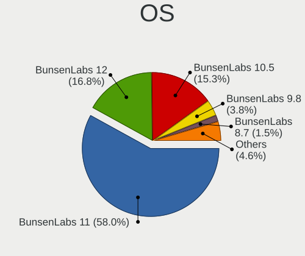

| Name            | Computers | Percent |
|-----------------|-----------|---------|
| BunsenLabs 11   | 76        | 58.02%  |
| BunsenLabs 12   | 22        | 16.79%  |
| BunsenLabs 10.5 | 20        | 15.27%  |
| BunsenLabs 9.8  | 5         | 3.82%   |
| BunsenLabs 8.7  | 2         | 1.53%   |
| BunsenLabs 13   | 2         | 1.53%   |
| BunsenLabs 10.0 | 2         | 1.53%   |
| BunsenLabs 8.4  | 1         | 0.76%   |
| BunsenLabs 10.4 | 1         | 0.76%   |

OS Family
---------

OS without a version

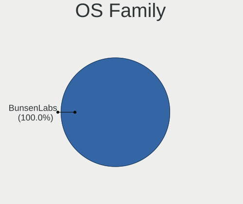

| Name       | Computers | Percent |
|------------|-----------|---------|
| BunsenLabs | 126       | 100%    |

Kernel
------

Version of the Linux kernel

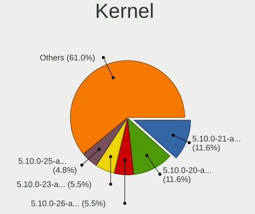

| Version                 | Computers | Percent |
|-------------------------|-----------|---------|
| 5.10.0-21-amd64         | 17        | 11.64%  |
| 5.10.0-20-amd64         | 17        | 11.64%  |
| 5.10.0-26-amd64         | 8         | 5.48%   |
| 5.10.0-23-amd64         | 8         | 5.48%   |
| 5.10.0-25-amd64         | 7         | 4.79%   |
| 5.10.0-21-686-pae       | 5         | 3.42%   |
| 6.1.0-18-amd64          | 4         | 2.74%   |
| 4.19.0-18-amd64         | 4         | 2.74%   |
| 5.10.0-27-amd64         | 3         | 2.05%   |
| 5.10.0-22-amd64         | 3         | 2.05%   |
| 6.1.0-37-amd64          | 2         | 1.37%   |
| 6.1.0-32-amd64          | 2         | 1.37%   |
| 6.1.0-31-amd64          | 2         | 1.37%   |
| 6.1.0-26-amd64          | 2         | 1.37%   |
| 6.1.0-23-amd64          | 2         | 1.37%   |
| 5.10.0-3-amd64          | 2         | 1.37%   |
| 5.10.0-26-686-pae       | 2         | 1.37%   |
| 5.10.0-20-686           | 2         | 1.37%   |
| 5.10.0-19-amd64         | 2         | 1.37%   |
| 4.9.0-9-amd64           | 2         | 1.37%   |
| 4.19.0-23-amd64         | 2         | 1.37%   |
| 3.16.0-4-amd64          | 2         | 1.37%   |
| 6.9.7+bpo-amd64         | 1         | 0.68%   |
| 6.6.7-zen1KernelZenv2-1 | 1         | 0.68%   |
| 6.16.12+deb14+1-amd64   | 1         | 0.68%   |
| 6.12.48+deb13-amd64     | 1         | 0.68%   |
| 6.11.11-x64v3-xanmod1   | 1         | 0.68%   |
| 6.1.0-7-amd64           | 1         | 0.68%   |
| 6.1.0-34-amd64          | 1         | 0.68%   |
| 6.1.0-33-amd64          | 1         | 0.68%   |
| 6.1.0-29-686-pae        | 1         | 0.68%   |
| 6.1.0-28-amd64          | 1         | 0.68%   |
| 6.1.0-21-amd64          | 1         | 0.68%   |
| 6.1.0-16-amd64          | 1         | 0.68%   |
| 6.1.0-13-amd64          | 1         | 0.68%   |
| 6.1.0-13-686            | 1         | 0.68%   |
| 6.1.0-10-686            | 1         | 0.68%   |
| 5.9.0-3-amd64           | 1         | 0.68%   |
| 5.9.0-0.bpo.2-amd64     | 1         | 0.68%   |
| 5.8.0-0.bpo.2-amd64     | 1         | 0.68%   |

Kernel Family
-------------

Linux kernel without a distro release

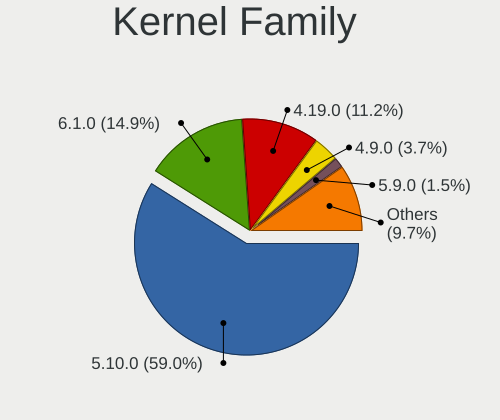

| Version | Computers | Percent |
|---------|-----------|---------|
| 5.10.0  | 79        | 58.96%  |
| 6.1.0   | 20        | 14.93%  |
| 4.19.0  | 15        | 11.19%  |
| 4.9.0   | 5         | 3.73%   |
| 5.9.0   | 2         | 1.49%   |
| 5.7.0   | 2         | 1.49%   |
| 5.4.0   | 2         | 1.49%   |
| 3.16.0  | 2         | 1.49%   |
| 6.9.7   | 1         | 0.75%   |
| 6.6.7   | 1         | 0.75%   |
| 6.16.12 | 1         | 0.75%   |
| 6.12.48 | 1         | 0.75%   |
| 6.11.11 | 1         | 0.75%   |
| 5.8.0   | 1         | 0.75%   |
| 5.16.0  | 1         | 0.75%   |

Kernel Major Ver.
-----------------

Linux kernel major version

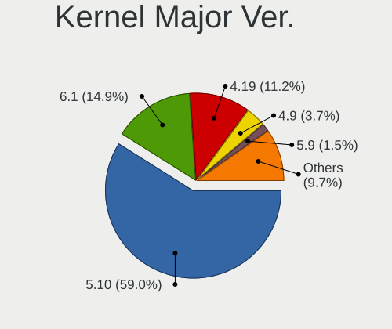

| Version | Computers | Percent |
|---------|-----------|---------|
| 5.10    | 79        | 58.96%  |
| 6.1     | 20        | 14.93%  |
| 4.19    | 15        | 11.19%  |
| 4.9     | 5         | 3.73%   |
| 5.9     | 2         | 1.49%   |
| 5.7     | 2         | 1.49%   |
| 5.4     | 2         | 1.49%   |
| 3.16    | 2         | 1.49%   |
| 6.9     | 1         | 0.75%   |
| 6.6     | 1         | 0.75%   |
| 6.16    | 1         | 0.75%   |
| 6.12    | 1         | 0.75%   |
| 6.11    | 1         | 0.75%   |
| 5.8     | 1         | 0.75%   |
| 5.16    | 1         | 0.75%   |

Arch
----

OS architecture (x86_64, i586, etc.)

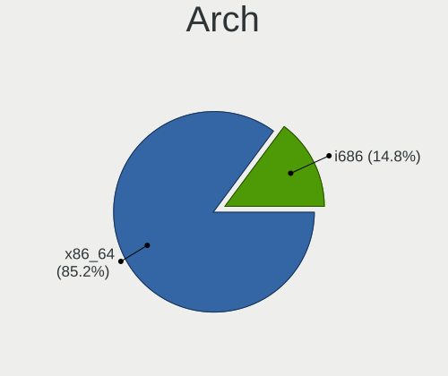

| Name   | Computers | Percent |
|--------|-----------|---------|
| x86_64 | 109       | 85.16%  |
| i686   | 19        | 14.84%  |

DE
--

Desktop Environment

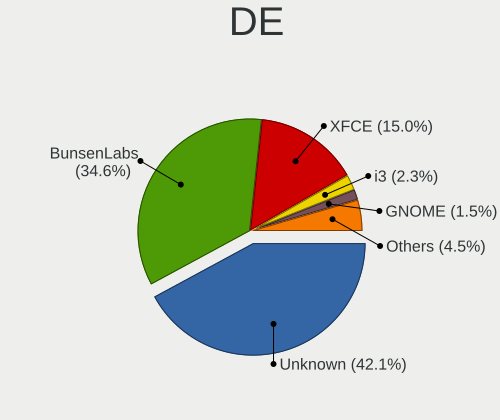

| Name            | Computers | Percent |
|-----------------|-----------|---------|
| Unknown         | 56        | 42.11%  |
| BunsenLabs      | 46        | 34.59%  |
| XFCE            | 20        | 15.04%  |
| i3              | 3         | 2.26%   |
| GNOME           | 2         | 1.5%    |
| BunsenLabs:XFCE | 2         | 1.5%    |
| X-Cinnamon      | 1         | 0.75%   |
| openbox         | 1         | 0.75%   |
| MATE            | 1         | 0.75%   |
| KDE5            | 1         | 0.75%   |

Display Server
--------------

X11 or Wayland

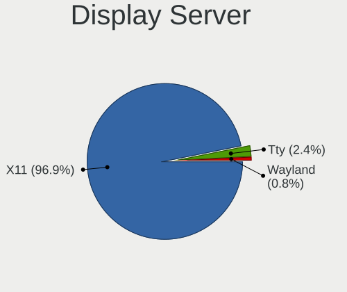

| Name    | Computers | Percent |
|---------|-----------|---------|
| X11     | 123       | 96.85%  |
| Tty     | 3         | 2.36%   |
| Wayland | 1         | 0.79%   |

Display Manager
---------------

SDDM, LightDM, etc.

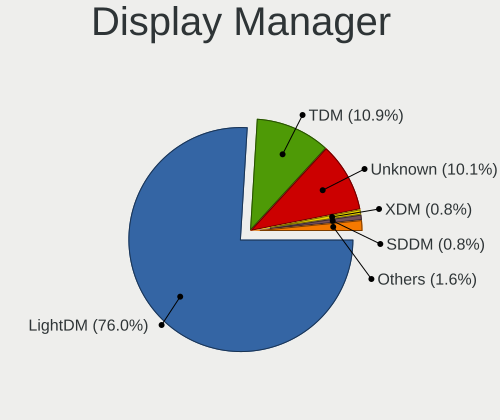

| Name    | Computers | Percent |
|---------|-----------|---------|
| LightDM | 98        | 75.97%  |
| TDM     | 14        | 10.85%  |
| Unknown | 13        | 10.08%  |
| XDM     | 1         | 0.78%   |
| SDDM    | 1         | 0.78%   |
| LXDM    | 1         | 0.78%   |
| GDM3    | 1         | 0.78%   |

OS Lang
-------

Language

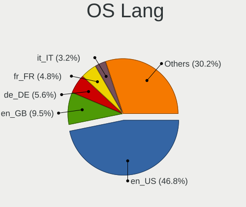

| Lang       | Computers | Percent |
|------------|-----------|---------|
| en_US      | 59        | 46.83%  |
| en_GB      | 12        | 9.52%   |
| de_DE      | 7         | 5.56%   |
| fr_FR      | 6         | 4.76%   |
| it_IT      | 4         | 3.17%   |
| Unknown    | 4         | 3.17%   |
| sv_SE      | 3         | 2.38%   |
| pt_BR      | 3         | 2.38%   |
| en_CA      | 3         | 2.38%   |
| en_AU      | 3         | 2.38%   |
| tr_TR      | 2         | 1.59%   |
| pl_PL      | 2         | 1.59%   |
| es_SV      | 2         | 1.59%   |
| en_PH      | 2         | 1.59%   |
| ca_ES      | 2         | 1.59%   |
| ru_UA      | 1         | 0.79%   |
| ru_RU      | 1         | 0.79%   |
| nl_NL      | 1         | 0.79%   |
| hu_HU      | 1         | 0.79%   |
| es_US      | 1         | 0.79%   |
| es_ES      | 1         | 0.79%   |
| es_CO      | 1         | 0.79%   |
| es_AR      | 1         | 0.79%   |
| en_IE      | 1         | 0.79%   |
| de_DE.UTF8 | 1         | 0.79%   |
| C          | 1         | 0.79%   |
| bg_BG      | 1         | 0.79%   |

Boot Mode
---------

EFI or BIOS

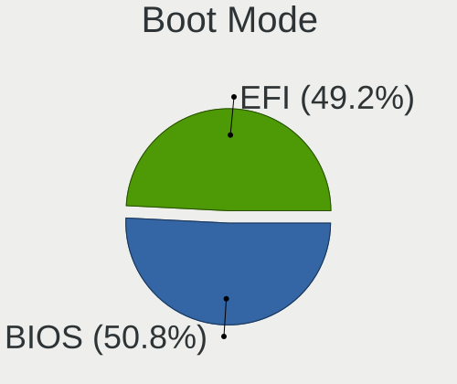

| Mode | Computers | Percent |
|------|-----------|---------|
| BIOS | 64        | 50.79%  |
| EFI  | 62        | 49.21%  |

Filesystem
----------

Type of filesystem

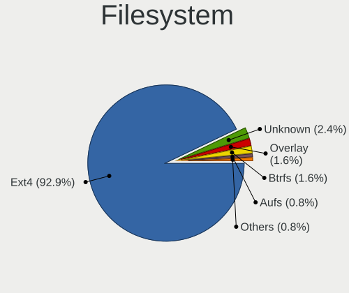

| Type    | Computers | Percent |
|---------|-----------|---------|
| Ext4    | 118       | 92.91%  |
| Unknown | 3         | 2.36%   |
| Overlay | 2         | 1.57%   |
| Btrfs   | 2         | 1.57%   |
| XXXXXXX | 1         | 0.79%   |
| Aufs    | 1         | 0.79%   |

Part. scheme
------------

Scheme of partitioning

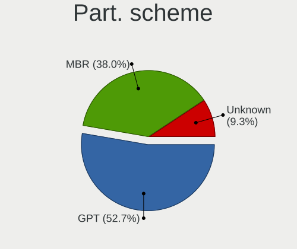

| Type    | Computers | Percent |
|---------|-----------|---------|
| GPT     | 68        | 52.71%  |
| MBR     | 49        | 37.98%  |
| Unknown | 12        | 9.3%    |

Dual Boot with Linux/BSD
------------------------

Hosting more than one Linux/BSD

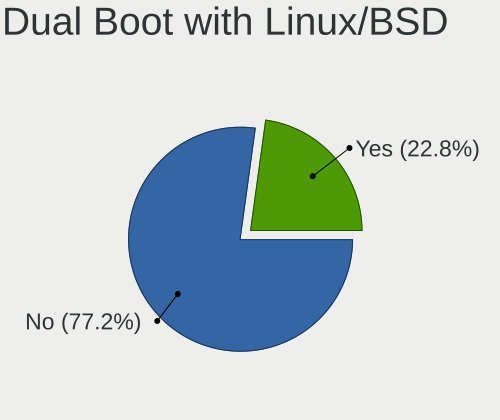

| Dual boot | Computers | Percent |
|-----------|-----------|---------|
| No        | 98        | 77.17%  |
| Yes       | 29        | 22.83%  |

Dual Boot (Win)
---------------

Hosting Linux and Windows

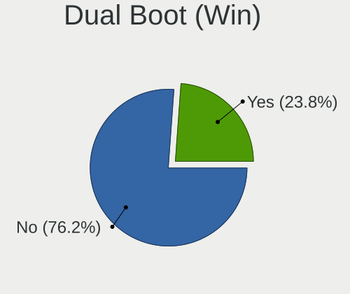

| Dual boot | Computers | Percent |
|-----------|-----------|---------|
| No        | 99        | 76.15%  |
| Yes       | 31        | 23.85%  |

Board
-----

Vendor
------

Motherboard manufacturer

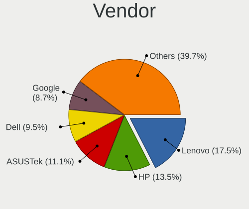

| Name                           | Computers | Percent |
|--------------------------------|-----------|---------|
| Lenovo                         | 22        | 17.46%  |
| Hewlett-Packard                | 17        | 13.49%  |
| ASUSTek Computer               | 14        | 11.11%  |
| Dell                           | 12        | 9.52%   |
| Google                         | 11        | 8.73%   |
| Apple                          | 8         | 6.35%   |
| Acer                           | 8         | 6.35%   |
| MSI                            | 5         | 3.97%   |
| Sony                           | 4         | 3.17%   |
| ASRock                         | 4         | 3.17%   |
| Toshiba                        | 3         | 2.38%   |
| Intel                          | 3         | 2.38%   |
| IBM                            | 2         | 1.59%   |
| Fujitsu                        | 2         | 1.59%   |
| WinPAD 110W                    | 1         | 0.79%   |
| Samsung Electronics            | 1         | 0.79%   |
| Matsushita Electric Industrial | 1         | 0.79%   |
| LG Electronics                 | 1         | 0.79%   |
| HUAWEI                         | 1         | 0.79%   |
| Gateway                        | 1         | 0.79%   |
| EVERCOM NETWORK                | 1         | 0.79%   |
| eMachines                      | 1         | 0.79%   |
| Compaq Presario 06             | 1         | 0.79%   |
| Chuwi                          | 1         | 0.79%   |
| Advent                         | 1         | 0.79%   |

Model
-----

Motherboard model

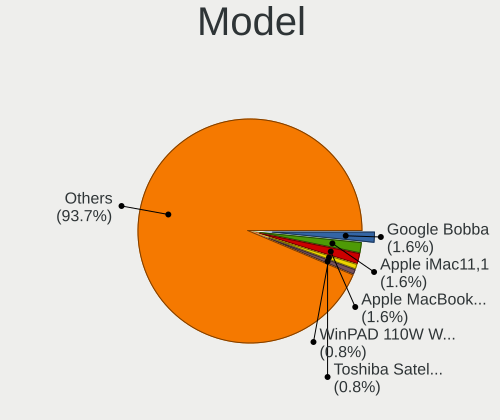

| Name                                        | Computers | Percent |
|---------------------------------------------|-----------|---------|
| Google Bobba                                | 2         | 1.59%   |
| Apple MacBookAir6,2                         | 2         | 1.59%   |
| Apple iMac11,1                              | 2         | 1.59%   |
| WinPAD 110W WinPAD 110W                     | 1         | 0.79%   |
| Toshiba Satellite P50T-A-114                | 1         | 0.79%   |
| Toshiba Satellite L300                      | 1         | 0.79%   |
| Toshiba QOSMIO X505                         | 1         | 0.79%   |
| Sony VPCSB2L1R                              | 1         | 0.79%   |
| Sony VPCEH2J1E                              | 1         | 0.79%   |
| Sony VPCEG18FG                              | 1         | 0.79%   |
| Sony VGN-FW11L                              | 1         | 0.79%   |
| Samsung 275E4E/275E5E                       | 1         | 0.79%   |
| MSI Summit E13FlipEvo A12MT                 | 1         | 0.79%   |
| MSI MS-7C95                                 | 1         | 0.79%   |
| MSI MS-7786                                 | 1         | 0.79%   |
| MSI MS-7641                                 | 1         | 0.79%   |
| MSI MS-7093                                 | 1         | 0.79%   |
| Matsushita Electric Industrial CF-74GCDADBM | 1         | 0.79%   |
| LG X120-G.C7VPG                             | 1         | 0.79%   |
| Lenovo V110-14IAP 80TF                      | 1         | 0.79%   |
| Lenovo ThinkPad X60 Tablet 6365CTO          | 1         | 0.79%   |
| Lenovo ThinkPad X1 Nano Gen 1 20UN0064GE    | 1         | 0.79%   |
| Lenovo ThinkPad T490 20N2000CMC             | 1         | 0.79%   |
| Lenovo ThinkPad T480s 20L70028US            | 1         | 0.79%   |
| Lenovo ThinkPad T470p 20J6003KUS            | 1         | 0.79%   |
| Lenovo ThinkPad T450s 20BWA0GSIA            | 1         | 0.79%   |
| Lenovo ThinkPad T440s 20AR003RMS            | 1         | 0.79%   |
| Lenovo ThinkPad T430 23473T1                | 1         | 0.79%   |
| Lenovo ThinkPad R400 7440WWQ                | 1         | 0.79%   |
| Lenovo ThinkPad P53 20QNS00X00              | 1         | 0.79%   |
| Lenovo ThinkPad L440 20ASS34900             | 1         | 0.79%   |
| Lenovo ThinkPad E570 20H50070IX             | 1         | 0.79%   |
| Lenovo ThinkCentre M73z 10BC002CUS          | 1         | 0.79%   |
| Lenovo IdeaPad Z580                         | 1         | 0.79%   |
| Lenovo IdeaPad S410p 20296                  | 1         | 0.79%   |
| Lenovo IdeaPad 320-15ABR 80XS               | 1         | 0.79%   |
| Lenovo IdeaPad 3 15IGL05 81WQ               | 1         | 0.79%   |
| Lenovo IdeaPad 110S-11IBR 80WG              | 1         | 0.79%   |
| Lenovo IdeaPad 110-15ISK 80UD               | 1         | 0.79%   |
| Lenovo IdeaPad 1 15IGL7 82V7                | 1         | 0.79%   |

Model Family
------------

Motherboard model prefix

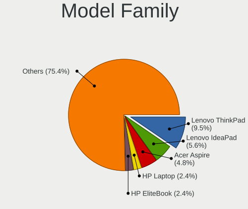

| Name                                        | Computers | Percent |
|---------------------------------------------|-----------|---------|
| Lenovo ThinkPad                             | 12        | 9.52%   |
| Lenovo IdeaPad                              | 7         | 5.56%   |
| Acer Aspire                                 | 6         | 4.76%   |
| HP Laptop                                   | 3         | 2.38%   |
| HP EliteBook                                | 3         | 2.38%   |
| Dell Precision                              | 3         | 2.38%   |
| Dell Latitude                               | 3         | 2.38%   |
| Dell Inspiron                               | 3         | 2.38%   |
| Toshiba Satellite                           | 2         | 1.59%   |
| IBM ThinkPad                                | 2         | 1.59%   |
| HP Stream                                   | 2         | 1.59%   |
| HP Mini                                     | 2         | 1.59%   |
| Google Bobba                                | 2         | 1.59%   |
| Apple MacBookAir6                           | 2         | 1.59%   |
| Apple iMac11                                | 2         | 1.59%   |
| WinPAD 110W WinPAD                          | 1         | 0.79%   |
| Toshiba QOSMIO                              | 1         | 0.79%   |
| Sony VPCSB2L1R                              | 1         | 0.79%   |
| Sony VPCEH2J1E                              | 1         | 0.79%   |
| Sony VPCEG18FG                              | 1         | 0.79%   |
| Sony VGN-FW11L                              | 1         | 0.79%   |
| Samsung 275E4E                              | 1         | 0.79%   |
| MSI Summit                                  | 1         | 0.79%   |
| MSI MS-7C95                                 | 1         | 0.79%   |
| MSI MS-7786                                 | 1         | 0.79%   |
| MSI MS-7641                                 | 1         | 0.79%   |
| MSI MS-7093                                 | 1         | 0.79%   |
| Matsushita Electric Industrial CF-74GCDADBM | 1         | 0.79%   |
| LG X120-G.C7VPG                             | 1         | 0.79%   |
| Lenovo V110-14IAP                           | 1         | 0.79%   |
| Lenovo ThinkCentre                          | 1         | 0.79%   |
| Lenovo G700                                 | 1         | 0.79%   |
| Intel DB85FL                                | 1         | 0.79%   |
| Intel D946GZIS                              | 1         | 0.79%   |
| Intel D525MW                                | 1         | 0.79%   |
| HUAWEI BOM-WXX9                             | 1         | 0.79%   |
| HP ZBook                                    | 1         | 0.79%   |
| HP ProDesk                                  | 1         | 0.79%   |
| HP ProBook                                  | 1         | 0.79%   |
| HP Presario                                 | 1         | 0.79%   |

MFG Year
--------

Motherboard manufacture year

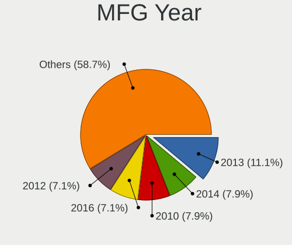

| Year    | Computers | Percent |
|---------|-----------|---------|
| 2013    | 14        | 11.11%  |
| 2014    | 10        | 7.94%   |
| 2010    | 10        | 7.94%   |
| 2016    | 9         | 7.14%   |
| 2012    | 9         | 7.14%   |
| 2011    | 8         | 6.35%   |
| 2023    | 6         | 4.76%   |
| 2022    | 6         | 4.76%   |
| 2020    | 6         | 4.76%   |
| 2019    | 6         | 4.76%   |
| 2017    | 6         | 4.76%   |
| 2008    | 6         | 4.76%   |
| 2009    | 5         | 3.97%   |
| 2007    | 5         | 3.97%   |
| 2018    | 4         | 3.17%   |
| 2006    | 4         | 3.17%   |
| 2005    | 4         | 3.17%   |
| 2024    | 2         | 1.59%   |
| 2015    | 2         | 1.59%   |
| 2021    | 1         | 0.79%   |
| 2003    | 1         | 0.79%   |
| 2002    | 1         | 0.79%   |
| Unknown | 1         | 0.79%   |

Form Factor
-----------

Physical design of the computer

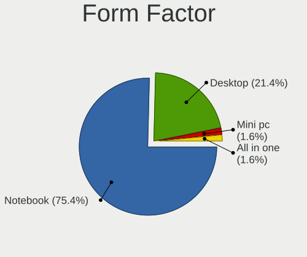

| Name       | Computers | Percent |
|------------|-----------|---------|
| Notebook   | 95        | 75.4%   |
| Desktop    | 27        | 21.43%  |
| Mini pc    | 2         | 1.59%   |
| All in one | 2         | 1.59%   |

Secure Boot
-----------

Enabled or disabled

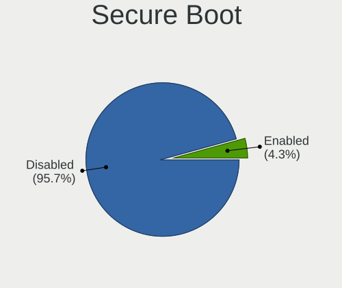

| State    | Computers | Percent |
|----------|-----------|---------|
| Disabled | 120       | 95.24%  |
| Enabled  | 6         | 4.76%   |

Coreboot
--------

Have coreboot on board

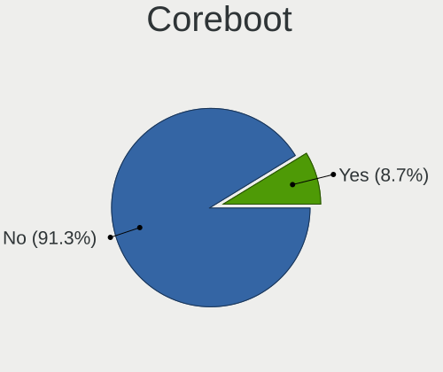

| Used | Computers | Percent |
|------|-----------|---------|
| No   | 115       | 91.27%  |
| Yes  | 11        | 8.73%   |

RAM Size
--------

Total RAM memory

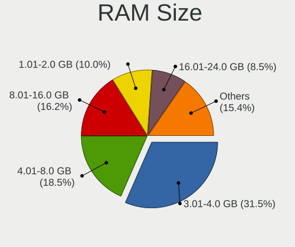

| Size in GB  | Computers | Percent |
|-------------|-----------|---------|
| 3.01-4.0    | 41        | 31.54%  |
| 4.01-8.0    | 24        | 18.46%  |
| 8.01-16.0   | 21        | 16.15%  |
| 1.01-2.0    | 13        | 10%     |
| 16.01-24.0  | 11        | 8.46%   |
| 0.51-1.0    | 9         | 6.92%   |
| 2.01-3.0    | 5         | 3.85%   |
| 32.01-64.0  | 3         | 2.31%   |
| 24.01-32.0  | 2         | 1.54%   |
| 64.01-256.0 | 1         | 0.77%   |

RAM Used
--------

Used RAM memory

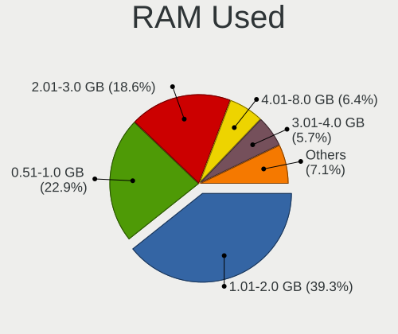

| Used GB   | Computers | Percent |
|-----------|-----------|---------|
| 1.01-2.0  | 55        | 39.29%  |
| 0.51-1.0  | 32        | 22.86%  |
| 2.01-3.0  | 26        | 18.57%  |
| 4.01-8.0  | 9         | 6.43%   |
| 3.01-4.0  | 8         | 5.71%   |
| 0.01-0.5  | 8         | 5.71%   |
| 8.01-16.0 | 2         | 1.43%   |

Total Drives
------------

Number of drives on board

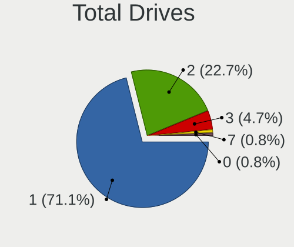

| Drives | Computers | Percent |
|--------|-----------|---------|
| 1      | 91        | 71.09%  |
| 2      | 29        | 22.66%  |
| 3      | 6         | 4.69%   |
| 7      | 1         | 0.78%   |
| 0      | 1         | 0.78%   |

Has CD-ROM
----------

Has CD-ROM on board

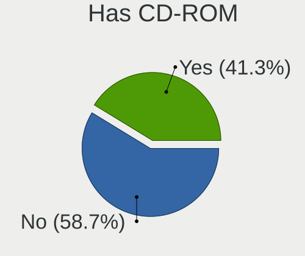

| Presented | Computers | Percent |
|-----------|-----------|---------|
| No        | 74        | 58.73%  |
| Yes       | 52        | 41.27%  |

Has Ethernet
------------

Has Ethernet on board

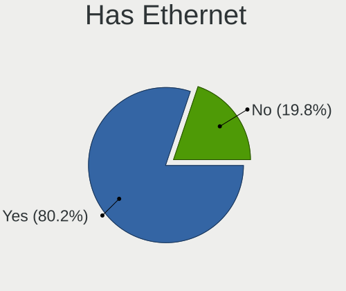

| Presented | Computers | Percent |
|-----------|-----------|---------|
| Yes       | 101       | 80.16%  |
| No        | 25        | 19.84%  |

Has WiFi
--------

Has WiFi module

| Presented | Computers | Percent |
|-----------|-----------|---------|
| Yes       | 107       | 84.92%  |
| No        | 19        | 15.08%  |

Has Bluetooth
-------------

Has Bluetooth module

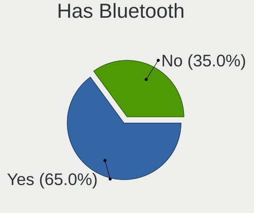

| Presented | Computers | Percent |
|-----------|-----------|---------|
| Yes       | 82        | 65.08%  |
| No        | 44        | 34.92%  |

Location
--------

Country
-------

Geographic location (country)

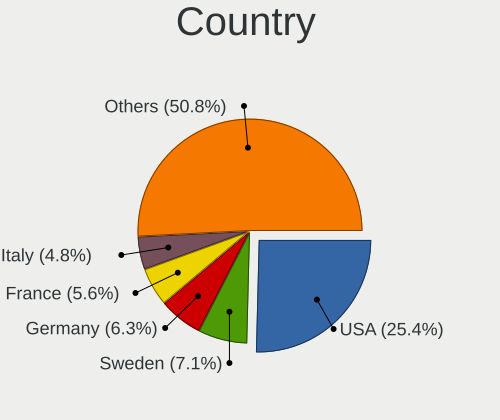

| Country                | Computers | Percent |
|------------------------|-----------|---------|
| USA                    | 32        | 25.4%   |
| Sweden                 | 9         | 7.14%   |
| Germany                | 8         | 6.35%   |
| France                 | 7         | 5.56%   |
| Italy                  | 6         | 4.76%   |
| UK                     | 5         | 3.97%   |
| Spain                  | 5         | 3.97%   |
| Brazil                 | 5         | 3.97%   |
| Turkey                 | 4         | 3.17%   |
| Canada                 | 4         | 3.17%   |
| Poland                 | 3         | 2.38%   |
| Bulgaria               | 3         | 2.38%   |
| Australia              | 3         | 2.38%   |
| Russia                 | 2         | 1.59%   |
| Philippines            | 2         | 1.59%   |
| Netherlands            | 2         | 1.59%   |
| Japan                  | 2         | 1.59%   |
| India                  | 2         | 1.59%   |
| El Salvador            | 2         | 1.59%   |
| Argentina              | 2         | 1.59%   |
| Venezuela              | 1         | 0.79%   |
| Ukraine                | 1         | 0.79%   |
| Slovakia               | 1         | 0.79%   |
| Serbia                 | 1         | 0.79%   |
| Portugal               | 1         | 0.79%   |
| Morocco                | 1         | 0.79%   |
| Mexico                 | 1         | 0.79%   |
| Malaysia               | 1         | 0.79%   |
| Jamaica                | 1         | 0.79%   |
| Israel                 | 1         | 0.79%   |
| Ireland                | 1         | 0.79%   |
| Indonesia              | 1         | 0.79%   |
| Hungary                | 1         | 0.79%   |
| Guatemala              | 1         | 0.79%   |
| Greece                 | 1         | 0.79%   |
| Czechia                | 1         | 0.79%   |
| Colombia               | 1         | 0.79%   |
| Bosnia and Herzegovina | 1         | 0.79%   |

City
----

Geographic location (city)

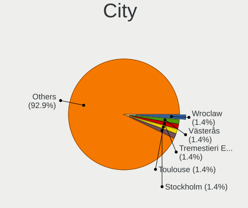

| City                  | Computers | Percent |
|-----------------------|-----------|---------|
| Wroclaw               | 2         | 1.42%   |
| Västerås            | 2         | 1.42%   |
| Tremestieri Etneo     | 2         | 1.42%   |
| Toulouse              | 2         | 1.42%   |
| Stockholm             | 2         | 1.42%   |
| San Salvador          | 2         | 1.42%   |
| Saint Paul            | 2         | 1.42%   |
| Pernik                | 2         | 1.42%   |
| Mumbai                | 2         | 1.42%   |
| Le Pont-de-Claix      | 2         | 1.42%   |
| Istanbul              | 2         | 1.42%   |
| Harrisonburg          | 2         | 1.42%   |
| Falun                 | 2         | 1.42%   |
| Barcelona             | 2         | 1.42%   |
| Wilsonville           | 1         | 0.71%   |
| Walsall               | 1         | 0.71%   |
| Vigo                  | 1         | 0.71%   |
| Victoria              | 1         | 0.71%   |
| Uppsala               | 1         | 0.71%   |
| Turin                 | 1         | 0.71%   |
| Truckee               | 1         | 0.71%   |
| Thessaloniki          | 1         | 0.71%   |
| The Hague             | 1         | 0.71%   |
| Telde                 | 1         | 0.71%   |
| Syracuse              | 1         | 0.71%   |
| Surabaya              | 1         | 0.71%   |
| Strasburg             | 1         | 0.71%   |
| Springfield           | 1         | 0.71%   |
| South Shields         | 1         | 0.71%   |
| Södertälje          | 1         | 0.71%   |
| Sloviansk             | 1         | 0.71%   |
| Skövde               | 1         | 0.71%   |
| Shinjuku              | 1         | 0.71%   |
| Shakopee              | 1         | 0.71%   |
| Seville               | 1         | 0.71%   |
| Secaucus              | 1         | 0.71%   |
| Scranton              | 1         | 0.71%   |
| Sarajevo              | 1         | 0.71%   |
| Sao Bernardo do Campo | 1         | 0.71%   |
| San Juan              | 1         | 0.71%   |

Drives
------

Drive Vendor
------------

Hard drive vendors

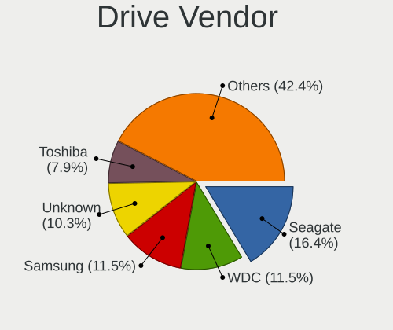

| Vendor              | Computers | Drives  | Percent |
|---------------------|-----------|---------|---------|
| Seagate             | 27        | 35      | 16.36%  |
| WDC                 | 19        | 23      | 11.52%  |
| Samsung Electronics | 19        | 22      | 11.52%  |
| Unknown             | 17        | 25      | 10.3%   |
| Toshiba             | 13        | 22      | 7.88%   |
| Kingston            | 7         | 7       | 4.24%   |
| SanDisk             | 6         | 6       | 3.64%   |
| Intel               | 6         | 7       | 3.64%   |
| Crucial             | 6         | 8       | 3.64%   |
| SK hynix            | 5         | 5       | 3.03%   |
| Apple               | 4         | 4       | 2.42%   |
| Micron Technology   | 3         | 3       | 1.82%   |
| Hitachi             | 3         | 3       | 1.82%   |
| LDLC                | 2         | 3       | 1.21%   |
| KingSpec            | 2         | 2       | 1.21%   |
| Fujitsu             | 2         | 2       | 1.21%   |
| walram              | 1         | 2       | 0.61%   |
| USB2.0              | 1         | 1       | 0.61%   |
| Timetec             | 1         | 1       | 0.61%   |
| Silicon Motion      | 1         | 1       | 0.61%   |
| OWC                 | 1         | 1       | 0.61%   |
| Mushkin             | 1         | 1       | 0.61%   |
| LITEONIT            | 1         | 1       | 0.61%   |
| LITEON              | 1         | 1       | 0.61%   |
| KIOXIA-EXCERIA      | 1         | 3       | 0.61%   |
| KIOXIA              | 1         | 2       | 0.61%   |
| JMicron Technology  | 1         | 1       | 0.61%   |
| HUAWEI              | 1         | 1       | 0.61%   |
| HL-DT-ST            | 1         | Unknown | 0.61%   |
| HGST                | 1         | 1       | 0.61%   |
| Hewlett-Packard     | 1         | 1       | 0.61%   |
| HAGIWARA            | 1         | 1       | 0.61%   |
| Fanxiang            | 1         | 1       | 0.61%   |
| EYOTA               | 1         | 1       | 0.61%   |
| Corsair             | 1         | 1       | 0.61%   |
| China               | 1         | 1       | 0.61%   |
| BIWIN               | 1         | 1       | 0.61%   |
| BHT                 | 1         | 1       | 0.61%   |
| A-DATA Technology   | 1         | 1       | 0.61%   |
| Unknown             | 1         | 1       | 0.61%   |

Drive Model
-----------

Hard drive models

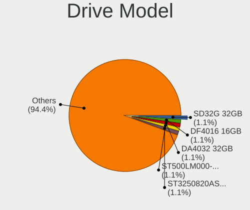

| Model                                             | Computers | Percent |
|---------------------------------------------------|-----------|---------|
| Unknown SD32G  32GB                               | 2         | 1.12%   |
| Unknown DF4016  16GB                              | 2         | 1.12%   |
| Unknown DA4032  32GB                              | 2         | 1.12%   |
| Seagate ST500LM000-1EJ162 500GB                   | 2         | 1.12%   |
| Seagate ST3250820AS 250GB                         | 2         | 1.12%   |
| Seagate ST320LT012-9WS14C 320GB                   | 2         | 1.12%   |
| Seagate ST2000DM001-1CH164 2TB                    | 2         | 1.12%   |
| Seagate ST1000LM035-1RK172 1TB                    | 2         | 1.12%   |
| SanDisk DF4064  64GB                              | 2         | 1.12%   |
| Samsung SSD 850 EVO 250GB                         | 2         | 1.12%   |
| Samsung NVMe SSD Controller SM981/PM981/PM983 1TB | 2         | 1.12%   |
| LDLC SSD 120GB                                    | 2         | 1.12%   |
| Kingston SA400S37240G 240GB SSD                   | 2         | 1.12%   |
| Apple SSD SD0128F 121GB                           | 2         | 1.12%   |
| WDC WDS500G3X0C-00SJG0 500GB                      | 1         | 0.56%   |
| WDC WD800JB-00JJC0 80GB                           | 1         | 0.56%   |
| WDC WD50NPZZ-00A9JT0 5TB                          | 1         | 0.56%   |
| WDC WD5000LPVX-75V0TT0 500GB                      | 1         | 0.56%   |
| WDC WD5000LPVX-22V0TT0 500GB                      | 1         | 0.56%   |
| WDC WD5000AZLX-08K2TA0 500GB                      | 1         | 0.56%   |
| WDC WD5000AAKX-001CA0 500GB                       | 1         | 0.56%   |
| WDC WD3200BEVT-22ZCT0 320GB                       | 1         | 0.56%   |
| WDC WD3200BEVT-08A23T1 320GB                      | 1         | 0.56%   |
| WDC WD20EZRX-00D8PB0 2TB                          | 1         | 0.56%   |
| WDC WD20EARX-00PASB0 2TB                          | 1         | 0.56%   |
| WDC WD1600AAJS-75B4A0 160GB                       | 1         | 0.56%   |
| WDC WD1600AABS-52PRA0 160GB                       | 1         | 0.56%   |
| WDC WD10JPVX-22JC3T0 1TB                          | 1         | 0.56%   |
| WDC WD10JPVX-08JC3T6 1TB                          | 1         | 0.56%   |
| WDC WD10EZEX-60M2NA0 1TB                          | 1         | 0.56%   |
| WDC WD10EFRX-68FYTN0 1TB                          | 1         | 0.56%   |
| WDC WD10EARX-32N0YB0 1TB                          | 1         | 0.56%   |
| WDC WD10EADS-00L5B1 1TB                           | 1         | 0.56%   |
| WDC PC SN520 NVMe 256GB                           | 1         | 0.56%   |
| walram 60G                                        | 1         | 0.56%   |
| USB2.0 CardReader                                 | 1         | 0.56%   |
| Unknown SDC  8GB                                  | 1         | 0.56%   |
| Unknown SD16G  16GB                               | 1         | 0.56%   |
| Unknown SD08G  8GB                                | 1         | 0.56%   |
| Unknown NVMe SSD Drive 128GB                      | 1         | 0.56%   |

HDD Vendor
----------

Hard disk drive vendors

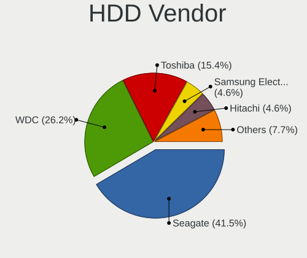

| Vendor              | Computers | Drives | Percent |
|---------------------|-----------|--------|---------|
| Seagate             | 27        | 35     | 41.54%  |
| WDC                 | 17        | 21     | 26.15%  |
| Toshiba             | 10        | 12     | 15.38%  |
| Samsung Electronics | 3         | 3      | 4.62%   |
| Hitachi             | 3         | 3      | 4.62%   |
| Fujitsu             | 2         | 2      | 3.08%   |
| JMicron Technology  | 1         | 1      | 1.54%   |
| HGST                | 1         | 1      | 1.54%   |
| Apple               | 1         | 1      | 1.54%   |

SSD Vendor
----------

Solid state drive vendors

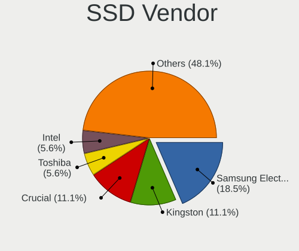

| Vendor              | Computers | Drives | Percent |
|---------------------|-----------|--------|---------|
| Samsung Electronics | 10        | 11     | 18.52%  |
| Kingston            | 6         | 6      | 11.11%  |
| Crucial             | 6         | 8      | 11.11%  |
| Toshiba             | 3         | 10     | 5.56%   |
| Intel               | 3         | 3      | 5.56%   |
| Apple               | 3         | 3      | 5.56%   |
| SK hynix            | 2         | 2      | 3.7%    |
| SanDisk             | 2         | 2      | 3.7%    |
| Micron Technology   | 2         | 2      | 3.7%    |
| LDLC                | 2         | 2      | 3.7%    |
| KingSpec            | 2         | 2      | 3.7%    |
| Timetec             | 1         | 1      | 1.85%   |
| OWC                 | 1         | 1      | 1.85%   |
| Mushkin             | 1         | 1      | 1.85%   |
| LITEONIT            | 1         | 1      | 1.85%   |
| LITEON              | 1         | 1      | 1.85%   |
| KIOXIA-EXCERIA      | 1         | 3      | 1.85%   |
| HAGIWARA            | 1         | 1      | 1.85%   |
| EYOTA               | 1         | 1      | 1.85%   |
| Corsair             | 1         | 1      | 1.85%   |
| China               | 1         | 1      | 1.85%   |
| BIWIN               | 1         | 1      | 1.85%   |
| BHT                 | 1         | 1      | 1.85%   |
| A-DATA Technology   | 1         | 1      | 1.85%   |

Drive Kind
----------

HDD or SSD

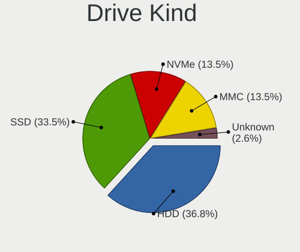

| Kind    | Computers | Drives | Percent |
|---------|-----------|--------|---------|
| HDD     | 57        | 79     | 36.77%  |
| SSD     | 52        | 66     | 33.55%  |
| MMC     | 21        | 29     | 13.55%  |
| NVMe    | 21        | 26     | 13.55%  |
| Unknown | 4         | 4      | 2.58%   |

Drive Connector
---------------

SATA, SAS, NVMe, etc.

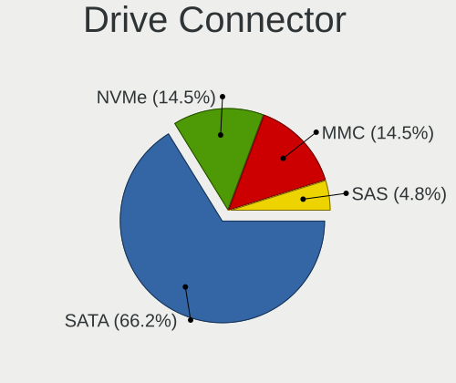

| Type | Computers | Drives | Percent |
|------|-----------|--------|---------|
| SATA | 96        | 143    | 66.21%  |
| NVMe | 21        | 26     | 14.48%  |
| MMC  | 21        | 29     | 14.48%  |
| SAS  | 7         | 6      | 4.83%   |

Drive Size
----------

Size of hard drive

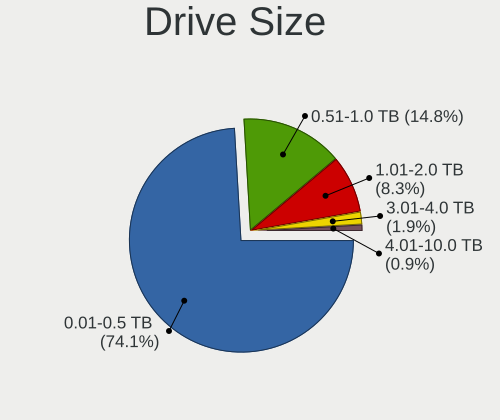

| Size in TB | Computers | Drives | Percent |
|------------|-----------|--------|---------|
| 0.01-0.5   | 80        | 113    | 74.07%  |
| 0.51-1.0   | 16        | 18     | 14.81%  |
| 1.01-2.0   | 9         | 11     | 8.33%   |
| 3.01-4.0   | 2         | 2      | 1.85%   |
| 4.01-10.0  | 1         | 1      | 0.93%   |

Space Total
-----------

Amount of disk space available on the file system

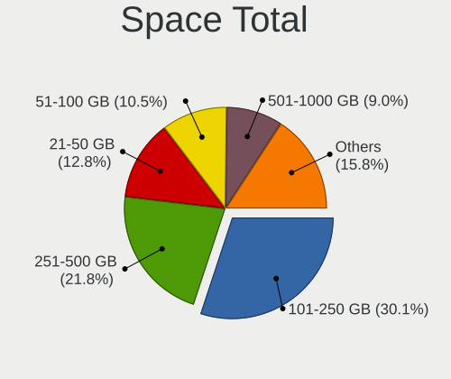

| Size in GB     | Computers | Percent |
|----------------|-----------|---------|
| 101-250        | 40        | 30.08%  |
| 251-500        | 29        | 21.8%   |
| 21-50          | 17        | 12.78%  |
| 51-100         | 14        | 10.53%  |
| 501-1000       | 12        | 9.02%   |
| 1-20           | 9         | 6.77%   |
| 1001-2000      | 7         | 5.26%   |
| 2001-3000      | 3         | 2.26%   |
| More than 3000 | 2         | 1.5%    |

Space Used
----------

Amount of used disk space

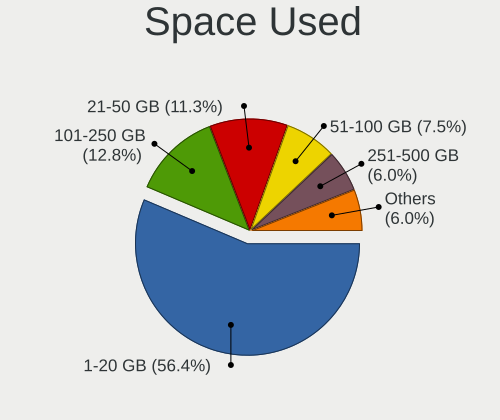

| Used GB        | Computers | Percent |
|----------------|-----------|---------|
| 1-20           | 75        | 56.39%  |
| 101-250        | 17        | 12.78%  |
| 21-50          | 15        | 11.28%  |
| 51-100         | 10        | 7.52%   |
| 251-500        | 8         | 6.02%   |
| 501-1000       | 4         | 3.01%   |
| More than 3000 | 2         | 1.5%    |
| 1001-2000      | 2         | 1.5%    |

Malfunc. Drives
---------------

Drive models with a malfunction

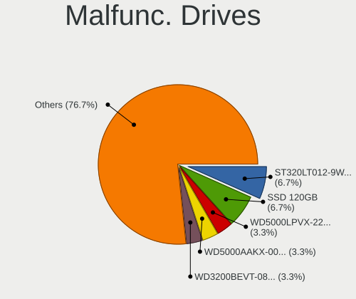

| Model                                          | Computers | Drives | Percent |
|------------------------------------------------|-----------|--------|---------|
| Seagate ST320LT012-9WS14C 320GB                | 2         | 2      | 6.67%   |
| LDLC SSD 120GB                                 | 2         | 2      | 6.67%   |
| WDC WD5000LPVX-22V0TT0 500GB                   | 1         | 1      | 3.33%   |
| WDC WD5000AAKX-001CA0 500GB                    | 1         | 1      | 3.33%   |
| WDC WD3200BEVT-08A23T1 320GB                   | 1         | 2      | 3.33%   |
| WDC WD10EARX-32N0YB0 1TB                       | 1         | 1      | 3.33%   |
| Toshiba MQ01ABF050 500GB                       | 1         | 1      | 3.33%   |
| Toshiba MQ01ABD075 752GB                       | 1         | 1      | 3.33%   |
| Toshiba MQ01ABD032 320GB                       | 1         | 1      | 3.33%   |
| Toshiba MK7575GSX 752GB                        | 1         | 1      | 3.33%   |
| Toshiba MK5059GSXP 500GB                       | 1         | 1      | 3.33%   |
| Toshiba MK4026GAX RoHS 40GB                    | 1         | 2      | 3.33%   |
| Toshiba MK2552GSX 250GB                        | 1         | 1      | 3.33%   |
| Toshiba MK1652GSX 160GB                        | 1         | 1      | 3.33%   |
| Seagate ST500LM021-1KJ152 500GB                | 1         | 2      | 3.33%   |
| Seagate ST3250820AS 250GB                      | 1         | 1      | 3.33%   |
| Seagate ST2000LM003 HN-M201RAD 2TB             | 1         | 1      | 3.33%   |
| Seagate ST2000DM001-1CH164 2TB                 | 1         | 1      | 3.33%   |
| Samsung Electronics HM641JI 640GB              | 1         | 1      | 3.33%   |
| Samsung Electronics HM160HI 160GB              | 1         | 1      | 3.33%   |
| Micron Technology MTFDDAK256MAM-1K12 256GB SSD | 1         | 1      | 3.33%   |
| KingSpec KSD-PA18.6-064MS 64GB SSD             | 1         | 1      | 3.33%   |
| Hitachi HTS723232L9A360 320GB                  | 1         | 1      | 3.33%   |
| Hitachi HTS421260H9AT00 64GB                   | 1         | 1      | 3.33%   |
| Hewlett-Packard SSD EX900 250GB                | 1         | 1      | 3.33%   |
| Crucial C300-CTFDDAC128MAG 128GB SSD           | 1         | 1      | 3.33%   |
| China SSD 120GB                                | 1         | 1      | 3.33%   |
| Apple HDD HTS547575A9E384 752GB                | 1         | 1      | 3.33%   |

Malfunc. Drive Vendor
---------------------

Vendors of faulty drives

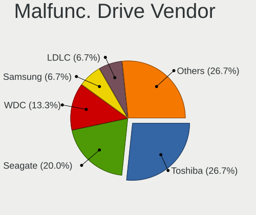

| Vendor              | Computers | Drives | Percent |
|---------------------|-----------|--------|---------|
| Toshiba             | 8         | 9      | 26.67%  |
| Seagate             | 6         | 7      | 20%     |
| WDC                 | 4         | 5      | 13.33%  |
| Samsung Electronics | 2         | 2      | 6.67%   |
| LDLC                | 2         | 2      | 6.67%   |
| Hitachi             | 2         | 2      | 6.67%   |
| Micron Technology   | 1         | 1      | 3.33%   |
| KingSpec            | 1         | 1      | 3.33%   |
| Hewlett-Packard     | 1         | 1      | 3.33%   |
| Crucial             | 1         | 1      | 3.33%   |
| China               | 1         | 1      | 3.33%   |
| Apple               | 1         | 1      | 3.33%   |

Malfunc. HDD Vendor
-------------------

Vendors of faulty HDD drives

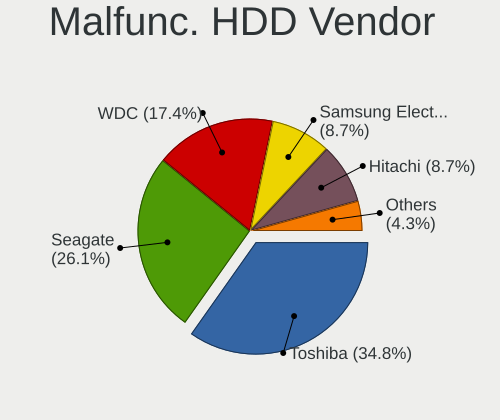

| Vendor              | Computers | Drives | Percent |
|---------------------|-----------|--------|---------|
| Toshiba             | 8         | 9      | 34.78%  |
| Seagate             | 6         | 7      | 26.09%  |
| WDC                 | 4         | 5      | 17.39%  |
| Samsung Electronics | 2         | 2      | 8.7%    |
| Hitachi             | 2         | 2      | 8.7%    |
| Apple               | 1         | 1      | 4.35%   |

Malfunc. Drive Kind
-------------------

Kinds of faulty drives

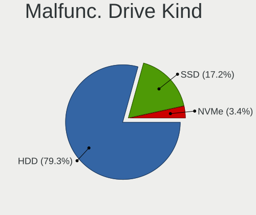

| Kind | Computers | Drives | Percent |
|------|-----------|--------|---------|
| HDD  | 23        | 26     | 76.67%  |
| SSD  | 6         | 6      | 20%     |
| NVMe | 1         | 1      | 3.33%   |

Failed Drives
-------------

Failed drive models

Zero info for selected period =(

Failed Drive Vendor
-------------------

Failed drive vendors

Zero info for selected period =(

Drive Status
------------

Number of failed and malfunc. drives

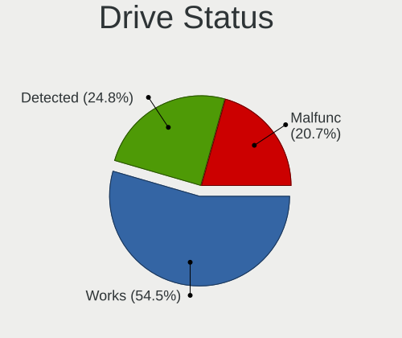

| Status   | Computers | Drives | Percent |
|----------|-----------|--------|---------|
| Works    | 79        | 105    | 54.48%  |
| Detected | 36        | 66     | 24.83%  |
| Malfunc  | 30        | 33     | 20.69%  |

Storage controller
------------------

Storage Vendor
--------------

Storage controller vendors

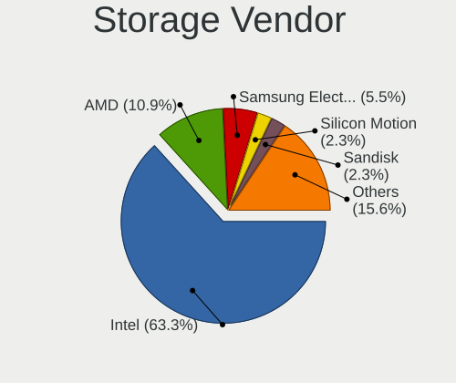

| Vendor                           | Computers | Percent |
|----------------------------------|-----------|---------|
| Intel                            | 81        | 63.28%  |
| AMD                              | 14        | 10.94%  |
| Samsung Electronics              | 7         | 5.47%   |
| Silicon Motion                   | 3         | 2.34%   |
| Sandisk                          | 3         | 2.34%   |
| ASMedia Technology               | 3         | 2.34%   |
| VIA Technologies                 | 2         | 1.56%   |
| SK hynix                         | 2         | 1.56%   |
| Silicon Integrated Systems [SiS] | 2         | 1.56%   |
| Nvidia                           | 2         | 1.56%   |
| Marvell Technology Group         | 2         | 1.56%   |
| Silicon Image                    | 1         | 0.78%   |
| Micron Technology                | 1         | 0.78%   |
| MAXIO Technology (Hangzhou)      | 1         | 0.78%   |
| KIOXIA                           | 1         | 0.78%   |
| Kingston Technology Company      | 1         | 0.78%   |
| JMicron Technology               | 1         | 0.78%   |
| Apacer Technology                | 1         | 0.78%   |

Storage Model
-------------

Storage controller models

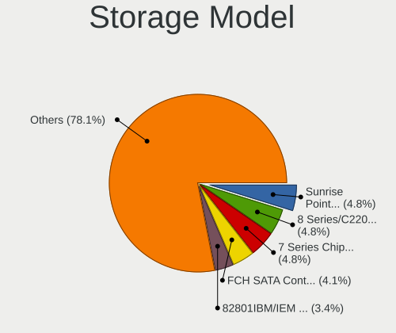

| Model                                                                          | Computers | Percent |
|--------------------------------------------------------------------------------|-----------|---------|
| Intel Sunrise Point-LP SATA Controller [AHCI mode]                             | 7         | 4.79%   |
| Intel 8 Series/C220 Series Chipset Family 6-port SATA Controller 1 [AHCI mode] | 7         | 4.79%   |
| Intel 7 Series Chipset Family 6-port SATA Controller [AHCI mode]               | 7         | 4.79%   |
| AMD FCH SATA Controller [AHCI mode]                                            | 6         | 4.11%   |
| Intel 82801IBM/IEM (ICH9M/ICH9M-E) 4 port SATA Controller [AHCI mode]          | 5         | 3.42%   |
| Intel 6 Series/C200 Series Chipset Family 6 port Mobile SATA AHCI Controller   | 5         | 3.42%   |
| Intel 5 Series/3400 Series Chipset 6 port SATA AHCI Controller                 | 5         | 3.42%   |
| Intel Wildcat Point-LP SATA Controller [AHCI Mode]                             | 4         | 2.74%   |
| Samsung NVMe SSD Controller SM981/PM981/PM983                                  | 3         | 2.05%   |
| Intel NM10/ICH7 Family SATA Controller [IDE mode]                              | 3         | 2.05%   |
| Intel NM10/ICH7 Family SATA Controller [AHCI mode]                             | 3         | 2.05%   |
| Intel Comet Lake SATA AHCI Controller                                          | 3         | 2.05%   |
| Intel Celeron/Pentium Silver Processor SATA Controller                         | 3         | 2.05%   |
| Intel 82801HM/HEM (ICH8M/ICH8M-E) IDE Controller                               | 3         | 2.05%   |
| Intel 82801GBM/GHM (ICH7-M Family) SATA Controller [IDE mode]                  | 3         | 2.05%   |
| Intel 82801GBM/GHM (ICH7-M Family) SATA Controller [AHCI mode]                 | 3         | 2.05%   |
| Intel 82801G (ICH7 Family) IDE Controller                                      | 3         | 2.05%   |
| Intel 8 Series SATA Controller 1 [AHCI mode]                                   | 3         | 2.05%   |
| AMD SB7x0/SB8x0/SB9x0 SATA Controller [AHCI mode]                              | 3         | 2.05%   |
| Silicon Motion SM2263EN/SM2263XT (DRAM-less) NVMe SSD Controllers              | 2         | 1.37%   |
| Silicon Integrated Systems [SiS] 5513 IDE Controller                           | 2         | 1.37%   |
| Marvell Group 88SS9183 PCIe SSD Controller                                     | 2         | 1.37%   |
| Intel 82801HM/HEM (ICH8M/ICH8M-E) SATA Controller [IDE mode]                   | 2         | 1.37%   |
| Intel 82801FBM (ICH6M) SATA Controller                                         | 2         | 1.37%   |
| ASMedia ASM1061/ASM1062 Serial ATA Controller                                  | 2         | 1.37%   |
| AMD SB7x0/SB8x0/SB9x0 SATA Controller [IDE mode]                               | 2         | 1.37%   |
| AMD SB7x0/SB8x0/SB9x0 IDE Controller                                           | 2         | 1.37%   |
| AMD 400 Series Chipset SATA Controller                                         | 2         | 1.37%   |
| VIA VT82C586A/B/VT82C686/A/B/VT823x/A/C PIPC Bus Master IDE                    | 1         | 0.68%   |
| VIA VT6415 PATA IDE Host Controller                                            | 1         | 0.68%   |
| SK hynix Gold P31/BC711/PC711 NVMe Solid State Drive                           | 1         | 0.68%   |
| SK hynix BC501 NVMe Solid State Drive                                          | 1         | 0.68%   |
| Silicon Motion Non-Volatile memory controller                                  | 1         | 0.68%   |
| Silicon Integrated Systems [SiS] SATA Controller / IDE mode                    | 1         | 0.68%   |
| Silicon Image SiI 3114 [SATALink/SATARaid] Serial ATA Controller               | 1         | 0.68%   |
| Sandisk WD PC SN5000S M.2 2280 NVMe SSD (DRAM-less)                            | 1         | 0.68%   |
| SanDisk PC SN520 x2 M.2 2230 NVMe SSD                                          | 1         | 0.68%   |
| SanDisk Extreme Pro / WD Black SN750 / PC SN730 / Red SN700 NVMe SSD           | 1         | 0.68%   |
| Samsung S4LN058A01[SSUBX] AHCI SSD Controller (Apple slot)                     | 1         | 0.68%   |
| Samsung NVMe SSD Controller SM961/PM961/SM963                                  | 1         | 0.68%   |

Storage Kind
------------

Kind of storage controller (IDE, SATA, NVMe, SAS, ...)

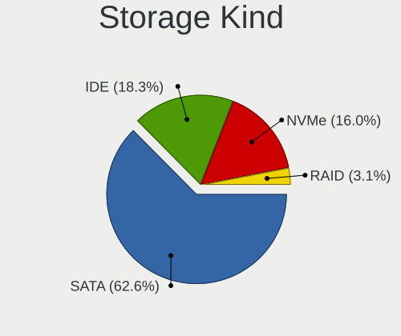

| Kind | Computers | Percent |
|------|-----------|---------|
| SATA | 82        | 62.6%   |
| IDE  | 24        | 18.32%  |
| NVMe | 21        | 16.03%  |
| RAID | 4         | 3.05%   |

Processor
---------

CPU Vendor
----------

Processor vendors

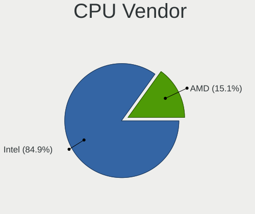

| Vendor | Computers | Percent |
|--------|-----------|---------|
| Intel  | 107       | 84.92%  |
| AMD    | 19        | 15.08%  |

CPU Model
---------

Processor models

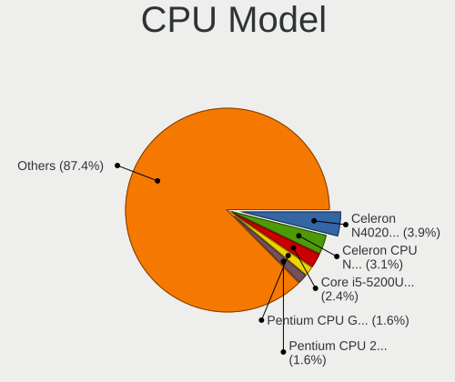

| Model                                       | Computers | Percent |
|---------------------------------------------|-----------|---------|
| Intel Celeron N4020 CPU @ 1.10GHz           | 5         | 3.94%   |
| Intel Celeron CPU N3060 @ 1.60GHz           | 4         | 3.15%   |
| Intel Core i5-5200U CPU @ 2.20GHz           | 3         | 2.36%   |
| Intel Pentium CPU G3240 @ 3.10GHz           | 2         | 1.57%   |
| Intel Pentium CPU 2020M @ 2.40GHz           | 2         | 1.57%   |
| Intel Core i7-7500U CPU @ 2.70GHz           | 2         | 1.57%   |
| Intel Core i5-4250U CPU @ 1.30GHz           | 2         | 1.57%   |
| Intel Core i5-3210M CPU @ 2.50GHz           | 2         | 1.57%   |
| Intel Core i5 CPU 750 @ 2.67GHz             | 2         | 1.57%   |
| Intel Core i3-6006U CPU @ 2.00GHz           | 2         | 1.57%   |
| Intel Core 2 Duo CPU P8400 @ 2.26GHz        | 2         | 1.57%   |
| Intel Celeron N4000 CPU @ 1.10GHz           | 2         | 1.57%   |
| Intel Celeron CPU N3350 @ 1.10GHz           | 2         | 1.57%   |
| Intel Celeron CPU N2840 @ 2.16GHz           | 2         | 1.57%   |
| Intel Atom x5-Z8350 CPU @ 1.44GHz           | 2         | 1.57%   |
| Intel Atom CPU N455 @ 1.66GHz               | 2         | 1.57%   |
| Intel Atom CPU N270 @ 1.60GHz               | 2         | 1.57%   |
| AMD E-350 Processor                         | 2         | 1.57%   |
| Intel Xeon CPU E5-1650 v3 @ 3.50GHz         | 1         | 0.79%   |
| Intel Pentium M processor 1.86GHz           | 1         | 0.79%   |
| Intel Pentium M processor 1.60GHz           | 1         | 0.79%   |
| Intel Pentium Dual-Core CPU E5300 @ 2.60GHz | 1         | 0.79%   |
| Intel Pentium Dual CPU T2410 @ 2.00GHz      | 1         | 0.79%   |
| Intel Pentium Dual CPU E2180 @ 2.00GHz      | 1         | 0.79%   |
| Intel Pentium CPU P6100 @ 2.00GHz           | 1         | 0.79%   |
| Intel Pentium 4 CPU 2.40GHz                 | 1         | 0.79%   |
| Intel Genuine CPU T2060 @ 1.60GHz           | 1         | 0.79%   |
| Intel Core m3-6Y30 CPU @ 0.90GHz            | 1         | 0.79%   |
| Intel Core i7-9750H CPU @ 2.60GHz           | 1         | 0.79%   |
| Intel Core i7-8650U CPU @ 1.90GHz           | 1         | 0.79%   |
| Intel Core i7-7820HQ CPU @ 2.90GHz          | 1         | 0.79%   |
| Intel Core i7-7700 CPU @ 3.60GHz            | 1         | 0.79%   |
| Intel Core i7-6700HQ CPU @ 2.60GHz          | 1         | 0.79%   |
| Intel Core i7-4800MQ CPU @ 2.70GHz          | 1         | 0.79%   |
| Intel Core i7-4770 CPU @ 3.40GHz            | 1         | 0.79%   |
| Intel Core i7-3840QM CPU @ 2.80GHz          | 1         | 0.79%   |
| Intel Core i7-3630QM CPU @ 2.40GHz          | 1         | 0.79%   |
| Intel Core i7-2640M CPU @ 2.80GHz           | 1         | 0.79%   |
| Intel Core i7 CPU Q 720 @ 1.60GHz           | 1         | 0.79%   |
| Intel Core i7 CPU M 620 @ 2.67GHz           | 1         | 0.79%   |

CPU Model Family
----------------

Processor model prefix

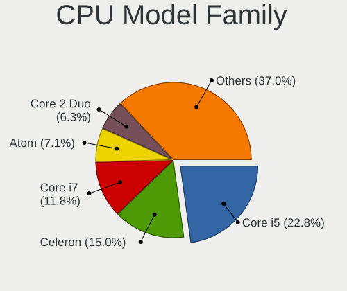

| Model                   | Computers | Percent |
|-------------------------|-----------|---------|
| Intel Core i5           | 29        | 22.83%  |
| Intel Celeron           | 19        | 14.96%  |
| Intel Core i7           | 15        | 11.81%  |
| Intel Atom              | 9         | 7.09%   |
| Intel Core 2 Duo        | 8         | 6.3%    |
| Intel Core i3           | 6         | 4.72%   |
| Intel Pentium           | 5         | 3.94%   |
| Other                   | 3         | 2.36%   |
| AMD Ryzen 7             | 3         | 2.36%   |
| Intel Pentium M         | 2         | 1.57%   |
| Intel Pentium Dual      | 2         | 1.57%   |
| Intel Core Duo          | 2         | 1.57%   |
| Intel Core 2            | 2         | 1.57%   |
| AMD Ryzen 3             | 2         | 1.57%   |
| AMD FX                  | 2         | 1.57%   |
| AMD E                   | 2         | 1.57%   |
| AMD A4                  | 2         | 1.57%   |
| Intel Xeon              | 1         | 0.79%   |
| Intel Pentium Dual-Core | 1         | 0.79%   |
| Intel Pentium 4         | 1         | 0.79%   |
| Intel Genuine           | 1         | 0.79%   |
| Intel Core m3           | 1         | 0.79%   |
| Intel Core 2 Quad       | 1         | 0.79%   |
| AMD Ryzen 5             | 1         | 0.79%   |
| AMD Mobile Sempron      | 1         | 0.79%   |
| AMD E2                  | 1         | 0.79%   |
| AMD E1                  | 1         | 0.79%   |
| AMD Athlon XP           | 1         | 0.79%   |
| AMD Athlon II X4        | 1         | 0.79%   |
| AMD Athlon 64           | 1         | 0.79%   |
| AMD A12                 | 1         | 0.79%   |

CPU Cores
---------

Number of processor cores

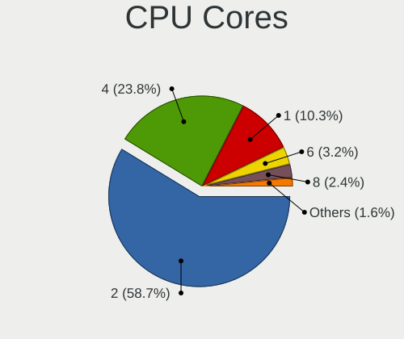

| Number | Computers | Percent |
|--------|-----------|---------|
| 2      | 74        | 58.73%  |
| 4      | 30        | 23.81%  |
| 1      | 13        | 10.32%  |
| 6      | 4         | 3.17%   |
| 8      | 3         | 2.38%   |
| 12     | 1         | 0.79%   |
| 3      | 1         | 0.79%   |

CPU Sockets
-----------

Number of sockets

| Number | Computers | Percent |
|--------|-----------|---------|
| 1      | 126       | 100%    |

CPU Threads
-----------

Threads per core (Hyper-Threading)

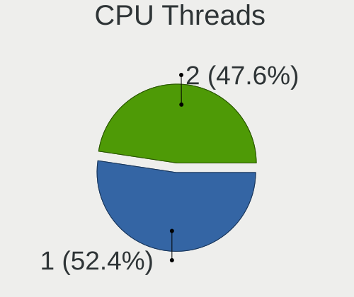

| Number | Computers | Percent |
|--------|-----------|---------|
| 1      | 66        | 52.38%  |
| 2      | 60        | 47.62%  |

CPU Op-Modes
------------

CPU Operation Modes (32-bit, 64-bit)

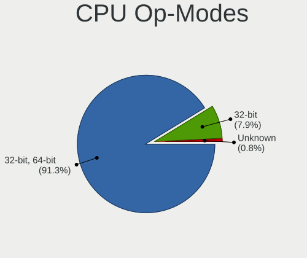

| Op mode        | Computers | Percent |
|----------------|-----------|---------|
| 32-bit, 64-bit | 115       | 91.27%  |
| 32-bit         | 10        | 7.94%   |
| Unknown        | 1         | 0.79%   |

CPU Microcode
-------------

Microcode number

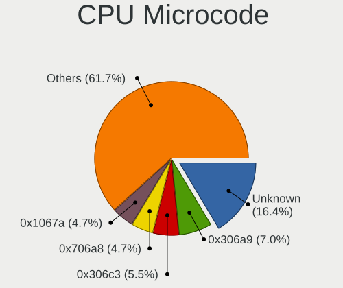

| Number     | Computers | Percent |
|------------|-----------|---------|
| Unknown    | 21        | 16.41%  |
| 0x306a9    | 9         | 7.03%   |
| 0x306c3    | 7         | 5.47%   |
| 0x706a8    | 6         | 4.69%   |
| 0x1067a    | 6         | 4.69%   |
| 0x406c4    | 5         | 3.91%   |
| 0x306d4    | 5         | 3.91%   |
| 0x406e3    | 4         | 3.13%   |
| 0x206a7    | 4         | 3.13%   |
| 0x806ec    | 3         | 2.34%   |
| 0x806e9    | 3         | 2.34%   |
| 0x6ec      | 3         | 2.34%   |
| 0x40651    | 3         | 2.34%   |
| 0x30678    | 3         | 2.34%   |
| 0x106e5    | 3         | 2.34%   |
| 0x106ca    | 3         | 2.34%   |
| 0x906e9    | 2         | 1.56%   |
| 0x806c1    | 2         | 1.56%   |
| 0x706a1    | 2         | 1.56%   |
| 0x6fd      | 2         | 1.56%   |
| 0x506c9    | 2         | 1.56%   |
| 0x20655    | 2         | 1.56%   |
| 0x106c2    | 2         | 1.56%   |
| 0x10676    | 2         | 1.56%   |
| 0x06000852 | 2         | 1.56%   |
| 0xf27      | 1         | 0.78%   |
| 0x906a3    | 1         | 0.78%   |
| 0x806ea    | 1         | 0.78%   |
| 0x6fb      | 1         | 0.78%   |
| 0x6fa      | 1         | 0.78%   |
| 0x6f6      | 1         | 0.78%   |
| 0x6f2      | 1         | 0.78%   |
| 0x6d8      | 1         | 0.78%   |
| 0x506e3    | 1         | 0.78%   |
| 0x306f2    | 1         | 0.78%   |
| 0x106a5    | 1         | 0.78%   |
| 0x0a50000d | 1         | 0.78%   |
| 0x08108109 | 1         | 0.78%   |
| 0x08108102 | 1         | 0.78%   |
| 0x0800820d | 1         | 0.78%   |

CPU Microarch
-------------

Microarchitecture

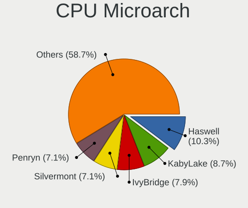

| Name          | Computers | Percent |
|---------------|-----------|---------|
| Haswell       | 13        | 10.32%  |
| KabyLake      | 11        | 8.73%   |
| IvyBridge     | 10        | 7.94%   |
| Silvermont    | 9         | 7.14%   |
| Penryn        | 9         | 7.14%   |
| Goldmont plus | 8         | 6.35%   |
| Core          | 6         | 4.76%   |
| Bonnell       | 6         | 4.76%   |
| Skylake       | 5         | 3.97%   |
| SandyBridge   | 5         | 3.97%   |
| P6            | 5         | 3.97%   |
| Broadwell     | 5         | 3.97%   |
| Nehalem       | 4         | 3.17%   |
| Zen+          | 3         | 2.38%   |
| Westmere      | 3         | 2.38%   |
| Bobcat        | 3         | 2.38%   |
| Unknown       | 3         | 2.38%   |
| TigerLake     | 2         | 1.59%   |
| Piledriver    | 2         | 1.59%   |
| K8 Hammer     | 2         | 1.59%   |
| Goldmont      | 2         | 1.59%   |
| Excavator     | 2         | 1.59%   |
| Zen 3         | 1         | 0.79%   |
| Tremont       | 1         | 0.79%   |
| NetBurst      | 1         | 0.79%   |
| K6            | 1         | 0.79%   |
| K10 Llano     | 1         | 0.79%   |
| K10           | 1         | 0.79%   |
| Jaguar        | 1         | 0.79%   |
| CometLake     | 1         | 0.79%   |

Graphics
--------

GPU Vendor
----------

Vendors of graphics cards

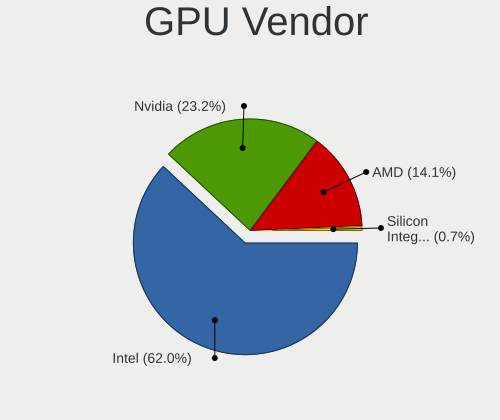

| Vendor                           | Computers | Percent |
|----------------------------------|-----------|---------|
| Intel                            | 88        | 61.97%  |
| Nvidia                           | 33        | 23.24%  |
| AMD                              | 20        | 14.08%  |
| Silicon Integrated Systems [SiS] | 1         | 0.7%    |

GPU Model
---------

Graphics card models

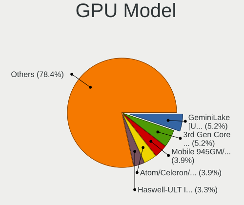

| Model                                                                                      | Computers | Percent |
|--------------------------------------------------------------------------------------------|-----------|---------|
| Intel GeminiLake [UHD Graphics 600]                                                        | 8         | 5.23%   |
| Intel 3rd Gen Core processor Graphics Controller                                           | 8         | 5.23%   |
| Intel Mobile 945GM/GMS/GME, 943/940GML Express Integrated Graphics Controller              | 6         | 3.92%   |
| Intel Atom/Celeron/Pentium Processor x5-E8000/J3xxx/N3xxx Integrated Graphics Controller   | 6         | 3.92%   |
| Intel Haswell-ULT Integrated Graphics Controller                                           | 5         | 3.27%   |
| Intel Mobile 945GM/GMS, 943/940GML Express Integrated Graphics Controller                  | 4         | 2.61%   |
| Intel Mobile 4 Series Chipset Integrated Graphics Controller                               | 4         | 2.61%   |
| Intel Broadwell-U GT2 [HD Graphics 5500]                                                   | 4         | 2.61%   |
| Intel Atom Processor D4xx/D5xx/N4xx/N5xx Integrated Graphics Controller                    | 4         | 2.61%   |
| Nvidia GF117M [GeForce 610M/710M/810M/820M / GT 620M/625M/630M/720M]                       | 3         | 1.96%   |
| Intel Skylake-U GT2 [HD Graphics 520]                                                      | 3         | 1.96%   |
| Intel Kaby Lake-U GT2 [HD Graphics 620]                                                    | 3         | 1.96%   |
| Intel Atom Processor Z36xxx/Z37xxx Series Graphics & Display                               | 3         | 1.96%   |
| Intel 2nd Generation Core Processor Family Integrated Graphics Controller                  | 3         | 1.96%   |
| Nvidia GF119M [GeForce 410M]                                                               | 2         | 1.31%   |
| Intel Xeon E3-1200 v3/4th Gen Core Processor Integrated Graphics Controller                | 2         | 1.31%   |
| Intel Mobile GM965/GL960 Integrated Graphics Controller (secondary)                        | 2         | 1.31%   |
| Intel Mobile GM965/GL960 Integrated Graphics Controller (primary)                          | 2         | 1.31%   |
| Intel Mobile 945GSE Express Integrated Graphics Controller                                 | 2         | 1.31%   |
| Intel Mobile 915GM/GMS/910GML Express Graphics Controller                                  | 2         | 1.31%   |
| Intel Kaby Lake-R GT2 [UHD Graphics 620]                                                   | 2         | 1.31%   |
| Intel Core Processor Integrated Graphics Controller                                        | 2         | 1.31%   |
| Intel CometLake-U GT2 [UHD Graphics]                                                       | 2         | 1.31%   |
| Intel Apollo Lake GT1 [HD Graphics 500]                                                    | 2         | 1.31%   |
| AMD Wrestler [Radeon HD 6310]                                                              | 2         | 1.31%   |
| AMD RV770/M98L [Mobility Radeon HD 4850]                                                   | 2         | 1.31%   |
| Silicon Integrated Systems [SiS] 661/741/760 PCI/AGP or 662/761Gx PCIE VGA Display Adapter | 1         | 0.65%   |
| Nvidia TU117GLM [Quadro T2000 Mobile / Max-Q]                                              | 1         | 0.65%   |
| Nvidia TU116 [GeForce GTX 1660]                                                            | 1         | 0.65%   |
| Nvidia TU104GL [Tesla T4]                                                                  | 1         | 0.65%   |
| Nvidia NV34 [GeForce FX 5500]                                                              | 1         | 0.65%   |
| Nvidia NV34 [GeForce FX 5200]                                                              | 1         | 0.65%   |
| Nvidia GT218M [NVS 3100M]                                                                  | 1         | 0.65%   |
| Nvidia GT218M [GeForce 310M]                                                               | 1         | 0.65%   |
| Nvidia GT218 [GeForce 310]                                                                 | 1         | 0.65%   |
| Nvidia GT215M [GeForce GTS 250M]                                                           | 1         | 0.65%   |
| Nvidia GP106 [GeForce GTX 1060 6GB]                                                        | 1         | 0.65%   |
| Nvidia GM204 [GeForce GTX 980]                                                             | 1         | 0.65%   |
| Nvidia GM200 [GeForce GTX 980 Ti]                                                          | 1         | 0.65%   |
| Nvidia GM108M [GeForce 940MX]                                                              | 1         | 0.65%   |

GPU Combo
---------

Combinations of graphics cards

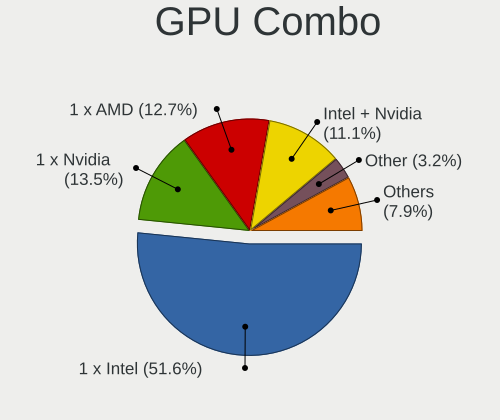

| Name           | Computers | Percent |
|----------------|-----------|---------|
| 1 x Intel      | 65        | 51.59%  |
| 1 x Nvidia     | 17        | 13.49%  |
| 1 x AMD        | 16        | 12.7%   |
| Intel + Nvidia | 14        | 11.11%  |
| Other          | 4         | 3.17%   |
| 2 x Intel      | 3         | 2.38%   |
| 2 x Nvidia     | 2         | 1.59%   |
| 2 x AMD        | 2         | 1.59%   |
| Intel + AMD    | 2         | 1.59%   |
| 1 x SiS        | 1         | 0.79%   |

GPU Driver
----------

Free vs proprietary

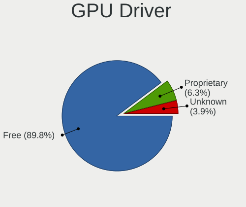

| Driver      | Computers | Percent |
|-------------|-----------|---------|
| Free        | 114       | 89.76%  |
| Proprietary | 8         | 6.3%    |
| Unknown     | 5         | 3.94%   |

GPU Memory
----------

Total video memory

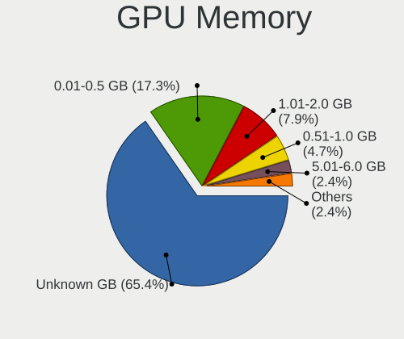

| Size in GB | Computers | Percent |
|------------|-----------|---------|
| Unknown    | 83        | 65.35%  |
| 0.01-0.5   | 22        | 17.32%  |
| 1.01-2.0   | 10        | 7.87%   |
| 0.51-1.0   | 6         | 4.72%   |
| 5.01-6.0   | 3         | 2.36%   |
| 3.01-4.0   | 3         | 2.36%   |

Monitor
-------

Monitor Vendor
--------------

Monitor vendors

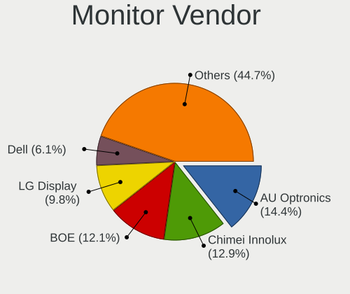

| Vendor               | Computers | Percent |
|----------------------|-----------|---------|
| AU Optronics         | 19        | 14.39%  |
| Chimei Innolux       | 17        | 12.88%  |
| BOE                  | 16        | 12.12%  |
| LG Display           | 13        | 9.85%   |
| Dell                 | 8         | 6.06%   |
| Apple                | 7         | 5.3%    |
| Samsung Electronics  | 6         | 4.55%   |
| Lenovo               | 5         | 3.79%   |
| Hewlett-Packard      | 5         | 3.79%   |
| LG Philips           | 4         | 3.03%   |
| Goldstar             | 4         | 3.03%   |
| Sony                 | 3         | 2.27%   |
| Philips              | 3         | 2.27%   |
| Acer                 | 3         | 2.27%   |
| Quanta Display       | 2         | 1.52%   |
| InfoVision           | 2         | 1.52%   |
| Ancor Communications | 2         | 1.52%   |
| ViewSonic            | 1         | 0.76%   |
| Toshiba              | 1         | 0.76%   |
| Sharp                | 1         | 0.76%   |
| Seiko/Epson          | 1         | 0.76%   |
| Sceptre Tech         | 1         | 0.76%   |
| Insignia             | 1         | 0.76%   |
| HUAWEI               | 1         | 0.76%   |
| HannStar             | 1         | 0.76%   |
| GreenWood            | 1         | 0.76%   |
| Fujitsu Siemens      | 1         | 0.76%   |
| CPT                  | 1         | 0.76%   |
| BenQ                 | 1         | 0.76%   |
| ASUSTek Computer     | 1         | 0.76%   |

Monitor Model
-------------

Monitor models

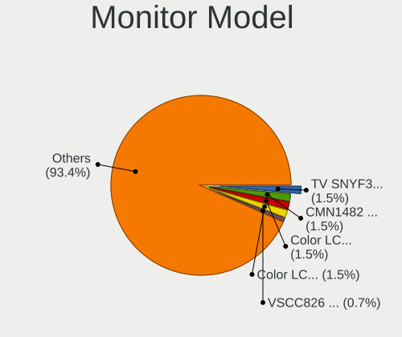

| Model                                                                | Computers | Percent |
|----------------------------------------------------------------------|-----------|---------|
| Sony TV SNYF301 1920x1080                                            | 2         | 1.47%   |
| Chimei Innolux LCD Monitor CMN1482 1600x900 309x174mm 14.0-inch      | 2         | 1.47%   |
| Apple Color LCD APP9CDF 1440x900 286x179mm 13.3-inch                 | 2         | 1.47%   |
| Apple Color LCD APP9CB5 2560x1440 597x336mm 27.0-inch                | 2         | 1.47%   |
| ViewSonic LCD Monitor VSCC826 1920x1080 510x290mm 23.1-inch          | 1         | 0.74%   |
| Toshiba TV TSB0205 1360x765                                          | 1         | 0.74%   |
| Sony TV SNY5703 1920x1080                                            | 1         | 0.74%   |
| Sharp LQ123P1JX31 SHP1471 2400x1600 259x173mm 12.3-inch              | 1         | 0.74%   |
| Seiko/Epson LCD Monitor 1920x1080                                    | 1         | 0.74%   |
| Sceptre Tech Sceptre F24 SPT09AB 1920x1080 530x290mm 23.8-inch       | 1         | 0.74%   |
| Samsung Electronics SyncMaster SAM0091 1600x1200 432x324mm 21.3-inch | 1         | 0.74%   |
| Samsung Electronics SMS24A650 SAM0864 1920x1080 531x299mm 24.0-inch  | 1         | 0.74%   |
| Samsung Electronics SMS24A650 SAM082A 1920x1080 531x299mm 24.0-inch  | 1         | 0.74%   |
| Samsung Electronics SMB2330HD SAM070E 1920x1080 510x290mm 23.1-inch  | 1         | 0.74%   |
| Samsung Electronics LCD Monitor SEC434E 1600x900 310x174mm 14.0-inch | 1         | 0.74%   |
| Samsung Electronics LCD Monitor SDC4E51 1366x768 344x194mm 15.5-inch | 1         | 0.74%   |
| Samsung Electronics C24F390 SAM0D2C 1920x1080 521x293mm 23.5-inch    | 1         | 0.74%   |
| Quanta Display LCD Monitor QDS0025 1024x768 304x228mm 15.0-inch      | 1         | 0.74%   |
| Quanta Display LCD Monitor QDS001D 1280x800 331x207mm 15.4-inch      | 1         | 0.74%   |
| Philips PHL 240B7QPJ PHL0903 1920x1200 518x324mm 24.1-inch           | 1         | 0.74%   |
| Philips 26PFL3404H PHLD061 1920x1080 640x360mm 28.9-inch             | 1         | 0.74%   |
| Philips 226VL PHLC081 1920x1080 480x268mm 21.6-inch                  | 1         | 0.74%   |
| LG Philips LCD Monitor LPLE300 1280x800 331x207mm 15.4-inch          | 1         | 0.74%   |
| LG Philips LCD Monitor LPLCF00 1280x800 331x207mm 15.4-inch          | 1         | 0.74%   |
| LG Philips LCD Monitor LPLA900 1280x800 331x207mm 15.4-inch          | 1         | 0.74%   |
| LG Philips LCD Monitor LPL00E5 1440x900 304x190mm 14.1-inch          | 1         | 0.74%   |
| LG Display LP156WH2-TLQ1 LGD021B 1366x768 344x194mm 15.5-inch        | 1         | 0.74%   |
| LG Display LCD Monitor LGD078E 1920x1200 345x215mm 16.0-inch         | 1         | 0.74%   |
| LG Display LCD Monitor LGD0521 1920x1080 309x174mm 14.0-inch         | 1         | 0.74%   |
| LG Display LCD Monitor LGD04D4 3840x2160 344x194mm 15.5-inch         | 1         | 0.74%   |
| LG Display LCD Monitor LGD03FC 1600x900 309x174mm 14.0-inch          | 1         | 0.74%   |
| LG Display LCD Monitor LGD03B8 1366x768 310x174mm 14.0-inch          | 1         | 0.74%   |
| LG Display LCD Monitor LGD0390 1600x900 382x215mm 17.3-inch          | 1         | 0.74%   |
| LG Display LCD Monitor LGD033A 1366x768 344x194mm 15.5-inch          | 1         | 0.74%   |
| LG Display LCD Monitor LGD032C 1920x1080 340x190mm 15.3-inch         | 1         | 0.74%   |
| LG Display LCD Monitor LGD0306 1600x900 310x174mm 14.0-inch          | 1         | 0.74%   |
| LG Display LCD Monitor LGD02AC 1366x768 344x194mm 15.5-inch          | 1         | 0.74%   |
| LG Display LCD Monitor LGD029F 1024x600 224x126mm 10.1-inch          | 1         | 0.74%   |
| LG Display LCD Monitor LGD0250 1366x768 345x194mm 15.6-inch          | 1         | 0.74%   |
| Lenovo LEN-M73Z-D LEN00A0 1600x900 442x249mm 20.0-inch               | 1         | 0.74%   |

Monitor Resolution
------------------

Monitor screen resolution

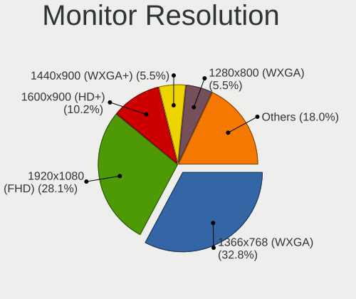

| Resolution         | Computers | Percent |
|--------------------|-----------|---------|
| 1366x768 (WXGA)    | 42        | 32.81%  |
| 1920x1080 (FHD)    | 36        | 28.13%  |
| 1600x900 (HD+)     | 13        | 10.16%  |
| 1440x900 (WXGA+)   | 7         | 5.47%   |
| 1280x800 (WXGA)    | 7         | 5.47%   |
| 2560x1440 (QHD)    | 4         | 3.13%   |
| 1680x1050 (WSXGA+) | 4         | 3.13%   |
| 1024x768 (XGA)     | 3         | 2.34%   |
| 1024x600           | 3         | 2.34%   |
| 1920x1200 (WUXGA)  | 2         | 1.56%   |
| 1280x1024 (SXGA)   | 2         | 1.56%   |
| 3840x2160 (4K)     | 1         | 0.78%   |
| 2400x1600          | 1         | 0.78%   |
| 2160x1350          | 1         | 0.78%   |
| 1600x1200          | 1         | 0.78%   |
| 1360x768           | 1         | 0.78%   |

Monitor Diagonal
----------------

Diagonal size in inches

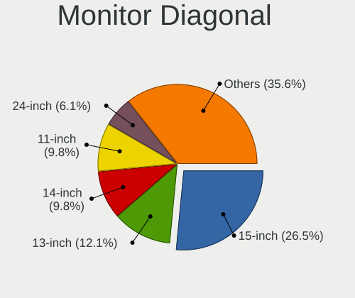

| Inches  | Computers | Percent |
|---------|-----------|---------|
| 15      | 35        | 26.52%  |
| 13      | 16        | 12.12%  |
| 14      | 13        | 9.85%   |
| 11      | 13        | 9.85%   |
| 24      | 8         | 6.06%   |
| 23      | 8         | 6.06%   |
| 19      | 5         | 3.79%   |
| 72      | 4         | 3.03%   |
| 27      | 3         | 2.27%   |
| 22      | 3         | 2.27%   |
| 21      | 3         | 2.27%   |
| 20      | 3         | 2.27%   |
| 18      | 3         | 2.27%   |
| 12      | 3         | 2.27%   |
| 17      | 2         | 1.52%   |
| 10      | 2         | 1.52%   |
| 52      | 1         | 0.76%   |
| 34      | 1         | 0.76%   |
| 32      | 1         | 0.76%   |
| 31      | 1         | 0.76%   |
| 28      | 1         | 0.76%   |
| 16      | 1         | 0.76%   |
| 8       | 1         | 0.76%   |
| Unknown | 1         | 0.76%   |

Monitor Width
-------------

Physical width

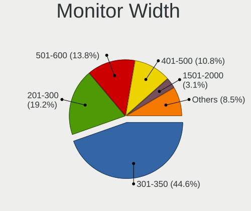

| Width in mm | Computers | Percent |
|-------------|-----------|---------|
| 301-350     | 58        | 44.62%  |
| 201-300     | 25        | 19.23%  |
| 501-600     | 18        | 13.85%  |
| 401-500     | 14        | 10.77%  |
| 351-400     | 4         | 3.08%   |
| 1501-2000   | 4         | 3.08%   |
| 701-800     | 2         | 1.54%   |
| 601-700     | 2         | 1.54%   |
| 101-200     | 1         | 0.77%   |
| 1001-1500   | 1         | 0.77%   |
| Unknown     | 1         | 0.77%   |

Aspect Ratio
------------

Proportional relationship between the width and the height

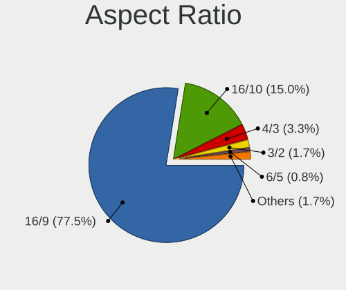

| Ratio   | Computers | Percent |
|---------|-----------|---------|
| 16/9    | 93        | 77.5%   |
| 16/10   | 18        | 15%     |
| 4/3     | 4         | 3.33%   |
| 3/2     | 2         | 1.67%   |
| 6/5     | 1         | 0.83%   |
| 5/4     | 1         | 0.83%   |
| Unknown | 1         | 0.83%   |

Monitor Area
------------

Area in inch²

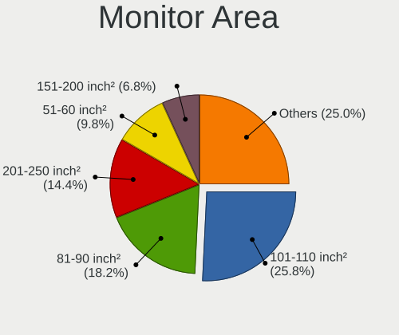

| Area in inch² | Computers | Percent |
|----------------|-----------|---------|
| 101-110        | 34        | 25.76%  |
| 81-90          | 24        | 18.18%  |
| 201-250        | 19        | 14.39%  |
| 51-60          | 13        | 9.85%   |
| 151-200        | 9         | 6.82%   |
| More than 1000 | 5         | 3.79%   |
| 71-80          | 5         | 3.79%   |
| 61-70          | 3         | 2.27%   |
| 351-500        | 3         | 2.27%   |
| 301-350        | 3         | 2.27%   |
| 251-300        | 3         | 2.27%   |
| 41-50          | 2         | 1.52%   |
| 141-150        | 2         | 1.52%   |
| 1-40           | 1         | 0.76%   |
| 131-140        | 1         | 0.76%   |
| 121-130        | 1         | 0.76%   |
| 111-120        | 1         | 0.76%   |
| 501-1000       | 1         | 0.76%   |
| 91-100         | 1         | 0.76%   |
| Unknown        | 1         | 0.76%   |

Pixel Density
-------------

Pixels per inch

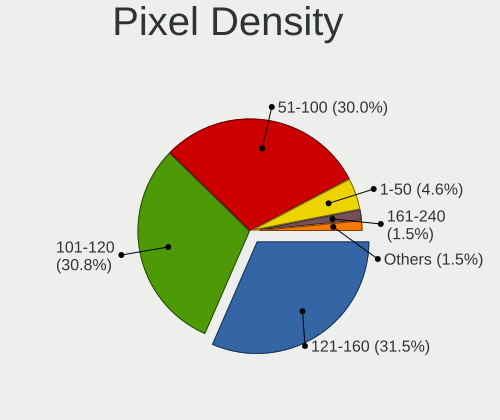

| Density       | Computers | Percent |
|---------------|-----------|---------|
| 121-160       | 41        | 31.54%  |
| 101-120       | 40        | 30.77%  |
| 51-100        | 39        | 30%     |
| 1-50          | 6         | 4.62%   |
| 161-240       | 2         | 1.54%   |
| More than 240 | 1         | 0.77%   |
| Unknown       | 1         | 0.77%   |

Multiple Monitors
-----------------

Total monitors connected

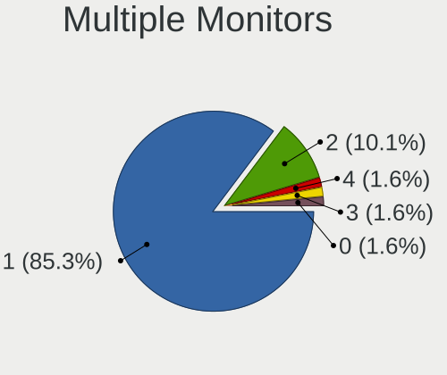

| Total | Computers | Percent |
|-------|-----------|---------|
| 1     | 110       | 85.27%  |
| 2     | 13        | 10.08%  |
| 4     | 2         | 1.55%   |
| 3     | 2         | 1.55%   |
| 0     | 2         | 1.55%   |

Network
-------

Net Controller Vendor
---------------------

Controller vendors

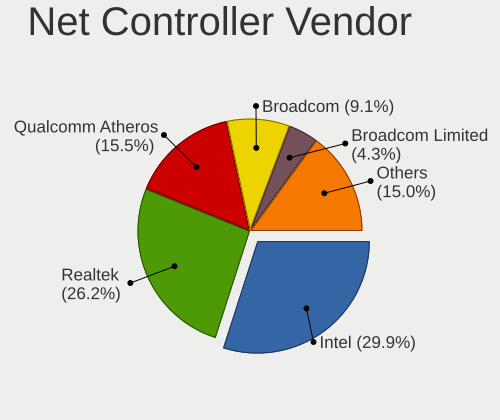

| Vendor                                | Computers | Percent |
|---------------------------------------|-----------|---------|
| Intel                                 | 56        | 29.95%  |
| Realtek Semiconductor                 | 49        | 26.2%   |
| Qualcomm Atheros                      | 29        | 15.51%  |
| Broadcom                              | 17        | 9.09%   |
| Broadcom Limited                      | 8         | 4.28%   |
| Marvell Technology Group              | 3         | 1.6%    |
| Silicon Integrated Systems [SiS]      | 2         | 1.07%   |
| Ralink                                | 2         | 1.07%   |
| Qualcomm                              | 2         | 1.07%   |
| Nvidia                                | 2         | 1.07%   |
| MediaTek                              | 2         | 1.07%   |
| ASIX Electronics                      | 2         | 1.07%   |
| Xiaomi                                | 1         | 0.53%   |
| TP-Link                               | 1         | 0.53%   |
| Ralink Technology                     | 1         | 0.53%   |
| Qualcomm Atheros Communications       | 1         | 0.53%   |
| Philips (or NXP)                      | 1         | 0.53%   |
| Lenovo                                | 1         | 0.53%   |
| Huawei Technologies                   | 1         | 0.53%   |
| Ericsson Business Mobile Networks     | 1         | 0.53%   |
| Dell                                  | 1         | 0.53%   |
| Attansic Technology                   | 1         | 0.53%   |
| ASUSTek Computer                      | 1         | 0.53%   |
| 802.11g Adapter [Linksys WUSB54GC v3] | 1         | 0.53%   |
| 3Com                                  | 1         | 0.53%   |

Net Controller Model
--------------------

Controller models

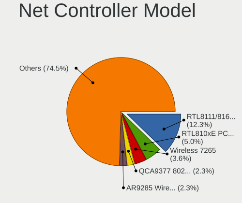

| Model                                                                                 | Computers | Percent |
|---------------------------------------------------------------------------------------|-----------|---------|
| Realtek RTL8111/8168/8211/8411 PCI Express Gigabit Ethernet Controller                | 27        | 12.27%  |
| Realtek RTL810xE PCI Express Fast Ethernet controller                                 | 11        | 5%      |
| Intel Wireless 7265                                                                   | 8         | 3.64%   |
| Qualcomm Atheros QCA9377 802.11ac Wireless Network Adapter                            | 5         | 2.27%   |
| Qualcomm Atheros AR9285 Wireless Network Adapter (PCI-Express)                        | 5         | 2.27%   |
| Intel Gemini Lake PCH CNVi WiFi                                                       | 5         | 2.27%   |
| Realtek RTL8821CE 802.11ac PCIe Wireless Network Adapter                              | 4         | 1.82%   |
| Intel Wireless 8265 / 8275                                                            | 4         | 1.82%   |
| Intel Wireless 7260                                                                   | 4         | 1.82%   |
| Intel 82579LM Gigabit Network Connection (Lewisville)                                 | 4         | 1.82%   |
| Broadcom BCM4313 802.11bgn Wireless Network Adapter                                   | 4         | 1.82%   |
| Realtek RTL8822CE 802.11ac PCIe Wireless Network Adapter                              | 3         | 1.36%   |
| Qualcomm Atheros AR928X Wireless Network Adapter (PCI-Express)                        | 3         | 1.36%   |
| Intel Ethernet Connection I217-V                                                      | 3         | 1.36%   |
| Intel Ethernet Connection (4) I219-LM                                                 | 3         | 1.36%   |
| Intel Dual Band Wireless-AC 3168NGW [Stone Peak]                                      | 3         | 1.36%   |
| Broadcom Limited BCM4360 802.11ac Dual Band Wireless Network Adapter                  | 3         | 1.36%   |
| Broadcom BCM43142 802.11b/g/n                                                         | 3         | 1.36%   |
| Realtek RTL8821AE 802.11ac PCIe Wireless Network Adapter                              | 2         | 0.91%   |
| Realtek RTL8187SE Wireless LAN Controller                                             | 2         | 0.91%   |
| Realtek RTL-8100/8101L/8139 PCI Fast Ethernet Adapter                                 | 2         | 0.91%   |
| Qualcomm YUPIK-QRD _SN:AC1D5909                                                       | 2         | 0.91%   |
| Qualcomm Atheros QCA9565 / AR9565 Wireless Network Adapter                            | 2         | 0.91%   |
| Qualcomm Atheros QCA8171 Gigabit Ethernet                                             | 2         | 0.91%   |
| Qualcomm Atheros AR5418 Wireless Network Adapter [AR5008E 802.11(a)bgn] (PCI-Express) | 2         | 0.91%   |
| Nvidia MCP79 Ethernet                                                                 | 2         | 0.91%   |
| Marvell Group 88E8055 PCI-E Gigabit Ethernet Controller                               | 2         | 0.91%   |
| Intel PRO/Wireless 4965 AG or AGN [Kedron] Network Connection                         | 2         | 0.91%   |
| Intel Ethernet Connection I217-LM                                                     | 2         | 0.91%   |
| Intel Ethernet Connection (3) I218-LM                                                 | 2         | 0.91%   |
| Intel Dual Band Wireless-AC 3165 Plus Bluetooth                                       | 2         | 0.91%   |
| Intel Comet Lake PCH-LP CNVi WiFi                                                     | 2         | 0.91%   |
| Intel Centrino Advanced-N 6230 [Rainbow Peak]                                         | 2         | 0.91%   |
| Broadcom NetXtreme BCM5764M Gigabit Ethernet PCIe                                     | 2         | 0.91%   |
| Broadcom Limited BCM4318 [AirForce One 54g] 802.11g Wireless LAN Controller           | 2         | 0.91%   |
| Broadcom BCM4322 802.11a/b/g/n Wireless LAN Controller                                | 2         | 0.91%   |
| ASIX AX88179 Gigabit Ethernet                                                         | 2         | 0.91%   |
| Xiaomi Mi/Redmi series (RNDIS)                                                        | 1         | 0.45%   |
| TP-Link 802.11ac WLAN Adapter                                                         | 1         | 0.45%   |
| Silicon Integrated Systems [SiS] SiS900 PCI Fast Ethernet                             | 1         | 0.45%   |

Wireless Vendor
---------------

Wireless vendors

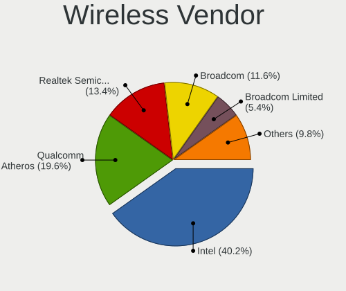

| Vendor                                | Computers | Percent |
|---------------------------------------|-----------|---------|
| Intel                                 | 45        | 40.18%  |
| Qualcomm Atheros                      | 22        | 19.64%  |
| Realtek Semiconductor                 | 15        | 13.39%  |
| Broadcom                              | 13        | 11.61%  |
| Broadcom Limited                      | 6         | 5.36%   |
| Ralink                                | 2         | 1.79%   |
| MediaTek                              | 2         | 1.79%   |
| TP-Link                               | 1         | 0.89%   |
| Ralink Technology                     | 1         | 0.89%   |
| Qualcomm Atheros Communications       | 1         | 0.89%   |
| Philips (or NXP)                      | 1         | 0.89%   |
| Dell                                  | 1         | 0.89%   |
| ASUSTek Computer                      | 1         | 0.89%   |
| 802.11g Adapter [Linksys WUSB54GC v3] | 1         | 0.89%   |

Wireless Model
--------------

Wireless models

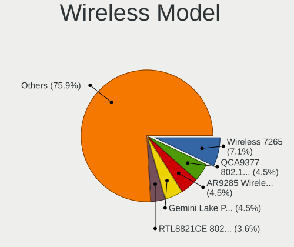

| Model                                                                                 | Computers | Percent |
|---------------------------------------------------------------------------------------|-----------|---------|
| Intel Wireless 7265                                                                   | 8         | 7.14%   |
| Qualcomm Atheros QCA9377 802.11ac Wireless Network Adapter                            | 5         | 4.46%   |
| Qualcomm Atheros AR9285 Wireless Network Adapter (PCI-Express)                        | 5         | 4.46%   |
| Intel Gemini Lake PCH CNVi WiFi                                                       | 5         | 4.46%   |
| Realtek RTL8821CE 802.11ac PCIe Wireless Network Adapter                              | 4         | 3.57%   |
| Intel Wireless 8265 / 8275                                                            | 4         | 3.57%   |
| Intel Wireless 7260                                                                   | 4         | 3.57%   |
| Broadcom BCM4313 802.11bgn Wireless Network Adapter                                   | 4         | 3.57%   |
| Realtek RTL8822CE 802.11ac PCIe Wireless Network Adapter                              | 3         | 2.68%   |
| Qualcomm Atheros AR928X Wireless Network Adapter (PCI-Express)                        | 3         | 2.68%   |
| Intel Dual Band Wireless-AC 3168NGW [Stone Peak]                                      | 3         | 2.68%   |
| Broadcom Limited BCM4360 802.11ac Dual Band Wireless Network Adapter                  | 3         | 2.68%   |
| Broadcom BCM43142 802.11b/g/n                                                         | 3         | 2.68%   |
| Realtek RTL8821AE 802.11ac PCIe Wireless Network Adapter                              | 2         | 1.79%   |
| Realtek RTL8187SE Wireless LAN Controller                                             | 2         | 1.79%   |
| Qualcomm Atheros QCA9565 / AR9565 Wireless Network Adapter                            | 2         | 1.79%   |
| Qualcomm Atheros AR5418 Wireless Network Adapter [AR5008E 802.11(a)bgn] (PCI-Express) | 2         | 1.79%   |
| Intel PRO/Wireless 4965 AG or AGN [Kedron] Network Connection                         | 2         | 1.79%   |
| Intel Dual Band Wireless-AC 3165 Plus Bluetooth                                       | 2         | 1.79%   |
| Intel Comet Lake PCH-LP CNVi WiFi                                                     | 2         | 1.79%   |
| Intel Centrino Advanced-N 6230 [Rainbow Peak]                                         | 2         | 1.79%   |
| Broadcom Limited BCM4318 [AirForce One 54g] 802.11g Wireless LAN Controller           | 2         | 1.79%   |
| Broadcom BCM4322 802.11a/b/g/n Wireless LAN Controller                                | 2         | 1.79%   |
| TP-Link 802.11ac WLAN Adapter                                                         | 1         | 0.89%   |
| Realtek RTL8191SEvB Wireless LAN Controller                                           | 1         | 0.89%   |
| Realtek RTL8191SEvA Wireless LAN Controller                                           | 1         | 0.89%   |
| Realtek RTL8187 Wireless Adapter                                                      | 1         | 0.89%   |
| Realtek 802.11n WLAN Adapter                                                          | 1         | 0.89%   |
| Ralink RT5370 Wireless Adapter                                                        | 1         | 0.89%   |
| Ralink RT5390 Wireless 802.11n 1T/1R PCIe                                             | 1         | 0.89%   |
| Ralink RT3062 Wireless 802.11n 2T/2R                                                  | 1         | 0.89%   |
| Qualcomm Atheros AR9271 802.11n                                                       | 1         | 0.89%   |
| Qualcomm Atheros AR9485 Wireless Network Adapter                                      | 1         | 0.89%   |
| Qualcomm Atheros AR9462 Wireless Network Adapter                                      | 1         | 0.89%   |
| Qualcomm Atheros AR5212 802.11abg NIC                                                 | 1         | 0.89%   |
| Qualcomm Atheros AR242x / AR542x Wireless Network Adapter (PCI-Express)               | 1         | 0.89%   |
| Qualcomm Atheros AR2427 802.11bg Wireless Network Adapter (PCI-Express)               | 1         | 0.89%   |
| Philips (or NXP) 802.11 n WLAN                                                        | 1         | 0.89%   |
| MediaTek MT7922 802.11ax PCI Express Wireless Network Adapter                         | 1         | 0.89%   |
| MediaTek MT7902 802.11ax PCIe Wireless Network Adapter [Filogic 310]                  | 1         | 0.89%   |

Ethernet Vendor
---------------

Ethernet vendors

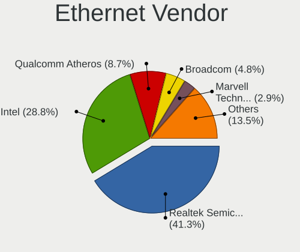

| Vendor                           | Computers | Percent |
|----------------------------------|-----------|---------|
| Realtek Semiconductor            | 43        | 41.35%  |
| Intel                            | 30        | 28.85%  |
| Qualcomm Atheros                 | 9         | 8.65%   |
| Broadcom                         | 5         | 4.81%   |
| Marvell Technology Group         | 3         | 2.88%   |
| Silicon Integrated Systems [SiS] | 2         | 1.92%   |
| Qualcomm                         | 2         | 1.92%   |
| Nvidia                           | 2         | 1.92%   |
| Broadcom Limited                 | 2         | 1.92%   |
| ASIX Electronics                 | 2         | 1.92%   |
| Xiaomi                           | 1         | 0.96%   |
| Lenovo                           | 1         | 0.96%   |
| Attansic Technology              | 1         | 0.96%   |
| 3Com                             | 1         | 0.96%   |

Ethernet Model
--------------

Ethernet models

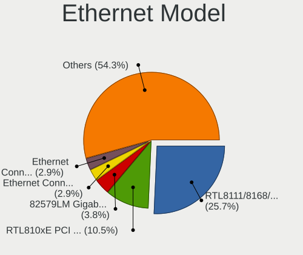

| Model                                                                  | Computers | Percent |
|------------------------------------------------------------------------|-----------|---------|
| Realtek RTL8111/8168/8211/8411 PCI Express Gigabit Ethernet Controller | 27        | 25.71%  |
| Realtek RTL810xE PCI Express Fast Ethernet controller                  | 11        | 10.48%  |
| Intel 82579LM Gigabit Network Connection (Lewisville)                  | 4         | 3.81%   |
| Intel Ethernet Connection I217-V                                       | 3         | 2.86%   |
| Intel Ethernet Connection (4) I219-LM                                  | 3         | 2.86%   |
| Realtek RTL-8100/8101L/8139 PCI Fast Ethernet Adapter                  | 2         | 1.9%    |
| Qualcomm YUPIK-QRD _SN:AC1D5909                                        | 2         | 1.9%    |
| Qualcomm Atheros QCA8171 Gigabit Ethernet                              | 2         | 1.9%    |
| Nvidia MCP79 Ethernet                                                  | 2         | 1.9%    |
| Marvell Group 88E8055 PCI-E Gigabit Ethernet Controller                | 2         | 1.9%    |
| Intel Ethernet Connection I217-LM                                      | 2         | 1.9%    |
| Intel Ethernet Connection (3) I218-LM                                  | 2         | 1.9%    |
| Broadcom NetXtreme BCM5764M Gigabit Ethernet PCIe                      | 2         | 1.9%    |
| ASIX AX88179 Gigabit Ethernet                                          | 2         | 1.9%    |
| Xiaomi Mi/Redmi series (RNDIS)                                         | 1         | 0.95%   |
| Silicon Integrated Systems [SiS] SiS900 PCI Fast Ethernet              | 1         | 0.95%   |
| Silicon Integrated Systems [SiS] 191 Gigabit Ethernet Adapter          | 1         | 0.95%   |
| Realtek RTL8169 PCI Gigabit Ethernet Controller                        | 1         | 0.95%   |
| Realtek RTL8153 Gigabit Ethernet Adapter                               | 1         | 0.95%   |
| Realtek RTL8152 Fast Ethernet Adapter                                  | 1         | 0.95%   |
| Qualcomm Atheros QCA8172 Fast Ethernet                                 | 1         | 0.95%   |
| Qualcomm Atheros Attansic L1 Gigabit Ethernet                          | 1         | 0.95%   |
| Qualcomm Atheros AR8162 Fast Ethernet                                  | 1         | 0.95%   |
| Qualcomm Atheros AR8161 Gigabit Ethernet                               | 1         | 0.95%   |
| Qualcomm Atheros AR8152 v1.1 Fast Ethernet                             | 1         | 0.95%   |
| Qualcomm Atheros AR8151 v2.0 Gigabit Ethernet                          | 1         | 0.95%   |
| Qualcomm Atheros AR8131 Gigabit Ethernet                               | 1         | 0.95%   |
| Marvell Group 88E8038 PCI-E Fast Ethernet Controller                   | 1         | 0.95%   |
| Lenovo ThinkPad TBT 3 Dock                                             | 1         | 0.95%   |
| Intel PRO/100 VE Network Connection                                    | 1         | 0.95%   |
| Intel I210 Gigabit Network Connection                                  | 1         | 0.95%   |
| Intel Ethernet Connection I218-LM                                      | 1         | 0.95%   |
| Intel Ethernet Connection (7) I219-V                                   | 1         | 0.95%   |
| Intel Ethernet Connection (6) I219-V                                   | 1         | 0.95%   |
| Intel Ethernet Connection (5) I219-LM                                  | 1         | 0.95%   |
| Intel Ethernet Connection (2) I219-LM                                  | 1         | 0.95%   |
| Intel Ethernet Connection (2) I218-LM                                  | 1         | 0.95%   |
| Intel Ethernet Connection (11) I219-V                                  | 1         | 0.95%   |
| Intel Ethernet Connection (10) I219-V                                  | 1         | 0.95%   |
| Intel 82583V Gigabit Network Connection                                | 1         | 0.95%   |

Net Controller Kind
-------------------

Ethernet, WiFi or modem

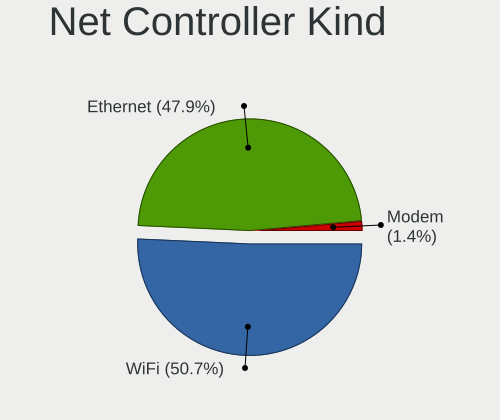

| Kind     | Computers | Percent |
|----------|-----------|---------|
| WiFi     | 107       | 50.71%  |
| Ethernet | 101       | 47.87%  |
| Modem    | 3         | 1.42%   |

Used Controller
---------------

Currently used network controller

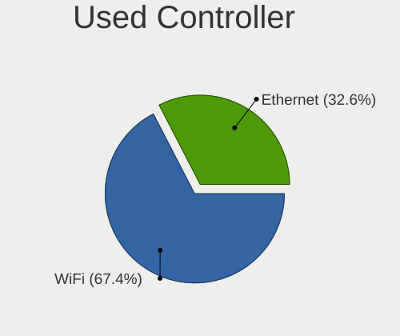

| Kind     | Computers | Percent |
|----------|-----------|---------|
| WiFi     | 91        | 67.41%  |
| Ethernet | 44        | 32.59%  |

NICs
----

Total network controllers on board

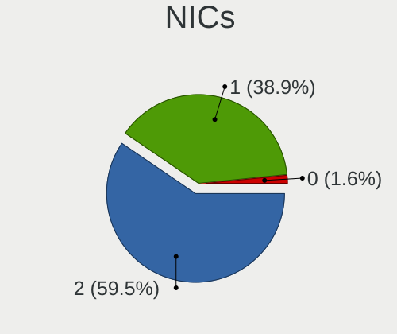

| Total | Computers | Percent |
|-------|-----------|---------|
| 2     | 75        | 59.52%  |
| 1     | 49        | 38.89%  |
| 0     | 2         | 1.59%   |

IPv6
----

IPv6 vs IPv4

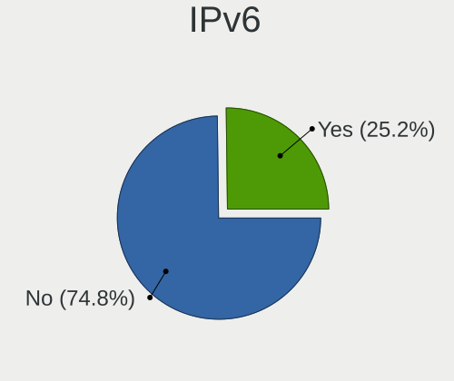

| Used | Computers | Percent |
|------|-----------|---------|
| No   | 95        | 74.8%   |
| Yes  | 32        | 25.2%   |

Bluetooth
---------

Bluetooth Vendor
----------------

Controller vendors

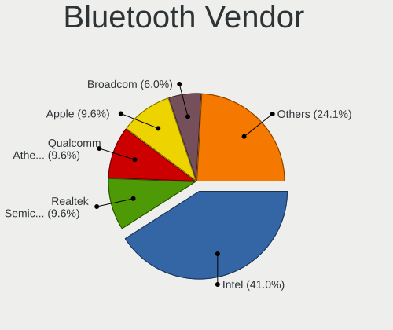

| Vendor                          | Computers | Percent |
|---------------------------------|-----------|---------|
| Intel                           | 34        | 40.96%  |
| Realtek Semiconductor           | 8         | 9.64%   |
| Qualcomm Atheros Communications | 8         | 9.64%   |
| Apple                           | 8         | 9.64%   |
| Broadcom                        | 5         | 6.02%   |
| IMC Networks                    | 4         | 4.82%   |
| Foxconn / Hon Hai               | 3         | 3.61%   |
| Lite-On Technology              | 2         | 2.41%   |
| Toshiba                         | 1         | 1.2%    |
| Taiyo Yuden                     | 1         | 1.2%    |
| Realtek                         | 1         | 1.2%    |
| Qcom                            | 1         | 1.2%    |
| MediaTek                        | 1         | 1.2%    |
| Foxconn International           | 1         | 1.2%    |
| Dell                            | 1         | 1.2%    |
| Cambridge Silicon Radio         | 1         | 1.2%    |
| ASUSTek Computer                | 1         | 1.2%    |
| Alps Electric                   | 1         | 1.2%    |
| Unknown                         | 1         | 1.2%    |

Bluetooth Model
---------------

Controller models

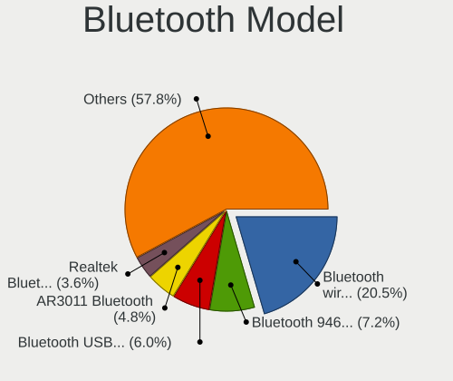

| Model                                               | Computers | Percent |
|-----------------------------------------------------|-----------|---------|
| Intel Bluetooth wireless interface                  | 17        | 20.48%  |
| Intel Bluetooth 9460/9560 Jefferson Peak (JfP)      | 6         | 7.23%   |
| Apple Bluetooth USB Host Controller                 | 5         | 6.02%   |
| Qualcomm Atheros AR3011 Bluetooth                   | 4         | 4.82%   |
| Realtek  Bluetooth 4.2 Adapter                      | 3         | 3.61%   |
| Intel Wireless-AC 3168 Bluetooth                    | 3         | 3.61%   |
| Intel AX201 Bluetooth                               | 3         | 3.61%   |
| Realtek RTL8821A Bluetooth                          | 2         | 2.41%   |
| Realtek Bluetooth Radio                             | 2         | 2.41%   |
| Qualcomm Atheros  Bluetooth Device                  | 2         | 2.41%   |
| Qualcomm Atheros AR3012 Bluetooth 4.0               | 2         | 2.41%   |
| Lite-On Qualcomm Atheros QCA9377 Bluetooth          | 2         | 2.41%   |
| Intel Centrino Advanced-N 6230 Bluetooth adapter    | 2         | 2.41%   |
| IMC Networks Bluetooth Device                       | 2         | 2.41%   |
| Broadcom BCM20702A0 Bluetooth 4.0                   | 2         | 2.41%   |
| Apple Built-in Bluetooth 2.0+EDR HCI                | 2         | 2.41%   |
| Toshiba Askey for Toshiba                           | 1         | 1.2%    |
| Taiyo Yuden Bluetooth Device(BC04-External)         | 1         | 1.2%    |
| Realtek 802.11ac WLAN Adapter                       | 1         | 1.2%    |
| Realtek Bluetooth Radio                             | 1         | 1.2%    |
| Qcom Broadcom Bluetooth USB                         | 1         | 1.2%    |
| MediaTek Wireless_Device                            | 1         | 1.2%    |
| Intel Centrino Bluetooth Wireless Transceiver       | 1         | 1.2%    |
| Intel Bluetooth Device                              | 1         | 1.2%    |
| Intel AX200 Bluetooth                               | 1         | 1.2%    |
| IMC Networks Wireless_Device                        | 1         | 1.2%    |
| IMC Networks Bluetooth module                       | 1         | 1.2%    |
| Foxconn International BCM43142A0 Bluetooth module   | 1         | 1.2%    |
| Foxconn / Hon Hai Bluetooth Device                  | 1         | 1.2%    |
| Foxconn / Hon Hai BCM43142A0 broadcom bluetooth     | 1         | 1.2%    |
| Foxconn / Hon Hai BCM20702A0                        | 1         | 1.2%    |
| Dell BCM20702A0 Bluetooth Module                    | 1         | 1.2%    |
| Cambridge Silicon Radio Bluetooth Dongle (HCI mode) | 1         | 1.2%    |
| Broadcom HP Portable SoftSailing                    | 1         | 1.2%    |
| Broadcom BCM43142 Bluetooth 4.0                     | 1         | 1.2%    |
| Broadcom BCM20702 Bluetooth 4.0 [ThinkPad]          | 1         | 1.2%    |
| ASUS Bluetooth Adapter                              | 1         | 1.2%    |
| Apple Bluetooth Host Controller                     | 1         | 1.2%    |
| Alps Electric BCM2046 Bluetooth Device              | 1         | 1.2%    |
| Unknown                                             | 1         | 1.2%    |

Sound
-----

Sound Vendor
------------

Sound card vendors

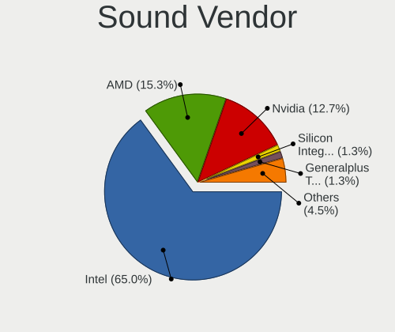

| Vendor                           | Computers | Percent |
|----------------------------------|-----------|---------|
| Intel                            | 102       | 64.97%  |
| AMD                              | 24        | 15.29%  |
| Nvidia                           | 20        | 12.74%  |
| Silicon Integrated Systems [SiS] | 2         | 1.27%   |
| Generalplus Technology           | 2         | 1.27%   |
| VIA Technologies                 | 1         | 0.64%   |
| Tenx Technology                  | 1         | 0.64%   |
| Logitech                         | 1         | 0.64%   |
| Lenovo                           | 1         | 0.64%   |
| Jieli Technology                 | 1         | 0.64%   |
| GYROCOM C&C                      | 1         | 0.64%   |
| GN Netcom                        | 1         | 0.64%   |

Sound Model
-----------

Sound card models

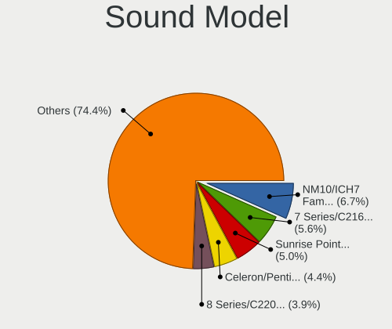

| Model                                                                                             | Computers | Percent |
|---------------------------------------------------------------------------------------------------|-----------|---------|
| Intel NM10/ICH7 Family High Definition Audio Controller                                           | 12        | 6.67%   |
| Intel 7 Series/C216 Chipset Family High Definition Audio Controller                               | 10        | 5.56%   |
| Intel Sunrise Point-LP HD Audio                                                                   | 9         | 5%      |
| Intel Celeron/Pentium Silver Processor High Definition Audio                                      | 8         | 4.44%   |
| Intel 8 Series/C220 Series Chipset High Definition Audio Controller                               | 7         | 3.89%   |
| Intel 82801I (ICH9 Family) HD Audio Controller                                                    | 6         | 3.33%   |
| Intel 5 Series/3400 Series Chipset High Definition Audio                                          | 6         | 3.33%   |
| Intel Wildcat Point-LP High Definition Audio Controller                                           | 5         | 2.78%   |
| Intel Haswell-ULT HD Audio Controller                                                             | 5         | 2.78%   |
| Intel Broadwell-U Audio Controller                                                                | 5         | 2.78%   |
| Intel 8 Series HD Audio Controller                                                                | 5         | 2.78%   |
| Intel 6 Series/C200 Series Chipset Family High Definition Audio Controller                        | 5         | 2.78%   |
| AMD SBx00 Azalia (Intel HDA)                                                                      | 5         | 2.78%   |
| Nvidia High Definition Audio Controller                                                           | 4         | 2.22%   |
| Intel Atom/Celeron/Pentium Processor x5-E8000/J3xxx/N3xxx Series High Definition Audio Controller | 4         | 2.22%   |
| AMD Ryzen HD Audio Controller                                                                     | 4         | 2.22%   |
| Intel 82801H (ICH8 Family) HD Audio Controller                                                    | 3         | 1.67%   |
| AMD Wrestler HDMI Audio                                                                           | 3         | 1.67%   |
| AMD FCH Azalia Controller                                                                         | 3         | 1.67%   |
| Nvidia MCP79 High Definition Audio                                                                | 2         | 1.11%   |
| Nvidia GF119 HDMI Audio Controller                                                                | 2         | 1.11%   |
| Nvidia GF108 High Definition Audio Controller                                                     | 2         | 1.11%   |
| Intel Xeon E3-1200 v3/4th Gen Core Processor HD Audio Controller                                  | 2         | 1.11%   |
| Intel Tiger Lake-LP Smart Sound Technology Audio Controller                                       | 2         | 1.11%   |
| Intel Comet Lake PCH-LP cAVS                                                                      | 2         | 1.11%   |
| Intel Celeron N3350/Pentium N4200/Atom E3900 Series Audio Cluster                                 | 2         | 1.11%   |
| Intel Atom Processor Z36xxx/Z37xxx Series High Definition Audio Controller                        | 2         | 1.11%   |
| Intel 82801FB/FBM/FR/FW/FRW (ICH6 Family) AC'97 Audio Controller                                  | 2         | 1.11%   |
| Intel 100 Series/C230 Series Chipset Family HD Audio Controller                                   | 2         | 1.11%   |
| Generalplus Technology USB Audio Device                                                           | 2         | 1.11%   |
| AMD RV770 HDMI Audio [Radeon HD 4850/4870]                                                        | 2         | 1.11%   |
| AMD RV710/730 HDMI Audio [Radeon HD 4000 series]                                                  | 2         | 1.11%   |
| AMD Renoir/Cezanne HDMI/DP Audio Controller                                                       | 2         | 1.11%   |
| AMD Kabini HDMI/DP Audio                                                                          | 2         | 1.11%   |
| AMD Family 15h (Models 60h-6fh) Audio Controller                                                  | 2         | 1.11%   |
| VIA Technologies VT8233/A/8235/8237 AC97 Audio Controller                                         | 1         | 0.56%   |
| Tenx Technology USB AUDIO                                                                         | 1         | 0.56%   |
| Silicon Integrated Systems [SiS] SiS7012 AC'97 Sound Controller                                   | 1         | 0.56%   |
| Silicon Integrated Systems [SiS] Azalia Audio Controller                                          | 1         | 0.56%   |
| Nvidia TU116 High Definition Audio Controller                                                     | 1         | 0.56%   |

Memory
------

Memory Vendor
-------------

Memory module vendors

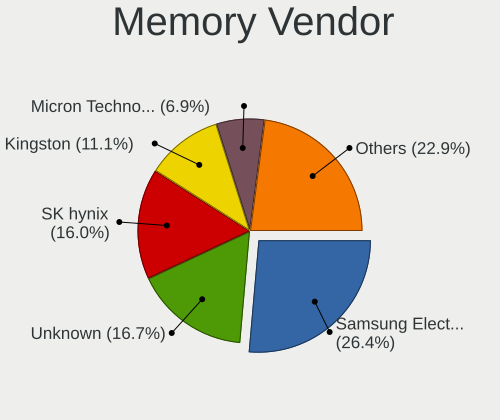

| Vendor              | Computers | Percent |
|---------------------|-----------|---------|
| Samsung Electronics | 38        | 26.39%  |
| Unknown             | 24        | 16.67%  |
| SK hynix            | 23        | 15.97%  |
| Kingston            | 16        | 11.11%  |
| Micron Technology   | 10        | 6.94%   |
| Crucial             | 7         | 4.86%   |
| Corsair             | 5         | 3.47%   |
| ff                  | 3         | 2.08%   |
| 4ea5                | 3         | 2.08%   |
| Ramaxel Technology  | 2         | 1.39%   |
| G.Skill             | 2         | 1.39%   |
| Elpida              | 2         | 1.39%   |
| A-DATA Technology   | 2         | 1.39%   |
| Unknown             | 2         | 1.39%   |
| Unknown (ABCD)      | 1         | 0.69%   |
| Qimonda             | 1         | 0.69%   |
| OCZ                 | 1         | 0.69%   |
| fef5                | 1         | 0.69%   |
| CSX                 | 1         | 0.69%   |

Memory Model
------------

Memory module models

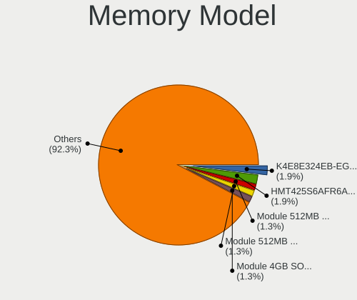

| Model                                                            | Computers | Percent |
|------------------------------------------------------------------|-----------|---------|
| SK hynix RAM HMT425S6AFR6A-PB 2GB SODIMM DDR3 3200MT/s           | 3         | 1.92%   |
| Samsung RAM K4E8E324EB-EGCF 2GB LPDDR3 1867MT/s                  | 3         | 1.92%   |
| Unknown RAM Module 512MB SODIMM DDR                              | 2         | 1.28%   |
| Unknown RAM Module 512MB DIMM                                    | 2         | 1.28%   |
| Unknown RAM Module 4GB SODIMM DDR3 1600MT/s                      | 2         | 1.28%   |
| Unknown RAM Module 1GB SODIMM DDR2                               | 2         | 1.28%   |
| SK hynix RAM Module 4GB SODIMM DDR3 1600MT/s                     | 2         | 1.28%   |
| SK hynix RAM HMT41GS6BFR8A-PB 8GB SODIMM DDR3 2667MT/s           | 2         | 1.28%   |
| SK hynix RAM H9HCNNN8KUMLHR-NME 1GB LPDDR4 2400MT/s              | 2         | 1.28%   |
| Samsung RAM Module 4GB Row Of Chips DDR4 2400MT/s                | 2         | 1.28%   |
| Samsung RAM Module 2GB SODIMM DDR3 1067MT/s                      | 2         | 1.28%   |
| Samsung RAM M471B5173QH0-YK0 4GB SODIMM DDR3 1600MT/s            | 2         | 1.28%   |
| Samsung RAM M471B5173DB0-YK0 4GB SODIMM DDR3 1600MT/s            | 2         | 1.28%   |
| Samsung RAM M471A5244CB0-CWE 4GB SODIMM DDR4 3200MT/s            | 2         | 1.28%   |
| Samsung RAM M471A5244CB0-CTD 4GB SODIMM DDR4 3266MT/s            | 2         | 1.28%   |
| Samsung RAM M471A5244CB0-CRC 4GB SODIMM DDR4 2667MT/s            | 2         | 1.28%   |
| Ramaxel RAM RMT3170EB68F9W1600 4GB SODIMM DDR3 1600MT/s          | 2         | 1.28%   |
| Kingston RAM 99U5428-063.A00LF 8GB SODIMM DDR3 2667MT/s          | 2         | 1.28%   |
| Unknown                                                          | 2         | 1.28%   |
| Unknown RAM Module 8GB SODIMM DDR3                               | 1         | 0.64%   |
| Unknown RAM Module 8192MB DIMM DDR3 1600MT/s                     | 1         | 0.64%   |
| Unknown RAM Module 512MB DIMM SDRAM                              | 1         | 0.64%   |
| Unknown RAM Module 4GB DIMM DDR3 1333MT/s                        | 1         | 0.64%   |
| Unknown RAM Module 4GB DIMM 1066MT/s                             | 1         | 0.64%   |
| Unknown RAM Module 4096MB SODIMM DDR3 1067MT/s                   | 1         | 0.64%   |
| Unknown RAM Module 2GB SODIMM DDR2 800MT/s                       | 1         | 0.64%   |
| Unknown RAM Module 2GB SODIMM DDR                                | 1         | 0.64%   |
| Unknown RAM Module 2GB DIMM DDR3 800MT/s                         | 1         | 0.64%   |
| Unknown RAM Module 2GB DIMM DDR3 1333MT/s                        | 1         | 0.64%   |
| Unknown RAM Module 256MB DIMM                                    | 1         | 0.64%   |
| Unknown RAM Module 2048MB SODIMM DDR2                            | 1         | 0.64%   |
| Unknown RAM Module 2048MB DIMM DDR2 800MT/s                      | 1         | 0.64%   |
| Unknown RAM Module 2048MB DIMM DDR2 667MT/s                      | 1         | 0.64%   |
| Unknown RAM Module 2048MB DIMM DDR2 333MT/s                      | 1         | 0.64%   |
| Unknown RAM Module 1GB SODIMM DDR2 533MT/s                       | 1         | 0.64%   |
| Unknown RAM Module 1GB SODIMM DDR                                | 1         | 0.64%   |
| Unknown RAM Module 1024MB SODIMM DDR                             | 1         | 0.64%   |
| Unknown RAM 3733 C17 Series 8192MB DIMM DDR4 2133MT/s            | 1         | 0.64%   |
| Unknown (ABCD) RAM 123456789012345678 2GB SODIMM LPDDR4 2400MT/s | 1         | 0.64%   |
| SK hynix RAM Module 512MB SODIMM DDR2 533MT/s                    | 1         | 0.64%   |

Memory Kind
-----------

Memory module kinds

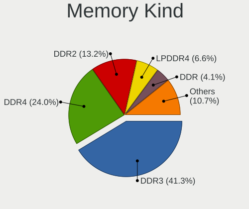

| Kind    | Computers | Percent |
|---------|-----------|---------|
| DDR3    | 50        | 41.32%  |
| DDR4    | 29        | 23.97%  |
| DDR2    | 16        | 13.22%  |
| LPDDR4  | 8         | 6.61%   |
| DDR     | 5         | 4.13%   |
| Unknown | 5         | 4.13%   |
| LPDDR3  | 4         | 3.31%   |
| SDRAM   | 2         | 1.65%   |
| LPDDR5  | 1         | 0.83%   |
| DDR5    | 1         | 0.83%   |

Memory Form Factor
------------------

Physical design of the memory module

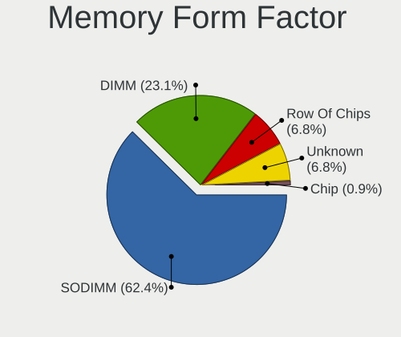

| Name         | Computers | Percent |
|--------------|-----------|---------|
| SODIMM       | 73        | 62.39%  |
| DIMM         | 27        | 23.08%  |
| Row Of Chips | 8         | 6.84%   |
| Unknown      | 8         | 6.84%   |
| Chip         | 1         | 0.85%   |

Memory Size
-----------

Memory module size

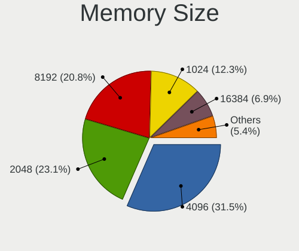

| Size  | Computers | Percent |
|-------|-----------|---------|
| 4096  | 41        | 31.54%  |
| 2048  | 30        | 23.08%  |
| 8192  | 27        | 20.77%  |
| 1024  | 16        | 12.31%  |
| 16384 | 9         | 6.92%   |
| 512   | 6         | 4.62%   |
| 256   | 1         | 0.77%   |

Memory Speed
------------

Memory module speed

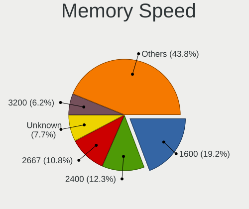

| Speed   | Computers | Percent |
|---------|-----------|---------|
| 1600    | 25        | 19.23%  |
| 2400    | 16        | 12.31%  |
| 2667    | 14        | 10.77%  |
| Unknown | 10        | 7.69%   |
| 3200    | 8         | 6.15%   |
| 1333    | 7         | 5.38%   |
| 1067    | 6         | 4.62%   |
| 800     | 5         | 3.85%   |
| 667     | 5         | 3.85%   |
| 533     | 5         | 3.85%   |
| 1867    | 4         | 3.08%   |
| 1334    | 4         | 3.08%   |
| 2133    | 3         | 2.31%   |
| 3266    | 2         | 1.54%   |
| 1866    | 2         | 1.54%   |
| 1066    | 2         | 1.54%   |
| 8400    | 1         | 0.77%   |
| 6400    | 1         | 0.77%   |
| 5600    | 1         | 0.77%   |
| 4267    | 1         | 0.77%   |
| 4199    | 1         | 0.77%   |
| 4000    | 1         | 0.77%   |
| 3800    | 1         | 0.77%   |
| 3733    | 1         | 0.77%   |
| 3000    | 1         | 0.77%   |
| 2000    | 1         | 0.77%   |
| 1632    | 1         | 0.77%   |
| 333     | 1         | 0.77%   |

Printers & scanners
-------------------

Printer Vendor
--------------

Printer device vendors

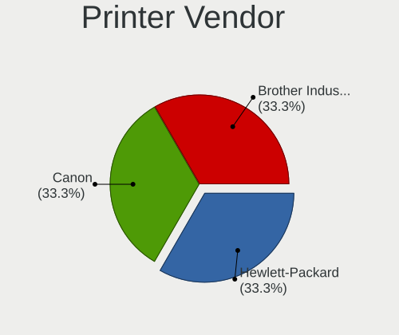

| Vendor             | Computers | Percent |
|--------------------|-----------|---------|
| Hewlett-Packard    | 1         | 33.33%  |
| Canon              | 1         | 33.33%  |
| Brother Industries | 1         | 33.33%  |

Printer Model
-------------

Printer device models

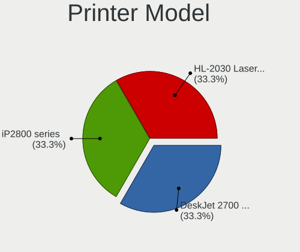

| Model                         | Computers | Percent |
|-------------------------------|-----------|---------|
| HP DeskJet 2700 series        | 1         | 33.33%  |
| Canon iP2800 series           | 1         | 33.33%  |
| Brother HL-2030 Laser Printer | 1         | 33.33%  |

Scanner Vendor
--------------

Scanner device vendors

Zero info for selected period =(

Scanner Model
-------------

Scanner device models

Zero info for selected period =(

Camera
------

Camera Vendor
-------------

Camera device vendors

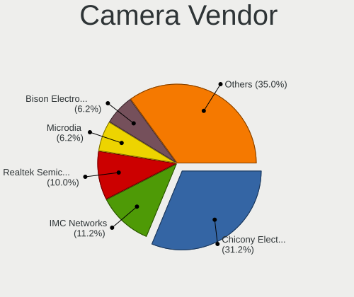

| Vendor                                 | Computers | Percent |
|----------------------------------------|-----------|---------|
| Chicony Electronics                    | 25        | 31.25%  |
| IMC Networks                           | 9         | 11.25%  |
| Realtek Semiconductor                  | 8         | 10%     |
| Microdia                               | 5         | 6.25%   |
| Bison Electronics                      | 5         | 6.25%   |
| Apple                                  | 4         | 5%      |
| Suyin                                  | 3         | 3.75%   |
| Sunplus Innovation Technology          | 3         | 3.75%   |
| Silicon Motion                         | 3         | 3.75%   |
| Quanta                                 | 3         | 3.75%   |
| Lite-On Technology                     | 2         | 2.5%    |
| Z-Star Microelectronics                | 1         | 1.25%   |
| Syntek                                 | 1         | 1.25%   |
| Ricoh                                  | 1         | 1.25%   |
| Luxvisions Innotech Limited            | 1         | 1.25%   |
| Logitech                               | 1         | 1.25%   |
| icSpring                               | 1         | 1.25%   |
| Hewlett-Packard                        | 1         | 1.25%   |
| Cheng Uei Precision Industry (Foxlink) | 1         | 1.25%   |
| Allwinner Technology                   | 1         | 1.25%   |
| ALi                                    | 1         | 1.25%   |

Camera Model
------------

Camera device models

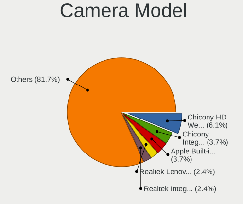

| Model                                     | Computers | Percent |
|-------------------------------------------|-----------|---------|
| Chicony HD WebCam                         | 5         | 6.1%    |
| Chicony Integrated Camera                 | 3         | 3.66%   |
| Apple Built-in iSight                     | 3         | 3.66%   |
| Realtek Lenovo EasyCamera                 | 2         | 2.44%   |
| Realtek Integrated Camera                 | 2         | 2.44%   |
| Lite-On Integrated Camera                 | 2         | 2.44%   |
| IMC Networks USB2.0 HD UVC WebCam         | 2         | 2.44%   |
| IMC Networks Integrated Camera            | 2         | 2.44%   |
| Chicony Sony Visual Communication Camera  | 2         | 2.44%   |
| Chicony HP TrueVision HD Camera           | 2         | 2.44%   |
| Chicony HD User Facing                    | 2         | 2.44%   |
| Bison Lenovo Integrated Webcam            | 2         | 2.44%   |
| Z-Star Integrated Camera                  | 1         | 1.22%   |
| Syntek HP Webcam                          | 1         | 1.22%   |
| Suyin Integrated_Webcam_HD                | 1         | 1.22%   |
| Suyin HP Webcam                           | 1         | 1.22%   |
| Suyin Acer CrystalEye Webcam              | 1         | 1.22%   |
| Sunplus Laptop_Integrated_Webcam_1.3M     | 1         | 1.22%   |
| Sunplus Full HD webcam                    | 1         | 1.22%   |
| Sunplus Dell Integrated Webcam            | 1         | 1.22%   |
| Silicon Motion WebCam SC-10HDD12636N      | 1         | 1.22%   |
| Silicon Motion HP Webcam-50               | 1         | 1.22%   |
| Silicon Motion 720p HD Camera             | 1         | 1.22%   |
| Ricoh Sony Vaio Integrated Webcam         | 1         | 1.22%   |
| Realtek Integrated_Webcam_HD              | 1         | 1.22%   |
| Realtek HP Webcam                         | 1         | 1.22%   |
| Realtek HD WebCam                         | 1         | 1.22%   |
| Realtek FJ Camera                         | 1         | 1.22%   |
| Quanta VGA User Facing                    | 1         | 1.22%   |
| Quanta HP Webcam                          | 1         | 1.22%   |
| Quanta HD WebCam                          | 1         | 1.22%   |
| Microdia USB 2.0 Camera                   | 1         | 1.22%   |
| Microdia Laptop_Integrated_Webcam_2M      | 1         | 1.22%   |
| Microdia Integrated_Webcam_HD             | 1         | 1.22%   |
| Microdia HP Webcam                        | 1         | 1.22%   |
| Microdia Camera                           | 1         | 1.22%   |
| Luxvisions Innotech Limited HP FHD Camera | 1         | 1.22%   |
| Logitech Webcam C930e                     | 1         | 1.22%   |
| Logitech BCC950 ConferenceCam             | 1         | 1.22%   |
| IMC Networks UVC VGA Webcam               | 1         | 1.22%   |

Security
--------

Fingerprint Vendor
------------------

Fingerprint sensor vendors

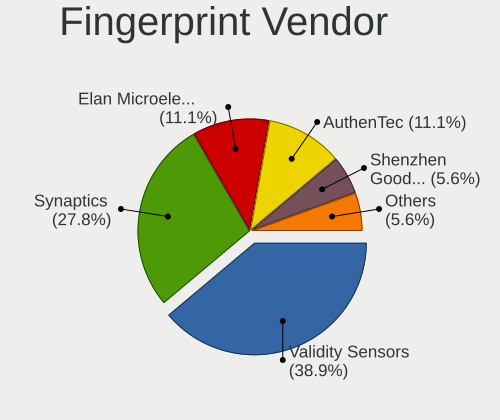

| Vendor                     | Computers | Percent |
|----------------------------|-----------|---------|
| Validity Sensors           | 7         | 38.89%  |
| Synaptics                  | 5         | 27.78%  |
| Elan Microelectronics      | 2         | 11.11%  |
| AuthenTec                  | 2         | 11.11%  |
| STMicroelectronics         | 1         | 5.56%   |
| Shenzhen Goodix Technology | 1         | 5.56%   |

Fingerprint Model
-----------------

Fingerprint sensor models

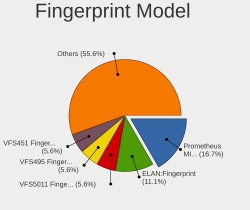

| Model                                                                      | Computers | Percent |
|----------------------------------------------------------------------------|-----------|---------|
| Synaptics Prometheus MIS Touch Fingerprint Reader                          | 3         | 16.67%  |
| Elan ELAN:Fingerprint                                                      | 2         | 11.11%  |
| Validity Sensors VFS5011 Fingerprint Reader                                | 1         | 5.56%   |
| Validity Sensors VFS495 Fingerprint Reader                                 | 1         | 5.56%   |
| Validity Sensors VFS451 Fingerprint Reader                                 | 1         | 5.56%   |
| Validity Sensors VFS300 Fingerprint Reader                                 | 1         | 5.56%   |
| Validity Sensors VFS 5011 fingerprint sensor                               | 1         | 5.56%   |
| Validity Sensors Synaptics WBDI                                            | 1         | 5.56%   |
| Validity Sensors Synaptics VFS7552 Touch Fingerprint Sensor with PurePrint | 1         | 5.56%   |
| Synaptics Metallica MIS Touch Fingerprint Reader                           | 1         | 5.56%   |
| Synaptics FS7604 Touch Fingerprint Sensor with PurePrint                   | 1         | 5.56%   |
| STMicroelectronics Fingerprint Reader                                      | 1         | 5.56%   |
| Shenzhen Goodix  Fingerprint Device                                        | 1         | 5.56%   |
| AuthenTec AES2501 Fingerprint Sensor                                       | 1         | 5.56%   |
| AuthenTec AES1660 Fingerprint Sensor                                       | 1         | 5.56%   |

Chipcard Vendor
---------------

Chipcard module vendors

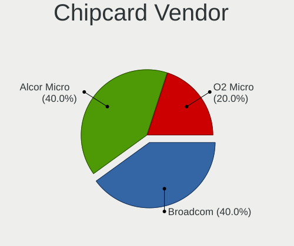

| Vendor      | Computers | Percent |
|-------------|-----------|---------|
| Broadcom    | 2         | 40%     |
| Alcor Micro | 2         | 40%     |
| O2 Micro    | 1         | 20%     |

Chipcard Model
--------------

Chipcard module models

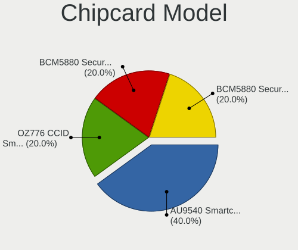

| Model                                                                        | Computers | Percent |
|------------------------------------------------------------------------------|-----------|---------|
| Alcor Micro AU9540 Smartcard Reader                                          | 2         | 40%     |
| O2 Micro OZ776 CCID Smartcard Reader                                         | 1         | 20%     |
| Broadcom BCM5880 Secure Applications Processor with fingerprint swipe sensor | 1         | 20%     |
| Broadcom BCM5880 Secure Applications Processor                               | 1         | 20%     |

Unsupported
-----------

Unsupported Devices
-------------------

Total unsupported devices on board

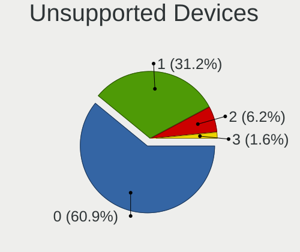

| Total | Computers | Percent |
|-------|-----------|---------|
| 0     | 78        | 60.94%  |
| 1     | 40        | 31.25%  |
| 2     | 8         | 6.25%   |
| 3     | 2         | 1.56%   |

Unsupported Device Types
------------------------

Types of unsupported devices

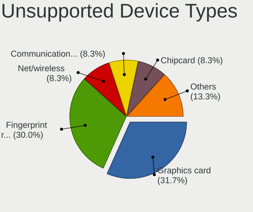

| Type                     | Computers | Percent |
|--------------------------|-----------|---------|
| Graphics card            | 19        | 31.67%  |
| Fingerprint reader       | 18        | 30%     |
| Net/wireless             | 5         | 8.33%   |
| Communication controller | 5         | 8.33%   |
| Chipcard                 | 5         | 8.33%   |
| Multimedia controller    | 4         | 6.67%   |
| Camera                   | 2         | 3.33%   |
| Unassigned class         | 1         | 1.67%   |
| Card reader              | 1         | 1.67%   |

