CachyOS - Tested Hardware & Statistics
--------------------------------------

A project to collect tested hardware configurations for CachyOS.

Anyone can contribute to this report by the [hw-probe](https://github.com/linuxhw/hw-probe) tool:

    sudo -E hw-probe -all -upload

Please contribute! Especially if your hardware is rare.

This is a report for all computer types. See also reports for [desktops](/Dist/CachyOS/Desktop/README.md) and [notebooks](/Dist/CachyOS/Notebook/README.md).

Contents
--------

* [ Test Cases ](#test-cases)

* [ System ](#system)
  - [ OS                       ](#os)
  - [ OS Family                ](#os-family)
  - [ Kernel                   ](#kernel)
  - [ Kernel Family            ](#kernel-family)
  - [ Kernel Major Ver.        ](#kernel-major-ver)
  - [ Arch                     ](#arch)
  - [ DE                       ](#de)
  - [ Display Server           ](#display-server)
  - [ Display Manager          ](#display-manager)
  - [ OS Lang                  ](#os-lang)
  - [ Boot Mode                ](#boot-mode)
  - [ Filesystem               ](#filesystem)
  - [ Part. scheme             ](#part-scheme)
  - [ Dual Boot with Linux/BSD ](#dual-boot-with-linuxbsd)
  - [ Dual Boot (Win)          ](#dual-boot-win)

* [ Board ](#board)
  - [ Vendor                   ](#vendor)
  - [ Model                    ](#model)
  - [ Model Family             ](#model-family)
  - [ MFG Year                 ](#mfg-year)
  - [ Form Factor              ](#form-factor)
  - [ Secure Boot              ](#secure-boot)
  - [ Coreboot                 ](#coreboot)
  - [ RAM Size                 ](#ram-size)
  - [ RAM Used                 ](#ram-used)
  - [ Total Drives             ](#total-drives)
  - [ Has CD-ROM               ](#has-cd-rom)
  - [ Has Ethernet             ](#has-ethernet)
  - [ Has WiFi                 ](#has-wifi)
  - [ Has Bluetooth            ](#has-bluetooth)

* [ Location ](#location)
  - [ Country                  ](#country)
  - [ City                     ](#city)

* [ Drives ](#drives)
  - [ Drive Vendor             ](#drive-vendor)
  - [ Drive Model              ](#drive-model)
  - [ HDD Vendor               ](#hdd-vendor)
  - [ SSD Vendor               ](#ssd-vendor)
  - [ Drive Kind               ](#drive-kind)
  - [ Drive Connector          ](#drive-connector)
  - [ Drive Size               ](#drive-size)
  - [ Space Total              ](#space-total)
  - [ Space Used               ](#space-used)
  - [ Malfunc. Drives          ](#malfunc-drives)
  - [ Malfunc. Drive Vendor    ](#malfunc-drive-vendor)
  - [ Malfunc. HDD Vendor      ](#malfunc-hdd-vendor)
  - [ Malfunc. Drive Kind      ](#malfunc-drive-kind)
  - [ Failed Drives            ](#failed-drives)
  - [ Failed Drive Vendor      ](#failed-drive-vendor)
  - [ Drive Status             ](#drive-status)

* [ Storage controller ](#storage-controller)
  - [ Storage Vendor           ](#storage-vendor)
  - [ Storage Model            ](#storage-model)
  - [ Storage Kind             ](#storage-kind)

* [ Processor ](#processor)
  - [ CPU Vendor               ](#cpu-vendor)
  - [ CPU Model                ](#cpu-model)
  - [ CPU Model Family         ](#cpu-model-family)
  - [ CPU Cores                ](#cpu-cores)
  - [ CPU Sockets              ](#cpu-sockets)
  - [ CPU Threads              ](#cpu-threads)
  - [ CPU Op-Modes             ](#cpu-op-modes)
  - [ CPU Microcode            ](#cpu-microcode)
  - [ CPU Microarch            ](#cpu-microarch)

* [ Graphics ](#graphics)
  - [ GPU Vendor               ](#gpu-vendor)
  - [ GPU Model                ](#gpu-model)
  - [ GPU Combo                ](#gpu-combo)
  - [ GPU Driver               ](#gpu-driver)
  - [ GPU Memory               ](#gpu-memory)

* [ Monitor ](#monitor)
  - [ Monitor Vendor           ](#monitor-vendor)
  - [ Monitor Model            ](#monitor-model)
  - [ Monitor Resolution       ](#monitor-resolution)
  - [ Monitor Diagonal         ](#monitor-diagonal)
  - [ Monitor Width            ](#monitor-width)
  - [ Aspect Ratio             ](#aspect-ratio)
  - [ Monitor Area             ](#monitor-area)
  - [ Pixel Density            ](#pixel-density)
  - [ Multiple Monitors        ](#multiple-monitors)

* [ Network ](#network)
  - [ Net Controller Vendor    ](#net-controller-vendor)
  - [ Net Controller Model     ](#net-controller-model)
  - [ Wireless Vendor          ](#wireless-vendor)
  - [ Wireless Model           ](#wireless-model)
  - [ Ethernet Vendor          ](#ethernet-vendor)
  - [ Ethernet Model           ](#ethernet-model)
  - [ Net Controller Kind      ](#net-controller-kind)
  - [ Used Controller          ](#used-controller)
  - [ NICs                     ](#nics)
  - [ IPv6                     ](#ipv6)

* [ Bluetooth ](#bluetooth)
  - [ Bluetooth Vendor         ](#bluetooth-vendor)
  - [ Bluetooth Model          ](#bluetooth-model)

* [ Sound ](#sound)
  - [ Sound Vendor             ](#sound-vendor)
  - [ Sound Model              ](#sound-model)

* [ Memory ](#memory)
  - [ Memory Vendor            ](#memory-vendor)
  - [ Memory Model             ](#memory-model)
  - [ Memory Kind              ](#memory-kind)
  - [ Memory Form Factor       ](#memory-form-factor)
  - [ Memory Size              ](#memory-size)
  - [ Memory Speed             ](#memory-speed)

* [ Printers & scanners ](#printers--scanners)
  - [ Printer Vendor           ](#printer-vendor)
  - [ Printer Model            ](#printer-model)
  - [ Scanner Vendor           ](#scanner-vendor)
  - [ Scanner Model            ](#scanner-model)

* [ Camera ](#camera)
  - [ Camera Vendor            ](#camera-vendor)
  - [ Camera Model             ](#camera-model)

* [ Security ](#security)
  - [ Fingerprint Vendor       ](#fingerprint-vendor)
  - [ Fingerprint Model        ](#fingerprint-model)
  - [ Chipcard Vendor          ](#chipcard-vendor)
  - [ Chipcard Model           ](#chipcard-model)

* [ Unsupported ](#unsupported)
  - [ Unsupported Devices      ](#unsupported-devices)
  - [ Unsupported Device Types ](#unsupported-device-types)

Test Cases
----------

Total: 1497

| Vendor        | Model                       | Form-Factor | Probe                                                      | Date         |
|---------------|-----------------------------|-------------|------------------------------------------------------------|--------------|
| ASUSTek       | PRIME H610M-K D4            | Desktop     | [85f7ec5a23](https://linux-hardware.org/?probe=85f7ec5a23) | Jan 03, 2026 |
| Acer          | Nitro AN515-45              | Notebook    | [5a9317a7dd](https://linux-hardware.org/?probe=5a9317a7dd) | Jan 03, 2026 |
| ASRock        | X670E Taichi Carrara        | Desktop     | [c5b30f8440](https://linux-hardware.org/?probe=c5b30f8440) | Jan 03, 2026 |
| ASUSTek       | PRIME B760M-A AX6 II        | Notebook    | [4652cab879](https://linux-hardware.org/?probe=4652cab879) | Jan 03, 2026 |
| ASUSTek       | ROG STRIX X870E-E GAMING... | Desktop     | [0a19cf5315](https://linux-hardware.org/?probe=0a19cf5315) | Jan 02, 2026 |
| MSI           | A520M-A PRO                 | Desktop     | [370180c89b](https://linux-hardware.org/?probe=370180c89b) | Jan 02, 2026 |
| MSI           | A520M-A PRO                 | Desktop     | [f5c1d61cb6](https://linux-hardware.org/?probe=f5c1d61cb6) | Jan 02, 2026 |
| Intel         | X99                         | Desktop     | [a3ce3bf346](https://linux-hardware.org/?probe=a3ce3bf346) | Jan 02, 2026 |
| ASUSTek       | PRIME B450-PLUS             | Desktop     | [9e5aaa25a9](https://linux-hardware.org/?probe=9e5aaa25a9) | Jan 02, 2026 |
| ASRock        | B450M Pro4                  | Desktop     | [e7e95e897c](https://linux-hardware.org/?probe=e7e95e897c) | Jan 02, 2026 |
| Lenovo        | Legion Pro 5 16IAX10H 83... | Notebook    | [2f4ecc7ced](https://linux-hardware.org/?probe=2f4ecc7ced) | Jan 01, 2026 |
| Dell          | Latitude E6520              | Notebook    | [08b381e9b7](https://linux-hardware.org/?probe=08b381e9b7) | Jan 01, 2026 |
| Framework     | Laptop 16 (AMD Ryzen 704... | Notebook    | [6a609dced8](https://linux-hardware.org/?probe=6a609dced8) | Jan 01, 2026 |
| Dell          | Latitude E6520              | Notebook    | [6a58063da2](https://linux-hardware.org/?probe=6a58063da2) | Jan 01, 2026 |
| Monster       | ABRA A5 V15.2               | Notebook    | [f8a69dc929](https://linux-hardware.org/?probe=f8a69dc929) | Jan 01, 2026 |
| Fujitsu       | FMVUH08002                  | Convertible | [e620022282](https://linux-hardware.org/?probe=e620022282) | Dec 31, 2025 |
| Gigabyte      | Z77X-UD5H                   | Desktop     | [1932bc33bd](https://linux-hardware.org/?probe=1932bc33bd) | Dec 31, 2025 |
| ASUSTek       | ROG CROSSHAIR VII HERO      | Desktop     | [229b87cd3b](https://linux-hardware.org/?probe=229b87cd3b) | Dec 31, 2025 |
| Toshiba       | Satellite C670-12E          | Notebook    | [58c06f5a29](https://linux-hardware.org/?probe=58c06f5a29) | Dec 30, 2025 |
| ASUSTek       | ASUS Zenbook S 16 UM5606... | Notebook    | [aefe0014ce](https://linux-hardware.org/?probe=aefe0014ce) | Dec 30, 2025 |
| ASUSTek       | PRIME Z370-P                | Desktop     | [32abf75bf4](https://linux-hardware.org/?probe=32abf75bf4) | Dec 30, 2025 |
| Lenovo        | IdeaPad Gaming 3 15ARH7 ... | Notebook    | [47117fefda](https://linux-hardware.org/?probe=47117fefda) | Dec 30, 2025 |
| ASUSTek       | VivoBook_ASUSLaptop M160... | Notebook    | [5fa3fdadf1](https://linux-hardware.org/?probe=5fa3fdadf1) | Dec 29, 2025 |
| Dell          | Precision 7550              | Notebook    | [8343b4fae0](https://linux-hardware.org/?probe=8343b4fae0) | Dec 29, 2025 |
| MSI           | Z370 PC PRO                 | Desktop     | [98c880cf34](https://linux-hardware.org/?probe=98c880cf34) | Dec 29, 2025 |
| Gigabyte      | B365M D3H-CF                | Desktop     | [c8fff66d28](https://linux-hardware.org/?probe=c8fff66d28) | Dec 29, 2025 |
| Acer          | Predator PHN16-71           | Notebook    | [fddb4b7fc2](https://linux-hardware.org/?probe=fddb4b7fc2) | Dec 29, 2025 |
| MSI           | Prestige 16 AI Studio B1... | Notebook    | [907616a9af](https://linux-hardware.org/?probe=907616a9af) | Dec 28, 2025 |
| ASUSTek       | TUF Gaming B850-PLUS WIF... | Desktop     | [bb0f4423e3](https://linux-hardware.org/?probe=bb0f4423e3) | Dec 28, 2025 |
| Microsoft     | Surface Pro 7               | Tablet      | [7df07c3b1a](https://linux-hardware.org/?probe=7df07c3b1a) | Dec 28, 2025 |
| Lenovo        | ThinkPad R500 27147TG       | Notebook    | [c19fd4fadc](https://linux-hardware.org/?probe=c19fd4fadc) | Dec 28, 2025 |
| Lenovo        | ThinkPad R500 27147TG       | Notebook    | [e735d85dce](https://linux-hardware.org/?probe=e735d85dce) | Dec 28, 2025 |
| HUAWEI        | BOD-WXX9                    | Notebook    | [670417e510](https://linux-hardware.org/?probe=670417e510) | Dec 27, 2025 |
| ASUSTek       | ROG STRIX Z790-F GAMING ... | Desktop     | [fd6c6399ca](https://linux-hardware.org/?probe=fd6c6399ca) | Dec 27, 2025 |
| ASUSTek       | TUF Gaming A620M-PLUS WI... | Desktop     | [469b0ccb13](https://linux-hardware.org/?probe=469b0ccb13) | Dec 27, 2025 |
| Dell          | Latitude 7390               | Notebook    | [ea1f95328e](https://linux-hardware.org/?probe=ea1f95328e) | Dec 27, 2025 |
| Gigabyte      | X570S AORUS PRO AX          | Desktop     | [232ad44eed](https://linux-hardware.org/?probe=232ad44eed) | Dec 27, 2025 |
| Microsoft     | Surface Go                  | Tablet      | [71b4b1eacd](https://linux-hardware.org/?probe=71b4b1eacd) | Dec 27, 2025 |
| Lenovo        | ThinkPad X230 23252FG       | Notebook    | [e148e0dea7](https://linux-hardware.org/?probe=e148e0dea7) | Dec 27, 2025 |
| ASUSTek       | ASUS EXPERTBOOK PM3406CK... | Notebook    | [71b5f3b05b](https://linux-hardware.org/?probe=71b5f3b05b) | Dec 26, 2025 |
| Gigabyte      | B650 GAMING X AX V2         | Desktop     | [b34f2cce45](https://linux-hardware.org/?probe=b34f2cce45) | Dec 26, 2025 |
| Schenker      | XMG EVO (M24)               | Notebook    | [3c9ed7a8e1](https://linux-hardware.org/?probe=3c9ed7a8e1) | Dec 26, 2025 |
| ASUSTek       | G15DK                       | Desktop     | [6a002b0832](https://linux-hardware.org/?probe=6a002b0832) | Dec 26, 2025 |
| MSI           | B650 GAMING PLUS WIFI       | Desktop     | [fd99f23103](https://linux-hardware.org/?probe=fd99f23103) | Dec 26, 2025 |
| Monster       | HUMA H4 V6.1                | Notebook    | [cb037977c7](https://linux-hardware.org/?probe=cb037977c7) | Dec 25, 2025 |
| Lenovo        | LOQ 15IRX9 83DV             | Notebook    | [d455dc4074](https://linux-hardware.org/?probe=d455dc4074) | Dec 25, 2025 |
| Biostar       | A320MH                      | Desktop     | [1ff799dce2](https://linux-hardware.org/?probe=1ff799dce2) | Dec 25, 2025 |
| ASUSTek       | ROG STRIX Z690-F GAMING ... | Desktop     | [bc9db686b2](https://linux-hardware.org/?probe=bc9db686b2) | Dec 25, 2025 |
| Acer          | Swift SFG14-63              | Notebook    | [5600bd5a2d](https://linux-hardware.org/?probe=5600bd5a2d) | Dec 25, 2025 |
| Alienware     | 16X Aurora AC16251          | Notebook    | [34f4571f6a](https://linux-hardware.org/?probe=34f4571f6a) | Dec 24, 2025 |
| Gigabyte      | B650 GAMING X               | Desktop     | [571f5a5004](https://linux-hardware.org/?probe=571f5a5004) | Dec 24, 2025 |
| MSI           | MPG X870E CARBON WIFI       | Desktop     | [762e909916](https://linux-hardware.org/?probe=762e909916) | Dec 24, 2025 |
| ASUSTek       | TUF Gaming X570-PLUS        | Desktop     | [98acfa2c5c](https://linux-hardware.org/?probe=98acfa2c5c) | Dec 23, 2025 |
| ASUSTek       | ROG STRIX B550-F GAMING ... | Desktop     | [e7374e4d94](https://linux-hardware.org/?probe=e7374e4d94) | Dec 23, 2025 |
| ASUSTek       | ROG STRIX B650E-I GAMING... | Desktop     | [e0fb51cb69](https://linux-hardware.org/?probe=e0fb51cb69) | Dec 23, 2025 |
| Dell          | 0KWVT8 A03                  | Desktop     | [83da5d4155](https://linux-hardware.org/?probe=83da5d4155) | Dec 23, 2025 |
| ASUSTek       | ROG STRIX B650E-I GAMING... | Desktop     | [9b6861f418](https://linux-hardware.org/?probe=9b6861f418) | Dec 23, 2025 |
| Microsoft     | Surface Pro 3               | Tablet      | [f039866b4f](https://linux-hardware.org/?probe=f039866b4f) | Dec 23, 2025 |
| HONOR         | FRI-HXX                     | Notebook    | [ee8332097d](https://linux-hardware.org/?probe=ee8332097d) | Dec 22, 2025 |
| ASUSTek       | VivoBook_ASUSLaptop M370... | Notebook    | [3faf5a656c](https://linux-hardware.org/?probe=3faf5a656c) | Dec 22, 2025 |
| Dell          | Latitude 7410               | Convertible | [ec1ca00412](https://linux-hardware.org/?probe=ec1ca00412) | Dec 22, 2025 |
| ASUSTek       | ROG STRIX B450-F GAMING     | Desktop     | [59cf8c3a56](https://linux-hardware.org/?probe=59cf8c3a56) | Dec 21, 2025 |
| Acer          | Predator PTN16-51           | Notebook    | [bcbabbdcdf](https://linux-hardware.org/?probe=bcbabbdcdf) | Dec 21, 2025 |
| ASUSTek       | VivoBook_ASUSLaptop M370... | Notebook    | [40c862c871](https://linux-hardware.org/?probe=40c862c871) | Dec 21, 2025 |
| ASUSTek       | ROG STRIX B850-E GAMING ... | Desktop     | [7f450f4e51](https://linux-hardware.org/?probe=7f450f4e51) | Dec 21, 2025 |
| Supermicro    | X12SCA-5F                   | Server      | [396a690d96](https://linux-hardware.org/?probe=396a690d96) | Dec 21, 2025 |
| HP            | EliteBook 840 G6            | Notebook    | [09f9408fe8](https://linux-hardware.org/?probe=09f9408fe8) | Dec 20, 2025 |
| Apple         | Mac-27AD2F918AE68F61 Mac... | Desktop     | [ebfaa32688](https://linux-hardware.org/?probe=ebfaa32688) | Dec 20, 2025 |
| Acer          | Aspire A715-43G             | Notebook    | [a61abd2f1a](https://linux-hardware.org/?probe=a61abd2f1a) | Dec 19, 2025 |
| ASUSTek       | ROG STRIX Z390-F GAMING     | Desktop     | [d52f70228a](https://linux-hardware.org/?probe=d52f70228a) | Dec 19, 2025 |
| MSI           | MPG B550 GAMING PLUS        | Desktop     | [8ffafc8bb3](https://linux-hardware.org/?probe=8ffafc8bb3) | Dec 19, 2025 |
| MSI           | MPG B550 GAMING PLUS        | Desktop     | [a054a77f52](https://linux-hardware.org/?probe=a054a77f52) | Dec 18, 2025 |
| ASUSTek       | ROG STRIX X870E-E GAMING... | Desktop     | [087b7f31a1](https://linux-hardware.org/?probe=087b7f31a1) | Dec 18, 2025 |
| Lenovo        | Legion Pro 5 16IAX10 83F... | Notebook    | [481a69d244](https://linux-hardware.org/?probe=481a69d244) | Dec 18, 2025 |
| MSI           | MAG B850 TOMAHAWK MAX WI... | Desktop     | [36a61e916f](https://linux-hardware.org/?probe=36a61e916f) | Dec 17, 2025 |
| Dell          | Inspiron 16 7630 2-in-1     | Convertible | [d9e454a729](https://linux-hardware.org/?probe=d9e454a729) | Dec 17, 2025 |
| HP            | 3398                        | Desktop     | [8fab1e3add](https://linux-hardware.org/?probe=8fab1e3add) | Dec 17, 2025 |
| ASUSTek       | ROG CROSSHAIR VIII FORMU... | Desktop     | [d7dadfa8db](https://linux-hardware.org/?probe=d7dadfa8db) | Dec 16, 2025 |
| Unknown       | V1.0                        | Desktop     | [8dfcaf876d](https://linux-hardware.org/?probe=8dfcaf876d) | Dec 16, 2025 |
| HP            | ZBook Ultra G1a 14 inch ... | Notebook    | [134ee0d587](https://linux-hardware.org/?probe=134ee0d587) | Dec 16, 2025 |
| HP            | EliteBook 840 G6            | Notebook    | [59bd6296b0](https://linux-hardware.org/?probe=59bd6296b0) | Dec 16, 2025 |
| Lenovo        | V15 G2 ALC 82KD             | Notebook    | [0d7c1aa881](https://linux-hardware.org/?probe=0d7c1aa881) | Dec 16, 2025 |
| Dell          | Latitude 3350               | Notebook    | [81b7901691](https://linux-hardware.org/?probe=81b7901691) | Dec 16, 2025 |
| ASUSTek       | ASUS Zenbook 14 UX3405MA... | Notebook    | [2ce8ad8715](https://linux-hardware.org/?probe=2ce8ad8715) | Dec 16, 2025 |
| Lenovo        | Legion 5P 15IMH05H 82AW     | Notebook    | [d8bcbef6a7](https://linux-hardware.org/?probe=d8bcbef6a7) | Dec 16, 2025 |
| MSI           | MPG X570 GAMING EDGE WIF... | Desktop     | [e78ce4ab2f](https://linux-hardware.org/?probe=e78ce4ab2f) | Dec 15, 2025 |
| Gigabyte      | B450 AORUS M                | Desktop     | [f56a7e28c7](https://linux-hardware.org/?probe=f56a7e28c7) | Dec 15, 2025 |
| Acer          | Aspire A715-43G             | Notebook    | [ffedd20e44](https://linux-hardware.org/?probe=ffedd20e44) | Dec 15, 2025 |
| Gigabyte      | Z390 DESIGNARE-CF           | Desktop     | [e67afb7463](https://linux-hardware.org/?probe=e67afb7463) | Dec 15, 2025 |
| ASRock        | B650M Pro RS                | Desktop     | [748112bf2d](https://linux-hardware.org/?probe=748112bf2d) | Dec 15, 2025 |
| Lenovo        | Legion Pro 7 16AFR10H 83... | Notebook    | [85eead9236](https://linux-hardware.org/?probe=85eead9236) | Dec 15, 2025 |
| Lenovo        | Legion 5 Pro 16ACH6H 82J... | Notebook    | [b901c8aad2](https://linux-hardware.org/?probe=b901c8aad2) | Dec 15, 2025 |
| Lenovo        | Legion 5 Pro 16ACH6H 82J... | Notebook    | [5558c516ed](https://linux-hardware.org/?probe=5558c516ed) | Dec 15, 2025 |
| Lenovo        | IdeaPad 3 15ALC6 82MF       | Notebook    | [a6a8ad5fb4](https://linux-hardware.org/?probe=a6a8ad5fb4) | Dec 14, 2025 |
| Lenovo        | IdeaPad 3 15ALC6 82MF       | Notebook    | [d1c58baf59](https://linux-hardware.org/?probe=d1c58baf59) | Dec 14, 2025 |
| HP            | Laptop 15-dy5xxx            | Notebook    | [7d3d4e7afc](https://linux-hardware.org/?probe=7d3d4e7afc) | Dec 14, 2025 |
| HP            | Laptop 15-dy5xxx            | Notebook    | [3d3c6ae3d7](https://linux-hardware.org/?probe=3d3c6ae3d7) | Dec 14, 2025 |
| Gigabyte      | X570 AORUS PRO WIFI         | Desktop     | [43851e99ed](https://linux-hardware.org/?probe=43851e99ed) | Dec 14, 2025 |
| MACHINIST     | X99-RS9 V2.0                | Desktop     | [4bc608374d](https://linux-hardware.org/?probe=4bc608374d) | Dec 14, 2025 |
| Gigabyte      | B850 GAMING WIFI6           | Desktop     | [e321f3bc40](https://linux-hardware.org/?probe=e321f3bc40) | Dec 14, 2025 |
| Dell          | 0N4YC8 A00                  | Desktop     | [ad2dfcd1b6](https://linux-hardware.org/?probe=ad2dfcd1b6) | Dec 13, 2025 |
| ASUSTek       | ASUS Vivobook S 15 M5506... | Notebook    | [4f518e3611](https://linux-hardware.org/?probe=4f518e3611) | Dec 13, 2025 |
| Lenovo        | 36DA SDK0J40709 WIN 3259... | All in one  | [b2f57a6fad](https://linux-hardware.org/?probe=b2f57a6fad) | Dec 13, 2025 |
| ASUSTek       | ROG STRIX X570-E GAMING     | Desktop     | [8deca9d1e4](https://linux-hardware.org/?probe=8deca9d1e4) | Dec 13, 2025 |
| Dell          | 0N5G27 A00                  | Desktop     | [e9ee119acc](https://linux-hardware.org/?probe=e9ee119acc) | Dec 13, 2025 |
| Lenovo        | Legion Pro 5 16ARX8 82WM    | Notebook    | [372a16dd40](https://linux-hardware.org/?probe=372a16dd40) | Dec 12, 2025 |
| Lenovo        | ThinkPad T470 20HES5800H    | Notebook    | [c64672f67f](https://linux-hardware.org/?probe=c64672f67f) | Dec 12, 2025 |
| ASUSTek       | TUF Gaming B650M-E WIFI     | Desktop     | [976dd927a7](https://linux-hardware.org/?probe=976dd927a7) | Dec 12, 2025 |
| ASUSTek       | ROG Zephyrus G14 GA403WR... | Notebook    | [fd3b731af7](https://linux-hardware.org/?probe=fd3b731af7) | Dec 12, 2025 |
| ASUSTek       | ROG Strix G513IM_G513IM     | Notebook    | [91590bb56f](https://linux-hardware.org/?probe=91590bb56f) | Dec 12, 2025 |
| ASUSTek       | TUF Gaming B550-PLUS WIF... | Desktop     | [9963f80f70](https://linux-hardware.org/?probe=9963f80f70) | Dec 12, 2025 |
| HP            | EliteBook 840 G6            | Notebook    | [e706219a07](https://linux-hardware.org/?probe=e706219a07) | Dec 11, 2025 |
| ASUSTek       | PRIME B450M-A II            | Desktop     | [4ee243c5e5](https://linux-hardware.org/?probe=4ee243c5e5) | Dec 11, 2025 |
| Lenovo        | LOQ 15AHP9 83DX             | Notebook    | [4df24ace52](https://linux-hardware.org/?probe=4df24ace52) | Dec 11, 2025 |
| MSI           | PRO B850M-P WIFI            | Desktop     | [1f78366e6c](https://linux-hardware.org/?probe=1f78366e6c) | Dec 11, 2025 |
| Lenovo        | Legion Pro 5 16IAX10 83F... | Notebook    | [16b300d679](https://linux-hardware.org/?probe=16b300d679) | Dec 10, 2025 |
| Notebook      | V1x0PNPx                    | Notebook    | [50dc614be3](https://linux-hardware.org/?probe=50dc614be3) | Dec 10, 2025 |
| Acer          | Nitro AN515-57              | Notebook    | [95745563a8](https://linux-hardware.org/?probe=95745563a8) | Dec 10, 2025 |
| Lenovo        | ThinkBook 14 G6+ IMH 21L... | Notebook    | [cb41834759](https://linux-hardware.org/?probe=cb41834759) | Dec 10, 2025 |
| MSI           | MPG X670E CARBON WIFI       | Desktop     | [b219d2d3db](https://linux-hardware.org/?probe=b219d2d3db) | Dec 10, 2025 |
| MSI           | Stealth 15M B12UE           | Notebook    | [49c3dbc190](https://linux-hardware.org/?probe=49c3dbc190) | Dec 09, 2025 |
| MSI           | MEG Z390 GODLIKE            | Desktop     | [ce537878c6](https://linux-hardware.org/?probe=ce537878c6) | Dec 09, 2025 |
| Gigabyte      | X870E AORUS ELITE WIFI7     | Desktop     | [a5fdc3252e](https://linux-hardware.org/?probe=a5fdc3252e) | Dec 09, 2025 |
| Dell          | Inspiron 3793               | Notebook    | [e59faa1540](https://linux-hardware.org/?probe=e59faa1540) | Dec 09, 2025 |
| Fujitsu       | D3401-A1 S26361-D3401-A1    | Desktop     | [0c4c30af7d](https://linux-hardware.org/?probe=0c4c30af7d) | Dec 08, 2025 |
| Apple         | MacBookPro9,2               | Notebook    | [e987ada862](https://linux-hardware.org/?probe=e987ada862) | Dec 08, 2025 |
| Apple         | MacBookPro9,2               | Notebook    | [7f8880e2b1](https://linux-hardware.org/?probe=7f8880e2b1) | Dec 08, 2025 |
| Dell          | G15 5520                    | Notebook    | [2cf45cd3a5](https://linux-hardware.org/?probe=2cf45cd3a5) | Dec 08, 2025 |
| MSI           | MAG B550M MORTAR WIFI       | Desktop     | [87e318cf2b](https://linux-hardware.org/?probe=87e318cf2b) | Dec 08, 2025 |
| ASRock        | B560M-C                     | Desktop     | [03e016df2f](https://linux-hardware.org/?probe=03e016df2f) | Dec 07, 2025 |
| Google        | Woomax                      | Notebook    | [5b4e0d329e](https://linux-hardware.org/?probe=5b4e0d329e) | Dec 07, 2025 |
| Dell          | Latitude 5300               | Notebook    | [15def9f996](https://linux-hardware.org/?probe=15def9f996) | Dec 07, 2025 |
| ASUSTek       | ROG Ally X RC72LA_RC72LA    | Tablet      | [3e29a4ac9c](https://linux-hardware.org/?probe=3e29a4ac9c) | Dec 07, 2025 |
| Lenovo        | ThinkPad X13 Gen 6 21RMC... | Notebook    | [1f5f97cae0](https://linux-hardware.org/?probe=1f5f97cae0) | Dec 07, 2025 |
| ASUSTek       | ASUS TUF Gaming A18 FA80... | Notebook    | [dae591f86e](https://linux-hardware.org/?probe=dae591f86e) | Dec 07, 2025 |
| ASUSTek       | ASUS TUF Gaming A18 FA80... | Notebook    | [ead03efd0d](https://linux-hardware.org/?probe=ead03efd0d) | Dec 07, 2025 |
| ASUSTek       | ASUS TUF Gaming A18 FA80... | Notebook    | [9b0ef03824](https://linux-hardware.org/?probe=9b0ef03824) | Dec 07, 2025 |
| Lenovo        | 3190 SDK0J40697 WIN 3305... | Mini pc     | [6bc8962c9a](https://linux-hardware.org/?probe=6bc8962c9a) | Dec 07, 2025 |
| Gigabyte      | Z690 AORUS ELITE AX         | Desktop     | [421ed98277](https://linux-hardware.org/?probe=421ed98277) | Dec 07, 2025 |
| ASRock        | B850M Steel Legend WiFi     | Desktop     | [a04cba6a53](https://linux-hardware.org/?probe=a04cba6a53) | Dec 07, 2025 |
| MSI           | Katana GF66 11UE            | Notebook    | [bd07bf26d1](https://linux-hardware.org/?probe=bd07bf26d1) | Dec 07, 2025 |
| ASRock        | B850M Steel Legend WiFi     | Desktop     | [6996ced710](https://linux-hardware.org/?probe=6996ced710) | Dec 07, 2025 |
| Lenovo        | LOQ 15IRX9 83DV             | Notebook    | [0526edbed2](https://linux-hardware.org/?probe=0526edbed2) | Dec 07, 2025 |
| Dell          | Inspiron 16 Plus 7640       | Notebook    | [1367415dbb](https://linux-hardware.org/?probe=1367415dbb) | Dec 07, 2025 |
| ASUSTek       | UX331UA                     | Notebook    | [4d0ce2874c](https://linux-hardware.org/?probe=4d0ce2874c) | Dec 07, 2025 |
| HP            | ENVY x360 2-in-1 Laptop ... | Convertible | [0b9c3ef423](https://linux-hardware.org/?probe=0b9c3ef423) | Dec 07, 2025 |
| Shenzhen M... | MTBSD                       | Desktop     | [675cf428e5](https://linux-hardware.org/?probe=675cf428e5) | Dec 07, 2025 |
| Gigabyte      | X870E AORUS ELITE WIFI7     | Desktop     | [c1da3e7563](https://linux-hardware.org/?probe=c1da3e7563) | Dec 07, 2025 |
| Gigabyte      | X570S AORUS ELITE AX        | Desktop     | [9fcd9d698c](https://linux-hardware.org/?probe=9fcd9d698c) | Dec 07, 2025 |
| ASUSTek       | ASUS TUF Gaming F15 FX50... | Notebook    | [3352c7b540](https://linux-hardware.org/?probe=3352c7b540) | Dec 07, 2025 |
| Gigabyte      | B850 GAMING WIFI6           | Desktop     | [67ae416ce7](https://linux-hardware.org/?probe=67ae416ce7) | Dec 07, 2025 |
| Gigabyte      | B550 GAMING X V2            | Desktop     | [4cf3110509](https://linux-hardware.org/?probe=4cf3110509) | Dec 07, 2025 |
| ASUSTek       | B650M-AYW WIFI              | Desktop     | [d69e38d130](https://linux-hardware.org/?probe=d69e38d130) | Dec 07, 2025 |
| Gigabyte      | B450M DS3H V2               | Desktop     | [9271381f89](https://linux-hardware.org/?probe=9271381f89) | Dec 07, 2025 |
| Lenovo        | ThinkPad X395 20NMS2YM00    | Notebook    | [e99e642ef5](https://linux-hardware.org/?probe=e99e642ef5) | Dec 07, 2025 |
| Eluktronic... | HYDROC-16 G2                | Notebook    | [f5a7561954](https://linux-hardware.org/?probe=f5a7561954) | Dec 06, 2025 |
| MSI           | MAG X670E TOMAHAWK WIFI     | Desktop     | [0351517f02](https://linux-hardware.org/?probe=0351517f02) | Dec 06, 2025 |
| ASUSTek       | M51AC                       | Desktop     | [3fe54e8ec1](https://linux-hardware.org/?probe=3fe54e8ec1) | Dec 06, 2025 |
| MSI           | MPG X570 GAMING PLUS        | Desktop     | [7cfc11410f](https://linux-hardware.org/?probe=7cfc11410f) | Dec 06, 2025 |
| MSI           | B550-A PRO                  | Desktop     | [2d05101954](https://linux-hardware.org/?probe=2d05101954) | Dec 06, 2025 |
| Huanan        | X79 249PC V2.1              | Desktop     | [443e7c4662](https://linux-hardware.org/?probe=443e7c4662) | Dec 06, 2025 |
| Gigabyte      | B650 AORUS ELITE AX V2      | Desktop     | [8414d6e668](https://linux-hardware.org/?probe=8414d6e668) | Dec 06, 2025 |
| Gigabyte      | B85-HD3                     | Desktop     | [cca4984325](https://linux-hardware.org/?probe=cca4984325) | Dec 06, 2025 |
| MSI           | MAG X870 TOMAHAWK WIFI      | Desktop     | [9aa7da205e](https://linux-hardware.org/?probe=9aa7da205e) | Dec 06, 2025 |
| MSI           | B450M PRO-VDH MAX           | Desktop     | [7f1a822f8c](https://linux-hardware.org/?probe=7f1a822f8c) | Dec 06, 2025 |
| ASUSTek       | PRIME B550-PLUS             | Desktop     | [f20233635b](https://linux-hardware.org/?probe=f20233635b) | Dec 06, 2025 |
| Gigabyte      | B560M DS3H V2               | Desktop     | [56f60572d5](https://linux-hardware.org/?probe=56f60572d5) | Dec 06, 2025 |
| Gigabyte      | B650 GAMING X               | Desktop     | [484e7b7aba](https://linux-hardware.org/?probe=484e7b7aba) | Dec 06, 2025 |
| Gigabyte      | B650M K                     | Desktop     | [465092e5c7](https://linux-hardware.org/?probe=465092e5c7) | Dec 06, 2025 |
| Lenovo        | ThinkPad T480 20L6S71101    | Notebook    | [8095d7a70b](https://linux-hardware.org/?probe=8095d7a70b) | Dec 06, 2025 |
| Gigabyte      | B450M DS3H V2               | Desktop     | [7c16b6421c](https://linux-hardware.org/?probe=7c16b6421c) | Dec 06, 2025 |
| ASUSTek       | TUF Gaming B550M-PLUS       | Desktop     | [c4b776edaf](https://linux-hardware.org/?probe=c4b776edaf) | Dec 06, 2025 |
| Gigabyte      | Z790 AORUS ELITE AX         | Desktop     | [1ad33c7e2c](https://linux-hardware.org/?probe=1ad33c7e2c) | Dec 06, 2025 |
| ASUSTek       | TUF Z390-PLUS GAMING        | Desktop     | [9afae0ee95](https://linux-hardware.org/?probe=9afae0ee95) | Dec 06, 2025 |
| ASUSTek       | ROG Strix G713IC_G713IC     | Notebook    | [18b5441443](https://linux-hardware.org/?probe=18b5441443) | Dec 06, 2025 |
| Dell          | G15 5510                    | Notebook    | [d533bc5894](https://linux-hardware.org/?probe=d533bc5894) | Dec 06, 2025 |
| HUAWEI        | MateBook X                  | Notebook    | [c525311ca8](https://linux-hardware.org/?probe=c525311ca8) | Dec 06, 2025 |
| MSI           | MAG B850 TOMAHAWK MAX WI... | Desktop     | [3a1bc55c1e](https://linux-hardware.org/?probe=3a1bc55c1e) | Dec 06, 2025 |
| Lenovo        | IdeaPad Slim 3 15IRH10R ... | Notebook    | [c6c9c0b870](https://linux-hardware.org/?probe=c6c9c0b870) | Dec 06, 2025 |
| Gigabyte      | GAMING A16 3VH              | Notebook    | [874c6ccedb](https://linux-hardware.org/?probe=874c6ccedb) | Dec 05, 2025 |
| Gigabyte      | GAMING A16 3VH              | Notebook    | [32e9dab245](https://linux-hardware.org/?probe=32e9dab245) | Dec 05, 2025 |
| MSI           | X670E GAMING PLUS WIFI      | Desktop     | [9fcc5f9975](https://linux-hardware.org/?probe=9fcc5f9975) | Dec 05, 2025 |
| Gigabyte      | B460 HD3                    | Desktop     | [4271d2369b](https://linux-hardware.org/?probe=4271d2369b) | Dec 05, 2025 |
| Lenovo        | ThinkPad X280 20KF001UUS    | Notebook    | [4e3360b87c](https://linux-hardware.org/?probe=4e3360b87c) | Dec 05, 2025 |
| Gigabyte      | Z890 GAMING X WIFI7         | Desktop     | [9d59f8a18c](https://linux-hardware.org/?probe=9d59f8a18c) | Dec 05, 2025 |
| ASUSTek       | ASUS Zenbook S 14 UX5406... | Notebook    | [f65b68efcb](https://linux-hardware.org/?probe=f65b68efcb) | Dec 05, 2025 |
| HC Technol... | HCAR5000-MI                 | Desktop     | [9fd2cf5d8d](https://linux-hardware.org/?probe=9fd2cf5d8d) | Dec 05, 2025 |
| Acer          | Nitro AN17-51               | Notebook    | [10381ef427](https://linux-hardware.org/?probe=10381ef427) | Dec 05, 2025 |
| HP            | 89D8 SMVB                   | Desktop     | [db055291ef](https://linux-hardware.org/?probe=db055291ef) | Dec 04, 2025 |
| Lenovo        | ThinkPad X1 Yoga Gen 6 2... | Convertible | [8336fcced3](https://linux-hardware.org/?probe=8336fcced3) | Dec 04, 2025 |
| ASUSTek       | ProArt B550-CREATOR         | Desktop     | [cd3e84c16a](https://linux-hardware.org/?probe=cd3e84c16a) | Dec 04, 2025 |
| Gigabyte      | Z790 UD                     | Desktop     | [1d1668a7e8](https://linux-hardware.org/?probe=1d1668a7e8) | Dec 04, 2025 |
| ASUSTek       | ROG Zephyrus G14 GA401IV... | Notebook    | [e5de438230](https://linux-hardware.org/?probe=e5de438230) | Dec 04, 2025 |
| ASRock        | B550 Steel Legend           | Desktop     | [7bf474e01a](https://linux-hardware.org/?probe=7bf474e01a) | Dec 04, 2025 |
| ASUSTek       | ROG CROSSHAIR VIII HERO     | Desktop     | [4d0135606a](https://linux-hardware.org/?probe=4d0135606a) | Dec 04, 2025 |
| Lenovo        | IdeaPad Gaming 3 15ARH05... | Notebook    | [b3a4f958da](https://linux-hardware.org/?probe=b3a4f958da) | Dec 04, 2025 |
| HP            | Victus by Laptop 16-d1xx... | Notebook    | [36392fe6b5](https://linux-hardware.org/?probe=36392fe6b5) | Dec 03, 2025 |
| Dell          | Inspiron 7460               | Notebook    | [4ebee9032e](https://linux-hardware.org/?probe=4ebee9032e) | Dec 03, 2025 |
| Gigabyte      | X870 AORUS ELITE WIFI7 I... | Desktop     | [c0b57846a8](https://linux-hardware.org/?probe=c0b57846a8) | Dec 03, 2025 |
| Dell          | Inspiron 14 7445 2-in-1     | Convertible | [bf26ff75ea](https://linux-hardware.org/?probe=bf26ff75ea) | Dec 03, 2025 |
| Gigabyte      | B650M AORUS ELITE AX ICE    | Notebook    | [78ce4c580e](https://linux-hardware.org/?probe=78ce4c580e) | Dec 03, 2025 |
| MSI           | MPG B850 EDGE TI WIFI       | Desktop     | [5fd1c815f9](https://linux-hardware.org/?probe=5fd1c815f9) | Dec 03, 2025 |
| MSI           | MPG B850 EDGE TI WIFI       | Desktop     | [4ff2c8be44](https://linux-hardware.org/?probe=4ff2c8be44) | Dec 03, 2025 |
| Lenovo        | Legion Pro 7 16IAX10H 83... | Notebook    | [8d76293d8d](https://linux-hardware.org/?probe=8d76293d8d) | Dec 03, 2025 |
| Apple         | MacBookPro15,2              | Notebook    | [bf999cd78b](https://linux-hardware.org/?probe=bf999cd78b) | Dec 03, 2025 |
| ASUSTek       | ROG STRIX X670E-F GAMING... | Desktop     | [f767c1ed2d](https://linux-hardware.org/?probe=f767c1ed2d) | Dec 02, 2025 |
| Lenovo        | 3190 SDK0J40697 WIN 3305... | Mini pc     | [cd6ce33280](https://linux-hardware.org/?probe=cd6ce33280) | Dec 02, 2025 |
| Dell          | Latitude E7470              | Notebook    | [d8f2ca4e86](https://linux-hardware.org/?probe=d8f2ca4e86) | Dec 02, 2025 |
| ASUSTek       | PRIME B760M-A AX6 II        | Desktop     | [2247b8675a](https://linux-hardware.org/?probe=2247b8675a) | Dec 02, 2025 |
| Gigabyte      | B550M DS3H AC               | Desktop     | [0aa34b4b44](https://linux-hardware.org/?probe=0aa34b4b44) | Dec 02, 2025 |
| ASUSTek       | PRIME A320M-K               | Desktop     | [d710a04af1](https://linux-hardware.org/?probe=d710a04af1) | Dec 02, 2025 |
| Razer         | Blade 16 - RZ09-0510        | Notebook    | [9bcb25e87c](https://linux-hardware.org/?probe=9bcb25e87c) | Dec 02, 2025 |
| ASUSTek       | PRIME A320M-K               | Desktop     | [9e8a077524](https://linux-hardware.org/?probe=9e8a077524) | Dec 01, 2025 |
| Valve         | Jupiter                     | Notebook    | [b49d5e6770](https://linux-hardware.org/?probe=b49d5e6770) | Dec 01, 2025 |
| ASUSTek       | ASUS Zenbook S 16 UM5606... | Notebook    | [142ae8b244](https://linux-hardware.org/?probe=142ae8b244) | Dec 01, 2025 |
| Lenovo        | Legion Pro 7 16AFR10H 83... | Notebook    | [a34f2fc6e1](https://linux-hardware.org/?probe=a34f2fc6e1) | Dec 01, 2025 |
| MSI           | MPG X670E CARBON WIFI       | Desktop     | [fa85eaeae5](https://linux-hardware.org/?probe=fa85eaeae5) | Dec 01, 2025 |
| ASRock        | H310M-ITX/ac                | Desktop     | [affc757538](https://linux-hardware.org/?probe=affc757538) | Dec 01, 2025 |
| ASUSTek       | PRIME A320M-K               | Desktop     | [3a7b59b76f](https://linux-hardware.org/?probe=3a7b59b76f) | Dec 01, 2025 |
| Lenovo        | Legion 5 15AHP10 83M0       | Notebook    | [3939020f4f](https://linux-hardware.org/?probe=3939020f4f) | Dec 01, 2025 |
| Dell          | XPS 15 9500                 | Notebook    | [a330cbbde5](https://linux-hardware.org/?probe=a330cbbde5) | Dec 01, 2025 |
| Apple         | MacBookAir7,2               | Notebook    | [1e3c6f5188](https://linux-hardware.org/?probe=1e3c6f5188) | Nov 30, 2025 |
| Gigabyte      | H61M-DS2                    | Desktop     | [1afca82b53](https://linux-hardware.org/?probe=1afca82b53) | Nov 30, 2025 |
| ASUSTek       | PRIME X870-P WIFI           | Desktop     | [d644a709ab](https://linux-hardware.org/?probe=d644a709ab) | Nov 30, 2025 |
| ASUSTek       | PRIME X870-P WIFI           | Desktop     | [c1b3fc9ca9](https://linux-hardware.org/?probe=c1b3fc9ca9) | Nov 30, 2025 |
| MSI           | MAG B850 TOMAHAWK MAX WI... | Desktop     | [8c9029efb0](https://linux-hardware.org/?probe=8c9029efb0) | Nov 30, 2025 |
| Notebook      | V1x0PNPx                    | Notebook    | [acab50ff77](https://linux-hardware.org/?probe=acab50ff77) | Nov 30, 2025 |
| Google        | Nocturne                    | Tablet      | [f0fe5c03e7](https://linux-hardware.org/?probe=f0fe5c03e7) | Nov 30, 2025 |
| ASUSTek       | PRIME H410M-E               | Desktop     | [124ffa6f64](https://linux-hardware.org/?probe=124ffa6f64) | Nov 30, 2025 |
| Lenovo        | Y520-15IKBN 80WK            | Notebook    | [fb7e74c2de](https://linux-hardware.org/?probe=fb7e74c2de) | Nov 29, 2025 |
| ASUSTek       | ROG STRIX B550-F GAMING     | Desktop     | [fbc94ef9b7](https://linux-hardware.org/?probe=fbc94ef9b7) | Nov 29, 2025 |
| Lenovo        | Legion Go S 8ARP1 83L3      | Tablet      | [611fec2849](https://linux-hardware.org/?probe=611fec2849) | Nov 28, 2025 |
| Fujitsu       | FARQ1401AZ                  | Tablet      | [b45d25a19e](https://linux-hardware.org/?probe=b45d25a19e) | Nov 28, 2025 |
| Dell          | XPS 15 9560                 | Notebook    | [c3b3719f51](https://linux-hardware.org/?probe=c3b3719f51) | Nov 28, 2025 |
| ASUSTek       | PRIME X670E-PRO WIFI        | Desktop     | [3f76e55ff0](https://linux-hardware.org/?probe=3f76e55ff0) | Nov 28, 2025 |
| HP            | OMEN by Laptop 15-ce0xx     | Notebook    | [9c171af4ba](https://linux-hardware.org/?probe=9c171af4ba) | Nov 28, 2025 |
| Toshiba       | Satellite A500              | Notebook    | [843d18c706](https://linux-hardware.org/?probe=843d18c706) | Nov 28, 2025 |
| Lenovo        | ThinkBook 16 G7+ ASP 21Q... | Notebook    | [6b78557545](https://linux-hardware.org/?probe=6b78557545) | Nov 28, 2025 |
| Notebook      | V1x0PNPx                    | Notebook    | [074f3c87b8](https://linux-hardware.org/?probe=074f3c87b8) | Nov 28, 2025 |
| ASUSTek       | PRIME B550M-A AC            | Desktop     | [526f117326](https://linux-hardware.org/?probe=526f117326) | Nov 27, 2025 |
| HP            | Pavilion Gaming Laptop 1... | Notebook    | [5abae0c70c](https://linux-hardware.org/?probe=5abae0c70c) | Nov 27, 2025 |
| Gigabyte      | X670 AORUS ELITE AX         | Desktop     | [84acd95766](https://linux-hardware.org/?probe=84acd95766) | Nov 27, 2025 |
| Acer          | Aspire E5-575               | Notebook    | [97c1466636](https://linux-hardware.org/?probe=97c1466636) | Nov 27, 2025 |
| Lenovo        | Legion Slim 5 16ARP9 83E... | Notebook    | [4847a52d14](https://linux-hardware.org/?probe=4847a52d14) | Nov 26, 2025 |
| Lenovo        | Flex 2-14 20404             | Notebook    | [3d6da661a3](https://linux-hardware.org/?probe=3d6da661a3) | Nov 26, 2025 |
| ASUSTek       | VivoBook_ASUSLaptop X421... | Notebook    | [f946a76f7a](https://linux-hardware.org/?probe=f946a76f7a) | Nov 26, 2025 |
| MSI           | B450M BAZOOKA V2            | Desktop     | [58350ccc6d](https://linux-hardware.org/?probe=58350ccc6d) | Nov 26, 2025 |
| Gigabyte      | X670E AORUS MASTER          | Desktop     | [480064599e](https://linux-hardware.org/?probe=480064599e) | Nov 26, 2025 |
| HP            | Pavilion x360 Convertibl... | Convertible | [9693ca4d23](https://linux-hardware.org/?probe=9693ca4d23) | Nov 25, 2025 |
| MSI           | Z170A PC MATE               | Desktop     | [e7a8676771](https://linux-hardware.org/?probe=e7a8676771) | Nov 25, 2025 |
| MSI           | Z170A PC MATE               | Desktop     | [8c4e2a0f7d](https://linux-hardware.org/?probe=8c4e2a0f7d) | Nov 25, 2025 |
| Lenovo        | Legion 5 Pro 16IAH7H 82R... | Notebook    | [831d769062](https://linux-hardware.org/?probe=831d769062) | Nov 25, 2025 |
| Lenovo        | ThinkPad neo 14 21DN0SIT... | Notebook    | [291e6e2290](https://linux-hardware.org/?probe=291e6e2290) | Nov 25, 2025 |
| Lenovo        | 3190 SDK0J40697 WIN 3305... | Mini pc     | [564659f760](https://linux-hardware.org/?probe=564659f760) | Nov 25, 2025 |
| HP            | Laptop 15-ef2xxx            | Notebook    | [d548a7cca2](https://linux-hardware.org/?probe=d548a7cca2) | Nov 25, 2025 |
| Lenovo        | ThinkPad P1 Gen 5 21DDS8... | Notebook    | [2000fd4f8b](https://linux-hardware.org/?probe=2000fd4f8b) | Nov 24, 2025 |
| HP            | Pav Gaming Laptop 17        | Notebook    | [01ea8135be](https://linux-hardware.org/?probe=01ea8135be) | Nov 24, 2025 |
| ASUSTek       | TUF Gaming B650M-E WIFI     | Desktop     | [b8049474c7](https://linux-hardware.org/?probe=b8049474c7) | Nov 24, 2025 |
| Apple         | Mac-DB15BD556843C820 iMa... | All in one  | [363fc61f4b](https://linux-hardware.org/?probe=363fc61f4b) | Nov 24, 2025 |
| Gigabyte      | AX370-Gaming K5-CF          | Desktop     | [8c6e90466e](https://linux-hardware.org/?probe=8c6e90466e) | Nov 24, 2025 |
| MSI           | MacBookPro15,1              | Notebook    | [132d94c40e](https://linux-hardware.org/?probe=132d94c40e) | Nov 24, 2025 |
| MSI           | MPG B550I GAMING EDGE WI... | Desktop     | [a5202069f4](https://linux-hardware.org/?probe=a5202069f4) | Nov 23, 2025 |
| Gigabyte      | X870 AORUS ELITE WIFI7      | Desktop     | [4900bd2ade](https://linux-hardware.org/?probe=4900bd2ade) | Nov 23, 2025 |
| Gigabyte      | A520M DS3H                  | Desktop     | [45c6c68dca](https://linux-hardware.org/?probe=45c6c68dca) | Nov 23, 2025 |
| Lenovo        | V15 G4 ABP 83CR             | Notebook    | [c6677cafd4](https://linux-hardware.org/?probe=c6677cafd4) | Nov 23, 2025 |
| ASUSTek       | ROG CROSSHAIR VIII DARK ... | Desktop     | [a99f7f4abc](https://linux-hardware.org/?probe=a99f7f4abc) | Nov 22, 2025 |
| Intel         | X79 (INTEL Xeon E5/Corei... | Desktop     | [c12d5472cd](https://linux-hardware.org/?probe=c12d5472cd) | Nov 22, 2025 |
| TECNO Mobi... | MEGABOOK K16SDA             | Notebook    | [ba6d43a880](https://linux-hardware.org/?probe=ba6d43a880) | Nov 22, 2025 |
| Gigabyte      | B550M DS3H AC               | Desktop     | [73e7926cf6](https://linux-hardware.org/?probe=73e7926cf6) | Nov 22, 2025 |
| Goldentec     | H310 VER                    | Desktop     | [39aab2c670](https://linux-hardware.org/?probe=39aab2c670) | Nov 21, 2025 |
| Lenovo        | ThinkPad T14 Gen 6 21QC0... | Notebook    | [2ae5fbd0c5](https://linux-hardware.org/?probe=2ae5fbd0c5) | Nov 21, 2025 |
| Gigabyte      | H510M S2H V2                | Desktop     | [3a7334ab09](https://linux-hardware.org/?probe=3a7334ab09) | Nov 20, 2025 |
| Dell          | Latitude 7410               | Notebook    | [07fe957e8d](https://linux-hardware.org/?probe=07fe957e8d) | Nov 20, 2025 |
| Lenovo        | IdeaPad 3 15ALC6 82MF       | Notebook    | [0cd297efe8](https://linux-hardware.org/?probe=0cd297efe8) | Nov 19, 2025 |
| Gigabyte      | H510M S2H V2                | Desktop     | [56d5e85ff8](https://linux-hardware.org/?probe=56d5e85ff8) | Nov 19, 2025 |
| HP            | Laptop 15-ef2xxx            | Notebook    | [2575e781ad](https://linux-hardware.org/?probe=2575e781ad) | Nov 19, 2025 |
| ASUSTek       | PRIME B660M-A AC D4         | Desktop     | [4c53a79036](https://linux-hardware.org/?probe=4c53a79036) | Nov 19, 2025 |
| ASUSTek       | PRIME B450-PLUS             | Desktop     | [49f2951bb0](https://linux-hardware.org/?probe=49f2951bb0) | Nov 18, 2025 |
| Gigabyte      | X570 AORUS MASTER           | Desktop     | [54400c2ba9](https://linux-hardware.org/?probe=54400c2ba9) | Nov 18, 2025 |
| HP            | EliteBook 745 G6            | Notebook    | [f4020a8b14](https://linux-hardware.org/?probe=f4020a8b14) | Nov 18, 2025 |
| HP            | 83E1                        | Desktop     | [2c3e7d27a3](https://linux-hardware.org/?probe=2c3e7d27a3) | Nov 17, 2025 |
| ASUSTek       | PRIME B550M-K               | Desktop     | [ccded39534](https://linux-hardware.org/?probe=ccded39534) | Nov 17, 2025 |
| Lenovo        | LOQ 15AHP10 83JG            | Notebook    | [c0068fd6bc](https://linux-hardware.org/?probe=c0068fd6bc) | Nov 17, 2025 |
| ASUSTek       | ROG Zephyrus G15 GA503QM... | Notebook    | [f07a3d1cdb](https://linux-hardware.org/?probe=f07a3d1cdb) | Nov 17, 2025 |
| Gigabyte      | X870 AORUS ELITE WIFI7      | Desktop     | [3a100adb68](https://linux-hardware.org/?probe=3a100adb68) | Nov 17, 2025 |
| Unknown       | Unknown                     | Desktop     | [cb05ef1a3c](https://linux-hardware.org/?probe=cb05ef1a3c) | Nov 16, 2025 |
| Lenovo        | 3190 SDK0J40697 WIN 3305... | Mini pc     | [4bffcd4578](https://linux-hardware.org/?probe=4bffcd4578) | Nov 16, 2025 |
| Gigabyte      | AB350N-Gaming WIFI-CF       | Desktop     | [e17b791b17](https://linux-hardware.org/?probe=e17b791b17) | Nov 16, 2025 |
| MSI           | GF65 Thin 10UE              | Notebook    | [fa25fb786d](https://linux-hardware.org/?probe=fa25fb786d) | Nov 16, 2025 |
| Gigabyte      | B650 AORUS ELITE AX V2      | Desktop     | [b6647898dd](https://linux-hardware.org/?probe=b6647898dd) | Nov 16, 2025 |
| Gigabyte      | A520M K V2                  | Desktop     | [dc9a85168f](https://linux-hardware.org/?probe=dc9a85168f) | Nov 15, 2025 |
| Gigabyte      | AB350N-Gaming WIFI-CF       | Desktop     | [02ce439ae1](https://linux-hardware.org/?probe=02ce439ae1) | Nov 15, 2025 |
| Apple         | Mac-AA95B1DDAB278B95 iMa... | All in one  | [8c43b85d90](https://linux-hardware.org/?probe=8c43b85d90) | Nov 15, 2025 |
| Lenovo        | Legion Slim 5 16ARP9 83E... | Notebook    | [72f3de7522](https://linux-hardware.org/?probe=72f3de7522) | Nov 14, 2025 |
| ASUSTek       | ROG STRIX B650E-F GAMING... | Desktop     | [01cf143819](https://linux-hardware.org/?probe=01cf143819) | Nov 14, 2025 |
| Gigabyte      | 970A-UD3                    | Desktop     | [bdde857538](https://linux-hardware.org/?probe=bdde857538) | Nov 14, 2025 |
| ASUSTek       | NUC13ANBH7 60AS0030-MB0A... | Mini pc     | [425ddb452c](https://linux-hardware.org/?probe=425ddb452c) | Nov 14, 2025 |
| ASUSTek       | NUC13ANBH7 60AS0030-MB0A... | Mini pc     | [72390b3623](https://linux-hardware.org/?probe=72390b3623) | Nov 14, 2025 |
| ASUSTek       | ROG STRIX B850-F GAMING ... | Desktop     | [a060e62c7a](https://linux-hardware.org/?probe=a060e62c7a) | Nov 14, 2025 |
| HP            | 843C                        | Desktop     | [bd4ea3551d](https://linux-hardware.org/?probe=bd4ea3551d) | Nov 14, 2025 |
| MSI           | B550-A PRO                  | Desktop     | [301ce7c4f6](https://linux-hardware.org/?probe=301ce7c4f6) | Nov 13, 2025 |
| MSI           | MPG X570 GAMING EDGE WIF... | Desktop     | [45880ea526](https://linux-hardware.org/?probe=45880ea526) | Nov 13, 2025 |
| Lenovo        | 3743 SDK0J40688 WIN 3424... | Desktop     | [3ba50616f7](https://linux-hardware.org/?probe=3ba50616f7) | Nov 13, 2025 |
| ASUSTek       | ROG STRIX B450-F GAMING     | Desktop     | [468a7b3904](https://linux-hardware.org/?probe=468a7b3904) | Nov 13, 2025 |
| HP            | Victus by Gaming Laptop ... | Notebook    | [2d08c40106](https://linux-hardware.org/?probe=2d08c40106) | Nov 12, 2025 |
| Lenovo        | IdeaPad 3 15ALC6 82MF       | Notebook    | [9fd4d227e5](https://linux-hardware.org/?probe=9fd4d227e5) | Nov 12, 2025 |
| HP            | EliteBook 660 16 inch G1... | Notebook    | [bd3ab40dff](https://linux-hardware.org/?probe=bd3ab40dff) | Nov 12, 2025 |
| MSI           | MPG X570 GAMING PLUS        | Notebook    | [c5928a78b2](https://linux-hardware.org/?probe=c5928a78b2) | Nov 12, 2025 |
| Nimo Direc... | N155B                       | Notebook    | [34359ab94a](https://linux-hardware.org/?probe=34359ab94a) | Nov 12, 2025 |
| Dell          | Latitude E6520              | Notebook    | [e6dae2a1d9](https://linux-hardware.org/?probe=e6dae2a1d9) | Nov 11, 2025 |
| Unknown       | Unknown                     | Desktop     | [8fcd8f7864](https://linux-hardware.org/?probe=8fcd8f7864) | Nov 11, 2025 |
| Gigabyte      | B550 GAMING X V2            | Desktop     | [f30fb8208f](https://linux-hardware.org/?probe=f30fb8208f) | Nov 11, 2025 |
| Notebook      | V1x0PNPx                    | Notebook    | [1d452f69d3](https://linux-hardware.org/?probe=1d452f69d3) | Nov 11, 2025 |
| ASRock        | B850M Steel Legend WiFi     | Desktop     | [8f29d1059b](https://linux-hardware.org/?probe=8f29d1059b) | Nov 11, 2025 |
| ASUSTek       | Zenbook UX3402ZA_UX3402Z... | Notebook    | [b7753cac7a](https://linux-hardware.org/?probe=b7753cac7a) | Nov 09, 2025 |
| ASRock        | H310M-ITX/ac                | Desktop     | [6abadeb0b5](https://linux-hardware.org/?probe=6abadeb0b5) | Nov 09, 2025 |
| Gigabyte      | AX370-Gaming 5              | Desktop     | [cbd0739717](https://linux-hardware.org/?probe=cbd0739717) | Nov 09, 2025 |
| MSI           | Modern 14 B4MW              | Notebook    | [654d435e07](https://linux-hardware.org/?probe=654d435e07) | Nov 09, 2025 |
| Dell          | Latitude E6520              | Notebook    | [69ac0eded0](https://linux-hardware.org/?probe=69ac0eded0) | Nov 09, 2025 |
| Gigabyte      | B760M H DDR4                | Desktop     | [6c00bd00f4](https://linux-hardware.org/?probe=6c00bd00f4) | Nov 08, 2025 |
| Lenovo        | IdeaPadFlex 5 14ALC05 82... | Convertible | [9dfc5a28e2](https://linux-hardware.org/?probe=9dfc5a28e2) | Nov 08, 2025 |
| Gigabyte      | Z890 AORUS ELITE WIFI7 I... | Notebook    | [8534e06d85](https://linux-hardware.org/?probe=8534e06d85) | Nov 08, 2025 |
| HP            | Laptop 15-da3xxx            | Notebook    | [397d71777f](https://linux-hardware.org/?probe=397d71777f) | Nov 07, 2025 |
| ASUSTek       | PRIME A320M-K               | Desktop     | [196b926781](https://linux-hardware.org/?probe=196b926781) | Nov 07, 2025 |
| ASUSTek       | H87I-PLUS                   | Desktop     | [863f87c5a3](https://linux-hardware.org/?probe=863f87c5a3) | Nov 07, 2025 |
| Lenovo        | T480                        | Notebook    | [3b60128832](https://linux-hardware.org/?probe=3b60128832) | Nov 07, 2025 |
| ASRock        | A320M-DVS R4.0              | Desktop     | [b9b4aef0e2](https://linux-hardware.org/?probe=b9b4aef0e2) | Nov 07, 2025 |
| ASRock        | A320M-DVS R4.0              | Desktop     | [04ef81e606](https://linux-hardware.org/?probe=04ef81e606) | Nov 07, 2025 |
| ASUSTek       | PRIME A320M-K               | Desktop     | [29879f8857](https://linux-hardware.org/?probe=29879f8857) | Nov 07, 2025 |
| Lenovo        | LOQ 15IRX9 83KH             | Notebook    | [7e3b6f6a03](https://linux-hardware.org/?probe=7e3b6f6a03) | Nov 06, 2025 |
| ASRock        | X670E Taichi Carrara        | Desktop     | [380c8e88a7](https://linux-hardware.org/?probe=380c8e88a7) | Nov 06, 2025 |
| Alienware     | m18 R2                      | Notebook    | [b36c717e3f](https://linux-hardware.org/?probe=b36c717e3f) | Nov 05, 2025 |
| ASUSTek       | B650M-AYW WIFI              | Desktop     | [486eb71e93](https://linux-hardware.org/?probe=486eb71e93) | Nov 05, 2025 |
| ASUSTek       | ROG STRIX B460-G GAMING     | Desktop     | [33099b6a91](https://linux-hardware.org/?probe=33099b6a91) | Nov 05, 2025 |
| Trigkey       | S5 V2.0                     | Mini pc     | [73ac1612b9](https://linux-hardware.org/?probe=73ac1612b9) | Nov 05, 2025 |
| Lenovo        | Yoga 7 2-in-1 14AHP9 83D... | Convertible | [5cc8b4d5cd](https://linux-hardware.org/?probe=5cc8b4d5cd) | Nov 05, 2025 |
| ASUSTek       | ROG STRIX X870E-E GAMING... | Desktop     | [570ced0ee1](https://linux-hardware.org/?probe=570ced0ee1) | Nov 05, 2025 |
| ASUSTek       | PRIME X570-PRO              | Desktop     | [5fd4cba1e8](https://linux-hardware.org/?probe=5fd4cba1e8) | Nov 04, 2025 |
| Lenovo        | ThinkPad T14 Gen 4 21HES... | Notebook    | [d0e8cce900](https://linux-hardware.org/?probe=d0e8cce900) | Nov 04, 2025 |
| ASUSTek       | ROG Flow Z13 GZ301ZE_GZ3... | Tablet      | [47677cd5f1](https://linux-hardware.org/?probe=47677cd5f1) | Nov 04, 2025 |
| HP            | 8245 001                    | All in one  | [66a37add45](https://linux-hardware.org/?probe=66a37add45) | Nov 04, 2025 |
| Apple         | Mac-F221BEC8                | Desktop     | [afabdf3d9a](https://linux-hardware.org/?probe=afabdf3d9a) | Nov 03, 2025 |
| Gigabyte      | Z490 AORUS PRO AX           | Desktop     | [42dadb1cb0](https://linux-hardware.org/?probe=42dadb1cb0) | Nov 03, 2025 |
| MSI           | B550-A PRO                  | Desktop     | [2d97266767](https://linux-hardware.org/?probe=2d97266767) | Nov 02, 2025 |
| Gigabyte      | Z890 AORUS ELITE WIFI7 I... | Notebook    | [65a843c18f](https://linux-hardware.org/?probe=65a843c18f) | Nov 01, 2025 |
| Lenovo        | 3190 SDK0J40697 WIN 3305... | Mini pc     | [292a27c232](https://linux-hardware.org/?probe=292a27c232) | Nov 01, 2025 |
| Shenzhen M... | DRFXL                       | Desktop     | [1d447d7ed5](https://linux-hardware.org/?probe=1d447d7ed5) | Nov 01, 2025 |
| Shenzhen M... | DNBIB                       | Desktop     | [ceef6efc7f](https://linux-hardware.org/?probe=ceef6efc7f) | Nov 01, 2025 |
| Dell          | Latitude 7320 Detachable    | Tablet      | [3608e5a10f](https://linux-hardware.org/?probe=3608e5a10f) | Nov 01, 2025 |
| Acer          | Aspire A515-45              | Notebook    | [ccdb495210](https://linux-hardware.org/?probe=ccdb495210) | Oct 31, 2025 |
| ASUSTek       | ROG Maximus Z790 HERO       | Desktop     | [6a27d29c9e](https://linux-hardware.org/?probe=6a27d29c9e) | Oct 31, 2025 |
| ASUSTek       | VivoBook_ASUSLaptop X509... | Notebook    | [0333010683](https://linux-hardware.org/?probe=0333010683) | Oct 31, 2025 |
| ASUSTek       | ROG Strix G713RC_G713RC     | Notebook    | [3b38bb57ce](https://linux-hardware.org/?probe=3b38bb57ce) | Oct 31, 2025 |
| Gigabyte      | TRX50 AI TOP                | Desktop     | [c3549bb8da](https://linux-hardware.org/?probe=c3549bb8da) | Oct 30, 2025 |
| Gigabyte      | B550M AORUS ELITE           | Desktop     | [18968551b5](https://linux-hardware.org/?probe=18968551b5) | Oct 30, 2025 |
| HP            | Pavilion Gaming Laptop 1... | Notebook    | [c7765f0e10](https://linux-hardware.org/?probe=c7765f0e10) | Oct 29, 2025 |
| ASUSTek       | ROG Zephyrus G14 GA402XV... | Notebook    | [292cbb5a59](https://linux-hardware.org/?probe=292cbb5a59) | Oct 29, 2025 |
| ASUSTek       | ROG Zephyrus G14 GA402XV... | Notebook    | [11fed76b31](https://linux-hardware.org/?probe=11fed76b31) | Oct 29, 2025 |
| Dell          | 0782GW A02                  | Desktop     | [2df7c587c8](https://linux-hardware.org/?probe=2df7c587c8) | Oct 29, 2025 |
| ASUSTek       | TP510UA                     | Convertible | [1083e44c9d](https://linux-hardware.org/?probe=1083e44c9d) | Oct 29, 2025 |
| HP            | Pavilion Gaming Laptop 1... | Notebook    | [cd71be71da](https://linux-hardware.org/?probe=cd71be71da) | Oct 29, 2025 |
| ECS           | A520AM4-M3                  | Desktop     | [4a8267fae4](https://linux-hardware.org/?probe=4a8267fae4) | Oct 28, 2025 |
| Dell          | XPS 15 9560                 | Notebook    | [4bc9d1ffb1](https://linux-hardware.org/?probe=4bc9d1ffb1) | Oct 28, 2025 |
| Framework     | Laptop 13 (AMD Ryzen AI ... | Notebook    | [560f901e52](https://linux-hardware.org/?probe=560f901e52) | Oct 28, 2025 |
| Lenovo        | ThinkPad T480 20L6SJUH0R    | Notebook    | [75bf5fa791](https://linux-hardware.org/?probe=75bf5fa791) | Oct 28, 2025 |
| Lenovo        | IdeaPad 5 2-in-1 16AHP9 ... | Convertible | [4c7caa8748](https://linux-hardware.org/?probe=4c7caa8748) | Oct 28, 2025 |
| Lenovo        | IdeaPad 5 2-in-1 16AHP9 ... | Convertible | [d947f79bba](https://linux-hardware.org/?probe=d947f79bba) | Oct 28, 2025 |
| Lenovo        | IdeaPad 5 2-in-1 16AHP9 ... | Convertible | [a6f600015e](https://linux-hardware.org/?probe=a6f600015e) | Oct 28, 2025 |
| Gigabyte      | Z97X-Gaming 5               | Desktop     | [f2d709266b](https://linux-hardware.org/?probe=f2d709266b) | Oct 27, 2025 |
| Gigabyte      | H610M K DDR4                | Desktop     | [3a07930e1c](https://linux-hardware.org/?probe=3a07930e1c) | Oct 27, 2025 |
| Gigabyte      | H610M K DDR4                | Desktop     | [488892fdc9](https://linux-hardware.org/?probe=488892fdc9) | Oct 27, 2025 |
| ASUSTek       | ROG STRIX B550-F GAMING     | Desktop     | [867cdcdaac](https://linux-hardware.org/?probe=867cdcdaac) | Oct 27, 2025 |
| Acer          | Nitro AN515-57              | Notebook    | [37f7cb6da3](https://linux-hardware.org/?probe=37f7cb6da3) | Oct 27, 2025 |
| ASUSTek       | ROG STRIX B550-F GAMING     | Desktop     | [e83838cf29](https://linux-hardware.org/?probe=e83838cf29) | Oct 27, 2025 |
| Acer          | Nitro AN515-57              | Notebook    | [ad40595c14](https://linux-hardware.org/?probe=ad40595c14) | Oct 27, 2025 |
| ASUSTek       | TUF Gaming FX505GT_FX505... | Notebook    | [728e187950](https://linux-hardware.org/?probe=728e187950) | Oct 27, 2025 |
| ASUSTek       | TUF Gaming FX505GT_FX505... | Notebook    | [1d9e06a3a8](https://linux-hardware.org/?probe=1d9e06a3a8) | Oct 27, 2025 |
| Dell          | XPS 14 9440                 | Notebook    | [551f362a07](https://linux-hardware.org/?probe=551f362a07) | Oct 27, 2025 |
| Gigabyte      | X870 GAMING X WIFI7         | Desktop     | [b600fd6078](https://linux-hardware.org/?probe=b600fd6078) | Oct 27, 2025 |
| ASRock        | B650E Taichi Lite           | Desktop     | [45f2db3979](https://linux-hardware.org/?probe=45f2db3979) | Oct 27, 2025 |
| ASRock        | X670E Steel Legend          | Desktop     | [bab8db8a2d](https://linux-hardware.org/?probe=bab8db8a2d) | Oct 26, 2025 |
| MSI           | Pulse GL66 12UEK            | Notebook    | [e1207a6f84](https://linux-hardware.org/?probe=e1207a6f84) | Oct 26, 2025 |
| ASUSTek       | ROG Zephyrus G16 GU605CW... | Notebook    | [16f8a66f04](https://linux-hardware.org/?probe=16f8a66f04) | Oct 25, 2025 |
| HP            | ZBook 17 G2                 | Notebook    | [a5cbe606a9](https://linux-hardware.org/?probe=a5cbe606a9) | Oct 25, 2025 |
| ASRock        | B450 Gaming K4              | Desktop     | [1e3a17612f](https://linux-hardware.org/?probe=1e3a17612f) | Oct 25, 2025 |
| ASRock        | B450 Gaming-ITX/ac          | Desktop     | [b15d517e72](https://linux-hardware.org/?probe=b15d517e72) | Oct 25, 2025 |
| MSI           | MAG B550 TOMAHAWK           | Desktop     | [28b45245bc](https://linux-hardware.org/?probe=28b45245bc) | Oct 24, 2025 |
| ASUSTek       | Zenbook UM3402YA_UM3402Y... | Notebook    | [b378f3112a](https://linux-hardware.org/?probe=b378f3112a) | Oct 24, 2025 |
| Dell          | Vostro 15 5510              | Notebook    | [d066c4a567](https://linux-hardware.org/?probe=d066c4a567) | Oct 24, 2025 |
| ASUSTek       | ROG CROSSHAIR VI EXTREME    | Desktop     | [887f319dea](https://linux-hardware.org/?probe=887f319dea) | Oct 24, 2025 |
| ASUSTek       | ProArt X870E-CREATOR WIF... | Desktop     | [e3d031e25d](https://linux-hardware.org/?probe=e3d031e25d) | Oct 24, 2025 |
| ASUSTek       | PRIME X299-A                | Desktop     | [b587ee1ade](https://linux-hardware.org/?probe=b587ee1ade) | Oct 24, 2025 |
| ASUSTek       | Unknown                     | Notebook    | [c135e73df5](https://linux-hardware.org/?probe=c135e73df5) | Oct 24, 2025 |
| System76      | Gazelle                     | Notebook    | [fdf06b4fd7](https://linux-hardware.org/?probe=fdf06b4fd7) | Oct 24, 2025 |
| Dell          | Latitude E6320              | Notebook    | [dc74d875b8](https://linux-hardware.org/?probe=dc74d875b8) | Oct 23, 2025 |
| HP            | Pavilion Gaming Laptop 1... | Notebook    | [5d14463113](https://linux-hardware.org/?probe=5d14463113) | Oct 23, 2025 |
| HP            | Pavilion Gaming Laptop 1... | Notebook    | [b53c70d4eb](https://linux-hardware.org/?probe=b53c70d4eb) | Oct 23, 2025 |
| Unknown       | Unknown                     | Desktop     | [b76bc06e1f](https://linux-hardware.org/?probe=b76bc06e1f) | Oct 23, 2025 |
| ASUSTek       | TUF Gaming B650M-PLUS       | Desktop     | [5f7b011a0b](https://linux-hardware.org/?probe=5f7b011a0b) | Oct 22, 2025 |
| ASRock        | X670E Taichi Carrara        | Desktop     | [4e8fca3eae](https://linux-hardware.org/?probe=4e8fca3eae) | Oct 22, 2025 |
| ASUSTek       | TUF Gaming B650M-PLUS       | Desktop     | [ee7efd4e5d](https://linux-hardware.org/?probe=ee7efd4e5d) | Oct 22, 2025 |
| ASRock        | B450 Gaming K4              | Desktop     | [5714008caf](https://linux-hardware.org/?probe=5714008caf) | Oct 22, 2025 |
| Dell          | Latitude 7390               | Notebook    | [ee217a032f](https://linux-hardware.org/?probe=ee217a032f) | Oct 22, 2025 |
| Dell          | 0PU052                      | Desktop     | [d1c48936d0](https://linux-hardware.org/?probe=d1c48936d0) | Oct 22, 2025 |
| ASUSTek       | PRIME B550-PLUS             | Desktop     | [736beb62b8](https://linux-hardware.org/?probe=736beb62b8) | Oct 22, 2025 |
| Apple         | MacBookPro5,3               | Notebook    | [2a07d2ddf7](https://linux-hardware.org/?probe=2a07d2ddf7) | Oct 22, 2025 |
| ASRock        | B560M-HDV                   | Desktop     | [28612ad094](https://linux-hardware.org/?probe=28612ad094) | Oct 22, 2025 |
| ASUSTek       | Vivobook Go E1504FA_E150... | Notebook    | [da5254417b](https://linux-hardware.org/?probe=da5254417b) | Oct 21, 2025 |
| Acer          | Swift SFG14-64              | Notebook    | [c3ec1d2be8](https://linux-hardware.org/?probe=c3ec1d2be8) | Oct 21, 2025 |
| Dell          | 0PU052                      | Desktop     | [28905e843d](https://linux-hardware.org/?probe=28905e843d) | Oct 21, 2025 |
| Lenovo        | Unknown                     | Notebook    | [054bdb4dc4](https://linux-hardware.org/?probe=054bdb4dc4) | Oct 20, 2025 |
| Lenovo        | 3190 SDK0J40697 WIN 3305... | Mini pc     | [5d15815466](https://linux-hardware.org/?probe=5d15815466) | Oct 20, 2025 |
| Lenovo        | IdeaPad Pro 5 16AKP10 83... | Notebook    | [c45d600263](https://linux-hardware.org/?probe=c45d600263) | Oct 20, 2025 |
| MSI           | B450M-A PRO MAX II          | Desktop     | [d080790c77](https://linux-hardware.org/?probe=d080790c77) | Oct 20, 2025 |
| Lenovo        | IdeaPad Pro 5 16AKP10 83... | Notebook    | [fa0cbe8618](https://linux-hardware.org/?probe=fa0cbe8618) | Oct 19, 2025 |
| ASUSTek       | TUF B360M-PLUS GAMING       | Desktop     | [273ba23d0b](https://linux-hardware.org/?probe=273ba23d0b) | Oct 19, 2025 |
| Dell          | XPS 13 9333                 | Notebook    | [d1651220e7](https://linux-hardware.org/?probe=d1651220e7) | Oct 19, 2025 |
| Apple         | Mac-4BC72D62AD45599E Mac... | Mini pc     | [cb2f893098](https://linux-hardware.org/?probe=cb2f893098) | Oct 19, 2025 |
| MSI           | PRO B760-P WIFI DDR4        | Desktop     | [e5244bf2be](https://linux-hardware.org/?probe=e5244bf2be) | Oct 19, 2025 |
| ASUSTek       | ROG STRIX B650E-F GAMING... | Desktop     | [b5e9cf2d15](https://linux-hardware.org/?probe=b5e9cf2d15) | Oct 19, 2025 |
| Gigabyte      | TRX50 AI TOP                | Desktop     | [38d8a28c55](https://linux-hardware.org/?probe=38d8a28c55) | Oct 19, 2025 |
| ASUSTek       | ROG STRIX X670E-I GAMING... | Desktop     | [8bd089a80a](https://linux-hardware.org/?probe=8bd089a80a) | Oct 19, 2025 |
| ASUSTek       | ROG STRIX X670E-I GAMING... | Desktop     | [cb29fdaa8d](https://linux-hardware.org/?probe=cb29fdaa8d) | Oct 19, 2025 |
| Apple         | Mac-7BA5B2DFE22DDD8C Mac... | Mini pc     | [ed62e42036](https://linux-hardware.org/?probe=ed62e42036) | Oct 18, 2025 |
| MSI           | Bravo 15 C7VE               | Notebook    | [3d49083a5a](https://linux-hardware.org/?probe=3d49083a5a) | Oct 18, 2025 |
| ASUSTek       | ROG STRIX X670E-A GAMING... | Desktop     | [e836f0f78e](https://linux-hardware.org/?probe=e836f0f78e) | Oct 18, 2025 |
| Dell          | 015TH9 A02                  | Server      | [3a0059cb6c](https://linux-hardware.org/?probe=3a0059cb6c) | Oct 16, 2025 |
| ASRock        | B850M Steel Legend WiFi     | Desktop     | [d27cbb145e](https://linux-hardware.org/?probe=d27cbb145e) | Oct 16, 2025 |
| ASUSTek       | Maximus V FORMULA           | Desktop     | [8c1eecfda4](https://linux-hardware.org/?probe=8c1eecfda4) | Oct 16, 2025 |
| Lenovo        | Legion 5 15ACH6H 82JU       | Notebook    | [24a464bb7b](https://linux-hardware.org/?probe=24a464bb7b) | Oct 16, 2025 |
| ASUSTek       | TUF Gaming B650-PLUS WIF... | Desktop     | [1023b690d1](https://linux-hardware.org/?probe=1023b690d1) | Oct 16, 2025 |
| Gigabyte      | B650 GAMING X AX V2         | Desktop     | [40b80577be](https://linux-hardware.org/?probe=40b80577be) | Oct 15, 2025 |
| Lenovo        | LOQ 15ARP9 83JC             | Notebook    | [299d6000d3](https://linux-hardware.org/?probe=299d6000d3) | Oct 15, 2025 |
| Shenzhen M... | AHBNB OEM                   | Desktop     | [37ba5745e8](https://linux-hardware.org/?probe=37ba5745e8) | Oct 15, 2025 |
| ASUSTek       | PRIME Z370-A                | Desktop     | [c227740165](https://linux-hardware.org/?probe=c227740165) | Oct 15, 2025 |
| ASUSTek       | TUF Gaming B650M-E WIFI     | Desktop     | [698faf5228](https://linux-hardware.org/?probe=698faf5228) | Oct 13, 2025 |
| HP            | ProBook 450 G5              | Notebook    | [41f59ca3b5](https://linux-hardware.org/?probe=41f59ca3b5) | Oct 13, 2025 |
| HP            | ProBook 450 G5              | Notebook    | [fede03ea91](https://linux-hardware.org/?probe=fede03ea91) | Oct 13, 2025 |
| ASUSTek       | GX501VIK                    | Notebook    | [c9782e3080](https://linux-hardware.org/?probe=c9782e3080) | Oct 13, 2025 |
| ASUSTek       | X441BA                      | Notebook    | [a4d77e49ca](https://linux-hardware.org/?probe=a4d77e49ca) | Oct 13, 2025 |
| Lenovo        | ThinkPad T14 Gen 6 21QJC... | Notebook    | [faf110d657](https://linux-hardware.org/?probe=faf110d657) | Oct 13, 2025 |
| Huanan        | X79 V1.0                    | Desktop     | [c86fb54116](https://linux-hardware.org/?probe=c86fb54116) | Oct 13, 2025 |
| ASUSTek       | ROG Zephyrus G14 GA401QM... | Notebook    | [25542e52bf](https://linux-hardware.org/?probe=25542e52bf) | Oct 12, 2025 |
| Apple         | Mac-7BA5B2DFE22DDD8C Mac... | Mini pc     | [e13b6a7418](https://linux-hardware.org/?probe=e13b6a7418) | Oct 12, 2025 |
| Acer          | Nitro AN515-45              | Notebook    | [dd6bec8e34](https://linux-hardware.org/?probe=dd6bec8e34) | Oct 12, 2025 |
| ASUSTek       | X550EA                      | Notebook    | [0387c7decf](https://linux-hardware.org/?probe=0387c7decf) | Oct 11, 2025 |
| Gigabyte      | B450 AORUS ELITE            | Desktop     | [52e8bd8088](https://linux-hardware.org/?probe=52e8bd8088) | Oct 11, 2025 |
| ASUSTek       | X541UJ                      | Notebook    | [9a40ad9470](https://linux-hardware.org/?probe=9a40ad9470) | Oct 11, 2025 |
| HP            | EliteBook 850 G6            | Notebook    | [89b04a5315](https://linux-hardware.org/?probe=89b04a5315) | Oct 10, 2025 |
| Gigabyte      | B450M DS3H-CF               | Desktop     | [3ea8d01032](https://linux-hardware.org/?probe=3ea8d01032) | Oct 10, 2025 |
| Gigabyte      | B760M H DDR4                | Desktop     | [467b2d3cdf](https://linux-hardware.org/?probe=467b2d3cdf) | Oct 10, 2025 |
| Shenzhen M... | AHBNB OEM                   | Desktop     | [60b4555e46](https://linux-hardware.org/?probe=60b4555e46) | Oct 10, 2025 |
| MSI           | Katana GF76 11UD            | Notebook    | [f41f4e83a9](https://linux-hardware.org/?probe=f41f4e83a9) | Oct 10, 2025 |
| Gigabyte      | X470 AORUS ULTRA GAMING-... | Desktop     | [b76f8d3819](https://linux-hardware.org/?probe=b76f8d3819) | Oct 10, 2025 |
| HP            | EliteBook x360 1040 G5      | Convertible | [4120912afa](https://linux-hardware.org/?probe=4120912afa) | Oct 10, 2025 |
| ASUSTek       | PRIME A520M-K               | Desktop     | [5ed3991e77](https://linux-hardware.org/?probe=5ed3991e77) | Oct 09, 2025 |
| Shenzhen M... | AHBNB OEM                   | Desktop     | [aedc960c44](https://linux-hardware.org/?probe=aedc960c44) | Oct 09, 2025 |
| ASRock        | B450M/ac                    | Desktop     | [240eb7f049](https://linux-hardware.org/?probe=240eb7f049) | Oct 09, 2025 |
| Gigabyte      | G5 MF                       | Notebook    | [1d854d953f](https://linux-hardware.org/?probe=1d854d953f) | Oct 08, 2025 |
| Schenker      | XMG CORE 15(M20, RTX 206... | Notebook    | [c1536029c1](https://linux-hardware.org/?probe=c1536029c1) | Oct 08, 2025 |
| Schenker      | XMG CORE 15(M20, RTX 206... | Notebook    | [75cc01945e](https://linux-hardware.org/?probe=75cc01945e) | Oct 08, 2025 |
| ASUSTek       | TUF Gaming X570-PLUS        | Desktop     | [e4b0600ca5](https://linux-hardware.org/?probe=e4b0600ca5) | Oct 08, 2025 |
| ASUSTek       | ASUS EXPERTBOOK B9403CVA... | Notebook    | [92b17b95fd](https://linux-hardware.org/?probe=92b17b95fd) | Oct 08, 2025 |
| Lenovo        | 3190 SDK0J40697 WIN 3305... | Mini pc     | [b6fc5834f6](https://linux-hardware.org/?probe=b6fc5834f6) | Oct 08, 2025 |
| ASUSTek       | PRIME X570-P                | Desktop     | [191e17cdcc](https://linux-hardware.org/?probe=191e17cdcc) | Oct 08, 2025 |
| Lenovo        | ThinkPad P50 20EQS08E00     | Notebook    | [835152ff22](https://linux-hardware.org/?probe=835152ff22) | Oct 07, 2025 |
| ASUSTek       | ASUS EXPERTBOOK B3302CEA... | Notebook    | [cd56bae06c](https://linux-hardware.org/?probe=cd56bae06c) | Oct 07, 2025 |
| Apple         | MacBookPro8,1               | Notebook    | [cc8936bf8b](https://linux-hardware.org/?probe=cc8936bf8b) | Oct 07, 2025 |
| TUXEDO        | Stellaris 17 Intel Gen6     | Notebook    | [1ed2810420](https://linux-hardware.org/?probe=1ed2810420) | Oct 06, 2025 |
| Dell          | Latitude E7240              | Notebook    | [8d494436e1](https://linux-hardware.org/?probe=8d494436e1) | Oct 06, 2025 |
| Lenovo        | ThinkPad X131e 33671Y6      | Notebook    | [fa1a2c627b](https://linux-hardware.org/?probe=fa1a2c627b) | Oct 06, 2025 |
| Apple         | MacBookPro8,1               | Notebook    | [f0580228c0](https://linux-hardware.org/?probe=f0580228c0) | Oct 05, 2025 |
| HP            | ENVY x360 2-in-1 Laptop ... | Convertible | [bb102f09d3](https://linux-hardware.org/?probe=bb102f09d3) | Oct 05, 2025 |
| ASUSTek       | TUF B360M-PLUS GAMING       | Desktop     | [fa0b574151](https://linux-hardware.org/?probe=fa0b574151) | Oct 05, 2025 |
| ASUSTek       | TUF X470-PLUS GAMING        | Desktop     | [36559badd5](https://linux-hardware.org/?probe=36559badd5) | Oct 04, 2025 |
| Dell          | Latitude 7390               | Notebook    | [323b20b125](https://linux-hardware.org/?probe=323b20b125) | Oct 04, 2025 |
| Fujitsu       | LIFEBOOK AH530              | Notebook    | [b1754e8bbc](https://linux-hardware.org/?probe=b1754e8bbc) | Oct 04, 2025 |
| ASRock        | X870E Taichi Lite           | Desktop     | [ea39754a97](https://linux-hardware.org/?probe=ea39754a97) | Oct 03, 2025 |
| Gigabyte      | B550M AORUS ELITE           | Desktop     | [55e0293b8f](https://linux-hardware.org/?probe=55e0293b8f) | Oct 03, 2025 |
| ASUSTek       | VivoBook_ASUSLaptop X160... | Notebook    | [d19b7e2930](https://linux-hardware.org/?probe=d19b7e2930) | Oct 03, 2025 |
| AMI           | AMD                         | Desktop     | [076aa3f826](https://linux-hardware.org/?probe=076aa3f826) | Oct 03, 2025 |
| ASUSTek       | PRIME B250M-PLUS            | Desktop     | [2750044610](https://linux-hardware.org/?probe=2750044610) | Oct 03, 2025 |
| Unknown       | Unknown                     | Desktop     | [76d8cd8e4d](https://linux-hardware.org/?probe=76d8cd8e4d) | Oct 03, 2025 |
| Unknown       | Unknown                     | Desktop     | [15deadc7ba](https://linux-hardware.org/?probe=15deadc7ba) | Oct 03, 2025 |
| Lenovo        | ThinkPad T14 Gen 4 21HES... | Notebook    | [ced23c8564](https://linux-hardware.org/?probe=ced23c8564) | Oct 02, 2025 |
| Dell          | Latitude 7390               | Notebook    | [5282115e43](https://linux-hardware.org/?probe=5282115e43) | Oct 02, 2025 |
| Lenovo        | IdeaPad Slim 5 14AKP10 8... | Notebook    | [473641919e](https://linux-hardware.org/?probe=473641919e) | Oct 01, 2025 |
| ASRock        | X670E Steel Legend          | Desktop     | [3d0f368786](https://linux-hardware.org/?probe=3d0f368786) | Oct 01, 2025 |
| MSI           | MAG X870 TOMAHAWK WIFI      | Desktop     | [d493f948e0](https://linux-hardware.org/?probe=d493f948e0) | Oct 01, 2025 |
| Dell          | Precision M4800             | Notebook    | [7e077420b2](https://linux-hardware.org/?probe=7e077420b2) | Sep 30, 2025 |
| ASUSTek       | PRIME B660M-A AC D4         | Desktop     | [83b41952ac](https://linux-hardware.org/?probe=83b41952ac) | Sep 30, 2025 |
| ASUSTek       | PRIME B450M-GAMING/BR       | Desktop     | [d726ba0281](https://linux-hardware.org/?probe=d726ba0281) | Sep 30, 2025 |
| MSI           | X870 GAMING PLUS WIFI       | Desktop     | [56c26d3d0e](https://linux-hardware.org/?probe=56c26d3d0e) | Sep 30, 2025 |
| Dell          | Latitude 7330               | Notebook    | [018ab46a65](https://linux-hardware.org/?probe=018ab46a65) | Sep 30, 2025 |
| ASRock        | X300M-STX                   | Desktop     | [9e206fc7cd](https://linux-hardware.org/?probe=9e206fc7cd) | Sep 30, 2025 |
| AVITA         | NS14A8                      | Notebook    | [fad18b32a5](https://linux-hardware.org/?probe=fad18b32a5) | Sep 29, 2025 |
| Lenovo        | Yoga 7 2-in-1 16IML9 83D... | Convertible | [7dde53097e](https://linux-hardware.org/?probe=7dde53097e) | Sep 29, 2025 |
| Fujitsu       | LIFEBOOK A3511              | Notebook    | [e7ab1d32ae](https://linux-hardware.org/?probe=e7ab1d32ae) | Sep 29, 2025 |
| VALE          | Notebook Classic C140       | Notebook    | [dc493a55c1](https://linux-hardware.org/?probe=dc493a55c1) | Sep 29, 2025 |
| Dell          | Vostro 15 3510              | Notebook    | [234d1e7cbe](https://linux-hardware.org/?probe=234d1e7cbe) | Sep 28, 2025 |
| MSI           | MAG X870 TOMAHAWK WIFI      | Desktop     | [e5fa46d7af](https://linux-hardware.org/?probe=e5fa46d7af) | Sep 28, 2025 |
| Acer          | Nitro ANV16-41              | Notebook    | [3e3c839188](https://linux-hardware.org/?probe=3e3c839188) | Sep 28, 2025 |
| Acer          | Nitro ANV16-41              | Notebook    | [230b988134](https://linux-hardware.org/?probe=230b988134) | Sep 28, 2025 |
| Dell          | Precision 5520              | Notebook    | [b5fde4c407](https://linux-hardware.org/?probe=b5fde4c407) | Sep 27, 2025 |
| Gigabyte      | A520M DS3H                  | Desktop     | [da840307bc](https://linux-hardware.org/?probe=da840307bc) | Sep 27, 2025 |
| Gigabyte      | A520M DS3H                  | Desktop     | [ec6b5d25fd](https://linux-hardware.org/?probe=ec6b5d25fd) | Sep 27, 2025 |
| Lenovo        | 3190 SDK0J40697 WIN 3305... | Mini pc     | [827c96a1e0](https://linux-hardware.org/?probe=827c96a1e0) | Sep 27, 2025 |
| MSI           | PRO H610M-G DDR4            | Desktop     | [8bf18094b9](https://linux-hardware.org/?probe=8bf18094b9) | Sep 26, 2025 |
| Gigabyte      | P67A-D3-B3                  | Desktop     | [7d8cf491b1](https://linux-hardware.org/?probe=7d8cf491b1) | Sep 26, 2025 |
| Dell          | Latitude 5450               | Notebook    | [ff18b288c1](https://linux-hardware.org/?probe=ff18b288c1) | Sep 26, 2025 |
| HUAWEI        | FLMH-XX                     | Notebook    | [5eabe6f1dd](https://linux-hardware.org/?probe=5eabe6f1dd) | Sep 26, 2025 |
| Alienware     | Aurora R6                   | Desktop     | [3ad04e9e5a](https://linux-hardware.org/?probe=3ad04e9e5a) | Sep 26, 2025 |
| ASUSTek       | M5A78L-M LE/USB3            | Desktop     | [213bfbf41e](https://linux-hardware.org/?probe=213bfbf41e) | Sep 26, 2025 |
| ASUSTek       | M5A78L-M LE/USB3            | Desktop     | [c666c6e75e](https://linux-hardware.org/?probe=c666c6e75e) | Sep 26, 2025 |
| MSI           | MAG B850 TOMAHAWK MAX WI... | Desktop     | [70326f8b5d](https://linux-hardware.org/?probe=70326f8b5d) | Sep 24, 2025 |
| ASUSTek       | TUF Gaming X570-PLUS        | Desktop     | [e058146aa9](https://linux-hardware.org/?probe=e058146aa9) | Sep 24, 2025 |
| Lenovo        | ThinkPad X250 20CM0048US    | Notebook    | [4d94d9622f](https://linux-hardware.org/?probe=4d94d9622f) | Sep 23, 2025 |
| Lenovo        | 3190 SDK0J40697 WIN 3305... | Mini pc     | [960eddf204](https://linux-hardware.org/?probe=960eddf204) | Sep 23, 2025 |
| ASUSTek       | ASUS Vivobook S 14 M5406... | Notebook    | [321d8fe11c](https://linux-hardware.org/?probe=321d8fe11c) | Sep 23, 2025 |
| AZW           | EQ                          | Desktop     | [5de8e84ba1](https://linux-hardware.org/?probe=5de8e84ba1) | Sep 23, 2025 |
| Notebook      | P17SM-A                     | Notebook    | [c65644d437](https://linux-hardware.org/?probe=c65644d437) | Sep 23, 2025 |
| Gigabyte      | Z390 AORUS MASTER-CF        | Desktop     | [9a06cf0471](https://linux-hardware.org/?probe=9a06cf0471) | Sep 22, 2025 |
| HP            | EliteBook 660 16 inch G1... | Notebook    | [2959dcb47d](https://linux-hardware.org/?probe=2959dcb47d) | Sep 22, 2025 |
| Fujitsu       | D3161-A1 S26361-D3161-A1    | Desktop     | [edb9e2d756](https://linux-hardware.org/?probe=edb9e2d756) | Sep 21, 2025 |
| Shenzhen M... | DRFXL                       | Desktop     | [d041a81088](https://linux-hardware.org/?probe=d041a81088) | Sep 21, 2025 |
| MSI           | X470 GAMING PRO             | Desktop     | [48adfc0906](https://linux-hardware.org/?probe=48adfc0906) | Sep 21, 2025 |
| Gigabyte      | B650 AORUS ELITE AX V2      | Desktop     | [af359c0e81](https://linux-hardware.org/?probe=af359c0e81) | Sep 21, 2025 |
| Dell          | 0K240Y A01                  | Desktop     | [396fa72bcf](https://linux-hardware.org/?probe=396fa72bcf) | Sep 21, 2025 |
| ASRock        | B650E Taichi Lite           | Desktop     | [ed50f629af](https://linux-hardware.org/?probe=ed50f629af) | Sep 21, 2025 |
| Lenovo        | ThinkPad T480 20L6SBY101    | Notebook    | [d2f763a943](https://linux-hardware.org/?probe=d2f763a943) | Sep 21, 2025 |
| MSI           | B450 GAMING PLUS MAX        | Desktop     | [2b8717db55](https://linux-hardware.org/?probe=2b8717db55) | Sep 20, 2025 |
| Lenovo        | IdeaPad S145-15IIL 82DJ     | Notebook    | [1c3531a0f0](https://linux-hardware.org/?probe=1c3531a0f0) | Sep 20, 2025 |
| MSI           | MAG B850 TOMAHAWK MAX WI... | Desktop     | [6988f2f752](https://linux-hardware.org/?probe=6988f2f752) | Sep 19, 2025 |
| Emdoor        | AG958                       | Notebook    | [f456422e57](https://linux-hardware.org/?probe=f456422e57) | Sep 19, 2025 |
| MSI           | MAG X870 TOMAHAWK WIFI      | Desktop     | [e43376e69b](https://linux-hardware.org/?probe=e43376e69b) | Sep 19, 2025 |
| Gigabyte      | A520M DS3H                  | Desktop     | [c4eecfb4cf](https://linux-hardware.org/?probe=c4eecfb4cf) | Sep 19, 2025 |
| Gigabyte      | A520M DS3H                  | Desktop     | [a270d6a39a](https://linux-hardware.org/?probe=a270d6a39a) | Sep 19, 2025 |
| HP            | Laptop 15s-eq2xxx           | Notebook    | [ab8d57a3a7](https://linux-hardware.org/?probe=ab8d57a3a7) | Sep 19, 2025 |
| Lenovo        | ThinkBook 14s Yoga ITL 2... | Convertible | [6cc23e52ef](https://linux-hardware.org/?probe=6cc23e52ef) | Sep 19, 2025 |
| ASRock        | A620I Lightning WiFi        | Desktop     | [4acc55e4c9](https://linux-hardware.org/?probe=4acc55e4c9) | Sep 18, 2025 |
| ASUSTek       | P9X79                       | Desktop     | [f2363eaed9](https://linux-hardware.org/?probe=f2363eaed9) | Sep 18, 2025 |
| HP            | ZBook Ultra G1a 14 inch ... | Notebook    | [8fcd07410b](https://linux-hardware.org/?probe=8fcd07410b) | Sep 18, 2025 |
| Lenovo        | 3190 SDK0J40697 WIN 3305... | Mini pc     | [f89825222f](https://linux-hardware.org/?probe=f89825222f) | Sep 18, 2025 |
| Lenovo        | ThinkPad L580 20LW0010GE    | Notebook    | [cf2508cde5](https://linux-hardware.org/?probe=cf2508cde5) | Sep 17, 2025 |
| Lenovo        | ThinkPad X1 Yoga 3rd 20L... | Convertible | [6e8f9d15c9](https://linux-hardware.org/?probe=6e8f9d15c9) | Sep 17, 2025 |
| ASUSTek       | ASUS EXPERTBOOK B9403CVA... | Notebook    | [650f6cf6e7](https://linux-hardware.org/?probe=650f6cf6e7) | Sep 17, 2025 |
| Lenovo        | IdeaPad 320S-13IKB 81AK     | Notebook    | [48b86ce93a](https://linux-hardware.org/?probe=48b86ce93a) | Sep 16, 2025 |
| ASUSTek       | VivoBook_ASUSLaptop X513... | Notebook    | [4ae0e8b1a1](https://linux-hardware.org/?probe=4ae0e8b1a1) | Sep 16, 2025 |
| ASUSTek       | TUF Z390-PRO GAMING         | Desktop     | [f354185259](https://linux-hardware.org/?probe=f354185259) | Sep 16, 2025 |
| ASUSTek       | ROG CROSSHAIR X670E HERO    | Desktop     | [4d851d8dcd](https://linux-hardware.org/?probe=4d851d8dcd) | Sep 16, 2025 |
| Monster       | ABRA A5 V16.6               | Notebook    | [4ff2431ec5](https://linux-hardware.org/?probe=4ff2431ec5) | Sep 15, 2025 |
| Acer          | Aspire A715-71G             | Notebook    | [2eccb8fa3d](https://linux-hardware.org/?probe=2eccb8fa3d) | Sep 15, 2025 |
| HUAWEI        | NBLK-WAX9X                  | Notebook    | [cbd317ff4e](https://linux-hardware.org/?probe=cbd317ff4e) | Sep 15, 2025 |
| ASUSTek       | TUF Gaming B650M-E WIFI     | Desktop     | [962c091c81](https://linux-hardware.org/?probe=962c091c81) | Sep 15, 2025 |
| ASUSTek       | ROG Zephyrus G15 GA503QR... | Notebook    | [65e65f6f06](https://linux-hardware.org/?probe=65e65f6f06) | Sep 15, 2025 |
| ASUSTek       | P7H55-M LE                  | Desktop     | [4176a267be](https://linux-hardware.org/?probe=4176a267be) | Sep 14, 2025 |
| TUXEDO        | Stellaris 17 Intel Gen6     | Notebook    | [a5c14aeed3](https://linux-hardware.org/?probe=a5c14aeed3) | Sep 14, 2025 |
| ASRock        | B850I Lightning WiFi        | Desktop     | [9659b6ba04](https://linux-hardware.org/?probe=9659b6ba04) | Sep 14, 2025 |
| Gigabyte      | H81M-S2PV                   | Desktop     | [164679a2f1](https://linux-hardware.org/?probe=164679a2f1) | Sep 14, 2025 |
| ASUSTek       | P8B75-M LE                  | Desktop     | [be79413994](https://linux-hardware.org/?probe=be79413994) | Sep 14, 2025 |
| Samsung       | 370R4E/370R4V/370R5E/357... | Notebook    | [23c568bd7b](https://linux-hardware.org/?probe=23c568bd7b) | Sep 14, 2025 |
| Acer          | Aspire A515-45              | Notebook    | [202a7f2f0b](https://linux-hardware.org/?probe=202a7f2f0b) | Sep 13, 2025 |
| ASUSTek       | ASUS Vivobook Pro 15 N65... | Notebook    | [99211b0c1b](https://linux-hardware.org/?probe=99211b0c1b) | Sep 13, 2025 |
| Gigabyte      | B450 AORUS ELITE            | Desktop     | [e8af032f4b](https://linux-hardware.org/?probe=e8af032f4b) | Sep 13, 2025 |
| Gigabyte      | B450 AORUS ELITE            | Desktop     | [0344547055](https://linux-hardware.org/?probe=0344547055) | Sep 13, 2025 |
| Lenovo        | IdeaPad Slim 5 15ARP10 8... | Notebook    | [c4c2826886](https://linux-hardware.org/?probe=c4c2826886) | Sep 13, 2025 |
| Lenovo        | IdeaPad 5 Pro 16ACH6 82L... | Notebook    | [3ea9ca58a5](https://linux-hardware.org/?probe=3ea9ca58a5) | Sep 13, 2025 |
| ASUSTek       | ASUS TUF Gaming F17 FX70... | Notebook    | [30d8fc0563](https://linux-hardware.org/?probe=30d8fc0563) | Sep 13, 2025 |
| Gigabyte      | Z790 UD AC                  | Desktop     | [8d460a2581](https://linux-hardware.org/?probe=8d460a2581) | Sep 13, 2025 |
| ASRock        | B850I Lightning WiFi        | Desktop     | [121c06252a](https://linux-hardware.org/?probe=121c06252a) | Sep 13, 2025 |
| MSI           | PRO B650-P WIFI             | Desktop     | [c051e6cf3b](https://linux-hardware.org/?probe=c051e6cf3b) | Sep 13, 2025 |
| Dell          | 015TH9 A02                  | Server      | [8e1107ee1f](https://linux-hardware.org/?probe=8e1107ee1f) | Sep 13, 2025 |
| HUAWEI        | BOHK-WAX9X                  | Notebook    | [9742452876](https://linux-hardware.org/?probe=9742452876) | Sep 13, 2025 |
| ASUSTek       | Z97-K                       | Desktop     | [4cb20f8d4f](https://linux-hardware.org/?probe=4cb20f8d4f) | Sep 12, 2025 |
| HP            | EliteBook 660 16 inch G1... | Notebook    | [a491b599e5](https://linux-hardware.org/?probe=a491b599e5) | Sep 11, 2025 |
| HP            | Laptop 15s-eq1xxx           | Notebook    | [19d552124f](https://linux-hardware.org/?probe=19d552124f) | Sep 11, 2025 |
| Lenovo        | ThinkPad T14 Gen 6 21QJC... | Notebook    | [ffa1956005](https://linux-hardware.org/?probe=ffa1956005) | Sep 11, 2025 |
| Lenovo        | ThinkPad T14 Gen 6 21QJC... | Notebook    | [5252dcd653](https://linux-hardware.org/?probe=5252dcd653) | Sep 10, 2025 |
| Gigabyte      | A520M DS3H                  | Desktop     | [fd55c6a02e](https://linux-hardware.org/?probe=fd55c6a02e) | Sep 10, 2025 |
| ASUSTek       | PRIME X470-PRO              | Desktop     | [b4a0f5b2d2](https://linux-hardware.org/?probe=b4a0f5b2d2) | Sep 10, 2025 |
| ASUSTek       | ROG Zephyrus G16 GU605CW... | Notebook    | [b166cc0f81](https://linux-hardware.org/?probe=b166cc0f81) | Sep 09, 2025 |
| Dell          | Inspiron 5759               | Notebook    | [3898b11223](https://linux-hardware.org/?probe=3898b11223) | Sep 08, 2025 |
| System76      | Gazelle                     | Notebook    | [478338e121](https://linux-hardware.org/?probe=478338e121) | Sep 08, 2025 |
| ASUSTek       | H81-PLUS                    | Desktop     | [9717823033](https://linux-hardware.org/?probe=9717823033) | Sep 08, 2025 |
| Lenovo        | Yoga Pro 7 14AKP10 83KG     | Notebook    | [a6459b3345](https://linux-hardware.org/?probe=a6459b3345) | Sep 08, 2025 |
| ASRock        | B560M-C                     | Desktop     | [8e1f3a6e7b](https://linux-hardware.org/?probe=8e1f3a6e7b) | Sep 08, 2025 |
| ASUSTek       | TUF Gaming X570-PLUS        | Desktop     | [e5fe82214a](https://linux-hardware.org/?probe=e5fe82214a) | Sep 08, 2025 |
| HUAWEI        | BOHK-WAX9X                  | Notebook    | [020fd055fb](https://linux-hardware.org/?probe=020fd055fb) | Sep 07, 2025 |
| ASRock        | B450 Steel Legend           | Desktop     | [9bded4f8af](https://linux-hardware.org/?probe=9bded4f8af) | Sep 07, 2025 |
| HP            | 198E                        | Desktop     | [7bc047fdf7](https://linux-hardware.org/?probe=7bc047fdf7) | Sep 07, 2025 |
| HP            | Laptop 15-ef2xxx            | Notebook    | [f29d7c94bf](https://linux-hardware.org/?probe=f29d7c94bf) | Sep 07, 2025 |
| ASUSTek       | H81-PLUS                    | Desktop     | [4c7349b517](https://linux-hardware.org/?probe=4c7349b517) | Sep 07, 2025 |
| HONOR         | GOH-X                       | Notebook    | [c10ff4a11f](https://linux-hardware.org/?probe=c10ff4a11f) | Sep 06, 2025 |
| Apple         | Mac-F2268CC8                | All in one  | [b00fe0cf08](https://linux-hardware.org/?probe=b00fe0cf08) | Sep 06, 2025 |
| Dell          | Inspiron 5759               | Notebook    | [589d992f8f](https://linux-hardware.org/?probe=589d992f8f) | Sep 06, 2025 |
| ASUSTek       | Zenbook UN5401QA_UN5401Q... | Convertible | [7de9002d13](https://linux-hardware.org/?probe=7de9002d13) | Sep 06, 2025 |
| Lenovo        | ThinkPad P14s Gen 5 AMD ... | Notebook    | [144be1f68b](https://linux-hardware.org/?probe=144be1f68b) | Sep 05, 2025 |
| ASUSTek       | FX503VD                     | Notebook    | [3f8feb3eb3](https://linux-hardware.org/?probe=3f8feb3eb3) | Sep 05, 2025 |
| ASUSTek       | ROG STRIX B650E-F GAMING... | Desktop     | [5cbc907cc3](https://linux-hardware.org/?probe=5cbc907cc3) | Sep 05, 2025 |
| ASUSTek       | ASUS Vivobook S 16 S5606... | Notebook    | [9126a02ac7](https://linux-hardware.org/?probe=9126a02ac7) | Sep 04, 2025 |
| Dell          | Latitude 7320 Detachable    | Tablet      | [dfca12c2ae](https://linux-hardware.org/?probe=dfca12c2ae) | Sep 04, 2025 |
| ASUSTek       | Z97-K                       | Desktop     | [1913016672](https://linux-hardware.org/?probe=1913016672) | Sep 04, 2025 |
| ASUSTek       | ROG STRIX X670E-I GAMING... | Desktop     | [a5ea8f6347](https://linux-hardware.org/?probe=a5ea8f6347) | Sep 04, 2025 |
| HP            | OMEN Transcend Gaming La... | Notebook    | [246e1cd0ac](https://linux-hardware.org/?probe=246e1cd0ac) | Sep 04, 2025 |
| Lenovo        | 3190 SDK0J40697 WIN 3305... | Mini pc     | [caf652a98e](https://linux-hardware.org/?probe=caf652a98e) | Sep 03, 2025 |
| Dell          | Latitude 7490               | Notebook    | [05d4b11172](https://linux-hardware.org/?probe=05d4b11172) | Sep 03, 2025 |
| Dell          | Inspiron 16 Plus 7640       | Notebook    | [9f7f46c44a](https://linux-hardware.org/?probe=9f7f46c44a) | Sep 03, 2025 |
| ASUSTek       | P8B75-V                     | Desktop     | [ac1df1d57f](https://linux-hardware.org/?probe=ac1df1d57f) | Sep 03, 2025 |
| ASUSTek       | ASUS Zenbook 14 UX3405MA... | Notebook    | [ce067aa4e8](https://linux-hardware.org/?probe=ce067aa4e8) | Sep 03, 2025 |
| ASUSTek       | VivoBook_ASUSLaptop M150... | Notebook    | [c3cee3561c](https://linux-hardware.org/?probe=c3cee3561c) | Sep 02, 2025 |
| Gigabyte      | B650 GAMING X AX V2         | Desktop     | [faa467781f](https://linux-hardware.org/?probe=faa467781f) | Sep 02, 2025 |
| Acer          | Aspire A515-56G             | Notebook    | [faa2265775](https://linux-hardware.org/?probe=faa2265775) | Sep 02, 2025 |
| Gigabyte      | Z370M D3H-CF                | Desktop     | [c48113afc0](https://linux-hardware.org/?probe=c48113afc0) | Sep 01, 2025 |
| Gigabyte      | Z370M D3H-CF                | Desktop     | [a94a1f56f5](https://linux-hardware.org/?probe=a94a1f56f5) | Sep 01, 2025 |
| Google        | Babytiger                   | Notebook    | [bf47c767b3](https://linux-hardware.org/?probe=bf47c767b3) | Sep 01, 2025 |
| Acer          | Swift SF314-54              | Notebook    | [91f62b65ea](https://linux-hardware.org/?probe=91f62b65ea) | Aug 31, 2025 |
| Gigabyte      | X870 AORUS ELITE WIFI7      | Desktop     | [15add01954](https://linux-hardware.org/?probe=15add01954) | Aug 30, 2025 |
| Lenovo        | Legion Go 8APU1 83E1        | Tablet      | [1df787dd78](https://linux-hardware.org/?probe=1df787dd78) | Aug 30, 2025 |
| MSI           | PRO B760-P WIFI DDR4        | Desktop     | [aedc25af77](https://linux-hardware.org/?probe=aedc25af77) | Aug 30, 2025 |
| HP            | Spectre x360 Laptop 16-f... | Convertible | [640e10be74](https://linux-hardware.org/?probe=640e10be74) | Aug 30, 2025 |
| GPD           | G1619-04                    | Notebook    | [a00d672624](https://linux-hardware.org/?probe=a00d672624) | Aug 29, 2025 |
| GPD           | G1619-04                    | Notebook    | [2e0d1d01de](https://linux-hardware.org/?probe=2e0d1d01de) | Aug 29, 2025 |
| Gigabyte      | B550M DS3H AC               | Desktop     | [2fbe580403](https://linux-hardware.org/?probe=2fbe580403) | Aug 27, 2025 |
| ASUSTek       | PRIME B450-PLUS             | Desktop     | [bf1f62aaa5](https://linux-hardware.org/?probe=bf1f62aaa5) | Aug 26, 2025 |
| Dell          | 0KV3RP A00                  | Desktop     | [e7b5f6ad95](https://linux-hardware.org/?probe=e7b5f6ad95) | Aug 25, 2025 |
| Dell          | XPS 13 7390                 | Notebook    | [2e05b40a6a](https://linux-hardware.org/?probe=2e05b40a6a) | Aug 25, 2025 |
| ASUSTek       | VivoBook_ASUSLaptop M150... | Notebook    | [df1fe99b23](https://linux-hardware.org/?probe=df1fe99b23) | Aug 25, 2025 |
| ASUSTek       | ROG Rampage VI APEX         | Desktop     | [7eb959d40f](https://linux-hardware.org/?probe=7eb959d40f) | Aug 24, 2025 |
| MSI           | PRO Z690-A DDR4             | Desktop     | [c3a1f2a873](https://linux-hardware.org/?probe=c3a1f2a873) | Aug 24, 2025 |
| GPD           | G1622-01                    | Notebook    | [8430a9bd3b](https://linux-hardware.org/?probe=8430a9bd3b) | Aug 23, 2025 |
| ASUSTek       | TUF Gaming B650-PLUS        | Desktop     | [0b20d4d4e3](https://linux-hardware.org/?probe=0b20d4d4e3) | Aug 23, 2025 |
| HP            | ENVY x360 Convertible 15... | Convertible | [ae438bf330](https://linux-hardware.org/?probe=ae438bf330) | Aug 23, 2025 |
| ASUSTek       | A88X-PLUS                   | Desktop     | [cfddf6da3c](https://linux-hardware.org/?probe=cfddf6da3c) | Aug 22, 2025 |
| HP            | 245 G8 Notebook PC          | Notebook    | [a176306dfb](https://linux-hardware.org/?probe=a176306dfb) | Aug 22, 2025 |
| HP            | 245 G8 Notebook PC          | Notebook    | [f917e70ad2](https://linux-hardware.org/?probe=f917e70ad2) | Aug 22, 2025 |
| Lenovo        | IdeaPad L3 15ITL6 82HL      | Notebook    | [5521e376af](https://linux-hardware.org/?probe=5521e376af) | Aug 22, 2025 |
| Gigabyte      | B550 AORUS ELITE AX V2      | Desktop     | [60446fb814](https://linux-hardware.org/?probe=60446fb814) | Aug 22, 2025 |
| Lenovo        | ThinkPad T14 Gen 6 21QJC... | Notebook    | [909f1b3c9a](https://linux-hardware.org/?probe=909f1b3c9a) | Aug 22, 2025 |
| MSI           | A520M-A PRO                 | Desktop     | [1ea131a096](https://linux-hardware.org/?probe=1ea131a096) | Aug 22, 2025 |
| HP            | ProBook 4525s               | Notebook    | [792bee731e](https://linux-hardware.org/?probe=792bee731e) | Aug 22, 2025 |
| MSI           | MAG B850 TOMAHAWK MAX WI... | Desktop     | [691ab96db5](https://linux-hardware.org/?probe=691ab96db5) | Aug 21, 2025 |
| Lenovo        | ThinkPad T580 20L9001MUS    | Notebook    | [45ec2fa90e](https://linux-hardware.org/?probe=45ec2fa90e) | Aug 21, 2025 |
| ASUSTek       | ROG Zephyrus G16 GU605CW... | Notebook    | [d41340c323](https://linux-hardware.org/?probe=d41340c323) | Aug 21, 2025 |
| HP            | ProBook 4525s               | Notebook    | [594c4911fe](https://linux-hardware.org/?probe=594c4911fe) | Aug 21, 2025 |
| Gigabyte      | B760M DS3H DDR4             | Desktop     | [5d2101207f](https://linux-hardware.org/?probe=5d2101207f) | Aug 20, 2025 |
| Gigabyte      | B760M DS3H DDR4             | Desktop     | [c9e225415a](https://linux-hardware.org/?probe=c9e225415a) | Aug 20, 2025 |
| MSI           | MPG X570 GAMING EDGE WIF... | Desktop     | [b15d99ffa3](https://linux-hardware.org/?probe=b15d99ffa3) | Aug 20, 2025 |
| ASRock        | X670E Taichi Carrara        | Desktop     | [b1e2f22df8](https://linux-hardware.org/?probe=b1e2f22df8) | Aug 20, 2025 |
| MSI           | MEG X670E ACE               | Desktop     | [4f8070894f](https://linux-hardware.org/?probe=4f8070894f) | Aug 20, 2025 |
| MSI           | X399 GAMING PRO CARBON A... | Desktop     | [0acc4d26b2](https://linux-hardware.org/?probe=0acc4d26b2) | Aug 20, 2025 |
| ASUSTek       | ROG STRIX B450-F GAMING ... | Desktop     | [d8eca04c5c](https://linux-hardware.org/?probe=d8eca04c5c) | Aug 20, 2025 |
| Gigabyte      | Z790 UD AC                  | Desktop     | [f10be76cf0](https://linux-hardware.org/?probe=f10be76cf0) | Aug 19, 2025 |
| Acer          | Predator PT516-52s          | Notebook    | [5e1d51a39a](https://linux-hardware.org/?probe=5e1d51a39a) | Aug 19, 2025 |
| Acer          | Aspire A315-44P             | Notebook    | [f9caca816f](https://linux-hardware.org/?probe=f9caca816f) | Aug 19, 2025 |
| Acer          | Aspire A315-44P             | Notebook    | [12814b87d1](https://linux-hardware.org/?probe=12814b87d1) | Aug 18, 2025 |
| MSI           | PRO B660M-A WIFI DDR4       | Desktop     | [5d8f6578ef](https://linux-hardware.org/?probe=5d8f6578ef) | Aug 18, 2025 |
| ASRock        | A620M Pro RS                | Desktop     | [d05aa58daa](https://linux-hardware.org/?probe=d05aa58daa) | Aug 18, 2025 |
| ASUSTek       | ASUS EXPERTBOOK P1403CVA    | Notebook    | [e8de4e7c0d](https://linux-hardware.org/?probe=e8de4e7c0d) | Aug 18, 2025 |
| HP            | Victus by Gaming Laptop ... | Notebook    | [2735d62470](https://linux-hardware.org/?probe=2735d62470) | Aug 18, 2025 |
| HP            | Victus by Gaming Laptop ... | Notebook    | [1159755ada](https://linux-hardware.org/?probe=1159755ada) | Aug 18, 2025 |
| ASUSTek       | ASUS EXPERTBOOK P1403CVA    | Notebook    | [641eab3c98](https://linux-hardware.org/?probe=641eab3c98) | Aug 18, 2025 |
| Biostar       | H110MH PRO D4               | Desktop     | [17ec26f1c3](https://linux-hardware.org/?probe=17ec26f1c3) | Aug 18, 2025 |
| HP            | Laptop 15-da3xxx            | Notebook    | [4a8e0037d3](https://linux-hardware.org/?probe=4a8e0037d3) | Aug 18, 2025 |
| ASRock        | B850M Riptide WiFi          | Desktop     | [dc3c040664](https://linux-hardware.org/?probe=dc3c040664) | Aug 18, 2025 |
| Lenovo        | IdeaPad 130-15IKB 81H7      | Notebook    | [d0e0143fae](https://linux-hardware.org/?probe=d0e0143fae) | Aug 17, 2025 |
| MSI           | MEG Z890 ACE                | Desktop     | [2d65f7d6ed](https://linux-hardware.org/?probe=2d65f7d6ed) | Aug 17, 2025 |
| Lenovo        | ThinkPad P50 20EQS10000     | Notebook    | [635500a355](https://linux-hardware.org/?probe=635500a355) | Aug 17, 2025 |
| Acer          | Aspire A315-24P             | Notebook    | [64bf806363](https://linux-hardware.org/?probe=64bf806363) | Aug 17, 2025 |
| HP            | Elite Dragonfly             | Convertible | [55aac521f4](https://linux-hardware.org/?probe=55aac521f4) | Aug 17, 2025 |
| Lenovo        | IdeaPad Gaming 3 15ARH7 ... | Notebook    | [49a25e8f34](https://linux-hardware.org/?probe=49a25e8f34) | Aug 17, 2025 |
| HP            | ENVY x360 Convertible 15... | Convertible | [350beefca1](https://linux-hardware.org/?probe=350beefca1) | Aug 16, 2025 |
| ASUSTek       | PRIME X470-PRO              | Desktop     | [55464bdcdd](https://linux-hardware.org/?probe=55464bdcdd) | Aug 16, 2025 |
| ASUSTek       | TUF Gaming B550-PLUS WIF... | Desktop     | [8af84d3bbf](https://linux-hardware.org/?probe=8af84d3bbf) | Aug 16, 2025 |
| Dell          | Inspiron 5485 2n1           | Convertible | [4d6d306063](https://linux-hardware.org/?probe=4d6d306063) | Aug 16, 2025 |
| Gigabyte      | B650M D3HP                  | Desktop     | [632ece08be](https://linux-hardware.org/?probe=632ece08be) | Aug 16, 2025 |
| ASUSTek       | VivoBook_ASUSLaptop X515... | Notebook    | [2b23f01770](https://linux-hardware.org/?probe=2b23f01770) | Aug 15, 2025 |
| ASUSTek       | ROG Zephyrus M16 GU603ZM... | Notebook    | [6833ff79b4](https://linux-hardware.org/?probe=6833ff79b4) | Aug 14, 2025 |
| HP            | EliteBook 840 G6            | Notebook    | [9ab1c2c849](https://linux-hardware.org/?probe=9ab1c2c849) | Aug 14, 2025 |
| Gigabyte      | H610M H                     | Desktop     | [165d75ca09](https://linux-hardware.org/?probe=165d75ca09) | Aug 14, 2025 |
| HP            | OMEN by Laptop 15-dc1xxx    | Notebook    | [5918ffcd7d](https://linux-hardware.org/?probe=5918ffcd7d) | Aug 13, 2025 |
| MSI           | TRX40 PRO 10G               | Desktop     | [2ff7a24587](https://linux-hardware.org/?probe=2ff7a24587) | Aug 13, 2025 |
| ASUSTek       | PRIME Z390-A                | Desktop     | [166c05bdef](https://linux-hardware.org/?probe=166c05bdef) | Aug 12, 2025 |
| Toshiba       | Satellite C670-12E          | Notebook    | [e71dd74c13](https://linux-hardware.org/?probe=e71dd74c13) | Aug 12, 2025 |
| Intel         | HM570                       | Desktop     | [beb2028083](https://linux-hardware.org/?probe=beb2028083) | Aug 12, 2025 |
| Apple         | MacBookPro6,1               | Notebook    | [617f75643b](https://linux-hardware.org/?probe=617f75643b) | Aug 11, 2025 |
| Lenovo        | IdeaPad 120S-14IAP 81A5     | Notebook    | [fd894fd213](https://linux-hardware.org/?probe=fd894fd213) | Aug 11, 2025 |
| Apple         | MacBookPro6,1               | Notebook    | [6916ef32f6](https://linux-hardware.org/?probe=6916ef32f6) | Aug 11, 2025 |
| Acer          | Aspire 4752                 | Notebook    | [dc992187b4](https://linux-hardware.org/?probe=dc992187b4) | Aug 11, 2025 |
| MSI           | B450 TOMAHAWK MAX II        | Desktop     | [7754689bb6](https://linux-hardware.org/?probe=7754689bb6) | Aug 11, 2025 |
| Acer          | Aspire V3-571               | Notebook    | [5475a29ceb](https://linux-hardware.org/?probe=5475a29ceb) | Aug 11, 2025 |
| Dell          | Latitude 3440               | Notebook    | [71ced3b612](https://linux-hardware.org/?probe=71ced3b612) | Aug 10, 2025 |
| ASUSTek       | ROG STRIX X870E-E GAMING... | Desktop     | [09c59c3608](https://linux-hardware.org/?probe=09c59c3608) | Aug 10, 2025 |
| ASUSTek       | ROG STRIX X870E-E GAMING... | Desktop     | [fa2c270136](https://linux-hardware.org/?probe=fa2c270136) | Aug 10, 2025 |
| ASUSTek       | ROG STRIX X870E-E GAMING... | Desktop     | [485b9b814f](https://linux-hardware.org/?probe=485b9b814f) | Aug 10, 2025 |
| Lenovo        | ThinkPad X13 2-in-1 Gen ... | Convertible | [ba6557475e](https://linux-hardware.org/?probe=ba6557475e) | Aug 10, 2025 |
| HP            | EliteBook 840 G6            | Notebook    | [299a2c568c](https://linux-hardware.org/?probe=299a2c568c) | Aug 10, 2025 |
| Framework     | FRANMFCP06 86               | Mini pc     | [6cace57e50](https://linux-hardware.org/?probe=6cace57e50) | Aug 09, 2025 |
| Lenovo        | IdeaPad 5 15ARE05 81YQ      | Notebook    | [4c708b91d5](https://linux-hardware.org/?probe=4c708b91d5) | Aug 09, 2025 |
| Gigabyte      | B550M DS3H AC               | Desktop     | [779e740740](https://linux-hardware.org/?probe=779e740740) | Aug 09, 2025 |
| ASUSTek       | VivoBook_ASUSLaptop X515... | Notebook    | [02f89efa37](https://linux-hardware.org/?probe=02f89efa37) | Aug 09, 2025 |
| Dell          | XPS 15 9560                 | Notebook    | [7d66c9d121](https://linux-hardware.org/?probe=7d66c9d121) | Aug 09, 2025 |
| ASUSTek       | PRIME B560-PLUS             | Desktop     | [ac6e6e1071](https://linux-hardware.org/?probe=ac6e6e1071) | Aug 09, 2025 |
| Lenovo        | ThinkPad T580 20L9001MUS    | Notebook    | [ed8365e0f4](https://linux-hardware.org/?probe=ed8365e0f4) | Aug 08, 2025 |
| Lenovo        | ThinkPad X1 Carbon Gen 1... | Notebook    | [db87fe40e0](https://linux-hardware.org/?probe=db87fe40e0) | Aug 08, 2025 |
| Dell          | XPS 15 9560                 | Notebook    | [a66e008b32](https://linux-hardware.org/?probe=a66e008b32) | Aug 08, 2025 |
| MSI           | B840 GAMING PLUS WIFI       | Desktop     | [686f6aedf2](https://linux-hardware.org/?probe=686f6aedf2) | Aug 08, 2025 |
| Shenzhen W... | Alder Lake N                | Notebook    | [a839b19a1b](https://linux-hardware.org/?probe=a839b19a1b) | Aug 08, 2025 |
| ASUSTek       | ROG Strix SCAR 16 G635LW... | Notebook    | [f2e24d0d51](https://linux-hardware.org/?probe=f2e24d0d51) | Aug 07, 2025 |
| ASUSTek       | TUF Gaming B650-PLUS        | Desktop     | [5964038f3e](https://linux-hardware.org/?probe=5964038f3e) | Aug 06, 2025 |
| IP3 Tech      | AP1                         | Notebook    | [23d43d6069](https://linux-hardware.org/?probe=23d43d6069) | Aug 06, 2025 |
| AZW           | MINI S                      | Mini pc     | [92b51ae761](https://linux-hardware.org/?probe=92b51ae761) | Aug 06, 2025 |
| Gigabyte      | B850 AORUS ELITE WIFI7 I... | Desktop     | [4b564e102c](https://linux-hardware.org/?probe=4b564e102c) | Aug 06, 2025 |
| Lenovo        | ThinkPad L14 Gen 5 21L6S... | Notebook    | [726969a490](https://linux-hardware.org/?probe=726969a490) | Aug 05, 2025 |
| Acer          | Aspire 7750ZG               | Notebook    | [63f8125fd4](https://linux-hardware.org/?probe=63f8125fd4) | Aug 05, 2025 |
| MSI           | B650M GAMING PLUS WIFI      | Desktop     | [36da2b9db8](https://linux-hardware.org/?probe=36da2b9db8) | Aug 05, 2025 |
| Gigabyte      | X570S AORUS ELITE AX        | Desktop     | [1dc8d65c08](https://linux-hardware.org/?probe=1dc8d65c08) | Aug 05, 2025 |
| Gigabyte      | X570S AORUS ELITE AX        | Desktop     | [84df0fb6cc](https://linux-hardware.org/?probe=84df0fb6cc) | Aug 05, 2025 |
| HP            | Pavilion x360 Convertibl... | Convertible | [7e3dd8e55a](https://linux-hardware.org/?probe=7e3dd8e55a) | Aug 05, 2025 |
| MSI           | X870 GAMING PLUS WIFI       | Desktop     | [e16629fef6](https://linux-hardware.org/?probe=e16629fef6) | Aug 04, 2025 |
| Google        | Akemi                       | Notebook    | [47ec477754](https://linux-hardware.org/?probe=47ec477754) | Aug 04, 2025 |
| Lenovo        | ThinkPad P14s Gen 5 AMD ... | Notebook    | [760cb364db](https://linux-hardware.org/?probe=760cb364db) | Aug 04, 2025 |
| Lenovo        | LOQ 15IAX9 83GS             | Notebook    | [9df630005a](https://linux-hardware.org/?probe=9df630005a) | Aug 04, 2025 |
| ASUSTek       | PRIME B840M-A WIFI          | Desktop     | [ead8791309](https://linux-hardware.org/?probe=ead8791309) | Aug 04, 2025 |
| Lenovo        | ThinkPad T480 20L6SA5R0U    | Notebook    | [3b53da8f10](https://linux-hardware.org/?probe=3b53da8f10) | Aug 04, 2025 |
| MSI           | A520M PRO                   | Desktop     | [ca4093a966](https://linux-hardware.org/?probe=ca4093a966) | Aug 03, 2025 |
| ASUSTek       | ROG STRIX Z690-E GAMING ... | Desktop     | [253619d283](https://linux-hardware.org/?probe=253619d283) | Aug 03, 2025 |
| ASUSTek       | Pro WS TRX50-SAGE WIFI      | Desktop     | [c4639113d0](https://linux-hardware.org/?probe=c4639113d0) | Aug 03, 2025 |
| ASRock        | Z890 Taichi OCF             | Desktop     | [bb800d906a](https://linux-hardware.org/?probe=bb800d906a) | Aug 03, 2025 |
| Gigabyte      | X470 AORUS GAMING 7 WIFI... | Desktop     | [aeff20f8ed](https://linux-hardware.org/?probe=aeff20f8ed) | Aug 02, 2025 |
| Toshiba       | Satellite C670-12E          | Notebook    | [104a72908a](https://linux-hardware.org/?probe=104a72908a) | Aug 02, 2025 |
| Sony          | VPCS11V9R                   | Notebook    | [a5897bfc4c](https://linux-hardware.org/?probe=a5897bfc4c) | Aug 02, 2025 |
| TUXEDO        | Sirius 16 Gen2              | Notebook    | [31ccb74a81](https://linux-hardware.org/?probe=31ccb74a81) | Aug 02, 2025 |
| Lenovo        | IdeaPad C340-14IML 81TK     | Convertible | [cf89f38150](https://linux-hardware.org/?probe=cf89f38150) | Aug 02, 2025 |
| Lenovo        | Legion 5 Pro 16ITH6H 82J... | Notebook    | [b8282ecaf5](https://linux-hardware.org/?probe=b8282ecaf5) | Aug 01, 2025 |
| Gigabyte      | B650 EAGLE AX               | Desktop     | [f4db365734](https://linux-hardware.org/?probe=f4db365734) | Jul 31, 2025 |
| MSI           | GF65 Thin 10UE              | Notebook    | [6527105b47](https://linux-hardware.org/?probe=6527105b47) | Jul 31, 2025 |
| MSI           | GF65 Thin 10UE              | Notebook    | [58cb8f6607](https://linux-hardware.org/?probe=58cb8f6607) | Jul 30, 2025 |
| Shenzhen M... | DNBID                       | Desktop     | [2f79e2296e](https://linux-hardware.org/?probe=2f79e2296e) | Jul 30, 2025 |
| ASRock        | X670E PG Lightning          | Notebook    | [f9cc3e097a](https://linux-hardware.org/?probe=f9cc3e097a) | Jul 30, 2025 |
| ASUSTek       | ROG Strix G513QY_G513QY     | Notebook    | [75b469cb01](https://linux-hardware.org/?probe=75b469cb01) | Jul 30, 2025 |
| Lenovo        | IdeaPad 330-15IKB 81DE      | Notebook    | [a2cdf7413d](https://linux-hardware.org/?probe=a2cdf7413d) | Jul 29, 2025 |
| HP            | EliteBook 865 16 inch G9... | Notebook    | [b95bf6adbc](https://linux-hardware.org/?probe=b95bf6adbc) | Jul 29, 2025 |
| Gigabyte      | X670 GAMING X AX V2         | Desktop     | [b954fdeef6](https://linux-hardware.org/?probe=b954fdeef6) | Jul 29, 2025 |
| ASUSTek       | TUF Gaming A520M-PLUS II    | Desktop     | [f7da94f8b0](https://linux-hardware.org/?probe=f7da94f8b0) | Jul 29, 2025 |
| ASUSTek       | ASUS Vivobook S 14 S5406... | Notebook    | [0a81365453](https://linux-hardware.org/?probe=0a81365453) | Jul 28, 2025 |
| ASUSTek       | ASUS Vivobook S 14 S5406... | Notebook    | [ea61afe76e](https://linux-hardware.org/?probe=ea61afe76e) | Jul 28, 2025 |
| HP            | 2B47                        | Desktop     | [026f96327d](https://linux-hardware.org/?probe=026f96327d) | Jul 28, 2025 |
| MSI           | B550-A PRO                  | Desktop     | [296a1df2c2](https://linux-hardware.org/?probe=296a1df2c2) | Jul 28, 2025 |
| Gigabyte      | B850M AORUS ELITE WIFI6E... | Desktop     | [e5a97463e5](https://linux-hardware.org/?probe=e5a97463e5) | Jul 28, 2025 |
| Dell          | Latitude 3540               | Notebook    | [bae39bd33e](https://linux-hardware.org/?probe=bae39bd33e) | Jul 27, 2025 |
| Schenker      | XMG APEX (Mid 2021)         | Notebook    | [cfdb19f520](https://linux-hardware.org/?probe=cfdb19f520) | Jul 27, 2025 |
| Intel         | X99                         | Desktop     | [7cf5a03449](https://linux-hardware.org/?probe=7cf5a03449) | Jul 27, 2025 |
| ASUSTek       | VivoBook 15_ASUS Laptop ... | Notebook    | [ba9b040f5b](https://linux-hardware.org/?probe=ba9b040f5b) | Jul 27, 2025 |
| Dell          | Latitude 7320 Detachable    | Tablet      | [a40a848ac7](https://linux-hardware.org/?probe=a40a848ac7) | Jul 27, 2025 |
| ASUSTek       | TUF Gaming A520M-PLUS II    | Desktop     | [2af4ca6724](https://linux-hardware.org/?probe=2af4ca6724) | Jul 25, 2025 |
| Acer          | Veriton M4650G V:1.0        | Desktop     | [14116b23e5](https://linux-hardware.org/?probe=14116b23e5) | Jul 24, 2025 |
| ASUSTek       | PRIME B450-PLUS             | Desktop     | [fcd970bbf9](https://linux-hardware.org/?probe=fcd970bbf9) | Jul 23, 2025 |
| Intel         | B560                        | Desktop     | [3906535659](https://linux-hardware.org/?probe=3906535659) | Jul 23, 2025 |
| ASUSTek       | 970 PRO GAMING/AURA         | Desktop     | [a701a3cbe4](https://linux-hardware.org/?probe=a701a3cbe4) | Jul 23, 2025 |
| MSI           | B250M BAZOOKA               | Desktop     | [bdcecd4905](https://linux-hardware.org/?probe=bdcecd4905) | Jul 23, 2025 |
| ASUSTek       | VivoBook_ASUSLaptop X415... | Notebook    | [7c56d3d1d1](https://linux-hardware.org/?probe=7c56d3d1d1) | Jul 23, 2025 |
| MSI           | X670E GAMING PLUS WIFI      | Desktop     | [b7a1f5791a](https://linux-hardware.org/?probe=b7a1f5791a) | Jul 22, 2025 |
| MSI           | B450 TOMAHAWK MAX           | Desktop     | [c38d81f044](https://linux-hardware.org/?probe=c38d81f044) | Jul 22, 2025 |
| Intel         | X99                         | Desktop     | [7dba7822b5](https://linux-hardware.org/?probe=7dba7822b5) | Jul 22, 2025 |
| HP            | EliteBook 645 14 inch G9... | Notebook    | [531a9a46b6](https://linux-hardware.org/?probe=531a9a46b6) | Jul 21, 2025 |
| OEM           | X79G                        | Desktop     | [f26c9f61af](https://linux-hardware.org/?probe=f26c9f61af) | Jul 21, 2025 |
| HP            | EliteBook 865 16 inch G9... | Notebook    | [9993d2a4d3](https://linux-hardware.org/?probe=9993d2a4d3) | Jul 21, 2025 |
| MSI           | GP75 Leopard 10SFK          | Notebook    | [b383a10257](https://linux-hardware.org/?probe=b383a10257) | Jul 21, 2025 |
| ASUSTek       | 970 PRO GAMING/AURA         | Desktop     | [c2f1cdcda4](https://linux-hardware.org/?probe=c2f1cdcda4) | Jul 21, 2025 |
| Dell          | XPS 13 9340                 | Notebook    | [b167ad2ff6](https://linux-hardware.org/?probe=b167ad2ff6) | Jul 20, 2025 |
| ASUSTek       | ROG STRIX B450-F GAMING     | Desktop     | [5585fdd09f](https://linux-hardware.org/?probe=5585fdd09f) | Jul 20, 2025 |
| MSI           | MAG B650 TOMAHAWK WIFI      | Desktop     | [eb935c995d](https://linux-hardware.org/?probe=eb935c995d) | Jul 20, 2025 |
| ASUSTek       | ROG Flow X13 GV301QE_GV3... | Notebook    | [6f183647d9](https://linux-hardware.org/?probe=6f183647d9) | Jul 19, 2025 |
| ASUSTek       | ROG Flow X13 GV301QE_GV3... | Notebook    | [6c6a9c9786](https://linux-hardware.org/?probe=6c6a9c9786) | Jul 19, 2025 |
| ASUSTek       | TUF Gaming B650M-E WIFI     | Desktop     | [65e39cdec0](https://linux-hardware.org/?probe=65e39cdec0) | Jul 19, 2025 |
| ASUSTek       | G10AJ                       | Desktop     | [50cb690e4a](https://linux-hardware.org/?probe=50cb690e4a) | Jul 19, 2025 |
| ASRock        | Z77 Pro4                    | Desktop     | [ddf025eb2f](https://linux-hardware.org/?probe=ddf025eb2f) | Jul 19, 2025 |
| Gigabyte      | X870 GAMING WIFI6           | Desktop     | [d9b8104f32](https://linux-hardware.org/?probe=d9b8104f32) | Jul 18, 2025 |
| MSI           | GE60 2PE                    | Notebook    | [06535ec2ae](https://linux-hardware.org/?probe=06535ec2ae) | Jul 18, 2025 |
| ASUSTek       | ASUS Zenbook S 14 UX5406... | Notebook    | [4e0ce1e328](https://linux-hardware.org/?probe=4e0ce1e328) | Jul 18, 2025 |
| Gigabyte      | B760 DS3H AX DDR4           | Desktop     | [d1cdae1a5a](https://linux-hardware.org/?probe=d1cdae1a5a) | Jul 17, 2025 |
| Gigabyte      | B850 AORUS ELITE WIFI7      | Desktop     | [1fe3344a7e](https://linux-hardware.org/?probe=1fe3344a7e) | Jul 17, 2025 |
| MSI           | MPG X570 GAMING PLUS        | Desktop     | [998fd459f6](https://linux-hardware.org/?probe=998fd459f6) | Jul 16, 2025 |
| Lenovo        | 3190 SDK0J40697 WIN 3305... | Mini pc     | [dee5772b06](https://linux-hardware.org/?probe=dee5772b06) | Jul 16, 2025 |
| ASRock        | B450M/ac R2.0               | Desktop     | [bcc0e89edc](https://linux-hardware.org/?probe=bcc0e89edc) | Jul 16, 2025 |
| ASRock        | B450M/ac R2.0               | Desktop     | [102f800b5e](https://linux-hardware.org/?probe=102f800b5e) | Jul 16, 2025 |
| Lenovo        | Yoga 7 2-in-1 14AKP10 83... | Convertible | [ba395dd6dc](https://linux-hardware.org/?probe=ba395dd6dc) | Jul 15, 2025 |
| ASRock        | B450 Gaming K4              | Desktop     | [31970444c9](https://linux-hardware.org/?probe=31970444c9) | Jul 15, 2025 |
| ASRock        | B450 Gaming K4              | Desktop     | [2582305460](https://linux-hardware.org/?probe=2582305460) | Jul 15, 2025 |
| HP            | Laptop 15-bs0xx             | Notebook    | [8a8faa0f04](https://linux-hardware.org/?probe=8a8faa0f04) | Jul 15, 2025 |
| ASRock        | B650E Taichi Lite           | Desktop     | [1184be630e](https://linux-hardware.org/?probe=1184be630e) | Jul 13, 2025 |
| Dell          | Precision 7520              | Notebook    | [68c87458ca](https://linux-hardware.org/?probe=68c87458ca) | Jul 13, 2025 |
| HUAWEI        | KLVD-WXX9                   | Notebook    | [f7b80953f3](https://linux-hardware.org/?probe=f7b80953f3) | Jul 13, 2025 |
| ARCELIK       | GNB-1588-B1-i5              | Notebook    | [709f449e12](https://linux-hardware.org/?probe=709f449e12) | Jul 13, 2025 |
| Dell          | Latitude 3400               | Notebook    | [5a6e7b6091](https://linux-hardware.org/?probe=5a6e7b6091) | Jul 12, 2025 |
| Gigabyte      | X870E AORUS ELITE WIFI7     | Desktop     | [77d4e568c3](https://linux-hardware.org/?probe=77d4e568c3) | Jul 12, 2025 |
| Dell          | Inspiron 5458               | Notebook    | [9a9c841ee5](https://linux-hardware.org/?probe=9a9c841ee5) | Jul 12, 2025 |
| Lenovo        | ThinkPad E14 Gen 5 21JRC... | Notebook    | [c908df482a](https://linux-hardware.org/?probe=c908df482a) | Jul 12, 2025 |
| ASUSTek       | PRIME X570-P                | Desktop     | [d07124273a](https://linux-hardware.org/?probe=d07124273a) | Jul 12, 2025 |
| Apple         | Mac-35C5E08120C7EEAF Mac... | Mini pc     | [044025af51](https://linux-hardware.org/?probe=044025af51) | Jul 12, 2025 |
| ASUSTek       | ASUS TUF Dash F15 FX517Z... | Notebook    | [f3038266d0](https://linux-hardware.org/?probe=f3038266d0) | Jul 11, 2025 |
| ASUSTek       | TUF Gaming B850-PLUS WIF... | Desktop     | [6856c8066a](https://linux-hardware.org/?probe=6856c8066a) | Jul 11, 2025 |
| MSI           | B450 GAMING PLUS MAX        | Desktop     | [636d4eaac6](https://linux-hardware.org/?probe=636d4eaac6) | Jul 11, 2025 |
| Lenovo        | ThinkPad P15 Gen 1 20SUS... | Notebook    | [2c61df9dfd](https://linux-hardware.org/?probe=2c61df9dfd) | Jul 11, 2025 |
| ASUSTek       | TUF Gaming X870-PLUS WIF... | Desktop     | [09dcdd6724](https://linux-hardware.org/?probe=09dcdd6724) | Jul 11, 2025 |
| ASUSTek       | TUF Gaming X870-PLUS WIF... | Desktop     | [65dfd63572](https://linux-hardware.org/?probe=65dfd63572) | Jul 11, 2025 |
| Gigabyte      | B850 AORUS ELITE WIFI7      | Desktop     | [b8b38718f1](https://linux-hardware.org/?probe=b8b38718f1) | Jul 10, 2025 |
| TongFang      | GX4HRXL                     | Notebook    | [a7a624a970](https://linux-hardware.org/?probe=a7a624a970) | Jul 10, 2025 |
| Gigabyte      | A520M K                     | Desktop     | [22b9bba19d](https://linux-hardware.org/?probe=22b9bba19d) | Jul 09, 2025 |
| MSI           | A320M/ac                    | Desktop     | [f9c623d684](https://linux-hardware.org/?probe=f9c623d684) | Jul 08, 2025 |
| ASUSTek       | H97M-E                      | Desktop     | [5e36a73137](https://linux-hardware.org/?probe=5e36a73137) | Jul 08, 2025 |
| Acer          | Swift SFG14-63              | Notebook    | [089d1a60f7](https://linux-hardware.org/?probe=089d1a60f7) | Jul 07, 2025 |
| Acer          | Aspire A515-45              | Notebook    | [3725053765](https://linux-hardware.org/?probe=3725053765) | Jul 07, 2025 |
| ASUSTek       | ASUS Zenbook 14 UX3405CA... | Notebook    | [ac5807990e](https://linux-hardware.org/?probe=ac5807990e) | Jul 07, 2025 |
| MSI           | GE70 2OC\2OD\2OE            | Notebook    | [81e3c3bbb2](https://linux-hardware.org/?probe=81e3c3bbb2) | Jul 07, 2025 |
| ASUSTek       | M5A97 R2.0                  | Desktop     | [4853a88253](https://linux-hardware.org/?probe=4853a88253) | Jul 07, 2025 |
| Acer          | Nitro AN16-41               | Notebook    | [52cc394532](https://linux-hardware.org/?probe=52cc394532) | Jul 07, 2025 |
| ASRock        | B550 PG Riptide             | Desktop     | [d0f70aa765](https://linux-hardware.org/?probe=d0f70aa765) | Jul 07, 2025 |
| Alienware     | m17 R2                      | Notebook    | [f60f9ee587](https://linux-hardware.org/?probe=f60f9ee587) | Jul 06, 2025 |
| MSI           | B650 GAMING PLUS WIFI       | Desktop     | [6bbaf674ed](https://linux-hardware.org/?probe=6bbaf674ed) | Jul 06, 2025 |
| Gigabyte      | X870E AORUS ELITE WIFI7     | Desktop     | [15e505691b](https://linux-hardware.org/?probe=15e505691b) | Jul 05, 2025 |
| MSI           | GE70 2OC\2OD\2OE            | Notebook    | [9f7445df12](https://linux-hardware.org/?probe=9f7445df12) | Jul 05, 2025 |
| ASUSTek       | ROG STRIX X670E-F GAMING... | Desktop     | [7493b312bd](https://linux-hardware.org/?probe=7493b312bd) | Jul 05, 2025 |
| Dell          | Latitude 7212 Rugged Ext... | Notebook    | [39d8ed1cee](https://linux-hardware.org/?probe=39d8ed1cee) | Jul 05, 2025 |
| Dell          | 088DT1 A00                  | Desktop     | [3e1b330e34](https://linux-hardware.org/?probe=3e1b330e34) | Jul 05, 2025 |
| ASUSTek       | TUF Gaming X570-PLUS        | Desktop     | [dcd06eb864](https://linux-hardware.org/?probe=dcd06eb864) | Jul 04, 2025 |
| Samsung       | 905S3G/906S3G/915S3G/930... | Notebook    | [d6233b1533](https://linux-hardware.org/?probe=d6233b1533) | Jul 04, 2025 |
| Dell          | Latitude 7212 Rugged Ext... | Notebook    | [df1fb01e4c](https://linux-hardware.org/?probe=df1fb01e4c) | Jul 04, 2025 |
| Gigabyte      | B550 AORUS ELITE AX V2      | Desktop     | [2369e9e7d5](https://linux-hardware.org/?probe=2369e9e7d5) | Jul 04, 2025 |
| ASUSTek       | M5A97 R2.0                  | Desktop     | [cdd682b623](https://linux-hardware.org/?probe=cdd682b623) | Jul 03, 2025 |
| Apple         | MacBookPro16,1              | Notebook    | [60b9e5bab3](https://linux-hardware.org/?probe=60b9e5bab3) | Jul 03, 2025 |
| ASRock        | AB350M Pro4                 | Desktop     | [2e629dcbdb](https://linux-hardware.org/?probe=2e629dcbdb) | Jul 02, 2025 |
| Dell          | Vostro 5301                 | Notebook    | [6094ca3f95](https://linux-hardware.org/?probe=6094ca3f95) | Jul 02, 2025 |
| Dell          | Vostro 5301                 | Notebook    | [560f2c3bfe](https://linux-hardware.org/?probe=560f2c3bfe) | Jul 02, 2025 |
| ASUSTek       | ASUS Zenbook S 14 UX5406... | Notebook    | [523f1fdf76](https://linux-hardware.org/?probe=523f1fdf76) | Jul 02, 2025 |
| ASUSTek       | ASUS TUF Dash F15 FX517Z... | Notebook    | [2aafb5929c](https://linux-hardware.org/?probe=2aafb5929c) | Jul 01, 2025 |
| Lenovo        | Yoga Pro 7 14IRH8 82Y7      | Notebook    | [68d487e5d2](https://linux-hardware.org/?probe=68d487e5d2) | Jul 01, 2025 |
| Apple         | Mac-42FD25EABCABB274 iMa... | All in one  | [c22e1630f0](https://linux-hardware.org/?probe=c22e1630f0) | Jul 01, 2025 |
| Lenovo        | Aptio CRB NOK               | Mini pc     | [898c025f95](https://linux-hardware.org/?probe=898c025f95) | Jul 01, 2025 |
| ASUSTek       | TUF Gaming B650-PLUS WIF... | Desktop     | [5f8e206fda](https://linux-hardware.org/?probe=5f8e206fda) | Jun 30, 2025 |
| MSI           | MPG B650I EDGE WIFI         | Desktop     | [df4e430410](https://linux-hardware.org/?probe=df4e430410) | Jun 30, 2025 |
| MSI           | MPG B650I EDGE WIFI         | Desktop     | [dba531849b](https://linux-hardware.org/?probe=dba531849b) | Jun 30, 2025 |
| Lenovo        | Yoga Pro 7 14IRH8 82Y7      | Notebook    | [85c6411f99](https://linux-hardware.org/?probe=85c6411f99) | Jun 30, 2025 |
| ASUSTek       | P7P55 LX                    | Desktop     | [e28fde9190](https://linux-hardware.org/?probe=e28fde9190) | Jun 29, 2025 |
| ASUSTek       | ROG STRIX B550-F GAMING     | Notebook    | [b16d336cd7](https://linux-hardware.org/?probe=b16d336cd7) | Jun 29, 2025 |
| Lenovo        | 3190 SDK0J40697 WIN 3305... | Mini pc     | [79038eea3a](https://linux-hardware.org/?probe=79038eea3a) | Jun 29, 2025 |
| Dell          | Latitude E5570              | Notebook    | [00830568f3](https://linux-hardware.org/?probe=00830568f3) | Jun 28, 2025 |
| ASRock        | B550M Pro4                  | Desktop     | [5422637159](https://linux-hardware.org/?probe=5422637159) | Jun 28, 2025 |
| ASUSTek       | TUF Gaming B650M-E WIFI     | Desktop     | [cbbe748bd2](https://linux-hardware.org/?probe=cbbe748bd2) | Jun 28, 2025 |
| Win elemen... | M600 V01                    | Mini pc     | [40346ea45c](https://linux-hardware.org/?probe=40346ea45c) | Jun 27, 2025 |
| ASUSTek       | ROG STRIX B850-A GAMING ... | Desktop     | [6be4f62123](https://linux-hardware.org/?probe=6be4f62123) | Jun 27, 2025 |
| ASUSTek       | TUF Gaming B450M-PRO II     | Desktop     | [243d96316d](https://linux-hardware.org/?probe=243d96316d) | Jun 27, 2025 |
| Win elemen... | M600 V01                    | Mini pc     | [3b790ac8f8](https://linux-hardware.org/?probe=3b790ac8f8) | Jun 27, 2025 |
| ASUSTek       | PRIME B550M-A WIFI II       | Desktop     | [04d9c3a570](https://linux-hardware.org/?probe=04d9c3a570) | Jun 26, 2025 |
| Toshiba       | Satellite Pro L70-A         | Notebook    | [ea443ee468](https://linux-hardware.org/?probe=ea443ee468) | Jun 26, 2025 |
| Dell          | XPS 15 9560                 | Notebook    | [00fcccda61](https://linux-hardware.org/?probe=00fcccda61) | Jun 25, 2025 |
| Acer          | Aspire E5-551               | Notebook    | [63f9893d53](https://linux-hardware.org/?probe=63f9893d53) | Jun 25, 2025 |
| Biostar       | A320MH                      | Desktop     | [5c1f7966ba](https://linux-hardware.org/?probe=5c1f7966ba) | Jun 25, 2025 |
| ASRock        | B660M Pro RS                | Desktop     | [c2f36e45e6](https://linux-hardware.org/?probe=c2f36e45e6) | Jun 25, 2025 |
| Lenovo        | IdeaPad 3 14ITL05 81X7      | Notebook    | [85e5d0d807](https://linux-hardware.org/?probe=85e5d0d807) | Jun 23, 2025 |
| ASUSTek       | ROG STRIX B760-F GAMING ... | Desktop     | [a762954b44](https://linux-hardware.org/?probe=a762954b44) | Jun 23, 2025 |
| Gigabyte      | AORUS 15P KC                | Notebook    | [32d4ae93d1](https://linux-hardware.org/?probe=32d4ae93d1) | Jun 22, 2025 |
| Valve         | Galileo                     | Notebook    | [4c7e3a78bc](https://linux-hardware.org/?probe=4c7e3a78bc) | Jun 22, 2025 |
| Gigabyte      | X870E AORUS ELITE WIFI7     | Desktop     | [bdb16128cc](https://linux-hardware.org/?probe=bdb16128cc) | Jun 21, 2025 |
| ASUSTek       | ROG STRIX B550-A GAMING     | Desktop     | [5dd1348382](https://linux-hardware.org/?probe=5dd1348382) | Jun 21, 2025 |
| ASUSTek       | F1A55                       | Desktop     | [68a43f659f](https://linux-hardware.org/?probe=68a43f659f) | Jun 21, 2025 |
| ASUSTek       | F1A55                       | Desktop     | [e5e6216416](https://linux-hardware.org/?probe=e5e6216416) | Jun 21, 2025 |
| MSI           | Unknown                     | Notebook    | [f6efae8656](https://linux-hardware.org/?probe=f6efae8656) | Jun 21, 2025 |
| ASUSTek       | TUF Gaming A620M-PLUS WI... | Desktop     | [7b5db4b236](https://linux-hardware.org/?probe=7b5db4b236) | Jun 20, 2025 |
| Lenovo        | ThinkPad X390 20Q1S43P2E    | Notebook    | [a3583cd3c3](https://linux-hardware.org/?probe=a3583cd3c3) | Jun 20, 2025 |
| Gigabyte      | Z97-HD3                     | Desktop     | [dfec54fd1f](https://linux-hardware.org/?probe=dfec54fd1f) | Jun 19, 2025 |
| MSI           | MAG B850 TOMAHAWK MAX WI... | Desktop     | [f7c5b322fb](https://linux-hardware.org/?probe=f7c5b322fb) | Jun 19, 2025 |
| Lenovo        | IdeaPad Pro 5 14APH8 83A... | Notebook    | [d78aa15f50](https://linux-hardware.org/?probe=d78aa15f50) | Jun 19, 2025 |
| Fujitsu       | D3313-E1 S26361-D3313-E1    | Desktop     | [a87b6c67d4](https://linux-hardware.org/?probe=a87b6c67d4) | Jun 19, 2025 |
| GPD           | G1628-04                    | Notebook    | [0c623e0866](https://linux-hardware.org/?probe=0c623e0866) | Jun 18, 2025 |
| ASRock        | B450M/ac                    | Desktop     | [eacd9f3d88](https://linux-hardware.org/?probe=eacd9f3d88) | Jun 17, 2025 |
| MSI           | MEG X570 UNIFY              | Desktop     | [21cafbe17a](https://linux-hardware.org/?probe=21cafbe17a) | Jun 17, 2025 |
| Gigabyte      | X570 AORUS ELITE            | Desktop     | [9cd44777af](https://linux-hardware.org/?probe=9cd44777af) | Jun 17, 2025 |
| Dell          | Latitude E7470              | Notebook    | [f5d93acdb9](https://linux-hardware.org/?probe=f5d93acdb9) | Jun 16, 2025 |
| Lenovo        | B460                        | Notebook    | [242281ed45](https://linux-hardware.org/?probe=242281ed45) | Jun 16, 2025 |
| HP            | OMEN Laptop 15-en0xxx       | Notebook    | [801dbe3dbb](https://linux-hardware.org/?probe=801dbe3dbb) | Jun 16, 2025 |
| Acer          | Nitro AN515-58              | Notebook    | [78578d4ff1](https://linux-hardware.org/?probe=78578d4ff1) | Jun 16, 2025 |
| Lenovo        | ThinkPad X9-15 Gen 1 21Q... | Notebook    | [3fe53b166c](https://linux-hardware.org/?probe=3fe53b166c) | Jun 16, 2025 |
| Dell          | XPS 15 9560                 | Notebook    | [8d1289c328](https://linux-hardware.org/?probe=8d1289c328) | Jun 15, 2025 |
| Huanan        | X99-F8 GAMING V5.0          | Desktop     | [c3c69a273f](https://linux-hardware.org/?probe=c3c69a273f) | Jun 14, 2025 |
| MSI           | Unknown                     | Notebook    | [800458476c](https://linux-hardware.org/?probe=800458476c) | Jun 13, 2025 |
| Dell          | XPS 13 9310 2-in-1          | Convertible | [c835f70d67](https://linux-hardware.org/?probe=c835f70d67) | Jun 13, 2025 |
| Lenovo        | 3190 SDK0J40697 WIN 3305... | Mini pc     | [0cc3801837](https://linux-hardware.org/?probe=0cc3801837) | Jun 13, 2025 |
| Lenovo        | ThinkPad neo 14 21DN0SIT... | Notebook    | [10c3aa1f58](https://linux-hardware.org/?probe=10c3aa1f58) | Jun 13, 2025 |
| MSI           | X470 GAMING PRO CARBON      | Desktop     | [6d87ebfe6c](https://linux-hardware.org/?probe=6d87ebfe6c) | Jun 12, 2025 |
| Lenovo        | IdeaPadFlex 5 14ABR8 82X... | Convertible | [89874b4610](https://linux-hardware.org/?probe=89874b4610) | Jun 12, 2025 |
| Motorola      | 83J7                        | Notebook    | [42fd394604](https://linux-hardware.org/?probe=42fd394604) | Jun 12, 2025 |
| HP            | 82A6                        | All in one  | [81f0873dd8](https://linux-hardware.org/?probe=81f0873dd8) | Jun 11, 2025 |
| Dell          | 0GDG8Y A00                  | Desktop     | [cb5dd2634e](https://linux-hardware.org/?probe=cb5dd2634e) | Jun 11, 2025 |
| ASUSTek       | ROG Maximus XI HERO         | Desktop     | [c77314d3ef](https://linux-hardware.org/?probe=c77314d3ef) | Jun 11, 2025 |
| Acer          | Aspire A515-45              | Notebook    | [3320016584](https://linux-hardware.org/?probe=3320016584) | Jun 10, 2025 |
| MSI           | B360M MORTAR                | Desktop     | [9f69f2a1e8](https://linux-hardware.org/?probe=9f69f2a1e8) | Jun 10, 2025 |
| MSI           | X670E GAMING PLUS WIFI      | Desktop     | [dd0c70cf8a](https://linux-hardware.org/?probe=dd0c70cf8a) | Jun 10, 2025 |
| Lenovo        | ThinkPad X1 Carbon 5th 2... | Notebook    | [8a3a2e9fb7](https://linux-hardware.org/?probe=8a3a2e9fb7) | Jun 10, 2025 |
| Jumper        | EZbook                      | Notebook    | [50ad970b55](https://linux-hardware.org/?probe=50ad970b55) | Jun 09, 2025 |
| MSI           | MPG X870E EDGE TI WIFI      | Desktop     | [a695ee10ed](https://linux-hardware.org/?probe=a695ee10ed) | Jun 08, 2025 |
| ASUSTek       | ROG Maximus XI HERO         | Desktop     | [371195f2ab](https://linux-hardware.org/?probe=371195f2ab) | Jun 08, 2025 |
| ASUSTek       | TUF Gaming X570-PLUS        | Desktop     | [ecf531339e](https://linux-hardware.org/?probe=ecf531339e) | Jun 08, 2025 |
| Gigabyte      | Z690 GAMING X DDR4          | Desktop     | [714c348a24](https://linux-hardware.org/?probe=714c348a24) | Jun 08, 2025 |
| ASUSTek       | Pro WS TRX50-SAGE WIFI      | Desktop     | [45369f3336](https://linux-hardware.org/?probe=45369f3336) | Jun 07, 2025 |
| Acer          | Aspire A315-44P             | Notebook    | [59c87c6da5](https://linux-hardware.org/?probe=59c87c6da5) | Jun 07, 2025 |
| MSI           | Modern 15 A5M               | Notebook    | [36eb452657](https://linux-hardware.org/?probe=36eb452657) | Jun 06, 2025 |
| Acer          | Nitro ANV14-61              | Notebook    | [eec78ecfb4](https://linux-hardware.org/?probe=eec78ecfb4) | Jun 06, 2025 |
| ASUSTek       | PRIME B560-PLUS             | Desktop     | [63bc66b7a9](https://linux-hardware.org/?probe=63bc66b7a9) | Jun 06, 2025 |
| ASUSTek       | TUF Gaming B550-PRO         | Desktop     | [299f646661](https://linux-hardware.org/?probe=299f646661) | Jun 06, 2025 |
| ASUSTek       | PRIME B560-PLUS             | Desktop     | [bfb1eaac27](https://linux-hardware.org/?probe=bfb1eaac27) | Jun 06, 2025 |
| Google        | Dratini                     | Notebook    | [ae30a4e5c6](https://linux-hardware.org/?probe=ae30a4e5c6) | Jun 05, 2025 |
| Acer          | Swift SFG14-63              | Notebook    | [e7232b9d32](https://linux-hardware.org/?probe=e7232b9d32) | Jun 03, 2025 |
| Lenovo        | Yoga Pro 7 14AHP9 83E3      | Notebook    | [d32977a0b6](https://linux-hardware.org/?probe=d32977a0b6) | Jun 02, 2025 |
| Lenovo        | ThinkPad T560 20FJS1WT00    | Notebook    | [b22af68307](https://linux-hardware.org/?probe=b22af68307) | Jun 02, 2025 |
| Dell          | Latitude 3520               | Notebook    | [f2f9bb784f](https://linux-hardware.org/?probe=f2f9bb784f) | Jun 02, 2025 |
| ASUSTek       | Maximus VIII HERO           | Desktop     | [987a35e6c5](https://linux-hardware.org/?probe=987a35e6c5) | Jun 01, 2025 |
| HP            | ZBook 14 G2                 | Notebook    | [4c03d14e97](https://linux-hardware.org/?probe=4c03d14e97) | Jun 01, 2025 |
| HP            | ProBook 450 15.6 inch G9... | Notebook    | [0b8033ad17](https://linux-hardware.org/?probe=0b8033ad17) | Jun 01, 2025 |
| HP            | ProBook 450 15.6 inch G9... | Notebook    | [7ff406d29a](https://linux-hardware.org/?probe=7ff406d29a) | Jun 01, 2025 |
| ASUSTek       | X556UQK                     | Notebook    | [2eb396d635](https://linux-hardware.org/?probe=2eb396d635) | May 31, 2025 |
| ASUSTek       | ROG CROSSHAIR X670E HERO    | Desktop     | [8ac9c84047](https://linux-hardware.org/?probe=8ac9c84047) | May 31, 2025 |
| ASUSTek       | ROG STRIX Z390-H GAMING     | Desktop     | [1a34152187](https://linux-hardware.org/?probe=1a34152187) | May 31, 2025 |
| ASUSTek       | ROG STRIX Z390-H GAMING     | Desktop     | [aed0bac70b](https://linux-hardware.org/?probe=aed0bac70b) | May 31, 2025 |
| Lenovo        | Legion Y7000 2019 PG0 81... | Notebook    | [424f899f53](https://linux-hardware.org/?probe=424f899f53) | May 30, 2025 |
| MSI           | B550M PRO-VDH WIFI          | Desktop     | [2360b62c24](https://linux-hardware.org/?probe=2360b62c24) | May 30, 2025 |
| Lenovo        | 3190 SDK0J40697 WIN 3305... | Mini pc     | [7a4efc4567](https://linux-hardware.org/?probe=7a4efc4567) | May 29, 2025 |
| ASRock        | Z170 OC Formula             | Desktop     | [bfb354bd4c](https://linux-hardware.org/?probe=bfb354bd4c) | May 29, 2025 |
| MSI           | B450I GAMING PLUS AC        | Desktop     | [4f2a709382](https://linux-hardware.org/?probe=4f2a709382) | May 29, 2025 |
| MSI           | PRO Z890-P WIFI             | Desktop     | [de317ab7e8](https://linux-hardware.org/?probe=de317ab7e8) | May 28, 2025 |
| ASRock        | B850M Riptide WiFi          | Desktop     | [f21e5e0f39](https://linux-hardware.org/?probe=f21e5e0f39) | May 28, 2025 |
| Gigabyte      | X570 GAMING X               | Desktop     | [fc5a68296d](https://linux-hardware.org/?probe=fc5a68296d) | May 28, 2025 |
| Gigabyte      | AB350-Gaming-CF             | Desktop     | [2c1818b845](https://linux-hardware.org/?probe=2c1818b845) | May 27, 2025 |
| MSI           | MPG B550 GAMING PLUS        | Desktop     | [8e0b949fd6](https://linux-hardware.org/?probe=8e0b949fd6) | May 27, 2025 |
| Lenovo        | 3190 SDK0J40697 WIN 3305... | Mini pc     | [6f64c069cf](https://linux-hardware.org/?probe=6f64c069cf) | May 27, 2025 |
| Lenovo        | ThinkPad P14s Gen 4 21HF... | Notebook    | [2839e34880](https://linux-hardware.org/?probe=2839e34880) | May 26, 2025 |
| Lenovo        | ThinkPad P14s Gen 4 21HF... | Notebook    | [1ef53030ef](https://linux-hardware.org/?probe=1ef53030ef) | May 26, 2025 |
| MSI           | Katana GF76 11UD            | Notebook    | [25845a7893](https://linux-hardware.org/?probe=25845a7893) | May 25, 2025 |
| MSI           | Bravo 15 C7VE               | Notebook    | [7d22745434](https://linux-hardware.org/?probe=7d22745434) | May 25, 2025 |
| Lenovo        | ThinkPad T14 Gen 4 21HES... | Notebook    | [3e97889e6c](https://linux-hardware.org/?probe=3e97889e6c) | May 24, 2025 |
| ASUSTek       | PRIME X570-P                | Desktop     | [85e50b491e](https://linux-hardware.org/?probe=85e50b491e) | May 24, 2025 |
| ASUSTek       | PRIME B450-PLUS             | Desktop     | [edd666c984](https://linux-hardware.org/?probe=edd666c984) | May 24, 2025 |
| ASUSTek       | X556UQK                     | Notebook    | [995c820e3b](https://linux-hardware.org/?probe=995c820e3b) | May 24, 2025 |
| ASUSTek       | PRIME B560-PLUS             | Desktop     | [1a1632874a](https://linux-hardware.org/?probe=1a1632874a) | May 24, 2025 |
| ASUSTek       | PRIME B560-PLUS             | Desktop     | [2744f55365](https://linux-hardware.org/?probe=2744f55365) | May 24, 2025 |
| Lenovo        | IdeaPad 130-15IKB 81H7      | Notebook    | [ca64479526](https://linux-hardware.org/?probe=ca64479526) | May 23, 2025 |
| Lenovo        | ThinkPad L14 Gen 3 21C5C... | Notebook    | [3051622608](https://linux-hardware.org/?probe=3051622608) | May 23, 2025 |
| Lenovo        | IdeaPad 320-15IKB 80YE      | Notebook    | [60fa6cdeae](https://linux-hardware.org/?probe=60fa6cdeae) | May 23, 2025 |
| MSI           | MAG X570 TOMAHAWK WIFI      | Desktop     | [85ea447940](https://linux-hardware.org/?probe=85ea447940) | May 23, 2025 |
| MSI           | MPG Z490 GAMING PLUS        | Desktop     | [7583bef841](https://linux-hardware.org/?probe=7583bef841) | May 23, 2025 |
| Acer          | Aspire Lite AL15-41         | Notebook    | [f71793dab8](https://linux-hardware.org/?probe=f71793dab8) | May 22, 2025 |
| MSI           | MPG B550 GAMING PLUS        | Desktop     | [b7cfb09137](https://linux-hardware.org/?probe=b7cfb09137) | May 21, 2025 |
| Fujitsu       | LIFEBOOK U7510              | Notebook    | [71c3862ce9](https://linux-hardware.org/?probe=71c3862ce9) | May 20, 2025 |
| Dell          | Precision 7760              | Notebook    | [d237a28950](https://linux-hardware.org/?probe=d237a28950) | May 19, 2025 |
| Acer          | Aspire Lite AL15-41         | Notebook    | [b58f50ee34](https://linux-hardware.org/?probe=b58f50ee34) | May 19, 2025 |
| Microsoft     | Surface Laptop Go           | Tablet      | [17c2266639](https://linux-hardware.org/?probe=17c2266639) | May 19, 2025 |
| Microsoft     | Surface Laptop Go           | Tablet      | [280e722736](https://linux-hardware.org/?probe=280e722736) | May 19, 2025 |
| Alienware     | 15 R2                       | Notebook    | [5a728b4f7c](https://linux-hardware.org/?probe=5a728b4f7c) | May 18, 2025 |
| ASUSTek       | ROG Flow X13 GV301RE_GV3... | Convertible | [fec2df22cf](https://linux-hardware.org/?probe=fec2df22cf) | May 17, 2025 |
| Razer         | Blade 15 Base Model (Ear... | Notebook    | [cf86efc60f](https://linux-hardware.org/?probe=cf86efc60f) | May 14, 2025 |
| MSI           | Prestige 15 A12UC           | Notebook    | [bf1c9dd2f7](https://linux-hardware.org/?probe=bf1c9dd2f7) | May 14, 2025 |
| ASRock        | B550 Taichi                 | Desktop     | [253c9b8a81](https://linux-hardware.org/?probe=253c9b8a81) | May 14, 2025 |
| HP            | 872C                        | Mini pc     | [0c13ff736f](https://linux-hardware.org/?probe=0c13ff736f) | May 14, 2025 |
| HP            | Laptop 17-by3xxx            | Notebook    | [bc2d58fef6](https://linux-hardware.org/?probe=bc2d58fef6) | May 13, 2025 |
| HP            | Laptop 17-by3xxx            | Notebook    | [fa133d1d11](https://linux-hardware.org/?probe=fa133d1d11) | May 13, 2025 |
| ASRock        | X670E Steel Legend          | Desktop     | [96ce8fb906](https://linux-hardware.org/?probe=96ce8fb906) | May 12, 2025 |
| ASRock        | X670E Steel Legend          | Desktop     | [acc496e55b](https://linux-hardware.org/?probe=acc496e55b) | May 12, 2025 |
| ASRock        | X570 Steel Legend WiFi a... | Desktop     | [3139f29c85](https://linux-hardware.org/?probe=3139f29c85) | May 11, 2025 |
| ASRock        | B450M Pro4                  | Desktop     | [3aaa626919](https://linux-hardware.org/?probe=3aaa626919) | May 11, 2025 |
| ASUSTek       | ROG Flow X13 GV301RE_GV3... | Convertible | [4f8a3a8aa2](https://linux-hardware.org/?probe=4f8a3a8aa2) | May 10, 2025 |
| ASUSTek       | PRIME TRX40-PRO             | Desktop     | [e82d9cf782](https://linux-hardware.org/?probe=e82d9cf782) | May 09, 2025 |
| MSI           | Z97-G45 GAMING              | Desktop     | [9f378fa896](https://linux-hardware.org/?probe=9f378fa896) | May 09, 2025 |
| ECS           | A58F2P-M4                   | Desktop     | [f4d07adc5f](https://linux-hardware.org/?probe=f4d07adc5f) | May 07, 2025 |
| MSI           | Unknown                     | Notebook    | [9d562bc141](https://linux-hardware.org/?probe=9d562bc141) | May 06, 2025 |
| HP            | Pavilion Laptop 15-eh0xx... | Notebook    | [2fc94f0663](https://linux-hardware.org/?probe=2fc94f0663) | May 06, 2025 |
| ASUSTek       | ROG Strix G513QM_G513QM     | Notebook    | [7fa207c311](https://linux-hardware.org/?probe=7fa207c311) | May 05, 2025 |
| Lenovo        | Legion Slim 5 14APH8 82Y... | Notebook    | [97f7d36f6b](https://linux-hardware.org/?probe=97f7d36f6b) | May 05, 2025 |
| Lenovo        | Legion Slim 5 14APH8 82Y... | Notebook    | [be99d0f8f5](https://linux-hardware.org/?probe=be99d0f8f5) | May 05, 2025 |
| ASUSTek       | TUF Gaming B650-E WIFI      | Desktop     | [f67254e593](https://linux-hardware.org/?probe=f67254e593) | May 05, 2025 |
| Dell          | Latitude E7250              | Notebook    | [fd328e466a](https://linux-hardware.org/?probe=fd328e466a) | May 04, 2025 |
| Packard Be... | IXTREME M5850               | Desktop     | [1568d69e02](https://linux-hardware.org/?probe=1568d69e02) | May 04, 2025 |
| Lenovo        | ThinkPad E585 20KV0010US    | Notebook    | [3d93fcf9df](https://linux-hardware.org/?probe=3d93fcf9df) | May 04, 2025 |
| Gigabyte      | B650 AORUS ELITE AX V2      | Desktop     | [bf8335d0a7](https://linux-hardware.org/?probe=bf8335d0a7) | May 04, 2025 |
| ASUSTek       | PRIME B650M-A AX II         | Desktop     | [3d95be9d89](https://linux-hardware.org/?probe=3d95be9d89) | May 04, 2025 |
| HP            | Laptop 15-dy1xxx            | Notebook    | [ea185468c1](https://linux-hardware.org/?probe=ea185468c1) | May 04, 2025 |
| Acer          | Aspire A315-41              | Notebook    | [1164c7c422](https://linux-hardware.org/?probe=1164c7c422) | May 04, 2025 |
| Acer          | Aspire A315-58              | Notebook    | [f2502f6ca1](https://linux-hardware.org/?probe=f2502f6ca1) | May 04, 2025 |
| Lenovo        | ThinkPad E15 Gen 2 20T80... | Notebook    | [5225673118](https://linux-hardware.org/?probe=5225673118) | May 03, 2025 |
| ASUSTek       | TUF Gaming B650M-PLUS       | Desktop     | [7238615acf](https://linux-hardware.org/?probe=7238615acf) | May 03, 2025 |
| Lenovo        | XiaoXinPro 14 APH8 83AM     | Notebook    | [027b0556fa](https://linux-hardware.org/?probe=027b0556fa) | May 03, 2025 |
| MSI           | PRO B650-S WIFI             | Desktop     | [7d8ab84c12](https://linux-hardware.org/?probe=7d8ab84c12) | May 03, 2025 |
| MSI           | MPG B550 GAMING PLUS        | Desktop     | [9a19b279cb](https://linux-hardware.org/?probe=9a19b279cb) | May 03, 2025 |
| Gigabyte      | Z77X-D3H                    | Desktop     | [ce56a599c3](https://linux-hardware.org/?probe=ce56a599c3) | May 02, 2025 |
| Dell          | Latitude 3440               | Notebook    | [1a377e53c5](https://linux-hardware.org/?probe=1a377e53c5) | May 02, 2025 |
| Gigabyte      | H610M H DDR4                | Desktop     | [0b7c43f368](https://linux-hardware.org/?probe=0b7c43f368) | May 01, 2025 |
| Lenovo        | ThinkPad X390 Yoga 20NQS... | Convertible | [96b21224c6](https://linux-hardware.org/?probe=96b21224c6) | May 01, 2025 |
| Lenovo        | ThinkPad X390 Yoga 20NQS... | Convertible | [58ad017c58](https://linux-hardware.org/?probe=58ad017c58) | May 01, 2025 |
| ASUSTek       | ProArt PX13 HN7306WU_HN7... | Convertible | [8f0ccc5d8d](https://linux-hardware.org/?probe=8f0ccc5d8d) | Apr 30, 2025 |
| Gigabyte      | B650M D3HP                  | Desktop     | [ad5778c7aa](https://linux-hardware.org/?probe=ad5778c7aa) | Apr 30, 2025 |
| Dell          | Inspiron 5485 2n1           | Convertible | [2a7ef71072](https://linux-hardware.org/?probe=2a7ef71072) | Apr 30, 2025 |
| Lenovo        | Legion Go 8APU1 83E1        | Tablet      | [75245ba584](https://linux-hardware.org/?probe=75245ba584) | Apr 28, 2025 |

...

See full list of test cases in the file [Test_Cases.md](</Dist/CachyOS/All/Test_Cases.md>).

System
------

OS
--

Installed operating systems

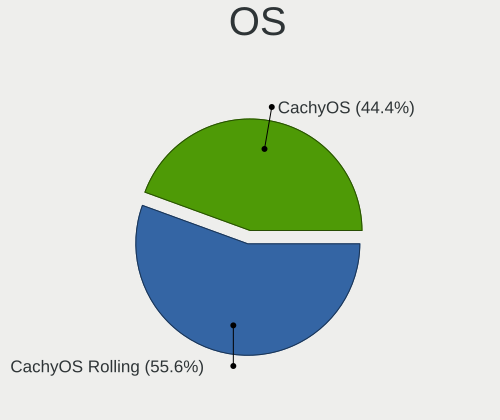

| Name            | Computers | Percent |
|-----------------|-----------|---------|
| CachyOS Rolling | 634       | 55.57%  |
| CachyOS         | 507       | 44.43%  |

OS Family
---------

OS without a version

| Name    | Computers | Percent |
|---------|-----------|---------|
| CachyOS | 1136      | 100%    |

Kernel
------

Version of the Linux kernel

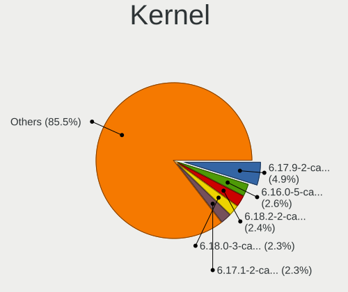

| Version            | Computers | Percent |
|--------------------|-----------|---------|
| 6.17.9-2-cachyos   | 61        | 4.87%   |
| 6.16.0-5-cachyos   | 33        | 2.63%   |
| 6.18.2-2-cachyos   | 30        | 2.39%   |
| 6.18.0-3-cachyos   | 29        | 2.31%   |
| 6.17.1-2-cachyos   | 29        | 2.31%   |
| 6.17.8-2-cachyos   | 27        | 2.15%   |
| 6.16.1-2-cachyos   | 23        | 1.84%   |
| 6.16.7-2-cachyos   | 22        | 1.76%   |
| 6.17.7-3-cachyos   | 21        | 1.68%   |
| 6.17.5-2-cachyos   | 21        | 1.68%   |
| 6.16.8-2-cachyos   | 19        | 1.52%   |
| 6.18.1-2-cachyos   | 17        | 1.36%   |
| 6.15.7-2-cachyos   | 17        | 1.36%   |
| 6.14.2-2-cachyos   | 15        | 1.2%    |
| 6.14.0-4-cachyos   | 15        | 1.2%    |
| 6.18.2-3-cachyos   | 14        | 1.12%   |
| 6.17.4-4-cachyos   | 14        | 1.12%   |
| 6.15.0-2-cachyos   | 13        | 1.04%   |
| 6.17.7-5-cachyos   | 11        | 0.88%   |
| 6.16.5-2-cachyos   | 11        | 0.88%   |
| 6.15.6-2-cachyos   | 11        | 0.88%   |
| 6.15.2-2-cachyos   | 11        | 0.88%   |
| 6.14.4-2-cachyos   | 11        | 0.88%   |
| 6.13.7-3-cachyos   | 11        | 0.88%   |
| 6.13.2-2-cachyos   | 11        | 0.88%   |
| 6.18.0-2-cachyos   | 10        | 0.8%    |
| 6.14.8-1.1-cachyos | 10        | 0.8%    |
| 6.14.6-2-cachyos   | 10        | 0.8%    |
| 6.13.0-2-cachyos   | 10        | 0.8%    |
| 6.12.1-2-cachyos   | 10        | 0.8%    |
| 6.17.0-4-cachyos   | 9         | 0.72%   |
| 6.16.4-4-cachyos   | 9         | 0.72%   |
| 6.15.5-2-cachyos   | 9         | 0.72%   |
| 6.13.5-2-cachyos   | 9         | 0.72%   |
| 6.18.0-5-cachyos   | 8         | 0.64%   |
| 6.17.1-1-cachyos   | 8         | 0.64%   |
| 6.16.4-2-cachyos   | 8         | 0.64%   |
| 6.15.8-2-cachyos   | 8         | 0.64%   |
| 6.15.4-4-cachyos   | 8         | 0.64%   |
| 6.15.4-3-cachyos   | 8         | 0.64%   |

Kernel Family
-------------

Linux kernel without a distro release

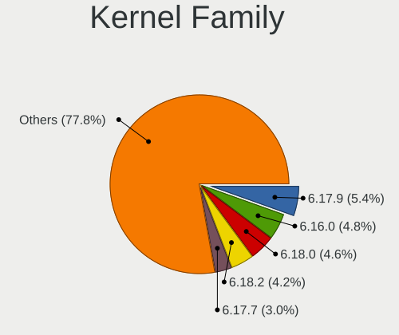

| Version | Computers | Percent |
|---------|-----------|---------|
| 6.17.9  | 68        | 5.45%   |
| 6.16.0  | 60        | 4.81%   |
| 6.18.0  | 58        | 4.65%   |
| 6.18.2  | 53        | 4.25%   |
| 6.17.7  | 38        | 3.04%   |
| 6.17.1  | 37        | 2.96%   |
| 6.17.8  | 33        | 2.64%   |
| 6.16.7  | 32        | 2.56%   |
| 6.14.0  | 30        | 2.4%    |
| 6.17.5  | 27        | 2.16%   |
| 6.16.1  | 26        | 2.08%   |
| 6.16.8  | 24        | 1.92%   |
| 6.17.0  | 22        | 1.76%   |
| 6.15.7  | 22        | 1.76%   |
| 6.13.7  | 21        | 1.68%   |
| 6.18.1  | 20        | 1.6%    |
| 6.15.3  | 20        | 1.6%    |
| 6.15.2  | 20        | 1.6%    |
| 6.16.4  | 19        | 1.52%   |
| 6.14.8  | 19        | 1.52%   |
| 6.15.4  | 18        | 1.44%   |
| 6.15.5  | 17        | 1.36%   |
| 6.15.0  | 17        | 1.36%   |
| 6.14.2  | 17        | 1.36%   |
| 6.17.4  | 16        | 1.28%   |
| 6.15.6  | 16        | 1.28%   |
| 6.13.5  | 14        | 1.12%   |
| 6.13.0  | 14        | 1.12%   |
| 6.14.6  | 13        | 1.04%   |
| 6.14.4  | 13        | 1.04%   |
| 6.12.1  | 13        | 1.04%   |
| 6.17.3  | 12        | 0.96%   |
| 6.15.1  | 12        | 0.96%   |
| 6.13.2  | 12        | 0.96%   |
| 6.16.5  | 11        | 0.88%   |
| 6.12.0  | 11        | 0.88%   |
| 6.10.6  | 11        | 0.88%   |
| 6.16.6  | 10        | 0.8%    |
| 6.15.8  | 9         | 0.72%   |
| 6.14.5  | 9         | 0.72%   |

Kernel Major Ver.
-----------------

Linux kernel major version

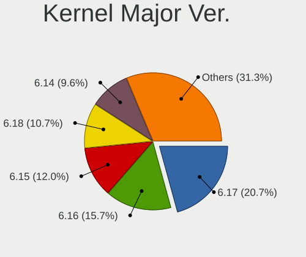

| Version | Computers | Percent |
|---------|-----------|---------|
| 6.17    | 254       | 20.73%  |
| 6.16    | 192       | 15.67%  |
| 6.15    | 147       | 12%     |
| 6.18    | 131       | 10.69%  |
| 6.14    | 117       | 9.55%   |
| 6.12    | 95        | 7.76%   |
| 6.13    | 82        | 6.69%   |
| 6.11    | 48        | 3.92%   |
| 6.10    | 43        | 3.51%   |
| 6.9     | 33        | 2.69%   |
| 6.8     | 13        | 1.06%   |
| 6.3     | 12        | 0.98%   |
| 6.6     | 10        | 0.82%   |
| 6.4     | 10        | 0.82%   |
| 6.5     | 9         | 0.73%   |
| 6.1     | 9         | 0.73%   |
| 6.7     | 7         | 0.57%   |
| 6.2     | 6         | 0.49%   |
| 6.0     | 3         | 0.24%   |
| 6.1.66  | 1         | 0.08%   |
| 5.19    | 1         | 0.08%   |
| 5.17    | 1         | 0.08%   |
| 5.16    | 1         | 0.08%   |

Arch
----

OS architecture (x86_64, i586, etc.)

| Name   | Computers | Percent |
|--------|-----------|---------|
| x86_64 | 1136      | 100%    |

DE
--

Desktop Environment

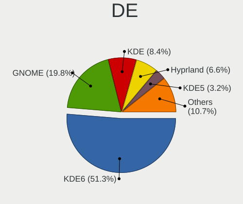

| Name               | Computers | Percent |
|--------------------|-----------|---------|
| KDE6               | 594       | 51.3%   |
| GNOME              | 229       | 19.78%  |
| KDE                | 97        | 8.38%   |
| Hyprland           | 77        | 6.65%   |
| KDE5               | 37        | 3.2%    |
| XFCE               | 30        | 2.59%   |
| Unknown            | 27        | 2.33%   |
| COSMIC             | 13        | 1.12%   |
| niri               | 10        | 0.86%   |
| X-Cinnamon         | 9         | 0.78%   |
| Budgie             | 8         | 0.69%   |
| i3                 | 4         | 0.35%   |
| GNOME Classic      | 4         | 0.35%   |
| sway:wlroots       | 2         | 0.17%   |
| sway               | 2         | 0.17%   |
| openbox            | 2         | 0.17%   |
| MATE               | 2         | 0.17%   |
| LXQt               | 2         | 0.17%   |
| LXDE               | 2         | 0.17%   |
| wayfire            | 1         | 0.09%   |
| LXQt:labwc:wlroots | 1         | 0.09%   |
| LeftWM             | 1         | 0.09%   |
| Deepin             | 1         | 0.09%   |
| Cutefish           | 1         | 0.09%   |
| Cinnamon           | 1         | 0.09%   |
| bspwm              | 1         | 0.09%   |

Display Server
--------------

X11 or Wayland

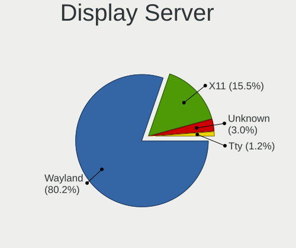

| Name    | Computers | Percent |
|---------|-----------|---------|
| Wayland | 922       | 80.24%  |
| X11     | 178       | 15.49%  |
| Unknown | 35        | 3.05%   |
| Tty     | 14        | 1.22%   |

Display Manager
---------------

SDDM, LightDM, etc.

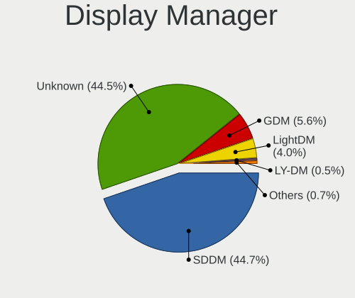

| Name    | Computers | Percent |
|---------|-----------|---------|
| SDDM    | 515       | 44.74%  |
| Unknown | 512       | 44.48%  |
| GDM     | 64        | 5.56%   |
| LightDM | 46        | 4%      |
| LY-DM   | 6         | 0.52%   |
| GREETD  | 6         | 0.52%   |
| Ly      | 1         | 0.09%   |
| LEMURS  | 1         | 0.09%   |

OS Lang
-------

Language

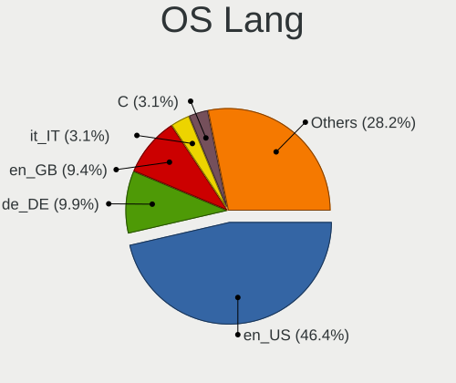

| Lang    | Computers | Percent |
|---------|-----------|---------|
| en_US   | 529       | 46.4%   |
| de_DE   | 113       | 9.91%   |
| en_GB   | 107       | 9.39%   |
| it_IT   | 35        | 3.07%   |
| C       | 35        | 3.07%   |
| en_CA   | 34        | 2.98%   |
| ru_RU   | 32        | 2.81%   |
| pt_BR   | 29        | 2.54%   |
| pl_PL   | 21        | 1.84%   |
| en_AU   | 21        | 1.84%   |
| fr_FR   | 18        | 1.58%   |
| es_ES   | 18        | 1.58%   |
| en_IN   | 18        | 1.58%   |
| es_MX   | 13        | 1.14%   |
| tr_TR   | 12        | 1.05%   |
| es_AR   | 8         | 0.7%    |
| en_PH   | 8         | 0.7%    |
| hu_HU   | 6         | 0.53%   |
| zh_CN   | 5         | 0.44%   |
| pt_PT   | 5         | 0.44%   |
| ja_JP   | 5         | 0.44%   |
| id_ID   | 5         | 0.44%   |
| de_CH   | 5         | 0.44%   |
| de_AT   | 5         | 0.44%   |
| da_DK   | 5         | 0.44%   |
| Unknown | 5         | 0.44%   |
| fr_CA   | 4         | 0.35%   |
| cs_CZ   | 4         | 0.35%   |
| en_NZ   | 3         | 0.26%   |
| nl_NL   | 2         | 0.18%   |
| fi_FI   | 2         | 0.18%   |
| es_EC   | 2         | 0.18%   |
| es_CL   | 2         | 0.18%   |
| en_ZA   | 2         | 0.18%   |
| el_GR   | 2         | 0.18%   |
| bg_BG   | 2         | 0.18%   |
| uk_UA   | 1         | 0.09%   |
| sv_SE   | 1         | 0.09%   |
| sv_FI   | 1         | 0.09%   |
| ro_RO   | 1         | 0.09%   |

Boot Mode
---------

EFI or BIOS

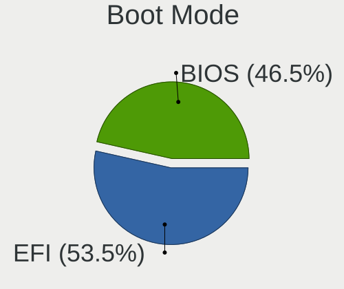

| Mode | Computers | Percent |
|------|-----------|---------|
| EFI  | 610       | 53.51%  |
| BIOS | 530       | 46.49%  |

Filesystem
----------

Type of filesystem

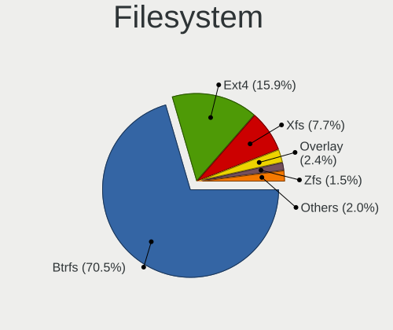

| Type     | Computers | Percent |
|----------|-----------|---------|
| Btrfs    | 810       | 70.5%   |
| Ext4     | 183       | 15.93%  |
| Xfs      | 88        | 7.66%   |
| Overlay  | 28        | 2.44%   |
| Zfs      | 17        | 1.48%   |
| Tmpfs    | 8         | 0.7%    |
| F2fs     | 6         | 0.52%   |
| Bcachefs | 6         | 0.52%   |
| Unknown  | 3         | 0.26%   |

Part. scheme
------------

Scheme of partitioning

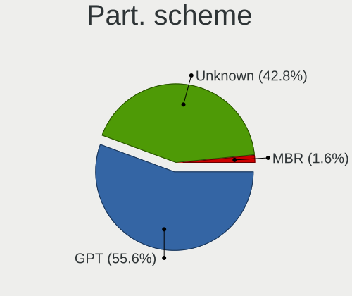

| Type    | Computers | Percent |
|---------|-----------|---------|
| GPT     | 634       | 55.61%  |
| Unknown | 488       | 42.81%  |
| MBR     | 18        | 1.58%   |

Dual Boot with Linux/BSD
------------------------

Hosting more than one Linux/BSD

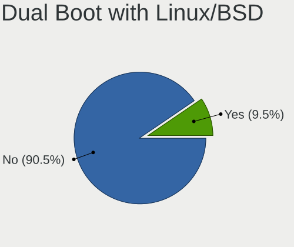

| Dual boot | Computers | Percent |
|-----------|-----------|---------|
| No        | 1036      | 90.48%  |
| Yes       | 109       | 9.52%   |

Dual Boot (Win)
---------------

Hosting Linux and Windows

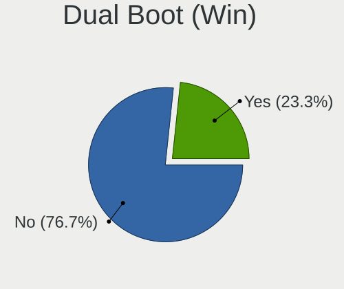

| Dual boot | Computers | Percent |
|-----------|-----------|---------|
| No        | 881       | 76.68%  |
| Yes       | 268       | 23.32%  |

Board
-----

Vendor
------

Motherboard manufacturer

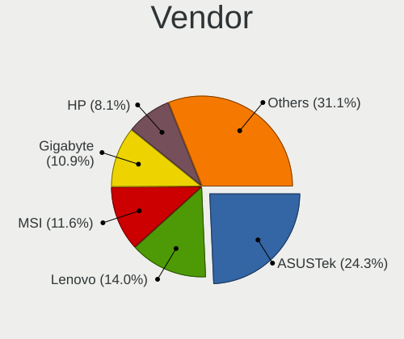

| Name                                 | Computers | Percent |
|--------------------------------------|-----------|---------|
| ASUSTek Computer                     | 276       | 24.3%   |
| Lenovo                               | 159       | 14%     |
| MSI                                  | 132       | 11.62%  |
| Gigabyte Technology                  | 124       | 10.92%  |
| Hewlett-Packard                      | 92        | 8.1%    |
| Dell                                 | 76        | 6.69%   |
| ASRock                               | 61        | 5.37%   |
| Acer                                 | 48        | 4.23%   |
| Apple                                | 20        | 1.76%   |
| HUAWEI                               | 10        | 0.88%   |
| Shenzhen Meigao Electronic Equipment | 9         | 0.79%   |
| Fujitsu                              | 9         | 0.79%   |
| Intel                                | 7         | 0.62%   |
| Unknown                              | 7         | 0.62%   |
| Alienware                            | 6         | 0.53%   |
| Toshiba                              | 5         | 0.44%   |
| Notebook                             | 5         | 0.44%   |
| Microsoft                            | 5         | 0.44%   |
| Google                               | 5         | 0.44%   |
| Schenker                             | 4         | 0.35%   |
| Samsung Electronics                  | 4         | 0.35%   |
| Monster                              | 4         | 0.35%   |
| Framework                            | 4         | 0.35%   |
| AZW                                  | 4         | 0.35%   |
| Valve                                | 3         | 0.26%   |
| Razer                                | 3         | 0.26%   |
| Huanan                               | 3         | 0.26%   |
| GPD                                  | 3         | 0.26%   |
| Biostar                              | 3         | 0.26%   |
| TUXEDO                               | 2         | 0.18%   |
| HONOR                                | 2         | 0.18%   |
| ECS                                  | 2         | 0.18%   |
| AMI                                  | 2         | 0.18%   |
| Win element                          | 1         | 0.09%   |
| VALE                                 | 1         | 0.09%   |
| Trigkey                              | 1         | 0.09%   |
| TongFang                             | 1         | 0.09%   |
| Timi                                 | 1         | 0.09%   |
| TECNO Mobile Limited                 | 1         | 0.09%   |
| Tactus                               | 1         | 0.09%   |

Model
-----

Motherboard model

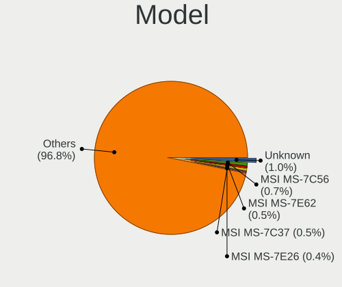

| Name                                              | Computers | Percent |
|---------------------------------------------------|-----------|---------|
| Unknown                                           | 11        | 0.97%   |
| MSI MS-7C56                                       | 8         | 0.7%    |
| MSI MS-7E62                                       | 6         | 0.53%   |
| MSI MS-7C37                                       | 6         | 0.53%   |
| MSI MS-7E26                                       | 5         | 0.44%   |
| MSI MS-7C91                                       | 5         | 0.44%   |
| Gigabyte X870E AORUS ELITE WIFI7                  | 5         | 0.44%   |
| ASUS TUF Gaming X570-PLUS                         | 5         | 0.44%   |
| ASUS TUF Gaming B650M-E WIFI                      | 5         | 0.44%   |
| ASUS ROG STRIX X870E-E GAMING WIFI                | 5         | 0.44%   |
| ASUS PRIME B450-PLUS                              | 5         | 0.44%   |
| Shenzhen Meigao Electronic Equipment Venus Series | 4         | 0.35%   |
| MSI MS-7E16                                       | 4         | 0.35%   |
| MSI MS-7D70                                       | 4         | 0.35%   |
| MSI MS-7C02                                       | 4         | 0.35%   |
| Lenovo ThinkPad E14 Gen 3 20YE000GCD              | 4         | 0.35%   |
| HP EliteBook 840 G6                               | 4         | 0.35%   |
| Gigabyte B550 GAMING X V2                         | 4         | 0.35%   |
| ASUS TUF Gaming B650-PLUS WIFI                    | 4         | 0.35%   |
| ASUS ROG STRIX B450-F GAMING                      | 4         | 0.35%   |
| ASUS All Series                                   | 4         | 0.35%   |
| ASRock B450M Pro4                                 | 4         | 0.35%   |
| Shenzhen Meigao Electronic Equipment Series       | 3         | 0.26%   |
| MSI MS-7E51                                       | 3         | 0.26%   |
| MSI MS-7D98                                       | 3         | 0.26%   |
| MSI MS-7D75                                       | 3         | 0.26%   |
| MSI MS-7C96                                       | 3         | 0.26%   |
| MSI MS-7A38                                       | 3         | 0.26%   |
| HP Victus by Gaming Laptop 15-fb1xxx              | 3         | 0.26%   |
| HP Laptop 15s-eq1xxx                              | 3         | 0.26%   |
| Gigabyte X870 AORUS ELITE WIFI7                   | 3         | 0.26%   |
| Gigabyte B650 GAMING X AX V2                      | 3         | 0.26%   |
| Gigabyte B650 AORUS ELITE AX V2                   | 3         | 0.26%   |
| Gigabyte B550 AORUS ELITE AX V2                   | 3         | 0.26%   |
| Gigabyte B450M DS3H                               | 3         | 0.26%   |
| ASUS VivoBook_ASUSLaptop M1505YA_D1505YA          | 3         | 0.26%   |
| ASUS ROG Zephyrus G14 GA401QM_GA401QM             | 3         | 0.26%   |
| ASUS ROG STRIX X670E-F GAMING WIFI                | 3         | 0.26%   |
| ASUS ROG STRIX B650E-F GAMING WIFI                | 3         | 0.26%   |
| ASUS ROG STRIX B650E-E GAMING WIFI                | 3         | 0.26%   |

Model Family
------------

Motherboard model prefix

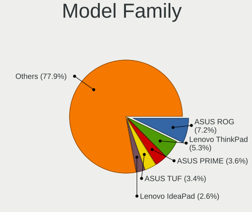

| Name              | Computers | Percent |
|-------------------|-----------|---------|
| ASUS ROG          | 82        | 7.22%   |
| Lenovo ThinkPad   | 60        | 5.28%   |
| ASUS PRIME        | 41        | 3.61%   |
| ASUS TUF          | 39        | 3.43%   |
| Lenovo IdeaPad    | 29        | 2.55%   |
| ASUS ASUS         | 27        | 2.38%   |
| Lenovo Legion     | 25        | 2.2%    |
| Dell Latitude     | 25        | 2.2%    |
| ASUS VivoBook     | 24        | 2.11%   |
| Acer Aspire       | 24        | 2.11%   |
| HP Laptop         | 18        | 1.58%   |
| Dell Inspiron     | 14        | 1.23%   |
| Acer Nitro        | 14        | 1.23%   |
| HP EliteBook      | 12        | 1.06%   |
| Dell XPS          | 11        | 0.97%   |
| Unknown           | 11        | 0.97%   |
| HP Victus         | 10        | 0.88%   |
| HP Pavilion       | 9         | 0.79%   |
| Gigabyte B650     | 9         | 0.79%   |
| Gigabyte B550     | 9         | 0.79%   |
| Dell OptiPlex     | 9         | 0.79%   |
| MSI MS-7C56       | 8         | 0.7%    |
| Lenovo Yoga       | 8         | 0.7%    |
| Lenovo LOQ        | 8         | 0.7%    |
| HP OMEN           | 8         | 0.7%    |
| Gigabyte X570     | 8         | 0.7%    |
| Lenovo ThinkBook  | 7         | 0.62%   |
| HP ENVY           | 7         | 0.62%   |
| ASUS ZenBook      | 7         | 0.62%   |
| ASRock X670E      | 7         | 0.62%   |
| MSI MS-7E62       | 6         | 0.53%   |
| MSI MS-7C37       | 6         | 0.53%   |
| Gigabyte X870     | 6         | 0.53%   |
| Gigabyte B550M    | 6         | 0.53%   |
| Dell Precision    | 6         | 0.53%   |
| ASRock B450M      | 6         | 0.53%   |
| Acer Swift        | 6         | 0.53%   |
| Toshiba Satellite | 5         | 0.44%   |
| MSI MS-7E26       | 5         | 0.44%   |
| MSI MS-7C91       | 5         | 0.44%   |

MFG Year
--------

Motherboard manufacture year

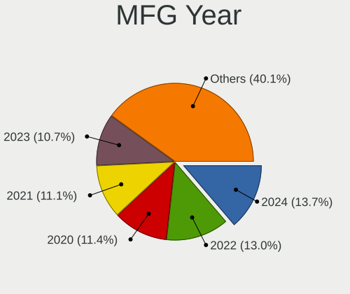

| Year | Computers | Percent |
|------|-----------|---------|
| 2024 | 156       | 13.73%  |
| 2022 | 148       | 13.03%  |
| 2020 | 129       | 11.36%  |
| 2021 | 126       | 11.09%  |
| 2023 | 122       | 10.74%  |
| 2018 | 86        | 7.57%   |
| 2019 | 84        | 7.39%   |
| 2025 | 62        | 5.46%   |
| 2017 | 51        | 4.49%   |
| 2013 | 31        | 2.73%   |
| 2016 | 28        | 2.46%   |
| 2012 | 27        | 2.38%   |
| 2015 | 25        | 2.2%    |
| 2014 | 25        | 2.2%    |
| 2011 | 17        | 1.5%    |
| 2010 | 9         | 0.79%   |
| 2009 | 4         | 0.35%   |
| 2008 | 3         | 0.26%   |
| 2007 | 2         | 0.18%   |
| 2006 | 1         | 0.09%   |

Form Factor
-----------

Physical design of the computer

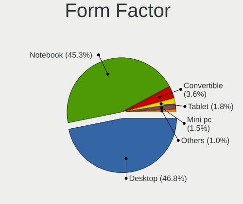

| Name        | Computers | Percent |
|-------------|-----------|---------|
| Desktop     | 532       | 46.83%  |
| Notebook    | 515       | 45.33%  |
| Convertible | 41        | 3.61%   |
| Tablet      | 20        | 1.76%   |
| Mini pc     | 17        | 1.5%    |
| All in one  | 8         | 0.7%    |
| Server      | 3         | 0.26%   |

Secure Boot
-----------

Enabled or disabled

| State    | Computers | Percent |
|----------|-----------|---------|
| Disabled | 1102      | 96.75%  |
| Enabled  | 37        | 3.25%   |

Coreboot
--------

Have coreboot on board

| Used | Computers | Percent |
|------|-----------|---------|
| No   | 1128      | 99.3%   |
| Yes  | 8         | 0.7%    |

RAM Size
--------

Total RAM memory

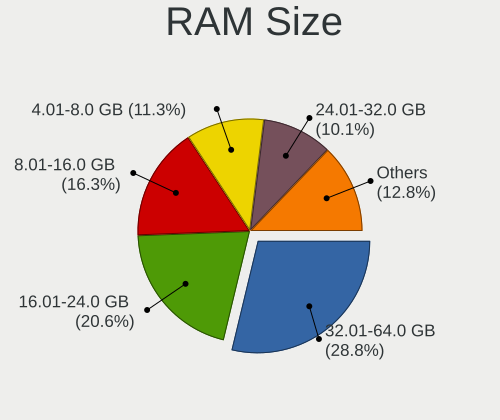

| Size in GB      | Computers | Percent |
|-----------------|-----------|---------|
| 32.01-64.0      | 329       | 28.76%  |
| 16.01-24.0      | 236       | 20.63%  |
| 8.01-16.0       | 187       | 16.35%  |
| 4.01-8.0        | 129       | 11.28%  |
| 24.01-32.0      | 116       | 10.14%  |
| 64.01-256.0     | 115       | 10.05%  |
| 3.01-4.0        | 31        | 2.71%   |
| More than 256.0 | 1         | 0.09%   |

RAM Used
--------

Used RAM memory

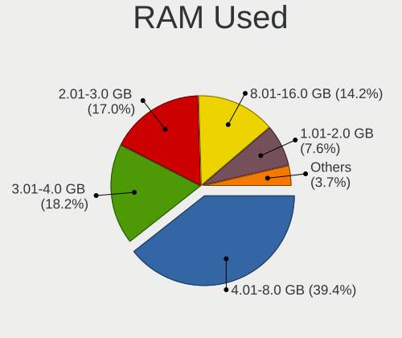

| Used GB    | Computers | Percent |
|------------|-----------|---------|
| 4.01-8.0   | 473       | 39.38%  |
| 3.01-4.0   | 218       | 18.15%  |
| 2.01-3.0   | 204       | 16.99%  |
| 8.01-16.0  | 171       | 14.24%  |
| 1.01-2.0   | 91        | 7.58%   |
| 16.01-24.0 | 26        | 2.16%   |
| 24.01-32.0 | 7         | 0.58%   |
| 32.01-64.0 | 6         | 0.5%    |
| 0.51-1.0   | 4         | 0.33%   |
| 0.01-0.5   | 1         | 0.08%   |

Total Drives
------------

Number of drives on board

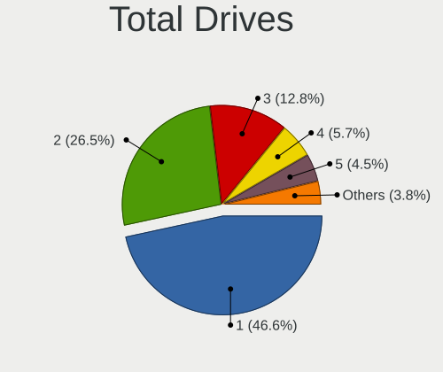

| Drives | Computers | Percent |
|--------|-----------|---------|
| 1      | 536       | 46.61%  |
| 2      | 305       | 26.52%  |
| 3      | 147       | 12.78%  |
| 4      | 66        | 5.74%   |
| 5      | 52        | 4.52%   |
| 6      | 21        | 1.83%   |
| 7      | 10        | 0.87%   |
| 8      | 6         | 0.52%   |
| 0      | 4         | 0.35%   |
| 10     | 3         | 0.26%   |

Has CD-ROM
----------

Has CD-ROM on board

| Presented | Computers | Percent |
|-----------|-----------|---------|
| No        | 1012      | 89.01%  |
| Yes       | 125       | 10.99%  |

Has Ethernet
------------

Has Ethernet on board

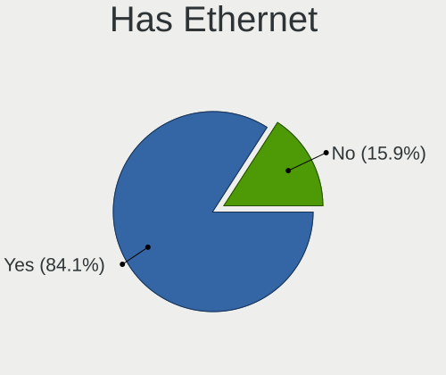

| Presented | Computers | Percent |
|-----------|-----------|---------|
| Yes       | 959       | 84.12%  |
| No        | 181       | 15.88%  |

Has WiFi
--------

Has WiFi module

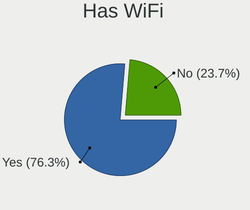

| Presented | Computers | Percent |
|-----------|-----------|---------|
| Yes       | 871       | 76.34%  |
| No        | 270       | 23.66%  |

Has Bluetooth
-------------

Has Bluetooth module

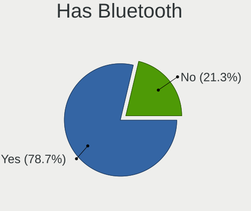

| Presented | Computers | Percent |
|-----------|-----------|---------|
| Yes       | 902       | 78.71%  |
| No        | 244       | 21.29%  |

Location
--------

Country
-------

Geographic location (country)

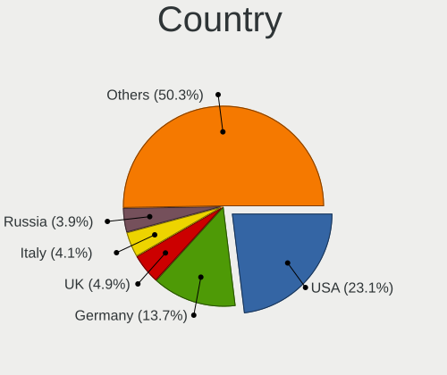

| Country     | Computers | Percent |
|-------------|-----------|---------|
| USA         | 263       | 23.07%  |
| Germany     | 156       | 13.68%  |
| UK          | 56        | 4.91%   |
| Italy       | 47        | 4.12%   |
| Russia      | 45        | 3.95%   |
| Brazil      | 44        | 3.86%   |
| Canada      | 41        | 3.6%    |
| Poland      | 32        | 2.81%   |
| France      | 31        | 2.72%   |
| Australia   | 26        | 2.28%   |
| India       | 25        | 2.19%   |
| Spain       | 22        | 1.93%   |
| Turkey      | 21        | 1.84%   |
| Switzerland | 17        | 1.49%   |
| Austria     | 17        | 1.49%   |
| Sweden      | 16        | 1.4%    |
| Mexico      | 14        | 1.23%   |
| Portugal    | 13        | 1.14%   |
| Indonesia   | 13        | 1.14%   |
| Romania     | 11        | 0.96%   |
| Greece      | 11        | 0.96%   |
| Netherlands | 10        | 0.88%   |
| Japan       | 10        | 0.88%   |
| Czechia     | 10        | 0.88%   |
| Vietnam     | 9         | 0.79%   |
| Philippines | 9         | 0.79%   |
| Norway      | 9         | 0.79%   |
| Belgium     | 9         | 0.79%   |
| Finland     | 8         | 0.7%    |
| Hungary     | 7         | 0.61%   |
| Thailand    | 6         | 0.53%   |
| Colombia    | 6         | 0.53%   |
| Argentina   | 6         | 0.53%   |
| Hong Kong   | 5         | 0.44%   |
| Chile       | 5         | 0.44%   |
| Ukraine     | 4         | 0.35%   |
| Slovakia    | 4         | 0.35%   |
| Serbia      | 4         | 0.35%   |
| New Zealand | 4         | 0.35%   |
| Malaysia    | 4         | 0.35%   |

City
----

Geographic location (city)

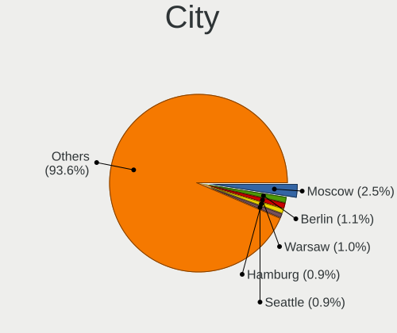

| City              | Computers | Percent |
|-------------------|-----------|---------|
| Moscow            | 29        | 2.49%   |
| Berlin            | 13        | 1.11%   |
| Warsaw            | 12        | 1.03%   |
| Hamburg           | 11        | 0.94%   |
| Seattle           | 10        | 0.86%   |
| Istanbul          | 9         | 0.77%   |
| Milan             | 8         | 0.69%   |
| Melbourne         | 8         | 0.69%   |
| Vienna            | 7         | 0.6%    |
| Rome              | 7         | 0.6%    |
| Porto             | 6         | 0.51%   |
| Madrid            | 6         | 0.51%   |
| Birmingham        | 6         | 0.51%   |
| Sydney            | 5         | 0.43%   |
| Prague            | 5         | 0.43%   |
| Perth             | 5         | 0.43%   |
| Dublin            | 5         | 0.43%   |
| Denver            | 5         | 0.43%   |
| Toronto           | 4         | 0.34%   |
| Sao Paulo         | 4         | 0.34%   |
| Portland          | 4         | 0.34%   |
| Phoenix           | 4         | 0.34%   |
| Oslo              | 4         | 0.34%   |
| Munich            | 4         | 0.34%   |
| Ho Chi Minh City  | 4         | 0.34%   |
| Hanoi             | 4         | 0.34%   |
| Frankfurt am Main | 4         | 0.34%   |
| Delhi             | 4         | 0.34%   |
| Brisbane          | 4         | 0.34%   |
| Barcelona         | 4         | 0.34%   |
| Tucson            | 3         | 0.26%   |
| Tokyo             | 3         | 0.26%   |
| Tbilisi           | 3         | 0.26%   |
| Stockholm         | 3         | 0.26%   |
| Southampton       | 3         | 0.26%   |
| Sofia             | 3         | 0.26%   |
| Santiago          | 3         | 0.26%   |
| Quezon City       | 3         | 0.26%   |
| Poznan            | 3         | 0.26%   |
| Pittsburgh        | 3         | 0.26%   |

Drives
------

Drive Vendor
------------

Hard drive vendors

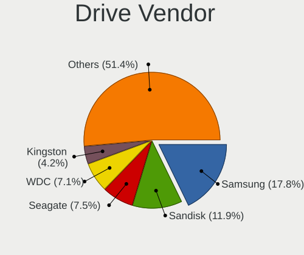

| Vendor                       | Computers | Drives | Percent |
|------------------------------|-----------|--------|---------|
| Samsung Electronics          | 361       | 541    | 17.79%  |
| Sandisk                      | 241       | 298    | 11.88%  |
| Seagate                      | 153       | 201    | 7.54%   |
| WDC                          | 145       | 195    | 7.15%   |
| Kingston                     | 86        | 104    | 4.24%   |
| Kingston Technology Company  | 78        | 91     | 3.84%   |
| SK hynix                     | 77        | 102    | 3.79%   |
| Micron/Crucial Technology    | 76        | 96     | 3.75%   |
| Micron Technology            | 72        | 78     | 3.55%   |
| Toshiba                      | 65        | 79     | 3.2%    |
| Crucial                      | 64        | 80     | 3.15%   |
| Phison Electronics           | 63        | 86     | 3.1%    |
| Intel                        | 50        | 60     | 2.46%   |
| MAXIO Technology (Hangzhou)  | 44        | 54     | 2.17%   |
| KIOXIA                       | 35        | 41     | 1.72%   |
| Unknown                      | 30        | 39     | 1.48%   |
| Realtek Semiconductor        | 29        | 32     | 1.43%   |
| ADATA Technology             | 26        | 31     | 1.28%   |
| A-DATA Technology            | 26        | 31     | 1.28%   |
| Silicon Motion               | 19        | 24     | 0.94%   |
| Shenzhen Longsys Electronics | 18        | 23     | 0.89%   |
| HGST                         | 18        | 19     | 0.89%   |
| PNY                          | 14        | 15     | 0.69%   |
| China                        | 14        | 14     | 0.69%   |
| Hitachi                      | 13        | 18     | 0.64%   |
| Apple                        | 12        | 14     | 0.59%   |
| SPCC                         | 11        | 12     | 0.54%   |
| Intenso                      | 11        | 17     | 0.54%   |
| Patriot                      | 10        | 10     | 0.49%   |
| Yangtze Memory Technologies  | 8         | 10     | 0.39%   |
| Transcend                    | 7         | 8      | 0.34%   |
| KingSpec                     | 6         | 7      | 0.3%    |
| T-FORCE                      | 5         | 5      | 0.25%   |
| Netac                        | 5         | 7      | 0.25%   |
| Unknown                      | 5         | 5      | 0.25%   |
| Team                         | 4         | 6      | 0.2%    |
| Solid State Storage          | 4         | 6      | 0.2%    |
| Seagate Technology           | 4         | 4      | 0.2%    |
| SABRENT                      | 4         | 5      | 0.2%    |
| Realtek                      | 4         | 5      | 0.2%    |

Drive Model
-----------

Hard drive models

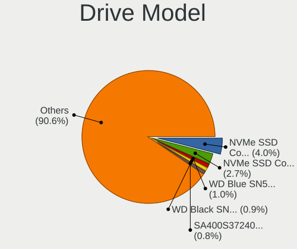

| Model                                                                    | Computers | Percent |
|--------------------------------------------------------------------------|-----------|---------|
| Samsung NVMe SSD Controller SM981/PM981/PM983 1TB                        | 91        | 4.01%   |
| Samsung NVMe SSD Controller PM9A1/PM9A3/980PRO 1TB                       | 61        | 2.69%   |
| Sandisk WD Blue SN550 NVMe SSD 1024GB                                    | 22        | 0.97%   |
| Sandisk WD Black SN850X NVMe SSD 4TB                                     | 21        | 0.92%   |
| Kingston SA400S37240G 240GB SSD                                          | 19        | 0.84%   |
| Micron/Crucial P2 NVMe PCIe SSD 2TB                                      | 18        | 0.79%   |
| Samsung NVMe SSD Controller S4LV008[Pascal] 4TB                          | 17        | 0.75%   |
| Sandisk WD Black SN770 / PC SN740 256GB / PC SN560 (DRAM-less) NVMe SSD  | 16        | 0.7%    |
| Samsung SSD 850 EVO 500GB                                                | 16        | 0.7%    |
| Micron/Crucial P2 [Nick P2] / P3 / P3 Plus NVMe PCIe SSD (DRAM-less) 2TB | 16        | 0.7%    |
| Phison E16 PCIe4 NVMe Controller 1TB                                     | 15        | 0.66%   |
| Phison E12 NVMe Controller 1TB                                           | 15        | 0.66%   |
| Crucial CT1000MX500SSD1 1TB                                              | 15        | 0.66%   |
| MAXIO (Hangzhou) NVMe SSD Controller MAP1202 2TB                         | 14        | 0.62%   |
| Silicon Motion SM2263EN/SM2263XT SSD Controller 512GB                    | 13        | 0.57%   |
| Seagate ST1000DM010-2EP102 1TB                                           | 13        | 0.57%   |
| Samsung SSD 860 EVO 500GB                                                | 13        | 0.57%   |
| Samsung NVMe SSD Controller SM961/PM961/SM963 1024GB                     | 13        | 0.57%   |
| Samsung SSD 990 PRO 2TB                                                  | 12        | 0.53%   |
| Samsung SSD 850 EVO 250GB                                                | 12        | 0.53%   |
| Seagate ST2000DM008-2FR102 2TB                                           | 11        | 0.48%   |
| Sandisk WD Black SN850 1TB                                               | 11        | 0.48%   |
| Samsung SSD 980 1TB                                                      | 11        | 0.48%   |
| Samsung NVMe SSD Controller 980 (DRAM-less) 256GB                        | 11        | 0.48%   |
| MAXIO (Hangzhou) NVMe SSD Controller MAP1202 (DRAM-less) 512GB           | 11        | 0.48%   |
| Kingston Company SNV2S1000G 1TB                                          | 11        | 0.48%   |
| Kingston Company KC3000/FURY Renegade NVMe SSD [E18] 2TB                 | 11        | 0.48%   |
| ADATA XPG SX8200 Pro PCIe Gen3x4 M.2 2280 Solid State Drive 1024GB       | 11        | 0.48%   |
| Sandisk WD Black SN750 / PC SN730 NVMe SSD 500GB                         | 10        | 0.44%   |
| Samsung SSD 870 EVO 1TB                                                  | 10        | 0.44%   |
| Intel SSD 660P Series 512GB                                              | 10        | 0.44%   |
| WDC WD10EZEX-08WN4A0 1TB                                                 | 9         | 0.4%    |
| SK hynix Platinum P41/PC801 NVMe Solid State Drive 1TB                   | 9         | 0.4%    |
| Samsung SSD 860 EVO 1TB                                                  | 9         | 0.4%    |
| Kingston SA400S37480G 480GB SSD                                          | 9         | 0.4%    |
| Intel SSD 670p Series [Keystone Harbor] 1TB                              | 9         | 0.4%    |
| Crucial CT500MX500SSD1 500GB                                             | 9         | 0.4%    |
| Seagate ST1000LM035-1RK172 1TB                                           | 8         | 0.35%   |
| Kingston Company NV2 NVMe SSD [SM2267XT] (DRAM-less) 1TB                 | 8         | 0.35%   |
| Intel SSDPEKNU512GZ 512GB                                                | 8         | 0.35%   |

HDD Vendor
----------

Hard disk drive vendors

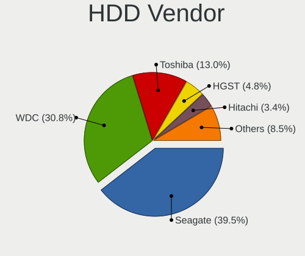

| Vendor              | Computers | Drives | Percent |
|---------------------|-----------|--------|---------|
| Seagate             | 149       | 196    | 39.52%  |
| WDC                 | 116       | 157    | 30.77%  |
| Toshiba             | 49        | 59     | 13%     |
| HGST                | 18        | 19     | 4.77%   |
| Hitachi             | 13        | 18     | 3.45%   |
| Samsung Electronics | 9         | 11     | 2.39%   |
| Apple               | 5         | 5      | 1.33%   |
| Unknown             | 4         | 4      | 1.06%   |
| Maxone              | 2         | 3      | 0.53%   |
| JMicron Technology  | 2         | 3      | 0.53%   |
| Fujitsu             | 2         | 2      | 0.53%   |
| T-FORCE             | 1         | 1      | 0.27%   |
| SSK                 | 1         | 1      | 0.27%   |
| Intenso             | 1         | 1      | 0.27%   |
| HGST HUS            | 1         | 1      | 0.27%   |
| HGST HUH            | 1         | 1      | 0.27%   |
| External            | 1         | 4      | 0.27%   |
| ASMT                | 1         | 1      | 0.27%   |
| Unknown             | 1         | 1      | 0.27%   |

SSD Vendor
----------

Solid state drive vendors

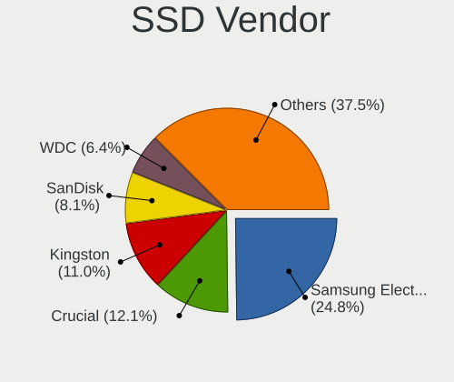

| Vendor              | Computers | Drives | Percent |
|---------------------|-----------|--------|---------|
| Samsung Electronics | 131       | 174    | 24.81%  |
| Crucial             | 64        | 80     | 12.12%  |
| Kingston            | 58        | 67     | 10.98%  |
| SanDisk             | 43        | 45     | 8.14%   |
| WDC                 | 34        | 38     | 6.44%   |
| A-DATA Technology   | 25        | 29     | 4.73%   |
| PNY                 | 14        | 15     | 2.65%   |
| China               | 14        | 14     | 2.65%   |
| SK hynix            | 12        | 13     | 2.27%   |
| SPCC                | 9         | 9      | 1.7%    |
| Patriot             | 9         | 9      | 1.7%    |
| Intenso             | 9         | 15     | 1.7%    |
| Intel               | 8         | 11     | 1.52%   |
| Transcend           | 7         | 8      | 1.33%   |
| Micron Technology   | 7         | 7      | 1.33%   |
| KingSpec            | 6         | 7      | 1.14%   |
| Toshiba             | 4         | 4      | 0.76%   |
| Team                | 4         | 6      | 0.76%   |
| SABRENT             | 4         | 5      | 0.76%   |
| OCZ                 | 4         | 7      | 0.76%   |
| LITEON              | 4         | 4      | 0.76%   |
| Netac               | 3         | 3      | 0.57%   |
| GOODRAM             | 3         | 3      | 0.57%   |
| Apacer              | 3         | 3      | 0.57%   |
| Unknown             | 3         | 3      | 0.57%   |
| MSI                 | 2         | 2      | 0.38%   |
| KIOXIA-EXCERIA      | 2         | 2      | 0.38%   |
| INNOVATION IT       | 2         | 2      | 0.38%   |
| Gigabyte Technology | 2         | 2      | 0.38%   |
| Colorful            | 2         | 2      | 0.38%   |
| BIWIN               | 2         | 2      | 0.38%   |
| Apple               | 2         | 2      | 0.38%   |
| XrayDisk            | 1         | 1      | 0.19%   |
| XPG                 | 1         | 1      | 0.19%   |
| V-GeN               | 1         | 1      | 0.19%   |
| tecmiyo             | 1         | 1      | 0.19%   |
| T-FORCE             | 1         | 1      | 0.19%   |
| SXMicro             | 1         | 1      | 0.19%   |
| SSK Port            | 1         | 1      | 0.19%   |
| ShiJi               | 1         | 1      | 0.19%   |

Drive Kind
----------

HDD or SSD

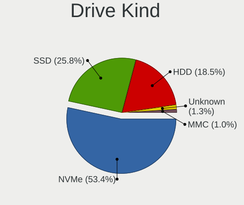

| Kind    | Computers | Drives | Percent |
|---------|-----------|--------|---------|
| NVMe    | 887       | 1434   | 53.37%  |
| SSD     | 428       | 625    | 25.75%  |
| HDD     | 308       | 488    | 18.53%  |
| Unknown | 22        | 30     | 1.32%   |
| MMC     | 17        | 20     | 1.02%   |

Drive Connector
---------------

SATA, SAS, NVMe, etc.

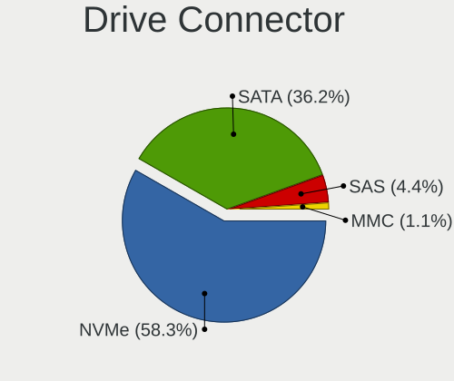

| Type | Computers | Drives | Percent |
|------|-----------|--------|---------|
| NVMe | 886       | 1422   | 58.29%  |
| SATA | 550       | 1060   | 36.18%  |
| SAS  | 67        | 95     | 4.41%   |
| MMC  | 17        | 20     | 1.12%   |

Drive Size
----------

Size of hard drive

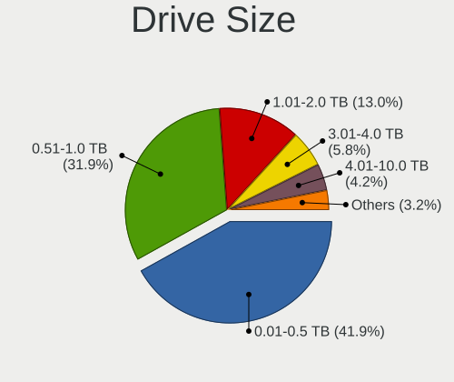

| Size in TB | Computers | Drives | Percent |
|------------|-----------|--------|---------|
| 0.01-0.5   | 346       | 502    | 41.94%  |
| 0.51-1.0   | 263       | 330    | 31.88%  |
| 1.01-2.0   | 107       | 137    | 12.97%  |
| 3.01-4.0   | 48        | 60     | 5.82%   |
| 4.01-10.0  | 35        | 49     | 4.24%   |
| 2.01-3.0   | 17        | 20     | 2.06%   |
| 10.01-20.0 | 9         | 15     | 1.09%   |

Space Total
-----------

Amount of disk space available on the file system

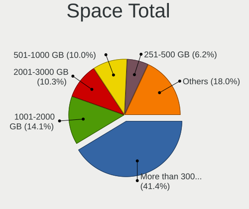

| Size in GB     | Computers | Percent |
|----------------|-----------|---------|
| More than 3000 | 479       | 41.36%  |
| 1001-2000      | 163       | 14.08%  |
| 2001-3000      | 119       | 10.28%  |
| 501-1000       | 116       | 10.02%  |
| 251-500        | 72        | 6.22%   |
| Unknown        | 71        | 6.13%   |
| 101-250        | 66        | 5.7%    |
| 1-20           | 58        | 5.01%   |
| 51-100         | 10        | 0.86%   |
| 21-50          | 4         | 0.35%   |

Space Used
----------

Amount of used disk space

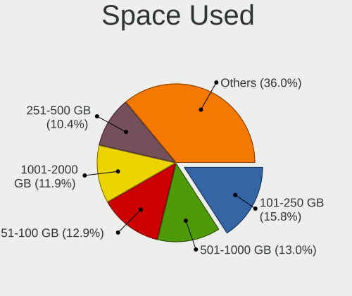

| Used GB        | Computers | Percent |
|----------------|-----------|---------|
| 101-250        | 189       | 15.83%  |
| 501-1000       | 155       | 12.98%  |
| 51-100         | 154       | 12.9%   |
| 1001-2000      | 142       | 11.89%  |
| 251-500        | 124       | 10.39%  |
| More than 3000 | 120       | 10.05%  |
| 1-20           | 95        | 7.96%   |
| 21-50          | 74        | 6.2%    |
| Unknown        | 71        | 5.95%   |
| 2001-3000      | 70        | 5.86%   |

Malfunc. Drives
---------------

Drive models with a malfunction

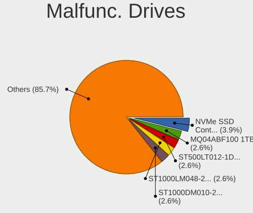

| Model                                                         | Computers | Drives | Percent |
|---------------------------------------------------------------|-----------|--------|---------|
| Samsung Electronics NVMe SSD Controller SM981/PM981/PM983 1TB | 3         | 3      | 3.9%    |
| Toshiba MQ04ABF100 1TB                                        | 2         | 2      | 2.6%    |
| Seagate ST500LT012-1DG142 500GB                               | 2         | 2      | 2.6%    |
| Seagate ST1000LM048-2E7172 1TB                                | 2         | 2      | 2.6%    |
| Seagate ST1000DM010-2EP102 1TB                                | 2         | 2      | 2.6%    |
| Samsung Electronics SSD 870 EVO 1TB                           | 2         | 2      | 2.6%    |
| HGST HTS541010A9E680 1TB                                      | 2         | 2      | 2.6%    |
| Fujitsu MJA2250BH G2 250GB                                    | 2         | 2      | 2.6%    |
| WDC WD7501AALS-00J7B0 752GB                                   | 1         | 1      | 1.3%    |
| WDC WD7500BPVT-80HXZT1 752GB                                  | 1         | 1      | 1.3%    |
| WDC WD60EFRX-68L0BN1 6TB                                      | 1         | 2      | 1.3%    |
| WDC WD5000AAKX-08U6AA0 500GB                                  | 1         | 1      | 1.3%    |
| WDC WD5000AAKX-00ERMA0 500GB                                  | 1         | 1      | 1.3%    |
| WDC WD30EZRX-00SPEB0 3TB                                      | 1         | 1      | 1.3%    |
| WDC WD2500AAJS-08L7A0 250GB                                   | 1         | 1      | 1.3%    |
| WDC WD2500AAJS-00L7A0 250GB                                   | 1         | 1      | 1.3%    |
| WDC WD20EZRX-00D8PB0 2TB                                      | 1         | 1      | 1.3%    |
| WDC WD20EARX-22PASB0 2TB                                      | 1         | 1      | 1.3%    |
| WDC WD20EARS-00MVWB0 2TB                                      | 1         | 1      | 1.3%    |
| WDC WD15EARS-60MVWB0 1TB                                      | 1         | 1      | 1.3%    |
| WDC WD1503FYYS-01T8B0 1TB                                     | 1         | 1      | 1.3%    |
| WDC WD10JPVX-22JC3T0 1TB                                      | 1         | 1      | 1.3%    |
| WDC WD10EZRZ-00HTKB0 1TB                                      | 1         | 1      | 1.3%    |
| WDC WD10EZRX-00L4HB0 1TB                                      | 1         | 1      | 1.3%    |
| WDC WD10EZEX-08WN4A0 1TB                                      | 1         | 1      | 1.3%    |
| WDC WD10EZEX-00WN4A0 1TB                                      | 1         | 1      | 1.3%    |
| WDC WD10EZEX-00BN5A0 1TB                                      | 1         | 1      | 1.3%    |
| WDC WD1002FBYS-05A6B0 1TB                                     | 1         | 1      | 1.3%    |
| Transcend TS240GMTS820S 240GB SSD                             | 1         | 1      | 1.3%    |
| Toshiba MQ01ACF050 500GB                                      | 1         | 1      | 1.3%    |
| Toshiba MQ01ABD100 1TB                                        | 1         | 1      | 1.3%    |
| Toshiba DT01ACA300 3TB                                        | 1         | 1      | 1.3%    |
| Toshiba DT01ACA050 500GB                                      | 1         | 5      | 1.3%    |
| SK hynix HFS128G32MND-2900A 128GB SSD                         | 1         | 1      | 1.3%    |
| SK hynix BC501 NVMe Solid State Drive 256GB                   | 1         | 1      | 1.3%    |
| Seagate ST5000LM000-2AN170 5TB                                | 1         | 1      | 1.3%    |
| Seagate ST31000524AS 1TB                                      | 1         | 1      | 1.3%    |
| Seagate ST2000DM008-2FR102 2TB                                | 1         | 1      | 1.3%    |
| Seagate ST2000DM006-2DM164 2TB                                | 1         | 1      | 1.3%    |
| SanDisk SSD PLUS 240GB                                        | 1         | 1      | 1.3%    |

Malfunc. Drive Vendor
---------------------

Vendors of faulty drives

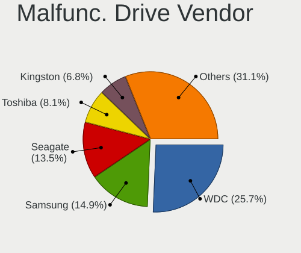

| Vendor                | Computers | Drives | Percent |
|-----------------------|-----------|--------|---------|
| WDC                   | 19        | 21     | 25.68%  |
| Samsung Electronics   | 11        | 12     | 14.86%  |
| Seagate               | 10        | 10     | 13.51%  |
| Toshiba               | 6         | 10     | 8.11%   |
| Kingston              | 5         | 7      | 6.76%   |
| Intel                 | 4         | 5      | 5.41%   |
| Hitachi               | 3         | 4      | 4.05%   |
| HGST                  | 3         | 3      | 4.05%   |
| SK hynix              | 2         | 2      | 2.7%    |
| SanDisk               | 2         | 2      | 2.7%    |
| Fujitsu               | 2         | 2      | 2.7%    |
| Transcend             | 1         | 1      | 1.35%   |
| Realtek Semiconductor | 1         | 1      | 1.35%   |
| Patriot               | 1         | 1      | 1.35%   |
| Palit                 | 1         | 1      | 1.35%   |
| INNOGRIT              | 1         | 1      | 1.35%   |
| Crucial               | 1         | 2      | 1.35%   |
| A-DATA Technology     | 1         | 1      | 1.35%   |

Malfunc. HDD Vendor
-------------------

Vendors of faulty HDD drives

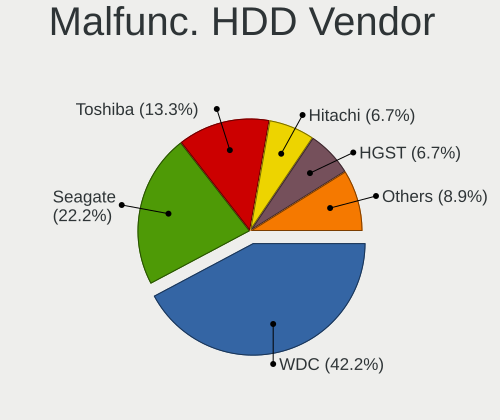

| Vendor              | Computers | Drives | Percent |
|---------------------|-----------|--------|---------|
| WDC                 | 19        | 21     | 42.22%  |
| Seagate             | 10        | 10     | 22.22%  |
| Toshiba             | 6         | 10     | 13.33%  |
| Hitachi             | 3         | 4      | 6.67%   |
| HGST                | 3         | 3      | 6.67%   |
| Samsung Electronics | 2         | 2      | 4.44%   |
| Fujitsu             | 2         | 2      | 4.44%   |

Malfunc. Drive Kind
-------------------

Kinds of faulty drives

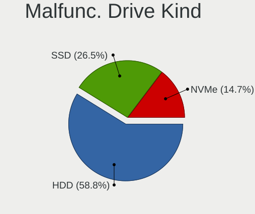

| Kind | Computers | Drives | Percent |
|------|-----------|--------|---------|
| HDD  | 40        | 52     | 58.82%  |
| SSD  | 18        | 22     | 26.47%  |
| NVMe | 10        | 12     | 14.71%  |

Failed Drives
-------------

Failed drive models

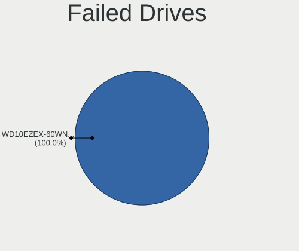

| Model                    | Computers | Drives | Percent |
|--------------------------|-----------|--------|---------|
| WDC WD10EZEX-60WN4A0 1TB | 1         | 1      | 100%    |

Failed Drive Vendor
-------------------

Failed drive vendors

| Vendor | Computers | Drives | Percent |
|--------|-----------|--------|---------|
| WDC    | 1         | 1      | 100%    |

Drive Status
------------

Number of failed and malfunc. drives

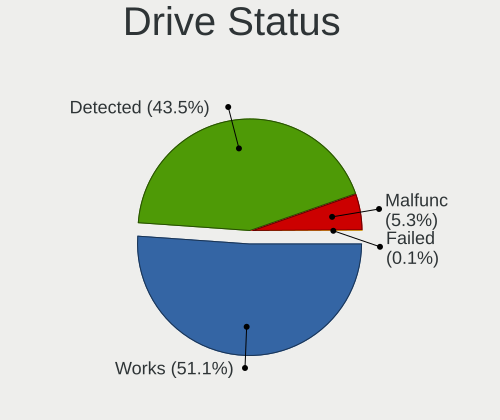

| Status   | Computers | Drives | Percent |
|----------|-----------|--------|---------|
| Works    | 621       | 1309   | 51.11%  |
| Detected | 529       | 1201   | 43.54%  |
| Malfunc  | 64        | 86     | 5.27%   |
| Failed   | 1         | 1      | 0.08%   |

Storage controller
------------------

Storage Vendor
--------------

Storage controller vendors

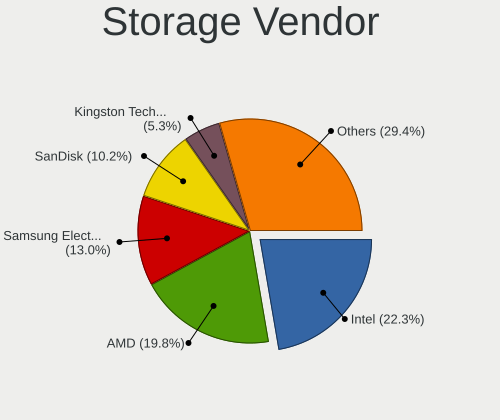

| Vendor                                  | Computers | Percent |
|-----------------------------------------|-----------|---------|
| Intel                                   | 445       | 22.31%  |
| AMD                                     | 395       | 19.8%   |
| Samsung Electronics                     | 259       | 12.98%  |
| SanDisk                                 | 203       | 10.18%  |
| Kingston Technology Company             | 106       | 5.31%   |
| Micron/Crucial Technology               | 75        | 3.76%   |
| Micron Technology                       | 65        | 3.26%   |
| SK hynix                                | 64        | 3.21%   |
| Phison Electronics                      | 64        | 3.21%   |
| ASMedia Technology                      | 59        | 2.96%   |
| MAXIO Technology (Hangzhou)             | 44        | 2.21%   |
| KIOXIA                                  | 37        | 1.85%   |
| Realtek Semiconductor                   | 29        | 1.45%   |
| ADATA Technology                        | 27        | 1.35%   |
| Silicon Motion                          | 19        | 0.95%   |
| Shenzhen Longsys Electronics            | 18        | 0.9%    |
| Toshiba America Info Systems            | 13        | 0.65%   |
| INNOGRIT                                | 10        | 0.5%    |
| Yangtze Memory Technologies             | 8         | 0.4%    |
| Marvell Technology Group                | 8         | 0.4%    |
| Seagate Technology                      | 7         | 0.35%   |
| Apple                                   | 7         | 0.35%   |
| Solidigm                                | 6         | 0.3%    |
| Solid State Storage Technology          | 5         | 0.25%   |
| Union Memory (Shenzhen)                 | 3         | 0.15%   |
| Hosin Global Electronics                | 3         | 0.15%   |
| TenaFe                                  | 2         | 0.1%    |
| Shenzhen Unionmemory Information System | 2         | 0.1%    |
| Nvidia                                  | 2         | 0.1%    |
| Netac Technology                        | 2         | 0.1%    |
| Lite-On Technology                      | 2         | 0.1%    |
| VIA Technologies                        | 1         | 0.05%   |
| Shenzhen Techwinsemi Technology         | 1         | 0.05%   |
| Nextorage                               | 1         | 0.05%   |
| Lenovo                                  | 1         | 0.05%   |
| JMicron Technology                      | 1         | 0.05%   |
| Biwin Storage Technology                | 1         | 0.05%   |

Storage Model
-------------

Storage controller models

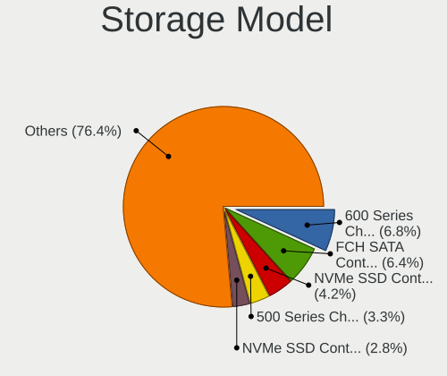

| Model                                                                          | Computers | Percent |
|--------------------------------------------------------------------------------|-----------|---------|
| AMD 600 Series Chipset SATA Controller                                         | 148       | 6.84%   |
| AMD FCH SATA Controller [AHCI mode]                                            | 139       | 6.42%   |
| Samsung NVMe SSD Controller SM981/PM981/PM983                                  | 90        | 4.16%   |
| AMD 500 Series Chipset SATA Controller                                         | 72        | 3.33%   |
| Samsung NVMe SSD Controller PM9A1/PM9A3/980PRO                                 | 61        | 2.82%   |
| AMD 400 Series Chipset SATA Controller                                         | 54        | 2.5%    |
| ASMedia ASM1061/ASM1062 Serial ATA Controller                                  | 45        | 2.08%   |
| SanDisk WD SN560/SN740/SN770/SN5000 NVMe SSD                                   | 41        | 1.89%   |
| Samsung NVMe SSD Controller S4LV008[Pascal]                                    | 41        | 1.89%   |
| Intel Volume Management Device NVMe RAID Controller                            | 36        | 1.66%   |
| Sandisk WD Black SN850X NVMe SSD                                               | 35        | 1.62%   |
| Samsung NVMe SSD Controller 980 (DRAM-less)                                    | 35        | 1.62%   |
| Micron/Crucial P2 [Nick P2] / P3 / P3 Plus NVMe PCIe SSD (DRAM-less)           | 32        | 1.48%   |
| Intel Sunrise Point-LP SATA Controller [AHCI mode]                             | 31        | 1.43%   |
| Intel 8 Series/C220 Series Chipset Family 6-port SATA Controller 1 [AHCI mode] | 28        | 1.29%   |
| SK hynix Platinum P41/PC801 NVMe Solid State Drive                             | 25        | 1.16%   |
| SanDisk Ultra 3D / WD PC SN530, IX SN530, Blue SN550 NVMe SSD (DRAM-less)      | 24        | 1.11%   |
| Samsung NVMe SSD Controller PM9C1a (DRAM-less)                                 | 24        | 1.11%   |
| MAXIO (Hangzhou) NVMe SSD Controller MAP1202 (DRAM-less)                       | 24        | 1.11%   |
| Kingston Company KC3000/FURY Renegade NVMe SSD [E18]                           | 24        | 1.11%   |
| Intel Raptor Lake SATA AHCI Controller                                         | 24        | 1.11%   |
| Intel 82801 Mobile SATA Controller [RAID mode]                                 | 23        | 1.06%   |
| Intel Alder Lake-S PCH SATA Controller [AHCI Mode]                             | 21        | 0.97%   |
| MAXIO (Hangzhou) NVMe SSD Controller MAP1602 (DRAM-less)                       | 20        | 0.92%   |
| Intel SSD 670p Series [Keystone Harbor]                                        | 20        | 0.92%   |
| Kingston Company NV2 NVMe SSD [SM2267XT] (DRAM-less)                           | 19        | 0.88%   |
| Intel RST Volume Management Device Controller                                  | 18        | 0.83%   |
| Intel 200 Series PCH SATA controller [AHCI mode]                               | 18        | 0.83%   |
| SanDisk Extreme Pro / WD Black SN750 / PC SN730 / Red SN700 NVMe SSD           | 17        | 0.79%   |
| Micron 2550 NVMe SSD (DRAM-less)                                               | 17        | 0.79%   |
| Intel Q170/Q150/B150/H170/H110/Z170/CM236 Chipset SATA Controller [AHCI Mode]  | 17        | 0.79%   |
| Silicon Motion SM2263EN/SM2263XT (DRAM-less) NVMe SSD Controllers              | 16        | 0.74%   |
| Intel Cannon Lake PCH SATA AHCI Controller                                     | 16        | 0.74%   |
| Phison E16 PCIe4 NVMe Controller                                               | 15        | 0.69%   |
| Phison E12 NVMe Controller                                                     | 15        | 0.69%   |
| Intel Tiger Lake-LP SATA Controller                                            | 15        | 0.69%   |
| Intel SATA Controller [RAID mode]                                              | 15        | 0.69%   |
| SK hynix Gold P31/BC711/PC711 NVMe Solid State Drive                           | 14        | 0.65%   |
| Intel 7 Series Chipset Family 6-port SATA Controller [AHCI mode]               | 14        | 0.65%   |
| Shenzhen Longsys Lexar NM790 / Patriot Viper VP4300 Lite NVMe SSD (DRAM-less)  | 13        | 0.6%    |

Storage Kind
------------

Kind of storage controller (IDE, SATA, NVMe, SAS, ...)

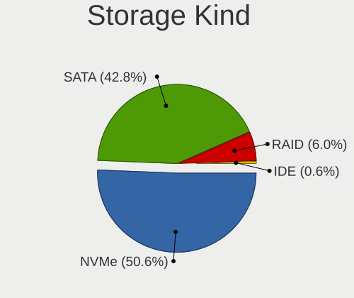

| Kind | Computers | Percent |
|------|-----------|---------|
| NVMe | 884       | 50.63%  |
| SATA | 747       | 42.78%  |
| RAID | 105       | 6.01%   |
| IDE  | 10        | 0.57%   |

Processor
---------

CPU Vendor
----------

Processor vendors

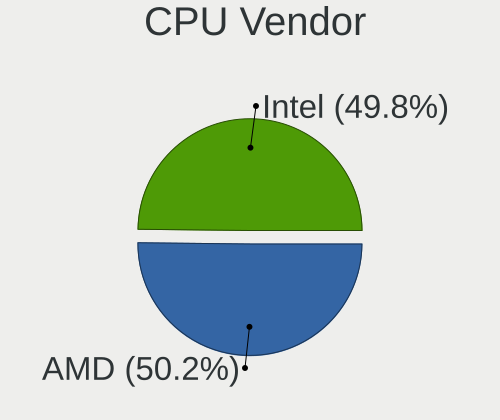

| Vendor | Computers | Percent |
|--------|-----------|---------|
| AMD    | 570       | 50.18%  |
| Intel  | 566       | 49.82%  |

CPU Model
---------

Processor models

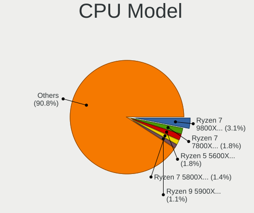

| Model                                      | Computers | Percent |
|--------------------------------------------|-----------|---------|
| AMD Ryzen 7 9800X3D 8-Core Processor       | 35        | 3.08%   |
| AMD Ryzen 7 7800X3D 8-Core Processor       | 20        | 1.76%   |
| AMD Ryzen 5 5600X 6-Core Processor         | 20        | 1.76%   |
| AMD Ryzen 7 5800X 8-Core Processor         | 16        | 1.41%   |
| AMD Ryzen 9 5900X 12-Core Processor        | 13        | 1.14%   |
| AMD Ryzen 5 5600G with Radeon Graphics     | 12        | 1.06%   |
| AMD Ryzen 5 3600 6-Core Processor          | 12        | 1.06%   |
| AMD Ryzen 9 7950X3D 16-Core Processor      | 11        | 0.97%   |
| AMD Ryzen 9 5950X 16-Core Processor        | 11        | 0.97%   |
| AMD Ryzen 7 8845HS w/ Radeon 780M Graphics | 11        | 0.97%   |
| AMD Ryzen 7 5800H with Radeon Graphics     | 11        | 0.97%   |
| AMD Ryzen 7 5700U with Radeon Graphics     | 11        | 0.97%   |
| Intel 11th Gen Core i5-1135G7 @ 2.40GHz    | 10        | 0.88%   |
| Intel Core i7-10750H CPU @ 2.60GHz         | 9         | 0.79%   |
| Intel Core i5-8350U CPU @ 1.70GHz          | 9         | 0.79%   |
| Intel 13th Gen Core i9-13900K              | 9         | 0.79%   |
| AMD Ryzen 7 3700X 8-Core Processor         | 9         | 0.79%   |
| Intel Core i7-9750H CPU @ 2.60GHz          | 8         | 0.7%    |
| Intel 11th Gen Core i3-1115G4 @ 3.00GHz    | 8         | 0.7%    |
| AMD Ryzen AI 9 HX 370 w/ Radeon 890M       | 8         | 0.7%    |
| AMD Ryzen 7 9700X 8-Core Processor         | 8         | 0.7%    |
| AMD Ryzen 7 5700G with Radeon Graphics     | 8         | 0.7%    |
| AMD Ryzen 5 5600 6-Core Processor          | 8         | 0.7%    |
| Intel Core Ultra 9 185H                    | 7         | 0.62%   |
| Intel Core Ultra 7 155H                    | 7         | 0.62%   |
| Intel Core i7-7700HQ CPU @ 2.80GHz         | 7         | 0.62%   |
| Intel Core i5-8250U CPU @ 1.60GHz          | 7         | 0.62%   |
| Intel Core i5-7200U CPU @ 2.50GHz          | 7         | 0.62%   |
| Intel 11th Gen Core i5-11400H @ 2.70GHz    | 7         | 0.62%   |
| AMD Ryzen 9 9950X3D 16-Core Processor      | 7         | 0.62%   |
| AMD Ryzen 9 7950X 16-Core Processor        | 7         | 0.62%   |
| AMD Ryzen 9 7900X3D 12-Core Processor      | 7         | 0.62%   |
| AMD Ryzen 7 7730U with Radeon Graphics     | 7         | 0.62%   |
| AMD Ryzen 7 7700 8-Core Processor          | 7         | 0.62%   |
| AMD Ryzen 7 5800X3D 8-Core Processor       | 7         | 0.62%   |
| AMD Ryzen 5 5500U with Radeon Graphics     | 7         | 0.62%   |
| Intel Core i9-9900K CPU @ 3.60GHz          | 6         | 0.53%   |
| Intel Core i7-8550U CPU @ 1.80GHz          | 6         | 0.53%   |
| Intel Core i7-4790K CPU @ 4.00GHz          | 6         | 0.53%   |
| Intel Core i5-8265U CPU @ 1.60GHz          | 6         | 0.53%   |

CPU Model Family
----------------

Processor model prefix

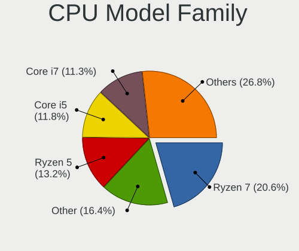

| Model                  | Computers | Percent |
|------------------------|-----------|---------|
| AMD Ryzen 7            | 234       | 20.6%   |
| Other                  | 186       | 16.37%  |
| AMD Ryzen 5            | 150       | 13.2%   |
| Intel Core i5          | 134       | 11.8%   |
| Intel Core i7          | 128       | 11.27%  |
| AMD Ryzen 9            | 101       | 8.89%   |
| Intel Core             | 47        | 4.14%   |
| Intel Core i3          | 37        | 3.26%   |
| Intel Xeon             | 21        | 1.85%   |
| Intel Core i9          | 16        | 1.41%   |
| AMD Ryzen 3            | 13        | 1.14%   |
| AMD Ryzen 7 PRO        | 10        | 0.88%   |
| Intel Celeron          | 8         | 0.7%    |
| Intel Pentium          | 7         | 0.62%   |
| AMD Athlon             | 6         | 0.53%   |
| AMD Ryzen Threadripper | 5         | 0.44%   |
| Intel Core 2 Duo       | 4         | 0.35%   |
| AMD FX                 | 4         | 0.35%   |
| Intel Atom             | 3         | 0.26%   |
| AMD Ryzen 5 PRO        | 3         | 0.26%   |
| AMD A8                 | 3         | 0.26%   |
| AMD A10                | 3         | 0.26%   |
| Intel Genuine          | 2         | 0.18%   |
| AMD A4                 | 2         | 0.18%   |
| Intel Pentium Silver   | 1         | 0.09%   |
| Intel Core M           | 1         | 0.09%   |
| Intel Core 2 Quad      | 1         | 0.09%   |
| AMD Quad-Core          | 1         | 0.09%   |
| AMD GX                 | 1         | 0.09%   |
| AMD E2                 | 1         | 0.09%   |
| AMD E                  | 1         | 0.09%   |
| AMD Athlon II          | 1         | 0.09%   |
| AMD A12                | 1         | 0.09%   |

CPU Cores
---------

Number of processor cores

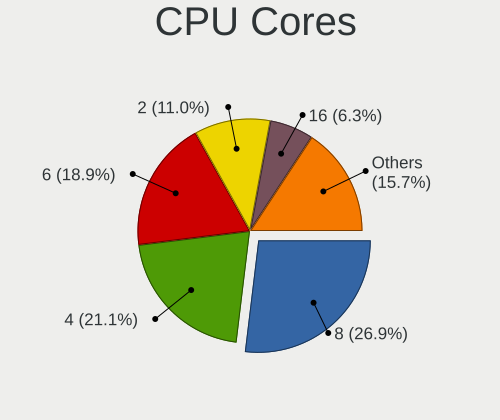

| Number | Computers | Percent |
|--------|-----------|---------|
| 8      | 306       | 26.91%  |
| 4      | 240       | 21.11%  |
| 6      | 215       | 18.91%  |
| 2      | 125       | 10.99%  |
| 16     | 72        | 6.33%   |
| 12     | 70        | 6.16%   |
| 10     | 38        | 3.34%   |
| 14     | 35        | 3.08%   |
| 24     | 27        | 2.37%   |
| 20     | 4         | 0.35%   |
| 32     | 2         | 0.18%   |
| 36     | 1         | 0.09%   |
| 18     | 1         | 0.09%   |
| 11     | 1         | 0.09%   |

CPU Sockets
-----------

Number of sockets

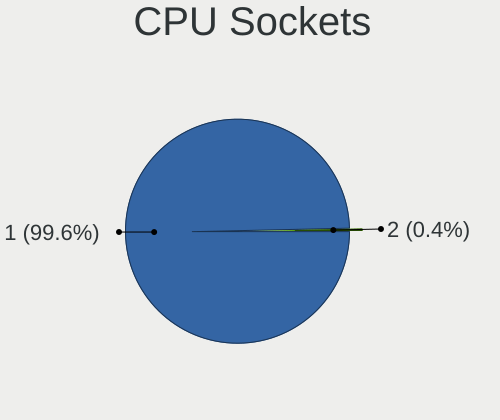

| Number | Computers | Percent |
|--------|-----------|---------|
| 1      | 1132      | 99.65%  |
| 2      | 4         | 0.35%   |

CPU Threads
-----------

Threads per core (Hyper-Threading)

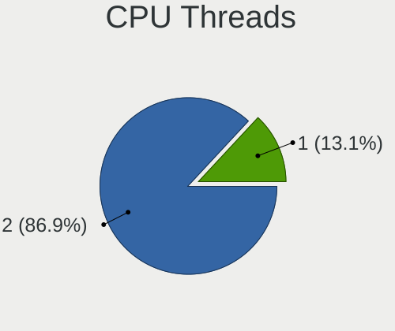

| Number | Computers | Percent |
|--------|-----------|---------|
| 2      | 989       | 86.91%  |
| 1      | 149       | 13.09%  |

CPU Op-Modes
------------

CPU Operation Modes (32-bit, 64-bit)

| Op mode        | Computers | Percent |
|----------------|-----------|---------|
| 32-bit, 64-bit | 1136      | 100%    |

CPU Microcode
-------------

Microcode number

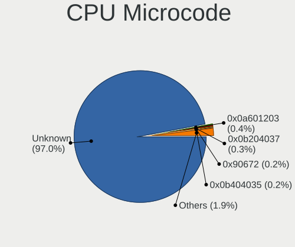

| Number     | Computers | Percent |
|------------|-----------|---------|
| Unknown    | 1104      | 97.01%  |
| 0x0a601203 | 5         | 0.44%   |
| 0x0b204037 | 3         | 0.26%   |
| 0x90672    | 2         | 0.18%   |
| 0x0b404035 | 2         | 0.18%   |
| 0x0a50000c | 2         | 0.18%   |
| 0x08600109 | 2         | 0.18%   |
| 0x08108109 | 2         | 0.18%   |
| 0x08108102 | 2         | 0.18%   |
| 0x906ea    | 1         | 0.09%   |
| 0x306a9    | 1         | 0.09%   |
| 0x0a704103 | 1         | 0.09%   |
| 0x0a704101 | 1         | 0.09%   |
| 0x0a20120a | 1         | 0.09%   |
| 0x0a201016 | 1         | 0.09%   |
| 0x08900201 | 1         | 0.09%   |
| 0x08701030 | 1         | 0.09%   |
| 0x08701021 | 1         | 0.09%   |
| 0x08608103 | 1         | 0.09%   |
| 0x08608102 | 1         | 0.09%   |
| 0x08600106 | 1         | 0.09%   |
| 0x08101016 | 1         | 0.09%   |
| 0x05000119 | 1         | 0.09%   |

CPU Microarch
-------------

Microarchitecture

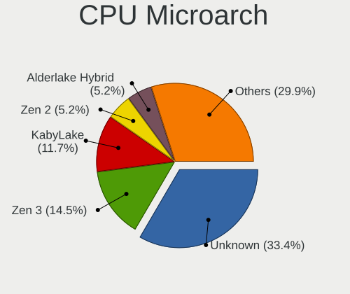

| Name               | Computers | Percent |
|--------------------|-----------|---------|
| Unknown            | 382       | 33.42%  |
| Zen 3              | 166       | 14.52%  |
| KabyLake           | 134       | 11.72%  |
| Zen 2              | 60        | 5.25%   |
| Alderlake Hybrid   | 59        | 5.16%   |
| Haswell            | 46        | 4.02%   |
| Zen+               | 40        | 3.5%    |
| Skylake            | 34        | 2.97%   |
| CometLake          | 34        | 2.97%   |
| IvyBridge          | 28        | 2.45%   |
| TigerLake          | 27        | 2.36%   |
| SandyBridge        | 19        | 1.66%   |
| IceLake            | 19        | 1.66%   |
| Broadwell          | 14        | 1.22%   |
| Zen                | 12        | 1.05%   |
| Meteorlake Hybrid  | 12        | 1.05%   |
| Lunarlake Hybrid   | 8         | 0.7%    |
| Westmere           | 7         | 0.61%   |
| Piledriver         | 6         | 0.52%   |
| Silvermont         | 5         | 0.44%   |
| Goldmont           | 4         | 0.35%   |
| Puma               | 3         | 0.26%   |
| Penryn             | 3         | 0.26%   |
| Nehalem            | 3         | 0.26%   |
| Goldmont plus      | 3         | 0.26%   |
| Excavator          | 3         | 0.26%   |
| Steamroller        | 2         | 0.17%   |
| Jaguar             | 2         | 0.17%   |
| Core               | 2         | 0.17%   |
| Tremont            | 1         | 0.09%   |
| K10 Llano          | 1         | 0.09%   |
| K10                | 1         | 0.09%   |
| Gracemont          | 1         | 0.09%   |
| Bobcat             | 1         | 0.09%   |
| ArrowLake-H Hybrid | 1         | 0.09%   |

Graphics
--------

GPU Vendor
----------

Vendors of graphics cards

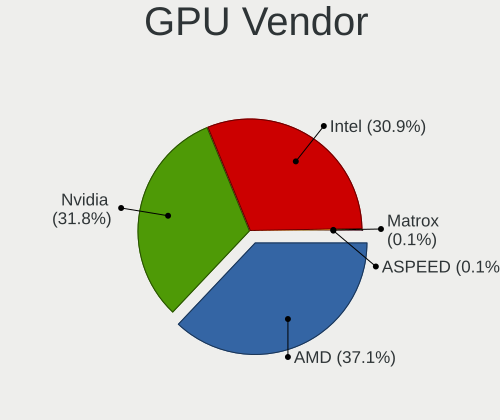

| Vendor                     | Computers | Percent |
|----------------------------|-----------|---------|
| AMD                        | 525       | 37.05%  |
| Nvidia                     | 450       | 31.76%  |
| Intel                      | 438       | 30.91%  |
| Matrox Electronics Systems | 2         | 0.14%   |
| ASPEED Technology          | 2         | 0.14%   |

GPU Model
---------

Graphics card models

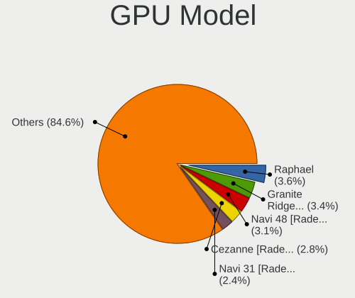

| Model                                                                | Computers | Percent |
|----------------------------------------------------------------------|-----------|---------|
| AMD Raphael                                                          | 55        | 3.63%   |
| AMD Granite Ridge [Radeon Graphics]                                  | 52        | 3.43%   |
| AMD Navi 48 [Radeon RX 9070/9070 XT/9070 GRE]                        | 47        | 3.1%    |
| AMD Cezanne [Radeon Vega Series / Radeon Vega Mobile Series]         | 42        | 2.77%   |
| AMD Navi 31 [Radeon RX 7900 XT/7900 XTX/7900 GRE/7900M]              | 37        | 2.44%   |
| Intel Kaby Lake-R GT2 [UHD Graphics 620]                             | 27        | 1.78%   |
| AMD Picasso/Raven 2 [Radeon Vega Series / Radeon Vega Mobile Series] | 27        | 1.78%   |
| AMD HawkPoint1                                                       | 26        | 1.72%   |
| AMD Ellesmere [Radeon RX 470/480/570/570X/580/580X/590]              | 26        | 1.72%   |
| Nvidia GA106M [GeForce RTX 3060 Mobile / Max-Q]                      | 23        | 1.52%   |
| Intel Alder Lake-P GT2 [Iris Xe Graphics]                            | 22        | 1.45%   |
| AMD Rembrandt [Radeon 680M]                                          | 21        | 1.39%   |
| AMD Navi 23 [Radeon RX 6600/6600 XT/6600M]                           | 21        | 1.39%   |
| AMD Renoir [Radeon Vega Series / Radeon Vega Mobile Series]          | 20        | 1.32%   |
| AMD Phoenix1                                                         | 20        | 1.32%   |
| AMD Navi 22 [Radeon RX 6700/6700 XT/6750 XT / 6800M/6850M XT]        | 20        | 1.32%   |
| AMD Lucienne                                                         | 20        | 1.32%   |
| AMD Barcelo                                                          | 20        | 1.32%   |
| Intel CometLake-H GT2 [UHD Graphics]                                 | 19        | 1.25%   |
| Intel TigerLake-LP GT2 [Iris Xe Graphics]                            | 17        | 1.12%   |
| Intel Meteor Lake-P [Intel Arc Graphics]                             | 17        | 1.12%   |
| Nvidia GA106 [GeForce RTX 3060 Lite Hash Rate]                       | 16        | 1.06%   |
| Intel Raptor Lake-P [Iris Xe Graphics]                               | 16        | 1.06%   |
| Intel Kaby Lake-U GT2 [HD Graphics 620]                              | 16        | 1.06%   |
| AMD Navi 21 [Radeon RX 6800/6800 XT / 6900 XT]                       | 16        | 1.06%   |
| Nvidia AD107M [GeForce RTX 4060 Max-Q / Mobile]                      | 15        | 0.99%   |
| Nvidia AD107 [GeForce RTX 4060]                                      | 15        | 0.99%   |
| Intel 3rd Gen Core processor Graphics Controller                     | 15        | 0.99%   |
| Nvidia AD102 [GeForce RTX 4090]                                      | 14        | 0.92%   |
| Nvidia GA107M [GeForce RTX 3050 Mobile]                              | 13        | 0.86%   |
| Intel 4th Gen Core Processor Integrated Graphics Controller          | 13        | 0.86%   |
| AMD Navi 32 [Radeon RX 7700 XT / 7800 XT]                            | 13        | 0.86%   |
| Nvidia AD107M [GeForce RTX 4050 Max-Q / Mobile]                      | 12        | 0.79%   |
| Intel WhiskeyLake-U GT2 [UHD Graphics 620]                           | 12        | 0.79%   |
| Intel TigerLake-H GT1 [UHD Graphics]                                 | 12        | 0.79%   |
| Intel CoffeeLake-H GT2 [UHD Graphics 630]                            | 11        | 0.73%   |
| AMD Strix [Radeon 880M / 890M]                                       | 11        | 0.73%   |
| Nvidia GA102 [GeForce RTX 3080]                                      | 10        | 0.66%   |
| Intel Skylake-U GT2 [HD Graphics 520]                                | 10        | 0.66%   |
| Intel Kaby Lake-H GT2 [HD Graphics 630]                              | 10        | 0.66%   |

GPU Combo
---------

Combinations of graphics cards

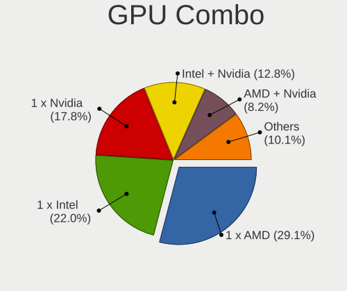

| Name               | Computers | Percent |
|--------------------|-----------|---------|
| 1 x AMD            | 333       | 29.06%  |
| 1 x Intel          | 252       | 21.99%  |
| 1 x Nvidia         | 204       | 17.8%   |
| Intel + Nvidia     | 147       | 12.83%  |
| AMD + Nvidia       | 94        | 8.2%    |
| 2 x AMD            | 80        | 6.98%   |
| Intel + AMD        | 19        | 1.66%   |
| 2 x Intel          | 6         | 0.52%   |
| 2 x Nvidia         | 4         | 0.35%   |
| 1 x ASPEED         | 2         | 0.17%   |
| AMD + Matrox       | 2         | 0.17%   |
| Other              | 1         | 0.09%   |
| Intel + 2 x Nvidia | 1         | 0.09%   |
| AMD + 2 x Nvidia   | 1         | 0.09%   |

GPU Driver
----------

Free vs proprietary

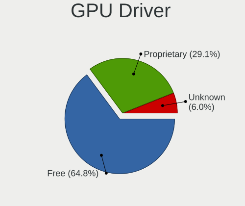

| Driver      | Computers | Percent |
|-------------|-----------|---------|
| Free        | 743       | 64.83%  |
| Proprietary | 334       | 29.14%  |
| Unknown     | 69        | 6.02%   |

GPU Memory
----------

Total video memory

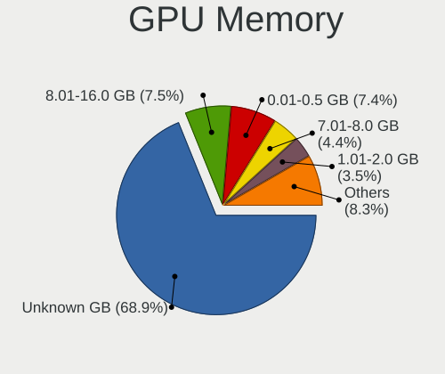

| Size in GB | Computers | Percent |
|------------|-----------|---------|
| Unknown    | 797       | 68.89%  |
| 8.01-16.0  | 87        | 7.52%   |
| 0.01-0.5   | 86        | 7.43%   |
| 7.01-8.0   | 51        | 4.41%   |
| 1.01-2.0   | 40        | 3.46%   |
| 3.01-4.0   | 33        | 2.85%   |
| 16.01-24.0 | 22        | 1.9%    |
| 0.51-1.0   | 20        | 1.73%   |
| 5.01-6.0   | 16        | 1.38%   |
| 2.01-3.0   | 3         | 0.26%   |
| 24.01-32.0 | 2         | 0.17%   |

Monitor
-------

Monitor Vendor
--------------

Monitor vendors

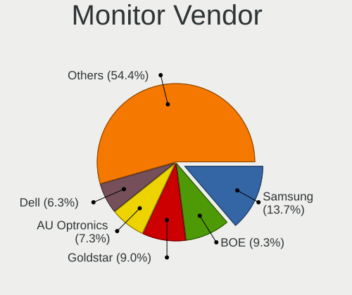

| Vendor                  | Computers | Percent |
|-------------------------|-----------|---------|
| Samsung Electronics     | 196       | 13.74%  |
| BOE                     | 132       | 9.25%   |
| Goldstar                | 128       | 8.97%   |
| AU Optronics            | 104       | 7.29%   |
| Dell                    | 90        | 6.31%   |
| Chimei Innolux          | 78        | 5.47%   |
| LG Display              | 62        | 4.34%   |
| Acer                    | 60        | 4.2%    |
| AOC                     | 51        | 3.57%   |
| ASUSTek Computer        | 46        | 3.22%   |
| Lenovo                  | 42        | 2.94%   |
| MSI                     | 41        | 2.87%   |
| Hewlett-Packard         | 34        | 2.38%   |
| BenQ                    | 32        | 2.24%   |
| Ancor Communications    | 28        | 1.96%   |
| Philips                 | 23        | 1.61%   |
| Gigabyte Technology     | 21        | 1.47%   |
| Sharp                   | 20        | 1.4%    |
| PANDA                   | 16        | 1.12%   |
| ViewSonic               | 14        | 0.98%   |
| Apple                   | 12        | 0.84%   |
| CSW                     | 10        | 0.7%    |
| Sceptre Tech            | 9         | 0.63%   |
| InfoVision              | 9         | 0.63%   |
| HKC                     | 9         | 0.63%   |
| CSOT                    | 9         | 0.63%   |
| TMX                     | 7         | 0.49%   |
| Iiyama                  | 7         | 0.49%   |
| RTK                     | 6         | 0.42%   |
| Mi                      | 6         | 0.42%   |
| Unknown                 | 5         | 0.35%   |
| Sony                    | 5         | 0.35%   |
| Vizio                   | 4         | 0.28%   |
| Panasonic               | 4         | 0.28%   |
| Chi Mei Optoelectronics | 4         | 0.28%   |
| Vestel Elektronik       | 3         | 0.21%   |
| Valve                   | 3         | 0.21%   |
| Unknown (XXX)           | 3         | 0.21%   |
| SKG                     | 3         | 0.21%   |
| ___                     | 2         | 0.14%   |

Monitor Model
-------------

Monitor models

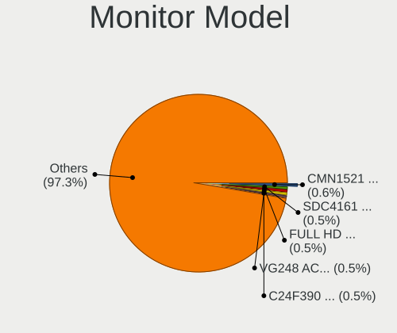

| Model                                                                   | Computers | Percent |
|-------------------------------------------------------------------------|-----------|---------|
| Chimei Innolux LCD Monitor CMN1521 1920x1080 344x193mm 15.5-inch        | 9         | 0.6%    |
| Samsung Electronics LCD Monitor SDC4161 1920x1080 344x194mm 15.5-inch   | 8         | 0.54%   |
| Goldstar FULL HD GSM5B55 1920x1080 480x270mm 21.7-inch                  | 8         | 0.54%   |
| Ancor Communications VG248 ACI24A4 1920x1080 531x299mm 24.0-inch        | 8         | 0.54%   |
| Samsung Electronics C24F390 SAM0D2C 1920x1080 521x293mm 23.5-inch       | 7         | 0.47%   |
| Goldstar ULTRAGEAR GSM5BD3 2560x1440 697x392mm 31.5-inch                | 6         | 0.4%    |
| Goldstar 27GL850 GSM5B7F 2560x1440 597x336mm 27.0-inch                  | 6         | 0.4%    |
| Samsung Electronics LCD Monitor SDC419D 2880x1800 302x189mm 14.0-inch   | 5         | 0.33%   |
| PANDA LCD Monitor NCP004D 1920x1080 344x194mm 15.5-inch                 | 5         | 0.33%   |
| Goldstar LG ULTRAWIDE GSM59F1 2560x1080 670x280mm 28.6-inch             | 5         | 0.33%   |
| Goldstar LG TV SSCR2 GSMC0C8 3840x2160                                  | 5         | 0.33%   |
| BOE LCD Monitor BOE0C29 1920x1080 344x194mm 15.5-inch                   | 5         | 0.33%   |
| AU Optronics LCD Monitor AUOAF90 1920x1080 344x193mm 15.5-inch          | 5         | 0.33%   |
| AOC U2790B AOC2790 3840x2160 597x336mm 27.0-inch                        | 5         | 0.33%   |
| Samsung Electronics LCD Monitor SDC4181 2880x1800 302x189mm 14.0-inch   | 4         | 0.27%   |
| Samsung Electronics LC49G95T SAM7053 3840x1080 1193x336mm 48.8-inch     | 4         | 0.27%   |
| MSI Optix MAG27CQ MSI1462 2560x1440 597x336mm 27.0-inch                 | 4         | 0.27%   |
| LG Display LCD Monitor LGD0685 1920x1080 309x174mm 14.0-inch            | 4         | 0.27%   |
| LG Display LCD Monitor LGD046F 1920x1080 344x194mm 15.5-inch            | 4         | 0.27%   |
| Goldstar ULTRAGEAR GSM5C1A 1920x1080 527x296mm 23.8-inch                | 4         | 0.27%   |
| Goldstar ULTRAGEAR GSM5BB4 2560x1440 597x336mm 27.0-inch                | 4         | 0.27%   |
| Dell U2412M DELA07B 1920x1200 518x324mm 24.1-inch                       | 4         | 0.27%   |
| Dell S3221QS DELD107 3840x2160 697x392mm 31.5-inch                      | 4         | 0.27%   |
| Dell P2419H DELD0DA 1920x1080 527x296mm 23.8-inch                       | 4         | 0.27%   |
| AU Optronics LCD Monitor AUO38ED 1920x1080 344x193mm 15.5-inch          | 4         | 0.27%   |
| ASUSTek Computer VG289Q1A AUS28CA 3840x2160 621x341mm 27.9-inch         | 4         | 0.27%   |
| AOC 24G2W1G3 AOC2402 1920x1080 527x296mm 23.8-inch                      | 4         | 0.27%   |
| Ancor Communications VW202 ACI20A2 1680x1050 433x271mm 20.1-inch        | 4         | 0.27%   |
| Vestel Elektronik 40UHD_LCD_TV VES3700 3840x2160 880x500mm 39.8-inch    | 3         | 0.2%    |
| Unknown LCD Monitor FFFF 2288x1287 2550x2550mm 142.0-inch               | 3         | 0.2%    |
| Sceptre Tech Sceptre F24 SPT09AB 1920x1080 530x290mm 23.8-inch          | 3         | 0.2%    |
| Samsung Electronics S24F350 SAM0D20 1920x1080 521x293mm 23.5-inch       | 3         | 0.2%    |
| Samsung Electronics Odyssey G60SD SAM75CB 2560x1440 598x336mm 27.0-inch | 3         | 0.2%    |
| Samsung Electronics LCD Monitor SDC4171 2880x1800 302x189mm 14.0-inch   | 3         | 0.2%    |
| Samsung Electronics LCD Monitor SAM71B4 3840x2160 1872x1053mm 84.6-inch | 3         | 0.2%    |
| Samsung Electronics LC27G5xT SAM707A 2560x1440 597x336mm 27.0-inch      | 3         | 0.2%    |
| MSI MAG241C MSI3EA2 1920x1080 521x293mm 23.5-inch                       | 3         | 0.2%    |
| LG Display LCD Monitor LGD060F 1920x1080 309x174mm 14.0-inch            | 3         | 0.2%    |
| HKC GN10 HKC2716 2560x1440 597x336mm 27.0-inch                          | 3         | 0.2%    |
| Goldstar ULTRAGEAR GSM7766 2560x1440 697x392mm 31.5-inch                | 3         | 0.2%    |

Monitor Resolution
------------------

Monitor screen resolution

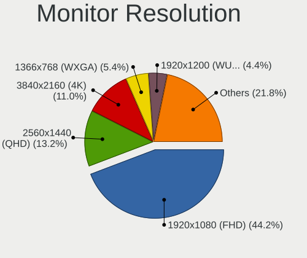

| Resolution         | Computers | Percent |
|--------------------|-----------|---------|
| 1920x1080 (FHD)    | 605       | 44.23%  |
| 2560x1440 (QHD)    | 181       | 13.23%  |
| 3840x2160 (4K)     | 150       | 10.96%  |
| 1366x768 (WXGA)    | 74        | 5.41%   |
| 1920x1200 (WUXGA)  | 60        | 4.39%   |
| 3440x1440          | 56        | 4.09%   |
| 2560x1600          | 43        | 3.14%   |
| 2880x1800          | 33        | 2.41%   |
| Unknown            | 18        | 1.32%   |
| 3840x1080          | 17        | 1.24%   |
| 2560x1080          | 17        | 1.24%   |
| 1600x900 (HD+)     | 17        | 1.24%   |
| 1680x1050 (WSXGA+) | 14        | 1.02%   |
| 1360x768           | 7         | 0.51%   |
| 2160x1440          | 6         | 0.44%   |
| 1440x900 (WXGA+)   | 6         | 0.44%   |
| 3200x2000          | 5         | 0.37%   |
| 3072x1920          | 5         | 0.37%   |
| 1280x720 (HD)      | 5         | 0.37%   |
| 800x1280           | 4         | 0.29%   |
| 2880x1920          | 4         | 0.29%   |
| 1920x540           | 4         | 0.29%   |
| 1920x1280          | 4         | 0.29%   |
| 1280x1024 (SXGA)   | 4         | 0.29%   |
| 3840x1600          | 3         | 0.22%   |
| 2288x1287          | 3         | 0.22%   |
| 3840x2560          | 2         | 0.15%   |
| 3840x1100          | 2         | 0.15%   |
| 1600x1200          | 2         | 0.15%   |
| 1280x800 (WXGA)    | 2         | 0.15%   |
| 3840x2400          | 1         | 0.07%   |
| 3840x1200          | 1         | 0.07%   |
| 3456x2160          | 1         | 0.07%   |
| 3360x1440          | 1         | 0.07%   |
| 3200x1800 (QHD+)   | 1         | 0.07%   |
| 3000x2000          | 1         | 0.07%   |
| 2944x1840          | 1         | 0.07%   |
| 2880x1620          | 1         | 0.07%   |
| 2736x1824          | 1         | 0.07%   |
| 2560x2880          | 1         | 0.07%   |

Monitor Diagonal
----------------

Diagonal size in inches

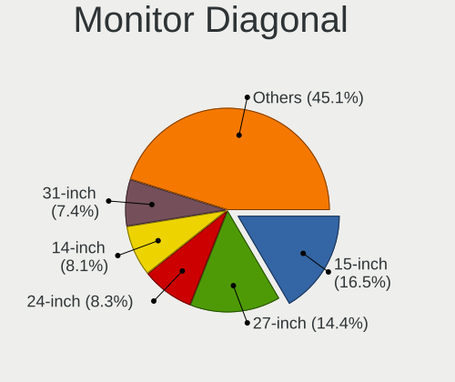

| Inches  | Computers | Percent |
|---------|-----------|---------|
| 15      | 234       | 16.55%  |
| 27      | 204       | 14.43%  |
| 24      | 118       | 8.35%   |
| 14      | 115       | 8.13%   |
| 31      | 105       | 7.43%   |
| 23      | 83        | 5.87%   |
| 13      | 68        | 4.81%   |
| 16      | 66        | 4.67%   |
| 21      | 64        | 4.53%   |
| 34      | 61        | 4.31%   |
| 17      | 43        | 3.04%   |
| Unknown | 40        | 2.83%   |
| 48      | 16        | 1.13%   |
| 32      | 16        | 1.13%   |
| 26      | 13        | 0.92%   |
| 20      | 12        | 0.85%   |
| 84      | 11        | 0.78%   |
| 72      | 11        | 0.78%   |
| 12      | 11        | 0.78%   |
| 18      | 10        | 0.71%   |
| 28      | 9         | 0.64%   |
| 19      | 9         | 0.64%   |
| 63      | 8         | 0.57%   |
| 54      | 8         | 0.57%   |
| 22      | 8         | 0.57%   |
| 42      | 6         | 0.42%   |
| 49      | 5         | 0.35%   |
| 7       | 5         | 0.35%   |
| 74      | 4         | 0.28%   |
| 44      | 4         | 0.28%   |
| 43      | 4         | 0.28%   |
| 40      | 4         | 0.28%   |
| 37      | 4         | 0.28%   |
| 29      | 4         | 0.28%   |
| 11      | 4         | 0.28%   |
| 142     | 3         | 0.21%   |
| 46      | 3         | 0.21%   |
| 39      | 3         | 0.21%   |
| 36      | 3         | 0.21%   |
| 8       | 3         | 0.21%   |

Monitor Width
-------------

Physical width

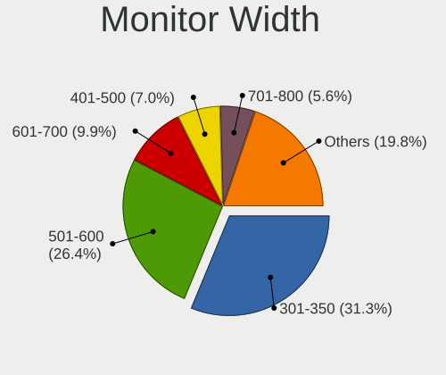

| Width in mm    | Computers | Percent |
|----------------|-----------|---------|
| 301-350        | 426       | 31.25%  |
| 501-600        | 360       | 26.41%  |
| 601-700        | 135       | 9.9%    |
| 401-500        | 95        | 6.97%   |
| 701-800        | 77        | 5.65%   |
| 201-300        | 65        | 4.77%   |
| 351-400        | 55        | 4.04%   |
| 1001-1500      | 48        | 3.52%   |
| Unknown        | 40        | 2.93%   |
| 1501-2000      | 26        | 1.91%   |
| 801-900        | 14        | 1.03%   |
| 901-1000       | 11        | 0.81%   |
| 101-200        | 5         | 0.37%   |
| More than 2000 | 3         | 0.22%   |
| 1-100          | 3         | 0.22%   |

Aspect Ratio
------------

Proportional relationship between the width and the height

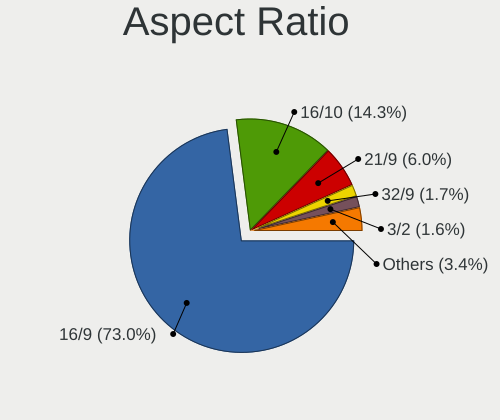

| Ratio   | Computers | Percent |
|---------|-----------|---------|
| 16/9    | 899       | 72.97%  |
| 16/10   | 176       | 14.29%  |
| 21/9    | 74        | 6.01%   |
| 32/9    | 21        | 1.7%    |
| 3/2     | 20        | 1.62%   |
| Unknown | 16        | 1.3%    |
| 4/3     | 5         | 0.41%   |
| 5/4     | 4         | 0.32%   |
| 1.00    | 4         | 0.32%   |
| 1.96    | 2         | 0.16%   |
| 0.67    | 2         | 0.16%   |
| 0.63    | 2         | 0.16%   |
| 0.62    | 2         | 0.16%   |
| 6/5     | 1         | 0.08%   |
| 3.40    | 1         | 0.08%   |
| 3.20    | 1         | 0.08%   |
| 2.70    | 1         | 0.08%   |
| 0.89    | 1         | 0.08%   |

Monitor Area
------------

Area in inch²

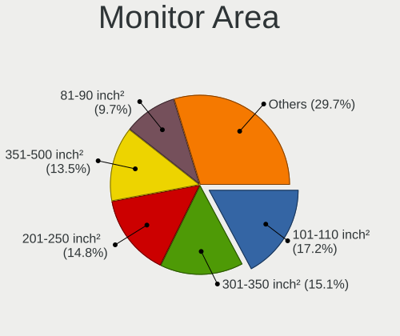

| Area in inch² | Computers | Percent |
|----------------|-----------|---------|
| 101-110        | 241       | 17.17%  |
| 301-350        | 212       | 15.1%   |
| 201-250        | 208       | 14.81%  |
| 351-500        | 190       | 13.53%  |
| 81-90          | 136       | 9.69%   |
| 111-120        | 61        | 4.34%   |
| More than 1000 | 52        | 3.7%    |
| 501-1000       | 50        | 3.56%   |
| 151-200        | 47        | 3.35%   |
| 251-300        | 43        | 3.06%   |
| Unknown        | 40        | 2.85%   |
| 71-80          | 39        | 2.78%   |
| 121-130        | 38        | 2.71%   |
| 141-150        | 12        | 0.85%   |
| 61-70          | 11        | 0.78%   |
| 1-40           | 8         | 0.57%   |
| 91-100         | 8         | 0.57%   |
| 51-60          | 5         | 0.36%   |
| 131-140        | 2         | 0.14%   |
| 41-50          | 1         | 0.07%   |

Pixel Density
-------------

Pixels per inch

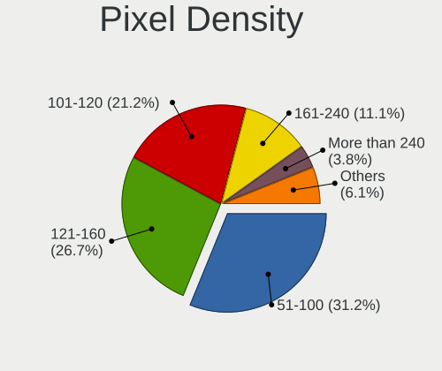

| Density       | Computers | Percent |
|---------------|-----------|---------|
| 51-100        | 414       | 31.17%  |
| 121-160       | 354       | 26.66%  |
| 101-120       | 282       | 21.23%  |
| 161-240       | 147       | 11.07%  |
| More than 240 | 50        | 3.77%   |
| 1-50          | 41        | 3.09%   |
| Unknown       | 40        | 3.01%   |

Multiple Monitors
-----------------

Total monitors connected

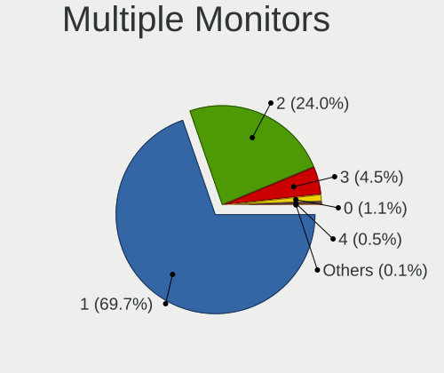

| Total | Computers | Percent |
|-------|-----------|---------|
| 1     | 801       | 69.71%  |
| 2     | 276       | 24.02%  |
| 3     | 52        | 4.53%   |
| 0     | 13        | 1.13%   |
| 4     | 6         | 0.52%   |
| 5     | 1         | 0.09%   |

Network
-------

Net Controller Vendor
---------------------

Controller vendors

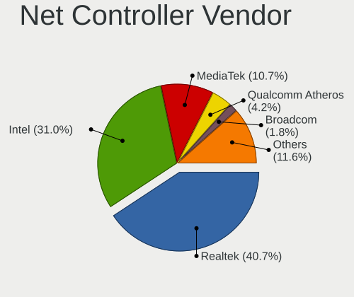

| Vendor                                 | Computers | Percent |
|----------------------------------------|-----------|---------|
| Realtek Semiconductor                  | 718       | 40.73%  |
| Intel                                  | 547       | 31.03%  |
| MediaTek                               | 189       | 10.72%  |
| Qualcomm Atheros                       | 74        | 4.2%    |
| Broadcom                               | 31        | 1.76%   |
| Microsoft                              | 20        | 1.13%   |
| ASIX Electronics                       | 20        | 1.13%   |
| TP-Link                                | 18        | 1.02%   |
| Samsung Electronics                    | 14        | 0.79%   |
| Qualcomm Technologies                  | 11        | 0.62%   |
| Aquantia                               | 11        | 0.62%   |
| Qualcomm                               | 7         | 0.4%    |
| DisplayLink                            | 6         | 0.34%   |
| ASUSTek Computer                       | 6         | 0.34%   |
| Ralink                                 | 5         | 0.28%   |
| Broadcom Limited                       | 5         | 0.28%   |
| Apple                                  | 5         | 0.28%   |
| Realtek                                | 4         | 0.23%   |
| Ralink Technology                      | 4         | 0.23%   |
| Google                                 | 4         | 0.23%   |
| D-Link                                 | 4         | 0.23%   |
| aicsemi                                | 4         | 0.23%   |
| Xiaomi                                 | 3         | 0.17%   |
| Suzhou Motorcomm Electronic Technology | 3         | 0.17%   |
| Qualcomm Atheros Communications        | 3         | 0.17%   |
| QinHeng Electronics                    | 3         | 0.17%   |
| NetGear                                | 3         | 0.17%   |
| Marvell Technology Group               | 3         | 0.17%   |
| Hewlett-Packard                        | 3         | 0.17%   |
| Tehuti Networks                        | 2         | 0.11%   |
| Sierra Wireless                        | 2         | 0.11%   |
| Shenzhen Goodix Technology             | 2         | 0.11%   |
| Nvidia                                 | 2         | 0.11%   |
| Mellanox Technologies                  | 2         | 0.11%   |
| Lenovo                                 | 2         | 0.11%   |
| ICS Advent                             | 2         | 0.11%   |
| Fibocom                                | 2         | 0.11%   |
| Dell                                   | 2         | 0.11%   |
| ZyXEL Communications                   | 1         | 0.06%   |
| U-Blox                                 | 1         | 0.06%   |

Net Controller Model
--------------------

Controller models

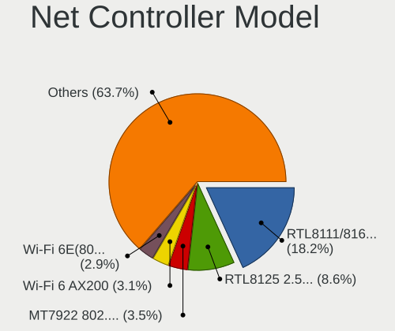

| Model                                                                           | Computers | Percent |
|---------------------------------------------------------------------------------|-----------|---------|
| Realtek RTL8111/8168/8211/8411 PCI Express Gigabit Ethernet Controller          | 374       | 18.17%  |
| Realtek RTL8125 2.5GbE Controller                                               | 177       | 8.6%    |
| MediaTek MT7922 802.11ax PCI Express Wireless Network Adapter                   | 73        | 3.55%   |
| Intel Wi-Fi 6 AX200                                                             | 64        | 3.11%   |
| Intel Wi-Fi 6E(802.11ax) AX210/AX1675* 2x2 [Typhoon Peak]                       | 59        | 2.87%   |
| Realtek RTL8153 Gigabit Ethernet Adapter                                        | 44        | 2.14%   |
| MediaTek MT7921 802.11ax PCIe Wireless Network Adapter [Filogic 330]            | 41        | 1.99%   |
| Intel I211 Gigabit Network Connection                                           | 39        | 1.9%    |
| Intel Ethernet Controller I225-V                                                | 33        | 1.6%    |
| Realtek RTL8821CE 802.11ac PCIe Wireless Network Adapter                        | 31        | 1.51%   |
| MediaTek MT7925 802.11be 160MHz 2x2 PCIe Wireless Network Adapter [Filogic 360] | 28        | 1.36%   |
| Intel Alder Lake-P PCH CNVi WiFi                                                | 27        | 1.31%   |
| Realtek RTL8822CE 802.11ac PCIe Wireless Network Adapter                        | 26        | 1.26%   |
| Realtek RTL8126 5GbE Controller                                                 | 26        | 1.26%   |
| Intel Wireless 8265 / 8275                                                      | 25        | 1.21%   |
| Realtek RTL8852BE PCIe 802.11ax Wireless Network Controller                     | 24        | 1.17%   |
| Intel Wireless 7265                                                             | 22        | 1.07%   |
| Intel Wi-Fi 6 AX201                                                             | 21        | 1.02%   |
| Intel Comet Lake PCH CNVi WiFi                                                  | 21        | 1.02%   |
| Qualcomm Atheros QCA9377 802.11ac Wireless Network Adapter                      | 20        | 0.97%   |
| ASIX AX88179 Gigabit Ethernet                                                   | 20        | 0.97%   |
| Intel Raptor Lake PCH CNVi WiFi                                                 | 19        | 0.92%   |
| Intel Meteor Lake PCH CNVi WiFi                                                 | 18        | 0.87%   |
| Intel Ethernet Controller I226-V                                                | 18        | 0.87%   |
| Intel Ethernet Connection (2) I219-V                                            | 18        | 0.87%   |
| Realtek RTL8852CE PCIe 802.11ax Wireless Network Controller                     | 17        | 0.83%   |
| Realtek RTL810xE PCI Express Fast Ethernet controller                           | 17        | 0.83%   |
| MediaTek MT7902 802.11ax PCIe Wireless Network Adapter [Filogic 310]            | 17        | 0.83%   |
| Intel Dual Band Wireless-AC 3168NGW [Stone Peak]                                | 16        | 0.78%   |
| Intel 700 Series Chipset CNVi WiFi                                              | 16        | 0.78%   |
| Intel Wi-Fi 7(802.11be) AX1775*/AX1790*/BE20*/BE401/BE1750* 2x2                 | 14        | 0.68%   |
| Realtek RTL8922AE 802.11be PCIe Wireless Network Adapter                        | 13        | 0.63%   |
| Realtek Killer E3000 2.5GbE Controller                                          | 12        | 0.58%   |
| Realtek Killer E2600 GbE Controller                                             | 12        | 0.58%   |
| Intel Ethernet Connection (7) I219-V                                            | 12        | 0.58%   |
| Intel Ethernet Connection (4) I219-LM                                           | 12        | 0.58%   |
| Intel Cannon Lake PCH CNVi WiFi                                                 | 12        | 0.58%   |
| Realtek RTL8852AE 802.11ax PCIe Wireless Network Adapter                        | 11        | 0.53%   |
| Qualcomm Atheros QCA6174 802.11ac Wireless Network Adapter                      | 11        | 0.53%   |
| Intel Tiger Lake PCH CNVi WiFi                                                  | 11        | 0.53%   |

Wireless Vendor
---------------

Wireless vendors

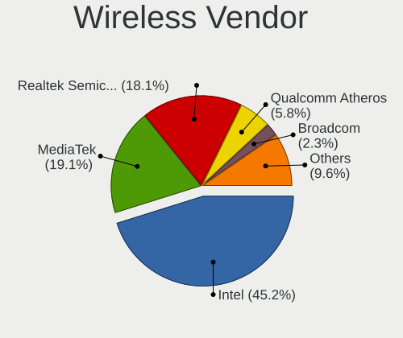

| Vendor                                | Computers | Percent |
|---------------------------------------|-----------|---------|
| Intel                                 | 410       | 45.15%  |
| MediaTek                              | 173       | 19.05%  |
| Realtek Semiconductor                 | 164       | 18.06%  |
| Qualcomm Atheros                      | 53        | 5.84%   |
| Broadcom                              | 21        | 2.31%   |
| Microsoft                             | 17        | 1.87%   |
| TP-Link                               | 16        | 1.76%   |
| Qualcomm                              | 6         | 0.66%   |
| ASUSTek Computer                      | 6         | 0.66%   |
| Ralink                                | 5         | 0.55%   |
| Broadcom Limited                      | 5         | 0.55%   |
| Realtek                               | 4         | 0.44%   |
| Ralink Technology                     | 4         | 0.44%   |
| D-Link                                | 4         | 0.44%   |
| Qualcomm Atheros Communications       | 3         | 0.33%   |
| NetGear                               | 3         | 0.33%   |
| Sierra Wireless                       | 2         | 0.22%   |
| Marvell Technology Group              | 2         | 0.22%   |
| Hewlett-Packard                       | 2         | 0.22%   |
| Fibocom                               | 2         | 0.22%   |
| ZyXEL Communications                  | 1         | 0.11%   |
| Sitecom Europe                        | 1         | 0.11%   |
| Qualcomm Technologies                 | 1         | 0.11%   |
| Mercucys                              | 1         | 0.11%   |
| Dell                                  | 1         | 0.11%   |
| 802.11g Adapter [Linksys WUSB54GC v3] | 1         | 0.11%   |

Wireless Model
--------------

Wireless models

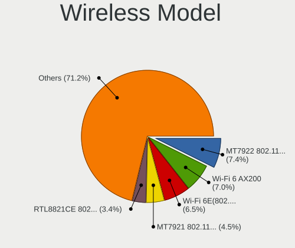

| Model                                                                           | Computers | Percent |
|---------------------------------------------------------------------------------|-----------|---------|
| MediaTek MT7922 802.11ax PCI Express Wireless Network Adapter                   | 67        | 7.35%   |
| Intel Wi-Fi 6 AX200                                                             | 64        | 7.03%   |
| Intel Wi-Fi 6E(802.11ax) AX210/AX1675* 2x2 [Typhoon Peak]                       | 59        | 6.48%   |
| MediaTek MT7921 802.11ax PCIe Wireless Network Adapter [Filogic 330]            | 41        | 4.5%    |
| Realtek RTL8821CE 802.11ac PCIe Wireless Network Adapter                        | 31        | 3.4%    |
| Realtek RTL8822CE 802.11ac PCIe Wireless Network Adapter                        | 26        | 2.85%   |
| Intel Wireless 8265 / 8275                                                      | 25        | 2.74%   |
| Intel Wireless 7265                                                             | 22        | 2.41%   |
| Realtek RTL8852BE PCIe 802.11ax Wireless Network Controller                     | 21        | 2.31%   |
| Intel Wi-Fi 6 AX201                                                             | 21        | 2.31%   |
| Intel Comet Lake PCH CNVi WiFi                                                  | 21        | 2.31%   |
| Qualcomm Atheros QCA9377 802.11ac Wireless Network Adapter                      | 20        | 2.2%    |
| MediaTek MT7925 802.11be 160MHz 2x2 PCIe Wireless Network Adapter [Filogic 360] | 20        | 2.2%    |
| Intel Raptor Lake PCH CNVi WiFi                                                 | 19        | 2.09%   |
| Intel Alder Lake-P PCH CNVi WiFi                                                | 19        | 2.09%   |
| Intel Meteor Lake PCH CNVi WiFi                                                 | 18        | 1.98%   |
| MediaTek MT7902 802.11ax PCIe Wireless Network Adapter [Filogic 310]            | 17        | 1.87%   |
| Intel Dual Band Wireless-AC 3168NGW [Stone Peak]                                | 16        | 1.76%   |
| Intel 700 Series Chipset CNVi WiFi                                              | 16        | 1.76%   |
| Realtek RTL8852CE PCIe 802.11ax Wireless Network Controller                     | 15        | 1.65%   |
| Intel Cannon Lake PCH CNVi WiFi                                                 | 12        | 1.32%   |
| Realtek RTL8852AE 802.11ax PCIe Wireless Network Adapter                        | 11        | 1.21%   |
| Qualcomm Atheros QCA6174 802.11ac Wireless Network Adapter                      | 11        | 1.21%   |
| Intel Tiger Lake PCH CNVi WiFi                                                  | 11        | 1.21%   |
| MediaTek MT7921K (RZ608) Wi-Fi 6E 80MHz                                         | 10        | 1.1%    |
| Intel Wi-Fi 7(802.11be) AX1775*/AX1790*/BE20*/BE401/BE1750* 2x2                 | 10        | 1.1%    |
| Intel Wi-Fi 5(802.11ac) Wireless-AC 9x6x [Thunder Peak]                         | 10        | 1.1%    |
| Microsoft Xbox Wireless Adapter for Windows                                     | 9         | 0.99%   |
| Intel Wireless 8260                                                             | 9         | 0.99%   |
| Realtek 802.11ac NIC                                                            | 8         | 0.88%   |
| Qualcomm Atheros QCA9565 / AR9565 Wireless Network Adapter                      | 8         | 0.88%   |
| MediaTek MT7927 802.11be 320MHz 2x2 PCIe Wireless Network Adapter [Filogic 380] | 8         | 0.88%   |
| Intel Wireless 7260                                                             | 8         | 0.88%   |
| Realtek RTL8851BE PCIe 802.11ax Wireless Network Controller                     | 7         | 0.77%   |
| Realtek RTL8822BE 802.11a/b/g/n/ac WiFi adapter                                 | 7         | 0.77%   |
| MediaTek MT7925 (RZ717) Wi-Fi 7 160MHz                                          | 7         | 0.77%   |
| Intel Comet Lake PCH-LP CNVi WiFi                                               | 7         | 0.77%   |
| Intel Alder Lake-S PCH CNVi WiFi                                                | 7         | 0.77%   |
| Qualcomm QCNFA765 Wireless Network Adapter                                      | 6         | 0.66%   |
| Microsoft Xbox 360 Wireless Adapter                                             | 6         | 0.66%   |

Ethernet Vendor
---------------

Ethernet vendors

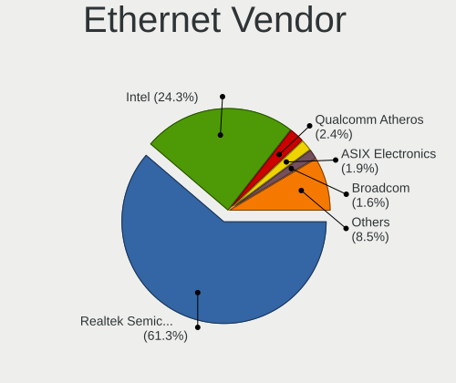

| Vendor                                 | Computers | Percent |
|----------------------------------------|-----------|---------|
| Realtek Semiconductor                  | 653       | 61.26%  |
| Intel                                  | 259       | 24.3%   |
| Qualcomm Atheros                       | 26        | 2.44%   |
| ASIX Electronics                       | 20        | 1.88%   |
| Broadcom                               | 17        | 1.59%   |
| Samsung Electronics                    | 14        | 1.31%   |
| MediaTek                               | 14        | 1.31%   |
| Aquantia                               | 11        | 1.03%   |
| Qualcomm Technologies                  | 10        | 0.94%   |
| DisplayLink                            | 6         | 0.56%   |
| Apple                                  | 5         | 0.47%   |
| Google                                 | 4         | 0.38%   |
| Xiaomi                                 | 3         | 0.28%   |
| Suzhou Motorcomm Electronic Technology | 3         | 0.28%   |
| TP-Link                                | 2         | 0.19%   |
| Tehuti Networks                        | 2         | 0.19%   |
| Nvidia                                 | 2         | 0.19%   |
| Mellanox Technologies                  | 2         | 0.19%   |
| ICS Advent                             | 2         | 0.19%   |
| Sundance Technology Inc / IC Plus      | 1         | 0.09%   |
| Qualcomm                               | 1         | 0.09%   |
| OPPO Electronics                       | 1         | 0.09%   |
| Motorola PCS                           | 1         | 0.09%   |
| Microsoft                              | 1         | 0.09%   |
| Marvell Technology Group               | 1         | 0.09%   |
| Lenovo                                 | 1         | 0.09%   |
| Insyde Software                        | 1         | 0.09%   |
| Hewlett-Packard                        | 1         | 0.09%   |
| Foxconn / Hon Hai                      | 1         | 0.09%   |
| Dynabook                               | 1         | 0.09%   |

Ethernet Model
--------------

Ethernet models

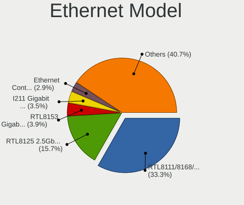

| Model                                                                           | Computers | Percent |
|---------------------------------------------------------------------------------|-----------|---------|
| Realtek RTL8111/8168/8211/8411 PCI Express Gigabit Ethernet Controller          | 374       | 33.27%  |
| Realtek RTL8125 2.5GbE Controller                                               | 177       | 15.75%  |
| Realtek RTL8153 Gigabit Ethernet Adapter                                        | 44        | 3.91%   |
| Intel I211 Gigabit Network Connection                                           | 39        | 3.47%   |
| Intel Ethernet Controller I225-V                                                | 33        | 2.94%   |
| Realtek RTL8126 5GbE Controller                                                 | 26        | 2.31%   |
| ASIX AX88179 Gigabit Ethernet                                                   | 20        | 1.78%   |
| Intel Ethernet Controller I226-V                                                | 18        | 1.6%    |
| Intel Ethernet Connection (2) I219-V                                            | 18        | 1.6%    |
| Realtek RTL810xE PCI Express Fast Ethernet controller                           | 17        | 1.51%   |
| Realtek Killer E3000 2.5GbE Controller                                          | 12        | 1.07%   |
| Realtek Killer E2600 GbE Controller                                             | 12        | 1.07%   |
| Intel Ethernet Connection (7) I219-V                                            | 12        | 1.07%   |
| Intel Ethernet Connection (4) I219-LM                                           | 12        | 1.07%   |
| Realtek RTL8922AE 802.11be PCIe Wireless Network Adapter                        | 10        | 0.89%   |
| Qualcomm WCN785x Wi-Fi 7(802.11be) 320MHz 2x2 [FastConnect 7800]                | 10        | 0.89%   |
| Intel Ethernet Connection I217-LM                                               | 9         | 0.8%    |
| Intel 82579LM Gigabit Network Connection (Lewisville)                           | 9         | 0.8%    |
| Samsung GT-I9070 (network tethering, USB debugging enabled)                     | 8         | 0.71%   |
| Realtek USB 10/100/1G/2.5 LAN                                                   | 8         | 0.71%   |
| MediaTek MT7925 802.11be 160MHz 2x2 PCIe Wireless Network Adapter [Filogic 360] | 8         | 0.71%   |
| Intel Alder Lake-P PCH CNVi WiFi                                                | 8         | 0.71%   |
| Samsung Galaxy series, misc. (tethering mode)                                   | 6         | 0.53%   |
| MediaTek MT7922 802.11ax PCI Express Wireless Network Adapter                   | 6         | 0.53%   |
| Intel Ethernet Connection (4) I219-V                                            | 6         | 0.53%   |
| Qualcomm Atheros Killer E2500 Gigabit Ethernet Controller                       | 5         | 0.44%   |
| Intel Ethernet Connection I219-LM                                               | 5         | 0.44%   |
| Intel Ethernet Connection (6) I219-LM                                           | 5         | 0.44%   |
| Intel Ethernet Connection (18) I219-LM                                          | 5         | 0.44%   |
| Intel Ethernet Connection (14) I219-V                                           | 5         | 0.44%   |
| Intel Ethernet Connection (11) I219-LM                                          | 5         | 0.44%   |
| Intel BE201 320MHz                                                              | 5         | 0.44%   |
| Intel 82579V Gigabit Network Connection                                         | 5         | 0.44%   |
| Realtek RTL8152 Fast Ethernet Adapter                                           | 4         | 0.36%   |
| Qualcomm Atheros Killer E2400 Gigabit Ethernet Controller                       | 4         | 0.36%   |
| Qualcomm Atheros Killer E220x Gigabit Ethernet Controller                       | 4         | 0.36%   |
| Qualcomm Atheros AR8161 Gigabit Ethernet                                        | 4         | 0.36%   |
| Intel Wi-Fi 7(802.11be) AX1775*/AX1790*/BE20*/BE401/BE1750* 2x2                 | 4         | 0.36%   |
| Intel Ethernet Connection (3) I218-LM                                           | 4         | 0.36%   |
| Intel Ethernet Connection (2) I219-LM                                           | 4         | 0.36%   |

Net Controller Kind
-------------------

Ethernet, WiFi or modem

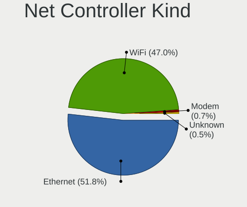

| Kind     | Computers | Percent |
|----------|-----------|---------|
| Ethernet | 957       | 51.79%  |
| WiFi     | 869       | 47.02%  |
| Modem    | 13        | 0.7%    |
| Unknown  | 9         | 0.49%   |

Used Controller
---------------

Currently used network controller

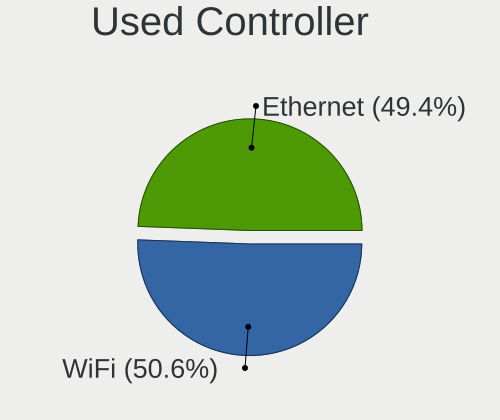

| Kind     | Computers | Percent |
|----------|-----------|---------|
| WiFi     | 605       | 50.59%  |
| Ethernet | 591       | 49.41%  |

NICs
----

Total network controllers on board

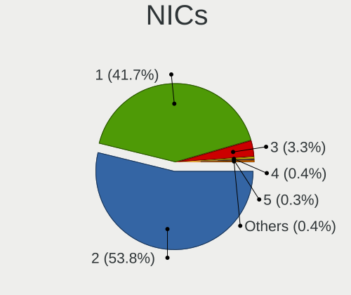

| Total | Computers | Percent |
|-------|-----------|---------|
| 2     | 613       | 53.82%  |
| 1     | 475       | 41.7%   |
| 3     | 38        | 3.34%   |
| 4     | 5         | 0.44%   |
| 5     | 3         | 0.26%   |
| 0     | 3         | 0.26%   |
| 9     | 1         | 0.09%   |
| 6     | 1         | 0.09%   |

IPv6
----

IPv6 vs IPv4

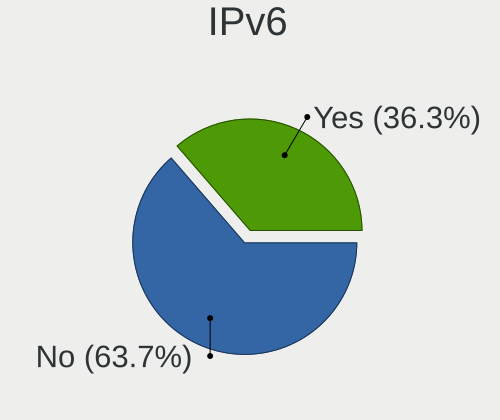

| Used | Computers | Percent |
|------|-----------|---------|
| No   | 732       | 63.65%  |
| Yes  | 418       | 36.35%  |

Bluetooth
---------

Bluetooth Vendor
----------------

Controller vendors

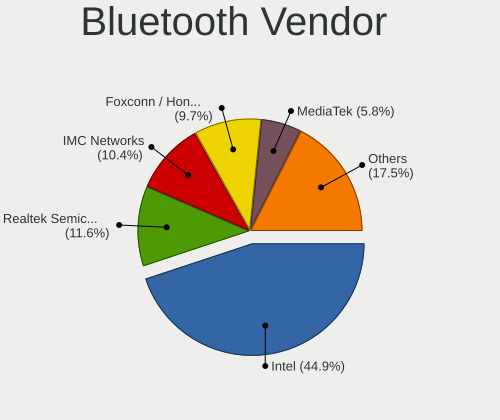

| Vendor                          | Computers | Percent |
|---------------------------------|-----------|---------|
| Intel                           | 415       | 44.91%  |
| Realtek Semiconductor           | 107       | 11.58%  |
| IMC Networks                    | 96        | 10.39%  |
| Foxconn / Hon Hai               | 90        | 9.74%   |
| MediaTek                        | 54        | 5.84%   |
| Cambridge Silicon Radio         | 37        | 4%      |
| Qualcomm Atheros Communications | 31        | 3.35%   |
| Lite-On Technology              | 17        | 1.84%   |
| ASUSTek Computer                | 16        | 1.73%   |
| TP-Link                         | 15        | 1.62%   |
| Apple                           | 13        | 1.41%   |
| Broadcom                        | 8         | 0.87%   |
| Realtek                         | 7         | 0.76%   |
| USI                             | 3         | 0.32%   |
| Actions                         | 3         | 0.32%   |
| Unknown                         | 3         | 0.32%   |
| Mercucys                        | 2         | 0.22%   |
| Toshiba                         | 1         | 0.11%   |
| Ralink                          | 1         | 0.11%   |
| Marvell Semiconductor           | 1         | 0.11%   |
| HTC (High Tech Computer)        | 1         | 0.11%   |
| Edimax Technology               | 1         | 0.11%   |
| Dell                            | 1         | 0.11%   |
| Askey Computer                  | 1         | 0.11%   |

Bluetooth Model
---------------

Controller models

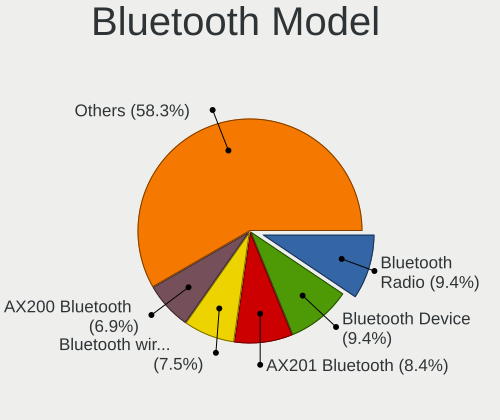

| Model                                               | Computers | Percent |
|-----------------------------------------------------|-----------|---------|
| Realtek Bluetooth Radio                             | 87        | 9.42%   |
| Intel Bluetooth Device                              | 87        | 9.42%   |
| Intel AX201 Bluetooth                               | 78        | 8.44%   |
| Intel Bluetooth wireless interface                  | 69        | 7.47%   |
| Intel AX200 Bluetooth                               | 64        | 6.93%   |
| Foxconn / Hon Hai Wireless_Device                   | 57        | 6.17%   |
| IMC Networks Wireless_Device                        | 56        | 6.06%   |
| MediaTek Wireless_Device                            | 54        | 5.84%   |
| Intel AX210 Bluetooth                               | 54        | 5.84%   |
| Cambridge Silicon Radio Bluetooth Dongle (HCI mode) | 37        | 4%      |
| IMC Networks Bluetooth Radio                        | 34        | 3.68%   |
| Intel Bluetooth 9460/9560 Jefferson Peak (JfP)      | 32        | 3.46%   |
| Qualcomm Atheros  Bluetooth Device                  | 19        | 2.06%   |
| Foxconn / Hon Hai Bluetooth Device                  | 18        | 1.95%   |
| Intel Wireless-AC 3168 Bluetooth                    | 17        | 1.84%   |
| TP-Link TP-T@- UB500 Adapter                        | 15        | 1.62%   |
| Realtek  Bluetooth 4.2 Adapter                      | 13        | 1.41%   |
| Intel Wireless-AC 9260 Bluetooth Adapter            | 10        | 1.08%   |
| Foxconn / Hon Hai MediaTek Bluetooth Adapter        | 10        | 1.08%   |
| Lite-On Wireless_Device                             | 8         | 0.87%   |
| Realtek Bluetooth Radio                             | 7         | 0.76%   |
| ASUS Bluetooth Radio                                | 6         | 0.65%   |
| Apple Bluetooth Host Controller                     | 6         | 0.65%   |
| Lite-On Qualcomm Atheros QCA9377 Bluetooth          | 5         | 0.54%   |
| ASUS ASUS USB-BT500                                 | 5         | 0.54%   |
| Realtek Bluetooth 5.4 Radio                         | 4         | 0.43%   |
| Qualcomm Atheros QCA61x4 Bluetooth 4.0              | 4         | 0.43%   |
| ASUS Broadcom BCM20702A0 Bluetooth                  | 4         | 0.43%   |
| Apple Bluetooth USB Host Controller                 | 4         | 0.43%   |
| USI Bluetooth Device                                | 3         | 0.32%   |
| Realtek 802.11ac WLAN Adapter                       | 3         | 0.32%   |
| Qualcomm Atheros AR3012 Bluetooth 4.0               | 3         | 0.32%   |
| IMC Networks Bluetooth Device                       | 3         | 0.32%   |
| Apple Built-in Bluetooth 2.0+EDR HCI                | 3         | 0.32%   |
| Actions general adapter                             | 3         | 0.32%   |
| Unknown                                             | 3         | 0.32%   |
| Qualcomm Atheros AR9462 Bluetooth                   | 2         | 0.22%   |
| Qualcomm Atheros AR3011 Bluetooth                   | 2         | 0.22%   |
| Mercucys Mercusys MA530 Adapter                     | 2         | 0.22%   |
| Intel Centrino Bluetooth Wireless Transceiver       | 2         | 0.22%   |

Sound
-----

Sound Vendor
------------

Sound card vendors

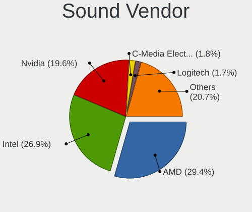

| Vendor                               | Computers | Percent |
|--------------------------------------|-----------|---------|
| AMD                                  | 605       | 29.43%  |
| Intel                                | 553       | 26.9%   |
| Nvidia                               | 402       | 19.55%  |
| C-Media Electronics                  | 37        | 1.8%    |
| Logitech                             | 34        | 1.65%   |
| ASUSTek Computer                     | 33        | 1.61%   |
| SteelSeries ApS                      | 23        | 1.12%   |
| Micro Star International             | 22        | 1.07%   |
| Razer USA                            | 20        | 0.97%   |
| JMTek                                | 20        | 0.97%   |
| Kingston Technology                  | 16        | 0.78%   |
| Corsair                              | 16        | 0.78%   |
| Sony                                 | 14        | 0.68%   |
| Hewlett-Packard                      | 14        | 0.68%   |
| Focusrite-Novation                   | 14        | 0.68%   |
| Creative Labs                        | 14        | 0.68%   |
| Creative Technology                  | 12        | 0.58%   |
| Apple                                | 11        | 0.54%   |
| Unknown                              | 11        | 0.54%   |
| Texas Instruments                    | 10        | 0.49%   |
| Blue Microphones                     | 9         | 0.44%   |
| Realtek Semiconductor                | 8         | 0.39%   |
| Lenovo                               | 6         | 0.29%   |
| Jieli Technology                     | 6         | 0.29%   |
| Generalplus Technology               | 6         | 0.29%   |
| ASRock                               | 6         | 0.29%   |
| RODE Microphones                     | 5         | 0.24%   |
| BEHRINGER International              | 5         | 0.24%   |
| Yamaha                               | 4         | 0.19%   |
| Walmart                              | 4         | 0.19%   |
| Trust                                | 4         | 0.19%   |
| Thesycon Systemsoftware & Consulting | 4         | 0.19%   |
| Samson Technologies                  | 4         | 0.19%   |
| Native Instruments                   | 4         | 0.19%   |
| GN Netcom                            | 4         | 0.19%   |
| DSEA A/S                             | 4         | 0.19%   |
| Audeze                               | 4         | 0.19%   |
| XMOS                                 | 3         | 0.15%   |
| RME                                  | 3         | 0.15%   |
| PreSonus Audio Electronics           | 3         | 0.15%   |

Sound Model
-----------

Sound card models

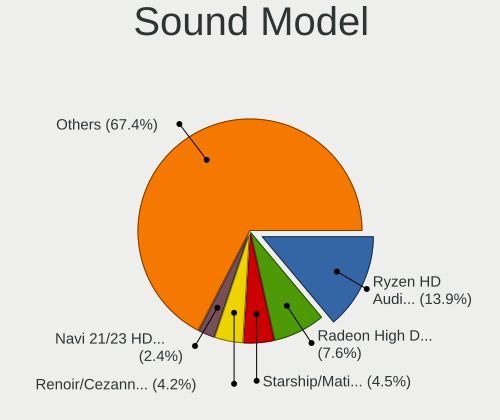

| Model                                                                      | Computers | Percent |
|----------------------------------------------------------------------------|-----------|---------|
| AMD Ryzen HD Audio Controller                                              | 365       | 13.92%  |
| AMD Radeon High Definition Audio Controller                                | 199       | 7.59%   |
| AMD Starship/Matisse HD Audio Controller                                   | 117       | 4.46%   |
| AMD Renoir/Cezanne HDMI/DP Audio Controller                                | 110       | 4.19%   |
| AMD Navi 21/23 HDMI/DP Audio Controller                                    | 64        | 2.44%   |
| Intel Sunrise Point-LP HD Audio                                            | 59        | 2.25%   |
| AMD Navi 31 HDMI/DP Audio                                                  | 58        | 2.21%   |
| AMD Navi 48 HDMI/DP Audio Controller                                       | 53        | 2.02%   |
| Nvidia GA106 High Definition Audio Controller                              | 42        | 1.6%    |
| Nvidia AD107 High Definition Audio Controller                              | 42        | 1.6%    |
| Nvidia GA104 High Definition Audio Controller                              | 41        | 1.56%   |
| Intel Alder Lake PCH-P High Definition Audio Controller                    | 38        | 1.45%   |
| Intel Raptor Lake High Definition Audio Controller                         | 33        | 1.26%   |
| AMD Ellesmere HDMI Audio [Radeon RX 470/480 / 570/580/590]                 | 31        | 1.18%   |
| Intel 8 Series/C220 Series Chipset High Definition Audio Controller        | 30        | 1.14%   |
| ASUSTek Computer USB Audio                                                 | 30        | 1.14%   |
| Intel Cannon Lake PCH cAVS                                                 | 29        | 1.11%   |
| AMD Raven/Raven2/Fenghuang HDMI/DP Audio Controller                        | 29        | 1.11%   |
| Intel Tiger Lake-LP Smart Sound Technology Audio Controller                | 26        | 0.99%   |
| Intel Comet Lake PCH cAVS                                                  | 25        | 0.95%   |
| Intel 7 Series/C216 Chipset Family High Definition Audio Controller        | 25        | 0.95%   |
| Nvidia TU106 High Definition Audio Controller                              | 24        | 0.91%   |
| Intel Raptor Lake-P/U/H cAVS                                               | 24        | 0.91%   |
| Nvidia GA107 High Definition Audio Controller                              | 23        | 0.88%   |
| Nvidia GA102 High Definition Audio Controller                              | 23        | 0.88%   |
| Intel Meteor Lake-P HD Audio Controller                                    | 23        | 0.88%   |
| Micro Star International USB Audio                                         | 22        | 0.84%   |
| Intel Xeon E3-1200 v3/4th Gen Core Processor HD Audio Controller           | 22        | 0.84%   |
| Intel 100 Series/C230 Series Chipset Family HD Audio Controller            | 22        | 0.84%   |
| Intel Tiger Lake-H HD Audio Controller                                     | 21        | 0.8%    |
| Intel Alder Lake-S HD Audio Controller                                     | 21        | 0.8%    |
| Intel 200 Series PCH HD Audio                                              | 21        | 0.8%    |
| Nvidia TU116 High Definition Audio Controller                              | 19        | 0.72%   |
| Nvidia AD103 High Definition Audio Controller                              | 18        | 0.69%   |
| AMD Family 17h (Models 00h-0fh) HD Audio Controller                        | 17        | 0.65%   |
| Nvidia AD106M High Definition Audio Controller                             | 16        | 0.61%   |
| Intel 6 Series/C200 Series Chipset Family High Definition Audio Controller | 16        | 0.61%   |
| Nvidia GB203 High Definition Audio Controller                              | 15        | 0.57%   |
| Nvidia AD102 High Definition Audio Controller                              | 15        | 0.57%   |
| Nvidia GP107GL High Definition Audio Controller                            | 14        | 0.53%   |

Memory
------

Memory Vendor
-------------

Memory module vendors

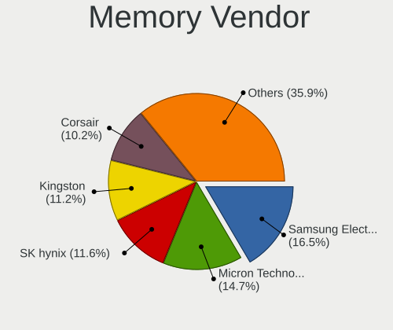

| Vendor                       | Computers | Percent |
|------------------------------|-----------|---------|
| Samsung Electronics          | 123       | 16.53%  |
| Micron Technology            | 109       | 14.65%  |
| SK hynix                     | 86        | 11.56%  |
| Kingston                     | 83        | 11.16%  |
| Corsair                      | 76        | 10.22%  |
| G.Skill                      | 75        | 10.08%  |
| Crucial                      | 60        | 8.06%   |
| A-DATA Technology            | 22        | 2.96%   |
| Unknown                      | 21        | 2.82%   |
| Unknown                      | 14        | 1.88%   |
| Team                         | 14        | 1.88%   |
| Ramaxel Technology           | 14        | 1.88%   |
| Apacer                       | 4         | 0.54%   |
| TeamGroup                    | 3         | 0.4%    |
| Smart                        | 3         | 0.4%    |
| Silicon Power                | 3         | 0.4%    |
| Patriot Memory (PDP Systems) | 3         | 0.4%    |
| GOODRAM                      | 3         | 0.4%    |
| Wilk Elektronik              | 2         | 0.27%   |
| TEXTORM                      | 2         | 0.27%   |
| Patriot                      | 2         | 0.27%   |
| Lexar                        | 2         | 0.27%   |
| Acer                         | 2         | 0.27%   |
| Unknown (ABCD)               | 1         | 0.13%   |
| Unknown (89F7)               | 1         | 0.13%   |
| Unknown (89EC)               | 1         | 0.13%   |
| Unknown (0x0B92)             | 1         | 0.13%   |
| Transcend                    | 1         | 0.13%   |
| Smart Brazil                 | 1         | 0.13%   |
| SemsoTai                     | 1         | 0.13%   |
| PUSKILL                      | 1         | 0.13%   |
| PNY                          | 1         | 0.13%   |
| Patriot Memory               | 1         | 0.13%   |
| Neo Forza                    | 1         | 0.13%   |
| Nanya Technology             | 1         | 0.13%   |
| KLEVV                        | 1         | 0.13%   |
| Hewlett-Packard              | 1         | 0.13%   |
| Golden Empire                | 1         | 0.13%   |
| GLOWAY                       | 1         | 0.13%   |
| ASint Technology             | 1         | 0.13%   |

Memory Model
------------

Memory module models

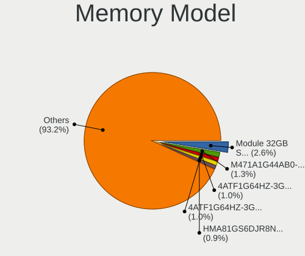

| Model                                                         | Computers | Percent |
|---------------------------------------------------------------|-----------|---------|
| Unknown                                                       | 21        | 2.65%   |
| Samsung RAM M471A1G44AB0-CWE 8GiB SODIMM DDR4 3200MT/s        | 10        | 1.26%   |
| Micron RAM 4ATF1G64HZ-3G2F1 8GB SODIMM DDR4 3200MT/s          | 8         | 1.01%   |
| Micron RAM 4ATF1G64HZ-3G2E1 8GB SODIMM DDR4 3200MT/s          | 8         | 1.01%   |
| SK hynix RAM HMA81GS6DJR8N-XN 8GB SODIMM DDR4 3200MT/s        | 7         | 0.88%   |
| Kingston RAM KF3200C20S4/16G 16GB SODIMM DDR4 3200MT/s        | 7         | 0.88%   |
| G.Skill RAM F5-6000J3038F16G 16GB DIMM DDR5 6000MT/s          | 7         | 0.88%   |
| SK hynix RAM HMA81GS6AFR8N-UH 8GB SODIMM DDR4 2667MT/s        | 6         | 0.76%   |
| Samsung RAM M471A1K43DB1-CWE 8GB SODIMM DDR4 3200MT/s         | 6         | 0.76%   |
| G.Skill RAM F5-6400J3239G16G 16GB DIMM DDR5 7000MT/s          | 5         | 0.63%   |
| G.Skill RAM F5-6000J3636F16G 16GB DIMM DDR5 6400MT/s          | 5         | 0.63%   |
| G.Skill RAM F5-6000J3040G32G 32GB DIMM DDR5 6200MT/s          | 5         | 0.63%   |
| Corsair RAM CMK16GX4M2B3200C16 8GB DIMM DDR4 3600MT/s         | 5         | 0.63%   |
| Samsung RAM M471A5244CB0-CWE 4GB SODIMM DDR4 3200MT/s         | 4         | 0.5%    |
| Samsung RAM M471A1K43EB1-CWE 8GB SODIMM DDR4 3200MT/s         | 4         | 0.5%    |
| Samsung RAM M471A1G44AB0-CWE 8GB Row Of Chips DDR4 3200MT/s   | 4         | 0.5%    |
| Samsung RAM M425R2GA3EB0-CWMOL 16GB SODIMM DDR5 5600MT/s      | 4         | 0.5%    |
| Samsung RAM K3KL8L80CM-MGCT 2GB Row Of Chips LPDDR5 7500MT/s  | 4         | 0.5%    |
| Micron RAM 8ATF1G64HZ-2G6E1 8GB SODIMM DDR4 2667MT/s          | 4         | 0.5%    |
| Micron RAM 4ATF51264HZ-2G6E1 4GB SODIMM DDR4 2667MT/s         | 4         | 0.5%    |
| Kingston RAM KF560C36-32 32GB DIMM DDR5 6200MT/s              | 4         | 0.5%    |
| Kingston RAM KF3200C16D4/16GX 16GB DIMM DDR4 3733MT/s         | 4         | 0.5%    |
| G.Skill RAM F4-3200C16-8GIS 8GB DIMM DDR4 3600MT/s            | 4         | 0.5%    |
| Crucial RAM CT16G4SFRA32A.M16FRS 16GB SODIMM DDR4 3200MT/s    | 4         | 0.5%    |
| Corsair RAM CMK32GX5M2B6000Z30 16GB DIMM DDR5 6000MT/s        | 4         | 0.5%    |
| Team RAM UD5-6000 16GB DIMM DDR5 6000MT/s                     | 3         | 0.38%   |
| SK hynix RAM HMT451S6BFR8A-PB 4GB SODIMM DDR3 1600MT/s        | 3         | 0.38%   |
| SK hynix RAM HMCG78AGBSA092N 16GB SODIMM DDR5 5600MT/s        | 3         | 0.38%   |
| Samsung RAM M471A5244CB0-CWE 4GB Row Of Chips DDR4 3200MT/s   | 3         | 0.38%   |
| Samsung RAM M471A2G43AB2-CWE 16GB SODIMM DDR4 3200MT/s        | 3         | 0.38%   |
| Samsung RAM M471A1K43CB1-CRC 8GB SODIMM DDR4 8400MT/s         | 3         | 0.38%   |
| Samsung RAM M425R2GA3EB0-CWMOD 16GB SODIMM DDR5 5600MT/s      | 3         | 0.38%   |
| Samsung RAM M425R1GB4BB0-CWMOD 8GB SODIMM DDR5 5600MT/s       | 3         | 0.38%   |
| Samsung RAM M425R1GB4BB0-CQKOD 8GB SODIMM DDR5 4800MT/s       | 3         | 0.38%   |
| Samsung RAM K3KL9L90CM-MGCT 4GB Row Of Chips LPDDR5 7500MT/s  | 3         | 0.38%   |
| Ramaxel RAM RMSB3410MD88IBF-5600 16GB SODIMM DDR5 5600MT/s    | 3         | 0.38%   |
| Ramaxel RAM RMSA3320MJ78HAF-3200 8GB SODIMM DDR4 3200MT/s     | 3         | 0.38%   |
| Micron RAM MT62F2G32D4DS-026 WT 8GiB SODIMM LPDDR5 7500MT/s   | 3         | 0.38%   |
| Micron RAM MT62F1G32D4DR-031 2GB Row Of Chips LPDDR5 6400MT/s | 3         | 0.38%   |
| Micron RAM Module 8GB SODIMM DDR4 3200MT/s                    | 3         | 0.38%   |

Memory Kind
-----------

Memory module kinds

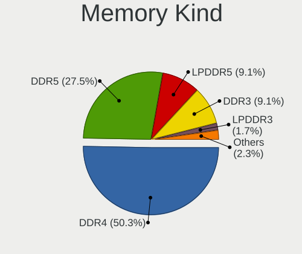

| Kind   | Computers | Percent |
|--------|-----------|---------|
| DDR4   | 331       | 50.3%   |
| DDR5   | 181       | 27.51%  |
| LPDDR5 | 60        | 9.12%   |
| DDR3   | 60        | 9.12%   |
| LPDDR3 | 11        | 1.67%   |
| LPDDR4 | 10        | 1.52%   |
| SDRAM  | 2         | 0.3%    |
| DRAM   | 2         | 0.3%    |
| DDR    | 1         | 0.15%   |

Memory Form Factor
------------------

Physical design of the memory module

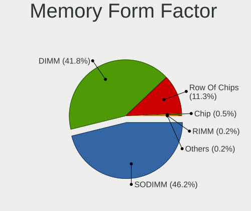

| Name         | Computers | Percent |
|--------------|-----------|---------|
| SODIMM       | 306       | 46.15%  |
| DIMM         | 277       | 41.78%  |
| Row Of Chips | 75        | 11.31%  |
| Chip         | 3         | 0.45%   |
| RIMM         | 1         | 0.15%   |
| Unknown      | 1         | 0.15%   |

Memory Size
-----------

Memory module size

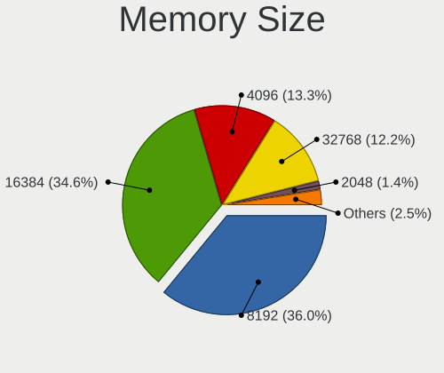

| Size  | Computers | Percent |
|-------|-----------|---------|
| 8192  | 256       | 35.96%  |
| 16384 | 246       | 34.55%  |
| 4096  | 95        | 13.34%  |
| 32768 | 87        | 12.22%  |
| 2048  | 10        | 1.4%    |
| 49152 | 9         | 1.26%   |
| 24576 | 3         | 0.42%   |
| 65536 | 2         | 0.28%   |
| 12288 | 2         | 0.28%   |
| 6144  | 2         | 0.28%   |

Memory Speed
------------

Memory module speed

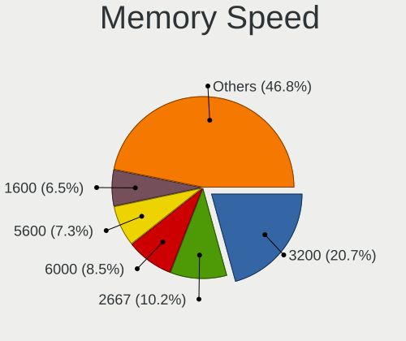

| Speed | Computers | Percent |
|-------|-----------|---------|
| 3200  | 147       | 20.73%  |
| 2667  | 72        | 10.16%  |
| 6000  | 60        | 8.46%   |
| 5600  | 52        | 7.33%   |
| 1600  | 46        | 6.49%   |
| 3600  | 44        | 6.21%   |
| 4800  | 32        | 4.51%   |
| 6400  | 28        | 3.95%   |
| 2400  | 24        | 3.39%   |
| 2133  | 24        | 3.39%   |
| 7500  | 21        | 2.96%   |
| 3733  | 16        | 2.26%   |
| 8533  | 12        | 1.69%   |
| 6200  | 10        | 1.41%   |
| 4000  | 10        | 1.41%   |
| 3800  | 8         | 1.13%   |
| 1333  | 8         | 1.13%   |
| 4266  | 6         | 0.85%   |
| 3000  | 6         | 0.85%   |
| 1867  | 6         | 0.85%   |
| 7000  | 5         | 0.71%   |
| 3866  | 5         | 0.71%   |
| 7467  | 4         | 0.56%   |
| 5200  | 4         | 0.56%   |
| 4267  | 4         | 0.56%   |
| 3266  | 4         | 0.56%   |
| 2666  | 4         | 0.56%   |
| 1866  | 4         | 0.56%   |
| 12800 | 3         | 0.42%   |
| 8400  | 3         | 0.42%   |
| 8000  | 3         | 0.42%   |
| 5800  | 3         | 0.42%   |
| 3466  | 3         | 0.42%   |
| 3400  | 3         | 0.42%   |
| 2933  | 3         | 0.42%   |
| 6800  | 2         | 0.28%   |
| 4199  | 2         | 0.28%   |
| 3666  | 2         | 0.28%   |
| 8532  | 1         | 0.14%   |
| 7200  | 1         | 0.14%   |

Printers & scanners
-------------------

Printer Vendor
--------------

Printer device vendors

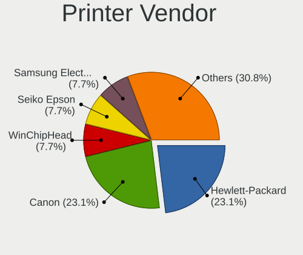

| Vendor                | Computers | Percent |
|-----------------------|-----------|---------|
| Hewlett-Packard       | 3         | 23.08%  |
| Canon                 | 3         | 23.08%  |
| WinChipHead           | 1         | 7.69%   |
| STMicroelectronics    | 1         | 7.69%   |
| Seiko Epson           | 1         | 7.69%   |
| Samsung Electronics   | 1         | 7.69%   |
| Ricoh                 | 1         | 7.69%   |
| Lexmark International | 1         | 7.69%   |
| Brother Industries    | 1         | 7.69%   |

Printer Model
-------------

Printer device models

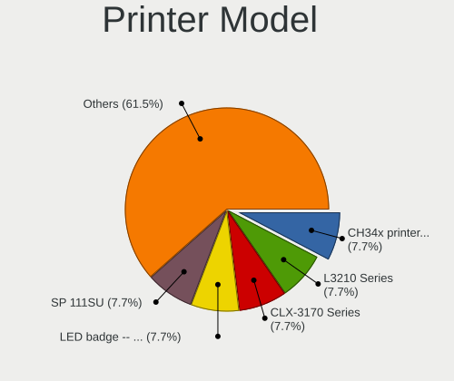

| Model                                                     | Computers | Percent |
|-----------------------------------------------------------|-----------|---------|
| WinChipHead CH34x printer adapter cable                   | 1         | 7.69%   |
| STMicroelectronics LED badge -- mini LED display -- 11x44 | 1         | 7.69%   |
| Seiko Epson L3210 Series                                  | 1         | 7.69%   |
| Samsung CLX-3170 Series                                   | 1         | 7.69%   |
| Ricoh SP 111SU                                            | 1         | 7.69%   |
| Lexmark International Lexmark CX331adwe                   | 1         | 7.69%   |
| HP LaserJet P1005                                         | 1         | 7.69%   |
| HP LaserJet 400 M401dne                                   | 1         | 7.69%   |
| HP ENVY 6000 series                                       | 1         | 7.69%   |
| Canon LiDE 400                                            | 1         | 7.69%   |
| Canon LiDE 300                                            | 1         | 7.69%   |
| Canon G2000 series                                        | 1         | 7.69%   |
| Brother MFC-B7710DN                                       | 1         | 7.69%   |

Scanner Vendor
--------------

Scanner device vendors

| Vendor      | Computers | Percent |
|-------------|-----------|---------|
| Seiko Epson | 1         | 100%    |

Scanner Model
-------------

Scanner device models

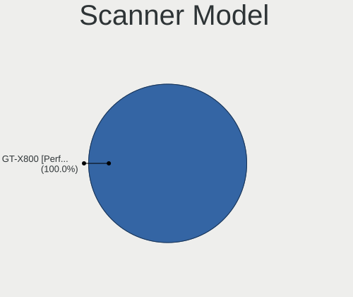

| Model                                       | Computers | Percent |
|---------------------------------------------|-----------|---------|
| Seiko Epson GT-X800 [Perfection 4990 PHOTO] | 1         | 100%    |

Camera
------

Camera Vendor
-------------

Camera device vendors

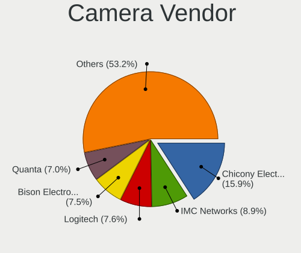

| Vendor                                 | Computers | Percent |
|----------------------------------------|-----------|---------|
| Chicony Electronics                    | 102       | 15.86%  |
| IMC Networks                           | 57        | 8.86%   |
| Logitech                               | 49        | 7.62%   |
| Bison Electronics                      | 48        | 7.47%   |
| Quanta                                 | 45        | 7%      |
| Realtek Semiconductor                  | 38        | 5.91%   |
| Microdia                               | 31        | 4.82%   |
| Luxvisions Innotech Limited            | 30        | 4.67%   |
| Syntek                                 | 27        | 4.2%    |
| ShineTech                              | 26        | 4.04%   |
| Sunplus Innovation Technology          | 25        | 3.89%   |
| Apple                                  | 17        | 2.64%   |
| Sonix Technology                       | 16        | 2.49%   |
| Cheng Uei Precision Industry (Foxlink) | 16        | 2.49%   |
| Samsung Electronics                    | 10        | 1.56%   |
| Lite-On Technology                     | 7         | 1.09%   |
| Razer USA                              | 6         | 0.93%   |
| kingcome                               | 6         | 0.93%   |
| SunplusIT                              | 5         | 0.78%   |
| Creative Technology                    | 5         | 0.78%   |
| Suyin                                  | 4         | 0.62%   |
| Microsoft                              | 4         | 0.62%   |
| Z-Star Microelectronics                | 3         | 0.47%   |
| Silicon Motion                         | 3         | 0.47%   |
| Generalplus Technology                 | 3         | 0.47%   |
| Elgato Systems                         | 3         | 0.47%   |
| Acer                                   | 3         | 0.47%   |
| ValueHD                                | 2         | 0.31%   |
| Tobii Technology AB                    | 2         | 0.31%   |
| ShineOptics                            | 2         | 0.31%   |
| Shine-optics                           | 2         | 0.31%   |
| Lenovo                                 | 2         | 0.31%   |
| Jieli Technology                       | 2         | 0.31%   |
| icSpring                               | 2         | 0.31%   |
| Google                                 | 2         | 0.31%   |
| BillionPixels                          | 2         | 0.31%   |
| AVerMedia Technologies                 | 2         | 0.31%   |
| ASUSTek Computer                       | 2         | 0.31%   |
| ARC International                      | 2         | 0.31%   |
| Alcor Micro                            | 2         | 0.31%   |

Camera Model
------------

Camera device models

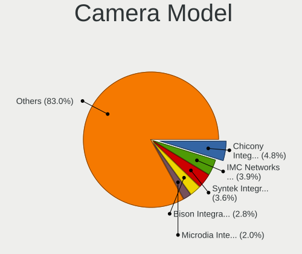

| Model                                                | Computers | Percent |
|------------------------------------------------------|-----------|---------|
| Chicony Integrated Camera                            | 31        | 4.79%   |
| IMC Networks USB2.0 HD UVC WebCam                    | 25        | 3.86%   |
| Syntek Integrated Camera                             | 23        | 3.55%   |
| Bison Integrated Camera                              | 18        | 2.78%   |
| Microdia Integrated_Webcam_HD                        | 13        | 2.01%   |
| Luxvisions Innotech Limited Integrated Camera        | 13        | 2.01%   |
| Realtek Integrated_Webcam_HD                         | 12        | 1.85%   |
| Shinetech USB2.0 FHD UVC WebCam                      | 11        | 1.7%    |
| IMC Networks Integrated Camera                       | 11        | 1.7%    |
| Sonix USB2.0 HD UVC WebCam                           | 10        | 1.55%   |
| Samsung Galaxy series, misc. (MTP mode)              | 10        | 1.55%   |
| Logitech HD Pro Webcam C920                          | 9         | 1.39%   |
| Quanta ACER HD User Facing                           | 8         | 1.24%   |
| Luxvisions Innotech Limited Integrated RGB Camera    | 8         | 1.24%   |
| Chicony HD Webcam                                    | 8         | 1.24%   |
| Bison HD Webcam                                      | 8         | 1.24%   |
| ShineTech USB2.0 HD UVC WebCam                       | 7         | 1.08%   |
| Quanta HD User Facing                                | 7         | 1.08%   |
| Chicony HP Wide Vision HD Camera                     | 7         | 1.08%   |
| Sunplus Integrated_Webcam_HD                         | 6         | 0.93%   |
| Realtek Integrated_Webcam_FHD                        | 6         | 0.93%   |
| Logitech C922 Pro Stream Webcam                      | 6         | 0.93%   |
| IMC Networks USB2.0 VGA UVC WebCam                   | 6         | 0.93%   |
| Chicony Integrated Camera (1280x720@30)              | 6         | 0.93%   |
| Apple FaceTime HD Camera (Built-in)                  | 6         | 0.93%   |
| Shinetech ASUS FHD webcam                            | 5         | 0.77%   |
| Quanta HP Wide Vision HD Camera                      | 5         | 0.77%   |
| Luxvisions Innotech Limited HP Wide Vision HD Camera | 5         | 0.77%   |
| Logitech Webcam C270                                 | 5         | 0.77%   |
| Logitech C920 PRO HD Webcam                          | 5         | 0.77%   |
| Chicony ACER QHD User Facing                         | 5         | 0.77%   |
| Apple iPhone 5/5C/5S/6/SE/7/8/X                      | 5         | 0.77%   |
| Razer USA Gaming Webcam [Kiyo]                       | 4         | 0.62%   |
| Quanta USB2.0 HD UVC WebCam                          | 4         | 0.62%   |
| Logitech BRIO Ultra HD Webcam                        | 4         | 0.62%   |
| Lite-On HP HD Camera                                 | 4         | 0.62%   |
| kingcome FHD WebCam                                  | 4         | 0.62%   |
| IMC Networks HP TrueVision HD Camera                 | 4         | 0.62%   |
| Chicony HP TrueVision HD Camera                      | 4         | 0.62%   |
| Chicony HP HD Camera                                 | 4         | 0.62%   |

Security
--------

Fingerprint Vendor
------------------

Fingerprint sensor vendors

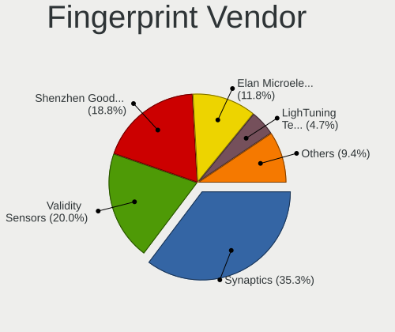

| Vendor                     | Computers | Percent |
|----------------------------|-----------|---------|
| Synaptics                  | 30        | 35.29%  |
| Validity Sensors           | 17        | 20%     |
| Shenzhen Goodix Technology | 16        | 18.82%  |
| Elan Microelectronics      | 10        | 11.76%  |
| LighTuning Technology      | 4         | 4.71%   |
| HOLTEK                     | 3         | 3.53%   |
| Upek                       | 1         | 1.18%   |
| GDMicroelectronics         | 1         | 1.18%   |
| Focal-systems.Corp         | 1         | 1.18%   |
| DigitalPersona             | 1         | 1.18%   |
| AuthenTec                  | 1         | 1.18%   |

Fingerprint Model
-----------------

Fingerprint sensor models

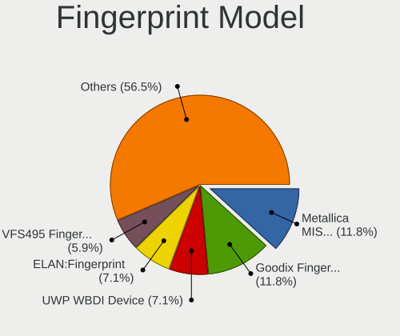

| Model                                                                      | Computers | Percent |
|----------------------------------------------------------------------------|-----------|---------|
| Synaptics Metallica MIS Touch Fingerprint Reader                           | 10        | 11.76%  |
| Shenzhen Goodix  FingerPrint Device                                        | 10        | 11.76%  |
| Synaptics UWP WBDI Device                                                  | 6         | 7.06%   |
| Elan ELAN:Fingerprint                                                      | 6         | 7.06%   |
| Validity Sensors VFS495 Fingerprint Reader                                 | 5         | 5.88%   |
| Shenzhen Goodix Fingerprint Reader                                         | 5         | 5.88%   |
| Validity Sensors VFS 5011 fingerprint sensor                               | 4         | 4.71%   |
| Synaptics Prometheus MIS Touch Fingerprint Reader                          | 4         | 4.71%   |
| Synaptics Fingerprint reader [HP G6]                                       | 4         | 4.71%   |
| Elan ELAN:ARM-M4                                                           | 4         | 4.71%   |
| Validity Sensors VFS7552 Touch Fingerprint Sensor                          | 3         | 3.53%   |
| LighTuning ES603 Swipe Fingerprint Sensor                                  | 3         | 3.53%   |
| HOLTEK FocalTech Fingerprint Device                                        | 3         | 3.53%   |
| Validity Sensors VFS7500 Touch Fingerprint Sensor                          | 2         | 2.35%   |
| Synaptics WBDI Fingerprint Reader USB 086                                  | 2         | 2.35%   |
| Synaptics Prometheus Fingerprint Reader                                    | 2         | 2.35%   |
| Validity Sensors VFS451 Fingerprint Reader                                 | 1         | 1.18%   |
| Validity Sensors Synaptics VFS7552 Touch Fingerprint Sensor with PurePrint | 1         | 1.18%   |
| Validity Sensors Fingerprint scanner                                       | 1         | 1.18%   |
| Upek TCS5B Fingerprint sensor                                              | 1         | 1.18%   |
| Synaptics TouchPad                                                         | 1         | 1.18%   |
| Synaptics FS7604 Touch Fingerprint Sensor with PurePrint                   | 1         | 1.18%   |
| Shenzhen Goodix FingerPrint                                                | 1         | 1.18%   |
| LighTuning EgisTec Touch Fingerprint Sensor                                | 1         | 1.18%   |
| GDMicroelectronics Touch Fingerprint Sensor                                | 1         | 1.18%   |
| Focal-systems.Corp FT9201Fingerprint.                                      | 1         | 1.18%   |
| DigitalPersona Fingerprint Reader                                          | 1         | 1.18%   |
| AuthenTec AES2810                                                          | 1         | 1.18%   |

Chipcard Vendor
---------------

Chipcard module vendors

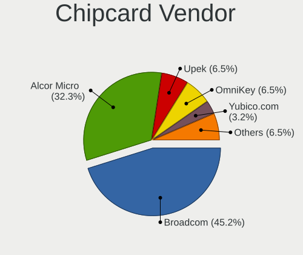

| Vendor           | Computers | Percent |
|------------------|-----------|---------|
| Broadcom         | 14        | 45.16%  |
| Alcor Micro      | 10        | 32.26%  |
| Upek             | 2         | 6.45%   |
| OmniKey          | 2         | 6.45%   |
| Yubico.com       | 1         | 3.23%   |
| SCM Microsystems | 1         | 3.23%   |
| O2 Micro         | 1         | 3.23%   |

Chipcard Model
--------------

Chipcard module models

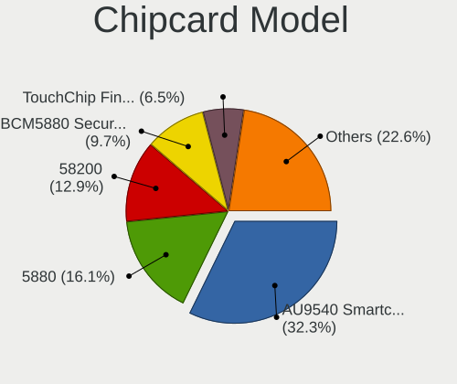

| Model                                                                        | Computers | Percent |
|------------------------------------------------------------------------------|-----------|---------|
| Alcor Micro AU9540 Smartcard Reader                                          | 10        | 32.26%  |
| Broadcom 5880                                                                | 5         | 16.13%  |
| Broadcom 58200                                                               | 4         | 12.9%   |
| Broadcom BCM5880 Secure Applications Processor with fingerprint swipe sensor | 3         | 9.68%   |
| Upek TouchChip Fingerprint Coprocessor (WBF advanced mode)                   | 2         | 6.45%   |
| Yubico.com Yubikey 4/5 U2F+CCID                                              | 1         | 3.23%   |
| SCM Microsystems SCR331-LC1 / SCR3310 SmartCard Reader                       | 1         | 3.23%   |
| OmniKey CardMan 3121 (HID Technologies)                                      | 1         | 3.23%   |
| OmniKey CardMan 1021                                                         | 1         | 3.23%   |
| O2 Micro OZ776 CCID Smartcard Reader                                         | 1         | 3.23%   |
| Broadcom BCM5880 Secure Applications Processor                               | 1         | 3.23%   |
| Broadcom BCM58200 ControlVault 3 (FingerPrint sensor + Contacted SmartCard)  | 1         | 3.23%   |

Unsupported
-----------

Unsupported Devices
-------------------

Total unsupported devices on board

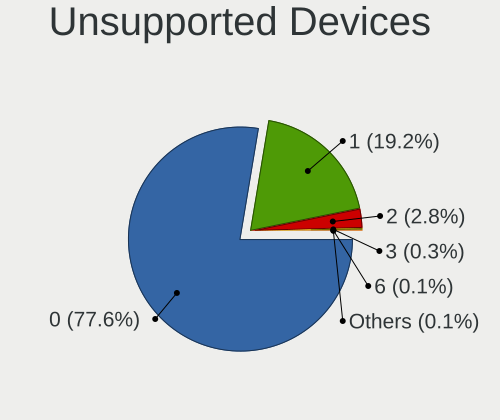

| Total | Computers | Percent |
|-------|-----------|---------|
| 0     | 895       | 77.62%  |
| 1     | 221       | 19.17%  |
| 2     | 32        | 2.78%   |
| 3     | 3         | 0.26%   |
| 6     | 1         | 0.09%   |
| 5     | 1         | 0.09%   |

Unsupported Device Types
------------------------

Types of unsupported devices

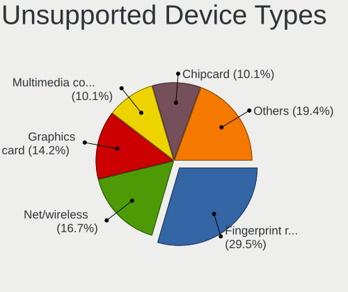

| Type                     | Computers | Percent |
|--------------------------|-----------|---------|
| Fingerprint reader       | 85        | 29.51%  |
| Net/wireless             | 48        | 16.67%  |
| Graphics card            | 41        | 14.24%  |
| Multimedia controller    | 29        | 10.07%  |
| Chipcard                 | 29        | 10.07%  |
| Sound                    | 11        | 3.82%   |
| Communication controller | 9         | 3.13%   |
| Unassigned class         | 8         | 2.78%   |
| Camera                   | 7         | 2.43%   |
| Net/ethernet             | 6         | 2.08%   |
| Card reader              | 4         | 1.39%   |
| Bluetooth                | 3         | 1.04%   |
| Storage/raid             | 2         | 0.69%   |
| Network                  | 2         | 0.69%   |
| Dvb card                 | 2         | 0.69%   |
| Storage                  | 1         | 0.35%   |
| Modem                    | 1         | 0.35%   |

