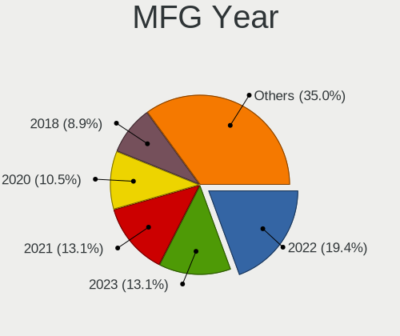
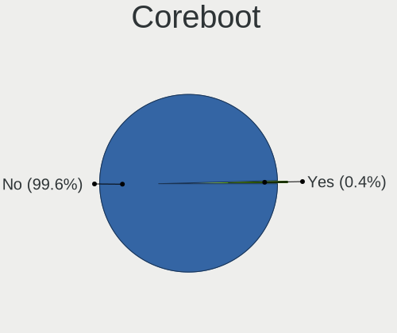
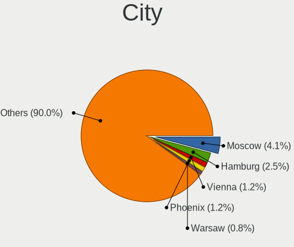
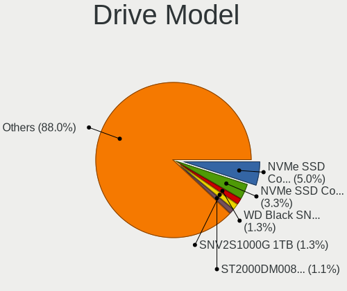
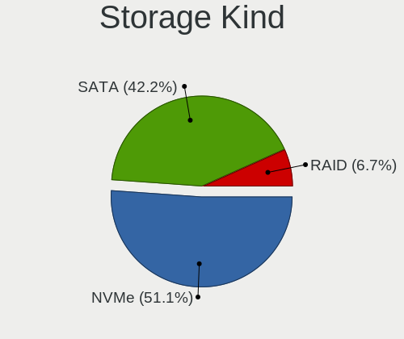
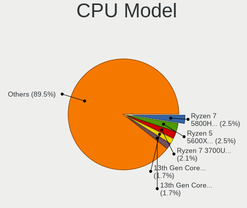
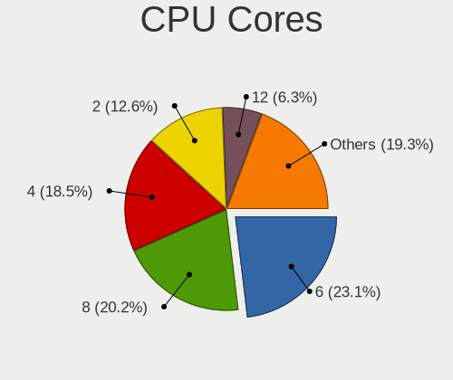
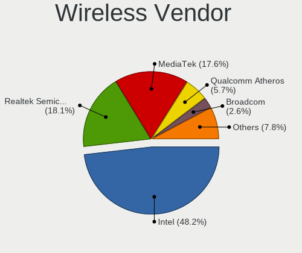
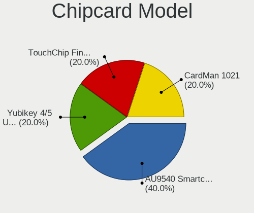

CachyOS - Tested Hardware & Statistics
--------------------------------------

A project to collect tested hardware configurations for CachyOS.

Anyone can contribute to this report by the [hw-probe](https://github.com/linuxhw/hw-probe) tool:

    sudo -E hw-probe -all -upload

Please contribute! Especially if your hardware is rare.

This is a report for all computer types. See also reports for [desktops](/Dist/CachyOS/Desktop/README.md) and [notebooks](/Dist/CachyOS/Notebook/README.md).

Contents
--------

* [ Test Cases ](#test-cases)

* [ System ](#system)
  - [ OS                       ](#os)
  - [ OS Family                ](#os-family)
  - [ Kernel                   ](#kernel)
  - [ Kernel Family            ](#kernel-family)
  - [ Kernel Major Ver.        ](#kernel-major-ver)
  - [ Arch                     ](#arch)
  - [ DE                       ](#de)
  - [ Display Server           ](#display-server)
  - [ Display Manager          ](#display-manager)
  - [ OS Lang                  ](#os-lang)
  - [ Boot Mode                ](#boot-mode)
  - [ Filesystem               ](#filesystem)
  - [ Part. scheme             ](#part-scheme)
  - [ Dual Boot with Linux/BSD ](#dual-boot-with-linuxbsd)
  - [ Dual Boot (Win)          ](#dual-boot-win)

* [ Board ](#board)
  - [ Vendor                   ](#vendor)
  - [ Model                    ](#model)
  - [ Model Family             ](#model-family)
  - [ MFG Year                 ](#mfg-year)
  - [ Form Factor              ](#form-factor)
  - [ Secure Boot              ](#secure-boot)
  - [ Coreboot                 ](#coreboot)
  - [ RAM Size                 ](#ram-size)
  - [ RAM Used                 ](#ram-used)
  - [ Total Drives             ](#total-drives)
  - [ Has CD-ROM               ](#has-cd-rom)
  - [ Has Ethernet             ](#has-ethernet)
  - [ Has WiFi                 ](#has-wifi)
  - [ Has Bluetooth            ](#has-bluetooth)

* [ Location ](#location)
  - [ Country                  ](#country)
  - [ City                     ](#city)

* [ Drives ](#drives)
  - [ Drive Vendor             ](#drive-vendor)
  - [ Drive Model              ](#drive-model)
  - [ HDD Vendor               ](#hdd-vendor)
  - [ SSD Vendor               ](#ssd-vendor)
  - [ Drive Kind               ](#drive-kind)
  - [ Drive Connector          ](#drive-connector)
  - [ Drive Size               ](#drive-size)
  - [ Space Total              ](#space-total)
  - [ Space Used               ](#space-used)
  - [ Malfunc. Drives          ](#malfunc-drives)
  - [ Malfunc. Drive Vendor    ](#malfunc-drive-vendor)
  - [ Malfunc. HDD Vendor      ](#malfunc-hdd-vendor)
  - [ Malfunc. Drive Kind      ](#malfunc-drive-kind)
  - [ Failed Drives            ](#failed-drives)
  - [ Failed Drive Vendor      ](#failed-drive-vendor)
  - [ Drive Status             ](#drive-status)

* [ Storage controller ](#storage-controller)
  - [ Storage Vendor           ](#storage-vendor)
  - [ Storage Model            ](#storage-model)
  - [ Storage Kind             ](#storage-kind)

* [ Processor ](#processor)
  - [ CPU Vendor               ](#cpu-vendor)
  - [ CPU Model                ](#cpu-model)
  - [ CPU Model Family         ](#cpu-model-family)
  - [ CPU Cores                ](#cpu-cores)
  - [ CPU Sockets              ](#cpu-sockets)
  - [ CPU Threads              ](#cpu-threads)
  - [ CPU Op-Modes             ](#cpu-op-modes)
  - [ CPU Microcode            ](#cpu-microcode)
  - [ CPU Microarch            ](#cpu-microarch)

* [ Graphics ](#graphics)
  - [ GPU Vendor               ](#gpu-vendor)
  - [ GPU Model                ](#gpu-model)
  - [ GPU Combo                ](#gpu-combo)
  - [ GPU Driver               ](#gpu-driver)
  - [ GPU Memory               ](#gpu-memory)

* [ Monitor ](#monitor)
  - [ Monitor Vendor           ](#monitor-vendor)
  - [ Monitor Model            ](#monitor-model)
  - [ Monitor Resolution       ](#monitor-resolution)
  - [ Monitor Diagonal         ](#monitor-diagonal)
  - [ Monitor Width            ](#monitor-width)
  - [ Aspect Ratio             ](#aspect-ratio)
  - [ Monitor Area             ](#monitor-area)
  - [ Pixel Density            ](#pixel-density)
  - [ Multiple Monitors        ](#multiple-monitors)

* [ Network ](#network)
  - [ Net Controller Vendor    ](#net-controller-vendor)
  - [ Net Controller Model     ](#net-controller-model)
  - [ Wireless Vendor          ](#wireless-vendor)
  - [ Wireless Model           ](#wireless-model)
  - [ Ethernet Vendor          ](#ethernet-vendor)
  - [ Ethernet Model           ](#ethernet-model)
  - [ Net Controller Kind      ](#net-controller-kind)
  - [ Used Controller          ](#used-controller)
  - [ NICs                     ](#nics)
  - [ IPv6                     ](#ipv6)

* [ Bluetooth ](#bluetooth)
  - [ Bluetooth Vendor         ](#bluetooth-vendor)
  - [ Bluetooth Model          ](#bluetooth-model)

* [ Sound ](#sound)
  - [ Sound Vendor             ](#sound-vendor)
  - [ Sound Model              ](#sound-model)

* [ Memory ](#memory)
  - [ Memory Vendor            ](#memory-vendor)
  - [ Memory Model             ](#memory-model)
  - [ Memory Kind              ](#memory-kind)
  - [ Memory Form Factor       ](#memory-form-factor)
  - [ Memory Size              ](#memory-size)
  - [ Memory Speed             ](#memory-speed)

* [ Printers & scanners ](#printers--scanners)
  - [ Printer Vendor           ](#printer-vendor)
  - [ Printer Model            ](#printer-model)
  - [ Scanner Vendor           ](#scanner-vendor)
  - [ Scanner Model            ](#scanner-model)

* [ Camera ](#camera)
  - [ Camera Vendor            ](#camera-vendor)
  - [ Camera Model             ](#camera-model)

* [ Security ](#security)
  - [ Fingerprint Vendor       ](#fingerprint-vendor)
  - [ Fingerprint Model        ](#fingerprint-model)
  - [ Chipcard Vendor          ](#chipcard-vendor)
  - [ Chipcard Model           ](#chipcard-model)

* [ Unsupported ](#unsupported)
  - [ Unsupported Devices      ](#unsupported-devices)
  - [ Unsupported Device Types ](#unsupported-device-types)

Test Cases
----------

Total: 309

| Vendor        | Model                       | Form-Factor | Probe                                                      | Date         |
|---------------|-----------------------------|-------------|------------------------------------------------------------|--------------|
| Dell          | Latitude 5290 2-in-1        | Notebook    | [cee01ab926](https://linux-hardware.org/?probe=cee01ab926) | Jan 04, 2025 |
| Dell          | Latitude 5290 2-in-1        | Notebook    | [b5b287d361](https://linux-hardware.org/?probe=b5b287d361) | Jan 04, 2025 |
| ASUSTek       | H110I-PLUS                  | Desktop     | [5a05ac75d9](https://linux-hardware.org/?probe=5a05ac75d9) | Jan 03, 2025 |
| MSI           | MAG B550 TOMAHAWK           | Desktop     | [6d22883b06](https://linux-hardware.org/?probe=6d22883b06) | Jan 01, 2025 |
| Dell          | Latitude E6430              | Notebook    | [72d1edde28](https://linux-hardware.org/?probe=72d1edde28) | Jan 01, 2025 |
| ASUSTek       | ROG STRIX B450-F GAMING ... | Desktop     | [29a8b52eec](https://linux-hardware.org/?probe=29a8b52eec) | Jan 01, 2025 |
| ASRock        | B450 Gaming-ITX/ac          | Desktop     | [c2c8b85ed0](https://linux-hardware.org/?probe=c2c8b85ed0) | Jan 01, 2025 |
| Lenovo        | ThinkPad T560 20FJS44L0B    | Notebook    | [56b90e34ae](https://linux-hardware.org/?probe=56b90e34ae) | Dec 31, 2024 |
| Shenzhen M... | AHWSA                       | Desktop     | [170e260a3f](https://linux-hardware.org/?probe=170e260a3f) | Dec 28, 2024 |
| HP            | OmniBook Ultra Flip Lapt... | Convertible | [e28b3db69d](https://linux-hardware.org/?probe=e28b3db69d) | Dec 28, 2024 |
| HP            | Victus by Gaming Laptop ... | Notebook    | [43e4a1a3d5](https://linux-hardware.org/?probe=43e4a1a3d5) | Dec 26, 2024 |
| Toshiba       | Satellite P70-A             | Notebook    | [a428e828ad](https://linux-hardware.org/?probe=a428e828ad) | Dec 24, 2024 |
| Intel         | HM570                       | Desktop     | [74847a808d](https://linux-hardware.org/?probe=74847a808d) | Dec 21, 2024 |
| ASUSTek       | ASUS TUF Gaming A15 FA50... | Notebook    | [ea550dbbcd](https://linux-hardware.org/?probe=ea550dbbcd) | Dec 19, 2024 |
| HP            | ProBook 450 G2              | Notebook    | [5a4149356a](https://linux-hardware.org/?probe=5a4149356a) | Dec 19, 2024 |
| ASUSTek       | PRIME X670-P WIFI           | Desktop     | [66b9e10335](https://linux-hardware.org/?probe=66b9e10335) | Dec 19, 2024 |
| Lenovo        | Legion 5 Pro 16ACH6H 82J... | Notebook    | [539c61eb30](https://linux-hardware.org/?probe=539c61eb30) | Dec 19, 2024 |
| Gigabyte      | B550 AORUS ELITE AX V2      | Notebook    | [193c96330e](https://linux-hardware.org/?probe=193c96330e) | Dec 18, 2024 |
| ASUSTek       | ASUS TUF Dash F15 FX517Z... | Notebook    | [532c74b6c3](https://linux-hardware.org/?probe=532c74b6c3) | Dec 16, 2024 |
| Dell          | G15 Special Edition 5521    | Notebook    | [d929f4b785](https://linux-hardware.org/?probe=d929f4b785) | Dec 16, 2024 |
| HP            | 8918                        | Desktop     | [6a8241e53c](https://linux-hardware.org/?probe=6a8241e53c) | Dec 14, 2024 |
| Gigabyte      | Z270-Gaming K3              | Desktop     | [ba5e989ad6](https://linux-hardware.org/?probe=ba5e989ad6) | Dec 13, 2024 |
| Dell          | G15 Special Edition 5521    | Notebook    | [34f4dd2388](https://linux-hardware.org/?probe=34f4dd2388) | Dec 12, 2024 |
| HUAWEI        | VGHH-XX                     | Notebook    | [b6dcf78af5](https://linux-hardware.org/?probe=b6dcf78af5) | Dec 11, 2024 |
| HUAWEI        | VGHH-XX                     | Notebook    | [5748f7a3f8](https://linux-hardware.org/?probe=5748f7a3f8) | Dec 11, 2024 |
| Acer          | Nitro ANV15-41              | Notebook    | [31a9ee124c](https://linux-hardware.org/?probe=31a9ee124c) | Dec 11, 2024 |
| Lenovo        | ThinkPad X270 W10DG 20K5... | Notebook    | [a477748a96](https://linux-hardware.org/?probe=a477748a96) | Dec 10, 2024 |
| Lenovo        | ThinkPad X270 W10DG 20K5... | Notebook    | [bbe2d69fea](https://linux-hardware.org/?probe=bbe2d69fea) | Dec 08, 2024 |
| ASUSTek       | ROG CROSSHAIR X670E HERO    | Desktop     | [6a2f1fc3d5](https://linux-hardware.org/?probe=6a2f1fc3d5) | Dec 05, 2024 |
| HUAWEI        | NBLK-WAX9X                  | Notebook    | [8a46fcd616](https://linux-hardware.org/?probe=8a46fcd616) | Dec 05, 2024 |
| ASRock        | Z370 Pro4                   | Desktop     | [3c5ea68b84](https://linux-hardware.org/?probe=3c5ea68b84) | Dec 05, 2024 |
| Lenovo        | ThinkPad X130e 233827C      | Notebook    | [d7d1d786d7](https://linux-hardware.org/?probe=d7d1d786d7) | Dec 05, 2024 |
| ASUSTek       | EX-A320M-GAMING             | Desktop     | [b74803c3cf](https://linux-hardware.org/?probe=b74803c3cf) | Dec 04, 2024 |
| HP            | Victus by Gaming Laptop ... | Notebook    | [7934b3b43f](https://linux-hardware.org/?probe=7934b3b43f) | Dec 02, 2024 |
| HP            | ZBook 15u G3                | Notebook    | [c4aba38081](https://linux-hardware.org/?probe=c4aba38081) | Dec 01, 2024 |
| ASUSTek       | PRIME B760M-A AX            | Desktop     | [62a02c2c7d](https://linux-hardware.org/?probe=62a02c2c7d) | Dec 01, 2024 |
| Gigabyte      | G5 GD                       | Notebook    | [919fb3ff16](https://linux-hardware.org/?probe=919fb3ff16) | Nov 30, 2024 |
| Gigabyte      | B650M GAMING X AX           | Desktop     | [20e65bc531](https://linux-hardware.org/?probe=20e65bc531) | Nov 30, 2024 |
| Lenovo        | Yoga 710-11IKB 80V6         | Notebook    | [e67edc393b](https://linux-hardware.org/?probe=e67edc393b) | Nov 30, 2024 |
| ASUSTek       | TUF Gaming B650M-E WIFI     | Desktop     | [0ea967f5b3](https://linux-hardware.org/?probe=0ea967f5b3) | Nov 29, 2024 |
| MSI           | MPG X670E CARBON WIFI       | Desktop     | [a061c15130](https://linux-hardware.org/?probe=a061c15130) | Nov 29, 2024 |
| ASUSTek       | PRIME B760M-A AX            | Desktop     | [fe713f1069](https://linux-hardware.org/?probe=fe713f1069) | Nov 28, 2024 |
| AYANEO        | GEEK                        | Tablet      | [4a110cbe5e](https://linux-hardware.org/?probe=4a110cbe5e) | Nov 28, 2024 |
| Dell          | 00V62H A01                  | Desktop     | [6d30eb1c0a](https://linux-hardware.org/?probe=6d30eb1c0a) | Nov 27, 2024 |
| Gigabyte      | B760 GAMING X               | Desktop     | [4dcc20cbc7](https://linux-hardware.org/?probe=4dcc20cbc7) | Nov 27, 2024 |
| Gigabyte      | Z370M AORUS Gaming-CF       | Desktop     | [67a0eec53d](https://linux-hardware.org/?probe=67a0eec53d) | Nov 27, 2024 |
| ASUSTek       | ROG Flow Z13 GZ301VIC_GZ... | Tablet      | [63a4375691](https://linux-hardware.org/?probe=63a4375691) | Nov 26, 2024 |
| Gigabyte      | B650 EAGLE AX               | Desktop     | [a24ba9321a](https://linux-hardware.org/?probe=a24ba9321a) | Nov 26, 2024 |
| ASUSTek       | TUF Gaming B650M-E WIFI     | Desktop     | [a7486ee19d](https://linux-hardware.org/?probe=a7486ee19d) | Nov 26, 2024 |
| AYANEO        | GEEK                        | Tablet      | [e0cd6ee1ff](https://linux-hardware.org/?probe=e0cd6ee1ff) | Nov 25, 2024 |
| ASUSTek       | ROG STRIX B450-F GAMING     | Desktop     | [05ba4aef25](https://linux-hardware.org/?probe=05ba4aef25) | Nov 25, 2024 |
| Lenovo        | IdeaPad 3 15ALC6 82MF       | Notebook    | [f39fbc4af3](https://linux-hardware.org/?probe=f39fbc4af3) | Nov 23, 2024 |
| ASUSTek       | ASUS TUF Dash F15 FX517Z... | Notebook    | [87836c3a98](https://linux-hardware.org/?probe=87836c3a98) | Nov 22, 2024 |
| ASUSTek       | X551MA                      | Notebook    | [0d607d5bf8](https://linux-hardware.org/?probe=0d607d5bf8) | Nov 21, 2024 |
| Dell          | 00V62H A01                  | Desktop     | [9566841701](https://linux-hardware.org/?probe=9566841701) | Nov 21, 2024 |
| Lenovo        | ThinkBook 14 G7+ ASP 21Q... | Notebook    | [8d8f8b47bc](https://linux-hardware.org/?probe=8d8f8b47bc) | Nov 20, 2024 |
| ASUSTek       | ASUS TUF Gaming A14 FA40... | Notebook    | [6078f351c2](https://linux-hardware.org/?probe=6078f351c2) | Nov 20, 2024 |
| HP            | Victus by Gaming Laptop ... | Notebook    | [f68a7fb475](https://linux-hardware.org/?probe=f68a7fb475) | Nov 17, 2024 |
| Dell          | 00V62H A01                  | Desktop     | [b06b01c604](https://linux-hardware.org/?probe=b06b01c604) | Nov 16, 2024 |
| Samsung       | 340XAA/350XAA/550XAA        | Notebook    | [0cc613be0d](https://linux-hardware.org/?probe=0cc613be0d) | Nov 16, 2024 |
| HP            | 245 14 inch G10 Notebook... | Notebook    | [c6da834ecc](https://linux-hardware.org/?probe=c6da834ecc) | Nov 16, 2024 |
| Lenovo        | Legion 5 15ARH05H 82B1      | Notebook    | [96e212c973](https://linux-hardware.org/?probe=96e212c973) | Nov 15, 2024 |
| Gigabyte      | B650 EAGLE AX               | Desktop     | [81e58aee9c](https://linux-hardware.org/?probe=81e58aee9c) | Nov 15, 2024 |
| Gigabyte      | B550 GAMING X V2            | Desktop     | [4d9bb92390](https://linux-hardware.org/?probe=4d9bb92390) | Nov 14, 2024 |
| ASRock        | H170M Pro4                  | Desktop     | [eabb883a16](https://linux-hardware.org/?probe=eabb883a16) | Nov 14, 2024 |
| MSI           | MPG X670E CARBON WIFI       | Desktop     | [7c507f689d](https://linux-hardware.org/?probe=7c507f689d) | Nov 13, 2024 |
| MSI           | B450M MORTAR MAX            | Desktop     | [4ce714a0e6](https://linux-hardware.org/?probe=4ce714a0e6) | Nov 12, 2024 |
| Framework     | Laptop 16 (AMD Ryzen 704... | Notebook    | [725d60365f](https://linux-hardware.org/?probe=725d60365f) | Nov 11, 2024 |
| Acer          | Aspire ES1-523              | Notebook    | [afe3844e09](https://linux-hardware.org/?probe=afe3844e09) | Nov 08, 2024 |
| Samsung       | 550XDA                      | Notebook    | [db43fa9eb9](https://linux-hardware.org/?probe=db43fa9eb9) | Nov 08, 2024 |
| Lenovo        | ThinkPad T14 Gen 4 21HES... | Notebook    | [15fc815400](https://linux-hardware.org/?probe=15fc815400) | Nov 07, 2024 |
| Framework     | Laptop 16 (AMD Ryzen 704... | Notebook    | [3e7656fdd9](https://linux-hardware.org/?probe=3e7656fdd9) | Nov 04, 2024 |
| Lenovo        | IdeaPad 3 15IAU7 82RK       | Notebook    | [60fae9118e](https://linux-hardware.org/?probe=60fae9118e) | Nov 01, 2024 |
| MSI           | PRO Z790-P WIFI             | Desktop     | [b0168ae6f4](https://linux-hardware.org/?probe=b0168ae6f4) | Oct 31, 2024 |
| Infinix       | ZERO BOOK 13                | Notebook    | [b821e45601](https://linux-hardware.org/?probe=b821e45601) | Oct 31, 2024 |
| ASUSTek       | VivoBook_ASUSLaptop M150... | Notebook    | [045b0cce4d](https://linux-hardware.org/?probe=045b0cce4d) | Oct 30, 2024 |
| ASUSTek       | VC60V                       | Desktop     | [96cc8de44b](https://linux-hardware.org/?probe=96cc8de44b) | Oct 29, 2024 |
| Maibenben     | Medio                       | Notebook    | [47a5701a2b](https://linux-hardware.org/?probe=47a5701a2b) | Oct 29, 2024 |
| Dell          | 0MN1TX A02                  | Desktop     | [3b7b8ccbfe](https://linux-hardware.org/?probe=3b7b8ccbfe) | Oct 29, 2024 |
| Lenovo        | G710 20252                  | Notebook    | [498952039e](https://linux-hardware.org/?probe=498952039e) | Oct 29, 2024 |
| Gigabyte      | Z690 UD AX                  | Desktop     | [de1a13fec7](https://linux-hardware.org/?probe=de1a13fec7) | Oct 26, 2024 |
| ASUSTek       | VivoBook_ASUSLaptop M360... | Notebook    | [c08c52089c](https://linux-hardware.org/?probe=c08c52089c) | Oct 25, 2024 |
| ASUSTek       | PRIME B450M-K II            | Desktop     | [9fe232feef](https://linux-hardware.org/?probe=9fe232feef) | Oct 23, 2024 |
| Lenovo        | 1048 SDK0T08861 WIN 3305... | Desktop     | [1dae97f93d](https://linux-hardware.org/?probe=1dae97f93d) | Oct 23, 2024 |
| ASUSTek       | ROG STRIX X870E-E GAMING... | Desktop     | [82442bccd5](https://linux-hardware.org/?probe=82442bccd5) | Oct 22, 2024 |
| Dell          | Precision 5560              | Notebook    | [6da5c6991c](https://linux-hardware.org/?probe=6da5c6991c) | Oct 21, 2024 |
| ASRock        | X570 Taichi Razer Editio... | Desktop     | [b96fdd8d9d](https://linux-hardware.org/?probe=b96fdd8d9d) | Oct 21, 2024 |
| Lenovo        | ThinkPad E14 Gen 3 20YE0... | Notebook    | [d98d306e9d](https://linux-hardware.org/?probe=d98d306e9d) | Oct 21, 2024 |
| ASUSTek       | TUF Gaming X570-PLUS_BR     | Desktop     | [f961bd7765](https://linux-hardware.org/?probe=f961bd7765) | Oct 20, 2024 |
| Monster       | ABRA A7 V13.2               | Notebook    | [407b879b51](https://linux-hardware.org/?probe=407b879b51) | Oct 18, 2024 |
| HUAWEI        | VGHH-XX                     | Notebook    | [0dd8518523](https://linux-hardware.org/?probe=0dd8518523) | Oct 18, 2024 |
| Acer          | Aspire 5755G                | Notebook    | [ecb5aa9989](https://linux-hardware.org/?probe=ecb5aa9989) | Oct 16, 2024 |
| HP            | 250 G1                      | Notebook    | [0363e7e53b](https://linux-hardware.org/?probe=0363e7e53b) | Oct 15, 2024 |
| Acer          | Aspire 5755G                | Notebook    | [d87d40966a](https://linux-hardware.org/?probe=d87d40966a) | Oct 15, 2024 |
| ASUSTek       | PRIME Z270-A                | Desktop     | [9a84839883](https://linux-hardware.org/?probe=9a84839883) | Oct 14, 2024 |
| Gigabyte      | Z87-D3HP-CF                 | Desktop     | [d239d4d218](https://linux-hardware.org/?probe=d239d4d218) | Oct 14, 2024 |
| MSI           | MAG B550 TOMAHAWK           | Desktop     | [2cb999cdc6](https://linux-hardware.org/?probe=2cb999cdc6) | Oct 14, 2024 |
| ASUSTek       | TUF Gaming B650-PLUS WIF... | Desktop     | [ce57c858cf](https://linux-hardware.org/?probe=ce57c858cf) | Oct 12, 2024 |
| Gigabyte      | X99-UD4P-CF                 | Desktop     | [c8271ce4cb](https://linux-hardware.org/?probe=c8271ce4cb) | Oct 09, 2024 |
| HP            | ENVY x360 Convertible 15... | Convertible | [e63b1ccb97](https://linux-hardware.org/?probe=e63b1ccb97) | Oct 08, 2024 |
| Hampoo        | Cherry Trail CR V100        | Notebook    | [0d5cdc15ce](https://linux-hardware.org/?probe=0d5cdc15ce) | Oct 08, 2024 |
| Lenovo        | IdeaPad S145-15API 81V7     | Notebook    | [e30072cbc9](https://linux-hardware.org/?probe=e30072cbc9) | Oct 08, 2024 |
| ASUSTek       | VivoBook_ASUSLaptop M150... | Notebook    | [ef06abe952](https://linux-hardware.org/?probe=ef06abe952) | Oct 07, 2024 |
| ASUSTek       | ASUS TUF Gaming F15 FX50... | Notebook    | [b71b9be2da](https://linux-hardware.org/?probe=b71b9be2da) | Oct 06, 2024 |
| ASUSTek       | ASUS TUF Gaming F15 FX50... | Notebook    | [81ebaca48f](https://linux-hardware.org/?probe=81ebaca48f) | Oct 06, 2024 |
| HP            | EliteBook Folio 1020 G1     | Notebook    | [0be7c4d20a](https://linux-hardware.org/?probe=0be7c4d20a) | Oct 05, 2024 |
| Lenovo        | IdeaPad 3 15ADA05 81W1      | Notebook    | [0c7fc35b3a](https://linux-hardware.org/?probe=0c7fc35b3a) | Oct 05, 2024 |
| GEEKOM        | AX8Pro                      | Desktop     | [07dd8f985d](https://linux-hardware.org/?probe=07dd8f985d) | Oct 05, 2024 |
| Dell          | Latitude 3140               | Notebook    | [d211dffcd6](https://linux-hardware.org/?probe=d211dffcd6) | Oct 04, 2024 |
| ASUSTek       | ROG Strix G713QR_G713QR     | Notebook    | [5579539a91](https://linux-hardware.org/?probe=5579539a91) | Oct 04, 2024 |
| ASUSTek       | VivoBook_ASUSLaptop X513... | Notebook    | [2661558b69](https://linux-hardware.org/?probe=2661558b69) | Oct 04, 2024 |
| ASUSTek       | Zenbook UX6404VI_UX6404V... | Notebook    | [a205518bed](https://linux-hardware.org/?probe=a205518bed) | Oct 04, 2024 |
| ASUSTek       | Pro WS TRX50-SAGE WIFI      | Desktop     | [129ec6b984](https://linux-hardware.org/?probe=129ec6b984) | Oct 04, 2024 |
| Infinix       | ZERO BOOK 13                | Notebook    | [322d289721](https://linux-hardware.org/?probe=322d289721) | Oct 03, 2024 |
| Samsung       | Galaxy Book 12              | Tablet      | [9c0f31fd82](https://linux-hardware.org/?probe=9c0f31fd82) | Oct 03, 2024 |
| ASUSTek       | Pro WS TRX50-SAGE WIFI      | Desktop     | [fda12e45a5](https://linux-hardware.org/?probe=fda12e45a5) | Sep 27, 2024 |
| ASUSTek       | VivoBook_ASUSLaptop M150... | Notebook    | [96f03dbe5e](https://linux-hardware.org/?probe=96f03dbe5e) | Sep 27, 2024 |
| GPD           | G1618-04                    | Notebook    | [70157d76bb](https://linux-hardware.org/?probe=70157d76bb) | Sep 26, 2024 |
| Lenovo        | ThinkPad E14 Gen 3 20YE0... | Notebook    | [1e671e853b](https://linux-hardware.org/?probe=1e671e853b) | Sep 25, 2024 |
| Infinix       | ZERO BOOK 13                | Notebook    | [bcb586c7a7](https://linux-hardware.org/?probe=bcb586c7a7) | Sep 24, 2024 |
| Lenovo        | Yoga 9 14IAP7 82LU          | Convertible | [3878ac78bd](https://linux-hardware.org/?probe=3878ac78bd) | Sep 23, 2024 |
| MSI           | X670E GAMING PLUS WIFI      | Desktop     | [51cbbfd995](https://linux-hardware.org/?probe=51cbbfd995) | Sep 23, 2024 |
| ALLDOCUBE     | i1405C                      | Notebook    | [104fe7acc2](https://linux-hardware.org/?probe=104fe7acc2) | Sep 20, 2024 |
| ASUSTek       | VC65                        | Desktop     | [f7469cf003](https://linux-hardware.org/?probe=f7469cf003) | Sep 18, 2024 |
| Gigabyte      | Z790 UD AC                  | Desktop     | [56140c22fb](https://linux-hardware.org/?probe=56140c22fb) | Sep 18, 2024 |
| ASRock        | X670E Steel Legend          | Desktop     | [ac862d0253](https://linux-hardware.org/?probe=ac862d0253) | Sep 15, 2024 |
| Dell          | Latitude 3520               | Notebook    | [bc341a0bcf](https://linux-hardware.org/?probe=bc341a0bcf) | Sep 15, 2024 |
| MSI           | MPG Z690 EDGE WIFI DDR4     | Desktop     | [9894a8429a](https://linux-hardware.org/?probe=9894a8429a) | Sep 13, 2024 |
| Microsoft     | Surface Pro 4               | Tablet      | [7e463e8d8d](https://linux-hardware.org/?probe=7e463e8d8d) | Sep 12, 2024 |
| MSI           | PRO B760-P WIFI DDR4        | Desktop     | [d07eb035be](https://linux-hardware.org/?probe=d07eb035be) | Sep 12, 2024 |
| Gigabyte      | Z390 GAMING SLI-CF          | Desktop     | [bf278d3e6f](https://linux-hardware.org/?probe=bf278d3e6f) | Sep 09, 2024 |
| MSI           | MAG B660 TOMAHAWK WIFI D... | Desktop     | [755e169171](https://linux-hardware.org/?probe=755e169171) | Sep 08, 2024 |
| HP            | ENVY dv7                    | Notebook    | [f06843f3fc](https://linux-hardware.org/?probe=f06843f3fc) | Sep 04, 2024 |
| Apple         | MacBookPro16,1              | Notebook    | [6004ad8987](https://linux-hardware.org/?probe=6004ad8987) | Sep 03, 2024 |
| Apple         | MacBookPro16,1              | Notebook    | [eaac11292a](https://linux-hardware.org/?probe=eaac11292a) | Sep 03, 2024 |
| Samsung       | 340XAA/350XAA/550XAA        | Notebook    | [cf888e7bab](https://linux-hardware.org/?probe=cf888e7bab) | Sep 03, 2024 |
| Gigabyte      | Z97X-Gaming 5               | Desktop     | [25d3f3fc3d](https://linux-hardware.org/?probe=25d3f3fc3d) | Sep 03, 2024 |
| ASUSTek       | ROG STRIX X570-F GAMING     | Desktop     | [f08e55585c](https://linux-hardware.org/?probe=f08e55585c) | Sep 01, 2024 |
| GPD           | G1617-01                    | Notebook    | [a594a51f8f](https://linux-hardware.org/?probe=a594a51f8f) | Aug 31, 2024 |
| Acer          | Aspire A315-24P             | Notebook    | [4fd489e895](https://linux-hardware.org/?probe=4fd489e895) | Aug 27, 2024 |
| ASUSTek       | VivoBook_ASUSLaptop M150... | Notebook    | [42e8bb1d69](https://linux-hardware.org/?probe=42e8bb1d69) | Aug 26, 2024 |
| Dell          | 0X2MKR A00                  | All in one  | [e2e3147961](https://linux-hardware.org/?probe=e2e3147961) | Aug 26, 2024 |
| ASUSTek       | ROG STRIX B650E-E GAMING... | Desktop     | [1ec04e292b](https://linux-hardware.org/?probe=1ec04e292b) | Aug 25, 2024 |
| Framework     | Laptop 16 (AMD Ryzen 704... | Notebook    | [c3efc46c51](https://linux-hardware.org/?probe=c3efc46c51) | Aug 24, 2024 |
| ASRock        | X570 Taichi Razer Editio... | Desktop     | [a93f5e3c6b](https://linux-hardware.org/?probe=a93f5e3c6b) | Aug 21, 2024 |
| ASUSTek       | G11CD                       | Desktop     | [65c3c212bf](https://linux-hardware.org/?probe=65c3c212bf) | Aug 21, 2024 |
| ASUSTek       | G11CD                       | Desktop     | [fb621c854f](https://linux-hardware.org/?probe=fb621c854f) | Aug 21, 2024 |
| Lenovo        | IdeaPad 5 2-in-1 14AHP9 ... | Convertible | [8366136d4f](https://linux-hardware.org/?probe=8366136d4f) | Aug 21, 2024 |
| Lenovo        | Legion 7 15IMH05 81YT       | Notebook    | [3ab35ecfcb](https://linux-hardware.org/?probe=3ab35ecfcb) | Aug 21, 2024 |
| Timi          | A35S                        | Notebook    | [3f66d5ebac](https://linux-hardware.org/?probe=3f66d5ebac) | Aug 20, 2024 |
| ASUSTek       | ROG Zephyrus G14 GA402RJ... | Notebook    | [7994860deb](https://linux-hardware.org/?probe=7994860deb) | Aug 20, 2024 |
| Gigabyte      | B650M GAMING X AX           | Desktop     | [f3434cd685](https://linux-hardware.org/?probe=f3434cd685) | Aug 16, 2024 |
| MSI           | Unknown                     | Notebook    | [d5909c5a1f](https://linux-hardware.org/?probe=d5909c5a1f) | Aug 16, 2024 |
| Lenovo        | ThinkPad X270 W10DG 20K5... | Notebook    | [a8047d0691](https://linux-hardware.org/?probe=a8047d0691) | Aug 16, 2024 |
| MSI           | MAG X570 TOMAHAWK WIFI      | Desktop     | [f556f45707](https://linux-hardware.org/?probe=f556f45707) | Aug 11, 2024 |
| ASUSTek       | ROG STRIX B650E-E GAMING... | Desktop     | [83343a4a26](https://linux-hardware.org/?probe=83343a4a26) | Aug 07, 2024 |
| ASUSTek       | TUF Gaming FX505DV_FX505... | Notebook    | [4144afb7db](https://linux-hardware.org/?probe=4144afb7db) | Aug 07, 2024 |
| Toshiba       | Satellite C55D-B            | Notebook    | [32fc2acd15](https://linux-hardware.org/?probe=32fc2acd15) | Aug 06, 2024 |
| ASRock        | B650M-HDV/M.2               | Desktop     | [c7526a6b65](https://linux-hardware.org/?probe=c7526a6b65) | Aug 06, 2024 |
| Lenovo        | Legion Slim 5 16IRH8 82Y... | Notebook    | [f21bd1a58e](https://linux-hardware.org/?probe=f21bd1a58e) | Aug 05, 2024 |
| Gigabyte      | Z790 AORUS ELITE X WIFI7    | Desktop     | [320be34138](https://linux-hardware.org/?probe=320be34138) | Aug 05, 2024 |
| PC Special... | Recoil 16                   | Notebook    | [57ce3b65db](https://linux-hardware.org/?probe=57ce3b65db) | Jul 31, 2024 |
| ASUSTek       | ZenBook Pro Duo UX582ZM_... | Notebook    | [ee1ccde0ee](https://linux-hardware.org/?probe=ee1ccde0ee) | Jul 30, 2024 |
| Acer          | Nitro AN16-41               | Notebook    | [c59c94dc80](https://linux-hardware.org/?probe=c59c94dc80) | Jul 28, 2024 |
| HP            | Pavilion Laptop 15-cs3xx... | Notebook    | [3af28de055](https://linux-hardware.org/?probe=3af28de055) | Jul 27, 2024 |
| HP            | Pavilion Laptop 15-cs3xx... | Notebook    | [e967de8e2f](https://linux-hardware.org/?probe=e967de8e2f) | Jul 27, 2024 |
| ASUSTek       | VivoBook_ASUSLaptop M150... | Notebook    | [232cfa1bdb](https://linux-hardware.org/?probe=232cfa1bdb) | Jul 26, 2024 |
| ASUSTek       | VivoBook_ASUSLaptop M150... | Notebook    | [16d8902199](https://linux-hardware.org/?probe=16d8902199) | Jul 26, 2024 |
| MSI           | PRO B650-P WIFI             | Desktop     | [5d183a4597](https://linux-hardware.org/?probe=5d183a4597) | Jul 24, 2024 |
| HP            | Pavilion g6                 | Notebook    | [9ae7ac0816](https://linux-hardware.org/?probe=9ae7ac0816) | Jul 23, 2024 |
| Acer          | Nitro AN16-41               | Notebook    | [9d6e1306ec](https://linux-hardware.org/?probe=9d6e1306ec) | Jul 23, 2024 |
| MSI           | X470 GAMING PLUS            | Desktop     | [fa0212d9dc](https://linux-hardware.org/?probe=fa0212d9dc) | Jul 23, 2024 |
| ASUSTek       | TUF Gaming B760M-PLUS WI... | Desktop     | [8786c187fc](https://linux-hardware.org/?probe=8786c187fc) | Jul 17, 2024 |
| Unknown       | QDNV01                      | Desktop     | [c3464fc0b6](https://linux-hardware.org/?probe=c3464fc0b6) | Jul 16, 2024 |
| Lenovo        | IdeaPadFlex 5 15ITL05 82... | Convertible | [ee1deb1b3c](https://linux-hardware.org/?probe=ee1deb1b3c) | Jul 14, 2024 |
| HP            | Victus by Gaming Laptop ... | Notebook    | [b21210f4c1](https://linux-hardware.org/?probe=b21210f4c1) | Jul 13, 2024 |
| MSI           | B650 GAMING PLUS WIFI       | Desktop     | [248bfbac95](https://linux-hardware.org/?probe=248bfbac95) | Jul 11, 2024 |
| HP            | Victus by Gaming Laptop ... | Notebook    | [ddaf0ec7f9](https://linux-hardware.org/?probe=ddaf0ec7f9) | Jul 10, 2024 |
| ASUSTek       | ROG Maximus X HERO          | Desktop     | [ae97d52156](https://linux-hardware.org/?probe=ae97d52156) | Jul 09, 2024 |
| ASUSTek       | H110M-C/BR                  | Desktop     | [3c3337b32a](https://linux-hardware.org/?probe=3c3337b32a) | Jul 09, 2024 |
| Gigabyte      | B450M DS3H-CF               | Desktop     | [81aec47215](https://linux-hardware.org/?probe=81aec47215) | Jul 07, 2024 |
| Lenovo        | XiaoXinAir 15ITL 2021 82... | Notebook    | [fc62f48a28](https://linux-hardware.org/?probe=fc62f48a28) | Jul 07, 2024 |
| ASUSTek       | VivoBook_ASUSLaptop M150... | Notebook    | [7433897585](https://linux-hardware.org/?probe=7433897585) | Jul 04, 2024 |
| Lenovo        | Yoga 7 2-in-1 14AHP9 83D... | Convertible | [d41b119f04](https://linux-hardware.org/?probe=d41b119f04) | Jul 01, 2024 |
| ASUSTek       | ROG STRIX B450-F GAMING ... | Desktop     | [41454c13aa](https://linux-hardware.org/?probe=41454c13aa) | Jul 01, 2024 |
| Gigabyte      | X570 AORUS MASTER           | Desktop     | [5cf1a21d7b](https://linux-hardware.org/?probe=5cf1a21d7b) | Jun 30, 2024 |
| ASUSTek       | VivoBook_ASUSLaptop TP42... | Convertible | [d0b8396068](https://linux-hardware.org/?probe=d0b8396068) | Jun 29, 2024 |
| ASUSTek       | ROG STRIX B450-F GAMING ... | Desktop     | [50a919ea52](https://linux-hardware.org/?probe=50a919ea52) | Jun 29, 2024 |
| ASUSTek       | VivoBook_ASUSLaptop TP42... | Convertible | [d672081c29](https://linux-hardware.org/?probe=d672081c29) | Jun 28, 2024 |
| HP            | OMEN by Laptop              | Notebook    | [2bc0d5b3b5](https://linux-hardware.org/?probe=2bc0d5b3b5) | Jun 28, 2024 |
| HP            | Laptop 15-da1xxx            | Notebook    | [adc60a11ee](https://linux-hardware.org/?probe=adc60a11ee) | Jun 25, 2024 |
| ASUSTek       | ROG Zephyrus G14 GA401QM... | Notebook    | [a8d4dc5394](https://linux-hardware.org/?probe=a8d4dc5394) | Jun 24, 2024 |
| Schenker      | XMG PRO (Early 2021)        | Notebook    | [4249308175](https://linux-hardware.org/?probe=4249308175) | Jun 22, 2024 |
| Acer          | Aspire A515-58M             | Notebook    | [0e42f0411b](https://linux-hardware.org/?probe=0e42f0411b) | Jun 20, 2024 |
| Lenovo        | IdeaPad 5 15ARE05 81YQ      | Notebook    | [390feb9ba1](https://linux-hardware.org/?probe=390feb9ba1) | Jun 18, 2024 |
| ASUSTek       | TUF Gaming B760-PLUS WIF... | Desktop     | [4ad840ce96](https://linux-hardware.org/?probe=4ad840ce96) | Jun 11, 2024 |
| Gigabyte      | Z97P-D3                     | Desktop     | [8eaa686806](https://linux-hardware.org/?probe=8eaa686806) | Jun 08, 2024 |
| MSI           | MAG B760M MORTAR WIFI DD... | Desktop     | [3c197ae2f7](https://linux-hardware.org/?probe=3c197ae2f7) | Jun 06, 2024 |
| Lenovo        | Yoga Pro 9 16IMH9 83DN      | Notebook    | [5e62fb480d](https://linux-hardware.org/?probe=5e62fb480d) | Jun 04, 2024 |
| T-bao         | MINI PC                     | Desktop     | [fba2271560](https://linux-hardware.org/?probe=fba2271560) | Jun 02, 2024 |
| T-bao         | MINI PC                     | Desktop     | [e46964f3d2](https://linux-hardware.org/?probe=e46964f3d2) | Jun 02, 2024 |
| ASUSTek       | ROG STRIX X670E-F GAMING... | Desktop     | [379cfc3d38](https://linux-hardware.org/?probe=379cfc3d38) | May 31, 2024 |
| ASUSTek       | TUF Gaming B650-PLUS WIF... | Desktop     | [6ae2fb7b81](https://linux-hardware.org/?probe=6ae2fb7b81) | May 30, 2024 |
| ASUSTek       | TUF Gaming B650-PLUS WIF... | Desktop     | [1dc7d75f4e](https://linux-hardware.org/?probe=1dc7d75f4e) | May 30, 2024 |
| Gigabyte      | X570 AORUS ELITE WIFI       | Desktop     | [e9615f4c9c](https://linux-hardware.org/?probe=e9615f4c9c) | May 29, 2024 |
| ASUSTek       | TUF Gaming B650M-PLUS WI... | Desktop     | [2e345191eb](https://linux-hardware.org/?probe=2e345191eb) | May 29, 2024 |
| ASUSTek       | TUF Gaming B650M-PLUS WI... | Desktop     | [f83e13b8ec](https://linux-hardware.org/?probe=f83e13b8ec) | May 28, 2024 |
| NZXT          | N5 Z690                     | Desktop     | [ae73e16999](https://linux-hardware.org/?probe=ae73e16999) | May 26, 2024 |
| MSI           | MAG B550M MORTAR MAX WIF... | Desktop     | [28273c146b](https://linux-hardware.org/?probe=28273c146b) | May 25, 2024 |
| HP            | Victus by Gaming Laptop ... | Notebook    | [d6697a4bf2](https://linux-hardware.org/?probe=d6697a4bf2) | May 20, 2024 |
| ASUSTek       | PRIME Z790-P                | Desktop     | [cdc3686d63](https://linux-hardware.org/?probe=cdc3686d63) | May 17, 2024 |
| ASUSTek       | PRIME Z790-P                | Desktop     | [0429d68cf1](https://linux-hardware.org/?probe=0429d68cf1) | May 16, 2024 |
| ASUSTek       | VivoBook_ASUSLaptop M150... | Notebook    | [983bda2a5a](https://linux-hardware.org/?probe=983bda2a5a) | May 15, 2024 |
| Lenovo        | ThinkPad E14 Gen 3 20YE0... | Notebook    | [2dbc872484](https://linux-hardware.org/?probe=2dbc872484) | May 14, 2024 |
| Lenovo        | ThinkPad T480 20L6S0CE00    | Notebook    | [744243d85f](https://linux-hardware.org/?probe=744243d85f) | May 10, 2024 |
| HP            | Laptop 15s-eq0xxx           | Notebook    | [5eb0bf12fd](https://linux-hardware.org/?probe=5eb0bf12fd) | May 01, 2024 |
| Acer          | Aspire A315-58              | Notebook    | [e045e6c6c3](https://linux-hardware.org/?probe=e045e6c6c3) | Apr 17, 2024 |
| Lenovo        | ThinkPad E14 Gen 3 20YE0... | Notebook    | [7f863fa91c](https://linux-hardware.org/?probe=7f863fa91c) | Apr 12, 2024 |
| Lenovo        | ThinkPad L15 Gen 1 20U70... | Notebook    | [e9e940ec8a](https://linux-hardware.org/?probe=e9e940ec8a) | Apr 10, 2024 |
| ASUSTek       | PRIME B450M-A II            | Desktop     | [761e4bd03b](https://linux-hardware.org/?probe=761e4bd03b) | Apr 10, 2024 |
| Lenovo        | IdeaPad 300-15ISK 80Q7      | Notebook    | [8b2eeec935](https://linux-hardware.org/?probe=8b2eeec935) | Apr 07, 2024 |
| Lenovo        | ThinkBook 15 G2 ITL 20VE    | Notebook    | [c7b9f12d30](https://linux-hardware.org/?probe=c7b9f12d30) | Apr 06, 2024 |
| Lenovo        | ThinkBook 14s Yoga G2 IA... | Convertible | [40d3a72e1e](https://linux-hardware.org/?probe=40d3a72e1e) | Apr 06, 2024 |
| Lenovo        | ThinkPad E14 Gen 3 20YE0... | Notebook    | [afe11b394b](https://linux-hardware.org/?probe=afe11b394b) | Apr 04, 2024 |
| Lenovo        | ThinkPad E14 Gen 3 20YE0... | Notebook    | [12ddb105ae](https://linux-hardware.org/?probe=12ddb105ae) | Apr 04, 2024 |
| HP            | 8053                        | Desktop     | [89d2198a69](https://linux-hardware.org/?probe=89d2198a69) | Apr 03, 2024 |
| MSI           | Z370 PC PRO                 | Desktop     | [5d7f434e4e](https://linux-hardware.org/?probe=5d7f434e4e) | Mar 31, 2024 |
| HP            | Notebook                    | Notebook    | [4fde2f6054](https://linux-hardware.org/?probe=4fde2f6054) | Mar 30, 2024 |
| Dell          | 00V62H A01                  | Desktop     | [d2c6d4bd74](https://linux-hardware.org/?probe=d2c6d4bd74) | Mar 28, 2024 |
| MSI           | Bravo 15 C7VE               | Notebook    | [c73d32c09f](https://linux-hardware.org/?probe=c73d32c09f) | Mar 27, 2024 |
| HP            | 250 15.6 inch G9 Noteboo... | Notebook    | [90fc1c5336](https://linux-hardware.org/?probe=90fc1c5336) | Mar 26, 2024 |
| ASUSTek       | GL552VW                     | Notebook    | [ebcb3dcdc3](https://linux-hardware.org/?probe=ebcb3dcdc3) | Mar 22, 2024 |
| Notebook      | P750ZM                      | Notebook    | [30c729f817](https://linux-hardware.org/?probe=30c729f817) | Mar 19, 2024 |
| MSI           | Z370 PC PRO                 | Desktop     | [a731101036](https://linux-hardware.org/?probe=a731101036) | Mar 11, 2024 |
| ASRock        | B550M Pro4                  | Desktop     | [5b60d9a53d](https://linux-hardware.org/?probe=5b60d9a53d) | Mar 07, 2024 |
| ASUSTek       | ROG Zephyrus G14 GA401QM... | Notebook    | [79f752a9ca](https://linux-hardware.org/?probe=79f752a9ca) | Feb 12, 2024 |
| Apple         | MacBookPro9,2               | Notebook    | [6309dc5c20](https://linux-hardware.org/?probe=6309dc5c20) | Jan 29, 2024 |
| Apple         | MacBookPro9,2               | Notebook    | [a4c212bc8e](https://linux-hardware.org/?probe=a4c212bc8e) | Jan 22, 2024 |
| ASUSTek       | A68HM-PLUS                  | Desktop     | [21054351d9](https://linux-hardware.org/?probe=21054351d9) | Jan 22, 2024 |
| Lenovo        | Legion Slim 7 16APH8 82Y... | Notebook    | [f4d4b6f022](https://linux-hardware.org/?probe=f4d4b6f022) | Jan 21, 2024 |
| Gigabyte      | X570 AORUS PRO WIFI         | Desktop     | [85a0149f1c](https://linux-hardware.org/?probe=85a0149f1c) | Jan 18, 2024 |
| Gigabyte      | H410M H V3                  | Desktop     | [4c8c27e50b](https://linux-hardware.org/?probe=4c8c27e50b) | Jan 15, 2024 |
| Gigabyte      | H410M H V3                  | Desktop     | [ccf2a01168](https://linux-hardware.org/?probe=ccf2a01168) | Jan 13, 2024 |
| ASUSTek       | PRIME H510M-D               | Desktop     | [88afe6fd6a](https://linux-hardware.org/?probe=88afe6fd6a) | Dec 17, 2023 |
| Acer          | Aspire TC-885 V:1.1         | Desktop     | [0462d406ad](https://linux-hardware.org/?probe=0462d406ad) | Dec 16, 2023 |
| Acer          | Swift SFG14-71              | Notebook    | [a84f25d406](https://linux-hardware.org/?probe=a84f25d406) | Dec 07, 2023 |
| ASUSTek       | ROG STRIX X670E-F GAMING... | Desktop     | [5ba88bb243](https://linux-hardware.org/?probe=5ba88bb243) | Dec 06, 2023 |
| HP            | Laptop 15s-eq0xxx           | Notebook    | [bc4c5638a3](https://linux-hardware.org/?probe=bc4c5638a3) | Dec 03, 2023 |
| MSI           | B450M PRO-M2                | Desktop     | [aa2febcb00](https://linux-hardware.org/?probe=aa2febcb00) | Nov 25, 2023 |
| HP            | 89B5 A                      | Desktop     | [e31ecc3904](https://linux-hardware.org/?probe=e31ecc3904) | Nov 04, 2023 |
| HP            | Laptop 15s-eq1xxx           | Notebook    | [755128955b](https://linux-hardware.org/?probe=755128955b) | Oct 30, 2023 |
| Lenovo        | B575 Brazos                 | Notebook    | [189361193e](https://linux-hardware.org/?probe=189361193e) | Oct 29, 2023 |
| Acer          | Swift SFG14-71              | Notebook    | [1a28398320](https://linux-hardware.org/?probe=1a28398320) | Oct 26, 2023 |
| Dell          | 0WMJ54 A01                  | Desktop     | [6adb6574e7](https://linux-hardware.org/?probe=6adb6574e7) | Oct 22, 2023 |
| Acer          | Swift SFG14-71              | Notebook    | [612557336e](https://linux-hardware.org/?probe=612557336e) | Oct 14, 2023 |
| ASUSTek       | VivoBook_ASUSLaptop X515... | Notebook    | [2a2a3208d0](https://linux-hardware.org/?probe=2a2a3208d0) | Oct 13, 2023 |
| HP            | Laptop 15s-eq1xxx           | Notebook    | [2a293067f5](https://linux-hardware.org/?probe=2a293067f5) | Sep 30, 2023 |
| ASUSTek       | VivoBook_ASUSLaptop X150... | Notebook    | [86d39b72d6](https://linux-hardware.org/?probe=86d39b72d6) | Sep 29, 2023 |
| ASUSTek       | ROG STRIX Z790-E GAMING ... | Desktop     | [0577874fd5](https://linux-hardware.org/?probe=0577874fd5) | Sep 28, 2023 |
| ASUSTek       | ROG STRIX Z790-E GAMING ... | Desktop     | [130796560f](https://linux-hardware.org/?probe=130796560f) | Sep 28, 2023 |
| HP            | Victus by Gaming Laptop ... | Notebook    | [152021b3b1](https://linux-hardware.org/?probe=152021b3b1) | Sep 22, 2023 |
| ASUSTek       | ROG STRIX Z790-E GAMING ... | Desktop     | [f89c31be02](https://linux-hardware.org/?probe=f89c31be02) | Sep 21, 2023 |
| HUAWEI        | KLVL-WXXW                   | Notebook    | [d8716b2645](https://linux-hardware.org/?probe=d8716b2645) | Sep 16, 2023 |
| HP            | Laptop 14-dk1xxx            | Notebook    | [fa27d6ca35](https://linux-hardware.org/?probe=fa27d6ca35) | Aug 21, 2023 |
| Alienware     | m16 R1 AMD                  | Notebook    | [eacd8a0633](https://linux-hardware.org/?probe=eacd8a0633) | Aug 21, 2023 |
| HP            | Laptop 14-dk1xxx            | Notebook    | [aadb6b25b1](https://linux-hardware.org/?probe=aadb6b25b1) | Aug 21, 2023 |
| ASUSTek       | ROG Flow Z13 GZ301VU_GZ3... | Tablet      | [27b64dd7dc](https://linux-hardware.org/?probe=27b64dd7dc) | Aug 19, 2023 |
| ASUSTek       | ROG Flow Z13 GZ301VU_GZ3... | Tablet      | [f084ef34d9](https://linux-hardware.org/?probe=f084ef34d9) | Aug 19, 2023 |
| ASUSTek       | Zenbook UX562UG_Q508UG      | Convertible | [f75c0469a4](https://linux-hardware.org/?probe=f75c0469a4) | Aug 06, 2023 |
| ASUSTek       | ROG STRIX B450-E GAMING     | Desktop     | [401fdc46ef](https://linux-hardware.org/?probe=401fdc46ef) | Aug 05, 2023 |
| ASRock        | B650 PG Lightning           | Desktop     | [2c7364f005](https://linux-hardware.org/?probe=2c7364f005) | Jul 26, 2023 |
| Acer          | Swift SFE16-43              | Notebook    | [ada40722ae](https://linux-hardware.org/?probe=ada40722ae) | Jul 25, 2023 |
| ASUSTek       | ROG STRIX Z790-H GAMING ... | Desktop     | [4c81b11359](https://linux-hardware.org/?probe=4c81b11359) | Jul 19, 2023 |
| Dell          | 0WMJ54 A01                  | Desktop     | [032a11c2a5](https://linux-hardware.org/?probe=032a11c2a5) | Jul 18, 2023 |
| MSI           | B450 TOMAHAWK MAX           | Desktop     | [a14f4895b0](https://linux-hardware.org/?probe=a14f4895b0) | Jul 17, 2023 |
| ASRock        | B150M Pro4/Hyper            | Desktop     | [84eee16dd5](https://linux-hardware.org/?probe=84eee16dd5) | Jul 01, 2023 |
| Lenovo        | ThinkBook 14 G3 ACL 21A2    | Notebook    | [649bcffd26](https://linux-hardware.org/?probe=649bcffd26) | Jun 23, 2023 |
| HUAWEI        | CREM-WXX9                   | Notebook    | [55182e9371](https://linux-hardware.org/?probe=55182e9371) | Jun 20, 2023 |
| Valve         | Jupiter                     | Notebook    | [a5439e3b2a](https://linux-hardware.org/?probe=a5439e3b2a) | Jun 20, 2023 |
| Dell          | G5 5505                     | Notebook    | [7204581f59](https://linux-hardware.org/?probe=7204581f59) | Jun 17, 2023 |
| Lenovo        | ThinkBook 14 G3 ACL 21A2    | Notebook    | [63cf4a0f41](https://linux-hardware.org/?probe=63cf4a0f41) | Jun 16, 2023 |
| HP            | 250 15.6 inch G9 Noteboo... | Notebook    | [d910ebe7bb](https://linux-hardware.org/?probe=d910ebe7bb) | Jun 13, 2023 |
| Lenovo        | ThinkPad T440p              | Notebook    | [d46387134e](https://linux-hardware.org/?probe=d46387134e) | Jun 07, 2023 |
| Lenovo        | Slim 7 16IAH7 82VB          | Notebook    | [c60acf1322](https://linux-hardware.org/?probe=c60acf1322) | Jun 07, 2023 |
| Dell          | G3 3579                     | Notebook    | [4e5b0f9800](https://linux-hardware.org/?probe=4e5b0f9800) | May 31, 2023 |
| Lenovo        | ThinkPad T530 23926CU       | Notebook    | [65fb2c4c22](https://linux-hardware.org/?probe=65fb2c4c22) | May 11, 2023 |
| Acer          | Aspire F5-573G              | Notebook    | [aabb19e388](https://linux-hardware.org/?probe=aabb19e388) | May 06, 2023 |
| Dell          | XPS 13 9365                 | Convertible | [02ed0f374d](https://linux-hardware.org/?probe=02ed0f374d) | May 03, 2023 |
| MSI           | MAG B650 TOMAHAWK WIFI      | Desktop     | [99745be007](https://linux-hardware.org/?probe=99745be007) | Apr 28, 2023 |
| MSI           | MAG B650 TOMAHAWK WIFI      | Desktop     | [2427e67de4](https://linux-hardware.org/?probe=2427e67de4) | Apr 28, 2023 |
| Acer          | Aspire A315-54K             | Notebook    | [4c3d8d685a](https://linux-hardware.org/?probe=4c3d8d685a) | Apr 20, 2023 |
| ASUSTek       | PRIME X570-PRO              | Desktop     | [6ea882bacb](https://linux-hardware.org/?probe=6ea882bacb) | Apr 20, 2023 |
| Intel Clie... | LAPQC71C                    | Notebook    | [36ad9b07b6](https://linux-hardware.org/?probe=36ad9b07b6) | Mar 23, 2023 |
| ASUSTek       | ROG STRIX B650E-E GAMING... | Desktop     | [3308202939](https://linux-hardware.org/?probe=3308202939) | Mar 21, 2023 |
| Razer         | Blade 15 Base Model (Lat... | Notebook    | [c868e1f95d](https://linux-hardware.org/?probe=c868e1f95d) | Mar 13, 2023 |
| ASRock        | B450M Pro4                  | Desktop     | [f245e79c04](https://linux-hardware.org/?probe=f245e79c04) | Feb 22, 2023 |
| ASRock        | B450M Pro4                  | Desktop     | [2e1d1c3117](https://linux-hardware.org/?probe=2e1d1c3117) | Feb 22, 2023 |
| ASUSTek       | PRIME X670E-PRO WIFI        | Desktop     | [4f08ac24d9](https://linux-hardware.org/?probe=4f08ac24d9) | Jan 30, 2023 |
| ASRock        | B85M DASH/OL R2.0           | Desktop     | [71c0a5abe5](https://linux-hardware.org/?probe=71c0a5abe5) | Jan 25, 2023 |
| ASUSTek       | X540LA                      | Notebook    | [e277c093d5](https://linux-hardware.org/?probe=e277c093d5) | Jan 11, 2023 |
| Gigabyte      | Z690 UD AX                  | Desktop     | [e6ee0cd764](https://linux-hardware.org/?probe=e6ee0cd764) | Jan 04, 2023 |
| ASRock        | B650E PG Riptide WiFi       | Desktop     | [86cedc585c](https://linux-hardware.org/?probe=86cedc585c) | Dec 19, 2022 |
| Toshiba       | Satellite S50-A             | Notebook    | [ac76869bea](https://linux-hardware.org/?probe=ac76869bea) | Dec 02, 2022 |
| Medion        | BEAST X25                   | Notebook    | [fddb326ca2](https://linux-hardware.org/?probe=fddb326ca2) | Nov 19, 2022 |
| ASRock        | B660M PG Riptide            | Desktop     | [2fb2a2e140](https://linux-hardware.org/?probe=2fb2a2e140) | Nov 05, 2022 |
| MSI           | GL73 8RD                    | Notebook    | [f197efe030](https://linux-hardware.org/?probe=f197efe030) | Sep 22, 2022 |
| MSI           | GL73 8RD                    | Notebook    | [0534ef55fc](https://linux-hardware.org/?probe=0534ef55fc) | Sep 22, 2022 |
| ASUSTek       | VivoBook_ASUSLaptop X712... | Notebook    | [edf4c472c3](https://linux-hardware.org/?probe=edf4c472c3) | Apr 05, 2022 |
| ASUSTek       | VivoBook_ASUSLaptop X712... | Notebook    | [35e0c67fed](https://linux-hardware.org/?probe=35e0c67fed) | Apr 03, 2022 |

System
------

OS
--

Installed operating systems

| Name            | Computers | Percent |
|-----------------|-----------|---------|
| CachyOS Rolling | 160       | 67.23%  |
| CachyOS         | 78        | 32.77%  |

OS Family
---------

OS without a version

| Name    | Computers | Percent |
|---------|-----------|---------|
| CachyOS | 237       | 100%    |

Kernel
------

Version of the Linux kernel

| Version                    | Computers | Percent |
|----------------------------|-----------|---------|
| 6.12.1-2-cachyos           | 10        | 3.95%   |
| 6.12.4-2-cachyos           | 5         | 1.98%   |
| 6.12.0-2-cachyos           | 5         | 1.98%   |
| 6.11.7-2-cachyos           | 5         | 1.98%   |
| 6.10.7-2-cachyos           | 5         | 1.98%   |
| 6.12.5-2-cachyos           | 4         | 1.58%   |
| 6.11.2-5-cachyos           | 4         | 1.58%   |
| 6.11.1-2-cachyos           | 4         | 1.58%   |
| 6.10.6-3-cachyos           | 4         | 1.58%   |
| 6.9.3-2-cachyos            | 3         | 1.19%   |
| 6.12.6-2-cachyos           | 3         | 1.19%   |
| 6.11.6-2-cachyos           | 3         | 1.19%   |
| 6.11.5-2-cachyos           | 3         | 1.19%   |
| 6.11.0-5-cachyos           | 3         | 1.19%   |
| 6.10.6-2-cachyos           | 3         | 1.19%   |
| 6.10.3-3-cachyos           | 3         | 1.19%   |
| 6.9.9-1-cachyos            | 2         | 0.79%   |
| 6.9.7-3-cachyos            | 2         | 0.79%   |
| 6.9.7-2-cachyos            | 2         | 0.79%   |
| 6.9.3-3-cachyos            | 2         | 0.79%   |
| 6.9.2-2-cachyos            | 2         | 0.79%   |
| 6.9.1-4-cachyos            | 2         | 0.79%   |
| 6.8.4-2-cachyos            | 2         | 0.79%   |
| 6.8.2-2-cachyos            | 2         | 0.79%   |
| 6.8.1-4-cachyos            | 2         | 0.79%   |
| 6.5.7-2-cachyos            | 2         | 0.79%   |
| 6.4.2-2-cachyos            | 2         | 0.79%   |
| 6.3.6-1-cachyos            | 2         | 0.79%   |
| 6.3.1-1-cachyos-tt         | 2         | 0.79%   |
| 6.3.1-1-cachyos-eevdf-bore | 2         | 0.79%   |
| 6.2.11-1-cachyos           | 2         | 0.79%   |
| 6.12.8-2-cachyos           | 2         | 0.79%   |
| 6.12.7-2-cachyos           | 2         | 0.79%   |
| 6.12.0-rc3-1-cachyos-rc    | 2         | 0.79%   |
| 6.12.0-1-cachyos           | 2         | 0.79%   |
| 6.11.5-3-cachyos           | 2         | 0.79%   |
| 6.11.4-2-cachyos           | 2         | 0.79%   |
| 6.11.3-3-cachyos           | 2         | 0.79%   |
| 6.11.2-2-cachyos           | 2         | 0.79%   |
| 6.11.1-1-cachyos-bore      | 2         | 0.79%   |

Kernel Family
-------------

Linux kernel without a distro release

| Version | Computers | Percent |
|---------|-----------|---------|
| 6.12.1  | 13        | 5.18%   |
| 6.12.0  | 11        | 4.38%   |
| 6.10.6  | 11        | 4.38%   |
| 6.11.1  | 9         | 3.59%   |
| 6.9.7   | 8         | 3.19%   |
| 6.11.0  | 8         | 3.19%   |
| 6.11.7  | 7         | 2.79%   |
| 6.11.2  | 7         | 2.79%   |
| 6.10.7  | 7         | 2.79%   |
| 6.9.3   | 6         | 2.39%   |
| 6.11.5  | 6         | 2.39%   |
| 6.9.0   | 5         | 1.99%   |
| 6.3.1   | 5         | 1.99%   |
| 6.12.4  | 5         | 1.99%   |
| 6.10.3  | 5         | 1.99%   |
| 6.10.0  | 5         | 1.99%   |
| 6.8.1   | 4         | 1.59%   |
| 6.12.7  | 4         | 1.59%   |
| 6.12.6  | 4         | 1.59%   |
| 6.12.5  | 4         | 1.59%   |
| 6.11.6  | 4         | 1.59%   |
| 6.11.4  | 4         | 1.59%   |
| 6.11.3  | 4         | 1.59%   |
| 6.9.2   | 3         | 1.2%    |
| 6.9.1   | 3         | 1.2%    |
| 6.4.2   | 3         | 1.2%    |
| 6.10.9  | 3         | 1.2%    |
| 6.10.5  | 3         | 1.2%    |
| 6.10.2  | 3         | 1.2%    |
| 6.9.9   | 2         | 0.8%    |
| 6.9.8   | 2         | 0.8%    |
| 6.9.6   | 2         | 0.8%    |
| 6.9.5   | 2         | 0.8%    |
| 6.8.9   | 2         | 0.8%    |
| 6.8.4   | 2         | 0.8%    |
| 6.8.2   | 2         | 0.8%    |
| 6.7.1   | 2         | 0.8%    |
| 6.7.0   | 2         | 0.8%    |
| 6.5.9   | 2         | 0.8%    |
| 6.5.7   | 2         | 0.8%    |

Kernel Major Ver.
-----------------

Linux kernel major version

| Version | Computers | Percent |
|---------|-----------|---------|
| 6.11    | 48        | 19.43%  |
| 6.12    | 43        | 17.41%  |
| 6.10    | 42        | 17%     |
| 6.9     | 33        | 13.36%  |
| 6.8     | 13        | 5.26%   |
| 6.3     | 12        | 4.86%   |
| 6.4     | 10        | 4.05%   |
| 6.5     | 9         | 3.64%   |
| 6.1     | 9         | 3.64%   |
| 6.7     | 7         | 2.83%   |
| 6.6     | 7         | 2.83%   |
| 6.2     | 6         | 2.43%   |
| 6.0     | 3         | 1.21%   |
| 6.13    | 1         | 0.4%    |
| 6.1.66  | 1         | 0.4%    |
| 5.19    | 1         | 0.4%    |
| 5.17    | 1         | 0.4%    |
| 5.16    | 1         | 0.4%    |

Arch
----

OS architecture (x86_64, i586, etc.)

| Name   | Computers | Percent |
|--------|-----------|---------|
| x86_64 | 237       | 100%    |

DE
--

Desktop Environment

| Name          | Computers | Percent |
|---------------|-----------|---------|
| KDE6          | 103       | 43.1%   |
| GNOME         | 45        | 18.83%  |
| KDE5          | 37        | 15.48%  |
| KDE           | 15        | 6.28%   |
| Hyprland      | 12        | 5.02%   |
| Unknown       | 9         | 3.77%   |
| XFCE          | 5         | 2.09%   |
| X-Cinnamon    | 2         | 0.84%   |
| sway          | 2         | 0.84%   |
| Budgie        | 2         | 0.84%   |
| openbox       | 1         | 0.42%   |
| LXDE          | 1         | 0.42%   |
| GNOME Classic | 1         | 0.42%   |
| Cutefish      | 1         | 0.42%   |
| COSMIC        | 1         | 0.42%   |
| Cinnamon      | 1         | 0.42%   |
| bspwm         | 1         | 0.42%   |

Display Server
--------------

X11 or Wayland

| Name    | Computers | Percent |
|---------|-----------|---------|
| Wayland | 161       | 67.36%  |
| X11     | 66        | 27.62%  |
| Unknown | 8         | 3.35%   |
| Tty     | 4         | 1.67%   |

Display Manager
---------------

SDDM, LightDM, etc.

| Name    | Computers | Percent |
|---------|-----------|---------|
| SDDM    | 132       | 55.23%  |
| Unknown | 75        | 31.38%  |
| GDM     | 20        | 8.37%   |
| LightDM | 8         | 3.35%   |
| GREETD  | 3         | 1.26%   |
| LY-DM   | 1         | 0.42%   |

OS Lang
-------

Language

| Lang  | Computers | Percent |
|-------|-----------|---------|
| en_US | 103       | 43.28%  |
| en_GB | 28        | 11.76%  |
| de_DE | 24        | 10.08%  |
| C     | 12        | 5.04%   |
| ru_RU | 11        | 4.62%   |
| pt_BR | 6         | 2.52%   |
| it_IT | 6         | 2.52%   |
| tr_TR | 5         | 2.1%    |
| pl_PL | 5         | 2.1%    |
| en_IN | 4         | 1.68%   |
| en_CA | 4         | 1.68%   |
| es_MX | 3         | 1.26%   |
| es_ES | 3         | 1.26%   |
| en_AU | 3         | 1.26%   |
| pt_PT | 2         | 0.84%   |
| fr_FR | 2         | 0.84%   |
| fr_CA | 2         | 0.84%   |
| en_PH | 2         | 0.84%   |
| da_DK | 2         | 0.84%   |
| cs_CZ | 2         | 0.84%   |
| zh_CN | 1         | 0.42%   |
| uk_UA | 1         | 0.42%   |
| sv_SE | 1         | 0.42%   |
| fr_BE | 1         | 0.42%   |
| es_AR | 1         | 0.42%   |
| en_ZA | 1         | 0.42%   |
| en_NZ | 1         | 0.42%   |
| de_CH | 1         | 0.42%   |
| de_AT | 1         | 0.42%   |

Boot Mode
---------

EFI or BIOS

| Mode | Computers | Percent |
|------|-----------|---------|
| EFI  | 154       | 64.71%  |
| BIOS | 84        | 35.29%  |

Filesystem
----------

Type of filesystem

| Type     | Computers | Percent |
|----------|-----------|---------|
| Btrfs    | 134       | 56.07%  |
| Xfs      | 51        | 21.34%  |
| Ext4     | 36        | 15.06%  |
| Overlay  | 8         | 3.35%   |
| Zfs      | 4         | 1.67%   |
| Tmpfs    | 2         | 0.84%   |
| F2fs     | 2         | 0.84%   |
| Bcachefs | 1         | 0.42%   |
| Unknown  | 1         | 0.42%   |

Part. scheme
------------

Scheme of partitioning

| Type    | Computers | Percent |
|---------|-----------|---------|
| GPT     | 159       | 66.81%  |
| Unknown | 73        | 30.67%  |
| MBR     | 6         | 2.52%   |

Dual Boot with Linux/BSD
------------------------

Hosting more than one Linux/BSD

| Dual boot | Computers | Percent |
|-----------|-----------|---------|
| No        | 207       | 86.61%  |
| Yes       | 32        | 13.39%  |

Dual Boot (Win)
---------------

Hosting Linux and Windows

| Dual boot | Computers | Percent |
|-----------|-----------|---------|
| No        | 168       | 70.89%  |
| Yes       | 69        | 29.11%  |

Board
-----

Vendor
------

Motherboard manufacturer

| Name                                 | Computers | Percent |
|--------------------------------------|-----------|---------|
| ASUSTek Computer                     | 67        | 28.27%  |
| Lenovo                               | 34        | 14.35%  |
| Hewlett-Packard                      | 24        | 10.13%  |
| MSI                                  | 22        | 9.28%   |
| Gigabyte Technology                  | 20        | 8.44%   |
| ASRock                               | 13        | 5.49%   |
| Dell                                 | 11        | 4.64%   |
| Acer                                 | 11        | 4.64%   |
| HUAWEI                               | 4         | 1.69%   |
| Apple                                | 3         | 1.27%   |
| Toshiba                              | 2         | 0.84%   |
| Samsung Electronics                  | 2         | 0.84%   |
| Valve                                | 1         | 0.42%   |
| Timi                                 | 1         | 0.42%   |
| T-bao                                | 1         | 0.42%   |
| Shenzhen Meigao Electronic Equipment | 1         | 0.42%   |
| Schenker                             | 1         | 0.42%   |
| Razer                                | 1         | 0.42%   |
| PC Specialist                        | 1         | 0.42%   |
| NZXT                                 | 1         | 0.42%   |
| Notebook                             | 1         | 0.42%   |
| Monster                              | 1         | 0.42%   |
| Microsoft                            | 1         | 0.42%   |
| Medion                               | 1         | 0.42%   |
| Maibenben                            | 1         | 0.42%   |
| Intel Client Systems                 | 1         | 0.42%   |
| Intel                                | 1         | 0.42%   |
| Infinix                              | 1         | 0.42%   |
| Hampoo                               | 1         | 0.42%   |
| GPD                                  | 1         | 0.42%   |
| GEEKOM                               | 1         | 0.42%   |
| Framework                            | 1         | 0.42%   |
| AYANEO                               | 1         | 0.42%   |
| ALLDOCUBE                            | 1         | 0.42%   |
| Alienware                            | 1         | 0.42%   |
| Unknown                              | 1         | 0.42%   |

Model
-----

Motherboard model

| Name                                              | Computers | Percent |
|---------------------------------------------------|-----------|---------|
| Lenovo ThinkPad E14 Gen 3 20YE000GCD              | 4         | 1.69%   |
| ASUS VivoBook_ASUSLaptop M1505YA_D1505YA          | 3         | 1.27%   |
| ASUS ROG STRIX B650E-E GAMING WIFI                | 3         | 1.27%   |
| MSI MS-7C91                                       | 2         | 0.84%   |
| HP Victus by Gaming Laptop 16-s0xxx               | 2         | 0.84%   |
| HP Laptop 15s-eq1xxx                              | 2         | 0.84%   |
| HP 250 15.6 inch G9 Notebook PC                   | 2         | 0.84%   |
| ASUS VivoBook_ASUSLaptop X712DA_D712DA            | 2         | 0.84%   |
| ASUS VivoBook_ASUSLaptop M1503QA_M1503QA          | 2         | 0.84%   |
| ASUS TUF Gaming B650-PLUS WIFI                    | 2         | 0.84%   |
| ASUS ROG Zephyrus G14 GA401QM_GA401QM             | 2         | 0.84%   |
| ASUS ROG STRIX Z790-E GAMING WIFI                 | 2         | 0.84%   |
| ASUS ROG STRIX B450-F GAMING II                   | 2         | 0.84%   |
| Apple MacBookPro16,1                              | 2         | 0.84%   |
| Unknown                                           | 2         | 0.84%   |
| Valve Jupiter                                     | 1         | 0.42%   |
| Toshiba Satellite S50-A                           | 1         | 0.42%   |
| Toshiba Satellite P70-A                           | 1         | 0.42%   |
| Timi A35S                                         | 1         | 0.42%   |
| T-bao MINI PC                                     | 1         | 0.42%   |
| Shenzhen Meigao Electronic Equipment Venus Series | 1         | 0.42%   |
| Schenker XMG PRO (Early 2021)                     | 1         | 0.42%   |
| Samsung 550XDA                                    | 1         | 0.42%   |
| Samsung 340XAA/350XAA/550XAA                      | 1         | 0.42%   |
| Razer Blade 15 Base Model (Late 2020)             | 1         | 0.42%   |
| PC Specialist Recoil 16                           | 1         | 0.42%   |
| NZXT N5 Z690                                      | 1         | 0.42%   |
| Notebook P750ZM                                   | 1         | 0.42%   |
| MSI MS-7E26                                       | 1         | 0.42%   |
| MSI MS-7E16                                       | 1         | 0.42%   |
| MSI MS-7E06                                       | 1         | 0.42%   |
| MSI MS-7E01                                       | 1         | 0.42%   |
| MSI MS-7D98                                       | 1         | 0.42%   |
| MSI MS-7D78                                       | 1         | 0.42%   |
| MSI MS-7D75                                       | 1         | 0.42%   |
| MSI MS-7D70                                       | 1         | 0.42%   |
| MSI MS-7D41                                       | 1         | 0.42%   |
| MSI MS-7D31                                       | 1         | 0.42%   |
| MSI MS-7C94                                       | 1         | 0.42%   |
| MSI MS-7C84                                       | 1         | 0.42%   |

Model Family
------------

Motherboard model prefix

| Name                                       | Computers | Percent |
|--------------------------------------------|-----------|---------|
| ASUS ROG                                   | 21        | 8.86%   |
| Lenovo ThinkPad                            | 13        | 5.49%   |
| ASUS VivoBook                              | 12        | 5.06%   |
| ASUS TUF                                   | 8         | 3.38%   |
| ASUS PRIME                                 | 8         | 3.38%   |
| Acer Aspire                                | 7         | 2.95%   |
| Lenovo IdeaPad                             | 5         | 2.11%   |
| HP Laptop                                  | 5         | 2.11%   |
| Lenovo Yoga                                | 4         | 1.69%   |
| Lenovo Legion                              | 4         | 1.69%   |
| HP Victus                                  | 4         | 1.69%   |
| Dell OptiPlex                              | 4         | 1.69%   |
| Lenovo ThinkBook                           | 3         | 1.27%   |
| HP 250                                     | 3         | 1.27%   |
| Gigabyte X570                              | 3         | 1.27%   |
| ASUS Zenbook                               | 3         | 1.27%   |
| ASUS ASUS                                  | 3         | 1.27%   |
| Toshiba Satellite                          | 2         | 0.84%   |
| MSI MS-7C91                                | 2         | 0.84%   |
| HP Pavilion                                | 2         | 0.84%   |
| HP OMEN                                    | 2         | 0.84%   |
| HP ENVY                                    | 2         | 0.84%   |
| Gigabyte B550                              | 2         | 0.84%   |
| Dell Latitude                              | 2         | 0.84%   |
| Apple MacBookPro16                         | 2         | 0.84%   |
| Acer Swift                                 | 2         | 0.84%   |
| Acer Nitro                                 | 2         | 0.84%   |
| Unknown                                    | 2         | 0.84%   |
| Valve Jupiter                              | 1         | 0.42%   |
| Timi A35S                                  | 1         | 0.42%   |
| T-bao MINI                                 | 1         | 0.42%   |
| Shenzhen Meigao Electronic Equipment Venus | 1         | 0.42%   |
| Schenker XMG                               | 1         | 0.42%   |
| Samsung 550XDA                             | 1         | 0.42%   |
| Samsung 340XAA                             | 1         | 0.42%   |
| Razer Blade                                | 1         | 0.42%   |
| PC Specialist Recoil                       | 1         | 0.42%   |
| NZXT N5                                    | 1         | 0.42%   |
| Notebook P750ZM                            | 1         | 0.42%   |
| MSI MS-7E26                                | 1         | 0.42%   |

MFG Year
--------

Motherboard manufacture year

| Year | Computers | Percent |
|------|-----------|---------|
| 2022 | 46        | 19.41%  |
| 2023 | 31        | 13.08%  |
| 2021 | 31        | 13.08%  |
| 2020 | 25        | 10.55%  |
| 2018 | 21        | 8.86%   |
| 2024 | 20        | 8.44%   |
| 2019 | 17        | 7.17%   |
| 2016 | 10        | 4.22%   |
| 2017 | 8         | 3.38%   |
| 2014 | 7         | 2.95%   |
| 2013 | 7         | 2.95%   |
| 2015 | 5         | 2.11%   |
| 2012 | 5         | 2.11%   |
| 2011 | 4         | 1.69%   |

Form Factor
-----------

Physical design of the computer

| Name        | Computers | Percent |
|-------------|-----------|---------|
| Notebook    | 122       | 51.48%  |
| Desktop     | 101       | 42.62%  |
| Convertible | 9         | 3.8%    |
| Tablet      | 4         | 1.69%   |
| All in one  | 1         | 0.42%   |

Secure Boot
-----------

Enabled or disabled

| State    | Computers | Percent |
|----------|-----------|---------|
| Disabled | 225       | 94.94%  |
| Enabled  | 12        | 5.06%   |

Coreboot
--------

Have coreboot on board

| Used | Computers | Percent |
|------|-----------|---------|
| No   | 236       | 99.58%  |
| Yes  | 1         | 0.42%   |

RAM Size
--------

Total RAM memory

| Size in GB  | Computers | Percent |
|-------------|-----------|---------|
| 16.01-24.0  | 64        | 27%     |
| 32.01-64.0  | 57        | 24.05%  |
| 8.01-16.0   | 50        | 21.1%   |
| 4.01-8.0    | 25        | 10.55%  |
| 64.01-256.0 | 19        | 8.02%   |
| 24.01-32.0  | 14        | 5.91%   |
| 3.01-4.0    | 8         | 3.38%   |

RAM Used
--------

Used RAM memory

| Used GB    | Computers | Percent |
|------------|-----------|---------|
| 4.01-8.0   | 91        | 37.3%   |
| 3.01-4.0   | 51        | 20.9%   |
| 2.01-3.0   | 47        | 19.26%  |
| 1.01-2.0   | 25        | 10.25%  |
| 8.01-16.0  | 22        | 9.02%   |
| 16.01-24.0 | 6         | 2.46%   |
| 32.01-64.0 | 1         | 0.41%   |
| 24.01-32.0 | 1         | 0.41%   |

Total Drives
------------

Number of drives on board

| Drives | Computers | Percent |
|--------|-----------|---------|
| 1      | 125       | 52.3%   |
| 2      | 45        | 18.83%  |
| 3      | 32        | 13.39%  |
| 5      | 16        | 6.69%   |
| 4      | 16        | 6.69%   |
| 6      | 3         | 1.26%   |
| 7      | 1         | 0.42%   |
| 0      | 1         | 0.42%   |

Has CD-ROM
----------

Has CD-ROM on board

| Presented | Computers | Percent |
|-----------|-----------|---------|
| No        | 205       | 86.5%   |
| Yes       | 32        | 13.5%   |

Has Ethernet
------------

Has Ethernet on board

| Presented | Computers | Percent |
|-----------|-----------|---------|
| Yes       | 194       | 80.83%  |
| No        | 46        | 19.17%  |

Has WiFi
--------

Has WiFi module

| Presented | Computers | Percent |
|-----------|-----------|---------|
| Yes       | 184       | 77.31%  |
| No        | 54        | 22.69%  |

Has Bluetooth
-------------

Has Bluetooth module

| Presented | Computers | Percent |
|-----------|-----------|---------|
| Yes       | 188       | 78.66%  |
| No        | 51        | 21.34%  |

Location
--------

Country
-------

Geographic location (country)

| Country      | Computers | Percent |
|--------------|-----------|---------|
| USA          | 49        | 20.59%  |
| Germany      | 32        | 13.45%  |
| Russia       | 17        | 7.14%   |
| UK           | 14        | 5.88%   |
| Brazil       | 10        | 4.2%    |
| Turkey       | 8         | 3.36%   |
| Canada       | 8         | 3.36%   |
| Italy        | 7         | 2.94%   |
| India        | 7         | 2.94%   |
| Sweden       | 6         | 2.52%   |
| France       | 6         | 2.52%   |
| Austria      | 6         | 2.52%   |
| Poland       | 5         | 2.1%    |
| Australia    | 5         | 2.1%    |
| Switzerland  | 4         | 1.68%   |
| Czechia      | 4         | 1.68%   |
| Slovakia     | 3         | 1.26%   |
| Portugal     | 3         | 1.26%   |
| Finland      | 3         | 1.26%   |
| Vietnam      | 2         | 0.84%   |
| Ukraine      | 2         | 0.84%   |
| South Africa | 2         | 0.84%   |
| Serbia       | 2         | 0.84%   |
| Philippines  | 2         | 0.84%   |
| New Zealand  | 2         | 0.84%   |
| Mexico       | 2         | 0.84%   |
| Luxembourg   | 2         | 0.84%   |
| Ireland      | 2         | 0.84%   |
| Greece       | 2         | 0.84%   |
| Estonia      | 2         | 0.84%   |
| Belgium      | 2         | 0.84%   |
| Belarus      | 2         | 0.84%   |
| UAE          | 1         | 0.42%   |
| Tunisia      | 1         | 0.42%   |
| Spain        | 1         | 0.42%   |
| Slovenia     | 1         | 0.42%   |
| Romania      | 1         | 0.42%   |
| Pakistan     | 1         | 0.42%   |
| Netherlands  | 1         | 0.42%   |
| Moldova      | 1         | 0.42%   |

City
----

Geographic location (city)

| City                   | Computers | Percent |
|------------------------|-----------|---------|
| Moscow                 | 10        | 4.15%   |
| Hamburg                | 6         | 2.49%   |
| Vienna                 | 3         | 1.24%   |
| Phoenix                | 3         | 1.24%   |
| Warsaw                 | 2         | 0.83%   |
| Toronto                | 2         | 0.83%   |
| Tallinn                | 2         | 0.83%   |
| Sydney                 | 2         | 0.83%   |
| Rock Hill              | 2         | 0.83%   |
| Rancho Cucamonga       | 2         | 0.83%   |
| Prague                 | 2         | 0.83%   |
| Nizhniy Novgorod       | 2         | 0.83%   |
| Milan                  | 2         | 0.83%   |
| Merzig                 | 2         | 0.83%   |
| Manchester             | 2         | 0.83%   |
| Luxembourg             | 2         | 0.83%   |
| Lisbon                 | 2         | 0.83%   |
| Izmir                  | 2         | 0.83%   |
| Istanbul               | 2         | 0.83%   |
| Hyderabad              | 2         | 0.83%   |
| Helsinki               | 2         | 0.83%   |
| Fremont                | 2         | 0.83%   |
| Dublin                 | 2         | 0.83%   |
| Cumming                | 2         | 0.83%   |
| Craigsville            | 2         | 0.83%   |
| Berlin                 | 2         | 0.83%   |
| Bengaluru              | 2         | 0.83%   |
| Belton                 | 2         | 0.83%   |
| Atlanta                | 2         | 0.83%   |
| oma                | 1         | 0.41%   |
| Zurich                 | 1         | 0.41%   |
| Zheleznogorsk-Ilimskiy | 1         | 0.41%   |
| York                   | 1         | 0.41%   |
| Yekaterinburg          | 1         | 0.41%   |
| Witten                 | 1         | 0.41%   |
| Westerville            | 1         | 0.41%   |
| West Lebanon           | 1         | 0.41%   |
| Wellington             | 1         | 0.41%   |
| Wangen                 | 1         | 0.41%   |
| Viamao                 | 1         | 0.41%   |

Drives
------

Drive Vendor
------------

Hard drive vendors

| Vendor                       | Computers | Drives | Percent |
|------------------------------|-----------|--------|---------|
| Samsung Electronics          | 79        | 126    | 18.99%  |
| SanDisk                      | 49        | 55     | 11.78%  |
| Seagate                      | 35        | 45     | 8.41%   |
| WDC                          | 27        | 33     | 6.49%   |
| Kingston                     | 21        | 24     | 5.05%   |
| Crucial                      | 18        | 23     | 4.33%   |
| Toshiba                      | 16        | 18     | 3.85%   |
| Intel                        | 16        | 18     | 3.85%   |
| SK hynix                     | 14        | 20     | 3.37%   |
| Micron/Crucial Technology    | 12        | 13     | 2.88%   |
| Micron Technology            | 10        | 10     | 2.4%    |
| Unknown                      | 9         | 10     | 2.16%   |
| Realtek Semiconductor        | 9         | 10     | 2.16%   |
| Kingston Technology Company  | 9         | 10     | 2.16%   |
| Phison Electronics           | 8         | 14     | 1.92%   |
| HGST                         | 8         | 8      | 1.92%   |
| A-DATA Technology            | 8         | 9      | 1.92%   |
| Yangtze Memory Technologies  | 5         | 6      | 1.2%    |
| PNY                          | 5         | 6      | 1.2%    |
| MAXIO Technology (Hangzhou)  | 5         | 6      | 1.2%    |
| ADATA Technology             | 5         | 5      | 1.2%    |
| Hitachi                      | 4         | 5      | 0.96%   |
| Shenzhen Longsys Electronics | 3         | 4      | 0.72%   |
| Transcend                    | 2         | 2      | 0.48%   |
| Team                         | 2         | 3      | 0.48%   |
| SSK                          | 2         | 2      | 0.48%   |
| Solid State Storage          | 2         | 2      | 0.48%   |
| Silicon Motion               | 2         | 2      | 0.48%   |
| KIOXIA                       | 2         | 2      | 0.48%   |
| INNOVATION IT                | 2         | 2      | 0.48%   |
| Apple                        | 2         | 2      | 0.48%   |
| Union Memory (Shenzhen)      | 1         | 1      | 0.24%   |
| T-FORCE                      | 1         | 1      | 0.24%   |
| SSD 1TB                      | 1         | 1      | 0.24%   |
| SPCC                         | 1         | 2      | 0.24%   |
| SABRENT                      | 1         | 1      | 0.24%   |
| Realtek                      | 1         | 1      | 0.24%   |
| PNY CS21                     | 1         | 1      | 0.24%   |
| Patriot                      | 1         | 1      | 0.24%   |
| OCZ                          | 1         | 4      | 0.24%   |

Drive Model
-----------

Hard drive models

| Model                                                 | Computers | Percent |
|-------------------------------------------------------|-----------|---------|
| Samsung NVMe SSD Controller SM981/PM981/PM983 512GB   | 23        | 5.03%   |
| Samsung NVMe SSD Controller PM9A1/PM9A3/980PRO 512GB  | 15        | 3.28%   |
| Sandisk WD Black SN750 / PC SN730 NVMe SSD 512GB      | 6         | 1.31%   |
| Kingston Company SNV2S1000G 1TB                       | 6         | 1.31%   |
| SK hynix SHPP41-2000GM 2TB                            | 5         | 1.09%   |
| Seagate ST2000DM008-2FR102 2TB                        | 5         | 1.09%   |
| Sandisk WD Black SN850 2TB                            | 5         | 1.09%   |
| Samsung SSD 980 1TB                                   | 5         | 1.09%   |
| Samsung NVMe SSD Controller SM961/PM961/SM963 256GB   | 5         | 1.09%   |
| Micron/Crucial P2 NVMe PCIe SSD 500GB                 | 5         | 1.09%   |
| Intel SSD 660P Series 1024GB                          | 5         | 1.09%   |
| Yangtze Memory ZHITAI TiPlus5000 1TB                  | 4         | 0.88%   |
| Sandisk WD Blue SN550 NVMe SSD 256GB                  | 4         | 0.88%   |
| Samsung SSD 990 PRO 2TB                               | 4         | 0.88%   |
| Phison E16 PCIe4 NVMe Controller 1TB                  | 4         | 0.88%   |
| Intel SSDPEKNU512GZ 512GB                             | 4         | 0.88%   |
| Crucial CT500MX500SSD1 500GB                          | 4         | 0.88%   |
| WDC WD10EZEX-08WN4A0 1TB                              | 3         | 0.66%   |
| Seagate ST1000DM010-2EP102 1TB                        | 3         | 0.66%   |
| Sandisk WD PC SN560 SDDPNQE-1T00-1102 1024GB          | 3         | 0.66%   |
| Sandisk WD Blue SN580 1TB                             | 3         | 0.66%   |
| Samsung SSD 990 PRO 1TB                               | 3         | 0.66%   |
| Samsung SSD 870 EVO 2TB                               | 3         | 0.66%   |
| Samsung SSD 870 EVO 1TB                               | 3         | 0.66%   |
| Samsung SSD 860 EVO 500GB                             | 3         | 0.66%   |
| Samsung SSD 860 EVO 1TB                               | 3         | 0.66%   |
| Realtek RTS5763DL NVMe SSD Controller 256GB           | 3         | 0.66%   |
| MAXIO (Hangzhou) NVMe SSD Controller MAP1202 512GB    | 3         | 0.66%   |
| Kingston SA400S37240G 240GB SSD                       | 3         | 0.66%   |
| HGST HTS721010A9E630 1TB                              | 3         | 0.66%   |
| HGST HTS541010A9E680 1TB                              | 3         | 0.66%   |
| Crucial CT1000MX500SSD1 1TB                           | 3         | 0.66%   |
| A-DATA SU800 128GB SSD                                | 3         | 0.66%   |
| Unknown NVMe SSD Drive 2TB                            | 2         | 0.44%   |
| Unknown NVMe SSD Drive 1TB                            | 2         | 0.44%   |
| Toshiba HDWD110 1TB                                   | 2         | 0.44%   |
| Toshiba DT01ACA200 2TB                                | 2         | 0.44%   |
| Toshiba DT01ACA100 1TB                                | 2         | 0.44%   |
| Silicon Motion SM2263EN/SM2263XT SSD Controller 256GB | 2         | 0.44%   |
| Seagate ST500LT012-1DG142 500GB                       | 2         | 0.44%   |

HDD Vendor
----------

Hard disk drive vendors

| Vendor              | Computers | Drives | Percent |
|---------------------|-----------|--------|---------|
| Seagate             | 35        | 45     | 39.77%  |
| WDC                 | 23        | 29     | 26.14%  |
| Toshiba             | 12        | 14     | 13.64%  |
| HGST                | 8         | 8      | 9.09%   |
| Hitachi             | 4         | 5      | 4.55%   |
| Samsung Electronics | 2         | 2      | 2.27%   |
| SABRENT             | 1         | 1      | 1.14%   |
| Intenso             | 1         | 1      | 1.14%   |
| HGST HUS            | 1         | 1      | 1.14%   |
| Fujitsu             | 1         | 1      | 1.14%   |

SSD Vendor
----------

Solid state drive vendors

| Vendor              | Computers | Drives | Percent |
|---------------------|-----------|--------|---------|
| Samsung Electronics | 30        | 39     | 27.03%  |
| Crucial             | 18        | 23     | 16.22%  |
| SanDisk             | 12        | 13     | 10.81%  |
| Kingston            | 11        | 13     | 9.91%   |
| A-DATA Technology   | 8         | 9      | 7.21%   |
| PNY                 | 5         | 6      | 4.5%    |
| WDC                 | 4         | 4      | 3.6%    |
| Transcend           | 2         | 2      | 1.8%    |
| Toshiba             | 2         | 2      | 1.8%    |
| Team                | 2         | 3      | 1.8%    |
| Intel               | 2         | 2      | 1.8%    |
| INNOVATION IT       | 2         | 2      | 1.8%    |
| T-FORCE             | 1         | 1      | 0.9%    |
| SK hynix            | 1         | 1      | 0.9%    |
| Patriot             | 1         | 1      | 0.9%    |
| OCZ                 | 1         | 4      | 0.9%    |
| Netac               | 1         | 1      | 0.9%    |
| MSI                 | 1         | 1      | 0.9%    |
| LITEON              | 1         | 1      | 0.9%    |
| KingDian            | 1         | 1      | 0.9%    |
| Integral            | 1         | 1      | 0.9%    |
| Gigabyte Technology | 1         | 1      | 0.9%    |
| CONSISTENT          | 1         | 1      | 0.9%    |
| Biostar             | 1         | 1      | 0.9%    |
| Apacer              | 1         | 1      | 0.9%    |

Drive Kind
----------

HDD or SSD

| Kind    | Computers | Drives | Percent |
|---------|-----------|--------|---------|
| NVMe    | 184       | 276    | 52.12%  |
| SSD     | 87        | 134    | 24.65%  |
| HDD     | 74        | 107    | 20.96%  |
| MMC     | 5         | 5      | 1.42%   |
| Unknown | 3         | 3      | 0.85%   |

Drive Connector
---------------

SATA, SAS, NVMe, etc.

| Type | Computers | Drives | Percent |
|------|-----------|--------|---------|
| NVMe | 183       | 270    | 56.66%  |
| SATA | 114       | 221    | 35.29%  |
| SAS  | 21        | 29     | 6.5%    |
| MMC  | 5         | 5      | 1.55%   |

Drive Size
----------

Size of hard drive

| Size in TB | Computers | Drives | Percent |
|------------|-----------|--------|---------|
| 0.01-0.5   | 67        | 109    | 39.41%  |
| 0.51-1.0   | 57        | 70     | 33.53%  |
| 1.01-2.0   | 27        | 36     | 15.88%  |
| 4.01-10.0  | 9         | 13     | 5.29%   |
| 3.01-4.0   | 5         | 7      | 2.94%   |
| 2.01-3.0   | 4         | 4      | 2.35%   |
| 10.01-20.0 | 1         | 2      | 0.59%   |

Space Total
-----------

Amount of disk space available on the file system

| Size in GB     | Computers | Percent |
|----------------|-----------|---------|
| More than 3000 | 83        | 34.3%   |
| 1001-2000      | 32        | 13.22%  |
| 501-1000       | 32        | 13.22%  |
| 101-250        | 25        | 10.33%  |
| 251-500        | 20        | 8.26%   |
| 2001-3000      | 18        | 7.44%   |
| 1-20           | 18        | 7.44%   |
| Unknown        | 11        | 4.55%   |
| 21-50          | 2         | 0.83%   |
| 51-100         | 1         | 0.41%   |

Space Used
----------

Amount of used disk space

| Used GB        | Computers | Percent |
|----------------|-----------|---------|
| 101-250        | 47        | 19.11%  |
| 501-1000       | 38        | 15.45%  |
| 1-20           | 32        | 13.01%  |
| 51-100         | 32        | 13.01%  |
| 251-500        | 19        | 7.72%   |
| 21-50          | 19        | 7.72%   |
| 1001-2000      | 19        | 7.72%   |
| More than 3000 | 15        | 6.1%    |
| 2001-3000      | 14        | 5.69%   |
| Unknown        | 11        | 4.47%   |

Malfunc. Drives
---------------

Drive models with a malfunction

| Model                                                           | Computers | Drives | Percent |
|-----------------------------------------------------------------|-----------|--------|---------|
| Seagate ST500LT012-1DG142 500GB                                 | 2         | 2      | 10.53%  |
| Samsung Electronics NVMe SSD Controller SM981/PM981/PM983 512GB | 2         | 2      | 10.53%  |
| WDC WD5000AAKX-00ERMA0 500GB                                    | 1         | 1      | 5.26%   |
| WDC WD2500AAJS-08L7A0 250GB                                     | 1         | 1      | 5.26%   |
| WDC WD10EZRX-00L4HB0 1TB                                        | 1         | 1      | 5.26%   |
| Toshiba MQ01ACF050 500GB                                        | 1         | 1      | 5.26%   |
| SK hynix HFS128G32MND-2900A 128GB SSD                           | 1         | 1      | 5.26%   |
| Seagate ST1000LM048-2E7172 1TB                                  | 1         | 1      | 5.26%   |
| Samsung Electronics HD103SI 1TB                                 | 1         | 1      | 5.26%   |
| Kingston SUV400S37120G 120GB SSD                                | 1         | 1      | 5.26%   |
| Intel SSDSC2BF180A4H 180GB                                      | 1         | 1      | 5.26%   |
| Intel SSD 600P Series 256GB                                     | 1         | 1      | 5.26%   |
| Hitachi HTS545016B9A300 160GB                                   | 1         | 1      | 5.26%   |
| Hitachi HTS542512K9SA00 120GB                                   | 1         | 1      | 5.26%   |
| Hitachi HDS721050CLA660 500GB                                   | 1         | 1      | 5.26%   |
| HGST HTS541010A9E680 1TB                                        | 1         | 1      | 5.26%   |
| Fujitsu MJA2250BH G2 250GB                                      | 1         | 1      | 5.26%   |

Malfunc. Drive Vendor
---------------------

Vendors of faulty drives

| Vendor              | Computers | Drives | Percent |
|---------------------|-----------|--------|---------|
| WDC                 | 3         | 3      | 16.67%  |
| Seagate             | 3         | 3      | 16.67%  |
| Samsung Electronics | 3         | 3      | 16.67%  |
| Intel               | 2         | 2      | 11.11%  |
| Hitachi             | 2         | 3      | 11.11%  |
| Toshiba             | 1         | 1      | 5.56%   |
| SK hynix            | 1         | 1      | 5.56%   |
| Kingston            | 1         | 1      | 5.56%   |
| HGST                | 1         | 1      | 5.56%   |
| Fujitsu             | 1         | 1      | 5.56%   |

Malfunc. HDD Vendor
-------------------

Vendors of faulty HDD drives

| Vendor              | Computers | Drives | Percent |
|---------------------|-----------|--------|---------|
| WDC                 | 3         | 3      | 25%     |
| Seagate             | 3         | 3      | 25%     |
| Hitachi             | 2         | 3      | 16.67%  |
| Toshiba             | 1         | 1      | 8.33%   |
| Samsung Electronics | 1         | 1      | 8.33%   |
| HGST                | 1         | 1      | 8.33%   |
| Fujitsu             | 1         | 1      | 8.33%   |

Malfunc. Drive Kind
-------------------

Kinds of faulty drives

| Kind | Computers | Drives | Percent |
|------|-----------|--------|---------|
| HDD  | 10        | 13     | 66.67%  |
| NVMe | 3         | 3      | 20%     |
| SSD  | 2         | 3      | 13.33%  |

Failed Drives
-------------

Failed drive models

Zero info for selected period =(

Failed Drive Vendor
-------------------

Failed drive vendors

Zero info for selected period =(

Drive Status
------------

Number of failed and malfunc. drives

| Status   | Computers | Drives | Percent |
|----------|-----------|--------|---------|
| Works    | 157       | 325    | 60.15%  |
| Detected | 90        | 181    | 34.48%  |
| Malfunc  | 14        | 19     | 5.36%   |

Storage controller
------------------

Storage Vendor
--------------

Storage controller vendors

| Vendor                         | Computers | Percent |
|--------------------------------|-----------|---------|
| Intel                          | 106       | 27.32%  |
| AMD                            | 69        | 17.78%  |
| Samsung Electronics            | 60        | 15.46%  |
| SanDisk                        | 37        | 9.54%   |
| Kingston Technology Company    | 19        | 4.9%    |
| SK hynix                       | 13        | 3.35%   |
| Micron/Crucial Technology      | 12        | 3.09%   |
| Micron Technology              | 10        | 2.58%   |
| Realtek Semiconductor          | 9         | 2.32%   |
| ASMedia Technology             | 9         | 2.32%   |
| Phison Electronics             | 8         | 2.06%   |
| Yangtze Memory Technologies    | 5         | 1.29%   |
| MAXIO Technology (Hangzhou)    | 5         | 1.29%   |
| ADATA Technology               | 5         | 1.29%   |
| Solidigm                       | 3         | 0.77%   |
| Shenzhen Longsys Electronics   | 3         | 0.77%   |
| Toshiba America Info Systems   | 2         | 0.52%   |
| Solid State Storage Technology | 2         | 0.52%   |
| Silicon Motion                 | 2         | 0.52%   |
| KIOXIA                         | 2         | 0.52%   |
| Apple                          | 2         | 0.52%   |
| Union Memory (Shenzhen)        | 1         | 0.26%   |
| Nextorage                      | 1         | 0.26%   |
| Marvell Technology Group       | 1         | 0.26%   |
| INNOGRIT                       | 1         | 0.26%   |
| Biwin Storage Technology       | 1         | 0.26%   |

Storage Model
-------------

Storage controller models

| Model                                                                          | Computers | Percent |
|--------------------------------------------------------------------------------|-----------|---------|
| AMD FCH SATA Controller [AHCI mode]                                            | 31        | 7.31%   |
| AMD 600 Series Chipset SATA Controller                                         | 24        | 5.66%   |
| Samsung NVMe SSD Controller SM981/PM981/PM983                                  | 23        | 5.42%   |
| Samsung NVMe SSD Controller PM9A1/PM9A3/980PRO                                 | 15        | 3.54%   |
| AMD 400 Series Chipset SATA Controller                                         | 13        | 3.07%   |
| Samsung NVMe SSD Controller 980 (DRAM-less)                                    | 12        | 2.83%   |
| Intel Raptor Lake SATA AHCI Controller                                         | 11        | 2.59%   |
| SanDisk WD Black SN770 / PC SN740 256GB / PC SN560 (DRAM-less) NVMe SSD        | 10        | 2.36%   |
| Samsung NVMe SSD Controller S4LV008[Pascal]                                    | 9         | 2.12%   |
| Intel Volume Management Device NVMe RAID Controller Intel Corporation          | 9         | 2.12%   |
| Intel Volume Management Device NVMe RAID Controller                            | 9         | 2.12%   |
| SK hynix Platinum P41/PC801 NVMe Solid State Drive                             | 8         | 1.89%   |
| ASMedia ASM1061/ASM1062 Serial ATA Controller                                  | 8         | 1.89%   |
| Intel Alder Lake-S PCH SATA Controller [AHCI Mode]                             | 7         | 1.65%   |
| Intel 7 Series Chipset Family 6-port SATA Controller [AHCI mode]               | 7         | 1.65%   |
| SanDisk Extreme Pro / WD Black SN750 / PC SN730 / Red SN700 NVMe SSD           | 6         | 1.42%   |
| Kingston Company NV2 NVMe SSD [SM2267XT] (DRAM-less)                           | 6         | 1.42%   |
| Intel Sunrise Point-LP SATA Controller [AHCI mode]                             | 6         | 1.42%   |
| Intel SSD 670p Series [Keystone Harbor]                                        | 6         | 1.42%   |
| Intel Q170/Q150/B150/H170/H110/Z170/CM236 Chipset SATA Controller [AHCI Mode]  | 6         | 1.42%   |
| Intel 8 Series/C220 Series Chipset Family 6-port SATA Controller 1 [AHCI mode] | 6         | 1.42%   |
| AMD 500 Series Chipset SATA Controller                                         | 6         | 1.42%   |
| SanDisk WD PC SN810 / Black SN850 NVMe SSD                                     | 5         | 1.18%   |
| Samsung NVMe SSD Controller SM961/PM961/SM963                                  | 5         | 1.18%   |
| Micron/Crucial P2 [Nick P2] / P3 / P3 Plus NVMe PCIe SSD (DRAM-less)           | 5         | 1.18%   |
| Intel SSD 660P Series                                                          | 5         | 1.18%   |
| Intel 200 Series PCH SATA controller [AHCI mode]                               | 5         | 1.18%   |
| Yangtze Memory ZHITAI TiPro5000 NVMe SSD                                       | 4         | 0.94%   |
| SK hynix Gold P31/BC711/PC711 NVMe Solid State Drive                           | 4         | 0.94%   |
| SanDisk Ultra 3D / WD PC SN530, IX SN530, Blue SN550 NVMe SSD (DRAM-less)      | 4         | 0.94%   |
| Phison E16 PCIe4 NVMe Controller                                               | 4         | 0.94%   |
| Kingston Company KC3000/FURY Renegade NVMe SSD [E18]                           | 4         | 0.94%   |
| Intel Tiger Lake-LP SATA Controller                                            | 4         | 0.94%   |
| Intel 82801 Mobile SATA Controller [RAID mode]                                 | 4         | 0.94%   |
| Sandisk WD Blue SN580 NVMe SSD (DRAM-less)                                     | 3         | 0.71%   |
| Sandisk WD Black SN850X NVMe SSD                                               | 3         | 0.71%   |
| Samsung NVMe SSD Controller PM9B1 (DRAM-less)                                  | 3         | 0.71%   |
| Realtek RTS5762 NVMe SSD Controller                                            | 3         | 0.71%   |
| Micron 3400 NVMe SSD [Hendrix]                                                 | 3         | 0.71%   |
| Micron 2400 NVMe SSD (DRAM-less)                                               | 3         | 0.71%   |

Storage Kind
------------

Kind of storage controller (IDE, SATA, NVMe, SAS, ...)

| Kind | Computers | Percent |
|------|-----------|---------|
| NVMe | 183       | 51.12%  |
| SATA | 151       | 42.18%  |
| RAID | 24        | 6.7%    |

Processor
---------

CPU Vendor
----------

Processor vendors

| Vendor | Computers | Percent |
|--------|-----------|---------|
| Intel  | 121       | 51.05%  |
| AMD    | 116       | 48.95%  |

CPU Model
---------

Processor models

| Model                                         | Computers | Percent |
|-----------------------------------------------|-----------|---------|
| AMD Ryzen 7 5800H with Radeon Graphics        | 6         | 2.53%   |
| AMD Ryzen 5 5600X 6-Core Processor            | 6         | 2.53%   |
| AMD Ryzen 7 3700U with Radeon Vega Mobile Gfx | 5         | 2.11%   |
| Intel 13th Gen Core i9-13900K                 | 4         | 1.69%   |
| Intel 13th Gen Core i9-13900H                 | 4         | 1.69%   |
| AMD Ryzen 9 7950X 16-Core Processor           | 4         | 1.69%   |
| AMD Ryzen 7 7730U with Radeon Graphics        | 4         | 1.69%   |
| AMD Ryzen 7 7700X 8-Core Processor            | 4         | 1.69%   |
| AMD Ryzen 7 5800U with Radeon Graphics        | 4         | 1.69%   |
| Intel Core i7-9750H CPU @ 2.60GHz             | 3         | 1.27%   |
| Intel Core i7-4790K CPU @ 4.00GHz             | 3         | 1.27%   |
| Intel Core i5-6300U CPU @ 2.40GHz             | 3         | 1.27%   |
| Intel 12th Gen Core i9-12900H                 | 3         | 1.27%   |
| Intel 12th Gen Core i5-1235U                  | 3         | 1.27%   |
| AMD Ryzen 9 7900X 12-Core Processor           | 3         | 1.27%   |
| AMD Ryzen 7 7700 8-Core Processor             | 3         | 1.27%   |
| AMD Ryzen 5 5600G with Radeon Graphics        | 3         | 1.27%   |
| AMD Ryzen 5 5600 6-Core Processor             | 3         | 1.27%   |
| AMD Ryzen 5 5500U with Radeon Graphics        | 3         | 1.27%   |
| Intel Core i7-8750H CPU @ 2.20GHz             | 2         | 0.84%   |
| Intel Core i7-7500U CPU @ 2.70GHz             | 2         | 0.84%   |
| Intel Core i7-4700MQ CPU @ 2.40GHz            | 2         | 0.84%   |
| Intel Core i7-3520M CPU @ 2.90GHz             | 2         | 0.84%   |
| Intel Core i7-10750H CPU @ 2.60GHz            | 2         | 0.84%   |
| Intel Core i5-8400 CPU @ 2.80GHz              | 2         | 0.84%   |
| Intel Core i5-7400 CPU @ 3.00GHz              | 2         | 0.84%   |
| Intel Core i5-6500 CPU @ 3.20GHz              | 2         | 0.84%   |
| Intel 13th Gen Core i5-13400F                 | 2         | 0.84%   |
| Intel 12th Gen Core i7-12700K                 | 2         | 0.84%   |
| Intel 12th Gen Core i7-12700H                 | 2         | 0.84%   |
| Intel 12th Gen Core i7-12700F                 | 2         | 0.84%   |
| Intel 12th Gen Core i5-12400F                 | 2         | 0.84%   |
| Intel 11th Gen Core i5-11400H @ 2.70GHz       | 2         | 0.84%   |
| Intel 11th Gen Core i5-1135G7 @ 2.40GHz       | 2         | 0.84%   |
| AMD Ryzen 9 7950X3D 16-Core Processor         | 2         | 0.84%   |
| AMD Ryzen 9 7900X3D 12-Core Processor         | 2         | 0.84%   |
| AMD Ryzen 9 5950X 16-Core Processor           | 2         | 0.84%   |
| AMD Ryzen 9 5900X 12-Core Processor           | 2         | 0.84%   |
| AMD Ryzen 9 5900HS with Radeon Graphics       | 2         | 0.84%   |
| AMD Ryzen 7 7840HS w/ Radeon 780M Graphics    | 2         | 0.84%   |

CPU Model Family
----------------

Processor model prefix

| Model                  | Computers | Percent |
|------------------------|-----------|---------|
| Other                  | 47        | 19.83%  |
| AMD Ryzen 7            | 42        | 17.72%  |
| AMD Ryzen 5            | 39        | 16.46%  |
| Intel Core i7          | 31        | 13.08%  |
| Intel Core i5          | 26        | 10.97%  |
| AMD Ryzen 9            | 24        | 10.13%  |
| Intel Core i3          | 6         | 2.53%   |
| Intel Core i9          | 3         | 1.27%   |
| Intel Core             | 3         | 1.27%   |
| Intel Celeron          | 2         | 0.84%   |
| Intel Atom             | 2         | 0.84%   |
| AMD A8                 | 2         | 0.84%   |
| Intel Xeon             | 1         | 0.42%   |
| Intel Pentium          | 1         | 0.42%   |
| Intel Genuine          | 1         | 0.42%   |
| Intel Core M           | 1         | 0.42%   |
| AMD Ryzen Threadripper | 1         | 0.42%   |
| AMD Ryzen 7 PRO        | 1         | 0.42%   |
| AMD Ryzen 3            | 1         | 0.42%   |
| AMD E                  | 1         | 0.42%   |
| AMD Athlon             | 1         | 0.42%   |
| AMD A10                | 1         | 0.42%   |

CPU Cores
---------

Number of processor cores

| Number | Computers | Percent |
|--------|-----------|---------|
| 6      | 55        | 23.11%  |
| 8      | 48        | 20.17%  |
| 4      | 44        | 18.49%  |
| 2      | 30        | 12.61%  |
| 12     | 15        | 6.3%    |
| 16     | 14        | 5.88%   |
| 14     | 12        | 5.04%   |
| 10     | 11        | 4.62%   |
| 24     | 6         | 2.52%   |
| 32     | 1         | 0.42%   |
| 20     | 1         | 0.42%   |
| 11     | 1         | 0.42%   |

CPU Sockets
-----------

Number of sockets

| Number | Computers | Percent |
|--------|-----------|---------|
| 1      | 237       | 100%    |

CPU Threads
-----------

Threads per core (Hyper-Threading)

| Number | Computers | Percent |
|--------|-----------|---------|
| 2      | 211       | 88.28%  |
| 1      | 28        | 11.72%  |

CPU Op-Modes
------------

CPU Operation Modes (32-bit, 64-bit)

| Op mode        | Computers | Percent |
|----------------|-----------|---------|
| 32-bit, 64-bit | 237       | 100%    |

CPU Microcode
-------------

Microcode number

| Number     | Computers | Percent |
|------------|-----------|---------|
| Unknown    | 210       | 87.87%  |
| 0x0a601203 | 5         | 2.09%   |
| 0x90672    | 2         | 0.84%   |
| 0x0a50000c | 2         | 0.84%   |
| 0x08600109 | 2         | 0.84%   |
| 0x08108109 | 2         | 0.84%   |
| 0x08108102 | 2         | 0.84%   |
| 0x906ea    | 1         | 0.42%   |
| 0x306a9    | 1         | 0.42%   |
| 0x0a704103 | 1         | 0.42%   |
| 0x0a704101 | 1         | 0.42%   |
| 0x0a20120a | 1         | 0.42%   |
| 0x0a201016 | 1         | 0.42%   |
| 0x08900201 | 1         | 0.42%   |
| 0x08701030 | 1         | 0.42%   |
| 0x08701021 | 1         | 0.42%   |
| 0x08608103 | 1         | 0.42%   |
| 0x08608102 | 1         | 0.42%   |
| 0x08600106 | 1         | 0.42%   |
| 0x08101016 | 1         | 0.42%   |
| 0x05000119 | 1         | 0.42%   |

CPU Microarch
-------------

Microarchitecture

| Name              | Computers | Percent |
|-------------------|-----------|---------|
| Unknown           | 71        | 29.83%  |
| Zen 3             | 38        | 15.97%  |
| KabyLake          | 25        | 10.5%   |
| Alderlake Hybrid  | 21        | 8.82%   |
| Zen+              | 13        | 5.46%   |
| Zen 2             | 12        | 5.04%   |
| Skylake           | 10        | 4.2%    |
| Haswell           | 10        | 4.2%    |
| IvyBridge         | 9         | 3.78%   |
| CometLake         | 5         | 2.1%    |
| TigerLake         | 4         | 1.68%   |
| Broadwell         | 4         | 1.68%   |
| Icelake           | 3         | 1.26%   |
| Silvermont        | 2         | 0.84%   |
| SandyBridge       | 2         | 0.84%   |
| Meteorlake Hybrid | 2         | 0.84%   |
| Zen               | 1         | 0.42%   |
| Puma              | 1         | 0.42%   |
| Piledriver        | 1         | 0.42%   |
| Lunarlake Hybrid  | 1         | 0.42%   |
| Goldmont          | 1         | 0.42%   |
| Excavator         | 1         | 0.42%   |
| Bobcat            | 1         | 0.42%   |

Graphics
--------

GPU Vendor
----------

Vendors of graphics cards

| Vendor            | Computers | Percent |
|-------------------|-----------|---------|
| AMD               | 105       | 35.35%  |
| Nvidia            | 96        | 32.32%  |
| Intel             | 95        | 31.99%  |
| ASPEED Technology | 1         | 0.34%   |

GPU Model
---------

Graphics card models

| Model                                                                       | Computers | Percent |
|-----------------------------------------------------------------------------|-----------|---------|
| AMD Cezanne [Radeon Vega Series / Radeon Vega Mobile Series]                | 15        | 4.79%   |
| AMD Raphael                                                                 | 11        | 3.51%   |
| AMD Picasso/Raven 2 [Radeon Vega Series / Radeon Vega Mobile Series]        | 10        | 3.19%   |
| Intel Raptor Lake-P [Iris Xe Graphics]                                      | 8         | 2.56%   |
| Intel 3rd Gen Core processor Graphics Controller                            | 8         | 2.56%   |
| Intel Alder Lake-P GT2 [Iris Xe Graphics]                                   | 6         | 1.92%   |
| AMD Renoir [Radeon Vega Series / Radeon Vega Mobile Series]                 | 6         | 1.92%   |
| AMD Phoenix1                                                                | 6         | 1.92%   |
| AMD Ellesmere [Radeon RX 470/480/570/570X/580/580X/590]                     | 6         | 1.92%   |
| AMD Barcelo                                                                 | 6         | 1.92%   |
| Intel Skylake GT2 [HD Graphics 520]                                         | 5         | 1.6%    |
| Intel HD Graphics 530                                                       | 5         | 1.6%    |
| Intel CoffeeLake-H GT2 [UHD Graphics 630]                                   | 5         | 1.6%    |
| AMD Navi 31 [Radeon RX 7900 XT/7900 XTX/7900 GRE/7900M]                     | 5         | 1.6%    |
| AMD Navi 23 [Radeon RX 6600/6600 XT/6600M]                                  | 5         | 1.6%    |
| AMD Lucienne                                                                | 5         | 1.6%    |
| Nvidia GA106 [GeForce RTX 3060 Lite Hash Rate]                              | 4         | 1.28%   |
| Nvidia GA104M [GeForce RTX 3070 Mobile / Max-Q]                             | 4         | 1.28%   |
| Nvidia AD107M [GeForce RTX 4060 Max-Q / Mobile]                             | 4         | 1.28%   |
| Nvidia AD107M [GeForce RTX 4050 Max-Q / Mobile]                             | 4         | 1.28%   |
| Nvidia AD107 [GeForce RTX 4060]                                             | 4         | 1.28%   |
| Nvidia AD102 [GeForce RTX 4090]                                             | 4         | 1.28%   |
| AMD Rembrandt [Radeon 680M]                                                 | 4         | 1.28%   |
| AMD Phoenix3                                                                | 4         | 1.28%   |
| AMD Navi 21 [Radeon RX 6800/6800 XT / 6900 XT]                              | 4         | 1.28%   |
| AMD Navi 10 [Radeon RX 5600 OEM/5600 XT / 5700/5700 XT]                     | 4         | 1.28%   |
| Nvidia GA107M [GeForce RTX 3050 Mobile]                                     | 3         | 0.96%   |
| Nvidia GA106M [GeForce RTX 3060 Mobile / Max-Q]                             | 3         | 0.96%   |
| Nvidia AD104 [GeForce RTX 4070]                                             | 3         | 0.96%   |
| Intel Xeon E3-1200 v3/4th Gen Core Processor Integrated Graphics Controller | 3         | 0.96%   |
| Intel UHD Graphics 620                                                      | 3         | 0.96%   |
| Intel TigerLake-LP GT2 [Iris Xe Graphics]                                   | 3         | 0.96%   |
| Intel TigerLake-H GT1 [UHD Graphics]                                        | 3         | 0.96%   |
| Intel HD Graphics 630                                                       | 3         | 0.96%   |
| Intel HD Graphics 620                                                       | 3         | 0.96%   |
| Intel CometLake-H GT2 [UHD Graphics]                                        | 3         | 0.96%   |
| Intel AlderLake-S GT1                                                       | 3         | 0.96%   |
| Intel Alder Lake-UP3 GT2 [Iris Xe Graphics]                                 | 3         | 0.96%   |
| AMD Navi 32 [Radeon RX 7700 XT / 7800 XT]                                   | 3         | 0.96%   |
| AMD Navi 22 [Radeon RX 6700/6700 XT/6750 XT / 6800M/6850M XT]               | 3         | 0.96%   |

GPU Combo
---------

Combinations of graphics cards

| Name               | Computers | Percent |
|--------------------|-----------|---------|
| 1 x AMD            | 71        | 29.96%  |
| 1 x Intel          | 51        | 21.52%  |
| 1 x Nvidia         | 44        | 18.57%  |
| Intel + Nvidia     | 32        | 13.5%   |
| AMD + Nvidia       | 18        | 7.59%   |
| 2 x AMD            | 11        | 4.64%   |
| Intel + AMD        | 5         | 2.11%   |
| 2 x Intel          | 2         | 0.84%   |
| 2 x Nvidia         | 1         | 0.42%   |
| Intel + 2 x Nvidia | 1         | 0.42%   |
| 1 x ASPEED         | 1         | 0.42%   |

GPU Driver
----------

Free vs proprietary

| Driver      | Computers | Percent |
|-------------|-----------|---------|
| Free        | 135       | 56.96%  |
| Proprietary | 90        | 37.97%  |
| Unknown     | 12        | 5.06%   |

GPU Memory
----------

Total video memory

| Size in GB | Computers | Percent |
|------------|-----------|---------|
| Unknown    | 135       | 56.72%  |
| 0.01-0.5   | 24        | 10.08%  |
| 8.01-16.0  | 20        | 8.4%    |
| 7.01-8.0   | 18        | 7.56%   |
| 1.01-2.0   | 12        | 5.04%   |
| 3.01-4.0   | 11        | 4.62%   |
| 16.01-24.0 | 7         | 2.94%   |
| 5.01-6.0   | 5         | 2.1%    |
| 0.51-1.0   | 5         | 2.1%    |
| 2.01-3.0   | 1         | 0.42%   |

Monitor
-------

Monitor Vendor
--------------

Monitor vendors

| Vendor               | Computers | Percent |
|----------------------|-----------|---------|
| Samsung Electronics  | 38        | 13.29%  |
| BOE                  | 36        | 12.59%  |
| Goldstar             | 27        | 9.44%   |
| LG Display           | 21        | 7.34%   |
| AU Optronics         | 21        | 7.34%   |
| Dell                 | 20        | 6.99%   |
| Chimei Innolux       | 14        | 4.9%    |
| Acer                 | 14        | 4.9%    |
| BenQ                 | 9         | 3.15%   |
| ASUSTek Computer     | 9         | 3.15%   |
| AOC                  | 7         | 2.45%   |
| Gigabyte Technology  | 6         | 2.1%    |
| MSI                  | 5         | 1.75%   |
| Hewlett-Packard      | 5         | 1.75%   |
| TMX                  | 4         | 1.4%    |
| Philips              | 4         | 1.4%    |
| Ancor Communications | 4         | 1.4%    |
| Sharp                | 3         | 1.05%   |
| Panasonic            | 3         | 1.05%   |
| Lenovo               | 3         | 1.05%   |
| Apple                | 3         | 1.05%   |
| ViewSonic            | 2         | 0.7%    |
| Sony                 | 2         | 0.7%    |
| PANDA                | 2         | 0.7%    |
| InfoVision           | 2         | 0.7%    |
| CSO                  | 2         | 0.7%    |
| VXN                  | 1         | 0.35%   |
| Vestel Elektronik    | 1         | 0.35%   |
| Valve                | 1         | 0.35%   |
| Sceptre Tech         | 1         | 0.35%   |
| SANSUI               | 1         | 0.35%   |
| RTK                  | 1         | 0.35%   |
| PXO                  | 1         | 0.35%   |
| NEC Computers        | 1         | 0.35%   |
| Mi                   | 1         | 0.35%   |
| KDB                  | 1         | 0.35%   |
| ITE                  | 1         | 0.35%   |
| Insignia             | 1         | 0.35%   |
| HKC                  | 1         | 0.35%   |
| HJW                  | 1         | 0.35%   |

Monitor Model
-------------

Monitor models

| Model                                                                 | Computers | Percent |
|-----------------------------------------------------------------------|-----------|---------|
| Samsung Electronics LCD Monitor SDC4161 1920x1080 344x194mm 15.5-inch | 5         | 1.68%   |
| LG Display LCD Monitor LGD0685 1920x1080 309x174mm 14.0-inch          | 4         | 1.34%   |
| Dell S3221QS DELD107 3840x2160 697x392mm 31.5-inch                    | 3         | 1.01%   |
| TMX TL134ADXP01-0 TMX0001 2560x1600 288x180mm 13.4-inch               | 2         | 0.67%   |
| Samsung Electronics LC27G5xT SAM707A 2560x1440 698x393mm 31.5-inch    | 2         | 0.67%   |
| LG Display LCD Monitor LGD046F 1920x1080 344x194mm 15.5-inch          | 2         | 0.67%   |
| Goldstar ULTRAWIDE GSM59F1 2560x1080 677x290mm 29.0-inch              | 2         | 0.67%   |
| Goldstar LG TV SSCR2 GSMC0C8 3840x2160                                | 2         | 0.67%   |
| Gigabyte Technology G32QC GBT3200 2560x1440 697x392mm 31.5-inch       | 2         | 0.67%   |
| Dell P2419H DELD0DA 1920x1080 527x296mm 23.8-inch                     | 2         | 0.67%   |
| Dell P2419H DELD0D9 1920x1080 527x296mm 23.8-inch                     | 2         | 0.67%   |
| Chimei Innolux LCD Monitor CMN1521 1920x1080 344x193mm 15.5-inch      | 2         | 0.67%   |
| Chimei Innolux LCD Monitor CMN1515 1920x1080 344x193mm 15.5-inch      | 2         | 0.67%   |
| BOE LCD Monitor BOE0903 1920x1080 344x194mm 15.5-inch                 | 2         | 0.67%   |
| BOE LCD Monitor BOE084E 1920x1080 382x215mm 17.3-inch                 | 2         | 0.67%   |
| BOE LCD Monitor BOE0812 1920x1080 344x194mm 15.5-inch                 | 2         | 0.67%   |
| BenQ PD3200U BNQ8025 3840x2160 708x399mm 32.0-inch                    | 2         | 0.67%   |
| AU Optronics LCD Monitor AUOD0ED 1920x1080 344x193mm 15.5-inch        | 2         | 0.67%   |
| AU Optronics LCD Monitor AUO81EC 1366x768 344x193mm 15.5-inch         | 2         | 0.67%   |
| AU Optronics LCD Monitor AUO38ED 1920x1080 344x193mm 15.5-inch        | 2         | 0.67%   |
| ASUSTek Computer VG34V AUS3435 3440x1440 797x334mm 34.0-inch          | 2         | 0.67%   |
| Apple Color LCD APPA044 3072x1920 345x215mm 16.0-inch                 | 2         | 0.67%   |
| Acer VG240Y ACR0673 1920x1080 527x296mm 23.8-inch                     | 2         | 0.67%   |
| VXN VisN236HUZ15 VXN1421                                              | 1         | 0.34%   |
| ViewSonic VX3276-QHD VSCE635 2560x1440 698x393mm 31.5-inch            | 1         | 0.34%   |
| ViewSonic VG2719-2K VSC1935 2560x1440 597x336mm 27.0-inch             | 1         | 0.34%   |
| Vestel Elektronik 49FHD_LCD_TV VES3700 1920x1080 1280x720mm 57.8-inch | 1         | 0.34%   |
| Valve ANX7530 U VLV3001 800x1280 100x150mm 7.1-inch                   | 1         | 0.34%   |
| TMX TL140BDXP01-0 TMX1400 2560x1440 310x174mm 14.0-inch               | 1         | 0.34%   |
| TMX TL070FVXS01-0 TMX0002 1920x1080 160x100mm 7.4-inch                | 1         | 0.34%   |
| Sony TV SNY0101 1360x768                                              | 1         | 0.34%   |
| Sony TV *00 SNY8604 3840x2160 952x535mm 43.0-inch                     | 1         | 0.34%   |
| Sharp LQ173M1JW04 SHP14E1 1920x1080 382x215mm 17.3-inch               | 1         | 0.34%   |
| Sharp LCD Monitor SHP1479 1920x1280 259x173mm 12.3-inch               | 1         | 0.34%   |
| Sharp LCD Monitor SHP146B 3200x1800 294x165mm 13.3-inch               | 1         | 0.34%   |
| Sceptre Tech Sceptre F24 SPT09AB 1920x1080 526x296mm 23.8-inch        | 1         | 0.34%   |
| SANSUI CM24F1 XEC2522 1920x1080 527x296mm 23.8-inch                   | 1         | 0.34%   |
| Samsung Electronics SyncMaster SAM0352 1680x1050 459x296mm 21.5-inch  | 1         | 0.34%   |
| Samsung Electronics S34CG50 SAM730F 3440x1440 798x334mm 34.1-inch     | 1         | 0.34%   |
| Samsung Electronics S27F350 SAM0D22 1920x1080 598x336mm 27.0-inch     | 1         | 0.34%   |

Monitor Resolution
------------------

Monitor screen resolution

| Resolution         | Computers | Percent |
|--------------------|-----------|---------|
| 1920x1080 (FHD)    | 125       | 45.79%  |
| 2560x1440 (QHD)    | 33        | 12.09%  |
| 3840x2160 (4K)     | 31        | 11.36%  |
| 1366x768 (WXGA)    | 19        | 6.96%   |
| 3440x1440          | 11        | 4.03%   |
| 2560x1600          | 11        | 4.03%   |
| 2880x1800          | 6         | 2.2%    |
| 1920x1200 (WUXGA)  | 5         | 1.83%   |
| 1600x900 (HD+)     | 5         | 1.83%   |
| 3072x1920          | 3         | 1.1%    |
| 2560x1080          | 3         | 1.1%    |
| 800x1280           | 2         | 0.73%   |
| 3840x1080          | 2         | 0.73%   |
| 3200x2000          | 2         | 0.73%   |
| 3840x1600          | 1         | 0.37%   |
| 3840x1100          | 1         | 0.37%   |
| 3456x2160          | 1         | 0.37%   |
| 3200x1800 (QHD+)   | 1         | 0.37%   |
| 2736x1824          | 1         | 0.37%   |
| 2520x1680          | 1         | 0.37%   |
| 2160x1440          | 1         | 0.37%   |
| 1920x540           | 1         | 0.37%   |
| 1920x1280          | 1         | 0.37%   |
| 1680x1050 (WSXGA+) | 1         | 0.37%   |
| 1600x1200          | 1         | 0.37%   |
| 1360x768           | 1         | 0.37%   |
| 1280x800 (WXGA)    | 1         | 0.37%   |
| 1280x720 (HD)      | 1         | 0.37%   |
| Unknown            | 1         | 0.37%   |

Monitor Diagonal
----------------

Diagonal size in inches

| Inches  | Computers | Percent |
|---------|-----------|---------|
| 15      | 65        | 23.13%  |
| 27      | 31        | 11.03%  |
| 31      | 26        | 9.25%   |
| 14      | 23        | 8.19%   |
| 24      | 21        | 7.47%   |
| 16      | 17        | 6.05%   |
| 23      | 15        | 5.34%   |
| 34      | 14        | 4.98%   |
| 21      | 11        | 3.91%   |
| 17      | 11        | 3.91%   |
| 13      | 8         | 2.85%   |
| 32      | 5         | 1.78%   |
| 12      | 5         | 1.78%   |
| 48      | 4         | 1.42%   |
| 84      | 3         | 1.07%   |
| 72      | 3         | 1.07%   |
| Unknown | 3         | 1.07%   |
| 42      | 2         | 0.71%   |
| 7       | 2         | 0.71%   |
| 65      | 1         | 0.36%   |
| 54      | 1         | 0.36%   |
| 43      | 1         | 0.36%   |
| 40      | 1         | 0.36%   |
| 38      | 1         | 0.36%   |
| 37      | 1         | 0.36%   |
| 36      | 1         | 0.36%   |
| 26      | 1         | 0.36%   |
| 25      | 1         | 0.36%   |
| 20      | 1         | 0.36%   |
| 19      | 1         | 0.36%   |
| 11      | 1         | 0.36%   |

Monitor Width
-------------

Physical width

| Width in mm | Computers | Percent |
|-------------|-----------|---------|
| 301-350     | 104       | 37.96%  |
| 501-600     | 60        | 21.9%   |
| 601-700     | 29        | 10.58%  |
| 701-800     | 19        | 6.93%   |
| 401-500     | 13        | 4.74%   |
| 351-400     | 13        | 4.74%   |
| 201-300     | 12        | 4.38%   |
| 1501-2000   | 6         | 2.19%   |
| 1001-1500   | 6         | 2.19%   |
| 801-900     | 4         | 1.46%   |
| 901-1000    | 3         | 1.09%   |
| Unknown     | 3         | 1.09%   |
| 101-200     | 1         | 0.36%   |
| 1-100       | 1         | 0.36%   |

Aspect Ratio
------------

Proportional relationship between the width and the height

| Ratio   | Computers | Percent |
|---------|-----------|---------|
| 16/9    | 189       | 76.21%  |
| 16/10   | 32        | 12.9%   |
| 21/9    | 15        | 6.05%   |
| 3/2     | 4         | 1.61%   |
| 32/9    | 2         | 0.81%   |
| 4/3     | 1         | 0.4%    |
| 3.40    | 1         | 0.4%    |
| 1.96    | 1         | 0.4%    |
| 0.67    | 1         | 0.4%    |
| 0.62    | 1         | 0.4%    |
| Unknown | 1         | 0.4%    |

Monitor Area
------------

Area in inch

| Area in inch | Computers | Percent |
|----------------|-----------|---------|
| 101-110        | 67        | 24.01%  |
| 351-500        | 45        | 16.13%  |
| 201-250        | 40        | 14.34%  |
| 301-350        | 32        | 11.47%  |
| 81-90          | 24        | 8.6%    |
| 111-120        | 15        | 5.38%   |
| 121-130        | 11        | 3.94%   |
| 501-1000       | 10        | 3.58%   |
| More than 1000 | 9         | 3.23%   |
| 61-70          | 5         | 1.79%   |
| 71-80          | 4         | 1.43%   |
| 251-300        | 4         | 1.43%   |
| 151-200        | 4         | 1.43%   |
| Unknown        | 3         | 1.08%   |
| 51-60          | 2         | 0.72%   |
| 1-40           | 2         | 0.72%   |
| 91-100         | 2         | 0.72%   |

Pixel Density
-------------

Pixels per inch

| Density       | Computers | Percent |
|---------------|-----------|---------|
| 121-160       | 85        | 32.2%   |
| 51-100        | 73        | 27.65%  |
| 101-120       | 59        | 22.35%  |
| 161-240       | 29        | 10.98%  |
| More than 240 | 10        | 3.79%   |
| 1-50          | 5         | 1.89%   |
| Unknown       | 3         | 1.14%   |

Multiple Monitors
-----------------

Total monitors connected

| Total | Computers | Percent |
|-------|-----------|---------|
| 1     | 181       | 75.42%  |
| 2     | 45        | 18.75%  |
| 3     | 12        | 5%      |
| 4     | 1         | 0.42%   |
| 0     | 1         | 0.42%   |

Network
-------

Net Controller Vendor
---------------------

Controller vendors

| Vendor                                | Computers | Percent |
|---------------------------------------|-----------|---------|
| Realtek Semiconductor                 | 139       | 38.4%   |
| Intel                                 | 124       | 34.25%  |
| MediaTek                              | 39        | 10.77%  |
| Qualcomm Atheros                      | 17        | 4.7%    |
| ASIX Electronics                      | 8         | 2.21%   |
| Broadcom                              | 6         | 1.66%   |
| TP-Link                               | 3         | 0.83%   |
| Samsung Electronics                   | 3         | 0.83%   |
| Ralink                                | 3         | 0.83%   |
| Ralink Technology                     | 2         | 0.55%   |
| Microsoft                             | 2         | 0.55%   |
| Google                                | 2         | 0.55%   |
| D-Link                                | 2         | 0.55%   |
| ASUSTek Computer                      | 2         | 0.55%   |
| Aquantia                              | 2         | 0.55%   |
| Qualcomm Technologies                 | 1         | 0.28%   |
| Qualcomm                              | 1         | 0.28%   |
| Oculus VR                             | 1         | 0.28%   |
| Marvell Technology Group              | 1         | 0.28%   |
| Hewlett-Packard                       | 1         | 0.28%   |
| Dynabook                              | 1         | 0.28%   |
| Apple                                 | 1         | 0.28%   |
| 802.11g Adapter [Linksys WUSB54GC v3] | 1         | 0.28%   |

Net Controller Model
--------------------

Controller models

| Model                                                                  | Computers | Percent |
|------------------------------------------------------------------------|-----------|---------|
| Realtek RTL8111/8168/8211/8411 PCI Express Gigabit Ethernet Controller | 69        | 16.75%  |
| Realtek RTL8125 2.5GbE Controller                                      | 36        | 8.74%   |
| Intel Wi-Fi 6E(802.11ax) AX210/AX1675* 2x2 [Typhoon Peak]              | 15        | 3.64%   |
| Intel Wi-Fi 6 AX200                                                    | 15        | 3.64%   |
| MediaTek MT7922 802.11ax PCI Express Wireless Network Adapter          | 12        | 2.91%   |
| MediaTek MT7921 802.11ax PCI Express Wireless Network Adapter          | 12        | 2.91%   |
| Intel I211 Gigabit Network Connection                                  | 10        | 2.43%   |
| Realtek RTL8153 Gigabit Ethernet Adapter                               | 9         | 2.18%   |
| Realtek RTL8822CE 802.11ac PCIe Wireless Network Adapter               | 8         | 1.94%   |
| Intel Raptor Lake PCH CNVi WiFi                                        | 8         | 1.94%   |
| Intel Ethernet Controller I225-V                                       | 8         | 1.94%   |
| ASIX AX88179 Gigabit Ethernet                                          | 8         | 1.94%   |
| MediaTek Wi-Fi 6E MT7902 Wireless Network Adapter                      | 7         | 1.7%    |
| Intel Ethernet Connection (2) I219-V                                   | 7         | 1.7%    |
| Intel Wireless 7265                                                    | 6         | 1.46%   |
| Intel Raptor Lake-S PCH CNVi WiFi                                      | 6         | 1.46%   |
| Realtek RTL8852AE 802.11ax PCIe Wireless Network Adapter               | 5         | 1.21%   |
| Realtek RTL8821CE 802.11ac PCIe Wireless Network Adapter               | 5         | 1.21%   |
| Qualcomm Atheros QCA9377 802.11ac Wireless Network Adapter             | 5         | 1.21%   |
| Intel Alder Lake-S PCH CNVi WiFi                                       | 5         | 1.21%   |
| Intel Alder Lake-P PCH CNVi WiFi                                       | 5         | 1.21%   |
| Realtek RTL8852BE PCIe 802.11ax Wireless Network Controller            | 4         | 0.97%   |
| Realtek RTL810xE PCI Express Fast Ethernet controller                  | 4         | 0.97%   |
| MediaTek MT7921K (RZ608) Wi-Fi 6E 80MHz                                | 4         | 0.97%   |
| Intel Wireless 8260                                                    | 4         | 0.97%   |
| Intel Wi-Fi 6 AX201                                                    | 4         | 0.97%   |
| Intel 82579LM Gigabit Network Connection (Lewisville)                  | 4         | 0.97%   |
| Realtek RTL8852CE PCIe 802.11ax Wireless Network Controller            | 3         | 0.73%   |
| Qualcomm Atheros QCA8171 Gigabit Ethernet                              | 3         | 0.73%   |
| Intel Wireless 8265 / 8275                                             | 3         | 0.73%   |
| Intel Wi-Fi 5(802.11ac) Wireless-AC 9x6x [Thunder Peak]                | 3         | 0.73%   |
| Intel Tiger Lake PCH CNVi WiFi                                         | 3         | 0.73%   |
| Intel Ethernet Controller I226-V                                       | 3         | 0.73%   |
| Intel Comet Lake PCH CNVi WiFi                                         | 3         | 0.73%   |
| Samsung GT-I9070 (network tethering, USB debugging enabled)            | 2         | 0.49%   |
| Realtek USB 10/100/1G/2.5G LAN                                         | 2         | 0.49%   |
| Realtek RTL8821AE 802.11ac PCIe Wireless Network Adapter               | 2         | 0.49%   |
| Realtek RTL8812AU 802.11a/b/g/n/ac 2T2R DB WLAN Adapter                | 2         | 0.49%   |
| Realtek RTL8188EE Wireless Network Adapter                             | 2         | 0.49%   |
| Realtek Killer E3000 2.5GbE Controller                                 | 2         | 0.49%   |

Wireless Vendor
---------------

Wireless vendors

| Vendor                                | Computers | Percent |
|---------------------------------------|-----------|---------|
| Intel                                 | 93        | 48.19%  |
| Realtek Semiconductor                 | 35        | 18.13%  |
| MediaTek                              | 34        | 17.62%  |
| Qualcomm Atheros                      | 11        | 5.7%    |
| Broadcom                              | 5         | 2.59%   |
| Ralink                                | 3         | 1.55%   |
| TP-Link                               | 2         | 1.04%   |
| Ralink Technology                     | 2         | 1.04%   |
| D-Link                                | 2         | 1.04%   |
| ASUSTek Computer                      | 2         | 1.04%   |
| Qualcomm Technologies                 | 1         | 0.52%   |
| Microsoft                             | 1         | 0.52%   |
| Marvell Technology Group              | 1         | 0.52%   |
| 802.11g Adapter [Linksys WUSB54GC v3] | 1         | 0.52%   |

Wireless Model
--------------

Wireless models

| Model                                                         | Computers | Percent |
|---------------------------------------------------------------|-----------|---------|
| Intel Wi-Fi 6E(802.11ax) AX210/AX1675* 2x2 [Typhoon Peak]     | 15        | 7.73%   |
| Intel Wi-Fi 6 AX200                                           | 15        | 7.73%   |
| MediaTek MT7921 802.11ax PCI Express Wireless Network Adapter | 12        | 6.19%   |
| MediaTek MT7922 802.11ax PCI Express Wireless Network Adapter | 9         | 4.64%   |
| Realtek RTL8822CE 802.11ac PCIe Wireless Network Adapter      | 8         | 4.12%   |
| Intel Raptor Lake PCH CNVi WiFi                               | 8         | 4.12%   |
| MediaTek Wi-Fi 6E MT7902 Wireless Network Adapter             | 7         | 3.61%   |
| Intel Wireless 7265                                           | 6         | 3.09%   |
| Intel Raptor Lake-S PCH CNVi WiFi                             | 6         | 3.09%   |
| Realtek RTL8852AE 802.11ax PCIe Wireless Network Adapter      | 5         | 2.58%   |
| Realtek RTL8821CE 802.11ac PCIe Wireless Network Adapter      | 5         | 2.58%   |
| Qualcomm Atheros QCA9377 802.11ac Wireless Network Adapter    | 5         | 2.58%   |
| Intel Alder Lake-S PCH CNVi WiFi                              | 5         | 2.58%   |
| Intel Alder Lake-P PCH CNVi WiFi                              | 5         | 2.58%   |
| MediaTek MT7921K (RZ608) Wi-Fi 6E 80MHz                       | 4         | 2.06%   |
| Intel Wireless 8260                                           | 4         | 2.06%   |
| Intel Wi-Fi 6 AX201                                           | 4         | 2.06%   |
| Intel Wireless 8265 / 8275                                    | 3         | 1.55%   |
| Intel Wi-Fi 5(802.11ac) Wireless-AC 9x6x [Thunder Peak]       | 3         | 1.55%   |
| Intel Tiger Lake PCH CNVi WiFi                                | 3         | 1.55%   |
| Intel Comet Lake PCH CNVi WiFi                                | 3         | 1.55%   |
| Realtek RTL8852CE PCIe 802.11ax Wireless Network Controller   | 2         | 1.03%   |
| Realtek RTL8852BE PCIe 802.11ax Wireless Network Controller   | 2         | 1.03%   |
| Realtek RTL8821AE 802.11ac PCIe Wireless Network Adapter      | 2         | 1.03%   |
| Realtek RTL8812AU 802.11a/b/g/n/ac 2T2R DB WLAN Adapter       | 2         | 1.03%   |
| Realtek RTL8188EE Wireless Network Adapter                    | 2         | 1.03%   |
| Ralink RT3090 Wireless 802.11n 1T/1R PCIe                     | 2         | 1.03%   |
| Qualcomm Atheros QCA6174 802.11ac Wireless Network Adapter    | 2         | 1.03%   |
| Qualcomm Atheros AR9485 Wireless Network Adapter              | 2         | 1.03%   |
| MediaTek WLAN controller                                      | 2         | 1.03%   |
| Intel Meteor Lake PCH CNVi WiFi                               | 2         | 1.03%   |
| Intel Centrino Advanced-N 6205 [Taylor Peak]                  | 2         | 1.03%   |
| Intel Cannon Lake PCH CNVi WiFi                               | 2         | 1.03%   |
| D-Link 802.11ac WLAN Adapter                                  | 2         | 1.03%   |
| Broadcom BCM4364 802.11ac Wireless Network Adapter            | 2         | 1.03%   |
| TP-Link TL-WN823N v2/v3 [Realtek RTL8192EU]                   | 1         | 0.52%   |
| TP-Link Archer T3U [Realtek RTL8812BU]                        | 1         | 0.52%   |
| Realtek RTL88x2bu [AC1200 Techkey]                            | 1         | 0.52%   |
| Realtek RTL8822BE 802.11a/b/g/n/ac WiFi adapter               | 1         | 0.52%   |
| Realtek RTL8723DE Wireless Network Adapter                    | 1         | 0.52%   |

Ethernet Vendor
---------------

Ethernet vendors

| Vendor                | Computers | Percent |
|-----------------------|-----------|---------|
| Realtek Semiconductor | 122       | 59.51%  |
| Intel                 | 51        | 24.88%  |
| Qualcomm Atheros      | 8         | 3.9%    |
| ASIX Electronics      | 8         | 3.9%    |
| MediaTek              | 3         | 1.46%   |
| Google                | 2         | 0.98%   |
| Broadcom              | 2         | 0.98%   |
| Aquantia              | 2         | 0.98%   |
| TP-Link               | 1         | 0.49%   |
| Samsung Electronics   | 1         | 0.49%   |
| Qualcomm              | 1         | 0.49%   |
| Microsoft             | 1         | 0.49%   |
| Hewlett-Packard       | 1         | 0.49%   |
| Dynabook              | 1         | 0.49%   |
| Apple                 | 1         | 0.49%   |

Ethernet Model
--------------

Ethernet models

| Model                                                                  | Computers | Percent |
|------------------------------------------------------------------------|-----------|---------|
| Realtek RTL8111/8168/8211/8411 PCI Express Gigabit Ethernet Controller | 69        | 32.39%  |
| Realtek RTL8125 2.5GbE Controller                                      | 36        | 16.9%   |
| Intel I211 Gigabit Network Connection                                  | 10        | 4.69%   |
| Realtek RTL8153 Gigabit Ethernet Adapter                               | 9         | 4.23%   |
| Intel Ethernet Controller I225-V                                       | 8         | 3.76%   |
| ASIX AX88179 Gigabit Ethernet                                          | 8         | 3.76%   |
| Intel Ethernet Connection (2) I219-V                                   | 7         | 3.29%   |
| Realtek RTL810xE PCI Express Fast Ethernet controller                  | 4         | 1.88%   |
| Intel 82579LM Gigabit Network Connection (Lewisville)                  | 4         | 1.88%   |
| Qualcomm Atheros QCA8171 Gigabit Ethernet                              | 3         | 1.41%   |
| MediaTek MT7922 802.11ax PCI Express Wireless Network Adapter          | 3         | 1.41%   |
| Intel Ethernet Controller I226-V                                       | 3         | 1.41%   |
| Realtek USB 10/100/1G/2.5G LAN                                         | 2         | 0.94%   |
| Realtek RTL8852BE PCIe 802.11ax Wireless Network Controller            | 2         | 0.94%   |
| Realtek Killer E3000 2.5GbE Controller                                 | 2         | 0.94%   |
| Intel Ethernet Controller I226-LM                                      | 2         | 0.94%   |
| Intel Ethernet Connection I219-V                                       | 2         | 0.94%   |
| Intel Ethernet Connection I219-LM                                      | 2         | 0.94%   |
| Intel Ethernet Connection I217-LM                                      | 2         | 0.94%   |
| Intel Ethernet Connection (14) I219-V                                  | 2         | 0.94%   |
| Google Pixel 6a                                                        | 2         | 0.94%   |
| TP-Link UE300 10/100/1000 LAN (ethernet mode) [Realtek RTL8153]        | 1         | 0.47%   |
| Samsung Galaxy series, misc. (tethering mode)                          | 1         | 0.47%   |
| Realtek RTL8852CE PCIe 802.11ax Wireless Network Controller            | 1         | 0.47%   |
| Realtek RT8126 PCIe Ethernet Controller                                | 1         | 0.47%   |
| Realtek Killer E2600 GbE Controller                                    | 1         | 0.47%   |
| Qualcomm POCO F3                                                       | 1         | 0.47%   |
| Qualcomm Atheros QCA8172 Fast Ethernet                                 | 1         | 0.47%   |
| Qualcomm Atheros Killer E2500 Gigabit Ethernet Controller              | 1         | 0.47%   |
| Qualcomm Atheros Killer E220x Gigabit Ethernet Controller              | 1         | 0.47%   |
| Qualcomm Atheros AR8161 Gigabit Ethernet                               | 1         | 0.47%   |
| Qualcomm Atheros AR8151 v2.0 Gigabit Ethernet                          | 1         | 0.47%   |
| Microsoft RTL8153 GigE [Surface Ethernet Adapter]                      | 1         | 0.47%   |
| Intel Wi-Fi 6E AX231 160MHz                                            | 1         | 0.47%   |
| Intel Ethernet Controller X710 for 10GbE SFP+                          | 1         | 0.47%   |
| Intel Ethernet Connection X553 10 GbE SFP+                             | 1         | 0.47%   |
| Intel Ethernet Connection I217-V                                       | 1         | 0.47%   |
| Intel Ethernet Connection (7) I219-V                                   | 1         | 0.47%   |
| Intel Ethernet Connection (4) I219-LM                                  | 1         | 0.47%   |
| Intel Ethernet Connection (23) I219-V                                  | 1         | 0.47%   |

Net Controller Kind
-------------------

Ethernet, WiFi or modem

| Kind     | Computers | Percent |
|----------|-----------|---------|
| Ethernet | 193       | 50.52%  |
| WiFi     | 184       | 48.17%  |
| Modem    | 3         | 0.79%   |
| Unknown  | 2         | 0.52%   |

Used Controller
---------------

Currently used network controller

| Kind     | Computers | Percent |
|----------|-----------|---------|
| WiFi     | 127       | 51.21%  |
| Ethernet | 121       | 48.79%  |

NICs
----

Total network controllers on board

| Total | Computers | Percent |
|-------|-----------|---------|
| 2     | 116       | 48.95%  |
| 1     | 112       | 47.26%  |
| 3     | 5         | 2.11%   |
| 0     | 2         | 0.84%   |
| 9     | 1         | 0.42%   |
| 5     | 1         | 0.42%   |

IPv6
----

IPv6 vs IPv4

| Used | Computers | Percent |
|------|-----------|---------|
| No   | 177       | 74.06%  |
| Yes  | 62        | 25.94%  |

Bluetooth
---------

Bluetooth Vendor
----------------

Controller vendors

| Vendor                          | Computers | Percent |
|---------------------------------|-----------|---------|
| Intel                           | 92        | 47.42%  |
| IMC Networks                    | 27        | 13.92%  |
| Realtek Semiconductor           | 17        | 8.76%   |
| Foxconn / Hon Hai               | 12        | 6.19%   |
| MediaTek                        | 9         | 4.64%   |
| Cambridge Silicon Radio         | 7         | 3.61%   |
| TP-Link                         | 6         | 3.09%   |
| Qualcomm Atheros Communications | 6         | 3.09%   |
| Broadcom                        | 4         | 2.06%   |
| ASUSTek Computer                | 4         | 2.06%   |
| Realtek                         | 3         | 1.55%   |
| Lite-On Technology              | 3         | 1.55%   |
| Toshiba                         | 1         | 0.52%   |
| Ralink                          | 1         | 0.52%   |
| Apple                           | 1         | 0.52%   |
| Actions                         | 1         | 0.52%   |

Bluetooth Model
---------------

Controller models

| Model                                               | Computers | Percent |
|-----------------------------------------------------|-----------|---------|
| IMC Networks Wireless_Device                        | 22        | 11.34%  |
| Intel AX211 Bluetooth                               | 17        | 8.76%   |
| Intel AX201 Bluetooth                               | 17        | 8.76%   |
| Intel Bluetooth wireless interface                  | 15        | 7.73%   |
| Intel AX210 Bluetooth                               | 15        | 7.73%   |
| Intel AX200 Bluetooth                               | 15        | 7.73%   |
| Realtek Bluetooth Radio                             | 12        | 6.19%   |
| MediaTek Wireless_Device                            | 9         | 4.64%   |
| Foxconn / Hon Hai Wireless_Device                   | 9         | 4.64%   |
| Cambridge Silicon Radio Bluetooth Dongle (HCI mode) | 7         | 3.61%   |
| TP-Link TP-Link Bluetooth USB Adapter               | 6         | 3.09%   |
| Intel Bluetooth 9460/9560 Jefferson Peak (JfP)      | 6         | 3.09%   |
| IMC Networks Bluetooth Radio                        | 5         | 2.58%   |
| Realtek  Bluetooth 4.2 Adapter                      | 4         | 2.06%   |
| Realtek Bluetooth Radio                             | 3         | 1.55%   |
| Lite-On Qualcomm Atheros QCA9377 Bluetooth          | 3         | 1.55%   |
| Intel Wireless-AC 9260 Bluetooth Adapter            | 3         | 1.55%   |
| Qualcomm Atheros  Bluetooth Device                  | 2         | 1.03%   |
| Qualcomm Atheros QCA61x4 Bluetooth 4.0              | 2         | 1.03%   |
| ASUS Broadcom BCM20702A0 Bluetooth                  | 2         | 1.03%   |
| ASUS Bluetooth Radio                                | 2         | 1.03%   |
| Toshiba Bluetooth Device                            | 1         | 0.52%   |
| Realtek 802.11ac WLAN Adapter                       | 1         | 0.52%   |
| Ralink RT3290 Bluetooth                             | 1         | 0.52%   |
| Qualcomm Atheros AR3012 Bluetooth 4.0               | 1         | 0.52%   |
| Qualcomm Atheros AR3011 Bluetooth                   | 1         | 0.52%   |
| Intel Wireless-AC 3168 Bluetooth                    | 1         | 0.52%   |
| Intel Centrino Bluetooth Wireless Transceiver       | 1         | 0.52%   |
| Intel Bluetooth Device                              | 1         | 0.52%   |
| Intel Bluetooth                                     | 1         | 0.52%   |
| Foxconn / Hon Hai MediaTek Bluetooth Adapter        | 1         | 0.52%   |
| Foxconn / Hon Hai Broadcom Bluetooth 2.1 Device     | 1         | 0.52%   |
| Foxconn / Hon Hai Bluetooth Device                  | 1         | 0.52%   |
| Broadcom BCM43142A0 Bluetooth 4.0                   | 1         | 0.52%   |
| Broadcom BCM20702A0 Bluetooth 4.0                   | 1         | 0.52%   |
| Broadcom BCM20702 Bluetooth 4.0 [ThinkPad]          | 1         | 0.52%   |
| Broadcom BCM2045B (BDC-2.1)                         | 1         | 0.52%   |
| Apple Bluetooth USB Host Controller                 | 1         | 0.52%   |
| Actions general adapter                             | 1         | 0.52%   |

Sound
-----

Sound Vendor
------------

Sound card vendors

| Vendor                      | Computers | Percent |
|-----------------------------|-----------|---------|
| AMD                         | 120       | 29.34%  |
| Intel                       | 114       | 27.87%  |
| Nvidia                      | 85        | 20.78%  |
| ASUSTek Computer            | 10        | 2.44%   |
| C-Media Electronics         | 8         | 1.96%   |
| SteelSeries ApS             | 5         | 1.22%   |
| Logitech                    | 5         | 1.22%   |
| Creative Technology         | 5         | 1.22%   |
| JMTek                       | 4         | 0.98%   |
| RODE Microphones            | 3         | 0.73%   |
| Razer USA                   | 3         | 0.73%   |
| Micro Star International    | 3         | 0.73%   |
| Kingston Technology         | 3         | 0.73%   |
| Corsair                     | 3         | 0.73%   |
| Walmart                     | 2         | 0.49%   |
| Texas Instruments           | 2         | 0.49%   |
| Sony                        | 2         | 0.49%   |
| Realtek Semiconductor       | 2         | 0.49%   |
| Patriot Memory              | 2         | 0.49%   |
| Native Instruments          | 2         | 0.49%   |
| Focusrite-Novation          | 2         | 0.49%   |
| DSEA A/S                    | 2         | 0.49%   |
| Astro Gaming                | 2         | 0.49%   |
| Apple                       | 2         | 0.49%   |
| Actions Semiconductor       | 2         | 0.49%   |
| Unknown                     | 2         | 0.49%   |
| Yamaha                      | 1         | 0.24%   |
| XMOS                        | 1         | 0.24%   |
| Universal Audio             | 1         | 0.24%   |
| RME                         | 1         | 0.24%   |
| PreSonus Audio Electronics  | 1         | 0.24%   |
| Lenovo                      | 1         | 0.24%   |
| GN Netcom                   | 1         | 0.24%   |
| Generic                     | 1         | 0.24%   |
| FiiO Electronics Technology | 1         | 0.24%   |
| fifine Microphones          | 1         | 0.24%   |
| Creative Labs               | 1         | 0.24%   |
| Cambridge Silicon Radio     | 1         | 0.24%   |
| Audio-Technica              | 1         | 0.24%   |
| Audient                     | 1         | 0.24%   |

Sound Model
-----------

Sound card models

| Model                                                               | Computers | Percent |
|---------------------------------------------------------------------|-----------|---------|
| AMD Family 17h/19h/1ah HD Audio Controller                          | 78        | 14.91%  |
| AMD Renoir Radeon High Definition Audio Controller                  | 33        | 6.31%   |
| AMD Rembrandt Radeon High Definition Audio Controller               | 31        | 5.93%   |
| AMD Starship/Matisse HD Audio Controller                            | 19        | 3.63%   |
| Nvidia GA104 High Definition Audio Controller                       | 13        | 2.49%   |
| Intel Sunrise Point-LP HD Audio                                     | 13        | 2.49%   |
| AMD Navi 21/23 HDMI/DP Audio Controller                             | 13        | 2.49%   |
| Nvidia AD107 High Definition Audio Controller                       | 12        | 2.29%   |
| Intel Alder Lake PCH-P High Definition Audio Controller             | 11        | 2.1%    |
| Intel Raptor Lake High Definition Audio Controller                  | 10        | 1.91%   |
| AMD Raven/Raven2/Fenghuang HDMI/DP Audio Controller                 | 10        | 1.91%   |
| AMD Navi 31 HDMI/DP Audio                                           | 10        | 1.91%   |
| Intel 7 Series/C216 Chipset Family High Definition Audio Controller | 9         | 1.72%   |
| Intel Raptor Lake-P/U/H cAVS                                        | 8         | 1.53%   |
| Intel 100 Series/C230 Series Chipset Family HD Audio Controller     | 8         | 1.53%   |
| ASUSTek Computer USB Audio                                          | 8         | 1.53%   |
| Nvidia GA106 High Definition Audio Controller                       | 7         | 1.34%   |
| Nvidia Audio device                                                 | 7         | 1.34%   |
| Intel Xeon E3-1200 v3/4th Gen Core Processor HD Audio Controller    | 7         | 1.34%   |
| Intel 8 Series/C220 Series Chipset High Definition Audio Controller | 7         | 1.34%   |
| Nvidia TU106 High Definition Audio Controller                       | 6         | 1.15%   |
| Intel Alder Lake-S HD Audio Controller                              | 6         | 1.15%   |
| Intel 200 Series PCH HD Audio                                       | 6         | 1.15%   |
| AMD Navi 10 HDMI Audio                                              | 6         | 1.15%   |
| AMD Ellesmere HDMI Audio [Radeon RX 470/480 / 570/580/590]          | 6         | 1.15%   |
| Nvidia GA107 High Definition Audio Controller                       | 5         | 0.96%   |
| Intel Tiger Lake-H HD Audio Controller                              | 5         | 0.96%   |
| Nvidia TU116 High Definition Audio Controller                       | 4         | 0.76%   |
| Nvidia GA102 High Definition Audio Controller                       | 4         | 0.76%   |
| Nvidia AD106M High Definition Audio Controller                      | 4         | 0.76%   |
| Nvidia AD104 High Definition Audio Controller                       | 4         | 0.76%   |
| Nvidia AD102 High Definition Audio Controller                       | 4         | 0.76%   |
| Intel Tiger Lake-LP Smart Sound Technology Audio Controller         | 4         | 0.76%   |
| Intel Comet Lake PCH cAVS                                           | 4         | 0.76%   |
| Intel Cannon Lake PCH cAVS                                          | 4         | 0.76%   |
| Nvidia GP107GL High Definition Audio Controller                     | 3         | 0.57%   |
| Nvidia GP104 High Definition Audio Controller                       | 3         | 0.57%   |
| Nvidia GM204 High Definition Audio Controller                       | 3         | 0.57%   |
| Micro Star International USB Audio                                  | 3         | 0.57%   |
| JMTek USB PnP Audio Device                                          | 3         | 0.57%   |

Memory
------

Memory Vendor
-------------

Memory module vendors

| Vendor                       | Computers | Percent |
|------------------------------|-----------|---------|
| Samsung Electronics          | 34        | 17.71%  |
| SK hynix                     | 29        | 15.1%   |
| Micron Technology            | 26        | 13.54%  |
| Crucial                      | 20        | 10.42%  |
| G.Skill                      | 18        | 9.38%   |
| Corsair                      | 18        | 9.38%   |
| Kingston                     | 17        | 8.85%   |
| Team                         | 6         | 3.13%   |
| A-DATA Technology            | 6         | 3.13%   |
| Unknown                      | 4         | 2.08%   |
| Unknown                      | 4         | 2.08%   |
| Ramaxel Technology           | 2         | 1.04%   |
| Apacer                       | 2         | 1.04%   |
| Transcend                    | 1         | 0.52%   |
| Smart Brazil                 | 1         | 0.52%   |
| Smart                        | 1         | 0.52%   |
| PUSKILL                      | 1         | 0.52%   |
| Patriot Memory (PDP Systems) | 1         | 0.52%   |
| GLOWAY                       | 1         | 0.52%   |

Memory Model
------------

Memory module models

| Model                                                         | Computers | Percent |
|---------------------------------------------------------------|-----------|---------|
| Micron RAM 4ATF1G64HZ-3G2F1 8GB SODIMM DDR4 3200MT/s          | 6         | 2.93%   |
| SK hynix RAM HMA81GS6DJR8N-XN 8GB SODIMM DDR4 3200MT/s        | 4         | 1.95%   |
| Micron RAM 4ATF1G64HZ-3G2E1 8GB SODIMM DDR4 3200MT/s          | 4         | 1.95%   |
| Kingston RAM KF3200C20S4/16G 16GB SODIMM DDR4 3200MT/s        | 4         | 1.95%   |
| G.Skill RAM F5-6400J3239G16G 16GB DIMM DDR5 7000MT/s          | 4         | 1.95%   |
| Unknown                                                       | 4         | 1.95%   |
| Samsung RAM M471A1G44AB0-CWE 8GB SODIMM DDR4 3200MT/s         | 3         | 1.46%   |
| Micron RAM 8ATF1G64HZ-2G6E1 8GB SODIMM DDR4 2667MT/s          | 3         | 1.46%   |
| Unknown RAM Module 8GB SODIMM DDR4 3200MT/s                   | 2         | 0.98%   |
| Team RAM TEAMGROUP-UD4-3600 16GB DIMM DDR4 3600MT/s           | 2         | 0.98%   |
| SK hynix RAM HMT451S6BFR8A-PB 4GB SODIMM DDR3 1600MT/s        | 2         | 0.98%   |
| SK hynix RAM HMAG68EXNSA051N 8GB SODIMM DDR4 3200MT/s         | 2         | 0.98%   |
| SK hynix RAM HMAA1GS6CMR6N-XN 8GB Row Of Chips DDR4 3200MT/s  | 2         | 0.98%   |
| SK hynix RAM HMA81GS6AFR8N-UH 8GB SODIMM DDR4 2667MT/s        | 2         | 0.98%   |
| Samsung RAM M471A2G43AB2-CWE 16GB SODIMM DDR4 3200MT/s        | 2         | 0.98%   |
| Samsung RAM M471A1K43CB1-CRC 8GB SODIMM DDR4 2667MT/s         | 2         | 0.98%   |
| Samsung RAM M425R1GB4BB0-CQKOD 8GB SODIMM DDR5 4800MT/s       | 2         | 0.98%   |
| Samsung RAM K3LKBKB0BM-MGCP 4GB SODIMM LPDDR5 6400MT/s        | 2         | 0.98%   |
| Micron RAM MT62F1G32D4DR-031 2GB Row Of Chips LPDDR5 6400MT/s | 2         | 0.98%   |
| Micron RAM 8ATF1G64HZ-3G2R1 8GB SODIMM DDR4 3200MT/s          | 2         | 0.98%   |
| Micron RAM 4ATF51264HZ-2G3E1 4GB SODIMM DDR4 2667MT/s         | 2         | 0.98%   |
| G.Skill RAM F5-6000J3636F16G 16GB DIMM DDR5 6400MT/s          | 2         | 0.98%   |
| Crucial RAM CT16G56C46S5.M8G1 16GB SODIMM DDR5 5600MT/s       | 2         | 0.98%   |
| Crucial RAM CT16G4SFD8266.C16FD1 16GB SODIMM DDR4 2667MT/s    | 2         | 0.98%   |
| Corsair RAM CMW64GX4M2D3600C18 32GB DIMM DDR4 3600MT/s        | 2         | 0.98%   |
| Corsair RAM CMW32GX4M2Z3600C18 16GB DIMM DDR4 3733MT/s        | 2         | 0.98%   |
| Corsair RAM CMK32GX5M2B5600C36 16GB DIMM DDR5 5800MT/s        | 2         | 0.98%   |
| Corsair RAM CMK16GX4M2B3200C16 8GB DIMM DDR4 3600MT/s         | 2         | 0.98%   |
| Corsair RAM CMK16GX4M2B3000C15 8GB DIMM DDR4 3600MT/s         | 2         | 0.98%   |
| Corsair RAM CMH64GX5M2B6000C30 32GB DIMM DDR5 6000MT/s        | 2         | 0.98%   |
| Unknown RAM Module 8GB SODIMM DDR4 2667MT/s                   | 1         | 0.49%   |
| Unknown RAM Module 8GB Row Of Chips LPDDR3 2133MT/s           | 1         | 0.49%   |
| Transcend RAM JM1600KSH-4G 4GB SODIMM DDR3 1333MT/s           | 1         | 0.49%   |
| Team RAM UD5-6000 32GB DIMM DDR5 6000MT/s                     | 1         | 0.49%   |
| Team RAM UD5-5600 16GB DIMM DDR5 12800MT/s                    | 1         | 0.49%   |
| Team RAM TEAMGROUP-UD4-3200 8GB DIMM DDR4 3800MT/s            | 1         | 0.49%   |
| Team RAM TEAMGROUP-SD3-1600 8GB SODIMM DDR3 1600MT/s          | 1         | 0.49%   |
| Smart RAM SF4641G8CK8IEGKSBG 8GB SODIMM DDR4 2400MT/s         | 1         | 0.49%   |
| Smart Brazil RAM SMS4TDC3C0K0446SCG 4GB SODIMM DDR4 2667MT/s  | 1         | 0.49%   |
| SK hynix RAM Module 8GB DIMM DDR4 3200MT/s                    | 1         | 0.49%   |

Memory Kind
-----------

Memory module kinds

| Kind   | Computers | Percent |
|--------|-----------|---------|
| DDR4   | 88        | 53.33%  |
| DDR5   | 37        | 22.42%  |
| LPDDR5 | 18        | 10.91%  |
| DDR3   | 17        | 10.3%   |
| LPDDR3 | 3         | 1.82%   |
| LPDDR4 | 1         | 0.61%   |
| DRAM   | 1         | 0.61%   |

Memory Form Factor
------------------

Physical design of the memory module

| Name         | Computers | Percent |
|--------------|-----------|---------|
| SODIMM       | 82        | 49.4%   |
| DIMM         | 62        | 37.35%  |
| Row Of Chips | 21        | 12.65%  |
| Chip         | 1         | 0.6%    |

Memory Size
-----------

Memory module size

| Size  | Computers | Percent |
|-------|-----------|---------|
| 8192  | 79        | 43.89%  |
| 16384 | 47        | 26.11%  |
| 4096  | 29        | 16.11%  |
| 32768 | 23        | 12.78%  |
| 2048  | 2         | 1.11%   |

Memory Speed
------------

Memory module speed

| Speed | Computers | Percent |
|-------|-----------|---------|
| 3200  | 43        | 24.71%  |
| 2667  | 18        | 10.34%  |
| 3600  | 13        | 7.47%   |
| 1600  | 13        | 7.47%   |
| 6400  | 12        | 6.9%    |
| 4800  | 11        | 6.32%   |
| 6000  | 10        | 5.75%   |
| 2400  | 7         | 4.02%   |
| 5600  | 6         | 3.45%   |
| 2133  | 5         | 2.87%   |
| 7500  | 4         | 2.3%    |
| 7000  | 4         | 2.3%    |
| 3733  | 4         | 2.3%    |
| 7467  | 2         | 1.15%   |
| 5800  | 2         | 1.15%   |
| 4266  | 2         | 1.15%   |
| 4000  | 2         | 1.15%   |
| 3000  | 2         | 1.15%   |
| 2933  | 2         | 1.15%   |
| 2666  | 2         | 1.15%   |
| 1867  | 2         | 1.15%   |
| 12800 | 1         | 0.57%   |
| 8533  | 1         | 0.57%   |
| 5200  | 1         | 0.57%   |
| 4802  | 1         | 0.57%   |
| 3800  | 1         | 0.57%   |
| 3534  | 1         | 0.57%   |
| 1866  | 1         | 0.57%   |
| 1333  | 1         | 0.57%   |

Printers & scanners
-------------------

Printer Vendor
--------------

Printer device vendors

| Vendor | Computers | Percent |
|--------|-----------|---------|
| Ricoh  | 1         | 100%    |

Printer Model
-------------

Printer device models

| Model          | Computers | Percent |
|----------------|-----------|---------|
| Ricoh SP 111SU | 1         | 100%    |

Scanner Vendor
--------------

Scanner device vendors

| Vendor      | Computers | Percent |
|-------------|-----------|---------|
| Seiko Epson | 1         | 100%    |

Scanner Model
-------------

Scanner device models

| Model                                       | Computers | Percent |
|---------------------------------------------|-----------|---------|
| Seiko Epson GT-X800 [Perfection 4990 PHOTO] | 1         | 100%    |

Camera
------

Camera Vendor
-------------

Camera device vendors

| Vendor                                 | Computers | Percent |
|----------------------------------------|-----------|---------|
| Chicony Electronics                    | 26        | 17.81%  |
| IMC Networks                           | 19        | 13.01%  |
| Logitech                               | 10        | 6.85%   |
| Quanta                                 | 9         | 6.16%   |
| Syntek                                 | 8         | 5.48%   |
| Realtek Semiconductor                  | 8         | 5.48%   |
| Bison Electronics                      | 8         | 5.48%   |
| Shinetech                              | 7         | 4.79%   |
| Microdia                               | 6         | 4.11%   |
| Luxvisions Innotech Limited            | 6         | 4.11%   |
| Cheng Uei Precision Industry (Foxlink) | 6         | 4.11%   |
| Samsung Electronics                    | 5         | 3.42%   |
| Apple                                  | 5         | 3.42%   |
| Sonix Technology                       | 3         | 2.05%   |
| Acer                                   | 3         | 2.05%   |
| Z-Star Microelectronics                | 2         | 1.37%   |
| SunplusIT                              | 2         | 1.37%   |
| Sunplus Innovation Technology          | 2         | 1.37%   |
| webcamvendor                           | 1         | 0.68%   |
| Suyin                                  | 1         | 0.68%   |
| Silicon Motion                         | 1         | 0.68%   |
| Oculus VR                              | 1         | 0.68%   |
| MacroSilicon                           | 1         | 0.68%   |
| Lite-On Technology                     | 1         | 0.68%   |
| Generalplus Technology                 | 1         | 0.68%   |
| Elgato Systems                         | 1         | 0.68%   |
| Creative Technology                    | 1         | 0.68%   |
| AVerMedia Technologies                 | 1         | 0.68%   |
| ASUSTek Computer                       | 1         | 0.68%   |

Camera Model
------------

Camera device models

| Model                                             | Computers | Percent |
|---------------------------------------------------|-----------|---------|
| IMC Networks USB2.0 HD UVC WebCam                 | 12        | 8.16%   |
| Syntek Integrated Camera                          | 7         | 4.76%   |
| Chicony Integrated Camera                         | 6         | 4.08%   |
| Samsung Galaxy series, misc. (MTP mode)           | 5         | 3.4%    |
| ShineTech USB2.0 HD UVC WebCam                    | 4         | 2.72%   |
| Luxvisions Innotech Limited Integrated Camera     | 4         | 2.72%   |
| Logitech HD Pro Webcam C920                       | 4         | 2.72%   |
| Microdia Integrated_Webcam_HD                     | 3         | 2.04%   |
| Chicony HD WebCam                                 | 3         | 2.04%   |
| Bison Integrated Camera                           | 3         | 2.04%   |
| Apple iPhone 5/5C/5S/6/SE/7/8/X/XR                | 3         | 2.04%   |
| Sonix USB2.0 HD UVC WebCam                        | 2         | 1.36%   |
| Shinetech USB2.0 5M UVC WebCam                    | 2         | 1.36%   |
| Quanta HP True Vision FHD Camera                  | 2         | 1.36%   |
| Luxvisions Innotech Limited Integrated RGB Camera | 2         | 1.36%   |
| Logitech StreamCam                                | 2         | 1.36%   |
| Logitech C922 Pro Stream Webcam                   | 2         | 1.36%   |
| IMC Networks HP TrueVision HD Camera              | 2         | 1.36%   |
| Chicony USB2.0 HD UVC WebCam                      | 2         | 1.36%   |
| Chicony HP TrueVision HD Camera                   | 2         | 1.36%   |
| Chicony ACER QHD User Facing                      | 2         | 1.36%   |
| Chicony ACER HD User Facing                       | 2         | 1.36%   |
| Bison Lenovo Integrated Webcam                    | 2         | 1.36%   |
| Acer Integrated Camera                            | 2         | 1.36%   |
| Z-Star Vimicro USB Camera (Altair)                | 1         | 0.68%   |
| Z-Star Venus USB2.0 Camera                        | 1         | 0.68%   |
| webcamvendor NexiGo N60 FHD Webcam                | 1         | 0.68%   |
| Syntek Integrated RGB Camera                      | 1         | 0.68%   |
| Suyin HP TrueVision HD Integrated Webcam          | 1         | 0.68%   |
| SunplusIT USB 2.0 Camera                          | 1         | 0.68%   |
| SunplusIT FHD Webcam                              | 1         | 0.68%   |
| Sunplus NexiGo N950P 4K Webcam                    | 1         | 0.68%   |
| Sunplus Integrated_Webcam_FHD                     | 1         | 0.68%   |
| Sonix ASUS FHD webcam                             | 1         | 0.68%   |
| Silicon Motion Web Camera                         | 1         | 0.68%   |
| Shinetech USB2.0 FHD UVC WebCam                   | 1         | 0.68%   |
| Realtek USB2.0 camera                             | 1         | 0.68%   |
| Realtek Integrated_Webcam_HD                      | 1         | 0.68%   |
| Realtek Integrated_Webcam_FHD                     | 1         | 0.68%   |
| Realtek Integrated Webcam HD                      | 1         | 0.68%   |

Security
--------

Fingerprint Vendor
------------------

Fingerprint sensor vendors

| Vendor                     | Computers | Percent |
|----------------------------|-----------|---------|
| Validity Sensors           | 6         | 30%     |
| Shenzhen Goodix Technology | 6         | 30%     |
| Elan Microelectronics      | 4         | 20%     |
| Synaptics                  | 2         | 10%     |
| LighTuning Technology      | 2         | 10%     |

Fingerprint Model
-----------------

Fingerprint sensor models

| Model                                             | Computers | Percent |
|---------------------------------------------------|-----------|---------|
| Shenzhen Goodix  Fingerprint Device               | 5         | 25%     |
| Validity Sensors VFS495 Fingerprint Reader        | 3         | 15%     |
| LighTuning ES603 Swipe Fingerprint Sensor         | 2         | 10%     |
| Elan ELAN:Fingerprint                             | 2         | 10%     |
| Elan ELAN:ARM-M4                                  | 2         | 10%     |
| Validity Sensors VFS7552 Touch Fingerprint Sensor | 1         | 5%      |
| Validity Sensors VFS 5011 fingerprint sensor      | 1         | 5%      |
| Validity Sensors Fingerprint scanner              | 1         | 5%      |
| Synaptics TouchPad                                | 1         | 5%      |
| Synaptics Metallica MIS Touch Fingerprint Reader  | 1         | 5%      |
| Shenzhen Goodix Fingerprint Reader                | 1         | 5%      |

Chipcard Vendor
---------------

Chipcard module vendors

| Vendor      | Computers | Percent |
|-------------|-----------|---------|
| Alcor Micro | 2         | 40%     |
| Yubico.com  | 1         | 20%     |
| Upek        | 1         | 20%     |
| OmniKey     | 1         | 20%     |

Chipcard Model
--------------

Chipcard module models

| Model                                                      | Computers | Percent |
|------------------------------------------------------------|-----------|---------|
| Alcor Micro AU9540 Smartcard Reader                        | 2         | 40%     |
| Yubico.com Yubikey 4/5 U2F+CCID                            | 1         | 20%     |
| Upek TouchChip Fingerprint Coprocessor (WBF advanced mode) | 1         | 20%     |
| OmniKey CardMan 1021                                       | 1         | 20%     |

Unsupported
-----------

Unsupported Devices
-------------------

Total unsupported devices on board

| Total | Computers | Percent |
|-------|-----------|---------|
| 0     | 182       | 75.83%  |
| 1     | 50        | 20.83%  |
| 2     | 7         | 2.92%   |
| 3     | 1         | 0.42%   |

Unsupported Device Types
------------------------

Types of unsupported devices

| Type                     | Computers | Percent |
|--------------------------|-----------|---------|
| Fingerprint reader       | 20        | 31.75%  |
| Net/wireless             | 9         | 14.29%  |
| Multimedia controller    | 8         | 12.7%   |
| Graphics card            | 7         | 11.11%  |
| Chipcard                 | 4         | 6.35%   |
| Camera                   | 4         | 6.35%   |
| Communication controller | 3         | 4.76%   |
| Sound                    | 2         | 3.17%   |
| Network                  | 2         | 3.17%   |
| Bluetooth                | 2         | 3.17%   |
| Unassigned class         | 1         | 1.59%   |
| Dvb card                 | 1         | 1.59%   |

