CachyOS - Tested Hardware & Statistics (Desktops)
-------------------------------------------------

A project to collect tested hardware configurations for CachyOS.

Anyone can contribute to this report by the [hw-probe](https://github.com/linuxhw/hw-probe) tool:

    sudo -E hw-probe -all -upload

Please contribute! Especially if your hardware is rare.

Contents
--------

* [ Test Cases ](#test-cases)

* [ System ](#system)
  - [ OS                       ](#os)
  - [ OS Family                ](#os-family)
  - [ Kernel                   ](#kernel)
  - [ Kernel Family            ](#kernel-family)
  - [ Kernel Major Ver.        ](#kernel-major-ver)
  - [ Arch                     ](#arch)
  - [ DE                       ](#de)
  - [ Display Server           ](#display-server)
  - [ Display Manager          ](#display-manager)
  - [ OS Lang                  ](#os-lang)
  - [ Boot Mode                ](#boot-mode)
  - [ Filesystem               ](#filesystem)
  - [ Part. scheme             ](#part-scheme)
  - [ Dual Boot with Linux/BSD ](#dual-boot-with-linuxbsd)
  - [ Dual Boot (Win)          ](#dual-boot-win)

* [ Board ](#board)
  - [ Vendor                   ](#vendor)
  - [ Model                    ](#model)
  - [ Model Family             ](#model-family)
  - [ MFG Year                 ](#mfg-year)
  - [ Form Factor              ](#form-factor)
  - [ Secure Boot              ](#secure-boot)
  - [ Coreboot                 ](#coreboot)
  - [ RAM Size                 ](#ram-size)
  - [ RAM Used                 ](#ram-used)
  - [ Total Drives             ](#total-drives)
  - [ Has CD-ROM               ](#has-cd-rom)
  - [ Has Ethernet             ](#has-ethernet)
  - [ Has WiFi                 ](#has-wifi)
  - [ Has Bluetooth            ](#has-bluetooth)

* [ Location ](#location)
  - [ Country                  ](#country)
  - [ City                     ](#city)

* [ Drives ](#drives)
  - [ Drive Vendor             ](#drive-vendor)
  - [ Drive Model              ](#drive-model)
  - [ HDD Vendor               ](#hdd-vendor)
  - [ SSD Vendor               ](#ssd-vendor)
  - [ Drive Kind               ](#drive-kind)
  - [ Drive Connector          ](#drive-connector)
  - [ Drive Size               ](#drive-size)
  - [ Space Total              ](#space-total)
  - [ Space Used               ](#space-used)
  - [ Malfunc. Drives          ](#malfunc-drives)
  - [ Malfunc. Drive Vendor    ](#malfunc-drive-vendor)
  - [ Malfunc. HDD Vendor      ](#malfunc-hdd-vendor)
  - [ Malfunc. Drive Kind      ](#malfunc-drive-kind)
  - [ Failed Drives            ](#failed-drives)
  - [ Failed Drive Vendor      ](#failed-drive-vendor)
  - [ Drive Status             ](#drive-status)

* [ Storage controller ](#storage-controller)
  - [ Storage Vendor           ](#storage-vendor)
  - [ Storage Model            ](#storage-model)
  - [ Storage Kind             ](#storage-kind)

* [ Processor ](#processor)
  - [ CPU Vendor               ](#cpu-vendor)
  - [ CPU Model                ](#cpu-model)
  - [ CPU Model Family         ](#cpu-model-family)
  - [ CPU Cores                ](#cpu-cores)
  - [ CPU Sockets              ](#cpu-sockets)
  - [ CPU Threads              ](#cpu-threads)
  - [ CPU Op-Modes             ](#cpu-op-modes)
  - [ CPU Microcode            ](#cpu-microcode)
  - [ CPU Microarch            ](#cpu-microarch)

* [ Graphics ](#graphics)
  - [ GPU Vendor               ](#gpu-vendor)
  - [ GPU Model                ](#gpu-model)
  - [ GPU Combo                ](#gpu-combo)
  - [ GPU Driver               ](#gpu-driver)
  - [ GPU Memory               ](#gpu-memory)

* [ Monitor ](#monitor)
  - [ Monitor Vendor           ](#monitor-vendor)
  - [ Monitor Model            ](#monitor-model)
  - [ Monitor Resolution       ](#monitor-resolution)
  - [ Monitor Diagonal         ](#monitor-diagonal)
  - [ Monitor Width            ](#monitor-width)
  - [ Aspect Ratio             ](#aspect-ratio)
  - [ Monitor Area             ](#monitor-area)
  - [ Pixel Density            ](#pixel-density)
  - [ Multiple Monitors        ](#multiple-monitors)

* [ Network ](#network)
  - [ Net Controller Vendor    ](#net-controller-vendor)
  - [ Net Controller Model     ](#net-controller-model)
  - [ Wireless Vendor          ](#wireless-vendor)
  - [ Wireless Model           ](#wireless-model)
  - [ Ethernet Vendor          ](#ethernet-vendor)
  - [ Ethernet Model           ](#ethernet-model)
  - [ Net Controller Kind      ](#net-controller-kind)
  - [ Used Controller          ](#used-controller)
  - [ NICs                     ](#nics)
  - [ IPv6                     ](#ipv6)

* [ Bluetooth ](#bluetooth)
  - [ Bluetooth Vendor         ](#bluetooth-vendor)
  - [ Bluetooth Model          ](#bluetooth-model)

* [ Sound ](#sound)
  - [ Sound Vendor             ](#sound-vendor)
  - [ Sound Model              ](#sound-model)

* [ Memory ](#memory)
  - [ Memory Vendor            ](#memory-vendor)
  - [ Memory Model             ](#memory-model)
  - [ Memory Kind              ](#memory-kind)
  - [ Memory Form Factor       ](#memory-form-factor)
  - [ Memory Size              ](#memory-size)
  - [ Memory Speed             ](#memory-speed)

* [ Printers & scanners ](#printers--scanners)
  - [ Printer Vendor           ](#printer-vendor)
  - [ Printer Model            ](#printer-model)
  - [ Scanner Vendor           ](#scanner-vendor)
  - [ Scanner Model            ](#scanner-model)

* [ Camera ](#camera)
  - [ Camera Vendor            ](#camera-vendor)
  - [ Camera Model             ](#camera-model)

* [ Security ](#security)
  - [ Fingerprint Vendor       ](#fingerprint-vendor)
  - [ Fingerprint Model        ](#fingerprint-model)
  - [ Chipcard Vendor          ](#chipcard-vendor)
  - [ Chipcard Model           ](#chipcard-model)

* [ Unsupported ](#unsupported)
  - [ Unsupported Devices      ](#unsupported-devices)
  - [ Unsupported Device Types ](#unsupported-device-types)

Test Cases
----------

Total: 673

| Vendor        | Model                       | Probe                                                      | Date         |
|---------------|-----------------------------|------------------------------------------------------------|--------------|
| ASUSTek       | PRIME H610M-K D4            | [85f7ec5a23](https://linux-hardware.org/?probe=85f7ec5a23) | Jan 03, 2026 |
| ASRock        | X670E Taichi Carrara        | [c5b30f8440](https://linux-hardware.org/?probe=c5b30f8440) | Jan 03, 2026 |
| ASUSTek       | ROG STRIX X870E-E GAMING... | [0a19cf5315](https://linux-hardware.org/?probe=0a19cf5315) | Jan 02, 2026 |
| MSI           | A520M-A PRO                 | [370180c89b](https://linux-hardware.org/?probe=370180c89b) | Jan 02, 2026 |
| MSI           | A520M-A PRO                 | [f5c1d61cb6](https://linux-hardware.org/?probe=f5c1d61cb6) | Jan 02, 2026 |
| Intel         | X99                         | [a3ce3bf346](https://linux-hardware.org/?probe=a3ce3bf346) | Jan 02, 2026 |
| ASUSTek       | PRIME B450-PLUS             | [9e5aaa25a9](https://linux-hardware.org/?probe=9e5aaa25a9) | Jan 02, 2026 |
| ASRock        | B450M Pro4                  | [e7e95e897c](https://linux-hardware.org/?probe=e7e95e897c) | Jan 02, 2026 |
| Gigabyte      | Z77X-UD5H                   | [1932bc33bd](https://linux-hardware.org/?probe=1932bc33bd) | Dec 31, 2025 |
| ASUSTek       | ROG CROSSHAIR VII HERO      | [229b87cd3b](https://linux-hardware.org/?probe=229b87cd3b) | Dec 31, 2025 |
| ASUSTek       | PRIME Z370-P                | [32abf75bf4](https://linux-hardware.org/?probe=32abf75bf4) | Dec 30, 2025 |
| MSI           | Z370 PC PRO                 | [98c880cf34](https://linux-hardware.org/?probe=98c880cf34) | Dec 29, 2025 |
| Gigabyte      | B365M D3H-CF                | [c8fff66d28](https://linux-hardware.org/?probe=c8fff66d28) | Dec 29, 2025 |
| ASUSTek       | TUF Gaming B850-PLUS WIF... | [bb0f4423e3](https://linux-hardware.org/?probe=bb0f4423e3) | Dec 28, 2025 |
| ASUSTek       | ROG STRIX Z790-F GAMING ... | [fd6c6399ca](https://linux-hardware.org/?probe=fd6c6399ca) | Dec 27, 2025 |
| ASUSTek       | TUF Gaming A620M-PLUS WI... | [469b0ccb13](https://linux-hardware.org/?probe=469b0ccb13) | Dec 27, 2025 |
| Gigabyte      | X570S AORUS PRO AX          | [232ad44eed](https://linux-hardware.org/?probe=232ad44eed) | Dec 27, 2025 |
| Gigabyte      | B650 GAMING X AX V2         | [b34f2cce45](https://linux-hardware.org/?probe=b34f2cce45) | Dec 26, 2025 |
| ASUSTek       | G15DK                       | [6a002b0832](https://linux-hardware.org/?probe=6a002b0832) | Dec 26, 2025 |
| MSI           | B650 GAMING PLUS WIFI       | [fd99f23103](https://linux-hardware.org/?probe=fd99f23103) | Dec 26, 2025 |
| Biostar       | A320MH                      | [1ff799dce2](https://linux-hardware.org/?probe=1ff799dce2) | Dec 25, 2025 |
| ASUSTek       | ROG STRIX Z690-F GAMING ... | [bc9db686b2](https://linux-hardware.org/?probe=bc9db686b2) | Dec 25, 2025 |
| Gigabyte      | B650 GAMING X               | [571f5a5004](https://linux-hardware.org/?probe=571f5a5004) | Dec 24, 2025 |
| MSI           | MPG X870E CARBON WIFI       | [762e909916](https://linux-hardware.org/?probe=762e909916) | Dec 24, 2025 |
| ASUSTek       | TUF Gaming X570-PLUS        | [98acfa2c5c](https://linux-hardware.org/?probe=98acfa2c5c) | Dec 23, 2025 |
| ASUSTek       | ROG STRIX B550-F GAMING ... | [e7374e4d94](https://linux-hardware.org/?probe=e7374e4d94) | Dec 23, 2025 |
| ASUSTek       | ROG STRIX B650E-I GAMING... | [e0fb51cb69](https://linux-hardware.org/?probe=e0fb51cb69) | Dec 23, 2025 |
| Dell          | 0KWVT8 A03                  | [83da5d4155](https://linux-hardware.org/?probe=83da5d4155) | Dec 23, 2025 |
| ASUSTek       | ROG STRIX B650E-I GAMING... | [9b6861f418](https://linux-hardware.org/?probe=9b6861f418) | Dec 23, 2025 |
| ASUSTek       | ROG STRIX B450-F GAMING     | [59cf8c3a56](https://linux-hardware.org/?probe=59cf8c3a56) | Dec 21, 2025 |
| ASUSTek       | ROG STRIX B850-E GAMING ... | [7f450f4e51](https://linux-hardware.org/?probe=7f450f4e51) | Dec 21, 2025 |
| Apple         | Mac-27AD2F918AE68F61 Mac... | [ebfaa32688](https://linux-hardware.org/?probe=ebfaa32688) | Dec 20, 2025 |
| ASUSTek       | ROG STRIX Z390-F GAMING     | [d52f70228a](https://linux-hardware.org/?probe=d52f70228a) | Dec 19, 2025 |
| MSI           | MPG B550 GAMING PLUS        | [8ffafc8bb3](https://linux-hardware.org/?probe=8ffafc8bb3) | Dec 19, 2025 |
| MSI           | MPG B550 GAMING PLUS        | [a054a77f52](https://linux-hardware.org/?probe=a054a77f52) | Dec 18, 2025 |
| ASUSTek       | ROG STRIX X870E-E GAMING... | [087b7f31a1](https://linux-hardware.org/?probe=087b7f31a1) | Dec 18, 2025 |
| MSI           | MAG B850 TOMAHAWK MAX WI... | [36a61e916f](https://linux-hardware.org/?probe=36a61e916f) | Dec 17, 2025 |
| HP            | 3398                        | [8fab1e3add](https://linux-hardware.org/?probe=8fab1e3add) | Dec 17, 2025 |
| ASUSTek       | ROG CROSSHAIR VIII FORMU... | [d7dadfa8db](https://linux-hardware.org/?probe=d7dadfa8db) | Dec 16, 2025 |
| Unknown       | V1.0                        | [8dfcaf876d](https://linux-hardware.org/?probe=8dfcaf876d) | Dec 16, 2025 |
| MSI           | MPG X570 GAMING EDGE WIF... | [e78ce4ab2f](https://linux-hardware.org/?probe=e78ce4ab2f) | Dec 15, 2025 |
| Gigabyte      | B450 AORUS M                | [f56a7e28c7](https://linux-hardware.org/?probe=f56a7e28c7) | Dec 15, 2025 |
| Gigabyte      | Z390 DESIGNARE-CF           | [e67afb7463](https://linux-hardware.org/?probe=e67afb7463) | Dec 15, 2025 |
| ASRock        | B650M Pro RS                | [748112bf2d](https://linux-hardware.org/?probe=748112bf2d) | Dec 15, 2025 |
| Gigabyte      | X570 AORUS PRO WIFI         | [43851e99ed](https://linux-hardware.org/?probe=43851e99ed) | Dec 14, 2025 |
| MACHINIST     | X99-RS9 V2.0                | [4bc608374d](https://linux-hardware.org/?probe=4bc608374d) | Dec 14, 2025 |
| Gigabyte      | B850 GAMING WIFI6           | [e321f3bc40](https://linux-hardware.org/?probe=e321f3bc40) | Dec 14, 2025 |
| Dell          | 0N4YC8 A00                  | [ad2dfcd1b6](https://linux-hardware.org/?probe=ad2dfcd1b6) | Dec 13, 2025 |
| ASUSTek       | ROG STRIX X570-E GAMING     | [8deca9d1e4](https://linux-hardware.org/?probe=8deca9d1e4) | Dec 13, 2025 |
| Dell          | 0N5G27 A00                  | [e9ee119acc](https://linux-hardware.org/?probe=e9ee119acc) | Dec 13, 2025 |
| ASUSTek       | TUF Gaming B650M-E WIFI     | [976dd927a7](https://linux-hardware.org/?probe=976dd927a7) | Dec 12, 2025 |
| ASUSTek       | TUF Gaming B550-PLUS WIF... | [9963f80f70](https://linux-hardware.org/?probe=9963f80f70) | Dec 12, 2025 |
| ASUSTek       | PRIME B450M-A II            | [4ee243c5e5](https://linux-hardware.org/?probe=4ee243c5e5) | Dec 11, 2025 |
| MSI           | PRO B850M-P WIFI            | [1f78366e6c](https://linux-hardware.org/?probe=1f78366e6c) | Dec 11, 2025 |
| MSI           | MPG X670E CARBON WIFI       | [b219d2d3db](https://linux-hardware.org/?probe=b219d2d3db) | Dec 10, 2025 |
| MSI           | MEG Z390 GODLIKE            | [ce537878c6](https://linux-hardware.org/?probe=ce537878c6) | Dec 09, 2025 |
| Gigabyte      | X870E AORUS ELITE WIFI7     | [a5fdc3252e](https://linux-hardware.org/?probe=a5fdc3252e) | Dec 09, 2025 |
| Fujitsu       | D3401-A1 S26361-D3401-A1    | [0c4c30af7d](https://linux-hardware.org/?probe=0c4c30af7d) | Dec 08, 2025 |
| MSI           | MAG B550M MORTAR WIFI       | [87e318cf2b](https://linux-hardware.org/?probe=87e318cf2b) | Dec 08, 2025 |
| ASRock        | B560M-C                     | [03e016df2f](https://linux-hardware.org/?probe=03e016df2f) | Dec 07, 2025 |
| Gigabyte      | Z690 AORUS ELITE AX         | [421ed98277](https://linux-hardware.org/?probe=421ed98277) | Dec 07, 2025 |
| ASRock        | B850M Steel Legend WiFi     | [a04cba6a53](https://linux-hardware.org/?probe=a04cba6a53) | Dec 07, 2025 |
| ASRock        | B850M Steel Legend WiFi     | [6996ced710](https://linux-hardware.org/?probe=6996ced710) | Dec 07, 2025 |
| Shenzhen M... | MTBSD                       | [675cf428e5](https://linux-hardware.org/?probe=675cf428e5) | Dec 07, 2025 |
| Gigabyte      | X870E AORUS ELITE WIFI7     | [c1da3e7563](https://linux-hardware.org/?probe=c1da3e7563) | Dec 07, 2025 |
| Gigabyte      | X570S AORUS ELITE AX        | [9fcd9d698c](https://linux-hardware.org/?probe=9fcd9d698c) | Dec 07, 2025 |
| Gigabyte      | B850 GAMING WIFI6           | [67ae416ce7](https://linux-hardware.org/?probe=67ae416ce7) | Dec 07, 2025 |
| Gigabyte      | B550 GAMING X V2            | [4cf3110509](https://linux-hardware.org/?probe=4cf3110509) | Dec 07, 2025 |
| ASUSTek       | B650M-AYW WIFI              | [d69e38d130](https://linux-hardware.org/?probe=d69e38d130) | Dec 07, 2025 |
| Gigabyte      | B450M DS3H V2               | [9271381f89](https://linux-hardware.org/?probe=9271381f89) | Dec 07, 2025 |
| MSI           | MAG X670E TOMAHAWK WIFI     | [0351517f02](https://linux-hardware.org/?probe=0351517f02) | Dec 06, 2025 |
| ASUSTek       | M51AC                       | [3fe54e8ec1](https://linux-hardware.org/?probe=3fe54e8ec1) | Dec 06, 2025 |
| MSI           | MPG X570 GAMING PLUS        | [7cfc11410f](https://linux-hardware.org/?probe=7cfc11410f) | Dec 06, 2025 |
| MSI           | B550-A PRO                  | [2d05101954](https://linux-hardware.org/?probe=2d05101954) | Dec 06, 2025 |
| Huanan        | X79 249PC V2.1              | [443e7c4662](https://linux-hardware.org/?probe=443e7c4662) | Dec 06, 2025 |
| Gigabyte      | B650 AORUS ELITE AX V2      | [8414d6e668](https://linux-hardware.org/?probe=8414d6e668) | Dec 06, 2025 |
| Gigabyte      | B85-HD3                     | [cca4984325](https://linux-hardware.org/?probe=cca4984325) | Dec 06, 2025 |
| MSI           | MAG X870 TOMAHAWK WIFI      | [9aa7da205e](https://linux-hardware.org/?probe=9aa7da205e) | Dec 06, 2025 |
| MSI           | B450M PRO-VDH MAX           | [7f1a822f8c](https://linux-hardware.org/?probe=7f1a822f8c) | Dec 06, 2025 |
| ASUSTek       | PRIME B550-PLUS             | [f20233635b](https://linux-hardware.org/?probe=f20233635b) | Dec 06, 2025 |
| Gigabyte      | B560M DS3H V2               | [56f60572d5](https://linux-hardware.org/?probe=56f60572d5) | Dec 06, 2025 |
| Gigabyte      | B650 GAMING X               | [484e7b7aba](https://linux-hardware.org/?probe=484e7b7aba) | Dec 06, 2025 |
| Gigabyte      | B650M K                     | [465092e5c7](https://linux-hardware.org/?probe=465092e5c7) | Dec 06, 2025 |
| Gigabyte      | B450M DS3H V2               | [7c16b6421c](https://linux-hardware.org/?probe=7c16b6421c) | Dec 06, 2025 |
| ASUSTek       | TUF Gaming B550M-PLUS       | [c4b776edaf](https://linux-hardware.org/?probe=c4b776edaf) | Dec 06, 2025 |
| Gigabyte      | Z790 AORUS ELITE AX         | [1ad33c7e2c](https://linux-hardware.org/?probe=1ad33c7e2c) | Dec 06, 2025 |
| ASUSTek       | TUF Z390-PLUS GAMING        | [9afae0ee95](https://linux-hardware.org/?probe=9afae0ee95) | Dec 06, 2025 |
| MSI           | MAG B850 TOMAHAWK MAX WI... | [3a1bc55c1e](https://linux-hardware.org/?probe=3a1bc55c1e) | Dec 06, 2025 |
| MSI           | X670E GAMING PLUS WIFI      | [9fcc5f9975](https://linux-hardware.org/?probe=9fcc5f9975) | Dec 05, 2025 |
| Gigabyte      | B460 HD3                    | [4271d2369b](https://linux-hardware.org/?probe=4271d2369b) | Dec 05, 2025 |
| Gigabyte      | Z890 GAMING X WIFI7         | [9d59f8a18c](https://linux-hardware.org/?probe=9d59f8a18c) | Dec 05, 2025 |
| HC Technol... | HCAR5000-MI                 | [9fd2cf5d8d](https://linux-hardware.org/?probe=9fd2cf5d8d) | Dec 05, 2025 |
| HP            | 89D8 SMVB                   | [db055291ef](https://linux-hardware.org/?probe=db055291ef) | Dec 04, 2025 |
| ASUSTek       | ProArt B550-CREATOR         | [cd3e84c16a](https://linux-hardware.org/?probe=cd3e84c16a) | Dec 04, 2025 |
| Gigabyte      | Z790 UD                     | [1d1668a7e8](https://linux-hardware.org/?probe=1d1668a7e8) | Dec 04, 2025 |
| ASRock        | B550 Steel Legend           | [7bf474e01a](https://linux-hardware.org/?probe=7bf474e01a) | Dec 04, 2025 |
| ASUSTek       | ROG CROSSHAIR VIII HERO     | [4d0135606a](https://linux-hardware.org/?probe=4d0135606a) | Dec 04, 2025 |
| Gigabyte      | X870 AORUS ELITE WIFI7 I... | [c0b57846a8](https://linux-hardware.org/?probe=c0b57846a8) | Dec 03, 2025 |
| MSI           | MPG B850 EDGE TI WIFI       | [5fd1c815f9](https://linux-hardware.org/?probe=5fd1c815f9) | Dec 03, 2025 |
| MSI           | MPG B850 EDGE TI WIFI       | [4ff2c8be44](https://linux-hardware.org/?probe=4ff2c8be44) | Dec 03, 2025 |
| ASUSTek       | ROG STRIX X670E-F GAMING... | [f767c1ed2d](https://linux-hardware.org/?probe=f767c1ed2d) | Dec 02, 2025 |
| ASUSTek       | PRIME B760M-A AX6 II        | [2247b8675a](https://linux-hardware.org/?probe=2247b8675a) | Dec 02, 2025 |
| Gigabyte      | B550M DS3H AC               | [0aa34b4b44](https://linux-hardware.org/?probe=0aa34b4b44) | Dec 02, 2025 |
| ASUSTek       | PRIME A320M-K               | [d710a04af1](https://linux-hardware.org/?probe=d710a04af1) | Dec 02, 2025 |
| ASUSTek       | PRIME A320M-K               | [9e8a077524](https://linux-hardware.org/?probe=9e8a077524) | Dec 01, 2025 |
| MSI           | MPG X670E CARBON WIFI       | [fa85eaeae5](https://linux-hardware.org/?probe=fa85eaeae5) | Dec 01, 2025 |
| ASRock        | H310M-ITX/ac                | [affc757538](https://linux-hardware.org/?probe=affc757538) | Dec 01, 2025 |
| ASUSTek       | PRIME A320M-K               | [3a7b59b76f](https://linux-hardware.org/?probe=3a7b59b76f) | Dec 01, 2025 |
| Gigabyte      | H61M-DS2                    | [1afca82b53](https://linux-hardware.org/?probe=1afca82b53) | Nov 30, 2025 |
| ASUSTek       | PRIME X870-P WIFI           | [d644a709ab](https://linux-hardware.org/?probe=d644a709ab) | Nov 30, 2025 |
| ASUSTek       | PRIME X870-P WIFI           | [c1b3fc9ca9](https://linux-hardware.org/?probe=c1b3fc9ca9) | Nov 30, 2025 |
| MSI           | MAG B850 TOMAHAWK MAX WI... | [8c9029efb0](https://linux-hardware.org/?probe=8c9029efb0) | Nov 30, 2025 |
| ASUSTek       | PRIME H410M-E               | [124ffa6f64](https://linux-hardware.org/?probe=124ffa6f64) | Nov 30, 2025 |
| ASUSTek       | ROG STRIX B550-F GAMING     | [fbc94ef9b7](https://linux-hardware.org/?probe=fbc94ef9b7) | Nov 29, 2025 |
| ASUSTek       | PRIME X670E-PRO WIFI        | [3f76e55ff0](https://linux-hardware.org/?probe=3f76e55ff0) | Nov 28, 2025 |
| ASUSTek       | PRIME B550M-A AC            | [526f117326](https://linux-hardware.org/?probe=526f117326) | Nov 27, 2025 |
| Gigabyte      | X670 AORUS ELITE AX         | [84acd95766](https://linux-hardware.org/?probe=84acd95766) | Nov 27, 2025 |
| MSI           | B450M BAZOOKA V2            | [58350ccc6d](https://linux-hardware.org/?probe=58350ccc6d) | Nov 26, 2025 |
| Gigabyte      | X670E AORUS MASTER          | [480064599e](https://linux-hardware.org/?probe=480064599e) | Nov 26, 2025 |
| MSI           | Z170A PC MATE               | [e7a8676771](https://linux-hardware.org/?probe=e7a8676771) | Nov 25, 2025 |
| MSI           | Z170A PC MATE               | [8c4e2a0f7d](https://linux-hardware.org/?probe=8c4e2a0f7d) | Nov 25, 2025 |
| ASUSTek       | TUF Gaming B650M-E WIFI     | [b8049474c7](https://linux-hardware.org/?probe=b8049474c7) | Nov 24, 2025 |
| Gigabyte      | AX370-Gaming K5-CF          | [8c6e90466e](https://linux-hardware.org/?probe=8c6e90466e) | Nov 24, 2025 |
| MSI           | MPG B550I GAMING EDGE WI... | [a5202069f4](https://linux-hardware.org/?probe=a5202069f4) | Nov 23, 2025 |
| Gigabyte      | X870 AORUS ELITE WIFI7      | [4900bd2ade](https://linux-hardware.org/?probe=4900bd2ade) | Nov 23, 2025 |
| Gigabyte      | A520M DS3H                  | [45c6c68dca](https://linux-hardware.org/?probe=45c6c68dca) | Nov 23, 2025 |
| ASUSTek       | ROG CROSSHAIR VIII DARK ... | [a99f7f4abc](https://linux-hardware.org/?probe=a99f7f4abc) | Nov 22, 2025 |
| Intel         | X79 (INTEL Xeon E5/Corei... | [c12d5472cd](https://linux-hardware.org/?probe=c12d5472cd) | Nov 22, 2025 |
| Gigabyte      | B550M DS3H AC               | [73e7926cf6](https://linux-hardware.org/?probe=73e7926cf6) | Nov 22, 2025 |
| Goldentec     | H310 VER                    | [39aab2c670](https://linux-hardware.org/?probe=39aab2c670) | Nov 21, 2025 |
| Gigabyte      | H510M S2H V2                | [3a7334ab09](https://linux-hardware.org/?probe=3a7334ab09) | Nov 20, 2025 |
| Gigabyte      | H510M S2H V2                | [56d5e85ff8](https://linux-hardware.org/?probe=56d5e85ff8) | Nov 19, 2025 |
| ASUSTek       | PRIME B660M-A AC D4         | [4c53a79036](https://linux-hardware.org/?probe=4c53a79036) | Nov 19, 2025 |
| ASUSTek       | PRIME B450-PLUS             | [49f2951bb0](https://linux-hardware.org/?probe=49f2951bb0) | Nov 18, 2025 |
| Gigabyte      | X570 AORUS MASTER           | [54400c2ba9](https://linux-hardware.org/?probe=54400c2ba9) | Nov 18, 2025 |
| HP            | 83E1                        | [2c3e7d27a3](https://linux-hardware.org/?probe=2c3e7d27a3) | Nov 17, 2025 |
| ASUSTek       | PRIME B550M-K               | [ccded39534](https://linux-hardware.org/?probe=ccded39534) | Nov 17, 2025 |
| Gigabyte      | X870 AORUS ELITE WIFI7      | [3a100adb68](https://linux-hardware.org/?probe=3a100adb68) | Nov 17, 2025 |
| Unknown       | Unknown                     | [cb05ef1a3c](https://linux-hardware.org/?probe=cb05ef1a3c) | Nov 16, 2025 |
| Gigabyte      | AB350N-Gaming WIFI-CF       | [e17b791b17](https://linux-hardware.org/?probe=e17b791b17) | Nov 16, 2025 |
| Gigabyte      | B650 AORUS ELITE AX V2      | [b6647898dd](https://linux-hardware.org/?probe=b6647898dd) | Nov 16, 2025 |
| Gigabyte      | A520M K V2                  | [dc9a85168f](https://linux-hardware.org/?probe=dc9a85168f) | Nov 15, 2025 |
| Gigabyte      | AB350N-Gaming WIFI-CF       | [02ce439ae1](https://linux-hardware.org/?probe=02ce439ae1) | Nov 15, 2025 |
| ASUSTek       | ROG STRIX B650E-F GAMING... | [01cf143819](https://linux-hardware.org/?probe=01cf143819) | Nov 14, 2025 |
| Gigabyte      | 970A-UD3                    | [bdde857538](https://linux-hardware.org/?probe=bdde857538) | Nov 14, 2025 |
| ASUSTek       | ROG STRIX B850-F GAMING ... | [a060e62c7a](https://linux-hardware.org/?probe=a060e62c7a) | Nov 14, 2025 |
| HP            | 843C                        | [bd4ea3551d](https://linux-hardware.org/?probe=bd4ea3551d) | Nov 14, 2025 |
| MSI           | B550-A PRO                  | [301ce7c4f6](https://linux-hardware.org/?probe=301ce7c4f6) | Nov 13, 2025 |
| MSI           | MPG X570 GAMING EDGE WIF... | [45880ea526](https://linux-hardware.org/?probe=45880ea526) | Nov 13, 2025 |
| Lenovo        | 3743 SDK0J40688 WIN 3424... | [3ba50616f7](https://linux-hardware.org/?probe=3ba50616f7) | Nov 13, 2025 |
| ASUSTek       | ROG STRIX B450-F GAMING     | [468a7b3904](https://linux-hardware.org/?probe=468a7b3904) | Nov 13, 2025 |
| Unknown       | Unknown                     | [8fcd8f7864](https://linux-hardware.org/?probe=8fcd8f7864) | Nov 11, 2025 |
| Gigabyte      | B550 GAMING X V2            | [f30fb8208f](https://linux-hardware.org/?probe=f30fb8208f) | Nov 11, 2025 |
| ASRock        | B850M Steel Legend WiFi     | [8f29d1059b](https://linux-hardware.org/?probe=8f29d1059b) | Nov 11, 2025 |
| ASRock        | H310M-ITX/ac                | [6abadeb0b5](https://linux-hardware.org/?probe=6abadeb0b5) | Nov 09, 2025 |
| Gigabyte      | AX370-Gaming 5              | [cbd0739717](https://linux-hardware.org/?probe=cbd0739717) | Nov 09, 2025 |
| Gigabyte      | B760M H DDR4                | [6c00bd00f4](https://linux-hardware.org/?probe=6c00bd00f4) | Nov 08, 2025 |
| ASUSTek       | PRIME A320M-K               | [196b926781](https://linux-hardware.org/?probe=196b926781) | Nov 07, 2025 |
| ASUSTek       | H87I-PLUS                   | [863f87c5a3](https://linux-hardware.org/?probe=863f87c5a3) | Nov 07, 2025 |
| ASRock        | A320M-DVS R4.0              | [b9b4aef0e2](https://linux-hardware.org/?probe=b9b4aef0e2) | Nov 07, 2025 |
| ASRock        | A320M-DVS R4.0              | [04ef81e606](https://linux-hardware.org/?probe=04ef81e606) | Nov 07, 2025 |
| ASUSTek       | PRIME A320M-K               | [29879f8857](https://linux-hardware.org/?probe=29879f8857) | Nov 07, 2025 |
| ASRock        | X670E Taichi Carrara        | [380c8e88a7](https://linux-hardware.org/?probe=380c8e88a7) | Nov 06, 2025 |
| ASUSTek       | B650M-AYW WIFI              | [486eb71e93](https://linux-hardware.org/?probe=486eb71e93) | Nov 05, 2025 |
| ASUSTek       | ROG STRIX B460-G GAMING     | [33099b6a91](https://linux-hardware.org/?probe=33099b6a91) | Nov 05, 2025 |
| ASUSTek       | ROG STRIX X870E-E GAMING... | [570ced0ee1](https://linux-hardware.org/?probe=570ced0ee1) | Nov 05, 2025 |
| ASUSTek       | PRIME X570-PRO              | [5fd4cba1e8](https://linux-hardware.org/?probe=5fd4cba1e8) | Nov 04, 2025 |
| Apple         | Mac-F221BEC8                | [afabdf3d9a](https://linux-hardware.org/?probe=afabdf3d9a) | Nov 03, 2025 |
| Gigabyte      | Z490 AORUS PRO AX           | [42dadb1cb0](https://linux-hardware.org/?probe=42dadb1cb0) | Nov 03, 2025 |
| MSI           | B550-A PRO                  | [2d97266767](https://linux-hardware.org/?probe=2d97266767) | Nov 02, 2025 |
| Shenzhen M... | DRFXL                       | [1d447d7ed5](https://linux-hardware.org/?probe=1d447d7ed5) | Nov 01, 2025 |
| Shenzhen M... | DNBIB                       | [ceef6efc7f](https://linux-hardware.org/?probe=ceef6efc7f) | Nov 01, 2025 |
| ASUSTek       | ROG Maximus Z790 HERO       | [6a27d29c9e](https://linux-hardware.org/?probe=6a27d29c9e) | Oct 31, 2025 |
| Gigabyte      | TRX50 AI TOP                | [c3549bb8da](https://linux-hardware.org/?probe=c3549bb8da) | Oct 30, 2025 |
| Gigabyte      | B550M AORUS ELITE           | [18968551b5](https://linux-hardware.org/?probe=18968551b5) | Oct 30, 2025 |
| Dell          | 0782GW A02                  | [2df7c587c8](https://linux-hardware.org/?probe=2df7c587c8) | Oct 29, 2025 |
| ECS           | A520AM4-M3                  | [4a8267fae4](https://linux-hardware.org/?probe=4a8267fae4) | Oct 28, 2025 |
| Gigabyte      | Z97X-Gaming 5               | [f2d709266b](https://linux-hardware.org/?probe=f2d709266b) | Oct 27, 2025 |
| Gigabyte      | H610M K DDR4                | [3a07930e1c](https://linux-hardware.org/?probe=3a07930e1c) | Oct 27, 2025 |
| Gigabyte      | H610M K DDR4                | [488892fdc9](https://linux-hardware.org/?probe=488892fdc9) | Oct 27, 2025 |
| ASUSTek       | ROG STRIX B550-F GAMING     | [867cdcdaac](https://linux-hardware.org/?probe=867cdcdaac) | Oct 27, 2025 |
| ASUSTek       | ROG STRIX B550-F GAMING     | [e83838cf29](https://linux-hardware.org/?probe=e83838cf29) | Oct 27, 2025 |
| Gigabyte      | X870 GAMING X WIFI7         | [b600fd6078](https://linux-hardware.org/?probe=b600fd6078) | Oct 27, 2025 |
| ASRock        | B650E Taichi Lite           | [45f2db3979](https://linux-hardware.org/?probe=45f2db3979) | Oct 27, 2025 |
| ASRock        | X670E Steel Legend          | [bab8db8a2d](https://linux-hardware.org/?probe=bab8db8a2d) | Oct 26, 2025 |
| ASRock        | B450 Gaming K4              | [1e3a17612f](https://linux-hardware.org/?probe=1e3a17612f) | Oct 25, 2025 |
| ASRock        | B450 Gaming-ITX/ac          | [b15d517e72](https://linux-hardware.org/?probe=b15d517e72) | Oct 25, 2025 |
| MSI           | MAG B550 TOMAHAWK           | [28b45245bc](https://linux-hardware.org/?probe=28b45245bc) | Oct 24, 2025 |
| ASUSTek       | ROG CROSSHAIR VI EXTREME    | [887f319dea](https://linux-hardware.org/?probe=887f319dea) | Oct 24, 2025 |
| ASUSTek       | ProArt X870E-CREATOR WIF... | [e3d031e25d](https://linux-hardware.org/?probe=e3d031e25d) | Oct 24, 2025 |
| ASUSTek       | PRIME X299-A                | [b587ee1ade](https://linux-hardware.org/?probe=b587ee1ade) | Oct 24, 2025 |
| Unknown       | Unknown                     | [b76bc06e1f](https://linux-hardware.org/?probe=b76bc06e1f) | Oct 23, 2025 |
| ASUSTek       | TUF Gaming B650M-PLUS       | [5f7b011a0b](https://linux-hardware.org/?probe=5f7b011a0b) | Oct 22, 2025 |
| ASRock        | X670E Taichi Carrara        | [4e8fca3eae](https://linux-hardware.org/?probe=4e8fca3eae) | Oct 22, 2025 |
| ASUSTek       | TUF Gaming B650M-PLUS       | [ee7efd4e5d](https://linux-hardware.org/?probe=ee7efd4e5d) | Oct 22, 2025 |
| ASRock        | B450 Gaming K4              | [5714008caf](https://linux-hardware.org/?probe=5714008caf) | Oct 22, 2025 |
| Dell          | 0PU052                      | [d1c48936d0](https://linux-hardware.org/?probe=d1c48936d0) | Oct 22, 2025 |
| ASUSTek       | PRIME B550-PLUS             | [736beb62b8](https://linux-hardware.org/?probe=736beb62b8) | Oct 22, 2025 |
| ASRock        | B560M-HDV                   | [28612ad094](https://linux-hardware.org/?probe=28612ad094) | Oct 22, 2025 |
| Dell          | 0PU052                      | [28905e843d](https://linux-hardware.org/?probe=28905e843d) | Oct 21, 2025 |
| MSI           | B450M-A PRO MAX II          | [d080790c77](https://linux-hardware.org/?probe=d080790c77) | Oct 20, 2025 |
| ASUSTek       | TUF B360M-PLUS GAMING       | [273ba23d0b](https://linux-hardware.org/?probe=273ba23d0b) | Oct 19, 2025 |
| MSI           | PRO B760-P WIFI DDR4        | [e5244bf2be](https://linux-hardware.org/?probe=e5244bf2be) | Oct 19, 2025 |
| ASUSTek       | ROG STRIX B650E-F GAMING... | [b5e9cf2d15](https://linux-hardware.org/?probe=b5e9cf2d15) | Oct 19, 2025 |
| Gigabyte      | TRX50 AI TOP                | [38d8a28c55](https://linux-hardware.org/?probe=38d8a28c55) | Oct 19, 2025 |
| ASUSTek       | ROG STRIX X670E-I GAMING... | [8bd089a80a](https://linux-hardware.org/?probe=8bd089a80a) | Oct 19, 2025 |
| ASUSTek       | ROG STRIX X670E-I GAMING... | [cb29fdaa8d](https://linux-hardware.org/?probe=cb29fdaa8d) | Oct 19, 2025 |
| ASUSTek       | ROG STRIX X670E-A GAMING... | [e836f0f78e](https://linux-hardware.org/?probe=e836f0f78e) | Oct 18, 2025 |
| ASRock        | B850M Steel Legend WiFi     | [d27cbb145e](https://linux-hardware.org/?probe=d27cbb145e) | Oct 16, 2025 |
| ASUSTek       | Maximus V FORMULA           | [8c1eecfda4](https://linux-hardware.org/?probe=8c1eecfda4) | Oct 16, 2025 |
| ASUSTek       | TUF Gaming B650-PLUS WIF... | [1023b690d1](https://linux-hardware.org/?probe=1023b690d1) | Oct 16, 2025 |
| Gigabyte      | B650 GAMING X AX V2         | [40b80577be](https://linux-hardware.org/?probe=40b80577be) | Oct 15, 2025 |
| Shenzhen M... | AHBNB OEM                   | [37ba5745e8](https://linux-hardware.org/?probe=37ba5745e8) | Oct 15, 2025 |
| ASUSTek       | PRIME Z370-A                | [c227740165](https://linux-hardware.org/?probe=c227740165) | Oct 15, 2025 |
| ASUSTek       | TUF Gaming B650M-E WIFI     | [698faf5228](https://linux-hardware.org/?probe=698faf5228) | Oct 13, 2025 |
| Huanan        | X79 V1.0                    | [c86fb54116](https://linux-hardware.org/?probe=c86fb54116) | Oct 13, 2025 |
| Gigabyte      | B450 AORUS ELITE            | [52e8bd8088](https://linux-hardware.org/?probe=52e8bd8088) | Oct 11, 2025 |
| Gigabyte      | B450M DS3H-CF               | [3ea8d01032](https://linux-hardware.org/?probe=3ea8d01032) | Oct 10, 2025 |
| Gigabyte      | B760M H DDR4                | [467b2d3cdf](https://linux-hardware.org/?probe=467b2d3cdf) | Oct 10, 2025 |
| Shenzhen M... | AHBNB OEM                   | [60b4555e46](https://linux-hardware.org/?probe=60b4555e46) | Oct 10, 2025 |
| Gigabyte      | X470 AORUS ULTRA GAMING-... | [b76f8d3819](https://linux-hardware.org/?probe=b76f8d3819) | Oct 10, 2025 |
| ASUSTek       | PRIME A520M-K               | [5ed3991e77](https://linux-hardware.org/?probe=5ed3991e77) | Oct 09, 2025 |
| Shenzhen M... | AHBNB OEM                   | [aedc960c44](https://linux-hardware.org/?probe=aedc960c44) | Oct 09, 2025 |
| ASRock        | B450M/ac                    | [240eb7f049](https://linux-hardware.org/?probe=240eb7f049) | Oct 09, 2025 |
| ASUSTek       | TUF Gaming X570-PLUS        | [e4b0600ca5](https://linux-hardware.org/?probe=e4b0600ca5) | Oct 08, 2025 |
| ASUSTek       | PRIME X570-P                | [191e17cdcc](https://linux-hardware.org/?probe=191e17cdcc) | Oct 08, 2025 |
| ASUSTek       | TUF B360M-PLUS GAMING       | [fa0b574151](https://linux-hardware.org/?probe=fa0b574151) | Oct 05, 2025 |
| ASUSTek       | TUF X470-PLUS GAMING        | [36559badd5](https://linux-hardware.org/?probe=36559badd5) | Oct 04, 2025 |
| ASRock        | X870E Taichi Lite           | [ea39754a97](https://linux-hardware.org/?probe=ea39754a97) | Oct 03, 2025 |
| Gigabyte      | B550M AORUS ELITE           | [55e0293b8f](https://linux-hardware.org/?probe=55e0293b8f) | Oct 03, 2025 |
| AMI           | AMD                         | [076aa3f826](https://linux-hardware.org/?probe=076aa3f826) | Oct 03, 2025 |
| ASUSTek       | PRIME B250M-PLUS            | [2750044610](https://linux-hardware.org/?probe=2750044610) | Oct 03, 2025 |
| Unknown       | Unknown                     | [76d8cd8e4d](https://linux-hardware.org/?probe=76d8cd8e4d) | Oct 03, 2025 |
| Unknown       | Unknown                     | [15deadc7ba](https://linux-hardware.org/?probe=15deadc7ba) | Oct 03, 2025 |
| ASRock        | X670E Steel Legend          | [3d0f368786](https://linux-hardware.org/?probe=3d0f368786) | Oct 01, 2025 |
| MSI           | MAG X870 TOMAHAWK WIFI      | [d493f948e0](https://linux-hardware.org/?probe=d493f948e0) | Oct 01, 2025 |
| ASUSTek       | PRIME B660M-A AC D4         | [83b41952ac](https://linux-hardware.org/?probe=83b41952ac) | Sep 30, 2025 |
| ASUSTek       | PRIME B450M-GAMING/BR       | [d726ba0281](https://linux-hardware.org/?probe=d726ba0281) | Sep 30, 2025 |
| MSI           | X870 GAMING PLUS WIFI       | [56c26d3d0e](https://linux-hardware.org/?probe=56c26d3d0e) | Sep 30, 2025 |
| ASRock        | X300M-STX                   | [9e206fc7cd](https://linux-hardware.org/?probe=9e206fc7cd) | Sep 30, 2025 |
| MSI           | MAG X870 TOMAHAWK WIFI      | [e5fa46d7af](https://linux-hardware.org/?probe=e5fa46d7af) | Sep 28, 2025 |
| Gigabyte      | A520M DS3H                  | [da840307bc](https://linux-hardware.org/?probe=da840307bc) | Sep 27, 2025 |
| Gigabyte      | A520M DS3H                  | [ec6b5d25fd](https://linux-hardware.org/?probe=ec6b5d25fd) | Sep 27, 2025 |
| MSI           | PRO H610M-G DDR4            | [8bf18094b9](https://linux-hardware.org/?probe=8bf18094b9) | Sep 26, 2025 |
| Gigabyte      | P67A-D3-B3                  | [7d8cf491b1](https://linux-hardware.org/?probe=7d8cf491b1) | Sep 26, 2025 |
| Alienware     | Aurora R6                   | [3ad04e9e5a](https://linux-hardware.org/?probe=3ad04e9e5a) | Sep 26, 2025 |
| ASUSTek       | M5A78L-M LE/USB3            | [213bfbf41e](https://linux-hardware.org/?probe=213bfbf41e) | Sep 26, 2025 |
| ASUSTek       | M5A78L-M LE/USB3            | [c666c6e75e](https://linux-hardware.org/?probe=c666c6e75e) | Sep 26, 2025 |
| MSI           | MAG B850 TOMAHAWK MAX WI... | [70326f8b5d](https://linux-hardware.org/?probe=70326f8b5d) | Sep 24, 2025 |
| ASUSTek       | TUF Gaming X570-PLUS        | [e058146aa9](https://linux-hardware.org/?probe=e058146aa9) | Sep 24, 2025 |
| AZW           | EQ                          | [5de8e84ba1](https://linux-hardware.org/?probe=5de8e84ba1) | Sep 23, 2025 |
| Gigabyte      | Z390 AORUS MASTER-CF        | [9a06cf0471](https://linux-hardware.org/?probe=9a06cf0471) | Sep 22, 2025 |
| Fujitsu       | D3161-A1 S26361-D3161-A1    | [edb9e2d756](https://linux-hardware.org/?probe=edb9e2d756) | Sep 21, 2025 |
| Shenzhen M... | DRFXL                       | [d041a81088](https://linux-hardware.org/?probe=d041a81088) | Sep 21, 2025 |
| MSI           | X470 GAMING PRO             | [48adfc0906](https://linux-hardware.org/?probe=48adfc0906) | Sep 21, 2025 |
| Gigabyte      | B650 AORUS ELITE AX V2      | [af359c0e81](https://linux-hardware.org/?probe=af359c0e81) | Sep 21, 2025 |
| Dell          | 0K240Y A01                  | [396fa72bcf](https://linux-hardware.org/?probe=396fa72bcf) | Sep 21, 2025 |
| ASRock        | B650E Taichi Lite           | [ed50f629af](https://linux-hardware.org/?probe=ed50f629af) | Sep 21, 2025 |
| MSI           | B450 GAMING PLUS MAX        | [2b8717db55](https://linux-hardware.org/?probe=2b8717db55) | Sep 20, 2025 |
| MSI           | MAG B850 TOMAHAWK MAX WI... | [6988f2f752](https://linux-hardware.org/?probe=6988f2f752) | Sep 19, 2025 |
| MSI           | MAG X870 TOMAHAWK WIFI      | [e43376e69b](https://linux-hardware.org/?probe=e43376e69b) | Sep 19, 2025 |
| Gigabyte      | A520M DS3H                  | [c4eecfb4cf](https://linux-hardware.org/?probe=c4eecfb4cf) | Sep 19, 2025 |
| Gigabyte      | A520M DS3H                  | [a270d6a39a](https://linux-hardware.org/?probe=a270d6a39a) | Sep 19, 2025 |
| ASRock        | A620I Lightning WiFi        | [4acc55e4c9](https://linux-hardware.org/?probe=4acc55e4c9) | Sep 18, 2025 |
| ASUSTek       | P9X79                       | [f2363eaed9](https://linux-hardware.org/?probe=f2363eaed9) | Sep 18, 2025 |
| ASUSTek       | TUF Z390-PRO GAMING         | [f354185259](https://linux-hardware.org/?probe=f354185259) | Sep 16, 2025 |
| ASUSTek       | ROG CROSSHAIR X670E HERO    | [4d851d8dcd](https://linux-hardware.org/?probe=4d851d8dcd) | Sep 16, 2025 |
| ASUSTek       | TUF Gaming B650M-E WIFI     | [962c091c81](https://linux-hardware.org/?probe=962c091c81) | Sep 15, 2025 |
| ASUSTek       | P7H55-M LE                  | [4176a267be](https://linux-hardware.org/?probe=4176a267be) | Sep 14, 2025 |
| ASRock        | B850I Lightning WiFi        | [9659b6ba04](https://linux-hardware.org/?probe=9659b6ba04) | Sep 14, 2025 |
| Gigabyte      | H81M-S2PV                   | [164679a2f1](https://linux-hardware.org/?probe=164679a2f1) | Sep 14, 2025 |
| ASUSTek       | P8B75-M LE                  | [be79413994](https://linux-hardware.org/?probe=be79413994) | Sep 14, 2025 |
| Gigabyte      | B450 AORUS ELITE            | [e8af032f4b](https://linux-hardware.org/?probe=e8af032f4b) | Sep 13, 2025 |
| Gigabyte      | B450 AORUS ELITE            | [0344547055](https://linux-hardware.org/?probe=0344547055) | Sep 13, 2025 |
| Gigabyte      | Z790 UD AC                  | [8d460a2581](https://linux-hardware.org/?probe=8d460a2581) | Sep 13, 2025 |
| ASRock        | B850I Lightning WiFi        | [121c06252a](https://linux-hardware.org/?probe=121c06252a) | Sep 13, 2025 |
| MSI           | PRO B650-P WIFI             | [c051e6cf3b](https://linux-hardware.org/?probe=c051e6cf3b) | Sep 13, 2025 |
| ASUSTek       | Z97-K                       | [4cb20f8d4f](https://linux-hardware.org/?probe=4cb20f8d4f) | Sep 12, 2025 |
| Gigabyte      | A520M DS3H                  | [fd55c6a02e](https://linux-hardware.org/?probe=fd55c6a02e) | Sep 10, 2025 |
| ASUSTek       | PRIME X470-PRO              | [b4a0f5b2d2](https://linux-hardware.org/?probe=b4a0f5b2d2) | Sep 10, 2025 |
| ASUSTek       | H81-PLUS                    | [9717823033](https://linux-hardware.org/?probe=9717823033) | Sep 08, 2025 |
| ASRock        | B560M-C                     | [8e1f3a6e7b](https://linux-hardware.org/?probe=8e1f3a6e7b) | Sep 08, 2025 |
| ASUSTek       | TUF Gaming X570-PLUS        | [e5fe82214a](https://linux-hardware.org/?probe=e5fe82214a) | Sep 08, 2025 |
| ASRock        | B450 Steel Legend           | [9bded4f8af](https://linux-hardware.org/?probe=9bded4f8af) | Sep 07, 2025 |
| HP            | 198E                        | [7bc047fdf7](https://linux-hardware.org/?probe=7bc047fdf7) | Sep 07, 2025 |
| ASUSTek       | H81-PLUS                    | [4c7349b517](https://linux-hardware.org/?probe=4c7349b517) | Sep 07, 2025 |
| ASUSTek       | ROG STRIX B650E-F GAMING... | [5cbc907cc3](https://linux-hardware.org/?probe=5cbc907cc3) | Sep 05, 2025 |
| ASUSTek       | Z97-K                       | [1913016672](https://linux-hardware.org/?probe=1913016672) | Sep 04, 2025 |
| ASUSTek       | ROG STRIX X670E-I GAMING... | [a5ea8f6347](https://linux-hardware.org/?probe=a5ea8f6347) | Sep 04, 2025 |
| ASUSTek       | P8B75-V                     | [ac1df1d57f](https://linux-hardware.org/?probe=ac1df1d57f) | Sep 03, 2025 |
| Gigabyte      | B650 GAMING X AX V2         | [faa467781f](https://linux-hardware.org/?probe=faa467781f) | Sep 02, 2025 |
| Gigabyte      | Z370M D3H-CF                | [c48113afc0](https://linux-hardware.org/?probe=c48113afc0) | Sep 01, 2025 |
| Gigabyte      | Z370M D3H-CF                | [a94a1f56f5](https://linux-hardware.org/?probe=a94a1f56f5) | Sep 01, 2025 |
| Gigabyte      | X870 AORUS ELITE WIFI7      | [15add01954](https://linux-hardware.org/?probe=15add01954) | Aug 30, 2025 |
| MSI           | PRO B760-P WIFI DDR4        | [aedc25af77](https://linux-hardware.org/?probe=aedc25af77) | Aug 30, 2025 |
| Gigabyte      | B550M DS3H AC               | [2fbe580403](https://linux-hardware.org/?probe=2fbe580403) | Aug 27, 2025 |
| ASUSTek       | PRIME B450-PLUS             | [bf1f62aaa5](https://linux-hardware.org/?probe=bf1f62aaa5) | Aug 26, 2025 |
| Dell          | 0KV3RP A00                  | [e7b5f6ad95](https://linux-hardware.org/?probe=e7b5f6ad95) | Aug 25, 2025 |
| ASUSTek       | ROG Rampage VI APEX         | [7eb959d40f](https://linux-hardware.org/?probe=7eb959d40f) | Aug 24, 2025 |
| MSI           | PRO Z690-A DDR4             | [c3a1f2a873](https://linux-hardware.org/?probe=c3a1f2a873) | Aug 24, 2025 |
| ASUSTek       | TUF Gaming B650-PLUS        | [0b20d4d4e3](https://linux-hardware.org/?probe=0b20d4d4e3) | Aug 23, 2025 |
| ASUSTek       | A88X-PLUS                   | [cfddf6da3c](https://linux-hardware.org/?probe=cfddf6da3c) | Aug 22, 2025 |
| Gigabyte      | B550 AORUS ELITE AX V2      | [60446fb814](https://linux-hardware.org/?probe=60446fb814) | Aug 22, 2025 |
| MSI           | A520M-A PRO                 | [1ea131a096](https://linux-hardware.org/?probe=1ea131a096) | Aug 22, 2025 |
| MSI           | MAG B850 TOMAHAWK MAX WI... | [691ab96db5](https://linux-hardware.org/?probe=691ab96db5) | Aug 21, 2025 |
| Gigabyte      | B760M DS3H DDR4             | [5d2101207f](https://linux-hardware.org/?probe=5d2101207f) | Aug 20, 2025 |
| Gigabyte      | B760M DS3H DDR4             | [c9e225415a](https://linux-hardware.org/?probe=c9e225415a) | Aug 20, 2025 |
| MSI           | MPG X570 GAMING EDGE WIF... | [b15d99ffa3](https://linux-hardware.org/?probe=b15d99ffa3) | Aug 20, 2025 |
| ASRock        | X670E Taichi Carrara        | [b1e2f22df8](https://linux-hardware.org/?probe=b1e2f22df8) | Aug 20, 2025 |
| MSI           | MEG X670E ACE               | [4f8070894f](https://linux-hardware.org/?probe=4f8070894f) | Aug 20, 2025 |
| MSI           | X399 GAMING PRO CARBON A... | [0acc4d26b2](https://linux-hardware.org/?probe=0acc4d26b2) | Aug 20, 2025 |
| ASUSTek       | ROG STRIX B450-F GAMING ... | [d8eca04c5c](https://linux-hardware.org/?probe=d8eca04c5c) | Aug 20, 2025 |
| Gigabyte      | Z790 UD AC                  | [f10be76cf0](https://linux-hardware.org/?probe=f10be76cf0) | Aug 19, 2025 |
| MSI           | PRO B660M-A WIFI DDR4       | [5d8f6578ef](https://linux-hardware.org/?probe=5d8f6578ef) | Aug 18, 2025 |
| ASRock        | A620M Pro RS                | [d05aa58daa](https://linux-hardware.org/?probe=d05aa58daa) | Aug 18, 2025 |
| Biostar       | H110MH PRO D4               | [17ec26f1c3](https://linux-hardware.org/?probe=17ec26f1c3) | Aug 18, 2025 |
| ASRock        | B850M Riptide WiFi          | [dc3c040664](https://linux-hardware.org/?probe=dc3c040664) | Aug 18, 2025 |
| MSI           | MEG Z890 ACE                | [2d65f7d6ed](https://linux-hardware.org/?probe=2d65f7d6ed) | Aug 17, 2025 |
| ASUSTek       | PRIME X470-PRO              | [55464bdcdd](https://linux-hardware.org/?probe=55464bdcdd) | Aug 16, 2025 |
| ASUSTek       | TUF Gaming B550-PLUS WIF... | [8af84d3bbf](https://linux-hardware.org/?probe=8af84d3bbf) | Aug 16, 2025 |
| Gigabyte      | B650M D3HP                  | [632ece08be](https://linux-hardware.org/?probe=632ece08be) | Aug 16, 2025 |
| Gigabyte      | H610M H                     | [165d75ca09](https://linux-hardware.org/?probe=165d75ca09) | Aug 14, 2025 |
| MSI           | TRX40 PRO 10G               | [2ff7a24587](https://linux-hardware.org/?probe=2ff7a24587) | Aug 13, 2025 |
| ASUSTek       | PRIME Z390-A                | [166c05bdef](https://linux-hardware.org/?probe=166c05bdef) | Aug 12, 2025 |
| Intel         | HM570                       | [beb2028083](https://linux-hardware.org/?probe=beb2028083) | Aug 12, 2025 |
| MSI           | B450 TOMAHAWK MAX II        | [7754689bb6](https://linux-hardware.org/?probe=7754689bb6) | Aug 11, 2025 |
| ASUSTek       | ROG STRIX X870E-E GAMING... | [09c59c3608](https://linux-hardware.org/?probe=09c59c3608) | Aug 10, 2025 |
| ASUSTek       | ROG STRIX X870E-E GAMING... | [fa2c270136](https://linux-hardware.org/?probe=fa2c270136) | Aug 10, 2025 |
| ASUSTek       | ROG STRIX X870E-E GAMING... | [485b9b814f](https://linux-hardware.org/?probe=485b9b814f) | Aug 10, 2025 |
| Gigabyte      | B550M DS3H AC               | [779e740740](https://linux-hardware.org/?probe=779e740740) | Aug 09, 2025 |
| ASUSTek       | PRIME B560-PLUS             | [ac6e6e1071](https://linux-hardware.org/?probe=ac6e6e1071) | Aug 09, 2025 |
| MSI           | B840 GAMING PLUS WIFI       | [686f6aedf2](https://linux-hardware.org/?probe=686f6aedf2) | Aug 08, 2025 |
| ASUSTek       | TUF Gaming B650-PLUS        | [5964038f3e](https://linux-hardware.org/?probe=5964038f3e) | Aug 06, 2025 |
| Gigabyte      | B850 AORUS ELITE WIFI7 I... | [4b564e102c](https://linux-hardware.org/?probe=4b564e102c) | Aug 06, 2025 |
| MSI           | B650M GAMING PLUS WIFI      | [36da2b9db8](https://linux-hardware.org/?probe=36da2b9db8) | Aug 05, 2025 |
| Gigabyte      | X570S AORUS ELITE AX        | [1dc8d65c08](https://linux-hardware.org/?probe=1dc8d65c08) | Aug 05, 2025 |
| Gigabyte      | X570S AORUS ELITE AX        | [84df0fb6cc](https://linux-hardware.org/?probe=84df0fb6cc) | Aug 05, 2025 |
| MSI           | X870 GAMING PLUS WIFI       | [e16629fef6](https://linux-hardware.org/?probe=e16629fef6) | Aug 04, 2025 |
| ASUSTek       | PRIME B840M-A WIFI          | [ead8791309](https://linux-hardware.org/?probe=ead8791309) | Aug 04, 2025 |
| MSI           | A520M PRO                   | [ca4093a966](https://linux-hardware.org/?probe=ca4093a966) | Aug 03, 2025 |
| ASUSTek       | ROG STRIX Z690-E GAMING ... | [253619d283](https://linux-hardware.org/?probe=253619d283) | Aug 03, 2025 |
| ASUSTek       | Pro WS TRX50-SAGE WIFI      | [c4639113d0](https://linux-hardware.org/?probe=c4639113d0) | Aug 03, 2025 |
| ASRock        | Z890 Taichi OCF             | [bb800d906a](https://linux-hardware.org/?probe=bb800d906a) | Aug 03, 2025 |
| Gigabyte      | X470 AORUS GAMING 7 WIFI... | [aeff20f8ed](https://linux-hardware.org/?probe=aeff20f8ed) | Aug 02, 2025 |
| Gigabyte      | B650 EAGLE AX               | [f4db365734](https://linux-hardware.org/?probe=f4db365734) | Jul 31, 2025 |
| Shenzhen M... | DNBID                       | [2f79e2296e](https://linux-hardware.org/?probe=2f79e2296e) | Jul 30, 2025 |
| Gigabyte      | X670 GAMING X AX V2         | [b954fdeef6](https://linux-hardware.org/?probe=b954fdeef6) | Jul 29, 2025 |
| ASUSTek       | TUF Gaming A520M-PLUS II    | [f7da94f8b0](https://linux-hardware.org/?probe=f7da94f8b0) | Jul 29, 2025 |
| HP            | 2B47                        | [026f96327d](https://linux-hardware.org/?probe=026f96327d) | Jul 28, 2025 |
| MSI           | B550-A PRO                  | [296a1df2c2](https://linux-hardware.org/?probe=296a1df2c2) | Jul 28, 2025 |
| Gigabyte      | B850M AORUS ELITE WIFI6E... | [e5a97463e5](https://linux-hardware.org/?probe=e5a97463e5) | Jul 28, 2025 |
| Intel         | X99                         | [7cf5a03449](https://linux-hardware.org/?probe=7cf5a03449) | Jul 27, 2025 |
| ASUSTek       | TUF Gaming A520M-PLUS II    | [2af4ca6724](https://linux-hardware.org/?probe=2af4ca6724) | Jul 25, 2025 |
| Acer          | Veriton M4650G V:1.0        | [14116b23e5](https://linux-hardware.org/?probe=14116b23e5) | Jul 24, 2025 |
| ASUSTek       | PRIME B450-PLUS             | [fcd970bbf9](https://linux-hardware.org/?probe=fcd970bbf9) | Jul 23, 2025 |
| Intel         | B560                        | [3906535659](https://linux-hardware.org/?probe=3906535659) | Jul 23, 2025 |
| ASUSTek       | 970 PRO GAMING/AURA         | [a701a3cbe4](https://linux-hardware.org/?probe=a701a3cbe4) | Jul 23, 2025 |
| MSI           | B250M BAZOOKA               | [bdcecd4905](https://linux-hardware.org/?probe=bdcecd4905) | Jul 23, 2025 |
| MSI           | X670E GAMING PLUS WIFI      | [b7a1f5791a](https://linux-hardware.org/?probe=b7a1f5791a) | Jul 22, 2025 |
| MSI           | B450 TOMAHAWK MAX           | [c38d81f044](https://linux-hardware.org/?probe=c38d81f044) | Jul 22, 2025 |
| Intel         | X99                         | [7dba7822b5](https://linux-hardware.org/?probe=7dba7822b5) | Jul 22, 2025 |
| OEM           | X79G                        | [f26c9f61af](https://linux-hardware.org/?probe=f26c9f61af) | Jul 21, 2025 |
| ASUSTek       | 970 PRO GAMING/AURA         | [c2f1cdcda4](https://linux-hardware.org/?probe=c2f1cdcda4) | Jul 21, 2025 |
| ASUSTek       | ROG STRIX B450-F GAMING     | [5585fdd09f](https://linux-hardware.org/?probe=5585fdd09f) | Jul 20, 2025 |
| MSI           | MAG B650 TOMAHAWK WIFI      | [eb935c995d](https://linux-hardware.org/?probe=eb935c995d) | Jul 20, 2025 |
| ASUSTek       | TUF Gaming B650M-E WIFI     | [65e39cdec0](https://linux-hardware.org/?probe=65e39cdec0) | Jul 19, 2025 |
| ASUSTek       | G10AJ                       | [50cb690e4a](https://linux-hardware.org/?probe=50cb690e4a) | Jul 19, 2025 |
| ASRock        | Z77 Pro4                    | [ddf025eb2f](https://linux-hardware.org/?probe=ddf025eb2f) | Jul 19, 2025 |
| Gigabyte      | X870 GAMING WIFI6           | [d9b8104f32](https://linux-hardware.org/?probe=d9b8104f32) | Jul 18, 2025 |
| Gigabyte      | B760 DS3H AX DDR4           | [d1cdae1a5a](https://linux-hardware.org/?probe=d1cdae1a5a) | Jul 17, 2025 |
| Gigabyte      | B850 AORUS ELITE WIFI7      | [1fe3344a7e](https://linux-hardware.org/?probe=1fe3344a7e) | Jul 17, 2025 |
| MSI           | MPG X570 GAMING PLUS        | [998fd459f6](https://linux-hardware.org/?probe=998fd459f6) | Jul 16, 2025 |
| ASRock        | B450M/ac R2.0               | [bcc0e89edc](https://linux-hardware.org/?probe=bcc0e89edc) | Jul 16, 2025 |
| ASRock        | B450M/ac R2.0               | [102f800b5e](https://linux-hardware.org/?probe=102f800b5e) | Jul 16, 2025 |
| ASRock        | B450 Gaming K4              | [31970444c9](https://linux-hardware.org/?probe=31970444c9) | Jul 15, 2025 |
| ASRock        | B450 Gaming K4              | [2582305460](https://linux-hardware.org/?probe=2582305460) | Jul 15, 2025 |
| ASRock        | B650E Taichi Lite           | [1184be630e](https://linux-hardware.org/?probe=1184be630e) | Jul 13, 2025 |
| Gigabyte      | X870E AORUS ELITE WIFI7     | [77d4e568c3](https://linux-hardware.org/?probe=77d4e568c3) | Jul 12, 2025 |
| ASUSTek       | PRIME X570-P                | [d07124273a](https://linux-hardware.org/?probe=d07124273a) | Jul 12, 2025 |
| ASUSTek       | TUF Gaming B850-PLUS WIF... | [6856c8066a](https://linux-hardware.org/?probe=6856c8066a) | Jul 11, 2025 |
| MSI           | B450 GAMING PLUS MAX        | [636d4eaac6](https://linux-hardware.org/?probe=636d4eaac6) | Jul 11, 2025 |
| ASUSTek       | TUF Gaming X870-PLUS WIF... | [09dcdd6724](https://linux-hardware.org/?probe=09dcdd6724) | Jul 11, 2025 |
| ASUSTek       | TUF Gaming X870-PLUS WIF... | [65dfd63572](https://linux-hardware.org/?probe=65dfd63572) | Jul 11, 2025 |
| Gigabyte      | B850 AORUS ELITE WIFI7      | [b8b38718f1](https://linux-hardware.org/?probe=b8b38718f1) | Jul 10, 2025 |
| Gigabyte      | A520M K                     | [22b9bba19d](https://linux-hardware.org/?probe=22b9bba19d) | Jul 09, 2025 |
| MSI           | A320M/ac                    | [f9c623d684](https://linux-hardware.org/?probe=f9c623d684) | Jul 08, 2025 |
| ASUSTek       | H97M-E                      | [5e36a73137](https://linux-hardware.org/?probe=5e36a73137) | Jul 08, 2025 |
| ASUSTek       | M5A97 R2.0                  | [4853a88253](https://linux-hardware.org/?probe=4853a88253) | Jul 07, 2025 |
| ASRock        | B550 PG Riptide             | [d0f70aa765](https://linux-hardware.org/?probe=d0f70aa765) | Jul 07, 2025 |
| MSI           | B650 GAMING PLUS WIFI       | [6bbaf674ed](https://linux-hardware.org/?probe=6bbaf674ed) | Jul 06, 2025 |
| Gigabyte      | X870E AORUS ELITE WIFI7     | [15e505691b](https://linux-hardware.org/?probe=15e505691b) | Jul 05, 2025 |
| ASUSTek       | ROG STRIX X670E-F GAMING... | [7493b312bd](https://linux-hardware.org/?probe=7493b312bd) | Jul 05, 2025 |
| Dell          | 088DT1 A00                  | [3e1b330e34](https://linux-hardware.org/?probe=3e1b330e34) | Jul 05, 2025 |
| ASUSTek       | TUF Gaming X570-PLUS        | [dcd06eb864](https://linux-hardware.org/?probe=dcd06eb864) | Jul 04, 2025 |
| Gigabyte      | B550 AORUS ELITE AX V2      | [2369e9e7d5](https://linux-hardware.org/?probe=2369e9e7d5) | Jul 04, 2025 |
| ASUSTek       | M5A97 R2.0                  | [cdd682b623](https://linux-hardware.org/?probe=cdd682b623) | Jul 03, 2025 |
| ASRock        | AB350M Pro4                 | [2e629dcbdb](https://linux-hardware.org/?probe=2e629dcbdb) | Jul 02, 2025 |
| ASUSTek       | TUF Gaming B650-PLUS WIF... | [5f8e206fda](https://linux-hardware.org/?probe=5f8e206fda) | Jun 30, 2025 |
| MSI           | MPG B650I EDGE WIFI         | [df4e430410](https://linux-hardware.org/?probe=df4e430410) | Jun 30, 2025 |
| MSI           | MPG B650I EDGE WIFI         | [dba531849b](https://linux-hardware.org/?probe=dba531849b) | Jun 30, 2025 |
| ASUSTek       | P7P55 LX                    | [e28fde9190](https://linux-hardware.org/?probe=e28fde9190) | Jun 29, 2025 |
| ASRock        | B550M Pro4                  | [5422637159](https://linux-hardware.org/?probe=5422637159) | Jun 28, 2025 |
| ASUSTek       | TUF Gaming B650M-E WIFI     | [cbbe748bd2](https://linux-hardware.org/?probe=cbbe748bd2) | Jun 28, 2025 |
| ASUSTek       | ROG STRIX B850-A GAMING ... | [6be4f62123](https://linux-hardware.org/?probe=6be4f62123) | Jun 27, 2025 |
| ASUSTek       | TUF Gaming B450M-PRO II     | [243d96316d](https://linux-hardware.org/?probe=243d96316d) | Jun 27, 2025 |
| ASUSTek       | PRIME B550M-A WIFI II       | [04d9c3a570](https://linux-hardware.org/?probe=04d9c3a570) | Jun 26, 2025 |
| Biostar       | A320MH                      | [5c1f7966ba](https://linux-hardware.org/?probe=5c1f7966ba) | Jun 25, 2025 |
| ASRock        | B660M Pro RS                | [c2f36e45e6](https://linux-hardware.org/?probe=c2f36e45e6) | Jun 25, 2025 |
| ASUSTek       | ROG STRIX B760-F GAMING ... | [a762954b44](https://linux-hardware.org/?probe=a762954b44) | Jun 23, 2025 |
| Gigabyte      | X870E AORUS ELITE WIFI7     | [bdb16128cc](https://linux-hardware.org/?probe=bdb16128cc) | Jun 21, 2025 |
| ASUSTek       | ROG STRIX B550-A GAMING     | [5dd1348382](https://linux-hardware.org/?probe=5dd1348382) | Jun 21, 2025 |
| ASUSTek       | F1A55                       | [68a43f659f](https://linux-hardware.org/?probe=68a43f659f) | Jun 21, 2025 |
| ASUSTek       | F1A55                       | [e5e6216416](https://linux-hardware.org/?probe=e5e6216416) | Jun 21, 2025 |
| ASUSTek       | TUF Gaming A620M-PLUS WI... | [7b5db4b236](https://linux-hardware.org/?probe=7b5db4b236) | Jun 20, 2025 |
| Gigabyte      | Z97-HD3                     | [dfec54fd1f](https://linux-hardware.org/?probe=dfec54fd1f) | Jun 19, 2025 |
| MSI           | MAG B850 TOMAHAWK MAX WI... | [f7c5b322fb](https://linux-hardware.org/?probe=f7c5b322fb) | Jun 19, 2025 |
| Fujitsu       | D3313-E1 S26361-D3313-E1    | [a87b6c67d4](https://linux-hardware.org/?probe=a87b6c67d4) | Jun 19, 2025 |
| ASRock        | B450M/ac                    | [eacd9f3d88](https://linux-hardware.org/?probe=eacd9f3d88) | Jun 17, 2025 |
| MSI           | MEG X570 UNIFY              | [21cafbe17a](https://linux-hardware.org/?probe=21cafbe17a) | Jun 17, 2025 |
| Gigabyte      | X570 AORUS ELITE            | [9cd44777af](https://linux-hardware.org/?probe=9cd44777af) | Jun 17, 2025 |
| Huanan        | X99-F8 GAMING V5.0          | [c3c69a273f](https://linux-hardware.org/?probe=c3c69a273f) | Jun 14, 2025 |
| MSI           | X470 GAMING PRO CARBON      | [6d87ebfe6c](https://linux-hardware.org/?probe=6d87ebfe6c) | Jun 12, 2025 |
| Dell          | 0GDG8Y A00                  | [cb5dd2634e](https://linux-hardware.org/?probe=cb5dd2634e) | Jun 11, 2025 |
| ASUSTek       | ROG Maximus XI HERO         | [c77314d3ef](https://linux-hardware.org/?probe=c77314d3ef) | Jun 11, 2025 |
| MSI           | B360M MORTAR                | [9f69f2a1e8](https://linux-hardware.org/?probe=9f69f2a1e8) | Jun 10, 2025 |
| MSI           | X670E GAMING PLUS WIFI      | [dd0c70cf8a](https://linux-hardware.org/?probe=dd0c70cf8a) | Jun 10, 2025 |
| MSI           | MPG X870E EDGE TI WIFI      | [a695ee10ed](https://linux-hardware.org/?probe=a695ee10ed) | Jun 08, 2025 |
| ASUSTek       | ROG Maximus XI HERO         | [371195f2ab](https://linux-hardware.org/?probe=371195f2ab) | Jun 08, 2025 |
| ASUSTek       | TUF Gaming X570-PLUS        | [ecf531339e](https://linux-hardware.org/?probe=ecf531339e) | Jun 08, 2025 |
| Gigabyte      | Z690 GAMING X DDR4          | [714c348a24](https://linux-hardware.org/?probe=714c348a24) | Jun 08, 2025 |
| ASUSTek       | Pro WS TRX50-SAGE WIFI      | [45369f3336](https://linux-hardware.org/?probe=45369f3336) | Jun 07, 2025 |
| ASUSTek       | PRIME B560-PLUS             | [63bc66b7a9](https://linux-hardware.org/?probe=63bc66b7a9) | Jun 06, 2025 |
| ASUSTek       | TUF Gaming B550-PRO         | [299f646661](https://linux-hardware.org/?probe=299f646661) | Jun 06, 2025 |
| ASUSTek       | PRIME B560-PLUS             | [bfb1eaac27](https://linux-hardware.org/?probe=bfb1eaac27) | Jun 06, 2025 |
| ASUSTek       | Maximus VIII HERO           | [987a35e6c5](https://linux-hardware.org/?probe=987a35e6c5) | Jun 01, 2025 |
| ASUSTek       | ROG CROSSHAIR X670E HERO    | [8ac9c84047](https://linux-hardware.org/?probe=8ac9c84047) | May 31, 2025 |
| ASUSTek       | ROG STRIX Z390-H GAMING     | [1a34152187](https://linux-hardware.org/?probe=1a34152187) | May 31, 2025 |
| ASUSTek       | ROG STRIX Z390-H GAMING     | [aed0bac70b](https://linux-hardware.org/?probe=aed0bac70b) | May 31, 2025 |
| MSI           | B550M PRO-VDH WIFI          | [2360b62c24](https://linux-hardware.org/?probe=2360b62c24) | May 30, 2025 |
| ASRock        | Z170 OC Formula             | [bfb354bd4c](https://linux-hardware.org/?probe=bfb354bd4c) | May 29, 2025 |
| MSI           | B450I GAMING PLUS AC        | [4f2a709382](https://linux-hardware.org/?probe=4f2a709382) | May 29, 2025 |
| MSI           | PRO Z890-P WIFI             | [de317ab7e8](https://linux-hardware.org/?probe=de317ab7e8) | May 28, 2025 |
| ASRock        | B850M Riptide WiFi          | [f21e5e0f39](https://linux-hardware.org/?probe=f21e5e0f39) | May 28, 2025 |
| Gigabyte      | X570 GAMING X               | [fc5a68296d](https://linux-hardware.org/?probe=fc5a68296d) | May 28, 2025 |
| Gigabyte      | AB350-Gaming-CF             | [2c1818b845](https://linux-hardware.org/?probe=2c1818b845) | May 27, 2025 |
| MSI           | MPG B550 GAMING PLUS        | [8e0b949fd6](https://linux-hardware.org/?probe=8e0b949fd6) | May 27, 2025 |
| ASUSTek       | PRIME X570-P                | [85e50b491e](https://linux-hardware.org/?probe=85e50b491e) | May 24, 2025 |
| ASUSTek       | PRIME B450-PLUS             | [edd666c984](https://linux-hardware.org/?probe=edd666c984) | May 24, 2025 |
| ASUSTek       | PRIME B560-PLUS             | [1a1632874a](https://linux-hardware.org/?probe=1a1632874a) | May 24, 2025 |
| ASUSTek       | PRIME B560-PLUS             | [2744f55365](https://linux-hardware.org/?probe=2744f55365) | May 24, 2025 |
| MSI           | MAG X570 TOMAHAWK WIFI      | [85ea447940](https://linux-hardware.org/?probe=85ea447940) | May 23, 2025 |
| MSI           | MPG Z490 GAMING PLUS        | [7583bef841](https://linux-hardware.org/?probe=7583bef841) | May 23, 2025 |
| MSI           | MPG B550 GAMING PLUS        | [b7cfb09137](https://linux-hardware.org/?probe=b7cfb09137) | May 21, 2025 |
| ASRock        | B550 Taichi                 | [253c9b8a81](https://linux-hardware.org/?probe=253c9b8a81) | May 14, 2025 |
| ASRock        | X670E Steel Legend          | [96ce8fb906](https://linux-hardware.org/?probe=96ce8fb906) | May 12, 2025 |
| ASRock        | X670E Steel Legend          | [acc496e55b](https://linux-hardware.org/?probe=acc496e55b) | May 12, 2025 |
| ASRock        | X570 Steel Legend WiFi a... | [3139f29c85](https://linux-hardware.org/?probe=3139f29c85) | May 11, 2025 |
| ASRock        | B450M Pro4                  | [3aaa626919](https://linux-hardware.org/?probe=3aaa626919) | May 11, 2025 |
| ASUSTek       | PRIME TRX40-PRO             | [e82d9cf782](https://linux-hardware.org/?probe=e82d9cf782) | May 09, 2025 |
| MSI           | Z97-G45 GAMING              | [9f378fa896](https://linux-hardware.org/?probe=9f378fa896) | May 09, 2025 |
| ECS           | A58F2P-M4                   | [f4d07adc5f](https://linux-hardware.org/?probe=f4d07adc5f) | May 07, 2025 |
| ASUSTek       | TUF Gaming B650-E WIFI      | [f67254e593](https://linux-hardware.org/?probe=f67254e593) | May 05, 2025 |
| Packard Be... | IXTREME M5850               | [1568d69e02](https://linux-hardware.org/?probe=1568d69e02) | May 04, 2025 |
| Gigabyte      | B650 AORUS ELITE AX V2      | [bf8335d0a7](https://linux-hardware.org/?probe=bf8335d0a7) | May 04, 2025 |
| ASUSTek       | PRIME B650M-A AX II         | [3d95be9d89](https://linux-hardware.org/?probe=3d95be9d89) | May 04, 2025 |
| ASUSTek       | TUF Gaming B650M-PLUS       | [7238615acf](https://linux-hardware.org/?probe=7238615acf) | May 03, 2025 |
| MSI           | PRO B650-S WIFI             | [7d8ab84c12](https://linux-hardware.org/?probe=7d8ab84c12) | May 03, 2025 |
| MSI           | MPG B550 GAMING PLUS        | [9a19b279cb](https://linux-hardware.org/?probe=9a19b279cb) | May 03, 2025 |
| Gigabyte      | Z77X-D3H                    | [ce56a599c3](https://linux-hardware.org/?probe=ce56a599c3) | May 02, 2025 |
| Gigabyte      | H610M H DDR4                | [0b7c43f368](https://linux-hardware.org/?probe=0b7c43f368) | May 01, 2025 |
| Gigabyte      | B650M D3HP                  | [ad5778c7aa](https://linux-hardware.org/?probe=ad5778c7aa) | Apr 30, 2025 |
| ASRock        | A620I Lightning WiFi        | [bdcd1a963b](https://linux-hardware.org/?probe=bdcd1a963b) | Apr 27, 2025 |
| Gigabyte      | B360M DS3H                  | [020053a2c0](https://linux-hardware.org/?probe=020053a2c0) | Apr 25, 2025 |
| Gigabyte      | B550M AORUS ELITE           | [db5dfe3740](https://linux-hardware.org/?probe=db5dfe3740) | Apr 17, 2025 |
| Gigabyte      | B550M AORUS ELITE           | [a49360e8b9](https://linux-hardware.org/?probe=a49360e8b9) | Apr 17, 2025 |
| ASUSTek       | Z170-AR                     | [3ddbd2f82f](https://linux-hardware.org/?probe=3ddbd2f82f) | Apr 17, 2025 |
| Gigabyte      | B550M DS3H                  | [24213eace9](https://linux-hardware.org/?probe=24213eace9) | Apr 14, 2025 |
| ASRock        | X670E Pro RS                | [055ee59f7d](https://linux-hardware.org/?probe=055ee59f7d) | Apr 13, 2025 |
| Gigabyte      | B550M DS3H                  | [946db7634f](https://linux-hardware.org/?probe=946db7634f) | Apr 13, 2025 |
| Gigabyte      | B550M DS3H                  | [31ab1864b7](https://linux-hardware.org/?probe=31ab1864b7) | Apr 13, 2025 |
| ASUSTek       | TUF Gaming A520M-PLUS WI... | [a10b554f7a](https://linux-hardware.org/?probe=a10b554f7a) | Apr 07, 2025 |
| Dell          | 0T10XW A01                  | [a8e8b47f0e](https://linux-hardware.org/?probe=a8e8b47f0e) | Apr 04, 2025 |
| Dell          | 0T10XW A01                  | [ca5b938e60](https://linux-hardware.org/?probe=ca5b938e60) | Apr 04, 2025 |
| Gigabyte      | B450M DS3H-CF               | [33c2392da0](https://linux-hardware.org/?probe=33c2392da0) | Apr 01, 2025 |
| Gigabyte      | B450M DS3H-CF               | [d01b7a829d](https://linux-hardware.org/?probe=d01b7a829d) | Apr 01, 2025 |
| MSI           | MAG B850 TOMAHAWK MAX WI... | [775e61f6db](https://linux-hardware.org/?probe=775e61f6db) | Mar 31, 2025 |
| ASRock        | B650 PG Lightning           | [aaf4456578](https://linux-hardware.org/?probe=aaf4456578) | Mar 30, 2025 |
| ASRock        | X670E Taichi                | [f87695ba72](https://linux-hardware.org/?probe=f87695ba72) | Mar 29, 2025 |
| Gigabyte      | B550 GAMING X V2            | [1910da880e](https://linux-hardware.org/?probe=1910da880e) | Mar 26, 2025 |
| ASRock        | B650I Lightning WiFi        | [42c6892e56](https://linux-hardware.org/?probe=42c6892e56) | Mar 25, 2025 |
| MSI           | MPG Z490 GAMING PLUS        | [69dc4c4947](https://linux-hardware.org/?probe=69dc4c4947) | Mar 24, 2025 |
| MSI           | MAG B650 TOMAHAWK WIFI      | [119460f9e6](https://linux-hardware.org/?probe=119460f9e6) | Mar 24, 2025 |
| ASUSTek       | TUF Gaming X670E-PLUS WI... | [2fc1392a79](https://linux-hardware.org/?probe=2fc1392a79) | Mar 23, 2025 |
| ASRock        | B450M Pro4                  | [b4c8dcad9e](https://linux-hardware.org/?probe=b4c8dcad9e) | Mar 23, 2025 |
| Dell          | 0T10XW A01                  | [803265e14e](https://linux-hardware.org/?probe=803265e14e) | Mar 22, 2025 |
| ASUSTek       | TUF Gaming X670E-PLUS WI... | [b79f81cc4f](https://linux-hardware.org/?probe=b79f81cc4f) | Mar 22, 2025 |
| Dell          | 0T10XW A01                  | [dfa659dc7c](https://linux-hardware.org/?probe=dfa659dc7c) | Mar 22, 2025 |
| ASRock        | B550 Phantom Gaming-ITX/... | [22028a3db6](https://linux-hardware.org/?probe=22028a3db6) | Mar 21, 2025 |
| ASRock        | B450M Pro4                  | [de972185b3](https://linux-hardware.org/?probe=de972185b3) | Mar 21, 2025 |
| ASRock        | B450M Pro4                  | [06ab392405](https://linux-hardware.org/?probe=06ab392405) | Mar 21, 2025 |
| ASUSTek       | ROG Maximus Z790 HERO       | [fc970a4bed](https://linux-hardware.org/?probe=fc970a4bed) | Mar 20, 2025 |
| Gigabyte      | X570 AORUS ELITE            | [80881d170f](https://linux-hardware.org/?probe=80881d170f) | Mar 19, 2025 |
| MSI           | MPG X670E CARBON WIFI       | [593fd94006](https://linux-hardware.org/?probe=593fd94006) | Mar 19, 2025 |
| Gigabyte      | B550 AORUS ELITE V2         | [8126d22053](https://linux-hardware.org/?probe=8126d22053) | Mar 18, 2025 |
| ASUSTek       | PRIME H510M-C/PS            | [f1e72cf03a](https://linux-hardware.org/?probe=f1e72cf03a) | Mar 18, 2025 |
| ASUSTek       | H97M-E                      | [dc5b02cb75](https://linux-hardware.org/?probe=dc5b02cb75) | Mar 16, 2025 |
| ASUSTek       | ROG STRIX B550-I GAMING     | [06f9d90c75](https://linux-hardware.org/?probe=06f9d90c75) | Mar 14, 2025 |
| Gigabyte      | B550M AORUS ELITE AX        | [31f927d19b](https://linux-hardware.org/?probe=31f927d19b) | Mar 14, 2025 |
| Gigabyte      | X870I AORUS PRO ICE         | [bc758072bc](https://linux-hardware.org/?probe=bc758072bc) | Mar 14, 2025 |
| ASRock        | X370 Gaming K4              | [27b50fb207](https://linux-hardware.org/?probe=27b50fb207) | Mar 13, 2025 |
| MSI           | B350M PRO-VDH               | [c1c64f665f](https://linux-hardware.org/?probe=c1c64f665f) | Mar 11, 2025 |
| AMI           | Intel                       | [0c31ff803e](https://linux-hardware.org/?probe=0c31ff803e) | Mar 10, 2025 |
| MSI           | B350M PRO-VDH               | [567610966a](https://linux-hardware.org/?probe=567610966a) | Mar 10, 2025 |
| ASRock        | Z890 Taichi OCF             | [0a33150459](https://linux-hardware.org/?probe=0a33150459) | Mar 10, 2025 |
| Shenzhen M... | DRFXI                       | [52e09c3e94](https://linux-hardware.org/?probe=52e09c3e94) | Mar 08, 2025 |
| MSI           | MPG B550 GAMING PLUS        | [ea8d6259c1](https://linux-hardware.org/?probe=ea8d6259c1) | Mar 08, 2025 |
| Gigabyte      | Z87X-UD5H-CF                | [d47459e306](https://linux-hardware.org/?probe=d47459e306) | Mar 08, 2025 |
| MSI           | PRO B650-S WIFI             | [c1470efdea](https://linux-hardware.org/?probe=c1470efdea) | Mar 07, 2025 |
| MSI           | PRO B650M-P                 | [af5ca70483](https://linux-hardware.org/?probe=af5ca70483) | Mar 07, 2025 |
| Lenovo        | 1030 SDK0K17763 WIN         | [45bc080e9e](https://linux-hardware.org/?probe=45bc080e9e) | Mar 05, 2025 |
| Gigabyte      | B550 AORUS PRO AC           | [ab47585274](https://linux-hardware.org/?probe=ab47585274) | Mar 03, 2025 |
| ASRock        | Z890 Taichi OCF             | [84dda9f944](https://linux-hardware.org/?probe=84dda9f944) | Feb 27, 2025 |
| MSI           | B450 TOMAHAWK MAX II        | [4f720212bf](https://linux-hardware.org/?probe=4f720212bf) | Feb 26, 2025 |
| HP            | 8434 11                     | [0f5c911d39](https://linux-hardware.org/?probe=0f5c911d39) | Feb 25, 2025 |
| MSI           | B450 TOMAHAWK MAX           | [77716ebd34](https://linux-hardware.org/?probe=77716ebd34) | Feb 25, 2025 |
| ASUSTek       | PRIME Z390-A                | [bc074515db](https://linux-hardware.org/?probe=bc074515db) | Feb 21, 2025 |
| Gigabyte      | X870E AORUS ELITE WIFI7     | [15bad1921c](https://linux-hardware.org/?probe=15bad1921c) | Feb 19, 2025 |
| Gigabyte      | B660 GAMING X DDR4          | [124d93f5c8](https://linux-hardware.org/?probe=124d93f5c8) | Feb 19, 2025 |
| ASRock        | B550 PG Riptide             | [1fdf0d0fcc](https://linux-hardware.org/?probe=1fdf0d0fcc) | Feb 15, 2025 |
| ASRock        | 4X4-5000 Series             | [8247f7d421](https://linux-hardware.org/?probe=8247f7d421) | Feb 15, 2025 |
| MSI           | PRO Z690-A WIFI             | [cd023cd35e](https://linux-hardware.org/?probe=cd023cd35e) | Feb 14, 2025 |
| MSI           | MAG B760M MORTAR WIFI DD... | [939dea4908](https://linux-hardware.org/?probe=939dea4908) | Feb 09, 2025 |
| MSI           | MAG Z790 TOMAHAWK WIFI      | [3568c38388](https://linux-hardware.org/?probe=3568c38388) | Feb 08, 2025 |
| ASUSTek       | TUF Gaming B550M-PLUS WI... | [9f08a0516c](https://linux-hardware.org/?probe=9f08a0516c) | Feb 06, 2025 |
| ASRock        | B650I Lightning WiFi        | [42f61884e7](https://linux-hardware.org/?probe=42f61884e7) | Feb 02, 2025 |
| Acer          | Aspire TC-865 V:1.1         | [14eacc1eae](https://linux-hardware.org/?probe=14eacc1eae) | Jan 31, 2025 |
| ASUSTek       | ROG CROSSHAIR VIII DARK ... | [e5cb79f2cd](https://linux-hardware.org/?probe=e5cb79f2cd) | Jan 28, 2025 |
| ASUSTek       | TUF Gaming X570-PLUS        | [ebda50e3d5](https://linux-hardware.org/?probe=ebda50e3d5) | Jan 23, 2025 |
| Gigabyte      | H61M-DS2                    | [d038d27af2](https://linux-hardware.org/?probe=d038d27af2) | Jan 19, 2025 |
| Dell          | 0YJPT1 A00                  | [9c955f940a](https://linux-hardware.org/?probe=9c955f940a) | Jan 12, 2025 |
| MSI           | MAG B550 TOMAHAWK           | [40d8b854e3](https://linux-hardware.org/?probe=40d8b854e3) | Jan 11, 2025 |
| Gigabyte      | B550M K                     | [792c45e285](https://linux-hardware.org/?probe=792c45e285) | Jan 10, 2025 |
| MSI           | A520M-A PRO                 | [c5590e8c9f](https://linux-hardware.org/?probe=c5590e8c9f) | Jan 07, 2025 |
| MSI           | MAG B550 TOMAHAWK           | [7ba3034818](https://linux-hardware.org/?probe=7ba3034818) | Jan 07, 2025 |
| ASUSTek       | PRIME X670-P WIFI           | [cb4acbd617](https://linux-hardware.org/?probe=cb4acbd617) | Jan 06, 2025 |
| ASUSTek       | H110I-PLUS                  | [5a05ac75d9](https://linux-hardware.org/?probe=5a05ac75d9) | Jan 03, 2025 |
| MSI           | MAG B550 TOMAHAWK           | [6d22883b06](https://linux-hardware.org/?probe=6d22883b06) | Jan 01, 2025 |
| ASUSTek       | ROG STRIX B450-F GAMING ... | [29a8b52eec](https://linux-hardware.org/?probe=29a8b52eec) | Jan 01, 2025 |
| ASRock        | B450 Gaming-ITX/ac          | [c2c8b85ed0](https://linux-hardware.org/?probe=c2c8b85ed0) | Jan 01, 2025 |
| Shenzhen M... | AHWSA                       | [170e260a3f](https://linux-hardware.org/?probe=170e260a3f) | Dec 28, 2024 |
| Intel         | HM570                       | [74847a808d](https://linux-hardware.org/?probe=74847a808d) | Dec 21, 2024 |
| ASUSTek       | PRIME X670-P WIFI           | [66b9e10335](https://linux-hardware.org/?probe=66b9e10335) | Dec 19, 2024 |
| HP            | 8918                        | [6a8241e53c](https://linux-hardware.org/?probe=6a8241e53c) | Dec 14, 2024 |
| Gigabyte      | Z270-Gaming K3              | [ba5e989ad6](https://linux-hardware.org/?probe=ba5e989ad6) | Dec 13, 2024 |
| ASUSTek       | ROG CROSSHAIR X670E HERO    | [6a2f1fc3d5](https://linux-hardware.org/?probe=6a2f1fc3d5) | Dec 05, 2024 |
| ASRock        | Z370 Pro4                   | [3c5ea68b84](https://linux-hardware.org/?probe=3c5ea68b84) | Dec 05, 2024 |
| ASUSTek       | EX-A320M-GAMING             | [b74803c3cf](https://linux-hardware.org/?probe=b74803c3cf) | Dec 04, 2024 |
| ASUSTek       | PRIME B760M-A AX            | [62a02c2c7d](https://linux-hardware.org/?probe=62a02c2c7d) | Dec 01, 2024 |
| Gigabyte      | B650M GAMING X AX           | [20e65bc531](https://linux-hardware.org/?probe=20e65bc531) | Nov 30, 2024 |
| ASUSTek       | TUF Gaming B650M-E WIFI     | [0ea967f5b3](https://linux-hardware.org/?probe=0ea967f5b3) | Nov 29, 2024 |
| MSI           | MPG X670E CARBON WIFI       | [a061c15130](https://linux-hardware.org/?probe=a061c15130) | Nov 29, 2024 |
| ASUSTek       | PRIME B760M-A AX            | [fe713f1069](https://linux-hardware.org/?probe=fe713f1069) | Nov 28, 2024 |
| Dell          | 00V62H A01                  | [6d30eb1c0a](https://linux-hardware.org/?probe=6d30eb1c0a) | Nov 27, 2024 |
| Gigabyte      | B760 GAMING X               | [4dcc20cbc7](https://linux-hardware.org/?probe=4dcc20cbc7) | Nov 27, 2024 |
| Gigabyte      | Z370M AORUS Gaming-CF       | [67a0eec53d](https://linux-hardware.org/?probe=67a0eec53d) | Nov 27, 2024 |
| Gigabyte      | B650 EAGLE AX               | [a24ba9321a](https://linux-hardware.org/?probe=a24ba9321a) | Nov 26, 2024 |
| ASUSTek       | TUF Gaming B650M-E WIFI     | [a7486ee19d](https://linux-hardware.org/?probe=a7486ee19d) | Nov 26, 2024 |
| ASUSTek       | ROG STRIX B450-F GAMING     | [05ba4aef25](https://linux-hardware.org/?probe=05ba4aef25) | Nov 25, 2024 |
| Dell          | 00V62H A01                  | [9566841701](https://linux-hardware.org/?probe=9566841701) | Nov 21, 2024 |
| Dell          | 00V62H A01                  | [b06b01c604](https://linux-hardware.org/?probe=b06b01c604) | Nov 16, 2024 |
| Gigabyte      | B650 EAGLE AX               | [81e58aee9c](https://linux-hardware.org/?probe=81e58aee9c) | Nov 15, 2024 |
| Gigabyte      | B550 GAMING X V2            | [4d9bb92390](https://linux-hardware.org/?probe=4d9bb92390) | Nov 14, 2024 |
| ASRock        | H170M Pro4                  | [eabb883a16](https://linux-hardware.org/?probe=eabb883a16) | Nov 14, 2024 |
| MSI           | MPG X670E CARBON WIFI       | [7c507f689d](https://linux-hardware.org/?probe=7c507f689d) | Nov 13, 2024 |
| MSI           | B450M MORTAR MAX            | [4ce714a0e6](https://linux-hardware.org/?probe=4ce714a0e6) | Nov 12, 2024 |
| MSI           | PRO Z790-P WIFI             | [b0168ae6f4](https://linux-hardware.org/?probe=b0168ae6f4) | Oct 31, 2024 |
| ASUSTek       | VC60V                       | [96cc8de44b](https://linux-hardware.org/?probe=96cc8de44b) | Oct 29, 2024 |
| Dell          | 0MN1TX A02                  | [3b7b8ccbfe](https://linux-hardware.org/?probe=3b7b8ccbfe) | Oct 29, 2024 |
| Gigabyte      | Z690 UD AX                  | [de1a13fec7](https://linux-hardware.org/?probe=de1a13fec7) | Oct 26, 2024 |
| ASUSTek       | PRIME B450M-K II            | [9fe232feef](https://linux-hardware.org/?probe=9fe232feef) | Oct 23, 2024 |
| Lenovo        | 1048 SDK0T08861 WIN 3305... | [1dae97f93d](https://linux-hardware.org/?probe=1dae97f93d) | Oct 23, 2024 |
| ASUSTek       | ROG STRIX X870E-E GAMING... | [82442bccd5](https://linux-hardware.org/?probe=82442bccd5) | Oct 22, 2024 |
| ASRock        | X570 Taichi Razer Editio... | [b96fdd8d9d](https://linux-hardware.org/?probe=b96fdd8d9d) | Oct 21, 2024 |
| ASUSTek       | TUF Gaming X570-PLUS_BR     | [f961bd7765](https://linux-hardware.org/?probe=f961bd7765) | Oct 20, 2024 |
| ASUSTek       | PRIME Z270-A                | [9a84839883](https://linux-hardware.org/?probe=9a84839883) | Oct 14, 2024 |
| Gigabyte      | Z87-D3HP-CF                 | [d239d4d218](https://linux-hardware.org/?probe=d239d4d218) | Oct 14, 2024 |
| MSI           | MAG B550 TOMAHAWK           | [2cb999cdc6](https://linux-hardware.org/?probe=2cb999cdc6) | Oct 14, 2024 |
| ASUSTek       | TUF Gaming B650-PLUS WIF... | [ce57c858cf](https://linux-hardware.org/?probe=ce57c858cf) | Oct 12, 2024 |
| Gigabyte      | X99-UD4P-CF                 | [c8271ce4cb](https://linux-hardware.org/?probe=c8271ce4cb) | Oct 09, 2024 |
| GEEKOM        | AX8Pro                      | [07dd8f985d](https://linux-hardware.org/?probe=07dd8f985d) | Oct 05, 2024 |
| ASUSTek       | Pro WS TRX50-SAGE WIFI      | [129ec6b984](https://linux-hardware.org/?probe=129ec6b984) | Oct 04, 2024 |
| ASUSTek       | Pro WS TRX50-SAGE WIFI      | [fda12e45a5](https://linux-hardware.org/?probe=fda12e45a5) | Sep 27, 2024 |
| MSI           | X670E GAMING PLUS WIFI      | [51cbbfd995](https://linux-hardware.org/?probe=51cbbfd995) | Sep 23, 2024 |
| ASUSTek       | VC65                        | [f7469cf003](https://linux-hardware.org/?probe=f7469cf003) | Sep 18, 2024 |
| Gigabyte      | Z790 UD AC                  | [56140c22fb](https://linux-hardware.org/?probe=56140c22fb) | Sep 18, 2024 |
| ASRock        | X670E Steel Legend          | [ac862d0253](https://linux-hardware.org/?probe=ac862d0253) | Sep 15, 2024 |
| MSI           | MPG Z690 EDGE WIFI DDR4     | [9894a8429a](https://linux-hardware.org/?probe=9894a8429a) | Sep 13, 2024 |
| MSI           | PRO B760-P WIFI DDR4        | [d07eb035be](https://linux-hardware.org/?probe=d07eb035be) | Sep 12, 2024 |
| Gigabyte      | Z390 GAMING SLI-CF          | [bf278d3e6f](https://linux-hardware.org/?probe=bf278d3e6f) | Sep 09, 2024 |
| MSI           | MAG B660 TOMAHAWK WIFI D... | [755e169171](https://linux-hardware.org/?probe=755e169171) | Sep 08, 2024 |
| Gigabyte      | Z97X-Gaming 5               | [25d3f3fc3d](https://linux-hardware.org/?probe=25d3f3fc3d) | Sep 03, 2024 |
| ASUSTek       | ROG STRIX X570-F GAMING     | [f08e55585c](https://linux-hardware.org/?probe=f08e55585c) | Sep 01, 2024 |
| ASUSTek       | ROG STRIX B650E-E GAMING... | [1ec04e292b](https://linux-hardware.org/?probe=1ec04e292b) | Aug 25, 2024 |
| ASRock        | X570 Taichi Razer Editio... | [a93f5e3c6b](https://linux-hardware.org/?probe=a93f5e3c6b) | Aug 21, 2024 |
| ASUSTek       | G11CD                       | [65c3c212bf](https://linux-hardware.org/?probe=65c3c212bf) | Aug 21, 2024 |
| ASUSTek       | G11CD                       | [fb621c854f](https://linux-hardware.org/?probe=fb621c854f) | Aug 21, 2024 |
| Gigabyte      | B650M GAMING X AX           | [f3434cd685](https://linux-hardware.org/?probe=f3434cd685) | Aug 16, 2024 |
| MSI           | MAG X570 TOMAHAWK WIFI      | [f556f45707](https://linux-hardware.org/?probe=f556f45707) | Aug 11, 2024 |
| ASUSTek       | ROG STRIX B650E-E GAMING... | [83343a4a26](https://linux-hardware.org/?probe=83343a4a26) | Aug 07, 2024 |
| ASRock        | B650M-HDV/M.2               | [c7526a6b65](https://linux-hardware.org/?probe=c7526a6b65) | Aug 06, 2024 |
| Gigabyte      | Z790 AORUS ELITE X WIFI7    | [320be34138](https://linux-hardware.org/?probe=320be34138) | Aug 05, 2024 |
| MSI           | PRO B650-P WIFI             | [5d183a4597](https://linux-hardware.org/?probe=5d183a4597) | Jul 24, 2024 |
| MSI           | X470 GAMING PLUS            | [fa0212d9dc](https://linux-hardware.org/?probe=fa0212d9dc) | Jul 23, 2024 |
| ASUSTek       | TUF Gaming B760M-PLUS WI... | [8786c187fc](https://linux-hardware.org/?probe=8786c187fc) | Jul 17, 2024 |
| Unknown       | QDNV01                      | [c3464fc0b6](https://linux-hardware.org/?probe=c3464fc0b6) | Jul 16, 2024 |
| MSI           | B650 GAMING PLUS WIFI       | [248bfbac95](https://linux-hardware.org/?probe=248bfbac95) | Jul 11, 2024 |
| ASUSTek       | ROG Maximus X HERO          | [ae97d52156](https://linux-hardware.org/?probe=ae97d52156) | Jul 09, 2024 |
| ASUSTek       | H110M-C/BR                  | [3c3337b32a](https://linux-hardware.org/?probe=3c3337b32a) | Jul 09, 2024 |
| Gigabyte      | B450M DS3H-CF               | [81aec47215](https://linux-hardware.org/?probe=81aec47215) | Jul 07, 2024 |
| ASUSTek       | ROG STRIX B450-F GAMING ... | [41454c13aa](https://linux-hardware.org/?probe=41454c13aa) | Jul 01, 2024 |
| Gigabyte      | X570 AORUS MASTER           | [5cf1a21d7b](https://linux-hardware.org/?probe=5cf1a21d7b) | Jun 30, 2024 |
| ASUSTek       | ROG STRIX B450-F GAMING ... | [50a919ea52](https://linux-hardware.org/?probe=50a919ea52) | Jun 29, 2024 |
| ASUSTek       | TUF Gaming B760-PLUS WIF... | [4ad840ce96](https://linux-hardware.org/?probe=4ad840ce96) | Jun 11, 2024 |
| Gigabyte      | Z97P-D3                     | [8eaa686806](https://linux-hardware.org/?probe=8eaa686806) | Jun 08, 2024 |
| MSI           | MAG B760M MORTAR WIFI DD... | [3c197ae2f7](https://linux-hardware.org/?probe=3c197ae2f7) | Jun 06, 2024 |
| T-bao         | MINI PC                     | [fba2271560](https://linux-hardware.org/?probe=fba2271560) | Jun 02, 2024 |
| T-bao         | MINI PC                     | [e46964f3d2](https://linux-hardware.org/?probe=e46964f3d2) | Jun 02, 2024 |
| ASUSTek       | ROG STRIX X670E-F GAMING... | [379cfc3d38](https://linux-hardware.org/?probe=379cfc3d38) | May 31, 2024 |
| ASUSTek       | TUF Gaming B650-PLUS WIF... | [6ae2fb7b81](https://linux-hardware.org/?probe=6ae2fb7b81) | May 30, 2024 |
| ASUSTek       | TUF Gaming B650-PLUS WIF... | [1dc7d75f4e](https://linux-hardware.org/?probe=1dc7d75f4e) | May 30, 2024 |
| Gigabyte      | X570 AORUS ELITE WIFI       | [e9615f4c9c](https://linux-hardware.org/?probe=e9615f4c9c) | May 29, 2024 |
| ASUSTek       | TUF Gaming B650M-PLUS WI... | [2e345191eb](https://linux-hardware.org/?probe=2e345191eb) | May 29, 2024 |
| ASUSTek       | TUF Gaming B650M-PLUS WI... | [f83e13b8ec](https://linux-hardware.org/?probe=f83e13b8ec) | May 28, 2024 |
| NZXT          | N5 Z690                     | [ae73e16999](https://linux-hardware.org/?probe=ae73e16999) | May 26, 2024 |
| MSI           | MAG B550M MORTAR MAX WIF... | [28273c146b](https://linux-hardware.org/?probe=28273c146b) | May 25, 2024 |
| ASUSTek       | PRIME Z790-P                | [cdc3686d63](https://linux-hardware.org/?probe=cdc3686d63) | May 17, 2024 |
| ASUSTek       | PRIME Z790-P                | [0429d68cf1](https://linux-hardware.org/?probe=0429d68cf1) | May 16, 2024 |
| ASUSTek       | PRIME B450M-A II            | [761e4bd03b](https://linux-hardware.org/?probe=761e4bd03b) | Apr 10, 2024 |
| HP            | 8053                        | [89d2198a69](https://linux-hardware.org/?probe=89d2198a69) | Apr 03, 2024 |
| MSI           | Z370 PC PRO                 | [5d7f434e4e](https://linux-hardware.org/?probe=5d7f434e4e) | Mar 31, 2024 |
| Dell          | 00V62H A01                  | [d2c6d4bd74](https://linux-hardware.org/?probe=d2c6d4bd74) | Mar 28, 2024 |
| MSI           | Z370 PC PRO                 | [a731101036](https://linux-hardware.org/?probe=a731101036) | Mar 11, 2024 |
| ASRock        | B550M Pro4                  | [5b60d9a53d](https://linux-hardware.org/?probe=5b60d9a53d) | Mar 07, 2024 |
| ASUSTek       | A68HM-PLUS                  | [21054351d9](https://linux-hardware.org/?probe=21054351d9) | Jan 22, 2024 |
| Gigabyte      | X570 AORUS PRO WIFI         | [85a0149f1c](https://linux-hardware.org/?probe=85a0149f1c) | Jan 18, 2024 |
| Gigabyte      | H410M H V3                  | [4c8c27e50b](https://linux-hardware.org/?probe=4c8c27e50b) | Jan 15, 2024 |
| Gigabyte      | H410M H V3                  | [ccf2a01168](https://linux-hardware.org/?probe=ccf2a01168) | Jan 13, 2024 |
| ASUSTek       | PRIME H510M-D               | [88afe6fd6a](https://linux-hardware.org/?probe=88afe6fd6a) | Dec 17, 2023 |
| Acer          | Aspire TC-885 V:1.1         | [0462d406ad](https://linux-hardware.org/?probe=0462d406ad) | Dec 16, 2023 |
| ASUSTek       | ROG STRIX X670E-F GAMING... | [5ba88bb243](https://linux-hardware.org/?probe=5ba88bb243) | Dec 06, 2023 |
| MSI           | B450M PRO-M2                | [aa2febcb00](https://linux-hardware.org/?probe=aa2febcb00) | Nov 25, 2023 |
| HP            | 89B5 A                      | [e31ecc3904](https://linux-hardware.org/?probe=e31ecc3904) | Nov 04, 2023 |
| Dell          | 0WMJ54 A01                  | [6adb6574e7](https://linux-hardware.org/?probe=6adb6574e7) | Oct 22, 2023 |
| ASUSTek       | ROG STRIX Z790-E GAMING ... | [0577874fd5](https://linux-hardware.org/?probe=0577874fd5) | Sep 28, 2023 |
| ASUSTek       | ROG STRIX Z790-E GAMING ... | [130796560f](https://linux-hardware.org/?probe=130796560f) | Sep 28, 2023 |
| ASUSTek       | ROG STRIX Z790-E GAMING ... | [f89c31be02](https://linux-hardware.org/?probe=f89c31be02) | Sep 21, 2023 |
| ASUSTek       | ROG STRIX B450-E GAMING     | [401fdc46ef](https://linux-hardware.org/?probe=401fdc46ef) | Aug 05, 2023 |
| ASRock        | B650 PG Lightning           | [2c7364f005](https://linux-hardware.org/?probe=2c7364f005) | Jul 26, 2023 |
| ASUSTek       | ROG STRIX Z790-H GAMING ... | [4c81b11359](https://linux-hardware.org/?probe=4c81b11359) | Jul 19, 2023 |
| Dell          | 0WMJ54 A01                  | [032a11c2a5](https://linux-hardware.org/?probe=032a11c2a5) | Jul 18, 2023 |
| MSI           | B450 TOMAHAWK MAX           | [a14f4895b0](https://linux-hardware.org/?probe=a14f4895b0) | Jul 17, 2023 |
| ASRock        | B150M Pro4/Hyper            | [84eee16dd5](https://linux-hardware.org/?probe=84eee16dd5) | Jul 01, 2023 |
| MSI           | MAG B650 TOMAHAWK WIFI      | [99745be007](https://linux-hardware.org/?probe=99745be007) | Apr 28, 2023 |
| MSI           | MAG B650 TOMAHAWK WIFI      | [2427e67de4](https://linux-hardware.org/?probe=2427e67de4) | Apr 28, 2023 |
| ASUSTek       | PRIME X570-PRO              | [6ea882bacb](https://linux-hardware.org/?probe=6ea882bacb) | Apr 20, 2023 |
| ASUSTek       | ROG STRIX B650E-E GAMING... | [3308202939](https://linux-hardware.org/?probe=3308202939) | Mar 21, 2023 |
| ASRock        | B450M Pro4                  | [f245e79c04](https://linux-hardware.org/?probe=f245e79c04) | Feb 22, 2023 |
| ASRock        | B450M Pro4                  | [2e1d1c3117](https://linux-hardware.org/?probe=2e1d1c3117) | Feb 22, 2023 |
| ASUSTek       | PRIME X670E-PRO WIFI        | [4f08ac24d9](https://linux-hardware.org/?probe=4f08ac24d9) | Jan 30, 2023 |
| ASRock        | B85M DASH/OL R2.0           | [71c0a5abe5](https://linux-hardware.org/?probe=71c0a5abe5) | Jan 25, 2023 |
| Gigabyte      | Z690 UD AX                  | [e6ee0cd764](https://linux-hardware.org/?probe=e6ee0cd764) | Jan 04, 2023 |
| ASRock        | B650E PG Riptide WiFi       | [86cedc585c](https://linux-hardware.org/?probe=86cedc585c) | Dec 19, 2022 |
| ASRock        | B660M PG Riptide            | [2fb2a2e140](https://linux-hardware.org/?probe=2fb2a2e140) | Nov 05, 2022 |

...

See full list of test cases in the file [Test_Cases.md](</Dist/CachyOS/Desktop/Test_Cases.md>).

System
------

OS
--

Installed operating systems

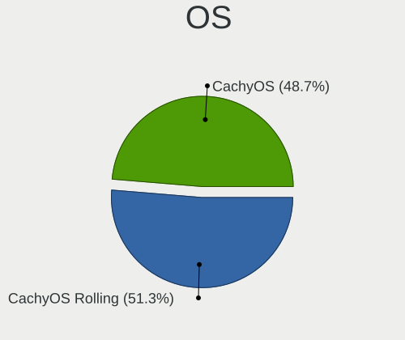

| Name            | Desktops | Percent |
|-----------------|----------|---------|
| CachyOS Rolling | 274      | 51.31%  |
| CachyOS         | 260      | 48.69%  |

OS Family
---------

OS without a version

| Name    | Desktops | Percent |
|---------|----------|---------|
| CachyOS | 532      | 100%    |

Kernel
------

Version of the Linux kernel

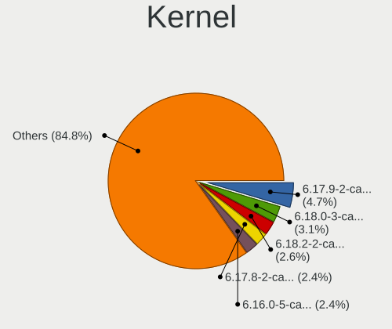

| Version          | Desktops | Percent |
|------------------|----------|---------|
| 6.17.9-2-cachyos | 27       | 4.66%   |
| 6.18.0-3-cachyos | 18       | 3.11%   |
| 6.18.2-2-cachyos | 15       | 2.59%   |
| 6.17.8-2-cachyos | 14       | 2.42%   |
| 6.16.0-5-cachyos | 14       | 2.42%   |
| 6.16.1-2-cachyos | 13       | 2.25%   |
| 6.17.1-2-cachyos | 12       | 2.07%   |
| 6.18.1-2-cachyos | 11       | 1.9%    |
| 6.17.7-3-cachyos | 10       | 1.73%   |
| 6.16.8-2-cachyos | 10       | 1.73%   |
| 6.15.7-2-cachyos | 10       | 1.73%   |
| 6.17.5-2-cachyos | 9        | 1.55%   |
| 6.15.0-2-cachyos | 9        | 1.55%   |
| 6.18.2-3-cachyos | 8        | 1.38%   |
| 6.13.7-3-cachyos | 8        | 1.38%   |
| 6.17.7-5-cachyos | 7        | 1.21%   |
| 6.17.4-4-cachyos | 7        | 1.21%   |
| 6.15.6-2-cachyos | 7        | 1.21%   |
| 6.12.1-2-cachyos | 7        | 1.21%   |
| 6.18.0-2-cachyos | 6        | 1.04%   |
| 6.16.7-2-cachyos | 6        | 1.04%   |
| 6.16.5-2-cachyos | 6        | 1.04%   |
| 6.14.2-2-cachyos | 6        | 1.04%   |
| 6.17.6-2-cachyos | 5        | 0.86%   |
| 6.15.7-3-cachyos | 5        | 0.86%   |
| 6.15.4-4-cachyos | 5        | 0.86%   |
| 6.15.3-3-cachyos | 5        | 0.86%   |
| 6.14.8-2-cachyos | 5        | 0.86%   |
| 6.13.2-2-cachyos | 5        | 0.86%   |
| 6.17.5-1-cachyos | 4        | 0.69%   |
| 6.17.3-3-cachyos | 4        | 0.69%   |
| 6.17.0-4-cachyos | 4        | 0.69%   |
| 6.17.0-3-cachyos | 4        | 0.69%   |
| 6.15.8-2-cachyos | 4        | 0.69%   |
| 6.15.5-2-cachyos | 4        | 0.69%   |
| 6.15.2-2-cachyos | 4        | 0.69%   |
| 6.14.7-5-cachyos | 4        | 0.69%   |
| 6.14.6-2-cachyos | 4        | 0.69%   |
| 6.14.4-2-cachyos | 4        | 0.69%   |
| 6.13.7-2-cachyos | 4        | 0.69%   |

Kernel Family
-------------

Linux kernel without a distro release

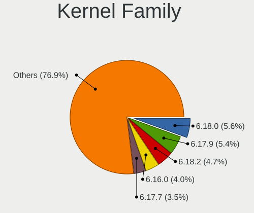

| Version | Desktops | Percent |
|---------|----------|---------|
| 6.18.0  | 32       | 5.56%   |
| 6.17.9  | 31       | 5.38%   |
| 6.18.2  | 27       | 4.69%   |
| 6.16.0  | 23       | 3.99%   |
| 6.17.7  | 20       | 3.47%   |
| 6.17.8  | 15       | 2.6%    |
| 6.17.1  | 15       | 2.6%    |
| 6.15.7  | 15       | 2.6%    |
| 6.16.8  | 14       | 2.43%   |
| 6.16.1  | 14       | 2.43%   |
| 6.18.1  | 13       | 2.26%   |
| 6.17.5  | 13       | 2.26%   |
| 6.13.7  | 13       | 2.26%   |
| 6.17.0  | 12       | 2.08%   |
| 6.15.3  | 11       | 1.91%   |
| 6.16.7  | 10       | 1.74%   |
| 6.15.6  | 10       | 1.74%   |
| 6.15.2  | 10       | 1.74%   |
| 6.15.0  | 10       | 1.74%   |
| 6.17.3  | 8        | 1.39%   |
| 6.15.5  | 8        | 1.39%   |
| 6.15.4  | 8        | 1.39%   |
| 6.14.8  | 8        | 1.39%   |
| 6.14.0  | 8        | 1.39%   |
| 6.13.5  | 8        | 1.39%   |
| 6.12.1  | 8        | 1.39%   |
| 6.17.4  | 7        | 1.22%   |
| 6.16.4  | 7        | 1.22%   |
| 6.16.5  | 6        | 1.04%   |
| 6.15.1  | 6        | 1.04%   |
| 6.14.4  | 6        | 1.04%   |
| 6.14.2  | 6        | 1.04%   |
| 6.13.2  | 6        | 1.04%   |
| 6.9.3   | 5        | 0.87%   |
| 6.17.6  | 5        | 0.87%   |
| 6.16.2  | 5        | 0.87%   |
| 6.14.6  | 5        | 0.87%   |
| 6.13.6  | 5        | 0.87%   |
| 6.12.0  | 5        | 0.87%   |
| 6.11.7  | 5        | 0.87%   |

Kernel Major Ver.
-----------------

Linux kernel major version

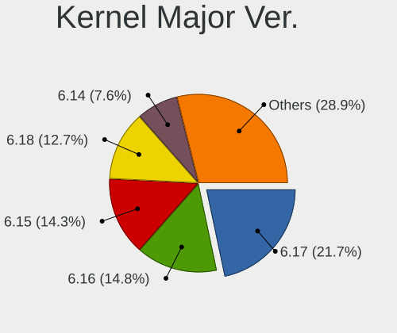

| Version | Desktops | Percent |
|---------|----------|---------|
| 6.17    | 123      | 21.69%  |
| 6.16    | 84       | 14.81%  |
| 6.15    | 81       | 14.29%  |
| 6.18    | 72       | 12.7%   |
| 6.14    | 43       | 7.58%   |
| 6.13    | 42       | 7.41%   |
| 6.12    | 37       | 6.53%   |
| 6.11    | 20       | 3.53%   |
| 6.9     | 18       | 3.17%   |
| 6.10    | 18       | 3.17%   |
| 6.1     | 6        | 1.06%   |
| 6.7     | 5        | 0.88%   |
| 6.4     | 5        | 0.88%   |
| 6.3     | 4        | 0.71%   |
| 6.6     | 3        | 0.53%   |
| 6.8     | 2        | 0.35%   |
| 6.2     | 2        | 0.35%   |
| 6.5     | 1        | 0.18%   |
| 6.0     | 1        | 0.18%   |

Arch
----

OS architecture (x86_64, i586, etc.)

| Name   | Desktops | Percent |
|--------|----------|---------|
| x86_64 | 532      | 100%    |

DE
--

Desktop Environment

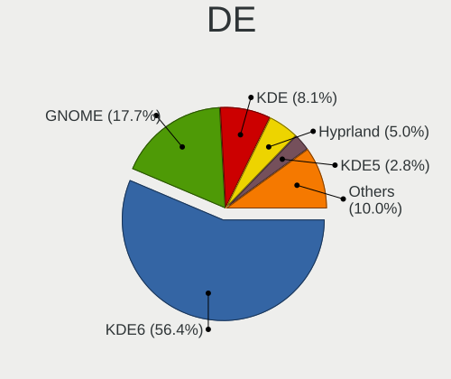

| Name               | Desktops | Percent |
|--------------------|----------|---------|
| KDE6               | 305      | 56.38%  |
| GNOME              | 96       | 17.74%  |
| KDE                | 44       | 8.13%   |
| Hyprland           | 27       | 4.99%   |
| KDE5               | 15       | 2.77%   |
| Unknown            | 14       | 2.59%   |
| XFCE               | 10       | 1.85%   |
| X-Cinnamon         | 5        | 0.92%   |
| Budgie             | 5        | 0.92%   |
| niri               | 4        | 0.74%   |
| COSMIC             | 4        | 0.74%   |
| i3                 | 2        | 0.37%   |
| GNOME Classic      | 2        | 0.37%   |
| sway               | 1        | 0.18%   |
| LXQt:labwc:wlroots | 1        | 0.18%   |
| LXQt               | 1        | 0.18%   |
| LXDE               | 1        | 0.18%   |
| LeftWM             | 1        | 0.18%   |
| Deepin             | 1        | 0.18%   |
| Cinnamon           | 1        | 0.18%   |
| bspwm              | 1        | 0.18%   |

Display Server
--------------

X11 or Wayland

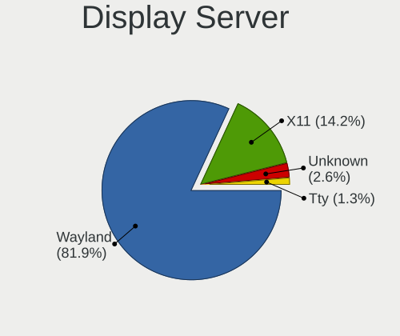

| Name    | Desktops | Percent |
|---------|----------|---------|
| Wayland | 439      | 81.9%   |
| X11     | 76       | 14.18%  |
| Unknown | 14       | 2.61%   |
| Tty     | 7        | 1.31%   |

Display Manager
---------------

SDDM, LightDM, etc.

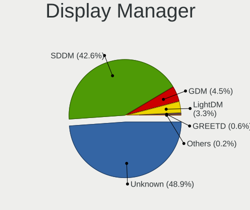

| Name    | Desktops | Percent |
|---------|----------|---------|
| Unknown | 263      | 48.88%  |
| SDDM    | 229      | 42.57%  |
| GDM     | 24       | 4.46%   |
| LightDM | 18       | 3.35%   |
| GREETD  | 3        | 0.56%   |
| LY-DM   | 1        | 0.19%   |

OS Lang
-------

Language

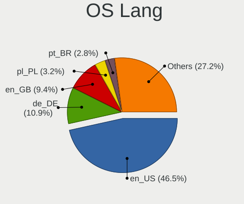

| Lang    | Desktops | Percent |
|---------|----------|---------|
| en_US   | 248      | 46.53%  |
| de_DE   | 58       | 10.88%  |
| en_GB   | 50       | 9.38%   |
| pl_PL   | 17       | 3.19%   |
| pt_BR   | 15       | 2.81%   |
| en_CA   | 14       | 2.63%   |
| ru_RU   | 13       | 2.44%   |
| C       | 13       | 2.44%   |
| en_AU   | 12       | 2.25%   |
| it_IT   | 10       | 1.88%   |
| fr_FR   | 10       | 1.88%   |
| es_MX   | 8        | 1.5%    |
| es_ES   | 8        | 1.5%    |
| es_AR   | 5        | 0.94%   |
| de_AT   | 5        | 0.94%   |
| fr_CA   | 4        | 0.75%   |
| tr_TR   | 3        | 0.56%   |
| ja_JP   | 3        | 0.56%   |
| id_ID   | 3        | 0.56%   |
| hu_HU   | 3        | 0.56%   |
| en_IN   | 3        | 0.56%   |
| de_CH   | 3        | 0.56%   |
| Unknown | 3        | 0.56%   |
| pt_PT   | 2        | 0.38%   |
| fi_FI   | 2        | 0.38%   |
| en_PH   | 2        | 0.38%   |
| en_NZ   | 2        | 0.38%   |
| el_GR   | 2        | 0.38%   |
| da_DK   | 2        | 0.38%   |
| cs_CZ   | 2        | 0.38%   |
| uk_UA   | 1        | 0.19%   |
| nl_NL   | 1        | 0.19%   |
| nl_BE   | 1        | 0.19%   |
| es_EC   | 1        | 0.19%   |
| en_ZA   | 1        | 0.19%   |
| en_IL   | 1        | 0.19%   |
| ca_ES   | 1        | 0.19%   |
| bg_BG   | 1        | 0.19%   |

Boot Mode
---------

EFI or BIOS

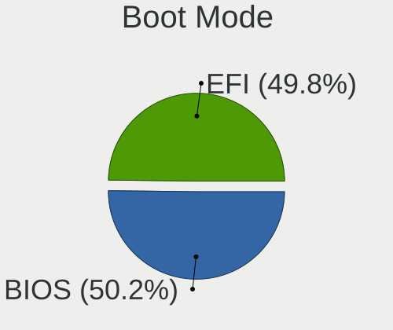

| Mode | Desktops | Percent |
|------|----------|---------|
| BIOS | 268      | 50.19%  |
| EFI  | 266      | 49.81%  |

Filesystem
----------

Type of filesystem

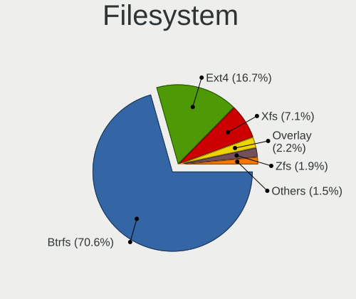

| Type     | Desktops | Percent |
|----------|----------|---------|
| Btrfs    | 380      | 70.63%  |
| Ext4     | 90       | 16.73%  |
| Xfs      | 38       | 7.06%   |
| Overlay  | 12       | 2.23%   |
| Zfs      | 10       | 1.86%   |
| F2fs     | 3        | 0.56%   |
| Tmpfs    | 2        | 0.37%   |
| Bcachefs | 2        | 0.37%   |
| Unknown  | 1        | 0.19%   |

Part. scheme
------------

Scheme of partitioning

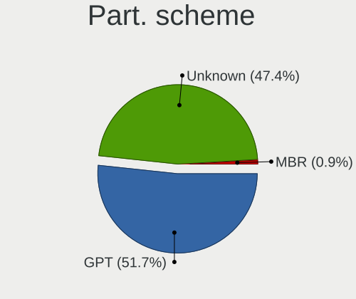

| Type    | Desktops | Percent |
|---------|----------|---------|
| GPT     | 276      | 51.69%  |
| Unknown | 253      | 47.38%  |
| MBR     | 5        | 0.94%   |

Dual Boot with Linux/BSD
------------------------

Hosting more than one Linux/BSD

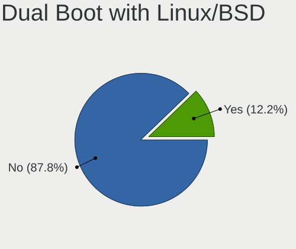

| Dual boot | Desktops | Percent |
|-----------|----------|---------|
| No        | 469      | 87.83%  |
| Yes       | 65       | 12.17%  |

Dual Boot (Win)
---------------

Hosting Linux and Windows

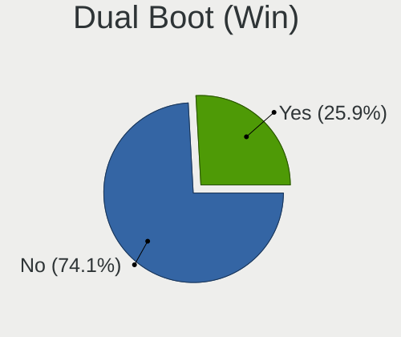

| Dual boot | Desktops | Percent |
|-----------|----------|---------|
| No        | 398      | 74.12%  |
| Yes       | 139      | 25.88%  |

Board
-----

Vendor
------

Motherboard manufacturer

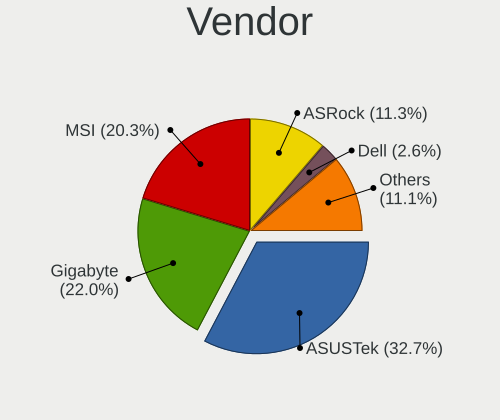

| Name                                 | Desktops | Percent |
|--------------------------------------|----------|---------|
| ASUSTek Computer                     | 174      | 32.71%  |
| Gigabyte Technology                  | 117      | 21.99%  |
| MSI                                  | 108      | 20.3%   |
| ASRock                               | 60       | 11.28%  |
| Dell                                 | 14       | 2.63%   |
| Hewlett-Packard                      | 9        | 1.69%   |
| Shenzhen Meigao Electronic Equipment | 8        | 1.5%    |
| Intel                                | 6        | 1.13%   |
| Unknown                              | 6        | 1.13%   |
| Lenovo                               | 3        | 0.56%   |
| Huanan                               | 3        | 0.56%   |
| Fujitsu                              | 3        | 0.56%   |
| Biostar                              | 3        | 0.56%   |
| ECS                                  | 2        | 0.38%   |
| Apple                                | 2        | 0.38%   |
| AMI                                  | 2        | 0.38%   |
| Acer                                 | 2        | 0.38%   |
| T-bao                                | 1        | 0.19%   |
| Packard Bell                         | 1        | 0.19%   |
| OEM                                  | 1        | 0.19%   |
| NZXT                                 | 1        | 0.19%   |
| MACHINIST                            | 1        | 0.19%   |
| HC Technology.                       | 1        | 0.19%   |
| Goldentec                            | 1        | 0.19%   |
| GEEKOM                               | 1        | 0.19%   |
| AZW                                  | 1        | 0.19%   |
| Alienware                            | 1        | 0.19%   |

Model
-----

Motherboard model

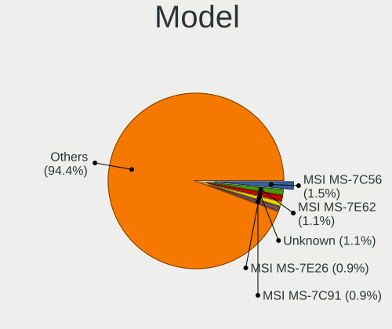

| Name                                              | Desktops | Percent |
|---------------------------------------------------|----------|---------|
| MSI MS-7C56                                       | 8        | 1.5%    |
| MSI MS-7E62                                       | 6        | 1.13%   |
| Unknown                                           | 6        | 1.13%   |
| MSI MS-7E26                                       | 5        | 0.94%   |
| MSI MS-7C91                                       | 5        | 0.94%   |
| MSI MS-7C37                                       | 5        | 0.94%   |
| Gigabyte X870E AORUS ELITE WIFI7                  | 5        | 0.94%   |
| ASUS TUF Gaming X570-PLUS                         | 5        | 0.94%   |
| ASUS TUF Gaming B650M-E WIFI                      | 5        | 0.94%   |
| ASUS ROG STRIX X870E-E GAMING WIFI                | 5        | 0.94%   |
| ASUS PRIME B450-PLUS                              | 5        | 0.94%   |
| Shenzhen Meigao Electronic Equipment Venus Series | 4        | 0.75%   |
| MSI MS-7E16                                       | 4        | 0.75%   |
| MSI MS-7D70                                       | 4        | 0.75%   |
| MSI MS-7C02                                       | 4        | 0.75%   |
| Gigabyte B550 GAMING X V2                         | 4        | 0.75%   |
| ASUS TUF Gaming B650-PLUS WIFI                    | 4        | 0.75%   |
| ASUS ROG STRIX B450-F GAMING                      | 4        | 0.75%   |
| ASUS All Series                                   | 4        | 0.75%   |
| ASRock B450M Pro4                                 | 4        | 0.75%   |
| Shenzhen Meigao Electronic Equipment Series       | 3        | 0.56%   |
| MSI MS-7E51                                       | 3        | 0.56%   |
| MSI MS-7D98                                       | 3        | 0.56%   |
| MSI MS-7D75                                       | 3        | 0.56%   |
| MSI MS-7C96                                       | 3        | 0.56%   |
| MSI MS-7A38                                       | 3        | 0.56%   |
| Gigabyte X870 AORUS ELITE WIFI7                   | 3        | 0.56%   |
| Gigabyte B650 GAMING X AX V2                      | 3        | 0.56%   |
| Gigabyte B650 AORUS ELITE AX V2                   | 3        | 0.56%   |
| Gigabyte B450M DS3H                               | 3        | 0.56%   |
| ASUS ROG STRIX X670E-F GAMING WIFI                | 3        | 0.56%   |
| ASUS ROG STRIX B650E-F GAMING WIFI                | 3        | 0.56%   |
| ASUS ROG STRIX B650E-E GAMING WIFI                | 3        | 0.56%   |
| ASUS ROG CROSSHAIR X670E HERO                     | 3        | 0.56%   |
| ASRock B850M Steel Legend WiFi                    | 3        | 0.56%   |
| MSI MS-7E47                                       | 2        | 0.38%   |
| MSI MS-7D78                                       | 2        | 0.38%   |
| MSI MS-7D25                                       | 2        | 0.38%   |
| MSI MS-7C94                                       | 2        | 0.38%   |
| MSI MS-7C84                                       | 2        | 0.38%   |

Model Family
------------

Motherboard model prefix

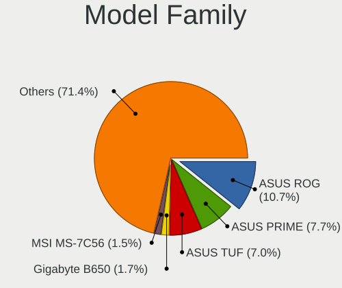

| Name                                        | Desktops | Percent |
|---------------------------------------------|----------|---------|
| ASUS ROG                                    | 57       | 10.71%  |
| ASUS PRIME                                  | 41       | 7.71%   |
| ASUS TUF                                    | 37       | 6.95%   |
| Gigabyte B650                               | 9        | 1.69%   |
| MSI MS-7C56                                 | 8        | 1.5%    |
| Gigabyte X570                               | 8        | 1.5%    |
| Gigabyte B550                               | 8        | 1.5%    |
| Dell OptiPlex                               | 8        | 1.5%    |
| MSI MS-7E62                                 | 6        | 1.13%   |
| Gigabyte X870                               | 6        | 1.13%   |
| Gigabyte B550M                              | 6        | 1.13%   |
| ASRock X670E                                | 6        | 1.13%   |
| ASRock B450M                                | 6        | 1.13%   |
| Unknown                                     | 6        | 1.13%   |
| MSI MS-7E26                                 | 5        | 0.94%   |
| MSI MS-7C91                                 | 5        | 0.94%   |
| MSI MS-7C37                                 | 5        | 0.94%   |
| Gigabyte X870E                              | 5        | 0.94%   |
| ASRock B550                                 | 5        | 0.94%   |
| Shenzhen Meigao Electronic Equipment Venus  | 4        | 0.75%   |
| MSI MS-7E16                                 | 4        | 0.75%   |
| MSI MS-7D70                                 | 4        | 0.75%   |
| MSI MS-7C02                                 | 4        | 0.75%   |
| Gigabyte Z790                               | 4        | 0.75%   |
| Gigabyte B650M                              | 4        | 0.75%   |
| Gigabyte B450M                              | 4        | 0.75%   |
| Gigabyte A520M                              | 4        | 0.75%   |
| ASUS All                                    | 4        | 0.75%   |
| ASRock B850M                                | 4        | 0.75%   |
| ASRock B450                                 | 4        | 0.75%   |
| Shenzhen Meigao Electronic Equipment Series | 3        | 0.56%   |
| MSI MS-7E51                                 | 3        | 0.56%   |
| MSI MS-7D98                                 | 3        | 0.56%   |
| MSI MS-7D75                                 | 3        | 0.56%   |
| MSI MS-7C96                                 | 3        | 0.56%   |
| MSI MS-7A38                                 | 3        | 0.56%   |
| Gigabyte Z690                               | 3        | 0.56%   |
| Gigabyte Z390                               | 3        | 0.56%   |
| Gigabyte X570S                              | 3        | 0.56%   |
| Gigabyte B450                               | 3        | 0.56%   |

MFG Year
--------

Motherboard manufacture year

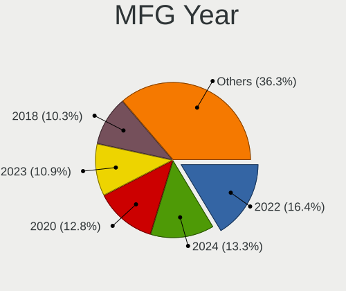

| Year | Desktops | Percent |
|------|----------|---------|
| 2022 | 87       | 16.35%  |
| 2024 | 71       | 13.35%  |
| 2020 | 68       | 12.78%  |
| 2023 | 58       | 10.9%   |
| 2018 | 55       | 10.34%  |
| 2019 | 43       | 8.08%   |
| 2021 | 40       | 7.52%   |
| 2017 | 22       | 4.14%   |
| 2025 | 20       | 3.76%   |
| 2013 | 15       | 2.82%   |
| 2012 | 15       | 2.82%   |
| 2014 | 13       | 2.44%   |
| 2016 | 9        | 1.69%   |
| 2015 | 7        | 1.32%   |
| 2010 | 4        | 0.75%   |
| 2011 | 3        | 0.56%   |
| 2009 | 1        | 0.19%   |
| 2007 | 1        | 0.19%   |

Form Factor
-----------

Physical design of the computer

| Name    | Desktops | Percent |
|---------|----------|---------|
| Desktop | 532      | 100%    |

Secure Boot
-----------

Enabled or disabled

| State    | Desktops | Percent |
|----------|----------|---------|
| Disabled | 518      | 97.19%  |
| Enabled  | 15       | 2.81%   |

Coreboot
--------

Have coreboot on board

| Used | Desktops | Percent |
|------|----------|---------|
| No   | 532      | 100%    |

RAM Size
--------

Total RAM memory

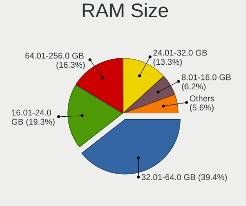

| Size in GB      | Desktops | Percent |
|-----------------|----------|---------|
| 32.01-64.0      | 211      | 39.44%  |
| 16.01-24.0      | 103      | 19.25%  |
| 64.01-256.0     | 87       | 16.26%  |
| 24.01-32.0      | 71       | 13.27%  |
| 8.01-16.0       | 33       | 6.17%   |
| 4.01-8.0        | 25       | 4.67%   |
| 3.01-4.0        | 4        | 0.75%   |
| More than 256.0 | 1        | 0.19%   |

RAM Used
--------

Used RAM memory

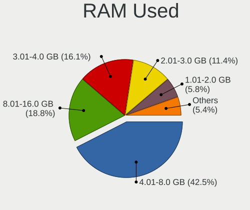

| Used GB    | Desktops | Percent |
|------------|----------|---------|
| 4.01-8.0   | 235      | 42.5%   |
| 8.01-16.0  | 104      | 18.81%  |
| 3.01-4.0   | 89       | 16.09%  |
| 2.01-3.0   | 63       | 11.39%  |
| 1.01-2.0   | 32       | 5.79%   |
| 16.01-24.0 | 21       | 3.8%    |
| 32.01-64.0 | 6        | 1.08%   |
| 24.01-32.0 | 3        | 0.54%   |

Total Drives
------------

Number of drives on board

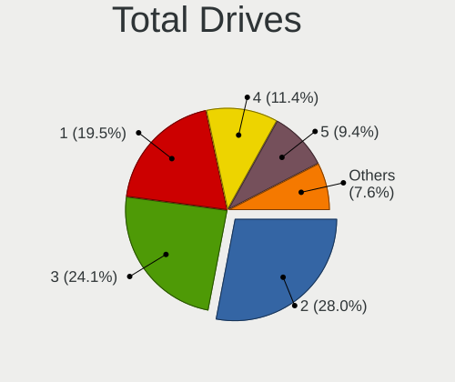

| Drives | Desktops | Percent |
|--------|----------|---------|
| 2      | 152      | 27.99%  |
| 3      | 131      | 24.13%  |
| 1      | 106      | 19.52%  |
| 4      | 62       | 11.42%  |
| 5      | 51       | 9.39%   |
| 6      | 21       | 3.87%   |
| 7      | 10       | 1.84%   |
| 8      | 6        | 1.1%    |
| 10     | 3        | 0.55%   |
| 0      | 1        | 0.18%   |

Has CD-ROM
----------

Has CD-ROM on board

| Presented | Desktops | Percent |
|-----------|----------|---------|
| No        | 468      | 87.97%  |
| Yes       | 64       | 12.03%  |

Has Ethernet
------------

Has Ethernet on board

| Presented | Desktops | Percent |
|-----------|----------|---------|
| Yes       | 527      | 99.06%  |
| No        | 5        | 0.94%   |

Has WiFi
--------

Has WiFi module

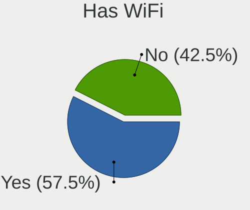

| Presented | Desktops | Percent |
|-----------|----------|---------|
| Yes       | 308      | 57.46%  |
| No        | 228      | 42.54%  |

Has Bluetooth
-------------

Has Bluetooth module

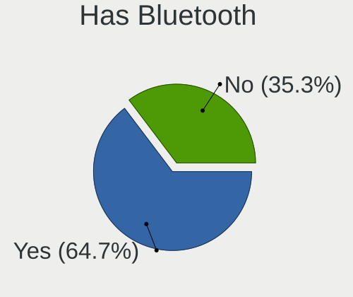

| Presented | Desktops | Percent |
|-----------|----------|---------|
| Yes       | 348      | 64.68%  |
| No        | 190      | 35.32%  |

Location
--------

Country
-------

Geographic location (country)

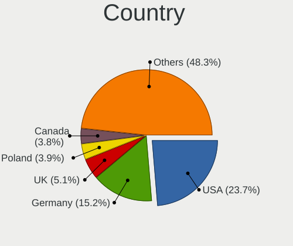

| Country     | Desktops | Percent |
|-------------|----------|---------|
| USA         | 126      | 23.68%  |
| Germany     | 81       | 15.23%  |
| UK          | 27       | 5.08%   |
| Poland      | 21       | 3.95%   |
| Canada      | 20       | 3.76%   |
| Brazil      | 20       | 3.76%   |
| Russia      | 19       | 3.57%   |
| Italy       | 17       | 3.2%    |
| France      | 15       | 2.82%   |
| Australia   | 15       | 2.82%   |
| Spain       | 13       | 2.44%   |
| Austria     | 10       | 1.88%   |
| Sweden      | 9        | 1.69%   |
| Mexico      | 8        | 1.5%    |
| Switzerland | 7        | 1.32%   |
| Portugal    | 7        | 1.32%   |
| Greece      | 7        | 1.32%   |
| Turkey      | 6        | 1.13%   |
| India       | 6        | 1.13%   |
| Finland     | 6        | 1.13%   |
| Czechia     | 6        | 1.13%   |
| Norway      | 5        | 0.94%   |
| Indonesia   | 5        | 0.94%   |
| Argentina   | 5        | 0.94%   |
| Vietnam     | 4        | 0.75%   |
| Serbia      | 4        | 0.75%   |
| Romania     | 4        | 0.75%   |
| Japan       | 4        | 0.75%   |
| Hungary     | 4        | 0.75%   |
| Thailand    | 3        | 0.56%   |
| Philippines | 3        | 0.56%   |
| Colombia    | 3        | 0.56%   |
| Belgium     | 3        | 0.56%   |
| UAE         | 2        | 0.38%   |
| New Zealand | 2        | 0.38%   |
| Netherlands | 2        | 0.38%   |
| Malaysia    | 2        | 0.38%   |
| Latvia      | 2        | 0.38%   |
| Kazakhstan  | 2        | 0.38%   |
| Estonia     | 2        | 0.38%   |

City
----

Geographic location (city)

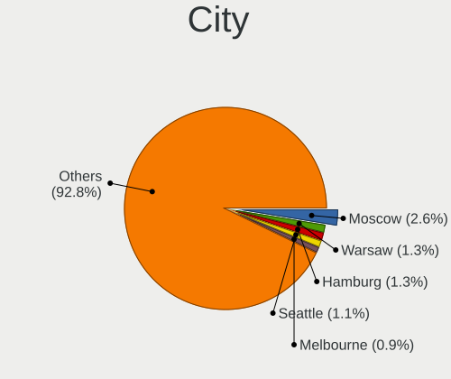

| City             | Desktops | Percent |
|------------------|----------|---------|
| Moscow           | 14       | 2.58%   |
| Warsaw           | 7        | 1.29%   |
| Hamburg          | 7        | 1.29%   |
| Seattle          | 6        | 1.1%    |
| Melbourne        | 5        | 0.92%   |
| Istanbul         | 4        | 0.74%   |
| Berlin           | 4        | 0.74%   |
| Tucson           | 3        | 0.55%   |
| Stockholm        | 3        | 0.55%   |
| Prague           | 3        | 0.55%   |
| Poznan           | 3        | 0.55%   |
| Porto            | 3        | 0.55%   |
| Phoenix          | 3        | 0.55%   |
| Perth            | 3        | 0.55%   |
| Oslo             | 3        | 0.55%   |
| Milan            | 3        | 0.55%   |
| Madrid           | 3        | 0.55%   |
| Lisbon           | 3        | 0.55%   |
| Ho Chi Minh City | 3        | 0.55%   |
| Denver           | 3        | 0.55%   |
| Brisbane         | 3        | 0.55%   |
| Braunschweig     | 3        | 0.55%   |
| Atlanta          | 3        | 0.55%   |
| Vienna           | 2        | 0.37%   |
| Tokyo            | 2        | 0.37%   |
| Tallinn          | 2        | 0.37%   |
| Sydney           | 2        | 0.37%   |
| Southampton      | 2        | 0.37%   |
| Quito            | 2        | 0.37%   |
| Portland         | 2        | 0.37%   |
| Pittsburgh       | 2        | 0.37%   |
| Philadelphia     | 2        | 0.37%   |
| Oulu             | 2        | 0.37%   |
| Ottawa           | 2        | 0.37%   |
| Nuremberg        | 2        | 0.37%   |
| Nogradmegyer     | 2        | 0.37%   |
| Nienburg         | 2        | 0.37%   |
| Montreal         | 2        | 0.37%   |
| McAllen          | 2        | 0.37%   |
| Maplewood        | 2        | 0.37%   |

Drives
------

Drive Vendor
------------

Hard drive vendors

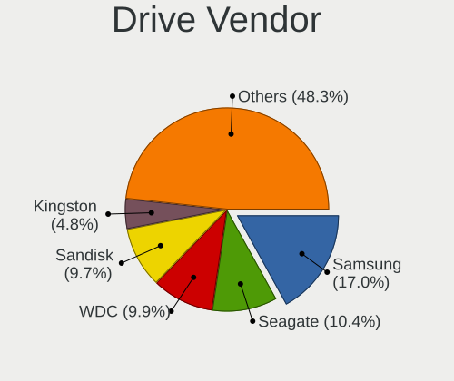

| Vendor                       | Desktops | Drives | Percent |
|------------------------------|----------|--------|---------|
| Samsung Electronics          | 213      | 360    | 16.97%  |
| Seagate                      | 130      | 177    | 10.36%  |
| WDC                          | 124      | 167    | 9.88%   |
| Sandisk                      | 122      | 164    | 9.72%   |
| Kingston                     | 60       | 75     | 4.78%   |
| Micron/Crucial Technology    | 59       | 72     | 4.7%    |
| Kingston Technology Company  | 58       | 68     | 4.62%   |
| Crucial                      | 51       | 63     | 4.06%   |
| Toshiba                      | 45       | 55     | 3.59%   |
| Phison Electronics           | 44       | 63     | 3.51%   |
| Intel                        | 27       | 35     | 2.15%   |
| MAXIO Technology (Hangzhou)  | 25       | 30     | 1.99%   |
| Realtek Semiconductor        | 24       | 27     | 1.91%   |
| ADATA Technology             | 19       | 22     | 1.51%   |
| SK hynix                     | 17       | 26     | 1.35%   |
| Micron Technology            | 16       | 16     | 1.27%   |
| Silicon Motion               | 15       | 18     | 1.2%    |
| A-DATA Technology            | 13       | 17     | 1.04%   |
| Unknown                      | 12       | 18     | 0.96%   |
| PNY                          | 12       | 13     | 0.96%   |
| Hitachi                      | 11       | 16     | 0.88%   |
| SPCC                         | 10       | 11     | 0.8%    |
| Shenzhen Longsys Electronics | 9        | 13     | 0.72%   |
| Patriot                      | 9        | 9      | 0.72%   |
| KIOXIA                       | 8        | 10     | 0.64%   |
| HGST                         | 8        | 8      | 0.64%   |
| China                        | 8        | 8      | 0.64%   |
| Intenso                      | 7        | 12     | 0.56%   |
| T-FORCE                      | 4        | 4      | 0.32%   |
| OCZ                          | 4        | 7      | 0.32%   |
| Netac                        | 4        | 6      | 0.32%   |
| Transcend                    | 3        | 3      | 0.24%   |
| Team                         | 3        | 5      | 0.24%   |
| SSK                          | 3        | 3      | 0.24%   |
| Seagate Technology           | 3        | 3      | 0.24%   |
| Realtek                      | 3        | 4      | 0.24%   |
| KIOXIA-EXCERIA               | 3        | 3      | 0.24%   |
| KingSpec                     | 3        | 4      | 0.24%   |
| INNOGRIT                     | 3        | 3      | 0.24%   |
| GOODRAM                      | 3        | 3      | 0.24%   |

Drive Model
-----------

Hard drive models

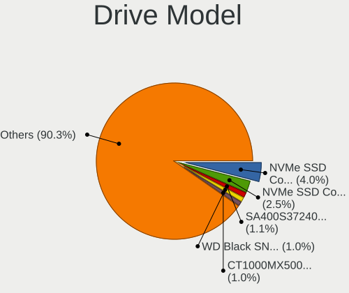

| Model                                                                    | Desktops | Percent |
|--------------------------------------------------------------------------|----------|---------|
| Samsung NVMe SSD Controller SM981/PM981/PM983 1TB                        | 59       | 4.05%   |
| Samsung NVMe SSD Controller PM9A1/PM9A3/980PRO 1TB                       | 37       | 2.54%   |
| Kingston SA400S37240G 240GB SSD                                          | 16       | 1.1%    |
| Sandisk WD Black SN850X NVMe SSD 4TB                                     | 15       | 1.03%   |
| Crucial CT1000MX500SSD1 1TB                                              | 14       | 0.96%   |
| Seagate ST1000DM010-2EP102 1TB                                           | 13       | 0.89%   |
| Samsung SSD 850 EVO 500GB                                                | 13       | 0.89%   |
| Micron/Crucial P2 [Nick P2] / P3 / P3 Plus NVMe PCIe SSD (DRAM-less) 2TB | 13       | 0.89%   |
| Micron/Crucial P2 NVMe PCIe SSD 2TB                                      | 13       | 0.89%   |
| Samsung SSD 860 EVO 500GB                                                | 12       | 0.82%   |
| Samsung NVMe SSD Controller S4LV008[Pascal] 4TB                          | 12       | 0.82%   |
| Phison E16 PCIe4 NVMe Controller 1TB                                     | 12       | 0.82%   |
| Seagate ST2000DM008-2FR102 2TB                                           | 11       | 0.75%   |
| Samsung SSD 850 EVO 250GB                                                | 11       | 0.75%   |
| Phison E12 NVMe Controller 1TB                                           | 11       | 0.75%   |
| Silicon Motion SM2263EN/SM2263XT SSD Controller 512GB                    | 10       | 0.69%   |
| Samsung SSD 990 PRO 2TB                                                  | 10       | 0.69%   |
| WDC WD10EZEX-08WN4A0 1TB                                                 | 9        | 0.62%   |
| Sandisk WD Blue SN550 NVMe SSD 1024GB                                    | 9        | 0.62%   |
| Sandisk WD Black SN770 / PC SN740 256GB / PC SN560 (DRAM-less) NVMe SSD  | 9        | 0.62%   |
| Kingston Company KC3000/FURY Renegade NVMe SSD [E18] 2TB                 | 9        | 0.62%   |
| ADATA XPG SX8200 Pro PCIe Gen3x4 M.2 2280 Solid State Drive 1024GB       | 9        | 0.62%   |
| Samsung SSD 870 EVO 1TB                                                  | 8        | 0.55%   |
| Samsung SSD 860 EVO 1TB                                                  | 8        | 0.55%   |
| MAXIO (Hangzhou) NVMe SSD Controller MAP1202 2TB                         | 8        | 0.55%   |
| Kingston Company SNV2S1000G 1TB                                          | 8        | 0.55%   |
| Kingston SA400S37480G 480GB SSD                                          | 8        | 0.55%   |
| Crucial CT240BX500SSD1 240GB                                             | 8        | 0.55%   |
| Toshiba DT01ACA100 1TB                                                   | 7        | 0.48%   |
| Seagate ST1000DM003-1CH162 1TB                                           | 7        | 0.48%   |
| Samsung SSD 980 1TB                                                      | 7        | 0.48%   |
| Samsung SSD 870 EVO 2TB                                                  | 7        | 0.48%   |
| Intel SSD 660P Series 512GB                                              | 7        | 0.48%   |
| Crucial CT500MX500SSD1 500GB                                             | 7        | 0.48%   |
| Toshiba DT01ACA200 2TB                                                   | 6        | 0.41%   |
| Seagate ST8000DM004-2U9188 8TB                                           | 6        | 0.41%   |
| Sandisk WD_BLACK SN850X 4000GB                                           | 6        | 0.41%   |
| Sandisk WD Black SN850 1TB                                               | 6        | 0.41%   |
| Samsung SSD 990 PRO 1TB                                                  | 6        | 0.41%   |
| Samsung SSD 870 QVO 1TB                                                  | 6        | 0.41%   |

HDD Vendor
----------

Hard disk drive vendors

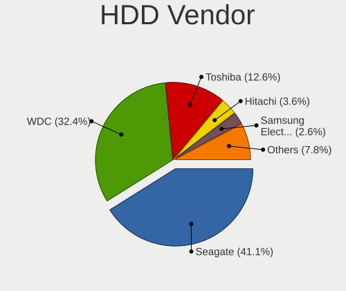

| Vendor              | Desktops | Drives | Percent |
|---------------------|----------|--------|---------|
| Seagate             | 127      | 173    | 41.1%   |
| WDC                 | 100      | 135    | 32.36%  |
| Toshiba             | 39       | 48     | 12.62%  |
| Hitachi             | 11       | 16     | 3.56%   |
| Samsung Electronics | 8        | 10     | 2.59%   |
| HGST                | 8        | 8      | 2.59%   |
| Unknown             | 3        | 3      | 0.97%   |
| Apple               | 3        | 3      | 0.97%   |
| T-FORCE             | 1        | 1      | 0.32%   |
| SSK                 | 1        | 1      | 0.32%   |
| Maxone              | 1        | 2      | 0.32%   |
| JMicron Technology  | 1        | 2      | 0.32%   |
| Intenso             | 1        | 1      | 0.32%   |
| HGST HUH            | 1        | 1      | 0.32%   |
| Fujitsu             | 1        | 1      | 0.32%   |
| External            | 1        | 4      | 0.32%   |
| ASMT                | 1        | 1      | 0.32%   |
| Unknown             | 1        | 1      | 0.32%   |

SSD Vendor
----------

Solid state drive vendors

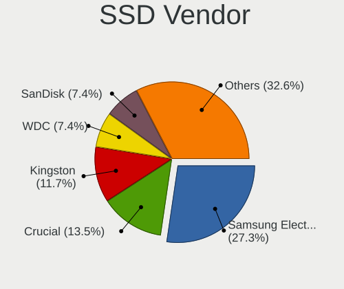

| Vendor              | Desktops | Drives | Percent |
|---------------------|----------|--------|---------|
| Samsung Electronics | 103      | 144    | 27.32%  |
| Crucial             | 51       | 63     | 13.53%  |
| Kingston            | 44       | 53     | 11.67%  |
| WDC                 | 28       | 32     | 7.43%   |
| SanDisk             | 28       | 30     | 7.43%   |
| A-DATA Technology   | 13       | 17     | 3.45%   |
| PNY                 | 12       | 13     | 3.18%   |
| SPCC                | 8        | 8      | 2.12%   |
| Patriot             | 8        | 8      | 2.12%   |
| China               | 8        | 8      | 2.12%   |
| SK hynix            | 5        | 5      | 1.33%   |
| Intenso             | 5        | 10     | 1.33%   |
| Intel               | 5        | 8      | 1.33%   |
| OCZ                 | 4        | 7      | 1.06%   |
| Micron Technology   | 4        | 4      | 1.06%   |
| Transcend           | 3        | 3      | 0.8%    |
| Team                | 3        | 5      | 0.8%    |
| KingSpec            | 3        | 4      | 0.8%    |
| GOODRAM             | 3        | 3      | 0.8%    |
| SABRENT             | 2        | 2      | 0.53%   |
| Netac               | 2        | 2      | 0.53%   |
| MSI                 | 2        | 2      | 0.53%   |
| LITEON              | 2        | 2      | 0.53%   |
| KIOXIA-EXCERIA      | 2        | 2      | 0.53%   |
| Gigabyte Technology | 2        | 2      | 0.53%   |
| Colorful            | 2        | 2      | 0.53%   |
| Apacer              | 2        | 2      | 0.53%   |
| XrayDisk            | 1        | 1      | 0.27%   |
| XPG                 | 1        | 1      | 0.27%   |
| V-GeN               | 1        | 1      | 0.27%   |
| Toshiba             | 1        | 1      | 0.27%   |
| tecmiyo             | 1        | 1      | 0.27%   |
| SXMicro             | 1        | 1      | 0.27%   |
| SSK Port            | 1        | 1      | 0.27%   |
| Seagate             | 1        | 1      | 0.27%   |
| SD                  | 1        | 1      | 0.27%   |
| Rayson              | 1        | 1      | 0.27%   |
| Ramsta              | 1        | 1      | 0.27%   |
| ORICO               | 1        | 1      | 0.27%   |
| Lexar               | 1        | 1      | 0.27%   |

Drive Kind
----------

HDD or SSD

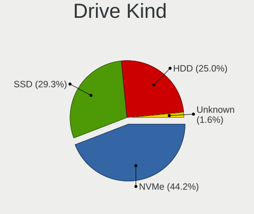

| Kind    | Desktops | Drives | Percent |
|---------|----------|--------|---------|
| NVMe    | 427      | 792    | 44.16%  |
| SSD     | 283      | 464    | 29.27%  |
| HDD     | 242      | 411    | 25.03%  |
| Unknown | 15       | 22     | 1.55%   |

Drive Connector
---------------

SATA, SAS, NVMe, etc.

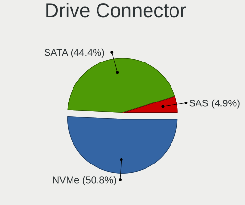

| Type | Desktops | Drives | Percent |
|------|----------|--------|---------|
| NVMe | 427      | 784    | 50.77%  |
| SATA | 373      | 841    | 44.35%  |
| SAS  | 41       | 64     | 4.88%   |

Drive Size
----------

Size of hard drive

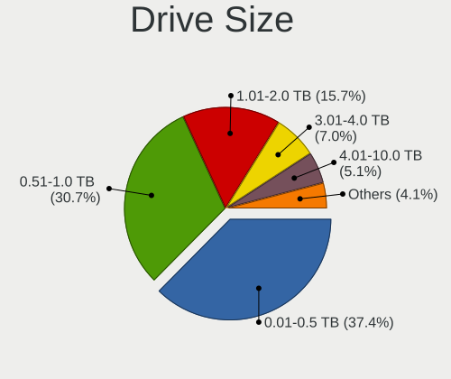

| Size in TB | Desktops | Drives | Percent |
|------------|----------|--------|---------|
| 0.01-0.5   | 229      | 369    | 37.42%  |
| 0.51-1.0   | 188      | 249    | 30.72%  |
| 1.01-2.0   | 96       | 124    | 15.69%  |
| 3.01-4.0   | 43       | 54     | 7.03%   |
| 4.01-10.0  | 31       | 45     | 5.07%   |
| 2.01-3.0   | 16       | 19     | 2.61%   |
| 10.01-20.0 | 9        | 15     | 1.47%   |

Space Total
-----------

Amount of disk space available on the file system

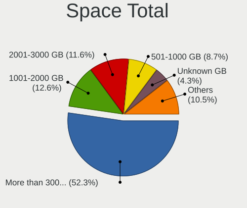

| Size in GB     | Desktops | Percent |
|----------------|----------|---------|
| More than 3000 | 283      | 52.31%  |
| 1001-2000      | 68       | 12.57%  |
| 2001-3000      | 63       | 11.65%  |
| 501-1000       | 47       | 8.69%   |
| Unknown        | 23       | 4.25%   |
| 251-500        | 20       | 3.7%    |
| 101-250        | 20       | 3.7%    |
| 1-20           | 16       | 2.96%   |
| 51-100         | 1        | 0.18%   |

Space Used
----------

Amount of used disk space

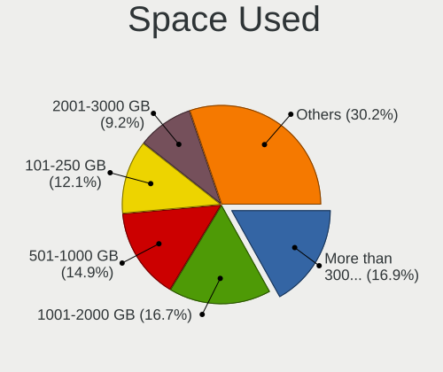

| Used GB        | Desktops | Percent |
|----------------|----------|---------|
| More than 3000 | 94       | 16.91%  |
| 1001-2000      | 93       | 16.73%  |
| 501-1000       | 83       | 14.93%  |
| 101-250        | 67       | 12.05%  |
| 2001-3000      | 51       | 9.17%   |
| 51-100         | 51       | 9.17%   |
| 251-500        | 50       | 8.99%   |
| 1-20           | 24       | 4.32%   |
| Unknown        | 23       | 4.14%   |
| 21-50          | 20       | 3.6%    |

Malfunc. Drives
---------------

Drive models with a malfunction

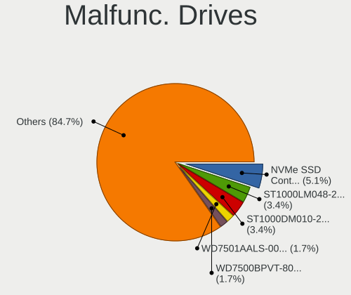

| Model                                                         | Desktops | Drives | Percent |
|---------------------------------------------------------------|----------|--------|---------|
| Samsung Electronics NVMe SSD Controller SM981/PM981/PM983 1TB | 3        | 3      | 5.08%   |
| Seagate ST1000LM048-2E7172 1TB                                | 2        | 2      | 3.39%   |
| Seagate ST1000DM010-2EP102 1TB                                | 2        | 2      | 3.39%   |
| WDC WD7501AALS-00J7B0 752GB                                   | 1        | 1      | 1.69%   |
| WDC WD7500BPVT-80HXZT1 752GB                                  | 1        | 1      | 1.69%   |
| WDC WD60EFRX-68L0BN1 6TB                                      | 1        | 2      | 1.69%   |
| WDC WD5000AAKX-08U6AA0 500GB                                  | 1        | 1      | 1.69%   |
| WDC WD5000AAKX-00ERMA0 500GB                                  | 1        | 1      | 1.69%   |
| WDC WD30EZRX-00SPEB0 3TB                                      | 1        | 1      | 1.69%   |
| WDC WD2500AAJS-08L7A0 250GB                                   | 1        | 1      | 1.69%   |
| WDC WD2500AAJS-00L7A0 250GB                                   | 1        | 1      | 1.69%   |
| WDC WD20EZRX-00D8PB0 2TB                                      | 1        | 1      | 1.69%   |
| WDC WD20EARX-22PASB0 2TB                                      | 1        | 1      | 1.69%   |
| WDC WD20EARS-00MVWB0 2TB                                      | 1        | 1      | 1.69%   |
| WDC WD15EARS-60MVWB0 1TB                                      | 1        | 1      | 1.69%   |
| WDC WD1503FYYS-01T8B0 1TB                                     | 1        | 1      | 1.69%   |
| WDC WD10EZRZ-00HTKB0 1TB                                      | 1        | 1      | 1.69%   |
| WDC WD10EZRX-00L4HB0 1TB                                      | 1        | 1      | 1.69%   |
| WDC WD10EZEX-08WN4A0 1TB                                      | 1        | 1      | 1.69%   |
| WDC WD10EZEX-00WN4A0 1TB                                      | 1        | 1      | 1.69%   |
| WDC WD10EZEX-00BN5A0 1TB                                      | 1        | 1      | 1.69%   |
| WDC WD1002FBYS-05A6B0 1TB                                     | 1        | 1      | 1.69%   |
| Transcend TS240GMTS820S 240GB SSD                             | 1        | 1      | 1.69%   |
| Toshiba MQ01ABD100 1TB                                        | 1        | 1      | 1.69%   |
| Toshiba DT01ACA300 3TB                                        | 1        | 1      | 1.69%   |
| Toshiba DT01ACA050 500GB                                      | 1        | 5      | 1.69%   |
| SK hynix HFS128G32MND-2900A 128GB SSD                         | 1        | 1      | 1.69%   |
| Seagate ST500LT012-1DG142 500GB                               | 1        | 1      | 1.69%   |
| Seagate ST5000LM000-2AN170 5TB                                | 1        | 1      | 1.69%   |
| Seagate ST31000524AS 1TB                                      | 1        | 1      | 1.69%   |
| Seagate ST2000DM008-2FR102 2TB                                | 1        | 1      | 1.69%   |
| Seagate ST2000DM006-2DM164 2TB                                | 1        | 1      | 1.69%   |
| SanDisk SSD PLUS 240GB                                        | 1        | 1      | 1.69%   |
| SanDisk SSD PLUS 1000GB                                       | 1        | 1      | 1.69%   |
| Samsung Electronics SSD 980 500GB                             | 1        | 1      | 1.69%   |
| Samsung Electronics SSD 980 1TB                               | 1        | 1      | 1.69%   |
| Samsung Electronics SSD 870 EVO 1TB                           | 1        | 1      | 1.69%   |
| Samsung Electronics SSD 850 PRO 512GB                         | 1        | 1      | 1.69%   |
| Samsung Electronics NVMe SSD Controller 980 (DRAM-less) 256GB | 1        | 1      | 1.69%   |
| Samsung Electronics HD502HI 500GB                             | 1        | 1      | 1.69%   |

Malfunc. Drive Vendor
---------------------

Vendors of faulty drives

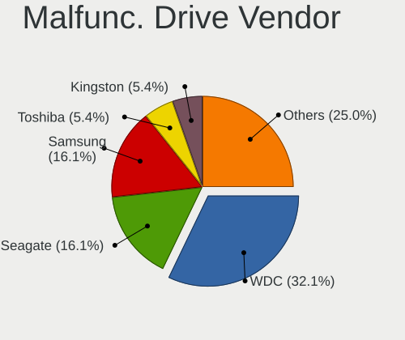

| Vendor                | Desktops | Drives | Percent |
|-----------------------|----------|--------|---------|
| WDC                   | 18       | 20     | 32.14%  |
| Seagate               | 9        | 9      | 16.07%  |
| Samsung Electronics   | 9        | 10     | 16.07%  |
| Toshiba               | 3        | 7      | 5.36%   |
| Kingston              | 3        | 5      | 5.36%   |
| Intel                 | 3        | 4      | 5.36%   |
| Hitachi               | 3        | 4      | 5.36%   |
| SanDisk               | 2        | 2      | 3.57%   |
| Transcend             | 1        | 1      | 1.79%   |
| SK hynix              | 1        | 1      | 1.79%   |
| Realtek Semiconductor | 1        | 1      | 1.79%   |
| Patriot               | 1        | 1      | 1.79%   |
| HGST                  | 1        | 1      | 1.79%   |
| Fujitsu               | 1        | 1      | 1.79%   |

Malfunc. HDD Vendor
-------------------

Vendors of faulty HDD drives

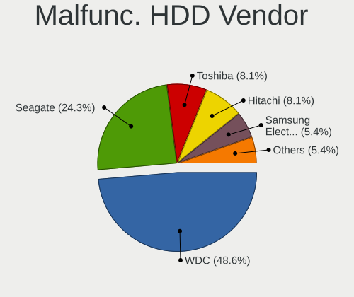

| Vendor              | Desktops | Drives | Percent |
|---------------------|----------|--------|---------|
| WDC                 | 18       | 20     | 48.65%  |
| Seagate             | 9        | 9      | 24.32%  |
| Toshiba             | 3        | 7      | 8.11%   |
| Hitachi             | 3        | 4      | 8.11%   |
| Samsung Electronics | 2        | 2      | 5.41%   |
| HGST                | 1        | 1      | 2.7%    |
| Fujitsu             | 1        | 1      | 2.7%    |

Malfunc. Drive Kind
-------------------

Kinds of faulty drives

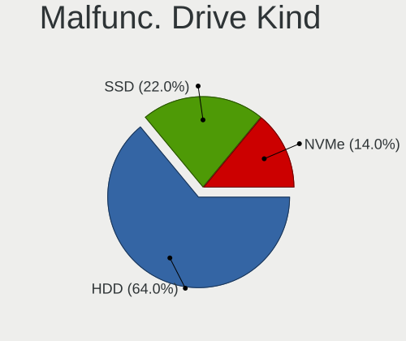

| Kind | Desktops | Drives | Percent |
|------|----------|--------|---------|
| HDD  | 32       | 44     | 64%     |
| SSD  | 11       | 14     | 22%     |
| NVMe | 7        | 9      | 14%     |

Failed Drives
-------------

Failed drive models

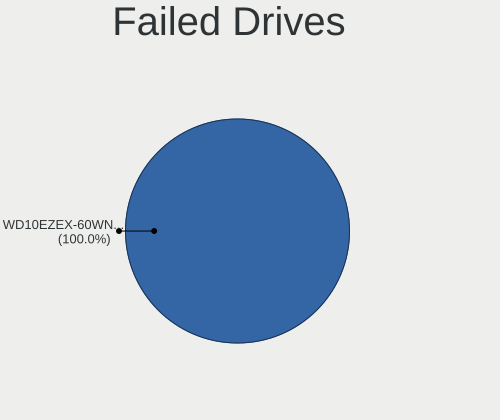

| Model                    | Desktops | Drives | Percent |
|--------------------------|----------|--------|---------|
| WDC WD10EZEX-60WN4A0 1TB | 1        | 1      | 100%    |

Failed Drive Vendor
-------------------

Failed drive vendors

| Vendor | Desktops | Drives | Percent |
|--------|----------|--------|---------|
| WDC    | 1        | 1      | 100%    |

Drive Status
------------

Number of failed and malfunc. drives

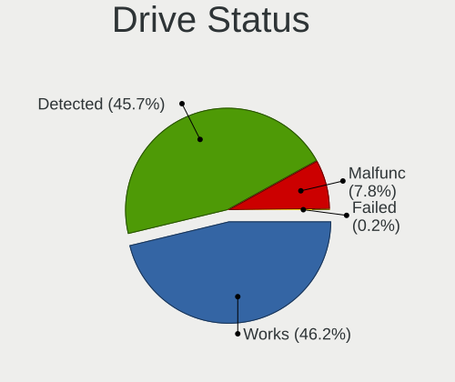

| Status   | Desktops | Drives | Percent |
|----------|----------|--------|---------|
| Works    | 271      | 804    | 46.25%  |
| Detected | 268      | 817    | 45.73%  |
| Malfunc  | 46       | 67     | 7.85%   |
| Failed   | 1        | 1      | 0.17%   |

Storage controller
------------------

Storage Vendor
--------------

Storage controller vendors

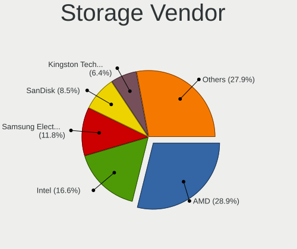

| Vendor                          | Desktops | Percent |
|---------------------------------|----------|---------|
| AMD                             | 338      | 28.86%  |
| Intel                           | 194      | 16.57%  |
| Samsung Electronics             | 138      | 11.78%  |
| SanDisk                         | 99       | 8.45%   |
| Kingston Technology Company     | 75       | 6.4%    |
| Micron/Crucial Technology       | 59       | 5.04%   |
| ASMedia Technology              | 57       | 4.87%   |
| Phison Electronics              | 44       | 3.76%   |
| MAXIO Technology (Hangzhou)     | 25       | 2.13%   |
| Realtek Semiconductor           | 24       | 2.05%   |
| ADATA Technology                | 19       | 1.62%   |
| Silicon Motion                  | 15       | 1.28%   |
| SK hynix                        | 12       | 1.02%   |
| Micron Technology               | 12       | 1.02%   |
| Shenzhen Longsys Electronics    | 9        | 0.77%   |
| KIOXIA                          | 9        | 0.77%   |
| INNOGRIT                        | 8        | 0.68%   |
| Marvell Technology Group        | 7        | 0.6%    |
| Toshiba America Info Systems    | 6        | 0.51%   |
| Seagate Technology              | 5        | 0.43%   |
| Solidigm                        | 4        | 0.34%   |
| Hosin Global Electronics        | 3        | 0.26%   |
| TenaFe                          | 2        | 0.17%   |
| Netac Technology                | 2        | 0.17%   |
| VIA Technologies                | 1        | 0.09%   |
| Shenzhen Techwinsemi Technology | 1        | 0.09%   |
| Nextorage                       | 1        | 0.09%   |
| JMicron Technology              | 1        | 0.09%   |
| Biwin Storage Technology        | 1        | 0.09%   |

Storage Model
-------------

Storage controller models

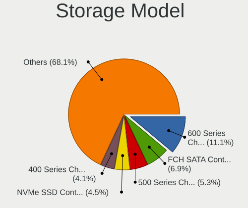

| Model                                                                          | Desktops | Percent |
|--------------------------------------------------------------------------------|----------|---------|
| AMD 600 Series Chipset SATA Controller                                         | 145      | 11.1%   |
| AMD FCH SATA Controller [AHCI mode]                                            | 90       | 6.89%   |
| AMD 500 Series Chipset SATA Controller                                         | 69       | 5.28%   |
| Samsung NVMe SSD Controller SM981/PM981/PM983                                  | 59       | 4.52%   |
| AMD 400 Series Chipset SATA Controller                                         | 54       | 4.13%   |
| ASMedia ASM1061/ASM1062 Serial ATA Controller                                  | 43       | 3.29%   |
| Samsung NVMe SSD Controller PM9A1/PM9A3/980PRO                                 | 37       | 2.83%   |
| Samsung NVMe SSD Controller S4LV008[Pascal]                                    | 32       | 2.45%   |
| Sandisk WD Black SN850X NVMe SSD                                               | 26       | 1.99%   |
| Micron/Crucial P2 [Nick P2] / P3 / P3 Plus NVMe PCIe SSD (DRAM-less)           | 25       | 1.91%   |
| Intel Raptor Lake SATA AHCI Controller                                         | 23       | 1.76%   |
| Kingston Company KC3000/FURY Renegade NVMe SSD [E18]                           | 21       | 1.61%   |
| Intel Alder Lake-S PCH SATA Controller [AHCI Mode]                             | 21       | 1.61%   |
| SanDisk WD SN560/SN740/SN770/SN5000 NVMe SSD                                   | 18       | 1.38%   |
| Intel 200 Series PCH SATA controller [AHCI mode]                               | 16       | 1.23%   |
| MAXIO (Hangzhou) NVMe SSD Controller MAP1202 (DRAM-less)                       | 14       | 1.07%   |
| Kingston Company NV2 NVMe SSD [SM2267XT] (DRAM-less)                           | 14       | 1.07%   |
| Intel Q170/Q150/B150/H170/H110/Z170/CM236 Chipset SATA Controller [AHCI Mode]  | 14       | 1.07%   |
| Intel Cannon Lake PCH SATA AHCI Controller                                     | 14       | 1.07%   |
| Silicon Motion SM2263EN/SM2263XT (DRAM-less) NVMe SSD Controllers              | 13       | 1%      |
| Samsung NVMe SSD Controller 980 (DRAM-less)                                    | 13       | 1%      |
| Intel 8 Series/C220 Series Chipset Family 6-port SATA Controller 1 [AHCI mode] | 13       | 1%      |
| ASMedia ASM1064 Serial ATA Controller                                          | 13       | 1%      |
| Phison E16 PCIe4 NVMe Controller                                               | 12       | 0.92%   |
| Intel SATA Controller [RAID mode]                                              | 12       | 0.92%   |
| Realtek RTS5765DL NVMe SSD Controller (DRAM-less)                              | 11       | 0.84%   |
| Phison E12 NVMe Controller                                                     | 11       | 0.84%   |
| Micron 2550 NVMe SSD (DRAM-less)                                               | 11       | 0.84%   |
| MAXIO (Hangzhou) NVMe SSD Controller MAP1602 (DRAM-less)                       | 11       | 0.84%   |
| SanDisk Ultra 3D / WD PC SN530, IX SN530, Blue SN550 NVMe SSD (DRAM-less)      | 10       | 0.77%   |
| SanDisk Ultra 3D / WD Blue SN570 NVMe SSD (DRAM-less)                          | 10       | 0.77%   |
| Intel 500 Series Chipset Family SATA AHCI Controller                           | 10       | 0.77%   |
| Samsung NVMe SSD Controller PM9C1a (DRAM-less)                                 | 9        | 0.69%   |
| Intel 7 Series/C210 Series Chipset Family 6-port SATA Controller [AHCI mode]   | 9        | 0.69%   |
| ADATA XPG SX8200 Pro PCIe Gen3x4 M.2 2280 Solid State Drive                    | 9        | 0.69%   |
| SK hynix Platinum P41/PC801 NVMe Solid State Drive                             | 8        | 0.61%   |
| SanDisk WD PC SN810 / Black SN850 NVMe SSD                                     | 8        | 0.61%   |
| Intel Volume Management Device NVMe RAID Controller                            | 8        | 0.61%   |
| Intel RST Volume Management Device Controller                                  | 8        | 0.61%   |
| Shenzhen Longsys Lexar NM790 / Patriot Viper VP4300 Lite NVMe SSD (DRAM-less)  | 7        | 0.54%   |

Storage Kind
------------

Kind of storage controller (IDE, SATA, NVMe, SAS, ...)

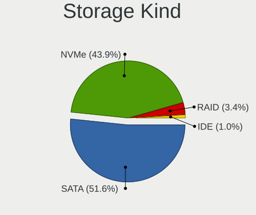

| Kind | Desktops | Percent |
|------|----------|---------|
| SATA | 502      | 51.65%  |
| NVMe | 427      | 43.93%  |
| RAID | 33       | 3.4%    |
| IDE  | 10       | 1.03%   |

Processor
---------

CPU Vendor
----------

Processor vendors

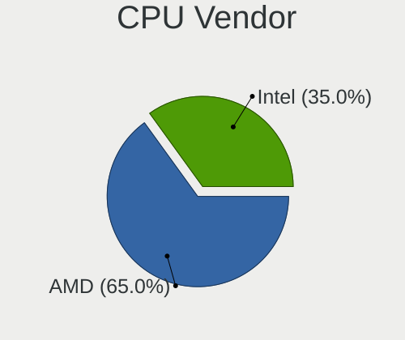

| Vendor | Desktops | Percent |
|--------|----------|---------|
| AMD    | 346      | 65.04%  |
| Intel  | 186      | 34.96%  |

CPU Model
---------

Processor models

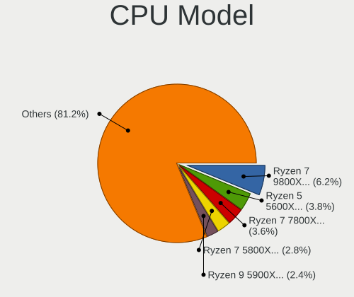

| Model                                  | Desktops | Percent |
|----------------------------------------|----------|---------|
| AMD Ryzen 7 9800X3D 8-Core Processor   | 33       | 6.2%    |
| AMD Ryzen 5 5600X 6-Core Processor     | 20       | 3.76%   |
| AMD Ryzen 7 7800X3D 8-Core Processor   | 19       | 3.57%   |
| AMD Ryzen 7 5800X 8-Core Processor     | 15       | 2.82%   |
| AMD Ryzen 9 5900X 12-Core Processor    | 13       | 2.44%   |
| AMD Ryzen 5 5600G with Radeon Graphics | 12       | 2.26%   |
| AMD Ryzen 5 3600 6-Core Processor      | 12       | 2.26%   |
| AMD Ryzen 9 7950X3D 16-Core Processor  | 11       | 2.07%   |
| AMD Ryzen 9 5950X 16-Core Processor    | 11       | 2.07%   |
| Intel 13th Gen Core i9-13900K          | 9        | 1.69%   |
| AMD Ryzen 7 3700X 8-Core Processor     | 9        | 1.69%   |
| AMD Ryzen 7 9700X 8-Core Processor     | 8        | 1.5%    |
| AMD Ryzen 7 5700G with Radeon Graphics | 8        | 1.5%    |
| AMD Ryzen 5 5600 6-Core Processor      | 8        | 1.5%    |
| AMD Ryzen 9 9950X3D 16-Core Processor  | 7        | 1.32%   |
| AMD Ryzen 9 7950X 16-Core Processor    | 7        | 1.32%   |
| AMD Ryzen 9 7900X3D 12-Core Processor  | 7        | 1.32%   |
| AMD Ryzen 7 7700 8-Core Processor      | 7        | 1.32%   |
| AMD Ryzen 7 5800X3D 8-Core Processor   | 7        | 1.32%   |
| Intel Core i9-9900K CPU @ 3.60GHz      | 6        | 1.13%   |
| Intel 12th Gen Core i5-12400F          | 6        | 1.13%   |
| AMD Ryzen 7 5700X 8-Core Processor     | 6        | 1.13%   |
| AMD Ryzen 5 7600X 6-Core Processor     | 6        | 1.13%   |
| AMD Ryzen 5 5500                       | 6        | 1.13%   |
| Intel Core i7-4790K CPU @ 4.00GHz      | 5        | 0.94%   |
| AMD Ryzen 9 9950X 16-Core Processor    | 5        | 0.94%   |
| AMD Ryzen 9 9900X 12-Core Processor    | 5        | 0.94%   |
| AMD Ryzen 7 7700X 8-Core Processor     | 5        | 0.94%   |
| AMD Ryzen 5 9600X 6-Core Processor     | 5        | 0.94%   |
| AMD Ryzen 5 2600 Six-Core Processor    | 5        | 0.94%   |
| Intel Core i7-8700K CPU @ 3.70GHz      | 4        | 0.75%   |
| Intel Core i5-8400 CPU @ 2.80GHz       | 4        | 0.75%   |
| Intel Core i5-7400 CPU @ 3.00GHz       | 4        | 0.75%   |
| AMD Ryzen 9 7900X 12-Core Processor    | 4        | 0.75%   |
| AMD Ryzen 9 3900X 12-Core Processor    | 4        | 0.75%   |
| AMD Ryzen 7 5700X3D 8-Core Processor   | 4        | 0.75%   |
| AMD Ryzen 7 3800X 8-Core Processor     | 4        | 0.75%   |
| AMD Ryzen 5 7600 6-Core Processor      | 4        | 0.75%   |
| AMD Ryzen 5 3600X 6-Core Processor     | 4        | 0.75%   |
| AMD Ryzen 5 1600 Six-Core Processor    | 4        | 0.75%   |

CPU Model Family
----------------

Processor model prefix

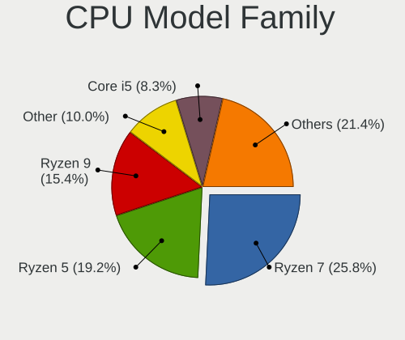

| Model                  | Desktops | Percent |
|------------------------|----------|---------|
| AMD Ryzen 7            | 137      | 25.75%  |
| AMD Ryzen 5            | 102      | 19.17%  |
| AMD Ryzen 9            | 82       | 15.41%  |
| Other                  | 53       | 9.96%   |
| Intel Core i5          | 44       | 8.27%   |
| Intel Core i7          | 34       | 6.39%   |
| Intel Xeon             | 18       | 3.38%   |
| Intel Core i3          | 14       | 2.63%   |
| Intel Core i9          | 12       | 2.26%   |
| Intel Core             | 6        | 1.13%   |
| AMD Ryzen Threadripper | 5        | 0.94%   |
| AMD Ryzen 3            | 5        | 0.94%   |
| AMD FX                 | 4        | 0.75%   |
| AMD Athlon             | 4        | 0.75%   |
| Intel Genuine          | 2        | 0.38%   |
| AMD A8                 | 2        | 0.38%   |
| Intel Pentium          | 1        | 0.19%   |
| Intel Core 2 Quad      | 1        | 0.19%   |
| Intel Celeron          | 1        | 0.19%   |
| Intel Atom             | 1        | 0.19%   |
| AMD Ryzen 5 PRO        | 1        | 0.19%   |
| AMD GX                 | 1        | 0.19%   |
| AMD A4                 | 1        | 0.19%   |
| AMD A10                | 1        | 0.19%   |

CPU Cores
---------

Number of processor cores

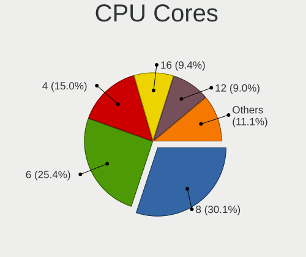

| Number | Desktops | Percent |
|--------|----------|---------|
| 8      | 160      | 30.08%  |
| 6      | 135      | 25.38%  |
| 4      | 80       | 15.04%  |
| 16     | 50       | 9.4%    |
| 12     | 48       | 9.02%   |
| 24     | 16       | 3.01%   |
| 2      | 15       | 2.82%   |
| 10     | 13       | 2.44%   |
| 14     | 9        | 1.69%   |
| 32     | 2        | 0.38%   |
| 20     | 2        | 0.38%   |
| 36     | 1        | 0.19%   |
| 18     | 1        | 0.19%   |

CPU Sockets
-----------

Number of sockets

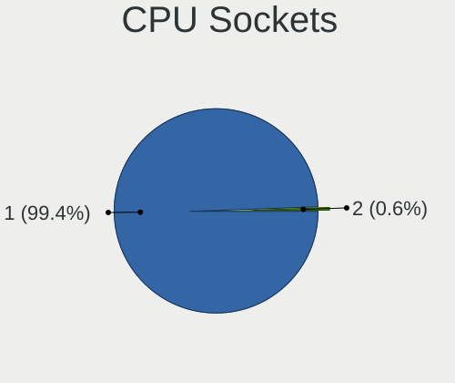

| Number | Desktops | Percent |
|--------|----------|---------|
| 1      | 529      | 99.44%  |
| 2      | 3        | 0.56%   |

CPU Threads
-----------

Threads per core (Hyper-Threading)

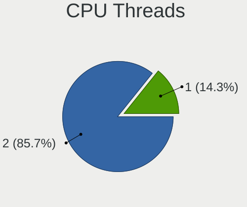

| Number | Desktops | Percent |
|--------|----------|---------|
| 2      | 457      | 85.74%  |
| 1      | 76       | 14.26%  |

CPU Op-Modes
------------

CPU Operation Modes (32-bit, 64-bit)

| Op mode        | Desktops | Percent |
|----------------|----------|---------|
| 32-bit, 64-bit | 532      | 100%    |

CPU Microcode
-------------

Microcode number

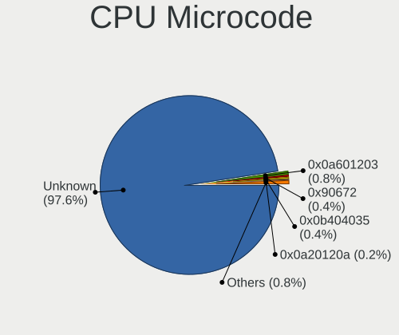

| Number     | Desktops | Percent |
|------------|----------|---------|
| Unknown    | 520      | 97.56%  |
| 0x0a601203 | 4        | 0.75%   |
| 0x90672    | 2        | 0.38%   |
| 0x0b404035 | 2        | 0.38%   |
| 0x0a20120a | 1        | 0.19%   |
| 0x0a201016 | 1        | 0.19%   |
| 0x08701030 | 1        | 0.19%   |
| 0x08701021 | 1        | 0.19%   |
| 0x08101016 | 1        | 0.19%   |

CPU Microarch
-------------

Microarchitecture

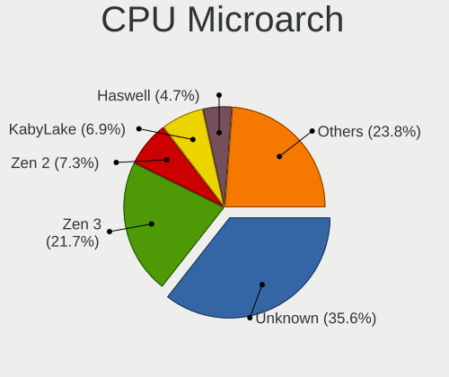

| Name              | Desktops | Percent |
|-------------------|----------|---------|
| Unknown           | 190      | 35.58%  |
| Zen 3             | 116      | 21.72%  |
| Zen 2             | 39       | 7.3%    |
| KabyLake          | 37       | 6.93%   |
| Haswell           | 25       | 4.68%   |
| Alderlake Hybrid  | 23       | 4.31%   |
| Zen+              | 20       | 3.75%   |
| IvyBridge         | 14       | 2.62%   |
| Skylake           | 13       | 2.43%   |
| CometLake         | 13       | 2.43%   |
| Zen               | 10       | 1.87%   |
| SandyBridge       | 7        | 1.31%   |
| Piledriver        | 6        | 1.12%   |
| Broadwell         | 4        | 0.75%   |
| Westmere          | 2        | 0.37%   |
| Nehalem           | 2        | 0.37%   |
| Lunarlake Hybrid  | 2        | 0.37%   |
| Icelake           | 2        | 0.37%   |
| TigerLake         | 1        | 0.19%   |
| Steamroller       | 1        | 0.19%   |
| Puma              | 1        | 0.19%   |
| Meteorlake Hybrid | 1        | 0.19%   |
| K10 Llano         | 1        | 0.19%   |
| Gracemont         | 1        | 0.19%   |
| Goldmont plus     | 1        | 0.19%   |
| Goldmont          | 1        | 0.19%   |
| Core              | 1        | 0.19%   |

Graphics
--------

GPU Vendor
----------

Vendors of graphics cards

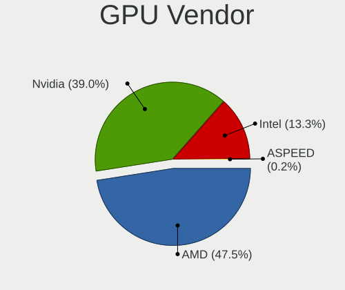

| Vendor            | Desktops | Percent |
|-------------------|----------|---------|
| AMD               | 289      | 47.53%  |
| Nvidia            | 237      | 38.98%  |
| Intel             | 81       | 13.32%  |
| ASPEED Technology | 1        | 0.16%   |

GPU Model
---------

Graphics card models

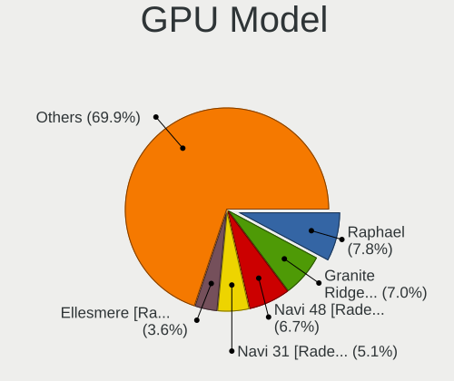

| Model                                                                       | Desktops | Percent |
|-----------------------------------------------------------------------------|----------|---------|
| AMD Raphael                                                                 | 54       | 7.83%   |
| AMD Granite Ridge [Radeon Graphics]                                         | 48       | 6.96%   |
| AMD Navi 48 [Radeon RX 9070/9070 XT/9070 GRE]                               | 46       | 6.67%   |
| AMD Navi 31 [Radeon RX 7900 XT/7900 XTX/7900 GRE/7900M]                     | 35       | 5.07%   |
| AMD Ellesmere [Radeon RX 470/480/570/570X/580/580X/590]                     | 25       | 3.62%   |
| AMD Navi 23 [Radeon RX 6600/6600 XT/6600M]                                  | 20       | 2.9%    |
| AMD Navi 22 [Radeon RX 6700/6700 XT/6750 XT / 6800M/6850M XT]               | 18       | 2.61%   |
| Nvidia GA106 [GeForce RTX 3060 Lite Hash Rate]                              | 16       | 2.32%   |
| AMD Navi 21 [Radeon RX 6800/6800 XT / 6900 XT]                              | 16       | 2.32%   |
| Nvidia AD107 [GeForce RTX 4060]                                             | 15       | 2.17%   |
| Nvidia AD102 [GeForce RTX 4090]                                             | 13       | 1.88%   |
| AMD Navi 32 [Radeon RX 7700 XT / 7800 XT]                                   | 13       | 1.88%   |
| AMD Cezanne [Radeon Vega Series / Radeon Vega Mobile Series]                | 12       | 1.74%   |
| Nvidia GA102 [GeForce RTX 3080]                                             | 10       | 1.45%   |
| Intel Raptor Lake-S GT1 [UHD Graphics 770]                                  | 9        | 1.3%    |
| Nvidia GA104 [GeForce RTX 3060 Ti Lite Hash Rate]                           | 8        | 1.16%   |
| Nvidia GP107 [GeForce GTX 1050 Ti]                                          | 7        | 1.01%   |
| Nvidia GM204 [GeForce GTX 970]                                              | 7        | 1.01%   |
| Nvidia AD103 [GeForce RTX 4080]                                             | 7        | 1.01%   |
| Intel Skylake-S GT2 [HD Graphics 530]                                       | 7        | 1.01%   |
| Intel CoffeeLake-S GT2 [UHD Graphics 630]                                   | 7        | 1.01%   |
| Intel Battlemage G21 [Arc B580]                                             | 7        | 1.01%   |
| AMD Picasso/Raven 2 [Radeon Vega Series / Radeon Vega Mobile Series]        | 7        | 1.01%   |
| AMD Navi 10 [Radeon RX 5600 OEM/5600 XT / 5700/5700 XT]                     | 7        | 1.01%   |
| Nvidia GP106 [GeForce GTX 1060 6GB]                                         | 6        | 0.87%   |
| Nvidia GB203 [GeForce RTX 5080]                                             | 6        | 0.87%   |
| Nvidia GA104 [GeForce RTX 3070 Ti]                                          | 6        | 0.87%   |
| Nvidia AD106 [GeForce RTX 4060 Ti]                                          | 6        | 0.87%   |
| Nvidia AD104 [GeForce RTX 4070]                                             | 6        | 0.87%   |
| Intel Xeon E3-1200 v3/4th Gen Core Processor Integrated Graphics Controller | 6        | 0.87%   |
| Intel Kaby Lake-S GT2 [HD Graphics 630]                                     | 6        | 0.87%   |
| Intel Alder Lake-S GT1 [UHD Graphics 770]                                   | 6        | 0.87%   |
| AMD Navi 44 [Radeon RX 9060 XT]                                             | 6        | 0.87%   |
| Nvidia TU106 [GeForce RTX 2070 Rev. A]                                      | 5        | 0.72%   |
| Nvidia GA104 [GeForce RTX 3060]                                             | 5        | 0.72%   |
| Nvidia GA102 [GeForce RTX 3090]                                             | 5        | 0.72%   |
| Nvidia AD104 [GeForce RTX 4070 SUPER]                                       | 5        | 0.72%   |
| Intel Xeon E3-1200 v2/3rd Gen Core processor Graphics Controller            | 5        | 0.72%   |
| AMD Polaris 20 XL [Radeon RX 580 2048SP]                                    | 5        | 0.72%   |
| Nvidia TU116 [GeForce GTX 1660 SUPER]                                       | 4        | 0.58%   |

GPU Combo
---------

Combinations of graphics cards

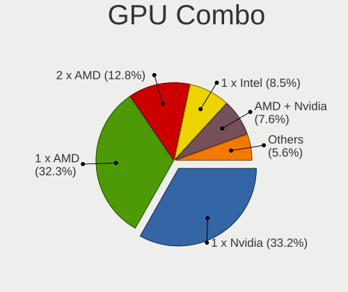

| Name               | Desktops | Percent |
|--------------------|----------|---------|
| 1 x Nvidia         | 179      | 33.21%  |
| 1 x AMD            | 174      | 32.28%  |
| 2 x AMD            | 69       | 12.8%   |
| 1 x Intel          | 46       | 8.53%   |
| AMD + Nvidia       | 41       | 7.61%   |
| Intel + Nvidia     | 14       | 2.6%    |
| Intel + AMD        | 6        | 1.11%   |
| 2 x Intel          | 4        | 0.74%   |
| 2 x Nvidia         | 3        | 0.56%   |
| Intel + 2 x Nvidia | 1        | 0.19%   |
| 1 x ASPEED         | 1        | 0.19%   |
| AMD + 2 x Nvidia   | 1        | 0.19%   |

GPU Driver
----------

Free vs proprietary

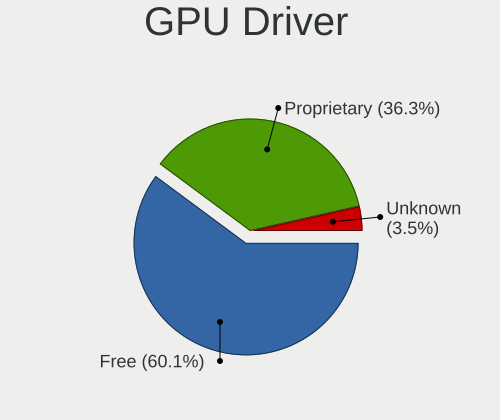

| Driver      | Desktops | Percent |
|-------------|----------|---------|
| Free        | 323      | 60.15%  |
| Proprietary | 195      | 36.31%  |
| Unknown     | 19       | 3.54%   |

GPU Memory
----------

Total video memory

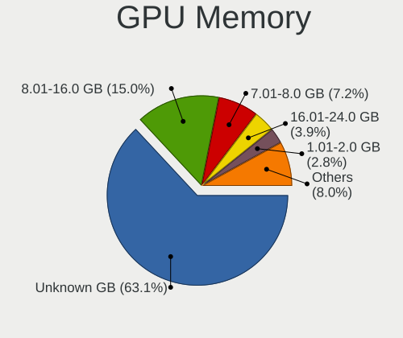

| Size in GB | Desktops | Percent |
|------------|----------|---------|
| Unknown    | 340      | 63.08%  |
| 8.01-16.0  | 81       | 15.03%  |
| 7.01-8.0   | 39       | 7.24%   |
| 16.01-24.0 | 21       | 3.9%    |
| 1.01-2.0   | 15       | 2.78%   |
| 0.01-0.5   | 15       | 2.78%   |
| 3.01-4.0   | 13       | 2.41%   |
| 5.01-6.0   | 8        | 1.48%   |
| 0.51-1.0   | 6        | 1.11%   |
| 24.01-32.0 | 1        | 0.19%   |

Monitor
-------

Monitor Vendor
--------------

Monitor vendors

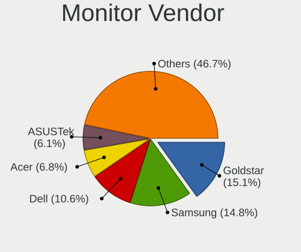

| Vendor               | Desktops | Percent |
|----------------------|----------|---------|
| Goldstar             | 107      | 15.09%  |
| Samsung Electronics  | 105      | 14.81%  |
| Dell                 | 75       | 10.58%  |
| Acer                 | 48       | 6.77%   |
| ASUSTek Computer     | 43       | 6.06%   |
| AOC                  | 43       | 6.06%   |
| MSI                  | 37       | 5.22%   |
| BenQ                 | 25       | 3.53%   |
| Ancor Communications | 24       | 3.39%   |
| Hewlett-Packard      | 23       | 3.24%   |
| Gigabyte Technology  | 20       | 2.82%   |
| Philips              | 18       | 2.54%   |
| Lenovo               | 15       | 2.12%   |
| ViewSonic            | 13       | 1.83%   |
| HKC                  | 8        | 1.13%   |
| Sceptre Tech         | 7        | 0.99%   |
| Iiyama               | 7        | 0.99%   |
| Sony                 | 5        | 0.71%   |
| RTK                  | 5        | 0.71%   |
| Mi                   | 5        | 0.71%   |
| Unknown              | 4        | 0.56%   |
| Vestel Elektronik    | 3        | 0.42%   |
| Vizio                | 2        | 0.28%   |
| Unknown (XXX)        | 2        | 0.28%   |
| SKG                  | 2        | 0.28%   |
| Pixio                | 2        | 0.28%   |
| ONN                  | 2        | 0.28%   |
| NEC Computers        | 2        | 0.28%   |
| MStar                | 2        | 0.28%   |
| HannStar             | 2        | 0.28%   |
| DENON                | 2        | 0.28%   |
| AOpen                | 2        | 0.28%   |
| ___                  | 1        | 0.14%   |
| ZZY                  | 1        | 0.14%   |
| WBT                  | 1        | 0.14%   |
| Viotek               | 1        | 0.14%   |
| VIE                  | 1        | 0.14%   |
| Unknown (BBC)        | 1        | 0.14%   |
| UGD                  | 1        | 0.14%   |
| TCL                  | 1        | 0.14%   |

Monitor Model
-------------

Monitor models

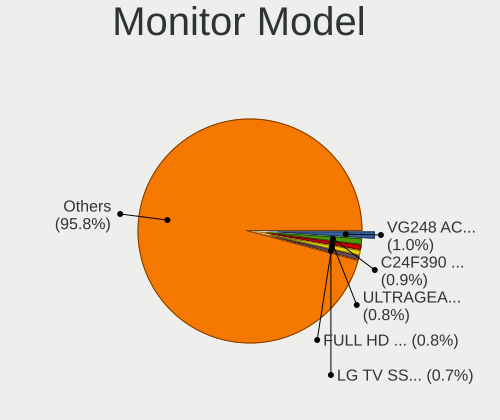

| Model                                                                   | Desktops | Percent |
|-------------------------------------------------------------------------|----------|---------|
| Ancor Communications VG248 ACI24A4 1920x1080 531x299mm 24.0-inch        | 8        | 1.05%   |
| Samsung Electronics C24F390 SAM0D2C 1920x1080 521x293mm 23.5-inch       | 7        | 0.92%   |
| Goldstar ULTRAGEAR GSM5BD3 2560x1440 697x392mm 31.5-inch                | 6        | 0.78%   |
| Goldstar FULL HD GSM5B55 1920x1080 480x270mm 21.7-inch                  | 6        | 0.78%   |
| Goldstar LG TV SSCR2 GSMC0C8 3840x2160                                  | 5        | 0.65%   |
| Goldstar 27GL850 GSM5B7F 2560x1440 597x336mm 27.0-inch                  | 5        | 0.65%   |
| Samsung Electronics LC49G95T SAM7053 3840x1080 1193x336mm 48.8-inch     | 4        | 0.52%   |
| Goldstar ULTRAGEAR GSM5C1A 1920x1080 527x296mm 23.8-inch                | 4        | 0.52%   |
| Goldstar ULTRAGEAR GSM5BB4 2560x1440 597x336mm 27.0-inch                | 4        | 0.52%   |
| Goldstar LG ULTRAWIDE GSM59F1 2560x1080 670x280mm 28.6-inch             | 4        | 0.52%   |
| Dell U2412M DELA07B 1920x1200 518x324mm 24.1-inch                       | 4        | 0.52%   |
| Dell S3221QS DELD107 3840x2160 697x392mm 31.5-inch                      | 4        | 0.52%   |
| ASUSTek Computer VG289Q1A AUS28CA 3840x2160 621x341mm 27.9-inch         | 4        | 0.52%   |
| AOC U2790B AOC2790 3840x2160 597x336mm 27.0-inch                        | 4        | 0.52%   |
| Ancor Communications VW202 ACI20A2 1680x1050 433x271mm 20.1-inch        | 4        | 0.52%   |
| Vestel Elektronik 40UHD_LCD_TV VES3700 3840x2160 880x500mm 39.8-inch    | 3        | 0.39%   |
| Unknown LCD Monitor FFFF 2288x1287 2550x2550mm 142.0-inch               | 3        | 0.39%   |
| Samsung Electronics S24F350 SAM0D20 1920x1080 521x293mm 23.5-inch       | 3        | 0.39%   |
| Samsung Electronics LCD Monitor SAM71B4 3840x2160 1872x1053mm 84.6-inch | 3        | 0.39%   |
| Samsung Electronics LC27G5xT SAM707A 2560x1440 597x336mm 27.0-inch      | 3        | 0.39%   |
| MSI Optix MAG27CQ MSI1462 2560x1440 597x336mm 27.0-inch                 | 3        | 0.39%   |
| MSI MAG241C MSI3EA2 1920x1080 521x293mm 23.5-inch                       | 3        | 0.39%   |
| HKC GN10 HKC2716 2560x1440 597x336mm 27.0-inch                          | 3        | 0.39%   |
| Goldstar ULTRAGEAR GSM7766 2560x1440 697x392mm 31.5-inch                | 3        | 0.39%   |
| Gigabyte Technology M27U GBT271A 3840x2160 596x335mm 26.9-inch          | 3        | 0.39%   |
| Dell P2419H DELD0DA 1920x1080 527x296mm 23.8-inch                       | 3        | 0.39%   |
| Dell AW3423DWF DELA212 3440x1440 800x337mm 34.2-inch                    | 3        | 0.39%   |
| BenQ ZOWIE XL LCD BNQ7F33 1920x1080 531x298mm 24.0-inch                 | 3        | 0.39%   |
| ASUSTek Computer VA27EHE AUS27D2 1920x1080 598x336mm 27.0-inch          | 3        | 0.39%   |
| AOC Q27G3XMN AOCB326 2560x1440 597x336mm 27.0-inch                      | 3        | 0.39%   |
| AOC 32G1WG4 AOC3201 1920x1080 697x392mm 31.5-inch                       | 3        | 0.39%   |
| AOC 24G2W1G3 AOC2402 1920x1080 527x296mm 23.8-inch                      | 3        | 0.39%   |
| AOC 2250W AOC2250 1920x1080 477x268mm 21.5-inch                         | 3        | 0.39%   |
| Ancor Communications VG248 ACI24A5 1920x1080 531x299mm 24.0-inch        | 3        | 0.39%   |
| Acer XV340CK P ACR06F3 3440x1440 800x335mm 34.1-inch                    | 3        | 0.39%   |
| Acer XB271HU ACR0490 2560x1440 598x336mm 27.0-inch                      | 3        | 0.39%   |
| Unknown (XXX) Beyond TV XXX9221 1920x1080 1209x680mm 54.6-inch          | 2        | 0.26%   |
| Sceptre Tech Sceptre P30 SPT0BCC 2560x1080 690x291mm 29.5-inch          | 2        | 0.26%   |
| Sceptre Tech Sceptre F24 SPT09AB 1920x1080 530x290mm 23.8-inch          | 2        | 0.26%   |
| Samsung Electronics SyncMaster SAM0302 1680x1050 459x296mm 21.5-inch    | 2        | 0.26%   |

Monitor Resolution
------------------

Monitor screen resolution

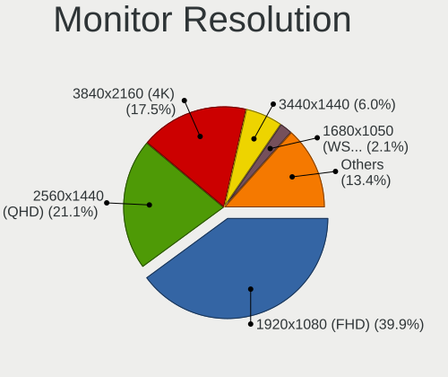

| Resolution         | Desktops | Percent |
|--------------------|----------|---------|
| 1920x1080 (FHD)    | 272      | 39.94%  |
| 2560x1440 (QHD)    | 144      | 21.15%  |
| 3840x2160 (4K)     | 119      | 17.47%  |
| 3440x1440          | 41       | 6.02%   |
| 1680x1050 (WSXGA+) | 14       | 2.06%   |
| 3840x1080          | 13       | 1.91%   |
| 2560x1080          | 13       | 1.91%   |
| 1920x1200 (WUXGA)  | 12       | 1.76%   |
| 1600x900 (HD+)     | 8        | 1.17%   |
| 1366x768 (WXGA)    | 7        | 1.03%   |
| 1360x768           | 5        | 0.73%   |
| 1280x720 (HD)      | 5        | 0.73%   |
| 1440x900 (WXGA+)   | 4        | 0.59%   |
| 1280x1024 (SXGA)   | 4        | 0.59%   |
| 2560x1600          | 3        | 0.44%   |
| 2288x1287          | 3        | 0.44%   |
| 3840x1600          | 2        | 0.29%   |
| 2160x1440          | 2        | 0.29%   |
| 1920x540           | 2        | 0.29%   |
| 1600x1200          | 2        | 0.29%   |
| 3840x2560          | 1        | 0.15%   |
| 3840x1200          | 1        | 0.15%   |
| 3360x1440          | 1        | 0.15%   |
| 2560x2880          | 1        | 0.15%   |
| 2160x1200          | 1        | 0.15%   |
| 1024x768 (XGA)     | 1        | 0.15%   |

Monitor Diagonal
----------------

Diagonal size in inches

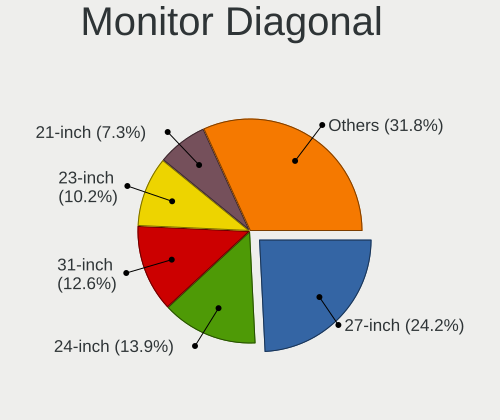

| Inches  | Desktops | Percent |
|---------|----------|---------|
| 27      | 169      | 24.21%  |
| 24      | 97       | 13.9%   |
| 31      | 88       | 12.61%  |
| 23      | 71       | 10.17%  |
| 21      | 51       | 7.31%   |
| 34      | 47       | 6.73%   |
| Unknown | 17       | 2.44%   |
| 26      | 12       | 1.72%   |
| 48      | 11       | 1.58%   |
| 32      | 11       | 1.58%   |
| 20      | 11       | 1.58%   |
| 84      | 9        | 1.29%   |
| 72      | 9        | 1.29%   |
| 22      | 8        | 1.15%   |
| 54      | 7        | 1%      |
| 28      | 7        | 1%      |
| 19      | 7        | 1%      |
| 18      | 7        | 1%      |
| 42      | 6        | 0.86%   |
| 63      | 5        | 0.72%   |
| 49      | 4        | 0.57%   |
| 17      | 4        | 0.57%   |
| 15      | 4        | 0.57%   |
| 142     | 3        | 0.43%   |
| 44      | 3        | 0.43%   |
| 43      | 3        | 0.43%   |
| 37      | 3        | 0.43%   |
| 29      | 3        | 0.43%   |
| 74      | 2        | 0.29%   |
| 65      | 2        | 0.29%   |
| 52      | 2        | 0.29%   |
| 46      | 2        | 0.29%   |
| 36      | 2        | 0.29%   |
| 25      | 2        | 0.29%   |
| 14      | 2        | 0.29%   |
| 57      | 1        | 0.14%   |
| 40      | 1        | 0.14%   |
| 39      | 1        | 0.14%   |
| 38      | 1        | 0.14%   |
| 30      | 1        | 0.14%   |

Monitor Width
-------------

Physical width

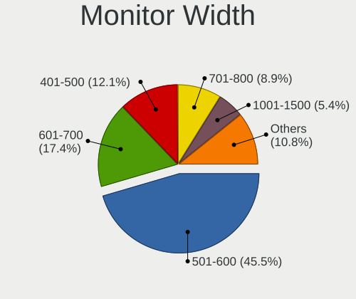

| Width in mm    | Desktops | Percent |
|----------------|----------|---------|
| 501-600        | 296      | 45.47%  |
| 601-700        | 113      | 17.36%  |
| 401-500        | 79       | 12.14%  |
| 701-800        | 58       | 8.91%   |
| 1001-1500      | 35       | 5.38%   |
| 1501-2000      | 20       | 3.07%   |
| Unknown        | 17       | 2.61%   |
| 801-900        | 8        | 1.23%   |
| 901-1000       | 8        | 1.23%   |
| 301-350        | 7        | 1.08%   |
| 351-400        | 4        | 0.61%   |
| More than 2000 | 3        | 0.46%   |
| 201-300        | 3        | 0.46%   |

Aspect Ratio
------------

Proportional relationship between the width and the height

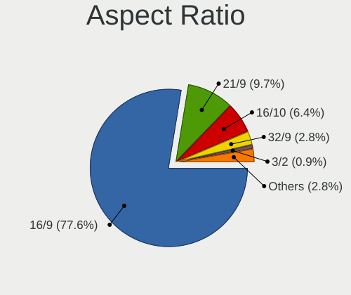

| Ratio | Desktops | Percent |
|-------|----------|---------|
| 16/9  | 450      | 77.59%  |
| 21/9  | 56       | 9.66%   |
| 16/10 | 37       | 6.38%   |
| 32/9  | 16       | 2.76%   |
| 3/2   | 5        | 0.86%   |
| 5/4   | 4        | 0.69%   |
| 4/3   | 4        | 0.69%   |
| 1.00  | 4        | 0.69%   |
| 6/5   | 1        | 0.17%   |
| 3.20  | 1        | 0.17%   |
| 1.96  | 1        | 0.17%   |
| 0.89  | 1        | 0.17%   |

Monitor Area
------------

Area in inch²

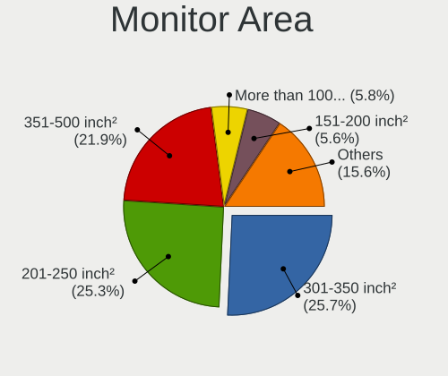

| Area in inch² | Desktops | Percent |
|----------------|----------|---------|
| 301-350        | 176      | 25.73%  |
| 201-250        | 173      | 25.29%  |
| 351-500        | 150      | 21.93%  |
| More than 1000 | 40       | 5.85%   |
| 151-200        | 38       | 5.56%   |
| 251-300        | 37       | 5.41%   |
| 501-1000       | 35       | 5.12%   |
| Unknown        | 17       | 2.49%   |
| 141-150        | 9        | 1.32%   |
| 101-110        | 6        | 0.88%   |
| 71-80          | 1        | 0.15%   |
| 131-140        | 1        | 0.15%   |
| 111-120        | 1        | 0.15%   |

Pixel Density
-------------

Pixels per inch

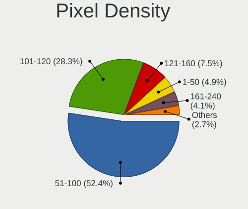

| Density | Desktops | Percent |
|---------|----------|---------|
| 51-100  | 329      | 52.39%  |
| 101-120 | 178      | 28.34%  |
| 121-160 | 47       | 7.48%   |
| 1-50    | 31       | 4.94%   |
| 161-240 | 26       | 4.14%   |
| Unknown | 17       | 2.71%   |

Multiple Monitors
-----------------

Total monitors connected

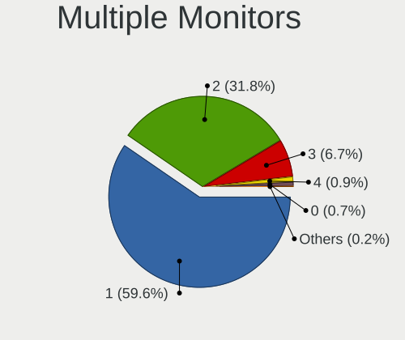

| Total | Desktops | Percent |
|-------|----------|---------|
| 1     | 320      | 59.59%  |
| 2     | 171      | 31.84%  |
| 3     | 36       | 6.7%    |
| 4     | 5        | 0.93%   |
| 0     | 4        | 0.74%   |
| 5     | 1        | 0.19%   |

Network
-------

Net Controller Vendor
---------------------

Controller vendors

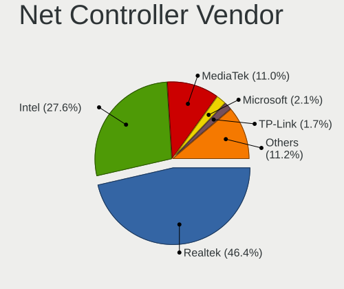

| Vendor                                | Desktops | Percent |
|---------------------------------------|----------|---------|
| Realtek Semiconductor                 | 389      | 46.42%  |
| Intel                                 | 231      | 27.57%  |
| MediaTek                              | 92       | 10.98%  |
| Microsoft                             | 18       | 2.15%   |
| TP-Link                               | 14       | 1.67%   |
| Qualcomm Atheros                      | 14       | 1.67%   |
| Qualcomm Technologies                 | 10       | 1.19%   |
| ASIX Electronics                      | 9        | 1.07%   |
| Aquantia                              | 9        | 1.07%   |
| Samsung Electronics                   | 6        | 0.72%   |
| DisplayLink                           | 4        | 0.48%   |
| Broadcom                              | 4        | 0.48%   |
| ASUSTek Computer                      | 4        | 0.48%   |
| QinHeng Electronics                   | 3        | 0.36%   |
| NetGear                               | 3        | 0.36%   |
| Xiaomi                                | 2        | 0.24%   |
| Tehuti Networks                       | 2        | 0.24%   |
| Realtek                               | 2        | 0.24%   |
| Ralink Technology                     | 2        | 0.24%   |
| Ralink                                | 2        | 0.24%   |
| Qualcomm Atheros Communications       | 2        | 0.24%   |
| Mellanox Technologies                 | 2        | 0.24%   |
| Google                                | 2        | 0.24%   |
| D-Link                                | 2        | 0.24%   |
| aicsemi                               | 2        | 0.24%   |
| Sundance Technology Inc / IC Plus     | 1        | 0.12%   |
| STMicroelectronics                    | 1        | 0.12%   |
| SMTCTL                                | 1        | 0.12%   |
| Oculus VR                             | 1        | 0.12%   |
| Mercucys                              | 1        | 0.12%   |
| Linux Foundation                      | 1        | 0.12%   |
| Foxconn / Hon Hai                     | 1        | 0.12%   |
| 802.11g Adapter [Linksys WUSB54GC v3] | 1        | 0.12%   |

Net Controller Model
--------------------

Controller models

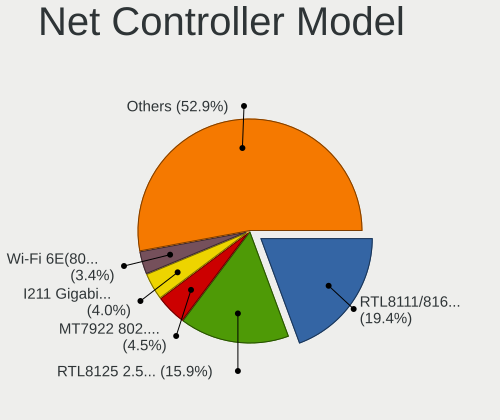

| Model                                                                           | Desktops | Percent |
|---------------------------------------------------------------------------------|----------|---------|
| Realtek RTL8111/8168/8211/8411 PCI Express Gigabit Ethernet Controller          | 190      | 19.37%  |
| Realtek RTL8125 2.5GbE Controller                                               | 156      | 15.9%   |
| MediaTek MT7922 802.11ax PCI Express Wireless Network Adapter                   | 44       | 4.49%   |
| Intel I211 Gigabit Network Connection                                           | 39       | 3.98%   |
| Intel Wi-Fi 6E(802.11ax) AX210/AX1675* 2x2 [Typhoon Peak]                       | 33       | 3.36%   |
| Intel Ethernet Controller I225-V                                                | 31       | 3.16%   |
| Intel Wi-Fi 6 AX200                                                             | 29       | 2.96%   |
| Realtek RTL8126 5GbE Controller                                                 | 24       | 2.45%   |
| Intel Ethernet Connection (2) I219-V                                            | 18       | 1.83%   |
| Intel Ethernet Controller I226-V                                                | 16       | 1.63%   |
| MediaTek MT7925 802.11be 160MHz 2x2 PCIe Wireless Network Adapter [Filogic 360] | 12       | 1.22%   |
| Intel Ethernet Connection (7) I219-V                                            | 12       | 1.22%   |
| Intel Dual Band Wireless-AC 3168NGW [Stone Peak]                                | 12       | 1.22%   |
| Realtek RTL8922AE 802.11be PCIe Wireless Network Adapter                        | 10       | 1.02%   |
| Realtek RTL8852CE PCIe 802.11ax Wireless Network Controller                     | 10       | 1.02%   |
| Realtek RTL8153 Gigabit Ethernet Adapter                                        | 10       | 1.02%   |
| Qualcomm WCN785x Wi-Fi 7(802.11be) 320MHz 2x2 [FastConnect 7800]                | 10       | 1.02%   |
| Intel Alder Lake-S PCH CNVi WiFi                                                | 10       | 1.02%   |
| Intel 700 Series Chipset CNVi WiFi                                              | 10       | 1.02%   |
| Realtek RTL8852BE PCIe 802.11ax Wireless Network Controller                     | 9        | 0.92%   |
| Realtek Killer E3000 2.5GbE Controller                                          | 9        | 0.92%   |
| Microsoft Xbox Wireless Adapter for Windows                                     | 9        | 0.92%   |
| MediaTek MT7902 802.11ax PCIe Wireless Network Adapter [Filogic 310]            | 9        | 0.92%   |
| ASIX AX88179 Gigabit Ethernet                                                   | 9        | 0.92%   |
| Realtek 802.11ac NIC                                                            | 8        | 0.82%   |
| MediaTek MT7927 802.11be 320MHz 2x2 PCIe Wireless Network Adapter [Filogic 380] | 8        | 0.82%   |
| MediaTek MT7921K (RZ608) Wi-Fi 6E 80MHz                                         | 8        | 0.82%   |
| Intel Wi-Fi 5(802.11ac) Wireless-AC 9x6x [Thunder Peak]                         | 7        | 0.71%   |
| Microsoft Xbox 360 Wireless Adapter                                             | 6        | 0.61%   |
| Realtek RTL8851BE PCIe 802.11ax Wireless Network Controller                     | 5        | 0.51%   |
| Realtek RTL8821CE 802.11ac PCIe Wireless Network Adapter                        | 5        | 0.51%   |
| MediaTek MT7925 (RZ717) Wi-Fi 7 160MHz                                          | 5        | 0.51%   |
| MediaTek MT7921 802.11ax PCIe Wireless Network Adapter [Filogic 330]            | 5        | 0.51%   |
| Intel Wireless 7265                                                             | 5        | 0.51%   |
| Intel Ethernet Connection (14) I219-V                                           | 5        | 0.51%   |
| Intel 82579V Gigabit Network Connection                                         | 5        | 0.51%   |
| Realtek RTL8822BE 802.11a/b/g/n/ac WiFi adapter                                 | 4        | 0.41%   |
| Realtek RTL8812AE 802.11ac PCIe Wireless Network Adapter                        | 4        | 0.41%   |
| Intel Wi-Fi 7(802.11be) AX1775*/AX1790*/BE20*/BE401/BE1750* 2x2                 | 4        | 0.41%   |
| Intel Cannon Lake PCH CNVi WiFi                                                 | 4        | 0.41%   |

Wireless Vendor
---------------

Wireless vendors

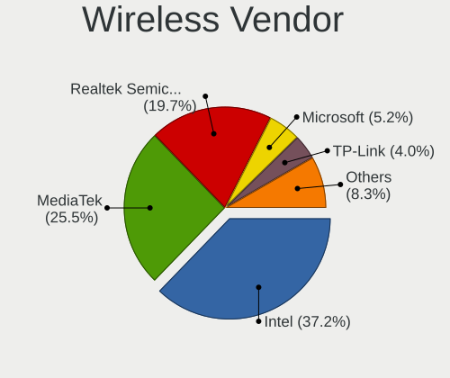

| Vendor                                | Desktops | Percent |
|---------------------------------------|----------|---------|
| Intel                                 | 121      | 37.23%  |
| MediaTek                              | 83       | 25.54%  |
| Realtek Semiconductor                 | 64       | 19.69%  |
| Microsoft                             | 17       | 5.23%   |
| TP-Link                               | 13       | 4%      |
| Qualcomm Atheros                      | 6        | 1.85%   |
| ASUSTek Computer                      | 4        | 1.23%   |
| NetGear                               | 3        | 0.92%   |
| Realtek                               | 2        | 0.62%   |
| Ralink Technology                     | 2        | 0.62%   |
| Ralink                                | 2        | 0.62%   |
| Qualcomm Atheros Communications       | 2        | 0.62%   |
| D-Link                                | 2        | 0.62%   |
| Broadcom                              | 2        | 0.62%   |
| Mercucys                              | 1        | 0.31%   |
| 802.11g Adapter [Linksys WUSB54GC v3] | 1        | 0.31%   |

Wireless Model
--------------

Wireless models

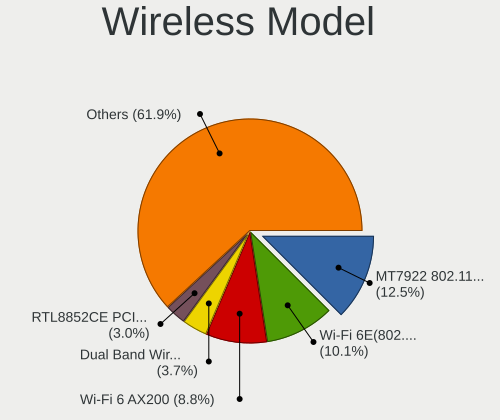

| Model                                                                           | Desktops | Percent |
|---------------------------------------------------------------------------------|----------|---------|
| MediaTek MT7922 802.11ax PCI Express Wireless Network Adapter                   | 41       | 12.5%   |
| Intel Wi-Fi 6E(802.11ax) AX210/AX1675* 2x2 [Typhoon Peak]                       | 33       | 10.06%  |
| Intel Wi-Fi 6 AX200                                                             | 29       | 8.84%   |
| Intel Dual Band Wireless-AC 3168NGW [Stone Peak]                                | 12       | 3.66%   |
| Realtek RTL8852CE PCIe 802.11ax Wireless Network Controller                     | 10       | 3.05%   |
| Intel 700 Series Chipset CNVi WiFi                                              | 10       | 3.05%   |
| Microsoft Xbox Wireless Adapter for Windows                                     | 9        | 2.74%   |
| MediaTek MT7902 802.11ax PCIe Wireless Network Adapter [Filogic 310]            | 9        | 2.74%   |
| Realtek 802.11ac NIC                                                            | 8        | 2.44%   |
| MediaTek MT7921K (RZ608) Wi-Fi 6E 80MHz                                         | 8        | 2.44%   |
| MediaTek MT7927 802.11be 320MHz 2x2 PCIe Wireless Network Adapter [Filogic 380] | 7        | 2.13%   |
| MediaTek MT7925 802.11be 160MHz 2x2 PCIe Wireless Network Adapter [Filogic 360] | 7        | 2.13%   |
| Intel Wi-Fi 5(802.11ac) Wireless-AC 9x6x [Thunder Peak]                         | 7        | 2.13%   |
| Intel Alder Lake-S PCH CNVi WiFi                                                | 7        | 2.13%   |
| Realtek RTL8852BE PCIe 802.11ax Wireless Network Controller                     | 6        | 1.83%   |
| Microsoft Xbox 360 Wireless Adapter                                             | 6        | 1.83%   |
| Realtek RTL8851BE PCIe 802.11ax Wireless Network Controller                     | 5        | 1.52%   |
| Realtek RTL8821CE 802.11ac PCIe Wireless Network Adapter                        | 5        | 1.52%   |
| MediaTek MT7925 (RZ717) Wi-Fi 7 160MHz                                          | 5        | 1.52%   |
| MediaTek MT7921 802.11ax PCIe Wireless Network Adapter [Filogic 330]            | 5        | 1.52%   |
| Intel Wireless 7265                                                             | 5        | 1.52%   |
| Realtek RTL8822BE 802.11a/b/g/n/ac WiFi adapter                                 | 4        | 1.22%   |
| Realtek RTL8812AE 802.11ac PCIe Wireless Network Adapter                        | 4        | 1.22%   |
| Intel Cannon Lake PCH CNVi WiFi                                                 | 4        | 1.22%   |
| TP-Link TL-WN823N v2/v3 [Realtek RTL8192EU]                                     | 3        | 0.91%   |
| TP-Link TL-WN821N v5/v6 [RTL8192EU]                                             | 3        | 0.91%   |
| Realtek RTL8821AE 802.11ac PCIe Wireless Network Adapter                        | 3        | 0.91%   |
| Realtek RTL8188EUS 802.11n Wireless Network Adapter                             | 3        | 0.91%   |
| Intel Wireless 7260                                                             | 3        | 0.91%   |
| Intel Wi-Fi 7(802.11be) AX1775*/AX1790*/BE20*/BE401/BE1750* 2x2                 | 3        | 0.91%   |
| TP-Link Archer T4U ver.3                                                        | 2        | 0.61%   |
| Realtek RTL88x2bu [AC1200 Techkey]                                              | 2        | 0.61%   |
| Realtek RTL8852AE 802.11ax PCIe Wireless Network Adapter                        | 2        | 0.61%   |
| Realtek RTL8822CE 802.11ac PCIe Wireless Network Adapter                        | 2        | 0.61%   |
| Realtek RTL8812AU 802.11a/b/g/n/ac 2T2R DB WLAN Adapter                         | 2        | 0.61%   |
| Realtek RTL8192CU 802.11n WLAN Adapter                                          | 2        | 0.61%   |
| Realtek 802.11ax WLAN Adapter                                                   | 2        | 0.61%   |
| Qualcomm Atheros AR928X Wireless Network Adapter (PCI-Express)                  | 2        | 0.61%   |
| Microsoft Wireless XBox Controller Dongle                                       | 2        | 0.61%   |
| Intel Wireless 3165                                                             | 2        | 0.61%   |

Ethernet Vendor
---------------

Ethernet vendors

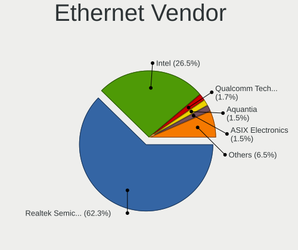

| Vendor                            | Desktops | Percent |
|-----------------------------------|----------|---------|
| Realtek Semiconductor             | 374      | 62.33%  |
| Intel                             | 159      | 26.5%   |
| Qualcomm Technologies             | 10       | 1.67%   |
| ASIX Electronics                  | 9        | 1.5%    |
| Aquantia                          | 9        | 1.5%    |
| Qualcomm Atheros                  | 8        | 1.33%   |
| MediaTek                          | 8        | 1.33%   |
| Samsung Electronics               | 6        | 1%      |
| DisplayLink                       | 4        | 0.67%   |
| Xiaomi                            | 2        | 0.33%   |
| Tehuti Networks                   | 2        | 0.33%   |
| Mellanox Technologies             | 2        | 0.33%   |
| Google                            | 2        | 0.33%   |
| Broadcom                          | 2        | 0.33%   |
| TP-Link                           | 1        | 0.17%   |
| Sundance Technology Inc / IC Plus | 1        | 0.17%   |
| Foxconn / Hon Hai                 | 1        | 0.17%   |

Ethernet Model
--------------

Ethernet models

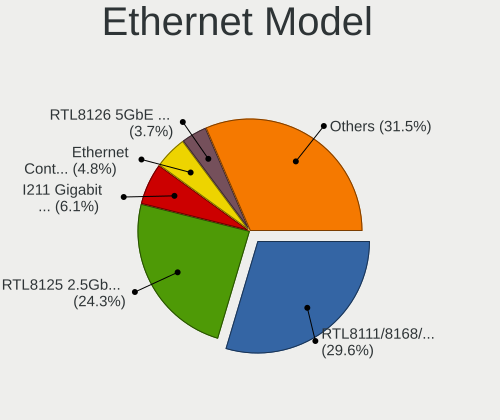

| Model                                                                           | Desktops | Percent |
|---------------------------------------------------------------------------------|----------|---------|
| Realtek RTL8111/8168/8211/8411 PCI Express Gigabit Ethernet Controller          | 190      | 29.6%   |
| Realtek RTL8125 2.5GbE Controller                                               | 156      | 24.3%   |
| Intel I211 Gigabit Network Connection                                           | 39       | 6.07%   |
| Intel Ethernet Controller I225-V                                                | 31       | 4.83%   |
| Realtek RTL8126 5GbE Controller                                                 | 24       | 3.74%   |
| Intel Ethernet Connection (2) I219-V                                            | 18       | 2.8%    |
| Intel Ethernet Controller I226-V                                                | 16       | 2.49%   |
| Intel Ethernet Connection (7) I219-V                                            | 12       | 1.87%   |
| Realtek RTL8153 Gigabit Ethernet Adapter                                        | 10       | 1.56%   |
| Qualcomm WCN785x Wi-Fi 7(802.11be) 320MHz 2x2 [FastConnect 7800]                | 10       | 1.56%   |
| Realtek RTL8922AE 802.11be PCIe Wireless Network Adapter                        | 9        | 1.4%    |
| Realtek Killer E3000 2.5GbE Controller                                          | 9        | 1.4%    |
| ASIX AX88179 Gigabit Ethernet                                                   | 9        | 1.4%    |
| MediaTek MT7925 802.11be 160MHz 2x2 PCIe Wireless Network Adapter [Filogic 360] | 5        | 0.78%   |
| Intel Ethernet Connection (14) I219-V                                           | 5        | 0.78%   |
| Intel 82579V Gigabit Network Connection                                         | 5        | 0.78%   |
| Samsung GT-I9070 (network tethering, USB debugging enabled)                     | 3        | 0.47%   |
| Samsung Galaxy series, misc. (tethering mode)                                   | 3        | 0.47%   |
| Realtek RTL8852BE PCIe 802.11ax Wireless Network Controller                     | 3        | 0.47%   |
| Qualcomm Atheros Killer E2500 Gigabit Ethernet Controller                       | 3        | 0.47%   |
| MediaTek MT7922 802.11ax PCI Express Wireless Network Adapter                   | 3        | 0.47%   |
| Intel Ethernet Connection I217-V                                                | 3        | 0.47%   |
| Intel Ethernet Connection I217-LM                                               | 3        | 0.47%   |
| Intel Ethernet Connection (17) I219-V                                           | 3        | 0.47%   |
| Intel Alder Lake-S PCH CNVi WiFi                                                | 3        | 0.47%   |
| Intel 82579LM Gigabit Network Connection (Lewisville)                           | 3        | 0.47%   |
| Aquantia AQtion AQC113CS NBase-T/IEEE 802.3an Ethernet Controller [Antigua 10G] | 3        | 0.47%   |
| Aquantia AQtion AQC113 NBase-T/IEEE 802.3an Ethernet Controller [Antigua 10G]   | 3        | 0.47%   |
| Tehuti Networks TN9510 10GBase-T/NBASE-T Ethernet Adapter                       | 2        | 0.31%   |
| Qualcomm Atheros Killer E220x Gigabit Ethernet Controller                       | 2        | 0.31%   |
| Mellanox MT27800 Family [ConnectX-5]                                            | 2        | 0.31%   |
| Intel I210 Gigabit Network Connection                                           | 2        | 0.31%   |
| Intel Ethernet Controller X710 for 10GbE SFP+                                   | 2        | 0.31%   |
| Intel Ethernet Controller I226-LM                                               | 2        | 0.31%   |
| Intel Ethernet Controller 10-Gigabit X540-AT2                                   | 2        | 0.31%   |
| Intel Ethernet Connection (11) I219-V                                           | 2        | 0.31%   |
| Intel Ethernet 10G 2P X520 Adapter                                              | 2        | 0.31%   |
| Intel Alder Lake-N PCH CNVi WiFi                                                | 2        | 0.31%   |
| Intel 82574L Gigabit Network Connection                                         | 2        | 0.31%   |
| Google Pixel 9a                                                                 | 2        | 0.31%   |

Net Controller Kind
-------------------

Ethernet, WiFi or modem

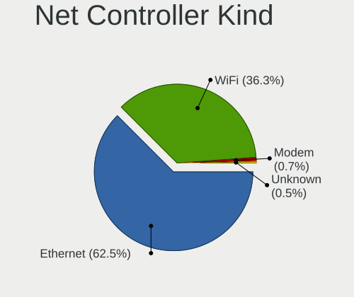

| Kind     | Desktops | Percent |
|----------|----------|---------|
| Ethernet | 527      | 62.51%  |
| WiFi     | 306      | 36.3%   |
| Modem    | 6        | 0.71%   |
| Unknown  | 4        | 0.47%   |

Used Controller
---------------

Currently used network controller

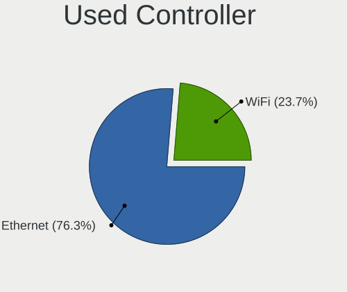

| Kind     | Desktops | Percent |
|----------|----------|---------|
| Ethernet | 422      | 76.31%  |
| WiFi     | 131      | 23.69%  |

NICs
----

Total network controllers on board

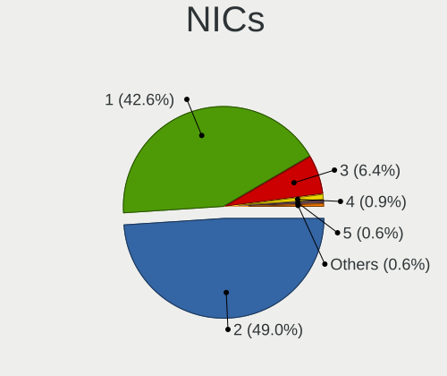

| Total | Desktops | Percent |
|-------|----------|---------|
| 2     | 262      | 48.97%  |
| 1     | 228      | 42.62%  |
| 3     | 34       | 6.36%   |
| 4     | 5        | 0.93%   |
| 5     | 3        | 0.56%   |
| 9     | 1        | 0.19%   |
| 6     | 1        | 0.19%   |
| 0     | 1        | 0.19%   |

IPv6
----

IPv6 vs IPv4

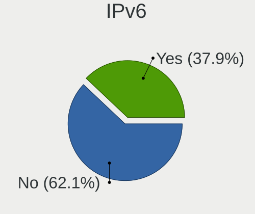

| Used | Desktops | Percent |
|------|----------|---------|
| No   | 332      | 62.06%  |
| Yes  | 203      | 37.94%  |

Bluetooth
---------

Bluetooth Vendor
----------------

Controller vendors

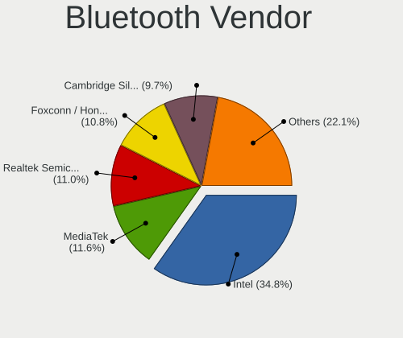

| Vendor                          | Desktops | Percent |
|---------------------------------|----------|---------|
| Intel                           | 126      | 34.81%  |
| MediaTek                        | 42       | 11.6%   |
| Realtek Semiconductor           | 40       | 11.05%  |
| Foxconn / Hon Hai               | 39       | 10.77%  |
| Cambridge Silicon Radio         | 35       | 9.67%   |
| IMC Networks                    | 32       | 8.84%   |
| ASUSTek Computer                | 15       | 4.14%   |
| TP-Link                         | 14       | 3.87%   |
| Realtek                         | 3        | 0.83%   |
| Qualcomm Atheros Communications | 3        | 0.83%   |
| Mercucys                        | 2        | 0.55%   |
| Broadcom                        | 2        | 0.55%   |
| Apple                           | 2        | 0.55%   |
| Actions                         | 2        | 0.55%   |
| Unknown                         | 2        | 0.55%   |
| Lite-On Technology              | 1        | 0.28%   |
| HTC (High Tech Computer)        | 1        | 0.28%   |
| Edimax Technology               | 1        | 0.28%   |

Bluetooth Model
---------------

Controller models

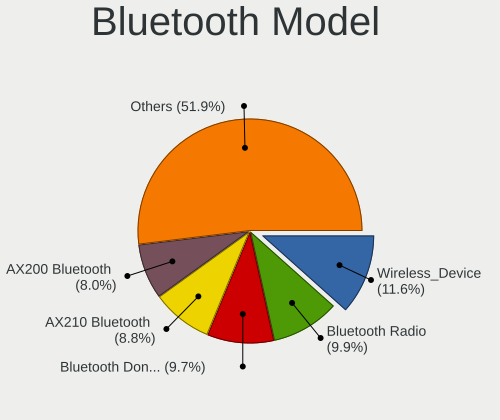

| Model                                                                | Desktops | Percent |
|----------------------------------------------------------------------|----------|---------|
| MediaTek Wireless_Device                                             | 42       | 11.6%   |
| Realtek Bluetooth Radio                                              | 36       | 9.94%   |
| Cambridge Silicon Radio Bluetooth Dongle (HCI mode)                  | 35       | 9.67%   |
| Intel AX210 Bluetooth                                                | 32       | 8.84%   |
| Intel AX200 Bluetooth                                                | 29       | 8.01%   |
| Foxconn / Hon Hai Wireless_Device                                    | 24       | 6.63%   |
| IMC Networks Wireless_Device                                         | 19       | 5.25%   |
| Intel Bluetooth Device                                               | 15       | 4.14%   |
| TP-Link TP-T@- UB500 Adapter                                         | 14       | 3.87%   |
| Foxconn / Hon Hai Bluetooth Device                                   | 14       | 3.87%   |
| Intel Wireless-AC 3168 Bluetooth                                     | 13       | 3.59%   |
| IMC Networks Bluetooth Radio                                         | 13       | 3.59%   |
| Intel AX201 Bluetooth                                                | 12       | 3.31%   |
| Intel Bluetooth wireless interface                                   | 11       | 3.04%   |
| Intel Wireless-AC 9260 Bluetooth Adapter                             | 7        | 1.93%   |
| Intel Bluetooth 9460/9560 Jefferson Peak (JfP)                       | 7        | 1.93%   |
| ASUS Bluetooth Radio                                                 | 6        | 1.66%   |
| ASUS Broadcom BCM20702A0 Bluetooth                                   | 4        | 1.1%    |
| ASUS ASUS USB-BT500                                                  | 4        | 1.1%    |
| Realtek Bluetooth 5.4 Radio                                          | 3        | 0.83%   |
| Realtek Bluetooth Radio                                              | 3        | 0.83%   |
| Mercucys Mercusys MA530 Adapter                                      | 2        | 0.55%   |
| Broadcom BCM20702A0 Bluetooth 4.0                                    | 2        | 0.55%   |
| Apple Built-in Bluetooth 2.0+EDR HCI                                 | 2        | 0.55%   |
| Actions general adapter                                              | 2        | 0.55%   |
| Unknown                                                              | 2        | 0.55%   |
| Realtek 802.11ac WLAN Adapter                                        | 1        | 0.28%   |
| Qualcomm Atheros QCA61x4 Bluetooth 4.0                               | 1        | 0.28%   |
| Qualcomm Atheros Bluetooth USB Host Controller                       | 1        | 0.28%   |
| Qualcomm Atheros AR9462 Bluetooth                                    | 1        | 0.28%   |
| Lite-On Wireless_Device                                              | 1        | 0.28%   |
| HTC (High Tech Computer) Vive Hub Bluetooth 4.1 (Broadcom BCM920703) | 1        | 0.28%   |
| Foxconn / Hon Hai Bluetooth Radio                                    | 1        | 0.28%   |
| Edimax Bluetooth Device                                              | 1        | 0.28%   |
| ASUS BCM20702A0                                                      | 1        | 0.28%   |

Sound
-----

Sound Vendor
------------

Sound card vendors

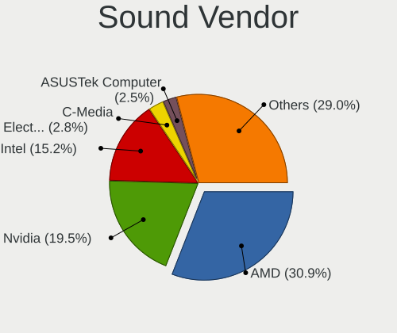

| Vendor                               | Desktops | Percent |
|--------------------------------------|----------|---------|
| AMD                                  | 372      | 30.92%  |
| Nvidia                               | 235      | 19.53%  |
| Intel                                | 183      | 15.21%  |
| C-Media Electronics                  | 34       | 2.83%   |
| ASUSTek Computer                     | 30       | 2.49%   |
| Logitech                             | 28       | 2.33%   |
| Micro Star International             | 22       | 1.83%   |
| SteelSeries ApS                      | 20       | 1.66%   |
| JMTek                                | 19       | 1.58%   |
| Razer USA                            | 17       | 1.41%   |
| Kingston Technology                  | 15       | 1.25%   |
| Focusrite-Novation                   | 13       | 1.08%   |
| Creative Labs                        | 13       | 1.08%   |
| Sony                                 | 12       | 1%      |
| Corsair                              | 11       | 0.91%   |
| Texas Instruments                    | 10       | 0.83%   |
| Blue Microphones                     | 9        | 0.75%   |
| Hewlett-Packard                      | 8        | 0.67%   |
| Unknown                              | 8        | 0.67%   |
| Creative Technology                  | 7        | 0.58%   |
| Generalplus Technology               | 6        | 0.5%    |
| ASRock                               | 6        | 0.5%    |
| Jieli Technology                     | 5        | 0.42%   |
| BEHRINGER International              | 5        | 0.42%   |
| Yamaha                               | 4        | 0.33%   |
| Walmart                              | 4        | 0.33%   |
| Trust                                | 4        | 0.33%   |
| Samson Technologies                  | 4        | 0.33%   |
| RODE Microphones                     | 4        | 0.33%   |
| Native Instruments                   | 4        | 0.33%   |
| XMOS                                 | 3        | 0.25%   |
| Thesycon Systemsoftware & Consulting | 3        | 0.25%   |
| RME                                  | 3        | 0.25%   |
| PreSonus Audio Electronics           | 3        | 0.25%   |
| Mark of the Unicorn                  | 3        | 0.25%   |
| GN Netcom                            | 3        | 0.25%   |
| DSEA A/S                             | 3        | 0.25%   |
| Audeze                               | 3        | 0.25%   |
| Apple                                | 3        | 0.25%   |
| Universal Audio                      | 2        | 0.17%   |

Sound Model
-----------

Sound card models

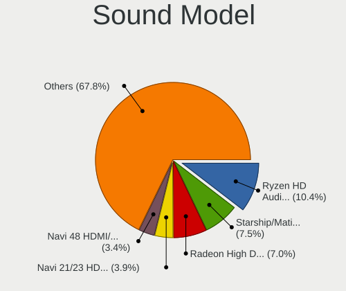

| Model                                                                                           | Desktops | Percent |
|-------------------------------------------------------------------------------------------------|----------|---------|
| AMD Ryzen HD Audio Controller                                                                   | 160      | 10.42%  |
| AMD Starship/Matisse HD Audio Controller                                                        | 115      | 7.49%   |
| AMD Radeon High Definition Audio Controller                                                     | 108      | 7.03%   |
| AMD Navi 21/23 HDMI/DP Audio Controller                                                         | 60       | 3.91%   |
| AMD Navi 48 HDMI/DP Audio Controller                                                            | 52       | 3.39%   |
| AMD Navi 31 HDMI/DP Audio                                                                       | 52       | 3.39%   |
| AMD Renoir/Cezanne HDMI/DP Audio Controller                                                     | 31       | 2.02%   |
| AMD Ellesmere HDMI Audio [Radeon RX 470/480 / 570/580/590]                                      | 30       | 1.95%   |
| Nvidia GA104 High Definition Audio Controller                                                   | 29       | 1.89%   |
| ASUSTek Computer USB Audio                                                                      | 29       | 1.89%   |
| Nvidia GA102 High Definition Audio Controller                                                   | 23       | 1.5%    |
| Micro Star International USB Audio                                                              | 22       | 1.43%   |
| Intel Raptor Lake High Definition Audio Controller                                              | 22       | 1.43%   |
| Intel Alder Lake-S HD Audio Controller                                                          | 20       | 1.3%    |
| Nvidia GA106 High Definition Audio Controller                                                   | 19       | 1.24%   |
| Intel 200 Series PCH HD Audio                                                                   | 19       | 1.24%   |
| AMD Family 17h (Models 00h-0fh) HD Audio Controller                                             | 17       | 1.11%   |
| Intel Cannon Lake PCH cAVS                                                                      | 16       | 1.04%   |
| Nvidia AD107 High Definition Audio Controller                                                   | 15       | 0.98%   |
| Intel 8 Series/C220 Series Chipset High Definition Audio Controller                             | 15       | 0.98%   |
| Nvidia AD104 High Definition Audio Controller                                                   | 14       | 0.91%   |
| Nvidia AD102 High Definition Audio Controller                                                   | 14       | 0.91%   |
| Nvidia TU116 High Definition Audio Controller                                                   | 13       | 0.85%   |
| Nvidia TU106 High Definition Audio Controller                                                   | 13       | 0.85%   |
| Nvidia AD103 High Definition Audio Controller                                                   | 13       | 0.85%   |
| Intel 100 Series/C230 Series Chipset Family HD Audio Controller                                 | 13       | 0.85%   |
| JMTek USB PnP Audio Device                                                                      | 12       | 0.78%   |
| Intel 7 Series/C216 Chipset Family High Definition Audio Controller                             | 11       | 0.72%   |
| Creative Labs CA0132 Sound Core3D [Sound Blaster Recon3D / Z-Series / Sound BlasterX AE-5 Plus] | 11       | 0.72%   |
| Nvidia GP107GL High Definition Audio Controller                                                 | 10       | 0.65%   |
| AMD Navi 10 HDMI Audio                                                                          | 10       | 0.65%   |
| Nvidia GP104 High Definition Audio Controller                                                   | 9        | 0.59%   |
| Nvidia GB203 High Definition Audio Controller                                                   | 9        | 0.59%   |
| Intel Xeon E3-1200 v3/4th Gen Core Processor HD Audio Controller                                | 9        | 0.59%   |
| AMD Raven/Raven2/Fenghuang HDMI/DP Audio Controller                                             | 9        | 0.59%   |
| Texas Instruments PCM2902 Audio Codec                                                           | 8        | 0.52%   |
| Nvidia GP106 High Definition Audio Controller                                                   | 8        | 0.52%   |
| Unknown                                                                                         | 8        | 0.52%   |
| Nvidia GM204 High Definition Audio Controller                                                   | 7        | 0.46%   |
| Nvidia AD106M High Definition Audio Controller                                                  | 7        | 0.46%   |

Memory
------

Memory Vendor
-------------

Memory module vendors

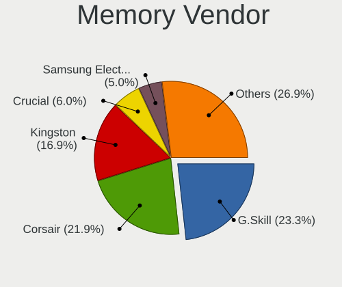

| Vendor                       | Desktops | Percent |
|------------------------------|----------|---------|
| G.Skill                      | 70       | 23.26%  |
| Corsair                      | 66       | 21.93%  |
| Kingston                     | 51       | 16.94%  |
| Crucial                      | 18       | 5.98%   |
| Samsung Electronics          | 15       | 4.98%   |
| Team                         | 12       | 3.99%   |
| Micron Technology            | 11       | 3.65%   |
| A-DATA Technology            | 10       | 3.32%   |
| Unknown                      | 10       | 3.32%   |
| SK hynix                     | 5        | 1.66%   |
| Unknown                      | 3        | 1%      |
| TeamGroup                    | 3        | 1%      |
| Patriot Memory (PDP Systems) | 3        | 1%      |
| Wilk Elektronik              | 2        | 0.66%   |
| TEXTORM                      | 2        | 0.66%   |
| Silicon Power                | 2        | 0.66%   |
| Patriot                      | 2        | 0.66%   |
| GOODRAM                      | 2        | 0.66%   |
| Acer                         | 2        | 0.66%   |
| Unknown (89F7)               | 1        | 0.33%   |
| Unknown (89EC)               | 1        | 0.33%   |
| Unknown (0x0B92)             | 1        | 0.33%   |
| SemsoTai                     | 1        | 0.33%   |
| PNY                          | 1        | 0.33%   |
| Patriot Memory               | 1        | 0.33%   |
| KLEVV                        | 1        | 0.33%   |
| Golden Empire                | 1        | 0.33%   |
| GLOWAY                       | 1        | 0.33%   |
| ASint Technology             | 1        | 0.33%   |
| Apacer                       | 1        | 0.33%   |
| AMD                          | 1        | 0.33%   |

Memory Model
------------

Memory module models

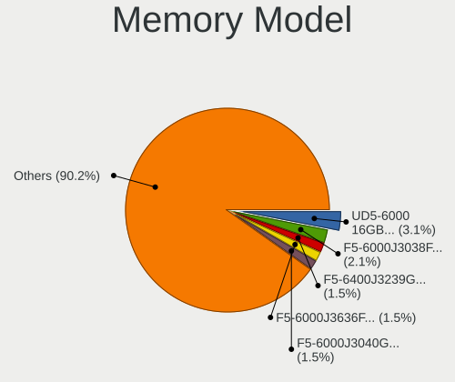

| Model                                                            | Desktops | Percent |
|------------------------------------------------------------------|----------|---------|
| Unknown                                                          | 10       | 3.07%   |
| G.Skill RAM F5-6000J3038F16G 16GB DIMM DDR5 6000MT/s             | 7        | 2.15%   |
| G.Skill RAM F5-6400J3239G16G 16GB DIMM DDR5 7000MT/s             | 5        | 1.53%   |
| G.Skill RAM F5-6000J3636F16G 16GB DIMM DDR5 6400MT/s             | 5        | 1.53%   |
| G.Skill RAM F5-6000J3040G32G 32GB DIMM DDR5 6200MT/s             | 5        | 1.53%   |
| Corsair RAM CMK16GX4M2B3200C16 8GB DIMM DDR4 3600MT/s            | 5        | 1.53%   |
| Kingston RAM KF560C36-32 32GB DIMM DDR5 6200MT/s                 | 4        | 1.23%   |
| Kingston RAM KF3200C16D4/16GX 16GB DIMM DDR4 3733MT/s            | 4        | 1.23%   |
| G.Skill RAM F4-3200C16-8GIS 8GB DIMM DDR4 3600MT/s               | 4        | 1.23%   |
| Corsair RAM CMK32GX5M2B6000Z30 16GB DIMM DDR5 6000MT/s           | 4        | 1.23%   |
| Team RAM UD5-6000 16GB DIMM DDR5 6000MT/s                        | 3        | 0.92%   |
| Kingston RAM KF3200C16D4/8GX 8GiB DIMM DDR4 3600MT/s             | 3        | 0.92%   |
| G.Skill RAM F4-3600C16-16GTZNC 16GiB DIMM DDR4 3600MT/s          | 3        | 0.92%   |
| G.Skill RAM F4-3200C16-8GVKB 8GB DIMM DDR4 4000MT/s              | 3        | 0.92%   |
| G.Skill RAM F4-3200C16-16GVK 16GB DIMM DDR4 3600MT/s             | 3        | 0.92%   |
| Corsair RAM CMW32GX4M2Z3600C18 16GB DIMM DDR4 3733MT/s           | 3        | 0.92%   |
| Corsair RAM CMK32GX5M2B5600C36 16GB DIMM DDR5 5800MT/s           | 3        | 0.92%   |
| Corsair RAM CMK32GX4M2E3200C16 16GB DIMM DDR4 3600MT/s           | 3        | 0.92%   |
| Wilk Elektronik RAM IRP3600D4V64L18/16G 16GiB DIMM DDR4 3600MT/s | 2        | 0.61%   |
| TEXTORM RAM TXU16G2M3200C16X 16GB DIMM DDR4 3200MT/s             | 2        | 0.61%   |
| Team RAM TEAMGROUP-UD4-3600 16GB DIMM DDR4 4000MT/s              | 2        | 0.61%   |
| Team RAM TEAMGROUP-UD4-3600 16GB DIMM DDR4 3600MT/s              | 2        | 0.61%   |
| Team RAM TEAMGROUP-UD4-3200 8GB DIMM DDR4 3733MT/s               | 2        | 0.61%   |
| Micron RAM CT48G56C46S5.M16B1 48GB SODIMM DDR5 5600MT/s          | 2        | 0.61%   |
| Kingston RAM KHX1600C10D3/8G 8GB DIMM DDR3 2133MT/s              | 2        | 0.61%   |
| Kingston RAM KF560C36-16 16GB DIMM DDR5 6000MT/s                 | 2        | 0.61%   |
| Kingston RAM KF560C30-32 32GB DIMM DDR5 6000MT/s                 | 2        | 0.61%   |
| Kingston RAM KF560C30-16 16GB DIMM DDR5 6000MT/s                 | 2        | 0.61%   |
| Kingston RAM KF556C40-16 16GB DIMM DDR5 6800MT/s                 | 2        | 0.61%   |
| Kingston RAM KF556C36-8 8GB DIMM DDR5 5600MT/s                   | 2        | 0.61%   |
| Kingston RAM KF3600C18D4/16GX 16GB DIMM DDR4 3733MT/s            | 2        | 0.61%   |
| G.Skill RAM F5-6000J3238G32G 32GB DIMM DDR5 6000MT/s             | 2        | 0.61%   |
| G.Skill RAM F5-5200J4040A48G 48GB DIMM DDR5 6000MT/s             | 2        | 0.61%   |
| G.Skill RAM F4-4000C18-8GVK 8GB DIMM DDR4 4000MT/s               | 2        | 0.61%   |
| G.Skill RAM F4-3600C16-16GVKC 16GB DIMM DDR4 3866MT/s            | 2        | 0.61%   |
| G.Skill RAM F4-3200C16-16GTZR 16GB DIMM DDR4 3600MT/s            | 2        | 0.61%   |
| G.Skill RAM F4-3000C16-8GISB 8GB DIMM DDR4 3200MT/s              | 2        | 0.61%   |
| Corsair RAM CMW64GX4M2D3600C18 32GB DIMM DDR4 3600MT/s           | 2        | 0.61%   |
| Corsair RAM CMK32GX5M2E6000Z36 16GB DIMM DDR5 6000MT/s           | 2        | 0.61%   |
| Corsair RAM CMK32GX4M2Z3600C18 16GB DIMM DDR4 3800MT/s           | 2        | 0.61%   |

Memory Kind
-----------

Memory module kinds

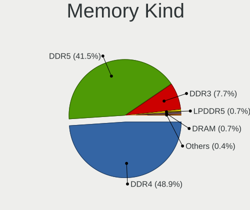

| Kind   | Desktops | Percent |
|--------|----------|---------|
| DDR4   | 139      | 48.94%  |
| DDR5   | 118      | 41.55%  |
| DDR3   | 22       | 7.75%   |
| LPDDR5 | 2        | 0.7%    |
| DRAM   | 2        | 0.7%    |
| DDR    | 1        | 0.35%   |

Memory Form Factor
------------------

Physical design of the memory module

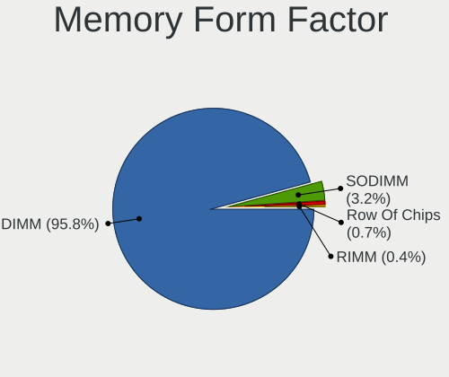

| Name         | Desktops | Percent |
|--------------|----------|---------|
| DIMM         | 271      | 95.76%  |
| SODIMM       | 9        | 3.18%   |
| Row Of Chips | 2        | 0.71%   |
| RIMM         | 1        | 0.35%   |

Memory Size
-----------

Memory module size

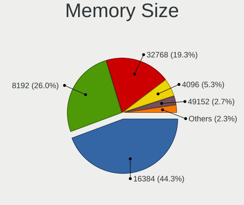

| Size  | Desktops | Percent |
|-------|----------|---------|
| 16384 | 133      | 44.33%  |
| 8192  | 78       | 26%     |
| 32768 | 58       | 19.33%  |
| 4096  | 16       | 5.33%   |
| 49152 | 8        | 2.67%   |
| 24576 | 3        | 1%      |
| 2048  | 3        | 1%      |
| 65536 | 1        | 0.33%   |

Memory Speed
------------

Memory module speed

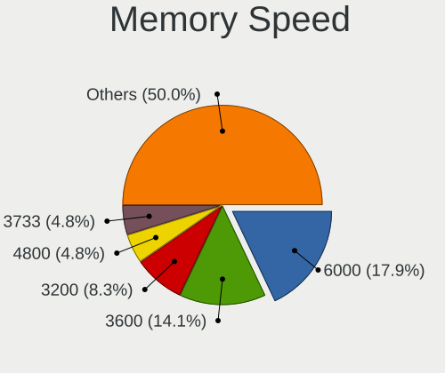

| Speed | Desktops | Percent |
|-------|----------|---------|
| 6000  | 56       | 17.95%  |
| 3600  | 44       | 14.1%   |
| 3200  | 26       | 8.33%   |
| 4800  | 15       | 4.81%   |
| 3733  | 15       | 4.81%   |
| 2667  | 14       | 4.49%   |
| 6400  | 12       | 3.85%   |
| 1600  | 12       | 3.85%   |
| 6200  | 10       | 3.21%   |
| 4000  | 10       | 3.21%   |
| 2133  | 9        | 2.88%   |
| 5600  | 8        | 2.56%   |
| 3800  | 8        | 2.56%   |
| 2400  | 7        | 2.24%   |
| 3000  | 6        | 1.92%   |
| 1333  | 6        | 1.92%   |
| 7000  | 5        | 1.6%    |
| 3866  | 5        | 1.6%    |
| 2666  | 4        | 1.28%   |
| 1866  | 4        | 1.28%   |
| 5800  | 3        | 0.96%   |
| 5200  | 3        | 0.96%   |
| 3466  | 3        | 0.96%   |
| 3400  | 3        | 0.96%   |
| 12800 | 2        | 0.64%   |
| 6800  | 2        | 0.64%   |
| 3666  | 2        | 0.64%   |
| 3266  | 2        | 0.64%   |
| 8000  | 1        | 0.32%   |
| 7200  | 1        | 0.32%   |
| 5400  | 1        | 0.32%   |
| 5000  | 1        | 0.32%   |
| 4802  | 1        | 0.32%   |
| 3933  | 1        | 0.32%   |
| 3533  | 1        | 0.32%   |
| 3467  | 1        | 0.32%   |
| 3333  | 1        | 0.32%   |
| 3151  | 1        | 0.32%   |
| 2933  | 1        | 0.32%   |
| 2200  | 1        | 0.32%   |

Printers & scanners
-------------------

Printer Vendor
--------------

Printer device vendors

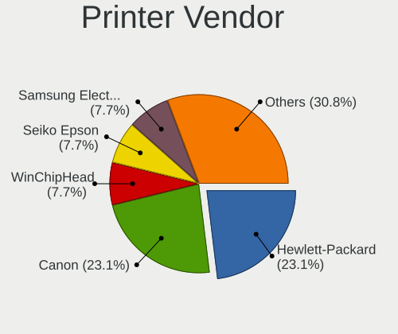

| Vendor                | Desktops | Percent |
|-----------------------|----------|---------|
| Hewlett-Packard       | 3        | 23.08%  |
| Canon                 | 3        | 23.08%  |
| WinChipHead           | 1        | 7.69%   |
| STMicroelectronics    | 1        | 7.69%   |
| Seiko Epson           | 1        | 7.69%   |
| Samsung Electronics   | 1        | 7.69%   |
| Ricoh                 | 1        | 7.69%   |
| Lexmark International | 1        | 7.69%   |
| Brother Industries    | 1        | 7.69%   |

Printer Model
-------------

Printer device models

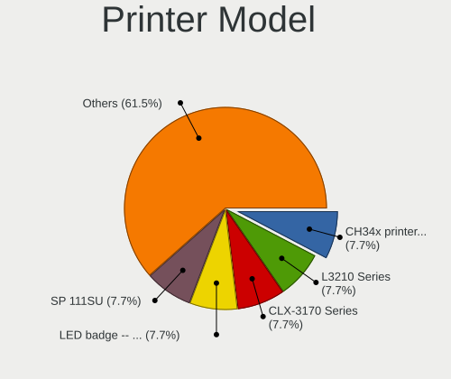

| Model                                                     | Desktops | Percent |
|-----------------------------------------------------------|----------|---------|
| WinChipHead CH34x printer adapter cable                   | 1        | 7.69%   |
| STMicroelectronics LED badge -- mini LED display -- 11x44 | 1        | 7.69%   |
| Seiko Epson L3210 Series                                  | 1        | 7.69%   |
| Samsung CLX-3170 Series                                   | 1        | 7.69%   |
| Ricoh SP 111SU                                            | 1        | 7.69%   |
| Lexmark International Lexmark CX331adwe                   | 1        | 7.69%   |
| HP LaserJet P1005                                         | 1        | 7.69%   |
| HP LaserJet 400 M401dne                                   | 1        | 7.69%   |
| HP ENVY 6000 series                                       | 1        | 7.69%   |
| Canon LiDE 400                                            | 1        | 7.69%   |
| Canon LiDE 300                                            | 1        | 7.69%   |
| Canon G2000 series                                        | 1        | 7.69%   |
| Brother MFC-B7710DN                                       | 1        | 7.69%   |

Scanner Vendor
--------------

Scanner device vendors

| Vendor      | Desktops | Percent |
|-------------|----------|---------|
| Seiko Epson | 1        | 100%    |

Scanner Model
-------------

Scanner device models

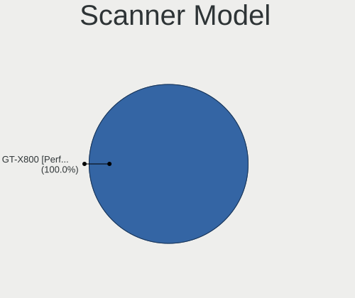

| Model                                       | Desktops | Percent |
|---------------------------------------------|----------|---------|
| Seiko Epson GT-X800 [Perfection 4990 PHOTO] | 1        | 100%    |

Camera
------

Camera Vendor
-------------

Camera device vendors

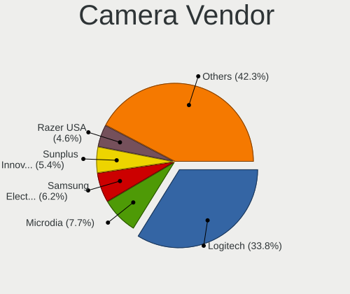

| Vendor                             | Desktops | Percent |
|------------------------------------|----------|---------|
| Logitech                           | 44       | 33.85%  |
| Microdia                           | 10       | 7.69%   |
| Samsung Electronics                | 8        | 6.15%   |
| Sunplus Innovation Technology      | 7        | 5.38%   |
| Razer USA                          | 6        | 4.62%   |
| Creative Technology                | 5        | 3.85%   |
| Z-Star Microelectronics            | 3        | 2.31%   |
| Microsoft                          | 3        | 2.31%   |
| Elgato Systems                     | 3        | 2.31%   |
| ValueHD                            | 2        | 1.54%   |
| Tobii Technology AB                | 2        | 1.54%   |
| SunplusIT                          | 2        | 1.54%   |
| Jieli Technology                   | 2        | 1.54%   |
| Google                             | 2        | 1.54%   |
| Generalplus Technology             | 2        | 1.54%   |
| AVerMedia Technologies             | 2        | 1.54%   |
| ASUSTek Computer                   | 2        | 1.54%   |
| ARC International                  | 2        | 1.54%   |
| Apple                              | 2        | 1.54%   |
| YGTek                              | 1        | 0.77%   |
| webcam                             | 1        | 0.77%   |
| Valve Software                     | 1        | 0.77%   |
| USB3.0 HD Audio Capture            | 1        | 0.77%   |
| Sonix Technology                   | 1        | 0.77%   |
| Remo Tech                          | 1        | 0.77%   |
| Realtek Semiconductor              | 1        | 0.77%   |
| Orbbec 3D Technology International | 1        | 0.77%   |
| Oculus VR                          | 1        | 0.77%   |
| Linux Foundation                   | 1        | 0.77%   |
| Lenovo                             | 1        | 0.77%   |
| Leap Motion                        | 1        | 0.77%   |
| Hewlett-Packard                    | 1        | 0.77%   |
| EVGA                               | 1        | 0.77%   |
| eMeet                              | 1        | 0.77%   |
| DSEA A/S                           | 1        | 0.77%   |
| DSA                                | 1        | 0.77%   |
| Cubeternet                         | 1        | 0.77%   |
| Bison Electronics                  | 1        | 0.77%   |
| Asuscom Network                    | 1        | 0.77%   |
| Anker PowerConf C200               | 1        | 0.77%   |

Camera Model
------------

Camera device models

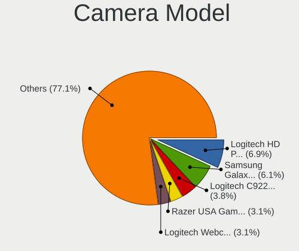

| Model                                           | Desktops | Percent |
|-------------------------------------------------|----------|---------|
| Logitech HD Pro Webcam C920                     | 9        | 6.87%   |
| Samsung Galaxy series, misc. (MTP mode)         | 8        | 6.11%   |
| Logitech C922 Pro Stream Webcam                 | 5        | 3.82%   |
| Razer USA Gaming Webcam [Kiyo]                  | 4        | 3.05%   |
| Logitech Webcam C270                            | 4        | 3.05%   |
| Microdia Webcam Vitade AF                       | 3        | 2.29%   |
| Logitech StreamCam                              | 3        | 2.29%   |
| Logitech HD Webcam C525                         | 3        | 2.29%   |
| Logitech C920 PRO HD Webcam                     | 3        | 2.29%   |
| Logitech BRIO Ultra HD Webcam                   | 3        | 2.29%   |
| Logitech BRIO 4K Stream Edition                 | 3        | 2.29%   |
| Tobii AB EyeChip                                | 2        | 1.53%   |
| SunplusIT USB 2.0 Camera                        | 2        | 1.53%   |
| Sunplus SPCA2281 Web Camera                     | 2        | 1.53%   |
| Sunplus Integrated Camera                       | 2        | 1.53%   |
| Razer USA Razer Kiyo X                          | 2        | 1.53%   |
| Microsoft LifeCam HD-3000                       | 2        | 1.53%   |
| Microdia UGREEN Camera                          | 2        | 1.53%   |
| Microdia Integrated Camera                      | 2        | 1.53%   |
| Microdia Camera                                 | 2        | 1.53%   |
| Logitech Webcam C930e                           | 2        | 1.53%   |
| Elgato Systems Elgato Facecam                   | 2        | 1.53%   |
| Creative Live! Cam Sync 1080p V2                | 2        | 1.53%   |
| Creative Live! Cam Sync 1080p                   | 2        | 1.53%   |
| ARC International Camera                        | 2        | 1.53%   |
| Apple iPhone 5/5C/5S/6/SE/7/8/X                 | 2        | 1.53%   |
| Z-Star Venus USB2.0 Camera                      | 1        | 0.76%   |
| Z-Star Sirius USB 2.0 Camera                    | 1        | 0.76%   |
| Z-Star A4 TECH USB2.0 PC Camera E               | 1        | 0.76%   |
| YGTek Webcam                                    | 1        | 0.76%   |
| webcam webcam                                   | 1        | 0.76%   |
| Valve Software 3D Camera                        | 1        | 0.76%   |
| ValueHD HD Camera                               | 1        | 0.76%   |
| ValueHD Avaya HC020                             | 1        | 0.76%   |
| USB3.0 HD Audio Capture USB3.0 HD Video Capture | 1        | 0.76%   |
| Sunplus USB 2.0 Camera                          | 1        | 0.76%   |
| Sunplus NexiGo N940P 2K Webcam                  | 1        | 0.76%   |
| Sunplus Full HD webcam                          | 1        | 0.76%   |
| Sonix GENERAL WEBCAM                            | 1        | 0.76%   |
| Remo Tech OBSBOT Meet 2                         | 1        | 0.76%   |

Security
--------

Fingerprint Vendor
------------------

Fingerprint sensor vendors

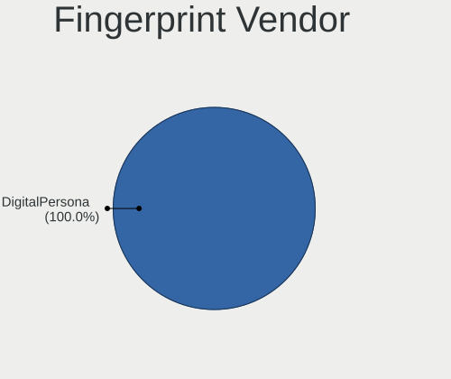

| Vendor         | Desktops | Percent |
|----------------|----------|---------|
| DigitalPersona | 1        | 100%    |

Fingerprint Model
-----------------

Fingerprint sensor models

| Model                             | Desktops | Percent |
|-----------------------------------|----------|---------|
| DigitalPersona Fingerprint Reader | 1        | 100%    |

Chipcard Vendor
---------------

Chipcard module vendors

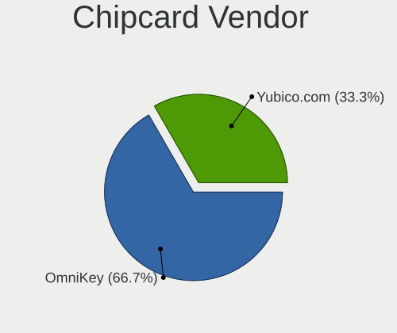

| Vendor     | Desktops | Percent |
|------------|----------|---------|
| OmniKey    | 2        | 66.67%  |
| Yubico.com | 1        | 33.33%  |

Chipcard Model
--------------

Chipcard module models

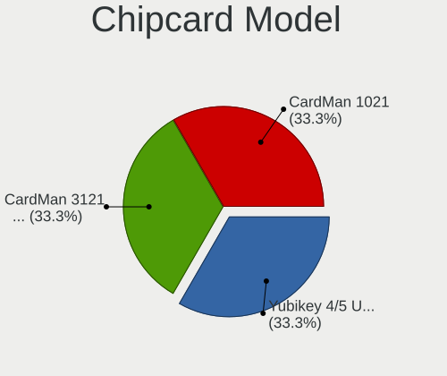

| Model                                   | Desktops | Percent |
|-----------------------------------------|----------|---------|
| Yubico.com Yubikey 4/5 U2F+CCID         | 1        | 33.33%  |
| OmniKey CardMan 3121 (HID Technologies) | 1        | 33.33%  |
| OmniKey CardMan 1021                    | 1        | 33.33%  |

Unsupported
-----------

Unsupported Devices
-------------------

Total unsupported devices on board

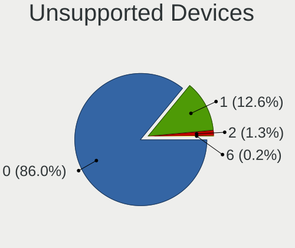

| Total | Desktops | Percent |
|-------|----------|---------|
| 0     | 465      | 85.95%  |
| 1     | 68       | 12.57%  |
| 2     | 7        | 1.29%   |
| 6     | 1        | 0.18%   |

Unsupported Device Types
------------------------

Types of unsupported devices

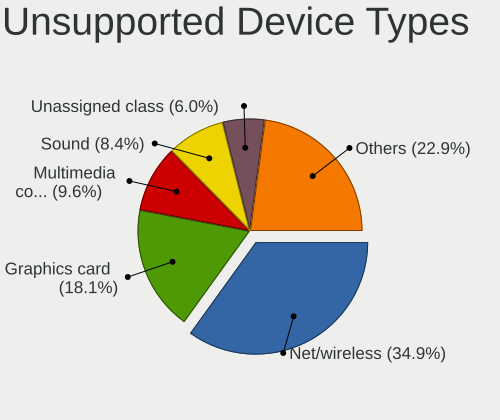

| Type                     | Desktops | Percent |
|--------------------------|----------|---------|
| Net/wireless             | 29       | 34.94%  |
| Graphics card            | 15       | 18.07%  |
| Multimedia controller    | 8        | 9.64%   |
| Sound                    | 7        | 8.43%   |
| Unassigned class         | 5        | 6.02%   |
| Camera                   | 5        | 6.02%   |
| Net/ethernet             | 3        | 3.61%   |
| Dvb card                 | 2        | 2.41%   |
| Chipcard                 | 2        | 2.41%   |
| Bluetooth                | 2        | 2.41%   |
| Storage/raid             | 1        | 1.2%    |
| Network                  | 1        | 1.2%    |
| Modem                    | 1        | 1.2%    |
| Fingerprint reader       | 1        | 1.2%    |
| Communication controller | 1        | 1.2%    |

