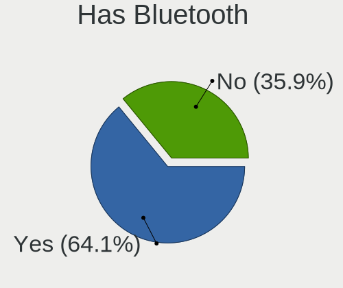
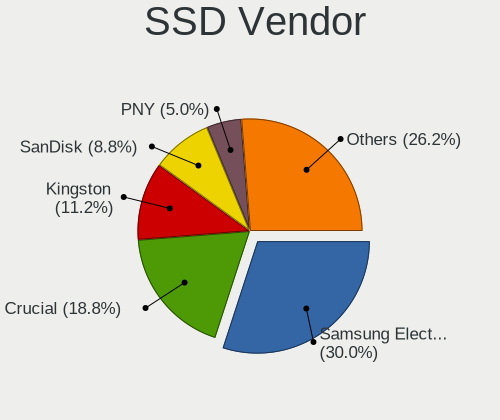

CachyOS - Tested Hardware & Statistics (Desktops)
-------------------------------------------------

A project to collect tested hardware configurations for CachyOS.

Anyone can contribute to this report by the [hw-probe](https://github.com/linuxhw/hw-probe) tool:

    sudo -E hw-probe -all -upload

Please contribute! Especially if your hardware is rare.

Contents
--------

* [ Test Cases ](#test-cases)

* [ System ](#system)
  - [ OS                       ](#os)
  - [ OS Family                ](#os-family)
  - [ Kernel                   ](#kernel)
  - [ Kernel Family            ](#kernel-family)
  - [ Kernel Major Ver.        ](#kernel-major-ver)
  - [ Arch                     ](#arch)
  - [ DE                       ](#de)
  - [ Display Server           ](#display-server)
  - [ Display Manager          ](#display-manager)
  - [ OS Lang                  ](#os-lang)
  - [ Boot Mode                ](#boot-mode)
  - [ Filesystem               ](#filesystem)
  - [ Part. scheme             ](#part-scheme)
  - [ Dual Boot with Linux/BSD ](#dual-boot-with-linuxbsd)
  - [ Dual Boot (Win)          ](#dual-boot-win)

* [ Board ](#board)
  - [ Vendor                   ](#vendor)
  - [ Model                    ](#model)
  - [ Model Family             ](#model-family)
  - [ MFG Year                 ](#mfg-year)
  - [ Form Factor              ](#form-factor)
  - [ Secure Boot              ](#secure-boot)
  - [ Coreboot                 ](#coreboot)
  - [ RAM Size                 ](#ram-size)
  - [ RAM Used                 ](#ram-used)
  - [ Total Drives             ](#total-drives)
  - [ Has CD-ROM               ](#has-cd-rom)
  - [ Has Ethernet             ](#has-ethernet)
  - [ Has WiFi                 ](#has-wifi)
  - [ Has Bluetooth            ](#has-bluetooth)

* [ Location ](#location)
  - [ Country                  ](#country)
  - [ City                     ](#city)

* [ Drives ](#drives)
  - [ Drive Vendor             ](#drive-vendor)
  - [ Drive Model              ](#drive-model)
  - [ HDD Vendor               ](#hdd-vendor)
  - [ SSD Vendor               ](#ssd-vendor)
  - [ Drive Kind               ](#drive-kind)
  - [ Drive Connector          ](#drive-connector)
  - [ Drive Size               ](#drive-size)
  - [ Space Total              ](#space-total)
  - [ Space Used               ](#space-used)
  - [ Malfunc. Drives          ](#malfunc-drives)
  - [ Malfunc. Drive Vendor    ](#malfunc-drive-vendor)
  - [ Malfunc. HDD Vendor      ](#malfunc-hdd-vendor)
  - [ Malfunc. Drive Kind      ](#malfunc-drive-kind)
  - [ Failed Drives            ](#failed-drives)
  - [ Failed Drive Vendor      ](#failed-drive-vendor)
  - [ Drive Status             ](#drive-status)

* [ Storage controller ](#storage-controller)
  - [ Storage Vendor           ](#storage-vendor)
  - [ Storage Model            ](#storage-model)
  - [ Storage Kind             ](#storage-kind)

* [ Processor ](#processor)
  - [ CPU Vendor               ](#cpu-vendor)
  - [ CPU Model                ](#cpu-model)
  - [ CPU Model Family         ](#cpu-model-family)
  - [ CPU Cores                ](#cpu-cores)
  - [ CPU Sockets              ](#cpu-sockets)
  - [ CPU Threads              ](#cpu-threads)
  - [ CPU Op-Modes             ](#cpu-op-modes)
  - [ CPU Microcode            ](#cpu-microcode)
  - [ CPU Microarch            ](#cpu-microarch)

* [ Graphics ](#graphics)
  - [ GPU Vendor               ](#gpu-vendor)
  - [ GPU Model                ](#gpu-model)
  - [ GPU Combo                ](#gpu-combo)
  - [ GPU Driver               ](#gpu-driver)
  - [ GPU Memory               ](#gpu-memory)

* [ Monitor ](#monitor)
  - [ Monitor Vendor           ](#monitor-vendor)
  - [ Monitor Model            ](#monitor-model)
  - [ Monitor Resolution       ](#monitor-resolution)
  - [ Monitor Diagonal         ](#monitor-diagonal)
  - [ Monitor Width            ](#monitor-width)
  - [ Aspect Ratio             ](#aspect-ratio)
  - [ Monitor Area             ](#monitor-area)
  - [ Pixel Density            ](#pixel-density)
  - [ Multiple Monitors        ](#multiple-monitors)

* [ Network ](#network)
  - [ Net Controller Vendor    ](#net-controller-vendor)
  - [ Net Controller Model     ](#net-controller-model)
  - [ Wireless Vendor          ](#wireless-vendor)
  - [ Wireless Model           ](#wireless-model)
  - [ Ethernet Vendor          ](#ethernet-vendor)
  - [ Ethernet Model           ](#ethernet-model)
  - [ Net Controller Kind      ](#net-controller-kind)
  - [ Used Controller          ](#used-controller)
  - [ NICs                     ](#nics)
  - [ IPv6                     ](#ipv6)

* [ Bluetooth ](#bluetooth)
  - [ Bluetooth Vendor         ](#bluetooth-vendor)
  - [ Bluetooth Model          ](#bluetooth-model)

* [ Sound ](#sound)
  - [ Sound Vendor             ](#sound-vendor)
  - [ Sound Model              ](#sound-model)

* [ Memory ](#memory)
  - [ Memory Vendor            ](#memory-vendor)
  - [ Memory Model             ](#memory-model)
  - [ Memory Kind              ](#memory-kind)
  - [ Memory Form Factor       ](#memory-form-factor)
  - [ Memory Size              ](#memory-size)
  - [ Memory Speed             ](#memory-speed)

* [ Printers & scanners ](#printers--scanners)
  - [ Printer Vendor           ](#printer-vendor)
  - [ Printer Model            ](#printer-model)
  - [ Scanner Vendor           ](#scanner-vendor)
  - [ Scanner Model            ](#scanner-model)

* [ Camera ](#camera)
  - [ Camera Vendor            ](#camera-vendor)
  - [ Camera Model             ](#camera-model)

* [ Security ](#security)
  - [ Fingerprint Vendor       ](#fingerprint-vendor)
  - [ Fingerprint Model        ](#fingerprint-model)
  - [ Chipcard Vendor          ](#chipcard-vendor)
  - [ Chipcard Model           ](#chipcard-model)

* [ Unsupported ](#unsupported)
  - [ Unsupported Devices      ](#unsupported-devices)
  - [ Unsupported Device Types ](#unsupported-device-types)

Test Cases
----------

Total: 128

| Vendor        | Model                       | Probe                                                      | Date         |
|---------------|-----------------------------|------------------------------------------------------------|--------------|
| ASUSTek       | H110I-PLUS                  | [5a05ac75d9](https://linux-hardware.org/?probe=5a05ac75d9) | Jan 03, 2025 |
| MSI           | MAG B550 TOMAHAWK           | [6d22883b06](https://linux-hardware.org/?probe=6d22883b06) | Jan 01, 2025 |
| ASUSTek       | ROG STRIX B450-F GAMING ... | [29a8b52eec](https://linux-hardware.org/?probe=29a8b52eec) | Jan 01, 2025 |
| ASRock        | B450 Gaming-ITX/ac          | [c2c8b85ed0](https://linux-hardware.org/?probe=c2c8b85ed0) | Jan 01, 2025 |
| Shenzhen M... | AHWSA                       | [170e260a3f](https://linux-hardware.org/?probe=170e260a3f) | Dec 28, 2024 |
| Intel         | HM570                       | [74847a808d](https://linux-hardware.org/?probe=74847a808d) | Dec 21, 2024 |
| ASUSTek       | PRIME X670-P WIFI           | [66b9e10335](https://linux-hardware.org/?probe=66b9e10335) | Dec 19, 2024 |
| HP            | 8918                        | [6a8241e53c](https://linux-hardware.org/?probe=6a8241e53c) | Dec 14, 2024 |
| Gigabyte      | Z270-Gaming K3              | [ba5e989ad6](https://linux-hardware.org/?probe=ba5e989ad6) | Dec 13, 2024 |
| ASUSTek       | ROG CROSSHAIR X670E HERO    | [6a2f1fc3d5](https://linux-hardware.org/?probe=6a2f1fc3d5) | Dec 05, 2024 |
| ASRock        | Z370 Pro4                   | [3c5ea68b84](https://linux-hardware.org/?probe=3c5ea68b84) | Dec 05, 2024 |
| ASUSTek       | EX-A320M-GAMING             | [b74803c3cf](https://linux-hardware.org/?probe=b74803c3cf) | Dec 04, 2024 |
| ASUSTek       | PRIME B760M-A AX            | [62a02c2c7d](https://linux-hardware.org/?probe=62a02c2c7d) | Dec 01, 2024 |
| Gigabyte      | B650M GAMING X AX           | [20e65bc531](https://linux-hardware.org/?probe=20e65bc531) | Nov 30, 2024 |
| ASUSTek       | TUF Gaming B650M-E WIFI     | [0ea967f5b3](https://linux-hardware.org/?probe=0ea967f5b3) | Nov 29, 2024 |
| MSI           | MPG X670E CARBON WIFI       | [a061c15130](https://linux-hardware.org/?probe=a061c15130) | Nov 29, 2024 |
| ASUSTek       | PRIME B760M-A AX            | [fe713f1069](https://linux-hardware.org/?probe=fe713f1069) | Nov 28, 2024 |
| Dell          | 00V62H A01                  | [6d30eb1c0a](https://linux-hardware.org/?probe=6d30eb1c0a) | Nov 27, 2024 |
| Gigabyte      | B760 GAMING X               | [4dcc20cbc7](https://linux-hardware.org/?probe=4dcc20cbc7) | Nov 27, 2024 |
| Gigabyte      | Z370M AORUS Gaming-CF       | [67a0eec53d](https://linux-hardware.org/?probe=67a0eec53d) | Nov 27, 2024 |
| Gigabyte      | B650 EAGLE AX               | [a24ba9321a](https://linux-hardware.org/?probe=a24ba9321a) | Nov 26, 2024 |
| ASUSTek       | TUF Gaming B650M-E WIFI     | [a7486ee19d](https://linux-hardware.org/?probe=a7486ee19d) | Nov 26, 2024 |
| ASUSTek       | ROG STRIX B450-F GAMING     | [05ba4aef25](https://linux-hardware.org/?probe=05ba4aef25) | Nov 25, 2024 |
| Dell          | 00V62H A01                  | [9566841701](https://linux-hardware.org/?probe=9566841701) | Nov 21, 2024 |
| Dell          | 00V62H A01                  | [b06b01c604](https://linux-hardware.org/?probe=b06b01c604) | Nov 16, 2024 |
| Gigabyte      | B650 EAGLE AX               | [81e58aee9c](https://linux-hardware.org/?probe=81e58aee9c) | Nov 15, 2024 |
| Gigabyte      | B550 GAMING X V2            | [4d9bb92390](https://linux-hardware.org/?probe=4d9bb92390) | Nov 14, 2024 |
| ASRock        | H170M Pro4                  | [eabb883a16](https://linux-hardware.org/?probe=eabb883a16) | Nov 14, 2024 |
| MSI           | MPG X670E CARBON WIFI       | [7c507f689d](https://linux-hardware.org/?probe=7c507f689d) | Nov 13, 2024 |
| MSI           | B450M MORTAR MAX            | [4ce714a0e6](https://linux-hardware.org/?probe=4ce714a0e6) | Nov 12, 2024 |
| MSI           | PRO Z790-P WIFI             | [b0168ae6f4](https://linux-hardware.org/?probe=b0168ae6f4) | Oct 31, 2024 |
| ASUSTek       | VC60V                       | [96cc8de44b](https://linux-hardware.org/?probe=96cc8de44b) | Oct 29, 2024 |
| Dell          | 0MN1TX A02                  | [3b7b8ccbfe](https://linux-hardware.org/?probe=3b7b8ccbfe) | Oct 29, 2024 |
| Gigabyte      | Z690 UD AX                  | [de1a13fec7](https://linux-hardware.org/?probe=de1a13fec7) | Oct 26, 2024 |
| ASUSTek       | PRIME B450M-K II            | [9fe232feef](https://linux-hardware.org/?probe=9fe232feef) | Oct 23, 2024 |
| Lenovo        | 1048 SDK0T08861 WIN 3305... | [1dae97f93d](https://linux-hardware.org/?probe=1dae97f93d) | Oct 23, 2024 |
| ASUSTek       | ROG STRIX X870E-E GAMING... | [82442bccd5](https://linux-hardware.org/?probe=82442bccd5) | Oct 22, 2024 |
| ASRock        | X570 Taichi Razer Editio... | [b96fdd8d9d](https://linux-hardware.org/?probe=b96fdd8d9d) | Oct 21, 2024 |
| ASUSTek       | TUF Gaming X570-PLUS_BR     | [f961bd7765](https://linux-hardware.org/?probe=f961bd7765) | Oct 20, 2024 |
| ASUSTek       | PRIME Z270-A                | [9a84839883](https://linux-hardware.org/?probe=9a84839883) | Oct 14, 2024 |
| Gigabyte      | Z87-D3HP-CF                 | [d239d4d218](https://linux-hardware.org/?probe=d239d4d218) | Oct 14, 2024 |
| MSI           | MAG B550 TOMAHAWK           | [2cb999cdc6](https://linux-hardware.org/?probe=2cb999cdc6) | Oct 14, 2024 |
| ASUSTek       | TUF Gaming B650-PLUS WIF... | [ce57c858cf](https://linux-hardware.org/?probe=ce57c858cf) | Oct 12, 2024 |
| Gigabyte      | X99-UD4P-CF                 | [c8271ce4cb](https://linux-hardware.org/?probe=c8271ce4cb) | Oct 09, 2024 |
| GEEKOM        | AX8Pro                      | [07dd8f985d](https://linux-hardware.org/?probe=07dd8f985d) | Oct 05, 2024 |
| ASUSTek       | Pro WS TRX50-SAGE WIFI      | [129ec6b984](https://linux-hardware.org/?probe=129ec6b984) | Oct 04, 2024 |
| ASUSTek       | Pro WS TRX50-SAGE WIFI      | [fda12e45a5](https://linux-hardware.org/?probe=fda12e45a5) | Sep 27, 2024 |
| MSI           | X670E GAMING PLUS WIFI      | [51cbbfd995](https://linux-hardware.org/?probe=51cbbfd995) | Sep 23, 2024 |
| ASUSTek       | VC65                        | [f7469cf003](https://linux-hardware.org/?probe=f7469cf003) | Sep 18, 2024 |
| Gigabyte      | Z790 UD AC                  | [56140c22fb](https://linux-hardware.org/?probe=56140c22fb) | Sep 18, 2024 |
| ASRock        | X670E Steel Legend          | [ac862d0253](https://linux-hardware.org/?probe=ac862d0253) | Sep 15, 2024 |
| MSI           | MPG Z690 EDGE WIFI DDR4     | [9894a8429a](https://linux-hardware.org/?probe=9894a8429a) | Sep 13, 2024 |
| MSI           | PRO B760-P WIFI DDR4        | [d07eb035be](https://linux-hardware.org/?probe=d07eb035be) | Sep 12, 2024 |
| Gigabyte      | Z390 GAMING SLI-CF          | [bf278d3e6f](https://linux-hardware.org/?probe=bf278d3e6f) | Sep 09, 2024 |
| MSI           | MAG B660 TOMAHAWK WIFI D... | [755e169171](https://linux-hardware.org/?probe=755e169171) | Sep 08, 2024 |
| Gigabyte      | Z97X-Gaming 5               | [25d3f3fc3d](https://linux-hardware.org/?probe=25d3f3fc3d) | Sep 03, 2024 |
| ASUSTek       | ROG STRIX X570-F GAMING     | [f08e55585c](https://linux-hardware.org/?probe=f08e55585c) | Sep 01, 2024 |
| ASUSTek       | ROG STRIX B650E-E GAMING... | [1ec04e292b](https://linux-hardware.org/?probe=1ec04e292b) | Aug 25, 2024 |
| ASRock        | X570 Taichi Razer Editio... | [a93f5e3c6b](https://linux-hardware.org/?probe=a93f5e3c6b) | Aug 21, 2024 |
| ASUSTek       | G11CD                       | [65c3c212bf](https://linux-hardware.org/?probe=65c3c212bf) | Aug 21, 2024 |
| ASUSTek       | G11CD                       | [fb621c854f](https://linux-hardware.org/?probe=fb621c854f) | Aug 21, 2024 |
| Gigabyte      | B650M GAMING X AX           | [f3434cd685](https://linux-hardware.org/?probe=f3434cd685) | Aug 16, 2024 |
| MSI           | MAG X570 TOMAHAWK WIFI      | [f556f45707](https://linux-hardware.org/?probe=f556f45707) | Aug 11, 2024 |
| ASUSTek       | ROG STRIX B650E-E GAMING... | [83343a4a26](https://linux-hardware.org/?probe=83343a4a26) | Aug 07, 2024 |
| ASRock        | B650M-HDV/M.2               | [c7526a6b65](https://linux-hardware.org/?probe=c7526a6b65) | Aug 06, 2024 |
| Gigabyte      | Z790 AORUS ELITE X WIFI7    | [320be34138](https://linux-hardware.org/?probe=320be34138) | Aug 05, 2024 |
| MSI           | PRO B650-P WIFI             | [5d183a4597](https://linux-hardware.org/?probe=5d183a4597) | Jul 24, 2024 |
| MSI           | X470 GAMING PLUS            | [fa0212d9dc](https://linux-hardware.org/?probe=fa0212d9dc) | Jul 23, 2024 |
| ASUSTek       | TUF Gaming B760M-PLUS WI... | [8786c187fc](https://linux-hardware.org/?probe=8786c187fc) | Jul 17, 2024 |
| Unknown       | QDNV01                      | [c3464fc0b6](https://linux-hardware.org/?probe=c3464fc0b6) | Jul 16, 2024 |
| MSI           | B650 GAMING PLUS WIFI       | [248bfbac95](https://linux-hardware.org/?probe=248bfbac95) | Jul 11, 2024 |
| ASUSTek       | ROG Maximus X HERO          | [ae97d52156](https://linux-hardware.org/?probe=ae97d52156) | Jul 09, 2024 |
| ASUSTek       | H110M-C/BR                  | [3c3337b32a](https://linux-hardware.org/?probe=3c3337b32a) | Jul 09, 2024 |
| Gigabyte      | B450M DS3H-CF               | [81aec47215](https://linux-hardware.org/?probe=81aec47215) | Jul 07, 2024 |
| ASUSTek       | ROG STRIX B450-F GAMING ... | [41454c13aa](https://linux-hardware.org/?probe=41454c13aa) | Jul 01, 2024 |
| Gigabyte      | X570 AORUS MASTER           | [5cf1a21d7b](https://linux-hardware.org/?probe=5cf1a21d7b) | Jun 30, 2024 |
| ASUSTek       | ROG STRIX B450-F GAMING ... | [50a919ea52](https://linux-hardware.org/?probe=50a919ea52) | Jun 29, 2024 |
| ASUSTek       | TUF Gaming B760-PLUS WIF... | [4ad840ce96](https://linux-hardware.org/?probe=4ad840ce96) | Jun 11, 2024 |
| Gigabyte      | Z97P-D3                     | [8eaa686806](https://linux-hardware.org/?probe=8eaa686806) | Jun 08, 2024 |
| MSI           | MAG B760M MORTAR WIFI DD... | [3c197ae2f7](https://linux-hardware.org/?probe=3c197ae2f7) | Jun 06, 2024 |
| T-bao         | MINI PC                     | [fba2271560](https://linux-hardware.org/?probe=fba2271560) | Jun 02, 2024 |
| T-bao         | MINI PC                     | [e46964f3d2](https://linux-hardware.org/?probe=e46964f3d2) | Jun 02, 2024 |
| ASUSTek       | ROG STRIX X670E-F GAMING... | [379cfc3d38](https://linux-hardware.org/?probe=379cfc3d38) | May 31, 2024 |
| ASUSTek       | TUF Gaming B650-PLUS WIF... | [6ae2fb7b81](https://linux-hardware.org/?probe=6ae2fb7b81) | May 30, 2024 |
| ASUSTek       | TUF Gaming B650-PLUS WIF... | [1dc7d75f4e](https://linux-hardware.org/?probe=1dc7d75f4e) | May 30, 2024 |
| Gigabyte      | X570 AORUS ELITE WIFI       | [e9615f4c9c](https://linux-hardware.org/?probe=e9615f4c9c) | May 29, 2024 |
| ASUSTek       | TUF Gaming B650M-PLUS WI... | [2e345191eb](https://linux-hardware.org/?probe=2e345191eb) | May 29, 2024 |
| ASUSTek       | TUF Gaming B650M-PLUS WI... | [f83e13b8ec](https://linux-hardware.org/?probe=f83e13b8ec) | May 28, 2024 |
| NZXT          | N5 Z690                     | [ae73e16999](https://linux-hardware.org/?probe=ae73e16999) | May 26, 2024 |
| MSI           | MAG B550M MORTAR MAX WIF... | [28273c146b](https://linux-hardware.org/?probe=28273c146b) | May 25, 2024 |
| ASUSTek       | PRIME Z790-P                | [cdc3686d63](https://linux-hardware.org/?probe=cdc3686d63) | May 17, 2024 |
| ASUSTek       | PRIME Z790-P                | [0429d68cf1](https://linux-hardware.org/?probe=0429d68cf1) | May 16, 2024 |
| ASUSTek       | PRIME B450M-A II            | [761e4bd03b](https://linux-hardware.org/?probe=761e4bd03b) | Apr 10, 2024 |
| HP            | 8053                        | [89d2198a69](https://linux-hardware.org/?probe=89d2198a69) | Apr 03, 2024 |
| MSI           | Z370 PC PRO                 | [5d7f434e4e](https://linux-hardware.org/?probe=5d7f434e4e) | Mar 31, 2024 |
| Dell          | 00V62H A01                  | [d2c6d4bd74](https://linux-hardware.org/?probe=d2c6d4bd74) | Mar 28, 2024 |
| MSI           | Z370 PC PRO                 | [a731101036](https://linux-hardware.org/?probe=a731101036) | Mar 11, 2024 |
| ASRock        | B550M Pro4                  | [5b60d9a53d](https://linux-hardware.org/?probe=5b60d9a53d) | Mar 07, 2024 |
| ASUSTek       | A68HM-PLUS                  | [21054351d9](https://linux-hardware.org/?probe=21054351d9) | Jan 22, 2024 |
| Gigabyte      | X570 AORUS PRO WIFI         | [85a0149f1c](https://linux-hardware.org/?probe=85a0149f1c) | Jan 18, 2024 |
| Gigabyte      | H410M H V3                  | [4c8c27e50b](https://linux-hardware.org/?probe=4c8c27e50b) | Jan 15, 2024 |
| Gigabyte      | H410M H V3                  | [ccf2a01168](https://linux-hardware.org/?probe=ccf2a01168) | Jan 13, 2024 |
| ASUSTek       | PRIME H510M-D               | [88afe6fd6a](https://linux-hardware.org/?probe=88afe6fd6a) | Dec 17, 2023 |
| Acer          | Aspire TC-885 V:1.1         | [0462d406ad](https://linux-hardware.org/?probe=0462d406ad) | Dec 16, 2023 |
| ASUSTek       | ROG STRIX X670E-F GAMING... | [5ba88bb243](https://linux-hardware.org/?probe=5ba88bb243) | Dec 06, 2023 |
| MSI           | B450M PRO-M2                | [aa2febcb00](https://linux-hardware.org/?probe=aa2febcb00) | Nov 25, 2023 |
| HP            | 89B5 A                      | [e31ecc3904](https://linux-hardware.org/?probe=e31ecc3904) | Nov 04, 2023 |
| Dell          | 0WMJ54 A01                  | [6adb6574e7](https://linux-hardware.org/?probe=6adb6574e7) | Oct 22, 2023 |
| ASUSTek       | ROG STRIX Z790-E GAMING ... | [0577874fd5](https://linux-hardware.org/?probe=0577874fd5) | Sep 28, 2023 |
| ASUSTek       | ROG STRIX Z790-E GAMING ... | [130796560f](https://linux-hardware.org/?probe=130796560f) | Sep 28, 2023 |
| ASUSTek       | ROG STRIX Z790-E GAMING ... | [f89c31be02](https://linux-hardware.org/?probe=f89c31be02) | Sep 21, 2023 |
| ASUSTek       | ROG STRIX B450-E GAMING     | [401fdc46ef](https://linux-hardware.org/?probe=401fdc46ef) | Aug 05, 2023 |
| ASRock        | B650 PG Lightning           | [2c7364f005](https://linux-hardware.org/?probe=2c7364f005) | Jul 26, 2023 |
| ASUSTek       | ROG STRIX Z790-H GAMING ... | [4c81b11359](https://linux-hardware.org/?probe=4c81b11359) | Jul 19, 2023 |
| Dell          | 0WMJ54 A01                  | [032a11c2a5](https://linux-hardware.org/?probe=032a11c2a5) | Jul 18, 2023 |
| MSI           | B450 TOMAHAWK MAX           | [a14f4895b0](https://linux-hardware.org/?probe=a14f4895b0) | Jul 17, 2023 |
| ASRock        | B150M Pro4/Hyper            | [84eee16dd5](https://linux-hardware.org/?probe=84eee16dd5) | Jul 01, 2023 |
| MSI           | MAG B650 TOMAHAWK WIFI      | [99745be007](https://linux-hardware.org/?probe=99745be007) | Apr 28, 2023 |
| MSI           | MAG B650 TOMAHAWK WIFI      | [2427e67de4](https://linux-hardware.org/?probe=2427e67de4) | Apr 28, 2023 |
| ASUSTek       | PRIME X570-PRO              | [6ea882bacb](https://linux-hardware.org/?probe=6ea882bacb) | Apr 20, 2023 |
| ASUSTek       | ROG STRIX B650E-E GAMING... | [3308202939](https://linux-hardware.org/?probe=3308202939) | Mar 21, 2023 |
| ASRock        | B450M Pro4                  | [f245e79c04](https://linux-hardware.org/?probe=f245e79c04) | Feb 22, 2023 |
| ASRock        | B450M Pro4                  | [2e1d1c3117](https://linux-hardware.org/?probe=2e1d1c3117) | Feb 22, 2023 |
| ASUSTek       | PRIME X670E-PRO WIFI        | [4f08ac24d9](https://linux-hardware.org/?probe=4f08ac24d9) | Jan 30, 2023 |
| ASRock        | B85M DASH/OL R2.0           | [71c0a5abe5](https://linux-hardware.org/?probe=71c0a5abe5) | Jan 25, 2023 |
| Gigabyte      | Z690 UD AX                  | [e6ee0cd764](https://linux-hardware.org/?probe=e6ee0cd764) | Jan 04, 2023 |
| ASRock        | B650E PG Riptide WiFi       | [86cedc585c](https://linux-hardware.org/?probe=86cedc585c) | Dec 19, 2022 |
| ASRock        | B660M PG Riptide            | [2fb2a2e140](https://linux-hardware.org/?probe=2fb2a2e140) | Nov 05, 2022 |

System
------

OS
--

Installed operating systems

| Name            | Desktops | Percent |
|-----------------|----------|---------|
| CachyOS Rolling | 63       | 61.76%  |
| CachyOS         | 39       | 38.24%  |

OS Family
---------

OS without a version

| Name    | Desktops | Percent |
|---------|----------|---------|
| CachyOS | 101      | 100%    |

Kernel
------

Version of the Linux kernel

| Version                    | Desktops | Percent |
|----------------------------|----------|---------|
| 6.12.1-2-cachyos           | 7        | 6.42%   |
| 6.11.7-2-cachyos           | 4        | 3.67%   |
| 6.9.7-3-cachyos            | 2        | 1.83%   |
| 6.9.3-3-cachyos            | 2        | 1.83%   |
| 6.9.3-2-cachyos            | 2        | 1.83%   |
| 6.9.1-4-cachyos            | 2        | 1.83%   |
| 6.4.2-2-cachyos            | 2        | 1.83%   |
| 6.3.1-1-cachyos-eevdf-bore | 2        | 1.83%   |
| 6.12.7-2-cachyos           | 2        | 1.83%   |
| 6.12.4-2-cachyos           | 2        | 1.83%   |
| 6.12.0-rc3-1-cachyos-rc    | 2        | 1.83%   |
| 6.11.2-5-cachyos           | 2        | 1.83%   |
| 6.11.1-2-cachyos           | 2        | 1.83%   |
| 6.10.9-2-cachyos           | 2        | 1.83%   |
| 6.10.7-2-cachyos           | 2        | 1.83%   |
| 6.10.3-3-cachyos           | 2        | 1.83%   |
| 6.9.9-1-cachyos            | 1        | 0.92%   |
| 6.9.8-2-cachyos            | 1        | 0.92%   |
| 6.9.8-1-cachyos-bore       | 1        | 0.92%   |
| 6.9.7-273-tkg-eevdf        | 1        | 0.92%   |
| 6.9.7-273-tkg-bore         | 1        | 0.92%   |
| 6.9.7-1-cachyos-bore-lto   | 1        | 0.92%   |
| 6.9.3-4-cachyos            | 1        | 0.92%   |
| 6.9.2-hardened1-1-hardened | 1        | 0.92%   |
| 6.9.2-2-cachyos            | 1        | 0.92%   |
| 6.9.0-linux-intel          | 1        | 0.92%   |
| 6.9.0-3-cachyos            | 1        | 0.92%   |
| 6.8.9-4-cachyos            | 1        | 0.92%   |
| 6.8.4-2-cachyos            | 1        | 0.92%   |
| 6.7.9-2-cachyos-lto        | 1        | 0.92%   |
| 6.7.8-3-cachyos-lto        | 1        | 0.92%   |
| 6.7.1-1-cachyos-sched-ext  | 1        | 0.92%   |
| 6.7.0-4-cachyos-lto        | 1        | 0.92%   |
| 6.7.0-3-cachyos-bore-lto   | 1        | 0.92%   |
| 6.6.7-2-cachyos            | 1        | 0.92%   |
| 6.6.23-1-lts               | 1        | 0.92%   |
| 6.6.0-2-cachyos            | 1        | 0.92%   |
| 6.5.7-2-cachyos            | 1        | 0.92%   |
| 6.4.7-1-cachyos            | 1        | 0.92%   |
| 6.4.3-1-cachyos-bore-lto   | 1        | 0.92%   |

Kernel Family
-------------

Linux kernel without a distro release

| Version | Desktops | Percent |
|---------|----------|---------|
| 6.12.1  | 8        | 7.48%   |
| 6.9.3   | 5        | 4.67%   |
| 6.12.0  | 5        | 4.67%   |
| 6.11.7  | 5        | 4.67%   |
| 6.9.7   | 4        | 3.74%   |
| 6.11.0  | 4        | 3.74%   |
| 6.12.7  | 3        | 2.8%    |
| 6.11.3  | 3        | 2.8%    |
| 6.11.1  | 3        | 2.8%    |
| 6.10.9  | 3        | 2.8%    |
| 6.10.6  | 3        | 2.8%    |
| 6.10.3  | 3        | 2.8%    |
| 6.10.0  | 3        | 2.8%    |
| 6.9.8   | 2        | 1.87%   |
| 6.9.2   | 2        | 1.87%   |
| 6.9.1   | 2        | 1.87%   |
| 6.9.0   | 2        | 1.87%   |
| 6.7.0   | 2        | 1.87%   |
| 6.4.3   | 2        | 1.87%   |
| 6.4.2   | 2        | 1.87%   |
| 6.3.1   | 2        | 1.87%   |
| 6.12.4  | 2        | 1.87%   |
| 6.11.5  | 2        | 1.87%   |
| 6.11.2  | 2        | 1.87%   |
| 6.10.7  | 2        | 1.87%   |
| 6.9.9   | 1        | 0.93%   |
| 6.8.9   | 1        | 0.93%   |
| 6.8.4   | 1        | 0.93%   |
| 6.7.9   | 1        | 0.93%   |
| 6.7.8   | 1        | 0.93%   |
| 6.7.1   | 1        | 0.93%   |
| 6.6.7   | 1        | 0.93%   |
| 6.6.23  | 1        | 0.93%   |
| 6.6.0   | 1        | 0.93%   |
| 6.5.7   | 1        | 0.93%   |
| 6.4.7   | 1        | 0.93%   |
| 6.3.9   | 1        | 0.93%   |
| 6.3.0   | 1        | 0.93%   |
| 6.2.7   | 1        | 0.93%   |
| 6.2.11  | 1        | 0.93%   |

Kernel Major Ver.
-----------------

Linux kernel major version

| Version | Desktops | Percent |
|---------|----------|---------|
| 6.12    | 21       | 19.81%  |
| 6.11    | 20       | 18.87%  |
| 6.9     | 18       | 16.98%  |
| 6.10    | 18       | 16.98%  |
| 6.1     | 6        | 5.66%   |
| 6.7     | 5        | 4.72%   |
| 6.4     | 5        | 4.72%   |
| 6.3     | 4        | 3.77%   |
| 6.6     | 3        | 2.83%   |
| 6.8     | 2        | 1.89%   |
| 6.2     | 2        | 1.89%   |
| 6.5     | 1        | 0.94%   |
| 6.0     | 1        | 0.94%   |

Arch
----

OS architecture (x86_64, i586, etc.)

| Name   | Desktops | Percent |
|--------|----------|---------|
| x86_64 | 101      | 100%    |

DE
--

Desktop Environment

| Name       | Desktops | Percent |
|------------|----------|---------|
| KDE6       | 47       | 45.63%  |
| GNOME      | 22       | 21.36%  |
| KDE5       | 15       | 14.56%  |
| Unknown    | 5        | 4.85%   |
| KDE        | 4        | 3.88%   |
| X-Cinnamon | 2        | 1.94%   |
| Hyprland   | 2        | 1.94%   |
| Budgie     | 2        | 1.94%   |
| XFCE       | 1        | 0.97%   |
| sway       | 1        | 0.97%   |
| Cinnamon   | 1        | 0.97%   |
| bspwm      | 1        | 0.97%   |

Display Server
--------------

X11 or Wayland

| Name    | Desktops | Percent |
|---------|----------|---------|
| Wayland | 68       | 66.67%  |
| X11     | 30       | 29.41%  |
| Tty     | 2        | 1.96%   |
| Unknown | 2        | 1.96%   |

Display Manager
---------------

SDDM, LightDM, etc.

| Name    | Desktops | Percent |
|---------|----------|---------|
| SDDM    | 53       | 51.46%  |
| Unknown | 38       | 36.89%  |
| GDM     | 6        | 5.83%   |
| LightDM | 3        | 2.91%   |
| GREETD  | 3        | 2.91%   |

OS Lang
-------

Language

| Lang  | Desktops | Percent |
|-------|----------|---------|
| en_US | 46       | 45.1%   |
| de_DE | 12       | 11.76%  |
| en_GB | 11       | 10.78%  |
| C     | 6        | 5.88%   |
| ru_RU | 3        | 2.94%   |
| pt_BR | 3        | 2.94%   |
| es_MX | 3        | 2.94%   |
| pl_PL | 2        | 1.96%   |
| fr_CA | 2        | 1.96%   |
| uk_UA | 1        | 0.98%   |
| pt_PT | 1        | 0.98%   |
| it_IT | 1        | 0.98%   |
| es_ES | 1        | 0.98%   |
| es_AR | 1        | 0.98%   |
| en_ZA | 1        | 0.98%   |
| en_PH | 1        | 0.98%   |
| en_NZ | 1        | 0.98%   |
| en_CA | 1        | 0.98%   |
| en_AU | 1        | 0.98%   |
| de_CH | 1        | 0.98%   |
| de_AT | 1        | 0.98%   |
| da_DK | 1        | 0.98%   |
| cs_CZ | 1        | 0.98%   |

Boot Mode
---------

EFI or BIOS

| Mode | Desktops | Percent |
|------|----------|---------|
| EFI  | 58       | 56.86%  |
| BIOS | 44       | 43.14%  |

Filesystem
----------

Type of filesystem

| Type    | Desktops | Percent |
|---------|----------|---------|
| Btrfs   | 57       | 55.34%  |
| Xfs     | 19       | 18.45%  |
| Ext4    | 16       | 15.53%  |
| Overlay | 6        | 5.83%   |
| F2fs    | 2        | 1.94%   |
| Zfs     | 1        | 0.97%   |
| Tmpfs   | 1        | 0.97%   |
| Unknown | 1        | 0.97%   |

Part. scheme
------------

Scheme of partitioning

| Type    | Desktops | Percent |
|---------|----------|---------|
| GPT     | 60       | 58.82%  |
| Unknown | 38       | 37.25%  |
| MBR     | 4        | 3.92%   |

Dual Boot with Linux/BSD
------------------------

Hosting more than one Linux/BSD

| Dual boot | Desktops | Percent |
|-----------|----------|---------|
| No        | 84       | 81.55%  |
| Yes       | 19       | 18.45%  |

Dual Boot (Win)
---------------

Hosting Linux and Windows

| Dual boot | Desktops | Percent |
|-----------|----------|---------|
| No        | 62       | 61.39%  |
| Yes       | 39       | 38.61%  |

Board
-----

Vendor
------

Motherboard manufacturer

| Name                                 | Desktops | Percent |
|--------------------------------------|----------|---------|
| ASUSTek Computer                     | 39       | 38.61%  |
| MSI                                  | 19       | 18.81%  |
| Gigabyte Technology                  | 18       | 17.82%  |
| ASRock                               | 13       | 12.87%  |
| Dell                                 | 3        | 2.97%   |
| Hewlett-Packard                      | 2        | 1.98%   |
| T-bao                                | 1        | 0.99%   |
| Shenzhen Meigao Electronic Equipment | 1        | 0.99%   |
| NZXT                                 | 1        | 0.99%   |
| Lenovo                               | 1        | 0.99%   |
| Intel                                | 1        | 0.99%   |
| GEEKOM                               | 1        | 0.99%   |
| Unknown                              | 1        | 0.99%   |

Model
-----

Motherboard model

| Name                                              | Desktops | Percent |
|---------------------------------------------------|----------|---------|
| ASUS ROG STRIX B650E-E GAMING WIFI                | 3        | 2.97%   |
| MSI MS-7C91                                       | 2        | 1.98%   |
| ASUS TUF Gaming B650-PLUS WIFI                    | 2        | 1.98%   |
| ASUS ROG STRIX Z790-E GAMING WIFI                 | 2        | 1.98%   |
| ASUS ROG STRIX B450-F GAMING II                   | 2        | 1.98%   |
| T-bao MINI PC                                     | 1        | 0.99%   |
| Shenzhen Meigao Electronic Equipment Venus Series | 1        | 0.99%   |
| NZXT N5 Z690                                      | 1        | 0.99%   |
| MSI MS-7E26                                       | 1        | 0.99%   |
| MSI MS-7E16                                       | 1        | 0.99%   |
| MSI MS-7E06                                       | 1        | 0.99%   |
| MSI MS-7E01                                       | 1        | 0.99%   |
| MSI MS-7D98                                       | 1        | 0.99%   |
| MSI MS-7D78                                       | 1        | 0.99%   |
| MSI MS-7D75                                       | 1        | 0.99%   |
| MSI MS-7D70                                       | 1        | 0.99%   |
| MSI MS-7D41                                       | 1        | 0.99%   |
| MSI MS-7D31                                       | 1        | 0.99%   |
| MSI MS-7C94                                       | 1        | 0.99%   |
| MSI MS-7C84                                       | 1        | 0.99%   |
| MSI MS-7C02                                       | 1        | 0.99%   |
| MSI MS-7B89                                       | 1        | 0.99%   |
| MSI MS-7B84                                       | 1        | 0.99%   |
| MSI MS-7B79                                       | 1        | 0.99%   |
| MSI MS-7B49                                       | 1        | 0.99%   |
| Lenovo ThinkStation P340 30DH00H5GE               | 1        | 0.99%   |
| Intel HM570                                       | 1        | 0.99%   |
| HP Victus by 15L Gaming Desktop TG02-0xxx         | 1        | 0.99%   |
| HP OMEN by 40L Gaming Desktop GT21-0xxx           | 1        | 0.99%   |
| Gigabyte Z97X-Gaming 5                            | 1        | 0.99%   |
| Gigabyte Z97P-D3                                  | 1        | 0.99%   |
| Gigabyte Z87-D3HP                                 | 1        | 0.99%   |
| Gigabyte Z790 AORUS ELITE X WIFI7                 | 1        | 0.99%   |
| Gigabyte Z690 UD AX                               | 1        | 0.99%   |
| Gigabyte Z390 GAMING SLI                          | 1        | 0.99%   |
| Gigabyte Z370M AORUS Gaming                       | 1        | 0.99%   |
| Gigabyte Z270-Gaming K3                           | 1        | 0.99%   |
| Gigabyte X99-UD4P-CF                              | 1        | 0.99%   |
| Gigabyte X570 AORUS PRO WIFI                      | 1        | 0.99%   |
| Gigabyte X570 AORUS MASTER                        | 1        | 0.99%   |

Model Family
------------

Motherboard model prefix

| Name                                       | Desktops | Percent |
|--------------------------------------------|----------|---------|
| ASUS ROG                                   | 15       | 14.85%  |
| ASUS PRIME                                 | 8        | 7.92%   |
| ASUS TUF                                   | 7        | 6.93%   |
| Gigabyte X570                              | 3        | 2.97%   |
| Dell OptiPlex                              | 3        | 2.97%   |
| MSI MS-7C91                                | 2        | 1.98%   |
| T-bao MINI                                 | 1        | 0.99%   |
| Shenzhen Meigao Electronic Equipment Venus | 1        | 0.99%   |
| NZXT N5                                    | 1        | 0.99%   |
| MSI MS-7E26                                | 1        | 0.99%   |
| MSI MS-7E16                                | 1        | 0.99%   |
| MSI MS-7E06                                | 1        | 0.99%   |
| MSI MS-7E01                                | 1        | 0.99%   |
| MSI MS-7D98                                | 1        | 0.99%   |
| MSI MS-7D78                                | 1        | 0.99%   |
| MSI MS-7D75                                | 1        | 0.99%   |
| MSI MS-7D70                                | 1        | 0.99%   |
| MSI MS-7D41                                | 1        | 0.99%   |
| MSI MS-7D31                                | 1        | 0.99%   |
| MSI MS-7C94                                | 1        | 0.99%   |
| MSI MS-7C84                                | 1        | 0.99%   |
| MSI MS-7C02                                | 1        | 0.99%   |
| MSI MS-7B89                                | 1        | 0.99%   |
| MSI MS-7B84                                | 1        | 0.99%   |
| MSI MS-7B79                                | 1        | 0.99%   |
| MSI MS-7B49                                | 1        | 0.99%   |
| Lenovo ThinkStation                        | 1        | 0.99%   |
| Intel HM570                                | 1        | 0.99%   |
| HP Victus                                  | 1        | 0.99%   |
| HP OMEN                                    | 1        | 0.99%   |
| Gigabyte Z97X-Gaming                       | 1        | 0.99%   |
| Gigabyte Z97P-D3                           | 1        | 0.99%   |
| Gigabyte Z87-D3HP                          | 1        | 0.99%   |
| Gigabyte Z790                              | 1        | 0.99%   |
| Gigabyte Z690                              | 1        | 0.99%   |
| Gigabyte Z390                              | 1        | 0.99%   |
| Gigabyte Z370M                             | 1        | 0.99%   |
| Gigabyte Z270-Gaming                       | 1        | 0.99%   |
| Gigabyte X99-UD4P-CF                       | 1        | 0.99%   |
| Gigabyte H410M                             | 1        | 0.99%   |

MFG Year
--------

Motherboard manufacture year

| Year | Desktops | Percent |
|------|----------|---------|
| 2022 | 27       | 26.73%  |
| 2018 | 13       | 12.87%  |
| 2023 | 11       | 10.89%  |
| 2020 | 9        | 8.91%   |
| 2019 | 9        | 8.91%   |
| 2024 | 8        | 7.92%   |
| 2021 | 7        | 6.93%   |
| 2014 | 6        | 5.94%   |
| 2017 | 5        | 4.95%   |
| 2016 | 3        | 2.97%   |
| 2013 | 2        | 1.98%   |
| 2015 | 1        | 0.99%   |

Form Factor
-----------

Physical design of the computer

| Name    | Desktops | Percent |
|---------|----------|---------|
| Desktop | 101      | 100%    |

Secure Boot
-----------

Enabled or disabled

| State    | Desktops | Percent |
|----------|----------|---------|
| Disabled | 98       | 97.03%  |
| Enabled  | 3        | 2.97%   |

Coreboot
--------

Have coreboot on board

| Used | Desktops | Percent |
|------|----------|---------|
| No   | 101      | 100%    |

RAM Size
--------

Total RAM memory

| Size in GB  | Desktops | Percent |
|-------------|----------|---------|
| 32.01-64.0  | 38       | 37.62%  |
| 16.01-24.0  | 26       | 25.74%  |
| 64.01-256.0 | 16       | 15.84%  |
| 8.01-16.0   | 9        | 8.91%   |
| 24.01-32.0  | 6        | 5.94%   |
| 4.01-8.0    | 4        | 3.96%   |
| 3.01-4.0    | 2        | 1.98%   |

RAM Used
--------

Used RAM memory

| Used GB    | Desktops | Percent |
|------------|----------|---------|
| 4.01-8.0   | 45       | 42.86%  |
| 3.01-4.0   | 20       | 19.05%  |
| 2.01-3.0   | 15       | 14.29%  |
| 8.01-16.0  | 15       | 14.29%  |
| 1.01-2.0   | 5        | 4.76%   |
| 16.01-24.0 | 4        | 3.81%   |
| 32.01-64.0 | 1        | 0.95%   |

Total Drives
------------

Number of drives on board

| Drives | Desktops | Percent |
|--------|----------|---------|
| 3      | 29       | 28.43%  |
| 1      | 21       | 20.59%  |
| 5      | 16       | 15.69%  |
| 4      | 16       | 15.69%  |
| 2      | 16       | 15.69%  |
| 6      | 3        | 2.94%   |
| 7      | 1        | 0.98%   |

Has CD-ROM
----------

Has CD-ROM on board

| Presented | Desktops | Percent |
|-----------|----------|---------|
| No        | 87       | 86.14%  |
| Yes       | 14       | 13.86%  |

Has Ethernet
------------

Has Ethernet on board

| Presented | Desktops | Percent |
|-----------|----------|---------|
| Yes       | 100      | 99.01%  |
| No        | 1        | 0.99%   |

Has WiFi
--------

Has WiFi module

| Presented | Desktops | Percent |
|-----------|----------|---------|
| Yes       | 55       | 53.92%  |
| No        | 47       | 46.08%  |

Has Bluetooth
-------------

Has Bluetooth module

| Presented | Desktops | Percent |
|-----------|----------|---------|
| Yes       | 66       | 64.08%  |
| No        | 37       | 35.92%  |

Location
--------

Country
-------

Geographic location (country)

| Country            | Desktops | Percent |
|--------------------|----------|---------|
| USA                | 20       | 19.8%   |
| Germany            | 18       | 17.82%  |
| Russia             | 7        | 6.93%   |
| UK                 | 5        | 4.95%   |
| Brazil             | 4        | 3.96%   |
| France             | 3        | 2.97%   |
| Czechia            | 3        | 2.97%   |
| Canada             | 3        | 2.97%   |
| Australia          | 3        | 2.97%   |
| Switzerland        | 2        | 1.98%   |
| Sweden             | 2        | 1.98%   |
| Serbia             | 2        | 1.98%   |
| Portugal           | 2        | 1.98%   |
| Poland             | 2        | 1.98%   |
| Mexico             | 2        | 1.98%   |
| India              | 2        | 1.98%   |
| Finland            | 2        | 1.98%   |
| Estonia            | 2        | 1.98%   |
| Austria            | 2        | 1.98%   |
| Vietnam            | 1        | 0.99%   |
| Ukraine            | 1        | 0.99%   |
| Spain              | 1        | 0.99%   |
| South Africa       | 1        | 0.99%   |
| Slovenia           | 1        | 0.99%   |
| Romania            | 1        | 0.99%   |
| Philippines        | 1        | 0.99%   |
| New Zealand        | 1        | 0.99%   |
| Italy              | 1        | 0.99%   |
| Greece             | 1        | 0.99%   |
| Dominican Republic | 1        | 0.99%   |
| Denmark            | 1        | 0.99%   |
| Belgium            | 1        | 0.99%   |
| Belarus            | 1        | 0.99%   |
| Argentina          | 1        | 0.99%   |

City
----

Geographic location (city)

| City                   | Desktops | Percent |
|------------------------|----------|---------|
| Moscow                 | 4        | 3.88%   |
| Tallinn                | 2        | 1.94%   |
| Phoenix                | 2        | 1.94%   |
| Lisbon                 | 2        | 1.94%   |
| Hamburg                | 2        | 1.94%   |
| Cumming                | 2        | 1.94%   |
| Atlanta                | 2        | 1.94%   |
| Zheleznogorsk-Ilimskiy | 1        | 0.97%   |
| York                   | 1        | 0.97%   |
| Yekaterinburg          | 1        | 0.97%   |
| West Lebanon           | 1        | 0.97%   |
| Warsaw                 | 1        | 0.97%   |
| Wangen                 | 1        | 0.97%   |
| Vienna                 | 1        | 0.97%   |
| Trinity                | 1        | 0.97%   |
| Tauranga               | 1        | 0.97%   |
| Struisbaai             | 1        | 0.97%   |
| Stone Mountain         | 1        | 0.97%   |
| Stockholm              | 1        | 0.97%   |
| Steinfeld              | 1        | 0.97%   |
| Southampton            | 1        | 0.97%   |
| Sobral                 | 1        | 0.97%   |
| Snarestone             | 1        | 0.97%   |
| Smalyavichy            | 1        | 0.97%   |
| Skarpnack              | 1        | 0.97%   |
| Salon-de-Provence      | 1        | 0.97%   |
| Saint-Georges          | 1        | 0.97%   |
| Roseburg               | 1        | 0.97%   |
| Rock Hill              | 1        | 0.97%   |
| Reutlingen             | 1        | 0.97%   |
| Québec                | 1        | 0.97%   |
| Puerto Plata           | 1        | 0.97%   |
| Prague                 | 1        | 0.97%   |
| Perth                  | 1        | 0.97%   |
| Parral                 | 1        | 0.97%   |
| Paris                  | 1        | 0.97%   |
| Oberstenfeld           | 1        | 0.97%   |
| Niš                   | 1        | 0.97%   |
| Nienburg               | 1        | 0.97%   |
| New York               | 1        | 0.97%   |

Drives
------

Drive Vendor
------------

Hard drive vendors

| Vendor                       | Desktops | Drives | Percent |
|------------------------------|----------|--------|---------|
| Samsung Electronics          | 51       | 95     | 20.82%  |
| Seagate                      | 27       | 37     | 11.02%  |
| WDC                          | 23       | 29     | 9.39%   |
| SanDisk                      | 17       | 20     | 6.94%   |
| Kingston                     | 15       | 17     | 6.12%   |
| Crucial                      | 15       | 20     | 6.12%   |
| Toshiba                      | 11       | 13     | 4.49%   |
| Intel                        | 8        | 9      | 3.27%   |
| Realtek Semiconductor        | 7        | 8      | 2.86%   |
| Phison Electronics           | 7        | 13     | 2.86%   |
| Micron/Crucial Technology    | 7        | 7      | 2.86%   |
| Kingston Technology Company  | 7        | 8      | 2.86%   |
| SK hynix                     | 4        | 7      | 1.63%   |
| PNY                          | 4        | 5      | 1.63%   |
| A-DATA Technology            | 4        | 5      | 1.63%   |
| Unknown                      | 3        | 4      | 1.22%   |
| MAXIO Technology (Hangzhou)  | 3        | 3      | 1.22%   |
| Hitachi                      | 3        | 4      | 1.22%   |
| HGST                         | 3        | 3      | 1.22%   |
| ADATA Technology             | 3        | 3      | 1.22%   |
| Team                         | 2        | 3      | 0.82%   |
| SSK                          | 2        | 2      | 0.82%   |
| Silicon Motion               | 2        | 2      | 0.82%   |
| Transcend                    | 1        | 1      | 0.41%   |
| SPCC                         | 1        | 2      | 0.41%   |
| Shenzhen Longsys Electronics | 1        | 1      | 0.41%   |
| SABRENT                      | 1        | 1      | 0.41%   |
| Patriot                      | 1        | 1      | 0.41%   |
| OCZ                          | 1        | 4      | 0.41%   |
| MSI                          | 1        | 1      | 0.41%   |
| Micron Technology            | 1        | 1      | 0.41%   |
| KIOXIA                       | 1        | 1      | 0.41%   |
| KingDian                     | 1        | 1      | 0.41%   |
| Intenso                      | 1        | 1      | 0.41%   |
| Gigabyte Technology          | 1        | 1      | 0.41%   |
| G-DRIVE                      | 1        | 1      | 0.41%   |
| Biwin Storage Technology     | 1        | 1      | 0.41%   |
| Biostar                      | 1        | 1      | 0.41%   |
| Apacer                       | 1        | 1      | 0.41%   |
| addlink                      | 1        | 2      | 0.41%   |

Drive Model
-----------

Hard drive models

| Model                                                 | Desktops | Percent |
|-------------------------------------------------------|----------|---------|
| Samsung NVMe SSD Controller SM981/PM981/PM983 512GB   | 16       | 5.65%   |
| Samsung NVMe SSD Controller PM9A1/PM9A3/980PRO 512GB  | 13       | 4.59%   |
| Seagate ST2000DM008-2FR102 2TB                        | 5        | 1.77%   |
| Kingston Company SNV2S1000G 1TB                       | 5        | 1.77%   |
| Samsung SSD 980 1TB                                   | 4        | 1.41%   |
| Phison E16 PCIe4 NVMe Controller 1TB                  | 4        | 1.41%   |
| Crucial CT500MX500SSD1 500GB                          | 4        | 1.41%   |
| WDC WD10EZEX-08WN4A0 1TB                              | 3        | 1.06%   |
| SK hynix SHPP41-2000GM 2TB                            | 3        | 1.06%   |
| Seagate ST1000DM010-2EP102 1TB                        | 3        | 1.06%   |
| Samsung SSD 990 PRO 2TB                               | 3        | 1.06%   |
| Samsung SSD 990 PRO 1TB                               | 3        | 1.06%   |
| Samsung SSD 870 EVO 2TB                               | 3        | 1.06%   |
| Samsung SSD 860 EVO 500GB                             | 3        | 1.06%   |
| Samsung NVMe SSD Controller SM961/PM961/SM963 256GB   | 3        | 1.06%   |
| Micron/Crucial P2 NVMe PCIe SSD 500GB                 | 3        | 1.06%   |
| MAXIO (Hangzhou) NVMe SSD Controller MAP1202 512GB    | 3        | 1.06%   |
| Kingston SA400S37240G 240GB SSD                       | 3        | 1.06%   |
| Intel SSD 660P Series 1024GB                          | 3        | 1.06%   |
| Crucial CT1000MX500SSD1 1TB                           | 3        | 1.06%   |
| Unknown NVMe SSD Drive 1TB                            | 2        | 0.71%   |
| Toshiba HDWD110 1TB                                   | 2        | 0.71%   |
| Toshiba DT01ACA200 2TB                                | 2        | 0.71%   |
| Toshiba DT01ACA100 1TB                                | 2        | 0.71%   |
| Silicon Motion SM2263EN/SM2263XT SSD Controller 256GB | 2        | 0.71%   |
| Seagate ST4000DM004-2CV104 4TB                        | 2        | 0.71%   |
| Seagate ST2000DM006-2DM164 2TB                        | 2        | 0.71%   |
| Sandisk WD Blue SN570 1TB                             | 2        | 0.71%   |
| Sandisk WD Black SN850 2TB                            | 2        | 0.71%   |
| Samsung SSD 870 EVO 1TB                               | 2        | 0.71%   |
| Samsung SSD 860 EVO 1TB                               | 2        | 0.71%   |
| Samsung SSD 850 EVO 250GB                             | 2        | 0.71%   |
| Samsung SSD 840 EVO 250GB                             | 2        | 0.71%   |
| Samsung SSD 840 EVO 120GB                             | 2        | 0.71%   |
| Realtek SPCC M.2 PCIe SSD 2TB                         | 2        | 0.71%   |
| Realtek RTS5763DL NVMe SSD Controller 256GB           | 2        | 0.71%   |
| PNY CS900 500GB SSD                                   | 2        | 0.71%   |
| Kingston SA400S37120G 120GB SSD                       | 2        | 0.71%   |
| Crucial CT960BX500SSD1 960GB                          | 2        | 0.71%   |
| Crucial CT250MX200SSD1 250GB                          | 2        | 0.71%   |

HDD Vendor
----------

Hard disk drive vendors

| Vendor              | Desktops | Drives | Percent |
|---------------------|----------|--------|---------|
| Seagate             | 27       | 37     | 40.91%  |
| WDC                 | 20       | 26     | 30.3%   |
| Toshiba             | 9        | 11     | 13.64%  |
| Hitachi             | 3        | 4      | 4.55%   |
| HGST                | 3        | 3      | 4.55%   |
| Samsung Electronics | 2        | 2      | 3.03%   |
| SABRENT             | 1        | 1      | 1.52%   |
| Intenso             | 1        | 1      | 1.52%   |

SSD Vendor
----------

Solid state drive vendors

| Vendor              | Desktops | Drives | Percent |
|---------------------|----------|--------|---------|
| Samsung Electronics | 24       | 32     | 30%     |
| Crucial             | 15       | 20     | 18.75%  |
| Kingston            | 9        | 11     | 11.25%  |
| SanDisk             | 7        | 8      | 8.75%   |
| PNY                 | 4        | 5      | 5%      |
| A-DATA Technology   | 4        | 5      | 5%      |
| WDC                 | 3        | 3      | 3.75%   |
| Team                | 2        | 3      | 2.5%    |
| Intel               | 2        | 2      | 2.5%    |
| Transcend           | 1        | 1      | 1.25%   |
| Toshiba             | 1        | 1      | 1.25%   |
| SK hynix            | 1        | 1      | 1.25%   |
| Patriot             | 1        | 1      | 1.25%   |
| OCZ                 | 1        | 4      | 1.25%   |
| MSI                 | 1        | 1      | 1.25%   |
| KingDian            | 1        | 1      | 1.25%   |
| Gigabyte Technology | 1        | 1      | 1.25%   |
| Biostar             | 1        | 1      | 1.25%   |
| Apacer              | 1        | 1      | 1.25%   |

Drive Kind
----------

HDD or SSD

| Kind    | Desktops | Drives | Percent |
|---------|----------|--------|---------|
| NVMe    | 84       | 151    | 43.08%  |
| SSD     | 58       | 102    | 29.74%  |
| HDD     | 52       | 85     | 26.67%  |
| Unknown | 1        | 1      | 0.51%   |

Drive Connector
---------------

SATA, SAS, NVMe, etc.

| Type | Desktops | Drives | Percent |
|------|----------|--------|---------|
| NVMe | 84       | 147    | 49.12%  |
| SATA | 75       | 175    | 43.86%  |
| SAS  | 12       | 17     | 7.02%   |

Drive Size
----------

Size of hard drive

| Size in TB | Desktops | Drives | Percent |
|------------|----------|--------|---------|
| 0.01-0.5   | 46       | 86     | 38.33%  |
| 0.51-1.0   | 35       | 46     | 29.17%  |
| 1.01-2.0   | 23       | 32     | 19.17%  |
| 4.01-10.0  | 6        | 10     | 5%      |
| 3.01-4.0   | 5        | 7      | 4.17%   |
| 2.01-3.0   | 4        | 4      | 3.33%   |
| 10.01-20.0 | 1        | 2      | 0.83%   |

Space Total
-----------

Amount of disk space available on the file system

| Size in GB     | Desktops | Percent |
|----------------|----------|---------|
| More than 3000 | 46       | 44.23%  |
| 1001-2000      | 14       | 13.46%  |
| 501-1000       | 12       | 11.54%  |
| 2001-3000      | 9        | 8.65%   |
| 251-500        | 7        | 6.73%   |
| 101-250        | 6        | 5.77%   |
| 1-20           | 5        | 4.81%   |
| Unknown        | 5        | 4.81%   |

Space Used
----------

Amount of used disk space

| Used GB        | Desktops | Percent |
|----------------|----------|---------|
| 501-1000       | 19       | 17.76%  |
| More than 3000 | 14       | 13.08%  |
| 101-250        | 14       | 13.08%  |
| 1001-2000      | 12       | 11.21%  |
| 51-100         | 11       | 10.28%  |
| 2001-3000      | 10       | 9.35%   |
| 251-500        | 9        | 8.41%   |
| 21-50          | 7        | 6.54%   |
| 1-20           | 6        | 5.61%   |
| Unknown        | 5        | 4.67%   |

Malfunc. Drives
---------------

Drive models with a malfunction

| Model                                                           | Desktops | Drives | Percent |
|-----------------------------------------------------------------|----------|--------|---------|
| Samsung Electronics NVMe SSD Controller SM981/PM981/PM983 512GB | 2        | 2      | 13.33%  |
| WDC WD5000AAKX-00ERMA0 500GB                                    | 1        | 1      | 6.67%   |
| WDC WD2500AAJS-08L7A0 250GB                                     | 1        | 1      | 6.67%   |
| WDC WD10EZRX-00L4HB0 1TB                                        | 1        | 1      | 6.67%   |
| SK hynix HFS128G32MND-2900A 128GB SSD                           | 1        | 1      | 6.67%   |
| Seagate ST500LT012-1DG142 500GB                                 | 1        | 1      | 6.67%   |
| Seagate ST1000LM048-2E7172 1TB                                  | 1        | 1      | 6.67%   |
| Samsung Electronics HD103SI 1TB                                 | 1        | 1      | 6.67%   |
| Kingston SUV400S37120G 120GB SSD                                | 1        | 1      | 6.67%   |
| Intel SSDSC2BF180A4H 180GB                                      | 1        | 1      | 6.67%   |
| Hitachi HTS545016B9A300 160GB                                   | 1        | 1      | 6.67%   |
| Hitachi HTS542512K9SA00 120GB                                   | 1        | 1      | 6.67%   |
| Hitachi HDS721050CLA660 500GB                                   | 1        | 1      | 6.67%   |
| HGST HTS541010A9E680 1TB                                        | 1        | 1      | 6.67%   |

Malfunc. Drive Vendor
---------------------

Vendors of faulty drives

| Vendor              | Desktops | Drives | Percent |
|---------------------|----------|--------|---------|
| WDC                 | 3        | 3      | 21.43%  |
| Samsung Electronics | 3        | 3      | 21.43%  |
| Seagate             | 2        | 2      | 14.29%  |
| Hitachi             | 2        | 3      | 14.29%  |
| SK hynix            | 1        | 1      | 7.14%   |
| Kingston            | 1        | 1      | 7.14%   |
| Intel               | 1        | 1      | 7.14%   |
| HGST                | 1        | 1      | 7.14%   |

Malfunc. HDD Vendor
-------------------

Vendors of faulty HDD drives

| Vendor              | Desktops | Drives | Percent |
|---------------------|----------|--------|---------|
| WDC                 | 3        | 3      | 33.33%  |
| Seagate             | 2        | 2      | 22.22%  |
| Hitachi             | 2        | 3      | 22.22%  |
| Samsung Electronics | 1        | 1      | 11.11%  |
| HGST                | 1        | 1      | 11.11%  |

Malfunc. Drive Kind
-------------------

Kinds of faulty drives

| Kind | Desktops | Drives | Percent |
|------|----------|--------|---------|
| HDD  | 7        | 10     | 63.64%  |
| NVMe | 2        | 2      | 18.18%  |
| SSD  | 2        | 3      | 18.18%  |

Failed Drives
-------------

Failed drive models

Zero info for selected period =(

Failed Drive Vendor
-------------------

Failed drive vendors

Zero info for selected period =(

Drive Status
------------

Number of failed and malfunc. drives

| Status   | Desktops | Drives | Percent |
|----------|----------|--------|---------|
| Works    | 62       | 200    | 52.54%  |
| Detected | 46       | 124    | 38.98%  |
| Malfunc  | 10       | 15     | 8.47%   |

Storage controller
------------------

Storage Vendor
--------------

Storage controller vendors

| Vendor                       | Desktops | Percent |
|------------------------------|----------|---------|
| AMD                          | 53       | 24.77%  |
| Intel                        | 49       | 22.9%   |
| Samsung Electronics          | 38       | 17.76%  |
| Kingston Technology Company  | 13       | 6.07%   |
| SanDisk                      | 10       | 4.67%   |
| ASMedia Technology           | 9        | 4.21%   |
| Realtek Semiconductor        | 7        | 3.27%   |
| Phison Electronics           | 7        | 3.27%   |
| Micron/Crucial Technology    | 7        | 3.27%   |
| SK hynix                     | 3        | 1.4%    |
| MAXIO Technology (Hangzhou)  | 3        | 1.4%    |
| ADATA Technology             | 3        | 1.4%    |
| Solidigm                     | 2        | 0.93%   |
| Silicon Motion               | 2        | 0.93%   |
| Toshiba America Info Systems | 1        | 0.47%   |
| Shenzhen Longsys Electronics | 1        | 0.47%   |
| Nextorage                    | 1        | 0.47%   |
| Micron Technology            | 1        | 0.47%   |
| Marvell Technology Group     | 1        | 0.47%   |
| KIOXIA                       | 1        | 0.47%   |
| INNOGRIT                     | 1        | 0.47%   |
| Biwin Storage Technology     | 1        | 0.47%   |

Storage Model
-------------

Storage controller models

| Model                                                                          | Desktops | Percent |
|--------------------------------------------------------------------------------|----------|---------|
| AMD 600 Series Chipset SATA Controller                                         | 24       | 9.88%   |
| AMD FCH SATA Controller [AHCI mode]                                            | 17       | 7%      |
| Samsung NVMe SSD Controller SM981/PM981/PM983                                  | 16       | 6.58%   |
| Samsung NVMe SSD Controller PM9A1/PM9A3/980PRO                                 | 13       | 5.35%   |
| AMD 400 Series Chipset SATA Controller                                         | 13       | 5.35%   |
| Intel Raptor Lake SATA AHCI Controller                                         | 11       | 4.53%   |
| Samsung NVMe SSD Controller S4LV008[Pascal]                                    | 8        | 3.29%   |
| ASMedia ASM1061/ASM1062 Serial ATA Controller                                  | 8        | 3.29%   |
| Intel Alder Lake-S PCH SATA Controller [AHCI Mode]                             | 7        | 2.88%   |
| Samsung NVMe SSD Controller 980 (DRAM-less)                                    | 6        | 2.47%   |
| Intel Q170/Q150/B150/H170/H110/Z170/CM236 Chipset SATA Controller [AHCI Mode]  | 6        | 2.47%   |
| Intel 200 Series PCH SATA controller [AHCI mode]                               | 5        | 2.06%   |
| AMD 500 Series Chipset SATA Controller                                         | 5        | 2.06%   |
| Phison E16 PCIe4 NVMe Controller                                               | 4        | 1.65%   |
| Kingston Company NV2 NVMe SSD [SM2267XT] (DRAM-less)                           | 4        | 1.65%   |
| Intel Volume Management Device NVMe RAID Controller Intel Corporation          | 4        | 1.65%   |
| SK hynix Platinum P41/PC801 NVMe Solid State Drive                             | 3        | 1.23%   |
| Samsung NVMe SSD Controller SM961/PM961/SM963                                  | 3        | 1.23%   |
| Micron/Crucial P2 [Nick P2] / P3 / P3 Plus NVMe PCIe SSD (DRAM-less)           | 3        | 1.23%   |
| MAXIO (Hangzhou) NVMe SSD Controller MAP1202 (DRAM-less)                       | 3        | 1.23%   |
| Kingston Company KC3000/FURY Renegade NVMe SSD [E18]                           | 3        | 1.23%   |
| Intel Volume Management Device NVMe RAID Controller                            | 3        | 1.23%   |
| Intel SSD 660P Series                                                          | 3        | 1.23%   |
| Intel 8 Series/C220 Series Chipset Family 6-port SATA Controller 1 [AHCI mode] | 3        | 1.23%   |
| Solidigm P44 Pro NVMe SSD [Hollywood Beach]                                    | 2        | 0.82%   |
| Silicon Motion SM2263EN/SM2263XT (DRAM-less) NVMe SSD Controllers              | 2        | 0.82%   |
| SanDisk WD PC SN810 / Black SN850 NVMe SSD                                     | 2        | 0.82%   |
| SanDisk WD Black SN770 / PC SN740 256GB / PC SN560 (DRAM-less) NVMe SSD        | 2        | 0.82%   |
| SanDisk Ultra 3D / WD Blue SN570 NVMe SSD (DRAM-less)                          | 2        | 0.82%   |
| Realtek RTS5765DL NVMe SSD Controller (DRAM-less)                              | 2        | 0.82%   |
| Realtek RTS5763DL NVMe SSD Controller (DRAM-less)                              | 2        | 0.82%   |
| Realtek RTS5762 NVMe SSD Controller                                            | 2        | 0.82%   |
| Phison PS5019-E19 PCIe4 NVMe Controller (DRAM-less)                            | 2        | 0.82%   |
| Kingston Company NV2 NVMe SSD [E21T] (DRAM-less)                               | 2        | 0.82%   |
| Kingston Company NV1 NVMe SSD [SM2263XT] (DRAM-less)                           | 2        | 0.82%   |
| Intel SATA Controller [RAID mode]                                              | 2        | 0.82%   |
| Intel 9 Series Chipset Family SATA Controller [AHCI Mode]                      | 2        | 0.82%   |
| Intel 500 Series Chipset Family SATA AHCI Controller                           | 2        | 0.82%   |
| ADATA GAMMIX S70 BLADE, PS5 PREMIUM NVMe SSD                                   | 2        | 0.82%   |
| Toshiba America Info Systems XG6 NVMe SSD Controller                           | 1        | 0.41%   |

Storage Kind
------------

Kind of storage controller (IDE, SATA, NVMe, SAS, ...)

| Kind | Desktops | Percent |
|------|----------|---------|
| SATA | 97       | 51.32%  |
| NVMe | 84       | 44.44%  |
| RAID | 8        | 4.23%   |

Processor
---------

CPU Vendor
----------

Processor vendors

| Vendor | Desktops | Percent |
|--------|----------|---------|
| AMD    | 54       | 53.47%  |
| Intel  | 47       | 46.53%  |

CPU Model
---------

Processor models

| Model                                  | Desktops | Percent |
|----------------------------------------|----------|---------|
| AMD Ryzen 5 5600X 6-Core Processor     | 6        | 5.94%   |
| Intel 13th Gen Core i9-13900K          | 4        | 3.96%   |
| AMD Ryzen 9 7950X 16-Core Processor    | 4        | 3.96%   |
| AMD Ryzen 7 7700X 8-Core Processor     | 4        | 3.96%   |
| AMD Ryzen 9 7900X 12-Core Processor    | 3        | 2.97%   |
| AMD Ryzen 7 7700 8-Core Processor      | 3        | 2.97%   |
| AMD Ryzen 5 5600G with Radeon Graphics | 3        | 2.97%   |
| AMD Ryzen 5 5600 6-Core Processor      | 3        | 2.97%   |
| Intel Core i7-4790K CPU @ 4.00GHz      | 2        | 1.98%   |
| Intel Core i5-8400 CPU @ 2.80GHz       | 2        | 1.98%   |
| Intel Core i5-7400 CPU @ 3.00GHz       | 2        | 1.98%   |
| Intel 13th Gen Core i5-13400F          | 2        | 1.98%   |
| Intel 12th Gen Core i7-12700K          | 2        | 1.98%   |
| Intel 12th Gen Core i7-12700F          | 2        | 1.98%   |
| Intel 12th Gen Core i5-12400F          | 2        | 1.98%   |
| AMD Ryzen 9 7950X3D 16-Core Processor  | 2        | 1.98%   |
| AMD Ryzen 9 7900X3D 12-Core Processor  | 2        | 1.98%   |
| AMD Ryzen 9 5950X 16-Core Processor    | 2        | 1.98%   |
| AMD Ryzen 9 5900X 12-Core Processor    | 2        | 1.98%   |
| AMD Ryzen 7 7800X3D 8-Core Processor   | 2        | 1.98%   |
| AMD Ryzen 5 3600 6-Core Processor      | 2        | 1.98%   |
| Intel Xeon CPU E5-2680 v4 @ 2.40GHz    | 1        | 0.99%   |
| Intel Genuine CPU 0000 @ 2.20GHz       | 1        | 0.99%   |
| Intel Core i9-9900K CPU @ 3.60GHz      | 1        | 0.99%   |
| Intel Core i9-14900K                   | 1        | 0.99%   |
| Intel Core i9-10900K CPU @ 3.70GHz     | 1        | 0.99%   |
| Intel Core i7-8700K CPU @ 3.70GHz      | 1        | 0.99%   |
| Intel Core i7-7700K CPU @ 4.20GHz      | 1        | 0.99%   |
| Intel Core i7-7700 CPU @ 3.60GHz       | 1        | 0.99%   |
| Intel Core i7-4790 CPU @ 3.60GHz       | 1        | 0.99%   |
| Intel Core i7-3632QM CPU @ 2.20GHz     | 1        | 0.99%   |
| Intel Core i7-14700F                   | 1        | 0.99%   |
| Intel Core i5-8500 CPU @ 3.00GHz       | 1        | 0.99%   |
| Intel Core i5-7500 CPU @ 3.40GHz       | 1        | 0.99%   |
| Intel Core i5-6600 CPU @ 3.30GHz       | 1        | 0.99%   |
| Intel Core i5-6500 CPU @ 3.20GHz       | 1        | 0.99%   |
| Intel Core i5-6400T CPU @ 2.20GHz      | 1        | 0.99%   |
| Intel Core i5-4670 CPU @ 3.40GHz       | 1        | 0.99%   |
| Intel Core i5-4590 CPU @ 3.30GHz       | 1        | 0.99%   |
| Intel Core i5-3470S CPU @ 2.90GHz      | 1        | 0.99%   |

CPU Model Family
----------------

Processor model prefix

| Model                  | Desktops | Percent |
|------------------------|----------|---------|
| AMD Ryzen 5            | 23       | 22.77%  |
| Other                  | 18       | 17.82%  |
| AMD Ryzen 9            | 18       | 17.82%  |
| Intel Core i5          | 14       | 13.86%  |
| AMD Ryzen 7            | 11       | 10.89%  |
| Intel Core i7          | 8        | 7.92%   |
| Intel Core i9          | 3        | 2.97%   |
| Intel Xeon             | 1        | 0.99%   |
| Intel Genuine          | 1        | 0.99%   |
| Intel Core i3          | 1        | 0.99%   |
| Intel Atom             | 1        | 0.99%   |
| AMD Ryzen Threadripper | 1        | 0.99%   |
| AMD A8                 | 1        | 0.99%   |

CPU Cores
---------

Number of processor cores

| Number | Desktops | Percent |
|--------|----------|---------|
| 6      | 31       | 30.69%  |
| 4      | 17       | 16.83%  |
| 8      | 14       | 13.86%  |
| 12     | 12       | 11.88%  |
| 16     | 11       | 10.89%  |
| 24     | 5        | 4.95%   |
| 10     | 4        | 3.96%   |
| 14     | 3        | 2.97%   |
| 2      | 2        | 1.98%   |
| 32     | 1        | 0.99%   |
| 20     | 1        | 0.99%   |

CPU Sockets
-----------

Number of sockets

| Number | Desktops | Percent |
|--------|----------|---------|
| 1      | 101      | 100%    |

CPU Threads
-----------

Threads per core (Hyper-Threading)

| Number | Desktops | Percent |
|--------|----------|---------|
| 2      | 88       | 86.27%  |
| 1      | 14       | 13.73%  |

CPU Op-Modes
------------

CPU Operation Modes (32-bit, 64-bit)

| Op mode        | Desktops | Percent |
|----------------|----------|---------|
| 32-bit, 64-bit | 101      | 100%    |

CPU Microcode
-------------

Microcode number

| Number     | Desktops | Percent |
|------------|----------|---------|
| Unknown    | 91       | 89.22%  |
| 0x0a601203 | 4        | 3.92%   |
| 0x90672    | 2        | 1.96%   |
| 0x0a20120a | 1        | 0.98%   |
| 0x0a201016 | 1        | 0.98%   |
| 0x08701030 | 1        | 0.98%   |
| 0x08701021 | 1        | 0.98%   |
| 0x08101016 | 1        | 0.98%   |

CPU Microarch
-------------

Microarchitecture

| Name             | Desktops | Percent |
|------------------|----------|---------|
| Unknown          | 37       | 36.27%  |
| Zen 3            | 17       | 16.67%  |
| Alderlake Hybrid | 11       | 10.78%  |
| KabyLake         | 10       | 9.8%    |
| Zen 2            | 6        | 5.88%   |
| Haswell          | 6        | 5.88%   |
| Zen+             | 4        | 3.92%   |
| Skylake          | 3        | 2.94%   |
| IvyBridge        | 2        | 1.96%   |
| CometLake        | 2        | 1.96%   |
| Zen              | 1        | 0.98%   |
| Piledriver       | 1        | 0.98%   |
| Goldmont         | 1        | 0.98%   |
| Broadwell        | 1        | 0.98%   |

Graphics
--------

GPU Vendor
----------

Vendors of graphics cards

| Vendor            | Desktops | Percent |
|-------------------|----------|---------|
| Nvidia            | 49       | 42.98%  |
| AMD               | 42       | 36.84%  |
| Intel             | 22       | 19.3%   |
| ASPEED Technology | 1        | 0.88%   |

GPU Model
---------

Graphics card models

| Model                                                                       | Desktops | Percent |
|-----------------------------------------------------------------------------|----------|---------|
| AMD Raphael                                                                 | 11       | 8.73%   |
| AMD Ellesmere [Radeon RX 470/480/570/570X/580/580X/590]                     | 6        | 4.76%   |
| AMD Navi 31 [Radeon RX 7900 XT/7900 XTX/7900 GRE/7900M]                     | 5        | 3.97%   |
| AMD Navi 23 [Radeon RX 6600/6600 XT/6600M]                                  | 5        | 3.97%   |
| Nvidia GA106 [GeForce RTX 3060 Lite Hash Rate]                              | 4        | 3.17%   |
| Nvidia AD107 [GeForce RTX 4060]                                             | 4        | 3.17%   |
| Nvidia AD102 [GeForce RTX 4090]                                             | 4        | 3.17%   |
| AMD Navi 21 [Radeon RX 6800/6800 XT / 6900 XT]                              | 4        | 3.17%   |
| Nvidia AD104 [GeForce RTX 4070]                                             | 3        | 2.38%   |
| Intel Xeon E3-1200 v3/4th Gen Core Processor Integrated Graphics Controller | 3        | 2.38%   |
| Intel HD Graphics 530                                                       | 3        | 2.38%   |
| Intel AlderLake-S GT1                                                       | 3        | 2.38%   |
| AMD Navi 32 [Radeon RX 7700 XT / 7800 XT]                                   | 3        | 2.38%   |
| AMD Navi 22 [Radeon RX 6700/6700 XT/6750 XT / 6800M/6850M XT]               | 3        | 2.38%   |
| AMD Navi 10 [Radeon RX 5600 OEM/5600 XT / 5700/5700 XT]                     | 3        | 2.38%   |
| Nvidia TU116 [GeForce GTX 1650 SUPER]                                       | 2        | 1.59%   |
| Nvidia TU106 [GeForce RTX 2060 Rev. A]                                      | 2        | 1.59%   |
| Nvidia GP106 [GeForce GTX 1060 6GB]                                         | 2        | 1.59%   |
| Nvidia GP104 [GeForce GTX 1070 Ti]                                          | 2        | 1.59%   |
| Nvidia GM204 [GeForce GTX 970]                                              | 2        | 1.59%   |
| Nvidia GA104 [GeForce RTX 3060 Ti Lite Hash Rate]                           | 2        | 1.59%   |
| Nvidia AD106 [GeForce RTX 4060 Ti]                                          | 2        | 1.59%   |
| Nvidia AD103 [GeForce RTX 4080]                                             | 2        | 1.59%   |
| Nvidia AD103 [GeForce RTX 4080 SUPER]                                       | 2        | 1.59%   |
| Intel Raptor Lake-S GT1 [UHD Graphics 770]                                  | 2        | 1.59%   |
| Intel HD Graphics 630                                                       | 2        | 1.59%   |
| AMD Cezanne [Radeon Vega Series / Radeon Vega Mobile Series]                | 2        | 1.59%   |
| Nvidia TU116 [GeForce GTX 1650]                                             | 1        | 0.79%   |
| Nvidia TU106 [GeForce RTX 2070]                                             | 1        | 0.79%   |
| Nvidia TU106 [GeForce RTX 2060 SUPER]                                       | 1        | 0.79%   |
| Nvidia TU102 [GeForce RTX 2080 Ti Rev. A]                                   | 1        | 0.79%   |
| Nvidia GP107 [GeForce GTX 1050 Ti]                                          | 1        | 0.79%   |
| Nvidia GP104 [GeForce GTX 1070]                                             | 1        | 0.79%   |
| Nvidia GM206 [GeForce GTX 960]                                              | 1        | 0.79%   |
| Nvidia GM107 [GeForce GTX 750 Ti]                                           | 1        | 0.79%   |
| Nvidia GA104 [GeForce RTX 3070 Ti]                                          | 1        | 0.79%   |
| Nvidia GA104 [GeForce RTX 3070 Lite Hash Rate]                              | 1        | 0.79%   |
| Nvidia GA104 [GeForce RTX 3060]                                             | 1        | 0.79%   |
| Nvidia GA104 [GeForce RTX 3060 Ti]                                          | 1        | 0.79%   |
| Nvidia GA104 [GeForce RTX 3060 Ti GDDR6X]                                   | 1        | 0.79%   |

GPU Combo
---------

Combinations of graphics cards

| Name               | Desktops | Percent |
|--------------------|----------|---------|
| 1 x Nvidia         | 39       | 38.61%  |
| 1 x AMD            | 28       | 27.72%  |
| 1 x Intel          | 13       | 12.87%  |
| 2 x AMD            | 8        | 7.92%   |
| AMD + Nvidia       | 5        | 4.95%   |
| Intel + Nvidia     | 3        | 2.97%   |
| 2 x Nvidia         | 1        | 0.99%   |
| 2 x Intel          | 1        | 0.99%   |
| Intel + 2 x Nvidia | 1        | 0.99%   |
| Intel + AMD        | 1        | 0.99%   |
| 1 x ASPEED         | 1        | 0.99%   |

GPU Driver
----------

Free vs proprietary

| Driver      | Desktops | Percent |
|-------------|----------|---------|
| Free        | 53       | 52.48%  |
| Proprietary | 46       | 45.54%  |
| Unknown     | 2        | 1.98%   |

GPU Memory
----------

Total video memory

| Size in GB | Desktops | Percent |
|------------|----------|---------|
| Unknown    | 53       | 52.48%  |
| 8.01-16.0  | 20       | 19.8%   |
| 7.01-8.0   | 13       | 12.87%  |
| 16.01-24.0 | 7        | 6.93%   |
| 3.01-4.0   | 4        | 3.96%   |
| 1.01-2.0   | 2        | 1.98%   |
| 0.51-1.0   | 1        | 0.99%   |
| 0.01-0.5   | 1        | 0.99%   |

Monitor
-------

Monitor Vendor
--------------

Monitor vendors

| Vendor               | Desktops | Percent |
|----------------------|----------|---------|
| Goldstar             | 24       | 17.91%  |
| Dell                 | 19       | 14.18%  |
| Samsung Electronics  | 18       | 13.43%  |
| Acer                 | 11       | 8.21%   |
| ASUSTek Computer     | 9        | 6.72%   |
| BenQ                 | 7        | 5.22%   |
| AOC                  | 7        | 5.22%   |
| Gigabyte Technology  | 5        | 3.73%   |
| Philips              | 4        | 2.99%   |
| MSI                  | 4        | 2.99%   |
| Hewlett-Packard      | 4        | 2.99%   |
| Ancor Communications | 4        | 2.99%   |
| Sony                 | 2        | 1.49%   |
| ViewSonic            | 1        | 0.75%   |
| Vestel Elektronik    | 1        | 0.75%   |
| Sceptre Tech         | 1        | 0.75%   |
| SANSUI               | 1        | 0.75%   |
| RTK                  | 1        | 0.75%   |
| PXO                  | 1        | 0.75%   |
| Panasonic            | 1        | 0.75%   |
| NEC Computers        | 1        | 0.75%   |
| Mi                   | 1        | 0.75%   |
| Lenovo               | 1        | 0.75%   |
| ITE                  | 1        | 0.75%   |
| HKC                  | 1        | 0.75%   |
| HJW                  | 1        | 0.75%   |
| Hitachi              | 1        | 0.75%   |
| Element              | 1        | 0.75%   |
| DENON                | 1        | 0.75%   |

Monitor Model
-------------

Monitor models

| Model                                                                  | Desktops | Percent |
|------------------------------------------------------------------------|----------|---------|
| Dell S3221QS DELD107 3840x2160 697x392mm 31.5-inch                     | 3        | 2.05%   |
| Samsung Electronics LC27G5xT SAM707A 2560x1440 698x393mm 31.5-inch     | 2        | 1.37%   |
| Goldstar ULTRAWIDE GSM59F1 2560x1080 677x290mm 29.0-inch               | 2        | 1.37%   |
| Goldstar LG TV SSCR2 GSMC0C8 3840x2160                                 | 2        | 1.37%   |
| Dell P2419H DELD0DA 1920x1080 527x296mm 23.8-inch                      | 2        | 1.37%   |
| Dell P2419H DELD0D9 1920x1080 527x296mm 23.8-inch                      | 2        | 1.37%   |
| ASUSTek Computer VG34V AUS3435 3440x1440 797x334mm 34.0-inch           | 2        | 1.37%   |
| Acer VG240Y ACR0673 1920x1080 527x296mm 23.8-inch                      | 2        | 1.37%   |
| ViewSonic VX3276-QHD VSCE635 2560x1440 698x393mm 31.5-inch             | 1        | 0.68%   |
| Vestel Elektronik 49FHD_LCD_TV VES3700 1920x1080 1280x720mm 57.8-inch  | 1        | 0.68%   |
| Sony TV SNY0101 1360x768                                               | 1        | 0.68%   |
| Sony TV *00 SNY8604 3840x2160 952x535mm 43.0-inch                      | 1        | 0.68%   |
| Sceptre Tech Sceptre F24 SPT09AB 1920x1080 526x296mm 23.8-inch         | 1        | 0.68%   |
| SANSUI CM24F1 XEC2522 1920x1080 527x296mm 23.8-inch                    | 1        | 0.68%   |
| Samsung Electronics SyncMaster SAM0352 1680x1050 459x296mm 21.5-inch   | 1        | 0.68%   |
| Samsung Electronics S34CG50 SAM730F 3440x1440 798x334mm 34.1-inch      | 1        | 0.68%   |
| Samsung Electronics S27F350 SAM0D22 1920x1080 598x336mm 27.0-inch      | 1        | 0.68%   |
| Samsung Electronics S24F350 SAM0D20 1920x1080 521x293mm 23.5-inch      | 1        | 0.68%   |
| Samsung Electronics S23B300 SAM08AE 1920x1080 510x287mm 23.0-inch      | 1        | 0.68%   |
| Samsung Electronics S22C450 SAM09C7 1680x1050 473x291mm 21.9-inch      | 1        | 0.68%   |
| Samsung Electronics QBQ90 SAM71FB 3840x2160 950x540mm 43.0-inch        | 1        | 0.68%   |
| Samsung Electronics Odyssey G65B SAM7236 2560x1440 698x392mm 31.5-inch | 1        | 0.68%   |
| Samsung Electronics Odyssey G50A SAM7181 2560x1440 597x336mm 27.0-inch | 1        | 0.68%   |
| Samsung Electronics Odyssey G50A SAM7180 2560x1440 597x336mm 27.0-inch | 1        | 0.68%   |
| Samsung Electronics LS32AG55x SAM71E4 2560x1440 698x393mm 31.5-inch    | 1        | 0.68%   |
| Samsung Electronics LS24AG32x SAM71D9 1920x1080 527x296mm 23.8-inch    | 1        | 0.68%   |
| Samsung Electronics LCD Monitor SAM0C3C 1366x768 609x347mm 27.6-inch   | 1        | 0.68%   |
| Samsung Electronics LCD Monitor SAM0A7A 1920x1080 1060x626mm 48.5-inch | 1        | 0.68%   |
| Samsung Electronics LC49G95T SAM7053 3840x1080 1193x336mm 48.8-inch    | 1        | 0.68%   |
| Samsung Electronics LC27T55 SAM701E 1920x1080 609x349mm 27.6-inch      | 1        | 0.68%   |
| Samsung Electronics C27FG7x SAM0E42 1920x1080 598x337mm 27.0-inch      | 1        | 0.68%   |
| Samsung Electronics C27FG7x SAM0E41 1920x1080 598x337mm 27.0-inch      | 1        | 0.68%   |
| RTK '' RTK1920 1920x1080 698x393mm 31.5-inch                           | 1        | 0.68%   |
| PXO Pixio PXC277A PXO2712 2560x1440 530x280mm 23.6-inch                | 1        | 0.68%   |
| Philips PHL 323E7 PHLC121 1920x1080 698x393mm 31.5-inch                | 1        | 0.68%   |
| Philips PHL 278E1 PHLC217 3840x2160 597x336mm 27.0-inch                | 1        | 0.68%   |
| Philips PHL 242V8 PHLC219 1920x1080 527x296mm 23.8-inch                | 1        | 0.68%   |
| Philips PHL 242E1GJ PHLC244 1920x1080 527x296mm 23.8-inch              | 1        | 0.68%   |
| Panasonic TV MEIA081 1280x720 698x392mm 31.5-inch                      | 1        | 0.68%   |
| NEC Computers LCD2080UX+ NEC662B 1600x1200 408x306mm 20.1-inch         | 1        | 0.68%   |

Monitor Resolution
------------------

Monitor screen resolution

| Resolution         | Desktops | Percent |
|--------------------|----------|---------|
| 1920x1080 (FHD)    | 51       | 40.48%  |
| 3840x2160 (4K)     | 27       | 21.43%  |
| 2560x1440 (QHD)    | 27       | 21.43%  |
| 3440x1440          | 10       | 7.94%   |
| 2560x1080          | 2        | 1.59%   |
| 3840x1600          | 1        | 0.79%   |
| 3840x1080          | 1        | 0.79%   |
| 1920x1200 (WUXGA)  | 1        | 0.79%   |
| 1680x1050 (WSXGA+) | 1        | 0.79%   |
| 1600x900 (HD+)     | 1        | 0.79%   |
| 1600x1200          | 1        | 0.79%   |
| 1366x768 (WXGA)    | 1        | 0.79%   |
| 1360x768           | 1        | 0.79%   |
| 1280x720 (HD)      | 1        | 0.79%   |

Monitor Diagonal
----------------

Diagonal size in inches

| Inches  | Desktops | Percent |
|---------|----------|---------|
| 27      | 29       | 22.31%  |
| 31      | 24       | 18.46%  |
| 24      | 20       | 15.38%  |
| 23      | 13       | 10%     |
| 34      | 12       | 9.23%   |
| 21      | 8        | 6.15%   |
| 72      | 3        | 2.31%   |
| 32      | 3        | 2.31%   |
| 84      | 2        | 1.54%   |
| 48      | 2        | 1.54%   |
| 42      | 2        | 1.54%   |
| 65      | 1        | 0.77%   |
| 54      | 1        | 0.77%   |
| 43      | 1        | 0.77%   |
| 40      | 1        | 0.77%   |
| 38      | 1        | 0.77%   |
| 37      | 1        | 0.77%   |
| 36      | 1        | 0.77%   |
| 26      | 1        | 0.77%   |
| 25      | 1        | 0.77%   |
| 20      | 1        | 0.77%   |
| 19      | 1        | 0.77%   |
| Unknown | 1        | 0.77%   |

Monitor Width
-------------

Physical width

| Width in mm | Desktops | Percent |
|-------------|----------|---------|
| 501-600     | 55       | 44.35%  |
| 601-700     | 27       | 21.77%  |
| 701-800     | 15       | 12.1%   |
| 401-500     | 10       | 8.06%   |
| 1501-2000   | 5        | 4.03%   |
| 801-900     | 4        | 3.23%   |
| 1001-1500   | 4        | 3.23%   |
| 901-1000    | 3        | 2.42%   |
| Unknown     | 1        | 0.81%   |

Aspect Ratio
------------

Proportional relationship between the width and the height

| Ratio | Desktops | Percent |
|-------|----------|---------|
| 16/9  | 89       | 83.18%  |
| 21/9  | 13       | 12.15%  |
| 16/10 | 3        | 2.8%    |
| 4/3   | 1        | 0.93%   |
| 32/9  | 1        | 0.93%   |

Monitor Area
------------

Area in inch²

| Area in inch² | Desktops | Percent |
|----------------|----------|---------|
| 351-500        | 39       | 30.47%  |
| 201-250        | 34       | 26.56%  |
| 301-350        | 30       | 23.44%  |
| More than 1000 | 8        | 6.25%   |
| 501-1000       | 8        | 6.25%   |
| 251-300        | 4        | 3.13%   |
| 151-200        | 4        | 3.13%   |
| Unknown        | 1        | 0.78%   |

Pixel Density
-------------

Pixels per inch

| Density | Desktops | Percent |
|---------|----------|---------|
| 51-100  | 64       | 55.17%  |
| 101-120 | 33       | 28.45%  |
| 121-160 | 12       | 10.34%  |
| 1-50    | 4        | 3.45%   |
| 161-240 | 2        | 1.72%   |
| Unknown | 1        | 0.86%   |

Multiple Monitors
-----------------

Total monitors connected

| Total | Desktops | Percent |
|-------|----------|---------|
| 1     | 60       | 58.82%  |
| 2     | 32       | 31.37%  |
| 3     | 9        | 8.82%   |
| 4     | 1        | 0.98%   |

Network
-------

Net Controller Vendor
---------------------

Controller vendors

| Vendor                                | Desktops | Percent |
|---------------------------------------|----------|---------|
| Realtek Semiconductor                 | 67       | 42.95%  |
| Intel                                 | 57       | 36.54%  |
| MediaTek                              | 16       | 10.26%  |
| TP-Link                               | 3        | 1.92%   |
| Qualcomm Atheros                      | 2        | 1.28%   |
| ASIX Electronics                      | 2        | 1.28%   |
| Aquantia                              | 2        | 1.28%   |
| Samsung Electronics                   | 1        | 0.64%   |
| Ralink Technology                     | 1        | 0.64%   |
| Oculus VR                             | 1        | 0.64%   |
| Microsoft                             | 1        | 0.64%   |
| Broadcom                              | 1        | 0.64%   |
| ASUSTek Computer                      | 1        | 0.64%   |
| 802.11g Adapter [Linksys WUSB54GC v3] | 1        | 0.64%   |

Net Controller Model
--------------------

Controller models

| Model                                                                  | Desktops | Percent |
|------------------------------------------------------------------------|----------|---------|
| Realtek RTL8125 2.5GbE Controller                                      | 32       | 17.68%  |
| Realtek RTL8111/8168/8211/8411 PCI Express Gigabit Ethernet Controller | 27       | 14.92%  |
| Intel I211 Gigabit Network Connection                                  | 10       | 5.52%   |
| Intel Wi-Fi 6E(802.11ax) AX210/AX1675* 2x2 [Typhoon Peak]              | 8        | 4.42%   |
| Intel Ethernet Controller I225-V                                       | 8        | 4.42%   |
| MediaTek MT7922 802.11ax PCI Express Wireless Network Adapter          | 7        | 3.87%   |
| Intel Ethernet Connection (2) I219-V                                   | 7        | 3.87%   |
| Intel Wi-Fi 6 AX200                                                    | 6        | 3.31%   |
| Intel Raptor Lake-S PCH CNVi WiFi                                      | 5        | 2.76%   |
| Intel Alder Lake-S PCH CNVi WiFi                                       | 5        | 2.76%   |
| MediaTek MT7921K (RZ608) Wi-Fi 6E 80MHz                                | 4        | 2.21%   |
| Intel Ethernet Controller I226-V                                       | 3        | 1.66%   |
| Realtek RTL8852BE PCIe 802.11ax Wireless Network Controller            | 2        | 1.1%    |
| Realtek RTL8821AE 802.11ac PCIe Wireless Network Adapter               | 2        | 1.1%    |
| Realtek RTL8812AU 802.11a/b/g/n/ac 2T2R DB WLAN Adapter                | 2        | 1.1%    |
| Realtek Killer E3000 2.5GbE Controller                                 | 2        | 1.1%    |
| MediaTek Network controller                                            | 2        | 1.1%    |
| Intel Wireless 7265                                                    | 2        | 1.1%    |
| Intel Wi-Fi 5(802.11ac) Wireless-AC 9x6x [Thunder Peak]                | 2        | 1.1%    |
| Intel Ethernet Controller I226-LM                                      | 2        | 1.1%    |
| Intel Ethernet Connection (14) I219-V                                  | 2        | 1.1%    |
| Intel 82579LM Gigabit Network Connection (Lewisville)                  | 2        | 1.1%    |
| ASIX AX88179 Gigabit Ethernet                                          | 2        | 1.1%    |
| TP-Link UE300 10/100/1000 LAN (ethernet mode) [Realtek RTL8153]        | 1        | 0.55%   |
| TP-Link TL-WN823N v2/v3 [Realtek RTL8192EU]                            | 1        | 0.55%   |
| TP-Link Archer T3U [Realtek RTL8812BU]                                 | 1        | 0.55%   |
| Samsung GT-I9070 (network tethering, USB debugging enabled)            | 1        | 0.55%   |
| Realtek RTL88x2bu [AC1200 Techkey]                                     | 1        | 0.55%   |
| Realtek RTL8852CE PCIe 802.11ax Wireless Network Controller            | 1        | 0.55%   |
| Realtek RTL8852AE 802.11ax PCIe Wireless Network Adapter               | 1        | 0.55%   |
| Realtek RTL8822BE 802.11a/b/g/n/ac WiFi adapter                        | 1        | 0.55%   |
| Realtek RTL8821CE 802.11ac PCIe Wireless Network Adapter               | 1        | 0.55%   |
| Realtek RTL8192EE PCIe Wireless Network Adapter                        | 1        | 0.55%   |
| Realtek RTL8192CU 802.11n WLAN Adapter                                 | 1        | 0.55%   |
| Realtek RTL8188EUS 802.11n Wireless Network Adapter                    | 1        | 0.55%   |
| Realtek RTL8188ETV Wireless LAN 802.11n Network Adapter                | 1        | 0.55%   |
| Realtek RTL8188EE Wireless Network Adapter                             | 1        | 0.55%   |
| Realtek RTL8153 Gigabit Ethernet Adapter                               | 1        | 0.55%   |
| Realtek RT8126 PCIe Ethernet Controller                                | 1        | 0.55%   |
| Ralink RT3572 Wireless Adapter                                         | 1        | 0.55%   |

Wireless Vendor
---------------

Wireless vendors

| Vendor                                | Desktops | Percent |
|---------------------------------------|----------|---------|
| Intel                                 | 28       | 46.67%  |
| Realtek Semiconductor                 | 13       | 21.67%  |
| MediaTek                              | 12       | 20%     |
| TP-Link                               | 2        | 3.33%   |
| Ralink Technology                     | 1        | 1.67%   |
| Microsoft                             | 1        | 1.67%   |
| Broadcom                              | 1        | 1.67%   |
| ASUSTek Computer                      | 1        | 1.67%   |
| 802.11g Adapter [Linksys WUSB54GC v3] | 1        | 1.67%   |

Wireless Model
--------------

Wireless models

| Model                                                                                                  | Desktops | Percent |
|--------------------------------------------------------------------------------------------------------|----------|---------|
| Intel Wi-Fi 6E(802.11ax) AX210/AX1675* 2x2 [Typhoon Peak]                                              | 8        | 13.11%  |
| Intel Wi-Fi 6 AX200                                                                                    | 6        | 9.84%   |
| MediaTek MT7922 802.11ax PCI Express Wireless Network Adapter                                          | 5        | 8.2%    |
| Intel Raptor Lake-S PCH CNVi WiFi                                                                      | 5        | 8.2%    |
| Intel Alder Lake-S PCH CNVi WiFi                                                                       | 5        | 8.2%    |
| MediaTek MT7921K (RZ608) Wi-Fi 6E 80MHz                                                                | 4        | 6.56%   |
| Realtek RTL8821AE 802.11ac PCIe Wireless Network Adapter                                               | 2        | 3.28%   |
| Realtek RTL8812AU 802.11a/b/g/n/ac 2T2R DB WLAN Adapter                                                | 2        | 3.28%   |
| Intel Wireless 7265                                                                                    | 2        | 3.28%   |
| Intel Wi-Fi 5(802.11ac) Wireless-AC 9x6x [Thunder Peak]                                                | 2        | 3.28%   |
| TP-Link TL-WN823N v2/v3 [Realtek RTL8192EU]                                                            | 1        | 1.64%   |
| TP-Link Archer T3U [Realtek RTL8812BU]                                                                 | 1        | 1.64%   |
| Realtek RTL88x2bu [AC1200 Techkey]                                                                     | 1        | 1.64%   |
| Realtek RTL8852CE PCIe 802.11ax Wireless Network Controller                                            | 1        | 1.64%   |
| Realtek RTL8852AE 802.11ax PCIe Wireless Network Adapter                                               | 1        | 1.64%   |
| Realtek RTL8822BE 802.11a/b/g/n/ac WiFi adapter                                                        | 1        | 1.64%   |
| Realtek RTL8821CE 802.11ac PCIe Wireless Network Adapter                                               | 1        | 1.64%   |
| Realtek RTL8192EE PCIe Wireless Network Adapter                                                        | 1        | 1.64%   |
| Realtek RTL8192CU 802.11n WLAN Adapter                                                                 | 1        | 1.64%   |
| Realtek RTL8188EUS 802.11n Wireless Network Adapter                                                    | 1        | 1.64%   |
| Realtek RTL8188ETV Wireless LAN 802.11n Network Adapter                                                | 1        | 1.64%   |
| Realtek RTL8188EE Wireless Network Adapter                                                             | 1        | 1.64%   |
| Ralink RT3572 Wireless Adapter                                                                         | 1        | 1.64%   |
| Microsoft Xbox Wireless Adapter for Windows                                                            | 1        | 1.64%   |
| MediaTek WLAN controller                                                                               | 1        | 1.64%   |
| MediaTek Wi-Fi 6E MT7902 Wireless Network Adapter                                                      | 1        | 1.64%   |
| MediaTek MT7921 802.11ax PCI Express Wireless Network Adapter                                          | 1        | 1.64%   |
| Broadcom BCM4360 802.11ac Dual Band Wireless Network Adapter                                           | 1        | 1.64%   |
| ASUS USB-N13 802.11n Network Adapter (rev. B1) [Realtek RTL8192CU]                                     | 1        | 1.64%   |
| 802.11g Adapter [Linksys WUSB54GC v3] WUSB600N v1 Dual-Band Wireless-N Network Adapter [Ralink RT2870] | 1        | 1.64%   |

Ethernet Vendor
---------------

Ethernet vendors

| Vendor                | Desktops | Percent |
|-----------------------|----------|---------|
| Realtek Semiconductor | 60       | 55.56%  |
| Intel                 | 39       | 36.11%  |
| Qualcomm Atheros      | 2        | 1.85%   |
| MediaTek              | 2        | 1.85%   |
| ASIX Electronics      | 2        | 1.85%   |
| Aquantia              | 2        | 1.85%   |
| TP-Link               | 1        | 0.93%   |

Ethernet Model
--------------

Ethernet models

| Model                                                                          | Desktops | Percent |
|--------------------------------------------------------------------------------|----------|---------|
| Realtek RTL8125 2.5GbE Controller                                              | 32       | 27.59%  |
| Realtek RTL8111/8168/8211/8411 PCI Express Gigabit Ethernet Controller         | 27       | 23.28%  |
| Intel I211 Gigabit Network Connection                                          | 10       | 8.62%   |
| Intel Ethernet Controller I225-V                                               | 8        | 6.9%    |
| Intel Ethernet Connection (2) I219-V                                           | 7        | 6.03%   |
| Intel Ethernet Controller I226-V                                               | 3        | 2.59%   |
| Realtek RTL8852BE PCIe 802.11ax Wireless Network Controller                    | 2        | 1.72%   |
| Realtek Killer E3000 2.5GbE Controller                                         | 2        | 1.72%   |
| MediaTek MT7922 802.11ax PCI Express Wireless Network Adapter                  | 2        | 1.72%   |
| Intel Ethernet Controller I226-LM                                              | 2        | 1.72%   |
| Intel Ethernet Connection (14) I219-V                                          | 2        | 1.72%   |
| Intel 82579LM Gigabit Network Connection (Lewisville)                          | 2        | 1.72%   |
| ASIX AX88179 Gigabit Ethernet                                                  | 2        | 1.72%   |
| TP-Link UE300 10/100/1000 LAN (ethernet mode) [Realtek RTL8153]                | 1        | 0.86%   |
| Realtek RTL8153 Gigabit Ethernet Adapter                                       | 1        | 0.86%   |
| Realtek RT8126 PCIe Ethernet Controller                                        | 1        | 0.86%   |
| Qualcomm Atheros Killer E2500 Gigabit Ethernet Controller                      | 1        | 0.86%   |
| Qualcomm Atheros Killer E220x Gigabit Ethernet Controller                      | 1        | 0.86%   |
| Intel Ethernet Controller X710 for 10GbE SFP+                                  | 1        | 0.86%   |
| Intel Ethernet Connection X553 10 GbE SFP+                                     | 1        | 0.86%   |
| Intel Ethernet Connection I217-V                                               | 1        | 0.86%   |
| Intel Ethernet Connection I217-LM                                              | 1        | 0.86%   |
| Intel Ethernet Connection (7) I219-V                                           | 1        | 0.86%   |
| Intel Ethernet Connection (2) I218-V                                           | 1        | 0.86%   |
| Intel Ethernet Connection (11) I219-LM                                         | 1        | 0.86%   |
| Intel Ethernet 10G 2P X520 Adapter                                             | 1        | 0.86%   |
| Aquantia AQtion AQC113 NBase-T/IEEE 802.3an Ethernet Controller [Antigua 10G]  | 1        | 0.86%   |
| Aquantia AQtion AQC107 NBase-T/IEEE 802.3an Ethernet Controller [Atlantic 10G] | 1        | 0.86%   |

Net Controller Kind
-------------------

Ethernet, WiFi or modem

| Kind     | Desktops | Percent |
|----------|----------|---------|
| Ethernet | 100      | 62.89%  |
| WiFi     | 55       | 34.59%  |
| Modem    | 2        | 1.26%   |
| Unknown  | 2        | 1.26%   |

Used Controller
---------------

Currently used network controller

| Kind     | Desktops | Percent |
|----------|----------|---------|
| Ethernet | 85       | 80.95%  |
| WiFi     | 20       | 19.05%  |

NICs
----

Total network controllers on board

| Total | Desktops | Percent |
|-------|----------|---------|
| 2     | 48       | 47.52%  |
| 1     | 46       | 45.54%  |
| 3     | 5        | 4.95%   |
| 9     | 1        | 0.99%   |
| 5     | 1        | 0.99%   |

IPv6
----

IPv6 vs IPv4

| Used | Desktops | Percent |
|------|----------|---------|
| No   | 72       | 71.29%  |
| Yes  | 29       | 28.71%  |

Bluetooth
---------

Bluetooth Vendor
----------------

Controller vendors

| Vendor                  | Desktops | Percent |
|-------------------------|----------|---------|
| Intel                   | 29       | 40.85%  |
| MediaTek                | 8        | 11.27%  |
| Cambridge Silicon Radio | 7        | 9.86%   |
| TP-Link                 | 6        | 8.45%   |
| IMC Networks            | 6        | 8.45%   |
| Foxconn / Hon Hai       | 5        | 7.04%   |
| Realtek Semiconductor   | 4        | 5.63%   |
| ASUSTek Computer        | 4        | 5.63%   |
| Realtek                 | 1        | 1.41%   |
| Broadcom                | 1        | 1.41%   |

Bluetooth Model
---------------

Controller models

| Model                                               | Desktops | Percent |
|-----------------------------------------------------|----------|---------|
| Intel AX210 Bluetooth                               | 9        | 12.68%  |
| MediaTek Wireless_Device                            | 8        | 11.27%  |
| Cambridge Silicon Radio Bluetooth Dongle (HCI mode) | 7        | 9.86%   |
| TP-Link TP-Link Bluetooth USB Adapter               | 6        | 8.45%   |
| Intel AX201 Bluetooth                               | 6        | 8.45%   |
| Intel AX200 Bluetooth                               | 6        | 8.45%   |
| Foxconn / Hon Hai Wireless_Device                   | 5        | 7.04%   |
| Realtek Bluetooth Radio                             | 4        | 5.63%   |
| Intel AX211 Bluetooth                               | 4        | 5.63%   |
| IMC Networks Wireless_Device                        | 4        | 5.63%   |
| Intel Wireless-AC 9260 Bluetooth Adapter            | 2        | 2.82%   |
| Intel Bluetooth wireless interface                  | 2        | 2.82%   |
| IMC Networks Bluetooth Radio                        | 2        | 2.82%   |
| ASUS Broadcom BCM20702A0 Bluetooth                  | 2        | 2.82%   |
| ASUS Bluetooth Radio                                | 2        | 2.82%   |
| Realtek Bluetooth Radio                             | 1        | 1.41%   |
| Broadcom BCM20702A0 Bluetooth 4.0                   | 1        | 1.41%   |

Sound
-----

Sound Vendor
------------

Sound card vendors

| Vendor                      | Desktops | Percent |
|-----------------------------|----------|---------|
| AMD                         | 56       | 25.45%  |
| Nvidia                      | 49       | 22.27%  |
| Intel                       | 43       | 19.55%  |
| ASUSTek Computer            | 9        | 4.09%   |
| C-Media Electronics         | 6        | 2.73%   |
| SteelSeries ApS             | 5        | 2.27%   |
| Logitech                    | 5        | 2.27%   |
| JMTek                       | 4        | 1.82%   |
| Razer USA                   | 3        | 1.36%   |
| Micro Star International    | 3        | 1.36%   |
| Creative Technology         | 3        | 1.36%   |
| Corsair                     | 3        | 1.36%   |
| Walmart                     | 2        | 0.91%   |
| Texas Instruments           | 2        | 0.91%   |
| RODE Microphones            | 2        | 0.91%   |
| Patriot Memory              | 2        | 0.91%   |
| Native Instruments          | 2        | 0.91%   |
| Kingston Technology         | 2        | 0.91%   |
| Focusrite-Novation          | 2        | 0.91%   |
| Astro Gaming                | 2        | 0.91%   |
| Yamaha                      | 1        | 0.45%   |
| XMOS                        | 1        | 0.45%   |
| Universal Audio             | 1        | 0.45%   |
| Sony                        | 1        | 0.45%   |
| RME                         | 1        | 0.45%   |
| PreSonus Audio Electronics  | 1        | 0.45%   |
| GN Netcom                   | 1        | 0.45%   |
| FiiO Electronics Technology | 1        | 0.45%   |
| fifine Microphones          | 1        | 0.45%   |
| DSEA A/S                    | 1        | 0.45%   |
| Creative Labs               | 1        | 0.45%   |
| Cambridge Silicon Radio     | 1        | 0.45%   |
| Audio-Technica              | 1        | 0.45%   |
| Audient                     | 1        | 0.45%   |
| Actions Semiconductor       | 1        | 0.45%   |

Sound Model
-----------

Sound card models

| Model                                                               | Desktops | Percent |
|---------------------------------------------------------------------|----------|---------|
| AMD Family 17h/19h/1ah HD Audio Controller                          | 22       | 8.12%   |
| AMD Starship/Matisse HD Audio Controller                            | 18       | 6.64%   |
| AMD Rembrandt Radeon High Definition Audio Controller               | 14       | 5.17%   |
| AMD Navi 21/23 HDMI/DP Audio Controller                             | 13       | 4.8%    |
| Intel Raptor Lake High Definition Audio Controller                  | 9        | 3.32%   |
| AMD Navi 31 HDMI/DP Audio                                           | 9        | 3.32%   |
| ASUSTek Computer USB Audio                                          | 8        | 2.95%   |
| Nvidia GA104 High Definition Audio Controller                       | 7        | 2.58%   |
| Intel Alder Lake-S HD Audio Controller                              | 6        | 2.21%   |
| Intel 200 Series PCH HD Audio                                       | 6        | 2.21%   |
| Intel 100 Series/C230 Series Chipset Family HD Audio Controller     | 6        | 2.21%   |
| AMD Ellesmere HDMI Audio [Radeon RX 470/480 / 570/580/590]          | 6        | 2.21%   |
| Nvidia Audio device                                                 | 5        | 1.85%   |
| Nvidia TU106 High Definition Audio Controller                       | 4        | 1.48%   |
| Nvidia GA106 High Definition Audio Controller                       | 4        | 1.48%   |
| Nvidia GA102 High Definition Audio Controller                       | 4        | 1.48%   |
| Nvidia AD107 High Definition Audio Controller                       | 4        | 1.48%   |
| Nvidia AD104 High Definition Audio Controller                       | 4        | 1.48%   |
| Nvidia AD102 High Definition Audio Controller                       | 4        | 1.48%   |
| Intel Xeon E3-1200 v3/4th Gen Core Processor HD Audio Controller    | 4        | 1.48%   |
| Intel 8 Series/C220 Series Chipset High Definition Audio Controller | 4        | 1.48%   |
| AMD Renoir Radeon High Definition Audio Controller                  | 4        | 1.48%   |
| Nvidia TU116 High Definition Audio Controller                       | 3        | 1.11%   |
| Nvidia GP104 High Definition Audio Controller                       | 3        | 1.11%   |
| Micro Star International USB Audio                                  | 3        | 1.11%   |
| JMTek USB PnP Audio Device                                          | 3        | 1.11%   |
| Intel DG2 Audio Controller                                          | 3        | 1.11%   |
| AMD Navi 10 HDMI Audio                                              | 3        | 1.11%   |
| AMD Family 17h (Models 00h-0fh) HD Audio Controller                 | 3        | 1.11%   |
| Walmart AB13X Headset Adapter                                       | 2        | 0.74%   |
| Texas Instruments PCM2902 Audio Codec                               | 2        | 0.74%   |
| SteelSeries ApS Arctis Nova Pro Wireless                            | 2        | 0.74%   |
| RODE Microphones RODE NT-USB                                        | 2        | 0.74%   |
| Patriot Memory Viper Gaming headset V380                            | 2        | 0.74%   |
| Nvidia GP106 High Definition Audio Controller                       | 2        | 0.74%   |
| Nvidia GM204 High Definition Audio Controller                       | 2        | 0.74%   |
| Nvidia AD106M High Definition Audio Controller                      | 2        | 0.74%   |
| Intel Tiger Lake-H HD Audio Controller                              | 2        | 0.74%   |
| Intel 7 Series/C216 Chipset Family High Definition Audio Controller | 2        | 0.74%   |
| Creative Technology Sound BlasterX G6                               | 2        | 0.74%   |

Memory
------

Memory Vendor
-------------

Memory module vendors

| Vendor                       | Desktops | Percent |
|------------------------------|----------|---------|
| G.Skill                      | 17       | 25.76%  |
| Corsair                      | 15       | 22.73%  |
| Kingston                     | 10       | 15.15%  |
| Team                         | 5        | 7.58%   |
| Samsung Electronics          | 5        | 7.58%   |
| Crucial                      | 5        | 7.58%   |
| A-DATA Technology            | 3        | 4.55%   |
| Micron Technology            | 2        | 3.03%   |
| SK hynix                     | 1        | 1.52%   |
| Patriot Memory (PDP Systems) | 1        | 1.52%   |
| GLOWAY                       | 1        | 1.52%   |
| Unknown                      | 1        | 1.52%   |

Memory Model
------------

Memory module models

| Model                                                                   | Desktops | Percent |
|-------------------------------------------------------------------------|----------|---------|
| G.Skill RAM F5-6400J3239G16G 16GB DIMM DDR5 7000MT/s                    | 4        | 5.48%   |
| Team RAM TEAMGROUP-UD4-3600 16GB DIMM DDR4 3600MT/s                     | 2        | 2.74%   |
| G.Skill RAM F5-6000J3636F16G 16GB DIMM DDR5 6400MT/s                    | 2        | 2.74%   |
| Corsair RAM CMW64GX4M2D3600C18 32GB DIMM DDR4 3600MT/s                  | 2        | 2.74%   |
| Corsair RAM CMW32GX4M2Z3600C18 16GB DIMM DDR4 3733MT/s                  | 2        | 2.74%   |
| Corsair RAM CMK32GX5M2B5600C36 16GB DIMM DDR5 5800MT/s                  | 2        | 2.74%   |
| Corsair RAM CMK16GX4M2B3200C16 8GB DIMM DDR4 3600MT/s                   | 2        | 2.74%   |
| Corsair RAM CMK16GX4M2B3000C15 8GB DIMM DDR4 3600MT/s                   | 2        | 2.74%   |
| Corsair RAM CMH64GX5M2B6000C30 32GB DIMM DDR5 6000MT/s                  | 2        | 2.74%   |
| Team RAM UD5-6000 32GB DIMM DDR5 6000MT/s                               | 1        | 1.37%   |
| Team RAM UD5-5600 16GB DIMM DDR5 12800MT/s                              | 1        | 1.37%   |
| Team RAM TEAMGROUP-UD4-3200 8GB DIMM DDR4 3800MT/s                      | 1        | 1.37%   |
| SK hynix RAM Module 8GB DIMM DDR4 3200MT/s                              | 1        | 1.37%   |
| Samsung RAM M471B1G73EB0-YK0 8GB SODIMM DDR3 1600MT/s                   | 1        | 1.37%   |
| Samsung RAM M471B1G73DB0-YK0 8GB SODIMM DDR3 1600MT/s                   | 1        | 1.37%   |
| Samsung RAM M393A1G43DB0-CPB 8GB DIMM DDR4 2133MT/s                     | 1        | 1.37%   |
| Samsung RAM M393A1G40DB0-CPB 8GB DIMM DDR4 2133MT/s                     | 1        | 1.37%   |
| Samsung RAM M378B5173QH0-YK0 4GB DIMM DDR3                              | 1        | 1.37%   |
| Samsung RAM M378A4G43AB2-CVF 32GB DIMM DDR4 2933MT/s                    | 1        | 1.37%   |
| Samsung RAM M323R2GA3BB0-CQKOL 16GB DIMM DDR5 4802MT/s                  | 1        | 1.37%   |
| Patriot Memory (PDP Systems) RAM 3733 C17 Series 8GB DIMM DDR4 3733MT/s | 1        | 1.37%   |
| Micron RAM 8JTF51264AZ-1G6E1 4GB DIMM 1600MT/s                          | 1        | 1.37%   |
| Micron RAM 36ASF2G72PZ-2G1A2 16GB DIMM DDR4 2400MT/s                    | 1        | 1.37%   |
| Kingston RAM KHX3200C16D4/8GX 8GB DIMM DDR4 3733MT/s                    | 1        | 1.37%   |
| Kingston RAM KHX1866C9D3/8GX 8GB DIMM DDR3 1866MT/s                     | 1        | 1.37%   |
| Kingston RAM KHX1600C9D3/4GX 4GB DIMM DDR3 1800MT/s                     | 1        | 1.37%   |
| Kingston RAM KF560C40-8 8GB DIMM DDR5 6000MT/s                          | 1        | 1.37%   |
| Kingston RAM KF560C36-32 32GB DIMM DDR5 6000MT/s                        | 1        | 1.37%   |
| Kingston RAM KF560C36-16 16GB DIMM DDR5 6000MT/s                        | 1        | 1.37%   |
| Kingston RAM KF556R36-32 32GB DIMM DDR5 4800MT/s                        | 1        | 1.37%   |
| Kingston RAM KF2666C16D4/8GX 8GB DIMM DDR4 2666MT/s                     | 1        | 1.37%   |
| Kingston RAM KF1866C11S3L/8G 8GB SODIMM DDR3 1867MT/s                   | 1        | 1.37%   |
| Kingston RAM 9905711-038.A00G 8GB DIMM DDR4 2666MT/s                    | 1        | 1.37%   |
| GLOWAY RAM TYA4U3000E16081C 8GB DIMM DDR4 3000MT/s                      | 1        | 1.37%   |
| G.Skill RAM F5-6000J3636F32G 32GB DIMM DDR5 6000MT/s                    | 1        | 1.37%   |
| G.Skill RAM F5-6000J3238G32G 32GB DIMM DDR5 4800MT/s                    | 1        | 1.37%   |
| G.Skill RAM F5-6000J3238F16G 16GB DIMM DDR5 6000MT/s                    | 1        | 1.37%   |
| G.Skill RAM F5-6000J3040G32G 32GB DIMM DDR5 6000MT/s                    | 1        | 1.37%   |
| G.Skill RAM F5-6000J3038F16G 16GB DIMM DDR5 6000MT/s                    | 1        | 1.37%   |
| G.Skill RAM F4-4000C18-8GTZR 8GB DIMM DDR4 4000MT/s                     | 1        | 1.37%   |

Memory Kind
-----------

Memory module kinds

| Kind | Desktops | Percent |
|------|----------|---------|
| DDR4 | 33       | 50.77%  |
| DDR5 | 25       | 38.46%  |
| DDR3 | 6        | 9.23%   |
| DRAM | 1        | 1.54%   |

Memory Form Factor
------------------

Physical design of the memory module

| Name   | Desktops | Percent |
|--------|----------|---------|
| DIMM   | 62       | 96.88%  |
| SODIMM | 2        | 3.13%   |

Memory Size
-----------

Memory module size

| Size  | Desktops | Percent |
|-------|----------|---------|
| 8192  | 24       | 35.82%  |
| 16384 | 21       | 31.34%  |
| 32768 | 19       | 28.36%  |
| 4096  | 3        | 4.48%   |

Memory Speed
------------

Memory module speed

| Speed | Desktops | Percent |
|-------|----------|---------|
| 3600  | 13       | 18.84%  |
| 6000  | 10       | 14.49%  |
| 3200  | 7        | 10.14%  |
| 7000  | 4        | 5.8%    |
| 4800  | 4        | 5.8%    |
| 3733  | 4        | 5.8%    |
| 2400  | 3        | 4.35%   |
| 1600  | 3        | 4.35%   |
| 6400  | 2        | 2.9%    |
| 5800  | 2        | 2.9%    |
| 4000  | 2        | 2.9%    |
| 3000  | 2        | 2.9%    |
| 2666  | 2        | 2.9%    |
| 2133  | 2        | 2.9%    |
| 12800 | 1        | 1.45%   |
| 5200  | 1        | 1.45%   |
| 4802  | 1        | 1.45%   |
| 3800  | 1        | 1.45%   |
| 3534  | 1        | 1.45%   |
| 2933  | 1        | 1.45%   |
| 2667  | 1        | 1.45%   |
| 1867  | 1        | 1.45%   |
| 1866  | 1        | 1.45%   |

Printers & scanners
-------------------

Printer Vendor
--------------

Printer device vendors

| Vendor | Desktops | Percent |
|--------|----------|---------|
| Ricoh  | 1        | 100%    |

Printer Model
-------------

Printer device models

| Model          | Desktops | Percent |
|----------------|----------|---------|
| Ricoh SP 111SU | 1        | 100%    |

Scanner Vendor
--------------

Scanner device vendors

| Vendor      | Desktops | Percent |
|-------------|----------|---------|
| Seiko Epson | 1        | 100%    |

Scanner Model
-------------

Scanner device models

| Model                                       | Desktops | Percent |
|---------------------------------------------|----------|---------|
| Seiko Epson GT-X800 [Perfection 4990 PHOTO] | 1        | 100%    |

Camera
------

Camera Vendor
-------------

Camera device vendors

| Vendor                        | Desktops | Percent |
|-------------------------------|----------|---------|
| Logitech                      | 8        | 32%     |
| Samsung Electronics           | 4        | 16%     |
| Z-Star Microelectronics       | 2        | 8%      |
| Microdia                      | 2        | 8%      |
| SunplusIT                     | 1        | 4%      |
| Sunplus Innovation Technology | 1        | 4%      |
| Oculus VR                     | 1        | 4%      |
| Generalplus Technology        | 1        | 4%      |
| Elgato Systems                | 1        | 4%      |
| Creative Technology           | 1        | 4%      |
| AVerMedia Technologies        | 1        | 4%      |
| ASUSTek Computer              | 1        | 4%      |
| Apple                         | 1        | 4%      |

Camera Model
------------

Camera device models

| Model                                   | Desktops | Percent |
|-----------------------------------------|----------|---------|
| Samsung Galaxy series, misc. (MTP mode) | 4        | 15.38%  |
| Logitech HD Pro Webcam C920             | 3        | 11.54%  |
| Logitech StreamCam                      | 2        | 7.69%   |
| Logitech C922 Pro Stream Webcam         | 2        | 7.69%   |
| Z-Star Vimicro USB Camera (Altair)      | 1        | 3.85%   |
| Z-Star Venus USB2.0 Camera              | 1        | 3.85%   |
| SunplusIT USB 2.0 Camera                | 1        | 3.85%   |
| Sunplus NexiGo N950P 4K Webcam          | 1        | 3.85%   |
| Oculus VR Quest 2                       | 1        | 3.85%   |
| Microdia USB 2.0 Camera                 | 1        | 3.85%   |
| Microdia Integrated Camera              | 1        | 3.85%   |
| Logitech HD Webcam C525                 | 1        | 3.85%   |
| Logitech BRIO Ultra HD Webcam           | 1        | 3.85%   |
| Generalplus GENERAL WEBCAM              | 1        | 3.85%   |
| Elgato Systems Elgato Facecam           | 1        | 3.85%   |
| Creative Live! Cam Sync 1080p           | 1        | 3.85%   |
| AVerMedia Live Streamer CAM 313         | 1        | 3.85%   |
| ASUS GC21 Video                         | 1        | 3.85%   |
| Apple iPhone 5/5C/5S/6/SE/7/8/X/XR      | 1        | 3.85%   |

Security
--------

Fingerprint Vendor
------------------

Fingerprint sensor vendors

Zero info for selected period =(

Fingerprint Model
-----------------

Fingerprint sensor models

Zero info for selected period =(

Chipcard Vendor
---------------

Chipcard module vendors

| Vendor     | Desktops | Percent |
|------------|----------|---------|
| Yubico.com | 1        | 50%     |
| OmniKey    | 1        | 50%     |

Chipcard Model
--------------

Chipcard module models

| Model                           | Desktops | Percent |
|---------------------------------|----------|---------|
| Yubico.com Yubikey 4/5 U2F+CCID | 1        | 50%     |
| OmniKey CardMan 1021            | 1        | 50%     |

Unsupported
-----------

Unsupported Devices
-------------------

Total unsupported devices on board

| Total | Desktops | Percent |
|-------|----------|---------|
| 0     | 86       | 83.5%   |
| 1     | 14       | 13.59%  |
| 2     | 3        | 2.91%   |

Unsupported Device Types
------------------------

Types of unsupported devices

| Type                     | Desktops | Percent |
|--------------------------|----------|---------|
| Net/wireless             | 3        | 15.79%  |
| Camera                   | 3        | 15.79%  |
| Sound                    | 2        | 10.53%  |
| Network                  | 2        | 10.53%  |
| Multimedia controller    | 2        | 10.53%  |
| Graphics card            | 2        | 10.53%  |
| Unassigned class         | 1        | 5.26%   |
| Dvb card                 | 1        | 5.26%   |
| Communication controller | 1        | 5.26%   |
| Chipcard                 | 1        | 5.26%   |
| Bluetooth                | 1        | 5.26%   |

