CachyOS - Tested Hardware & Statistics (Notebooks)
--------------------------------------------------

A project to collect tested hardware configurations for CachyOS.

Anyone can contribute to this report by the [hw-probe](https://github.com/linuxhw/hw-probe) tool:

    sudo -E hw-probe -all -upload

Please contribute! Especially if your hardware is rare.

Contents
--------

* [ Test Cases ](#test-cases)

* [ System ](#system)
  - [ OS                       ](#os)
  - [ OS Family                ](#os-family)
  - [ Kernel                   ](#kernel)
  - [ Kernel Family            ](#kernel-family)
  - [ Kernel Major Ver.        ](#kernel-major-ver)
  - [ Arch                     ](#arch)
  - [ DE                       ](#de)
  - [ Display Server           ](#display-server)
  - [ Display Manager          ](#display-manager)
  - [ OS Lang                  ](#os-lang)
  - [ Boot Mode                ](#boot-mode)
  - [ Filesystem               ](#filesystem)
  - [ Part. scheme             ](#part-scheme)
  - [ Dual Boot with Linux/BSD ](#dual-boot-with-linuxbsd)
  - [ Dual Boot (Win)          ](#dual-boot-win)

* [ Board ](#board)
  - [ Vendor                   ](#vendor)
  - [ Model                    ](#model)
  - [ Model Family             ](#model-family)
  - [ MFG Year                 ](#mfg-year)
  - [ Form Factor              ](#form-factor)
  - [ Secure Boot              ](#secure-boot)
  - [ Coreboot                 ](#coreboot)
  - [ RAM Size                 ](#ram-size)
  - [ RAM Used                 ](#ram-used)
  - [ Total Drives             ](#total-drives)
  - [ Has CD-ROM               ](#has-cd-rom)
  - [ Has Ethernet             ](#has-ethernet)
  - [ Has WiFi                 ](#has-wifi)
  - [ Has Bluetooth            ](#has-bluetooth)

* [ Location ](#location)
  - [ Country                  ](#country)
  - [ City                     ](#city)

* [ Drives ](#drives)
  - [ Drive Vendor             ](#drive-vendor)
  - [ Drive Model              ](#drive-model)
  - [ HDD Vendor               ](#hdd-vendor)
  - [ SSD Vendor               ](#ssd-vendor)
  - [ Drive Kind               ](#drive-kind)
  - [ Drive Connector          ](#drive-connector)
  - [ Drive Size               ](#drive-size)
  - [ Space Total              ](#space-total)
  - [ Space Used               ](#space-used)
  - [ Malfunc. Drives          ](#malfunc-drives)
  - [ Malfunc. Drive Vendor    ](#malfunc-drive-vendor)
  - [ Malfunc. HDD Vendor      ](#malfunc-hdd-vendor)
  - [ Malfunc. Drive Kind      ](#malfunc-drive-kind)
  - [ Failed Drives            ](#failed-drives)
  - [ Failed Drive Vendor      ](#failed-drive-vendor)
  - [ Drive Status             ](#drive-status)

* [ Storage controller ](#storage-controller)
  - [ Storage Vendor           ](#storage-vendor)
  - [ Storage Model            ](#storage-model)
  - [ Storage Kind             ](#storage-kind)

* [ Processor ](#processor)
  - [ CPU Vendor               ](#cpu-vendor)
  - [ CPU Model                ](#cpu-model)
  - [ CPU Model Family         ](#cpu-model-family)
  - [ CPU Cores                ](#cpu-cores)
  - [ CPU Sockets              ](#cpu-sockets)
  - [ CPU Threads              ](#cpu-threads)
  - [ CPU Op-Modes             ](#cpu-op-modes)
  - [ CPU Microcode            ](#cpu-microcode)
  - [ CPU Microarch            ](#cpu-microarch)

* [ Graphics ](#graphics)
  - [ GPU Vendor               ](#gpu-vendor)
  - [ GPU Model                ](#gpu-model)
  - [ GPU Combo                ](#gpu-combo)
  - [ GPU Driver               ](#gpu-driver)
  - [ GPU Memory               ](#gpu-memory)

* [ Monitor ](#monitor)
  - [ Monitor Vendor           ](#monitor-vendor)
  - [ Monitor Model            ](#monitor-model)
  - [ Monitor Resolution       ](#monitor-resolution)
  - [ Monitor Diagonal         ](#monitor-diagonal)
  - [ Monitor Width            ](#monitor-width)
  - [ Aspect Ratio             ](#aspect-ratio)
  - [ Monitor Area             ](#monitor-area)
  - [ Pixel Density            ](#pixel-density)
  - [ Multiple Monitors        ](#multiple-monitors)

* [ Network ](#network)
  - [ Net Controller Vendor    ](#net-controller-vendor)
  - [ Net Controller Model     ](#net-controller-model)
  - [ Wireless Vendor          ](#wireless-vendor)
  - [ Wireless Model           ](#wireless-model)
  - [ Ethernet Vendor          ](#ethernet-vendor)
  - [ Ethernet Model           ](#ethernet-model)
  - [ Net Controller Kind      ](#net-controller-kind)
  - [ Used Controller          ](#used-controller)
  - [ NICs                     ](#nics)
  - [ IPv6                     ](#ipv6)

* [ Bluetooth ](#bluetooth)
  - [ Bluetooth Vendor         ](#bluetooth-vendor)
  - [ Bluetooth Model          ](#bluetooth-model)

* [ Sound ](#sound)
  - [ Sound Vendor             ](#sound-vendor)
  - [ Sound Model              ](#sound-model)

* [ Memory ](#memory)
  - [ Memory Vendor            ](#memory-vendor)
  - [ Memory Model             ](#memory-model)
  - [ Memory Kind              ](#memory-kind)
  - [ Memory Form Factor       ](#memory-form-factor)
  - [ Memory Size              ](#memory-size)
  - [ Memory Speed             ](#memory-speed)

* [ Printers & scanners ](#printers--scanners)
  - [ Printer Vendor           ](#printer-vendor)
  - [ Printer Model            ](#printer-model)
  - [ Scanner Vendor           ](#scanner-vendor)
  - [ Scanner Model            ](#scanner-model)

* [ Camera ](#camera)
  - [ Camera Vendor            ](#camera-vendor)
  - [ Camera Model             ](#camera-model)

* [ Security ](#security)
  - [ Fingerprint Vendor       ](#fingerprint-vendor)
  - [ Fingerprint Model        ](#fingerprint-model)
  - [ Chipcard Vendor          ](#chipcard-vendor)
  - [ Chipcard Model           ](#chipcard-model)

* [ Unsupported ](#unsupported)
  - [ Unsupported Devices      ](#unsupported-devices)
  - [ Unsupported Device Types ](#unsupported-device-types)

Test Cases
----------

Total: 689

| Vendor        | Model                       | Probe                                                      | Date         |
|---------------|-----------------------------|------------------------------------------------------------|--------------|
| Acer          | Nitro AN515-45              | [5a9317a7dd](https://linux-hardware.org/?probe=5a9317a7dd) | Jan 03, 2026 |
| ASUSTek       | PRIME B760M-A AX6 II        | [4652cab879](https://linux-hardware.org/?probe=4652cab879) | Jan 03, 2026 |
| Lenovo        | Legion Pro 5 16IAX10H 83... | [2f4ecc7ced](https://linux-hardware.org/?probe=2f4ecc7ced) | Jan 01, 2026 |
| Dell          | Latitude E6520              | [08b381e9b7](https://linux-hardware.org/?probe=08b381e9b7) | Jan 01, 2026 |
| Framework     | Laptop 16 (AMD Ryzen 704... | [6a609dced8](https://linux-hardware.org/?probe=6a609dced8) | Jan 01, 2026 |
| Dell          | Latitude E6520              | [6a58063da2](https://linux-hardware.org/?probe=6a58063da2) | Jan 01, 2026 |
| Monster       | ABRA A5 V15.2               | [f8a69dc929](https://linux-hardware.org/?probe=f8a69dc929) | Jan 01, 2026 |
| Toshiba       | Satellite C670-12E          | [58c06f5a29](https://linux-hardware.org/?probe=58c06f5a29) | Dec 30, 2025 |
| ASUSTek       | ASUS Zenbook S 16 UM5606... | [aefe0014ce](https://linux-hardware.org/?probe=aefe0014ce) | Dec 30, 2025 |
| Lenovo        | IdeaPad Gaming 3 15ARH7 ... | [47117fefda](https://linux-hardware.org/?probe=47117fefda) | Dec 30, 2025 |
| ASUSTek       | VivoBook_ASUSLaptop M160... | [5fa3fdadf1](https://linux-hardware.org/?probe=5fa3fdadf1) | Dec 29, 2025 |
| Dell          | Precision 7550              | [8343b4fae0](https://linux-hardware.org/?probe=8343b4fae0) | Dec 29, 2025 |
| Acer          | Predator PHN16-71           | [fddb4b7fc2](https://linux-hardware.org/?probe=fddb4b7fc2) | Dec 29, 2025 |
| MSI           | Prestige 16 AI Studio B1... | [907616a9af](https://linux-hardware.org/?probe=907616a9af) | Dec 28, 2025 |
| Lenovo        | ThinkPad R500 27147TG       | [c19fd4fadc](https://linux-hardware.org/?probe=c19fd4fadc) | Dec 28, 2025 |
| Lenovo        | ThinkPad R500 27147TG       | [e735d85dce](https://linux-hardware.org/?probe=e735d85dce) | Dec 28, 2025 |
| HUAWEI        | BOD-WXX9                    | [670417e510](https://linux-hardware.org/?probe=670417e510) | Dec 27, 2025 |
| Dell          | Latitude 7390               | [ea1f95328e](https://linux-hardware.org/?probe=ea1f95328e) | Dec 27, 2025 |
| Lenovo        | ThinkPad X230 23252FG       | [e148e0dea7](https://linux-hardware.org/?probe=e148e0dea7) | Dec 27, 2025 |
| ASUSTek       | ASUS EXPERTBOOK PM3406CK... | [71b5f3b05b](https://linux-hardware.org/?probe=71b5f3b05b) | Dec 26, 2025 |
| Schenker      | XMG EVO (M24)               | [3c9ed7a8e1](https://linux-hardware.org/?probe=3c9ed7a8e1) | Dec 26, 2025 |
| Monster       | HUMA H4 V6.1                | [cb037977c7](https://linux-hardware.org/?probe=cb037977c7) | Dec 25, 2025 |
| Lenovo        | LOQ 15IRX9 83DV             | [d455dc4074](https://linux-hardware.org/?probe=d455dc4074) | Dec 25, 2025 |
| Acer          | Swift SFG14-63              | [5600bd5a2d](https://linux-hardware.org/?probe=5600bd5a2d) | Dec 25, 2025 |
| Alienware     | 16X Aurora AC16251          | [34f4571f6a](https://linux-hardware.org/?probe=34f4571f6a) | Dec 24, 2025 |
| HONOR         | FRI-HXX                     | [ee8332097d](https://linux-hardware.org/?probe=ee8332097d) | Dec 22, 2025 |
| ASUSTek       | VivoBook_ASUSLaptop M370... | [3faf5a656c](https://linux-hardware.org/?probe=3faf5a656c) | Dec 22, 2025 |
| Acer          | Predator PTN16-51           | [bcbabbdcdf](https://linux-hardware.org/?probe=bcbabbdcdf) | Dec 21, 2025 |
| ASUSTek       | VivoBook_ASUSLaptop M370... | [40c862c871](https://linux-hardware.org/?probe=40c862c871) | Dec 21, 2025 |
| HP            | EliteBook 840 G6            | [09f9408fe8](https://linux-hardware.org/?probe=09f9408fe8) | Dec 20, 2025 |
| Acer          | Aspire A715-43G             | [a61abd2f1a](https://linux-hardware.org/?probe=a61abd2f1a) | Dec 19, 2025 |
| Lenovo        | Legion Pro 5 16IAX10 83F... | [481a69d244](https://linux-hardware.org/?probe=481a69d244) | Dec 18, 2025 |
| HP            | ZBook Ultra G1a 14 inch ... | [134ee0d587](https://linux-hardware.org/?probe=134ee0d587) | Dec 16, 2025 |
| HP            | EliteBook 840 G6            | [59bd6296b0](https://linux-hardware.org/?probe=59bd6296b0) | Dec 16, 2025 |
| Lenovo        | V15 G2 ALC 82KD             | [0d7c1aa881](https://linux-hardware.org/?probe=0d7c1aa881) | Dec 16, 2025 |
| Dell          | Latitude 3350               | [81b7901691](https://linux-hardware.org/?probe=81b7901691) | Dec 16, 2025 |
| ASUSTek       | ASUS Zenbook 14 UX3405MA... | [2ce8ad8715](https://linux-hardware.org/?probe=2ce8ad8715) | Dec 16, 2025 |
| Lenovo        | Legion 5P 15IMH05H 82AW     | [d8bcbef6a7](https://linux-hardware.org/?probe=d8bcbef6a7) | Dec 16, 2025 |
| Acer          | Aspire A715-43G             | [ffedd20e44](https://linux-hardware.org/?probe=ffedd20e44) | Dec 15, 2025 |
| Lenovo        | Legion Pro 7 16AFR10H 83... | [85eead9236](https://linux-hardware.org/?probe=85eead9236) | Dec 15, 2025 |
| Lenovo        | Legion 5 Pro 16ACH6H 82J... | [b901c8aad2](https://linux-hardware.org/?probe=b901c8aad2) | Dec 15, 2025 |
| Lenovo        | Legion 5 Pro 16ACH6H 82J... | [5558c516ed](https://linux-hardware.org/?probe=5558c516ed) | Dec 15, 2025 |
| Lenovo        | IdeaPad 3 15ALC6 82MF       | [a6a8ad5fb4](https://linux-hardware.org/?probe=a6a8ad5fb4) | Dec 14, 2025 |
| Lenovo        | IdeaPad 3 15ALC6 82MF       | [d1c58baf59](https://linux-hardware.org/?probe=d1c58baf59) | Dec 14, 2025 |
| HP            | Laptop 15-dy5xxx            | [7d3d4e7afc](https://linux-hardware.org/?probe=7d3d4e7afc) | Dec 14, 2025 |
| HP            | Laptop 15-dy5xxx            | [3d3c6ae3d7](https://linux-hardware.org/?probe=3d3c6ae3d7) | Dec 14, 2025 |
| ASUSTek       | ASUS Vivobook S 15 M5506... | [4f518e3611](https://linux-hardware.org/?probe=4f518e3611) | Dec 13, 2025 |
| Lenovo        | Legion Pro 5 16ARX8 82WM    | [372a16dd40](https://linux-hardware.org/?probe=372a16dd40) | Dec 12, 2025 |
| Lenovo        | ThinkPad T470 20HES5800H    | [c64672f67f](https://linux-hardware.org/?probe=c64672f67f) | Dec 12, 2025 |
| ASUSTek       | ROG Zephyrus G14 GA403WR... | [fd3b731af7](https://linux-hardware.org/?probe=fd3b731af7) | Dec 12, 2025 |
| ASUSTek       | ROG Strix G513IM_G513IM     | [91590bb56f](https://linux-hardware.org/?probe=91590bb56f) | Dec 12, 2025 |
| HP            | EliteBook 840 G6            | [e706219a07](https://linux-hardware.org/?probe=e706219a07) | Dec 11, 2025 |
| Lenovo        | LOQ 15AHP9 83DX             | [4df24ace52](https://linux-hardware.org/?probe=4df24ace52) | Dec 11, 2025 |
| Lenovo        | Legion Pro 5 16IAX10 83F... | [16b300d679](https://linux-hardware.org/?probe=16b300d679) | Dec 10, 2025 |
| Notebook      | V1x0PNPx                    | [50dc614be3](https://linux-hardware.org/?probe=50dc614be3) | Dec 10, 2025 |
| Acer          | Nitro AN515-57              | [95745563a8](https://linux-hardware.org/?probe=95745563a8) | Dec 10, 2025 |
| Lenovo        | ThinkBook 14 G6+ IMH 21L... | [cb41834759](https://linux-hardware.org/?probe=cb41834759) | Dec 10, 2025 |
| MSI           | Stealth 15M B12UE           | [49c3dbc190](https://linux-hardware.org/?probe=49c3dbc190) | Dec 09, 2025 |
| Dell          | Inspiron 3793               | [e59faa1540](https://linux-hardware.org/?probe=e59faa1540) | Dec 09, 2025 |
| Apple         | MacBookPro9,2               | [e987ada862](https://linux-hardware.org/?probe=e987ada862) | Dec 08, 2025 |
| Apple         | MacBookPro9,2               | [7f8880e2b1](https://linux-hardware.org/?probe=7f8880e2b1) | Dec 08, 2025 |
| Dell          | G15 5520                    | [2cf45cd3a5](https://linux-hardware.org/?probe=2cf45cd3a5) | Dec 08, 2025 |
| Google        | Woomax                      | [5b4e0d329e](https://linux-hardware.org/?probe=5b4e0d329e) | Dec 07, 2025 |
| Dell          | Latitude 5300               | [15def9f996](https://linux-hardware.org/?probe=15def9f996) | Dec 07, 2025 |
| Lenovo        | ThinkPad X13 Gen 6 21RMC... | [1f5f97cae0](https://linux-hardware.org/?probe=1f5f97cae0) | Dec 07, 2025 |
| ASUSTek       | ASUS TUF Gaming A18 FA80... | [dae591f86e](https://linux-hardware.org/?probe=dae591f86e) | Dec 07, 2025 |
| ASUSTek       | ASUS TUF Gaming A18 FA80... | [ead03efd0d](https://linux-hardware.org/?probe=ead03efd0d) | Dec 07, 2025 |
| ASUSTek       | ASUS TUF Gaming A18 FA80... | [9b0ef03824](https://linux-hardware.org/?probe=9b0ef03824) | Dec 07, 2025 |
| MSI           | Katana GF66 11UE            | [bd07bf26d1](https://linux-hardware.org/?probe=bd07bf26d1) | Dec 07, 2025 |
| Lenovo        | LOQ 15IRX9 83DV             | [0526edbed2](https://linux-hardware.org/?probe=0526edbed2) | Dec 07, 2025 |
| Dell          | Inspiron 16 Plus 7640       | [1367415dbb](https://linux-hardware.org/?probe=1367415dbb) | Dec 07, 2025 |
| ASUSTek       | UX331UA                     | [4d0ce2874c](https://linux-hardware.org/?probe=4d0ce2874c) | Dec 07, 2025 |
| ASUSTek       | ASUS TUF Gaming F15 FX50... | [3352c7b540](https://linux-hardware.org/?probe=3352c7b540) | Dec 07, 2025 |
| Lenovo        | ThinkPad X395 20NMS2YM00    | [e99e642ef5](https://linux-hardware.org/?probe=e99e642ef5) | Dec 07, 2025 |
| Eluktronic... | HYDROC-16 G2                | [f5a7561954](https://linux-hardware.org/?probe=f5a7561954) | Dec 06, 2025 |
| Lenovo        | ThinkPad T480 20L6S71101    | [8095d7a70b](https://linux-hardware.org/?probe=8095d7a70b) | Dec 06, 2025 |
| ASUSTek       | ROG Strix G713IC_G713IC     | [18b5441443](https://linux-hardware.org/?probe=18b5441443) | Dec 06, 2025 |
| Dell          | G15 5510                    | [d533bc5894](https://linux-hardware.org/?probe=d533bc5894) | Dec 06, 2025 |
| HUAWEI        | MateBook X                  | [c525311ca8](https://linux-hardware.org/?probe=c525311ca8) | Dec 06, 2025 |
| Lenovo        | IdeaPad Slim 3 15IRH10R ... | [c6c9c0b870](https://linux-hardware.org/?probe=c6c9c0b870) | Dec 06, 2025 |
| Gigabyte      | GAMING A16 3VH              | [874c6ccedb](https://linux-hardware.org/?probe=874c6ccedb) | Dec 05, 2025 |
| Gigabyte      | GAMING A16 3VH              | [32e9dab245](https://linux-hardware.org/?probe=32e9dab245) | Dec 05, 2025 |
| Lenovo        | ThinkPad X280 20KF001UUS    | [4e3360b87c](https://linux-hardware.org/?probe=4e3360b87c) | Dec 05, 2025 |
| ASUSTek       | ASUS Zenbook S 14 UX5406... | [f65b68efcb](https://linux-hardware.org/?probe=f65b68efcb) | Dec 05, 2025 |
| Acer          | Nitro AN17-51               | [10381ef427](https://linux-hardware.org/?probe=10381ef427) | Dec 05, 2025 |
| ASUSTek       | ROG Zephyrus G14 GA401IV... | [e5de438230](https://linux-hardware.org/?probe=e5de438230) | Dec 04, 2025 |
| Lenovo        | IdeaPad Gaming 3 15ARH05... | [b3a4f958da](https://linux-hardware.org/?probe=b3a4f958da) | Dec 04, 2025 |
| HP            | Victus by Laptop 16-d1xx... | [36392fe6b5](https://linux-hardware.org/?probe=36392fe6b5) | Dec 03, 2025 |
| Dell          | Inspiron 7460               | [4ebee9032e](https://linux-hardware.org/?probe=4ebee9032e) | Dec 03, 2025 |
| Gigabyte      | B650M AORUS ELITE AX ICE    | [78ce4c580e](https://linux-hardware.org/?probe=78ce4c580e) | Dec 03, 2025 |
| Lenovo        | Legion Pro 7 16IAX10H 83... | [8d76293d8d](https://linux-hardware.org/?probe=8d76293d8d) | Dec 03, 2025 |
| Apple         | MacBookPro15,2              | [bf999cd78b](https://linux-hardware.org/?probe=bf999cd78b) | Dec 03, 2025 |
| Dell          | Latitude E7470              | [d8f2ca4e86](https://linux-hardware.org/?probe=d8f2ca4e86) | Dec 02, 2025 |
| Razer         | Blade 16 - RZ09-0510        | [9bcb25e87c](https://linux-hardware.org/?probe=9bcb25e87c) | Dec 02, 2025 |
| Valve         | Jupiter                     | [b49d5e6770](https://linux-hardware.org/?probe=b49d5e6770) | Dec 01, 2025 |
| ASUSTek       | ASUS Zenbook S 16 UM5606... | [142ae8b244](https://linux-hardware.org/?probe=142ae8b244) | Dec 01, 2025 |
| Lenovo        | Legion Pro 7 16AFR10H 83... | [a34f2fc6e1](https://linux-hardware.org/?probe=a34f2fc6e1) | Dec 01, 2025 |
| Lenovo        | Legion 5 15AHP10 83M0       | [3939020f4f](https://linux-hardware.org/?probe=3939020f4f) | Dec 01, 2025 |
| Dell          | XPS 15 9500                 | [a330cbbde5](https://linux-hardware.org/?probe=a330cbbde5) | Dec 01, 2025 |
| Apple         | MacBookAir7,2               | [1e3c6f5188](https://linux-hardware.org/?probe=1e3c6f5188) | Nov 30, 2025 |
| Notebook      | V1x0PNPx                    | [acab50ff77](https://linux-hardware.org/?probe=acab50ff77) | Nov 30, 2025 |
| Lenovo        | Y520-15IKBN 80WK            | [fb7e74c2de](https://linux-hardware.org/?probe=fb7e74c2de) | Nov 29, 2025 |
| Dell          | XPS 15 9560                 | [c3b3719f51](https://linux-hardware.org/?probe=c3b3719f51) | Nov 28, 2025 |
| HP            | OMEN by Laptop 15-ce0xx     | [9c171af4ba](https://linux-hardware.org/?probe=9c171af4ba) | Nov 28, 2025 |
| Toshiba       | Satellite A500              | [843d18c706](https://linux-hardware.org/?probe=843d18c706) | Nov 28, 2025 |
| Lenovo        | ThinkBook 16 G7+ ASP 21Q... | [6b78557545](https://linux-hardware.org/?probe=6b78557545) | Nov 28, 2025 |
| Notebook      | V1x0PNPx                    | [074f3c87b8](https://linux-hardware.org/?probe=074f3c87b8) | Nov 28, 2025 |
| HP            | Pavilion Gaming Laptop 1... | [5abae0c70c](https://linux-hardware.org/?probe=5abae0c70c) | Nov 27, 2025 |
| Acer          | Aspire E5-575               | [97c1466636](https://linux-hardware.org/?probe=97c1466636) | Nov 27, 2025 |
| Lenovo        | Legion Slim 5 16ARP9 83E... | [4847a52d14](https://linux-hardware.org/?probe=4847a52d14) | Nov 26, 2025 |
| Lenovo        | Flex 2-14 20404             | [3d6da661a3](https://linux-hardware.org/?probe=3d6da661a3) | Nov 26, 2025 |
| ASUSTek       | VivoBook_ASUSLaptop X421... | [f946a76f7a](https://linux-hardware.org/?probe=f946a76f7a) | Nov 26, 2025 |
| Lenovo        | Legion 5 Pro 16IAH7H 82R... | [831d769062](https://linux-hardware.org/?probe=831d769062) | Nov 25, 2025 |
| Lenovo        | ThinkPad neo 14 21DN0SIT... | [291e6e2290](https://linux-hardware.org/?probe=291e6e2290) | Nov 25, 2025 |
| HP            | Laptop 15-ef2xxx            | [d548a7cca2](https://linux-hardware.org/?probe=d548a7cca2) | Nov 25, 2025 |
| Lenovo        | ThinkPad P1 Gen 5 21DDS8... | [2000fd4f8b](https://linux-hardware.org/?probe=2000fd4f8b) | Nov 24, 2025 |
| HP            | Pav Gaming Laptop 17        | [01ea8135be](https://linux-hardware.org/?probe=01ea8135be) | Nov 24, 2025 |
| MSI           | MacBookPro15,1              | [132d94c40e](https://linux-hardware.org/?probe=132d94c40e) | Nov 24, 2025 |
| Lenovo        | V15 G4 ABP 83CR             | [c6677cafd4](https://linux-hardware.org/?probe=c6677cafd4) | Nov 23, 2025 |
| TECNO Mobi... | MEGABOOK K16SDA             | [ba6d43a880](https://linux-hardware.org/?probe=ba6d43a880) | Nov 22, 2025 |
| Lenovo        | ThinkPad T14 Gen 6 21QC0... | [2ae5fbd0c5](https://linux-hardware.org/?probe=2ae5fbd0c5) | Nov 21, 2025 |
| Dell          | Latitude 7410               | [07fe957e8d](https://linux-hardware.org/?probe=07fe957e8d) | Nov 20, 2025 |
| Lenovo        | IdeaPad 3 15ALC6 82MF       | [0cd297efe8](https://linux-hardware.org/?probe=0cd297efe8) | Nov 19, 2025 |
| HP            | Laptop 15-ef2xxx            | [2575e781ad](https://linux-hardware.org/?probe=2575e781ad) | Nov 19, 2025 |
| HP            | EliteBook 745 G6            | [f4020a8b14](https://linux-hardware.org/?probe=f4020a8b14) | Nov 18, 2025 |
| Lenovo        | LOQ 15AHP10 83JG            | [c0068fd6bc](https://linux-hardware.org/?probe=c0068fd6bc) | Nov 17, 2025 |
| ASUSTek       | ROG Zephyrus G15 GA503QM... | [f07a3d1cdb](https://linux-hardware.org/?probe=f07a3d1cdb) | Nov 17, 2025 |
| MSI           | GF65 Thin 10UE              | [fa25fb786d](https://linux-hardware.org/?probe=fa25fb786d) | Nov 16, 2025 |
| Lenovo        | Legion Slim 5 16ARP9 83E... | [72f3de7522](https://linux-hardware.org/?probe=72f3de7522) | Nov 14, 2025 |
| HP            | Victus by Gaming Laptop ... | [2d08c40106](https://linux-hardware.org/?probe=2d08c40106) | Nov 12, 2025 |
| Lenovo        | IdeaPad 3 15ALC6 82MF       | [9fd4d227e5](https://linux-hardware.org/?probe=9fd4d227e5) | Nov 12, 2025 |
| HP            | EliteBook 660 16 inch G1... | [bd3ab40dff](https://linux-hardware.org/?probe=bd3ab40dff) | Nov 12, 2025 |
| MSI           | MPG X570 GAMING PLUS        | [c5928a78b2](https://linux-hardware.org/?probe=c5928a78b2) | Nov 12, 2025 |
| Nimo Direc... | N155B                       | [34359ab94a](https://linux-hardware.org/?probe=34359ab94a) | Nov 12, 2025 |
| Dell          | Latitude E6520              | [e6dae2a1d9](https://linux-hardware.org/?probe=e6dae2a1d9) | Nov 11, 2025 |
| Notebook      | V1x0PNPx                    | [1d452f69d3](https://linux-hardware.org/?probe=1d452f69d3) | Nov 11, 2025 |
| ASUSTek       | Zenbook UX3402ZA_UX3402Z... | [b7753cac7a](https://linux-hardware.org/?probe=b7753cac7a) | Nov 09, 2025 |
| MSI           | Modern 14 B4MW              | [654d435e07](https://linux-hardware.org/?probe=654d435e07) | Nov 09, 2025 |
| Dell          | Latitude E6520              | [69ac0eded0](https://linux-hardware.org/?probe=69ac0eded0) | Nov 09, 2025 |
| Gigabyte      | Z890 AORUS ELITE WIFI7 I... | [8534e06d85](https://linux-hardware.org/?probe=8534e06d85) | Nov 08, 2025 |
| HP            | Laptop 15-da3xxx            | [397d71777f](https://linux-hardware.org/?probe=397d71777f) | Nov 07, 2025 |
| Lenovo        | T480                        | [3b60128832](https://linux-hardware.org/?probe=3b60128832) | Nov 07, 2025 |
| Lenovo        | LOQ 15IRX9 83KH             | [7e3b6f6a03](https://linux-hardware.org/?probe=7e3b6f6a03) | Nov 06, 2025 |
| Alienware     | m18 R2                      | [b36c717e3f](https://linux-hardware.org/?probe=b36c717e3f) | Nov 05, 2025 |
| Lenovo        | ThinkPad T14 Gen 4 21HES... | [d0e8cce900](https://linux-hardware.org/?probe=d0e8cce900) | Nov 04, 2025 |
| Gigabyte      | Z890 AORUS ELITE WIFI7 I... | [65a843c18f](https://linux-hardware.org/?probe=65a843c18f) | Nov 01, 2025 |
| Acer          | Aspire A515-45              | [ccdb495210](https://linux-hardware.org/?probe=ccdb495210) | Oct 31, 2025 |
| ASUSTek       | VivoBook_ASUSLaptop X509... | [0333010683](https://linux-hardware.org/?probe=0333010683) | Oct 31, 2025 |
| ASUSTek       | ROG Strix G713RC_G713RC     | [3b38bb57ce](https://linux-hardware.org/?probe=3b38bb57ce) | Oct 31, 2025 |
| HP            | Pavilion Gaming Laptop 1... | [c7765f0e10](https://linux-hardware.org/?probe=c7765f0e10) | Oct 29, 2025 |
| ASUSTek       | ROG Zephyrus G14 GA402XV... | [292cbb5a59](https://linux-hardware.org/?probe=292cbb5a59) | Oct 29, 2025 |
| ASUSTek       | ROG Zephyrus G14 GA402XV... | [11fed76b31](https://linux-hardware.org/?probe=11fed76b31) | Oct 29, 2025 |
| HP            | Pavilion Gaming Laptop 1... | [cd71be71da](https://linux-hardware.org/?probe=cd71be71da) | Oct 29, 2025 |
| Dell          | XPS 15 9560                 | [4bc9d1ffb1](https://linux-hardware.org/?probe=4bc9d1ffb1) | Oct 28, 2025 |
| Framework     | Laptop 13 (AMD Ryzen AI ... | [560f901e52](https://linux-hardware.org/?probe=560f901e52) | Oct 28, 2025 |
| Lenovo        | ThinkPad T480 20L6SJUH0R    | [75bf5fa791](https://linux-hardware.org/?probe=75bf5fa791) | Oct 28, 2025 |
| Acer          | Nitro AN515-57              | [37f7cb6da3](https://linux-hardware.org/?probe=37f7cb6da3) | Oct 27, 2025 |
| Acer          | Nitro AN515-57              | [ad40595c14](https://linux-hardware.org/?probe=ad40595c14) | Oct 27, 2025 |
| ASUSTek       | TUF Gaming FX505GT_FX505... | [728e187950](https://linux-hardware.org/?probe=728e187950) | Oct 27, 2025 |
| ASUSTek       | TUF Gaming FX505GT_FX505... | [1d9e06a3a8](https://linux-hardware.org/?probe=1d9e06a3a8) | Oct 27, 2025 |
| Dell          | XPS 14 9440                 | [551f362a07](https://linux-hardware.org/?probe=551f362a07) | Oct 27, 2025 |
| MSI           | Pulse GL66 12UEK            | [e1207a6f84](https://linux-hardware.org/?probe=e1207a6f84) | Oct 26, 2025 |
| ASUSTek       | ROG Zephyrus G16 GU605CW... | [16f8a66f04](https://linux-hardware.org/?probe=16f8a66f04) | Oct 25, 2025 |
| HP            | ZBook 17 G2                 | [a5cbe606a9](https://linux-hardware.org/?probe=a5cbe606a9) | Oct 25, 2025 |
| ASUSTek       | Zenbook UM3402YA_UM3402Y... | [b378f3112a](https://linux-hardware.org/?probe=b378f3112a) | Oct 24, 2025 |
| Dell          | Vostro 15 5510              | [d066c4a567](https://linux-hardware.org/?probe=d066c4a567) | Oct 24, 2025 |
| ASUSTek       | Unknown                     | [c135e73df5](https://linux-hardware.org/?probe=c135e73df5) | Oct 24, 2025 |
| System76      | Gazelle                     | [fdf06b4fd7](https://linux-hardware.org/?probe=fdf06b4fd7) | Oct 24, 2025 |
| Dell          | Latitude E6320              | [dc74d875b8](https://linux-hardware.org/?probe=dc74d875b8) | Oct 23, 2025 |
| HP            | Pavilion Gaming Laptop 1... | [5d14463113](https://linux-hardware.org/?probe=5d14463113) | Oct 23, 2025 |
| HP            | Pavilion Gaming Laptop 1... | [b53c70d4eb](https://linux-hardware.org/?probe=b53c70d4eb) | Oct 23, 2025 |
| Dell          | Latitude 7390               | [ee217a032f](https://linux-hardware.org/?probe=ee217a032f) | Oct 22, 2025 |
| Apple         | MacBookPro5,3               | [2a07d2ddf7](https://linux-hardware.org/?probe=2a07d2ddf7) | Oct 22, 2025 |
| ASUSTek       | Vivobook Go E1504FA_E150... | [da5254417b](https://linux-hardware.org/?probe=da5254417b) | Oct 21, 2025 |
| Acer          | Swift SFG14-64              | [c3ec1d2be8](https://linux-hardware.org/?probe=c3ec1d2be8) | Oct 21, 2025 |
| Lenovo        | Unknown                     | [054bdb4dc4](https://linux-hardware.org/?probe=054bdb4dc4) | Oct 20, 2025 |
| Lenovo        | IdeaPad Pro 5 16AKP10 83... | [c45d600263](https://linux-hardware.org/?probe=c45d600263) | Oct 20, 2025 |
| Lenovo        | IdeaPad Pro 5 16AKP10 83... | [fa0cbe8618](https://linux-hardware.org/?probe=fa0cbe8618) | Oct 19, 2025 |
| Dell          | XPS 13 9333                 | [d1651220e7](https://linux-hardware.org/?probe=d1651220e7) | Oct 19, 2025 |
| MSI           | Bravo 15 C7VE               | [3d49083a5a](https://linux-hardware.org/?probe=3d49083a5a) | Oct 18, 2025 |
| Lenovo        | Legion 5 15ACH6H 82JU       | [24a464bb7b](https://linux-hardware.org/?probe=24a464bb7b) | Oct 16, 2025 |
| Lenovo        | LOQ 15ARP9 83JC             | [299d6000d3](https://linux-hardware.org/?probe=299d6000d3) | Oct 15, 2025 |
| HP            | ProBook 450 G5              | [41f59ca3b5](https://linux-hardware.org/?probe=41f59ca3b5) | Oct 13, 2025 |
| HP            | ProBook 450 G5              | [fede03ea91](https://linux-hardware.org/?probe=fede03ea91) | Oct 13, 2025 |
| ASUSTek       | GX501VIK                    | [c9782e3080](https://linux-hardware.org/?probe=c9782e3080) | Oct 13, 2025 |
| ASUSTek       | X441BA                      | [a4d77e49ca](https://linux-hardware.org/?probe=a4d77e49ca) | Oct 13, 2025 |
| Lenovo        | ThinkPad T14 Gen 6 21QJC... | [faf110d657](https://linux-hardware.org/?probe=faf110d657) | Oct 13, 2025 |
| ASUSTek       | ROG Zephyrus G14 GA401QM... | [25542e52bf](https://linux-hardware.org/?probe=25542e52bf) | Oct 12, 2025 |
| Acer          | Nitro AN515-45              | [dd6bec8e34](https://linux-hardware.org/?probe=dd6bec8e34) | Oct 12, 2025 |
| ASUSTek       | X550EA                      | [0387c7decf](https://linux-hardware.org/?probe=0387c7decf) | Oct 11, 2025 |
| ASUSTek       | X541UJ                      | [9a40ad9470](https://linux-hardware.org/?probe=9a40ad9470) | Oct 11, 2025 |
| HP            | EliteBook 850 G6            | [89b04a5315](https://linux-hardware.org/?probe=89b04a5315) | Oct 10, 2025 |
| MSI           | Katana GF76 11UD            | [f41f4e83a9](https://linux-hardware.org/?probe=f41f4e83a9) | Oct 10, 2025 |
| Gigabyte      | G5 MF                       | [1d854d953f](https://linux-hardware.org/?probe=1d854d953f) | Oct 08, 2025 |
| Schenker      | XMG CORE 15(M20, RTX 206... | [c1536029c1](https://linux-hardware.org/?probe=c1536029c1) | Oct 08, 2025 |
| Schenker      | XMG CORE 15(M20, RTX 206... | [75cc01945e](https://linux-hardware.org/?probe=75cc01945e) | Oct 08, 2025 |
| ASUSTek       | ASUS EXPERTBOOK B9403CVA... | [92b17b95fd](https://linux-hardware.org/?probe=92b17b95fd) | Oct 08, 2025 |
| Lenovo        | ThinkPad P50 20EQS08E00     | [835152ff22](https://linux-hardware.org/?probe=835152ff22) | Oct 07, 2025 |
| ASUSTek       | ASUS EXPERTBOOK B3302CEA... | [cd56bae06c](https://linux-hardware.org/?probe=cd56bae06c) | Oct 07, 2025 |
| Apple         | MacBookPro8,1               | [cc8936bf8b](https://linux-hardware.org/?probe=cc8936bf8b) | Oct 07, 2025 |
| TUXEDO        | Stellaris 17 Intel Gen6     | [1ed2810420](https://linux-hardware.org/?probe=1ed2810420) | Oct 06, 2025 |
| Dell          | Latitude E7240              | [8d494436e1](https://linux-hardware.org/?probe=8d494436e1) | Oct 06, 2025 |
| Lenovo        | ThinkPad X131e 33671Y6      | [fa1a2c627b](https://linux-hardware.org/?probe=fa1a2c627b) | Oct 06, 2025 |
| Apple         | MacBookPro8,1               | [f0580228c0](https://linux-hardware.org/?probe=f0580228c0) | Oct 05, 2025 |
| Dell          | Latitude 7390               | [323b20b125](https://linux-hardware.org/?probe=323b20b125) | Oct 04, 2025 |
| Fujitsu       | LIFEBOOK AH530              | [b1754e8bbc](https://linux-hardware.org/?probe=b1754e8bbc) | Oct 04, 2025 |
| ASUSTek       | VivoBook_ASUSLaptop X160... | [d19b7e2930](https://linux-hardware.org/?probe=d19b7e2930) | Oct 03, 2025 |
| Lenovo        | ThinkPad T14 Gen 4 21HES... | [ced23c8564](https://linux-hardware.org/?probe=ced23c8564) | Oct 02, 2025 |
| Dell          | Latitude 7390               | [5282115e43](https://linux-hardware.org/?probe=5282115e43) | Oct 02, 2025 |
| Lenovo        | IdeaPad Slim 5 14AKP10 8... | [473641919e](https://linux-hardware.org/?probe=473641919e) | Oct 01, 2025 |
| Dell          | Precision M4800             | [7e077420b2](https://linux-hardware.org/?probe=7e077420b2) | Sep 30, 2025 |
| Dell          | Latitude 7330               | [018ab46a65](https://linux-hardware.org/?probe=018ab46a65) | Sep 30, 2025 |
| AVITA         | NS14A8                      | [fad18b32a5](https://linux-hardware.org/?probe=fad18b32a5) | Sep 29, 2025 |
| Fujitsu       | LIFEBOOK A3511              | [e7ab1d32ae](https://linux-hardware.org/?probe=e7ab1d32ae) | Sep 29, 2025 |
| VALE          | Notebook Classic C140       | [dc493a55c1](https://linux-hardware.org/?probe=dc493a55c1) | Sep 29, 2025 |
| Dell          | Vostro 15 3510              | [234d1e7cbe](https://linux-hardware.org/?probe=234d1e7cbe) | Sep 28, 2025 |
| Acer          | Nitro ANV16-41              | [3e3c839188](https://linux-hardware.org/?probe=3e3c839188) | Sep 28, 2025 |
| Acer          | Nitro ANV16-41              | [230b988134](https://linux-hardware.org/?probe=230b988134) | Sep 28, 2025 |
| Dell          | Precision 5520              | [b5fde4c407](https://linux-hardware.org/?probe=b5fde4c407) | Sep 27, 2025 |
| Dell          | Latitude 5450               | [ff18b288c1](https://linux-hardware.org/?probe=ff18b288c1) | Sep 26, 2025 |
| HUAWEI        | FLMH-XX                     | [5eabe6f1dd](https://linux-hardware.org/?probe=5eabe6f1dd) | Sep 26, 2025 |
| Lenovo        | ThinkPad X250 20CM0048US    | [4d94d9622f](https://linux-hardware.org/?probe=4d94d9622f) | Sep 23, 2025 |
| ASUSTek       | ASUS Vivobook S 14 M5406... | [321d8fe11c](https://linux-hardware.org/?probe=321d8fe11c) | Sep 23, 2025 |
| Notebook      | P17SM-A                     | [c65644d437](https://linux-hardware.org/?probe=c65644d437) | Sep 23, 2025 |
| HP            | EliteBook 660 16 inch G1... | [2959dcb47d](https://linux-hardware.org/?probe=2959dcb47d) | Sep 22, 2025 |
| Lenovo        | ThinkPad T480 20L6SBY101    | [d2f763a943](https://linux-hardware.org/?probe=d2f763a943) | Sep 21, 2025 |
| Lenovo        | IdeaPad S145-15IIL 82DJ     | [1c3531a0f0](https://linux-hardware.org/?probe=1c3531a0f0) | Sep 20, 2025 |
| Emdoor        | AG958                       | [f456422e57](https://linux-hardware.org/?probe=f456422e57) | Sep 19, 2025 |
| HP            | Laptop 15s-eq2xxx           | [ab8d57a3a7](https://linux-hardware.org/?probe=ab8d57a3a7) | Sep 19, 2025 |
| HP            | ZBook Ultra G1a 14 inch ... | [8fcd07410b](https://linux-hardware.org/?probe=8fcd07410b) | Sep 18, 2025 |
| Lenovo        | ThinkPad L580 20LW0010GE    | [cf2508cde5](https://linux-hardware.org/?probe=cf2508cde5) | Sep 17, 2025 |
| ASUSTek       | ASUS EXPERTBOOK B9403CVA... | [650f6cf6e7](https://linux-hardware.org/?probe=650f6cf6e7) | Sep 17, 2025 |
| Lenovo        | IdeaPad 320S-13IKB 81AK     | [48b86ce93a](https://linux-hardware.org/?probe=48b86ce93a) | Sep 16, 2025 |
| ASUSTek       | VivoBook_ASUSLaptop X513... | [4ae0e8b1a1](https://linux-hardware.org/?probe=4ae0e8b1a1) | Sep 16, 2025 |
| Monster       | ABRA A5 V16.6               | [4ff2431ec5](https://linux-hardware.org/?probe=4ff2431ec5) | Sep 15, 2025 |
| Acer          | Aspire A715-71G             | [2eccb8fa3d](https://linux-hardware.org/?probe=2eccb8fa3d) | Sep 15, 2025 |
| HUAWEI        | NBLK-WAX9X                  | [cbd317ff4e](https://linux-hardware.org/?probe=cbd317ff4e) | Sep 15, 2025 |
| ASUSTek       | ROG Zephyrus G15 GA503QR... | [65e65f6f06](https://linux-hardware.org/?probe=65e65f6f06) | Sep 15, 2025 |
| TUXEDO        | Stellaris 17 Intel Gen6     | [a5c14aeed3](https://linux-hardware.org/?probe=a5c14aeed3) | Sep 14, 2025 |
| Samsung       | 370R4E/370R4V/370R5E/357... | [23c568bd7b](https://linux-hardware.org/?probe=23c568bd7b) | Sep 14, 2025 |
| Acer          | Aspire A515-45              | [202a7f2f0b](https://linux-hardware.org/?probe=202a7f2f0b) | Sep 13, 2025 |
| ASUSTek       | ASUS Vivobook Pro 15 N65... | [99211b0c1b](https://linux-hardware.org/?probe=99211b0c1b) | Sep 13, 2025 |
| Lenovo        | IdeaPad Slim 5 15ARP10 8... | [c4c2826886](https://linux-hardware.org/?probe=c4c2826886) | Sep 13, 2025 |
| Lenovo        | IdeaPad 5 Pro 16ACH6 82L... | [3ea9ca58a5](https://linux-hardware.org/?probe=3ea9ca58a5) | Sep 13, 2025 |
| ASUSTek       | ASUS TUF Gaming F17 FX70... | [30d8fc0563](https://linux-hardware.org/?probe=30d8fc0563) | Sep 13, 2025 |
| HUAWEI        | BOHK-WAX9X                  | [9742452876](https://linux-hardware.org/?probe=9742452876) | Sep 13, 2025 |
| HP            | EliteBook 660 16 inch G1... | [a491b599e5](https://linux-hardware.org/?probe=a491b599e5) | Sep 11, 2025 |
| HP            | Laptop 15s-eq1xxx           | [19d552124f](https://linux-hardware.org/?probe=19d552124f) | Sep 11, 2025 |
| Lenovo        | ThinkPad T14 Gen 6 21QJC... | [ffa1956005](https://linux-hardware.org/?probe=ffa1956005) | Sep 11, 2025 |
| Lenovo        | ThinkPad T14 Gen 6 21QJC... | [5252dcd653](https://linux-hardware.org/?probe=5252dcd653) | Sep 10, 2025 |
| ASUSTek       | ROG Zephyrus G16 GU605CW... | [b166cc0f81](https://linux-hardware.org/?probe=b166cc0f81) | Sep 09, 2025 |
| Dell          | Inspiron 5759               | [3898b11223](https://linux-hardware.org/?probe=3898b11223) | Sep 08, 2025 |
| System76      | Gazelle                     | [478338e121](https://linux-hardware.org/?probe=478338e121) | Sep 08, 2025 |
| Lenovo        | Yoga Pro 7 14AKP10 83KG     | [a6459b3345](https://linux-hardware.org/?probe=a6459b3345) | Sep 08, 2025 |
| HUAWEI        | BOHK-WAX9X                  | [020fd055fb](https://linux-hardware.org/?probe=020fd055fb) | Sep 07, 2025 |
| HP            | Laptop 15-ef2xxx            | [f29d7c94bf](https://linux-hardware.org/?probe=f29d7c94bf) | Sep 07, 2025 |
| HONOR         | GOH-X                       | [c10ff4a11f](https://linux-hardware.org/?probe=c10ff4a11f) | Sep 06, 2025 |
| Dell          | Inspiron 5759               | [589d992f8f](https://linux-hardware.org/?probe=589d992f8f) | Sep 06, 2025 |
| Lenovo        | ThinkPad P14s Gen 5 AMD ... | [144be1f68b](https://linux-hardware.org/?probe=144be1f68b) | Sep 05, 2025 |
| ASUSTek       | FX503VD                     | [3f8feb3eb3](https://linux-hardware.org/?probe=3f8feb3eb3) | Sep 05, 2025 |
| ASUSTek       | ASUS Vivobook S 16 S5606... | [9126a02ac7](https://linux-hardware.org/?probe=9126a02ac7) | Sep 04, 2025 |
| HP            | OMEN Transcend Gaming La... | [246e1cd0ac](https://linux-hardware.org/?probe=246e1cd0ac) | Sep 04, 2025 |
| Dell          | Latitude 7490               | [05d4b11172](https://linux-hardware.org/?probe=05d4b11172) | Sep 03, 2025 |
| Dell          | Inspiron 16 Plus 7640       | [9f7f46c44a](https://linux-hardware.org/?probe=9f7f46c44a) | Sep 03, 2025 |
| ASUSTek       | ASUS Zenbook 14 UX3405MA... | [ce067aa4e8](https://linux-hardware.org/?probe=ce067aa4e8) | Sep 03, 2025 |
| ASUSTek       | VivoBook_ASUSLaptop M150... | [c3cee3561c](https://linux-hardware.org/?probe=c3cee3561c) | Sep 02, 2025 |
| Acer          | Aspire A515-56G             | [faa2265775](https://linux-hardware.org/?probe=faa2265775) | Sep 02, 2025 |
| Google        | Babytiger                   | [bf47c767b3](https://linux-hardware.org/?probe=bf47c767b3) | Sep 01, 2025 |
| Acer          | Swift SF314-54              | [91f62b65ea](https://linux-hardware.org/?probe=91f62b65ea) | Aug 31, 2025 |
| GPD           | G1619-04                    | [a00d672624](https://linux-hardware.org/?probe=a00d672624) | Aug 29, 2025 |
| GPD           | G1619-04                    | [2e0d1d01de](https://linux-hardware.org/?probe=2e0d1d01de) | Aug 29, 2025 |
| Dell          | XPS 13 7390                 | [2e05b40a6a](https://linux-hardware.org/?probe=2e05b40a6a) | Aug 25, 2025 |
| ASUSTek       | VivoBook_ASUSLaptop M150... | [df1fe99b23](https://linux-hardware.org/?probe=df1fe99b23) | Aug 25, 2025 |
| GPD           | G1622-01                    | [8430a9bd3b](https://linux-hardware.org/?probe=8430a9bd3b) | Aug 23, 2025 |
| HP            | 245 G8 Notebook PC          | [a176306dfb](https://linux-hardware.org/?probe=a176306dfb) | Aug 22, 2025 |
| HP            | 245 G8 Notebook PC          | [f917e70ad2](https://linux-hardware.org/?probe=f917e70ad2) | Aug 22, 2025 |
| Lenovo        | IdeaPad L3 15ITL6 82HL      | [5521e376af](https://linux-hardware.org/?probe=5521e376af) | Aug 22, 2025 |
| Lenovo        | ThinkPad T14 Gen 6 21QJC... | [909f1b3c9a](https://linux-hardware.org/?probe=909f1b3c9a) | Aug 22, 2025 |
| HP            | ProBook 4525s               | [792bee731e](https://linux-hardware.org/?probe=792bee731e) | Aug 22, 2025 |
| Lenovo        | ThinkPad T580 20L9001MUS    | [45ec2fa90e](https://linux-hardware.org/?probe=45ec2fa90e) | Aug 21, 2025 |
| ASUSTek       | ROG Zephyrus G16 GU605CW... | [d41340c323](https://linux-hardware.org/?probe=d41340c323) | Aug 21, 2025 |
| HP            | ProBook 4525s               | [594c4911fe](https://linux-hardware.org/?probe=594c4911fe) | Aug 21, 2025 |
| Acer          | Predator PT516-52s          | [5e1d51a39a](https://linux-hardware.org/?probe=5e1d51a39a) | Aug 19, 2025 |
| Acer          | Aspire A315-44P             | [f9caca816f](https://linux-hardware.org/?probe=f9caca816f) | Aug 19, 2025 |
| Acer          | Aspire A315-44P             | [12814b87d1](https://linux-hardware.org/?probe=12814b87d1) | Aug 18, 2025 |
| ASUSTek       | ASUS EXPERTBOOK P1403CVA    | [e8de4e7c0d](https://linux-hardware.org/?probe=e8de4e7c0d) | Aug 18, 2025 |
| HP            | Victus by Gaming Laptop ... | [2735d62470](https://linux-hardware.org/?probe=2735d62470) | Aug 18, 2025 |
| HP            | Victus by Gaming Laptop ... | [1159755ada](https://linux-hardware.org/?probe=1159755ada) | Aug 18, 2025 |
| ASUSTek       | ASUS EXPERTBOOK P1403CVA    | [641eab3c98](https://linux-hardware.org/?probe=641eab3c98) | Aug 18, 2025 |
| HP            | Laptop 15-da3xxx            | [4a8e0037d3](https://linux-hardware.org/?probe=4a8e0037d3) | Aug 18, 2025 |
| Lenovo        | IdeaPad 130-15IKB 81H7      | [d0e0143fae](https://linux-hardware.org/?probe=d0e0143fae) | Aug 17, 2025 |
| Lenovo        | ThinkPad P50 20EQS10000     | [635500a355](https://linux-hardware.org/?probe=635500a355) | Aug 17, 2025 |
| Acer          | Aspire A315-24P             | [64bf806363](https://linux-hardware.org/?probe=64bf806363) | Aug 17, 2025 |
| Lenovo        | IdeaPad Gaming 3 15ARH7 ... | [49a25e8f34](https://linux-hardware.org/?probe=49a25e8f34) | Aug 17, 2025 |
| ASUSTek       | VivoBook_ASUSLaptop X515... | [2b23f01770](https://linux-hardware.org/?probe=2b23f01770) | Aug 15, 2025 |
| ASUSTek       | ROG Zephyrus M16 GU603ZM... | [6833ff79b4](https://linux-hardware.org/?probe=6833ff79b4) | Aug 14, 2025 |
| HP            | EliteBook 840 G6            | [9ab1c2c849](https://linux-hardware.org/?probe=9ab1c2c849) | Aug 14, 2025 |
| HP            | OMEN by Laptop 15-dc1xxx    | [5918ffcd7d](https://linux-hardware.org/?probe=5918ffcd7d) | Aug 13, 2025 |
| Toshiba       | Satellite C670-12E          | [e71dd74c13](https://linux-hardware.org/?probe=e71dd74c13) | Aug 12, 2025 |
| Apple         | MacBookPro6,1               | [617f75643b](https://linux-hardware.org/?probe=617f75643b) | Aug 11, 2025 |
| Lenovo        | IdeaPad 120S-14IAP 81A5     | [fd894fd213](https://linux-hardware.org/?probe=fd894fd213) | Aug 11, 2025 |
| Apple         | MacBookPro6,1               | [6916ef32f6](https://linux-hardware.org/?probe=6916ef32f6) | Aug 11, 2025 |
| Acer          | Aspire 4752                 | [dc992187b4](https://linux-hardware.org/?probe=dc992187b4) | Aug 11, 2025 |
| Acer          | Aspire V3-571               | [5475a29ceb](https://linux-hardware.org/?probe=5475a29ceb) | Aug 11, 2025 |
| Dell          | Latitude 3440               | [71ced3b612](https://linux-hardware.org/?probe=71ced3b612) | Aug 10, 2025 |
| HP            | EliteBook 840 G6            | [299a2c568c](https://linux-hardware.org/?probe=299a2c568c) | Aug 10, 2025 |
| Lenovo        | IdeaPad 5 15ARE05 81YQ      | [4c708b91d5](https://linux-hardware.org/?probe=4c708b91d5) | Aug 09, 2025 |
| ASUSTek       | VivoBook_ASUSLaptop X515... | [02f89efa37](https://linux-hardware.org/?probe=02f89efa37) | Aug 09, 2025 |
| Dell          | XPS 15 9560                 | [7d66c9d121](https://linux-hardware.org/?probe=7d66c9d121) | Aug 09, 2025 |
| Lenovo        | ThinkPad T580 20L9001MUS    | [ed8365e0f4](https://linux-hardware.org/?probe=ed8365e0f4) | Aug 08, 2025 |
| Lenovo        | ThinkPad X1 Carbon Gen 1... | [db87fe40e0](https://linux-hardware.org/?probe=db87fe40e0) | Aug 08, 2025 |
| Dell          | XPS 15 9560                 | [a66e008b32](https://linux-hardware.org/?probe=a66e008b32) | Aug 08, 2025 |
| Shenzhen W... | Alder Lake N                | [a839b19a1b](https://linux-hardware.org/?probe=a839b19a1b) | Aug 08, 2025 |
| ASUSTek       | ROG Strix SCAR 16 G635LW... | [f2e24d0d51](https://linux-hardware.org/?probe=f2e24d0d51) | Aug 07, 2025 |
| IP3 Tech      | AP1                         | [23d43d6069](https://linux-hardware.org/?probe=23d43d6069) | Aug 06, 2025 |
| Lenovo        | ThinkPad L14 Gen 5 21L6S... | [726969a490](https://linux-hardware.org/?probe=726969a490) | Aug 05, 2025 |
| Acer          | Aspire 7750ZG               | [63f8125fd4](https://linux-hardware.org/?probe=63f8125fd4) | Aug 05, 2025 |
| Google        | Akemi                       | [47ec477754](https://linux-hardware.org/?probe=47ec477754) | Aug 04, 2025 |
| Lenovo        | ThinkPad P14s Gen 5 AMD ... | [760cb364db](https://linux-hardware.org/?probe=760cb364db) | Aug 04, 2025 |
| Lenovo        | LOQ 15IAX9 83GS             | [9df630005a](https://linux-hardware.org/?probe=9df630005a) | Aug 04, 2025 |
| Lenovo        | ThinkPad T480 20L6SA5R0U    | [3b53da8f10](https://linux-hardware.org/?probe=3b53da8f10) | Aug 04, 2025 |
| Toshiba       | Satellite C670-12E          | [104a72908a](https://linux-hardware.org/?probe=104a72908a) | Aug 02, 2025 |
| Sony          | VPCS11V9R                   | [a5897bfc4c](https://linux-hardware.org/?probe=a5897bfc4c) | Aug 02, 2025 |
| TUXEDO        | Sirius 16 Gen2              | [31ccb74a81](https://linux-hardware.org/?probe=31ccb74a81) | Aug 02, 2025 |
| Lenovo        | Legion 5 Pro 16ITH6H 82J... | [b8282ecaf5](https://linux-hardware.org/?probe=b8282ecaf5) | Aug 01, 2025 |
| MSI           | GF65 Thin 10UE              | [6527105b47](https://linux-hardware.org/?probe=6527105b47) | Jul 31, 2025 |
| MSI           | GF65 Thin 10UE              | [58cb8f6607](https://linux-hardware.org/?probe=58cb8f6607) | Jul 30, 2025 |
| ASRock        | X670E PG Lightning          | [f9cc3e097a](https://linux-hardware.org/?probe=f9cc3e097a) | Jul 30, 2025 |
| ASUSTek       | ROG Strix G513QY_G513QY     | [75b469cb01](https://linux-hardware.org/?probe=75b469cb01) | Jul 30, 2025 |
| Lenovo        | IdeaPad 330-15IKB 81DE      | [a2cdf7413d](https://linux-hardware.org/?probe=a2cdf7413d) | Jul 29, 2025 |
| HP            | EliteBook 865 16 inch G9... | [b95bf6adbc](https://linux-hardware.org/?probe=b95bf6adbc) | Jul 29, 2025 |
| ASUSTek       | ASUS Vivobook S 14 S5406... | [0a81365453](https://linux-hardware.org/?probe=0a81365453) | Jul 28, 2025 |
| ASUSTek       | ASUS Vivobook S 14 S5406... | [ea61afe76e](https://linux-hardware.org/?probe=ea61afe76e) | Jul 28, 2025 |
| Dell          | Latitude 3540               | [bae39bd33e](https://linux-hardware.org/?probe=bae39bd33e) | Jul 27, 2025 |
| Schenker      | XMG APEX (Mid 2021)         | [cfdb19f520](https://linux-hardware.org/?probe=cfdb19f520) | Jul 27, 2025 |
| ASUSTek       | VivoBook 15_ASUS Laptop ... | [ba9b040f5b](https://linux-hardware.org/?probe=ba9b040f5b) | Jul 27, 2025 |
| ASUSTek       | VivoBook_ASUSLaptop X415... | [7c56d3d1d1](https://linux-hardware.org/?probe=7c56d3d1d1) | Jul 23, 2025 |
| HP            | EliteBook 645 14 inch G9... | [531a9a46b6](https://linux-hardware.org/?probe=531a9a46b6) | Jul 21, 2025 |
| HP            | EliteBook 865 16 inch G9... | [9993d2a4d3](https://linux-hardware.org/?probe=9993d2a4d3) | Jul 21, 2025 |
| MSI           | GP75 Leopard 10SFK          | [b383a10257](https://linux-hardware.org/?probe=b383a10257) | Jul 21, 2025 |
| Dell          | XPS 13 9340                 | [b167ad2ff6](https://linux-hardware.org/?probe=b167ad2ff6) | Jul 20, 2025 |
| ASUSTek       | ROG Flow X13 GV301QE_GV3... | [6f183647d9](https://linux-hardware.org/?probe=6f183647d9) | Jul 19, 2025 |
| ASUSTek       | ROG Flow X13 GV301QE_GV3... | [6c6a9c9786](https://linux-hardware.org/?probe=6c6a9c9786) | Jul 19, 2025 |
| MSI           | GE60 2PE                    | [06535ec2ae](https://linux-hardware.org/?probe=06535ec2ae) | Jul 18, 2025 |
| ASUSTek       | ASUS Zenbook S 14 UX5406... | [4e0ce1e328](https://linux-hardware.org/?probe=4e0ce1e328) | Jul 18, 2025 |
| HP            | Laptop 15-bs0xx             | [8a8faa0f04](https://linux-hardware.org/?probe=8a8faa0f04) | Jul 15, 2025 |
| Dell          | Precision 7520              | [68c87458ca](https://linux-hardware.org/?probe=68c87458ca) | Jul 13, 2025 |
| HUAWEI        | KLVD-WXX9                   | [f7b80953f3](https://linux-hardware.org/?probe=f7b80953f3) | Jul 13, 2025 |
| ARCELIK       | GNB-1588-B1-i5              | [709f449e12](https://linux-hardware.org/?probe=709f449e12) | Jul 13, 2025 |
| Dell          | Latitude 3400               | [5a6e7b6091](https://linux-hardware.org/?probe=5a6e7b6091) | Jul 12, 2025 |
| Dell          | Inspiron 5458               | [9a9c841ee5](https://linux-hardware.org/?probe=9a9c841ee5) | Jul 12, 2025 |
| Lenovo        | ThinkPad E14 Gen 5 21JRC... | [c908df482a](https://linux-hardware.org/?probe=c908df482a) | Jul 12, 2025 |
| ASUSTek       | ASUS TUF Dash F15 FX517Z... | [f3038266d0](https://linux-hardware.org/?probe=f3038266d0) | Jul 11, 2025 |
| Lenovo        | ThinkPad P15 Gen 1 20SUS... | [2c61df9dfd](https://linux-hardware.org/?probe=2c61df9dfd) | Jul 11, 2025 |
| TongFang      | GX4HRXL                     | [a7a624a970](https://linux-hardware.org/?probe=a7a624a970) | Jul 10, 2025 |
| Acer          | Swift SFG14-63              | [089d1a60f7](https://linux-hardware.org/?probe=089d1a60f7) | Jul 07, 2025 |
| Acer          | Aspire A515-45              | [3725053765](https://linux-hardware.org/?probe=3725053765) | Jul 07, 2025 |
| ASUSTek       | ASUS Zenbook 14 UX3405CA... | [ac5807990e](https://linux-hardware.org/?probe=ac5807990e) | Jul 07, 2025 |
| MSI           | GE70 2OC\2OD\2OE            | [81e3c3bbb2](https://linux-hardware.org/?probe=81e3c3bbb2) | Jul 07, 2025 |
| Acer          | Nitro AN16-41               | [52cc394532](https://linux-hardware.org/?probe=52cc394532) | Jul 07, 2025 |
| Alienware     | m17 R2                      | [f60f9ee587](https://linux-hardware.org/?probe=f60f9ee587) | Jul 06, 2025 |
| MSI           | GE70 2OC\2OD\2OE            | [9f7445df12](https://linux-hardware.org/?probe=9f7445df12) | Jul 05, 2025 |
| Dell          | Latitude 7212 Rugged Ext... | [39d8ed1cee](https://linux-hardware.org/?probe=39d8ed1cee) | Jul 05, 2025 |
| Samsung       | 905S3G/906S3G/915S3G/930... | [d6233b1533](https://linux-hardware.org/?probe=d6233b1533) | Jul 04, 2025 |
| Dell          | Latitude 7212 Rugged Ext... | [df1fb01e4c](https://linux-hardware.org/?probe=df1fb01e4c) | Jul 04, 2025 |
| Apple         | MacBookPro16,1              | [60b9e5bab3](https://linux-hardware.org/?probe=60b9e5bab3) | Jul 03, 2025 |
| Dell          | Vostro 5301                 | [6094ca3f95](https://linux-hardware.org/?probe=6094ca3f95) | Jul 02, 2025 |
| Dell          | Vostro 5301                 | [560f2c3bfe](https://linux-hardware.org/?probe=560f2c3bfe) | Jul 02, 2025 |
| ASUSTek       | ASUS Zenbook S 14 UX5406... | [523f1fdf76](https://linux-hardware.org/?probe=523f1fdf76) | Jul 02, 2025 |
| ASUSTek       | ASUS TUF Dash F15 FX517Z... | [2aafb5929c](https://linux-hardware.org/?probe=2aafb5929c) | Jul 01, 2025 |
| Lenovo        | Yoga Pro 7 14IRH8 82Y7      | [68d487e5d2](https://linux-hardware.org/?probe=68d487e5d2) | Jul 01, 2025 |
| Lenovo        | Yoga Pro 7 14IRH8 82Y7      | [85c6411f99](https://linux-hardware.org/?probe=85c6411f99) | Jun 30, 2025 |
| ASUSTek       | ROG STRIX B550-F GAMING     | [b16d336cd7](https://linux-hardware.org/?probe=b16d336cd7) | Jun 29, 2025 |
| Dell          | Latitude E5570              | [00830568f3](https://linux-hardware.org/?probe=00830568f3) | Jun 28, 2025 |
| Toshiba       | Satellite Pro L70-A         | [ea443ee468](https://linux-hardware.org/?probe=ea443ee468) | Jun 26, 2025 |
| Dell          | XPS 15 9560                 | [00fcccda61](https://linux-hardware.org/?probe=00fcccda61) | Jun 25, 2025 |
| Acer          | Aspire E5-551               | [63f9893d53](https://linux-hardware.org/?probe=63f9893d53) | Jun 25, 2025 |
| Lenovo        | IdeaPad 3 14ITL05 81X7      | [85e5d0d807](https://linux-hardware.org/?probe=85e5d0d807) | Jun 23, 2025 |
| Gigabyte      | AORUS 15P KC                | [32d4ae93d1](https://linux-hardware.org/?probe=32d4ae93d1) | Jun 22, 2025 |
| Valve         | Galileo                     | [4c7e3a78bc](https://linux-hardware.org/?probe=4c7e3a78bc) | Jun 22, 2025 |
| MSI           | Unknown                     | [f6efae8656](https://linux-hardware.org/?probe=f6efae8656) | Jun 21, 2025 |
| Lenovo        | ThinkPad X390 20Q1S43P2E    | [a3583cd3c3](https://linux-hardware.org/?probe=a3583cd3c3) | Jun 20, 2025 |
| Lenovo        | IdeaPad Pro 5 14APH8 83A... | [d78aa15f50](https://linux-hardware.org/?probe=d78aa15f50) | Jun 19, 2025 |
| GPD           | G1628-04                    | [0c623e0866](https://linux-hardware.org/?probe=0c623e0866) | Jun 18, 2025 |
| Dell          | Latitude E7470              | [f5d93acdb9](https://linux-hardware.org/?probe=f5d93acdb9) | Jun 16, 2025 |
| Lenovo        | B460                        | [242281ed45](https://linux-hardware.org/?probe=242281ed45) | Jun 16, 2025 |
| HP            | OMEN Laptop 15-en0xxx       | [801dbe3dbb](https://linux-hardware.org/?probe=801dbe3dbb) | Jun 16, 2025 |
| Acer          | Nitro AN515-58              | [78578d4ff1](https://linux-hardware.org/?probe=78578d4ff1) | Jun 16, 2025 |
| Lenovo        | ThinkPad X9-15 Gen 1 21Q... | [3fe53b166c](https://linux-hardware.org/?probe=3fe53b166c) | Jun 16, 2025 |
| Dell          | XPS 15 9560                 | [8d1289c328](https://linux-hardware.org/?probe=8d1289c328) | Jun 15, 2025 |
| MSI           | Unknown                     | [800458476c](https://linux-hardware.org/?probe=800458476c) | Jun 13, 2025 |
| Lenovo        | ThinkPad neo 14 21DN0SIT... | [10c3aa1f58](https://linux-hardware.org/?probe=10c3aa1f58) | Jun 13, 2025 |
| Motorola      | 83J7                        | [42fd394604](https://linux-hardware.org/?probe=42fd394604) | Jun 12, 2025 |
| Acer          | Aspire A515-45              | [3320016584](https://linux-hardware.org/?probe=3320016584) | Jun 10, 2025 |
| Lenovo        | ThinkPad X1 Carbon 5th 2... | [8a3a2e9fb7](https://linux-hardware.org/?probe=8a3a2e9fb7) | Jun 10, 2025 |
| Jumper        | EZbook                      | [50ad970b55](https://linux-hardware.org/?probe=50ad970b55) | Jun 09, 2025 |
| Acer          | Aspire A315-44P             | [59c87c6da5](https://linux-hardware.org/?probe=59c87c6da5) | Jun 07, 2025 |
| MSI           | Modern 15 A5M               | [36eb452657](https://linux-hardware.org/?probe=36eb452657) | Jun 06, 2025 |
| Acer          | Nitro ANV14-61              | [eec78ecfb4](https://linux-hardware.org/?probe=eec78ecfb4) | Jun 06, 2025 |
| Google        | Dratini                     | [ae30a4e5c6](https://linux-hardware.org/?probe=ae30a4e5c6) | Jun 05, 2025 |
| Acer          | Swift SFG14-63              | [e7232b9d32](https://linux-hardware.org/?probe=e7232b9d32) | Jun 03, 2025 |
| Lenovo        | Yoga Pro 7 14AHP9 83E3      | [d32977a0b6](https://linux-hardware.org/?probe=d32977a0b6) | Jun 02, 2025 |
| Lenovo        | ThinkPad T560 20FJS1WT00    | [b22af68307](https://linux-hardware.org/?probe=b22af68307) | Jun 02, 2025 |
| Dell          | Latitude 3520               | [f2f9bb784f](https://linux-hardware.org/?probe=f2f9bb784f) | Jun 02, 2025 |
| HP            | ZBook 14 G2                 | [4c03d14e97](https://linux-hardware.org/?probe=4c03d14e97) | Jun 01, 2025 |
| HP            | ProBook 450 15.6 inch G9... | [0b8033ad17](https://linux-hardware.org/?probe=0b8033ad17) | Jun 01, 2025 |
| HP            | ProBook 450 15.6 inch G9... | [7ff406d29a](https://linux-hardware.org/?probe=7ff406d29a) | Jun 01, 2025 |
| ASUSTek       | X556UQK                     | [2eb396d635](https://linux-hardware.org/?probe=2eb396d635) | May 31, 2025 |
| Lenovo        | Legion Y7000 2019 PG0 81... | [424f899f53](https://linux-hardware.org/?probe=424f899f53) | May 30, 2025 |
| Lenovo        | ThinkPad P14s Gen 4 21HF... | [2839e34880](https://linux-hardware.org/?probe=2839e34880) | May 26, 2025 |
| Lenovo        | ThinkPad P14s Gen 4 21HF... | [1ef53030ef](https://linux-hardware.org/?probe=1ef53030ef) | May 26, 2025 |
| MSI           | Katana GF76 11UD            | [25845a7893](https://linux-hardware.org/?probe=25845a7893) | May 25, 2025 |
| MSI           | Bravo 15 C7VE               | [7d22745434](https://linux-hardware.org/?probe=7d22745434) | May 25, 2025 |
| Lenovo        | ThinkPad T14 Gen 4 21HES... | [3e97889e6c](https://linux-hardware.org/?probe=3e97889e6c) | May 24, 2025 |
| ASUSTek       | X556UQK                     | [995c820e3b](https://linux-hardware.org/?probe=995c820e3b) | May 24, 2025 |
| Lenovo        | IdeaPad 130-15IKB 81H7      | [ca64479526](https://linux-hardware.org/?probe=ca64479526) | May 23, 2025 |
| Lenovo        | ThinkPad L14 Gen 3 21C5C... | [3051622608](https://linux-hardware.org/?probe=3051622608) | May 23, 2025 |
| Lenovo        | IdeaPad 320-15IKB 80YE      | [60fa6cdeae](https://linux-hardware.org/?probe=60fa6cdeae) | May 23, 2025 |
| Acer          | Aspire Lite AL15-41         | [f71793dab8](https://linux-hardware.org/?probe=f71793dab8) | May 22, 2025 |
| Fujitsu       | LIFEBOOK U7510              | [71c3862ce9](https://linux-hardware.org/?probe=71c3862ce9) | May 20, 2025 |
| Dell          | Precision 7760              | [d237a28950](https://linux-hardware.org/?probe=d237a28950) | May 19, 2025 |
| Acer          | Aspire Lite AL15-41         | [b58f50ee34](https://linux-hardware.org/?probe=b58f50ee34) | May 19, 2025 |
| Alienware     | 15 R2                       | [5a728b4f7c](https://linux-hardware.org/?probe=5a728b4f7c) | May 18, 2025 |
| Razer         | Blade 15 Base Model (Ear... | [cf86efc60f](https://linux-hardware.org/?probe=cf86efc60f) | May 14, 2025 |
| MSI           | Prestige 15 A12UC           | [bf1c9dd2f7](https://linux-hardware.org/?probe=bf1c9dd2f7) | May 14, 2025 |
| HP            | Laptop 17-by3xxx            | [bc2d58fef6](https://linux-hardware.org/?probe=bc2d58fef6) | May 13, 2025 |
| HP            | Laptop 17-by3xxx            | [fa133d1d11](https://linux-hardware.org/?probe=fa133d1d11) | May 13, 2025 |
| MSI           | Unknown                     | [9d562bc141](https://linux-hardware.org/?probe=9d562bc141) | May 06, 2025 |
| HP            | Pavilion Laptop 15-eh0xx... | [2fc94f0663](https://linux-hardware.org/?probe=2fc94f0663) | May 06, 2025 |
| ASUSTek       | ROG Strix G513QM_G513QM     | [7fa207c311](https://linux-hardware.org/?probe=7fa207c311) | May 05, 2025 |
| Lenovo        | Legion Slim 5 14APH8 82Y... | [97f7d36f6b](https://linux-hardware.org/?probe=97f7d36f6b) | May 05, 2025 |
| Lenovo        | Legion Slim 5 14APH8 82Y... | [be99d0f8f5](https://linux-hardware.org/?probe=be99d0f8f5) | May 05, 2025 |
| Dell          | Latitude E7250              | [fd328e466a](https://linux-hardware.org/?probe=fd328e466a) | May 04, 2025 |
| Lenovo        | ThinkPad E585 20KV0010US    | [3d93fcf9df](https://linux-hardware.org/?probe=3d93fcf9df) | May 04, 2025 |
| HP            | Laptop 15-dy1xxx            | [ea185468c1](https://linux-hardware.org/?probe=ea185468c1) | May 04, 2025 |
| Acer          | Aspire A315-41              | [1164c7c422](https://linux-hardware.org/?probe=1164c7c422) | May 04, 2025 |
| Acer          | Aspire A315-58              | [f2502f6ca1](https://linux-hardware.org/?probe=f2502f6ca1) | May 04, 2025 |
| Lenovo        | ThinkPad E15 Gen 2 20T80... | [5225673118](https://linux-hardware.org/?probe=5225673118) | May 03, 2025 |
| Lenovo        | XiaoXinPro 14 APH8 83AM     | [027b0556fa](https://linux-hardware.org/?probe=027b0556fa) | May 03, 2025 |
| Dell          | Latitude 3440               | [1a377e53c5](https://linux-hardware.org/?probe=1a377e53c5) | May 02, 2025 |
| ASUSTek       | ROG Zephyrus G16 GU603VI... | [dcec3e394d](https://linux-hardware.org/?probe=dcec3e394d) | Apr 27, 2025 |
| Lenovo        | IdeaPad S145-15API 81V7     | [710ec297fe](https://linux-hardware.org/?probe=710ec297fe) | Apr 25, 2025 |
| Lenovo        | ThinkPad L540 20AUS11P00    | [3b93244512](https://linux-hardware.org/?probe=3b93244512) | Apr 23, 2025 |
| Lenovo        | ThinkPad P14s Gen 3 21J5... | [abd4f70454](https://linux-hardware.org/?probe=abd4f70454) | Apr 21, 2025 |
| HP            | Laptop 15-fc0xxx            | [0b8ba990ca](https://linux-hardware.org/?probe=0b8ba990ca) | Apr 19, 2025 |
| Lenovo        | Legion Pro 7 16IRX8H 82W... | [4cb4184d61](https://linux-hardware.org/?probe=4cb4184d61) | Apr 18, 2025 |
| HP            | ProBook 450 15.6 inch G9... | [1d8fddad06](https://linux-hardware.org/?probe=1d8fddad06) | Apr 18, 2025 |
| Lenovo        | IdeaPad S145-15API 81V7     | [d4fde818c6](https://linux-hardware.org/?probe=d4fde818c6) | Apr 17, 2025 |
| MSI           | Prestige 14Evo A12M         | [861b7842c5](https://linux-hardware.org/?probe=861b7842c5) | Apr 16, 2025 |
| Acer          | Aspire A315-58              | [2403e88e34](https://linux-hardware.org/?probe=2403e88e34) | Apr 14, 2025 |
| ASUSTek       | ASUS Vivobook S 16 M5606... | [61f7a508c0](https://linux-hardware.org/?probe=61f7a508c0) | Apr 14, 2025 |
| Lenovo        | ThinkPad T440P qqqq         | [fc60a793a2](https://linux-hardware.org/?probe=fc60a793a2) | Apr 14, 2025 |
| Fujitsu       | CELSIUS H7510               | [dae9ad8acf](https://linux-hardware.org/?probe=dae9ad8acf) | Apr 13, 2025 |
| Dell          | Inspiron 3421               | [40ab48024a](https://linux-hardware.org/?probe=40ab48024a) | Apr 11, 2025 |
| Acer          | Nitro AN16-41               | [6cf2544eea](https://linux-hardware.org/?probe=6cf2544eea) | Apr 10, 2025 |
| Unknown       | X133                        | [3c3f66ef3a](https://linux-hardware.org/?probe=3c3f66ef3a) | Apr 09, 2025 |
| Acer          | Nitro AN515-58              | [746400be1f](https://linux-hardware.org/?probe=746400be1f) | Apr 09, 2025 |
| Unknown       | X133                        | [7f41587b6d](https://linux-hardware.org/?probe=7f41587b6d) | Apr 09, 2025 |
| Lenovo        | LOQ 15AHP9 83DX             | [382d4b0631](https://linux-hardware.org/?probe=382d4b0631) | Apr 09, 2025 |
| Lenovo        | LOQ 15AHP9 83DX             | [f24a1e133f](https://linux-hardware.org/?probe=f24a1e133f) | Apr 09, 2025 |
| Lenovo        | ThinkPad L14 Gen 5 21L1C... | [0b07b804fd](https://linux-hardware.org/?probe=0b07b804fd) | Apr 08, 2025 |
| Acer          | Nitro AN517-54              | [1224ad5df2](https://linux-hardware.org/?probe=1224ad5df2) | Apr 06, 2025 |
| Dell          | Inspiron 1545               | [2cb0511c6e](https://linux-hardware.org/?probe=2cb0511c6e) | Apr 05, 2025 |
| Lenovo        | IdeaPad Gaming 3 16IAH7 ... | [192bdfb43a](https://linux-hardware.org/?probe=192bdfb43a) | Apr 05, 2025 |
| HP            | Victus by Gaming Laptop ... | [1e10482955](https://linux-hardware.org/?probe=1e10482955) | Apr 04, 2025 |
| Alienware     | 15 R2                       | [050d1b3d03](https://linux-hardware.org/?probe=050d1b3d03) | Apr 04, 2025 |
| Lenovo        | ThinkPad T14 Gen 2a 20XL... | [815ababe33](https://linux-hardware.org/?probe=815ababe33) | Apr 03, 2025 |
| Apple         | MacBookAir9,1               | [3b5e3555b5](https://linux-hardware.org/?probe=3b5e3555b5) | Apr 03, 2025 |
| Tactus        | IOTA Flo                    | [48279d94c8](https://linux-hardware.org/?probe=48279d94c8) | Apr 02, 2025 |
| Tactus        | IOTA Flo                    | [db9f17e32e](https://linux-hardware.org/?probe=db9f17e32e) | Apr 02, 2025 |
| Acer          | Aspire Lite AL15-41         | [60ef113be0](https://linux-hardware.org/?probe=60ef113be0) | Apr 02, 2025 |
| Lenovo        | ThinkPad E15 Gen 2 20T80... | [ef0db5b030](https://linux-hardware.org/?probe=ef0db5b030) | Mar 31, 2025 |
| Acer          | Aspire Lite AL15-41         | [9dfd2025ec](https://linux-hardware.org/?probe=9dfd2025ec) | Mar 31, 2025 |
| HP            | Pavilion Notebook           | [18bd1c7f0e](https://linux-hardware.org/?probe=18bd1c7f0e) | Mar 31, 2025 |
| HP            | Pavilion Notebook           | [0dc7e2229d](https://linux-hardware.org/?probe=0dc7e2229d) | Mar 31, 2025 |
| HP            | EliteBook 840 G4            | [cf9b618e32](https://linux-hardware.org/?probe=cf9b618e32) | Mar 28, 2025 |
| Acer          | Aspire E5-572G              | [404695dc69](https://linux-hardware.org/?probe=404695dc69) | Mar 28, 2025 |
| HP            | OMEN by Laptop 16-c0xxx     | [08b9ac27bd](https://linux-hardware.org/?probe=08b9ac27bd) | Mar 27, 2025 |
| HP            | Laptop 15-dw3xxx            | [be18449243](https://linux-hardware.org/?probe=be18449243) | Mar 26, 2025 |
| Dell          | Latitude 3440               | [d92b35202d](https://linux-hardware.org/?probe=d92b35202d) | Mar 23, 2025 |
| Acer          | Nitro ANV16-41              | [2d854650e9](https://linux-hardware.org/?probe=2d854650e9) | Mar 20, 2025 |
| Lenovo        | ThinkPad E15 Gen 2 20T80... | [0aca55bb23](https://linux-hardware.org/?probe=0aca55bb23) | Mar 20, 2025 |
| Lenovo        | ThinkPad L14 Gen 5 21L1C... | [0456717298](https://linux-hardware.org/?probe=0456717298) | Mar 19, 2025 |
| Acer          | Aspire A315-44P             | [a7f9da7503](https://linux-hardware.org/?probe=a7f9da7503) | Mar 16, 2025 |
| ASUSTek       | ASUS TUF Gaming A16 FA61... | [3411e2011d](https://linux-hardware.org/?probe=3411e2011d) | Mar 15, 2025 |
| ASUSTek       | ASUS TUF Gaming A16 FA61... | [586c22efad](https://linux-hardware.org/?probe=586c22efad) | Mar 15, 2025 |
| Lenovo        | IdeaPad 5 15ARE05 81YQ      | [d76c866aa3](https://linux-hardware.org/?probe=d76c866aa3) | Mar 15, 2025 |
| Lenovo        | ThinkBook 13x G4 IMH 21K... | [4deeb18d22](https://linux-hardware.org/?probe=4deeb18d22) | Mar 13, 2025 |
| Lenovo        | ThinkPad T480 20L6SA5R0U    | [d210722d1f](https://linux-hardware.org/?probe=d210722d1f) | Mar 09, 2025 |
| HP            | OMEN by Laptop 15-dc1xxx    | [f068da31a6](https://linux-hardware.org/?probe=f068da31a6) | Mar 09, 2025 |
| HP            | Laptop 14-fq0xxx            | [7737c7e3b8](https://linux-hardware.org/?probe=7737c7e3b8) | Mar 07, 2025 |
| Lenovo        | ThinkPad T420 4236BD5       | [14e8a46bdb](https://linux-hardware.org/?probe=14e8a46bdb) | Mar 06, 2025 |
| ASUSTek       | ASUS TUF Gaming F15 FX50... | [963d40beca](https://linux-hardware.org/?probe=963d40beca) | Mar 04, 2025 |
| Lenovo        | IdeaPad 330-15IKB 81DC      | [c4e043f463](https://linux-hardware.org/?probe=c4e043f463) | Mar 04, 2025 |
| Acidanther... | MacBookPro16,3              | [f7a852075d](https://linux-hardware.org/?probe=f7a852075d) | Mar 03, 2025 |
| Lenovo        | ThinkPad X1 Carbon 3rd 2... | [3041a436b1](https://linux-hardware.org/?probe=3041a436b1) | Mar 03, 2025 |
| Dell          | G3 3500                     | [0773382787](https://linux-hardware.org/?probe=0773382787) | Feb 25, 2025 |
| Toshiba       | Satellite C55D-B            | [c237029310](https://linux-hardware.org/?probe=c237029310) | Feb 22, 2025 |
| Lenovo        | Legion 7 16ARHA7 82UH       | [58717c6976](https://linux-hardware.org/?probe=58717c6976) | Feb 21, 2025 |
| ASUSTek       | ASUS EXPERTBOOK P5405CSA... | [227310b3e5](https://linux-hardware.org/?probe=227310b3e5) | Feb 19, 2025 |
| ASUSTek       | ASUS EXPERTBOOK P5405CSA... | [3ca4265a3c](https://linux-hardware.org/?probe=3ca4265a3c) | Feb 19, 2025 |
| Framework     | Laptop 16 (AMD Ryzen 704... | [d4f862828f](https://linux-hardware.org/?probe=d4f862828f) | Feb 19, 2025 |
| Notebook      | PD5x_7xSNC_SND_SNE          | [0f45c81060](https://linux-hardware.org/?probe=0f45c81060) | Feb 18, 2025 |
| MSI           | GP62 7RD                    | [3704bea45f](https://linux-hardware.org/?probe=3704bea45f) | Feb 17, 2025 |
| ASUSTek       | ASUS TUF Gaming F17 FX70... | [e36aaa6504](https://linux-hardware.org/?probe=e36aaa6504) | Feb 16, 2025 |
| ASUSTek       | ASUS TUF Gaming F17 FX70... | [5583ef9d66](https://linux-hardware.org/?probe=5583ef9d66) | Feb 16, 2025 |
| Lenovo        | IdeaPad 330-15IKB 81DC      | [8d88edb31b](https://linux-hardware.org/?probe=8d88edb31b) | Feb 14, 2025 |
| HP            | ENVY Laptop 13-ah0xxx       | [cd10a9df34](https://linux-hardware.org/?probe=cd10a9df34) | Feb 13, 2025 |
| ASUSTek       | ASUS TUF Gaming F15 FX50... | [b0d0750489](https://linux-hardware.org/?probe=b0d0750489) | Feb 09, 2025 |
| ASUSTek       | ASUS TUF Dash F15 FX517Z... | [8e03ef4728](https://linux-hardware.org/?probe=8e03ef4728) | Jan 31, 2025 |
| HP            | Victus by Gaming Laptop ... | [be1c363e10](https://linux-hardware.org/?probe=be1c363e10) | Jan 28, 2025 |
| Lenovo        | ThinkPad L14 Gen 2 20X10... | [099acf15e5](https://linux-hardware.org/?probe=099acf15e5) | Jan 27, 2025 |
| HP            | Victus by Gaming Laptop ... | [ded7a5ced8](https://linux-hardware.org/?probe=ded7a5ced8) | Jan 27, 2025 |
| HP            | EliteBook 840 G4            | [e5fbd3b626](https://linux-hardware.org/?probe=e5fbd3b626) | Jan 23, 2025 |
| HP            | Victus by Laptop 16-e0xx... | [b994cf0a87](https://linux-hardware.org/?probe=b994cf0a87) | Jan 23, 2025 |
| HP            | EliteBook 840 G4            | [d17abfa7da](https://linux-hardware.org/?probe=d17abfa7da) | Jan 20, 2025 |
| Lenovo        | ThinkPad W540 20BG0011US    | [da88af782d](https://linux-hardware.org/?probe=da88af782d) | Jan 17, 2025 |
| Acer          | Nitro AN517-52              | [b1bab2ffe3](https://linux-hardware.org/?probe=b1bab2ffe3) | Jan 16, 2025 |
| Acer          | Nitro AN517-52              | [d9bce41c8a](https://linux-hardware.org/?probe=d9bce41c8a) | Jan 16, 2025 |
| Lenovo        | ThinkPad T480s 20L8S4CA0... | [9b75e4ea95](https://linux-hardware.org/?probe=9b75e4ea95) | Jan 15, 2025 |
| Notebook      | W65_67SR                    | [8cbf0d0251](https://linux-hardware.org/?probe=8cbf0d0251) | Jan 14, 2025 |
| Dell          | G15 Special Edition 5521    | [bede876abb](https://linux-hardware.org/?probe=bede876abb) | Jan 13, 2025 |
| Dell          | G15 Special Edition 5521    | [3ceb333381](https://linux-hardware.org/?probe=3ceb333381) | Jan 13, 2025 |
| Lenovo        | Legion 5 15ACH6 82JW        | [62d48baa32](https://linux-hardware.org/?probe=62d48baa32) | Jan 08, 2025 |
| Lenovo        | ThinkPad T480 20L6SA5R0U    | [ec96260bec](https://linux-hardware.org/?probe=ec96260bec) | Jan 08, 2025 |
| Dell          | Inspiron N5010              | [2768537e46](https://linux-hardware.org/?probe=2768537e46) | Jan 07, 2025 |
| Lenovo        | ThinkPad T480 20L6SA5R0U    | [7b707d6903](https://linux-hardware.org/?probe=7b707d6903) | Jan 07, 2025 |
| Dell          | Latitude 5290 2-in-1        | [cee01ab926](https://linux-hardware.org/?probe=cee01ab926) | Jan 04, 2025 |
| Dell          | Latitude 5290 2-in-1        | [b5b287d361](https://linux-hardware.org/?probe=b5b287d361) | Jan 04, 2025 |
| Dell          | Latitude E6430              | [72d1edde28](https://linux-hardware.org/?probe=72d1edde28) | Jan 01, 2025 |
| Lenovo        | ThinkPad T560 20FJS44L0B    | [56b90e34ae](https://linux-hardware.org/?probe=56b90e34ae) | Dec 31, 2024 |
| HP            | Victus by Gaming Laptop ... | [43e4a1a3d5](https://linux-hardware.org/?probe=43e4a1a3d5) | Dec 26, 2024 |
| Toshiba       | Satellite P70-A             | [a428e828ad](https://linux-hardware.org/?probe=a428e828ad) | Dec 24, 2024 |
| ASUSTek       | ASUS TUF Gaming A15 FA50... | [ea550dbbcd](https://linux-hardware.org/?probe=ea550dbbcd) | Dec 19, 2024 |
| HP            | ProBook 450 G2              | [5a4149356a](https://linux-hardware.org/?probe=5a4149356a) | Dec 19, 2024 |
| Lenovo        | Legion 5 Pro 16ACH6H 82J... | [539c61eb30](https://linux-hardware.org/?probe=539c61eb30) | Dec 19, 2024 |
| Gigabyte      | B550 AORUS ELITE AX V2      | [193c96330e](https://linux-hardware.org/?probe=193c96330e) | Dec 18, 2024 |
| ASUSTek       | ASUS TUF Dash F15 FX517Z... | [532c74b6c3](https://linux-hardware.org/?probe=532c74b6c3) | Dec 16, 2024 |
| Dell          | G15 Special Edition 5521    | [d929f4b785](https://linux-hardware.org/?probe=d929f4b785) | Dec 16, 2024 |
| Dell          | G15 Special Edition 5521    | [34f4dd2388](https://linux-hardware.org/?probe=34f4dd2388) | Dec 12, 2024 |
| HUAWEI        | VGHH-XX                     | [b6dcf78af5](https://linux-hardware.org/?probe=b6dcf78af5) | Dec 11, 2024 |
| HUAWEI        | VGHH-XX                     | [5748f7a3f8](https://linux-hardware.org/?probe=5748f7a3f8) | Dec 11, 2024 |
| Acer          | Nitro ANV15-41              | [31a9ee124c](https://linux-hardware.org/?probe=31a9ee124c) | Dec 11, 2024 |
| Lenovo        | ThinkPad X270 W10DG 20K5... | [a477748a96](https://linux-hardware.org/?probe=a477748a96) | Dec 10, 2024 |
| Lenovo        | ThinkPad X270 W10DG 20K5... | [bbe2d69fea](https://linux-hardware.org/?probe=bbe2d69fea) | Dec 08, 2024 |
| HUAWEI        | NBLK-WAX9X                  | [8a46fcd616](https://linux-hardware.org/?probe=8a46fcd616) | Dec 05, 2024 |
| Lenovo        | ThinkPad X130e 233827C      | [d7d1d786d7](https://linux-hardware.org/?probe=d7d1d786d7) | Dec 05, 2024 |
| HP            | Victus by Gaming Laptop ... | [7934b3b43f](https://linux-hardware.org/?probe=7934b3b43f) | Dec 02, 2024 |
| HP            | ZBook 15u G3                | [c4aba38081](https://linux-hardware.org/?probe=c4aba38081) | Dec 01, 2024 |
| Gigabyte      | G5 GD                       | [919fb3ff16](https://linux-hardware.org/?probe=919fb3ff16) | Nov 30, 2024 |
| Lenovo        | Yoga 710-11IKB 80V6         | [e67edc393b](https://linux-hardware.org/?probe=e67edc393b) | Nov 30, 2024 |
| Lenovo        | IdeaPad 3 15ALC6 82MF       | [f39fbc4af3](https://linux-hardware.org/?probe=f39fbc4af3) | Nov 23, 2024 |
| ASUSTek       | ASUS TUF Dash F15 FX517Z... | [87836c3a98](https://linux-hardware.org/?probe=87836c3a98) | Nov 22, 2024 |
| ASUSTek       | X551MA                      | [0d607d5bf8](https://linux-hardware.org/?probe=0d607d5bf8) | Nov 21, 2024 |
| Lenovo        | ThinkBook 14 G7+ ASP 21Q... | [8d8f8b47bc](https://linux-hardware.org/?probe=8d8f8b47bc) | Nov 20, 2024 |
| ASUSTek       | ASUS TUF Gaming A14 FA40... | [6078f351c2](https://linux-hardware.org/?probe=6078f351c2) | Nov 20, 2024 |
| HP            | Victus by Gaming Laptop ... | [f68a7fb475](https://linux-hardware.org/?probe=f68a7fb475) | Nov 17, 2024 |
| Samsung       | 340XAA/350XAA/550XAA        | [0cc613be0d](https://linux-hardware.org/?probe=0cc613be0d) | Nov 16, 2024 |
| HP            | 245 14 inch G10 Notebook... | [c6da834ecc](https://linux-hardware.org/?probe=c6da834ecc) | Nov 16, 2024 |
| Lenovo        | Legion 5 15ARH05H 82B1      | [96e212c973](https://linux-hardware.org/?probe=96e212c973) | Nov 15, 2024 |
| Framework     | Laptop 16 (AMD Ryzen 704... | [725d60365f](https://linux-hardware.org/?probe=725d60365f) | Nov 11, 2024 |
| Acer          | Aspire ES1-523              | [afe3844e09](https://linux-hardware.org/?probe=afe3844e09) | Nov 08, 2024 |
| Samsung       | 550XDA                      | [db43fa9eb9](https://linux-hardware.org/?probe=db43fa9eb9) | Nov 08, 2024 |
| Lenovo        | ThinkPad T14 Gen 4 21HES... | [15fc815400](https://linux-hardware.org/?probe=15fc815400) | Nov 07, 2024 |
| Framework     | Laptop 16 (AMD Ryzen 704... | [3e7656fdd9](https://linux-hardware.org/?probe=3e7656fdd9) | Nov 04, 2024 |
| Lenovo        | IdeaPad 3 15IAU7 82RK       | [60fae9118e](https://linux-hardware.org/?probe=60fae9118e) | Nov 01, 2024 |
| Infinix       | ZERO BOOK 13                | [b821e45601](https://linux-hardware.org/?probe=b821e45601) | Oct 31, 2024 |
| ASUSTek       | VivoBook_ASUSLaptop M150... | [045b0cce4d](https://linux-hardware.org/?probe=045b0cce4d) | Oct 30, 2024 |
| Maibenben     | Medio                       | [47a5701a2b](https://linux-hardware.org/?probe=47a5701a2b) | Oct 29, 2024 |
| Lenovo        | G710 20252                  | [498952039e](https://linux-hardware.org/?probe=498952039e) | Oct 29, 2024 |
| ASUSTek       | VivoBook_ASUSLaptop M360... | [c08c52089c](https://linux-hardware.org/?probe=c08c52089c) | Oct 25, 2024 |
| Dell          | Precision 5560              | [6da5c6991c](https://linux-hardware.org/?probe=6da5c6991c) | Oct 21, 2024 |
| Lenovo        | ThinkPad E14 Gen 3 20YE0... | [d98d306e9d](https://linux-hardware.org/?probe=d98d306e9d) | Oct 21, 2024 |
| Monster       | ABRA A7 V13.2               | [407b879b51](https://linux-hardware.org/?probe=407b879b51) | Oct 18, 2024 |
| HUAWEI        | VGHH-XX                     | [0dd8518523](https://linux-hardware.org/?probe=0dd8518523) | Oct 18, 2024 |
| Acer          | Aspire 5755G                | [ecb5aa9989](https://linux-hardware.org/?probe=ecb5aa9989) | Oct 16, 2024 |
| HP            | 250 G1                      | [0363e7e53b](https://linux-hardware.org/?probe=0363e7e53b) | Oct 15, 2024 |
| Acer          | Aspire 5755G                | [d87d40966a](https://linux-hardware.org/?probe=d87d40966a) | Oct 15, 2024 |
| Hampoo        | Cherry Trail CR V100        | [0d5cdc15ce](https://linux-hardware.org/?probe=0d5cdc15ce) | Oct 08, 2024 |
| Lenovo        | IdeaPad S145-15API 81V7     | [e30072cbc9](https://linux-hardware.org/?probe=e30072cbc9) | Oct 08, 2024 |
| ASUSTek       | VivoBook_ASUSLaptop M150... | [ef06abe952](https://linux-hardware.org/?probe=ef06abe952) | Oct 07, 2024 |
| ASUSTek       | ASUS TUF Gaming F15 FX50... | [b71b9be2da](https://linux-hardware.org/?probe=b71b9be2da) | Oct 06, 2024 |
| ASUSTek       | ASUS TUF Gaming F15 FX50... | [81ebaca48f](https://linux-hardware.org/?probe=81ebaca48f) | Oct 06, 2024 |
| HP            | EliteBook Folio 1020 G1     | [0be7c4d20a](https://linux-hardware.org/?probe=0be7c4d20a) | Oct 05, 2024 |
| Lenovo        | IdeaPad 3 15ADA05 81W1      | [0c7fc35b3a](https://linux-hardware.org/?probe=0c7fc35b3a) | Oct 05, 2024 |
| Dell          | Latitude 3140               | [d211dffcd6](https://linux-hardware.org/?probe=d211dffcd6) | Oct 04, 2024 |
| ASUSTek       | ROG Strix G713QR_G713QR     | [5579539a91](https://linux-hardware.org/?probe=5579539a91) | Oct 04, 2024 |
| ASUSTek       | VivoBook_ASUSLaptop X513... | [2661558b69](https://linux-hardware.org/?probe=2661558b69) | Oct 04, 2024 |
| ASUSTek       | Zenbook UX6404VI_UX6404V... | [a205518bed](https://linux-hardware.org/?probe=a205518bed) | Oct 04, 2024 |
| Infinix       | ZERO BOOK 13                | [322d289721](https://linux-hardware.org/?probe=322d289721) | Oct 03, 2024 |
| ASUSTek       | VivoBook_ASUSLaptop M150... | [96f03dbe5e](https://linux-hardware.org/?probe=96f03dbe5e) | Sep 27, 2024 |
| GPD           | G1618-04                    | [70157d76bb](https://linux-hardware.org/?probe=70157d76bb) | Sep 26, 2024 |
| Lenovo        | ThinkPad E14 Gen 3 20YE0... | [1e671e853b](https://linux-hardware.org/?probe=1e671e853b) | Sep 25, 2024 |
| Infinix       | ZERO BOOK 13                | [bcb586c7a7](https://linux-hardware.org/?probe=bcb586c7a7) | Sep 24, 2024 |
| ALLDOCUBE     | i1405C                      | [104fe7acc2](https://linux-hardware.org/?probe=104fe7acc2) | Sep 20, 2024 |
| Dell          | Latitude 3520               | [bc341a0bcf](https://linux-hardware.org/?probe=bc341a0bcf) | Sep 15, 2024 |
| HP            | ENVY dv7                    | [f06843f3fc](https://linux-hardware.org/?probe=f06843f3fc) | Sep 04, 2024 |
| Apple         | MacBookPro16,1              | [6004ad8987](https://linux-hardware.org/?probe=6004ad8987) | Sep 03, 2024 |
| Apple         | MacBookPro16,1              | [eaac11292a](https://linux-hardware.org/?probe=eaac11292a) | Sep 03, 2024 |
| Samsung       | 340XAA/350XAA/550XAA        | [cf888e7bab](https://linux-hardware.org/?probe=cf888e7bab) | Sep 03, 2024 |
| GPD           | G1617-01                    | [a594a51f8f](https://linux-hardware.org/?probe=a594a51f8f) | Aug 31, 2024 |
| Acer          | Aspire A315-24P             | [4fd489e895](https://linux-hardware.org/?probe=4fd489e895) | Aug 27, 2024 |
| ASUSTek       | VivoBook_ASUSLaptop M150... | [42e8bb1d69](https://linux-hardware.org/?probe=42e8bb1d69) | Aug 26, 2024 |
| Framework     | Laptop 16 (AMD Ryzen 704... | [c3efc46c51](https://linux-hardware.org/?probe=c3efc46c51) | Aug 24, 2024 |
| Lenovo        | Legion 7 15IMH05 81YT       | [3ab35ecfcb](https://linux-hardware.org/?probe=3ab35ecfcb) | Aug 21, 2024 |
| Timi          | A35S                        | [3f66d5ebac](https://linux-hardware.org/?probe=3f66d5ebac) | Aug 20, 2024 |
| ASUSTek       | ROG Zephyrus G14 GA402RJ... | [7994860deb](https://linux-hardware.org/?probe=7994860deb) | Aug 20, 2024 |
| MSI           | Unknown                     | [d5909c5a1f](https://linux-hardware.org/?probe=d5909c5a1f) | Aug 16, 2024 |
| Lenovo        | ThinkPad X270 W10DG 20K5... | [a8047d0691](https://linux-hardware.org/?probe=a8047d0691) | Aug 16, 2024 |
| ASUSTek       | TUF Gaming FX505DV_FX505... | [4144afb7db](https://linux-hardware.org/?probe=4144afb7db) | Aug 07, 2024 |
| Toshiba       | Satellite C55D-B            | [32fc2acd15](https://linux-hardware.org/?probe=32fc2acd15) | Aug 06, 2024 |
| Lenovo        | Legion Slim 5 16IRH8 82Y... | [f21bd1a58e](https://linux-hardware.org/?probe=f21bd1a58e) | Aug 05, 2024 |
| PC Special... | Recoil 16                   | [57ce3b65db](https://linux-hardware.org/?probe=57ce3b65db) | Jul 31, 2024 |
| ASUSTek       | ZenBook Pro Duo UX582ZM_... | [ee1ccde0ee](https://linux-hardware.org/?probe=ee1ccde0ee) | Jul 30, 2024 |
| Acer          | Nitro AN16-41               | [c59c94dc80](https://linux-hardware.org/?probe=c59c94dc80) | Jul 28, 2024 |
| HP            | Pavilion Laptop 15-cs3xx... | [3af28de055](https://linux-hardware.org/?probe=3af28de055) | Jul 27, 2024 |
| HP            | Pavilion Laptop 15-cs3xx... | [e967de8e2f](https://linux-hardware.org/?probe=e967de8e2f) | Jul 27, 2024 |
| ASUSTek       | VivoBook_ASUSLaptop M150... | [232cfa1bdb](https://linux-hardware.org/?probe=232cfa1bdb) | Jul 26, 2024 |
| ASUSTek       | VivoBook_ASUSLaptop M150... | [16d8902199](https://linux-hardware.org/?probe=16d8902199) | Jul 26, 2024 |
| HP            | Pavilion g6                 | [9ae7ac0816](https://linux-hardware.org/?probe=9ae7ac0816) | Jul 23, 2024 |
| Acer          | Nitro AN16-41               | [9d6e1306ec](https://linux-hardware.org/?probe=9d6e1306ec) | Jul 23, 2024 |
| HP            | Victus by Gaming Laptop ... | [b21210f4c1](https://linux-hardware.org/?probe=b21210f4c1) | Jul 13, 2024 |
| HP            | Victus by Gaming Laptop ... | [ddaf0ec7f9](https://linux-hardware.org/?probe=ddaf0ec7f9) | Jul 10, 2024 |
| Lenovo        | XiaoXinAir 15ITL 2021 82... | [fc62f48a28](https://linux-hardware.org/?probe=fc62f48a28) | Jul 07, 2024 |
| ASUSTek       | VivoBook_ASUSLaptop M150... | [7433897585](https://linux-hardware.org/?probe=7433897585) | Jul 04, 2024 |
| HP            | OMEN by Laptop              | [2bc0d5b3b5](https://linux-hardware.org/?probe=2bc0d5b3b5) | Jun 28, 2024 |
| HP            | Laptop 15-da1xxx            | [adc60a11ee](https://linux-hardware.org/?probe=adc60a11ee) | Jun 25, 2024 |
| ASUSTek       | ROG Zephyrus G14 GA401QM... | [a8d4dc5394](https://linux-hardware.org/?probe=a8d4dc5394) | Jun 24, 2024 |
| Schenker      | XMG PRO (Early 2021)        | [4249308175](https://linux-hardware.org/?probe=4249308175) | Jun 22, 2024 |
| Acer          | Aspire A515-58M             | [0e42f0411b](https://linux-hardware.org/?probe=0e42f0411b) | Jun 20, 2024 |
| Lenovo        | IdeaPad 5 15ARE05 81YQ      | [390feb9ba1](https://linux-hardware.org/?probe=390feb9ba1) | Jun 18, 2024 |
| Lenovo        | Yoga Pro 9 16IMH9 83DN      | [5e62fb480d](https://linux-hardware.org/?probe=5e62fb480d) | Jun 04, 2024 |
| HP            | Victus by Gaming Laptop ... | [d6697a4bf2](https://linux-hardware.org/?probe=d6697a4bf2) | May 20, 2024 |
| ASUSTek       | VivoBook_ASUSLaptop M150... | [983bda2a5a](https://linux-hardware.org/?probe=983bda2a5a) | May 15, 2024 |
| Lenovo        | ThinkPad E14 Gen 3 20YE0... | [2dbc872484](https://linux-hardware.org/?probe=2dbc872484) | May 14, 2024 |
| Lenovo        | ThinkPad T480 20L6S0CE00    | [744243d85f](https://linux-hardware.org/?probe=744243d85f) | May 10, 2024 |
| HP            | Laptop 15s-eq0xxx           | [5eb0bf12fd](https://linux-hardware.org/?probe=5eb0bf12fd) | May 01, 2024 |
| Acer          | Aspire A315-58              | [e045e6c6c3](https://linux-hardware.org/?probe=e045e6c6c3) | Apr 17, 2024 |
| Lenovo        | ThinkPad E14 Gen 3 20YE0... | [7f863fa91c](https://linux-hardware.org/?probe=7f863fa91c) | Apr 12, 2024 |
| Lenovo        | ThinkPad L15 Gen 1 20U70... | [e9e940ec8a](https://linux-hardware.org/?probe=e9e940ec8a) | Apr 10, 2024 |
| Lenovo        | IdeaPad 300-15ISK 80Q7      | [8b2eeec935](https://linux-hardware.org/?probe=8b2eeec935) | Apr 07, 2024 |
| Lenovo        | ThinkBook 15 G2 ITL 20VE    | [c7b9f12d30](https://linux-hardware.org/?probe=c7b9f12d30) | Apr 06, 2024 |
| Lenovo        | ThinkPad E14 Gen 3 20YE0... | [afe11b394b](https://linux-hardware.org/?probe=afe11b394b) | Apr 04, 2024 |
| Lenovo        | ThinkPad E14 Gen 3 20YE0... | [12ddb105ae](https://linux-hardware.org/?probe=12ddb105ae) | Apr 04, 2024 |
| HP            | Notebook                    | [4fde2f6054](https://linux-hardware.org/?probe=4fde2f6054) | Mar 30, 2024 |
| MSI           | Bravo 15 C7VE               | [c73d32c09f](https://linux-hardware.org/?probe=c73d32c09f) | Mar 27, 2024 |
| HP            | 250 15.6 inch G9 Noteboo... | [90fc1c5336](https://linux-hardware.org/?probe=90fc1c5336) | Mar 26, 2024 |
| ASUSTek       | GL552VW                     | [ebcb3dcdc3](https://linux-hardware.org/?probe=ebcb3dcdc3) | Mar 22, 2024 |
| Notebook      | P750ZM                      | [30c729f817](https://linux-hardware.org/?probe=30c729f817) | Mar 19, 2024 |
| ASUSTek       | ROG Zephyrus G14 GA401QM... | [79f752a9ca](https://linux-hardware.org/?probe=79f752a9ca) | Feb 12, 2024 |
| Apple         | MacBookPro9,2               | [6309dc5c20](https://linux-hardware.org/?probe=6309dc5c20) | Jan 29, 2024 |
| Apple         | MacBookPro9,2               | [a4c212bc8e](https://linux-hardware.org/?probe=a4c212bc8e) | Jan 22, 2024 |
| Lenovo        | Legion Slim 7 16APH8 82Y... | [f4d4b6f022](https://linux-hardware.org/?probe=f4d4b6f022) | Jan 21, 2024 |
| Acer          | Swift SFG14-71              | [a84f25d406](https://linux-hardware.org/?probe=a84f25d406) | Dec 07, 2023 |
| HP            | Laptop 15s-eq0xxx           | [bc4c5638a3](https://linux-hardware.org/?probe=bc4c5638a3) | Dec 03, 2023 |
| HP            | Laptop 15s-eq1xxx           | [755128955b](https://linux-hardware.org/?probe=755128955b) | Oct 30, 2023 |
| Lenovo        | B575 Brazos                 | [189361193e](https://linux-hardware.org/?probe=189361193e) | Oct 29, 2023 |
| Acer          | Swift SFG14-71              | [1a28398320](https://linux-hardware.org/?probe=1a28398320) | Oct 26, 2023 |
| Acer          | Swift SFG14-71              | [612557336e](https://linux-hardware.org/?probe=612557336e) | Oct 14, 2023 |
| ASUSTek       | VivoBook_ASUSLaptop X515... | [2a2a3208d0](https://linux-hardware.org/?probe=2a2a3208d0) | Oct 13, 2023 |
| HP            | Laptop 15s-eq1xxx           | [2a293067f5](https://linux-hardware.org/?probe=2a293067f5) | Sep 30, 2023 |
| ASUSTek       | VivoBook_ASUSLaptop X150... | [86d39b72d6](https://linux-hardware.org/?probe=86d39b72d6) | Sep 29, 2023 |
| HP            | Victus by Gaming Laptop ... | [152021b3b1](https://linux-hardware.org/?probe=152021b3b1) | Sep 22, 2023 |
| HUAWEI        | KLVL-WXXW                   | [d8716b2645](https://linux-hardware.org/?probe=d8716b2645) | Sep 16, 2023 |
| HP            | Laptop 14-dk1xxx            | [fa27d6ca35](https://linux-hardware.org/?probe=fa27d6ca35) | Aug 21, 2023 |
| Alienware     | m16 R1 AMD                  | [eacd8a0633](https://linux-hardware.org/?probe=eacd8a0633) | Aug 21, 2023 |
| HP            | Laptop 14-dk1xxx            | [aadb6b25b1](https://linux-hardware.org/?probe=aadb6b25b1) | Aug 21, 2023 |
| Acer          | Swift SFE16-43              | [ada40722ae](https://linux-hardware.org/?probe=ada40722ae) | Jul 25, 2023 |
| Lenovo        | ThinkBook 14 G3 ACL 21A2    | [649bcffd26](https://linux-hardware.org/?probe=649bcffd26) | Jun 23, 2023 |
| HUAWEI        | CREM-WXX9                   | [55182e9371](https://linux-hardware.org/?probe=55182e9371) | Jun 20, 2023 |
| Valve         | Jupiter                     | [a5439e3b2a](https://linux-hardware.org/?probe=a5439e3b2a) | Jun 20, 2023 |
| Dell          | G5 5505                     | [7204581f59](https://linux-hardware.org/?probe=7204581f59) | Jun 17, 2023 |
| Lenovo        | ThinkBook 14 G3 ACL 21A2    | [63cf4a0f41](https://linux-hardware.org/?probe=63cf4a0f41) | Jun 16, 2023 |
| HP            | 250 15.6 inch G9 Noteboo... | [d910ebe7bb](https://linux-hardware.org/?probe=d910ebe7bb) | Jun 13, 2023 |
| Lenovo        | ThinkPad T440p              | [d46387134e](https://linux-hardware.org/?probe=d46387134e) | Jun 07, 2023 |
| Lenovo        | Slim 7 16IAH7 82VB          | [c60acf1322](https://linux-hardware.org/?probe=c60acf1322) | Jun 07, 2023 |
| Dell          | G3 3579                     | [4e5b0f9800](https://linux-hardware.org/?probe=4e5b0f9800) | May 31, 2023 |
| Lenovo        | ThinkPad T530 23926CU       | [65fb2c4c22](https://linux-hardware.org/?probe=65fb2c4c22) | May 11, 2023 |
| Acer          | Aspire F5-573G              | [aabb19e388](https://linux-hardware.org/?probe=aabb19e388) | May 06, 2023 |
| Acer          | Aspire A315-54K             | [4c3d8d685a](https://linux-hardware.org/?probe=4c3d8d685a) | Apr 20, 2023 |
| Intel Clie... | LAPQC71C                    | [36ad9b07b6](https://linux-hardware.org/?probe=36ad9b07b6) | Mar 23, 2023 |
| Razer         | Blade 15 Base Model (Lat... | [c868e1f95d](https://linux-hardware.org/?probe=c868e1f95d) | Mar 13, 2023 |
| ASUSTek       | X540LA                      | [e277c093d5](https://linux-hardware.org/?probe=e277c093d5) | Jan 11, 2023 |
| Toshiba       | Satellite S50-A             | [ac76869bea](https://linux-hardware.org/?probe=ac76869bea) | Dec 02, 2022 |
| Medion        | BEAST X25                   | [fddb326ca2](https://linux-hardware.org/?probe=fddb326ca2) | Nov 19, 2022 |
| MSI           | GL73 8RD                    | [f197efe030](https://linux-hardware.org/?probe=f197efe030) | Sep 22, 2022 |
| MSI           | GL73 8RD                    | [0534ef55fc](https://linux-hardware.org/?probe=0534ef55fc) | Sep 22, 2022 |
| ASUSTek       | VivoBook_ASUSLaptop X712... | [edf4c472c3](https://linux-hardware.org/?probe=edf4c472c3) | Apr 05, 2022 |
| ASUSTek       | VivoBook_ASUSLaptop X712... | [35e0c67fed](https://linux-hardware.org/?probe=35e0c67fed) | Apr 03, 2022 |

...

See full list of test cases in the file [Test_Cases.md](</Dist/CachyOS/Notebook/Test_Cases.md>).

System
------

OS
--

Installed operating systems

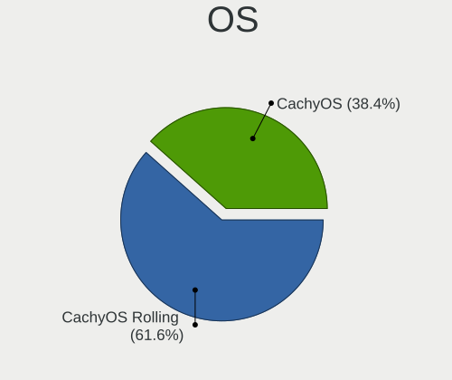

| Name            | Notebooks | Percent |
|-----------------|-----------|---------|
| CachyOS Rolling | 319       | 61.58%  |
| CachyOS         | 199       | 38.42%  |

OS Family
---------

OS without a version

| Name    | Notebooks | Percent |
|---------|-----------|---------|
| CachyOS | 515       | 100%    |

Kernel
------

Version of the Linux kernel

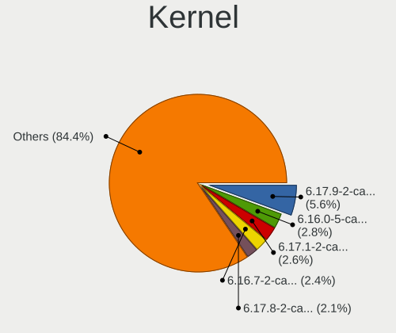

| Version            | Notebooks | Percent |
|--------------------|-----------|---------|
| 6.17.9-2-cachyos   | 32        | 5.59%   |
| 6.16.0-5-cachyos   | 16        | 2.8%    |
| 6.17.1-2-cachyos   | 15        | 2.62%   |
| 6.16.7-2-cachyos   | 14        | 2.45%   |
| 6.17.8-2-cachyos   | 12        | 2.1%    |
| 6.18.2-2-cachyos   | 11        | 1.92%   |
| 6.18.0-3-cachyos   | 10        | 1.75%   |
| 6.17.5-2-cachyos   | 10        | 1.75%   |
| 6.17.7-3-cachyos   | 9         | 1.57%   |
| 6.14.0-4-cachyos   | 9         | 1.57%   |
| 6.16.8-2-cachyos   | 8         | 1.4%    |
| 6.16.1-2-cachyos   | 8         | 1.4%    |
| 6.17.4-4-cachyos   | 7         | 1.22%   |
| 6.15.7-2-cachyos   | 7         | 1.22%   |
| 6.14.2-2-cachyos   | 7         | 1.22%   |
| 6.13.0-2-cachyos   | 7         | 1.22%   |
| 6.18.2-3-cachyos   | 6         | 1.05%   |
| 6.18.1-2-cachyos   | 6         | 1.05%   |
| 6.16.0-3.1-cachyos | 6         | 1.05%   |
| 6.14.8-1.1-cachyos | 6         | 1.05%   |
| 6.14.6-2-cachyos   | 6         | 1.05%   |
| 6.14.0-3-cachyos   | 6         | 1.05%   |
| 6.18.0-5-cachyos   | 5         | 0.87%   |
| 6.16.5-2-cachyos   | 5         | 0.87%   |
| 6.16.4-4-cachyos   | 5         | 0.87%   |
| 6.15.5-2-cachyos   | 5         | 0.87%   |
| 6.15.2-2-cachyos   | 5         | 0.87%   |
| 6.14.4-2-cachyos   | 5         | 0.87%   |
| 6.18.0-2-cachyos   | 4         | 0.7%    |
| 6.17.7-5-cachyos   | 4         | 0.7%    |
| 6.17.0-4-cachyos   | 4         | 0.7%    |
| 6.15.4-3-cachyos   | 4         | 0.7%    |
| 6.13.5-2-cachyos   | 4         | 0.7%    |
| 6.12.0-2-cachyos   | 4         | 0.7%    |
| 6.18.2-1-cachyos   | 3         | 0.52%   |
| 6.17.8-1-cachyos   | 3         | 0.52%   |
| 6.17.3-3-cachyos   | 3         | 0.52%   |
| 6.17.1-1-cachyos   | 3         | 0.52%   |
| 6.16.7-1-cachyos   | 3         | 0.52%   |
| 6.16.6-3-cachyos   | 3         | 0.52%   |

Kernel Family
-------------

Linux kernel without a distro release

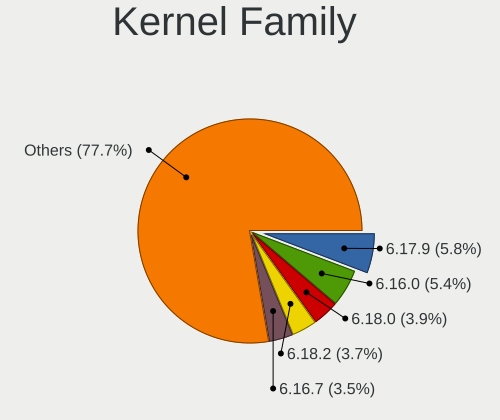

| Version | Notebooks | Percent |
|---------|-----------|---------|
| 6.17.9  | 33        | 5.79%   |
| 6.16.0  | 31        | 5.44%   |
| 6.18.0  | 22        | 3.86%   |
| 6.18.2  | 21        | 3.68%   |
| 6.16.7  | 20        | 3.51%   |
| 6.17.1  | 18        | 3.16%   |
| 6.14.0  | 18        | 3.16%   |
| 6.17.8  | 16        | 2.81%   |
| 6.17.7  | 14        | 2.46%   |
| 6.17.5  | 11        | 1.93%   |
| 6.14.8  | 10        | 1.75%   |
| 6.13.0  | 10        | 1.75%   |
| 6.17.4  | 9         | 1.58%   |
| 6.17.0  | 9         | 1.58%   |
| 6.16.8  | 9         | 1.58%   |
| 6.16.1  | 9         | 1.58%   |
| 6.15.4  | 9         | 1.58%   |
| 6.16.4  | 8         | 1.4%    |
| 6.14.2  | 8         | 1.4%    |
| 6.18.1  | 7         | 1.23%   |
| 6.15.7  | 7         | 1.23%   |
| 6.15.5  | 7         | 1.23%   |
| 6.15.3  | 7         | 1.23%   |
| 6.15.2  | 7         | 1.23%   |
| 6.14.6  | 7         | 1.23%   |
| 6.13.7  | 7         | 1.23%   |
| 6.16.6  | 6         | 1.05%   |
| 6.15.0  | 6         | 1.05%   |
| 6.12.0  | 6         | 1.05%   |
| 6.11.1  | 6         | 1.05%   |
| 6.10.6  | 6         | 1.05%   |
| 6.16.5  | 5         | 0.88%   |
| 6.15.1  | 5         | 0.88%   |
| 6.14.5  | 5         | 0.88%   |
| 6.14.4  | 5         | 0.88%   |
| 6.13.5  | 5         | 0.88%   |
| 6.10.7  | 5         | 0.88%   |
| 6.8.1   | 4         | 0.7%    |
| 6.17.3  | 4         | 0.7%    |
| 6.15.8  | 4         | 0.7%    |

Kernel Major Ver.
-----------------

Linux kernel major version

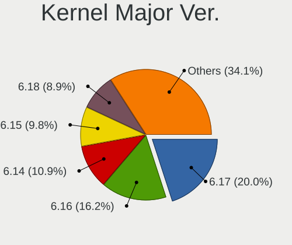

| Version | Notebooks | Percent |
|---------|-----------|---------|
| 6.17    | 112       | 20%     |
| 6.16    | 91        | 16.25%  |
| 6.14    | 61        | 10.89%  |
| 6.15    | 55        | 9.82%   |
| 6.18    | 50        | 8.93%   |
| 6.12    | 49        | 8.75%   |
| 6.13    | 32        | 5.71%   |
| 6.11    | 26        | 4.64%   |
| 6.10    | 22        | 3.93%   |
| 6.9     | 14        | 2.5%    |
| 6.8     | 10        | 1.79%   |
| 6.5     | 8         | 1.43%   |
| 6.3     | 7         | 1.25%   |
| 6.6     | 5         | 0.89%   |
| 6.2     | 4         | 0.71%   |
| 6.4     | 3         | 0.54%   |
| 6.1     | 3         | 0.54%   |
| 6.7     | 2         | 0.36%   |
| 6.0     | 2         | 0.36%   |
| 6.1.66  | 1         | 0.18%   |
| 5.19    | 1         | 0.18%   |
| 5.17    | 1         | 0.18%   |
| 5.16    | 1         | 0.18%   |

Arch
----

OS architecture (x86_64, i586, etc.)

| Name   | Notebooks | Percent |
|--------|-----------|---------|
| x86_64 | 515       | 100%    |

DE
--

Desktop Environment

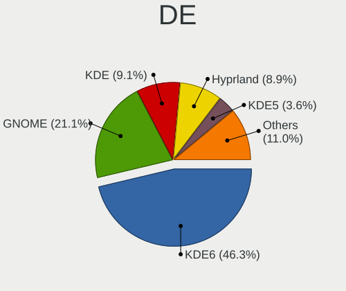

| Name          | Notebooks | Percent |
|---------------|-----------|---------|
| KDE6          | 244       | 46.3%   |
| GNOME         | 111       | 21.06%  |
| KDE           | 48        | 9.11%   |
| Hyprland      | 47        | 8.92%   |
| KDE5          | 19        | 3.61%   |
| XFCE          | 17        | 3.23%   |
| Unknown       | 11        | 2.09%   |
| COSMIC        | 8         | 1.52%   |
| niri          | 5         | 0.95%   |
| X-Cinnamon    | 3         | 0.57%   |
| sway:wlroots  | 2         | 0.38%   |
| GNOME Classic | 2         | 0.38%   |
| Budgie        | 2         | 0.38%   |
| wayfire       | 1         | 0.19%   |
| sway          | 1         | 0.19%   |
| openbox       | 1         | 0.19%   |
| MATE          | 1         | 0.19%   |
| LXQt          | 1         | 0.19%   |
| LXDE          | 1         | 0.19%   |
| i3            | 1         | 0.19%   |
| Cutefish      | 1         | 0.19%   |

Display Server
--------------

X11 or Wayland

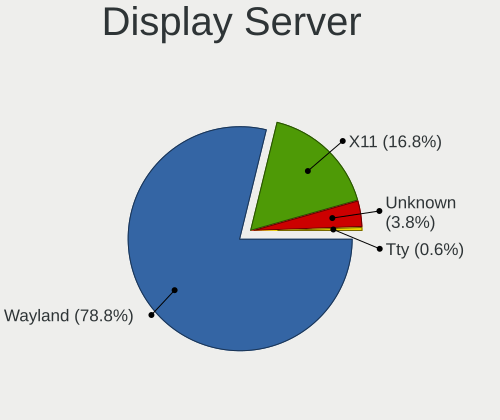

| Name    | Notebooks | Percent |
|---------|-----------|---------|
| Wayland | 413       | 78.82%  |
| X11     | 88        | 16.79%  |
| Unknown | 20        | 3.82%   |
| Tty     | 3         | 0.57%   |

Display Manager
---------------

SDDM, LightDM, etc.

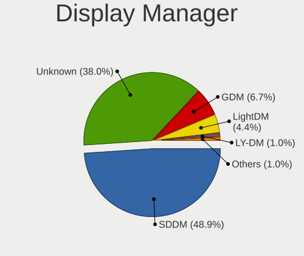

| Name    | Notebooks | Percent |
|---------|-----------|---------|
| SDDM    | 256       | 48.95%  |
| Unknown | 199       | 38.05%  |
| GDM     | 35        | 6.69%   |
| LightDM | 23        | 4.4%    |
| LY-DM   | 5         | 0.96%   |
| GREETD  | 3         | 0.57%   |
| Ly      | 1         | 0.19%   |
| LEMURS  | 1         | 0.19%   |

OS Lang
-------

Language

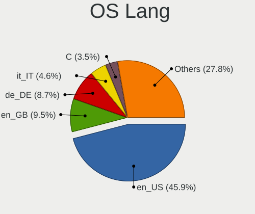

| Lang    | Notebooks | Percent |
|---------|-----------|---------|
| en_US   | 238       | 45.95%  |
| en_GB   | 49        | 9.46%   |
| de_DE   | 45        | 8.69%   |
| it_IT   | 24        | 4.63%   |
| C       | 18        | 3.47%   |
| ru_RU   | 17        | 3.28%   |
| en_CA   | 17        | 3.28%   |
| en_IN   | 15        | 2.9%    |
| pt_BR   | 13        | 2.51%   |
| tr_TR   | 9         | 1.74%   |
| es_ES   | 9         | 1.74%   |
| fr_FR   | 7         | 1.35%   |
| en_PH   | 6         | 1.16%   |
| zh_CN   | 5         | 0.97%   |
| pl_PL   | 4         | 0.77%   |
| es_MX   | 4         | 0.77%   |
| pt_PT   | 3         | 0.58%   |
| hu_HU   | 3         | 0.58%   |
| en_AU   | 3         | 0.58%   |
| es_AR   | 2         | 0.39%   |
| da_DK   | 2         | 0.39%   |
| cs_CZ   | 2         | 0.39%   |
| Unknown | 2         | 0.39%   |
| sv_SE   | 1         | 0.19%   |
| ro_RO   | 1         | 0.19%   |
| nl_NL   | 1         | 0.19%   |
| ja_JP   | 1         | 0.19%   |
| id_ID   | 1         | 0.19%   |
| hr_HR   | 1         | 0.19%   |
| he_IL   | 1         | 0.19%   |
| fr_LU   | 1         | 0.19%   |
| fr_CH   | 1         | 0.19%   |
| fr_BE   | 1         | 0.19%   |
| es_PE   | 1         | 0.19%   |
| es_HN   | 1         | 0.19%   |
| es_EC   | 1         | 0.19%   |
| es_CR   | 1         | 0.19%   |
| es_CO   | 1         | 0.19%   |
| es_CL   | 1         | 0.19%   |
| en_ZA   | 1         | 0.19%   |

Boot Mode
---------

EFI or BIOS

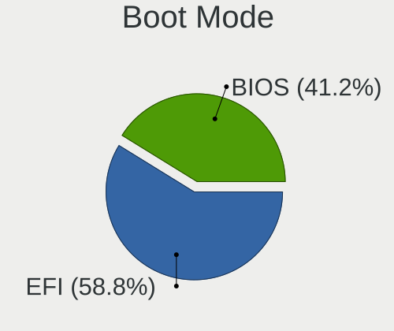

| Mode | Notebooks | Percent |
|------|-----------|---------|
| EFI  | 304       | 58.8%   |
| BIOS | 213       | 41.2%   |

Filesystem
----------

Type of filesystem

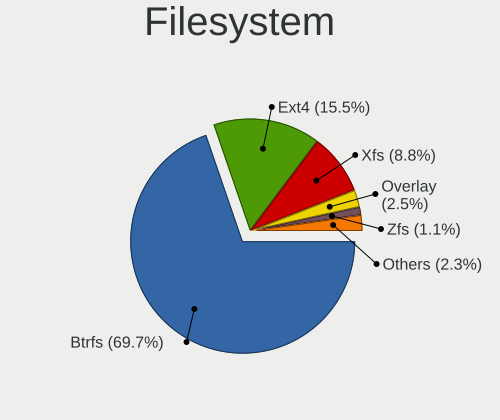

| Type     | Notebooks | Percent |
|----------|-----------|---------|
| Btrfs    | 364       | 69.73%  |
| Ext4     | 81        | 15.52%  |
| Xfs      | 46        | 8.81%   |
| Overlay  | 13        | 2.49%   |
| Zfs      | 6         | 1.15%   |
| Tmpfs    | 4         | 0.77%   |
| Bcachefs | 4         | 0.77%   |
| F2fs     | 3         | 0.57%   |
| Unknown  | 1         | 0.19%   |

Part. scheme
------------

Scheme of partitioning

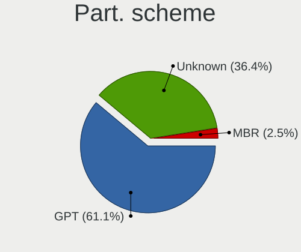

| Type    | Notebooks | Percent |
|---------|-----------|---------|
| GPT     | 316       | 61.12%  |
| Unknown | 188       | 36.36%  |
| MBR     | 13        | 2.51%   |

Dual Boot with Linux/BSD
------------------------

Hosting more than one Linux/BSD

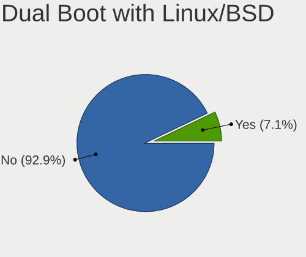

| Dual boot | Notebooks | Percent |
|-----------|-----------|---------|
| No        | 484       | 92.9%   |
| Yes       | 37        | 7.1%    |

Dual Boot (Win)
---------------

Hosting Linux and Windows

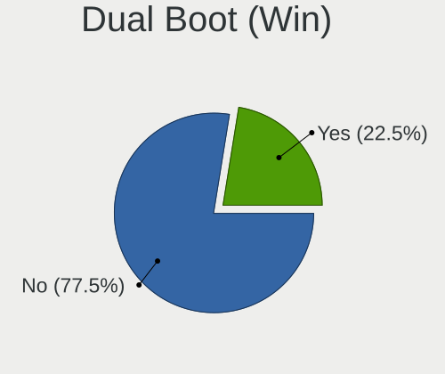

| Dual boot | Notebooks | Percent |
|-----------|-----------|---------|
| No        | 404       | 77.54%  |
| Yes       | 117       | 22.46%  |

Board
-----

Vendor
------

Motherboard manufacturer

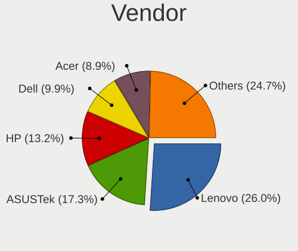

| Name                       | Notebooks | Percent |
|----------------------------|-----------|---------|
| Lenovo                     | 134       | 26.02%  |
| ASUSTek Computer           | 89        | 17.28%  |
| Hewlett-Packard            | 68        | 13.2%   |
| Dell                       | 51        | 9.9%    |
| Acer                       | 46        | 8.93%   |
| MSI                        | 22        | 4.27%   |
| Apple                      | 11        | 2.14%   |
| HUAWEI                     | 10        | 1.94%   |
| Gigabyte Technology        | 7         | 1.36%   |
| Toshiba                    | 5         | 0.97%   |
| Notebook                   | 5         | 0.97%   |
| Alienware                  | 5         | 0.97%   |
| Schenker                   | 4         | 0.78%   |
| Samsung Electronics        | 4         | 0.78%   |
| Monster                    | 4         | 0.78%   |
| Google                     | 4         | 0.78%   |
| Fujitsu                    | 4         | 0.78%   |
| Valve                      | 3         | 0.58%   |
| Razer                      | 3         | 0.58%   |
| GPD                        | 3         | 0.58%   |
| Framework                  | 3         | 0.58%   |
| TUXEDO                     | 2         | 0.39%   |
| HONOR                      | 2         | 0.39%   |
| VALE                       | 1         | 0.19%   |
| TongFang                   | 1         | 0.19%   |
| Timi                       | 1         | 0.19%   |
| TECNO Mobile Limited       | 1         | 0.19%   |
| Tactus                     | 1         | 0.19%   |
| System76                   | 1         | 0.19%   |
| Sony                       | 1         | 0.19%   |
| Shenzhen WEIBU Information | 1         | 0.19%   |
| PC Specialist              | 1         | 0.19%   |
| Nimo Direct                | 1         | 0.19%   |
| Motorola                   | 1         | 0.19%   |
| Medion                     | 1         | 0.19%   |
| Maibenben                  | 1         | 0.19%   |
| Jumper                     | 1         | 0.19%   |
| IP3 Tech                   | 1         | 0.19%   |
| Intel Client Systems       | 1         | 0.19%   |
| Infinix                    | 1         | 0.19%   |

Model
-----

Motherboard model

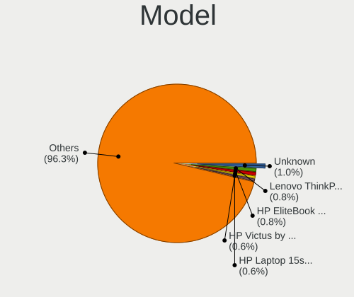

| Name                                        | Notebooks | Percent |
|---------------------------------------------|-----------|---------|
| Unknown                                     | 5         | 0.97%   |
| Lenovo ThinkPad E14 Gen 3 20YE000GCD        | 4         | 0.78%   |
| HP EliteBook 840 G6                         | 4         | 0.78%   |
| HP Victus by Gaming Laptop 15-fb1xxx        | 3         | 0.58%   |
| HP Laptop 15s-eq1xxx                        | 3         | 0.58%   |
| ASUS VivoBook_ASUSLaptop M1505YA_D1505YA    | 3         | 0.58%   |
| ASUS ROG Zephyrus G14 GA401QM_GA401QM       | 3         | 0.58%   |
| Apple MacBookPro16,1                        | 3         | 0.58%   |
| Valve Jupiter                               | 2         | 0.39%   |
| MSI Katana GF76 11UD                        | 2         | 0.39%   |
| MSI GF65 Thin 10UE                          | 2         | 0.39%   |
| Lenovo LOQ 15IRX9 83DV                      | 2         | 0.39%   |
| Lenovo LOQ 15AHP9 83DX                      | 2         | 0.39%   |
| Lenovo Legion Slim 5 16ARP9 83EX            | 2         | 0.39%   |
| Lenovo Legion Pro 7 16AFR10H 83RU           | 2         | 0.39%   |
| Lenovo Legion 5 Pro 16ACH6H 82JQ            | 2         | 0.39%   |
| Lenovo IdeaPad S145-15API 81V7              | 2         | 0.39%   |
| Lenovo IdeaPad Gaming 3 15ARH7 82SB         | 2         | 0.39%   |
| Lenovo IdeaPad 5 15ARE05 81YQ               | 2         | 0.39%   |
| Lenovo IdeaPad 3 15ALC6 82MF                | 2         | 0.39%   |
| Lenovo IdeaPad 130-15IKB 81H7               | 2         | 0.39%   |
| HUAWEI NBLK-WAX9X                           | 2         | 0.39%   |
| HP Victus by Gaming Laptop 16-s0xxx         | 2         | 0.39%   |
| HP OMEN by Laptop 15-dc1xxx                 | 2         | 0.39%   |
| HP Laptop 15-ef2xxx                         | 2         | 0.39%   |
| HP Laptop 15-da3xxx                         | 2         | 0.39%   |
| HP 250 15.6 inch G9 Notebook PC             | 2         | 0.39%   |
| Framework Laptop 16 (AMD Ryzen 7040 Series) | 2         | 0.39%   |
| Dell XPS 15 9560                            | 2         | 0.39%   |
| Dell Latitude E7470                         | 2         | 0.39%   |
| Dell Latitude 7390                          | 2         | 0.39%   |
| Dell Inspiron 16 Plus 7640                  | 2         | 0.39%   |
| ASUS VivoBook_ASUSLaptop X712DA_D712DA      | 2         | 0.39%   |
| ASUS VivoBook_ASUSLaptop M1503QA_M1503QA    | 2         | 0.39%   |
| ASUS ROG Zephyrus G16 GU605CW_GU605CW       | 2         | 0.39%   |
| ASUS ASUS Zenbook S 14 UX5406SA_UX5406SA    | 2         | 0.39%   |
| Apple MacBookPro9,2                         | 2         | 0.39%   |
| Alienware 15 R2                             | 2         | 0.39%   |
| Acer Swift SFG14-63                         | 2         | 0.39%   |
| Acer Nitro ANV16-41                         | 2         | 0.39%   |

Model Family
------------

Motherboard model prefix

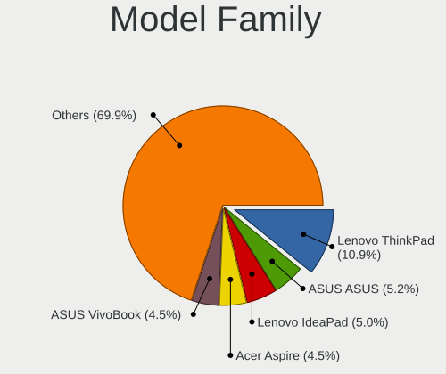

| Name               | Notebooks | Percent |
|--------------------|-----------|---------|
| Lenovo ThinkPad    | 56        | 10.87%  |
| ASUS ASUS          | 27        | 5.24%   |
| Lenovo IdeaPad     | 26        | 5.05%   |
| ASUS VivoBook      | 23        | 4.47%   |
| Acer Aspire        | 23        | 4.47%   |
| Lenovo Legion      | 22        | 4.27%   |
| Dell Latitude      | 22        | 4.27%   |
| ASUS ROG           | 21        | 4.08%   |
| HP Laptop          | 18        | 3.5%    |
| Acer Nitro         | 14        | 2.72%   |
| HP EliteBook       | 11        | 2.14%   |
| Dell Inspiron      | 9         | 1.75%   |
| Lenovo LOQ         | 8         | 1.55%   |
| HP Victus          | 8         | 1.55%   |
| HP Pavilion        | 7         | 1.36%   |
| HP OMEN            | 7         | 1.36%   |
| Dell XPS           | 6         | 1.17%   |
| Acer Swift         | 6         | 1.17%   |
| Toshiba Satellite  | 5         | 0.97%   |
| Lenovo Yoga        | 5         | 0.97%   |
| Lenovo ThinkBook   | 5         | 0.97%   |
| Dell Precision     | 5         | 0.97%   |
| Unknown            | 5         | 0.97%   |
| Schenker XMG       | 4         | 0.78%   |
| HP ZBook           | 4         | 0.78%   |
| HP ProBook         | 4         | 0.78%   |
| ASUS ZenBook       | 4         | 0.78%   |
| Razer Blade        | 3         | 0.58%   |
| MSI Prestige       | 3         | 0.58%   |
| MSI Katana         | 3         | 0.58%   |
| Monster ABRA       | 3         | 0.58%   |
| HP 250             | 3         | 0.58%   |
| Fujitsu LIFEBOOK   | 3         | 0.58%   |
| Framework Laptop   | 3         | 0.58%   |
| Dell Vostro        | 3         | 0.58%   |
| Dell G15           | 3         | 0.58%   |
| Apple MacBookPro16 | 3         | 0.58%   |
| Acer Predator      | 3         | 0.58%   |
| Valve Jupiter      | 2         | 0.39%   |
| MSI Modern         | 2         | 0.39%   |

MFG Year
--------

Motherboard manufacture year

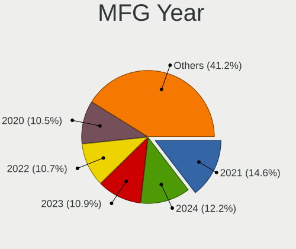

| Year | Notebooks | Percent |
|------|-----------|---------|
| 2021 | 75        | 14.56%  |
| 2024 | 63        | 12.23%  |
| 2023 | 56        | 10.87%  |
| 2022 | 55        | 10.68%  |
| 2020 | 54        | 10.49%  |
| 2025 | 34        | 6.6%    |
| 2019 | 34        | 6.6%    |
| 2018 | 30        | 5.83%   |
| 2017 | 23        | 4.47%   |
| 2013 | 16        | 3.11%   |
| 2015 | 15        | 2.91%   |
| 2016 | 14        | 2.72%   |
| 2012 | 12        | 2.33%   |
| 2014 | 11        | 2.14%   |
| 2011 | 11        | 2.14%   |
| 2010 | 5         | 0.97%   |
| 2008 | 3         | 0.58%   |
| 2009 | 2         | 0.39%   |
| 2007 | 1         | 0.19%   |
| 2006 | 1         | 0.19%   |

Form Factor
-----------

Physical design of the computer

| Name     | Notebooks | Percent |
|----------|-----------|---------|
| Notebook | 515       | 100%    |

Secure Boot
-----------

Enabled or disabled

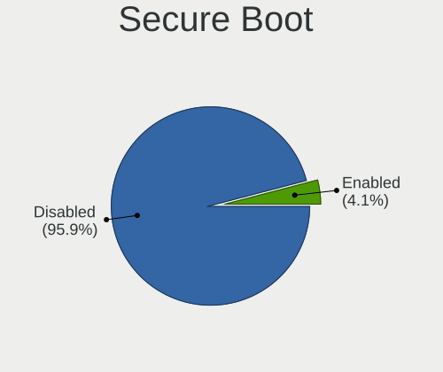

| State    | Notebooks | Percent |
|----------|-----------|---------|
| Disabled | 495       | 95.93%  |
| Enabled  | 21        | 4.07%   |

Coreboot
--------

Have coreboot on board

| Used | Notebooks | Percent |
|------|-----------|---------|
| No   | 508       | 98.64%  |
| Yes  | 7         | 1.36%   |

RAM Size
--------

Total RAM memory

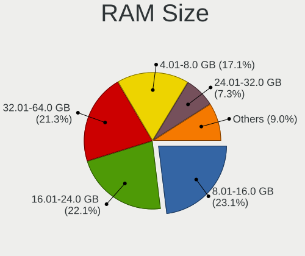

| Size in GB  | Notebooks | Percent |
|-------------|-----------|---------|
| 8.01-16.0   | 120       | 23.08%  |
| 16.01-24.0  | 115       | 22.12%  |
| 32.01-64.0  | 111       | 21.35%  |
| 4.01-8.0    | 89        | 17.12%  |
| 24.01-32.0  | 38        | 7.31%   |
| 64.01-256.0 | 24        | 4.62%   |
| 3.01-4.0    | 23        | 4.42%   |

RAM Used
--------

Used RAM memory

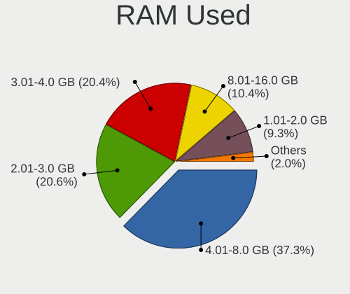

| Used GB    | Notebooks | Percent |
|------------|-----------|---------|
| 4.01-8.0   | 205       | 37.34%  |
| 2.01-3.0   | 113       | 20.58%  |
| 3.01-4.0   | 112       | 20.4%   |
| 8.01-16.0  | 57        | 10.38%  |
| 1.01-2.0   | 51        | 9.29%   |
| 16.01-24.0 | 4         | 0.73%   |
| 0.51-1.0   | 4         | 0.73%   |
| 24.01-32.0 | 3         | 0.55%   |

Total Drives
------------

Number of drives on board

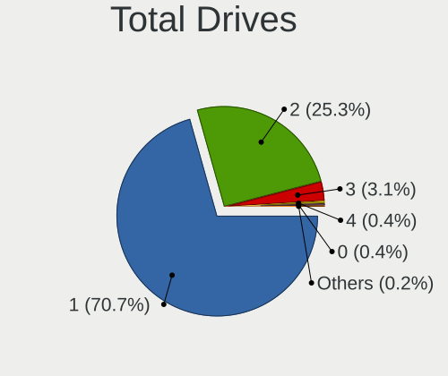

| Drives | Notebooks | Percent |
|--------|-----------|---------|
| 1      | 366       | 70.66%  |
| 2      | 131       | 25.29%  |
| 3      | 16        | 3.09%   |
| 4      | 2         | 0.39%   |
| 0      | 2         | 0.39%   |
| 5      | 1         | 0.19%   |

Has CD-ROM
----------

Has CD-ROM on board

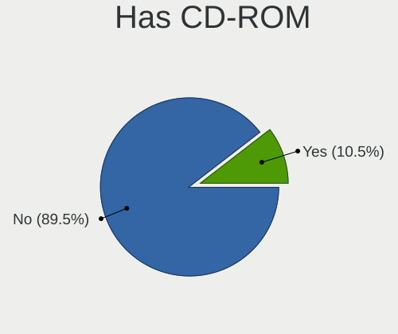

| Presented | Notebooks | Percent |
|-----------|-----------|---------|
| No        | 462       | 89.53%  |
| Yes       | 54        | 10.47%  |

Has Ethernet
------------

Has Ethernet on board

| Presented | Notebooks | Percent |
|-----------|-----------|---------|
| Yes       | 388       | 74.76%  |
| No        | 131       | 25.24%  |

Has WiFi
--------

Has WiFi module

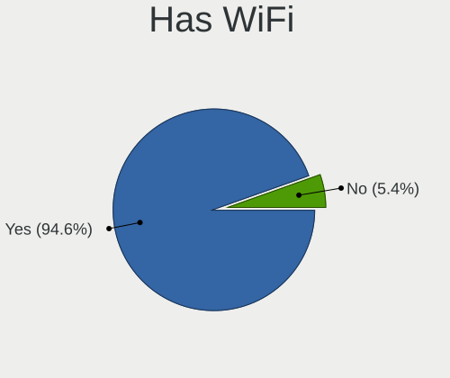

| Presented | Notebooks | Percent |
|-----------|-----------|---------|
| Yes       | 488       | 94.57%  |
| No        | 28        | 5.43%   |

Has Bluetooth
-------------

Has Bluetooth module

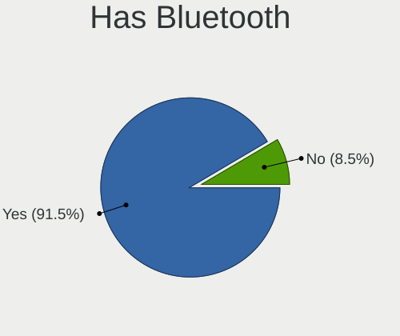

| Presented | Notebooks | Percent |
|-----------|-----------|---------|
| Yes       | 475       | 91.52%  |
| No        | 44        | 8.48%   |

Location
--------

Country
-------

Geographic location (country)

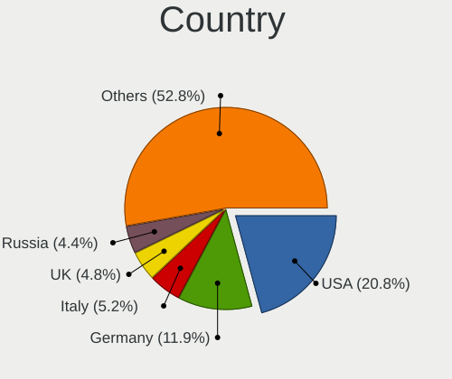

| Country      | Notebooks | Percent |
|--------------|-----------|---------|
| USA          | 108       | 20.81%  |
| Germany      | 62        | 11.95%  |
| Italy        | 27        | 5.2%    |
| UK           | 25        | 4.82%   |
| Russia       | 23        | 4.43%   |
| Brazil       | 23        | 4.43%   |
| India        | 19        | 3.66%   |
| Canada       | 18        | 3.47%   |
| Turkey       | 15        | 2.89%   |
| France       | 14        | 2.7%    |
| Poland       | 10        | 1.93%   |
| Spain        | 8         | 1.54%   |
| Romania      | 7         | 1.35%   |
| Netherlands  | 7         | 1.35%   |
| Switzerland  | 6         | 1.16%   |
| Sweden       | 6         | 1.16%   |
| Philippines  | 6         | 1.16%   |
| Indonesia    | 6         | 1.16%   |
| Belgium      | 6         | 1.16%   |
| Vietnam      | 5         | 0.96%   |
| Portugal     | 5         | 0.96%   |
| Mexico       | 5         | 0.96%   |
| Hong Kong    | 5         | 0.96%   |
| Austria      | 5         | 0.96%   |
| Slovakia     | 4         | 0.77%   |
| Norway       | 4         | 0.77%   |
| Japan        | 4         | 0.77%   |
| Greece       | 4         | 0.77%   |
| Australia    | 4         | 0.77%   |
| Ukraine      | 3         | 0.58%   |
| Thailand     | 3         | 0.58%   |
| Pakistan     | 3         | 0.58%   |
| Luxembourg   | 3         | 0.58%   |
| Ireland      | 3         | 0.58%   |
| Hungary      | 3         | 0.58%   |
| Czechia      | 3         | 0.58%   |
| China        | 3         | 0.58%   |
| Bangladesh   | 3         | 0.58%   |
| Türkiye     | 2         | 0.39%   |
| South Africa | 2         | 0.39%   |

City
----

Geographic location (city)

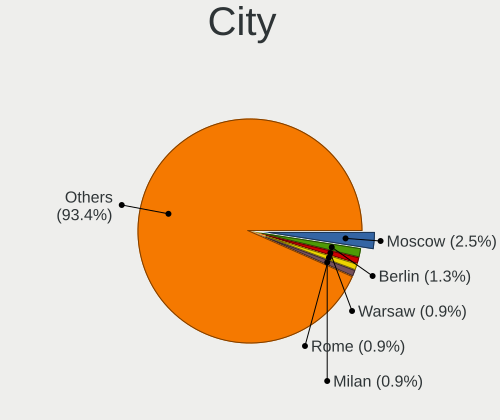

| City              | Notebooks | Percent |
|-------------------|-----------|---------|
| Moscow            | 13        | 2.46%   |
| Berlin            | 7         | 1.32%   |
| Warsaw            | 5         | 0.95%   |
| Rome              | 5         | 0.95%   |
| Milan             | 5         | 0.95%   |
| Istanbul          | 5         | 0.95%   |
| Birmingham        | 5         | 0.95%   |
| Vienna            | 4         | 0.76%   |
| Hanoi             | 4         | 0.76%   |
| Hamburg           | 4         | 0.76%   |
| Delhi             | 4         | 0.76%   |
| Toronto           | 3         | 0.57%   |
| Seattle           | 3         | 0.57%   |
| Sao Paulo         | 3         | 0.57%   |
| Quezon City       | 3         | 0.57%   |
| Kharkiv           | 3         | 0.57%   |
| Jakarta           | 3         | 0.57%   |
| Izmir             | 3         | 0.57%   |
| Frankfurt Am Main | 3         | 0.57%   |
| Dublin            | 3         | 0.57%   |
| Bengaluru         | 3         | 0.57%   |
| Bangkok           | 3         | 0.57%   |
| Zephyrhills       | 2         | 0.38%   |
| Wilmington        | 2         | 0.38%   |
| Tbilisi           | 2         | 0.38%   |
| Sydney            | 2         | 0.38%   |
| Stavropol         | 2         | 0.38%   |
| Sofia             | 2         | 0.38%   |
| Santiago          | 2         | 0.38%   |
| San Francisco     | 2         | 0.38%   |
| Rancho Cucamonga  | 2         | 0.38%   |
| Prague            | 2         | 0.38%   |
| Porto             | 2         | 0.38%   |
| Portland          | 2         | 0.38%   |
| Nizhniy Novgorod  | 2         | 0.38%   |
| Muscat            | 2         | 0.38%   |
| Munich            | 2         | 0.38%   |
| Mogi Mirim        | 2         | 0.38%   |
| Mississauga       | 2         | 0.38%   |
| Milano            | 2         | 0.38%   |

Drives
------

Drive Vendor
------------

Hard drive vendors

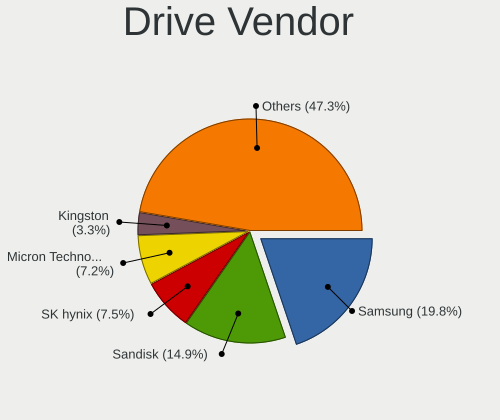

| Vendor                                  | Notebooks | Drives | Percent |
|-----------------------------------------|-----------|--------|---------|
| Samsung Electronics                     | 132       | 164    | 19.82%  |
| Sandisk                                 | 99        | 114    | 14.86%  |
| SK hynix                                | 50        | 58     | 7.51%   |
| Micron Technology                       | 48        | 54     | 7.21%   |
| KIOXIA                                  | 22        | 26     | 3.3%    |
| Kingston                                | 22        | 25     | 3.3%    |
| Seagate                                 | 21        | 22     | 3.15%   |
| Intel                                   | 21        | 23     | 3.15%   |
| MAXIO Technology (Hangzhou)             | 19        | 24     | 2.85%   |
| Kingston Technology Company             | 18        | 20     | 2.7%    |
| WDC                                     | 17        | 18     | 2.55%   |
| Toshiba                                 | 17        | 21     | 2.55%   |
| Phison Electronics                      | 14        | 16     | 2.1%    |
| Micron/Crucial Technology               | 13        | 15     | 1.95%   |
| Crucial                                 | 12        | 14     | 1.8%    |
| Unknown                                 | 11        | 13     | 1.65%   |
| A-DATA Technology                       | 11        | 12     | 1.65%   |
| HGST                                    | 10        | 11     | 1.5%    |
| Yangtze Memory Technologies             | 8         | 10     | 1.2%    |
| Shenzhen Longsys Electronics            | 8         | 9      | 1.2%    |
| ADATA Technology                        | 7         | 9      | 1.05%   |
| China                                   | 5         | 5      | 0.75%   |
| Apple                                   | 5         | 5      | 0.75%   |
| Transcend                               | 4         | 5      | 0.6%    |
| Realtek Semiconductor                   | 4         | 4      | 0.6%    |
| Intenso                                 | 4         | 5      | 0.6%    |
| Solid State Storage                     | 3         | 4      | 0.45%   |
| Silicon Motion                          | 3         | 5      | 0.45%   |
| Union Memory (Shenzhen)                 | 2         | 2      | 0.3%    |
| Shenzhen Unionmemory Information System | 2         | 2      | 0.3%    |
| SABRENT                                 | 2         | 3      | 0.3%    |
| PNY                                     | 2         | 2      | 0.3%    |
| Lite-On Technology                      | 2         | 2      | 0.3%    |
| KingSpec                                | 2         | 2      | 0.3%    |
| INNOVATION IT                           | 2         | 2      | 0.3%    |
| Hitachi                                 | 2         | 2      | 0.3%    |
| Fanxiang                                | 2         | 2      | 0.3%    |
| Unknown                                 | 2         | 2      | 0.3%    |
| Union Memory                            | 1         | 1      | 0.15%   |
| Team                                    | 1         | 1      | 0.15%   |

Drive Model
-----------

Hard drive models

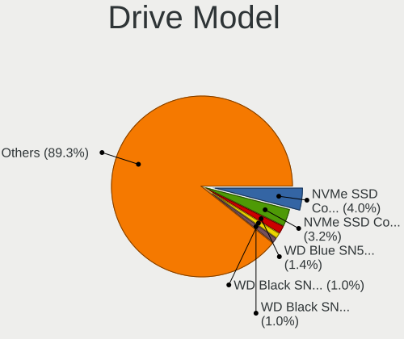

| Model                                                                      | Notebooks | Percent |
|----------------------------------------------------------------------------|-----------|---------|
| Samsung NVMe SSD Controller SM981/PM981/PM983 1TB                          | 28        | 4.05%   |
| Samsung NVMe SSD Controller PM9A1/PM9A3/980PRO 1TB                         | 22        | 3.18%   |
| Sandisk WD Blue SN550 NVMe SSD 1024GB                                      | 10        | 1.45%   |
| Sandisk WD Black SN770 / PC SN740 256GB / PC SN560 (DRAM-less) NVMe SSD    | 7         | 1.01%   |
| Sandisk WD Black SN750 / PC SN730 NVMe SSD 500GB                           | 7         | 1.01%   |
| Samsung NVMe SSD Controller SM961/PM961/SM963 1024GB                       | 7         | 1.01%   |
| Samsung NVMe SSD Controller 980 (DRAM-less) 256GB                          | 7         | 1.01%   |
| Unknown MMC Card  64GB                                                     | 6         | 0.87%   |
| SK hynix Platinum P41/PC801 NVMe Solid State Drive 1TB                     | 6         | 0.87%   |
| Seagate ST1000LM035-1RK172 1TB                                             | 6         | 0.87%   |
| Micron 3400_MTFDKBA1T0TFH 1024GB                                           | 6         | 0.87%   |
| Micron 2400 NVMe SSD (DRAM-less) 512GB                                     | 6         | 0.87%   |
| MAXIO (Hangzhou) NVMe SSD Controller MAP1202 2TB                           | 6         | 0.87%   |
| Intel SSDPEKNU512GZ 512GB                                                  | 6         | 0.87%   |
| SK hynix BC901 NVMe Solid State Drive (DRAM-less) 512GB                    | 5         | 0.72%   |
| Sandisk WD PC SN5000S M.2 2280 NVMe SSD (DRAM-less) 1TB                    | 5         | 0.72%   |
| Sandisk WD Black SN850X NVMe SSD 4TB                                       | 5         | 0.72%   |
| Sandisk WD Black SN850 1TB                                                 | 5         | 0.72%   |
| Samsung NVMe SSD Controller S4LV008[Pascal] 4TB                            | 5         | 0.72%   |
| MAXIO (Hangzhou) NVMe SSD Controller MAP1202 (DRAM-less) 512GB             | 5         | 0.72%   |
| Intel SSD 670p Series [Keystone Harbor] 1TB                                | 5         | 0.72%   |
| HGST HTS721010A9E630 1TB                                                   | 5         | 0.72%   |
| Apple ANS2 NVMe Controller 4TB                                             | 5         | 0.72%   |
| Yangtze Memory ZHITAI TiPlus5000 1TB                                       | 4         | 0.58%   |
| Toshiba MQ04ABF100 1TB                                                     | 4         | 0.58%   |
| Sandisk WD PC SN560 SDDPNQE-1T00-1102 1024GB                               | 4         | 0.58%   |
| Sandisk Extreme Pro / WD Black SN750 / PC SN730 / Red SN700 NVMe SSD 500GB | 4         | 0.58%   |
| Samsung SSD 980 1TB                                                        | 4         | 0.58%   |
| Samsung NVMe SSD Controller PM9C1a (DRAM-less) 1TB                         | 4         | 0.58%   |
| Samsung NVMe SSD Controller PM9B1 (DRAM-less) 512GB                        | 4         | 0.58%   |
| Micron/Crucial P2 NVMe PCIe SSD 2TB                                        | 4         | 0.58%   |
| Micron 3400_MTFDKBA512TFH 512GB                                            | 4         | 0.58%   |
| Micron 2450 NVMe SSD [HendrixV] (DRAM-less) 1TB                            | 4         | 0.58%   |
| Toshiba MQ01ABD100 1TB                                                     | 3         | 0.43%   |
| SK hynix SKHynix_HFS001TEJ9X115N 1024GB                                    | 3         | 0.43%   |
| SK hynix SHPP41-2000GM 2TB                                                 | 3         | 0.43%   |
| SK hynix Gold P31/BC711/PC711 NVMe Solid State Drive 512GB                 | 3         | 0.43%   |
| Silicon Motion SM2263EN/SM2263XT SSD Controller 512GB                      | 3         | 0.43%   |
| Samsung SSD 850 EVO 500GB                                                  | 3         | 0.43%   |
| Samsung MZVL4512HBLU-00BTW 512GB                                           | 3         | 0.43%   |

HDD Vendor
----------

Hard disk drive vendors

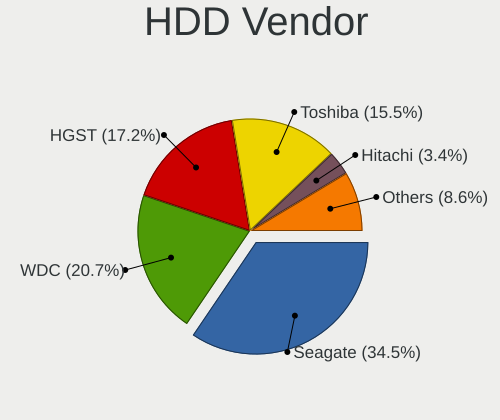

| Vendor              | Notebooks | Drives | Percent |
|---------------------|-----------|--------|---------|
| Seagate             | 20        | 21     | 34.48%  |
| WDC                 | 12        | 12     | 20.69%  |
| HGST                | 10        | 11     | 17.24%  |
| Toshiba             | 9         | 10     | 15.52%  |
| Hitachi             | 2         | 2      | 3.45%   |
| Samsung Electronics | 1         | 1      | 1.72%   |
| Maxone              | 1         | 1      | 1.72%   |
| JMicron Technology  | 1         | 1      | 1.72%   |
| HGST HUS            | 1         | 1      | 1.72%   |
| Fujitsu             | 1         | 1      | 1.72%   |

SSD Vendor
----------

Solid state drive vendors

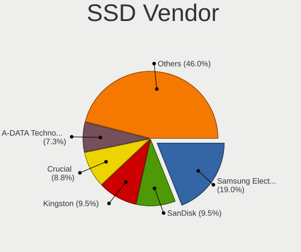

| Vendor              | Notebooks | Drives | Percent |
|---------------------|-----------|--------|---------|
| Samsung Electronics | 26        | 28     | 18.98%  |
| SanDisk             | 13        | 13     | 9.49%   |
| Kingston            | 13        | 13     | 9.49%   |
| Crucial             | 12        | 14     | 8.76%   |
| A-DATA Technology   | 10        | 10     | 7.3%    |
| WDC                 | 6         | 6      | 4.38%   |
| SK hynix            | 6         | 6      | 4.38%   |
| China               | 5         | 5      | 3.65%   |
| Transcend           | 4         | 5      | 2.92%   |
| Intenso             | 4         | 5      | 2.92%   |
| Toshiba             | 3         | 3      | 2.19%   |
| Micron Technology   | 3         | 3      | 2.19%   |
| Intel               | 3         | 3      | 2.19%   |
| SABRENT             | 2         | 3      | 1.46%   |
| PNY                 | 2         | 2      | 1.46%   |
| KingSpec            | 2         | 2      | 1.46%   |
| INNOVATION IT       | 2         | 2      | 1.46%   |
| Unknown             | 2         | 2      | 1.46%   |
| Team                | 1         | 1      | 0.73%   |
| T-FORCE             | 1         | 1      | 0.73%   |
| SPCC                | 1         | 1      | 0.73%   |
| ShiJi               | 1         | 1      | 0.73%   |
| SAMFLASH            | 1         | 1      | 0.73%   |
| Patriot             | 1         | 1      | 0.73%   |
| Palit               | 1         | 1      | 0.73%   |
| OWC                 | 1         | 1      | 0.73%   |
| Netac               | 1         | 1      | 0.73%   |
| LITEONIT            | 1         | 1      | 0.73%   |
| LITEON              | 1         | 1      | 0.73%   |
| Integral            | 1         | 1      | 0.73%   |
| Go-Infinity         | 1         | 1      | 0.73%   |
| GLOWAY              | 1         | 1      | 0.73%   |
| Fanxiang            | 1         | 1      | 0.73%   |
| CONSISTENT          | 1         | 1      | 0.73%   |
| BORY                | 1         | 1      | 0.73%   |
| BIWIN               | 1         | 1      | 0.73%   |
| Apacer              | 1         | 1      | 0.73%   |

Drive Kind
----------

HDD or SSD

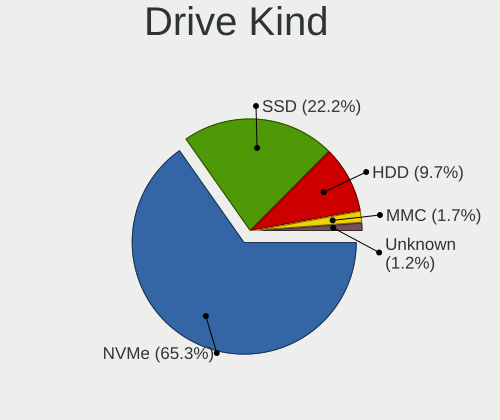

| Kind    | Notebooks | Drives | Percent |
|---------|-----------|--------|---------|
| NVMe    | 385       | 546    | 65.25%  |
| SSD     | 131       | 144    | 22.2%   |
| HDD     | 57        | 61     | 9.66%   |
| MMC     | 10        | 12     | 1.69%   |
| Unknown | 7         | 8      | 1.19%   |

Drive Connector
---------------

SATA, SAS, NVMe, etc.

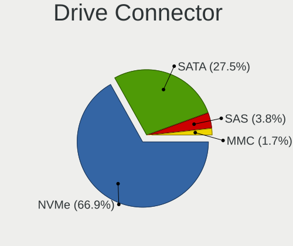

| Type | Notebooks | Drives | Percent |
|------|-----------|--------|---------|
| NVMe | 384       | 543    | 66.9%   |
| SATA | 158       | 189    | 27.53%  |
| SAS  | 22        | 27     | 3.83%   |
| MMC  | 10        | 12     | 1.74%   |

Drive Size
----------

Size of hard drive

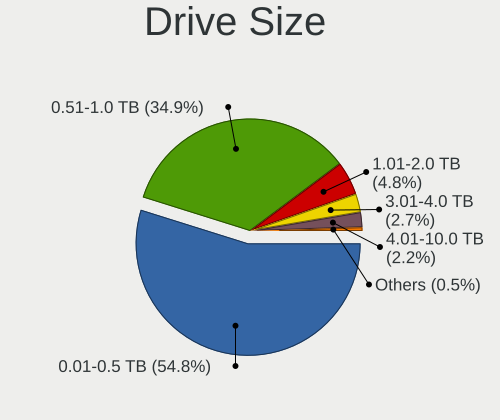

| Size in TB | Notebooks | Drives | Percent |
|------------|-----------|--------|---------|
| 0.01-0.5   | 102       | 114    | 54.84%  |
| 0.51-1.0   | 65        | 69     | 34.95%  |
| 1.01-2.0   | 9         | 11     | 4.84%   |
| 3.01-4.0   | 5         | 6      | 2.69%   |
| 4.01-10.0  | 4         | 4      | 2.15%   |
| 2.01-3.0   | 1         | 1      | 0.54%   |

Space Total
-----------

Amount of disk space available on the file system

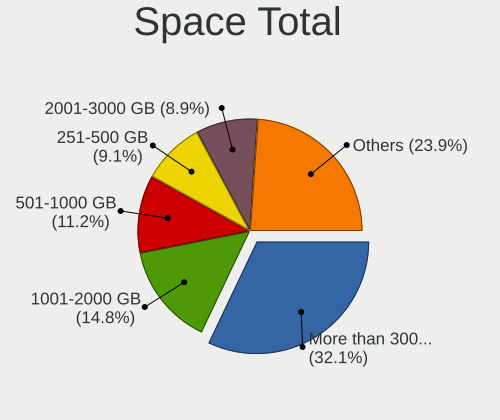

| Size in GB     | Notebooks | Percent |
|----------------|-----------|---------|
| More than 3000 | 169       | 32.07%  |
| 1001-2000      | 78        | 14.8%   |
| 501-1000       | 59        | 11.2%   |
| 251-500        | 48        | 9.11%   |
| 2001-3000      | 47        | 8.92%   |
| 101-250        | 41        | 7.78%   |
| Unknown        | 37        | 7.02%   |
| 1-20           | 36        | 6.83%   |
| 51-100         | 9         | 1.71%   |
| 21-50          | 3         | 0.57%   |

Space Used
----------

Amount of used disk space

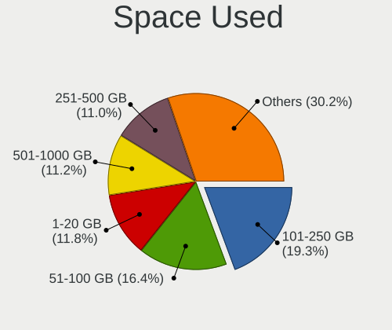

| Used GB        | Notebooks | Percent |
|----------------|-----------|---------|
| 101-250        | 105       | 19.34%  |
| 51-100         | 89        | 16.39%  |
| 1-20           | 64        | 11.79%  |
| 501-1000       | 61        | 11.23%  |
| 251-500        | 60        | 11.05%  |
| 21-50          | 48        | 8.84%   |
| 1001-2000      | 42        | 7.73%   |
| Unknown        | 37        | 6.81%   |
| More than 3000 | 20        | 3.68%   |
| 2001-3000      | 17        | 3.13%   |

Malfunc. Drives
---------------

Drive models with a malfunction

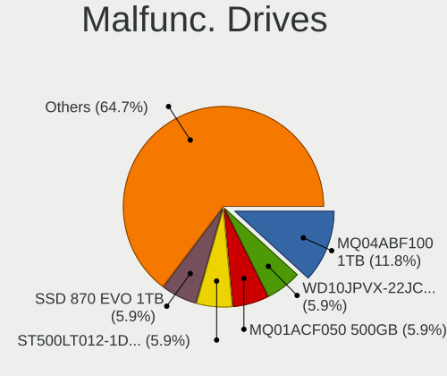

| Model                                       | Notebooks | Drives | Percent |
|---------------------------------------------|-----------|--------|---------|
| Toshiba MQ04ABF100 1TB                      | 2         | 2      | 11.76%  |
| WDC WD10JPVX-22JC3T0 1TB                    | 1         | 1      | 5.88%   |
| Toshiba MQ01ACF050 500GB                    | 1         | 1      | 5.88%   |
| SK hynix BC501 NVMe Solid State Drive 256GB | 1         | 1      | 5.88%   |
| Seagate ST500LT012-1DG142 500GB             | 1         | 1      | 5.88%   |
| Samsung Electronics SSD 870 EVO 1TB         | 1         | 1      | 5.88%   |
| Samsung Electronics SSD 850 EVO 1TB         | 1         | 1      | 5.88%   |
| Palit PSP720 SSD 720GB                      | 1         | 1      | 5.88%   |
| Kingston SKC600/ 1TB SSD                    | 1         | 1      | 5.88%   |
| Kingston OM8S1S3128K-AH 128GB SSD           | 1         | 1      | 5.88%   |
| Intel SSD 600P Series 1024GB                | 1         | 1      | 5.88%   |
| HGST HTS545050A7E380 500GB                  | 1         | 1      | 5.88%   |
| HGST HTS541010A9E680 1TB                    | 1         | 1      | 5.88%   |
| Fujitsu MJA2250BH G2 250GB                  | 1         | 1      | 5.88%   |
| Crucial CT250MX500SSD1 250GB                | 1         | 2      | 5.88%   |
| A-DATA Technology SU630 480GB SSD           | 1         | 1      | 5.88%   |

Malfunc. Drive Vendor
---------------------

Vendors of faulty drives

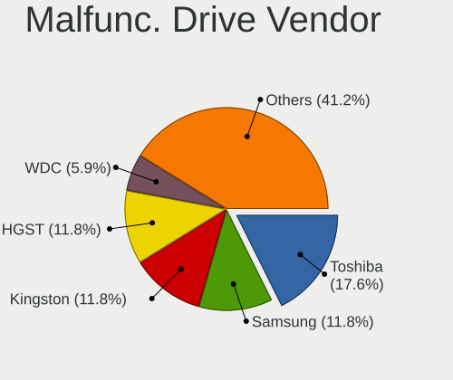

| Vendor              | Notebooks | Drives | Percent |
|---------------------|-----------|--------|---------|
| Toshiba             | 3         | 3      | 17.65%  |
| Samsung Electronics | 2         | 2      | 11.76%  |
| Kingston            | 2         | 2      | 11.76%  |
| HGST                | 2         | 2      | 11.76%  |
| WDC                 | 1         | 1      | 5.88%   |
| SK hynix            | 1         | 1      | 5.88%   |
| Seagate             | 1         | 1      | 5.88%   |
| Palit               | 1         | 1      | 5.88%   |
| Intel               | 1         | 1      | 5.88%   |
| Fujitsu             | 1         | 1      | 5.88%   |
| Crucial             | 1         | 2      | 5.88%   |
| A-DATA Technology   | 1         | 1      | 5.88%   |

Malfunc. HDD Vendor
-------------------

Vendors of faulty HDD drives

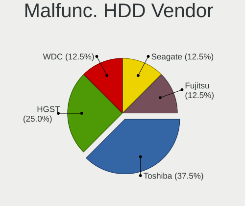

| Vendor  | Notebooks | Drives | Percent |
|---------|-----------|--------|---------|
| Toshiba | 3         | 3      | 37.5%   |
| HGST    | 2         | 2      | 25%     |
| WDC     | 1         | 1      | 12.5%   |
| Seagate | 1         | 1      | 12.5%   |
| Fujitsu | 1         | 1      | 12.5%   |

Malfunc. Drive Kind
-------------------

Kinds of faulty drives

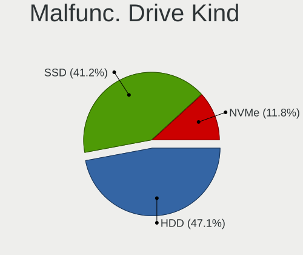

| Kind | Notebooks | Drives | Percent |
|------|-----------|--------|---------|
| HDD  | 8         | 8      | 47.06%  |
| SSD  | 7         | 8      | 41.18%  |
| NVMe | 2         | 2      | 11.76%  |

Failed Drives
-------------

Failed drive models

Zero info for selected period =(

Failed Drive Vendor
-------------------

Failed drive vendors

Zero info for selected period =(

Drive Status
------------

Number of failed and malfunc. drives

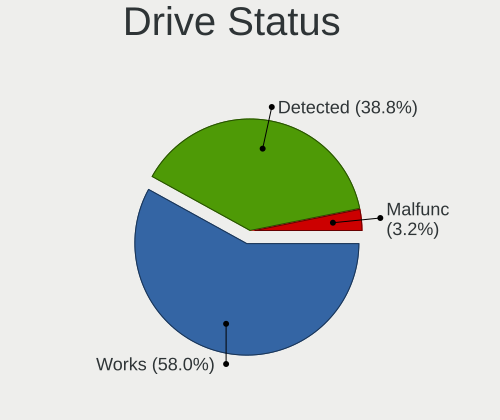

| Status   | Notebooks | Drives | Percent |
|----------|-----------|--------|---------|
| Works    | 311       | 446    | 58.02%  |
| Detected | 208       | 307    | 38.81%  |
| Malfunc  | 17        | 18     | 3.17%   |

Storage controller
------------------

Storage Vendor
--------------

Storage controller vendors

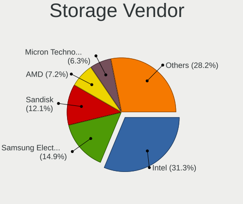

| Vendor                                  | Notebooks | Percent |
|-----------------------------------------|-----------|---------|
| Intel                                   | 222       | 31.27%  |
| Samsung Electronics                     | 106       | 14.93%  |
| Sandisk                                 | 86        | 12.11%  |
| AMD                                     | 51        | 7.18%   |
| Micron Technology                       | 45        | 6.34%   |
| SK hynix                                | 44        | 6.2%    |
| Kingston Technology Company             | 26        | 3.66%   |
| KIOXIA                                  | 23        | 3.24%   |
| MAXIO Technology (Hangzhou)             | 19        | 2.68%   |
| Phison Electronics                      | 15        | 2.11%   |
| Micron/Crucial Technology               | 12        | 1.69%   |
| Yangtze Memory Technologies             | 8         | 1.13%   |
| Shenzhen Longsys Electronics            | 8         | 1.13%   |
| ADATA Technology                        | 8         | 1.13%   |
| Toshiba America Info Systems            | 5         | 0.7%    |
| Apple                                   | 5         | 0.7%    |
| Solid State Storage Technology          | 4         | 0.56%   |
| Realtek Semiconductor                   | 4         | 0.56%   |
| Union Memory (Shenzhen)                 | 3         | 0.42%   |
| Silicon Motion                          | 3         | 0.42%   |
| Solidigm                                | 2         | 0.28%   |
| Shenzhen Unionmemory Information System | 2         | 0.28%   |
| Seagate Technology                      | 2         | 0.28%   |
| Lite-On Technology                      | 2         | 0.28%   |
| Nvidia                                  | 1         | 0.14%   |
| Marvell Technology Group                | 1         | 0.14%   |
| Lenovo                                  | 1         | 0.14%   |
| INNOGRIT                                | 1         | 0.14%   |
| ASMedia Technology                      | 1         | 0.14%   |

Storage Model
-------------

Storage controller models

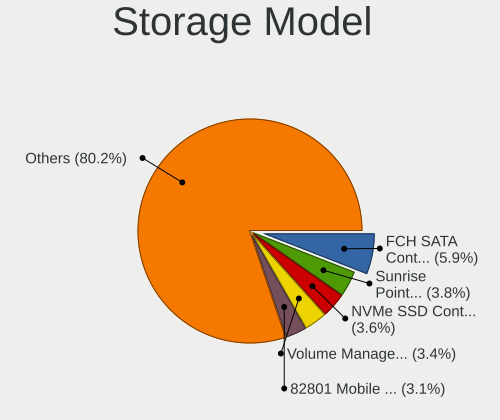

| Model                                                                          | Notebooks | Percent |
|--------------------------------------------------------------------------------|-----------|---------|
| AMD FCH SATA Controller [AHCI mode]                                            | 44        | 5.93%   |
| Intel Sunrise Point-LP SATA Controller [AHCI mode]                             | 28        | 3.77%   |
| Samsung NVMe SSD Controller SM981/PM981/PM983                                  | 27        | 3.64%   |
| Intel Volume Management Device NVMe RAID Controller                            | 25        | 3.37%   |
| Intel 82801 Mobile SATA Controller [RAID mode]                                 | 23        | 3.1%    |
| Samsung NVMe SSD Controller PM9A1/PM9A3/980PRO                                 | 22        | 2.96%   |
| Samsung NVMe SSD Controller 980 (DRAM-less)                                    | 21        | 2.83%   |
| SanDisk WD SN560/SN740/SN770/SN5000 NVMe SSD                                   | 19        | 2.56%   |
| SK hynix Platinum P41/PC801 NVMe Solid State Drive                             | 17        | 2.29%   |
| Intel 8 Series/C220 Series Chipset Family 6-port SATA Controller 1 [AHCI mode] | 14        | 1.89%   |
| Micron 3400 NVMe SSD [Hendrix]                                                 | 13        | 1.75%   |
| Intel Tiger Lake-LP SATA Controller                                            | 13        | 1.75%   |
| Intel 7 Series Chipset Family 6-port SATA Controller [AHCI mode]               | 13        | 1.75%   |
| Samsung NVMe SSD Controller PM9C1a (DRAM-less)                                 | 12        | 1.62%   |
| Intel SSD 670p Series [Keystone Harbor]                                        | 12        | 1.62%   |
| SanDisk Ultra 3D / WD PC SN530, IX SN530, Blue SN550 NVMe SSD (DRAM-less)      | 11        | 1.48%   |
| SanDisk Extreme Pro / WD Black SN750 / PC SN730 / Red SN700 NVMe SSD           | 11        | 1.48%   |
| SK hynix Gold P31/BC711/PC711 NVMe Solid State Drive                           | 10        | 1.35%   |
| Samsung NVMe SSD Controller PM9B1 (DRAM-less)                                  | 10        | 1.35%   |
| Micron 2400 NVMe SSD (DRAM-less)                                               | 10        | 1.35%   |
| MAXIO (Hangzhou) NVMe SSD Controller MAP1202 (DRAM-less)                       | 10        | 1.35%   |
| Intel HM170/QM170 Chipset SATA Controller [AHCI Mode]                          | 10        | 1.35%   |
| Samsung NVMe SSD Controller S4LV008[Pascal]                                    | 9         | 1.21%   |
| MAXIO (Hangzhou) NVMe SSD Controller MAP1602 (DRAM-less)                       | 9         | 1.21%   |
| Intel Wildcat Point-LP SATA Controller [AHCI Mode]                             | 9         | 1.21%   |
| Intel Tiger Lake SATA AHCI Controller                                          | 9         | 1.21%   |
| Intel Alder Lake-P SATA AHCI Controller                                        | 9         | 1.21%   |
| SK hynix BC901 NVMe Solid State Drive (DRAM-less)                              | 8         | 1.08%   |
| Intel 400 Series Chipset Family SATA AHCI Controller                           | 8         | 1.08%   |
| Sandisk WD PC SN5000S M.2 2280 NVMe SSD (DRAM-less)                            | 7         | 0.94%   |
| Samsung NVMe SSD Controller SM961/PM961/SM963                                  | 7         | 0.94%   |
| Intel Volume Management Device NVMe RAID Controller Intel Corporation          | 7         | 0.94%   |
| Intel RST Volume Management Device Controller                                  | 7         | 0.94%   |
| Intel 6 Series/C200 Series Chipset Family 6 port Mobile SATA AHCI Controller   | 7         | 0.94%   |
| Sandisk WD Black SN850X NVMe SSD                                               | 6         | 0.81%   |
| KIOXIA NVMe SSD Controller BG6 (DRAM-less)                                     | 6         | 0.81%   |
| KIOXIA NVMe SSD Controller BG5 (DRAM-less)                                     | 6         | 0.81%   |
| KIOXIA NVMe SSD Controller BG4 (DRAM-less)                                     | 6         | 0.81%   |
| Intel Cannon Lake Mobile PCH SATA AHCI Controller                              | 6         | 0.81%   |
| Shenzhen Longsys Lexar NM790 / Patriot Viper VP4300 Lite NVMe SSD (DRAM-less)  | 5         | 0.67%   |

Storage Kind
------------

Kind of storage controller (IDE, SATA, NVMe, SAS, ...)

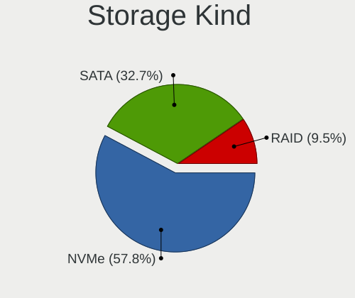

| Kind | Notebooks | Percent |
|------|-----------|---------|
| NVMe | 383       | 57.77%  |
| SATA | 217       | 32.73%  |
| RAID | 63        | 9.5%    |

Processor
---------

CPU Vendor
----------

Processor vendors

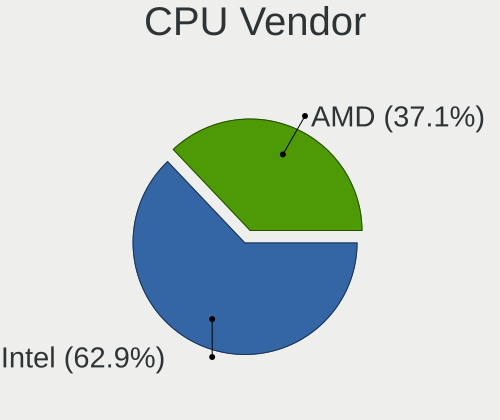

| Vendor | Notebooks | Percent |
|--------|-----------|---------|
| Intel  | 324       | 62.91%  |
| AMD    | 191       | 37.09%  |

CPU Model
---------

Processor models

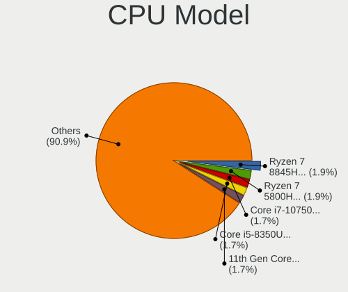

| Model                                         | Notebooks | Percent |
|-----------------------------------------------|-----------|---------|
| AMD Ryzen 7 8845HS w/ Radeon 780M Graphics    | 10        | 1.94%   |
| AMD Ryzen 7 5800H with Radeon Graphics        | 10        | 1.94%   |
| Intel Core i7-10750H CPU @ 2.60GHz            | 9         | 1.75%   |
| Intel Core i5-8350U CPU @ 1.70GHz             | 9         | 1.75%   |
| Intel 11th Gen Core i5-1135G7 @ 2.40GHz       | 9         | 1.75%   |
| Intel Core i7-9750H CPU @ 2.60GHz             | 8         | 1.55%   |
| AMD Ryzen 7 5700U with Radeon Graphics        | 8         | 1.55%   |
| Intel Core Ultra 7 155H                       | 7         | 1.36%   |
| Intel Core i7-7700HQ CPU @ 2.80GHz            | 7         | 1.36%   |
| Intel 11th Gen Core i5-11400H @ 2.70GHz       | 7         | 1.36%   |
| Intel 11th Gen Core i3-1115G4 @ 3.00GHz       | 7         | 1.36%   |
| Intel Core Ultra 9 185H                       | 6         | 1.17%   |
| Intel Core i5-8265U CPU @ 1.60GHz             | 6         | 1.17%   |
| AMD Ryzen AI 7 350 w/ Radeon 860M             | 6         | 1.17%   |
| AMD Ryzen 9 5900HS with Radeon Graphics       | 6         | 1.17%   |
| AMD Ryzen 7 7730U with Radeon Graphics        | 6         | 1.17%   |
| AMD Ryzen 7 3700U with Radeon Vega Mobile Gfx | 6         | 1.17%   |
| AMD Ryzen 5 4500U with Radeon Graphics        | 6         | 1.17%   |
| Intel Core Ultra 9 275HX                      | 5         | 0.97%   |
| Intel Core i7-8550U CPU @ 1.80GHz             | 5         | 0.97%   |
| Intel Core i7-7500U CPU @ 2.70GHz             | 5         | 0.97%   |
| Intel Core i5-8250U CPU @ 1.60GHz             | 5         | 0.97%   |
| Intel Core i5-7200U CPU @ 2.50GHz             | 5         | 0.97%   |
| Intel 13th Gen Core i7-13620H                 | 5         | 0.97%   |
| Intel 12th Gen Core i7-12700H                 | 5         | 0.97%   |
| Intel 11th Gen Core i7-11800H @ 2.30GHz       | 5         | 0.97%   |
| AMD Ryzen AI 9 HX 370 w/ Radeon 890M          | 5         | 0.97%   |
| AMD Ryzen 5 7535HS with Radeon Graphics       | 5         | 0.97%   |
| AMD Ryzen 5 5500U with Radeon Graphics        | 5         | 0.97%   |
| AMD Ryzen 5 3500U with Radeon Vega Mobile Gfx | 5         | 0.97%   |
| Intel Core Ultra 7 258V                       | 4         | 0.78%   |
| Intel Core i9-14900HX                         | 4         | 0.78%   |
| Intel Core i5-6300U CPU @ 2.40GHz             | 4         | 0.78%   |
| Intel Core i5-3210M CPU @ 2.50GHz             | 4         | 0.78%   |
| Intel Core i5-10210U CPU @ 1.60GHz            | 4         | 0.78%   |
| Intel Core i3-7020U CPU @ 2.30GHz             | 4         | 0.78%   |
| Intel Core i3-1005G1 CPU @ 1.20GHz            | 4         | 0.78%   |
| Intel 13th Gen Core i9-13900H                 | 4         | 0.78%   |
| Intel 12th Gen Core i9-12900H                 | 4         | 0.78%   |
| Intel 12th Gen Core i5-12450H                 | 4         | 0.78%   |

CPU Model Family
----------------

Processor model prefix

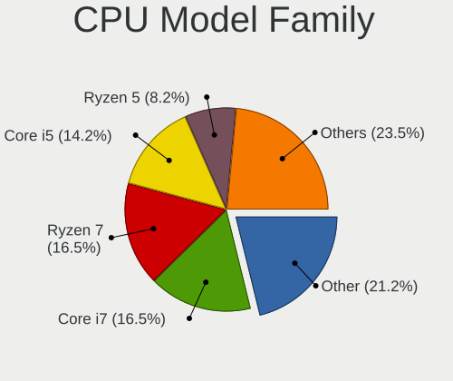

| Model                | Notebooks | Percent |
|----------------------|-----------|---------|
| Other                | 109       | 21.17%  |
| Intel Core i7        | 85        | 16.5%   |
| AMD Ryzen 7          | 85        | 16.5%   |
| Intel Core i5        | 73        | 14.17%  |
| AMD Ryzen 5          | 42        | 8.16%   |
| Intel Core           | 35        | 6.8%    |
| Intel Core i3        | 23        | 4.47%   |
| AMD Ryzen 9          | 16        | 3.11%   |
| AMD Ryzen 7 PRO      | 8         | 1.55%   |
| AMD Ryzen 3          | 8         | 1.55%   |
| Intel Celeron        | 6         | 1.17%   |
| Intel Pentium        | 5         | 0.97%   |
| Intel Core i9        | 4         | 0.78%   |
| Intel Core 2 Duo     | 3         | 0.58%   |
| AMD Athlon           | 2         | 0.39%   |
| AMD A10              | 2         | 0.39%   |
| Intel Pentium Silver | 1         | 0.19%   |
| Intel Core M         | 1         | 0.19%   |
| Intel Atom           | 1         | 0.19%   |
| AMD Ryzen 5 PRO      | 1         | 0.19%   |
| AMD Quad-Core        | 1         | 0.19%   |
| AMD E                | 1         | 0.19%   |
| AMD Athlon II        | 1         | 0.19%   |
| AMD A8               | 1         | 0.19%   |
| AMD A4               | 1         | 0.19%   |

CPU Cores
---------

Number of processor cores

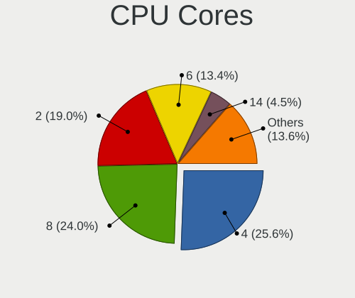

| Number | Notebooks | Percent |
|--------|-----------|---------|
| 4      | 132       | 25.58%  |
| 8      | 124       | 24.03%  |
| 2      | 98        | 18.99%  |
| 6      | 69        | 13.37%  |
| 14     | 23        | 4.46%   |
| 10     | 21        | 4.07%   |
| 16     | 20        | 3.88%   |
| 12     | 15        | 2.91%   |
| 24     | 11        | 2.13%   |
| 20     | 2         | 0.39%   |
| 11     | 1         | 0.19%   |

CPU Sockets
-----------

Number of sockets

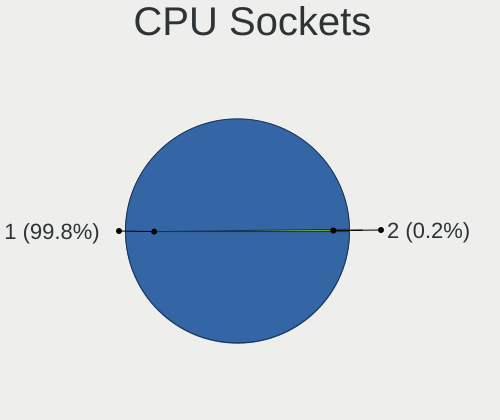

| Number | Notebooks | Percent |
|--------|-----------|---------|
| 1      | 514       | 99.81%  |
| 2      | 1         | 0.19%   |

CPU Threads
-----------

Threads per core (Hyper-Threading)

| Number | Notebooks | Percent |
|--------|-----------|---------|
| 2      | 461       | 89.34%  |
| 1      | 55        | 10.66%  |

CPU Op-Modes
------------

CPU Operation Modes (32-bit, 64-bit)

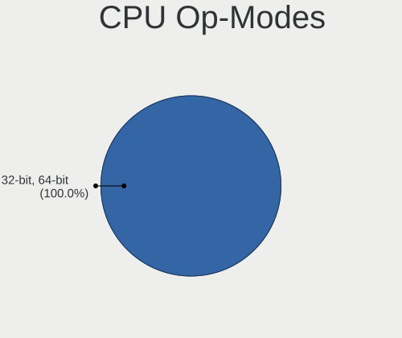

| Op mode        | Notebooks | Percent |
|----------------|-----------|---------|
| 32-bit, 64-bit | 515       | 100%    |

CPU Microcode
-------------

Microcode number

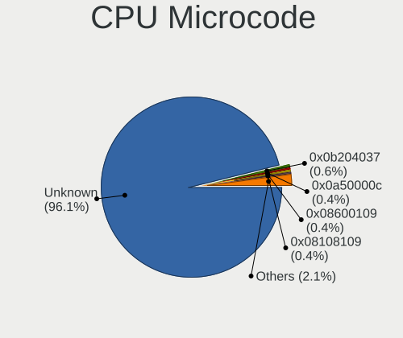

| Number     | Notebooks | Percent |
|------------|-----------|---------|
| Unknown    | 496       | 96.12%  |
| 0x0b204037 | 3         | 0.58%   |
| 0x0a50000c | 2         | 0.39%   |
| 0x08600109 | 2         | 0.39%   |
| 0x08108109 | 2         | 0.39%   |
| 0x08108102 | 2         | 0.39%   |
| 0x906ea    | 1         | 0.19%   |
| 0x306a9    | 1         | 0.19%   |
| 0x0a704103 | 1         | 0.19%   |
| 0x0a704101 | 1         | 0.19%   |
| 0x0a601203 | 1         | 0.19%   |
| 0x08900201 | 1         | 0.19%   |
| 0x08608102 | 1         | 0.19%   |
| 0x08600106 | 1         | 0.19%   |
| 0x05000119 | 1         | 0.19%   |

CPU Microarch
-------------

Microarchitecture

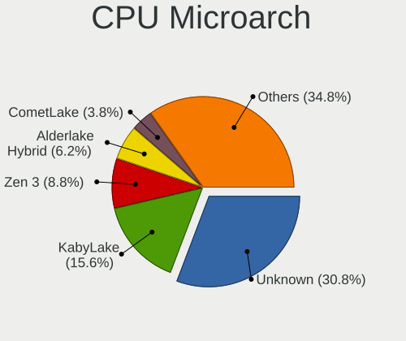

| Name               | Notebooks | Percent |
|--------------------|-----------|---------|
| Unknown            | 160       | 30.77%  |
| KabyLake           | 81        | 15.58%  |
| Zen 3              | 46        | 8.85%   |
| Alderlake Hybrid   | 32        | 6.15%   |
| CometLake          | 20        | 3.85%   |
| Zen+               | 19        | 3.65%   |
| TigerLake          | 19        | 3.65%   |
| Zen 2              | 18        | 3.46%   |
| Haswell            | 18        | 3.46%   |
| Skylake            | 17        | 3.27%   |
| IvyBridge          | 14        | 2.69%   |
| IceLake            | 14        | 2.69%   |
| Meteorlake Hybrid  | 10        | 1.92%   |
| Broadwell          | 10        | 1.92%   |
| SandyBridge        | 9         | 1.73%   |
| Westmere           | 5         | 0.96%   |
| Lunarlake Hybrid   | 4         | 0.77%   |
| Silvermont         | 3         | 0.58%   |
| Goldmont           | 3         | 0.58%   |
| Zen                | 2         | 0.38%   |
| Penryn             | 2         | 0.38%   |
| Jaguar             | 2         | 0.38%   |
| Goldmont plus      | 2         | 0.38%   |
| Excavator          | 2         | 0.38%   |
| Tremont            | 1         | 0.19%   |
| Steamroller        | 1         | 0.19%   |
| Puma               | 1         | 0.19%   |
| Nehalem            | 1         | 0.19%   |
| K10                | 1         | 0.19%   |
| Core               | 1         | 0.19%   |
| Bobcat             | 1         | 0.19%   |
| ArrowLake-H Hybrid | 1         | 0.19%   |

Graphics
--------

GPU Vendor
----------

Vendors of graphics cards

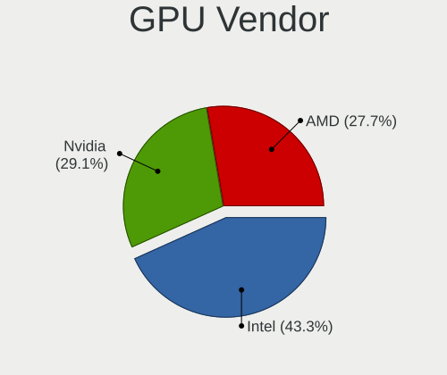

| Vendor | Notebooks | Percent |
|--------|-----------|---------|
| Intel  | 308       | 43.26%  |
| Nvidia | 207       | 29.07%  |
| AMD    | 197       | 27.67%  |

GPU Model
---------

Graphics card models

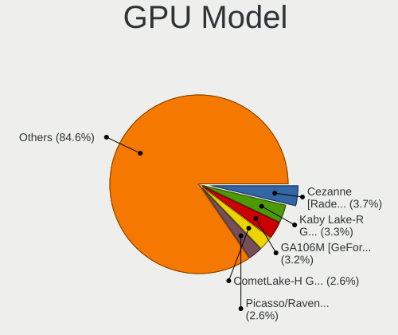

| Model                                                                     | Notebooks | Percent |
|---------------------------------------------------------------------------|-----------|---------|
| AMD Cezanne [Radeon Vega Series / Radeon Vega Mobile Series]              | 27        | 3.72%   |
| Intel Kaby Lake-R GT2 [UHD Graphics 620]                                  | 24        | 3.31%   |
| Nvidia GA106M [GeForce RTX 3060 Mobile / Max-Q]                           | 23        | 3.17%   |
| Intel CometLake-H GT2 [UHD Graphics]                                      | 19        | 2.62%   |
| AMD Picasso/Raven 2 [Radeon Vega Series / Radeon Vega Mobile Series]      | 19        | 2.62%   |
| AMD Rembrandt [Radeon 680M]                                               | 18        | 2.48%   |
| Intel Alder Lake-P GT2 [Iris Xe Graphics]                                 | 17        | 2.34%   |
| AMD Renoir [Radeon Vega Series / Radeon Vega Mobile Series]               | 17        | 2.34%   |
| AMD HawkPoint1                                                            | 17        | 2.34%   |
| AMD Barcelo                                                               | 16        | 2.2%    |
| Nvidia AD107M [GeForce RTX 4060 Max-Q / Mobile]                           | 15        | 2.07%   |
| Intel Meteor Lake-P [Intel Arc Graphics]                                  | 15        | 2.07%   |
| AMD Lucienne                                                              | 15        | 2.07%   |
| Intel Kaby Lake-U GT2 [HD Graphics 620]                                   | 14        | 1.93%   |
| Intel 3rd Gen Core processor Graphics Controller                          | 14        | 1.93%   |
| Nvidia GA107M [GeForce RTX 3050 Mobile]                                   | 13        | 1.79%   |
| Intel 4th Gen Core Processor Integrated Graphics Controller               | 13        | 1.79%   |
| AMD Phoenix1                                                              | 13        | 1.79%   |
| Intel TigerLake-LP GT2 [Iris Xe Graphics]                                 | 12        | 1.65%   |
| Intel Raptor Lake-P [Iris Xe Graphics]                                    | 12        | 1.65%   |
| Nvidia AD107M [GeForce RTX 4050 Max-Q / Mobile]                           | 11        | 1.52%   |
| Intel TigerLake-H GT1 [UHD Graphics]                                      | 11        | 1.52%   |
| Intel WhiskeyLake-U GT2 [UHD Graphics 620]                                | 10        | 1.38%   |
| Intel Kaby Lake-H GT2 [HD Graphics 630]                                   | 10        | 1.38%   |
| Intel CoffeeLake-H GT2 [UHD Graphics 630]                                 | 10        | 1.38%   |
| Intel Skylake-U GT2 [HD Graphics 520]                                     | 9         | 1.24%   |
| AMD Krackan [Radeon 840M / 860M Graphics]                                 | 9         | 1.24%   |
| Nvidia GP107M [GeForce GTX 1050 Mobile]                                   | 8         | 1.1%    |
| Nvidia GA104M [GeForce RTX 3070 Mobile / Max-Q]                           | 8         | 1.1%    |
| Intel Raptor Lake-S UHD Graphics                                          | 8         | 1.1%    |
| Intel Broadwell-U GT2 [HD Graphics 5500]                                  | 8         | 1.1%    |
| Intel 2nd Generation Core Processor Family Integrated Graphics Controller | 8         | 1.1%    |
| AMD Strix [Radeon 880M / 890M]                                            | 8         | 1.1%    |
| Nvidia TU106M [GeForce RTX 2060 Mobile]                                   | 7         | 0.96%   |
| Nvidia AD106M [GeForce RTX 4070 Max-Q / Mobile]                           | 7         | 0.96%   |
| Intel Tiger Lake-LP GT2 [UHD Graphics G4]                                 | 7         | 0.96%   |
| Nvidia TU117M [GeForce GTX 1650 Mobile / Max-Q]                           | 6         | 0.83%   |
| Nvidia TU116M [GeForce GTX 1660 Ti Mobile]                                | 6         | 0.83%   |
| Nvidia GA107M [GeForce RTX 3050 Ti Mobile]                                | 6         | 0.83%   |
| Intel Skylake-H GT2 [HD Graphics 530]                                     | 6         | 0.83%   |

GPU Combo
---------

Combinations of graphics cards

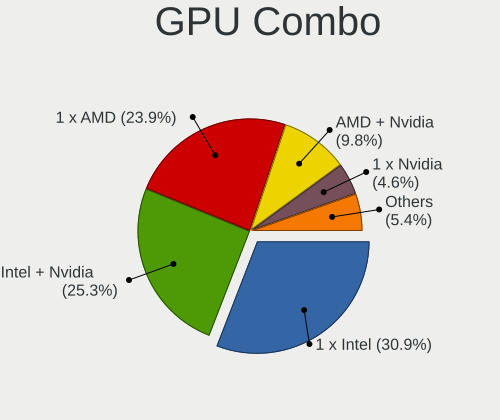

| Name           | Notebooks | Percent |
|----------------|-----------|---------|
| 1 x Intel      | 160       | 30.89%  |
| Intel + Nvidia | 131       | 25.29%  |
| 1 x AMD        | 124       | 23.94%  |
| AMD + Nvidia   | 51        | 9.85%   |
| 1 x Nvidia     | 24        | 4.63%   |
| Intel + AMD    | 13        | 2.51%   |
| 2 x AMD        | 11        | 2.12%   |
| 2 x Intel      | 2         | 0.39%   |
| Other          | 1         | 0.19%   |
| 2 x Nvidia     | 1         | 0.19%   |

GPU Driver
----------

Free vs proprietary

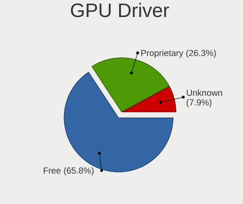

| Driver      | Notebooks | Percent |
|-------------|-----------|---------|
| Free        | 342       | 65.77%  |
| Proprietary | 137       | 26.35%  |
| Unknown     | 41        | 7.88%   |

GPU Memory
----------

Total video memory

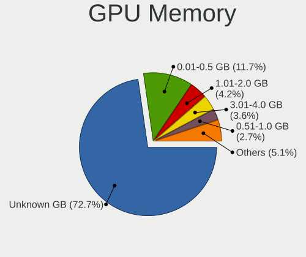

| Size in GB | Notebooks | Percent |
|------------|-----------|---------|
| Unknown    | 384       | 72.73%  |
| 0.01-0.5   | 62        | 11.74%  |
| 1.01-2.0   | 22        | 4.17%   |
| 3.01-4.0   | 19        | 3.6%    |
| 0.51-1.0   | 14        | 2.65%   |
| 7.01-8.0   | 12        | 2.27%   |
| 5.01-6.0   | 7         | 1.33%   |
| 8.01-16.0  | 5         | 0.95%   |
| 24.01-32.0 | 1         | 0.19%   |
| 2.01-3.0   | 1         | 0.19%   |
| 16.01-24.0 | 1         | 0.19%   |

Monitor
-------

Monitor Vendor
--------------

Monitor vendors

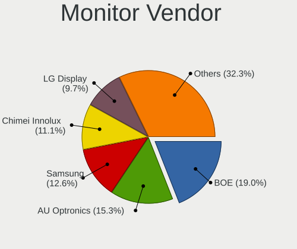

| Vendor                  | Notebooks | Percent |
|-------------------------|-----------|---------|
| BOE                     | 118       | 19.03%  |
| AU Optronics            | 95        | 15.32%  |
| Samsung Electronics     | 78        | 12.58%  |
| Chimei Innolux          | 69        | 11.13%  |
| LG Display              | 60        | 9.68%   |
| Lenovo                  | 23        | 3.71%   |
| PANDA                   | 16        | 2.58%   |
| Goldstar                | 15        | 2.42%   |
| Sharp                   | 13        | 2.1%    |
| Dell                    | 10        | 1.61%   |
| CSW                     | 10        | 1.61%   |
| CSOT                    | 9         | 1.45%   |
| Acer                    | 9         | 1.45%   |
| InfoVision              | 8         | 1.29%   |
| Hewlett-Packard         | 8         | 1.29%   |
| Apple                   | 8         | 1.29%   |
| BenQ                    | 7         | 1.13%   |
| AOC                     | 7         | 1.13%   |
| TMX                     | 4         | 0.65%   |
| Chi Mei Optoelectronics | 4         | 0.65%   |
| Valve                   | 3         | 0.48%   |
| Panasonic               | 3         | 0.48%   |
| MSI                     | 3         | 0.48%   |
| ASUSTek Computer        | 3         | 0.48%   |
| Ancor Communications    | 3         | 0.48%   |
| Sceptre Tech            | 2         | 0.32%   |
| Philips                 | 2         | 0.32%   |
| EDO                     | 2         | 0.32%   |
| CSO                     | 2         | 0.32%   |
| ___                     | 1         | 0.16%   |
| YZA                     | 1         | 0.16%   |
| Xiaomi                  | 1         | 0.16%   |
| VXN                     | 1         | 0.16%   |
| VIZTA                   | 1         | 0.16%   |
| Vizio                   | 1         | 0.16%   |
| ViewSonic               | 1         | 0.16%   |
| Unknown (XXX)           | 1         | 0.16%   |
| Unknown                 | 1         | 0.16%   |
| Toshiba                 | 1         | 0.16%   |
| SKG                     | 1         | 0.16%   |

Monitor Model
-------------

Monitor models

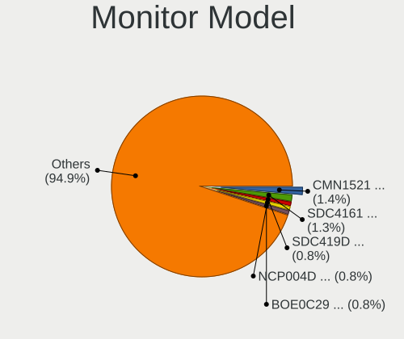

| Model                                                                   | Notebooks | Percent |
|-------------------------------------------------------------------------|-----------|---------|
| Chimei Innolux LCD Monitor CMN1521 1920x1080 344x193mm 15.5-inch        | 9         | 1.43%   |
| Samsung Electronics LCD Monitor SDC4161 1920x1080 344x194mm 15.5-inch   | 8         | 1.27%   |
| Samsung Electronics LCD Monitor SDC419D 2880x1800 302x189mm 14.0-inch   | 5         | 0.79%   |
| PANDA LCD Monitor NCP004D 1920x1080 344x194mm 15.5-inch                 | 5         | 0.79%   |
| BOE LCD Monitor BOE0C29 1920x1080 344x194mm 15.5-inch                   | 5         | 0.79%   |
| AU Optronics LCD Monitor AUOAF90 1920x1080 344x193mm 15.5-inch          | 5         | 0.79%   |
| Samsung Electronics LCD Monitor SDC4181 2880x1800 302x189mm 14.0-inch   | 4         | 0.63%   |
| LG Display LCD Monitor LGD0685 1920x1080 309x174mm 14.0-inch            | 4         | 0.63%   |
| LG Display LCD Monitor LGD046F 1920x1080 344x194mm 15.5-inch            | 4         | 0.63%   |
| AU Optronics LCD Monitor AUO38ED 1920x1080 344x193mm 15.5-inch          | 4         | 0.63%   |
| Samsung Electronics LCD Monitor SDC4171 2880x1800 302x189mm 14.0-inch   | 3         | 0.48%   |
| LG Display LCD Monitor LGD060F 1920x1080 309x174mm 14.0-inch            | 3         | 0.48%   |
| CSW MNE007ZA3-2 CSW1431 2880x1800 301x188mm 14.0-inch                   | 3         | 0.48%   |
| Chimei Innolux LCD Monitor CMN1618 1920x1200 344x215mm 16.0-inch        | 3         | 0.48%   |
| Chimei Innolux LCD Monitor CMN15F5 1920x1080 344x193mm 15.5-inch        | 3         | 0.48%   |
| Chimei Innolux LCD Monitor CMN15E7 1920x1080 344x193mm 15.5-inch        | 3         | 0.48%   |
| Chimei Innolux LCD Monitor CMN153B 1920x1080 344x193mm 15.5-inch        | 3         | 0.48%   |
| Chimei Innolux LCD Monitor CMN1515 1920x1080 344x193mm 15.5-inch        | 3         | 0.48%   |
| BOE LCD Monitor BOE0903 1920x1080 344x194mm 15.5-inch                   | 3         | 0.48%   |
| BOE LCD Monitor BOE084E 1920x1080 382x215mm 17.3-inch                   | 3         | 0.48%   |
| AU Optronics LCD Monitor AUO81EC 1366x768 344x193mm 15.5-inch           | 3         | 0.48%   |
| AU Optronics LCD Monitor AUO499F 1920x1080 344x194mm 15.5-inch          | 3         | 0.48%   |
| AU Optronics LCD Monitor AUO26EC 1366x768 344x193mm 15.5-inch           | 3         | 0.48%   |
| Apple Color LCD APPA044 3072x1920 345x215mm 16.0-inch                   | 3         | 0.48%   |
| Valve ANX7530 U VLV3001 800x1280 100x150mm 7.1-inch                     | 2         | 0.32%   |
| Sharp LCD Monitor SHP1476 3840x2160 346x194mm 15.6-inch                 | 2         | 0.32%   |
| Samsung Electronics Odyssey G60SD SAM75CB 2560x1440 598x336mm 27.0-inch | 2         | 0.32%   |
| Samsung Electronics Odyssey G60SD SAM75C2 2560x1440 598x336mm 27.0-inch | 2         | 0.32%   |
| Samsung Electronics LS24C36x SAM7314 1920x1080 598x336mm 27.0-inch      | 2         | 0.32%   |
| Samsung Electronics LCD Monitor SDC4178 3200x2000 344x215mm 16.0-inch   | 2         | 0.32%   |
| Samsung Electronics ATNA60HU02-0  SDC421B                               | 2         | 0.32%   |
| Samsung Electronics ATNA60HS01-0  SDC420A                               | 2         | 0.32%   |
| Samsung Electronics ATNA60DL01-0  SDC41A3                               | 2         | 0.32%   |
| PANDA LCD Monitor NCP005F 1920x1080 344x194mm 15.5-inch                 | 2         | 0.32%   |
| PANDA LCD Monitor NCP005E 1920x1080 309x174mm 14.0-inch                 | 2         | 0.32%   |
| LG Display LCD Monitor LGD0657 1920x1080 344x194mm 15.5-inch            | 2         | 0.32%   |
| LG Display LCD Monitor LGD062E 1920x1080 344x194mm 15.5-inch            | 2         | 0.32%   |
| LG Display LCD Monitor LGD05FE 1920x1080 344x194mm 15.5-inch            | 2         | 0.32%   |
| LG Display LCD Monitor LGD0590 1920x1080 344x194mm 15.5-inch            | 2         | 0.32%   |
| LG Display LCD Monitor LGD054F 1920x1080 344x194mm 15.5-inch            | 2         | 0.32%   |

Monitor Resolution
------------------

Monitor screen resolution

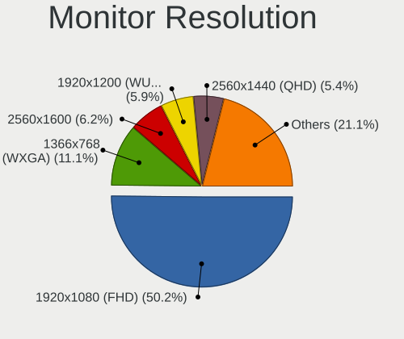

| Resolution        | Notebooks | Percent |
|-------------------|-----------|---------|
| 1920x1080 (FHD)   | 297       | 50.17%  |
| 1366x768 (WXGA)   | 66        | 11.15%  |
| 2560x1600         | 37        | 6.25%   |
| 1920x1200 (WUXGA) | 35        | 5.91%   |
| 2560x1440 (QHD)   | 32        | 5.41%   |
| 2880x1800         | 26        | 4.39%   |
| 3840x2160 (4K)    | 22        | 3.72%   |
| Unknown           | 16        | 2.7%    |
| 3440x1440         | 11        | 1.86%   |
| 1600x900 (HD+)    | 8         | 1.35%   |
| 3200x2000         | 5         | 0.84%   |
| 3072x1920         | 5         | 0.84%   |
| 800x1280          | 3         | 0.51%   |
| 3840x1080         | 3         | 0.51%   |
| 2560x1080         | 3         | 0.51%   |
| 2160x1440         | 3         | 0.51%   |
| 3840x1100         | 2         | 0.34%   |
| 2880x1920         | 2         | 0.34%   |
| 1920x1280         | 2         | 0.34%   |
| 1440x900 (WXGA+)  | 2         | 0.34%   |
| 1360x768          | 2         | 0.34%   |
| 1280x800 (WXGA)   | 2         | 0.34%   |
| 3840x2560         | 1         | 0.17%   |
| 3840x1600         | 1         | 0.17%   |
| 3456x2160         | 1         | 0.17%   |
| 2944x1840         | 1         | 0.17%   |
| 2880x1620         | 1         | 0.17%   |
| 2520x1680         | 1         | 0.17%   |
| 2240x1400         | 1         | 0.17%   |
| 1920x540          | 1         | 0.17%   |

Monitor Diagonal
----------------

Diagonal size in inches

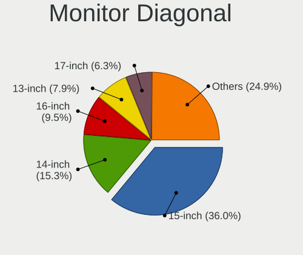

| Inches  | Notebooks | Percent |
|---------|-----------|---------|
| 15      | 223       | 36.03%  |
| 14      | 95        | 15.35%  |
| 16      | 59        | 9.53%   |
| 13      | 49        | 7.92%   |
| 17      | 39        | 6.3%    |
| 27      | 27        | 4.36%   |
| Unknown | 19        | 3.07%   |
| 24      | 16        | 2.58%   |
| 31      | 13        | 2.1%    |
| 34      | 10        | 1.62%   |
| 21      | 10        | 1.62%   |
| 23      | 9         | 1.45%   |
| 12      | 9         | 1.45%   |
| 48      | 4         | 0.65%   |
| 32      | 4         | 0.65%   |
| 11      | 4         | 0.65%   |
| 7       | 4         | 0.65%   |
| 40      | 3         | 0.48%   |
| 84      | 2         | 0.32%   |
| 63      | 2         | 0.32%   |
| 39      | 2         | 0.32%   |
| 28      | 2         | 0.32%   |
| 18      | 2         | 0.32%   |
| 74      | 1         | 0.16%   |
| 72      | 1         | 0.16%   |
| 57      | 1         | 0.16%   |
| 54      | 1         | 0.16%   |
| 49      | 1         | 0.16%   |
| 46      | 1         | 0.16%   |
| 44      | 1         | 0.16%   |
| 43      | 1         | 0.16%   |
| 37      | 1         | 0.16%   |
| 29      | 1         | 0.16%   |
| 26      | 1         | 0.16%   |
| 19      | 1         | 0.16%   |

Monitor Width
-------------

Physical width

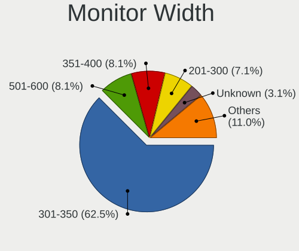

| Width in mm | Notebooks | Percent |
|-------------|-----------|---------|
| 301-350     | 385       | 62.5%   |
| 501-600     | 50        | 8.12%   |
| 351-400     | 50        | 8.12%   |
| 201-300     | 44        | 7.14%   |
| Unknown     | 19        | 3.08%   |
| 601-700     | 17        | 2.76%   |
| 701-800     | 14        | 2.27%   |
| 401-500     | 11        | 1.79%   |
| 1001-1500   | 11        | 1.79%   |
| 801-900     | 4         | 0.65%   |
| 1501-2000   | 4         | 0.65%   |
| 901-1000    | 3         | 0.49%   |
| 1-100       | 3         | 0.49%   |
| 101-200     | 1         | 0.16%   |

Aspect Ratio
------------

Proportional relationship between the width and the height

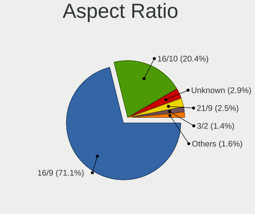

| Ratio   | Notebooks | Percent |
|---------|-----------|---------|
| 16/9    | 397       | 71.15%  |
| 16/10   | 114       | 20.43%  |
| Unknown | 16        | 2.87%   |
| 21/9    | 14        | 2.51%   |
| 3/2     | 8         | 1.43%   |
| 32/9    | 4         | 0.72%   |
| 0.67    | 2         | 0.36%   |
| 3.40    | 1         | 0.18%   |
| 1.96    | 1         | 0.18%   |
| 0.62    | 1         | 0.18%   |

Monitor Area
------------

Area in inch²

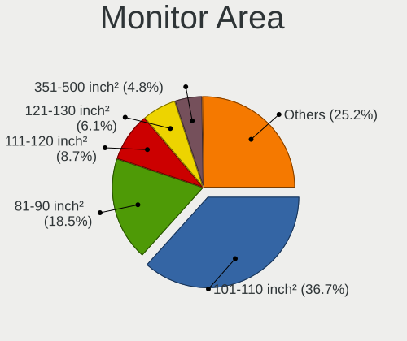

| Area in inch² | Notebooks | Percent |
|----------------|-----------|---------|
| 101-110        | 228       | 36.66%  |
| 81-90          | 115       | 18.49%  |
| 111-120        | 54        | 8.68%   |
| 121-130        | 38        | 6.11%   |
| 351-500        | 30        | 4.82%   |
| 301-350        | 28        | 4.5%    |
| 201-250        | 25        | 4.02%   |
| 71-80          | 22        | 3.54%   |
| Unknown        | 19        | 3.05%   |
| 501-1000       | 13        | 2.09%   |
| More than 1000 | 9         | 1.45%   |
| 61-70          | 9         | 1.45%   |
| 91-100         | 8         | 1.29%   |
| 251-300        | 6         | 0.96%   |
| 151-200        | 6         | 0.96%   |
| 51-60          | 5         | 0.8%    |
| 1-40           | 4         | 0.64%   |
| 141-150        | 2         | 0.32%   |
| 131-140        | 1         | 0.16%   |

Pixel Density
-------------

Pixels per inch

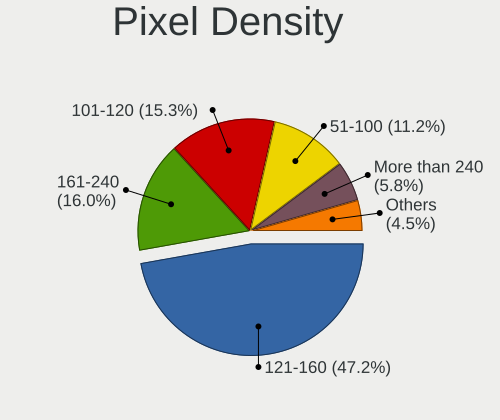

| Density       | Notebooks | Percent |
|---------------|-----------|---------|
| 121-160       | 286       | 47.19%  |
| 161-240       | 97        | 16.01%  |
| 101-120       | 93        | 15.35%  |
| 51-100        | 68        | 11.22%  |
| More than 240 | 35        | 5.78%   |
| Unknown       | 19        | 3.14%   |
| 1-50          | 8         | 1.32%   |

Multiple Monitors
-----------------

Total monitors connected

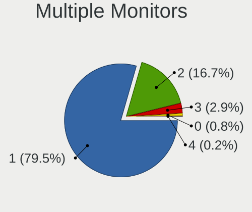

| Total | Notebooks | Percent |
|-------|-----------|---------|
| 1     | 414       | 79.46%  |
| 2     | 87        | 16.7%   |
| 3     | 15        | 2.88%   |
| 0     | 4         | 0.77%   |
| 4     | 1         | 0.19%   |

Network
-------

Net Controller Vendor
---------------------

Controller vendors

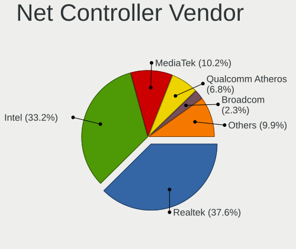

| Vendor                                 | Notebooks | Percent |
|----------------------------------------|-----------|---------|
| Realtek Semiconductor                  | 305       | 37.61%  |
| Intel                                  | 269       | 33.17%  |
| MediaTek                               | 83        | 10.23%  |
| Qualcomm Atheros                       | 55        | 6.78%   |
| Broadcom                               | 19        | 2.34%   |
| Samsung Electronics                    | 7         | 0.86%   |
| Qualcomm                               | 7         | 0.86%   |
| ASIX Electronics                       | 7         | 0.86%   |
| TP-Link                                | 4         | 0.49%   |
| Apple                                  | 4         | 0.49%   |
| Suzhou Motorcomm Electronic Technology | 3         | 0.37%   |
| Ralink                                 | 3         | 0.37%   |
| Hewlett-Packard                        | 3         | 0.37%   |
| Broadcom Limited                       | 3         | 0.37%   |
| Sierra Wireless                        | 2         | 0.25%   |
| Shenzhen Goodix Technology             | 2         | 0.25%   |
| Realtek                                | 2         | 0.25%   |
| Lenovo                                 | 2         | 0.25%   |
| ICS Advent                             | 2         | 0.25%   |
| Google                                 | 2         | 0.25%   |
| Fibocom                                | 2         | 0.25%   |
| DisplayLink                            | 2         | 0.25%   |
| Dell                                   | 2         | 0.25%   |
| D-Link                                 | 2         | 0.25%   |
| ASUSTek Computer                       | 2         | 0.25%   |
| aicsemi                                | 2         | 0.25%   |
| ZyXEL Communications                   | 1         | 0.12%   |
| Xiaomi                                 | 1         | 0.12%   |
| U-Blox                                 | 1         | 0.12%   |
| Sitecom Europe                         | 1         | 0.12%   |
| Ralink Technology                      | 1         | 0.12%   |
| Qualcomm Technologies                  | 1         | 0.12%   |
| Qualcomm Atheros Communications        | 1         | 0.12%   |
| OPPO Electronics                       | 1         | 0.12%   |
| Nvidia                                 | 1         | 0.12%   |
| Motorola PCS                           | 1         | 0.12%   |
| Marvell Technology Group               | 1         | 0.12%   |
| Ericsson Business Mobile Networks      | 1         | 0.12%   |
| Dynabook                               | 1         | 0.12%   |
| BillBoard                              | 1         | 0.12%   |

Net Controller Model
--------------------

Controller models

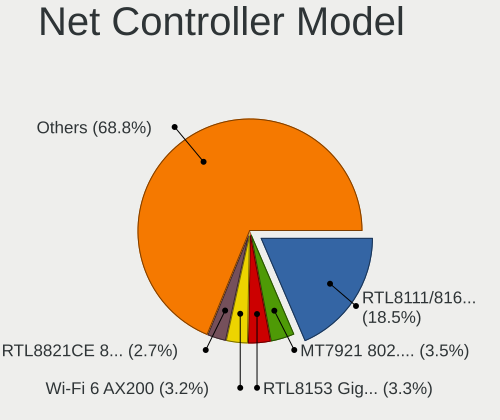

| Model                                                                           | Notebooks | Percent |
|---------------------------------------------------------------------------------|-----------|---------|
| Realtek RTL8111/8168/8211/8411 PCI Express Gigabit Ethernet Controller          | 176       | 18.55%  |
| MediaTek MT7921 802.11ax PCIe Wireless Network Adapter [Filogic 330]            | 33        | 3.48%   |
| Realtek RTL8153 Gigabit Ethernet Adapter                                        | 31        | 3.27%   |
| Intel Wi-Fi 6 AX200                                                             | 30        | 3.16%   |
| Realtek RTL8821CE 802.11ac PCIe Wireless Network Adapter                        | 26        | 2.74%   |
| Intel Wi-Fi 6E(802.11ax) AX210/AX1675* 2x2 [Typhoon Peak]                       | 24        | 2.53%   |
| MediaTek MT7922 802.11ax PCI Express Wireless Network Adapter                   | 23        | 2.42%   |
| Realtek RTL8822CE 802.11ac PCIe Wireless Network Adapter                        | 22        | 2.32%   |
| Intel Alder Lake-P PCH CNVi WiFi                                                | 22        | 2.32%   |
| Intel Wireless 8265 / 8275                                                      | 20        | 2.11%   |
| Intel Comet Lake PCH CNVi WiFi                                                  | 19        | 2%      |
| Realtek RTL8125 2.5GbE Controller                                               | 18        | 1.9%    |
| Qualcomm Atheros QCA9377 802.11ac Wireless Network Adapter                      | 17        | 1.79%   |
| Realtek RTL810xE PCI Express Fast Ethernet controller                           | 16        | 1.69%   |
| Intel Meteor Lake PCH CNVi WiFi                                                 | 16        | 1.69%   |
| Intel Raptor Lake PCH CNVi WiFi                                                 | 15        | 1.58%   |
| Realtek RTL8852BE PCIe 802.11ax Wireless Network Controller                     | 14        | 1.48%   |
| Intel Wireless 7265                                                             | 14        | 1.48%   |
| MediaTek MT7925 802.11be 160MHz 2x2 PCIe Wireless Network Adapter [Filogic 360] | 13        | 1.37%   |
| Intel Wi-Fi 6 AX201                                                             | 13        | 1.37%   |
| Intel Ethernet Connection (4) I219-LM                                           | 12        | 1.26%   |
| Realtek Killer E2600 GbE Controller                                             | 11        | 1.16%   |
| Intel Tiger Lake PCH CNVi WiFi                                                  | 11        | 1.16%   |
| Qualcomm Atheros QCA6174 802.11ac Wireless Network Adapter                      | 9         | 0.95%   |
| Intel Wi-Fi 7(802.11be) AX1775*/AX1790*/BE20*/BE401/BE1750* 2x2                 | 9         | 0.95%   |
| Intel Wireless 8260                                                             | 8         | 0.84%   |
| Realtek USB 10/100/1G/2.5 LAN                                                   | 7         | 0.74%   |
| Realtek RTL8852AE 802.11ax PCIe Wireless Network Adapter                        | 7         | 0.74%   |
| Qualcomm Atheros QCA9565 / AR9565 Wireless Network Adapter                      | 7         | 0.74%   |
| MediaTek MT7902 802.11ax PCIe Wireless Network Adapter [Filogic 310]            | 7         | 0.74%   |
| Intel Cannon Lake PCH CNVi WiFi                                                 | 7         | 0.74%   |
| ASIX AX88179 Gigabit Ethernet                                                   | 7         | 0.74%   |
| Qualcomm QCNFA765 Wireless Network Adapter                                      | 6         | 0.63%   |
| Intel Ethernet Connection I217-LM                                               | 6         | 0.63%   |
| Intel 82579LM Gigabit Network Connection (Lewisville)                           | 6         | 0.63%   |
| Intel 700 Series Chipset CNVi WiFi                                              | 6         | 0.63%   |
| Samsung GT-I9070 (network tethering, USB debugging enabled)                     | 5         | 0.53%   |
| Intel Wireless 7260                                                             | 5         | 0.53%   |
| Intel Ethernet Connection I219-LM                                               | 5         | 0.53%   |
| Intel Ethernet Connection (4) I219-V                                            | 5         | 0.53%   |

Wireless Vendor
---------------

Wireless vendors

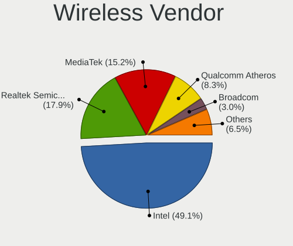

| Vendor                          | Notebooks | Percent |
|---------------------------------|-----------|---------|
| Intel                           | 249       | 49.11%  |
| Realtek Semiconductor           | 91        | 17.95%  |
| MediaTek                        | 77        | 15.19%  |
| Qualcomm Atheros                | 42        | 8.28%   |
| Broadcom                        | 15        | 2.96%   |
| Qualcomm                        | 6         | 1.18%   |
| TP-Link                         | 3         | 0.59%   |
| Ralink                          | 3         | 0.59%   |
| Broadcom Limited                | 3         | 0.59%   |
| Sierra Wireless                 | 2         | 0.39%   |
| Realtek                         | 2         | 0.39%   |
| Hewlett-Packard                 | 2         | 0.39%   |
| Fibocom                         | 2         | 0.39%   |
| D-Link                          | 2         | 0.39%   |
| ASUSTek Computer                | 2         | 0.39%   |
| ZyXEL Communications            | 1         | 0.2%    |
| Sitecom Europe                  | 1         | 0.2%    |
| Ralink Technology               | 1         | 0.2%    |
| Qualcomm Technologies           | 1         | 0.2%    |
| Qualcomm Atheros Communications | 1         | 0.2%    |
| Dell                            | 1         | 0.2%    |

Wireless Model
--------------

Wireless models

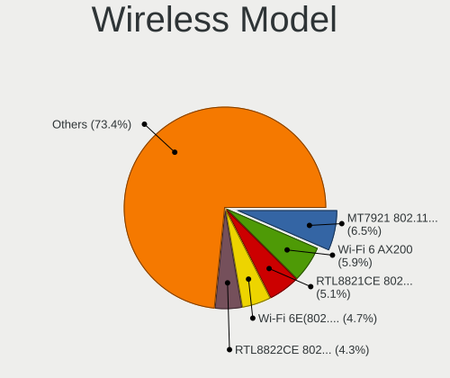

| Model                                                                           | Notebooks | Percent |
|---------------------------------------------------------------------------------|-----------|---------|
| MediaTek MT7921 802.11ax PCIe Wireless Network Adapter [Filogic 330]            | 33        | 6.51%   |
| Intel Wi-Fi 6 AX200                                                             | 30        | 5.92%   |
| Realtek RTL8821CE 802.11ac PCIe Wireless Network Adapter                        | 26        | 5.13%   |
| Intel Wi-Fi 6E(802.11ax) AX210/AX1675* 2x2 [Typhoon Peak]                       | 24        | 4.73%   |
| Realtek RTL8822CE 802.11ac PCIe Wireless Network Adapter                        | 22        | 4.34%   |
| MediaTek MT7922 802.11ax PCI Express Wireless Network Adapter                   | 21        | 4.14%   |
| Intel Wireless 8265 / 8275                                                      | 20        | 3.94%   |
| Intel Comet Lake PCH CNVi WiFi                                                  | 19        | 3.75%   |
| Qualcomm Atheros QCA9377 802.11ac Wireless Network Adapter                      | 17        | 3.35%   |
| Intel Meteor Lake PCH CNVi WiFi                                                 | 16        | 3.16%   |
| Intel Alder Lake-P PCH CNVi WiFi                                                | 16        | 3.16%   |
| Intel Raptor Lake PCH CNVi WiFi                                                 | 15        | 2.96%   |
| Realtek RTL8852BE PCIe 802.11ax Wireless Network Controller                     | 14        | 2.76%   |
| Intel Wireless 7265                                                             | 14        | 2.76%   |
| Intel Wi-Fi 6 AX201                                                             | 13        | 2.56%   |
| Intel Tiger Lake PCH CNVi WiFi                                                  | 11        | 2.17%   |
| MediaTek MT7925 802.11be 160MHz 2x2 PCIe Wireless Network Adapter [Filogic 360] | 10        | 1.97%   |
| Qualcomm Atheros QCA6174 802.11ac Wireless Network Adapter                      | 9         | 1.78%   |
| Intel Wireless 8260                                                             | 8         | 1.58%   |
| Realtek RTL8852AE 802.11ax PCIe Wireless Network Adapter                        | 7         | 1.38%   |
| Qualcomm Atheros QCA9565 / AR9565 Wireless Network Adapter                      | 7         | 1.38%   |
| MediaTek MT7902 802.11ax PCIe Wireless Network Adapter [Filogic 310]            | 7         | 1.38%   |
| Intel Wi-Fi 7(802.11be) AX1775*/AX1790*/BE20*/BE401/BE1750* 2x2                 | 7         | 1.38%   |
| Intel Cannon Lake PCH CNVi WiFi                                                 | 7         | 1.38%   |
| Qualcomm QCNFA765 Wireless Network Adapter                                      | 6         | 1.18%   |
| Intel 700 Series Chipset CNVi WiFi                                              | 6         | 1.18%   |
| Intel Wireless 7260                                                             | 5         | 0.99%   |
| Intel Comet Lake PCH-LP CNVi WiFi                                               | 5         | 0.99%   |
| Intel Centrino Advanced-N 6205 [Taylor Peak]                                    | 5         | 0.99%   |
| Intel Cannon Point-LP CNVi [Wireless-AC]                                        | 5         | 0.99%   |
| Realtek RTL8723BE PCIe Wireless Network Adapter                                 | 4         | 0.79%   |
| Broadcom BCM4364 802.11ac Wireless Network Adapter                              | 4         | 0.79%   |
| Realtek RTL8852CE PCIe 802.11ax Wireless Network Controller                     | 3         | 0.59%   |
| Qualcomm Atheros AR9485 Wireless Network Adapter                                | 3         | 0.59%   |
| Qualcomm Atheros AR9285 Wireless Network Adapter (PCI-Express)                  | 3         | 0.59%   |
| Intel Wireless 3160                                                             | 3         | 0.59%   |
| Intel Dual Band Wireless-AC 3168NGW [Stone Peak]                                | 3         | 0.59%   |
| Broadcom BCM4331 802.11a/b/g/n                                                  | 3         | 0.59%   |
| TP-Link Archer T3U [Realtek RTL8812BU]                                          | 2         | 0.39%   |
| Realtek RTL8922AE 802.11be PCIe Wireless Network Adapter                        | 2         | 0.39%   |

Ethernet Vendor
---------------

Ethernet vendors

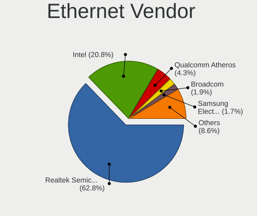

| Vendor                                 | Notebooks | Percent |
|----------------------------------------|-----------|---------|
| Realtek Semiconductor                  | 263       | 62.77%  |
| Intel                                  | 87        | 20.76%  |
| Qualcomm Atheros                       | 18        | 4.3%    |
| Broadcom                               | 8         | 1.91%   |
| Samsung Electronics                    | 7         | 1.67%   |
| ASIX Electronics                       | 7         | 1.67%   |
| MediaTek                               | 5         | 1.19%   |
| Apple                                  | 4         | 0.95%   |
| Suzhou Motorcomm Electronic Technology | 3         | 0.72%   |
| ICS Advent                             | 2         | 0.48%   |
| Google                                 | 2         | 0.48%   |
| DisplayLink                            | 2         | 0.48%   |
| Xiaomi                                 | 1         | 0.24%   |
| TP-Link                                | 1         | 0.24%   |
| Qualcomm                               | 1         | 0.24%   |
| OPPO Electronics                       | 1         | 0.24%   |
| Nvidia                                 | 1         | 0.24%   |
| Motorola PCS                           | 1         | 0.24%   |
| Marvell Technology Group               | 1         | 0.24%   |
| Lenovo                                 | 1         | 0.24%   |
| Hewlett-Packard                        | 1         | 0.24%   |
| Dynabook                               | 1         | 0.24%   |
| Aquantia                               | 1         | 0.24%   |

Ethernet Model
--------------

Ethernet models

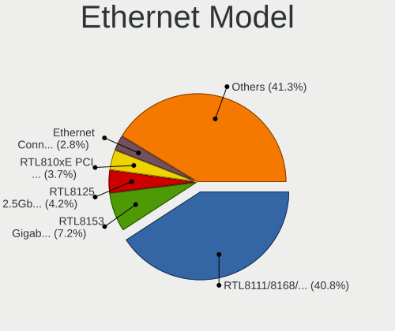

| Model                                                                           | Notebooks | Percent |
|---------------------------------------------------------------------------------|-----------|---------|
| Realtek RTL8111/8168/8211/8411 PCI Express Gigabit Ethernet Controller          | 176       | 40.84%  |
| Realtek RTL8153 Gigabit Ethernet Adapter                                        | 31        | 7.19%   |
| Realtek RTL8125 2.5GbE Controller                                               | 18        | 4.18%   |
| Realtek RTL810xE PCI Express Fast Ethernet controller                           | 16        | 3.71%   |
| Intel Ethernet Connection (4) I219-LM                                           | 12        | 2.78%   |
| Realtek Killer E2600 GbE Controller                                             | 11        | 2.55%   |
| Realtek USB 10/100/1G/2.5 LAN                                                   | 7         | 1.62%   |
| ASIX AX88179 Gigabit Ethernet                                                   | 7         | 1.62%   |
| Intel Ethernet Connection I217-LM                                               | 6         | 1.39%   |
| Intel Alder Lake-P PCH CNVi WiFi                                                | 6         | 1.39%   |
| Intel 82579LM Gigabit Network Connection (Lewisville)                           | 6         | 1.39%   |
| Samsung GT-I9070 (network tethering, USB debugging enabled)                     | 5         | 1.16%   |
| Intel Ethernet Connection I219-LM                                               | 5         | 1.16%   |
| Intel Ethernet Connection (4) I219-V                                            | 5         | 1.16%   |
| Intel Ethernet Connection (18) I219-LM                                          | 5         | 1.16%   |
| Realtek RTL8152 Fast Ethernet Adapter                                           | 4         | 0.93%   |
| Intel Ethernet Connection (6) I219-LM                                           | 4         | 0.93%   |
| Intel Ethernet Connection (3) I218-LM                                           | 4         | 0.93%   |
| Intel BE201 320MHz                                                              | 4         | 0.93%   |
| Suzhou Motorcomm Electronic YT6801 Gigabit Ethernet Controller                  | 3         | 0.7%    |
| Realtek Killer E3000 2.5GbE Controller                                          | 3         | 0.7%    |
| Qualcomm Atheros QCA8171 Gigabit Ethernet                                       | 3         | 0.7%    |
| Qualcomm Atheros Killer E2400 Gigabit Ethernet Controller                       | 3         | 0.7%    |
| Qualcomm Atheros AR8161 Gigabit Ethernet                                        | 3         | 0.7%    |
| MediaTek MT7925 802.11be 160MHz 2x2 PCIe Wireless Network Adapter [Filogic 360] | 3         | 0.7%    |
| Intel Ethernet Connection (6) I219-V                                            | 3         | 0.7%    |
| Intel Ethernet Connection (2) I219-LM                                           | 3         | 0.7%    |
| Intel Ethernet Connection (16) I219-V                                           | 3         | 0.7%    |
| Intel Ethernet Connection (11) I219-LM                                          | 3         | 0.7%    |
| Intel Arrow Lake CNVi WiFi                                                      | 3         | 0.7%    |
| Broadcom NetXtreme BCM57765 Gigabit Ethernet PCIe                               | 3         | 0.7%    |
| Broadcom NetLink BCM57785 Gigabit Ethernet PCIe                                 | 3         | 0.7%    |
| Apple iBridge                                                                   | 3         | 0.7%    |
| Samsung Galaxy series, misc. (tethering mode)                                   | 2         | 0.46%   |
| Realtek PCIe GbE Family Controller                                              | 2         | 0.46%   |
| Qualcomm Atheros Killer E2500 Gigabit Ethernet Controller                       | 2         | 0.46%   |
| Qualcomm Atheros Killer E220x Gigabit Ethernet Controller                       | 2         | 0.46%   |
| Qualcomm Atheros AR8151 v2.0 Gigabit Ethernet                                   | 2         | 0.46%   |
| Qualcomm Atheros AR8131 Gigabit Ethernet                                        | 2         | 0.46%   |
| MediaTek MT7922 802.11ax PCI Express Wireless Network Adapter                   | 2         | 0.46%   |

Net Controller Kind
-------------------

Ethernet, WiFi or modem

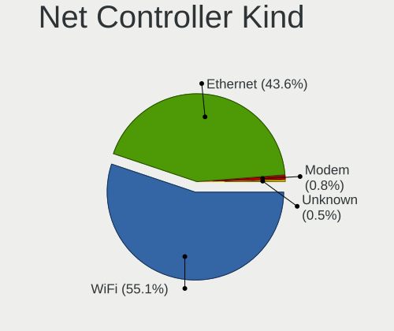

| Kind     | Notebooks | Percent |
|----------|-----------|---------|
| WiFi     | 488       | 55.14%  |
| Ethernet | 386       | 43.62%  |
| Modem    | 7         | 0.79%   |
| Unknown  | 4         | 0.45%   |

Used Controller
---------------

Currently used network controller

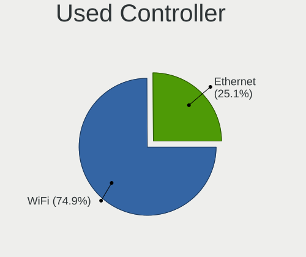

| Kind     | Notebooks | Percent |
|----------|-----------|---------|
| WiFi     | 409       | 74.91%  |
| Ethernet | 137       | 25.09%  |

NICs
----

Total network controllers on board

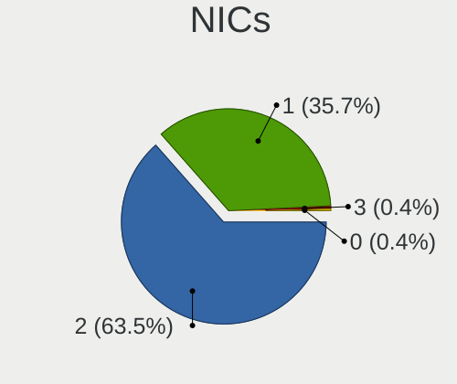

| Total | Notebooks | Percent |
|-------|-----------|---------|
| 2     | 327       | 63.5%   |
| 1     | 184       | 35.73%  |
| 3     | 2         | 0.39%   |
| 0     | 2         | 0.39%   |

IPv6
----

IPv6 vs IPv4

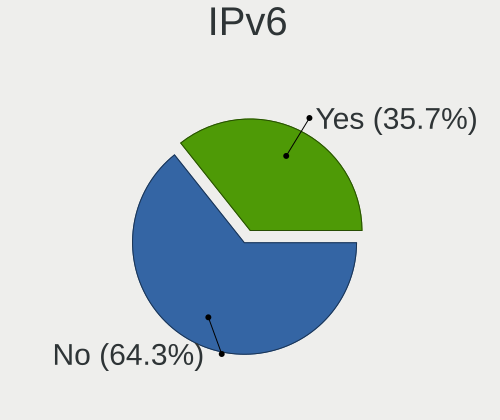

| Used | Notebooks | Percent |
|------|-----------|---------|
| No   | 337       | 64.31%  |
| Yes  | 187       | 35.69%  |

Bluetooth
---------

Bluetooth Vendor
----------------

Controller vendors

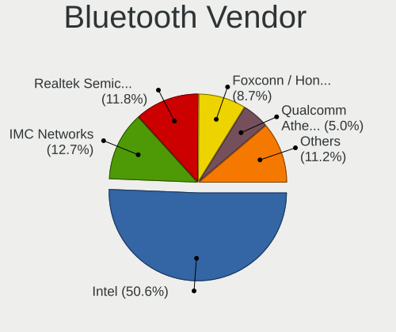

| Vendor                          | Notebooks | Percent |
|---------------------------------|-----------|---------|
| Intel                           | 244       | 50.62%  |
| IMC Networks                    | 61        | 12.66%  |
| Realtek Semiconductor           | 57        | 11.83%  |
| Foxconn / Hon Hai               | 42        | 8.71%   |
| Qualcomm Atheros Communications | 24        | 4.98%   |
| Lite-On Technology              | 16        | 3.32%   |
| MediaTek                        | 9         | 1.87%   |
| Broadcom                        | 6         | 1.24%   |
| Apple                           | 6         | 1.24%   |
| Realtek                         | 4         | 0.83%   |
| USI                             | 3         | 0.62%   |
| Cambridge Silicon Radio         | 2         | 0.41%   |
| TP-Link                         | 1         | 0.21%   |
| Toshiba                         | 1         | 0.21%   |
| Ralink                          | 1         | 0.21%   |
| Dell                            | 1         | 0.21%   |
| ASUSTek Computer                | 1         | 0.21%   |
| Askey Computer                  | 1         | 0.21%   |
| Actions                         | 1         | 0.21%   |
| Unknown                         | 1         | 0.21%   |

Bluetooth Model
---------------

Controller models

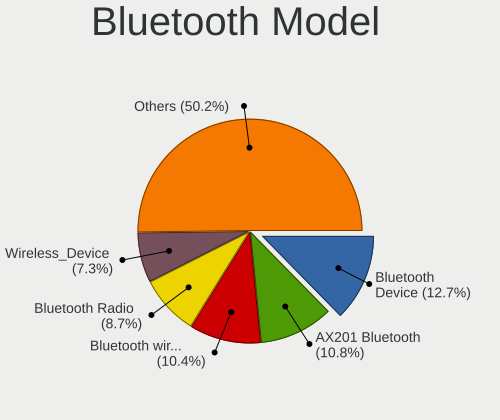

| Model                                               | Notebooks | Percent |
|-----------------------------------------------------|-----------|---------|
| Intel Bluetooth Device                              | 61        | 12.66%  |
| Intel AX201 Bluetooth                               | 52        | 10.79%  |
| Intel Bluetooth wireless interface                  | 50        | 10.37%  |
| Realtek Bluetooth Radio                             | 42        | 8.71%   |
| IMC Networks Wireless_Device                        | 35        | 7.26%   |
| Intel AX200 Bluetooth                               | 30        | 6.22%   |
| Foxconn / Hon Hai Wireless_Device                   | 26        | 5.39%   |
| Intel Bluetooth 9460/9560 Jefferson Peak (JfP)      | 23        | 4.77%   |
| Intel AX210 Bluetooth                               | 20        | 4.15%   |
| IMC Networks Bluetooth Radio                        | 20        | 4.15%   |
| Qualcomm Atheros  Bluetooth Device                  | 15        | 3.11%   |
| Realtek  Bluetooth 4.2 Adapter                      | 13        | 2.7%    |
| MediaTek Wireless_Device                            | 9         | 1.87%   |
| Foxconn / Hon Hai MediaTek Bluetooth Adapter        | 8         | 1.66%   |
| Lite-On Wireless_Device                             | 7         | 1.45%   |
| Lite-On Qualcomm Atheros QCA9377 Bluetooth          | 5         | 1.04%   |
| Realtek Bluetooth Radio                             | 4         | 0.83%   |
| Foxconn / Hon Hai Bluetooth Device                  | 4         | 0.83%   |
| USI Bluetooth Device                                | 3         | 0.62%   |
| Qualcomm Atheros QCA61x4 Bluetooth 4.0              | 3         | 0.62%   |
| Qualcomm Atheros AR3012 Bluetooth 4.0               | 3         | 0.62%   |
| Intel Wireless-AC 3168 Bluetooth                    | 3         | 0.62%   |
| IMC Networks Bluetooth Device                       | 3         | 0.62%   |
| Apple Bluetooth USB Host Controller                 | 3         | 0.62%   |
| Apple Bluetooth Host Controller                     | 3         | 0.62%   |
| Realtek 802.11ac WLAN Adapter                       | 2         | 0.41%   |
| Qualcomm Atheros AR3011 Bluetooth                   | 2         | 0.41%   |
| Intel Wireless-AC 9260 Bluetooth Adapter            | 2         | 0.41%   |
| Intel Centrino Bluetooth Wireless Transceiver       | 2         | 0.41%   |
| IMC Networks Bluetooth                              | 2         | 0.41%   |
| Cambridge Silicon Radio Bluetooth Dongle (HCI mode) | 2         | 0.41%   |
| Broadcom BCM20702 Bluetooth 4.0 [ThinkPad]          | 2         | 0.41%   |
| TP-Link TP-T@- UB500 Adapter                        | 1         | 0.21%   |
| Toshiba Bluetooth Device                            | 1         | 0.21%   |
| Ralink RT3290 Bluetooth                             | 1         | 0.21%   |
| Qualcomm Atheros AR9462 Bluetooth                   | 1         | 0.21%   |
| Lite-On Bluetooth Radio                             | 1         | 0.21%   |
| Lite-On Bluetooth Device                            | 1         | 0.21%   |
| Lite-On BCM43142A0                                  | 1         | 0.21%   |
| Lite-On Atheros AR3012 Bluetooth                    | 1         | 0.21%   |

Sound
-----

Sound Vendor
------------

Sound card vendors

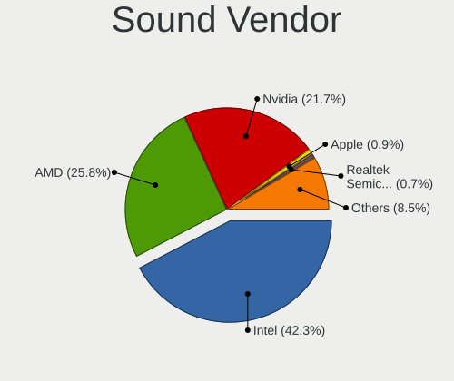

| Vendor                               | Notebooks | Percent |
|--------------------------------------|-----------|---------|
| Intel                                | 318       | 42.34%  |
| AMD                                  | 194       | 25.83%  |
| Nvidia                               | 163       | 21.7%   |
| Apple                                | 7         | 0.93%   |
| Realtek Semiconductor                | 5         | 0.67%   |
| Logitech                             | 5         | 0.67%   |
| Lenovo                               | 5         | 0.67%   |
| Hewlett-Packard                      | 5         | 0.67%   |
| Corsair                              | 5         | 0.67%   |
| SteelSeries ApS                      | 3         | 0.4%    |
| Razer USA                            | 3         | 0.4%    |
| Creative Technology                  | 3         | 0.4%    |
| C-Media Electronics                  | 3         | 0.4%    |
| ASUSTek Computer                     | 3         | 0.4%    |
| Unknown                              | 3         | 0.4%    |
| Sony                                 | 2         | 0.27%   |
| MV-SILICON                           | 2         | 0.27%   |
| Huawei Technologies                  | 2         | 0.27%   |
| TTGK Technology                      | 1         | 0.13%   |
| Thesycon Systemsoftware & Consulting | 1         | 0.13%   |
| Sennheiser electronic                | 1         | 0.13%   |
| Roland                               | 1         | 0.13%   |
| RODE Microphones                     | 1         | 0.13%   |
| OROW                                 | 1         | 0.13%   |
| LE XIAN                              | 1         | 0.13%   |
| Kingston Technology                  | 1         | 0.13%   |
| JMTek                                | 1         | 0.13%   |
| Jieli Technology                     | 1         | 0.13%   |
| GN Netcom                            | 1         | 0.13%   |
| Generic                              | 1         | 0.13%   |
| ESS Technology                       | 1         | 0.13%   |
| DSEA A/S                             | 1         | 0.13%   |
| Dell                                 | 1         | 0.13%   |
| Creative Labs                        | 1         | 0.13%   |
| bestechnic                           | 1         | 0.13%   |
| Audio-Technica                       | 1         | 0.13%   |
| Audeze                               | 1         | 0.13%   |
| Actions Semiconductor                | 1         | 0.13%   |

Sound Model
-----------

Sound card models

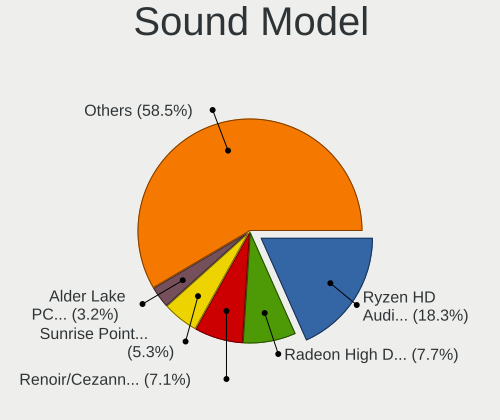

| Model                                                                      | Notebooks | Percent |
|----------------------------------------------------------------------------|-----------|---------|
| AMD Ryzen HD Audio Controller                                              | 174       | 18.34%  |
| AMD Radeon High Definition Audio Controller                                | 73        | 7.69%   |
| AMD Renoir/Cezanne HDMI/DP Audio Controller                                | 67        | 7.06%   |
| Intel Sunrise Point-LP HD Audio                                            | 50        | 5.27%   |
| Intel Alder Lake PCH-P High Definition Audio Controller                    | 30        | 3.16%   |
| Nvidia AD107 High Definition Audio Controller                              | 26        | 2.74%   |
| Nvidia GA107 High Definition Audio Controller                              | 23        | 2.42%   |
| Nvidia GA106 High Definition Audio Controller                              | 23        | 2.42%   |
| Intel Comet Lake PCH cAVS                                                  | 20        | 2.11%   |
| Intel Raptor Lake-P/U/H cAVS                                               | 19        | 2%      |
| AMD Raven/Raven2/Fenghuang HDMI/DP Audio Controller                        | 19        | 2%      |
| Intel Tiger Lake-LP Smart Sound Technology Audio Controller                | 18        | 1.9%    |
| Intel Meteor Lake-P HD Audio Controller                                    | 18        | 1.9%    |
| Intel 8 Series/C220 Series Chipset High Definition Audio Controller        | 14        | 1.48%   |
| Intel 7 Series/C216 Chipset Family High Definition Audio Controller        | 14        | 1.48%   |
| Intel Xeon E3-1200 v3/4th Gen Core Processor HD Audio Controller           | 13        | 1.37%   |
| Intel Tiger Lake-H HD Audio Controller                                     | 13        | 1.37%   |
| Nvidia GA104 High Definition Audio Controller                              | 12        | 1.26%   |
| Nvidia TU106 High Definition Audio Controller                              | 11        | 1.16%   |
| Intel Raptor Lake High Definition Audio Controller                         | 11        | 1.16%   |
| Intel CM238 HD Audio Controller                                            | 11        | 1.16%   |
| Intel Cannon Point-LP High Definition Audio Controller                     | 11        | 1.16%   |
| Nvidia TU107 GeForce GTX 1650 High Definition Audio Controller             | 10        | 1.05%   |
| Intel Wildcat Point-LP High Definition Audio Controller                    | 10        | 1.05%   |
| Intel Cannon Lake PCH cAVS                                                 | 10        | 1.05%   |
| Intel Broadwell-U Audio Controller                                         | 10        | 1.05%   |
| Intel Ice Lake-LP Smart Sound Technology Audio Controller                  | 9         | 0.95%   |
| Intel 6 Series/C200 Series Chipset Family High Definition Audio Controller | 9         | 0.95%   |
| Nvidia AD106M High Definition Audio Controller                             | 7         | 0.74%   |
| Intel 100 Series/C230 Series Chipset Family HD Audio Controller            | 7         | 0.74%   |
| Nvidia TU116 High Definition Audio Controller                              | 6         | 0.63%   |
| Nvidia GB203 High Definition Audio Controller                              | 6         | 0.63%   |
| Intel Comet Lake PCH-LP cAVS                                               | 6         | 0.63%   |
| Intel 800 Series ACE (Audio Context Engine)                                | 6         | 0.63%   |
| Intel 5 Series/3400 Series Chipset High Definition Audio                   | 6         | 0.63%   |
| AMD Navi 31 HDMI/DP Audio                                                  | 6         | 0.63%   |
| Nvidia AD103 High Definition Audio Controller                              | 5         | 0.53%   |
| Intel Lunar Lake-M HD Audio Controller                                     | 5         | 0.53%   |
| Apple Audio Device                                                         | 5         | 0.53%   |
| Realtek Semiconductor USB Audio                                            | 4         | 0.42%   |

Memory
------

Memory Vendor
-------------

Memory module vendors

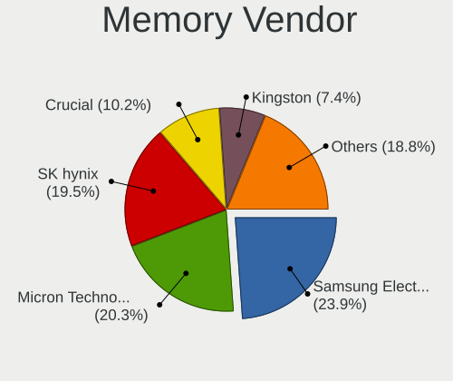

| Vendor              | Notebooks | Percent |
|---------------------|-----------|---------|
| Samsung Electronics | 94        | 23.86%  |
| Micron Technology   | 80        | 20.3%   |
| SK hynix            | 77        | 19.54%  |
| Crucial             | 40        | 10.15%  |
| Kingston            | 29        | 7.36%   |
| Ramaxel Technology  | 12        | 3.05%   |
| A-DATA Technology   | 10        | 2.54%   |
| Unknown             | 10        | 2.54%   |
| Unknown             | 9         | 2.28%   |
| Corsair             | 9         | 2.28%   |
| G.Skill             | 5         | 1.27%   |
| Smart               | 3         | 0.76%   |
| Apacer              | 3         | 0.76%   |
| Team                | 2         | 0.51%   |
| Lexar               | 2         | 0.51%   |
| Unknown (ABCD)      | 1         | 0.25%   |
| Transcend           | 1         | 0.25%   |
| Smart Brazil        | 1         | 0.25%   |
| Silicon Power       | 1         | 0.25%   |
| PUSKILL             | 1         | 0.25%   |
| Neo Forza           | 1         | 0.25%   |
| Nanya Technology    | 1         | 0.25%   |
| Hewlett-Packard     | 1         | 0.25%   |
| GOODRAM             | 1         | 0.25%   |

Memory Model
------------

Memory module models

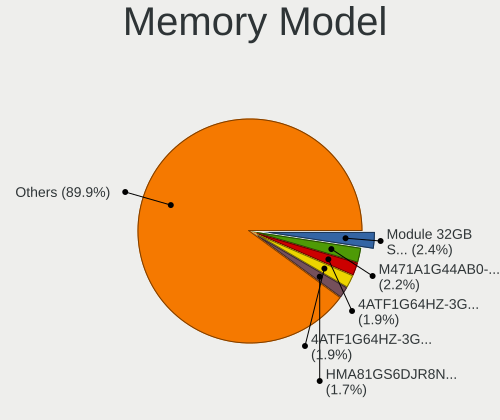

| Model                                                        | Notebooks | Percent |
|--------------------------------------------------------------|-----------|---------|
| Unknown                                                      | 10        | 2.4%    |
| Samsung RAM M471A1G44AB0-CWE 8GiB SODIMM DDR4 3200MT/s       | 9         | 2.16%   |
| Micron RAM 4ATF1G64HZ-3G2F1 8GB SODIMM DDR4 3200MT/s         | 8         | 1.92%   |
| Micron RAM 4ATF1G64HZ-3G2E1 8GB SODIMM DDR4 3200MT/s         | 8         | 1.92%   |
| SK hynix RAM HMA81GS6DJR8N-XN 8GB SODIMM DDR4 3200MT/s       | 7         | 1.68%   |
| Samsung RAM M471A1K43DB1-CWE 8GB SODIMM DDR4 3200MT/s        | 6         | 1.44%   |
| Kingston RAM KF3200C20S4/16G 16GB SODIMM DDR4 3200MT/s       | 6         | 1.44%   |
| SK hynix RAM HMA81GS6AFR8N-UH 8GB SODIMM DDR4 2667MT/s       | 5         | 1.2%    |
| Samsung RAM M471A1K43EB1-CWE 8GB SODIMM DDR4 3200MT/s        | 4         | 0.96%   |
| Samsung RAM M425R2GA3EB0-CWMOL 16GB SODIMM DDR5 5600MT/s     | 4         | 0.96%   |
| Micron RAM 8ATF1G64HZ-2G6E1 8GB SODIMM DDR4 2667MT/s         | 4         | 0.96%   |
| Micron RAM 4ATF51264HZ-2G6E1 4GB SODIMM DDR4 2667MT/s        | 4         | 0.96%   |
| Crucial RAM CT16G4SFRA32A.M16FRS 16GB SODIMM DDR4 3200MT/s   | 4         | 0.96%   |
| SK hynix RAM HMT451S6BFR8A-PB 4GB SODIMM DDR3 1600MT/s       | 3         | 0.72%   |
| SK hynix RAM HMCG78AGBSA092N 16GB SODIMM DDR5 5600MT/s       | 3         | 0.72%   |
| Samsung RAM M471A5244CB0-CWE 4GB SODIMM DDR4 3200MT/s        | 3         | 0.72%   |
| Samsung RAM M471A2G43AB2-CWE 16GB SODIMM DDR4 3200MT/s       | 3         | 0.72%   |
| Samsung RAM M471A1G44AB0-CWE 8GB Row Of Chips DDR4 3200MT/s  | 3         | 0.72%   |
| Samsung RAM M425R2GA3EB0-CWMOD 16GB SODIMM DDR5 5600MT/s     | 3         | 0.72%   |
| Samsung RAM M425R1GB4BB0-CWMOD 8GB SODIMM DDR5 5600MT/s      | 3         | 0.72%   |
| Samsung RAM M425R1GB4BB0-CQKOD 8GB SODIMM DDR5 4800MT/s      | 3         | 0.72%   |
| Samsung RAM K3KL9L90CM-MGCT 4GB Row Of Chips LPDDR5 7500MT/s | 3         | 0.72%   |
| Ramaxel RAM RMSB3410MD88IBF-5600 16GB SODIMM DDR5 5600MT/s   | 3         | 0.72%   |
| Micron RAM MT62F2G32D4DS-026 WT 8GiB SODIMM LPDDR5 7500MT/s  | 3         | 0.72%   |
| Micron RAM Module 8GB SODIMM DDR4 3200MT/s                   | 3         | 0.72%   |
| Micron RAM 8ATF1G64HZ-3G2R1 8GB SODIMM DDR4 3200MT/s         | 3         | 0.72%   |
| Micron RAM 4ATF51264HZ-2G3E1 4GB SODIMM DDR4 2667MT/s        | 3         | 0.72%   |
| Micron RAM 4ATF1G64HZ-3G2E2 8GB SODIMM DDR4 3200MT/s         | 3         | 0.72%   |
| Corsair RAM CMSX16GX4M1A3200C22 16GB SODIMM DDR4 3200MT/s    | 3         | 0.72%   |
| Unknown RAM Module 8GB SODIMM DDR4 3200MT/s                  | 2         | 0.48%   |
| Unknown RAM Module 4GB SODIMM DDR4 2667MT/s                  | 2         | 0.48%   |
| SK hynix RAM HMT351S6EFR8A-PB 4GB SODIMM DDR3 1600MT/s       | 2         | 0.48%   |
| SK hynix RAM HMCG66AGBSA092N 8GB SODIMM DDR5 5600MT/s        | 2         | 0.48%   |
| SK hynix RAM HMAG68EXNSA051N 8GB SODIMM DDR4 3200MT/s        | 2         | 0.48%   |
| SK hynix RAM HMAA1GS6CMR6N-XN 8GB Row Of Chips DDR4 3200MT/s | 2         | 0.48%   |
| SK hynix RAM HMAA1GS6CJR6N-XN 8GB SODIMM DDR4 3200MT/s       | 2         | 0.48%   |
| SK hynix RAM HMA851S6DJR6N-XN 4GB SODIMM DDR4 3200MT/s       | 2         | 0.48%   |
| SK hynix RAM HMA851S6CJR6N-VK 4GB Row Of Chips DDR4 2667MT/s | 2         | 0.48%   |
| SK hynix RAM HMA81GS6JJR8N-VK 8GB SODIMM DDR4 2667MT/s       | 2         | 0.48%   |
| SK hynix RAM HMA451S6AFR8N-TF 4GB SODIMM DDR4 2133MT/s       | 2         | 0.48%   |

Memory Kind
-----------

Memory module kinds

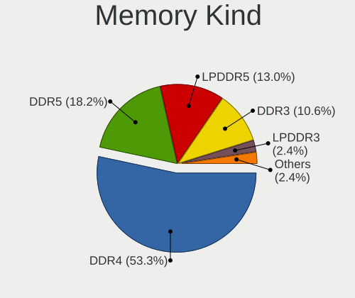

| Kind   | Notebooks | Percent |
|--------|-----------|---------|
| DDR4   | 176       | 53.33%  |
| DDR5   | 60        | 18.18%  |
| LPDDR5 | 43        | 13.03%  |
| DDR3   | 35        | 10.61%  |
| LPDDR3 | 8         | 2.42%   |
| LPDDR4 | 6         | 1.82%   |
| SDRAM  | 2         | 0.61%   |

Memory Form Factor
------------------

Physical design of the memory module

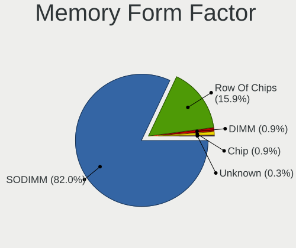

| Name         | Notebooks | Percent |
|--------------|-----------|---------|
| SODIMM       | 274       | 82.04%  |
| Row Of Chips | 53        | 15.87%  |
| DIMM         | 3         | 0.9%    |
| Chip         | 3         | 0.9%    |
| Unknown      | 1         | 0.3%    |

Memory Size
-----------

Memory module size

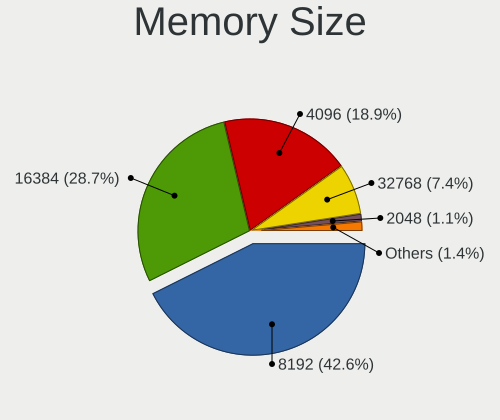

| Size  | Notebooks | Percent |
|-------|-----------|---------|
| 8192  | 156       | 42.62%  |
| 16384 | 105       | 28.69%  |
| 4096  | 69        | 18.85%  |
| 32768 | 27        | 7.38%   |
| 2048  | 4         | 1.09%   |
| 12288 | 2         | 0.55%   |
| 65536 | 1         | 0.27%   |
| 49152 | 1         | 0.27%   |
| 6144  | 1         | 0.27%   |

Memory Speed
------------

Memory module speed

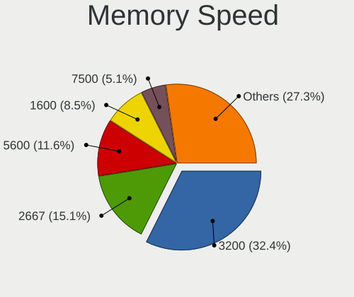

| Speed   | Notebooks | Percent |
|---------|-----------|---------|
| 3200    | 114       | 32.39%  |
| 2667    | 53        | 15.06%  |
| 5600    | 41        | 11.65%  |
| 1600    | 30        | 8.52%   |
| 7500    | 18        | 5.11%   |
| 4800    | 17        | 4.83%   |
| 2400    | 15        | 4.26%   |
| 2133    | 12        | 3.41%   |
| 6400    | 11        | 3.13%   |
| 8533    | 8         | 2.27%   |
| 1867    | 5         | 1.42%   |
| 6000    | 4         | 1.14%   |
| 4266    | 4         | 1.14%   |
| 7467    | 3         | 0.85%   |
| 8400    | 2         | 0.57%   |
| 8000    | 2         | 0.57%   |
| 4267    | 2         | 0.57%   |
| 4199    | 2         | 0.57%   |
| 3266    | 2         | 0.57%   |
| 1333    | 2         | 0.57%   |
| 5200    | 1         | 0.28%   |
| 3733    | 1         | 0.28%   |
| 2933    | 1         | 0.28%   |
| 800     | 1         | 0.28%   |
| Unknown | 1         | 0.28%   |

Printers & scanners
-------------------

Printer Vendor
--------------

Printer device vendors

Zero info for selected period =(

Printer Model
-------------

Printer device models

Zero info for selected period =(

Scanner Vendor
--------------

Scanner device vendors

Zero info for selected period =(

Scanner Model
-------------

Scanner device models

Zero info for selected period =(

Camera
------

Camera Vendor
-------------

Camera device vendors

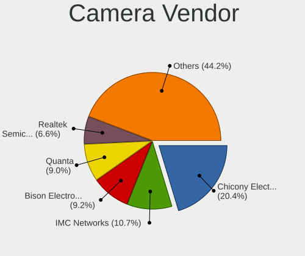

| Vendor                                 | Notebooks | Percent |
|----------------------------------------|-----------|---------|
| Chicony Electronics                    | 93        | 20.35%  |
| IMC Networks                           | 49        | 10.72%  |
| Bison Electronics                      | 42        | 9.19%   |
| Quanta                                 | 41        | 8.97%   |
| Realtek Semiconductor                  | 30        | 6.56%   |
| Syntek                                 | 27        | 5.91%   |
| Luxvisions Innotech Limited            | 23        | 5.03%   |
| ShineTech                              | 22        | 4.81%   |
| Microdia                               | 19        | 4.16%   |
| Sunplus Innovation Technology          | 15        | 3.28%   |
| Sonix Technology                       | 15        | 3.28%   |
| Cheng Uei Precision Industry (Foxlink) | 15        | 3.28%   |
| Apple                                  | 11        | 2.41%   |
| Lite-On Technology                     | 7         | 1.53%   |
| Logitech                               | 5         | 1.09%   |
| kingcome                               | 5         | 1.09%   |
| Suyin                                  | 4         | 0.88%   |
| SunplusIT                              | 3         | 0.66%   |
| Silicon Motion                         | 3         | 0.66%   |
| Acer                                   | 3         | 0.66%   |
| ShineOptics                            | 2         | 0.44%   |
| Shine-optics                           | 2         | 0.44%   |
| Samsung Electronics                    | 2         | 0.44%   |
| icSpring                               | 2         | 0.44%   |
| BillionPixels                          | 2         | 0.44%   |
| Alcor Micro                            | 2         | 0.44%   |
| Zhejiang Dahua Technology              | 1         | 0.22%   |
| webcamvendor                           | 1         | 0.22%   |
| Tripath Technology                     | 1         | 0.22%   |
| Sunplus IT                             | 1         | 0.22%   |
| SN0002                                 | 1         | 0.22%   |
| SenseTek                               | 1         | 0.22%   |
| Ricoh                                  | 1         | 0.22%   |
| MacroSilicon                           | 1         | 0.22%   |
| Lenovo                                 | 1         | 0.22%   |
| Hopewin Electronic Material            | 1         | 0.22%   |
| Generalplus Technology                 | 1         | 0.22%   |
| Framework                              | 1         | 0.22%   |
| BKX-210918                             | 1         | 0.22%   |

Camera Model
------------

Camera device models

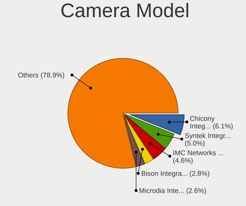

| Model                                                | Notebooks | Percent |
|------------------------------------------------------|-----------|---------|
| Chicony Integrated Camera                            | 28        | 6.1%    |
| Syntek Integrated Camera                             | 23        | 5.01%   |
| IMC Networks USB2.0 HD UVC WebCam                    | 21        | 4.58%   |
| Bison Integrated Camera                              | 13        | 2.83%   |
| Microdia Integrated_Webcam_HD                        | 12        | 2.61%   |
| Shinetech USB2.0 FHD UVC WebCam                      | 11        | 2.4%    |
| Sonix USB2.0 HD UVC WebCam                           | 10        | 2.18%   |
| Realtek Integrated_Webcam_HD                         | 10        | 2.18%   |
| Luxvisions Innotech Limited Integrated Camera        | 10        | 2.18%   |
| IMC Networks Integrated Camera                       | 9         | 1.96%   |
| Quanta ACER HD User Facing                           | 8         | 1.74%   |
| Chicony HD Webcam                                    | 8         | 1.74%   |
| ShineTech USB2.0 HD UVC WebCam                       | 7         | 1.53%   |
| Quanta HD User Facing                                | 7         | 1.53%   |
| Bison HD Webcam                                      | 7         | 1.53%   |
| Sunplus Integrated_Webcam_HD                         | 6         | 1.31%   |
| Chicony Integrated Camera (1280x720@30)              | 6         | 1.31%   |
| Luxvisions Innotech Limited Integrated RGB Camera    | 5         | 1.09%   |
| IMC Networks USB2.0 VGA UVC WebCam                   | 5         | 1.09%   |
| Chicony HP Wide Vision HD Camera                     | 5         | 1.09%   |
| Chicony ACER QHD User Facing                         | 5         | 1.09%   |
| Realtek Integrated_Webcam_FHD                        | 4         | 0.87%   |
| Quanta USB2.0 HD UVC WebCam                          | 4         | 0.87%   |
| Quanta HP Wide Vision HD Camera                      | 4         | 0.87%   |
| Luxvisions Innotech Limited HP Wide Vision HD Camera | 4         | 0.87%   |
| Lite-On HP HD Camera                                 | 4         | 0.87%   |
| kingcome FHD WebCam                                  | 4         | 0.87%   |
| IMC Networks HP TrueVision HD Camera                 | 4         | 0.87%   |
| Chicony HP TrueVision HD Camera                      | 4         | 0.87%   |
| Chicony Chicony USB2.0 Camera                        | 4         | 0.87%   |
| Bison Integrated RGB Camera                          | 4         | 0.87%   |
| Sonix USB2.0 FHD UVC WebCam                          | 3         | 0.65%   |
| Shinetech ASUS FHD webcam                            | 3         | 0.65%   |
| Quanta HP TrueVision HD Camera                       | 3         | 0.65%   |
| Quanta HP HD Camera                                  | 3         | 0.65%   |
| Luxvisions Innotech Limited HP TrueVision HD Camera  | 3         | 0.65%   |
| IMC Networks ov9734_azurewave_camera                 | 3         | 0.65%   |
| Chicony Integrated IR Camera                         | 3         | 0.65%   |
| Chicony HP HD Camera                                 | 3         | 0.65%   |
| Chicony HD User Facing                               | 3         | 0.65%   |

Security
--------

Fingerprint Vendor
------------------

Fingerprint sensor vendors

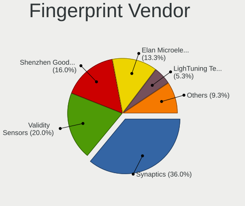

| Vendor                     | Notebooks | Percent |
|----------------------------|-----------|---------|
| Synaptics                  | 27        | 36%     |
| Validity Sensors           | 15        | 20%     |
| Shenzhen Goodix Technology | 12        | 16%     |
| Elan Microelectronics      | 10        | 13.33%  |
| LighTuning Technology      | 4         | 5.33%   |
| HOLTEK                     | 3         | 4%      |
| Upek                       | 1         | 1.33%   |
| GDMicroelectronics         | 1         | 1.33%   |
| Focal-systems.Corp         | 1         | 1.33%   |
| AuthenTec                  | 1         | 1.33%   |

Fingerprint Model
-----------------

Fingerprint sensor models

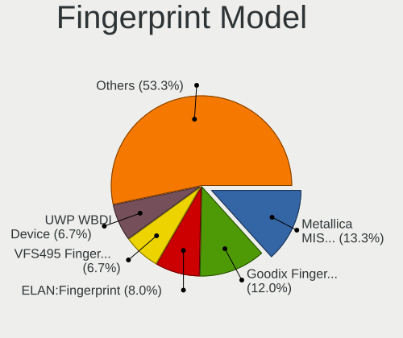

| Model                                                    | Notebooks | Percent |
|----------------------------------------------------------|-----------|---------|
| Synaptics Metallica MIS Touch Fingerprint Reader         | 10        | 13.33%  |
| Shenzhen Goodix  Fingerprint Device                      | 9         | 12%     |
| Elan ELAN:Fingerprint                                    | 6         | 8%      |
| Validity Sensors VFS495 Fingerprint Reader               | 5         | 6.67%   |
| Synaptics UWP WBDI Device                                | 5         | 6.67%   |
| Validity Sensors VFS 5011 fingerprint sensor             | 4         | 5.33%   |
| Synaptics Fingerprint reader [HP G6]                     | 4         | 5.33%   |
| Elan ELAN:ARM-M4                                         | 4         | 5.33%   |
| Synaptics Prometheus MIS Touch Fingerprint Reader        | 3         | 4%      |
| LighTuning ES603 Swipe Fingerprint Sensor                | 3         | 4%      |
| HOLTEK FocalTech Fingerprint Device                      | 3         | 4%      |
| Validity Sensors VFS7552 Touch Fingerprint Sensor        | 2         | 2.67%   |
| Validity Sensors VFS7500 Touch Fingerprint Sensor        | 2         | 2.67%   |
| Synaptics WBDI Fingerprint Reader USB 086                | 2         | 2.67%   |
| Shenzhen Goodix Fingerprint Reader                       | 2         | 2.67%   |
| Validity Sensors VFS451 Fingerprint Reader               | 1         | 1.33%   |
| Validity Sensors Fingerprint scanner                     | 1         | 1.33%   |
| Upek TCS5B Fingerprint sensor                            | 1         | 1.33%   |
| Synaptics TouchPad                                       | 1         | 1.33%   |
| Synaptics Prometheus Fingerprint Reader                  | 1         | 1.33%   |
| Synaptics FS7604 Touch Fingerprint Sensor with PurePrint | 1         | 1.33%   |
| Shenzhen Goodix FingerPrint                              | 1         | 1.33%   |
| LighTuning EgisTec Touch Fingerprint Sensor              | 1         | 1.33%   |
| GDMicroelectronics Touch Fingerprint Sensor              | 1         | 1.33%   |
| Focal-systems.Corp FT9201Fingerprint.                    | 1         | 1.33%   |
| AuthenTec AES2810                                        | 1         | 1.33%   |

Chipcard Vendor
---------------

Chipcard module vendors

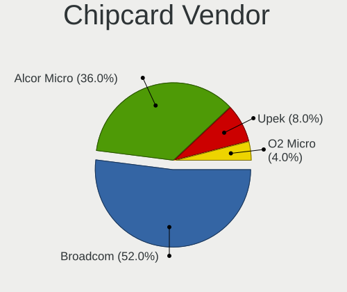

| Vendor      | Notebooks | Percent |
|-------------|-----------|---------|
| Broadcom    | 13        | 52%     |
| Alcor Micro | 9         | 36%     |
| Upek        | 2         | 8%      |
| O2 Micro    | 1         | 4%      |

Chipcard Model
--------------

Chipcard module models

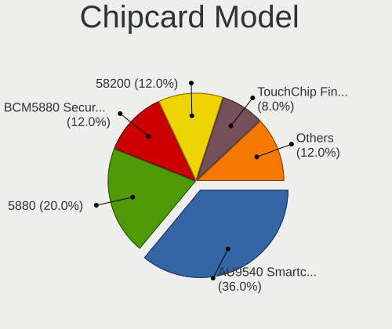

| Model                                                                        | Notebooks | Percent |
|------------------------------------------------------------------------------|-----------|---------|
| Alcor Micro AU9540 Smartcard Reader                                          | 9         | 36%     |
| Broadcom 5880                                                                | 5         | 20%     |
| Broadcom BCM5880 Secure Applications Processor with fingerprint swipe sensor | 3         | 12%     |
| Broadcom 58200                                                               | 3         | 12%     |
| Upek TouchChip Fingerprint Coprocessor (WBF advanced mode)                   | 2         | 8%      |
| O2 Micro OZ776 CCID Smartcard Reader                                         | 1         | 4%      |
| Broadcom BCM5880 Secure Applications Processor                               | 1         | 4%      |
| Broadcom BCM58200 ControlVault 3 (FingerPrint sensor + Contacted SmartCard)  | 1         | 4%      |

Unsupported
-----------

Unsupported Devices
-------------------

Total unsupported devices on board

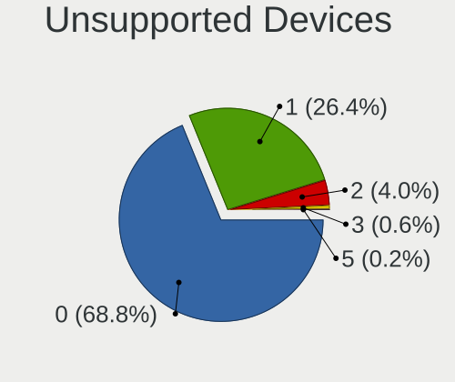

| Total | Notebooks | Percent |
|-------|-----------|---------|
| 0     | 360       | 68.83%  |
| 1     | 138       | 26.39%  |
| 2     | 21        | 4.02%   |
| 3     | 3         | 0.57%   |
| 5     | 1         | 0.19%   |

Unsupported Device Types
------------------------

Types of unsupported devices

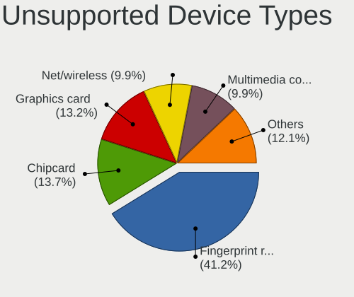

| Type                     | Notebooks | Percent |
|--------------------------|-----------|---------|
| Fingerprint reader       | 75        | 41.21%  |
| Chipcard                 | 25        | 13.74%  |
| Graphics card            | 24        | 13.19%  |
| Net/wireless             | 18        | 9.89%   |
| Multimedia controller    | 18        | 9.89%   |
| Communication controller | 5         | 2.75%   |
| Card reader              | 4         | 2.2%    |
| Sound                    | 3         | 1.65%   |
| Net/ethernet             | 3         | 1.65%   |
| Camera                   | 2         | 1.1%    |
| Unassigned class         | 1         | 0.55%   |
| Storage/raid             | 1         | 0.55%   |
| Storage                  | 1         | 0.55%   |
| Network                  | 1         | 0.55%   |
| Bluetooth                | 1         | 0.55%   |

