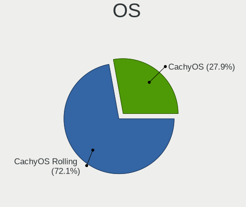
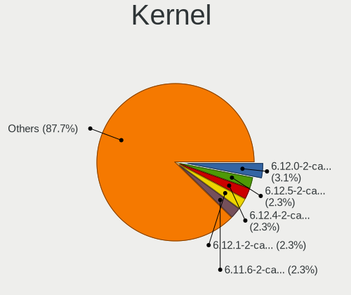
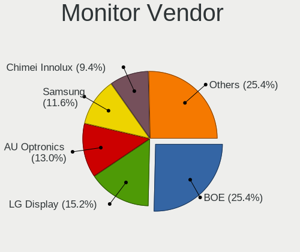
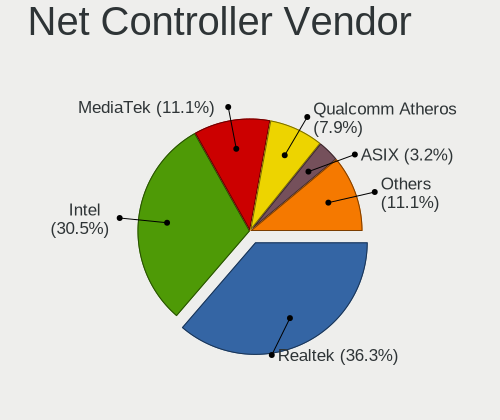
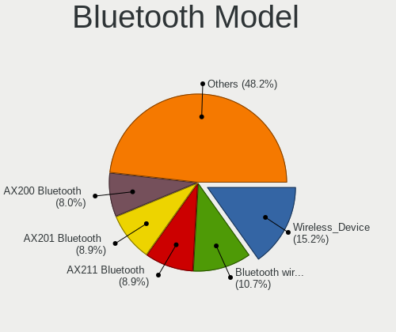
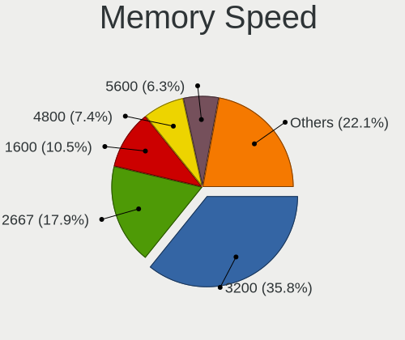

CachyOS - Tested Hardware & Statistics (Notebooks)
--------------------------------------------------

A project to collect tested hardware configurations for CachyOS.

Anyone can contribute to this report by the [hw-probe](https://github.com/linuxhw/hw-probe) tool:

    sudo -E hw-probe -all -upload

Please contribute! Especially if your hardware is rare.

Contents
--------

* [ Test Cases ](#test-cases)

* [ System ](#system)
  - [ OS                       ](#os)
  - [ OS Family                ](#os-family)
  - [ Kernel                   ](#kernel)
  - [ Kernel Family            ](#kernel-family)
  - [ Kernel Major Ver.        ](#kernel-major-ver)
  - [ Arch                     ](#arch)
  - [ DE                       ](#de)
  - [ Display Server           ](#display-server)
  - [ Display Manager          ](#display-manager)
  - [ OS Lang                  ](#os-lang)
  - [ Boot Mode                ](#boot-mode)
  - [ Filesystem               ](#filesystem)
  - [ Part. scheme             ](#part-scheme)
  - [ Dual Boot with Linux/BSD ](#dual-boot-with-linuxbsd)
  - [ Dual Boot (Win)          ](#dual-boot-win)

* [ Board ](#board)
  - [ Vendor                   ](#vendor)
  - [ Model                    ](#model)
  - [ Model Family             ](#model-family)
  - [ MFG Year                 ](#mfg-year)
  - [ Form Factor              ](#form-factor)
  - [ Secure Boot              ](#secure-boot)
  - [ Coreboot                 ](#coreboot)
  - [ RAM Size                 ](#ram-size)
  - [ RAM Used                 ](#ram-used)
  - [ Total Drives             ](#total-drives)
  - [ Has CD-ROM               ](#has-cd-rom)
  - [ Has Ethernet             ](#has-ethernet)
  - [ Has WiFi                 ](#has-wifi)
  - [ Has Bluetooth            ](#has-bluetooth)

* [ Location ](#location)
  - [ Country                  ](#country)
  - [ City                     ](#city)

* [ Drives ](#drives)
  - [ Drive Vendor             ](#drive-vendor)
  - [ Drive Model              ](#drive-model)
  - [ HDD Vendor               ](#hdd-vendor)
  - [ SSD Vendor               ](#ssd-vendor)
  - [ Drive Kind               ](#drive-kind)
  - [ Drive Connector          ](#drive-connector)
  - [ Drive Size               ](#drive-size)
  - [ Space Total              ](#space-total)
  - [ Space Used               ](#space-used)
  - [ Malfunc. Drives          ](#malfunc-drives)
  - [ Malfunc. Drive Vendor    ](#malfunc-drive-vendor)
  - [ Malfunc. HDD Vendor      ](#malfunc-hdd-vendor)
  - [ Malfunc. Drive Kind      ](#malfunc-drive-kind)
  - [ Failed Drives            ](#failed-drives)
  - [ Failed Drive Vendor      ](#failed-drive-vendor)
  - [ Drive Status             ](#drive-status)

* [ Storage controller ](#storage-controller)
  - [ Storage Vendor           ](#storage-vendor)
  - [ Storage Model            ](#storage-model)
  - [ Storage Kind             ](#storage-kind)

* [ Processor ](#processor)
  - [ CPU Vendor               ](#cpu-vendor)
  - [ CPU Model                ](#cpu-model)
  - [ CPU Model Family         ](#cpu-model-family)
  - [ CPU Cores                ](#cpu-cores)
  - [ CPU Sockets              ](#cpu-sockets)
  - [ CPU Threads              ](#cpu-threads)
  - [ CPU Op-Modes             ](#cpu-op-modes)
  - [ CPU Microcode            ](#cpu-microcode)
  - [ CPU Microarch            ](#cpu-microarch)

* [ Graphics ](#graphics)
  - [ GPU Vendor               ](#gpu-vendor)
  - [ GPU Model                ](#gpu-model)
  - [ GPU Combo                ](#gpu-combo)
  - [ GPU Driver               ](#gpu-driver)
  - [ GPU Memory               ](#gpu-memory)

* [ Monitor ](#monitor)
  - [ Monitor Vendor           ](#monitor-vendor)
  - [ Monitor Model            ](#monitor-model)
  - [ Monitor Resolution       ](#monitor-resolution)
  - [ Monitor Diagonal         ](#monitor-diagonal)
  - [ Monitor Width            ](#monitor-width)
  - [ Aspect Ratio             ](#aspect-ratio)
  - [ Monitor Area             ](#monitor-area)
  - [ Pixel Density            ](#pixel-density)
  - [ Multiple Monitors        ](#multiple-monitors)

* [ Network ](#network)
  - [ Net Controller Vendor    ](#net-controller-vendor)
  - [ Net Controller Model     ](#net-controller-model)
  - [ Wireless Vendor          ](#wireless-vendor)
  - [ Wireless Model           ](#wireless-model)
  - [ Ethernet Vendor          ](#ethernet-vendor)
  - [ Ethernet Model           ](#ethernet-model)
  - [ Net Controller Kind      ](#net-controller-kind)
  - [ Used Controller          ](#used-controller)
  - [ NICs                     ](#nics)
  - [ IPv6                     ](#ipv6)

* [ Bluetooth ](#bluetooth)
  - [ Bluetooth Vendor         ](#bluetooth-vendor)
  - [ Bluetooth Model          ](#bluetooth-model)

* [ Sound ](#sound)
  - [ Sound Vendor             ](#sound-vendor)
  - [ Sound Model              ](#sound-model)

* [ Memory ](#memory)
  - [ Memory Vendor            ](#memory-vendor)
  - [ Memory Model             ](#memory-model)
  - [ Memory Kind              ](#memory-kind)
  - [ Memory Form Factor       ](#memory-form-factor)
  - [ Memory Size              ](#memory-size)
  - [ Memory Speed             ](#memory-speed)

* [ Printers & scanners ](#printers--scanners)
  - [ Printer Vendor           ](#printer-vendor)
  - [ Printer Model            ](#printer-model)
  - [ Scanner Vendor           ](#scanner-vendor)
  - [ Scanner Model            ](#scanner-model)

* [ Camera ](#camera)
  - [ Camera Vendor            ](#camera-vendor)
  - [ Camera Model             ](#camera-model)

* [ Security ](#security)
  - [ Fingerprint Vendor       ](#fingerprint-vendor)
  - [ Fingerprint Model        ](#fingerprint-model)
  - [ Chipcard Vendor          ](#chipcard-vendor)
  - [ Chipcard Model           ](#chipcard-model)

* [ Unsupported ](#unsupported)
  - [ Unsupported Devices      ](#unsupported-devices)
  - [ Unsupported Device Types ](#unsupported-device-types)

Test Cases
----------

Total: 162

| Vendor        | Model                       | Probe                                                      | Date         |
|---------------|-----------------------------|------------------------------------------------------------|--------------|
| Dell          | Latitude 5290 2-in-1        | [cee01ab926](https://linux-hardware.org/?probe=cee01ab926) | Jan 04, 2025 |
| Dell          | Latitude 5290 2-in-1        | [b5b287d361](https://linux-hardware.org/?probe=b5b287d361) | Jan 04, 2025 |
| Dell          | Latitude E6430              | [72d1edde28](https://linux-hardware.org/?probe=72d1edde28) | Jan 01, 2025 |
| Lenovo        | ThinkPad T560 20FJS44L0B    | [56b90e34ae](https://linux-hardware.org/?probe=56b90e34ae) | Dec 31, 2024 |
| HP            | Victus by Gaming Laptop ... | [43e4a1a3d5](https://linux-hardware.org/?probe=43e4a1a3d5) | Dec 26, 2024 |
| Toshiba       | Satellite P70-A             | [a428e828ad](https://linux-hardware.org/?probe=a428e828ad) | Dec 24, 2024 |
| ASUSTek       | ASUS TUF Gaming A15 FA50... | [ea550dbbcd](https://linux-hardware.org/?probe=ea550dbbcd) | Dec 19, 2024 |
| HP            | ProBook 450 G2              | [5a4149356a](https://linux-hardware.org/?probe=5a4149356a) | Dec 19, 2024 |
| Lenovo        | Legion 5 Pro 16ACH6H 82J... | [539c61eb30](https://linux-hardware.org/?probe=539c61eb30) | Dec 19, 2024 |
| Gigabyte      | B550 AORUS ELITE AX V2      | [193c96330e](https://linux-hardware.org/?probe=193c96330e) | Dec 18, 2024 |
| ASUSTek       | ASUS TUF Dash F15 FX517Z... | [532c74b6c3](https://linux-hardware.org/?probe=532c74b6c3) | Dec 16, 2024 |
| Dell          | G15 Special Edition 5521    | [d929f4b785](https://linux-hardware.org/?probe=d929f4b785) | Dec 16, 2024 |
| Dell          | G15 Special Edition 5521    | [34f4dd2388](https://linux-hardware.org/?probe=34f4dd2388) | Dec 12, 2024 |
| HUAWEI        | VGHH-XX                     | [b6dcf78af5](https://linux-hardware.org/?probe=b6dcf78af5) | Dec 11, 2024 |
| HUAWEI        | VGHH-XX                     | [5748f7a3f8](https://linux-hardware.org/?probe=5748f7a3f8) | Dec 11, 2024 |
| Acer          | Nitro ANV15-41              | [31a9ee124c](https://linux-hardware.org/?probe=31a9ee124c) | Dec 11, 2024 |
| Lenovo        | ThinkPad X270 W10DG 20K5... | [a477748a96](https://linux-hardware.org/?probe=a477748a96) | Dec 10, 2024 |
| Lenovo        | ThinkPad X270 W10DG 20K5... | [bbe2d69fea](https://linux-hardware.org/?probe=bbe2d69fea) | Dec 08, 2024 |
| HUAWEI        | NBLK-WAX9X                  | [8a46fcd616](https://linux-hardware.org/?probe=8a46fcd616) | Dec 05, 2024 |
| Lenovo        | ThinkPad X130e 233827C      | [d7d1d786d7](https://linux-hardware.org/?probe=d7d1d786d7) | Dec 05, 2024 |
| HP            | Victus by Gaming Laptop ... | [7934b3b43f](https://linux-hardware.org/?probe=7934b3b43f) | Dec 02, 2024 |
| HP            | ZBook 15u G3                | [c4aba38081](https://linux-hardware.org/?probe=c4aba38081) | Dec 01, 2024 |
| Gigabyte      | G5 GD                       | [919fb3ff16](https://linux-hardware.org/?probe=919fb3ff16) | Nov 30, 2024 |
| Lenovo        | Yoga 710-11IKB 80V6         | [e67edc393b](https://linux-hardware.org/?probe=e67edc393b) | Nov 30, 2024 |
| Lenovo        | IdeaPad 3 15ALC6 82MF       | [f39fbc4af3](https://linux-hardware.org/?probe=f39fbc4af3) | Nov 23, 2024 |
| ASUSTek       | ASUS TUF Dash F15 FX517Z... | [87836c3a98](https://linux-hardware.org/?probe=87836c3a98) | Nov 22, 2024 |
| ASUSTek       | X551MA                      | [0d607d5bf8](https://linux-hardware.org/?probe=0d607d5bf8) | Nov 21, 2024 |
| Lenovo        | ThinkBook 14 G7+ ASP 21Q... | [8d8f8b47bc](https://linux-hardware.org/?probe=8d8f8b47bc) | Nov 20, 2024 |
| ASUSTek       | ASUS TUF Gaming A14 FA40... | [6078f351c2](https://linux-hardware.org/?probe=6078f351c2) | Nov 20, 2024 |
| HP            | Victus by Gaming Laptop ... | [f68a7fb475](https://linux-hardware.org/?probe=f68a7fb475) | Nov 17, 2024 |
| Samsung       | 340XAA/350XAA/550XAA        | [0cc613be0d](https://linux-hardware.org/?probe=0cc613be0d) | Nov 16, 2024 |
| HP            | 245 14 inch G10 Notebook... | [c6da834ecc](https://linux-hardware.org/?probe=c6da834ecc) | Nov 16, 2024 |
| Lenovo        | Legion 5 15ARH05H 82B1      | [96e212c973](https://linux-hardware.org/?probe=96e212c973) | Nov 15, 2024 |
| Framework     | Laptop 16 (AMD Ryzen 704... | [725d60365f](https://linux-hardware.org/?probe=725d60365f) | Nov 11, 2024 |
| Acer          | Aspire ES1-523              | [afe3844e09](https://linux-hardware.org/?probe=afe3844e09) | Nov 08, 2024 |
| Samsung       | 550XDA                      | [db43fa9eb9](https://linux-hardware.org/?probe=db43fa9eb9) | Nov 08, 2024 |
| Lenovo        | ThinkPad T14 Gen 4 21HES... | [15fc815400](https://linux-hardware.org/?probe=15fc815400) | Nov 07, 2024 |
| Framework     | Laptop 16 (AMD Ryzen 704... | [3e7656fdd9](https://linux-hardware.org/?probe=3e7656fdd9) | Nov 04, 2024 |
| Lenovo        | IdeaPad 3 15IAU7 82RK       | [60fae9118e](https://linux-hardware.org/?probe=60fae9118e) | Nov 01, 2024 |
| Infinix       | ZERO BOOK 13                | [b821e45601](https://linux-hardware.org/?probe=b821e45601) | Oct 31, 2024 |
| ASUSTek       | VivoBook_ASUSLaptop M150... | [045b0cce4d](https://linux-hardware.org/?probe=045b0cce4d) | Oct 30, 2024 |
| Maibenben     | Medio                       | [47a5701a2b](https://linux-hardware.org/?probe=47a5701a2b) | Oct 29, 2024 |
| Lenovo        | G710 20252                  | [498952039e](https://linux-hardware.org/?probe=498952039e) | Oct 29, 2024 |
| ASUSTek       | VivoBook_ASUSLaptop M360... | [c08c52089c](https://linux-hardware.org/?probe=c08c52089c) | Oct 25, 2024 |
| Dell          | Precision 5560              | [6da5c6991c](https://linux-hardware.org/?probe=6da5c6991c) | Oct 21, 2024 |
| Lenovo        | ThinkPad E14 Gen 3 20YE0... | [d98d306e9d](https://linux-hardware.org/?probe=d98d306e9d) | Oct 21, 2024 |
| Monster       | ABRA A7 V13.2               | [407b879b51](https://linux-hardware.org/?probe=407b879b51) | Oct 18, 2024 |
| HUAWEI        | VGHH-XX                     | [0dd8518523](https://linux-hardware.org/?probe=0dd8518523) | Oct 18, 2024 |
| Acer          | Aspire 5755G                | [ecb5aa9989](https://linux-hardware.org/?probe=ecb5aa9989) | Oct 16, 2024 |
| HP            | 250 G1                      | [0363e7e53b](https://linux-hardware.org/?probe=0363e7e53b) | Oct 15, 2024 |
| Acer          | Aspire 5755G                | [d87d40966a](https://linux-hardware.org/?probe=d87d40966a) | Oct 15, 2024 |
| Hampoo        | Cherry Trail CR V100        | [0d5cdc15ce](https://linux-hardware.org/?probe=0d5cdc15ce) | Oct 08, 2024 |
| Lenovo        | IdeaPad S145-15API 81V7     | [e30072cbc9](https://linux-hardware.org/?probe=e30072cbc9) | Oct 08, 2024 |
| ASUSTek       | VivoBook_ASUSLaptop M150... | [ef06abe952](https://linux-hardware.org/?probe=ef06abe952) | Oct 07, 2024 |
| ASUSTek       | ASUS TUF Gaming F15 FX50... | [b71b9be2da](https://linux-hardware.org/?probe=b71b9be2da) | Oct 06, 2024 |
| ASUSTek       | ASUS TUF Gaming F15 FX50... | [81ebaca48f](https://linux-hardware.org/?probe=81ebaca48f) | Oct 06, 2024 |
| HP            | EliteBook Folio 1020 G1     | [0be7c4d20a](https://linux-hardware.org/?probe=0be7c4d20a) | Oct 05, 2024 |
| Lenovo        | IdeaPad 3 15ADA05 81W1      | [0c7fc35b3a](https://linux-hardware.org/?probe=0c7fc35b3a) | Oct 05, 2024 |
| Dell          | Latitude 3140               | [d211dffcd6](https://linux-hardware.org/?probe=d211dffcd6) | Oct 04, 2024 |
| ASUSTek       | ROG Strix G713QR_G713QR     | [5579539a91](https://linux-hardware.org/?probe=5579539a91) | Oct 04, 2024 |
| ASUSTek       | VivoBook_ASUSLaptop X513... | [2661558b69](https://linux-hardware.org/?probe=2661558b69) | Oct 04, 2024 |
| ASUSTek       | Zenbook UX6404VI_UX6404V... | [a205518bed](https://linux-hardware.org/?probe=a205518bed) | Oct 04, 2024 |
| Infinix       | ZERO BOOK 13                | [322d289721](https://linux-hardware.org/?probe=322d289721) | Oct 03, 2024 |
| ASUSTek       | VivoBook_ASUSLaptop M150... | [96f03dbe5e](https://linux-hardware.org/?probe=96f03dbe5e) | Sep 27, 2024 |
| GPD           | G1618-04                    | [70157d76bb](https://linux-hardware.org/?probe=70157d76bb) | Sep 26, 2024 |
| Lenovo        | ThinkPad E14 Gen 3 20YE0... | [1e671e853b](https://linux-hardware.org/?probe=1e671e853b) | Sep 25, 2024 |
| Infinix       | ZERO BOOK 13                | [bcb586c7a7](https://linux-hardware.org/?probe=bcb586c7a7) | Sep 24, 2024 |
| ALLDOCUBE     | i1405C                      | [104fe7acc2](https://linux-hardware.org/?probe=104fe7acc2) | Sep 20, 2024 |
| Dell          | Latitude 3520               | [bc341a0bcf](https://linux-hardware.org/?probe=bc341a0bcf) | Sep 15, 2024 |
| HP            | ENVY dv7                    | [f06843f3fc](https://linux-hardware.org/?probe=f06843f3fc) | Sep 04, 2024 |
| Apple         | MacBookPro16,1              | [6004ad8987](https://linux-hardware.org/?probe=6004ad8987) | Sep 03, 2024 |
| Apple         | MacBookPro16,1              | [eaac11292a](https://linux-hardware.org/?probe=eaac11292a) | Sep 03, 2024 |
| Samsung       | 340XAA/350XAA/550XAA        | [cf888e7bab](https://linux-hardware.org/?probe=cf888e7bab) | Sep 03, 2024 |
| GPD           | G1617-01                    | [a594a51f8f](https://linux-hardware.org/?probe=a594a51f8f) | Aug 31, 2024 |
| Acer          | Aspire A315-24P             | [4fd489e895](https://linux-hardware.org/?probe=4fd489e895) | Aug 27, 2024 |
| ASUSTek       | VivoBook_ASUSLaptop M150... | [42e8bb1d69](https://linux-hardware.org/?probe=42e8bb1d69) | Aug 26, 2024 |
| Framework     | Laptop 16 (AMD Ryzen 704... | [c3efc46c51](https://linux-hardware.org/?probe=c3efc46c51) | Aug 24, 2024 |
| Lenovo        | Legion 7 15IMH05 81YT       | [3ab35ecfcb](https://linux-hardware.org/?probe=3ab35ecfcb) | Aug 21, 2024 |
| Timi          | A35S                        | [3f66d5ebac](https://linux-hardware.org/?probe=3f66d5ebac) | Aug 20, 2024 |
| ASUSTek       | ROG Zephyrus G14 GA402RJ... | [7994860deb](https://linux-hardware.org/?probe=7994860deb) | Aug 20, 2024 |
| MSI           | Unknown                     | [d5909c5a1f](https://linux-hardware.org/?probe=d5909c5a1f) | Aug 16, 2024 |
| Lenovo        | ThinkPad X270 W10DG 20K5... | [a8047d0691](https://linux-hardware.org/?probe=a8047d0691) | Aug 16, 2024 |
| ASUSTek       | TUF Gaming FX505DV_FX505... | [4144afb7db](https://linux-hardware.org/?probe=4144afb7db) | Aug 07, 2024 |
| Toshiba       | Satellite C55D-B            | [32fc2acd15](https://linux-hardware.org/?probe=32fc2acd15) | Aug 06, 2024 |
| Lenovo        | Legion Slim 5 16IRH8 82Y... | [f21bd1a58e](https://linux-hardware.org/?probe=f21bd1a58e) | Aug 05, 2024 |
| PC Special... | Recoil 16                   | [57ce3b65db](https://linux-hardware.org/?probe=57ce3b65db) | Jul 31, 2024 |
| ASUSTek       | ZenBook Pro Duo UX582ZM_... | [ee1ccde0ee](https://linux-hardware.org/?probe=ee1ccde0ee) | Jul 30, 2024 |
| Acer          | Nitro AN16-41               | [c59c94dc80](https://linux-hardware.org/?probe=c59c94dc80) | Jul 28, 2024 |
| HP            | Pavilion Laptop 15-cs3xx... | [3af28de055](https://linux-hardware.org/?probe=3af28de055) | Jul 27, 2024 |
| HP            | Pavilion Laptop 15-cs3xx... | [e967de8e2f](https://linux-hardware.org/?probe=e967de8e2f) | Jul 27, 2024 |
| ASUSTek       | VivoBook_ASUSLaptop M150... | [232cfa1bdb](https://linux-hardware.org/?probe=232cfa1bdb) | Jul 26, 2024 |
| ASUSTek       | VivoBook_ASUSLaptop M150... | [16d8902199](https://linux-hardware.org/?probe=16d8902199) | Jul 26, 2024 |
| HP            | Pavilion g6                 | [9ae7ac0816](https://linux-hardware.org/?probe=9ae7ac0816) | Jul 23, 2024 |
| Acer          | Nitro AN16-41               | [9d6e1306ec](https://linux-hardware.org/?probe=9d6e1306ec) | Jul 23, 2024 |
| HP            | Victus by Gaming Laptop ... | [b21210f4c1](https://linux-hardware.org/?probe=b21210f4c1) | Jul 13, 2024 |
| HP            | Victus by Gaming Laptop ... | [ddaf0ec7f9](https://linux-hardware.org/?probe=ddaf0ec7f9) | Jul 10, 2024 |
| Lenovo        | XiaoXinAir 15ITL 2021 82... | [fc62f48a28](https://linux-hardware.org/?probe=fc62f48a28) | Jul 07, 2024 |
| ASUSTek       | VivoBook_ASUSLaptop M150... | [7433897585](https://linux-hardware.org/?probe=7433897585) | Jul 04, 2024 |
| HP            | OMEN by Laptop              | [2bc0d5b3b5](https://linux-hardware.org/?probe=2bc0d5b3b5) | Jun 28, 2024 |
| HP            | Laptop 15-da1xxx            | [adc60a11ee](https://linux-hardware.org/?probe=adc60a11ee) | Jun 25, 2024 |
| ASUSTek       | ROG Zephyrus G14 GA401QM... | [a8d4dc5394](https://linux-hardware.org/?probe=a8d4dc5394) | Jun 24, 2024 |
| Schenker      | XMG PRO (Early 2021)        | [4249308175](https://linux-hardware.org/?probe=4249308175) | Jun 22, 2024 |
| Acer          | Aspire A515-58M             | [0e42f0411b](https://linux-hardware.org/?probe=0e42f0411b) | Jun 20, 2024 |
| Lenovo        | IdeaPad 5 15ARE05 81YQ      | [390feb9ba1](https://linux-hardware.org/?probe=390feb9ba1) | Jun 18, 2024 |
| Lenovo        | Yoga Pro 9 16IMH9 83DN      | [5e62fb480d](https://linux-hardware.org/?probe=5e62fb480d) | Jun 04, 2024 |
| HP            | Victus by Gaming Laptop ... | [d6697a4bf2](https://linux-hardware.org/?probe=d6697a4bf2) | May 20, 2024 |
| ASUSTek       | VivoBook_ASUSLaptop M150... | [983bda2a5a](https://linux-hardware.org/?probe=983bda2a5a) | May 15, 2024 |
| Lenovo        | ThinkPad E14 Gen 3 20YE0... | [2dbc872484](https://linux-hardware.org/?probe=2dbc872484) | May 14, 2024 |
| Lenovo        | ThinkPad T480 20L6S0CE00    | [744243d85f](https://linux-hardware.org/?probe=744243d85f) | May 10, 2024 |
| HP            | Laptop 15s-eq0xxx           | [5eb0bf12fd](https://linux-hardware.org/?probe=5eb0bf12fd) | May 01, 2024 |
| Acer          | Aspire A315-58              | [e045e6c6c3](https://linux-hardware.org/?probe=e045e6c6c3) | Apr 17, 2024 |
| Lenovo        | ThinkPad E14 Gen 3 20YE0... | [7f863fa91c](https://linux-hardware.org/?probe=7f863fa91c) | Apr 12, 2024 |
| Lenovo        | ThinkPad L15 Gen 1 20U70... | [e9e940ec8a](https://linux-hardware.org/?probe=e9e940ec8a) | Apr 10, 2024 |
| Lenovo        | IdeaPad 300-15ISK 80Q7      | [8b2eeec935](https://linux-hardware.org/?probe=8b2eeec935) | Apr 07, 2024 |
| Lenovo        | ThinkBook 15 G2 ITL 20VE    | [c7b9f12d30](https://linux-hardware.org/?probe=c7b9f12d30) | Apr 06, 2024 |
| Lenovo        | ThinkPad E14 Gen 3 20YE0... | [afe11b394b](https://linux-hardware.org/?probe=afe11b394b) | Apr 04, 2024 |
| Lenovo        | ThinkPad E14 Gen 3 20YE0... | [12ddb105ae](https://linux-hardware.org/?probe=12ddb105ae) | Apr 04, 2024 |
| HP            | Notebook                    | [4fde2f6054](https://linux-hardware.org/?probe=4fde2f6054) | Mar 30, 2024 |
| MSI           | Bravo 15 C7VE               | [c73d32c09f](https://linux-hardware.org/?probe=c73d32c09f) | Mar 27, 2024 |
| HP            | 250 15.6 inch G9 Noteboo... | [90fc1c5336](https://linux-hardware.org/?probe=90fc1c5336) | Mar 26, 2024 |
| ASUSTek       | GL552VW                     | [ebcb3dcdc3](https://linux-hardware.org/?probe=ebcb3dcdc3) | Mar 22, 2024 |
| Notebook      | P750ZM                      | [30c729f817](https://linux-hardware.org/?probe=30c729f817) | Mar 19, 2024 |
| ASUSTek       | ROG Zephyrus G14 GA401QM... | [79f752a9ca](https://linux-hardware.org/?probe=79f752a9ca) | Feb 12, 2024 |
| Apple         | MacBookPro9,2               | [6309dc5c20](https://linux-hardware.org/?probe=6309dc5c20) | Jan 29, 2024 |
| Apple         | MacBookPro9,2               | [a4c212bc8e](https://linux-hardware.org/?probe=a4c212bc8e) | Jan 22, 2024 |
| Lenovo        | Legion Slim 7 16APH8 82Y... | [f4d4b6f022](https://linux-hardware.org/?probe=f4d4b6f022) | Jan 21, 2024 |
| Acer          | Swift SFG14-71              | [a84f25d406](https://linux-hardware.org/?probe=a84f25d406) | Dec 07, 2023 |
| HP            | Laptop 15s-eq0xxx           | [bc4c5638a3](https://linux-hardware.org/?probe=bc4c5638a3) | Dec 03, 2023 |
| HP            | Laptop 15s-eq1xxx           | [755128955b](https://linux-hardware.org/?probe=755128955b) | Oct 30, 2023 |
| Lenovo        | B575 Brazos                 | [189361193e](https://linux-hardware.org/?probe=189361193e) | Oct 29, 2023 |
| Acer          | Swift SFG14-71              | [1a28398320](https://linux-hardware.org/?probe=1a28398320) | Oct 26, 2023 |
| Acer          | Swift SFG14-71              | [612557336e](https://linux-hardware.org/?probe=612557336e) | Oct 14, 2023 |
| ASUSTek       | VivoBook_ASUSLaptop X515... | [2a2a3208d0](https://linux-hardware.org/?probe=2a2a3208d0) | Oct 13, 2023 |
| HP            | Laptop 15s-eq1xxx           | [2a293067f5](https://linux-hardware.org/?probe=2a293067f5) | Sep 30, 2023 |
| ASUSTek       | VivoBook_ASUSLaptop X150... | [86d39b72d6](https://linux-hardware.org/?probe=86d39b72d6) | Sep 29, 2023 |
| HP            | Victus by Gaming Laptop ... | [152021b3b1](https://linux-hardware.org/?probe=152021b3b1) | Sep 22, 2023 |
| HUAWEI        | KLVL-WXXW                   | [d8716b2645](https://linux-hardware.org/?probe=d8716b2645) | Sep 16, 2023 |
| HP            | Laptop 14-dk1xxx            | [fa27d6ca35](https://linux-hardware.org/?probe=fa27d6ca35) | Aug 21, 2023 |
| Alienware     | m16 R1 AMD                  | [eacd8a0633](https://linux-hardware.org/?probe=eacd8a0633) | Aug 21, 2023 |
| HP            | Laptop 14-dk1xxx            | [aadb6b25b1](https://linux-hardware.org/?probe=aadb6b25b1) | Aug 21, 2023 |
| Acer          | Swift SFE16-43              | [ada40722ae](https://linux-hardware.org/?probe=ada40722ae) | Jul 25, 2023 |
| Lenovo        | ThinkBook 14 G3 ACL 21A2    | [649bcffd26](https://linux-hardware.org/?probe=649bcffd26) | Jun 23, 2023 |
| HUAWEI        | CREM-WXX9                   | [55182e9371](https://linux-hardware.org/?probe=55182e9371) | Jun 20, 2023 |
| Valve         | Jupiter                     | [a5439e3b2a](https://linux-hardware.org/?probe=a5439e3b2a) | Jun 20, 2023 |
| Dell          | G5 5505                     | [7204581f59](https://linux-hardware.org/?probe=7204581f59) | Jun 17, 2023 |
| Lenovo        | ThinkBook 14 G3 ACL 21A2    | [63cf4a0f41](https://linux-hardware.org/?probe=63cf4a0f41) | Jun 16, 2023 |
| HP            | 250 15.6 inch G9 Noteboo... | [d910ebe7bb](https://linux-hardware.org/?probe=d910ebe7bb) | Jun 13, 2023 |
| Lenovo        | ThinkPad T440p              | [d46387134e](https://linux-hardware.org/?probe=d46387134e) | Jun 07, 2023 |
| Lenovo        | Slim 7 16IAH7 82VB          | [c60acf1322](https://linux-hardware.org/?probe=c60acf1322) | Jun 07, 2023 |
| Dell          | G3 3579                     | [4e5b0f9800](https://linux-hardware.org/?probe=4e5b0f9800) | May 31, 2023 |
| Lenovo        | ThinkPad T530 23926CU       | [65fb2c4c22](https://linux-hardware.org/?probe=65fb2c4c22) | May 11, 2023 |
| Acer          | Aspire F5-573G              | [aabb19e388](https://linux-hardware.org/?probe=aabb19e388) | May 06, 2023 |
| Acer          | Aspire A315-54K             | [4c3d8d685a](https://linux-hardware.org/?probe=4c3d8d685a) | Apr 20, 2023 |
| Intel Clie... | LAPQC71C                    | [36ad9b07b6](https://linux-hardware.org/?probe=36ad9b07b6) | Mar 23, 2023 |
| Razer         | Blade 15 Base Model (Lat... | [c868e1f95d](https://linux-hardware.org/?probe=c868e1f95d) | Mar 13, 2023 |
| ASUSTek       | X540LA                      | [e277c093d5](https://linux-hardware.org/?probe=e277c093d5) | Jan 11, 2023 |
| Toshiba       | Satellite S50-A             | [ac76869bea](https://linux-hardware.org/?probe=ac76869bea) | Dec 02, 2022 |
| Medion        | BEAST X25                   | [fddb326ca2](https://linux-hardware.org/?probe=fddb326ca2) | Nov 19, 2022 |
| MSI           | GL73 8RD                    | [f197efe030](https://linux-hardware.org/?probe=f197efe030) | Sep 22, 2022 |
| MSI           | GL73 8RD                    | [0534ef55fc](https://linux-hardware.org/?probe=0534ef55fc) | Sep 22, 2022 |
| ASUSTek       | VivoBook_ASUSLaptop X712... | [edf4c472c3](https://linux-hardware.org/?probe=edf4c472c3) | Apr 05, 2022 |
| ASUSTek       | VivoBook_ASUSLaptop X712... | [35e0c67fed](https://linux-hardware.org/?probe=35e0c67fed) | Apr 03, 2022 |

System
------

OS
--

Installed operating systems

| Name            | Notebooks | Percent |
|-----------------|-----------|---------|
| CachyOS Rolling | 88        | 72.13%  |
| CachyOS         | 34        | 27.87%  |

OS Family
---------

OS without a version

| Name    | Notebooks | Percent |
|---------|-----------|---------|
| CachyOS | 122       | 100%    |

Kernel
------

Version of the Linux kernel

| Version                             | Notebooks | Percent |
|-------------------------------------|-----------|---------|
| 6.12.0-2-cachyos                    | 4         | 3.08%   |
| 6.12.5-2-cachyos                    | 3         | 2.31%   |
| 6.12.4-2-cachyos                    | 3         | 2.31%   |
| 6.12.1-2-cachyos                    | 3         | 2.31%   |
| 6.11.6-2-cachyos                    | 3         | 2.31%   |
| 6.10.7-2-cachyos                    | 3         | 2.31%   |
| 6.8.1-4-cachyos                     | 2         | 1.54%   |
| 6.3.6-1-cachyos                     | 2         | 1.54%   |
| 6.12.0-1-cachyos                    | 2         | 1.54%   |
| 6.11.5-3-cachyos                    | 2         | 1.54%   |
| 6.11.5-2-cachyos                    | 2         | 1.54%   |
| 6.11.4-2-cachyos                    | 2         | 1.54%   |
| 6.11.2-2-cachyos                    | 2         | 1.54%   |
| 6.11.1-2-cachyos                    | 2         | 1.54%   |
| 6.11.0-5-cachyos                    | 2         | 1.54%   |
| 6.10.6-3-cachyos                    | 2         | 1.54%   |
| 6.10.5-2-cachyos                    | 2         | 1.54%   |
| 6.10.2-2-cachyos                    | 2         | 1.54%   |
| 6.9.9-1-cachyos                     | 1         | 0.77%   |
| 6.9.7-2-cachyos-lto                 | 1         | 0.77%   |
| 6.9.7-2-cachyos-bore                | 1         | 0.77%   |
| 6.9.7-2-cachyos                     | 1         | 0.77%   |
| 6.9.6-3-cachyos                     | 1         | 0.77%   |
| 6.9.6-2-cachyos                     | 1         | 0.77%   |
| 6.9.5-zen1-1-zen                    | 1         | 0.77%   |
| 6.9.5-2-cachyos                     | 1         | 0.77%   |
| 6.9.4-2-cachyos                     | 1         | 0.77%   |
| 6.9.3-2-cachyos                     | 1         | 0.77%   |
| 6.9.2-2-cachyos                     | 1         | 0.77%   |
| 6.9.1-2-cachyos-lto                 | 1         | 0.77%   |
| 6.9.0-rc6-2.1-cachyos-rc-server-lto | 1         | 0.77%   |
| 6.9.0-2-cachyos-lto                 | 1         | 0.77%   |
| 6.9.0-1-cachyos-lto                 | 1         | 0.77%   |
| 6.8.9-7-cachyos                     | 1         | 0.77%   |
| 6.8.6-2-cachyos                     | 1         | 0.77%   |
| 6.8.5-2-cachyos-lto                 | 1         | 0.77%   |
| 6.8.4-2-cachyos                     | 1         | 0.77%   |
| 6.8.3-2-cachyos-bore-lto            | 1         | 0.77%   |
| 6.8.2-2-cachyos                     | 1         | 0.77%   |
| 6.8.1-x64v3-xanmod1                 | 1         | 0.77%   |

Kernel Family
-------------

Linux kernel without a distro release

| Version | Notebooks | Percent |
|---------|-----------|---------|
| 6.12.0  | 6         | 4.62%   |
| 6.11.1  | 6         | 4.62%   |
| 6.10.6  | 6         | 4.62%   |
| 6.10.7  | 5         | 3.85%   |
| 6.8.1   | 4         | 3.08%   |
| 6.12.1  | 4         | 3.08%   |
| 6.11.5  | 4         | 3.08%   |
| 6.11.2  | 4         | 3.08%   |
| 6.11.0  | 4         | 3.08%   |
| 6.9.7   | 3         | 2.31%   |
| 6.9.0   | 3         | 2.31%   |
| 6.12.5  | 3         | 2.31%   |
| 6.12.4  | 3         | 2.31%   |
| 6.11.6  | 3         | 2.31%   |
| 6.11.4  | 3         | 2.31%   |
| 6.9.6   | 2         | 1.54%   |
| 6.9.5   | 2         | 1.54%   |
| 6.5.9   | 2         | 1.54%   |
| 6.3.8   | 2         | 1.54%   |
| 6.3.6   | 2         | 1.54%   |
| 6.3.1   | 2         | 1.54%   |
| 6.12.6  | 2         | 1.54%   |
| 6.10.5  | 2         | 1.54%   |
| 6.10.3  | 2         | 1.54%   |
| 6.10.2  | 2         | 1.54%   |
| 6.10.1  | 2         | 1.54%   |
| 6.10.0  | 2         | 1.54%   |
| 6.9.9   | 1         | 0.77%   |
| 6.9.4   | 1         | 0.77%   |
| 6.9.3   | 1         | 0.77%   |
| 6.9.2   | 1         | 0.77%   |
| 6.9.1   | 1         | 0.77%   |
| 6.8.9   | 1         | 0.77%   |
| 6.8.6   | 1         | 0.77%   |
| 6.8.5   | 1         | 0.77%   |
| 6.8.4   | 1         | 0.77%   |
| 6.8.3   | 1         | 0.77%   |
| 6.8.2   | 1         | 0.77%   |
| 6.7.4   | 1         | 0.77%   |
| 6.7.1   | 1         | 0.77%   |

Kernel Major Ver.
-----------------

Linux kernel major version

| Version | Notebooks | Percent |
|---------|-----------|---------|
| 6.11    | 26        | 20.47%  |
| 6.10    | 21        | 16.54%  |
| 6.12    | 20        | 15.75%  |
| 6.9     | 14        | 11.02%  |
| 6.8     | 10        | 7.87%   |
| 6.5     | 8         | 6.3%    |
| 6.3     | 7         | 5.51%   |
| 6.2     | 4         | 3.15%   |
| 6.4     | 3         | 2.36%   |
| 6.1     | 3         | 2.36%   |
| 6.7     | 2         | 1.57%   |
| 6.6     | 2         | 1.57%   |
| 6.0     | 2         | 1.57%   |
| 6.13    | 1         | 0.79%   |
| 6.1.66  | 1         | 0.79%   |
| 5.19    | 1         | 0.79%   |
| 5.17    | 1         | 0.79%   |
| 5.16    | 1         | 0.79%   |

Arch
----

OS architecture (x86_64, i586, etc.)

| Name   | Notebooks | Percent |
|--------|-----------|---------|
| x86_64 | 122       | 100%    |

DE
--

Desktop Environment

| Name          | Notebooks | Percent |
|---------------|-----------|---------|
| KDE6          | 50        | 40.98%  |
| GNOME         | 20        | 16.39%  |
| KDE5          | 19        | 15.57%  |
| KDE           | 10        | 8.2%    |
| Hyprland      | 9         | 7.38%   |
| XFCE          | 4         | 3.28%   |
| Unknown       | 4         | 3.28%   |
| sway          | 1         | 0.82%   |
| openbox       | 1         | 0.82%   |
| LXDE          | 1         | 0.82%   |
| GNOME Classic | 1         | 0.82%   |
| Cutefish      | 1         | 0.82%   |
| COSMIC        | 1         | 0.82%   |

Display Server
--------------

X11 or Wayland

| Name    | Notebooks | Percent |
|---------|-----------|---------|
| Wayland | 83        | 67.48%  |
| X11     | 33        | 26.83%  |
| Unknown | 6         | 4.88%   |
| Tty     | 1         | 0.81%   |

Display Manager
---------------

SDDM, LightDM, etc.

| Name    | Notebooks | Percent |
|---------|-----------|---------|
| SDDM    | 72        | 59.02%  |
| Unknown | 32        | 26.23%  |
| GDM     | 12        | 9.84%   |
| LightDM | 5         | 4.1%    |
| LY-DM   | 1         | 0.82%   |

OS Lang
-------

Language

| Lang  | Notebooks | Percent |
|-------|-----------|---------|
| en_US | 52        | 42.62%  |
| en_GB | 15        | 12.3%   |
| ru_RU | 8         | 6.56%   |
| de_DE | 8         | 6.56%   |
| tr_TR | 5         | 4.1%    |
| C     | 5         | 4.1%    |
| it_IT | 4         | 3.28%   |
| en_IN | 4         | 3.28%   |
| pt_BR | 3         | 2.46%   |
| pl_PL | 3         | 2.46%   |
| en_CA | 3         | 2.46%   |
| fr_FR | 2         | 1.64%   |
| es_ES | 2         | 1.64%   |
| zh_CN | 1         | 0.82%   |
| sv_SE | 1         | 0.82%   |
| pt_PT | 1         | 0.82%   |
| fr_BE | 1         | 0.82%   |
| en_PH | 1         | 0.82%   |
| en_AU | 1         | 0.82%   |
| da_DK | 1         | 0.82%   |
| cs_CZ | 1         | 0.82%   |

Boot Mode
---------

EFI or BIOS

| Mode | Notebooks | Percent |
|------|-----------|---------|
| EFI  | 87        | 71.31%  |
| BIOS | 35        | 28.69%  |

Filesystem
----------

Type of filesystem

| Type     | Notebooks | Percent |
|----------|-----------|---------|
| Btrfs    | 69        | 56.56%  |
| Xfs      | 30        | 24.59%  |
| Ext4     | 17        | 13.93%  |
| Zfs      | 3         | 2.46%   |
| Tmpfs    | 1         | 0.82%   |
| Overlay  | 1         | 0.82%   |
| Bcachefs | 1         | 0.82%   |

Part. scheme
------------

Scheme of partitioning

| Type    | Notebooks | Percent |
|---------|-----------|---------|
| GPT     | 90        | 73.77%  |
| Unknown | 30        | 24.59%  |
| MBR     | 2         | 1.64%   |

Dual Boot with Linux/BSD
------------------------

Hosting more than one Linux/BSD

| Dual boot | Notebooks | Percent |
|-----------|-----------|---------|
| No        | 111       | 90.98%  |
| Yes       | 11        | 9.02%   |

Dual Boot (Win)
---------------

Hosting Linux and Windows

| Dual boot | Notebooks | Percent |
|-----------|-----------|---------|
| No        | 95        | 77.87%  |
| Yes       | 27        | 22.13%  |

Board
-----

Vendor
------

Motherboard manufacturer

| Name                 | Notebooks | Percent |
|----------------------|-----------|---------|
| Lenovo               | 29        | 23.77%  |
| ASUSTek Computer     | 24        | 19.67%  |
| Hewlett-Packard      | 20        | 16.39%  |
| Acer                 | 11        | 9.02%   |
| Dell                 | 6         | 4.92%   |
| HUAWEI               | 4         | 3.28%   |
| MSI                  | 3         | 2.46%   |
| Apple                | 3         | 2.46%   |
| Toshiba              | 2         | 1.64%   |
| Samsung Electronics  | 2         | 1.64%   |
| Gigabyte Technology  | 2         | 1.64%   |
| Valve                | 1         | 0.82%   |
| Timi                 | 1         | 0.82%   |
| Schenker             | 1         | 0.82%   |
| Razer                | 1         | 0.82%   |
| PC Specialist        | 1         | 0.82%   |
| Notebook             | 1         | 0.82%   |
| Monster              | 1         | 0.82%   |
| Medion               | 1         | 0.82%   |
| Maibenben            | 1         | 0.82%   |
| Intel Client Systems | 1         | 0.82%   |
| Infinix              | 1         | 0.82%   |
| Hampoo               | 1         | 0.82%   |
| GPD                  | 1         | 0.82%   |
| Framework            | 1         | 0.82%   |
| ALLDOCUBE            | 1         | 0.82%   |
| Alienware            | 1         | 0.82%   |

Model
-----

Motherboard model

| Name                                     | Notebooks | Percent |
|------------------------------------------|-----------|---------|
| Lenovo ThinkPad E14 Gen 3 20YE000GCD     | 4         | 3.28%   |
| ASUS VivoBook_ASUSLaptop M1505YA_D1505YA | 3         | 2.46%   |
| HP Victus by Gaming Laptop 16-s0xxx      | 2         | 1.64%   |
| HP Laptop 15s-eq1xxx                     | 2         | 1.64%   |
| HP 250 15.6 inch G9 Notebook PC          | 2         | 1.64%   |
| ASUS VivoBook_ASUSLaptop X712DA_D712DA   | 2         | 1.64%   |
| ASUS VivoBook_ASUSLaptop M1503QA_M1503QA | 2         | 1.64%   |
| ASUS ROG Zephyrus G14 GA401QM_GA401QM    | 2         | 1.64%   |
| Apple MacBookPro16,1                     | 2         | 1.64%   |
| Valve Jupiter                            | 1         | 0.82%   |
| Toshiba Satellite S50-A                  | 1         | 0.82%   |
| Toshiba Satellite P70-A                  | 1         | 0.82%   |
| Timi A35S                                | 1         | 0.82%   |
| Schenker XMG PRO (Early 2021)            | 1         | 0.82%   |
| Samsung 550XDA                           | 1         | 0.82%   |
| Samsung 340XAA/350XAA/550XAA             | 1         | 0.82%   |
| Razer Blade 15 Base Model (Late 2020)    | 1         | 0.82%   |
| PC Specialist Recoil 16                  | 1         | 0.82%   |
| Notebook P750ZM                          | 1         | 0.82%   |
| MSI GL73 8RD                             | 1         | 0.82%   |
| MSI Bravo 15 C7VE                        | 1         | 0.82%   |
| Monster ABRA A7 V13.2                    | 1         | 0.82%   |
| Medion BEAST X25                         | 1         | 0.82%   |
| Maibenben Medio                          | 1         | 0.82%   |
| Lenovo Yoga Pro 9 16IMH9 83DN            | 1         | 0.82%   |
| Lenovo Yoga 710-11IKB 80V6               | 1         | 0.82%   |
| Lenovo XiaoXinAir 15ITL 2021 82GM        | 1         | 0.82%   |
| Lenovo ThinkPad X270 W10DG 20K5S1L100    | 1         | 0.82%   |
| Lenovo ThinkPad X270 W10DG 20K5S0220P    | 1         | 0.82%   |
| Lenovo ThinkPad X130e 233827C            | 1         | 0.82%   |
| Lenovo ThinkPad T560 20FJS44L0B          | 1         | 0.82%   |
| Lenovo ThinkPad T530 23926CU             | 1         | 0.82%   |
| Lenovo ThinkPad T480 20L6S0CE00          | 1         | 0.82%   |
| Lenovo ThinkPad T440p                    | 1         | 0.82%   |
| Lenovo ThinkPad T14 Gen 4 21HESFMB00     | 1         | 0.82%   |
| Lenovo ThinkPad L15 Gen 1 20U7001YTX     | 1         | 0.82%   |
| Lenovo ThinkBook 14 G7+ ASP 21Q4         | 1         | 0.82%   |
| Lenovo ThinkBook 14 G3 ACL 21A2          | 1         | 0.82%   |
| Lenovo Slim 7 16IAH7 82VB                | 1         | 0.82%   |
| Lenovo Legion Slim 7 16APH8 82Y4         | 1         | 0.82%   |

Model Family
------------

Motherboard model prefix

| Name                          | Notebooks | Percent |
|-------------------------------|-----------|---------|
| Lenovo ThinkPad               | 13        | 10.66%  |
| ASUS VivoBook                 | 11        | 9.02%   |
| Acer Aspire                   | 7         | 5.74%   |
| HP Laptop                     | 5         | 4.1%    |
| Lenovo Legion                 | 4         | 3.28%   |
| Lenovo IdeaPad                | 4         | 3.28%   |
| ASUS ROG                      | 4         | 3.28%   |
| HP Victus                     | 3         | 2.46%   |
| HP 250                        | 3         | 2.46%   |
| ASUS ASUS                     | 3         | 2.46%   |
| Toshiba Satellite             | 2         | 1.64%   |
| Lenovo Yoga                   | 2         | 1.64%   |
| Lenovo ThinkBook              | 2         | 1.64%   |
| HP Pavilion                   | 2         | 1.64%   |
| Dell Latitude                 | 2         | 1.64%   |
| ASUS ZenBook                  | 2         | 1.64%   |
| Apple MacBookPro16            | 2         | 1.64%   |
| Acer Swift                    | 2         | 1.64%   |
| Acer Nitro                    | 2         | 1.64%   |
| Valve Jupiter                 | 1         | 0.82%   |
| Timi A35S                     | 1         | 0.82%   |
| Schenker XMG                  | 1         | 0.82%   |
| Samsung 550XDA                | 1         | 0.82%   |
| Samsung 340XAA                | 1         | 0.82%   |
| Razer Blade                   | 1         | 0.82%   |
| PC Specialist Recoil          | 1         | 0.82%   |
| Notebook P750ZM               | 1         | 0.82%   |
| MSI GL73                      | 1         | 0.82%   |
| MSI Bravo                     | 1         | 0.82%   |
| Monster ABRA                  | 1         | 0.82%   |
| Medion BEAST                  | 1         | 0.82%   |
| Maibenben Medio               | 1         | 0.82%   |
| Lenovo XiaoXinAir             | 1         | 0.82%   |
| Lenovo Slim                   | 1         | 0.82%   |
| Lenovo G710                   | 1         | 0.82%   |
| Lenovo B575                   | 1         | 0.82%   |
| Intel Client Systems LAPQC71C | 1         | 0.82%   |
| Infinix ZERO                  | 1         | 0.82%   |
| HUAWEI VGHH-XX                | 1         | 0.82%   |
| HUAWEI NBLK-WAX9X             | 1         | 0.82%   |

MFG Year
--------

Motherboard manufacture year

| Year | Notebooks | Percent |
|------|-----------|---------|
| 2021 | 21        | 17.21%  |
| 2023 | 18        | 14.75%  |
| 2022 | 18        | 14.75%  |
| 2020 | 15        | 12.3%   |
| 2024 | 8         | 6.56%   |
| 2019 | 8         | 6.56%   |
| 2018 | 8         | 6.56%   |
| 2016 | 5         | 4.1%    |
| 2013 | 5         | 4.1%    |
| 2012 | 5         | 4.1%    |
| 2011 | 4         | 3.28%   |
| 2017 | 3         | 2.46%   |
| 2015 | 3         | 2.46%   |
| 2014 | 1         | 0.82%   |

Form Factor
-----------

Physical design of the computer

| Name     | Notebooks | Percent |
|----------|-----------|---------|
| Notebook | 122       | 100%    |

Secure Boot
-----------

Enabled or disabled

| State    | Notebooks | Percent |
|----------|-----------|---------|
| Disabled | 114       | 93.44%  |
| Enabled  | 8         | 6.56%   |

Coreboot
--------

Have coreboot on board

| Used | Notebooks | Percent |
|------|-----------|---------|
| No   | 121       | 99.18%  |
| Yes  | 1         | 0.82%   |

RAM Size
--------

Total RAM memory

| Size in GB  | Notebooks | Percent |
|-------------|-----------|---------|
| 8.01-16.0   | 35        | 28.69%  |
| 16.01-24.0  | 34        | 27.87%  |
| 4.01-8.0    | 19        | 15.57%  |
| 32.01-64.0  | 18        | 14.75%  |
| 24.01-32.0  | 8         | 6.56%   |
| 3.01-4.0    | 5         | 4.1%    |
| 64.01-256.0 | 3         | 2.46%   |

RAM Used
--------

Used RAM memory

| Used GB    | Notebooks | Percent |
|------------|-----------|---------|
| 4.01-8.0   | 44        | 35.2%   |
| 3.01-4.0   | 28        | 22.4%   |
| 2.01-3.0   | 26        | 20.8%   |
| 1.01-2.0   | 19        | 15.2%   |
| 8.01-16.0  | 5         | 4%      |
| 16.01-24.0 | 2         | 1.6%    |
| 24.01-32.0 | 1         | 0.8%    |

Total Drives
------------

Number of drives on board

| Drives | Notebooks | Percent |
|--------|-----------|---------|
| 1      | 92        | 74.8%   |
| 2      | 27        | 21.95%  |
| 3      | 3         | 2.44%   |
| 0      | 1         | 0.81%   |

Has CD-ROM
----------

Has CD-ROM on board

| Presented | Notebooks | Percent |
|-----------|-----------|---------|
| No        | 105       | 86.07%  |
| Yes       | 17        | 13.93%  |

Has Ethernet
------------

Has Ethernet on board

| Presented | Notebooks | Percent |
|-----------|-----------|---------|
| Yes       | 88        | 70.4%   |
| No        | 37        | 29.6%   |

Has WiFi
--------

Has WiFi module

| Presented | Notebooks | Percent |
|-----------|-----------|---------|
| Yes       | 119       | 97.54%  |
| No        | 3         | 2.46%   |

Has Bluetooth
-------------

Has Bluetooth module

| Presented | Notebooks | Percent |
|-----------|-----------|---------|
| Yes       | 111       | 90.98%  |
| No        | 11        | 9.02%   |

Location
--------

Country
-------

Geographic location (country)

| Country      | Notebooks | Percent |
|--------------|-----------|---------|
| USA          | 26        | 21.14%  |
| Russia       | 10        | 8.13%   |
| Germany      | 10        | 8.13%   |
| UK           | 8         | 6.5%    |
| Turkey       | 8         | 6.5%    |
| Brazil       | 6         | 4.88%   |
| India        | 5         | 4.07%   |
| Canada       | 5         | 4.07%   |
| Sweden       | 4         | 3.25%   |
| Italy        | 4         | 3.25%   |
| Slovakia     | 3         | 2.44%   |
| Poland       | 3         | 2.44%   |
| France       | 3         | 2.44%   |
| Austria      | 3         | 2.44%   |
| Luxembourg   | 2         | 1.63%   |
| Ireland      | 2         | 1.63%   |
| Vietnam      | 1         | 0.81%   |
| Ukraine      | 1         | 0.81%   |
| UAE          | 1         | 0.81%   |
| Tunisia      | 1         | 0.81%   |
| South Africa | 1         | 0.81%   |
| Portugal     | 1         | 0.81%   |
| Philippines  | 1         | 0.81%   |
| Pakistan     | 1         | 0.81%   |
| New Zealand  | 1         | 0.81%   |
| Netherlands  | 1         | 0.81%   |
| Moldova      | 1         | 0.81%   |
| Lesotho      | 1         | 0.81%   |
| Hong Kong    | 1         | 0.81%   |
| Greece       | 1         | 0.81%   |
| Finland      | 1         | 0.81%   |
| Czechia      | 1         | 0.81%   |
| China        | 1         | 0.81%   |
| Bulgaria     | 1         | 0.81%   |
| Belgium      | 1         | 0.81%   |
| Belarus      | 1         | 0.81%   |
| Australia    | 1         | 0.81%   |

City
----

Geographic location (city)

| City             | Notebooks | Percent |
|------------------|-----------|---------|
| Moscow           | 6         | 4.84%   |
| Hamburg          | 4         | 3.23%   |
| Vienna           | 2         | 1.61%   |
| Toronto          | 2         | 1.61%   |
| Rancho Cucamonga | 2         | 1.61%   |
| Nizhniy Novgorod | 2         | 1.61%   |
| Manchester       | 2         | 1.61%   |
| Luxembourg       | 2         | 1.61%   |
| Izmir            | 2         | 1.61%   |
| Istanbul         | 2         | 1.61%   |
| Fremont          | 2         | 1.61%   |
| Dublin           | 2         | 1.61%   |
| Craigsville      | 2         | 1.61%   |
| Bengaluru        | 2         | 1.61%   |
| Łomża          | 1         | 0.81%   |
| Witten           | 1         | 0.81%   |
| Westerville      | 1         | 0.81%   |
| Wellington       | 1         | 0.81%   |
| Warsaw           | 1         | 0.81%   |
| Viamao           | 1         | 0.81%   |
| Vårby           | 1         | 0.81%   |
| Uddevalla        | 1         | 0.81%   |
| Turek            | 1         | 0.81%   |
| Temple           | 1         | 0.81%   |
| Sydney           | 1         | 0.81%   |
| Spring           | 1         | 0.81%   |
| Solna            | 1         | 0.81%   |
| Sofia            | 1         | 0.81%   |
| Seattle          | 1         | 0.81%   |
| Saransk          | 1         | 0.81%   |
| Sao Paulo        | 1         | 0.81%   |
| Santa Adélia    | 1         | 0.81%   |
| Samsun           | 1         | 0.81%   |
| Rome             | 1         | 0.81%   |
| Rogers           | 1         | 0.81%   |
| Rock Hill        | 1         | 0.81%   |
| Reading          | 1         | 0.81%   |
| Prague           | 1         | 0.81%   |
| Porto            | 1         | 0.81%   |
| Portland         | 1         | 0.81%   |

Drives
------

Drive Vendor
------------

Hard drive vendors

| Vendor                       | Notebooks | Drives | Percent |
|------------------------------|-----------|--------|---------|
| SanDisk                      | 27        | 30     | 17.42%  |
| Samsung Electronics          | 25        | 28     | 16.13%  |
| SK hynix                     | 9         | 12     | 5.81%   |
| Seagate                      | 8         | 8      | 5.16%   |
| Intel                        | 8         | 9      | 5.16%   |
| Micron Technology            | 7         | 7      | 4.52%   |
| Kingston                     | 6         | 7      | 3.87%   |
| Yangtze Memory Technologies  | 5         | 6      | 3.23%   |
| Toshiba                      | 5         | 5      | 3.23%   |
| HGST                         | 5         | 5      | 3.23%   |
| WDC                          | 4         | 4      | 2.58%   |
| Unknown                      | 4         | 4      | 2.58%   |
| Micron/Crucial Technology    | 4         | 5      | 2.58%   |
| A-DATA Technology            | 4         | 4      | 2.58%   |
| Crucial                      | 3         | 3      | 1.94%   |
| Solid State Storage          | 2         | 2      | 1.29%   |
| Realtek Semiconductor        | 2         | 2      | 1.29%   |
| MAXIO Technology (Hangzhou)  | 2         | 3      | 1.29%   |
| Kingston Technology Company  | 2         | 2      | 1.29%   |
| INNOVATION IT                | 2         | 2      | 1.29%   |
| Apple                        | 2         | 2      | 1.29%   |
| ADATA Technology             | 2         | 2      | 1.29%   |
| Union Memory (Shenzhen)      | 1         | 1      | 0.65%   |
| Transcend                    | 1         | 1      | 0.65%   |
| T-FORCE                      | 1         | 1      | 0.65%   |
| SSD 1TB                      | 1         | 1      | 0.65%   |
| Shenzhen Longsys Electronics | 1         | 2      | 0.65%   |
| Realtek                      | 1         | 1      | 0.65%   |
| PNY CS21                     | 1         | 1      | 0.65%   |
| PNY                          | 1         | 1      | 0.65%   |
| Phison Electronics           | 1         | 1      | 0.65%   |
| Netac                        | 1         | 1      | 0.65%   |
| KIOXIA                       | 1         | 1      | 0.65%   |
| Integral                     | 1         | 1      | 0.65%   |
| Hitachi                      | 1         | 1      | 0.65%   |
| HGST HUS                     | 1         | 1      | 0.65%   |
| Fujitsu                      | 1         | 1      | 0.65%   |
| Fanxiang                     | 1         | 1      | 0.65%   |
| CONSISTENT                   | 1         | 1      | 0.65%   |

Drive Model
-----------

Hard drive models

| Model                                                | Notebooks | Percent |
|------------------------------------------------------|-----------|---------|
| Samsung NVMe SSD Controller SM981/PM981/PM983 512GB  | 6         | 3.8%    |
| Sandisk WD Black SN750 / PC SN730 NVMe SSD 512GB     | 5         | 3.16%   |
| Yangtze Memory ZHITAI TiPlus5000 1TB                 | 4         | 2.53%   |
| Intel SSDPEKNU512GZ 512GB                            | 4         | 2.53%   |
| Sandisk WD PC SN560 SDDPNQE-1T00-1102 1024GB         | 3         | 1.9%    |
| Sandisk WD Blue SN550 NVMe SSD 256GB                 | 3         | 1.9%    |
| Sandisk WD Black SN850 2TB                           | 3         | 1.9%    |
| HGST HTS721010A9E630 1TB                             | 3         | 1.9%    |
| SK hynix SHPP41-2000GM 2TB                           | 2         | 1.27%   |
| Seagate ST1000LM035-1RK172 1TB                       | 2         | 1.27%   |
| Seagate BUP Portable 5TB                             | 2         | 1.27%   |
| SanDisk Extreme Pro 55AF 1TB SSD                     | 2         | 1.27%   |
| Samsung NVMe SSD Controller SM961/PM961/SM963 256GB  | 2         | 1.27%   |
| Samsung NVMe SSD Controller PM9A1/PM9A3/980PRO 512GB | 2         | 1.27%   |
| Micron/Crucial P2 NVMe PCIe SSD 500GB                | 2         | 1.27%   |
| Micron 2400_MTFDKBA512QFM 512GB                      | 2         | 1.27%   |
| Kingston OM8SEP4512Q-AA 512GB                        | 2         | 1.27%   |
| Intel SSD 660P Series 1024GB                         | 2         | 1.27%   |
| INNOVATION IT IT 1024GB                              | 2         | 1.27%   |
| HGST HTS541010A9E680 1TB                             | 2         | 1.27%   |
| Crucial CT1000BX500SSD1 1TB                          | 2         | 1.27%   |
| Apple ANS2 NVMe Controller 121GB                     | 2         | 1.27%   |
| A-DATA SU650 240GB SSD                               | 2         | 1.27%   |
| Yangtze Memory YMTC YMSS2ED08D25MC 1TB               | 1         | 0.63%   |
| WDC WDS100T2B0B 1TB SSD                              | 1         | 0.63%   |
| WDC WD75 01AALS-00J7B0 752GB                         | 1         | 0.63%   |
| WDC WD10SPZX-75Z10T2 1TB                             | 1         | 0.63%   |
| WDC WD10SPZX-60Z10T1 1TB                             | 1         | 0.63%   |
| Unknown NVMe SSD Drive 2TB                           | 1         | 0.63%   |
| Unknown MMC Card  64GB                               | 1         | 0.63%   |
| Unknown MMC Card  32GB                               | 1         | 0.63%   |
| Unknown MMC Card  16GB                               | 1         | 0.63%   |
| Union Memory (Shenzhen) UMIS RPETJ512VME2QWY 512GB   | 1         | 0.63%   |
| Transcend TS256GMTS430S 256GB SSD                    | 1         | 0.63%   |
| Toshiba THNSNJ128G8NY 128GB SSD                      | 1         | 0.63%   |
| Toshiba MQ01ACF050 500GB                             | 1         | 0.63%   |
| Toshiba MQ01ABD100 1TB                               | 1         | 0.63%   |
| Toshiba KXG50ZNV512G NVMe 512GB                      | 1         | 0.63%   |
| Toshiba HDWL110 1TB                                  | 1         | 0.63%   |
| T-FORCE SSD 2TB                                      | 1         | 0.63%   |

HDD Vendor
----------

Hard disk drive vendors

| Vendor   | Notebooks | Drives | Percent |
|----------|-----------|--------|---------|
| Seagate  | 8         | 8      | 36.36%  |
| HGST     | 5         | 5      | 22.73%  |
| WDC      | 3         | 3      | 13.64%  |
| Toshiba  | 3         | 3      | 13.64%  |
| Hitachi  | 1         | 1      | 4.55%   |
| HGST HUS | 1         | 1      | 4.55%   |
| Fujitsu  | 1         | 1      | 4.55%   |

SSD Vendor
----------

Solid state drive vendors

| Vendor              | Notebooks | Drives | Percent |
|---------------------|-----------|--------|---------|
| Samsung Electronics | 6         | 7      | 20%     |
| SanDisk             | 5         | 5      | 16.67%  |
| A-DATA Technology   | 4         | 4      | 13.33%  |
| Crucial             | 3         | 3      | 10%     |
| Kingston            | 2         | 2      | 6.67%   |
| INNOVATION IT       | 2         | 2      | 6.67%   |
| WDC                 | 1         | 1      | 3.33%   |
| Transcend           | 1         | 1      | 3.33%   |
| Toshiba             | 1         | 1      | 3.33%   |
| T-FORCE             | 1         | 1      | 3.33%   |
| PNY                 | 1         | 1      | 3.33%   |
| Netac               | 1         | 1      | 3.33%   |
| Integral            | 1         | 1      | 3.33%   |
| CONSISTENT          | 1         | 1      | 3.33%   |

Drive Kind
----------

HDD or SSD

| Kind    | Notebooks | Drives | Percent |
|---------|-----------|--------|---------|
| NVMe    | 87        | 112    | 61.27%  |
| SSD     | 28        | 31     | 19.72%  |
| HDD     | 22        | 22     | 15.49%  |
| MMC     | 3         | 3      | 2.11%   |
| Unknown | 2         | 2      | 1.41%   |

Drive Connector
---------------

SATA, SAS, NVMe, etc.

| Type | Notebooks | Drives | Percent |
|------|-----------|--------|---------|
| NVMe | 86        | 110    | 63.24%  |
| SATA | 38        | 45     | 27.94%  |
| SAS  | 9         | 12     | 6.62%   |
| MMC  | 3         | 3      | 2.21%   |

Drive Size
----------

Size of hard drive

| Size in TB | Notebooks | Drives | Percent |
|------------|-----------|--------|---------|
| 0.51-1.0   | 22        | 24     | 44.9%   |
| 0.01-0.5   | 20        | 22     | 40.82%  |
| 1.01-2.0   | 4         | 4      | 8.16%   |
| 4.01-10.0  | 3         | 3      | 6.12%   |

Space Total
-----------

Amount of disk space available on the file system

| Size in GB     | Notebooks | Percent |
|----------------|-----------|---------|
| More than 3000 | 35        | 28.23%  |
| 101-250        | 17        | 13.71%  |
| 1001-2000      | 17        | 13.71%  |
| 501-1000       | 16        | 12.9%   |
| 251-500        | 12        | 9.68%   |
| 1-20           | 11        | 8.87%   |
| 2001-3000      | 9         | 7.26%   |
| Unknown        | 4         | 3.23%   |
| 21-50          | 2         | 1.61%   |
| 51-100         | 1         | 0.81%   |

Space Used
----------

Amount of used disk space

| Used GB   | Notebooks | Percent |
|-----------|-----------|---------|
| 101-250   | 29        | 23.2%   |
| 1-20      | 24        | 19.2%   |
| 501-1000  | 19        | 15.2%   |
| 51-100    | 18        | 14.4%   |
| 21-50     | 11        | 8.8%    |
| 251-500   | 9         | 7.2%    |
| 1001-2000 | 7         | 5.6%    |
| 2001-3000 | 4         | 3.2%    |
| Unknown   | 4         | 3.2%    |

Malfunc. Drives
---------------

Drive models with a malfunction

| Model                           | Notebooks | Drives | Percent |
|---------------------------------|-----------|--------|---------|
| Toshiba MQ01ACF050 500GB        | 1         | 1      | 25%     |
| Seagate ST500LT012-1DG142 500GB | 1         | 1      | 25%     |
| Intel SSD 600P Series 256GB     | 1         | 1      | 25%     |
| Fujitsu MJA2250BH G2 250GB      | 1         | 1      | 25%     |

Malfunc. Drive Vendor
---------------------

Vendors of faulty drives

| Vendor  | Notebooks | Drives | Percent |
|---------|-----------|--------|---------|
| Toshiba | 1         | 1      | 25%     |
| Seagate | 1         | 1      | 25%     |
| Intel   | 1         | 1      | 25%     |
| Fujitsu | 1         | 1      | 25%     |

Malfunc. HDD Vendor
-------------------

Vendors of faulty HDD drives

| Vendor  | Notebooks | Drives | Percent |
|---------|-----------|--------|---------|
| Toshiba | 1         | 1      | 33.33%  |
| Seagate | 1         | 1      | 33.33%  |
| Fujitsu | 1         | 1      | 33.33%  |

Malfunc. Drive Kind
-------------------

Kinds of faulty drives

| Kind | Notebooks | Drives | Percent |
|------|-----------|--------|---------|
| HDD  | 3         | 3      | 75%     |
| NVMe | 1         | 1      | 25%     |

Failed Drives
-------------

Failed drive models

Zero info for selected period =(

Failed Drive Vendor
-------------------

Failed drive vendors

Zero info for selected period =(

Drive Status
------------

Number of failed and malfunc. drives

| Status   | Notebooks | Drives | Percent |
|----------|-----------|--------|---------|
| Works    | 86        | 116    | 67.19%  |
| Detected | 38        | 50     | 29.69%  |
| Malfunc  | 4         | 4      | 3.13%   |

Storage controller
------------------

Storage Vendor
--------------

Storage controller vendors

| Vendor                         | Notebooks | Percent |
|--------------------------------|-----------|---------|
| Intel                          | 54        | 34.39%  |
| SanDisk                        | 22        | 14.01%  |
| Samsung Electronics            | 19        | 12.1%   |
| AMD                            | 15        | 9.55%   |
| SK hynix                       | 9         | 5.73%   |
| Micron Technology              | 7         | 4.46%   |
| Kingston Technology Company    | 6         | 3.82%   |
| Yangtze Memory Technologies    | 5         | 3.18%   |
| Micron/Crucial Technology      | 4         | 2.55%   |
| Solid State Storage Technology | 2         | 1.27%   |
| Realtek Semiconductor          | 2         | 1.27%   |
| MAXIO Technology (Hangzhou)    | 2         | 1.27%   |
| Apple                          | 2         | 1.27%   |
| ADATA Technology               | 2         | 1.27%   |
| Union Memory (Shenzhen)        | 1         | 0.64%   |
| Toshiba America Info Systems   | 1         | 0.64%   |
| Solidigm                       | 1         | 0.64%   |
| Shenzhen Longsys Electronics   | 1         | 0.64%   |
| Phison Electronics             | 1         | 0.64%   |
| KIOXIA                         | 1         | 0.64%   |

Storage Model
-------------

Storage controller models

| Model                                                                          | Notebooks | Percent |
|--------------------------------------------------------------------------------|-----------|---------|
| AMD FCH SATA Controller [AHCI mode]                                            | 13        | 7.93%   |
| SanDisk WD Black SN770 / PC SN740 256GB / PC SN560 (DRAM-less) NVMe SSD        | 7         | 4.27%   |
| Samsung NVMe SSD Controller SM981/PM981/PM983                                  | 6         | 3.66%   |
| Samsung NVMe SSD Controller 980 (DRAM-less)                                    | 6         | 3.66%   |
| Intel Volume Management Device NVMe RAID Controller                            | 6         | 3.66%   |
| Intel Sunrise Point-LP SATA Controller [AHCI mode]                             | 6         | 3.66%   |
| Intel 7 Series Chipset Family 6-port SATA Controller [AHCI mode]               | 6         | 3.66%   |
| SK hynix Platinum P41/PC801 NVMe Solid State Drive                             | 5         | 3.05%   |
| SanDisk Extreme Pro / WD Black SN750 / PC SN730 / Red SN700 NVMe SSD           | 5         | 3.05%   |
| Intel SSD 670p Series [Keystone Harbor]                                        | 5         | 3.05%   |
| Yangtze Memory ZHITAI TiPro5000 NVMe SSD                                       | 4         | 2.44%   |
| SK hynix Gold P31/BC711/PC711 NVMe Solid State Drive                           | 4         | 2.44%   |
| Intel Tiger Lake-LP SATA Controller                                            | 4         | 2.44%   |
| Intel 82801 Mobile SATA Controller [RAID mode]                                 | 4         | 2.44%   |
| SanDisk WD PC SN810 / Black SN850 NVMe SSD                                     | 3         | 1.83%   |
| SanDisk Ultra 3D / WD PC SN530, IX SN530, Blue SN550 NVMe SSD (DRAM-less)      | 3         | 1.83%   |
| Samsung NVMe SSD Controller PM9B1 (DRAM-less)                                  | 3         | 1.83%   |
| Micron 3400 NVMe SSD [Hendrix]                                                 | 3         | 1.83%   |
| Intel Wildcat Point-LP SATA Controller [AHCI Mode]                             | 3         | 1.83%   |
| Intel Volume Management Device NVMe RAID Controller Intel Corporation          | 3         | 1.83%   |
| Intel Cannon Lake Mobile PCH SATA AHCI Controller                              | 3         | 1.83%   |
| Intel Alder Lake-P SATA AHCI Controller                                        | 3         | 1.83%   |
| Intel 8 Series/C220 Series Chipset Family 6-port SATA Controller 1 [AHCI mode] | 3         | 1.83%   |
| Solid State Storage CL1-3D256-Q11 NVMe SSD M.2                                 | 2         | 1.22%   |
| Samsung NVMe SSD Controller SM961/PM961/SM963                                  | 2         | 1.22%   |
| Samsung NVMe SSD Controller PM9A1/PM9A3/980PRO                                 | 2         | 1.22%   |
| Micron/Crucial P2 [Nick P2] / P3 / P3 Plus NVMe PCIe SSD (DRAM-less)           | 2         | 1.22%   |
| Micron 2400 NVMe SSD (DRAM-less)                                               | 2         | 1.22%   |
| Micron 2200S NVMe SSD [Cassandra]                                              | 2         | 1.22%   |
| MAXIO (Hangzhou) NVMe SSD Controller MAP1602 (DRAM-less)                       | 2         | 1.22%   |
| Kingston Company OM8SEP4 Design-In PCIe 4 NVMe SSD (TLC) (DRAM-less)           | 2         | 1.22%   |
| Kingston Company NV2 NVMe SSD [SM2267XT] (DRAM-less)                           | 2         | 1.22%   |
| Intel Tiger Lake SATA AHCI Controller                                          | 2         | 1.22%   |
| Intel SSD 660P Series                                                          | 2         | 1.22%   |
| Intel HM170/QM170 Chipset SATA Controller [AHCI Mode]                          | 2         | 1.22%   |
| Intel 6 Series/C200 Series Chipset Family 6 port Mobile SATA AHCI Controller   | 2         | 1.22%   |
| Apple ANS2 NVMe Controller                                                     | 2         | 1.22%   |
| Yangtze Memory Non-Volatile memory controller                                  | 1         | 0.61%   |
| Union Memory (Shenzhen) AH631 PCIe 3.0 NVMe SSD 512GB                          | 1         | 0.61%   |
| Toshiba America Info Systems XG5 NVMe SSD Controller                           | 1         | 0.61%   |

Storage Kind
------------

Kind of storage controller (IDE, SATA, NVMe, SAS, ...)

| Kind | Notebooks | Percent |
|------|-----------|---------|
| NVMe | 86        | 56.58%  |
| SATA | 53        | 34.87%  |
| RAID | 13        | 8.55%   |

Processor
---------

CPU Vendor
----------

Processor vendors

| Vendor | Notebooks | Percent |
|--------|-----------|---------|
| Intel  | 66        | 54.1%   |
| AMD    | 56        | 45.9%   |

CPU Model
---------

Processor models

| Model                                         | Notebooks | Percent |
|-----------------------------------------------|-----------|---------|
| AMD Ryzen 7 5800H with Radeon Graphics        | 6         | 4.92%   |
| AMD Ryzen 7 3700U with Radeon Vega Mobile Gfx | 5         | 4.1%    |
| AMD Ryzen 7 7730U with Radeon Graphics        | 4         | 3.28%   |
| AMD Ryzen 7 5800U with Radeon Graphics        | 4         | 3.28%   |
| Intel Core i7-9750H CPU @ 2.60GHz             | 3         | 2.46%   |
| Intel Core i7-8750H CPU @ 2.20GHz             | 2         | 1.64%   |
| Intel Core i7-7500U CPU @ 2.70GHz             | 2         | 1.64%   |
| Intel Core i7-4700MQ CPU @ 2.40GHz            | 2         | 1.64%   |
| Intel Core i7-3520M CPU @ 2.90GHz             | 2         | 1.64%   |
| Intel Core i7-10750H CPU @ 2.60GHz            | 2         | 1.64%   |
| Intel Core i5-6300U CPU @ 2.40GHz             | 2         | 1.64%   |
| Intel 13th Gen Core i9-13900H                 | 2         | 1.64%   |
| Intel 12th Gen Core i9-12900H                 | 2         | 1.64%   |
| Intel 12th Gen Core i7-12700H                 | 2         | 1.64%   |
| Intel 12th Gen Core i5-1235U                  | 2         | 1.64%   |
| Intel 11th Gen Core i5-11400H @ 2.70GHz       | 2         | 1.64%   |
| Intel 11th Gen Core i5-1135G7 @ 2.40GHz       | 2         | 1.64%   |
| AMD Ryzen 9 5900HS with Radeon Graphics       | 2         | 1.64%   |
| AMD Ryzen 7 7840HS w/ Radeon 780M Graphics    | 2         | 1.64%   |
| AMD Ryzen 5 7640HS w/ Radeon 760M Graphics    | 2         | 1.64%   |
| AMD Ryzen 5 7535HS with Radeon Graphics       | 2         | 1.64%   |
| AMD Ryzen 5 7430U with Radeon Graphics        | 2         | 1.64%   |
| AMD Ryzen 5 5500U with Radeon Graphics        | 2         | 1.64%   |
| AMD Ryzen 5 4500U with Radeon Graphics        | 2         | 1.64%   |
| Intel Pentium CPU 3550M @ 2.30GHz             | 1         | 0.82%   |
| Intel Core Ultra 9 185H                       | 1         | 0.82%   |
| Intel Core Ultra 7 155H                       | 1         | 0.82%   |
| Intel Core M-5Y51 CPU @ 1.10GHz               | 1         | 0.82%   |
| Intel Core i7-8650U CPU @ 1.90GHz             | 1         | 0.82%   |
| Intel Core i7-8550U CPU @ 1.80GHz             | 1         | 0.82%   |
| Intel Core i7-7700HQ CPU @ 2.80GHz            | 1         | 0.82%   |
| Intel Core i7-6700HQ CPU @ 2.60GHz            | 1         | 0.82%   |
| Intel Core i7-6500U CPU @ 2.50GHz             | 1         | 0.82%   |
| Intel Core i7-4790K CPU @ 4.00GHz             | 1         | 0.82%   |
| Intel Core i7-3630QM CPU @ 2.40GHz            | 1         | 0.82%   |
| Intel Core i7-10870H CPU @ 2.20GHz            | 1         | 0.82%   |
| Intel Core i7-1065G7 CPU @ 1.30GHz            | 1         | 0.82%   |
| Intel Core i5-8350U CPU @ 1.70GHz             | 1         | 0.82%   |
| Intel Core i5-8265U CPU @ 1.60GHz             | 1         | 0.82%   |
| Intel Core i5-7Y54 CPU @ 1.20GHz              | 1         | 0.82%   |

CPU Model Family
----------------

Processor model prefix

| Model           | Notebooks | Percent |
|-----------------|-----------|---------|
| AMD Ryzen 7     | 28        | 22.95%  |
| Other           | 25        | 20.49%  |
| Intel Core i7   | 22        | 18.03%  |
| AMD Ryzen 5     | 13        | 10.66%  |
| Intel Core i5   | 10        | 8.2%    |
| AMD Ryzen 9     | 6         | 4.92%   |
| Intel Core i3   | 5         | 4.1%    |
| Intel Core      | 2         | 1.64%   |
| Intel Celeron   | 2         | 1.64%   |
| Intel Pentium   | 1         | 0.82%   |
| Intel Core M    | 1         | 0.82%   |
| Intel Atom      | 1         | 0.82%   |
| AMD Ryzen 7 PRO | 1         | 0.82%   |
| AMD Ryzen 3     | 1         | 0.82%   |
| AMD E           | 1         | 0.82%   |
| AMD Athlon      | 1         | 0.82%   |
| AMD A8          | 1         | 0.82%   |
| AMD A10         | 1         | 0.82%   |

CPU Cores
---------

Number of processor cores

| Number | Notebooks | Percent |
|--------|-----------|---------|
| 8      | 30        | 24.39%  |
| 4      | 26        | 21.14%  |
| 2      | 26        | 21.14%  |
| 6      | 21        | 17.07%  |
| 14     | 7         | 5.69%   |
| 10     | 6         | 4.88%   |
| 16     | 3         | 2.44%   |
| 12     | 2         | 1.63%   |
| 24     | 1         | 0.81%   |
| 11     | 1         | 0.81%   |

CPU Sockets
-----------

Number of sockets

| Number | Notebooks | Percent |
|--------|-----------|---------|
| 1      | 122       | 100%    |

CPU Threads
-----------

Threads per core (Hyper-Threading)

| Number | Notebooks | Percent |
|--------|-----------|---------|
| 2      | 112       | 91.06%  |
| 1      | 11        | 8.94%   |

CPU Op-Modes
------------

CPU Operation Modes (32-bit, 64-bit)

| Op mode        | Notebooks | Percent |
|----------------|-----------|---------|
| 32-bit, 64-bit | 122       | 100%    |

CPU Microcode
-------------

Microcode number

| Number     | Notebooks | Percent |
|------------|-----------|---------|
| Unknown    | 106       | 86.18%  |
| 0x0a50000c | 2         | 1.63%   |
| 0x08600109 | 2         | 1.63%   |
| 0x08108109 | 2         | 1.63%   |
| 0x08108102 | 2         | 1.63%   |
| 0x906ea    | 1         | 0.81%   |
| 0x306a9    | 1         | 0.81%   |
| 0x0a704103 | 1         | 0.81%   |
| 0x0a704101 | 1         | 0.81%   |
| 0x0a601203 | 1         | 0.81%   |
| 0x08900201 | 1         | 0.81%   |
| 0x08608102 | 1         | 0.81%   |
| 0x08600106 | 1         | 0.81%   |
| 0x05000119 | 1         | 0.81%   |

CPU Microarch
-------------

Microarchitecture

| Name              | Notebooks | Percent |
|-------------------|-----------|---------|
| Unknown           | 28        | 22.95%  |
| Zen 3             | 21        | 17.21%  |
| KabyLake          | 14        | 11.48%  |
| Zen+              | 9         | 7.38%   |
| IvyBridge         | 7         | 5.74%   |
| Alderlake Hybrid  | 7         | 5.74%   |
| Zen 2             | 5         | 4.1%    |
| Skylake           | 5         | 4.1%    |
| TigerLake         | 4         | 3.28%   |
| Haswell           | 4         | 3.28%   |
| Icelake           | 3         | 2.46%   |
| CometLake         | 3         | 2.46%   |
| Broadwell         | 3         | 2.46%   |
| Silvermont        | 2         | 1.64%   |
| SandyBridge       | 2         | 1.64%   |
| Meteorlake Hybrid | 2         | 1.64%   |
| Puma              | 1         | 0.82%   |
| Excavator         | 1         | 0.82%   |
| Bobcat            | 1         | 0.82%   |

Graphics
--------

GPU Vendor
----------

Vendors of graphics cards

| Vendor | Notebooks | Percent |
|--------|-----------|---------|
| Intel  | 65        | 39.16%  |
| AMD    | 57        | 34.34%  |
| Nvidia | 44        | 26.51%  |

GPU Model
---------

Graphics card models

| Model                                                                     | Notebooks | Percent |
|---------------------------------------------------------------------------|-----------|---------|
| AMD Cezanne [Radeon Vega Series / Radeon Vega Mobile Series]              | 13        | 7.65%   |
| AMD Picasso/Raven 2 [Radeon Vega Series / Radeon Vega Mobile Series]      | 9         | 5.29%   |
| Intel 3rd Gen Core processor Graphics Controller                          | 7         | 4.12%   |
| Intel Raptor Lake-P [Iris Xe Graphics]                                    | 6         | 3.53%   |
| AMD Phoenix1                                                              | 6         | 3.53%   |
| AMD Barcelo                                                               | 6         | 3.53%   |
| Intel CoffeeLake-H GT2 [UHD Graphics 630]                                 | 5         | 2.94%   |
| AMD Renoir [Radeon Vega Series / Radeon Vega Mobile Series]               | 5         | 2.94%   |
| Nvidia GA104M [GeForce RTX 3070 Mobile / Max-Q]                           | 4         | 2.35%   |
| Nvidia AD107M [GeForce RTX 4060 Max-Q / Mobile]                           | 4         | 2.35%   |
| Intel Skylake GT2 [HD Graphics 520]                                       | 4         | 2.35%   |
| Intel Alder Lake-P GT2 [Iris Xe Graphics]                                 | 4         | 2.35%   |
| Nvidia GA107M [GeForce RTX 3050 Mobile]                                   | 3         | 1.76%   |
| Nvidia GA106M [GeForce RTX 3060 Mobile / Max-Q]                           | 3         | 1.76%   |
| Nvidia AD107M [GeForce RTX 4050 Max-Q / Mobile]                           | 3         | 1.76%   |
| Intel UHD Graphics 620                                                    | 3         | 1.76%   |
| Intel TigerLake-LP GT2 [Iris Xe Graphics]                                 | 3         | 1.76%   |
| Intel TigerLake-H GT1 [UHD Graphics]                                      | 3         | 1.76%   |
| Intel HD Graphics 620                                                     | 3         | 1.76%   |
| Intel CometLake-H GT2 [UHD Graphics]                                      | 3         | 1.76%   |
| AMD Rembrandt [Radeon 680M]                                               | 3         | 1.76%   |
| AMD Lucienne                                                              | 3         | 1.76%   |
| Nvidia TU106M [GeForce RTX 2060 Mobile]                                   | 2         | 1.18%   |
| Nvidia GP107M [GeForce GTX 1050 Ti Mobile]                                | 2         | 1.18%   |
| Nvidia GP107M [GeForce GTX 1050 Mobile]                                   | 2         | 1.18%   |
| Nvidia GK208M [GeForce GT 740M]                                           | 2         | 1.18%   |
| Intel Meteor Lake-P [Intel Arc Graphics]                                  | 2         | 1.18%   |
| Intel HD Graphics 5500                                                    | 2         | 1.18%   |
| Intel Alder Lake-UP3 GT2 [Iris Xe Graphics]                               | 2         | 1.18%   |
| Intel 4th Gen Core Processor Integrated Graphics Controller               | 2         | 1.18%   |
| Intel 2nd Generation Core Processor Family Integrated Graphics Controller | 2         | 1.18%   |
| AMD Strix [Radeon 880M / 890M]                                            | 2         | 1.18%   |
| AMD Navi 14 [Radeon RX 5500/5500M / Pro 5500M]                            | 2         | 1.18%   |
| Nvidia TU117GLM [T1200 Laptop GPU]                                        | 1         | 0.59%   |
| Nvidia TU116M [GeForce GTX 1660 Ti Mobile]                                | 1         | 0.59%   |
| Nvidia TU104BM [GeForce RTX 2070 SUPER Mobile / Max-Q]                    | 1         | 0.59%   |
| Nvidia GP108M [GeForce MX250]                                             | 1         | 0.59%   |
| Nvidia GM204M [GeForce GTX 960 OEM / 970M]                                | 1         | 0.59%   |
| Nvidia GM108M [GeForce MX110]                                             | 1         | 0.59%   |
| Nvidia GM107M [GeForce GTX 960M]                                          | 1         | 0.59%   |

GPU Combo
---------

Combinations of graphics cards

| Name           | Notebooks | Percent |
|----------------|-----------|---------|
| 1 x AMD        | 38        | 31.15%  |
| 1 x Intel      | 32        | 26.23%  |
| Intel + Nvidia | 27        | 22.13%  |
| AMD + Nvidia   | 12        | 9.84%   |
| 1 x Nvidia     | 5         | 4.1%    |
| Intel + AMD    | 4         | 3.28%   |
| 2 x AMD        | 3         | 2.46%   |
| 2 x Intel      | 1         | 0.82%   |

GPU Driver
----------

Free vs proprietary

| Driver      | Notebooks | Percent |
|-------------|-----------|---------|
| Free        | 73        | 59.84%  |
| Proprietary | 41        | 33.61%  |
| Unknown     | 8         | 6.56%   |

GPU Memory
----------

Total video memory

| Size in GB | Notebooks | Percent |
|------------|-----------|---------|
| Unknown    | 73        | 59.35%  |
| 0.01-0.5   | 22        | 17.89%  |
| 1.01-2.0   | 8         | 6.5%    |
| 3.01-4.0   | 7         | 5.69%   |
| 7.01-8.0   | 5         | 4.07%   |
| 5.01-6.0   | 4         | 3.25%   |
| 0.51-1.0   | 4         | 3.25%   |

Monitor
-------

Monitor Vendor
--------------

Monitor vendors

| Vendor                  | Notebooks | Percent |
|-------------------------|-----------|---------|
| BOE                     | 35        | 25.36%  |
| LG Display              | 21        | 15.22%  |
| AU Optronics            | 18        | 13.04%  |
| Samsung Electronics     | 16        | 11.59%  |
| Chimei Innolux          | 13        | 9.42%   |
| Goldstar                | 3         | 2.17%   |
| Apple                   | 3         | 2.17%   |
| Acer                    | 3         | 2.17%   |
| TMX                     | 2         | 1.45%   |
| Sharp                   | 2         | 1.45%   |
| PANDA                   | 2         | 1.45%   |
| Panasonic               | 2         | 1.45%   |
| Lenovo                  | 2         | 1.45%   |
| InfoVision              | 2         | 1.45%   |
| CSO                     | 2         | 1.45%   |
| BenQ                    | 2         | 1.45%   |
| VXN                     | 1         | 0.72%   |
| ViewSonic               | 1         | 0.72%   |
| Valve                   | 1         | 0.72%   |
| MSI                     | 1         | 0.72%   |
| KDB                     | 1         | 0.72%   |
| Insignia                | 1         | 0.72%   |
| Hewlett-Packard         | 1         | 0.72%   |
| Gigabyte Technology     | 1         | 0.72%   |
| CSW                     | 1         | 0.72%   |
| Chi Mei Optoelectronics | 1         | 0.72%   |

Monitor Model
-------------

Monitor models

| Model                                                                   | Notebooks | Percent |
|-------------------------------------------------------------------------|-----------|---------|
| Samsung Electronics LCD Monitor SDC4161 1920x1080 344x194mm 15.5-inch   | 5         | 3.62%   |
| LG Display LCD Monitor LGD0685 1920x1080 309x174mm 14.0-inch            | 4         | 2.9%    |
| LG Display LCD Monitor LGD046F 1920x1080 344x194mm 15.5-inch            | 2         | 1.45%   |
| Chimei Innolux LCD Monitor CMN1521 1920x1080 344x193mm 15.5-inch        | 2         | 1.45%   |
| Chimei Innolux LCD Monitor CMN1515 1920x1080 344x193mm 15.5-inch        | 2         | 1.45%   |
| BOE LCD Monitor BOE0903 1920x1080 344x194mm 15.5-inch                   | 2         | 1.45%   |
| BOE LCD Monitor BOE084E 1920x1080 382x215mm 17.3-inch                   | 2         | 1.45%   |
| BOE LCD Monitor BOE0812 1920x1080 344x194mm 15.5-inch                   | 2         | 1.45%   |
| AU Optronics LCD Monitor AUOD0ED 1920x1080 344x193mm 15.5-inch          | 2         | 1.45%   |
| AU Optronics LCD Monitor AUO81EC 1366x768 344x193mm 15.5-inch           | 2         | 1.45%   |
| AU Optronics LCD Monitor AUO38ED 1920x1080 344x193mm 15.5-inch          | 2         | 1.45%   |
| Apple Color LCD APPA044 3072x1920 345x215mm 16.0-inch                   | 2         | 1.45%   |
| VXN VisN236HUZ15 VXN1421                                                | 1         | 0.72%   |
| ViewSonic VG2719-2K VSC1935 2560x1440 597x336mm 27.0-inch               | 1         | 0.72%   |
| Valve ANX7530 U VLV3001 800x1280 100x150mm 7.1-inch                     | 1         | 0.72%   |
| TMX TL140BDXP01-0 TMX1400 2560x1440 310x174mm 14.0-inch                 | 1         | 0.72%   |
| TMX TL070FVXS01-0 TMX0002 1920x1080 160x100mm 7.4-inch                  | 1         | 0.72%   |
| Sharp LQ173M1JW04 SHP14E1 1920x1080 382x215mm 17.3-inch                 | 1         | 0.72%   |
| Sharp LCD Monitor SHP1479 1920x1280 259x173mm 12.3-inch                 | 1         | 0.72%   |
| Samsung Electronics Odyssey G95C SAM74AE 3840x1080 1193x336mm 48.8-inch | 1         | 0.72%   |
| Samsung Electronics LCD Monitor SEC544B 1600x900 382x215mm 17.3-inch    | 1         | 0.72%   |
| Samsung Electronics LCD Monitor SEC4256 1600x900 382x215mm 17.3-inch    | 1         | 0.72%   |
| Samsung Electronics LCD Monitor SEC3152 1366x768 344x194mm 15.5-inch    | 1         | 0.72%   |
| Samsung Electronics LCD Monitor SEC3143 1366x768 256x144mm 11.6-inch    | 1         | 0.72%   |
| Samsung Electronics LCD Monitor SDC4193 2880x1800 302x189mm 14.0-inch   | 1         | 0.72%   |
| Samsung Electronics LCD Monitor SDC4190 2880x1800 312x195mm 14.5-inch   | 1         | 0.72%   |
| Samsung Electronics LCD Monitor SDC418D 3200x2000 344x215mm 16.0-inch   | 1         | 0.72%   |
| Samsung Electronics LCD Monitor SDC4181 2880x1800 302x189mm 14.0-inch   | 1         | 0.72%   |
| Samsung Electronics LCD Monitor SDC415F 3840x2160 344x194mm 15.5-inch   | 1         | 0.72%   |
| Samsung Electronics LCD Monitor SDC4150 3456x2160 336x210mm 15.6-inch   | 1         | 0.72%   |
| PANDA LCD Monitor NCP005E 1920x1080 309x174mm 14.0-inch                 | 1         | 0.72%   |
| PANDA LCD Monitor NCP004D 1920x1080 344x194mm 15.5-inch                 | 1         | 0.72%   |
| Panasonic TV MEIA296 1920x1080 698x392mm 31.5-inch                      | 1         | 0.72%   |
| Panasonic TV MEIA0C9 1920x1080 698x392mm 31.5-inch                      | 1         | 0.72%   |
| MSI MAG323UPF MSI3DC7 3840x2160 708x399mm 32.0-inch                     | 1         | 0.72%   |
| LG Display LCD Monitor LGD06B3 1920x1200 336x210mm 15.6-inch            | 1         | 0.72%   |
| LG Display LCD Monitor LGD0690 2560x1440 344x194mm 15.5-inch            | 1         | 0.72%   |
| LG Display LCD Monitor LGD0657 1920x1080 344x194mm 15.5-inch            | 1         | 0.72%   |
| LG Display LCD Monitor LGD062E 1920x1080 344x194mm 15.5-inch            | 1         | 0.72%   |
| LG Display LCD Monitor LGD060F 1920x1080 309x174mm 14.0-inch            | 1         | 0.72%   |

Monitor Resolution
------------------

Monitor screen resolution

| Resolution        | Notebooks | Percent |
|-------------------|-----------|---------|
| 1920x1080 (FHD)   | 69        | 51.88%  |
| 1366x768 (WXGA)   | 18        | 13.53%  |
| 2560x1600         | 9         | 6.77%   |
| 2560x1440 (QHD)   | 6         | 4.51%   |
| 3840x2160 (4K)    | 4         | 3.01%   |
| 1600x900 (HD+)    | 4         | 3.01%   |
| 3072x1920         | 3         | 2.26%   |
| 2880x1800         | 3         | 2.26%   |
| 1920x1200 (WUXGA) | 3         | 2.26%   |
| 3200x2000         | 2         | 1.5%    |
| 800x1280          | 1         | 0.75%   |
| 3840x1100         | 1         | 0.75%   |
| 3840x1080         | 1         | 0.75%   |
| 3456x2160         | 1         | 0.75%   |
| 3440x1440         | 1         | 0.75%   |
| 2560x1080         | 1         | 0.75%   |
| 2520x1680         | 1         | 0.75%   |
| 2160x1440         | 1         | 0.75%   |
| 1920x540          | 1         | 0.75%   |
| 1920x1280         | 1         | 0.75%   |
| 1280x800 (WXGA)   | 1         | 0.75%   |
| Unknown           | 1         | 0.75%   |

Monitor Diagonal
----------------

Diagonal size in inches

| Inches  | Notebooks | Percent |
|---------|-----------|---------|
| 15      | 63        | 45.99%  |
| 14      | 19        | 13.87%  |
| 16      | 16        | 11.68%  |
| 17      | 11        | 8.03%   |
| 13      | 4         | 2.92%   |
| 12      | 4         | 2.92%   |
| 21      | 3         | 2.19%   |
| 48      | 2         | 1.46%   |
| 34      | 2         | 1.46%   |
| 32      | 2         | 1.46%   |
| 31      | 2         | 1.46%   |
| 27      | 2         | 1.46%   |
| 7       | 2         | 1.46%   |
| 84      | 1         | 0.73%   |
| 24      | 1         | 0.73%   |
| 23      | 1         | 0.73%   |
| 11      | 1         | 0.73%   |
| Unknown | 1         | 0.73%   |

Monitor Width
-------------

Physical width

| Width in mm | Notebooks | Percent |
|-------------|-----------|---------|
| 301-350     | 96        | 70.59%  |
| 351-400     | 13        | 9.56%   |
| 201-300     | 8         | 5.88%   |
| 701-800     | 4         | 2.94%   |
| 501-600     | 4         | 2.94%   |
| 401-500     | 3         | 2.21%   |
| 601-700     | 2         | 1.47%   |
| 1001-1500   | 2         | 1.47%   |
| 1501-2000   | 1         | 0.74%   |
| 101-200     | 1         | 0.74%   |
| 1-100       | 1         | 0.74%   |
| Unknown     | 1         | 0.74%   |

Aspect Ratio
------------

Proportional relationship between the width and the height

| Ratio   | Notebooks | Percent |
|---------|-----------|---------|
| 16/9    | 94        | 74.02%  |
| 16/10   | 23        | 18.11%  |
| 3/2     | 3         | 2.36%   |
| 21/9    | 2         | 1.57%   |
| 32/9    | 1         | 0.79%   |
| 3.40    | 1         | 0.79%   |
| 1.96    | 1         | 0.79%   |
| 0.67    | 1         | 0.79%   |
| Unknown | 1         | 0.79%   |

Monitor Area
------------

Area in inch²

| Area in inch² | Notebooks | Percent |
|----------------|-----------|---------|
| 101-110        | 65        | 47.45%  |
| 81-90          | 19        | 13.87%  |
| 111-120        | 14        | 10.22%  |
| 121-130        | 11        | 8.03%   |
| 351-500        | 6         | 4.38%   |
| 201-250        | 5         | 3.65%   |
| 61-70          | 4         | 2.92%   |
| 51-60          | 2         | 1.46%   |
| 1-40           | 2         | 1.46%   |
| 301-350        | 2         | 1.46%   |
| 501-1000       | 2         | 1.46%   |
| 91-100         | 2         | 1.46%   |
| More than 1000 | 1         | 0.73%   |
| 71-80          | 1         | 0.73%   |
| Unknown        | 1         | 0.73%   |

Pixel Density
-------------

Pixels per inch

| Density       | Notebooks | Percent |
|---------------|-----------|---------|
| 121-160       | 69        | 51.49%  |
| 101-120       | 26        | 19.4%   |
| 161-240       | 23        | 17.16%  |
| 51-100        | 8         | 5.97%   |
| More than 240 | 6         | 4.48%   |
| 1-50          | 1         | 0.75%   |
| Unknown       | 1         | 0.75%   |

Multiple Monitors
-----------------

Total monitors connected

| Total | Notebooks | Percent |
|-------|-----------|---------|
| 1     | 107       | 86.29%  |
| 2     | 13        | 10.48%  |
| 3     | 3         | 2.42%   |
| 0     | 1         | 0.81%   |

Network
-------

Net Controller Vendor
---------------------

Controller vendors

| Vendor                | Notebooks | Percent |
|-----------------------|-----------|---------|
| Realtek Semiconductor | 69        | 36.32%  |
| Intel                 | 58        | 30.53%  |
| MediaTek              | 21        | 11.05%  |
| Qualcomm Atheros      | 15        | 7.89%   |
| ASIX Electronics      | 6         | 3.16%   |
| Broadcom              | 5         | 2.63%   |
| Ralink                | 3         | 1.58%   |
| Samsung Electronics   | 2         | 1.05%   |
| Google                | 2         | 1.05%   |
| D-Link                | 2         | 1.05%   |
| Ralink Technology     | 1         | 0.53%   |
| Qualcomm Technologies | 1         | 0.53%   |
| Qualcomm              | 1         | 0.53%   |
| Hewlett-Packard       | 1         | 0.53%   |
| Dynabook              | 1         | 0.53%   |
| ASUSTek Computer      | 1         | 0.53%   |
| Apple                 | 1         | 0.53%   |

Net Controller Model
--------------------

Controller models

| Model                                                                  | Notebooks | Percent |
|------------------------------------------------------------------------|-----------|---------|
| Realtek RTL8111/8168/8211/8411 PCI Express Gigabit Ethernet Controller | 42        | 19.53%  |
| MediaTek MT7921 802.11ax PCI Express Wireless Network Adapter          | 10        | 4.65%   |
| Intel Wi-Fi 6 AX200                                                    | 9         | 4.19%   |
| Realtek RTL8822CE 802.11ac PCIe Wireless Network Adapter               | 7         | 3.26%   |
| Realtek RTL8153 Gigabit Ethernet Adapter                               | 7         | 3.26%   |
| MediaTek Wi-Fi 6E MT7902 Wireless Network Adapter                      | 6         | 2.79%   |
| Intel Wi-Fi 6E(802.11ax) AX210/AX1675* 2x2 [Typhoon Peak]              | 6         | 2.79%   |
| Intel Raptor Lake PCH CNVi WiFi                                        | 6         | 2.79%   |
| ASIX AX88179 Gigabit Ethernet                                          | 6         | 2.79%   |
| Qualcomm Atheros QCA9377 802.11ac Wireless Network Adapter             | 5         | 2.33%   |
| Realtek RTL8852AE 802.11ax PCIe Wireless Network Adapter               | 4         | 1.86%   |
| Realtek RTL8821CE 802.11ac PCIe Wireless Network Adapter               | 4         | 1.86%   |
| Realtek RTL8125 2.5GbE Controller                                      | 4         | 1.86%   |
| Realtek RTL810xE PCI Express Fast Ethernet controller                  | 4         | 1.86%   |
| MediaTek MT7922 802.11ax PCI Express Wireless Network Adapter          | 4         | 1.86%   |
| Intel Wireless 8260                                                    | 4         | 1.86%   |
| Intel Wireless 7265                                                    | 4         | 1.86%   |
| Intel Wi-Fi 6 AX201                                                    | 4         | 1.86%   |
| Qualcomm Atheros QCA8171 Gigabit Ethernet                              | 3         | 1.4%    |
| Intel Tiger Lake PCH CNVi WiFi                                         | 3         | 1.4%    |
| Intel Comet Lake PCH CNVi WiFi                                         | 3         | 1.4%    |
| Intel Alder Lake-P PCH CNVi WiFi                                       | 3         | 1.4%    |
| Realtek USB 10/100/1G/2.5G LAN                                         | 2         | 0.93%   |
| Realtek RTL8852BE PCIe 802.11ax Wireless Network Controller            | 2         | 0.93%   |
| Ralink RT3090 Wireless 802.11n 1T/1R PCIe                              | 2         | 0.93%   |
| Qualcomm Atheros QCA6174 802.11ac Wireless Network Adapter             | 2         | 0.93%   |
| Qualcomm Atheros AR9485 Wireless Network Adapter                       | 2         | 0.93%   |
| Intel Wireless 8265 / 8275                                             | 2         | 0.93%   |
| Intel Meteor Lake PCH CNVi WiFi                                        | 2         | 0.93%   |
| Intel Ethernet Connection I219-V                                       | 2         | 0.93%   |
| Intel Ethernet Connection I219-LM                                      | 2         | 0.93%   |
| Intel Centrino Advanced-N 6205 [Taylor Peak]                           | 2         | 0.93%   |
| Intel Cannon Lake PCH CNVi WiFi                                        | 2         | 0.93%   |
| Intel 82579LM Gigabit Network Connection (Lewisville)                  | 2         | 0.93%   |
| Google Pixel 6a                                                        | 2         | 0.93%   |
| D-Link 802.11ac WLAN Adapter                                           | 2         | 0.93%   |
| Broadcom BCM4364 802.11ac Wireless Network Adapter                     | 2         | 0.93%   |
| Samsung GT-I9070 (network tethering, USB debugging enabled)            | 1         | 0.47%   |
| Samsung Galaxy series, misc. (tethering mode)                          | 1         | 0.47%   |
| Realtek RTL8852CE PCIe 802.11ax Wireless Network Controller            | 1         | 0.47%   |

Wireless Vendor
---------------

Wireless vendors

| Vendor                | Notebooks | Percent |
|-----------------------|-----------|---------|
| Intel                 | 58        | 47.15%  |
| Realtek Semiconductor | 21        | 17.07%  |
| MediaTek              | 21        | 17.07%  |
| Qualcomm Atheros      | 11        | 8.94%   |
| Broadcom              | 4         | 3.25%   |
| Ralink                | 3         | 2.44%   |
| D-Link                | 2         | 1.63%   |
| Ralink Technology     | 1         | 0.81%   |
| Qualcomm Technologies | 1         | 0.81%   |
| ASUSTek Computer      | 1         | 0.81%   |

Wireless Model
--------------

Wireless models

| Model                                                           | Notebooks | Percent |
|-----------------------------------------------------------------|-----------|---------|
| MediaTek MT7921 802.11ax PCI Express Wireless Network Adapter   | 10        | 8.13%   |
| Intel Wi-Fi 6 AX200                                             | 9         | 7.32%   |
| Realtek RTL8822CE 802.11ac PCIe Wireless Network Adapter        | 7         | 5.69%   |
| MediaTek Wi-Fi 6E MT7902 Wireless Network Adapter               | 6         | 4.88%   |
| Intel Wi-Fi 6E(802.11ax) AX210/AX1675* 2x2 [Typhoon Peak]       | 6         | 4.88%   |
| Intel Raptor Lake PCH CNVi WiFi                                 | 6         | 4.88%   |
| Qualcomm Atheros QCA9377 802.11ac Wireless Network Adapter      | 5         | 4.07%   |
| Realtek RTL8852AE 802.11ax PCIe Wireless Network Adapter        | 4         | 3.25%   |
| Realtek RTL8821CE 802.11ac PCIe Wireless Network Adapter        | 4         | 3.25%   |
| MediaTek MT7922 802.11ax PCI Express Wireless Network Adapter   | 4         | 3.25%   |
| Intel Wireless 8260                                             | 4         | 3.25%   |
| Intel Wireless 7265                                             | 4         | 3.25%   |
| Intel Wi-Fi 6 AX201                                             | 4         | 3.25%   |
| Intel Tiger Lake PCH CNVi WiFi                                  | 3         | 2.44%   |
| Intel Comet Lake PCH CNVi WiFi                                  | 3         | 2.44%   |
| Intel Alder Lake-P PCH CNVi WiFi                                | 3         | 2.44%   |
| Realtek RTL8852BE PCIe 802.11ax Wireless Network Controller     | 2         | 1.63%   |
| Ralink RT3090 Wireless 802.11n 1T/1R PCIe                       | 2         | 1.63%   |
| Qualcomm Atheros QCA6174 802.11ac Wireless Network Adapter      | 2         | 1.63%   |
| Qualcomm Atheros AR9485 Wireless Network Adapter                | 2         | 1.63%   |
| Intel Wireless 8265 / 8275                                      | 2         | 1.63%   |
| Intel Meteor Lake PCH CNVi WiFi                                 | 2         | 1.63%   |
| Intel Centrino Advanced-N 6205 [Taylor Peak]                    | 2         | 1.63%   |
| Intel Cannon Lake PCH CNVi WiFi                                 | 2         | 1.63%   |
| D-Link 802.11ac WLAN Adapter                                    | 2         | 1.63%   |
| Broadcom BCM4364 802.11ac Wireless Network Adapter              | 2         | 1.63%   |
| Realtek RTL8852CE PCIe 802.11ax Wireless Network Controller     | 1         | 0.81%   |
| Realtek RTL8723DE Wireless Network Adapter                      | 1         | 0.81%   |
| Realtek RTL8188EE Wireless Network Adapter                      | 1         | 0.81%   |
| Realtek RTL8188CE 802.11b/g/n WiFi Adapter                      | 1         | 0.81%   |
| Ralink MT7601U Wireless Adapter                                 | 1         | 0.81%   |
| Ralink RT3290 Wireless 802.11n 1T/1R PCIe                       | 1         | 0.81%   |
| Qualcomm QCNFA765 Wireless Network Adapter                      | 1         | 0.81%   |
| Qualcomm Atheros QCA9565 / AR9565 Wireless Network Adapter      | 1         | 0.81%   |
| Qualcomm Atheros AR9287 Wireless Network Adapter (PCI-Express)  | 1         | 0.81%   |
| MediaTek WLAN controller                                        | 1         | 0.81%   |
| Intel Wireless 7260                                             | 1         | 0.81%   |
| Intel Wireless 3160                                             | 1         | 0.81%   |
| Intel Wi-Fi 7(802.11be) AX1775*/AX1790*/BE20*/BE401/BE1750* 2x2 | 1         | 0.81%   |
| Intel Wi-Fi 6 AX201 160MHz                                      | 1         | 0.81%   |

Ethernet Vendor
---------------

Ethernet vendors

| Vendor                | Notebooks | Percent |
|-----------------------|-----------|---------|
| Realtek Semiconductor | 60        | 65.93%  |
| Intel                 | 10        | 10.99%  |
| Qualcomm Atheros      | 6         | 6.59%   |
| ASIX Electronics      | 6         | 6.59%   |
| Google                | 2         | 2.2%    |
| Broadcom              | 2         | 2.2%    |
| Samsung Electronics   | 1         | 1.1%    |
| Qualcomm              | 1         | 1.1%    |
| Hewlett-Packard       | 1         | 1.1%    |
| Dynabook              | 1         | 1.1%    |
| Apple                 | 1         | 1.1%    |

Ethernet Model
--------------

Ethernet models

| Model                                                                  | Notebooks | Percent |
|------------------------------------------------------------------------|-----------|---------|
| Realtek RTL8111/8168/8211/8411 PCI Express Gigabit Ethernet Controller | 42        | 46.15%  |
| Realtek RTL8153 Gigabit Ethernet Adapter                               | 7         | 7.69%   |
| ASIX AX88179 Gigabit Ethernet                                          | 6         | 6.59%   |
| Realtek RTL8125 2.5GbE Controller                                      | 4         | 4.4%    |
| Realtek RTL810xE PCI Express Fast Ethernet controller                  | 4         | 4.4%    |
| Qualcomm Atheros QCA8171 Gigabit Ethernet                              | 3         | 3.3%    |
| Realtek USB 10/100/1G/2.5G LAN                                         | 2         | 2.2%    |
| Intel Ethernet Connection I219-V                                       | 2         | 2.2%    |
| Intel Ethernet Connection I219-LM                                      | 2         | 2.2%    |
| Intel 82579LM Gigabit Network Connection (Lewisville)                  | 2         | 2.2%    |
| Google Pixel 6a                                                        | 2         | 2.2%    |
| Samsung Galaxy series, misc. (tethering mode)                          | 1         | 1.1%    |
| Realtek Killer E2600 GbE Controller                                    | 1         | 1.1%    |
| Qualcomm POCO F3                                                       | 1         | 1.1%    |
| Qualcomm Atheros QCA8172 Fast Ethernet                                 | 1         | 1.1%    |
| Qualcomm Atheros AR8161 Gigabit Ethernet                               | 1         | 1.1%    |
| Qualcomm Atheros AR8151 v2.0 Gigabit Ethernet                          | 1         | 1.1%    |
| Intel Ethernet Connection I217-LM                                      | 1         | 1.1%    |
| Intel Ethernet Connection (4) I219-LM                                  | 1         | 1.1%    |
| Intel Ethernet Connection (23) I219-V                                  | 1         | 1.1%    |
| Intel Ethernet Connection (16) I219-LM                                 | 1         | 1.1%    |
| HP HP lt4120 Snapdragon X5 LTE                                         | 1         | 1.1%    |
| Dynabook USB 10/100/1000 LAN                                           | 1         | 1.1%    |
| Broadcom NetXtreme BCM57765 Gigabit Ethernet PCIe                      | 1         | 1.1%    |
| Broadcom NetLink BCM57785 Gigabit Ethernet PCIe                        | 1         | 1.1%    |
| Apple iBridge                                                          | 1         | 1.1%    |

Net Controller Kind
-------------------

Ethernet, WiFi or modem

| Kind     | Notebooks | Percent |
|----------|-----------|---------|
| WiFi     | 119       | 57.49%  |
| Ethernet | 87        | 42.03%  |
| Modem    | 1         | 0.48%   |

Used Controller
---------------

Currently used network controller

| Kind     | Notebooks | Percent |
|----------|-----------|---------|
| WiFi     | 98        | 76.56%  |
| Ethernet | 30        | 23.44%  |

NICs
----

Total network controllers on board

| Total | Notebooks | Percent |
|-------|-----------|---------|
| 2     | 68        | 55.74%  |
| 1     | 52        | 42.62%  |
| 0     | 2         | 1.64%   |

IPv6
----

IPv6 vs IPv4

| Used | Notebooks | Percent |
|------|-----------|---------|
| No   | 96        | 77.42%  |
| Yes  | 28        | 22.58%  |

Bluetooth
---------

Bluetooth Vendor
----------------

Controller vendors

| Vendor                          | Notebooks | Percent |
|---------------------------------|-----------|---------|
| Intel                           | 55        | 49.11%  |
| IMC Networks                    | 20        | 17.86%  |
| Realtek Semiconductor           | 12        | 10.71%  |
| Qualcomm Atheros Communications | 6         | 5.36%   |
| Foxconn / Hon Hai               | 6         | 5.36%   |
| Lite-On Technology              | 3         | 2.68%   |
| Broadcom                        | 3         | 2.68%   |
| Realtek                         | 2         | 1.79%   |
| Toshiba                         | 1         | 0.89%   |
| Ralink                          | 1         | 0.89%   |
| MediaTek                        | 1         | 0.89%   |
| Apple                           | 1         | 0.89%   |
| Actions                         | 1         | 0.89%   |

Bluetooth Model
---------------

Controller models

| Model                                           | Notebooks | Percent |
|-------------------------------------------------|-----------|---------|
| IMC Networks Wireless_Device                    | 17        | 15.18%  |
| Intel Bluetooth wireless interface              | 12        | 10.71%  |
| Intel AX211 Bluetooth                           | 10        | 8.93%   |
| Intel AX201 Bluetooth                           | 10        | 8.93%   |
| Intel AX200 Bluetooth                           | 9         | 8.04%   |
| Realtek Bluetooth Radio                         | 7         | 6.25%   |
| Intel Bluetooth 9460/9560 Jefferson Peak (JfP)  | 6         | 5.36%   |
| Intel AX210 Bluetooth                           | 5         | 4.46%   |
| Realtek  Bluetooth 4.2 Adapter                  | 4         | 3.57%   |
| Lite-On Qualcomm Atheros QCA9377 Bluetooth      | 3         | 2.68%   |
| IMC Networks Bluetooth Radio                    | 3         | 2.68%   |
| Foxconn / Hon Hai Wireless_Device               | 3         | 2.68%   |
| Realtek Bluetooth Radio                         | 2         | 1.79%   |
| Qualcomm Atheros  Bluetooth Device              | 2         | 1.79%   |
| Qualcomm Atheros QCA61x4 Bluetooth 4.0          | 2         | 1.79%   |
| Toshiba Bluetooth Device                        | 1         | 0.89%   |
| Realtek 802.11ac WLAN Adapter                   | 1         | 0.89%   |
| Ralink RT3290 Bluetooth                         | 1         | 0.89%   |
| Qualcomm Atheros AR3012 Bluetooth 4.0           | 1         | 0.89%   |
| Qualcomm Atheros AR3011 Bluetooth               | 1         | 0.89%   |
| MediaTek Wireless_Device                        | 1         | 0.89%   |
| Intel Wireless-AC 3168 Bluetooth                | 1         | 0.89%   |
| Intel Centrino Bluetooth Wireless Transceiver   | 1         | 0.89%   |
| Intel Bluetooth Device                          | 1         | 0.89%   |
| Foxconn / Hon Hai MediaTek Bluetooth Adapter    | 1         | 0.89%   |
| Foxconn / Hon Hai Broadcom Bluetooth 2.1 Device | 1         | 0.89%   |
| Foxconn / Hon Hai Bluetooth Device              | 1         | 0.89%   |
| Broadcom BCM43142A0 Bluetooth 4.0               | 1         | 0.89%   |
| Broadcom BCM20702 Bluetooth 4.0 [ThinkPad]      | 1         | 0.89%   |
| Broadcom BCM2045B (BDC-2.1)                     | 1         | 0.89%   |
| Apple Bluetooth USB Host Controller             | 1         | 0.89%   |
| Actions general adapter                         | 1         | 0.89%   |

Sound
-----

Sound Vendor
------------

Sound card vendors

| Vendor                | Notebooks | Percent |
|-----------------------|-----------|---------|
| Intel                 | 63        | 36.42%  |
| AMD                   | 58        | 33.53%  |
| Nvidia                | 34        | 19.65%  |
| Realtek Semiconductor | 2         | 1.16%   |
| Creative Technology   | 2         | 1.16%   |
| C-Media Electronics   | 2         | 1.16%   |
| Apple                 | 2         | 1.16%   |
| Unknown               | 2         | 1.16%   |
| Sony                  | 1         | 0.58%   |
| RODE Microphones      | 1         | 0.58%   |
| Lenovo                | 1         | 0.58%   |
| Kingston Technology   | 1         | 0.58%   |
| Generic               | 1         | 0.58%   |
| DSEA A/S              | 1         | 0.58%   |
| ASUSTek Computer      | 1         | 0.58%   |
| Actions Semiconductor | 1         | 0.58%   |

Sound Model
-----------

Sound card models

| Model                                                                      | Notebooks | Percent |
|----------------------------------------------------------------------------|-----------|---------|
| AMD Family 17h/19h/1ah HD Audio Controller                                 | 50        | 21.74%  |
| AMD Renoir Radeon High Definition Audio Controller                         | 26        | 11.3%   |
| AMD Rembrandt Radeon High Definition Audio Controller                      | 14        | 6.09%   |
| Intel Sunrise Point-LP HD Audio                                            | 11        | 4.78%   |
| Intel Alder Lake PCH-P High Definition Audio Controller                    | 8         | 3.48%   |
| AMD Raven/Raven2/Fenghuang HDMI/DP Audio Controller                        | 8         | 3.48%   |
| Nvidia AD107 High Definition Audio Controller                              | 7         | 3.04%   |
| Intel 7 Series/C216 Chipset Family High Definition Audio Controller        | 7         | 3.04%   |
| Nvidia GA104 High Definition Audio Controller                              | 6         | 2.61%   |
| Intel Raptor Lake-P/U/H cAVS                                               | 6         | 2.61%   |
| Nvidia GA107 High Definition Audio Controller                              | 5         | 2.17%   |
| Intel Tiger Lake-LP Smart Sound Technology Audio Controller                | 4         | 1.74%   |
| Nvidia GA106 High Definition Audio Controller                              | 3         | 1.3%    |
| Intel Xeon E3-1200 v3/4th Gen Core Processor HD Audio Controller           | 3         | 1.3%    |
| Intel Wildcat Point-LP High Definition Audio Controller                    | 3         | 1.3%    |
| Intel Tiger Lake-H HD Audio Controller                                     | 3         | 1.3%    |
| Intel Comet Lake PCH cAVS                                                  | 3         | 1.3%    |
| Intel Cannon Lake PCH cAVS                                                 | 3         | 1.3%    |
| Intel Broadwell-U Audio Controller                                         | 3         | 1.3%    |
| Intel 8 Series/C220 Series Chipset High Definition Audio Controller        | 3         | 1.3%    |
| AMD Navi 10 HDMI Audio                                                     | 3         | 1.3%    |
| Nvidia TU106 High Definition Audio Controller                              | 2         | 0.87%   |
| Nvidia GP107GL High Definition Audio Controller                            | 2         | 0.87%   |
| Nvidia GF108 High Definition Audio Controller                              | 2         | 0.87%   |
| Nvidia Audio device                                                        | 2         | 0.87%   |
| Intel Meteor Lake-P HD Audio Controller                                    | 2         | 0.87%   |
| Intel 6 Series/C200 Series Chipset Family High Definition Audio Controller | 2         | 0.87%   |
| Apple Audio Device                                                         | 2         | 0.87%   |
| AMD Kabini HDMI/DP Audio                                                   | 2         | 0.87%   |
| Unknown                                                                    | 2         | 0.87%   |
| Sony DualSense wireless controller (PS5)                                   | 1         | 0.43%   |
| RODE Microphones RODE NT-USB Mini                                          | 1         | 0.43%   |
| Realtek Semiconductor USB Audio                                            | 1         | 0.43%   |
| Realtek Semiconductor B248Y E                                              | 1         | 0.43%   |
| Nvidia TU116 High Definition Audio Controller                              | 1         | 0.43%   |
| Nvidia TU104 HD Audio Controller                                           | 1         | 0.43%   |
| Nvidia GM204 High Definition Audio Controller                              | 1         | 0.43%   |
| Nvidia GM107 High Definition Audio Controller [GeForce 940MX]              | 1         | 0.43%   |
| Nvidia AD106M High Definition Audio Controller                             | 1         | 0.43%   |
| Lenovo ThinkVision T24v Wide Monitor for USB-Audio                         | 1         | 0.43%   |

Memory
------

Memory Vendor
-------------

Memory module vendors

| Vendor              | Notebooks | Percent |
|---------------------|-----------|---------|
| SK hynix            | 27        | 23.48%  |
| Samsung Electronics | 23        | 20%     |
| Micron Technology   | 20        | 17.39%  |
| Crucial             | 15        | 13.04%  |
| Kingston            | 7         | 6.09%   |
| Unknown             | 4         | 3.48%   |
| Corsair             | 3         | 2.61%   |
| A-DATA Technology   | 3         | 2.61%   |
| Unknown             | 3         | 2.61%   |
| Ramaxel Technology  | 2         | 1.74%   |
| Apacer              | 2         | 1.74%   |
| Transcend           | 1         | 0.87%   |
| Team                | 1         | 0.87%   |
| Smart Brazil        | 1         | 0.87%   |
| Smart               | 1         | 0.87%   |
| PUSKILL             | 1         | 0.87%   |
| G.Skill             | 1         | 0.87%   |

Memory Model
------------

Memory module models

| Model                                                            | Notebooks | Percent |
|------------------------------------------------------------------|-----------|---------|
| Micron RAM 4ATF1G64HZ-3G2F1 8GB SODIMM DDR4 3200MT/s             | 6         | 5%      |
| SK hynix RAM HMA81GS6DJR8N-XN 8GB SODIMM DDR4 3200MT/s           | 4         | 3.33%   |
| Micron RAM 4ATF1G64HZ-3G2E1 8GB SODIMM DDR4 3200MT/s             | 4         | 3.33%   |
| Kingston RAM KF3200C20S4/16G 16GB SODIMM DDR4 3200MT/s           | 4         | 3.33%   |
| Micron RAM 8ATF1G64HZ-2G6E1 8GB SODIMM DDR4 2667MT/s             | 3         | 2.5%    |
| Unknown                                                          | 3         | 2.5%    |
| Unknown RAM Module 8GB SODIMM DDR4 3200MT/s                      | 2         | 1.67%   |
| SK hynix RAM HMT451S6BFR8A-PB 4GB SODIMM DDR3 1600MT/s           | 2         | 1.67%   |
| SK hynix RAM HMAG68EXNSA051N 8GB SODIMM DDR4 3200MT/s            | 2         | 1.67%   |
| SK hynix RAM HMAA1GS6CMR6N-XN 8GB Row Of Chips DDR4 3200MT/s     | 2         | 1.67%   |
| SK hynix RAM HMA81GS6AFR8N-UH 8GB SODIMM DDR4 2667MT/s           | 2         | 1.67%   |
| Samsung RAM M471A2G43AB2-CWE 16GB SODIMM DDR4 3200MT/s           | 2         | 1.67%   |
| Samsung RAM M471A1K43CB1-CRC 8GB SODIMM DDR4 2667MT/s            | 2         | 1.67%   |
| Samsung RAM M471A1G44AB0-CWE 8GB SODIMM DDR4 3200MT/s            | 2         | 1.67%   |
| Samsung RAM M425R1GB4BB0-CQKOD 8GB SODIMM DDR5 4800MT/s          | 2         | 1.67%   |
| Micron RAM 8ATF1G64HZ-3G2R1 8GB SODIMM DDR4 3200MT/s             | 2         | 1.67%   |
| Micron RAM 4ATF51264HZ-2G3E1 4GB SODIMM DDR4 2667MT/s            | 2         | 1.67%   |
| Crucial RAM CT16G56C46S5.M8G1 16GB SODIMM DDR5 5600MT/s          | 2         | 1.67%   |
| Crucial RAM CT16G4SFD8266.C16FD1 16GB SODIMM DDR4 2667MT/s       | 2         | 1.67%   |
| Unknown RAM Module 8GB SODIMM DDR4 2667MT/s                      | 1         | 0.83%   |
| Unknown RAM Module 8GB Row Of Chips LPDDR3 2133MT/s              | 1         | 0.83%   |
| Transcend RAM JM1600KSH-4G 4GB SODIMM DDR3 1333MT/s              | 1         | 0.83%   |
| Team RAM TEAMGROUP-SD3-1600 8GB SODIMM DDR3 1600MT/s             | 1         | 0.83%   |
| Smart RAM SF4641G8CK8IEGKSBG 8GB SODIMM DDR4 2400MT/s            | 1         | 0.83%   |
| Smart Brazil RAM SMS4TDC3C0K0446SCG 4GB SODIMM DDR4 2667MT/s     | 1         | 0.83%   |
| SK hynix RAM HMT325S6BFR8C-H9 2GB SODIMM DDR3 1333MT/s           | 1         | 0.83%   |
| SK hynix RAM HMCG88MEBSA092N 32GB SODIMM DDR5 4800MT/s           | 1         | 0.83%   |
| SK hynix RAM HMCG88AEBSA095N 32GB SODIMM DDR5 4800MT/s           | 1         | 0.83%   |
| SK hynix RAM HMCG78AGBSA092N 16GB SODIMM DDR5 5600MT/s           | 1         | 0.83%   |
| SK hynix RAM HMCG66AGBSA095N 8GB SODIMM DDR5 5600MT/s            | 1         | 0.83%   |
| SK hynix RAM HMCG66AGBSA092N 8GB SODIMM DDR5 5600MT/s            | 1         | 0.83%   |
| SK hynix RAM HMAA1GS6CJR6N-XN 8GB Row Of Chips DDR4 3200MT/s     | 1         | 0.83%   |
| SK hynix RAM HMA851S6DJR6N-XN 4GB SODIMM DDR4 3200MT/s           | 1         | 0.83%   |
| SK hynix RAM HMA82GS6DJR8N-VK 16GB SODIMM DDR4 2667MT/s          | 1         | 0.83%   |
| SK hynix RAM HMA81GS6MFR8N-UH 8GB SODIMM DDR4 2400MT/s           | 1         | 0.83%   |
| SK hynix RAM HMA81GS6CJR8N-VK 8GB SODIMM DDR4 2667MT/s           | 1         | 0.83%   |
| SK hynix RAM HMA41GS6AFR8N-TF 8GB SODIMM DDR4 2667MT/s           | 1         | 0.83%   |
| SK hynix RAM H9JCNNNCP3MLYR-N6E 2GB Row Of Chips LPDDR5 6400MT/s | 1         | 0.83%   |
| SK hynix RAM H58G78BK7BX114 8GB Row Of Chips LPDDR5 7467MT/s     | 1         | 0.83%   |
| SK hynix RAM H58G66BK7BX067 8GB SODIMM LPDDR5 7500MT/s           | 1         | 0.83%   |

Memory Kind
-----------

Memory module kinds

| Kind   | Notebooks | Percent |
|--------|-----------|---------|
| DDR4   | 53        | 58.89%  |
| DDR5   | 12        | 13.33%  |
| LPDDR5 | 11        | 12.22%  |
| DDR3   | 11        | 12.22%  |
| LPDDR3 | 3         | 3.33%   |

Memory Form Factor
------------------

Physical design of the memory module

| Name         | Notebooks | Percent |
|--------------|-----------|---------|
| SODIMM       | 76        | 83.52%  |
| Row Of Chips | 14        | 15.38%  |
| Chip         | 1         | 1.1%    |

Memory Size
-----------

Memory module size

| Size  | Notebooks | Percent |
|-------|-----------|---------|
| 8192  | 49        | 48.04%  |
| 16384 | 25        | 24.51%  |
| 4096  | 23        | 22.55%  |
| 32768 | 4         | 3.92%   |
| 2048  | 1         | 0.98%   |

Memory Speed
------------

Memory module speed

| Speed | Notebooks | Percent |
|-------|-----------|---------|
| 3200  | 34        | 35.79%  |
| 2667  | 17        | 17.89%  |
| 1600  | 10        | 10.53%  |
| 4800  | 7         | 7.37%   |
| 5600  | 6         | 6.32%   |
| 6400  | 5         | 5.26%   |
| 2400  | 4         | 4.21%   |
| 7500  | 3         | 3.16%   |
| 2133  | 3         | 3.16%   |
| 7467  | 2         | 2.11%   |
| 4266  | 1         | 1.05%   |
| 2933  | 1         | 1.05%   |
| 1867  | 1         | 1.05%   |
| 1333  | 1         | 1.05%   |

Printers & scanners
-------------------

Printer Vendor
--------------

Printer device vendors

Zero info for selected period =(

Printer Model
-------------

Printer device models

Zero info for selected period =(

Scanner Vendor
--------------

Scanner device vendors

Zero info for selected period =(

Scanner Model
-------------

Scanner device models

Zero info for selected period =(

Camera
------

Camera Vendor
-------------

Camera device vendors

| Vendor                                 | Notebooks | Percent |
|----------------------------------------|-----------|---------|
| Chicony Electronics                    | 24        | 22.22%  |
| IMC Networks                           | 17        | 15.74%  |
| Syntek                                 | 8         | 7.41%   |
| Quanta                                 | 8         | 7.41%   |
| Bison Electronics                      | 8         | 7.41%   |
| Realtek Semiconductor                  | 6         | 5.56%   |
| Cheng Uei Precision Industry (Foxlink) | 6         | 5.56%   |
| Shinetech                              | 5         | 4.63%   |
| Microdia                               | 4         | 3.7%    |
| Apple                                  | 4         | 3.7%    |
| Sonix Technology                       | 3         | 2.78%   |
| Luxvisions Innotech Limited            | 3         | 2.78%   |
| Acer                                   | 3         | 2.78%   |
| Logitech                               | 2         | 1.85%   |
| webcamvendor                           | 1         | 0.93%   |
| Suyin                                  | 1         | 0.93%   |
| SunplusIT                              | 1         | 0.93%   |
| Silicon Motion                         | 1         | 0.93%   |
| Samsung Electronics                    | 1         | 0.93%   |
| MacroSilicon                           | 1         | 0.93%   |
| Lite-On Technology                     | 1         | 0.93%   |

Camera Model
------------

Camera device models

| Model                                         | Notebooks | Percent |
|-----------------------------------------------|-----------|---------|
| IMC Networks USB2.0 HD UVC WebCam             | 10        | 9.26%   |
| Syntek Integrated Camera                      | 7         | 6.48%   |
| Chicony Integrated Camera                     | 5         | 4.63%   |
| ShineTech USB2.0 HD UVC WebCam                | 4         | 3.7%    |
| Microdia Integrated_Webcam_HD                 | 3         | 2.78%   |
| Luxvisions Innotech Limited Integrated Camera | 3         | 2.78%   |
| Chicony HD WebCam                             | 3         | 2.78%   |
| Bison Integrated Camera                       | 3         | 2.78%   |
| Sonix USB2.0 HD UVC WebCam                    | 2         | 1.85%   |
| Quanta HP True Vision FHD Camera              | 2         | 1.85%   |
| IMC Networks HP TrueVision HD Camera          | 2         | 1.85%   |
| Chicony USB2.0 HD UVC WebCam                  | 2         | 1.85%   |
| Chicony HP TrueVision HD Camera               | 2         | 1.85%   |
| Chicony ACER QHD User Facing                  | 2         | 1.85%   |
| Chicony ACER HD User Facing                   | 2         | 1.85%   |
| Bison Lenovo Integrated Webcam                | 2         | 1.85%   |
| Apple iPhone 5/5C/5S/6/SE/7/8/X/XR            | 2         | 1.85%   |
| Acer Integrated Camera                        | 2         | 1.85%   |
| webcamvendor NexiGo N60 FHD Webcam            | 1         | 0.93%   |
| Syntek Integrated RGB Camera                  | 1         | 0.93%   |
| Suyin HP TrueVision HD Integrated Webcam      | 1         | 0.93%   |
| SunplusIT FHD Webcam                          | 1         | 0.93%   |
| Sonix ASUS FHD webcam                         | 1         | 0.93%   |
| Silicon Motion Web Camera                     | 1         | 0.93%   |
| Shinetech USB2.0 FHD UVC WebCam               | 1         | 0.93%   |
| Samsung Galaxy series, misc. (MTP mode)       | 1         | 0.93%   |
| Realtek USB2.0 camera                         | 1         | 0.93%   |
| Realtek Integrated_Webcam_HD                  | 1         | 0.93%   |
| Realtek Integrated_Webcam_FHD                 | 1         | 0.93%   |
| Realtek Integrated Webcam                     | 1         | 0.93%   |
| Realtek HP Truevision HD                      | 1         | 0.93%   |
| Realtek Acer 640 x 480 laptop camera          | 1         | 0.93%   |
| Quanta USB webcam                             | 1         | 0.93%   |
| Quanta ov9734_techfront_camera                | 1         | 0.93%   |
| Quanta HP Wide Vision HD Camera               | 1         | 0.93%   |
| Quanta HP TrueVision HD Camera                | 1         | 0.93%   |
| Quanta HD User Facing                         | 1         | 0.93%   |
| Quanta ACER HD User Facing                    | 1         | 0.93%   |
| Microdia Laptop_Integrated_Webcam_E4HD        | 1         | 0.93%   |
| MacroSilicon MS210x Video Grabber [EasierCAP] | 1         | 0.93%   |

Security
--------

Fingerprint Vendor
------------------

Fingerprint sensor vendors

| Vendor                     | Notebooks | Percent |
|----------------------------|-----------|---------|
| Shenzhen Goodix Technology | 6         | 31.58%  |
| Validity Sensors           | 5         | 26.32%  |
| Elan Microelectronics      | 4         | 21.05%  |
| Synaptics                  | 2         | 10.53%  |
| LighTuning Technology      | 2         | 10.53%  |

Fingerprint Model
-----------------

Fingerprint sensor models

| Model                                            | Notebooks | Percent |
|--------------------------------------------------|-----------|---------|
| Shenzhen Goodix  Fingerprint Device              | 5         | 26.32%  |
| Validity Sensors VFS495 Fingerprint Reader       | 3         | 15.79%  |
| LighTuning ES603 Swipe Fingerprint Sensor        | 2         | 10.53%  |
| Elan ELAN:Fingerprint                            | 2         | 10.53%  |
| Elan ELAN:ARM-M4                                 | 2         | 10.53%  |
| Validity Sensors VFS 5011 fingerprint sensor     | 1         | 5.26%   |
| Validity Sensors Fingerprint scanner             | 1         | 5.26%   |
| Synaptics TouchPad                               | 1         | 5.26%   |
| Synaptics Metallica MIS Touch Fingerprint Reader | 1         | 5.26%   |
| Shenzhen Goodix Fingerprint Reader               | 1         | 5.26%   |

Chipcard Vendor
---------------

Chipcard module vendors

| Vendor      | Notebooks | Percent |
|-------------|-----------|---------|
| Alcor Micro | 2         | 66.67%  |
| Upek        | 1         | 33.33%  |

Chipcard Model
--------------

Chipcard module models

| Model                                                      | Notebooks | Percent |
|------------------------------------------------------------|-----------|---------|
| Alcor Micro AU9540 Smartcard Reader                        | 2         | 66.67%  |
| Upek TouchChip Fingerprint Coprocessor (WBF advanced mode) | 1         | 33.33%  |

Unsupported
-----------

Unsupported Devices
-------------------

Total unsupported devices on board

| Total | Notebooks | Percent |
|-------|-----------|---------|
| 0     | 85        | 69.11%  |
| 1     | 33        | 26.83%  |
| 2     | 4         | 3.25%   |
| 3     | 1         | 0.81%   |

Unsupported Device Types
------------------------

Types of unsupported devices

| Type                     | Notebooks | Percent |
|--------------------------|-----------|---------|
| Fingerprint reader       | 19        | 46.34%  |
| Net/wireless             | 6         | 14.63%  |
| Multimedia controller    | 5         | 12.2%   |
| Graphics card            | 5         | 12.2%   |
| Chipcard                 | 3         | 7.32%   |
| Communication controller | 1         | 2.44%   |
| Camera                   | 1         | 2.44%   |
| Bluetooth                | 1         | 2.44%   |

