CentOS - Tested Hardware & Statistics
-------------------------------------

A project to collect tested hardware configurations for CentOS.

Anyone can contribute to this report by the [hw-probe](https://github.com/linuxhw/hw-probe) tool:

    sudo -E hw-probe -all -upload

Please contribute! Especially if your hardware is rare.

This is a report for all computer types. See also reports for [desktops](/Dist/CentOS/Desktop/README.md) and [notebooks](/Dist/CentOS/Notebook/README.md).

Contents
--------

* [ Test Cases ](#test-cases)

* [ System ](#system)
  - [ OS                       ](#os)
  - [ OS Family                ](#os-family)
  - [ Kernel                   ](#kernel)
  - [ Kernel Family            ](#kernel-family)
  - [ Kernel Major Ver.        ](#kernel-major-ver)
  - [ Arch                     ](#arch)
  - [ DE                       ](#de)
  - [ Display Server           ](#display-server)
  - [ Display Manager          ](#display-manager)
  - [ OS Lang                  ](#os-lang)
  - [ Boot Mode                ](#boot-mode)
  - [ Filesystem               ](#filesystem)
  - [ Part. scheme             ](#part-scheme)
  - [ Dual Boot with Linux/BSD ](#dual-boot-with-linuxbsd)
  - [ Dual Boot (Win)          ](#dual-boot-win)

* [ Board ](#board)
  - [ Vendor                   ](#vendor)
  - [ Model                    ](#model)
  - [ Model Family             ](#model-family)
  - [ MFG Year                 ](#mfg-year)
  - [ Form Factor              ](#form-factor)
  - [ Secure Boot              ](#secure-boot)
  - [ Coreboot                 ](#coreboot)
  - [ RAM Size                 ](#ram-size)
  - [ RAM Used                 ](#ram-used)
  - [ Total Drives             ](#total-drives)
  - [ Has CD-ROM               ](#has-cd-rom)
  - [ Has Ethernet             ](#has-ethernet)
  - [ Has WiFi                 ](#has-wifi)
  - [ Has Bluetooth            ](#has-bluetooth)

* [ Location ](#location)
  - [ Country                  ](#country)
  - [ City                     ](#city)

* [ Drives ](#drives)
  - [ Drive Vendor             ](#drive-vendor)
  - [ Drive Model              ](#drive-model)
  - [ HDD Vendor               ](#hdd-vendor)
  - [ SSD Vendor               ](#ssd-vendor)
  - [ Drive Kind               ](#drive-kind)
  - [ Drive Connector          ](#drive-connector)
  - [ Drive Size               ](#drive-size)
  - [ Space Total              ](#space-total)
  - [ Space Used               ](#space-used)
  - [ Malfunc. Drives          ](#malfunc-drives)
  - [ Malfunc. Drive Vendor    ](#malfunc-drive-vendor)
  - [ Malfunc. HDD Vendor      ](#malfunc-hdd-vendor)
  - [ Malfunc. Drive Kind      ](#malfunc-drive-kind)
  - [ Failed Drives            ](#failed-drives)
  - [ Failed Drive Vendor      ](#failed-drive-vendor)
  - [ Drive Status             ](#drive-status)

* [ Storage controller ](#storage-controller)
  - [ Storage Vendor           ](#storage-vendor)
  - [ Storage Model            ](#storage-model)
  - [ Storage Kind             ](#storage-kind)

* [ Processor ](#processor)
  - [ CPU Vendor               ](#cpu-vendor)
  - [ CPU Model                ](#cpu-model)
  - [ CPU Model Family         ](#cpu-model-family)
  - [ CPU Cores                ](#cpu-cores)
  - [ CPU Sockets              ](#cpu-sockets)
  - [ CPU Threads              ](#cpu-threads)
  - [ CPU Op-Modes             ](#cpu-op-modes)
  - [ CPU Microcode            ](#cpu-microcode)
  - [ CPU Microarch            ](#cpu-microarch)

* [ Graphics ](#graphics)
  - [ GPU Vendor               ](#gpu-vendor)
  - [ GPU Model                ](#gpu-model)
  - [ GPU Combo                ](#gpu-combo)
  - [ GPU Driver               ](#gpu-driver)
  - [ GPU Memory               ](#gpu-memory)

* [ Monitor ](#monitor)
  - [ Monitor Vendor           ](#monitor-vendor)
  - [ Monitor Model            ](#monitor-model)
  - [ Monitor Resolution       ](#monitor-resolution)
  - [ Monitor Diagonal         ](#monitor-diagonal)
  - [ Monitor Width            ](#monitor-width)
  - [ Aspect Ratio             ](#aspect-ratio)
  - [ Monitor Area             ](#monitor-area)
  - [ Pixel Density            ](#pixel-density)
  - [ Multiple Monitors        ](#multiple-monitors)

* [ Network ](#network)
  - [ Net Controller Vendor    ](#net-controller-vendor)
  - [ Net Controller Model     ](#net-controller-model)
  - [ Wireless Vendor          ](#wireless-vendor)
  - [ Wireless Model           ](#wireless-model)
  - [ Ethernet Vendor          ](#ethernet-vendor)
  - [ Ethernet Model           ](#ethernet-model)
  - [ Net Controller Kind      ](#net-controller-kind)
  - [ Used Controller          ](#used-controller)
  - [ NICs                     ](#nics)
  - [ IPv6                     ](#ipv6)

* [ Bluetooth ](#bluetooth)
  - [ Bluetooth Vendor         ](#bluetooth-vendor)
  - [ Bluetooth Model          ](#bluetooth-model)

* [ Sound ](#sound)
  - [ Sound Vendor             ](#sound-vendor)
  - [ Sound Model              ](#sound-model)

* [ Memory ](#memory)
  - [ Memory Vendor            ](#memory-vendor)
  - [ Memory Model             ](#memory-model)
  - [ Memory Kind              ](#memory-kind)
  - [ Memory Form Factor       ](#memory-form-factor)
  - [ Memory Size              ](#memory-size)
  - [ Memory Speed             ](#memory-speed)

* [ Printers & scanners ](#printers--scanners)
  - [ Printer Vendor           ](#printer-vendor)
  - [ Printer Model            ](#printer-model)
  - [ Scanner Vendor           ](#scanner-vendor)
  - [ Scanner Model            ](#scanner-model)

* [ Camera ](#camera)
  - [ Camera Vendor            ](#camera-vendor)
  - [ Camera Model             ](#camera-model)

* [ Security ](#security)
  - [ Fingerprint Vendor       ](#fingerprint-vendor)
  - [ Fingerprint Model        ](#fingerprint-model)
  - [ Chipcard Vendor          ](#chipcard-vendor)
  - [ Chipcard Model           ](#chipcard-model)

* [ Unsupported ](#unsupported)
  - [ Unsupported Devices      ](#unsupported-devices)
  - [ Unsupported Device Types ](#unsupported-device-types)

Test Cases
----------

Total: 986

| Vendor        | Model                       | Form-Factor | Probe                                                      | Date         |
|---------------|-----------------------------|-------------|------------------------------------------------------------|--------------|
| HP            | ProLiant DL380 G5           | Server      | [8cf84909e3](https://linux-hardware.org/?probe=8cf84909e3) | Mar 31, 2023 |
| Gigabyte      | H77N-WIFI                   | Desktop     | [24b14fa9bb](https://linux-hardware.org/?probe=24b14fa9bb) | Mar 30, 2023 |
| Acer          | Aspire 7750G                | Notebook    | [f99591fe95](https://linux-hardware.org/?probe=f99591fe95) | Mar 26, 2023 |
| MSI           | Z77A-GD80                   | Desktop     | [bcb120034c](https://linux-hardware.org/?probe=bcb120034c) | Mar 21, 2023 |
| Dell          | 0NDYHG A00                  | Desktop     | [f007ab3692](https://linux-hardware.org/?probe=f007ab3692) | Mar 20, 2023 |
| ASUSTek       | N751JK                      | Notebook    | [d148f91b52](https://linux-hardware.org/?probe=d148f91b52) | Mar 15, 2023 |
| Intel         | NUC12WSBi7 M46422-303       | Mini pc     | [eecf7c5d8b](https://linux-hardware.org/?probe=eecf7c5d8b) | Mar 13, 2023 |
| MSI           | Z77A-GD80                   | Desktop     | [28e364aa1a](https://linux-hardware.org/?probe=28e364aa1a) | Mar 11, 2023 |
| MSI           | Z77A-GD80                   | Desktop     | [932497a278](https://linux-hardware.org/?probe=932497a278) | Mar 11, 2023 |
| Gigabyte      | EP45-DS3L                   | Desktop     | [23b5dbe59d](https://linux-hardware.org/?probe=23b5dbe59d) | Mar 11, 2023 |
| MSI           | Z77A-GD80                   | Desktop     | [3b63adee43](https://linux-hardware.org/?probe=3b63adee43) | Mar 09, 2023 |
| MSI           | Z77A-GD80                   | Desktop     | [f447b1afca](https://linux-hardware.org/?probe=f447b1afca) | Mar 09, 2023 |
| Dell          | 03TJ75 A00                  | Desktop     | [305d373dcd](https://linux-hardware.org/?probe=305d373dcd) | Mar 07, 2023 |
| Dell          | 03TJ75 A00                  | Desktop     | [31c6d1fb3e](https://linux-hardware.org/?probe=31c6d1fb3e) | Mar 07, 2023 |
| ASUSTek       | Q550LF                      | Notebook    | [793bf0d1d8](https://linux-hardware.org/?probe=793bf0d1d8) | Mar 06, 2023 |
| Supermicro    | X11SCL-F                    | Server      | [ef92c1fc32](https://linux-hardware.org/?probe=ef92c1fc32) | Mar 03, 2023 |
| ASUSTek       | AT4NM10T-I                  | Desktop     | [ca09a29082](https://linux-hardware.org/?probe=ca09a29082) | Mar 01, 2023 |
| Supermicro    | X10DAI                      | Desktop     | [b777ed256f](https://linux-hardware.org/?probe=b777ed256f) | Mar 01, 2023 |
| HP            | 0AECh D                     | Desktop     | [5baf25e8af](https://linux-hardware.org/?probe=5baf25e8af) | Feb 26, 2023 |
| ASUSTek       | H97M-PLUS                   | Desktop     | [f82cea1be8](https://linux-hardware.org/?probe=f82cea1be8) | Feb 23, 2023 |
| HP            | 17E2                        | Mini pc     | [4db80b6f90](https://linux-hardware.org/?probe=4db80b6f90) | Feb 21, 2023 |
| Gigabyte      | H77N-WIFI                   | Desktop     | [f1b85863bc](https://linux-hardware.org/?probe=f1b85863bc) | Feb 20, 2023 |
| ASUSTek       | PRIME H670-PLUS D4          | Desktop     | [a7270cf962](https://linux-hardware.org/?probe=a7270cf962) | Feb 19, 2023 |
| ASUSTek       | TUF X299 MARK 2             | Desktop     | [3406527d4b](https://linux-hardware.org/?probe=3406527d4b) | Feb 17, 2023 |
| ASUSTek       | TUF X299 MARK 2             | Desktop     | [e112bdfd74](https://linux-hardware.org/?probe=e112bdfd74) | Feb 17, 2023 |
| ASUSTek       | TUF X299 MARK 2             | Desktop     | [df9a9f0b90](https://linux-hardware.org/?probe=df9a9f0b90) | Feb 14, 2023 |
| Supermicro    | X9DAi                       | Desktop     | [546ea7c2e8](https://linux-hardware.org/?probe=546ea7c2e8) | Feb 09, 2023 |
| HP            | 1494                        | Desktop     | [a582a0d6c7](https://linux-hardware.org/?probe=a582a0d6c7) | Feb 07, 2023 |
| Acer          | Nitro AN515-54              | Notebook    | [56e5f689ab](https://linux-hardware.org/?probe=56e5f689ab) | Feb 06, 2023 |
| Supermicro    | X9DBL-3F/X9DBL-iF           | Desktop     | [280dd65788](https://linux-hardware.org/?probe=280dd65788) | Feb 04, 2023 |
| Supermicro    | X8DTL                       | Server      | [a3be5cdf41](https://linux-hardware.org/?probe=a3be5cdf41) | Feb 04, 2023 |
| Supermicro    | X9DBL-3F/X9DBL-iF           | Desktop     | [8f0808edd3](https://linux-hardware.org/?probe=8f0808edd3) | Feb 04, 2023 |
| MSI           | 870-G45                     | Desktop     | [92b840c75e](https://linux-hardware.org/?probe=92b840c75e) | Feb 04, 2023 |
| MSI           | 870-G45                     | Desktop     | [cda1aade14](https://linux-hardware.org/?probe=cda1aade14) | Jan 31, 2023 |
| HP            | ProBook 650 G1              | Notebook    | [830394a75e](https://linux-hardware.org/?probe=830394a75e) | Jan 29, 2023 |
| Gigabyte      | EP45-DS3L                   | Desktop     | [684748c9b4](https://linux-hardware.org/?probe=684748c9b4) | Jan 28, 2023 |
| PCChips       | P49G                        | Desktop     | [24a7d0e02b](https://linux-hardware.org/?probe=24a7d0e02b) | Jan 24, 2023 |
| ASUSTek       | N751JK                      | Notebook    | [a67a4d078f](https://linux-hardware.org/?probe=a67a4d078f) | Jan 21, 2023 |
| ASUSTek       | N751JK                      | Notebook    | [259556fd6f](https://linux-hardware.org/?probe=259556fd6f) | Jan 11, 2023 |
| Inspur        | NF5280M6 YZMB-01642-101     | Server      | [22275687f9](https://linux-hardware.org/?probe=22275687f9) | Jan 10, 2023 |
| Lenovo        | ThinkPad T430 2349JN0       | Notebook    | [fceb17b32c](https://linux-hardware.org/?probe=fceb17b32c) | Jan 10, 2023 |
| Lenovo        | ThinkPad T430 2349JN0       | Notebook    | [04a54f4c2f](https://linux-hardware.org/?probe=04a54f4c2f) | Jan 09, 2023 |
| MSI           | H510M PRO-E                 | Desktop     | [762142dfbb](https://linux-hardware.org/?probe=762142dfbb) | Jan 06, 2023 |
| Razer         | Blade 15 (2022) - RZ09-0... | Notebook    | [b9522e3683](https://linux-hardware.org/?probe=b9522e3683) | Jan 02, 2023 |
| Lenovo        | ThinkPad T430 2347DE9       | Notebook    | [7b4305ce5a](https://linux-hardware.org/?probe=7b4305ce5a) | Dec 27, 2022 |
| Gigabyte      | EP45-DS3L                   | Desktop     | [b95d3d3c7a](https://linux-hardware.org/?probe=b95d3d3c7a) | Dec 25, 2022 |
| Lenovo        | ThinkPad T430 2347DE9       | Notebook    | [afc91c5da0](https://linux-hardware.org/?probe=afc91c5da0) | Dec 24, 2022 |
| ASUSTek       | PRIME H670-PLUS D4          | Desktop     | [117f4c04d6](https://linux-hardware.org/?probe=117f4c04d6) | Dec 21, 2022 |
| HP            | ProLiant DL360 G7           | Server      | [37905125fc](https://linux-hardware.org/?probe=37905125fc) | Dec 21, 2022 |
| Samsung       | 300E4A/300E5A/300E7A        | Notebook    | [1b0b5a798f](https://linux-hardware.org/?probe=1b0b5a798f) | Dec 20, 2022 |
| LG Electro... | 15UD480-GX50K               | Notebook    | [16be4a033d](https://linux-hardware.org/?probe=16be4a033d) | Dec 19, 2022 |
| Lenovo        | ThinkPad X260 20F6007KKR    | Notebook    | [9b788f857e](https://linux-hardware.org/?probe=9b788f857e) | Dec 14, 2022 |
| Dell          | Precision 7720              | Notebook    | [5e8014cc1b](https://linux-hardware.org/?probe=5e8014cc1b) | Dec 08, 2022 |
| ASUSTek       | TUF X299 MARK 2             | Desktop     | [164a07eda1](https://linux-hardware.org/?probe=164a07eda1) | Dec 08, 2022 |
| Dell          | 0NKW6Y A02                  | Desktop     | [f20d5b9289](https://linux-hardware.org/?probe=f20d5b9289) | Dec 07, 2022 |
| HONOR         | BBR-WAX9                    | Notebook    | [d7d701ca15](https://linux-hardware.org/?probe=d7d701ca15) | Dec 06, 2022 |
| Acer          | Swift SF314-512             | Notebook    | [b2aac5194c](https://linux-hardware.org/?probe=b2aac5194c) | Dec 06, 2022 |
| Gigabyte      | D525TUD                     | Desktop     | [cfddc4ddef](https://linux-hardware.org/?probe=cfddc4ddef) | Dec 06, 2022 |
| MSI           | X470 GAMING PRO             | Desktop     | [6ca3196f35](https://linux-hardware.org/?probe=6ca3196f35) | Dec 05, 2022 |
| Dell          | XPS 15 9520                 | Notebook    | [b6cf92da13](https://linux-hardware.org/?probe=b6cf92da13) | Dec 02, 2022 |
| ABIT          | I-45CV                      | Desktop     | [54b95d7794](https://linux-hardware.org/?probe=54b95d7794) | Dec 02, 2022 |
| Panasonic     | CF-19ADNAXDY                | Notebook    | [51120805b1](https://linux-hardware.org/?probe=51120805b1) | Dec 02, 2022 |
| Panasonic     | CF-19ADNAXDY                | Notebook    | [7a809e9dbd](https://linux-hardware.org/?probe=7a809e9dbd) | Dec 02, 2022 |
| ASUSTek       | M5A78L-M PLUS/USB3          | Desktop     | [efecce0072](https://linux-hardware.org/?probe=efecce0072) | Nov 30, 2022 |
| IP3 Tech      | GB3B                        | Mini pc     | [558174d9f4](https://linux-hardware.org/?probe=558174d9f4) | Nov 29, 2022 |
| Lenovo        | ThinkPad T14 Gen 1 20S00... | Notebook    | [b79b60e4b3](https://linux-hardware.org/?probe=b79b60e4b3) | Nov 28, 2022 |
| MSI           | MAG B550 TOMAHAWK           | Desktop     | [0149d91a8d](https://linux-hardware.org/?probe=0149d91a8d) | Nov 28, 2022 |
| Gigabyte      | 970A-D3                     | Desktop     | [89287418e8](https://linux-hardware.org/?probe=89287418e8) | Nov 23, 2022 |
| ASUSTek       | TUF X299 MARK 2             | Desktop     | [74e3fe80fd](https://linux-hardware.org/?probe=74e3fe80fd) | Nov 23, 2022 |
| Lenovo        | 7X08CTO1WW                  | Server      | [bafb634a37](https://linux-hardware.org/?probe=bafb634a37) | Nov 23, 2022 |
| ASUSTek       | TUF X299 MARK 2             | Desktop     | [efd2a439bd](https://linux-hardware.org/?probe=efd2a439bd) | Nov 21, 2022 |
| Dell          | 09D2HH A00                  | Desktop     | [4cafe39785](https://linux-hardware.org/?probe=4cafe39785) | Nov 19, 2022 |
| MSI           | 870-G45                     | Desktop     | [5d5dabd8ac](https://linux-hardware.org/?probe=5d5dabd8ac) | Nov 16, 2022 |
| Gigabyte      | EP45-DS3L                   | Desktop     | [fd017849be](https://linux-hardware.org/?probe=fd017849be) | Nov 13, 2022 |
| HP            | 8717                        | Desktop     | [57479419c9](https://linux-hardware.org/?probe=57479419c9) | Nov 10, 2022 |
| ASUSTek       | TUF Gaming X570-PLUS        | Desktop     | [e840ded8c0](https://linux-hardware.org/?probe=e840ded8c0) | Nov 09, 2022 |
| Lenovo        | IdeaPad S145-15IWL 81S9     | Notebook    | [b981adc21a](https://linux-hardware.org/?probe=b981adc21a) | Nov 07, 2022 |
| HPE           | ProLiant MicroServer Gen... | Server      | [dd2877fcc2](https://linux-hardware.org/?probe=dd2877fcc2) | Nov 05, 2022 |
| HPE           | ProLiant MicroServer Gen... | Server      | [d95735860b](https://linux-hardware.org/?probe=d95735860b) | Nov 05, 2022 |
| Dell          | Latitude E6230              | Notebook    | [da1e32759d](https://linux-hardware.org/?probe=da1e32759d) | Nov 05, 2022 |
| HP            | 3397                        | Desktop     | [9cb876048a](https://linux-hardware.org/?probe=9cb876048a) | Nov 05, 2022 |
| ASUSTek       | PRIME H670-PLUS D4          | Desktop     | [8ee7171b61](https://linux-hardware.org/?probe=8ee7171b61) | Nov 03, 2022 |
| MSI           | 870-G45                     | Desktop     | [671a906cbb](https://linux-hardware.org/?probe=671a906cbb) | Nov 03, 2022 |
| HP            | 8717                        | Desktop     | [00cbc9cd2a](https://linux-hardware.org/?probe=00cbc9cd2a) | Nov 03, 2022 |
| Unknown       | Unknown                     | Desktop     | [1b29e58b30](https://linux-hardware.org/?probe=1b29e58b30) | Oct 29, 2022 |
| Gigabyte      | H310M S2H x.x               | Desktop     | [acdf2a172f](https://linux-hardware.org/?probe=acdf2a172f) | Oct 28, 2022 |
| IP3 Tech      | GB3B                        | Mini pc     | [9598c40129](https://linux-hardware.org/?probe=9598c40129) | Oct 27, 2022 |
| Zvezda        | Elizium X3216OCP-002        | Server      | [0ace3642f0](https://linux-hardware.org/?probe=0ace3642f0) | Oct 21, 2022 |
| NORCO         | BPC-7951                    | Desktop     | [7612662684](https://linux-hardware.org/?probe=7612662684) | Oct 19, 2022 |
| Lenovo        | 7Z73CTO1WW                  | Server      | [ac182ad6f5](https://linux-hardware.org/?probe=ac182ad6f5) | Oct 18, 2022 |
| Lenovo        | 7X08CTO1WW                  | Server      | [16ab028232](https://linux-hardware.org/?probe=16ab028232) | Oct 18, 2022 |
| Lenovo        | Yoga S740-14IIL 81RS        | Notebook    | [8bd50f112b](https://linux-hardware.org/?probe=8bd50f112b) | Oct 15, 2022 |
| Lenovo        | Yoga S740-14IIL 81RS        | Notebook    | [88497baf29](https://linux-hardware.org/?probe=88497baf29) | Oct 15, 2022 |
| Unknown       | Unknown                     | Desktop     | [f4ce3cf768](https://linux-hardware.org/?probe=f4ce3cf768) | Oct 13, 2022 |
| Intel         | D34010WYK H14771-303        | Desktop     | [e58d9849a5](https://linux-hardware.org/?probe=e58d9849a5) | Oct 06, 2022 |
| Dell          | 082WXT A03                  | Desktop     | [dc5e0c794d](https://linux-hardware.org/?probe=dc5e0c794d) | Oct 04, 2022 |
| ASUSTek       | PRIME B365-PLUS             | Desktop     | [7e41cd4a30](https://linux-hardware.org/?probe=7e41cd4a30) | Oct 03, 2022 |
| ASUSTek       | PRIME B365-PLUS             | Desktop     | [9d811f43d3](https://linux-hardware.org/?probe=9d811f43d3) | Oct 03, 2022 |
| MSI           | 870-G45                     | Desktop     | [082307d0ce](https://linux-hardware.org/?probe=082307d0ce) | Sep 22, 2022 |
| Dell          | 0WCJNT A06                  | Server      | [4cc4b2f914](https://linux-hardware.org/?probe=4cc4b2f914) | Sep 22, 2022 |
| Acer          | Aspire E1-570G              | Notebook    | [2293724ae2](https://linux-hardware.org/?probe=2293724ae2) | Sep 19, 2022 |
| Acer          | Aspire E1-570G              | Notebook    | [09db514840](https://linux-hardware.org/?probe=09db514840) | Sep 19, 2022 |
| MSI           | 870-G45                     | Desktop     | [f360a57f01](https://linux-hardware.org/?probe=f360a57f01) | Sep 17, 2022 |
| Unknown       | Unknown                     | Desktop     | [e61dc9628f](https://linux-hardware.org/?probe=e61dc9628f) | Sep 17, 2022 |
| Dell          | 03TJ75 A00                  | Desktop     | [70ef579566](https://linux-hardware.org/?probe=70ef579566) | Sep 15, 2022 |
| Intel         | S1200SP H57533-350          | Server      | [6e17cb41c9](https://linux-hardware.org/?probe=6e17cb41c9) | Sep 15, 2022 |
| ASUSTek       | Z87-A                       | Desktop     | [d57a581b09](https://linux-hardware.org/?probe=d57a581b09) | Sep 04, 2022 |
| IBM           | 00AM527                     | Server      | [f562c32fa7](https://linux-hardware.org/?probe=f562c32fa7) | Aug 31, 2022 |
| IBM           | 00AM527                     | Server      | [847f75ac19](https://linux-hardware.org/?probe=847f75ac19) | Aug 31, 2022 |
| Lenovo        | ThinkPad T430 2349DG5       | Notebook    | [740898521d](https://linux-hardware.org/?probe=740898521d) | Aug 27, 2022 |
| Dell          | 0F5C5X A00                  | Desktop     | [80cfa18cfd](https://linux-hardware.org/?probe=80cfa18cfd) | Aug 24, 2022 |
| Gigabyte      | EP45-DS3L                   | Desktop     | [738a69419b](https://linux-hardware.org/?probe=738a69419b) | Aug 24, 2022 |
| Lenovo        | 7X06CTO1WW                  | Server      | [c97eb83b9c](https://linux-hardware.org/?probe=c97eb83b9c) | Aug 16, 2022 |
| Lenovo        | 7X06CTO1WW                  | Server      | [1de43750ce](https://linux-hardware.org/?probe=1de43750ce) | Aug 16, 2022 |
| AZW           | SER V01                     | Mini pc     | [873aac6635](https://linux-hardware.org/?probe=873aac6635) | Aug 11, 2022 |
| Timi          | Mi NoteBook Horizon Edit... | Notebook    | [52a0cb298b](https://linux-hardware.org/?probe=52a0cb298b) | Aug 09, 2022 |
| ASUSTek       | H81M-K                      | Desktop     | [e115d77240](https://linux-hardware.org/?probe=e115d77240) | Aug 07, 2022 |
| Lenovo        | G410 20237                  | Notebook    | [daea3239f0](https://linux-hardware.org/?probe=daea3239f0) | Aug 05, 2022 |
| ASRock        | X299 Professional Gaming... | Desktop     | [759afd2f9a](https://linux-hardware.org/?probe=759afd2f9a) | Aug 04, 2022 |
| Acer          | Aspire E1-531               | Notebook    | [e9161d7c33](https://linux-hardware.org/?probe=e9161d7c33) | Jul 29, 2022 |
| ASUSTek       | H81M-K                      | Desktop     | [46201e4773](https://linux-hardware.org/?probe=46201e4773) | Jul 27, 2022 |
| Dell          | CS24-TY                     | Server      | [230ad2532f](https://linux-hardware.org/?probe=230ad2532f) | Jul 24, 2022 |
| Dell          | 0KJCC5 A00                  | Desktop     | [4eec45d964](https://linux-hardware.org/?probe=4eec45d964) | Jul 21, 2022 |
| HP            | 0B4Ch D                     | Desktop     | [15e71f4f03](https://linux-hardware.org/?probe=15e71f4f03) | Jul 21, 2022 |
| Lenovo        | ThinkPad T14s Gen 2i 20W... | Notebook    | [8bf06ee1c1](https://linux-hardware.org/?probe=8bf06ee1c1) | Jul 21, 2022 |
| NCR           | Pocono BIOS.6.0             | Desktop     | [ae030a0cda](https://linux-hardware.org/?probe=ae030a0cda) | Jul 15, 2022 |
| ASUSTek       | X455LJ                      | Notebook    | [0c08648c4d](https://linux-hardware.org/?probe=0c08648c4d) | Jul 15, 2022 |
| Gigabyte      | EP45-DS3L                   | Desktop     | [4b7c20d75e](https://linux-hardware.org/?probe=4b7c20d75e) | Jul 09, 2022 |
| ASUSTek       | M5A78L-M PLUS/USB3          | Desktop     | [6069a015bb](https://linux-hardware.org/?probe=6069a015bb) | Jul 03, 2022 |
| Dell          | 0HD5W2 A01                  | Desktop     | [924537ba87](https://linux-hardware.org/?probe=924537ba87) | Jul 02, 2022 |
| Dell          | 0HD5W2 A01                  | Desktop     | [d5419be6e7](https://linux-hardware.org/?probe=d5419be6e7) | Jun 30, 2022 |
| Intel         | D410PT AAE76528-404         | Desktop     | [b7c62fc4a8](https://linux-hardware.org/?probe=b7c62fc4a8) | Jun 29, 2022 |
| Gigabyte      | 970A-DS3P                   | Desktop     | [c45dba9246](https://linux-hardware.org/?probe=c45dba9246) | Jun 26, 2022 |
| Gigabyte      | 970A-DS3P                   | Desktop     | [3d36beed4b](https://linux-hardware.org/?probe=3d36beed4b) | Jun 25, 2022 |
| Lenovo        | ThinkPad X390 Yoga 20NQS... | Convertible | [f0d321b741](https://linux-hardware.org/?probe=f0d321b741) | Jun 22, 2022 |
| Dell          | 0WN7Y6 A02                  | Desktop     | [3e2f6e6e1c](https://linux-hardware.org/?probe=3e2f6e6e1c) | Jun 22, 2022 |
| ASUSTek       | ROG STRIX B560-G GAMING ... | Desktop     | [88a7cd954c](https://linux-hardware.org/?probe=88a7cd954c) | Jun 19, 2022 |
| Unknown       | G41 Series                  | Desktop     | [d257436f52](https://linux-hardware.org/?probe=d257436f52) | Jun 17, 2022 |
| Lenovo        | ThinkPad X390 Yoga 20NQS... | Convertible | [139ffc0039](https://linux-hardware.org/?probe=139ffc0039) | Jun 16, 2022 |
| ASUSTek       | G752VSK                     | Notebook    | [16e086c77f](https://linux-hardware.org/?probe=16e086c77f) | Jun 16, 2022 |
| Lenovo        | ThinkPad X390 Yoga 20NQS... | Convertible | [f339cce523](https://linux-hardware.org/?probe=f339cce523) | Jun 16, 2022 |
| HP            | 8711                        | Mini pc     | [6ceafddb10](https://linux-hardware.org/?probe=6ceafddb10) | Jun 13, 2022 |
| Dell          | G3 3500                     | Notebook    | [3b770a574b](https://linux-hardware.org/?probe=3b770a574b) | Jun 11, 2022 |
| HP            | Pavilion Gaming Laptop 1... | Notebook    | [29f2cd44d5](https://linux-hardware.org/?probe=29f2cd44d5) | Jun 11, 2022 |
| Dell          | Inspiron 3584               | Notebook    | [27ac9bc8f9](https://linux-hardware.org/?probe=27ac9bc8f9) | Jun 07, 2022 |
| Dell          | Inspiron 3584               | Notebook    | [7fdce576b4](https://linux-hardware.org/?probe=7fdce576b4) | Jun 07, 2022 |
| HP            | Pavilion Laptop 14-dv0xx... | Notebook    | [4655b6a8ed](https://linux-hardware.org/?probe=4655b6a8ed) | Jun 07, 2022 |
| Gigabyte      | H77N-WIFI                   | Desktop     | [a989dee1a0](https://linux-hardware.org/?probe=a989dee1a0) | Jun 06, 2022 |
| HP            | 3397                        | Desktop     | [f2e8417afc](https://linux-hardware.org/?probe=f2e8417afc) | Jun 04, 2022 |
| ASRock        | B460 Phantom Gaming 4       | Desktop     | [0353933c85](https://linux-hardware.org/?probe=0353933c85) | Jun 02, 2022 |
| ASUSTek       | AT4NM10T-I                  | Desktop     | [c70d152830](https://linux-hardware.org/?probe=c70d152830) | May 29, 2022 |
| HP            | 1998                        | Desktop     | [d68e99102e](https://linux-hardware.org/?probe=d68e99102e) | May 29, 2022 |
| Unknown       | G41 Series                  | Desktop     | [e9a273726a](https://linux-hardware.org/?probe=e9a273726a) | May 26, 2022 |
| ASUSTek       | VivoBook_ASUSLaptop X712... | Notebook    | [8120719b26](https://linux-hardware.org/?probe=8120719b26) | May 26, 2022 |
| Unknown       | G41 Series                  | Desktop     | [f0890bb556](https://linux-hardware.org/?probe=f0890bb556) | May 24, 2022 |
| Gigabyte      | EP45-DS3L                   | Desktop     | [81360dffcc](https://linux-hardware.org/?probe=81360dffcc) | May 21, 2022 |
| Unknown       | G41 Series                  | Desktop     | [94dcbec5e7](https://linux-hardware.org/?probe=94dcbec5e7) | May 20, 2022 |
| HP            | ProBook 470 G2              | Notebook    | [9a331b90a5](https://linux-hardware.org/?probe=9a331b90a5) | May 19, 2022 |
| HP            | ProLiant MicroServer        | Desktop     | [eb3f9d541e](https://linux-hardware.org/?probe=eb3f9d541e) | May 17, 2022 |
| HP            | ProBook 470 G2              | Notebook    | [4c3a3b2de2](https://linux-hardware.org/?probe=4c3a3b2de2) | May 17, 2022 |
| Dell          | 0R4CNN A01                  | Server      | [b12db2e5d7](https://linux-hardware.org/?probe=b12db2e5d7) | May 16, 2022 |
| Lenovo        | ThinkPad X390 Yoga 20NQS... | Convertible | [7cbd29cc48](https://linux-hardware.org/?probe=7cbd29cc48) | May 15, 2022 |
| MSI           | Katana GF76 12UE            | Notebook    | [460e78b93a](https://linux-hardware.org/?probe=460e78b93a) | May 15, 2022 |
| HP            | EliteBook 840 G3            | Notebook    | [a7fb96d9aa](https://linux-hardware.org/?probe=a7fb96d9aa) | May 13, 2022 |
| Gigabyte      | GA-78LMT-USB3               | Desktop     | [5de8d1f805](https://linux-hardware.org/?probe=5de8d1f805) | May 11, 2022 |
| Dell          | Vostro 5581                 | Notebook    | [cdcb310766](https://linux-hardware.org/?probe=cdcb310766) | Apr 30, 2022 |
| Dell          | 0K068D A00                  | Desktop     | [a73170db03](https://linux-hardware.org/?probe=a73170db03) | Apr 30, 2022 |
| Lenovo        | ThinkPad T61 64665WG        | Notebook    | [ac1bec6053](https://linux-hardware.org/?probe=ac1bec6053) | Apr 26, 2022 |
| Lenovo        | ThinkPad L14 Gen 1 20U5S... | Notebook    | [228ec1a5f7](https://linux-hardware.org/?probe=228ec1a5f7) | Apr 24, 2022 |
| Unknown       | G41 Series                  | Desktop     | [c6040e6638](https://linux-hardware.org/?probe=c6040e6638) | Apr 21, 2022 |
| Gigabyte      | X99-UD4-CF                  | Desktop     | [db53151112](https://linux-hardware.org/?probe=db53151112) | Apr 19, 2022 |
| HP            | ProLiant DL380 G7           | Server      | [8f3e545e28](https://linux-hardware.org/?probe=8f3e545e28) | Apr 13, 2022 |
| Gigabyte      | H410M H V3                  | Desktop     | [5b5118db5d](https://linux-hardware.org/?probe=5b5118db5d) | Apr 06, 2022 |
| Lenovo        | ThinkPad X61s 7667DB2       | Notebook    | [34ae68d221](https://linux-hardware.org/?probe=34ae68d221) | Apr 05, 2022 |
| Dell          | 0Y2YM6 A01                  | Desktop     | [4578be5a1e](https://linux-hardware.org/?probe=4578be5a1e) | Mar 30, 2022 |
| Unknown       | G41 Series                  | Desktop     | [4dbde5e06f](https://linux-hardware.org/?probe=4dbde5e06f) | Mar 28, 2022 |
| Dell          | 00V62H A01                  | Desktop     | [309ea240bd](https://linux-hardware.org/?probe=309ea240bd) | Mar 25, 2022 |
| HP            | 0AECh D                     | Desktop     | [2fa93f9b4e](https://linux-hardware.org/?probe=2fa93f9b4e) | Mar 22, 2022 |
| MiTAC         | UltraPoint                  | Desktop     | [5199d92feb](https://linux-hardware.org/?probe=5199d92feb) | Mar 21, 2022 |
| Timi          | RedmiBook 16                | Notebook    | [bef46c5065](https://linux-hardware.org/?probe=bef46c5065) | Mar 20, 2022 |
| ASUSTek       | PRIME X570-PRO              | Desktop     | [beda807e51](https://linux-hardware.org/?probe=beda807e51) | Mar 20, 2022 |
| Lenovo        | G580 20150                  | Notebook    | [1f84b1e42d](https://linux-hardware.org/?probe=1f84b1e42d) | Mar 11, 2022 |
| HP            | 0A9Ch                       | Desktop     | [0403520776](https://linux-hardware.org/?probe=0403520776) | Mar 03, 2022 |
| Daewoo Luc... | Solo Top                    | Desktop     | [6d961af923](https://linux-hardware.org/?probe=6d961af923) | Mar 03, 2022 |
| Dell          | Latitude 5591               | Notebook    | [0bc1368ac5](https://linux-hardware.org/?probe=0bc1368ac5) | Feb 28, 2022 |
| ASUSTek       | X99-DELUXE                  | Desktop     | [27513a5e2d](https://linux-hardware.org/?probe=27513a5e2d) | Feb 28, 2022 |
| Intel         | X99                         | Desktop     | [9cc44f0705](https://linux-hardware.org/?probe=9cc44f0705) | Feb 26, 2022 |
| Intel         | S1200SP H57533-210          | Server      | [7c1fa00b21](https://linux-hardware.org/?probe=7c1fa00b21) | Feb 23, 2022 |
| Intel         | NUC5i3RYB H41000-503        | Mini pc     | [cea504b47d](https://linux-hardware.org/?probe=cea504b47d) | Feb 16, 2022 |
| ASUSTek       | PN40                        | Mini pc     | [27bb88805d](https://linux-hardware.org/?probe=27bb88805d) | Feb 10, 2022 |
| ASUSTek       | PN40                        | Mini pc     | [6f558be780](https://linux-hardware.org/?probe=6f558be780) | Feb 10, 2022 |
| Gigabyte      | Z370 AORUS Gaming 7         | Desktop     | [746ddfc621](https://linux-hardware.org/?probe=746ddfc621) | Feb 09, 2022 |
| Lenovo        | ThinkPad T460s 20FAS5WX0... | Notebook    | [6fa180d5fa](https://linux-hardware.org/?probe=6fa180d5fa) | Feb 06, 2022 |
| HP            | EliteBook 840 G1            | Notebook    | [cf90d5430c](https://linux-hardware.org/?probe=cf90d5430c) | Feb 04, 2022 |
| Dell          | Latitude 3420               | Notebook    | [5690460ebd](https://linux-hardware.org/?probe=5690460ebd) | Jan 31, 2022 |
| Gigabyte      | EP45-DS3L                   | Desktop     | [294d18eb2b](https://linux-hardware.org/?probe=294d18eb2b) | Jan 30, 2022 |
| Lenovo        | ThinkPad X390 Yoga 20NQS... | Convertible | [f76e2b6c0f](https://linux-hardware.org/?probe=f76e2b6c0f) | Jan 28, 2022 |
| ASUSTek       | F1A55-M LX PLUS             | Desktop     | [706b5f2fab](https://linux-hardware.org/?probe=706b5f2fab) | Jan 27, 2022 |
| Unknown       | G41 Series                  | Desktop     | [28502ce22e](https://linux-hardware.org/?probe=28502ce22e) | Jan 27, 2022 |
| Lenovo        | IdeaPad 5 15IIL05 81YK      | Notebook    | [6db6689862](https://linux-hardware.org/?probe=6db6689862) | Jan 26, 2022 |
| ASUSTek       | VivoBook_ASUSLaptop X421... | Notebook    | [dfe95d1e0a](https://linux-hardware.org/?probe=dfe95d1e0a) | Jan 24, 2022 |
| ASUSTek       | PRIME X470-PRO              | Desktop     | [c7f152495b](https://linux-hardware.org/?probe=c7f152495b) | Jan 21, 2022 |
| ASUSTek       | M5A99FX PRO R2.0            | Desktop     | [6d015ef040](https://linux-hardware.org/?probe=6d015ef040) | Jan 15, 2022 |
| Gigabyte      | H77N-WIFI                   | Desktop     | [010543afde](https://linux-hardware.org/?probe=010543afde) | Jan 13, 2022 |
| ASUSTek       | ROG STRIX B560-A GAMING ... | Desktop     | [a355e13859](https://linux-hardware.org/?probe=a355e13859) | Jan 11, 2022 |
| Supermicro    | H11DSi                      | Server      | [2bb4102b1c](https://linux-hardware.org/?probe=2bb4102b1c) | Jan 11, 2022 |
| ASUSTek       | V-P7H55E                    | Desktop     | [7fc2d44a4a](https://linux-hardware.org/?probe=7fc2d44a4a) | Jan 11, 2022 |
| Gigabyte      | G41M-ES2L                   | Desktop     | [a993fafbf7](https://linux-hardware.org/?probe=a993fafbf7) | Jan 08, 2022 |
| MSI           | Z270 GAMING PLUS            | Desktop     | [bd96b37321](https://linux-hardware.org/?probe=bd96b37321) | Jan 07, 2022 |
| HP            | 3397                        | Desktop     | [3bd3d85718](https://linux-hardware.org/?probe=3bd3d85718) | Jan 03, 2022 |
| Fujitsu       | LIFEBOOK E752               | Notebook    | [e6e4d232a9](https://linux-hardware.org/?probe=e6e4d232a9) | Jan 02, 2022 |
| ASUSTek       | Pro WS X570-ACE             | Desktop     | [cbb5305dc7](https://linux-hardware.org/?probe=cbb5305dc7) | Dec 30, 2021 |
| MSI           | GP75 Leopard 10SFK          | Notebook    | [f165698d96](https://linux-hardware.org/?probe=f165698d96) | Dec 29, 2021 |
| Quanta        | QSSC-98J_C2 31S98MB0040     | Server      | [23e536f087](https://linux-hardware.org/?probe=23e536f087) | Dec 28, 2021 |
| Quanta        | QSSC-98J_C2 31S98MB0040     | Server      | [1f4a9c160f](https://linux-hardware.org/?probe=1f4a9c160f) | Dec 28, 2021 |
| ASUSTek       | PRIME X370-PRO              | Desktop     | [a810f7c0fb](https://linux-hardware.org/?probe=a810f7c0fb) | Dec 28, 2021 |
| Acer          | Aspire 3820                 | Notebook    | [195bb81f89](https://linux-hardware.org/?probe=195bb81f89) | Dec 28, 2021 |
| Acer          | Aspire 3820                 | Notebook    | [149083ba5f](https://linux-hardware.org/?probe=149083ba5f) | Dec 28, 2021 |
| HP            | Pavilion Gaming Laptop 1... | Notebook    | [d14a949e3d](https://linux-hardware.org/?probe=d14a949e3d) | Dec 27, 2021 |
| Lenovo        | IdeaPad Slim 1-14AST-05 ... | Notebook    | [3af644f11a](https://linux-hardware.org/?probe=3af644f11a) | Dec 26, 2021 |
| MSI           | B460M PRO-VDH WIFI          | Desktop     | [aad21a9d66](https://linux-hardware.org/?probe=aad21a9d66) | Dec 21, 2021 |
| Lenovo        | 7Z71CTO1WW                  | Server      | [ff6113b91d](https://linux-hardware.org/?probe=ff6113b91d) | Dec 17, 2021 |
| Supermicro    | X10SDV-6C-TLN4F             | Desktop     | [07aa1e6365](https://linux-hardware.org/?probe=07aa1e6365) | Dec 17, 2021 |
| ASUSTek       | Pro Q570M-C                 | Desktop     | [d868c52b5a](https://linux-hardware.org/?probe=d868c52b5a) | Dec 15, 2021 |
| Gigabyte      | B550 AORUS PRO AC           | Desktop     | [fe889c0a84](https://linux-hardware.org/?probe=fe889c0a84) | Dec 15, 2021 |
| Lenovo        | ThinkPad X390 Yoga 20NQS... | Convertible | [0ca333f8b0](https://linux-hardware.org/?probe=0ca333f8b0) | Dec 15, 2021 |
| Supermicro    | X10DRH-iT                   | Server      | [50aebe4b28](https://linux-hardware.org/?probe=50aebe4b28) | Dec 14, 2021 |
| Supermicro    | H11DSi                      | Server      | [6b27a3eae9](https://linux-hardware.org/?probe=6b27a3eae9) | Dec 12, 2021 |
| Unknown       | G41 Series                  | Desktop     | [45a2524e2b](https://linux-hardware.org/?probe=45a2524e2b) | Dec 11, 2021 |
| Dell          | Inspiron 5406 2n1           | Convertible | [be9daabc79](https://linux-hardware.org/?probe=be9daabc79) | Dec 10, 2021 |
| Unknown       | G41 Series                  | Desktop     | [77c738bc15](https://linux-hardware.org/?probe=77c738bc15) | Dec 09, 2021 |
| Unknown       | G41 Series                  | Desktop     | [e9846d4aa5](https://linux-hardware.org/?probe=e9846d4aa5) | Dec 05, 2021 |
| Dell          | Vostro 14 5410              | Notebook    | [ef6f4cf593](https://linux-hardware.org/?probe=ef6f4cf593) | Dec 05, 2021 |
| Gigabyte      | H97N-WIFI                   | Desktop     | [646eb8cd7d](https://linux-hardware.org/?probe=646eb8cd7d) | Dec 04, 2021 |
| Supermicro    | H11DSi                      | Server      | [3d2db8f378](https://linux-hardware.org/?probe=3d2db8f378) | Dec 01, 2021 |
| Dell          | Vostro 14 5410              | Notebook    | [6ab102bc84](https://linux-hardware.org/?probe=6ab102bc84) | Nov 30, 2021 |
| ASRock        | X570 Steel Legend           | Desktop     | [e5e357405c](https://linux-hardware.org/?probe=e5e357405c) | Nov 29, 2021 |
| Dell          | 0KC9NP A01                  | Desktop     | [cdc7bbd885](https://linux-hardware.org/?probe=cdc7bbd885) | Nov 29, 2021 |
| ASUSTek       | P5QL PRO                    | Desktop     | [ad0c0d07cf](https://linux-hardware.org/?probe=ad0c0d07cf) | Nov 28, 2021 |
| Dell          | Latitude E6430              | Notebook    | [a7435eb4c7](https://linux-hardware.org/?probe=a7435eb4c7) | Nov 28, 2021 |
| Aquarius      | Catfish AQC624CF            | Server      | [168c1506b2](https://linux-hardware.org/?probe=168c1506b2) | Nov 25, 2021 |
| HP            | 8717                        | Desktop     | [a00d17d8c4](https://linux-hardware.org/?probe=a00d17d8c4) | Nov 25, 2021 |
| Dell          | 02K9CR A01                  | Desktop     | [36c6a137fb](https://linux-hardware.org/?probe=36c6a137fb) | Nov 23, 2021 |
| Dell          | Latitude 5590               | Notebook    | [d8b69c36bd](https://linux-hardware.org/?probe=d8b69c36bd) | Nov 23, 2021 |
| Gigabyte      | B360HD3                     | Desktop     | [71a92047fb](https://linux-hardware.org/?probe=71a92047fb) | Nov 23, 2021 |
| Dell          | 0C2KJT A00                  | Desktop     | [b4fb255866](https://linux-hardware.org/?probe=b4fb255866) | Nov 23, 2021 |
| Lenovo        | ThinkPad E15 20RD0066TX     | Notebook    | [7443e6aedb](https://linux-hardware.org/?probe=7443e6aedb) | Nov 21, 2021 |
| Gigabyte      | F2A55M-DS2                  | Desktop     | [c40447abe8](https://linux-hardware.org/?probe=c40447abe8) | Nov 20, 2021 |
| Samsung       | 950QDB                      | Convertible | [2b35cd5e57](https://linux-hardware.org/?probe=2b35cd5e57) | Nov 17, 2021 |
| Dell          | 02K9CR A01                  | Desktop     | [7d558b813e](https://linux-hardware.org/?probe=7d558b813e) | Nov 17, 2021 |
| ASUSTek       | N56VJ                       | Notebook    | [f39e92a1f3](https://linux-hardware.org/?probe=f39e92a1f3) | Nov 16, 2021 |
| MSI           | A88X-G43                    | Desktop     | [c546efdb47](https://linux-hardware.org/?probe=c546efdb47) | Nov 16, 2021 |
| MSI           | A88X-G43                    | Desktop     | [3cb4a9134c](https://linux-hardware.org/?probe=3cb4a9134c) | Nov 16, 2021 |
| Supermicro    | H11DSi                      | Server      | [f04297689f](https://linux-hardware.org/?probe=f04297689f) | Nov 16, 2021 |
| Dell          | 06WXJT A01                  | Server      | [fcc6d41c03](https://linux-hardware.org/?probe=fcc6d41c03) | Nov 12, 2021 |
| Acer          | Aspire 5740                 | Notebook    | [0c661cb2d6](https://linux-hardware.org/?probe=0c661cb2d6) | Nov 12, 2021 |
| Dell          | 04YP6J A02                  | Desktop     | [6c41e1551e](https://linux-hardware.org/?probe=6c41e1551e) | Nov 09, 2021 |
| Dell          | 04YP6J A02                  | Desktop     | [736e182a15](https://linux-hardware.org/?probe=736e182a15) | Nov 09, 2021 |
| HP            | 872C                        | Mini pc     | [36f1254c43](https://linux-hardware.org/?probe=36f1254c43) | Nov 08, 2021 |
| HP            | 872C                        | Mini pc     | [e4450bb253](https://linux-hardware.org/?probe=e4450bb253) | Nov 08, 2021 |
| Aquarius      | Catfish AQC624CF            | Server      | [2552b5bb72](https://linux-hardware.org/?probe=2552b5bb72) | Nov 08, 2021 |
| Dell          | 0R038D A00                  | Desktop     | [6b0833e390](https://linux-hardware.org/?probe=6b0833e390) | Nov 05, 2021 |
| Supermicro    | H11DSi                      | Server      | [5c21cdfe50](https://linux-hardware.org/?probe=5c21cdfe50) | Nov 03, 2021 |
| MSI           | B460M PRO-VDH WIFI          | Desktop     | [97ece593e1](https://linux-hardware.org/?probe=97ece593e1) | Nov 01, 2021 |
| ASRock        | Z77 Extreme4                | Desktop     | [bf66e1d281](https://linux-hardware.org/?probe=bf66e1d281) | Oct 29, 2021 |
| eMachines     | EMCP73VT-PM                 | Desktop     | [6fe6c2d416](https://linux-hardware.org/?probe=6fe6c2d416) | Oct 27, 2021 |
| eMachines     | EMCP73VT-PM                 | Desktop     | [22fd625209](https://linux-hardware.org/?probe=22fd625209) | Oct 26, 2021 |
| Lenovo        | ThinkPad T61 6457W35        | Notebook    | [87e69e1105](https://linux-hardware.org/?probe=87e69e1105) | Oct 26, 2021 |
| Gigabyte      | 970-GAMING                  | Desktop     | [9a9b258736](https://linux-hardware.org/?probe=9a9b258736) | Oct 22, 2021 |
| ASRock        | Z77 Extreme4                | Desktop     | [862513b9f6](https://linux-hardware.org/?probe=862513b9f6) | Oct 21, 2021 |
| ASUSTek       | KGPE-D16                    | Desktop     | [b5d2358b76](https://linux-hardware.org/?probe=b5d2358b76) | Oct 21, 2021 |
| Dell          | 0GTK4K A02                  | Desktop     | [044546d5fa](https://linux-hardware.org/?probe=044546d5fa) | Oct 19, 2021 |
| ASUSTek       | P5BV-M/RS100-E5             | Desktop     | [13134022df](https://linux-hardware.org/?probe=13134022df) | Oct 19, 2021 |
| TUXEDO        | Pulse 15 Gen1               | Notebook    | [60e26c388c](https://linux-hardware.org/?probe=60e26c388c) | Oct 17, 2021 |
| ASRock        | Z77 Extreme4                | Desktop     | [53b29edc51](https://linux-hardware.org/?probe=53b29edc51) | Oct 14, 2021 |
| Lenovo        | IdeaPad 500-15ISK 80NT      | Notebook    | [d0fb953c7e](https://linux-hardware.org/?probe=d0fb953c7e) | Oct 11, 2021 |
| Supermicro    | H11DSi                      | Server      | [fee94d715d](https://linux-hardware.org/?probe=fee94d715d) | Oct 10, 2021 |
| ASRock        | Z77 Extreme4                | Desktop     | [0d69ee2560](https://linux-hardware.org/?probe=0d69ee2560) | Oct 10, 2021 |
| Huanan        | X79                         | Desktop     | [3532bbed3d](https://linux-hardware.org/?probe=3532bbed3d) | Oct 08, 2021 |
| Huanan        | X79                         | Desktop     | [6638a35363](https://linux-hardware.org/?probe=6638a35363) | Oct 08, 2021 |
| Intel         | NUC5i3RYB H41000-504        | Mini pc     | [b979bff593](https://linux-hardware.org/?probe=b979bff593) | Oct 06, 2021 |
| Gigabyte      | 970-GAMING                  | Desktop     | [9a4c250f63](https://linux-hardware.org/?probe=9a4c250f63) | Oct 06, 2021 |
| Dell          | Latitude E6430              | Notebook    | [3d605c2c36](https://linux-hardware.org/?probe=3d605c2c36) | Oct 05, 2021 |
| Intel         | NUC6CAYB J23203-403         | Mini pc     | [ec92b38160](https://linux-hardware.org/?probe=ec92b38160) | Oct 05, 2021 |
| MSI           | FM2-A55M-E33                | Desktop     | [2ff5df695f](https://linux-hardware.org/?probe=2ff5df695f) | Oct 05, 2021 |
| MSI           | FM2-A55M-E33                | Desktop     | [f6ff6eebb3](https://linux-hardware.org/?probe=f6ff6eebb3) | Oct 04, 2021 |
| ASRock        | A320M-HD                    | Desktop     | [21d49c2826](https://linux-hardware.org/?probe=21d49c2826) | Oct 04, 2021 |
| ASRock        | A320M-HD                    | Desktop     | [cb940b924d](https://linux-hardware.org/?probe=cb940b924d) | Sep 30, 2021 |
| HP            | 0AACh                       | Desktop     | [37766217ae](https://linux-hardware.org/?probe=37766217ae) | Sep 30, 2021 |
| ASUSTek       | ROG STRIX X399-E GAMING     | Desktop     | [1c1bca9399](https://linux-hardware.org/?probe=1c1bca9399) | Sep 28, 2021 |
| HP            | EliteBook 8540w             | Notebook    | [a68000e142](https://linux-hardware.org/?probe=a68000e142) | Sep 26, 2021 |
| Unknown       | Unknown                     | Desktop     | [7baf2629b9](https://linux-hardware.org/?probe=7baf2629b9) | Sep 26, 2021 |
| Dell          | Latitude E6530              | Notebook    | [41d65e59eb](https://linux-hardware.org/?probe=41d65e59eb) | Sep 26, 2021 |
| ASRock        | Z77 Extreme4                | Desktop     | [b603b360a4](https://linux-hardware.org/?probe=b603b360a4) | Sep 25, 2021 |
| Dell          | Latitude E5470              | Notebook    | [17d97e59de](https://linux-hardware.org/?probe=17d97e59de) | Sep 23, 2021 |
| Supermicro    | H11DSi                      | Server      | [c41338a3bf](https://linux-hardware.org/?probe=c41338a3bf) | Sep 23, 2021 |
| Dell          | 0FM586                      | Desktop     | [5ec44ec202](https://linux-hardware.org/?probe=5ec44ec202) | Sep 20, 2021 |
| ASUSTek       | ROG STRIX X399-E GAMING     | Desktop     | [b04783b7e1](https://linux-hardware.org/?probe=b04783b7e1) | Sep 20, 2021 |
| Gigabyte      | X570 AORUS MASTER           | Desktop     | [976ca14e35](https://linux-hardware.org/?probe=976ca14e35) | Sep 19, 2021 |
| ASRock        | Z77 Extreme4                | Desktop     | [36129a77bf](https://linux-hardware.org/?probe=36129a77bf) | Sep 18, 2021 |
| Dell          | 0F0XJ6 A11                  | Server      | [26944912d7](https://linux-hardware.org/?probe=26944912d7) | Sep 17, 2021 |
| Intel         | NUC6CAYB J23203-403         | Mini pc     | [23324e6aed](https://linux-hardware.org/?probe=23324e6aed) | Sep 17, 2021 |
| Dell          | Latitude E5470              | Notebook    | [82aca1d7b4](https://linux-hardware.org/?probe=82aca1d7b4) | Sep 16, 2021 |
| Dell          | Latitude E5470              | Notebook    | [c898d2b210](https://linux-hardware.org/?probe=c898d2b210) | Sep 16, 2021 |
| Apple         | MacBookPro5,5               | Notebook    | [d7ee29aac3](https://linux-hardware.org/?probe=d7ee29aac3) | Sep 15, 2021 |
| Gigabyte      | X570 AORUS MASTER           | Desktop     | [4720c56d37](https://linux-hardware.org/?probe=4720c56d37) | Sep 15, 2021 |
| Dell          | 0Y7WYT A00                  | Desktop     | [e4278d3243](https://linux-hardware.org/?probe=e4278d3243) | Sep 15, 2021 |
| Intel         | AST2600EVB                  | Server      | [aead99f55d](https://linux-hardware.org/?probe=aead99f55d) | Sep 14, 2021 |
| Sony          | SVT11215CGW                 | Notebook    | [0e12747ab1](https://linux-hardware.org/?probe=0e12747ab1) | Sep 12, 2021 |
| HP            | 8750                        | Desktop     | [b5bbf3502f](https://linux-hardware.org/?probe=b5bbf3502f) | Sep 08, 2021 |
| Intel         | EAGLESTREAM E63448-400      | Server      | [7c59811abb](https://linux-hardware.org/?probe=7c59811abb) | Sep 08, 2021 |
| Dell          | Latitude 3420               | Notebook    | [1c1ef48be6](https://linux-hardware.org/?probe=1c1ef48be6) | Sep 06, 2021 |
| ASRock        | Z77 Extreme4                | Desktop     | [5cda73f744](https://linux-hardware.org/?probe=5cda73f744) | Sep 05, 2021 |
| Dell          | Latitude E7450              | Notebook    | [090d2bd5c7](https://linux-hardware.org/?probe=090d2bd5c7) | Sep 05, 2021 |
| Intel         | DH55TC AAE70932-302         | Desktop     | [e5f7233230](https://linux-hardware.org/?probe=e5f7233230) | Sep 04, 2021 |
| Dell          | Latitude E7450              | Notebook    | [c2d943414c](https://linux-hardware.org/?probe=c2d943414c) | Sep 04, 2021 |
| Gigabyte      | X570 AORUS MASTER           | Desktop     | [5d701efa3e](https://linux-hardware.org/?probe=5d701efa3e) | Sep 03, 2021 |
| ASRock        | Z77 Extreme4                | Desktop     | [f754b0f478](https://linux-hardware.org/?probe=f754b0f478) | Sep 03, 2021 |
| ASUSTek       | P5L8L-SE                    | Desktop     | [32e39bbd4f](https://linux-hardware.org/?probe=32e39bbd4f) | Sep 02, 2021 |
| HP            | EliteBook 8540w             | Notebook    | [fd6f5273e3](https://linux-hardware.org/?probe=fd6f5273e3) | Sep 02, 2021 |
| HP            | EliteBook 2740p             | Notebook    | [0beccde57d](https://linux-hardware.org/?probe=0beccde57d) | Sep 01, 2021 |
| MSI           | MAG B550M MORTAR            | Desktop     | [5ae94fc78a](https://linux-hardware.org/?probe=5ae94fc78a) | Aug 28, 2021 |
| Supermicro    | X10DRL-CT                   | Server      | [cc00646768](https://linux-hardware.org/?probe=cc00646768) | Aug 28, 2021 |
| Supermicro    | X8SAX                       | Desktop     | [3795e4ab95](https://linux-hardware.org/?probe=3795e4ab95) | Aug 28, 2021 |
| Supermicro    | X10DRL-CT                   | Server      | [15df3c0fff](https://linux-hardware.org/?probe=15df3c0fff) | Aug 28, 2021 |
| Gigabyte      | B85M-D3PH                   | Desktop     | [01d87985dd](https://linux-hardware.org/?probe=01d87985dd) | Aug 28, 2021 |
| Gigabyte      | H97N-WIFI                   | Desktop     | [bee6b88bab](https://linux-hardware.org/?probe=bee6b88bab) | Aug 27, 2021 |
| Lenovo        | ThinkPad P1 Gen 3 20TJS2... | Notebook    | [9f3d5555ce](https://linux-hardware.org/?probe=9f3d5555ce) | Aug 26, 2021 |
| HP            | 8751                        | Desktop     | [cdaf5a0ed8](https://linux-hardware.org/?probe=cdaf5a0ed8) | Aug 24, 2021 |
| Lenovo        | 7X06CTO1WW                  | Server      | [928ee22e71](https://linux-hardware.org/?probe=928ee22e71) | Aug 24, 2021 |
| Dell          | 0F0XJ6 A11                  | Server      | [5e08b5eafd](https://linux-hardware.org/?probe=5e08b5eafd) | Aug 22, 2021 |
| HP            | NOTEBOOKE 15-AY084TU        | Notebook    | [fe06a5029a](https://linux-hardware.org/?probe=fe06a5029a) | Aug 22, 2021 |
| Supermicro    | X11SSH-F                    | Server      | [35fff898d1](https://linux-hardware.org/?probe=35fff898d1) | Aug 20, 2021 |
| HP            | EliteBook 8540w             | Notebook    | [6e6d5c8f2c](https://linux-hardware.org/?probe=6e6d5c8f2c) | Aug 20, 2021 |
| HP            | Presario C700               | Notebook    | [fa731abf46](https://linux-hardware.org/?probe=fa731abf46) | Aug 19, 2021 |
| Gigabyte      | Z170MX-Gaming 5             | Desktop     | [461d550db6](https://linux-hardware.org/?probe=461d550db6) | Aug 19, 2021 |
| Lenovo        | ThinkPad P50 20EN001PUS     | Notebook    | [38843da0aa](https://linux-hardware.org/?probe=38843da0aa) | Aug 18, 2021 |
| Gigabyte      | GA-78LMT-USB3 x.x           | Desktop     | [70be38d5e1](https://linux-hardware.org/?probe=70be38d5e1) | Aug 18, 2021 |
| HP            | 2B3C                        | Desktop     | [5e60efc4a4](https://linux-hardware.org/?probe=5e60efc4a4) | Aug 18, 2021 |
| Lenovo        | ThinkPad P50 20EN001PUS     | Notebook    | [322b1fb2ba](https://linux-hardware.org/?probe=322b1fb2ba) | Aug 18, 2021 |
| Gigabyte      | B450M DS3H-CF               | Desktop     | [cabe0be4fc](https://linux-hardware.org/?probe=cabe0be4fc) | Aug 17, 2021 |
| MSI           | MPG X570 GAMING EDGE WIF... | Desktop     | [3501d4479e](https://linux-hardware.org/?probe=3501d4479e) | Aug 17, 2021 |
| ASUSTek       | PRIME B550-PLUS             | Desktop     | [cf348cec5f](https://linux-hardware.org/?probe=cf348cec5f) | Aug 16, 2021 |
| ASUSTek       | GRYPHON Z97 ARMOR EDITIO... | Desktop     | [4f9bb753aa](https://linux-hardware.org/?probe=4f9bb753aa) | Aug 16, 2021 |
| Dell          | Latitude 7420               | Notebook    | [67165b9d66](https://linux-hardware.org/?probe=67165b9d66) | Aug 12, 2021 |
| Gigabyte      | H270M-DS3H-CF               | Desktop     | [0cecab8e81](https://linux-hardware.org/?probe=0cecab8e81) | Aug 11, 2021 |
| ASRock        | A320M-HD                    | Desktop     | [d1e968eadd](https://linux-hardware.org/?probe=d1e968eadd) | Aug 11, 2021 |
| ASUSTek       | TUF B450M-PRO GAMING        | Desktop     | [92336b575c](https://linux-hardware.org/?probe=92336b575c) | Aug 10, 2021 |
| Dell          | XPS 15 7590                 | Notebook    | [1778263a70](https://linux-hardware.org/?probe=1778263a70) | Aug 08, 2021 |
| Dell          | XPS 15 9570                 | Notebook    | [e329149eb4](https://linux-hardware.org/?probe=e329149eb4) | Aug 06, 2021 |
| ASUSTek       | ROG Maximus XIII HERO       | Desktop     | [8ddb489f03](https://linux-hardware.org/?probe=8ddb489f03) | Aug 05, 2021 |
| Dell          | 0HD5W2 A01                  | Desktop     | [d19976dabe](https://linux-hardware.org/?probe=d19976dabe) | Aug 05, 2021 |
| Dell          | 00V62H A01                  | Desktop     | [d56fdac07b](https://linux-hardware.org/?probe=d56fdac07b) | Aug 05, 2021 |
| HP            | ProLiant DL360 G5           | Server      | [58c9a1d28b](https://linux-hardware.org/?probe=58c9a1d28b) | Aug 05, 2021 |
| Dell          | 00V62H A01                  | Desktop     | [3eb59a276c](https://linux-hardware.org/?probe=3eb59a276c) | Aug 05, 2021 |
| Dell          | 00V62H A01                  | Desktop     | [3d0db6b81f](https://linux-hardware.org/?probe=3d0db6b81f) | Aug 05, 2021 |
| Sun Micros... | S39                         | Server      | [e54a36a0c4](https://linux-hardware.org/?probe=e54a36a0c4) | Aug 05, 2021 |
| Dell          | 0HD5W2 A01                  | Desktop     | [1fc2375e54](https://linux-hardware.org/?probe=1fc2375e54) | Aug 05, 2021 |
| Dell          | 0YNVJG A01                  | Desktop     | [7952948421](https://linux-hardware.org/?probe=7952948421) | Aug 05, 2021 |
| Dell          | 0HD5W2 A01                  | Desktop     | [a653e9beb2](https://linux-hardware.org/?probe=a653e9beb2) | Aug 05, 2021 |
| Dell          | 0HD5W2 A01                  | Desktop     | [9a5d8276bf](https://linux-hardware.org/?probe=9a5d8276bf) | Aug 05, 2021 |
| Dell          | 00V62H A01                  | Desktop     | [2165980dd3](https://linux-hardware.org/?probe=2165980dd3) | Aug 05, 2021 |
| Dell          | 0HD5W2 A01                  | Desktop     | [4a2adade2a](https://linux-hardware.org/?probe=4a2adade2a) | Aug 05, 2021 |
| Dell          | 0HD5W2 A01                  | Desktop     | [78c5e3532b](https://linux-hardware.org/?probe=78c5e3532b) | Aug 05, 2021 |
| Dell          | 00V62H A01                  | Desktop     | [10bdaec1ef](https://linux-hardware.org/?probe=10bdaec1ef) | Aug 05, 2021 |
| Dell          | 0HD5W2 A01                  | Desktop     | [70fc6a65ef](https://linux-hardware.org/?probe=70fc6a65ef) | Aug 05, 2021 |
| Dell          | 00V62H A01                  | Desktop     | [80244f2809](https://linux-hardware.org/?probe=80244f2809) | Aug 05, 2021 |
| Sun Micros... | Sun Fire X2270 375-3602-... | Server      | [54eaa5139f](https://linux-hardware.org/?probe=54eaa5139f) | Aug 05, 2021 |
| HP            | 8591                        | Desktop     | [6794bdb00e](https://linux-hardware.org/?probe=6794bdb00e) | Aug 05, 2021 |
| Dell          | 0HD5W2 A01                  | Desktop     | [f209feb9c8](https://linux-hardware.org/?probe=f209feb9c8) | Aug 05, 2021 |
| ASUSTek       | ROG Maximus XIII HERO       | Desktop     | [40b8d28af0](https://linux-hardware.org/?probe=40b8d28af0) | Aug 04, 2021 |
| HP            | EliteBook 8440p             | Notebook    | [80cb2748cf](https://linux-hardware.org/?probe=80cb2748cf) | Aug 02, 2021 |
| HP            | ProLiant DL360 G7           | Server      | [0e9e25f619](https://linux-hardware.org/?probe=0e9e25f619) | Aug 02, 2021 |
| Gigabyte      | EP45-DS3L                   | Desktop     | [597de4e10b](https://linux-hardware.org/?probe=597de4e10b) | Aug 01, 2021 |
| HP            | 0AECh D                     | Desktop     | [be8dfa216f](https://linux-hardware.org/?probe=be8dfa216f) | Jul 31, 2021 |
| Gigabyte      | H57M-USB3                   | Desktop     | [642d577f96](https://linux-hardware.org/?probe=642d577f96) | Jul 24, 2021 |
| MSI           | MAG B550M MORTAR            | Desktop     | [59a63323ed](https://linux-hardware.org/?probe=59a63323ed) | Jul 23, 2021 |
| ASUSTek       | SABERTOOTH X79              | Desktop     | [1232705d62](https://linux-hardware.org/?probe=1232705d62) | Jul 22, 2021 |
| MSI           | MAG X570 TOMAHAWK WIFI      | Desktop     | [ec0e7ce341](https://linux-hardware.org/?probe=ec0e7ce341) | Jul 19, 2021 |
| MSI           | B460M-A PRO                 | Desktop     | [da8382cb33](https://linux-hardware.org/?probe=da8382cb33) | Jul 15, 2021 |
| MSI           | B460M-A PRO                 | Desktop     | [146ce74ec9](https://linux-hardware.org/?probe=146ce74ec9) | Jul 15, 2021 |
| MSI           | MAG B550M MORTAR            | Desktop     | [4ac62bb08e](https://linux-hardware.org/?probe=4ac62bb08e) | Jul 13, 2021 |
| Acer          | Nitro AN515-51              | Notebook    | [130fff31f2](https://linux-hardware.org/?probe=130fff31f2) | Jul 12, 2021 |
| Lenovo        | IdeaPad 3 15IIL05 81WE      | Notebook    | [8cf37f7d3d](https://linux-hardware.org/?probe=8cf37f7d3d) | Jul 11, 2021 |
| Lenovo        | IdeaPad 3 15IIL05 81WE      | Notebook    | [3ec82c9dc0](https://linux-hardware.org/?probe=3ec82c9dc0) | Jul 11, 2021 |
| HP            | 2B34                        | Desktop     | [0de82dabad](https://linux-hardware.org/?probe=0de82dabad) | Jul 10, 2021 |
| HP            | 0A9Ch                       | Desktop     | [e3159a6511](https://linux-hardware.org/?probe=e3159a6511) | Jul 07, 2021 |
| Lenovo        | ThinkPad X61s 7667DB2       | Notebook    | [c0af3fd295](https://linux-hardware.org/?probe=c0af3fd295) | Jul 05, 2021 |
| Dell          | 09KPNV A01                  | Desktop     | [a3f3f1e1c0](https://linux-hardware.org/?probe=a3f3f1e1c0) | Jul 02, 2021 |
| COPELION I... | QX-350                      | Notebook    | [6fd40c02da](https://linux-hardware.org/?probe=6fd40c02da) | Jul 01, 2021 |
| HP            | EliteBook 820 G2            | Notebook    | [4993490f00](https://linux-hardware.org/?probe=4993490f00) | Jul 01, 2021 |
| HP            | EliteBook 820 G2            | Notebook    | [69346a0102](https://linux-hardware.org/?probe=69346a0102) | Jul 01, 2021 |
| ASUSTek       | M5A99FX PRO R2.0            | Desktop     | [f4606d038d](https://linux-hardware.org/?probe=f4606d038d) | Jun 29, 2021 |
| ASUSTek       | X455LJ                      | Notebook    | [b8a939ca9c](https://linux-hardware.org/?probe=b8a939ca9c) | Jun 27, 2021 |
| Lenovo        | ThinkPad X61s 7667DB2       | Notebook    | [32d294ba2a](https://linux-hardware.org/?probe=32d294ba2a) | Jun 23, 2021 |
| HP            | EliteBook 8740w             | Notebook    | [9b54339e9b](https://linux-hardware.org/?probe=9b54339e9b) | Jun 16, 2021 |
| HP            | EliteBook 8740w             | Notebook    | [9ad5884fca](https://linux-hardware.org/?probe=9ad5884fca) | Jun 16, 2021 |
| ASRock        | A320M-HD                    | Desktop     | [e09e4e329c](https://linux-hardware.org/?probe=e09e4e329c) | Jun 14, 2021 |
| HP            | 1494                        | Desktop     | [d34b022996](https://linux-hardware.org/?probe=d34b022996) | Jun 11, 2021 |
| COPELION I... | QX-350                      | Notebook    | [7672d01a80](https://linux-hardware.org/?probe=7672d01a80) | Jun 08, 2021 |
| COPELION I... | QX-350                      | Notebook    | [4181e36f84](https://linux-hardware.org/?probe=4181e36f84) | Jun 07, 2021 |
| Dell          | 0M5DCD A00                  | Desktop     | [00ce09b473](https://linux-hardware.org/?probe=00ce09b473) | May 31, 2021 |
| Intel         | NUC6CAYB J23203-403         | Mini pc     | [b9f5cb4e7c](https://linux-hardware.org/?probe=b9f5cb4e7c) | May 31, 2021 |
| Intel         | NUC7i7DNB J83500-205        | Mini pc     | [fa31d6f45c](https://linux-hardware.org/?probe=fa31d6f45c) | May 30, 2021 |
| Intel         | E98683-353                  | Desktop     | [2f0ae62282](https://linux-hardware.org/?probe=2f0ae62282) | May 29, 2021 |
| Dell          | Latitude E6530              | Notebook    | [eaf1c46fce](https://linux-hardware.org/?probe=eaf1c46fce) | May 29, 2021 |
| Samsung       | 500R4K/500R5H/5400RK/501... | Notebook    | [5742c8e4e5](https://linux-hardware.org/?probe=5742c8e4e5) | May 28, 2021 |
| HP            | 872C                        | Mini pc     | [0e48c94f83](https://linux-hardware.org/?probe=0e48c94f83) | May 28, 2021 |
| Apple         | Mac-7BA5B2D9E42DDD94        | Desktop     | [de14f99534](https://linux-hardware.org/?probe=de14f99534) | May 24, 2021 |
| Apple         | Mac-7BA5B2D9E42DDD94        | Desktop     | [8ecaed3eb2](https://linux-hardware.org/?probe=8ecaed3eb2) | May 24, 2021 |
| HP            | 1589                        | Desktop     | [a4b0ebbee2](https://linux-hardware.org/?probe=a4b0ebbee2) | May 23, 2021 |
| Dell          | 0200DY A02                  | Desktop     | [340184fb36](https://linux-hardware.org/?probe=340184fb36) | May 23, 2021 |
| ASRock        | J3710M                      | Desktop     | [6f289497fc](https://linux-hardware.org/?probe=6f289497fc) | May 23, 2021 |
| HP            | EliteBook 840 G5            | Notebook    | [ef516b4f37](https://linux-hardware.org/?probe=ef516b4f37) | May 17, 2021 |
| HP            | 18E7                        | Desktop     | [3045530e64](https://linux-hardware.org/?probe=3045530e64) | May 17, 2021 |
| HP            | 8710                        | Mini pc     | [b2a212246b](https://linux-hardware.org/?probe=b2a212246b) | May 14, 2021 |
| HP            | 8594                        | Desktop     | [991250b6a8](https://linux-hardware.org/?probe=991250b6a8) | May 14, 2021 |
| HP            | 829A                        | Mini pc     | [c326081d7d](https://linux-hardware.org/?probe=c326081d7d) | May 14, 2021 |
| HP            | 1825                        | Desktop     | [13110a2081](https://linux-hardware.org/?probe=13110a2081) | May 14, 2021 |
| Lenovo        | ThinkPad W540 20BG001KUK    | Notebook    | [ce71038513](https://linux-hardware.org/?probe=ce71038513) | May 14, 2021 |
| Lenovo        | ThinkPad E490 20N8007NTX    | Notebook    | [e9efa41cf8](https://linux-hardware.org/?probe=e9efa41cf8) | May 12, 2021 |
| MSI           | MAG B550M MORTAR            | Desktop     | [640c5adfc3](https://linux-hardware.org/?probe=640c5adfc3) | May 10, 2021 |
| ASUSTek       | U35JC                       | Notebook    | [29ea6520a1](https://linux-hardware.org/?probe=29ea6520a1) | May 08, 2021 |
| Lenovo        | ThinkPad X200 7459ZEJ       | Notebook    | [a4f7ad5736](https://linux-hardware.org/?probe=a4f7ad5736) | May 07, 2021 |
| HP            | ZBook 15 G6                 | Notebook    | [ea363ea07e](https://linux-hardware.org/?probe=ea363ea07e) | May 07, 2021 |
| HP            | 8710                        | Mini pc     | [a9e3962fe5](https://linux-hardware.org/?probe=a9e3962fe5) | May 07, 2021 |
| HP            | 8710                        | Mini pc     | [a862c9d728](https://linux-hardware.org/?probe=a862c9d728) | May 07, 2021 |
| Lenovo        | 01DC328                     | Server      | [3510dd7b10](https://linux-hardware.org/?probe=3510dd7b10) | May 05, 2021 |
| Intel         | S3210SH FRU Ver             | Server      | [591107ec98](https://linux-hardware.org/?probe=591107ec98) | May 04, 2021 |
| Intel         | NUC7i7DNB J83500-205        | Mini pc     | [9eb409c988](https://linux-hardware.org/?probe=9eb409c988) | May 02, 2021 |
| ASUSTek       | PRIME X570-PRO              | Desktop     | [88b8ca6dbe](https://linux-hardware.org/?probe=88b8ca6dbe) | Apr 30, 2021 |
| ASUSTek       | PRIME X570-PRO              | Desktop     | [be1a846088](https://linux-hardware.org/?probe=be1a846088) | Apr 30, 2021 |
| HP            | 8591                        | Desktop     | [03b17d692d](https://linux-hardware.org/?probe=03b17d692d) | Apr 26, 2021 |
| Lenovo        | 01GR174                     | Server      | [63ec4551f5](https://linux-hardware.org/?probe=63ec4551f5) | Apr 26, 2021 |
| Lenovo        | 01GR174                     | Server      | [c68b7991a5](https://linux-hardware.org/?probe=c68b7991a5) | Apr 26, 2021 |
| HP            | 213D A01                    | Desktop     | [72e7e27309](https://linux-hardware.org/?probe=72e7e27309) | Apr 26, 2021 |
| ASUSTek       | Z97-E/USB                   | Desktop     | [8524f8f381](https://linux-hardware.org/?probe=8524f8f381) | Apr 16, 2021 |
| ASUSTek       | ZenBook UX431DA_UM431DA     | Notebook    | [1133f762f5](https://linux-hardware.org/?probe=1133f762f5) | Apr 15, 2021 |
| Dell          | Precision 3551              | Notebook    | [4e9b5b097e](https://linux-hardware.org/?probe=4e9b5b097e) | Apr 15, 2021 |
| Lenovo        | ThinkPad W540 20BHS20700    | Notebook    | [30edeadde3](https://linux-hardware.org/?probe=30edeadde3) | Apr 13, 2021 |
| Lenovo        | ThinkPad T460p 20FXS0220... | Notebook    | [3aef8ed384](https://linux-hardware.org/?probe=3aef8ed384) | Apr 11, 2021 |
| Lenovo        | ThinkPad E15 20RD0066TX     | Notebook    | [c3c1d01480](https://linux-hardware.org/?probe=c3c1d01480) | Apr 09, 2021 |
| Apple         | Mac-77F17D7DA9285301 iMa... | All in one  | [523b31291c](https://linux-hardware.org/?probe=523b31291c) | Apr 06, 2021 |
| Lenovo        | ThinkPad P1 Gen 3 20TJS2... | Notebook    | [d4b7cef21b](https://linux-hardware.org/?probe=d4b7cef21b) | Apr 06, 2021 |
| HP            | ZBook 17 G2                 | Notebook    | [c974cb6fc7](https://linux-hardware.org/?probe=c974cb6fc7) | Apr 06, 2021 |
| Hyve          | HS-9216Lite2 5411C405005... | Server      | [20edfbf60b](https://linux-hardware.org/?probe=20edfbf60b) | Apr 06, 2021 |
| Gigabyte      | EP43-DS3                    | Desktop     | [3eaab1a9d9](https://linux-hardware.org/?probe=3eaab1a9d9) | Apr 05, 2021 |
| Lenovo        | ThinkPad E15 20RD0066TX     | Notebook    | [3ab392c848](https://linux-hardware.org/?probe=3ab392c848) | Apr 05, 2021 |
| Lenovo        | IdeaPad 330-14AST 81D5      | Notebook    | [4b9332ae3a](https://linux-hardware.org/?probe=4b9332ae3a) | Apr 05, 2021 |
| Lenovo        | IdeaPad 330-14AST 81D5      | Notebook    | [d4a7fbec30](https://linux-hardware.org/?probe=d4a7fbec30) | Apr 01, 2021 |
| HP            | EliteBook 2540p             | Notebook    | [46c15e3b14](https://linux-hardware.org/?probe=46c15e3b14) | Apr 01, 2021 |
| Dell          | 0MWYPT A02                  | Desktop     | [e2e2e6f179](https://linux-hardware.org/?probe=e2e2e6f179) | Mar 31, 2021 |
| Cisco Syst... | UCSB-B200-M4 73-15862-03    | Desktop     | [4c55de0b30](https://linux-hardware.org/?probe=4c55de0b30) | Mar 31, 2021 |
| Unknown       | Unknown                     | Desktop     | [b672c68361](https://linux-hardware.org/?probe=b672c68361) | Mar 30, 2021 |
| HP            | 8591                        | Desktop     | [3c4d055665](https://linux-hardware.org/?probe=3c4d055665) | Mar 30, 2021 |
| HP            | 8591                        | Desktop     | [b436577a94](https://linux-hardware.org/?probe=b436577a94) | Mar 30, 2021 |
| ASRock        | X570 Steel Legend           | Desktop     | [f8b36f6373](https://linux-hardware.org/?probe=f8b36f6373) | Mar 29, 2021 |
| LG Electro... | Z435-GE40K                  | Notebook    | [41dfc50f20](https://linux-hardware.org/?probe=41dfc50f20) | Mar 27, 2021 |
| Gigabyte      | Z490 GAMING X               | Desktop     | [f37546f14b](https://linux-hardware.org/?probe=f37546f14b) | Mar 26, 2021 |
| Dell          | 0XHGV1 A00                  | Desktop     | [aa8337865d](https://linux-hardware.org/?probe=aa8337865d) | Mar 23, 2021 |
| Lenovo        | MAHOBAY                     | Desktop     | [3bce30311a](https://linux-hardware.org/?probe=3bce30311a) | Mar 23, 2021 |
| Gigabyte      | EP45-DS3L                   | Desktop     | [c724df2a1a](https://linux-hardware.org/?probe=c724df2a1a) | Mar 23, 2021 |
| Gigabyte      | Z390 DESIGNARE-CF           | Desktop     | [c46179b0b2](https://linux-hardware.org/?probe=c46179b0b2) | Mar 22, 2021 |
| Gigabyte      | Z390 DESIGNARE-CF           | Desktop     | [0473f156a3](https://linux-hardware.org/?probe=0473f156a3) | Mar 22, 2021 |
| ASUSTek       | PRIME X370-PRO              | Desktop     | [ccdc5f822c](https://linux-hardware.org/?probe=ccdc5f822c) | Mar 20, 2021 |
| ASUSTek       | M5A78L-M/USB3               | Desktop     | [9fdca2136a](https://linux-hardware.org/?probe=9fdca2136a) | Mar 19, 2021 |
| Intel         | NUC7i5BNB J31144-305        | Mini pc     | [18368633c1](https://linux-hardware.org/?probe=18368633c1) | Mar 19, 2021 |
| Intel         | NUC7i5BNB J31144-305        | Mini pc     | [59681c51ea](https://linux-hardware.org/?probe=59681c51ea) | Mar 19, 2021 |
| MiTAC         | PD10BI PD10BI-702           | Desktop     | [63335e1b88](https://linux-hardware.org/?probe=63335e1b88) | Mar 18, 2021 |
| MiTAC         | PD10BI PD10BI-702           | Desktop     | [5d23375dcd](https://linux-hardware.org/?probe=5d23375dcd) | Mar 18, 2021 |
| Unknown       | Unknown                     | Desktop     | [234c991949](https://linux-hardware.org/?probe=234c991949) | Mar 17, 2021 |
| MSI           | H170A GAMING PRO            | Desktop     | [dd38d014bd](https://linux-hardware.org/?probe=dd38d014bd) | Mar 17, 2021 |
| Dell          | 0NC2VH A01                  | Desktop     | [cc8791aaa6](https://linux-hardware.org/?probe=cc8791aaa6) | Mar 17, 2021 |
| Lenovo        | IdeaPad 310-15ISK 80UH      | Notebook    | [72df2af331](https://linux-hardware.org/?probe=72df2af331) | Mar 16, 2021 |
| Intel         | NUC10i7FNB K61360-304       | Mini pc     | [096fcfddb5](https://linux-hardware.org/?probe=096fcfddb5) | Mar 14, 2021 |
| ASUSTek       | PRIME A320M-R               | Desktop     | [adac87af3d](https://linux-hardware.org/?probe=adac87af3d) | Mar 13, 2021 |
| ASUSTek       | P8H77-I                     | Desktop     | [0190551f1e](https://linux-hardware.org/?probe=0190551f1e) | Mar 13, 2021 |
| ASUSTek       | P8H77-I                     | Desktop     | [1184f695c1](https://linux-hardware.org/?probe=1184f695c1) | Mar 13, 2021 |
| ASUSTek       | P8H77-I                     | Desktop     | [b5658ed87e](https://linux-hardware.org/?probe=b5658ed87e) | Mar 12, 2021 |
| Intel         | NUC8BEB J72693-306          | Mini pc     | [7a38c478bb](https://linux-hardware.org/?probe=7a38c478bb) | Mar 12, 2021 |
| HP            | 871C                        | All in one  | [2f7fd6200f](https://linux-hardware.org/?probe=2f7fd6200f) | Mar 10, 2021 |
| HP            | 871C                        | All in one  | [7cbfb86cef](https://linux-hardware.org/?probe=7cbfb86cef) | Mar 10, 2021 |
| Samsung       | 700Z3A/700Z4A/700Z5A/700... | Notebook    | [ba68c7c065](https://linux-hardware.org/?probe=ba68c7c065) | Mar 09, 2021 |
| Dell          | Latitude E7250              | Notebook    | [551399bf55](https://linux-hardware.org/?probe=551399bf55) | Mar 08, 2021 |
| HUAWEI        | BC82AMDDA V200R002C00       | Server      | [63bdabb5a4](https://linux-hardware.org/?probe=63bdabb5a4) | Feb 26, 2021 |
| Gigabyte      | B75M-D3H                    | Desktop     | [774a5efd77](https://linux-hardware.org/?probe=774a5efd77) | Feb 25, 2021 |
| AMI           | PCHK-Z83 Poslab_ECO         | Desktop     | [5dd25822e3](https://linux-hardware.org/?probe=5dd25822e3) | Feb 23, 2021 |
| HP            | 81C6 MVB 0C                 | Server      | [9d6e46eca9](https://linux-hardware.org/?probe=9d6e46eca9) | Feb 23, 2021 |
| ASUSTek       | PRIME X370-PRO              | Desktop     | [1314989a9a](https://linux-hardware.org/?probe=1314989a9a) | Feb 21, 2021 |
| Dell          | 0WR7PY A01                  | Desktop     | [ad06439414](https://linux-hardware.org/?probe=ad06439414) | Feb 19, 2021 |
| Gigabyte      | D525TUD                     | Desktop     | [59b1050f5f](https://linux-hardware.org/?probe=59b1050f5f) | Feb 19, 2021 |
| HP            | ProBook 6560b               | Notebook    | [57004cab16](https://linux-hardware.org/?probe=57004cab16) | Feb 17, 2021 |
| Supermicro    | X9SCI/X9SCA                 | Desktop     | [28940aaa42](https://linux-hardware.org/?probe=28940aaa42) | Feb 16, 2021 |
| Dell          | 07T4MC A06                  | Desktop     | [ae053aa0ed](https://linux-hardware.org/?probe=ae053aa0ed) | Feb 15, 2021 |
| HP            | ProBook 450 G5              | Notebook    | [fcc71c0314](https://linux-hardware.org/?probe=fcc71c0314) | Feb 13, 2021 |
| ASUSTek       | Z97-E/USB                   | Desktop     | [0cf9401181](https://linux-hardware.org/?probe=0cf9401181) | Feb 12, 2021 |
| ASUSTek       | PRIME B360M-D               | Desktop     | [aab84fafeb](https://linux-hardware.org/?probe=aab84fafeb) | Feb 10, 2021 |
| Gigabyte      | MZBSWMP-00                  | Desktop     | [754ea78372](https://linux-hardware.org/?probe=754ea78372) | Feb 09, 2021 |
| Gigabyte      | MZBSWMP-00                  | Desktop     | [5e6e46d3b1](https://linux-hardware.org/?probe=5e6e46d3b1) | Feb 09, 2021 |
| Gigabyte      | H77N-WIFI                   | Desktop     | [8469853bc1](https://linux-hardware.org/?probe=8469853bc1) | Feb 08, 2021 |
| Gigabyte      | H77N-WIFI                   | Desktop     | [7b44703f86](https://linux-hardware.org/?probe=7b44703f86) | Feb 08, 2021 |
| Fujitsu       | D3488-A1 S26361-D3488-A1    | Server      | [86ab491564](https://linux-hardware.org/?probe=86ab491564) | Feb 08, 2021 |
| ASUSTek       | P8Z68-V LX                  | Desktop     | [9fc9b672d0](https://linux-hardware.org/?probe=9fc9b672d0) | Feb 07, 2021 |
| HP            | 3397                        | Desktop     | [aba05551cb](https://linux-hardware.org/?probe=aba05551cb) | Feb 05, 2021 |
| Lenovo        | 314D SDK0J40700 WIN 3258... | Mini pc     | [032db5db0f](https://linux-hardware.org/?probe=032db5db0f) | Feb 03, 2021 |
| Lenovo        | 314D SDK0J40700 WIN 3258... | Mini pc     | [91e6c3a3f5](https://linux-hardware.org/?probe=91e6c3a3f5) | Feb 03, 2021 |
| Intel         | S5000PAL0 FRU Ver           | Server      | [390f15b7f9](https://linux-hardware.org/?probe=390f15b7f9) | Feb 03, 2021 |
| HP            | 8755                        | Mini pc     | [334abf8c53](https://linux-hardware.org/?probe=334abf8c53) | Feb 02, 2021 |
| Intel         | NUC7i7DNB J83500-205        | Mini pc     | [b19f88f1bd](https://linux-hardware.org/?probe=b19f88f1bd) | Feb 02, 2021 |
| Dell          | 0T7971 A04                  | Server      | [08919c80e8](https://linux-hardware.org/?probe=08919c80e8) | Jan 28, 2021 |
| Acer          | Aspire V5-571G              | Notebook    | [6f498cb661](https://linux-hardware.org/?probe=6f498cb661) | Jan 27, 2021 |
| ASUSTek       | K54C                        | Notebook    | [ac91a40e03](https://linux-hardware.org/?probe=ac91a40e03) | Jan 24, 2021 |
| ASRock        | X570 Steel Legend           | Desktop     | [59145ca9e6](https://linux-hardware.org/?probe=59145ca9e6) | Jan 24, 2021 |
| Lenovo        | ThinkPad T520 4243Y1N       | Notebook    | [66b47b2f1e](https://linux-hardware.org/?probe=66b47b2f1e) | Jan 20, 2021 |
| Sony          | VPCEG15FB                   | Notebook    | [badcac9c3d](https://linux-hardware.org/?probe=badcac9c3d) | Jan 17, 2021 |
| HP            | EliteBook 840 G5            | Notebook    | [71b67a3764](https://linux-hardware.org/?probe=71b67a3764) | Jan 14, 2021 |
| ASUSTek       | GD30CI                      | Desktop     | [201c54f6b8](https://linux-hardware.org/?probe=201c54f6b8) | Jan 12, 2021 |
| Lenovo        | ThinkStation C20 426593U    | Desktop     | [d798d76c9a](https://linux-hardware.org/?probe=d798d76c9a) | Jan 11, 2021 |
| Lenovo        | ThinkStation C20 426593U    | Desktop     | [6de78c3913](https://linux-hardware.org/?probe=6de78c3913) | Jan 11, 2021 |
| Lenovo        | ThinkStation C20 426593U    | Desktop     | [e2cd4bfc82](https://linux-hardware.org/?probe=e2cd4bfc82) | Jan 11, 2021 |
| Dell          | 0HHV7N A00                  | Desktop     | [7b55587c5a](https://linux-hardware.org/?probe=7b55587c5a) | Jan 10, 2021 |
| MSI           | H97 GAMING 3                | Desktop     | [7e25d7549f](https://linux-hardware.org/?probe=7e25d7549f) | Jan 09, 2021 |
| ASUSTek       | GD30CI                      | Desktop     | [4f2d51ec4b](https://linux-hardware.org/?probe=4f2d51ec4b) | Jan 09, 2021 |
| Lenovo        | V330-15IKB 81AX             | Notebook    | [48d877b127](https://linux-hardware.org/?probe=48d877b127) | Jan 07, 2021 |
| ASUSTek       | PN50                        | Mini pc     | [e105b05883](https://linux-hardware.org/?probe=e105b05883) | Jan 07, 2021 |
| Acer          | Aspire 5750G                | Notebook    | [a448a76b2e](https://linux-hardware.org/?probe=a448a76b2e) | Jan 06, 2021 |
| ASUSTek       | TUF Z370-PLUS GAMING        | Desktop     | [58204a920b](https://linux-hardware.org/?probe=58204a920b) | Jan 05, 2021 |
| HP            | 806A                        | Desktop     | [f02a4a5e93](https://linux-hardware.org/?probe=f02a4a5e93) | Jan 05, 2021 |
| Intel         | S1200RP_SE G62252-405       | Server      | [1eaaae85a8](https://linux-hardware.org/?probe=1eaaae85a8) | Jan 04, 2021 |
| Lenovo        | IdeaPad Slim 1-14AST-05 ... | Notebook    | [1ad69ae9c9](https://linux-hardware.org/?probe=1ad69ae9c9) | Jan 04, 2021 |
| Gigabyte      | D525TUD                     | Desktop     | [e9f1445d02](https://linux-hardware.org/?probe=e9f1445d02) | Jan 03, 2021 |
| HP            | ProLiant MicroServer        | Desktop     | [edbd95264a](https://linux-hardware.org/?probe=edbd95264a) | Jan 02, 2021 |
| Dell          | XPS L521X                   | Notebook    | [c109644955](https://linux-hardware.org/?probe=c109644955) | Dec 28, 2020 |
| Dell          | Latitude E7240              | Notebook    | [39e57b6b18](https://linux-hardware.org/?probe=39e57b6b18) | Dec 28, 2020 |
| Gigabyte      | X470 AORUS ULTRA GAMING-... | Desktop     | [ac785c27e5](https://linux-hardware.org/?probe=ac785c27e5) | Dec 27, 2020 |
| Dell          | 0VD5HY A00                  | Desktop     | [470703f4af](https://linux-hardware.org/?probe=470703f4af) | Dec 27, 2020 |
| Intel         | DQ67OW AAG12528-309         | Desktop     | [5f42b365ae](https://linux-hardware.org/?probe=5f42b365ae) | Dec 26, 2020 |
| ASRock        | X570 Steel Legend           | Desktop     | [c96512d726](https://linux-hardware.org/?probe=c96512d726) | Dec 25, 2020 |
| Lenovo        | IdeaPad 500-15ISK 80NT      | Notebook    | [7038da6d94](https://linux-hardware.org/?probe=7038da6d94) | Dec 25, 2020 |
| Lenovo        | ThinkPad X1 Carbon 6th 2... | Notebook    | [55e2883ca5](https://linux-hardware.org/?probe=55e2883ca5) | Dec 24, 2020 |
| Lenovo        | ThinkPad T460p 20FXS0220... | Notebook    | [048b297665](https://linux-hardware.org/?probe=048b297665) | Dec 23, 2020 |
| ASUSTek       | M5A99FX PRO R2.0            | Desktop     | [2b7bb243da](https://linux-hardware.org/?probe=2b7bb243da) | Dec 23, 2020 |
| ASUSTek       | X99-DELUXE                  | Desktop     | [46613a5ce9](https://linux-hardware.org/?probe=46613a5ce9) | Dec 20, 2020 |
| Lenovo        | ThinkPad T490s 20NYS0290... | Notebook    | [d87cdee8cb](https://linux-hardware.org/?probe=d87cdee8cb) | Dec 19, 2020 |
| ASUSTek       | PN50                        | Mini pc     | [c286ba7e5e](https://linux-hardware.org/?probe=c286ba7e5e) | Dec 18, 2020 |
| ASUSTek       | PN50                        | Mini pc     | [809fb60059](https://linux-hardware.org/?probe=809fb60059) | Dec 18, 2020 |
| Acer          | Aspire E1-572               | Notebook    | [a06266ed7f](https://linux-hardware.org/?probe=a06266ed7f) | Dec 17, 2020 |
| HP            | ENVY x360 Convertible 15... | Convertible | [5f5a111ab2](https://linux-hardware.org/?probe=5f5a111ab2) | Dec 16, 2020 |
| ASUSTek       | X455LJ                      | Notebook    | [54683be664](https://linux-hardware.org/?probe=54683be664) | Dec 15, 2020 |
| Acer          | Aspire A715-75G             | Notebook    | [814f906095](https://linux-hardware.org/?probe=814f906095) | Dec 15, 2020 |
| HP            | ENVY x360 Convertible 15... | Convertible | [813cd07e38](https://linux-hardware.org/?probe=813cd07e38) | Dec 14, 2020 |
| Gigabyte      | Z370 AORUS Gaming WIFI-C... | Desktop     | [5438d83866](https://linux-hardware.org/?probe=5438d83866) | Dec 14, 2020 |
| Lenovo        | IdeaPad Slim 1-14AST-05 ... | Notebook    | [da43f75c0c](https://linux-hardware.org/?probe=da43f75c0c) | Dec 14, 2020 |
| Gigabyte      | Z77-D3H                     | Desktop     | [b7c033babd](https://linux-hardware.org/?probe=b7c033babd) | Dec 10, 2020 |
| ASUSTek       | X455LJ                      | Notebook    | [9938aa76cf](https://linux-hardware.org/?probe=9938aa76cf) | Dec 10, 2020 |
| Lenovo        | ThinkPad T490s 20NYS0290... | Notebook    | [9d12f4f222](https://linux-hardware.org/?probe=9d12f4f222) | Dec 10, 2020 |
| Lenovo        | ThinkPad T490s 20NYS0290... | Notebook    | [c26814bfc2](https://linux-hardware.org/?probe=c26814bfc2) | Dec 10, 2020 |
| Lenovo        | G70-70 80HW005XUK           | Notebook    | [a57125fe89](https://linux-hardware.org/?probe=a57125fe89) | Dec 07, 2020 |
| Intel         | NUC6i7KYB H90766-406        | Mini pc     | [4d423f3865](https://linux-hardware.org/?probe=4d423f3865) | Dec 07, 2020 |
| Dell          | 0W7H8C A05                  | Server      | [a4512466f1](https://linux-hardware.org/?probe=a4512466f1) | Dec 06, 2020 |
| Acer          | Aspire V5-431P              | Notebook    | [831f0df544](https://linux-hardware.org/?probe=831f0df544) | Dec 03, 2020 |
| Dell          | Studio 1747                 | Notebook    | [dd0085228f](https://linux-hardware.org/?probe=dd0085228f) | Nov 29, 2020 |
| Lenovo        | HASWELLREFRESHDT NO DPK     | All in one  | [a37a75cdcb](https://linux-hardware.org/?probe=a37a75cdcb) | Nov 29, 2020 |
| HP            | ZBook 15                    | Notebook    | [033521235f](https://linux-hardware.org/?probe=033521235f) | Nov 29, 2020 |
| Lenovo        | ThinkPad E595 20NF0000GE    | Notebook    | [c58ad8f5e8](https://linux-hardware.org/?probe=c58ad8f5e8) | Nov 28, 2020 |
| Gigabyte      | D525TUD                     | Desktop     | [0c13d73ba0](https://linux-hardware.org/?probe=0c13d73ba0) | Nov 27, 2020 |
| BESSTAR Te... | AB1A                        | Mini pc     | [4b3cf9cdd0](https://linux-hardware.org/?probe=4b3cf9cdd0) | Nov 25, 2020 |
| ASUSTek       | Z170-A                      | Desktop     | [b4e9865791](https://linux-hardware.org/?probe=b4e9865791) | Nov 25, 2020 |
| ASUSTek       | H87M-PLUS                   | Desktop     | [b2cc866da6](https://linux-hardware.org/?probe=b2cc866da6) | Nov 24, 2020 |
| ASUSTek       | M5A78L-M PLUS/USB3          | Desktop     | [bc3bd4ea10](https://linux-hardware.org/?probe=bc3bd4ea10) | Nov 24, 2020 |
| ASRock        | Z390M-ITX/ac                | Desktop     | [3d5c6b679d](https://linux-hardware.org/?probe=3d5c6b679d) | Nov 22, 2020 |
| ASRock        | Z390M-ITX/ac                | Desktop     | [b3f3cd1511](https://linux-hardware.org/?probe=b3f3cd1511) | Nov 22, 2020 |
| Toshiba       | Satellite A135              | Notebook    | [310ddb721f](https://linux-hardware.org/?probe=310ddb721f) | Nov 20, 2020 |
| Lenovo        | ThinkPad X240 20AMS7XW00    | Notebook    | [b7783af763](https://linux-hardware.org/?probe=b7783af763) | Nov 19, 2020 |
| Sony          | VPCEH15FX                   | Notebook    | [cc8c7bc4c9](https://linux-hardware.org/?probe=cc8c7bc4c9) | Nov 19, 2020 |
| HP            | 81C9                        | Desktop     | [ea900ff5b1](https://linux-hardware.org/?probe=ea900ff5b1) | Nov 19, 2020 |
| Lenovo        | HASWELLREFRESHDT NO DPK     | All in one  | [574e7cc90c](https://linux-hardware.org/?probe=574e7cc90c) | Nov 18, 2020 |
| Lenovo        | HASWELLREFRESHDT NO DPK     | All in one  | [778d8e5380](https://linux-hardware.org/?probe=778d8e5380) | Nov 18, 2020 |
| Acer          | Aspire V5-571G              | Notebook    | [b8d43abe6e](https://linux-hardware.org/?probe=b8d43abe6e) | Nov 18, 2020 |
| Lenovo        | ThinkPad X200 7459H92       | Notebook    | [242193b8bc](https://linux-hardware.org/?probe=242193b8bc) | Nov 17, 2020 |
| ASUSTek       | Z9PE-D8 WS                  | Server      | [026b32269e](https://linux-hardware.org/?probe=026b32269e) | Nov 17, 2020 |
| Rockwell A... | 6177R A1                    | Desktop     | [a12a2989fd](https://linux-hardware.org/?probe=a12a2989fd) | Nov 16, 2020 |
| ASUSTek       | PRIME X370-PRO              | Desktop     | [70fc4e5649](https://linux-hardware.org/?probe=70fc4e5649) | Nov 16, 2020 |
| HP            | 1587h                       | Desktop     | [4b1f2221ee](https://linux-hardware.org/?probe=4b1f2221ee) | Nov 16, 2020 |
| Acer          | Aspire V5-571G              | Notebook    | [49707be15c](https://linux-hardware.org/?probe=49707be15c) | Nov 16, 2020 |
| Dell          | Latitude 3440               | Notebook    | [17db1f31f6](https://linux-hardware.org/?probe=17db1f31f6) | Nov 13, 2020 |
| HP            | EliteBook 830 G6            | Notebook    | [0e0009bcfc](https://linux-hardware.org/?probe=0e0009bcfc) | Nov 13, 2020 |
| ASUSTek       | TUF Gaming B550M-PLUS       | Desktop     | [a5d5227154](https://linux-hardware.org/?probe=a5d5227154) | Nov 12, 2020 |
| CompuLab      | fit-PC3                     | Mini pc     | [2e92dc00d4](https://linux-hardware.org/?probe=2e92dc00d4) | Nov 12, 2020 |
| Lenovo        | ThinkPad T420 4238AB9       | Notebook    | [9c7ec388e0](https://linux-hardware.org/?probe=9c7ec388e0) | Nov 11, 2020 |
| ASUSTek       | X455LJ                      | Notebook    | [d0085b85ad](https://linux-hardware.org/?probe=d0085b85ad) | Nov 09, 2020 |
| HP            | 1495                        | Desktop     | [931bc038c8](https://linux-hardware.org/?probe=931bc038c8) | Nov 07, 2020 |
| HP            | 1495                        | Desktop     | [a2c50ab08e](https://linux-hardware.org/?probe=a2c50ab08e) | Nov 07, 2020 |
| HP            | 81C7 MVB 0C                 | Server      | [ed3c250112](https://linux-hardware.org/?probe=ed3c250112) | Nov 03, 2020 |
| Supermicro    | X8SIL                       | Desktop     | [10b7c06f49](https://linux-hardware.org/?probe=10b7c06f49) | Nov 02, 2020 |
| Supermicro    | X8SIL                       | Desktop     | [e40055e7ca](https://linux-hardware.org/?probe=e40055e7ca) | Nov 01, 2020 |
| ASRock        | G31M-S                      | Desktop     | [1741a29fd6](https://linux-hardware.org/?probe=1741a29fd6) | Nov 01, 2020 |
| ASRock        | G31M-S                      | Desktop     | [e579695cc9](https://linux-hardware.org/?probe=e579695cc9) | Nov 01, 2020 |
| Lenovo        | IdeaPad L340-15IRH Gamin... | Notebook    | [dbc5336b07](https://linux-hardware.org/?probe=dbc5336b07) | Nov 01, 2020 |
| HP            | 81C7 MVB 0C                 | Server      | [d69c97a2c3](https://linux-hardware.org/?probe=d69c97a2c3) | Oct 30, 2020 |
| ASUSTek       | PRIME X570-P                | Desktop     | [4e9d94747a](https://linux-hardware.org/?probe=4e9d94747a) | Oct 30, 2020 |
| Lenovo        | ThinkPad E590 20NBS03S00    | Notebook    | [29ae827508](https://linux-hardware.org/?probe=29ae827508) | Oct 29, 2020 |
| Supermicro    | X8SIL                       | Desktop     | [ff3a4a93df](https://linux-hardware.org/?probe=ff3a4a93df) | Oct 28, 2020 |
| Supermicro    | X8SIL                       | Desktop     | [c6d306f861](https://linux-hardware.org/?probe=c6d306f861) | Oct 27, 2020 |
| MSI           | A320M PRO-VD/S V2           | Desktop     | [56d1218104](https://linux-hardware.org/?probe=56d1218104) | Oct 25, 2020 |
| ASUSTek       | Z170-A                      | Desktop     | [e5b6274c3e](https://linux-hardware.org/?probe=e5b6274c3e) | Oct 22, 2020 |
| Dell          | Latitude E6440              | Notebook    | [46a2699a96](https://linux-hardware.org/?probe=46a2699a96) | Oct 21, 2020 |
| Unknown       | Unknown                     | Notebook    | [98cd8695de](https://linux-hardware.org/?probe=98cd8695de) | Oct 21, 2020 |
| Samsung       | 300E5EV/300E4EV/270E5EV/... | Notebook    | [97a2b45d12](https://linux-hardware.org/?probe=97a2b45d12) | Oct 21, 2020 |
| Unknown       | Unknown                     | Notebook    | [a0e3328769](https://linux-hardware.org/?probe=a0e3328769) | Oct 21, 2020 |
| Dell          | 0599V5 A09                  | Server      | [a98d12ad3e](https://linux-hardware.org/?probe=a98d12ad3e) | Oct 20, 2020 |
| Dell          | Latitude E6410              | Notebook    | [926bbbdaf2](https://linux-hardware.org/?probe=926bbbdaf2) | Oct 18, 2020 |
| ASUSTek       | P9X79                       | Desktop     | [e0a6bc45ee](https://linux-hardware.org/?probe=e0a6bc45ee) | Oct 17, 2020 |
| ASUSTek       | P9X79                       | Desktop     | [d14403a73b](https://linux-hardware.org/?probe=d14403a73b) | Oct 17, 2020 |
| HP            | 1495                        | Desktop     | [a678a5caf0](https://linux-hardware.org/?probe=a678a5caf0) | Oct 13, 2020 |
| Dell          | 01NP3N A00                  | Desktop     | [1f5b92d91b](https://linux-hardware.org/?probe=1f5b92d91b) | Oct 12, 2020 |
| ASRock        | X99 Taichi                  | Desktop     | [fabde85a5a](https://linux-hardware.org/?probe=fabde85a5a) | Oct 11, 2020 |
| ASUSTek       | F2A55-M LE                  | Desktop     | [1fc864e04c](https://linux-hardware.org/?probe=1fc864e04c) | Oct 10, 2020 |
| Dell          | 0W7H8C A05                  | Server      | [815d325e62](https://linux-hardware.org/?probe=815d325e62) | Oct 10, 2020 |
| Lenovo        | G500s 20245                 | Notebook    | [8a975cb577](https://linux-hardware.org/?probe=8a975cb577) | Oct 07, 2020 |
| Dell          | Latitude E6410              | Notebook    | [a36dab9e9b](https://linux-hardware.org/?probe=a36dab9e9b) | Oct 06, 2020 |
| MSI           | B450I GAMING PLUS AC        | Desktop     | [ff2176937d](https://linux-hardware.org/?probe=ff2176937d) | Oct 03, 2020 |
| ASUSTek       | VivoBook_ASUSLaptop X512... | Notebook    | [50534bc0e0](https://linux-hardware.org/?probe=50534bc0e0) | Oct 01, 2020 |
| Lenovo        | ThinkPad X140e 20BL000BU... | Notebook    | [b00098bf37](https://linux-hardware.org/?probe=b00098bf37) | Sep 29, 2020 |
| ASUSTek       | X556UB                      | Notebook    | [15790fbe92](https://linux-hardware.org/?probe=15790fbe92) | Sep 28, 2020 |
| ASUSTek       | Berkeley                    | Desktop     | [8ead41d349](https://linux-hardware.org/?probe=8ead41d349) | Sep 28, 2020 |
| Dell          | 0W7H8C A05                  | Server      | [e4e1a6fb02](https://linux-hardware.org/?probe=e4e1a6fb02) | Sep 28, 2020 |
| Gigabyte      | X570 AORUS PRO WIFI         | Desktop     | [29fdcb6b00](https://linux-hardware.org/?probe=29fdcb6b00) | Sep 28, 2020 |
| Timi          | TM1709                      | Notebook    | [9d4bd50d80](https://linux-hardware.org/?probe=9d4bd50d80) | Sep 25, 2020 |
| ECS           | H61H2-MV                    | Desktop     | [0c5285cd22](https://linux-hardware.org/?probe=0c5285cd22) | Sep 20, 2020 |
| Gigabyte      | A320M-S2H-CF                | Desktop     | [bcf59e135b](https://linux-hardware.org/?probe=bcf59e135b) | Sep 19, 2020 |
| Gigabyte      | A320M-S2H-CF                | Desktop     | [43d38ed1be](https://linux-hardware.org/?probe=43d38ed1be) | Sep 19, 2020 |
| HP            | 0AECh D                     | Desktop     | [d80079cb33](https://linux-hardware.org/?probe=d80079cb33) | Sep 18, 2020 |
| Supermicro    | X11SPW-TF                   | Server      | [94ef768b34](https://linux-hardware.org/?probe=94ef768b34) | Sep 17, 2020 |
| Fujitsu       | D3401-H1 S26361-D3401-H1    | Desktop     | [b363aea94a](https://linux-hardware.org/?probe=b363aea94a) | Sep 17, 2020 |
| Fujitsu       | D3401-H1 S26361-D3401-H1    | Desktop     | [1896a5c345](https://linux-hardware.org/?probe=1896a5c345) | Sep 17, 2020 |
| Gigabyte      | P35V3                       | Notebook    | [55580f63c2](https://linux-hardware.org/?probe=55580f63c2) | Sep 14, 2020 |
| HP            | ProLiant DL165 G7           | Server      | [91ad975174](https://linux-hardware.org/?probe=91ad975174) | Sep 14, 2020 |
| Intel         | DH61WW AAG23116-204         | Desktop     | [5788667247](https://linux-hardware.org/?probe=5788667247) | Sep 12, 2020 |
| AEWIN         | SCB-1711A                   | Desktop     | [2d8dbb0d3a](https://linux-hardware.org/?probe=2d8dbb0d3a) | Sep 09, 2020 |
| HP            | 8053                        | Desktop     | [b00f600647](https://linux-hardware.org/?probe=b00f600647) | Sep 09, 2020 |
| Apple         | MacBookPro12,1              | Notebook    | [daceea1b39](https://linux-hardware.org/?probe=daceea1b39) | Sep 08, 2020 |
| Dell          | Inspiron 3542               | Notebook    | [233a83b315](https://linux-hardware.org/?probe=233a83b315) | Sep 08, 2020 |
| Dell          | Inspiron 3542               | Notebook    | [fcb2182f02](https://linux-hardware.org/?probe=fcb2182f02) | Sep 08, 2020 |
| Unknown       | 34AS1                       | Notebook    | [cc188d0f25](https://linux-hardware.org/?probe=cc188d0f25) | Sep 08, 2020 |
| Unknown       | 34AS1                       | Notebook    | [0ab59553ea](https://linux-hardware.org/?probe=0ab59553ea) | Sep 08, 2020 |
| Dell          | Inspiron 3542               | Notebook    | [751df6a75b](https://linux-hardware.org/?probe=751df6a75b) | Sep 08, 2020 |
| Dell          | Inspiron 3542               | Notebook    | [14680221b6](https://linux-hardware.org/?probe=14680221b6) | Sep 07, 2020 |
| HP            | ProLiant DL360 G5           | Server      | [b3175c4255](https://linux-hardware.org/?probe=b3175c4255) | Sep 05, 2020 |
| Intel         | D54250WYK H13922-303        | Desktop     | [219e110c70](https://linux-hardware.org/?probe=219e110c70) | Sep 03, 2020 |
| HP            | EliteBook 6930p             | Notebook    | [8fdba744ec](https://linux-hardware.org/?probe=8fdba744ec) | Sep 03, 2020 |
| Dell          | Inspiron 5567               | Notebook    | [d7700d73c4](https://linux-hardware.org/?probe=d7700d73c4) | Sep 03, 2020 |
| Zenith        | Orion                       | Desktop     | [9de5e32b25](https://linux-hardware.org/?probe=9de5e32b25) | Sep 02, 2020 |
| Acer          | Spin SP513-51               | Convertible | [95af4b8dc9](https://linux-hardware.org/?probe=95af4b8dc9) | Aug 31, 2020 |
| HP            | 0B54h D                     | Desktop     | [b39f47faf8](https://linux-hardware.org/?probe=b39f47faf8) | Aug 26, 2020 |
| ASUSTek       | P7P55D                      | Desktop     | [4a55c3588b](https://linux-hardware.org/?probe=4a55c3588b) | Aug 26, 2020 |
| Dell          | 0GTK4K A02                  | Desktop     | [81f3fe5ce0](https://linux-hardware.org/?probe=81f3fe5ce0) | Aug 26, 2020 |
| Dell          | 0GTK4K A02                  | Desktop     | [09fb692364](https://linux-hardware.org/?probe=09fb692364) | Aug 26, 2020 |
| Supermicro    | X8DT3                       | Server      | [c3337aa815](https://linux-hardware.org/?probe=c3337aa815) | Aug 24, 2020 |
| ASUSTek       | 1001HA                      | Notebook    | [7935f0bc4a](https://linux-hardware.org/?probe=7935f0bc4a) | Aug 23, 2020 |
| Lenovo        | ThinkPad T430s 2356CZ4      | Notebook    | [585b5cd200](https://linux-hardware.org/?probe=585b5cd200) | Aug 22, 2020 |
| Lenovo        | ThinkPad T430s 2356CZ4      | Notebook    | [b16e78abbf](https://linux-hardware.org/?probe=b16e78abbf) | Aug 21, 2020 |
| ASUSTek       | M5A99X EVO R2.0             | Desktop     | [1c28fb67ab](https://linux-hardware.org/?probe=1c28fb67ab) | Aug 20, 2020 |
| ASUSTek       | Z97-E/USB                   | Desktop     | [2377cf4d5e](https://linux-hardware.org/?probe=2377cf4d5e) | Aug 19, 2020 |
| AZW           | U55                         | Mini pc     | [961d8fad80](https://linux-hardware.org/?probe=961d8fad80) | Aug 19, 2020 |
| AZW           | U55                         | Mini pc     | [6ee89b7a33](https://linux-hardware.org/?probe=6ee89b7a33) | Aug 19, 2020 |
| Dell          | Inspiron N4050              | Notebook    | [c51c0d5538](https://linux-hardware.org/?probe=c51c0d5538) | Aug 15, 2020 |
| Gigabyte      | B450 AORUS M                | Desktop     | [f0d9b71d6d](https://linux-hardware.org/?probe=f0d9b71d6d) | Aug 15, 2020 |
| ASUSTek       | ROG STRIX X570-F GAMING     | Desktop     | [eeaeff9e52](https://linux-hardware.org/?probe=eeaeff9e52) | Aug 12, 2020 |
| Lenovo        | ThinkServer TS140           | Desktop     | [03abb9daf3](https://linux-hardware.org/?probe=03abb9daf3) | Aug 11, 2020 |
| Lenovo        | ThinkServer TS140           | Desktop     | [2d296ca69c](https://linux-hardware.org/?probe=2d296ca69c) | Aug 11, 2020 |
| ASRockRack    | EP2C622D16-2T               | Server      | [ef434d4b56](https://linux-hardware.org/?probe=ef434d4b56) | Aug 07, 2020 |
| HP            | ProBook 440 G2              | Notebook    | [b19e6b64a7](https://linux-hardware.org/?probe=b19e6b64a7) | Aug 07, 2020 |
| MSI           | B350M PRO-VDH               | Desktop     | [301fe36ff7](https://linux-hardware.org/?probe=301fe36ff7) | Aug 06, 2020 |
| MSI           | GE73VR 7RF                  | Notebook    | [8f05f68c7d](https://linux-hardware.org/?probe=8f05f68c7d) | Aug 04, 2020 |
| Gigabyte      | A320M-S2H-CF                | Desktop     | [cbcae43afd](https://linux-hardware.org/?probe=cbcae43afd) | Aug 02, 2020 |
| ASUSTek       | Z10PA-D8 Series             | Server      | [da20c4ffdb](https://linux-hardware.org/?probe=da20c4ffdb) | Aug 02, 2020 |
| Dell          | 08HPGT A02                  | Desktop     | [fa6826d636](https://linux-hardware.org/?probe=fa6826d636) | Aug 02, 2020 |
| Intel         | NUC6i3SYB H81132-505        | Mini pc     | [001888ed9c](https://linux-hardware.org/?probe=001888ed9c) | Aug 02, 2020 |
| Gigabyte      | P35-DS4                     | Desktop     | [d9b3b9a12e](https://linux-hardware.org/?probe=d9b3b9a12e) | Aug 02, 2020 |
| Gigabyte      | P35-DS4                     | Desktop     | [3a33cfc73c](https://linux-hardware.org/?probe=3a33cfc73c) | Aug 02, 2020 |
| Gigabyte      | X399 AORUS Gaming 7         | Desktop     | [c27cdabb7b](https://linux-hardware.org/?probe=c27cdabb7b) | Aug 02, 2020 |
| Gigabyte      | A320M-S2H-CF                | Desktop     | [08325f77c1](https://linux-hardware.org/?probe=08325f77c1) | Aug 01, 2020 |
| HP            | Notebook                    | Notebook    | [00a853f189](https://linux-hardware.org/?probe=00a853f189) | Aug 01, 2020 |
| Dell          | 0W23H8 A00                  | Server      | [e752263e49](https://linux-hardware.org/?probe=e752263e49) | Jul 27, 2020 |
| Gigabyte      | H97-HD3                     | Desktop     | [06c68b698e](https://linux-hardware.org/?probe=06c68b698e) | Jul 24, 2020 |
| Samsung       | 270E5J/2570EJ               | Notebook    | [8907cdddd5](https://linux-hardware.org/?probe=8907cdddd5) | Jul 24, 2020 |
| Gigabyte      | B360M DS3H                  | Desktop     | [be78e318ef](https://linux-hardware.org/?probe=be78e318ef) | Jul 23, 2020 |
| Samsung       | R560                        | Notebook    | [4d35b24594](https://linux-hardware.org/?probe=4d35b24594) | Jul 23, 2020 |
| HP            | EliteBook 850 G3            | Notebook    | [529b5be1b5](https://linux-hardware.org/?probe=529b5be1b5) | Jul 14, 2020 |
| HP            | ProBook 640 G2              | Notebook    | [53ba25afcd](https://linux-hardware.org/?probe=53ba25afcd) | Jul 14, 2020 |
| HP            | 0AECh D                     | Desktop     | [c6310b9606](https://linux-hardware.org/?probe=c6310b9606) | Jul 14, 2020 |
| ASUSTek       | Z97-E/USB                   | Desktop     | [f6f4d985ea](https://linux-hardware.org/?probe=f6f4d985ea) | Jul 13, 2020 |
| Gigabyte      | X470 AORUS ULTRA GAMING-... | Desktop     | [2244646450](https://linux-hardware.org/?probe=2244646450) | Jul 11, 2020 |
| Gigabyte      | X470 AORUS ULTRA GAMING-... | Desktop     | [80c07a542a](https://linux-hardware.org/?probe=80c07a542a) | Jul 11, 2020 |
| HP            | 1589                        | Desktop     | [d142f54a38](https://linux-hardware.org/?probe=d142f54a38) | Jul 11, 2020 |
| HP            | ProBook 450 G0              | Notebook    | [8566dd2843](https://linux-hardware.org/?probe=8566dd2843) | Jul 11, 2020 |
| HP            | Pavilion x360 Convertibl... | Convertible | [8ce6e9cb36](https://linux-hardware.org/?probe=8ce6e9cb36) | Jul 10, 2020 |
| HP            | ProBook 450 G0              | Notebook    | [116cbdcf22](https://linux-hardware.org/?probe=116cbdcf22) | Jul 09, 2020 |
| Dell          | 0YXT71 A02                  | Desktop     | [0d249e4d90](https://linux-hardware.org/?probe=0d249e4d90) | Jul 08, 2020 |
| ASRockRack    | EP2C612 WS                  | Desktop     | [4392ed1437](https://linux-hardware.org/?probe=4392ed1437) | Jul 08, 2020 |
| Dell          | 0JP31P A16                  | Server      | [9d7f34d428](https://linux-hardware.org/?probe=9d7f34d428) | Jul 07, 2020 |
| Dell          | 0JP31P A16                  | Server      | [7e35e837e0](https://linux-hardware.org/?probe=7e35e837e0) | Jul 07, 2020 |
| HP            | Falco                       | Notebook    | [26ace050f7](https://linux-hardware.org/?probe=26ace050f7) | Jul 07, 2020 |
| Dell          | 073MMW A00                  | Desktop     | [115d71c055](https://linux-hardware.org/?probe=115d71c055) | Jul 06, 2020 |
| Dell          | Inspiron N4050              | Notebook    | [2a05830be5](https://linux-hardware.org/?probe=2a05830be5) | Jul 05, 2020 |
| Intel         | H81C                        | Desktop     | [54732275c2](https://linux-hardware.org/?probe=54732275c2) | Jul 04, 2020 |
| Gigabyte      | EP45-DS3R                   | Desktop     | [cfad3da667](https://linux-hardware.org/?probe=cfad3da667) | Jul 03, 2020 |
| ASUSTek       | SABERTOOTH X99              | Desktop     | [d014e3ba24](https://linux-hardware.org/?probe=d014e3ba24) | Jul 03, 2020 |
| Dell          | 0PYVT1 A03                  | Server      | [b7f3606e31](https://linux-hardware.org/?probe=b7f3606e31) | Jun 30, 2020 |
| Dell          | 0C8306 A00                  | Server      | [40f9d31598](https://linux-hardware.org/?probe=40f9d31598) | Jun 29, 2020 |
| Dell          | 0C8306 A00                  | Server      | [8448795f6c](https://linux-hardware.org/?probe=8448795f6c) | Jun 28, 2020 |
| Unknown       | IPM31-AK                    | Desktop     | [acd334c9b0](https://linux-hardware.org/?probe=acd334c9b0) | Jun 28, 2020 |
| HP            | 81C7 MVB 0C                 | Server      | [670706063d](https://linux-hardware.org/?probe=670706063d) | Jun 25, 2020 |
| Gigabyte      | P85-D3                      | Desktop     | [3be565ccfd](https://linux-hardware.org/?probe=3be565ccfd) | Jun 23, 2020 |
| ASUSTek       | P8Z77-V                     | Desktop     | [f94256b581](https://linux-hardware.org/?probe=f94256b581) | Jun 22, 2020 |
| ASUSTek       | PRIME X570-P                | Desktop     | [f9990a3c91](https://linux-hardware.org/?probe=f9990a3c91) | Jun 22, 2020 |
| ASUSTek       | PRIME X570-P                | Desktop     | [6d4908178c](https://linux-hardware.org/?probe=6d4908178c) | Jun 22, 2020 |
| Intel         | NUC8BEB J72688-305          | Mini pc     | [bdaf8406b2](https://linux-hardware.org/?probe=bdaf8406b2) | Jun 22, 2020 |
| Intel         | NUC10i7FNB K61360-302       | Mini pc     | [f2bfe6bfb3](https://linux-hardware.org/?probe=f2bfe6bfb3) | Jun 22, 2020 |
| ASUSTek       | Crosshair IV Formula        | Desktop     | [51b8e4300b](https://linux-hardware.org/?probe=51b8e4300b) | Jun 20, 2020 |
| ASUSTek       | Crosshair IV Formula        | Desktop     | [e1184552d0](https://linux-hardware.org/?probe=e1184552d0) | Jun 20, 2020 |
| ASRock        | Z170 Extreme7+              | Desktop     | [56fa210d0c](https://linux-hardware.org/?probe=56fa210d0c) | Jun 20, 2020 |
| ASRock        | Z170 Extreme7+              | Desktop     | [b2d975c2e7](https://linux-hardware.org/?probe=b2d975c2e7) | Jun 20, 2020 |
| HP            | ProLiant DL360 G5           | Server      | [2af0fad914](https://linux-hardware.org/?probe=2af0fad914) | Jun 19, 2020 |
| HP            | ProLiant DL360 G5           | Server      | [908a5e8c78](https://linux-hardware.org/?probe=908a5e8c78) | Jun 19, 2020 |
| HP            | EliteBook 840 G5            | Notebook    | [8c28479e2e](https://linux-hardware.org/?probe=8c28479e2e) | Jun 19, 2020 |
| HP            | Laptop 14-bp0xx             | Notebook    | [6efe053f69](https://linux-hardware.org/?probe=6efe053f69) | Jun 18, 2020 |
| HP            | 81C7 MVB 0C                 | Server      | [b5360affff](https://linux-hardware.org/?probe=b5360affff) | Jun 18, 2020 |
| HP            | Laptop 14-bp0xx             | Notebook    | [e1611d4a8f](https://linux-hardware.org/?probe=e1611d4a8f) | Jun 18, 2020 |
| MSI           | 2A9C                        | Desktop     | [9af3bb0a4e](https://linux-hardware.org/?probe=9af3bb0a4e) | Jun 17, 2020 |
| Lenovo        | Z50-70 20354                | Notebook    | [765261db4d](https://linux-hardware.org/?probe=765261db4d) | Jun 17, 2020 |
| Lenovo        | Z50-70 20354                | Notebook    | [08a9f86f96](https://linux-hardware.org/?probe=08a9f86f96) | Jun 17, 2020 |
| HP            | ZBook Studio x360 G5        | Convertible | [620453a9dc](https://linux-hardware.org/?probe=620453a9dc) | Jun 16, 2020 |
| Dell          | Inspiron 5570               | Notebook    | [3d59a7abfb](https://linux-hardware.org/?probe=3d59a7abfb) | Jun 14, 2020 |
| Packard Be... | MCP73VT-PM                  | Desktop     | [8cba2e7fa8](https://linux-hardware.org/?probe=8cba2e7fa8) | Jun 14, 2020 |
| Packard Be... | MCP73VT-PM                  | Desktop     | [26f700fbc5](https://linux-hardware.org/?probe=26f700fbc5) | Jun 14, 2020 |
| Supermicro    | X10DRG-H                    | Desktop     | [3bd676846b](https://linux-hardware.org/?probe=3bd676846b) | Jun 12, 2020 |
| Dell          | Inspiron 3520               | Notebook    | [0fe6cc7ec2](https://linux-hardware.org/?probe=0fe6cc7ec2) | Jun 11, 2020 |
| ASRock        | X399 Professional Gaming    | Desktop     | [d313005743](https://linux-hardware.org/?probe=d313005743) | Jun 10, 2020 |
| Lenovo        | ThinkPad T480s 20L8002WM... | Notebook    | [4660651265](https://linux-hardware.org/?probe=4660651265) | Jun 09, 2020 |
| ASUSTek       | TUF Gaming X570-PLUS        | Desktop     | [9020f6e51c](https://linux-hardware.org/?probe=9020f6e51c) | Jun 07, 2020 |
| MSI           | B450M MORTAR MAX            | Desktop     | [db0ff5f985](https://linux-hardware.org/?probe=db0ff5f985) | Jun 07, 2020 |
| MSI           | B450 TOMAHAWK MAX           | Desktop     | [edbd2a746d](https://linux-hardware.org/?probe=edbd2a746d) | Jun 06, 2020 |
| HP            | EliteBook 840 G5            | Notebook    | [2605330e8c](https://linux-hardware.org/?probe=2605330e8c) | Jun 04, 2020 |
| Intel         | DP45SG AAE27733-405         | Desktop     | [f195015cf8](https://linux-hardware.org/?probe=f195015cf8) | Jun 02, 2020 |
| IBM           | 00W2263                     | Server      | [fc0558920d](https://linux-hardware.org/?probe=fc0558920d) | Jun 01, 2020 |
| Sony          | VPCEG15FB                   | Notebook    | [764c88fff0](https://linux-hardware.org/?probe=764c88fff0) | May 30, 2020 |
| Dell          | 0VRWRC A00                  | Desktop     | [dd7e20baec](https://linux-hardware.org/?probe=dd7e20baec) | May 29, 2020 |
| HP            | EliteBook 8440p             | Notebook    | [cc3e01ff0f](https://linux-hardware.org/?probe=cc3e01ff0f) | May 29, 2020 |
| Dell          | 0VRWRC A00                  | Desktop     | [c27987482d](https://linux-hardware.org/?probe=c27987482d) | May 29, 2020 |
| Lenovo        | ThinkPad E580 20KS001JRT    | Notebook    | [a9b9b6f30e](https://linux-hardware.org/?probe=a9b9b6f30e) | May 29, 2020 |
| ASUSTek       | TUF Gaming X570-PLUS        | Desktop     | [d4cbe90b0f](https://linux-hardware.org/?probe=d4cbe90b0f) | May 27, 2020 |
| AMI           | Aptio CRB                   | Mini pc     | [8f5cbe37da](https://linux-hardware.org/?probe=8f5cbe37da) | May 26, 2020 |
| AMI           | Aptio CRB                   | Mini pc     | [396660cc0e](https://linux-hardware.org/?probe=396660cc0e) | May 26, 2020 |
| Dell          | 0YXT71 A02                  | Desktop     | [e3f86df812](https://linux-hardware.org/?probe=e3f86df812) | May 25, 2020 |
| ASRock        | AM1B-ITX                    | Desktop     | [d0b6f8f474](https://linux-hardware.org/?probe=d0b6f8f474) | May 25, 2020 |
| Supermicro    | X10DAI                      | Desktop     | [c2d45e8975](https://linux-hardware.org/?probe=c2d45e8975) | May 21, 2020 |
| Gigabyte      | Z68P-DS3                    | Desktop     | [a82798aea1](https://linux-hardware.org/?probe=a82798aea1) | May 21, 2020 |
| IBM           | I/O Port                    | Server      | [7c109612b9](https://linux-hardware.org/?probe=7c109612b9) | May 20, 2020 |
| Acer          | Aspire 5750G                | Notebook    | [e99f24b527](https://linux-hardware.org/?probe=e99f24b527) | May 15, 2020 |
| HP            | EliteBook 840 G5            | Notebook    | [912c44b0ac](https://linux-hardware.org/?probe=912c44b0ac) | May 15, 2020 |
| Fujitsu       | D3062-A1 S26361-D3062-A1    | Desktop     | [3f253aecbb](https://linux-hardware.org/?probe=3f253aecbb) | May 15, 2020 |
| ASUSTek       | CM1740                      | Desktop     | [65921c1a5e](https://linux-hardware.org/?probe=65921c1a5e) | May 14, 2020 |
| Lenovo        | MAHOBAY                     | Desktop     | [3ad583ff3d](https://linux-hardware.org/?probe=3ad583ff3d) | May 14, 2020 |
| HP            | ZBook Studio x360 G5        | Convertible | [0420235572](https://linux-hardware.org/?probe=0420235572) | May 08, 2020 |
| Gigabyte      | EP45-DS3L                   | Desktop     | [6a3f0afa07](https://linux-hardware.org/?probe=6a3f0afa07) | May 07, 2020 |
| Acer          | Aspire 5750G                | Notebook    | [1f49c0d636](https://linux-hardware.org/?probe=1f49c0d636) | May 06, 2020 |
| Dell          | Latitude E6220              | Notebook    | [a4db1d31a5](https://linux-hardware.org/?probe=a4db1d31a5) | May 05, 2020 |
| Dell          | Latitude E6220              | Notebook    | [c0152a3b02](https://linux-hardware.org/?probe=c0152a3b02) | May 05, 2020 |
| HP            | 1495                        | Desktop     | [a38478daa1](https://linux-hardware.org/?probe=a38478daa1) | May 05, 2020 |
| HP            | 1495                        | Desktop     | [6fed1750c3](https://linux-hardware.org/?probe=6fed1750c3) | May 05, 2020 |
| Foxconn       | 17A0                        | Desktop     | [167cb26122](https://linux-hardware.org/?probe=167cb26122) | May 03, 2020 |
| Toshiba       | Satellite Radius 12 P20W... | Notebook    | [4f272f1c99](https://linux-hardware.org/?probe=4f272f1c99) | May 03, 2020 |
| ASUSTek       | X556UB                      | Notebook    | [ae412b00e1](https://linux-hardware.org/?probe=ae412b00e1) | May 02, 2020 |
| HP            | EliteBook 8440p             | Notebook    | [5856d8fd4a](https://linux-hardware.org/?probe=5856d8fd4a) | Apr 30, 2020 |
| Medion        | P6622                       | Notebook    | [57721ffc8f](https://linux-hardware.org/?probe=57721ffc8f) | Apr 29, 2020 |
| Dell          | Inspiron 5437               | Notebook    | [0606d60ddb](https://linux-hardware.org/?probe=0606d60ddb) | Apr 29, 2020 |
| Dell          | Inspiron 5437               | Notebook    | [c4f288077d](https://linux-hardware.org/?probe=c4f288077d) | Apr 29, 2020 |
| HP            | Laptop 14-dq1xxx            | Notebook    | [16dbe6c7cf](https://linux-hardware.org/?probe=16dbe6c7cf) | Apr 28, 2020 |
| Dell          | Precision 7510              | Notebook    | [40e5c33fd8](https://linux-hardware.org/?probe=40e5c33fd8) | Apr 27, 2020 |
| Supermicro    | H12SSW-NT                   | Server      | [7027370293](https://linux-hardware.org/?probe=7027370293) | Apr 27, 2020 |
| Supermicro    | X10SDE-DF                   | Desktop     | [54cbea6bb1](https://linux-hardware.org/?probe=54cbea6bb1) | Apr 26, 2020 |
| Supermicro    | X10SDE-DF                   | Desktop     | [3c55fe3c77](https://linux-hardware.org/?probe=3c55fe3c77) | Apr 26, 2020 |
| Lenovo        | ThinkPad T500 2242CTO       | Notebook    | [8d383c8ba6](https://linux-hardware.org/?probe=8d383c8ba6) | Apr 25, 2020 |
| Lenovo        | ThinkPad T500 2242CTO       | Notebook    | [82c9bdc55a](https://linux-hardware.org/?probe=82c9bdc55a) | Apr 25, 2020 |
| Biostar       | A320MH                      | Desktop     | [bc6b5804c2](https://linux-hardware.org/?probe=bc6b5804c2) | Apr 24, 2020 |
| Dell          | Inspiron 3520               | Notebook    | [30d580cc9d](https://linux-hardware.org/?probe=30d580cc9d) | Apr 23, 2020 |
| Dell          | Inspiron 3520               | Notebook    | [e18488f436](https://linux-hardware.org/?probe=e18488f436) | Apr 23, 2020 |
| Foxconn       | 2A8C                        | Desktop     | [64941f8ea2](https://linux-hardware.org/?probe=64941f8ea2) | Apr 21, 2020 |
| Intel         | S5000PSL                    | Server      | [0e19261b88](https://linux-hardware.org/?probe=0e19261b88) | Apr 21, 2020 |
| Sony          | VGN-N19VP_B                 | Notebook    | [a2e6c99940](https://linux-hardware.org/?probe=a2e6c99940) | Apr 20, 2020 |
| ASRockRack    | EP2C612 WS                  | Desktop     | [22419b4efe](https://linux-hardware.org/?probe=22419b4efe) | Apr 20, 2020 |
| Dell          | 0C3YXR A01                  | Desktop     | [b50f6391f3](https://linux-hardware.org/?probe=b50f6391f3) | Apr 19, 2020 |
| ASUSTek       | P8Z77-I DELUXE              | Desktop     | [cfed23f08f](https://linux-hardware.org/?probe=cfed23f08f) | Apr 18, 2020 |
| Apple         | MacBookPro12,1              | Notebook    | [bf90b17b91](https://linux-hardware.org/?probe=bf90b17b91) | Apr 15, 2020 |
| AMI           | Aptio CRB                   | Mini pc     | [d3f96f55f3](https://linux-hardware.org/?probe=d3f96f55f3) | Apr 15, 2020 |
| Lenovo        | ThinkPad T440 20B7004JUS    | Notebook    | [7e54937ed3](https://linux-hardware.org/?probe=7e54937ed3) | Apr 15, 2020 |
| ASUSTek       | Rampage V EXTREME           | Desktop     | [a78c0430fb](https://linux-hardware.org/?probe=a78c0430fb) | Apr 15, 2020 |
| ASUSTek       | Rampage V EXTREME           | Desktop     | [6e7470b8c3](https://linux-hardware.org/?probe=6e7470b8c3) | Apr 15, 2020 |
| Apple         | MacBookPro12,1              | Notebook    | [e3673127d2](https://linux-hardware.org/?probe=e3673127d2) | Apr 14, 2020 |
| Dell          | 0YXT71 A02                  | Desktop     | [f454033e1f](https://linux-hardware.org/?probe=f454033e1f) | Apr 13, 2020 |
| HP            | EliteBook Folio 9470m       | Notebook    | [9439de5a1c](https://linux-hardware.org/?probe=9439de5a1c) | Apr 12, 2020 |
| ASUSTek       | TUF B450M-PRO GAMING        | Desktop     | [17ba5a84d9](https://linux-hardware.org/?probe=17ba5a84d9) | Apr 12, 2020 |
| RM Educati... | RM                          | Notebook    | [548492cfc9](https://linux-hardware.org/?probe=548492cfc9) | Apr 11, 2020 |
| ASUSTek       | PRIME B450M-GAMING/BR       | Desktop     | [c670b78e38](https://linux-hardware.org/?probe=c670b78e38) | Apr 11, 2020 |
| ASUSTek       | PRIME B450M-GAMING/BR       | Desktop     | [5d17d05d00](https://linux-hardware.org/?probe=5d17d05d00) | Apr 11, 2020 |
| HP            | ProBook 430 G5              | Notebook    | [a1f59e373b](https://linux-hardware.org/?probe=a1f59e373b) | Apr 10, 2020 |
| ASUSTek       | P8Z77-I DELUXE              | Desktop     | [95a4ea12d4](https://linux-hardware.org/?probe=95a4ea12d4) | Apr 05, 2020 |
| Unknown       | LakePort                    | Desktop     | [85bfbe1e35](https://linux-hardware.org/?probe=85bfbe1e35) | Apr 02, 2020 |
| Dell          | 01V648 A04                  | Server      | [e27841554a](https://linux-hardware.org/?probe=e27841554a) | Mar 26, 2020 |
| Lenovo        | Z50-70 20354                | Notebook    | [03322f98e6](https://linux-hardware.org/?probe=03322f98e6) | Mar 24, 2020 |
| ASUSTek       | PRIME A320M-K               | Desktop     | [b3782f0e54](https://linux-hardware.org/?probe=b3782f0e54) | Mar 20, 2020 |
| Lenovo        | B50-70 80EU                 | Notebook    | [32162d2fcb](https://linux-hardware.org/?probe=32162d2fcb) | Mar 19, 2020 |
| ASRock        | X399 Professional Gaming    | Desktop     | [efe1215f69](https://linux-hardware.org/?probe=efe1215f69) | Mar 19, 2020 |
| Lenovo        | ThinkPad P53 20QNS00Y00     | Notebook    | [2918602e15](https://linux-hardware.org/?probe=2918602e15) | Mar 12, 2020 |
| Lenovo        | ThinkPad P53 20QNS00Y00     | Notebook    | [8376f889c2](https://linux-hardware.org/?probe=8376f889c2) | Mar 12, 2020 |
| HP            | 843F                        | Desktop     | [f76a18754d](https://linux-hardware.org/?probe=f76a18754d) | Mar 12, 2020 |
| Dell          | 040DDP A01                  | Desktop     | [1e1a7753ca](https://linux-hardware.org/?probe=1e1a7753ca) | Mar 10, 2020 |
| Gigabyte      | EP45-DS3L                   | Desktop     | [6fc52e234a](https://linux-hardware.org/?probe=6fc52e234a) | Mar 09, 2020 |
| Gigabyte      | EP45-DS3L                   | Desktop     | [906db6cad1](https://linux-hardware.org/?probe=906db6cad1) | Mar 09, 2020 |
| Gigabyte      | EX58-EXTREME                | Desktop     | [29d31a8603](https://linux-hardware.org/?probe=29d31a8603) | Mar 08, 2020 |
| HP            | Laptop 15-da0xxx            | Notebook    | [d2ab3b608a](https://linux-hardware.org/?probe=d2ab3b608a) | Mar 07, 2020 |
| Dell          | 0X8DXD A01                  | Desktop     | [37012211e0](https://linux-hardware.org/?probe=37012211e0) | Mar 05, 2020 |
| HPE           | ProLiant MicroServer Gen... | Server      | [f3e948ba19](https://linux-hardware.org/?probe=f3e948ba19) | Feb 29, 2020 |
| Gigabyte      | Z170X-UD3-CF                | Desktop     | [ed0506aa18](https://linux-hardware.org/?probe=ed0506aa18) | Feb 25, 2020 |
| Acer          | One 14 Z2-485               | Notebook    | [d7c11b1573](https://linux-hardware.org/?probe=d7c11b1573) | Feb 24, 2020 |
| Acer          | One 14 Z2-485               | Notebook    | [22a7ce37ed](https://linux-hardware.org/?probe=22a7ce37ed) | Feb 24, 2020 |
| HP            | EliteBook 8570w             | Notebook    | [f2997e7cab](https://linux-hardware.org/?probe=f2997e7cab) | Feb 24, 2020 |
| HP            | ProBook 450 G5              | Notebook    | [d38140cd66](https://linux-hardware.org/?probe=d38140cd66) | Feb 24, 2020 |
| HP            | ProBook 450 G5              | Notebook    | [7d51d0400f](https://linux-hardware.org/?probe=7d51d0400f) | Feb 24, 2020 |
| ASUSTek       | P8Z77-V PRO                 | Desktop     | [54d3d863ad](https://linux-hardware.org/?probe=54d3d863ad) | Feb 23, 2020 |
| ASUSTek       | P8Z77-V PRO                 | Desktop     | [72895d5cc3](https://linux-hardware.org/?probe=72895d5cc3) | Feb 23, 2020 |
| Dell          | Precision 5510              | Notebook    | [97fdd683cd](https://linux-hardware.org/?probe=97fdd683cd) | Feb 23, 2020 |
| Gigabyte      | EX58-EXTREME                | Desktop     | [2ce62d5ef2](https://linux-hardware.org/?probe=2ce62d5ef2) | Feb 23, 2020 |
| Dell          | 0FRVY0 A06                  | Server      | [40545e3bb0](https://linux-hardware.org/?probe=40545e3bb0) | Feb 21, 2020 |
| Dell          | 0CNCJW A05                  | Server      | [c436f9e67a](https://linux-hardware.org/?probe=c436f9e67a) | Feb 21, 2020 |
| Dell          | 0CNCJW A05                  | Server      | [0b376dd32a](https://linux-hardware.org/?probe=0b376dd32a) | Feb 21, 2020 |
| Supermicro    | X10DAI                      | Desktop     | [8bb87102a9](https://linux-hardware.org/?probe=8bb87102a9) | Feb 20, 2020 |
| Lenovo        | 3130 SDK0J40697 WIN 3305... | Mini pc     | [d256eaa680](https://linux-hardware.org/?probe=d256eaa680) | Feb 16, 2020 |
| Lenovo        | 3130 SDK0J40697 WIN 3305... | Mini pc     | [f86854d517](https://linux-hardware.org/?probe=f86854d517) | Feb 16, 2020 |
| HP            | ZBook 17                    | Notebook    | [5937f48c97](https://linux-hardware.org/?probe=5937f48c97) | Feb 13, 2020 |
| HP            | Laptop 15-bs1xx             | Notebook    | [891cb66753](https://linux-hardware.org/?probe=891cb66753) | Feb 06, 2020 |
| Foxconn       | 2ABF                        | Desktop     | [d45674e336](https://linux-hardware.org/?probe=d45674e336) | Feb 06, 2020 |
| Sony          | VPCSB19GG                   | Notebook    | [cc8806b4ec](https://linux-hardware.org/?probe=cc8806b4ec) | Feb 04, 2020 |
| Lenovo        | ThinkPad X1 Carbon 7th 2... | Notebook    | [10a7b3c4f3](https://linux-hardware.org/?probe=10a7b3c4f3) | Feb 01, 2020 |
| ASUSTek       | H87M-PLUS                   | Desktop     | [ca1f92519f](https://linux-hardware.org/?probe=ca1f92519f) | Jan 29, 2020 |
| Acer          | TravelMate P257-M           | Notebook    | [5dbe9649a7](https://linux-hardware.org/?probe=5dbe9649a7) | Jan 28, 2020 |
| ASUSTek       | AT4NM10T-I                  | Desktop     | [a0fa3c7ca0](https://linux-hardware.org/?probe=a0fa3c7ca0) | Jan 28, 2020 |
| Gigabyte      | Z77X-UD5H                   | Desktop     | [2c5e967e3a](https://linux-hardware.org/?probe=2c5e967e3a) | Jan 25, 2020 |
| Dell          | 00NH4P A14                  | Server      | [ce13a1d7e9](https://linux-hardware.org/?probe=ce13a1d7e9) | Jan 25, 2020 |
| Clevo         | P15xEMx                     | Notebook    | [e41e485e3b](https://linux-hardware.org/?probe=e41e485e3b) | Jan 25, 2020 |
| HP            | 18E4                        | Desktop     | [f6f6dfd341](https://linux-hardware.org/?probe=f6f6dfd341) | Jan 25, 2020 |
| MSI           | H77MA-G43                   | Desktop     | [5a0c6d2f14](https://linux-hardware.org/?probe=5a0c6d2f14) | Jan 24, 2020 |
| Gigabyte      | GA-78LMT-USB3               | Desktop     | [917bf2b4cf](https://linux-hardware.org/?probe=917bf2b4cf) | Jan 24, 2020 |
| Dell          | 0C27VV A01                  | Desktop     | [01545ea8b0](https://linux-hardware.org/?probe=01545ea8b0) | Jan 24, 2020 |
| Dell          | 081N4V A01                  | Server      | [9a09d720c8](https://linux-hardware.org/?probe=9a09d720c8) | Jan 24, 2020 |
| ASUSTek       | M5A78L-M/USB3               | Desktop     | [9d92e8ed9d](https://linux-hardware.org/?probe=9d92e8ed9d) | Jan 24, 2020 |
| Dell          | 0M5DCD A00                  | Desktop     | [21e230fb02](https://linux-hardware.org/?probe=21e230fb02) | Jan 24, 2020 |
| Gigabyte      | Z77N-WIFI                   | Desktop     | [94c13c0e97](https://linux-hardware.org/?probe=94c13c0e97) | Jan 11, 2020 |
| ASUSTek       | X550MJ                      | Notebook    | [16470618ab](https://linux-hardware.org/?probe=16470618ab) | Jan 09, 2020 |
| Foxconn       | 2AA9                        | Desktop     | [2b2a941903](https://linux-hardware.org/?probe=2b2a941903) | Jan 07, 2020 |
| Foxconn       | 2AA9                        | Desktop     | [ed7e0428fb](https://linux-hardware.org/?probe=ed7e0428fb) | Jan 07, 2020 |
| Dell          | Inspiron N4010              | Notebook    | [5b5d5fc395](https://linux-hardware.org/?probe=5b5d5fc395) | Jan 04, 2020 |
| Lenovo        | ThinkPad X1 Carbon 2nd 2... | Notebook    | [95488c6be1](https://linux-hardware.org/?probe=95488c6be1) | Jan 02, 2020 |
| Lenovo        | ThinkPad X1 Carbon 2nd 2... | Notebook    | [925412ddcd](https://linux-hardware.org/?probe=925412ddcd) | Jan 02, 2020 |
| Gigabyte      | GA-990X-Gaming SLI-CF       | Desktop     | [3c407e606c](https://linux-hardware.org/?probe=3c407e606c) | Dec 31, 2019 |
| HP            | EliteBook x360 1040 G6      | Notebook    | [7d1585f3cd](https://linux-hardware.org/?probe=7d1585f3cd) | Dec 28, 2019 |
| Gigabyte      | EP45-DS4                    | Desktop     | [13acec4985](https://linux-hardware.org/?probe=13acec4985) | Dec 25, 2019 |
| ASUSTek       | PRIME Z390-P                | Desktop     | [0b771c098e](https://linux-hardware.org/?probe=0b771c098e) | Dec 20, 2019 |
| AIC           | LIBRA                       | Server      | [2903921aeb](https://linux-hardware.org/?probe=2903921aeb) | Dec 17, 2019 |
| AIC           | LIBRA                       | Server      | [43ee2001e1](https://linux-hardware.org/?probe=43ee2001e1) | Dec 17, 2019 |
| Lenovo        | Y520-15IKBN 80WK            | Notebook    | [e795735d5b](https://linux-hardware.org/?probe=e795735d5b) | Dec 14, 2019 |
| Dell          | 0VRJCG A05                  | Server      | [0fc3f83656](https://linux-hardware.org/?probe=0fc3f83656) | Dec 14, 2019 |
| Lenovo        | ThinkPad P51 W10DG 20MNS... | Notebook    | [46bfb60272](https://linux-hardware.org/?probe=46bfb60272) | Dec 14, 2019 |
| HP            | 0A98h                       | Desktop     | [e68759aa8e](https://linux-hardware.org/?probe=e68759aa8e) | Dec 12, 2019 |
| MSI           | H55M-E33                    | Desktop     | [48d4121155](https://linux-hardware.org/?probe=48d4121155) | Dec 10, 2019 |
| ASRock        | X79 Extreme11               | Desktop     | [1b28cc994f](https://linux-hardware.org/?probe=1b28cc994f) | Dec 07, 2019 |
| Dell          | Studio 1747                 | Notebook    | [e572489472](https://linux-hardware.org/?probe=e572489472) | Dec 05, 2019 |
| Lenovo        | 3136 SDK0J40697 WIN 3305... | Mini pc     | [02eca27578](https://linux-hardware.org/?probe=02eca27578) | Dec 05, 2019 |
| Lenovo        | ThinkPad X1 Carbon 6th 2... | Notebook    | [1bb0047e0e](https://linux-hardware.org/?probe=1bb0047e0e) | Dec 03, 2019 |
| Dell          | System XPS L702X            | Notebook    | [ba096189bc](https://linux-hardware.org/?probe=ba096189bc) | Dec 03, 2019 |
| Toshiba       | Satellite L15W-B            | Notebook    | [c90b14d1e5](https://linux-hardware.org/?probe=c90b14d1e5) | Dec 03, 2019 |
| Dell          | Studio 1747                 | Notebook    | [24d64d118b](https://linux-hardware.org/?probe=24d64d118b) | Dec 02, 2019 |
| MSI           | GL63 8SD                    | Notebook    | [3cef0087aa](https://linux-hardware.org/?probe=3cef0087aa) | Dec 01, 2019 |
| Dell          | 0PC5F7 A01                  | Desktop     | [ba442e31fa](https://linux-hardware.org/?probe=ba442e31fa) | Nov 24, 2019 |
| ASUSTek       | E202SA                      | Notebook    | [e052cf247b](https://linux-hardware.org/?probe=e052cf247b) | Nov 23, 2019 |
| ASUSTek       | Benicia                     | Desktop     | [5d4f2621ec](https://linux-hardware.org/?probe=5d4f2621ec) | Nov 22, 2019 |
| Dell          | 09KPNV A01                  | Desktop     | [0c44bfb480](https://linux-hardware.org/?probe=0c44bfb480) | Nov 22, 2019 |
| Dell          | 0XR1GT A00                  | Desktop     | [76dba7bb94](https://linux-hardware.org/?probe=76dba7bb94) | Nov 22, 2019 |
| Toshiba       | Satellite L15W-B            | Notebook    | [c96da5df5e](https://linux-hardware.org/?probe=c96da5df5e) | Nov 20, 2019 |
| Toshiba       | Satellite L15W-B            | Notebook    | [bf3a6bb4c3](https://linux-hardware.org/?probe=bf3a6bb4c3) | Nov 20, 2019 |
| Lenovo        | IdeaPad L340-15IRH Gamin... | Notebook    | [df76fe3ea4](https://linux-hardware.org/?probe=df76fe3ea4) | Nov 14, 2019 |
| Lenovo        | IdeaPad L340-15IRH Gamin... | Notebook    | [448a81eb7c](https://linux-hardware.org/?probe=448a81eb7c) | Nov 14, 2019 |
| HP            | ProLiant MicroServer        | Desktop     | [fdfa4ab709](https://linux-hardware.org/?probe=fdfa4ab709) | Nov 14, 2019 |
| Dell          | 07T4MC A06                  | Desktop     | [8fba67a719](https://linux-hardware.org/?probe=8fba67a719) | Nov 14, 2019 |
| Lenovo        | MAHOBAY                     | Desktop     | [652157e27c](https://linux-hardware.org/?probe=652157e27c) | Nov 03, 2019 |
| Lenovo        | MAHOBAY                     | Desktop     | [fd672567d1](https://linux-hardware.org/?probe=fd672567d1) | Nov 03, 2019 |
| HP            | Notebook                    | Notebook    | [4aae147ff7](https://linux-hardware.org/?probe=4aae147ff7) | Nov 01, 2019 |
| Gigabyte      | B150M-D3H-CF                | Desktop     | [0c5c6bd0d1](https://linux-hardware.org/?probe=0c5c6bd0d1) | Oct 31, 2019 |
| ASUSTek       | Benicia                     | Desktop     | [764ecc00c4](https://linux-hardware.org/?probe=764ecc00c4) | Oct 30, 2019 |
| ASUSTek       | Benicia                     | Desktop     | [c604466168](https://linux-hardware.org/?probe=c604466168) | Oct 26, 2019 |
| Sony          | VPCEH26EN                   | Notebook    | [28024462ac](https://linux-hardware.org/?probe=28024462ac) | Oct 22, 2019 |
| ASUSTek       | ROG STRIX X470-F GAMING     | Desktop     | [17d03076df](https://linux-hardware.org/?probe=17d03076df) | Oct 16, 2019 |
| Dell          | Vostro 5568                 | Notebook    | [a0b3e4d70f](https://linux-hardware.org/?probe=a0b3e4d70f) | Oct 16, 2019 |
| Lenovo        | 3135 SDK0J40697 WIN 3305... | Mini pc     | [aa1be9cbec](https://linux-hardware.org/?probe=aa1be9cbec) | Oct 15, 2019 |
| Fujitsu       | D3227-A1 S26361-D3227-A1    | Desktop     | [11a89e3f6f](https://linux-hardware.org/?probe=11a89e3f6f) | Oct 13, 2019 |
| ECS           | H55H-M                      | Desktop     | [970477516c](https://linux-hardware.org/?probe=970477516c) | Oct 12, 2019 |
| ECS           | H55H-M                      | Desktop     | [dab03eeec5](https://linux-hardware.org/?probe=dab03eeec5) | Oct 12, 2019 |
| ASUSTek       | P8H67-M                     | Desktop     | [a3522aac75](https://linux-hardware.org/?probe=a3522aac75) | Oct 09, 2019 |
| ASUSTek       | P8H67-M                     | Desktop     | [1c6a686559](https://linux-hardware.org/?probe=1c6a686559) | Oct 08, 2019 |
| ASUSTek       | P8H67-M                     | Desktop     | [8c40634de7](https://linux-hardware.org/?probe=8c40634de7) | Oct 08, 2019 |
| Supermicro    | X7DVL                       | Desktop     | [e4951bb84b](https://linux-hardware.org/?probe=e4951bb84b) | Oct 05, 2019 |
| Gigabyte      | X58A-UD5                    | Desktop     | [c1cd5017a5](https://linux-hardware.org/?probe=c1cd5017a5) | Oct 05, 2019 |
| RM Educati... | RM                          | Notebook    | [4d22671841](https://linux-hardware.org/?probe=4d22671841) | Oct 03, 2019 |
| RM Educati... | RM                          | Notebook    | [43aad9067d](https://linux-hardware.org/?probe=43aad9067d) | Oct 02, 2019 |
| Supermicro    | X8DTN+-F                    | Server      | [cf99aad395](https://linux-hardware.org/?probe=cf99aad395) | Sep 16, 2019 |
| Supermicro    | X8DTN+-F                    | Server      | [de7268071a](https://linux-hardware.org/?probe=de7268071a) | Sep 16, 2019 |
| Supermicro    | X8DTN+-F                    | Server      | [550719b1d2](https://linux-hardware.org/?probe=550719b1d2) | Sep 16, 2019 |
| HP            | Pavilion 15                 | Notebook    | [7e407e7cd4](https://linux-hardware.org/?probe=7e407e7cd4) | Sep 15, 2019 |
| HP            | Pavilion 15                 | Notebook    | [447f75484c](https://linux-hardware.org/?probe=447f75484c) | Sep 11, 2019 |
| HP            | Pavilion 15                 | Notebook    | [9352d1efae](https://linux-hardware.org/?probe=9352d1efae) | Sep 11, 2019 |
| Gigabyte      | B360HD3PLM-CF               | Desktop     | [05d00cc5d7](https://linux-hardware.org/?probe=05d00cc5d7) | Sep 09, 2019 |
| Supermicro    | X8DTL                       | Server      | [f94537400b](https://linux-hardware.org/?probe=f94537400b) | Sep 08, 2019 |
| Gigabyte      | 970A-D3P                    | Desktop     | [6e3666d8c9](https://linux-hardware.org/?probe=6e3666d8c9) | Sep 04, 2019 |
| MSI           | GP62MVR 7RFX                | Notebook    | [5a21834bbd](https://linux-hardware.org/?probe=5a21834bbd) | Sep 01, 2019 |
| Notebook      | WA50SRQ                     | Notebook    | [fd99d2b5e2](https://linux-hardware.org/?probe=fd99d2b5e2) | Aug 09, 2019 |
| AMI           | Cherry Trail CR             | Desktop     | [fe652a02c9](https://linux-hardware.org/?probe=fe652a02c9) | Jul 25, 2019 |
| Dell          | 09KPNV A00                  | Desktop     | [a72c60b73b](https://linux-hardware.org/?probe=a72c60b73b) | Jul 24, 2019 |
| Supermicro    | X8DTL                       | Server      | [e6f0f25fea](https://linux-hardware.org/?probe=e6f0f25fea) | Jul 22, 2019 |
| ASRockRack    | E3C242D4U2-2T               | Desktop     | [b2fac79afd](https://linux-hardware.org/?probe=b2fac79afd) | Jun 27, 2019 |
| ASRockRack    | E3C242D4U2-2T               | Desktop     | [44eb4c1fed](https://linux-hardware.org/?probe=44eb4c1fed) | Jun 25, 2019 |
| ASRockRack    | E3C242D4U2-2T               | Desktop     | [4bb11d6dc0](https://linux-hardware.org/?probe=4bb11d6dc0) | Jun 07, 2019 |
| ASRockRack    | E3C242D4U2-2T               | Desktop     | [3fb7cc0574](https://linux-hardware.org/?probe=3fb7cc0574) | Jun 07, 2019 |
| AAEON         | MF-001 V1.0                 | Desktop     | [19f89f5d4e](https://linux-hardware.org/?probe=19f89f5d4e) | Jun 05, 2019 |
| HP            | 8054                        | Desktop     | [8409fbc1c6](https://linux-hardware.org/?probe=8409fbc1c6) | May 28, 2019 |
| Intel         | SHARKBAY                    | Desktop     | [8418bef88a](https://linux-hardware.org/?probe=8418bef88a) | May 15, 2019 |
| Intel         | NUC6i7KYB H90766-405        | Mini pc     | [24dd606150](https://linux-hardware.org/?probe=24dd606150) | May 13, 2019 |
| Supermicro    | X10DRW-i                    | Server      | [17bf7a3cbc](https://linux-hardware.org/?probe=17bf7a3cbc) | May 01, 2019 |
| Supermicro    | X10DRW-i                    | Server      | [57fc9bdf47](https://linux-hardware.org/?probe=57fc9bdf47) | May 01, 2019 |
| Supermicro    | X10DRW-i                    | Server      | [351f393121](https://linux-hardware.org/?probe=351f393121) | May 01, 2019 |
| Supermicro    | X10DRW-i                    | Server      | [b3519b05fc](https://linux-hardware.org/?probe=b3519b05fc) | May 01, 2019 |
| Supermicro    | X10DRW-i                    | Server      | [c6069f57f1](https://linux-hardware.org/?probe=c6069f57f1) | May 01, 2019 |
| Supermicro    | X10DRW-i                    | Server      | [6c1c564ab7](https://linux-hardware.org/?probe=6c1c564ab7) | May 01, 2019 |
| Supermicro    | X10DRW-i                    | Server      | [5a96f790b1](https://linux-hardware.org/?probe=5a96f790b1) | May 01, 2019 |
| Supermicro    | X10DRW-i                    | Server      | [a57a14dcc6](https://linux-hardware.org/?probe=a57a14dcc6) | May 01, 2019 |
| Supermicro    | X10DRW-i                    | Server      | [f55ae15514](https://linux-hardware.org/?probe=f55ae15514) | May 01, 2019 |
| Supermicro    | X10DRW-i                    | Server      | [e41c677045](https://linux-hardware.org/?probe=e41c677045) | May 01, 2019 |
| Supermicro    | X10DRW-i                    | Server      | [add4ffbbb0](https://linux-hardware.org/?probe=add4ffbbb0) | May 01, 2019 |
| Supermicro    | X10DRW-i                    | Server      | [7b74a423d0](https://linux-hardware.org/?probe=7b74a423d0) | May 01, 2019 |
| Supermicro    | X10DRW-i                    | Server      | [143a54d4b9](https://linux-hardware.org/?probe=143a54d4b9) | May 01, 2019 |
| Supermicro    | X10DRW-i                    | Server      | [e31de989f7](https://linux-hardware.org/?probe=e31de989f7) | May 01, 2019 |
| Supermicro    | X10DRW-i                    | Server      | [7d87dd2d1c](https://linux-hardware.org/?probe=7d87dd2d1c) | May 01, 2019 |
| Supermicro    | X10DRT-P                    | Server      | [6c96e4a591](https://linux-hardware.org/?probe=6c96e4a591) | May 01, 2019 |
| Supermicro    | X10DRT-P                    | Server      | [cc949d61be](https://linux-hardware.org/?probe=cc949d61be) | May 01, 2019 |
| ASUSTek       | P5G41T-M LX                 | Desktop     | [16ecb5a13f](https://linux-hardware.org/?probe=16ecb5a13f) | Apr 19, 2019 |
| Dell          | Precision M4600             | Notebook    | [9b9a3a238d](https://linux-hardware.org/?probe=9b9a3a238d) | Apr 14, 2019 |
| Dell          | Vostro 5470                 | Notebook    | [e106741644](https://linux-hardware.org/?probe=e106741644) | Apr 10, 2019 |
| Intel         | SHARKBAY                    | Desktop     | [58607accae](https://linux-hardware.org/?probe=58607accae) | Apr 08, 2019 |
| Intel         | SHARKBAY                    | Desktop     | [5e5b4e25a0](https://linux-hardware.org/?probe=5e5b4e25a0) | Apr 08, 2019 |
| Dell          | 09T7VV A02                  | Server      | [3a05f2f446](https://linux-hardware.org/?probe=3a05f2f446) | Apr 05, 2019 |
| Intel         | NUC6i5SYB H81131-504        | Mini pc     | [97355011d7](https://linux-hardware.org/?probe=97355011d7) | Apr 05, 2019 |
| ASUSTek       | F1A75-M LE                  | Desktop     | [f8301ffe57](https://linux-hardware.org/?probe=f8301ffe57) | Mar 26, 2019 |
| ASRock        | Z87 Extreme6                | Desktop     | [96aaa39135](https://linux-hardware.org/?probe=96aaa39135) | Mar 18, 2019 |
| HP            | 81C5 MVB                    | Desktop     | [46ea2e591e](https://linux-hardware.org/?probe=46ea2e591e) | Mar 18, 2019 |
| MSI           | X299 RAIDER                 | Desktop     | [f06f57dde9](https://linux-hardware.org/?probe=f06f57dde9) | Mar 07, 2019 |
| Lenovo        | 4030                        | Desktop     | [10455104fd](https://linux-hardware.org/?probe=10455104fd) | Mar 01, 2019 |
| IBM           | 00W2444 08                  | Server      | [b55f7ae6f3](https://linux-hardware.org/?probe=b55f7ae6f3) | Feb 20, 2019 |
| IBM           | 00W2444 08                  | Server      | [1acfafdc9e](https://linux-hardware.org/?probe=1acfafdc9e) | Feb 20, 2019 |
| ASUSTek       | X540SC                      | Notebook    | [f513215ec6](https://linux-hardware.org/?probe=f513215ec6) | Jan 09, 2019 |
| Gigabyte      | 970A-DS3P                   | Desktop     | [9c8b01fc94](https://linux-hardware.org/?probe=9c8b01fc94) | Dec 22, 2018 |
| Gigabyte      | 970A-DS3P                   | Desktop     | [3b0d00f6c9](https://linux-hardware.org/?probe=3b0d00f6c9) | Dec 22, 2018 |
| Lenovo        | ThinkPad T440p 20AWS27B0... | Notebook    | [000dae069a](https://linux-hardware.org/?probe=000dae069a) | Oct 31, 2018 |
| Dell          | 0CD6TV A01                  | Desktop     | [7f702ee88f](https://linux-hardware.org/?probe=7f702ee88f) | Oct 29, 2018 |
| Dell          | 0CD6TV A01                  | Desktop     | [46e3d4f4d9](https://linux-hardware.org/?probe=46e3d4f4d9) | Oct 29, 2018 |
| Lenovo        | ThinkPad T530 2394AG6       | Notebook    | [6b8015f1e2](https://linux-hardware.org/?probe=6b8015f1e2) | Oct 26, 2018 |
| Lenovo        | ThinkPad T530 2394AG6       | Notebook    | [c834cadf29](https://linux-hardware.org/?probe=c834cadf29) | Oct 26, 2018 |
| Supermicro    | X10SRi-FB                   | Server      | [eee6327556](https://linux-hardware.org/?probe=eee6327556) | Jul 11, 2018 |
| TYAN Compu... | S5512                       | Desktop     | [67bfe1b221](https://linux-hardware.org/?probe=67bfe1b221) | Jun 30, 2018 |
| Supermicro    | X8DTN+-F                    | Server      | [73b1be59e6](https://linux-hardware.org/?probe=73b1be59e6) | May 03, 2018 |
| Supermicro    | X8DTN+-F                    | Server      | [7b5a78d2db](https://linux-hardware.org/?probe=7b5a78d2db) | May 03, 2018 |
| Supermicro    | X8DTN+-F                    | Server      | [6d7db21504](https://linux-hardware.org/?probe=6d7db21504) | May 03, 2018 |
| Supermicro    | X8DTN+-F                    | Server      | [7e6e74a11d](https://linux-hardware.org/?probe=7e6e74a11d) | May 03, 2018 |
| ASRock        | H77 Pro4/MVP                | Desktop     | [a5918b30a1](https://linux-hardware.org/?probe=a5918b30a1) | May 01, 2018 |
| Dell          | 0CX0R0 A01                  | Server      | [3f4700f256](https://linux-hardware.org/?probe=3f4700f256) | Jan 29, 2018 |
| HP            | EliteBook 2740p             | Notebook    | [1b72dbb418](https://linux-hardware.org/?probe=1b72dbb418) | Sep 17, 2017 |

...

See full list of test cases in the file [Test_Cases.md](</Dist/CentOS/All/Test_Cases.md>).

System
------

OS
--

Installed operating systems

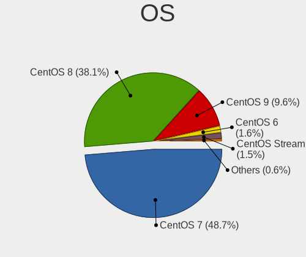

| Name          | Computers | Percent |
|---------------|-----------|---------|
| CentOS 8      | 321       | 46.39%  |
| CentOS 7      | 315       | 45.52%  |
| CentOS 9      | 33        | 4.77%   |
| CentOS 6      | 10        | 1.45%   |
| CentOS Stream | 8         | 1.16%   |
| CentOS 6.9    | 2         | 0.29%   |
| CentOS 5      | 2         | 0.29%   |
| CentOS 6.10   | 1         | 0.14%   |

OS Family
---------

OS without a version

| Name   | Computers | Percent |
|--------|-----------|---------|
| CentOS | 686       | 100%    |

Kernel
------

Version of the Linux kernel

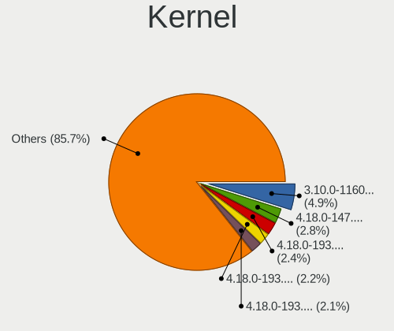

| Version                      | Computers | Percent |
|------------------------------|-----------|---------|
| 4.18.0-147.8.1.el8_1.x86_64  | 27        | 3.55%   |
| 4.18.0-193.6.3.el8_2.x86_64  | 23        | 3.03%   |
| 4.18.0-193.28.1.el8_2.x86_64 | 21        | 2.76%   |
| 4.18.0-193.14.2.el8_2.x86_64 | 20        | 2.63%   |
| 4.18.0-240.22.1.el8_3.x86_64 | 17        | 2.24%   |
| 3.10.0-862.14.4.el7.x86_64   | 17        | 2.24%   |
| 4.18.0-80.11.2.el8_0.x86_64  | 16        | 2.11%   |
| 4.18.0-147.5.1.el8_1.x86_64  | 16        | 2.11%   |
| 4.18.0-240.15.1.el8_3.x86_64 | 15        | 1.97%   |
| 4.18.0-193.19.1.el8_2.x86_64 | 15        | 1.97%   |
| 4.18.0-348.2.1.el8_5.x86_64  | 14        | 1.84%   |
| 4.18.0-240.1.1.el8_3.x86_64  | 13        | 1.71%   |
| 3.10.0-1160.25.1.el7.x86_64  | 13        | 1.71%   |
| 3.10.0-1160.45.1.el7.x86_64  | 12        | 1.58%   |
| 3.10.0-1160.31.1.el7.x86_64  | 12        | 1.58%   |
| 3.10.0-1062.12.1.el7.x86_64  | 12        | 1.58%   |
| 4.18.0-240.10.1.el8_3.x86_64 | 10        | 1.32%   |
| 3.10.0-957.10.1.el7.x86_64   | 10        | 1.32%   |
| 3.10.0-1160.66.1.el7.x86_64  | 10        | 1.32%   |
| 3.10.0-1160.36.2.el7.x86_64  | 10        | 1.32%   |
| 3.10.0-1160.76.1.el7.x86_64  | 9         | 1.18%   |
| 3.10.0-1160.15.2.el7.x86_64  | 9         | 1.18%   |
| 3.10.0-1127.19.1.el7.x86_64  | 9         | 1.18%   |
| 4.18.0-305.12.1.el8_4.x86_64 | 8         | 1.05%   |
| 3.10.0-957.1.3.el7.x86_64    | 8         | 1.05%   |
| 3.10.0-1127.el7.x86_64       | 8         | 1.05%   |
| 4.18.0-348.7.1.el8_5.x86_64  | 7         | 0.92%   |
| 4.18.0-305.19.1.el8_4.x86_64 | 7         | 0.92%   |
| 4.18.0-301.1.el8.x86_64      | 7         | 0.92%   |
| 4.18.0-147.el8.x86_64        | 7         | 0.92%   |
| 4.18.0-147.3.1.el8_1.x86_64  | 7         | 0.92%   |
| 3.10.0-957.27.2.el7.x86_64   | 7         | 0.92%   |
| 3.10.0-1062.el7.x86_64       | 7         | 0.92%   |
| 4.18.0-294.el8.x86_64        | 6         | 0.79%   |
| 3.10.0-957.5.1.el7.x86_64    | 6         | 0.79%   |
| 3.10.0-1160.83.1.el7.x86_64  | 6         | 0.79%   |
| 3.10.0-1160.49.1.el7.x86_64  | 6         | 0.79%   |
| 3.10.0-1127.13.1.el7.x86_64  | 6         | 0.79%   |
| 3.10.0-1127.10.1.el7.x86_64  | 6         | 0.79%   |
| 3.10.0-1062.9.1.el7.x86_64   | 6         | 0.79%   |

Kernel Family
-------------

Linux kernel without a distro release

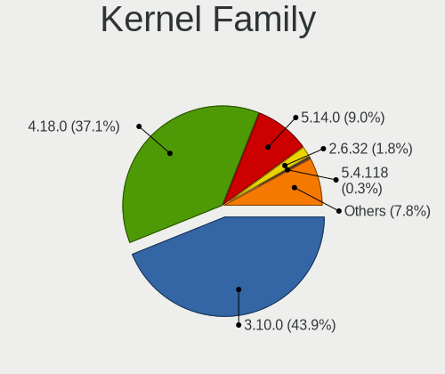

| Version | Computers | Percent |
|---------|-----------|---------|
| 4.18.0  | 311       | 44.75%  |
| 3.10.0  | 280       | 40.29%  |
| 5.14.0  | 31        | 4.46%   |
| 2.6.32  | 12        | 1.73%   |
| 5.4.118 | 3         | 0.43%   |
| 5.9.12  | 2         | 0.29%   |
| 5.17.2  | 2         | 0.29%   |
| 5.15.11 | 2         | 0.29%   |
| 5.12.0  | 2         | 0.29%   |
| 2.6.18  | 2         | 0.29%   |
| 6.2.2   | 1         | 0.14%   |
| 6.1.8   | 1         | 0.14%   |
| 6.1.1   | 1         | 0.14%   |
| 5.9.1   | 1         | 0.14%   |
| 5.8.13  | 1         | 0.14%   |
| 5.8.11  | 1         | 0.14%   |
| 5.8.0   | 1         | 0.14%   |
| 5.7.7   | 1         | 0.14%   |
| 5.7.10  | 1         | 0.14%   |
| 5.6.8   | 1         | 0.14%   |
| 5.6.10  | 1         | 0.14%   |
| 5.5.0   | 1         | 0.14%   |
| 5.4.96  | 1         | 0.14%   |
| 5.4.61  | 1         | 0.14%   |
| 5.4.6   | 1         | 0.14%   |
| 5.4.225 | 1         | 0.14%   |
| 5.4.158 | 1         | 0.14%   |
| 5.4.142 | 1         | 0.14%   |
| 5.4.125 | 1         | 0.14%   |
| 5.4.121 | 1         | 0.14%   |
| 5.4.119 | 1         | 0.14%   |
| 5.4.113 | 1         | 0.14%   |
| 5.3.11  | 1         | 0.14%   |
| 5.2.13  | 1         | 0.14%   |
| 5.2.1   | 1         | 0.14%   |
| 5.18.13 | 1         | 0.14%   |
| 5.18.0  | 1         | 0.14%   |
| 5.15.15 | 1         | 0.14%   |
| 5.14.15 | 1         | 0.14%   |
| 5.13.7  | 1         | 0.14%   |

Kernel Major Ver.
-----------------

Linux kernel major version

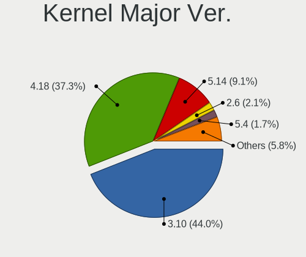

| Version | Computers | Percent |
|---------|-----------|---------|
| 4.18    | 312       | 45.02%  |
| 3.10    | 280       | 40.4%   |
| 5.14    | 32        | 4.62%   |
| 2.6     | 14        | 2.02%   |
| 5.4     | 12        | 1.73%   |
| 4.9     | 4         | 0.58%   |
| 5.9     | 3         | 0.43%   |
| 5.8     | 3         | 0.43%   |
| 5.15    | 3         | 0.43%   |
| 5.10    | 3         | 0.43%   |
| 6.1     | 2         | 0.29%   |
| 5.7     | 2         | 0.29%   |
| 5.6     | 2         | 0.29%   |
| 5.18    | 2         | 0.29%   |
| 5.17    | 2         | 0.29%   |
| 5.13    | 2         | 0.29%   |
| 5.12    | 2         | 0.29%   |
| 4.20    | 2         | 0.29%   |
| 4.19    | 2         | 0.29%   |
| 6.2     | 1         | 0.14%   |
| 5.5     | 1         | 0.14%   |
| 5.3     | 1         | 0.14%   |
| 5.2     | 1         | 0.14%   |
| 5.11    | 1         | 0.14%   |
| 5.1     | 1         | 0.14%   |
| 4.4     | 1         | 0.14%   |
| 4.17    | 1         | 0.14%   |
| 4.14    | 1         | 0.14%   |

Arch
----

OS architecture (x86_64, i586, etc.)

| Name    | Computers | Percent |
|---------|-----------|---------|
| x86_64  | 679       | 98.98%  |
| i686    | 6         | 0.87%   |
| aarch64 | 1         | 0.15%   |

DE
--

Desktop Environment

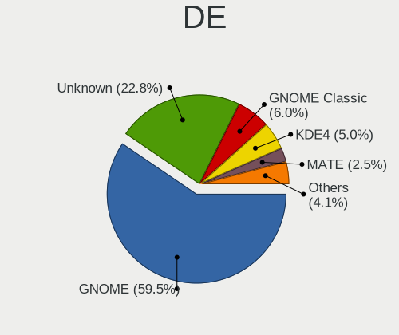

| Name          | Computers | Percent |
|---------------|-----------|---------|
| GNOME         | 390       | 56.2%   |
| Unknown       | 175       | 25.22%  |
| GNOME Classic | 47        | 6.77%   |
| KDE4          | 37        | 5.33%   |
| MATE          | 16        | 2.31%   |
| XFCE          | 11        | 1.59%   |
| KDE5          | 7         | 1.01%   |
| Cinnamon      | 7         | 1.01%   |
| X-Cinnamon    | 2         | 0.29%   |
| Xpra          | 1         | 0.14%   |
| KDE           | 1         | 0.14%   |

Display Server
--------------

X11 or Wayland

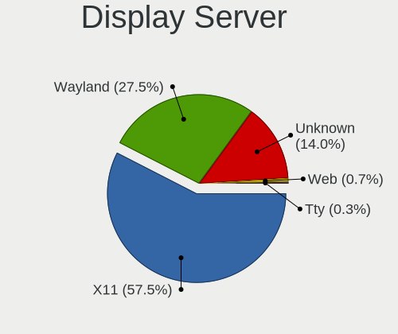

| Name    | Computers | Percent |
|---------|-----------|---------|
| X11     | 383       | 54.33%  |
| Wayland | 204       | 28.94%  |
| Unknown | 113       | 16.03%  |
| Web     | 3         | 0.43%   |
| Tty     | 2         | 0.28%   |

Display Manager
---------------

SDDM, LightDM, etc.

| Name    | Computers | Percent |
|---------|-----------|---------|
| Unknown | 381       | 54.74%  |
| GDM     | 290       | 41.67%  |
| LightDM | 13        | 1.87%   |
| SDDM    | 7         | 1.01%   |
| TDM     | 4         | 0.57%   |
| KDM     | 1         | 0.14%   |

OS Lang
-------

Language

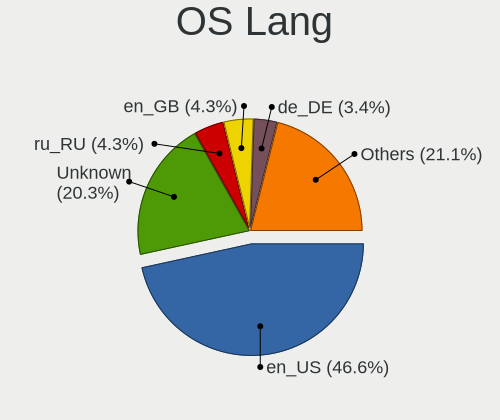

| Lang        | Computers | Percent |
|-------------|-----------|---------|
| en_US       | 337       | 48.42%  |
| Unknown     | 108       | 15.52%  |
| en_GB       | 33        | 4.74%   |
| ru_RU       | 30        | 4.31%   |
| de_DE       | 26        | 3.74%   |
| fr_FR       | 20        | 2.87%   |
| C           | 20        | 2.87%   |
| pt_BR       | 18        | 2.59%   |
| en_CA       | 11        | 1.58%   |
| pl_PL       | 10        | 1.44%   |
| en_IN       | 10        | 1.44%   |
| zh_CN       | 7         | 1.01%   |
| en_AU       | 7         | 1.01%   |
| de_AT       | 7         | 1.01%   |
| ko_KR       | 6         | 0.86%   |
| it_IT       | 5         | 0.72%   |
| es_ES       | 4         | 0.57%   |
| en_US.utf-8 | 4         | 0.57%   |
| nb_NO       | 3         | 0.43%   |
| es_PE       | 3         | 0.43%   |
| ja_JP       | 2         | 0.29%   |
| fr_CA       | 2         | 0.29%   |
| fi_FI       | 2         | 0.29%   |
| es_MX       | 2         | 0.29%   |
| es_AR       | 2         | 0.29%   |
| cs_CZ       | 2         | 0.29%   |
| uk_UA       | 1         | 0.14%   |
| tr_TR       | 1         | 0.14%   |
| sl_SI       | 1         | 0.14%   |
| sk_SK       | 1         | 0.14%   |
| ru_UA       | 1         | 0.14%   |
| pt_PT       | 1         | 0.14%   |
| ko_KR.euckr | 1         | 0.14%   |
| hu_HU       | 1         | 0.14%   |
| es_US       | 1         | 0.14%   |
| en_ZA       | 1         | 0.14%   |
| en_SG       | 1         | 0.14%   |
| en_IE       | 1         | 0.14%   |
| de_LU       | 1         | 0.14%   |
| de_CH       | 1         | 0.14%   |

Boot Mode
---------

EFI or BIOS

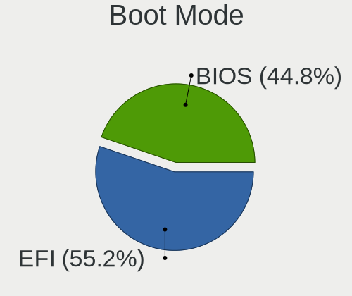

| Mode | Computers | Percent |
|------|-----------|---------|
| EFI  | 347       | 50.29%  |
| BIOS | 343       | 49.71%  |

Filesystem
----------

Type of filesystem

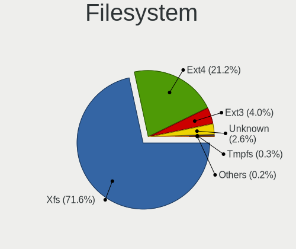

| Type    | Computers | Percent |
|---------|-----------|---------|
| Xfs     | 537       | 77.6%   |
| Ext4    | 126       | 18.21%  |
| Unknown | 23        | 3.32%   |
| Ext3    | 4         | 0.58%   |
| Overlay | 1         | 0.14%   |
| Ext2    | 1         | 0.14%   |

Part. scheme
------------

Scheme of partitioning

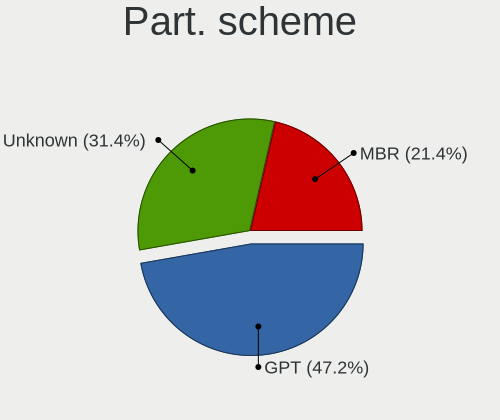

| Type    | Computers | Percent |
|---------|-----------|---------|
| GPT     | 290       | 41.49%  |
| Unknown | 249       | 35.62%  |
| MBR     | 160       | 22.89%  |

Dual Boot with Linux/BSD
------------------------

Hosting more than one Linux/BSD

| Dual boot | Computers | Percent |
|-----------|-----------|---------|
| No        | 582       | 83.98%  |
| Yes       | 111       | 16.02%  |

Dual Boot (Win)
---------------

Hosting Linux and Windows

| Dual boot | Computers | Percent |
|-----------|-----------|---------|
| No        | 602       | 86.99%  |
| Yes       | 90        | 13.01%  |

Board
-----

Vendor
------

Motherboard manufacturer

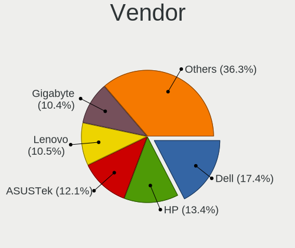

| Name                | Computers | Percent |
|---------------------|-----------|---------|
| Dell                | 122       | 17.78%  |
| Hewlett-Packard     | 104       | 15.16%  |
| ASUSTek Computer    | 90        | 13.12%  |
| Lenovo              | 75        | 10.93%  |
| Gigabyte Technology | 57        | 8.31%   |
| Supermicro          | 48        | 7%      |
| Intel               | 33        | 4.81%   |
| MSI                 | 28        | 4.08%   |
| Acer                | 16        | 2.33%   |
| ASRock              | 13        | 1.9%    |
| Unknown             | 10        | 1.46%   |
| Samsung Electronics | 7         | 1.02%   |
| Sony                | 6         | 0.87%   |
| Fujitsu             | 6         | 0.87%   |
| ASRockRack          | 5         | 0.73%   |
| IBM                 | 4         | 0.58%   |
| Foxconn             | 4         | 0.58%   |
| Apple               | 4         | 0.58%   |
| AMI                 | 4         | 0.58%   |
| Toshiba             | 3         | 0.44%   |
| Timi                | 3         | 0.44%   |
| Sun Microsystems    | 2         | 0.29%   |
| Quanta              | 2         | 0.29%   |
| MiTAC               | 2         | 0.29%   |
| LG Electronics      | 2         | 0.29%   |
| HPE                 | 2         | 0.29%   |
| ECS                 | 2         | 0.29%   |
| AZW                 | 2         | 0.29%   |
| AIC                 | 2         | 0.29%   |
| Zvezda              | 1         | 0.15%   |
| Zenith              | 1         | 0.15%   |
| TYAN Computer       | 1         | 0.15%   |
| TUXEDO              | 1         | 0.15%   |
| RM Education        | 1         | 0.15%   |
| Razer               | 1         | 0.15%   |
| PCChips             | 1         | 0.15%   |
| Panasonic           | 1         | 0.15%   |
| Packard Bell        | 1         | 0.15%   |
| Notebook            | 1         | 0.15%   |
| NORCO               | 1         | 0.15%   |

Model
-----

Motherboard model

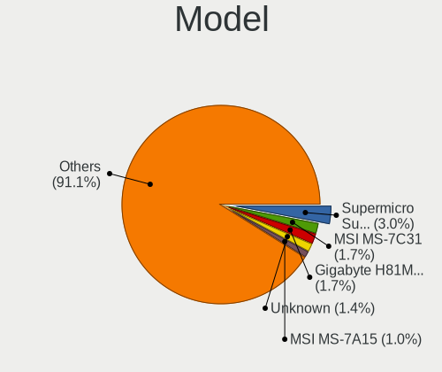

| Name                                    | Computers | Percent |
|-----------------------------------------|-----------|---------|
| Supermicro Super Server                 | 23        | 3.35%   |
| Unknown                                 | 10        | 1.46%   |
| Dell OptiPlex 9020                      | 9         | 1.31%   |
| Dell OptiPlex 7040                      | 9         | 1.31%   |
| ASUS All Series                         | 8         | 1.17%   |
| Supermicro X8DTN+-F                     | 4         | 0.58%   |
| HP Z800 Workstation                     | 4         | 0.58%   |
| HP Compaq Elite 8300 SFF                | 4         | 0.58%   |
| Lenovo ThinkSystem SR650 -[7X06CTO1WW]- | 3         | 0.44%   |
| HP ProLiant DL360 G5                    | 3         | 0.44%   |
| HP ProDesk 400 G7 Microtower PC         | 3         | 0.44%   |
| HP EliteDesk 800 G6 Desktop Mini PC     | 3         | 0.44%   |
| HP Compaq 8200 Elite SFF PC             | 3         | 0.44%   |
| Dell Precision WorkStation T3500        | 3         | 0.44%   |
| Dell OptiPlex 7010                      | 3         | 0.44%   |
| ASRockRack E3C242D4U2-2T                | 3         | 0.44%   |
| Supermicro X8DTL                        | 2         | 0.29%   |
| Supermicro SYS-7048A-T                  | 2         | 0.29%   |
| Supermicro SYS-1028TP-DC1R              | 2         | 0.29%   |
| Quanta QSSC-98J_C2                      | 2         | 0.29%   |
| Lenovo Z50-70 20354                     | 2         | 0.29%   |
| Lenovo ThinkSystem SR530 -[7X08CTO1WW]- | 2         | 0.29%   |
| Lenovo System x3650 M5: -[8871AC1]-     | 2         | 0.29%   |
| Lenovo IdeaPad L340-15IRH Gaming 81LK   | 2         | 0.29%   |
| Intel S1200SP                           | 2         | 0.29%   |
| Intel NUC10i7FNH                        | 2         | 0.29%   |
| HPE ProLiant MicroServer Gen10          | 2         | 0.29%   |
| HP Z420 Workstation                     | 2         | 0.29%   |
| HP Z2 Tower G5 Workstation              | 2         | 0.29%   |
| HP ProLiant MicroServer                 | 2         | 0.29%   |
| HP ProBook 450 G5                       | 2         | 0.29%   |
| HP Notebook                             | 2         | 0.29%   |
| HP EliteDesk 805 G6 Desktop Mini PC     | 2         | 0.29%   |
| HP EliteBook 840 G5                     | 2         | 0.29%   |
| Gigabyte X470 AORUS ULTRA GAMING        | 2         | 0.29%   |
| Gigabyte H97N-WIFI                      | 2         | 0.29%   |
| Gigabyte GA-78LMT-USB3                  | 2         | 0.29%   |
| Gigabyte A320M-S2H                      | 2         | 0.29%   |
| Gigabyte 970A-DS3P                      | 2         | 0.29%   |
| Fujitsu D3401-H1                        | 2         | 0.29%   |

Model Family
------------

Motherboard model prefix

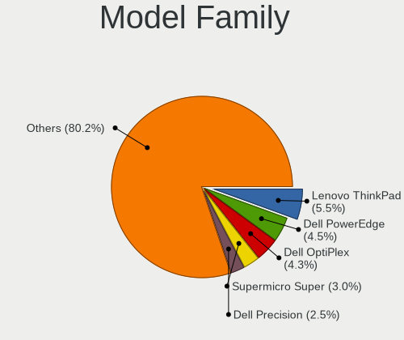

| Name                       | Computers | Percent |
|----------------------------|-----------|---------|
| Lenovo ThinkPad            | 38        | 5.54%   |
| Dell OptiPlex              | 33        | 4.81%   |
| Supermicro Super           | 23        | 3.35%   |
| Dell PowerEdge             | 23        | 3.35%   |
| Dell Precision             | 20        | 2.92%   |
| HP EliteBook               | 16        | 2.33%   |
| Dell Latitude              | 16        | 2.33%   |
| Dell Inspiron              | 15        | 2.19%   |
| ASUS PRIME                 | 14        | 2.04%   |
| HP EliteDesk               | 12        | 1.75%   |
| Acer Aspire                | 10        | 1.46%   |
| Unknown                    | 10        | 1.46%   |
| Lenovo IdeaPad             | 9         | 1.31%   |
| HP ProLiant                | 9         | 1.31%   |
| HP Compaq                  | 9         | 1.31%   |
| HP ProBook                 | 8         | 1.17%   |
| ASUS All                   | 8         | 1.17%   |
| Lenovo ThinkSystem         | 7         | 1.02%   |
| ASUS TUF                   | 7         | 1.02%   |
| HP Pavilion                | 6         | 0.87%   |
| Dell Vostro                | 6         | 0.87%   |
| ASUS ROG                   | 6         | 0.87%   |
| Lenovo ThinkCentre         | 5         | 0.73%   |
| HP ZBook                   | 5         | 0.73%   |
| HP ProDesk                 | 5         | 0.73%   |
| Dell XPS                   | 5         | 0.73%   |
| Supermicro X8DTN+-F        | 4         | 0.58%   |
| HP Z800                    | 4         | 0.58%   |
| HP Laptop                  | 4         | 0.58%   |
| ASUS M5A78L-M              | 4         | 0.58%   |
| Toshiba Satellite          | 3         | 0.44%   |
| IBM System                 | 3         | 0.44%   |
| HP Z2                      | 3         | 0.44%   |
| Gigabyte GA-78LMT-USB3     | 3         | 0.44%   |
| ASUS VivoBook              | 3         | 0.44%   |
| ASRockRack E3C242D4U2-2T   | 3         | 0.44%   |
| Supermicro X8DTL           | 2         | 0.29%   |
| Supermicro SYS-7048A-T     | 2         | 0.29%   |
| Supermicro SYS-1028TP-DC1R | 2         | 0.29%   |
| Sun Microsystems Sun       | 2         | 0.29%   |

MFG Year
--------

Motherboard manufacture year

| Year    | Computers | Percent |
|---------|-----------|---------|
| 2019    | 78        | 11.37%  |
| 2018    | 65        | 9.48%   |
| 2012    | 64        | 9.33%   |
| 2016    | 58        | 8.45%   |
| 2017    | 57        | 8.31%   |
| 2013    | 53        | 7.73%   |
| 2020    | 48        | 7%      |
| 2014    | 46        | 6.71%   |
| 2010    | 45        | 6.56%   |
| 2011    | 41        | 5.98%   |
| 2021    | 34        | 4.96%   |
| 2015    | 33        | 4.81%   |
| 2008    | 24        | 3.5%    |
| 2009    | 17        | 2.48%   |
| 2007    | 11        | 1.6%    |
| 2022    | 6         | 0.87%   |
| 2006    | 3         | 0.44%   |
| Unknown | 2         | 0.29%   |
| 2001    | 1         | 0.15%   |

Form Factor
-----------

Physical design of the computer

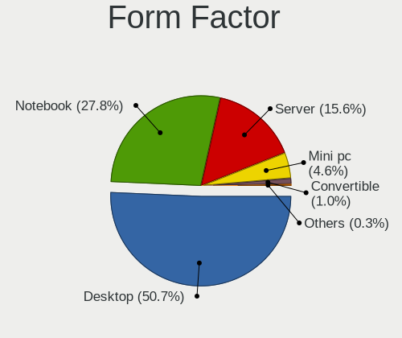

| Name        | Computers | Percent |
|-------------|-----------|---------|
| Desktop     | 330       | 48.1%   |
| Notebook    | 210       | 30.61%  |
| Server      | 102       | 14.87%  |
| Mini pc     | 34        | 4.96%   |
| Convertible | 7         | 1.02%   |
| All in one  | 3         | 0.44%   |

Secure Boot
-----------

Enabled or disabled

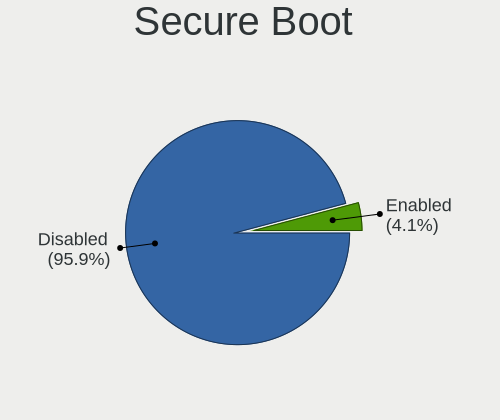

| State    | Computers | Percent |
|----------|-----------|---------|
| Disabled | 655       | 95.34%  |
| Enabled  | 32        | 4.66%   |

Coreboot
--------

Have coreboot on board

| Used | Computers | Percent |
|------|-----------|---------|
| No   | 684       | 99.71%  |
| Yes  | 2         | 0.29%   |

RAM Size
--------

Total RAM memory

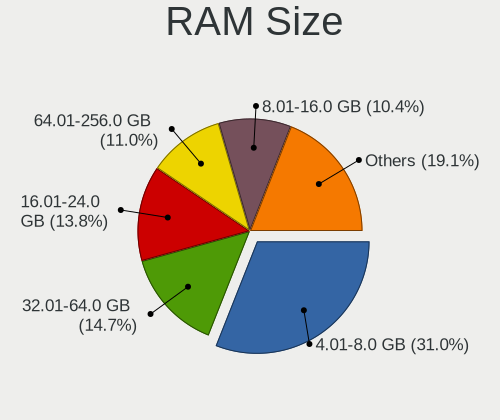

| Size in GB      | Computers | Percent |
|-----------------|-----------|---------|
| 4.01-8.0        | 175       | 25.44%  |
| 32.01-64.0      | 111       | 16.13%  |
| 16.01-24.0      | 111       | 16.13%  |
| 3.01-4.0        | 72        | 10.47%  |
| 64.01-256.0     | 72        | 10.47%  |
| 8.01-16.0       | 70        | 10.17%  |
| More than 256.0 | 37        | 5.38%   |
| 24.01-32.0      | 17        | 2.47%   |
| 1.01-2.0        | 16        | 2.33%   |
| 0.51-1.0        | 4         | 0.58%   |
| 2.01-3.0        | 3         | 0.44%   |

RAM Used
--------

Used RAM memory

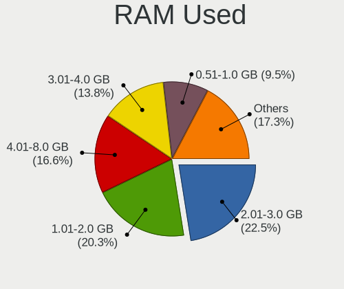

| Used GB         | Computers | Percent |
|-----------------|-----------|---------|
| 2.01-3.0        | 175       | 23.65%  |
| 1.01-2.0        | 136       | 18.38%  |
| 4.01-8.0        | 129       | 17.43%  |
| 3.01-4.0        | 107       | 14.46%  |
| 0.51-1.0        | 59        | 7.97%   |
| 8.01-16.0       | 58        | 7.84%   |
| 64.01-256.0     | 18        | 2.43%   |
| 32.01-64.0      | 14        | 1.89%   |
| 0.01-0.5        | 14        | 1.89%   |
| Unknown         | 14        | 1.89%   |
| 16.01-24.0      | 7         | 0.95%   |
| 24.01-32.0      | 6         | 0.81%   |
| More than 256.0 | 3         | 0.41%   |

Total Drives
------------

Number of drives on board

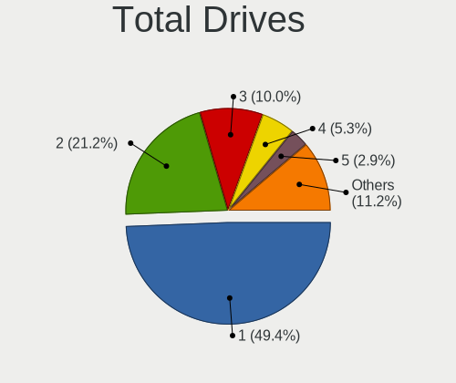

| Drives  | Computers | Percent |
|---------|-----------|---------|
| 1       | 321       | 45.92%  |
| 2       | 161       | 23.03%  |
| 3       | 74        | 10.59%  |
| 4       | 38        | 5.44%   |
| Unknown | 21        | 3%      |
| 5       | 17        | 2.43%   |
| 6       | 15        | 2.15%   |
| 0       | 8         | 1.14%   |
| 7       | 6         | 0.86%   |
| 10      | 5         | 0.72%   |
| 9       | 4         | 0.57%   |
| 8       | 4         | 0.57%   |
| 19      | 3         | 0.43%   |
| 15      | 3         | 0.43%   |
| 13      | 3         | 0.43%   |
| 11      | 3         | 0.43%   |
| 97      | 2         | 0.29%   |
| 93      | 2         | 0.29%   |
| 209     | 1         | 0.14%   |
| 71      | 1         | 0.14%   |
| 68      | 1         | 0.14%   |
| 37      | 1         | 0.14%   |
| 27      | 1         | 0.14%   |
| 24      | 1         | 0.14%   |
| 18      | 1         | 0.14%   |
| 17      | 1         | 0.14%   |
| 12      | 1         | 0.14%   |

Has CD-ROM
----------

Has CD-ROM on board

| Presented | Computers | Percent |
|-----------|-----------|---------|
| No        | 440       | 63.86%  |
| Yes       | 249       | 36.14%  |

Has Ethernet
------------

Has Ethernet on board

| Presented | Computers | Percent |
|-----------|-----------|---------|
| Yes       | 652       | 95.04%  |
| No        | 34        | 4.96%   |

Has WiFi
--------

Has WiFi module

| Presented | Computers | Percent |
|-----------|-----------|---------|
| No        | 353       | 51.23%  |
| Yes       | 336       | 48.77%  |

Has Bluetooth
-------------

Has Bluetooth module

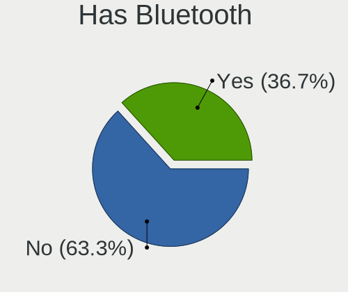

| Presented | Computers | Percent |
|-----------|-----------|---------|
| No        | 414       | 60.26%  |
| Yes       | 273       | 39.74%  |

Location
--------

Country
-------

Geographic location (country)

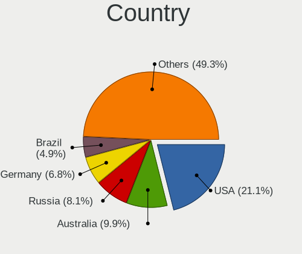

| Country      | Computers | Percent |
|--------------|-----------|---------|
| USA          | 161       | 23.3%   |
| Russia       | 61        | 8.83%   |
| Germany      | 50        | 7.24%   |
| Brazil       | 30        | 4.34%   |
| France       | 29        | 4.2%    |
| Canada       | 28        | 4.05%   |
| India        | 27        | 3.91%   |
| UK           | 26        | 3.76%   |
| China        | 23        | 3.33%   |
| Poland       | 14        | 2.03%   |
| Sweden       | 13        | 1.88%   |
| Switzerland  | 12        | 1.74%   |
| Belgium      | 12        | 1.74%   |
| Finland      | 11        | 1.59%   |
| Australia    | 11        | 1.59%   |
| Ukraine      | 10        | 1.45%   |
| Spain        | 10        | 1.45%   |
| South Korea  | 10        | 1.45%   |
| Netherlands  | 10        | 1.45%   |
| Mexico       | 9         | 1.3%    |
| Czechia      | 9         | 1.3%    |
| Italy        | 8         | 1.16%   |
| Bulgaria     | 8         | 1.16%   |
| Norway       | 7         | 1.01%   |
| Israel       | 6         | 0.87%   |
| Turkey       | 5         | 0.72%   |
| South Africa | 5         | 0.72%   |
| Romania      | 4         | 0.58%   |
| Peru         | 4         | 0.58%   |
| Malaysia     | 4         | 0.58%   |
| Kazakhstan   | 4         | 0.58%   |
| Japan        | 4         | 0.58%   |
| Indonesia    | 4         | 0.58%   |
| Taiwan       | 3         | 0.43%   |
| Slovakia     | 3         | 0.43%   |
| Serbia       | 3         | 0.43%   |
| Portugal     | 3         | 0.43%   |
| Lithuania    | 3         | 0.43%   |
| Hong Kong    | 3         | 0.43%   |
| Greece       | 3         | 0.43%   |

City
----

Geographic location (city)

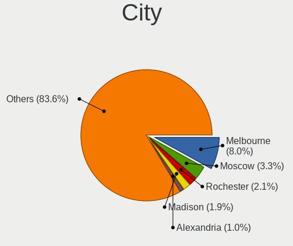

| City              | Computers | Percent |
|-------------------|-----------|---------|
| Moscow            | 24        | 3.39%   |
| Rochester         | 19        | 2.69%   |
| Madison           | 17        | 2.4%    |
| Alexandria        | 9         | 1.27%   |
| Sydney            | 7         | 0.99%   |
| Helsinki          | 7         | 0.99%   |
| St Petersburg     | 6         | 0.85%   |
| Sofia             | 6         | 0.85%   |
| Sao Paulo         | 6         | 0.85%   |
| Prague            | 6         | 0.85%   |
| Portland          | 6         | 0.85%   |
| Paris             | 6         | 0.85%   |
| London            | 6         | 0.85%   |
| Frankfurt am Main | 6         | 0.85%   |
| Munich            | 5         | 0.71%   |
| Kyiv              | 5         | 0.71%   |
| Guwahati          | 5         | 0.71%   |
| Bern              | 5         | 0.71%   |
| Berlin            | 5         | 0.71%   |
| Beijing           | 5         | 0.71%   |
| Vancouver         | 4         | 0.57%   |
| Sollentuna        | 4         | 0.57%   |
| Rio de Janeiro    | 4         | 0.57%   |
| Montreal          | 4         | 0.57%   |
| Mexico City       | 4         | 0.57%   |
| Lima              | 4         | 0.57%   |
| Yekaterinburg     | 3         | 0.42%   |
| Victoria          | 3         | 0.42%   |
| Ufa               | 3         | 0.42%   |
| Toronto           | 3         | 0.42%   |
| Tampa             | 3         | 0.42%   |
| Nur-Sultan        | 3         | 0.42%   |
| New York          | 3         | 0.42%   |
| Mumbai            | 3         | 0.42%   |
| Los Angeles       | 3         | 0.42%   |
| Leuven            | 3         | 0.42%   |
| Istanbul          | 3         | 0.42%   |
| Hyderabad         | 3         | 0.42%   |
| Chicago           | 3         | 0.42%   |
| Central           | 3         | 0.42%   |

Drives
------

Drive Vendor
------------

Hard drive vendors

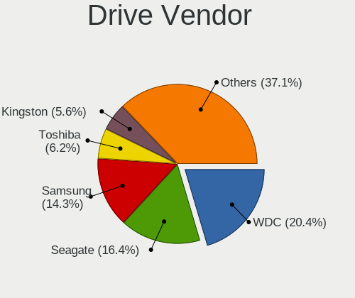

| Vendor                       | Computers | Drives | Percent |
|------------------------------|-----------|--------|---------|
| Seagate                      | 176       | 690    | 17.24%  |
| WDC                          | 170       | 604    | 16.65%  |
| Samsung Electronics          | 157       | 287    | 15.38%  |
| Toshiba                      | 67        | 108    | 6.56%   |
| Kingston                     | 63        | 76     | 6.17%   |
| Intel                        | 42        | 84     | 4.11%   |
| SanDisk                      | 37        | 48     | 3.62%   |
| Hitachi                      | 35        | 52     | 3.43%   |
| HGST                         | 30        | 315    | 2.94%   |
| Unknown                      | 28        | 105    | 2.74%   |
| Micron Technology            | 22        | 38     | 2.15%   |
| Crucial                      | 22        | 35     | 2.15%   |
| SK hynix                     | 14        | 15     | 1.37%   |
| A-DATA Technology            | 13        | 18     | 1.27%   |
| SPCC                         | 10        | 17     | 0.98%   |
| Hewlett-Packard              | 10        | 36     | 0.98%   |
| Silicon Motion               | 6         | 6      | 0.59%   |
| Phison                       | 6         | 7      | 0.59%   |
| OCZ                          | 5         | 10     | 0.49%   |
| Micron/Crucial Technology    | 4         | 5      | 0.39%   |
| Lenovo                       | 4         | 6      | 0.39%   |
| Gigabyte Technology          | 4         | 5      | 0.39%   |
| Toshiba America Info Systems | 3         | 4      | 0.29%   |
| PNY                          | 3         | 4      | 0.29%   |
| Plextor                      | 3         | 3      | 0.29%   |
| LITEONIT                     | 3         | 3      | 0.29%   |
| LITEON                       | 3         | 4      | 0.29%   |
| Lexar                        | 3         | 4      | 0.29%   |
| KIOXIA                       | 3         | 4      | 0.29%   |
| Apple                        | 3         | 3      | 0.29%   |
| XPG                          | 2         | 2      | 0.2%    |
| UMIS                         | 2         | 2      | 0.2%    |
| Transcend                    | 2         | 3      | 0.2%    |
| Team                         | 2         | 3      | 0.2%    |
| Sun                          | 2         | 6      | 0.2%    |
| StoreJet                     | 2         | 2      | 0.2%    |
| Smartbuy                     | 2         | 3      | 0.2%    |
| Patriot                      | 2         | 6      | 0.2%    |
| NVMe                         | 2         | 2      | 0.2%    |
| KIOXIA-EXCERIA               | 2         | 4      | 0.2%    |

Drive Model
-----------

Hard drive models

| Model                                  | Computers | Percent |
|----------------------------------------|-----------|---------|
| Kingston SA400S37240G 240GB SSD        | 11        | 0.89%   |
| Toshiba DT01ACA100 1TB                 | 10        | 0.81%   |
| Seagate ST500DM002-1BD142 500GB        | 10        | 0.81%   |
| Seagate ST1000DM010-2EP102 1TB         | 10        | 0.81%   |
| Toshiba DT01ACA050 500GB               | 9         | 0.73%   |
| Samsung NVMe SSD Drive 512GB           | 8         | 0.65%   |
| Kingston SA400S37120G 120GB SSD        | 8         | 0.65%   |
| WDC WD20EARX-00PASB0 2TB               | 7         | 0.57%   |
| Unknown HUH728080ALE601 8TB            | 7         | 0.57%   |
| Seagate ST6000NM0095 6TB               | 7         | 0.57%   |
| Seagate ST6000NM0034 6TB               | 7         | 0.57%   |
| Seagate ST6000NM0014 6TB               | 7         | 0.57%   |
| Seagate ST500DM002-1SB10A 500GB        | 7         | 0.57%   |
| Seagate ST4000NXCLAR4000 4TB           | 7         | 0.57%   |
| Seagate ST4000NM0023 4TB               | 7         | 0.57%   |
| Seagate ST1000LM024 HN-M101MBB 1TB     | 7         | 0.57%   |
| WDC WD10EZEX-08WN4A0 1TB               | 6         | 0.49%   |
| Seagate ST16000NM001G-2KK103 16TB      | 6         | 0.49%   |
| Seagate ST1000DM003-1CH162 1TB         | 6         | 0.49%   |
| Samsung SSD 860 EVO 250GB              | 6         | 0.49%   |
| Samsung SSD 850 EVO 250GB              | 6         | 0.49%   |
| Kingston SA400S37480G 480GB SSD        | 6         | 0.49%   |
| HGST HUS726060ALS640 6TB               | 6         | 0.49%   |
| HGST H7280A520SUN8.0T 8TB              | 6         | 0.49%   |
| Toshiba MQ01ABD100 1TB                 | 5         | 0.41%   |
| Seagate ST500LT012-1DG142 500GB        | 5         | 0.41%   |
| Seagate ST2000DM006-2DM164 2TB         | 5         | 0.41%   |
| Seagate ST1000LM035-1RK172 1TB         | 5         | 0.41%   |
| Samsung SSD 980 1TB                    | 5         | 0.41%   |
| Samsung SSD 860 EVO 500GB              | 5         | 0.41%   |
| Samsung SSD 860 EVO 1TB                | 5         | 0.41%   |
| Samsung SM963 2.5" NVMe PCIe SSD 256GB | 5         | 0.41%   |
| Micron 9300_MTFDHAL6T4TDR 6.4TB        | 5         | 0.41%   |
| HGST HUH721212ALE600 12TB              | 5         | 0.41%   |
| HGST HUH721010AL4200 10TB              | 5         | 0.41%   |
| WDC WDS500G2B0A-00SM50 500GB SSD       | 4         | 0.33%   |
| WDC WDS240G2G0A-00JH30 240GB SSD       | 4         | 0.33%   |
| WDC WD20EZRZ-00Z5HB0 2TB               | 4         | 0.33%   |
| WDC WD20EZRX-00D8PB0 2TB               | 4         | 0.33%   |
| WDC WD1003FZEX-00MK2A0 1TB             | 4         | 0.33%   |

HDD Vendor
----------

Hard disk drive vendors

| Vendor              | Computers | Drives | Percent |
|---------------------|-----------|--------|---------|
| Seagate             | 171       | 682    | 34.97%  |
| WDC                 | 151       | 364    | 30.88%  |
| Toshiba             | 55        | 90     | 11.25%  |
| Hitachi             | 35        | 52     | 7.16%   |
| HGST                | 30        | 176    | 6.13%   |
| Samsung Electronics | 18        | 80     | 3.68%   |
| Unknown             | 9         | 82     | 1.84%   |
| Hewlett-Packard     | 6         | 31     | 1.23%   |
| Sun                 | 2         | 6      | 0.41%   |
| Fujitsu             | 2         | 2      | 0.41%   |
| ASMT                | 2         | 5      | 0.41%   |
| Apple               | 2         | 2      | 0.41%   |
| WD MediaMax         | 1         | 1      | 0.2%    |
| Maxtor              | 1         | 1      | 0.2%    |
| MARVELL             | 1         | 1      | 0.2%    |
| Lenovo              | 1         | 2      | 0.2%    |
| IBM-ESXS            | 1         | 2      | 0.2%    |
| Dell                | 1         | 1      | 0.2%    |

SSD Vendor
----------

Solid state drive vendors

| Vendor              | Computers | Drives | Percent |
|---------------------|-----------|--------|---------|
| Samsung Electronics | 87        | 126    | 24.3%   |
| Kingston            | 60        | 73     | 16.76%  |
| Intel               | 35        | 66     | 9.78%   |
| WDC                 | 21        | 29     | 5.87%   |
| SanDisk             | 19        | 23     | 5.31%   |
| Crucial             | 19        | 32     | 5.31%   |
| Micron Technology   | 12        | 19     | 3.35%   |
| SPCC                | 10        | 17     | 2.79%   |
| SK hynix            | 10        | 11     | 2.79%   |
| A-DATA Technology   | 10        | 13     | 2.79%   |
| Toshiba             | 9         | 13     | 2.51%   |
| OCZ                 | 5         | 10     | 1.4%    |
| Hewlett-Packard     | 4         | 5      | 1.12%   |
| PNY                 | 3         | 4      | 0.84%   |
| LITEONIT            | 3         | 3      | 0.84%   |
| LITEON              | 3         | 4      | 0.84%   |
| Transcend           | 2         | 3      | 0.56%   |
| Team                | 2         | 3      | 0.56%   |
| StoreJet            | 2         | 2      | 0.56%   |
| Smartbuy            | 2         | 3      | 0.56%   |
| Seagate             | 2         | 2      | 0.56%   |
| Plextor             | 2         | 2      | 0.56%   |
| Patriot             | 2         | 6      | 0.56%   |
| Lexar               | 2         | 3      | 0.56%   |
| Lenovo              | 2         | 3      | 0.56%   |
| KingDian            | 2         | 6      | 0.56%   |
| China               | 2         | 5      | 0.56%   |
| Apacer              | 2         | 2      | 0.56%   |
| XrayDisk            | 1         | 1      | 0.28%   |
| Verbatim            | 1         | 1      | 0.28%   |
| V-GeN               | 1         | 1      | 0.28%   |
| Unknown (1GB)       | 1         | 1      | 0.28%   |
| UNIC2               | 1         | 1      | 0.28%   |
| TAISU               | 1         | 1      | 0.28%   |
| SSD                 | 1         | 1      | 0.28%   |
| SATADOM-SL          | 1         | 1      | 0.28%   |
| OWC                 | 1         | 1      | 0.28%   |
| NORCO               | 1         | 1      | 0.28%   |
| Netac               | 1         | 2      | 0.28%   |
| Linux               | 1         | 1      | 0.28%   |

Drive Kind
----------

HDD or SSD

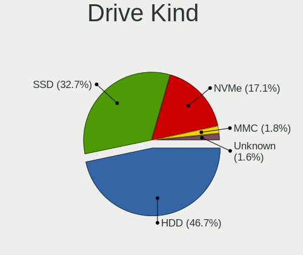

| Kind    | Computers | Drives | Percent |
|---------|-----------|--------|---------|
| HDD     | 387       | 1580   | 43.58%  |
| SSD     | 314       | 517    | 35.36%  |
| NVMe    | 152       | 223    | 17.12%  |
| MMC     | 18        | 21     | 2.03%   |
| Unknown | 17        | 355    | 1.91%   |

Drive Connector
---------------

SATA, SAS, NVMe, etc.

| Type | Computers | Drives | Percent |
|------|-----------|--------|---------|
| SATA | 560       | 1720   | 72.63%  |
| NVMe | 152       | 222    | 19.71%  |
| SAS  | 41        | 733    | 5.32%   |
| MMC  | 18        | 21     | 2.33%   |

Drive Size
----------

Size of hard drive

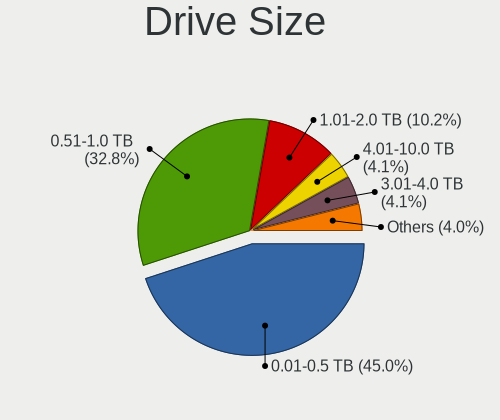

| Size in TB | Computers | Drives | Percent |
|------------|-----------|--------|---------|
| 0.01-0.5   | 389       | 740    | 49.55%  |
| 0.51-1.0   | 217       | 401    | 27.64%  |
| 1.01-2.0   | 76        | 167    | 9.68%   |
| 4.01-10.0  | 36        | 314    | 4.59%   |
| 3.01-4.0   | 34        | 265    | 4.33%   |
| 2.01-3.0   | 19        | 79     | 2.42%   |
| 10.01-20.0 | 14        | 131    | 1.78%   |

Space Total
-----------

Amount of disk space available on the file system

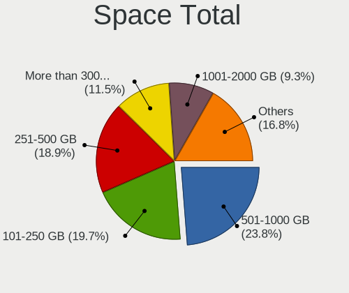

| Size in GB     | Computers | Percent |
|----------------|-----------|---------|
| 101-250        | 151       | 21.45%  |
| 251-500        | 149       | 21.16%  |
| 501-1000       | 118       | 16.76%  |
| More than 3000 | 84        | 11.93%  |
| 1001-2000      | 70        | 9.94%   |
| 51-100         | 38        | 5.4%    |
| Unknown        | 28        | 3.98%   |
| 21-50          | 25        | 3.55%   |
| 2001-3000      | 21        | 2.98%   |
| 1-20           | 20        | 2.84%   |

Space Used
----------

Amount of used disk space

| Used GB        | Computers | Percent |
|----------------|-----------|---------|
| 1-20           | 259       | 36.12%  |
| 21-50          | 95        | 13.25%  |
| 101-250        | 93        | 12.97%  |
| 51-100         | 78        | 10.88%  |
| 251-500        | 55        | 7.67%   |
| 501-1000       | 42        | 5.86%   |
| More than 3000 | 35        | 4.88%   |
| Unknown        | 28        | 3.91%   |
| 1001-2000      | 25        | 3.49%   |
| 2001-3000      | 6         | 0.84%   |
| 0              | 1         | 0.14%   |

Malfunc. Drives
---------------

Drive models with a malfunction

| Model                                 | Computers | Drives | Percent |
|---------------------------------------|-----------|--------|---------|
| Seagate ST500DM002-1BD142 500GB       | 4         | 4      | 3.64%   |
| Seagate ST2000DM001-9YN164 2TB        | 3         | 3      | 2.73%   |
| Toshiba MQ01ABD100 1TB                | 2         | 5      | 1.82%   |
| WDC WDS240G2G0B-00EPW0 240GB SSD      | 1         | 1      | 0.91%   |
| WDC WDS120G2G0A-00JH30 120GB SSD      | 1         | 1      | 0.91%   |
| WDC WD6400AADS-00M2B0 640GB           | 1         | 1      | 0.91%   |
| WDC WD5000LPVX-22V0TT0 500GB          | 1         | 1      | 0.91%   |
| WDC WD5000LPLX-60ZNTT1 500GB          | 1         | 1      | 0.91%   |
| WDC WD5000AVCS-632DY1 500GB           | 1         | 1      | 0.91%   |
| WDC WD5000AAKX-08U6AA0 500GB          | 1         | 1      | 0.91%   |
| WDC WD5000AACS-00G8B0 500GB           | 1         | 1      | 0.91%   |
| WDC WD3200AVVS-63L2B0 320GB           | 1         | 1      | 0.91%   |
| WDC WD3200AAKS-75L9A0 320GB           | 1         | 1      | 0.91%   |
| WDC WD30EFRX-68EUZN0 3TB              | 1         | 2      | 0.91%   |
| WDC WD2500HHTZ-04N21V0 250GB          | 1         | 1      | 0.91%   |
| WDC WD20EZRZ-00Z5HB0 2TB              | 1         | 1      | 0.91%   |
| WDC WD20EFRX-68EUZN0 2TB              | 1         | 4      | 0.91%   |
| WDC WD20EARX-00PASB0 2TB              | 1         | 1      | 0.91%   |
| WDC WD20EARS-00MVWB0 2TB              | 1         | 2      | 0.91%   |
| WDC WD10SPZX-21Z10T0 1TB              | 1         | 2      | 0.91%   |
| WDC WD10PURX-64E5EY0 1TB              | 1         | 1      | 0.91%   |
| WDC WD10JPCX-24UE4T0 1TB              | 1         | 1      | 0.91%   |
| WDC WD10EZEX-60WN4A1 1TB              | 1         | 1      | 0.91%   |
| WDC WD10EZEX-60M2NA0 1TB              | 1         | 1      | 0.91%   |
| WDC WD10EADS-00L5B1 1TB               | 1         | 1      | 0.91%   |
| WDC WD1003FBYX-01Y7B0 1TB             | 1         | 1      | 0.91%   |
| WDC WD1002FBYS-18A6B0 1TB             | 1         | 1      | 0.91%   |
| WDC WD1002FAEX-00Y9A0 1TB             | 1         | 1      | 0.91%   |
| WDC WD1001FALS-00J7B1 1TB             | 1         | 1      | 0.91%   |
| WDC RFT030VQFF-KRM5P7 3TB             | 1         | 1      | 0.91%   |
| Toshiba THNSNK256GCS8 SATA 256GB SSD  | 1         | 1      | 0.91%   |
| Toshiba MQ04ABF100 1TB                | 1         | 1      | 0.91%   |
| Toshiba MK8032GSX 80GB                | 1         | 1      | 0.91%   |
| Toshiba MK2561GSYN 250GB              | 1         | 1      | 0.91%   |
| Toshiba MK2552GSX 250GB               | 1         | 1      | 0.91%   |
| Smartbuy SSD 120GB                    | 1         | 1      | 0.91%   |
| SK hynix SC210 mSATA 256GB SSD        | 1         | 1      | 0.91%   |
| SK hynix HFS128G32TND-N210A 128GB SSD | 1         | 1      | 0.91%   |
| Seagate ST9750420AS 752GB             | 1         | 1      | 0.91%   |
| Seagate ST500LT012-9WS142 500GB       | 1         | 1      | 0.91%   |

Malfunc. Drive Vendor
---------------------

Vendors of faulty drives

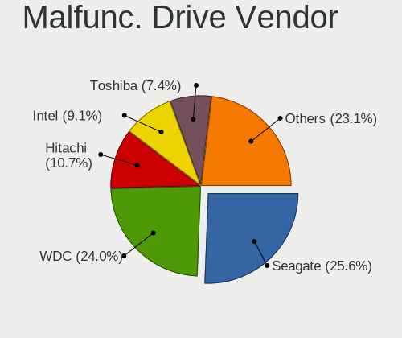

| Vendor              | Computers | Drives | Percent |
|---------------------|-----------|--------|---------|
| Seagate             | 27        | 43     | 25.47%  |
| WDC                 | 24        | 33     | 22.64%  |
| Hitachi             | 12        | 12     | 11.32%  |
| Intel               | 10        | 24     | 9.43%   |
| Toshiba             | 7         | 10     | 6.6%    |
| Samsung Electronics | 5         | 7      | 4.72%   |
| SanDisk             | 3         | 3      | 2.83%   |
| Kingston            | 3         | 3      | 2.83%   |
| SK hynix            | 2         | 2      | 1.89%   |
| Micron Technology   | 2         | 2      | 1.89%   |
| LITEONIT            | 2         | 2      | 1.89%   |
| HGST                | 2         | 3      | 1.89%   |
| Crucial             | 2         | 2      | 1.89%   |
| Smartbuy            | 1         | 1      | 0.94%   |
| Maxtor              | 1         | 1      | 0.94%   |
| LITEON              | 1         | 1      | 0.94%   |
| Hewlett-Packard     | 1         | 1      | 0.94%   |
| A-DATA Technology   | 1         | 1      | 0.94%   |

Malfunc. HDD Vendor
-------------------

Vendors of faulty HDD drives

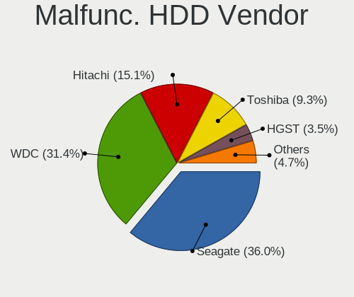

| Vendor              | Computers | Drives | Percent |
|---------------------|-----------|--------|---------|
| Seagate             | 27        | 43     | 36.99%  |
| WDC                 | 22        | 31     | 30.14%  |
| Hitachi             | 12        | 12     | 16.44%  |
| Toshiba             | 6         | 9      | 8.22%   |
| Samsung Electronics | 2         | 2      | 2.74%   |
| HGST                | 2         | 3      | 2.74%   |
| Maxtor              | 1         | 1      | 1.37%   |
| Hewlett-Packard     | 1         | 1      | 1.37%   |

Malfunc. Drive Kind
-------------------

Kinds of faulty drives

| Kind | Computers | Drives | Percent |
|------|-----------|--------|---------|
| HDD  | 65        | 102    | 66.33%  |
| SSD  | 33        | 49     | 33.67%  |

Failed Drives
-------------

Failed drive models

| Model                        | Computers | Drives | Percent |
|------------------------------|-----------|--------|---------|
| WDC WD5000BEVT-00A0RT0 500GB | 1         | 1      | 50%     |
| Toshiba DT01ACA100 1TB       | 1         | 2      | 50%     |

Failed Drive Vendor
-------------------

Failed drive vendors

| Vendor  | Computers | Drives | Percent |
|---------|-----------|--------|---------|
| WDC     | 1         | 1      | 50%     |
| Toshiba | 1         | 2      | 50%     |

Drive Status
------------

Number of failed and malfunc. drives

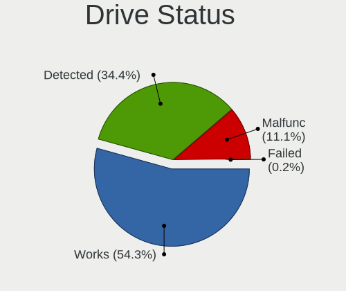

| Status   | Computers | Drives | Percent |
|----------|-----------|--------|---------|
| Works    | 375       | 1298   | 49.73%  |
| Detected | 283       | 1244   | 37.53%  |
| Malfunc  | 94        | 151    | 12.47%  |
| Failed   | 2         | 3      | 0.27%   |

Storage controller
------------------

Storage Vendor
--------------

Storage controller vendors

| Vendor                           | Computers | Percent |
|----------------------------------|-----------|---------|
| Intel                            | 540       | 56.19%  |
| AMD                              | 101       | 10.51%  |
| Samsung Electronics              | 65        | 6.76%   |
| LSI Logic / Symbios Logic        | 48        | 4.99%   |
| Broadcom / LSI                   | 37        | 3.85%   |
| ASMedia Technology               | 27        | 2.81%   |
| SanDisk                          | 21        | 2.19%   |
| Marvell Technology Group         | 14        | 1.46%   |
| Micron Technology                | 11        | 1.14%   |
| JMicron Technology               | 10        | 1.04%   |
| Phison Electronics               | 9         | 0.94%   |
| Toshiba America Info Systems     | 8         | 0.83%   |
| Silicon Motion                   | 7         | 0.73%   |
| Micron/Crucial Technology        | 6         | 0.62%   |
| Hewlett-Packard                  | 6         | 0.62%   |
| ADATA Technology                 | 6         | 0.62%   |
| Adaptec                          | 6         | 0.62%   |
| SK hynix                         | 5         | 0.52%   |
| Kingston Technology Company      | 5         | 0.52%   |
| Nvidia                           | 4         | 0.42%   |
| KIOXIA                           | 4         | 0.42%   |
| Union Memory (Shenzhen)          | 3         | 0.31%   |
| 3ware                            | 3         | 0.31%   |
| Silicon Image                    | 2         | 0.21%   |
| Seagate Technology               | 2         | 0.21%   |
| Dell                             | 2         | 0.21%   |
| VIA Technologies                 | 1         | 0.1%    |
| Solid State Storage Technology   | 1         | 0.1%    |
| Silicon Integrated Systems [SiS] | 1         | 0.1%    |
| Shenzhen Longsys Electronics     | 1         | 0.1%    |
| Realtek Semiconductor            | 1         | 0.1%    |
| Lite-On Technology               | 1         | 0.1%    |
| Lenovo                           | 1         | 0.1%    |
| Integrated Technology Express    | 1         | 0.1%    |
| Huawei Technologies              | 1         | 0.1%    |

Storage Model
-------------

Storage controller models

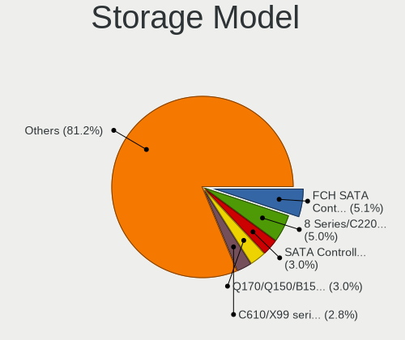

| Model                                                                          | Computers | Percent |
|--------------------------------------------------------------------------------|-----------|---------|
| AMD FCH SATA Controller [AHCI mode]                                            | 65        | 5.68%   |
| Intel 8 Series/C220 Series Chipset Family 6-port SATA Controller 1 [AHCI mode] | 43        | 3.76%   |
| Intel SATA Controller [RAID mode]                                              | 34        | 2.97%   |
| Intel Sunrise Point-LP SATA Controller [AHCI mode]                             | 33        | 2.88%   |
| Intel C610/X99 series chipset 6-Port SATA Controller [AHCI mode]               | 33        | 2.88%   |
| Samsung NVMe SSD Controller SM981/PM981/PM983                                  | 31        | 2.71%   |
| Intel C610/X99 series chipset sSATA Controller [AHCI mode]                     | 31        | 2.71%   |
| Intel Q170/Q150/B150/H170/H110/Z170/CM236 Chipset SATA Controller [AHCI Mode]  | 26        | 2.27%   |
| LSI Logic / Symbios Logic MegaRAID SAS-3 3108 [Invader]                        | 23        | 2.01%   |
| Intel 7 Series Chipset Family 6-port SATA Controller [AHCI mode]               | 22        | 1.92%   |
| Intel 8 Series SATA Controller 1 [AHCI mode]                                   | 21        | 1.84%   |
| Intel Cannon Lake PCH SATA AHCI Controller                                     | 19        | 1.66%   |
| ASMedia ASM1062 Serial ATA Controller                                          | 19        | 1.66%   |
| Intel 7 Series/C210 Series Chipset Family 6-port SATA Controller [AHCI mode]   | 17        | 1.49%   |
| AMD SB7x0/SB8x0/SB9x0 SATA Controller [AHCI mode]                              | 17        | 1.49%   |
| Intel C620 Series Chipset Family SSATA Controller [AHCI mode]                  | 16        | 1.4%    |
| Intel 82801 Mobile SATA Controller [RAID mode]                                 | 16        | 1.4%    |
| Intel Comet Lake SATA AHCI Controller                                          | 15        | 1.31%   |
| Intel 82801JI (ICH10 Family) SATA AHCI Controller                              | 15        | 1.31%   |
| Intel 6 Series/C200 Series Chipset Family 6 port Mobile SATA AHCI Controller   | 15        | 1.31%   |
| Intel C620 Series Chipset Family SATA Controller [AHCI mode]                   | 14        | 1.22%   |
| Intel 6 Series/C200 Series Chipset Family 6 port Desktop SATA AHCI Controller  | 14        | 1.22%   |
| Samsung NVMe SSD Controller 980                                                | 13        | 1.14%   |
| Intel NM10/ICH7 Family SATA Controller [IDE mode]                              | 13        | 1.14%   |
| Intel 82801JI (ICH10 Family) 4 port SATA IDE Controller #1                     | 12        | 1.05%   |
| Intel 200 Series PCH SATA controller [AHCI mode]                               | 12        | 1.05%   |
| AMD SB7x0/SB8x0/SB9x0 IDE Controller                                           | 12        | 1.05%   |
| AMD 400 Series Chipset SATA Controller                                         | 12        | 1.05%   |
| Samsung NVMe SSD Controller SM961/PM961/SM963                                  | 11        | 0.96%   |
| Intel C600/X79 series chipset 6-Port SATA AHCI Controller                      | 11        | 0.96%   |
| Intel 82801G (ICH7 Family) IDE Controller                                      | 11        | 0.96%   |
| Intel 5 Series/3400 Series Chipset 6 port SATA AHCI Controller                 | 11        | 0.96%   |
| Intel 82801JI (ICH10 Family) 2 port SATA IDE Controller #2                     | 10        | 0.87%   |
| Intel Cannon Lake Mobile PCH SATA AHCI Controller                              | 9         | 0.79%   |
| Broadcom / LSI MegaRAID SAS-3 3108 [Invader]                                   | 9         | 0.79%   |
| LSI Logic / Symbios Logic SAS2008 PCI-Express Fusion-MPT SAS-2 [Falcon]        | 8         | 0.7%    |
| Intel Wildcat Point-LP SATA Controller [AHCI Mode]                             | 8         | 0.7%    |
| Intel C600/X79 series chipset SATA RAID Controller                             | 8         | 0.7%    |
| Intel 631xESB/632xESB IDE Controller                                           | 8         | 0.7%    |
| Toshiba America Info Systems XG6 NVMe SSD Controller                           | 7         | 0.61%   |

Storage Kind
------------

Kind of storage controller (IDE, SATA, NVMe, SAS, ...)

| Kind | Computers | Percent |
|------|-----------|---------|
| SATA | 511       | 53.68%  |
| RAID | 152       | 15.97%  |
| NVMe | 152       | 15.97%  |
| IDE  | 100       | 10.5%   |
| SAS  | 26        | 2.73%   |
| SCSI | 11        | 1.16%   |

Processor
---------

CPU Vendor
----------

Processor vendors

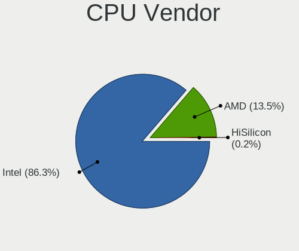

| Vendor    | Computers | Percent |
|-----------|-----------|---------|
| Intel     | 582       | 84.84%  |
| AMD       | 103       | 15.01%  |
| Hisilicon | 1         | 0.15%   |

CPU Model
---------

Processor models

| Model                                   | Computers | Percent |
|-----------------------------------------|-----------|---------|
| Intel Xeon CPU E5-2630 v4 @ 2.20GHz     | 18        | 2.62%   |
| Intel Core i7-6700 CPU @ 3.40GHz        | 13        | 1.89%   |
| Intel Core i7-4790 CPU @ 3.60GHz        | 9         | 1.31%   |
| Intel Xeon CPU E5620 @ 2.40GHz          | 7         | 1.02%   |
| Intel Xeon CPU X5650 @ 2.67GHz          | 6         | 0.87%   |
| Intel Core i7-8550U CPU @ 1.80GHz       | 6         | 0.87%   |
| Intel Core i5-3470 CPU @ 3.20GHz        | 6         | 0.87%   |
| AMD Ryzen 5 3600 6-Core Processor       | 6         | 0.87%   |
| Intel Xeon CPU E5-2620 v4 @ 2.10GHz     | 5         | 0.73%   |
| Intel Core i5-8250U CPU @ 1.60GHz       | 5         | 0.73%   |
| Intel Core i5-6200U CPU @ 2.30GHz       | 5         | 0.73%   |
| Intel Core i5-4590 CPU @ 3.30GHz        | 5         | 0.73%   |
| Intel Core i5-4210U CPU @ 1.70GHz       | 5         | 0.73%   |
| Intel Core i5-3320M CPU @ 2.60GHz       | 5         | 0.73%   |
| Intel Core i5-2520M CPU @ 2.50GHz       | 5         | 0.73%   |
| Intel Core i5-10500 CPU @ 3.10GHz       | 5         | 0.73%   |
| Intel Core i3-2330M CPU @ 2.20GHz       | 5         | 0.73%   |
| AMD Ryzen 9 3900X 12-Core Processor     | 5         | 0.73%   |
| AMD Ryzen 7 3700X 8-Core Processor      | 5         | 0.73%   |
| AMD FX-6300 Six-Core Processor          | 5         | 0.73%   |
| Intel Xeon Silver 4214 CPU @ 2.20GHz    | 4         | 0.58%   |
| Intel Core i7-8565U CPU @ 1.80GHz       | 4         | 0.58%   |
| Intel Core i7-7700HQ CPU @ 2.80GHz      | 4         | 0.58%   |
| Intel Core i7-7700 CPU @ 3.60GHz        | 4         | 0.58%   |
| Intel Core i5-7200U CPU @ 2.50GHz       | 4         | 0.58%   |
| Intel Core i5-6300U CPU @ 2.40GHz       | 4         | 0.58%   |
| Intel Core i5-2400 CPU @ 3.10GHz        | 4         | 0.58%   |
| Intel Core i3-6100U CPU @ 2.30GHz       | 4         | 0.58%   |
| Intel Core 2 Quad CPU Q6600 @ 2.40GHz   | 4         | 0.58%   |
| Intel 11th Gen Core i7-1165G7 @ 2.80GHz | 4         | 0.58%   |
| AMD EPYC 7702 64-Core Processor         | 4         | 0.58%   |
| Intel Xeon E-2136 CPU @ 3.30GHz         | 3         | 0.44%   |
| Intel Xeon CPU E5430 @ 2.66GHz          | 3         | 0.44%   |
| Intel Xeon CPU E5-2650 v3 @ 2.30GHz     | 3         | 0.44%   |
| Intel Xeon CPU E5-2620 v3 @ 2.40GHz     | 3         | 0.44%   |
| Intel Xeon CPU E31270 @ 3.40GHz         | 3         | 0.44%   |
| Intel Core i7-9750H CPU @ 2.60GHz       | 3         | 0.44%   |
| Intel Core i7-8700K CPU @ 3.70GHz       | 3         | 0.44%   |
| Intel Core i7-8700 CPU @ 3.20GHz        | 3         | 0.44%   |
| Intel Core i7-8650U CPU @ 1.90GHz       | 3         | 0.44%   |

CPU Model Family
----------------

Processor model prefix

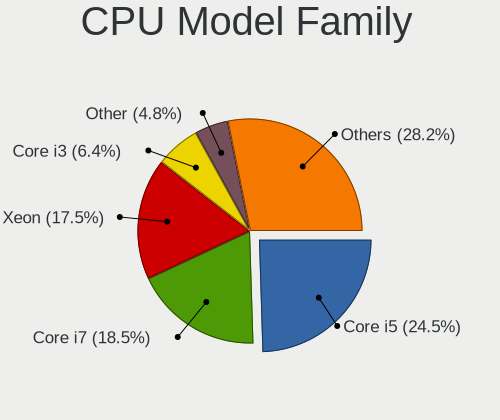

| Model                   | Computers | Percent |
|-------------------------|-----------|---------|
| Intel Core i5           | 139       | 20.23%  |
| Intel Core i7           | 138       | 20.09%  |
| Intel Xeon              | 126       | 18.34%  |
| Intel Core i3           | 50        | 7.28%   |
| AMD Ryzen 5             | 22        | 3.2%    |
| Other                   | 21        | 3.06%   |
| Intel Core 2 Duo        | 20        | 2.91%   |
| Intel Pentium           | 17        | 2.47%   |
| AMD FX                  | 16        | 2.33%   |
| Intel Celeron           | 14        | 2.04%   |
| AMD Ryzen 7             | 13        | 1.89%   |
| Intel Core 2 Quad       | 10        | 1.46%   |
| Intel Atom              | 10        | 1.46%   |
| Intel Xeon Silver       | 9         | 1.31%   |
| AMD Ryzen 9             | 9         | 1.31%   |
| Intel Core i9           | 8         | 1.16%   |
| AMD EPYC                | 7         | 1.02%   |
| Intel Xeon Gold         | 6         | 0.87%   |
| AMD Ryzen 3             | 6         | 0.87%   |
| Intel Pentium Dual-Core | 5         | 0.73%   |
| Intel Genuine           | 5         | 0.73%   |
| AMD Ryzen Threadripper  | 4         | 0.58%   |
| AMD Opteron             | 4         | 0.58%   |
| AMD Ryzen 7 PRO         | 3         | 0.44%   |
| Intel Xeon Platinum     | 2         | 0.29%   |
| Intel Pentium Dual      | 2         | 0.29%   |
| AMD Turion II Neo       | 2         | 0.29%   |
| AMD Phenom II X6        | 2         | 0.29%   |
| AMD G                   | 2         | 0.29%   |
| AMD A8                  | 2         | 0.29%   |
| AMD A4                  | 2         | 0.29%   |
| AMD A10                 | 2         | 0.29%   |
| Intel Xeon Bronze       | 1         | 0.15%   |
| Intel Pentium Gold      | 1         | 0.15%   |
| Intel Pentium 4         | 1         | 0.15%   |
| AMD Ryzen 5 PRO         | 1         | 0.15%   |
| AMD Ryzen 3 PRO         | 1         | 0.15%   |
| AMD Phenom II X4        | 1         | 0.15%   |
| AMD GX                  | 1         | 0.15%   |
| AMD E2                  | 1         | 0.15%   |

CPU Cores
---------

Number of processor cores

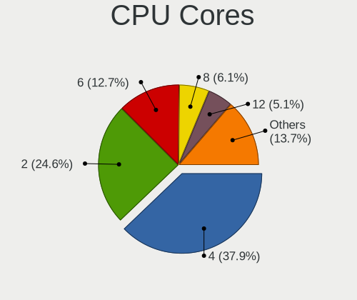

| Number | Computers | Percent |
|--------|-----------|---------|
| 4      | 246       | 35.81%  |
| 2      | 194       | 28.24%  |
| 6      | 74        | 10.77%  |
| 8      | 46        | 6.7%    |
| 12     | 33        | 4.8%    |
| 20     | 24        | 3.49%   |
| 16     | 18        | 2.62%   |
| 1      | 8         | 1.16%   |
| 24     | 7         | 1.02%   |
| 10     | 7         | 1.02%   |
| 3      | 7         | 1.02%   |
| 64     | 5         | 0.73%   |
| 32     | 4         | 0.58%   |
| 14     | 4         | 0.58%   |
| 96     | 3         | 0.44%   |
| 40     | 2         | 0.29%   |
| 52     | 1         | 0.15%   |
| 48     | 1         | 0.15%   |
| 36     | 1         | 0.15%   |
| 28     | 1         | 0.15%   |
| 18     | 1         | 0.15%   |

CPU Sockets
-----------

Number of sockets

| Number | Computers | Percent |
|--------|-----------|---------|
| 1      | 591       | 86.15%  |
| 2      | 94        | 13.7%   |
| 0      | 1         | 0.15%   |

CPU Threads
-----------

Threads per core (Hyper-Threading)

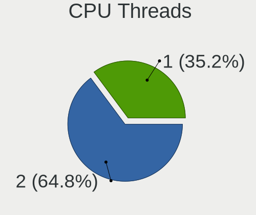

| Number | Computers | Percent |
|--------|-----------|---------|
| 2      | 483       | 70.2%   |
| 1      | 205       | 29.8%   |

CPU Op-Modes
------------

CPU Operation Modes (32-bit, 64-bit)

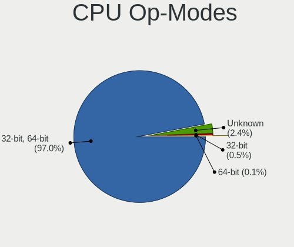

| Op mode        | Computers | Percent |
|----------------|-----------|---------|
| 32-bit, 64-bit | 662       | 96.36%  |
| Unknown        | 21        | 3.06%   |
| 32-bit         | 4         | 0.58%   |

CPU Microcode
-------------

Microcode number

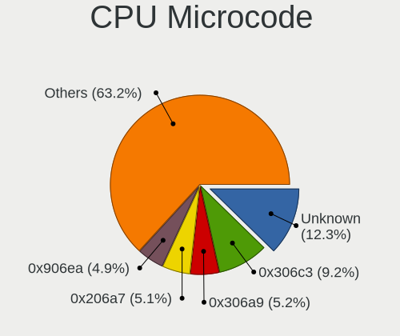

| Number     | Computers | Percent |
|------------|-----------|---------|
| Unknown    | 56        | 8.05%   |
| 0x306c3    | 54        | 7.76%   |
| 0x306a9    | 45        | 6.47%   |
| 0x206a7    | 42        | 6.03%   |
| 0x506e3    | 31        | 4.45%   |
| 0x906ea    | 25        | 3.59%   |
| 0x406f1    | 22        | 3.16%   |
| 0x40651    | 21        | 3.02%   |
| 0x206c2    | 18        | 2.59%   |
| 0x1067a    | 18        | 2.59%   |
| 0x906e9    | 16        | 2.3%    |
| 0x806ea    | 16        | 2.3%    |
| 0x306f2    | 16        | 2.3%    |
| 0x406e3    | 15        | 2.16%   |
| 0x06000852 | 14        | 2.01%   |
| 0x806ec    | 12        | 1.72%   |
| 0x306d4    | 11        | 1.58%   |
| 0x10676    | 11        | 1.58%   |
| 0x08701021 | 11        | 1.58%   |
| 0xa0655    | 10        | 1.44%   |
| 0x206d7    | 10        | 1.44%   |
| 0x20655    | 10        | 1.44%   |
| 0x106e5    | 10        | 1.44%   |
| 0xa0653    | 9         | 1.29%   |
| 0x806e9    | 9         | 1.29%   |
| 0x50654    | 9         | 1.29%   |
| 0x806c1    | 8         | 1.15%   |
| 0x08701013 | 8         | 1.15%   |
| 0x0800820d | 8         | 1.15%   |
| 0x6fb      | 7         | 1.01%   |
| 0x106a5    | 7         | 1.01%   |
| 0x906ed    | 6         | 0.86%   |
| 0x50657    | 6         | 0.86%   |
| 0x906a3    | 5         | 0.72%   |
| 0x706e5    | 5         | 0.72%   |
| 0x6fd      | 5         | 0.72%   |
| 0x406c4    | 5         | 0.72%   |
| 0xa0652    | 4         | 0.57%   |
| 0x606a6    | 4         | 0.57%   |
| 0x306e4    | 4         | 0.57%   |

CPU Microarch
-------------

Microarchitecture

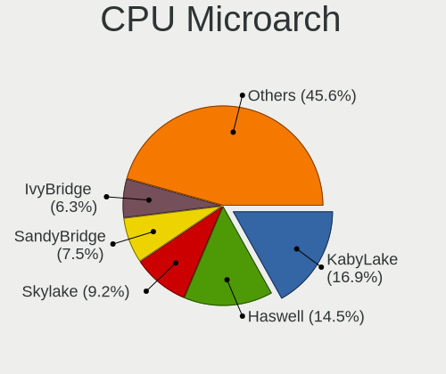

| Name             | Computers | Percent |
|------------------|-----------|---------|
| Haswell          | 92        | 13.39%  |
| KabyLake         | 90        | 13.1%   |
| Skylake          | 70        | 10.19%  |
| SandyBridge      | 55        | 8.01%   |
| IvyBridge        | 51        | 7.42%   |
| Broadwell        | 42        | 6.11%   |
| Zen 2            | 37        | 5.39%   |
| Westmere         | 36        | 5.24%   |
| Penryn           | 36        | 5.24%   |
| CometLake        | 25        | 3.64%   |
| Piledriver       | 19        | 2.77%   |
| Nehalem          | 17        | 2.47%   |
| Zen+             | 13        | 1.89%   |
| Zen              | 12        | 1.75%   |
| Silvermont       | 12        | 1.75%   |
| Core             | 12        | 1.75%   |
| TigerLake        | 8         | 1.16%   |
| IceLake          | 8         | 1.16%   |
| K10              | 6         | 0.87%   |
| Bonnell          | 6         | 0.87%   |
| Alderlake Hybrid | 6         | 0.87%   |
| Unknown          | 6         | 0.87%   |
| Zen 3            | 4         | 0.58%   |
| Excavator        | 4         | 0.58%   |
| NetBurst         | 3         | 0.44%   |
| K10 Llano        | 3         | 0.44%   |
| Sapphire Rapids  | 2         | 0.29%   |
| P6               | 2         | 0.29%   |
| Jaguar           | 2         | 0.29%   |
| Goldmont plus    | 2         | 0.29%   |
| Goldmont         | 2         | 0.29%   |
| Bobcat           | 2         | 0.29%   |
| K8 Hammer        | 1         | 0.15%   |
| Bulldozer        | 1         | 0.15%   |

Graphics
--------

GPU Vendor
----------

Vendors of graphics cards

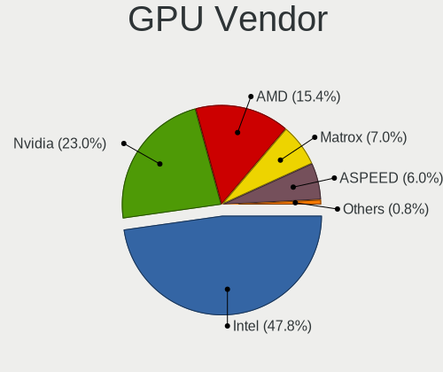

| Vendor                                       | Computers | Percent |
|----------------------------------------------|-----------|---------|
| Intel                                        | 346       | 44.19%  |
| Nvidia                                       | 197       | 25.16%  |
| AMD                                          | 138       | 17.62%  |
| ASPEED Technology                            | 51        | 6.51%   |
| Matrox Electronics Systems                   | 45        | 5.75%   |
| S3 Graphics                                  | 2         | 0.26%   |
| XGI Technology (eXtreme Graphics Innovation) | 1         | 0.13%   |
| Silicon Motion                               | 1         | 0.13%   |
| Silicon Integrated Systems [SiS]             | 1         | 0.13%   |
| Huawei Technologies                          | 1         | 0.13%   |

GPU Model
---------

Graphics card models

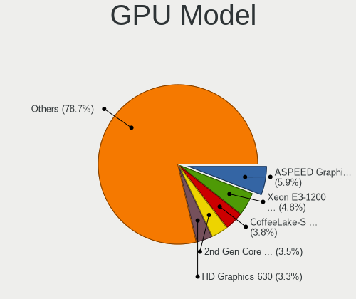

| Model                                                                                    | Computers | Percent |
|------------------------------------------------------------------------------------------|-----------|---------|
| ASPEED Technology ASPEED Graphics Family                                                 | 51        | 6.42%   |
| Intel 2nd Generation Core Processor Family Integrated Graphics Controller                | 31        | 3.9%    |
| Intel Xeon E3-1200 v3/4th Gen Core Processor Integrated Graphics Controller              | 23        | 2.89%   |
| Intel 3rd Gen Core processor Graphics Controller                                         | 22        | 2.77%   |
| Intel Haswell-ULT Integrated Graphics Controller                                         | 20        | 2.52%   |
| Intel HD Graphics 530                                                                    | 17        | 2.14%   |
| Intel Skylake GT2 [HD Graphics 520]                                                      | 16        | 2.01%   |
| Intel UHD Graphics 620                                                                   | 15        | 1.89%   |
| Nvidia GK208B [GeForce GT 710]                                                           | 14        | 1.76%   |
| Matrox Electronics Systems G200eR2                                                       | 14        | 1.76%   |
| AMD Ellesmere [Radeon RX 470/480/570/570X/580/580X/590]                                  | 14        | 1.76%   |
| Matrox Electronics Systems MGA G200eW WPCM450                                            | 13        | 1.64%   |
| Matrox Electronics Systems MGA G200e [Pilot] ServerEngines (SEP1)                        | 13        | 1.64%   |
| Intel CometLake-S GT2 [UHD Graphics 630]                                                 | 13        | 1.64%   |
| Intel CoffeeLake-S GT2 [UHD Graphics 630]                                                | 13        | 1.64%   |
| Intel 4th Gen Core Processor Integrated Graphics Controller                              | 11        | 1.38%   |
| Intel HD Graphics 630                                                                    | 10        | 1.26%   |
| Intel HD Graphics 5500                                                                   | 10        | 1.26%   |
| Intel Core Processor Integrated Graphics Controller                                      | 10        | 1.26%   |
| Intel Xeon E3-1200 v2/3rd Gen Core processor Graphics Controller                         | 9         | 1.13%   |
| Intel WhiskeyLake-U GT2 [UHD Graphics 620]                                               | 9         | 1.13%   |
| AMD Renoir                                                                               | 9         | 1.13%   |
| AMD ES1000                                                                               | 9         | 1.13%   |
| Intel TigerLake-LP GT2 [Iris Xe Graphics]                                                | 8         | 1.01%   |
| Intel Atom/Celeron/Pentium Processor x5-E8000/J3xxx/N3xxx Integrated Graphics Controller | 8         | 1.01%   |
| AMD Oland XT [Radeon HD 8670 / R5 340X OEM / R7 250/350/350X OEM]                        | 8         | 1.01%   |
| Intel IvyBridge GT2 [HD Graphics 4000]                                                   | 7         | 0.88%   |
| Intel HD Graphics 620                                                                    | 7         | 0.88%   |
| Intel CoffeeLake-H GT2 [UHD Graphics 630]                                                | 7         | 0.88%   |
| AMD Oland [Radeon HD 8570 / R5 430 OEM / R7 240/340 / Radeon 520 OEM]                    | 7         | 0.88%   |
| Nvidia GT218 [GeForce 210]                                                               | 6         | 0.75%   |
| Intel Alder Lake-P Integrated Graphics Controller                                        | 5         | 0.63%   |
| Intel 4 Series Chipset Integrated Graphics Controller                                    | 5         | 0.63%   |
| AMD Topaz XT [Radeon R7 M260/M265 / M340/M360 / M440/M445 / 530/535 / 620/625 Mobile]    | 5         | 0.63%   |
| AMD Raven Ridge [Radeon Vega Series / Radeon Vega Mobile Series]                         | 5         | 0.63%   |
| Nvidia TU117M [GeForce GTX 1650 Mobile / Max-Q]                                          | 4         | 0.5%    |
| Nvidia GP107GL [Quadro P400]                                                             | 4         | 0.5%    |
| Nvidia GP106GL [Quadro P2000]                                                            | 4         | 0.5%    |
| Nvidia GF119 [GeForce GT 610]                                                            | 4         | 0.5%    |
| Matrox Electronics Systems Integrated Matrox G200eW3 Graphics Controller                 | 4         | 0.5%    |

GPU Combo
---------

Combinations of graphics cards

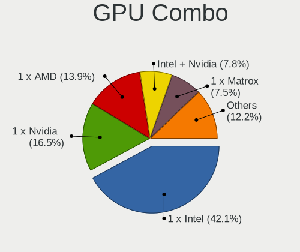

| Name                    | Computers | Percent |
|-------------------------|-----------|---------|
| 1 x Intel               | 258       | 37.45%  |
| 1 x Nvidia              | 129       | 18.72%  |
| 1 x AMD                 | 111       | 16.11%  |
| Intel + Nvidia          | 57        | 8.27%   |
| 1 x ASPEED              | 48        | 6.97%   |
| 1 x Matrox              | 44        | 6.39%   |
| Intel + AMD             | 20        | 2.9%    |
| 2 x Nvidia              | 3         | 0.44%   |
| 2 x AMD                 | 3         | 0.44%   |
| AMD + Nvidia            | 3         | 0.44%   |
| Other                   | 2         | 0.29%   |
| 1 x S3 Graphics         | 2         | 0.29%   |
| Nvidia + ASPEED         | 2         | 0.29%   |
| 2 x AMD + 1 x ASPEED    | 1         | 0.15%   |
| 1 x XGI                 | 1         | 0.15%   |
| 1 x SiS                 | 1         | 0.15%   |
| 1 x Silicon Motion      | 1         | 0.15%   |
| Nvidia + Matrox         | 1         | 0.15%   |
| Intel + 2 x Nvidia      | 1         | 0.15%   |
| 1 x Huawei Technologies | 1         | 0.15%   |

GPU Driver
----------

Free vs proprietary

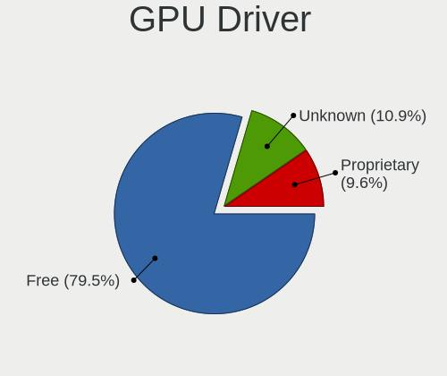

| Driver      | Computers | Percent |
|-------------|-----------|---------|
| Free        | 543       | 78.13%  |
| Unknown     | 79        | 11.37%  |
| Proprietary | 73        | 10.5%   |

GPU Memory
----------

Total video memory

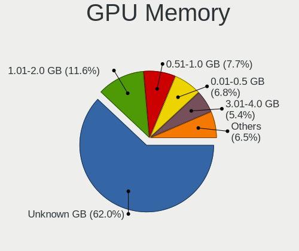

| Size in GB | Computers | Percent |
|------------|-----------|---------|
| Unknown    | 404       | 57.8%   |
| 1.01-2.0   | 90        | 12.88%  |
| 0.51-1.0   | 61        | 8.73%   |
| 0.01-0.5   | 53        | 7.58%   |
| 3.01-4.0   | 41        | 5.87%   |
| 7.01-8.0   | 29        | 4.15%   |
| 5.01-6.0   | 7         | 1%      |
| 8.01-16.0  | 5         | 0.72%   |
| 4.01-5.0   | 4         | 0.57%   |
| 2.01-3.0   | 4         | 0.57%   |
| 16.01-24.0 | 1         | 0.14%   |

Monitor
-------

Monitor Vendor
--------------

Monitor vendors

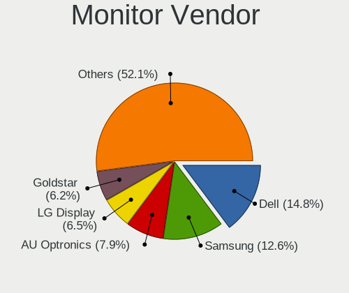

| Vendor                  | Computers | Percent |
|-------------------------|-----------|---------|
| Dell                    | 92        | 14.79%  |
| Samsung Electronics     | 80        | 12.86%  |
| AU Optronics            | 45        | 7.23%   |
| Hewlett-Packard         | 41        | 6.59%   |
| LG Display              | 40        | 6.43%   |
| Chimei Innolux          | 39        | 6.27%   |
| Goldstar                | 38        | 6.11%   |
| Acer                    | 28        | 4.5%    |
| BOE                     | 25        | 4.02%   |
| AOC                     | 18        | 2.89%   |
| BenQ                    | 17        | 2.73%   |
| Lenovo                  | 14        | 2.25%   |
| Philips                 | 13        | 2.09%   |
| Ancor Communications    | 13        | 2.09%   |
| ViewSonic               | 11        | 1.77%   |
| LG Electronics          | 7         | 1.13%   |
| Eizo                    | 7         | 1.13%   |
| Iiyama                  | 6         | 0.96%   |
| Sharp                   | 5         | 0.8%    |
| PANDA                   | 5         | 0.8%    |
| Unknown                 | 4         | 0.64%   |
| Sony                    | 4         | 0.64%   |
| Panasonic               | 4         | 0.64%   |
| NEC Computers           | 4         | 0.64%   |
| Apple                   | 4         | 0.64%   |
| HPN                     | 3         | 0.48%   |
| ___                     | 2         | 0.32%   |
| Xiaomi                  | 2         | 0.32%   |
| Westinghouse            | 2         | 0.32%   |
| Sun                     | 2         | 0.32%   |
| Sceptre Tech            | 2         | 0.32%   |
| MStar                   | 2         | 0.32%   |
| KVM                     | 2         | 0.32%   |
| Insignia                | 2         | 0.32%   |
| InnoLux Display         | 2         | 0.32%   |
| HannStar                | 2         | 0.32%   |
| Elo Touch               | 2         | 0.32%   |
| Chi Mei Optoelectronics | 2         | 0.32%   |
| Xerox                   | 1         | 0.16%   |
| VOXICON                 | 1         | 0.16%   |

Monitor Model
-------------

Monitor models

| Model                                                                | Computers | Percent |
|----------------------------------------------------------------------|-----------|---------|
| Dell P2414H DELA09A 1920x1080 527x297mm 23.8-inch                    | 7         | 1.05%   |
| Dell P2317H DEL40F4 1920x1080 509x286mm 23.0-inch                    | 7         | 1.05%   |
| Dell P2417H DELA0DB 1920x1080 527x296mm 23.8-inch                    | 6         | 0.9%    |
| AOC 2436 AOC2436 1920x1080 521x293mm 23.5-inch                       | 5         | 0.75%   |
| Dell U2412M DELA07A 1920x1200 518x324mm 24.1-inch                    | 4         | 0.6%    |
| Samsung Electronics C27F390 SAM0D32 1920x1080 598x336mm 27.0-inch    | 3         | 0.45%   |
| Panasonic VVX16T029D00 MEI96A2 2880x1620 344x193mm 15.5-inch         | 3         | 0.45%   |
| Goldstar ULTRAWIDE GSM59F1 2560x1080 673x284mm 28.8-inch             | 3         | 0.45%   |
| Goldstar Ultra HD GSM5B08 3840x2160 600x340mm 27.2-inch              | 3         | 0.45%   |
| Goldstar FULL HD GSM5B55 1920x1080 480x270mm 21.7-inch               | 3         | 0.45%   |
| Chimei Innolux LCD Monitor CMN14D4 1920x1080 309x173mm 13.9-inch     | 3         | 0.45%   |
| AU Optronics LCD Monitor AUO38ED 1920x1080 344x193mm 15.5-inch       | 3         | 0.45%   |
| AU Optronics LCD Monitor AUO213E 1600x900 309x174mm 14.0-inch        | 3         | 0.45%   |
| Xiaomi Mi TV XMD009A 2224x1668 341x192mm 15.4-inch                   | 2         | 0.3%    |
| Samsung Electronics SyncMaster SAM0372 1680x1050 440x300mm 21.0-inch | 2         | 0.3%    |
| Samsung Electronics SyncMaster SAM022B 1280x1024 338x270mm 17.0-inch | 2         | 0.3%    |
| Samsung Electronics SyncMaster SAM01D3 1440x900 408x225mm 18.3-inch  | 2         | 0.3%    |
| Samsung Electronics SyncMaster SAM0094 1280x1024 338x270mm 17.0-inch | 2         | 0.3%    |
| Samsung Electronics SMT22A550 SAM07AF 1920x1080 477x268mm 21.5-inch  | 2         | 0.3%    |
| Samsung Electronics S24D300 SAM0B43 1920x1080 531x299mm 24.0-inch    | 2         | 0.3%    |
| Samsung Electronics LCD Monitor SEC5441 1366x768 344x194mm 15.5-inch | 2         | 0.3%    |
| MStar Demo MST0030 1366x768 708x398mm 32.0-inch                      | 2         | 0.3%    |
| LG Display LCD Monitor LGD039F 1366x768 345x194mm 15.6-inch          | 2         | 0.3%    |
| LG Display LCD Monitor LGD02DC 1366x768 344x194mm 15.5-inch          | 2         | 0.3%    |
| LG Display LCD Monitor LGD021D 1600x900 382x215mm 17.3-inch          | 2         | 0.3%    |
| KVM LCD Monitor17 KVM4308 1280x1024 338x270mm 17.0-inch              | 2         | 0.3%    |
| InnoLux Display LCD Monitor INL0014 1366x768 309x174mm 14.0-inch     | 2         | 0.3%    |
| Hewlett-Packard ZR2440w HWP2956 1920x1080 518x324mm 24.1-inch        | 2         | 0.3%    |
| Hewlett-Packard ZR2440w HWP2955 1920x1080 518x324mm 24.1-inch        | 2         | 0.3%    |
| Hewlett-Packard Z32x HWP3275 3840x2160 697x392mm 31.5-inch           | 2         | 0.3%    |
| Hewlett-Packard LP2465 HWP2676 1920x1200 519x324mm 24.1-inch         | 2         | 0.3%    |
| Hewlett-Packard LE1901w HWP2842 1440x900 410x256mm 19.0-inch         | 2         | 0.3%    |
| Goldstar W2252 GSM567D 1680x1050 474x296mm 22.0-inch                 | 2         | 0.3%    |
| Goldstar Ultra HD GSM5B09 3840x2160 600x340mm 27.2-inch              | 2         | 0.3%    |
| Goldstar IPS FULLHD GSM5AB7 1920x1080 480x270mm 21.7-inch            | 2         | 0.3%    |
| Goldstar FULL HD GSM5AB9 1920x1080 480x270mm 21.7-inch               | 2         | 0.3%    |
| Goldstar 22EA53 GSM59A5 1920x1080 477x268mm 21.5-inch                | 2         | 0.3%    |
| Dell U2414H DELA0A4 1920x1080 527x296mm 23.8-inch                    | 2         | 0.3%    |
| Dell ST2410 DELA05D 1920x1080 531x299mm 24.0-inch                    | 2         | 0.3%    |
| Dell SE2717H/HX DELD0A1 1920x1080 598x336mm 27.0-inch                | 2         | 0.3%    |

Monitor Resolution
------------------

Monitor screen resolution

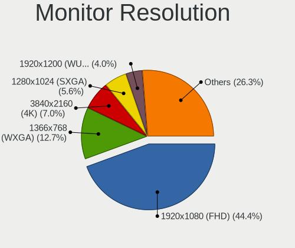

| Resolution         | Computers | Percent |
|--------------------|-----------|---------|
| 1920x1080 (FHD)    | 260       | 43.19%  |
| 1366x768 (WXGA)    | 78        | 12.96%  |
| 3840x2160 (4K)     | 43        | 7.14%   |
| 1280x1024 (SXGA)   | 30        | 4.98%   |
| 1680x1050 (WSXGA+) | 26        | 4.32%   |
| 1600x900 (HD+)     | 24        | 3.99%   |
| 1920x1200 (WUXGA)  | 23        | 3.82%   |
| 2560x1440 (QHD)    | 20        | 3.32%   |
| Unknown            | 18        | 2.99%   |
| 1440x900 (WXGA+)   | 13        | 2.16%   |
| 1280x800 (WXGA)    | 10        | 1.66%   |
| 3840x1080          | 7         | 1.16%   |
| 3440x1440          | 7         | 1.16%   |
| 1600x1200          | 7         | 1.16%   |
| 1024x768 (XGA)     | 7         | 1.16%   |
| 2560x1080          | 4         | 0.66%   |
| 3840x1200          | 3         | 0.5%    |
| 2560x1600          | 3         | 0.5%    |
| 1360x768           | 3         | 0.5%    |
| 1280x960           | 2         | 0.33%   |
| 1280x720 (HD)      | 2         | 0.33%   |
| 7680x1080          | 1         | 0.17%   |
| 7280x2160          | 1         | 0.17%   |
| 5760x1080          | 1         | 0.17%   |
| 5520x2160          | 1         | 0.17%   |
| 4480x1440          | 1         | 0.17%   |
| 3640x1920          | 1         | 0.17%   |
| 3456x2160          | 1         | 0.17%   |
| 3200x2000          | 1         | 0.17%   |
| 1920x540           | 1         | 0.17%   |
| 1680x1080          | 1         | 0.17%   |
| 1400x1050          | 1         | 0.17%   |
| 1024x600           | 1         | 0.17%   |

Monitor Diagonal
----------------

Diagonal size in inches

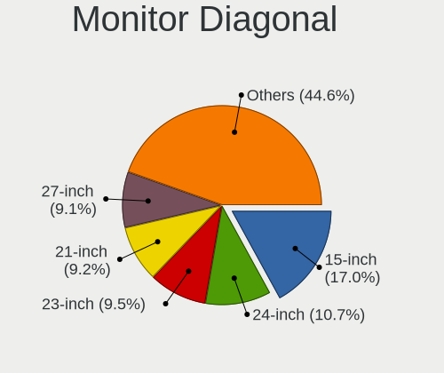

| Inches  | Computers | Percent |
|---------|-----------|---------|
| 15      | 110       | 17.66%  |
| 24      | 72        | 11.56%  |
| 23      | 56        | 8.99%   |
| 21      | 55        | 8.83%   |
| 27      | 53        | 8.51%   |
| Unknown | 44        | 7.06%   |
| 14      | 34        | 5.46%   |
| 17      | 33        | 5.3%    |
| 13      | 29        | 4.65%   |
| 19      | 25        | 4.01%   |
| 22      | 15        | 2.41%   |
| 20      | 15        | 2.41%   |
| 12      | 12        | 1.93%   |
| 31      | 11        | 1.77%   |
| 18      | 11        | 1.77%   |
| 34      | 9         | 1.44%   |
| 32      | 6         | 0.96%   |
| 40      | 4         | 0.64%   |
| 52      | 3         | 0.48%   |
| 25      | 3         | 0.48%   |
| 16      | 3         | 0.48%   |
| 84      | 2         | 0.32%   |
| 72      | 2         | 0.32%   |
| 65      | 2         | 0.32%   |
| 42      | 2         | 0.32%   |
| 29      | 2         | 0.32%   |
| 26      | 2         | 0.32%   |
| 11      | 2         | 0.32%   |
| 58      | 1         | 0.16%   |
| 55      | 1         | 0.16%   |
| 49      | 1         | 0.16%   |
| 36      | 1         | 0.16%   |
| 28      | 1         | 0.16%   |
| 10      | 1         | 0.16%   |

Monitor Width
-------------

Physical width

| Width in mm | Computers | Percent |
|-------------|-----------|---------|
| 301-350     | 172       | 28.52%  |
| 501-600     | 163       | 27.03%  |
| 401-500     | 101       | 16.75%  |
| Unknown     | 44        | 7.3%    |
| 351-400     | 43        | 7.13%   |
| 601-700     | 23        | 3.81%   |
| 201-300     | 23        | 3.81%   |
| 701-800     | 16        | 2.65%   |
| 1001-1500   | 8         | 1.33%   |
| 801-900     | 4         | 0.66%   |
| 1501-2000   | 4         | 0.66%   |
| 901-1000    | 2         | 0.33%   |

Aspect Ratio
------------

Proportional relationship between the width and the height

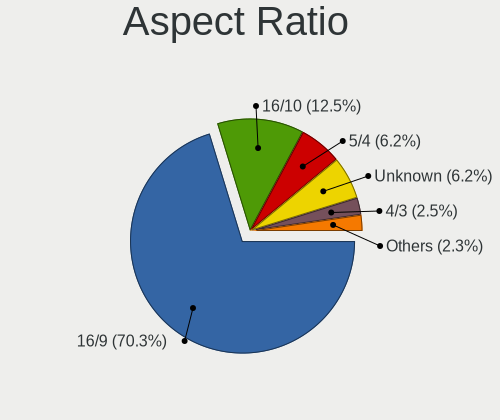

| Ratio   | Computers | Percent |
|---------|-----------|---------|
| 16/9    | 384       | 69.06%  |
| 16/10   | 74        | 13.31%  |
| Unknown | 38        | 6.83%   |
| 5/4     | 30        | 5.4%    |
| 4/3     | 16        | 2.88%   |
| 21/9    | 9         | 1.62%   |
| 3/2     | 4         | 0.72%   |
| 32/9    | 1         | 0.18%   |

Monitor Area
------------

Area in inch

| Area in inch | Computers | Percent |
|----------------|-----------|---------|
| 201-250        | 152       | 24.76%  |
| 101-110        | 108       | 17.59%  |
| 81-90          | 57        | 9.28%   |
| 151-200        | 54        | 8.79%   |
| 301-350        | 53        | 8.63%   |
| Unknown        | 44        | 7.17%   |
| 251-300        | 31        | 5.05%   |
| 351-500        | 29        | 4.72%   |
| 141-150        | 22        | 3.58%   |
| 121-130        | 16        | 2.61%   |
| More than 1000 | 12        | 1.95%   |
| 61-70          | 12        | 1.95%   |
| 501-1000       | 7         | 1.14%   |
| 71-80          | 6         | 0.98%   |
| 111-120        | 4         | 0.65%   |
| 131-140        | 3         | 0.49%   |
| 51-60          | 2         | 0.33%   |
| 41-50          | 1         | 0.16%   |
| 91-100         | 1         | 0.16%   |

Pixel Density
-------------

Pixels per inch

| Density       | Computers | Percent |
|---------------|-----------|---------|
| 51-100        | 257       | 43.56%  |
| 101-120       | 133       | 22.54%  |
| 121-160       | 125       | 21.19%  |
| Unknown       | 44        | 7.46%   |
| 161-240       | 14        | 2.37%   |
| 1-50          | 9         | 1.53%   |
| More than 240 | 8         | 1.36%   |

Multiple Monitors
-----------------

Total monitors connected

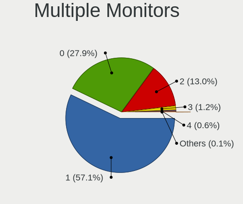

| Total | Computers | Percent |
|-------|-----------|---------|
| 1     | 433       | 61.33%  |
| 0     | 158       | 22.38%  |
| 2     | 100       | 14.16%  |
| 3     | 11        | 1.56%   |
| 4     | 3         | 0.42%   |
| 6     | 1         | 0.14%   |

Network
-------

Net Controller Vendor
---------------------

Controller vendors

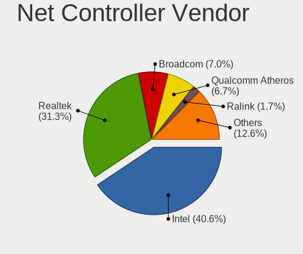

| Vendor                            | Computers | Percent |
|-----------------------------------|-----------|---------|
| Intel                             | 425       | 43.46%  |
| Realtek Semiconductor             | 269       | 27.51%  |
| Qualcomm Atheros                  | 75        | 7.67%   |
| Broadcom                          | 66        | 6.75%   |
| Ralink Technology                 | 17        | 1.74%   |
| IBM                               | 13        | 1.33%   |
| TP-Link                           | 12        | 1.23%   |
| Mellanox Technologies             | 12        | 1.23%   |
| Broadcom Limited                  | 12        | 1.23%   |
| ASIX Electronics                  | 8         | 0.82%   |
| D-Link System                     | 5         | 0.51%   |
| Ralink                            | 4         | 0.41%   |
| Marvell Technology Group          | 4         | 0.41%   |
| Aquantia                          | 4         | 0.41%   |
| Huawei Technologies               | 3         | 0.31%   |
| Ericsson Business Mobile Networks | 3         | 0.31%   |
| D-Link                            | 3         | 0.31%   |
| Xilinx                            | 2         | 0.2%    |
| Xiaomi                            | 2         | 0.2%    |
| Sierra Wireless                   | 2         | 0.2%    |
| Samsung Electronics               | 2         | 0.2%    |
| Nvidia                            | 2         | 0.2%    |
| MediaTek                          | 2         | 0.2%    |
| ICS Advent                        | 2         | 0.2%    |
| Dell                              | 2         | 0.2%    |
| ASUSTek Computer                  | 2         | 0.2%    |
| 3Com                              | 2         | 0.2%    |
| ZTE WCDMA Technologies MSM        | 1         | 0.1%    |
| VIA Technologies                  | 1         | 0.1%    |
| U-Blox                            | 1         | 0.1%    |
| Spreadtrum Communications         | 1         | 0.1%    |
| Silicon Integrated Systems [SiS]  | 1         | 0.1%    |
| Qualcomm Atheros Communications   | 1         | 0.1%    |
| OnePlus Technology (Shenzhen)     | 1         | 0.1%    |
| NetGear                           | 1         | 0.1%    |
| MYRICOM                           | 1         | 0.1%    |
| LSI                               | 1         | 0.1%    |
| Linux 2.6.31.6 with s3c-udc       | 1         | 0.1%    |
| Linksys                           | 1         | 0.1%    |
| Lenovo                            | 1         | 0.1%    |

Net Controller Model
--------------------

Controller models

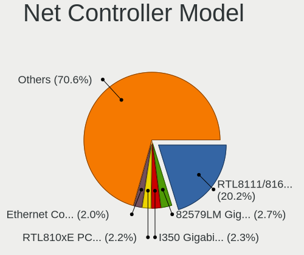

| Model                                                             | Computers | Percent |
|-------------------------------------------------------------------|-----------|---------|
| Realtek RTL8111/8168/8411 PCI Express Gigabit Ethernet Controller | 203       | 16.83%  |
| Intel 82579LM Gigabit Network Connection (Lewisville)             | 37        | 3.07%   |
| Realtek RTL810xE PCI Express Fast Ethernet controller             | 29        | 2.4%    |
| Intel I350 Gigabit Network Connection                             | 29        | 2.4%    |
| Intel Ethernet Connection I217-LM                                 | 29        | 2.4%    |
| Intel I211 Gigabit Network Connection                             | 24        | 1.99%   |
| Intel Wireless 7260                                               | 23        | 1.91%   |
| Intel Ethernet Connection (2) I219-LM                             | 23        | 1.91%   |
| Intel I210 Gigabit Network Connection                             | 21        | 1.74%   |
| Intel 82574L Gigabit Network Connection                           | 21        | 1.74%   |
| Intel Wi-Fi 6 AX200                                               | 20        | 1.66%   |
| Intel 82599ES 10-Gigabit SFI/SFP+ Network Connection              | 18        | 1.49%   |
| Qualcomm Atheros QCA9565 / AR9565 Wireless Network Adapter        | 14        | 1.16%   |
| Intel Wireless 8260                                               | 14        | 1.16%   |
| Realtek RTL8153 Gigabit Ethernet Adapter                          | 13        | 1.08%   |
| IBM RNDIS/CDC ETHER                                               | 13        | 1.08%   |
| Intel Wireless 8265 / 8275                                        | 12        | 1%      |
| Intel Ethernet Connection (7) I219-LM                             | 12        | 1%      |
| Intel Ethernet Connection (2) I219-V                              | 12        | 1%      |
| Intel Ethernet Connection (11) I219-LM                            | 12        | 1%      |
| Qualcomm Atheros QCA9377 802.11ac Wireless Network Adapter        | 11        | 0.91%   |
| Intel Dual Band Wireless-AC 3168NGW [Stone Peak]                  | 11        | 0.91%   |
| Broadcom NetXtreme BCM5720 Gigabit Ethernet PCIe                  | 11        | 0.91%   |
| Intel Wireless 7265                                               | 10        | 0.83%   |
| Intel Ethernet Controller X710 for 10GbE SFP+                     | 10        | 0.83%   |
| Intel 82579V Gigabit Network Connection                           | 9         | 0.75%   |
| Intel 82576 Gigabit Network Connection                            | 9         | 0.75%   |
| Realtek RTL8125 2.5GbE Controller                                 | 8         | 0.66%   |
| Intel Centrino Advanced-N 6205 [Taylor Peak]                      | 8         | 0.66%   |
| Realtek RTL8723BE PCIe Wireless Network Adapter                   | 7         | 0.58%   |
| Mellanox MT27500 Family [ConnectX-3]                              | 7         | 0.58%   |
| Intel Ethernet Connection (2) I218-V                              | 7         | 0.58%   |
| Intel Cannon Point-LP CNVi [Wireless-AC]                          | 7         | 0.58%   |
| Realtek RTL8821CE 802.11ac PCIe Wireless Network Adapter          | 6         | 0.5%    |
| Qualcomm Atheros AR9485 Wireless Network Adapter                  | 6         | 0.5%    |
| Qualcomm Atheros AR9462 Wireless Network Adapter                  | 6         | 0.5%    |
| Qualcomm Atheros AR8131 Gigabit Ethernet                          | 6         | 0.5%    |
| Intel Wireless-AC 9260                                            | 6         | 0.5%    |
| Intel Wireless 3165                                               | 6         | 0.5%    |
| Intel Wi-Fi 6 AX201                                               | 6         | 0.5%    |

Wireless Vendor
---------------

Wireless vendors

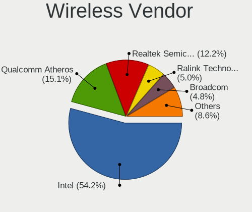

| Vendor                          | Computers | Percent |
|---------------------------------|-----------|---------|
| Intel                           | 189       | 52.65%  |
| Qualcomm Atheros                | 56        | 15.6%   |
| Realtek Semiconductor           | 46        | 12.81%  |
| Broadcom                        | 19        | 5.29%   |
| Ralink Technology               | 17        | 4.74%   |
| TP-Link                         | 10        | 2.79%   |
| Ralink                          | 4         | 1.11%   |
| D-Link                          | 3         | 0.84%   |
| Sierra Wireless                 | 2         | 0.56%   |
| MediaTek                        | 2         | 0.56%   |
| Dell                            | 2         | 0.56%   |
| Broadcom Limited                | 2         | 0.56%   |
| ASUSTek Computer                | 2         | 0.56%   |
| Qualcomm Atheros Communications | 1         | 0.28%   |
| NetGear                         | 1         | 0.28%   |
| Linksys                         | 1         | 0.28%   |
| Edimax Technology               | 1         | 0.28%   |
| D-Link System                   | 1         | 0.28%   |

Wireless Model
--------------

Wireless models

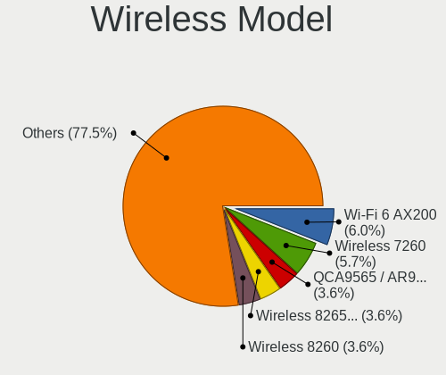

| Model                                                          | Computers | Percent |
|----------------------------------------------------------------|-----------|---------|
| Intel Wireless 7260                                            | 23        | 6.39%   |
| Intel Wi-Fi 6 AX200                                            | 20        | 5.56%   |
| Qualcomm Atheros QCA9565 / AR9565 Wireless Network Adapter     | 14        | 3.89%   |
| Intel Wireless 8260                                            | 14        | 3.89%   |
| Intel Wireless 8265 / 8275                                     | 12        | 3.33%   |
| Qualcomm Atheros QCA9377 802.11ac Wireless Network Adapter     | 11        | 3.06%   |
| Intel Dual Band Wireless-AC 3168NGW [Stone Peak]               | 11        | 3.06%   |
| Intel Wireless 7265                                            | 10        | 2.78%   |
| Intel Centrino Advanced-N 6205 [Taylor Peak]                   | 8         | 2.22%   |
| Realtek RTL8723BE PCIe Wireless Network Adapter                | 7         | 1.94%   |
| Intel Cannon Point-LP CNVi [Wireless-AC]                       | 7         | 1.94%   |
| Realtek RTL8821CE 802.11ac PCIe Wireless Network Adapter       | 6         | 1.67%   |
| Qualcomm Atheros AR9485 Wireless Network Adapter               | 6         | 1.67%   |
| Qualcomm Atheros AR9462 Wireless Network Adapter               | 6         | 1.67%   |
| Intel Wireless-AC 9260                                         | 6         | 1.67%   |
| Intel Wireless 3165                                            | 6         | 1.67%   |
| Intel Wi-Fi 6 AX201                                            | 6         | 1.67%   |
| Intel Comet Lake PCH-LP CNVi WiFi                              | 6         | 1.67%   |
| Intel Comet Lake PCH CNVi WiFi                                 | 6         | 1.67%   |
| Intel Cannon Lake PCH CNVi WiFi                                | 6         | 1.67%   |
| Realtek RTL8822BE 802.11a/b/g/n/ac WiFi adapter                | 5         | 1.39%   |
| Ralink MT7601U Wireless Adapter                                | 5         | 1.39%   |
| Qualcomm Atheros QCA6174 802.11ac Wireless Network Adapter     | 5         | 1.39%   |
| Qualcomm Atheros AR9285 Wireless Network Adapter (PCI-Express) | 5         | 1.39%   |
| Intel Centrino Ultimate-N 6300                                 | 5         | 1.39%   |
| Intel Alder Lake-P PCH CNVi WiFi                               | 5         | 1.39%   |
| Broadcom BCM4360 802.11ac Wireless Network Adapter             | 5         | 1.39%   |
| Broadcom BCM4313 802.11bgn Wireless Network Adapter            | 5         | 1.39%   |
| Realtek RTL8822CE 802.11ac PCIe Wireless Network Adapter       | 4         | 1.11%   |
| Ralink RT5370 Wireless Adapter                                 | 4         | 1.11%   |
| Ralink RT2870/RT3070 Wireless Adapter                          | 4         | 1.11%   |
| Qualcomm Atheros AR9287 Wireless Network Adapter (PCI-Express) | 4         | 1.11%   |
| Intel PRO/Wireless 3945ABG [Golan] Network Connection          | 4         | 1.11%   |
| Intel Ice Lake-LP PCH CNVi WiFi                                | 4         | 1.11%   |
| Intel Dual Band Wireless-AC 3165 Plus Bluetooth                | 4         | 1.11%   |
| Intel Centrino Advanced-N 6235                                 | 4         | 1.11%   |
| Intel Centrino Advanced-N 6200                                 | 4         | 1.11%   |
| Realtek RTL8723DE Wireless Network Adapter                     | 3         | 0.83%   |
| Realtek RTL8188CUS 802.11n WLAN Adapter                        | 3         | 0.83%   |
| Intel Centrino Advanced-N 6230 [Rainbow Peak]                  | 3         | 0.83%   |

Ethernet Vendor
---------------

Ethernet vendors

| Vendor                           | Computers | Percent |
|----------------------------------|-----------|---------|
| Intel                            | 336       | 45.34%  |
| Realtek Semiconductor            | 254       | 34.28%  |
| Broadcom                         | 49        | 6.61%   |
| Qualcomm Atheros                 | 27        | 3.64%   |
| IBM                              | 13        | 1.75%   |
| Broadcom Limited                 | 10        | 1.35%   |
| ASIX Electronics                 | 8         | 1.08%   |
| Marvell Technology Group         | 4         | 0.54%   |
| D-Link System                    | 4         | 0.54%   |
| Aquantia                         | 4         | 0.54%   |
| Huawei Technologies              | 3         | 0.4%    |
| Xiaomi                           | 2         | 0.27%   |
| TP-Link                          | 2         | 0.27%   |
| Samsung Electronics              | 2         | 0.27%   |
| Nvidia                           | 2         | 0.27%   |
| Mellanox Technologies            | 2         | 0.27%   |
| ICS Advent                       | 2         | 0.27%   |
| 3Com                             | 2         | 0.27%   |
| ZTE WCDMA Technologies MSM       | 1         | 0.13%   |
| Xilinx                           | 1         | 0.13%   |
| VIA Technologies                 | 1         | 0.13%   |
| Spreadtrum Communications        | 1         | 0.13%   |
| Silicon Integrated Systems [SiS] | 1         | 0.13%   |
| OnePlus Technology (Shenzhen)    | 1         | 0.13%   |
| MYRICOM                          | 1         | 0.13%   |
| Lenovo                           | 1         | 0.13%   |
| Emulex                           | 1         | 0.13%   |
| DisplayLink                      | 1         | 0.13%   |
| Cisco Systems                    | 1         | 0.13%   |
| Ceton Technologies               | 1         | 0.13%   |
| Apple                            | 1         | 0.13%   |
| American Megatrends              | 1         | 0.13%   |
| Accton Technology                | 1         | 0.13%   |

Ethernet Model
--------------

Ethernet models

| Model                                                             | Computers | Percent |
|-------------------------------------------------------------------|-----------|---------|
| Realtek RTL8111/8168/8411 PCI Express Gigabit Ethernet Controller | 203       | 24.58%  |
| Intel 82579LM Gigabit Network Connection (Lewisville)             | 37        | 4.48%   |
| Realtek RTL810xE PCI Express Fast Ethernet controller             | 29        | 3.51%   |
| Intel I350 Gigabit Network Connection                             | 29        | 3.51%   |
| Intel Ethernet Connection I217-LM                                 | 29        | 3.51%   |
| Intel I211 Gigabit Network Connection                             | 24        | 2.91%   |
| Intel Ethernet Connection (2) I219-LM                             | 23        | 2.78%   |
| Intel I210 Gigabit Network Connection                             | 21        | 2.54%   |
| Intel 82574L Gigabit Network Connection                           | 21        | 2.54%   |
| Intel 82599ES 10-Gigabit SFI/SFP+ Network Connection              | 18        | 2.18%   |
| Realtek RTL8153 Gigabit Ethernet Adapter                          | 13        | 1.57%   |
| IBM RNDIS/CDC ETHER                                               | 13        | 1.57%   |
| Intel Ethernet Connection (7) I219-LM                             | 12        | 1.45%   |
| Intel Ethernet Connection (2) I219-V                              | 12        | 1.45%   |
| Intel Ethernet Connection (11) I219-LM                            | 12        | 1.45%   |
| Broadcom NetXtreme BCM5720 Gigabit Ethernet PCIe                  | 11        | 1.33%   |
| Intel Ethernet Controller X710 for 10GbE SFP+                     | 10        | 1.21%   |
| Intel 82579V Gigabit Network Connection                           | 9         | 1.09%   |
| Intel 82576 Gigabit Network Connection                            | 9         | 1.09%   |
| Realtek RTL8125 2.5GbE Controller                                 | 8         | 0.97%   |
| Intel Ethernet Connection (2) I218-V                              | 7         | 0.85%   |
| Qualcomm Atheros AR8131 Gigabit Ethernet                          | 6         | 0.73%   |
| Intel Ethernet Controller 10-Gigabit X540-AT2                     | 6         | 0.73%   |
| Intel Ethernet Connection I219-LM                                 | 6         | 0.73%   |
| Intel 82577LM Gigabit Network Connection                          | 6         | 0.73%   |
| Broadcom NetXtreme BCM5764M Gigabit Ethernet PCIe                 | 6         | 0.73%   |
| ASIX AX88179 Gigabit Ethernet                                     | 6         | 0.73%   |
| Realtek RTL-8100/8101L/8139 PCI Fast Ethernet Adapter             | 5         | 0.61%   |
| Intel Ethernet Connection X722 for 10GbE SFP+                     | 5         | 0.61%   |
| Intel Ethernet Connection I219-V                                  | 5         | 0.61%   |
| Intel Ethernet Connection I218-LM                                 | 5         | 0.61%   |
| Intel Ethernet Connection (6) I219-V                              | 5         | 0.61%   |
| Intel Ethernet Connection (5) I219-LM                             | 5         | 0.61%   |
| Intel Ethernet Connection (4) I219-V                              | 5         | 0.61%   |
| Broadcom NetXtreme II BCM5709 Gigabit Ethernet                    | 5         | 0.61%   |
| Broadcom NetXtreme BCM5761 Gigabit Ethernet PCIe                  | 5         | 0.61%   |
| Qualcomm Atheros Killer E2500 Gigabit Ethernet Controller         | 4         | 0.48%   |
| Qualcomm Atheros AR8151 v2.0 Gigabit Ethernet                     | 4         | 0.48%   |
| Intel Ethernet Controller I225-V                                  | 4         | 0.48%   |
| Intel Ethernet Connection X722 for 1GbE                           | 4         | 0.48%   |

Net Controller Kind
-------------------

Ethernet, WiFi or modem

| Kind     | Computers | Percent |
|----------|-----------|---------|
| Ethernet | 651       | 64.58%  |
| WiFi     | 337       | 33.43%  |
| Unknown  | 11        | 1.09%   |
| Modem    | 9         | 0.89%   |

Used Controller
---------------

Currently used network controller

| Kind     | Computers | Percent |
|----------|-----------|---------|
| Ethernet | 477       | 68.73%  |
| WiFi     | 213       | 30.69%  |
| Unknown  | 4         | 0.58%   |

NICs
----

Total network controllers on board

| Total | Computers | Percent |
|-------|-----------|---------|
| 2     | 350       | 50.72%  |
| 1     | 234       | 33.91%  |
| 3     | 36        | 5.22%   |
| 4     | 35        | 5.07%   |
| 6     | 17        | 2.46%   |
| 5     | 5         | 0.72%   |
| 0     | 4         | 0.58%   |
| 8     | 3         | 0.43%   |
| 7     | 2         | 0.29%   |
| 42    | 1         | 0.14%   |
| 20    | 1         | 0.14%   |
| 12    | 1         | 0.14%   |
| 10    | 1         | 0.14%   |

IPv6
----

IPv6 vs IPv4

| Used | Computers | Percent |
|------|-----------|---------|
| No   | 624       | 90.43%  |
| Yes  | 66        | 9.57%   |

Bluetooth
---------

Bluetooth Vendor
----------------

Controller vendors

| Vendor                          | Computers | Percent |
|---------------------------------|-----------|---------|
| Intel                           | 141       | 51.09%  |
| Qualcomm Atheros Communications | 30        | 10.87%  |
| Realtek Semiconductor           | 27        | 9.78%   |
| Cambridge Silicon Radio         | 23        | 8.33%   |
| Broadcom                        | 21        | 7.61%   |
| ASUSTek Computer                | 8         | 2.9%    |
| Lite-On Technology              | 5         | 1.81%   |
| IMC Networks                    | 5         | 1.81%   |
| Apple                           | 4         | 1.45%   |
| Dell                            | 3         | 1.09%   |
| Hewlett-Packard                 | 2         | 0.72%   |
| Foxconn / Hon Hai               | 2         | 0.72%   |
| Toshiba                         | 1         | 0.36%   |
| Ralink                          | 1         | 0.36%   |
| MediaTek                        | 1         | 0.36%   |
| Dynex                           | 1         | 0.36%   |
| Alps Electric                   | 1         | 0.36%   |

Bluetooth Model
---------------

Controller models

| Model                                                 | Computers | Percent |
|-------------------------------------------------------|-----------|---------|
| Intel Bluetooth wireless interface                    | 61        | 22.1%   |
| Cambridge Silicon Radio Bluetooth Dongle (HCI mode)   | 23        | 8.33%   |
| Intel AX200 Bluetooth                                 | 19        | 6.88%   |
| Intel Bluetooth 9460/9560 Jefferson Peak (JfP)        | 17        | 6.16%   |
| Intel AX201 Bluetooth                                 | 16        | 5.8%    |
| Realtek Bluetooth Radio                               | 15        | 5.43%   |
| Realtek  Bluetooth 4.2 Adapter                        | 9         | 3.26%   |
| Qualcomm Atheros  Bluetooth Device                    | 9         | 3.26%   |
| Qualcomm Atheros AR3012 Bluetooth 4.0                 | 9         | 3.26%   |
| Intel Wireless-AC 3168 Bluetooth                      | 9         | 3.26%   |
| Broadcom BCM20702A0 Bluetooth 4.0                     | 6         | 2.17%   |
| Intel Wireless-AC 9260 Bluetooth Adapter              | 5         | 1.81%   |
| Intel Centrino Bluetooth Wireless Transceiver         | 5         | 1.81%   |
| Qualcomm Atheros QCA61x4 Bluetooth 4.0                | 4         | 1.45%   |
| Qualcomm Atheros AR9462 Bluetooth                     | 4         | 1.45%   |
| Intel Bluetooth Device                                | 4         | 1.45%   |
| IMC Networks Bluetooth Device                         | 4         | 1.45%   |
| Qualcomm Atheros AR3011 Bluetooth                     | 3         | 1.09%   |
| Intel Centrino Advanced-N 6230 Bluetooth adapter      | 3         | 1.09%   |
| ASUS Broadcom BCM20702A0 Bluetooth                    | 3         | 1.09%   |
| Apple Bluetooth Host Controller                       | 3         | 1.09%   |
| Lite-On Atheros AR3012 Bluetooth                      | 2         | 0.72%   |
| Intel AX210 Bluetooth                                 | 2         | 0.72%   |
| HP Broadcom 2070 Bluetooth Combo                      | 2         | 0.72%   |
| Dell DW375 Bluetooth Module                           | 2         | 0.72%   |
| Broadcom BCM20702 Bluetooth 4.0 [ThinkPad]            | 2         | 0.72%   |
| Broadcom BCM2045B (BDC-2.1) [Bluetooth Controller]    | 2         | 0.72%   |
| Broadcom BCM2045B (BDC-2.1)                           | 2         | 0.72%   |
| ASUS Broadcom BCM20702 Single-Chip Bluetooth 4.0 + LE | 2         | 0.72%   |
| Toshiba Bluetooth Radio                               | 1         | 0.36%   |
| Realtek RTL8822BE Bluetooth 4.2 Adapter               | 1         | 0.36%   |
| Realtek RTL8821A Bluetooth                            | 1         | 0.36%   |
| Realtek RTL8723A Bluetooth                            | 1         | 0.36%   |
| Ralink RT3290 Bluetooth                               | 1         | 0.36%   |
| Qualcomm Atheros Bluetooth USB Host Controller        | 1         | 0.36%   |
| MediaTek Wireless_Device                              | 1         | 0.36%   |
| Lite-On Qualcomm Atheros QCA9377 Bluetooth            | 1         | 0.36%   |
| Lite-On Broadcom BCM43142A0 Bluetooth Device          | 1         | 0.36%   |
| Lite-On Bluetooth Device                              | 1         | 0.36%   |
| IMC Networks Atheros AR3012 Bluetooth 4.0 Adapter     | 1         | 0.36%   |

Sound
-----

Sound Vendor
------------

Sound card vendors

| Vendor                           | Computers | Percent |
|----------------------------------|-----------|---------|
| Intel                            | 450       | 56.75%  |
| Nvidia                           | 145       | 18.28%  |
| AMD                              | 141       | 17.78%  |
| Logitech                         | 9         | 1.13%   |
| C-Media Electronics              | 7         | 0.88%   |
| Texas Instruments                | 5         | 0.63%   |
| Plantronics                      | 5         | 0.63%   |
| GN Netcom                        | 5         | 0.63%   |
| Creative Labs                    | 5         | 0.63%   |
| SteelSeries ApS                  | 2         | 0.25%   |
| Creative Technology              | 2         | 0.25%   |
| Tenx Technology                  | 1         | 0.13%   |
| Silicon Integrated Systems [SiS] | 1         | 0.13%   |
| SAVITECH                         | 1         | 0.13%   |
| Realtek Semiconductor            | 1         | 0.13%   |
| NEC Computers                    | 1         | 0.13%   |
| Musical Fidelity                 | 1         | 0.13%   |
| Lynx                             | 1         | 0.13%   |
| Lenovo                           | 1         | 0.13%   |
| Kingston Technology              | 1         | 0.13%   |
| JMTek                            | 1         | 0.13%   |
| Harman International             | 1         | 0.13%   |
| Fry's Electronics                | 1         | 0.13%   |
| Ensoniq                          | 1         | 0.13%   |
| Corsair                          | 1         | 0.13%   |
| Avid Technology                  | 1         | 0.13%   |
| ASUSTek Computer                 | 1         | 0.13%   |
| Asahi Kasei Microsystems         | 1         | 0.13%   |

Sound Model
-----------

Sound card models

| Model                                                                      | Computers | Percent |
|----------------------------------------------------------------------------|-----------|---------|
| Intel 7 Series/C216 Chipset Family High Definition Audio Controller        | 47        | 5.12%   |
| Intel 8 Series/C220 Series Chipset High Definition Audio Controller        | 43        | 4.68%   |
| Intel Sunrise Point-LP HD Audio                                            | 37        | 4.03%   |
| Intel 6 Series/C200 Series Chipset Family High Definition Audio Controller | 37        | 4.03%   |
| Intel Xeon E3-1200 v3/4th Gen Core Processor HD Audio Controller           | 33        | 3.59%   |
| Intel 100 Series/C230 Series Chipset Family HD Audio Controller            | 31        | 3.38%   |
| AMD Starship/Matisse HD Audio Controller                                   | 25        | 2.72%   |
| AMD Oland/Hainan/Cape Verde/Pitcairn HDMI Audio [Radeon HD 7000 Series]    | 24        | 2.61%   |
| Intel Cannon Lake PCH cAVS                                                 | 23        | 2.51%   |
| Intel 8 Series HD Audio Controller                                         | 21        | 2.29%   |
| Intel 5 Series/3400 Series Chipset High Definition Audio                   | 21        | 2.29%   |
| AMD SBx00 Azalia (Intel HDA)                                               | 21        | 2.29%   |
| Intel Haswell-ULT HD Audio Controller                                      | 20        | 2.18%   |
| Nvidia GK208 HDMI/DP Audio Controller                                      | 18        | 1.96%   |
| AMD Family 17h/19h HD Audio Controller                                     | 18        | 1.96%   |
| Intel 82801JI (ICH10 Family) HD Audio Controller                           | 17        | 1.85%   |
| Intel Comet Lake PCH cAVS                                                  | 16        | 1.74%   |
| AMD Family 17h (Models 00h-0fh) HD Audio Controller                        | 16        | 1.74%   |
| AMD Ellesmere HDMI Audio [Radeon RX 470/480 / 570/580/590]                 | 15        | 1.63%   |
| Intel 200 Series PCH HD Audio                                              | 14        | 1.53%   |
| Intel NM10/ICH7 Family High Definition Audio Controller                    | 13        | 1.42%   |
| Nvidia GP107GL High Definition Audio Controller                            | 12        | 1.31%   |
| Intel Wildcat Point-LP High Definition Audio Controller                    | 12        | 1.31%   |
| Intel C610/X99 series chipset HD Audio Controller                          | 12        | 1.31%   |
| Intel Broadwell-U Audio Controller                                         | 12        | 1.31%   |
| Nvidia High Definition Audio Controller                                    | 11        | 1.2%    |
| Intel Cannon Point-LP High Definition Audio Controller                     | 11        | 1.2%    |
| Intel 82801I (ICH9 Family) HD Audio Controller                             | 11        | 1.2%    |
| Nvidia TU107 GeForce GTX 1650 High Definition Audio Controller             | 10        | 1.09%   |
| Nvidia GK107 HDMI Audio Controller                                         | 10        | 1.09%   |
| Nvidia TU104 HD Audio Controller                                           | 9         | 0.98%   |
| Nvidia GF108 High Definition Audio Controller                              | 8         | 0.87%   |
| Intel Tiger Lake-LP Smart Sound Technology Audio Controller                | 8         | 0.87%   |
| Intel C600/X79 series chipset High Definition Audio Controller             | 8         | 0.87%   |
| AMD Renoir Radeon High Definition Audio Controller                         | 8         | 0.87%   |
| AMD Raven/Raven2/Fenghuang HDMI/DP Audio Controller                        | 8         | 0.87%   |
| Nvidia GP106 High Definition Audio Controller                              | 7         | 0.76%   |
| Nvidia GP104 High Definition Audio Controller                              | 7         | 0.76%   |
| Nvidia GK104 HDMI Audio Controller                                         | 7         | 0.76%   |
| Nvidia GF119 HDMI Audio Controller                                         | 7         | 0.76%   |

Memory
------

Memory Vendor
-------------

Memory module vendors

| Vendor              | Computers | Percent |
|---------------------|-----------|---------|
| Samsung Electronics | 116       | 21.64%  |
| SK hynix            | 103       | 19.22%  |
| Kingston            | 81        | 15.11%  |
| Micron Technology   | 63        | 11.75%  |
| Unknown             | 60        | 11.19%  |
| Crucial             | 34        | 6.34%   |
| Corsair             | 18        | 3.36%   |
| G.Skill             | 12        | 2.24%   |
| A-DATA Technology   | 11        | 2.05%   |
| Team                | 5         | 0.93%   |
| Patriot             | 5         | 0.93%   |
| Transcend           | 4         | 0.75%   |
| Elpida              | 4         | 0.75%   |
| Ramaxel Technology  | 3         | 0.56%   |
| Nanya Technology    | 3         | 0.56%   |
| Apacer              | 3         | 0.56%   |
| NOT SUPPORT         | 2         | 0.37%   |
| Wilk                | 1         | 0.19%   |
| Unknown (ABCD)      | 1         | 0.19%   |
| Unknown (9B0D)      | 1         | 0.19%   |
| TwinMOS             | 1         | 0.19%   |
| Smart Brazil        | 1         | 0.19%   |
| SHARETRONIC         | 1         | 0.19%   |
| Qimonda             | 1         | 0.19%   |
| Mushkin             | 1         | 0.19%   |
| AMD                 | 1         | 0.19%   |

Memory Model
------------

Memory module models

| Model                                                    | Computers | Percent |
|----------------------------------------------------------|-----------|---------|
| Micron RAM 36ASF4G72PZ-2G3B1 32GB DIMM DDR4 2400MT/s     | 11        | 1.92%   |
| SK hynix RAM HMT451S6BFR8A-PB 4GB SODIMM DDR3 1600MT/s   | 6         | 1.05%   |
| Samsung RAM M393A4K40BB1-CRC 32GB DIMM DDR4 2400MT/s     | 6         | 1.05%   |
| Samsung RAM M378B5173QH0-YK0 4GB DIMM DDR3 1600MT/s      | 6         | 1.05%   |
| SK hynix RAM HMAA8GR7AJR4N-XN 64GB DIMM DDR4 3200MT/s    | 4         | 0.7%    |
| Samsung RAM Module 8192MB DIMM DDR4 3200MT/s             | 4         | 0.7%    |
| Samsung RAM Module 8192MB DIMM DDR3 800MT/s              | 4         | 0.7%    |
| Samsung RAM M393A8G40MB2-CVF 64GB DIMM DDR4 2933MT/s     | 4         | 0.7%    |
| Micron RAM 4ATF51264AZ-2G3B1 4GB DIMM DDR4 2800MT/s      | 4         | 0.7%    |
| Micron RAM 36ASF4G72PZ-2G6D1 32GB DIMM DDR4 2667MT/s     | 4         | 0.7%    |
| Crucial RAM CT16G4DFD824A.C16FDD 16GB DIMM DDR4 2667MT/s | 4         | 0.7%    |
| Unknown RAM Module 4096MB DIMM DDR3 1333MT/s             | 3         | 0.52%   |
| Unknown RAM Module 4096MB DIMM 1333MT/s                  | 3         | 0.52%   |
| SK hynix RAM HMA81GS6AFR8N-UH 8GB SODIMM DDR4 2667MT/s   | 3         | 0.52%   |
| Samsung RAM M471A5244CB0-CTD 4GB SODIMM DDR4 3266MT/s    | 3         | 0.52%   |
| Samsung RAM M471A2K43DB1-CTD 16GB SODIMM DDR4 2667MT/s   | 3         | 0.52%   |
| Micron RAM Module 8GB SODIMM DDR4 3200MT/s               | 3         | 0.52%   |
| Micron RAM 8JTF51264AZ-1G6E1 4GB DIMM DDR3 1600MT/s      | 3         | 0.52%   |
| Kingston RAM KHX1600C9S3L/8G 8GB SODIMM DDR3 1600MT/s    | 3         | 0.52%   |
| Unknown RAM Module 8GB SODIMM DDR3 1600MT/s              | 2         | 0.35%   |
| Unknown RAM Module 8GB DIMM 1600MT/s                     | 2         | 0.35%   |
| Unknown RAM Module 8192MB DIMM DDR3 1333MT/s             | 2         | 0.35%   |
| Unknown RAM Module 8192MB DIMM 1333MT/s                  | 2         | 0.35%   |
| Unknown RAM Module 4GB DIMM 1333MT/s                     | 2         | 0.35%   |
| Unknown RAM Module 4096MB FB-DIMM DDR2 667MT/s           | 2         | 0.35%   |
| Unknown RAM Module 2GB DIMM SDRAM                        | 2         | 0.35%   |
| Unknown RAM Module 2048MB DIMM DDR3 1333MT/s             | 2         | 0.35%   |
| Unknown RAM Module 2048MB DIMM DDR2                      | 2         | 0.35%   |
| SK hynix RAM Module 8GB SODIMM DDR4 2133MT/s             | 2         | 0.35%   |
| SK hynix RAM Module 64GB DIMM 4800MT/s                   | 2         | 0.35%   |
| SK hynix RAM Module 2048MB DIMM DDR3 1600MT/s            | 2         | 0.35%   |
| SK hynix RAM Module 16GB DIMM DDR4 3200MT/s              | 2         | 0.35%   |
| SK hynix RAM HMT451U6BFR8A-PB 4GB DIMM DDR3 1648MT/s     | 2         | 0.35%   |
| SK hynix RAM HMT41GS6BFR8A-PB 8GB SODIMM DDR3 1600MT/s   | 2         | 0.35%   |
| SK hynix RAM HMT41GR7AFR4A-PB 8192MB DIMM DDR3 1600MT/s  | 2         | 0.35%   |
| SK hynix RAM HMT351U6CFR8C-PB 4GB DIMM DDR3 1800MT/s     | 2         | 0.35%   |
| SK hynix RAM HMT351S6EFR8A-PB 4GB SODIMM DDR3 1600MT/s   | 2         | 0.35%   |
| SK hynix RAM HMT351S6CFR8C-PB 4GB SODIMM DDR3 1600MT/s   | 2         | 0.35%   |
| SK hynix RAM HMA84GR7AFR4N-VK 32GB DIMM DDR4 2666MT/s    | 2         | 0.35%   |
| SK hynix RAM HMA82GS6JJR8N-VK 16GB SODIMM DDR4 2667MT/s  | 2         | 0.35%   |

Memory Kind
-----------

Memory module kinds

| Kind    | Computers | Percent |
|---------|-----------|---------|
| DDR4    | 227       | 47.79%  |
| DDR3    | 175       | 36.84%  |
| DDR2    | 28        | 5.89%   |
| Unknown | 26        | 5.47%   |
| SDRAM   | 6         | 1.26%   |
| LPDDR4  | 5         | 1.05%   |
| LPDDR3  | 3         | 0.63%   |
| DDR     | 3         | 0.63%   |
| DRAM    | 1         | 0.21%   |
| DDR5    | 1         | 0.21%   |

Memory Form Factor
------------------

Physical design of the memory module

| Name         | Computers | Percent |
|--------------|-----------|---------|
| DIMM         | 310       | 65.26%  |
| SODIMM       | 149       | 31.37%  |
| Row Of Chips | 7         | 1.47%   |
| FB-DIMM      | 6         | 1.26%   |
| RIMM         | 2         | 0.42%   |
| Chip         | 1         | 0.21%   |

Memory Size
-----------

Memory module size

| Size  | Computers | Percent |
|-------|-----------|---------|
| 8192  | 146       | 28.85%  |
| 4096  | 145       | 28.66%  |
| 16384 | 84        | 16.6%   |
| 2048  | 56        | 11.07%  |
| 32768 | 49        | 9.68%   |
| 1024  | 13        | 2.57%   |
| 65536 | 12        | 2.37%   |
| 512   | 1         | 0.2%    |

Memory Speed
------------

Memory module speed

| Speed   | Computers | Percent |
|---------|-----------|---------|
| 1600    | 96        | 18.75%  |
| 1333    | 69        | 13.48%  |
| 2400    | 67        | 13.09%  |
| 2667    | 66        | 12.89%  |
| 3200    | 42        | 8.2%    |
| 2133    | 28        | 5.47%   |
| 800     | 20        | 3.91%   |
| 667     | 20        | 3.91%   |
| 3600    | 10        | 1.95%   |
| 2933    | 10        | 1.95%   |
| 2666    | 10        | 1.95%   |
| Unknown | 10        | 1.95%   |
| 1334    | 7         | 1.37%   |
| 2800    | 6         | 1.17%   |
| 1866    | 4         | 0.78%   |
| 1800    | 4         | 0.78%   |
| 1067    | 4         | 0.78%   |
| 400     | 4         | 0.78%   |
| 4800    | 3         | 0.59%   |
| 4267    | 3         | 0.59%   |
| 3466    | 3         | 0.59%   |
| 3266    | 3         | 0.59%   |
| 1066    | 3         | 0.59%   |
| 2134    | 2         | 0.39%   |
| 2000    | 2         | 0.39%   |
| 1867    | 2         | 0.39%   |
| 1648    | 2         | 0.39%   |
| 65535   | 1         | 0.2%    |
| 4333    | 1         | 0.2%    |
| 4199    | 1         | 0.2%    |
| 3733    | 1         | 0.2%    |
| 3500    | 1         | 0.2%    |
| 3100    | 1         | 0.2%    |
| 3000    | 1         | 0.2%    |
| 2733    | 1         | 0.2%    |
| 2465    | 1         | 0.2%    |
| 2048    | 1         | 0.2%    |
| 1336    | 1         | 0.2%    |
| 533     | 1         | 0.2%    |

Printers & scanners
-------------------

Printer Vendor
--------------

Printer device vendors

| Vendor              | Computers | Percent |
|---------------------|-----------|---------|
| Hewlett-Packard     | 6         | 46.15%  |
| Brother Industries  | 3         | 23.08%  |
| Star Micronics      | 1         | 7.69%   |
| Samsung Electronics | 1         | 7.69%   |
| Kyocera             | 1         | 7.69%   |
| Canon               | 1         | 7.69%   |

Printer Model
-------------

Printer device models

| Model                             | Computers | Percent |
|-----------------------------------|-----------|---------|
| HP DeskJet 2130 series            | 2         | 15.38%  |
| Star Micronics TSP100ECO/TSP100II | 1         | 7.69%   |
| Samsung M288x Series              | 1         | 7.69%   |
| Kyocera FS-1030D printer          | 1         | 7.69%   |
| HP Smart Install                  | 1         | 7.69%   |
| HP LaserJet 400 M401a             | 1         | 7.69%   |
| HP LaserJet 3030                  | 1         | 7.69%   |
| HP LaserJet 1020                  | 1         | 7.69%   |
| Canon MF210 Series                | 1         | 7.69%   |
| Brother MFC-J450DW                | 1         | 7.69%   |
| Brother MFC-9130CW                | 1         | 7.69%   |
| Brother HL-L2390DW                | 1         | 7.69%   |

Scanner Vendor
--------------

Scanner device vendors

| Vendor | Computers | Percent |
|--------|-----------|---------|
| Canon  | 1         | 100%    |

Scanner Model
-------------

Scanner device models

| Model                   | Computers | Percent |
|-------------------------|-----------|---------|
| Canon CanoScan LiDE 110 | 1         | 100%    |

Camera
------

Camera Vendor
-------------

Camera device vendors

| Vendor                                 | Computers | Percent |
|----------------------------------------|-----------|---------|
| Chicony Electronics                    | 49        | 21.49%  |
| Microdia                               | 26        | 11.4%   |
| Acer                                   | 18        | 7.89%   |
| IMC Networks                           | 17        | 7.46%   |
| Realtek Semiconductor                  | 16        | 7.02%   |
| Logitech                               | 16        | 7.02%   |
| Sunplus Innovation Technology          | 15        | 6.58%   |
| Lite-On Technology                     | 11        | 4.82%   |
| Cheng Uei Precision Industry (Foxlink) | 9         | 3.95%   |
| Quanta                                 | 8         | 3.51%   |
| Syntek                                 | 4         | 1.75%   |
| Suyin                                  | 4         | 1.75%   |
| Samsung Electronics                    | 4         | 1.75%   |
| Microsoft                              | 4         | 1.75%   |
| Apple                                  | 4         | 1.75%   |
| Silicon Motion                         | 3         | 1.32%   |
| Generalplus Technology                 | 3         | 1.32%   |
| Ricoh                                  | 2         | 0.88%   |
| Lenovo                                 | 2         | 0.88%   |
| Bison Electronics                      | 2         | 0.88%   |
| Alcor Micro                            | 2         | 0.88%   |
| Z-Star Microelectronics                | 1         | 0.44%   |
| WaveRider Communications               | 1         | 0.44%   |
| Sunplus Technology                     | 1         | 0.44%   |
| Shenzhen Kingcome Optoelectronic       | 1         | 0.44%   |
| Luxvisions Innotech Limited            | 1         | 0.44%   |
| Intel                                  | 1         | 0.44%   |
| Hewlett-Packard                        | 1         | 0.44%   |
| Cubeternet                             | 1         | 0.44%   |
| Creative Technology                    | 1         | 0.44%   |

Camera Model
------------

Camera device models

| Model                                         | Computers | Percent |
|-----------------------------------------------|-----------|---------|
| Microdia Integrated_Webcam_HD                 | 9         | 3.95%   |
| IMC Networks Integrated Camera                | 8         | 3.51%   |
| Chicony Integrated Camera                     | 8         | 3.51%   |
| Sunplus Integrated_Webcam_HD                  | 6         | 2.63%   |
| Chicony HD WebCam                             | 6         | 2.63%   |
| Lite-On HP HD Camera                          | 5         | 2.19%   |
| Samsung Galaxy A5 (MTP)                       | 4         | 1.75%   |
| Logitech HD Webcam C615                       | 4         | 1.75%   |
| Logitech HD Pro Webcam C920                   | 4         | 1.75%   |
| IMC Networks USB2.0 HD UVC WebCam             | 4         | 1.75%   |
| Chicony HP TrueVision HD                      | 4         | 1.75%   |
| Lite-On Integrated Camera                     | 3         | 1.32%   |
| Generalplus 808 Camera #9 (web-cam mode)      | 3         | 1.32%   |
| Chicony USB2.0 VGA UVC WebCam                 | 3         | 1.32%   |
| Chicony Integrated Camera (1280x720@30)       | 3         | 1.32%   |
| Chicony HP Webcam [2 MP Macro]                | 3         | 1.32%   |
| Chicony HP HD Camera                          | 3         | 1.32%   |
| Acer Lenovo EasyCamera                        | 3         | 1.32%   |
| Acer Integrated Camera                        | 3         | 1.32%   |
| Acer HD Webcam                                | 3         | 1.32%   |
| Suyin Integrated Webcam                       | 2         | 0.88%   |
| Sunplus Full HD webcam                        | 2         | 0.88%   |
| Realtek USB Camera                            | 2         | 0.88%   |
| Realtek Lenovo EasyCamera                     | 2         | 0.88%   |
| Realtek Integrated_Webcam_HD                  | 2         | 0.88%   |
| Quanta HP TrueVision HD Camera                | 2         | 0.88%   |
| Microdia Laptop_Integrated_Webcam_HD          | 2         | 0.88%   |
| Microdia Laptop_Integrated_Webcam_2M          | 2         | 0.88%   |
| Microdia Dell Integrated HD Webcam            | 2         | 0.88%   |
| Microdia Defender G-Lens 2577 HD720p Camera   | 2         | 0.88%   |
| Microdia Camera                               | 2         | 0.88%   |
| Logitech Webcam C270                          | 2         | 0.88%   |
| Lite-On HP HD Webcam                          | 2         | 0.88%   |
| Lenovo FHD Webcam Audio                       | 2         | 0.88%   |
| Chicony USB2.0 Camera                         | 2         | 0.88%   |
| Chicony TOSHIBA Web Camera - HD               | 2         | 0.88%   |
| Chicony Thinkpad T430 camera                  | 2         | 0.88%   |
| Chicony HP HD Webcam                          | 2         | 0.88%   |
| Cheng Uei Precision Industry (Foxlink) Webcam | 2         | 0.88%   |
| Bison Integrated Camera                       | 2         | 0.88%   |

Security
--------

Fingerprint Vendor
------------------

Fingerprint sensor vendors

| Vendor                     | Computers | Percent |
|----------------------------|-----------|---------|
| Validity Sensors           | 28        | 50.91%  |
| Synaptics                  | 12        | 21.82%  |
| AuthenTec                  | 5         | 9.09%   |
| Upek                       | 3         | 5.45%   |
| Shenzhen Goodix Technology | 3         | 5.45%   |
| STMicroelectronics         | 2         | 3.64%   |
| Elan Microelectronics      | 2         | 3.64%   |

Fingerprint Model
-----------------

Fingerprint sensor models

| Model                                                                      | Computers | Percent |
|----------------------------------------------------------------------------|-----------|---------|
| Validity Sensors VFS495 Fingerprint Reader                                 | 9         | 16.36%  |
| Validity Sensors VFS451 Fingerprint Reader                                 | 5         | 9.09%   |
| Validity Sensors VFS 5011 fingerprint sensor                               | 5         | 9.09%   |
| Synaptics Prometheus MIS Touch Fingerprint Reader                          | 4         | 7.27%   |
| Validity Sensors VFS7500 Touch Fingerprint Sensor                          | 3         | 5.45%   |
| Upek Biometric Touchchip/Touchstrip Fingerprint Sensor                     | 3         | 5.45%   |
| Synaptics Metallica MIS Touch Fingerprint Reader                           | 3         | 5.45%   |
| AuthenTec AES2810                                                          | 3         | 5.45%   |
| Validity Sensors VFS491                                                    | 2         | 3.64%   |
| Validity Sensors Synaptics VFS7552 Touch Fingerprint Sensor with PurePrint | 2         | 3.64%   |
| Synaptics Metallica MOH Touch Fingerprint Reader                           | 2         | 3.64%   |
| STMicroelectronics Fingerprint Reader                                      | 2         | 3.64%   |
| Shenzhen Goodix  FingerPrint Device                                        | 2         | 3.64%   |
| Elan ELAN:Fingerprint                                                      | 2         | 3.64%   |
| AuthenTec AES1660 Fingerprint Sensor                                       | 2         | 3.64%   |
| Validity Sensors VFS5011 Fingerprint Reader                                | 1         | 1.82%   |
| Validity Sensors Synaptics WBDI                                            | 1         | 1.82%   |
| Synaptics UWP WBDI Device                                                  | 1         | 1.82%   |
| Synaptics  WBDI                                                            | 1         | 1.82%   |
| Synaptics  VFS7552 Touch Fingerprint Sensor with PurePrint                 | 1         | 1.82%   |
| Shenzhen Goodix Fingerprint Reader                                         | 1         | 1.82%   |

Chipcard Vendor
---------------

Chipcard module vendors

| Vendor              | Computers | Percent |
|---------------------|-----------|---------|
| Broadcom            | 12        | 48%     |
| SCM Microsystems    | 3         | 12%     |
| Upek                | 2         | 8%      |
| Giesecke & Devrient | 2         | 8%      |
| Cherry              | 2         | 8%      |
| O2 Micro            | 1         | 4%      |
| Lenovo              | 1         | 4%      |
| Hewlett-Packard     | 1         | 4%      |
| Alcor Micro         | 1         | 4%      |

Chipcard Model
--------------

Chipcard module models

| Model                                                                        | Computers | Percent |
|------------------------------------------------------------------------------|-----------|---------|
| Broadcom BCM5880 Secure Applications Processor                               | 5         | 20%     |
| Broadcom 5880                                                                | 3         | 12%     |
| Upek TouchChip Fingerprint Coprocessor (WBF advanced mode)                   | 2         | 8%      |
| Giesecke & Devrient StarSign CUT S                                           | 2         | 8%      |
| Cherry SmartCard Reader Keyboard KC 1000 SC                                  | 2         | 8%      |
| Broadcom BCM5880 Secure Applications Processor with fingerprint swipe sensor | 2         | 8%      |
| Broadcom 58200                                                               | 2         | 8%      |
| SCM Microsystems SCR3340 - ExpressCard54 Smart Card Reader                   | 1         | 4%      |
| SCM Microsystems SCR331-LC1 / SCR3310 SmartCard Reader                       | 1         | 4%      |
| SCM Microsystems SCR331 SmartCard Reader                                     | 1         | 4%      |
| O2 Micro OZ776 CCID Smartcard Reader                                         | 1         | 4%      |
| Lenovo Integrated Smart Card Reader                                          | 1         | 4%      |
| Hewlett-Packard SC Keyboard - Apollo (Liteon)                                | 1         | 4%      |
| Alcor Micro AU9540 Smartcard Reader                                          | 1         | 4%      |

Unsupported
-----------

Unsupported Devices
-------------------

Total unsupported devices on board

| Total | Computers | Percent |
|-------|-----------|---------|
| 0     | 399       | 57%     |
| 1     | 184       | 26.29%  |
| 2     | 71        | 10.14%  |
| 3     | 26        | 3.71%   |
| 4     | 13        | 1.86%   |
| 5     | 6         | 0.86%   |
| 6     | 1         | 0.14%   |

Unsupported Device Types
------------------------

Types of unsupported devices

| Type                     | Computers | Percent |
|--------------------------|-----------|---------|
| Graphics card            | 104       | 23.58%  |
| Communication controller | 94        | 21.32%  |
| Unassigned class         | 66        | 14.97%  |
| Fingerprint reader       | 55        | 12.47%  |
| Net/wireless             | 39        | 8.84%   |
| Net/ethernet             | 19        | 4.31%   |
| Chipcard                 | 13        | 2.95%   |
| Sound                    | 10        | 2.27%   |
| Multimedia controller    | 10        | 2.27%   |
| Storage/ide              | 7         | 1.59%   |
| Storage                  | 6         | 1.36%   |
| Storage/raid             | 5         | 1.13%   |
| Network                  | 4         | 0.91%   |
| Bluetooth                | 3         | 0.68%   |
| Camera                   | 2         | 0.45%   |
| Storage/ata              | 1         | 0.23%   |
| Modem                    | 1         | 0.23%   |
| Dvb card                 | 1         | 0.23%   |
| Card reader              | 1         | 0.23%   |

