CentOS - Tested Hardware & Statistics (Desktops)
------------------------------------------------

A project to collect tested hardware configurations for CentOS.

Anyone can contribute to this report by the [hw-probe](https://github.com/linuxhw/hw-probe) tool:

    sudo -E hw-probe -all -upload

Please contribute! Especially if your hardware is rare.

Contents
--------

* [ Test Cases ](#test-cases)

* [ System ](#system)
  - [ OS                       ](#os)
  - [ OS Family                ](#os-family)
  - [ Kernel                   ](#kernel)
  - [ Kernel Family            ](#kernel-family)
  - [ Kernel Major Ver.        ](#kernel-major-ver)
  - [ Arch                     ](#arch)
  - [ DE                       ](#de)
  - [ Display Server           ](#display-server)
  - [ Display Manager          ](#display-manager)
  - [ OS Lang                  ](#os-lang)
  - [ Boot Mode                ](#boot-mode)
  - [ Filesystem               ](#filesystem)
  - [ Part. scheme             ](#part-scheme)
  - [ Dual Boot with Linux/BSD ](#dual-boot-with-linuxbsd)
  - [ Dual Boot (Win)          ](#dual-boot-win)

* [ Board ](#board)
  - [ Vendor                   ](#vendor)
  - [ Model                    ](#model)
  - [ Model Family             ](#model-family)
  - [ MFG Year                 ](#mfg-year)
  - [ Form Factor              ](#form-factor)
  - [ Secure Boot              ](#secure-boot)
  - [ Coreboot                 ](#coreboot)
  - [ RAM Size                 ](#ram-size)
  - [ RAM Used                 ](#ram-used)
  - [ Total Drives             ](#total-drives)
  - [ Has CD-ROM               ](#has-cd-rom)
  - [ Has Ethernet             ](#has-ethernet)
  - [ Has WiFi                 ](#has-wifi)
  - [ Has Bluetooth            ](#has-bluetooth)

* [ Location ](#location)
  - [ Country                  ](#country)
  - [ City                     ](#city)

* [ Drives ](#drives)
  - [ Drive Vendor             ](#drive-vendor)
  - [ Drive Model              ](#drive-model)
  - [ HDD Vendor               ](#hdd-vendor)
  - [ SSD Vendor               ](#ssd-vendor)
  - [ Drive Kind               ](#drive-kind)
  - [ Drive Connector          ](#drive-connector)
  - [ Drive Size               ](#drive-size)
  - [ Space Total              ](#space-total)
  - [ Space Used               ](#space-used)
  - [ Malfunc. Drives          ](#malfunc-drives)
  - [ Malfunc. Drive Vendor    ](#malfunc-drive-vendor)
  - [ Malfunc. HDD Vendor      ](#malfunc-hdd-vendor)
  - [ Malfunc. Drive Kind      ](#malfunc-drive-kind)
  - [ Failed Drives            ](#failed-drives)
  - [ Failed Drive Vendor      ](#failed-drive-vendor)
  - [ Drive Status             ](#drive-status)

* [ Storage controller ](#storage-controller)
  - [ Storage Vendor           ](#storage-vendor)
  - [ Storage Model            ](#storage-model)
  - [ Storage Kind             ](#storage-kind)

* [ Processor ](#processor)
  - [ CPU Vendor               ](#cpu-vendor)
  - [ CPU Model                ](#cpu-model)
  - [ CPU Model Family         ](#cpu-model-family)
  - [ CPU Cores                ](#cpu-cores)
  - [ CPU Sockets              ](#cpu-sockets)
  - [ CPU Threads              ](#cpu-threads)
  - [ CPU Op-Modes             ](#cpu-op-modes)
  - [ CPU Microcode            ](#cpu-microcode)
  - [ CPU Microarch            ](#cpu-microarch)

* [ Graphics ](#graphics)
  - [ GPU Vendor               ](#gpu-vendor)
  - [ GPU Model                ](#gpu-model)
  - [ GPU Combo                ](#gpu-combo)
  - [ GPU Driver               ](#gpu-driver)
  - [ GPU Memory               ](#gpu-memory)

* [ Monitor ](#monitor)
  - [ Monitor Vendor           ](#monitor-vendor)
  - [ Monitor Model            ](#monitor-model)
  - [ Monitor Resolution       ](#monitor-resolution)
  - [ Monitor Diagonal         ](#monitor-diagonal)
  - [ Monitor Width            ](#monitor-width)
  - [ Aspect Ratio             ](#aspect-ratio)
  - [ Monitor Area             ](#monitor-area)
  - [ Pixel Density            ](#pixel-density)
  - [ Multiple Monitors        ](#multiple-monitors)

* [ Network ](#network)
  - [ Net Controller Vendor    ](#net-controller-vendor)
  - [ Net Controller Model     ](#net-controller-model)
  - [ Wireless Vendor          ](#wireless-vendor)
  - [ Wireless Model           ](#wireless-model)
  - [ Ethernet Vendor          ](#ethernet-vendor)
  - [ Ethernet Model           ](#ethernet-model)
  - [ Net Controller Kind      ](#net-controller-kind)
  - [ Used Controller          ](#used-controller)
  - [ NICs                     ](#nics)
  - [ IPv6                     ](#ipv6)

* [ Bluetooth ](#bluetooth)
  - [ Bluetooth Vendor         ](#bluetooth-vendor)
  - [ Bluetooth Model          ](#bluetooth-model)

* [ Sound ](#sound)
  - [ Sound Vendor             ](#sound-vendor)
  - [ Sound Model              ](#sound-model)

* [ Memory ](#memory)
  - [ Memory Vendor            ](#memory-vendor)
  - [ Memory Model             ](#memory-model)
  - [ Memory Kind              ](#memory-kind)
  - [ Memory Form Factor       ](#memory-form-factor)
  - [ Memory Size              ](#memory-size)
  - [ Memory Speed             ](#memory-speed)

* [ Printers & scanners ](#printers--scanners)
  - [ Printer Vendor           ](#printer-vendor)
  - [ Printer Model            ](#printer-model)
  - [ Scanner Vendor           ](#scanner-vendor)
  - [ Scanner Model            ](#scanner-model)

* [ Camera ](#camera)
  - [ Camera Vendor            ](#camera-vendor)
  - [ Camera Model             ](#camera-model)

* [ Security ](#security)
  - [ Fingerprint Vendor       ](#fingerprint-vendor)
  - [ Fingerprint Model        ](#fingerprint-model)
  - [ Chipcard Vendor          ](#chipcard-vendor)
  - [ Chipcard Model           ](#chipcard-model)

* [ Unsupported ](#unsupported)
  - [ Unsupported Devices      ](#unsupported-devices)
  - [ Unsupported Device Types ](#unsupported-device-types)

Test Cases
----------

Total: 439

| Vendor        | Model                       | Probe                                                      | Date         |
|---------------|-----------------------------|------------------------------------------------------------|--------------|
| MSI           | 870-G45                     | [082307d0ce](https://linux-hardware.org/?probe=082307d0ce) | Sep 22, 2022 |
| MSI           | 870-G45                     | [e371716311](https://linux-hardware.org/?probe=e371716311) | Sep 18, 2022 |
| MSI           | 870-G45                     | [f360a57f01](https://linux-hardware.org/?probe=f360a57f01) | Sep 17, 2022 |
| Unknown       | Unknown                     | [e61dc9628f](https://linux-hardware.org/?probe=e61dc9628f) | Sep 17, 2022 |
| Dell          | 03TJ75 A00                  | [70ef579566](https://linux-hardware.org/?probe=70ef579566) | Sep 15, 2022 |
| ASUSTek       | Z87-A                       | [d57a581b09](https://linux-hardware.org/?probe=d57a581b09) | Sep 04, 2022 |
| Dell          | 0F5C5X A00                  | [80cfa18cfd](https://linux-hardware.org/?probe=80cfa18cfd) | Aug 24, 2022 |
| Gigabyte      | EP45-DS3L                   | [738a69419b](https://linux-hardware.org/?probe=738a69419b) | Aug 24, 2022 |
| ASUSTek       | H81M-K                      | [e115d77240](https://linux-hardware.org/?probe=e115d77240) | Aug 07, 2022 |
| ASUSTek       | H81M-K                      | [d486d91209](https://linux-hardware.org/?probe=d486d91209) | Aug 07, 2022 |
| ASRock        | X299 Professional Gaming... | [759afd2f9a](https://linux-hardware.org/?probe=759afd2f9a) | Aug 04, 2022 |
| ASUSTek       | H81M-K                      | [46201e4773](https://linux-hardware.org/?probe=46201e4773) | Jul 27, 2022 |
| Dell          | 0KJCC5 A00                  | [4eec45d964](https://linux-hardware.org/?probe=4eec45d964) | Jul 21, 2022 |
| HP            | 0B4Ch D                     | [15e71f4f03](https://linux-hardware.org/?probe=15e71f4f03) | Jul 21, 2022 |
| NCR           | Pocono BIOS.6.0             | [ae030a0cda](https://linux-hardware.org/?probe=ae030a0cda) | Jul 15, 2022 |
| Gigabyte      | EP45-DS3L                   | [4b7c20d75e](https://linux-hardware.org/?probe=4b7c20d75e) | Jul 09, 2022 |
| ASUSTek       | M5A78L-M PLUS/USB3          | [6069a015bb](https://linux-hardware.org/?probe=6069a015bb) | Jul 03, 2022 |
| Dell          | 0HD5W2 A01                  | [924537ba87](https://linux-hardware.org/?probe=924537ba87) | Jul 02, 2022 |
| Dell          | 0HD5W2 A01                  | [d5419be6e7](https://linux-hardware.org/?probe=d5419be6e7) | Jun 30, 2022 |
| Intel         | D410PT AAE76528-404         | [b7c62fc4a8](https://linux-hardware.org/?probe=b7c62fc4a8) | Jun 29, 2022 |
| Gigabyte      | 970A-DS3P                   | [c45dba9246](https://linux-hardware.org/?probe=c45dba9246) | Jun 26, 2022 |
| Gigabyte      | 970A-DS3P                   | [3d36beed4b](https://linux-hardware.org/?probe=3d36beed4b) | Jun 25, 2022 |
| Dell          | 0WN7Y6 A02                  | [3e2f6e6e1c](https://linux-hardware.org/?probe=3e2f6e6e1c) | Jun 22, 2022 |
| ASUSTek       | ROG STRIX B560-G GAMING ... | [88a7cd954c](https://linux-hardware.org/?probe=88a7cd954c) | Jun 19, 2022 |
| Unknown       | G41 Series                  | [d257436f52](https://linux-hardware.org/?probe=d257436f52) | Jun 17, 2022 |
| Gigabyte      | H77N-WIFI                   | [a989dee1a0](https://linux-hardware.org/?probe=a989dee1a0) | Jun 06, 2022 |
| HP            | 3397                        | [f2e8417afc](https://linux-hardware.org/?probe=f2e8417afc) | Jun 04, 2022 |
| ASRock        | B460 Phantom Gaming 4       | [0353933c85](https://linux-hardware.org/?probe=0353933c85) | Jun 02, 2022 |
| ASUSTek       | AT4NM10T-I                  | [c70d152830](https://linux-hardware.org/?probe=c70d152830) | May 29, 2022 |
| HP            | 1998                        | [d68e99102e](https://linux-hardware.org/?probe=d68e99102e) | May 29, 2022 |
| Unknown       | G41 Series                  | [e9a273726a](https://linux-hardware.org/?probe=e9a273726a) | May 26, 2022 |
| Unknown       | G41 Series                  | [f0890bb556](https://linux-hardware.org/?probe=f0890bb556) | May 24, 2022 |
| Gigabyte      | EP45-DS3L                   | [81360dffcc](https://linux-hardware.org/?probe=81360dffcc) | May 21, 2022 |
| Unknown       | G41 Series                  | [94dcbec5e7](https://linux-hardware.org/?probe=94dcbec5e7) | May 20, 2022 |
| HP            | ProLiant MicroServer        | [eb3f9d541e](https://linux-hardware.org/?probe=eb3f9d541e) | May 17, 2022 |
| Gigabyte      | GA-78LMT-USB3               | [5de8d1f805](https://linux-hardware.org/?probe=5de8d1f805) | May 11, 2022 |
| Dell          | 0K068D A00                  | [a73170db03](https://linux-hardware.org/?probe=a73170db03) | Apr 30, 2022 |
| Unknown       | G41 Series                  | [c6040e6638](https://linux-hardware.org/?probe=c6040e6638) | Apr 21, 2022 |
| Gigabyte      | X99-UD4-CF                  | [db53151112](https://linux-hardware.org/?probe=db53151112) | Apr 19, 2022 |
| Gigabyte      | H410M H V3                  | [5b5118db5d](https://linux-hardware.org/?probe=5b5118db5d) | Apr 06, 2022 |
| Dell          | 0Y2YM6 A01                  | [4578be5a1e](https://linux-hardware.org/?probe=4578be5a1e) | Mar 30, 2022 |
| Unknown       | G41 Series                  | [4dbde5e06f](https://linux-hardware.org/?probe=4dbde5e06f) | Mar 28, 2022 |
| Dell          | 00V62H A01                  | [309ea240bd](https://linux-hardware.org/?probe=309ea240bd) | Mar 25, 2022 |
| HP            | 0AECh D                     | [2fa93f9b4e](https://linux-hardware.org/?probe=2fa93f9b4e) | Mar 22, 2022 |
| MiTAC         | UltraPoint                  | [5199d92feb](https://linux-hardware.org/?probe=5199d92feb) | Mar 21, 2022 |
| ASUSTek       | PRIME X570-PRO              | [beda807e51](https://linux-hardware.org/?probe=beda807e51) | Mar 20, 2022 |
| HP            | 0A9Ch                       | [0403520776](https://linux-hardware.org/?probe=0403520776) | Mar 03, 2022 |
| Daewoo Luc... | Solo Top                    | [6d961af923](https://linux-hardware.org/?probe=6d961af923) | Mar 03, 2022 |
| ASUSTek       | X99-DELUXE                  | [27513a5e2d](https://linux-hardware.org/?probe=27513a5e2d) | Feb 28, 2022 |
| Intel         | X99                         | [9cc44f0705](https://linux-hardware.org/?probe=9cc44f0705) | Feb 26, 2022 |
| Gigabyte      | Z370 AORUS Gaming 7         | [746ddfc621](https://linux-hardware.org/?probe=746ddfc621) | Feb 09, 2022 |
| Gigabyte      | EP45-DS3L                   | [294d18eb2b](https://linux-hardware.org/?probe=294d18eb2b) | Jan 30, 2022 |
| ASUSTek       | F1A55-M LX PLUS             | [706b5f2fab](https://linux-hardware.org/?probe=706b5f2fab) | Jan 27, 2022 |
| Unknown       | G41 Series                  | [28502ce22e](https://linux-hardware.org/?probe=28502ce22e) | Jan 27, 2022 |
| ASUSTek       | PRIME X470-PRO              | [c7f152495b](https://linux-hardware.org/?probe=c7f152495b) | Jan 21, 2022 |
| ASUSTek       | M5A99FX PRO R2.0            | [6d015ef040](https://linux-hardware.org/?probe=6d015ef040) | Jan 15, 2022 |
| Gigabyte      | H77N-WIFI                   | [010543afde](https://linux-hardware.org/?probe=010543afde) | Jan 13, 2022 |
| ASUSTek       | ROG STRIX B560-A GAMING ... | [a355e13859](https://linux-hardware.org/?probe=a355e13859) | Jan 11, 2022 |
| ASUSTek       | V-P7H55E                    | [7fc2d44a4a](https://linux-hardware.org/?probe=7fc2d44a4a) | Jan 11, 2022 |
| Gigabyte      | G41M-ES2L                   | [a993fafbf7](https://linux-hardware.org/?probe=a993fafbf7) | Jan 08, 2022 |
| MSI           | Z270 GAMING PLUS            | [bd96b37321](https://linux-hardware.org/?probe=bd96b37321) | Jan 07, 2022 |
| HP            | 3397                        | [3bd3d85718](https://linux-hardware.org/?probe=3bd3d85718) | Jan 03, 2022 |
| ASUSTek       | Pro WS X570-ACE             | [cbb5305dc7](https://linux-hardware.org/?probe=cbb5305dc7) | Dec 30, 2021 |
| ASUSTek       | PRIME X370-PRO              | [a810f7c0fb](https://linux-hardware.org/?probe=a810f7c0fb) | Dec 28, 2021 |
| MSI           | B460M PRO-VDH WIFI          | [aad21a9d66](https://linux-hardware.org/?probe=aad21a9d66) | Dec 21, 2021 |
| Supermicro    | X10SDV-6C-TLN4F             | [07aa1e6365](https://linux-hardware.org/?probe=07aa1e6365) | Dec 17, 2021 |
| ASUSTek       | Pro Q570M-C                 | [d868c52b5a](https://linux-hardware.org/?probe=d868c52b5a) | Dec 15, 2021 |
| Gigabyte      | B550 AORUS PRO AC           | [fe889c0a84](https://linux-hardware.org/?probe=fe889c0a84) | Dec 15, 2021 |
| Unknown       | G41 Series                  | [45a2524e2b](https://linux-hardware.org/?probe=45a2524e2b) | Dec 11, 2021 |
| Unknown       | G41 Series                  | [77c738bc15](https://linux-hardware.org/?probe=77c738bc15) | Dec 09, 2021 |
| Unknown       | G41 Series                  | [e9846d4aa5](https://linux-hardware.org/?probe=e9846d4aa5) | Dec 05, 2021 |
| Gigabyte      | H97N-WIFI                   | [646eb8cd7d](https://linux-hardware.org/?probe=646eb8cd7d) | Dec 04, 2021 |
| ASRock        | X570 Steel Legend           | [e5e357405c](https://linux-hardware.org/?probe=e5e357405c) | Nov 29, 2021 |
| Dell          | 0KC9NP A01                  | [cdc7bbd885](https://linux-hardware.org/?probe=cdc7bbd885) | Nov 29, 2021 |
| ASUSTek       | P5QL PRO                    | [ad0c0d07cf](https://linux-hardware.org/?probe=ad0c0d07cf) | Nov 28, 2021 |
| HP            | 8717                        | [a00d17d8c4](https://linux-hardware.org/?probe=a00d17d8c4) | Nov 25, 2021 |
| Dell          | 02K9CR A01                  | [36c6a137fb](https://linux-hardware.org/?probe=36c6a137fb) | Nov 23, 2021 |
| Gigabyte      | B360HD3                     | [71a92047fb](https://linux-hardware.org/?probe=71a92047fb) | Nov 23, 2021 |
| Dell          | 0C2KJT A00                  | [b4fb255866](https://linux-hardware.org/?probe=b4fb255866) | Nov 23, 2021 |
| Gigabyte      | F2A55M-DS2                  | [c40447abe8](https://linux-hardware.org/?probe=c40447abe8) | Nov 20, 2021 |
| Dell          | 02K9CR A01                  | [7d558b813e](https://linux-hardware.org/?probe=7d558b813e) | Nov 17, 2021 |
| MSI           | A88X-G43                    | [c546efdb47](https://linux-hardware.org/?probe=c546efdb47) | Nov 16, 2021 |
| MSI           | A88X-G43                    | [3cb4a9134c](https://linux-hardware.org/?probe=3cb4a9134c) | Nov 16, 2021 |
| Dell          | 04YP6J A02                  | [6c41e1551e](https://linux-hardware.org/?probe=6c41e1551e) | Nov 09, 2021 |
| Dell          | 04YP6J A02                  | [736e182a15](https://linux-hardware.org/?probe=736e182a15) | Nov 09, 2021 |
| Dell          | 0R038D A00                  | [6b0833e390](https://linux-hardware.org/?probe=6b0833e390) | Nov 05, 2021 |
| MSI           | B460M PRO-VDH WIFI          | [97ece593e1](https://linux-hardware.org/?probe=97ece593e1) | Nov 01, 2021 |
| ASRock        | Z77 Extreme4                | [bf66e1d281](https://linux-hardware.org/?probe=bf66e1d281) | Oct 29, 2021 |
| eMachines     | EMCP73VT-PM                 | [6fe6c2d416](https://linux-hardware.org/?probe=6fe6c2d416) | Oct 27, 2021 |
| eMachines     | EMCP73VT-PM                 | [22fd625209](https://linux-hardware.org/?probe=22fd625209) | Oct 26, 2021 |
| Gigabyte      | 970-GAMING                  | [9a9b258736](https://linux-hardware.org/?probe=9a9b258736) | Oct 22, 2021 |
| ASRock        | Z77 Extreme4                | [862513b9f6](https://linux-hardware.org/?probe=862513b9f6) | Oct 21, 2021 |
| ASUSTek       | KGPE-D16                    | [b5d2358b76](https://linux-hardware.org/?probe=b5d2358b76) | Oct 21, 2021 |
| Dell          | 0GTK4K A02                  | [044546d5fa](https://linux-hardware.org/?probe=044546d5fa) | Oct 19, 2021 |
| ASUSTek       | P5BV-M/RS100-E5             | [13134022df](https://linux-hardware.org/?probe=13134022df) | Oct 19, 2021 |
| ASRock        | Z77 Extreme4                | [53b29edc51](https://linux-hardware.org/?probe=53b29edc51) | Oct 14, 2021 |
| ASRock        | Z77 Extreme4                | [0d69ee2560](https://linux-hardware.org/?probe=0d69ee2560) | Oct 10, 2021 |
| Huanan        | X79                         | [3532bbed3d](https://linux-hardware.org/?probe=3532bbed3d) | Oct 08, 2021 |
| Huanan        | X79                         | [6638a35363](https://linux-hardware.org/?probe=6638a35363) | Oct 08, 2021 |
| Gigabyte      | 970-GAMING                  | [9a4c250f63](https://linux-hardware.org/?probe=9a4c250f63) | Oct 06, 2021 |
| MSI           | FM2-A55M-E33                | [2ff5df695f](https://linux-hardware.org/?probe=2ff5df695f) | Oct 05, 2021 |
| MSI           | FM2-A55M-E33                | [f6ff6eebb3](https://linux-hardware.org/?probe=f6ff6eebb3) | Oct 04, 2021 |
| ASRock        | A320M-HD                    | [21d49c2826](https://linux-hardware.org/?probe=21d49c2826) | Oct 04, 2021 |
| ASRock        | A320M-HD                    | [cb940b924d](https://linux-hardware.org/?probe=cb940b924d) | Sep 30, 2021 |
| HP            | 0AACh                       | [37766217ae](https://linux-hardware.org/?probe=37766217ae) | Sep 30, 2021 |
| ASUSTek       | ROG STRIX X399-E GAMING     | [1c1bca9399](https://linux-hardware.org/?probe=1c1bca9399) | Sep 28, 2021 |
| Unknown       | Unknown                     | [7baf2629b9](https://linux-hardware.org/?probe=7baf2629b9) | Sep 26, 2021 |
| ASRock        | Z77 Extreme4                | [b603b360a4](https://linux-hardware.org/?probe=b603b360a4) | Sep 25, 2021 |
| Dell          | 0FM586                      | [5ec44ec202](https://linux-hardware.org/?probe=5ec44ec202) | Sep 20, 2021 |
| ASUSTek       | ROG STRIX X399-E GAMING     | [b04783b7e1](https://linux-hardware.org/?probe=b04783b7e1) | Sep 20, 2021 |
| Gigabyte      | X570 AORUS MASTER           | [976ca14e35](https://linux-hardware.org/?probe=976ca14e35) | Sep 19, 2021 |
| ASRock        | Z77 Extreme4                | [36129a77bf](https://linux-hardware.org/?probe=36129a77bf) | Sep 18, 2021 |
| Gigabyte      | X570 AORUS MASTER           | [4720c56d37](https://linux-hardware.org/?probe=4720c56d37) | Sep 15, 2021 |
| Dell          | 0Y7WYT A00                  | [e4278d3243](https://linux-hardware.org/?probe=e4278d3243) | Sep 15, 2021 |
| HP            | 8750                        | [b5bbf3502f](https://linux-hardware.org/?probe=b5bbf3502f) | Sep 08, 2021 |
| ASRock        | Z77 Extreme4                | [5cda73f744](https://linux-hardware.org/?probe=5cda73f744) | Sep 05, 2021 |
| Intel         | DH55TC AAE70932-302         | [e5f7233230](https://linux-hardware.org/?probe=e5f7233230) | Sep 04, 2021 |
| Gigabyte      | X570 AORUS MASTER           | [5d701efa3e](https://linux-hardware.org/?probe=5d701efa3e) | Sep 03, 2021 |
| ASRock        | Z77 Extreme4                | [f754b0f478](https://linux-hardware.org/?probe=f754b0f478) | Sep 03, 2021 |
| ASUSTek       | P5L8L-SE                    | [32e39bbd4f](https://linux-hardware.org/?probe=32e39bbd4f) | Sep 02, 2021 |
| MSI           | MAG B550M MORTAR            | [5ae94fc78a](https://linux-hardware.org/?probe=5ae94fc78a) | Aug 28, 2021 |
| Supermicro    | X8SAX                       | [3795e4ab95](https://linux-hardware.org/?probe=3795e4ab95) | Aug 28, 2021 |
| Gigabyte      | B85M-D3PH                   | [01d87985dd](https://linux-hardware.org/?probe=01d87985dd) | Aug 28, 2021 |
| Gigabyte      | H97N-WIFI                   | [bee6b88bab](https://linux-hardware.org/?probe=bee6b88bab) | Aug 27, 2021 |
| HP            | 8751                        | [cdaf5a0ed8](https://linux-hardware.org/?probe=cdaf5a0ed8) | Aug 24, 2021 |
| Gigabyte      | Z170MX-Gaming 5             | [461d550db6](https://linux-hardware.org/?probe=461d550db6) | Aug 19, 2021 |
| Gigabyte      | GA-78LMT-USB3 x.x           | [70be38d5e1](https://linux-hardware.org/?probe=70be38d5e1) | Aug 18, 2021 |
| HP            | 2B3C                        | [5e60efc4a4](https://linux-hardware.org/?probe=5e60efc4a4) | Aug 18, 2021 |
| Gigabyte      | B450M DS3H-CF               | [cabe0be4fc](https://linux-hardware.org/?probe=cabe0be4fc) | Aug 17, 2021 |
| MSI           | MPG X570 GAMING EDGE WIF... | [3501d4479e](https://linux-hardware.org/?probe=3501d4479e) | Aug 17, 2021 |
| ASUSTek       | PRIME B550-PLUS             | [cf348cec5f](https://linux-hardware.org/?probe=cf348cec5f) | Aug 16, 2021 |
| ASUSTek       | GRYPHON Z97 ARMOR EDITIO... | [4f9bb753aa](https://linux-hardware.org/?probe=4f9bb753aa) | Aug 16, 2021 |
| Gigabyte      | H270M-DS3H-CF               | [0cecab8e81](https://linux-hardware.org/?probe=0cecab8e81) | Aug 11, 2021 |
| ASRock        | A320M-HD                    | [d1e968eadd](https://linux-hardware.org/?probe=d1e968eadd) | Aug 11, 2021 |
| ASUSTek       | TUF B450M-PRO GAMING        | [92336b575c](https://linux-hardware.org/?probe=92336b575c) | Aug 10, 2021 |
| ASUSTek       | ROG Maximus XIII HERO       | [8ddb489f03](https://linux-hardware.org/?probe=8ddb489f03) | Aug 05, 2021 |
| Dell          | 0HD5W2 A01                  | [d19976dabe](https://linux-hardware.org/?probe=d19976dabe) | Aug 05, 2021 |
| Dell          | 00V62H A01                  | [d56fdac07b](https://linux-hardware.org/?probe=d56fdac07b) | Aug 05, 2021 |
| Dell          | 00V62H A01                  | [3eb59a276c](https://linux-hardware.org/?probe=3eb59a276c) | Aug 05, 2021 |
| Dell          | 00V62H A01                  | [3d0db6b81f](https://linux-hardware.org/?probe=3d0db6b81f) | Aug 05, 2021 |
| Dell          | 0HD5W2 A01                  | [1fc2375e54](https://linux-hardware.org/?probe=1fc2375e54) | Aug 05, 2021 |
| Dell          | 0YNVJG A01                  | [7952948421](https://linux-hardware.org/?probe=7952948421) | Aug 05, 2021 |
| Dell          | 0HD5W2 A01                  | [a653e9beb2](https://linux-hardware.org/?probe=a653e9beb2) | Aug 05, 2021 |
| Dell          | 0HD5W2 A01                  | [9a5d8276bf](https://linux-hardware.org/?probe=9a5d8276bf) | Aug 05, 2021 |
| Dell          | 00V62H A01                  | [2165980dd3](https://linux-hardware.org/?probe=2165980dd3) | Aug 05, 2021 |
| Dell          | 0HD5W2 A01                  | [4a2adade2a](https://linux-hardware.org/?probe=4a2adade2a) | Aug 05, 2021 |
| Dell          | 0HD5W2 A01                  | [78c5e3532b](https://linux-hardware.org/?probe=78c5e3532b) | Aug 05, 2021 |
| Dell          | 00V62H A01                  | [10bdaec1ef](https://linux-hardware.org/?probe=10bdaec1ef) | Aug 05, 2021 |
| Dell          | 0HD5W2 A01                  | [70fc6a65ef](https://linux-hardware.org/?probe=70fc6a65ef) | Aug 05, 2021 |
| Dell          | 00V62H A01                  | [80244f2809](https://linux-hardware.org/?probe=80244f2809) | Aug 05, 2021 |
| HP            | 8591                        | [6794bdb00e](https://linux-hardware.org/?probe=6794bdb00e) | Aug 05, 2021 |
| Dell          | 0HD5W2 A01                  | [f209feb9c8](https://linux-hardware.org/?probe=f209feb9c8) | Aug 05, 2021 |
| ASUSTek       | ROG Maximus XIII HERO       | [40b8d28af0](https://linux-hardware.org/?probe=40b8d28af0) | Aug 04, 2021 |
| Gigabyte      | EP45-DS3L                   | [597de4e10b](https://linux-hardware.org/?probe=597de4e10b) | Aug 01, 2021 |
| HP            | 0AECh D                     | [be8dfa216f](https://linux-hardware.org/?probe=be8dfa216f) | Jul 31, 2021 |
| Gigabyte      | H57M-USB3                   | [642d577f96](https://linux-hardware.org/?probe=642d577f96) | Jul 24, 2021 |
| MSI           | MAG B550M MORTAR            | [59a63323ed](https://linux-hardware.org/?probe=59a63323ed) | Jul 23, 2021 |
| ASUSTek       | SABERTOOTH X79              | [1232705d62](https://linux-hardware.org/?probe=1232705d62) | Jul 22, 2021 |
| MSI           | MAG X570 TOMAHAWK WIFI      | [ec0e7ce341](https://linux-hardware.org/?probe=ec0e7ce341) | Jul 19, 2021 |
| MSI           | B460M-A PRO                 | [da8382cb33](https://linux-hardware.org/?probe=da8382cb33) | Jul 15, 2021 |
| MSI           | B460M-A PRO                 | [146ce74ec9](https://linux-hardware.org/?probe=146ce74ec9) | Jul 15, 2021 |
| MSI           | MAG B550M MORTAR            | [4ac62bb08e](https://linux-hardware.org/?probe=4ac62bb08e) | Jul 13, 2021 |
| HP            | 2B34                        | [0de82dabad](https://linux-hardware.org/?probe=0de82dabad) | Jul 10, 2021 |
| HP            | 0A9Ch                       | [e3159a6511](https://linux-hardware.org/?probe=e3159a6511) | Jul 07, 2021 |
| Dell          | 09KPNV A01                  | [a3f3f1e1c0](https://linux-hardware.org/?probe=a3f3f1e1c0) | Jul 02, 2021 |
| ASUSTek       | M5A99FX PRO R2.0            | [f4606d038d](https://linux-hardware.org/?probe=f4606d038d) | Jun 29, 2021 |
| ASRock        | A320M-HD                    | [e09e4e329c](https://linux-hardware.org/?probe=e09e4e329c) | Jun 14, 2021 |
| HP            | 1494                        | [d34b022996](https://linux-hardware.org/?probe=d34b022996) | Jun 11, 2021 |
| Dell          | 0M5DCD A00                  | [00ce09b473](https://linux-hardware.org/?probe=00ce09b473) | May 31, 2021 |
| Intel         | E98683-353                  | [2f0ae62282](https://linux-hardware.org/?probe=2f0ae62282) | May 29, 2021 |
| Apple         | Mac-7BA5B2D9E42DDD94        | [de14f99534](https://linux-hardware.org/?probe=de14f99534) | May 24, 2021 |
| Apple         | Mac-7BA5B2D9E42DDD94        | [8ecaed3eb2](https://linux-hardware.org/?probe=8ecaed3eb2) | May 24, 2021 |
| HP            | 1589                        | [a4b0ebbee2](https://linux-hardware.org/?probe=a4b0ebbee2) | May 23, 2021 |
| Dell          | 0200DY A02                  | [340184fb36](https://linux-hardware.org/?probe=340184fb36) | May 23, 2021 |
| ASRock        | J3710M                      | [6f289497fc](https://linux-hardware.org/?probe=6f289497fc) | May 23, 2021 |
| HP            | 18E7                        | [3045530e64](https://linux-hardware.org/?probe=3045530e64) | May 17, 2021 |
| HP            | 8594                        | [991250b6a8](https://linux-hardware.org/?probe=991250b6a8) | May 14, 2021 |
| HP            | 1825                        | [13110a2081](https://linux-hardware.org/?probe=13110a2081) | May 14, 2021 |
| MSI           | MAG B550M MORTAR            | [640c5adfc3](https://linux-hardware.org/?probe=640c5adfc3) | May 10, 2021 |
| ASUSTek       | PRIME X570-PRO              | [88b8ca6dbe](https://linux-hardware.org/?probe=88b8ca6dbe) | Apr 30, 2021 |
| ASUSTek       | PRIME X570-PRO              | [be1a846088](https://linux-hardware.org/?probe=be1a846088) | Apr 30, 2021 |
| HP            | 8591                        | [03b17d692d](https://linux-hardware.org/?probe=03b17d692d) | Apr 26, 2021 |
| HP            | 213D A01                    | [72e7e27309](https://linux-hardware.org/?probe=72e7e27309) | Apr 26, 2021 |
| ASUSTek       | Z97-E/USB                   | [8524f8f381](https://linux-hardware.org/?probe=8524f8f381) | Apr 16, 2021 |
| Gigabyte      | EP43-DS3                    | [3eaab1a9d9](https://linux-hardware.org/?probe=3eaab1a9d9) | Apr 05, 2021 |
| Dell          | 0MWYPT A02                  | [e2e2e6f179](https://linux-hardware.org/?probe=e2e2e6f179) | Mar 31, 2021 |
| Cisco Syst... | UCSB-B200-M4 73-15862-03    | [4c55de0b30](https://linux-hardware.org/?probe=4c55de0b30) | Mar 31, 2021 |
| Unknown       | Unknown                     | [b672c68361](https://linux-hardware.org/?probe=b672c68361) | Mar 30, 2021 |
| HP            | 8591                        | [3c4d055665](https://linux-hardware.org/?probe=3c4d055665) | Mar 30, 2021 |
| HP            | 8591                        | [b436577a94](https://linux-hardware.org/?probe=b436577a94) | Mar 30, 2021 |
| ASRock        | X570 Steel Legend           | [f8b36f6373](https://linux-hardware.org/?probe=f8b36f6373) | Mar 29, 2021 |
| Gigabyte      | Z490 GAMING X               | [f37546f14b](https://linux-hardware.org/?probe=f37546f14b) | Mar 26, 2021 |
| Dell          | 0XHGV1 A00                  | [aa8337865d](https://linux-hardware.org/?probe=aa8337865d) | Mar 23, 2021 |
| Lenovo        | MAHOBAY                     | [3bce30311a](https://linux-hardware.org/?probe=3bce30311a) | Mar 23, 2021 |
| Gigabyte      | EP45-DS3L                   | [c724df2a1a](https://linux-hardware.org/?probe=c724df2a1a) | Mar 23, 2021 |
| Gigabyte      | Z390 DESIGNARE-CF           | [c46179b0b2](https://linux-hardware.org/?probe=c46179b0b2) | Mar 22, 2021 |
| Gigabyte      | Z390 DESIGNARE-CF           | [0473f156a3](https://linux-hardware.org/?probe=0473f156a3) | Mar 22, 2021 |
| ASUSTek       | PRIME X370-PRO              | [ccdc5f822c](https://linux-hardware.org/?probe=ccdc5f822c) | Mar 20, 2021 |
| ASUSTek       | M5A78L-M/USB3               | [9fdca2136a](https://linux-hardware.org/?probe=9fdca2136a) | Mar 19, 2021 |
| MiTAC         | PD10BI PD10BI-702           | [63335e1b88](https://linux-hardware.org/?probe=63335e1b88) | Mar 18, 2021 |
| MiTAC         | PD10BI PD10BI-702           | [5d23375dcd](https://linux-hardware.org/?probe=5d23375dcd) | Mar 18, 2021 |
| Unknown       | Unknown                     | [234c991949](https://linux-hardware.org/?probe=234c991949) | Mar 17, 2021 |
| MSI           | H170A GAMING PRO            | [dd38d014bd](https://linux-hardware.org/?probe=dd38d014bd) | Mar 17, 2021 |
| Dell          | 0NC2VH A01                  | [cc8791aaa6](https://linux-hardware.org/?probe=cc8791aaa6) | Mar 17, 2021 |
| ASUSTek       | PRIME A320M-R               | [adac87af3d](https://linux-hardware.org/?probe=adac87af3d) | Mar 13, 2021 |
| ASUSTek       | P8H77-I                     | [0190551f1e](https://linux-hardware.org/?probe=0190551f1e) | Mar 13, 2021 |
| ASUSTek       | P8H77-I                     | [1184f695c1](https://linux-hardware.org/?probe=1184f695c1) | Mar 13, 2021 |
| ASUSTek       | P8H77-I                     | [b5658ed87e](https://linux-hardware.org/?probe=b5658ed87e) | Mar 12, 2021 |
| Gigabyte      | B75M-D3H                    | [774a5efd77](https://linux-hardware.org/?probe=774a5efd77) | Feb 25, 2021 |
| AMI           | PCHK-Z83 Poslab_ECO         | [5dd25822e3](https://linux-hardware.org/?probe=5dd25822e3) | Feb 23, 2021 |
| ASUSTek       | PRIME X370-PRO              | [1314989a9a](https://linux-hardware.org/?probe=1314989a9a) | Feb 21, 2021 |
| Dell          | 0WR7PY A01                  | [ad06439414](https://linux-hardware.org/?probe=ad06439414) | Feb 19, 2021 |
| Gigabyte      | D525TUD                     | [59b1050f5f](https://linux-hardware.org/?probe=59b1050f5f) | Feb 19, 2021 |
| Supermicro    | X9SCI/X9SCA                 | [28940aaa42](https://linux-hardware.org/?probe=28940aaa42) | Feb 16, 2021 |
| Dell          | 07T4MC A06                  | [ae053aa0ed](https://linux-hardware.org/?probe=ae053aa0ed) | Feb 15, 2021 |
| ASUSTek       | Z97-E/USB                   | [0cf9401181](https://linux-hardware.org/?probe=0cf9401181) | Feb 12, 2021 |
| ASUSTek       | PRIME B360M-D               | [aab84fafeb](https://linux-hardware.org/?probe=aab84fafeb) | Feb 10, 2021 |
| Gigabyte      | MZBSWMP-00                  | [754ea78372](https://linux-hardware.org/?probe=754ea78372) | Feb 09, 2021 |
| Gigabyte      | MZBSWMP-00                  | [5e6e46d3b1](https://linux-hardware.org/?probe=5e6e46d3b1) | Feb 09, 2021 |
| Gigabyte      | H77N-WIFI                   | [8469853bc1](https://linux-hardware.org/?probe=8469853bc1) | Feb 08, 2021 |
| Gigabyte      | H77N-WIFI                   | [7b44703f86](https://linux-hardware.org/?probe=7b44703f86) | Feb 08, 2021 |
| ASUSTek       | P8Z68-V LX                  | [9fc9b672d0](https://linux-hardware.org/?probe=9fc9b672d0) | Feb 07, 2021 |
| HP            | 3397                        | [aba05551cb](https://linux-hardware.org/?probe=aba05551cb) | Feb 05, 2021 |
| ASRock        | X570 Steel Legend           | [59145ca9e6](https://linux-hardware.org/?probe=59145ca9e6) | Jan 24, 2021 |
| ASUSTek       | GD30CI                      | [201c54f6b8](https://linux-hardware.org/?probe=201c54f6b8) | Jan 12, 2021 |
| Lenovo        | ThinkStation C20 426593U    | [d798d76c9a](https://linux-hardware.org/?probe=d798d76c9a) | Jan 11, 2021 |
| Lenovo        | ThinkStation C20 426593U    | [6de78c3913](https://linux-hardware.org/?probe=6de78c3913) | Jan 11, 2021 |
| Lenovo        | ThinkStation C20 426593U    | [e2cd4bfc82](https://linux-hardware.org/?probe=e2cd4bfc82) | Jan 11, 2021 |
| Dell          | 0HHV7N A00                  | [7b55587c5a](https://linux-hardware.org/?probe=7b55587c5a) | Jan 10, 2021 |
| MSI           | H97 GAMING 3                | [7e25d7549f](https://linux-hardware.org/?probe=7e25d7549f) | Jan 09, 2021 |
| ASUSTek       | GD30CI                      | [4f2d51ec4b](https://linux-hardware.org/?probe=4f2d51ec4b) | Jan 09, 2021 |
| ASUSTek       | TUF Z370-PLUS GAMING        | [58204a920b](https://linux-hardware.org/?probe=58204a920b) | Jan 05, 2021 |
| HP            | 806A                        | [f02a4a5e93](https://linux-hardware.org/?probe=f02a4a5e93) | Jan 05, 2021 |
| Gigabyte      | D525TUD                     | [e9f1445d02](https://linux-hardware.org/?probe=e9f1445d02) | Jan 03, 2021 |
| HP            | ProLiant MicroServer        | [edbd95264a](https://linux-hardware.org/?probe=edbd95264a) | Jan 02, 2021 |
| Gigabyte      | X470 AORUS ULTRA GAMING-... | [ac785c27e5](https://linux-hardware.org/?probe=ac785c27e5) | Dec 27, 2020 |
| Dell          | 0VD5HY A00                  | [470703f4af](https://linux-hardware.org/?probe=470703f4af) | Dec 27, 2020 |
| Intel         | DQ67OW AAG12528-309         | [5f42b365ae](https://linux-hardware.org/?probe=5f42b365ae) | Dec 26, 2020 |
| ASRock        | X570 Steel Legend           | [c96512d726](https://linux-hardware.org/?probe=c96512d726) | Dec 25, 2020 |
| ASUSTek       | M5A99FX PRO R2.0            | [2b7bb243da](https://linux-hardware.org/?probe=2b7bb243da) | Dec 23, 2020 |
| ASUSTek       | X99-DELUXE                  | [46613a5ce9](https://linux-hardware.org/?probe=46613a5ce9) | Dec 20, 2020 |
| Gigabyte      | Z370 AORUS Gaming WIFI-C... | [5438d83866](https://linux-hardware.org/?probe=5438d83866) | Dec 14, 2020 |
| Gigabyte      | Z77-D3H                     | [b7c033babd](https://linux-hardware.org/?probe=b7c033babd) | Dec 10, 2020 |
| Gigabyte      | D525TUD                     | [0c13d73ba0](https://linux-hardware.org/?probe=0c13d73ba0) | Nov 27, 2020 |
| ASUSTek       | Z170-A                      | [b4e9865791](https://linux-hardware.org/?probe=b4e9865791) | Nov 25, 2020 |
| ASUSTek       | H87M-PLUS                   | [b2cc866da6](https://linux-hardware.org/?probe=b2cc866da6) | Nov 24, 2020 |
| ASUSTek       | M5A78L-M PLUS/USB3          | [bc3bd4ea10](https://linux-hardware.org/?probe=bc3bd4ea10) | Nov 24, 2020 |
| ASRock        | Z390M-ITX/ac                | [3d5c6b679d](https://linux-hardware.org/?probe=3d5c6b679d) | Nov 22, 2020 |
| ASRock        | Z390M-ITX/ac                | [b3f3cd1511](https://linux-hardware.org/?probe=b3f3cd1511) | Nov 22, 2020 |
| HP            | 81C9                        | [ea900ff5b1](https://linux-hardware.org/?probe=ea900ff5b1) | Nov 19, 2020 |
| Rockwell A... | 6177R A1                    | [a12a2989fd](https://linux-hardware.org/?probe=a12a2989fd) | Nov 16, 2020 |
| ASUSTek       | PRIME X370-PRO              | [70fc4e5649](https://linux-hardware.org/?probe=70fc4e5649) | Nov 16, 2020 |
| HP            | 1587h                       | [4b1f2221ee](https://linux-hardware.org/?probe=4b1f2221ee) | Nov 16, 2020 |
| ASUSTek       | TUF Gaming B550M-PLUS       | [a5d5227154](https://linux-hardware.org/?probe=a5d5227154) | Nov 12, 2020 |
| HP            | 1495                        | [931bc038c8](https://linux-hardware.org/?probe=931bc038c8) | Nov 07, 2020 |
| HP            | 1495                        | [a2c50ab08e](https://linux-hardware.org/?probe=a2c50ab08e) | Nov 07, 2020 |
| Supermicro    | X8SIL                       | [10b7c06f49](https://linux-hardware.org/?probe=10b7c06f49) | Nov 02, 2020 |
| Supermicro    | X8SIL                       | [e40055e7ca](https://linux-hardware.org/?probe=e40055e7ca) | Nov 01, 2020 |
| ASRock        | G31M-S                      | [1741a29fd6](https://linux-hardware.org/?probe=1741a29fd6) | Nov 01, 2020 |
| ASRock        | G31M-S                      | [e579695cc9](https://linux-hardware.org/?probe=e579695cc9) | Nov 01, 2020 |
| ASUSTek       | PRIME X570-P                | [4e9d94747a](https://linux-hardware.org/?probe=4e9d94747a) | Oct 30, 2020 |
| Supermicro    | X8SIL                       | [ff3a4a93df](https://linux-hardware.org/?probe=ff3a4a93df) | Oct 28, 2020 |
| Supermicro    | X8SIL                       | [c6d306f861](https://linux-hardware.org/?probe=c6d306f861) | Oct 27, 2020 |
| MSI           | A320M PRO-VD/S V2           | [56d1218104](https://linux-hardware.org/?probe=56d1218104) | Oct 25, 2020 |
| ASUSTek       | Z170-A                      | [e5b6274c3e](https://linux-hardware.org/?probe=e5b6274c3e) | Oct 22, 2020 |
| ASUSTek       | P9X79                       | [e0a6bc45ee](https://linux-hardware.org/?probe=e0a6bc45ee) | Oct 17, 2020 |
| ASUSTek       | P9X79                       | [d14403a73b](https://linux-hardware.org/?probe=d14403a73b) | Oct 17, 2020 |
| HP            | 1495                        | [a678a5caf0](https://linux-hardware.org/?probe=a678a5caf0) | Oct 13, 2020 |
| Dell          | 01NP3N A00                  | [1f5b92d91b](https://linux-hardware.org/?probe=1f5b92d91b) | Oct 12, 2020 |
| ASRock        | X99 Taichi                  | [fabde85a5a](https://linux-hardware.org/?probe=fabde85a5a) | Oct 11, 2020 |
| ASUSTek       | F2A55-M LE                  | [1fc864e04c](https://linux-hardware.org/?probe=1fc864e04c) | Oct 10, 2020 |
| MSI           | B450I GAMING PLUS AC        | [ff2176937d](https://linux-hardware.org/?probe=ff2176937d) | Oct 03, 2020 |
| ASUSTek       | Berkeley                    | [8ead41d349](https://linux-hardware.org/?probe=8ead41d349) | Sep 28, 2020 |
| Gigabyte      | X570 AORUS PRO WIFI         | [29fdcb6b00](https://linux-hardware.org/?probe=29fdcb6b00) | Sep 28, 2020 |
| ECS           | H61H2-MV                    | [0c5285cd22](https://linux-hardware.org/?probe=0c5285cd22) | Sep 20, 2020 |
| Gigabyte      | A320M-S2H-CF                | [bcf59e135b](https://linux-hardware.org/?probe=bcf59e135b) | Sep 19, 2020 |
| Gigabyte      | A320M-S2H-CF                | [43d38ed1be](https://linux-hardware.org/?probe=43d38ed1be) | Sep 19, 2020 |
| HP            | 0AECh D                     | [d80079cb33](https://linux-hardware.org/?probe=d80079cb33) | Sep 18, 2020 |
| Fujitsu       | D3401-H1 S26361-D3401-H1    | [b363aea94a](https://linux-hardware.org/?probe=b363aea94a) | Sep 17, 2020 |
| Fujitsu       | D3401-H1 S26361-D3401-H1    | [1896a5c345](https://linux-hardware.org/?probe=1896a5c345) | Sep 17, 2020 |
| Intel         | DH61WW AAG23116-204         | [5788667247](https://linux-hardware.org/?probe=5788667247) | Sep 12, 2020 |
| AEWIN         | SCB-1711A                   | [2d8dbb0d3a](https://linux-hardware.org/?probe=2d8dbb0d3a) | Sep 09, 2020 |
| HP            | 8053                        | [b00f600647](https://linux-hardware.org/?probe=b00f600647) | Sep 09, 2020 |
| Intel         | D54250WYK H13922-303        | [219e110c70](https://linux-hardware.org/?probe=219e110c70) | Sep 03, 2020 |
| Zenith        | Orion                       | [9de5e32b25](https://linux-hardware.org/?probe=9de5e32b25) | Sep 02, 2020 |
| HP            | 0B54h D                     | [b39f47faf8](https://linux-hardware.org/?probe=b39f47faf8) | Aug 26, 2020 |
| ASUSTek       | P7P55D                      | [4a55c3588b](https://linux-hardware.org/?probe=4a55c3588b) | Aug 26, 2020 |
| Dell          | 0GTK4K A02                  | [81f3fe5ce0](https://linux-hardware.org/?probe=81f3fe5ce0) | Aug 26, 2020 |
| Dell          | 0GTK4K A02                  | [09fb692364](https://linux-hardware.org/?probe=09fb692364) | Aug 26, 2020 |
| ASUSTek       | M5A99X EVO R2.0             | [1c28fb67ab](https://linux-hardware.org/?probe=1c28fb67ab) | Aug 20, 2020 |
| ASUSTek       | Z97-E/USB                   | [2377cf4d5e](https://linux-hardware.org/?probe=2377cf4d5e) | Aug 19, 2020 |
| Gigabyte      | B450 AORUS M                | [f0d9b71d6d](https://linux-hardware.org/?probe=f0d9b71d6d) | Aug 15, 2020 |
| ASUSTek       | ROG STRIX X570-F GAMING     | [eeaeff9e52](https://linux-hardware.org/?probe=eeaeff9e52) | Aug 12, 2020 |
| Lenovo        | ThinkServer TS140           | [03abb9daf3](https://linux-hardware.org/?probe=03abb9daf3) | Aug 11, 2020 |
| Lenovo        | ThinkServer TS140           | [2d296ca69c](https://linux-hardware.org/?probe=2d296ca69c) | Aug 11, 2020 |
| MSI           | B350M PRO-VDH               | [301fe36ff7](https://linux-hardware.org/?probe=301fe36ff7) | Aug 06, 2020 |
| Gigabyte      | A320M-S2H-CF                | [cbcae43afd](https://linux-hardware.org/?probe=cbcae43afd) | Aug 02, 2020 |
| Dell          | 08HPGT A02                  | [fa6826d636](https://linux-hardware.org/?probe=fa6826d636) | Aug 02, 2020 |
| Gigabyte      | P35-DS4                     | [d9b3b9a12e](https://linux-hardware.org/?probe=d9b3b9a12e) | Aug 02, 2020 |
| Gigabyte      | P35-DS4                     | [3a33cfc73c](https://linux-hardware.org/?probe=3a33cfc73c) | Aug 02, 2020 |
| Gigabyte      | X399 AORUS Gaming 7         | [c27cdabb7b](https://linux-hardware.org/?probe=c27cdabb7b) | Aug 02, 2020 |
| Gigabyte      | A320M-S2H-CF                | [08325f77c1](https://linux-hardware.org/?probe=08325f77c1) | Aug 01, 2020 |
| Gigabyte      | H97-HD3                     | [06c68b698e](https://linux-hardware.org/?probe=06c68b698e) | Jul 24, 2020 |
| Gigabyte      | B360M DS3H                  | [be78e318ef](https://linux-hardware.org/?probe=be78e318ef) | Jul 23, 2020 |
| HP            | 0AECh D                     | [c6310b9606](https://linux-hardware.org/?probe=c6310b9606) | Jul 14, 2020 |
| ASUSTek       | Z97-E/USB                   | [f6f4d985ea](https://linux-hardware.org/?probe=f6f4d985ea) | Jul 13, 2020 |
| Gigabyte      | X470 AORUS ULTRA GAMING-... | [2244646450](https://linux-hardware.org/?probe=2244646450) | Jul 11, 2020 |
| Gigabyte      | X470 AORUS ULTRA GAMING-... | [80c07a542a](https://linux-hardware.org/?probe=80c07a542a) | Jul 11, 2020 |
| HP            | 1589                        | [d142f54a38](https://linux-hardware.org/?probe=d142f54a38) | Jul 11, 2020 |
| Dell          | 0YXT71 A02                  | [0d249e4d90](https://linux-hardware.org/?probe=0d249e4d90) | Jul 08, 2020 |
| ASRockRack    | EP2C612 WS                  | [4392ed1437](https://linux-hardware.org/?probe=4392ed1437) | Jul 08, 2020 |
| Dell          | 073MMW A00                  | [115d71c055](https://linux-hardware.org/?probe=115d71c055) | Jul 06, 2020 |
| Intel         | H81C                        | [54732275c2](https://linux-hardware.org/?probe=54732275c2) | Jul 04, 2020 |
| Gigabyte      | EP45-DS3R                   | [cfad3da667](https://linux-hardware.org/?probe=cfad3da667) | Jul 03, 2020 |
| ASUSTek       | SABERTOOTH X99              | [d014e3ba24](https://linux-hardware.org/?probe=d014e3ba24) | Jul 03, 2020 |
| Unknown       | IPM31-AK                    | [acd334c9b0](https://linux-hardware.org/?probe=acd334c9b0) | Jun 28, 2020 |
| Gigabyte      | P85-D3                      | [3be565ccfd](https://linux-hardware.org/?probe=3be565ccfd) | Jun 23, 2020 |
| ASUSTek       | P8Z77-V                     | [f94256b581](https://linux-hardware.org/?probe=f94256b581) | Jun 22, 2020 |
| ASUSTek       | PRIME X570-P                | [f9990a3c91](https://linux-hardware.org/?probe=f9990a3c91) | Jun 22, 2020 |
| ASUSTek       | PRIME X570-P                | [6d4908178c](https://linux-hardware.org/?probe=6d4908178c) | Jun 22, 2020 |
| ASUSTek       | Crosshair IV Formula        | [51b8e4300b](https://linux-hardware.org/?probe=51b8e4300b) | Jun 20, 2020 |
| ASUSTek       | Crosshair IV Formula        | [e1184552d0](https://linux-hardware.org/?probe=e1184552d0) | Jun 20, 2020 |
| ASRock        | Z170 Extreme7+              | [56fa210d0c](https://linux-hardware.org/?probe=56fa210d0c) | Jun 20, 2020 |
| ASRock        | Z170 Extreme7+              | [b2d975c2e7](https://linux-hardware.org/?probe=b2d975c2e7) | Jun 20, 2020 |
| MSI           | 2A9C                        | [9af3bb0a4e](https://linux-hardware.org/?probe=9af3bb0a4e) | Jun 17, 2020 |
| Packard Be... | MCP73VT-PM                  | [8cba2e7fa8](https://linux-hardware.org/?probe=8cba2e7fa8) | Jun 14, 2020 |
| Packard Be... | MCP73VT-PM                  | [26f700fbc5](https://linux-hardware.org/?probe=26f700fbc5) | Jun 14, 2020 |
| Supermicro    | X10DRG-H                    | [3bd676846b](https://linux-hardware.org/?probe=3bd676846b) | Jun 12, 2020 |
| ASRock        | X399 Professional Gaming    | [d313005743](https://linux-hardware.org/?probe=d313005743) | Jun 10, 2020 |
| ASUSTek       | TUF Gaming X570-PLUS        | [9020f6e51c](https://linux-hardware.org/?probe=9020f6e51c) | Jun 07, 2020 |
| MSI           | B450M MORTAR MAX            | [db0ff5f985](https://linux-hardware.org/?probe=db0ff5f985) | Jun 07, 2020 |
| MSI           | B450 TOMAHAWK MAX           | [edbd2a746d](https://linux-hardware.org/?probe=edbd2a746d) | Jun 06, 2020 |
| Intel         | DP45SG AAE27733-405         | [f195015cf8](https://linux-hardware.org/?probe=f195015cf8) | Jun 02, 2020 |
| Dell          | 0VRWRC A00                  | [dd7e20baec](https://linux-hardware.org/?probe=dd7e20baec) | May 29, 2020 |
| Dell          | 0VRWRC A00                  | [c27987482d](https://linux-hardware.org/?probe=c27987482d) | May 29, 2020 |
| ASUSTek       | TUF Gaming X570-PLUS        | [d4cbe90b0f](https://linux-hardware.org/?probe=d4cbe90b0f) | May 27, 2020 |
| Dell          | 0YXT71 A02                  | [e3f86df812](https://linux-hardware.org/?probe=e3f86df812) | May 25, 2020 |
| ASRock        | AM1B-ITX                    | [d0b6f8f474](https://linux-hardware.org/?probe=d0b6f8f474) | May 25, 2020 |
| Supermicro    | X10DAI                      | [c2d45e8975](https://linux-hardware.org/?probe=c2d45e8975) | May 21, 2020 |
| Gigabyte      | Z68P-DS3                    | [a82798aea1](https://linux-hardware.org/?probe=a82798aea1) | May 21, 2020 |
| Fujitsu       | D3062-A1 S26361-D3062-A1    | [3f253aecbb](https://linux-hardware.org/?probe=3f253aecbb) | May 15, 2020 |
| ASUSTek       | CM1740                      | [65921c1a5e](https://linux-hardware.org/?probe=65921c1a5e) | May 14, 2020 |
| Lenovo        | MAHOBAY                     | [3ad583ff3d](https://linux-hardware.org/?probe=3ad583ff3d) | May 14, 2020 |
| Gigabyte      | EP45-DS3L                   | [6a3f0afa07](https://linux-hardware.org/?probe=6a3f0afa07) | May 07, 2020 |
| HP            | 1495                        | [a38478daa1](https://linux-hardware.org/?probe=a38478daa1) | May 05, 2020 |
| HP            | 1495                        | [6fed1750c3](https://linux-hardware.org/?probe=6fed1750c3) | May 05, 2020 |
| Foxconn       | 17A0                        | [167cb26122](https://linux-hardware.org/?probe=167cb26122) | May 03, 2020 |
| Supermicro    | X10SDE-DF                   | [54cbea6bb1](https://linux-hardware.org/?probe=54cbea6bb1) | Apr 26, 2020 |
| Supermicro    | X10SDE-DF                   | [3c55fe3c77](https://linux-hardware.org/?probe=3c55fe3c77) | Apr 26, 2020 |
| Biostar       | A320MH                      | [bc6b5804c2](https://linux-hardware.org/?probe=bc6b5804c2) | Apr 24, 2020 |
| Foxconn       | 2A8C                        | [64941f8ea2](https://linux-hardware.org/?probe=64941f8ea2) | Apr 21, 2020 |
| ASRockRack    | EP2C612 WS                  | [22419b4efe](https://linux-hardware.org/?probe=22419b4efe) | Apr 20, 2020 |
| Dell          | 0C3YXR A01                  | [b50f6391f3](https://linux-hardware.org/?probe=b50f6391f3) | Apr 19, 2020 |
| ASUSTek       | P8Z77-I DELUXE              | [cfed23f08f](https://linux-hardware.org/?probe=cfed23f08f) | Apr 18, 2020 |
| ASUSTek       | Rampage V EXTREME           | [a78c0430fb](https://linux-hardware.org/?probe=a78c0430fb) | Apr 15, 2020 |
| ASUSTek       | Rampage V EXTREME           | [6e7470b8c3](https://linux-hardware.org/?probe=6e7470b8c3) | Apr 15, 2020 |
| Dell          | 0YXT71 A02                  | [f454033e1f](https://linux-hardware.org/?probe=f454033e1f) | Apr 13, 2020 |
| ASUSTek       | TUF B450M-PRO GAMING        | [17ba5a84d9](https://linux-hardware.org/?probe=17ba5a84d9) | Apr 12, 2020 |
| ASUSTek       | PRIME B450M-GAMING/BR       | [c670b78e38](https://linux-hardware.org/?probe=c670b78e38) | Apr 11, 2020 |
| ASUSTek       | PRIME B450M-GAMING/BR       | [5d17d05d00](https://linux-hardware.org/?probe=5d17d05d00) | Apr 11, 2020 |
| ASUSTek       | P8Z77-I DELUXE              | [95a4ea12d4](https://linux-hardware.org/?probe=95a4ea12d4) | Apr 05, 2020 |
| Unknown       | LakePort                    | [85bfbe1e35](https://linux-hardware.org/?probe=85bfbe1e35) | Apr 02, 2020 |
| ASUSTek       | PRIME A320M-K               | [b3782f0e54](https://linux-hardware.org/?probe=b3782f0e54) | Mar 20, 2020 |
| ASRock        | X399 Professional Gaming    | [efe1215f69](https://linux-hardware.org/?probe=efe1215f69) | Mar 19, 2020 |
| HP            | 843F                        | [f76a18754d](https://linux-hardware.org/?probe=f76a18754d) | Mar 12, 2020 |
| Dell          | 040DDP A01                  | [1e1a7753ca](https://linux-hardware.org/?probe=1e1a7753ca) | Mar 10, 2020 |
| Gigabyte      | EP45-DS3L                   | [6fc52e234a](https://linux-hardware.org/?probe=6fc52e234a) | Mar 09, 2020 |
| Gigabyte      | EP45-DS3L                   | [906db6cad1](https://linux-hardware.org/?probe=906db6cad1) | Mar 09, 2020 |
| Gigabyte      | EX58-EXTREME                | [29d31a8603](https://linux-hardware.org/?probe=29d31a8603) | Mar 08, 2020 |
| Dell          | 0X8DXD A01                  | [37012211e0](https://linux-hardware.org/?probe=37012211e0) | Mar 05, 2020 |
| Gigabyte      | Z170X-UD3-CF                | [ed0506aa18](https://linux-hardware.org/?probe=ed0506aa18) | Feb 25, 2020 |
| ASUSTek       | P8Z77-V PRO                 | [54d3d863ad](https://linux-hardware.org/?probe=54d3d863ad) | Feb 23, 2020 |
| ASUSTek       | P8Z77-V PRO                 | [72895d5cc3](https://linux-hardware.org/?probe=72895d5cc3) | Feb 23, 2020 |
| Gigabyte      | EX58-EXTREME                | [2ce62d5ef2](https://linux-hardware.org/?probe=2ce62d5ef2) | Feb 23, 2020 |
| Supermicro    | X10DAI                      | [8bb87102a9](https://linux-hardware.org/?probe=8bb87102a9) | Feb 20, 2020 |
| Foxconn       | 2ABF                        | [d45674e336](https://linux-hardware.org/?probe=d45674e336) | Feb 06, 2020 |
| ASUSTek       | H87M-PLUS                   | [ca1f92519f](https://linux-hardware.org/?probe=ca1f92519f) | Jan 29, 2020 |
| ASUSTek       | AT4NM10T-I                  | [a0fa3c7ca0](https://linux-hardware.org/?probe=a0fa3c7ca0) | Jan 28, 2020 |
| Gigabyte      | Z77X-UD5H                   | [2c5e967e3a](https://linux-hardware.org/?probe=2c5e967e3a) | Jan 25, 2020 |
| HP            | 18E4                        | [f6f6dfd341](https://linux-hardware.org/?probe=f6f6dfd341) | Jan 25, 2020 |
| MSI           | H77MA-G43                   | [5a0c6d2f14](https://linux-hardware.org/?probe=5a0c6d2f14) | Jan 24, 2020 |
| Gigabyte      | GA-78LMT-USB3               | [917bf2b4cf](https://linux-hardware.org/?probe=917bf2b4cf) | Jan 24, 2020 |
| Dell          | 0C27VV A01                  | [01545ea8b0](https://linux-hardware.org/?probe=01545ea8b0) | Jan 24, 2020 |
| ASUSTek       | M5A78L-M/USB3               | [9d92e8ed9d](https://linux-hardware.org/?probe=9d92e8ed9d) | Jan 24, 2020 |
| Dell          | 0M5DCD A00                  | [21e230fb02](https://linux-hardware.org/?probe=21e230fb02) | Jan 24, 2020 |
| Gigabyte      | Z77N-WIFI                   | [94c13c0e97](https://linux-hardware.org/?probe=94c13c0e97) | Jan 11, 2020 |
| Foxconn       | 2AA9                        | [2b2a941903](https://linux-hardware.org/?probe=2b2a941903) | Jan 07, 2020 |
| Foxconn       | 2AA9                        | [ed7e0428fb](https://linux-hardware.org/?probe=ed7e0428fb) | Jan 07, 2020 |
| Gigabyte      | GA-990X-Gaming SLI-CF       | [3c407e606c](https://linux-hardware.org/?probe=3c407e606c) | Dec 31, 2019 |
| Gigabyte      | EP45-DS4                    | [13acec4985](https://linux-hardware.org/?probe=13acec4985) | Dec 25, 2019 |
| ASUSTek       | PRIME Z390-P                | [0b771c098e](https://linux-hardware.org/?probe=0b771c098e) | Dec 20, 2019 |
| HP            | 0A98h                       | [e68759aa8e](https://linux-hardware.org/?probe=e68759aa8e) | Dec 12, 2019 |
| MSI           | H55M-E33                    | [48d4121155](https://linux-hardware.org/?probe=48d4121155) | Dec 10, 2019 |
| ASRock        | X79 Extreme11               | [1b28cc994f](https://linux-hardware.org/?probe=1b28cc994f) | Dec 07, 2019 |
| Dell          | 0PC5F7 A01                  | [ba442e31fa](https://linux-hardware.org/?probe=ba442e31fa) | Nov 24, 2019 |
| ASUSTek       | Benicia                     | [5d4f2621ec](https://linux-hardware.org/?probe=5d4f2621ec) | Nov 22, 2019 |
| Dell          | 09KPNV A01                  | [0c44bfb480](https://linux-hardware.org/?probe=0c44bfb480) | Nov 22, 2019 |
| Dell          | 0XR1GT A00                  | [76dba7bb94](https://linux-hardware.org/?probe=76dba7bb94) | Nov 22, 2019 |
| HP            | ProLiant MicroServer        | [fdfa4ab709](https://linux-hardware.org/?probe=fdfa4ab709) | Nov 14, 2019 |
| Dell          | 07T4MC A06                  | [8fba67a719](https://linux-hardware.org/?probe=8fba67a719) | Nov 14, 2019 |
| Lenovo        | MAHOBAY                     | [652157e27c](https://linux-hardware.org/?probe=652157e27c) | Nov 03, 2019 |
| Lenovo        | MAHOBAY                     | [fd672567d1](https://linux-hardware.org/?probe=fd672567d1) | Nov 03, 2019 |
| Gigabyte      | B150M-D3H-CF                | [0c5c6bd0d1](https://linux-hardware.org/?probe=0c5c6bd0d1) | Oct 31, 2019 |
| ASUSTek       | Benicia                     | [764ecc00c4](https://linux-hardware.org/?probe=764ecc00c4) | Oct 30, 2019 |
| ASUSTek       | Benicia                     | [c604466168](https://linux-hardware.org/?probe=c604466168) | Oct 26, 2019 |
| ASUSTek       | ROG STRIX X470-F GAMING     | [17d03076df](https://linux-hardware.org/?probe=17d03076df) | Oct 16, 2019 |
| Fujitsu       | D3227-A1 S26361-D3227-A1    | [11a89e3f6f](https://linux-hardware.org/?probe=11a89e3f6f) | Oct 13, 2019 |
| ECS           | H55H-M                      | [970477516c](https://linux-hardware.org/?probe=970477516c) | Oct 12, 2019 |
| ECS           | H55H-M                      | [dab03eeec5](https://linux-hardware.org/?probe=dab03eeec5) | Oct 12, 2019 |
| ASUSTek       | P8H67-M                     | [a3522aac75](https://linux-hardware.org/?probe=a3522aac75) | Oct 09, 2019 |
| ASUSTek       | P8H67-M                     | [1c6a686559](https://linux-hardware.org/?probe=1c6a686559) | Oct 08, 2019 |
| ASUSTek       | P8H67-M                     | [8c40634de7](https://linux-hardware.org/?probe=8c40634de7) | Oct 08, 2019 |
| Supermicro    | X7DVL                       | [e4951bb84b](https://linux-hardware.org/?probe=e4951bb84b) | Oct 05, 2019 |
| Gigabyte      | X58A-UD5                    | [c1cd5017a5](https://linux-hardware.org/?probe=c1cd5017a5) | Oct 05, 2019 |
| Gigabyte      | B360HD3PLM-CF               | [05d00cc5d7](https://linux-hardware.org/?probe=05d00cc5d7) | Sep 09, 2019 |
| Gigabyte      | 970A-D3P                    | [6e3666d8c9](https://linux-hardware.org/?probe=6e3666d8c9) | Sep 04, 2019 |
| AMI           | Cherry Trail CR             | [fe652a02c9](https://linux-hardware.org/?probe=fe652a02c9) | Jul 25, 2019 |
| Dell          | 09KPNV A00                  | [a72c60b73b](https://linux-hardware.org/?probe=a72c60b73b) | Jul 24, 2019 |
| ASRockRack    | E3C242D4U2-2T               | [b2fac79afd](https://linux-hardware.org/?probe=b2fac79afd) | Jun 27, 2019 |
| ASRockRack    | E3C242D4U2-2T               | [44eb4c1fed](https://linux-hardware.org/?probe=44eb4c1fed) | Jun 25, 2019 |
| ASRockRack    | E3C242D4U2-2T               | [4bb11d6dc0](https://linux-hardware.org/?probe=4bb11d6dc0) | Jun 07, 2019 |
| ASRockRack    | E3C242D4U2-2T               | [3fb7cc0574](https://linux-hardware.org/?probe=3fb7cc0574) | Jun 07, 2019 |
| AAEON         | MF-001 V1.0                 | [19f89f5d4e](https://linux-hardware.org/?probe=19f89f5d4e) | Jun 05, 2019 |
| HP            | 8054                        | [8409fbc1c6](https://linux-hardware.org/?probe=8409fbc1c6) | May 28, 2019 |
| Intel         | SHARKBAY                    | [8418bef88a](https://linux-hardware.org/?probe=8418bef88a) | May 15, 2019 |
| ASUSTek       | P5G41T-M LX                 | [16ecb5a13f](https://linux-hardware.org/?probe=16ecb5a13f) | Apr 19, 2019 |
| Intel         | SHARKBAY                    | [58607accae](https://linux-hardware.org/?probe=58607accae) | Apr 08, 2019 |
| Intel         | SHARKBAY                    | [5e5b4e25a0](https://linux-hardware.org/?probe=5e5b4e25a0) | Apr 08, 2019 |
| ASUSTek       | F1A75-M LE                  | [f8301ffe57](https://linux-hardware.org/?probe=f8301ffe57) | Mar 26, 2019 |
| ASRock        | Z87 Extreme6                | [96aaa39135](https://linux-hardware.org/?probe=96aaa39135) | Mar 18, 2019 |
| HP            | 81C5 MVB                    | [46ea2e591e](https://linux-hardware.org/?probe=46ea2e591e) | Mar 18, 2019 |
| MSI           | X299 RAIDER                 | [f06f57dde9](https://linux-hardware.org/?probe=f06f57dde9) | Mar 07, 2019 |
| Lenovo        | 4030                        | [10455104fd](https://linux-hardware.org/?probe=10455104fd) | Mar 01, 2019 |
| Gigabyte      | 970A-DS3P                   | [9c8b01fc94](https://linux-hardware.org/?probe=9c8b01fc94) | Dec 22, 2018 |
| Gigabyte      | 970A-DS3P                   | [3b0d00f6c9](https://linux-hardware.org/?probe=3b0d00f6c9) | Dec 22, 2018 |
| Dell          | 0CD6TV A01                  | [7f702ee88f](https://linux-hardware.org/?probe=7f702ee88f) | Oct 29, 2018 |
| Dell          | 0CD6TV A01                  | [46e3d4f4d9](https://linux-hardware.org/?probe=46e3d4f4d9) | Oct 29, 2018 |
| TYAN Compu... | S5512                       | [67bfe1b221](https://linux-hardware.org/?probe=67bfe1b221) | Jun 30, 2018 |
| ASRock        | H77 Pro4/MVP                | [a5918b30a1](https://linux-hardware.org/?probe=a5918b30a1) | May 01, 2018 |

System
------

OS
--

Installed operating systems

| Name          | Desktops | Percent |
|---------------|----------|---------|
| CentOS 8      | 151      | 49.35%  |
| CentOS 7      | 143      | 46.73%  |
| CentOS 6      | 6        | 1.96%   |
| CentOS 9      | 4        | 1.31%   |
| CentOS Stream | 2        | 0.65%   |

OS Family
---------

OS without a version

| Name   | Desktops | Percent |
|--------|----------|---------|
| CentOS | 303      | 100%    |

Kernel
------

Version of the Linux kernel

| Version                      | Desktops | Percent |
|------------------------------|----------|---------|
| 4.18.0-147.8.1.el8_1.x86_64  | 13       | 3.81%   |
| 4.18.0-193.6.3.el8_2.x86_64  | 12       | 3.52%   |
| 4.18.0-193.14.2.el8_2.x86_64 | 12       | 3.52%   |
| 3.10.0-1160.31.1.el7.x86_64  | 11       | 3.23%   |
| 4.18.0-80.11.2.el8_0.x86_64  | 9        | 2.64%   |
| 4.18.0-193.28.1.el8_2.x86_64 | 9        | 2.64%   |
| 4.18.0-193.19.1.el8_2.x86_64 | 9        | 2.64%   |
| 3.10.0-1160.25.1.el7.x86_64  | 9        | 2.64%   |
| 4.18.0-348.2.1.el8_5.x86_64  | 8        | 2.35%   |
| 4.18.0-147.5.1.el8_1.x86_64  | 7        | 2.05%   |
| 3.10.0-1160.45.1.el7.x86_64  | 7        | 2.05%   |
| 4.18.0-240.22.1.el8_3.x86_64 | 6        | 1.76%   |
| 4.18.0-240.15.1.el8_3.x86_64 | 6        | 1.76%   |
| 4.18.0-240.10.1.el8_3.x86_64 | 6        | 1.76%   |
| 4.18.0-240.1.1.el8_3.x86_64  | 6        | 1.76%   |
| 3.10.0-957.10.1.el7.x86_64   | 6        | 1.76%   |
| 3.10.0-1160.15.2.el7.x86_64  | 6        | 1.76%   |
| 3.10.0-1062.12.1.el7.x86_64  | 6        | 1.76%   |
| 4.18.0-305.19.1.el8_4.x86_64 | 5        | 1.47%   |
| 3.10.0-1160.66.1.el7.x86_64  | 5        | 1.47%   |
| 3.10.0-1160.6.1.el7.x86_64   | 5        | 1.47%   |
| 3.10.0-1160.36.2.el7.x86_64  | 5        | 1.47%   |
| 4.18.0-348.7.1.el8_5.x86_64  | 4        | 1.17%   |
| 4.18.0-305.12.1.el8_4.x86_64 | 4        | 1.17%   |
| 4.18.0-301.1.el8.x86_64      | 4        | 1.17%   |
| 4.18.0-147.el8.x86_64        | 4        | 1.17%   |
| 3.10.0-957.27.2.el7.x86_64   | 4        | 1.17%   |
| 3.10.0-1160.59.1.el7.x86_64  | 4        | 1.17%   |
| 3.10.0-1127.el7.x86_64       | 4        | 1.17%   |
| 4.18.0-358.el8.x86_64        | 3        | 0.88%   |
| 3.10.0-957.5.1.el7.x86_64    | 3        | 0.88%   |
| 3.10.0-957.1.3.el7.x86_64    | 3        | 0.88%   |
| 3.10.0-1160.49.1.el7.x86_64  | 3        | 0.88%   |
| 3.10.0-1160.24.1.el7.x86_64  | 3        | 0.88%   |
| 3.10.0-1160.21.1.el7.x86_64  | 3        | 0.88%   |
| 3.10.0-1127.19.1.el7.x86_64  | 3        | 0.88%   |
| 3.10.0-1127.13.1.el7.x86_64  | 3        | 0.88%   |
| 3.10.0-1062.el7.x86_64       | 3        | 0.88%   |
| 3.10.0-1062.9.1.el7.x86_64   | 3        | 0.88%   |
| 4.18.0-80.el8.x86_64         | 2        | 0.59%   |

Kernel Family
-------------

Linux kernel without a distro release

| Version  | Desktops | Percent |
|----------|----------|---------|
| 4.18.0   | 149      | 48.69%  |
| 3.10.0   | 125      | 40.85%  |
| 2.6.32   | 6        | 1.96%   |
| 5.14.0   | 3        | 0.98%   |
| 5.8.0    | 1        | 0.33%   |
| 5.7.7    | 1        | 0.33%   |
| 5.7.10   | 1        | 0.33%   |
| 5.6.10   | 1        | 0.33%   |
| 5.5.0    | 1        | 0.33%   |
| 5.4.96   | 1        | 0.33%   |
| 5.4.142  | 1        | 0.33%   |
| 5.4.119  | 1        | 0.33%   |
| 5.4.118  | 1        | 0.33%   |
| 5.4.113  | 1        | 0.33%   |
| 5.3.11   | 1        | 0.33%   |
| 5.18.0   | 1        | 0.33%   |
| 5.17.2   | 1        | 0.33%   |
| 5.13.11  | 1        | 0.33%   |
| 5.10.3   | 1        | 0.33%   |
| 5.1.19   | 1        | 0.33%   |
| 4.9.188  | 1        | 0.33%   |
| 4.9.182  | 1        | 0.33%   |
| 4.9.180  | 1        | 0.33%   |
| 4.9.179  | 1        | 0.33%   |
| 4.20.4   | 1        | 0.33%   |
| 4.19.187 | 1        | 0.33%   |
| 4.14.35  | 1        | 0.33%   |

Kernel Major Ver.
-----------------

Linux kernel major version

| Version | Desktops | Percent |
|---------|----------|---------|
| 4.18    | 149      | 48.69%  |
| 3.10    | 125      | 40.85%  |
| 2.6     | 6        | 1.96%   |
| 5.4     | 5        | 1.63%   |
| 4.9     | 4        | 1.31%   |
| 5.14    | 3        | 0.98%   |
| 5.7     | 2        | 0.65%   |
| 5.8     | 1        | 0.33%   |
| 5.6     | 1        | 0.33%   |
| 5.5     | 1        | 0.33%   |
| 5.3     | 1        | 0.33%   |
| 5.18    | 1        | 0.33%   |
| 5.17    | 1        | 0.33%   |
| 5.13    | 1        | 0.33%   |
| 5.10    | 1        | 0.33%   |
| 5.1     | 1        | 0.33%   |
| 4.20    | 1        | 0.33%   |
| 4.19    | 1        | 0.33%   |
| 4.14    | 1        | 0.33%   |

Arch
----

OS architecture (x86_64, i586, etc.)

| Name   | Desktops | Percent |
|--------|----------|---------|
| x86_64 | 301      | 99.34%  |
| i686   | 2        | 0.66%   |

DE
--

Desktop Environment

| Name          | Desktops | Percent |
|---------------|----------|---------|
| GNOME         | 165      | 53.75%  |
| Unknown       | 85       | 27.69%  |
| GNOME Classic | 23       | 7.49%   |
| KDE4          | 17       | 5.54%   |
| XFCE          | 5        | 1.63%   |
| MATE          | 4        | 1.3%    |
| KDE5          | 4        | 1.3%    |
| Cinnamon      | 3        | 0.98%   |
| Xpra          | 1        | 0.33%   |

Display Server
--------------

X11 or Wayland

| Name    | Desktops | Percent |
|---------|----------|---------|
| X11     | 189      | 60.58%  |
| Wayland | 75       | 24.04%  |
| Unknown | 47       | 15.06%  |
| Web     | 1        | 0.32%   |

Display Manager
---------------

SDDM, LightDM, etc.

| Name    | Desktops | Percent |
|---------|----------|---------|
| Unknown | 178      | 57.98%  |
| GDM     | 120      | 39.09%  |
| LightDM | 6        | 1.95%   |
| TDM     | 1        | 0.33%   |
| SDDM    | 1        | 0.33%   |
| KDM     | 1        | 0.33%   |

OS Lang
-------

Language

| Lang        | Desktops | Percent |
|-------------|----------|---------|
| en_US       | 146      | 47.25%  |
| Unknown     | 48       | 15.53%  |
| C           | 16       | 5.18%   |
| en_GB       | 14       | 4.53%   |
| de_DE       | 12       | 3.88%   |
| ru_RU       | 8        | 2.59%   |
| en_CA       | 8        | 2.59%   |
| pl_PL       | 7        | 2.27%   |
| fr_FR       | 7        | 2.27%   |
| pt_BR       | 6        | 1.94%   |
| en_AU       | 6        | 1.94%   |
| en_IN       | 4        | 1.29%   |
| de_AT       | 3        | 0.97%   |
| zh_CN       | 2        | 0.65%   |
| ko_KR       | 2        | 0.65%   |
| it_IT       | 2        | 0.65%   |
| fr_CA       | 2        | 0.65%   |
| fi_FI       | 2        | 0.65%   |
| es_PE       | 2        | 0.65%   |
| en_US.utf-8 | 2        | 0.65%   |
| uk_UA       | 1        | 0.32%   |
| tr_TR       | 1        | 0.32%   |
| sl_SI       | 1        | 0.32%   |
| ru_UA       | 1        | 0.32%   |
| hu_HU       | 1        | 0.32%   |
| es_US       | 1        | 0.32%   |
| en_SG       | 1        | 0.32%   |
| de_LU       | 1        | 0.32%   |
| de_CH       | 1        | 0.32%   |
| cs_CZ       | 1        | 0.32%   |

Boot Mode
---------

EFI or BIOS

| Mode | Desktops | Percent |
|------|----------|---------|
| BIOS | 164      | 53.95%  |
| EFI  | 140      | 46.05%  |

Filesystem
----------

Type of filesystem

| Type    | Desktops | Percent |
|---------|----------|---------|
| Xfs     | 233      | 76.14%  |
| Ext4    | 59       | 19.28%  |
| Unknown | 13       | 4.25%   |
| Ext3    | 1        | 0.33%   |

Part. scheme
------------

Scheme of partitioning

| Type    | Desktops | Percent |
|---------|----------|---------|
| GPT     | 123      | 39.81%  |
| Unknown | 116      | 37.54%  |
| MBR     | 70       | 22.65%  |

Dual Boot with Linux/BSD
------------------------

Hosting more than one Linux/BSD

| Dual boot | Desktops | Percent |
|-----------|----------|---------|
| No        | 250      | 81.97%  |
| Yes       | 55       | 18.03%  |

Dual Boot (Win)
---------------

Hosting Linux and Windows

| Dual boot | Desktops | Percent |
|-----------|----------|---------|
| No        | 270      | 88.52%  |
| Yes       | 35       | 11.48%  |

Board
-----

Vendor
------

Motherboard manufacturer

| Name                | Desktops | Percent |
|---------------------|----------|---------|
| ASUSTek Computer    | 65       | 21.45%  |
| Dell                | 56       | 18.48%  |
| Gigabyte Technology | 54       | 17.82%  |
| Hewlett-Packard     | 38       | 12.54%  |
| MSI                 | 19       | 6.27%   |
| ASRock              | 13       | 4.29%   |
| Intel               | 10       | 3.3%    |
| Supermicro          | 9        | 2.97%   |
| Unknown             | 7        | 2.31%   |
| Lenovo              | 4        | 1.32%   |
| Fujitsu             | 4        | 1.32%   |
| Foxconn             | 4        | 1.32%   |
| ASRockRack          | 4        | 1.32%   |
| MiTAC               | 2        | 0.66%   |
| ECS                 | 2        | 0.66%   |
| AMI                 | 2        | 0.66%   |
| Zenith              | 1        | 0.33%   |
| TYAN Computer       | 1        | 0.33%   |
| Packard Bell        | 1        | 0.33%   |
| Huanan              | 1        | 0.33%   |
| eMachines           | 1        | 0.33%   |
| Cisco Systems       | 1        | 0.33%   |
| Biostar             | 1        | 0.33%   |
| Apple               | 1        | 0.33%   |
| AEWIN               | 1        | 0.33%   |
| AAEON               | 1        | 0.33%   |

Model
-----

Motherboard model

| Name                               | Desktops | Percent |
|------------------------------------|----------|---------|
| Dell OptiPlex 9020                 | 9        | 2.97%   |
| Dell OptiPlex 7040                 | 9        | 2.97%   |
| ASUS All Series                    | 8        | 2.64%   |
| Unknown                            | 7        | 2.31%   |
| HP Z800 Workstation                | 3        | 0.99%   |
| HP Compaq Elite 8300 SFF           | 3        | 0.99%   |
| HP Compaq 8200 Elite SFF PC        | 3        | 0.99%   |
| Dell Precision WorkStation T3500   | 3        | 0.99%   |
| Dell OptiPlex 7010                 | 3        | 0.99%   |
| ASRockRack E3C242D4U2-2T           | 3        | 0.99%   |
| Supermicro SYS-7048A-T             | 2        | 0.66%   |
| HP Z420 Workstation                | 2        | 0.66%   |
| HP Z2 Tower G5 Workstation         | 2        | 0.66%   |
| HP ProLiant MicroServer            | 2        | 0.66%   |
| Gigabyte X470 AORUS ULTRA GAMING   | 2        | 0.66%   |
| Gigabyte H97N-WIFI                 | 2        | 0.66%   |
| Gigabyte GA-78LMT-USB3             | 2        | 0.66%   |
| Gigabyte A320M-S2H                 | 2        | 0.66%   |
| Gigabyte 970A-DS3P                 | 2        | 0.66%   |
| Fujitsu D3401-H1                   | 2        | 0.66%   |
| Dell PowerEdge T40                 | 2        | 0.66%   |
| Dell OptiPlex 780                  | 2        | 0.66%   |
| Dell OptiPlex 390                  | 2        | 0.66%   |
| Dell OptiPlex 3020                 | 2        | 0.66%   |
| ASUS TUF B450M-PRO GAMING          | 2        | 0.66%   |
| ASUS PRIME X570-PRO                | 2        | 0.66%   |
| ASUS PRIME X570-P                  | 2        | 0.66%   |
| ASUS PRIME X370-PRO                | 2        | 0.66%   |
| ASUS M5A99FX PRO R2.0              | 2        | 0.66%   |
| ASUS M5A78L-M/USB3                 | 2        | 0.66%   |
| ASUS M5A78L-M PLUS/USB3            | 2        | 0.66%   |
| ASRock X399 Professional Gaming    | 2        | 0.66%   |
| Zenith Orion                       | 1        | 0.33%   |
| TYAN S5512                         | 1        | 0.33%   |
| Supermicro X9SCI/X9SCA             | 1        | 0.33%   |
| Supermicro X8SIL                   | 1        | 0.33%   |
| Supermicro X8SAX                   | 1        | 0.33%   |
| Supermicro X7DVL                   | 1        | 0.33%   |
| Supermicro SYS-E200-8D             | 1        | 0.33%   |
| Supermicro SYS-5038MD-H24TRF-OS012 | 1        | 0.33%   |

Model Family
------------

Motherboard model prefix

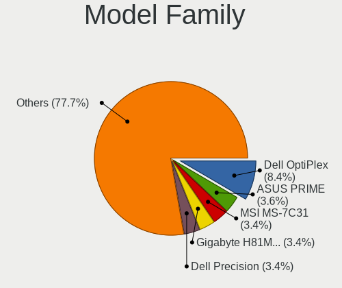

| Name                     | Desktops | Percent |
|--------------------------|----------|---------|
| Dell OptiPlex            | 32       | 10.56%  |
| Dell Precision           | 13       | 4.29%   |
| ASUS PRIME               | 12       | 3.96%   |
| HP Compaq                | 8        | 2.64%   |
| ASUS All                 | 8        | 2.64%   |
| Unknown                  | 7        | 2.31%   |
| HP EliteDesk             | 6        | 1.98%   |
| ASUS ROG                 | 6        | 1.98%   |
| Dell Inspiron            | 5        | 1.65%   |
| ASUS TUF                 | 5        | 1.65%   |
| Dell PowerEdge           | 4        | 1.32%   |
| ASUS M5A78L-M            | 4        | 1.32%   |
| HP Z800                  | 3        | 0.99%   |
| HP ProDesk               | 3        | 0.99%   |
| Gigabyte GA-78LMT-USB3   | 3        | 0.99%   |
| ASRockRack E3C242D4U2-2T | 3        | 0.99%   |
| Supermicro SYS-7048A-T   | 2        | 0.66%   |
| HP Z420                  | 2        | 0.66%   |
| HP Z2                    | 2        | 0.66%   |
| HP ProLiant              | 2        | 0.66%   |
| Gigabyte Z370            | 2        | 0.66%   |
| Gigabyte X570            | 2        | 0.66%   |
| Gigabyte X470            | 2        | 0.66%   |
| Gigabyte H97N-WIFI       | 2        | 0.66%   |
| Gigabyte B360            | 2        | 0.66%   |
| Gigabyte A320M-S2H       | 2        | 0.66%   |
| Gigabyte 970A-DS3P       | 2        | 0.66%   |
| Fujitsu D3401-H1         | 2        | 0.66%   |
| Foxconn Pro              | 2        | 0.66%   |
| Dell Vostro              | 2        | 0.66%   |
| ASUS Pro                 | 2        | 0.66%   |
| ASUS P8Z77-V             | 2        | 0.66%   |
| ASUS M5A99FX             | 2        | 0.66%   |
| ASRock X399              | 2        | 0.66%   |
| Zenith Orion             | 1        | 0.33%   |
| TYAN S5512               | 1        | 0.33%   |
| Supermicro X9SCI         | 1        | 0.33%   |
| Supermicro X8SIL         | 1        | 0.33%   |
| Supermicro X8SAX         | 1        | 0.33%   |
| Supermicro X7DVL         | 1        | 0.33%   |

MFG Year
--------

Motherboard manufacture year

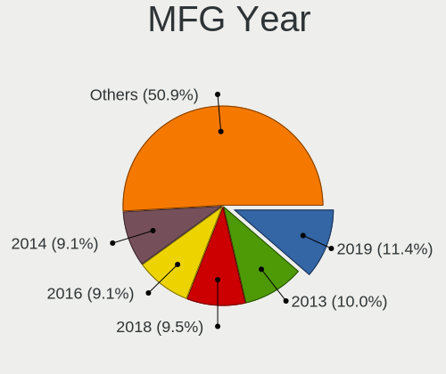

| Year    | Desktops | Percent |
|---------|----------|---------|
| 2019    | 32       | 10.56%  |
| 2012    | 32       | 10.56%  |
| 2018    | 30       | 9.9%    |
| 2013    | 28       | 9.24%   |
| 2016    | 26       | 8.58%   |
| 2014    | 24       | 7.92%   |
| 2010    | 23       | 7.59%   |
| 2011    | 21       | 6.93%   |
| 2017    | 20       | 6.6%    |
| 2015    | 16       | 5.28%   |
| 2020    | 15       | 4.95%   |
| 2008    | 12       | 3.96%   |
| 2009    | 10       | 3.3%    |
| 2021    | 7        | 2.31%   |
| 2007    | 5        | 1.65%   |
| Unknown | 2        | 0.66%   |

Form Factor
-----------

Physical design of the computer

| Name    | Desktops | Percent |
|---------|----------|---------|
| Desktop | 303      | 100%    |

Secure Boot
-----------

Enabled or disabled

| State    | Desktops | Percent |
|----------|----------|---------|
| Disabled | 299      | 98.68%  |
| Enabled  | 4        | 1.32%   |

Coreboot
--------

Have coreboot on board

| Used | Desktops | Percent |
|------|----------|---------|
| No   | 302      | 99.67%  |
| Yes  | 1        | 0.33%   |

RAM Size
--------

Total RAM memory

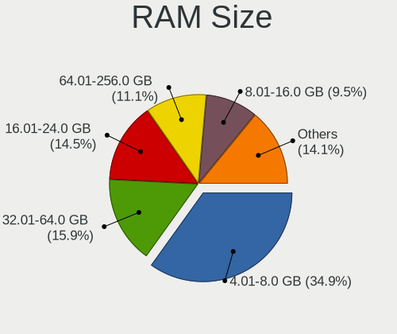

| Size in GB      | Desktops | Percent |
|-----------------|----------|---------|
| 4.01-8.0        | 68       | 22.37%  |
| 32.01-64.0      | 60       | 19.74%  |
| 16.01-24.0      | 60       | 19.74%  |
| 64.01-256.0     | 32       | 10.53%  |
| 8.01-16.0       | 32       | 10.53%  |
| 3.01-4.0        | 30       | 9.87%   |
| 1.01-2.0        | 10       | 3.29%   |
| 24.01-32.0      | 7        | 2.3%    |
| More than 256.0 | 2        | 0.66%   |
| 2.01-3.0        | 2        | 0.66%   |
| 0.51-1.0        | 1        | 0.33%   |

RAM Used
--------

Used RAM memory

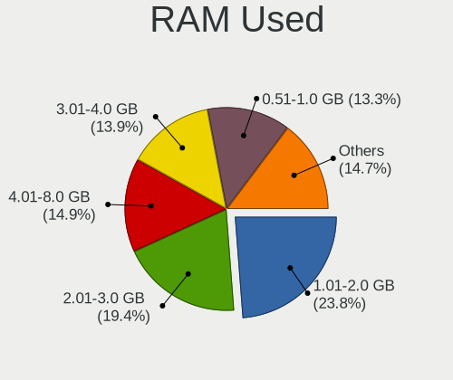

| Used GB     | Desktops | Percent |
|-------------|----------|---------|
| 2.01-3.0    | 69       | 21.1%   |
| 1.01-2.0    | 62       | 18.96%  |
| 4.01-8.0    | 56       | 17.13%  |
| 3.01-4.0    | 50       | 15.29%  |
| 0.51-1.0    | 33       | 10.09%  |
| 8.01-16.0   | 29       | 8.87%   |
| 0.01-0.5    | 12       | 3.67%   |
| 16.01-24.0  | 6        | 1.83%   |
| Unknown     | 6        | 1.83%   |
| 24.01-32.0  | 2        | 0.61%   |
| 32.01-64.0  | 1        | 0.31%   |
| 64.01-256.0 | 1        | 0.31%   |

Total Drives
------------

Number of drives on board

| Drives  | Desktops | Percent |
|---------|----------|---------|
| 1       | 116      | 37.54%  |
| 2       | 74       | 23.95%  |
| 3       | 50       | 16.18%  |
| 4       | 25       | 8.09%   |
| 6       | 10       | 3.24%   |
| 5       | 9        | 2.91%   |
| 7       | 5        | 1.62%   |
| 9       | 3        | 0.97%   |
| 0       | 3        | 0.97%   |
| 19      | 2        | 0.65%   |
| 15      | 2        | 0.65%   |
| 10      | 2        | 0.65%   |
| 8       | 2        | 0.65%   |
| Unknown | 2        | 0.65%   |
| 71      | 1        | 0.32%   |
| 68      | 1        | 0.32%   |
| 13      | 1        | 0.32%   |
| 12      | 1        | 0.32%   |

Has CD-ROM
----------

Has CD-ROM on board

| Presented | Desktops | Percent |
|-----------|----------|---------|
| No        | 174      | 57.24%  |
| Yes       | 130      | 42.76%  |

Has Ethernet
------------

Has Ethernet on board

| Presented | Desktops | Percent |
|-----------|----------|---------|
| Yes       | 301      | 99.34%  |
| No        | 2        | 0.66%   |

Has WiFi
--------

Has WiFi module

| Presented | Desktops | Percent |
|-----------|----------|---------|
| No        | 225      | 73.53%  |
| Yes       | 81       | 26.47%  |

Has Bluetooth
-------------

Has Bluetooth module

| Presented | Desktops | Percent |
|-----------|----------|---------|
| No        | 233      | 76.64%  |
| Yes       | 71       | 23.36%  |

Location
--------

Country
-------

Geographic location (country)

| Country      | Desktops | Percent |
|--------------|----------|---------|
| USA          | 79       | 26.07%  |
| Germany      | 24       | 7.92%   |
| Russia       | 21       | 6.93%   |
| Canada       | 18       | 5.94%   |
| Brazil       | 15       | 4.95%   |
| India        | 14       | 4.62%   |
| UK           | 13       | 4.29%   |
| France       | 12       | 3.96%   |
| Australia    | 8        | 2.64%   |
| Poland       | 7        | 2.31%   |
| Switzerland  | 6        | 1.98%   |
| Finland      | 6        | 1.98%   |
| Ukraine      | 5        | 1.65%   |
| Czechia      | 5        | 1.65%   |
| China        | 5        | 1.65%   |
| Sweden       | 4        | 1.32%   |
| South Korea  | 4        | 1.32%   |
| Netherlands  | 4        | 1.32%   |
| Belgium      | 4        | 1.32%   |
| Turkey       | 3        | 0.99%   |
| Romania      | 3        | 0.99%   |
| Italy        | 3        | 0.99%   |
| Hong Kong    | 3        | 0.99%   |
| Bulgaria     | 3        | 0.99%   |
| Taiwan       | 2        | 0.66%   |
| South Africa | 2        | 0.66%   |
| Portugal     | 2        | 0.66%   |
| Peru         | 2        | 0.66%   |
| Norway       | 2        | 0.66%   |
| Indonesia    | 2        | 0.66%   |
| Thailand     | 1        | 0.33%   |
| Spain        | 1        | 0.33%   |
| Slovenia     | 1        | 0.33%   |
| Slovakia     | 1        | 0.33%   |
| Singapore    | 1        | 0.33%   |
| Serbia       | 1        | 0.33%   |
| Saudi Arabia | 1        | 0.33%   |
| Pakistan     | 1        | 0.33%   |
| Mexico       | 1        | 0.33%   |
| Malaysia     | 1        | 0.33%   |

City
----

Geographic location (city)

| City                 | Desktops | Percent |
|----------------------|----------|---------|
| Rochester            | 16       | 5.19%   |
| Moscow               | 6        | 1.95%   |
| Sydney               | 5        | 1.62%   |
| Alexandria           | 5        | 1.62%   |
| Portland             | 4        | 1.3%    |
| Montreal             | 4        | 1.3%    |
| London               | 4        | 1.3%    |
| Frankfurt am Main    | 4        | 1.3%    |
| Berlin               | 4        | 1.3%    |
| Victoria             | 3        | 0.97%   |
| Vancouver            | 3        | 0.97%   |
| St Petersburg        | 3        | 0.97%   |
| Sao Paulo            | 3        | 0.97%   |
| Paris                | 3        | 0.97%   |
| Munich               | 3        | 0.97%   |
| Kyiv                 | 3        | 0.97%   |
| Helsinki             | 3        | 0.97%   |
| Central              | 3        | 0.97%   |
| Brno                 | 3        | 0.97%   |
| Waxhaw               | 2        | 0.65%   |
| Warsaw               | 2        | 0.65%   |
| Wahroonga            | 2        | 0.65%   |
| Tampa                | 2        | 0.65%   |
| Sundbyberg           | 2        | 0.65%   |
| Prague               | 2        | 0.65%   |
| Lima                 | 2        | 0.65%   |
| Istanbul             | 2        | 0.65%   |
| Hyderabad            | 2        | 0.65%   |
| Ernakulam            | 2        | 0.65%   |
| Brandon              | 2        | 0.65%   |
| Brampton             | 2        | 0.65%   |
| Blanzy-la-Salonnaise | 2        | 0.65%   |
| Bengaluru            | 2        | 0.65%   |
| Zurich               | 1        | 0.32%   |
| Zaporizhzhia         | 1        | 0.32%   |
| Zapopan              | 1        | 0.32%   |
| Yozgat               | 1        | 0.32%   |
| Yekaterinburg        | 1        | 0.32%   |
| Xuhui                | 1        | 0.32%   |
| Wodzisaw lski  | 1        | 0.32%   |

Drives
------

Drive Vendor
------------

Hard drive vendors

| Vendor                    | Desktops | Drives | Percent |
|---------------------------|----------|--------|---------|
| WDC                       | 119      | 288    | 22.58%  |
| Seagate                   | 103      | 332    | 19.54%  |
| Samsung Electronics       | 76       | 147    | 14.42%  |
| Kingston                  | 37       | 43     | 7.02%   |
| Toshiba                   | 28       | 44     | 5.31%   |
| Hitachi                   | 24       | 33     | 4.55%   |
| SanDisk                   | 18       | 22     | 3.42%   |
| Intel                     | 16       | 31     | 3.04%   |
| HGST                      | 10       | 97     | 1.9%    |
| Unknown                   | 8        | 26     | 1.52%   |
| SK hynix                  | 6        | 7      | 1.14%   |
| Crucial                   | 6        | 7      | 1.14%   |
| A-DATA Technology         | 6        | 8      | 1.14%   |
| SPCC                      | 5        | 7      | 0.95%   |
| Silicon Motion            | 5        | 5      | 0.95%   |
| Phison                    | 4        | 5      | 0.76%   |
| OCZ                       | 4        | 5      | 0.76%   |
| Micron Technology         | 4        | 7      | 0.76%   |
| Micron/Crucial Technology | 3        | 4      | 0.57%   |
| Hewlett-Packard           | 3        | 4      | 0.57%   |
| Gigabyte Technology       | 3        | 4      | 0.57%   |
| XPG                       | 2        | 2      | 0.38%   |
| Team                      | 2        | 3      | 0.38%   |
| PNY                       | 2        | 3      | 0.38%   |
| KIOXIA-EXCERIA            | 2        | 3      | 0.38%   |
| Apacer                    | 2        | 2      | 0.38%   |
| WD MediaMax               | 1        | 1      | 0.19%   |
| Verbatim                  | 1        | 1      | 0.19%   |
| V-GeN                     | 1        | 1      | 0.19%   |
| UNIC2                     | 1        | 1      | 0.19%   |
| Transcend                 | 1        | 1      | 0.19%   |
| Sun                       | 1        | 3      | 0.19%   |
| SSSTC                     | 1        | 1      | 0.19%   |
| SATADOM-SL                | 1        | 1      | 0.19%   |
| ROG                       | 1        | 1      | 0.19%   |
| Realtek Semiconductor     | 1        | 1      | 0.19%   |
| Plextor                   | 1        | 1      | 0.19%   |
| Phison Electronics        | 1        | 2      | 0.19%   |
| Patriot                   | 1        | 3      | 0.19%   |
| OWC                       | 1        | 1      | 0.19%   |

Drive Model
-----------

Hard drive models

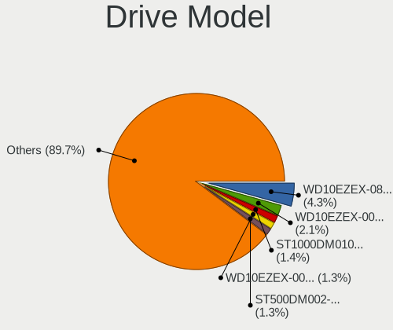

| Model                            | Desktops | Percent |
|----------------------------------|----------|---------|
| Seagate ST500DM002-1BD142 500GB  | 9        | 1.39%   |
| Toshiba DT01ACA100 1TB           | 8        | 1.23%   |
| Toshiba DT01ACA050 500GB         | 8        | 1.23%   |
| WDC WD20EARX-00PASB0 2TB         | 7        | 1.08%   |
| Seagate ST500DM002-1SB10A 500GB  | 7        | 1.08%   |
| Seagate ST1000DM010-2EP102 1TB   | 7        | 1.08%   |
| WDC WD10EZEX-08WN4A0 1TB         | 6        | 0.92%   |
| Seagate ST1000DM003-1CH162 1TB   | 6        | 0.92%   |
| Kingston SA400S37240G 240GB SSD  | 6        | 0.92%   |
| WDC WDS240G2G0A-00JH30 240GB SSD | 4        | 0.62%   |
| WDC WD20EZRZ-00Z5HB0 2TB         | 4        | 0.62%   |
| WDC WD20EZRX-00D8PB0 2TB         | 4        | 0.62%   |
| Seagate ST31000528AS 1TB         | 4        | 0.62%   |
| Seagate ST2000DM006-2DM164 2TB   | 4        | 0.62%   |
| Samsung SSD 860 EVO 250GB        | 4        | 0.62%   |
| Samsung SSD 850 EVO 250GB        | 4        | 0.62%   |
| Samsung HD103SJ 1TB              | 4        | 0.62%   |
| Kingston SA400S37480G 480GB SSD  | 4        | 0.62%   |
| WDC WDS500G2B0A-00SM50 500GB SSD | 3        | 0.46%   |
| WDC WDS250G2B0A-00SM50 250GB SSD | 3        | 0.46%   |
| WDC WD40EZAZ-00SF3B0 4TB         | 3        | 0.46%   |
| WDC WD3200AAKS-75L9A0 320GB      | 3        | 0.46%   |
| WDC WD2003FZEX-00Z4SA0 2TB       | 3        | 0.46%   |
| WDC WD2002FAEX-007BA0 2TB        | 3        | 0.46%   |
| Unknown HUH728080ALE601 8TB      | 3        | 0.46%   |
| Seagate ST6000NM0095 6TB         | 3        | 0.46%   |
| Seagate ST6000NM0034 6TB         | 3        | 0.46%   |
| Seagate ST6000NM0014 6TB         | 3        | 0.46%   |
| Seagate ST4000NXCLAR4000 4TB     | 3        | 0.46%   |
| Seagate ST4000NM0023 4TB         | 3        | 0.46%   |
| Seagate ST3500413AS 500GB        | 3        | 0.46%   |
| Seagate ST31000524AS 1TB         | 3        | 0.46%   |
| Seagate ST2000DM001-9YN164 2TB   | 3        | 0.46%   |
| Seagate ST2000DM001-1ER164 2TB   | 3        | 0.46%   |
| Seagate ST1000DM003-1ER162 1TB   | 3        | 0.46%   |
| Seagate Expansion Desk 2TB       | 3        | 0.46%   |
| Samsung SSD 970 PRO 512GB        | 3        | 0.46%   |
| Samsung SSD 860 EVO 500GB        | 3        | 0.46%   |
| Samsung SSD 860 EVO 1TB          | 3        | 0.46%   |
| Samsung SSD 840 EVO 250GB        | 3        | 0.46%   |

HDD Vendor
----------

Hard disk drive vendors

| Vendor              | Desktops | Drives | Percent |
|---------------------|----------|--------|---------|
| WDC                 | 113      | 268    | 36.93%  |
| Seagate             | 102      | 330    | 33.33%  |
| Toshiba             | 28       | 44     | 9.15%   |
| Hitachi             | 24       | 33     | 7.84%   |
| Samsung Electronics | 16       | 58     | 5.23%   |
| HGST                | 10       | 50     | 3.27%   |
| Unknown             | 4        | 22     | 1.31%   |
| Hewlett-Packard     | 2        | 3      | 0.65%   |
| WD MediaMax         | 1        | 1      | 0.33%   |
| Sun                 | 1        | 3      | 0.33%   |
| Maxtor              | 1        | 1      | 0.33%   |
| Lenovo              | 1        | 2      | 0.33%   |
| Fujitsu             | 1        | 1      | 0.33%   |
| Dell                | 1        | 1      | 0.33%   |
| Apple               | 1        | 1      | 0.33%   |

SSD Vendor
----------

Solid state drive vendors

| Vendor              | Desktops | Drives | Percent |
|---------------------|----------|--------|---------|
| Samsung Electronics | 41       | 58     | 24.7%   |
| Kingston            | 36       | 42     | 21.69%  |
| Intel               | 14       | 27     | 8.43%   |
| WDC                 | 13       | 20     | 7.83%   |
| SanDisk             | 9        | 10     | 5.42%   |
| SK hynix            | 6        | 7      | 3.61%   |
| SPCC                | 5        | 7      | 3.01%   |
| Crucial             | 5        | 6      | 3.01%   |
| OCZ                 | 4        | 5      | 2.41%   |
| A-DATA Technology   | 4        | 5      | 2.41%   |
| Micron Technology   | 3        | 5      | 1.81%   |
| Team                | 2        | 3      | 1.2%    |
| Seagate             | 2        | 2      | 1.2%    |
| PNY                 | 2        | 3      | 1.2%    |
| Apacer              | 2        | 2      | 1.2%    |
| Verbatim            | 1        | 1      | 0.6%    |
| V-GeN               | 1        | 1      | 0.6%    |
| UNIC2               | 1        | 1      | 0.6%    |
| Transcend           | 1        | 1      | 0.6%    |
| SATADOM-SL          | 1        | 1      | 0.6%    |
| Plextor             | 1        | 1      | 0.6%    |
| Patriot             | 1        | 3      | 0.6%    |
| OWC                 | 1        | 1      | 0.6%    |
| LITEONIT            | 1        | 1      | 0.6%    |
| Lexar               | 1        | 1      | 0.6%    |
| KIOXIA-EXCERIA      | 1        | 1      | 0.6%    |
| KingDian            | 1        | 4      | 0.6%    |
| Hewlett-Packard     | 1        | 1      | 0.6%    |
| GLOWAY              | 1        | 1      | 0.6%    |
| Gigabyte Technology | 1        | 2      | 0.6%    |
| Corsair             | 1        | 1      | 0.6%    |
| China               | 1        | 4      | 0.6%    |
| ASMT                | 1        | 1      | 0.6%    |

Drive Kind
----------

HDD or SSD

| Kind    | Desktops | Drives | Percent |
|---------|----------|--------|---------|
| HDD     | 221      | 818    | 52%     |
| SSD     | 139      | 229    | 32.71%  |
| NVMe    | 57       | 80     | 13.41%  |
| MMC     | 4        | 4      | 0.94%   |
| Unknown | 4        | 49     | 0.94%   |

Drive Connector
---------------

SATA, SAS, NVMe, etc.

| Type | Desktops | Drives | Percent |
|------|----------|--------|---------|
| SATA | 273      | 889    | 77.56%  |
| NVMe | 57       | 80     | 16.19%  |
| SAS  | 18       | 207    | 5.11%   |
| MMC  | 4        | 4      | 1.14%   |

Drive Size
----------

Size of hard drive

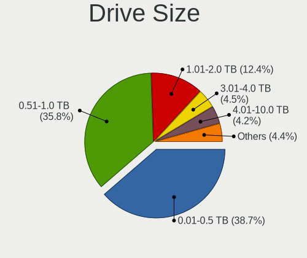

| Size in TB | Desktops | Drives | Percent |
|------------|----------|--------|---------|
| 0.01-0.5   | 194      | 385    | 45.43%  |
| 0.51-1.0   | 118      | 186    | 27.63%  |
| 1.01-2.0   | 52       | 122    | 12.18%  |
| 3.01-4.0   | 21       | 139    | 4.92%   |
| 4.01-10.0  | 20       | 111    | 4.68%   |
| 2.01-3.0   | 15       | 51     | 3.51%   |
| 10.01-20.0 | 7        | 53     | 1.64%   |

Space Total
-----------

Amount of disk space available on the file system

| Size in GB     | Desktops | Percent |
|----------------|----------|---------|
| 251-500        | 62       | 19.87%  |
| 501-1000       | 56       | 17.95%  |
| 101-250        | 53       | 16.99%  |
| More than 3000 | 46       | 14.74%  |
| 1001-2000      | 37       | 11.86%  |
| Unknown        | 16       | 5.13%   |
| 21-50          | 12       | 3.85%   |
| 2001-3000      | 10       | 3.21%   |
| 1-20           | 10       | 3.21%   |
| 51-100         | 10       | 3.21%   |

Space Used
----------

Amount of used disk space

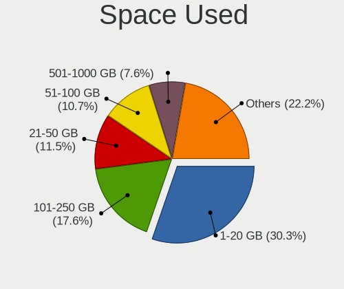

| Used GB        | Desktops | Percent |
|----------------|----------|---------|
| 1-20           | 108      | 34.07%  |
| 21-50          | 42       | 13.25%  |
| 101-250        | 39       | 12.3%   |
| 251-500        | 26       | 8.2%    |
| More than 3000 | 25       | 7.89%   |
| 51-100         | 22       | 6.94%   |
| 501-1000       | 21       | 6.62%   |
| Unknown        | 16       | 5.05%   |
| 1001-2000      | 12       | 3.79%   |
| 2001-3000      | 5        | 1.58%   |
| 0              | 1        | 0.32%   |

Malfunc. Drives
---------------

Drive models with a malfunction

| Model                                       | Desktops | Drives | Percent |
|---------------------------------------------|----------|--------|---------|
| Seagate ST500DM002-1BD142 500GB             | 3        | 3      | 4.92%   |
| Seagate ST2000DM001-9YN164 2TB              | 3        | 3      | 4.92%   |
| WDC WDS240G2G0B-00EPW0 240GB SSD            | 1        | 1      | 1.64%   |
| WDC WD6400AADS-00M2B0 640GB                 | 1        | 1      | 1.64%   |
| WDC WD5000LPVX-22V0TT0 500GB                | 1        | 1      | 1.64%   |
| WDC WD5000AVCS-632DY1 500GB                 | 1        | 1      | 1.64%   |
| WDC WD5000AAKX-08U6AA0 500GB                | 1        | 1      | 1.64%   |
| WDC WD5000AACS-00G8B0 500GB                 | 1        | 1      | 1.64%   |
| WDC WD3200AVVS-63L2B0 320GB                 | 1        | 1      | 1.64%   |
| WDC WD3200AAKS-75L9A0 320GB                 | 1        | 1      | 1.64%   |
| WDC WD2500HHTZ-04N21V0 250GB                | 1        | 1      | 1.64%   |
| WDC WD20EZRZ-00Z5HB0 2TB                    | 1        | 1      | 1.64%   |
| WDC WD20EFRX-68EUZN0 2TB                    | 1        | 4      | 1.64%   |
| WDC WD20EARX-00PASB0 2TB                    | 1        | 1      | 1.64%   |
| WDC WD20EARS-00MVWB0 2TB                    | 1        | 2      | 1.64%   |
| WDC WD10EZEX-60WN4A1 1TB                    | 1        | 1      | 1.64%   |
| WDC WD10EADS-00L5B1 1TB                     | 1        | 1      | 1.64%   |
| WDC WD1003FBYX-01Y7B0 1TB                   | 1        | 1      | 1.64%   |
| WDC WD1002FBYS-18A6B0 1TB                   | 1        | 1      | 1.64%   |
| WDC WD1001FALS-00J7B1 1TB                   | 1        | 1      | 1.64%   |
| WDC RFT030VQFF-KRM5P7 3TB                   | 1        | 1      | 1.64%   |
| Toshiba MK2552GSX 250GB                     | 1        | 1      | 1.64%   |
| SK hynix HFS128G32TND-N210A 128GB SSD       | 1        | 1      | 1.64%   |
| Seagate ST500LT012-1DG142 500GB             | 1        | 1      | 1.64%   |
| Seagate ST380211AS 80GB                     | 1        | 1      | 1.64%   |
| Seagate ST380013AS 80GB                     | 1        | 1      | 1.64%   |
| Seagate ST3400820AS 400GB                   | 1        | 1      | 1.64%   |
| Seagate ST3250820AS 250GB                   | 1        | 1      | 1.64%   |
| Seagate ST3250620NS 250GB                   | 1        | 2      | 1.64%   |
| Seagate ST31000524NS 1TB                    | 1        | 1      | 1.64%   |
| Seagate ST31000340AS 1TB                    | 1        | 1      | 1.64%   |
| Seagate ST3000VM002-1ET166 3TB              | 1        | 1      | 1.64%   |
| Seagate ST1000NX0313 1TB                    | 1        | 1      | 1.64%   |
| Seagate ST1000DM003-1ER162 1TB              | 1        | 1      | 1.64%   |
| Seagate ST1000DM003-1CH162 1TB              | 1        | 2      | 1.64%   |
| SanDisk SDSSDX240GG25 240GB                 | 1        | 1      | 1.64%   |
| Samsung Electronics SSD SM871 2.5 7mm 512GB | 1        | 1      | 1.64%   |
| Samsung Electronics SSD 840 EVO 250GB       | 1        | 1      | 1.64%   |
| Samsung Electronics HD154UI 1TB             | 1        | 1      | 1.64%   |
| Samsung Electronics HD103UI 1TB             | 1        | 1      | 1.64%   |

Malfunc. Drive Vendor
---------------------

Vendors of faulty drives

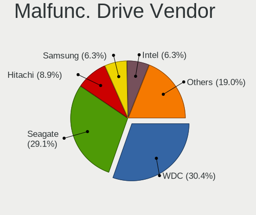

| Vendor              | Desktops | Drives | Percent |
|---------------------|----------|--------|---------|
| Seagate             | 18       | 20     | 30.51%  |
| WDC                 | 17       | 23     | 28.81%  |
| Hitachi             | 6        | 6      | 10.17%  |
| Samsung Electronics | 4        | 4      | 6.78%   |
| Intel               | 4        | 11     | 6.78%   |
| Kingston            | 3        | 3      | 5.08%   |
| HGST                | 2        | 3      | 3.39%   |
| Toshiba             | 1        | 1      | 1.69%   |
| SK hynix            | 1        | 1      | 1.69%   |
| SanDisk             | 1        | 1      | 1.69%   |
| Maxtor              | 1        | 1      | 1.69%   |
| LITEONIT            | 1        | 1      | 1.69%   |

Malfunc. HDD Vendor
-------------------

Vendors of faulty HDD drives

| Vendor              | Desktops | Drives | Percent |
|---------------------|----------|--------|---------|
| Seagate             | 18       | 20     | 39.13%  |
| WDC                 | 16       | 22     | 34.78%  |
| Hitachi             | 6        | 6      | 13.04%  |
| Samsung Electronics | 2        | 2      | 4.35%   |
| HGST                | 2        | 3      | 4.35%   |
| Toshiba             | 1        | 1      | 2.17%   |
| Maxtor              | 1        | 1      | 2.17%   |

Malfunc. Drive Kind
-------------------

Kinds of faulty drives

| Kind | Desktops | Drives | Percent |
|------|----------|--------|---------|
| HDD  | 40       | 55     | 75.47%  |
| SSD  | 13       | 20     | 24.53%  |

Failed Drives
-------------

Failed drive models

| Model                  | Desktops | Drives | Percent |
|------------------------|----------|--------|---------|
| Toshiba DT01ACA100 1TB | 1        | 2      | 100%    |

Failed Drive Vendor
-------------------

Failed drive vendors

| Vendor  | Desktops | Drives | Percent |
|---------|----------|--------|---------|
| Toshiba | 1        | 2      | 100%    |

Drive Status
------------

Number of failed and malfunc. drives

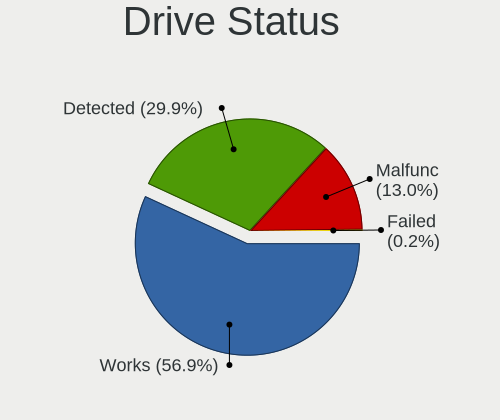

| Status   | Desktops | Drives | Percent |
|----------|----------|--------|---------|
| Works    | 174      | 555    | 49.15%  |
| Detected | 129      | 548    | 36.44%  |
| Malfunc  | 50       | 75     | 14.12%  |
| Failed   | 1        | 2      | 0.28%   |

Storage controller
------------------

Storage Vendor
--------------

Storage controller vendors

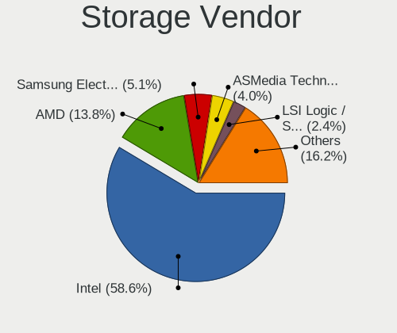

| Vendor                         | Desktops | Percent |
|--------------------------------|----------|---------|
| Intel                          | 223      | 52.84%  |
| AMD                            | 70       | 16.59%  |
| Samsung Electronics            | 27       | 6.4%    |
| ASMedia Technology             | 20       | 4.74%   |
| LSI Logic / Symbios Logic      | 11       | 2.61%   |
| Marvell Technology Group       | 10       | 2.37%   |
| JMicron Technology             | 10       | 2.37%   |
| SanDisk                        | 8        | 1.9%    |
| Phison Electronics             | 7        | 1.66%   |
| Silicon Motion                 | 6        | 1.42%   |
| Broadcom / LSI                 | 6        | 1.42%   |
| Micron/Crucial Technology      | 3        | 0.71%   |
| ADATA Technology               | 3        | 0.71%   |
| Adaptec                        | 3        | 0.71%   |
| Silicon Image                  | 2        | 0.47%   |
| Nvidia                         | 2        | 0.47%   |
| Micron Technology              | 2        | 0.47%   |
| Kingston Technology Company    | 2        | 0.47%   |
| VIA Technologies               | 1        | 0.24%   |
| Solid State Storage Technology | 1        | 0.24%   |
| SK hynix                       | 1        | 0.24%   |
| Realtek Semiconductor          | 1        | 0.24%   |
| KIOXIA                         | 1        | 0.24%   |
| Integrated Technology Express  | 1        | 0.24%   |
| 3ware                          | 1        | 0.24%   |

Storage Model
-------------

Storage controller models

| Model                                                                                   | Desktops | Percent |
|-----------------------------------------------------------------------------------------|----------|---------|
| AMD FCH SATA Controller [AHCI mode]                                                     | 42       | 8.03%   |
| Intel SATA Controller [RAID mode]                                                       | 34       | 6.5%    |
| Intel 8 Series/C220 Series Chipset Family 6-port SATA Controller 1 [AHCI mode]          | 29       | 5.54%   |
| ASMedia ASM1062 Serial ATA Controller                                                   | 18       | 3.44%   |
| Samsung NVMe SSD Controller SM981/PM981/PM983                                           | 16       | 3.06%   |
| Intel Cannon Lake PCH SATA AHCI Controller                                              | 16       | 3.06%   |
| Intel Q170/Q150/B150/H170/H110/Z170/CM236 Chipset SATA Controller [AHCI Mode]           | 15       | 2.87%   |
| Intel 7 Series/C210 Series Chipset Family 6-port SATA Controller [AHCI mode]            | 15       | 2.87%   |
| AMD SB7x0/SB8x0/SB9x0 SATA Controller [AHCI mode]                                       | 13       | 2.49%   |
| Intel 6 Series/C200 Series Chipset Family 6 port Desktop SATA AHCI Controller           | 12       | 2.29%   |
| AMD SB7x0/SB8x0/SB9x0 IDE Controller                                                    | 11       | 2.1%    |
| AMD 400 Series Chipset SATA Controller                                                  | 11       | 2.1%    |
| Intel NM10/ICH7 Family SATA Controller [IDE mode]                                       | 10       | 1.91%   |
| Intel C610/X99 series chipset 6-Port SATA Controller [AHCI mode]                        | 8        | 1.53%   |
| Intel 82801JI (ICH10 Family) SATA AHCI Controller                                       | 8        | 1.53%   |
| Intel 200 Series PCH SATA controller [AHCI mode]                                        | 8        | 1.53%   |
| LSI Logic / Symbios Logic SAS2008 PCI-Express Fusion-MPT SAS-2 [Falcon]                 | 7        | 1.34%   |
| JMicron JMB363 SATA/IDE Controller                                                      | 7        | 1.34%   |
| Intel C610/X99 series chipset sSATA Controller [AHCI mode]                              | 7        | 1.34%   |
| Intel 82801G (ICH7 Family) IDE Controller                                               | 7        | 1.34%   |
| Intel 6 Series/C200 Series Chipset Family Desktop SATA Controller (IDE mode, ports 4-5) | 7        | 1.34%   |
| Intel 6 Series/C200 Series Chipset Family Desktop SATA Controller (IDE mode, ports 0-3) | 7        | 1.34%   |
| AMD FCH SATA Controller D                                                               | 7        | 1.34%   |
| Intel C600/X79 series chipset SATA RAID Controller                                      | 5        | 0.96%   |
| Intel C600/X79 series chipset 6-Port SATA AHCI Controller                               | 5        | 0.96%   |
| Intel 82801JI (ICH10 Family) 4 port SATA IDE Controller #1                              | 5        | 0.96%   |
| Intel 82801JI (ICH10 Family) 2 port SATA IDE Controller #2                              | 5        | 0.96%   |
| Intel 82801IR/IO/IH (ICH9R/DO/DH) 4 port SATA Controller [IDE mode]                     | 5        | 0.96%   |
| Intel 82801I (ICH9 Family) 2 port SATA Controller [IDE mode]                            | 5        | 0.96%   |
| Intel 500 Series Chipset Family SATA AHCI Controller                                    | 5        | 0.96%   |
| Intel 5 Series/3400 Series Chipset 4 port SATA IDE Controller                           | 5        | 0.96%   |
| AMD SB7x0/SB8x0/SB9x0 SATA Controller [IDE mode]                                        | 5        | 0.96%   |
| Samsung NVMe SSD Controller SM961/PM961/SM963                                           | 4        | 0.76%   |
| Intel 9 Series Chipset Family SATA Controller [AHCI Mode]                               | 4        | 0.76%   |
| Intel 5 Series/3400 Series Chipset 2 port SATA IDE Controller                           | 4        | 0.76%   |
| AMD X399 Series Chipset SATA Controller                                                 | 4        | 0.76%   |
| AMD 500 Series Chipset SATA Controller                                                  | 4        | 0.76%   |
| Silicon Motion SM2263EN/SM2263XT SSD Controller                                         | 3        | 0.57%   |
| SanDisk WD Black SN750 / PC SN730 NVMe SSD                                              | 3        | 0.57%   |
| SanDisk WD Black 2018/SN750 / PC SN720 NVMe SSD                                         | 3        | 0.57%   |

Storage Kind
------------

Kind of storage controller (IDE, SATA, NVMe, SAS, ...)

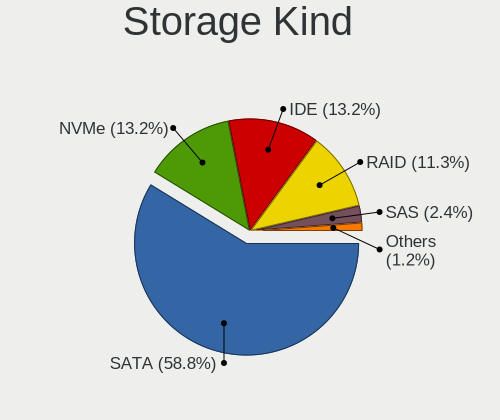

| Kind | Desktops | Percent |
|------|----------|---------|
| SATA | 211      | 52.1%   |
| IDE  | 63       | 15.56%  |
| NVMe | 58       | 14.32%  |
| RAID | 57       | 14.07%  |
| SAS  | 12       | 2.96%   |
| SCSI | 4        | 0.99%   |

Processor
---------

CPU Vendor
----------

Processor vendors

| Vendor | Desktops | Percent |
|--------|----------|---------|
| Intel  | 233      | 76.9%   |
| AMD    | 70       | 23.1%   |

CPU Model
---------

Processor models

| Model                                       | Desktops | Percent |
|---------------------------------------------|----------|---------|
| Intel Core i7-6700 CPU @ 3.40GHz            | 13       | 4.28%   |
| Intel Core i7-4790 CPU @ 3.60GHz            | 8        | 2.63%   |
| Intel Core i5-4590 CPU @ 3.30GHz            | 5        | 1.64%   |
| Intel Core i5-3470 CPU @ 3.20GHz            | 5        | 1.64%   |
| AMD Ryzen 9 3900X 12-Core Processor         | 5        | 1.64%   |
| AMD Ryzen 7 3700X 8-Core Processor          | 5        | 1.64%   |
| AMD Ryzen 5 3600 6-Core Processor           | 5        | 1.64%   |
| Intel Core i7-7700 CPU @ 3.60GHz            | 4        | 1.32%   |
| Intel Core i5-2400 CPU @ 3.10GHz            | 4        | 1.32%   |
| Intel Core 2 Quad CPU Q6600 @ 2.40GHz       | 4        | 1.32%   |
| AMD FX-6300 Six-Core Processor              | 4        | 1.32%   |
| Intel Xeon E-2136 CPU @ 3.30GHz             | 3        | 0.99%   |
| Intel Core i7-8700K CPU @ 3.70GHz           | 3        | 0.99%   |
| Intel Core i7-3770 CPU @ 3.40GHz            | 3        | 0.99%   |
| Intel Core i5-9500 CPU @ 3.00GHz            | 3        | 0.99%   |
| Intel Core i5-3570K CPU @ 3.40GHz           | 3        | 0.99%   |
| Intel Core i5 CPU 760 @ 2.80GHz             | 3        | 0.99%   |
| Intel Core 2 Quad CPU Q9550 @ 2.83GHz       | 3        | 0.99%   |
| Intel Core 2 Duo CPU E7500 @ 2.93GHz        | 3        | 0.99%   |
| AMD Ryzen 5 1600 Six-Core Processor         | 3        | 0.99%   |
| AMD Ryzen 3 2200G with Radeon Vega Graphics | 3        | 0.99%   |
| AMD FX-8350 Eight-Core Processor            | 3        | 0.99%   |
| Intel Xeon E-2224G CPU @ 3.50GHz            | 2        | 0.66%   |
| Intel Xeon CPU X5680 @ 3.33GHz              | 2        | 0.66%   |
| Intel Xeon CPU X5450 @ 3.00GHz              | 2        | 0.66%   |
| Intel Xeon CPU W3530 @ 2.80GHz              | 2        | 0.66%   |
| Intel Xeon CPU E5620 @ 2.40GHz              | 2        | 0.66%   |
| Intel Xeon CPU E5-2620 v4 @ 2.10GHz         | 2        | 0.66%   |
| Intel Xeon CPU E5-2620 v3 @ 2.40GHz         | 2        | 0.66%   |
| Intel Xeon CPU E5-1620 0 @ 3.60GHz          | 2        | 0.66%   |
| Intel Xeon CPU E31270 @ 3.40GHz             | 2        | 0.66%   |
| Intel Pentium Dual-Core CPU E5200 @ 2.50GHz | 2        | 0.66%   |
| Intel Core i9-9900K CPU @ 3.60GHz           | 2        | 0.66%   |
| Intel Core i7-8700 CPU @ 3.20GHz            | 2        | 0.66%   |
| Intel Core i7-7700K CPU @ 4.20GHz           | 2        | 0.66%   |
| Intel Core i7-6700K CPU @ 4.00GHz           | 2        | 0.66%   |
| Intel Core i7-5930K CPU @ 3.50GHz           | 2        | 0.66%   |
| Intel Core i7-4790K CPU @ 4.00GHz           | 2        | 0.66%   |
| Intel Core i7-4770 CPU @ 3.40GHz            | 2        | 0.66%   |
| Intel Core i7-2600K CPU @ 3.40GHz           | 2        | 0.66%   |

CPU Model Family
----------------

Processor model prefix

| Model                   | Desktops | Percent |
|-------------------------|----------|---------|
| Intel Core i7           | 62       | 20.39%  |
| Intel Core i5           | 53       | 17.43%  |
| Intel Xeon              | 49       | 16.12%  |
| Intel Core i3           | 17       | 5.59%   |
| AMD Ryzen 5             | 15       | 4.93%   |
| AMD FX                  | 15       | 4.93%   |
| Intel Core 2 Quad       | 10       | 3.29%   |
| Intel Pentium           | 8        | 2.63%   |
| Intel Core 2 Duo        | 8        | 2.63%   |
| Intel Atom              | 8        | 2.63%   |
| AMD Ryzen 9             | 8        | 2.63%   |
| AMD Ryzen 7             | 8        | 2.63%   |
| Intel Core i9           | 5        | 1.64%   |
| AMD Ryzen 3             | 5        | 1.64%   |
| Intel Pentium Dual-Core | 4        | 1.32%   |
| AMD Ryzen Threadripper  | 4        | 1.32%   |
| Intel Celeron           | 3        | 0.99%   |
| Other                   | 2        | 0.66%   |
| Intel Pentium Dual      | 2        | 0.66%   |
| AMD Turion II Neo       | 2        | 0.66%   |
| AMD Ryzen 7 PRO         | 2        | 0.66%   |
| AMD Phenom II X6        | 2        | 0.66%   |
| AMD A8                  | 2        | 0.66%   |
| AMD A10                 | 2        | 0.66%   |
| Intel Pentium Gold      | 1        | 0.33%   |
| Intel Genuine           | 1        | 0.33%   |
| AMD Phenom II X4        | 1        | 0.33%   |
| AMD Opteron             | 1        | 0.33%   |
| AMD GX                  | 1        | 0.33%   |
| AMD E2                  | 1        | 0.33%   |
| AMD Athlon              | 1        | 0.33%   |
| AMD A4                  | 1        | 0.33%   |

CPU Cores
---------

Number of processor cores

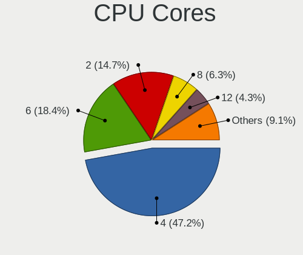

| Number | Desktops | Percent |
|--------|----------|---------|
| 4      | 145      | 47.7%   |
| 2      | 50       | 16.45%  |
| 6      | 46       | 15.13%  |
| 8      | 23       | 7.57%   |
| 12     | 14       | 4.61%   |
| 16     | 9        | 2.96%   |
| 3      | 6        | 1.97%   |
| 1      | 4        | 1.32%   |
| 10     | 3        | 0.99%   |
| 28     | 1        | 0.33%   |
| 20     | 1        | 0.33%   |
| 18     | 1        | 0.33%   |
| 14     | 1        | 0.33%   |

CPU Sockets
-----------

Number of sockets

| Number | Desktops | Percent |
|--------|----------|---------|
| 1      | 287      | 94.72%  |
| 2      | 15       | 4.95%   |
| 0      | 1        | 0.33%   |

CPU Threads
-----------

Threads per core (Hyper-Threading)

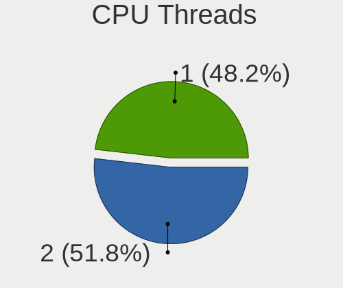

| Number | Desktops | Percent |
|--------|----------|---------|
| 2      | 180      | 59.02%  |
| 1      | 125      | 40.98%  |

CPU Op-Modes
------------

CPU Operation Modes (32-bit, 64-bit)

| Op mode        | Desktops | Percent |
|----------------|----------|---------|
| 32-bit, 64-bit | 291      | 96.04%  |
| Unknown        | 12       | 3.96%   |

CPU Microcode
-------------

Microcode number

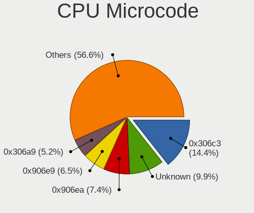

| Number     | Desktops | Percent |
|------------|----------|---------|
| 0x306c3    | 36       | 11.73%  |
| 0x306a9    | 21       | 6.84%   |
| Unknown    | 21       | 6.84%   |
| 0x506e3    | 20       | 6.51%   |
| 0x206a7    | 19       | 6.19%   |
| 0x906ea    | 15       | 4.89%   |
| 0x06000852 | 14       | 4.56%   |
| 0x1067a    | 11       | 3.58%   |
| 0x08701021 | 11       | 3.58%   |
| 0x306f2    | 10       | 3.26%   |
| 0xa0655    | 8        | 2.61%   |
| 0x906e9    | 8        | 2.61%   |
| 0x0800820d | 8        | 2.61%   |
| 0x206c2    | 7        | 2.28%   |
| 0x106e5    | 7        | 2.28%   |
| 0x08701013 | 7        | 2.28%   |
| 0x6fb      | 5        | 1.63%   |
| 0x206d7    | 5        | 1.63%   |
| 0x6fd      | 4        | 1.3%    |
| 0x50654    | 4        | 1.3%    |
| 0x406c4    | 4        | 1.3%    |
| 0x106ca    | 4        | 1.3%    |
| 0x106a5    | 4        | 1.3%    |
| 0x08001137 | 4        | 1.3%    |
| 0xa0653    | 3        | 0.98%   |
| 0x906ed    | 3        | 0.98%   |
| 0x10676    | 3        | 0.98%   |
| 0x08101016 | 3        | 0.98%   |
| 0x03000027 | 3        | 0.98%   |
| 0xa0671    | 2        | 0.65%   |
| 0x406f1    | 2        | 0.65%   |
| 0x40651    | 2        | 0.65%   |
| 0x10677    | 2        | 0.65%   |
| 0x0a201009 | 2        | 0.65%   |
| 0x06001119 | 2        | 0.65%   |
| 0x010000dc | 2        | 0.65%   |
| 0x010000c8 | 2        | 0.65%   |
| 0x906eb    | 1        | 0.33%   |
| 0x506ca    | 1        | 0.33%   |
| 0x50663    | 1        | 0.33%   |

CPU Microarch
-------------

Microarchitecture

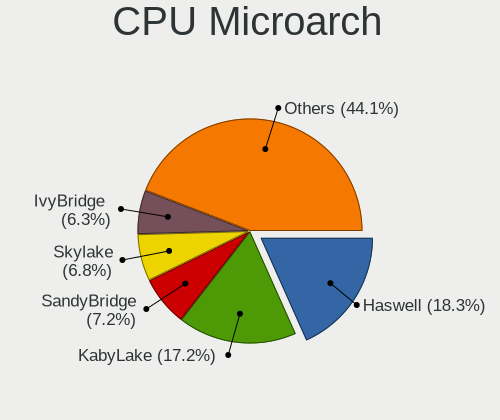

| Name        | Desktops | Percent |
|-------------|----------|---------|
| Haswell     | 48       | 15.79%  |
| Skylake     | 28       | 9.21%   |
| KabyLake    | 28       | 9.21%   |
| SandyBridge | 26       | 8.55%   |
| IvyBridge   | 22       | 7.24%   |
| Zen 2       | 21       | 6.91%   |
| Penryn      | 19       | 6.25%   |
| Piledriver  | 18       | 5.92%   |
| Westmere    | 11       | 3.62%   |
| Nehalem     | 11       | 3.62%   |
| CometLake   | 11       | 3.62%   |
| Zen         | 10       | 3.29%   |
| Zen+        | 9        | 2.96%   |
| Core        | 9        | 2.96%   |
| Silvermont  | 6        | 1.97%   |
| Broadwell   | 6        | 1.97%   |
| K10         | 5        | 1.64%   |
| Bonnell     | 5        | 1.64%   |
| K10 Llano   | 3        | 0.99%   |
| Zen 3       | 2        | 0.66%   |
| Jaguar      | 2        | 0.66%   |
| Icelake     | 1        | 0.33%   |
| Goldmont    | 1        | 0.33%   |
| Bulldozer   | 1        | 0.33%   |
| Unknown     | 1        | 0.33%   |

Graphics
--------

GPU Vendor
----------

Vendors of graphics cards

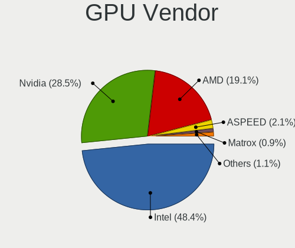

| Vendor                                       | Desktops | Percent |
|----------------------------------------------|----------|---------|
| Intel                                        | 121      | 37.23%  |
| Nvidia                                       | 108      | 33.23%  |
| AMD                                          | 81       | 24.92%  |
| ASPEED Technology                            | 9        | 2.77%   |
| S3 Graphics                                  | 2        | 0.62%   |
| Matrox Electronics Systems                   | 2        | 0.62%   |
| XGI Technology (eXtreme Graphics Innovation) | 1        | 0.31%   |
| Silicon Motion                               | 1        | 0.31%   |

GPU Model
---------

Graphics card models

| Model                                                                                    | Desktops | Percent |
|------------------------------------------------------------------------------------------|----------|---------|
| Intel Xeon E3-1200 v3/4th Gen Core Processor Integrated Graphics Controller              | 21       | 6.36%   |
| Intel HD Graphics 530                                                                    | 14       | 4.24%   |
| AMD Ellesmere [Radeon RX 470/480/570/570X/580/580X/590]                                  | 14       | 4.24%   |
| Nvidia GK208B [GeForce GT 710]                                                           | 13       | 3.94%   |
| Intel 2nd Generation Core Processor Family Integrated Graphics Controller                | 12       | 3.64%   |
| Intel CoffeeLake-S GT2 [UHD Graphics 630]                                                | 11       | 3.33%   |
| ASPEED Technology ASPEED Graphics Family                                                 | 9        | 2.73%   |
| Intel Xeon E3-1200 v2/3rd Gen Core processor Graphics Controller                         | 8        | 2.42%   |
| AMD Oland XT [Radeon HD 8670 / R5 340X OEM / R7 250/350/350X OEM]                        | 8        | 2.42%   |
| Intel IvyBridge GT2 [HD Graphics 4000]                                                   | 7        | 2.12%   |
| AMD Oland [Radeon HD 8570 / R5 430 OEM / R7 240/340 / Radeon 520 OEM]                    | 7        | 2.12%   |
| Nvidia GT218 [GeForce 210]                                                               | 6        | 1.82%   |
| Intel CometLake-S GT2 [UHD Graphics 630]                                                 | 6        | 1.82%   |
| Intel HD Graphics 630                                                                    | 5        | 1.52%   |
| Intel Atom/Celeron/Pentium Processor x5-E8000/J3xxx/N3xxx Integrated Graphics Controller | 5        | 1.52%   |
| Nvidia GP107GL [Quadro P400]                                                             | 4        | 1.21%   |
| Intel Atom Processor D4xx/D5xx/N4xx/N5xx Integrated Graphics Controller                  | 4        | 1.21%   |
| Intel 4 Series Chipset Integrated Graphics Controller                                    | 4        | 1.21%   |
| AMD RS780L [Radeon 3000]                                                                 | 4        | 1.21%   |
| Nvidia GP107 [GeForce GTX 1050 Ti]                                                       | 3        | 0.91%   |
| Nvidia GP106GL [Quadro P2000]                                                            | 3        | 0.91%   |
| Nvidia GP102 [GeForce GTX 1080 Ti]                                                       | 3        | 0.91%   |
| Nvidia GF106 [GeForce GTS 450]                                                           | 3        | 0.91%   |
| Intel 82G33/G31 Express Integrated Graphics Controller                                   | 3        | 0.91%   |
| AMD Raven Ridge [Radeon Vega Series / Radeon Vega Mobile Series]                         | 3        | 0.91%   |
| AMD Caicos [Radeon HD 6450/7450/8450 / R5 230 OEM]                                       | 3        | 0.91%   |
| Nvidia TU106 [GeForce RTX 2060 SUPER]                                                    | 2        | 0.61%   |
| Nvidia TU104 [GeForce RTX 2080 SUPER]                                                    | 2        | 0.61%   |
| Nvidia GT218 [GeForce G210]                                                              | 2        | 0.61%   |
| Nvidia GP107 [GeForce GTX 1050]                                                          | 2        | 0.61%   |
| Nvidia GP104 [GeForce GTX 1080]                                                          | 2        | 0.61%   |
| Nvidia GP104 [GeForce GTX 1070]                                                          | 2        | 0.61%   |
| Nvidia GM200 [GeForce GTX 980 Ti]                                                        | 2        | 0.61%   |
| Nvidia GK107 [NVS 510]                                                                   | 2        | 0.61%   |
| Nvidia GK107 [GeForce GTX 650]                                                           | 2        | 0.61%   |
| Nvidia GK104GL [Quadro K4200]                                                            | 2        | 0.61%   |
| Nvidia GF119 [GeForce GT 610]                                                            | 2        | 0.61%   |
| Nvidia GF108GL [Quadro 600]                                                              | 2        | 0.61%   |
| Nvidia G86 [GeForce 8500 GT]                                                             | 2        | 0.61%   |
| Intel Haswell-ULT Integrated Graphics Controller                                         | 2        | 0.61%   |

GPU Combo
---------

Combinations of graphics cards

| Name                 | Desktops | Percent |
|----------------------|----------|---------|
| 1 x Intel            | 104      | 34.1%   |
| 1 x Nvidia           | 98       | 32.13%  |
| 1 x AMD              | 72       | 23.61%  |
| 1 x ASPEED           | 6        | 1.97%   |
| Intel + AMD          | 4        | 1.31%   |
| 2 x AMD              | 3        | 0.98%   |
| Intel + Nvidia       | 3        | 0.98%   |
| Other                | 2        | 0.66%   |
| 2 x Nvidia           | 2        | 0.66%   |
| 1 x S3 Graphics      | 2        | 0.66%   |
| Nvidia + ASPEED      | 2        | 0.66%   |
| 1 x Matrox           | 2        | 0.66%   |
| 2 x AMD + 1 x ASPEED | 1        | 0.33%   |
| 1 x XGI              | 1        | 0.33%   |
| 1 x Silicon Motion   | 1        | 0.33%   |
| Intel + 2 x Nvidia   | 1        | 0.33%   |
| AMD + Nvidia         | 1        | 0.33%   |

GPU Driver
----------

Free vs proprietary

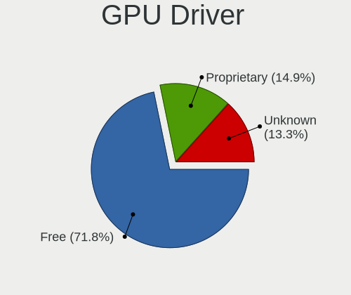

| Driver      | Desktops | Percent |
|-------------|----------|---------|
| Free        | 215      | 69.58%  |
| Proprietary | 53       | 17.15%  |
| Unknown     | 41       | 13.27%  |

GPU Memory
----------

Total video memory

| Size in GB | Desktops | Percent |
|------------|----------|---------|
| Unknown    | 136      | 43.45%  |
| 1.01-2.0   | 52       | 16.61%  |
| 0.51-1.0   | 43       | 13.74%  |
| 0.01-0.5   | 27       | 8.63%   |
| 7.01-8.0   | 23       | 7.35%   |
| 3.01-4.0   | 17       | 5.43%   |
| 5.01-6.0   | 4        | 1.28%   |
| 4.01-5.0   | 4        | 1.28%   |
| 2.01-3.0   | 3        | 0.96%   |
| 8.01-16.0  | 3        | 0.96%   |
| 16.01-24.0 | 1        | 0.32%   |

Monitor
-------

Monitor Vendor
--------------

Monitor vendors

| Vendor                  | Desktops | Percent |
|-------------------------|----------|---------|
| Dell                    | 62       | 22.06%  |
| Samsung Electronics     | 43       | 15.3%   |
| Hewlett-Packard         | 30       | 10.68%  |
| Goldstar                | 28       | 9.96%   |
| Acer                    | 18       | 6.41%   |
| BenQ                    | 12       | 4.27%   |
| Ancor Communications    | 11       | 3.91%   |
| AOC                     | 10       | 3.56%   |
| Philips                 | 9        | 3.2%    |
| ViewSonic               | 8        | 2.85%   |
| LG Electronics          | 6        | 2.14%   |
| Eizo                    | 6        | 2.14%   |
| Iiyama                  | 4        | 1.42%   |
| Unknown                 | 3        | 1.07%   |
| Sony                    | 3        | 1.07%   |
| NEC Computers           | 3        | 1.07%   |
| Xiaomi                  | 2        | 0.71%   |
| Sceptre Tech            | 2        | 0.71%   |
| MStar                   | 2        | 0.71%   |
| Lenovo                  | 2        | 0.71%   |
| HPN                     | 2        | 0.71%   |
| ___                     | 1        | 0.36%   |
| Xerox                   | 1        | 0.36%   |
| Sun                     | 1        | 0.36%   |
| Packard Bell            | 1        | 0.36%   |
| NME                     | 1        | 0.36%   |
| Insignia                | 1        | 0.36%   |
| HannStar Display        | 1        | 0.36%   |
| HannStar                | 1        | 0.36%   |
| GVV                     | 1        | 0.36%   |
| Founder                 | 1        | 0.36%   |
| Chi Mei Optoelectronics | 1        | 0.36%   |
| AUS                     | 1        | 0.36%   |
| ASUSTek Computer        | 1        | 0.36%   |
| Apple                   | 1        | 0.36%   |
| AMW                     | 1        | 0.36%   |

Monitor Model
-------------

Monitor models

| Model                                                                | Desktops | Percent |
|----------------------------------------------------------------------|----------|---------|
| Dell P2414H DELA09A 1920x1080 527x297mm 23.8-inch                    | 7        | 2.19%   |
| Dell P2417H DELA0DB 1920x1080 527x296mm 23.8-inch                    | 6        | 1.88%   |
| Dell U2412M DELA07A 1920x1200 518x324mm 24.1-inch                    | 4        | 1.25%   |
| AOC 2436 AOC2436 1920x1080 521x293mm 23.5-inch                       | 4        | 1.25%   |
| Goldstar ULTRAWIDE GSM59F1 2560x1080 673x284mm 28.8-inch             | 3        | 0.94%   |
| Goldstar Ultra HD GSM5B08 3840x2160 600x340mm 27.2-inch              | 3        | 0.94%   |
| Goldstar FULL HD GSM5B55 1920x1080 480x270mm 21.7-inch               | 3        | 0.94%   |
| Dell P2317H DEL40F4 1920x1080 509x286mm 23.0-inch                    | 3        | 0.94%   |
| Xiaomi Mi TV XMD009A 3440x1440 480x270mm 21.7-inch                   | 2        | 0.63%   |
| Samsung Electronics SyncMaster SAM0372 1680x1050 459x296mm 21.5-inch | 2        | 0.63%   |
| Samsung Electronics SyncMaster SAM01D3 1440x900 408x225mm 18.3-inch  | 2        | 0.63%   |
| Samsung Electronics SMT22A550 SAM07AF 1920x1080 477x268mm 21.5-inch  | 2        | 0.63%   |
| Samsung Electronics C27F390 SAM0D32 1920x1080 600x340mm 27.2-inch    | 2        | 0.63%   |
| MStar Demo MST0030 1920x1080 708x398mm 32.0-inch                     | 2        | 0.63%   |
| Hewlett-Packard ZR2440w HWP2956 1920x1200 518x324mm 24.1-inch        | 2        | 0.63%   |
| Hewlett-Packard LP2465 HWP2676 1920x1200 519x324mm 24.1-inch         | 2        | 0.63%   |
| Goldstar Ultra HD GSM5B09 3840x2160 600x340mm 27.2-inch              | 2        | 0.63%   |
| Goldstar IPS FULLHD GSM5AB7 1920x1080 480x270mm 21.7-inch            | 2        | 0.63%   |
| Goldstar FULL HD GSM5AB9 1920x1080 480x270mm 21.7-inch               | 2        | 0.63%   |
| Goldstar 22EA53 GSM59A5 1920x1080 477x268mm 21.5-inch                | 2        | 0.63%   |
| Dell ST2410 DELA05D 1920x1080 531x299mm 24.0-inch                    | 2        | 0.63%   |
| Dell SE2717H/HX DELD0A1 1920x1080 598x336mm 27.0-inch                | 2        | 0.63%   |
| Dell P2417H DELA0DA 1920x1080 527x296mm 23.8-inch                    | 2        | 0.63%   |
| Dell 2007FP DELA021 1600x1200 367x275mm 18.1-inch                    | 2        | 0.63%   |
| BenQ LCD Monitor GW2283 3840x1080                                    | 2        | 0.63%   |
| BenQ LCD Monitor GW2283                                              | 2        | 0.63%   |
| BenQ GW2765 BNQ78D6 2560x1440 597x336mm 27.0-inch                    | 2        | 0.63%   |
| ___ TV ___9000 1360x768                                              | 1        | 0.31%   |
| Xerox XM7-22w XER08E8 1680x1050 474x296mm 22.0-inch                  | 1        | 0.31%   |
| ViewSonic VX3209-2K VSC328E 2560x1440 698x393mm 31.5-inch            | 1        | 0.31%   |
| ViewSonic VX2450 SERIES VSCE226 1920x1080 525x297mm 23.7-inch        | 1        | 0.31%   |
| ViewSonic VA702b VSC231C 1280x1024 338x270mm 17.0-inch               | 1        | 0.31%   |
| ViewSonic VA2759 Series VSC6832 1920x1080 598x336mm 27.0-inch        | 1        | 0.31%   |
| ViewSonic VA2342 SERIES VSCFA2B 1920x1080 509x286mm 23.0-inch        | 1        | 0.31%   |
| ViewSonic VA2226w-3 VSC2051 1680x1050 490x290mm 22.4-inch            | 1        | 0.31%   |
| ViewSonic VA2210-FHD VSCC536 1920x1080 476x268mm 21.5-inch           | 1        | 0.31%   |
| ViewSonic VA1601W-LED VSC1A25 1366x768 344x193mm 15.5-inch           | 1        | 0.31%   |
| Unknown LCDTV16 9000 1360x768 1600x900mm 72.3-inch                   | 1        | 0.31%   |
| Unknown LCD Monitor XXX AAA 1366x768                                 | 1        | 0.31%   |
| Unknown LCD Monitor BENQ G2200W 5520x2160                            | 1        | 0.31%   |

Monitor Resolution
------------------

Monitor screen resolution

| Resolution         | Desktops | Percent |
|--------------------|----------|---------|
| 1920x1080 (FHD)    | 126      | 44.84%  |
| 3840x2160 (4K)     | 25       | 8.9%    |
| 1920x1200 (WUXGA)  | 18       | 6.41%   |
| 1680x1050 (WSXGA+) | 16       | 5.69%   |
| Unknown            | 16       | 5.69%   |
| 2560x1440 (QHD)    | 14       | 4.98%   |
| 1366x768 (WXGA)    | 10       | 3.56%   |
| 1280x1024 (SXGA)   | 10       | 3.56%   |
| 1600x900 (HD+)     | 7        | 2.49%   |
| 3840x1080          | 6        | 2.14%   |
| 1440x900 (WXGA+)   | 6        | 2.14%   |
| 1600x1200          | 5        | 1.78%   |
| 1024x768 (XGA)     | 4        | 1.42%   |
| 3840x1200          | 3        | 1.07%   |
| 3440x1440          | 3        | 1.07%   |
| 2560x1080          | 3        | 1.07%   |
| 7680x1080          | 1        | 0.36%   |
| 7280x2160          | 1        | 0.36%   |
| 5760x1080          | 1        | 0.36%   |
| 5520x2160          | 1        | 0.36%   |
| 3640x1920          | 1        | 0.36%   |
| 2560x1600          | 1        | 0.36%   |
| 1400x1050          | 1        | 0.36%   |
| 1360x768           | 1        | 0.36%   |
| 1280x960           | 1        | 0.36%   |

Monitor Diagonal
----------------

Diagonal size in inches

| Inches  | Desktops | Percent |
|---------|----------|---------|
| 24      | 54       | 19.08%  |
| 27      | 42       | 14.84%  |
| 21      | 39       | 13.78%  |
| 23      | 35       | 12.37%  |
| Unknown | 34       | 12.01%  |
| 20      | 12       | 4.24%   |
| 19      | 11       | 3.89%   |
| 22      | 10       | 3.53%   |
| 15      | 7        | 2.47%   |
| 18      | 6        | 2.12%   |
| 34      | 4        | 1.41%   |
| 31      | 4        | 1.41%   |
| 17      | 4        | 1.41%   |
| 32      | 3        | 1.06%   |
| 25      | 3        | 1.06%   |
| 84      | 2        | 0.71%   |
| 65      | 2        | 0.71%   |
| 52      | 2        | 0.71%   |
| 40      | 2        | 0.71%   |
| 72      | 1        | 0.35%   |
| 54      | 1        | 0.35%   |
| 49      | 1        | 0.35%   |
| 42      | 1        | 0.35%   |
| 29      | 1        | 0.35%   |
| 26      | 1        | 0.35%   |
| 16      | 1        | 0.35%   |

Monitor Width
-------------

Physical width

| Width in mm | Desktops | Percent |
|-------------|----------|---------|
| 501-600     | 119      | 44.4%   |
| 401-500     | 67       | 25%     |
| Unknown     | 34       | 12.69%  |
| 301-350     | 11       | 4.1%    |
| 601-700     | 10       | 3.73%   |
| 351-400     | 8        | 2.99%   |
| 701-800     | 7        | 2.61%   |
| 1001-1500   | 6        | 2.24%   |
| 1501-2000   | 3        | 1.12%   |
| 801-900     | 2        | 0.75%   |
| 901-1000    | 1        | 0.37%   |

Aspect Ratio
------------

Proportional relationship between the width and the height

| Ratio   | Desktops | Percent |
|---------|----------|---------|
| 16/9    | 159      | 61.87%  |
| 16/10   | 41       | 15.95%  |
| Unknown | 31       | 12.06%  |
| 4/3     | 11       | 4.28%   |
| 5/4     | 10       | 3.89%   |
| 21/9    | 4        | 1.56%   |
| 3/2     | 1        | 0.39%   |

Monitor Area
------------

Area in inch

| Area in inch | Desktops | Percent |
|----------------|----------|---------|
| 201-250        | 103      | 37.18%  |
| 301-350        | 42       | 15.16%  |
| Unknown        | 34       | 12.27%  |
| 151-200        | 33       | 11.91%  |
| 251-300        | 24       | 8.66%   |
| 351-500        | 12       | 4.33%   |
| More than 1000 | 9        | 3.25%   |
| 141-150        | 9        | 3.25%   |
| 101-110        | 6        | 2.17%   |
| 501-1000       | 3        | 1.08%   |
| 111-120        | 2        | 0.72%   |

Pixel Density
-------------

Pixels per inch

| Density | Desktops | Percent |
|---------|----------|---------|
| 51-100  | 155      | 60.08%  |
| 101-120 | 50       | 19.38%  |
| Unknown | 34       | 13.18%  |
| 121-160 | 9        | 3.49%   |
| 1-50    | 5        | 1.94%   |
| 161-240 | 5        | 1.94%   |

Multiple Monitors
-----------------

Total monitors connected

| Total | Desktops | Percent |
|-------|----------|---------|
| 1     | 182      | 58.52%  |
| 0     | 71       | 22.83%  |
| 2     | 49       | 15.76%  |
| 3     | 5        | 1.61%   |
| 4     | 3        | 0.96%   |
| 6     | 1        | 0.32%   |

Network
-------

Net Controller Vendor
---------------------

Controller vendors

| Vendor                      | Desktops | Percent |
|-----------------------------|----------|---------|
| Intel                       | 169      | 40.43%  |
| Realtek Semiconductor       | 141      | 33.73%  |
| Broadcom                    | 25       | 5.98%   |
| Qualcomm Atheros            | 20       | 4.78%   |
| Ralink Technology           | 13       | 3.11%   |
| TP-Link                     | 9        | 2.15%   |
| D-Link System               | 5        | 1.2%    |
| Mellanox Technologies       | 4        | 0.96%   |
| Aquantia                    | 4        | 0.96%   |
| Broadcom Limited            | 3        | 0.72%   |
| D-Link                      | 2        | 0.48%   |
| ASIX Electronics            | 2        | 0.48%   |
| 3Com                        | 2        | 0.48%   |
| Xilinx                      | 1        | 0.24%   |
| Xiaomi                      | 1        | 0.24%   |
| VIA Technologies            | 1        | 0.24%   |
| U-Blox                      | 1        | 0.24%   |
| Spreadtrum Communications   | 1        | 0.24%   |
| Sierra Wireless             | 1        | 0.24%   |
| Samsung Electronics         | 1        | 0.24%   |
| Ralink                      | 1        | 0.24%   |
| MediaTek                    | 1        | 0.24%   |
| Marvell Technology Group    | 1        | 0.24%   |
| LSI                         | 1        | 0.24%   |
| Linux 2.6.31.6 with s3c-udc | 1        | 0.24%   |
| Linksys                     | 1        | 0.24%   |
| ICS Advent                  | 1        | 0.24%   |
| Dresden Elektronik          | 1        | 0.24%   |
| DisplayLink                 | 1        | 0.24%   |
| Cisco Systems               | 1        | 0.24%   |
| Apple                       | 1        | 0.24%   |
| Accton Technology           | 1        | 0.24%   |

Net Controller Model
--------------------

Controller models

| Model                                                             | Desktops | Percent |
|-------------------------------------------------------------------|----------|---------|
| Realtek RTL8111/8168/8411 PCI Express Gigabit Ethernet Controller | 117      | 24.95%  |
| Intel I211 Gigabit Network Connection                             | 24       | 5.12%   |
| Intel Ethernet Connection I217-LM                                 | 20       | 4.26%   |
| Intel 82579LM Gigabit Network Connection (Lewisville)             | 19       | 4.05%   |
| Intel Ethernet Connection (2) I219-LM                             | 18       | 3.84%   |
| Intel 82574L Gigabit Network Connection                           | 14       | 2.99%   |
| Intel Ethernet Connection (2) I219-V                              | 11       | 2.35%   |
| Realtek RTL810xE PCI Express Fast Ethernet controller             | 9        | 1.92%   |
| Intel Wi-Fi 6 AX200                                               | 9        | 1.92%   |
| Intel Dual Band Wireless-AC 3168NGW [Stone Peak]                  | 8        | 1.71%   |
| Intel I210 Gigabit Network Connection                             | 7        | 1.49%   |
| Intel Ethernet Connection (7) I219-LM                             | 7        | 1.49%   |
| Realtek RTL8125 2.5GbE Controller                                 | 6        | 1.28%   |
| Intel Ethernet Connection (2) I218-V                              | 6        | 1.28%   |
| Intel 82579V Gigabit Network Connection                           | 6        | 1.28%   |
| Ralink MT7601U Wireless Adapter                                   | 5        | 1.07%   |
| Broadcom NetXtreme BCM5764M Gigabit Ethernet PCIe                 | 5        | 1.07%   |
| Broadcom BCM4360 802.11ac Wireless Network Adapter                | 5        | 1.07%   |
| Ralink RT5370 Wireless Adapter                                    | 4        | 0.85%   |
| Intel Ethernet Connection (11) I219-LM                            | 4        | 0.85%   |
| Broadcom NetXtreme BCM5761 Gigabit Ethernet PCIe                  | 4        | 0.85%   |
| Aquantia AQC107 NBase-T/IEEE 802.3bz Ethernet Controller [AQtion] | 4        | 0.85%   |
| Realtek RTL-8100/8101L/8139 PCI Fast Ethernet Adapter             | 3        | 0.64%   |
| Qualcomm Atheros AR8131 Gigabit Ethernet                          | 3        | 0.64%   |
| Mellanox MT27500 Family [ConnectX-3]                              | 3        | 0.64%   |
| Intel Wireless-AC 9260                                            | 3        | 0.64%   |
| Intel I350 Gigabit Network Connection                             | 3        | 0.64%   |
| Intel Ethernet Controller X550                                    | 3        | 0.64%   |
| Intel 82580 Gigabit Network Connection                            | 3        | 0.64%   |
| TP-Link TL-WN722N v2/v3 [Realtek RTL8188EUS]                      | 2        | 0.43%   |
| TP-Link Archer T3U [Realtek RTL8812BU]                            | 2        | 0.43%   |
| Realtek RTL8723BU 802.11b/g/n WLAN Adapter                        | 2        | 0.43%   |
| Realtek RTL8192CE PCIe Wireless Network Adapter                   | 2        | 0.43%   |
| Realtek RTL8188CUS 802.11n WLAN Adapter                           | 2        | 0.43%   |
| Realtek RTL8169 PCI Gigabit Ethernet Controller                   | 2        | 0.43%   |
| Realtek RTL8153 Gigabit Ethernet Adapter                          | 2        | 0.43%   |
| Qualcomm Atheros QCA9377 802.11ac Wireless Network Adapter        | 2        | 0.43%   |
| Qualcomm Atheros Killer E2500 Gigabit Ethernet Controller         | 2        | 0.43%   |
| Qualcomm Atheros Killer E220x Gigabit Ethernet Controller         | 2        | 0.43%   |
| Qualcomm Atheros AR9485 Wireless Network Adapter                  | 2        | 0.43%   |

Wireless Vendor
---------------

Wireless vendors

| Vendor                | Desktops | Percent |
|-----------------------|----------|---------|
| Intel                 | 30       | 33.33%  |
| Realtek Semiconductor | 14       | 15.56%  |
| Ralink Technology     | 13       | 14.44%  |
| Qualcomm Atheros      | 10       | 11.11%  |
| TP-Link               | 9        | 10%     |
| Broadcom              | 7        | 7.78%   |
| D-Link                | 2        | 2.22%   |
| Sierra Wireless       | 1        | 1.11%   |
| Ralink                | 1        | 1.11%   |
| MediaTek              | 1        | 1.11%   |
| Linksys               | 1        | 1.11%   |
| D-Link System         | 1        | 1.11%   |

Wireless Model
--------------

Wireless models

| Model                                                                                         | Desktops | Percent |
|-----------------------------------------------------------------------------------------------|----------|---------|
| Intel Wi-Fi 6 AX200                                                                           | 9        | 9.89%   |
| Intel Dual Band Wireless-AC 3168NGW [Stone Peak]                                              | 8        | 8.79%   |
| Ralink MT7601U Wireless Adapter                                                               | 5        | 5.49%   |
| Broadcom BCM4360 802.11ac Wireless Network Adapter                                            | 5        | 5.49%   |
| Ralink RT5370 Wireless Adapter                                                                | 4        | 4.4%    |
| Intel Wireless-AC 9260                                                                        | 3        | 3.3%    |
| TP-Link TL-WN722N v2/v3 [Realtek RTL8188EUS]                                                  | 2        | 2.2%    |
| TP-Link Archer T3U [Realtek RTL8812BU]                                                        | 2        | 2.2%    |
| Realtek RTL8723BU 802.11b/g/n WLAN Adapter                                                    | 2        | 2.2%    |
| Realtek RTL8192CE PCIe Wireless Network Adapter                                               | 2        | 2.2%    |
| Realtek RTL8188CUS 802.11n WLAN Adapter                                                       | 2        | 2.2%    |
| Qualcomm Atheros QCA9377 802.11ac Wireless Network Adapter                                    | 2        | 2.2%    |
| Qualcomm Atheros AR9485 Wireless Network Adapter                                              | 2        | 2.2%    |
| Qualcomm Atheros AR9462 Wireless Network Adapter                                              | 2        | 2.2%    |
| Qualcomm Atheros AR93xx Wireless Network Adapter                                              | 2        | 2.2%    |
| Intel Wireless 8265 / 8275                                                                    | 2        | 2.2%    |
| Intel Wireless 7260                                                                           | 2        | 2.2%    |
| TP-Link TL-WN823N v2/v3 [Realtek RTL8192EU]                                                   | 1        | 1.1%    |
| TP-Link Archer T1U 802.11a/n/ac Wireless Adapter [MediaTek MT7610U]                           | 1        | 1.1%    |
| TP-Link AC600 wireless Realtek RTL8811AU [Archer T2U Nano]                                    | 1        | 1.1%    |
| TP-Link 802.11ac WLAN Adapter                                                                 | 1        | 1.1%    |
| TP-Link 802.11ac NIC                                                                          | 1        | 1.1%    |
| Sierra Wireless AirPrime MC7455 3G/4G LTE Modem                                               | 1        | 1.1%    |
| Realtek RTL8822BE 802.11a/b/g/n/ac WiFi adapter                                               | 1        | 1.1%    |
| Realtek RTL8821CE 802.11ac PCIe Wireless Network Adapter                                      | 1        | 1.1%    |
| Realtek RTL8723BE PCIe Wireless Network Adapter                                               | 1        | 1.1%    |
| Realtek RTL8191SU 802.11n WLAN Adapter                                                        | 1        | 1.1%    |
| Realtek RTL8188SU 802.11n WLAN Adapter                                                        | 1        | 1.1%    |
| Realtek RTL8188EUS 802.11n Wireless Network Adapter                                           | 1        | 1.1%    |
| Realtek Realtek 8812AU/8821AU 802.11ac WLAN Adapter [USB Wireless Dual-Band Adapter 2.4/5Ghz] | 1        | 1.1%    |
| Realtek 802.11ac NIC                                                                          | 1        | 1.1%    |
| Ralink RT5572 Wireless Adapter                                                                | 1        | 1.1%    |
| Ralink RT2870/RT3070 Wireless Adapter                                                         | 1        | 1.1%    |
| Ralink RT2770 Wireless Adapter                                                                | 1        | 1.1%    |
| Ralink MT7610U ("Archer T2U" 2.4G+5G WLAN Adapter                                             | 1        | 1.1%    |
| Ralink RT3090 Wireless 802.11n 1T/1R PCIe                                                     | 1        | 1.1%    |
| Qualcomm Atheros QCA9565 / AR9565 Wireless Network Adapter                                    | 1        | 1.1%    |
| Qualcomm Atheros AR9287 Wireless Network Adapter (PCI-Express)                                | 1        | 1.1%    |
| MediaTek MT7612U 802.11a/b/g/n/ac Wireless Adapter                                            | 1        | 1.1%    |
| Linksys AE6000 802.11a/b/g/n/ac Wireless Adapter [MediaTek MT7610U]                           | 1        | 1.1%    |

Ethernet Vendor
---------------

Ethernet vendors

| Vendor                    | Desktops | Percent |
|---------------------------|----------|---------|
| Intel                     | 155      | 44.93%  |
| Realtek Semiconductor     | 137      | 39.71%  |
| Broadcom                  | 18       | 5.22%   |
| Qualcomm Atheros          | 10       | 2.9%    |
| D-Link System             | 4        | 1.16%   |
| Aquantia                  | 4        | 1.16%   |
| Broadcom Limited          | 3        | 0.87%   |
| ASIX Electronics          | 2        | 0.58%   |
| 3Com                      | 2        | 0.58%   |
| Xiaomi                    | 1        | 0.29%   |
| VIA Technologies          | 1        | 0.29%   |
| Spreadtrum Communications | 1        | 0.29%   |
| Samsung Electronics       | 1        | 0.29%   |
| Marvell Technology Group  | 1        | 0.29%   |
| ICS Advent                | 1        | 0.29%   |
| DisplayLink               | 1        | 0.29%   |
| Cisco Systems             | 1        | 0.29%   |
| Apple                     | 1        | 0.29%   |
| Accton Technology         | 1        | 0.29%   |

Ethernet Model
--------------

Ethernet models

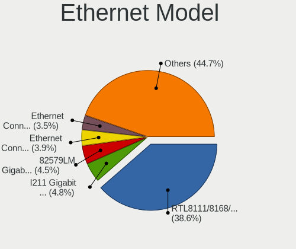

| Model                                                                         | Desktops | Percent |
|-------------------------------------------------------------------------------|----------|---------|
| Realtek RTL8111/8168/8411 PCI Express Gigabit Ethernet Controller             | 117      | 31.71%  |
| Intel I211 Gigabit Network Connection                                         | 24       | 6.5%    |
| Intel Ethernet Connection I217-LM                                             | 20       | 5.42%   |
| Intel 82579LM Gigabit Network Connection (Lewisville)                         | 19       | 5.15%   |
| Intel Ethernet Connection (2) I219-LM                                         | 18       | 4.88%   |
| Intel 82574L Gigabit Network Connection                                       | 14       | 3.79%   |
| Intel Ethernet Connection (2) I219-V                                          | 11       | 2.98%   |
| Realtek RTL810xE PCI Express Fast Ethernet controller                         | 9        | 2.44%   |
| Intel I210 Gigabit Network Connection                                         | 7        | 1.9%    |
| Intel Ethernet Connection (7) I219-LM                                         | 7        | 1.9%    |
| Realtek RTL8125 2.5GbE Controller                                             | 6        | 1.63%   |
| Intel Ethernet Connection (2) I218-V                                          | 6        | 1.63%   |
| Intel 82579V Gigabit Network Connection                                       | 6        | 1.63%   |
| Broadcom NetXtreme BCM5764M Gigabit Ethernet PCIe                             | 5        | 1.36%   |
| Intel Ethernet Connection (11) I219-LM                                        | 4        | 1.08%   |
| Broadcom NetXtreme BCM5761 Gigabit Ethernet PCIe                              | 4        | 1.08%   |
| Aquantia AQC107 NBase-T/IEEE 802.3bz Ethernet Controller [AQtion]             | 4        | 1.08%   |
| Realtek RTL-8100/8101L/8139 PCI Fast Ethernet Adapter                         | 3        | 0.81%   |
| Qualcomm Atheros AR8131 Gigabit Ethernet                                      | 3        | 0.81%   |
| Intel I350 Gigabit Network Connection                                         | 3        | 0.81%   |
| Intel Ethernet Controller X550                                                | 3        | 0.81%   |
| Intel 82580 Gigabit Network Connection                                        | 3        | 0.81%   |
| Realtek RTL8169 PCI Gigabit Ethernet Controller                               | 2        | 0.54%   |
| Realtek RTL8153 Gigabit Ethernet Adapter                                      | 2        | 0.54%   |
| Qualcomm Atheros Killer E2500 Gigabit Ethernet Controller                     | 2        | 0.54%   |
| Qualcomm Atheros Killer E220x Gigabit Ethernet Controller                     | 2        | 0.54%   |
| Intel Ethernet Controller I225-V                                              | 2        | 0.54%   |
| Intel Ethernet Connection I217-V                                              | 2        | 0.54%   |
| Intel Ethernet Connection (7) I219-V                                          | 2        | 0.54%   |
| Intel Ethernet Connection (5) I219-LM                                         | 2        | 0.54%   |
| Intel Ethernet Connection (11) I219-V                                         | 2        | 0.54%   |
| Intel 82571EB/82571GB Gigabit Ethernet Controller D0/D1 (copper applications) | 2        | 0.54%   |
| Intel 82567LM-3 Gigabit Network Connection                                    | 2        | 0.54%   |
| D-Link System DGE-528T Gigabit Ethernet Adapter                               | 2        | 0.54%   |
| Broadcom NetXtreme BCM5755 Gigabit Ethernet PCI Express                       | 2        | 0.54%   |
| Broadcom NetXtreme BCM5723 Gigabit Ethernet PCIe                              | 2        | 0.54%   |
| Broadcom Limited NetXtreme BCM5722 Gigabit Ethernet PCI Express               | 2        | 0.54%   |
| Xiaomi Mi/Redmi series (RNDIS)                                                | 1        | 0.27%   |
| VIA VT6105/VT6106S [Rhine-III]                                                | 1        | 0.27%   |
| Spreadtrum Spreadtrum Phone                                                   | 1        | 0.27%   |

Net Controller Kind
-------------------

Ethernet, WiFi or modem

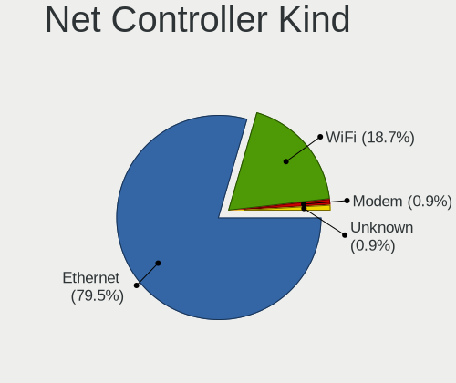

| Kind     | Desktops | Percent |
|----------|----------|---------|
| Ethernet | 301      | 76.79%  |
| WiFi     | 82       | 20.92%  |
| Unknown  | 5        | 1.28%   |
| Modem    | 4        | 1.02%   |

Used Controller
---------------

Currently used network controller

| Kind     | Desktops | Percent |
|----------|----------|---------|
| Ethernet | 281      | 91.23%  |
| WiFi     | 26       | 8.44%   |
| Unknown  | 1        | 0.32%   |

NICs
----

Total network controllers on board

| Total | Desktops | Percent |
|-------|----------|---------|
| 1     | 179      | 58.5%   |
| 2     | 88       | 28.76%  |
| 3     | 23       | 7.52%   |
| 4     | 6        | 1.96%   |
| 5     | 4        | 1.31%   |
| 0     | 3        | 0.98%   |
| 8     | 1        | 0.33%   |
| 7     | 1        | 0.33%   |
| 6     | 1        | 0.33%   |

IPv6
----

IPv6 vs IPv4

| Used | Desktops | Percent |
|------|----------|---------|
| No   | 282      | 92.76%  |
| Yes  | 22       | 7.24%   |

Bluetooth
---------

Bluetooth Vendor
----------------

Controller vendors

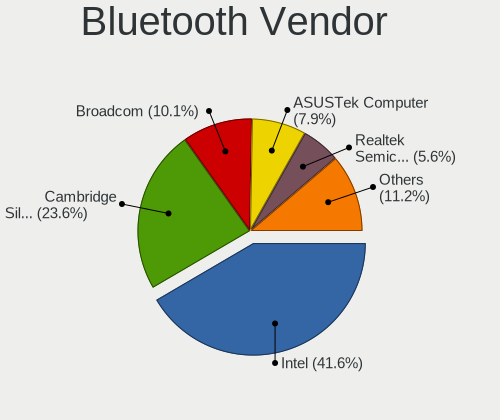

| Vendor                          | Desktops | Percent |
|---------------------------------|----------|---------|
| Intel                           | 27       | 37.5%   |
| Cambridge Silicon Radio         | 21       | 29.17%  |
| Broadcom                        | 9        | 12.5%   |
| ASUSTek Computer                | 6        | 8.33%   |
| Realtek Semiconductor           | 3        | 4.17%   |
| Qualcomm Atheros Communications | 3        | 4.17%   |
| IMC Networks                    | 1        | 1.39%   |
| Dynex                           | 1        | 1.39%   |
| Apple                           | 1        | 1.39%   |

Bluetooth Model
---------------

Controller models

| Model                                                 | Desktops | Percent |
|-------------------------------------------------------|----------|---------|
| Cambridge Silicon Radio Bluetooth Dongle (HCI mode)   | 21       | 29.17%  |
| Intel AX200 Bluetooth                                 | 9        | 12.5%   |
| Intel Wireless-AC 3168 Bluetooth                      | 6        | 8.33%   |
| Intel Bluetooth wireless interface                    | 6        | 8.33%   |
| Broadcom BCM20702A0 Bluetooth 4.0                     | 6        | 8.33%   |
| Intel Wireless-AC 9260 Bluetooth Adapter              | 3        | 4.17%   |
| Realtek Bluetooth Radio                               | 2        | 2.78%   |
| Qualcomm Atheros  Bluetooth Device                    | 2        | 2.78%   |
| ASUS Broadcom BCM20702A0 Bluetooth                    | 2        | 2.78%   |
| ASUS Broadcom BCM20702 Single-Chip Bluetooth 4.0 + LE | 2        | 2.78%   |
| Realtek  Bluetooth 4.2 Adapter                        | 1        | 1.39%   |
| Qualcomm Atheros AR3012 Bluetooth 4.0                 | 1        | 1.39%   |
| Intel Centrino Bluetooth Wireless Transceiver         | 1        | 1.39%   |
| Intel Bluetooth 9460/9560 Jefferson Peak (JfP)        | 1        | 1.39%   |
| Intel AX201 Bluetooth                                 | 1        | 1.39%   |
| IMC Networks Bluetooth Device                         | 1        | 1.39%   |
| Dynex BCM20702A0                                      | 1        | 1.39%   |
| Broadcom BCM92046DG-CL1ROM Bluetooth 2.1 Adapter      | 1        | 1.39%   |
| Broadcom BCM43142A0 Bluetooth 4.0                     | 1        | 1.39%   |
| Broadcom ANYCOM Blue USB-200/250                      | 1        | 1.39%   |
| ASUS Bluetooth Radio                                  | 1        | 1.39%   |
| ASUS BCM20702A0                                       | 1        | 1.39%   |
| Apple Bluetooth USB Host Controller                   | 1        | 1.39%   |

Sound
-----

Sound Vendor
------------

Sound card vendors

| Vendor              | Desktops | Percent |
|---------------------|----------|---------|
| Intel               | 193      | 44.57%  |
| AMD                 | 108      | 24.94%  |
| Nvidia              | 98       | 22.63%  |
| C-Media Electronics | 6        | 1.39%   |
| Logitech            | 5        | 1.15%   |
| Creative Labs       | 5        | 1.15%   |
| Texas Instruments   | 4        | 0.92%   |
| Plantronics         | 2        | 0.46%   |
| Creative Technology | 2        | 0.46%   |
| SteelSeries ApS     | 1        | 0.23%   |
| NEC Computers       | 1        | 0.23%   |
| Lynx                | 1        | 0.23%   |
| JMTek               | 1        | 0.23%   |
| GN Netcom           | 1        | 0.23%   |
| Fry's Electronics   | 1        | 0.23%   |
| Ensoniq             | 1        | 0.23%   |
| Corsair             | 1        | 0.23%   |
| Avid Technology     | 1        | 0.23%   |
| ASUSTek Computer    | 1        | 0.23%   |

Sound Model
-----------

Sound card models

| Model                                                                             | Desktops | Percent |
|-----------------------------------------------------------------------------------|----------|---------|
| Intel 8 Series/C220 Series Chipset High Definition Audio Controller               | 28       | 5.65%   |
| Intel 100 Series/C230 Series Chipset Family HD Audio Controller                   | 24       | 4.84%   |
| AMD Oland/Hainan/Cape Verde/Pitcairn HDMI Audio [Radeon HD 7000 Series]           | 23       | 4.64%   |
| AMD Starship/Matisse HD Audio Controller                                          | 22       | 4.44%   |
| Intel Xeon E3-1200 v3/4th Gen Core Processor HD Audio Controller                  | 21       | 4.23%   |
| Intel 7 Series/C216 Chipset Family High Definition Audio Controller               | 20       | 4.03%   |
| AMD SBx00 Azalia (Intel HDA)                                                      | 18       | 3.63%   |
| Intel 6 Series/C200 Series Chipset Family High Definition Audio Controller        | 17       | 3.43%   |
| Intel 82801JI (ICH10 Family) HD Audio Controller                                  | 16       | 3.23%   |
| AMD Family 17h (Models 00h-0fh) HD Audio Controller                               | 16       | 3.23%   |
| Nvidia GK208 HDMI/DP Audio Controller                                             | 15       | 3.02%   |
| AMD Ellesmere HDMI Audio [Radeon RX 470/480 / 570/580/590]                        | 14       | 2.82%   |
| Nvidia High Definition Audio Controller                                           | 11       | 2.22%   |
| Nvidia GP107GL High Definition Audio Controller                                   | 11       | 2.22%   |
| Intel Cannon Lake PCH cAVS                                                        | 11       | 2.22%   |
| Intel C610/X99 series chipset HD Audio Controller                                 | 11       | 2.22%   |
| Intel 200 Series PCH HD Audio                                                     | 10       | 2.02%   |
| Intel NM10/ICH7 Family High Definition Audio Controller                           | 8        | 1.61%   |
| Intel 5 Series/3400 Series Chipset High Definition Audio                          | 7        | 1.41%   |
| AMD FCH Azalia Controller                                                         | 7        | 1.41%   |
| Nvidia TU104 HD Audio Controller                                                  | 6        | 1.21%   |
| Nvidia GP106 High Definition Audio Controller                                     | 6        | 1.21%   |
| Nvidia GK107 HDMI Audio Controller                                                | 6        | 1.21%   |
| Intel Comet Lake PCH cAVS                                                         | 6        | 1.21%   |
| Intel 9 Series Chipset Family HD Audio Controller                                 | 6        | 1.21%   |
| Intel 82801I (ICH9 Family) HD Audio Controller                                    | 6        | 1.21%   |
| Nvidia GP104 High Definition Audio Controller                                     | 5        | 1.01%   |
| Intel C600/X79 series chipset High Definition Audio Controller                    | 5        | 1.01%   |
| AMD Caicos HDMI Audio [Radeon HD 6450 / 7450/8450/8490 OEM / R5 230/235/235X OEM] | 5        | 1.01%   |
| AMD Baffin HDMI/DP Audio [Radeon RX 550 640SP / RX 560/560X]                      | 5        | 1.01%   |
| Nvidia GF119 HDMI Audio Controller                                                | 4        | 0.81%   |
| Nvidia GF108 High Definition Audio Controller                                     | 4        | 0.81%   |
| Nvidia GF106 High Definition Audio Controller                                     | 4        | 0.81%   |
| AMD RS780 HDMI Audio [Radeon 3000/3100 / HD 3200/3300]                            | 4        | 0.81%   |
| AMD Family 17h/19h HD Audio Controller                                            | 4        | 0.81%   |
| Nvidia TU106 High Definition Audio Controller                                     | 3        | 0.6%    |
| Nvidia GP102 HDMI Audio Controller                                                | 3        | 0.6%    |
| Nvidia GK104 HDMI Audio Controller                                                | 3        | 0.6%    |
| Intel Audio device                                                                | 3        | 0.6%    |
| C-Media Electronics CMI8788 [Oxygen HD Audio]                                     | 3        | 0.6%    |

Memory
------

Memory Vendor
-------------

Memory module vendors

| Vendor              | Desktops | Percent |
|---------------------|----------|---------|
| Kingston            | 39       | 16.96%  |
| Unknown             | 37       | 16.09%  |
| SK hynix            | 34       | 14.78%  |
| Samsung Electronics | 33       | 14.35%  |
| Crucial             | 22       | 9.57%   |
| Micron Technology   | 21       | 9.13%   |
| Corsair             | 14       | 6.09%   |
| G.Skill             | 8        | 3.48%   |
| Team                | 5        | 2.17%   |
| A-DATA Technology   | 4        | 1.74%   |
| Patriot             | 3        | 1.3%    |
| Transcend           | 2        | 0.87%   |
| Nanya Technology    | 2        | 0.87%   |
| Unknown (9B0D)      | 1        | 0.43%   |
| TwinMOS             | 1        | 0.43%   |
| Ramaxel Technology  | 1        | 0.43%   |
| Mushkin             | 1        | 0.43%   |
| Elpida              | 1        | 0.43%   |
| Apacer              | 1        | 0.43%   |

Memory Model
------------

Memory module models

| Model                                                     | Desktops | Percent |
|-----------------------------------------------------------|----------|---------|
| Samsung RAM M378B5173QH0-YK0 4GB DIMM DDR3 1600MT/s       | 6        | 2.36%   |
| Micron RAM 4ATF51264AZ-2G3B1 4GB DIMM DDR4 2800MT/s       | 4        | 1.57%   |
| Crucial RAM CT16G4DFD824A.C16FDD 16GB DIMM DDR4 2400MT/s  | 4        | 1.57%   |
| Unknown RAM Module 4096MB DIMM 1333MT/s                   | 3        | 1.18%   |
| Micron RAM 8JTF51264AZ-1G6E1 4GB DIMM DDR3 1600MT/s       | 3        | 1.18%   |
| Unknown RAM Module 8GB DIMM 1600MT/s                      | 2        | 0.79%   |
| Unknown RAM Module 8192MB DIMM 1333MT/s                   | 2        | 0.79%   |
| Unknown RAM Module 4GB DIMM 1333MT/s                      | 2        | 0.79%   |
| Unknown RAM Module 2GB DIMM SDRAM                         | 2        | 0.79%   |
| Unknown RAM Module 2048MB DIMM DDR2                       | 2        | 0.79%   |
| SK hynix RAM Module 2048MB DIMM DDR3 1600MT/s             | 2        | 0.79%   |
| SK hynix RAM Module 16GB DIMM DDR4 3200MT/s               | 2        | 0.79%   |
| SK hynix RAM HMT451U6BFR8A-PB 4GB DIMM DDR3 1600MT/s      | 2        | 0.79%   |
| SK hynix RAM HMT451S6BFR8A-PB 4096MB SODIMM DDR3 1600MT/s | 2        | 0.79%   |
| SK hynix RAM HMT351U6CFR8C-PB 4GB DIMM DDR3 1800MT/s      | 2        | 0.79%   |
| Samsung RAM Module 8192MB DIMM DDR4 3200MT/s              | 2        | 0.79%   |
| Nanya RAM NT2GC64B8HC0NF-CG 2048MB DIMM 1333MT/s          | 2        | 0.79%   |
| Micron RAM 8ATF1G64AZ-2G3E1 8GB DIMM DDR4 2400MT/s        | 2        | 0.79%   |
| Micron RAM 18ASF2G72AZ-2G6D1 16GB DIMM DDR4 2667MT/s      | 2        | 0.79%   |
| Kingston RAM KHX2666C16/8G 8GB DIMM DDR4 3466MT/s         | 2        | 0.79%   |
| Kingston RAM KHX1600C9D3/4GX 4GB DIMM DDR3 2400MT/s       | 2        | 0.79%   |
| Kingston RAM 99U5471-012.A00LF 4096MB DIMM DDR3 1600MT/s  | 2        | 0.79%   |
| Crucial RAM CT8G4DFD824A.C16FBD1 8GB DIMM DDR4 2400MT/s   | 2        | 0.79%   |
| Crucial RAM BLS16G4D26BFSE.16FD 16GB DIMM DDR4 2666MT/s   | 2        | 0.79%   |
| Corsair RAM CMZ16GX3M2A1600C10 8192MB DIMM DDR3 1600MT/s  | 2        | 0.79%   |
| A-DATA RAM DDR4 2666 2OZ 8192MB DIMM DDR4 2667MT/s        | 2        | 0.79%   |
| Unknown RAM Module 8GB SODIMM DDR3 1600MT/s               | 1        | 0.39%   |
| Unknown RAM Module 8GB DIMM DDR3 1600MT/s                 | 1        | 0.39%   |
| Unknown RAM Module 8192MB DIMM DDR3 1600MT/s              | 1        | 0.39%   |
| Unknown RAM Module 8192MB DIMM DDR3 1333MT/s              | 1        | 0.39%   |
| Unknown RAM Module 8192MB DIMM 1600MT/s                   | 1        | 0.39%   |
| Unknown RAM Module 4GB DIMM DDR 1333MT/s                  | 1        | 0.39%   |
| Unknown RAM Module 4096MB DIMM DDR3 1333MT/s              | 1        | 0.39%   |
| Unknown RAM Module 4096MB DIMM DDR 1333MT/s               | 1        | 0.39%   |
| Unknown RAM Module 4096MB DIMM 800MT/s                    | 1        | 0.39%   |
| Unknown RAM Module 4096MB DIMM 400MT/s                    | 1        | 0.39%   |
| Unknown RAM Module 4096MB DIMM 1600MT/s                   | 1        | 0.39%   |
| Unknown RAM Module 4096MB DIMM                            | 1        | 0.39%   |
| Unknown RAM Module 32GB DIMM DDR4 3200MT/s                | 1        | 0.39%   |
| Unknown RAM Module 2GB SODIMM DDR3 800MT/s                | 1        | 0.39%   |

Memory Kind
-----------

Memory module kinds

| Kind    | Desktops | Percent |
|---------|----------|---------|
| DDR3    | 83       | 41.29%  |
| DDR4    | 81       | 40.3%   |
| Unknown | 20       | 9.95%   |
| DDR2    | 10       | 4.98%   |
| SDRAM   | 3        | 1.49%   |
| DDR     | 3        | 1.49%   |
| LPDDR4  | 1        | 0.5%    |

Memory Form Factor
------------------

Physical design of the memory module

| Name   | Desktops | Percent |
|--------|----------|---------|
| DIMM   | 187      | 93.03%  |
| SODIMM | 12       | 5.97%   |
| RIMM   | 2        | 1%      |

Memory Size
-----------

Memory module size

| Size  | Desktops | Percent |
|-------|----------|---------|
| 4096  | 69       | 31.51%  |
| 8192  | 67       | 30.59%  |
| 16384 | 36       | 16.44%  |
| 2048  | 31       | 14.16%  |
| 32768 | 9        | 4.11%   |
| 1024  | 6        | 2.74%   |
| 512   | 1        | 0.46%   |

Memory Speed
------------

Memory module speed

| Speed   | Desktops | Percent |
|---------|----------|---------|
| 1600    | 49       | 22.79%  |
| 1333    | 39       | 18.14%  |
| 2400    | 24       | 11.16%  |
| 2667    | 16       | 7.44%   |
| 3200    | 11       | 5.12%   |
| 2133    | 11       | 5.12%   |
| 800     | 9        | 4.19%   |
| 667     | 8        | 3.72%   |
| 3600    | 6        | 2.79%   |
| 2666    | 6        | 2.79%   |
| 2800    | 5        | 2.33%   |
| Unknown | 5        | 2.33%   |
| 1800    | 4        | 1.86%   |
| 3466    | 3        | 1.4%    |
| 2134    | 2        | 0.93%   |
| 2000    | 2        | 0.93%   |
| 1867    | 2        | 0.93%   |
| 1866    | 2        | 0.93%   |
| 400     | 2        | 0.93%   |
| 4333    | 1        | 0.47%   |
| 3733    | 1        | 0.47%   |
| 3500    | 1        | 0.47%   |
| 3100    | 1        | 0.47%   |
| 3000    | 1        | 0.47%   |
| 2733    | 1        | 0.47%   |
| 2465    | 1        | 0.47%   |
| 2048    | 1        | 0.47%   |
| 1067    | 1        | 0.47%   |

Printers & scanners
-------------------

Printer Vendor
--------------

Printer device vendors

| Vendor             | Desktops | Percent |
|--------------------|----------|---------|
| Hewlett-Packard    | 6        | 54.55%  |
| Brother Industries | 3        | 27.27%  |
| Kyocera            | 1        | 9.09%   |
| Canon              | 1        | 9.09%   |

Printer Model
-------------

Printer device models

| Model                    | Desktops | Percent |
|--------------------------|----------|---------|
| HP DeskJet 2130 series   | 2        | 18.18%  |
| Kyocera FS-1030D printer | 1        | 9.09%   |
| HP Smart Install         | 1        | 9.09%   |
| HP LaserJet 400 M401dne  | 1        | 9.09%   |
| HP LaserJet 3030         | 1        | 9.09%   |
| HP LaserJet 1020         | 1        | 9.09%   |
| Canon MF210 Series       | 1        | 9.09%   |
| Brother MFC-J450DW       | 1        | 9.09%   |
| Brother MFC-9130CW       | 1        | 9.09%   |
| Brother HL-L2390DW       | 1        | 9.09%   |

Scanner Vendor
--------------

Scanner device vendors

| Vendor | Desktops | Percent |
|--------|----------|---------|
| Canon  | 1        | 100%    |

Scanner Model
-------------

Scanner device models

| Model                   | Desktops | Percent |
|-------------------------|----------|---------|
| Canon CanoScan LiDE 110 | 1        | 100%    |

Camera
------

Camera Vendor
-------------

Camera device vendors

| Vendor                  | Desktops | Percent |
|-------------------------|----------|---------|
| Logitech                | 12       | 42.86%  |
| Microdia                | 4        | 14.29%  |
| Samsung Electronics     | 2        | 7.14%   |
| Realtek Semiconductor   | 2        | 7.14%   |
| Lenovo                  | 2        | 7.14%   |
| Z-Star Microelectronics | 1        | 3.57%   |
| Microsoft               | 1        | 3.57%   |
| Generalplus Technology  | 1        | 3.57%   |
| Cubeternet              | 1        | 3.57%   |
| Creative Technology     | 1        | 3.57%   |
| Chicony Electronics     | 1        | 3.57%   |

Camera Model
------------

Camera device models

| Model                                       | Desktops | Percent |
|---------------------------------------------|----------|---------|
| Logitech HD Pro Webcam C920                 | 4        | 14.29%  |
| Logitech HD Webcam C615                     | 3        | 10.71%  |
| Samsung Galaxy A5 (MTP)                     | 2        | 7.14%   |
| Microdia Defender G-Lens 2577 HD720p Camera | 2        | 7.14%   |
| Microdia Camera                             | 2        | 7.14%   |
| Logitech Webcam C270                        | 2        | 7.14%   |
| Lenovo FHD Webcam                           | 2        | 7.14%   |
| Z-Star Venus USB2.0 Camera                  | 1        | 3.57%   |
| Realtek Web Camera                          | 1        | 3.57%   |
| Realtek Laptop_Integrated_Webcam_FHD        | 1        | 3.57%   |
| Microsoft LifeCam HD-5000                   | 1        | 3.57%   |
| Logitech Webcam C930e                       | 1        | 3.57%   |
| Logitech Webcam C310                        | 1        | 3.57%   |
| Logitech StreamCam                          | 1        | 3.57%   |
| Generalplus 808 Camera #9 (web-cam mode)    | 1        | 3.57%   |
| Cubeternet USB2.0 Camera                    | 1        | 3.57%   |
| Creative Live! Cam Chat HD [VF0700]         | 1        | 3.57%   |
| Chicony HP Integrated Webcam                | 1        | 3.57%   |

Security
--------

Fingerprint Vendor
------------------

Fingerprint sensor vendors

Zero info for selected period =(

Fingerprint Model
-----------------

Fingerprint sensor models

Zero info for selected period =(

Chipcard Vendor
---------------

Chipcard module vendors

| Vendor              | Desktops | Percent |
|---------------------|----------|---------|
| SCM Microsystems    | 2        | 40%     |
| Giesecke & Devrient | 2        | 40%     |
| Cherry              | 1        | 20%     |

Chipcard Model
--------------

Chipcard module models

| Model                                                      | Desktops | Percent |
|------------------------------------------------------------|----------|---------|
| Giesecke & Devrient StarSign CUT S                         | 2        | 40%     |
| SCM Microsystems SCR3340 - ExpressCard54 Smart Card Reader | 1        | 20%     |
| SCM Microsystems SCR331-LC1 / SCR3310 SmartCard Reader     | 1        | 20%     |
| Cherry SmartCard Reader Keyboard KC 1000 SC                | 1        | 20%     |

Unsupported
-----------

Unsupported Devices
-------------------

Total unsupported devices on board

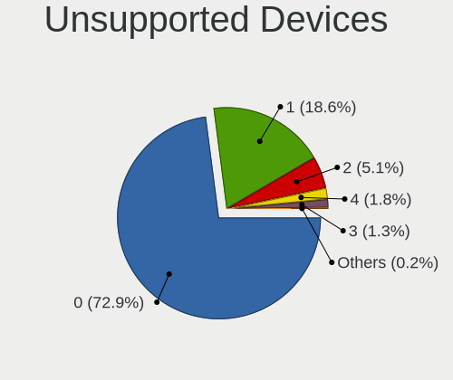

| Total | Desktops | Percent |
|-------|----------|---------|
| 0     | 220      | 70.97%  |
| 1     | 67       | 21.61%  |
| 2     | 16       | 5.16%   |
| 4     | 4        | 1.29%   |
| 3     | 3        | 0.97%   |

Unsupported Device Types
------------------------

Types of unsupported devices

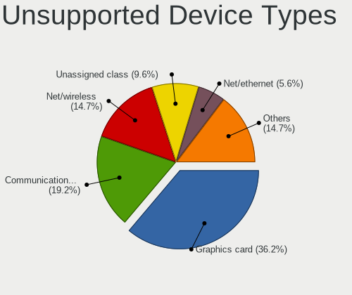

| Type                     | Desktops | Percent |
|--------------------------|----------|---------|
| Graphics card            | 40       | 33.61%  |
| Communication controller | 19       | 15.97%  |
| Net/wireless             | 18       | 15.13%  |
| Unassigned class         | 15       | 12.61%  |
| Storage/ide              | 7        | 5.88%   |
| Net/ethernet             | 6        | 5.04%   |
| Sound                    | 4        | 3.36%   |
| Network                  | 3        | 2.52%   |
| Storage/raid             | 1        | 0.84%   |
| Storage/ata              | 1        | 0.84%   |
| Multimedia controller    | 1        | 0.84%   |
| Modem                    | 1        | 0.84%   |
| Dvb card                 | 1        | 0.84%   |
| Card reader              | 1        | 0.84%   |
| Bluetooth                | 1        | 0.84%   |

