CentOS - Tested Hardware & Statistics (Notebooks)
-------------------------------------------------

A project to collect tested hardware configurations for CentOS.

Anyone can contribute to this report by the [hw-probe](https://github.com/linuxhw/hw-probe) tool:

    sudo -E hw-probe -all -upload

Please contribute! Especially if your hardware is rare.

Contents
--------

* [ Test Cases ](#test-cases)

* [ System ](#system)
  - [ OS                       ](#os)
  - [ OS Family                ](#os-family)
  - [ Kernel                   ](#kernel)
  - [ Kernel Family            ](#kernel-family)
  - [ Kernel Major Ver.        ](#kernel-major-ver)
  - [ Arch                     ](#arch)
  - [ DE                       ](#de)
  - [ Display Server           ](#display-server)
  - [ Display Manager          ](#display-manager)
  - [ OS Lang                  ](#os-lang)
  - [ Boot Mode                ](#boot-mode)
  - [ Filesystem               ](#filesystem)
  - [ Part. scheme             ](#part-scheme)
  - [ Dual Boot with Linux/BSD ](#dual-boot-with-linuxbsd)
  - [ Dual Boot (Win)          ](#dual-boot-win)

* [ Board ](#board)
  - [ Vendor                   ](#vendor)
  - [ Model                    ](#model)
  - [ Model Family             ](#model-family)
  - [ MFG Year                 ](#mfg-year)
  - [ Form Factor              ](#form-factor)
  - [ Secure Boot              ](#secure-boot)
  - [ Coreboot                 ](#coreboot)
  - [ RAM Size                 ](#ram-size)
  - [ RAM Used                 ](#ram-used)
  - [ Total Drives             ](#total-drives)
  - [ Has CD-ROM               ](#has-cd-rom)
  - [ Has Ethernet             ](#has-ethernet)
  - [ Has WiFi                 ](#has-wifi)
  - [ Has Bluetooth            ](#has-bluetooth)

* [ Location ](#location)
  - [ Country                  ](#country)
  - [ City                     ](#city)

* [ Drives ](#drives)
  - [ Drive Vendor             ](#drive-vendor)
  - [ Drive Model              ](#drive-model)
  - [ HDD Vendor               ](#hdd-vendor)
  - [ SSD Vendor               ](#ssd-vendor)
  - [ Drive Kind               ](#drive-kind)
  - [ Drive Connector          ](#drive-connector)
  - [ Drive Size               ](#drive-size)
  - [ Space Total              ](#space-total)
  - [ Space Used               ](#space-used)
  - [ Malfunc. Drives          ](#malfunc-drives)
  - [ Malfunc. Drive Vendor    ](#malfunc-drive-vendor)
  - [ Malfunc. HDD Vendor      ](#malfunc-hdd-vendor)
  - [ Malfunc. Drive Kind      ](#malfunc-drive-kind)
  - [ Failed Drives            ](#failed-drives)
  - [ Failed Drive Vendor      ](#failed-drive-vendor)
  - [ Drive Status             ](#drive-status)

* [ Storage controller ](#storage-controller)
  - [ Storage Vendor           ](#storage-vendor)
  - [ Storage Model            ](#storage-model)
  - [ Storage Kind             ](#storage-kind)

* [ Processor ](#processor)
  - [ CPU Vendor               ](#cpu-vendor)
  - [ CPU Model                ](#cpu-model)
  - [ CPU Model Family         ](#cpu-model-family)
  - [ CPU Cores                ](#cpu-cores)
  - [ CPU Sockets              ](#cpu-sockets)
  - [ CPU Threads              ](#cpu-threads)
  - [ CPU Op-Modes             ](#cpu-op-modes)
  - [ CPU Microcode            ](#cpu-microcode)
  - [ CPU Microarch            ](#cpu-microarch)

* [ Graphics ](#graphics)
  - [ GPU Vendor               ](#gpu-vendor)
  - [ GPU Model                ](#gpu-model)
  - [ GPU Combo                ](#gpu-combo)
  - [ GPU Driver               ](#gpu-driver)
  - [ GPU Memory               ](#gpu-memory)

* [ Monitor ](#monitor)
  - [ Monitor Vendor           ](#monitor-vendor)
  - [ Monitor Model            ](#monitor-model)
  - [ Monitor Resolution       ](#monitor-resolution)
  - [ Monitor Diagonal         ](#monitor-diagonal)
  - [ Monitor Width            ](#monitor-width)
  - [ Aspect Ratio             ](#aspect-ratio)
  - [ Monitor Area             ](#monitor-area)
  - [ Pixel Density            ](#pixel-density)
  - [ Multiple Monitors        ](#multiple-monitors)

* [ Network ](#network)
  - [ Net Controller Vendor    ](#net-controller-vendor)
  - [ Net Controller Model     ](#net-controller-model)
  - [ Wireless Vendor          ](#wireless-vendor)
  - [ Wireless Model           ](#wireless-model)
  - [ Ethernet Vendor          ](#ethernet-vendor)
  - [ Ethernet Model           ](#ethernet-model)
  - [ Net Controller Kind      ](#net-controller-kind)
  - [ Used Controller          ](#used-controller)
  - [ NICs                     ](#nics)
  - [ IPv6                     ](#ipv6)

* [ Bluetooth ](#bluetooth)
  - [ Bluetooth Vendor         ](#bluetooth-vendor)
  - [ Bluetooth Model          ](#bluetooth-model)

* [ Sound ](#sound)
  - [ Sound Vendor             ](#sound-vendor)
  - [ Sound Model              ](#sound-model)

* [ Memory ](#memory)
  - [ Memory Vendor            ](#memory-vendor)
  - [ Memory Model             ](#memory-model)
  - [ Memory Kind              ](#memory-kind)
  - [ Memory Form Factor       ](#memory-form-factor)
  - [ Memory Size              ](#memory-size)
  - [ Memory Speed             ](#memory-speed)

* [ Printers & scanners ](#printers--scanners)
  - [ Printer Vendor           ](#printer-vendor)
  - [ Printer Model            ](#printer-model)
  - [ Scanner Vendor           ](#scanner-vendor)
  - [ Scanner Model            ](#scanner-model)

* [ Camera ](#camera)
  - [ Camera Vendor            ](#camera-vendor)
  - [ Camera Model             ](#camera-model)

* [ Security ](#security)
  - [ Fingerprint Vendor       ](#fingerprint-vendor)
  - [ Fingerprint Model        ](#fingerprint-model)
  - [ Chipcard Vendor          ](#chipcard-vendor)
  - [ Chipcard Model           ](#chipcard-model)

* [ Unsupported ](#unsupported)
  - [ Unsupported Devices      ](#unsupported-devices)
  - [ Unsupported Device Types ](#unsupported-device-types)

Test Cases
----------

Total: 341

| Vendor        | Model                       | Probe                                                      | Date         |
|---------------|-----------------------------|------------------------------------------------------------|--------------|
| Dell          | XPS 13 9305                 | [90b167bc7e](https://linux-hardware.org/?probe=90b167bc7e) | Dec 07, 2025 |
| HUAWEI        | BOHK-WAX9X                  | [73d78fd5ec](https://linux-hardware.org/?probe=73d78fd5ec) | Nov 16, 2025 |
| HUAWEI        | BOHK-WAX9X                  | [2cd636dc17](https://linux-hardware.org/?probe=2cd636dc17) | Nov 16, 2025 |
| Lenovo        | ThinkPad T450s 20BWS0FU0... | [e9d9c9770c](https://linux-hardware.org/?probe=e9d9c9770c) | Jun 10, 2025 |
| Acer          | Swift SFG14-71              | [71855ea73f](https://linux-hardware.org/?probe=71855ea73f) | May 06, 2025 |
| MSI           | GP76 Leopard 10UE           | [974f09a5bb](https://linux-hardware.org/?probe=974f09a5bb) | Mar 25, 2025 |
| Samsung       | 530U3C/530U4C/532U3C        | [ce67196c06](https://linux-hardware.org/?probe=ce67196c06) | Jan 26, 2025 |
| Lenovo        | ThinkPad P16s Gen 1 21BT... | [349613eb17](https://linux-hardware.org/?probe=349613eb17) | Dec 12, 2024 |
| Positivo B... | VJFE41F11X-XXXXXX           | [0efd10fc40](https://linux-hardware.org/?probe=0efd10fc40) | Nov 21, 2024 |
| Lenovo        | ThinkPad T15 Gen 1 20S7S... | [e6d4792686](https://linux-hardware.org/?probe=e6d4792686) | Oct 09, 2024 |
| HP            | ProBook 650 G1              | [1f9ae56804](https://linux-hardware.org/?probe=1f9ae56804) | Sep 30, 2024 |
| Dell          | Latitude 3490               | [e0b48e8d4f](https://linux-hardware.org/?probe=e0b48e8d4f) | Sep 07, 2024 |
| Lenovo        | ThinkPad T470p 20J7002GP... | [4f6dfce3d8](https://linux-hardware.org/?probe=4f6dfce3d8) | Aug 23, 2024 |
| Lenovo        | ThinkPad W510 431967G       | [58cb012163](https://linux-hardware.org/?probe=58cb012163) | Aug 06, 2024 |
| Dell          | Inspiron 3576               | [f14330846e](https://linux-hardware.org/?probe=f14330846e) | Aug 02, 2024 |
| Lenovo        | IdeaPad 5 14ITL05 82FE      | [786c05a4a8](https://linux-hardware.org/?probe=786c05a4a8) | Jul 15, 2024 |
| Lenovo        | IdeaPad 5 14ITL05 82FE      | [2431de91a7](https://linux-hardware.org/?probe=2431de91a7) | Jul 15, 2024 |
| Google        | Lick                        | [f8ad9ee153](https://linux-hardware.org/?probe=f8ad9ee153) | Jul 12, 2024 |
| HP            | Laptop 17-cp0xxx            | [e7c9470e44](https://linux-hardware.org/?probe=e7c9470e44) | Jun 23, 2024 |
| HP            | Laptop 17-cp0xxx            | [3b70ac5b2a](https://linux-hardware.org/?probe=3b70ac5b2a) | Jun 23, 2024 |
| HP            | Compaq 8710w (GC124EA#AB... | [fbc21ef970](https://linux-hardware.org/?probe=fbc21ef970) | May 31, 2024 |
| HP            | Compaq 8710w (GC124EA#AB... | [93d744065c](https://linux-hardware.org/?probe=93d744065c) | May 30, 2024 |
| Lenovo        | ThinkPad L13 Gen 2 20VJS... | [05cb61a4e3](https://linux-hardware.org/?probe=05cb61a4e3) | May 19, 2024 |
| Lenovo        | ThinkPad X1 Carbon Gen 1... | [994aae0769](https://linux-hardware.org/?probe=994aae0769) | Apr 21, 2024 |
| Lenovo        | ThinkPad X1 Carbon Gen 1... | [e26cecc411](https://linux-hardware.org/?probe=e26cecc411) | Apr 21, 2024 |
| ASUSTek       | VivoBook_ASUSLaptop X412... | [05372f86e5](https://linux-hardware.org/?probe=05372f86e5) | Apr 10, 2024 |
| Lenovo        | ThinkPad X390 20Q00039CD    | [9e8475784d](https://linux-hardware.org/?probe=9e8475784d) | Apr 05, 2024 |
| Micro Comp... | Venus series                | [ec0a83d39a](https://linux-hardware.org/?probe=ec0a83d39a) | Mar 27, 2024 |
| Notebook      | P377SM-A                    | [c073b6897b](https://linux-hardware.org/?probe=c073b6897b) | Mar 05, 2024 |
| Acer          | Aspire VN7-592G             | [85e5cb8bbf](https://linux-hardware.org/?probe=85e5cb8bbf) | Feb 29, 2024 |
| Dell          | Precision 5560              | [e500714178](https://linux-hardware.org/?probe=e500714178) | Feb 22, 2024 |
| Dell          | Precision 5520              | [47f7336949](https://linux-hardware.org/?probe=47f7336949) | Jan 30, 2024 |
| Dell          | G5 5505                     | [fd284cda8a](https://linux-hardware.org/?probe=fd284cda8a) | Jan 04, 2024 |
| Samsung       | 355V4C/356V4C/3445VC/354... | [ecc33f393d](https://linux-hardware.org/?probe=ecc33f393d) | Nov 22, 2023 |
| HP            | ZHAN 66 Pro A 14 G3         | [249f2a954a](https://linux-hardware.org/?probe=249f2a954a) | Nov 02, 2023 |
| Dell          | Vostro 5402                 | [f23d8804a7](https://linux-hardware.org/?probe=f23d8804a7) | Oct 11, 2023 |
| Lenovo        | ThinkPad P14s Gen 2i 20V... | [6ffee2798a](https://linux-hardware.org/?probe=6ffee2798a) | Sep 08, 2023 |
| HP            | ProBook 650 G1              | [b0f558c0a2](https://linux-hardware.org/?probe=b0f558c0a2) | Aug 31, 2023 |
| Dell          | Vostro 3558                 | [61cb58f13b](https://linux-hardware.org/?probe=61cb58f13b) | Aug 23, 2023 |
| Lenovo        | V15 G2 ITL 82KB             | [dfcebaef82](https://linux-hardware.org/?probe=dfcebaef82) | Aug 09, 2023 |
| HP            | ProBook 450 G3              | [90e7667180](https://linux-hardware.org/?probe=90e7667180) | Aug 02, 2023 |
| Dell          | System XPS L702X            | [21f1d68bc1](https://linux-hardware.org/?probe=21f1d68bc1) | Jul 21, 2023 |
| Lenovo        | Legion 5P 15IMH05H 82AW     | [61408603be](https://linux-hardware.org/?probe=61408603be) | Apr 21, 2023 |
| Lenovo        | ThinkPad T420 4178A4G       | [206861226d](https://linux-hardware.org/?probe=206861226d) | Apr 09, 2023 |
| Lenovo        | ThinkPad X260 20F5S1H800    | [752a80fb19](https://linux-hardware.org/?probe=752a80fb19) | Apr 03, 2023 |
| Acer          | Aspire 7750G                | [f99591fe95](https://linux-hardware.org/?probe=f99591fe95) | Mar 26, 2023 |
| ASUSTek       | N751JK                      | [d148f91b52](https://linux-hardware.org/?probe=d148f91b52) | Mar 15, 2023 |
| ASUSTek       | Q550LF                      | [793bf0d1d8](https://linux-hardware.org/?probe=793bf0d1d8) | Mar 06, 2023 |
| Acer          | Nitro AN515-54              | [56e5f689ab](https://linux-hardware.org/?probe=56e5f689ab) | Feb 06, 2023 |
| HP            | ProBook 650 G1              | [830394a75e](https://linux-hardware.org/?probe=830394a75e) | Jan 29, 2023 |
| ASUSTek       | N751JK                      | [a67a4d078f](https://linux-hardware.org/?probe=a67a4d078f) | Jan 21, 2023 |
| ASUSTek       | N751JK                      | [259556fd6f](https://linux-hardware.org/?probe=259556fd6f) | Jan 11, 2023 |
| Lenovo        | ThinkPad T430 2349JN0       | [fceb17b32c](https://linux-hardware.org/?probe=fceb17b32c) | Jan 10, 2023 |
| Lenovo        | ThinkPad T430 2349JN0       | [04a54f4c2f](https://linux-hardware.org/?probe=04a54f4c2f) | Jan 09, 2023 |
| Razer         | Blade 15 (2022) - RZ09-0... | [b9522e3683](https://linux-hardware.org/?probe=b9522e3683) | Jan 02, 2023 |
| Lenovo        | ThinkPad T430 2347DE9       | [7b4305ce5a](https://linux-hardware.org/?probe=7b4305ce5a) | Dec 27, 2022 |
| Lenovo        | ThinkPad T430 2347DE9       | [afc91c5da0](https://linux-hardware.org/?probe=afc91c5da0) | Dec 24, 2022 |
| Samsung       | 300E4A/300E5A/300E7A        | [1b0b5a798f](https://linux-hardware.org/?probe=1b0b5a798f) | Dec 20, 2022 |
| LG Electro... | 15UD480-GX50K               | [16be4a033d](https://linux-hardware.org/?probe=16be4a033d) | Dec 19, 2022 |
| Lenovo        | ThinkPad X260 20F6007KKR    | [9b788f857e](https://linux-hardware.org/?probe=9b788f857e) | Dec 14, 2022 |
| Dell          | Precision 7720              | [5e8014cc1b](https://linux-hardware.org/?probe=5e8014cc1b) | Dec 08, 2022 |
| HONOR         | BBR-WAX9                    | [d7d701ca15](https://linux-hardware.org/?probe=d7d701ca15) | Dec 06, 2022 |
| Acer          | Swift SF314-512             | [b2aac5194c](https://linux-hardware.org/?probe=b2aac5194c) | Dec 06, 2022 |
| Dell          | XPS 15 9520                 | [b6cf92da13](https://linux-hardware.org/?probe=b6cf92da13) | Dec 02, 2022 |
| Panasonic     | CF-19ADNAXDY                | [51120805b1](https://linux-hardware.org/?probe=51120805b1) | Dec 02, 2022 |
| Panasonic     | CF-19ADNAXDY                | [7a809e9dbd](https://linux-hardware.org/?probe=7a809e9dbd) | Dec 02, 2022 |
| Lenovo        | ThinkPad T14 Gen 1 20S00... | [b79b60e4b3](https://linux-hardware.org/?probe=b79b60e4b3) | Nov 28, 2022 |
| Lenovo        | IdeaPad S145-15IWL 81S9     | [b981adc21a](https://linux-hardware.org/?probe=b981adc21a) | Nov 07, 2022 |
| Dell          | Latitude E6230              | [da1e32759d](https://linux-hardware.org/?probe=da1e32759d) | Nov 05, 2022 |
| Lenovo        | Yoga S740-14IIL 81RS        | [8bd50f112b](https://linux-hardware.org/?probe=8bd50f112b) | Oct 15, 2022 |
| Lenovo        | Yoga S740-14IIL 81RS        | [88497baf29](https://linux-hardware.org/?probe=88497baf29) | Oct 15, 2022 |
| Acer          | Aspire E1-570G              | [2293724ae2](https://linux-hardware.org/?probe=2293724ae2) | Sep 19, 2022 |
| Acer          | Aspire E1-570G              | [09db514840](https://linux-hardware.org/?probe=09db514840) | Sep 19, 2022 |
| Lenovo        | ThinkPad T430 2349DG5       | [740898521d](https://linux-hardware.org/?probe=740898521d) | Aug 27, 2022 |
| Timi          | Mi NoteBook Horizon Edit... | [52a0cb298b](https://linux-hardware.org/?probe=52a0cb298b) | Aug 09, 2022 |
| Lenovo        | G410 20237                  | [daea3239f0](https://linux-hardware.org/?probe=daea3239f0) | Aug 05, 2022 |
| Acer          | Aspire E1-531               | [e9161d7c33](https://linux-hardware.org/?probe=e9161d7c33) | Jul 29, 2022 |
| Lenovo        | ThinkPad T14s Gen 2i 20W... | [8bf06ee1c1](https://linux-hardware.org/?probe=8bf06ee1c1) | Jul 21, 2022 |
| ASUSTek       | X455LJ                      | [0c08648c4d](https://linux-hardware.org/?probe=0c08648c4d) | Jul 15, 2022 |
| ASUSTek       | G752VSK                     | [16e086c77f](https://linux-hardware.org/?probe=16e086c77f) | Jun 16, 2022 |
| Dell          | G3 3500                     | [3b770a574b](https://linux-hardware.org/?probe=3b770a574b) | Jun 11, 2022 |
| HP            | Pavilion Gaming Laptop 1... | [29f2cd44d5](https://linux-hardware.org/?probe=29f2cd44d5) | Jun 11, 2022 |
| Dell          | Inspiron 3584               | [27ac9bc8f9](https://linux-hardware.org/?probe=27ac9bc8f9) | Jun 07, 2022 |
| Dell          | Inspiron 3584               | [7fdce576b4](https://linux-hardware.org/?probe=7fdce576b4) | Jun 07, 2022 |
| HP            | Pavilion Laptop 14-dv0xx... | [4655b6a8ed](https://linux-hardware.org/?probe=4655b6a8ed) | Jun 07, 2022 |
| ASUSTek       | VivoBook_ASUSLaptop X712... | [8120719b26](https://linux-hardware.org/?probe=8120719b26) | May 26, 2022 |
| HP            | ProBook 470 G2              | [9a331b90a5](https://linux-hardware.org/?probe=9a331b90a5) | May 19, 2022 |
| HP            | ProBook 470 G2              | [4c3a3b2de2](https://linux-hardware.org/?probe=4c3a3b2de2) | May 17, 2022 |
| MSI           | Katana GF76 12UE            | [460e78b93a](https://linux-hardware.org/?probe=460e78b93a) | May 15, 2022 |
| HP            | EliteBook 840 G3            | [a7fb96d9aa](https://linux-hardware.org/?probe=a7fb96d9aa) | May 13, 2022 |
| Dell          | Vostro 5581                 | [cdcb310766](https://linux-hardware.org/?probe=cdcb310766) | Apr 30, 2022 |
| Lenovo        | ThinkPad T61 64665WG        | [ac1bec6053](https://linux-hardware.org/?probe=ac1bec6053) | Apr 26, 2022 |
| Lenovo        | ThinkPad L14 Gen 1 20U5S... | [228ec1a5f7](https://linux-hardware.org/?probe=228ec1a5f7) | Apr 24, 2022 |
| Lenovo        | ThinkPad X61s 7667DB2       | [34ae68d221](https://linux-hardware.org/?probe=34ae68d221) | Apr 05, 2022 |
| Timi          | RedmiBook 16                | [bef46c5065](https://linux-hardware.org/?probe=bef46c5065) | Mar 20, 2022 |
| Lenovo        | G580 20150                  | [1f84b1e42d](https://linux-hardware.org/?probe=1f84b1e42d) | Mar 11, 2022 |
| Dell          | Latitude 5591               | [0bc1368ac5](https://linux-hardware.org/?probe=0bc1368ac5) | Feb 28, 2022 |
| Lenovo        | ThinkPad T460s 20FAS5WX0... | [6fa180d5fa](https://linux-hardware.org/?probe=6fa180d5fa) | Feb 06, 2022 |
| HP            | EliteBook 840 G1            | [cf90d5430c](https://linux-hardware.org/?probe=cf90d5430c) | Feb 04, 2022 |
| Dell          | Latitude 3420               | [5690460ebd](https://linux-hardware.org/?probe=5690460ebd) | Jan 31, 2022 |
| Lenovo        | IdeaPad 5 15IIL05 81YK      | [6db6689862](https://linux-hardware.org/?probe=6db6689862) | Jan 26, 2022 |
| ASUSTek       | VivoBook_ASUSLaptop X421... | [dfe95d1e0a](https://linux-hardware.org/?probe=dfe95d1e0a) | Jan 24, 2022 |
| Fujitsu       | LIFEBOOK E752               | [e6e4d232a9](https://linux-hardware.org/?probe=e6e4d232a9) | Jan 02, 2022 |
| MSI           | GP75 Leopard 10SFK          | [f165698d96](https://linux-hardware.org/?probe=f165698d96) | Dec 29, 2021 |
| Acer          | Aspire 3820                 | [195bb81f89](https://linux-hardware.org/?probe=195bb81f89) | Dec 28, 2021 |
| Acer          | Aspire 3820                 | [149083ba5f](https://linux-hardware.org/?probe=149083ba5f) | Dec 28, 2021 |
| HP            | Pavilion Gaming Laptop 1... | [d14a949e3d](https://linux-hardware.org/?probe=d14a949e3d) | Dec 27, 2021 |
| Lenovo        | IdeaPad Slim 1-14AST-05 ... | [3af644f11a](https://linux-hardware.org/?probe=3af644f11a) | Dec 26, 2021 |
| Dell          | Vostro 14 5410              | [ef6f4cf593](https://linux-hardware.org/?probe=ef6f4cf593) | Dec 05, 2021 |
| Dell          | Vostro 14 5410              | [6ab102bc84](https://linux-hardware.org/?probe=6ab102bc84) | Nov 30, 2021 |
| Dell          | Latitude E6430              | [a7435eb4c7](https://linux-hardware.org/?probe=a7435eb4c7) | Nov 28, 2021 |
| Dell          | Latitude 5590               | [d8b69c36bd](https://linux-hardware.org/?probe=d8b69c36bd) | Nov 23, 2021 |
| Lenovo        | ThinkPad E15 20RD0066TX     | [7443e6aedb](https://linux-hardware.org/?probe=7443e6aedb) | Nov 21, 2021 |
| ASUSTek       | N56VJ                       | [f39e92a1f3](https://linux-hardware.org/?probe=f39e92a1f3) | Nov 16, 2021 |
| Acer          | Aspire 5740                 | [0c661cb2d6](https://linux-hardware.org/?probe=0c661cb2d6) | Nov 12, 2021 |
| Lenovo        | ThinkPad T61 6457W35        | [87e69e1105](https://linux-hardware.org/?probe=87e69e1105) | Oct 26, 2021 |
| TUXEDO        | Pulse 15 Gen1               | [60e26c388c](https://linux-hardware.org/?probe=60e26c388c) | Oct 17, 2021 |
| Lenovo        | IdeaPad 500-15ISK 80NT      | [d0fb953c7e](https://linux-hardware.org/?probe=d0fb953c7e) | Oct 11, 2021 |
| Dell          | Latitude E6430              | [3d605c2c36](https://linux-hardware.org/?probe=3d605c2c36) | Oct 05, 2021 |
| HP            | EliteBook 8540w             | [a68000e142](https://linux-hardware.org/?probe=a68000e142) | Sep 26, 2021 |
| Dell          | Latitude E6530              | [41d65e59eb](https://linux-hardware.org/?probe=41d65e59eb) | Sep 26, 2021 |
| Dell          | Latitude E5470              | [17d97e59de](https://linux-hardware.org/?probe=17d97e59de) | Sep 23, 2021 |
| Dell          | Latitude E5470              | [82aca1d7b4](https://linux-hardware.org/?probe=82aca1d7b4) | Sep 16, 2021 |
| Dell          | Latitude E5470              | [c898d2b210](https://linux-hardware.org/?probe=c898d2b210) | Sep 16, 2021 |
| Apple         | MacBookPro5,5               | [d7ee29aac3](https://linux-hardware.org/?probe=d7ee29aac3) | Sep 15, 2021 |
| Sony          | SVT11215CGW                 | [0e12747ab1](https://linux-hardware.org/?probe=0e12747ab1) | Sep 12, 2021 |
| Dell          | Latitude 3420               | [1c1ef48be6](https://linux-hardware.org/?probe=1c1ef48be6) | Sep 06, 2021 |
| Dell          | Latitude E7450              | [090d2bd5c7](https://linux-hardware.org/?probe=090d2bd5c7) | Sep 05, 2021 |
| Dell          | Latitude E7450              | [c2d943414c](https://linux-hardware.org/?probe=c2d943414c) | Sep 04, 2021 |
| HP            | EliteBook 8540w             | [fd6f5273e3](https://linux-hardware.org/?probe=fd6f5273e3) | Sep 02, 2021 |
| HP            | EliteBook 2740p             | [0beccde57d](https://linux-hardware.org/?probe=0beccde57d) | Sep 01, 2021 |
| Lenovo        | ThinkPad P1 Gen 3 20TJS2... | [9f3d5555ce](https://linux-hardware.org/?probe=9f3d5555ce) | Aug 26, 2021 |
| HP            | NOTEBOOKE 15-AY084TU        | [fe06a5029a](https://linux-hardware.org/?probe=fe06a5029a) | Aug 22, 2021 |
| HP            | EliteBook 8540w             | [6e6d5c8f2c](https://linux-hardware.org/?probe=6e6d5c8f2c) | Aug 20, 2021 |
| HP            | Presario C700               | [fa731abf46](https://linux-hardware.org/?probe=fa731abf46) | Aug 19, 2021 |
| Lenovo        | ThinkPad P50 20EN001PUS     | [38843da0aa](https://linux-hardware.org/?probe=38843da0aa) | Aug 18, 2021 |
| Lenovo        | ThinkPad P50 20EN001PUS     | [322b1fb2ba](https://linux-hardware.org/?probe=322b1fb2ba) | Aug 18, 2021 |
| Dell          | Latitude 7420               | [67165b9d66](https://linux-hardware.org/?probe=67165b9d66) | Aug 12, 2021 |
| Dell          | XPS 15 7590                 | [1778263a70](https://linux-hardware.org/?probe=1778263a70) | Aug 08, 2021 |
| Dell          | XPS 15 9570                 | [e329149eb4](https://linux-hardware.org/?probe=e329149eb4) | Aug 06, 2021 |
| HP            | EliteBook 8440p             | [80cb2748cf](https://linux-hardware.org/?probe=80cb2748cf) | Aug 02, 2021 |
| Acer          | Nitro AN515-51              | [130fff31f2](https://linux-hardware.org/?probe=130fff31f2) | Jul 12, 2021 |
| Lenovo        | IdeaPad 3 15IIL05 81WE      | [8cf37f7d3d](https://linux-hardware.org/?probe=8cf37f7d3d) | Jul 11, 2021 |
| Lenovo        | IdeaPad 3 15IIL05 81WE      | [3ec82c9dc0](https://linux-hardware.org/?probe=3ec82c9dc0) | Jul 11, 2021 |
| Lenovo        | ThinkPad X61s 7667DB2       | [c0af3fd295](https://linux-hardware.org/?probe=c0af3fd295) | Jul 05, 2021 |
| COPELION I... | QX-350                      | [6fd40c02da](https://linux-hardware.org/?probe=6fd40c02da) | Jul 01, 2021 |
| HP            | EliteBook 820 G2            | [4993490f00](https://linux-hardware.org/?probe=4993490f00) | Jul 01, 2021 |
| HP            | EliteBook 820 G2            | [69346a0102](https://linux-hardware.org/?probe=69346a0102) | Jul 01, 2021 |
| ASUSTek       | X455LJ                      | [b8a939ca9c](https://linux-hardware.org/?probe=b8a939ca9c) | Jun 27, 2021 |
| Lenovo        | ThinkPad X61s 7667DB2       | [32d294ba2a](https://linux-hardware.org/?probe=32d294ba2a) | Jun 23, 2021 |
| HP            | EliteBook 8740w             | [9b54339e9b](https://linux-hardware.org/?probe=9b54339e9b) | Jun 16, 2021 |
| HP            | EliteBook 8740w             | [9ad5884fca](https://linux-hardware.org/?probe=9ad5884fca) | Jun 16, 2021 |
| COPELION I... | QX-350                      | [7672d01a80](https://linux-hardware.org/?probe=7672d01a80) | Jun 08, 2021 |
| COPELION I... | QX-350                      | [4181e36f84](https://linux-hardware.org/?probe=4181e36f84) | Jun 07, 2021 |
| Dell          | Latitude E6530              | [eaf1c46fce](https://linux-hardware.org/?probe=eaf1c46fce) | May 29, 2021 |
| Samsung       | 500R4K/500R5H/5400RK/501... | [5742c8e4e5](https://linux-hardware.org/?probe=5742c8e4e5) | May 28, 2021 |
| HP            | EliteBook 840 G5            | [ef516b4f37](https://linux-hardware.org/?probe=ef516b4f37) | May 17, 2021 |
| Lenovo        | ThinkPad W540 20BG001KUK    | [ce71038513](https://linux-hardware.org/?probe=ce71038513) | May 14, 2021 |
| Lenovo        | ThinkPad E490 20N8007NTX    | [e9efa41cf8](https://linux-hardware.org/?probe=e9efa41cf8) | May 12, 2021 |
| ASUSTek       | U35JC                       | [29ea6520a1](https://linux-hardware.org/?probe=29ea6520a1) | May 08, 2021 |
| Lenovo        | ThinkPad X200 7459ZEJ       | [a4f7ad5736](https://linux-hardware.org/?probe=a4f7ad5736) | May 07, 2021 |
| HP            | ZBook 15 G6                 | [ea363ea07e](https://linux-hardware.org/?probe=ea363ea07e) | May 07, 2021 |
| ASUSTek       | ZenBook UX431DA_UM431DA     | [1133f762f5](https://linux-hardware.org/?probe=1133f762f5) | Apr 15, 2021 |
| Dell          | Precision 3551              | [4e9b5b097e](https://linux-hardware.org/?probe=4e9b5b097e) | Apr 15, 2021 |
| Lenovo        | ThinkPad W540 20BHS20700    | [30edeadde3](https://linux-hardware.org/?probe=30edeadde3) | Apr 13, 2021 |
| Lenovo        | ThinkPad T460p 20FXS0220... | [3aef8ed384](https://linux-hardware.org/?probe=3aef8ed384) | Apr 11, 2021 |
| Lenovo        | ThinkPad E15 20RD0066TX     | [c3c1d01480](https://linux-hardware.org/?probe=c3c1d01480) | Apr 09, 2021 |
| Lenovo        | ThinkPad P1 Gen 3 20TJS2... | [d4b7cef21b](https://linux-hardware.org/?probe=d4b7cef21b) | Apr 06, 2021 |
| HP            | ZBook 17 G2                 | [c974cb6fc7](https://linux-hardware.org/?probe=c974cb6fc7) | Apr 06, 2021 |
| Lenovo        | ThinkPad E15 20RD0066TX     | [3ab392c848](https://linux-hardware.org/?probe=3ab392c848) | Apr 05, 2021 |
| Lenovo        | IdeaPad 330-14AST 81D5      | [4b9332ae3a](https://linux-hardware.org/?probe=4b9332ae3a) | Apr 05, 2021 |
| Lenovo        | IdeaPad 330-14AST 81D5      | [d4a7fbec30](https://linux-hardware.org/?probe=d4a7fbec30) | Apr 01, 2021 |
| HP            | EliteBook 2540p             | [46c15e3b14](https://linux-hardware.org/?probe=46c15e3b14) | Apr 01, 2021 |
| LG Electro... | Z435-GE40K                  | [41dfc50f20](https://linux-hardware.org/?probe=41dfc50f20) | Mar 27, 2021 |
| Lenovo        | IdeaPad 310-15ISK 80UH      | [72df2af331](https://linux-hardware.org/?probe=72df2af331) | Mar 16, 2021 |
| Samsung       | 700Z3A/700Z4A/700Z5A/700... | [ba68c7c065](https://linux-hardware.org/?probe=ba68c7c065) | Mar 09, 2021 |
| Dell          | Latitude E7250              | [551399bf55](https://linux-hardware.org/?probe=551399bf55) | Mar 08, 2021 |
| HP            | ProBook 6560b               | [57004cab16](https://linux-hardware.org/?probe=57004cab16) | Feb 17, 2021 |
| HP            | ProBook 450 G5              | [fcc71c0314](https://linux-hardware.org/?probe=fcc71c0314) | Feb 13, 2021 |
| Acer          | Aspire V5-571G              | [6f498cb661](https://linux-hardware.org/?probe=6f498cb661) | Jan 27, 2021 |
| ASUSTek       | K54C                        | [ac91a40e03](https://linux-hardware.org/?probe=ac91a40e03) | Jan 24, 2021 |
| Lenovo        | ThinkPad T520 4243Y1N       | [66b47b2f1e](https://linux-hardware.org/?probe=66b47b2f1e) | Jan 20, 2021 |
| Sony          | VPCEG15FB                   | [badcac9c3d](https://linux-hardware.org/?probe=badcac9c3d) | Jan 17, 2021 |
| HP            | EliteBook 840 G5            | [71b67a3764](https://linux-hardware.org/?probe=71b67a3764) | Jan 14, 2021 |
| Lenovo        | V330-15IKB 81AX             | [48d877b127](https://linux-hardware.org/?probe=48d877b127) | Jan 07, 2021 |
| Acer          | Aspire 5750G                | [a448a76b2e](https://linux-hardware.org/?probe=a448a76b2e) | Jan 06, 2021 |
| Lenovo        | IdeaPad Slim 1-14AST-05 ... | [1ad69ae9c9](https://linux-hardware.org/?probe=1ad69ae9c9) | Jan 04, 2021 |
| Dell          | XPS L521X                   | [c109644955](https://linux-hardware.org/?probe=c109644955) | Dec 28, 2020 |
| Dell          | Latitude E7240              | [39e57b6b18](https://linux-hardware.org/?probe=39e57b6b18) | Dec 28, 2020 |
| Lenovo        | IdeaPad 500-15ISK 80NT      | [7038da6d94](https://linux-hardware.org/?probe=7038da6d94) | Dec 25, 2020 |
| Lenovo        | ThinkPad X1 Carbon 6th 2... | [55e2883ca5](https://linux-hardware.org/?probe=55e2883ca5) | Dec 24, 2020 |
| Lenovo        | ThinkPad T460p 20FXS0220... | [048b297665](https://linux-hardware.org/?probe=048b297665) | Dec 23, 2020 |
| Lenovo        | ThinkPad T490s 20NYS0290... | [d87cdee8cb](https://linux-hardware.org/?probe=d87cdee8cb) | Dec 19, 2020 |
| Acer          | Aspire E1-572               | [a06266ed7f](https://linux-hardware.org/?probe=a06266ed7f) | Dec 17, 2020 |
| ASUSTek       | X455LJ                      | [54683be664](https://linux-hardware.org/?probe=54683be664) | Dec 15, 2020 |
| Acer          | Aspire A715-75G             | [814f906095](https://linux-hardware.org/?probe=814f906095) | Dec 15, 2020 |
| Lenovo        | IdeaPad Slim 1-14AST-05 ... | [da43f75c0c](https://linux-hardware.org/?probe=da43f75c0c) | Dec 14, 2020 |
| ASUSTek       | X455LJ                      | [9938aa76cf](https://linux-hardware.org/?probe=9938aa76cf) | Dec 10, 2020 |
| Lenovo        | ThinkPad T490s 20NYS0290... | [9d12f4f222](https://linux-hardware.org/?probe=9d12f4f222) | Dec 10, 2020 |
| Lenovo        | ThinkPad T490s 20NYS0290... | [c26814bfc2](https://linux-hardware.org/?probe=c26814bfc2) | Dec 10, 2020 |
| Lenovo        | G70-70 80HW005XUK           | [a57125fe89](https://linux-hardware.org/?probe=a57125fe89) | Dec 07, 2020 |
| Acer          | Aspire V5-431P              | [831f0df544](https://linux-hardware.org/?probe=831f0df544) | Dec 03, 2020 |
| Dell          | Studio 1747                 | [dd0085228f](https://linux-hardware.org/?probe=dd0085228f) | Nov 29, 2020 |
| HP            | ZBook 15                    | [033521235f](https://linux-hardware.org/?probe=033521235f) | Nov 29, 2020 |
| Lenovo        | ThinkPad E595 20NF0000GE    | [c58ad8f5e8](https://linux-hardware.org/?probe=c58ad8f5e8) | Nov 28, 2020 |
| Toshiba       | Satellite A135              | [310ddb721f](https://linux-hardware.org/?probe=310ddb721f) | Nov 20, 2020 |
| Lenovo        | ThinkPad X240 20AMS7XW00    | [b7783af763](https://linux-hardware.org/?probe=b7783af763) | Nov 19, 2020 |
| Sony          | VPCEH15FX                   | [cc8c7bc4c9](https://linux-hardware.org/?probe=cc8c7bc4c9) | Nov 19, 2020 |
| Acer          | Aspire V5-571G              | [b8d43abe6e](https://linux-hardware.org/?probe=b8d43abe6e) | Nov 18, 2020 |
| Lenovo        | ThinkPad X200 7459H92       | [242193b8bc](https://linux-hardware.org/?probe=242193b8bc) | Nov 17, 2020 |
| Acer          | Aspire V5-571G              | [49707be15c](https://linux-hardware.org/?probe=49707be15c) | Nov 16, 2020 |
| Dell          | Latitude 3440               | [17db1f31f6](https://linux-hardware.org/?probe=17db1f31f6) | Nov 13, 2020 |
| HP            | EliteBook 830 G6            | [0e0009bcfc](https://linux-hardware.org/?probe=0e0009bcfc) | Nov 13, 2020 |
| Lenovo        | ThinkPad T420 4238AB9       | [9c7ec388e0](https://linux-hardware.org/?probe=9c7ec388e0) | Nov 11, 2020 |
| ASUSTek       | X455LJ                      | [d0085b85ad](https://linux-hardware.org/?probe=d0085b85ad) | Nov 09, 2020 |
| Lenovo        | IdeaPad L340-15IRH Gamin... | [dbc5336b07](https://linux-hardware.org/?probe=dbc5336b07) | Nov 01, 2020 |
| Lenovo        | ThinkPad E590 20NBS03S00    | [29ae827508](https://linux-hardware.org/?probe=29ae827508) | Oct 29, 2020 |
| Dell          | Latitude E6440              | [46a2699a96](https://linux-hardware.org/?probe=46a2699a96) | Oct 21, 2020 |
| Unknown       | Unknown                     | [98cd8695de](https://linux-hardware.org/?probe=98cd8695de) | Oct 21, 2020 |
| Samsung       | 300E5EV/300E4EV/270E5EV/... | [97a2b45d12](https://linux-hardware.org/?probe=97a2b45d12) | Oct 21, 2020 |
| Unknown       | Unknown                     | [a0e3328769](https://linux-hardware.org/?probe=a0e3328769) | Oct 21, 2020 |
| Dell          | Latitude E6410              | [926bbbdaf2](https://linux-hardware.org/?probe=926bbbdaf2) | Oct 18, 2020 |
| Lenovo        | G500s 20245                 | [8a975cb577](https://linux-hardware.org/?probe=8a975cb577) | Oct 07, 2020 |
| Dell          | Latitude E6410              | [a36dab9e9b](https://linux-hardware.org/?probe=a36dab9e9b) | Oct 06, 2020 |
| ASUSTek       | VivoBook_ASUSLaptop X512... | [50534bc0e0](https://linux-hardware.org/?probe=50534bc0e0) | Oct 01, 2020 |
| Lenovo        | ThinkPad X140e 20BL000BU... | [b00098bf37](https://linux-hardware.org/?probe=b00098bf37) | Sep 29, 2020 |
| ASUSTek       | X556UB                      | [15790fbe92](https://linux-hardware.org/?probe=15790fbe92) | Sep 28, 2020 |
| Timi          | TM1709                      | [9d4bd50d80](https://linux-hardware.org/?probe=9d4bd50d80) | Sep 25, 2020 |
| Gigabyte      | P35V3                       | [55580f63c2](https://linux-hardware.org/?probe=55580f63c2) | Sep 14, 2020 |
| Apple         | MacBookPro12,1              | [daceea1b39](https://linux-hardware.org/?probe=daceea1b39) | Sep 08, 2020 |
| Dell          | Inspiron 3542               | [233a83b315](https://linux-hardware.org/?probe=233a83b315) | Sep 08, 2020 |
| Dell          | Inspiron 3542               | [fcb2182f02](https://linux-hardware.org/?probe=fcb2182f02) | Sep 08, 2020 |
| Unknown       | 34AS1                       | [cc188d0f25](https://linux-hardware.org/?probe=cc188d0f25) | Sep 08, 2020 |
| Unknown       | 34AS1                       | [0ab59553ea](https://linux-hardware.org/?probe=0ab59553ea) | Sep 08, 2020 |
| Dell          | Inspiron 3542               | [751df6a75b](https://linux-hardware.org/?probe=751df6a75b) | Sep 08, 2020 |
| Dell          | Inspiron 3542               | [14680221b6](https://linux-hardware.org/?probe=14680221b6) | Sep 07, 2020 |
| HP            | EliteBook 6930p             | [8fdba744ec](https://linux-hardware.org/?probe=8fdba744ec) | Sep 03, 2020 |
| Dell          | Inspiron 5567               | [d7700d73c4](https://linux-hardware.org/?probe=d7700d73c4) | Sep 03, 2020 |
| ASUSTek       | 1001HA                      | [7935f0bc4a](https://linux-hardware.org/?probe=7935f0bc4a) | Aug 23, 2020 |
| Lenovo        | ThinkPad T430s 2356CZ4      | [585b5cd200](https://linux-hardware.org/?probe=585b5cd200) | Aug 22, 2020 |
| Lenovo        | ThinkPad T430s 2356CZ4      | [b16e78abbf](https://linux-hardware.org/?probe=b16e78abbf) | Aug 21, 2020 |
| Dell          | Inspiron N4050              | [c51c0d5538](https://linux-hardware.org/?probe=c51c0d5538) | Aug 15, 2020 |
| HP            | ProBook 440 G2              | [b19e6b64a7](https://linux-hardware.org/?probe=b19e6b64a7) | Aug 07, 2020 |
| MSI           | GE73VR 7RF                  | [8f05f68c7d](https://linux-hardware.org/?probe=8f05f68c7d) | Aug 04, 2020 |
| HP            | Notebook                    | [00a853f189](https://linux-hardware.org/?probe=00a853f189) | Aug 01, 2020 |
| Samsung       | 270E5J/2570EJ               | [8907cdddd5](https://linux-hardware.org/?probe=8907cdddd5) | Jul 24, 2020 |
| Samsung       | R560                        | [4d35b24594](https://linux-hardware.org/?probe=4d35b24594) | Jul 23, 2020 |
| HP            | EliteBook 850 G3            | [529b5be1b5](https://linux-hardware.org/?probe=529b5be1b5) | Jul 14, 2020 |
| HP            | ProBook 640 G2              | [53ba25afcd](https://linux-hardware.org/?probe=53ba25afcd) | Jul 14, 2020 |
| HP            | ProBook 450 G0              | [8566dd2843](https://linux-hardware.org/?probe=8566dd2843) | Jul 11, 2020 |
| HP            | ProBook 450 G0              | [116cbdcf22](https://linux-hardware.org/?probe=116cbdcf22) | Jul 09, 2020 |
| HP            | Falco                       | [26ace050f7](https://linux-hardware.org/?probe=26ace050f7) | Jul 07, 2020 |
| Dell          | Inspiron N4050              | [2a05830be5](https://linux-hardware.org/?probe=2a05830be5) | Jul 05, 2020 |
| HP            | EliteBook 840 G5            | [8c28479e2e](https://linux-hardware.org/?probe=8c28479e2e) | Jun 19, 2020 |
| HP            | Laptop 14-bp0xx             | [6efe053f69](https://linux-hardware.org/?probe=6efe053f69) | Jun 18, 2020 |
| HP            | Laptop 14-bp0xx             | [e1611d4a8f](https://linux-hardware.org/?probe=e1611d4a8f) | Jun 18, 2020 |
| Lenovo        | Z50-70 20354                | [765261db4d](https://linux-hardware.org/?probe=765261db4d) | Jun 17, 2020 |
| Lenovo        | Z50-70 20354                | [08a9f86f96](https://linux-hardware.org/?probe=08a9f86f96) | Jun 17, 2020 |
| Dell          | Inspiron 5570               | [3d59a7abfb](https://linux-hardware.org/?probe=3d59a7abfb) | Jun 14, 2020 |
| Dell          | Inspiron 3520               | [0fe6cc7ec2](https://linux-hardware.org/?probe=0fe6cc7ec2) | Jun 11, 2020 |
| Lenovo        | ThinkPad T480s 20L8002WM... | [4660651265](https://linux-hardware.org/?probe=4660651265) | Jun 09, 2020 |
| HP            | EliteBook 840 G5            | [2605330e8c](https://linux-hardware.org/?probe=2605330e8c) | Jun 04, 2020 |
| Sony          | VPCEG15FB                   | [764c88fff0](https://linux-hardware.org/?probe=764c88fff0) | May 30, 2020 |
| HP            | EliteBook 8440p             | [cc3e01ff0f](https://linux-hardware.org/?probe=cc3e01ff0f) | May 29, 2020 |
| Lenovo        | ThinkPad E580 20KS001JRT    | [a9b9b6f30e](https://linux-hardware.org/?probe=a9b9b6f30e) | May 29, 2020 |
| Acer          | Aspire 5750G                | [e99f24b527](https://linux-hardware.org/?probe=e99f24b527) | May 15, 2020 |
| HP            | EliteBook 840 G5            | [912c44b0ac](https://linux-hardware.org/?probe=912c44b0ac) | May 15, 2020 |
| Acer          | Aspire 5750G                | [1f49c0d636](https://linux-hardware.org/?probe=1f49c0d636) | May 06, 2020 |
| Dell          | Latitude E6220              | [a4db1d31a5](https://linux-hardware.org/?probe=a4db1d31a5) | May 05, 2020 |
| Dell          | Latitude E6220              | [c0152a3b02](https://linux-hardware.org/?probe=c0152a3b02) | May 05, 2020 |
| Toshiba       | Satellite Radius 12 P20W... | [4f272f1c99](https://linux-hardware.org/?probe=4f272f1c99) | May 03, 2020 |
| ASUSTek       | X556UB                      | [ae412b00e1](https://linux-hardware.org/?probe=ae412b00e1) | May 02, 2020 |
| HP            | EliteBook 8440p             | [5856d8fd4a](https://linux-hardware.org/?probe=5856d8fd4a) | Apr 30, 2020 |
| Medion        | P6622                       | [57721ffc8f](https://linux-hardware.org/?probe=57721ffc8f) | Apr 29, 2020 |
| Dell          | Inspiron 5437               | [0606d60ddb](https://linux-hardware.org/?probe=0606d60ddb) | Apr 29, 2020 |
| Dell          | Inspiron 5437               | [c4f288077d](https://linux-hardware.org/?probe=c4f288077d) | Apr 29, 2020 |
| HP            | Laptop 14-dq1xxx            | [16dbe6c7cf](https://linux-hardware.org/?probe=16dbe6c7cf) | Apr 28, 2020 |
| Dell          | Precision 7510              | [40e5c33fd8](https://linux-hardware.org/?probe=40e5c33fd8) | Apr 27, 2020 |
| Lenovo        | ThinkPad T500 2242CTO       | [8d383c8ba6](https://linux-hardware.org/?probe=8d383c8ba6) | Apr 25, 2020 |
| Lenovo        | ThinkPad T500 2242CTO       | [82c9bdc55a](https://linux-hardware.org/?probe=82c9bdc55a) | Apr 25, 2020 |
| Dell          | Inspiron 3520               | [30d580cc9d](https://linux-hardware.org/?probe=30d580cc9d) | Apr 23, 2020 |
| Dell          | Inspiron 3520               | [e18488f436](https://linux-hardware.org/?probe=e18488f436) | Apr 23, 2020 |
| Sony          | VGN-N19VP_B                 | [a2e6c99940](https://linux-hardware.org/?probe=a2e6c99940) | Apr 20, 2020 |
| Apple         | MacBookPro12,1              | [bf90b17b91](https://linux-hardware.org/?probe=bf90b17b91) | Apr 15, 2020 |
| Lenovo        | ThinkPad T440 20B7004JUS    | [7e54937ed3](https://linux-hardware.org/?probe=7e54937ed3) | Apr 15, 2020 |
| Apple         | MacBookPro12,1              | [e3673127d2](https://linux-hardware.org/?probe=e3673127d2) | Apr 14, 2020 |
| HP            | EliteBook Folio 9470m       | [9439de5a1c](https://linux-hardware.org/?probe=9439de5a1c) | Apr 12, 2020 |
| RM Educati... | RM                          | [548492cfc9](https://linux-hardware.org/?probe=548492cfc9) | Apr 11, 2020 |
| HP            | ProBook 430 G5              | [a1f59e373b](https://linux-hardware.org/?probe=a1f59e373b) | Apr 10, 2020 |
| Lenovo        | Z50-70 20354                | [03322f98e6](https://linux-hardware.org/?probe=03322f98e6) | Mar 24, 2020 |
| Lenovo        | B50-70 80EU                 | [32162d2fcb](https://linux-hardware.org/?probe=32162d2fcb) | Mar 19, 2020 |
| Lenovo        | ThinkPad P53 20QNS00Y00     | [2918602e15](https://linux-hardware.org/?probe=2918602e15) | Mar 12, 2020 |
| Lenovo        | ThinkPad P53 20QNS00Y00     | [8376f889c2](https://linux-hardware.org/?probe=8376f889c2) | Mar 12, 2020 |
| HP            | Laptop 15-da0xxx            | [d2ab3b608a](https://linux-hardware.org/?probe=d2ab3b608a) | Mar 07, 2020 |
| Acer          | One 14 Z2-485               | [d7c11b1573](https://linux-hardware.org/?probe=d7c11b1573) | Feb 24, 2020 |
| Acer          | One 14 Z2-485               | [22a7ce37ed](https://linux-hardware.org/?probe=22a7ce37ed) | Feb 24, 2020 |
| HP            | EliteBook 8570w             | [f2997e7cab](https://linux-hardware.org/?probe=f2997e7cab) | Feb 24, 2020 |
| HP            | ProBook 450 G5              | [d38140cd66](https://linux-hardware.org/?probe=d38140cd66) | Feb 24, 2020 |
| HP            | ProBook 450 G5              | [7d51d0400f](https://linux-hardware.org/?probe=7d51d0400f) | Feb 24, 2020 |
| Dell          | Precision 5510              | [97fdd683cd](https://linux-hardware.org/?probe=97fdd683cd) | Feb 23, 2020 |
| HP            | ZBook 17                    | [5937f48c97](https://linux-hardware.org/?probe=5937f48c97) | Feb 13, 2020 |
| HP            | Laptop 15-bs1xx             | [891cb66753](https://linux-hardware.org/?probe=891cb66753) | Feb 06, 2020 |
| Sony          | VPCSB19GG                   | [cc8806b4ec](https://linux-hardware.org/?probe=cc8806b4ec) | Feb 04, 2020 |
| Lenovo        | ThinkPad X1 Carbon 7th 2... | [10a7b3c4f3](https://linux-hardware.org/?probe=10a7b3c4f3) | Feb 01, 2020 |
| Acer          | TravelMate P257-M           | [5dbe9649a7](https://linux-hardware.org/?probe=5dbe9649a7) | Jan 28, 2020 |
| Clevo         | P15xEMx                     | [e41e485e3b](https://linux-hardware.org/?probe=e41e485e3b) | Jan 25, 2020 |
| ASUSTek       | X550MJ                      | [16470618ab](https://linux-hardware.org/?probe=16470618ab) | Jan 09, 2020 |
| Dell          | Inspiron N4010              | [5b5d5fc395](https://linux-hardware.org/?probe=5b5d5fc395) | Jan 04, 2020 |
| Lenovo        | ThinkPad X1 Carbon 2nd 2... | [95488c6be1](https://linux-hardware.org/?probe=95488c6be1) | Jan 02, 2020 |
| Lenovo        | ThinkPad X1 Carbon 2nd 2... | [925412ddcd](https://linux-hardware.org/?probe=925412ddcd) | Jan 02, 2020 |
| HP            | EliteBook x360 1040 G6      | [7d1585f3cd](https://linux-hardware.org/?probe=7d1585f3cd) | Dec 28, 2019 |
| Lenovo        | Y520-15IKBN 80WK            | [e795735d5b](https://linux-hardware.org/?probe=e795735d5b) | Dec 14, 2019 |
| Lenovo        | ThinkPad P51 W10DG 20MNS... | [46bfb60272](https://linux-hardware.org/?probe=46bfb60272) | Dec 14, 2019 |
| Dell          | Studio 1747                 | [e572489472](https://linux-hardware.org/?probe=e572489472) | Dec 05, 2019 |
| Lenovo        | ThinkPad X1 Carbon 6th 2... | [1bb0047e0e](https://linux-hardware.org/?probe=1bb0047e0e) | Dec 03, 2019 |
| Dell          | System XPS L702X            | [ba096189bc](https://linux-hardware.org/?probe=ba096189bc) | Dec 03, 2019 |
| Toshiba       | Satellite L15W-B            | [c90b14d1e5](https://linux-hardware.org/?probe=c90b14d1e5) | Dec 03, 2019 |
| Dell          | Studio 1747                 | [24d64d118b](https://linux-hardware.org/?probe=24d64d118b) | Dec 02, 2019 |
| MSI           | GL63 8SD                    | [3cef0087aa](https://linux-hardware.org/?probe=3cef0087aa) | Dec 01, 2019 |
| ASUSTek       | E202SA                      | [e052cf247b](https://linux-hardware.org/?probe=e052cf247b) | Nov 23, 2019 |
| Toshiba       | Satellite L15W-B            | [c96da5df5e](https://linux-hardware.org/?probe=c96da5df5e) | Nov 20, 2019 |
| Toshiba       | Satellite L15W-B            | [bf3a6bb4c3](https://linux-hardware.org/?probe=bf3a6bb4c3) | Nov 20, 2019 |
| Lenovo        | IdeaPad L340-15IRH Gamin... | [df76fe3ea4](https://linux-hardware.org/?probe=df76fe3ea4) | Nov 14, 2019 |
| Lenovo        | IdeaPad L340-15IRH Gamin... | [448a81eb7c](https://linux-hardware.org/?probe=448a81eb7c) | Nov 14, 2019 |
| HP            | Notebook                    | [4aae147ff7](https://linux-hardware.org/?probe=4aae147ff7) | Nov 01, 2019 |
| Sony          | VPCEH26EN                   | [28024462ac](https://linux-hardware.org/?probe=28024462ac) | Oct 22, 2019 |
| Dell          | Vostro 5568                 | [a0b3e4d70f](https://linux-hardware.org/?probe=a0b3e4d70f) | Oct 16, 2019 |
| RM Educati... | RM                          | [4d22671841](https://linux-hardware.org/?probe=4d22671841) | Oct 03, 2019 |
| RM Educati... | RM                          | [43aad9067d](https://linux-hardware.org/?probe=43aad9067d) | Oct 02, 2019 |
| HP            | Pavilion 15                 | [7e407e7cd4](https://linux-hardware.org/?probe=7e407e7cd4) | Sep 15, 2019 |
| HP            | Pavilion 15                 | [447f75484c](https://linux-hardware.org/?probe=447f75484c) | Sep 11, 2019 |
| HP            | Pavilion 15                 | [9352d1efae](https://linux-hardware.org/?probe=9352d1efae) | Sep 11, 2019 |
| MSI           | GP62MVR 7RFX                | [5a21834bbd](https://linux-hardware.org/?probe=5a21834bbd) | Sep 01, 2019 |
| Notebook      | WA50SRQ                     | [fd99d2b5e2](https://linux-hardware.org/?probe=fd99d2b5e2) | Aug 09, 2019 |
| Dell          | Precision M4600             | [9b9a3a238d](https://linux-hardware.org/?probe=9b9a3a238d) | Apr 14, 2019 |
| Dell          | Vostro 5470                 | [e106741644](https://linux-hardware.org/?probe=e106741644) | Apr 10, 2019 |
| ASUSTek       | X540SC                      | [f513215ec6](https://linux-hardware.org/?probe=f513215ec6) | Jan 09, 2019 |
| Lenovo        | ThinkPad T440p 20AWS27B0... | [000dae069a](https://linux-hardware.org/?probe=000dae069a) | Oct 31, 2018 |
| Lenovo        | ThinkPad T530 2394AG6       | [6b8015f1e2](https://linux-hardware.org/?probe=6b8015f1e2) | Oct 26, 2018 |
| Lenovo        | ThinkPad T530 2394AG6       | [c834cadf29](https://linux-hardware.org/?probe=c834cadf29) | Oct 26, 2018 |
| HP            | EliteBook 2740p             | [1b72dbb418](https://linux-hardware.org/?probe=1b72dbb418) | Sep 17, 2017 |

System
------

OS
--

Installed operating systems

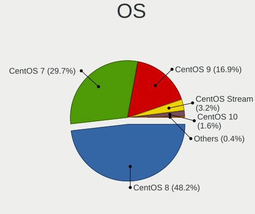

| Name          | Notebooks | Percent |
|---------------|-----------|---------|
| CentOS 8      | 120       | 48.19%  |
| CentOS 7      | 74        | 29.72%  |
| CentOS 9      | 42        | 16.87%  |
| CentOS Stream | 8         | 3.21%   |
| CentOS 10     | 4         | 1.61%   |
| CentOS 6      | 1         | 0.4%    |

OS Family
---------

OS without a version

| Name   | Notebooks | Percent |
|--------|-----------|---------|
| CentOS | 247       | 100%    |

Kernel
------

Version of the Linux kernel

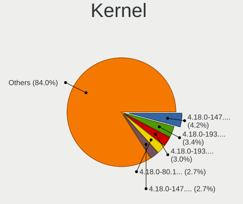

| Version                      | Notebooks | Percent |
|------------------------------|-----------|---------|
| 4.18.0-147.8.1.el8_1.x86_64  | 11        | 4.18%   |
| 4.18.0-193.6.3.el8_2.x86_64  | 9         | 3.42%   |
| 4.18.0-193.28.1.el8_2.x86_64 | 8         | 3.04%   |
| 4.18.0-80.11.2.el8_0.x86_64  | 7         | 2.66%   |
| 4.18.0-147.5.1.el8_1.x86_64  | 7         | 2.66%   |
| 4.18.0-240.1.1.el8_3.x86_64  | 6         | 2.28%   |
| 4.18.0-240.22.1.el8_3.x86_64 | 5         | 1.9%    |
| 4.18.0-240.15.1.el8_3.x86_64 | 5         | 1.9%    |
| 4.18.0-193.14.2.el8_2.x86_64 | 5         | 1.9%    |
| 4.18.0-294.el8.x86_64        | 4         | 1.52%   |
| 4.18.0-147.3.1.el8_1.x86_64  | 4         | 1.52%   |
| 5.14.0-432.el9.x86_64        | 3         | 1.14%   |
| 4.18.0-408.el8.x86_64        | 3         | 1.14%   |
| 4.18.0-348.7.1.el8_5.x86_64  | 3         | 1.14%   |
| 4.18.0-338.el8.x86_64        | 3         | 1.14%   |
| 4.18.0-305.3.1.el8.x86_64    | 3         | 1.14%   |
| 4.18.0-305.17.1.el8_4.x86_64 | 3         | 1.14%   |
| 4.18.0-305.12.1.el8_4.x86_64 | 3         | 1.14%   |
| 4.18.0-277.el8.x86_64        | 3         | 1.14%   |
| 4.18.0-240.el8.x86_64        | 3         | 1.14%   |
| 4.18.0-193.el8.x86_64        | 3         | 1.14%   |
| 4.18.0-193.19.1.el8_2.x86_64 | 3         | 1.14%   |
| 4.18.0-147.6.el8.x86_64      | 3         | 1.14%   |
| 3.10.0-957.27.2.el7.x86_64   | 3         | 1.14%   |
| 3.10.0-957.10.1.el7.x86_64   | 3         | 1.14%   |
| 3.10.0-1160.80.1.el7.x86_64  | 3         | 1.14%   |
| 3.10.0-1160.66.1.el7.x86_64  | 3         | 1.14%   |
| 3.10.0-1160.15.2.el7.x86_64  | 3         | 1.14%   |
| 3.10.0-1127.19.1.el7.x86_64  | 3         | 1.14%   |
| 5.15.11-1.el8.elrepo.x86_64  | 2         | 0.76%   |
| 5.14.0-86.el9.x86_64         | 2         | 0.76%   |
| 5.14.0-134.el9.x86_64        | 2         | 0.76%   |
| 4.18.0-80.el8.x86_64         | 2         | 0.76%   |
| 4.18.0-348.el8.x86_64        | 2         | 0.76%   |
| 4.18.0-348.2.1.el8_5.x86_64  | 2         | 0.76%   |
| 4.18.0-301.1.el8.x86_64      | 2         | 0.76%   |
| 4.18.0-240.10.1.el8_3.x86_64 | 2         | 0.76%   |
| 4.18.0-147.el8.x86_64        | 2         | 0.76%   |
| 3.10.0-957.el7.x86_64        | 2         | 0.76%   |
| 3.10.0-957.1.3.el7.x86_64    | 2         | 0.76%   |

Kernel Family
-------------

Linux kernel without a distro release

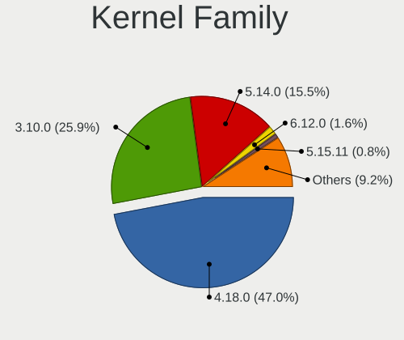

| Version | Notebooks | Percent |
|---------|-----------|---------|
| 4.18.0  | 118       | 47.01%  |
| 3.10.0  | 65        | 25.9%   |
| 5.14.0  | 39        | 15.54%  |
| 6.12.0  | 4         | 1.59%   |
| 5.15.11 | 2         | 0.8%    |
| 6.10.6  | 1         | 0.4%    |
| 6.1.8   | 1         | 0.4%    |
| 6.1.102 | 1         | 0.4%    |
| 6.1.1   | 1         | 0.4%    |
| 5.9.12  | 1         | 0.4%    |
| 5.9.1   | 1         | 0.4%    |
| 5.8.13  | 1         | 0.4%    |
| 5.8.11  | 1         | 0.4%    |
| 5.6.8   | 1         | 0.4%    |
| 5.4.6   | 1         | 0.4%    |
| 5.4.225 | 1         | 0.4%    |
| 5.4.125 | 1         | 0.4%    |
| 5.4.121 | 1         | 0.4%    |
| 5.18.5  | 1         | 0.4%    |
| 5.18.13 | 1         | 0.4%    |
| 5.17.2  | 1         | 0.4%    |
| 5.14.15 | 1         | 0.4%    |
| 5.13.7  | 1         | 0.4%    |
| 5.11.0  | 1         | 0.4%    |
| 5.10.75 | 1         | 0.4%    |
| 4.20.8  | 1         | 0.4%    |
| 4.19.8  | 1         | 0.4%    |
| 2.6.32  | 1         | 0.4%    |

Kernel Major Ver.
-----------------

Linux kernel major version

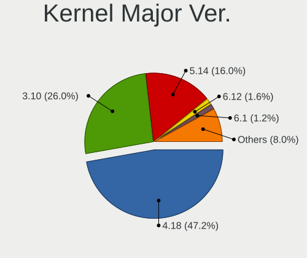

| Version | Notebooks | Percent |
|---------|-----------|---------|
| 4.18    | 118       | 47.2%   |
| 3.10    | 65        | 26%     |
| 5.14    | 40        | 16%     |
| 6.12    | 4         | 1.6%    |
| 6.1     | 3         | 1.2%    |
| 5.4     | 3         | 1.2%    |
| 5.9     | 2         | 0.8%    |
| 5.8     | 2         | 0.8%    |
| 5.18    | 2         | 0.8%    |
| 5.15    | 2         | 0.8%    |
| 6.10    | 1         | 0.4%    |
| 5.6     | 1         | 0.4%    |
| 5.17    | 1         | 0.4%    |
| 5.13    | 1         | 0.4%    |
| 5.11    | 1         | 0.4%    |
| 5.10    | 1         | 0.4%    |
| 4.20    | 1         | 0.4%    |
| 4.19    | 1         | 0.4%    |
| 2.6     | 1         | 0.4%    |

Arch
----

OS architecture (x86_64, i586, etc.)

| Name   | Notebooks | Percent |
|--------|-----------|---------|
| x86_64 | 243       | 98.38%  |
| i686   | 4         | 1.62%   |

DE
--

Desktop Environment

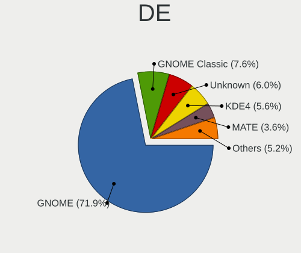

| Name          | Notebooks | Percent |
|---------------|-----------|---------|
| GNOME         | 179       | 71.89%  |
| GNOME Classic | 19        | 7.63%   |
| Unknown       | 15        | 6.02%   |
| KDE4          | 14        | 5.62%   |
| MATE          | 9         | 3.61%   |
| XFCE          | 4         | 1.61%   |
| Cinnamon      | 4         | 1.61%   |
| KDE5          | 3         | 1.2%    |
| KDE6          | 1         | 0.4%    |
| KDE           | 1         | 0.4%    |

Display Server
--------------

X11 or Wayland

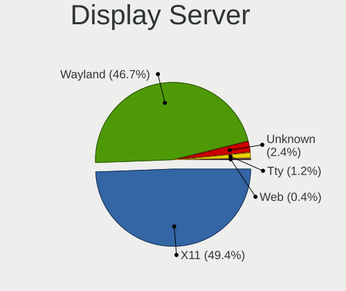

| Name    | Notebooks | Percent |
|---------|-----------|---------|
| X11     | 126       | 49.41%  |
| Wayland | 119       | 46.67%  |
| Unknown | 6         | 2.35%   |
| Tty     | 3         | 1.18%   |
| Web     | 1         | 0.39%   |

Display Manager
---------------

SDDM, LightDM, etc.

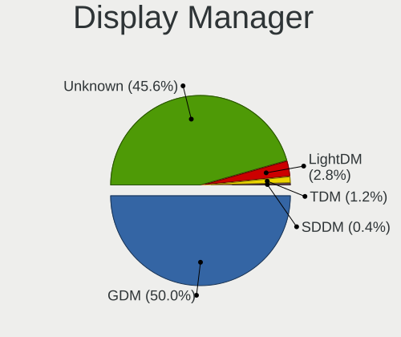

| Name    | Notebooks | Percent |
|---------|-----------|---------|
| GDM     | 125       | 50%     |
| Unknown | 114       | 45.6%   |
| LightDM | 7         | 2.8%    |
| TDM     | 3         | 1.2%    |
| SDDM    | 1         | 0.4%    |

OS Lang
-------

Language

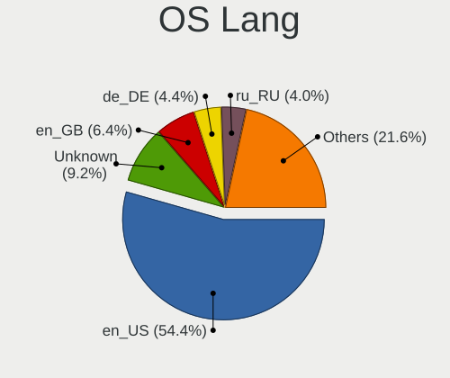

| Lang        | Notebooks | Percent |
|-------------|-----------|---------|
| en_US       | 136       | 54.4%   |
| Unknown     | 23        | 9.2%    |
| en_GB       | 16        | 6.4%    |
| de_DE       | 11        | 4.4%    |
| ru_RU       | 10        | 4%      |
| pt_BR       | 10        | 4%      |
| fr_FR       | 9         | 3.6%    |
| en_IN       | 4         | 1.6%    |
| zh_CN       | 3         | 1.2%    |
| ko_KR       | 3         | 1.2%    |
| es_ES       | 3         | 1.2%    |
| en_CA       | 3         | 1.2%    |
| pl_PL       | 2         | 0.8%    |
| nb_NO       | 2         | 0.8%    |
| ja_JP       | 2         | 0.8%    |
| it_IT       | 2         | 0.8%    |
| es_AR       | 2         | 0.8%    |
| en_IE       | 2         | 0.8%    |
| pt_PT       | 1         | 0.4%    |
| es_PE       | 1         | 0.4%    |
| es_MX       | 1         | 0.4%    |
| en_ZA       | 1         | 0.4%    |
| en_US.utf-8 | 1         | 0.4%    |
| da_DK       | 1         | 0.4%    |
| C           | 1         | 0.4%    |

Boot Mode
---------

EFI or BIOS

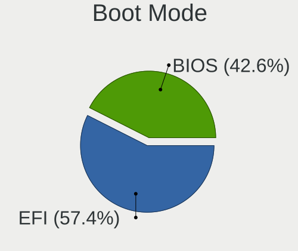

| Mode | Notebooks | Percent |
|------|-----------|---------|
| EFI  | 143       | 57.43%  |
| BIOS | 106       | 42.57%  |

Filesystem
----------

Type of filesystem

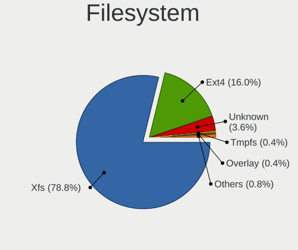

| Type    | Notebooks | Percent |
|---------|-----------|---------|
| Xfs     | 197       | 78.8%   |
| Ext4    | 40        | 16%     |
| Unknown | 9         | 3.6%    |
| Tmpfs   | 1         | 0.4%    |
| Overlay | 1         | 0.4%    |
| Ext3    | 1         | 0.4%    |
| Ext2    | 1         | 0.4%    |

Part. scheme
------------

Scheme of partitioning

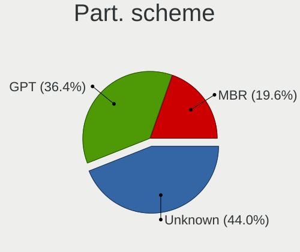

| Type    | Notebooks | Percent |
|---------|-----------|---------|
| Unknown | 110       | 44%     |
| GPT     | 91        | 36.4%   |
| MBR     | 49        | 19.6%   |

Dual Boot with Linux/BSD
------------------------

Hosting more than one Linux/BSD

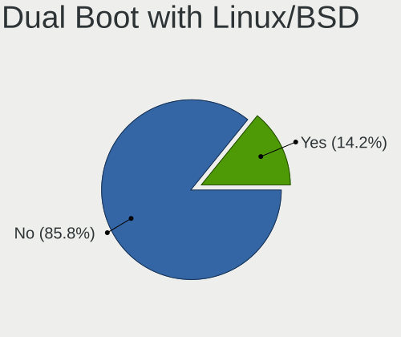

| Dual boot | Notebooks | Percent |
|-----------|-----------|---------|
| No        | 212       | 85.83%  |
| Yes       | 35        | 14.17%  |

Dual Boot (Win)
---------------

Hosting Linux and Windows

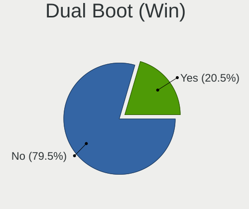

| Dual boot | Notebooks | Percent |
|-----------|-----------|---------|
| No        | 198       | 79.52%  |
| Yes       | 51        | 20.48%  |

Board
-----

Vendor
------

Motherboard manufacturer

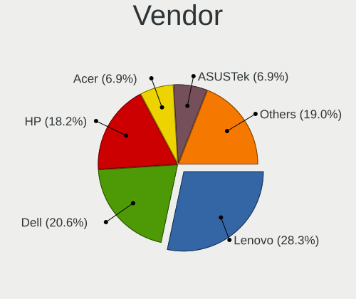

| Name                             | Notebooks | Percent |
|----------------------------------|-----------|---------|
| Lenovo                           | 70        | 28.34%  |
| Dell                             | 51        | 20.65%  |
| Hewlett-Packard                  | 45        | 18.22%  |
| ASUSTek Computer                 | 17        | 6.88%   |
| Acer                             | 17        | 6.88%   |
| Samsung Electronics              | 8         | 3.24%   |
| Sony                             | 6         | 2.43%   |
| MSI                              | 6         | 2.43%   |
| Toshiba                          | 3         | 1.21%   |
| Timi                             | 3         | 1.21%   |
| Notebook                         | 2         | 0.81%   |
| LG Electronics                   | 2         | 0.81%   |
| Apple                            | 2         | 0.81%   |
| Unknown                          | 2         | 0.81%   |
| TUXEDO                           | 1         | 0.4%    |
| RM Education                     | 1         | 0.4%    |
| Razer                            | 1         | 0.4%    |
| Positivo Bahia - VAIO            | 1         | 0.4%    |
| Panasonic                        | 1         | 0.4%    |
| Micro Computer (HK) Tech Limited | 1         | 0.4%    |
| Medion                           | 1         | 0.4%    |
| HUAWEI                           | 1         | 0.4%    |
| HONOR                            | 1         | 0.4%    |
| Gigabyte Technology              | 1         | 0.4%    |
| Fujitsu                          | 1         | 0.4%    |
| COPELION INTERNATIONAL           | 1         | 0.4%    |
| Clevo                            | 1         | 0.4%    |

Model
-----

Motherboard model

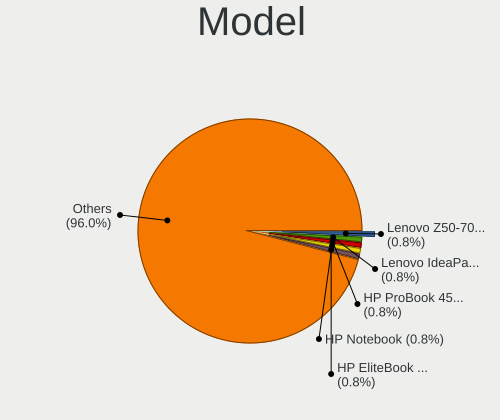

| Name                                                  | Notebooks | Percent |
|-------------------------------------------------------|-----------|---------|
| Lenovo Z50-70 20354                                   | 2         | 0.81%   |
| Lenovo IdeaPad L340-15IRH Gaming 81LK                 | 2         | 0.81%   |
| HP ProBook 450 G5                                     | 2         | 0.81%   |
| HP Notebook                                           | 2         | 0.81%   |
| HP EliteBook 840 G5                                   | 2         | 0.81%   |
| Dell System XPS L702X                                 | 2         | 0.81%   |
| Dell Studio 1747                                      | 2         | 0.81%   |
| Dell Latitude E5470                                   | 2         | 0.81%   |
| Dell Inspiron N4050                                   | 2         | 0.81%   |
| Unknown                                               | 2         | 0.81%   |
| TUXEDO Pulse 15 Gen1                                  | 1         | 0.4%    |
| Toshiba Satellite Radius 12 P20W-C-106                | 1         | 0.4%    |
| Toshiba Satellite L15W-B                              | 1         | 0.4%    |
| Toshiba Satellite A135                                | 1         | 0.4%    |
| Timi TM1709                                           | 1         | 0.4%    |
| Timi RedmiBook 16                                     | 1         | 0.4%    |
| Timi Mi NoteBook Horizon Edition 14                   | 1         | 0.4%    |
| Sony VPCSB19GG                                        | 1         | 0.4%    |
| Sony VPCEH26EN                                        | 1         | 0.4%    |
| Sony VPCEH15FX                                        | 1         | 0.4%    |
| Sony VPCEG15FB                                        | 1         | 0.4%    |
| Sony VGN-N19VP_B                                      | 1         | 0.4%    |
| Sony SVT11215CGW                                      | 1         | 0.4%    |
| Samsung R560                                          | 1         | 0.4%    |
| Samsung 700Z3A/700Z4A/700Z5A/700Z5B                   | 1         | 0.4%    |
| Samsung 530U3C/530U4C/532U3C                          | 1         | 0.4%    |
| Samsung 500R4K/500R5H/5400RK/501R5H/5500RH/500R5S     | 1         | 0.4%    |
| Samsung 355V4C/356V4C/3445VC/3545VC                   | 1         | 0.4%    |
| Samsung 300E5EV/300E4EV/270E5EV/270E4EV/2470EV/2470EE | 1         | 0.4%    |
| Samsung 300E4A/300E5A/300E7A                          | 1         | 0.4%    |
| Samsung 270E5J/2570EJ                                 | 1         | 0.4%    |
| RM Education RM                                       | 1         | 0.4%    |
| Razer Blade 15 (2022) - RZ09-0421                     | 1         | 0.4%    |
| Positivo Bahia - VAIO VJFE41F11X-XXXXXX               | 1         | 0.4%    |
| Panasonic CF-19ADNAXDY                                | 1         | 0.4%    |
| Notebook WA50SRQ                                      | 1         | 0.4%    |
| Notebook P377SM-A                                     | 1         | 0.4%    |
| MSI Katana GF76 12UE                                  | 1         | 0.4%    |
| MSI GP76 Leopard 10UE                                 | 1         | 0.4%    |
| MSI GP75 Leopard 10SFK                                | 1         | 0.4%    |

Model Family
------------

Motherboard model prefix

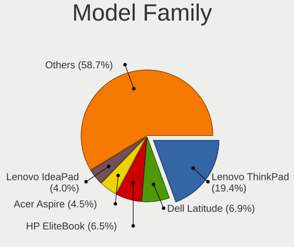

| Name              | Notebooks | Percent |
|-------------------|-----------|---------|
| Lenovo ThinkPad   | 48        | 19.43%  |
| Dell Latitude     | 17        | 6.88%   |
| HP EliteBook      | 16        | 6.48%   |
| Acer Aspire       | 11        | 4.45%   |
| Lenovo IdeaPad    | 10        | 4.05%   |
| Dell Inspiron     | 10        | 4.05%   |
| HP ProBook        | 9         | 3.64%   |
| Dell Precision    | 7         | 2.83%   |
| Dell Vostro       | 6         | 2.43%   |
| HP Laptop         | 5         | 2.02%   |
| Dell XPS          | 5         | 2.02%   |
| HP ZBook          | 4         | 1.62%   |
| HP Pavilion       | 4         | 1.62%   |
| ASUS VivoBook     | 4         | 1.62%   |
| Toshiba Satellite | 3         | 1.21%   |
| Lenovo Z50-70     | 2         | 0.81%   |
| HP Notebook       | 2         | 0.81%   |
| Dell System       | 2         | 0.81%   |
| Dell Studio       | 2         | 0.81%   |
| Acer Swift        | 2         | 0.81%   |
| Acer Nitro        | 2         | 0.81%   |
| Unknown           | 2         | 0.81%   |
| TUXEDO Pulse      | 1         | 0.4%    |
| Timi TM1709       | 1         | 0.4%    |
| Timi RedmiBook    | 1         | 0.4%    |
| Timi Mi           | 1         | 0.4%    |
| Sony VPCSB19GG    | 1         | 0.4%    |
| Sony VPCEH26EN    | 1         | 0.4%    |
| Sony VPCEH15FX    | 1         | 0.4%    |
| Sony VPCEG15FB    | 1         | 0.4%    |
| Sony VGN-N19VP    | 1         | 0.4%    |
| Sony SVT11215CGW  | 1         | 0.4%    |
| Samsung R560      | 1         | 0.4%    |
| Samsung 700Z3A    | 1         | 0.4%    |
| Samsung 530U3C    | 1         | 0.4%    |
| Samsung 500R4K    | 1         | 0.4%    |
| Samsung 355V4C    | 1         | 0.4%    |
| Samsung 300E5EV   | 1         | 0.4%    |
| Samsung 300E4A    | 1         | 0.4%    |
| Samsung 270E5J    | 1         | 0.4%    |

MFG Year
--------

Motherboard manufacture year

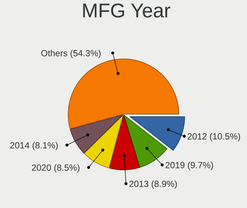

| Year | Notebooks | Percent |
|------|-----------|---------|
| 2012 | 26        | 10.53%  |
| 2019 | 24        | 9.72%   |
| 2013 | 22        | 8.91%   |
| 2020 | 21        | 8.5%    |
| 2014 | 20        | 8.1%    |
| 2016 | 19        | 7.69%   |
| 2011 | 19        | 7.69%   |
| 2018 | 17        | 6.88%   |
| 2015 | 17        | 6.88%   |
| 2017 | 15        | 6.07%   |
| 2021 | 12        | 4.86%   |
| 2010 | 12        | 4.86%   |
| 2022 | 5         | 2.02%   |
| 2008 | 5         | 2.02%   |
| 2009 | 4         | 1.62%   |
| 2007 | 4         | 1.62%   |
| 2023 | 2         | 0.81%   |
| 2006 | 2         | 0.81%   |
| 2001 | 1         | 0.4%    |

Form Factor
-----------

Physical design of the computer

| Name     | Notebooks | Percent |
|----------|-----------|---------|
| Notebook | 247       | 100%    |

Secure Boot
-----------

Enabled or disabled

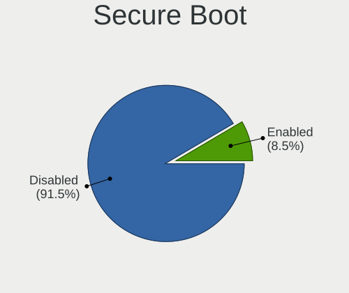

| State    | Notebooks | Percent |
|----------|-----------|---------|
| Disabled | 227       | 91.53%  |
| Enabled  | 21        | 8.47%   |

Coreboot
--------

Have coreboot on board

| Used | Notebooks | Percent |
|------|-----------|---------|
| No   | 246       | 99.6%   |
| Yes  | 1         | 0.4%    |

RAM Size
--------

Total RAM memory

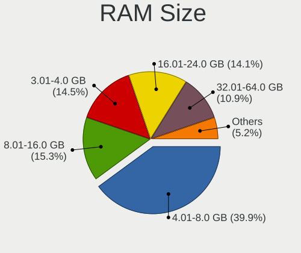

| Size in GB  | Notebooks | Percent |
|-------------|-----------|---------|
| 4.01-8.0    | 99        | 39.92%  |
| 8.01-16.0   | 38        | 15.32%  |
| 3.01-4.0    | 36        | 14.52%  |
| 16.01-24.0  | 35        | 14.11%  |
| 32.01-64.0  | 27        | 10.89%  |
| 1.01-2.0    | 4         | 1.61%   |
| 24.01-32.0  | 3         | 1.21%   |
| 64.01-256.0 | 3         | 1.21%   |
| 0.51-1.0    | 2         | 0.81%   |
| 2.01-3.0    | 1         | 0.4%    |

RAM Used
--------

Used RAM memory

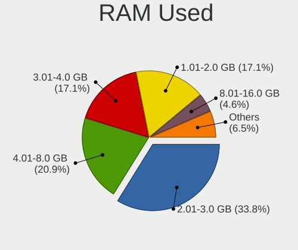

| Used GB    | Notebooks | Percent |
|------------|-----------|---------|
| 2.01-3.0   | 89        | 33.84%  |
| 4.01-8.0   | 55        | 20.91%  |
| 3.01-4.0   | 45        | 17.11%  |
| 1.01-2.0   | 45        | 17.11%  |
| 8.01-16.0  | 12        | 4.56%   |
| 0.51-1.0   | 11        | 4.18%   |
| 24.01-32.0 | 2         | 0.76%   |
| 32.01-64.0 | 1         | 0.38%   |
| 16.01-24.0 | 1         | 0.38%   |
| 0.01-0.5   | 1         | 0.38%   |
| Unknown    | 1         | 0.38%   |

Total Drives
------------

Number of drives on board

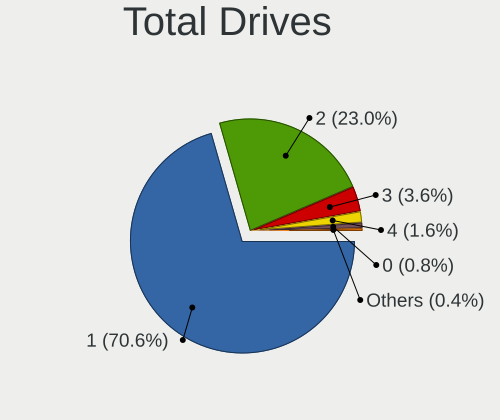

| Drives | Notebooks | Percent |
|--------|-----------|---------|
| 1      | 175       | 70.56%  |
| 2      | 57        | 22.98%  |
| 3      | 9         | 3.63%   |
| 4      | 4         | 1.61%   |
| 0      | 2         | 0.81%   |
| 5      | 1         | 0.4%    |

Has CD-ROM
----------

Has CD-ROM on board

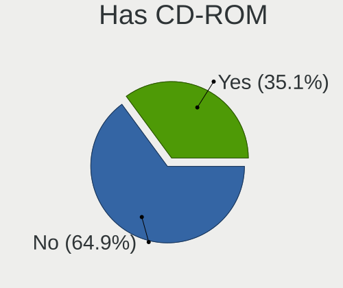

| Presented | Notebooks | Percent |
|-----------|-----------|---------|
| No        | 161       | 64.92%  |
| Yes       | 87        | 35.08%  |

Has Ethernet
------------

Has Ethernet on board

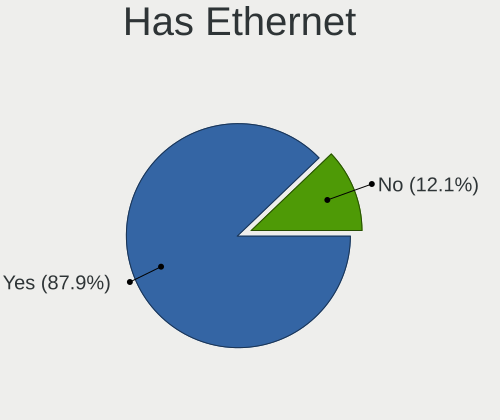

| Presented | Notebooks | Percent |
|-----------|-----------|---------|
| Yes       | 217       | 87.85%  |
| No        | 30        | 12.15%  |

Has WiFi
--------

Has WiFi module

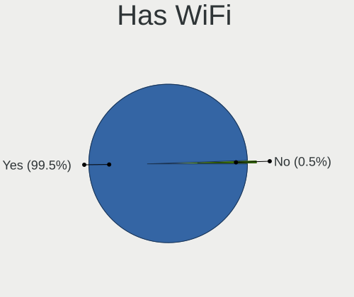

| Presented | Notebooks | Percent |
|-----------|-----------|---------|
| Yes       | 242       | 97.98%  |
| No        | 5         | 2.02%   |

Has Bluetooth
-------------

Has Bluetooth module

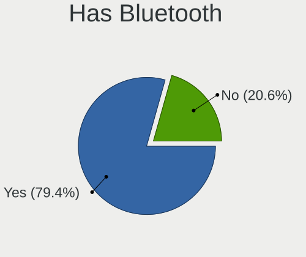

| Presented | Notebooks | Percent |
|-----------|-----------|---------|
| Yes       | 196       | 79.35%  |
| No        | 51        | 20.65%  |

Location
--------

Country
-------

Geographic location (country)

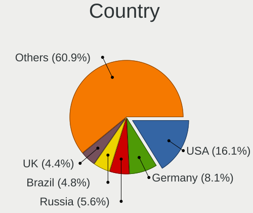

| Country      | Notebooks | Percent |
|--------------|-----------|---------|
| USA          | 40        | 16.13%  |
| Germany      | 20        | 8.06%   |
| Russia       | 14        | 5.65%   |
| Brazil       | 12        | 4.84%   |
| UK           | 11        | 4.44%   |
| France       | 11        | 4.44%   |
| China        | 11        | 4.44%   |
| India        | 9         | 3.63%   |
| Sweden       | 6         | 2.42%   |
| Spain        | 6         | 2.42%   |
| Poland       | 6         | 2.42%   |
| Mexico       | 6         | 2.42%   |
| Canada       | 6         | 2.42%   |
| Italy        | 5         | 2.02%   |
| Belgium      | 5         | 2.02%   |
| Ukraine      | 4         | 1.61%   |
| South Korea  | 4         | 1.61%   |
| Finland      | 4         | 1.61%   |
| Norway       | 3         | 1.21%   |
| Netherlands  | 3         | 1.21%   |
| Malaysia     | 3         | 1.21%   |
| Kazakhstan   | 3         | 1.21%   |
| Japan        | 3         | 1.21%   |
| Ireland      | 3         | 1.21%   |
| Croatia      | 3         | 1.21%   |
| Bulgaria     | 3         | 1.21%   |
| Australia    | 3         | 1.21%   |
| Argentina    | 3         | 1.21%   |
| Vietnam      | 2         | 0.81%   |
| Turkey       | 2         | 0.81%   |
| Switzerland  | 2         | 0.81%   |
| South Africa | 2         | 0.81%   |
| Peru         | 2         | 0.81%   |
| Israel       | 2         | 0.81%   |
| Iran         | 2         | 0.81%   |
| Indonesia    | 2         | 0.81%   |
| Greece       | 2         | 0.81%   |
| Chile        | 2         | 0.81%   |
| Austria      | 2         | 0.81%   |
| Uzbekistan   | 1         | 0.4%    |

City
----

Geographic location (city)

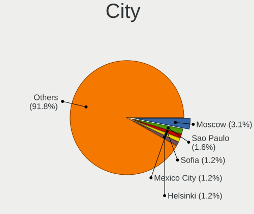

| City             | Notebooks | Percent |
|------------------|-----------|---------|
| Moscow           | 8         | 3.11%   |
| Sao Paulo        | 4         | 1.56%   |
| Sofia            | 3         | 1.17%   |
| Mexico City      | 3         | 1.17%   |
| Helsinki         | 3         | 1.17%   |
| Guangzhou        | 3         | 1.17%   |
| Beijing          | 3         | 1.17%   |
| Zagreb           | 2         | 0.78%   |
| Yekaterinburg    | 2         | 0.78%   |
| Touget           | 2         | 0.78%   |
| Toronto          | 2         | 0.78%   |
| Tehran           | 2         | 0.78%   |
| Sollentuna       | 2         | 0.78%   |
| Plano            | 2         | 0.78%   |
| Phoenix          | 2         | 0.78%   |
| Paris            | 2         | 0.78%   |
| Munich           | 2         | 0.78%   |
| Mumbai           | 2         | 0.78%   |
| Lima             | 2         | 0.78%   |
| Kyiv             | 2         | 0.78%   |
| Krasnodar        | 2         | 0.78%   |
| Ho Chi Minh City | 2         | 0.78%   |
| Grovedale        | 2         | 0.78%   |
| Dublin           | 2         | 0.78%   |
| Denver           | 2         | 0.78%   |
| Chicago          | 2         | 0.78%   |
| Buenos Aires     | 2         | 0.78%   |
| Berlin           | 2         | 0.78%   |
| Albuquerque      | 2         | 0.78%   |
| Zirndorf         | 1         | 0.39%   |
| Zapopan          | 1         | 0.39%   |
| Yeonsu-gu        | 1         | 0.39%   |
| Yangpu           | 1         | 0.39%   |
| Yakima           | 1         | 0.39%   |
| Xuhui            | 1         | 0.39%   |
| Wheeling         | 1         | 0.39%   |
| West Chester     | 1         | 0.39%   |
| Waltham          | 1         | 0.39%   |
| Vilnius          | 1         | 0.39%   |
| Viladecans       | 1         | 0.39%   |

Drives
------

Drive Vendor
------------

Hard drive vendors

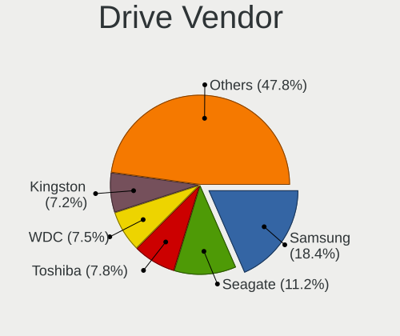

| Vendor                       | Notebooks | Drives | Percent |
|------------------------------|-----------|--------|---------|
| Samsung Electronics          | 59        | 80     | 18.44%  |
| Seagate                      | 36        | 40     | 11.25%  |
| Toshiba                      | 25        | 30     | 7.81%   |
| WDC                          | 24        | 27     | 7.5%    |
| Kingston                     | 23        | 26     | 7.19%   |
| SanDisk                      | 20        | 22     | 6.25%   |
| Unknown                      | 15        | 17     | 4.69%   |
| Intel                        | 13        | 15     | 4.06%   |
| SK hynix                     | 12        | 12     | 3.75%   |
| HGST                         | 11        | 13     | 3.44%   |
| Micron Technology            | 9         | 9      | 2.81%   |
| Hitachi                      | 9         | 10     | 2.81%   |
| Crucial                      | 8         | 9      | 2.5%    |
| LITEON                       | 6         | 7      | 1.88%   |
| SPCC                         | 4         | 6      | 1.25%   |
| KIOXIA                       | 3         | 4      | 0.94%   |
| A-DATA Technology            | 3         | 3      | 0.94%   |
| Union Memory                 | 2         | 2      | 0.63%   |
| UMIS                         | 2         | 2      | 0.63%   |
| StoreJet                     | 2         | 2      | 0.63%   |
| LITEONIT                     | 2         | 2      | 0.63%   |
| Lenovo                       | 2         | 3      | 0.63%   |
| XrayDisk                     | 1         | 1      | 0.31%   |
| VICKTER                      | 1         | 1      | 0.31%   |
| Vi550                        | 1         | 1      | 0.31%   |
| Union Memory (Shenzhen)      | 1         | 1      | 0.31%   |
| Transcend                    | 1         | 2      | 0.31%   |
| Toshiba America Info Systems | 1         | 2      | 0.31%   |
| SSD                          | 1         | 1      | 0.31%   |
| Smartbuy                     | 1         | 1      | 0.31%   |
| Silicon Motion               | 1         | 1      | 0.31%   |
| Shenzhen Longsys Electronics | 1         | 1      | 0.31%   |
| Plextor                      | 1         | 1      | 0.31%   |
| Phison Electronics           | 1         | 1      | 0.31%   |
| OCZ                          | 1         | 2      | 0.31%   |
| NVMe                         | 1         | 1      | 0.31%   |
| Lexar                        | 1         | 1      | 0.31%   |
| Kingston Technology Company  | 1         | 1      | 0.31%   |
| Kingmax                      | 1         | 1      | 0.31%   |
| JetFlash                     | 1         | 1      | 0.31%   |

Drive Model
-----------

Hard drive models

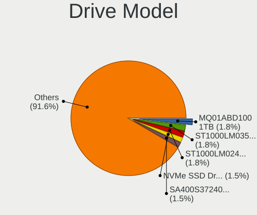

| Model                                              | Notebooks | Percent |
|----------------------------------------------------|-----------|---------|
| Toshiba MQ01ABD100 1TB                             | 6         | 1.81%   |
| Seagate ST1000LM035-1RK172 1TB                     | 6         | 1.81%   |
| Seagate ST1000LM024 HN-M101MBB 1TB                 | 6         | 1.81%   |
| Samsung NVMe SSD Drive 512GB                       | 5         | 1.51%   |
| Kingston SA400S37240G 240GB SSD                    | 5         | 1.51%   |
| Samsung NVMe SSD Controller SM981/PM981/PM983 1TB  | 4         | 1.2%    |
| Unknown MMC Card  32GB                             | 3         | 0.9%    |
| Seagate ST500LT012-1DG142 500GB                    | 3         | 0.9%    |
| SanDisk NVMe SSD Drive 512GB                       | 3         | 0.9%    |
| Kingston SA400S37120G 120GB SSD                    | 3         | 0.9%    |
| Kingston SA400M8240G 240GB SSD                     | 3         | 0.9%    |
| WDC WD10JPCX-24UE4T0 1TB                           | 2         | 0.6%    |
| Toshiba TR200 240GB SSD                            | 2         | 0.6%    |
| Toshiba MQ04ABF100 1TB                             | 2         | 0.6%    |
| StoreJet Transcend 1TB                             | 2         | 0.6%    |
| SPCC Solid State Disk 256GB                        | 2         | 0.6%    |
| SK hynix SC210 mSATA 256GB SSD                     | 2         | 0.6%    |
| SK hynix BC511 512GB                               | 2         | 0.6%    |
| Seagate ST500LM012 HN-M500MBB 500GB                | 2         | 0.6%    |
| Seagate BUP Slim 2TB                               | 2         | 0.6%    |
| SanDisk NVMe SSD Drive 500GB                       | 2         | 0.6%    |
| Samsung SSD 860 EVO 500GB                          | 2         | 0.6%    |
| Samsung SSD 860 EVO 1TB                            | 2         | 0.6%    |
| Samsung SSD 850 PRO 1TB                            | 2         | 0.6%    |
| Samsung NVMe SSD Drive 256GB                       | 2         | 0.6%    |
| Samsung NVMe SSD Controller SM981/PM981 2TB        | 2         | 0.6%    |
| Samsung NVMe SSD Controller PM9A1/PM9A3/980PRO 1TB | 2         | 0.6%    |
| Samsung MZNLN128HAHQ-000H1 128GB SSD               | 2         | 0.6%    |
| Samsung MZNLH512HALU-00000 512GB SSD               | 2         | 0.6%    |
| Micron 2450_MTFDKBA512TFK 512GB                    | 2         | 0.6%    |
| Intel SSDPEKKF256G8L 256GB                         | 2         | 0.6%    |
| Hitachi HTS547550A9E384 500GB                      | 2         | 0.6%    |
| HGST HTS725032A7E630 320GB                         | 2         | 0.6%    |
| HGST HTS721010A9E630 1TB                           | 2         | 0.6%    |
| HGST HTS545050A7E680 500GB                         | 2         | 0.6%    |
| HGST HTS545050A7E380 500GB                         | 2         | 0.6%    |
| XrayDisk SSD 240GB                                 | 1         | 0.3%    |
| WDC WDS500G2B0B-00YS70 500GB SSD                   | 1         | 0.3%    |
| WDC WDS500G1R0B-68A4Z0 500GB SSD                   | 1         | 0.3%    |
| WDC WDS100T2B0A-00SM50 1TB SSD                     | 1         | 0.3%    |

HDD Vendor
----------

Hard disk drive vendors

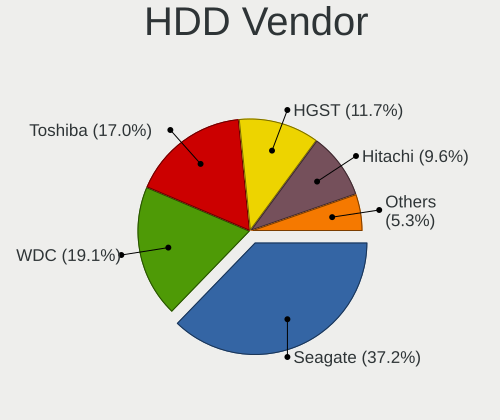

| Vendor              | Notebooks | Drives | Percent |
|---------------------|-----------|--------|---------|
| Seagate             | 35        | 39     | 37.23%  |
| WDC                 | 18        | 20     | 19.15%  |
| Toshiba             | 16        | 20     | 17.02%  |
| HGST                | 11        | 13     | 11.7%   |
| Hitachi             | 9         | 10     | 9.57%   |
| Samsung Electronics | 2         | 2      | 2.13%   |
| Unknown             | 1         | 1      | 1.06%   |
| JetFlash            | 1         | 1      | 1.06%   |
| Fujitsu             | 1         | 1      | 1.06%   |

SSD Vendor
----------

Solid state drive vendors

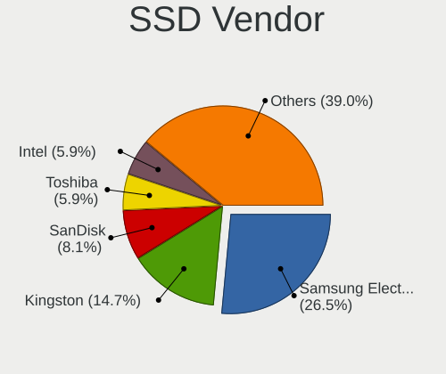

| Vendor              | Notebooks | Drives | Percent |
|---------------------|-----------|--------|---------|
| Samsung Electronics | 36        | 47     | 26.47%  |
| Kingston            | 20        | 23     | 14.71%  |
| SanDisk             | 11        | 13     | 8.09%   |
| Toshiba             | 8         | 9      | 5.88%   |
| Intel               | 8         | 9      | 5.88%   |
| Crucial             | 7         | 8      | 5.15%   |
| LITEON              | 6         | 7      | 4.41%   |
| SPCC                | 4         | 6      | 2.94%   |
| SK hynix            | 4         | 4      | 2.94%   |
| Micron Technology   | 4         | 4      | 2.94%   |
| WDC                 | 3         | 4      | 2.21%   |
| StoreJet            | 2         | 2      | 1.47%   |
| LITEONIT            | 2         | 2      | 1.47%   |
| A-DATA Technology   | 2         | 2      | 1.47%   |
| XrayDisk            | 1         | 1      | 0.74%   |
| VICKTER             | 1         | 1      | 0.74%   |
| Vi550               | 1         | 1      | 0.74%   |
| Transcend           | 1         | 2      | 0.74%   |
| SSD                 | 1         | 1      | 0.74%   |
| Smartbuy            | 1         | 1      | 0.74%   |
| Plextor             | 1         | 1      | 0.74%   |
| OCZ                 | 1         | 2      | 0.74%   |
| Lenovo              | 1         | 2      | 0.74%   |
| Kingmax             | 1         | 1      | 0.74%   |
| Intenso             | 1         | 1      | 0.74%   |
| HS-SSD-E100         | 1         | 1      | 0.74%   |
| Hewlett-Packard     | 1         | 1      | 0.74%   |
| GOODRAM             | 1         | 1      | 0.74%   |
| ETOPSO              | 1         | 1      | 0.74%   |
| BUFFALO             | 1         | 1      | 0.74%   |
| Biostar             | 1         | 1      | 0.74%   |
| ASMT                | 1         | 1      | 0.74%   |
| Apple               | 1         | 1      | 0.74%   |

Drive Kind
----------

HDD or SSD

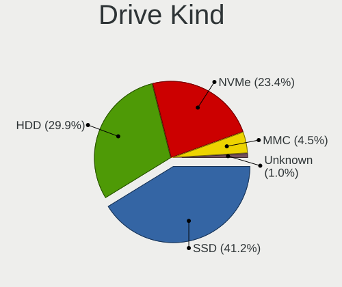

| Kind    | Notebooks | Drives | Percent |
|---------|-----------|--------|---------|
| SSD     | 127       | 162    | 41.23%  |
| HDD     | 92        | 107    | 29.87%  |
| NVMe    | 72        | 86     | 23.38%  |
| MMC     | 14        | 16     | 4.55%   |
| Unknown | 3         | 3      | 0.97%   |

Drive Connector
---------------

SATA, SAS, NVMe, etc.

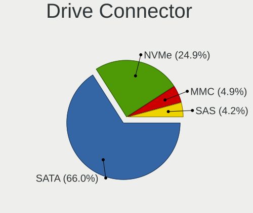

| Type | Notebooks | Drives | Percent |
|------|-----------|--------|---------|
| SATA | 188       | 257    | 65.96%  |
| NVMe | 71        | 84     | 24.91%  |
| MMC  | 14        | 16     | 4.91%   |
| SAS  | 12        | 17     | 4.21%   |

Drive Size
----------

Size of hard drive

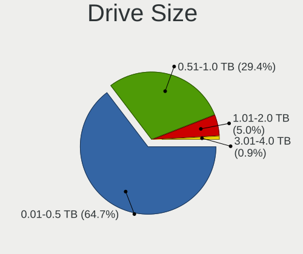

| Size in TB | Notebooks | Drives | Percent |
|------------|-----------|--------|---------|
| 0.01-0.5   | 141       | 178    | 64.68%  |
| 0.51-1.0   | 64        | 77     | 29.36%  |
| 1.01-2.0   | 11        | 12     | 5.05%   |
| 3.01-4.0   | 2         | 2      | 0.92%   |

Space Total
-----------

Amount of disk space available on the file system

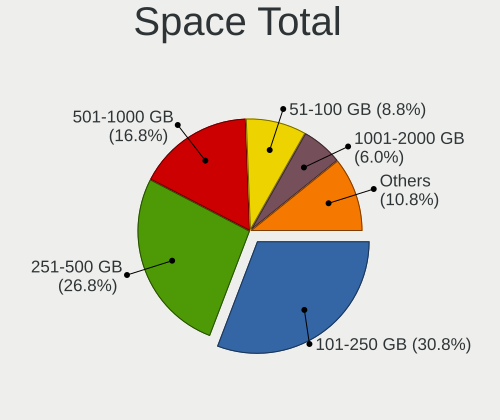

| Size in GB     | Notebooks | Percent |
|----------------|-----------|---------|
| 101-250        | 77        | 30.8%   |
| 251-500        | 67        | 26.8%   |
| 501-1000       | 42        | 16.8%   |
| 51-100         | 22        | 8.8%    |
| 1001-2000      | 15        | 6%      |
| 21-50          | 8         | 3.2%    |
| More than 3000 | 6         | 2.4%    |
| 1-20           | 5         | 2%      |
| 2001-3000      | 4         | 1.6%    |
| Unknown        | 4         | 1.6%    |

Space Used
----------

Amount of used disk space

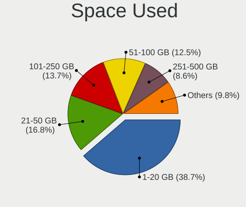

| Used GB        | Notebooks | Percent |
|----------------|-----------|---------|
| 1-20           | 99        | 38.67%  |
| 21-50          | 43        | 16.8%   |
| 101-250        | 35        | 13.67%  |
| 51-100         | 32        | 12.5%   |
| 251-500        | 22        | 8.59%   |
| 501-1000       | 12        | 4.69%   |
| 1001-2000      | 6         | 2.34%   |
| Unknown        | 4         | 1.56%   |
| More than 3000 | 2         | 0.78%   |
| 2001-3000      | 1         | 0.39%   |

Malfunc. Drives
---------------

Drive models with a malfunction

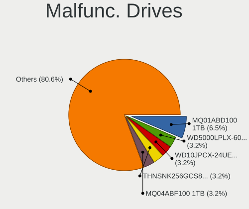

| Model                                               | Notebooks | Drives | Percent |
|-----------------------------------------------------|-----------|--------|---------|
| Toshiba MQ01ABD100 1TB                              | 2         | 5      | 6.45%   |
| WDC WD5000LPLX-60ZNTT1 500GB                        | 1         | 1      | 3.23%   |
| WDC WD10JPCX-24UE4T0 1TB                            | 1         | 1      | 3.23%   |
| Toshiba THNSNK256GCS8 SATA 256GB SSD                | 1         | 1      | 3.23%   |
| Toshiba MQ04ABF100 1TB                              | 1         | 1      | 3.23%   |
| Toshiba MK8032GSX 80GB                              | 1         | 1      | 3.23%   |
| Smartbuy SSD 120GB                                  | 1         | 1      | 3.23%   |
| SK hynix SC210 mSATA 256GB SSD                      | 1         | 1      | 3.23%   |
| Seagate ST9750420AS 752GB                           | 1         | 1      | 3.23%   |
| Seagate ST9500420AS 500GB                           | 1         | 1      | 3.23%   |
| Seagate ST500LT012-9WS142 500GB                     | 1         | 1      | 3.23%   |
| Seagate ST1000LM035-1RK172 1TB                      | 1         | 1      | 3.23%   |
| Seagate ST1000LM014-1EJ164 1TB                      | 1         | 1      | 3.23%   |
| SanDisk SSD PLUS 480GB                              | 1         | 1      | 3.23%   |
| SanDisk SD9SN8W256G1009 256GB SSD                   | 1         | 1      | 3.23%   |
| Samsung Electronics SSD 840 250GB                   | 1         | 1      | 3.23%   |
| Micron Technology MTFDDAK256MAY-1AH1ZABHA 256GB SSD | 1         | 1      | 3.23%   |
| Micron Technology 1100 SATA 256GB SSD               | 1         | 1      | 3.23%   |
| LITEONIT LSS-16L6G-HP 16GB SSD                      | 1         | 1      | 3.23%   |
| LITEON CV8-8E128-HP 128GB SSD                       | 1         | 1      | 3.23%   |
| Intel SSDSC2KW240H6 240GB                           | 1         | 1      | 3.23%   |
| Intel SSDSC2KW180H6 180GB                           | 1         | 1      | 3.23%   |
| Intel SSDSC2BW240A4 240GB                           | 1         | 2      | 3.23%   |
| Hitachi HTS727575A9E364 752GB                       | 1         | 1      | 3.23%   |
| Hitachi HTS545050A7E380 500GB                       | 1         | 1      | 3.23%   |
| Hitachi HTS545032B9A302 320GB                       | 1         | 1      | 3.23%   |
| Hitachi HTS543232A7A384 320GB                       | 1         | 1      | 3.23%   |
| Hitachi HTS543216L9SA00 160GB                       | 1         | 1      | 3.23%   |
| Hitachi HTS541680J9SA00 80GB                        | 1         | 1      | 3.23%   |
| Crucial CT480M500SSD1 480GB                         | 1         | 1      | 3.23%   |

Malfunc. Drive Vendor
---------------------

Vendors of faulty drives

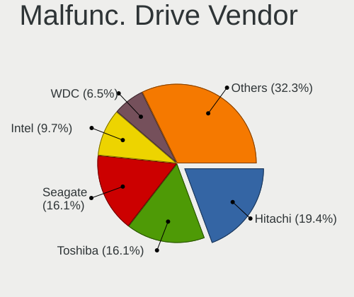

| Vendor              | Notebooks | Drives | Percent |
|---------------------|-----------|--------|---------|
| Hitachi             | 6         | 6      | 19.35%  |
| Toshiba             | 5         | 8      | 16.13%  |
| Seagate             | 5         | 5      | 16.13%  |
| Intel               | 3         | 4      | 9.68%   |
| WDC                 | 2         | 2      | 6.45%   |
| SanDisk             | 2         | 2      | 6.45%   |
| Micron Technology   | 2         | 2      | 6.45%   |
| Smartbuy            | 1         | 1      | 3.23%   |
| SK hynix            | 1         | 1      | 3.23%   |
| Samsung Electronics | 1         | 1      | 3.23%   |
| LITEONIT            | 1         | 1      | 3.23%   |
| LITEON              | 1         | 1      | 3.23%   |
| Crucial             | 1         | 1      | 3.23%   |

Malfunc. HDD Vendor
-------------------

Vendors of faulty HDD drives

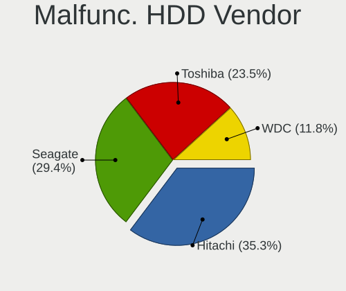

| Vendor  | Notebooks | Drives | Percent |
|---------|-----------|--------|---------|
| Hitachi | 6         | 6      | 35.29%  |
| Seagate | 5         | 5      | 29.41%  |
| Toshiba | 4         | 7      | 23.53%  |
| WDC     | 2         | 2      | 11.76%  |

Malfunc. Drive Kind
-------------------

Kinds of faulty drives

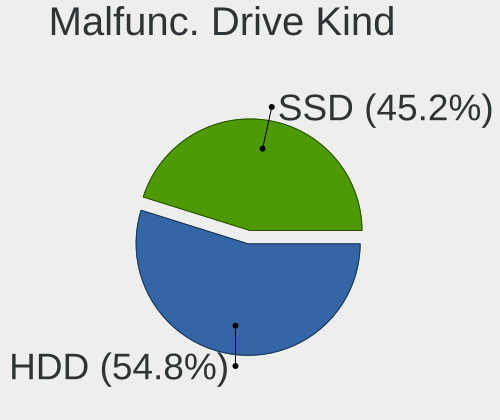

| Kind | Notebooks | Drives | Percent |
|------|-----------|--------|---------|
| HDD  | 17        | 20     | 54.84%  |
| SSD  | 14        | 15     | 45.16%  |

Failed Drives
-------------

Failed drive models

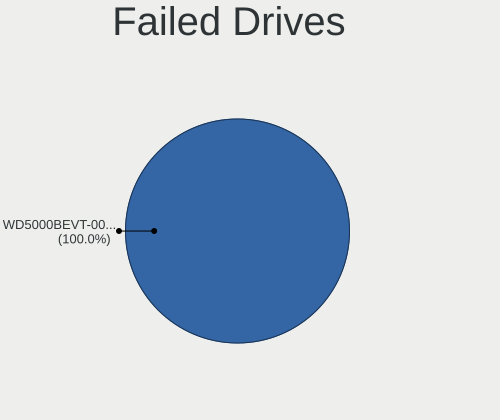

| Model                        | Notebooks | Drives | Percent |
|------------------------------|-----------|--------|---------|
| WDC WD5000BEVT-00A0RT0 500GB | 1         | 1      | 100%    |

Failed Drive Vendor
-------------------

Failed drive vendors

| Vendor | Notebooks | Drives | Percent |
|--------|-----------|--------|---------|
| WDC    | 1         | 1      | 100%    |

Drive Status
------------

Number of failed and malfunc. drives

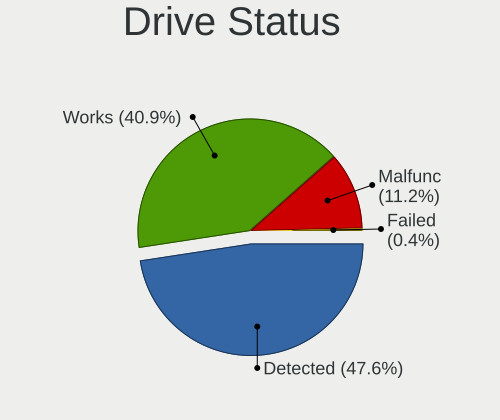

| Status   | Notebooks | Drives | Percent |
|----------|-----------|--------|---------|
| Detected | 128       | 199    | 47.58%  |
| Works    | 110       | 139    | 40.89%  |
| Malfunc  | 30        | 35     | 11.15%  |
| Failed   | 1         | 1      | 0.37%   |

Storage controller
------------------

Storage Vendor
--------------

Storage controller vendors

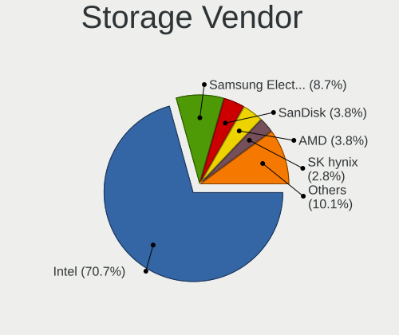

| Vendor                           | Notebooks | Percent |
|----------------------------------|-----------|---------|
| Intel                            | 203       | 70.73%  |
| Samsung Electronics              | 25        | 8.71%   |
| SanDisk                          | 11        | 3.83%   |
| AMD                              | 11        | 3.83%   |
| SK hynix                         | 8         | 2.79%   |
| Micron Technology                | 5         | 1.74%   |
| Union Memory (Shenzhen)          | 4         | 1.39%   |
| KIOXIA                           | 4         | 1.39%   |
| Kingston Technology Company      | 4         | 1.39%   |
| Toshiba America Info Systems     | 2         | 0.7%    |
| Shenzhen Longsys Electronics     | 2         | 0.7%    |
| Silicon Motion                   | 1         | 0.35%   |
| Silicon Integrated Systems [SiS] | 1         | 0.35%   |
| Phison Electronics               | 1         | 0.35%   |
| Nvidia                           | 1         | 0.35%   |
| Micron/Crucial Technology        | 1         | 0.35%   |
| Marvell Technology Group         | 1         | 0.35%   |
| Lenovo                           | 1         | 0.35%   |
| ADATA Technology                 | 1         | 0.35%   |

Storage Model
-------------

Storage controller models

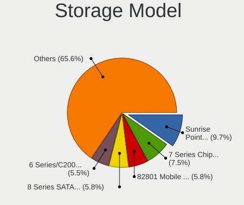

| Model                                                                          | Notebooks | Percent |
|--------------------------------------------------------------------------------|-----------|---------|
| Intel Sunrise Point-LP SATA Controller [AHCI mode]                             | 30        | 9.74%   |
| Intel 7 Series Chipset Family 6-port SATA Controller [AHCI mode]               | 23        | 7.47%   |
| Intel 82801 Mobile SATA Controller [RAID mode]                                 | 18        | 5.84%   |
| Intel 8 Series SATA Controller 1 [AHCI mode]                                   | 18        | 5.84%   |
| Intel 6 Series/C200 Series Chipset Family 6 port Mobile SATA AHCI Controller   | 17        | 5.52%   |
| Samsung NVMe SSD Controller SM981/PM981/PM983                                  | 11        | 3.57%   |
| Intel 8 Series/C220 Series Chipset Family 6-port SATA Controller 1 [AHCI mode] | 11        | 3.57%   |
| AMD FCH SATA Controller [AHCI mode]                                            | 10        | 3.25%   |
| Intel 5 Series/3400 Series Chipset 6 port SATA AHCI Controller                 | 9         | 2.92%   |
| Intel Wildcat Point-LP SATA Controller [AHCI Mode]                             | 8         | 2.6%    |
| Intel Cannon Lake Mobile PCH SATA AHCI Controller                              | 8         | 2.6%    |
| Intel Q170/Q150/B150/H170/H110/Z170/CM236 Chipset SATA Controller [AHCI Mode]  | 7         | 2.27%   |
| Samsung NVMe SSD Controller 980 (DRAM-less)                                    | 6         | 1.95%   |
| Intel HM170/QM170 Chipset SATA Controller [AHCI Mode]                          | 6         | 1.95%   |
| Intel Volume Management Device NVMe RAID Controller                            | 5         | 1.62%   |
| Intel Cannon Point-LP SATA Controller [AHCI Mode]                              | 5         | 1.62%   |
| Intel 82801HM/HEM (ICH8M/ICH8M-E) SATA Controller [AHCI mode]                  | 5         | 1.62%   |
| Intel 82801HM/HEM (ICH8M/ICH8M-E) IDE Controller                               | 5         | 1.62%   |
| Intel 5 Series/3400 Series Chipset 4 port SATA AHCI Controller                 | 5         | 1.62%   |
| Samsung NVMe SSD Controller SM961/PM961/SM963                                  | 4         | 1.3%    |
| KIOXIA NVMe SSD Controller BG4 (DRAM-less)                                     | 4         | 1.3%    |
| Intel 82801IBM/IEM (ICH9M/ICH9M-E) 4 port SATA Controller [AHCI mode]          | 4         | 1.3%    |
| Intel 400 Series Chipset Family SATA AHCI Controller                           | 4         | 1.3%    |
| SK hynix Gold P31/BC711/PC711 NVMe Solid State Drive                           | 3         | 0.97%   |
| Intel Mobile PM965/GM965 PT IDER Controller                                    | 3         | 0.97%   |
| Intel Ice Lake-LP SATA Controller [AHCI mode]                                  | 3         | 0.97%   |
| Intel Comet Lake SATA AHCI Controller                                          | 3         | 0.97%   |
| Union Memory (Shenzhen) AM610 PCIe 3.0 x2 NVMe SSD 128GB, 256GB                | 2         | 0.65%   |
| Toshiba America Info Systems XG6 NVMe SSD Controller                           | 2         | 0.65%   |
| SK hynix BC511 NVMe SSD                                                        | 2         | 0.65%   |
| SK hynix BC501 NVMe Solid State Drive                                          | 2         | 0.65%   |
| SanDisk Ultra 3D / WD PC SN530, IX SN530, Blue SN550 NVMe SSD (DRAM-less)      | 2         | 0.65%   |
| SanDisk Extreme Pro / WD Black SN750 / PC SN730 / Red SN700 NVMe SSD           | 2         | 0.65%   |
| SanDisk Extreme Pro / WD Black 2018/SN750/PC SN720 NVMe SSD                    | 2         | 0.65%   |
| Samsung NVMe SSD Controller SM951/PM951                                        | 2         | 0.65%   |
| Samsung NVMe SSD Controller PM9A1/PM9A3/980PRO                                 | 2         | 0.65%   |
| Micron 2450 NVMe SSD [HendrixV] (DRAM-less)                                    | 2         | 0.65%   |
| Kingston Company OM8PCP Design-In PCIe 3 NVMe SSD (DRAM-less)                  | 2         | 0.65%   |
| Intel Tiger Lake-LP SATA Controller                                            | 2         | 0.65%   |
| Intel SSD DC P4101/Pro 7600p/760p/E 6100p Series                               | 2         | 0.65%   |

Storage Kind
------------

Kind of storage controller (IDE, SATA, NVMe, SAS, ...)

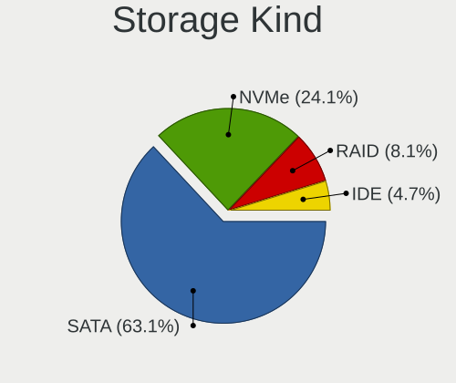

| Kind | Notebooks | Percent |
|------|-----------|---------|
| SATA | 186       | 63.05%  |
| NVMe | 71        | 24.07%  |
| RAID | 24        | 8.14%   |
| IDE  | 14        | 4.75%   |

Processor
---------

CPU Vendor
----------

Processor vendors

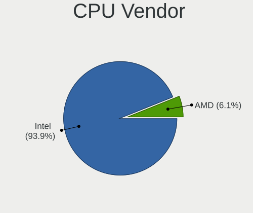

| Vendor | Notebooks | Percent |
|--------|-----------|---------|
| Intel  | 232       | 93.93%  |
| AMD    | 15        | 6.07%   |

CPU Model
---------

Processor models

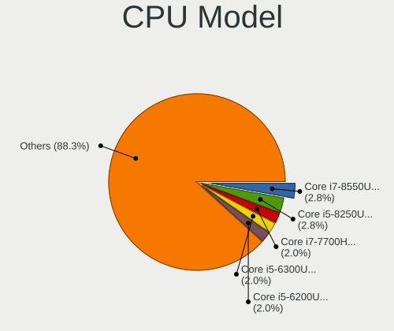

| Model                                   | Notebooks | Percent |
|-----------------------------------------|-----------|---------|
| Intel Core i7-8550U CPU @ 1.80GHz       | 7         | 2.83%   |
| Intel Core i5-8250U CPU @ 1.60GHz       | 7         | 2.83%   |
| Intel Core i7-7700HQ CPU @ 2.80GHz      | 5         | 2.02%   |
| Intel Core i5-6300U CPU @ 2.40GHz       | 5         | 2.02%   |
| Intel Core i5-6200U CPU @ 2.30GHz       | 5         | 2.02%   |
| Intel Core i5-4210U CPU @ 1.70GHz       | 5         | 2.02%   |
| Intel Core i5-3320M CPU @ 2.60GHz       | 5         | 2.02%   |
| Intel Core i5-2520M CPU @ 2.50GHz       | 5         | 2.02%   |
| Intel Core i3-2330M CPU @ 2.20GHz       | 5         | 2.02%   |
| Intel 11th Gen Core i7-1165G7 @ 2.80GHz | 5         | 2.02%   |
| Intel Core i7-8565U CPU @ 1.80GHz       | 4         | 1.62%   |
| Intel 11th Gen Core i5-1135G7 @ 2.40GHz | 4         | 1.62%   |
| Intel Core i7-9750H CPU @ 2.60GHz       | 3         | 1.21%   |
| Intel Core i7-6820HQ CPU @ 2.70GHz      | 3         | 1.21%   |
| Intel Core i7-6500U CPU @ 2.50GHz       | 3         | 1.21%   |
| Intel Core i7-4700MQ CPU @ 2.40GHz      | 3         | 1.21%   |
| Intel Core i7-10750H CPU @ 2.60GHz      | 3         | 1.21%   |
| Intel Core i7-1065G7 CPU @ 1.30GHz      | 3         | 1.21%   |
| Intel Core i5-7200U CPU @ 2.50GHz       | 3         | 1.21%   |
| Intel Core i5-5200U CPU @ 2.20GHz       | 3         | 1.21%   |
| Intel Core i5-4300U CPU @ 1.90GHz       | 3         | 1.21%   |
| Intel Core i3-3217U CPU @ 1.80GHz       | 3         | 1.21%   |
| Intel Pentium CPU P6200 @ 2.13GHz       | 2         | 0.81%   |
| Intel Core i7-8750H CPU @ 2.20GHz       | 2         | 0.81%   |
| Intel Core i7-8650U CPU @ 1.90GHz       | 2         | 0.81%   |
| Intel Core i7-5600U CPU @ 2.60GHz       | 2         | 0.81%   |
| Intel Core i7-4910MQ CPU @ 2.90GHz      | 2         | 0.81%   |
| Intel Core i7-3630QM CPU @ 2.40GHz      | 2         | 0.81%   |
| Intel Core i7-2620M CPU @ 2.70GHz       | 2         | 0.81%   |
| Intel Core i7-10510U CPU @ 1.80GHz      | 2         | 0.81%   |
| Intel Core i7 CPU Q 820 @ 1.73GHz       | 2         | 0.81%   |
| Intel Core i5-8265U CPU @ 1.60GHz       | 2         | 0.81%   |
| Intel Core i5-7300HQ CPU @ 2.50GHz      | 2         | 0.81%   |
| Intel Core i5-5300U CPU @ 2.30GHz       | 2         | 0.81%   |
| Intel Core i5-4200U CPU @ 1.60GHz       | 2         | 0.81%   |
| Intel Core i5-3210M CPU @ 2.50GHz       | 2         | 0.81%   |
| Intel Core i5-2410M CPU @ 2.30GHz       | 2         | 0.81%   |
| Intel Core i5-10210U CPU @ 1.60GHz      | 2         | 0.81%   |
| Intel Core i5 CPU M 560 @ 2.67GHz       | 2         | 0.81%   |
| Intel Core i3-8145U CPU @ 2.10GHz       | 2         | 0.81%   |

CPU Model Family
----------------

Processor model prefix

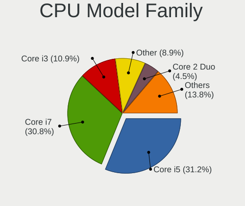

| Model            | Notebooks | Percent |
|------------------|-----------|---------|
| Intel Core i5    | 77        | 31.17%  |
| Intel Core i7    | 76        | 30.77%  |
| Intel Core i3    | 27        | 10.93%  |
| Other            | 22        | 8.91%   |
| Intel Core 2 Duo | 11        | 4.45%   |
| Intel Celeron    | 7         | 2.83%   |
| Intel Pentium    | 6         | 2.43%   |
| AMD Ryzen 7      | 5         | 2.02%   |
| AMD Ryzen 5      | 5         | 2.02%   |
| Intel Genuine    | 2         | 0.81%   |
| Intel Core i9    | 2         | 0.81%   |
| Intel Xeon       | 1         | 0.4%    |
| Intel Pentium 4  | 1         | 0.4%    |
| Intel Atom       | 1         | 0.4%    |
| AMD Ryzen 3 PRO  | 1         | 0.4%    |
| AMD Ryzen 3      | 1         | 0.4%    |
| AMD A4           | 1         | 0.4%    |
| AMD A10          | 1         | 0.4%    |

CPU Cores
---------

Number of processor cores

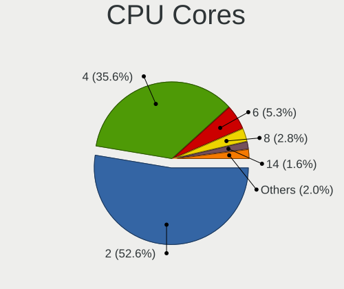

| Number | Notebooks | Percent |
|--------|-----------|---------|
| 2      | 130       | 52.63%  |
| 4      | 88        | 35.63%  |
| 6      | 13        | 5.26%   |
| 8      | 7         | 2.83%   |
| 14     | 4         | 1.62%   |
| 12     | 3         | 1.21%   |
| 1      | 2         | 0.81%   |

CPU Sockets
-----------

Number of sockets

| Number | Notebooks | Percent |
|--------|-----------|---------|
| 1      | 247       | 100%    |

CPU Threads
-----------

Threads per core (Hyper-Threading)

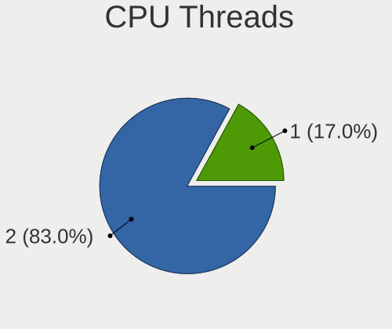

| Number | Notebooks | Percent |
|--------|-----------|---------|
| 2      | 205       | 83%     |
| 1      | 42        | 17%     |

CPU Op-Modes
------------

CPU Operation Modes (32-bit, 64-bit)

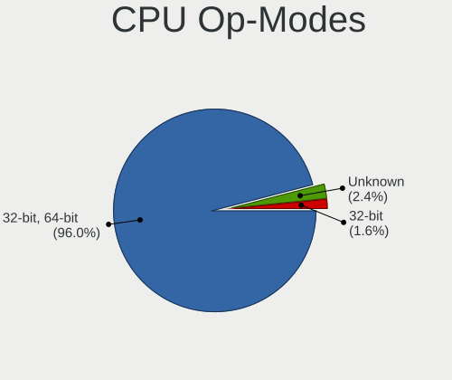

| Op mode        | Notebooks | Percent |
|----------------|-----------|---------|
| 32-bit, 64-bit | 238       | 95.97%  |
| Unknown        | 6         | 2.42%   |
| 32-bit         | 4         | 1.61%   |

CPU Microcode
-------------

Microcode number

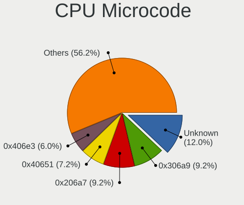

| Number     | Notebooks | Percent |
|------------|-----------|---------|
| Unknown    | 30        | 12.05%  |
| 0x306a9    | 23        | 9.24%   |
| 0x206a7    | 23        | 9.24%   |
| 0x40651    | 18        | 7.23%   |
| 0x406e3    | 15        | 6.02%   |
| 0x806ea    | 14        | 5.62%   |
| 0x306c3    | 13        | 5.22%   |
| 0x806ec    | 10        | 4.02%   |
| 0x306d4    | 10        | 4.02%   |
| 0x20655    | 9         | 3.61%   |
| 0x806c1    | 8         | 3.21%   |
| 0x906ea    | 6         | 2.41%   |
| 0x906e9    | 6         | 2.41%   |
| 0x806e9    | 6         | 2.41%   |
| 0x506e3    | 6         | 2.41%   |
| 0xa0652    | 5         | 2.01%   |
| 0x906a3    | 5         | 2.01%   |
| 0x706e5    | 5         | 2.01%   |
| 0x1067a    | 4         | 1.61%   |
| 0x906ed    | 3         | 1.2%    |
| 0x106e5    | 3         | 1.2%    |
| 0x10676    | 3         | 1.2%    |
| 0x08600106 | 3         | 1.2%    |
| 0x6fb      | 2         | 0.8%    |
| 0x406c3    | 2         | 0.8%    |
| 0x30678    | 2         | 0.8%    |
| 0x20652    | 2         | 0.8%    |
| 0x06006705 | 2         | 0.8%    |
| 0xf24      | 1         | 0.4%    |
| 0x806eb    | 1         | 0.4%    |
| 0x6fd      | 1         | 0.4%    |
| 0x6ec      | 1         | 0.4%    |
| 0x6e8      | 1         | 0.4%    |
| 0x106c2    | 1         | 0.4%    |
| 0x08600109 | 1         | 0.4%    |
| 0x08600103 | 1         | 0.4%    |
| 0x08108109 | 1         | 0.4%    |
| 0x08108102 | 1         | 0.4%    |
| 0x06001119 | 1         | 0.4%    |

CPU Microarch
-------------

Microarchitecture

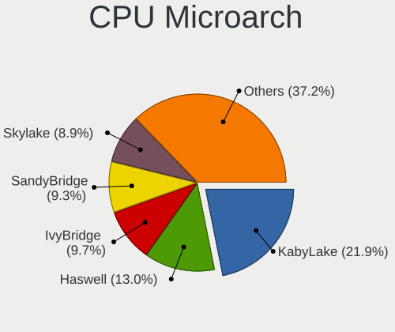

| Name             | Notebooks | Percent |
|------------------|-----------|---------|
| KabyLake         | 54        | 21.86%  |
| Haswell          | 32        | 12.96%  |
| IvyBridge        | 24        | 9.72%   |
| SandyBridge      | 23        | 9.31%   |
| Skylake          | 22        | 8.91%   |
| TigerLake        | 12        | 4.86%   |
| Westmere         | 11        | 4.45%   |
| Broadwell        | 11        | 4.45%   |
| Penryn           | 7         | 2.83%   |
| Zen 2            | 6         | 2.43%   |
| IceLake          | 6         | 2.43%   |
| CometLake        | 6         | 2.43%   |
| Alderlake Hybrid | 6         | 2.43%   |
| Zen+             | 5         | 2.02%   |
| Silvermont       | 4         | 1.62%   |
| Nehalem          | 4         | 1.62%   |
| Core             | 4         | 1.62%   |
| P6               | 2         | 0.81%   |
| Excavator        | 2         | 0.81%   |
| Unknown          | 2         | 0.81%   |
| Piledriver       | 1         | 0.4%    |
| NetBurst         | 1         | 0.4%    |
| Gracemont        | 1         | 0.4%    |
| Bonnell          | 1         | 0.4%    |

Graphics
--------

GPU Vendor
----------

Vendors of graphics cards

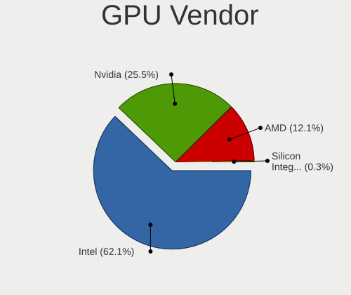

| Vendor                           | Notebooks | Percent |
|----------------------------------|-----------|---------|
| Intel                            | 205       | 62.12%  |
| Nvidia                           | 84        | 25.45%  |
| AMD                              | 40        | 12.12%  |
| Silicon Integrated Systems [SiS] | 1         | 0.3%    |

GPU Model
---------

Graphics card models

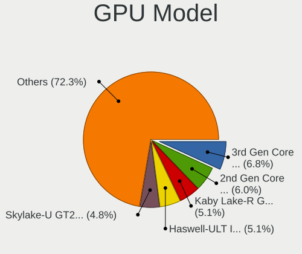

| Model                                                                                 | Notebooks | Percent |
|---------------------------------------------------------------------------------------|-----------|---------|
| Intel 3rd Gen Core processor Graphics Controller                                      | 23        | 6.85%   |
| Intel 2nd Generation Core Processor Family Integrated Graphics Controller             | 20        | 5.95%   |
| Intel Kaby Lake-R GT2 [UHD Graphics 620]                                              | 17        | 5.06%   |
| Intel Haswell-ULT Integrated Graphics Controller                                      | 17        | 5.06%   |
| Intel Skylake-U GT2 [HD Graphics 520]                                                 | 16        | 4.76%   |
| Intel TigerLake-LP GT2 [Iris Xe Graphics]                                             | 12        | 3.57%   |
| Intel 4th Gen Core Processor Integrated Graphics Controller                           | 10        | 2.98%   |
| Intel WhiskeyLake-U GT2 [UHD Graphics 620]                                            | 9         | 2.68%   |
| Intel Broadwell-U GT2 [HD Graphics 5500]                                              | 9         | 2.68%   |
| Intel Core Processor Integrated Graphics Controller                                   | 8         | 2.38%   |
| Intel Kaby Lake-H GT2 [HD Graphics 630]                                               | 7         | 2.08%   |
| Intel CoffeeLake-H GT2 [UHD Graphics 630]                                             | 7         | 2.08%   |
| Intel Alder Lake-P GT2 [Iris Xe Graphics]                                             | 6         | 1.79%   |
| AMD Topaz XT [Radeon R7 M260/M265 / M340/M360 / M440/M445 / 530/535 / 620/625 Mobile] | 6         | 1.79%   |
| AMD Renoir [Radeon Vega Series / Radeon Vega Mobile Series]                           | 6         | 1.79%   |
| Intel Kaby Lake-U GT2 [HD Graphics 620]                                               | 5         | 1.49%   |
| Intel CometLake-U GT2 [UHD Graphics]                                                  | 5         | 1.49%   |
| AMD Picasso/Raven 2 [Radeon Vega Series / Radeon Vega Mobile Series]                  | 5         | 1.49%   |
| Nvidia TU117M [GeForce GTX 1650 Mobile / Max-Q]                                       | 4         | 1.19%   |
| Intel Mobile 4 Series Chipset Integrated Graphics Controller                          | 4         | 1.19%   |
| Intel CometLake-H GT2 [UHD Graphics]                                                  | 4         | 1.19%   |
| Nvidia TU117M [GeForce GTX 1650 Ti Mobile]                                            | 3         | 0.89%   |
| Nvidia GM107GLM [Quadro M1200 Mobile]                                                 | 3         | 0.89%   |
| Nvidia GF117M [GeForce 610M/710M/810M/820M / GT 620M/625M/630M/720M]                  | 3         | 0.89%   |
| Intel Skylake-H GT2 [HD Graphics 530]                                                 | 3         | 0.89%   |
| Intel Mobile GM965/GL960 Integrated Graphics Controller (secondary)                   | 3         | 0.89%   |
| Intel Mobile GM965/GL960 Integrated Graphics Controller (primary)                     | 3         | 0.89%   |
| Intel Iris Plus Graphics G7                                                           | 3         | 0.89%   |
| AMD Whistler [Radeon HD 6630M/6650M/6750M/7670M/7690M]                                | 3         | 0.89%   |
| Nvidia TU116M [GeForce GTX 1660 Ti Mobile]                                            | 2         | 0.6%    |
| Nvidia GT218M [GeForce 310M]                                                          | 2         | 0.6%    |
| Nvidia GP107M [GeForce GTX 1050 Mobile]                                               | 2         | 0.6%    |
| Nvidia GP104M [GeForce GTX 1070 Mobile]                                               | 2         | 0.6%    |
| Nvidia GM108M [GeForce MX110]                                                         | 2         | 0.6%    |
| Nvidia GM108M [GeForce 930MX]                                                         | 2         | 0.6%    |
| Nvidia GM108M [GeForce 840M]                                                          | 2         | 0.6%    |
| Nvidia GM107M [GeForce GTX 850M]                                                      | 2         | 0.6%    |
| Nvidia GM107GLM [Quadro M1000M]                                                       | 2         | 0.6%    |
| Nvidia GK208M [GeForce GT 740M]                                                       | 2         | 0.6%    |
| Nvidia GK208BM [GeForce 920M]                                                         | 2         | 0.6%    |

GPU Combo
---------

Combinations of graphics cards

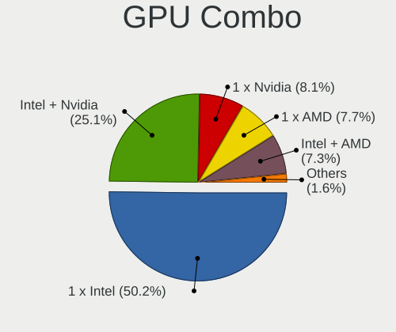

| Name           | Notebooks | Percent |
|----------------|-----------|---------|
| 1 x Intel      | 124       | 50.2%   |
| Intel + Nvidia | 62        | 25.1%   |
| 1 x Nvidia     | 20        | 8.1%    |
| 1 x AMD        | 19        | 7.69%   |
| Intel + AMD    | 18        | 7.29%   |
| AMD + Nvidia   | 2         | 0.81%   |
| 2 x AMD        | 1         | 0.4%    |
| 1 x SiS        | 1         | 0.4%    |

GPU Driver
----------

Free vs proprietary

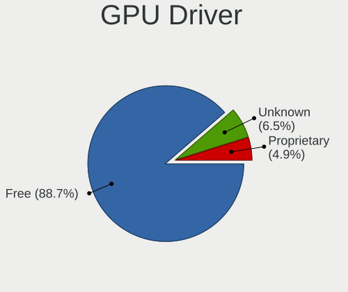

| Driver      | Notebooks | Percent |
|-------------|-----------|---------|
| Free        | 219       | 88.66%  |
| Unknown     | 16        | 6.48%   |
| Proprietary | 12        | 4.86%   |

GPU Memory
----------

Total video memory

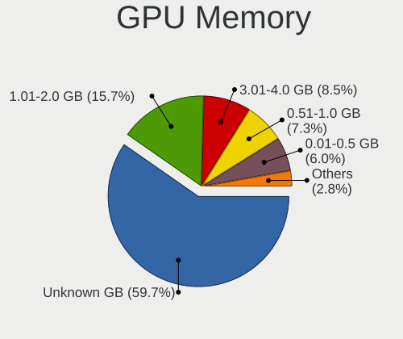

| Size in GB | Notebooks | Percent |
|------------|-----------|---------|
| Unknown    | 148       | 59.68%  |
| 1.01-2.0   | 39        | 15.73%  |
| 3.01-4.0   | 21        | 8.47%   |
| 0.51-1.0   | 18        | 7.26%   |
| 0.01-0.5   | 15        | 6.05%   |
| 5.01-6.0   | 3         | 1.21%   |
| 7.01-8.0   | 2         | 0.81%   |
| 2.01-3.0   | 1         | 0.4%    |
| 8.01-16.0  | 1         | 0.4%    |

Monitor
-------

Monitor Vendor
--------------

Monitor vendors

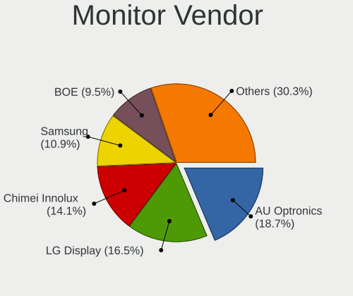

| Vendor                  | Notebooks | Percent |
|-------------------------|-----------|---------|
| AU Optronics            | 53        | 18.66%  |
| LG Display              | 47        | 16.55%  |
| Chimei Innolux          | 40        | 14.08%  |
| Samsung Electronics     | 31        | 10.92%  |
| BOE                     | 27        | 9.51%   |
| Dell                    | 15        | 5.28%   |
| Lenovo                  | 10        | 3.52%   |
| Sharp                   | 7         | 2.46%   |
| Acer                    | 7         | 2.46%   |
| PANDA                   | 5         | 1.76%   |
| Goldstar                | 5         | 1.76%   |
| Panasonic               | 4         | 1.41%   |
| Hewlett-Packard         | 4         | 1.41%   |
| Unknown (XXX)           | 2         | 0.7%    |
| Philips                 | 2         | 0.7%    |
| InnoLux Display         | 2         | 0.7%    |
| Chi Mei Optoelectronics | 2         | 0.7%    |
| ASUSTek Computer        | 2         | 0.7%    |
| Apple                   | 2         | 0.7%    |
| Vizio                   | 1         | 0.35%   |
| TMX                     | 1         | 0.35%   |
| Sony                    | 1         | 0.35%   |
| SKY                     | 1         | 0.35%   |
| Onkyo                   | 1         | 0.35%   |
| MSI                     | 1         | 0.35%   |
| MIT                     | 1         | 0.35%   |
| LG Philips              | 1         | 0.35%   |
| InfoVision              | 1         | 0.35%   |
| HannStar                | 1         | 0.35%   |
| Gateway                 | 1         | 0.35%   |
| Denver                  | 1         | 0.35%   |
| CSO                     | 1         | 0.35%   |
| CHD                     | 1         | 0.35%   |
| AOC                     | 1         | 0.35%   |
| ALP                     | 1         | 0.35%   |
| Unknown                 | 1         | 0.35%   |

Monitor Model
-------------

Monitor models

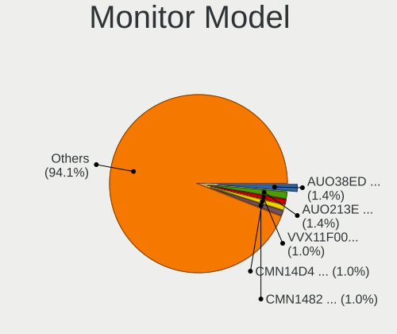

| Model                                                                 | Notebooks | Percent |
|-----------------------------------------------------------------------|-----------|---------|
| AU Optronics LCD Monitor AUO38ED 1920x1080 344x193mm 15.5-inch        | 4         | 1.39%   |
| AU Optronics LCD Monitor AUO213E 1600x900 309x174mm 14.0-inch         | 4         | 1.39%   |
| Panasonic VVX11F009G00 MEI96A2 1920x1080 344x193mm 15.5-inch          | 3         | 1.04%   |
| Chimei Innolux LCD Monitor CMN14D4 1920x1080 309x173mm 13.9-inch      | 3         | 1.04%   |
| Chimei Innolux LCD Monitor CMN1482 1600x900 309x174mm 14.0-inch       | 3         | 1.04%   |
| Sharp LCD Monitor SHP1453 1920x1080 346x194mm 15.6-inch               | 2         | 0.69%   |
| Samsung Electronics LCD Monitor SEC5441 1280x800 331x207mm 15.4-inch  | 2         | 0.69%   |
| Samsung Electronics LCD Monitor SEC3848 1920x1200 367x230mm 17.1-inch | 2         | 0.69%   |
| LG Display LCD Monitor LGD039F 1366x768 345x194mm 15.6-inch           | 2         | 0.69%   |
| LG Display LCD Monitor LGD02DC 1366x768 344x194mm 15.5-inch           | 2         | 0.69%   |
| LG Display LCD Monitor LGD021D 1600x900 382x215mm 17.3-inch           | 2         | 0.69%   |
| InnoLux Display LCD Monitor INL0014 1366x768 309x174mm 14.0-inch      | 2         | 0.69%   |
| Chimei Innolux LCD Monitor CMN15F5 1920x1080 344x193mm 15.5-inch      | 2         | 0.69%   |
| Chimei Innolux LCD Monitor CMN15D3 1920x1080 344x193mm 15.5-inch      | 2         | 0.69%   |
| BOE LCD Monitor BOE07F6 1920x1080 309x174mm 14.0-inch                 | 2         | 0.69%   |
| BOE LCD Monitor BOE06CB 1920x1080 344x194mm 15.5-inch                 | 2         | 0.69%   |
| BOE LCD Monitor BOE06A9 1920x1080 344x193mm 15.5-inch                 | 2         | 0.69%   |
| AU Optronics LCD Monitor AUO408D 1920x1080 309x174mm 14.0-inch        | 2         | 0.69%   |
| AU Optronics LCD Monitor AUO2E3C 1366x768 309x173mm 13.9-inch         | 2         | 0.69%   |
| AU Optronics LCD Monitor AUO26EC 1366x768 344x193mm 15.5-inch         | 2         | 0.69%   |
| AU Optronics LCD Monitor AUO133D 1920x1080 309x173mm 13.9-inch        | 2         | 0.69%   |
| AU Optronics LCD Monitor 1920x1080                                    | 2         | 0.69%   |
| Vizio E220VA VIZ0070 1920x1080 476x268mm 21.5-inch                    | 1         | 0.35%   |
| Unknown (XXX) FURRION TV XXX3553 1920x1080 520x290mm 23.4-inch        | 1         | 0.35%   |
| Unknown (XXX) Beyond TV XXX9221 1920x1080 1209x680mm 54.6-inch        | 1         | 0.35%   |
| TMX TL156MDMP11-0 TMX1560 3200x2000 336x210mm 15.6-inch               | 1         | 0.35%   |
| Sony TV *02 SNY9403 1920x1080 1218x685mm 55.0-inch                    | 1         | 0.35%   |
| SKY 22X1-M225F SKY2150 1920x1080 476x268mm 21.5-inch                  | 1         | 0.35%   |
| Sharp LQ156M1JW01 SHP14C3 1920x1080 344x194mm 15.5-inch               | 1         | 0.35%   |
| Sharp LCD Monitor SHP14B9 3840x2160 344x194mm 15.5-inch               | 1         | 0.35%   |
| Sharp LCD Monitor SHP14AE 1920x1080 294x165mm 13.3-inch               | 1         | 0.35%   |
| Sharp LCD Monitor SHP149A 1920x1080 344x194mm 15.5-inch               | 1         | 0.35%   |
| Sharp LCD Monitor SHP144D 3840x2160 276x156mm 12.5-inch               | 1         | 0.35%   |
| Samsung Electronics SyncMaster SAM022B 1280x1024 338x270mm 17.0-inch  | 1         | 0.35%   |
| Samsung Electronics SMT22A350 SAM07A7 1920x1080 477x268mm 21.5-inch   | 1         | 0.35%   |
| Samsung Electronics SMBX2450 SAM0721 1920x1080 531x299mm 24.0-inch    | 1         | 0.35%   |
| Samsung Electronics SA300/SA350 SAM078E 1920x1080 477x268mm 21.5-inch | 1         | 0.35%   |
| Samsung Electronics S24D300 SAM0B43 1920x1080 531x299mm 24.0-inch     | 1         | 0.35%   |
| Samsung Electronics S22B420 SAM0979 1680x1050 473x291mm 21.9-inch     | 1         | 0.35%   |
| Samsung Electronics Odyssey G5 SAM748A 2560x1440 698x393mm 31.5-inch  | 1         | 0.35%   |

Monitor Resolution
------------------

Monitor screen resolution

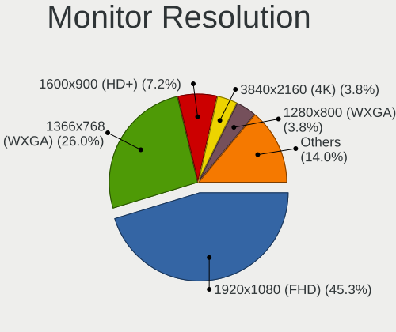

| Resolution         | Notebooks | Percent |
|--------------------|-----------|---------|
| 1920x1080 (FHD)    | 120       | 45.28%  |
| 1366x768 (WXGA)    | 69        | 26.04%  |
| 1600x900 (HD+)     | 19        | 7.17%   |
| 3840x2160 (4K)     | 10        | 3.77%   |
| 1280x800 (WXGA)    | 10        | 3.77%   |
| 2560x1440 (QHD)    | 6         | 2.26%   |
| 1920x1200 (WUXGA)  | 6         | 2.26%   |
| 1680x1050 (WSXGA+) | 5         | 1.89%   |
| 1280x1024 (SXGA)   | 5         | 1.89%   |
| 2560x1600          | 3         | 1.13%   |
| 3440x1440          | 2         | 0.75%   |
| 1440x900 (WXGA+)   | 2         | 0.75%   |
| 5760x1080          | 1         | 0.38%   |
| 3456x2160          | 1         | 0.38%   |
| 3200x2000          | 1         | 0.38%   |
| 2880x1800          | 1         | 0.38%   |
| 1600x1200          | 1         | 0.38%   |
| 1280x720 (HD)      | 1         | 0.38%   |
| 1024x600           | 1         | 0.38%   |
| Unknown            | 1         | 0.38%   |

Monitor Diagonal
----------------

Diagonal size in inches

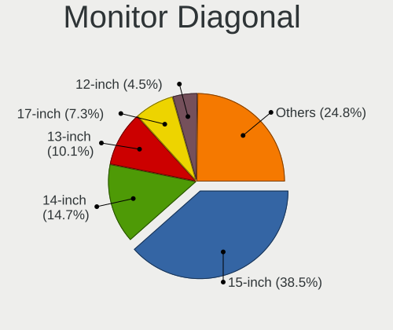

| Inches  | Notebooks | Percent |
|---------|-----------|---------|
| 15      | 110       | 38.46%  |
| 14      | 42        | 14.69%  |
| 13      | 29        | 10.14%  |
| 17      | 21        | 7.34%   |
| 12      | 13        | 4.55%   |
| 23      | 11        | 3.85%   |
| 24      | 10        | 3.5%    |
| 27      | 8         | 2.8%    |
| 31      | 7         | 2.45%   |
| 21      | 7         | 2.45%   |
| 19      | 4         | 1.4%    |
| 16      | 3         | 1.05%   |
| Unknown | 3         | 1.05%   |
| 32      | 2         | 0.7%    |
| 20      | 2         | 0.7%    |
| 11      | 2         | 0.7%    |
| 55      | 1         | 0.35%   |
| 54      | 1         | 0.35%   |
| 52      | 1         | 0.35%   |
| 42      | 1         | 0.35%   |
| 40      | 1         | 0.35%   |
| 36      | 1         | 0.35%   |
| 35      | 1         | 0.35%   |
| 34      | 1         | 0.35%   |
| 29      | 1         | 0.35%   |
| 28      | 1         | 0.35%   |
| 18      | 1         | 0.35%   |
| 10      | 1         | 0.35%   |

Monitor Width
-------------

Physical width

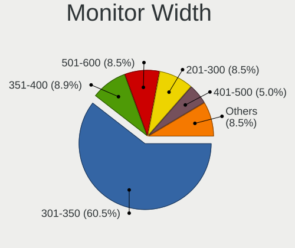

| Width in mm | Notebooks | Percent |
|-------------|-----------|---------|
| 301-350     | 170       | 60.5%   |
| 351-400     | 25        | 8.9%    |
| 501-600     | 24        | 8.54%   |
| 201-300     | 24        | 8.54%   |
| 401-500     | 14        | 4.98%   |
| 601-700     | 11        | 3.91%   |
| 701-800     | 4         | 1.42%   |
| 1001-1500   | 3         | 1.07%   |
| Unknown     | 3         | 1.07%   |
| 801-900     | 2         | 0.71%   |
| 901-1000    | 1         | 0.36%   |

Aspect Ratio
------------

Proportional relationship between the width and the height

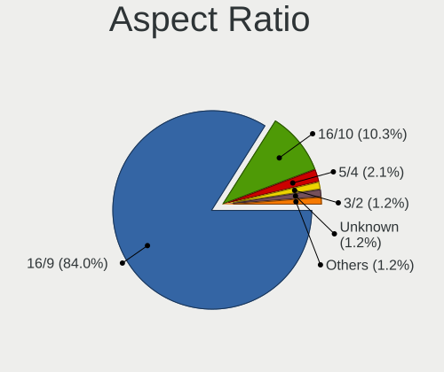

| Ratio   | Notebooks | Percent |
|---------|-----------|---------|
| 16/9    | 204       | 83.95%  |
| 16/10   | 25        | 10.29%  |
| 5/4     | 5         | 2.06%   |
| 3/2     | 3         | 1.23%   |
| Unknown | 3         | 1.23%   |
| 21/9    | 2         | 0.82%   |
| 4/3     | 1         | 0.41%   |

Monitor Area
------------

Area in inch²

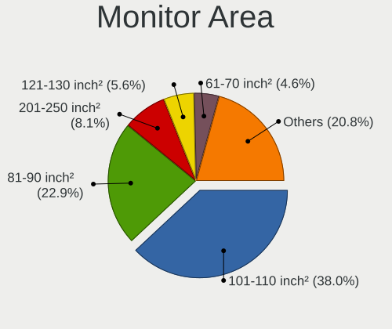

| Area in inch² | Notebooks | Percent |
|----------------|-----------|---------|
| 101-110        | 108       | 38.03%  |
| 81-90          | 65        | 22.89%  |
| 201-250        | 23        | 8.1%    |
| 121-130        | 16        | 5.63%   |
| 61-70          | 13        | 4.58%   |
| 351-500        | 12        | 4.23%   |
| 301-350        | 8         | 2.82%   |
| 151-200        | 8         | 2.82%   |
| 71-80          | 6         | 2.11%   |
| 141-150        | 4         | 1.41%   |
| More than 1000 | 3         | 1.06%   |
| 131-140        | 3         | 1.06%   |
| 111-120        | 3         | 1.06%   |
| 501-1000       | 3         | 1.06%   |
| Unknown        | 3         | 1.06%   |
| 51-60          | 2         | 0.7%    |
| 251-300        | 2         | 0.7%    |
| 41-50          | 1         | 0.35%   |
| 91-100         | 1         | 0.35%   |

Pixel Density
-------------

Pixels per inch

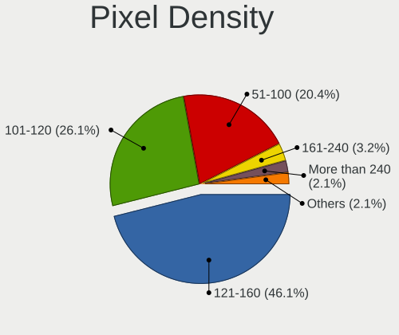

| Density       | Notebooks | Percent |
|---------------|-----------|---------|
| 121-160       | 129       | 46.07%  |
| 101-120       | 73        | 26.07%  |
| 51-100        | 57        | 20.36%  |
| 161-240       | 9         | 3.21%   |
| More than 240 | 6         | 2.14%   |
| 1-50          | 3         | 1.07%   |
| Unknown       | 3         | 1.07%   |

Multiple Monitors
-----------------

Total monitors connected

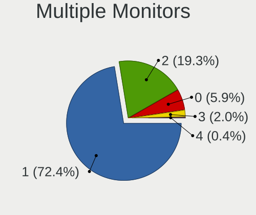

| Total | Notebooks | Percent |
|-------|-----------|---------|
| 1     | 184       | 72.44%  |
| 2     | 49        | 19.29%  |
| 0     | 15        | 5.91%   |
| 3     | 5         | 1.97%   |
| 4     | 1         | 0.39%   |

Network
-------

Net Controller Vendor
---------------------

Controller vendors

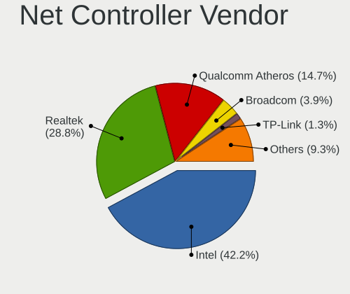

| Vendor                            | Notebooks | Percent |
|-----------------------------------|-----------|---------|
| Intel                             | 164       | 42.16%  |
| Realtek Semiconductor             | 112       | 28.79%  |
| Qualcomm Atheros                  | 57        | 14.65%  |
| Broadcom                          | 15        | 3.86%   |
| TP-Link                           | 5         | 1.29%   |
| Shenzhen Goodix Technology        | 3         | 0.77%   |
| Ralink Technology                 | 3         | 0.77%   |
| Ralink                            | 3         | 0.77%   |
| Ericsson Business Mobile Networks | 3         | 0.77%   |
| ASIX Electronics                  | 3         | 0.77%   |
| Xiaomi                            | 2         | 0.51%   |
| Marvell Technology Group          | 2         | 0.51%   |
| Dell                              | 2         | 0.51%   |
| Broadcom Limited                  | 2         | 0.51%   |
| ASUSTek Computer                  | 2         | 0.51%   |
| Xilinx                            | 1         | 0.26%   |
| Silicon Integrated Systems [SiS]  | 1         | 0.26%   |
| Sierra Wireless                   | 1         | 0.26%   |
| Samsung Electronics               | 1         | 0.26%   |
| Qualcomm Atheros Communications   | 1         | 0.26%   |
| OnePlus Technology (Shenzhen)     | 1         | 0.26%   |
| Nvidia                            | 1         | 0.26%   |
| Huawei Technologies               | 1         | 0.26%   |
| Edimax Technology                 | 1         | 0.26%   |
| DisplayLink                       | 1         | 0.26%   |
| D-Link                            | 1         | 0.26%   |

Net Controller Model
--------------------

Controller models

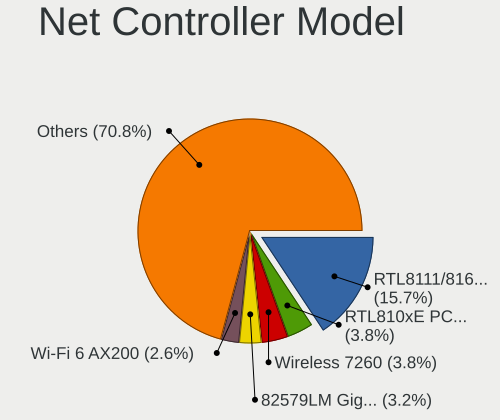

| Model                                                                  | Notebooks | Percent |
|------------------------------------------------------------------------|-----------|---------|
| Realtek RTL8111/8168/8211/8411 PCI Express Gigabit Ethernet Controller | 78        | 15.69%  |
| Realtek RTL810xE PCI Express Fast Ethernet controller                  | 19        | 3.82%   |
| Intel Wireless 7260                                                    | 19        | 3.82%   |
| Intel 82579LM Gigabit Network Connection (Lewisville)                  | 16        | 3.22%   |
| Intel Wi-Fi 6 AX200                                                    | 13        | 2.62%   |
| Qualcomm Atheros QCA9565 / AR9565 Wireless Network Adapter             | 12        | 2.41%   |
| Intel Wireless 8260                                                    | 12        | 2.41%   |
| Intel Wireless 8265 / 8275                                             | 10        | 2.01%   |
| Intel Wi-Fi 6 AX201                                                    | 9         | 1.81%   |
| Intel Centrino Advanced-N 6205 [Taylor Peak]                           | 9         | 1.81%   |
| Realtek RTL8153 Gigabit Ethernet Adapter                               | 8         | 1.61%   |
| Qualcomm Atheros QCA9377 802.11ac Wireless Network Adapter             | 8         | 1.61%   |
| Qualcomm Atheros QCA6174 802.11ac Wireless Network Adapter             | 8         | 1.61%   |
| Intel Wireless 7265                                                    | 8         | 1.61%   |
| Intel Ethernet Connection I217-LM                                      | 7         | 1.41%   |
| Intel 82577LM Gigabit Network Connection                               | 7         | 1.41%   |
| Realtek RTL8723BE PCIe Wireless Network Adapter                        | 6         | 1.21%   |
| Qualcomm Atheros AR9285 Wireless Network Adapter (PCI-Express)         | 6         | 1.21%   |
| Intel Ethernet Connection I219-LM                                      | 6         | 1.21%   |
| Intel Comet Lake PCH CNVi WiFi                                         | 6         | 1.21%   |
| Intel Centrino Ultimate-N 6300                                         | 6         | 1.21%   |
| Intel Alder Lake-P PCH CNVi WiFi                                       | 6         | 1.21%   |
| Realtek RTL8822CE 802.11ac PCIe Wireless Network Adapter               | 5         | 1.01%   |
| Intel Ethernet Connection I218-LM                                      | 5         | 1.01%   |
| Intel Comet Lake PCH-LP CNVi WiFi                                      | 5         | 1.01%   |
| Broadcom BCM4313 802.11bgn Wireless Network Adapter                    | 5         | 1.01%   |
| Realtek RTL8821CE 802.11ac PCIe Wireless Network Adapter               | 4         | 0.8%    |
| Qualcomm Atheros AR9485 Wireless Network Adapter                       | 4         | 0.8%    |
| Qualcomm Atheros AR9462 Wireless Network Adapter                       | 4         | 0.8%    |
| Intel Wireless 3165                                                    | 4         | 0.8%    |
| Intel PRO/Wireless 3945ABG [Golan] Network Connection                  | 4         | 0.8%    |
| Intel Ice Lake-LP PCH CNVi WiFi                                        | 4         | 0.8%    |
| Intel Ethernet Connection (4) I219-V                                   | 4         | 0.8%    |
| Intel Ethernet Connection (3) I218-LM                                  | 4         | 0.8%    |
| Intel Dual Band Wireless-AC 3165 Plus Bluetooth                        | 4         | 0.8%    |
| Intel Centrino Advanced-N 6235                                         | 4         | 0.8%    |
| Intel Centrino Advanced-N 6200                                         | 4         | 0.8%    |
| Intel Cannon Point-LP CNVi [Wireless-AC]                               | 4         | 0.8%    |
| Intel 82567LM Gigabit Network Connection                               | 4         | 0.8%    |
| Intel 82566MM Gigabit Network Connection                               | 4         | 0.8%    |

Wireless Vendor
---------------

Wireless vendors

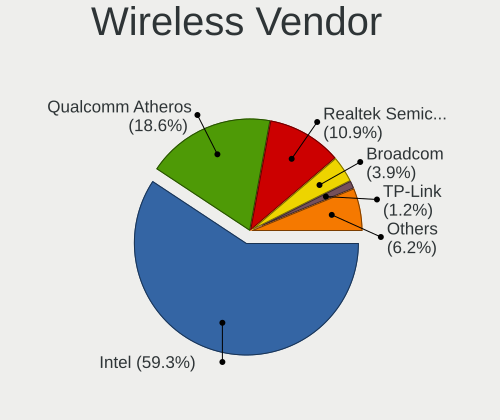

| Vendor                          | Notebooks | Percent |
|---------------------------------|-----------|---------|
| Intel                           | 153       | 59.3%   |
| Qualcomm Atheros                | 48        | 18.6%   |
| Realtek Semiconductor           | 28        | 10.85%  |
| Broadcom                        | 10        | 3.88%   |
| TP-Link                         | 3         | 1.16%   |
| Ralink Technology               | 3         | 1.16%   |
| Ralink                          | 3         | 1.16%   |
| Dell                            | 2         | 0.78%   |
| Broadcom Limited                | 2         | 0.78%   |
| ASUSTek Computer                | 2         | 0.78%   |
| Sierra Wireless                 | 1         | 0.39%   |
| Qualcomm Atheros Communications | 1         | 0.39%   |
| Edimax Technology               | 1         | 0.39%   |
| D-Link                          | 1         | 0.39%   |

Wireless Model
--------------

Wireless models

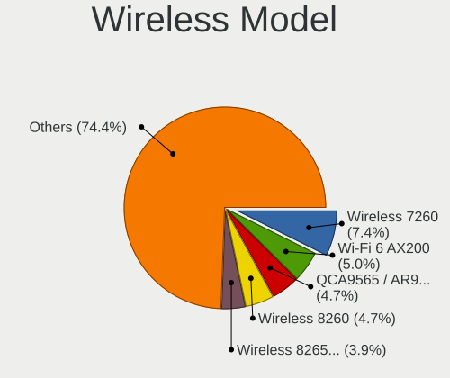

| Model                                                                   | Notebooks | Percent |
|-------------------------------------------------------------------------|-----------|---------|
| Intel Wireless 7260                                                     | 19        | 7.36%   |
| Intel Wi-Fi 6 AX200                                                     | 13        | 5.04%   |
| Qualcomm Atheros QCA9565 / AR9565 Wireless Network Adapter              | 12        | 4.65%   |
| Intel Wireless 8260                                                     | 12        | 4.65%   |
| Intel Wireless 8265 / 8275                                              | 10        | 3.88%   |
| Intel Wi-Fi 6 AX201                                                     | 9         | 3.49%   |
| Intel Centrino Advanced-N 6205 [Taylor Peak]                            | 9         | 3.49%   |
| Qualcomm Atheros QCA9377 802.11ac Wireless Network Adapter              | 8         | 3.1%    |
| Qualcomm Atheros QCA6174 802.11ac Wireless Network Adapter              | 8         | 3.1%    |
| Intel Wireless 7265                                                     | 8         | 3.1%    |
| Realtek RTL8723BE PCIe Wireless Network Adapter                         | 6         | 2.33%   |
| Qualcomm Atheros AR9285 Wireless Network Adapter (PCI-Express)          | 6         | 2.33%   |
| Intel Comet Lake PCH CNVi WiFi                                          | 6         | 2.33%   |
| Intel Centrino Ultimate-N 6300                                          | 6         | 2.33%   |
| Realtek RTL8822CE 802.11ac PCIe Wireless Network Adapter                | 5         | 1.94%   |
| Intel Comet Lake PCH-LP CNVi WiFi                                       | 5         | 1.94%   |
| Broadcom BCM4313 802.11bgn Wireless Network Adapter                     | 5         | 1.94%   |
| Realtek RTL8821CE 802.11ac PCIe Wireless Network Adapter                | 4         | 1.55%   |
| Qualcomm Atheros AR9485 Wireless Network Adapter                        | 4         | 1.55%   |
| Qualcomm Atheros AR9462 Wireless Network Adapter                        | 4         | 1.55%   |
| Intel Wireless 3165                                                     | 4         | 1.55%   |
| Intel PRO/Wireless 3945ABG [Golan] Network Connection                   | 4         | 1.55%   |
| Intel Ice Lake-LP PCH CNVi WiFi                                         | 4         | 1.55%   |
| Intel Dual Band Wireless-AC 3165 Plus Bluetooth                         | 4         | 1.55%   |
| Intel Centrino Advanced-N 6235                                          | 4         | 1.55%   |
| Intel Centrino Advanced-N 6200                                          | 4         | 1.55%   |
| Intel Cannon Point-LP CNVi [Wireless-AC]                                | 4         | 1.55%   |
| Realtek RTL8822BE 802.11a/b/g/n/ac WiFi adapter                         | 3         | 1.16%   |
| Realtek RTL8723DE Wireless Network Adapter                              | 3         | 1.16%   |
| Qualcomm Atheros AR9287 Wireless Network Adapter (PCI-Express)          | 3         | 1.16%   |
| Intel Dual Band Wireless-AC 3168NGW [Stone Peak]                        | 3         | 1.16%   |
| Intel Centrino Advanced-N 6230 [Rainbow Peak]                           | 3         | 1.16%   |
| Intel Alder Lake-P PCH CNVi WiFi                                        | 3         | 1.16%   |
| TP-Link AC600 wireless Realtek RTL8811AU [Archer T2U Nano]              | 2         | 0.78%   |
| Qualcomm Atheros AR242x / AR542x Wireless Network Adapter (PCI-Express) | 2         | 0.78%   |
| Intel Wireless 3160                                                     | 2         | 0.78%   |
| Intel Wi-Fi 5(802.11ac) Wireless-AC 9x6x [Thunder Peak]                 | 2         | 0.78%   |
| Intel Ultimate N WiFi Link 5300                                         | 2         | 0.78%   |
| Intel PRO/Wireless 5100 AGN [Shiloh] Network Connection                 | 2         | 0.78%   |
| Intel Centrino Wireless-N 1030 [Rainbow Peak]                           | 2         | 0.78%   |

Ethernet Vendor
---------------

Ethernet vendors

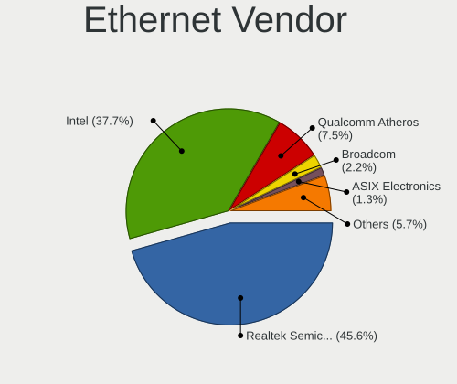

| Vendor                           | Notebooks | Percent |
|----------------------------------|-----------|---------|
| Realtek Semiconductor            | 104       | 45.61%  |
| Intel                            | 86        | 37.72%  |
| Qualcomm Atheros                 | 17        | 7.46%   |
| Broadcom                         | 5         | 2.19%   |
| ASIX Electronics                 | 3         | 1.32%   |
| Xiaomi                           | 2         | 0.88%   |
| TP-Link                          | 2         | 0.88%   |
| Marvell Technology Group         | 2         | 0.88%   |
| Xilinx                           | 1         | 0.44%   |
| Silicon Integrated Systems [SiS] | 1         | 0.44%   |
| Samsung Electronics              | 1         | 0.44%   |
| OnePlus Technology (Shenzhen)    | 1         | 0.44%   |
| Nvidia                           | 1         | 0.44%   |
| Huawei Technologies              | 1         | 0.44%   |
| DisplayLink                      | 1         | 0.44%   |

Ethernet Model
--------------

Ethernet models

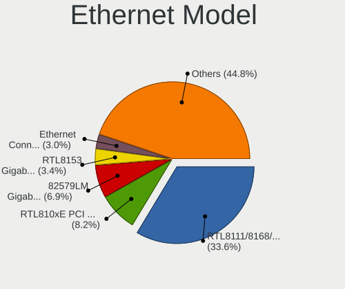

| Model                                                                  | Notebooks | Percent |
|------------------------------------------------------------------------|-----------|---------|
| Realtek RTL8111/8168/8211/8411 PCI Express Gigabit Ethernet Controller | 78        | 33.62%  |
| Realtek RTL810xE PCI Express Fast Ethernet controller                  | 19        | 8.19%   |
| Intel 82579LM Gigabit Network Connection (Lewisville)                  | 16        | 6.9%    |
| Realtek RTL8153 Gigabit Ethernet Adapter                               | 8         | 3.45%   |
| Intel Ethernet Connection I217-LM                                      | 7         | 3.02%   |
| Intel 82577LM Gigabit Network Connection                               | 7         | 3.02%   |
| Intel Ethernet Connection I219-LM                                      | 6         | 2.59%   |
| Intel Ethernet Connection I218-LM                                      | 5         | 2.16%   |
| Intel Ethernet Connection (4) I219-V                                   | 4         | 1.72%   |
| Intel Ethernet Connection (3) I218-LM                                  | 4         | 1.72%   |
| Intel 82567LM Gigabit Network Connection                               | 4         | 1.72%   |
| Intel 82566MM Gigabit Network Connection                               | 4         | 1.72%   |
| Qualcomm Atheros AR8151 v2.0 Gigabit Ethernet                          | 3         | 1.29%   |
| Qualcomm Atheros AR8131 Gigabit Ethernet                               | 3         | 1.29%   |
| Intel Ethernet Connection (7) I219-LM                                  | 3         | 1.29%   |
| Intel Ethernet Connection (6) I219-V                                   | 3         | 1.29%   |
| Intel Ethernet Connection (2) I219-LM                                  | 3         | 1.29%   |
| Intel Alder Lake-P PCH CNVi WiFi                                       | 3         | 1.29%   |
| Xiaomi Mi/Redmi series (RNDIS)                                         | 2         | 0.86%   |
| Realtek RTL-8100/8101L/8139 PCI Fast Ethernet Adapter                  | 2         | 0.86%   |
| Qualcomm Atheros QCA8172 Fast Ethernet                                 | 2         | 0.86%   |
| Qualcomm Atheros Killer E2500 Gigabit Ethernet Controller              | 2         | 0.86%   |
| Qualcomm Atheros Killer E2400 Gigabit Ethernet Controller              | 2         | 0.86%   |
| Intel Ethernet Connection I219-V                                       | 2         | 0.86%   |
| Intel Ethernet Connection (5) I219-LM                                  | 2         | 0.86%   |
| Intel Ethernet Connection (4) I219-LM                                  | 2         | 0.86%   |
| Intel Ethernet Connection (13) I219-V                                  | 2         | 0.86%   |
| Intel 82579V Gigabit Network Connection                                | 2         | 0.86%   |
| Broadcom NetXtreme BCM57786 Gigabit Ethernet PCIe                      | 2         | 0.86%   |
| Broadcom NetLink BCM57785 Gigabit Ethernet PCIe                        | 2         | 0.86%   |
| ASIX AX88179 Gigabit Ethernet                                          | 2         | 0.86%   |
| Xilinx Ethernet controller                                             | 1         | 0.43%   |
| TP-Link USB 10/100 LAN                                                 | 1         | 0.43%   |
| TP-Link UE300 10/100/1000 LAN (ethernet mode) [Realtek RTL8153]        | 1         | 0.43%   |
| Silicon Integrated Systems [SiS] SiS900 PCI Fast Ethernet              | 1         | 0.43%   |
| Samsung Galaxy series, misc. (tethering mode)                          | 1         | 0.43%   |
| Qualcomm Atheros AR8162 Fast Ethernet                                  | 1         | 0.43%   |
| Qualcomm Atheros AR8161 Gigabit Ethernet                               | 1         | 0.43%   |
| Qualcomm Atheros AR8152 v1.1 Fast Ethernet                             | 1         | 0.43%   |
| Qualcomm Atheros AR8151 v1.0 Gigabit Ethernet                          | 1         | 0.43%   |

Net Controller Kind
-------------------

Ethernet, WiFi or modem

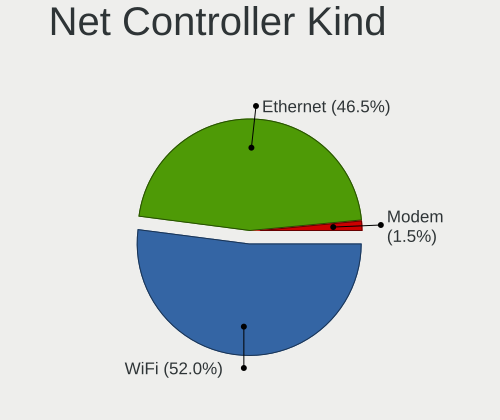

| Kind     | Notebooks | Percent |
|----------|-----------|---------|
| WiFi     | 242       | 52.04%  |
| Ethernet | 216       | 46.45%  |
| Modem    | 7         | 1.51%   |

Used Controller
---------------

Currently used network controller

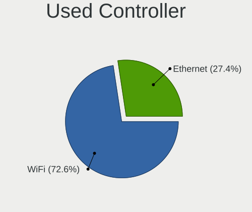

| Kind     | Notebooks | Percent |
|----------|-----------|---------|
| WiFi     | 190       | 71.43%  |
| Ethernet | 76        | 28.57%  |

NICs
----

Total network controllers on board

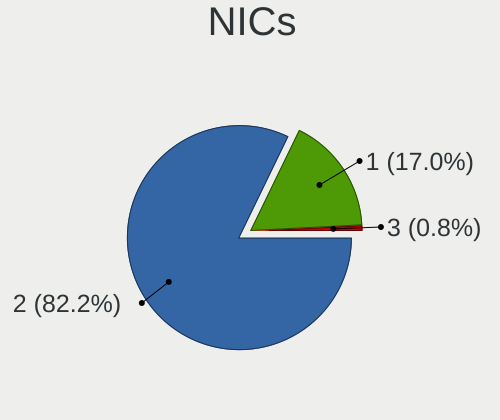

| Total | Notebooks | Percent |
|-------|-----------|---------|
| 2     | 203       | 82.19%  |
| 1     | 42        | 17%     |
| 3     | 2         | 0.81%   |

IPv6
----

IPv6 vs IPv4

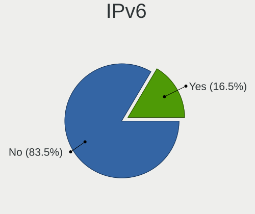

| Used | Notebooks | Percent |
|------|-----------|---------|
| No   | 208       | 83.53%  |
| Yes  | 41        | 16.47%  |

Bluetooth
---------

Bluetooth Vendor
----------------

Controller vendors

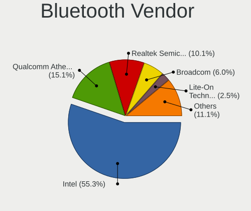

| Vendor                          | Notebooks | Percent |
|---------------------------------|-----------|---------|
| Intel                           | 110       | 55.28%  |
| Qualcomm Atheros Communications | 30        | 15.08%  |
| Realtek Semiconductor           | 20        | 10.05%  |
| Broadcom                        | 12        | 6.03%   |
| Lite-On Technology              | 5         | 2.51%   |
| IMC Networks                    | 4         | 2.01%   |
| Hewlett-Packard                 | 3         | 1.51%   |
| Dell                            | 3         | 1.51%   |
| Foxconn / Hon Hai               | 2         | 1.01%   |
| Cambridge Silicon Radio         | 2         | 1.01%   |
| Apple                           | 2         | 1.01%   |
| Toshiba                         | 1         | 0.5%    |
| Realtek                         | 1         | 0.5%    |
| Ralink                          | 1         | 0.5%    |
| Integrated System Solution      | 1         | 0.5%    |
| ASUSTek Computer                | 1         | 0.5%    |
| Alps Electric                   | 1         | 0.5%    |

Bluetooth Model
---------------

Controller models

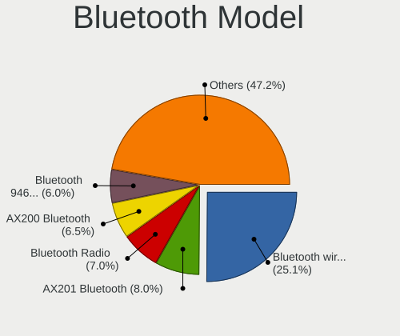

| Model                                                                               | Notebooks | Percent |
|-------------------------------------------------------------------------------------|-----------|---------|
| Intel Bluetooth wireless interface                                                  | 50        | 25.13%  |
| Intel AX201 Bluetooth                                                               | 16        | 8.04%   |
| Realtek Bluetooth Radio                                                             | 14        | 7.04%   |
| Intel AX200 Bluetooth                                                               | 13        | 6.53%   |
| Intel Bluetooth 9460/9560 Jefferson Peak (JfP)                                      | 12        | 6.03%   |
| Qualcomm Atheros  Bluetooth Device                                                  | 10        | 5.03%   |
| Qualcomm Atheros AR3012 Bluetooth 4.0                                               | 8         | 4.02%   |
| Intel Bluetooth Device                                                              | 6         | 3.02%   |
| Intel Centrino Bluetooth Wireless Transceiver                                       | 5         | 2.51%   |
| Realtek  Bluetooth 4.2 Adapter                                                      | 4         | 2.01%   |
| Qualcomm Atheros QCA61x4 Bluetooth 4.0                                              | 4         | 2.01%   |
| Qualcomm Atheros AR3011 Bluetooth                                                   | 4         | 2.01%   |
| Intel Centrino Advanced-N 6230 Bluetooth adapter                                    | 4         | 2.01%   |
| Qualcomm Atheros AR9462 Bluetooth                                                   | 3         | 1.51%   |
| Intel Wireless-AC 3168 Bluetooth                                                    | 3         | 1.51%   |
| Broadcom BCM2045B (BDC-2.1)                                                         | 3         | 1.51%   |
| Lite-On Bluetooth Device                                                            | 2         | 1.01%   |
| Lite-On Atheros AR3012 Bluetooth                                                    | 2         | 1.01%   |
| IMC Networks Bluetooth Device                                                       | 2         | 1.01%   |
| HP Broadcom 2070 Bluetooth Combo                                                    | 2         | 1.01%   |
| Dell DW375 Bluetooth Module                                                         | 2         | 1.01%   |
| Cambridge Silicon Radio Bluetooth Dongle (HCI mode)                                 | 2         | 1.01%   |
| Broadcom BCM20702 Bluetooth 4.0 [ThinkPad]                                          | 2         | 1.01%   |
| Broadcom BCM2045B (BDC-2.1) [Bluetooth Controller]                                  | 2         | 1.01%   |
| Apple Bluetooth Host Controller                                                     | 2         | 1.01%   |
| Toshiba Bluetooth Radio                                                             | 1         | 0.5%    |
| Realtek RTL8822BE Bluetooth 4.2 Adapter                                             | 1         | 0.5%    |
| Realtek RTL8821A Bluetooth                                                          | 1         | 0.5%    |
| Realtek Bluetooth Radio                                                             | 1         | 0.5%    |
| Ralink RT3290 Bluetooth                                                             | 1         | 0.5%    |
| Qualcomm Atheros Bluetooth USB Host Controller                                      | 1         | 0.5%    |
| Lite-On Broadcom BCM43142A0 Bluetooth Device                                        | 1         | 0.5%    |
| Intel Wireless-AC 9260 Bluetooth Adapter                                            | 1         | 0.5%    |
| Integrated System Solution Bluetooth Device                                         | 1         | 0.5%    |
| IMC Networks Bluetooth Radio                                                        | 1         | 0.5%    |
| IMC Networks Atheros AR3012 Bluetooth 4.0 Adapter                                   | 1         | 0.5%    |
| HP Bluetooth 2.0 Interface [Broadcom BCM2045]                                       | 1         | 0.5%    |
| Foxconn / Hon Hai Foxconn T77H114 BCM2070 [Single-Chip Bluetooth 2.1 + EDR Adapter] | 1         | 0.5%    |
| Foxconn / Hon Hai Bluetooth Device                                                  | 1         | 0.5%    |
| Dell BCM20702A0 Bluetooth Module                                                    | 1         | 0.5%    |

Sound
-----

Sound Vendor
------------

Sound card vendors

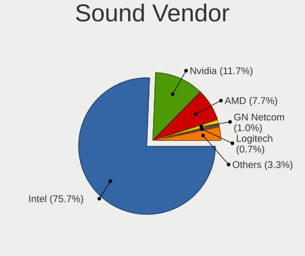

| Vendor                           | Notebooks | Percent |
|----------------------------------|-----------|---------|
| Intel                            | 227       | 75.67%  |
| Nvidia                           | 35        | 11.67%  |
| AMD                              | 23        | 7.67%   |
| GN Netcom                        | 3         | 1%      |
| Logitech                         | 2         | 0.67%   |
| Tenx Technology                  | 1         | 0.33%   |
| Silicon Integrated Systems [SiS] | 1         | 0.33%   |
| Realtek Semiconductor            | 1         | 0.33%   |
| Plantronics                      | 1         | 0.33%   |
| Linux Foundation                 | 1         | 0.33%   |
| Lenovo                           | 1         | 0.33%   |
| Kingston Technology              | 1         | 0.33%   |
| JBL                              | 1         | 0.33%   |
| Generalplus Technology           | 1         | 0.33%   |
| Asahi Kasei Microsystems         | 1         | 0.33%   |

Sound Model
-----------

Sound card models

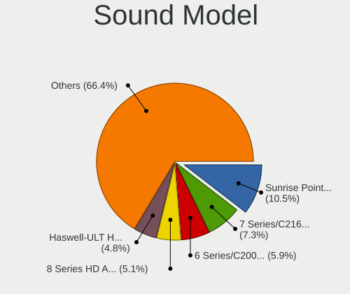

| Model                                                                                             | Notebooks | Percent |
|---------------------------------------------------------------------------------------------------|-----------|---------|
| Intel Sunrise Point-LP HD Audio                                                                   | 37        | 10.45%  |
| Intel 7 Series/C216 Chipset Family High Definition Audio Controller                               | 26        | 7.34%   |
| Intel 6 Series/C200 Series Chipset Family High Definition Audio Controller                        | 21        | 5.93%   |
| Intel 8 Series HD Audio Controller                                                                | 18        | 5.08%   |
| Intel Haswell-ULT HD Audio Controller                                                             | 17        | 4.8%    |
| Intel 5 Series/3400 Series Chipset High Definition Audio                                          | 15        | 4.24%   |
| Intel 8 Series/C220 Series Chipset High Definition Audio Controller                               | 14        | 3.95%   |
| Intel Tiger Lake-LP Smart Sound Technology Audio Controller                                       | 12        | 3.39%   |
| AMD Ryzen HD Audio Controller                                                                     | 12        | 3.39%   |
| Intel Wildcat Point-LP High Definition Audio Controller                                           | 11        | 3.11%   |
| Intel Broadwell-U Audio Controller                                                                | 11        | 3.11%   |
| Intel Xeon E3-1200 v3/4th Gen Core Processor HD Audio Controller                                  | 10        | 2.82%   |
| Intel CM238 HD Audio Controller                                                                   | 9         | 2.54%   |
| Intel Cannon Point-LP High Definition Audio Controller                                            | 9         | 2.54%   |
| Intel Cannon Lake PCH cAVS                                                                        | 9         | 2.54%   |
| Nvidia TU107 GeForce GTX 1650 High Definition Audio Controller                                    | 7         | 1.98%   |
| Intel Comet Lake PCH cAVS                                                                         | 6         | 1.69%   |
| Intel Alder Lake PCH-P High Definition Audio Controller                                           | 6         | 1.69%   |
| AMD Renoir/Cezanne HDMI/DP Audio Controller                                                       | 6         | 1.69%   |
| Intel Ice Lake-LP Smart Sound Technology Audio Controller                                         | 5         | 1.41%   |
| Intel Comet Lake PCH-LP cAVS                                                                      | 5         | 1.41%   |
| Intel 82801I (ICH9 Family) HD Audio Controller                                                    | 5         | 1.41%   |
| Intel 82801H (ICH8 Family) HD Audio Controller                                                    | 5         | 1.41%   |
| Intel 100 Series/C230 Series Chipset Family HD Audio Controller                                   | 5         | 1.41%   |
| Nvidia GK107 HDMI Audio Controller                                                                | 4         | 1.13%   |
| Nvidia GF108 High Definition Audio Controller                                                     | 4         | 1.13%   |
| AMD Raven/Raven2/Fenghuang HDMI/DP Audio Controller                                               | 4         | 1.13%   |
| Nvidia TU106 High Definition Audio Controller                                                     | 2         | 0.56%   |
| Nvidia GM107 High Definition Audio Controller [GeForce 940MX]                                     | 2         | 0.56%   |
| Nvidia GK104 HDMI Audio Controller                                                                | 2         | 0.56%   |
| Nvidia GF119 HDMI Audio Controller                                                                | 2         | 0.56%   |
| Nvidia GA106 High Definition Audio Controller                                                     | 2         | 0.56%   |
| Intel NM10/ICH7 Family High Definition Audio Controller                                           | 2         | 0.56%   |
| Intel Atom/Celeron/Pentium Processor x5-E8000/J3xxx/N3xxx Series High Definition Audio Controller | 2         | 0.56%   |
| Intel Atom Processor Z36xxx/Z37xxx Series High Definition Audio Controller                        | 2         | 0.56%   |
| AMD RV710/730 HDMI Audio [Radeon HD 4000 series]                                                  | 2         | 0.56%   |
| AMD High Definition Audio Controller                                                              | 2         | 0.56%   |
| AMD Family 15h (Models 60h-6fh) Audio Controller                                                  | 2         | 0.56%   |
| AMD Cedar HDMI Audio [Radeon HD 5400/6300/7300 Series]                                            | 2         | 0.56%   |
| Tenx Technology USB AUDIO                                                                         | 1         | 0.28%   |

Memory
------

Memory Vendor
-------------

Memory module vendors

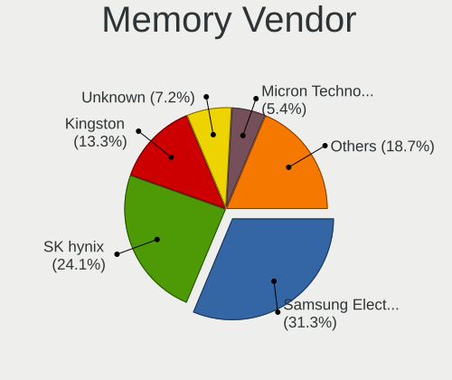

| Vendor              | Notebooks | Percent |
|---------------------|-----------|---------|
| Samsung Electronics | 52        | 31.33%  |
| SK hynix            | 40        | 24.1%   |
| Kingston            | 22        | 13.25%  |
| Unknown             | 12        | 7.23%   |
| Micron Technology   | 9         | 5.42%   |
| A-DATA Technology   | 7         | 4.22%   |
| Crucial             | 5         | 3.01%   |
| Elpida              | 4         | 2.41%   |
| Corsair             | 3         | 1.81%   |
| Apacer              | 3         | 1.81%   |
| Ramaxel Technology  | 2         | 1.2%    |
| Nanya Technology    | 2         | 1.2%    |
| Wilk                | 1         | 0.6%    |
| Transcend           | 1         | 0.6%    |
| Smart Brazil        | 1         | 0.6%    |
| SHARETRONIC         | 1         | 0.6%    |
| G.Skill             | 1         | 0.6%    |

Memory Model
------------

Memory module models

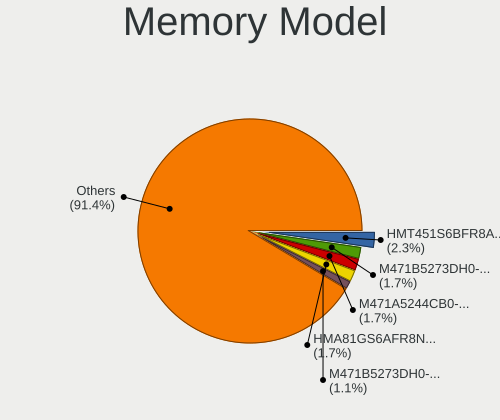

| Model                                                        | Notebooks | Percent |
|--------------------------------------------------------------|-----------|---------|
| SK hynix RAM HMT451S6BFR8A-PB 4GB SODIMM DDR3 1600MT/s       | 4         | 2.29%   |
| SK hynix RAM HMA81GS6AFR8N-UH 8GB SODIMM DDR4 2667MT/s       | 3         | 1.71%   |
| Samsung RAM M471B5273DH0-CH9 4GB SODIMM DDR3 1600MT/s        | 3         | 1.71%   |
| Samsung RAM M471A5244CB0-CTD 4GB SODIMM DDR4 3266MT/s        | 3         | 1.71%   |
| SK hynix RAM Module 8192MB SODIMM DDR4 2133MT/s              | 2         | 1.14%   |
| SK hynix RAM HMT41GS6BFR8A-PB 8GB SODIMM DDR3 2667MT/s       | 2         | 1.14%   |
| SK hynix RAM HMT351S6EFR8A-PB 4GB SODIMM DDR3 1600MT/s       | 2         | 1.14%   |
| SK hynix RAM HMT351S6CFR8C-PB 4GB SODIMM DDR3 1600MT/s       | 2         | 1.14%   |
| SK hynix RAM HMT351S6BFR8C-H9 4GB SODIMM DDR3 1333MT/s       | 2         | 1.14%   |
| SK hynix RAM HMA82GS6JJR8N-VK 16GB SODIMM DDR4 2667MT/s      | 2         | 1.14%   |
| SK hynix RAM HMA41GS6AFR8N-TF 8GB SODIMM DDR4 2667MT/s       | 2         | 1.14%   |
| Samsung RAM M471B5273DH0-CK0 4GB SODIMM DDR3 2400MT/s        | 2         | 1.14%   |
| Samsung RAM M471B5173QH0-YK0 4GB SODIMM DDR3 1600MT/s        | 2         | 1.14%   |
| Samsung RAM M471B1G73QH0-YK0 8GB SODIMM DDR3 1600MT/s        | 2         | 1.14%   |
| Samsung RAM M471B1G73DB0-YK0 8GB SODIMM DDR3 1600MT/s        | 2         | 1.14%   |
| Samsung RAM M471A2K43DB1-CTD 16GB SODIMM DDR4 2667MT/s       | 2         | 1.14%   |
| Samsung RAM M471A2G44AM0-CWE 16GB SODIMM DDR4 3200MT/s       | 2         | 1.14%   |
| Samsung RAM M471A1K43EB1-CWE 8GB SODIMM DDR4 3200MT/s        | 2         | 1.14%   |
| Samsung RAM M471A1K43CB1-CRC 8GB SODIMM DDR4 8400MT/s        | 2         | 1.14%   |
| Samsung RAM M471A1K43BB1-CRC 8GB SODIMM DDR4 2667MT/s        | 2         | 1.14%   |
| Samsung RAM M471A1G44AB0-CWE 8GB Row Of Chips DDR4 3200MT/s  | 2         | 1.14%   |
| Kingston RAM 99U5469-041.A00LF 4GB SODIMM DDR3 1600MT/s      | 2         | 1.14%   |
| Crucial RAM CT51264BF160B.C16F 4GB SODIMM DDR3 4199MT/s      | 2         | 1.14%   |
| Wilk RAM GR3200S464L22/16G 16GB SODIMM DDR4 3200MT/s         | 1         | 0.57%   |
| Unknown RAM Module 8GB SODIMM DDR3 1600MT/s                  | 1         | 0.57%   |
| Unknown RAM Module 4GB SODIMM DDR3 1067MT/s                  | 1         | 0.57%   |
| Unknown RAM Module 4GB SODIMM DDR2 667MT/s                   | 1         | 0.57%   |
| Unknown RAM Module 4096MB SODIMM DDR3 1333MT/s               | 1         | 0.57%   |
| Unknown RAM Module 4096MB SODIMM DDR3                        | 1         | 0.57%   |
| Unknown RAM Module 4096MB SODIMM DDR2 667MT/s                | 1         | 0.57%   |
| Unknown RAM Module 2GB SODIMM DDR2 667MT/s                   | 1         | 0.57%   |
| Unknown RAM Module 2GB Row Of Chips LPDDR4 4267MT/s          | 1         | 0.57%   |
| Unknown RAM Module 2048MB SODIMM DDR3 1333MT/s               | 1         | 0.57%   |
| Unknown RAM Module 2048MB SODIMM DDR2 667MT/s                | 1         | 0.57%   |
| Unknown RAM Module 1024MB SODIMM SDRAM                       | 1         | 0.57%   |
| Unknown RAM Module 1024MB SODIMM DRAM                        | 1         | 0.57%   |
| Transcend RAM JM2666HSB-16G 16GB SODIMM DDR4 2667MT/s        | 1         | 0.57%   |
| Smart Brazil RAM SMS4TDC3C0K0446SCG 4GB SODIMM DDR4 2667MT/s | 1         | 0.57%   |
| SK hynix RAM Module 8GB SODIMM DDR4 2133MT/s                 | 1         | 0.57%   |
| SK hynix RAM Module 8192MB SODIMM DDR4 2400MT/s              | 1         | 0.57%   |

Memory Kind
-----------

Memory module kinds

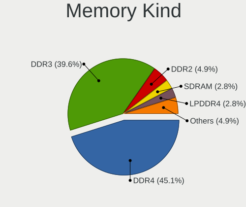

| Kind   | Notebooks | Percent |
|--------|-----------|---------|
| DDR4   | 65        | 45.14%  |
| DDR3   | 57        | 39.58%  |
| DDR2   | 7         | 4.86%   |
| SDRAM  | 4         | 2.78%   |
| LPDDR4 | 4         | 2.78%   |
| LPDDR3 | 3         | 2.08%   |
| LPDDR5 | 2         | 1.39%   |
| DRAM   | 1         | 0.69%   |
| DDR5   | 1         | 0.69%   |

Memory Form Factor
------------------

Physical design of the memory module

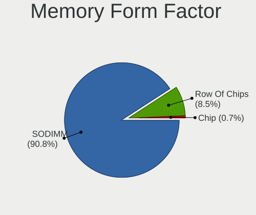

| Name         | Notebooks | Percent |
|--------------|-----------|---------|
| SODIMM       | 129       | 90.85%  |
| Row Of Chips | 12        | 8.45%   |
| Chip         | 1         | 0.7%    |

Memory Size
-----------

Memory module size

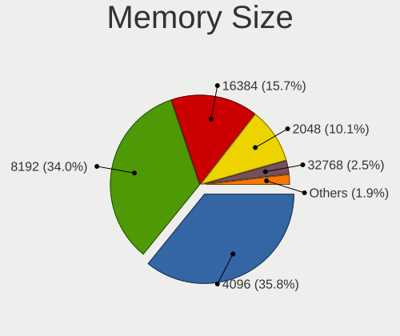

| Size  | Notebooks | Percent |
|-------|-----------|---------|
| 4096  | 57        | 35.85%  |
| 8192  | 54        | 33.96%  |
| 16384 | 25        | 15.72%  |
| 2048  | 16        | 10.06%  |
| 32768 | 4         | 2.52%   |
| 1024  | 3         | 1.89%   |

Memory Speed
------------

Memory module speed

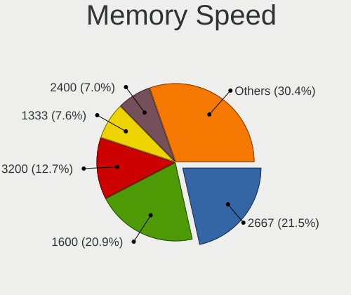

| Speed   | Notebooks | Percent |
|---------|-----------|---------|
| 2667    | 34        | 21.52%  |
| 1600    | 33        | 20.89%  |
| 3200    | 20        | 12.66%  |
| 1333    | 12        | 7.59%   |
| 2400    | 11        | 6.96%   |
| 1334    | 9         | 5.7%    |
| 2133    | 7         | 4.43%   |
| 667     | 5         | 3.16%   |
| 4267    | 4         | 2.53%   |
| 1067    | 4         | 2.53%   |
| 4199    | 3         | 1.9%    |
| 3266    | 3         | 1.9%    |
| Unknown | 3         | 1.9%    |
| 8400    | 2         | 1.27%   |
| 800     | 2         | 1.27%   |
| 6400    | 1         | 0.63%   |
| 4800    | 1         | 0.63%   |
| 4000    | 1         | 0.63%   |
| 1867    | 1         | 0.63%   |
| 1866    | 1         | 0.63%   |
| 975     | 1         | 0.63%   |

Printers & scanners
-------------------

Printer Vendor
--------------

Printer device vendors

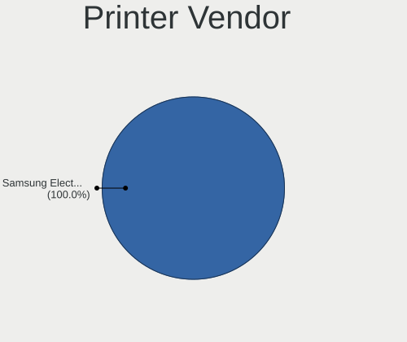

| Vendor              | Notebooks | Percent |
|---------------------|-----------|---------|
| Samsung Electronics | 1         | 100%    |

Printer Model
-------------

Printer device models

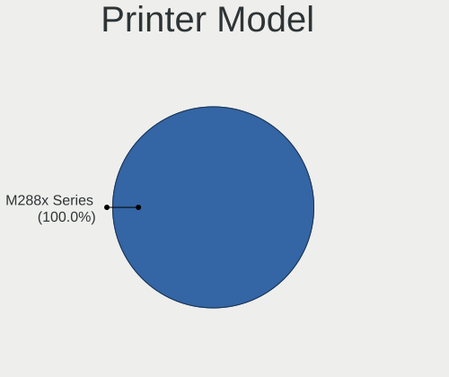

| Model                | Notebooks | Percent |
|----------------------|-----------|---------|
| Samsung M288x Series | 1         | 100%    |

Scanner Vendor
--------------

Scanner device vendors

Zero info for selected period =(

Scanner Model
-------------

Scanner device models

Zero info for selected period =(

Camera
------

Camera Vendor
-------------

Camera device vendors

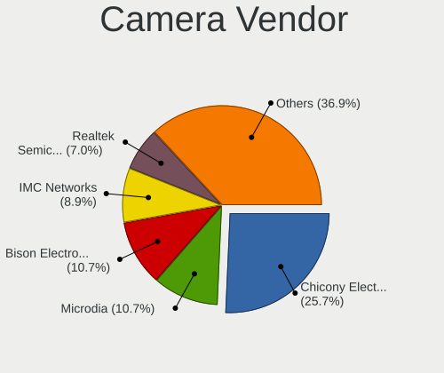

| Vendor                                 | Notebooks | Percent |
|----------------------------------------|-----------|---------|
| Chicony Electronics                    | 55        | 25.7%   |
| Microdia                               | 23        | 10.75%  |
| Bison Electronics                      | 23        | 10.75%  |
| IMC Networks                           | 19        | 8.88%   |
| Realtek Semiconductor                  | 15        | 7.01%   |
| Sunplus Innovation Technology          | 14        | 6.54%   |
| Lite-On Technology                     | 10        | 4.67%   |
| Quanta                                 | 9         | 4.21%   |
| Syntek                                 | 7         | 3.27%   |
| Cheng Uei Precision Industry (Foxlink) | 7         | 3.27%   |
| Suyin                                  | 5         | 2.34%   |
| Silicon Motion                         | 5         | 2.34%   |
| Microsoft                              | 3         | 1.4%    |
| Logitech                               | 3         | 1.4%    |
| Apple                                  | 3         | 1.4%    |
| Samsung Electronics                    | 2         | 0.93%   |
| Ricoh                                  | 2         | 0.93%   |
| Luxvisions Innotech Limited            | 2         | 0.93%   |
| Intel                                  | 2         | 0.93%   |
| Alcor Micro                            | 2         | 0.93%   |
| Sunplus Technology                     | 1         | 0.47%   |
| Lenovo                                 | 1         | 0.47%   |
| Generalplus Technology                 | 1         | 0.47%   |

Camera Model
------------

Camera device models

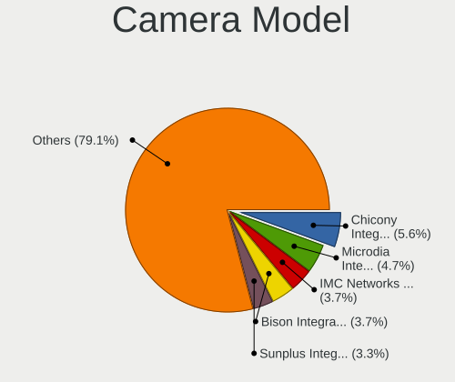

| Model                                               | Notebooks | Percent |
|-----------------------------------------------------|-----------|---------|
| Chicony Integrated Camera                           | 12        | 5.58%   |
| Microdia Integrated_Webcam_HD                       | 10        | 4.65%   |
| IMC Networks Integrated Camera                      | 8         | 3.72%   |
| Bison Integrated Camera                             | 8         | 3.72%   |
| Sunplus Integrated_Webcam_HD                        | 7         | 3.26%   |
| IMC Networks USB2.0 HD UVC WebCam                   | 5         | 2.33%   |
| Chicony HP HD Camera                                | 5         | 2.33%   |
| Chicony HD WebCam                                   | 5         | 2.33%   |
| Syntek Integrated Camera                            | 4         | 1.86%   |
| Lite-On Integrated Camera                           | 4         | 1.86%   |
| Lite-On HP HD Camera                                | 4         | 1.86%   |
| Chicony HP TrueVision HD                            | 4         | 1.86%   |
| Bison HD Webcam                                     | 4         | 1.86%   |
| Microdia Laptop_Integrated_Webcam_HD                | 3         | 1.4%    |
| Chicony USB2.0 VGA UVC WebCam                       | 3         | 1.4%    |
| Chicony Integrated Camera (1280x720@30)             | 3         | 1.4%    |
| Chicony HP Webcam [2 MP Macro]                      | 3         | 1.4%    |
| Bison Lenovo EasyCamera                             | 3         | 1.4%    |
| Suyin Integrated Webcam                             | 2         | 0.93%   |
| Samsung Galaxy series, misc. (MTP mode)             | 2         | 0.93%   |
| Realtek Lenovo EasyCamera                           | 2         | 0.93%   |
| Realtek Integrated_Webcam_HD                        | 2         | 0.93%   |
| Realtek Integrated Webcam                           | 2         | 0.93%   |
| Quanta Laptop_Integrated_Webcam_2HDM                | 2         | 0.93%   |
| Quanta HP TrueVision HD Camera                      | 2         | 0.93%   |
| Microdia Laptop_Integrated_Webcam_2M                | 2         | 0.93%   |
| Microdia Dell Integrated HD Webcam                  | 2         | 0.93%   |
| Luxvisions Innotech Limited HP TrueVision HD Camera | 2         | 0.93%   |
| Lite-On HP HD Webcam                                | 2         | 0.93%   |
| Chicony TOSHIBA Web Camera - HD                     | 2         | 0.93%   |
| Chicony Thinkpad T430 camera                        | 2         | 0.93%   |
| Chicony HP HD Webcam                                | 2         | 0.93%   |
| Cheng Uei Precision Industry (Foxlink) Webcam       | 2         | 0.93%   |
| Apple iPhone 5/5C/5S/6/SE/7/8/X                     | 2         | 0.93%   |
| Syntek USB2.0 UVC PC Camera                         | 1         | 0.47%   |
| Syntek Lenovo EasyCamera                            | 1         | 0.47%   |
| Syntek EasyCamera                                   | 1         | 0.47%   |
| Suyin Sony Visual Communication Camera              | 1         | 0.47%   |
| Suyin Integrated_Webcam_HD                          | 1         | 0.47%   |
| Suyin Asus Integrated Webcam [CN031B]               | 1         | 0.47%   |

Security
--------

Fingerprint Vendor
------------------

Fingerprint sensor vendors

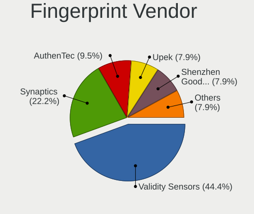

| Vendor                     | Notebooks | Percent |
|----------------------------|-----------|---------|
| Validity Sensors           | 28        | 44.44%  |
| Synaptics                  | 14        | 22.22%  |
| AuthenTec                  | 6         | 9.52%   |
| Upek                       | 5         | 7.94%   |
| Shenzhen Goodix Technology | 5         | 7.94%   |
| STMicroelectronics         | 2         | 3.17%   |
| Elan Microelectronics      | 2         | 3.17%   |
| LighTuning Technology      | 1         | 1.59%   |

Fingerprint Model
-----------------

Fingerprint sensor models

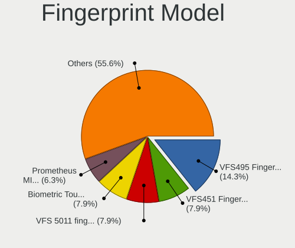

| Model                                                                      | Notebooks | Percent |
|----------------------------------------------------------------------------|-----------|---------|
| Validity Sensors VFS495 Fingerprint Reader                                 | 9         | 14.29%  |
| Validity Sensors VFS451 Fingerprint Reader                                 | 5         | 7.94%   |
| Validity Sensors VFS 5011 fingerprint sensor                               | 5         | 7.94%   |
| Upek Biometric Touchchip/Touchstrip Fingerprint Sensor                     | 5         | 7.94%   |
| Synaptics Prometheus MIS Touch Fingerprint Reader                          | 4         | 6.35%   |
| Shenzhen Goodix  Fingerprint Device                                        | 4         | 6.35%   |
| Validity Sensors VFS7500 Touch Fingerprint Sensor                          | 3         | 4.76%   |
| Synaptics Metallica MIS Touch Fingerprint Reader                           | 3         | 4.76%   |
| AuthenTec AES2810                                                          | 3         | 4.76%   |
| Validity Sensors VFS491                                                    | 2         | 3.17%   |
| Validity Sensors Synaptics WBDI                                            | 2         | 3.17%   |
| Synaptics UWP WBDI Device                                                  | 2         | 3.17%   |
| Synaptics Metallica MOH Touch Fingerprint Reader                           | 2         | 3.17%   |
| STMicroelectronics Fingerprint Reader                                      | 2         | 3.17%   |
| Elan ELAN:Fingerprint                                                      | 2         | 3.17%   |
| AuthenTec AES1660 Fingerprint Sensor                                       | 2         | 3.17%   |
| Validity Sensors VFS5011 Fingerprint Reader                                | 1         | 1.59%   |
| Validity Sensors Synaptics VFS7552 Touch Fingerprint Sensor with PurePrint | 1         | 1.59%   |
| Synaptics  WBDI                                                            | 1         | 1.59%   |
| Synaptics Prometheus Fingerprint Reader                                    | 1         | 1.59%   |
| Synaptics Fingerprint reader [HP G6]                                       | 1         | 1.59%   |
| Shenzhen Goodix Fingerprint Reader                                         | 1         | 1.59%   |
| LighTuning ES603 Swipe Fingerprint Sensor                                  | 1         | 1.59%   |
| AuthenTec AES2501 Fingerprint Sensor                                       | 1         | 1.59%   |

Chipcard Vendor
---------------

Chipcard module vendors

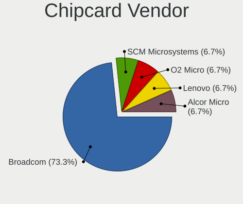

| Vendor           | Notebooks | Percent |
|------------------|-----------|---------|
| Broadcom         | 12        | 66.67%  |
| Upek             | 2         | 11.11%  |
| SCM Microsystems | 1         | 5.56%   |
| O2 Micro         | 1         | 5.56%   |
| Lenovo           | 1         | 5.56%   |
| Alcor Micro      | 1         | 5.56%   |

Chipcard Model
--------------

Chipcard module models

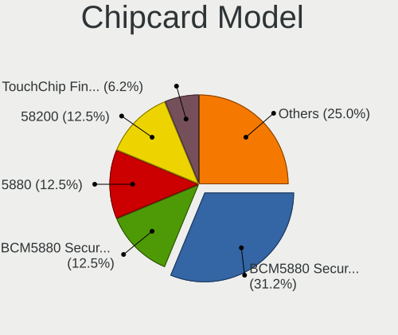

| Model                                                                        | Notebooks | Percent |
|------------------------------------------------------------------------------|-----------|---------|
| Broadcom BCM5880 Secure Applications Processor                               | 5         | 27.78%  |
| Broadcom 5880                                                                | 3         | 16.67%  |
| Upek TouchChip Fingerprint Coprocessor (WBF advanced mode)                   | 2         | 11.11%  |
| Broadcom BCM5880 Secure Applications Processor with fingerprint swipe sensor | 2         | 11.11%  |
| Broadcom 58200                                                               | 2         | 11.11%  |
| SCM Microsystems SCR331 SmartCard Reader                                     | 1         | 5.56%   |
| O2 Micro OZ776 CCID Smartcard Reader                                         | 1         | 5.56%   |
| Lenovo Integrated Smart Card Reader                                          | 1         | 5.56%   |
| Alcor Micro AU9540 Smartcard Reader                                          | 1         | 5.56%   |

Unsupported
-----------

Unsupported Devices
-------------------

Total unsupported devices on board

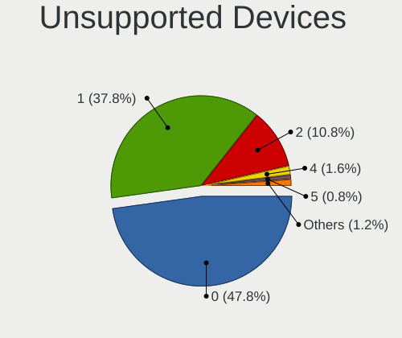

| Total | Notebooks | Percent |
|-------|-----------|---------|
| 0     | 120       | 47.81%  |
| 1     | 95        | 37.85%  |
| 2     | 27        | 10.76%  |
| 4     | 4         | 1.59%   |
| 5     | 2         | 0.8%    |
| 3     | 2         | 0.8%    |
| 6     | 1         | 0.4%    |

Unsupported Device Types
------------------------

Types of unsupported devices

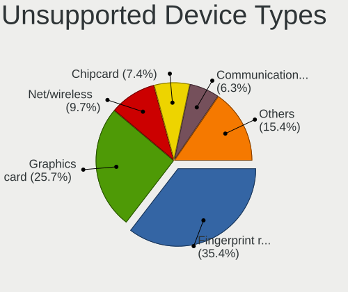

| Type                     | Notebooks | Percent |
|--------------------------|-----------|---------|
| Fingerprint reader       | 62        | 35.43%  |
| Graphics card            | 45        | 25.71%  |
| Net/wireless             | 17        | 9.71%   |
| Chipcard                 | 13        | 7.43%   |
| Communication controller | 11        | 6.29%   |
| Multimedia controller    | 9         | 5.14%   |
| Sound                    | 5         | 2.86%   |
| Net/ethernet             | 4         | 2.29%   |
| Storage                  | 3         | 1.71%   |
| Bluetooth                | 2         | 1.14%   |
| Storage/raid             | 1         | 0.57%   |
| Firewire controller      | 1         | 0.57%   |
| Card reader              | 1         | 0.57%   |
| Camera                   | 1         | 0.57%   |

