CentOS - Tested Hardware & Statistics
-------------------------------------

A project to collect tested hardware configurations for CentOS.

Anyone can contribute to this report by the [hw-probe](https://github.com/linuxhw/hw-probe) tool:

    sudo -E hw-probe -all -upload

Please contribute! Especially if your hardware is rare.

This is a report for all computer types. See also reports for [desktops](/Dist/CentOS/Desktop/README.md) and [notebooks](/Dist/CentOS/Notebook/README.md).

Contents
--------

* [ Test Cases ](#test-cases)

* [ System ](#system)
  - [ OS                       ](#os)
  - [ OS Family                ](#os-family)
  - [ Kernel                   ](#kernel)
  - [ Kernel Family            ](#kernel-family)
  - [ Kernel Major Ver.        ](#kernel-major-ver)
  - [ Arch                     ](#arch)
  - [ DE                       ](#de)
  - [ Display Server           ](#display-server)
  - [ Display Manager          ](#display-manager)
  - [ OS Lang                  ](#os-lang)
  - [ Boot Mode                ](#boot-mode)
  - [ Filesystem               ](#filesystem)
  - [ Part. scheme             ](#part-scheme)
  - [ Dual Boot with Linux/BSD ](#dual-boot-with-linuxbsd)
  - [ Dual Boot (Win)          ](#dual-boot-win)

* [ Board ](#board)
  - [ Vendor                   ](#vendor)
  - [ Model                    ](#model)
  - [ Model Family             ](#model-family)
  - [ MFG Year                 ](#mfg-year)
  - [ Form Factor              ](#form-factor)
  - [ Secure Boot              ](#secure-boot)
  - [ Coreboot                 ](#coreboot)
  - [ RAM Size                 ](#ram-size)
  - [ RAM Used                 ](#ram-used)
  - [ Total Drives             ](#total-drives)
  - [ Has CD-ROM               ](#has-cd-rom)
  - [ Has Ethernet             ](#has-ethernet)
  - [ Has WiFi                 ](#has-wifi)
  - [ Has Bluetooth            ](#has-bluetooth)

* [ Location ](#location)
  - [ Country                  ](#country)
  - [ City                     ](#city)

* [ Drives ](#drives)
  - [ Drive Vendor             ](#drive-vendor)
  - [ Drive Model              ](#drive-model)
  - [ HDD Vendor               ](#hdd-vendor)
  - [ SSD Vendor               ](#ssd-vendor)
  - [ Drive Kind               ](#drive-kind)
  - [ Drive Connector          ](#drive-connector)
  - [ Drive Size               ](#drive-size)
  - [ Space Total              ](#space-total)
  - [ Space Used               ](#space-used)
  - [ Malfunc. Drives          ](#malfunc-drives)
  - [ Malfunc. Drive Vendor    ](#malfunc-drive-vendor)
  - [ Malfunc. HDD Vendor      ](#malfunc-hdd-vendor)
  - [ Malfunc. Drive Kind      ](#malfunc-drive-kind)
  - [ Failed Drives            ](#failed-drives)
  - [ Failed Drive Vendor      ](#failed-drive-vendor)
  - [ Drive Status             ](#drive-status)

* [ Storage controller ](#storage-controller)
  - [ Storage Vendor           ](#storage-vendor)
  - [ Storage Model            ](#storage-model)
  - [ Storage Kind             ](#storage-kind)

* [ Processor ](#processor)
  - [ CPU Vendor               ](#cpu-vendor)
  - [ CPU Model                ](#cpu-model)
  - [ CPU Model Family         ](#cpu-model-family)
  - [ CPU Cores                ](#cpu-cores)
  - [ CPU Sockets              ](#cpu-sockets)
  - [ CPU Threads              ](#cpu-threads)
  - [ CPU Op-Modes             ](#cpu-op-modes)
  - [ CPU Microcode            ](#cpu-microcode)
  - [ CPU Microarch            ](#cpu-microarch)

* [ Graphics ](#graphics)
  - [ GPU Vendor               ](#gpu-vendor)
  - [ GPU Model                ](#gpu-model)
  - [ GPU Combo                ](#gpu-combo)
  - [ GPU Driver               ](#gpu-driver)
  - [ GPU Memory               ](#gpu-memory)

* [ Monitor ](#monitor)
  - [ Monitor Vendor           ](#monitor-vendor)
  - [ Monitor Model            ](#monitor-model)
  - [ Monitor Resolution       ](#monitor-resolution)
  - [ Monitor Diagonal         ](#monitor-diagonal)
  - [ Monitor Width            ](#monitor-width)
  - [ Aspect Ratio             ](#aspect-ratio)
  - [ Monitor Area             ](#monitor-area)
  - [ Pixel Density            ](#pixel-density)
  - [ Multiple Monitors        ](#multiple-monitors)

* [ Network ](#network)
  - [ Net Controller Vendor    ](#net-controller-vendor)
  - [ Net Controller Model     ](#net-controller-model)
  - [ Wireless Vendor          ](#wireless-vendor)
  - [ Wireless Model           ](#wireless-model)
  - [ Ethernet Vendor          ](#ethernet-vendor)
  - [ Ethernet Model           ](#ethernet-model)
  - [ Net Controller Kind      ](#net-controller-kind)
  - [ Used Controller          ](#used-controller)
  - [ NICs                     ](#nics)
  - [ IPv6                     ](#ipv6)

* [ Bluetooth ](#bluetooth)
  - [ Bluetooth Vendor         ](#bluetooth-vendor)
  - [ Bluetooth Model          ](#bluetooth-model)

* [ Sound ](#sound)
  - [ Sound Vendor             ](#sound-vendor)
  - [ Sound Model              ](#sound-model)

* [ Memory ](#memory)
  - [ Memory Vendor            ](#memory-vendor)
  - [ Memory Model             ](#memory-model)
  - [ Memory Kind              ](#memory-kind)
  - [ Memory Form Factor       ](#memory-form-factor)
  - [ Memory Size              ](#memory-size)
  - [ Memory Speed             ](#memory-speed)

* [ Printers & scanners ](#printers--scanners)
  - [ Printer Vendor           ](#printer-vendor)
  - [ Printer Model            ](#printer-model)
  - [ Scanner Vendor           ](#scanner-vendor)
  - [ Scanner Model            ](#scanner-model)

* [ Camera ](#camera)
  - [ Camera Vendor            ](#camera-vendor)
  - [ Camera Model             ](#camera-model)

* [ Security ](#security)
  - [ Fingerprint Vendor       ](#fingerprint-vendor)
  - [ Fingerprint Model        ](#fingerprint-model)
  - [ Chipcard Vendor          ](#chipcard-vendor)
  - [ Chipcard Model           ](#chipcard-model)

* [ Unsupported ](#unsupported)
  - [ Unsupported Devices      ](#unsupported-devices)
  - [ Unsupported Device Types ](#unsupported-device-types)

Test Cases
----------

Total: 1339

| Vendor        | Model                       | Form-Factor | Probe                                                      | Date         |
|---------------|-----------------------------|-------------|------------------------------------------------------------|--------------|
| Intel         | NUC7i3BNB J22859-309        | Mini pc     | [9be719a604](https://linux-hardware.org/?probe=9be719a604) | Dec 23, 2025 |
| Microsoft     | Surface Go 3                | Tablet      | [c2b5eb6be5](https://linux-hardware.org/?probe=c2b5eb6be5) | Dec 22, 2025 |
| Dell          | XPS 13 9305                 | Notebook    | [90b167bc7e](https://linux-hardware.org/?probe=90b167bc7e) | Dec 07, 2025 |
| OEM           | OEM                         | Desktop     | [ee2ca53267](https://linux-hardware.org/?probe=ee2ca53267) | Dec 05, 2025 |
| ASUSTek       | PRIME H670-PLUS D4          | Desktop     | [312925c839](https://linux-hardware.org/?probe=312925c839) | Nov 19, 2025 |
| ASUSTek       | PRIME B760-PLUS             | Desktop     | [d05a07fcbc](https://linux-hardware.org/?probe=d05a07fcbc) | Nov 18, 2025 |
| HUAWEI        | BOHK-WAX9X                  | Notebook    | [73d78fd5ec](https://linux-hardware.org/?probe=73d78fd5ec) | Nov 16, 2025 |
| HUAWEI        | BOHK-WAX9X                  | Notebook    | [2cd636dc17](https://linux-hardware.org/?probe=2cd636dc17) | Nov 16, 2025 |
| Biostar       | TB85                        | Desktop     | [6a90604419](https://linux-hardware.org/?probe=6a90604419) | Oct 19, 2025 |
| HPE           | ProLiant DL325 Gen10 Plu... | Server      | [6cb419d8cd](https://linux-hardware.org/?probe=6cb419d8cd) | Oct 06, 2025 |
| Gigabyte      | H61M-S2PV                   | Desktop     | [22991cb906](https://linux-hardware.org/?probe=22991cb906) | Oct 06, 2025 |
| Gigabyte      | H61M-S2PV                   | Desktop     | [69417b2c40](https://linux-hardware.org/?probe=69417b2c40) | Oct 06, 2025 |
| Lenovo        | ThinkCentre M91 4514A17     | Desktop     | [f686edc259](https://linux-hardware.org/?probe=f686edc259) | Aug 06, 2025 |
| BESSTAR Te... | UM700                       | Desktop     | [1cffd59d04](https://linux-hardware.org/?probe=1cffd59d04) | Aug 02, 2025 |
| Supermicro    | X13SEW-F                    | Desktop     | [e11e0a3c3a](https://linux-hardware.org/?probe=e11e0a3c3a) | Jul 18, 2025 |
| Dell          | 02C2CP A00                  | Server      | [4d2b90a7c3](https://linux-hardware.org/?probe=4d2b90a7c3) | Jul 04, 2025 |
| MSI           | B760 GAMING PLUS WIFI       | Desktop     | [ba8983be94](https://linux-hardware.org/?probe=ba8983be94) | Jun 30, 2025 |
| Dell          | 0N83VF A03                  | Server      | [1eedc7ea90](https://linux-hardware.org/?probe=1eedc7ea90) | Jun 27, 2025 |
| Dell          | 0N83VF A01                  | Server      | [3c52b6519a](https://linux-hardware.org/?probe=3c52b6519a) | Jun 27, 2025 |
| Dell          | 0N83VF A03                  | Server      | [a8241cbb62](https://linux-hardware.org/?probe=a8241cbb62) | Jun 27, 2025 |
| Dell          | 0N83VF A03                  | Server      | [e20fe910f9](https://linux-hardware.org/?probe=e20fe910f9) | Jun 27, 2025 |
| Dell          | 0N83VF A03                  | Server      | [2836fad99c](https://linux-hardware.org/?probe=2836fad99c) | Jun 27, 2025 |
| Dell          | 05XKKK A08                  | Server      | [a40d99466e](https://linux-hardware.org/?probe=a40d99466e) | Jun 26, 2025 |
| MSI           | B760 GAMING PLUS WIFI       | Desktop     | [87a044c46e](https://linux-hardware.org/?probe=87a044c46e) | Jun 26, 2025 |
| Supermicro    | H8DM8-2                     | Desktop     | [758a1a42b6](https://linux-hardware.org/?probe=758a1a42b6) | Jun 25, 2025 |
| Dell          | 07NDJ2 A01                  | Server      | [e3a944751f](https://linux-hardware.org/?probe=e3a944751f) | Jun 23, 2025 |
| ASUSTek       | PRIME H510M-R               | Desktop     | [7430eb8b5f](https://linux-hardware.org/?probe=7430eb8b5f) | Jun 16, 2025 |
| Dell          | 08HT8T A01                  | Server      | [04600854ea](https://linux-hardware.org/?probe=04600854ea) | Jun 11, 2025 |
| Lenovo        | ThinkPad T450s 20BWS0FU0... | Notebook    | [e9d9c9770c](https://linux-hardware.org/?probe=e9d9c9770c) | Jun 10, 2025 |
| Dell          | 0CN7X8 A01                  | Server      | [1caf581c69](https://linux-hardware.org/?probe=1caf581c69) | Jun 06, 2025 |
| Dell          | 07NDJ2 A01                  | Server      | [4e48269f14](https://linux-hardware.org/?probe=4e48269f14) | May 28, 2025 |
| Gigabyte      | H81M-S2PV                   | Desktop     | [84d5da6113](https://linux-hardware.org/?probe=84d5da6113) | May 26, 2025 |
| MSI           | B360M PRO-VH                | Desktop     | [c09f75a3c4](https://linux-hardware.org/?probe=c09f75a3c4) | May 26, 2025 |
| ASUSTek       | H110M-K                     | Desktop     | [8239ce60f7](https://linux-hardware.org/?probe=8239ce60f7) | May 26, 2025 |
| MSI           | H110M PRO-VH PLUS           | Desktop     | [0031078ca5](https://linux-hardware.org/?probe=0031078ca5) | May 26, 2025 |
| MSI           | B250M PRO-VH                | Desktop     | [dc1eecbed9](https://linux-hardware.org/?probe=dc1eecbed9) | May 26, 2025 |
| MSI           | B360M PRO-VH                | Desktop     | [c471ec8871](https://linux-hardware.org/?probe=c471ec8871) | May 26, 2025 |
| MSI           | B360M PRO-VH                | Desktop     | [545c9004ac](https://linux-hardware.org/?probe=545c9004ac) | May 26, 2025 |
| MSI           | B360M PRO-VH                | Desktop     | [8fe2da3613](https://linux-hardware.org/?probe=8fe2da3613) | May 26, 2025 |
| MSI           | B360M PRO-VH                | Desktop     | [9fc0d33d0d](https://linux-hardware.org/?probe=9fc0d33d0d) | May 26, 2025 |
| Gigabyte      | H81M-S2H                    | Desktop     | [3914f81eab](https://linux-hardware.org/?probe=3914f81eab) | May 26, 2025 |
| MSI           | B360M PRO-VH                | Desktop     | [fa5b869e60](https://linux-hardware.org/?probe=fa5b869e60) | May 26, 2025 |
| MSI           | H110M PRO-VH PLUS           | Desktop     | [66a0218d15](https://linux-hardware.org/?probe=66a0218d15) | May 26, 2025 |
| MSI           | B250M PRO-VH                | Desktop     | [03f03bc5b2](https://linux-hardware.org/?probe=03f03bc5b2) | May 26, 2025 |
| MSI           | H110M PRO-VH PLUS           | Desktop     | [1bbbe3a59d](https://linux-hardware.org/?probe=1bbbe3a59d) | May 26, 2025 |
| Intel         | S1200RP_SE G62252-408       | Server      | [b0ecc4677c](https://linux-hardware.org/?probe=b0ecc4677c) | May 26, 2025 |
| Gigabyte      | H81M-S2PV                   | Desktop     | [bcf905ca2c](https://linux-hardware.org/?probe=bcf905ca2c) | May 26, 2025 |
| ASUSTek       | M5A78L-M LX V2              | Desktop     | [ca88605b60](https://linux-hardware.org/?probe=ca88605b60) | May 26, 2025 |
| MSI           | H110M PRO-VH PLUS           | Desktop     | [04833456bf](https://linux-hardware.org/?probe=04833456bf) | May 26, 2025 |
| MSI           | B250M PRO-VH                | Desktop     | [f8659033e3](https://linux-hardware.org/?probe=f8659033e3) | May 26, 2025 |
| MSI           | H110M PRO-VH PLUS           | Desktop     | [4301966886](https://linux-hardware.org/?probe=4301966886) | May 26, 2025 |
| Gigabyte      | H81M-S2H                    | Desktop     | [d1f2fb5323](https://linux-hardware.org/?probe=d1f2fb5323) | May 26, 2025 |
| Gigabyte      | H81M-S2H                    | Desktop     | [8891268e27](https://linux-hardware.org/?probe=8891268e27) | May 26, 2025 |
| MSI           | H110M PRO-VH PLUS           | Desktop     | [f1a19c97f2](https://linux-hardware.org/?probe=f1a19c97f2) | May 26, 2025 |
| MSI           | B250M PRO-VH                | Desktop     | [0ffd837b57](https://linux-hardware.org/?probe=0ffd837b57) | May 26, 2025 |
| MSI           | B250M PRO-VH                | Desktop     | [8a6af89b86](https://linux-hardware.org/?probe=8a6af89b86) | May 26, 2025 |
| Gigabyte      | H81M-S2H                    | Desktop     | [a68fc1976a](https://linux-hardware.org/?probe=a68fc1976a) | May 26, 2025 |
| MSI           | H110M PRO-VH PLUS           | Desktop     | [f32916ad8f](https://linux-hardware.org/?probe=f32916ad8f) | May 26, 2025 |
| Gigabyte      | H81M-S2H                    | Desktop     | [4c64acc642](https://linux-hardware.org/?probe=4c64acc642) | May 26, 2025 |
| Gigabyte      | H81M-S2H                    | Desktop     | [1ac1a756fc](https://linux-hardware.org/?probe=1ac1a756fc) | May 26, 2025 |
| Gigabyte      | H81M-DS2                    | Desktop     | [c9a0b32efd](https://linux-hardware.org/?probe=c9a0b32efd) | May 26, 2025 |
| Gigabyte      | H81M-S2H                    | Desktop     | [41acea4a64](https://linux-hardware.org/?probe=41acea4a64) | May 26, 2025 |
| Gigabyte      | H81M-DS2                    | Desktop     | [af49c97530](https://linux-hardware.org/?probe=af49c97530) | May 26, 2025 |
| Gigabyte      | H81M-S2H                    | Desktop     | [0dff8a8d71](https://linux-hardware.org/?probe=0dff8a8d71) | May 26, 2025 |
| Gigabyte      | H81M-S2H                    | Desktop     | [c2d0e60cc8](https://linux-hardware.org/?probe=c2d0e60cc8) | May 26, 2025 |
| Gigabyte      | B560M AORUS PRO             | Desktop     | [259d6904d6](https://linux-hardware.org/?probe=259d6904d6) | May 26, 2025 |
| MSI           | B365M PRO-VH                | Desktop     | [31741688a3](https://linux-hardware.org/?probe=31741688a3) | May 26, 2025 |
| Gigabyte      | H81M-S2H                    | Desktop     | [35905098c1](https://linux-hardware.org/?probe=35905098c1) | May 26, 2025 |
| Gigabyte      | H81M-S2H                    | Desktop     | [eda94bffbe](https://linux-hardware.org/?probe=eda94bffbe) | May 26, 2025 |
| MSI           | B365M PRO-VH                | Desktop     | [337b2b92d2](https://linux-hardware.org/?probe=337b2b92d2) | May 26, 2025 |
| Gigabyte      | H81M-S2H                    | Desktop     | [02257bc5c9](https://linux-hardware.org/?probe=02257bc5c9) | May 26, 2025 |
| Gigabyte      | H81M-S2H                    | Desktop     | [92bfc4525f](https://linux-hardware.org/?probe=92bfc4525f) | May 26, 2025 |
| MSI           | B365M PRO-VH                | Desktop     | [e7ba18ec48](https://linux-hardware.org/?probe=e7ba18ec48) | May 26, 2025 |
| Gigabyte      | H81M-S2H                    | Desktop     | [86c87c2067](https://linux-hardware.org/?probe=86c87c2067) | May 26, 2025 |
| MSI           | B365M PRO-VH                | Desktop     | [6dfc4547ba](https://linux-hardware.org/?probe=6dfc4547ba) | May 26, 2025 |
| MSI           | B365M PRO-VH                | Desktop     | [00ac3502fc](https://linux-hardware.org/?probe=00ac3502fc) | May 26, 2025 |
| Gigabyte      | H81M-S2H                    | Desktop     | [5cf622038b](https://linux-hardware.org/?probe=5cf622038b) | May 26, 2025 |
| MSI           | B365M PRO-VH                | Desktop     | [608b484f4a](https://linux-hardware.org/?probe=608b484f4a) | May 26, 2025 |
| MSI           | B365M PRO-VH                | Desktop     | [9c11b886ae](https://linux-hardware.org/?probe=9c11b886ae) | May 26, 2025 |
| MSI           | B365M PRO-VH                | Desktop     | [40b5e9355c](https://linux-hardware.org/?probe=40b5e9355c) | May 26, 2025 |
| MSI           | B365M PRO-VH                | Desktop     | [a87540c0d5](https://linux-hardware.org/?probe=a87540c0d5) | May 26, 2025 |
| MSI           | B365M PRO-VH                | Desktop     | [1cb3a15ee6](https://linux-hardware.org/?probe=1cb3a15ee6) | May 26, 2025 |
| Dell          | 086D43 A08                  | Server      | [97f1a09e50](https://linux-hardware.org/?probe=97f1a09e50) | May 08, 2025 |
| Acer          | Swift SFG14-71              | Notebook    | [71855ea73f](https://linux-hardware.org/?probe=71855ea73f) | May 06, 2025 |
| ASUSTek       | PRIME H670-PLUS D4          | Desktop     | [10e56ce116](https://linux-hardware.org/?probe=10e56ce116) | Apr 26, 2025 |
| HP            | ProLiant DL320e Gen8 v2     | Server      | [7a8b82ab1d](https://linux-hardware.org/?probe=7a8b82ab1d) | Apr 18, 2025 |
| Intel         | DZ77GA-70K AAG39009-402     | Desktop     | [9fb57777ae](https://linux-hardware.org/?probe=9fb57777ae) | Apr 11, 2025 |
| Intel         | DZ77GA-70K AAG39009-402     | Desktop     | [7820b990f9](https://linux-hardware.org/?probe=7820b990f9) | Apr 11, 2025 |
| Gigabyte      | H77N-WIFI                   | Desktop     | [79b4afd3dd](https://linux-hardware.org/?probe=79b4afd3dd) | Mar 28, 2025 |
| ASUSTek       | H61M-K                      | Desktop     | [df325bc566](https://linux-hardware.org/?probe=df325bc566) | Mar 26, 2025 |
| MSI           | GP76 Leopard 10UE           | Notebook    | [974f09a5bb](https://linux-hardware.org/?probe=974f09a5bb) | Mar 25, 2025 |
| ASUSTek       | PRIME H670-PLUS D4          | Desktop     | [97e097062a](https://linux-hardware.org/?probe=97e097062a) | Mar 19, 2025 |
| Supermicro    | X11DPH-T                    | Server      | [a57898de54](https://linux-hardware.org/?probe=a57898de54) | Mar 07, 2025 |
| ASUSTek       | PRIME H670-PLUS D4          | Desktop     | [a7a80f7881](https://linux-hardware.org/?probe=a7a80f7881) | Mar 06, 2025 |
| Supermicro    | X11DPH-T                    | Server      | [796d568cce](https://linux-hardware.org/?probe=796d568cce) | Mar 06, 2025 |
| Seeed Stud... | ODYSSEY-X86J4105 SD-BS-C... | Desktop     | [d8d86946e7](https://linux-hardware.org/?probe=d8d86946e7) | Mar 05, 2025 |
| Seeed Stud... | ODYSSEY-X86J4105 SD-BS-C... | Desktop     | [26747b091b](https://linux-hardware.org/?probe=26747b091b) | Feb 21, 2025 |
| ASUSTek       | PRIME H670-PLUS D4          | Desktop     | [c1d0483654](https://linux-hardware.org/?probe=c1d0483654) | Feb 11, 2025 |
| Dell          | 0GXJYG A06                  | Server      | [1c5bddfc83](https://linux-hardware.org/?probe=1c5bddfc83) | Feb 11, 2025 |
| ASUSTek       | TUF Gaming B660M-PLUS WI... | Desktop     | [e7fe060fb3](https://linux-hardware.org/?probe=e7fe060fb3) | Feb 04, 2025 |
| Dell          | 0F0XJ6 A13                  | Server      | [c88ea24ee2](https://linux-hardware.org/?probe=c88ea24ee2) | Jan 27, 2025 |
| Samsung       | 530U3C/530U4C/532U3C        | Notebook    | [ce67196c06](https://linux-hardware.org/?probe=ce67196c06) | Jan 26, 2025 |
| Gigabyte      | H77N-WIFI                   | Desktop     | [510b37d2ab](https://linux-hardware.org/?probe=510b37d2ab) | Jan 25, 2025 |
| Dell          | 073H50 A04                  | Server      | [fa6296d84f](https://linux-hardware.org/?probe=fa6296d84f) | Jan 21, 2025 |
| IBM           | I/O Port                    | Server      | [64b57d9aa0](https://linux-hardware.org/?probe=64b57d9aa0) | Jan 16, 2025 |
| Dell          | 00NDRY A02                  | Server      | [2c12d13bf1](https://linux-hardware.org/?probe=2c12d13bf1) | Jan 14, 2025 |
| Seeed Stud... | ODYSSEY-X86J4105 SD-BS-C... | Desktop     | [c48fe7366b](https://linux-hardware.org/?probe=c48fe7366b) | Jan 12, 2025 |
| Seeed Stud... | ODYSSEY-X86J4105 SD-BS-C... | Desktop     | [16efaa656c](https://linux-hardware.org/?probe=16efaa656c) | Jan 10, 2025 |
| Unknown       | Unknown                     | Desktop     | [1ce2551ac9](https://linux-hardware.org/?probe=1ce2551ac9) | Jan 10, 2025 |
| Unknown       | Unknown                     | Desktop     | [8252e0084e](https://linux-hardware.org/?probe=8252e0084e) | Jan 10, 2025 |
| HP            | ProLiant DL320e Gen8 v2     | Server      | [a2cdb921a2](https://linux-hardware.org/?probe=a2cdb921a2) | Jan 10, 2025 |
| Huanan        | X99-F8D V2.4                | Desktop     | [ba66043a86](https://linux-hardware.org/?probe=ba66043a86) | Jan 10, 2025 |
| HP            | 8906 SMVB                   | Desktop     | [1a1d29f62e](https://linux-hardware.org/?probe=1a1d29f62e) | Jan 10, 2025 |
| Gigabyte      | H77N-WIFI                   | Desktop     | [aa00eb4116](https://linux-hardware.org/?probe=aa00eb4116) | Jan 09, 2025 |
| Dell          | 0F0XJ6 A06                  | Server      | [a2b12b6da3](https://linux-hardware.org/?probe=a2b12b6da3) | Dec 26, 2024 |
| Dell          | 0F0XJ6 A13                  | Server      | [d9cd6f312b](https://linux-hardware.org/?probe=d9cd6f312b) | Dec 23, 2024 |
| Dell          | 0F0XJ6 A13                  | Server      | [fdda286b83](https://linux-hardware.org/?probe=fdda286b83) | Dec 23, 2024 |
| Dell          | 0F0XJ6 A13                  | Server      | [4e266161f8](https://linux-hardware.org/?probe=4e266161f8) | Dec 21, 2024 |
| HP            | 18E7                        | Desktop     | [4ed0c6182c](https://linux-hardware.org/?probe=4ed0c6182c) | Dec 21, 2024 |
| Dell          | 0F0XJ6 A06                  | Server      | [154aceba43](https://linux-hardware.org/?probe=154aceba43) | Dec 20, 2024 |
| Supermicro    | X10DRW-i                    | Server      | [98ef58f80d](https://linux-hardware.org/?probe=98ef58f80d) | Dec 19, 2024 |
| HP            | ProLiant DL360 Gen9         | Server      | [0ed2e6e40f](https://linux-hardware.org/?probe=0ed2e6e40f) | Dec 12, 2024 |
| Lenovo        | ThinkPad P16s Gen 1 21BT... | Notebook    | [349613eb17](https://linux-hardware.org/?probe=349613eb17) | Dec 12, 2024 |
| Dell          | 00NDRY A02                  | Server      | [1524f37bbf](https://linux-hardware.org/?probe=1524f37bbf) | Dec 09, 2024 |
| Dell          | 0PXXHP A03                  | Server      | [33a45e355f](https://linux-hardware.org/?probe=33a45e355f) | Dec 06, 2024 |
| Dell          | 07NDJ2 A01                  | Server      | [01308df2c5](https://linux-hardware.org/?probe=01308df2c5) | Dec 05, 2024 |
| Dell          | 0F0XJ6 A13                  | Server      | [79669f00e0](https://linux-hardware.org/?probe=79669f00e0) | Dec 05, 2024 |
| Dell          | 07NDJ2 A01                  | Server      | [e50c8c1323](https://linux-hardware.org/?probe=e50c8c1323) | Dec 05, 2024 |
| Fanless Mi... | Rev JSL62                   | Mini pc     | [23a07d616d](https://linux-hardware.org/?probe=23a07d616d) | Nov 29, 2024 |
| Gigabyte      | H81M-DS2                    | Desktop     | [5dc1de492f](https://linux-hardware.org/?probe=5dc1de492f) | Nov 27, 2024 |
| ASUSTek       | P8H61/USB3                  | Desktop     | [6d27d6c54c](https://linux-hardware.org/?probe=6d27d6c54c) | Nov 22, 2024 |
| ASUSTek       | P8H61/USB3                  | Desktop     | [90ebd3b804](https://linux-hardware.org/?probe=90ebd3b804) | Nov 22, 2024 |
| ASUSTek       | P8H61/USB3                  | Desktop     | [645136fe14](https://linux-hardware.org/?probe=645136fe14) | Nov 22, 2024 |
| Positivo B... | VJFE41F11X-XXXXXX           | Notebook    | [0efd10fc40](https://linux-hardware.org/?probe=0efd10fc40) | Nov 21, 2024 |
| ASUSTek       | PRIME H670-PLUS D4          | Desktop     | [fbfd923c5c](https://linux-hardware.org/?probe=fbfd923c5c) | Nov 11, 2024 |
| Gigabyte      | H77N-WIFI                   | Desktop     | [93b16c2f95](https://linux-hardware.org/?probe=93b16c2f95) | Nov 08, 2024 |
| Lenovo        | HR650X                      | Server      | [ac6f8597cb](https://linux-hardware.org/?probe=ac6f8597cb) | Oct 29, 2024 |
| IBM           | 00D3889                     | Server      | [128986423a](https://linux-hardware.org/?probe=128986423a) | Oct 22, 2024 |
| ASUSTek       | PRIME X570-P                | Desktop     | [c747936704](https://linux-hardware.org/?probe=c747936704) | Oct 20, 2024 |
| ASUSTek       | PRIME H670-PLUS D4          | Desktop     | [313e850ec5](https://linux-hardware.org/?probe=313e850ec5) | Oct 14, 2024 |
| TYAN Compu... | B8036GM2NE 411T60900033     | Server      | [fc7084cb20](https://linux-hardware.org/?probe=fc7084cb20) | Oct 09, 2024 |
| Lenovo        | ThinkPad T15 Gen 1 20S7S... | Notebook    | [e6d4792686](https://linux-hardware.org/?probe=e6d4792686) | Oct 09, 2024 |
| HP            | ProBook 650 G1              | Notebook    | [1f9ae56804](https://linux-hardware.org/?probe=1f9ae56804) | Sep 30, 2024 |
| ASUSTek       | P8H61/USB3                  | Desktop     | [9abaa26cf8](https://linux-hardware.org/?probe=9abaa26cf8) | Sep 29, 2024 |
| Dell          | Latitude 3490               | Notebook    | [e0b48e8d4f](https://linux-hardware.org/?probe=e0b48e8d4f) | Sep 07, 2024 |
| Gigabyte      | X570 GAMING X               | Desktop     | [d8462744c6](https://linux-hardware.org/?probe=d8462744c6) | Sep 05, 2024 |
| AZW           | MINI S                      | Desktop     | [f9c5011b08](https://linux-hardware.org/?probe=f9c5011b08) | Sep 03, 2024 |
| AZW           | MINI S                      | Desktop     | [7a6ffcc519](https://linux-hardware.org/?probe=7a6ffcc519) | Sep 03, 2024 |
| Lenovo        | ThinkPad T470p 20J7002GP... | Notebook    | [4f6dfce3d8](https://linux-hardware.org/?probe=4f6dfce3d8) | Aug 23, 2024 |
| HP            | EliteBook x360 1040 G8 N... | Convertible | [84cb8afc07](https://linux-hardware.org/?probe=84cb8afc07) | Aug 18, 2024 |
| ASUSTek       | ROG STRIX B550-A GAMING     | Desktop     | [a83776fa56](https://linux-hardware.org/?probe=a83776fa56) | Aug 15, 2024 |
| Lenovo        | ThinkPad W510 431967G       | Notebook    | [58cb012163](https://linux-hardware.org/?probe=58cb012163) | Aug 06, 2024 |
| Lenovo        | 30BC SDK0J40697 WIN 3305... | Desktop     | [6cabf822ae](https://linux-hardware.org/?probe=6cabf822ae) | Aug 03, 2024 |
| Dell          | Inspiron 3576               | Notebook    | [f14330846e](https://linux-hardware.org/?probe=f14330846e) | Aug 02, 2024 |
| Gigabyte      | TRX50 AERO D                | Desktop     | [8a253c988f](https://linux-hardware.org/?probe=8a253c988f) | Jul 20, 2024 |
| ASUSTek       | PRIME H670-PLUS D4          | Desktop     | [03405c1729](https://linux-hardware.org/?probe=03405c1729) | Jul 17, 2024 |
| Lenovo        | IdeaPad 5 14ITL05 82FE      | Notebook    | [786c05a4a8](https://linux-hardware.org/?probe=786c05a4a8) | Jul 15, 2024 |
| Lenovo        | IdeaPad 5 14ITL05 82FE      | Notebook    | [2431de91a7](https://linux-hardware.org/?probe=2431de91a7) | Jul 15, 2024 |
| Google        | Lick                        | Notebook    | [f8ad9ee153](https://linux-hardware.org/?probe=f8ad9ee153) | Jul 12, 2024 |
| MSI           | Boston                      | Desktop     | [e3b05b98e0](https://linux-hardware.org/?probe=e3b05b98e0) | Jun 29, 2024 |
| MAXSUN        | MS-N3150 Quad               | Desktop     | [9661180b64](https://linux-hardware.org/?probe=9661180b64) | Jun 29, 2024 |
| MAXSUN        | MS-N3150 Quad               | Desktop     | [4bd7010223](https://linux-hardware.org/?probe=4bd7010223) | Jun 29, 2024 |
| MSI           | Boston                      | Desktop     | [125700081d](https://linux-hardware.org/?probe=125700081d) | Jun 27, 2024 |
| Acer          | B360H5-M14 P21-A0           | Desktop     | [e66929de9b](https://linux-hardware.org/?probe=e66929de9b) | Jun 27, 2024 |
| HP            | Laptop 17-cp0xxx            | Notebook    | [e7c9470e44](https://linux-hardware.org/?probe=e7c9470e44) | Jun 23, 2024 |
| HP            | Laptop 17-cp0xxx            | Notebook    | [3b70ac5b2a](https://linux-hardware.org/?probe=3b70ac5b2a) | Jun 23, 2024 |
| Supermicro    | X10DRI-TB                   | Server      | [6dc8dfa9e3](https://linux-hardware.org/?probe=6dc8dfa9e3) | Jun 18, 2024 |
| Dell          | 0D4JCX A04                  | Server      | [e87c223500](https://linux-hardware.org/?probe=e87c223500) | Jun 11, 2024 |
| Supermicro    | X10DRI-TB                   | Server      | [a42aac47d4](https://linux-hardware.org/?probe=a42aac47d4) | Jun 11, 2024 |
| Dell          | 0D4JCX A04                  | Server      | [de94679aac](https://linux-hardware.org/?probe=de94679aac) | Jun 11, 2024 |
| Dell          | 0TKD84 A02                  | Server      | [9b82766db5](https://linux-hardware.org/?probe=9b82766db5) | Jun 08, 2024 |
| Supermicro    | X10DRL-i                    | Server      | [aec8be386b](https://linux-hardware.org/?probe=aec8be386b) | Jun 07, 2024 |
| Dell          | 0YXT71 A01                  | Desktop     | [4481d6e941](https://linux-hardware.org/?probe=4481d6e941) | Jun 07, 2024 |
| Dell          | 0YXT71 A01                  | Desktop     | [ec818a327e](https://linux-hardware.org/?probe=ec818a327e) | Jun 07, 2024 |
| HP            | Compaq 8710w (GC124EA#AB... | Notebook    | [fbc21ef970](https://linux-hardware.org/?probe=fbc21ef970) | May 31, 2024 |
| HP            | Compaq 8710w (GC124EA#AB... | Notebook    | [93d744065c](https://linux-hardware.org/?probe=93d744065c) | May 30, 2024 |
| HUAWEI        | IT21EKMA V200R002C00        | Server      | [5bdd494f43](https://linux-hardware.org/?probe=5bdd494f43) | May 24, 2024 |
| Lenovo        | ThinkPad L13 Gen 2 20VJS... | Notebook    | [05cb61a4e3](https://linux-hardware.org/?probe=05cb61a4e3) | May 19, 2024 |
| Unknown       | Unknown                     | Desktop     | [6fa8e3254c](https://linux-hardware.org/?probe=6fa8e3254c) | May 17, 2024 |
| Unknown       | Unknown                     | Desktop     | [b0dca146c5](https://linux-hardware.org/?probe=b0dca146c5) | May 16, 2024 |
| Lenovo        | ThinkPad X1 Carbon Gen 1... | Notebook    | [994aae0769](https://linux-hardware.org/?probe=994aae0769) | Apr 21, 2024 |
| Lenovo        | ThinkPad X1 Carbon Gen 1... | Notebook    | [e26cecc411](https://linux-hardware.org/?probe=e26cecc411) | Apr 21, 2024 |
| Supermicro    | X11DPH-T                    | Server      | [ebc998b080](https://linux-hardware.org/?probe=ebc998b080) | Apr 18, 2024 |
| ASUSTek       | VivoBook_ASUSLaptop X412... | Notebook    | [05372f86e5](https://linux-hardware.org/?probe=05372f86e5) | Apr 10, 2024 |
| Lenovo        | ThinkPad X390 20Q00039CD    | Notebook    | [9e8475784d](https://linux-hardware.org/?probe=9e8475784d) | Apr 05, 2024 |
| Gigabyte      | H77N-WIFI                   | Desktop     | [3a99c46a79](https://linux-hardware.org/?probe=3a99c46a79) | Mar 30, 2024 |
| Micro Comp... | Venus series                | Notebook    | [ec0a83d39a](https://linux-hardware.org/?probe=ec0a83d39a) | Mar 27, 2024 |
| Dell          | 02C2CP A04                  | Server      | [2eb0ecb18c](https://linux-hardware.org/?probe=2eb0ecb18c) | Mar 15, 2024 |
| HP            | ProLiant ML10 v2            | Desktop     | [6f3897abd9](https://linux-hardware.org/?probe=6f3897abd9) | Mar 15, 2024 |
| Gigabyte      | B550M DS3H                  | Desktop     | [0bea57057c](https://linux-hardware.org/?probe=0bea57057c) | Mar 13, 2024 |
| Notebook      | P377SM-A                    | Notebook    | [c073b6897b](https://linux-hardware.org/?probe=c073b6897b) | Mar 05, 2024 |
| Acer          | Aspire VN7-592G             | Notebook    | [85e5cb8bbf](https://linux-hardware.org/?probe=85e5cb8bbf) | Feb 29, 2024 |
| Dell          | Precision 5560              | Notebook    | [e500714178](https://linux-hardware.org/?probe=e500714178) | Feb 22, 2024 |
| Lenovo        | 32CB SDK0T76530 WIN 3556... | Desktop     | [c71cf6708c](https://linux-hardware.org/?probe=c71cf6708c) | Feb 19, 2024 |
| Gigabyte      | H77N-WIFI                   | Desktop     | [6c0119ee26](https://linux-hardware.org/?probe=6c0119ee26) | Feb 19, 2024 |
| HP            | 894F                        | Mini pc     | [a8f31f2c15](https://linux-hardware.org/?probe=a8f31f2c15) | Feb 15, 2024 |
| AZW           | Green G4 10                 | Desktop     | [143e042311](https://linux-hardware.org/?probe=143e042311) | Feb 08, 2024 |
| Dell          | Precision 5520              | Notebook    | [47f7336949](https://linux-hardware.org/?probe=47f7336949) | Jan 30, 2024 |
| Gigabyte      | EP45-DS3L                   | Desktop     | [7c90f3665f](https://linux-hardware.org/?probe=7c90f3665f) | Jan 27, 2024 |
| ASUSTek       | PRIME H670-PLUS D4          | Desktop     | [5a711c0ff0](https://linux-hardware.org/?probe=5a711c0ff0) | Jan 20, 2024 |
| HP            | Spectre x360 Convertible... | Convertible | [6c329db1cf](https://linux-hardware.org/?probe=6c329db1cf) | Jan 18, 2024 |
| ASUSTek       | AT4NM10T-I                  | Desktop     | [7adc9b4d41](https://linux-hardware.org/?probe=7adc9b4d41) | Jan 06, 2024 |
| Supermicro    | X8DTT-H                     | Server      | [50c7ee4de8](https://linux-hardware.org/?probe=50c7ee4de8) | Jan 05, 2024 |
| Dell          | G5 5505                     | Notebook    | [fd284cda8a](https://linux-hardware.org/?probe=fd284cda8a) | Jan 04, 2024 |
| MSI           | MAG B760M MORTAR WIFI       | Desktop     | [342164a6a4](https://linux-hardware.org/?probe=342164a6a4) | Dec 29, 2023 |
| Gigabyte      | EP45-DS3L                   | Desktop     | [7cf925bed4](https://linux-hardware.org/?probe=7cf925bed4) | Dec 23, 2023 |
| Gigabyte      | B360M HD3                   | Desktop     | [9acf6baf05](https://linux-hardware.org/?probe=9acf6baf05) | Dec 22, 2023 |
| ASUSTek       | H110M-K                     | Desktop     | [55109c1bbc](https://linux-hardware.org/?probe=55109c1bbc) | Dec 22, 2023 |
| Gigabyte      | H81M-S2H                    | Desktop     | [bbd22340fc](https://linux-hardware.org/?probe=bbd22340fc) | Dec 22, 2023 |
| MSI           | B250M PRO-VH                | Desktop     | [6911b47a19](https://linux-hardware.org/?probe=6911b47a19) | Dec 22, 2023 |
| Gigabyte      | H81M-S2H                    | Desktop     | [fd80bdeaed](https://linux-hardware.org/?probe=fd80bdeaed) | Dec 22, 2023 |
| ASUSTek       | H110M-K                     | Desktop     | [ac7383c630](https://linux-hardware.org/?probe=ac7383c630) | Dec 22, 2023 |
| MSI           | H110M PRO-VH PLUS           | Desktop     | [7b862a6a81](https://linux-hardware.org/?probe=7b862a6a81) | Dec 22, 2023 |
| Intel         | S1200SP H57532-210          | Server      | [8edff49a96](https://linux-hardware.org/?probe=8edff49a96) | Dec 22, 2023 |
| Intel         | S1200RP_SE G62252-408       | Server      | [3e27ac63c6](https://linux-hardware.org/?probe=3e27ac63c6) | Dec 22, 2023 |
| MSI           | H110M PRO-VH PLUS           | Desktop     | [17dd42b383](https://linux-hardware.org/?probe=17dd42b383) | Dec 22, 2023 |
| Gigabyte      | H81M-DS2                    | Desktop     | [e50bd82756](https://linux-hardware.org/?probe=e50bd82756) | Dec 22, 2023 |
| Gigabyte      | H81M-S2H                    | Desktop     | [2194b0ad9c](https://linux-hardware.org/?probe=2194b0ad9c) | Dec 22, 2023 |
| MSI           | H110M PRO-VH PLUS           | Desktop     | [c334514b1f](https://linux-hardware.org/?probe=c334514b1f) | Dec 22, 2023 |
| Gigabyte      | H81M-S2PV                   | Desktop     | [761eebee94](https://linux-hardware.org/?probe=761eebee94) | Dec 22, 2023 |
| Gigabyte      | H81M-S2PH                   | Desktop     | [b6608c7603](https://linux-hardware.org/?probe=b6608c7603) | Dec 22, 2023 |
| MSI           | B365M PRO-VH                | Desktop     | [33bccf75e0](https://linux-hardware.org/?probe=33bccf75e0) | Dec 22, 2023 |
| MSI           | H110M PRO-VH PLUS           | Desktop     | [59b5ebb0c3](https://linux-hardware.org/?probe=59b5ebb0c3) | Dec 22, 2023 |
| MSI           | H110M PRO-VH PLUS           | Desktop     | [0c51eb213d](https://linux-hardware.org/?probe=0c51eb213d) | Dec 22, 2023 |
| Gigabyte      | B250M-HD3-CF                | Desktop     | [347eec7ee9](https://linux-hardware.org/?probe=347eec7ee9) | Dec 22, 2023 |
| MSI           | B365M PRO-VH                | Desktop     | [561a4c0809](https://linux-hardware.org/?probe=561a4c0809) | Dec 22, 2023 |
| MSI           | H110M PRO-VH PLUS           | Desktop     | [27115feb62](https://linux-hardware.org/?probe=27115feb62) | Dec 22, 2023 |
| Gigabyte      | B560M AORUS PRO             | Desktop     | [3ce597e06a](https://linux-hardware.org/?probe=3ce597e06a) | Dec 22, 2023 |
| Gigabyte      | H81M-S2H                    | Desktop     | [be34427eb1](https://linux-hardware.org/?probe=be34427eb1) | Dec 22, 2023 |
| Gigabyte      | H81M-S2H                    | Desktop     | [496ad2d93b](https://linux-hardware.org/?probe=496ad2d93b) | Dec 22, 2023 |
| MSI           | B360M PRO-VH                | Desktop     | [d0bce14740](https://linux-hardware.org/?probe=d0bce14740) | Dec 22, 2023 |
| Gigabyte      | H81M-S2H                    | Desktop     | [5fb5668250](https://linux-hardware.org/?probe=5fb5668250) | Dec 22, 2023 |
| ASUSTek       | H110M-K                     | Desktop     | [caad19d314](https://linux-hardware.org/?probe=caad19d314) | Dec 22, 2023 |
| MSI           | B360M PRO-VH                | Desktop     | [b1c0126e05](https://linux-hardware.org/?probe=b1c0126e05) | Dec 22, 2023 |
| MSI           | B365M PRO-VH                | Desktop     | [d1c63c1a0b](https://linux-hardware.org/?probe=d1c63c1a0b) | Dec 22, 2023 |
| Gigabyte      | H81M-S2H                    | Desktop     | [a42bd5e717](https://linux-hardware.org/?probe=a42bd5e717) | Dec 22, 2023 |
| MSI           | B365M PRO-VH                | Desktop     | [a75998d2da](https://linux-hardware.org/?probe=a75998d2da) | Dec 22, 2023 |
| MSI           | B365M PRO-VH                | Desktop     | [b55f33d76e](https://linux-hardware.org/?probe=b55f33d76e) | Dec 22, 2023 |
| MSI           | B365M PRO-VH                | Desktop     | [49e9a2f26f](https://linux-hardware.org/?probe=49e9a2f26f) | Dec 22, 2023 |
| MSI           | B365M PRO-VH                | Desktop     | [8c3370c21e](https://linux-hardware.org/?probe=8c3370c21e) | Dec 22, 2023 |
| Gigabyte      | B560M AORUS PRO             | Desktop     | [94de79174c](https://linux-hardware.org/?probe=94de79174c) | Dec 22, 2023 |
| MSI           | B365M PRO-VH                | Desktop     | [59bc9b5d02](https://linux-hardware.org/?probe=59bc9b5d02) | Dec 22, 2023 |
| MSI           | B250M PRO-VH                | Desktop     | [87af1005b8](https://linux-hardware.org/?probe=87af1005b8) | Dec 22, 2023 |
| Gigabyte      | H81M-S2H                    | Desktop     | [55570e65a7](https://linux-hardware.org/?probe=55570e65a7) | Dec 22, 2023 |
| Gigabyte      | H81M-DS2                    | Desktop     | [eea4397d45](https://linux-hardware.org/?probe=eea4397d45) | Dec 22, 2023 |
| MSI           | B365M PRO-VH                | Desktop     | [b32df5066d](https://linux-hardware.org/?probe=b32df5066d) | Dec 22, 2023 |
| MSI           | B365M PRO-VH                | Desktop     | [a949e7fa06](https://linux-hardware.org/?probe=a949e7fa06) | Dec 22, 2023 |
| MSI           | B365M PRO-VH                | Desktop     | [e2b4e10140](https://linux-hardware.org/?probe=e2b4e10140) | Dec 22, 2023 |
| MSI           | B365M PRO-VH                | Desktop     | [87c9436145](https://linux-hardware.org/?probe=87c9436145) | Dec 22, 2023 |
| MSI           | B365M PRO-VH                | Desktop     | [b3a3b91d1d](https://linux-hardware.org/?probe=b3a3b91d1d) | Dec 22, 2023 |
| ASUSTek       | M5A78L-M LX V2              | Desktop     | [0ae8561f0a](https://linux-hardware.org/?probe=0ae8561f0a) | Dec 22, 2023 |
| Gigabyte      | H81M-S2PV                   | Desktop     | [2f23b66d3b](https://linux-hardware.org/?probe=2f23b66d3b) | Dec 22, 2023 |
| ASUSTek       | H110M-K                     | Desktop     | [617899113a](https://linux-hardware.org/?probe=617899113a) | Dec 22, 2023 |
| Gigabyte      | H81M-S2PV                   | Desktop     | [3092182d1d](https://linux-hardware.org/?probe=3092182d1d) | Dec 22, 2023 |
| Gigabyte      | H81M-S2H                    | Desktop     | [3f48c50868](https://linux-hardware.org/?probe=3f48c50868) | Dec 22, 2023 |
| MSI           | B250M PRO-VH                | Desktop     | [cac98c44ed](https://linux-hardware.org/?probe=cac98c44ed) | Dec 22, 2023 |
| Gigabyte      | H81M-S2H                    | Desktop     | [6d0e82b783](https://linux-hardware.org/?probe=6d0e82b783) | Dec 22, 2023 |
| Gigabyte      | H81M-DS2                    | Desktop     | [afd422517d](https://linux-hardware.org/?probe=afd422517d) | Dec 22, 2023 |
| MSI           | B360M PRO-VH                | Desktop     | [1db23ed649](https://linux-hardware.org/?probe=1db23ed649) | Dec 22, 2023 |
| MSI           | B360M PRO-VH                | Desktop     | [8ed791bd6d](https://linux-hardware.org/?probe=8ed791bd6d) | Dec 22, 2023 |
| Gigabyte      | H81M-S2H                    | Desktop     | [5a63cf039d](https://linux-hardware.org/?probe=5a63cf039d) | Dec 22, 2023 |
| MSI           | H110M PRO-VH PLUS           | Desktop     | [46e2b13b34](https://linux-hardware.org/?probe=46e2b13b34) | Dec 22, 2023 |
| MSI           | B250M PRO-VH                | Desktop     | [d09a9c1d0b](https://linux-hardware.org/?probe=d09a9c1d0b) | Dec 22, 2023 |
| Gigabyte      | H81M-S2H                    | Desktop     | [9181bd8696](https://linux-hardware.org/?probe=9181bd8696) | Dec 22, 2023 |
| MSI           | H110M PRO-VH PLUS           | Desktop     | [67188e1b67](https://linux-hardware.org/?probe=67188e1b67) | Dec 22, 2023 |
| Gigabyte      | H81M-DS2                    | Desktop     | [75e2601753](https://linux-hardware.org/?probe=75e2601753) | Dec 22, 2023 |
| MSI           | B250M PRO-VH                | Desktop     | [83d6013a05](https://linux-hardware.org/?probe=83d6013a05) | Dec 22, 2023 |
| Gigabyte      | H81M-S2H                    | Desktop     | [86e58bba42](https://linux-hardware.org/?probe=86e58bba42) | Dec 22, 2023 |
| Gigabyte      | H81M-S2H                    | Desktop     | [6b6c41afa2](https://linux-hardware.org/?probe=6b6c41afa2) | Dec 22, 2023 |
| Gigabyte      | B360M HD3                   | Desktop     | [635fdfc9be](https://linux-hardware.org/?probe=635fdfc9be) | Dec 22, 2023 |
| MSI           | B365M PRO-VH                | Desktop     | [057ea7f38a](https://linux-hardware.org/?probe=057ea7f38a) | Dec 22, 2023 |
| ASUSTek       | H110M-K                     | Desktop     | [0318224393](https://linux-hardware.org/?probe=0318224393) | Dec 22, 2023 |
| Gigabyte      | H81M-S2H                    | Desktop     | [6f2b8275b2](https://linux-hardware.org/?probe=6f2b8275b2) | Dec 22, 2023 |
| MSI           | B365M PRO-VH                | Desktop     | [4cd5825edf](https://linux-hardware.org/?probe=4cd5825edf) | Dec 22, 2023 |
| MSI           | B360M PRO-VH                | Desktop     | [3e070bb5d3](https://linux-hardware.org/?probe=3e070bb5d3) | Dec 22, 2023 |
| MSI           | H110M PRO-VH PLUS           | Desktop     | [c3140237d9](https://linux-hardware.org/?probe=c3140237d9) | Dec 22, 2023 |
| MSI           | B360M PRO-VH                | Desktop     | [2169da8737](https://linux-hardware.org/?probe=2169da8737) | Dec 22, 2023 |
| MSI           | B250M PRO-VH                | Desktop     | [968400d838](https://linux-hardware.org/?probe=968400d838) | Dec 22, 2023 |
| SHANGZHAOY... | B85M-PRO V1.1               | Desktop     | [bd7c6e2693](https://linux-hardware.org/?probe=bd7c6e2693) | Dec 22, 2023 |
| ASUSTek       | PRIME H670-PLUS D4          | Desktop     | [e8965075d3](https://linux-hardware.org/?probe=e8965075d3) | Dec 14, 2023 |
| Dell          | 09PR9H A03                  | Desktop     | [25d5c9ce02](https://linux-hardware.org/?probe=25d5c9ce02) | Dec 13, 2023 |
| ASUSTek       | PRIME H670-PLUS D4          | Desktop     | [e9e5956d89](https://linux-hardware.org/?probe=e9e5956d89) | Dec 10, 2023 |
| Samsung       | 355V4C/356V4C/3445VC/354... | Notebook    | [ecc33f393d](https://linux-hardware.org/?probe=ecc33f393d) | Nov 22, 2023 |
| Dell          | 0N820C                      | Desktop     | [fe88368da2](https://linux-hardware.org/?probe=fe88368da2) | Nov 09, 2023 |
| Dell          | 03TJ75 A00                  | Desktop     | [e082a50dde](https://linux-hardware.org/?probe=e082a50dde) | Nov 02, 2023 |
| HP            | ZHAN 66 Pro A 14 G3         | Notebook    | [249f2a954a](https://linux-hardware.org/?probe=249f2a954a) | Nov 02, 2023 |
| MSI           | MEG Z790 ACE                | Desktop     | [41d0e4fddd](https://linux-hardware.org/?probe=41d0e4fddd) | Oct 24, 2023 |
| Gigabyte      | EP45-DS3L                   | Desktop     | [8b5e97d193](https://linux-hardware.org/?probe=8b5e97d193) | Oct 21, 2023 |
| Dell          | 0DT021 A00                  | Server      | [f8f771286c](https://linux-hardware.org/?probe=f8f771286c) | Oct 18, 2023 |
| Dell          | 0CN7X8 A04                  | Server      | [2926458524](https://linux-hardware.org/?probe=2926458524) | Oct 17, 2023 |
| Dell          | 0CN7X8 A04                  | Server      | [10029a3309](https://linux-hardware.org/?probe=10029a3309) | Oct 17, 2023 |
| Apple         | Mac-7BA5B2DFE22DDD8C Mac... | Mini pc     | [97cf97582e](https://linux-hardware.org/?probe=97cf97582e) | Oct 16, 2023 |
| Dell          | Vostro 5402                 | Notebook    | [f23d8804a7](https://linux-hardware.org/?probe=f23d8804a7) | Oct 11, 2023 |
| Acer          | Aspire XC-830               | Desktop     | [21a3b6601a](https://linux-hardware.org/?probe=21a3b6601a) | Oct 10, 2023 |
| Acer          | Aspire XC-830               | Desktop     | [c7453db83a](https://linux-hardware.org/?probe=c7453db83a) | Oct 10, 2023 |
| Dell          | 088DT1 A00                  | Desktop     | [4e85b8e145](https://linux-hardware.org/?probe=4e85b8e145) | Oct 03, 2023 |
| Gigabyte      | EP45-DS3L                   | Desktop     | [2867e39109](https://linux-hardware.org/?probe=2867e39109) | Sep 23, 2023 |
| ASUSTek       | M5A78L-M PLUS/USB3          | Desktop     | [8d59e8d305](https://linux-hardware.org/?probe=8d59e8d305) | Sep 20, 2023 |
| Fanless Mi... | Rev JSL62                   | Mini pc     | [adbe2f1ead](https://linux-hardware.org/?probe=adbe2f1ead) | Sep 17, 2023 |
| Dell          | 0HJK12 A03                  | Server      | [b4ec3650ef](https://linux-hardware.org/?probe=b4ec3650ef) | Sep 11, 2023 |
| ASUSTek       | P8H61/USB3                  | Desktop     | [ecf1a70c5d](https://linux-hardware.org/?probe=ecf1a70c5d) | Sep 08, 2023 |
| Lenovo        | ThinkPad P14s Gen 2i 20V... | Notebook    | [6ffee2798a](https://linux-hardware.org/?probe=6ffee2798a) | Sep 08, 2023 |
| Intel         | NUC12WSBi5 M46425-304       | Mini pc     | [d75c936b50](https://linux-hardware.org/?probe=d75c936b50) | Sep 06, 2023 |
| HP            | ProBook 650 G1              | Notebook    | [b0f558c0a2](https://linux-hardware.org/?probe=b0f558c0a2) | Aug 31, 2023 |
| Dell          | Vostro 3558                 | Notebook    | [61cb58f13b](https://linux-hardware.org/?probe=61cb58f13b) | Aug 23, 2023 |
| Dell          | 0DT021 A00                  | Server      | [8598fe0d4b](https://linux-hardware.org/?probe=8598fe0d4b) | Aug 22, 2023 |
| ASUSTek       | P8H61/USB3                  | Desktop     | [149cb27e46](https://linux-hardware.org/?probe=149cb27e46) | Aug 18, 2023 |
| Gigabyte      | H270M-D3H-CF                | Desktop     | [5c8f4ac5c0](https://linux-hardware.org/?probe=5c8f4ac5c0) | Aug 16, 2023 |
| Lenovo        | V15 G2 ITL 82KB             | Notebook    | [dfcebaef82](https://linux-hardware.org/?probe=dfcebaef82) | Aug 09, 2023 |
| Gigabyte      | EP45-DS3L                   | Desktop     | [b9d8025a54](https://linux-hardware.org/?probe=b9d8025a54) | Aug 05, 2023 |
| ASUSTek       | AT4NM10T-I                  | Desktop     | [a650338ead](https://linux-hardware.org/?probe=a650338ead) | Aug 04, 2023 |
| HP            | ProBook 450 G3              | Notebook    | [90e7667180](https://linux-hardware.org/?probe=90e7667180) | Aug 02, 2023 |
| ASUSTek       | ROG CROSSHAIR VIII DARK ... | Desktop     | [888c56f232](https://linux-hardware.org/?probe=888c56f232) | Aug 01, 2023 |
| ASUSTek       | PRIME H670-PLUS D4          | Desktop     | [993a10a30b](https://linux-hardware.org/?probe=993a10a30b) | Aug 01, 2023 |
| Supermicro    | X7DWE                       | Desktop     | [a35080b0e5](https://linux-hardware.org/?probe=a35080b0e5) | Jul 31, 2023 |
| Dell          | 07978V A05                  | Server      | [8e1deb831f](https://linux-hardware.org/?probe=8e1deb831f) | Jul 26, 2023 |
| Gigabyte      | MP32-AR0                    | Server      | [8b0443884b](https://linux-hardware.org/?probe=8b0443884b) | Jul 25, 2023 |
| HP            | ProLiant DL380p Gen8        | Server      | [bcd4e93239](https://linux-hardware.org/?probe=bcd4e93239) | Jul 22, 2023 |
| Dell          | System XPS L702X            | Notebook    | [21f1d68bc1](https://linux-hardware.org/?probe=21f1d68bc1) | Jul 21, 2023 |
| MSI           | 870-G45                     | Desktop     | [af7442187f](https://linux-hardware.org/?probe=af7442187f) | Jul 20, 2023 |
| ASUSTek       | P5QL-CM                     | Desktop     | [65fe34f4ce](https://linux-hardware.org/?probe=65fe34f4ce) | Jul 19, 2023 |
| ASUSTek       | PRIME X370-PRO              | Desktop     | [8ff38f3782](https://linux-hardware.org/?probe=8ff38f3782) | Jul 18, 2023 |
| MSI           | 870-G45                     | Desktop     | [9fff23ac6a](https://linux-hardware.org/?probe=9fff23ac6a) | Jul 14, 2023 |
| Supermicro    | H11DSi                      | Server      | [b52c1f494c](https://linux-hardware.org/?probe=b52c1f494c) | Jul 11, 2023 |
| Intel         | NUC7i3BNB J22859-315        | Mini pc     | [8b2dd0b294](https://linux-hardware.org/?probe=8b2dd0b294) | Jul 07, 2023 |
| Supermicro    | H11DSi                      | Server      | [39710a4809](https://linux-hardware.org/?probe=39710a4809) | Jul 02, 2023 |
| Supermicro    | H11DSi                      | Server      | [04bac4b25f](https://linux-hardware.org/?probe=04bac4b25f) | Jul 01, 2023 |
| Gigabyte      | EP45-DS3L                   | Desktop     | [49c764507c](https://linux-hardware.org/?probe=49c764507c) | Jul 01, 2023 |
| ASUSTek       | P8Z77-V DELUXE              | Desktop     | [a7bcb95d10](https://linux-hardware.org/?probe=a7bcb95d10) | Jun 30, 2023 |
| IBM           | 69Y1006 SIT                 | Server      | [b34e147b1c](https://linux-hardware.org/?probe=b34e147b1c) | Jun 25, 2023 |
| Intel         | DG35EC AAE29266-209         | Desktop     | [bfdb13f626](https://linux-hardware.org/?probe=bfdb13f626) | Jun 20, 2023 |
| IBM           | 69Y4438                     | Server      | [665f34b5bc](https://linux-hardware.org/?probe=665f34b5bc) | Jun 16, 2023 |
| Dell          | 09HY2Y A00                  | Server      | [812a113fa7](https://linux-hardware.org/?probe=812a113fa7) | Jun 16, 2023 |
| Gateway       | H61H2-AD V1.0               | Desktop     | [9a34a9295c](https://linux-hardware.org/?probe=9a34a9295c) | Jun 15, 2023 |
| Supermicro    | X9DAi                       | Desktop     | [07f73cff06](https://linux-hardware.org/?probe=07f73cff06) | Jun 12, 2023 |
| Supermicro    | X10DRG-Q                    | Desktop     | [c03c5ea1b9](https://linux-hardware.org/?probe=c03c5ea1b9) | Jun 08, 2023 |
| Gigabyte      | H77N-WIFI                   | Desktop     | [8dce973d6b](https://linux-hardware.org/?probe=8dce973d6b) | Jun 02, 2023 |
| ASUSTek       | P8H61/USB3                  | Desktop     | [d93dbf6db3](https://linux-hardware.org/?probe=d93dbf6db3) | Jun 01, 2023 |
| ASUSTek       | P8H61/USB3                  | Desktop     | [16c7ca187a](https://linux-hardware.org/?probe=16c7ca187a) | Jun 01, 2023 |
| ASUSTek       | P8H67-M LE                  | Desktop     | [a69366e2b7](https://linux-hardware.org/?probe=a69366e2b7) | May 29, 2023 |
| ASUSTek       | P8H67-M LE                  | Desktop     | [07202660b9](https://linux-hardware.org/?probe=07202660b9) | May 26, 2023 |
| Dell          | 08DM12 A05                  | Server      | [a6c10986c9](https://linux-hardware.org/?probe=a6c10986c9) | May 19, 2023 |
| HP            | ProLiant DL360 Gen9         | Server      | [7dca952cb0](https://linux-hardware.org/?probe=7dca952cb0) | May 16, 2023 |
| Gigabyte      | EP45-DS3L                   | Desktop     | [1515a37b97](https://linux-hardware.org/?probe=1515a37b97) | May 06, 2023 |
| Acer          | Predator G3-605             | Desktop     | [6f91022c83](https://linux-hardware.org/?probe=6f91022c83) | May 04, 2023 |
| Colorful T... | CVN Z590 GAMING PRO V20     | Desktop     | [209ec5e477](https://linux-hardware.org/?probe=209ec5e477) | Apr 28, 2023 |
| Lenovo        | Legion 5P 15IMH05H 82AW     | Notebook    | [61408603be](https://linux-hardware.org/?probe=61408603be) | Apr 21, 2023 |
| MSI           | B460M PRO-VDH WIFI          | Desktop     | [8b0573684a](https://linux-hardware.org/?probe=8b0573684a) | Apr 12, 2023 |
| Dell          | 0MW50N A01                  | Desktop     | [dd68ce3b10](https://linux-hardware.org/?probe=dd68ce3b10) | Apr 11, 2023 |
| Lenovo        | ThinkPad T420 4178A4G       | Notebook    | [206861226d](https://linux-hardware.org/?probe=206861226d) | Apr 09, 2023 |
| Lenovo        | ThinkPad X260 20F5S1H800    | Notebook    | [752a80fb19](https://linux-hardware.org/?probe=752a80fb19) | Apr 03, 2023 |
| Intel         | NUC12WSBi5 M63398-302       | Mini pc     | [785a41f4e9](https://linux-hardware.org/?probe=785a41f4e9) | Apr 02, 2023 |
| AZW           | U59                         | Desktop     | [ad59e8fe21](https://linux-hardware.org/?probe=ad59e8fe21) | Apr 02, 2023 |
| HP            | ProLiant DL380 G5           | Server      | [8cf84909e3](https://linux-hardware.org/?probe=8cf84909e3) | Mar 31, 2023 |
| Gigabyte      | H77N-WIFI                   | Desktop     | [24b14fa9bb](https://linux-hardware.org/?probe=24b14fa9bb) | Mar 30, 2023 |
| Acer          | Aspire 7750G                | Notebook    | [f99591fe95](https://linux-hardware.org/?probe=f99591fe95) | Mar 26, 2023 |
| MSI           | Z77A-GD80                   | Desktop     | [bcb120034c](https://linux-hardware.org/?probe=bcb120034c) | Mar 21, 2023 |
| Dell          | 0NDYHG A00                  | Desktop     | [f007ab3692](https://linux-hardware.org/?probe=f007ab3692) | Mar 20, 2023 |
| ASUSTek       | N751JK                      | Notebook    | [d148f91b52](https://linux-hardware.org/?probe=d148f91b52) | Mar 15, 2023 |
| Intel         | NUC12WSBi7 M46422-303       | Mini pc     | [eecf7c5d8b](https://linux-hardware.org/?probe=eecf7c5d8b) | Mar 13, 2023 |
| MSI           | Z77A-GD80                   | Desktop     | [28e364aa1a](https://linux-hardware.org/?probe=28e364aa1a) | Mar 11, 2023 |
| MSI           | Z77A-GD80                   | Desktop     | [932497a278](https://linux-hardware.org/?probe=932497a278) | Mar 11, 2023 |
| Gigabyte      | EP45-DS3L                   | Desktop     | [23b5dbe59d](https://linux-hardware.org/?probe=23b5dbe59d) | Mar 11, 2023 |
| MSI           | Z77A-GD80                   | Desktop     | [3b63adee43](https://linux-hardware.org/?probe=3b63adee43) | Mar 09, 2023 |
| MSI           | Z77A-GD80                   | Desktop     | [f447b1afca](https://linux-hardware.org/?probe=f447b1afca) | Mar 09, 2023 |
| Dell          | 03TJ75 A00                  | Desktop     | [305d373dcd](https://linux-hardware.org/?probe=305d373dcd) | Mar 07, 2023 |
| Dell          | 03TJ75 A00                  | Desktop     | [31c6d1fb3e](https://linux-hardware.org/?probe=31c6d1fb3e) | Mar 07, 2023 |
| ASUSTek       | Q550LF                      | Notebook    | [793bf0d1d8](https://linux-hardware.org/?probe=793bf0d1d8) | Mar 06, 2023 |
| Supermicro    | X11SCL-F                    | Server      | [ef92c1fc32](https://linux-hardware.org/?probe=ef92c1fc32) | Mar 03, 2023 |
| ASUSTek       | AT4NM10T-I                  | Desktop     | [ca09a29082](https://linux-hardware.org/?probe=ca09a29082) | Mar 01, 2023 |
| Supermicro    | X10DAI                      | Desktop     | [b777ed256f](https://linux-hardware.org/?probe=b777ed256f) | Mar 01, 2023 |
| HP            | 0AECh D                     | Desktop     | [5baf25e8af](https://linux-hardware.org/?probe=5baf25e8af) | Feb 26, 2023 |
| ASUSTek       | H97M-PLUS                   | Desktop     | [f82cea1be8](https://linux-hardware.org/?probe=f82cea1be8) | Feb 23, 2023 |
| HP            | 17E2                        | Mini pc     | [4db80b6f90](https://linux-hardware.org/?probe=4db80b6f90) | Feb 21, 2023 |
| Gigabyte      | H77N-WIFI                   | Desktop     | [f1b85863bc](https://linux-hardware.org/?probe=f1b85863bc) | Feb 20, 2023 |
| ASUSTek       | PRIME H670-PLUS D4          | Desktop     | [a7270cf962](https://linux-hardware.org/?probe=a7270cf962) | Feb 19, 2023 |
| ASUSTek       | TUF X299 MARK 2             | Desktop     | [3406527d4b](https://linux-hardware.org/?probe=3406527d4b) | Feb 17, 2023 |
| ASUSTek       | TUF X299 MARK 2             | Desktop     | [e112bdfd74](https://linux-hardware.org/?probe=e112bdfd74) | Feb 17, 2023 |
| ASUSTek       | TUF X299 MARK 2             | Desktop     | [df9a9f0b90](https://linux-hardware.org/?probe=df9a9f0b90) | Feb 14, 2023 |
| Supermicro    | X9DAi                       | Desktop     | [546ea7c2e8](https://linux-hardware.org/?probe=546ea7c2e8) | Feb 09, 2023 |
| HP            | 1494                        | Desktop     | [a582a0d6c7](https://linux-hardware.org/?probe=a582a0d6c7) | Feb 07, 2023 |
| Acer          | Nitro AN515-54              | Notebook    | [56e5f689ab](https://linux-hardware.org/?probe=56e5f689ab) | Feb 06, 2023 |
| Supermicro    | X9DBL-3F/X9DBL-iF           | Desktop     | [280dd65788](https://linux-hardware.org/?probe=280dd65788) | Feb 04, 2023 |
| Supermicro    | X8DTL                       | Server      | [a3be5cdf41](https://linux-hardware.org/?probe=a3be5cdf41) | Feb 04, 2023 |
| Supermicro    | X9DBL-3F/X9DBL-iF           | Desktop     | [8f0808edd3](https://linux-hardware.org/?probe=8f0808edd3) | Feb 04, 2023 |
| MSI           | 870-G45                     | Desktop     | [92b840c75e](https://linux-hardware.org/?probe=92b840c75e) | Feb 04, 2023 |
| MSI           | 870-G45                     | Desktop     | [cda1aade14](https://linux-hardware.org/?probe=cda1aade14) | Jan 31, 2023 |
| HP            | ProBook 650 G1              | Notebook    | [830394a75e](https://linux-hardware.org/?probe=830394a75e) | Jan 29, 2023 |
| Gigabyte      | EP45-DS3L                   | Desktop     | [684748c9b4](https://linux-hardware.org/?probe=684748c9b4) | Jan 28, 2023 |
| PCChips       | P49G                        | Desktop     | [24a7d0e02b](https://linux-hardware.org/?probe=24a7d0e02b) | Jan 24, 2023 |
| ASUSTek       | N751JK                      | Notebook    | [a67a4d078f](https://linux-hardware.org/?probe=a67a4d078f) | Jan 21, 2023 |
| ASUSTek       | N751JK                      | Notebook    | [259556fd6f](https://linux-hardware.org/?probe=259556fd6f) | Jan 11, 2023 |
| Inspur        | NF5280M6 YZMB-01642-101     | Server      | [22275687f9](https://linux-hardware.org/?probe=22275687f9) | Jan 10, 2023 |
| Lenovo        | ThinkPad T430 2349JN0       | Notebook    | [fceb17b32c](https://linux-hardware.org/?probe=fceb17b32c) | Jan 10, 2023 |
| Lenovo        | ThinkPad T430 2349JN0       | Notebook    | [04a54f4c2f](https://linux-hardware.org/?probe=04a54f4c2f) | Jan 09, 2023 |
| MSI           | H510M PRO-E                 | Desktop     | [762142dfbb](https://linux-hardware.org/?probe=762142dfbb) | Jan 06, 2023 |
| Razer         | Blade 15 (2022) - RZ09-0... | Notebook    | [b9522e3683](https://linux-hardware.org/?probe=b9522e3683) | Jan 02, 2023 |
| Lenovo        | ThinkPad T430 2347DE9       | Notebook    | [7b4305ce5a](https://linux-hardware.org/?probe=7b4305ce5a) | Dec 27, 2022 |
| Gigabyte      | EP45-DS3L                   | Desktop     | [b95d3d3c7a](https://linux-hardware.org/?probe=b95d3d3c7a) | Dec 25, 2022 |
| Lenovo        | ThinkPad T430 2347DE9       | Notebook    | [afc91c5da0](https://linux-hardware.org/?probe=afc91c5da0) | Dec 24, 2022 |
| ASUSTek       | PRIME H670-PLUS D4          | Desktop     | [117f4c04d6](https://linux-hardware.org/?probe=117f4c04d6) | Dec 21, 2022 |
| HP            | ProLiant DL360 G7           | Server      | [37905125fc](https://linux-hardware.org/?probe=37905125fc) | Dec 21, 2022 |
| Samsung       | 300E4A/300E5A/300E7A        | Notebook    | [1b0b5a798f](https://linux-hardware.org/?probe=1b0b5a798f) | Dec 20, 2022 |
| LG Electro... | 15UD480-GX50K               | Notebook    | [16be4a033d](https://linux-hardware.org/?probe=16be4a033d) | Dec 19, 2022 |
| Lenovo        | ThinkPad X260 20F6007KKR    | Notebook    | [9b788f857e](https://linux-hardware.org/?probe=9b788f857e) | Dec 14, 2022 |
| Dell          | Precision 7720              | Notebook    | [5e8014cc1b](https://linux-hardware.org/?probe=5e8014cc1b) | Dec 08, 2022 |
| ASUSTek       | TUF X299 MARK 2             | Desktop     | [164a07eda1](https://linux-hardware.org/?probe=164a07eda1) | Dec 08, 2022 |
| Dell          | 0NKW6Y A02                  | Desktop     | [f20d5b9289](https://linux-hardware.org/?probe=f20d5b9289) | Dec 07, 2022 |
| HONOR         | BBR-WAX9                    | Notebook    | [d7d701ca15](https://linux-hardware.org/?probe=d7d701ca15) | Dec 06, 2022 |
| Acer          | Swift SF314-512             | Notebook    | [b2aac5194c](https://linux-hardware.org/?probe=b2aac5194c) | Dec 06, 2022 |
| Gigabyte      | D525TUD                     | Desktop     | [cfddc4ddef](https://linux-hardware.org/?probe=cfddc4ddef) | Dec 06, 2022 |
| MSI           | X470 GAMING PRO             | Desktop     | [6ca3196f35](https://linux-hardware.org/?probe=6ca3196f35) | Dec 05, 2022 |
| Dell          | XPS 15 9520                 | Notebook    | [b6cf92da13](https://linux-hardware.org/?probe=b6cf92da13) | Dec 02, 2022 |
| ABIT          | I-45CV                      | Desktop     | [54b95d7794](https://linux-hardware.org/?probe=54b95d7794) | Dec 02, 2022 |
| Panasonic     | CF-19ADNAXDY                | Notebook    | [51120805b1](https://linux-hardware.org/?probe=51120805b1) | Dec 02, 2022 |
| Panasonic     | CF-19ADNAXDY                | Notebook    | [7a809e9dbd](https://linux-hardware.org/?probe=7a809e9dbd) | Dec 02, 2022 |
| ASUSTek       | M5A78L-M PLUS/USB3          | Desktop     | [efecce0072](https://linux-hardware.org/?probe=efecce0072) | Nov 30, 2022 |
| IP3 Tech      | GB3B                        | Mini pc     | [558174d9f4](https://linux-hardware.org/?probe=558174d9f4) | Nov 29, 2022 |
| Lenovo        | ThinkPad T14 Gen 1 20S00... | Notebook    | [b79b60e4b3](https://linux-hardware.org/?probe=b79b60e4b3) | Nov 28, 2022 |
| MSI           | MAG B550 TOMAHAWK           | Desktop     | [0149d91a8d](https://linux-hardware.org/?probe=0149d91a8d) | Nov 28, 2022 |
| Gigabyte      | 970A-D3                     | Desktop     | [89287418e8](https://linux-hardware.org/?probe=89287418e8) | Nov 23, 2022 |
| ASUSTek       | TUF X299 MARK 2             | Desktop     | [74e3fe80fd](https://linux-hardware.org/?probe=74e3fe80fd) | Nov 23, 2022 |
| Lenovo        | 7X08CTO1WW                  | Server      | [bafb634a37](https://linux-hardware.org/?probe=bafb634a37) | Nov 23, 2022 |
| ASUSTek       | TUF X299 MARK 2             | Desktop     | [efd2a439bd](https://linux-hardware.org/?probe=efd2a439bd) | Nov 21, 2022 |
| Dell          | 09D2HH A00                  | Desktop     | [4cafe39785](https://linux-hardware.org/?probe=4cafe39785) | Nov 19, 2022 |
| MSI           | 870-G45                     | Desktop     | [5d5dabd8ac](https://linux-hardware.org/?probe=5d5dabd8ac) | Nov 16, 2022 |
| Gigabyte      | EP45-DS3L                   | Desktop     | [fd017849be](https://linux-hardware.org/?probe=fd017849be) | Nov 13, 2022 |
| HP            | 8717                        | Desktop     | [57479419c9](https://linux-hardware.org/?probe=57479419c9) | Nov 10, 2022 |
| ASUSTek       | TUF Gaming X570-PLUS        | Desktop     | [e840ded8c0](https://linux-hardware.org/?probe=e840ded8c0) | Nov 09, 2022 |
| Lenovo        | IdeaPad S145-15IWL 81S9     | Notebook    | [b981adc21a](https://linux-hardware.org/?probe=b981adc21a) | Nov 07, 2022 |
| HPE           | ProLiant MicroServer Gen... | Server      | [dd2877fcc2](https://linux-hardware.org/?probe=dd2877fcc2) | Nov 05, 2022 |
| HPE           | ProLiant MicroServer Gen... | Server      | [d95735860b](https://linux-hardware.org/?probe=d95735860b) | Nov 05, 2022 |
| Dell          | Latitude E6230              | Notebook    | [da1e32759d](https://linux-hardware.org/?probe=da1e32759d) | Nov 05, 2022 |
| HP            | 3397                        | Desktop     | [9cb876048a](https://linux-hardware.org/?probe=9cb876048a) | Nov 05, 2022 |
| ASUSTek       | PRIME H670-PLUS D4          | Desktop     | [8ee7171b61](https://linux-hardware.org/?probe=8ee7171b61) | Nov 03, 2022 |
| MSI           | 870-G45                     | Desktop     | [671a906cbb](https://linux-hardware.org/?probe=671a906cbb) | Nov 03, 2022 |
| HP            | 8717                        | Desktop     | [00cbc9cd2a](https://linux-hardware.org/?probe=00cbc9cd2a) | Nov 03, 2022 |
| Unknown       | Unknown                     | Desktop     | [1b29e58b30](https://linux-hardware.org/?probe=1b29e58b30) | Oct 29, 2022 |
| Gigabyte      | H310M S2H x.x               | Desktop     | [acdf2a172f](https://linux-hardware.org/?probe=acdf2a172f) | Oct 28, 2022 |
| IP3 Tech      | GB3B                        | Mini pc     | [9598c40129](https://linux-hardware.org/?probe=9598c40129) | Oct 27, 2022 |
| Zvezda        | Arctur test_serv            | Server      | [0ace3642f0](https://linux-hardware.org/?probe=0ace3642f0) | Oct 21, 2022 |
| NORCO         | BPC-7951                    | Desktop     | [7612662684](https://linux-hardware.org/?probe=7612662684) | Oct 19, 2022 |
| Lenovo        | 7Z73CTO1WW                  | Server      | [ac182ad6f5](https://linux-hardware.org/?probe=ac182ad6f5) | Oct 18, 2022 |
| Lenovo        | 7X08CTO1WW                  | Server      | [16ab028232](https://linux-hardware.org/?probe=16ab028232) | Oct 18, 2022 |
| Lenovo        | Yoga S740-14IIL 81RS        | Notebook    | [8bd50f112b](https://linux-hardware.org/?probe=8bd50f112b) | Oct 15, 2022 |
| Lenovo        | Yoga S740-14IIL 81RS        | Notebook    | [88497baf29](https://linux-hardware.org/?probe=88497baf29) | Oct 15, 2022 |
| Unknown       | Unknown                     | Desktop     | [f4ce3cf768](https://linux-hardware.org/?probe=f4ce3cf768) | Oct 13, 2022 |
| Intel         | D34010WYK H14771-303        | Desktop     | [e58d9849a5](https://linux-hardware.org/?probe=e58d9849a5) | Oct 06, 2022 |
| Dell          | 082WXT A03                  | Desktop     | [dc5e0c794d](https://linux-hardware.org/?probe=dc5e0c794d) | Oct 04, 2022 |
| ASUSTek       | PRIME B365-PLUS             | Desktop     | [7e41cd4a30](https://linux-hardware.org/?probe=7e41cd4a30) | Oct 03, 2022 |
| ASUSTek       | PRIME B365-PLUS             | Desktop     | [9d811f43d3](https://linux-hardware.org/?probe=9d811f43d3) | Oct 03, 2022 |
| MSI           | 870-G45                     | Desktop     | [082307d0ce](https://linux-hardware.org/?probe=082307d0ce) | Sep 22, 2022 |
| Dell          | 0WCJNT A06                  | Server      | [4cc4b2f914](https://linux-hardware.org/?probe=4cc4b2f914) | Sep 22, 2022 |
| Acer          | Aspire E1-570G              | Notebook    | [2293724ae2](https://linux-hardware.org/?probe=2293724ae2) | Sep 19, 2022 |
| Acer          | Aspire E1-570G              | Notebook    | [09db514840](https://linux-hardware.org/?probe=09db514840) | Sep 19, 2022 |
| MSI           | 870-G45                     | Desktop     | [f360a57f01](https://linux-hardware.org/?probe=f360a57f01) | Sep 17, 2022 |
| Unknown       | Unknown                     | Desktop     | [e61dc9628f](https://linux-hardware.org/?probe=e61dc9628f) | Sep 17, 2022 |
| Dell          | 03TJ75 A00                  | Desktop     | [70ef579566](https://linux-hardware.org/?probe=70ef579566) | Sep 15, 2022 |
| Intel         | S1200SP H57533-350          | Server      | [6e17cb41c9](https://linux-hardware.org/?probe=6e17cb41c9) | Sep 15, 2022 |
| ASUSTek       | Z87-A                       | Desktop     | [d57a581b09](https://linux-hardware.org/?probe=d57a581b09) | Sep 04, 2022 |
| IBM           | 00AM527                     | Server      | [f562c32fa7](https://linux-hardware.org/?probe=f562c32fa7) | Aug 31, 2022 |
| IBM           | 00AM527                     | Server      | [847f75ac19](https://linux-hardware.org/?probe=847f75ac19) | Aug 31, 2022 |
| Lenovo        | ThinkPad T430 2349DG5       | Notebook    | [740898521d](https://linux-hardware.org/?probe=740898521d) | Aug 27, 2022 |
| Dell          | 0F5C5X A00                  | Desktop     | [80cfa18cfd](https://linux-hardware.org/?probe=80cfa18cfd) | Aug 24, 2022 |
| Gigabyte      | EP45-DS3L                   | Desktop     | [738a69419b](https://linux-hardware.org/?probe=738a69419b) | Aug 24, 2022 |
| Lenovo        | 7X06CTO1WW                  | Server      | [c97eb83b9c](https://linux-hardware.org/?probe=c97eb83b9c) | Aug 16, 2022 |
| Lenovo        | 7X06CTO1WW                  | Server      | [1de43750ce](https://linux-hardware.org/?probe=1de43750ce) | Aug 16, 2022 |
| AZW           | SER V01                     | Mini pc     | [873aac6635](https://linux-hardware.org/?probe=873aac6635) | Aug 11, 2022 |
| Timi          | Mi NoteBook Horizon Edit... | Notebook    | [52a0cb298b](https://linux-hardware.org/?probe=52a0cb298b) | Aug 09, 2022 |
| ASUSTek       | H81M-K                      | Desktop     | [e115d77240](https://linux-hardware.org/?probe=e115d77240) | Aug 07, 2022 |
| Lenovo        | G410 20237                  | Notebook    | [daea3239f0](https://linux-hardware.org/?probe=daea3239f0) | Aug 05, 2022 |
| ASRock        | X299 Professional Gaming... | Desktop     | [759afd2f9a](https://linux-hardware.org/?probe=759afd2f9a) | Aug 04, 2022 |
| Acer          | Aspire E1-531               | Notebook    | [e9161d7c33](https://linux-hardware.org/?probe=e9161d7c33) | Jul 29, 2022 |
| ASUSTek       | H81M-K                      | Desktop     | [46201e4773](https://linux-hardware.org/?probe=46201e4773) | Jul 27, 2022 |
| Dell          | CS24-TY                     | Server      | [230ad2532f](https://linux-hardware.org/?probe=230ad2532f) | Jul 24, 2022 |
| Dell          | 0KJCC5 A00                  | Desktop     | [4eec45d964](https://linux-hardware.org/?probe=4eec45d964) | Jul 21, 2022 |
| HP            | 0B4Ch D                     | Desktop     | [15e71f4f03](https://linux-hardware.org/?probe=15e71f4f03) | Jul 21, 2022 |
| Lenovo        | ThinkPad T14s Gen 2i 20W... | Notebook    | [8bf06ee1c1](https://linux-hardware.org/?probe=8bf06ee1c1) | Jul 21, 2022 |
| NCR           | Pocono BIOS.6.0             | Desktop     | [ae030a0cda](https://linux-hardware.org/?probe=ae030a0cda) | Jul 15, 2022 |
| ASUSTek       | X455LJ                      | Notebook    | [0c08648c4d](https://linux-hardware.org/?probe=0c08648c4d) | Jul 15, 2022 |
| Gigabyte      | EP45-DS3L                   | Desktop     | [4b7c20d75e](https://linux-hardware.org/?probe=4b7c20d75e) | Jul 09, 2022 |
| ASUSTek       | M5A78L-M PLUS/USB3          | Desktop     | [6069a015bb](https://linux-hardware.org/?probe=6069a015bb) | Jul 03, 2022 |
| Dell          | 0HD5W2 A01                  | Desktop     | [924537ba87](https://linux-hardware.org/?probe=924537ba87) | Jul 02, 2022 |
| Dell          | 0HD5W2 A01                  | Desktop     | [d5419be6e7](https://linux-hardware.org/?probe=d5419be6e7) | Jun 30, 2022 |
| Intel         | D410PT AAE76528-404         | Desktop     | [b7c62fc4a8](https://linux-hardware.org/?probe=b7c62fc4a8) | Jun 29, 2022 |
| Gigabyte      | 970A-DS3P                   | Desktop     | [c45dba9246](https://linux-hardware.org/?probe=c45dba9246) | Jun 26, 2022 |
| Gigabyte      | 970A-DS3P                   | Desktop     | [3d36beed4b](https://linux-hardware.org/?probe=3d36beed4b) | Jun 25, 2022 |
| Lenovo        | ThinkPad X390 Yoga 20NQS... | Convertible | [f0d321b741](https://linux-hardware.org/?probe=f0d321b741) | Jun 22, 2022 |
| Dell          | 0WN7Y6 A02                  | Desktop     | [3e2f6e6e1c](https://linux-hardware.org/?probe=3e2f6e6e1c) | Jun 22, 2022 |
| ASUSTek       | ROG STRIX B560-G GAMING ... | Desktop     | [88a7cd954c](https://linux-hardware.org/?probe=88a7cd954c) | Jun 19, 2022 |
| Unknown       | G41 Series                  | Desktop     | [d257436f52](https://linux-hardware.org/?probe=d257436f52) | Jun 17, 2022 |
| Lenovo        | ThinkPad X390 Yoga 20NQS... | Convertible | [139ffc0039](https://linux-hardware.org/?probe=139ffc0039) | Jun 16, 2022 |
| ASUSTek       | G752VSK                     | Notebook    | [16e086c77f](https://linux-hardware.org/?probe=16e086c77f) | Jun 16, 2022 |
| Lenovo        | ThinkPad X390 Yoga 20NQS... | Convertible | [f339cce523](https://linux-hardware.org/?probe=f339cce523) | Jun 16, 2022 |
| HP            | 8711                        | Mini pc     | [6ceafddb10](https://linux-hardware.org/?probe=6ceafddb10) | Jun 13, 2022 |
| Dell          | G3 3500                     | Notebook    | [3b770a574b](https://linux-hardware.org/?probe=3b770a574b) | Jun 11, 2022 |
| HP            | Pavilion Gaming Laptop 1... | Notebook    | [29f2cd44d5](https://linux-hardware.org/?probe=29f2cd44d5) | Jun 11, 2022 |
| Dell          | Inspiron 3584               | Notebook    | [27ac9bc8f9](https://linux-hardware.org/?probe=27ac9bc8f9) | Jun 07, 2022 |
| Dell          | Inspiron 3584               | Notebook    | [7fdce576b4](https://linux-hardware.org/?probe=7fdce576b4) | Jun 07, 2022 |
| HP            | Pavilion Laptop 14-dv0xx... | Notebook    | [4655b6a8ed](https://linux-hardware.org/?probe=4655b6a8ed) | Jun 07, 2022 |
| Gigabyte      | H77N-WIFI                   | Desktop     | [a989dee1a0](https://linux-hardware.org/?probe=a989dee1a0) | Jun 06, 2022 |
| HP            | 3397                        | Desktop     | [f2e8417afc](https://linux-hardware.org/?probe=f2e8417afc) | Jun 04, 2022 |
| ASRock        | B460 Phantom Gaming 4       | Desktop     | [0353933c85](https://linux-hardware.org/?probe=0353933c85) | Jun 02, 2022 |
| ASUSTek       | AT4NM10T-I                  | Desktop     | [c70d152830](https://linux-hardware.org/?probe=c70d152830) | May 29, 2022 |
| HP            | 1998                        | Desktop     | [d68e99102e](https://linux-hardware.org/?probe=d68e99102e) | May 29, 2022 |
| Unknown       | G41 Series                  | Desktop     | [e9a273726a](https://linux-hardware.org/?probe=e9a273726a) | May 26, 2022 |
| ASUSTek       | VivoBook_ASUSLaptop X712... | Notebook    | [8120719b26](https://linux-hardware.org/?probe=8120719b26) | May 26, 2022 |
| Unknown       | G41 Series                  | Desktop     | [f0890bb556](https://linux-hardware.org/?probe=f0890bb556) | May 24, 2022 |
| Gigabyte      | EP45-DS3L                   | Desktop     | [81360dffcc](https://linux-hardware.org/?probe=81360dffcc) | May 21, 2022 |
| Unknown       | G41 Series                  | Desktop     | [94dcbec5e7](https://linux-hardware.org/?probe=94dcbec5e7) | May 20, 2022 |
| HP            | ProBook 470 G2              | Notebook    | [9a331b90a5](https://linux-hardware.org/?probe=9a331b90a5) | May 19, 2022 |
| HP            | ProLiant MicroServer        | Desktop     | [eb3f9d541e](https://linux-hardware.org/?probe=eb3f9d541e) | May 17, 2022 |
| HP            | ProBook 470 G2              | Notebook    | [4c3a3b2de2](https://linux-hardware.org/?probe=4c3a3b2de2) | May 17, 2022 |
| Dell          | 0R4CNN A01                  | Server      | [b12db2e5d7](https://linux-hardware.org/?probe=b12db2e5d7) | May 16, 2022 |
| Lenovo        | ThinkPad X390 Yoga 20NQS... | Convertible | [7cbd29cc48](https://linux-hardware.org/?probe=7cbd29cc48) | May 15, 2022 |
| MSI           | Katana GF76 12UE            | Notebook    | [460e78b93a](https://linux-hardware.org/?probe=460e78b93a) | May 15, 2022 |
| HP            | EliteBook 840 G3            | Notebook    | [a7fb96d9aa](https://linux-hardware.org/?probe=a7fb96d9aa) | May 13, 2022 |
| Gigabyte      | GA-78LMT-USB3               | Desktop     | [5de8d1f805](https://linux-hardware.org/?probe=5de8d1f805) | May 11, 2022 |
| Dell          | Vostro 5581                 | Notebook    | [cdcb310766](https://linux-hardware.org/?probe=cdcb310766) | Apr 30, 2022 |
| Dell          | 0K068D A00                  | Desktop     | [a73170db03](https://linux-hardware.org/?probe=a73170db03) | Apr 30, 2022 |
| Lenovo        | ThinkPad T61 64665WG        | Notebook    | [ac1bec6053](https://linux-hardware.org/?probe=ac1bec6053) | Apr 26, 2022 |
| Lenovo        | ThinkPad L14 Gen 1 20U5S... | Notebook    | [228ec1a5f7](https://linux-hardware.org/?probe=228ec1a5f7) | Apr 24, 2022 |
| Unknown       | G41 Series                  | Desktop     | [c6040e6638](https://linux-hardware.org/?probe=c6040e6638) | Apr 21, 2022 |
| Gigabyte      | X99-UD4-CF                  | Desktop     | [db53151112](https://linux-hardware.org/?probe=db53151112) | Apr 19, 2022 |
| HP            | ProLiant DL380 G7           | Server      | [8f3e545e28](https://linux-hardware.org/?probe=8f3e545e28) | Apr 13, 2022 |
| Gigabyte      | H410M H V3                  | Desktop     | [5b5118db5d](https://linux-hardware.org/?probe=5b5118db5d) | Apr 06, 2022 |
| Lenovo        | ThinkPad X61s 7667DB2       | Notebook    | [34ae68d221](https://linux-hardware.org/?probe=34ae68d221) | Apr 05, 2022 |
| Dell          | 0Y2YM6 A01                  | Desktop     | [4578be5a1e](https://linux-hardware.org/?probe=4578be5a1e) | Mar 30, 2022 |
| Unknown       | G41 Series                  | Desktop     | [4dbde5e06f](https://linux-hardware.org/?probe=4dbde5e06f) | Mar 28, 2022 |
| Dell          | 00V62H A01                  | Desktop     | [309ea240bd](https://linux-hardware.org/?probe=309ea240bd) | Mar 25, 2022 |
| HP            | 0AECh D                     | Desktop     | [2fa93f9b4e](https://linux-hardware.org/?probe=2fa93f9b4e) | Mar 22, 2022 |
| MiTAC         | UltraPoint                  | Desktop     | [5199d92feb](https://linux-hardware.org/?probe=5199d92feb) | Mar 21, 2022 |
| Timi          | RedmiBook 16                | Notebook    | [bef46c5065](https://linux-hardware.org/?probe=bef46c5065) | Mar 20, 2022 |
| ASUSTek       | PRIME X570-PRO              | Desktop     | [beda807e51](https://linux-hardware.org/?probe=beda807e51) | Mar 20, 2022 |
| Lenovo        | G580 20150                  | Notebook    | [1f84b1e42d](https://linux-hardware.org/?probe=1f84b1e42d) | Mar 11, 2022 |
| HP            | 0A9Ch                       | Desktop     | [0403520776](https://linux-hardware.org/?probe=0403520776) | Mar 03, 2022 |
| Daewoo Luc... | Solo Top                    | Desktop     | [6d961af923](https://linux-hardware.org/?probe=6d961af923) | Mar 03, 2022 |
| Dell          | Latitude 5591               | Notebook    | [0bc1368ac5](https://linux-hardware.org/?probe=0bc1368ac5) | Feb 28, 2022 |
| ASUSTek       | X99-DELUXE                  | Desktop     | [27513a5e2d](https://linux-hardware.org/?probe=27513a5e2d) | Feb 28, 2022 |
| Intel         | X99                         | Desktop     | [9cc44f0705](https://linux-hardware.org/?probe=9cc44f0705) | Feb 26, 2022 |
| Intel         | S1200SP H57533-210          | Server      | [7c1fa00b21](https://linux-hardware.org/?probe=7c1fa00b21) | Feb 23, 2022 |
| Intel         | NUC5i3RYB H41000-503        | Mini pc     | [cea504b47d](https://linux-hardware.org/?probe=cea504b47d) | Feb 16, 2022 |
| ASUSTek       | PN40                        | Mini pc     | [27bb88805d](https://linux-hardware.org/?probe=27bb88805d) | Feb 10, 2022 |
| ASUSTek       | PN40                        | Mini pc     | [6f558be780](https://linux-hardware.org/?probe=6f558be780) | Feb 10, 2022 |
| Gigabyte      | Z370 AORUS Gaming 7         | Desktop     | [746ddfc621](https://linux-hardware.org/?probe=746ddfc621) | Feb 09, 2022 |
| Lenovo        | ThinkPad T460s 20FAS5WX0... | Notebook    | [6fa180d5fa](https://linux-hardware.org/?probe=6fa180d5fa) | Feb 06, 2022 |
| HP            | EliteBook 840 G1            | Notebook    | [cf90d5430c](https://linux-hardware.org/?probe=cf90d5430c) | Feb 04, 2022 |
| Dell          | Latitude 3420               | Notebook    | [5690460ebd](https://linux-hardware.org/?probe=5690460ebd) | Jan 31, 2022 |
| Gigabyte      | EP45-DS3L                   | Desktop     | [294d18eb2b](https://linux-hardware.org/?probe=294d18eb2b) | Jan 30, 2022 |
| Lenovo        | ThinkPad X390 Yoga 20NQS... | Convertible | [f76e2b6c0f](https://linux-hardware.org/?probe=f76e2b6c0f) | Jan 28, 2022 |
| ASUSTek       | F1A55-M LX PLUS             | Desktop     | [706b5f2fab](https://linux-hardware.org/?probe=706b5f2fab) | Jan 27, 2022 |
| Unknown       | G41 Series                  | Desktop     | [28502ce22e](https://linux-hardware.org/?probe=28502ce22e) | Jan 27, 2022 |
| Lenovo        | IdeaPad 5 15IIL05 81YK      | Notebook    | [6db6689862](https://linux-hardware.org/?probe=6db6689862) | Jan 26, 2022 |
| ASUSTek       | VivoBook_ASUSLaptop X421... | Notebook    | [dfe95d1e0a](https://linux-hardware.org/?probe=dfe95d1e0a) | Jan 24, 2022 |
| ASUSTek       | PRIME X470-PRO              | Desktop     | [c7f152495b](https://linux-hardware.org/?probe=c7f152495b) | Jan 21, 2022 |
| ASUSTek       | M5A99FX PRO R2.0            | Desktop     | [6d015ef040](https://linux-hardware.org/?probe=6d015ef040) | Jan 15, 2022 |
| Gigabyte      | H77N-WIFI                   | Desktop     | [010543afde](https://linux-hardware.org/?probe=010543afde) | Jan 13, 2022 |
| ASUSTek       | ROG STRIX B560-A GAMING ... | Desktop     | [a355e13859](https://linux-hardware.org/?probe=a355e13859) | Jan 11, 2022 |
| Supermicro    | H11DSi                      | Server      | [2bb4102b1c](https://linux-hardware.org/?probe=2bb4102b1c) | Jan 11, 2022 |
| ASUSTek       | V-P7H55E                    | Desktop     | [7fc2d44a4a](https://linux-hardware.org/?probe=7fc2d44a4a) | Jan 11, 2022 |
| Gigabyte      | G41M-ES2L                   | Desktop     | [a993fafbf7](https://linux-hardware.org/?probe=a993fafbf7) | Jan 08, 2022 |
| MSI           | Z270 GAMING PLUS            | Desktop     | [bd96b37321](https://linux-hardware.org/?probe=bd96b37321) | Jan 07, 2022 |
| HP            | 3397                        | Desktop     | [3bd3d85718](https://linux-hardware.org/?probe=3bd3d85718) | Jan 03, 2022 |
| Fujitsu       | LIFEBOOK E752               | Notebook    | [e6e4d232a9](https://linux-hardware.org/?probe=e6e4d232a9) | Jan 02, 2022 |
| ASUSTek       | Pro WS X570-ACE             | Desktop     | [cbb5305dc7](https://linux-hardware.org/?probe=cbb5305dc7) | Dec 30, 2021 |
| MSI           | GP75 Leopard 10SFK          | Notebook    | [f165698d96](https://linux-hardware.org/?probe=f165698d96) | Dec 29, 2021 |
| Quanta        | QSSC-98J_C2 31S98MB0040     | Server      | [23e536f087](https://linux-hardware.org/?probe=23e536f087) | Dec 28, 2021 |
| Quanta        | QSSC-98J_C2 31S98MB0040     | Server      | [1f4a9c160f](https://linux-hardware.org/?probe=1f4a9c160f) | Dec 28, 2021 |
| ASUSTek       | PRIME X370-PRO              | Desktop     | [a810f7c0fb](https://linux-hardware.org/?probe=a810f7c0fb) | Dec 28, 2021 |
| Acer          | Aspire 3820                 | Notebook    | [195bb81f89](https://linux-hardware.org/?probe=195bb81f89) | Dec 28, 2021 |
| Acer          | Aspire 3820                 | Notebook    | [149083ba5f](https://linux-hardware.org/?probe=149083ba5f) | Dec 28, 2021 |
| HP            | Pavilion Gaming Laptop 1... | Notebook    | [d14a949e3d](https://linux-hardware.org/?probe=d14a949e3d) | Dec 27, 2021 |
| Lenovo        | IdeaPad Slim 1-14AST-05 ... | Notebook    | [3af644f11a](https://linux-hardware.org/?probe=3af644f11a) | Dec 26, 2021 |
| MSI           | B460M PRO-VDH WIFI          | Desktop     | [aad21a9d66](https://linux-hardware.org/?probe=aad21a9d66) | Dec 21, 2021 |
| Lenovo        | 7Z71CTO1WW                  | Server      | [ff6113b91d](https://linux-hardware.org/?probe=ff6113b91d) | Dec 17, 2021 |
| Supermicro    | X10SDV-6C-TLN4F             | Desktop     | [07aa1e6365](https://linux-hardware.org/?probe=07aa1e6365) | Dec 17, 2021 |
| ASUSTek       | Pro Q570M-C                 | Desktop     | [d868c52b5a](https://linux-hardware.org/?probe=d868c52b5a) | Dec 15, 2021 |
| Gigabyte      | B550 AORUS PRO AC           | Desktop     | [fe889c0a84](https://linux-hardware.org/?probe=fe889c0a84) | Dec 15, 2021 |
| Lenovo        | ThinkPad X390 Yoga 20NQS... | Convertible | [0ca333f8b0](https://linux-hardware.org/?probe=0ca333f8b0) | Dec 15, 2021 |
| Supermicro    | X10DRH-iT                   | Server      | [50aebe4b28](https://linux-hardware.org/?probe=50aebe4b28) | Dec 14, 2021 |
| Supermicro    | H11DSi                      | Server      | [6b27a3eae9](https://linux-hardware.org/?probe=6b27a3eae9) | Dec 12, 2021 |
| Unknown       | G41 Series                  | Desktop     | [45a2524e2b](https://linux-hardware.org/?probe=45a2524e2b) | Dec 11, 2021 |
| Dell          | Inspiron 5406 2n1           | Convertible | [be9daabc79](https://linux-hardware.org/?probe=be9daabc79) | Dec 10, 2021 |
| Unknown       | G41 Series                  | Desktop     | [77c738bc15](https://linux-hardware.org/?probe=77c738bc15) | Dec 09, 2021 |
| Unknown       | G41 Series                  | Desktop     | [e9846d4aa5](https://linux-hardware.org/?probe=e9846d4aa5) | Dec 05, 2021 |
| Dell          | Vostro 14 5410              | Notebook    | [ef6f4cf593](https://linux-hardware.org/?probe=ef6f4cf593) | Dec 05, 2021 |
| Gigabyte      | H97N-WIFI                   | Desktop     | [646eb8cd7d](https://linux-hardware.org/?probe=646eb8cd7d) | Dec 04, 2021 |
| Supermicro    | H11DSi                      | Server      | [3d2db8f378](https://linux-hardware.org/?probe=3d2db8f378) | Dec 01, 2021 |
| Dell          | Vostro 14 5410              | Notebook    | [6ab102bc84](https://linux-hardware.org/?probe=6ab102bc84) | Nov 30, 2021 |
| ASRock        | X570 Steel Legend           | Desktop     | [e5e357405c](https://linux-hardware.org/?probe=e5e357405c) | Nov 29, 2021 |
| Dell          | 0KC9NP A01                  | Desktop     | [cdc7bbd885](https://linux-hardware.org/?probe=cdc7bbd885) | Nov 29, 2021 |
| ASUSTek       | P5QL PRO                    | Desktop     | [ad0c0d07cf](https://linux-hardware.org/?probe=ad0c0d07cf) | Nov 28, 2021 |
| Dell          | Latitude E6430              | Notebook    | [a7435eb4c7](https://linux-hardware.org/?probe=a7435eb4c7) | Nov 28, 2021 |
| Aquarius      | Catfish AQC624CF            | Server      | [168c1506b2](https://linux-hardware.org/?probe=168c1506b2) | Nov 25, 2021 |
| HP            | 8717                        | Desktop     | [a00d17d8c4](https://linux-hardware.org/?probe=a00d17d8c4) | Nov 25, 2021 |
| Dell          | 02K9CR A01                  | Desktop     | [36c6a137fb](https://linux-hardware.org/?probe=36c6a137fb) | Nov 23, 2021 |
| Dell          | Latitude 5590               | Notebook    | [d8b69c36bd](https://linux-hardware.org/?probe=d8b69c36bd) | Nov 23, 2021 |
| Gigabyte      | B360HD3                     | Desktop     | [71a92047fb](https://linux-hardware.org/?probe=71a92047fb) | Nov 23, 2021 |
| Dell          | 0C2KJT A00                  | Desktop     | [b4fb255866](https://linux-hardware.org/?probe=b4fb255866) | Nov 23, 2021 |
| Lenovo        | ThinkPad E15 20RD0066TX     | Notebook    | [7443e6aedb](https://linux-hardware.org/?probe=7443e6aedb) | Nov 21, 2021 |
| Gigabyte      | F2A55M-DS2                  | Desktop     | [c40447abe8](https://linux-hardware.org/?probe=c40447abe8) | Nov 20, 2021 |
| Samsung       | 950QDB                      | Convertible | [2b35cd5e57](https://linux-hardware.org/?probe=2b35cd5e57) | Nov 17, 2021 |
| Dell          | 02K9CR A01                  | Desktop     | [7d558b813e](https://linux-hardware.org/?probe=7d558b813e) | Nov 17, 2021 |
| ASUSTek       | N56VJ                       | Notebook    | [f39e92a1f3](https://linux-hardware.org/?probe=f39e92a1f3) | Nov 16, 2021 |
| MSI           | A88X-G43                    | Desktop     | [c546efdb47](https://linux-hardware.org/?probe=c546efdb47) | Nov 16, 2021 |
| MSI           | A88X-G43                    | Desktop     | [3cb4a9134c](https://linux-hardware.org/?probe=3cb4a9134c) | Nov 16, 2021 |
| Supermicro    | H11DSi                      | Server      | [f04297689f](https://linux-hardware.org/?probe=f04297689f) | Nov 16, 2021 |
| Dell          | 06WXJT A01                  | Server      | [fcc6d41c03](https://linux-hardware.org/?probe=fcc6d41c03) | Nov 12, 2021 |
| Acer          | Aspire 5740                 | Notebook    | [0c661cb2d6](https://linux-hardware.org/?probe=0c661cb2d6) | Nov 12, 2021 |
| Dell          | 04YP6J A02                  | Desktop     | [6c41e1551e](https://linux-hardware.org/?probe=6c41e1551e) | Nov 09, 2021 |
| Dell          | 04YP6J A02                  | Desktop     | [736e182a15](https://linux-hardware.org/?probe=736e182a15) | Nov 09, 2021 |
| HP            | 872C                        | Mini pc     | [36f1254c43](https://linux-hardware.org/?probe=36f1254c43) | Nov 08, 2021 |
| HP            | 872C                        | Mini pc     | [e4450bb253](https://linux-hardware.org/?probe=e4450bb253) | Nov 08, 2021 |
| Aquarius      | Catfish AQC624CF            | Server      | [2552b5bb72](https://linux-hardware.org/?probe=2552b5bb72) | Nov 08, 2021 |
| Dell          | 0R038D A00                  | Desktop     | [6b0833e390](https://linux-hardware.org/?probe=6b0833e390) | Nov 05, 2021 |
| Supermicro    | H11DSi                      | Server      | [5c21cdfe50](https://linux-hardware.org/?probe=5c21cdfe50) | Nov 03, 2021 |
| MSI           | B460M PRO-VDH WIFI          | Desktop     | [97ece593e1](https://linux-hardware.org/?probe=97ece593e1) | Nov 01, 2021 |
| ASRock        | Z77 Extreme4                | Desktop     | [bf66e1d281](https://linux-hardware.org/?probe=bf66e1d281) | Oct 29, 2021 |
| eMachines     | EMCP73VT-PM                 | Desktop     | [6fe6c2d416](https://linux-hardware.org/?probe=6fe6c2d416) | Oct 27, 2021 |
| eMachines     | EMCP73VT-PM                 | Desktop     | [22fd625209](https://linux-hardware.org/?probe=22fd625209) | Oct 26, 2021 |
| Lenovo        | ThinkPad T61 6457W35        | Notebook    | [87e69e1105](https://linux-hardware.org/?probe=87e69e1105) | Oct 26, 2021 |
| Gigabyte      | 970-GAMING                  | Desktop     | [9a9b258736](https://linux-hardware.org/?probe=9a9b258736) | Oct 22, 2021 |
| ASRock        | Z77 Extreme4                | Desktop     | [862513b9f6](https://linux-hardware.org/?probe=862513b9f6) | Oct 21, 2021 |
| ASUSTek       | KGPE-D16                    | Desktop     | [b5d2358b76](https://linux-hardware.org/?probe=b5d2358b76) | Oct 21, 2021 |
| Dell          | 0GTK4K A02                  | Desktop     | [044546d5fa](https://linux-hardware.org/?probe=044546d5fa) | Oct 19, 2021 |
| ASUSTek       | P5BV-M/RS100-E5             | Desktop     | [13134022df](https://linux-hardware.org/?probe=13134022df) | Oct 19, 2021 |
| TUXEDO        | Pulse 15 Gen1               | Notebook    | [60e26c388c](https://linux-hardware.org/?probe=60e26c388c) | Oct 17, 2021 |
| ASRock        | Z77 Extreme4                | Desktop     | [53b29edc51](https://linux-hardware.org/?probe=53b29edc51) | Oct 14, 2021 |
| Lenovo        | IdeaPad 500-15ISK 80NT      | Notebook    | [d0fb953c7e](https://linux-hardware.org/?probe=d0fb953c7e) | Oct 11, 2021 |
| Supermicro    | H11DSi                      | Server      | [fee94d715d](https://linux-hardware.org/?probe=fee94d715d) | Oct 10, 2021 |
| ASRock        | Z77 Extreme4                | Desktop     | [0d69ee2560](https://linux-hardware.org/?probe=0d69ee2560) | Oct 10, 2021 |
| Huanan        | X79                         | Desktop     | [3532bbed3d](https://linux-hardware.org/?probe=3532bbed3d) | Oct 08, 2021 |
| Huanan        | X79                         | Desktop     | [6638a35363](https://linux-hardware.org/?probe=6638a35363) | Oct 08, 2021 |
| Intel         | NUC5i3RYB H41000-504        | Mini pc     | [b979bff593](https://linux-hardware.org/?probe=b979bff593) | Oct 06, 2021 |
| Gigabyte      | 970-GAMING                  | Desktop     | [9a4c250f63](https://linux-hardware.org/?probe=9a4c250f63) | Oct 06, 2021 |
| Dell          | Latitude E6430              | Notebook    | [3d605c2c36](https://linux-hardware.org/?probe=3d605c2c36) | Oct 05, 2021 |
| Intel         | NUC6CAYB J23203-403         | Mini pc     | [ec92b38160](https://linux-hardware.org/?probe=ec92b38160) | Oct 05, 2021 |
| MSI           | FM2-A55M-E33                | Desktop     | [2ff5df695f](https://linux-hardware.org/?probe=2ff5df695f) | Oct 05, 2021 |
| MSI           | FM2-A55M-E33                | Desktop     | [f6ff6eebb3](https://linux-hardware.org/?probe=f6ff6eebb3) | Oct 04, 2021 |
| ASRock        | A320M-HD                    | Desktop     | [21d49c2826](https://linux-hardware.org/?probe=21d49c2826) | Oct 04, 2021 |
| ASRock        | A320M-HD                    | Desktop     | [cb940b924d](https://linux-hardware.org/?probe=cb940b924d) | Sep 30, 2021 |
| HP            | 0AACh                       | Desktop     | [37766217ae](https://linux-hardware.org/?probe=37766217ae) | Sep 30, 2021 |
| ASUSTek       | ROG STRIX X399-E GAMING     | Desktop     | [1c1bca9399](https://linux-hardware.org/?probe=1c1bca9399) | Sep 28, 2021 |
| HP            | EliteBook 8540w             | Notebook    | [a68000e142](https://linux-hardware.org/?probe=a68000e142) | Sep 26, 2021 |
| Unknown       | Unknown                     | Desktop     | [7baf2629b9](https://linux-hardware.org/?probe=7baf2629b9) | Sep 26, 2021 |
| Dell          | Latitude E6530              | Notebook    | [41d65e59eb](https://linux-hardware.org/?probe=41d65e59eb) | Sep 26, 2021 |
| ASRock        | Z77 Extreme4                | Desktop     | [b603b360a4](https://linux-hardware.org/?probe=b603b360a4) | Sep 25, 2021 |
| Dell          | Latitude E5470              | Notebook    | [17d97e59de](https://linux-hardware.org/?probe=17d97e59de) | Sep 23, 2021 |
| Supermicro    | H11DSi                      | Server      | [c41338a3bf](https://linux-hardware.org/?probe=c41338a3bf) | Sep 23, 2021 |
| Dell          | 0FM586                      | Desktop     | [5ec44ec202](https://linux-hardware.org/?probe=5ec44ec202) | Sep 20, 2021 |
| ASUSTek       | ROG STRIX X399-E GAMING     | Desktop     | [b04783b7e1](https://linux-hardware.org/?probe=b04783b7e1) | Sep 20, 2021 |
| Gigabyte      | X570 AORUS MASTER           | Desktop     | [976ca14e35](https://linux-hardware.org/?probe=976ca14e35) | Sep 19, 2021 |
| ASRock        | Z77 Extreme4                | Desktop     | [36129a77bf](https://linux-hardware.org/?probe=36129a77bf) | Sep 18, 2021 |
| Dell          | 0F0XJ6 A11                  | Server      | [26944912d7](https://linux-hardware.org/?probe=26944912d7) | Sep 17, 2021 |
| Intel         | NUC6CAYB J23203-403         | Mini pc     | [23324e6aed](https://linux-hardware.org/?probe=23324e6aed) | Sep 17, 2021 |
| Dell          | Latitude E5470              | Notebook    | [82aca1d7b4](https://linux-hardware.org/?probe=82aca1d7b4) | Sep 16, 2021 |
| Dell          | Latitude E5470              | Notebook    | [c898d2b210](https://linux-hardware.org/?probe=c898d2b210) | Sep 16, 2021 |
| Apple         | MacBookPro5,5               | Notebook    | [d7ee29aac3](https://linux-hardware.org/?probe=d7ee29aac3) | Sep 15, 2021 |
| Gigabyte      | X570 AORUS MASTER           | Desktop     | [4720c56d37](https://linux-hardware.org/?probe=4720c56d37) | Sep 15, 2021 |
| Dell          | 0Y7WYT A00                  | Desktop     | [e4278d3243](https://linux-hardware.org/?probe=e4278d3243) | Sep 15, 2021 |
| Intel         | AST2600EVB                  | Server      | [aead99f55d](https://linux-hardware.org/?probe=aead99f55d) | Sep 14, 2021 |
| Sony          | SVT11215CGW                 | Notebook    | [0e12747ab1](https://linux-hardware.org/?probe=0e12747ab1) | Sep 12, 2021 |
| HP            | 8750                        | Desktop     | [b5bbf3502f](https://linux-hardware.org/?probe=b5bbf3502f) | Sep 08, 2021 |
| Intel         | EAGLESTREAM E63448-400      | Server      | [7c59811abb](https://linux-hardware.org/?probe=7c59811abb) | Sep 08, 2021 |
| Dell          | Latitude 3420               | Notebook    | [1c1ef48be6](https://linux-hardware.org/?probe=1c1ef48be6) | Sep 06, 2021 |
| ASRock        | Z77 Extreme4                | Desktop     | [5cda73f744](https://linux-hardware.org/?probe=5cda73f744) | Sep 05, 2021 |
| Dell          | Latitude E7450              | Notebook    | [090d2bd5c7](https://linux-hardware.org/?probe=090d2bd5c7) | Sep 05, 2021 |
| Intel         | DH55TC AAE70932-302         | Desktop     | [e5f7233230](https://linux-hardware.org/?probe=e5f7233230) | Sep 04, 2021 |
| Dell          | Latitude E7450              | Notebook    | [c2d943414c](https://linux-hardware.org/?probe=c2d943414c) | Sep 04, 2021 |
| Gigabyte      | X570 AORUS MASTER           | Desktop     | [5d701efa3e](https://linux-hardware.org/?probe=5d701efa3e) | Sep 03, 2021 |
| ASRock        | Z77 Extreme4                | Desktop     | [f754b0f478](https://linux-hardware.org/?probe=f754b0f478) | Sep 03, 2021 |
| ASUSTek       | P5L8L-SE                    | Desktop     | [32e39bbd4f](https://linux-hardware.org/?probe=32e39bbd4f) | Sep 02, 2021 |
| HP            | EliteBook 8540w             | Notebook    | [fd6f5273e3](https://linux-hardware.org/?probe=fd6f5273e3) | Sep 02, 2021 |
| HP            | EliteBook 2740p             | Notebook    | [0beccde57d](https://linux-hardware.org/?probe=0beccde57d) | Sep 01, 2021 |
| MSI           | MAG B550M MORTAR            | Desktop     | [5ae94fc78a](https://linux-hardware.org/?probe=5ae94fc78a) | Aug 28, 2021 |
| Supermicro    | X10DRL-CT                   | Server      | [cc00646768](https://linux-hardware.org/?probe=cc00646768) | Aug 28, 2021 |
| Supermicro    | X8SAX                       | Desktop     | [3795e4ab95](https://linux-hardware.org/?probe=3795e4ab95) | Aug 28, 2021 |
| Supermicro    | X10DRL-CT                   | Server      | [15df3c0fff](https://linux-hardware.org/?probe=15df3c0fff) | Aug 28, 2021 |
| Gigabyte      | B85M-D3PH                   | Desktop     | [01d87985dd](https://linux-hardware.org/?probe=01d87985dd) | Aug 28, 2021 |
| Gigabyte      | H97N-WIFI                   | Desktop     | [bee6b88bab](https://linux-hardware.org/?probe=bee6b88bab) | Aug 27, 2021 |
| Lenovo        | ThinkPad P1 Gen 3 20TJS2... | Notebook    | [9f3d5555ce](https://linux-hardware.org/?probe=9f3d5555ce) | Aug 26, 2021 |
| HP            | 8751                        | Desktop     | [cdaf5a0ed8](https://linux-hardware.org/?probe=cdaf5a0ed8) | Aug 24, 2021 |
| Lenovo        | 7X06CTO1WW                  | Server      | [928ee22e71](https://linux-hardware.org/?probe=928ee22e71) | Aug 24, 2021 |
| Dell          | 0F0XJ6 A11                  | Server      | [5e08b5eafd](https://linux-hardware.org/?probe=5e08b5eafd) | Aug 22, 2021 |
| HP            | NOTEBOOKE 15-AY084TU        | Notebook    | [fe06a5029a](https://linux-hardware.org/?probe=fe06a5029a) | Aug 22, 2021 |
| Supermicro    | X11SSH-F                    | Server      | [35fff898d1](https://linux-hardware.org/?probe=35fff898d1) | Aug 20, 2021 |
| HP            | EliteBook 8540w             | Notebook    | [6e6d5c8f2c](https://linux-hardware.org/?probe=6e6d5c8f2c) | Aug 20, 2021 |
| HP            | Presario C700               | Notebook    | [fa731abf46](https://linux-hardware.org/?probe=fa731abf46) | Aug 19, 2021 |
| Gigabyte      | Z170MX-Gaming 5             | Desktop     | [461d550db6](https://linux-hardware.org/?probe=461d550db6) | Aug 19, 2021 |
| Lenovo        | ThinkPad P50 20EN001PUS     | Notebook    | [38843da0aa](https://linux-hardware.org/?probe=38843da0aa) | Aug 18, 2021 |
| Gigabyte      | GA-78LMT-USB3 x.x           | Desktop     | [70be38d5e1](https://linux-hardware.org/?probe=70be38d5e1) | Aug 18, 2021 |
| HP            | 2B3C                        | Desktop     | [5e60efc4a4](https://linux-hardware.org/?probe=5e60efc4a4) | Aug 18, 2021 |
| Lenovo        | ThinkPad P50 20EN001PUS     | Notebook    | [322b1fb2ba](https://linux-hardware.org/?probe=322b1fb2ba) | Aug 18, 2021 |
| Gigabyte      | B450M DS3H-CF               | Desktop     | [cabe0be4fc](https://linux-hardware.org/?probe=cabe0be4fc) | Aug 17, 2021 |
| MSI           | MPG X570 GAMING EDGE WIF... | Desktop     | [3501d4479e](https://linux-hardware.org/?probe=3501d4479e) | Aug 17, 2021 |
| ASUSTek       | PRIME B550-PLUS             | Desktop     | [cf348cec5f](https://linux-hardware.org/?probe=cf348cec5f) | Aug 16, 2021 |
| ASUSTek       | GRYPHON Z97 ARMOR EDITIO... | Desktop     | [4f9bb753aa](https://linux-hardware.org/?probe=4f9bb753aa) | Aug 16, 2021 |
| Dell          | Latitude 7420               | Notebook    | [67165b9d66](https://linux-hardware.org/?probe=67165b9d66) | Aug 12, 2021 |
| Gigabyte      | H270M-DS3H-CF               | Desktop     | [0cecab8e81](https://linux-hardware.org/?probe=0cecab8e81) | Aug 11, 2021 |
| ASRock        | A320M-HD                    | Desktop     | [d1e968eadd](https://linux-hardware.org/?probe=d1e968eadd) | Aug 11, 2021 |
| ASUSTek       | TUF B450M-PRO GAMING        | Desktop     | [92336b575c](https://linux-hardware.org/?probe=92336b575c) | Aug 10, 2021 |
| Dell          | XPS 15 7590                 | Notebook    | [1778263a70](https://linux-hardware.org/?probe=1778263a70) | Aug 08, 2021 |
| Dell          | XPS 15 9570                 | Notebook    | [e329149eb4](https://linux-hardware.org/?probe=e329149eb4) | Aug 06, 2021 |
| ASUSTek       | ROG Maximus XIII HERO       | Desktop     | [8ddb489f03](https://linux-hardware.org/?probe=8ddb489f03) | Aug 05, 2021 |
| Dell          | 0HD5W2 A01                  | Desktop     | [d19976dabe](https://linux-hardware.org/?probe=d19976dabe) | Aug 05, 2021 |
| Dell          | 00V62H A01                  | Desktop     | [d56fdac07b](https://linux-hardware.org/?probe=d56fdac07b) | Aug 05, 2021 |
| HP            | ProLiant DL360 G5           | Server      | [58c9a1d28b](https://linux-hardware.org/?probe=58c9a1d28b) | Aug 05, 2021 |
| Dell          | 00V62H A01                  | Desktop     | [3eb59a276c](https://linux-hardware.org/?probe=3eb59a276c) | Aug 05, 2021 |
| Dell          | 00V62H A01                  | Desktop     | [3d0db6b81f](https://linux-hardware.org/?probe=3d0db6b81f) | Aug 05, 2021 |
| Sun Micros... | S39                         | Server      | [e54a36a0c4](https://linux-hardware.org/?probe=e54a36a0c4) | Aug 05, 2021 |
| Dell          | 0HD5W2 A01                  | Desktop     | [1fc2375e54](https://linux-hardware.org/?probe=1fc2375e54) | Aug 05, 2021 |
| Dell          | 0YNVJG A01                  | Desktop     | [7952948421](https://linux-hardware.org/?probe=7952948421) | Aug 05, 2021 |
| Dell          | 0HD5W2 A01                  | Desktop     | [a653e9beb2](https://linux-hardware.org/?probe=a653e9beb2) | Aug 05, 2021 |
| Dell          | 0HD5W2 A01                  | Desktop     | [9a5d8276bf](https://linux-hardware.org/?probe=9a5d8276bf) | Aug 05, 2021 |
| Dell          | 00V62H A01                  | Desktop     | [2165980dd3](https://linux-hardware.org/?probe=2165980dd3) | Aug 05, 2021 |
| Dell          | 0HD5W2 A01                  | Desktop     | [4a2adade2a](https://linux-hardware.org/?probe=4a2adade2a) | Aug 05, 2021 |
| Dell          | 0HD5W2 A01                  | Desktop     | [78c5e3532b](https://linux-hardware.org/?probe=78c5e3532b) | Aug 05, 2021 |
| Dell          | 00V62H A01                  | Desktop     | [10bdaec1ef](https://linux-hardware.org/?probe=10bdaec1ef) | Aug 05, 2021 |
| Dell          | 0HD5W2 A01                  | Desktop     | [70fc6a65ef](https://linux-hardware.org/?probe=70fc6a65ef) | Aug 05, 2021 |
| Dell          | 00V62H A01                  | Desktop     | [80244f2809](https://linux-hardware.org/?probe=80244f2809) | Aug 05, 2021 |
| Sun Micros... | Sun Fire X2270 375-3602-... | Server      | [54eaa5139f](https://linux-hardware.org/?probe=54eaa5139f) | Aug 05, 2021 |
| HP            | 8591                        | Desktop     | [6794bdb00e](https://linux-hardware.org/?probe=6794bdb00e) | Aug 05, 2021 |
| Dell          | 0HD5W2 A01                  | Desktop     | [f209feb9c8](https://linux-hardware.org/?probe=f209feb9c8) | Aug 05, 2021 |
| ASUSTek       | ROG Maximus XIII HERO       | Desktop     | [40b8d28af0](https://linux-hardware.org/?probe=40b8d28af0) | Aug 04, 2021 |
| HP            | EliteBook 8440p             | Notebook    | [80cb2748cf](https://linux-hardware.org/?probe=80cb2748cf) | Aug 02, 2021 |
| HP            | ProLiant DL360 G7           | Server      | [0e9e25f619](https://linux-hardware.org/?probe=0e9e25f619) | Aug 02, 2021 |
| Gigabyte      | EP45-DS3L                   | Desktop     | [597de4e10b](https://linux-hardware.org/?probe=597de4e10b) | Aug 01, 2021 |
| HP            | 0AECh D                     | Desktop     | [be8dfa216f](https://linux-hardware.org/?probe=be8dfa216f) | Jul 31, 2021 |
| Gigabyte      | H57M-USB3                   | Desktop     | [642d577f96](https://linux-hardware.org/?probe=642d577f96) | Jul 24, 2021 |
| MSI           | MAG B550M MORTAR            | Desktop     | [59a63323ed](https://linux-hardware.org/?probe=59a63323ed) | Jul 23, 2021 |
| ASUSTek       | SABERTOOTH X79              | Desktop     | [1232705d62](https://linux-hardware.org/?probe=1232705d62) | Jul 22, 2021 |
| MSI           | MAG X570 TOMAHAWK WIFI      | Desktop     | [ec0e7ce341](https://linux-hardware.org/?probe=ec0e7ce341) | Jul 19, 2021 |
| MSI           | B460M-A PRO                 | Desktop     | [da8382cb33](https://linux-hardware.org/?probe=da8382cb33) | Jul 15, 2021 |
| MSI           | B460M-A PRO                 | Desktop     | [146ce74ec9](https://linux-hardware.org/?probe=146ce74ec9) | Jul 15, 2021 |
| MSI           | MAG B550M MORTAR            | Desktop     | [4ac62bb08e](https://linux-hardware.org/?probe=4ac62bb08e) | Jul 13, 2021 |
| Acer          | Nitro AN515-51              | Notebook    | [130fff31f2](https://linux-hardware.org/?probe=130fff31f2) | Jul 12, 2021 |
| Lenovo        | IdeaPad 3 15IIL05 81WE      | Notebook    | [8cf37f7d3d](https://linux-hardware.org/?probe=8cf37f7d3d) | Jul 11, 2021 |
| Lenovo        | IdeaPad 3 15IIL05 81WE      | Notebook    | [3ec82c9dc0](https://linux-hardware.org/?probe=3ec82c9dc0) | Jul 11, 2021 |
| HP            | 2B34                        | Desktop     | [0de82dabad](https://linux-hardware.org/?probe=0de82dabad) | Jul 10, 2021 |
| HP            | 0A9Ch                       | Desktop     | [e3159a6511](https://linux-hardware.org/?probe=e3159a6511) | Jul 07, 2021 |
| Lenovo        | ThinkPad X61s 7667DB2       | Notebook    | [c0af3fd295](https://linux-hardware.org/?probe=c0af3fd295) | Jul 05, 2021 |
| Dell          | 09KPNV A01                  | Desktop     | [a3f3f1e1c0](https://linux-hardware.org/?probe=a3f3f1e1c0) | Jul 02, 2021 |
| COPELION I... | QX-350                      | Notebook    | [6fd40c02da](https://linux-hardware.org/?probe=6fd40c02da) | Jul 01, 2021 |
| HP            | EliteBook 820 G2            | Notebook    | [4993490f00](https://linux-hardware.org/?probe=4993490f00) | Jul 01, 2021 |
| HP            | EliteBook 820 G2            | Notebook    | [69346a0102](https://linux-hardware.org/?probe=69346a0102) | Jul 01, 2021 |
| ASUSTek       | M5A99FX PRO R2.0            | Desktop     | [f4606d038d](https://linux-hardware.org/?probe=f4606d038d) | Jun 29, 2021 |
| ASUSTek       | X455LJ                      | Notebook    | [b8a939ca9c](https://linux-hardware.org/?probe=b8a939ca9c) | Jun 27, 2021 |
| Lenovo        | ThinkPad X61s 7667DB2       | Notebook    | [32d294ba2a](https://linux-hardware.org/?probe=32d294ba2a) | Jun 23, 2021 |
| HP            | EliteBook 8740w             | Notebook    | [9b54339e9b](https://linux-hardware.org/?probe=9b54339e9b) | Jun 16, 2021 |
| HP            | EliteBook 8740w             | Notebook    | [9ad5884fca](https://linux-hardware.org/?probe=9ad5884fca) | Jun 16, 2021 |
| ASRock        | A320M-HD                    | Desktop     | [e09e4e329c](https://linux-hardware.org/?probe=e09e4e329c) | Jun 14, 2021 |
| HP            | 1494                        | Desktop     | [d34b022996](https://linux-hardware.org/?probe=d34b022996) | Jun 11, 2021 |
| COPELION I... | QX-350                      | Notebook    | [7672d01a80](https://linux-hardware.org/?probe=7672d01a80) | Jun 08, 2021 |
| COPELION I... | QX-350                      | Notebook    | [4181e36f84](https://linux-hardware.org/?probe=4181e36f84) | Jun 07, 2021 |
| Dell          | 0M5DCD A00                  | Desktop     | [00ce09b473](https://linux-hardware.org/?probe=00ce09b473) | May 31, 2021 |
| Intel         | NUC6CAYB J23203-403         | Mini pc     | [b9f5cb4e7c](https://linux-hardware.org/?probe=b9f5cb4e7c) | May 31, 2021 |
| Intel         | NUC7i7DNB J83500-205        | Mini pc     | [fa31d6f45c](https://linux-hardware.org/?probe=fa31d6f45c) | May 30, 2021 |
| Intel         | E98683-353                  | Desktop     | [2f0ae62282](https://linux-hardware.org/?probe=2f0ae62282) | May 29, 2021 |
| Dell          | Latitude E6530              | Notebook    | [eaf1c46fce](https://linux-hardware.org/?probe=eaf1c46fce) | May 29, 2021 |
| Samsung       | 500R4K/500R5H/5400RK/501... | Notebook    | [5742c8e4e5](https://linux-hardware.org/?probe=5742c8e4e5) | May 28, 2021 |
| HP            | 872C                        | Mini pc     | [0e48c94f83](https://linux-hardware.org/?probe=0e48c94f83) | May 28, 2021 |
| Apple         | Mac-7BA5B2D9E42DDD94        | Desktop     | [de14f99534](https://linux-hardware.org/?probe=de14f99534) | May 24, 2021 |
| Apple         | Mac-7BA5B2D9E42DDD94        | Desktop     | [8ecaed3eb2](https://linux-hardware.org/?probe=8ecaed3eb2) | May 24, 2021 |
| HP            | 1589                        | Desktop     | [a4b0ebbee2](https://linux-hardware.org/?probe=a4b0ebbee2) | May 23, 2021 |
| Dell          | 0200DY A02                  | Desktop     | [340184fb36](https://linux-hardware.org/?probe=340184fb36) | May 23, 2021 |
| ASRock        | J3710M                      | Desktop     | [6f289497fc](https://linux-hardware.org/?probe=6f289497fc) | May 23, 2021 |
| HP            | EliteBook 840 G5            | Notebook    | [ef516b4f37](https://linux-hardware.org/?probe=ef516b4f37) | May 17, 2021 |
| HP            | 18E7                        | Desktop     | [3045530e64](https://linux-hardware.org/?probe=3045530e64) | May 17, 2021 |
| HP            | 8710                        | Mini pc     | [b2a212246b](https://linux-hardware.org/?probe=b2a212246b) | May 14, 2021 |
| HP            | 8594                        | Desktop     | [991250b6a8](https://linux-hardware.org/?probe=991250b6a8) | May 14, 2021 |
| HP            | 829A                        | Mini pc     | [c326081d7d](https://linux-hardware.org/?probe=c326081d7d) | May 14, 2021 |
| HP            | 1825                        | Desktop     | [13110a2081](https://linux-hardware.org/?probe=13110a2081) | May 14, 2021 |
| Lenovo        | ThinkPad W540 20BG001KUK    | Notebook    | [ce71038513](https://linux-hardware.org/?probe=ce71038513) | May 14, 2021 |
| Lenovo        | ThinkPad E490 20N8007NTX    | Notebook    | [e9efa41cf8](https://linux-hardware.org/?probe=e9efa41cf8) | May 12, 2021 |
| MSI           | MAG B550M MORTAR            | Desktop     | [640c5adfc3](https://linux-hardware.org/?probe=640c5adfc3) | May 10, 2021 |
| ASUSTek       | U35JC                       | Notebook    | [29ea6520a1](https://linux-hardware.org/?probe=29ea6520a1) | May 08, 2021 |
| Lenovo        | ThinkPad X200 7459ZEJ       | Notebook    | [a4f7ad5736](https://linux-hardware.org/?probe=a4f7ad5736) | May 07, 2021 |
| HP            | ZBook 15 G6                 | Notebook    | [ea363ea07e](https://linux-hardware.org/?probe=ea363ea07e) | May 07, 2021 |
| HP            | 8710                        | Mini pc     | [a9e3962fe5](https://linux-hardware.org/?probe=a9e3962fe5) | May 07, 2021 |
| HP            | 8710                        | Mini pc     | [a862c9d728](https://linux-hardware.org/?probe=a862c9d728) | May 07, 2021 |
| Lenovo        | 01DC328                     | Server      | [3510dd7b10](https://linux-hardware.org/?probe=3510dd7b10) | May 05, 2021 |
| Intel         | S3210SH FRU Ver             | Server      | [591107ec98](https://linux-hardware.org/?probe=591107ec98) | May 04, 2021 |
| Intel         | NUC7i7DNB J83500-205        | Mini pc     | [9eb409c988](https://linux-hardware.org/?probe=9eb409c988) | May 02, 2021 |
| ASUSTek       | PRIME X570-PRO              | Desktop     | [88b8ca6dbe](https://linux-hardware.org/?probe=88b8ca6dbe) | Apr 30, 2021 |
| ASUSTek       | PRIME X570-PRO              | Desktop     | [be1a846088](https://linux-hardware.org/?probe=be1a846088) | Apr 30, 2021 |
| HP            | 8591                        | Desktop     | [03b17d692d](https://linux-hardware.org/?probe=03b17d692d) | Apr 26, 2021 |
| Lenovo        | 01GR174                     | Server      | [63ec4551f5](https://linux-hardware.org/?probe=63ec4551f5) | Apr 26, 2021 |
| Lenovo        | 01GR174                     | Server      | [c68b7991a5](https://linux-hardware.org/?probe=c68b7991a5) | Apr 26, 2021 |
| HP            | 213D A01                    | Desktop     | [72e7e27309](https://linux-hardware.org/?probe=72e7e27309) | Apr 26, 2021 |
| ASUSTek       | Z97-E/USB                   | Desktop     | [8524f8f381](https://linux-hardware.org/?probe=8524f8f381) | Apr 16, 2021 |
| ASUSTek       | ZenBook UX431DA_UM431DA     | Notebook    | [1133f762f5](https://linux-hardware.org/?probe=1133f762f5) | Apr 15, 2021 |
| Dell          | Precision 3551              | Notebook    | [4e9b5b097e](https://linux-hardware.org/?probe=4e9b5b097e) | Apr 15, 2021 |
| Lenovo        | ThinkPad W540 20BHS20700    | Notebook    | [30edeadde3](https://linux-hardware.org/?probe=30edeadde3) | Apr 13, 2021 |
| Lenovo        | ThinkPad T460p 20FXS0220... | Notebook    | [3aef8ed384](https://linux-hardware.org/?probe=3aef8ed384) | Apr 11, 2021 |
| Lenovo        | ThinkPad E15 20RD0066TX     | Notebook    | [c3c1d01480](https://linux-hardware.org/?probe=c3c1d01480) | Apr 09, 2021 |
| Apple         | Mac-77F17D7DA9285301 iMa... | All in one  | [523b31291c](https://linux-hardware.org/?probe=523b31291c) | Apr 06, 2021 |
| Lenovo        | ThinkPad P1 Gen 3 20TJS2... | Notebook    | [d4b7cef21b](https://linux-hardware.org/?probe=d4b7cef21b) | Apr 06, 2021 |
| HP            | ZBook 17 G2                 | Notebook    | [c974cb6fc7](https://linux-hardware.org/?probe=c974cb6fc7) | Apr 06, 2021 |
| Hyve          | HS-9216Lite2 5411C405005... | Server      | [20edfbf60b](https://linux-hardware.org/?probe=20edfbf60b) | Apr 06, 2021 |
| Gigabyte      | EP43-DS3                    | Desktop     | [3eaab1a9d9](https://linux-hardware.org/?probe=3eaab1a9d9) | Apr 05, 2021 |
| Lenovo        | ThinkPad E15 20RD0066TX     | Notebook    | [3ab392c848](https://linux-hardware.org/?probe=3ab392c848) | Apr 05, 2021 |
| Lenovo        | IdeaPad 330-14AST 81D5      | Notebook    | [4b9332ae3a](https://linux-hardware.org/?probe=4b9332ae3a) | Apr 05, 2021 |
| Lenovo        | IdeaPad 330-14AST 81D5      | Notebook    | [d4a7fbec30](https://linux-hardware.org/?probe=d4a7fbec30) | Apr 01, 2021 |
| HP            | EliteBook 2540p             | Notebook    | [46c15e3b14](https://linux-hardware.org/?probe=46c15e3b14) | Apr 01, 2021 |
| Dell          | 0MWYPT A02                  | Desktop     | [e2e2e6f179](https://linux-hardware.org/?probe=e2e2e6f179) | Mar 31, 2021 |
| Cisco Syst... | UCSB-B200-M4 73-15862-03    | Desktop     | [4c55de0b30](https://linux-hardware.org/?probe=4c55de0b30) | Mar 31, 2021 |
| Unknown       | Unknown                     | Desktop     | [b672c68361](https://linux-hardware.org/?probe=b672c68361) | Mar 30, 2021 |
| HP            | 8591                        | Desktop     | [3c4d055665](https://linux-hardware.org/?probe=3c4d055665) | Mar 30, 2021 |
| HP            | 8591                        | Desktop     | [b436577a94](https://linux-hardware.org/?probe=b436577a94) | Mar 30, 2021 |
| ASRock        | X570 Steel Legend           | Desktop     | [f8b36f6373](https://linux-hardware.org/?probe=f8b36f6373) | Mar 29, 2021 |
| LG Electro... | Z435-GE40K                  | Notebook    | [41dfc50f20](https://linux-hardware.org/?probe=41dfc50f20) | Mar 27, 2021 |
| Gigabyte      | Z490 GAMING X               | Desktop     | [f37546f14b](https://linux-hardware.org/?probe=f37546f14b) | Mar 26, 2021 |
| Dell          | 0XHGV1 A00                  | Desktop     | [aa8337865d](https://linux-hardware.org/?probe=aa8337865d) | Mar 23, 2021 |
| Lenovo        | MAHOBAY                     | Desktop     | [3bce30311a](https://linux-hardware.org/?probe=3bce30311a) | Mar 23, 2021 |
| Gigabyte      | EP45-DS3L                   | Desktop     | [c724df2a1a](https://linux-hardware.org/?probe=c724df2a1a) | Mar 23, 2021 |
| Gigabyte      | Z390 DESIGNARE-CF           | Desktop     | [c46179b0b2](https://linux-hardware.org/?probe=c46179b0b2) | Mar 22, 2021 |
| Gigabyte      | Z390 DESIGNARE-CF           | Desktop     | [0473f156a3](https://linux-hardware.org/?probe=0473f156a3) | Mar 22, 2021 |
| ASUSTek       | PRIME X370-PRO              | Desktop     | [ccdc5f822c](https://linux-hardware.org/?probe=ccdc5f822c) | Mar 20, 2021 |
| ASUSTek       | M5A78L-M/USB3               | Desktop     | [9fdca2136a](https://linux-hardware.org/?probe=9fdca2136a) | Mar 19, 2021 |
| Intel         | NUC7i5BNB J31144-305        | Mini pc     | [18368633c1](https://linux-hardware.org/?probe=18368633c1) | Mar 19, 2021 |
| Intel         | NUC7i5BNB J31144-305        | Mini pc     | [59681c51ea](https://linux-hardware.org/?probe=59681c51ea) | Mar 19, 2021 |
| MiTAC         | PD10BI PD10BI-702           | Desktop     | [63335e1b88](https://linux-hardware.org/?probe=63335e1b88) | Mar 18, 2021 |
| MiTAC         | PD10BI PD10BI-702           | Desktop     | [5d23375dcd](https://linux-hardware.org/?probe=5d23375dcd) | Mar 18, 2021 |
| Unknown       | Unknown                     | Desktop     | [234c991949](https://linux-hardware.org/?probe=234c991949) | Mar 17, 2021 |
| MSI           | H170A GAMING PRO            | Desktop     | [dd38d014bd](https://linux-hardware.org/?probe=dd38d014bd) | Mar 17, 2021 |
| Dell          | 0NC2VH A01                  | Desktop     | [cc8791aaa6](https://linux-hardware.org/?probe=cc8791aaa6) | Mar 17, 2021 |
| Lenovo        | IdeaPad 310-15ISK 80UH      | Notebook    | [72df2af331](https://linux-hardware.org/?probe=72df2af331) | Mar 16, 2021 |
| Intel         | NUC10i7FNB K61360-304       | Mini pc     | [096fcfddb5](https://linux-hardware.org/?probe=096fcfddb5) | Mar 14, 2021 |
| ASUSTek       | PRIME A320M-R               | Desktop     | [adac87af3d](https://linux-hardware.org/?probe=adac87af3d) | Mar 13, 2021 |
| ASUSTek       | P8H77-I                     | Desktop     | [0190551f1e](https://linux-hardware.org/?probe=0190551f1e) | Mar 13, 2021 |
| ASUSTek       | P8H77-I                     | Desktop     | [1184f695c1](https://linux-hardware.org/?probe=1184f695c1) | Mar 13, 2021 |
| ASUSTek       | P8H77-I                     | Desktop     | [b5658ed87e](https://linux-hardware.org/?probe=b5658ed87e) | Mar 12, 2021 |
| Intel         | NUC8BEB J72693-306          | Mini pc     | [7a38c478bb](https://linux-hardware.org/?probe=7a38c478bb) | Mar 12, 2021 |
| HP            | 871C                        | All in one  | [2f7fd6200f](https://linux-hardware.org/?probe=2f7fd6200f) | Mar 10, 2021 |
| HP            | 871C                        | All in one  | [7cbfb86cef](https://linux-hardware.org/?probe=7cbfb86cef) | Mar 10, 2021 |
| Samsung       | 700Z3A/700Z4A/700Z5A/700... | Notebook    | [ba68c7c065](https://linux-hardware.org/?probe=ba68c7c065) | Mar 09, 2021 |
| Dell          | Latitude E7250              | Notebook    | [551399bf55](https://linux-hardware.org/?probe=551399bf55) | Mar 08, 2021 |
| HUAWEI        | BC82AMDDA V200R002C00       | Server      | [63bdabb5a4](https://linux-hardware.org/?probe=63bdabb5a4) | Feb 26, 2021 |
| Gigabyte      | B75M-D3H                    | Desktop     | [774a5efd77](https://linux-hardware.org/?probe=774a5efd77) | Feb 25, 2021 |
| AMI           | PCHK-Z83 Poslab_ECO         | Desktop     | [5dd25822e3](https://linux-hardware.org/?probe=5dd25822e3) | Feb 23, 2021 |
| HP            | 81C6 MVB 0C                 | Server      | [9d6e46eca9](https://linux-hardware.org/?probe=9d6e46eca9) | Feb 23, 2021 |
| ASUSTek       | PRIME X370-PRO              | Desktop     | [1314989a9a](https://linux-hardware.org/?probe=1314989a9a) | Feb 21, 2021 |
| Dell          | 0WR7PY A01                  | Desktop     | [ad06439414](https://linux-hardware.org/?probe=ad06439414) | Feb 19, 2021 |
| Gigabyte      | D525TUD                     | Desktop     | [59b1050f5f](https://linux-hardware.org/?probe=59b1050f5f) | Feb 19, 2021 |
| HP            | ProBook 6560b               | Notebook    | [57004cab16](https://linux-hardware.org/?probe=57004cab16) | Feb 17, 2021 |
| Supermicro    | X9SCI/X9SCA                 | Desktop     | [28940aaa42](https://linux-hardware.org/?probe=28940aaa42) | Feb 16, 2021 |
| Dell          | 07T4MC A06                  | Desktop     | [ae053aa0ed](https://linux-hardware.org/?probe=ae053aa0ed) | Feb 15, 2021 |
| HP            | ProBook 450 G5              | Notebook    | [fcc71c0314](https://linux-hardware.org/?probe=fcc71c0314) | Feb 13, 2021 |
| ASUSTek       | Z97-E/USB                   | Desktop     | [0cf9401181](https://linux-hardware.org/?probe=0cf9401181) | Feb 12, 2021 |
| ASUSTek       | PRIME B360M-D               | Desktop     | [aab84fafeb](https://linux-hardware.org/?probe=aab84fafeb) | Feb 10, 2021 |
| Gigabyte      | MZBSWMP-00                  | Desktop     | [754ea78372](https://linux-hardware.org/?probe=754ea78372) | Feb 09, 2021 |
| Gigabyte      | MZBSWMP-00                  | Desktop     | [5e6e46d3b1](https://linux-hardware.org/?probe=5e6e46d3b1) | Feb 09, 2021 |
| Gigabyte      | H77N-WIFI                   | Desktop     | [8469853bc1](https://linux-hardware.org/?probe=8469853bc1) | Feb 08, 2021 |
| Gigabyte      | H77N-WIFI                   | Desktop     | [7b44703f86](https://linux-hardware.org/?probe=7b44703f86) | Feb 08, 2021 |
| Fujitsu       | D3488-A1 S26361-D3488-A1    | Server      | [86ab491564](https://linux-hardware.org/?probe=86ab491564) | Feb 08, 2021 |
| ASUSTek       | P8Z68-V LX                  | Desktop     | [9fc9b672d0](https://linux-hardware.org/?probe=9fc9b672d0) | Feb 07, 2021 |
| HP            | 3397                        | Desktop     | [aba05551cb](https://linux-hardware.org/?probe=aba05551cb) | Feb 05, 2021 |
| Lenovo        | 314D SDK0J40700 WIN 3258... | Mini pc     | [032db5db0f](https://linux-hardware.org/?probe=032db5db0f) | Feb 03, 2021 |
| Lenovo        | 314D SDK0J40700 WIN 3258... | Mini pc     | [91e6c3a3f5](https://linux-hardware.org/?probe=91e6c3a3f5) | Feb 03, 2021 |
| Intel         | S5000PAL0 FRU Ver           | Server      | [390f15b7f9](https://linux-hardware.org/?probe=390f15b7f9) | Feb 03, 2021 |
| HP            | 8755                        | Mini pc     | [334abf8c53](https://linux-hardware.org/?probe=334abf8c53) | Feb 02, 2021 |
| Intel         | NUC7i7DNB J83500-205        | Mini pc     | [b19f88f1bd](https://linux-hardware.org/?probe=b19f88f1bd) | Feb 02, 2021 |
| Dell          | 0T7971 A04                  | Server      | [08919c80e8](https://linux-hardware.org/?probe=08919c80e8) | Jan 28, 2021 |
| Acer          | Aspire V5-571G              | Notebook    | [6f498cb661](https://linux-hardware.org/?probe=6f498cb661) | Jan 27, 2021 |
| ASUSTek       | K54C                        | Notebook    | [ac91a40e03](https://linux-hardware.org/?probe=ac91a40e03) | Jan 24, 2021 |
| ASRock        | X570 Steel Legend           | Desktop     | [59145ca9e6](https://linux-hardware.org/?probe=59145ca9e6) | Jan 24, 2021 |
| Lenovo        | ThinkPad T520 4243Y1N       | Notebook    | [66b47b2f1e](https://linux-hardware.org/?probe=66b47b2f1e) | Jan 20, 2021 |
| Sony          | VPCEG15FB                   | Notebook    | [badcac9c3d](https://linux-hardware.org/?probe=badcac9c3d) | Jan 17, 2021 |
| HP            | EliteBook 840 G5            | Notebook    | [71b67a3764](https://linux-hardware.org/?probe=71b67a3764) | Jan 14, 2021 |
| ASUSTek       | GD30CI                      | Desktop     | [201c54f6b8](https://linux-hardware.org/?probe=201c54f6b8) | Jan 12, 2021 |
| Lenovo        | ThinkStation C20 426593U    | Desktop     | [d798d76c9a](https://linux-hardware.org/?probe=d798d76c9a) | Jan 11, 2021 |
| Lenovo        | ThinkStation C20 426593U    | Desktop     | [6de78c3913](https://linux-hardware.org/?probe=6de78c3913) | Jan 11, 2021 |
| Lenovo        | ThinkStation C20 426593U    | Desktop     | [e2cd4bfc82](https://linux-hardware.org/?probe=e2cd4bfc82) | Jan 11, 2021 |
| Dell          | 0HHV7N A00                  | Desktop     | [7b55587c5a](https://linux-hardware.org/?probe=7b55587c5a) | Jan 10, 2021 |
| MSI           | H97 GAMING 3                | Desktop     | [7e25d7549f](https://linux-hardware.org/?probe=7e25d7549f) | Jan 09, 2021 |
| ASUSTek       | GD30CI                      | Desktop     | [4f2d51ec4b](https://linux-hardware.org/?probe=4f2d51ec4b) | Jan 09, 2021 |
| Lenovo        | V330-15IKB 81AX             | Notebook    | [48d877b127](https://linux-hardware.org/?probe=48d877b127) | Jan 07, 2021 |
| ASUSTek       | PN50                        | Mini pc     | [e105b05883](https://linux-hardware.org/?probe=e105b05883) | Jan 07, 2021 |
| Acer          | Aspire 5750G                | Notebook    | [a448a76b2e](https://linux-hardware.org/?probe=a448a76b2e) | Jan 06, 2021 |
| ASUSTek       | TUF Z370-PLUS GAMING        | Desktop     | [58204a920b](https://linux-hardware.org/?probe=58204a920b) | Jan 05, 2021 |
| HP            | 806A                        | Desktop     | [f02a4a5e93](https://linux-hardware.org/?probe=f02a4a5e93) | Jan 05, 2021 |
| Intel         | S1200RP_SE G62252-405       | Server      | [1eaaae85a8](https://linux-hardware.org/?probe=1eaaae85a8) | Jan 04, 2021 |
| Lenovo        | IdeaPad Slim 1-14AST-05 ... | Notebook    | [1ad69ae9c9](https://linux-hardware.org/?probe=1ad69ae9c9) | Jan 04, 2021 |
| Gigabyte      | D525TUD                     | Desktop     | [e9f1445d02](https://linux-hardware.org/?probe=e9f1445d02) | Jan 03, 2021 |
| HP            | ProLiant MicroServer        | Desktop     | [edbd95264a](https://linux-hardware.org/?probe=edbd95264a) | Jan 02, 2021 |
| Dell          | XPS L521X                   | Notebook    | [c109644955](https://linux-hardware.org/?probe=c109644955) | Dec 28, 2020 |
| Dell          | Latitude E7240              | Notebook    | [39e57b6b18](https://linux-hardware.org/?probe=39e57b6b18) | Dec 28, 2020 |
| Gigabyte      | X470 AORUS ULTRA GAMING-... | Desktop     | [ac785c27e5](https://linux-hardware.org/?probe=ac785c27e5) | Dec 27, 2020 |
| Dell          | 0VD5HY A00                  | Desktop     | [470703f4af](https://linux-hardware.org/?probe=470703f4af) | Dec 27, 2020 |
| Intel         | DQ67OW AAG12528-309         | Desktop     | [5f42b365ae](https://linux-hardware.org/?probe=5f42b365ae) | Dec 26, 2020 |
| ASRock        | X570 Steel Legend           | Desktop     | [c96512d726](https://linux-hardware.org/?probe=c96512d726) | Dec 25, 2020 |
| Lenovo        | IdeaPad 500-15ISK 80NT      | Notebook    | [7038da6d94](https://linux-hardware.org/?probe=7038da6d94) | Dec 25, 2020 |
| Lenovo        | ThinkPad X1 Carbon 6th 2... | Notebook    | [55e2883ca5](https://linux-hardware.org/?probe=55e2883ca5) | Dec 24, 2020 |
| Lenovo        | ThinkPad T460p 20FXS0220... | Notebook    | [048b297665](https://linux-hardware.org/?probe=048b297665) | Dec 23, 2020 |
| ASUSTek       | M5A99FX PRO R2.0            | Desktop     | [2b7bb243da](https://linux-hardware.org/?probe=2b7bb243da) | Dec 23, 2020 |
| ASUSTek       | X99-DELUXE                  | Desktop     | [46613a5ce9](https://linux-hardware.org/?probe=46613a5ce9) | Dec 20, 2020 |
| Lenovo        | ThinkPad T490s 20NYS0290... | Notebook    | [d87cdee8cb](https://linux-hardware.org/?probe=d87cdee8cb) | Dec 19, 2020 |
| ASUSTek       | PN50                        | Mini pc     | [c286ba7e5e](https://linux-hardware.org/?probe=c286ba7e5e) | Dec 18, 2020 |
| ASUSTek       | PN50                        | Mini pc     | [809fb60059](https://linux-hardware.org/?probe=809fb60059) | Dec 18, 2020 |
| Acer          | Aspire E1-572               | Notebook    | [a06266ed7f](https://linux-hardware.org/?probe=a06266ed7f) | Dec 17, 2020 |
| HP            | ENVY x360 Convertible 15... | Convertible | [5f5a111ab2](https://linux-hardware.org/?probe=5f5a111ab2) | Dec 16, 2020 |
| ASUSTek       | X455LJ                      | Notebook    | [54683be664](https://linux-hardware.org/?probe=54683be664) | Dec 15, 2020 |
| Acer          | Aspire A715-75G             | Notebook    | [814f906095](https://linux-hardware.org/?probe=814f906095) | Dec 15, 2020 |
| HP            | ENVY x360 Convertible 15... | Convertible | [813cd07e38](https://linux-hardware.org/?probe=813cd07e38) | Dec 14, 2020 |
| Gigabyte      | Z370 AORUS Gaming WIFI-C... | Desktop     | [5438d83866](https://linux-hardware.org/?probe=5438d83866) | Dec 14, 2020 |
| Lenovo        | IdeaPad Slim 1-14AST-05 ... | Notebook    | [da43f75c0c](https://linux-hardware.org/?probe=da43f75c0c) | Dec 14, 2020 |
| Gigabyte      | Z77-D3H                     | Desktop     | [b7c033babd](https://linux-hardware.org/?probe=b7c033babd) | Dec 10, 2020 |
| ASUSTek       | X455LJ                      | Notebook    | [9938aa76cf](https://linux-hardware.org/?probe=9938aa76cf) | Dec 10, 2020 |
| Lenovo        | ThinkPad T490s 20NYS0290... | Notebook    | [9d12f4f222](https://linux-hardware.org/?probe=9d12f4f222) | Dec 10, 2020 |
| Lenovo        | ThinkPad T490s 20NYS0290... | Notebook    | [c26814bfc2](https://linux-hardware.org/?probe=c26814bfc2) | Dec 10, 2020 |
| Lenovo        | G70-70 80HW005XUK           | Notebook    | [a57125fe89](https://linux-hardware.org/?probe=a57125fe89) | Dec 07, 2020 |
| Intel         | NUC6i7KYB H90766-406        | Mini pc     | [4d423f3865](https://linux-hardware.org/?probe=4d423f3865) | Dec 07, 2020 |
| Dell          | 0W7H8C A05                  | Server      | [a4512466f1](https://linux-hardware.org/?probe=a4512466f1) | Dec 06, 2020 |
| Acer          | Aspire V5-431P              | Notebook    | [831f0df544](https://linux-hardware.org/?probe=831f0df544) | Dec 03, 2020 |
| Dell          | Studio 1747                 | Notebook    | [dd0085228f](https://linux-hardware.org/?probe=dd0085228f) | Nov 29, 2020 |
| Lenovo        | HASWELLREFRESHDT NO DPK     | All in one  | [a37a75cdcb](https://linux-hardware.org/?probe=a37a75cdcb) | Nov 29, 2020 |
| HP            | ZBook 15                    | Notebook    | [033521235f](https://linux-hardware.org/?probe=033521235f) | Nov 29, 2020 |
| Lenovo        | ThinkPad E595 20NF0000GE    | Notebook    | [c58ad8f5e8](https://linux-hardware.org/?probe=c58ad8f5e8) | Nov 28, 2020 |
| Gigabyte      | D525TUD                     | Desktop     | [0c13d73ba0](https://linux-hardware.org/?probe=0c13d73ba0) | Nov 27, 2020 |
| BESSTAR Te... | AB1A                        | Mini pc     | [4b3cf9cdd0](https://linux-hardware.org/?probe=4b3cf9cdd0) | Nov 25, 2020 |
| ASUSTek       | Z170-A                      | Desktop     | [b4e9865791](https://linux-hardware.org/?probe=b4e9865791) | Nov 25, 2020 |
| ASUSTek       | H87M-PLUS                   | Desktop     | [b2cc866da6](https://linux-hardware.org/?probe=b2cc866da6) | Nov 24, 2020 |
| ASUSTek       | M5A78L-M PLUS/USB3          | Desktop     | [bc3bd4ea10](https://linux-hardware.org/?probe=bc3bd4ea10) | Nov 24, 2020 |
| ASRock        | Z390M-ITX/ac                | Desktop     | [3d5c6b679d](https://linux-hardware.org/?probe=3d5c6b679d) | Nov 22, 2020 |
| ASRock        | Z390M-ITX/ac                | Desktop     | [b3f3cd1511](https://linux-hardware.org/?probe=b3f3cd1511) | Nov 22, 2020 |
| Toshiba       | Satellite A135              | Notebook    | [310ddb721f](https://linux-hardware.org/?probe=310ddb721f) | Nov 20, 2020 |
| Lenovo        | ThinkPad X240 20AMS7XW00    | Notebook    | [b7783af763](https://linux-hardware.org/?probe=b7783af763) | Nov 19, 2020 |
| Sony          | VPCEH15FX                   | Notebook    | [cc8c7bc4c9](https://linux-hardware.org/?probe=cc8c7bc4c9) | Nov 19, 2020 |
| HP            | 81C9                        | Desktop     | [ea900ff5b1](https://linux-hardware.org/?probe=ea900ff5b1) | Nov 19, 2020 |
| Lenovo        | HASWELLREFRESHDT NO DPK     | All in one  | [574e7cc90c](https://linux-hardware.org/?probe=574e7cc90c) | Nov 18, 2020 |
| Lenovo        | HASWELLREFRESHDT NO DPK     | All in one  | [778d8e5380](https://linux-hardware.org/?probe=778d8e5380) | Nov 18, 2020 |
| Acer          | Aspire V5-571G              | Notebook    | [b8d43abe6e](https://linux-hardware.org/?probe=b8d43abe6e) | Nov 18, 2020 |
| Lenovo        | ThinkPad X200 7459H92       | Notebook    | [242193b8bc](https://linux-hardware.org/?probe=242193b8bc) | Nov 17, 2020 |
| ASUSTek       | Z9PE-D8 WS                  | Server      | [026b32269e](https://linux-hardware.org/?probe=026b32269e) | Nov 17, 2020 |
| Rockwell A... | 6177R A1                    | Desktop     | [a12a2989fd](https://linux-hardware.org/?probe=a12a2989fd) | Nov 16, 2020 |
| ASUSTek       | PRIME X370-PRO              | Desktop     | [70fc4e5649](https://linux-hardware.org/?probe=70fc4e5649) | Nov 16, 2020 |
| HP            | 1587h                       | Desktop     | [4b1f2221ee](https://linux-hardware.org/?probe=4b1f2221ee) | Nov 16, 2020 |
| Acer          | Aspire V5-571G              | Notebook    | [49707be15c](https://linux-hardware.org/?probe=49707be15c) | Nov 16, 2020 |
| Dell          | Latitude 3440               | Notebook    | [17db1f31f6](https://linux-hardware.org/?probe=17db1f31f6) | Nov 13, 2020 |
| HP            | EliteBook 830 G6            | Notebook    | [0e0009bcfc](https://linux-hardware.org/?probe=0e0009bcfc) | Nov 13, 2020 |
| ASUSTek       | TUF Gaming B550M-PLUS       | Desktop     | [a5d5227154](https://linux-hardware.org/?probe=a5d5227154) | Nov 12, 2020 |
| CompuLab      | fit-PC3                     | Mini pc     | [2e92dc00d4](https://linux-hardware.org/?probe=2e92dc00d4) | Nov 12, 2020 |
| Lenovo        | ThinkPad T420 4238AB9       | Notebook    | [9c7ec388e0](https://linux-hardware.org/?probe=9c7ec388e0) | Nov 11, 2020 |
| ASUSTek       | X455LJ                      | Notebook    | [d0085b85ad](https://linux-hardware.org/?probe=d0085b85ad) | Nov 09, 2020 |
| HP            | 1495                        | Desktop     | [931bc038c8](https://linux-hardware.org/?probe=931bc038c8) | Nov 07, 2020 |
| HP            | 1495                        | Desktop     | [a2c50ab08e](https://linux-hardware.org/?probe=a2c50ab08e) | Nov 07, 2020 |
| HP            | 81C7 MVB 0C                 | Server      | [ed3c250112](https://linux-hardware.org/?probe=ed3c250112) | Nov 03, 2020 |
| Supermicro    | X8SIL                       | Desktop     | [10b7c06f49](https://linux-hardware.org/?probe=10b7c06f49) | Nov 02, 2020 |
| Supermicro    | X8SIL                       | Desktop     | [e40055e7ca](https://linux-hardware.org/?probe=e40055e7ca) | Nov 01, 2020 |
| ASRock        | G31M-S                      | Desktop     | [1741a29fd6](https://linux-hardware.org/?probe=1741a29fd6) | Nov 01, 2020 |
| ASRock        | G31M-S                      | Desktop     | [e579695cc9](https://linux-hardware.org/?probe=e579695cc9) | Nov 01, 2020 |
| Lenovo        | IdeaPad L340-15IRH Gamin... | Notebook    | [dbc5336b07](https://linux-hardware.org/?probe=dbc5336b07) | Nov 01, 2020 |
| HP            | 81C7 MVB 0C                 | Server      | [d69c97a2c3](https://linux-hardware.org/?probe=d69c97a2c3) | Oct 30, 2020 |
| ASUSTek       | PRIME X570-P                | Desktop     | [4e9d94747a](https://linux-hardware.org/?probe=4e9d94747a) | Oct 30, 2020 |
| Lenovo        | ThinkPad E590 20NBS03S00    | Notebook    | [29ae827508](https://linux-hardware.org/?probe=29ae827508) | Oct 29, 2020 |
| Supermicro    | X8SIL                       | Desktop     | [ff3a4a93df](https://linux-hardware.org/?probe=ff3a4a93df) | Oct 28, 2020 |
| Supermicro    | X8SIL                       | Desktop     | [c6d306f861](https://linux-hardware.org/?probe=c6d306f861) | Oct 27, 2020 |
| MSI           | A320M PRO-VD/S V2           | Desktop     | [56d1218104](https://linux-hardware.org/?probe=56d1218104) | Oct 25, 2020 |
| ASUSTek       | Z170-A                      | Desktop     | [e5b6274c3e](https://linux-hardware.org/?probe=e5b6274c3e) | Oct 22, 2020 |
| Dell          | Latitude E6440              | Notebook    | [46a2699a96](https://linux-hardware.org/?probe=46a2699a96) | Oct 21, 2020 |
| Unknown       | Unknown                     | Notebook    | [98cd8695de](https://linux-hardware.org/?probe=98cd8695de) | Oct 21, 2020 |
| Samsung       | 300E5EV/300E4EV/270E5EV/... | Notebook    | [97a2b45d12](https://linux-hardware.org/?probe=97a2b45d12) | Oct 21, 2020 |
| Unknown       | Unknown                     | Notebook    | [a0e3328769](https://linux-hardware.org/?probe=a0e3328769) | Oct 21, 2020 |
| Dell          | 0599V5 A09                  | Server      | [a98d12ad3e](https://linux-hardware.org/?probe=a98d12ad3e) | Oct 20, 2020 |
| Dell          | Latitude E6410              | Notebook    | [926bbbdaf2](https://linux-hardware.org/?probe=926bbbdaf2) | Oct 18, 2020 |
| ASUSTek       | P9X79                       | Desktop     | [e0a6bc45ee](https://linux-hardware.org/?probe=e0a6bc45ee) | Oct 17, 2020 |
| ASUSTek       | P9X79                       | Desktop     | [d14403a73b](https://linux-hardware.org/?probe=d14403a73b) | Oct 17, 2020 |
| HP            | 1495                        | Desktop     | [a678a5caf0](https://linux-hardware.org/?probe=a678a5caf0) | Oct 13, 2020 |
| Dell          | 01NP3N A00                  | Desktop     | [1f5b92d91b](https://linux-hardware.org/?probe=1f5b92d91b) | Oct 12, 2020 |
| ASRock        | X99 Taichi                  | Desktop     | [fabde85a5a](https://linux-hardware.org/?probe=fabde85a5a) | Oct 11, 2020 |
| ASUSTek       | F2A55-M LE                  | Desktop     | [1fc864e04c](https://linux-hardware.org/?probe=1fc864e04c) | Oct 10, 2020 |
| Dell          | 0W7H8C A05                  | Server      | [815d325e62](https://linux-hardware.org/?probe=815d325e62) | Oct 10, 2020 |
| Lenovo        | G500s 20245                 | Notebook    | [8a975cb577](https://linux-hardware.org/?probe=8a975cb577) | Oct 07, 2020 |
| Dell          | Latitude E6410              | Notebook    | [a36dab9e9b](https://linux-hardware.org/?probe=a36dab9e9b) | Oct 06, 2020 |
| MSI           | B450I GAMING PLUS AC        | Desktop     | [ff2176937d](https://linux-hardware.org/?probe=ff2176937d) | Oct 03, 2020 |
| ASUSTek       | VivoBook_ASUSLaptop X512... | Notebook    | [50534bc0e0](https://linux-hardware.org/?probe=50534bc0e0) | Oct 01, 2020 |
| Lenovo        | ThinkPad X140e 20BL000BU... | Notebook    | [b00098bf37](https://linux-hardware.org/?probe=b00098bf37) | Sep 29, 2020 |
| ASUSTek       | X556UB                      | Notebook    | [15790fbe92](https://linux-hardware.org/?probe=15790fbe92) | Sep 28, 2020 |
| ASUSTek       | Berkeley                    | Desktop     | [8ead41d349](https://linux-hardware.org/?probe=8ead41d349) | Sep 28, 2020 |
| Dell          | 0W7H8C A05                  | Server      | [e4e1a6fb02](https://linux-hardware.org/?probe=e4e1a6fb02) | Sep 28, 2020 |
| Gigabyte      | X570 AORUS PRO WIFI         | Desktop     | [29fdcb6b00](https://linux-hardware.org/?probe=29fdcb6b00) | Sep 28, 2020 |
| Timi          | TM1709                      | Notebook    | [9d4bd50d80](https://linux-hardware.org/?probe=9d4bd50d80) | Sep 25, 2020 |
| ECS           | H61H2-MV                    | Desktop     | [0c5285cd22](https://linux-hardware.org/?probe=0c5285cd22) | Sep 20, 2020 |
| Gigabyte      | A320M-S2H-CF                | Desktop     | [bcf59e135b](https://linux-hardware.org/?probe=bcf59e135b) | Sep 19, 2020 |
| Gigabyte      | A320M-S2H-CF                | Desktop     | [43d38ed1be](https://linux-hardware.org/?probe=43d38ed1be) | Sep 19, 2020 |
| HP            | 0AECh D                     | Desktop     | [d80079cb33](https://linux-hardware.org/?probe=d80079cb33) | Sep 18, 2020 |
| Supermicro    | X11SPW-TF                   | Server      | [94ef768b34](https://linux-hardware.org/?probe=94ef768b34) | Sep 17, 2020 |
| Fujitsu       | D3401-H1 S26361-D3401-H1    | Desktop     | [b363aea94a](https://linux-hardware.org/?probe=b363aea94a) | Sep 17, 2020 |
| Fujitsu       | D3401-H1 S26361-D3401-H1    | Desktop     | [1896a5c345](https://linux-hardware.org/?probe=1896a5c345) | Sep 17, 2020 |
| Gigabyte      | P35V3                       | Notebook    | [55580f63c2](https://linux-hardware.org/?probe=55580f63c2) | Sep 14, 2020 |
| HP            | ProLiant DL165 G7           | Server      | [91ad975174](https://linux-hardware.org/?probe=91ad975174) | Sep 14, 2020 |
| Intel         | DH61WW AAG23116-204         | Desktop     | [5788667247](https://linux-hardware.org/?probe=5788667247) | Sep 12, 2020 |
| AEWIN         | SCB-1711A                   | Desktop     | [2d8dbb0d3a](https://linux-hardware.org/?probe=2d8dbb0d3a) | Sep 09, 2020 |
| HP            | 8053                        | Desktop     | [b00f600647](https://linux-hardware.org/?probe=b00f600647) | Sep 09, 2020 |
| Apple         | MacBookPro12,1              | Notebook    | [daceea1b39](https://linux-hardware.org/?probe=daceea1b39) | Sep 08, 2020 |
| Dell          | Inspiron 3542               | Notebook    | [233a83b315](https://linux-hardware.org/?probe=233a83b315) | Sep 08, 2020 |
| Dell          | Inspiron 3542               | Notebook    | [fcb2182f02](https://linux-hardware.org/?probe=fcb2182f02) | Sep 08, 2020 |
| Unknown       | 34AS1                       | Notebook    | [cc188d0f25](https://linux-hardware.org/?probe=cc188d0f25) | Sep 08, 2020 |
| Unknown       | 34AS1                       | Notebook    | [0ab59553ea](https://linux-hardware.org/?probe=0ab59553ea) | Sep 08, 2020 |
| Dell          | Inspiron 3542               | Notebook    | [751df6a75b](https://linux-hardware.org/?probe=751df6a75b) | Sep 08, 2020 |
| Dell          | Inspiron 3542               | Notebook    | [14680221b6](https://linux-hardware.org/?probe=14680221b6) | Sep 07, 2020 |

...

See full list of test cases in the file [Test_Cases.md](</Dist/CentOS/All/Test_Cases.md>).

System
------

OS
--

Installed operating systems

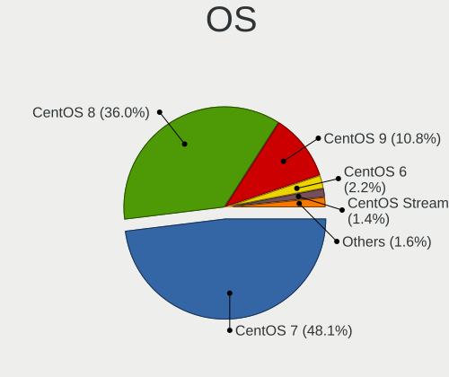

| Name          | Computers | Percent |
|---------------|-----------|---------|
| CentOS 7      | 446       | 48.06%  |
| CentOS 8      | 334       | 35.99%  |
| CentOS 9      | 100       | 10.78%  |
| CentOS 6      | 20        | 2.16%   |
| CentOS Stream | 13        | 1.4%    |
| CentOS 10     | 9         | 0.97%   |
| CentOS 6.9    | 2         | 0.22%   |
| CentOS 6.10   | 2         | 0.22%   |
| CentOS 5      | 2         | 0.22%   |

OS Family
---------

OS without a version

| Name   | Computers | Percent |
|--------|-----------|---------|
| CentOS | 919       | 100%    |

Kernel
------

Version of the Linux kernel

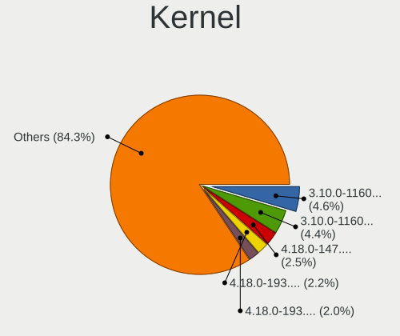

| Version                      | Computers | Percent |
|------------------------------|-----------|---------|
| 3.10.0-1160.114.2.el7.x86_64 | 49        | 4.6%    |
| 3.10.0-1160.102.1.el7.x86_64 | 47        | 4.41%   |
| 4.18.0-147.8.1.el8_1.x86_64  | 27        | 2.53%   |
| 4.18.0-193.6.3.el8_2.x86_64  | 23        | 2.16%   |
| 4.18.0-193.28.1.el8_2.x86_64 | 21        | 1.97%   |
| 4.18.0-193.14.2.el8_2.x86_64 | 20        | 1.88%   |
| 4.18.0-240.22.1.el8_3.x86_64 | 18        | 1.69%   |
| 3.10.0-862.14.4.el7.x86_64   | 17        | 1.59%   |
| 4.18.0-80.11.2.el8_0.x86_64  | 16        | 1.5%    |
| 4.18.0-147.5.1.el8_1.x86_64  | 16        | 1.5%    |
| 3.10.0-1160.45.1.el7.x86_64  | 16        | 1.5%    |
| 4.18.0-240.15.1.el8_3.x86_64 | 15        | 1.41%   |
| 4.18.0-193.19.1.el8_2.x86_64 | 15        | 1.41%   |
| 4.18.0-348.2.1.el8_5.x86_64  | 14        | 1.31%   |
| 3.10.0-1160.90.1.el7.x86_64  | 14        | 1.31%   |
| 4.18.0-240.1.1.el8_3.x86_64  | 13        | 1.22%   |
| 3.10.0-1160.95.1.el7.x86_64  | 13        | 1.22%   |
| 3.10.0-1160.31.1.el7.x86_64  | 12        | 1.13%   |
| 3.10.0-1160.25.1.el7.x86_64  | 12        | 1.13%   |
| 3.10.0-1062.12.1.el7.x86_64  | 12        | 1.13%   |
| 4.18.0-348.7.1.el8_5.x86_64  | 11        | 1.03%   |
| 3.10.0-1160.83.1.el7.x86_64  | 11        | 1.03%   |
| 4.18.0-240.10.1.el8_3.x86_64 | 10        | 0.94%   |
| 3.10.0-957.10.1.el7.x86_64   | 10        | 0.94%   |
| 3.10.0-1160.66.1.el7.x86_64  | 10        | 0.94%   |
| 3.10.0-1160.36.2.el7.x86_64  | 10        | 0.94%   |
| 3.10.0-1160.76.1.el7.x86_64  | 9         | 0.84%   |
| 3.10.0-1160.15.2.el7.x86_64  | 9         | 0.84%   |
| 3.10.0-1127.19.1.el7.x86_64  | 9         | 0.84%   |
| 3.10.0-1062.el7.x86_64       | 9         | 0.84%   |
| 4.18.0-305.12.1.el8_4.x86_64 | 8         | 0.75%   |
| 3.10.0-957.5.1.el7.x86_64    | 8         | 0.75%   |
| 3.10.0-957.1.3.el7.x86_64    | 8         | 0.75%   |
| 3.10.0-1160.el7.x86_64       | 8         | 0.75%   |
| 3.10.0-1160.88.1.el7.x86_64  | 8         | 0.75%   |
| 3.10.0-1127.el7.x86_64       | 8         | 0.75%   |
| 3.10.0-1127.13.1.el7.x86_64  | 8         | 0.75%   |
| 4.18.0-305.19.1.el8_4.x86_64 | 7         | 0.66%   |
| 4.18.0-301.1.el8.x86_64      | 7         | 0.66%   |
| 4.18.0-147.el8.x86_64        | 7         | 0.66%   |

Kernel Family
-------------

Linux kernel without a distro release

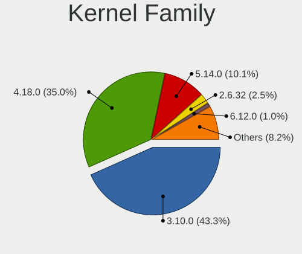

| Version | Computers | Percent |
|---------|-----------|---------|
| 3.10.0  | 404       | 43.35%  |
| 4.18.0  | 326       | 34.98%  |
| 5.14.0  | 94        | 10.09%  |
| 2.6.32  | 23        | 2.47%   |
| 6.12.0  | 9         | 0.97%   |
| 5.4.118 | 3         | 0.32%   |
| 6.1.1   | 2         | 0.21%   |
| 5.9.12  | 2         | 0.21%   |
| 5.17.2  | 2         | 0.21%   |
| 5.15.11 | 2         | 0.21%   |
| 5.12.0  | 2         | 0.21%   |
| 2.6.18  | 2         | 0.21%   |
| 6.6.11  | 1         | 0.11%   |
| 6.5.6   | 1         | 0.11%   |
| 6.5.2   | 1         | 0.11%   |
| 6.2.2   | 1         | 0.11%   |
| 6.2.10  | 1         | 0.11%   |
| 6.12.8  | 1         | 0.11%   |
| 6.10.6  | 1         | 0.11%   |
| 6.10.11 | 1         | 0.11%   |
| 6.1.8   | 1         | 0.11%   |
| 6.1.102 | 1         | 0.11%   |
| 5.9.1   | 1         | 0.11%   |
| 5.8.13  | 1         | 0.11%   |
| 5.8.11  | 1         | 0.11%   |
| 5.8.0   | 1         | 0.11%   |
| 5.7.7   | 1         | 0.11%   |
| 5.7.10  | 1         | 0.11%   |
| 5.6.8   | 1         | 0.11%   |
| 5.6.10  | 1         | 0.11%   |
| 5.5.0   | 1         | 0.11%   |
| 5.4.96  | 1         | 0.11%   |
| 5.4.61  | 1         | 0.11%   |
| 5.4.6   | 1         | 0.11%   |
| 5.4.249 | 1         | 0.11%   |
| 5.4.234 | 1         | 0.11%   |
| 5.4.225 | 1         | 0.11%   |
| 5.4.158 | 1         | 0.11%   |
| 5.4.142 | 1         | 0.11%   |
| 5.4.125 | 1         | 0.11%   |

Kernel Major Ver.
-----------------

Linux kernel major version

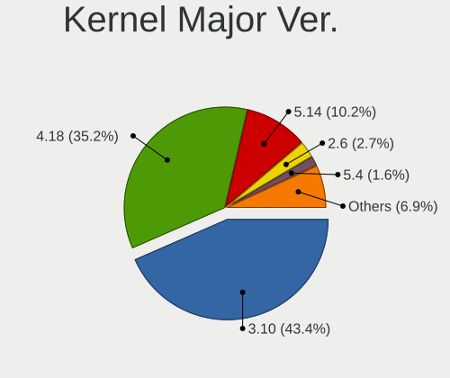

| Version | Computers | Percent |
|---------|-----------|---------|
| 3.10    | 404       | 43.44%  |
| 4.18    | 327       | 35.16%  |
| 5.14    | 95        | 10.22%  |
| 2.6     | 25        | 2.69%   |
| 5.4     | 15        | 1.61%   |
| 6.12    | 10        | 1.08%   |
| 6.1     | 4         | 0.43%   |
| 5.15    | 4         | 0.43%   |
| 4.9     | 4         | 0.43%   |
| 5.9     | 3         | 0.32%   |
| 5.8     | 3         | 0.32%   |
| 5.18    | 3         | 0.32%   |
| 5.10    | 3         | 0.32%   |
| 6.5     | 2         | 0.22%   |
| 6.2     | 2         | 0.22%   |
| 6.10    | 2         | 0.22%   |
| 5.7     | 2         | 0.22%   |
| 5.6     | 2         | 0.22%   |
| 5.17    | 2         | 0.22%   |
| 5.13    | 2         | 0.22%   |
| 5.12    | 2         | 0.22%   |
| 4.4     | 2         | 0.22%   |
| 4.20    | 2         | 0.22%   |
| 4.19    | 2         | 0.22%   |
| 6.6     | 1         | 0.11%   |
| 5.5     | 1         | 0.11%   |
| 5.3     | 1         | 0.11%   |
| 5.2     | 1         | 0.11%   |
| 5.11    | 1         | 0.11%   |
| 5.1     | 1         | 0.11%   |
| 4.17    | 1         | 0.11%   |
| 4.14    | 1         | 0.11%   |

Arch
----

OS architecture (x86_64, i586, etc.)

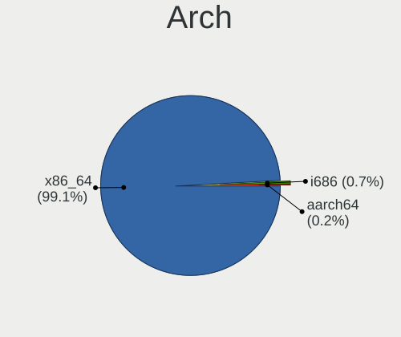

| Name    | Computers | Percent |
|---------|-----------|---------|
| x86_64  | 911       | 99.13%  |
| i686    | 6         | 0.65%   |
| aarch64 | 2         | 0.22%   |

DE
--

Desktop Environment

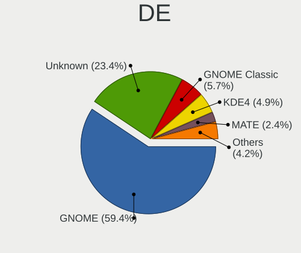

| Name          | Computers | Percent |
|---------------|-----------|---------|
| GNOME         | 552       | 59.35%  |
| Unknown       | 218       | 23.44%  |
| GNOME Classic | 53        | 5.7%    |
| KDE4          | 46        | 4.95%   |
| MATE          | 22        | 2.37%   |
| XFCE          | 14        | 1.51%   |
| KDE5          | 12        | 1.29%   |
| Cinnamon      | 7         | 0.75%   |
| X-Cinnamon    | 2         | 0.22%   |
| KDE6          | 2         | 0.22%   |
| Xpra          | 1         | 0.11%   |
| KDE           | 1         | 0.11%   |

Display Server
--------------

X11 or Wayland

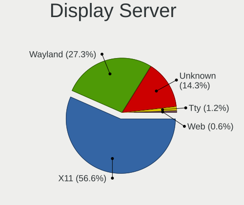

| Name    | Computers | Percent |
|---------|-----------|---------|
| X11     | 533       | 56.58%  |
| Wayland | 257       | 27.28%  |
| Unknown | 135       | 14.33%  |
| Tty     | 11        | 1.17%   |
| Web     | 6         | 0.64%   |

Display Manager
---------------

SDDM, LightDM, etc.

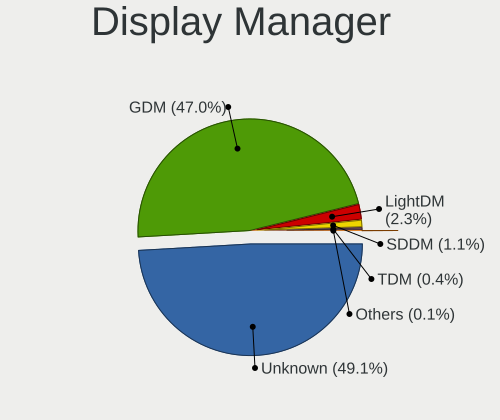

| Name    | Computers | Percent |
|---------|-----------|---------|
| Unknown | 456       | 49.09%  |
| GDM     | 437       | 47.04%  |
| LightDM | 21        | 2.26%   |
| SDDM    | 10        | 1.08%   |
| TDM     | 4         | 0.43%   |
| KDM     | 1         | 0.11%   |

OS Lang
-------

Language

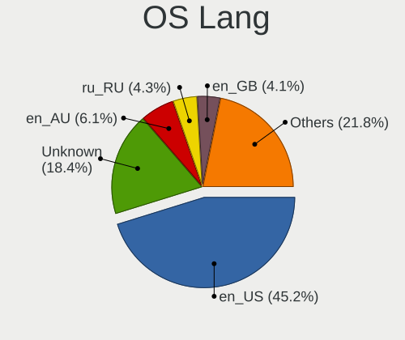

| Lang        | Computers | Percent |
|-------------|-----------|---------|
| en_US       | 439       | 45.21%  |
| Unknown     | 179       | 18.43%  |
| en_AU       | 59        | 6.08%   |
| ru_RU       | 42        | 4.33%   |
| en_GB       | 40        | 4.12%   |
| de_DE       | 32        | 3.3%    |
| pt_BR       | 24        | 2.47%   |
| C           | 21        | 2.16%   |
| fr_FR       | 20        | 2.06%   |
| en_IN       | 11        | 1.13%   |
| en_CA       | 11        | 1.13%   |
| zh_CN       | 10        | 1.03%   |
| pl_PL       | 10        | 1.03%   |
| de_AT       | 8         | 0.82%   |
| ko_KR       | 6         | 0.62%   |
| it_IT       | 5         | 0.51%   |
| es_ES       | 5         | 0.51%   |
| ja_JP       | 4         | 0.41%   |
| en_US.utf-8 | 4         | 0.41%   |
| en_IE       | 4         | 0.41%   |
| nb_NO       | 3         | 0.31%   |
| fr_CA       | 3         | 0.31%   |
| es_PE       | 3         | 0.31%   |
| hu_HU       | 2         | 0.21%   |
| fi_FI       | 2         | 0.21%   |
| es_MX       | 2         | 0.21%   |
| es_EC       | 2         | 0.21%   |
| es_AR       | 2         | 0.21%   |
| cs_CZ       | 2         | 0.21%   |
| uk_UA       | 1         | 0.1%    |
| tr_TR       | 1         | 0.1%    |
| sv_SE       | 1         | 0.1%    |
| sl_SI       | 1         | 0.1%    |
| sk_SK       | 1         | 0.1%    |
| ru_UA       | 1         | 0.1%    |
| ru_RU.UTF8  | 1         | 0.1%    |
| ro_RO       | 1         | 0.1%    |
| pt_PT       | 1         | 0.1%    |
| ko_KR.euckr | 1         | 0.1%    |
| es_US       | 1         | 0.1%    |

Boot Mode
---------

EFI or BIOS

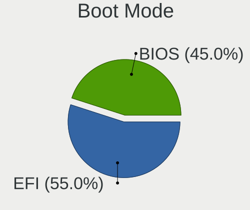

| Mode | Computers | Percent |
|------|-----------|---------|
| EFI  | 508       | 54.98%  |
| BIOS | 416       | 45.02%  |

Filesystem
----------

Type of filesystem

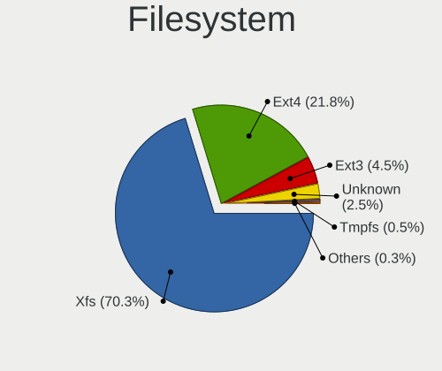

| Type    | Computers | Percent |
|---------|-----------|---------|
| Xfs     | 651       | 70.3%   |
| Ext4    | 202       | 21.81%  |
| Ext3    | 42        | 4.54%   |
| Unknown | 23        | 2.48%   |
| Tmpfs   | 5         | 0.54%   |
| Rootfs  | 1         | 0.11%   |
| Overlay | 1         | 0.11%   |
| Ext2    | 1         | 0.11%   |

Part. scheme
------------

Scheme of partitioning

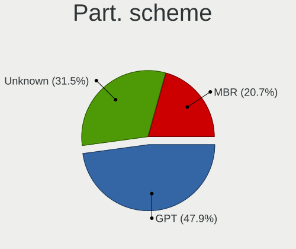

| Type    | Computers | Percent |
|---------|-----------|---------|
| GPT     | 447       | 47.86%  |
| Unknown | 294       | 31.48%  |
| MBR     | 193       | 20.66%  |

Dual Boot with Linux/BSD
------------------------

Hosting more than one Linux/BSD

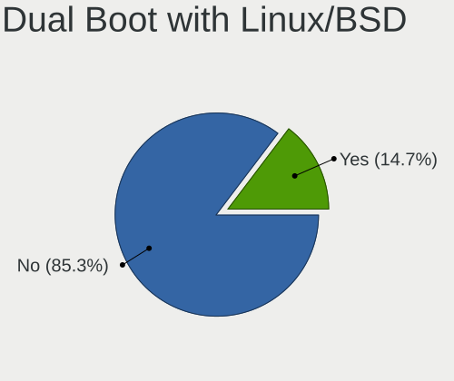

| Dual boot | Computers | Percent |
|-----------|-----------|---------|
| No        | 790       | 85.31%  |
| Yes       | 136       | 14.69%  |

Dual Boot (Win)
---------------

Hosting Linux and Windows

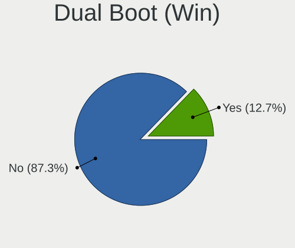

| Dual boot | Computers | Percent |
|-----------|-----------|---------|
| No        | 808       | 87.26%  |
| Yes       | 118       | 12.74%  |

Board
-----

Vendor
------

Motherboard manufacturer

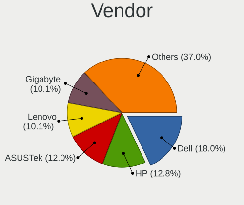

| Name                | Computers | Percent |
|---------------------|-----------|---------|
| Dell                | 165       | 17.95%  |
| Hewlett-Packard     | 118       | 12.84%  |
| ASUSTek Computer    | 110       | 11.97%  |
| Lenovo              | 93        | 10.12%  |
| Gigabyte Technology | 93        | 10.12%  |
| MSI                 | 74        | 8.05%   |
| Supermicro          | 59        | 6.42%   |
| Intel               | 41        | 4.46%   |
| Acer                | 21        | 2.29%   |
| ASRock              | 13        | 1.41%   |
| Unknown             | 13        | 1.41%   |
| Samsung Electronics | 9         | 0.98%   |
| IBM                 | 8         | 0.87%   |
| Sony                | 6         | 0.65%   |
| Fujitsu             | 6         | 0.65%   |
| AZW                 | 5         | 0.54%   |
| ASRockRack          | 5         | 0.54%   |
| Apple               | 5         | 0.54%   |
| Foxconn             | 4         | 0.44%   |
| AMI                 | 4         | 0.44%   |
| Toshiba             | 3         | 0.33%   |
| Timi                | 3         | 0.33%   |
| HUAWEI              | 3         | 0.33%   |
| HPE                 | 3         | 0.33%   |
| TYAN Computer       | 2         | 0.22%   |
| Sun Microsystems    | 2         | 0.22%   |
| Seeed Studio        | 2         | 0.22%   |
| Quanta              | 2         | 0.22%   |
| Notebook            | 2         | 0.22%   |
| MiTAC               | 2         | 0.22%   |
| LG Electronics      | 2         | 0.22%   |
| Huanan              | 2         | 0.22%   |
| ECS                 | 2         | 0.22%   |
| Biostar             | 2         | 0.22%   |
| AIC                 | 2         | 0.22%   |
| Zvezda              | 1         | 0.11%   |
| Zenith              | 1         | 0.11%   |
| TUXEDO              | 1         | 0.11%   |
| SHANGZHAOYUAN       | 1         | 0.11%   |
| RM Education        | 1         | 0.11%   |

Model
-----

Motherboard model

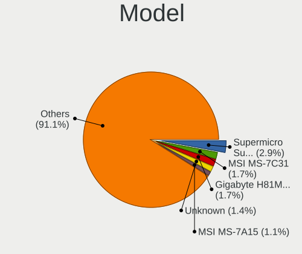

| Name                                    | Computers | Percent |
|-----------------------------------------|-----------|---------|
| Supermicro Super Server                 | 27        | 2.94%   |
| MSI MS-7C31                             | 16        | 1.74%   |
| Gigabyte H81M-S2H                       | 16        | 1.74%   |
| Unknown                                 | 13        | 1.41%   |
| MSI MS-7A15                             | 10        | 1.09%   |
| Dell OptiPlex 9020                      | 9         | 0.98%   |
| Dell OptiPlex 7040                      | 9         | 0.98%   |
| MSI MS-7A74                             | 8         | 0.87%   |
| ASUS All Series                         | 8         | 0.87%   |
| MSI MS-7B53                             | 7         | 0.76%   |
| Gigabyte H81M-DS2                       | 5         | 0.54%   |
| Dell PowerEdge R630                     | 5         | 0.54%   |
| Dell PowerEdge R610                     | 5         | 0.54%   |
| Dell PowerEdge R410                     | 5         | 0.54%   |
| Dell OptiPlex 7010                      | 5         | 0.54%   |
| ASUS H110M-K                            | 5         | 0.54%   |
| Supermicro X8DTN+-F                     | 4         | 0.44%   |
| HP Z800 Workstation                     | 4         | 0.44%   |
| HP Compaq Elite 8300 SFF                | 4         | 0.44%   |
| Gigabyte H81M-S2PV                      | 4         | 0.44%   |
| Lenovo ThinkSystem SR650 -[7X06CTO1WW]- | 3         | 0.33%   |
| Intel S1200SP                           | 3         | 0.33%   |
| HP ProLiant DL360 G5                    | 3         | 0.33%   |
| HP ProDesk 400 G7 Microtower PC         | 3         | 0.33%   |
| HP EliteDesk 800 G6 Desktop Mini PC     | 3         | 0.33%   |
| HP Compaq 8200 Elite SFF PC             | 3         | 0.33%   |
| Dell Precision WorkStation T3500        | 3         | 0.33%   |
| Dell PowerEdge R430                     | 3         | 0.33%   |
| ASUS PRIME X570-P                       | 3         | 0.33%   |
| ASUS M5A78L-M PLUS/USB3                 | 3         | 0.33%   |
| ASRockRack E3C242D4U2-2T                | 3         | 0.33%   |
| Supermicro X8DTL                        | 2         | 0.22%   |
| Supermicro SYS-7048A-T                  | 2         | 0.22%   |
| Supermicro SYS-6018R-WTR                | 2         | 0.22%   |
| Supermicro SYS-1028TP-DC1R              | 2         | 0.22%   |
| Seeed Studio ODYSSEY-X86J4105           | 2         | 0.22%   |
| Quanta QSSC-98J_C2                      | 2         | 0.22%   |
| Lenovo Z50-70 20354                     | 2         | 0.22%   |
| Lenovo ThinkSystem SR530 -[7X08CTO1WW]- | 2         | 0.22%   |
| Lenovo System x3650 M5: -[8871AC1]-     | 2         | 0.22%   |

Model Family
------------

Motherboard model prefix

| Name                | Computers | Percent |
|---------------------|-----------|---------|
| Dell PowerEdge      | 52        | 5.66%   |
| Lenovo ThinkPad     | 49        | 5.33%   |
| Dell OptiPlex       | 37        | 4.03%   |
| Supermicro Super    | 27        | 2.94%   |
| Dell Precision      | 22        | 2.39%   |
| ASUS PRIME          | 18        | 1.96%   |
| HP EliteBook        | 17        | 1.85%   |
| Dell Latitude       | 17        | 1.85%   |
| Dell Inspiron       | 17        | 1.85%   |
| MSI MS-7C31         | 16        | 1.74%   |
| Gigabyte H81M-S2H   | 16        | 1.74%   |
| HP ProLiant         | 14        | 1.52%   |
| Unknown             | 13        | 1.41%   |
| HP EliteDesk        | 12        | 1.31%   |
| Acer Aspire         | 12        | 1.31%   |
| MSI MS-7A15         | 10        | 1.09%   |
| Lenovo IdeaPad      | 10        | 1.09%   |
| HP Compaq           | 10        | 1.09%   |
| HP ProBook          | 9         | 0.98%   |
| MSI MS-7A74         | 8         | 0.87%   |
| Lenovo ThinkCentre  | 8         | 0.87%   |
| Dell Vostro         | 8         | 0.87%   |
| ASUS TUF            | 8         | 0.87%   |
| ASUS ROG            | 8         | 0.87%   |
| ASUS All            | 8         | 0.87%   |
| MSI MS-7B53         | 7         | 0.76%   |
| Lenovo ThinkSystem  | 7         | 0.76%   |
| HP Pavilion         | 7         | 0.76%   |
| IBM System          | 6         | 0.65%   |
| HP ProDesk          | 6         | 0.65%   |
| Dell XPS            | 6         | 0.65%   |
| ASUS M5A78L-M       | 6         | 0.65%   |
| HP ZBook            | 5         | 0.54%   |
| HP Laptop           | 5         | 0.54%   |
| Gigabyte H81M-DS2   | 5         | 0.54%   |
| ASUS H110M-K        | 5         | 0.54%   |
| Supermicro X8DTN+-F | 4         | 0.44%   |
| HP Z800             | 4         | 0.44%   |
| Gigabyte H81M-S2PV  | 4         | 0.44%   |
| ASUS VivoBook       | 4         | 0.44%   |

MFG Year
--------

Motherboard manufacture year

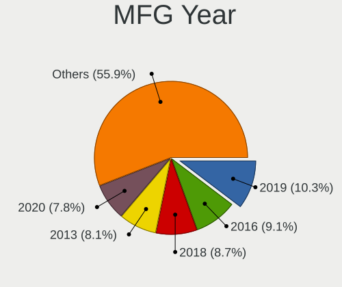

| Year    | Computers | Percent |
|---------|-----------|---------|
| 2019    | 95        | 10.34%  |
| 2016    | 84        | 9.14%   |
| 2018    | 80        | 8.71%   |
| 2013    | 74        | 8.05%   |
| 2020    | 72        | 7.83%   |
| 2014    | 68        | 7.4%    |
| 2012    | 68        | 7.4%    |
| 2017    | 61        | 6.64%   |
| 2011    | 57        | 6.2%    |
| 2015    | 55        | 5.98%   |
| 2010    | 52        | 5.66%   |
| 2021    | 49        | 5.33%   |
| 2008    | 27        | 2.94%   |
| 2009    | 24        | 2.61%   |
| 2022    | 19        | 2.07%   |
| 2023    | 12        | 1.31%   |
| 2007    | 11        | 1.2%    |
| 2024    | 3         | 0.33%   |
| 2006    | 3         | 0.33%   |
| 2025    | 2         | 0.22%   |
| Unknown | 2         | 0.22%   |
| 2001    | 1         | 0.11%   |

Form Factor
-----------

Physical design of the computer

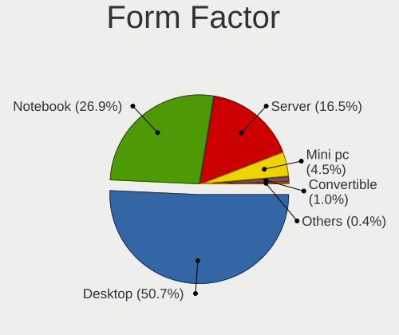

| Name        | Computers | Percent |
|-------------|-----------|---------|
| Desktop     | 466       | 50.71%  |
| Notebook    | 247       | 26.88%  |
| Server      | 152       | 16.54%  |
| Mini pc     | 41        | 4.46%   |
| Convertible | 9         | 0.98%   |
| All in one  | 3         | 0.33%   |
| Tablet      | 1         | 0.11%   |

Secure Boot
-----------

Enabled or disabled

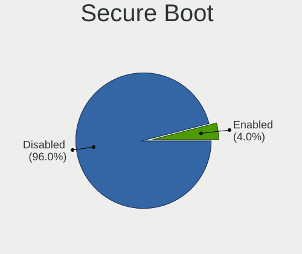

| State    | Computers | Percent |
|----------|-----------|---------|
| Disabled | 883       | 95.98%  |
| Enabled  | 37        | 4.02%   |

Coreboot
--------

Have coreboot on board

| Used | Computers | Percent |
|------|-----------|---------|
| No   | 917       | 99.78%  |
| Yes  | 2         | 0.22%   |

RAM Size
--------

Total RAM memory

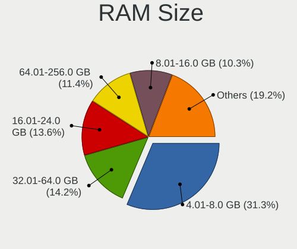

| Size in GB      | Computers | Percent |
|-----------------|-----------|---------|
| 4.01-8.0        | 289       | 31.34%  |
| 32.01-64.0      | 131       | 14.21%  |
| 16.01-24.0      | 125       | 13.56%  |
| 64.01-256.0     | 105       | 11.39%  |
| 8.01-16.0       | 95        | 10.3%   |
| 3.01-4.0        | 80        | 8.68%   |
| More than 256.0 | 46        | 4.99%   |
| 24.01-32.0      | 26        | 2.82%   |
| 1.01-2.0        | 17        | 1.84%   |
| 2.01-3.0        | 4         | 0.43%   |
| 0.51-1.0        | 4         | 0.43%   |

RAM Used
--------

Used RAM memory

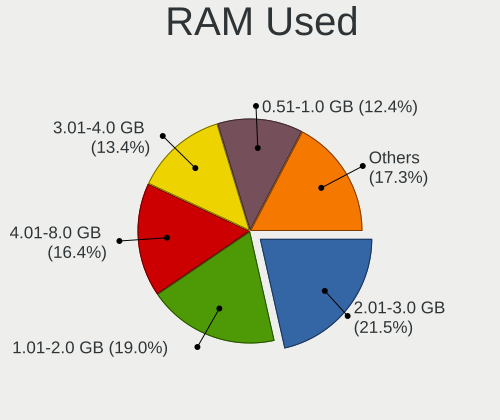

| Used GB         | Computers | Percent |
|-----------------|-----------|---------|
| 2.01-3.0        | 217       | 21.49%  |
| 1.01-2.0        | 192       | 19.01%  |
| 4.01-8.0        | 166       | 16.44%  |
| 3.01-4.0        | 135       | 13.37%  |
| 0.51-1.0        | 125       | 12.38%  |
| 8.01-16.0       | 71        | 7.03%   |
| Unknown         | 25        | 2.48%   |
| 64.01-256.0     | 21        | 2.08%   |
| 32.01-64.0      | 17        | 1.68%   |
| 0.01-0.5        | 15        | 1.49%   |
| 16.01-24.0      | 14        | 1.39%   |
| 24.01-32.0      | 9         | 0.89%   |
| More than 256.0 | 3         | 0.3%    |

Total Drives
------------

Number of drives on board

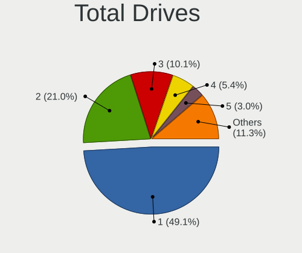

| Drives  | Computers | Percent |
|---------|-----------|---------|
| 1       | 460       | 49.09%  |
| 2       | 197       | 21.02%  |
| 3       | 95        | 10.14%  |
| 4       | 51        | 5.44%   |
| 5       | 28        | 2.99%   |
| Unknown | 21        | 2.24%   |
| 6       | 19        | 2.03%   |
| 7       | 8         | 0.85%   |
| 0       | 8         | 0.85%   |
| 10      | 7         | 0.75%   |
| 9       | 6         | 0.64%   |
| 8       | 5         | 0.53%   |
| 11      | 4         | 0.43%   |
| 19      | 3         | 0.32%   |
| 15      | 3         | 0.32%   |
| 13      | 3         | 0.32%   |
| 97      | 2         | 0.21%   |
| 93      | 2         | 0.21%   |
| 26      | 2         | 0.21%   |
| 12      | 2         | 0.21%   |
| 209     | 1         | 0.11%   |
| 71      | 1         | 0.11%   |
| 68      | 1         | 0.11%   |
| 37      | 1         | 0.11%   |
| 27      | 1         | 0.11%   |
| 25      | 1         | 0.11%   |
| 24      | 1         | 0.11%   |
| 23      | 1         | 0.11%   |
| 20      | 1         | 0.11%   |
| 18      | 1         | 0.11%   |
| 17      | 1         | 0.11%   |

Has CD-ROM
----------

Has CD-ROM on board

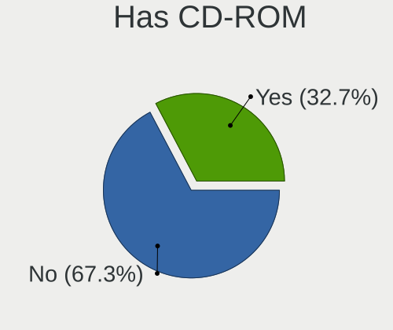

| Presented | Computers | Percent |
|-----------|-----------|---------|
| No        | 630       | 68.18%  |
| Yes       | 294       | 31.82%  |

Has Ethernet
------------

Has Ethernet on board

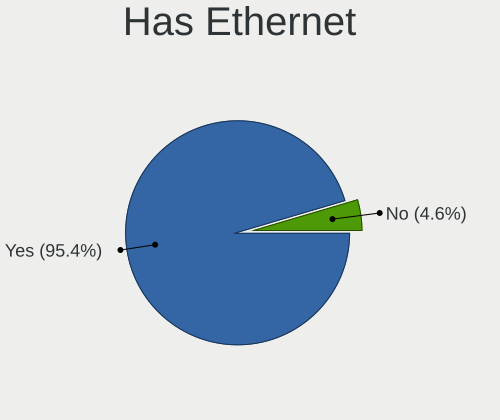

| Presented | Computers | Percent |
|-----------|-----------|---------|
| Yes       | 877       | 95.43%  |
| No        | 42        | 4.57%   |

Has WiFi
--------

Has WiFi module

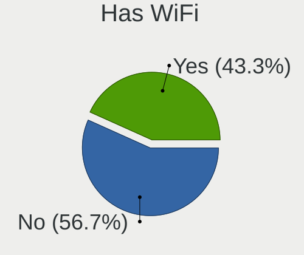

| Presented | Computers | Percent |
|-----------|-----------|---------|
| No        | 523       | 56.72%  |
| Yes       | 399       | 43.28%  |

Has Bluetooth
-------------

Has Bluetooth module

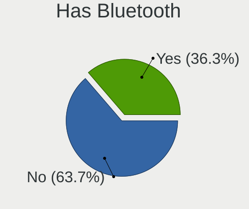

| Presented | Computers | Percent |
|-----------|-----------|---------|
| No        | 586       | 63.7%   |
| Yes       | 334       | 36.3%   |

Location
--------

Country
-------

Geographic location (country)

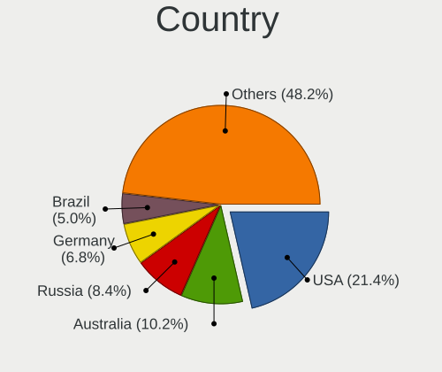

| Country      | Computers | Percent |
|--------------|-----------|---------|
| USA          | 198       | 21.43%  |
| Australia    | 94        | 10.17%  |
| Russia       | 78        | 8.44%   |
| Germany      | 63        | 6.82%   |
| Brazil       | 46        | 4.98%   |
| Canada       | 35        | 3.79%   |
| China        | 32        | 3.46%   |
| India        | 30        | 3.25%   |
| UK           | 29        | 3.14%   |
| France       | 29        | 3.14%   |
| Poland       | 16        | 1.73%   |
| Sweden       | 14        | 1.52%   |
| Finland      | 13        | 1.41%   |
| Switzerland  | 12        | 1.3%    |
| Belgium      | 12        | 1.3%    |
| Spain        | 11        | 1.19%   |
| Mexico       | 11        | 1.19%   |
| Italy        | 11        | 1.19%   |
| Ukraine      | 10        | 1.08%   |
| South Korea  | 10        | 1.08%   |
| Netherlands  | 9         | 0.97%   |
| Czechia      | 9         | 0.97%   |
| Norway       | 8         | 0.87%   |
| Bulgaria     | 8         | 0.87%   |
| South Africa | 6         | 0.65%   |
| Japan        | 6         | 0.65%   |
| Israel       | 6         | 0.65%   |
| Turkey       | 5         | 0.54%   |
| Romania      | 5         | 0.54%   |
| Malaysia     | 5         | 0.54%   |
| Kazakhstan   | 5         | 0.54%   |
| Ireland      | 5         | 0.54%   |
| Indonesia    | 5         | 0.54%   |
| Slovakia     | 4         | 0.43%   |
| Serbia       | 4         | 0.43%   |
| Portugal     | 4         | 0.43%   |
| Peru         | 4         | 0.43%   |
| Hong Kong    | 4         | 0.43%   |
| Greece       | 4         | 0.43%   |
| Vietnam      | 3         | 0.32%   |

City
----

Geographic location (city)

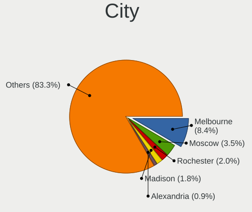

| City              | Computers | Percent |
|-------------------|-----------|---------|
| Melbourne         | 80        | 8.44%   |
| Moscow            | 33        | 3.48%   |
| Rochester         | 19        | 2%      |
| Madison           | 17        | 1.79%   |
| Alexandria        | 9         | 0.95%   |
| Sao Paulo         | 8         | 0.84%   |
| Sydney            | 7         | 0.74%   |
| Paris             | 7         | 0.74%   |
| Newark            | 7         | 0.74%   |
| Helsinki          | 7         | 0.74%   |
| Frankfurt am Main | 7         | 0.74%   |
| Catonsville       | 7         | 0.74%   |
| St Petersburg     | 6         | 0.63%   |
| Sofia             | 6         | 0.63%   |
| Rio de Janeiro    | 6         | 0.63%   |
| Prague            | 6         | 0.63%   |
| Portland          | 6         | 0.63%   |
| London            | 6         | 0.63%   |
| Chicago           | 6         | 0.63%   |
| Berlin            | 6         | 0.63%   |
| Beijing           | 6         | 0.63%   |
| Toronto           | 5         | 0.53%   |
| Munich            | 5         | 0.53%   |
| Montreal          | 5         | 0.53%   |
| Kyiv              | 5         | 0.53%   |
| Guwahati          | 5         | 0.53%   |
| Guangzhou         | 5         | 0.53%   |
| Bern              | 5         | 0.53%   |
| Vancouver         | 4         | 0.42%   |
| Sollentuna        | 4         | 0.42%   |
| Perm              | 4         | 0.42%   |
| Lima              | 4         | 0.42%   |
| Dublin            | 4         | 0.42%   |
| Central           | 4         | 0.42%   |
| Brooklyn          | 4         | 0.42%   |
| Yekaterinburg     | 3         | 0.32%   |
| Victoria          | 3         | 0.32%   |
| Tyumen            | 3         | 0.32%   |
| Tehran            | 3         | 0.32%   |
| Tampa             | 3         | 0.32%   |

Drives
------

Drive Vendor
------------

Hard drive vendors

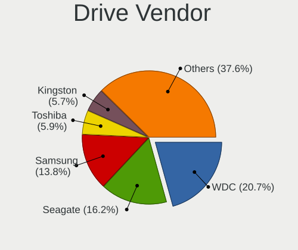

| Vendor                       | Computers | Drives | Percent |
|------------------------------|-----------|--------|---------|
| WDC                          | 278       | 839    | 20.72%  |
| Seagate                      | 218       | 848    | 16.24%  |
| Samsung Electronics          | 185       | 363    | 13.79%  |
| Toshiba                      | 79        | 134    | 5.89%   |
| Kingston                     | 77        | 105    | 5.74%   |
| Intel                        | 52        | 111    | 3.87%   |
| Sandisk                      | 50        | 85     | 3.73%   |
| Hitachi                      | 40        | 86     | 2.98%   |
| Unknown                      | 33        | 113    | 2.46%   |
| HGST                         | 31        | 330    | 2.31%   |
| Micron Technology            | 27        | 44     | 2.01%   |
| Crucial                      | 25        | 56     | 1.86%   |
| SK hynix                     | 20        | 27     | 1.49%   |
| Hewlett-Packard              | 20        | 81     | 1.49%   |
| A-DATA Technology            | 14        | 19     | 1.04%   |
| SPCC                         | 11        | 18     | 0.82%   |
| Silicon Motion               | 6         | 6      | 0.45%   |
| Phison                       | 6         | 7      | 0.45%   |
| OCZ                          | 6         | 12     | 0.45%   |
| LITEON                       | 6         | 7      | 0.45%   |
| KIOXIA                       | 6         | 7      | 0.45%   |
| Phison Electronics           | 5         | 6      | 0.37%   |
| Micron/Crucial Technology    | 5         | 6      | 0.37%   |
| Lexar                        | 5         | 6      | 0.37%   |
| Plextor                      | 4         | 4      | 0.3%    |
| NVMe                         | 4         | 4      | 0.3%    |
| MAXIO Technology (Hangzhou)  | 4         | 5      | 0.3%    |
| Lenovo                       | 4         | 6      | 0.3%    |
| Gigabyte Technology          | 4         | 5      | 0.3%    |
| Fujitsu                      | 4         | 5      | 0.3%    |
| China                        | 4         | 7      | 0.3%    |
| ASMT                         | 4         | 7      | 0.3%    |
| Apple                        | 4         | 5      | 0.3%    |
| Toshiba America Info Systems | 3         | 4      | 0.22%   |
| Team                         | 3         | 5      | 0.22%   |
| PNY                          | 3         | 4      | 0.22%   |
| Netac                        | 3         | 4      | 0.22%   |
| LITEONIT                     | 3         | 3      | 0.22%   |
| Kingston Technology Company  | 3         | 3      | 0.22%   |
| DELLBOSS                     | 3         | 3      | 0.22%   |

Drive Model
-----------

Hard drive models

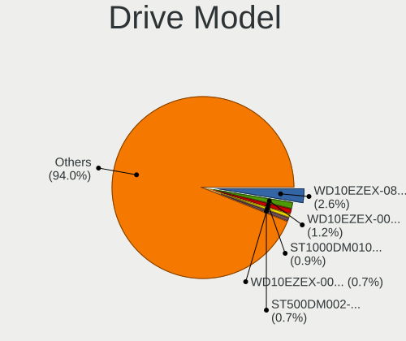

| Model                                             | Computers | Percent |
|---------------------------------------------------|-----------|---------|
| WDC WD10EZEX-08WN4A0 1TB                          | 42        | 2.59%   |
| WDC WD10EZEX-00MFCA0 1TB                          | 19        | 1.17%   |
| Seagate ST1000DM010-2EP102 1TB                    | 15        | 0.92%   |
| WDC WD10EZEX-00WN4A0 1TB                          | 11        | 0.68%   |
| Seagate ST500DM002-1BD142 500GB                   | 11        | 0.68%   |
| Kingston SA400S37240G 240GB SSD                   | 11        | 0.68%   |
| Toshiba DT01ACA100 1TB                            | 10        | 0.62%   |
| HP LOGICAL VOLUME 160GB                           | 10        | 0.62%   |
| Toshiba DT01ACA050 500GB                          | 9         | 0.55%   |
| Samsung NVMe SSD Drive 512GB                      | 8         | 0.49%   |
| Samsung NVMe SSD Controller SM981/PM981/PM983 1TB | 8         | 0.49%   |
| Kingston SA400S37120G 120GB SSD                   | 8         | 0.49%   |
| WDC WD20EARX-00PASB0 2TB                          | 7         | 0.43%   |
| Unknown HUH728080ALE601 8TB                       | 7         | 0.43%   |
| Toshiba MQ01ABD100 1TB                            | 7         | 0.43%   |
| Seagate ST6000NM0095 6TB                          | 7         | 0.43%   |
| Seagate ST6000NM0034 6TB                          | 7         | 0.43%   |
| Seagate ST6000NM0014 6TB                          | 7         | 0.43%   |
| Seagate ST500DM002-1SB10A 500GB                   | 7         | 0.43%   |
| Seagate ST4000NXCLAR4000 4TB                      | 7         | 0.43%   |
| Seagate ST4000NM0023 4TB                          | 7         | 0.43%   |
| Seagate ST1000LM024 HN-M101MBB 1TB                | 7         | 0.43%   |
| Samsung SSD 860 EVO 250GB                         | 7         | 0.43%   |
| Kingston SA400S37480G 480GB SSD                   | 7         | 0.43%   |
| WDC WD2502ABYS-18B7A0 250GB                       | 6         | 0.37%   |
| Seagate ST16000NM001G-2KK103 16TB                 | 6         | 0.37%   |
| Seagate ST1000LM035-1RK172 1TB                    | 6         | 0.37%   |
| Seagate ST1000DM003-1CH162 1TB                    | 6         | 0.37%   |
| Samsung SSD 860 EVO 1TB                           | 6         | 0.37%   |
| Samsung SSD 850 EVO 250GB                         | 6         | 0.37%   |
| HGST HUS726060ALS640 6TB                          | 6         | 0.37%   |
| HGST H7280A520SUN8.0T 8TB                         | 6         | 0.37%   |
| WDC WD20EZRZ-00Z5HB0 2TB                          | 5         | 0.31%   |
| WDC WD20EZRX-00D8PB0 2TB                          | 5         | 0.31%   |
| WDC WD20EFRX-68EUZN0 2TB                          | 5         | 0.31%   |
| WDC WD10EZEX-60WN4A0 1TB                          | 5         | 0.31%   |
| WDC WD10EZEX-22MFCA0 1TB                          | 5         | 0.31%   |
| Seagate ST500LT012-1DG142 500GB                   | 5         | 0.31%   |
| Seagate ST31000528AS 1TB                          | 5         | 0.31%   |
| Seagate ST2000DM006-2DM164 2TB                    | 5         | 0.31%   |

HDD Vendor
----------

Hard disk drive vendors

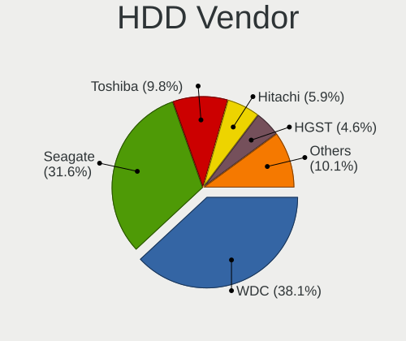

| Vendor              | Computers | Drives | Percent |
|---------------------|-----------|--------|---------|
| WDC                 | 257       | 596    | 38.07%  |
| Seagate             | 213       | 838    | 31.56%  |
| Toshiba             | 66        | 114    | 9.78%   |
| Hitachi             | 40        | 86     | 5.93%   |
| HGST                | 31        | 191    | 4.59%   |
| Samsung Electronics | 19        | 116    | 2.81%   |
| Hewlett-Packard     | 16        | 72     | 2.37%   |
| Unknown             | 10        | 83     | 1.48%   |
| Fujitsu             | 4         | 5      | 0.59%   |
| DELLBOSS            | 3         | 3      | 0.44%   |
| Apple               | 3         | 3      | 0.44%   |
| Sun                 | 2         | 6      | 0.3%    |
| IBM-ESXS            | 2         | 4      | 0.3%    |
| Dell                | 2         | 4      | 0.3%    |
| WD MediaMax         | 1         | 1      | 0.15%   |
| Maxtor              | 1         | 1      | 0.15%   |
| MARVELL             | 1         | 1      | 0.15%   |
| Lenovo              | 1         | 2      | 0.15%   |
| JMicron Technology  | 1         | 1      | 0.15%   |
| JetFlash            | 1         | 1      | 0.15%   |
| HUAWEI              | 1         | 4      | 0.15%   |

SSD Vendor
----------

Solid state drive vendors

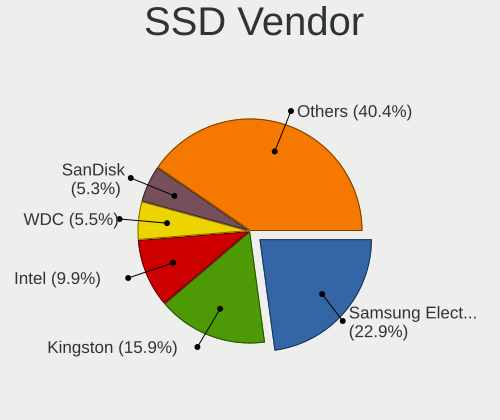

| Vendor              | Computers | Drives | Percent |
|---------------------|-----------|--------|---------|
| Samsung Electronics | 99        | 145    | 22.86%  |
| Kingston            | 69        | 97     | 15.94%  |
| Intel               | 43        | 89     | 9.93%   |
| WDC                 | 24        | 32     | 5.54%   |
| SanDisk             | 23        | 37     | 5.31%   |
| Crucial             | 22        | 53     | 5.08%   |
| Micron Technology   | 16        | 24     | 3.7%    |
| SPCC                | 11        | 18     | 2.54%   |
| SK hynix            | 11        | 13     | 2.54%   |
| A-DATA Technology   | 11        | 14     | 2.54%   |
| Toshiba             | 9         | 13     | 2.08%   |
| OCZ                 | 6         | 12     | 1.39%   |
| LITEON              | 6         | 7      | 1.39%   |
| Hewlett-Packard     | 5         | 9      | 1.15%   |
| Lexar               | 4         | 5      | 0.92%   |
| China               | 4         | 7      | 0.92%   |
| ASMT                | 4         | 7      | 0.92%   |
| Team                | 3         | 5      | 0.69%   |
| Seagate             | 3         | 4      | 0.69%   |
| PNY                 | 3         | 4      | 0.69%   |
| Plextor             | 3         | 3      | 0.69%   |
| Netac               | 3         | 4      | 0.69%   |
| LITEONIT            | 3         | 3      | 0.69%   |
| Transcend           | 2         | 3      | 0.46%   |
| StoreJet            | 2         | 2      | 0.46%   |
| Smartbuy            | 2         | 3      | 0.46%   |
| Patriot             | 2         | 6      | 0.46%   |
| Lenovo              | 2         | 3      | 0.46%   |
| KingDian            | 2         | 6      | 0.46%   |
| Intenso             | 2         | 2      | 0.46%   |
| GOODRAM             | 2         | 2      | 0.46%   |
| Apacer              | 2         | 2      | 0.46%   |
| XrayDisk            | 1         | 1      | 0.23%   |
| VICKTER             | 1         | 1      | 0.23%   |
| Vi550               | 1         | 1      | 0.23%   |
| Verbatim            | 1         | 1      | 0.23%   |
| V-GeN               | 1         | 1      | 0.23%   |
| Unknown (1GB)       | 1         | 1      | 0.23%   |
| UNIC2               | 1         | 1      | 0.23%   |
| TAISU               | 1         | 1      | 0.23%   |

Drive Kind
----------

HDD or SSD

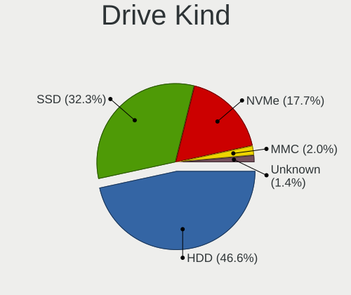

| Kind    | Computers | Drives | Percent |
|---------|-----------|--------|---------|
| HDD     | 549       | 2132   | 46.6%   |
| SSD     | 380       | 673    | 32.26%  |
| NVMe    | 209       | 312    | 17.74%  |
| MMC     | 23        | 29     | 1.95%   |
| Unknown | 17        | 356    | 1.44%   |

Drive Connector
---------------

SATA, SAS, NVMe, etc.

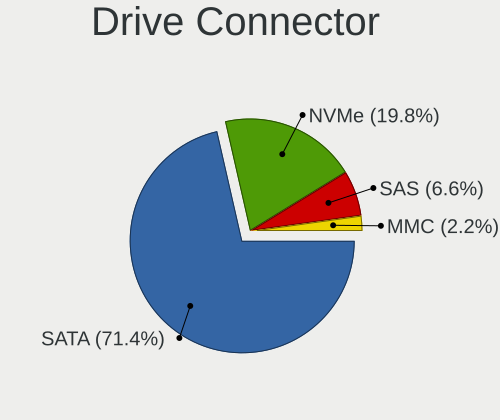

| Type | Computers | Drives | Percent |
|------|-----------|--------|---------|
| SATA | 750       | 2359   | 71.43%  |
| NVMe | 208       | 309    | 19.81%  |
| SAS  | 69        | 805    | 6.57%   |
| MMC  | 23        | 29     | 2.19%   |

Drive Size
----------

Size of hard drive

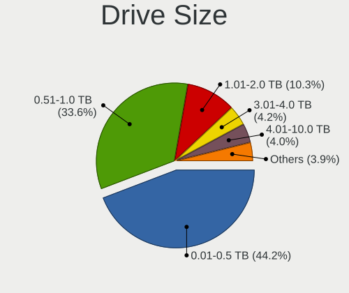

| Size in TB | Computers | Drives | Percent |
|------------|-----------|--------|---------|
| 0.01-0.5   | 457       | 918    | 44.2%   |
| 0.51-1.0   | 347       | 662    | 33.56%  |
| 1.01-2.0   | 106       | 262    | 10.25%  |
| 3.01-4.0   | 43        | 346    | 4.16%   |
| 4.01-10.0  | 41        | 362    | 3.97%   |
| 2.01-3.0   | 23        | 87     | 2.22%   |
| 10.01-20.0 | 17        | 168    | 1.64%   |

Space Total
-----------

Amount of disk space available on the file system

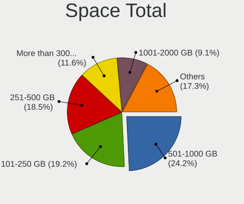

| Size in GB     | Computers | Percent |
|----------------|-----------|---------|
| 501-1000       | 228       | 24.23%  |
| 101-250        | 181       | 19.23%  |
| 251-500        | 174       | 18.49%  |
| More than 3000 | 109       | 11.58%  |
| 1001-2000      | 86        | 9.14%   |
| 51-100         | 46        | 4.89%   |
| Unknown        | 33        | 3.51%   |
| 2001-3000      | 30        | 3.19%   |
| 21-50          | 27        | 2.87%   |
| 1-20           | 27        | 2.87%   |

Space Used
----------

Amount of used disk space

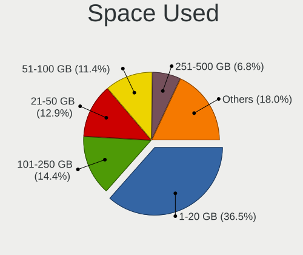

| Used GB        | Computers | Percent |
|----------------|-----------|---------|
| 1-20           | 361       | 36.54%  |
| 101-250        | 142       | 14.37%  |
| 21-50          | 127       | 12.85%  |
| 51-100         | 113       | 11.44%  |
| 251-500        | 67        | 6.78%   |
| 501-1000       | 56        | 5.67%   |
| More than 3000 | 47        | 4.76%   |
| Unknown        | 33        | 3.34%   |
| 1001-2000      | 31        | 3.14%   |
| 2001-3000      | 10        | 1.01%   |
| 0              | 1         | 0.1%    |

Malfunc. Drives
---------------

Drive models with a malfunction

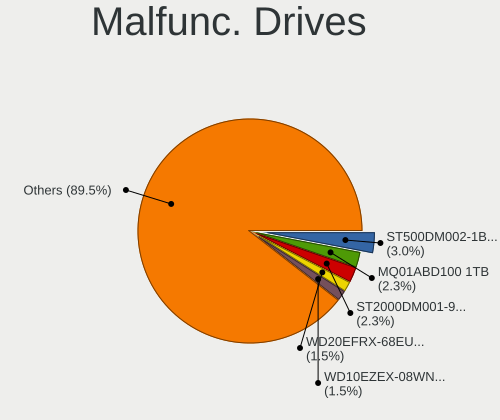

| Model                                | Computers | Drives | Percent |
|--------------------------------------|-----------|--------|---------|
| Seagate ST500DM002-1BD142 500GB      | 4         | 4      | 3.01%   |
| Toshiba MQ01ABD100 1TB               | 3         | 6      | 2.26%   |
| Seagate ST2000DM001-9YN164 2TB       | 3         | 3      | 2.26%   |
| WDC WD20EFRX-68EUZN0 2TB             | 2         | 5      | 1.5%    |
| WDC WD10EZEX-08WN4A0 1TB             | 2         | 3      | 1.5%    |
| WDC WD10EADS-00L5B1 1TB              | 2         | 5      | 1.5%    |
| WDC WD1001FALS-00J7B1 1TB            | 2         | 2      | 1.5%    |
| WDC WDS240G2G0B-00EPW0 240GB SSD     | 1         | 1      | 0.75%   |
| WDC WDS120G2G0A-00JH30 120GB SSD     | 1         | 1      | 0.75%   |
| WDC WD6400AADS-00M2B0 640GB          | 1         | 1      | 0.75%   |
| WDC WD5000LPVX-22V0TT0 500GB         | 1         | 1      | 0.75%   |
| WDC WD5000LPLX-60ZNTT1 500GB         | 1         | 1      | 0.75%   |
| WDC WD5000AVCS-632DY1 500GB          | 1         | 1      | 0.75%   |
| WDC WD5000AAKX-08U6AA0 500GB         | 1         | 1      | 0.75%   |
| WDC WD5000AAKX-083CA1 500GB          | 1         | 1      | 0.75%   |
| WDC WD5000AACS-00G8B0 500GB          | 1         | 1      | 0.75%   |
| WDC WD3200AVVS-63L2B0 320GB          | 1         | 1      | 0.75%   |
| WDC WD3200AAKS-75L9A0 320GB          | 1         | 1      | 0.75%   |
| WDC WD30PURX-64P6ZY0 3TB             | 1         | 1      | 0.75%   |
| WDC WD30EFRX-68EUZN0 3TB             | 1         | 3      | 0.75%   |
| WDC WD2502ABYS-18B7A0 250GB          | 1         | 1      | 0.75%   |
| WDC WD2500YS-18SHB2 250GB            | 1         | 1      | 0.75%   |
| WDC WD2500HHTZ-04N21V0 250GB         | 1         | 1      | 0.75%   |
| WDC WD20PURX-64PFUY0 2TB             | 1         | 1      | 0.75%   |
| WDC WD20EZRZ-00Z5HB0 2TB             | 1         | 1      | 0.75%   |
| WDC WD20EARX-00PASB0 2TB             | 1         | 1      | 0.75%   |
| WDC WD20EARS-00MVWB0 2TB             | 1         | 2      | 0.75%   |
| WDC WD10SPZX-21Z10T0 1TB             | 1         | 2      | 0.75%   |
| WDC WD10PURX-64E5EY0 1TB             | 1         | 1      | 0.75%   |
| WDC WD10JPCX-24UE4T0 1TB             | 1         | 1      | 0.75%   |
| WDC WD10EZEX-60WN4A1 1TB             | 1         | 1      | 0.75%   |
| WDC WD10EZEX-60M2NA0 1TB             | 1         | 1      | 0.75%   |
| WDC WD10EZEX-00RKKA0 1TB             | 1         | 1      | 0.75%   |
| WDC WD1003FBYX-01Y7B0 1TB            | 1         | 1      | 0.75%   |
| WDC WD1002FBYS-18A6B0 1TB            | 1         | 1      | 0.75%   |
| WDC WD1002FAEX-00Y9A0 1TB            | 1         | 1      | 0.75%   |
| WDC RFT030VQFF-KRM5P7 3TB            | 1         | 1      | 0.75%   |
| Toshiba THNSNK256GCS8 SATA 256GB SSD | 1         | 1      | 0.75%   |
| Toshiba MQ04ABF100 1TB               | 1         | 1      | 0.75%   |
| Toshiba MK8032GSX 80GB               | 1         | 1      | 0.75%   |

Malfunc. Drive Vendor
---------------------

Vendors of faulty drives

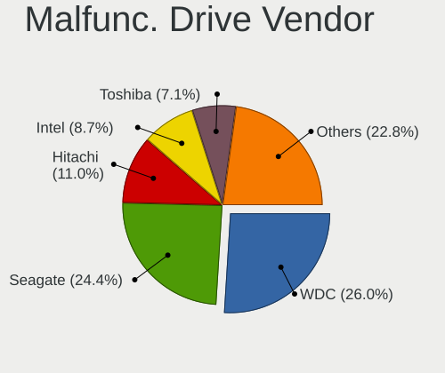

| Vendor              | Computers | Drives | Percent |
|---------------------|-----------|--------|---------|
| WDC                 | 33        | 49     | 25.98%  |
| Seagate             | 31        | 48     | 24.41%  |
| Hitachi             | 14        | 14     | 11.02%  |
| Intel               | 11        | 33     | 8.66%   |
| Toshiba             | 9         | 12     | 7.09%   |
| Samsung Electronics | 6         | 8      | 4.72%   |
| SanDisk             | 3         | 3      | 2.36%   |
| Kingston            | 3         | 3      | 2.36%   |
| HGST                | 3         | 4      | 2.36%   |
| SK hynix            | 2         | 2      | 1.57%   |
| Micron Technology   | 2         | 2      | 1.57%   |
| LITEONIT            | 2         | 2      | 1.57%   |
| Hewlett-Packard     | 2         | 5      | 1.57%   |
| Crucial             | 2         | 2      | 1.57%   |
| Smartbuy            | 1         | 1      | 0.79%   |
| Maxtor              | 1         | 1      | 0.79%   |
| LITEON              | 1         | 1      | 0.79%   |
| A-DATA Technology   | 1         | 1      | 0.79%   |

Malfunc. HDD Vendor
-------------------

Vendors of faulty HDD drives

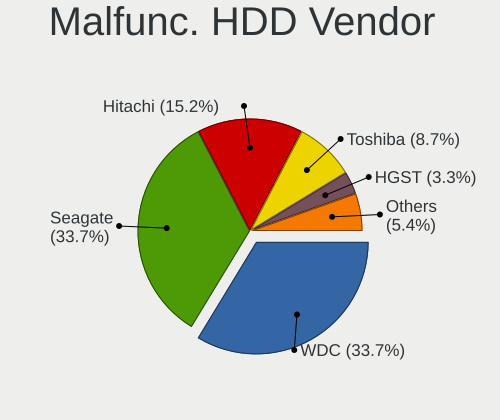

| Vendor              | Computers | Drives | Percent |
|---------------------|-----------|--------|---------|
| WDC                 | 31        | 47     | 33.7%   |
| Seagate             | 31        | 48     | 33.7%   |
| Hitachi             | 14        | 14     | 15.22%  |
| Toshiba             | 8         | 11     | 8.7%    |
| HGST                | 3         | 4      | 3.26%   |
| Samsung Electronics | 2         | 2      | 2.17%   |
| Hewlett-Packard     | 2         | 5      | 2.17%   |
| Maxtor              | 1         | 1      | 1.09%   |

Malfunc. Drive Kind
-------------------

Kinds of faulty drives

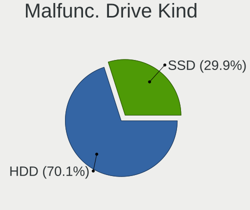

| Kind | Computers | Drives | Percent |
|------|-----------|--------|---------|
| HDD  | 82        | 132    | 70.09%  |
| SSD  | 35        | 59     | 29.91%  |

Failed Drives
-------------

Failed drive models

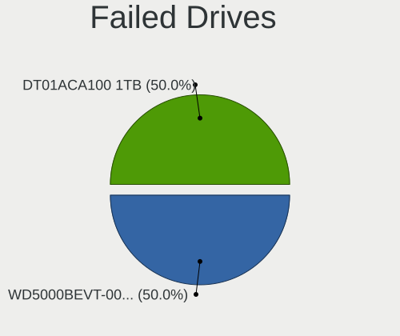

| Model                        | Computers | Drives | Percent |
|------------------------------|-----------|--------|---------|
| WDC WD5000BEVT-00A0RT0 500GB | 1         | 1      | 50%     |
| Toshiba DT01ACA100 1TB       | 1         | 2      | 50%     |

Failed Drive Vendor
-------------------

Failed drive vendors

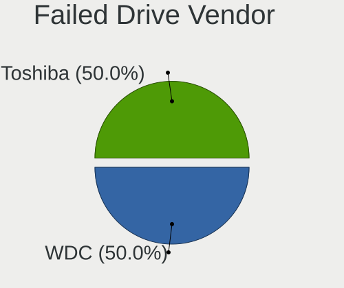

| Vendor  | Computers | Drives | Percent |
|---------|-----------|--------|---------|
| WDC     | 1         | 1      | 50%     |
| Toshiba | 1         | 2      | 50%     |

Drive Status
------------

Number of failed and malfunc. drives

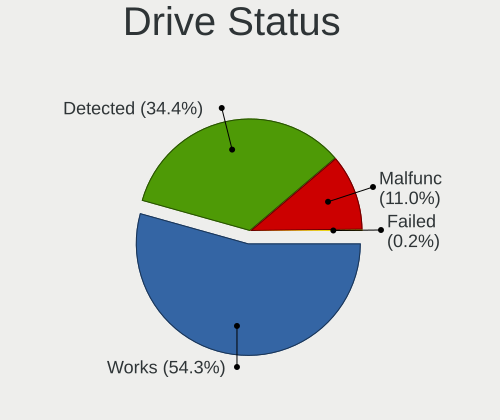

| Status   | Computers | Drives | Percent |
|----------|-----------|--------|---------|
| Works    | 557       | 1867   | 54.34%  |
| Detected | 353       | 1441   | 34.44%  |
| Malfunc  | 113       | 191    | 11.02%  |
| Failed   | 2         | 3      | 0.2%    |

Storage controller
------------------

Storage Vendor
--------------

Storage controller vendors

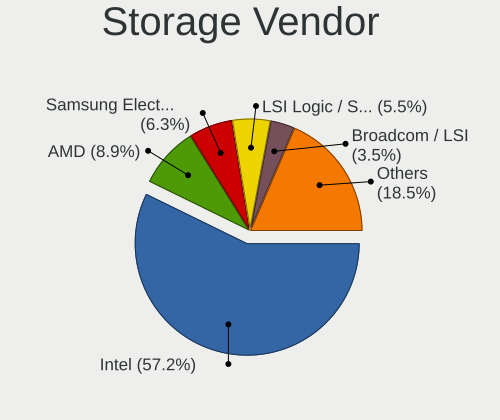

| Vendor                           | Computers | Percent |
|----------------------------------|-----------|---------|
| Intel                            | 735       | 57.24%  |
| AMD                              | 114       | 8.88%   |
| Samsung Electronics              | 81        | 6.31%   |
| LSI Logic / Symbios Logic        | 71        | 5.53%   |
| Broadcom / LSI                   | 45        | 3.5%    |
| SanDisk                          | 31        | 2.41%   |
| ASMedia Technology               | 30        | 2.34%   |
| Marvell Technology Group         | 21        | 1.64%   |
| Phison Electronics               | 13        | 1.01%   |
| JMicron Technology               | 13        | 1.01%   |
| Micron Technology                | 12        | 0.93%   |
| Kingston Technology Company      | 12        | 0.93%   |
| SK hynix                         | 10        | 0.78%   |
| Hewlett-Packard                  | 10        | 0.78%   |
| Toshiba America Info Systems     | 9         | 0.7%    |
| Adaptec                          | 9         | 0.7%    |
| KIOXIA                           | 8         | 0.62%   |
| Silicon Motion                   | 7         | 0.55%   |
| Micron/Crucial Technology        | 7         | 0.55%   |
| ADATA Technology                 | 7         | 0.55%   |
| Nvidia                           | 5         | 0.39%   |
| MAXIO Technology (Hangzhou)      | 5         | 0.39%   |
| Union Memory (Shenzhen)          | 4         | 0.31%   |
| Silicon Image                    | 3         | 0.23%   |
| Dell                             | 3         | 0.23%   |
| 3ware                            | 3         | 0.23%   |
| Shenzhen Longsys Electronics     | 2         | 0.16%   |
| Seagate Technology               | 2         | 0.16%   |
| Realtek Semiconductor            | 2         | 0.16%   |
| Huawei Technologies              | 2         | 0.16%   |
| VIA Technologies                 | 1         | 0.08%   |
| Solid State Storage Technology   | 1         | 0.08%   |
| Silicon Integrated Systems [SiS] | 1         | 0.08%   |
| Lite-On Technology               | 1         | 0.08%   |
| Lenovo                           | 1         | 0.08%   |
| Integrated Technology Express    | 1         | 0.08%   |
| Biwin Storage Technology         | 1         | 0.08%   |
| Apple                            | 1         | 0.08%   |

Storage Model
-------------

Storage controller models

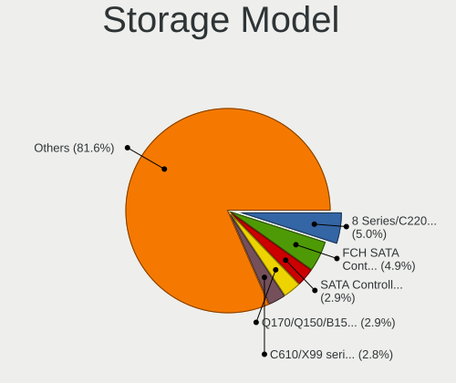

| Model                                                                          | Computers | Percent |
|--------------------------------------------------------------------------------|-----------|---------|
| Intel 8 Series/C220 Series Chipset Family 6-port SATA Controller 1 [AHCI mode] | 75        | 4.95%   |
| AMD FCH SATA Controller [AHCI mode]                                            | 74        | 4.89%   |
| Intel SATA Controller [RAID Mode]                                              | 44        | 2.91%   |
| Intel Q170/Q150/B150/H170/H110/Z170/CM236 Chipset SATA Controller [AHCI Mode]  | 44        | 2.91%   |
| Intel C610/X99 series chipset 6-Port SATA Controller [AHCI mode]               | 42        | 2.77%   |
| Intel C610/X99 series chipset sSATA Controller [AHCI mode]                     | 40        | 2.64%   |
| Intel Sunrise Point-LP SATA Controller [AHCI mode]                             | 39        | 2.58%   |
| Intel 200 Series PCH SATA controller [AHCI mode]                               | 39        | 2.58%   |
| Samsung NVMe SSD Controller SM981/PM981/PM983                                  | 38        | 2.51%   |
| LSI Logic / Symbios Logic MegaRAID SAS-3 3108 [Invader]                        | 31        | 2.05%   |
| Intel Cannon Lake PCH SATA AHCI Controller                                     | 30        | 1.98%   |
| Intel C620 Series Chipset Family SSATA Controller [AHCI mode]                  | 24        | 1.59%   |
| Intel 7 Series Chipset Family 6-port SATA Controller [AHCI mode]               | 23        | 1.52%   |
| Intel C620 Series Chipset Family SATA Controller [AHCI mode]                   | 22        | 1.45%   |
| ASMedia ASM1061/ASM1062 Serial ATA Controller                                  | 22        | 1.45%   |
| Intel 8 Series SATA Controller 1 [AHCI mode]                                   | 21        | 1.39%   |
| Intel 7 Series/C210 Series Chipset Family 6-port SATA Controller [AHCI mode]   | 20        | 1.32%   |
| Intel 6 Series/C200 Series Chipset Family 6 port Desktop SATA AHCI Controller  | 19        | 1.25%   |
| Intel 82801JI (ICH10 Family) 4 port SATA IDE Controller #1                     | 18        | 1.19%   |
| Intel 82801 Mobile SATA Controller [RAID mode]                                 | 18        | 1.19%   |
| Intel 82801JI (ICH10 Family) SATA AHCI Controller                              | 17        | 1.12%   |
| Intel 6 Series/C200 Series Chipset Family 6 port Mobile SATA AHCI Controller   | 17        | 1.12%   |
| AMD SB7x0/SB8x0/SB9x0 SATA Controller [AHCI mode]                              | 17        | 1.12%   |
| Samsung NVMe SSD Controller 980 (DRAM-less)                                    | 16        | 1.06%   |
| Intel C600/X79 series chipset 6-Port SATA AHCI Controller                      | 16        | 1.06%   |
| Intel 82801JI (ICH10 Family) 2 port SATA IDE Controller #2                     | 16        | 1.06%   |
| Intel NM10/ICH7 Family SATA Controller [IDE mode]                              | 15        | 0.99%   |
| Intel Comet Lake SATA AHCI Controller                                          | 15        | 0.99%   |
| AMD SB7x0/SB8x0/SB9x0 IDE Controller                                           | 14        | 0.92%   |
| AMD 400 Series Chipset SATA Controller                                         | 13        | 0.86%   |
| Intel 82801G (ICH7 Family) IDE Controller                                      | 12        | 0.79%   |
| Broadcom / LSI MegaRAID SAS-3 3108 [Invader]                                   | 12        | 0.79%   |
| Samsung NVMe SSD Controller SM961/PM961/SM963                                  | 11        | 0.73%   |
| Intel 500 Series Chipset Family SATA AHCI Controller                           | 11        | 0.73%   |
| Intel 5 Series/3400 Series Chipset 6 port SATA AHCI Controller                 | 11        | 0.73%   |
| Intel Wildcat Point-LP SATA Controller [AHCI Mode]                             | 10        | 0.66%   |
| Intel Volume Management Device NVMe RAID Controller                            | 10        | 0.66%   |
| Intel 631xESB/632xESB IDE Controller                                           | 10        | 0.66%   |
| LSI Logic / Symbios Logic SAS2008 PCI-Express Fusion-MPT SAS-2 [Falcon]        | 9         | 0.59%   |
| Intel Cannon Lake Mobile PCH SATA AHCI Controller                              | 9         | 0.59%   |

Storage Kind
------------

Kind of storage controller (IDE, SATA, NVMe, SAS, ...)

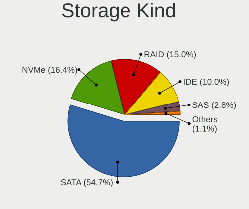

| Kind | Computers | Percent |
|------|-----------|---------|
| SATA | 694       | 54.73%  |
| NVMe | 208       | 16.4%   |
| RAID | 190       | 14.98%  |
| IDE  | 127       | 10.02%  |
| SAS  | 35        | 2.76%   |
| SCSI | 14        | 1.1%    |

Processor
---------

CPU Vendor
----------

Processor vendors

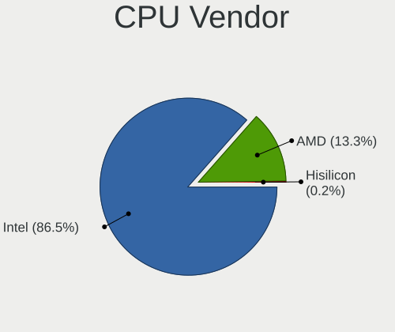

| Vendor    | Computers | Percent |
|-----------|-----------|---------|
| Intel     | 795       | 86.51%  |
| AMD       | 122       | 13.28%  |
| Hisilicon | 2         | 0.22%   |

CPU Model
---------

Processor models

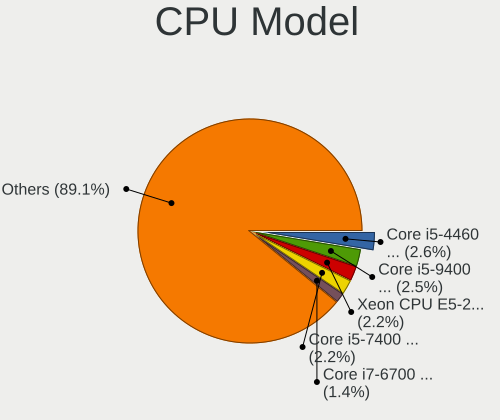

| Model                                   | Computers | Percent |
|-----------------------------------------|-----------|---------|
| Intel Core i5-4460 CPU @ 3.20GHz        | 24        | 2.61%   |
| Intel Core i5-9400 CPU @ 2.90GHz        | 23        | 2.5%    |
| Intel Xeon CPU E5-2630 v4 @ 2.20GHz     | 20        | 2.17%   |
| Intel Core i5-7400 CPU @ 3.00GHz        | 20        | 2.17%   |
| Intel Core i7-6700 CPU @ 3.40GHz        | 13        | 1.41%   |
| Intel Xeon CPU E5620 @ 2.40GHz          | 12        | 1.3%    |
| Intel Core i7-7700 CPU @ 3.60GHz        | 9         | 0.98%   |
| Intel Core i7-4790 CPU @ 3.60GHz        | 9         | 0.98%   |
| Intel Core i5-3470 CPU @ 3.20GHz        | 8         | 0.87%   |
| Intel Xeon CPU E5-2620 v4 @ 2.10GHz     | 7         | 0.76%   |
| Intel Core i7-8550U CPU @ 1.80GHz       | 7         | 0.76%   |
| Intel Core i5-8250U CPU @ 1.60GHz       | 7         | 0.76%   |
| Intel Core i5-4590 CPU @ 3.30GHz        | 7         | 0.76%   |
| Intel Xeon CPU X5650 @ 2.67GHz          | 6         | 0.65%   |
| Intel Core i7-8700 CPU @ 3.20GHz        | 6         | 0.65%   |
| Intel 11th Gen Core i7-1165G7 @ 2.80GHz | 6         | 0.65%   |
| AMD Ryzen 9 3900X 12-Core Processor     | 6         | 0.65%   |
| AMD Ryzen 5 3600 6-Core Processor       | 6         | 0.65%   |
| AMD FX-6300 Six-Core Processor          | 6         | 0.65%   |
| Intel Xeon Silver 4214 CPU @ 2.20GHz    | 5         | 0.54%   |
| Intel Xeon CPU E5-2620 v3 @ 2.40GHz     | 5         | 0.54%   |
| Intel Core i7-7700HQ CPU @ 2.80GHz      | 5         | 0.54%   |
| Intel Core i5-6300U CPU @ 2.40GHz       | 5         | 0.54%   |
| Intel Core i5-6200U CPU @ 2.30GHz       | 5         | 0.54%   |
| Intel Core i5-4210U CPU @ 1.70GHz       | 5         | 0.54%   |
| Intel Core i5-3320M CPU @ 2.60GHz       | 5         | 0.54%   |
| Intel Core i5-2520M CPU @ 2.50GHz       | 5         | 0.54%   |
| Intel Core i5-10500 CPU @ 3.10GHz       | 5         | 0.54%   |
| Intel Core i3-2330M CPU @ 2.20GHz       | 5         | 0.54%   |
| Intel 11th Gen Core i5-1135G7 @ 2.40GHz | 5         | 0.54%   |
| AMD Ryzen 7 3700X 8-Core Processor      | 5         | 0.54%   |
| Intel Xeon CPU X5690 @ 3.47GHz          | 4         | 0.43%   |
| Intel Core i7-8565U CPU @ 1.80GHz       | 4         | 0.43%   |
| Intel Core i7-3770 CPU @ 3.40GHz        | 4         | 0.43%   |
| Intel Core i5-7200U CPU @ 2.50GHz       | 4         | 0.43%   |
| Intel Core i5-2400 CPU @ 3.10GHz        | 4         | 0.43%   |
| Intel Core i5-10400 CPU @ 2.90GHz       | 4         | 0.43%   |
| Intel Core i3-6100U CPU @ 2.30GHz       | 4         | 0.43%   |
| Intel Core 2 Quad CPU Q6600 @ 2.40GHz   | 4         | 0.43%   |
| Intel Core 2 Duo CPU E7500 @ 2.93GHz    | 4         | 0.43%   |

CPU Model Family
----------------

Processor model prefix

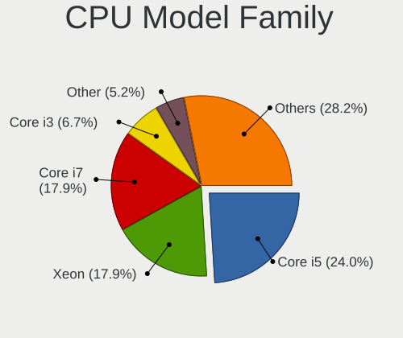

| Model                   | Computers | Percent |
|-------------------------|-----------|---------|
| Intel Core i5           | 221       | 24.02%  |
| Intel Xeon              | 165       | 17.93%  |
| Intel Core i7           | 165       | 17.93%  |
| Intel Core i3           | 62        | 6.74%   |
| Other                   | 48        | 5.22%   |
| AMD Ryzen 5             | 25        | 2.72%   |
| Intel Core 2 Duo        | 23        | 2.5%    |
| Intel Celeron           | 22        | 2.39%   |
| Intel Pentium           | 19        | 2.07%   |
| AMD Ryzen 7             | 18        | 1.96%   |
| AMD FX                  | 18        | 1.96%   |
| Intel Xeon Silver       | 16        | 1.74%   |
| AMD Ryzen 9             | 12        | 1.3%    |
| Intel Core 2 Quad       | 11        | 1.2%    |
| Intel Core i9           | 10        | 1.09%   |
| Intel Atom              | 10        | 1.09%   |
| Intel Xeon Gold         | 9         | 0.98%   |
| AMD EPYC                | 9         | 0.98%   |
| Intel Pentium Dual-Core | 6         | 0.65%   |
| AMD Ryzen 3             | 6         | 0.65%   |
| Intel Genuine           | 5         | 0.54%   |
| AMD Ryzen Threadripper  | 5         | 0.54%   |
| AMD Opteron             | 4         | 0.43%   |
| AMD Ryzen 7 PRO         | 3         | 0.33%   |
| AMD A10                 | 3         | 0.33%   |
| Intel Xeon Platinum     | 2         | 0.22%   |
| Intel Pentium Dual      | 2         | 0.22%   |
| AMD Turion II Neo       | 2         | 0.22%   |
| AMD Phenom II X6        | 2         | 0.22%   |
| AMD G                   | 2         | 0.22%   |
| AMD A8                  | 2         | 0.22%   |
| AMD A4                  | 2         | 0.22%   |
| Intel Xeon Bronze       | 1         | 0.11%   |
| Intel Pentium Gold      | 1         | 0.11%   |
| Intel Pentium 4         | 1         | 0.11%   |
| AMD Ryzen 5 PRO         | 1         | 0.11%   |
| AMD Ryzen 3 PRO         | 1         | 0.11%   |
| AMD Quad-Core Opteron   | 1         | 0.11%   |
| AMD Phenom II X4        | 1         | 0.11%   |
| AMD GX                  | 1         | 0.11%   |

CPU Cores
---------

Number of processor cores

| Number | Computers | Percent |
|--------|-----------|---------|
| 4      | 345       | 37.5%   |
| 2      | 221       | 24.02%  |
| 6      | 114       | 12.39%  |
| 8      | 61        | 6.63%   |
| 12     | 47        | 5.11%   |
| 16     | 32        | 3.48%   |
| 20     | 26        | 2.83%   |
| 24     | 16        | 1.74%   |
| 10     | 10        | 1.09%   |
| 3      | 8         | 0.87%   |
| 1      | 8         | 0.87%   |
| 32     | 7         | 0.76%   |
| 64     | 6         | 0.65%   |
| 14     | 5         | 0.54%   |
| 96     | 3         | 0.33%   |
| 28     | 3         | 0.33%   |
| 40     | 2         | 0.22%   |
| 36     | 2         | 0.22%   |
| 56     | 1         | 0.11%   |
| 52     | 1         | 0.11%   |
| 48     | 1         | 0.11%   |
| 18     | 1         | 0.11%   |

CPU Sockets
-----------

Number of sockets

| Number | Computers | Percent |
|--------|-----------|---------|
| 1      | 787       | 85.64%  |
| 2      | 131       | 14.25%  |
| 0      | 1         | 0.11%   |

CPU Threads
-----------

Threads per core (Hyper-Threading)

| Number | Computers | Percent |
|--------|-----------|---------|
| 2      | 598       | 64.93%  |
| 1      | 323       | 35.07%  |

CPU Op-Modes
------------

CPU Operation Modes (32-bit, 64-bit)

| Op mode        | Computers | Percent |
|----------------|-----------|---------|
| 32-bit, 64-bit | 894       | 97.17%  |
| Unknown        | 21        | 2.28%   |
| 32-bit         | 4         | 0.43%   |
| 64-bit         | 1         | 0.11%   |

CPU Microcode
-------------

Microcode number

| Number     | Computers | Percent |
|------------|-----------|---------|
| Unknown    | 137       | 14.72%  |
| 0x306c3    | 84        | 9.02%   |
| 0x206a7    | 47        | 5.05%   |
| 0x306a9    | 46        | 4.94%   |
| 0x906ea    | 44        | 4.73%   |
| 0x906e9    | 41        | 4.4%    |
| 0x506e3    | 33        | 3.54%   |
| 0x406f1    | 27        | 2.9%    |
| 0x206c2    | 27        | 2.9%    |
| 0x1067a    | 22        | 2.36%   |
| 0x40651    | 21        | 2.26%   |
| 0x306f2    | 18        | 1.93%   |
| 0x806ea    | 17        | 1.83%   |
| 0x406e3    | 17        | 1.83%   |
| 0x206d7    | 15        | 1.61%   |
| 0x06000852 | 14        | 1.5%    |
| 0xa0653    | 12        | 1.29%   |
| 0x806ec    | 12        | 1.29%   |
| 0x306d4    | 12        | 1.29%   |
| 0x10676    | 12        | 1.29%   |
| 0x08701021 | 12        | 1.29%   |
| 0x50654    | 11        | 1.18%   |
| 0x106e5    | 11        | 1.18%   |
| 0xa0655    | 10        | 1.07%   |
| 0x806c1    | 10        | 1.07%   |
| 0x20655    | 10        | 1.07%   |
| 0x906ed    | 9         | 0.97%   |
| 0x806e9    | 9         | 0.97%   |
| 0x106a5    | 9         | 0.97%   |
| 0x906a3    | 8         | 0.86%   |
| 0x08701013 | 8         | 0.86%   |
| 0x0800820d | 8         | 0.86%   |
| 0x6fb      | 7         | 0.75%   |
| 0x50657    | 7         | 0.75%   |
| 0x906ec    | 6         | 0.64%   |
| 0xa0652    | 5         | 0.54%   |
| 0x706e5    | 5         | 0.54%   |
| 0x6fd      | 5         | 0.54%   |
| 0x406c4    | 5         | 0.54%   |
| 0x306e4    | 5         | 0.54%   |

CPU Microarch
-------------

Microarchitecture

| Name             | Computers | Percent |
|------------------|-----------|---------|
| KabyLake         | 155       | 16.83%  |
| Haswell          | 131       | 14.22%  |
| Skylake          | 82        | 8.9%    |
| SandyBridge      | 68        | 7.38%   |
| IvyBridge        | 58        | 6.3%    |
| Broadwell        | 53        | 5.75%   |
| Zen 2            | 45        | 4.89%   |
| Westmere         | 45        | 4.89%   |
| Penryn           | 42        | 4.56%   |
| CometLake        | 32        | 3.47%   |
| Nehalem          | 22        | 2.39%   |
| Piledriver       | 21        | 2.28%   |
| Unknown          | 18        | 1.95%   |
| Alderlake Hybrid | 16        | 1.74%   |
| Zen+             | 15        | 1.63%   |
| TigerLake        | 15        | 1.63%   |
| Core             | 14        | 1.52%   |
| Silvermont       | 13        | 1.41%   |
| Zen              | 12        | 1.3%    |
| IceLake          | 11        | 1.19%   |
| Zen 3            | 7         | 0.76%   |
| K10              | 7         | 0.76%   |
| Bonnell          | 6         | 0.65%   |
| Goldmont plus    | 5         | 0.54%   |
| Excavator        | 4         | 0.43%   |
| Sapphire Rapids  | 3         | 0.33%   |
| NetBurst         | 3         | 0.33%   |
| K10 Llano        | 3         | 0.33%   |
| Tremont          | 2         | 0.22%   |
| P6               | 2         | 0.22%   |
| Jaguar           | 2         | 0.22%   |
| Gracemont        | 2         | 0.22%   |
| Goldmont         | 2         | 0.22%   |
| Bulldozer        | 2         | 0.22%   |
| Bobcat           | 2         | 0.22%   |
| K8 Hammer        | 1         | 0.11%   |

Graphics
--------

GPU Vendor
----------

Vendors of graphics cards

| Vendor                                       | Computers | Percent |
|----------------------------------------------|-----------|---------|
| Intel                                        | 495       | 47.55%  |
| Nvidia                                       | 234       | 22.48%  |
| AMD                                          | 158       | 15.18%  |
| Matrox Electronics Systems                   | 85        | 8.17%   |
| ASPEED Technology                            | 61        | 5.86%   |
| XGI Technology (eXtreme Graphics Innovation) | 2         | 0.19%   |
| S3 Graphics                                  | 2         | 0.19%   |
| Huawei Technologies                          | 2         | 0.19%   |
| Silicon Motion                               | 1         | 0.1%    |
| Silicon Integrated Systems [SiS]             | 1         | 0.1%    |

GPU Model
---------

Graphics card models

| Model                                                                                    | Computers | Percent |
|------------------------------------------------------------------------------------------|-----------|---------|
| ASPEED Technology ASPEED Graphics Family                                                 | 61        | 5.77%   |
| Intel Xeon E3-1200 v3/4th Gen Core Processor Integrated Graphics Controller              | 51        | 4.82%   |
| Intel CoffeeLake-S GT2 [UHD Graphics 630]                                                | 40        | 3.78%   |
| Intel 2nd Generation Core Processor Family Integrated Graphics Controller                | 37        | 3.5%    |
| Intel Kaby Lake-S GT2 [HD Graphics 630]                                                  | 30        | 2.84%   |
| Matrox Electronics Systems G200eR2                                                       | 26        | 2.46%   |
| Matrox Electronics Systems MGA G200eW WPCM450                                            | 24        | 2.27%   |
| Intel 3rd Gen Core processor Graphics Controller                                         | 23        | 2.18%   |
| Intel Haswell-ULT Integrated Graphics Controller                                         | 20        | 1.89%   |
| Intel Skylake-U GT2 [HD Graphics 520]                                                    | 18        | 1.7%    |
| Intel Kaby Lake-R GT2 [UHD Graphics 620]                                                 | 18        | 1.7%    |
| Intel Skylake-S GT2 [HD Graphics 530]                                                    | 16        | 1.51%   |
| Intel CometLake-S GT2 [UHD Graphics 630]                                                 | 16        | 1.51%   |
| AMD Ellesmere [Radeon RX 470/480/570/570X/580/580X/590]                                  | 16        | 1.51%   |
| Matrox Electronics Systems MGA G200e [Pilot] ServerEngines (SEP1)                        | 15        | 1.42%   |
| Intel TigerLake-LP GT2 [Iris Xe Graphics]                                                | 15        | 1.42%   |
| Nvidia GK208B [GeForce GT 710]                                                           | 14        | 1.32%   |
| Intel Broadwell-U GT2 [HD Graphics 5500]                                                 | 12        | 1.14%   |
| AMD ES1000                                                                               | 12        | 1.14%   |
| Matrox Electronics Systems Integrated Matrox G200eW3 Graphics Controller                 | 11        | 1.04%   |
| Intel Xeon E3-1200 v2/3rd Gen Core processor Graphics Controller                         | 11        | 1.04%   |
| Intel WhiskeyLake-U GT2 [UHD Graphics 620]                                               | 11        | 1.04%   |
| Intel 4th Gen Core Processor Integrated Graphics Controller                              | 11        | 1.04%   |
| AMD Renoir [Radeon Vega Series / Radeon Vega Mobile Series]                              | 11        | 1.04%   |
| Intel Core Processor Integrated Graphics Controller                                      | 10        | 0.95%   |
| Intel CoffeeLake-H GT2 [UHD Graphics 630]                                                | 9         | 0.85%   |
| Intel Atom/Celeron/Pentium Processor x5-E8000/J3xxx/N3xxx Integrated Graphics Controller | 9         | 0.85%   |
| Intel Kaby Lake-U GT2 [HD Graphics 620]                                                  | 8         | 0.76%   |
| Intel IvyBridge GT2 [HD Graphics 4000]                                                   | 8         | 0.76%   |
| AMD Oland XT [Radeon HD 8670 / R5 340X OEM / R7 250/350/350X OEM]                        | 8         | 0.76%   |
| Intel Kaby Lake-H GT2 [HD Graphics 630]                                                  | 7         | 0.66%   |
| Intel Alder Lake-P GT2 [Iris Xe Graphics]                                                | 7         | 0.66%   |
| AMD Oland [Radeon HD 8570 / R5 430 OEM / R7 240/340 / Radeon 520 OEM]                    | 7         | 0.66%   |
| Nvidia GT218 [GeForce 210]                                                               | 6         | 0.57%   |
| Nvidia GF119 [GeForce GT 610]                                                            | 6         | 0.57%   |
| Intel 82G33/G31 Express Integrated Graphics Controller                                   | 6         | 0.57%   |
| Intel 4 Series Chipset Integrated Graphics Controller                                    | 6         | 0.57%   |
| AMD Topaz XT [Radeon R7 M260/M265 / M340/M360 / M440/M445 / 530/535 / 620/625 Mobile]    | 6         | 0.57%   |
| AMD Picasso/Raven 2 [Radeon Vega Series / Radeon Vega Mobile Series]                     | 6         | 0.57%   |
| Matrox Electronics Systems MGA G200EH                                                    | 5         | 0.47%   |

GPU Combo
---------

Combinations of graphics cards

| Name                    | Computers | Percent |
|-------------------------|-----------|---------|
| 1 x Intel               | 389       | 42.19%  |
| 1 x Nvidia              | 149       | 16.16%  |
| 1 x AMD                 | 125       | 13.56%  |
| 1 x Matrox              | 80        | 8.68%   |
| Intel + Nvidia          | 69        | 7.48%   |
| 1 x ASPEED              | 55        | 5.97%   |
| Intel + AMD             | 22        | 2.39%   |
| 2 x AMD                 | 5         | 0.54%   |
| Nvidia + Matrox         | 5         | 0.54%   |
| 2 x Nvidia              | 3         | 0.33%   |
| AMD + Nvidia            | 3         | 0.33%   |
| Other                   | 2         | 0.22%   |
| 1 x XGI                 | 2         | 0.22%   |
| 1 x S3 Graphics         | 2         | 0.22%   |
| Nvidia + ASPEED         | 2         | 0.22%   |
| 1 x Huawei Technologies | 2         | 0.22%   |
| AMD + ASPEED            | 2         | 0.22%   |
| 3 x Nvidia + 1 x ASPEED | 1         | 0.11%   |
| 2 x AMD + 1 x ASPEED    | 1         | 0.11%   |
| 1 x SiS                 | 1         | 0.11%   |
| 1 x Silicon Motion      | 1         | 0.11%   |
| Intel + 2 x Nvidia      | 1         | 0.11%   |

GPU Driver
----------

Free vs proprietary

| Driver      | Computers | Percent |
|-------------|-----------|---------|
| Free        | 743       | 79.98%  |
| Unknown     | 106       | 11.41%  |
| Proprietary | 80        | 8.61%   |

GPU Memory
----------

Total video memory

| Size in GB | Computers | Percent |
|------------|-----------|---------|
| Unknown    | 592       | 63.38%  |
| 1.01-2.0   | 104       | 11.13%  |
| 0.51-1.0   | 69        | 7.39%   |
| 0.01-0.5   | 61        | 6.53%   |
| 3.01-4.0   | 50        | 5.35%   |
| 7.01-8.0   | 31        | 3.32%   |
| 5.01-6.0   | 10        | 1.07%   |
| 8.01-16.0  | 8         | 0.86%   |
| 4.01-5.0   | 4         | 0.43%   |
| 2.01-3.0   | 4         | 0.43%   |
| 16.01-24.0 | 1         | 0.11%   |

Monitor
-------

Monitor Vendor
--------------

Monitor vendors

| Vendor                  | Computers | Percent |
|-------------------------|-----------|---------|
| Dell                    | 114       | 15.22%  |
| Samsung Electronics     | 93        | 12.42%  |
| AU Optronics            | 57        | 7.61%   |
| LG Display              | 47        | 6.28%   |
| Goldstar                | 46        | 6.14%   |
| Hewlett-Packard         | 44        | 5.87%   |
| Chimei Innolux          | 43        | 5.74%   |
| Acer                    | 33        | 4.41%   |
| BOE                     | 30        | 4.01%   |
| AOC                     | 22        | 2.94%   |
| Philips                 | 20        | 2.67%   |
| BenQ                    | 19        | 2.54%   |
| Lenovo                  | 16        | 2.14%   |
| ViewSonic               | 13        | 1.74%   |
| Ancor Communications    | 13        | 1.74%   |
| Iiyama                  | 9         | 1.2%    |
| Eizo                    | 8         | 1.07%   |
| Sharp                   | 7         | 0.93%   |
| LG Electronics          | 7         | 0.93%   |
| HannStar                | 6         | 0.8%    |
| PANDA                   | 5         | 0.67%   |
| NEC Computers           | 5         | 0.67%   |
| ASUSTek Computer        | 5         | 0.67%   |
| Unknown                 | 4         | 0.53%   |
| Sony                    | 4         | 0.53%   |
| Panasonic               | 4         | 0.53%   |
| Apple                   | 4         | 0.53%   |
| Xiaomi                  | 3         | 0.4%    |
| Unknown (XXX)           | 3         | 0.4%    |
| MStar                   | 3         | 0.4%    |
| KVM                     | 3         | 0.4%    |
| HPN                     | 3         | 0.4%    |
| Chi Mei Optoelectronics | 3         | 0.4%    |
| ___                     | 2         | 0.27%   |
| Westinghouse            | 2         | 0.27%   |
| Sun                     | 2         | 0.27%   |
| Sceptre Tech            | 2         | 0.27%   |
| MSI                     | 2         | 0.27%   |
| Insignia                | 2         | 0.27%   |
| InnoLux Display         | 2         | 0.27%   |

Monitor Model
-------------

Monitor models

| Model                                                                 | Computers | Percent |
|-----------------------------------------------------------------------|-----------|---------|
| Dell P2414H DELA09A 1920x1080 527x297mm 23.8-inch                     | 7         | 0.87%   |
| Dell P2317H DEL40F4 1920x1080 509x286mm 23.0-inch                     | 7         | 0.87%   |
| Dell P2417H DELA0DB 1920x1080 527x296mm 23.8-inch                     | 6         | 0.75%   |
| AOC 2436 AOC2436 1920x1080 521x293mm 23.5-inch                        | 5         | 0.62%   |
| Goldstar FULL HD GSM5B55 1920x1080 480x270mm 21.7-inch                | 4         | 0.5%    |
| Dell U2412M DELA07A 1920x1200 518x324mm 24.1-inch                     | 4         | 0.5%    |
| AU Optronics LCD Monitor AUO38ED 1920x1080 344x193mm 15.5-inch        | 4         | 0.5%    |
| AU Optronics LCD Monitor AUO213E 1600x900 309x174mm 14.0-inch         | 4         | 0.5%    |
| Xiaomi Mi TV XMD009A 2880x1800 480x270mm 21.7-inch                    | 3         | 0.37%   |
| Samsung Electronics C27F390 SAM0D32 1920x1080 598x336mm 27.0-inch     | 3         | 0.37%   |
| Panasonic VVX11F009G00 MEI96A2 1920x1080 344x193mm 15.5-inch          | 3         | 0.37%   |
| Goldstar Ultra HD GSM5B08 3840x2160 600x340mm 27.2-inch               | 3         | 0.37%   |
| Goldstar LG ULTRAWIDE GSM59F1 2560x1080 670x280mm 28.6-inch           | 3         | 0.37%   |
| Dell 1704FPV DEL3015 1280x1024 338x270mm 17.0-inch                    | 3         | 0.37%   |
| Chimei Innolux LCD Monitor CMN14D4 1920x1080 309x173mm 13.9-inch      | 3         | 0.37%   |
| Chimei Innolux LCD Monitor CMN1482 1600x900 309x174mm 14.0-inch       | 3         | 0.37%   |
| BenQ GW2765 BNQ78D6 2560x1440 597x336mm 27.0-inch                     | 3         | 0.37%   |
| Unknown (XXX) FURRION TV XXX3553 1920x1080 520x290mm 23.4-inch        | 2         | 0.25%   |
| Sharp LCD Monitor SHP1453 1920x1080 346x194mm 15.6-inch               | 2         | 0.25%   |
| Samsung Electronics SyncMaster SAM0589 1920x1080 521x293mm 23.5-inch  | 2         | 0.25%   |
| Samsung Electronics SyncMaster SAM0372 1680x1050 459x296mm 21.5-inch  | 2         | 0.25%   |
| Samsung Electronics SyncMaster SAM022B 1280x1024 338x270mm 17.0-inch  | 2         | 0.25%   |
| Samsung Electronics SyncMaster SAM01D3 1440x900 410x260mm 19.1-inch   | 2         | 0.25%   |
| Samsung Electronics SyncMaster SAM0094 1280x1024 338x270mm 17.0-inch  | 2         | 0.25%   |
| Samsung Electronics SMT22A550 SAM07AF 1920x1080 477x268mm 21.5-inch   | 2         | 0.25%   |
| Samsung Electronics S24D300 SAM0B43 1920x1080 531x299mm 24.0-inch     | 2         | 0.25%   |
| Samsung Electronics S19C150 SAM0AE6 1366x768 410x230mm 18.5-inch      | 2         | 0.25%   |
| Samsung Electronics LCD Monitor SEC5441 1280x800 331x207mm 15.4-inch  | 2         | 0.25%   |
| Samsung Electronics LCD Monitor SEC3848 1920x1200 367x230mm 17.1-inch | 2         | 0.25%   |
| Philips PHL 243V5 PHLC0D1 1920x1080 521x293mm 23.5-inch               | 2         | 0.25%   |
| MStar Demo MST0030 1920x1080 708x398mm 32.0-inch                      | 2         | 0.25%   |
| LG Display LCD Monitor LGD039F 1366x768 345x194mm 15.6-inch           | 2         | 0.25%   |
| LG Display LCD Monitor LGD02DC 1366x768 344x194mm 15.5-inch           | 2         | 0.25%   |
| LG Display LCD Monitor LGD021D 1600x900 382x215mm 17.3-inch           | 2         | 0.25%   |
| KVM LCD Monitor1919 KVM4308 1280x1024 376x301mm 19.0-inch             | 2         | 0.25%   |
| InnoLux Display LCD Monitor INL0014 1366x768 309x174mm 14.0-inch      | 2         | 0.25%   |
| Iiyama PL2888H IVM7106 1920x1080 621x341mm 27.9-inch                  | 2         | 0.25%   |
| Iiyama PL2492H IVM612F 1920x1080 527x296mm 23.8-inch                  | 2         | 0.25%   |
| Hewlett-Packard ZR2440w HWP2956 1920x1200 520x320mm 24.0-inch         | 2         | 0.25%   |
| Hewlett-Packard ZR2440w HWP2955 1920x1200 518x324mm 24.1-inch         | 2         | 0.25%   |

Monitor Resolution
------------------

Monitor screen resolution

| Resolution         | Computers | Percent |
|--------------------|-----------|---------|
| 1920x1080 (FHD)    | 322       | 44.48%  |
| 1366x768 (WXGA)    | 89        | 12.29%  |
| 3840x2160 (4K)     | 52        | 7.18%   |
| 1280x1024 (SXGA)   | 42        | 5.8%    |
| 2560x1440 (QHD)    | 29        | 4.01%   |
| 1920x1200 (WUXGA)  | 28        | 3.87%   |
| 1600x900 (HD+)     | 28        | 3.87%   |
| 1680x1050 (WSXGA+) | 27        | 3.73%   |
| Unknown            | 19        | 2.62%   |
| 1440x900 (WXGA+)   | 15        | 2.07%   |
| 1280x800 (WXGA)    | 10        | 1.38%   |
| 1024x768 (XGA)     | 8         | 1.1%    |
| 3840x1080          | 7         | 0.97%   |
| 3440x1440          | 7         | 0.97%   |
| 1600x1200          | 7         | 0.97%   |
| 2560x1600          | 4         | 0.55%   |
| 2560x1080          | 4         | 0.55%   |
| 1360x768           | 4         | 0.55%   |
| 3840x1200          | 3         | 0.41%   |
| 5760x1080          | 2         | 0.28%   |
| 1280x960           | 2         | 0.28%   |
| 1280x720 (HD)      | 2         | 0.28%   |
| 7680x1080          | 1         | 0.14%   |
| 7280x2160          | 1         | 0.14%   |
| 5520x2160          | 1         | 0.14%   |
| 4480x1440          | 1         | 0.14%   |
| 3640x1920          | 1         | 0.14%   |
| 3456x2160          | 1         | 0.14%   |
| 3200x2000          | 1         | 0.14%   |
| 2880x1800          | 1         | 0.14%   |
| 1920x540           | 1         | 0.14%   |
| 1920x1280          | 1         | 0.14%   |
| 1680x1080          | 1         | 0.14%   |
| 1400x1050          | 1         | 0.14%   |
| 1024x600           | 1         | 0.14%   |

Monitor Diagonal
----------------

Diagonal size in inches

| Inches  | Computers | Percent |
|---------|-----------|---------|
| 15      | 127       | 16.82%  |
| 24      | 83        | 10.99%  |
| 23      | 71        | 9.4%    |
| 21      | 69        | 9.14%   |
| 27      | 64        | 8.48%   |
| Unknown | 48        | 6.36%   |
| 14      | 44        | 5.83%   |
| 17      | 43        | 5.7%    |
| 13      | 32        | 4.24%   |
| 19      | 30        | 3.97%   |
| 31      | 19        | 2.52%   |
| 22      | 16        | 2.12%   |
| 20      | 16        | 2.12%   |
| 18      | 16        | 2.12%   |
| 12      | 13        | 1.72%   |
| 34      | 10        | 1.32%   |
| 32      | 9         | 1.19%   |
| 16      | 5         | 0.66%   |
| 40      | 4         | 0.53%   |
| 25      | 4         | 0.53%   |
| 52      | 3         | 0.4%    |
| 43      | 3         | 0.4%    |
| 26      | 3         | 0.4%    |
| 84      | 2         | 0.26%   |
| 72      | 2         | 0.26%   |
| 42      | 2         | 0.26%   |
| 11      | 2         | 0.26%   |
| 10      | 2         | 0.26%   |
| 75      | 1         | 0.13%   |
| 65      | 1         | 0.13%   |
| 58      | 1         | 0.13%   |
| 55      | 1         | 0.13%   |
| 54      | 1         | 0.13%   |
| 49      | 1         | 0.13%   |
| 46      | 1         | 0.13%   |
| 38      | 1         | 0.13%   |
| 36      | 1         | 0.13%   |
| 35      | 1         | 0.13%   |
| 30      | 1         | 0.13%   |
| 29      | 1         | 0.13%   |

Monitor Width
-------------

Physical width

| Width in mm | Computers | Percent |
|-------------|-----------|---------|
| 301-350     | 212       | 29.08%  |
| 501-600     | 195       | 26.75%  |
| 401-500     | 123       | 16.87%  |
| Unknown     | 48        | 6.58%   |
| 351-400     | 46        | 6.31%   |
| 601-700     | 34        | 4.66%   |
| 201-300     | 26        | 3.57%   |
| 701-800     | 20        | 2.74%   |
| 1001-1500   | 9         | 1.23%   |
| 801-900     | 6         | 0.82%   |
| 1501-2000   | 5         | 0.69%   |
| 901-1000    | 5         | 0.69%   |

Aspect Ratio
------------

Proportional relationship between the width and the height

| Ratio   | Computers | Percent |
|---------|-----------|---------|
| 16/9    | 466       | 69.55%  |
| 16/10   | 85        | 12.69%  |
| 5/4     | 43        | 6.42%   |
| Unknown | 42        | 6.27%   |
| 4/3     | 17        | 2.54%   |
| 21/9    | 11        | 1.64%   |
| 3/2     | 5         | 0.75%   |
| 32/9    | 1         | 0.15%   |

Monitor Area
------------

Area in inch²

| Area in inch² | Computers | Percent |
|----------------|-----------|---------|
| 201-250        | 187       | 25.24%  |
| 101-110        | 124       | 16.73%  |
| 81-90          | 69        | 9.31%   |
| 301-350        | 65        | 8.77%   |
| 151-200        | 59        | 7.96%   |
| Unknown        | 48        | 6.48%   |
| 351-500        | 41        | 5.53%   |
| 141-150        | 37        | 4.99%   |
| 251-300        | 35        | 4.72%   |
| 121-130        | 16        | 2.16%   |
| More than 1000 | 13        | 1.75%   |
| 61-70          | 13        | 1.75%   |
| 501-1000       | 12        | 1.62%   |
| 71-80          | 7         | 0.94%   |
| 111-120        | 6         | 0.81%   |
| 131-140        | 4         | 0.54%   |
| 51-60          | 3         | 0.4%    |
| 41-50          | 1         | 0.13%   |
| 91-100         | 1         | 0.13%   |

Pixel Density
-------------

Pixels per inch

| Density       | Computers | Percent |
|---------------|-----------|---------|
| 51-100        | 321       | 44.71%  |
| 101-120       | 162       | 22.56%  |
| 121-160       | 148       | 20.61%  |
| Unknown       | 48        | 6.69%   |
| 161-240       | 21        | 2.92%   |
| 1-50          | 11        | 1.53%   |
| More than 240 | 7         | 0.97%   |

Multiple Monitors
-----------------

Total monitors connected

| Total | Computers | Percent |
|-------|-----------|---------|
| 1     | 529       | 56.04%  |
| 0     | 278       | 29.45%  |
| 2     | 119       | 12.61%  |
| 3     | 12        | 1.27%   |
| 4     | 5         | 0.53%   |
| 6     | 1         | 0.11%   |

Network
-------

Net Controller Vendor
---------------------

Controller vendors

| Vendor                            | Computers | Percent |
|-----------------------------------|-----------|---------|
| Intel                             | 517       | 40.05%  |
| Realtek Semiconductor             | 403       | 31.22%  |
| Broadcom                          | 99        | 7.67%   |
| Qualcomm Atheros                  | 82        | 6.35%   |
| Ralink Technology                 | 22        | 1.7%    |
| Mellanox Technologies             | 18        | 1.39%   |
| IBM                               | 17        | 1.32%   |
| Broadcom Limited                  | 16        | 1.24%   |
| TP-Link                           | 14        | 1.08%   |
| ASIX Electronics                  | 10        | 0.77%   |
| Aquantia                          | 7         | 0.54%   |
| Huawei Technologies               | 5         | 0.39%   |
| D-Link System                     | 5         | 0.39%   |
| Ralink                            | 4         | 0.31%   |
| Marvell Technology Group          | 4         | 0.31%   |
| Dell                              | 4         | 0.31%   |
| D-Link                            | 4         | 0.31%   |
| Xiaomi                            | 3         | 0.23%   |
| Shenzhen Goodix Technology        | 3         | 0.23%   |
| Samsung Electronics               | 3         | 0.23%   |
| Nvidia                            | 3         | 0.23%   |
| Ericsson Business Mobile Networks | 3         | 0.23%   |
| Emulex                            | 3         | 0.23%   |
| DisplayLink                       | 3         | 0.23%   |
| ASUSTek Computer                  | 3         | 0.23%   |
| Xilinx                            | 2         | 0.15%   |
| Solarflare Communications         | 2         | 0.15%   |
| Sierra Wireless                   | 2         | 0.15%   |
| MediaTek                          | 2         | 0.15%   |
| ICS Advent                        | 2         | 0.15%   |
| 3Com                              | 2         | 0.15%   |
| ZTE WCDMA Technologies MSM        | 1         | 0.08%   |
| VIA Technologies                  | 1         | 0.08%   |
| U-Blox                            | 1         | 0.08%   |
| Strawberry Linux                  | 1         | 0.08%   |
| Spreadtrum Communications         | 1         | 0.08%   |
| Silicon Integrated Systems [SiS]  | 1         | 0.08%   |
| Seeed Technology                  | 1         | 0.08%   |
| Qualcomm Atheros Communications   | 1         | 0.08%   |
| OnePlus Technology (Shenzhen)     | 1         | 0.08%   |

Net Controller Model
--------------------

Controller models

| Model                                                                  | Computers | Percent |
|------------------------------------------------------------------------|-----------|---------|
| Realtek RTL8111/8168/8211/8411 PCI Express Gigabit Ethernet Controller | 318       | 20.22%  |
| Intel 82579LM Gigabit Network Connection (Lewisville)                  | 41        | 2.61%   |
| Intel I350 Gigabit Network Connection                                  | 38        | 2.42%   |
| Realtek RTL810xE PCI Express Fast Ethernet controller                  | 32        | 2.03%   |
| Intel Ethernet Connection I217-LM                                      | 30        | 1.91%   |
| Intel I211 Gigabit Network Connection                                  | 28        | 1.78%   |
| Intel Wi-Fi 6 AX200                                                    | 27        | 1.72%   |
| Intel I210 Gigabit Network Connection                                  | 26        | 1.65%   |
| Intel Wireless 7260                                                    | 24        | 1.53%   |
| Intel Ethernet Connection (2) I219-LM                                  | 24        | 1.53%   |
| Intel 82574L Gigabit Network Connection                                | 24        | 1.53%   |
| Broadcom NetXtreme BCM5720 Gigabit Ethernet PCIe                       | 24        | 1.53%   |
| Intel 82599ES 10-Gigabit SFI/SFP+ Network Connection                   | 19        | 1.21%   |
| Realtek RTL8153 Gigabit Ethernet Adapter                               | 18        | 1.14%   |
| IBM RNDIS/Ethernet Gadget                                              | 17        | 1.08%   |
| Intel Wireless 8265 / 8275                                             | 16        | 1.02%   |
| Realtek RTL8125 2.5GbE Controller                                      | 15        | 0.95%   |
| Qualcomm Atheros QCA9565 / AR9565 Wireless Network Adapter             | 15        | 0.95%   |
| Intel Wireless 8260                                                    | 15        | 0.95%   |
| Intel Wireless 7265                                                    | 14        | 0.89%   |
| Intel Ethernet Controller X710 for 10GbE SFP+                          | 14        | 0.89%   |
| Intel Ethernet Connection (7) I219-LM                                  | 13        | 0.83%   |
| Intel Ethernet Connection (2) I219-V                                   | 13        | 0.83%   |
| Qualcomm Atheros QCA9377 802.11ac Wireless Network Adapter             | 12        | 0.76%   |
| Intel Ethernet Connection (11) I219-LM                                 | 12        | 0.76%   |
| Intel Dual Band Wireless-AC 3168NGW [Stone Peak]                       | 12        | 0.76%   |
| Intel 82579V Gigabit Network Connection                                | 12        | 0.76%   |
| Intel Wi-Fi 6 AX201                                                    | 11        | 0.7%    |
| Intel Ethernet Controller I225-V                                       | 11        | 0.7%    |
| Broadcom NetXtreme II BCM5709 Gigabit Ethernet                         | 11        | 0.7%    |
| Realtek RTL8821CE 802.11ac PCIe Wireless Network Adapter               | 9         | 0.57%   |
| Realtek RTL-8100/8101L/8139 PCI Fast Ethernet Adapter                  | 9         | 0.57%   |
| Intel Centrino Advanced-N 6205 [Taylor Peak]                           | 9         | 0.57%   |
| Intel Alder Lake-P PCH CNVi WiFi                                       | 9         | 0.57%   |
| Intel 82576 Gigabit Network Connection                                 | 9         | 0.57%   |
| Qualcomm Atheros QCA6174 802.11ac Wireless Network Adapter             | 8         | 0.51%   |
| Mellanox MT27500 Family [ConnectX-3]                                   | 8         | 0.51%   |
| Intel Ethernet Controller 10-Gigabit X540-AT2                          | 8         | 0.51%   |
| Intel Comet Lake PCH CNVi WiFi                                         | 8         | 0.51%   |
| Intel Cannon Point-LP CNVi [Wireless-AC]                               | 8         | 0.51%   |

Wireless Vendor
---------------

Wireless vendors

| Vendor                          | Computers | Percent |
|---------------------------------|-----------|---------|
| Intel                           | 233       | 54.57%  |
| Qualcomm Atheros                | 63        | 14.75%  |
| Realtek Semiconductor           | 53        | 12.41%  |
| Ralink Technology               | 22        | 5.15%   |
| Broadcom                        | 20        | 4.68%   |
| TP-Link                         | 12        | 2.81%   |
| Ralink                          | 4         | 0.94%   |
| D-Link                          | 4         | 0.94%   |
| ASUSTek Computer                | 3         | 0.7%    |
| Sierra Wireless                 | 2         | 0.47%   |
| MediaTek                        | 2         | 0.47%   |
| Dell                            | 2         | 0.47%   |
| Broadcom Limited                | 2         | 0.47%   |
| Qualcomm Atheros Communications | 1         | 0.23%   |
| NetGear                         | 1         | 0.23%   |
| Linksys                         | 1         | 0.23%   |
| Edimax Technology               | 1         | 0.23%   |
| D-Link System                   | 1         | 0.23%   |

Wireless Model
--------------

Wireless models

| Model                                                          | Computers | Percent |
|----------------------------------------------------------------|-----------|---------|
| Intel Wi-Fi 6 AX200                                            | 27        | 6.31%   |
| Intel Wireless 7260                                            | 24        | 5.61%   |
| Intel Wireless 8265 / 8275                                     | 16        | 3.74%   |
| Qualcomm Atheros QCA9565 / AR9565 Wireless Network Adapter     | 15        | 3.5%    |
| Intel Wireless 8260                                            | 15        | 3.5%    |
| Intel Wireless 7265                                            | 14        | 3.27%   |
| Qualcomm Atheros QCA9377 802.11ac Wireless Network Adapter     | 12        | 2.8%    |
| Intel Dual Band Wireless-AC 3168NGW [Stone Peak]               | 12        | 2.8%    |
| Intel Wi-Fi 6 AX201                                            | 11        | 2.57%   |
| Realtek RTL8821CE 802.11ac PCIe Wireless Network Adapter       | 9         | 2.1%    |
| Intel Centrino Advanced-N 6205 [Taylor Peak]                   | 9         | 2.1%    |
| Qualcomm Atheros QCA6174 802.11ac Wireless Network Adapter     | 8         | 1.87%   |
| Intel Comet Lake PCH CNVi WiFi                                 | 8         | 1.87%   |
| Intel Cannon Point-LP CNVi [Wireless-AC]                       | 8         | 1.87%   |
| Realtek RTL8723BE PCIe Wireless Network Adapter                | 7         | 1.64%   |
| Ralink MT7601U Wireless Adapter                                | 7         | 1.64%   |
| Qualcomm Atheros AR9462 Wireless Network Adapter               | 7         | 1.64%   |
| Intel Wireless 3165                                            | 7         | 1.64%   |
| Intel Comet Lake PCH-LP CNVi WiFi                              | 7         | 1.64%   |
| Intel Cannon Lake PCH CNVi WiFi                                | 7         | 1.64%   |
| Realtek RTL8822BE 802.11a/b/g/n/ac WiFi adapter                | 6         | 1.4%    |
| Ralink RT5370 Wireless Adapter                                 | 6         | 1.4%    |
| Qualcomm Atheros AR9485 Wireless Network Adapter               | 6         | 1.4%    |
| Qualcomm Atheros AR9285 Wireless Network Adapter (PCI-Express) | 6         | 1.4%    |
| Intel Wi-Fi 5(802.11ac) Wireless-AC 9x6x [Thunder Peak]        | 6         | 1.4%    |
| Intel Centrino Ultimate-N 6300                                 | 6         | 1.4%    |
| Intel Alder Lake-P PCH CNVi WiFi                               | 6         | 1.4%    |
| Realtek RTL8822CE 802.11ac PCIe Wireless Network Adapter       | 5         | 1.17%   |
| Intel Centrino Advanced-N 6235                                 | 5         | 1.17%   |
| Broadcom BCM4360 802.11ac Dual Band Wireless Network Adapter   | 5         | 1.17%   |
| Broadcom BCM4313 802.11bgn Wireless Network Adapter            | 5         | 1.17%   |
| Ralink RT2870/RT3070 Wireless Adapter                          | 4         | 0.93%   |
| Qualcomm Atheros AR9287 Wireless Network Adapter (PCI-Express) | 4         | 0.93%   |
| Intel PRO/Wireless 3945ABG [Golan] Network Connection          | 4         | 0.93%   |
| Intel Ice Lake-LP PCH CNVi WiFi                                | 4         | 0.93%   |
| Intel Dual Band Wireless-AC 3165 Plus Bluetooth                | 4         | 0.93%   |
| Intel Centrino Advanced-N 6200                                 | 4         | 0.93%   |
| TP-Link AC600 wireless Realtek RTL8811AU [Archer T2U Nano]     | 3         | 0.7%    |
| Realtek RTL8723DE Wireless Network Adapter                     | 3         | 0.7%    |
| Realtek RTL8188EUS 802.11n Wireless Network Adapter            | 3         | 0.7%    |

Ethernet Vendor
---------------

Ethernet vendors

| Vendor                           | Computers | Percent |
|----------------------------------|-----------|---------|
| Intel                            | 405       | 40.18%  |
| Realtek Semiconductor            | 386       | 38.29%  |
| Broadcom                         | 82        | 8.13%   |
| Qualcomm Atheros                 | 27        | 2.68%   |
| IBM                              | 17        | 1.69%   |
| Broadcom Limited                 | 14        | 1.39%   |
| ASIX Electronics                 | 10        | 0.99%   |
| Mellanox Technologies            | 9         | 0.89%   |
| Aquantia                         | 7         | 0.69%   |
| Huawei Technologies              | 5         | 0.5%    |
| Marvell Technology Group         | 4         | 0.4%    |
| D-Link System                    | 4         | 0.4%    |
| Xiaomi                           | 3         | 0.3%    |
| Samsung Electronics              | 3         | 0.3%    |
| Nvidia                           | 3         | 0.3%    |
| DisplayLink                      | 3         | 0.3%    |
| TP-Link                          | 2         | 0.2%    |
| Solarflare Communications        | 2         | 0.2%    |
| ICS Advent                       | 2         | 0.2%    |
| Emulex                           | 2         | 0.2%    |
| Dell                             | 2         | 0.2%    |
| 3Com                             | 2         | 0.2%    |
| ZTE WCDMA Technologies MSM       | 1         | 0.1%    |
| Xilinx                           | 1         | 0.1%    |
| VIA Technologies                 | 1         | 0.1%    |
| Spreadtrum Communications        | 1         | 0.1%    |
| Silicon Integrated Systems [SiS] | 1         | 0.1%    |
| OnePlus Technology (Shenzhen)    | 1         | 0.1%    |
| MYRICOM                          | 1         | 0.1%    |
| Lenovo                           | 1         | 0.1%    |
| Insyde Software                  | 1         | 0.1%    |
| Cisco Systems                    | 1         | 0.1%    |
| Ceton Technologies               | 1         | 0.1%    |
| Apple                            | 1         | 0.1%    |
| American Megatrends              | 1         | 0.1%    |
| Accton Technology                | 1         | 0.1%    |

Ethernet Model
--------------

Ethernet models

| Model                                                                  | Computers | Percent |
|------------------------------------------------------------------------|-----------|---------|
| Realtek RTL8111/8168/8211/8411 PCI Express Gigabit Ethernet Controller | 318       | 28.39%  |
| Intel 82579LM Gigabit Network Connection (Lewisville)                  | 41        | 3.66%   |
| Intel I350 Gigabit Network Connection                                  | 38        | 3.39%   |
| Realtek RTL810xE PCI Express Fast Ethernet controller                  | 32        | 2.86%   |
| Intel Ethernet Connection I217-LM                                      | 30        | 2.68%   |
| Intel I211 Gigabit Network Connection                                  | 28        | 2.5%    |
| Intel I210 Gigabit Network Connection                                  | 26        | 2.32%   |
| Intel Ethernet Connection (2) I219-LM                                  | 24        | 2.14%   |
| Intel 82574L Gigabit Network Connection                                | 24        | 2.14%   |
| Broadcom NetXtreme BCM5720 Gigabit Ethernet PCIe                       | 24        | 2.14%   |
| Intel 82599ES 10-Gigabit SFI/SFP+ Network Connection                   | 19        | 1.7%    |
| Realtek RTL8153 Gigabit Ethernet Adapter                               | 18        | 1.61%   |
| IBM RNDIS/Ethernet Gadget                                              | 17        | 1.52%   |
| Realtek RTL8125 2.5GbE Controller                                      | 15        | 1.34%   |
| Intel Ethernet Controller X710 for 10GbE SFP+                          | 14        | 1.25%   |
| Intel Ethernet Connection (7) I219-LM                                  | 13        | 1.16%   |
| Intel Ethernet Connection (2) I219-V                                   | 13        | 1.16%   |
| Intel Ethernet Connection (11) I219-LM                                 | 12        | 1.07%   |
| Intel 82579V Gigabit Network Connection                                | 12        | 1.07%   |
| Intel Ethernet Controller I225-V                                       | 11        | 0.98%   |
| Broadcom NetXtreme II BCM5709 Gigabit Ethernet                         | 11        | 0.98%   |
| Realtek RTL-8100/8101L/8139 PCI Fast Ethernet Adapter                  | 9         | 0.8%    |
| Intel 82576 Gigabit Network Connection                                 | 9         | 0.8%    |
| Intel Ethernet Controller 10-Gigabit X540-AT2                          | 8         | 0.71%   |
| ASIX AX88179 Gigabit Ethernet                                          | 8         | 0.71%   |
| Intel Ethernet Connection I219-LM                                      | 7         | 0.63%   |
| Intel Ethernet Connection (4) I219-V                                   | 7         | 0.63%   |
| Intel Ethernet Connection (2) I218-V                                   | 7         | 0.63%   |
| Intel 82577LM Gigabit Network Connection                               | 7         | 0.63%   |
| Broadcom NetXtreme II BCM5716 Gigabit Ethernet                         | 7         | 0.63%   |
| Qualcomm Atheros AR8131 Gigabit Ethernet                               | 6         | 0.54%   |
| Intel Ethernet Connection (6) I219-V                                   | 6         | 0.54%   |
| Broadcom NetXtreme BCM5764M Gigabit Ethernet PCIe                      | 6         | 0.54%   |
| Intel Ethernet Controller X550                                         | 5         | 0.45%   |
| Intel Ethernet Connection X722 for 10GbE SFP+                          | 5         | 0.45%   |
| Intel Ethernet Connection X722 for 10GBASE-T                           | 5         | 0.45%   |
| Intel Ethernet Connection I219-V                                       | 5         | 0.45%   |
| Intel Ethernet Connection I218-LM                                      | 5         | 0.45%   |
| Intel Ethernet Connection (5) I219-LM                                  | 5         | 0.45%   |
| Broadcom NetXtreme BCM5761 Gigabit Ethernet PCIe                       | 5         | 0.45%   |

Net Controller Kind
-------------------

Ethernet, WiFi or modem

| Kind     | Computers | Percent |
|----------|-----------|---------|
| Ethernet | 876       | 67.33%  |
| WiFi     | 400       | 30.75%  |
| Modem    | 14        | 1.08%   |
| Unknown  | 11        | 0.85%   |

Used Controller
---------------

Currently used network controller

| Kind     | Computers | Percent |
|----------|-----------|---------|
| Ethernet | 666       | 72.63%  |
| WiFi     | 248       | 27.04%  |
| Unknown  | 3         | 0.33%   |

NICs
----

Total network controllers on board

| Total | Computers | Percent |
|-------|-----------|---------|
| 2     | 481       | 52.11%  |
| 1     | 289       | 31.31%  |
| 4     | 52        | 5.63%   |
| 3     | 48        | 5.2%    |
| 6     | 26        | 2.82%   |
| 8     | 7         | 0.76%   |
| 5     | 6         | 0.65%   |
| 0     | 5         | 0.54%   |
| 12    | 2         | 0.22%   |
| 10    | 2         | 0.22%   |
| 7     | 2         | 0.22%   |
| 42    | 1         | 0.11%   |
| 20    | 1         | 0.11%   |
| 14    | 1         | 0.11%   |

IPv6
----

IPv6 vs IPv4

| Used | Computers | Percent |
|------|-----------|---------|
| No   | 829       | 89.72%  |
| Yes  | 95        | 10.28%  |

Bluetooth
---------

Bluetooth Vendor
----------------

Controller vendors

| Vendor                          | Computers | Percent |
|---------------------------------|-----------|---------|
| Intel                           | 184       | 54.44%  |
| Qualcomm Atheros Communications | 35        | 10.36%  |
| Realtek Semiconductor           | 31        | 9.17%   |
| Cambridge Silicon Radio         | 24        | 7.1%    |
| Broadcom                        | 22        | 6.51%   |
| ASUSTek Computer                | 8         | 2.37%   |
| Lite-On Technology              | 7         | 2.07%   |
| IMC Networks                    | 7         | 2.07%   |
| Apple                           | 4         | 1.18%   |
| Hewlett-Packard                 | 3         | 0.89%   |
| Foxconn / Hon Hai               | 3         | 0.89%   |
| Dell                            | 3         | 0.89%   |
| Toshiba                         | 1         | 0.3%    |
| Realtek                         | 1         | 0.3%    |
| Ralink                          | 1         | 0.3%    |
| MediaTek                        | 1         | 0.3%    |
| Integrated System Solution      | 1         | 0.3%    |
| Dynex                           | 1         | 0.3%    |
| Alps Electric                   | 1         | 0.3%    |

Bluetooth Model
---------------

Controller models

| Model                                                 | Computers | Percent |
|-------------------------------------------------------|-----------|---------|
| Intel Bluetooth wireless interface                    | 72        | 21.3%   |
| Intel AX201 Bluetooth                                 | 25        | 7.4%    |
| Intel AX200 Bluetooth                                 | 25        | 7.4%    |
| Cambridge Silicon Radio Bluetooth Dongle (HCI mode)   | 24        | 7.1%    |
| Intel Bluetooth 9460/9560 Jefferson Peak (JfP)        | 22        | 6.51%   |
| Realtek Bluetooth Radio                               | 18        | 5.33%   |
| Intel Bluetooth Device                                | 13        | 3.85%   |
| Qualcomm Atheros  Bluetooth Device                    | 12        | 3.55%   |
| Intel Wireless-AC 3168 Bluetooth                      | 10        | 2.96%   |
| Realtek  Bluetooth 4.2 Adapter                        | 9         | 2.66%   |
| Qualcomm Atheros AR3012 Bluetooth 4.0                 | 9         | 2.66%   |
| Intel Centrino Bluetooth Wireless Transceiver         | 6         | 1.78%   |
| Broadcom BCM20702A0 Bluetooth 4.0                     | 6         | 1.78%   |
| Qualcomm Atheros AR9462 Bluetooth                     | 5         | 1.48%   |
| Intel Wireless-AC 9260 Bluetooth Adapter              | 5         | 1.48%   |
| Qualcomm Atheros QCA61x4 Bluetooth 4.0                | 4         | 1.18%   |
| Qualcomm Atheros AR3011 Bluetooth                     | 4         | 1.18%   |
| Intel Centrino Advanced-N 6230 Bluetooth adapter      | 4         | 1.18%   |
| IMC Networks Bluetooth Device                         | 4         | 1.18%   |
| Lite-On Bluetooth Device                              | 3         | 0.89%   |
| Broadcom BCM2045B (BDC-2.1)                           | 3         | 0.89%   |
| ASUS Broadcom BCM20702A0 Bluetooth                    | 3         | 0.89%   |
| Apple Bluetooth Host Controller                       | 3         | 0.89%   |
| Lite-On Atheros AR3012 Bluetooth                      | 2         | 0.59%   |
| Intel AX210 Bluetooth                                 | 2         | 0.59%   |
| IMC Networks Bluetooth Radio                          | 2         | 0.59%   |
| HP Broadcom 2070 Bluetooth Combo                      | 2         | 0.59%   |
| Foxconn / Hon Hai Bluetooth Device                    | 2         | 0.59%   |
| Dell DW375 Bluetooth Module                           | 2         | 0.59%   |
| Broadcom BCM20702 Bluetooth 4.0 [ThinkPad]            | 2         | 0.59%   |
| Broadcom BCM2045B (BDC-2.1) [Bluetooth Controller]    | 2         | 0.59%   |
| ASUS Broadcom BCM20702 Single-Chip Bluetooth 4.0 + LE | 2         | 0.59%   |
| Toshiba Bluetooth Radio                               | 1         | 0.3%    |
| Realtek RTL8822BE Bluetooth 4.2 Adapter               | 1         | 0.3%    |
| Realtek RTL8821A Bluetooth                            | 1         | 0.3%    |
| Realtek RTL8723A Bluetooth                            | 1         | 0.3%    |
| Realtek Bluetooth 5.4 Radio                           | 1         | 0.3%    |
| Realtek Bluetooth Radio                               | 1         | 0.3%    |
| Ralink RT3290 Bluetooth                               | 1         | 0.3%    |
| Qualcomm Atheros Bluetooth USB Host Controller        | 1         | 0.3%    |

Sound
-----

Sound Vendor
------------

Sound card vendors

| Vendor                           | Computers | Percent |
|----------------------------------|-----------|---------|
| Intel                            | 611       | 59.84%  |
| Nvidia                           | 172       | 16.85%  |
| AMD                              | 161       | 15.77%  |
| Logitech                         | 9         | 0.88%   |
| C-Media Electronics              | 9         | 0.88%   |
| Texas Instruments                | 5         | 0.49%   |
| Plantronics                      | 5         | 0.49%   |
| GN Netcom                        | 5         | 0.49%   |
| Creative Labs                    | 5         | 0.49%   |
| SteelSeries ApS                  | 4         | 0.39%   |
| KTMicro                          | 2         | 0.2%    |
| JMTek                            | 2         | 0.2%    |
| Generalplus Technology           | 2         | 0.2%    |
| Creative Technology              | 2         | 0.2%    |
| Walmart                          | 1         | 0.1%    |
| Tenx Technology                  | 1         | 0.1%    |
| Silicon Integrated Systems [SiS] | 1         | 0.1%    |
| SAVITECH                         | 1         | 0.1%    |
| Realtek Semiconductor            | 1         | 0.1%    |
| Razer USA                        | 1         | 0.1%    |
| NEC Computers                    | 1         | 0.1%    |
| Musical Fidelity                 | 1         | 0.1%    |
| Micro Star International         | 1         | 0.1%    |
| Lynx                             | 1         | 0.1%    |
| Linux Foundation                 | 1         | 0.1%    |
| Lenovo                           | 1         | 0.1%    |
| Kingston Technology              | 1         | 0.1%    |
| JBL                              | 1         | 0.1%    |
| Huawei Technologies              | 1         | 0.1%    |
| Harman International             | 1         | 0.1%    |
| Giga-Byte Technology             | 1         | 0.1%    |
| Fry's Electronics                | 1         | 0.1%    |
| FDUCE PRO AUDIO MADE             | 1         | 0.1%    |
| Ensoniq                          | 1         | 0.1%    |
| DSEA A/S                         | 1         | 0.1%    |
| Corsair                          | 1         | 0.1%    |
| Avid Technology                  | 1         | 0.1%    |
| ASUSTek Computer                 | 1         | 0.1%    |
| Asahi Kasei Microsystems         | 1         | 0.1%    |
| Apple                            | 1         | 0.1%    |

Sound Model
-----------

Sound card models

| Model                                                                      | Computers | Percent |
|----------------------------------------------------------------------------|-----------|---------|
| Intel 8 Series/C220 Series Chipset High Definition Audio Controller        | 75        | 6.29%   |
| Intel Xeon E3-1200 v3/4th Gen Core Processor HD Audio Controller           | 63        | 5.29%   |
| Intel 7 Series/C216 Chipset Family High Definition Audio Controller        | 52        | 4.36%   |
| Intel 100 Series/C230 Series Chipset Family HD Audio Controller            | 48        | 4.03%   |
| Intel Sunrise Point-LP HD Audio                                            | 45        | 3.78%   |
| Intel 6 Series/C200 Series Chipset Family High Definition Audio Controller | 45        | 3.78%   |
| Intel 200 Series PCH HD Audio                                              | 41        | 3.44%   |
| Intel Cannon Lake PCH cAVS                                                 | 36        | 3.02%   |
| AMD Starship/Matisse HD Audio Controller                                   | 29        | 2.43%   |
| AMD Ryzen HD Audio Controller                                              | 25        | 2.1%    |
| AMD Oland/Hainan/Cape Verde/Pitcairn HDMI Audio [Radeon HD 7000 Series]    | 24        | 2.01%   |
| AMD SBx00 Azalia (Intel HDA)                                               | 23        | 1.93%   |
| Intel 5 Series/3400 Series Chipset High Definition Audio                   | 22        | 1.85%   |
| Intel 8 Series HD Audio Controller                                         | 21        | 1.76%   |
| Intel Haswell-ULT HD Audio Controller                                      | 20        | 1.68%   |
| Intel Comet Lake PCH cAVS                                                  | 19        | 1.59%   |
| Nvidia GK208 HDMI/DP Audio Controller                                      | 18        | 1.51%   |
| Intel 82801JI (ICH10 Family) HD Audio Controller                           | 17        | 1.43%   |
| AMD Ellesmere HDMI Audio [Radeon RX 470/480 / 570/580/590]                 | 17        | 1.43%   |
| AMD Family 17h (Models 00h-0fh) HD Audio Controller                        | 16        | 1.34%   |
| Intel Tiger Lake-LP Smart Sound Technology Audio Controller                | 15        | 1.26%   |
| Intel NM10/ICH7 Family High Definition Audio Controller                    | 15        | 1.26%   |
| Nvidia GP107GL High Definition Audio Controller                            | 14        | 1.17%   |
| Intel Wildcat Point-LP High Definition Audio Controller                    | 14        | 1.17%   |
| Intel Broadwell-U Audio Controller                                         | 14        | 1.17%   |
| Intel Cannon Point-LP High Definition Audio Controller                     | 13        | 1.09%   |
| Intel C610/X99 series chipset HD Audio Controller                          | 13        | 1.09%   |
| AMD Renoir/Cezanne HDMI/DP Audio Controller                                | 13        | 1.09%   |
| Nvidia High Definition Audio Controller                                    | 12        | 1.01%   |
| Nvidia TU107 GeForce GTX 1650 High Definition Audio Controller             | 11        | 0.92%   |
| Nvidia GK107 HDMI Audio Controller                                         | 11        | 0.92%   |
| Nvidia GF119 HDMI Audio Controller                                         | 11        | 0.92%   |
| Intel 82801I (ICH9 Family) HD Audio Controller                             | 11        | 0.92%   |
| Nvidia GP104 High Definition Audio Controller                              | 10        | 0.84%   |
| Intel Alder Lake PCH-P High Definition Audio Controller                    | 10        | 0.84%   |
| AMD Raven/Raven2/Fenghuang HDMI/DP Audio Controller                        | 10        | 0.84%   |
| Nvidia TU104 HD Audio Controller                                           | 9         | 0.76%   |
| Intel CM238 HD Audio Controller                                            | 9         | 0.76%   |
| Nvidia GM107 High Definition Audio Controller [GeForce 940MX]              | 8         | 0.67%   |
| Nvidia GK104 HDMI Audio Controller                                         | 8         | 0.67%   |

Memory
------

Memory Vendor
-------------

Memory module vendors

| Vendor              | Computers | Percent |
|---------------------|-----------|---------|
| Samsung Electronics | 153       | 20.48%  |
| SK hynix            | 129       | 17.27%  |
| Kingston            | 122       | 16.33%  |
| Micron Technology   | 76        | 10.17%  |
| Unknown             | 69        | 9.24%   |
| Crucial             | 59        | 7.9%    |
| G.Skill             | 26        | 3.48%   |
| Corsair             | 22        | 2.95%   |
| A-DATA Technology   | 14        | 1.87%   |
| Team                | 9         | 1.2%    |
| GeIL                | 9         | 1.2%    |
| Elpida              | 7         | 0.94%   |
| Nanya Technology    | 6         | 0.8%    |
| Apacer              | 6         | 0.8%    |
| Patriot             | 5         | 0.67%   |
| Transcend           | 4         | 0.54%   |
| Ramaxel Technology  | 4         | 0.54%   |
| Hewlett-Packard     | 4         | 0.54%   |
| Unknown (ABCD)      | 3         | 0.4%    |
| Unknown             | 3         | 0.4%    |
| PNY                 | 2         | 0.27%   |
| NOT SUPPORT         | 2         | 0.27%   |
| Wilk                | 1         | 0.13%   |
| Uroad               | 1         | 0.13%   |
| Unknown (9B0D)      | 1         | 0.13%   |
| TwinMOS             | 1         | 0.13%   |
| Smart Brazil        | 1         | 0.13%   |
| Smart               | 1         | 0.13%   |
| SHARETRONIC         | 1         | 0.13%   |
| Qimonda             | 1         | 0.13%   |
| Mushkin             | 1         | 0.13%   |
| Kingmax             | 1         | 0.13%   |
| Avant               | 1         | 0.13%   |
| AMD                 | 1         | 0.13%   |
| 019400B300CE        | 1         | 0.13%   |

Memory Model
------------

Memory module models

| Model                                                          | Computers | Percent |
|----------------------------------------------------------------|-----------|---------|
| Micron RAM 36ASF4G72PZ-2G3B1 32GB DIMM DDR4 2400MT/s           | 11        | 1.38%   |
| Kingston RAM CL16-16-16 D4-2400 8GB DIMM DDR4 2400MT/s         | 10        | 1.25%   |
| GeIL RAM CL11-11-11 D3-1600 4GB DIMM 1866MT/s                  | 9         | 1.13%   |
| G.Skill RAM F4-2666C19-8GIS 8GB DIMM DDR4 3200MT/s             | 9         | 1.13%   |
| Crucial RAM CT8G4DFD8213.C16FBD2 8GB DIMM DDR4 2500MT/s        | 8         | 1%      |
| SK hynix RAM HMT451S6BFR8A-PB 4GB SODIMM DDR3 1600MT/s         | 7         | 0.88%   |
| Samsung RAM M393A4K40BB1-CRC 32GB DIMM DDR4 2400MT/s           | 6         | 0.75%   |
| Samsung RAM M378B5173QH0-YK0 4GB DIMM DDR3 1600MT/s            | 6         | 0.75%   |
| Kingston RAM 9905678-173.A00G 8GB DIMM DDR4 2400MT/s           | 6         | 0.75%   |
| Crucial RAM CT102464BD160B.M16 8GB DIMM DDR3 1600MT/s          | 6         | 0.75%   |
| Team RAM TEAMGROUP-UD4-2400 8GB DIMM DDR4 3000MT/s             | 5         | 0.63%   |
| SK hynix RAM HMAA8GR7AJR4N-XN 64GB DIMM DDR4 3200MT/s          | 5         | 0.63%   |
| Samsung RAM M393B5170FHD-CH9 4GB DIMM DDR3 1333MT/s            | 5         | 0.63%   |
| Micron RAM 36ASF4G72PZ-2G6D1 32GB DIMM DDR4 2667MT/s           | 5         | 0.63%   |
| SK hynix RAM HMT31GR7BFR4A-H9 8GB DIMM DDR3 1333MT/s           | 4         | 0.5%    |
| SK hynix RAM HMA81GS6AFR8N-UH 8GB SODIMM DDR4 2667MT/s         | 4         | 0.5%    |
| Samsung RAM Module 8192MB DIMM DDR4 3200MT/s                   | 4         | 0.5%    |
| Samsung RAM Module 8192MB DIMM DDR3 800MT/s                    | 4         | 0.5%    |
| Samsung RAM M471A5244CB0-CTD 4GB SODIMM DDR4 3266MT/s          | 4         | 0.5%    |
| Samsung RAM M393A8G40MB2-CVF 64GB DIMM DDR4 2933MT/s           | 4         | 0.5%    |
| Samsung RAM M393A4K40CB2-CTD 32GB DIMM DDR4 2667MT/s           | 4         | 0.5%    |
| Micron RAM 4ATF51264AZ-2G3B1 4GB DIMM DDR4 2800MT/s            | 4         | 0.5%    |
| G.Skill RAM F3-1600C11-8GNT 8GB DIMM DDR3 1600MT/s             | 4         | 0.5%    |
| Crucial RAM CT8G4DFS8213.C8FDD1 8192MB DIMM DDR4 2400MT/s      | 4         | 0.5%    |
| Crucial RAM CT16G4DFD824A.C16FDD 16GB DIMM DDR4 3000MT/s       | 4         | 0.5%    |
| Unknown RAM Module 4096MB DIMM DDR3 1333MT/s                   | 3         | 0.38%   |
| Unknown RAM Module 4096MB DIMM 1333MT/s                        | 3         | 0.38%   |
| Unknown (ABCD) RAM 123456789012345678 2GB DIMM LPDDR4 2133MT/s | 3         | 0.38%   |
| SK hynix RAM HMT351U6CFR8C-PB 4GB DIMM DDR3 1800MT/s           | 3         | 0.38%   |
| SK hynix RAM HMA84GR7DJR4N-XN 32GB DIMM DDR4 3200MT/s          | 3         | 0.38%   |
| SK hynix RAM HMA84GR7AFR4N-VK 32GB DIMM DDR4 2667MT/s          | 3         | 0.38%   |
| Samsung RAM M471B5273DH0-CH9 4GB SODIMM DDR3 1600MT/s          | 3         | 0.38%   |
| Samsung RAM M471B5173QH0-YK0 4GB SODIMM DDR3 1600MT/s          | 3         | 0.38%   |
| Samsung RAM M471A2K43DB1-CTD 16GB SODIMM DDR4 2667MT/s         | 3         | 0.38%   |
| Samsung RAM M393B5270CH0-YH9 4096MB DIMM DDR3 1333MT/s         | 3         | 0.38%   |
| Samsung RAM M393A2G40DB0-CPB 16GB DIMM DDR4 2133MT/s           | 3         | 0.38%   |
| Micron RAM Module 8GB SODIMM DDR4 3200MT/s                     | 3         | 0.38%   |
| Micron RAM 8JTF51264AZ-1G6E1 4GB DIMM DDR3 1600MT/s            | 3         | 0.38%   |
| Kingston RAM KHX1600C9S3L/8G 8GB SODIMM DDR3 1600MT/s          | 3         | 0.38%   |
| Kingston RAM 99U5471-058.A00LF 8GB DIMM DDR3 1600MT/s          | 3         | 0.38%   |

Memory Kind
-----------

Memory module kinds

| Kind         | Computers | Percent |
|--------------|-----------|---------|
| DDR4         | 311       | 46.07%  |
| DDR3         | 238       | 35.26%  |
| DDR2         | 35        | 5.19%   |
| Unknown      | 29        | 4.3%    |
| DRAM         | 27        | 4%      |
| SDRAM        | 10        | 1.48%   |
| LPDDR4       | 10        | 1.48%   |
| DDR5         | 6         | 0.89%   |
| LPDDR3       | 3         | 0.44%   |
| DDR          | 3         | 0.44%   |
| LPDDR5       | 2         | 0.3%    |
| DDR2 FB-DIMM | 1         | 0.15%   |

Memory Form Factor
------------------

Physical design of the memory module

| Name         | Computers | Percent |
|--------------|-----------|---------|
| DIMM         | 463       | 69.21%  |
| SODIMM       | 183       | 27.35%  |
| Row Of Chips | 14        | 2.09%   |
| FB-DIMM      | 6         | 0.9%    |
| RIMM         | 2         | 0.3%    |
| Chip         | 1         | 0.15%   |

Memory Size
-----------

Memory module size

| Size  | Computers | Percent |
|-------|-----------|---------|
| 8192  | 252       | 35.15%  |
| 4096  | 173       | 24.13%  |
| 16384 | 130       | 18.13%  |
| 32768 | 66        | 9.21%   |
| 2048  | 65        | 9.07%   |
| 65536 | 15        | 2.09%   |
| 1024  | 15        | 2.09%   |
| 512   | 1         | 0.14%   |

Memory Speed
------------

Memory module speed

| Speed   | Computers | Percent |
|---------|-----------|---------|
| 1600    | 122       | 16.9%   |
| 2400    | 100       | 13.85%  |
| 2667    | 89        | 12.33%  |
| 1333    | 88        | 12.19%  |
| 3200    | 78        | 10.8%   |
| 2133    | 36        | 4.99%   |
| 800     | 25        | 3.46%   |
| 667     | 25        | 3.46%   |
| 1866    | 15        | 2.08%   |
| 3600    | 12        | 1.66%   |
| Unknown | 12        | 1.66%   |
| 3000    | 10        | 1.39%   |
| 2933    | 9         | 1.25%   |
| 1334    | 9         | 1.25%   |
| 2500    | 8         | 1.11%   |
| 2666    | 7         | 0.97%   |
| 4800    | 6         | 0.83%   |
| 1800    | 6         | 0.83%   |
| 4267    | 5         | 0.69%   |
| 1067    | 5         | 0.69%   |
| 3266    | 4         | 0.55%   |
| 2800    | 4         | 0.55%   |
| 4199    | 3         | 0.42%   |
| 3466    | 3         | 0.42%   |
| 1867    | 3         | 0.42%   |
| 1066    | 3         | 0.42%   |
| 400     | 3         | 0.42%   |
| 8400    | 2         | 0.28%   |
| 5600    | 2         | 0.28%   |
| 4000    | 2         | 0.28%   |
| 2134    | 2         | 0.28%   |
| 2000    | 2         | 0.28%   |
| 1648    | 2         | 0.28%   |
| 65535   | 1         | 0.14%   |
| 6400    | 1         | 0.14%   |
| 5200    | 1         | 0.14%   |
| 4333    | 1         | 0.14%   |
| 3933    | 1         | 0.14%   |
| 3733    | 1         | 0.14%   |
| 3500    | 1         | 0.14%   |

Printers & scanners
-------------------

Printer Vendor
--------------

Printer device vendors

| Vendor              | Computers | Percent |
|---------------------|-----------|---------|
| Hewlett-Packard     | 6         | 46.15%  |
| Brother Industries  | 3         | 23.08%  |
| Star Micronics      | 1         | 7.69%   |
| Samsung Electronics | 1         | 7.69%   |
| Kyocera             | 1         | 7.69%   |
| Canon               | 1         | 7.69%   |

Printer Model
-------------

Printer device models

| Model                               | Computers | Percent |
|-------------------------------------|-----------|---------|
| HP DeskJet 2130 series              | 2         | 15.38%  |
| Star Micronics TSP100ECO/TSP100II   | 1         | 7.69%   |
| Samsung M288x Series                | 1         | 7.69%   |
| Kyocera FS-1030D printer            | 1         | 7.69%   |
| HP LaserJet 400 M401dne             | 1         | 7.69%   |
| HP LaserJet 3030                    | 1         | 7.69%   |
| HP LaserJet 1020                    | 1         | 7.69%   |
| HP HP LaserJet Professional P1606dn | 1         | 7.69%   |
| Canon MF210 Series                  | 1         | 7.69%   |
| Brother MFC-J450DW                  | 1         | 7.69%   |
| Brother MFC-9130CW                  | 1         | 7.69%   |
| Brother HL-L2390DW                  | 1         | 7.69%   |

Scanner Vendor
--------------

Scanner device vendors

| Vendor | Computers | Percent |
|--------|-----------|---------|
| Canon  | 1         | 100%    |

Scanner Model
-------------

Scanner device models

| Model                   | Computers | Percent |
|-------------------------|-----------|---------|
| Canon CanoScan LiDE 110 | 1         | 100%    |

Camera
------

Camera Vendor
-------------

Camera device vendors

| Vendor                                 | Computers | Percent |
|----------------------------------------|-----------|---------|
| Chicony Electronics                    | 58        | 21.48%  |
| Microdia                               | 29        | 10.74%  |
| Bison Electronics                      | 23        | 8.52%   |
| Realtek Semiconductor                  | 20        | 7.41%   |
| Logitech                               | 20        | 7.41%   |
| IMC Networks                           | 20        | 7.41%   |
| Sunplus Innovation Technology          | 16        | 5.93%   |
| Lite-On Technology                     | 13        | 4.81%   |
| Quanta                                 | 9         | 3.33%   |
| Cheng Uei Precision Industry (Foxlink) | 9         | 3.33%   |
| Syntek                                 | 7         | 2.59%   |
| Suyin                                  | 5         | 1.85%   |
| Silicon Motion                         | 5         | 1.85%   |
| Samsung Electronics                    | 4         | 1.48%   |
| Microsoft                              | 4         | 1.48%   |
| Apple                                  | 4         | 1.48%   |
| Lenovo                                 | 3         | 1.11%   |
| Generalplus Technology                 | 3         | 1.11%   |
| Ricoh                                  | 2         | 0.74%   |
| Luxvisions Innotech Limited            | 2         | 0.74%   |
| Intel                                  | 2         | 0.74%   |
| Alcor Micro                            | 2         | 0.74%   |
| Z-Star Microelectronics                | 1         | 0.37%   |
| WaveRider Communications               | 1         | 0.37%   |
| Sunplus Technology                     | 1         | 0.37%   |
| Sunplus IT                             | 1         | 0.37%   |
| Shenzhen Kingcome Optoelectronic       | 1         | 0.37%   |
| KYE Systems                            | 1         | 0.37%   |
| Hewlett-Packard                        | 1         | 0.37%   |
| Cubeternet                             | 1         | 0.37%   |
| Creative Technology                    | 1         | 0.37%   |
| Acer                                   | 1         | 0.37%   |

Camera Model
------------

Camera device models

| Model                                               | Computers | Percent |
|-----------------------------------------------------|-----------|---------|
| Chicony Integrated Camera                           | 12        | 4.43%   |
| Microdia Integrated_Webcam_HD                       | 10        | 3.69%   |
| IMC Networks Integrated Camera                      | 9         | 3.32%   |
| Bison Integrated Camera                             | 8         | 2.95%   |
| Sunplus Integrated_Webcam_HD                        | 7         | 2.58%   |
| Chicony HP HD Camera                                | 6         | 2.21%   |
| Chicony HD WebCam                                   | 6         | 2.21%   |
| Lite-On HP HD Camera                                | 5         | 1.85%   |
| IMC Networks USB2.0 HD UVC WebCam                   | 5         | 1.85%   |
| Syntek Integrated Camera                            | 4         | 1.48%   |
| Samsung Galaxy series, misc. (MTP mode)             | 4         | 1.48%   |
| Logitech Webcam C270                                | 4         | 1.48%   |
| Logitech HD Webcam C615                             | 4         | 1.48%   |
| Logitech HD Pro Webcam C920                         | 4         | 1.48%   |
| Lite-On Integrated Camera                           | 4         | 1.48%   |
| Chicony HP TrueVision HD                            | 4         | 1.48%   |
| Bison HD Webcam                                     | 4         | 1.48%   |
| Realtek Integrated_Webcam_HD                        | 3         | 1.11%   |
| Microdia Laptop_Integrated_Webcam_HD                | 3         | 1.11%   |
| Logitech C922 Pro Stream Webcam                     | 3         | 1.11%   |
| Generalplus 808 Camera #9 (web-cam mode)            | 3         | 1.11%   |
| Chicony USB2.0 VGA UVC WebCam                       | 3         | 1.11%   |
| Chicony Integrated Camera (1280x720@30)             | 3         | 1.11%   |
| Chicony HP Webcam [2 MP Macro]                      | 3         | 1.11%   |
| Bison Lenovo EasyCamera                             | 3         | 1.11%   |
| Suyin Integrated Webcam                             | 2         | 0.74%   |
| Sunplus Full HD webcam                              | 2         | 0.74%   |
| Realtek USB Camera                                  | 2         | 0.74%   |
| Realtek Lenovo EasyCamera                           | 2         | 0.74%   |
| Realtek Integrated Webcam                           | 2         | 0.74%   |
| Quanta Laptop_Integrated_Webcam_2HDM                | 2         | 0.74%   |
| Quanta HP TrueVision HD Camera                      | 2         | 0.74%   |
| Microdia USB 2.0 Camera                             | 2         | 0.74%   |
| Microdia Laptop_Integrated_Webcam_2M                | 2         | 0.74%   |
| Microdia Dell Integrated HD Webcam                  | 2         | 0.74%   |
| Microdia Defender G-Lens 2577 HD720p Camera         | 2         | 0.74%   |
| Microdia Camera                                     | 2         | 0.74%   |
| Luxvisions Innotech Limited HP TrueVision HD Camera | 2         | 0.74%   |
| Lite-On HP Wide Vision FHD Camera                   | 2         | 0.74%   |
| Lite-On HP HD Webcam                                | 2         | 0.74%   |

Security
--------

Fingerprint Vendor
------------------

Fingerprint sensor vendors

| Vendor                     | Computers | Percent |
|----------------------------|-----------|---------|
| Validity Sensors           | 29        | 42.65%  |
| Synaptics                  | 17        | 25%     |
| AuthenTec                  | 6         | 8.82%   |
| Upek                       | 5         | 7.35%   |
| Shenzhen Goodix Technology | 5         | 7.35%   |
| STMicroelectronics         | 2         | 2.94%   |
| Elan Microelectronics      | 2         | 2.94%   |
| LighTuning Technology      | 1         | 1.47%   |
| Dell                       | 1         | 1.47%   |

Fingerprint Model
-----------------

Fingerprint sensor models

| Model                                                                      | Computers | Percent |
|----------------------------------------------------------------------------|-----------|---------|
| Validity Sensors VFS495 Fingerprint Reader                                 | 9         | 13.24%  |
| Validity Sensors VFS451 Fingerprint Reader                                 | 5         | 7.35%   |
| Validity Sensors VFS 5011 fingerprint sensor                               | 5         | 7.35%   |
| Upek Biometric Touchchip/Touchstrip Fingerprint Sensor                     | 5         | 7.35%   |
| Synaptics Prometheus MIS Touch Fingerprint Reader                          | 5         | 7.35%   |
| Shenzhen Goodix  Fingerprint Device                                        | 4         | 5.88%   |
| Validity Sensors VFS7500 Touch Fingerprint Sensor                          | 3         | 4.41%   |
| Synaptics Metallica MIS Touch Fingerprint Reader                           | 3         | 4.41%   |
| AuthenTec AES2810                                                          | 3         | 4.41%   |
| Validity Sensors VFS491                                                    | 2         | 2.94%   |
| Validity Sensors Synaptics WBDI                                            | 2         | 2.94%   |
| Validity Sensors Synaptics VFS7552 Touch Fingerprint Sensor with PurePrint | 2         | 2.94%   |
| Synaptics UWP WBDI Device                                                  | 2         | 2.94%   |
| Synaptics Metallica MOH Touch Fingerprint Reader                           | 2         | 2.94%   |
| STMicroelectronics Fingerprint Reader                                      | 2         | 2.94%   |
| Elan ELAN:Fingerprint                                                      | 2         | 2.94%   |
| AuthenTec AES1660 Fingerprint Sensor                                       | 2         | 2.94%   |
| Validity Sensors VFS5011 Fingerprint Reader                                | 1         | 1.47%   |
| Synaptics WBDI Fingerprint Reader USB 102                                  | 1         | 1.47%   |
| Synaptics  WBDI                                                            | 1         | 1.47%   |
| Synaptics  FS7604 Touch Fingerprint Sensor with PurePrint                  | 1         | 1.47%   |
| Synaptics Prometheus Fingerprint Reader                                    | 1         | 1.47%   |
| Synaptics Fingerprint reader [HP G6]                                       | 1         | 1.47%   |
| Shenzhen Goodix Fingerprint Reader                                         | 1         | 1.47%   |
| LighTuning ES603 Swipe Fingerprint Sensor                                  | 1         | 1.47%   |
| Dell MS819 Wired Mouse With Fingerprint Reader                             | 1         | 1.47%   |
| AuthenTec AES2501 Fingerprint Sensor                                       | 1         | 1.47%   |

Chipcard Vendor
---------------

Chipcard module vendors

| Vendor              | Computers | Percent |
|---------------------|-----------|---------|
| Broadcom            | 12        | 48%     |
| SCM Microsystems    | 3         | 12%     |
| Upek                | 2         | 8%      |
| Giesecke & Devrient | 2         | 8%      |
| Cherry              | 2         | 8%      |
| O2 Micro            | 1         | 4%      |
| Lenovo              | 1         | 4%      |
| Hewlett-Packard     | 1         | 4%      |
| Alcor Micro         | 1         | 4%      |

Chipcard Model
--------------

Chipcard module models

| Model                                                                        | Computers | Percent |
|------------------------------------------------------------------------------|-----------|---------|
| Broadcom BCM5880 Secure Applications Processor                               | 5         | 20%     |
| Broadcom 5880                                                                | 3         | 12%     |
| Upek TouchChip Fingerprint Coprocessor (WBF advanced mode)                   | 2         | 8%      |
| Giesecke & Devrient StarSign CUT S                                           | 2         | 8%      |
| Cherry SmartCard Reader Keyboard KC 1000 SC                                  | 2         | 8%      |
| Broadcom BCM5880 Secure Applications Processor with fingerprint swipe sensor | 2         | 8%      |
| Broadcom 58200                                                               | 2         | 8%      |
| SCM Microsystems SCR3340 - ExpressCard54 Smart Card Reader                   | 1         | 4%      |
| SCM Microsystems SCR331-LC1 / SCR3310 SmartCard Reader                       | 1         | 4%      |
| SCM Microsystems SCR331 SmartCard Reader                                     | 1         | 4%      |
| O2 Micro OZ776 CCID Smartcard Reader                                         | 1         | 4%      |
| Lenovo Integrated Smart Card Reader                                          | 1         | 4%      |
| Hewlett-Packard SC Keyboard - Apollo (Liteon)                                | 1         | 4%      |
| Alcor Micro AU9540 Smartcard Reader                                          | 1         | 4%      |

Unsupported
-----------

Unsupported Devices
-------------------

Total unsupported devices on board

| Total | Computers | Percent |
|-------|-----------|---------|
| 0     | 555       | 59.17%  |
| 1     | 222       | 23.67%  |
| 2     | 94        | 10.02%  |
| 3     | 38        | 4.05%   |
| 4     | 19        | 2.03%   |
| 5     | 9         | 0.96%   |
| 6     | 1         | 0.11%   |

Unsupported Device Types
------------------------

Types of unsupported devices

| Type                     | Computers | Percent |
|--------------------------|-----------|---------|
| Graphics card            | 138       | 23.83%  |
| Communication controller | 133       | 22.97%  |
| Unassigned class         | 88        | 15.2%   |
| Fingerprint reader       | 66        | 11.4%   |
| Net/wireless             | 47        | 8.12%   |
| Net/ethernet             | 24        | 4.15%   |
| Sound                    | 15        | 2.59%   |
| Multimedia controller    | 14        | 2.42%   |
| Chipcard                 | 13        | 2.25%   |
| Storage                  | 9         | 1.55%   |
| Storage/ide              | 7         | 1.21%   |
| Storage/raid             | 5         | 0.86%   |
| Network                  | 5         | 0.86%   |
| Bluetooth                | 4         | 0.69%   |
| Storage/ata              | 2         | 0.35%   |
| Firewire controller      | 2         | 0.35%   |
| Dvb card                 | 2         | 0.35%   |
| Card reader              | 2         | 0.35%   |
| Camera                   | 2         | 0.35%   |
| Modem                    | 1         | 0.17%   |

