CentOS 7 - Tested Hardware & Statistics
---------------------------------------

A project to collect tested hardware configurations for CentOS 7.

Anyone can contribute to this report by the [hw-probe](https://github.com/linuxhw/hw-probe) tool:

    sudo -E hw-probe -all -upload

Please contribute! Especially if your hardware is rare.

This is a report for all computer types. See also reports for [desktops](/Dist/CentOS_7/Desktop/README.md) and [notebooks](/Dist/CentOS_7/Notebook/README.md).

Contents
--------

* [ Test Cases ](#test-cases)

* [ System ](#system)
  - [ Kernel                   ](#kernel)
  - [ Kernel Family            ](#kernel-family)
  - [ Kernel Major Ver.        ](#kernel-major-ver)
  - [ Arch                     ](#arch)
  - [ DE                       ](#de)
  - [ Display Server           ](#display-server)
  - [ Display Manager          ](#display-manager)
  - [ OS Lang                  ](#os-lang)
  - [ Boot Mode                ](#boot-mode)
  - [ Filesystem               ](#filesystem)
  - [ Part. scheme             ](#part-scheme)
  - [ Dual Boot with Linux/BSD ](#dual-boot-with-linuxbsd)
  - [ Dual Boot (Win)          ](#dual-boot-win)

* [ Board ](#board)
  - [ Vendor                   ](#vendor)
  - [ Model                    ](#model)
  - [ Model Family             ](#model-family)
  - [ MFG Year                 ](#mfg-year)
  - [ Form Factor              ](#form-factor)
  - [ Secure Boot              ](#secure-boot)
  - [ Coreboot                 ](#coreboot)
  - [ RAM Size                 ](#ram-size)
  - [ RAM Used                 ](#ram-used)
  - [ Total Drives             ](#total-drives)
  - [ Has CD-ROM               ](#has-cd-rom)
  - [ Has Ethernet             ](#has-ethernet)
  - [ Has WiFi                 ](#has-wifi)
  - [ Has Bluetooth            ](#has-bluetooth)

* [ Location ](#location)
  - [ Country                  ](#country)
  - [ City                     ](#city)

* [ Drives ](#drives)
  - [ Drive Vendor             ](#drive-vendor)
  - [ Drive Model              ](#drive-model)
  - [ HDD Vendor               ](#hdd-vendor)
  - [ SSD Vendor               ](#ssd-vendor)
  - [ Drive Kind               ](#drive-kind)
  - [ Drive Connector          ](#drive-connector)
  - [ Drive Size               ](#drive-size)
  - [ Space Total              ](#space-total)
  - [ Space Used               ](#space-used)
  - [ Malfunc. Drives          ](#malfunc-drives)
  - [ Malfunc. Drive Vendor    ](#malfunc-drive-vendor)
  - [ Malfunc. HDD Vendor      ](#malfunc-hdd-vendor)
  - [ Malfunc. Drive Kind      ](#malfunc-drive-kind)
  - [ Failed Drives            ](#failed-drives)
  - [ Failed Drive Vendor      ](#failed-drive-vendor)
  - [ Drive Status             ](#drive-status)

* [ Storage controller ](#storage-controller)
  - [ Storage Vendor           ](#storage-vendor)
  - [ Storage Model            ](#storage-model)
  - [ Storage Kind             ](#storage-kind)

* [ Processor ](#processor)
  - [ CPU Vendor               ](#cpu-vendor)
  - [ CPU Model                ](#cpu-model)
  - [ CPU Model Family         ](#cpu-model-family)
  - [ CPU Cores                ](#cpu-cores)
  - [ CPU Sockets              ](#cpu-sockets)
  - [ CPU Threads              ](#cpu-threads)
  - [ CPU Op-Modes             ](#cpu-op-modes)
  - [ CPU Microcode            ](#cpu-microcode)
  - [ CPU Microarch            ](#cpu-microarch)

* [ Graphics ](#graphics)
  - [ GPU Vendor               ](#gpu-vendor)
  - [ GPU Model                ](#gpu-model)
  - [ GPU Combo                ](#gpu-combo)
  - [ GPU Driver               ](#gpu-driver)
  - [ GPU Memory               ](#gpu-memory)

* [ Monitor ](#monitor)
  - [ Monitor Vendor           ](#monitor-vendor)
  - [ Monitor Model            ](#monitor-model)
  - [ Monitor Resolution       ](#monitor-resolution)
  - [ Monitor Diagonal         ](#monitor-diagonal)
  - [ Monitor Width            ](#monitor-width)
  - [ Aspect Ratio             ](#aspect-ratio)
  - [ Monitor Area             ](#monitor-area)
  - [ Pixel Density            ](#pixel-density)
  - [ Multiple Monitors        ](#multiple-monitors)

* [ Network ](#network)
  - [ Net Controller Vendor    ](#net-controller-vendor)
  - [ Net Controller Model     ](#net-controller-model)
  - [ Wireless Vendor          ](#wireless-vendor)
  - [ Wireless Model           ](#wireless-model)
  - [ Ethernet Vendor          ](#ethernet-vendor)
  - [ Ethernet Model           ](#ethernet-model)
  - [ Net Controller Kind      ](#net-controller-kind)
  - [ Used Controller          ](#used-controller)
  - [ NICs                     ](#nics)
  - [ IPv6                     ](#ipv6)

* [ Bluetooth ](#bluetooth)
  - [ Bluetooth Vendor         ](#bluetooth-vendor)
  - [ Bluetooth Model          ](#bluetooth-model)

* [ Sound ](#sound)
  - [ Sound Vendor             ](#sound-vendor)
  - [ Sound Model              ](#sound-model)

* [ Memory ](#memory)
  - [ Memory Vendor            ](#memory-vendor)
  - [ Memory Model             ](#memory-model)
  - [ Memory Kind              ](#memory-kind)
  - [ Memory Form Factor       ](#memory-form-factor)
  - [ Memory Size              ](#memory-size)
  - [ Memory Speed             ](#memory-speed)

* [ Printers & scanners ](#printers--scanners)
  - [ Printer Vendor           ](#printer-vendor)
  - [ Printer Model            ](#printer-model)
  - [ Scanner Vendor           ](#scanner-vendor)
  - [ Scanner Model            ](#scanner-model)

* [ Camera ](#camera)
  - [ Camera Vendor            ](#camera-vendor)
  - [ Camera Model             ](#camera-model)

* [ Security ](#security)
  - [ Fingerprint Vendor       ](#fingerprint-vendor)
  - [ Fingerprint Model        ](#fingerprint-model)
  - [ Chipcard Vendor          ](#chipcard-vendor)
  - [ Chipcard Model           ](#chipcard-model)

* [ Unsupported ](#unsupported)
  - [ Unsupported Devices      ](#unsupported-devices)
  - [ Unsupported Device Types ](#unsupported-device-types)

Test Cases
----------

Total: 536

| Vendor        | Model                       | Form-Factor | Probe                                                      | Date         |
|---------------|-----------------------------|-------------|------------------------------------------------------------|--------------|
| Supermicro    | X11DPH-T                    | Server      | [ebc998b080](https://linux-hardware.org/?probe=ebc998b080) | Apr 18, 2024 |
| HP            | ProLiant ML10 v2            | Desktop     | [6f3897abd9](https://linux-hardware.org/?probe=6f3897abd9) | Mar 15, 2024 |
| Acer          | Aspire VN7-592G             | Notebook    | [85e5cb8bbf](https://linux-hardware.org/?probe=85e5cb8bbf) | Feb 29, 2024 |
| HP            | 894F                        | Mini pc     | [a8f31f2c15](https://linux-hardware.org/?probe=a8f31f2c15) | Feb 15, 2024 |
| Gigabyte      | EP45-DS3L                   | Desktop     | [7c90f3665f](https://linux-hardware.org/?probe=7c90f3665f) | Jan 27, 2024 |
| Supermicro    | X8DTT-H                     | Server      | [50c7ee4de8](https://linux-hardware.org/?probe=50c7ee4de8) | Jan 05, 2024 |
| Gigabyte      | EP45-DS3L                   | Desktop     | [7cf925bed4](https://linux-hardware.org/?probe=7cf925bed4) | Dec 23, 2023 |
| Gigabyte      | B360M HD3                   | Desktop     | [9acf6baf05](https://linux-hardware.org/?probe=9acf6baf05) | Dec 22, 2023 |
| ASUSTek       | H110M-K                     | Desktop     | [55109c1bbc](https://linux-hardware.org/?probe=55109c1bbc) | Dec 22, 2023 |
| Gigabyte      | H81M-S2H                    | Desktop     | [bbd22340fc](https://linux-hardware.org/?probe=bbd22340fc) | Dec 22, 2023 |
| MSI           | B250M PRO-VH                | Desktop     | [6911b47a19](https://linux-hardware.org/?probe=6911b47a19) | Dec 22, 2023 |
| Gigabyte      | H81M-S2H                    | Desktop     | [fd80bdeaed](https://linux-hardware.org/?probe=fd80bdeaed) | Dec 22, 2023 |
| ASUSTek       | H110M-K                     | Desktop     | [ac7383c630](https://linux-hardware.org/?probe=ac7383c630) | Dec 22, 2023 |
| MSI           | H110M PRO-VH PLUS           | Desktop     | [7b862a6a81](https://linux-hardware.org/?probe=7b862a6a81) | Dec 22, 2023 |
| Intel         | S1200SP H57532-210          | Server      | [8edff49a96](https://linux-hardware.org/?probe=8edff49a96) | Dec 22, 2023 |
| Intel         | S1200RP_SE G62252-408       | Server      | [3e27ac63c6](https://linux-hardware.org/?probe=3e27ac63c6) | Dec 22, 2023 |
| MSI           | H110M PRO-VH PLUS           | Desktop     | [17dd42b383](https://linux-hardware.org/?probe=17dd42b383) | Dec 22, 2023 |
| Gigabyte      | H81M-DS2                    | Desktop     | [e50bd82756](https://linux-hardware.org/?probe=e50bd82756) | Dec 22, 2023 |
| Gigabyte      | H81M-S2H                    | Desktop     | [2194b0ad9c](https://linux-hardware.org/?probe=2194b0ad9c) | Dec 22, 2023 |
| MSI           | H110M PRO-VH PLUS           | Desktop     | [c334514b1f](https://linux-hardware.org/?probe=c334514b1f) | Dec 22, 2023 |
| Gigabyte      | H81M-S2PV                   | Desktop     | [761eebee94](https://linux-hardware.org/?probe=761eebee94) | Dec 22, 2023 |
| Gigabyte      | H81M-S2PH                   | Desktop     | [b6608c7603](https://linux-hardware.org/?probe=b6608c7603) | Dec 22, 2023 |
| MSI           | B365M PRO-VH                | Desktop     | [33bccf75e0](https://linux-hardware.org/?probe=33bccf75e0) | Dec 22, 2023 |
| MSI           | H110M PRO-VH PLUS           | Desktop     | [59b5ebb0c3](https://linux-hardware.org/?probe=59b5ebb0c3) | Dec 22, 2023 |
| MSI           | H110M PRO-VH PLUS           | Desktop     | [0c51eb213d](https://linux-hardware.org/?probe=0c51eb213d) | Dec 22, 2023 |
| Gigabyte      | B250M-HD3-CF                | Desktop     | [347eec7ee9](https://linux-hardware.org/?probe=347eec7ee9) | Dec 22, 2023 |
| MSI           | B365M PRO-VH                | Desktop     | [561a4c0809](https://linux-hardware.org/?probe=561a4c0809) | Dec 22, 2023 |
| MSI           | H110M PRO-VH PLUS           | Desktop     | [27115feb62](https://linux-hardware.org/?probe=27115feb62) | Dec 22, 2023 |
| Gigabyte      | B560M AORUS PRO             | Desktop     | [3ce597e06a](https://linux-hardware.org/?probe=3ce597e06a) | Dec 22, 2023 |
| Gigabyte      | H81M-S2H                    | Desktop     | [be34427eb1](https://linux-hardware.org/?probe=be34427eb1) | Dec 22, 2023 |
| Gigabyte      | H81M-S2H                    | Desktop     | [496ad2d93b](https://linux-hardware.org/?probe=496ad2d93b) | Dec 22, 2023 |
| MSI           | B360M PRO-VH                | Desktop     | [d0bce14740](https://linux-hardware.org/?probe=d0bce14740) | Dec 22, 2023 |
| Gigabyte      | H81M-S2H                    | Desktop     | [5fb5668250](https://linux-hardware.org/?probe=5fb5668250) | Dec 22, 2023 |
| ASUSTek       | H110M-K                     | Desktop     | [caad19d314](https://linux-hardware.org/?probe=caad19d314) | Dec 22, 2023 |
| MSI           | B360M PRO-VH                | Desktop     | [b1c0126e05](https://linux-hardware.org/?probe=b1c0126e05) | Dec 22, 2023 |
| MSI           | B365M PRO-VH                | Desktop     | [d1c63c1a0b](https://linux-hardware.org/?probe=d1c63c1a0b) | Dec 22, 2023 |
| Gigabyte      | H81M-S2H                    | Desktop     | [a42bd5e717](https://linux-hardware.org/?probe=a42bd5e717) | Dec 22, 2023 |
| MSI           | B365M PRO-VH                | Desktop     | [a75998d2da](https://linux-hardware.org/?probe=a75998d2da) | Dec 22, 2023 |
| MSI           | B365M PRO-VH                | Desktop     | [b55f33d76e](https://linux-hardware.org/?probe=b55f33d76e) | Dec 22, 2023 |
| MSI           | B365M PRO-VH                | Desktop     | [49e9a2f26f](https://linux-hardware.org/?probe=49e9a2f26f) | Dec 22, 2023 |
| MSI           | B365M PRO-VH                | Desktop     | [8c3370c21e](https://linux-hardware.org/?probe=8c3370c21e) | Dec 22, 2023 |
| Gigabyte      | B560M AORUS PRO             | Desktop     | [94de79174c](https://linux-hardware.org/?probe=94de79174c) | Dec 22, 2023 |
| MSI           | B365M PRO-VH                | Desktop     | [59bc9b5d02](https://linux-hardware.org/?probe=59bc9b5d02) | Dec 22, 2023 |
| MSI           | B250M PRO-VH                | Desktop     | [87af1005b8](https://linux-hardware.org/?probe=87af1005b8) | Dec 22, 2023 |
| Gigabyte      | H81M-S2H                    | Desktop     | [55570e65a7](https://linux-hardware.org/?probe=55570e65a7) | Dec 22, 2023 |
| Gigabyte      | H81M-DS2                    | Desktop     | [eea4397d45](https://linux-hardware.org/?probe=eea4397d45) | Dec 22, 2023 |
| MSI           | B365M PRO-VH                | Desktop     | [b32df5066d](https://linux-hardware.org/?probe=b32df5066d) | Dec 22, 2023 |
| MSI           | B365M PRO-VH                | Desktop     | [a949e7fa06](https://linux-hardware.org/?probe=a949e7fa06) | Dec 22, 2023 |
| MSI           | B365M PRO-VH                | Desktop     | [e2b4e10140](https://linux-hardware.org/?probe=e2b4e10140) | Dec 22, 2023 |
| MSI           | B365M PRO-VH                | Desktop     | [87c9436145](https://linux-hardware.org/?probe=87c9436145) | Dec 22, 2023 |
| MSI           | B365M PRO-VH                | Desktop     | [b3a3b91d1d](https://linux-hardware.org/?probe=b3a3b91d1d) | Dec 22, 2023 |
| ASUSTek       | M5A78L-M LX V2              | Desktop     | [0ae8561f0a](https://linux-hardware.org/?probe=0ae8561f0a) | Dec 22, 2023 |
| Gigabyte      | H81M-S2PV                   | Desktop     | [2f23b66d3b](https://linux-hardware.org/?probe=2f23b66d3b) | Dec 22, 2023 |
| ASUSTek       | H110M-K                     | Desktop     | [617899113a](https://linux-hardware.org/?probe=617899113a) | Dec 22, 2023 |
| Gigabyte      | H81M-S2PV                   | Desktop     | [3092182d1d](https://linux-hardware.org/?probe=3092182d1d) | Dec 22, 2023 |
| Gigabyte      | H81M-S2H                    | Desktop     | [3f48c50868](https://linux-hardware.org/?probe=3f48c50868) | Dec 22, 2023 |
| MSI           | B250M PRO-VH                | Desktop     | [cac98c44ed](https://linux-hardware.org/?probe=cac98c44ed) | Dec 22, 2023 |
| Gigabyte      | H81M-S2H                    | Desktop     | [6d0e82b783](https://linux-hardware.org/?probe=6d0e82b783) | Dec 22, 2023 |
| Gigabyte      | H81M-DS2                    | Desktop     | [afd422517d](https://linux-hardware.org/?probe=afd422517d) | Dec 22, 2023 |
| MSI           | B360M PRO-VH                | Desktop     | [1db23ed649](https://linux-hardware.org/?probe=1db23ed649) | Dec 22, 2023 |
| MSI           | B360M PRO-VH                | Desktop     | [8ed791bd6d](https://linux-hardware.org/?probe=8ed791bd6d) | Dec 22, 2023 |
| Gigabyte      | H81M-S2H                    | Desktop     | [5a63cf039d](https://linux-hardware.org/?probe=5a63cf039d) | Dec 22, 2023 |
| MSI           | H110M PRO-VH PLUS           | Desktop     | [46e2b13b34](https://linux-hardware.org/?probe=46e2b13b34) | Dec 22, 2023 |
| MSI           | B250M PRO-VH                | Desktop     | [d09a9c1d0b](https://linux-hardware.org/?probe=d09a9c1d0b) | Dec 22, 2023 |
| Gigabyte      | H81M-S2H                    | Desktop     | [9181bd8696](https://linux-hardware.org/?probe=9181bd8696) | Dec 22, 2023 |
| MSI           | H110M PRO-VH PLUS           | Desktop     | [67188e1b67](https://linux-hardware.org/?probe=67188e1b67) | Dec 22, 2023 |
| Gigabyte      | H81M-DS2                    | Desktop     | [75e2601753](https://linux-hardware.org/?probe=75e2601753) | Dec 22, 2023 |
| MSI           | B250M PRO-VH                | Desktop     | [83d6013a05](https://linux-hardware.org/?probe=83d6013a05) | Dec 22, 2023 |
| Gigabyte      | H81M-S2H                    | Desktop     | [86e58bba42](https://linux-hardware.org/?probe=86e58bba42) | Dec 22, 2023 |
| Gigabyte      | H81M-S2H                    | Desktop     | [6b6c41afa2](https://linux-hardware.org/?probe=6b6c41afa2) | Dec 22, 2023 |
| Gigabyte      | B360M HD3                   | Desktop     | [635fdfc9be](https://linux-hardware.org/?probe=635fdfc9be) | Dec 22, 2023 |
| MSI           | B365M PRO-VH                | Desktop     | [057ea7f38a](https://linux-hardware.org/?probe=057ea7f38a) | Dec 22, 2023 |
| ASUSTek       | H110M-K                     | Desktop     | [0318224393](https://linux-hardware.org/?probe=0318224393) | Dec 22, 2023 |
| Gigabyte      | H81M-S2H                    | Desktop     | [6f2b8275b2](https://linux-hardware.org/?probe=6f2b8275b2) | Dec 22, 2023 |
| MSI           | B365M PRO-VH                | Desktop     | [4cd5825edf](https://linux-hardware.org/?probe=4cd5825edf) | Dec 22, 2023 |
| MSI           | B360M PRO-VH                | Desktop     | [3e070bb5d3](https://linux-hardware.org/?probe=3e070bb5d3) | Dec 22, 2023 |
| MSI           | H110M PRO-VH PLUS           | Desktop     | [c3140237d9](https://linux-hardware.org/?probe=c3140237d9) | Dec 22, 2023 |
| MSI           | B360M PRO-VH                | Desktop     | [2169da8737](https://linux-hardware.org/?probe=2169da8737) | Dec 22, 2023 |
| MSI           | B250M PRO-VH                | Desktop     | [968400d838](https://linux-hardware.org/?probe=968400d838) | Dec 22, 2023 |
| Dell          | 09PR9H A03                  | Desktop     | [25d5c9ce02](https://linux-hardware.org/?probe=25d5c9ce02) | Dec 13, 2023 |
| Dell          | 0N820C                      | Desktop     | [fe88368da2](https://linux-hardware.org/?probe=fe88368da2) | Nov 09, 2023 |
| Dell          | 03TJ75 A00                  | Desktop     | [e082a50dde](https://linux-hardware.org/?probe=e082a50dde) | Nov 02, 2023 |
| HP            | ZHAN 66 Pro A 14 G3         | Notebook    | [249f2a954a](https://linux-hardware.org/?probe=249f2a954a) | Nov 02, 2023 |
| Gigabyte      | EP45-DS3L                   | Desktop     | [8b5e97d193](https://linux-hardware.org/?probe=8b5e97d193) | Oct 21, 2023 |
| Dell          | 0DT021 A00                  | Server      | [f8f771286c](https://linux-hardware.org/?probe=f8f771286c) | Oct 18, 2023 |
| Dell          | 0CN7X8 A04                  | Server      | [2926458524](https://linux-hardware.org/?probe=2926458524) | Oct 17, 2023 |
| Dell          | 0CN7X8 A04                  | Server      | [10029a3309](https://linux-hardware.org/?probe=10029a3309) | Oct 17, 2023 |
| Apple         | Mac-7BA5B2DFE22DDD8C Mac... | Mini pc     | [97cf97582e](https://linux-hardware.org/?probe=97cf97582e) | Oct 16, 2023 |
| Gigabyte      | EP45-DS3L                   | Desktop     | [2867e39109](https://linux-hardware.org/?probe=2867e39109) | Sep 23, 2023 |
| ASUSTek       | M5A78L-M PLUS/USB3          | Desktop     | [8d59e8d305](https://linux-hardware.org/?probe=8d59e8d305) | Sep 20, 2023 |
| Lenovo        | ThinkPad P14s Gen 2i 20V... | Notebook    | [6ffee2798a](https://linux-hardware.org/?probe=6ffee2798a) | Sep 08, 2023 |
| Intel         | NUC12WSBi5 M46425-304       | Mini pc     | [d75c936b50](https://linux-hardware.org/?probe=d75c936b50) | Sep 06, 2023 |
| HP            | ProBook 650 G1              | Notebook    | [b0f558c0a2](https://linux-hardware.org/?probe=b0f558c0a2) | Aug 31, 2023 |
| Dell          | 0DT021 A00                  | Server      | [8598fe0d4b](https://linux-hardware.org/?probe=8598fe0d4b) | Aug 22, 2023 |
| Gigabyte      | H270M-D3H-CF                | Desktop     | [5c8f4ac5c0](https://linux-hardware.org/?probe=5c8f4ac5c0) | Aug 16, 2023 |
| Gigabyte      | EP45-DS3L                   | Desktop     | [b9d8025a54](https://linux-hardware.org/?probe=b9d8025a54) | Aug 05, 2023 |
| HP            | ProBook 450 G3              | Notebook    | [90e7667180](https://linux-hardware.org/?probe=90e7667180) | Aug 02, 2023 |
| Supermicro    | X7DWE                       | Desktop     | [a35080b0e5](https://linux-hardware.org/?probe=a35080b0e5) | Jul 31, 2023 |
| Dell          | System XPS L702X            | Notebook    | [21f1d68bc1](https://linux-hardware.org/?probe=21f1d68bc1) | Jul 21, 2023 |
| MSI           | 870-G45                     | Desktop     | [af7442187f](https://linux-hardware.org/?probe=af7442187f) | Jul 20, 2023 |
| MSI           | 870-G45                     | Desktop     | [9fff23ac6a](https://linux-hardware.org/?probe=9fff23ac6a) | Jul 14, 2023 |
| Supermicro    | H11DSi                      | Server      | [b52c1f494c](https://linux-hardware.org/?probe=b52c1f494c) | Jul 11, 2023 |
| Supermicro    | H11DSi                      | Server      | [39710a4809](https://linux-hardware.org/?probe=39710a4809) | Jul 02, 2023 |
| Supermicro    | H11DSi                      | Server      | [04bac4b25f](https://linux-hardware.org/?probe=04bac4b25f) | Jul 01, 2023 |
| Gigabyte      | EP45-DS3L                   | Desktop     | [49c764507c](https://linux-hardware.org/?probe=49c764507c) | Jul 01, 2023 |
| Intel         | DG35EC AAE29266-209         | Desktop     | [bfdb13f626](https://linux-hardware.org/?probe=bfdb13f626) | Jun 20, 2023 |
| IBM           | 69Y4438                     | Server      | [665f34b5bc](https://linux-hardware.org/?probe=665f34b5bc) | Jun 16, 2023 |
| Dell          | 09HY2Y A00                  | Server      | [812a113fa7](https://linux-hardware.org/?probe=812a113fa7) | Jun 16, 2023 |
| Supermicro    | X9DAi                       | Desktop     | [07f73cff06](https://linux-hardware.org/?probe=07f73cff06) | Jun 12, 2023 |
| Supermicro    | X10DRG-Q                    | Desktop     | [c03c5ea1b9](https://linux-hardware.org/?probe=c03c5ea1b9) | Jun 08, 2023 |
| Dell          | 08DM12 A05                  | Server      | [a6c10986c9](https://linux-hardware.org/?probe=a6c10986c9) | May 19, 2023 |
| HP            | ProLiant DL360 Gen9         | Server      | [7dca952cb0](https://linux-hardware.org/?probe=7dca952cb0) | May 16, 2023 |
| Gigabyte      | EP45-DS3L                   | Desktop     | [1515a37b97](https://linux-hardware.org/?probe=1515a37b97) | May 06, 2023 |
| AZW           | U59                         | Desktop     | [ad59e8fe21](https://linux-hardware.org/?probe=ad59e8fe21) | Apr 02, 2023 |
| HP            | ProLiant DL380 G5           | Server      | [8cf84909e3](https://linux-hardware.org/?probe=8cf84909e3) | Mar 31, 2023 |
| Acer          | Aspire 7750G                | Notebook    | [f99591fe95](https://linux-hardware.org/?probe=f99591fe95) | Mar 26, 2023 |
| MSI           | Z77A-GD80                   | Desktop     | [bcb120034c](https://linux-hardware.org/?probe=bcb120034c) | Mar 21, 2023 |
| MSI           | Z77A-GD80                   | Desktop     | [28e364aa1a](https://linux-hardware.org/?probe=28e364aa1a) | Mar 11, 2023 |
| MSI           | Z77A-GD80                   | Desktop     | [932497a278](https://linux-hardware.org/?probe=932497a278) | Mar 11, 2023 |
| Gigabyte      | EP45-DS3L                   | Desktop     | [23b5dbe59d](https://linux-hardware.org/?probe=23b5dbe59d) | Mar 11, 2023 |
| MSI           | Z77A-GD80                   | Desktop     | [3b63adee43](https://linux-hardware.org/?probe=3b63adee43) | Mar 09, 2023 |
| MSI           | Z77A-GD80                   | Desktop     | [f447b1afca](https://linux-hardware.org/?probe=f447b1afca) | Mar 09, 2023 |
| Dell          | 03TJ75 A00                  | Desktop     | [305d373dcd](https://linux-hardware.org/?probe=305d373dcd) | Mar 07, 2023 |
| Dell          | 03TJ75 A00                  | Desktop     | [31c6d1fb3e](https://linux-hardware.org/?probe=31c6d1fb3e) | Mar 07, 2023 |
| Supermicro    | X10DAI                      | Desktop     | [b777ed256f](https://linux-hardware.org/?probe=b777ed256f) | Mar 01, 2023 |
| HP            | 0AECh D                     | Desktop     | [5baf25e8af](https://linux-hardware.org/?probe=5baf25e8af) | Feb 26, 2023 |
| ASUSTek       | H97M-PLUS                   | Desktop     | [f82cea1be8](https://linux-hardware.org/?probe=f82cea1be8) | Feb 23, 2023 |
| ASUSTek       | TUF X299 MARK 2             | Desktop     | [3406527d4b](https://linux-hardware.org/?probe=3406527d4b) | Feb 17, 2023 |
| ASUSTek       | TUF X299 MARK 2             | Desktop     | [e112bdfd74](https://linux-hardware.org/?probe=e112bdfd74) | Feb 17, 2023 |
| ASUSTek       | TUF X299 MARK 2             | Desktop     | [df9a9f0b90](https://linux-hardware.org/?probe=df9a9f0b90) | Feb 14, 2023 |
| Supermicro    | X9DAi                       | Desktop     | [546ea7c2e8](https://linux-hardware.org/?probe=546ea7c2e8) | Feb 09, 2023 |
| HP            | 1494                        | Desktop     | [a582a0d6c7](https://linux-hardware.org/?probe=a582a0d6c7) | Feb 07, 2023 |
| Acer          | Nitro AN515-54              | Notebook    | [56e5f689ab](https://linux-hardware.org/?probe=56e5f689ab) | Feb 06, 2023 |
| Supermicro    | X9DBL-3F/X9DBL-iF           | Desktop     | [280dd65788](https://linux-hardware.org/?probe=280dd65788) | Feb 04, 2023 |
| Supermicro    | X8DTL                       | Server      | [a3be5cdf41](https://linux-hardware.org/?probe=a3be5cdf41) | Feb 04, 2023 |
| Supermicro    | X9DBL-3F/X9DBL-iF           | Desktop     | [8f0808edd3](https://linux-hardware.org/?probe=8f0808edd3) | Feb 04, 2023 |
| MSI           | 870-G45                     | Desktop     | [92b840c75e](https://linux-hardware.org/?probe=92b840c75e) | Feb 04, 2023 |
| MSI           | 870-G45                     | Desktop     | [cda1aade14](https://linux-hardware.org/?probe=cda1aade14) | Jan 31, 2023 |
| HP            | ProBook 650 G1              | Notebook    | [830394a75e](https://linux-hardware.org/?probe=830394a75e) | Jan 29, 2023 |
| Gigabyte      | EP45-DS3L                   | Desktop     | [684748c9b4](https://linux-hardware.org/?probe=684748c9b4) | Jan 28, 2023 |
| PCChips       | P49G                        | Desktop     | [24a7d0e02b](https://linux-hardware.org/?probe=24a7d0e02b) | Jan 24, 2023 |
| MSI           | H510M PRO-E                 | Desktop     | [762142dfbb](https://linux-hardware.org/?probe=762142dfbb) | Jan 06, 2023 |
| Gigabyte      | EP45-DS3L                   | Desktop     | [b95d3d3c7a](https://linux-hardware.org/?probe=b95d3d3c7a) | Dec 25, 2022 |
| HP            | ProLiant DL360 G7           | Server      | [37905125fc](https://linux-hardware.org/?probe=37905125fc) | Dec 21, 2022 |
| LG Electro... | 15UD480-GX50K               | Notebook    | [16be4a033d](https://linux-hardware.org/?probe=16be4a033d) | Dec 19, 2022 |
| Dell          | Precision 7720              | Notebook    | [5e8014cc1b](https://linux-hardware.org/?probe=5e8014cc1b) | Dec 08, 2022 |
| ASUSTek       | TUF X299 MARK 2             | Desktop     | [164a07eda1](https://linux-hardware.org/?probe=164a07eda1) | Dec 08, 2022 |
| HONOR         | BBR-WAX9                    | Notebook    | [d7d701ca15](https://linux-hardware.org/?probe=d7d701ca15) | Dec 06, 2022 |
| Gigabyte      | D525TUD                     | Desktop     | [cfddc4ddef](https://linux-hardware.org/?probe=cfddc4ddef) | Dec 06, 2022 |
| Dell          | XPS 15 9520                 | Notebook    | [b6cf92da13](https://linux-hardware.org/?probe=b6cf92da13) | Dec 02, 2022 |
| ABIT          | I-45CV                      | Desktop     | [54b95d7794](https://linux-hardware.org/?probe=54b95d7794) | Dec 02, 2022 |
| Panasonic     | CF-19ADNAXDY                | Notebook    | [51120805b1](https://linux-hardware.org/?probe=51120805b1) | Dec 02, 2022 |
| Panasonic     | CF-19ADNAXDY                | Notebook    | [7a809e9dbd](https://linux-hardware.org/?probe=7a809e9dbd) | Dec 02, 2022 |
| Lenovo        | ThinkPad T14 Gen 1 20S00... | Notebook    | [b79b60e4b3](https://linux-hardware.org/?probe=b79b60e4b3) | Nov 28, 2022 |
| ASUSTek       | TUF X299 MARK 2             | Desktop     | [74e3fe80fd](https://linux-hardware.org/?probe=74e3fe80fd) | Nov 23, 2022 |
| Lenovo        | 7X08CTO1WW                  | Server      | [bafb634a37](https://linux-hardware.org/?probe=bafb634a37) | Nov 23, 2022 |
| ASUSTek       | TUF X299 MARK 2             | Desktop     | [efd2a439bd](https://linux-hardware.org/?probe=efd2a439bd) | Nov 21, 2022 |
| Dell          | 09D2HH A00                  | Desktop     | [4cafe39785](https://linux-hardware.org/?probe=4cafe39785) | Nov 19, 2022 |
| MSI           | 870-G45                     | Desktop     | [5d5dabd8ac](https://linux-hardware.org/?probe=5d5dabd8ac) | Nov 16, 2022 |
| Gigabyte      | EP45-DS3L                   | Desktop     | [fd017849be](https://linux-hardware.org/?probe=fd017849be) | Nov 13, 2022 |
| HP            | 8717                        | Desktop     | [57479419c9](https://linux-hardware.org/?probe=57479419c9) | Nov 10, 2022 |
| Dell          | Latitude E6230              | Notebook    | [da1e32759d](https://linux-hardware.org/?probe=da1e32759d) | Nov 05, 2022 |
| MSI           | 870-G45                     | Desktop     | [671a906cbb](https://linux-hardware.org/?probe=671a906cbb) | Nov 03, 2022 |
| HP            | 8717                        | Desktop     | [00cbc9cd2a](https://linux-hardware.org/?probe=00cbc9cd2a) | Nov 03, 2022 |
| Unknown       | Unknown                     | Desktop     | [1b29e58b30](https://linux-hardware.org/?probe=1b29e58b30) | Oct 29, 2022 |
| Gigabyte      | H310M S2H x.x               | Desktop     | [acdf2a172f](https://linux-hardware.org/?probe=acdf2a172f) | Oct 28, 2022 |
| NORCO         | BPC-7951                    | Desktop     | [7612662684](https://linux-hardware.org/?probe=7612662684) | Oct 19, 2022 |
| Lenovo        | 7Z73CTO1WW                  | Server      | [ac182ad6f5](https://linux-hardware.org/?probe=ac182ad6f5) | Oct 18, 2022 |
| Lenovo        | 7X08CTO1WW                  | Server      | [16ab028232](https://linux-hardware.org/?probe=16ab028232) | Oct 18, 2022 |
| Unknown       | Unknown                     | Desktop     | [f4ce3cf768](https://linux-hardware.org/?probe=f4ce3cf768) | Oct 13, 2022 |
| Dell          | 082WXT A03                  | Desktop     | [dc5e0c794d](https://linux-hardware.org/?probe=dc5e0c794d) | Oct 04, 2022 |
| ASUSTek       | PRIME B365-PLUS             | Desktop     | [7e41cd4a30](https://linux-hardware.org/?probe=7e41cd4a30) | Oct 03, 2022 |
| ASUSTek       | PRIME B365-PLUS             | Desktop     | [9d811f43d3](https://linux-hardware.org/?probe=9d811f43d3) | Oct 03, 2022 |
| MSI           | 870-G45                     | Desktop     | [082307d0ce](https://linux-hardware.org/?probe=082307d0ce) | Sep 22, 2022 |
| MSI           | 870-G45                     | Desktop     | [f360a57f01](https://linux-hardware.org/?probe=f360a57f01) | Sep 17, 2022 |
| Unknown       | Unknown                     | Desktop     | [e61dc9628f](https://linux-hardware.org/?probe=e61dc9628f) | Sep 17, 2022 |
| Dell          | 03TJ75 A00                  | Desktop     | [70ef579566](https://linux-hardware.org/?probe=70ef579566) | Sep 15, 2022 |
| Intel         | S1200SP H57533-350          | Server      | [6e17cb41c9](https://linux-hardware.org/?probe=6e17cb41c9) | Sep 15, 2022 |
| Dell          | 0F5C5X A00                  | Desktop     | [80cfa18cfd](https://linux-hardware.org/?probe=80cfa18cfd) | Aug 24, 2022 |
| Gigabyte      | EP45-DS3L                   | Desktop     | [738a69419b](https://linux-hardware.org/?probe=738a69419b) | Aug 24, 2022 |
| Lenovo        | 7X06CTO1WW                  | Server      | [c97eb83b9c](https://linux-hardware.org/?probe=c97eb83b9c) | Aug 16, 2022 |
| Lenovo        | 7X06CTO1WW                  | Server      | [1de43750ce](https://linux-hardware.org/?probe=1de43750ce) | Aug 16, 2022 |
| ASRock        | X299 Professional Gaming... | Desktop     | [759afd2f9a](https://linux-hardware.org/?probe=759afd2f9a) | Aug 04, 2022 |
| Dell          | 0KJCC5 A00                  | Desktop     | [4eec45d964](https://linux-hardware.org/?probe=4eec45d964) | Jul 21, 2022 |
| HP            | 0B4Ch D                     | Desktop     | [15e71f4f03](https://linux-hardware.org/?probe=15e71f4f03) | Jul 21, 2022 |
| Gigabyte      | EP45-DS3L                   | Desktop     | [4b7c20d75e](https://linux-hardware.org/?probe=4b7c20d75e) | Jul 09, 2022 |
| Intel         | D410PT AAE76528-404         | Desktop     | [b7c62fc4a8](https://linux-hardware.org/?probe=b7c62fc4a8) | Jun 29, 2022 |
| Lenovo        | ThinkPad X390 Yoga 20NQS... | Convertible | [f0d321b741](https://linux-hardware.org/?probe=f0d321b741) | Jun 22, 2022 |
| Lenovo        | ThinkPad X390 Yoga 20NQS... | Convertible | [139ffc0039](https://linux-hardware.org/?probe=139ffc0039) | Jun 16, 2022 |
| ASUSTek       | G752VSK                     | Notebook    | [16e086c77f](https://linux-hardware.org/?probe=16e086c77f) | Jun 16, 2022 |
| Lenovo        | ThinkPad X390 Yoga 20NQS... | Convertible | [f339cce523](https://linux-hardware.org/?probe=f339cce523) | Jun 16, 2022 |
| HP            | 8711                        | Mini pc     | [6ceafddb10](https://linux-hardware.org/?probe=6ceafddb10) | Jun 13, 2022 |
| Dell          | Inspiron 3584               | Notebook    | [27ac9bc8f9](https://linux-hardware.org/?probe=27ac9bc8f9) | Jun 07, 2022 |
| Dell          | Inspiron 3584               | Notebook    | [7fdce576b4](https://linux-hardware.org/?probe=7fdce576b4) | Jun 07, 2022 |
| HP            | Pavilion Laptop 14-dv0xx... | Notebook    | [4655b6a8ed](https://linux-hardware.org/?probe=4655b6a8ed) | Jun 07, 2022 |
| HP            | 3397                        | Desktop     | [f2e8417afc](https://linux-hardware.org/?probe=f2e8417afc) | Jun 04, 2022 |
| ASRock        | B460 Phantom Gaming 4       | Desktop     | [0353933c85](https://linux-hardware.org/?probe=0353933c85) | Jun 02, 2022 |
| HP            | 1998                        | Desktop     | [d68e99102e](https://linux-hardware.org/?probe=d68e99102e) | May 29, 2022 |
| ASUSTek       | VivoBook_ASUSLaptop X712... | Notebook    | [8120719b26](https://linux-hardware.org/?probe=8120719b26) | May 26, 2022 |
| Gigabyte      | EP45-DS3L                   | Desktop     | [81360dffcc](https://linux-hardware.org/?probe=81360dffcc) | May 21, 2022 |
| Lenovo        | ThinkPad X390 Yoga 20NQS... | Convertible | [7cbd29cc48](https://linux-hardware.org/?probe=7cbd29cc48) | May 15, 2022 |
| Gigabyte      | GA-78LMT-USB3               | Desktop     | [5de8d1f805](https://linux-hardware.org/?probe=5de8d1f805) | May 11, 2022 |
| Dell          | Vostro 5581                 | Notebook    | [cdcb310766](https://linux-hardware.org/?probe=cdcb310766) | Apr 30, 2022 |
| Dell          | 0K068D A00                  | Desktop     | [a73170db03](https://linux-hardware.org/?probe=a73170db03) | Apr 30, 2022 |
| Lenovo        | ThinkPad T61 64665WG        | Notebook    | [ac1bec6053](https://linux-hardware.org/?probe=ac1bec6053) | Apr 26, 2022 |
| HP            | ProLiant DL380 G7           | Server      | [8f3e545e28](https://linux-hardware.org/?probe=8f3e545e28) | Apr 13, 2022 |
| Lenovo        | ThinkPad X61s 7667DB2       | Notebook    | [34ae68d221](https://linux-hardware.org/?probe=34ae68d221) | Apr 05, 2022 |
| Dell          | 0Y2YM6 A01                  | Desktop     | [4578be5a1e](https://linux-hardware.org/?probe=4578be5a1e) | Mar 30, 2022 |
| Dell          | 00V62H A01                  | Desktop     | [309ea240bd](https://linux-hardware.org/?probe=309ea240bd) | Mar 25, 2022 |
| HP            | 0AECh D                     | Desktop     | [2fa93f9b4e](https://linux-hardware.org/?probe=2fa93f9b4e) | Mar 22, 2022 |
| MiTAC         | UltraPoint                  | Desktop     | [5199d92feb](https://linux-hardware.org/?probe=5199d92feb) | Mar 21, 2022 |
| HP            | 0A9Ch                       | Desktop     | [0403520776](https://linux-hardware.org/?probe=0403520776) | Mar 03, 2022 |
| ASUSTek       | X99-DELUXE                  | Desktop     | [27513a5e2d](https://linux-hardware.org/?probe=27513a5e2d) | Feb 28, 2022 |
| Intel         | S1200SP H57533-210          | Server      | [7c1fa00b21](https://linux-hardware.org/?probe=7c1fa00b21) | Feb 23, 2022 |
| ASUSTek       | PN40                        | Mini pc     | [27bb88805d](https://linux-hardware.org/?probe=27bb88805d) | Feb 10, 2022 |
| ASUSTek       | PN40                        | Mini pc     | [6f558be780](https://linux-hardware.org/?probe=6f558be780) | Feb 10, 2022 |
| Gigabyte      | EP45-DS3L                   | Desktop     | [294d18eb2b](https://linux-hardware.org/?probe=294d18eb2b) | Jan 30, 2022 |
| Lenovo        | ThinkPad X390 Yoga 20NQS... | Convertible | [f76e2b6c0f](https://linux-hardware.org/?probe=f76e2b6c0f) | Jan 28, 2022 |
| ASUSTek       | ROG STRIX B560-A GAMING ... | Desktop     | [a355e13859](https://linux-hardware.org/?probe=a355e13859) | Jan 11, 2022 |
| Gigabyte      | G41M-ES2L                   | Desktop     | [a993fafbf7](https://linux-hardware.org/?probe=a993fafbf7) | Jan 08, 2022 |
| HP            | 3397                        | Desktop     | [3bd3d85718](https://linux-hardware.org/?probe=3bd3d85718) | Jan 03, 2022 |
| ASUSTek       | PRIME X370-PRO              | Desktop     | [a810f7c0fb](https://linux-hardware.org/?probe=a810f7c0fb) | Dec 28, 2021 |
| Acer          | Aspire 3820                 | Notebook    | [195bb81f89](https://linux-hardware.org/?probe=195bb81f89) | Dec 28, 2021 |
| Acer          | Aspire 3820                 | Notebook    | [149083ba5f](https://linux-hardware.org/?probe=149083ba5f) | Dec 28, 2021 |
| Lenovo        | 7Z71CTO1WW                  | Server      | [ff6113b91d](https://linux-hardware.org/?probe=ff6113b91d) | Dec 17, 2021 |
| Supermicro    | X10SDV-6C-TLN4F             | Desktop     | [07aa1e6365](https://linux-hardware.org/?probe=07aa1e6365) | Dec 17, 2021 |
| ASUSTek       | Pro Q570M-C                 | Desktop     | [d868c52b5a](https://linux-hardware.org/?probe=d868c52b5a) | Dec 15, 2021 |
| Lenovo        | ThinkPad X390 Yoga 20NQS... | Convertible | [0ca333f8b0](https://linux-hardware.org/?probe=0ca333f8b0) | Dec 15, 2021 |
| Dell          | Vostro 14 5410              | Notebook    | [ef6f4cf593](https://linux-hardware.org/?probe=ef6f4cf593) | Dec 05, 2021 |
| Gigabyte      | H97N-WIFI                   | Desktop     | [646eb8cd7d](https://linux-hardware.org/?probe=646eb8cd7d) | Dec 04, 2021 |
| Dell          | Vostro 14 5410              | Notebook    | [6ab102bc84](https://linux-hardware.org/?probe=6ab102bc84) | Nov 30, 2021 |
| HP            | 8717                        | Desktop     | [a00d17d8c4](https://linux-hardware.org/?probe=a00d17d8c4) | Nov 25, 2021 |
| Dell          | 02K9CR A01                  | Desktop     | [36c6a137fb](https://linux-hardware.org/?probe=36c6a137fb) | Nov 23, 2021 |
| Gigabyte      | B360HD3                     | Desktop     | [71a92047fb](https://linux-hardware.org/?probe=71a92047fb) | Nov 23, 2021 |
| Dell          | 02K9CR A01                  | Desktop     | [7d558b813e](https://linux-hardware.org/?probe=7d558b813e) | Nov 17, 2021 |
| Dell          | 06WXJT A01                  | Server      | [fcc6d41c03](https://linux-hardware.org/?probe=fcc6d41c03) | Nov 12, 2021 |
| Dell          | 04YP6J A02                  | Desktop     | [6c41e1551e](https://linux-hardware.org/?probe=6c41e1551e) | Nov 09, 2021 |
| Dell          | 04YP6J A02                  | Desktop     | [736e182a15](https://linux-hardware.org/?probe=736e182a15) | Nov 09, 2021 |
| HP            | 872C                        | Mini pc     | [36f1254c43](https://linux-hardware.org/?probe=36f1254c43) | Nov 08, 2021 |
| HP            | 872C                        | Mini pc     | [e4450bb253](https://linux-hardware.org/?probe=e4450bb253) | Nov 08, 2021 |
| ASRock        | Z77 Extreme4                | Desktop     | [bf66e1d281](https://linux-hardware.org/?probe=bf66e1d281) | Oct 29, 2021 |
| eMachines     | EMCP73VT-PM                 | Desktop     | [6fe6c2d416](https://linux-hardware.org/?probe=6fe6c2d416) | Oct 27, 2021 |
| eMachines     | EMCP73VT-PM                 | Desktop     | [22fd625209](https://linux-hardware.org/?probe=22fd625209) | Oct 26, 2021 |
| ASRock        | Z77 Extreme4                | Desktop     | [862513b9f6](https://linux-hardware.org/?probe=862513b9f6) | Oct 21, 2021 |
| ASUSTek       | P5BV-M/RS100-E5             | Desktop     | [13134022df](https://linux-hardware.org/?probe=13134022df) | Oct 19, 2021 |
| Huanan        | X79                         | Desktop     | [3532bbed3d](https://linux-hardware.org/?probe=3532bbed3d) | Oct 08, 2021 |
| Huanan        | X79                         | Desktop     | [6638a35363](https://linux-hardware.org/?probe=6638a35363) | Oct 08, 2021 |
| HP            | EliteBook 8540w             | Notebook    | [a68000e142](https://linux-hardware.org/?probe=a68000e142) | Sep 26, 2021 |
| Dell          | Latitude E6530              | Notebook    | [41d65e59eb](https://linux-hardware.org/?probe=41d65e59eb) | Sep 26, 2021 |
| Dell          | 0F0XJ6 A11                  | Server      | [26944912d7](https://linux-hardware.org/?probe=26944912d7) | Sep 17, 2021 |
| Apple         | MacBookPro5,5               | Notebook    | [d7ee29aac3](https://linux-hardware.org/?probe=d7ee29aac3) | Sep 15, 2021 |
| Dell          | 0Y7WYT A00                  | Desktop     | [e4278d3243](https://linux-hardware.org/?probe=e4278d3243) | Sep 15, 2021 |
| HP            | EliteBook 8540w             | Notebook    | [fd6f5273e3](https://linux-hardware.org/?probe=fd6f5273e3) | Sep 02, 2021 |
| HP            | EliteBook 2740p             | Notebook    | [0beccde57d](https://linux-hardware.org/?probe=0beccde57d) | Sep 01, 2021 |
| Supermicro    | X10DRL-CT                   | Server      | [cc00646768](https://linux-hardware.org/?probe=cc00646768) | Aug 28, 2021 |
| Supermicro    | X10DRL-CT                   | Server      | [15df3c0fff](https://linux-hardware.org/?probe=15df3c0fff) | Aug 28, 2021 |
| Gigabyte      | B85M-D3PH                   | Desktop     | [01d87985dd](https://linux-hardware.org/?probe=01d87985dd) | Aug 28, 2021 |
| HP            | 8751                        | Desktop     | [cdaf5a0ed8](https://linux-hardware.org/?probe=cdaf5a0ed8) | Aug 24, 2021 |
| Lenovo        | 7X06CTO1WW                  | Server      | [928ee22e71](https://linux-hardware.org/?probe=928ee22e71) | Aug 24, 2021 |
| Dell          | 0F0XJ6 A11                  | Server      | [5e08b5eafd](https://linux-hardware.org/?probe=5e08b5eafd) | Aug 22, 2021 |
| Supermicro    | X11SSH-F                    | Server      | [35fff898d1](https://linux-hardware.org/?probe=35fff898d1) | Aug 20, 2021 |
| HP            | EliteBook 8540w             | Notebook    | [6e6d5c8f2c](https://linux-hardware.org/?probe=6e6d5c8f2c) | Aug 20, 2021 |
| HP            | Presario C700               | Notebook    | [fa731abf46](https://linux-hardware.org/?probe=fa731abf46) | Aug 19, 2021 |
| Gigabyte      | B450M DS3H-CF               | Desktop     | [cabe0be4fc](https://linux-hardware.org/?probe=cabe0be4fc) | Aug 17, 2021 |
| ASUSTek       | PRIME B550-PLUS             | Desktop     | [cf348cec5f](https://linux-hardware.org/?probe=cf348cec5f) | Aug 16, 2021 |
| ASUSTek       | GRYPHON Z97 ARMOR EDITIO... | Desktop     | [4f9bb753aa](https://linux-hardware.org/?probe=4f9bb753aa) | Aug 16, 2021 |
| ASUSTek       | ROG Maximus XIII HERO       | Desktop     | [8ddb489f03](https://linux-hardware.org/?probe=8ddb489f03) | Aug 05, 2021 |
| Dell          | 0HD5W2 A01                  | Desktop     | [d19976dabe](https://linux-hardware.org/?probe=d19976dabe) | Aug 05, 2021 |
| Dell          | 00V62H A01                  | Desktop     | [d56fdac07b](https://linux-hardware.org/?probe=d56fdac07b) | Aug 05, 2021 |
| HP            | ProLiant DL360 G5           | Server      | [58c9a1d28b](https://linux-hardware.org/?probe=58c9a1d28b) | Aug 05, 2021 |
| Dell          | 00V62H A01                  | Desktop     | [3eb59a276c](https://linux-hardware.org/?probe=3eb59a276c) | Aug 05, 2021 |
| Dell          | 00V62H A01                  | Desktop     | [3d0db6b81f](https://linux-hardware.org/?probe=3d0db6b81f) | Aug 05, 2021 |
| Sun Micros... | S39                         | Server      | [e54a36a0c4](https://linux-hardware.org/?probe=e54a36a0c4) | Aug 05, 2021 |
| Dell          | 0HD5W2 A01                  | Desktop     | [1fc2375e54](https://linux-hardware.org/?probe=1fc2375e54) | Aug 05, 2021 |
| Dell          | 0YNVJG A01                  | Desktop     | [7952948421](https://linux-hardware.org/?probe=7952948421) | Aug 05, 2021 |
| Dell          | 0HD5W2 A01                  | Desktop     | [a653e9beb2](https://linux-hardware.org/?probe=a653e9beb2) | Aug 05, 2021 |
| Dell          | 0HD5W2 A01                  | Desktop     | [9a5d8276bf](https://linux-hardware.org/?probe=9a5d8276bf) | Aug 05, 2021 |
| Dell          | 00V62H A01                  | Desktop     | [2165980dd3](https://linux-hardware.org/?probe=2165980dd3) | Aug 05, 2021 |
| Dell          | 0HD5W2 A01                  | Desktop     | [4a2adade2a](https://linux-hardware.org/?probe=4a2adade2a) | Aug 05, 2021 |
| Dell          | 0HD5W2 A01                  | Desktop     | [78c5e3532b](https://linux-hardware.org/?probe=78c5e3532b) | Aug 05, 2021 |
| Dell          | 00V62H A01                  | Desktop     | [10bdaec1ef](https://linux-hardware.org/?probe=10bdaec1ef) | Aug 05, 2021 |
| Dell          | 0HD5W2 A01                  | Desktop     | [70fc6a65ef](https://linux-hardware.org/?probe=70fc6a65ef) | Aug 05, 2021 |
| Dell          | 00V62H A01                  | Desktop     | [80244f2809](https://linux-hardware.org/?probe=80244f2809) | Aug 05, 2021 |
| Sun Micros... | Sun Fire X2270 375-3602-... | Server      | [54eaa5139f](https://linux-hardware.org/?probe=54eaa5139f) | Aug 05, 2021 |
| HP            | 8591                        | Desktop     | [6794bdb00e](https://linux-hardware.org/?probe=6794bdb00e) | Aug 05, 2021 |
| Dell          | 0HD5W2 A01                  | Desktop     | [f209feb9c8](https://linux-hardware.org/?probe=f209feb9c8) | Aug 05, 2021 |
| ASUSTek       | ROG Maximus XIII HERO       | Desktop     | [40b8d28af0](https://linux-hardware.org/?probe=40b8d28af0) | Aug 04, 2021 |
| Gigabyte      | EP45-DS3L                   | Desktop     | [597de4e10b](https://linux-hardware.org/?probe=597de4e10b) | Aug 01, 2021 |
| ASUSTek       | SABERTOOTH X79              | Desktop     | [1232705d62](https://linux-hardware.org/?probe=1232705d62) | Jul 22, 2021 |
| HP            | 2B34                        | Desktop     | [0de82dabad](https://linux-hardware.org/?probe=0de82dabad) | Jul 10, 2021 |
| HP            | 0A9Ch                       | Desktop     | [e3159a6511](https://linux-hardware.org/?probe=e3159a6511) | Jul 07, 2021 |
| Lenovo        | ThinkPad X61s 7667DB2       | Notebook    | [c0af3fd295](https://linux-hardware.org/?probe=c0af3fd295) | Jul 05, 2021 |
| Dell          | 09KPNV A01                  | Desktop     | [a3f3f1e1c0](https://linux-hardware.org/?probe=a3f3f1e1c0) | Jul 02, 2021 |
| Lenovo        | ThinkPad X61s 7667DB2       | Notebook    | [32d294ba2a](https://linux-hardware.org/?probe=32d294ba2a) | Jun 23, 2021 |
| HP            | 1494                        | Desktop     | [d34b022996](https://linux-hardware.org/?probe=d34b022996) | Jun 11, 2021 |
| Intel         | E98683-353                  | Desktop     | [2f0ae62282](https://linux-hardware.org/?probe=2f0ae62282) | May 29, 2021 |
| HP            | 1589                        | Desktop     | [a4b0ebbee2](https://linux-hardware.org/?probe=a4b0ebbee2) | May 23, 2021 |
| ASRock        | J3710M                      | Desktop     | [6f289497fc](https://linux-hardware.org/?probe=6f289497fc) | May 23, 2021 |
| HP            | 8710                        | Mini pc     | [b2a212246b](https://linux-hardware.org/?probe=b2a212246b) | May 14, 2021 |
| HP            | 8594                        | Desktop     | [991250b6a8](https://linux-hardware.org/?probe=991250b6a8) | May 14, 2021 |
| HP            | 829A                        | Mini pc     | [c326081d7d](https://linux-hardware.org/?probe=c326081d7d) | May 14, 2021 |
| HP            | 1825                        | Desktop     | [13110a2081](https://linux-hardware.org/?probe=13110a2081) | May 14, 2021 |
| ASUSTek       | U35JC                       | Notebook    | [29ea6520a1](https://linux-hardware.org/?probe=29ea6520a1) | May 08, 2021 |
| Lenovo        | ThinkPad X200 7459ZEJ       | Notebook    | [a4f7ad5736](https://linux-hardware.org/?probe=a4f7ad5736) | May 07, 2021 |
| HP            | 8710                        | Mini pc     | [a9e3962fe5](https://linux-hardware.org/?probe=a9e3962fe5) | May 07, 2021 |
| HP            | 8710                        | Mini pc     | [a862c9d728](https://linux-hardware.org/?probe=a862c9d728) | May 07, 2021 |
| Lenovo        | 01DC328                     | Server      | [3510dd7b10](https://linux-hardware.org/?probe=3510dd7b10) | May 05, 2021 |
| HP            | 8591                        | Desktop     | [03b17d692d](https://linux-hardware.org/?probe=03b17d692d) | Apr 26, 2021 |
| Lenovo        | 01GR174                     | Server      | [63ec4551f5](https://linux-hardware.org/?probe=63ec4551f5) | Apr 26, 2021 |
| Lenovo        | 01GR174                     | Server      | [c68b7991a5](https://linux-hardware.org/?probe=c68b7991a5) | Apr 26, 2021 |
| HP            | 213D A01                    | Desktop     | [72e7e27309](https://linux-hardware.org/?probe=72e7e27309) | Apr 26, 2021 |
| Hyve          | HS-9216Lite2 5411C405005... | Server      | [20edfbf60b](https://linux-hardware.org/?probe=20edfbf60b) | Apr 06, 2021 |
| Gigabyte      | EP43-DS3                    | Desktop     | [3eaab1a9d9](https://linux-hardware.org/?probe=3eaab1a9d9) | Apr 05, 2021 |
| Dell          | 0MWYPT A02                  | Desktop     | [e2e2e6f179](https://linux-hardware.org/?probe=e2e2e6f179) | Mar 31, 2021 |
| Cisco Syst... | UCSB-B200-M4 73-15862-03    | Desktop     | [4c55de0b30](https://linux-hardware.org/?probe=4c55de0b30) | Mar 31, 2021 |
| Unknown       | Unknown                     | Desktop     | [b672c68361](https://linux-hardware.org/?probe=b672c68361) | Mar 30, 2021 |
| HP            | 8591                        | Desktop     | [3c4d055665](https://linux-hardware.org/?probe=3c4d055665) | Mar 30, 2021 |
| HP            | 8591                        | Desktop     | [b436577a94](https://linux-hardware.org/?probe=b436577a94) | Mar 30, 2021 |
| Gigabyte      | EP45-DS3L                   | Desktop     | [c724df2a1a](https://linux-hardware.org/?probe=c724df2a1a) | Mar 23, 2021 |
| MiTAC         | PD10BI PD10BI-702           | Desktop     | [63335e1b88](https://linux-hardware.org/?probe=63335e1b88) | Mar 18, 2021 |
| MiTAC         | PD10BI PD10BI-702           | Desktop     | [5d23375dcd](https://linux-hardware.org/?probe=5d23375dcd) | Mar 18, 2021 |
| Unknown       | Unknown                     | Desktop     | [234c991949](https://linux-hardware.org/?probe=234c991949) | Mar 17, 2021 |
| MSI           | H170A GAMING PRO            | Desktop     | [dd38d014bd](https://linux-hardware.org/?probe=dd38d014bd) | Mar 17, 2021 |
| Lenovo        | IdeaPad 310-15ISK 80UH      | Notebook    | [72df2af331](https://linux-hardware.org/?probe=72df2af331) | Mar 16, 2021 |
| HP            | 871C                        | All in one  | [2f7fd6200f](https://linux-hardware.org/?probe=2f7fd6200f) | Mar 10, 2021 |
| HP            | 871C                        | All in one  | [7cbfb86cef](https://linux-hardware.org/?probe=7cbfb86cef) | Mar 10, 2021 |
| Dell          | Latitude E7250              | Notebook    | [551399bf55](https://linux-hardware.org/?probe=551399bf55) | Mar 08, 2021 |
| HUAWEI        | BC82AMDDA V200R002C00       | Server      | [63bdabb5a4](https://linux-hardware.org/?probe=63bdabb5a4) | Feb 26, 2021 |
| AMI           | PCHK-Z83 Poslab_ECO         | Desktop     | [5dd25822e3](https://linux-hardware.org/?probe=5dd25822e3) | Feb 23, 2021 |
| HP            | 81C6 MVB 0C                 | Server      | [9d6e46eca9](https://linux-hardware.org/?probe=9d6e46eca9) | Feb 23, 2021 |
| Gigabyte      | D525TUD                     | Desktop     | [59b1050f5f](https://linux-hardware.org/?probe=59b1050f5f) | Feb 19, 2021 |
| HP            | ProBook 6560b               | Notebook    | [57004cab16](https://linux-hardware.org/?probe=57004cab16) | Feb 17, 2021 |
| ASUSTek       | PRIME B360M-D               | Desktop     | [aab84fafeb](https://linux-hardware.org/?probe=aab84fafeb) | Feb 10, 2021 |
| ASUSTek       | P8Z68-V LX                  | Desktop     | [9fc9b672d0](https://linux-hardware.org/?probe=9fc9b672d0) | Feb 07, 2021 |
| HP            | 3397                        | Desktop     | [aba05551cb](https://linux-hardware.org/?probe=aba05551cb) | Feb 05, 2021 |
| Intel         | S5000PAL0 FRU Ver           | Server      | [390f15b7f9](https://linux-hardware.org/?probe=390f15b7f9) | Feb 03, 2021 |
| HP            | 8755                        | Mini pc     | [334abf8c53](https://linux-hardware.org/?probe=334abf8c53) | Feb 02, 2021 |
| Lenovo        | ThinkPad T520 4243Y1N       | Notebook    | [66b47b2f1e](https://linux-hardware.org/?probe=66b47b2f1e) | Jan 20, 2021 |
| HP            | EliteBook 840 G5            | Notebook    | [71b67a3764](https://linux-hardware.org/?probe=71b67a3764) | Jan 14, 2021 |
| Dell          | 0HHV7N A00                  | Desktop     | [7b55587c5a](https://linux-hardware.org/?probe=7b55587c5a) | Jan 10, 2021 |
| Intel         | S1200RP_SE G62252-405       | Server      | [1eaaae85a8](https://linux-hardware.org/?probe=1eaaae85a8) | Jan 04, 2021 |
| Gigabyte      | D525TUD                     | Desktop     | [e9f1445d02](https://linux-hardware.org/?probe=e9f1445d02) | Jan 03, 2021 |
| Intel         | DQ67OW AAG12528-309         | Desktop     | [5f42b365ae](https://linux-hardware.org/?probe=5f42b365ae) | Dec 26, 2020 |
| ASUSTek       | X99-DELUXE                  | Desktop     | [46613a5ce9](https://linux-hardware.org/?probe=46613a5ce9) | Dec 20, 2020 |
| Acer          | Aspire E1-572               | Notebook    | [a06266ed7f](https://linux-hardware.org/?probe=a06266ed7f) | Dec 17, 2020 |
| Gigabyte      | Z77-D3H                     | Desktop     | [b7c033babd](https://linux-hardware.org/?probe=b7c033babd) | Dec 10, 2020 |
| Gigabyte      | D525TUD                     | Desktop     | [0c13d73ba0](https://linux-hardware.org/?probe=0c13d73ba0) | Nov 27, 2020 |
| ASUSTek       | M5A78L-M PLUS/USB3          | Desktop     | [bc3bd4ea10](https://linux-hardware.org/?probe=bc3bd4ea10) | Nov 24, 2020 |
| Toshiba       | Satellite A135              | Notebook    | [310ddb721f](https://linux-hardware.org/?probe=310ddb721f) | Nov 20, 2020 |
| Lenovo        | ThinkPad X200 7459H92       | Notebook    | [242193b8bc](https://linux-hardware.org/?probe=242193b8bc) | Nov 17, 2020 |
| HP            | 81C7 MVB 0C                 | Server      | [ed3c250112](https://linux-hardware.org/?probe=ed3c250112) | Nov 03, 2020 |
| Dell          | Latitude E6440              | Notebook    | [46a2699a96](https://linux-hardware.org/?probe=46a2699a96) | Oct 21, 2020 |
| Samsung       | 300E5EV/300E4EV/270E5EV/... | Notebook    | [97a2b45d12](https://linux-hardware.org/?probe=97a2b45d12) | Oct 21, 2020 |
| Dell          | Latitude E6410              | Notebook    | [926bbbdaf2](https://linux-hardware.org/?probe=926bbbdaf2) | Oct 18, 2020 |
| Dell          | 01NP3N A00                  | Desktop     | [1f5b92d91b](https://linux-hardware.org/?probe=1f5b92d91b) | Oct 12, 2020 |
| ASUSTek       | F2A55-M LE                  | Desktop     | [1fc864e04c](https://linux-hardware.org/?probe=1fc864e04c) | Oct 10, 2020 |
| Lenovo        | G500s 20245                 | Notebook    | [8a975cb577](https://linux-hardware.org/?probe=8a975cb577) | Oct 07, 2020 |
| Dell          | Latitude E6410              | Notebook    | [a36dab9e9b](https://linux-hardware.org/?probe=a36dab9e9b) | Oct 06, 2020 |
| ECS           | H61H2-MV                    | Desktop     | [0c5285cd22](https://linux-hardware.org/?probe=0c5285cd22) | Sep 20, 2020 |
| HP            | 0AECh D                     | Desktop     | [d80079cb33](https://linux-hardware.org/?probe=d80079cb33) | Sep 18, 2020 |
| Fujitsu       | D3401-H1 S26361-D3401-H1    | Desktop     | [b363aea94a](https://linux-hardware.org/?probe=b363aea94a) | Sep 17, 2020 |
| Fujitsu       | D3401-H1 S26361-D3401-H1    | Desktop     | [1896a5c345](https://linux-hardware.org/?probe=1896a5c345) | Sep 17, 2020 |
| HP            | ProLiant DL165 G7           | Server      | [91ad975174](https://linux-hardware.org/?probe=91ad975174) | Sep 14, 2020 |
| AEWIN         | SCB-1711A                   | Desktop     | [2d8dbb0d3a](https://linux-hardware.org/?probe=2d8dbb0d3a) | Sep 09, 2020 |
| Dell          | Inspiron 3542               | Notebook    | [233a83b315](https://linux-hardware.org/?probe=233a83b315) | Sep 08, 2020 |
| Dell          | Inspiron 3542               | Notebook    | [fcb2182f02](https://linux-hardware.org/?probe=fcb2182f02) | Sep 08, 2020 |
| Unknown       | 34AS1                       | Notebook    | [cc188d0f25](https://linux-hardware.org/?probe=cc188d0f25) | Sep 08, 2020 |
| Unknown       | 34AS1                       | Notebook    | [0ab59553ea](https://linux-hardware.org/?probe=0ab59553ea) | Sep 08, 2020 |
| Dell          | Inspiron 3542               | Notebook    | [751df6a75b](https://linux-hardware.org/?probe=751df6a75b) | Sep 08, 2020 |
| Dell          | Inspiron 3542               | Notebook    | [14680221b6](https://linux-hardware.org/?probe=14680221b6) | Sep 07, 2020 |
| HP            | EliteBook 6930p             | Notebook    | [8fdba744ec](https://linux-hardware.org/?probe=8fdba744ec) | Sep 03, 2020 |
| Dell          | Inspiron 5567               | Notebook    | [d7700d73c4](https://linux-hardware.org/?probe=d7700d73c4) | Sep 03, 2020 |
| Zenith        | Orion                       | Desktop     | [9de5e32b25](https://linux-hardware.org/?probe=9de5e32b25) | Sep 02, 2020 |
| ASUSTek       | P7P55D                      | Desktop     | [4a55c3588b](https://linux-hardware.org/?probe=4a55c3588b) | Aug 26, 2020 |
| Dell          | 0GTK4K A02                  | Desktop     | [09fb692364](https://linux-hardware.org/?probe=09fb692364) | Aug 26, 2020 |
| Supermicro    | X8DT3                       | Server      | [c3337aa815](https://linux-hardware.org/?probe=c3337aa815) | Aug 24, 2020 |
| Dell          | Inspiron N4050              | Notebook    | [c51c0d5538](https://linux-hardware.org/?probe=c51c0d5538) | Aug 15, 2020 |
| Gigabyte      | B450 AORUS M                | Desktop     | [f0d9b71d6d](https://linux-hardware.org/?probe=f0d9b71d6d) | Aug 15, 2020 |
| Lenovo        | ThinkServer TS140           | Desktop     | [03abb9daf3](https://linux-hardware.org/?probe=03abb9daf3) | Aug 11, 2020 |
| Lenovo        | ThinkServer TS140           | Desktop     | [2d296ca69c](https://linux-hardware.org/?probe=2d296ca69c) | Aug 11, 2020 |
| Dell          | 08HPGT A02                  | Desktop     | [fa6826d636](https://linux-hardware.org/?probe=fa6826d636) | Aug 02, 2020 |
| Intel         | NUC6i3SYB H81132-505        | Mini pc     | [001888ed9c](https://linux-hardware.org/?probe=001888ed9c) | Aug 02, 2020 |
| Dell          | 0W23H8 A00                  | Server      | [e752263e49](https://linux-hardware.org/?probe=e752263e49) | Jul 27, 2020 |
| Gigabyte      | B360M DS3H                  | Desktop     | [be78e318ef](https://linux-hardware.org/?probe=be78e318ef) | Jul 23, 2020 |
| HP            | 0AECh D                     | Desktop     | [c6310b9606](https://linux-hardware.org/?probe=c6310b9606) | Jul 14, 2020 |
| HP            | 1589                        | Desktop     | [d142f54a38](https://linux-hardware.org/?probe=d142f54a38) | Jul 11, 2020 |
| HP            | Pavilion x360 Convertibl... | Convertible | [8ce6e9cb36](https://linux-hardware.org/?probe=8ce6e9cb36) | Jul 10, 2020 |
| HP            | Falco                       | Notebook    | [26ace050f7](https://linux-hardware.org/?probe=26ace050f7) | Jul 07, 2020 |
| Dell          | Inspiron N4050              | Notebook    | [2a05830be5](https://linux-hardware.org/?probe=2a05830be5) | Jul 05, 2020 |
| Intel         | H81C                        | Desktop     | [54732275c2](https://linux-hardware.org/?probe=54732275c2) | Jul 04, 2020 |
| ASUSTek       | SABERTOOTH X99              | Desktop     | [d014e3ba24](https://linux-hardware.org/?probe=d014e3ba24) | Jul 03, 2020 |
| Dell          | 0PYVT1 A03                  | Server      | [b7f3606e31](https://linux-hardware.org/?probe=b7f3606e31) | Jun 30, 2020 |
| HP            | 81C7 MVB 0C                 | Server      | [670706063d](https://linux-hardware.org/?probe=670706063d) | Jun 25, 2020 |
| Gigabyte      | P85-D3                      | Desktop     | [3be565ccfd](https://linux-hardware.org/?probe=3be565ccfd) | Jun 23, 2020 |
| Intel         | NUC8BEB J72688-305          | Mini pc     | [bdaf8406b2](https://linux-hardware.org/?probe=bdaf8406b2) | Jun 22, 2020 |
| Intel         | NUC10i7FNB K61360-302       | Mini pc     | [f2bfe6bfb3](https://linux-hardware.org/?probe=f2bfe6bfb3) | Jun 22, 2020 |
| ASUSTek       | Crosshair IV Formula        | Desktop     | [51b8e4300b](https://linux-hardware.org/?probe=51b8e4300b) | Jun 20, 2020 |
| ASUSTek       | Crosshair IV Formula        | Desktop     | [e1184552d0](https://linux-hardware.org/?probe=e1184552d0) | Jun 20, 2020 |
| HP            | 81C7 MVB 0C                 | Server      | [b5360affff](https://linux-hardware.org/?probe=b5360affff) | Jun 18, 2020 |
| Supermicro    | X10DRG-H                    | Desktop     | [3bd676846b](https://linux-hardware.org/?probe=3bd676846b) | Jun 12, 2020 |
| MSI           | B450M MORTAR MAX            | Desktop     | [db0ff5f985](https://linux-hardware.org/?probe=db0ff5f985) | Jun 07, 2020 |
| HP            | EliteBook 840 G5            | Notebook    | [2605330e8c](https://linux-hardware.org/?probe=2605330e8c) | Jun 04, 2020 |
| IBM           | 00W2263                     | Server      | [fc0558920d](https://linux-hardware.org/?probe=fc0558920d) | Jun 01, 2020 |
| Dell          | 0VRWRC A00                  | Desktop     | [dd7e20baec](https://linux-hardware.org/?probe=dd7e20baec) | May 29, 2020 |
| Dell          | 0VRWRC A00                  | Desktop     | [c27987482d](https://linux-hardware.org/?probe=c27987482d) | May 29, 2020 |
| AMI           | Aptio CRB                   | Mini pc     | [8f5cbe37da](https://linux-hardware.org/?probe=8f5cbe37da) | May 26, 2020 |
| AMI           | Aptio CRB                   | Mini pc     | [396660cc0e](https://linux-hardware.org/?probe=396660cc0e) | May 26, 2020 |
| ASRock        | AM1B-ITX                    | Desktop     | [d0b6f8f474](https://linux-hardware.org/?probe=d0b6f8f474) | May 25, 2020 |
| IBM           | I/O Port                    | Server      | [7c109612b9](https://linux-hardware.org/?probe=7c109612b9) | May 20, 2020 |
| HP            | EliteBook 840 G5            | Notebook    | [912c44b0ac](https://linux-hardware.org/?probe=912c44b0ac) | May 15, 2020 |
| ASUSTek       | CM1740                      | Desktop     | [65921c1a5e](https://linux-hardware.org/?probe=65921c1a5e) | May 14, 2020 |
| Gigabyte      | EP45-DS3L                   | Desktop     | [6a3f0afa07](https://linux-hardware.org/?probe=6a3f0afa07) | May 07, 2020 |
| Acer          | Aspire 5750G                | Notebook    | [1f49c0d636](https://linux-hardware.org/?probe=1f49c0d636) | May 06, 2020 |
| Dell          | Latitude E6220              | Notebook    | [a4db1d31a5](https://linux-hardware.org/?probe=a4db1d31a5) | May 05, 2020 |
| Dell          | Latitude E6220              | Notebook    | [c0152a3b02](https://linux-hardware.org/?probe=c0152a3b02) | May 05, 2020 |
| HP            | 1495                        | Desktop     | [a38478daa1](https://linux-hardware.org/?probe=a38478daa1) | May 05, 2020 |
| HP            | 1495                        | Desktop     | [6fed1750c3](https://linux-hardware.org/?probe=6fed1750c3) | May 05, 2020 |
| Toshiba       | Satellite Radius 12 P20W... | Notebook    | [4f272f1c99](https://linux-hardware.org/?probe=4f272f1c99) | May 03, 2020 |
| Dell          | Inspiron 5437               | Notebook    | [0606d60ddb](https://linux-hardware.org/?probe=0606d60ddb) | Apr 29, 2020 |
| Dell          | Inspiron 5437               | Notebook    | [c4f288077d](https://linux-hardware.org/?probe=c4f288077d) | Apr 29, 2020 |
| Dell          | Precision 7510              | Notebook    | [40e5c33fd8](https://linux-hardware.org/?probe=40e5c33fd8) | Apr 27, 2020 |
| Supermicro    | H12SSW-NT                   | Server      | [7027370293](https://linux-hardware.org/?probe=7027370293) | Apr 27, 2020 |
| Supermicro    | X10SDE-DF                   | Desktop     | [54cbea6bb1](https://linux-hardware.org/?probe=54cbea6bb1) | Apr 26, 2020 |
| Supermicro    | X10SDE-DF                   | Desktop     | [3c55fe3c77](https://linux-hardware.org/?probe=3c55fe3c77) | Apr 26, 2020 |
| Sony          | VGN-N19VP_B                 | Notebook    | [a2e6c99940](https://linux-hardware.org/?probe=a2e6c99940) | Apr 20, 2020 |
| ASUSTek       | Rampage V EXTREME           | Desktop     | [a78c0430fb](https://linux-hardware.org/?probe=a78c0430fb) | Apr 15, 2020 |
| ASUSTek       | Rampage V EXTREME           | Desktop     | [6e7470b8c3](https://linux-hardware.org/?probe=6e7470b8c3) | Apr 15, 2020 |
| ASUSTek       | PRIME A320M-K               | Desktop     | [b3782f0e54](https://linux-hardware.org/?probe=b3782f0e54) | Mar 20, 2020 |
| ASRock        | X399 Professional Gaming    | Desktop     | [efe1215f69](https://linux-hardware.org/?probe=efe1215f69) | Mar 19, 2020 |
| Lenovo        | ThinkPad P53 20QNS00Y00     | Notebook    | [2918602e15](https://linux-hardware.org/?probe=2918602e15) | Mar 12, 2020 |
| Lenovo        | ThinkPad P53 20QNS00Y00     | Notebook    | [8376f889c2](https://linux-hardware.org/?probe=8376f889c2) | Mar 12, 2020 |
| Gigabyte      | EP45-DS3L                   | Desktop     | [6fc52e234a](https://linux-hardware.org/?probe=6fc52e234a) | Mar 09, 2020 |
| Gigabyte      | EP45-DS3L                   | Desktop     | [906db6cad1](https://linux-hardware.org/?probe=906db6cad1) | Mar 09, 2020 |
| HP            | Laptop 15-da0xxx            | Notebook    | [d2ab3b608a](https://linux-hardware.org/?probe=d2ab3b608a) | Mar 07, 2020 |
| Dell          | 0X8DXD A01                  | Desktop     | [37012211e0](https://linux-hardware.org/?probe=37012211e0) | Mar 05, 2020 |
| Gigabyte      | Z170X-UD3-CF                | Desktop     | [ed0506aa18](https://linux-hardware.org/?probe=ed0506aa18) | Feb 25, 2020 |
| Dell          | 0FRVY0 A06                  | Server      | [40545e3bb0](https://linux-hardware.org/?probe=40545e3bb0) | Feb 21, 2020 |
| Dell          | 0CNCJW A05                  | Server      | [c436f9e67a](https://linux-hardware.org/?probe=c436f9e67a) | Feb 21, 2020 |
| Dell          | 0CNCJW A05                  | Server      | [0b376dd32a](https://linux-hardware.org/?probe=0b376dd32a) | Feb 21, 2020 |
| HP            | ZBook 17                    | Notebook    | [5937f48c97](https://linux-hardware.org/?probe=5937f48c97) | Feb 13, 2020 |
| Foxconn       | 2ABF                        | Desktop     | [d45674e336](https://linux-hardware.org/?probe=d45674e336) | Feb 06, 2020 |
| Sony          | VPCSB19GG                   | Notebook    | [cc8806b4ec](https://linux-hardware.org/?probe=cc8806b4ec) | Feb 04, 2020 |
| ASUSTek       | AT4NM10T-I                  | Desktop     | [a0fa3c7ca0](https://linux-hardware.org/?probe=a0fa3c7ca0) | Jan 28, 2020 |
| HP            | 18E4                        | Desktop     | [f6f6dfd341](https://linux-hardware.org/?probe=f6f6dfd341) | Jan 25, 2020 |
| Gigabyte      | GA-78LMT-USB3               | Desktop     | [917bf2b4cf](https://linux-hardware.org/?probe=917bf2b4cf) | Jan 24, 2020 |
| Dell          | 0C27VV A01                  | Desktop     | [01545ea8b0](https://linux-hardware.org/?probe=01545ea8b0) | Jan 24, 2020 |
| Dell          | 081N4V A01                  | Server      | [9a09d720c8](https://linux-hardware.org/?probe=9a09d720c8) | Jan 24, 2020 |
| ASUSTek       | M5A78L-M/USB3               | Desktop     | [9d92e8ed9d](https://linux-hardware.org/?probe=9d92e8ed9d) | Jan 24, 2020 |
| Dell          | 0M5DCD A00                  | Desktop     | [21e230fb02](https://linux-hardware.org/?probe=21e230fb02) | Jan 24, 2020 |
| HP            | EliteBook x360 1040 G6      | Notebook    | [7d1585f3cd](https://linux-hardware.org/?probe=7d1585f3cd) | Dec 28, 2019 |
| AIC           | LIBRA                       | Server      | [43ee2001e1](https://linux-hardware.org/?probe=43ee2001e1) | Dec 17, 2019 |
| Lenovo        | Y520-15IKBN 80WK            | Notebook    | [e795735d5b](https://linux-hardware.org/?probe=e795735d5b) | Dec 14, 2019 |
| Dell          | 0VRJCG A05                  | Server      | [0fc3f83656](https://linux-hardware.org/?probe=0fc3f83656) | Dec 14, 2019 |
| HP            | 0A98h                       | Desktop     | [e68759aa8e](https://linux-hardware.org/?probe=e68759aa8e) | Dec 12, 2019 |
| Lenovo        | 3136 SDK0J40697 WIN 3305... | Mini pc     | [02eca27578](https://linux-hardware.org/?probe=02eca27578) | Dec 05, 2019 |
| Lenovo        | ThinkPad X1 Carbon 6th 2... | Notebook    | [1bb0047e0e](https://linux-hardware.org/?probe=1bb0047e0e) | Dec 03, 2019 |
| Dell          | System XPS L702X            | Notebook    | [ba096189bc](https://linux-hardware.org/?probe=ba096189bc) | Dec 03, 2019 |
| MSI           | GL63 8SD                    | Notebook    | [3cef0087aa](https://linux-hardware.org/?probe=3cef0087aa) | Dec 01, 2019 |
| Dell          | 09KPNV A01                  | Desktop     | [0c44bfb480](https://linux-hardware.org/?probe=0c44bfb480) | Nov 22, 2019 |
| Gigabyte      | B150M-D3H-CF                | Desktop     | [0c5c6bd0d1](https://linux-hardware.org/?probe=0c5c6bd0d1) | Oct 31, 2019 |
| Dell          | Vostro 5568                 | Notebook    | [a0b3e4d70f](https://linux-hardware.org/?probe=a0b3e4d70f) | Oct 16, 2019 |
| Lenovo        | 3135 SDK0J40697 WIN 3305... | Mini pc     | [aa1be9cbec](https://linux-hardware.org/?probe=aa1be9cbec) | Oct 15, 2019 |
| ECS           | H55H-M                      | Desktop     | [970477516c](https://linux-hardware.org/?probe=970477516c) | Oct 12, 2019 |
| ECS           | H55H-M                      | Desktop     | [dab03eeec5](https://linux-hardware.org/?probe=dab03eeec5) | Oct 12, 2019 |
| ASUSTek       | P8H67-M                     | Desktop     | [a3522aac75](https://linux-hardware.org/?probe=a3522aac75) | Oct 09, 2019 |
| ASUSTek       | P8H67-M                     | Desktop     | [1c6a686559](https://linux-hardware.org/?probe=1c6a686559) | Oct 08, 2019 |
| ASUSTek       | P8H67-M                     | Desktop     | [8c40634de7](https://linux-hardware.org/?probe=8c40634de7) | Oct 08, 2019 |
| Supermicro    | X8DTN+-F                    | Server      | [cf99aad395](https://linux-hardware.org/?probe=cf99aad395) | Sep 16, 2019 |
| Supermicro    | X8DTN+-F                    | Server      | [de7268071a](https://linux-hardware.org/?probe=de7268071a) | Sep 16, 2019 |
| Supermicro    | X8DTN+-F                    | Server      | [550719b1d2](https://linux-hardware.org/?probe=550719b1d2) | Sep 16, 2019 |
| HP            | Pavilion 15                 | Notebook    | [7e407e7cd4](https://linux-hardware.org/?probe=7e407e7cd4) | Sep 15, 2019 |
| HP            | Pavilion 15                 | Notebook    | [447f75484c](https://linux-hardware.org/?probe=447f75484c) | Sep 11, 2019 |
| HP            | Pavilion 15                 | Notebook    | [9352d1efae](https://linux-hardware.org/?probe=9352d1efae) | Sep 11, 2019 |
| Gigabyte      | B360HD3PLM-CF               | Desktop     | [05d00cc5d7](https://linux-hardware.org/?probe=05d00cc5d7) | Sep 09, 2019 |
| Supermicro    | X8DTL                       | Server      | [f94537400b](https://linux-hardware.org/?probe=f94537400b) | Sep 08, 2019 |
| Gigabyte      | 970A-D3P                    | Desktop     | [6e3666d8c9](https://linux-hardware.org/?probe=6e3666d8c9) | Sep 04, 2019 |
| MSI           | GP62MVR 7RFX                | Notebook    | [5a21834bbd](https://linux-hardware.org/?probe=5a21834bbd) | Sep 01, 2019 |
| Notebook      | WA50SRQ                     | Notebook    | [fd99d2b5e2](https://linux-hardware.org/?probe=fd99d2b5e2) | Aug 09, 2019 |
| AMI           | Cherry Trail CR             | Desktop     | [fe652a02c9](https://linux-hardware.org/?probe=fe652a02c9) | Jul 25, 2019 |
| Dell          | 09KPNV A00                  | Desktop     | [a72c60b73b](https://linux-hardware.org/?probe=a72c60b73b) | Jul 24, 2019 |
| Supermicro    | X8DTL                       | Server      | [e6f0f25fea](https://linux-hardware.org/?probe=e6f0f25fea) | Jul 22, 2019 |
| ASRockRack    | E3C242D4U2-2T               | Desktop     | [b2fac79afd](https://linux-hardware.org/?probe=b2fac79afd) | Jun 27, 2019 |
| ASRockRack    | E3C242D4U2-2T               | Desktop     | [44eb4c1fed](https://linux-hardware.org/?probe=44eb4c1fed) | Jun 25, 2019 |
| ASRockRack    | E3C242D4U2-2T               | Desktop     | [4bb11d6dc0](https://linux-hardware.org/?probe=4bb11d6dc0) | Jun 07, 2019 |
| ASRockRack    | E3C242D4U2-2T               | Desktop     | [3fb7cc0574](https://linux-hardware.org/?probe=3fb7cc0574) | Jun 07, 2019 |
| AAEON         | MF-001 V1.0                 | Desktop     | [19f89f5d4e](https://linux-hardware.org/?probe=19f89f5d4e) | Jun 05, 2019 |
| HP            | 8054                        | Desktop     | [8409fbc1c6](https://linux-hardware.org/?probe=8409fbc1c6) | May 28, 2019 |
| Intel         | SHARKBAY                    | Desktop     | [8418bef88a](https://linux-hardware.org/?probe=8418bef88a) | May 15, 2019 |
| Intel         | NUC6i7KYB H90766-405        | Mini pc     | [24dd606150](https://linux-hardware.org/?probe=24dd606150) | May 13, 2019 |
| Supermicro    | X10DRW-i                    | Server      | [17bf7a3cbc](https://linux-hardware.org/?probe=17bf7a3cbc) | May 01, 2019 |
| Supermicro    | X10DRW-i                    | Server      | [57fc9bdf47](https://linux-hardware.org/?probe=57fc9bdf47) | May 01, 2019 |
| Supermicro    | X10DRW-i                    | Server      | [351f393121](https://linux-hardware.org/?probe=351f393121) | May 01, 2019 |
| Supermicro    | X10DRW-i                    | Server      | [b3519b05fc](https://linux-hardware.org/?probe=b3519b05fc) | May 01, 2019 |
| Supermicro    | X10DRW-i                    | Server      | [c6069f57f1](https://linux-hardware.org/?probe=c6069f57f1) | May 01, 2019 |
| Supermicro    | X10DRW-i                    | Server      | [6c1c564ab7](https://linux-hardware.org/?probe=6c1c564ab7) | May 01, 2019 |
| Supermicro    | X10DRW-i                    | Server      | [5a96f790b1](https://linux-hardware.org/?probe=5a96f790b1) | May 01, 2019 |
| Supermicro    | X10DRW-i                    | Server      | [a57a14dcc6](https://linux-hardware.org/?probe=a57a14dcc6) | May 01, 2019 |
| Supermicro    | X10DRW-i                    | Server      | [f55ae15514](https://linux-hardware.org/?probe=f55ae15514) | May 01, 2019 |
| Supermicro    | X10DRW-i                    | Server      | [e41c677045](https://linux-hardware.org/?probe=e41c677045) | May 01, 2019 |
| Supermicro    | X10DRW-i                    | Server      | [add4ffbbb0](https://linux-hardware.org/?probe=add4ffbbb0) | May 01, 2019 |
| Supermicro    | X10DRW-i                    | Server      | [7b74a423d0](https://linux-hardware.org/?probe=7b74a423d0) | May 01, 2019 |
| Supermicro    | X10DRW-i                    | Server      | [143a54d4b9](https://linux-hardware.org/?probe=143a54d4b9) | May 01, 2019 |
| Supermicro    | X10DRW-i                    | Server      | [e31de989f7](https://linux-hardware.org/?probe=e31de989f7) | May 01, 2019 |
| Supermicro    | X10DRW-i                    | Server      | [7d87dd2d1c](https://linux-hardware.org/?probe=7d87dd2d1c) | May 01, 2019 |
| Supermicro    | X10DRT-P                    | Server      | [6c96e4a591](https://linux-hardware.org/?probe=6c96e4a591) | May 01, 2019 |
| Supermicro    | X10DRT-P                    | Server      | [cc949d61be](https://linux-hardware.org/?probe=cc949d61be) | May 01, 2019 |
| ASUSTek       | P5G41T-M LX                 | Desktop     | [16ecb5a13f](https://linux-hardware.org/?probe=16ecb5a13f) | Apr 19, 2019 |
| Dell          | Precision M4600             | Notebook    | [9b9a3a238d](https://linux-hardware.org/?probe=9b9a3a238d) | Apr 14, 2019 |
| Dell          | Vostro 5470                 | Notebook    | [e106741644](https://linux-hardware.org/?probe=e106741644) | Apr 10, 2019 |
| Intel         | SHARKBAY                    | Desktop     | [58607accae](https://linux-hardware.org/?probe=58607accae) | Apr 08, 2019 |
| Intel         | SHARKBAY                    | Desktop     | [5e5b4e25a0](https://linux-hardware.org/?probe=5e5b4e25a0) | Apr 08, 2019 |
| Dell          | 09T7VV A02                  | Server      | [3a05f2f446](https://linux-hardware.org/?probe=3a05f2f446) | Apr 05, 2019 |
| Intel         | NUC6i5SYB H81131-504        | Mini pc     | [97355011d7](https://linux-hardware.org/?probe=97355011d7) | Apr 05, 2019 |
| ASUSTek       | F1A75-M LE                  | Desktop     | [f8301ffe57](https://linux-hardware.org/?probe=f8301ffe57) | Mar 26, 2019 |
| ASRock        | Z87 Extreme6                | Desktop     | [96aaa39135](https://linux-hardware.org/?probe=96aaa39135) | Mar 18, 2019 |
| HP            | 81C5 MVB                    | Desktop     | [46ea2e591e](https://linux-hardware.org/?probe=46ea2e591e) | Mar 18, 2019 |
| MSI           | X299 RAIDER                 | Desktop     | [f06f57dde9](https://linux-hardware.org/?probe=f06f57dde9) | Mar 07, 2019 |
| Lenovo        | 4030                        | Desktop     | [10455104fd](https://linux-hardware.org/?probe=10455104fd) | Mar 01, 2019 |
| IBM           | 00W2444 08                  | Server      | [b55f7ae6f3](https://linux-hardware.org/?probe=b55f7ae6f3) | Feb 20, 2019 |
| IBM           | 00W2444 08                  | Server      | [1acfafdc9e](https://linux-hardware.org/?probe=1acfafdc9e) | Feb 20, 2019 |
| ASUSTek       | X540SC                      | Notebook    | [f513215ec6](https://linux-hardware.org/?probe=f513215ec6) | Jan 09, 2019 |
| Gigabyte      | 970A-DS3P                   | Desktop     | [9c8b01fc94](https://linux-hardware.org/?probe=9c8b01fc94) | Dec 22, 2018 |
| Gigabyte      | 970A-DS3P                   | Desktop     | [3b0d00f6c9](https://linux-hardware.org/?probe=3b0d00f6c9) | Dec 22, 2018 |
| Lenovo        | ThinkPad T440p 20AWS27B0... | Notebook    | [000dae069a](https://linux-hardware.org/?probe=000dae069a) | Oct 31, 2018 |
| Dell          | 0CD6TV A01                  | Desktop     | [7f702ee88f](https://linux-hardware.org/?probe=7f702ee88f) | Oct 29, 2018 |
| Dell          | 0CD6TV A01                  | Desktop     | [46e3d4f4d9](https://linux-hardware.org/?probe=46e3d4f4d9) | Oct 29, 2018 |
| Lenovo        | ThinkPad T530 2394AG6       | Notebook    | [6b8015f1e2](https://linux-hardware.org/?probe=6b8015f1e2) | Oct 26, 2018 |
| Lenovo        | ThinkPad T530 2394AG6       | Notebook    | [c834cadf29](https://linux-hardware.org/?probe=c834cadf29) | Oct 26, 2018 |
| Supermicro    | X10SRi-FB                   | Server      | [eee6327556](https://linux-hardware.org/?probe=eee6327556) | Jul 11, 2018 |
| Supermicro    | X8DTN+-F                    | Server      | [73b1be59e6](https://linux-hardware.org/?probe=73b1be59e6) | May 03, 2018 |
| Supermicro    | X8DTN+-F                    | Server      | [7b5a78d2db](https://linux-hardware.org/?probe=7b5a78d2db) | May 03, 2018 |
| Supermicro    | X8DTN+-F                    | Server      | [6d7db21504](https://linux-hardware.org/?probe=6d7db21504) | May 03, 2018 |
| Supermicro    | X8DTN+-F                    | Server      | [7e6e74a11d](https://linux-hardware.org/?probe=7e6e74a11d) | May 03, 2018 |
| ASRock        | H77 Pro4/MVP                | Desktop     | [a5918b30a1](https://linux-hardware.org/?probe=a5918b30a1) | May 01, 2018 |
| Dell          | 0CX0R0 A01                  | Server      | [3f4700f256](https://linux-hardware.org/?probe=3f4700f256) | Jan 29, 2018 |
| HP            | EliteBook 2740p             | Notebook    | [1b72dbb418](https://linux-hardware.org/?probe=1b72dbb418) | Sep 17, 2017 |

...

See full list of test cases in the file [Test_Cases.md](</Dist/CentOS_7/All/Test_Cases.md>).

System
------

Kernel
------

Version of the Linux kernel

| Version                      | Computers | Percent |
|------------------------------|-----------|---------|
| 3.10.0-1160.102.1.el7.x86_64 | 47        | 10.51%  |
| 3.10.0-862.14.4.el7.x86_64   | 17        | 3.8%    |
| 3.10.0-1160.45.1.el7.x86_64  | 16        | 3.58%   |
| 3.10.0-1160.90.1.el7.x86_64  | 14        | 3.13%   |
| 3.10.0-1160.95.1.el7.x86_64  | 13        | 2.91%   |
| 3.10.0-1160.31.1.el7.x86_64  | 12        | 2.68%   |
| 3.10.0-1160.25.1.el7.x86_64  | 12        | 2.68%   |
| 3.10.0-1062.12.1.el7.x86_64  | 12        | 2.68%   |
| 3.10.0-957.10.1.el7.x86_64   | 10        | 2.24%   |
| 3.10.0-1160.66.1.el7.x86_64  | 10        | 2.24%   |
| 3.10.0-1160.36.2.el7.x86_64  | 10        | 2.24%   |
| 3.10.0-1160.83.1.el7.x86_64  | 9         | 2.01%   |
| 3.10.0-1160.76.1.el7.x86_64  | 9         | 2.01%   |
| 3.10.0-1160.15.2.el7.x86_64  | 9         | 2.01%   |
| 3.10.0-1127.19.1.el7.x86_64  | 9         | 2.01%   |
| 3.10.0-1062.el7.x86_64       | 9         | 2.01%   |
| 3.10.0-957.5.1.el7.x86_64    | 8         | 1.79%   |
| 3.10.0-957.1.3.el7.x86_64    | 8         | 1.79%   |
| 3.10.0-1127.el7.x86_64       | 8         | 1.79%   |
| 3.10.0-957.27.2.el7.x86_64   | 7         | 1.57%   |
| 3.10.0-1160.88.1.el7.x86_64  | 7         | 1.57%   |
| 3.10.0-1062.9.1.el7.x86_64   | 7         | 1.57%   |
| 3.10.0-1160.49.1.el7.x86_64  | 6         | 1.34%   |
| 3.10.0-1127.13.1.el7.x86_64  | 6         | 1.34%   |
| 3.10.0-1127.10.1.el7.x86_64  | 6         | 1.34%   |
| 3.10.0-1062.18.1.el7.x86_64  | 6         | 1.34%   |
| 3.10.0-1160.el7.x86_64       | 5         | 1.12%   |
| 3.10.0-1160.62.1.el7.x86_64  | 5         | 1.12%   |
| 3.10.0-1160.6.1.el7.x86_64   | 5         | 1.12%   |
| 3.10.0-1160.59.1.el7.x86_64  | 5         | 1.12%   |
| 3.10.0-1160.53.1.el7.x86_64  | 5         | 1.12%   |
| 3.10.0-1160.11.1.el7.x86_64  | 5         | 1.12%   |
| 3.10.0-957.el7.x86_64        | 4         | 0.89%   |
| 3.10.0-1160.80.1.el7.x86_64  | 4         | 0.89%   |
| 3.10.0-1160.21.1.el7.x86_64  | 4         | 0.89%   |
| 3.10.0-1160.108.1.el7.x86_64 | 4         | 0.89%   |
| 5.4.118-1.el7.elrepo.x86_64  | 3         | 0.67%   |
| 3.10.0-957.12.2.el7.x86_64   | 3         | 0.67%   |
| 3.10.0-862.el7.x86_64        | 3         | 0.67%   |
| 3.10.0-1160.24.1.el7.x86_64  | 3         | 0.67%   |

Kernel Family
-------------

Linux kernel without a distro release

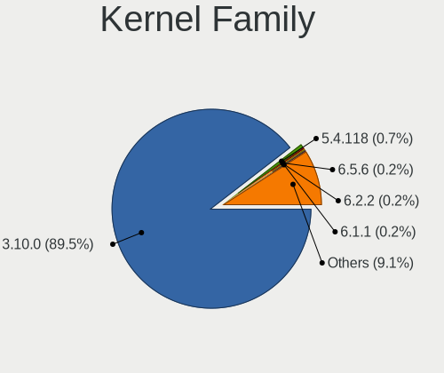

| Version  | Computers | Percent |
|----------|-----------|---------|
| 3.10.0   | 373       | 89.45%  |
| 5.4.118  | 3         | 0.72%   |
| 6.5.6    | 1         | 0.24%   |
| 6.2.2    | 1         | 0.24%   |
| 6.1.1    | 1         | 0.24%   |
| 5.8.13   | 1         | 0.24%   |
| 5.8.0    | 1         | 0.24%   |
| 5.7.7    | 1         | 0.24%   |
| 5.7.10   | 1         | 0.24%   |
| 5.6.8    | 1         | 0.24%   |
| 5.6.10   | 1         | 0.24%   |
| 5.5.0    | 1         | 0.24%   |
| 5.4.96   | 1         | 0.24%   |
| 5.4.6    | 1         | 0.24%   |
| 5.4.249  | 1         | 0.24%   |
| 5.4.234  | 1         | 0.24%   |
| 5.4.225  | 1         | 0.24%   |
| 5.4.158  | 1         | 0.24%   |
| 5.4.142  | 1         | 0.24%   |
| 5.4.125  | 1         | 0.24%   |
| 5.4.121  | 1         | 0.24%   |
| 5.4.119  | 1         | 0.24%   |
| 5.4.116  | 1         | 0.24%   |
| 5.4.113  | 1         | 0.24%   |
| 5.3.11   | 1         | 0.24%   |
| 5.2.13   | 1         | 0.24%   |
| 5.2.1    | 1         | 0.24%   |
| 5.18.13  | 1         | 0.24%   |
| 5.11.0   | 1         | 0.24%   |
| 5.10.75  | 1         | 0.24%   |
| 5.1.19   | 1         | 0.24%   |
| 4.9.188  | 1         | 0.24%   |
| 4.9.182  | 1         | 0.24%   |
| 4.9.180  | 1         | 0.24%   |
| 4.9.179  | 1         | 0.24%   |
| 4.4.241  | 1         | 0.24%   |
| 4.20.8   | 1         | 0.24%   |
| 4.20.4   | 1         | 0.24%   |
| 4.19.8   | 1         | 0.24%   |
| 4.19.187 | 1         | 0.24%   |

Kernel Major Ver.
-----------------

Linux kernel major version

| Version | Computers | Percent |
|---------|-----------|---------|
| 3.10    | 373       | 89.88%  |
| 5.4     | 14        | 3.37%   |
| 4.9     | 4         | 0.96%   |
| 5.8     | 2         | 0.48%   |
| 5.7     | 2         | 0.48%   |
| 5.6     | 2         | 0.48%   |
| 4.20    | 2         | 0.48%   |
| 4.19    | 2         | 0.48%   |
| 4.18    | 2         | 0.48%   |
| 6.5     | 1         | 0.24%   |
| 6.2     | 1         | 0.24%   |
| 6.1     | 1         | 0.24%   |
| 5.5     | 1         | 0.24%   |
| 5.3     | 1         | 0.24%   |
| 5.2     | 1         | 0.24%   |
| 5.18    | 1         | 0.24%   |
| 5.11    | 1         | 0.24%   |
| 5.10    | 1         | 0.24%   |
| 5.1     | 1         | 0.24%   |
| 4.4     | 1         | 0.24%   |
| 4.14    | 1         | 0.24%   |

Arch
----

OS architecture (x86_64, i586, etc.)

| Name    | Computers | Percent |
|---------|-----------|---------|
| x86_64  | 409       | 99.03%  |
| i686    | 3         | 0.73%   |
| aarch64 | 1         | 0.24%   |

DE
--

Desktop Environment

| Name          | Computers | Percent |
|---------------|-----------|---------|
| GNOME         | 168       | 40.48%  |
| Unknown       | 147       | 35.42%  |
| KDE4          | 40        | 9.64%   |
| GNOME Classic | 32        | 7.71%   |
| MATE          | 17        | 4.1%    |
| Cinnamon      | 7         | 1.69%   |
| XFCE          | 2         | 0.48%   |
| Xpra          | 1         | 0.24%   |
| X-Cinnamon    | 1         | 0.24%   |

Display Server
--------------

X11 or Wayland

| Name    | Computers | Percent |
|---------|-----------|---------|
| X11     | 334       | 80.87%  |
| Unknown | 78        | 18.89%  |
| Web     | 1         | 0.24%   |

Display Manager
---------------

SDDM, LightDM, etc.

| Name    | Computers | Percent |
|---------|-----------|---------|
| GDM     | 225       | 54.22%  |
| Unknown | 171       | 41.2%   |
| LightDM | 14        | 3.37%   |
| TDM     | 3         | 0.72%   |
| SDDM    | 2         | 0.48%   |

OS Lang
-------

Language

| Lang        | Computers | Percent |
|-------------|-----------|---------|
| Unknown     | 150       | 36.06%  |
| en_US       | 143       | 34.38%  |
| ru_RU       | 20        | 4.81%   |
| C           | 18        | 4.33%   |
| en_GB       | 12        | 2.88%   |
| fr_FR       | 11        | 2.64%   |
| pt_BR       | 8         | 1.92%   |
| de_AT       | 8         | 1.92%   |
| zh_CN       | 6         | 1.44%   |
| en_AU       | 6         | 1.44%   |
| en_CA       | 5         | 1.2%    |
| en_IN       | 4         | 0.96%   |
| de_DE       | 4         | 0.96%   |
| pl_PL       | 3         | 0.72%   |
| es_ES       | 3         | 0.72%   |
| en_US.utf-8 | 3         | 0.72%   |
| es_EC       | 2         | 0.48%   |
| pt_PT       | 1         | 0.24%   |
| ko_KR       | 1         | 0.24%   |
| ja_JP       | 1         | 0.24%   |
| fr_CA       | 1         | 0.24%   |
| fi_FI       | 1         | 0.24%   |
| es_MX       | 1         | 0.24%   |
| es_AR       | 1         | 0.24%   |
| en_ZA       | 1         | 0.24%   |
| en_SG       | 1         | 0.24%   |
| cs_CZ       | 1         | 0.24%   |

Boot Mode
---------

EFI or BIOS

| Mode | Computers | Percent |
|------|-----------|---------|
| EFI  | 209       | 50.48%  |
| BIOS | 205       | 49.52%  |

Filesystem
----------

Type of filesystem

| Type    | Computers | Percent |
|---------|-----------|---------|
| Xfs     | 241       | 58.21%  |
| Ext4    | 124       | 29.95%  |
| Ext3    | 33        | 7.97%   |
| Unknown | 13        | 3.14%   |
| Tmpfs   | 1         | 0.24%   |
| Overlay | 1         | 0.24%   |
| Ext2    | 1         | 0.24%   |

Part. scheme
------------

Scheme of partitioning

| Type    | Computers | Percent |
|---------|-----------|---------|
| GPT     | 246       | 59.13%  |
| MBR     | 127       | 30.53%  |
| Unknown | 43        | 10.34%  |

Dual Boot with Linux/BSD
------------------------

Hosting more than one Linux/BSD

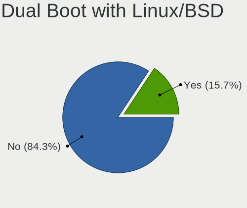

| Dual boot | Computers | Percent |
|-----------|-----------|---------|
| No        | 350       | 84.34%  |
| Yes       | 65        | 15.66%  |

Dual Boot (Win)
---------------

Hosting Linux and Windows

| Dual boot | Computers | Percent |
|-----------|-----------|---------|
| No        | 371       | 89.61%  |
| Yes       | 43        | 10.39%  |

Board
-----

Vendor
------

Motherboard manufacturer

| Name                | Computers | Percent |
|---------------------|-----------|---------|
| Dell                | 77        | 18.64%  |
| Hewlett-Packard     | 59        | 14.29%  |
| Gigabyte Technology | 49        | 11.86%  |
| MSI                 | 44        | 10.65%  |
| Supermicro          | 40        | 9.69%   |
| ASUSTek Computer    | 38        | 9.2%    |
| Lenovo              | 28        | 6.78%   |
| Intel               | 18        | 4.36%   |
| ASRock              | 7         | 1.69%   |
| Acer                | 5         | 1.21%   |
| Unknown             | 5         | 1.21%   |
| IBM                 | 4         | 0.97%   |
| ASRockRack          | 3         | 0.73%   |
| AMI                 | 3         | 0.73%   |
| Toshiba             | 2         | 0.48%   |
| Sun Microsystems    | 2         | 0.48%   |
| Sony                | 2         | 0.48%   |
| MiTAC               | 2         | 0.48%   |
| Fujitsu             | 2         | 0.48%   |
| ECS                 | 2         | 0.48%   |
| Apple               | 2         | 0.48%   |
| Zenith              | 1         | 0.24%   |
| Samsung Electronics | 1         | 0.24%   |
| PCChips             | 1         | 0.24%   |
| Panasonic           | 1         | 0.24%   |
| Notebook            | 1         | 0.24%   |
| NORCO               | 1         | 0.24%   |
| LG Electronics      | 1         | 0.24%   |
| Hyve                | 1         | 0.24%   |
| HUAWEI              | 1         | 0.24%   |
| Huanan              | 1         | 0.24%   |
| HONOR               | 1         | 0.24%   |
| Foxconn             | 1         | 0.24%   |
| eMachines           | 1         | 0.24%   |
| Cisco Systems       | 1         | 0.24%   |
| AZW                 | 1         | 0.24%   |
| AIC                 | 1         | 0.24%   |
| AEWIN               | 1         | 0.24%   |
| ABIT                | 1         | 0.24%   |
| AAEON               | 1         | 0.24%   |

Model
-----

Motherboard model

| Name                                    | Computers | Percent |
|-----------------------------------------|-----------|---------|
| Supermicro Super Server                 | 20        | 4.84%   |
| MSI MS-7C31                             | 15        | 3.63%   |
| Gigabyte H81M-S2H                       | 15        | 3.63%   |
| MSI MS-7A15                             | 9         | 2.18%   |
| Dell OptiPlex 7040                      | 8         | 1.94%   |
| Dell OptiPlex 9020                      | 7         | 1.69%   |
| MSI MS-7B53                             | 6         | 1.45%   |
| MSI MS-7A74                             | 6         | 1.45%   |
| Unknown                                 | 5         | 1.21%   |
| Supermicro X8DTN+-F                     | 4         | 0.97%   |
| Gigabyte H81M-DS2                       | 4         | 0.97%   |
| ASUS H110M-K                            | 4         | 0.97%   |
| ASUS All Series                         | 4         | 0.97%   |
| Lenovo ThinkSystem SR650 -[7X06CTO1WW]- | 3         | 0.73%   |
| Intel S1200SP                           | 3         | 0.73%   |
| HP Z800 Workstation                     | 3         | 0.73%   |
| HP ProDesk 400 G7 Microtower PC         | 3         | 0.73%   |
| HP EliteDesk 800 G6 Desktop Mini PC     | 3         | 0.73%   |
| HP Compaq Elite 8300 SFF                | 3         | 0.73%   |
| Gigabyte H81M-S2PV                      | 3         | 0.73%   |
| Dell Precision WorkStation T3500        | 3         | 0.73%   |
| ASRockRack E3C242D4U2-2T                | 3         | 0.73%   |
| Supermicro X8DTL                        | 2         | 0.48%   |
| Supermicro SYS-1028TP-DC1R              | 2         | 0.48%   |
| Lenovo ThinkSystem SR530 -[7X08CTO1WW]- | 2         | 0.48%   |
| Lenovo System x3650 M5: -[8871AC1]-     | 2         | 0.48%   |
| Intel S1200RP_SE                        | 2         | 0.48%   |
| HP Z420 Workstation                     | 2         | 0.48%   |
| Gigabyte GA-78LMT-USB3                  | 2         | 0.48%   |
| Gigabyte B560M AORUS PRO                | 2         | 0.48%   |
| Gigabyte B360M-HD3                      | 2         | 0.48%   |
| Fujitsu D3401-H1                        | 2         | 0.48%   |
| Dell System XPS L702X                   | 2         | 0.48%   |
| Dell PowerEdge R630                     | 2         | 0.48%   |
| Dell PowerEdge R520                     | 2         | 0.48%   |
| Dell PowerEdge R430                     | 2         | 0.48%   |
| Dell OptiPlex 7010                      | 2         | 0.48%   |
| Dell Inspiron N4050                     | 2         | 0.48%   |
| ASUS M5A78L-M PLUS/USB3                 | 2         | 0.48%   |
| Zenith Orion                            | 1         | 0.24%   |

Model Family
------------

Motherboard model prefix

| Name                       | Computers | Percent |
|----------------------------|-----------|---------|
| Dell OptiPlex              | 24        | 5.81%   |
| Supermicro Super           | 20        | 4.84%   |
| Dell PowerEdge             | 16        | 3.87%   |
| MSI MS-7C31                | 15        | 3.63%   |
| Gigabyte H81M-S2H          | 15        | 3.63%   |
| Dell Precision             | 14        | 3.39%   |
| Lenovo ThinkPad            | 12        | 2.91%   |
| HP EliteDesk               | 10        | 2.42%   |
| MSI MS-7A15                | 9         | 2.18%   |
| Dell Inspiron              | 8         | 1.94%   |
| Lenovo ThinkSystem         | 7         | 1.69%   |
| HP ProLiant                | 7         | 1.69%   |
| MSI MS-7B53                | 6         | 1.45%   |
| MSI MS-7A74                | 6         | 1.45%   |
| Dell Latitude              | 6         | 1.45%   |
| HP EliteBook               | 5         | 1.21%   |
| HP Compaq                  | 5         | 1.21%   |
| Dell Vostro                | 5         | 1.21%   |
| ASUS PRIME                 | 5         | 1.21%   |
| Unknown                    | 5         | 1.21%   |
| Supermicro X8DTN+-F        | 4         | 0.97%   |
| Gigabyte H81M-DS2          | 4         | 0.97%   |
| ASUS M5A78L-M              | 4         | 0.97%   |
| ASUS H110M-K               | 4         | 0.97%   |
| ASUS All                   | 4         | 0.97%   |
| Acer Aspire                | 4         | 0.97%   |
| Intel S1200SP              | 3         | 0.73%   |
| IBM System                 | 3         | 0.73%   |
| HP Z800                    | 3         | 0.73%   |
| HP ProDesk                 | 3         | 0.73%   |
| HP ProBook                 | 3         | 0.73%   |
| HP Pavilion                | 3         | 0.73%   |
| Gigabyte H81M-S2PV         | 3         | 0.73%   |
| ASRockRack E3C242D4U2-2T   | 3         | 0.73%   |
| Toshiba Satellite          | 2         | 0.48%   |
| Supermicro X8DTL           | 2         | 0.48%   |
| Supermicro SYS-1028TP-DC1R | 2         | 0.48%   |
| Sun Microsystems Sun       | 2         | 0.48%   |
| Lenovo ThinkCentre         | 2         | 0.48%   |
| Lenovo System              | 2         | 0.48%   |

MFG Year
--------

Motherboard manufacture year

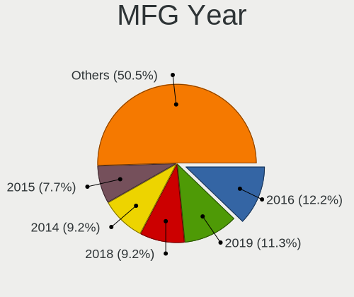

| Year    | Computers | Percent |
|---------|-----------|---------|
| 2019    | 47        | 11.38%  |
| 2017    | 39        | 9.44%   |
| 2016    | 39        | 9.44%   |
| 2014    | 39        | 9.44%   |
| 2018    | 38        | 9.2%    |
| 2013    | 31        | 7.51%   |
| 2015    | 29        | 7.02%   |
| 2011    | 28        | 6.78%   |
| 2010    | 27        | 6.54%   |
| 2021    | 20        | 4.84%   |
| 2020    | 20        | 4.84%   |
| 2012    | 19        | 4.6%    |
| 2008    | 14        | 3.39%   |
| 2009    | 9         | 2.18%   |
| 2022    | 4         | 0.97%   |
| 2007    | 4         | 0.97%   |
| 2006    | 3         | 0.73%   |
| Unknown | 2         | 0.48%   |
| 2001    | 1         | 0.24%   |

Form Factor
-----------

Physical design of the computer

| Name        | Computers | Percent |
|-------------|-----------|---------|
| Desktop     | 239       | 57.87%  |
| Server      | 80        | 19.37%  |
| Notebook    | 73        | 17.68%  |
| Mini pc     | 18        | 4.36%   |
| Convertible | 2         | 0.48%   |
| All in one  | 1         | 0.24%   |

Secure Boot
-----------

Enabled or disabled

| State    | Computers | Percent |
|----------|-----------|---------|
| Disabled | 403       | 97.58%  |
| Enabled  | 10        | 2.42%   |

Coreboot
--------

Have coreboot on board

| Used | Computers | Percent |
|------|-----------|---------|
| No   | 411       | 99.52%  |
| Yes  | 2         | 0.48%   |

RAM Size
--------

Total RAM memory

| Size in GB      | Computers | Percent |
|-----------------|-----------|---------|
| 4.01-8.0        | 150       | 36.23%  |
| 32.01-64.0      | 58        | 14.01%  |
| 64.01-256.0     | 45        | 10.87%  |
| 16.01-24.0      | 44        | 10.63%  |
| More than 256.0 | 31        | 7.49%   |
| 8.01-16.0       | 31        | 7.49%   |
| 3.01-4.0        | 29        | 7%      |
| 1.01-2.0        | 13        | 3.14%   |
| 24.01-32.0      | 8         | 1.93%   |
| 0.51-1.0        | 3         | 0.72%   |
| 2.01-3.0        | 2         | 0.48%   |

RAM Used
--------

Used RAM memory

| Used GB         | Computers | Percent |
|-----------------|-----------|---------|
| 1.01-2.0        | 115       | 26.87%  |
| 0.51-1.0        | 71        | 16.59%  |
| 2.01-3.0        | 69        | 16.12%  |
| 4.01-8.0        | 56        | 13.08%  |
| 3.01-4.0        | 38        | 8.88%   |
| 8.01-16.0       | 22        | 5.14%   |
| 64.01-256.0     | 19        | 4.44%   |
| 0.01-0.5        | 13        | 3.04%   |
| 32.01-64.0      | 12        | 2.8%    |
| 24.01-32.0      | 6         | 1.4%    |
| 16.01-24.0      | 5         | 1.17%   |
| More than 256.0 | 2         | 0.47%   |

Total Drives
------------

Number of drives on board

| Drives  | Computers | Percent |
|---------|-----------|---------|
| 1       | 217       | 51.3%   |
| 2       | 79        | 18.68%  |
| 3       | 35        | 8.27%   |
| Unknown | 19        | 4.49%   |
| 4       | 17        | 4.02%   |
| 5       | 15        | 3.55%   |
| 6       | 9         | 2.13%   |
| 0       | 6         | 1.42%   |
| 7       | 4         | 0.95%   |
| 10      | 3         | 0.71%   |
| 15      | 2         | 0.47%   |
| 9       | 2         | 0.47%   |
| 8       | 2         | 0.47%   |
| 209     | 1         | 0.24%   |
| 71      | 1         | 0.24%   |
| 68      | 1         | 0.24%   |
| 27      | 1         | 0.24%   |
| 26      | 1         | 0.24%   |
| 24      | 1         | 0.24%   |
| 23      | 1         | 0.24%   |
| 19      | 1         | 0.24%   |
| 18      | 1         | 0.24%   |
| 17      | 1         | 0.24%   |
| 13      | 1         | 0.24%   |
| 12      | 1         | 0.24%   |
| 11      | 1         | 0.24%   |

Has CD-ROM
----------

Has CD-ROM on board

| Presented | Computers | Percent |
|-----------|-----------|---------|
| No        | 293       | 70.43%  |
| Yes       | 123       | 29.57%  |

Has Ethernet
------------

Has Ethernet on board

| Presented | Computers | Percent |
|-----------|-----------|---------|
| Yes       | 403       | 97.58%  |
| No        | 10        | 2.42%   |

Has WiFi
--------

Has WiFi module

| Presented | Computers | Percent |
|-----------|-----------|---------|
| No        | 290       | 70.22%  |
| Yes       | 123       | 29.78%  |

Has Bluetooth
-------------

Has Bluetooth module

| Presented | Computers | Percent |
|-----------|-----------|---------|
| No        | 323       | 78.21%  |
| Yes       | 90        | 21.79%  |

Location
--------

Country
-------

Geographic location (country)

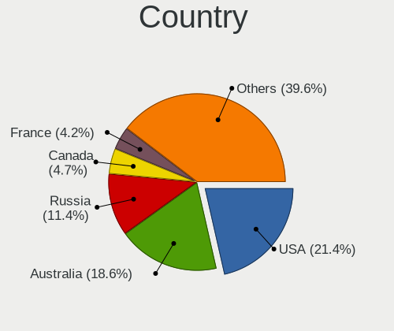

| Country      | Computers | Percent |
|--------------|-----------|---------|
| USA          | 86        | 20.67%  |
| Australia    | 80        | 19.23%  |
| Russia       | 48        | 11.54%  |
| France       | 18        | 4.33%   |
| Canada       | 18        | 4.33%   |
| Germany      | 17        | 4.09%   |
| Brazil       | 17        | 4.09%   |
| UK           | 14        | 3.37%   |
| China        | 14        | 3.37%   |
| India        | 10        | 2.4%    |
| Switzerland  | 8         | 1.92%   |
| Spain        | 6         | 1.44%   |
| Finland      | 6         | 1.44%   |
| Poland       | 5         | 1.2%    |
| Czechia      | 5         | 1.2%    |
| Belgium      | 5         | 1.2%    |
| South Korea  | 4         | 0.96%   |
| Norway       | 4         | 0.96%   |
| Bulgaria     | 4         | 0.96%   |
| Ukraine      | 3         | 0.72%   |
| Sweden       | 3         | 0.72%   |
| Mexico       | 3         | 0.72%   |
| Japan        | 3         | 0.72%   |
| Israel       | 3         | 0.72%   |
| Ecuador      | 3         | 0.72%   |
| Taiwan       | 2         | 0.48%   |
| South Africa | 2         | 0.48%   |
| Romania      | 2         | 0.48%   |
| Pakistan     | 2         | 0.48%   |
| Netherlands  | 2         | 0.48%   |
| Malaysia     | 2         | 0.48%   |
| Vietnam      | 1         | 0.24%   |
| Singapore    | 1         | 0.24%   |
| Portugal     | 1         | 0.24%   |
| Kazakhstan   | 1         | 0.24%   |
| Italy        | 1         | 0.24%   |
| Ireland      | 1         | 0.24%   |
| Iran         | 1         | 0.24%   |
| Indonesia    | 1         | 0.24%   |
| Hong Kong    | 1         | 0.24%   |

City
----

Geographic location (city)

| City              | Computers | Percent |
|-------------------|-----------|---------|
| Melbourne         | 71        | 16.63%  |
| Moscow            | 23        | 5.39%   |
| Rochester         | 19        | 4.45%   |
| Madison           | 17        | 3.98%   |
| Frankfurt am Main | 7         | 1.64%   |
| Sydney            | 5         | 1.17%   |
| Paris             | 5         | 1.17%   |
| Bern              | 5         | 1.17%   |
| St Petersburg     | 4         | 0.94%   |
| Rio de Janeiro    | 4         | 0.94%   |
| London            | 4         | 0.94%   |
| Helsinki          | 4         | 0.94%   |
| Guwahati          | 4         | 0.94%   |
| Guangzhou         | 4         | 0.94%   |
| Alexandria        | 4         | 0.94%   |
| Victoria          | 3         | 0.7%    |
| Vancouver         | 3         | 0.7%    |
| Toronto           | 3         | 0.7%    |
| Tampa             | 3         | 0.7%    |
| Sofia             | 3         | 0.7%    |
| Prague            | 3         | 0.7%    |
| Montreal          | 3         | 0.7%    |
| Iglino            | 3         | 0.7%    |
| Guayaquil         | 3         | 0.7%    |
| Wahroonga         | 2         | 0.47%   |
| Voronezh          | 2         | 0.47%   |
| Vitry-sur-Seine   | 2         | 0.47%   |
| Twistetal         | 2         | 0.47%   |
| Shanghai          | 2         | 0.47%   |
| Sao Paulo         | 2         | 0.47%   |
| Perm              | 2         | 0.47%   |
| North Bend        | 2         | 0.47%   |
| Newark            | 2         | 0.47%   |
| Leuven            | 2         | 0.47%   |
| Kyiv              | 2         | 0.47%   |
| Krasnodar         | 2         | 0.47%   |
| Kongsberg         | 2         | 0.47%   |
| Hyderabad         | 2         | 0.47%   |
| Hangzhou          | 2         | 0.47%   |
| Grovedale         | 2         | 0.47%   |

Drives
------

Drive Vendor
------------

Hard drive vendors

| Vendor                       | Computers | Drives | Percent |
|------------------------------|-----------|--------|---------|
| WDC                          | 151       | 443    | 27.71%  |
| Seagate                      | 98        | 376    | 17.98%  |
| Samsung Electronics          | 67        | 187    | 12.29%  |
| Toshiba                      | 40        | 65     | 7.34%   |
| Kingston                     | 25        | 30     | 4.59%   |
| Intel                        | 24        | 57     | 4.4%    |
| Hitachi                      | 20        | 50     | 3.67%   |
| SanDisk                      | 16        | 19     | 2.94%   |
| HGST                         | 11        | 113    | 2.02%   |
| Hewlett-Packard              | 10        | 49     | 1.83%   |
| Micron Technology            | 9         | 16     | 1.65%   |
| Unknown                      | 8         | 18     | 1.47%   |
| SK hynix                     | 5         | 5      | 0.92%   |
| SPCC                         | 4         | 6      | 0.73%   |
| Crucial                      | 4         | 5      | 0.73%   |
| A-DATA Technology            | 4         | 5      | 0.73%   |
| Toshiba America Info Systems | 3         | 4      | 0.55%   |
| OCZ                          | 3         | 8      | 0.55%   |
| NVMe                         | 3         | 3      | 0.55%   |
| Fujitsu                      | 3         | 3      | 0.55%   |
| Sun                          | 2         | 6      | 0.37%   |
| StoreJet                     | 2         | 2      | 0.37%   |
| Smartbuy                     | 2         | 3      | 0.37%   |
| LITEONIT                     | 2         | 2      | 0.37%   |
| LITEON                       | 2         | 2      | 0.37%   |
| Kingston Technology Company  | 2         | 2      | 0.37%   |
| KingDian                     | 2         | 6      | 0.37%   |
| UNIC2                        | 1         | 1      | 0.18%   |
| Transcend                    | 1         | 1      | 0.18%   |
| TAISU                        | 1         | 1      | 0.18%   |
| Realtek                      | 1         | 1      | 0.18%   |
| Phison Electronics           | 1         | 2      | 0.18%   |
| OWC                          | 1         | 1      | 0.18%   |
| NORCO                        | 1         | 1      | 0.18%   |
| Micron/Crucial Technology    | 1         | 1      | 0.18%   |
| Maxtor                       | 1         | 1      | 0.18%   |
| Lexar                        | 1         | 2      | 0.18%   |
| Lenovo                       | 1         | 2      | 0.18%   |
| Kingston Technologies        | 1         | 1      | 0.18%   |
| KingSpec                     | 1         | 1      | 0.18%   |

Drive Model
-----------

Hard drive models

| Model                                       | Computers | Percent |
|---------------------------------------------|-----------|---------|
| WDC WD10EZEX-08WN4A0 1TB                    | 33        | 5.2%    |
| WDC WD10EZEX-00MFCA0 1TB                    | 18        | 2.83%   |
| WDC WD10EZEX-00WN4A0 1TB                    | 10        | 1.57%   |
| Toshiba DT01ACA050 500GB                    | 8         | 1.26%   |
| Seagate ST1000DM010-2EP102 1TB              | 8         | 1.26%   |
| Seagate ST500DM002-1SB10A 500GB             | 6         | 0.94%   |
| Seagate ST500DM002-1BD142 500GB             | 6         | 0.94%   |
| Samsung SSD 860 EVO 250GB                   | 6         | 0.94%   |
| HP LOGICAL VOLUME 160GB                     | 6         | 0.94%   |
| WDC WD10EZEX-60WN4A0 1TB                    | 5         | 0.79%   |
| Kingston SA400S37240G 240GB SSD             | 5         | 0.79%   |
| WDC WD10EZEX-75WN4A0 1TB                    | 4         | 0.63%   |
| WDC WD1003FZEX-00MK2A0 1TB                  | 4         | 0.63%   |
| Toshiba DT01ACA100 1TB                      | 4         | 0.63%   |
| Intel SSDSC2BA200G4 200GB                   | 4         | 0.63%   |
| WDC WD40EZAZ-00SF3B0 4TB                    | 3         | 0.47%   |
| WDC WD10EZEX-22MFCA0 1TB                    | 3         | 0.47%   |
| WDC WD10EZEX-00BBHA0 1TB                    | 3         | 0.47%   |
| Seagate ST6000NM0095 6TB                    | 3         | 0.47%   |
| Seagate ST6000NM0034 6TB                    | 3         | 0.47%   |
| Seagate ST6000NM0014 6TB                    | 3         | 0.47%   |
| Seagate ST4000NXCLAR4000 4TB                | 3         | 0.47%   |
| Seagate ST4000NM0023 4TB                    | 3         | 0.47%   |
| Seagate ST2000DM006-2DM164 2TB              | 3         | 0.47%   |
| Seagate BUP Slim 2TB                        | 3         | 0.47%   |
| Samsung SSD 970 2TB                         | 3         | 0.47%   |
| Samsung NVMe SSD Controller SM981/PM981 2TB | 3         | 0.47%   |
| Kingston SV300S37A120G 120GB SSD            | 3         | 0.47%   |
| WDC WDS250G2B0A-00SM50 250GB SSD            | 2         | 0.31%   |
| WDC WD3200AAKS-75L9A0 320GB                 | 2         | 0.31%   |
| WDC WD30PURX-64P6ZY0 3TB                    | 2         | 0.31%   |
| WDC WD30EZRX-00MMMB0 3TB                    | 2         | 0.31%   |
| WDC WD20EFRX-68EUZN0 2TB                    | 2         | 0.31%   |
| WDC WD10EZEX-08M2NA0 1TB                    | 2         | 0.31%   |
| WDC WD10EZEX-00BN5A0 1TB                    | 2         | 0.31%   |
| WDC WD1004FBYZ-23YC 1TB                     | 2         | 0.31%   |
| WDC WD1001FALS-00J7B1 1TB                   | 2         | 0.31%   |
| Unknown HUH728080ALE601 8TB                 | 2         | 0.31%   |
| Toshiba TR200 240GB SSD                     | 2         | 0.31%   |
| Toshiba NVMe SSD Drive 256GB                | 2         | 0.31%   |

HDD Vendor
----------

Hard disk drive vendors

| Vendor              | Computers | Drives | Percent |
|---------------------|-----------|--------|---------|
| WDC                 | 145       | 226    | 43.28%  |
| Seagate             | 98        | 373    | 29.25%  |
| Toshiba             | 33        | 53     | 9.85%   |
| Hitachi             | 20        | 50     | 5.97%   |
| HGST                | 11        | 66     | 3.28%   |
| Samsung Electronics | 10        | 107    | 2.99%   |
| Hewlett-Packard     | 8         | 46     | 2.39%   |
| Fujitsu             | 3         | 3      | 0.9%    |
| Unknown             | 2         | 11     | 0.6%    |
| Sun                 | 2         | 6      | 0.6%    |
| Maxtor              | 1         | 1      | 0.3%    |
| Lenovo              | 1         | 2      | 0.3%    |
| Apple               | 1         | 1      | 0.3%    |

SSD Vendor
----------

Solid state drive vendors

| Vendor              | Computers | Drives | Percent |
|---------------------|-----------|--------|---------|
| Samsung Electronics | 35        | 47     | 22.73%  |
| Kingston            | 24        | 29     | 15.58%  |
| Intel               | 22        | 54     | 14.29%  |
| Micron Technology   | 8         | 15     | 5.19%   |
| WDC                 | 7         | 10     | 4.55%   |
| SanDisk             | 6         | 6      | 3.9%    |
| Toshiba             | 5         | 9      | 3.25%   |
| SK hynix            | 5         | 5      | 3.25%   |
| SPCC                | 4         | 6      | 2.6%    |
| Crucial             | 4         | 5      | 2.6%    |
| A-DATA Technology   | 4         | 5      | 2.6%    |
| OCZ                 | 3         | 8      | 1.95%   |
| StoreJet            | 2         | 2      | 1.3%    |
| Smartbuy            | 2         | 3      | 1.3%    |
| Seagate             | 2         | 3      | 1.3%    |
| LITEONIT            | 2         | 2      | 1.3%    |
| LITEON              | 2         | 2      | 1.3%    |
| KingDian            | 2         | 6      | 1.3%    |
| Hewlett-Packard     | 2         | 3      | 1.3%    |
| UNIC2               | 1         | 1      | 0.65%   |
| Transcend           | 1         | 1      | 0.65%   |
| TAISU               | 1         | 1      | 0.65%   |
| OWC                 | 1         | 1      | 0.65%   |
| NORCO               | 1         | 1      | 0.65%   |
| Lexar               | 1         | 2      | 0.65%   |
| GOODRAM             | 1         | 1      | 0.65%   |
| GLOWAY              | 1         | 1      | 0.65%   |
| Corsair             | 1         | 1      | 0.65%   |
| China               | 1         | 1      | 0.65%   |
| ASUSTek Computer    | 1         | 1      | 0.65%   |
| ASMT                | 1         | 3      | 0.65%   |
| 2.5"                | 1         | 1      | 0.65%   |

Drive Kind
----------

HDD or SSD

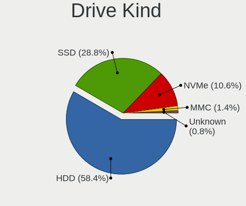

| Kind    | Computers | Drives | Percent |
|---------|-----------|--------|---------|
| HDD     | 284       | 945    | 58.56%  |
| SSD     | 139       | 236    | 28.66%  |
| NVMe    | 51        | 72     | 10.52%  |
| MMC     | 7         | 8      | 1.44%   |
| Unknown | 4         | 253    | 0.82%   |

Drive Connector
---------------

SATA, SAS, NVMe, etc.

| Type | Computers | Drives | Percent |
|------|-----------|--------|---------|
| SATA | 340       | 969    | 79.25%  |
| NVMe | 51        | 71     | 11.89%  |
| SAS  | 31        | 466    | 7.23%   |
| MMC  | 7         | 8      | 1.63%   |

Drive Size
----------

Size of hard drive

| Size in TB | Computers | Drives | Percent |
|------------|-----------|--------|---------|
| 0.01-0.5   | 188       | 452    | 40.87%  |
| 0.51-1.0   | 178       | 293    | 38.7%   |
| 1.01-2.0   | 34        | 100    | 7.39%   |
| 3.01-4.0   | 22        | 145    | 4.78%   |
| 4.01-10.0  | 17        | 110    | 3.7%    |
| 2.01-3.0   | 14        | 30     | 3.04%   |
| 10.01-20.0 | 7         | 51     | 1.52%   |

Space Total
-----------

Amount of disk space available on the file system

| Size in GB     | Computers | Percent |
|----------------|-----------|---------|
| 501-1000       | 119       | 28.27%  |
| 251-500        | 72        | 17.1%   |
| 101-250        | 70        | 16.63%  |
| More than 3000 | 60        | 14.25%  |
| 1001-2000      | 31        | 7.36%   |
| 51-100         | 21        | 4.99%   |
| 21-50          | 14        | 3.33%   |
| Unknown        | 14        | 3.33%   |
| 2001-3000      | 10        | 2.38%   |
| 1-20           | 10        | 2.38%   |

Space Used
----------

Amount of used disk space

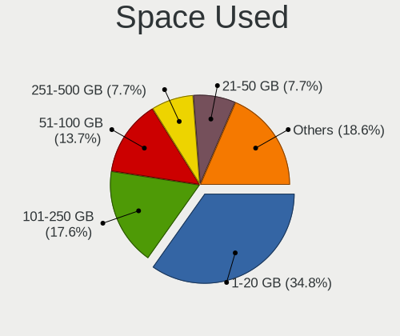

| Used GB        | Computers | Percent |
|----------------|-----------|---------|
| 1-20           | 143       | 34.21%  |
| 101-250        | 76        | 18.18%  |
| 51-100         | 57        | 13.64%  |
| 251-500        | 33        | 7.89%   |
| 21-50          | 30        | 7.18%   |
| 501-1000       | 25        | 5.98%   |
| More than 3000 | 22        | 5.26%   |
| Unknown        | 14        | 3.35%   |
| 1001-2000      | 12        | 2.87%   |
| 2001-3000      | 5         | 1.2%    |
| 0              | 1         | 0.24%   |

Malfunc. Drives
---------------

Drive models with a malfunction

| Model                                       | Computers | Drives | Percent |
|---------------------------------------------|-----------|--------|---------|
| Seagate ST500DM002-1BD142 500GB             | 3         | 3      | 4.05%   |
| WDC WD10EZEX-08WN4A0 1TB                    | 2         | 2      | 2.7%    |
| WDC WD1001FALS-00J7B1 1TB                   | 2         | 2      | 2.7%    |
| WDC WD5000AVCS-632DY1 500GB                 | 1         | 1      | 1.35%   |
| WDC WD5000AAKX-08U6AA0 500GB                | 1         | 1      | 1.35%   |
| WDC WD3200AAKS-75L9A0 320GB                 | 1         | 1      | 1.35%   |
| WDC WD30PURX-64P6ZY0 3TB                    | 1         | 1      | 1.35%   |
| WDC WD30EFRX-68EUZN0 3TB                    | 1         | 3      | 1.35%   |
| WDC WD2500YS-18SHB2 250GB                   | 1         | 1      | 1.35%   |
| WDC WD2500HHTZ-04N21V0 250GB                | 1         | 1      | 1.35%   |
| WDC WD20EARX-00PASB0 2TB                    | 1         | 1      | 1.35%   |
| WDC WD20EARS-00MVWB0 2TB                    | 1         | 2      | 1.35%   |
| WDC WD10SPZX-21Z10T0 1TB                    | 1         | 2      | 1.35%   |
| WDC WD10JPCX-24UE4T0 1TB                    | 1         | 1      | 1.35%   |
| WDC WD10EZEX-60WN4A1 1TB                    | 1         | 1      | 1.35%   |
| WDC WD10EADS-00L5B1 1TB                     | 1         | 1      | 1.35%   |
| Toshiba THNSNK256GCS8 SATA 256GB SSD        | 1         | 1      | 1.35%   |
| Toshiba MQ04ABF100 1TB                      | 1         | 1      | 1.35%   |
| Toshiba MK8032GSX 80GB                      | 1         | 1      | 1.35%   |
| Smartbuy SSD 120GB                          | 1         | 1      | 1.35%   |
| SK hynix SC210 mSATA 256GB SSD              | 1         | 1      | 1.35%   |
| Seagate ST380211AS 80GB                     | 1         | 1      | 1.35%   |
| Seagate ST380013AS 80GB                     | 1         | 1      | 1.35%   |
| Seagate ST3250620NS 250GB                   | 1         | 2      | 1.35%   |
| Seagate ST3160813AS 160GB                   | 1         | 1      | 1.35%   |
| Seagate ST31000524NS 1TB                    | 1         | 1      | 1.35%   |
| Seagate ST31000520AS 1TB                    | 1         | 1      | 1.35%   |
| Seagate ST31000340AS 1TB                    | 1         | 1      | 1.35%   |
| Seagate ST3000DM001-1ER166 3TB              | 1         | 1      | 1.35%   |
| Seagate ST3000DM001-1CH166 3TB              | 1         | 1      | 1.35%   |
| Seagate ST2000DM001-9YN164 2TB              | 1         | 1      | 1.35%   |
| Seagate ST1000NX0313 1TB                    | 1         | 1      | 1.35%   |
| Seagate ST1000NM0033-9ZM173 1TB             | 1         | 2      | 1.35%   |
| Seagate ST1000LM035-1RK172 1TB              | 1         | 1      | 1.35%   |
| SanDisk SDSSDX240GG25 240GB                 | 1         | 1      | 1.35%   |
| SanDisk SD9SN8W256G1009 256GB SSD           | 1         | 1      | 1.35%   |
| Samsung Electronics SSD SM871 2.5 7mm 512GB | 1         | 1      | 1.35%   |
| Samsung Electronics SSD 870 EVO 500GB       | 1         | 3      | 1.35%   |
| Samsung Electronics HD154UI 1TB             | 1         | 1      | 1.35%   |
| Samsung Electronics HD103UI 1TB             | 1         | 1      | 1.35%   |

Malfunc. Drive Vendor
---------------------

Vendors of faulty drives

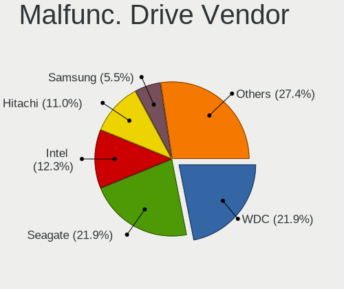

| Vendor              | Computers | Drives | Percent |
|---------------------|-----------|--------|---------|
| WDC                 | 16        | 21     | 22.22%  |
| Seagate             | 15        | 18     | 20.83%  |
| Intel               | 9         | 31     | 12.5%   |
| Hitachi             | 8         | 8      | 11.11%  |
| Samsung Electronics | 4         | 6      | 5.56%   |
| Toshiba             | 3         | 3      | 4.17%   |
| Kingston            | 3         | 3      | 4.17%   |
| SanDisk             | 2         | 2      | 2.78%   |
| Micron Technology   | 2         | 2      | 2.78%   |
| LITEONIT            | 2         | 2      | 2.78%   |
| Crucial             | 2         | 2      | 2.78%   |
| Smartbuy            | 1         | 1      | 1.39%   |
| SK hynix            | 1         | 1      | 1.39%   |
| Maxtor              | 1         | 1      | 1.39%   |
| HGST                | 1         | 1      | 1.39%   |
| Hewlett-Packard     | 1         | 1      | 1.39%   |
| A-DATA Technology   | 1         | 1      | 1.39%   |

Malfunc. HDD Vendor
-------------------

Vendors of faulty HDD drives

| Vendor              | Computers | Drives | Percent |
|---------------------|-----------|--------|---------|
| WDC                 | 16        | 21     | 34.78%  |
| Seagate             | 15        | 18     | 32.61%  |
| Hitachi             | 8         | 8      | 17.39%  |
| Toshiba             | 2         | 2      | 4.35%   |
| Samsung Electronics | 2         | 2      | 4.35%   |
| Maxtor              | 1         | 1      | 2.17%   |
| HGST                | 1         | 1      | 2.17%   |
| Hewlett-Packard     | 1         | 1      | 2.17%   |

Malfunc. Drive Kind
-------------------

Kinds of faulty drives

| Kind | Computers | Drives | Percent |
|------|-----------|--------|---------|
| HDD  | 40        | 54     | 60.61%  |
| SSD  | 26        | 50     | 39.39%  |

Failed Drives
-------------

Failed drive models

Zero info for selected period =(

Failed Drive Vendor
-------------------

Failed drive vendors

Zero info for selected period =(

Drive Status
------------

Number of failed and malfunc. drives

| Status   | Computers | Drives | Percent |
|----------|-----------|--------|---------|
| Works    | 303       | 837    | 68.24%  |
| Detected | 78        | 573    | 17.57%  |
| Malfunc  | 63        | 104    | 14.19%  |

Storage controller
------------------

Storage Vendor
--------------

Storage controller vendors

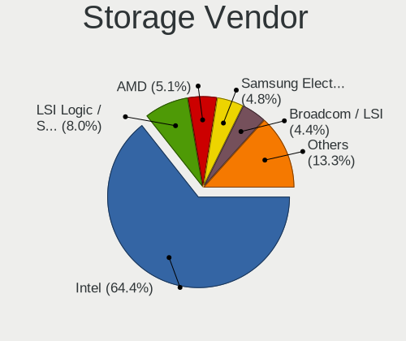

| Vendor                           | Computers | Percent |
|----------------------------------|-----------|---------|
| Intel                            | 354       | 65.07%  |
| LSI Logic / Symbios Logic        | 40        | 7.35%   |
| AMD                              | 29        | 5.33%   |
| Samsung Electronics              | 26        | 4.78%   |
| Broadcom / LSI                   | 24        | 4.41%   |
| ASMedia Technology               | 13        | 2.39%   |
| SanDisk                          | 11        | 2.02%   |
| Toshiba America Info Systems     | 5         | 0.92%   |
| Marvell Technology Group         | 5         | 0.92%   |
| JMicron Technology               | 5         | 0.92%   |
| Hewlett-Packard                  | 5         | 0.92%   |
| Adaptec                          | 5         | 0.92%   |
| Kingston Technology Company      | 4         | 0.74%   |
| Nvidia                           | 3         | 0.55%   |
| 3ware                            | 2         | 0.37%   |
| VIA Technologies                 | 1         | 0.18%   |
| SK hynix                         | 1         | 0.18%   |
| Silicon Integrated Systems [SiS] | 1         | 0.18%   |
| Silicon Image                    | 1         | 0.18%   |
| Phison Electronics               | 1         | 0.18%   |
| Micron/Crucial Technology        | 1         | 0.18%   |
| Micron Technology                | 1         | 0.18%   |
| MAXIO Technology (Hangzhou)      | 1         | 0.18%   |
| KIOXIA                           | 1         | 0.18%   |
| Huawei Technologies              | 1         | 0.18%   |
| Dell                             | 1         | 0.18%   |
| Apple                            | 1         | 0.18%   |
| ADATA Technology                 | 1         | 0.18%   |

Storage Model
-------------

Storage controller models

| Model                                                                                   | Computers | Percent |
|-----------------------------------------------------------------------------------------|-----------|---------|
| Intel 8 Series/C220 Series Chipset Family 6-port SATA Controller 1 [AHCI mode]          | 49        | 7.48%   |
| Intel Q170/Q150/B150/H170/H110/Z170/CM236 Chipset SATA Controller [AHCI Mode]           | 32        | 4.89%   |
| Intel 200 Series PCH SATA controller [AHCI mode]                                        | 30        | 4.58%   |
| Intel C610/X99 series chipset 6-Port SATA Controller [AHCI mode]                        | 27        | 4.12%   |
| Intel C610/X99 series chipset sSATA Controller [AHCI mode]                              | 26        | 3.97%   |
| Intel SATA Controller [RAID Mode]                                                       | 21        | 3.21%   |
| Intel Cannon Lake PCH SATA AHCI Controller                                              | 20        | 3.05%   |
| LSI Logic / Symbios Logic MegaRAID SAS-3 3108 [Invader]                                 | 19        | 2.9%    |
| Samsung NVMe SSD Controller SM981/PM981/PM983                                           | 16        | 2.44%   |
| AMD FCH SATA Controller [AHCI mode]                                                     | 14        | 2.14%   |
| Intel Comet Lake SATA AHCI Controller                                                   | 12        | 1.83%   |
| Intel 82801JI (ICH10 Family) SATA AHCI Controller                                       | 12        | 1.83%   |
| Intel Sunrise Point-LP SATA Controller [AHCI mode]                                      | 11        | 1.68%   |
| Intel C620 Series Chipset Family SSATA Controller [AHCI mode]                           | 11        | 1.68%   |
| Intel C620 Series Chipset Family SATA Controller [AHCI mode]                            | 11        | 1.68%   |
| Intel 82801 Mobile SATA Controller [RAID mode]                                          | 10        | 1.53%   |
| ASMedia ASM1061/ASM1062 Serial ATA Controller                                           | 10        | 1.53%   |
| Intel C600/X79 series chipset 6-Port SATA AHCI Controller                               | 9         | 1.37%   |
| AMD SB7x0/SB8x0/SB9x0 IDE Controller                                                    | 9         | 1.37%   |
| Intel NM10/ICH7 Family SATA Controller [IDE mode]                                       | 8         | 1.22%   |
| Broadcom / LSI MegaRAID SAS-3 3108 [Invader]                                            | 8         | 1.22%   |
| Intel 82801G (ICH7 Family) IDE Controller                                               | 7         | 1.07%   |
| Intel 6 Series/C200 Series Chipset Family 6 port Mobile SATA AHCI Controller            | 7         | 1.07%   |
| Intel C602 chipset 4-Port SATA Storage Control Unit                                     | 6         | 0.92%   |
| Intel 8 Series SATA Controller 1 [AHCI mode]                                            | 6         | 0.92%   |
| Intel 7 Series/C210 Series Chipset Family 6-port SATA Controller [AHCI mode]            | 6         | 0.92%   |
| Intel 631xESB/632xESB IDE Controller                                                    | 6         | 0.92%   |
| Intel 500 Series Chipset Family SATA AHCI Controller                                    | 6         | 0.92%   |
| AMD SB7x0/SB8x0/SB9x0 SATA Controller [IDE mode]                                        | 6         | 0.92%   |
| Samsung NVMe SSD Controller SM961/PM961/SM963                                           | 5         | 0.76%   |
| Intel 82801JI (ICH10 Family) 4 port SATA IDE Controller #1                              | 5         | 0.76%   |
| Intel 6 Series/C200 Series Chipset Family Desktop SATA Controller (IDE mode, ports 4-5) | 5         | 0.76%   |
| Intel 6 Series/C200 Series Chipset Family Desktop SATA Controller (IDE mode, ports 0-3) | 5         | 0.76%   |
| Intel 6 Series/C200 Series Chipset Family 6 port Desktop SATA AHCI Controller           | 5         | 0.76%   |
| Toshiba America Info Systems XG6 NVMe SSD Controller                                    | 4         | 0.61%   |
| LSI Logic / Symbios Logic SAS2008 PCI-Express Fusion-MPT SAS-2 [Falcon]                 | 4         | 0.61%   |
| Intel 82801HM/HEM (ICH8M/ICH8M-E) IDE Controller                                        | 4         | 0.61%   |
| Intel 7 Series Chipset Family 6-port SATA Controller [AHCI mode]                        | 4         | 0.61%   |
| AMD SB7x0/SB8x0/SB9x0 SATA Controller [AHCI mode]                                       | 4         | 0.61%   |
| SanDisk Extreme Pro / WD Black 2018/SN750/PC SN720 NVMe SSD                             | 3         | 0.46%   |

Storage Kind
------------

Kind of storage controller (IDE, SATA, NVMe, SAS, ...)

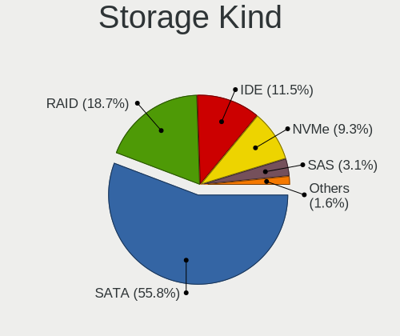

| Kind | Computers | Percent |
|------|-----------|---------|
| SATA | 313       | 56.6%   |
| RAID | 100       | 18.08%  |
| IDE  | 62        | 11.21%  |
| NVMe | 51        | 9.22%   |
| SAS  | 18        | 3.25%   |
| SCSI | 9         | 1.63%   |

Processor
---------

CPU Vendor
----------

Processor vendors

| Vendor    | Computers | Percent |
|-----------|-----------|---------|
| Intel     | 383       | 92.74%  |
| AMD       | 29        | 7.02%   |
| Hisilicon | 1         | 0.24%   |

CPU Model
---------

Processor models

| Model                                | Computers | Percent |
|--------------------------------------|-----------|---------|
| Intel Core i5-4460 CPU @ 3.20GHz     | 22        | 5.33%   |
| Intel Core i5-9400 CPU @ 2.90GHz     | 21        | 5.08%   |
| Intel Xeon CPU E5-2630 v4 @ 2.20GHz  | 19        | 4.6%    |
| Intel Core i5-7400 CPU @ 3.00GHz     | 17        | 4.12%   |
| Intel Core i7-6700 CPU @ 3.40GHz     | 11        | 2.66%   |
| Intel Core i7-4790 CPU @ 3.60GHz     | 9         | 2.18%   |
| Intel Xeon CPU X5650 @ 2.67GHz       | 6         | 1.45%   |
| Intel Core i7-7700 CPU @ 3.60GHz     | 6         | 1.45%   |
| Intel Core i5-10500 CPU @ 3.10GHz    | 5         | 1.21%   |
| Intel Xeon Silver 4214 CPU @ 2.20GHz | 4         | 0.97%   |
| Intel Xeon CPU E5620 @ 2.40GHz       | 4         | 0.97%   |
| Intel Xeon CPU E5-2620 v4 @ 2.10GHz  | 4         | 0.97%   |
| Intel Core i7-8700 CPU @ 3.20GHz     | 4         | 0.97%   |
| Intel Core i5-2520M CPU @ 2.50GHz    | 4         | 0.97%   |
| AMD FX-6300 Six-Core Processor       | 4         | 0.97%   |
| Intel Xeon E-2136 CPU @ 3.30GHz      | 3         | 0.73%   |
| Intel Core i7-7700HQ CPU @ 2.80GHz   | 3         | 0.73%   |
| Intel Core i5-3470 CPU @ 3.20GHz     | 3         | 0.73%   |
| Intel Core i5-10400 CPU @ 2.90GHz    | 3         | 0.73%   |
| Intel Core i3-6100U CPU @ 2.30GHz    | 3         | 0.73%   |
| Intel Core i3-4160 CPU @ 3.60GHz     | 3         | 0.73%   |
| Intel Core i3-2330M CPU @ 2.20GHz    | 3         | 0.73%   |
| Intel Core 2 Duo CPU E7500 @ 2.93GHz | 3         | 0.73%   |
| Intel Xeon W-1290 CPU @ 3.20GHz      | 2         | 0.48%   |
| Intel Xeon CPU X5680 @ 3.33GHz       | 2         | 0.48%   |
| Intel Xeon CPU W3530 @ 2.80GHz       | 2         | 0.48%   |
| Intel Xeon CPU E5506 @ 2.13GHz       | 2         | 0.48%   |
| Intel Xeon CPU E5440 @ 2.83GHz       | 2         | 0.48%   |
| Intel Xeon CPU E5-2687W v3 @ 3.10GHz | 2         | 0.48%   |
| Intel Xeon CPU E5-2650 v4 @ 2.20GHz  | 2         | 0.48%   |
| Intel Xeon CPU E5-2650 v3 @ 2.30GHz  | 2         | 0.48%   |
| Intel Xeon CPU E5-2407 v2 @ 2.40GHz  | 2         | 0.48%   |
| Intel Xeon CPU E5-1620 0 @ 3.60GHz   | 2         | 0.48%   |
| Intel Xeon CPU E3-1220 v5 @ 3.00GHz  | 2         | 0.48%   |
| Intel Core i9-10900K CPU @ 3.70GHz   | 2         | 0.48%   |
| Intel Core i7-8550U CPU @ 1.80GHz    | 2         | 0.48%   |
| Intel Core i7-6500U CPU @ 2.50GHz    | 2         | 0.48%   |
| Intel Core i7-3770 CPU @ 3.40GHz     | 2         | 0.48%   |
| Intel Core i5-9500 CPU @ 3.00GHz     | 2         | 0.48%   |
| Intel Core i5-8250U CPU @ 1.60GHz    | 2         | 0.48%   |

CPU Model Family
----------------

Processor model prefix

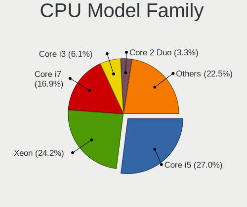

| Model                   | Computers | Percent |
|-------------------------|-----------|---------|
| Intel Core i5           | 115       | 27.85%  |
| Intel Xeon              | 97        | 23.49%  |
| Intel Core i7           | 71        | 17.19%  |
| Intel Core i3           | 26        | 6.3%    |
| Intel Core 2 Duo        | 14        | 3.39%   |
| Other                   | 10        | 2.42%   |
| Intel Pentium           | 9         | 2.18%   |
| Intel Xeon Silver       | 8         | 1.94%   |
| Intel Celeron           | 8         | 1.94%   |
| AMD FX                  | 8         | 1.94%   |
| Intel Atom              | 7         | 1.69%   |
| Intel Core i9           | 6         | 1.45%   |
| Intel Xeon Gold         | 5         | 1.21%   |
| AMD Ryzen 5             | 4         | 0.97%   |
| Intel Pentium Dual-Core | 3         | 0.73%   |
| Intel Genuine           | 2         | 0.48%   |
| Intel Core 2 Quad       | 2         | 0.48%   |
| AMD Ryzen 7             | 2         | 0.48%   |
| AMD Phenom II X6        | 2         | 0.48%   |
| AMD EPYC                | 2         | 0.48%   |
| Intel Pentium Dual      | 1         | 0.24%   |
| Intel Pentium 4         | 1         | 0.24%   |
| AMD Ryzen Threadripper  | 1         | 0.24%   |
| AMD Ryzen 5 PRO         | 1         | 0.24%   |
| AMD Ryzen 3             | 1         | 0.24%   |
| AMD Opteron             | 1         | 0.24%   |
| AMD GX                  | 1         | 0.24%   |
| AMD E2                  | 1         | 0.24%   |
| AMD E                   | 1         | 0.24%   |
| AMD Athlon              | 1         | 0.24%   |
| AMD A8                  | 1         | 0.24%   |
| AMD A10                 | 1         | 0.24%   |

CPU Cores
---------

Number of processor cores

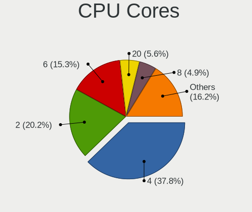

| Number | Computers | Percent |
|--------|-----------|---------|
| 4      | 159       | 38.5%   |
| 2      | 85        | 20.58%  |
| 6      | 63        | 15.25%  |
| 20     | 24        | 5.81%   |
| 8      | 21        | 5.08%   |
| 12     | 16        | 3.87%   |
| 16     | 11        | 2.66%   |
| 24     | 8         | 1.94%   |
| 10     | 5         | 1.21%   |
| 3      | 5         | 1.21%   |
| 1      | 4         | 0.97%   |
| 40     | 2         | 0.48%   |
| 32     | 2         | 0.48%   |
| 14     | 2         | 0.48%   |
| 96     | 1         | 0.24%   |
| 64     | 1         | 0.24%   |
| 48     | 1         | 0.24%   |
| 36     | 1         | 0.24%   |
| 28     | 1         | 0.24%   |
| 18     | 1         | 0.24%   |

CPU Sockets
-----------

Number of sockets

| Number | Computers | Percent |
|--------|-----------|---------|
| 1      | 339       | 82.08%  |
| 2      | 73        | 17.68%  |
| 0      | 1         | 0.24%   |

CPU Threads
-----------

Threads per core (Hyper-Threading)

| Number | Computers | Percent |
|--------|-----------|---------|
| 2      | 241       | 58.35%  |
| 1      | 172       | 41.65%  |

CPU Op-Modes
------------

CPU Operation Modes (32-bit, 64-bit)

| Op mode        | Computers | Percent |
|----------------|-----------|---------|
| 32-bit, 64-bit | 397       | 96.13%  |
| Unknown        | 13        | 3.15%   |
| 32-bit         | 3         | 0.73%   |

CPU Microcode
-------------

Microcode number

| Number     | Computers | Percent |
|------------|-----------|---------|
| 0x306c3    | 54        | 12.92%  |
| Unknown    | 37        | 8.85%   |
| 0x906e9    | 30        | 7.18%   |
| 0x906ea    | 28        | 6.7%    |
| 0x406f1    | 23        | 5.5%    |
| 0x506e3    | 21        | 5.02%   |
| 0x206a7    | 21        | 5.02%   |
| 0x306a9    | 14        | 3.35%   |
| 0x1067a    | 13        | 3.11%   |
| 0x206c2    | 12        | 2.87%   |
| 0xa0653    | 10        | 2.39%   |
| 0x306f2    | 9         | 2.15%   |
| 0x50654    | 8         | 1.91%   |
| 0x206d7    | 8         | 1.91%   |
| 0x106a5    | 7         | 1.67%   |
| 0x10676    | 7         | 1.67%   |
| 0xa0655    | 6         | 1.44%   |
| 0x906ed    | 6         | 1.44%   |
| 0x40651    | 6         | 1.44%   |
| 0x906ec    | 5         | 1.2%    |
| 0x806ea    | 5         | 1.2%    |
| 0x06000852 | 5         | 1.2%    |
| 0x806ec    | 4         | 0.96%   |
| 0x806e9    | 4         | 0.96%   |
| 0x50657    | 4         | 0.96%   |
| 0x406e3    | 4         | 0.96%   |
| 0x20655    | 4         | 0.96%   |
| 0x106ca    | 4         | 0.96%   |
| 0x806c1    | 3         | 0.72%   |
| 0x406c4    | 3         | 0.72%   |
| 0x106e5    | 3         | 0.72%   |
| 0x08301034 | 3         | 0.72%   |
| 0x906a3    | 2         | 0.48%   |
| 0x6fd      | 2         | 0.48%   |
| 0x6fb      | 2         | 0.48%   |
| 0x606a6    | 2         | 0.48%   |
| 0x406c3    | 2         | 0.48%   |
| 0x306e4    | 2         | 0.48%   |
| 0x30678    | 2         | 0.48%   |
| 0x08701013 | 2         | 0.48%   |

CPU Microarch
-------------

Microarchitecture

| Name             | Computers | Percent |
|------------------|-----------|---------|
| KabyLake         | 85        | 20.58%  |
| Haswell          | 71        | 17.19%  |
| Skylake          | 45        | 10.9%   |
| SandyBridge      | 31        | 7.51%   |
| Broadwell        | 31        | 7.51%   |
| Penryn           | 23        | 5.57%   |
| Westmere         | 19        | 4.6%    |
| IvyBridge        | 18        | 4.36%   |
| CometLake        | 17        | 4.12%   |
| Nehalem          | 10        | 2.42%   |
| Zen 2            | 8         | 1.94%   |
| Piledriver       | 8         | 1.94%   |
| Unknown          | 8         | 1.94%   |
| Silvermont       | 7         | 1.69%   |
| Core             | 5         | 1.21%   |
| Bonnell          | 4         | 0.97%   |
| TigerLake        | 3         | 0.73%   |
| K10              | 3         | 0.73%   |
| Zen+             | 2         | 0.48%   |
| Zen              | 2         | 0.48%   |
| P6               | 2         | 0.48%   |
| K10 Llano        | 2         | 0.48%   |
| Jaguar           | 2         | 0.48%   |
| NetBurst         | 1         | 0.24%   |
| K8 Hammer        | 1         | 0.24%   |
| IceLake          | 1         | 0.24%   |
| Goldmont plus    | 1         | 0.24%   |
| Goldmont         | 1         | 0.24%   |
| Bulldozer        | 1         | 0.24%   |
| Alderlake Hybrid | 1         | 0.24%   |

Graphics
--------

GPU Vendor
----------

Vendors of graphics cards

| Vendor                                       | Computers | Percent |
|----------------------------------------------|-----------|---------|
| Intel                                        | 224       | 49.89%  |
| Nvidia                                       | 79        | 17.59%  |
| AMD                                          | 61        | 13.59%  |
| Matrox Electronics Systems                   | 45        | 10.02%  |
| ASPEED Technology                            | 35        | 7.8%    |
| XGI Technology (eXtreme Graphics Innovation) | 2         | 0.45%   |
| Silicon Motion                               | 1         | 0.22%   |
| Silicon Integrated Systems [SiS]             | 1         | 0.22%   |
| Huawei Technologies                          | 1         | 0.22%   |

GPU Model
---------

Graphics card models

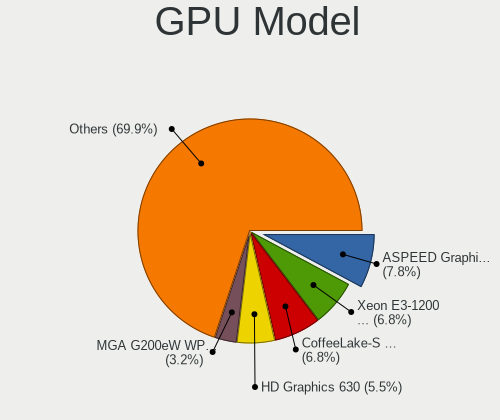

| Model                                                                                    | Computers | Percent |
|------------------------------------------------------------------------------------------|-----------|---------|
| ASPEED Technology ASPEED Graphics Family                                                 | 35        | 7.63%   |
| Intel Xeon E3-1200 v3/4th Gen Core Processor Integrated Graphics Controller              | 32        | 6.97%   |
| Intel CoffeeLake-S GT2 [UHD Graphics 630]                                                | 31        | 6.75%   |
| Intel HD Graphics 630                                                                    | 26        | 5.66%   |
| Intel 2nd Generation Core Processor Family Integrated Graphics Controller                | 15        | 3.27%   |
| Matrox Electronics Systems MGA G200e [Pilot] ServerEngines (SEP1)                        | 14        | 3.05%   |
| Matrox Electronics Systems G200eR2                                                       | 13        | 2.83%   |
| Matrox Electronics Systems MGA G200eW WPCM450                                            | 12        | 2.61%   |
| Intel CometLake-S GT2 [UHD Graphics 630]                                                 | 12        | 2.61%   |
| Intel HD Graphics 530                                                                    | 10        | 2.18%   |
| AMD Oland XT [Radeon HD 8670 / R5 340X OEM / R7 250/350/350X OEM]                        | 8         | 1.74%   |
| AMD Oland [Radeon HD 8570 / R5 430 OEM / R7 240/340 / Radeon 520 OEM]                    | 7         | 1.53%   |
| AMD ES1000                                                                               | 7         | 1.53%   |
| Intel Haswell-ULT Integrated Graphics Controller                                         | 6         | 1.31%   |
| Intel 3rd Gen Core processor Graphics Controller                                         | 6         | 1.31%   |
| Nvidia GF119 [GeForce GT 610]                                                            | 5         | 1.09%   |
| Intel Skylake GT2 [HD Graphics 520]                                                      | 5         | 1.09%   |
| Intel Atom/Celeron/Pentium Processor x5-E8000/J3xxx/N3xxx Integrated Graphics Controller | 5         | 1.09%   |
| Nvidia GP107GL [Quadro P400]                                                             | 4         | 0.87%   |
| Nvidia GK208B [GeForce GT 710]                                                           | 4         | 0.87%   |
| Intel Xeon E3-1200 v2/3rd Gen Core processor Graphics Controller                         | 4         | 0.87%   |
| Intel UHD Graphics 620                                                                   | 4         | 0.87%   |
| Intel Core Processor Integrated Graphics Controller                                      | 4         | 0.87%   |
| Intel CoffeeLake-H GT2 [UHD Graphics 630]                                                | 4         | 0.87%   |
| Intel Atom Processor D4xx/D5xx/N4xx/N5xx Integrated Graphics Controller                  | 4         | 0.87%   |
| Intel 4th Gen Core Processor Integrated Graphics Controller                              | 4         | 0.87%   |
| Intel 4 Series Chipset Integrated Graphics Controller                                    | 4         | 0.87%   |
| Nvidia GM204GL [Quadro M4000]                                                            | 3         | 0.65%   |
| Nvidia GK104GL [Quadro K4200]                                                            | 3         | 0.65%   |
| Matrox Electronics Systems Integrated Matrox G200eW3 Graphics Controller                 | 3         | 0.65%   |
| Intel WhiskeyLake-U GT2 [UHD Graphics 620]                                               | 3         | 0.65%   |
| Intel TigerLake-LP GT2 [Iris Xe Graphics]                                                | 3         | 0.65%   |
| Intel Mobile GM965/GL960 Integrated Graphics Controller (secondary)                      | 3         | 0.65%   |
| Intel Mobile GM965/GL960 Integrated Graphics Controller (primary)                        | 3         | 0.65%   |
| Intel Mobile 4 Series Chipset Integrated Graphics Controller                             | 3         | 0.65%   |
| Intel HD Graphics 620                                                                    | 3         | 0.65%   |
| Intel 82G33/G31 Express Integrated Graphics Controller                                   | 3         | 0.65%   |
| Intel 4th Generation Core Processor Family Integrated Graphics Controller                | 3         | 0.65%   |
| AMD RS780L [Radeon 3000]                                                                 | 3         | 0.65%   |
| AMD Ellesmere [Radeon RX 470/480/570/570X/580/580X/590]                                  | 3         | 0.65%   |

GPU Combo
---------

Combinations of graphics cards

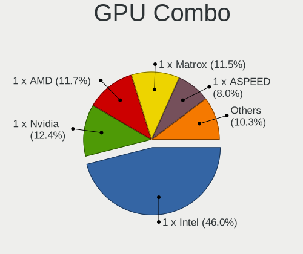

| Name                    | Computers | Percent |
|-------------------------|-----------|---------|
| 1 x Intel               | 191       | 46.25%  |
| 1 x Nvidia              | 53        | 12.83%  |
| 1 x AMD                 | 50        | 12.11%  |
| 1 x Matrox              | 43        | 10.41%  |
| 1 x ASPEED              | 32        | 7.75%   |
| Intel + Nvidia          | 19        | 4.6%    |
| Intel + AMD             | 9         | 2.18%   |
| 2 x Nvidia              | 3         | 0.73%   |
| Other                   | 2         | 0.48%   |
| 1 x XGI                 | 2         | 0.48%   |
| Nvidia + Matrox         | 2         | 0.48%   |
| 3 x Nvidia + 1 x ASPEED | 1         | 0.24%   |
| 2 x AMD                 | 1         | 0.24%   |
| 1 x SiS                 | 1         | 0.24%   |
| 1 x Silicon Motion      | 1         | 0.24%   |
| Nvidia + ASPEED         | 1         | 0.24%   |
| 1 x Huawei Technologies | 1         | 0.24%   |
| AMD + ASPEED            | 1         | 0.24%   |

GPU Driver
----------

Free vs proprietary

| Driver      | Computers | Percent |
|-------------|-----------|---------|
| Free        | 324       | 77.88%  |
| Unknown     | 55        | 13.22%  |
| Proprietary | 37        | 8.89%   |

GPU Memory
----------

Total video memory

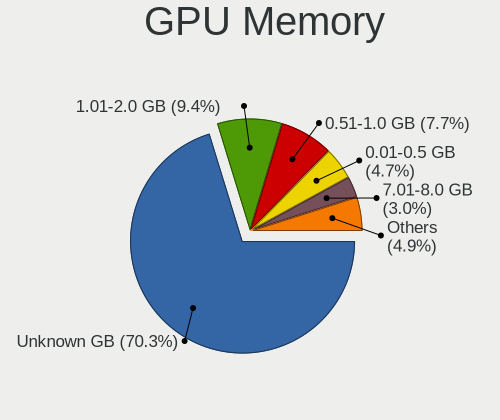

| Size in GB | Computers | Percent |
|------------|-----------|---------|
| Unknown    | 287       | 69.32%  |
| 1.01-2.0   | 40        | 9.66%   |
| 0.51-1.0   | 33        | 7.97%   |
| 0.01-0.5   | 20        | 4.83%   |
| 7.01-8.0   | 13        | 3.14%   |
| 3.01-4.0   | 13        | 3.14%   |
| 4.01-5.0   | 3         | 0.72%   |
| 5.01-6.0   | 2         | 0.48%   |
| 2.01-3.0   | 2         | 0.48%   |
| 16.01-24.0 | 1         | 0.24%   |

Monitor
-------

Monitor Vendor
--------------

Monitor vendors

| Vendor               | Computers | Percent |
|----------------------|-----------|---------|
| Dell                 | 57        | 22.18%  |
| Samsung Electronics  | 30        | 11.67%  |
| Hewlett-Packard      | 19        | 7.39%   |
| LG Display           | 17        | 6.61%   |
| Goldstar             | 13        | 5.06%   |
| AOC                  | 13        | 5.06%   |
| AU Optronics         | 12        | 4.67%   |
| Chimei Innolux       | 11        | 4.28%   |
| Acer                 | 10        | 3.89%   |
| Philips              | 9         | 3.5%    |
| Lenovo               | 8         | 3.11%   |
| Ancor Communications | 7         | 2.72%   |
| BOE                  | 5         | 1.95%   |
| BenQ                 | 5         | 1.95%   |
| ___                  | 2         | 0.78%   |
| ViewSonic            | 2         | 0.78%   |
| Unknown              | 2         | 0.78%   |
| PANDA                | 2         | 0.78%   |
| NEC Computers        | 2         | 0.78%   |
| InnoLux Display      | 2         | 0.78%   |
| Eizo                 | 2         | 0.78%   |
| Xiaomi               | 1         | 0.39%   |
| Westinghouse         | 1         | 0.39%   |
| Toshiba              | 1         | 0.39%   |
| Sun                  | 1         | 0.39%   |
| Sony                 | 1         | 0.39%   |
| Sharp                | 1         | 0.39%   |
| Sceptre Tech         | 1         | 0.39%   |
| Pixio                | 1         | 0.39%   |
| PEP                  | 1         | 0.39%   |
| Packard Bell         | 1         | 0.39%   |
| NME                  | 1         | 0.39%   |
| MIT                  | 1         | 0.39%   |
| LG Philips           | 1         | 0.39%   |
| LG Electronics       | 1         | 0.39%   |
| KVM                  | 1         | 0.39%   |
| Insignia             | 1         | 0.39%   |
| Iiyama               | 1         | 0.39%   |
| HPN                  | 1         | 0.39%   |
| HannStar             | 1         | 0.39%   |

Monitor Model
-------------

Monitor models

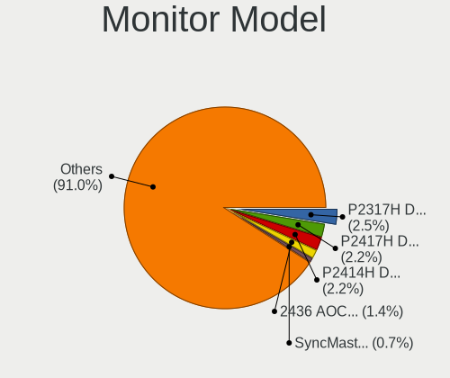

| Model                                                                 | Computers | Percent |
|-----------------------------------------------------------------------|-----------|---------|
| Dell P2317H DEL40F4 1920x1080 509x286mm 23.0-inch                     | 7         | 2.56%   |
| Dell P2417H DELA0DB 1920x1080 530x300mm 24.0-inch                     | 6         | 2.2%    |
| Dell P2414H DELA09A 1920x1080 527x297mm 23.8-inch                     | 6         | 2.2%    |
| AOC 2436 AOC2436 1920x1080 521x293mm 23.5-inch                        | 4         | 1.47%   |
| Samsung Electronics SyncMaster SAM01D3 1440x900 408x225mm 18.3-inch   | 2         | 0.73%   |
| Samsung Electronics S19C150 SAM0AE6 1366x768 410x230mm 18.5-inch      | 2         | 0.73%   |
| LG Display LCD Monitor LGD039F 1366x768 345x194mm 15.6-inch           | 2         | 0.73%   |
| InnoLux Display LCD Monitor INL0014 1366x768 309x174mm 14.0-inch      | 2         | 0.73%   |
| Hewlett-Packard ZR2440w HWP2956 1920x1200 518x324mm 24.1-inch         | 2         | 0.73%   |
| Hewlett-Packard Z32x HWP3275 3840x2160 697x392mm 31.5-inch            | 2         | 0.73%   |
| Hewlett-Packard V19b HPN3539 1366x768 410x230mm 18.5-inch             | 2         | 0.73%   |
| Goldstar L1753T GSM4476 1280x1024 338x270mm 17.0-inch                 | 2         | 0.73%   |
| Dell U2412M DELA07A 1920x1200 518x324mm 24.1-inch                     | 2         | 0.73%   |
| Dell P2417H DELA0DA 1920x1080 527x296mm 23.8-inch                     | 2         | 0.73%   |
| BenQ GW2765 BNQ78D6 2560x1440 597x336mm 27.0-inch                     | 2         | 0.73%   |
| ___ LCDTV16 ___9000 1360x768                                          | 1         | 0.37%   |
| ___ LCD TV ___0101 1920x1080                                          | 1         | 0.37%   |
| Xiaomi Mi TV XMD009A 2880x1800 480x270mm 21.7-inch                    | 1         | 0.37%   |
| Westinghouse LD-2240 WDT19DA 1920x1080 480x270mm 21.7-inch            | 1         | 0.37%   |
| ViewSonic VA702b VSC231C 1280x1024 338x270mm 17.0-inch                | 1         | 0.37%   |
| ViewSonic VA2226w-3 VSC2051 1680x1050 495x291mm 22.6-inch             | 1         | 0.37%   |
| Unknown LCDTV16 9000 1360x768 1600x900mm 72.3-inch                    | 1         | 0.37%   |
| Unknown LCDTV16 0101 1920x1080 1600x900mm 72.3-inch                   | 1         | 0.37%   |
| Toshiba LCD Monitor 1 1 5" LCD000D 1024x768 304x228mm 15.0-inch       | 1         | 0.37%   |
| Sun GH18PS SUN0587 1280x1024 359x287mm 18.1-inch                      | 1         | 0.37%   |
| Sony TV *02 SNY9403 1920x1080 1218x685mm 55.0-inch                    | 1         | 0.37%   |
| Sharp LCD Monitor SHP144D 3840x2160 276x156mm 12.5-inch               | 1         | 0.37%   |
| Sceptre Tech F27 SPT0ABF 1920x1080 409x230mm 18.5-inch                | 1         | 0.37%   |
| Samsung Electronics U32R59x SAM0F96 3840x2160 697x392mm 31.5-inch     | 1         | 0.37%   |
| Samsung Electronics U32J59x SAM0F35 3840x2160 700x390mm 31.5-inch     | 1         | 0.37%   |
| Samsung Electronics U28E590 SAM0C4D 3840x2160 607x345mm 27.5-inch     | 1         | 0.37%   |
| Samsung Electronics SyncMaster SAM05C7 1920x1080 521x293mm 23.5-inch  | 1         | 0.37%   |
| Samsung Electronics SyncMaster SAM04DD 1920x1080 477x268mm 21.5-inch  | 1         | 0.37%   |
| Samsung Electronics SyncMaster SAM037C 1680x1050 474x296mm 22.0-inch  | 1         | 0.37%   |
| Samsung Electronics SyncMaster SAM022B 1280x1024 338x270mm 17.0-inch  | 1         | 0.37%   |
| Samsung Electronics SyncMaster SAM011E 1280x1024 338x270mm 17.0-inch  | 1         | 0.37%   |
| Samsung Electronics SMBX2350 SAM071E 1920x1080 509x286mm 23.0-inch    | 1         | 0.37%   |
| Samsung Electronics SMB1930N SAM0632 1360x768 410x230mm 18.5-inch     | 1         | 0.37%   |
| Samsung Electronics SA300/SA350 SAM078E 1920x1080 477x268mm 21.5-inch | 1         | 0.37%   |
| Samsung Electronics S27E391 SAM0C16 1920x1080 598x336mm 27.0-inch     | 1         | 0.37%   |

Monitor Resolution
------------------

Monitor screen resolution

| Resolution         | Computers | Percent |
|--------------------|-----------|---------|
| 1920x1080 (FHD)    | 104       | 41.27%  |
| 1366x768 (WXGA)    | 36        | 14.29%  |
| 1280x1024 (SXGA)   | 20        | 7.94%   |
| 3840x2160 (4K)     | 13        | 5.16%   |
| 2560x1440 (QHD)    | 11        | 4.37%   |
| 1440x900 (WXGA+)   | 11        | 4.37%   |
| 1920x1200 (WUXGA)  | 9         | 3.57%   |
| 1680x1050 (WSXGA+) | 9         | 3.57%   |
| 1600x900 (HD+)     | 7         | 2.78%   |
| 1280x800 (WXGA)    | 7         | 2.78%   |
| Unknown            | 6         | 2.38%   |
| 1600x1200          | 4         | 1.59%   |
| 3840x1200          | 2         | 0.79%   |
| 3840x1080          | 2         | 0.79%   |
| 3440x1440          | 2         | 0.79%   |
| 1360x768           | 2         | 0.79%   |
| 1024x768 (XGA)     | 2         | 0.79%   |
| 5760x1080          | 1         | 0.4%    |
| 4480x1440          | 1         | 0.4%    |
| 3456x2160          | 1         | 0.4%    |
| 1680x1080          | 1         | 0.4%    |
| 1280x720 (HD)      | 1         | 0.4%    |

Monitor Diagonal
----------------

Diagonal size in inches

| Inches  | Computers | Percent |
|---------|-----------|---------|
| 24      | 36        | 13.9%   |
| 15      | 35        | 13.51%  |
| 23      | 30        | 11.58%  |
| 21      | 24        | 9.27%   |
| 27      | 19        | 7.34%   |
| 19      | 19        | 7.34%   |
| Unknown | 16        | 6.18%   |
| 17      | 15        | 5.79%   |
| 18      | 11        | 4.25%   |
| 13      | 10        | 3.86%   |
| 22      | 7         | 2.7%    |
| 14      | 7         | 2.7%    |
| 12      | 7         | 2.7%    |
| 20      | 5         | 1.93%   |
| 31      | 4         | 1.54%   |
| 72      | 2         | 0.77%   |
| 32      | 2         | 0.77%   |
| 16      | 2         | 0.77%   |
| 55      | 1         | 0.39%   |
| 52      | 1         | 0.39%   |
| 46      | 1         | 0.39%   |
| 42      | 1         | 0.39%   |
| 36      | 1         | 0.39%   |
| 34      | 1         | 0.39%   |
| 26      | 1         | 0.39%   |
| 25      | 1         | 0.39%   |

Monitor Width
-------------

Physical width

| Width in mm | Computers | Percent |
|-------------|-----------|---------|
| 501-600     | 81        | 31.89%  |
| 301-350     | 54        | 21.26%  |
| 401-500     | 52        | 20.47%  |
| 351-400     | 23        | 9.06%   |
| Unknown     | 16        | 6.3%    |
| 201-300     | 11        | 4.33%   |
| 601-700     | 7         | 2.76%   |
| 701-800     | 4         | 1.57%   |
| 1001-1500   | 3         | 1.18%   |
| 1501-2000   | 2         | 0.79%   |
| 901-1000    | 1         | 0.39%   |

Aspect Ratio
------------

Proportional relationship between the width and the height

| Ratio   | Computers | Percent |
|---------|-----------|---------|
| 16/9    | 157       | 66.81%  |
| 16/10   | 34        | 14.47%  |
| 5/4     | 21        | 8.94%   |
| Unknown | 14        | 5.96%   |
| 4/3     | 6         | 2.55%   |
| 3/2     | 2         | 0.85%   |
| 21/9    | 1         | 0.43%   |

Monitor Area
------------

Area in inch

| Area in inch | Computers | Percent |
|----------------|-----------|---------|
| 201-250        | 79        | 30.86%  |
| 101-110        | 35        | 13.67%  |
| 151-200        | 29        | 11.33%  |
| 301-350        | 19        | 7.42%   |
| 141-150        | 17        | 6.64%   |
| Unknown        | 16        | 6.25%   |
| 81-90          | 14        | 5.47%   |
| 251-300        | 14        | 5.47%   |
| 61-70          | 7         | 2.73%   |
| 351-500        | 7         | 2.73%   |
| 121-130        | 6         | 2.34%   |
| More than 1000 | 4         | 1.56%   |
| 71-80          | 3         | 1.17%   |
| 501-1000       | 3         | 1.17%   |
| 111-120        | 2         | 0.78%   |
| 131-140        | 1         | 0.39%   |

Pixel Density
-------------

Pixels per inch

| Density       | Computers | Percent |
|---------------|-----------|---------|
| 51-100        | 128       | 51.2%   |
| 101-120       | 57        | 22.8%   |
| 121-160       | 39        | 15.6%   |
| Unknown       | 16        | 6.4%    |
| 1-50          | 5         | 2%      |
| More than 240 | 3         | 1.2%    |
| 161-240       | 2         | 0.8%    |

Multiple Monitors
-----------------

Total monitors connected

| Total | Computers | Percent |
|-------|-----------|---------|
| 1     | 196       | 46.45%  |
| 0     | 180       | 42.65%  |
| 2     | 43        | 10.19%  |
| 3     | 3         | 0.71%   |

Network
-------

Net Controller Vendor
---------------------

Controller vendors

| Vendor                            | Computers | Percent |
|-----------------------------------|-----------|---------|
| Intel                             | 225       | 40.61%  |
| Realtek Semiconductor             | 174       | 31.41%  |
| Broadcom                          | 41        | 7.4%    |
| Qualcomm Atheros                  | 27        | 4.87%   |
| IBM                               | 13        | 2.35%   |
| Broadcom Limited                  | 9         | 1.62%   |
| TP-Link                           | 8         | 1.44%   |
| Ralink Technology                 | 7         | 1.26%   |
| Mellanox Technologies             | 5         | 0.9%    |
| Marvell Technology Group          | 3         | 0.54%   |
| Huawei Technologies               | 3         | 0.54%   |
| D-Link System                     | 3         | 0.54%   |
| Xilinx                            | 2         | 0.36%   |
| Samsung Electronics               | 2         | 0.36%   |
| Nvidia                            | 2         | 0.36%   |
| D-Link                            | 2         | 0.36%   |
| Aquantia                          | 2         | 0.36%   |
| 3Com                              | 2         | 0.36%   |
| ZTE WCDMA Technologies MSM        | 1         | 0.18%   |
| Xiaomi                            | 1         | 0.18%   |
| VIA Technologies                  | 1         | 0.18%   |
| Silicon Integrated Systems [SiS]  | 1         | 0.18%   |
| Sierra Wireless                   | 1         | 0.18%   |
| Ralink                            | 1         | 0.18%   |
| Qualcomm Atheros Communications   | 1         | 0.18%   |
| NetGear                           | 1         | 0.18%   |
| MYRICOM                           | 1         | 0.18%   |
| MediaTek                          | 1         | 0.18%   |
| LSI                               | 1         | 0.18%   |
| Linux 2.6.31.6 with s3c-udc       | 1         | 0.18%   |
| Linksys                           | 1         | 0.18%   |
| Lenovo                            | 1         | 0.18%   |
| ICS Advent                        | 1         | 0.18%   |
| Exar                              | 1         | 0.18%   |
| Ericsson Business Mobile Networks | 1         | 0.18%   |
| Emulex                            | 1         | 0.18%   |
| Edimax Technology                 | 1         | 0.18%   |
| Dresden Elektronik                | 1         | 0.18%   |
| Cisco Systems                     | 1         | 0.18%   |
| ASUSTek Computer                  | 1         | 0.18%   |

Net Controller Model
--------------------

Controller models

| Model                                                                  | Computers | Percent |
|------------------------------------------------------------------------|-----------|---------|
| Realtek RTL8111/8168/8211/8411 PCI Express Gigabit Ethernet Controller | 141       | 21.08%  |
| Intel I350 Gigabit Network Connection                                  | 29        | 4.33%   |
| Intel 82579LM Gigabit Network Connection (Lewisville)                  | 19        | 2.84%   |
| Intel Ethernet Connection I217-LM                                      | 18        | 2.69%   |
| Intel Ethernet Connection (2) I219-LM                                  | 17        | 2.54%   |
| Intel 82599ES 10-Gigabit SFI/SFP+ Network Connection                   | 15        | 2.24%   |
| Realtek RTL810xE PCI Express Fast Ethernet controller                  | 14        | 2.09%   |
| Intel I210 Gigabit Network Connection                                  | 13        | 1.94%   |
| IBM XClarity Controller                                                | 13        | 1.94%   |
| Intel Ethernet Controller X710 for 10GbE SFP+                          | 11        | 1.64%   |
| Intel Ethernet Connection (11) I219-LM                                 | 10        | 1.49%   |
| Intel 82574L Gigabit Network Connection                                | 9         | 1.35%   |
| Realtek RTL8153 Gigabit Ethernet Adapter                               | 7         | 1.05%   |
| Intel Ethernet Connection (7) I219-LM                                  | 7         | 1.05%   |
| Intel Ethernet Connection (2) I219-V                                   | 7         | 1.05%   |
| Intel 82576 Gigabit Network Connection                                 | 7         | 1.05%   |
| Intel Wireless 7260                                                    | 6         | 0.9%    |
| Intel Wi-Fi 6 AX200                                                    | 6         | 0.9%    |
| Intel I211 Gigabit Network Connection                                  | 6         | 0.9%    |
| Broadcom NetXtreme BCM5720 Gigabit Ethernet PCIe                       | 6         | 0.9%    |
| Realtek RTL-8100/8101L/8139 PCI Fast Ethernet Adapter                  | 5         | 0.75%   |
| Qualcomm Atheros QCA9565 / AR9565 Wireless Network Adapter             | 5         | 0.75%   |
| Intel Ethernet Connection X722 for 10GbE SFP+                          | 5         | 0.75%   |
| Broadcom NetXtreme BCM5761 Gigabit Ethernet PCIe                       | 5         | 0.75%   |
| Qualcomm Atheros AR8131 Gigabit Ethernet                               | 4         | 0.6%    |
| Intel Wireless 8260                                                    | 4         | 0.6%    |
| Intel Ethernet Controller X550                                         | 4         | 0.6%    |
| Intel Ethernet Controller I225-V                                       | 4         | 0.6%    |
| Intel Ethernet Controller 10-Gigabit X540-AT2                          | 4         | 0.6%    |
| Intel Ethernet Connection X722 for 1GbE                                | 4         | 0.6%    |
| Intel Ethernet Connection (2) I218-V                                   | 4         | 0.6%    |
| Intel Centrino Advanced-N 6205 [Taylor Peak]                           | 4         | 0.6%    |
| Intel 82580 Gigabit Network Connection                                 | 4         | 0.6%    |
| Broadcom NetXtreme II BCM5709 Gigabit Ethernet                         | 4         | 0.6%    |
| Broadcom NetXtreme BCM5764M Gigabit Ethernet PCIe                      | 4         | 0.6%    |
| Broadcom Limited NetXtreme BCM5720 Gigabit Ethernet PCIe               | 4         | 0.6%    |
| Realtek RTL8821CE 802.11ac PCIe Wireless Network Adapter               | 3         | 0.45%   |
| Realtek RTL8169 PCI Gigabit Ethernet Controller                        | 3         | 0.45%   |
| Qualcomm Atheros QCA9377 802.11ac Wireless Network Adapter             | 3         | 0.45%   |
| Qualcomm Atheros QCA6174 802.11ac Wireless Network Adapter             | 3         | 0.45%   |

Wireless Vendor
---------------

Wireless vendors

| Vendor                          | Computers | Percent |
|---------------------------------|-----------|---------|
| Intel                           | 67        | 50.38%  |
| Qualcomm Atheros                | 19        | 14.29%  |
| Realtek Semiconductor           | 16        | 12.03%  |
| Ralink Technology               | 7         | 5.26%   |
| Broadcom                        | 7         | 5.26%   |
| TP-Link                         | 6         | 4.51%   |
| D-Link                          | 2         | 1.5%    |
| Sierra Wireless                 | 1         | 0.75%   |
| Ralink                          | 1         | 0.75%   |
| Qualcomm Atheros Communications | 1         | 0.75%   |
| NetGear                         | 1         | 0.75%   |
| MediaTek                        | 1         | 0.75%   |
| Linksys                         | 1         | 0.75%   |
| Edimax Technology               | 1         | 0.75%   |
| D-Link System                   | 1         | 0.75%   |
| ASUSTek Computer                | 1         | 0.75%   |

Wireless Model
--------------

Wireless models

| Model                                                                   | Computers | Percent |
|-------------------------------------------------------------------------|-----------|---------|
| Intel Wireless 7260                                                     | 6         | 4.48%   |
| Intel Wi-Fi 6 AX200                                                     | 6         | 4.48%   |
| Qualcomm Atheros QCA9565 / AR9565 Wireless Network Adapter              | 5         | 3.73%   |
| Intel Wireless 8260                                                     | 4         | 2.99%   |
| Intel Centrino Advanced-N 6205 [Taylor Peak]                            | 4         | 2.99%   |
| Realtek RTL8821CE 802.11ac PCIe Wireless Network Adapter                | 3         | 2.24%   |
| Qualcomm Atheros QCA9377 802.11ac Wireless Network Adapter              | 3         | 2.24%   |
| Qualcomm Atheros QCA6174 802.11ac Wireless Network Adapter              | 3         | 2.24%   |
| Intel Wireless 7265                                                     | 3         | 2.24%   |
| Intel Wireless 3165                                                     | 3         | 2.24%   |
| Intel PRO/Wireless 3945ABG [Golan] Network Connection                   | 3         | 2.24%   |
| Intel Dual Band Wireless-AC 3168NGW [Stone Peak]                        | 3         | 2.24%   |
| Intel Comet Lake PCH-LP CNVi WiFi                                       | 3         | 2.24%   |
| Intel Cannon Point-LP CNVi [Wireless-AC]                                | 3         | 2.24%   |
| Intel Cannon Lake PCH CNVi WiFi                                         | 3         | 2.24%   |
| TP-Link AC600 wireless Realtek RTL8811AU [Archer T2U Nano]              | 2         | 1.49%   |
| Realtek RTL8822BE 802.11a/b/g/n/ac WiFi adapter                         | 2         | 1.49%   |
| Realtek RTL8723BE PCIe Wireless Network Adapter                         | 2         | 1.49%   |
| Realtek RTL8188CUS 802.11n WLAN Adapter                                 | 2         | 1.49%   |
| Ralink RT2870/RT3070 Wireless Adapter                                   | 2         | 1.49%   |
| Ralink MT7601U Wireless Adapter                                         | 2         | 1.49%   |
| Qualcomm Atheros AR9462 Wireless Network Adapter                        | 2         | 1.49%   |
| Qualcomm Atheros AR9287 Wireless Network Adapter (PCI-Express)          | 2         | 1.49%   |
| Qualcomm Atheros AR242x / AR542x Wireless Network Adapter (PCI-Express) | 2         | 1.49%   |
| Intel Wireless 8265 / 8275                                              | 2         | 1.49%   |
| Intel Wi-Fi 6 AX201                                                     | 2         | 1.49%   |
| Intel PRO/Wireless 5100 AGN [Shiloh] Network Connection                 | 2         | 1.49%   |
| Intel Comet Lake PCH CNVi WiFi                                          | 2         | 1.49%   |
| Intel Centrino Wireless-N 1030 [Rainbow Peak]                           | 2         | 1.49%   |
| Intel Centrino Ultimate-N 6300                                          | 2         | 1.49%   |
| Intel Centrino Advanced-N 6230 [Rainbow Peak]                           | 2         | 1.49%   |
| Intel Centrino Advanced-N 6200                                          | 2         | 1.49%   |
| Intel Alder Lake-P PCH CNVi WiFi                                        | 2         | 1.49%   |
| Broadcom BCM4360 802.11ac Dual Band Wireless Network Adapter            | 2         | 1.49%   |
| Broadcom BCM4322 802.11a/b/g/n Wireless LAN Controller                  | 2         | 1.49%   |
| TP-Link TL-WN722N v2/v3 [Realtek RTL8188EUS]                            | 1         | 0.75%   |
| TP-Link Archer T1U 802.11a/n/ac Wireless Adapter [MediaTek MT7610U]     | 1         | 0.75%   |
| TP-Link 802.11ac WLAN Adapter                                           | 1         | 0.75%   |
| TP-Link 802.11ac NIC                                                    | 1         | 0.75%   |
| Sierra Wireless AirPrime MC7455 3G/4G LTE Modem                         | 1         | 0.75%   |

Ethernet Vendor
---------------

Ethernet vendors

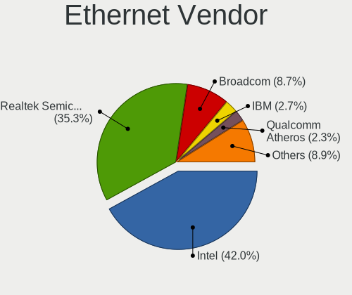

| Vendor                           | Computers | Percent |
|----------------------------------|-----------|---------|
| Intel                            | 197       | 42.37%  |
| Realtek Semiconductor            | 168       | 36.13%  |
| Broadcom                         | 35        | 7.53%   |
| IBM                              | 13        | 2.8%    |
| Qualcomm Atheros                 | 11        | 2.37%   |
| Broadcom Limited                 | 9         | 1.94%   |
| Marvell Technology Group         | 3         | 0.65%   |
| Huawei Technologies              | 3         | 0.65%   |
| TP-Link                          | 2         | 0.43%   |
| Samsung Electronics              | 2         | 0.43%   |
| Nvidia                           | 2         | 0.43%   |
| Mellanox Technologies            | 2         | 0.43%   |
| D-Link System                    | 2         | 0.43%   |
| Aquantia                         | 2         | 0.43%   |
| 3Com                             | 2         | 0.43%   |
| ZTE WCDMA Technologies MSM       | 1         | 0.22%   |
| Xilinx                           | 1         | 0.22%   |
| Xiaomi                           | 1         | 0.22%   |
| VIA Technologies                 | 1         | 0.22%   |
| Silicon Integrated Systems [SiS] | 1         | 0.22%   |
| MYRICOM                          | 1         | 0.22%   |
| Lenovo                           | 1         | 0.22%   |
| ICS Advent                       | 1         | 0.22%   |
| Emulex                           | 1         | 0.22%   |
| Cisco Systems                    | 1         | 0.22%   |
| ASIX Electronics                 | 1         | 0.22%   |
| Apple                            | 1         | 0.22%   |

Ethernet Model
--------------

Ethernet models

| Model                                                                  | Computers | Percent |
|------------------------------------------------------------------------|-----------|---------|
| Realtek RTL8111/8168/8211/8411 PCI Express Gigabit Ethernet Controller | 141       | 26.86%  |
| Intel I350 Gigabit Network Connection                                  | 29        | 5.52%   |
| Intel 82579LM Gigabit Network Connection (Lewisville)                  | 19        | 3.62%   |
| Intel Ethernet Connection I217-LM                                      | 18        | 3.43%   |
| Intel Ethernet Connection (2) I219-LM                                  | 17        | 3.24%   |
| Intel 82599ES 10-Gigabit SFI/SFP+ Network Connection                   | 15        | 2.86%   |
| Realtek RTL810xE PCI Express Fast Ethernet controller                  | 14        | 2.67%   |
| Intel I210 Gigabit Network Connection                                  | 13        | 2.48%   |
| IBM XClarity Controller                                                | 13        | 2.48%   |
| Intel Ethernet Controller X710 for 10GbE SFP+                          | 11        | 2.1%    |
| Intel Ethernet Connection (11) I219-LM                                 | 10        | 1.9%    |
| Intel 82574L Gigabit Network Connection                                | 9         | 1.71%   |
| Realtek RTL8153 Gigabit Ethernet Adapter                               | 7         | 1.33%   |
| Intel Ethernet Connection (7) I219-LM                                  | 7         | 1.33%   |
| Intel Ethernet Connection (2) I219-V                                   | 7         | 1.33%   |
| Intel 82576 Gigabit Network Connection                                 | 7         | 1.33%   |
| Intel I211 Gigabit Network Connection                                  | 6         | 1.14%   |
| Broadcom NetXtreme BCM5720 Gigabit Ethernet PCIe                       | 6         | 1.14%   |
| Realtek RTL-8100/8101L/8139 PCI Fast Ethernet Adapter                  | 5         | 0.95%   |
| Intel Ethernet Connection X722 for 10GbE SFP+                          | 5         | 0.95%   |
| Broadcom NetXtreme BCM5761 Gigabit Ethernet PCIe                       | 5         | 0.95%   |
| Qualcomm Atheros AR8131 Gigabit Ethernet                               | 4         | 0.76%   |
| Intel Ethernet Controller X550                                         | 4         | 0.76%   |
| Intel Ethernet Controller I225-V                                       | 4         | 0.76%   |
| Intel Ethernet Controller 10-Gigabit X540-AT2                          | 4         | 0.76%   |
| Intel Ethernet Connection X722 for 1GbE                                | 4         | 0.76%   |
| Intel Ethernet Connection (2) I218-V                                   | 4         | 0.76%   |
| Intel 82580 Gigabit Network Connection                                 | 4         | 0.76%   |
| Broadcom NetXtreme II BCM5709 Gigabit Ethernet                         | 4         | 0.76%   |
| Broadcom NetXtreme BCM5764M Gigabit Ethernet PCIe                      | 4         | 0.76%   |
| Broadcom Limited NetXtreme BCM5720 Gigabit Ethernet PCIe               | 4         | 0.76%   |
| Realtek RTL8169 PCI Gigabit Ethernet Controller                        | 3         | 0.57%   |
| Intel Ethernet Connection I219-V                                       | 3         | 0.57%   |
| Intel Ethernet Connection (5) I219-LM                                  | 3         | 0.57%   |
| Intel 82579V Gigabit Network Connection                                | 3         | 0.57%   |
| Intel 82577LM Gigabit Network Connection                               | 3         | 0.57%   |
| Intel 82567LM Gigabit Network Connection                               | 3         | 0.57%   |
| Broadcom NetXtreme BCM5719 Gigabit Ethernet PCIe                       | 3         | 0.57%   |
| Qualcomm Atheros Killer E2400 Gigabit Ethernet Controller              | 2         | 0.38%   |
| Qualcomm Atheros AR8151 v2.0 Gigabit Ethernet                          | 2         | 0.38%   |

Net Controller Kind
-------------------

Ethernet, WiFi or modem

| Kind     | Computers | Percent |
|----------|-----------|---------|
| Ethernet | 403       | 75.19%  |
| WiFi     | 123       | 22.95%  |
| Modem    | 6         | 1.12%   |
| Unknown  | 4         | 0.75%   |

Used Controller
---------------

Currently used network controller

| Kind     | Computers | Percent |
|----------|-----------|---------|
| Ethernet | 334       | 81.86%  |
| WiFi     | 72        | 17.65%  |
| Unknown  | 2         | 0.49%   |

NICs
----

Total network controllers on board

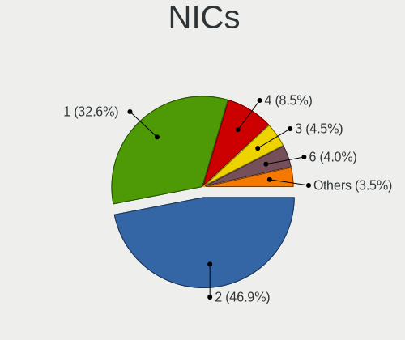

| Total | Computers | Percent |
|-------|-----------|---------|
| 2     | 195       | 47.22%  |
| 1     | 138       | 33.41%  |
| 4     | 33        | 7.99%   |
| 3     | 18        | 4.36%   |
| 6     | 15        | 3.63%   |
| 8     | 4         | 0.97%   |
| 5     | 3         | 0.73%   |
| 0     | 3         | 0.73%   |
| 12    | 2         | 0.48%   |
| 20    | 1         | 0.24%   |
| 10    | 1         | 0.24%   |

IPv6
----

IPv6 vs IPv4

| Used | Computers | Percent |
|------|-----------|---------|
| No   | 386       | 92.34%  |
| Yes  | 32        | 7.66%   |

Bluetooth
---------

Bluetooth Vendor
----------------

Controller vendors

| Vendor                          | Computers | Percent |
|---------------------------------|-----------|---------|
| Intel                           | 43        | 46.74%  |
| Qualcomm Atheros Communications | 12        | 13.04%  |
| Realtek Semiconductor           | 8         | 8.7%    |
| Cambridge Silicon Radio         | 8         | 8.7%    |
| Broadcom                        | 8         | 8.7%    |
| Dell                            | 3         | 3.26%   |
| ASUSTek Computer                | 3         | 3.26%   |
| Lite-On Technology              | 2         | 2.17%   |
| IMC Networks                    | 1         | 1.09%   |
| Foxconn / Hon Hai               | 1         | 1.09%   |
| Dynex                           | 1         | 1.09%   |
| Apple                           | 1         | 1.09%   |
| Alps Electric                   | 1         | 1.09%   |

Bluetooth Model
---------------

Controller models

| Model                                                                               | Computers | Percent |
|-------------------------------------------------------------------------------------|-----------|---------|
| Intel Bluetooth wireless interface                                                  | 9         | 9.78%   |
| Cambridge Silicon Radio Bluetooth Dongle (HCI mode)                                 | 8         | 8.7%    |
| Intel Bluetooth 9460/9560 Jefferson Peak (JfP)                                      | 7         | 7.61%   |
| Intel AX201 Bluetooth                                                               | 7         | 7.61%   |
| Intel Bluetooth Device                                                              | 6         | 6.52%   |
| Qualcomm Atheros  Bluetooth Device                                                  | 5         | 5.43%   |
| Intel AX200 Bluetooth                                                               | 5         | 5.43%   |
| Realtek  Bluetooth 4.2 Adapter                                                      | 4         | 4.35%   |
| Realtek Bluetooth Radio                                                             | 3         | 3.26%   |
| Intel Centrino Advanced-N 6230 Bluetooth adapter                                    | 3         | 3.26%   |
| Qualcomm Atheros QCA61x4 Bluetooth 4.0                                              | 2         | 2.17%   |
| Qualcomm Atheros AR9462 Bluetooth                                                   | 2         | 2.17%   |
| Qualcomm Atheros AR3012 Bluetooth 4.0                                               | 2         | 2.17%   |
| Intel Centrino Bluetooth Wireless Transceiver                                       | 2         | 2.17%   |
| Intel AX211 Bluetooth                                                               | 2         | 2.17%   |
| Dell DW375 Bluetooth Module                                                         | 2         | 2.17%   |
| Broadcom BCM20702A0 Bluetooth 4.0                                                   | 2         | 2.17%   |
| Broadcom BCM2045B (BDC-2.1) [Bluetooth Controller]                                  | 2         | 2.17%   |
| ASUS Broadcom BCM20702 Single-Chip Bluetooth 4.0 + LE                               | 2         | 2.17%   |
| Realtek 802.11ac WLAN Adapter                                                       | 1         | 1.09%   |
| Qualcomm Atheros AR3011 Bluetooth                                                   | 1         | 1.09%   |
| Lite-On Bluetooth Device                                                            | 1         | 1.09%   |
| Lite-On Atheros AR3012 Bluetooth                                                    | 1         | 1.09%   |
| Intel Wireless-AC 3168 Bluetooth                                                    | 1         | 1.09%   |
| Intel AX210 Bluetooth                                                               | 1         | 1.09%   |
| IMC Networks Bluetooth Device                                                       | 1         | 1.09%   |
| Foxconn / Hon Hai Foxconn T77H114 BCM2070 [Single-Chip Bluetooth 2.1 + EDR Adapter] | 1         | 1.09%   |
| Dynex Bluetooth 4.0 Adapter [Broadcom, 1.12, BCM20702A0]                            | 1         | 1.09%   |
| Dell BCM20702A0 Bluetooth Module                                                    | 1         | 1.09%   |
| Broadcom BCM92046DG-CL1ROM Bluetooth 2.1 Adapter                                    | 1         | 1.09%   |
| Broadcom BCM2045B (BDC-2.1)                                                         | 1         | 1.09%   |
| Broadcom BCM2045B (BDC-2) [Bluetooth Controller]                                    | 1         | 1.09%   |
| Broadcom ANYCOM Blue USB-200/250                                                    | 1         | 1.09%   |
| ASUS BT-270 Bluetooth Adapter                                                       | 1         | 1.09%   |
| Apple Bluetooth Host Controller                                                     | 1         | 1.09%   |
| Alps Electric UGTZ4 Bluetooth                                                       | 1         | 1.09%   |

Sound
-----

Sound Vendor
------------

Sound card vendors

| Vendor                           | Computers | Percent |
|----------------------------------|-----------|---------|
| Intel                            | 275       | 66.91%  |
| Nvidia                           | 59        | 14.36%  |
| AMD                              | 56        | 13.63%  |
| Logitech                         | 3         | 0.73%   |
| C-Media Electronics              | 3         | 0.73%   |
| Texas Instruments                | 2         | 0.49%   |
| GN Netcom                        | 2         | 0.49%   |
| Creative Labs                    | 2         | 0.49%   |
| Silicon Integrated Systems [SiS] | 1         | 0.24%   |
| Realtek Semiconductor            | 1         | 0.24%   |
| Plantronics                      | 1         | 0.24%   |
| Lenovo                           | 1         | 0.24%   |
| KTMicro                          | 1         | 0.24%   |
| Harman International             | 1         | 0.24%   |
| Ensoniq                          | 1         | 0.24%   |
| ASUSTek Computer                 | 1         | 0.24%   |
| Apple                            | 1         | 0.24%   |

Sound Model
-----------

Sound card models

| Model                                                                             | Computers | Percent |
|-----------------------------------------------------------------------------------|-----------|---------|
| Intel 8 Series/C220 Series Chipset High Definition Audio Controller               | 48        | 10.06%  |
| Intel Xeon E3-1200 v3/4th Gen Core Processor HD Audio Controller                  | 39        | 8.18%   |
| Intel 200 Series PCH HD Audio                                                     | 32        | 6.71%   |
| Intel 100 Series/C230 Series Chipset Family HD Audio Controller                   | 32        | 6.71%   |
| Intel Cannon Lake PCH cAVS                                                        | 20        | 4.19%   |
| Intel 6 Series/C200 Series Chipset Family High Definition Audio Controller        | 19        | 3.98%   |
| AMD Oland/Hainan/Cape Verde/Pitcairn HDMI Audio [Radeon HD 7000 Series]           | 17        | 3.56%   |
| Intel 7 Series/C216 Chipset Family High Definition Audio Controller               | 15        | 3.14%   |
| Intel Sunrise Point-LP HD Audio                                                   | 12        | 2.52%   |
| Intel Comet Lake PCH cAVS                                                         | 10        | 2.1%    |
| AMD SBx00 Azalia (Intel HDA)                                                      | 10        | 2.1%    |
| Intel NM10/ICH7 Family High Definition Audio Controller                           | 8         | 1.68%   |
| Nvidia GF119 HDMI Audio Controller                                                | 7         | 1.47%   |
| Intel 82801JI (ICH10 Family) HD Audio Controller                                  | 7         | 1.47%   |
| Nvidia GP107GL High Definition Audio Controller                                   | 6         | 1.26%   |
| Nvidia GK104 HDMI Audio Controller                                                | 6         | 1.26%   |
| Intel Haswell-ULT HD Audio Controller                                             | 6         | 1.26%   |
| Intel C610/X99 series chipset HD Audio Controller                                 | 6         | 1.26%   |
| Intel C600/X79 series chipset High Definition Audio Controller                    | 6         | 1.26%   |
| Intel 8 Series HD Audio Controller                                                | 6         | 1.26%   |
| Intel 5 Series/3400 Series Chipset High Definition Audio                          | 6         | 1.26%   |
| Nvidia GK208 HDMI/DP Audio Controller                                             | 5         | 1.05%   |
| Intel Smart Sound Technology (SST) Audio Controller                               | 5         | 1.05%   |
| Intel 82801H (ICH8 Family) HD Audio Controller                                    | 5         | 1.05%   |
| AMD FCH Azalia Controller                                                         | 5         | 1.05%   |
| Nvidia TU104 HD Audio Controller                                                  | 4         | 0.84%   |
| Nvidia High Definition Audio Controller                                           | 4         | 0.84%   |
| Nvidia GP106 High Definition Audio Controller                                     | 4         | 0.84%   |
| Nvidia GP104 High Definition Audio Controller                                     | 4         | 0.84%   |
| Nvidia GM204 High Definition Audio Controller                                     | 4         | 0.84%   |
| Intel CM238 HD Audio Controller                                                   | 4         | 0.84%   |
| Intel Cannon Point-LP High Definition Audio Controller                            | 4         | 0.84%   |
| Intel 82801I (ICH9 Family) HD Audio Controller                                    | 4         | 0.84%   |
| AMD Family 17h (Models 00h-0fh) HD Audio Controller                               | 4         | 0.84%   |
| AMD Ellesmere HDMI Audio [Radeon RX 470/480 / 570/580/590]                        | 4         | 0.84%   |
| AMD Caicos HDMI Audio [Radeon HD 6450 / 7450/8450/8490 OEM / R5 230/235/235X OEM] | 4         | 0.84%   |
| Nvidia GM107 High Definition Audio Controller [GeForce 940MX]                     | 3         | 0.63%   |
| Intel Tiger Lake-LP Smart Sound Technology Audio Controller                       | 3         | 0.63%   |
| Intel Comet Lake PCH-LP cAVS                                                      | 3         | 0.63%   |
| Intel 9 Series Chipset Family HD Audio Controller                                 | 3         | 0.63%   |

Memory
------

Memory Vendor
-------------

Memory module vendors

| Vendor              | Computers | Percent |
|---------------------|-----------|---------|
| Samsung Electronics | 82        | 19.95%  |
| Kingston            | 76        | 18.49%  |
| SK hynix            | 67        | 16.3%   |
| Micron Technology   | 52        | 12.65%  |
| Unknown             | 38        | 9.25%   |
| Crucial             | 34        | 8.27%   |
| G.Skill             | 16        | 3.89%   |
| GeIL                | 9         | 2.19%   |
| A-DATA Technology   | 7         | 1.7%    |
| Corsair             | 5         | 1.22%   |
| Team                | 4         | 0.97%   |
| Patriot             | 4         | 0.97%   |
| Transcend           | 3         | 0.73%   |
| PNY                 | 2         | 0.49%   |
| Nanya Technology    | 2         | 0.49%   |
| Hewlett-Packard     | 2         | 0.49%   |
| Apacer              | 2         | 0.49%   |
| Wilk                | 1         | 0.24%   |
| Ramaxel Technology  | 1         | 0.24%   |
| Mushkin             | 1         | 0.24%   |
| Elpida              | 1         | 0.24%   |
| Avant               | 1         | 0.24%   |
| Unknown             | 1         | 0.24%   |

Memory Model
------------

Memory module models

| Model                                                      | Computers | Percent |
|------------------------------------------------------------|-----------|---------|
| Micron RAM 36ASF4G72PZ-2G3B1 32GB DIMM DDR4 2400MT/s       | 10        | 2.27%   |
| Kingston RAM CL16-16-16 D4-2400 8GB DIMM DDR4 2400MT/s     | 9         | 2.04%   |
| GeIL RAM CL11-11-11 D3-1600 4GB DIMM 1600MT/s              | 9         | 2.04%   |
| G.Skill RAM F4-2666C19-8GIS 8192MB DIMM DDR4 3200MT/s      | 9         | 2.04%   |
| Samsung RAM M378B5173QH0-YK0 4GB DIMM DDR3 1600MT/s        | 6         | 1.36%   |
| Samsung RAM M393A4K40BB1-CRC 32GB DIMM DDR4 2400MT/s       | 5         | 1.13%   |
| Micron RAM 36ASF4G72PZ-2G6D1 32GB DIMM DDR4 2667MT/s       | 5         | 1.13%   |
| Kingston RAM 9905678-173.A00G 8GB DIMM DDR4 2400MT/s       | 5         | 1.13%   |
| Crucial RAM CT8G4DFD8213.C16FBD2 8192MB DIMM DDR4 2500MT/s | 5         | 1.13%   |
| Team RAM TEAMGROUP-UD4-2400 8GB DIMM DDR4 2400MT/s         | 4         | 0.91%   |
| SK hynix RAM HMT451S6BFR8A-PB 4GB SODIMM DDR3 1600MT/s     | 4         | 0.91%   |
| Samsung RAM Module 8192MB DIMM DDR4 3200MT/s               | 4         | 0.91%   |
| Samsung RAM Module 8192MB DIMM DDR3 800MT/s                | 4         | 0.91%   |
| Samsung RAM M393A8G40MB2-CVF 64GB DIMM DDR4 2933MT/s       | 4         | 0.91%   |
| Micron RAM 4ATF51264AZ-2G3B1 4GB DIMM DDR4 2800MT/s        | 4         | 0.91%   |
| G.Skill RAM F3-1600C11-8GNT 8GB DIMM DDR3 1600MT/s         | 4         | 0.91%   |
| Crucial RAM CT8G4DFS8213.C8FDD1 8GB DIMM DDR4 2400MT/s     | 4         | 0.91%   |
| Crucial RAM CT16G4DFD824A.C16FDD 16GB DIMM DDR4 2667MT/s   | 4         | 0.91%   |
| SK hynix RAM HMA81GS6AFR8N-UH 8GB SODIMM DDR4 2667MT/s     | 3         | 0.68%   |
| Micron RAM Module 8GB SODIMM DDR4 3200MT/s                 | 3         | 0.68%   |
| Kingston RAM 99U5471-058.A00LF 8192MB DIMM DDR3 1600MT/s   | 3         | 0.68%   |
| Crucial RAM CT102464BD160B.M16 8GB DIMM DDR3 1600MT/s      | 3         | 0.68%   |
| Unknown RAM Module 8192MB DIMM DDR3 1600MT/s               | 2         | 0.45%   |
| Unknown RAM Module 8192MB DIMM 1333MT/s                    | 2         | 0.45%   |
| Unknown RAM Module 4096MB DIMM DDR3 1333MT/s               | 2         | 0.45%   |
| Unknown RAM Module 2048MB DIMM DDR3 1333MT/s               | 2         | 0.45%   |
| SK hynix RAM Module 2048MB DIMM DDR3 1600MT/s              | 2         | 0.45%   |
| SK hynix RAM HMT451U6BFR8A-PB 4GB DIMM DDR3 1600MT/s       | 2         | 0.45%   |
| SK hynix RAM HMT41GS6BFR8A-PB 8GB SODIMM DDR3 1600MT/s     | 2         | 0.45%   |
| SK hynix RAM HMT351U6CFR8C-PB 4GB DIMM DDR3 1800MT/s       | 2         | 0.45%   |
| SK hynix RAM HMA451R7MFR8N-TF 4GB DIMM DDR4 2133MT/s       | 2         | 0.45%   |
| Samsung RAM Module 16384MB SODIMM DDR4 3200MT/s            | 2         | 0.45%   |
| Samsung RAM M471B5273DH0-CH9 4GB SODIMM DDR3 1334MT/s      | 2         | 0.45%   |
| Samsung RAM M471B5173QH0-YK0 4GB SODIMM DDR3 1600MT/s      | 2         | 0.45%   |
| Samsung RAM M471A5244CB0-CTD 4GB SODIMM DDR4 3266MT/s      | 2         | 0.45%   |
| Samsung RAM M471A2G44AM0-CWE 16GB SODIMM DDR4 3200MT/s     | 2         | 0.45%   |
| Samsung RAM M471A1K43CB1-CRC 8GB SODIMM DDR4 2667MT/s      | 2         | 0.45%   |
| Samsung RAM M393A4K40CB1-CRC 32GB DIMM DRAM 2400MT/s       | 2         | 0.45%   |
| Samsung RAM M391A2K43BB1-CTD 16GB DIMM DDR4 3600MT/s       | 2         | 0.45%   |
| PNY RAM M4U08S681LJJJ43-12 8192MB DIMM DDR4 2666MT/s       | 2         | 0.45%   |

Memory Kind
-----------

Memory module kinds

| Kind         | Computers | Percent |
|--------------|-----------|---------|
| DDR4         | 176       | 46.93%  |
| DDR3         | 137       | 36.53%  |
| DRAM         | 20        | 5.33%   |
| DDR2         | 18        | 4.8%    |
| Unknown      | 15        | 4%      |
| SDRAM        | 3         | 0.8%    |
| LPDDR3       | 2         | 0.53%   |
| LPDDR4       | 1         | 0.27%   |
| DDR5         | 1         | 0.27%   |
| DDR2 FB-DIMM | 1         | 0.27%   |
| DDR          | 1         | 0.27%   |

Memory Form Factor
------------------

Physical design of the memory module

| Name         | Computers | Percent |
|--------------|-----------|---------|
| DIMM         | 280       | 75.27%  |
| SODIMM       | 86        | 23.12%  |
| FB-DIMM      | 3         | 0.81%   |
| RIMM         | 2         | 0.54%   |
| Row Of Chips | 1         | 0.27%   |

Memory Size
-----------

Memory module size

| Size  | Computers | Percent |
|-------|-----------|---------|
| 8192  | 156       | 39.2%   |
| 4096  | 86        | 21.61%  |
| 16384 | 65        | 16.33%  |
| 32768 | 38        | 9.55%   |
| 2048  | 37        | 9.3%    |
| 1024  | 10        | 2.51%   |
| 65536 | 6         | 1.51%   |

Memory Speed
------------

Memory module speed

| Speed   | Computers | Percent |
|---------|-----------|---------|
| 1600    | 80        | 19.9%   |
| 2400    | 71        | 17.66%  |
| 2667    | 49        | 12.19%  |
| 1333    | 43        | 10.7%   |
| 3200    | 38        | 9.45%   |
| 2133    | 22        | 5.47%   |
| 800     | 18        | 4.48%   |
| 667     | 13        | 3.23%   |
| Unknown | 8         | 1.99%   |
| 2933    | 7         | 1.74%   |
| 2666    | 6         | 1.49%   |
| 2500    | 5         | 1.24%   |
| 2800    | 4         | 1%      |
| 1334    | 4         | 1%      |
| 3600    | 3         | 0.75%   |
| 1800    | 3         | 0.75%   |
| 1066    | 3         | 0.75%   |
| 4800    | 2         | 0.5%    |
| 3266    | 2         | 0.5%    |
| 2134    | 2         | 0.5%    |
| 2000    | 2         | 0.5%    |
| 1866    | 2         | 0.5%    |
| 1648    | 2         | 0.5%    |
| 1067    | 2         | 0.5%    |
| 65535   | 1         | 0.25%   |
| 4333    | 1         | 0.25%   |
| 4199    | 1         | 0.25%   |
| 3500    | 1         | 0.25%   |
| 3466    | 1         | 0.25%   |
| 3000    | 1         | 0.25%   |
| 2465    | 1         | 0.25%   |
| 1867    | 1         | 0.25%   |
| 1336    | 1         | 0.25%   |
| 533     | 1         | 0.25%   |
| 400     | 1         | 0.25%   |

Printers & scanners
-------------------

Printer Vendor
--------------

Printer device vendors

| Vendor              | Computers | Percent |
|---------------------|-----------|---------|
| Hewlett-Packard     | 3         | 42.86%  |
| Star Micronics      | 1         | 14.29%  |
| Samsung Electronics | 1         | 14.29%  |
| Canon               | 1         | 14.29%  |
| Brother Industries  | 1         | 14.29%  |

Printer Model
-------------

Printer device models

| Model                             | Computers | Percent |
|-----------------------------------|-----------|---------|
| Star Micronics TSP100ECO/TSP100II | 1         | 14.29%  |
| Samsung M288x Series              | 1         | 14.29%  |
| HP LaserJet 400 M401dne           | 1         | 14.29%  |
| HP LaserJet 3030                  | 1         | 14.29%  |
| HP LaserJet 1020                  | 1         | 14.29%  |
| Canon MF210 Series                | 1         | 14.29%  |
| Brother MFC-9130CW                | 1         | 14.29%  |

Scanner Vendor
--------------

Scanner device vendors

Zero info for selected period =(

Scanner Model
-------------

Scanner device models

Zero info for selected period =(

Camera
------

Camera Vendor
-------------

Camera device vendors

| Vendor                                 | Computers | Percent |
|----------------------------------------|-----------|---------|
| Chicony Electronics                    | 10        | 14.08%  |
| Sunplus Innovation Technology          | 6         | 8.45%   |
| Microdia                               | 6         | 8.45%   |
| IMC Networks                           | 6         | 8.45%   |
| Realtek Semiconductor                  | 5         | 7.04%   |
| Quanta                                 | 5         | 7.04%   |
| Logitech                               | 4         | 5.63%   |
| Suyin                                  | 3         | 4.23%   |
| Generalplus Technology                 | 3         | 4.23%   |
| Cheng Uei Precision Industry (Foxlink) | 3         | 4.23%   |
| Samsung Electronics                    | 2         | 2.82%   |
| Ricoh                                  | 2         | 2.82%   |
| Microsoft                              | 2         | 2.82%   |
| Lite-On Technology                     | 2         | 2.82%   |
| Bison Electronics                      | 2         | 2.82%   |
| Apple                                  | 2         | 2.82%   |
| Acer                                   | 2         | 2.82%   |
| Z-Star Microelectronics                | 1         | 1.41%   |
| WaveRider Communications               | 1         | 1.41%   |
| Syntek                                 | 1         | 1.41%   |
| Silicon Motion                         | 1         | 1.41%   |
| Intel                                  | 1         | 1.41%   |
| Alcor Micro                            | 1         | 1.41%   |

Camera Model
------------

Camera device models

| Model                                   | Computers | Percent |
|-----------------------------------------|-----------|---------|
| Microdia Integrated_Webcam_HD           | 4         | 5.63%   |
| IMC Networks Integrated Camera          | 4         | 5.63%   |
| Sunplus Integrated_Webcam_HD            | 3         | 4.23%   |
| Generalplus 808 Camera                  | 3         | 4.23%   |
| Suyin Integrated Webcam                 | 2         | 2.82%   |
| Samsung Galaxy series, misc. (MTP mode) | 2         | 2.82%   |
| Quanta Laptop_Integrated_Webcam_2HDM    | 2         | 2.82%   |
| Chicony HP HD Camera                    | 2         | 2.82%   |
| Z-Star Venus USB2.0 Camera              | 1         | 1.41%   |
| WaveRider USB 2.0 Camera                | 1         | 1.41%   |
| Syntek EasyCamera                       | 1         | 1.41%   |
| Suyin Asus Integrated Webcam [CN031B]   | 1         | 1.41%   |
| Sunplus USB2.0 Camera                   | 1         | 1.41%   |
| Sunplus Laptop_Integrated_Webcam_HD     | 1         | 1.41%   |
| Sunplus 1.3M HD WebCam                  | 1         | 1.41%   |
| Silicon Motion WebCam SC-10HDD12636N    | 1         | 1.41%   |
| Ricoh Laptop_Integrated_Webcam_FHD      | 1         | 1.41%   |
| Ricoh HD Webcam                         | 1         | 1.41%   |
| Realtek USB2.0 VGA UVC WebCam           | 1         | 1.41%   |
| Realtek USB2.0 HD UVC WebCam            | 1         | 1.41%   |
| Realtek USB Camera                      | 1         | 1.41%   |
| Realtek Lenovo EasyCamera               | 1         | 1.41%   |
| Realtek Integrated Webcam HD            | 1         | 1.41%   |
| Quanta USB HD Webcam                    | 1         | 1.41%   |
| Quanta HP Webcam                        | 1         | 1.41%   |
| Quanta HP Full-HD Camera                | 1         | 1.41%   |
| Microsoft LifeCam NX-6000               | 1         | 1.41%   |
| Microsoft LifeCam HD-5000               | 1         | 1.41%   |
| Microdia Laptop_Integrated_Webcam_HD    | 1         | 1.41%   |
| Microdia Dell Integrated HD Webcam      | 1         | 1.41%   |
| Logitech Webcam C310                    | 1         | 1.41%   |
| Logitech Webcam C170                    | 1         | 1.41%   |
| Logitech HD Pro Webcam C920             | 1         | 1.41%   |
| Logitech C922 Pro Stream Webcam         | 1         | 1.41%   |
| Lite-On HP HD Webcam                    | 1         | 1.41%   |
| Lite-On HP HD Camera                    | 1         | 1.41%   |
| Intel RealSense SR300                   | 1         | 1.41%   |
| IMC Networks USB2.0 HD UVC WebCam       | 1         | 1.41%   |
| IMC Networks HD Camera                  | 1         | 1.41%   |
| Chicony USB2.0 Camera                   | 1         | 1.41%   |

Security
--------

Fingerprint Vendor
------------------

Fingerprint sensor vendors

| Vendor             | Computers | Percent |
|--------------------|-----------|---------|
| Validity Sensors   | 6         | 31.58%  |
| Synaptics          | 6         | 31.58%  |
| AuthenTec          | 4         | 21.05%  |
| STMicroelectronics | 2         | 10.53%  |
| Upek               | 1         | 5.26%   |

Fingerprint Model
-----------------

Fingerprint sensor models

| Model                                                                      | Computers | Percent |
|----------------------------------------------------------------------------|-----------|---------|
| Synaptics Prometheus MIS Touch Fingerprint Reader                          | 4         | 21.05%  |
| AuthenTec AES2810                                                          | 3         | 15.79%  |
| Validity Sensors VFS451 Fingerprint Reader                                 | 2         | 10.53%  |
| STMicroelectronics Fingerprint Reader                                      | 2         | 10.53%  |
| Validity Sensors VFS5011 Fingerprint Reader                                | 1         | 5.26%   |
| Validity Sensors VFS495 Fingerprint Reader                                 | 1         | 5.26%   |
| Validity Sensors VFS 5011 fingerprint sensor                               | 1         | 5.26%   |
| Validity Sensors Synaptics VFS7552 Touch Fingerprint Sensor with PurePrint | 1         | 5.26%   |
| Upek Biometric Touchchip/Touchstrip Fingerprint Sensor                     | 1         | 5.26%   |
| Synaptics Metallica MIS Touch Fingerprint Reader                           | 1         | 5.26%   |
| Synaptics Fingerprint reader [HP G6]                                       | 1         | 5.26%   |
| AuthenTec AES1660 Fingerprint Sensor                                       | 1         | 5.26%   |

Chipcard Vendor
---------------

Chipcard module vendors

| Vendor           | Computers | Percent |
|------------------|-----------|---------|
| Broadcom         | 7         | 63.64%  |
| SCM Microsystems | 2         | 18.18%  |
| Lenovo           | 1         | 9.09%   |
| Hewlett-Packard  | 1         | 9.09%   |

Chipcard Model
--------------

Chipcard module models

| Model                                                                        | Computers | Percent |
|------------------------------------------------------------------------------|-----------|---------|
| Broadcom BCM5880 Secure Applications Processor                               | 4         | 36.36%  |
| Broadcom 5880                                                                | 2         | 18.18%  |
| SCM Microsystems SCR3340 - ExpressCard54 Smart Card Reader                   | 1         | 9.09%   |
| SCM Microsystems SCR331 SmartCard Reader                                     | 1         | 9.09%   |
| Lenovo Integrated Smart Card Reader                                          | 1         | 9.09%   |
| Hewlett-Packard SC Keyboard - Apollo (Liteon)                                | 1         | 9.09%   |
| Broadcom BCM5880 Secure Applications Processor with fingerprint swipe sensor | 1         | 9.09%   |

Unsupported
-----------

Unsupported Devices
-------------------

Total unsupported devices on board

| Total | Computers | Percent |
|-------|-----------|---------|
| 0     | 246       | 58.57%  |
| 1     | 82        | 19.52%  |
| 2     | 56        | 13.33%  |
| 3     | 21        | 5%      |
| 4     | 13        | 3.1%    |
| 5     | 2         | 0.48%   |

Unsupported Device Types
------------------------

Types of unsupported devices

| Type                     | Computers | Percent |
|--------------------------|-----------|---------|
| Communication controller | 85        | 30.04%  |
| Graphics card            | 66        | 23.32%  |
| Unassigned class         | 51        | 18.02%  |
| Net/wireless             | 23        | 8.13%   |
| Fingerprint reader       | 19        | 6.71%   |
| Net/ethernet             | 15        | 5.3%    |
| Sound                    | 6         | 2.12%   |
| Chipcard                 | 6         | 2.12%   |
| Storage                  | 3         | 1.06%   |
| Storage/raid             | 2         | 0.71%   |
| Network                  | 2         | 0.71%   |
| Multimedia controller    | 2         | 0.71%   |
| Modem                    | 1         | 0.35%   |
| Card reader              | 1         | 0.35%   |
| Camera                   | 1         | 0.35%   |

