CentOS 7 - Tested Hardware & Statistics (Desktops)
--------------------------------------------------

A project to collect tested hardware configurations for CentOS 7.

Anyone can contribute to this report by the [hw-probe](https://github.com/linuxhw/hw-probe) tool:

    sudo -E hw-probe -all -upload

Please contribute! Especially if your hardware is rare.

Contents
--------

* [ Test Cases ](#test-cases)

* [ System ](#system)
  - [ Kernel                   ](#kernel)
  - [ Kernel Family            ](#kernel-family)
  - [ Kernel Major Ver.        ](#kernel-major-ver)
  - [ Arch                     ](#arch)
  - [ DE                       ](#de)
  - [ Display Server           ](#display-server)
  - [ Display Manager          ](#display-manager)
  - [ OS Lang                  ](#os-lang)
  - [ Boot Mode                ](#boot-mode)
  - [ Filesystem               ](#filesystem)
  - [ Part. scheme             ](#part-scheme)
  - [ Dual Boot with Linux/BSD ](#dual-boot-with-linuxbsd)
  - [ Dual Boot (Win)          ](#dual-boot-win)

* [ Board ](#board)
  - [ Vendor                   ](#vendor)
  - [ Model                    ](#model)
  - [ Model Family             ](#model-family)
  - [ MFG Year                 ](#mfg-year)
  - [ Form Factor              ](#form-factor)
  - [ Secure Boot              ](#secure-boot)
  - [ Coreboot                 ](#coreboot)
  - [ RAM Size                 ](#ram-size)
  - [ RAM Used                 ](#ram-used)
  - [ Total Drives             ](#total-drives)
  - [ Has CD-ROM               ](#has-cd-rom)
  - [ Has Ethernet             ](#has-ethernet)
  - [ Has WiFi                 ](#has-wifi)
  - [ Has Bluetooth            ](#has-bluetooth)

* [ Location ](#location)
  - [ Country                  ](#country)
  - [ City                     ](#city)

* [ Drives ](#drives)
  - [ Drive Vendor             ](#drive-vendor)
  - [ Drive Model              ](#drive-model)
  - [ HDD Vendor               ](#hdd-vendor)
  - [ SSD Vendor               ](#ssd-vendor)
  - [ Drive Kind               ](#drive-kind)
  - [ Drive Connector          ](#drive-connector)
  - [ Drive Size               ](#drive-size)
  - [ Space Total              ](#space-total)
  - [ Space Used               ](#space-used)
  - [ Malfunc. Drives          ](#malfunc-drives)
  - [ Malfunc. Drive Vendor    ](#malfunc-drive-vendor)
  - [ Malfunc. HDD Vendor      ](#malfunc-hdd-vendor)
  - [ Malfunc. Drive Kind      ](#malfunc-drive-kind)
  - [ Failed Drives            ](#failed-drives)
  - [ Failed Drive Vendor      ](#failed-drive-vendor)
  - [ Drive Status             ](#drive-status)

* [ Storage controller ](#storage-controller)
  - [ Storage Vendor           ](#storage-vendor)
  - [ Storage Model            ](#storage-model)
  - [ Storage Kind             ](#storage-kind)

* [ Processor ](#processor)
  - [ CPU Vendor               ](#cpu-vendor)
  - [ CPU Model                ](#cpu-model)
  - [ CPU Model Family         ](#cpu-model-family)
  - [ CPU Cores                ](#cpu-cores)
  - [ CPU Sockets              ](#cpu-sockets)
  - [ CPU Threads              ](#cpu-threads)
  - [ CPU Op-Modes             ](#cpu-op-modes)
  - [ CPU Microcode            ](#cpu-microcode)
  - [ CPU Microarch            ](#cpu-microarch)

* [ Graphics ](#graphics)
  - [ GPU Vendor               ](#gpu-vendor)
  - [ GPU Model                ](#gpu-model)
  - [ GPU Combo                ](#gpu-combo)
  - [ GPU Driver               ](#gpu-driver)
  - [ GPU Memory               ](#gpu-memory)

* [ Monitor ](#monitor)
  - [ Monitor Vendor           ](#monitor-vendor)
  - [ Monitor Model            ](#monitor-model)
  - [ Monitor Resolution       ](#monitor-resolution)
  - [ Monitor Diagonal         ](#monitor-diagonal)
  - [ Monitor Width            ](#monitor-width)
  - [ Aspect Ratio             ](#aspect-ratio)
  - [ Monitor Area             ](#monitor-area)
  - [ Pixel Density            ](#pixel-density)
  - [ Multiple Monitors        ](#multiple-monitors)

* [ Network ](#network)
  - [ Net Controller Vendor    ](#net-controller-vendor)
  - [ Net Controller Model     ](#net-controller-model)
  - [ Wireless Vendor          ](#wireless-vendor)
  - [ Wireless Model           ](#wireless-model)
  - [ Ethernet Vendor          ](#ethernet-vendor)
  - [ Ethernet Model           ](#ethernet-model)
  - [ Net Controller Kind      ](#net-controller-kind)
  - [ Used Controller          ](#used-controller)
  - [ NICs                     ](#nics)
  - [ IPv6                     ](#ipv6)

* [ Bluetooth ](#bluetooth)
  - [ Bluetooth Vendor         ](#bluetooth-vendor)
  - [ Bluetooth Model          ](#bluetooth-model)

* [ Sound ](#sound)
  - [ Sound Vendor             ](#sound-vendor)
  - [ Sound Model              ](#sound-model)

* [ Memory ](#memory)
  - [ Memory Vendor            ](#memory-vendor)
  - [ Memory Model             ](#memory-model)
  - [ Memory Kind              ](#memory-kind)
  - [ Memory Form Factor       ](#memory-form-factor)
  - [ Memory Size              ](#memory-size)
  - [ Memory Speed             ](#memory-speed)

* [ Printers & scanners ](#printers--scanners)
  - [ Printer Vendor           ](#printer-vendor)
  - [ Printer Model            ](#printer-model)
  - [ Scanner Vendor           ](#scanner-vendor)
  - [ Scanner Model            ](#scanner-model)

* [ Camera ](#camera)
  - [ Camera Vendor            ](#camera-vendor)
  - [ Camera Model             ](#camera-model)

* [ Security ](#security)
  - [ Fingerprint Vendor       ](#fingerprint-vendor)
  - [ Fingerprint Model        ](#fingerprint-model)
  - [ Chipcard Vendor          ](#chipcard-vendor)
  - [ Chipcard Model           ](#chipcard-model)

* [ Unsupported ](#unsupported)
  - [ Unsupported Devices      ](#unsupported-devices)
  - [ Unsupported Device Types ](#unsupported-device-types)

Test Cases
----------

Total: 381

| Vendor        | Model                       | Probe                                                      | Date         |
|---------------|-----------------------------|------------------------------------------------------------|--------------|
| OEM           | OEM                         | [ee2ca53267](https://linux-hardware.org/?probe=ee2ca53267) | Dec 05, 2025 |
| Biostar       | TB85                        | [6a90604419](https://linux-hardware.org/?probe=6a90604419) | Oct 19, 2025 |
| Gigabyte      | H61M-S2PV                   | [22991cb906](https://linux-hardware.org/?probe=22991cb906) | Oct 06, 2025 |
| Gigabyte      | H61M-S2PV                   | [69417b2c40](https://linux-hardware.org/?probe=69417b2c40) | Oct 06, 2025 |
| Lenovo        | ThinkCentre M91 4514A17     | [f686edc259](https://linux-hardware.org/?probe=f686edc259) | Aug 06, 2025 |
| MSI           | B760 GAMING PLUS WIFI       | [ba8983be94](https://linux-hardware.org/?probe=ba8983be94) | Jun 30, 2025 |
| MSI           | B760 GAMING PLUS WIFI       | [87a044c46e](https://linux-hardware.org/?probe=87a044c46e) | Jun 26, 2025 |
| Supermicro    | H8DM8-2                     | [758a1a42b6](https://linux-hardware.org/?probe=758a1a42b6) | Jun 25, 2025 |
| Gigabyte      | H81M-S2PV                   | [84d5da6113](https://linux-hardware.org/?probe=84d5da6113) | May 26, 2025 |
| MSI           | B360M PRO-VH                | [c09f75a3c4](https://linux-hardware.org/?probe=c09f75a3c4) | May 26, 2025 |
| ASUSTek       | H110M-K                     | [8239ce60f7](https://linux-hardware.org/?probe=8239ce60f7) | May 26, 2025 |
| MSI           | H110M PRO-VH PLUS           | [0031078ca5](https://linux-hardware.org/?probe=0031078ca5) | May 26, 2025 |
| MSI           | B250M PRO-VH                | [dc1eecbed9](https://linux-hardware.org/?probe=dc1eecbed9) | May 26, 2025 |
| MSI           | B360M PRO-VH                | [c471ec8871](https://linux-hardware.org/?probe=c471ec8871) | May 26, 2025 |
| MSI           | B360M PRO-VH                | [545c9004ac](https://linux-hardware.org/?probe=545c9004ac) | May 26, 2025 |
| MSI           | B360M PRO-VH                | [8fe2da3613](https://linux-hardware.org/?probe=8fe2da3613) | May 26, 2025 |
| MSI           | B360M PRO-VH                | [9fc0d33d0d](https://linux-hardware.org/?probe=9fc0d33d0d) | May 26, 2025 |
| Gigabyte      | H81M-S2H                    | [3914f81eab](https://linux-hardware.org/?probe=3914f81eab) | May 26, 2025 |
| MSI           | B360M PRO-VH                | [fa5b869e60](https://linux-hardware.org/?probe=fa5b869e60) | May 26, 2025 |
| MSI           | H110M PRO-VH PLUS           | [66a0218d15](https://linux-hardware.org/?probe=66a0218d15) | May 26, 2025 |
| MSI           | B250M PRO-VH                | [03f03bc5b2](https://linux-hardware.org/?probe=03f03bc5b2) | May 26, 2025 |
| MSI           | H110M PRO-VH PLUS           | [1bbbe3a59d](https://linux-hardware.org/?probe=1bbbe3a59d) | May 26, 2025 |
| Gigabyte      | H81M-S2PV                   | [bcf905ca2c](https://linux-hardware.org/?probe=bcf905ca2c) | May 26, 2025 |
| ASUSTek       | M5A78L-M LX V2              | [ca88605b60](https://linux-hardware.org/?probe=ca88605b60) | May 26, 2025 |
| MSI           | H110M PRO-VH PLUS           | [04833456bf](https://linux-hardware.org/?probe=04833456bf) | May 26, 2025 |
| MSI           | B250M PRO-VH                | [f8659033e3](https://linux-hardware.org/?probe=f8659033e3) | May 26, 2025 |
| MSI           | H110M PRO-VH PLUS           | [4301966886](https://linux-hardware.org/?probe=4301966886) | May 26, 2025 |
| Gigabyte      | H81M-S2H                    | [d1f2fb5323](https://linux-hardware.org/?probe=d1f2fb5323) | May 26, 2025 |
| Gigabyte      | H81M-S2H                    | [8891268e27](https://linux-hardware.org/?probe=8891268e27) | May 26, 2025 |
| MSI           | H110M PRO-VH PLUS           | [f1a19c97f2](https://linux-hardware.org/?probe=f1a19c97f2) | May 26, 2025 |
| MSI           | B250M PRO-VH                | [0ffd837b57](https://linux-hardware.org/?probe=0ffd837b57) | May 26, 2025 |
| MSI           | B250M PRO-VH                | [8a6af89b86](https://linux-hardware.org/?probe=8a6af89b86) | May 26, 2025 |
| Gigabyte      | H81M-S2H                    | [a68fc1976a](https://linux-hardware.org/?probe=a68fc1976a) | May 26, 2025 |
| MSI           | H110M PRO-VH PLUS           | [f32916ad8f](https://linux-hardware.org/?probe=f32916ad8f) | May 26, 2025 |
| Gigabyte      | H81M-S2H                    | [4c64acc642](https://linux-hardware.org/?probe=4c64acc642) | May 26, 2025 |
| Gigabyte      | H81M-S2H                    | [1ac1a756fc](https://linux-hardware.org/?probe=1ac1a756fc) | May 26, 2025 |
| Gigabyte      | H81M-DS2                    | [c9a0b32efd](https://linux-hardware.org/?probe=c9a0b32efd) | May 26, 2025 |
| Gigabyte      | H81M-S2H                    | [41acea4a64](https://linux-hardware.org/?probe=41acea4a64) | May 26, 2025 |
| Gigabyte      | H81M-DS2                    | [af49c97530](https://linux-hardware.org/?probe=af49c97530) | May 26, 2025 |
| Gigabyte      | H81M-S2H                    | [0dff8a8d71](https://linux-hardware.org/?probe=0dff8a8d71) | May 26, 2025 |
| Gigabyte      | H81M-S2H                    | [c2d0e60cc8](https://linux-hardware.org/?probe=c2d0e60cc8) | May 26, 2025 |
| Gigabyte      | B560M AORUS PRO             | [259d6904d6](https://linux-hardware.org/?probe=259d6904d6) | May 26, 2025 |
| MSI           | B365M PRO-VH                | [31741688a3](https://linux-hardware.org/?probe=31741688a3) | May 26, 2025 |
| Gigabyte      | H81M-S2H                    | [35905098c1](https://linux-hardware.org/?probe=35905098c1) | May 26, 2025 |
| Gigabyte      | H81M-S2H                    | [eda94bffbe](https://linux-hardware.org/?probe=eda94bffbe) | May 26, 2025 |
| MSI           | B365M PRO-VH                | [337b2b92d2](https://linux-hardware.org/?probe=337b2b92d2) | May 26, 2025 |
| Gigabyte      | H81M-S2H                    | [02257bc5c9](https://linux-hardware.org/?probe=02257bc5c9) | May 26, 2025 |
| Gigabyte      | H81M-S2H                    | [92bfc4525f](https://linux-hardware.org/?probe=92bfc4525f) | May 26, 2025 |
| MSI           | B365M PRO-VH                | [e7ba18ec48](https://linux-hardware.org/?probe=e7ba18ec48) | May 26, 2025 |
| Gigabyte      | H81M-S2H                    | [86c87c2067](https://linux-hardware.org/?probe=86c87c2067) | May 26, 2025 |
| MSI           | B365M PRO-VH                | [6dfc4547ba](https://linux-hardware.org/?probe=6dfc4547ba) | May 26, 2025 |
| MSI           | B365M PRO-VH                | [00ac3502fc](https://linux-hardware.org/?probe=00ac3502fc) | May 26, 2025 |
| Gigabyte      | H81M-S2H                    | [5cf622038b](https://linux-hardware.org/?probe=5cf622038b) | May 26, 2025 |
| MSI           | B365M PRO-VH                | [608b484f4a](https://linux-hardware.org/?probe=608b484f4a) | May 26, 2025 |
| MSI           | B365M PRO-VH                | [9c11b886ae](https://linux-hardware.org/?probe=9c11b886ae) | May 26, 2025 |
| MSI           | B365M PRO-VH                | [40b5e9355c](https://linux-hardware.org/?probe=40b5e9355c) | May 26, 2025 |
| MSI           | B365M PRO-VH                | [a87540c0d5](https://linux-hardware.org/?probe=a87540c0d5) | May 26, 2025 |
| MSI           | B365M PRO-VH                | [1cb3a15ee6](https://linux-hardware.org/?probe=1cb3a15ee6) | May 26, 2025 |
| Huanan        | X99-F8D V2.4                | [ba66043a86](https://linux-hardware.org/?probe=ba66043a86) | Jan 10, 2025 |
| MSI           | Boston                      | [e3b05b98e0](https://linux-hardware.org/?probe=e3b05b98e0) | Jun 29, 2024 |
| MAXSUN        | MS-N3150 Quad               | [9661180b64](https://linux-hardware.org/?probe=9661180b64) | Jun 29, 2024 |
| MAXSUN        | MS-N3150 Quad               | [4bd7010223](https://linux-hardware.org/?probe=4bd7010223) | Jun 29, 2024 |
| MSI           | Boston                      | [125700081d](https://linux-hardware.org/?probe=125700081d) | Jun 27, 2024 |
| Unknown       | Unknown                     | [6fa8e3254c](https://linux-hardware.org/?probe=6fa8e3254c) | May 17, 2024 |
| Unknown       | Unknown                     | [b0dca146c5](https://linux-hardware.org/?probe=b0dca146c5) | May 16, 2024 |
| HP            | ProLiant ML10 v2            | [6f3897abd9](https://linux-hardware.org/?probe=6f3897abd9) | Mar 15, 2024 |
| Gigabyte      | EP45-DS3L                   | [7c90f3665f](https://linux-hardware.org/?probe=7c90f3665f) | Jan 27, 2024 |
| Gigabyte      | EP45-DS3L                   | [7cf925bed4](https://linux-hardware.org/?probe=7cf925bed4) | Dec 23, 2023 |
| Gigabyte      | B360M HD3                   | [9acf6baf05](https://linux-hardware.org/?probe=9acf6baf05) | Dec 22, 2023 |
| ASUSTek       | H110M-K                     | [55109c1bbc](https://linux-hardware.org/?probe=55109c1bbc) | Dec 22, 2023 |
| Gigabyte      | H81M-S2H                    | [bbd22340fc](https://linux-hardware.org/?probe=bbd22340fc) | Dec 22, 2023 |
| MSI           | B250M PRO-VH                | [6911b47a19](https://linux-hardware.org/?probe=6911b47a19) | Dec 22, 2023 |
| Gigabyte      | H81M-S2H                    | [fd80bdeaed](https://linux-hardware.org/?probe=fd80bdeaed) | Dec 22, 2023 |
| ASUSTek       | H110M-K                     | [ac7383c630](https://linux-hardware.org/?probe=ac7383c630) | Dec 22, 2023 |
| MSI           | H110M PRO-VH PLUS           | [7b862a6a81](https://linux-hardware.org/?probe=7b862a6a81) | Dec 22, 2023 |
| MSI           | H110M PRO-VH PLUS           | [17dd42b383](https://linux-hardware.org/?probe=17dd42b383) | Dec 22, 2023 |
| Gigabyte      | H81M-DS2                    | [e50bd82756](https://linux-hardware.org/?probe=e50bd82756) | Dec 22, 2023 |
| Gigabyte      | H81M-S2H                    | [2194b0ad9c](https://linux-hardware.org/?probe=2194b0ad9c) | Dec 22, 2023 |
| MSI           | H110M PRO-VH PLUS           | [c334514b1f](https://linux-hardware.org/?probe=c334514b1f) | Dec 22, 2023 |
| Gigabyte      | H81M-S2PV                   | [761eebee94](https://linux-hardware.org/?probe=761eebee94) | Dec 22, 2023 |
| Gigabyte      | H81M-S2PH                   | [b6608c7603](https://linux-hardware.org/?probe=b6608c7603) | Dec 22, 2023 |
| MSI           | B365M PRO-VH                | [33bccf75e0](https://linux-hardware.org/?probe=33bccf75e0) | Dec 22, 2023 |
| MSI           | H110M PRO-VH PLUS           | [59b5ebb0c3](https://linux-hardware.org/?probe=59b5ebb0c3) | Dec 22, 2023 |
| MSI           | H110M PRO-VH PLUS           | [0c51eb213d](https://linux-hardware.org/?probe=0c51eb213d) | Dec 22, 2023 |
| Gigabyte      | B250M-HD3-CF                | [347eec7ee9](https://linux-hardware.org/?probe=347eec7ee9) | Dec 22, 2023 |
| MSI           | B365M PRO-VH                | [561a4c0809](https://linux-hardware.org/?probe=561a4c0809) | Dec 22, 2023 |
| MSI           | H110M PRO-VH PLUS           | [27115feb62](https://linux-hardware.org/?probe=27115feb62) | Dec 22, 2023 |
| Gigabyte      | B560M AORUS PRO             | [3ce597e06a](https://linux-hardware.org/?probe=3ce597e06a) | Dec 22, 2023 |
| Gigabyte      | H81M-S2H                    | [be34427eb1](https://linux-hardware.org/?probe=be34427eb1) | Dec 22, 2023 |
| Gigabyte      | H81M-S2H                    | [496ad2d93b](https://linux-hardware.org/?probe=496ad2d93b) | Dec 22, 2023 |
| MSI           | B360M PRO-VH                | [d0bce14740](https://linux-hardware.org/?probe=d0bce14740) | Dec 22, 2023 |
| Gigabyte      | H81M-S2H                    | [5fb5668250](https://linux-hardware.org/?probe=5fb5668250) | Dec 22, 2023 |
| ASUSTek       | H110M-K                     | [caad19d314](https://linux-hardware.org/?probe=caad19d314) | Dec 22, 2023 |
| MSI           | B360M PRO-VH                | [b1c0126e05](https://linux-hardware.org/?probe=b1c0126e05) | Dec 22, 2023 |
| MSI           | B365M PRO-VH                | [d1c63c1a0b](https://linux-hardware.org/?probe=d1c63c1a0b) | Dec 22, 2023 |
| Gigabyte      | H81M-S2H                    | [a42bd5e717](https://linux-hardware.org/?probe=a42bd5e717) | Dec 22, 2023 |
| MSI           | B365M PRO-VH                | [a75998d2da](https://linux-hardware.org/?probe=a75998d2da) | Dec 22, 2023 |
| MSI           | B365M PRO-VH                | [b55f33d76e](https://linux-hardware.org/?probe=b55f33d76e) | Dec 22, 2023 |
| MSI           | B365M PRO-VH                | [49e9a2f26f](https://linux-hardware.org/?probe=49e9a2f26f) | Dec 22, 2023 |
| MSI           | B365M PRO-VH                | [8c3370c21e](https://linux-hardware.org/?probe=8c3370c21e) | Dec 22, 2023 |
| Gigabyte      | B560M AORUS PRO             | [94de79174c](https://linux-hardware.org/?probe=94de79174c) | Dec 22, 2023 |
| MSI           | B365M PRO-VH                | [59bc9b5d02](https://linux-hardware.org/?probe=59bc9b5d02) | Dec 22, 2023 |
| MSI           | B250M PRO-VH                | [87af1005b8](https://linux-hardware.org/?probe=87af1005b8) | Dec 22, 2023 |
| Gigabyte      | H81M-S2H                    | [55570e65a7](https://linux-hardware.org/?probe=55570e65a7) | Dec 22, 2023 |
| Gigabyte      | H81M-DS2                    | [eea4397d45](https://linux-hardware.org/?probe=eea4397d45) | Dec 22, 2023 |
| MSI           | B365M PRO-VH                | [b32df5066d](https://linux-hardware.org/?probe=b32df5066d) | Dec 22, 2023 |
| MSI           | B365M PRO-VH                | [a949e7fa06](https://linux-hardware.org/?probe=a949e7fa06) | Dec 22, 2023 |
| MSI           | B365M PRO-VH                | [e2b4e10140](https://linux-hardware.org/?probe=e2b4e10140) | Dec 22, 2023 |
| MSI           | B365M PRO-VH                | [87c9436145](https://linux-hardware.org/?probe=87c9436145) | Dec 22, 2023 |
| MSI           | B365M PRO-VH                | [b3a3b91d1d](https://linux-hardware.org/?probe=b3a3b91d1d) | Dec 22, 2023 |
| ASUSTek       | M5A78L-M LX V2              | [0ae8561f0a](https://linux-hardware.org/?probe=0ae8561f0a) | Dec 22, 2023 |
| Gigabyte      | H81M-S2PV                   | [2f23b66d3b](https://linux-hardware.org/?probe=2f23b66d3b) | Dec 22, 2023 |
| ASUSTek       | H110M-K                     | [617899113a](https://linux-hardware.org/?probe=617899113a) | Dec 22, 2023 |
| Gigabyte      | H81M-S2PV                   | [3092182d1d](https://linux-hardware.org/?probe=3092182d1d) | Dec 22, 2023 |
| Gigabyte      | H81M-S2H                    | [3f48c50868](https://linux-hardware.org/?probe=3f48c50868) | Dec 22, 2023 |
| MSI           | B250M PRO-VH                | [cac98c44ed](https://linux-hardware.org/?probe=cac98c44ed) | Dec 22, 2023 |
| Gigabyte      | H81M-S2H                    | [6d0e82b783](https://linux-hardware.org/?probe=6d0e82b783) | Dec 22, 2023 |
| Gigabyte      | H81M-DS2                    | [afd422517d](https://linux-hardware.org/?probe=afd422517d) | Dec 22, 2023 |
| MSI           | B360M PRO-VH                | [1db23ed649](https://linux-hardware.org/?probe=1db23ed649) | Dec 22, 2023 |
| MSI           | B360M PRO-VH                | [8ed791bd6d](https://linux-hardware.org/?probe=8ed791bd6d) | Dec 22, 2023 |
| Gigabyte      | H81M-S2H                    | [5a63cf039d](https://linux-hardware.org/?probe=5a63cf039d) | Dec 22, 2023 |
| MSI           | H110M PRO-VH PLUS           | [46e2b13b34](https://linux-hardware.org/?probe=46e2b13b34) | Dec 22, 2023 |
| MSI           | B250M PRO-VH                | [d09a9c1d0b](https://linux-hardware.org/?probe=d09a9c1d0b) | Dec 22, 2023 |
| Gigabyte      | H81M-S2H                    | [9181bd8696](https://linux-hardware.org/?probe=9181bd8696) | Dec 22, 2023 |
| MSI           | H110M PRO-VH PLUS           | [67188e1b67](https://linux-hardware.org/?probe=67188e1b67) | Dec 22, 2023 |
| Gigabyte      | H81M-DS2                    | [75e2601753](https://linux-hardware.org/?probe=75e2601753) | Dec 22, 2023 |
| MSI           | B250M PRO-VH                | [83d6013a05](https://linux-hardware.org/?probe=83d6013a05) | Dec 22, 2023 |
| Gigabyte      | H81M-S2H                    | [86e58bba42](https://linux-hardware.org/?probe=86e58bba42) | Dec 22, 2023 |
| Gigabyte      | H81M-S2H                    | [6b6c41afa2](https://linux-hardware.org/?probe=6b6c41afa2) | Dec 22, 2023 |
| Gigabyte      | B360M HD3                   | [635fdfc9be](https://linux-hardware.org/?probe=635fdfc9be) | Dec 22, 2023 |
| MSI           | B365M PRO-VH                | [057ea7f38a](https://linux-hardware.org/?probe=057ea7f38a) | Dec 22, 2023 |
| ASUSTek       | H110M-K                     | [0318224393](https://linux-hardware.org/?probe=0318224393) | Dec 22, 2023 |
| Gigabyte      | H81M-S2H                    | [6f2b8275b2](https://linux-hardware.org/?probe=6f2b8275b2) | Dec 22, 2023 |
| MSI           | B365M PRO-VH                | [4cd5825edf](https://linux-hardware.org/?probe=4cd5825edf) | Dec 22, 2023 |
| MSI           | B360M PRO-VH                | [3e070bb5d3](https://linux-hardware.org/?probe=3e070bb5d3) | Dec 22, 2023 |
| MSI           | H110M PRO-VH PLUS           | [c3140237d9](https://linux-hardware.org/?probe=c3140237d9) | Dec 22, 2023 |
| MSI           | B360M PRO-VH                | [2169da8737](https://linux-hardware.org/?probe=2169da8737) | Dec 22, 2023 |
| MSI           | B250M PRO-VH                | [968400d838](https://linux-hardware.org/?probe=968400d838) | Dec 22, 2023 |
| Dell          | 09PR9H A03                  | [25d5c9ce02](https://linux-hardware.org/?probe=25d5c9ce02) | Dec 13, 2023 |
| Dell          | 0N820C                      | [fe88368da2](https://linux-hardware.org/?probe=fe88368da2) | Nov 09, 2023 |
| Dell          | 03TJ75 A00                  | [e082a50dde](https://linux-hardware.org/?probe=e082a50dde) | Nov 02, 2023 |
| Gigabyte      | EP45-DS3L                   | [8b5e97d193](https://linux-hardware.org/?probe=8b5e97d193) | Oct 21, 2023 |
| Gigabyte      | EP45-DS3L                   | [2867e39109](https://linux-hardware.org/?probe=2867e39109) | Sep 23, 2023 |
| ASUSTek       | M5A78L-M PLUS/USB3          | [8d59e8d305](https://linux-hardware.org/?probe=8d59e8d305) | Sep 20, 2023 |
| Gigabyte      | H270M-D3H-CF                | [5c8f4ac5c0](https://linux-hardware.org/?probe=5c8f4ac5c0) | Aug 16, 2023 |
| Gigabyte      | EP45-DS3L                   | [b9d8025a54](https://linux-hardware.org/?probe=b9d8025a54) | Aug 05, 2023 |
| Supermicro    | X7DWE                       | [a35080b0e5](https://linux-hardware.org/?probe=a35080b0e5) | Jul 31, 2023 |
| MSI           | 870-G45                     | [af7442187f](https://linux-hardware.org/?probe=af7442187f) | Jul 20, 2023 |
| MSI           | 870-G45                     | [9fff23ac6a](https://linux-hardware.org/?probe=9fff23ac6a) | Jul 14, 2023 |
| Gigabyte      | EP45-DS3L                   | [49c764507c](https://linux-hardware.org/?probe=49c764507c) | Jul 01, 2023 |
| Intel         | DG35EC AAE29266-209         | [bfdb13f626](https://linux-hardware.org/?probe=bfdb13f626) | Jun 20, 2023 |
| Supermicro    | X9DAi                       | [07f73cff06](https://linux-hardware.org/?probe=07f73cff06) | Jun 12, 2023 |
| Supermicro    | X10DRG-Q                    | [c03c5ea1b9](https://linux-hardware.org/?probe=c03c5ea1b9) | Jun 08, 2023 |
| Gigabyte      | EP45-DS3L                   | [1515a37b97](https://linux-hardware.org/?probe=1515a37b97) | May 06, 2023 |
| AZW           | U59                         | [ad59e8fe21](https://linux-hardware.org/?probe=ad59e8fe21) | Apr 02, 2023 |
| MSI           | Z77A-GD80                   | [bcb120034c](https://linux-hardware.org/?probe=bcb120034c) | Mar 21, 2023 |
| MSI           | Z77A-GD80                   | [28e364aa1a](https://linux-hardware.org/?probe=28e364aa1a) | Mar 11, 2023 |
| MSI           | Z77A-GD80                   | [932497a278](https://linux-hardware.org/?probe=932497a278) | Mar 11, 2023 |
| Gigabyte      | EP45-DS3L                   | [23b5dbe59d](https://linux-hardware.org/?probe=23b5dbe59d) | Mar 11, 2023 |
| MSI           | Z77A-GD80                   | [3b63adee43](https://linux-hardware.org/?probe=3b63adee43) | Mar 09, 2023 |
| MSI           | Z77A-GD80                   | [f447b1afca](https://linux-hardware.org/?probe=f447b1afca) | Mar 09, 2023 |
| Dell          | 03TJ75 A00                  | [305d373dcd](https://linux-hardware.org/?probe=305d373dcd) | Mar 07, 2023 |
| Dell          | 03TJ75 A00                  | [31c6d1fb3e](https://linux-hardware.org/?probe=31c6d1fb3e) | Mar 07, 2023 |
| Supermicro    | X10DAI                      | [b777ed256f](https://linux-hardware.org/?probe=b777ed256f) | Mar 01, 2023 |
| HP            | 0AECh D                     | [5baf25e8af](https://linux-hardware.org/?probe=5baf25e8af) | Feb 26, 2023 |
| ASUSTek       | H97M-PLUS                   | [f82cea1be8](https://linux-hardware.org/?probe=f82cea1be8) | Feb 23, 2023 |
| ASUSTek       | TUF X299 MARK 2             | [3406527d4b](https://linux-hardware.org/?probe=3406527d4b) | Feb 17, 2023 |
| ASUSTek       | TUF X299 MARK 2             | [e112bdfd74](https://linux-hardware.org/?probe=e112bdfd74) | Feb 17, 2023 |
| ASUSTek       | TUF X299 MARK 2             | [df9a9f0b90](https://linux-hardware.org/?probe=df9a9f0b90) | Feb 14, 2023 |
| Supermicro    | X9DAi                       | [546ea7c2e8](https://linux-hardware.org/?probe=546ea7c2e8) | Feb 09, 2023 |
| HP            | 1494                        | [a582a0d6c7](https://linux-hardware.org/?probe=a582a0d6c7) | Feb 07, 2023 |
| Supermicro    | X9DBL-3F/X9DBL-iF           | [280dd65788](https://linux-hardware.org/?probe=280dd65788) | Feb 04, 2023 |
| Supermicro    | X9DBL-3F/X9DBL-iF           | [8f0808edd3](https://linux-hardware.org/?probe=8f0808edd3) | Feb 04, 2023 |
| MSI           | 870-G45                     | [92b840c75e](https://linux-hardware.org/?probe=92b840c75e) | Feb 04, 2023 |
| MSI           | 870-G45                     | [cda1aade14](https://linux-hardware.org/?probe=cda1aade14) | Jan 31, 2023 |
| Gigabyte      | EP45-DS3L                   | [684748c9b4](https://linux-hardware.org/?probe=684748c9b4) | Jan 28, 2023 |
| PCChips       | P49G                        | [24a7d0e02b](https://linux-hardware.org/?probe=24a7d0e02b) | Jan 24, 2023 |
| MSI           | H510M PRO-E                 | [762142dfbb](https://linux-hardware.org/?probe=762142dfbb) | Jan 06, 2023 |
| Gigabyte      | EP45-DS3L                   | [b95d3d3c7a](https://linux-hardware.org/?probe=b95d3d3c7a) | Dec 25, 2022 |
| ASUSTek       | TUF X299 MARK 2             | [164a07eda1](https://linux-hardware.org/?probe=164a07eda1) | Dec 08, 2022 |
| Gigabyte      | D525TUD                     | [cfddc4ddef](https://linux-hardware.org/?probe=cfddc4ddef) | Dec 06, 2022 |
| ABIT          | I-45CV                      | [54b95d7794](https://linux-hardware.org/?probe=54b95d7794) | Dec 02, 2022 |
| ASUSTek       | TUF X299 MARK 2             | [74e3fe80fd](https://linux-hardware.org/?probe=74e3fe80fd) | Nov 23, 2022 |
| ASUSTek       | TUF X299 MARK 2             | [efd2a439bd](https://linux-hardware.org/?probe=efd2a439bd) | Nov 21, 2022 |
| Dell          | 09D2HH A00                  | [4cafe39785](https://linux-hardware.org/?probe=4cafe39785) | Nov 19, 2022 |
| MSI           | 870-G45                     | [5d5dabd8ac](https://linux-hardware.org/?probe=5d5dabd8ac) | Nov 16, 2022 |
| Gigabyte      | EP45-DS3L                   | [fd017849be](https://linux-hardware.org/?probe=fd017849be) | Nov 13, 2022 |
| HP            | 8717                        | [57479419c9](https://linux-hardware.org/?probe=57479419c9) | Nov 10, 2022 |
| MSI           | 870-G45                     | [671a906cbb](https://linux-hardware.org/?probe=671a906cbb) | Nov 03, 2022 |
| HP            | 8717                        | [00cbc9cd2a](https://linux-hardware.org/?probe=00cbc9cd2a) | Nov 03, 2022 |
| Unknown       | Unknown                     | [1b29e58b30](https://linux-hardware.org/?probe=1b29e58b30) | Oct 29, 2022 |
| Gigabyte      | H310M S2H x.x               | [acdf2a172f](https://linux-hardware.org/?probe=acdf2a172f) | Oct 28, 2022 |
| NORCO         | BPC-7951                    | [7612662684](https://linux-hardware.org/?probe=7612662684) | Oct 19, 2022 |
| Unknown       | Unknown                     | [f4ce3cf768](https://linux-hardware.org/?probe=f4ce3cf768) | Oct 13, 2022 |
| Dell          | 082WXT A03                  | [dc5e0c794d](https://linux-hardware.org/?probe=dc5e0c794d) | Oct 04, 2022 |
| ASUSTek       | PRIME B365-PLUS             | [7e41cd4a30](https://linux-hardware.org/?probe=7e41cd4a30) | Oct 03, 2022 |
| ASUSTek       | PRIME B365-PLUS             | [9d811f43d3](https://linux-hardware.org/?probe=9d811f43d3) | Oct 03, 2022 |
| MSI           | 870-G45                     | [082307d0ce](https://linux-hardware.org/?probe=082307d0ce) | Sep 22, 2022 |
| MSI           | 870-G45                     | [f360a57f01](https://linux-hardware.org/?probe=f360a57f01) | Sep 17, 2022 |
| Unknown       | Unknown                     | [e61dc9628f](https://linux-hardware.org/?probe=e61dc9628f) | Sep 17, 2022 |
| Dell          | 03TJ75 A00                  | [70ef579566](https://linux-hardware.org/?probe=70ef579566) | Sep 15, 2022 |
| Dell          | 0F5C5X A00                  | [80cfa18cfd](https://linux-hardware.org/?probe=80cfa18cfd) | Aug 24, 2022 |
| Gigabyte      | EP45-DS3L                   | [738a69419b](https://linux-hardware.org/?probe=738a69419b) | Aug 24, 2022 |
| ASRock        | X299 Professional Gaming... | [759afd2f9a](https://linux-hardware.org/?probe=759afd2f9a) | Aug 04, 2022 |
| Dell          | 0KJCC5 A00                  | [4eec45d964](https://linux-hardware.org/?probe=4eec45d964) | Jul 21, 2022 |
| HP            | 0B4Ch D                     | [15e71f4f03](https://linux-hardware.org/?probe=15e71f4f03) | Jul 21, 2022 |
| Gigabyte      | EP45-DS3L                   | [4b7c20d75e](https://linux-hardware.org/?probe=4b7c20d75e) | Jul 09, 2022 |
| Intel         | D410PT AAE76528-404         | [b7c62fc4a8](https://linux-hardware.org/?probe=b7c62fc4a8) | Jun 29, 2022 |
| HP            | 3397                        | [f2e8417afc](https://linux-hardware.org/?probe=f2e8417afc) | Jun 04, 2022 |
| ASRock        | B460 Phantom Gaming 4       | [0353933c85](https://linux-hardware.org/?probe=0353933c85) | Jun 02, 2022 |
| HP            | 1998                        | [d68e99102e](https://linux-hardware.org/?probe=d68e99102e) | May 29, 2022 |
| Gigabyte      | EP45-DS3L                   | [81360dffcc](https://linux-hardware.org/?probe=81360dffcc) | May 21, 2022 |
| Gigabyte      | GA-78LMT-USB3               | [5de8d1f805](https://linux-hardware.org/?probe=5de8d1f805) | May 11, 2022 |
| Dell          | 0K068D A00                  | [a73170db03](https://linux-hardware.org/?probe=a73170db03) | Apr 30, 2022 |
| Dell          | 0Y2YM6 A01                  | [4578be5a1e](https://linux-hardware.org/?probe=4578be5a1e) | Mar 30, 2022 |
| Dell          | 00V62H A01                  | [309ea240bd](https://linux-hardware.org/?probe=309ea240bd) | Mar 25, 2022 |
| HP            | 0AECh D                     | [2fa93f9b4e](https://linux-hardware.org/?probe=2fa93f9b4e) | Mar 22, 2022 |
| MiTAC         | UltraPoint                  | [5199d92feb](https://linux-hardware.org/?probe=5199d92feb) | Mar 21, 2022 |
| HP            | 0A9Ch                       | [0403520776](https://linux-hardware.org/?probe=0403520776) | Mar 03, 2022 |
| ASUSTek       | X99-DELUXE                  | [27513a5e2d](https://linux-hardware.org/?probe=27513a5e2d) | Feb 28, 2022 |
| Gigabyte      | EP45-DS3L                   | [294d18eb2b](https://linux-hardware.org/?probe=294d18eb2b) | Jan 30, 2022 |
| ASUSTek       | ROG STRIX B560-A GAMING ... | [a355e13859](https://linux-hardware.org/?probe=a355e13859) | Jan 11, 2022 |
| Gigabyte      | G41M-ES2L                   | [a993fafbf7](https://linux-hardware.org/?probe=a993fafbf7) | Jan 08, 2022 |
| HP            | 3397                        | [3bd3d85718](https://linux-hardware.org/?probe=3bd3d85718) | Jan 03, 2022 |
| ASUSTek       | PRIME X370-PRO              | [a810f7c0fb](https://linux-hardware.org/?probe=a810f7c0fb) | Dec 28, 2021 |
| Supermicro    | X10SDV-6C-TLN4F             | [07aa1e6365](https://linux-hardware.org/?probe=07aa1e6365) | Dec 17, 2021 |
| ASUSTek       | Pro Q570M-C                 | [d868c52b5a](https://linux-hardware.org/?probe=d868c52b5a) | Dec 15, 2021 |
| Gigabyte      | H97N-WIFI                   | [646eb8cd7d](https://linux-hardware.org/?probe=646eb8cd7d) | Dec 04, 2021 |
| HP            | 8717                        | [a00d17d8c4](https://linux-hardware.org/?probe=a00d17d8c4) | Nov 25, 2021 |
| Dell          | 02K9CR A01                  | [36c6a137fb](https://linux-hardware.org/?probe=36c6a137fb) | Nov 23, 2021 |
| Gigabyte      | B360HD3                     | [71a92047fb](https://linux-hardware.org/?probe=71a92047fb) | Nov 23, 2021 |
| Dell          | 02K9CR A01                  | [7d558b813e](https://linux-hardware.org/?probe=7d558b813e) | Nov 17, 2021 |
| Dell          | 04YP6J A02                  | [6c41e1551e](https://linux-hardware.org/?probe=6c41e1551e) | Nov 09, 2021 |
| Dell          | 04YP6J A02                  | [736e182a15](https://linux-hardware.org/?probe=736e182a15) | Nov 09, 2021 |
| ASRock        | Z77 Extreme4                | [bf66e1d281](https://linux-hardware.org/?probe=bf66e1d281) | Oct 29, 2021 |
| eMachines     | EMCP73VT-PM                 | [6fe6c2d416](https://linux-hardware.org/?probe=6fe6c2d416) | Oct 27, 2021 |
| eMachines     | EMCP73VT-PM                 | [22fd625209](https://linux-hardware.org/?probe=22fd625209) | Oct 26, 2021 |
| ASRock        | Z77 Extreme4                | [862513b9f6](https://linux-hardware.org/?probe=862513b9f6) | Oct 21, 2021 |
| ASUSTek       | P5BV-M/RS100-E5             | [13134022df](https://linux-hardware.org/?probe=13134022df) | Oct 19, 2021 |
| Huanan        | X79                         | [3532bbed3d](https://linux-hardware.org/?probe=3532bbed3d) | Oct 08, 2021 |
| Huanan        | X79                         | [6638a35363](https://linux-hardware.org/?probe=6638a35363) | Oct 08, 2021 |
| Dell          | 0Y7WYT A00                  | [e4278d3243](https://linux-hardware.org/?probe=e4278d3243) | Sep 15, 2021 |
| Gigabyte      | B85M-D3PH                   | [01d87985dd](https://linux-hardware.org/?probe=01d87985dd) | Aug 28, 2021 |
| HP            | 8751                        | [cdaf5a0ed8](https://linux-hardware.org/?probe=cdaf5a0ed8) | Aug 24, 2021 |
| Gigabyte      | B450M DS3H-CF               | [cabe0be4fc](https://linux-hardware.org/?probe=cabe0be4fc) | Aug 17, 2021 |
| ASUSTek       | PRIME B550-PLUS             | [cf348cec5f](https://linux-hardware.org/?probe=cf348cec5f) | Aug 16, 2021 |
| ASUSTek       | GRYPHON Z97 ARMOR EDITIO... | [4f9bb753aa](https://linux-hardware.org/?probe=4f9bb753aa) | Aug 16, 2021 |
| ASUSTek       | ROG Maximus XIII HERO       | [8ddb489f03](https://linux-hardware.org/?probe=8ddb489f03) | Aug 05, 2021 |
| Dell          | 0HD5W2 A01                  | [d19976dabe](https://linux-hardware.org/?probe=d19976dabe) | Aug 05, 2021 |
| Dell          | 00V62H A01                  | [d56fdac07b](https://linux-hardware.org/?probe=d56fdac07b) | Aug 05, 2021 |
| Dell          | 00V62H A01                  | [3eb59a276c](https://linux-hardware.org/?probe=3eb59a276c) | Aug 05, 2021 |
| Dell          | 00V62H A01                  | [3d0db6b81f](https://linux-hardware.org/?probe=3d0db6b81f) | Aug 05, 2021 |
| Dell          | 0HD5W2 A01                  | [1fc2375e54](https://linux-hardware.org/?probe=1fc2375e54) | Aug 05, 2021 |
| Dell          | 0YNVJG A01                  | [7952948421](https://linux-hardware.org/?probe=7952948421) | Aug 05, 2021 |
| Dell          | 0HD5W2 A01                  | [a653e9beb2](https://linux-hardware.org/?probe=a653e9beb2) | Aug 05, 2021 |
| Dell          | 0HD5W2 A01                  | [9a5d8276bf](https://linux-hardware.org/?probe=9a5d8276bf) | Aug 05, 2021 |
| Dell          | 00V62H A01                  | [2165980dd3](https://linux-hardware.org/?probe=2165980dd3) | Aug 05, 2021 |
| Dell          | 0HD5W2 A01                  | [4a2adade2a](https://linux-hardware.org/?probe=4a2adade2a) | Aug 05, 2021 |
| Dell          | 0HD5W2 A01                  | [78c5e3532b](https://linux-hardware.org/?probe=78c5e3532b) | Aug 05, 2021 |
| Dell          | 00V62H A01                  | [10bdaec1ef](https://linux-hardware.org/?probe=10bdaec1ef) | Aug 05, 2021 |
| Dell          | 0HD5W2 A01                  | [70fc6a65ef](https://linux-hardware.org/?probe=70fc6a65ef) | Aug 05, 2021 |
| Dell          | 00V62H A01                  | [80244f2809](https://linux-hardware.org/?probe=80244f2809) | Aug 05, 2021 |
| HP            | 8591                        | [6794bdb00e](https://linux-hardware.org/?probe=6794bdb00e) | Aug 05, 2021 |
| Dell          | 0HD5W2 A01                  | [f209feb9c8](https://linux-hardware.org/?probe=f209feb9c8) | Aug 05, 2021 |
| ASUSTek       | ROG Maximus XIII HERO       | [40b8d28af0](https://linux-hardware.org/?probe=40b8d28af0) | Aug 04, 2021 |
| Gigabyte      | EP45-DS3L                   | [597de4e10b](https://linux-hardware.org/?probe=597de4e10b) | Aug 01, 2021 |
| ASUSTek       | SABERTOOTH X79              | [1232705d62](https://linux-hardware.org/?probe=1232705d62) | Jul 22, 2021 |
| HP            | 2B34                        | [0de82dabad](https://linux-hardware.org/?probe=0de82dabad) | Jul 10, 2021 |
| HP            | 0A9Ch                       | [e3159a6511](https://linux-hardware.org/?probe=e3159a6511) | Jul 07, 2021 |
| Dell          | 09KPNV A01                  | [a3f3f1e1c0](https://linux-hardware.org/?probe=a3f3f1e1c0) | Jul 02, 2021 |
| HP            | 1494                        | [d34b022996](https://linux-hardware.org/?probe=d34b022996) | Jun 11, 2021 |
| Intel         | E98683-353                  | [2f0ae62282](https://linux-hardware.org/?probe=2f0ae62282) | May 29, 2021 |
| HP            | 1589                        | [a4b0ebbee2](https://linux-hardware.org/?probe=a4b0ebbee2) | May 23, 2021 |
| ASRock        | J3710M                      | [6f289497fc](https://linux-hardware.org/?probe=6f289497fc) | May 23, 2021 |
| HP            | 8594                        | [991250b6a8](https://linux-hardware.org/?probe=991250b6a8) | May 14, 2021 |
| HP            | 1825                        | [13110a2081](https://linux-hardware.org/?probe=13110a2081) | May 14, 2021 |
| HP            | 8591                        | [03b17d692d](https://linux-hardware.org/?probe=03b17d692d) | Apr 26, 2021 |
| HP            | 213D A01                    | [72e7e27309](https://linux-hardware.org/?probe=72e7e27309) | Apr 26, 2021 |
| Gigabyte      | EP43-DS3                    | [3eaab1a9d9](https://linux-hardware.org/?probe=3eaab1a9d9) | Apr 05, 2021 |
| Dell          | 0MWYPT A02                  | [e2e2e6f179](https://linux-hardware.org/?probe=e2e2e6f179) | Mar 31, 2021 |
| Cisco Syst... | UCSB-B200-M4 73-15862-03    | [4c55de0b30](https://linux-hardware.org/?probe=4c55de0b30) | Mar 31, 2021 |
| Unknown       | Unknown                     | [b672c68361](https://linux-hardware.org/?probe=b672c68361) | Mar 30, 2021 |
| HP            | 8591                        | [3c4d055665](https://linux-hardware.org/?probe=3c4d055665) | Mar 30, 2021 |
| HP            | 8591                        | [b436577a94](https://linux-hardware.org/?probe=b436577a94) | Mar 30, 2021 |
| Gigabyte      | EP45-DS3L                   | [c724df2a1a](https://linux-hardware.org/?probe=c724df2a1a) | Mar 23, 2021 |
| MiTAC         | PD10BI PD10BI-702           | [63335e1b88](https://linux-hardware.org/?probe=63335e1b88) | Mar 18, 2021 |
| MiTAC         | PD10BI PD10BI-702           | [5d23375dcd](https://linux-hardware.org/?probe=5d23375dcd) | Mar 18, 2021 |
| Unknown       | Unknown                     | [234c991949](https://linux-hardware.org/?probe=234c991949) | Mar 17, 2021 |
| MSI           | H170A GAMING PRO            | [dd38d014bd](https://linux-hardware.org/?probe=dd38d014bd) | Mar 17, 2021 |
| AMI           | PCHK-Z83 Poslab_ECO         | [5dd25822e3](https://linux-hardware.org/?probe=5dd25822e3) | Feb 23, 2021 |
| Gigabyte      | D525TUD                     | [59b1050f5f](https://linux-hardware.org/?probe=59b1050f5f) | Feb 19, 2021 |
| ASUSTek       | PRIME B360M-D               | [aab84fafeb](https://linux-hardware.org/?probe=aab84fafeb) | Feb 10, 2021 |
| ASUSTek       | P8Z68-V LX                  | [9fc9b672d0](https://linux-hardware.org/?probe=9fc9b672d0) | Feb 07, 2021 |
| HP            | 3397                        | [aba05551cb](https://linux-hardware.org/?probe=aba05551cb) | Feb 05, 2021 |
| Dell          | 0HHV7N A00                  | [7b55587c5a](https://linux-hardware.org/?probe=7b55587c5a) | Jan 10, 2021 |
| Gigabyte      | D525TUD                     | [e9f1445d02](https://linux-hardware.org/?probe=e9f1445d02) | Jan 03, 2021 |
| Intel         | DQ67OW AAG12528-309         | [5f42b365ae](https://linux-hardware.org/?probe=5f42b365ae) | Dec 26, 2020 |
| ASUSTek       | X99-DELUXE                  | [46613a5ce9](https://linux-hardware.org/?probe=46613a5ce9) | Dec 20, 2020 |
| Gigabyte      | Z77-D3H                     | [b7c033babd](https://linux-hardware.org/?probe=b7c033babd) | Dec 10, 2020 |
| Gigabyte      | D525TUD                     | [0c13d73ba0](https://linux-hardware.org/?probe=0c13d73ba0) | Nov 27, 2020 |
| ASUSTek       | M5A78L-M PLUS/USB3          | [bc3bd4ea10](https://linux-hardware.org/?probe=bc3bd4ea10) | Nov 24, 2020 |
| Dell          | 01NP3N A00                  | [1f5b92d91b](https://linux-hardware.org/?probe=1f5b92d91b) | Oct 12, 2020 |
| ASUSTek       | F2A55-M LE                  | [1fc864e04c](https://linux-hardware.org/?probe=1fc864e04c) | Oct 10, 2020 |
| ECS           | H61H2-MV                    | [0c5285cd22](https://linux-hardware.org/?probe=0c5285cd22) | Sep 20, 2020 |
| HP            | 0AECh D                     | [d80079cb33](https://linux-hardware.org/?probe=d80079cb33) | Sep 18, 2020 |
| Fujitsu       | D3401-H1 S26361-D3401-H1    | [b363aea94a](https://linux-hardware.org/?probe=b363aea94a) | Sep 17, 2020 |
| Fujitsu       | D3401-H1 S26361-D3401-H1    | [1896a5c345](https://linux-hardware.org/?probe=1896a5c345) | Sep 17, 2020 |
| AEWIN         | SCB-1711A                   | [2d8dbb0d3a](https://linux-hardware.org/?probe=2d8dbb0d3a) | Sep 09, 2020 |
| Zenith        | Orion                       | [9de5e32b25](https://linux-hardware.org/?probe=9de5e32b25) | Sep 02, 2020 |
| ASUSTek       | P7P55D                      | [4a55c3588b](https://linux-hardware.org/?probe=4a55c3588b) | Aug 26, 2020 |
| Dell          | 0GTK4K A02                  | [09fb692364](https://linux-hardware.org/?probe=09fb692364) | Aug 26, 2020 |
| Gigabyte      | B450 AORUS M                | [f0d9b71d6d](https://linux-hardware.org/?probe=f0d9b71d6d) | Aug 15, 2020 |
| Lenovo        | ThinkServer TS140           | [03abb9daf3](https://linux-hardware.org/?probe=03abb9daf3) | Aug 11, 2020 |
| Lenovo        | ThinkServer TS140           | [2d296ca69c](https://linux-hardware.org/?probe=2d296ca69c) | Aug 11, 2020 |
| Dell          | 08HPGT A02                  | [fa6826d636](https://linux-hardware.org/?probe=fa6826d636) | Aug 02, 2020 |
| Gigabyte      | B360M DS3H                  | [be78e318ef](https://linux-hardware.org/?probe=be78e318ef) | Jul 23, 2020 |
| HP            | 0AECh D                     | [c6310b9606](https://linux-hardware.org/?probe=c6310b9606) | Jul 14, 2020 |
| HP            | 1589                        | [d142f54a38](https://linux-hardware.org/?probe=d142f54a38) | Jul 11, 2020 |
| Intel         | H81C                        | [54732275c2](https://linux-hardware.org/?probe=54732275c2) | Jul 04, 2020 |
| ASUSTek       | SABERTOOTH X99              | [d014e3ba24](https://linux-hardware.org/?probe=d014e3ba24) | Jul 03, 2020 |
| Gigabyte      | P85-D3                      | [3be565ccfd](https://linux-hardware.org/?probe=3be565ccfd) | Jun 23, 2020 |
| ASUSTek       | Crosshair IV Formula        | [51b8e4300b](https://linux-hardware.org/?probe=51b8e4300b) | Jun 20, 2020 |
| ASUSTek       | Crosshair IV Formula        | [e1184552d0](https://linux-hardware.org/?probe=e1184552d0) | Jun 20, 2020 |
| Supermicro    | X10DRG-H                    | [3bd676846b](https://linux-hardware.org/?probe=3bd676846b) | Jun 12, 2020 |
| MSI           | B450M MORTAR MAX            | [db0ff5f985](https://linux-hardware.org/?probe=db0ff5f985) | Jun 07, 2020 |
| Dell          | 0VRWRC A00                  | [dd7e20baec](https://linux-hardware.org/?probe=dd7e20baec) | May 29, 2020 |
| Dell          | 0VRWRC A00                  | [c27987482d](https://linux-hardware.org/?probe=c27987482d) | May 29, 2020 |
| ASRock        | AM1B-ITX                    | [d0b6f8f474](https://linux-hardware.org/?probe=d0b6f8f474) | May 25, 2020 |
| ASUSTek       | CM1740                      | [65921c1a5e](https://linux-hardware.org/?probe=65921c1a5e) | May 14, 2020 |
| Gigabyte      | EP45-DS3L                   | [6a3f0afa07](https://linux-hardware.org/?probe=6a3f0afa07) | May 07, 2020 |
| HP            | 1495                        | [a38478daa1](https://linux-hardware.org/?probe=a38478daa1) | May 05, 2020 |
| HP            | 1495                        | [6fed1750c3](https://linux-hardware.org/?probe=6fed1750c3) | May 05, 2020 |
| Supermicro    | X10SDE-DF                   | [54cbea6bb1](https://linux-hardware.org/?probe=54cbea6bb1) | Apr 26, 2020 |
| Supermicro    | X10SDE-DF                   | [3c55fe3c77](https://linux-hardware.org/?probe=3c55fe3c77) | Apr 26, 2020 |
| ASUSTek       | Rampage V EXTREME           | [a78c0430fb](https://linux-hardware.org/?probe=a78c0430fb) | Apr 15, 2020 |
| ASUSTek       | Rampage V EXTREME           | [6e7470b8c3](https://linux-hardware.org/?probe=6e7470b8c3) | Apr 15, 2020 |
| ASUSTek       | PRIME A320M-K               | [b3782f0e54](https://linux-hardware.org/?probe=b3782f0e54) | Mar 20, 2020 |
| ASRock        | X399 Professional Gaming    | [efe1215f69](https://linux-hardware.org/?probe=efe1215f69) | Mar 19, 2020 |
| Gigabyte      | EP45-DS3L                   | [6fc52e234a](https://linux-hardware.org/?probe=6fc52e234a) | Mar 09, 2020 |
| Gigabyte      | EP45-DS3L                   | [906db6cad1](https://linux-hardware.org/?probe=906db6cad1) | Mar 09, 2020 |
| Dell          | 0X8DXD A01                  | [37012211e0](https://linux-hardware.org/?probe=37012211e0) | Mar 05, 2020 |
| Gigabyte      | Z170X-UD3-CF                | [ed0506aa18](https://linux-hardware.org/?probe=ed0506aa18) | Feb 25, 2020 |
| Foxconn       | 2ABF                        | [d45674e336](https://linux-hardware.org/?probe=d45674e336) | Feb 06, 2020 |
| ASUSTek       | AT4NM10T-I                  | [a0fa3c7ca0](https://linux-hardware.org/?probe=a0fa3c7ca0) | Jan 28, 2020 |
| HP            | 18E4                        | [f6f6dfd341](https://linux-hardware.org/?probe=f6f6dfd341) | Jan 25, 2020 |
| Gigabyte      | GA-78LMT-USB3               | [917bf2b4cf](https://linux-hardware.org/?probe=917bf2b4cf) | Jan 24, 2020 |
| Dell          | 0C27VV A01                  | [01545ea8b0](https://linux-hardware.org/?probe=01545ea8b0) | Jan 24, 2020 |
| ASUSTek       | M5A78L-M/USB3               | [9d92e8ed9d](https://linux-hardware.org/?probe=9d92e8ed9d) | Jan 24, 2020 |
| Dell          | 0M5DCD A00                  | [21e230fb02](https://linux-hardware.org/?probe=21e230fb02) | Jan 24, 2020 |
| HP            | 0A98h                       | [e68759aa8e](https://linux-hardware.org/?probe=e68759aa8e) | Dec 12, 2019 |
| Dell          | 09KPNV A01                  | [0c44bfb480](https://linux-hardware.org/?probe=0c44bfb480) | Nov 22, 2019 |
| Gigabyte      | B150M-D3H-CF                | [0c5c6bd0d1](https://linux-hardware.org/?probe=0c5c6bd0d1) | Oct 31, 2019 |
| ECS           | H55H-M                      | [970477516c](https://linux-hardware.org/?probe=970477516c) | Oct 12, 2019 |
| ECS           | H55H-M                      | [dab03eeec5](https://linux-hardware.org/?probe=dab03eeec5) | Oct 12, 2019 |
| ASUSTek       | P8H67-M                     | [a3522aac75](https://linux-hardware.org/?probe=a3522aac75) | Oct 09, 2019 |
| ASUSTek       | P8H67-M                     | [1c6a686559](https://linux-hardware.org/?probe=1c6a686559) | Oct 08, 2019 |
| ASUSTek       | P8H67-M                     | [8c40634de7](https://linux-hardware.org/?probe=8c40634de7) | Oct 08, 2019 |
| Gigabyte      | B360HD3PLM-CF               | [05d00cc5d7](https://linux-hardware.org/?probe=05d00cc5d7) | Sep 09, 2019 |
| Gigabyte      | 970A-D3P                    | [6e3666d8c9](https://linux-hardware.org/?probe=6e3666d8c9) | Sep 04, 2019 |
| AMI           | Cherry Trail CR             | [fe652a02c9](https://linux-hardware.org/?probe=fe652a02c9) | Jul 25, 2019 |
| Dell          | 09KPNV A00                  | [a72c60b73b](https://linux-hardware.org/?probe=a72c60b73b) | Jul 24, 2019 |
| ASRockRack    | E3C242D4U2-2T               | [b2fac79afd](https://linux-hardware.org/?probe=b2fac79afd) | Jun 27, 2019 |
| ASRockRack    | E3C242D4U2-2T               | [44eb4c1fed](https://linux-hardware.org/?probe=44eb4c1fed) | Jun 25, 2019 |
| ASRockRack    | E3C242D4U2-2T               | [4bb11d6dc0](https://linux-hardware.org/?probe=4bb11d6dc0) | Jun 07, 2019 |
| ASRockRack    | E3C242D4U2-2T               | [3fb7cc0574](https://linux-hardware.org/?probe=3fb7cc0574) | Jun 07, 2019 |
| AAEON         | MF-001 V1.0                 | [19f89f5d4e](https://linux-hardware.org/?probe=19f89f5d4e) | Jun 05, 2019 |
| HP            | 8054                        | [8409fbc1c6](https://linux-hardware.org/?probe=8409fbc1c6) | May 28, 2019 |
| Intel         | SHARKBAY                    | [8418bef88a](https://linux-hardware.org/?probe=8418bef88a) | May 15, 2019 |
| ASUSTek       | P5G41T-M LX                 | [16ecb5a13f](https://linux-hardware.org/?probe=16ecb5a13f) | Apr 19, 2019 |
| Intel         | SHARKBAY                    | [58607accae](https://linux-hardware.org/?probe=58607accae) | Apr 08, 2019 |
| Intel         | SHARKBAY                    | [5e5b4e25a0](https://linux-hardware.org/?probe=5e5b4e25a0) | Apr 08, 2019 |
| ASUSTek       | F1A75-M LE                  | [f8301ffe57](https://linux-hardware.org/?probe=f8301ffe57) | Mar 26, 2019 |
| ASRock        | Z87 Extreme6                | [96aaa39135](https://linux-hardware.org/?probe=96aaa39135) | Mar 18, 2019 |
| HP            | 81C5 MVB                    | [46ea2e591e](https://linux-hardware.org/?probe=46ea2e591e) | Mar 18, 2019 |
| MSI           | X299 RAIDER                 | [f06f57dde9](https://linux-hardware.org/?probe=f06f57dde9) | Mar 07, 2019 |
| Lenovo        | 4030                        | [10455104fd](https://linux-hardware.org/?probe=10455104fd) | Mar 01, 2019 |
| Gigabyte      | 970A-DS3P                   | [9c8b01fc94](https://linux-hardware.org/?probe=9c8b01fc94) | Dec 22, 2018 |
| Gigabyte      | 970A-DS3P                   | [3b0d00f6c9](https://linux-hardware.org/?probe=3b0d00f6c9) | Dec 22, 2018 |
| Dell          | 0CD6TV A01                  | [7f702ee88f](https://linux-hardware.org/?probe=7f702ee88f) | Oct 29, 2018 |
| Dell          | 0CD6TV A01                  | [46e3d4f4d9](https://linux-hardware.org/?probe=46e3d4f4d9) | Oct 29, 2018 |
| ASRock        | H77 Pro4/MVP                | [a5918b30a1](https://linux-hardware.org/?probe=a5918b30a1) | May 01, 2018 |

System
------

Kernel
------

Version of the Linux kernel

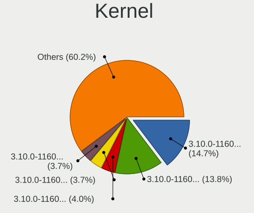

| Version                      | Desktops | Percent |
|------------------------------|----------|---------|
| 3.10.0-1160.114.2.el7.x86_64 | 48       | 14.68%  |
| 3.10.0-1160.102.1.el7.x86_64 | 45       | 13.76%  |
| 3.10.0-1160.45.1.el7.x86_64  | 13       | 3.98%   |
| 3.10.0-1160.90.1.el7.x86_64  | 12       | 3.67%   |
| 3.10.0-1160.31.1.el7.x86_64  | 12       | 3.67%   |
| 3.10.0-1160.25.1.el7.x86_64  | 9        | 2.75%   |
| 3.10.0-1160.95.1.el7.x86_64  | 8        | 2.45%   |
| 3.10.0-1062.el7.x86_64       | 8        | 2.45%   |
| 3.10.0-1160.83.1.el7.x86_64  | 7        | 2.14%   |
| 3.10.0-957.10.1.el7.x86_64   | 6        | 1.83%   |
| 3.10.0-1160.76.1.el7.x86_64  | 6        | 1.83%   |
| 3.10.0-1160.66.1.el7.x86_64  | 6        | 1.83%   |
| 3.10.0-1160.15.2.el7.x86_64  | 6        | 1.83%   |
| 3.10.0-1062.12.1.el7.x86_64  | 6        | 1.83%   |
| 3.10.0-1160.el7.x86_64       | 5        | 1.53%   |
| 3.10.0-1160.6.1.el7.x86_64   | 5        | 1.53%   |
| 3.10.0-1160.36.2.el7.x86_64  | 5        | 1.53%   |
| 3.10.0-1160.119.1.el7.x86_64 | 5        | 1.53%   |
| 3.10.0-1062.9.1.el7.x86_64   | 5        | 1.53%   |
| 3.10.0-957.27.2.el7.x86_64   | 4        | 1.22%   |
| 3.10.0-1160.88.1.el7.x86_64  | 4        | 1.22%   |
| 3.10.0-1160.59.1.el7.x86_64  | 4        | 1.22%   |
| 3.10.0-1160.108.1.el7.x86_64 | 4        | 1.22%   |
| 3.10.0-1127.el7.x86_64       | 4        | 1.22%   |
| 3.10.0-957.5.1.el7.x86_64    | 3        | 0.92%   |
| 3.10.0-957.1.3.el7.x86_64    | 3        | 0.92%   |
| 3.10.0-1160.49.1.el7.x86_64  | 3        | 0.92%   |
| 3.10.0-1160.24.1.el7.x86_64  | 3        | 0.92%   |
| 3.10.0-1160.21.1.el7.x86_64  | 3        | 0.92%   |
| 3.10.0-1127.19.1.el7.x86_64  | 3        | 0.92%   |
| 3.10.0-1127.13.1.el7.x86_64  | 3        | 0.92%   |
| 3.10.0-957.el7.x86_64        | 2        | 0.61%   |
| 3.10.0-957.12.2.el7.x86_64   | 2        | 0.61%   |
| 3.10.0-693.21.1.el7.x86_64   | 2        | 0.61%   |
| 3.10.0-1160.81.1.el7.x86_64  | 2        | 0.61%   |
| 3.10.0-1160.71.1.el7.x86_64  | 2        | 0.61%   |
| 3.10.0-1160.62.1.el7.x86_64  | 2        | 0.61%   |
| 3.10.0-1160.53.1.el7.x86_64  | 2        | 0.61%   |
| 3.10.0-1160.11.1.el7.x86_64  | 2        | 0.61%   |
| 3.10.0-1160.105.1.el7.x86_64 | 2        | 0.61%   |

Kernel Family
-------------

Linux kernel without a distro release

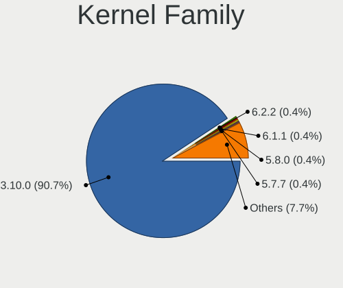

| Version  | Desktops | Percent |
|----------|----------|---------|
| 3.10.0   | 235      | 90.73%  |
| 6.2.2    | 1        | 0.39%   |
| 6.1.1    | 1        | 0.39%   |
| 5.8.0    | 1        | 0.39%   |
| 5.7.7    | 1        | 0.39%   |
| 5.7.10   | 1        | 0.39%   |
| 5.6.10   | 1        | 0.39%   |
| 5.5.0    | 1        | 0.39%   |
| 5.4.96   | 1        | 0.39%   |
| 5.4.234  | 1        | 0.39%   |
| 5.4.142  | 1        | 0.39%   |
| 5.4.119  | 1        | 0.39%   |
| 5.4.118  | 1        | 0.39%   |
| 5.4.113  | 1        | 0.39%   |
| 5.3.11   | 1        | 0.39%   |
| 5.15.163 | 1        | 0.39%   |
| 5.1.19   | 1        | 0.39%   |
| 4.9.188  | 1        | 0.39%   |
| 4.9.182  | 1        | 0.39%   |
| 4.9.180  | 1        | 0.39%   |
| 4.9.179  | 1        | 0.39%   |
| 4.4.229  | 1        | 0.39%   |
| 4.20.4   | 1        | 0.39%   |
| 4.19.187 | 1        | 0.39%   |
| 4.14.35  | 1        | 0.39%   |

Kernel Major Ver.
-----------------

Linux kernel major version

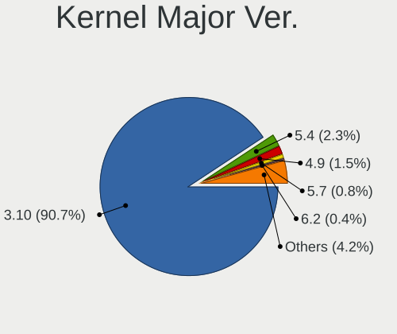

| Version | Desktops | Percent |
|---------|----------|---------|
| 3.10    | 235      | 90.73%  |
| 5.4     | 6        | 2.32%   |
| 4.9     | 4        | 1.54%   |
| 5.7     | 2        | 0.77%   |
| 6.2     | 1        | 0.39%   |
| 6.1     | 1        | 0.39%   |
| 5.8     | 1        | 0.39%   |
| 5.6     | 1        | 0.39%   |
| 5.5     | 1        | 0.39%   |
| 5.3     | 1        | 0.39%   |
| 5.15    | 1        | 0.39%   |
| 5.1     | 1        | 0.39%   |
| 4.4     | 1        | 0.39%   |
| 4.20    | 1        | 0.39%   |
| 4.19    | 1        | 0.39%   |
| 4.14    | 1        | 0.39%   |

Arch
----

OS architecture (x86_64, i586, etc.)

| Name   | Desktops | Percent |
|--------|----------|---------|
| x86_64 | 258      | 100%    |

DE
--

Desktop Environment

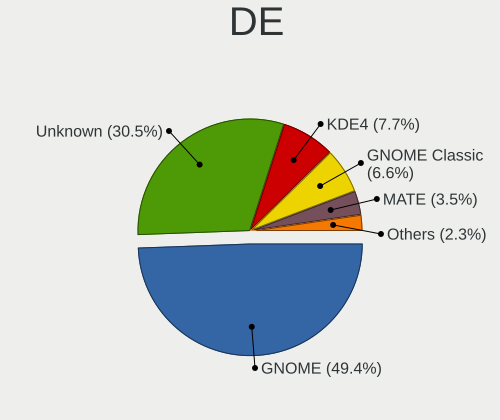

| Name          | Desktops | Percent |
|---------------|----------|---------|
| GNOME         | 128      | 49.42%  |
| Unknown       | 79       | 30.5%   |
| KDE4          | 20       | 7.72%   |
| GNOME Classic | 17       | 6.56%   |
| MATE          | 9        | 3.47%   |
| Cinnamon      | 3        | 1.16%   |
| Xpra          | 1        | 0.39%   |
| XFCE          | 1        | 0.39%   |
| X-Cinnamon    | 1        | 0.39%   |

Display Server
--------------

X11 or Wayland

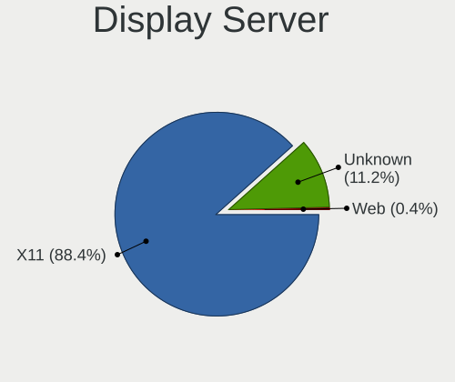

| Name    | Desktops | Percent |
|---------|----------|---------|
| X11     | 228      | 88.37%  |
| Unknown | 29       | 11.24%  |
| Web     | 1        | 0.39%   |

Display Manager
---------------

SDDM, LightDM, etc.

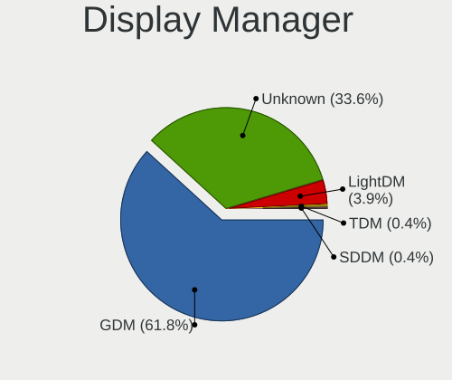

| Name    | Desktops | Percent |
|---------|----------|---------|
| GDM     | 160      | 61.78%  |
| Unknown | 87       | 33.59%  |
| LightDM | 10       | 3.86%   |
| TDM     | 1        | 0.39%   |
| SDDM    | 1        | 0.39%   |

OS Lang
-------

Language

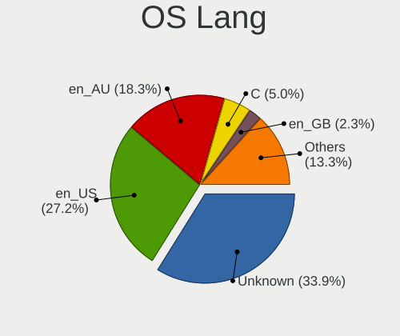

| Lang        | Desktops | Percent |
|-------------|----------|---------|
| Unknown     | 102      | 33.89%  |
| en_US       | 82       | 27.24%  |
| en_AU       | 55       | 18.27%  |
| C           | 15       | 4.98%   |
| en_GB       | 7        | 2.33%   |
| ru_RU       | 6        | 1.99%   |
| en_CA       | 5        | 1.66%   |
| fr_FR       | 4        | 1.33%   |
| en_IN       | 4        | 1.33%   |
| zh_CN       | 3        | 1%      |
| pt_BR       | 3        | 1%      |
| de_DE       | 3        | 1%      |
| de_AT       | 3        | 1%      |
| es_EC       | 2        | 0.66%   |
| pl_PL       | 1        | 0.33%   |
| ko_KR       | 1        | 0.33%   |
| fr_CA       | 1        | 0.33%   |
| fi_FI       | 1        | 0.33%   |
| es_MX       | 1        | 0.33%   |
| en_US.utf-8 | 1        | 0.33%   |
| en_SG       | 1        | 0.33%   |

Boot Mode
---------

EFI or BIOS

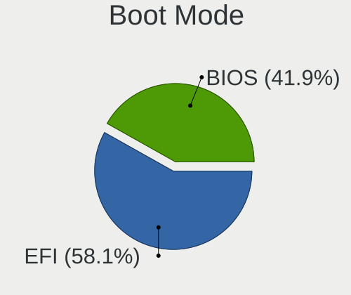

| Mode | Desktops | Percent |
|------|----------|---------|
| EFI  | 150      | 58.14%  |
| BIOS | 108      | 41.86%  |

Filesystem
----------

Type of filesystem

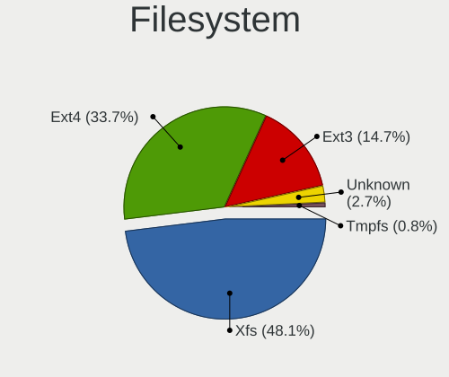

| Type    | Desktops | Percent |
|---------|----------|---------|
| Xfs     | 124      | 48.06%  |
| Ext4    | 87       | 33.72%  |
| Ext3    | 38       | 14.73%  |
| Unknown | 7        | 2.71%   |
| Tmpfs   | 2        | 0.78%   |

Part. scheme
------------

Scheme of partitioning

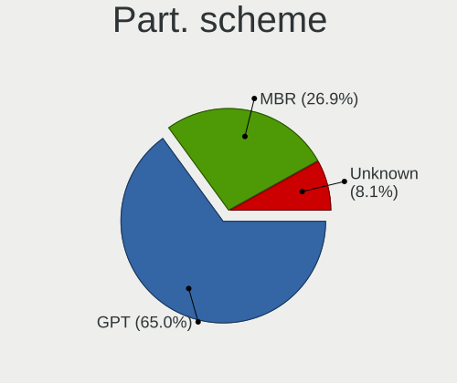

| Type    | Desktops | Percent |
|---------|----------|---------|
| GPT     | 169      | 65%     |
| MBR     | 70       | 26.92%  |
| Unknown | 21       | 8.08%   |

Dual Boot with Linux/BSD
------------------------

Hosting more than one Linux/BSD

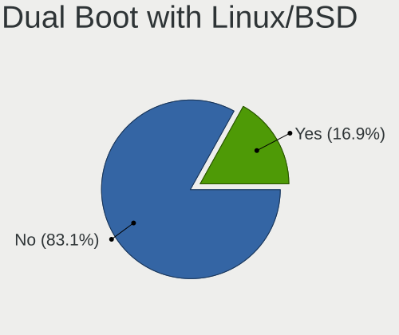

| Dual boot | Desktops | Percent |
|-----------|----------|---------|
| No        | 216      | 83.08%  |
| Yes       | 44       | 16.92%  |

Dual Boot (Win)
---------------

Hosting Linux and Windows

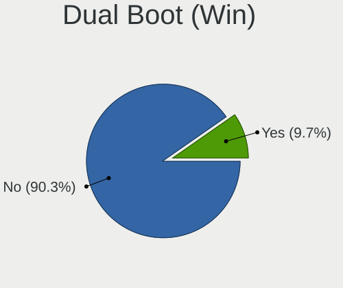

| Dual boot | Desktops | Percent |
|-----------|----------|---------|
| No        | 233      | 90.31%  |
| Yes       | 25       | 9.69%   |

Board
-----

Vendor
------

Motherboard manufacturer

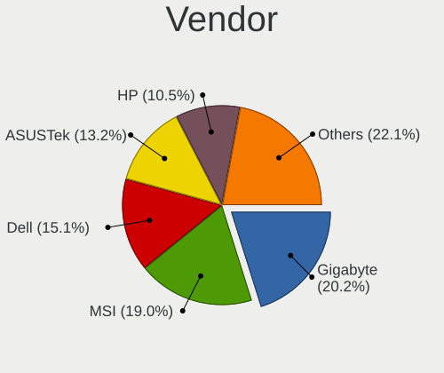

| Name                | Desktops | Percent |
|---------------------|----------|---------|
| Gigabyte Technology | 52       | 20.16%  |
| MSI                 | 49       | 18.99%  |
| Dell                | 39       | 15.12%  |
| ASUSTek Computer    | 34       | 13.18%  |
| Hewlett-Packard     | 27       | 10.47%  |
| Supermicro          | 9        | 3.49%   |
| ASRock              | 7        | 2.71%   |
| Intel               | 6        | 2.33%   |
| Unknown             | 6        | 2.33%   |
| Lenovo              | 3        | 1.16%   |
| ASRockRack          | 3        | 1.16%   |
| MiTAC               | 2        | 0.78%   |
| Huanan              | 2        | 0.78%   |
| Fujitsu             | 2        | 0.78%   |
| ECS                 | 2        | 0.78%   |
| AMI                 | 2        | 0.78%   |
| Zenith              | 1        | 0.39%   |
| PCChips             | 1        | 0.39%   |
| OEM                 | 1        | 0.39%   |
| NORCO               | 1        | 0.39%   |
| MAXSUN              | 1        | 0.39%   |
| Foxconn             | 1        | 0.39%   |
| eMachines           | 1        | 0.39%   |
| Cisco Systems       | 1        | 0.39%   |
| Biostar             | 1        | 0.39%   |
| AZW                 | 1        | 0.39%   |
| AEWIN               | 1        | 0.39%   |
| ABIT                | 1        | 0.39%   |
| AAEON               | 1        | 0.39%   |

Model
-----

Motherboard model

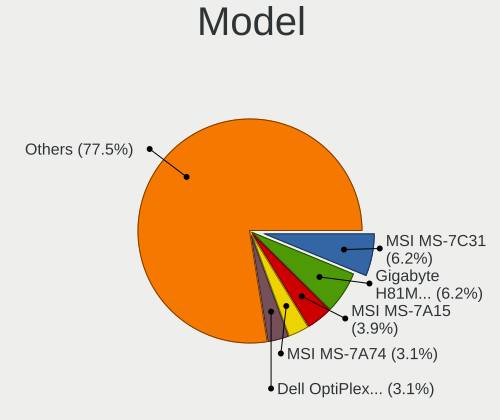

| Name                               | Desktops | Percent |
|------------------------------------|----------|---------|
| MSI MS-7C31                        | 16       | 6.2%    |
| Gigabyte H81M-S2H                  | 16       | 6.2%    |
| MSI MS-7A15                        | 10       | 3.88%   |
| MSI MS-7A74                        | 8        | 3.1%    |
| Dell OptiPlex 7040                 | 8        | 3.1%    |
| MSI MS-7B53                        | 7        | 2.71%   |
| Dell OptiPlex 9020                 | 7        | 2.71%   |
| Unknown                            | 6        | 2.33%   |
| ASUS H110M-K                       | 5        | 1.94%   |
| Gigabyte H81M-S2PV                 | 4        | 1.55%   |
| Gigabyte H81M-DS2                  | 4        | 1.55%   |
| ASUS All Series                    | 4        | 1.55%   |
| HP Z800 Workstation                | 3        | 1.16%   |
| HP ProDesk 400 G7 Microtower PC    | 3        | 1.16%   |
| HP Compaq Elite 8300 SFF           | 3        | 1.16%   |
| Dell Precision WorkStation T3500   | 3        | 1.16%   |
| ASRockRack E3C242D4U2-2T           | 3        | 1.16%   |
| HP Z420 Workstation                | 2        | 0.78%   |
| Gigabyte GA-78LMT-USB3             | 2        | 0.78%   |
| Gigabyte B560M AORUS PRO           | 2        | 0.78%   |
| Gigabyte B360M-HD3                 | 2        | 0.78%   |
| Fujitsu D3401-H1                   | 2        | 0.78%   |
| Dell OptiPlex 7010                 | 2        | 0.78%   |
| ASUS M5A78L-M PLUS/USB3            | 2        | 0.78%   |
| Zenith Orion                       | 1        | 0.39%   |
| Supermicro X9DAi                   | 1        | 0.39%   |
| Supermicro X7DWE                   | 1        | 0.39%   |
| Supermicro X10DAi                  | 1        | 0.39%   |
| Supermicro SYS-E200-8D             | 1        | 0.39%   |
| Supermicro SYS-7048GR-TR           | 1        | 0.39%   |
| Supermicro SYS-6017B-MTF           | 1        | 0.39%   |
| Supermicro SYS-5038MD-H24TRF-OS012 | 1        | 0.39%   |
| Supermicro SYS-1028GR-TR           | 1        | 0.39%   |
| Supermicro H8DM8-2                 | 1        | 0.39%   |
| PCChips P49G                       | 1        | 0.39%   |
| OEM OEM                            | 1        | 0.39%   |
| NORCO BPC-7951                     | 1        | 0.39%   |
| MSI NY542AA-ABL s5220f             | 1        | 0.39%   |
| MSI MS-7D98                        | 1        | 0.39%   |
| MSI MS-7D23                        | 1        | 0.39%   |

Model Family
------------

Motherboard model prefix

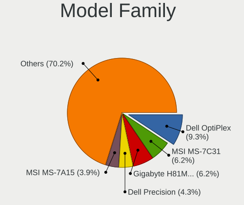

| Name                               | Desktops | Percent |
|------------------------------------|----------|---------|
| Dell OptiPlex                      | 24       | 9.3%    |
| MSI MS-7C31                        | 16       | 6.2%    |
| Gigabyte H81M-S2H                  | 16       | 6.2%    |
| Dell Precision                     | 11       | 4.26%   |
| MSI MS-7A15                        | 10       | 3.88%   |
| MSI MS-7A74                        | 8        | 3.1%    |
| MSI MS-7B53                        | 7        | 2.71%   |
| Unknown                            | 6        | 2.33%   |
| HP EliteDesk                       | 5        | 1.94%   |
| HP Compaq                          | 5        | 1.94%   |
| ASUS PRIME                         | 5        | 1.94%   |
| ASUS H110M-K                       | 5        | 1.94%   |
| Gigabyte H81M-S2PV                 | 4        | 1.55%   |
| Gigabyte H81M-DS2                  | 4        | 1.55%   |
| ASUS M5A78L-M                      | 4        | 1.55%   |
| ASUS All                           | 4        | 1.55%   |
| HP Z800                            | 3        | 1.16%   |
| HP ProDesk                         | 3        | 1.16%   |
| ASRockRack E3C242D4U2-2T           | 3        | 1.16%   |
| HP Z420                            | 2        | 0.78%   |
| Gigabyte GA-78LMT-USB3             | 2        | 0.78%   |
| Gigabyte B560M                     | 2        | 0.78%   |
| Gigabyte B360M-HD3                 | 2        | 0.78%   |
| Gigabyte B360                      | 2        | 0.78%   |
| Fujitsu D3401-H1                   | 2        | 0.78%   |
| Dell Inspiron                      | 2        | 0.78%   |
| ASUS ROG                           | 2        | 0.78%   |
| Zenith Orion                       | 1        | 0.39%   |
| Supermicro X9DAi                   | 1        | 0.39%   |
| Supermicro X7DWE                   | 1        | 0.39%   |
| Supermicro X10DAi                  | 1        | 0.39%   |
| Supermicro SYS-E200-8D             | 1        | 0.39%   |
| Supermicro SYS-7048GR-TR           | 1        | 0.39%   |
| Supermicro SYS-6017B-MTF           | 1        | 0.39%   |
| Supermicro SYS-5038MD-H24TRF-OS012 | 1        | 0.39%   |
| Supermicro SYS-1028GR-TR           | 1        | 0.39%   |
| Supermicro H8DM8-2                 | 1        | 0.39%   |
| PCChips P49G                       | 1        | 0.39%   |
| OEM OEM                            | 1        | 0.39%   |
| NORCO BPC-7951                     | 1        | 0.39%   |

MFG Year
--------

Motherboard manufacture year

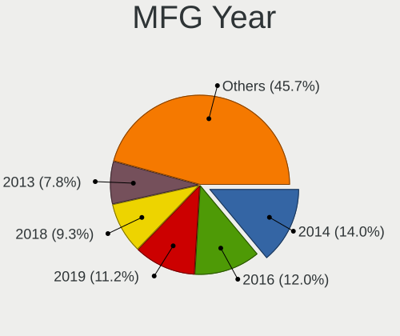

| Year    | Desktops | Percent |
|---------|----------|---------|
| 2014    | 36       | 13.95%  |
| 2016    | 31       | 12.02%  |
| 2019    | 29       | 11.24%  |
| 2018    | 24       | 9.3%    |
| 2013    | 20       | 7.75%   |
| 2015    | 18       | 6.98%   |
| 2012    | 18       | 6.98%   |
| 2017    | 16       | 6.2%    |
| 2011    | 13       | 5.04%   |
| 2010    | 13       | 5.04%   |
| 2021    | 12       | 4.65%   |
| 2008    | 9        | 3.49%   |
| 2020    | 7        | 2.71%   |
| 2009    | 7        | 2.71%   |
| Unknown | 2        | 0.78%   |
| 2025    | 1        | 0.39%   |
| 2024    | 1        | 0.39%   |
| 2023    | 1        | 0.39%   |

Form Factor
-----------

Physical design of the computer

| Name    | Desktops | Percent |
|---------|----------|---------|
| Desktop | 258      | 100%    |

Secure Boot
-----------

Enabled or disabled

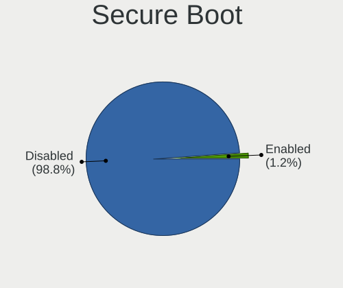

| State    | Desktops | Percent |
|----------|----------|---------|
| Disabled | 255      | 98.84%  |
| Enabled  | 3        | 1.16%   |

Coreboot
--------

Have coreboot on board

| Used | Desktops | Percent |
|------|----------|---------|
| No   | 257      | 99.61%  |
| Yes  | 1        | 0.39%   |

RAM Size
--------

Total RAM memory

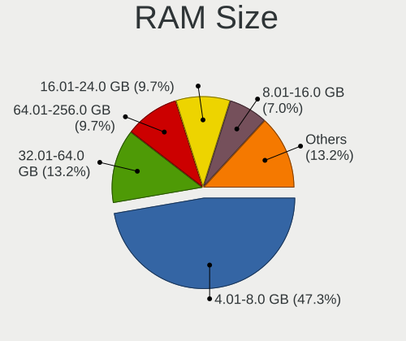

| Size in GB      | Desktops | Percent |
|-----------------|----------|---------|
| 4.01-8.0        | 122      | 47.29%  |
| 32.01-64.0      | 34       | 13.18%  |
| 64.01-256.0     | 25       | 9.69%   |
| 16.01-24.0      | 25       | 9.69%   |
| 8.01-16.0       | 18       | 6.98%   |
| 3.01-4.0        | 17       | 6.59%   |
| 1.01-2.0        | 9        | 3.49%   |
| 24.01-32.0      | 3        | 1.16%   |
| More than 256.0 | 2        | 0.78%   |
| 0.51-1.0        | 2        | 0.78%   |
| 2.01-3.0        | 1        | 0.39%   |

RAM Used
--------

Used RAM memory

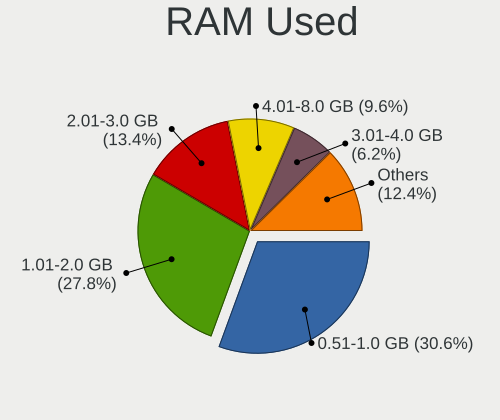

| Used GB     | Desktops | Percent |
|-------------|----------|---------|
| 0.51-1.0    | 89       | 30.58%  |
| 1.01-2.0    | 81       | 27.84%  |
| 2.01-3.0    | 39       | 13.4%   |
| 4.01-8.0    | 28       | 9.62%   |
| 3.01-4.0    | 18       | 6.19%   |
| 8.01-16.0   | 15       | 5.15%   |
| 0.01-0.5    | 12       | 4.12%   |
| 16.01-24.0  | 4        | 1.37%   |
| 24.01-32.0  | 3        | 1.03%   |
| 64.01-256.0 | 2        | 0.69%   |

Total Drives
------------

Number of drives on board

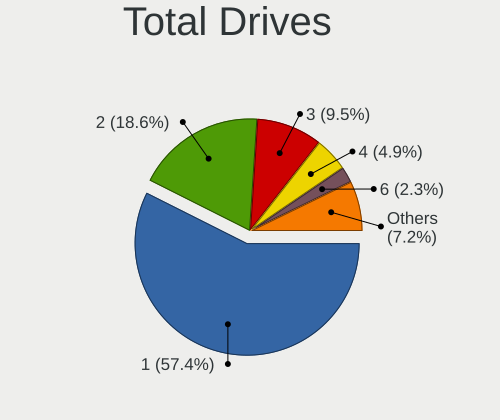

| Drives | Desktops | Percent |
|--------|----------|---------|
| 1      | 151      | 57.41%  |
| 2      | 49       | 18.63%  |
| 3      | 25       | 9.51%   |
| 4      | 13       | 4.94%   |
| 6      | 6        | 2.28%   |
| 5      | 5        | 1.9%    |
| 10     | 3        | 1.14%   |
| 0      | 3        | 1.14%   |
| 7      | 2        | 0.76%   |
| 71     | 1        | 0.38%   |
| 68     | 1        | 0.38%   |
| 26     | 1        | 0.38%   |
| 15     | 1        | 0.38%   |
| 12     | 1        | 0.38%   |
| 9      | 1        | 0.38%   |

Has CD-ROM
----------

Has CD-ROM on board

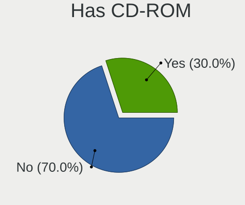

| Presented | Desktops | Percent |
|-----------|----------|---------|
| No        | 182      | 70%     |
| Yes       | 78       | 30%     |

Has Ethernet
------------

Has Ethernet on board

| Presented | Desktops | Percent |
|-----------|----------|---------|
| Yes       | 256      | 99.22%  |
| No        | 2        | 0.78%   |

Has WiFi
--------

Has WiFi module

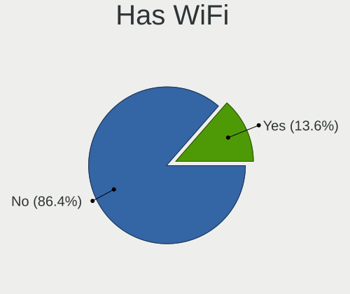

| Presented | Desktops | Percent |
|-----------|----------|---------|
| No        | 223      | 86.43%  |
| Yes       | 35       | 13.57%  |

Has Bluetooth
-------------

Has Bluetooth module

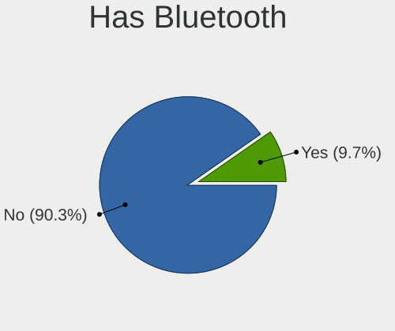

| Presented | Desktops | Percent |
|-----------|----------|---------|
| No        | 233      | 90.31%  |
| Yes       | 25       | 9.69%   |

Location
--------

Country
-------

Geographic location (country)

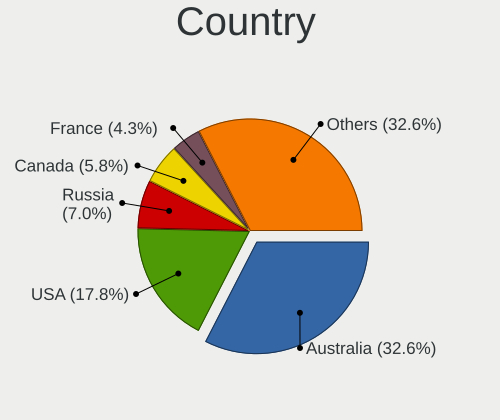

| Country      | Desktops | Percent |
|--------------|----------|---------|
| Australia    | 84       | 32.56%  |
| USA          | 46       | 17.83%  |
| Russia       | 18       | 6.98%   |
| Canada       | 15       | 5.81%   |
| France       | 11       | 4.26%   |
| UK           | 10       | 3.88%   |
| Brazil       | 10       | 3.88%   |
| India        | 8        | 3.1%    |
| Germany      | 8        | 3.1%    |
| China        | 8        | 3.1%    |
| Switzerland  | 3        | 1.16%   |
| South Korea  | 3        | 1.16%   |
| Finland      | 3        | 1.16%   |
| Ecuador      | 3        | 1.16%   |
| Spain        | 2        | 0.78%   |
| Israel       | 2        | 0.78%   |
| Czechia      | 2        | 0.78%   |
| Bulgaria     | 2        | 0.78%   |
| Belgium      | 2        | 0.78%   |
| Ukraine      | 1        | 0.39%   |
| Taiwan       | 1        | 0.39%   |
| Sweden       | 1        | 0.39%   |
| South Africa | 1        | 0.39%   |
| Singapore    | 1        | 0.39%   |
| Serbia       | 1        | 0.39%   |
| Romania      | 1        | 0.39%   |
| Portugal     | 1        | 0.39%   |
| Poland       | 1        | 0.39%   |
| Pakistan     | 1        | 0.39%   |
| Norway       | 1        | 0.39%   |
| Netherlands  | 1        | 0.39%   |
| Mexico       | 1        | 0.39%   |
| Malaysia     | 1        | 0.39%   |
| Japan        | 1        | 0.39%   |
| Italy        | 1        | 0.39%   |
| Hong Kong    | 1        | 0.39%   |
| Unknown      | 1        | 0.39%   |

City
----

Geographic location (city)

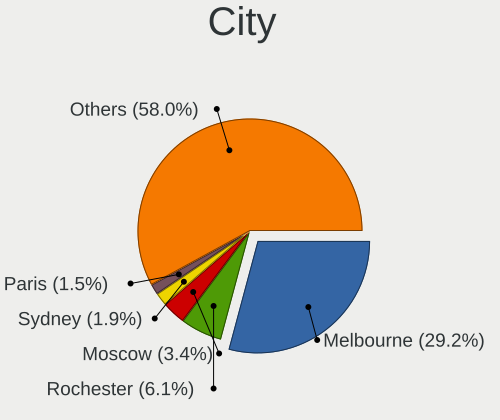

| City                 | Desktops | Percent |
|----------------------|----------|---------|
| Melbourne            | 77       | 29.17%  |
| Rochester            | 16       | 6.06%   |
| Moscow               | 9        | 3.41%   |
| Sydney               | 5        | 1.89%   |
| Paris                | 4        | 1.52%   |
| London               | 4        | 1.52%   |
| Guwahati             | 4        | 1.52%   |
| Frankfurt am Main    | 4        | 1.52%   |
| Alexandria           | 4        | 1.52%   |
| Victoria             | 3        | 1.14%   |
| Vancouver            | 3        | 1.14%   |
| St Petersburg        | 3        | 1.14%   |
| Montreal             | 3        | 1.14%   |
| Guayaquil            | 3        | 1.14%   |
| Wahroonga            | 2        | 0.76%   |
| Tampa                | 2        | 0.76%   |
| Shenzhen             | 2        | 0.76%   |
| Sao Paulo            | 2        | 0.76%   |
| Helsinki             | 2        | 0.76%   |
| Brno                 | 2        | 0.76%   |
| Brandon              | 2        | 0.76%   |
| Blanzy-la-Salonnaise | 2        | 0.76%   |
| Xuhui                | 1        | 0.38%   |
| Wheeling             | 1        | 0.38%   |
| Waxhaw               | 1        | 0.38%   |
| Varna                | 1        | 0.38%   |
| UniversitГЎrio     | 1        | 0.38%   |
| Tyumentsevo          | 1        | 0.38%   |
| Tyumen               | 1        | 0.38%   |
| Tuscaloosa           | 1        | 0.38%   |
| Tucson               | 1        | 0.38%   |
| Tours                | 1        | 0.38%   |
| Tokyo                | 1        | 0.38%   |
| Tharwa               | 1        | 0.38%   |
| Tel Aviv             | 1        | 0.38%   |
| Taishan              | 1        | 0.38%   |
| Surgut               | 1        | 0.38%   |
| Sundbyberg           | 1        | 0.38%   |
| Subang Jaya          | 1        | 0.38%   |
| St Andrews           | 1        | 0.38%   |

Drives
------

Drive Vendor
------------

Hard drive vendors

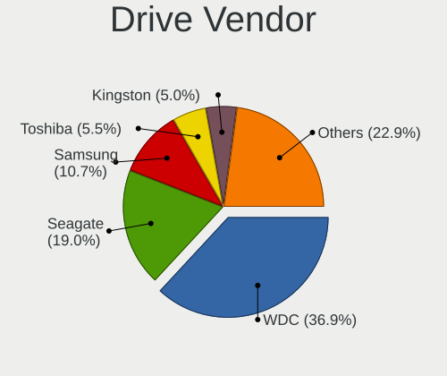

| Vendor                    | Desktops | Drives | Percent |
|---------------------------|----------|--------|---------|
| WDC                       | 134      | 231    | 36.91%  |
| Seagate                   | 69       | 258    | 19.01%  |
| Samsung Electronics       | 39       | 144    | 10.74%  |
| Toshiba                   | 20       | 28     | 5.51%   |
| Kingston                  | 18       | 23     | 4.96%   |
| Hitachi                   | 14       | 44     | 3.86%   |
| SanDisk                   | 10       | 13     | 2.75%   |
| Intel                     | 9        | 33     | 2.48%   |
| Unknown                   | 5        | 14     | 1.38%   |
| HGST                      | 5        | 71     | 1.38%   |
| SK hynix                  | 3        | 3      | 0.83%   |
| Crucial                   | 3        | 5      | 0.83%   |
| A-DATA Technology         | 3        | 4      | 0.83%   |
| SPCC                      | 2        | 2      | 0.55%   |
| OCZ                       | 2        | 6      | 0.55%   |
| Micron Technology         | 2        | 3      | 0.55%   |
| KingDian                  | 2        | 6      | 0.55%   |
| Hewlett-Packard           | 2        | 3      | 0.55%   |
| UNIC2                     | 1        | 1      | 0.28%   |
| Transcend                 | 1        | 1      | 0.28%   |
| Sun                       | 1        | 3      | 0.28%   |
| Phison Electronics        | 1        | 2      | 0.28%   |
| OWC                       | 1        | 1      | 0.28%   |
| NVMe                      | 1        | 1      | 0.28%   |
| NORCO                     | 1        | 1      | 0.28%   |
| Micron/Crucial Technology | 1        | 1      | 0.28%   |
| Maxtor                    | 1        | 1      | 0.28%   |
| LITEONIT                  | 1        | 1      | 0.28%   |
| Lexar                     | 1        | 1      | 0.28%   |
| Lenovo                    | 1        | 2      | 0.28%   |
| Kingston Technologies     | 1        | 1      | 0.28%   |
| KingSpec                  | 1        | 1      | 0.28%   |
| GLOWAY                    | 1        | 1      | 0.28%   |
| Gigabyte Technology       | 1        | 1      | 0.28%   |
| Fujitsu                   | 1        | 1      | 0.28%   |
| Corsair                   | 1        | 1      | 0.28%   |
| China                     | 1        | 1      | 0.28%   |
| BIWIN                     | 1        | 1      | 0.28%   |
| ADATA Technology          | 1        | 1      | 0.28%   |

Drive Model
-----------

Hard drive models

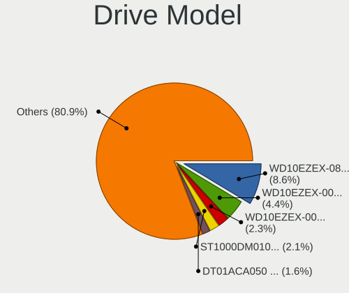

| Model                             | Desktops | Percent |
|-----------------------------------|----------|---------|
| WDC WD10EZEX-08WN4A0 1TB          | 37       | 8.62%   |
| WDC WD10EZEX-00MFCA0 1TB          | 19       | 4.43%   |
| WDC WD10EZEX-00WN4A0 1TB          | 10       | 2.33%   |
| Seagate ST1000DM010-2EP102 1TB    | 9        | 2.1%    |
| Toshiba DT01ACA050 500GB          | 7        | 1.63%   |
| Seagate ST500DM002-1BD142 500GB   | 7        | 1.63%   |
| Seagate ST500DM002-1SB10A 500GB   | 6        | 1.4%    |
| WDC WD10EZEX-75WN4A0 1TB          | 4        | 0.93%   |
| WDC WD10EZEX-60WN4A0 1TB          | 4        | 0.93%   |
| WDC WD10EZEX-22MFCA0 1TB          | 4        | 0.93%   |
| Toshiba DT01ACA100 1TB            | 4        | 0.93%   |
| Samsung SSD 860 EVO 250GB         | 4        | 0.93%   |
| WDC WD40EZAZ-00SF3B0 4TB          | 3        | 0.7%    |
| WDC WD10EZEX-00BBHA0 1TB          | 3        | 0.7%    |
| Seagate ST6000NM0095 6TB          | 3        | 0.7%    |
| Seagate ST6000NM0034 6TB          | 3        | 0.7%    |
| Seagate ST6000NM0014 6TB          | 3        | 0.7%    |
| Seagate ST4000NXCLAR4000 4TB      | 3        | 0.7%    |
| Seagate ST4000NM0023 4TB          | 3        | 0.7%    |
| WDC WDS250G2B0A-00SM50 250GB SSD  | 2        | 0.47%   |
| WDC WD3200AAKS-75L9A0 320GB       | 2        | 0.47%   |
| WDC WD30PURX-64P6ZY0 3TB          | 2        | 0.47%   |
| WDC WD30EZRX-00MMMB0 3TB          | 2        | 0.47%   |
| WDC WD10EZEX-00BN5A0 1TB          | 2        | 0.47%   |
| WDC WD10EADS-00L5B1 1TB           | 2        | 0.47%   |
| WDC WD1001FALS-00J7B1 1TB         | 2        | 0.47%   |
| Unknown HUH728080ALE601 8TB       | 2        | 0.47%   |
| Toshiba DT01ACA200 2TB            | 2        | 0.47%   |
| SK hynix SHGS31-500GS-2 500GB SSD | 2        | 0.47%   |
| Seagate ST4000VM000-2AF166 4TB    | 2        | 0.47%   |
| Seagate ST4000DM000-1F2168 4TB    | 2        | 0.47%   |
| Seagate ST3000NC002-1DY166 3TB    | 2        | 0.47%   |
| Seagate ST2000DM006-2DM164 2TB    | 2        | 0.47%   |
| Seagate ST2000DM001-1CH164 2TB    | 2        | 0.47%   |
| Seagate ST16000NM001G-2KK103 16TB | 2        | 0.47%   |
| Seagate ST1000DM003-1CH162 1TB    | 2        | 0.47%   |
| SanDisk WDC WDS100T2B0C 1TB       | 2        | 0.47%   |
| SanDisk WDC CL SN720 SDA 512GB    | 2        | 0.47%   |
| Samsung SSD 850 EVO 250GB         | 2        | 0.47%   |
| Samsung HD322HJ 320GB             | 2        | 0.47%   |

HDD Vendor
----------

Hard disk drive vendors

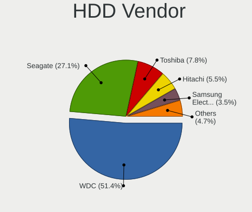

| Vendor              | Desktops | Drives | Percent |
|---------------------|----------|--------|---------|
| WDC                 | 131      | 221    | 51.37%  |
| Seagate             | 69       | 257    | 27.06%  |
| Toshiba             | 20       | 28     | 7.84%   |
| Hitachi             | 14       | 44     | 5.49%   |
| Samsung Electronics | 9        | 106    | 3.53%   |
| HGST                | 5        | 24     | 1.96%   |
| Unknown             | 2        | 11     | 0.78%   |
| Sun                 | 1        | 3      | 0.39%   |
| Maxtor              | 1        | 1      | 0.39%   |
| Lenovo              | 1        | 2      | 0.39%   |
| Hewlett-Packard     | 1        | 2      | 0.39%   |
| Fujitsu             | 1        | 1      | 0.39%   |

SSD Vendor
----------

Solid state drive vendors

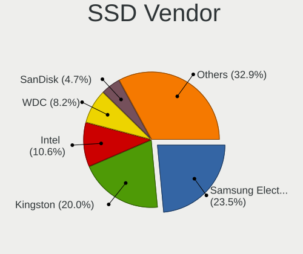

| Vendor              | Desktops | Drives | Percent |
|---------------------|----------|--------|---------|
| Samsung Electronics | 20       | 25     | 23.53%  |
| Kingston            | 17       | 22     | 20%     |
| Intel               | 9        | 32     | 10.59%  |
| WDC                 | 7        | 10     | 8.24%   |
| SanDisk             | 4        | 4      | 4.71%   |
| SK hynix            | 3        | 3      | 3.53%   |
| Crucial             | 3        | 5      | 3.53%   |
| A-DATA Technology   | 3        | 4      | 3.53%   |
| SPCC                | 2        | 2      | 2.35%   |
| OCZ                 | 2        | 6      | 2.35%   |
| KingDian            | 2        | 6      | 2.35%   |
| UNIC2               | 1        | 1      | 1.18%   |
| Transcend           | 1        | 1      | 1.18%   |
| Seagate             | 1        | 1      | 1.18%   |
| OWC                 | 1        | 1      | 1.18%   |
| NORCO               | 1        | 1      | 1.18%   |
| Micron Technology   | 1        | 2      | 1.18%   |
| LITEONIT            | 1        | 1      | 1.18%   |
| Lexar               | 1        | 1      | 1.18%   |
| Hewlett-Packard     | 1        | 1      | 1.18%   |
| GLOWAY              | 1        | 1      | 1.18%   |
| Corsair             | 1        | 1      | 1.18%   |
| China               | 1        | 1      | 1.18%   |
| BIWIN               | 1        | 1      | 1.18%   |

Drive Kind
----------

HDD or SSD

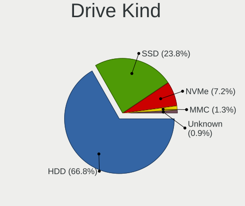

| Kind    | Desktops | Drives | Percent |
|---------|----------|--------|---------|
| HDD     | 213      | 700    | 66.77%  |
| SSD     | 76       | 133    | 23.82%  |
| NVMe    | 23       | 31     | 7.21%   |
| MMC     | 4        | 4      | 1.25%   |
| Unknown | 3        | 48     | 0.94%   |

Drive Connector
---------------

SATA, SAS, NVMe, etc.

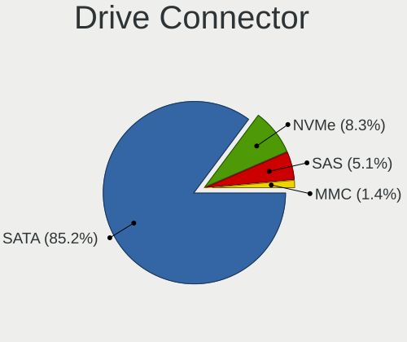

| Type | Desktops | Drives | Percent |
|------|----------|--------|---------|
| SATA | 236      | 660    | 85.2%   |
| NVMe | 23       | 31     | 8.3%    |
| SAS  | 14       | 221    | 5.05%   |
| MMC  | 4        | 4      | 1.44%   |

Drive Size
----------

Size of hard drive

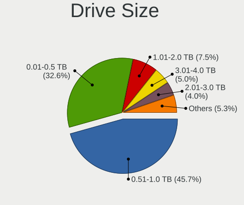

| Size in TB | Desktops | Drives | Percent |
|------------|----------|--------|---------|
| 0.51-1.0   | 147      | 219    | 45.65%  |
| 0.01-0.5   | 105      | 283    | 32.61%  |
| 1.01-2.0   | 24       | 65     | 7.45%   |
| 3.01-4.0   | 16       | 114    | 4.97%   |
| 2.01-3.0   | 13       | 28     | 4.04%   |
| 4.01-10.0  | 11       | 85     | 3.42%   |
| 10.01-20.0 | 6        | 39     | 1.86%   |

Space Total
-----------

Amount of disk space available on the file system

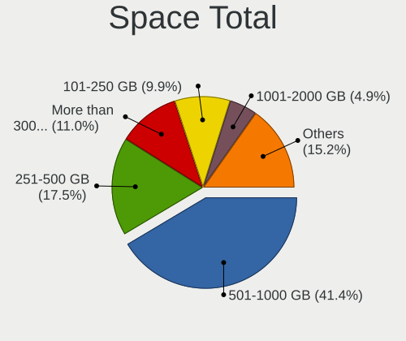

| Size in GB     | Desktops | Percent |
|----------------|----------|---------|
| 501-1000       | 109      | 41.44%  |
| 251-500        | 46       | 17.49%  |
| More than 3000 | 29       | 11.03%  |
| 101-250        | 26       | 9.89%   |
| 1001-2000      | 13       | 4.94%   |
| Unknown        | 11       | 4.18%   |
| 21-50          | 9        | 3.42%   |
| 2001-3000      | 8        | 3.04%   |
| 1-20           | 6        | 2.28%   |
| 51-100         | 6        | 2.28%   |

Space Used
----------

Amount of used disk space

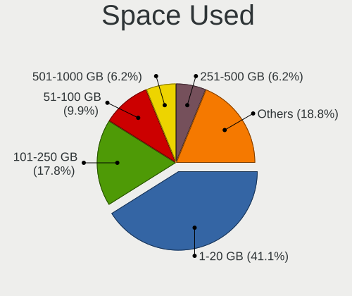

| Used GB        | Desktops | Percent |
|----------------|----------|---------|
| 1-20           | 120      | 41.1%   |
| 101-250        | 52       | 17.81%  |
| 51-100         | 29       | 9.93%   |
| 251-500        | 18       | 6.16%   |
| 21-50          | 18       | 6.16%   |
| 501-1000       | 18       | 6.16%   |
| More than 3000 | 17       | 5.82%   |
| Unknown        | 11       | 3.77%   |
| 1001-2000      | 5        | 1.71%   |
| 2001-3000      | 3        | 1.03%   |
| 0              | 1        | 0.34%   |

Malfunc. Drives
---------------

Drive models with a malfunction

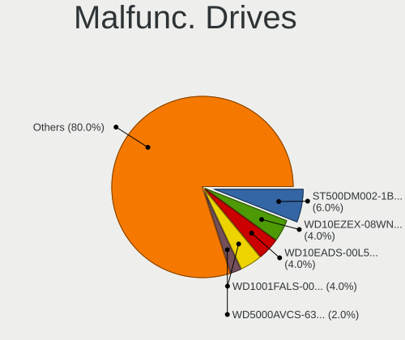

| Model                                       | Desktops | Drives | Percent |
|---------------------------------------------|----------|--------|---------|
| Seagate ST500DM002-1BD142 500GB             | 3        | 3      | 6%      |
| WDC WD10EZEX-08WN4A0 1TB                    | 2        | 3      | 4%      |
| WDC WD10EADS-00L5B1 1TB                     | 2        | 5      | 4%      |
| WDC WD1001FALS-00J7B1 1TB                   | 2        | 2      | 4%      |
| WDC WD5000AVCS-632DY1 500GB                 | 1        | 1      | 2%      |
| WDC WD5000AAKX-08U6AA0 500GB                | 1        | 1      | 2%      |
| WDC WD3200AAKS-75L9A0 320GB                 | 1        | 1      | 2%      |
| WDC WD30PURX-64P6ZY0 3TB                    | 1        | 1      | 2%      |
| WDC WD30EFRX-68EUZN0 3TB                    | 1        | 3      | 2%      |
| WDC WD2500HHTZ-04N21V0 250GB                | 1        | 1      | 2%      |
| WDC WD20EARX-00PASB0 2TB                    | 1        | 1      | 2%      |
| WDC WD20EARS-00MVWB0 2TB                    | 1        | 2      | 2%      |
| WDC WD10EZEX-60WN4A1 1TB                    | 1        | 1      | 2%      |
| WDC WD10EZEX-00RKKA0 1TB                    | 1        | 1      | 2%      |
| Seagate ST380211AS 80GB                     | 1        | 1      | 2%      |
| Seagate ST380013AS 80GB                     | 1        | 1      | 2%      |
| Seagate ST3250620NS 250GB                   | 1        | 2      | 2%      |
| Seagate ST31000524NS 1TB                    | 1        | 1      | 2%      |
| Seagate ST31000520AS 1TB                    | 1        | 1      | 2%      |
| Seagate ST31000340AS 1TB                    | 1        | 1      | 2%      |
| Seagate ST3000DM001-1ER166 3TB              | 1        | 1      | 2%      |
| Seagate ST3000DM001-1CH166 3TB              | 1        | 1      | 2%      |
| Seagate ST2000DM001-9YN164 2TB              | 1        | 1      | 2%      |
| Seagate ST2000DM001-1CH164 2TB              | 1        | 1      | 2%      |
| Seagate ST1000NX0313 1TB                    | 1        | 1      | 2%      |
| SanDisk SDSSDX240GG25 240GB                 | 1        | 1      | 2%      |
| Samsung Electronics SSD SM871 2.5 7mm 512GB | 1        | 1      | 2%      |
| Samsung Electronics SSD 870 EVO 500GB       | 1        | 3      | 2%      |
| Samsung Electronics HD154UI 1TB             | 1        | 1      | 2%      |
| Samsung Electronics HD103UI 1TB             | 1        | 1      | 2%      |
| Maxtor 6Y080L0 81GB                         | 1        | 1      | 2%      |
| LITEONIT LCT-256M3S 256GB SSD               | 1        | 1      | 2%      |
| Kingston SV100S264G 64GB SSD                | 1        | 1      | 2%      |
| Kingston SNS4151S316G 16GB SSD              | 1        | 1      | 2%      |
| Kingston SHFS37A120G 120GB SSD              | 1        | 1      | 2%      |
| Intel SSDSCKKW256G8 256GB                   | 1        | 1      | 2%      |
| Intel SSDSC2KG480G8 480GB                   | 1        | 2      | 2%      |
| Intel SSDSA2M120G2GC 120GB                  | 1        | 1      | 2%      |
| Intel SSDSA2M080G2LE 80GB                   | 1        | 19     | 2%      |
| Hitachi HTS542512K9A300 120GB               | 1        | 1      | 2%      |

Malfunc. Drive Vendor
---------------------

Vendors of faulty drives

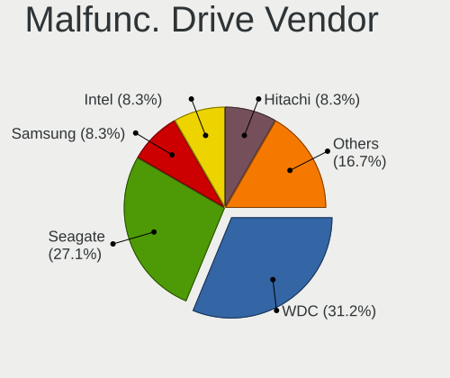

| Vendor              | Desktops | Drives | Percent |
|---------------------|----------|--------|---------|
| WDC                 | 15       | 23     | 31.25%  |
| Seagate             | 13       | 15     | 27.08%  |
| Samsung Electronics | 4        | 6      | 8.33%   |
| Intel               | 4        | 23     | 8.33%   |
| Hitachi             | 4        | 4      | 8.33%   |
| Kingston            | 3        | 3      | 6.25%   |
| SanDisk             | 1        | 1      | 2.08%   |
| Maxtor              | 1        | 1      | 2.08%   |
| LITEONIT            | 1        | 1      | 2.08%   |
| HGST                | 1        | 1      | 2.08%   |
| Crucial             | 1        | 1      | 2.08%   |

Malfunc. HDD Vendor
-------------------

Vendors of faulty HDD drives

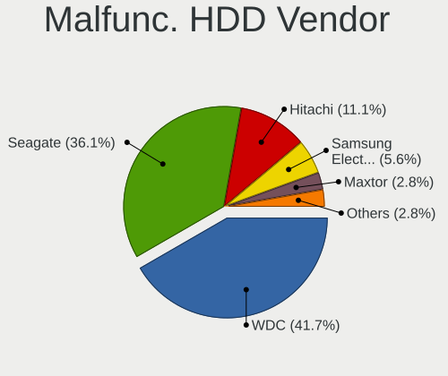

| Vendor              | Desktops | Drives | Percent |
|---------------------|----------|--------|---------|
| WDC                 | 15       | 23     | 41.67%  |
| Seagate             | 13       | 15     | 36.11%  |
| Hitachi             | 4        | 4      | 11.11%  |
| Samsung Electronics | 2        | 2      | 5.56%   |
| Maxtor              | 1        | 1      | 2.78%   |
| HGST                | 1        | 1      | 2.78%   |

Malfunc. Drive Kind
-------------------

Kinds of faulty drives

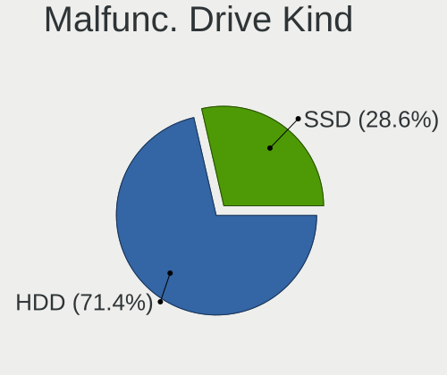

| Kind | Desktops | Drives | Percent |
|------|----------|--------|---------|
| HDD  | 30       | 46     | 71.43%  |
| SSD  | 12       | 33     | 28.57%  |

Failed Drives
-------------

Failed drive models

Zero info for selected period =(

Failed Drive Vendor
-------------------

Failed drive vendors

Zero info for selected period =(

Drive Status
------------

Number of failed and malfunc. drives

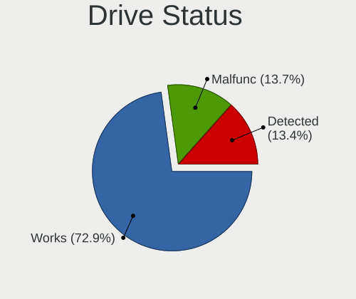

| Status   | Desktops | Drives | Percent |
|----------|----------|--------|---------|
| Works    | 212      | 570    | 72.85%  |
| Malfunc  | 40       | 79     | 13.75%  |
| Detected | 39       | 267    | 13.4%   |

Storage controller
------------------

Storage Vendor
--------------

Storage controller vendors

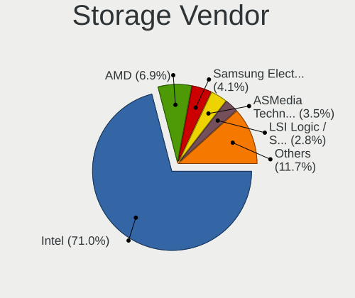

| Vendor                      | Desktops | Percent |
|-----------------------------|----------|---------|
| Intel                       | 225      | 70.98%  |
| AMD                         | 22       | 6.94%   |
| Samsung Electronics         | 13       | 4.1%    |
| ASMedia Technology          | 11       | 3.47%   |
| LSI Logic / Symbios Logic   | 9        | 2.84%   |
| SanDisk                     | 5        | 1.58%   |
| Marvell Technology Group    | 5        | 1.58%   |
| JMicron Technology          | 5        | 1.58%   |
| Broadcom / LSI              | 5        | 1.58%   |
| Adaptec                     | 5        | 1.58%   |
| Nvidia                      | 2        | 0.63%   |
| Kingston Technology Company | 2        | 0.63%   |
| VIA Technologies            | 1        | 0.32%   |
| SK hynix                    | 1        | 0.32%   |
| Silicon Image               | 1        | 0.32%   |
| Phison Electronics          | 1        | 0.32%   |
| Micron/Crucial Technology   | 1        | 0.32%   |
| Micron Technology           | 1        | 0.32%   |
| ADATA Technology            | 1        | 0.32%   |
| 3ware                       | 1        | 0.32%   |

Storage Model
-------------

Storage controller models

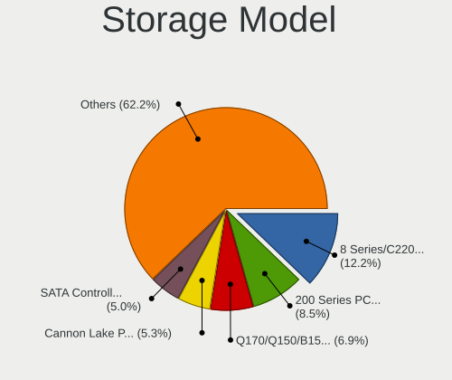

| Model                                                                                   | Desktops | Percent |
|-----------------------------------------------------------------------------------------|----------|---------|
| Intel 8 Series/C220 Series Chipset Family 6-port SATA Controller 1 [AHCI mode]          | 46       | 12.17%  |
| Intel 200 Series PCH SATA controller [AHCI mode]                                        | 32       | 8.47%   |
| Intel Q170/Q150/B150/H170/H110/Z170/CM236 Chipset SATA Controller [AHCI Mode]           | 26       | 6.88%   |
| Intel Cannon Lake PCH SATA AHCI Controller                                              | 20       | 5.29%   |
| Intel SATA Controller [RAID mode]                                                       | 19       | 5.03%   |
| AMD FCH SATA Controller [AHCI mode]                                                     | 10       | 2.65%   |
| Intel NM10/ICH7 Family SATA Controller [IDE mode]                                       | 9        | 2.38%   |
| ASMedia ASM1061/ASM1062 Serial ATA Controller                                           | 8        | 2.12%   |
| AMD SB7x0/SB8x0/SB9x0 IDE Controller                                                    | 8        | 2.12%   |
| Samsung NVMe SSD Controller SM981/PM981/PM983                                           | 7        | 1.85%   |
| Intel C600/X79 series chipset 6-Port SATA AHCI Controller                               | 7        | 1.85%   |
| Intel C610/X99 series chipset sSATA Controller [AHCI mode]                              | 6        | 1.59%   |
| Intel C610/X99 series chipset 6-Port SATA Controller [AHCI mode]                        | 6        | 1.59%   |
| Intel 82801G (ICH7 Family) IDE Controller                                               | 6        | 1.59%   |
| Intel 7 Series/C210 Series Chipset Family 6-port SATA Controller [AHCI mode]            | 6        | 1.59%   |
| Intel 6 Series/C200 Series Chipset Family Desktop SATA Controller (IDE mode, ports 4-5) | 6        | 1.59%   |
| Intel 6 Series/C200 Series Chipset Family Desktop SATA Controller (IDE mode, ports 0-3) | 6        | 1.59%   |
| Intel 500 Series Chipset Family SATA AHCI Controller                                    | 6        | 1.59%   |
| AMD SB7x0/SB8x0/SB9x0 SATA Controller [IDE mode]                                        | 6        | 1.59%   |
| Intel Comet Lake SATA AHCI Controller                                                   | 5        | 1.32%   |
| Intel C602 chipset 4-Port SATA Storage Control Unit                                     | 5        | 1.32%   |
| Intel 6 Series/C200 Series Chipset Family 6 port Desktop SATA AHCI Controller           | 5        | 1.32%   |
| Intel 82801JI (ICH10 Family) SATA AHCI Controller                                       | 4        | 1.06%   |
| LSI Logic / Symbios Logic SAS2008 PCI-Express Fusion-MPT SAS-2 [Falcon]                 | 3        | 0.79%   |
| LSI Logic / Symbios Logic SAS1068E PCI-Express Fusion-MPT SAS                           | 3        | 0.79%   |
| JMicron JMB363 SATA/IDE Controller                                                      | 3        | 0.79%   |
| Intel C600/X79 series chipset IDE-r Controller                                          | 3        | 0.79%   |
| Intel 9 Series Chipset Family SATA Controller [AHCI Mode]                               | 3        | 0.79%   |
| Intel 631xESB/632xESB IDE Controller                                                    | 3        | 0.79%   |
| AMD SB7x0/SB8x0/SB9x0 SATA Controller [AHCI mode]                                       | 3        | 0.79%   |
| AMD 400 Series Chipset SATA Controller                                                  | 3        | 0.79%   |
| Adaptec AAC-RAID                                                                        | 3        | 0.79%   |
| SanDisk Ultra 3D / WD PC SN530, IX SN530, Blue SN550 NVMe SSD (DRAM-less)               | 2        | 0.53%   |
| SanDisk Extreme Pro / WD Black 2018/SN750/PC SN720 NVMe SSD                             | 2        | 0.53%   |
| Samsung NVMe SSD Controller 980 (DRAM-less)                                             | 2        | 0.53%   |
| Marvell Group 88SE9235 PCIe 2.0 x2 4-port SATA 6 Gb/s Controller                        | 2        | 0.53%   |
| Intel NM10/ICH7 Family SATA Controller [AHCI mode]                                      | 2        | 0.53%   |
| Intel Atom/Celeron/Pentium Processor x5-E8000/J3xxx/N3xxx Series SATA Controller        | 2        | 0.53%   |
| Intel Alder Lake-S PCH SATA Controller [AHCI Mode]                                      | 2        | 0.53%   |
| Intel 631xESB/632xESB SATA RAID Controller                                              | 2        | 0.53%   |

Storage Kind
------------

Kind of storage controller (IDE, SATA, NVMe, SAS, ...)

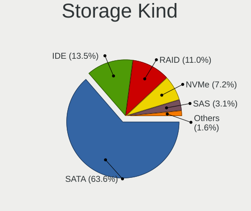

| Kind | Desktops | Percent |
|------|----------|---------|
| SATA | 203      | 63.64%  |
| IDE  | 43       | 13.48%  |
| RAID | 35       | 10.97%  |
| NVMe | 23       | 7.21%   |
| SAS  | 10       | 3.13%   |
| SCSI | 5        | 1.57%   |

Processor
---------

CPU Vendor
----------

Processor vendors

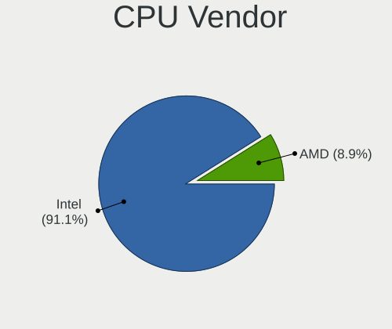

| Vendor | Desktops | Percent |
|--------|----------|---------|
| Intel  | 235      | 91.09%  |
| AMD    | 23       | 8.91%   |

CPU Model
---------

Processor models

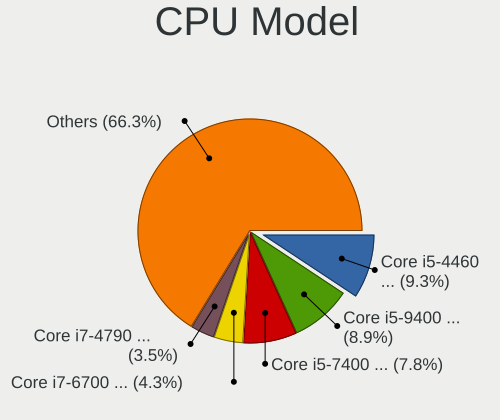

| Model                                | Desktops | Percent |
|--------------------------------------|----------|---------|
| Intel Core i5-4460 CPU @ 3.20GHz     | 24       | 9.3%    |
| Intel Core i5-9400 CPU @ 2.90GHz     | 23       | 8.91%   |
| Intel Core i5-7400 CPU @ 3.00GHz     | 20       | 7.75%   |
| Intel Core i7-6700 CPU @ 3.40GHz     | 11       | 4.26%   |
| Intel Core i7-4790 CPU @ 3.60GHz     | 9        | 3.49%   |
| Intel Core i7-7700 CPU @ 3.60GHz     | 7        | 2.71%   |
| Intel Core i7-8700 CPU @ 3.20GHz     | 4        | 1.55%   |
| AMD FX-6300 Six-Core Processor       | 4        | 1.55%   |
| Intel Xeon E-2136 CPU @ 3.30GHz      | 3        | 1.16%   |
| Intel Core i5-3470 CPU @ 3.20GHz     | 3        | 1.16%   |
| Intel Core i5-10500 CPU @ 3.10GHz    | 3        | 1.16%   |
| Intel Core i5-10400 CPU @ 2.90GHz    | 3        | 1.16%   |
| Intel Core i3-4160 CPU @ 3.60GHz     | 3        | 1.16%   |
| Intel Core 2 Duo CPU E7500 @ 2.93GHz | 3        | 1.16%   |
| Intel Xeon CPU X5680 @ 3.33GHz       | 2        | 0.78%   |
| Intel Xeon CPU W3530 @ 2.80GHz       | 2        | 0.78%   |
| Intel Xeon CPU E5-1620 0 @ 3.60GHz   | 2        | 0.78%   |
| Intel Core i9-10900K CPU @ 3.70GHz   | 2        | 0.78%   |
| Intel Core i7-3770 CPU @ 3.40GHz     | 2        | 0.78%   |
| Intel Core i5-9500 CPU @ 3.00GHz     | 2        | 0.78%   |
| Intel Core i5-4590 CPU @ 3.30GHz     | 2        | 0.78%   |
| Intel Core i5-4570 CPU @ 3.20GHz     | 2        | 0.78%   |
| Intel Core i3-2120 CPU @ 3.30GHz     | 2        | 0.78%   |
| Intel Core i3-2100 CPU @ 3.10GHz     | 2        | 0.78%   |
| Intel Core 2 Duo CPU E7400 @ 2.80GHz | 2        | 0.78%   |
| Intel Atom x5-Z8350 CPU @ 1.44GHz    | 2        | 0.78%   |
| Intel Atom CPU D525 @ 1.80GHz        | 2        | 0.78%   |
| AMD Ryzen 5 1600 Six-Core Processor  | 2        | 0.78%   |
| AMD Phenom II X6 1090T Processor     | 2        | 0.78%   |
| Intel Xeon W-2155 CPU @ 3.30GHz      | 1        | 0.39%   |
| Intel Xeon W-2125 CPU @ 4.00GHz      | 1        | 0.39%   |
| Intel Xeon W-1290 CPU @ 3.20GHz      | 1        | 0.39%   |
| Intel Xeon CPU X5660 @ 2.80GHz       | 1        | 0.39%   |
| Intel Xeon CPU X5650 @ 2.67GHz       | 1        | 0.39%   |
| Intel Xeon CPU X5450 @ 3.00GHz       | 1        | 0.39%   |
| Intel Xeon CPU W3680 @ 3.33GHz       | 1        | 0.39%   |
| Intel Xeon CPU E5620 @ 2.40GHz       | 1        | 0.39%   |
| Intel Xeon CPU E5440 @ 2.83GHz       | 1        | 0.39%   |
| Intel Xeon CPU E5410 @ 2.33GHz       | 1        | 0.39%   |
| Intel Xeon CPU E5-2690 v4 @ 2.60GHz  | 1        | 0.39%   |

CPU Model Family
----------------

Processor model prefix

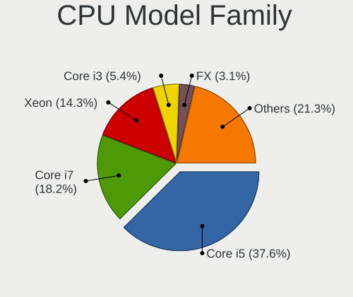

| Model                   | Desktops | Percent |
|-------------------------|----------|---------|
| Intel Core i5           | 97       | 37.6%   |
| Intel Core i7           | 47       | 18.22%  |
| Intel Xeon              | 37       | 14.34%  |
| Intel Core i3           | 14       | 5.43%   |
| AMD FX                  | 8        | 3.1%    |
| Intel Core 2 Duo        | 7        | 2.71%   |
| Intel Atom              | 7        | 2.71%   |
| Intel Core i9           | 6        | 2.33%   |
| Intel Pentium           | 5        | 1.94%   |
| Other                   | 4        | 1.55%   |
| Intel Pentium Dual-Core | 4        | 1.55%   |
| Intel Celeron           | 4        | 1.55%   |
| AMD Ryzen 5             | 4        | 1.55%   |
| Intel Core 2 Quad       | 2        | 0.78%   |
| AMD Phenom II X6        | 2        | 0.78%   |
| Intel Pentium Dual      | 1        | 0.39%   |
| AMD Ryzen Threadripper  | 1        | 0.39%   |
| AMD Ryzen 7             | 1        | 0.39%   |
| AMD Ryzen 3             | 1        | 0.39%   |
| AMD Quad-Core Opteron   | 1        | 0.39%   |
| AMD GX                  | 1        | 0.39%   |
| AMD E2                  | 1        | 0.39%   |
| AMD Athlon              | 1        | 0.39%   |
| AMD A8                  | 1        | 0.39%   |
| AMD A10                 | 1        | 0.39%   |

CPU Cores
---------

Number of processor cores

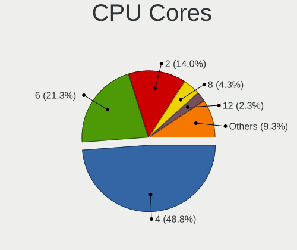

| Number | Desktops | Percent |
|--------|----------|---------|
| 4      | 126      | 48.84%  |
| 6      | 55       | 21.32%  |
| 2      | 36       | 13.95%  |
| 8      | 11       | 4.26%   |
| 12     | 6        | 2.33%   |
| 10     | 5        | 1.94%   |
| 3      | 5        | 1.94%   |
| 16     | 3        | 1.16%   |
| 1      | 3        | 1.16%   |
| 28     | 2        | 0.78%   |
| 24     | 2        | 0.78%   |
| 20     | 2        | 0.78%   |
| 18     | 1        | 0.39%   |
| 14     | 1        | 0.39%   |

CPU Sockets
-----------

Number of sockets

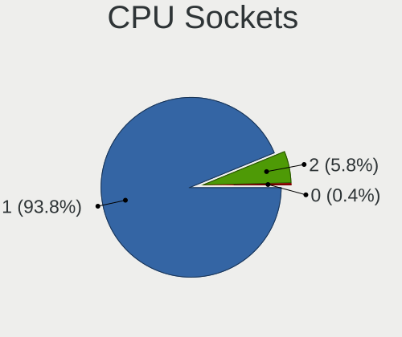

| Number | Desktops | Percent |
|--------|----------|---------|
| 1      | 242      | 93.8%   |
| 2      | 15       | 5.81%   |
| 0      | 1        | 0.39%   |

CPU Threads
-----------

Threads per core (Hyper-Threading)

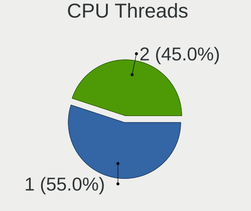

| Number | Desktops | Percent |
|--------|----------|---------|
| 1      | 142      | 55.04%  |
| 2      | 116      | 44.96%  |

CPU Op-Modes
------------

CPU Operation Modes (32-bit, 64-bit)

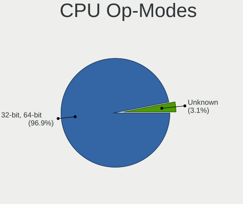

| Op mode        | Desktops | Percent |
|----------------|----------|---------|
| 32-bit, 64-bit | 250      | 96.9%   |
| Unknown        | 8        | 3.1%    |

CPU Microcode
-------------

Microcode number

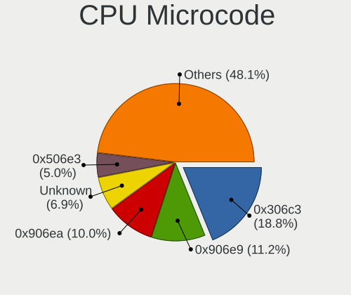

| Number     | Desktops | Percent |
|------------|----------|---------|
| 0x306c3    | 49       | 18.85%  |
| 0x906e9    | 29       | 11.15%  |
| 0x906ea    | 26       | 10%     |
| Unknown    | 18       | 6.92%   |
| 0x506e3    | 13       | 5%      |
| 0x206a7    | 11       | 4.23%   |
| 0x1067a    | 10       | 3.85%   |
| 0x306a9    | 8        | 3.08%   |
| 0xa0653    | 6        | 2.31%   |
| 0x906ec    | 6        | 2.31%   |
| 0x306f2    | 6        | 2.31%   |
| 0x206d7    | 6        | 2.31%   |
| 0xa0655    | 5        | 1.92%   |
| 0x906ed    | 5        | 1.92%   |
| 0x50654    | 5        | 1.92%   |
| 0x206c2    | 5        | 1.92%   |
| 0x06000852 | 5        | 1.92%   |
| 0x106ca    | 4        | 1.54%   |
| 0x406f1    | 3        | 1.15%   |
| 0x406c4    | 3        | 1.15%   |
| 0x406c3    | 2        | 0.77%   |
| 0x106e5    | 2        | 0.77%   |
| 0x106a5    | 2        | 0.77%   |
| 0x10676    | 2        | 0.77%   |
| 0x08701013 | 2        | 0.77%   |
| 0x08001137 | 2        | 0.77%   |
| 0x03000027 | 2        | 0.77%   |
| 0x010000dc | 2        | 0.77%   |
| 0xb0671    | 1        | 0.38%   |
| 0xa0671    | 1        | 0.38%   |
| 0x906eb    | 1        | 0.38%   |
| 0x906c0    | 1        | 0.38%   |
| 0x906a4    | 1        | 0.38%   |
| 0x90675    | 1        | 0.38%   |
| 0x90672    | 1        | 0.38%   |
| 0x6fd      | 1        | 0.38%   |
| 0x6fb      | 1        | 0.38%   |
| 0x506ca    | 1        | 0.38%   |
| 0x50663    | 1        | 0.38%   |
| 0x406e3    | 1        | 0.38%   |

CPU Microarch
-------------

Microarchitecture

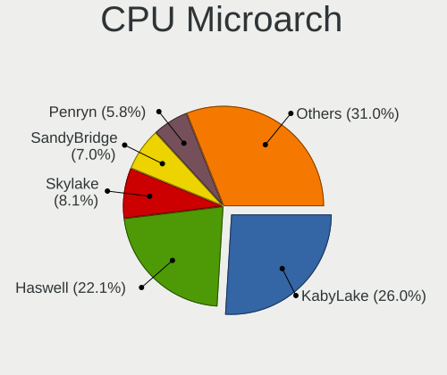

| Name             | Desktops | Percent |
|------------------|----------|---------|
| KabyLake         | 67       | 25.97%  |
| Haswell          | 57       | 22.09%  |
| Skylake          | 21       | 8.14%   |
| SandyBridge      | 18       | 6.98%   |
| Penryn           | 15       | 5.81%   |
| CometLake        | 11       | 4.26%   |
| IvyBridge        | 10       | 3.88%   |
| Piledriver       | 8        | 3.1%    |
| Broadwell        | 7        | 2.71%   |
| Westmere         | 6        | 2.33%   |
| Silvermont       | 6        | 2.33%   |
| Unknown          | 5        | 1.94%   |
| Nehalem          | 4        | 1.55%   |
| Bonnell          | 4        | 1.55%   |
| Zen 2            | 3        | 1.16%   |
| K10              | 3        | 1.16%   |
| Zen+             | 2        | 0.78%   |
| Zen              | 2        | 0.78%   |
| K10 Llano        | 2        | 0.78%   |
| Jaguar           | 2        | 0.78%   |
| Core             | 2        | 0.78%   |
| Goldmont         | 1        | 0.39%   |
| Bulldozer        | 1        | 0.39%   |
| Alderlake Hybrid | 1        | 0.39%   |

Graphics
--------

GPU Vendor
----------

Vendors of graphics cards

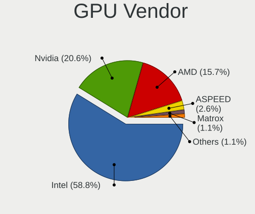

| Vendor                                       | Desktops | Percent |
|----------------------------------------------|----------|---------|
| Intel                                        | 157      | 58.8%   |
| Nvidia                                       | 55       | 20.6%   |
| AMD                                          | 42       | 15.73%  |
| ASPEED Technology                            | 7        | 2.62%   |
| Matrox Electronics Systems                   | 3        | 1.12%   |
| XGI Technology (eXtreme Graphics Innovation) | 2        | 0.75%   |
| Silicon Motion                               | 1        | 0.37%   |

GPU Model
---------

Graphics card models

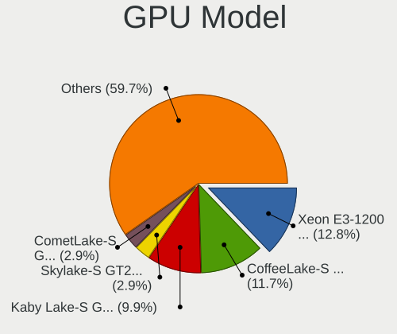

| Model                                                                                    | Desktops | Percent |
|------------------------------------------------------------------------------------------|----------|---------|
| Intel Xeon E3-1200 v3/4th Gen Core Processor Integrated Graphics Controller              | 35       | 12.82%  |
| Intel CoffeeLake-S GT2 [UHD Graphics 630]                                                | 32       | 11.72%  |
| Intel Kaby Lake-S GT2 [HD Graphics 630]                                                  | 27       | 9.89%   |
| Intel Skylake-S GT2 [HD Graphics 530]                                                    | 8        | 2.93%   |
| Intel CometLake-S GT2 [UHD Graphics 630]                                                 | 8        | 2.93%   |
| Intel 2nd Generation Core Processor Family Integrated Graphics Controller                | 8        | 2.93%   |
| AMD Oland XT [Radeon HD 8670 / R5 340X OEM / R7 250/350/350X OEM]                        | 8        | 2.93%   |
| ASPEED Technology ASPEED Graphics Family                                                 | 7        | 2.56%   |
| AMD Oland [Radeon HD 8570 / R5 430 OEM / R7 240/340 / Radeon 520 OEM]                    | 7        | 2.56%   |
| Intel Atom/Celeron/Pentium Processor x5-E8000/J3xxx/N3xxx Integrated Graphics Controller | 5        | 1.83%   |
| Nvidia GP107GL [Quadro P400]                                                             | 4        | 1.47%   |
| Nvidia GK208B [GeForce GT 710]                                                           | 4        | 1.47%   |
| Intel Xeon E3-1200 v2/3rd Gen Core processor Graphics Controller                         | 4        | 1.47%   |
| Intel Atom Processor D4xx/D5xx/N4xx/N5xx Integrated Graphics Controller                  | 4        | 1.47%   |
| Intel 82G33/G31 Express Integrated Graphics Controller                                   | 4        | 1.47%   |
| Intel 4 Series Chipset Integrated Graphics Controller                                    | 4        | 1.47%   |
| Nvidia GK104GL [Quadro K4200]                                                            | 3        | 1.1%    |
| Nvidia GF119 [GeForce GT 610]                                                            | 3        | 1.1%    |
| Intel 4th Generation Core Processor Family Integrated Graphics Controller                | 3        | 1.1%    |
| AMD RS780L [Radeon 3000]                                                                 | 3        | 1.1%    |
| AMD Ellesmere [Radeon RX 470/480/570/570X/580/580X/590]                                  | 3        | 1.1%    |
| Nvidia TU104 [GeForce RTX 2080 SUPER]                                                    | 2        | 0.73%   |
| Nvidia GT218 [GeForce 210]                                                               | 2        | 0.73%   |
| Nvidia GP107 [GeForce GTX 1050]                                                          | 2        | 0.73%   |
| Nvidia GP106GL [Quadro P2000]                                                            | 2        | 0.73%   |
| Nvidia GP104 [GeForce GTX 1080]                                                          | 2        | 0.73%   |
| Nvidia GM204GL [Quadro M4000]                                                            | 2        | 0.73%   |
| Intel IvyBridge GT2 [HD Graphics 4000]                                                   | 2        | 0.73%   |
| AMD Caicos XTX [Radeon HD 8490 / R5 235X OEM]                                            | 2        | 0.73%   |
| XGI Technology (eXtreme Graphics Innovation) Z9s/Z9m (XG21 core)                         | 1        | 0.37%   |
| XGI Technology (eXtreme Graphics Innovation) Z7/Z9 (XG20 core)                           | 1        | 0.37%   |
| Silicon Motion SM712 LynxEM+                                                             | 1        | 0.37%   |
| Nvidia TU117 [GeForce GTX 1650]                                                          | 1        | 0.37%   |
| Nvidia TU116 [GeForce GTX 1650 SUPER]                                                    | 1        | 0.37%   |
| Nvidia TU106 [GeForce RTX 2060 SUPER]                                                    | 1        | 0.37%   |
| Nvidia TU104 [GeForce RTX 2080]                                                          | 1        | 0.37%   |
| Nvidia TU102 [TITAN RTX]                                                                 | 1        | 0.37%   |
| Nvidia TU102 [GeForce RTX 2080 Ti]                                                       | 1        | 0.37%   |
| Nvidia GT218 [GeForce 8400 GS Rev. 3]                                                    | 1        | 0.37%   |
| Nvidia GT215 [GeForce GT 240]                                                            | 1        | 0.37%   |

GPU Combo
---------

Combinations of graphics cards

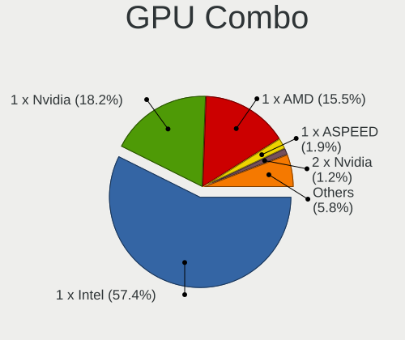

| Name                    | Desktops | Percent |
|-------------------------|----------|---------|
| 1 x Intel               | 148      | 57.36%  |
| 1 x Nvidia              | 47       | 18.22%  |
| 1 x AMD                 | 40       | 15.5%   |
| 1 x ASPEED              | 5        | 1.94%   |
| 2 x Nvidia              | 3        | 1.16%   |
| 1 x Matrox              | 3        | 1.16%   |
| Intel + Nvidia          | 3        | 1.16%   |
| Other                   | 2        | 0.78%   |
| 1 x XGI                 | 2        | 0.78%   |
| 3 x Nvidia + 1 x ASPEED | 1        | 0.39%   |
| 2 x AMD                 | 1        | 0.39%   |
| 1 x Silicon Motion      | 1        | 0.39%   |
| Nvidia + ASPEED         | 1        | 0.39%   |
| Intel + AMD             | 1        | 0.39%   |

GPU Driver
----------

Free vs proprietary

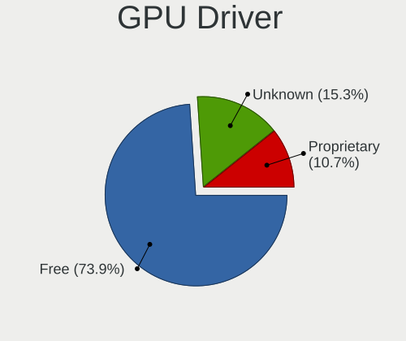

| Driver      | Desktops | Percent |
|-------------|----------|---------|
| Free        | 193      | 73.95%  |
| Unknown     | 40       | 15.33%  |
| Proprietary | 28       | 10.73%  |

GPU Memory
----------

Total video memory

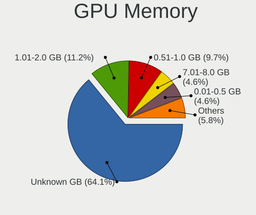

| Size in GB | Desktops | Percent |
|------------|----------|---------|
| Unknown    | 166      | 64.09%  |
| 1.01-2.0   | 29       | 11.2%   |
| 0.51-1.0   | 25       | 9.65%   |
| 7.01-8.0   | 12       | 4.63%   |
| 0.01-0.5   | 12       | 4.63%   |
| 3.01-4.0   | 9        | 3.47%   |
| 4.01-5.0   | 3        | 1.16%   |
| 5.01-6.0   | 1        | 0.39%   |
| 2.01-3.0   | 1        | 0.39%   |
| 16.01-24.0 | 1        | 0.39%   |

Monitor
-------

Monitor Vendor
--------------

Monitor vendors

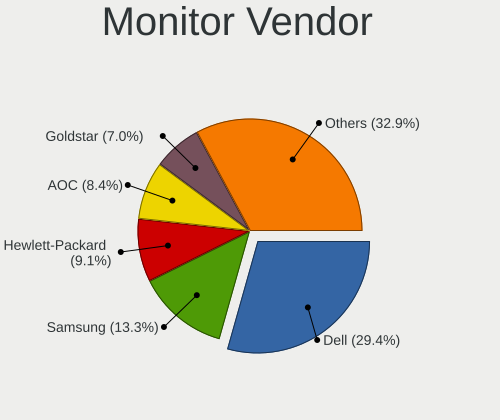

| Vendor                  | Desktops | Percent |
|-------------------------|----------|---------|
| Dell                    | 42       | 29.37%  |
| Samsung Electronics     | 19       | 13.29%  |
| Hewlett-Packard         | 13       | 9.09%   |
| AOC                     | 12       | 8.39%   |
| Goldstar                | 10       | 6.99%   |
| Philips                 | 8        | 5.59%   |
| Ancor Communications    | 7        | 4.9%    |
| Acer                    | 7        | 4.9%    |
| BenQ                    | 4        | 2.8%    |
| ___                     | 2        | 1.4%    |
| ViewSonic               | 2        | 1.4%    |
| Unknown                 | 2        | 1.4%    |
| NEC Computers           | 2        | 1.4%    |
| Eizo                    | 2        | 1.4%    |
| Toshiba                 | 1        | 0.7%    |
| Sceptre Tech            | 1        | 0.7%    |
| Packard Bell            | 1        | 0.7%    |
| NME                     | 1        | 0.7%    |
| LG Electronics          | 1        | 0.7%    |
| Lenovo                  | 1        | 0.7%    |
| Iiyama                  | 1        | 0.7%    |
| GVV                     | 1        | 0.7%    |
| Founder                 | 1        | 0.7%    |
| Chi Mei Optoelectronics | 1        | 0.7%    |
| AMW                     | 1        | 0.7%    |

Monitor Model
-------------

Monitor models

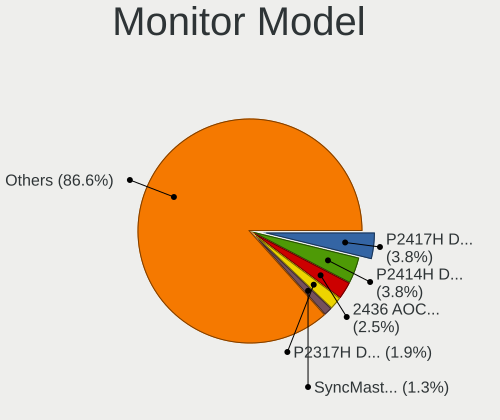

| Model                                                                | Desktops | Percent |
|----------------------------------------------------------------------|----------|---------|
| Dell P2417H DELA0DB 1920x1080 527x296mm 23.8-inch                    | 6        | 3.82%   |
| Dell P2414H DELA09A 1920x1080 527x297mm 23.8-inch                    | 6        | 3.82%   |
| AOC 2436 AOC2436 1920x1080 521x293mm 23.5-inch                       | 4        | 2.55%   |
| Dell P2317H DEL40F4 1920x1080 509x286mm 23.0-inch                    | 3        | 1.91%   |
| Samsung Electronics SyncMaster SAM01D3 1440x900 410x260mm 19.1-inch  | 2        | 1.27%   |
| Samsung Electronics S19C150 SAM0AE6 1366x768 410x230mm 18.5-inch     | 2        | 1.27%   |
| Hewlett-Packard ZR2440w HWP2956 1920x1200 520x320mm 24.0-inch        | 2        | 1.27%   |
| Dell U2412M DELA07A 1920x1200 518x324mm 24.1-inch                    | 2        | 1.27%   |
| Dell P2417H DELA0DA 1920x1080 527x296mm 23.8-inch                    | 2        | 1.27%   |
| BenQ GW2765 BNQ78D6 2560x1440 597x336mm 27.0-inch                    | 2        | 1.27%   |
| ___ LCD TV ___9000 1360x768                                          | 1        | 0.64%   |
| ___ LCD TV ___0101 1360x768                                          | 1        | 0.64%   |
| ViewSonic VA702 SERIES VSC231C 1280x1024 338x270mm 17.0-inch         | 1        | 0.64%   |
| ViewSonic VA2226w-3 VSC2051 1680x1050 490x290mm 22.4-inch            | 1        | 0.64%   |
| Unknown LCDTV16 9000 1360x768 1600x900mm 72.3-inch                   | 1        | 0.64%   |
| Unknown LCDTV16 0101 1920x1080 1600x900mm 72.3-inch                  | 1        | 0.64%   |
| Toshiba LCD Monitor 1 1 5" LCD000D 1024x768 304x228mm 15.0-inch      | 1        | 0.64%   |
| Sceptre Tech Sceptre F27 SPT0ABF 1920x1080 409x230mm 18.5-inch       | 1        | 0.64%   |
| Samsung Electronics U32R59x SAM0F96 3840x2160 697x392mm 31.5-inch    | 1        | 0.64%   |
| Samsung Electronics U32J59x SAM0F35 3840x2160 697x392mm 31.5-inch    | 1        | 0.64%   |
| Samsung Electronics U28E590 SAM0C4D 3840x2160 607x345mm 27.5-inch    | 1        | 0.64%   |
| Samsung Electronics SyncMaster SAM05C7 1920x1080 521x293mm 23.5-inch | 1        | 0.64%   |
| Samsung Electronics SyncMaster SAM04DD 1920x1080 477x268mm 21.5-inch | 1        | 0.64%   |
| Samsung Electronics SyncMaster SAM037C 1680x1050 474x296mm 22.0-inch | 1        | 0.64%   |
| Samsung Electronics SyncMaster SAM011E 1280x1024 338x270mm 17.0-inch | 1        | 0.64%   |
| Samsung Electronics SMBX2350 SAM071E 1920x1080 509x286mm 23.0-inch   | 1        | 0.64%   |
| Samsung Electronics SMB1930N SAM0632 1366x768 410x230mm 18.5-inch    | 1        | 0.64%   |
| Samsung Electronics S27E391 SAM0C16 1920x1080 598x336mm 27.0-inch    | 1        | 0.64%   |
| Samsung Electronics S22C300 SAM0A20 1920x1080 477x268mm 21.5-inch    | 1        | 0.64%   |
| Samsung Electronics S22C300 SAM0A1E 1920x1080 477x268mm 21.5-inch    | 1        | 0.64%   |
| Samsung Electronics S22C150 SAM0AE5 1920x1080 477x268mm 21.5-inch    | 1        | 0.64%   |
| Samsung Electronics S20B300 SAM08A7 1600x900 443x249mm 20.0-inch     | 1        | 0.64%   |
| Samsung Electronics LCD Monitor SyncMaster 1680x1080                 | 1        | 0.64%   |
| Samsung Electronics LCD Monitor C27F591 1440x900                     | 1        | 0.64%   |
| Samsung Electronics C24F390 SAM0D2D 1920x1080 521x293mm 23.5-inch    | 1        | 0.64%   |
| Philips PHL 284E5 PHLC0DE 1920x1080 621x341mm 27.9-inch              | 1        | 0.64%   |
| Philips PHL 246V5 PHLC0C5 1920x1080 531x299mm 24.0-inch              | 1        | 0.64%   |
| Philips PHL 243V5 PHLC0D1 1920x1080 521x293mm 23.5-inch              | 1        | 0.64%   |
| Philips PHL 241V8B PHLC314 1920x1080 527x296mm 23.8-inch             | 1        | 0.64%   |
| Philips PHL 223V7 PHLC154 1920x1080 476x268mm 21.5-inch              | 1        | 0.64%   |

Monitor Resolution
------------------

Monitor screen resolution

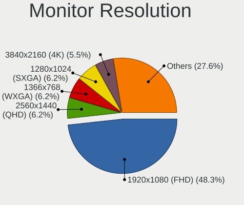

| Resolution         | Desktops | Percent |
|--------------------|----------|---------|
| 1920x1080 (FHD)    | 70       | 48.28%  |
| 2560x1440 (QHD)    | 9        | 6.21%   |
| 1366x768 (WXGA)    | 9        | 6.21%   |
| 1280x1024 (SXGA)   | 9        | 6.21%   |
| 3840x2160 (4K)     | 8        | 5.52%   |
| 1680x1050 (WSXGA+) | 8        | 5.52%   |
| 1920x1200 (WUXGA)  | 7        | 4.83%   |
| 1440x900 (WXGA+)   | 5        | 3.45%   |
| Unknown            | 5        | 3.45%   |
| 1600x900 (HD+)     | 3        | 2.07%   |
| 3840x1200          | 2        | 1.38%   |
| 3840x1080          | 2        | 1.38%   |
| 1600x1200          | 2        | 1.38%   |
| 1360x768           | 2        | 1.38%   |
| 1024x768 (XGA)     | 2        | 1.38%   |
| 5760x1080          | 1        | 0.69%   |
| 1680x1080          | 1        | 0.69%   |

Monitor Diagonal
----------------

Diagonal size in inches

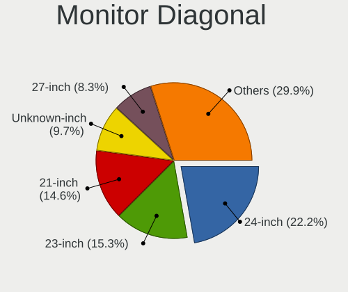

| Inches  | Desktops | Percent |
|---------|----------|---------|
| 24      | 32       | 22.22%  |
| 23      | 22       | 15.28%  |
| 21      | 21       | 14.58%  |
| Unknown | 14       | 9.72%   |
| 27      | 12       | 8.33%   |
| 22      | 7        | 4.86%   |
| 19      | 7        | 4.86%   |
| 18      | 7        | 4.86%   |
| 15      | 5        | 3.47%   |
| 20      | 4        | 2.78%   |
| 17      | 4        | 2.78%   |
| 72      | 2        | 1.39%   |
| 31      | 2        | 1.39%   |
| 42      | 1        | 0.69%   |
| 32      | 1        | 0.69%   |
| 26      | 1        | 0.69%   |
| 25      | 1        | 0.69%   |
| 16      | 1        | 0.69%   |

Monitor Width
-------------

Physical width

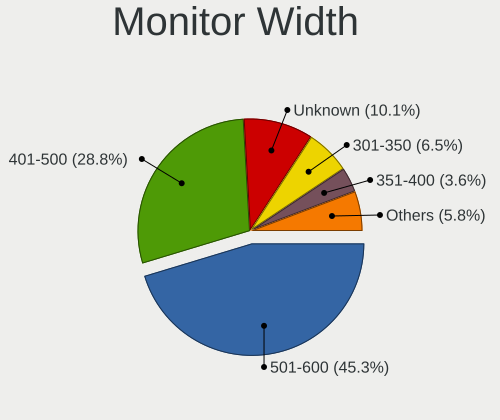

| Width in mm | Desktops | Percent |
|-------------|----------|---------|
| 501-600     | 63       | 45.32%  |
| 401-500     | 40       | 28.78%  |
| Unknown     | 14       | 10.07%  |
| 301-350     | 9        | 6.47%   |
| 351-400     | 5        | 3.6%    |
| 601-700     | 4        | 2.88%   |
| 1501-2000   | 2        | 1.44%   |
| 701-800     | 1        | 0.72%   |
| 901-1000    | 1        | 0.72%   |

Aspect Ratio
------------

Proportional relationship between the width and the height

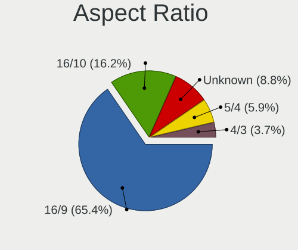

| Ratio   | Desktops | Percent |
|---------|----------|---------|
| 16/9    | 89       | 65.44%  |
| 16/10   | 22       | 16.18%  |
| Unknown | 12       | 8.82%   |
| 5/4     | 8        | 5.88%   |
| 4/3     | 5        | 3.68%   |

Monitor Area
------------

Area in inch²

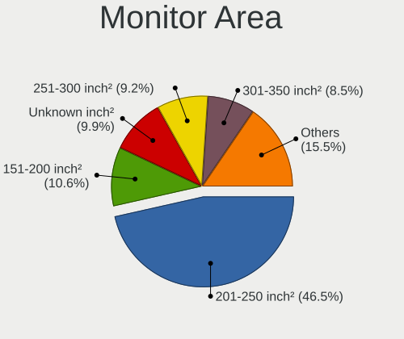

| Area in inch² | Desktops | Percent |
|----------------|----------|---------|
| 201-250        | 66       | 46.48%  |
| 151-200        | 15       | 10.56%  |
| Unknown        | 14       | 9.86%   |
| 251-300        | 13       | 9.15%   |
| 301-350        | 12       | 8.45%   |
| 141-150        | 10       | 7.04%   |
| 101-110        | 5        | 3.52%   |
| 351-500        | 3        | 2.11%   |
| More than 1000 | 2        | 1.41%   |
| 111-120        | 1        | 0.7%    |
| 501-1000       | 1        | 0.7%    |

Pixel Density
-------------

Pixels per inch

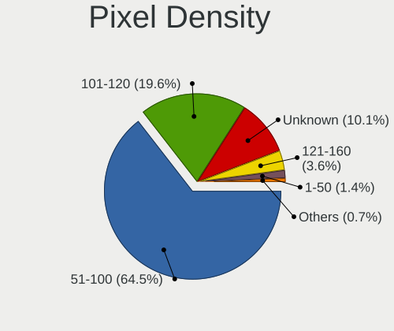

| Density | Desktops | Percent |
|---------|----------|---------|
| 51-100  | 89       | 64.49%  |
| 101-120 | 27       | 19.57%  |
| Unknown | 14       | 10.14%  |
| 121-160 | 5        | 3.62%   |
| 1-50    | 2        | 1.45%   |
| 161-240 | 1        | 0.72%   |

Multiple Monitors
-----------------

Total monitors connected

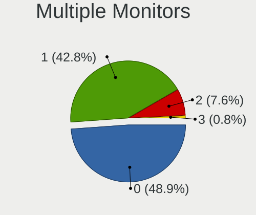

| Total | Desktops | Percent |
|-------|----------|---------|
| 0     | 129      | 48.86%  |
| 1     | 113      | 42.8%   |
| 2     | 20       | 7.58%   |
| 3     | 2        | 0.76%   |

Network
-------

Net Controller Vendor
---------------------

Controller vendors

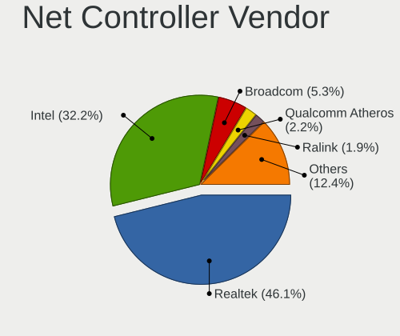

| Vendor                      | Desktops | Percent |
|-----------------------------|----------|---------|
| Realtek Semiconductor       | 149      | 46.13%  |
| Intel                       | 104      | 32.2%   |
| Broadcom                    | 17       | 5.26%   |
| Qualcomm Atheros            | 7        | 2.17%   |
| Ralink Technology           | 6        | 1.86%   |
| TP-Link                     | 5        | 1.55%   |
| D-Link System               | 3        | 0.93%   |
| Mellanox Technologies       | 2        | 0.62%   |
| Marvell Technology Group    | 2        | 0.62%   |
| Huawei Technologies         | 2        | 0.62%   |
| D-Link                      | 2        | 0.62%   |
| Broadcom Limited            | 2        | 0.62%   |
| Aquantia                    | 2        | 0.62%   |
| 3Com                        | 2        | 0.62%   |
| Xilinx                      | 1        | 0.31%   |
| Xiaomi                      | 1        | 0.31%   |
| VIA Technologies            | 1        | 0.31%   |
| Sierra Wireless             | 1        | 0.31%   |
| Samsung Electronics         | 1        | 0.31%   |
| Nvidia                      | 1        | 0.31%   |
| NetGear                     | 1        | 0.31%   |
| MYRICOM                     | 1        | 0.31%   |
| MediaTek                    | 1        | 0.31%   |
| LSI                         | 1        | 0.31%   |
| Linux 2.6.31.6 with s3c-udc | 1        | 0.31%   |
| Linksys                     | 1        | 0.31%   |
| ICS Advent                  | 1        | 0.31%   |
| Exar                        | 1        | 0.31%   |
| Dresden Elektronik          | 1        | 0.31%   |
| Cisco Systems               | 1        | 0.31%   |
| ASIX Electronics            | 1        | 0.31%   |
| Apple                       | 1        | 0.31%   |

Net Controller Model
--------------------

Controller models

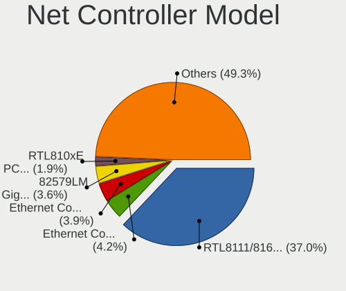

| Model                                                                          | Desktops | Percent |
|--------------------------------------------------------------------------------|----------|---------|
| Realtek RTL8111/8168/8211/8411 PCI Express Gigabit Ethernet Controller         | 133      | 37.05%  |
| Intel Ethernet Connection (2) I219-LM                                          | 15       | 4.18%   |
| Intel Ethernet Connection I217-LM                                              | 14       | 3.9%    |
| Intel 82579LM Gigabit Network Connection (Lewisville)                          | 13       | 3.62%   |
| Realtek RTL810xE PCI Express Fast Ethernet controller                          | 7        | 1.95%   |
| Intel I211 Gigabit Network Connection                                          | 7        | 1.95%   |
| Intel Ethernet Connection (2) I219-V                                           | 7        | 1.95%   |
| Intel I350 Gigabit Network Connection                                          | 6        | 1.67%   |
| Intel 82574L Gigabit Network Connection                                        | 6        | 1.67%   |
| Intel I210 Gigabit Network Connection                                          | 5        | 1.39%   |
| Intel Ethernet Connection (7) I219-LM                                          | 5        | 1.39%   |
| Intel Ethernet Connection (11) I219-LM                                         | 5        | 1.39%   |
| Broadcom NetXtreme BCM5761 Gigabit Ethernet PCIe                               | 5        | 1.39%   |
| Realtek RTL-8100/8101L/8139 PCI Fast Ethernet Adapter                          | 4        | 1.11%   |
| Intel Ethernet Connection (2) I218-V                                           | 4        | 1.11%   |
| Broadcom NetXtreme BCM5764M Gigabit Ethernet PCIe                              | 4        | 1.11%   |
| Realtek RTL8821CE 802.11ac PCIe Wireless Network Adapter                       | 3        | 0.84%   |
| Realtek RTL8169 PCI Gigabit Ethernet Controller                                | 3        | 0.84%   |
| Ralink MT7601U Wireless Adapter                                                | 3        | 0.84%   |
| Qualcomm Atheros AR8131 Gigabit Ethernet                                       | 3        | 0.84%   |
| Intel Ethernet Controller X550                                                 | 3        | 0.84%   |
| Intel Ethernet Controller I225-V                                               | 3        | 0.84%   |
| Intel 82580 Gigabit Network Connection                                         | 3        | 0.84%   |
| Realtek RTL8153 Gigabit Ethernet Adapter                                       | 2        | 0.56%   |
| Realtek RTL8125 2.5GbE Controller                                              | 2        | 0.56%   |
| Intel Dual Band Wireless-AC 3168NGW [Stone Peak]                               | 2        | 0.56%   |
| Intel 82599ES 10-Gigabit SFI/SFP+ Network Connection                           | 2        | 0.56%   |
| Intel 82579V Gigabit Network Connection                                        | 2        | 0.56%   |
| Broadcom NetXtreme BCM5755 Gigabit Ethernet PCI Express                        | 2        | 0.56%   |
| Broadcom BCM4360 802.11ac Dual Band Wireless Network Adapter                   | 2        | 0.56%   |
| Aquantia AQtion AQC107 NBase-T/IEEE 802.3an Ethernet Controller [Atlantic 10G] | 2        | 0.56%   |
| Xilinx Network controller                                                      | 1        | 0.28%   |
| Xiaomi Mi/Redmi series (RNDIS)                                                 | 1        | 0.28%   |
| VIA VT6105/VT6106S [Rhine-III]                                                 | 1        | 0.28%   |
| TP-Link TL-WN722N v2/v3 [Realtek RTL8188EUS]                                   | 1        | 0.28%   |
| TP-Link Archer T1U 802.11a/n/ac Wireless Adapter [MediaTek MT7610U]            | 1        | 0.28%   |
| TP-Link AC600 wireless Realtek RTL8811AU [Archer T2U Nano]                     | 1        | 0.28%   |
| TP-Link 802.11ac WLAN Adapter                                                  | 1        | 0.28%   |
| TP-Link 802.11ac NIC                                                           | 1        | 0.28%   |
| Sierra Wireless AirPrime MC7455 3G/4G LTE Modem                                | 1        | 0.28%   |

Wireless Vendor
---------------

Wireless vendors

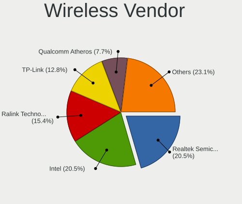

| Vendor                | Desktops | Percent |
|-----------------------|----------|---------|
| Realtek Semiconductor | 8        | 20.51%  |
| Intel                 | 8        | 20.51%  |
| Ralink Technology     | 6        | 15.38%  |
| TP-Link               | 5        | 12.82%  |
| Qualcomm Atheros      | 3        | 7.69%   |
| D-Link                | 2        | 5.13%   |
| Broadcom              | 2        | 5.13%   |
| Sierra Wireless       | 1        | 2.56%   |
| NetGear               | 1        | 2.56%   |
| MediaTek              | 1        | 2.56%   |
| Linksys               | 1        | 2.56%   |
| D-Link System         | 1        | 2.56%   |

Wireless Model
--------------

Wireless models

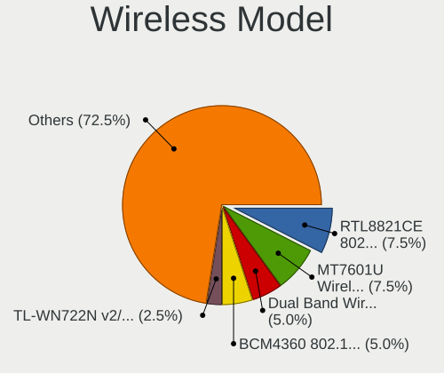

| Model                                                                | Desktops | Percent |
|----------------------------------------------------------------------|----------|---------|
| Realtek RTL8821CE 802.11ac PCIe Wireless Network Adapter             | 3        | 7.5%    |
| Ralink MT7601U Wireless Adapter                                      | 3        | 7.5%    |
| Intel Dual Band Wireless-AC 3168NGW [Stone Peak]                     | 2        | 5%      |
| Broadcom BCM4360 802.11ac Dual Band Wireless Network Adapter         | 2        | 5%      |
| TP-Link TL-WN722N v2/v3 [Realtek RTL8188EUS]                         | 1        | 2.5%    |
| TP-Link Archer T1U 802.11a/n/ac Wireless Adapter [MediaTek MT7610U]  | 1        | 2.5%    |
| TP-Link AC600 wireless Realtek RTL8811AU [Archer T2U Nano]           | 1        | 2.5%    |
| TP-Link 802.11ac WLAN Adapter                                        | 1        | 2.5%    |
| TP-Link 802.11ac NIC                                                 | 1        | 2.5%    |
| Sierra Wireless AirPrime MC7455 3G/4G LTE Modem                      | 1        | 2.5%    |
| Realtek RTL8723BE PCIe Wireless Network Adapter                      | 1        | 2.5%    |
| Realtek RTL8192CE PCIe Wireless Network Adapter                      | 1        | 2.5%    |
| Realtek RTL8188SU 802.11n WLAN Adapter                               | 1        | 2.5%    |
| Realtek RTL8188EUS 802.11n Wireless Network Adapter                  | 1        | 2.5%    |
| Realtek RTL8188CUS 802.11n WLAN Adapter                              | 1        | 2.5%    |
| Ralink RT5572 Wireless Adapter                                       | 1        | 2.5%    |
| Ralink RT5370 Wireless Adapter                                       | 1        | 2.5%    |
| Ralink RT2870/RT3070 Wireless Adapter                                | 1        | 2.5%    |
| Qualcomm Atheros QCA9565 / AR9565 Wireless Network Adapter           | 1        | 2.5%    |
| Qualcomm Atheros QCA9377 802.11ac Wireless Network Adapter           | 1        | 2.5%    |
| Qualcomm Atheros AR9462 Wireless Network Adapter                     | 1        | 2.5%    |
| NetGear A6150                                                        | 1        | 2.5%    |
| MediaTek MT7612U 802.11a/b/g/n/ac Wireless Adapter                   | 1        | 2.5%    |
| Linksys AE6000 802.11a/b/g/n/ac Wireless Adapter [MediaTek MT7610U]  | 1        | 2.5%    |
| Intel Wireless 7260                                                  | 1        | 2.5%    |
| Intel Wireless 3165                                                  | 1        | 2.5%    |
| Intel Wi-Fi 6E(802.11ax) AX210/AX1675* 2x2 [Typhoon Peak]            | 1        | 2.5%    |
| Intel Wi-Fi 6 AX200                                                  | 1        | 2.5%    |
| Intel Tiger Lake PCH CNVi WiFi                                       | 1        | 2.5%    |
| Intel 700 Series Chipset CNVi WiFi                                   | 1        | 2.5%    |
| D-Link System DWA-110 Wireless G Adapter(rev.A1) [Ralink RT2571W]    | 1        | 2.5%    |
| D-Link DWA-131 Wireless N Nano Adapter (Rev. E1) [Realtek RTL8192EU] | 1        | 2.5%    |
| D-Link D-Link DWA-160 Xtreme N Dual Band USB Adapter(rev.C1)         | 1        | 2.5%    |
| D-Link 802.11 n WLAN                                                 | 1        | 2.5%    |

Ethernet Vendor
---------------

Ethernet vendors

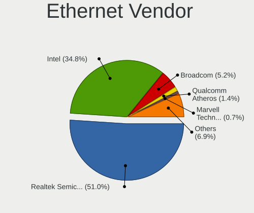

| Vendor                   | Desktops | Percent |
|--------------------------|----------|---------|
| Realtek Semiconductor    | 148      | 51.03%  |
| Intel                    | 101      | 34.83%  |
| Broadcom                 | 15       | 5.17%   |
| Qualcomm Atheros         | 4        | 1.38%   |
| Marvell Technology Group | 2        | 0.69%   |
| Huawei Technologies      | 2        | 0.69%   |
| D-Link System            | 2        | 0.69%   |
| Broadcom Limited         | 2        | 0.69%   |
| Aquantia                 | 2        | 0.69%   |
| 3Com                     | 2        | 0.69%   |
| Xiaomi                   | 1        | 0.34%   |
| VIA Technologies         | 1        | 0.34%   |
| Samsung Electronics      | 1        | 0.34%   |
| Nvidia                   | 1        | 0.34%   |
| MYRICOM                  | 1        | 0.34%   |
| Mellanox Technologies    | 1        | 0.34%   |
| ICS Advent               | 1        | 0.34%   |
| Cisco Systems            | 1        | 0.34%   |
| ASIX Electronics         | 1        | 0.34%   |
| Apple                    | 1        | 0.34%   |

Ethernet Model
--------------

Ethernet models

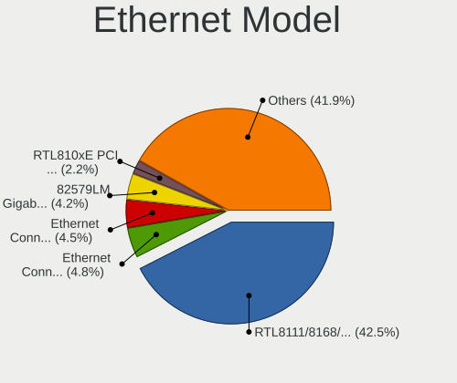

| Model                                                                          | Desktops | Percent |
|--------------------------------------------------------------------------------|----------|---------|
| Realtek RTL8111/8168/8211/8411 PCI Express Gigabit Ethernet Controller         | 133      | 42.49%  |
| Intel Ethernet Connection (2) I219-LM                                          | 15       | 4.79%   |
| Intel Ethernet Connection I217-LM                                              | 14       | 4.47%   |
| Intel 82579LM Gigabit Network Connection (Lewisville)                          | 13       | 4.15%   |
| Realtek RTL810xE PCI Express Fast Ethernet controller                          | 7        | 2.24%   |
| Intel I211 Gigabit Network Connection                                          | 7        | 2.24%   |
| Intel Ethernet Connection (2) I219-V                                           | 7        | 2.24%   |
| Intel I350 Gigabit Network Connection                                          | 6        | 1.92%   |
| Intel 82574L Gigabit Network Connection                                        | 6        | 1.92%   |
| Intel I210 Gigabit Network Connection                                          | 5        | 1.6%    |
| Intel Ethernet Connection (7) I219-LM                                          | 5        | 1.6%    |
| Intel Ethernet Connection (11) I219-LM                                         | 5        | 1.6%    |
| Broadcom NetXtreme BCM5761 Gigabit Ethernet PCIe                               | 5        | 1.6%    |
| Realtek RTL-8100/8101L/8139 PCI Fast Ethernet Adapter                          | 4        | 1.28%   |
| Intel Ethernet Connection (2) I218-V                                           | 4        | 1.28%   |
| Broadcom NetXtreme BCM5764M Gigabit Ethernet PCIe                              | 4        | 1.28%   |
| Realtek RTL8169 PCI Gigabit Ethernet Controller                                | 3        | 0.96%   |
| Qualcomm Atheros AR8131 Gigabit Ethernet                                       | 3        | 0.96%   |
| Intel Ethernet Controller X550                                                 | 3        | 0.96%   |
| Intel Ethernet Controller I225-V                                               | 3        | 0.96%   |
| Intel 82580 Gigabit Network Connection                                         | 3        | 0.96%   |
| Realtek RTL8153 Gigabit Ethernet Adapter                                       | 2        | 0.64%   |
| Realtek RTL8125 2.5GbE Controller                                              | 2        | 0.64%   |
| Intel 82599ES 10-Gigabit SFI/SFP+ Network Connection                           | 2        | 0.64%   |
| Intel 82579V Gigabit Network Connection                                        | 2        | 0.64%   |
| Broadcom NetXtreme BCM5755 Gigabit Ethernet PCI Express                        | 2        | 0.64%   |
| Aquantia AQtion AQC107 NBase-T/IEEE 802.3an Ethernet Controller [Atlantic 10G] | 2        | 0.64%   |
| Xiaomi Mi/Redmi series (RNDIS)                                                 | 1        | 0.32%   |
| VIA VT6105/VT6106S [Rhine-III]                                                 | 1        | 0.32%   |
| Samsung Galaxy series, misc. (tethering mode)                                  | 1        | 0.32%   |
| Realtek RTL-8110SC/8169SC Gigabit Ethernet                                     | 1        | 0.32%   |
| Realtek Killer E3000 2.5GbE Controller                                         | 1        | 0.32%   |
| Qualcomm Atheros AR8151 v2.0 Gigabit Ethernet                                  | 1        | 0.32%   |
| Nvidia MCP55 Ethernet                                                          | 1        | 0.32%   |
| MYRICOM Myri-10G Dual-Protocol NIC                                             | 1        | 0.32%   |
| Mellanox MT27520 Family [ConnectX-3 Pro]                                       | 1        | 0.32%   |
| Marvell Group Yukon Optima 88E8059 [PCIe Gigabit Ethernet Controller with AVB] | 1        | 0.32%   |
| Marvell Group 88E8039 PCI-E Fast Ethernet Controller                           | 1        | 0.32%   |
| Intel Ethernet Controller XXV710 for 25GbE SFP28                               | 1        | 0.32%   |
| Intel Ethernet Controller I226-LM                                              | 1        | 0.32%   |

Net Controller Kind
-------------------

Ethernet, WiFi or modem

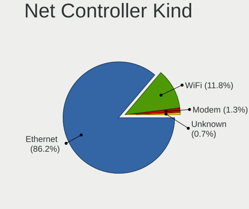

| Kind     | Desktops | Percent |
|----------|----------|---------|
| Ethernet | 256      | 86.2%   |
| WiFi     | 35       | 11.78%  |
| Modem    | 4        | 1.35%   |
| Unknown  | 2        | 0.67%   |

Used Controller
---------------

Currently used network controller

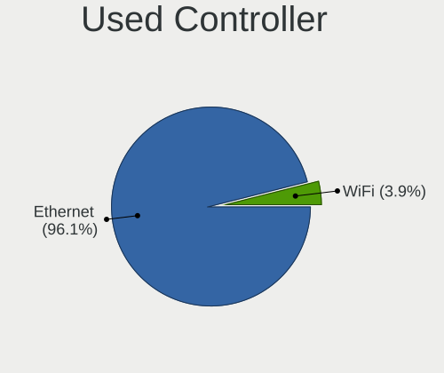

| Kind     | Desktops | Percent |
|----------|----------|---------|
| Ethernet | 244      | 96.06%  |
| WiFi     | 10       | 3.94%   |

NICs
----

Total network controllers on board

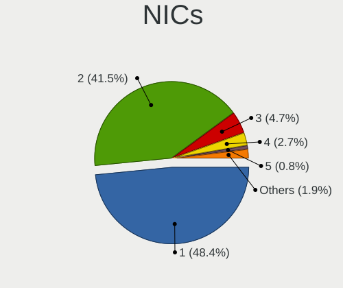

| Total | Desktops | Percent |
|-------|----------|---------|
| 1     | 125      | 48.45%  |
| 2     | 107      | 41.47%  |
| 3     | 12       | 4.65%   |
| 4     | 7        | 2.71%   |
| 5     | 2        | 0.78%   |
| 0     | 2        | 0.78%   |
| 14    | 1        | 0.39%   |
| 8     | 1        | 0.39%   |
| 6     | 1        | 0.39%   |

IPv6
----

IPv6 vs IPv4

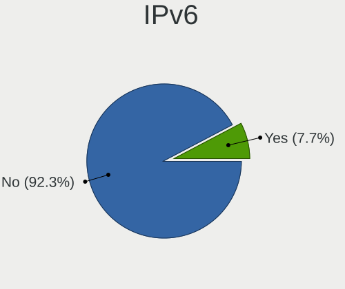

| Used | Desktops | Percent |
|------|----------|---------|
| No   | 239      | 92.28%  |
| Yes  | 20       | 7.72%   |

Bluetooth
---------

Bluetooth Vendor
----------------

Controller vendors

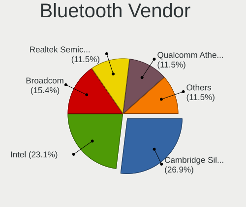

| Vendor                          | Desktops | Percent |
|---------------------------------|----------|---------|
| Cambridge Silicon Radio         | 7        | 26.92%  |
| Intel                           | 6        | 23.08%  |
| Broadcom                        | 4        | 15.38%  |
| Realtek Semiconductor           | 3        | 11.54%  |
| Qualcomm Atheros Communications | 3        | 11.54%  |
| ASUSTek Computer                | 2        | 7.69%   |
| Dynex                           | 1        | 3.85%   |

Bluetooth Model
---------------

Controller models

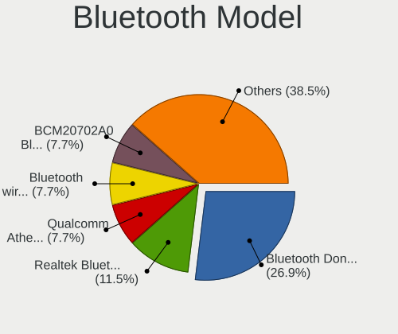

| Model                                                    | Desktops | Percent |
|----------------------------------------------------------|----------|---------|
| Cambridge Silicon Radio Bluetooth Dongle (HCI mode)      | 7        | 26.92%  |
| Realtek  Bluetooth 4.2 Adapter                           | 3        | 11.54%  |
| Qualcomm Atheros  Bluetooth Device                       | 2        | 7.69%   |
| Intel Bluetooth wireless interface                       | 2        | 7.69%   |
| Broadcom BCM20702A0 Bluetooth 4.0                        | 2        | 7.69%   |
| ASUS Broadcom BCM20702 Single-Chip Bluetooth 4.0 + LE    | 2        | 7.69%   |
| Qualcomm Atheros AR3012 Bluetooth 4.0                    | 1        | 3.85%   |
| Intel Bluetooth Device                                   | 1        | 3.85%   |
| Intel AX210 Bluetooth                                    | 1        | 3.85%   |
| Intel AX201 Bluetooth                                    | 1        | 3.85%   |
| Intel AX200 Bluetooth                                    | 1        | 3.85%   |
| Dynex Bluetooth 4.0 Adapter [Broadcom, 1.12, BCM20702A0] | 1        | 3.85%   |
| Broadcom BCM92046DG-CL1ROM Bluetooth 2.1 Adapter         | 1        | 3.85%   |
| Broadcom ANYCOM Blue USB-200/250                         | 1        | 3.85%   |

Sound
-----

Sound Vendor
------------

Sound card vendors

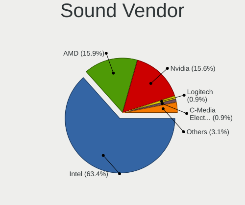

| Vendor                 | Desktops | Percent |
|------------------------|----------|---------|
| Intel                  | 203      | 63.44%  |
| AMD                    | 51       | 15.94%  |
| Nvidia                 | 50       | 15.63%  |
| Logitech               | 3        | 0.94%   |
| C-Media Electronics    | 3        | 0.94%   |
| Texas Instruments      | 2        | 0.63%   |
| Creative Labs          | 2        | 0.63%   |
| KTMicro                | 1        | 0.31%   |
| Harman International   | 1        | 0.31%   |
| GN Netcom              | 1        | 0.31%   |
| Generalplus Technology | 1        | 0.31%   |
| Ensoniq                | 1        | 0.31%   |
| ASUSTek Computer       | 1        | 0.31%   |

Sound Model
-----------

Sound card models

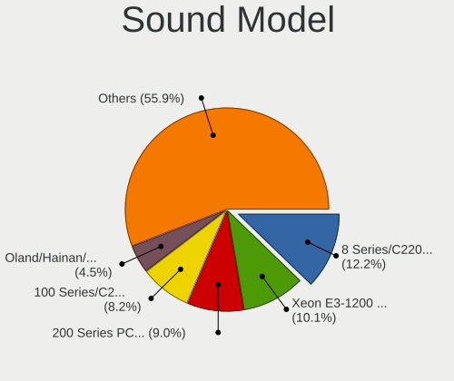

| Model                                                                                             | Desktops | Percent |
|---------------------------------------------------------------------------------------------------|----------|---------|
| Intel 8 Series/C220 Series Chipset High Definition Audio Controller                               | 46       | 12.23%  |
| Intel Xeon E3-1200 v3/4th Gen Core Processor HD Audio Controller                                  | 38       | 10.11%  |
| Intel 200 Series PCH HD Audio                                                                     | 34       | 9.04%   |
| Intel 100 Series/C230 Series Chipset Family HD Audio Controller                                   | 31       | 8.24%   |
| AMD Oland/Hainan/Cape Verde/Pitcairn HDMI Audio [Radeon HD 7000 Series]                           | 17       | 4.52%   |
| Intel Cannon Lake PCH cAVS                                                                        | 16       | 4.26%   |
| Intel 6 Series/C200 Series Chipset Family High Definition Audio Controller                        | 10       | 2.66%   |
| AMD SBx00 Azalia (Intel HDA)                                                                      | 10       | 2.66%   |
| Intel 7 Series/C216 Chipset Family High Definition Audio Controller                               | 9        | 2.39%   |
| Intel NM10/ICH7 Family High Definition Audio Controller                                           | 8        | 2.13%   |
| Intel C610/X99 series chipset HD Audio Controller                                                 | 7        | 1.86%   |
| Nvidia GP107GL High Definition Audio Controller                                                   | 6        | 1.6%    |
| Intel Comet Lake PCH cAVS                                                                         | 6        | 1.6%    |
| Intel C600/X79 series chipset High Definition Audio Controller                                    | 6        | 1.6%    |
| Intel 82801JI (ICH10 Family) HD Audio Controller                                                  | 6        | 1.6%    |
| Nvidia GK208 HDMI/DP Audio Controller                                                             | 5        | 1.33%   |
| Nvidia GK104 HDMI Audio Controller                                                                | 5        | 1.33%   |
| Nvidia GF119 HDMI Audio Controller                                                                | 5        | 1.33%   |
| Intel Smart Sound Technology (SST) Audio Controller                                               | 5        | 1.33%   |
| AMD FCH Azalia Controller                                                                         | 5        | 1.33%   |
| Nvidia High Definition Audio Controller                                                           | 4        | 1.06%   |
| Nvidia GP106 High Definition Audio Controller                                                     | 4        | 1.06%   |
| AMD Family 17h (Models 00h-0fh) HD Audio Controller                                               | 4        | 1.06%   |
| AMD Ellesmere HDMI Audio [Radeon RX 470/480 / 570/580/590]                                        | 4        | 1.06%   |
| AMD Caicos HDMI Audio [Radeon HD 6450 / 7450/8450/8490 OEM / R5 230/235/235X OEM]                 | 4        | 1.06%   |
| Nvidia TU104 HD Audio Controller                                                                  | 3        | 0.8%    |
| Nvidia GP104 High Definition Audio Controller                                                     | 3        | 0.8%    |
| Nvidia GM204 High Definition Audio Controller                                                     | 3        | 0.8%    |
| Intel 9 Series Chipset Family HD Audio Controller                                                 | 3        | 0.8%    |
| AMD Starship/Matisse HD Audio Controller                                                          | 3        | 0.8%    |
| Nvidia TU102 High Definition Audio Controller                                                     | 2        | 0.53%   |
| Nvidia GM107 High Definition Audio Controller [GeForce 940MX]                                     | 2        | 0.53%   |
| Nvidia GK106 HDMI Audio Controller                                                                | 2        | 0.53%   |
| Nvidia GF108 High Definition Audio Controller                                                     | 2        | 0.53%   |
| Logitech Headset H390                                                                             | 2        | 0.53%   |
| Intel Atom/Celeron/Pentium Processor x5-E8000/J3xxx/N3xxx Series High Definition Audio Controller | 2        | 0.53%   |
| Intel Alder Lake-S HD Audio Controller                                                            | 2        | 0.53%   |
| Intel 82801H (ICH8 Family) HD Audio Controller                                                    | 2        | 0.53%   |
| AMD Tobago HDMI Audio [Radeon R7 360 / R9 360 OEM]                                                | 2        | 0.53%   |
| AMD RS780 HDMI Audio [Radeon 3000/3100 / HD 3200/3300]                                            | 2        | 0.53%   |

Memory
------

Memory Vendor
-------------

Memory module vendors

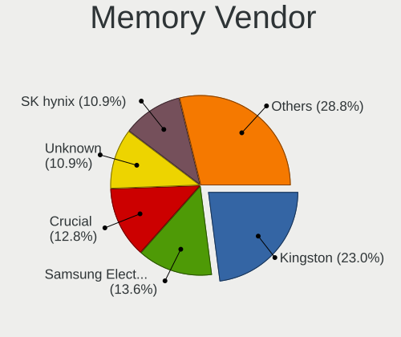

| Vendor              | Desktops | Percent |
|---------------------|----------|---------|
| Kingston            | 59       | 22.96%  |
| Samsung Electronics | 35       | 13.62%  |
| Crucial             | 33       | 12.84%  |
| Unknown             | 28       | 10.89%  |
| SK hynix            | 28       | 10.89%  |
| Micron Technology   | 18       | 7%      |
| G.Skill             | 16       | 6.23%   |
| GeIL                | 9        | 3.5%    |
| Corsair             | 6        | 2.33%   |
| A-DATA Technology   | 5        | 1.95%   |
| Team                | 4        | 1.56%   |
| Patriot             | 4        | 1.56%   |
| PNY                 | 2        | 0.78%   |
| Nanya Technology    | 2        | 0.78%   |
| Apacer              | 2        | 0.78%   |
| Transcend           | 1        | 0.39%   |
| Smart               | 1        | 0.39%   |
| Mushkin             | 1        | 0.39%   |
| Kingmax             | 1        | 0.39%   |
| Hewlett-Packard     | 1        | 0.39%   |
| Elpida              | 1        | 0.39%   |

Memory Model
------------

Memory module models

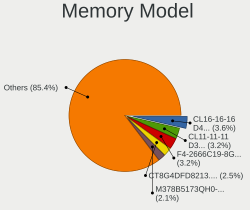

| Model                                                     | Desktops | Percent |
|-----------------------------------------------------------|----------|---------|
| Kingston RAM CL16-16-16 D4-2400 8GB DIMM DDR4 2400MT/s    | 10       | 3.57%   |
| GeIL RAM CL11-11-11 D3-1600 4GB DIMM 1866MT/s             | 9        | 3.21%   |
| G.Skill RAM F4-2666C19-8GIS 8GB DIMM DDR4 3200MT/s        | 9        | 3.21%   |
| Crucial RAM CT8G4DFD8213.C16FBD2 8GB DIMM DDR4 2500MT/s   | 7        | 2.5%    |
| Samsung RAM M378B5173QH0-YK0 4GB DIMM DDR3 1600MT/s       | 6        | 2.14%   |
| Kingston RAM 9905678-173.A00G 8GB DIMM DDR4 2400MT/s      | 6        | 2.14%   |
| Crucial RAM CT102464BD160B.M16 8GB DIMM DDR3 1600MT/s     | 5        | 1.79%   |
| Team RAM TEAMGROUP-UD4-2400 8GB DIMM DDR4 3000MT/s        | 4        | 1.43%   |
| Samsung RAM Module 8192MB DIMM DDR4 3200MT/s              | 4        | 1.43%   |
| Micron RAM 4ATF51264AZ-2G3B1 4GB DIMM DDR4 2800MT/s       | 4        | 1.43%   |
| G.Skill RAM F3-1600C11-8GNT 8GB DIMM DDR3 1600MT/s        | 4        | 1.43%   |
| Crucial RAM CT8G4DFS8213.C8FDD1 8192MB DIMM DDR4 2400MT/s | 4        | 1.43%   |
| Crucial RAM CT16G4DFD824A.C16FDD 16GB DIMM DDR4 3000MT/s  | 4        | 1.43%   |
| Kingston RAM 99U5471-058.A00LF 8GB DIMM DDR3 1600MT/s     | 3        | 1.07%   |
| Unknown RAM Module 8192MB DIMM DDR3 1600MT/s              | 2        | 0.71%   |
| Unknown RAM Module 8192MB DIMM 1333MT/s                   | 2        | 0.71%   |
| SK hynix RAM Module 2048MB DIMM DDR3 1600MT/s             | 2        | 0.71%   |
| SK hynix RAM HMT451U6BFR8A-PB 4GB DIMM DDR3 1600MT/s      | 2        | 0.71%   |
| SK hynix RAM HMT351U6CFR8C-PB 4GB DIMM DDR3 1800MT/s      | 2        | 0.71%   |
| PNY RAM M4U08S681LJJJ43-12 8192MB DIMM DDR4 2667MT/s      | 2        | 0.71%   |
| Micron RAM 8JTF51264AZ-1G6E1 4GB DIMM DDR3 1600MT/s       | 2        | 0.71%   |
| Micron RAM 8ATF1G64AZ-2G3E1 8GB DIMM DDR4 2666MT/s        | 2        | 0.71%   |
| Micron RAM 18ASF2G72AZ-2G6D1 16GB DIMM DDR4 2667MT/s      | 2        | 0.71%   |
| Kingston RAM KHX1600C9D3/8GX 8GB DIMM DDR3 2133MT/s       | 2        | 0.71%   |
| Kingston RAM KHX1600C9D3/4GX 4GB DIMM DDR3 1867MT/s       | 2        | 0.71%   |
| Crucial RAM CT8G4DFS8266.C8FN 8GB DIMM DDR4 2667MT/s      | 2        | 0.71%   |
| Crucial RAM CT8G4DFD824A.C16FBD1 8GB DIMM DDR4 2400MT/s   | 2        | 0.71%   |
| Unknown RAM Module 8192MB DIMM DDR3 1333MT/s              | 1        | 0.36%   |
| Unknown RAM Module 8192MB DIMM 667MT/s                    | 1        | 0.36%   |
| Unknown RAM Module 8192MB DIMM 1600MT/s                   | 1        | 0.36%   |
| Unknown RAM Module 4GB DIMM DDR3 1600MT/s                 | 1        | 0.36%   |
| Unknown RAM Module 4GB DIMM DDR3 1333MT/s                 | 1        | 0.36%   |
| Unknown RAM Module 4096MB DIMM DDR3 1333MT/s              | 1        | 0.36%   |
| Unknown RAM Module 4096MB DIMM DDR2 333MT/s               | 1        | 0.36%   |
| Unknown RAM Module 4096MB DIMM DDR 1333MT/s               | 1        | 0.36%   |
| Unknown RAM Module 4096MB DIMM 800MT/s                    | 1        | 0.36%   |
| Unknown RAM Module 4096MB DIMM 1600MT/s                   | 1        | 0.36%   |
| Unknown RAM Module 4096MB DIMM 1333MT/s                   | 1        | 0.36%   |
| Unknown RAM Module 4096MB DIMM                            | 1        | 0.36%   |
| Unknown RAM Module 32GB DIMM DDR4 3200MT/s                | 1        | 0.36%   |

Memory Kind
-----------

Memory module kinds

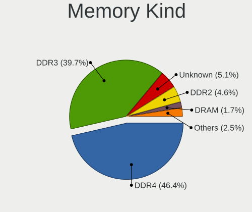

| Kind         | Desktops | Percent |
|--------------|----------|---------|
| DDR4         | 110      | 46.41%  |
| DDR3         | 94       | 39.66%  |
| Unknown      | 12       | 5.06%   |
| DDR2         | 11       | 4.64%   |
| DRAM         | 4        | 1.69%   |
| SDRAM        | 2        | 0.84%   |
| LPDDR4       | 1        | 0.42%   |
| DDR5         | 1        | 0.42%   |
| DDR2 FB-DIMM | 1        | 0.42%   |
| DDR          | 1        | 0.42%   |

Memory Form Factor
------------------

Physical design of the memory module

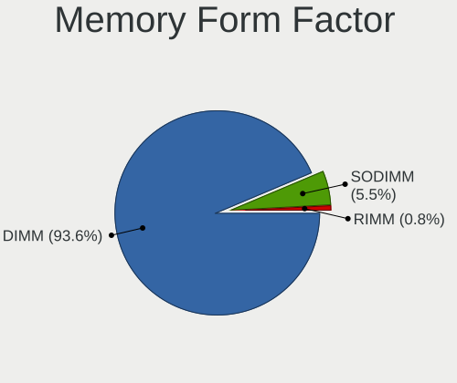

| Name   | Desktops | Percent |
|--------|----------|---------|
| DIMM   | 221      | 93.64%  |
| SODIMM | 13       | 5.51%   |
| RIMM   | 2        | 0.85%   |

Memory Size
-----------

Memory module size

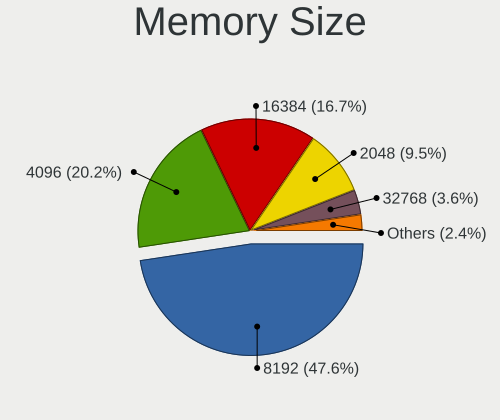

| Size  | Desktops | Percent |
|-------|----------|---------|
| 8192  | 120      | 47.62%  |
| 4096  | 51       | 20.24%  |
| 16384 | 42       | 16.67%  |
| 2048  | 24       | 9.52%   |
| 32768 | 9        | 3.57%   |
| 1024  | 6        | 2.38%   |

Memory Speed
------------

Memory module speed

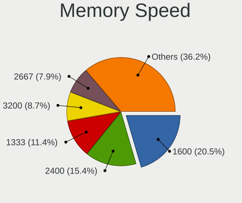

| Speed   | Desktops | Percent |
|---------|----------|---------|
| 1600    | 52       | 20.47%  |
| 2400    | 39       | 15.35%  |
| 1333    | 29       | 11.42%  |
| 3200    | 22       | 8.66%   |
| 2667    | 20       | 7.87%   |
| 2133    | 14       | 5.51%   |
| 800     | 12       | 4.72%   |
| 1866    | 10       | 3.94%   |
| 3000    | 9        | 3.54%   |
| 2500    | 7        | 2.76%   |
| 667     | 6        | 2.36%   |
| 2800    | 4        | 1.57%   |
| Unknown | 4        | 1.57%   |
| 1800    | 3        | 1.18%   |
| 3600    | 2        | 0.79%   |
| 2666    | 2        | 0.79%   |
| 2134    | 2        | 0.79%   |
| 2000    | 2        | 0.79%   |
| 1648    | 2        | 0.79%   |
| 65535   | 1        | 0.39%   |
| 5200    | 1        | 0.39%   |
| 4333    | 1        | 0.39%   |
| 3933    | 1        | 0.39%   |
| 3500    | 1        | 0.39%   |
| 3466    | 1        | 0.39%   |
| 2933    | 1        | 0.39%   |
| 2866    | 1        | 0.39%   |
| 2465    | 1        | 0.39%   |
| 1336    | 1        | 0.39%   |
| 1067    | 1        | 0.39%   |
| 400     | 1        | 0.39%   |
| 333     | 1        | 0.39%   |

Printers & scanners
-------------------

Printer Vendor
--------------

Printer device vendors

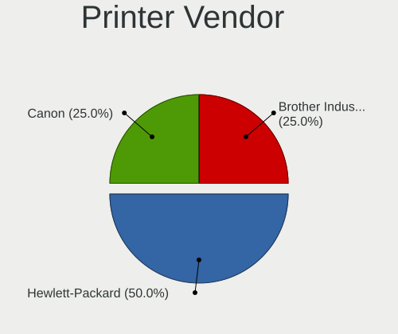

| Vendor             | Desktops | Percent |
|--------------------|----------|---------|
| Hewlett-Packard    | 3        | 50%     |
| Star Micronics     | 1        | 16.67%  |
| Canon              | 1        | 16.67%  |
| Brother Industries | 1        | 16.67%  |

Printer Model
-------------

Printer device models

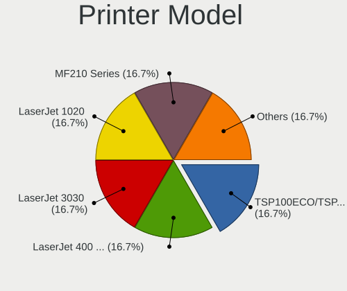

| Model                             | Desktops | Percent |
|-----------------------------------|----------|---------|
| Star Micronics TSP100ECO/TSP100II | 1        | 16.67%  |
| HP LaserJet 400 M401dne           | 1        | 16.67%  |
| HP LaserJet 3030                  | 1        | 16.67%  |
| HP LaserJet 1020                  | 1        | 16.67%  |
| Canon MF210 Series                | 1        | 16.67%  |
| Brother MFC-9130CW                | 1        | 16.67%  |

Scanner Vendor
--------------

Scanner device vendors

Zero info for selected period =(

Scanner Model
-------------

Scanner device models

Zero info for selected period =(

Camera
------

Camera Vendor
-------------

Camera device vendors

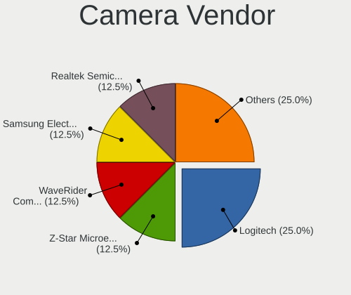

| Vendor                   | Desktops | Percent |
|--------------------------|----------|---------|
| Logitech                 | 2        | 25%     |
| Z-Star Microelectronics  | 1        | 12.5%   |
| WaveRider Communications | 1        | 12.5%   |
| Samsung Electronics      | 1        | 12.5%   |
| Realtek Semiconductor    | 1        | 12.5%   |
| Microsoft                | 1        | 12.5%   |
| Generalplus Technology   | 1        | 12.5%   |

Camera Model
------------

Camera device models

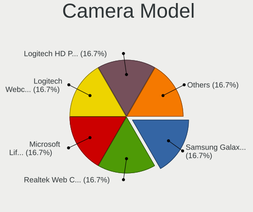

| Model                                    | Desktops | Percent |
|------------------------------------------|----------|---------|
| Z-Star Venus USB2.0 Camera               | 1        | 12.5%   |
| WaveRider USB 2.0 Camera                 | 1        | 12.5%   |
| Samsung Galaxy series, misc. (MTP mode)  | 1        | 12.5%   |
| Realtek Web Camera                       | 1        | 12.5%   |
| Microsoft LifeCam HD-5000                | 1        | 12.5%   |
| Logitech Webcam C310                     | 1        | 12.5%   |
| Logitech HD Pro Webcam C920              | 1        | 12.5%   |
| Generalplus 808 Camera #9 (web-cam mode) | 1        | 12.5%   |

Security
--------

Fingerprint Vendor
------------------

Fingerprint sensor vendors

Zero info for selected period =(

Fingerprint Model
-----------------

Fingerprint sensor models

Zero info for selected period =(

Chipcard Vendor
---------------

Chipcard module vendors

| Vendor           | Desktops | Percent |
|------------------|----------|---------|
| SCM Microsystems | 1        | 100%    |

Chipcard Model
--------------

Chipcard module models

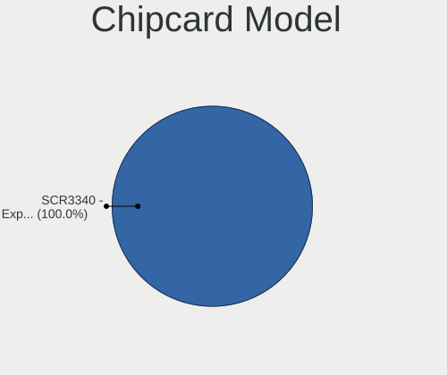

| Model                                                      | Desktops | Percent |
|------------------------------------------------------------|----------|---------|
| SCM Microsystems SCR3340 - ExpressCard54 Smart Card Reader | 1        | 100%    |

Unsupported
-----------

Unsupported Devices
-------------------

Total unsupported devices on board

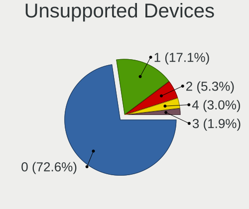

| Total | Desktops | Percent |
|-------|----------|---------|
| 0     | 191      | 72.62%  |
| 1     | 45       | 17.11%  |
| 2     | 14       | 5.32%   |
| 4     | 8        | 3.04%   |
| 3     | 5        | 1.9%    |

Unsupported Device Types
------------------------

Types of unsupported devices

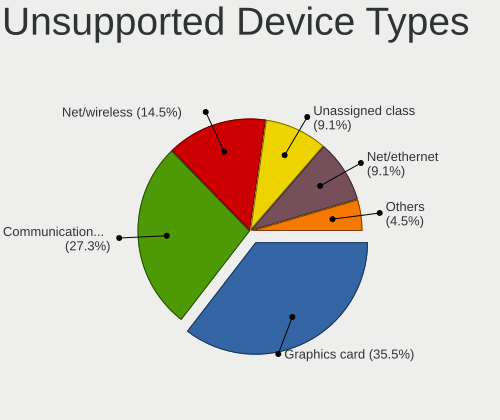

| Type                     | Desktops | Percent |
|--------------------------|----------|---------|
| Graphics card            | 39       | 35.45%  |
| Communication controller | 30       | 27.27%  |
| Net/wireless             | 16       | 14.55%  |
| Unassigned class         | 10       | 9.09%   |
| Net/ethernet             | 10       | 9.09%   |
| Storage/raid             | 1        | 0.91%   |
| Sound                    | 1        | 0.91%   |
| Network                  | 1        | 0.91%   |
| Multimedia controller    | 1        | 0.91%   |
| Modem                    | 1        | 0.91%   |

