CentOS 7 - Tested Hardware & Statistics (Desktops)
--------------------------------------------------

A project to collect tested hardware configurations for CentOS 7.

Anyone can contribute to this report by the [hw-probe](https://github.com/linuxhw/hw-probe) tool:

    sudo -E hw-probe -all -upload

Please submit a probe of your configuration if it's not presented on the page or is rare.

Full-feature report is available here: https://linux-hardware.org/?view=trends

Contents
--------

* [ Test Cases ](#test-cases)

* [ System ](#system)
  - [ Kernel                   ](#kernel)
  - [ Kernel Family            ](#kernel-family)
  - [ Kernel Major Ver.        ](#kernel-major-ver)
  - [ Arch                     ](#arch)
  - [ DE                       ](#de)
  - [ Display Server           ](#display-server)
  - [ Display Manager          ](#display-manager)
  - [ OS Lang                  ](#os-lang)
  - [ Boot Mode                ](#boot-mode)
  - [ Filesystem               ](#filesystem)
  - [ Part. scheme             ](#part-scheme)
  - [ Dual Boot with Linux/BSD ](#dual-boot-with-linuxbsd)
  - [ Dual Boot (Win)          ](#dual-boot-win)

* [ Board ](#board)
  - [ Vendor                   ](#vendor)
  - [ Model                    ](#model)
  - [ Model Family             ](#model-family)
  - [ MFG Year                 ](#mfg-year)
  - [ Form Factor              ](#form-factor)
  - [ Secure Boot              ](#secure-boot)
  - [ Coreboot                 ](#coreboot)
  - [ RAM Size                 ](#ram-size)
  - [ RAM Used                 ](#ram-used)
  - [ Total Drives             ](#total-drives)
  - [ Has CD-ROM               ](#has-cd-rom)
  - [ Has Ethernet             ](#has-ethernet)
  - [ Has WiFi                 ](#has-wifi)
  - [ Has Bluetooth            ](#has-bluetooth)

* [ Location ](#location)
  - [ Country                  ](#country)
  - [ City                     ](#city)

* [ Drives ](#drives)
  - [ Drive Vendor             ](#drive-vendor)
  - [ Drive Model              ](#drive-model)
  - [ HDD Vendor               ](#hdd-vendor)
  - [ SSD Vendor               ](#ssd-vendor)
  - [ Drive Kind               ](#drive-kind)
  - [ Drive Connector          ](#drive-connector)
  - [ Drive Size               ](#drive-size)
  - [ Space Total              ](#space-total)
  - [ Space Used               ](#space-used)
  - [ Malfunc. Drives          ](#malfunc-drives)
  - [ Malfunc. Drive Vendor    ](#malfunc-drive-vendor)
  - [ Malfunc. HDD Vendor      ](#malfunc-hdd-vendor)
  - [ Malfunc. Drive Kind      ](#malfunc-drive-kind)
  - [ Failed Drives            ](#failed-drives)
  - [ Failed Drive Vendor      ](#failed-drive-vendor)
  - [ Drive Status             ](#drive-status)

* [ Storage controller ](#storage-controller)
  - [ Storage Vendor           ](#storage-vendor)
  - [ Storage Model            ](#storage-model)
  - [ Storage Kind             ](#storage-kind)

* [ Processor ](#processor)
  - [ CPU Vendor               ](#cpu-vendor)
  - [ CPU Model                ](#cpu-model)
  - [ CPU Model Family         ](#cpu-model-family)
  - [ CPU Cores                ](#cpu-cores)
  - [ CPU Sockets              ](#cpu-sockets)
  - [ CPU Threads              ](#cpu-threads)
  - [ CPU Op-Modes             ](#cpu-op-modes)
  - [ CPU Microcode            ](#cpu-microcode)
  - [ CPU Microarch            ](#cpu-microarch)

* [ Graphics ](#graphics)
  - [ GPU Vendor               ](#gpu-vendor)
  - [ GPU Model                ](#gpu-model)
  - [ GPU Combo                ](#gpu-combo)
  - [ GPU Driver               ](#gpu-driver)
  - [ GPU Memory               ](#gpu-memory)

* [ Monitor ](#monitor)
  - [ Monitor Vendor           ](#monitor-vendor)
  - [ Monitor Model            ](#monitor-model)
  - [ Monitor Resolution       ](#monitor-resolution)
  - [ Monitor Diagonal         ](#monitor-diagonal)
  - [ Monitor Width            ](#monitor-width)
  - [ Aspect Ratio             ](#aspect-ratio)
  - [ Monitor Area             ](#monitor-area)
  - [ Pixel Density            ](#pixel-density)
  - [ Multiple Monitors        ](#multiple-monitors)

* [ Network ](#network)
  - [ Net Controller Vendor    ](#net-controller-vendor)
  - [ Net Controller Model     ](#net-controller-model)
  - [ Wireless Vendor          ](#wireless-vendor)
  - [ Wireless Model           ](#wireless-model)
  - [ Ethernet Vendor          ](#ethernet-vendor)
  - [ Ethernet Model           ](#ethernet-model)
  - [ Net Controller Kind      ](#net-controller-kind)
  - [ Used Controller          ](#used-controller)
  - [ NICs                     ](#nics)
  - [ IPv6                     ](#ipv6)

* [ Bluetooth ](#bluetooth)
  - [ Bluetooth Vendor         ](#bluetooth-vendor)
  - [ Bluetooth Model          ](#bluetooth-model)

* [ Sound ](#sound)
  - [ Sound Vendor             ](#sound-vendor)
  - [ Sound Model              ](#sound-model)

* [ Memory ](#memory)
  - [ Memory Vendor            ](#memory-vendor)
  - [ Memory Model             ](#memory-model)
  - [ Memory Kind              ](#memory-kind)
  - [ Memory Form Factor       ](#memory-form-factor)
  - [ Memory Size              ](#memory-size)
  - [ Memory Speed             ](#memory-speed)

* [ Printers & scanners ](#printers--scanners)
  - [ Printer Vendor           ](#printer-vendor)
  - [ Printer Model            ](#printer-model)
  - [ Scanner Vendor           ](#scanner-vendor)
  - [ Scanner Model            ](#scanner-model)

* [ Camera ](#camera)
  - [ Camera Vendor            ](#camera-vendor)
  - [ Camera Model             ](#camera-model)

* [ Security ](#security)
  - [ Fingerprint Vendor       ](#fingerprint-vendor)
  - [ Fingerprint Model        ](#fingerprint-model)
  - [ Chipcard Vendor          ](#chipcard-vendor)
  - [ Chipcard Model           ](#chipcard-model)

* [ Unsupported ](#unsupported)
  - [ Unsupported Devices      ](#unsupported-devices)
  - [ Unsupported Device Types ](#unsupported-device-types)

Test Cases
----------

Total: 187

| Vendor        | Model                       | Probe                                                      | Date         |
|---------------|-----------------------------|------------------------------------------------------------|--------------|
| Dell          | 0Y2YM6 A01                  | [4578be5a1e](https://linux-hardware.org/?probe=4578be5a1e) | Mar 30, 2022 |
| Dell          | 00V62H A01                  | [309ea240bd](https://linux-hardware.org/?probe=309ea240bd) | Mar 25, 2022 |
| HP            | 0AECh D                     | [2fa93f9b4e](https://linux-hardware.org/?probe=2fa93f9b4e) | Mar 22, 2022 |
| MiTAC         | UltraPoint                  | [5199d92feb](https://linux-hardware.org/?probe=5199d92feb) | Mar 21, 2022 |
| Gigabyte      | EP45-DS3L                   | [03d7fe99c6](https://linux-hardware.org/?probe=03d7fe99c6) | Mar 05, 2022 |
| HP            | 0A9Ch                       | [0403520776](https://linux-hardware.org/?probe=0403520776) | Mar 03, 2022 |
| ASUSTek       | X99-DELUXE                  | [27513a5e2d](https://linux-hardware.org/?probe=27513a5e2d) | Feb 28, 2022 |
| Gigabyte      | EP45-DS3L                   | [294d18eb2b](https://linux-hardware.org/?probe=294d18eb2b) | Jan 30, 2022 |
| ASUSTek       | ROG STRIX B560-A GAMING ... | [a355e13859](https://linux-hardware.org/?probe=a355e13859) | Jan 11, 2022 |
| Gigabyte      | G41M-ES2L                   | [a993fafbf7](https://linux-hardware.org/?probe=a993fafbf7) | Jan 08, 2022 |
| HP            | 3397                        | [3bd3d85718](https://linux-hardware.org/?probe=3bd3d85718) | Jan 03, 2022 |
| ASUSTek       | PRIME X370-PRO              | [a810f7c0fb](https://linux-hardware.org/?probe=a810f7c0fb) | Dec 28, 2021 |
| Supermicro    | X10SDV-6C-TLN4F             | [07aa1e6365](https://linux-hardware.org/?probe=07aa1e6365) | Dec 17, 2021 |
| ASUSTek       | Pro Q570M-C                 | [d868c52b5a](https://linux-hardware.org/?probe=d868c52b5a) | Dec 15, 2021 |
| Gigabyte      | EP45-DS3L                   | [8354035770](https://linux-hardware.org/?probe=8354035770) | Dec 11, 2021 |
| Gigabyte      | H97N-WIFI                   | [646eb8cd7d](https://linux-hardware.org/?probe=646eb8cd7d) | Dec 04, 2021 |
| HP            | 8717                        | [a00d17d8c4](https://linux-hardware.org/?probe=a00d17d8c4) | Nov 25, 2021 |
| Dell          | 02K9CR A01                  | [36c6a137fb](https://linux-hardware.org/?probe=36c6a137fb) | Nov 23, 2021 |
| Gigabyte      | B360HD3                     | [71a92047fb](https://linux-hardware.org/?probe=71a92047fb) | Nov 23, 2021 |
| Dell          | 02K9CR A01                  | [7d558b813e](https://linux-hardware.org/?probe=7d558b813e) | Nov 17, 2021 |
| HP            | 0A9Ch                       | [7fef9e130e](https://linux-hardware.org/?probe=7fef9e130e) | Nov 13, 2021 |
| Dell          | 04YP6J A02                  | [6c41e1551e](https://linux-hardware.org/?probe=6c41e1551e) | Nov 09, 2021 |
| Dell          | 04YP6J A02                  | [736e182a15](https://linux-hardware.org/?probe=736e182a15) | Nov 09, 2021 |
| HP            | 0A9Ch                       | [e3e06f5858](https://linux-hardware.org/?probe=e3e06f5858) | Nov 04, 2021 |
| ASRock        | Z77 Extreme4                | [bf66e1d281](https://linux-hardware.org/?probe=bf66e1d281) | Oct 29, 2021 |
| eMachines     | EMCP73VT-PM                 | [6fe6c2d416](https://linux-hardware.org/?probe=6fe6c2d416) | Oct 27, 2021 |
| eMachines     | EMCP73VT-PM                 | [22fd625209](https://linux-hardware.org/?probe=22fd625209) | Oct 26, 2021 |
| Gigabyte      | EP45-DS3L                   | [b4a30d2562](https://linux-hardware.org/?probe=b4a30d2562) | Oct 22, 2021 |
| ASRock        | Z77 Extreme4                | [862513b9f6](https://linux-hardware.org/?probe=862513b9f6) | Oct 21, 2021 |
| ASUSTek       | P5BV-M/RS100-E5             | [13134022df](https://linux-hardware.org/?probe=13134022df) | Oct 19, 2021 |
| Huanan        | X79                         | [3532bbed3d](https://linux-hardware.org/?probe=3532bbed3d) | Oct 08, 2021 |
| Huanan        | X79                         | [6638a35363](https://linux-hardware.org/?probe=6638a35363) | Oct 08, 2021 |
| Dell          | 0Y7WYT A00                  | [e4278d3243](https://linux-hardware.org/?probe=e4278d3243) | Sep 15, 2021 |
| Gigabyte      | B85M-D3PH                   | [01d87985dd](https://linux-hardware.org/?probe=01d87985dd) | Aug 28, 2021 |
| HP            | 8751                        | [cdaf5a0ed8](https://linux-hardware.org/?probe=cdaf5a0ed8) | Aug 24, 2021 |
| Gigabyte      | B450M DS3H-CF               | [cabe0be4fc](https://linux-hardware.org/?probe=cabe0be4fc) | Aug 17, 2021 |
| ASUSTek       | PRIME B550-PLUS             | [cf348cec5f](https://linux-hardware.org/?probe=cf348cec5f) | Aug 16, 2021 |
| ASUSTek       | GRYPHON Z97 ARMOR EDITIO... | [4f9bb753aa](https://linux-hardware.org/?probe=4f9bb753aa) | Aug 16, 2021 |
| ASUSTek       | ROG Maximus XIII HERO       | [8ddb489f03](https://linux-hardware.org/?probe=8ddb489f03) | Aug 05, 2021 |
| Dell          | 0HD5W2 A01                  | [d19976dabe](https://linux-hardware.org/?probe=d19976dabe) | Aug 05, 2021 |
| Dell          | 00V62H A01                  | [d56fdac07b](https://linux-hardware.org/?probe=d56fdac07b) | Aug 05, 2021 |
| Dell          | 00V62H A01                  | [3eb59a276c](https://linux-hardware.org/?probe=3eb59a276c) | Aug 05, 2021 |
| Dell          | 00V62H A01                  | [3d0db6b81f](https://linux-hardware.org/?probe=3d0db6b81f) | Aug 05, 2021 |
| Dell          | 0YNVJG A01                  | [7952948421](https://linux-hardware.org/?probe=7952948421) | Aug 05, 2021 |
| Dell          | 0HD5W2 A01                  | [1fc2375e54](https://linux-hardware.org/?probe=1fc2375e54) | Aug 05, 2021 |
| Dell          | 0HD5W2 A01                  | [9a5d8276bf](https://linux-hardware.org/?probe=9a5d8276bf) | Aug 05, 2021 |
| Dell          | 0HD5W2 A01                  | [a653e9beb2](https://linux-hardware.org/?probe=a653e9beb2) | Aug 05, 2021 |
| Dell          | 00V62H A01                  | [2165980dd3](https://linux-hardware.org/?probe=2165980dd3) | Aug 05, 2021 |
| Dell          | 0HD5W2 A01                  | [4a2adade2a](https://linux-hardware.org/?probe=4a2adade2a) | Aug 05, 2021 |
| Dell          | 00V62H A01                  | [10bdaec1ef](https://linux-hardware.org/?probe=10bdaec1ef) | Aug 05, 2021 |
| Dell          | 0HD5W2 A01                  | [78c5e3532b](https://linux-hardware.org/?probe=78c5e3532b) | Aug 05, 2021 |
| Dell          | 00V62H A01                  | [80244f2809](https://linux-hardware.org/?probe=80244f2809) | Aug 05, 2021 |
| Dell          | 0HD5W2 A01                  | [70fc6a65ef](https://linux-hardware.org/?probe=70fc6a65ef) | Aug 05, 2021 |
| HP            | 8591                        | [6794bdb00e](https://linux-hardware.org/?probe=6794bdb00e) | Aug 05, 2021 |
| Dell          | 0HD5W2 A01                  | [f209feb9c8](https://linux-hardware.org/?probe=f209feb9c8) | Aug 05, 2021 |
| ASUSTek       | ROG Maximus XIII HERO       | [40b8d28af0](https://linux-hardware.org/?probe=40b8d28af0) | Aug 04, 2021 |
| Gigabyte      | EP45-DS3L                   | [597de4e10b](https://linux-hardware.org/?probe=597de4e10b) | Aug 01, 2021 |
| ASUSTek       | SABERTOOTH X79              | [1232705d62](https://linux-hardware.org/?probe=1232705d62) | Jul 22, 2021 |
| HP            | 2B34                        | [0de82dabad](https://linux-hardware.org/?probe=0de82dabad) | Jul 10, 2021 |
| HP            | 0A9Ch                       | [e3159a6511](https://linux-hardware.org/?probe=e3159a6511) | Jul 07, 2021 |
| Dell          | 09KPNV A01                  | [a3f3f1e1c0](https://linux-hardware.org/?probe=a3f3f1e1c0) | Jul 02, 2021 |
| Gigabyte      | EP45-DS3L                   | [6beb9f6867](https://linux-hardware.org/?probe=6beb9f6867) | Jun 19, 2021 |
| HP            | 1494                        | [d34b022996](https://linux-hardware.org/?probe=d34b022996) | Jun 11, 2021 |
| Intel         | E98683-353                  | [2f0ae62282](https://linux-hardware.org/?probe=2f0ae62282) | May 29, 2021 |
| HP            | 1589                        | [a4b0ebbee2](https://linux-hardware.org/?probe=a4b0ebbee2) | May 23, 2021 |
| ASRock        | J3710M                      | [6f289497fc](https://linux-hardware.org/?probe=6f289497fc) | May 23, 2021 |
| HP            | 8594                        | [991250b6a8](https://linux-hardware.org/?probe=991250b6a8) | May 14, 2021 |
| HP            | 1825                        | [13110a2081](https://linux-hardware.org/?probe=13110a2081) | May 14, 2021 |
| Gigabyte      | EP45-DS3L                   | [33c13bfcf0](https://linux-hardware.org/?probe=33c13bfcf0) | May 01, 2021 |
| HP            | 8591                        | [149576417f](https://linux-hardware.org/?probe=149576417f) | Apr 27, 2021 |
| HP            | 8591                        | [03b17d692d](https://linux-hardware.org/?probe=03b17d692d) | Apr 26, 2021 |
| HP            | 213D A01                    | [72e7e27309](https://linux-hardware.org/?probe=72e7e27309) | Apr 26, 2021 |
| Gigabyte      | EP43-DS3                    | [3eaab1a9d9](https://linux-hardware.org/?probe=3eaab1a9d9) | Apr 05, 2021 |
| HP            | 8591                        | [d3dd8e0a2b](https://linux-hardware.org/?probe=d3dd8e0a2b) | Apr 02, 2021 |
| Dell          | 0MWYPT A02                  | [e2e2e6f179](https://linux-hardware.org/?probe=e2e2e6f179) | Mar 31, 2021 |
| Cisco Syst... | UCSB-B200-M4 73-15862-03    | [4c55de0b30](https://linux-hardware.org/?probe=4c55de0b30) | Mar 31, 2021 |
| Unknown       | Unknown                     | [b672c68361](https://linux-hardware.org/?probe=b672c68361) | Mar 30, 2021 |
| HP            | 8591                        | [3c4d055665](https://linux-hardware.org/?probe=3c4d055665) | Mar 30, 2021 |
| HP            | 8591                        | [b436577a94](https://linux-hardware.org/?probe=b436577a94) | Mar 30, 2021 |
| Gigabyte      | EP45-DS3L                   | [c724df2a1a](https://linux-hardware.org/?probe=c724df2a1a) | Mar 23, 2021 |
| MiTAC         | PD10BI PD10BI-702           | [63335e1b88](https://linux-hardware.org/?probe=63335e1b88) | Mar 18, 2021 |
| MiTAC         | PD10BI PD10BI-702           | [5d23375dcd](https://linux-hardware.org/?probe=5d23375dcd) | Mar 18, 2021 |
| Unknown       | Unknown                     | [234c991949](https://linux-hardware.org/?probe=234c991949) | Mar 17, 2021 |
| MSI           | H170A GAMING PRO            | [dd38d014bd](https://linux-hardware.org/?probe=dd38d014bd) | Mar 17, 2021 |
| Gigabyte      | EP45-DS3L                   | [6663605d82](https://linux-hardware.org/?probe=6663605d82) | Feb 27, 2021 |
| AMI           | PCHK-Z83 Poslab_ECO         | [5dd25822e3](https://linux-hardware.org/?probe=5dd25822e3) | Feb 23, 2021 |
| Gigabyte      | D525TUD                     | [59b1050f5f](https://linux-hardware.org/?probe=59b1050f5f) | Feb 19, 2021 |
| ASUSTek       | PRIME B360M-D               | [aab84fafeb](https://linux-hardware.org/?probe=aab84fafeb) | Feb 10, 2021 |
| ASUSTek       | P8Z68-V LX                  | [9fc9b672d0](https://linux-hardware.org/?probe=9fc9b672d0) | Feb 07, 2021 |
| HP            | 3397                        | [aba05551cb](https://linux-hardware.org/?probe=aba05551cb) | Feb 05, 2021 |
| Dell          | 0HHV7N A00                  | [7b55587c5a](https://linux-hardware.org/?probe=7b55587c5a) | Jan 10, 2021 |
| Gigabyte      | D525TUD                     | [e9f1445d02](https://linux-hardware.org/?probe=e9f1445d02) | Jan 03, 2021 |
| Intel         | DQ67OW AAG12528-309         | [5f42b365ae](https://linux-hardware.org/?probe=5f42b365ae) | Dec 26, 2020 |
| Gigabyte      | EP45-DS3L                   | [aad57f82cd](https://linux-hardware.org/?probe=aad57f82cd) | Dec 24, 2020 |
| ASUSTek       | X99-DELUXE                  | [46613a5ce9](https://linux-hardware.org/?probe=46613a5ce9) | Dec 20, 2020 |
| Gigabyte      | Z77-D3H                     | [b7c033babd](https://linux-hardware.org/?probe=b7c033babd) | Dec 10, 2020 |
| Gigabyte      | D525TUD                     | [0c13d73ba0](https://linux-hardware.org/?probe=0c13d73ba0) | Nov 27, 2020 |
| ASUSTek       | M5A78L-M PLUS/USB3          | [bc3bd4ea10](https://linux-hardware.org/?probe=bc3bd4ea10) | Nov 24, 2020 |
| Dell          | 01NP3N A00                  | [1f5b92d91b](https://linux-hardware.org/?probe=1f5b92d91b) | Oct 12, 2020 |
| ASUSTek       | F2A55-M LE                  | [1fc864e04c](https://linux-hardware.org/?probe=1fc864e04c) | Oct 10, 2020 |
| ECS           | H61H2-MV                    | [0c5285cd22](https://linux-hardware.org/?probe=0c5285cd22) | Sep 20, 2020 |
| HP            | 0AECh D                     | [d80079cb33](https://linux-hardware.org/?probe=d80079cb33) | Sep 18, 2020 |
| Fujitsu       | D3401-H1 S26361-D3401-H1    | [b363aea94a](https://linux-hardware.org/?probe=b363aea94a) | Sep 17, 2020 |
| Fujitsu       | D3401-H1 S26361-D3401-H1    | [1896a5c345](https://linux-hardware.org/?probe=1896a5c345) | Sep 17, 2020 |
| AEWIN         | SCB-1711A                   | [2d8dbb0d3a](https://linux-hardware.org/?probe=2d8dbb0d3a) | Sep 09, 2020 |
| Zenith        | Orion                       | [9de5e32b25](https://linux-hardware.org/?probe=9de5e32b25) | Sep 02, 2020 |
| Gigabyte      | EP45-DS3L                   | [599830e150](https://linux-hardware.org/?probe=599830e150) | Aug 29, 2020 |
| ASUSTek       | P7P55D                      | [4a55c3588b](https://linux-hardware.org/?probe=4a55c3588b) | Aug 26, 2020 |
| Dell          | 0GTK4K A02                  | [09fb692364](https://linux-hardware.org/?probe=09fb692364) | Aug 26, 2020 |
| Gigabyte      | B450 AORUS M                | [f0d9b71d6d](https://linux-hardware.org/?probe=f0d9b71d6d) | Aug 15, 2020 |
| Lenovo        | ThinkServer TS140           | [03abb9daf3](https://linux-hardware.org/?probe=03abb9daf3) | Aug 11, 2020 |
| Lenovo        | ThinkServer TS140           | [2d296ca69c](https://linux-hardware.org/?probe=2d296ca69c) | Aug 11, 2020 |
| Dell          | 08HPGT A02                  | [fa6826d636](https://linux-hardware.org/?probe=fa6826d636) | Aug 02, 2020 |
| Gigabyte      | B360M DS3H                  | [be78e318ef](https://linux-hardware.org/?probe=be78e318ef) | Jul 23, 2020 |
| HP            | 0AECh D                     | [c6310b9606](https://linux-hardware.org/?probe=c6310b9606) | Jul 14, 2020 |
| HP            | 1589                        | [d142f54a38](https://linux-hardware.org/?probe=d142f54a38) | Jul 11, 2020 |
| Intel         | H81C                        | [54732275c2](https://linux-hardware.org/?probe=54732275c2) | Jul 04, 2020 |
| ASUSTek       | SABERTOOTH X99              | [d014e3ba24](https://linux-hardware.org/?probe=d014e3ba24) | Jul 03, 2020 |
| Gigabyte      | P85-D3                      | [3be565ccfd](https://linux-hardware.org/?probe=3be565ccfd) | Jun 23, 2020 |
| ASUSTek       | Crosshair IV Formula        | [51b8e4300b](https://linux-hardware.org/?probe=51b8e4300b) | Jun 20, 2020 |
| ASUSTek       | Crosshair IV Formula        | [e1184552d0](https://linux-hardware.org/?probe=e1184552d0) | Jun 20, 2020 |
| Supermicro    | X10DRG-H                    | [3bd676846b](https://linux-hardware.org/?probe=3bd676846b) | Jun 12, 2020 |
| MSI           | B450M MORTAR MAX            | [db0ff5f985](https://linux-hardware.org/?probe=db0ff5f985) | Jun 07, 2020 |
| Dell          | 0VRWRC A00                  | [dd7e20baec](https://linux-hardware.org/?probe=dd7e20baec) | May 29, 2020 |
| Dell          | 0VRWRC A00                  | [c27987482d](https://linux-hardware.org/?probe=c27987482d) | May 29, 2020 |
| ASRock        | AM1B-ITX                    | [d0b6f8f474](https://linux-hardware.org/?probe=d0b6f8f474) | May 25, 2020 |
| ASUSTek       | B85M-G                      | [65921c1a5e](https://linux-hardware.org/?probe=65921c1a5e) | May 14, 2020 |
| Gigabyte      | EP45-DS3L                   | [6a3f0afa07](https://linux-hardware.org/?probe=6a3f0afa07) | May 07, 2020 |
| HP            | 1495                        | [a38478daa1](https://linux-hardware.org/?probe=a38478daa1) | May 05, 2020 |
| HP            | 1495                        | [c3d3f31b83](https://linux-hardware.org/?probe=c3d3f31b83) | May 05, 2020 |
| HP            | 1495                        | [6fed1750c3](https://linux-hardware.org/?probe=6fed1750c3) | May 05, 2020 |
| Supermicro    | X10SDE-DF                   | [54cbea6bb1](https://linux-hardware.org/?probe=54cbea6bb1) | Apr 26, 2020 |
| Supermicro    | X10SDE-DF                   | [3c55fe3c77](https://linux-hardware.org/?probe=3c55fe3c77) | Apr 26, 2020 |
| ASUSTek       | Rampage V EXTREME           | [a78c0430fb](https://linux-hardware.org/?probe=a78c0430fb) | Apr 15, 2020 |
| ASUSTek       | Rampage V EXTREME           | [6e7470b8c3](https://linux-hardware.org/?probe=6e7470b8c3) | Apr 15, 2020 |
| Gigabyte      | EP45-DS3L                   | [942f7d3c3c](https://linux-hardware.org/?probe=942f7d3c3c) | Apr 01, 2020 |
| Gigabyte      | EP45-DS3L                   | [fc9be427f5](https://linux-hardware.org/?probe=fc9be427f5) | Apr 01, 2020 |
| ASUSTek       | PRIME A320M-K               | [b3782f0e54](https://linux-hardware.org/?probe=b3782f0e54) | Mar 20, 2020 |
| ASRock        | X399 Professional Gaming    | [efe1215f69](https://linux-hardware.org/?probe=efe1215f69) | Mar 19, 2020 |
| Gigabyte      | EP45-DS3L                   | [c20d28a563](https://linux-hardware.org/?probe=c20d28a563) | Mar 15, 2020 |
| Gigabyte      | EP45-DS3L                   | [3086c3b9f5](https://linux-hardware.org/?probe=3086c3b9f5) | Mar 15, 2020 |
| Gigabyte      | EP45-DS3L                   | [1345dd63eb](https://linux-hardware.org/?probe=1345dd63eb) | Mar 11, 2020 |
| Gigabyte      | EP45-DS3L                   | [6fc52e234a](https://linux-hardware.org/?probe=6fc52e234a) | Mar 09, 2020 |
| Gigabyte      | EP45-DS3L                   | [add6bd96c8](https://linux-hardware.org/?probe=add6bd96c8) | Mar 09, 2020 |
| Gigabyte      | EP45-DS3L                   | [906db6cad1](https://linux-hardware.org/?probe=906db6cad1) | Mar 09, 2020 |
| Dell          | 0X8DXD A01                  | [37012211e0](https://linux-hardware.org/?probe=37012211e0) | Mar 05, 2020 |
| Gigabyte      | Z170X-UD3-CF                | [ed0506aa18](https://linux-hardware.org/?probe=ed0506aa18) | Feb 25, 2020 |
| Foxconn       | 2ABF                        | [d45674e336](https://linux-hardware.org/?probe=d45674e336) | Feb 06, 2020 |
| ASUSTek       | AT4NM10T-I                  | [a0fa3c7ca0](https://linux-hardware.org/?probe=a0fa3c7ca0) | Jan 28, 2020 |
| HP            | 18E4                        | [f6f6dfd341](https://linux-hardware.org/?probe=f6f6dfd341) | Jan 25, 2020 |
| Gigabyte      | GA-78LMT-USB3               | [917bf2b4cf](https://linux-hardware.org/?probe=917bf2b4cf) | Jan 24, 2020 |
| Dell          | 0C27VV A01                  | [01545ea8b0](https://linux-hardware.org/?probe=01545ea8b0) | Jan 24, 2020 |
| ASUSTek       | M5A78L-M/USB3               | [9d92e8ed9d](https://linux-hardware.org/?probe=9d92e8ed9d) | Jan 24, 2020 |
| Dell          | 0M5DCD A00                  | [21e230fb02](https://linux-hardware.org/?probe=21e230fb02) | Jan 24, 2020 |
| HP            | 0A98h                       | [e68759aa8e](https://linux-hardware.org/?probe=e68759aa8e) | Dec 12, 2019 |
| Dell          | 09KPNV A01                  | [0c44bfb480](https://linux-hardware.org/?probe=0c44bfb480) | Nov 22, 2019 |
| Gigabyte      | B150M-D3H-CF                | [0c5c6bd0d1](https://linux-hardware.org/?probe=0c5c6bd0d1) | Oct 31, 2019 |
| ECS           | H55H-M                      | [970477516c](https://linux-hardware.org/?probe=970477516c) | Oct 12, 2019 |
| ECS           | H55H-M                      | [dab03eeec5](https://linux-hardware.org/?probe=dab03eeec5) | Oct 12, 2019 |
| ASUSTek       | P8H67-M                     | [a3522aac75](https://linux-hardware.org/?probe=a3522aac75) | Oct 09, 2019 |
| ASUSTek       | P8H67-M                     | [1c6a686559](https://linux-hardware.org/?probe=1c6a686559) | Oct 08, 2019 |
| ASUSTek       | P8H67-M                     | [8c40634de7](https://linux-hardware.org/?probe=8c40634de7) | Oct 08, 2019 |
| Gigabyte      | B360HD3PLM-CF               | [05d00cc5d7](https://linux-hardware.org/?probe=05d00cc5d7) | Sep 09, 2019 |
| Gigabyte      | 970A-D3P                    | [6e3666d8c9](https://linux-hardware.org/?probe=6e3666d8c9) | Sep 04, 2019 |
| AMI           | Cherry Trail CR             | [fe652a02c9](https://linux-hardware.org/?probe=fe652a02c9) | Jul 25, 2019 |
| Dell          | 09KPNV A00                  | [a72c60b73b](https://linux-hardware.org/?probe=a72c60b73b) | Jul 24, 2019 |
| ASRockRack    | E3C242D4U2-2T               | [b2fac79afd](https://linux-hardware.org/?probe=b2fac79afd) | Jun 27, 2019 |
| ASRockRack    | E3C242D4U2-2T               | [44eb4c1fed](https://linux-hardware.org/?probe=44eb4c1fed) | Jun 25, 2019 |
| ASRockRack    | E3C242D4U2-2T               | [4bb11d6dc0](https://linux-hardware.org/?probe=4bb11d6dc0) | Jun 07, 2019 |
| ASRockRack    | E3C242D4U2-2T               | [3fb7cc0574](https://linux-hardware.org/?probe=3fb7cc0574) | Jun 07, 2019 |
| AAEON         | MF-001 V1.0                 | [19f89f5d4e](https://linux-hardware.org/?probe=19f89f5d4e) | Jun 05, 2019 |
| HP            | 8054                        | [8409fbc1c6](https://linux-hardware.org/?probe=8409fbc1c6) | May 28, 2019 |
| Intel         | SHARKBAY                    | [8418bef88a](https://linux-hardware.org/?probe=8418bef88a) | May 15, 2019 |
| ASUSTek       | P5G41T-M LX                 | [16ecb5a13f](https://linux-hardware.org/?probe=16ecb5a13f) | Apr 19, 2019 |
| Intel         | SHARKBAY                    | [58607accae](https://linux-hardware.org/?probe=58607accae) | Apr 08, 2019 |
| Intel         | SHARKBAY                    | [d8c89a633e](https://linux-hardware.org/?probe=d8c89a633e) | Apr 08, 2019 |
| Intel         | SHARKBAY                    | [5e5b4e25a0](https://linux-hardware.org/?probe=5e5b4e25a0) | Apr 08, 2019 |
| ASUSTek       | F1A75-M LE                  | [f8301ffe57](https://linux-hardware.org/?probe=f8301ffe57) | Mar 26, 2019 |
| ASRock        | Z87 Extreme6                | [96aaa39135](https://linux-hardware.org/?probe=96aaa39135) | Mar 18, 2019 |
| HP            | 81C5 MVB                    | [46ea2e591e](https://linux-hardware.org/?probe=46ea2e591e) | Mar 18, 2019 |
| MSI           | X299 RAIDER                 | [f06f57dde9](https://linux-hardware.org/?probe=f06f57dde9) | Mar 07, 2019 |
| Lenovo        | 4030                        | [10455104fd](https://linux-hardware.org/?probe=10455104fd) | Mar 01, 2019 |
| Gigabyte      | 970A-DS3P                   | [9c8b01fc94](https://linux-hardware.org/?probe=9c8b01fc94) | Dec 22, 2018 |
| Gigabyte      | 970A-DS3P                   | [3b0d00f6c9](https://linux-hardware.org/?probe=3b0d00f6c9) | Dec 22, 2018 |
| Dell          | 0CD6TV A01                  | [7f702ee88f](https://linux-hardware.org/?probe=7f702ee88f) | Oct 29, 2018 |
| Dell          | 0CD6TV A01                  | [46e3d4f4d9](https://linux-hardware.org/?probe=46e3d4f4d9) | Oct 29, 2018 |
| ASRock        | H77 Pro4/MVP                | [a5918b30a1](https://linux-hardware.org/?probe=a5918b30a1) | May 01, 2018 |

System
------

Kernel
------

Version of the Linux kernel

| Version                                 | Desktops | Percent |
|-----------------------------------------|----------|---------|
| 3.10.0-1160.31.1.el7.x86_64             | 12       | 8.05%   |
| 3.10.0-1160.25.1.el7.x86_64             | 10       | 6.71%   |
| 3.10.0-1160.45.1.el7.x86_64             | 8        | 5.37%   |
| 3.10.0-1160.15.2.el7.x86_64             | 7        | 4.7%    |
| 3.10.0-1062.12.1.el7.x86_64             | 6        | 4.03%   |
| 3.10.0-957.10.1.el7.x86_64              | 5        | 3.36%   |
| 3.10.0-1160.6.1.el7.x86_64              | 5        | 3.36%   |
| 3.10.0-1160.59.1.el7.x86_64             | 5        | 3.36%   |
| 3.10.0-1160.36.2.el7.x86_64             | 5        | 3.36%   |
| 3.10.0-957.27.2.el7.x86_64              | 4        | 2.68%   |
| 3.10.0-1127.el7.x86_64                  | 4        | 2.68%   |
| 3.10.0-1127.19.1.el7.x86_64             | 4        | 2.68%   |
| 3.10.0-957.5.1.el7.x86_64               | 3        | 2.01%   |
| 3.10.0-957.1.3.el7.x86_64               | 3        | 2.01%   |
| 3.10.0-1160.49.1.el7.x86_64             | 3        | 2.01%   |
| 3.10.0-1160.21.1.el7.x86_64             | 3        | 2.01%   |
| 3.10.0-1160.11.1.el7.x86_64             | 3        | 2.01%   |
| 3.10.0-1127.13.1.el7.x86_64             | 3        | 2.01%   |
| 3.10.0-1062.el7.x86_64                  | 3        | 2.01%   |
| 3.10.0-1062.9.1.el7.x86_64              | 3        | 2.01%   |
| 3.10.0-1062.18.1.el7.x86_64             | 3        | 2.01%   |
| 3.10.0-957.el7.x86_64                   | 2        | 1.34%   |
| 3.10.0-957.12.2.el7.x86_64              | 2        | 1.34%   |
| 3.10.0-693.21.1.el7.x86_64              | 2        | 1.34%   |
| 3.10.0-1160.el7.x86_64                  | 2        | 1.34%   |
| 3.10.0-1160.53.1.el7.x86_64             | 2        | 1.34%   |
| 3.10.0-1160.24.1.el7.x86_64             | 2        | 1.34%   |
| 3.10.0-1127.10.1.el7.x86_64             | 2        | 1.34%   |
| 5.8.0-1.el7.elrepo.x86_64               | 1        | 0.67%   |
| 5.7.7-1.el7.elrepo.x86_64               | 1        | 0.67%   |
| 5.7.10-1.el7.elrepo.x86_64              | 1        | 0.67%   |
| 5.6.10-1.el7.elrepo.x86_64              | 1        | 0.67%   |
| 5.5.0-1.el7.elrepo.x86_64               | 1        | 0.67%   |
| 5.4.96-200.el7.x86_64                   | 1        | 0.67%   |
| 5.4.142-1.el7.elrepo.x86_64             | 1        | 0.67%   |
| 5.4.119-1.el7.elrepo.x86_64             | 1        | 0.67%   |
| 5.4.118-1.el7.elrepo.x86_64             | 1        | 0.67%   |
| 5.4.113-1.el7.elrepo.x86_64             | 1        | 0.67%   |
| 5.3.11-1.el7.elrepo.x86_64              | 1        | 0.67%   |
| 5.1.19                                  | 1        | 0.67%   |
| 4.9.188-35.el7.x86_64                   | 1        | 0.67%   |
| 4.9.182-xxxx-std-ipv6-64                | 1        | 0.67%   |
| 4.9.180-xxxx-std-ipv6-64                | 1        | 0.67%   |
| 4.9.179-xxxx-std-ipv6-64                | 1        | 0.67%   |
| 4.20.4-1.el7.elrepo.x86_64              | 1        | 0.67%   |
| 3.10.0-957.12.1.el7.x86_64              | 1        | 0.67%   |
| 3.10.0-862.14.4.el7.x86_64              | 1        | 0.67%   |
| 3.10.0-693.5.2.el7.x86_64               | 1        | 0.67%   |
| 3.10.0-693.2.2.el7.x86_64               | 1        | 0.67%   |
| 3.10.0-693.17.1.el7.x86_64              | 1        | 0.67%   |
| 3.10.0-327.el7.x86_64                   | 1        | 0.67%   |
| 3.10.0-327.36.2.el7.x86_64              | 1        | 0.67%   |
| 3.10.0-1160.49.1.el7.paravel0.x86_64    | 1        | 0.67%   |
| 3.10.0-1160.42.2.el7.x86_64             | 1        | 0.67%   |
| 3.10.0-1160.2.2.el7.x86_64              | 1        | 0.67%   |
| 3.10.0-1127.8.2.el7.x86_64              | 1        | 0.67%   |
| 3.10.0-1127.13.1.el7.centos.plus.x86_64 | 1        | 0.67%   |
| 3.10.0-1062.4.1.el7.x86_64              | 1        | 0.67%   |
| 3.10.0-1062.1.2.el7.x86_64              | 1        | 0.67%   |
| 3.10.0-1062.1.1.el7.x86_64              | 1        | 0.67%   |

Kernel Family
-------------

Linux kernel without a distro release

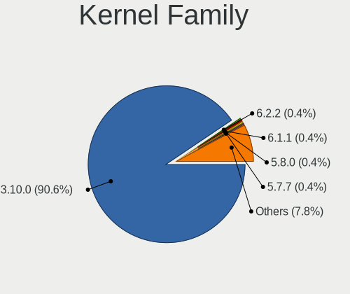

| Version | Desktops | Percent |
|---------|----------|---------|
| 3.10.0  | 114      | 87.02%  |
| 5.8.0   | 1        | 0.76%   |
| 5.7.7   | 1        | 0.76%   |
| 5.7.10  | 1        | 0.76%   |
| 5.6.10  | 1        | 0.76%   |
| 5.5.0   | 1        | 0.76%   |
| 5.4.96  | 1        | 0.76%   |
| 5.4.142 | 1        | 0.76%   |
| 5.4.119 | 1        | 0.76%   |
| 5.4.118 | 1        | 0.76%   |
| 5.4.113 | 1        | 0.76%   |
| 5.3.11  | 1        | 0.76%   |
| 5.1.19  | 1        | 0.76%   |
| 4.9.188 | 1        | 0.76%   |
| 4.9.182 | 1        | 0.76%   |
| 4.9.180 | 1        | 0.76%   |
| 4.9.179 | 1        | 0.76%   |
| 4.20.4  | 1        | 0.76%   |

Kernel Major Ver.
-----------------

Linux kernel major version

| Version | Desktops | Percent |
|---------|----------|---------|
| 3.10    | 114      | 87.02%  |
| 5.4     | 5        | 3.82%   |
| 4.9     | 4        | 3.05%   |
| 5.7     | 2        | 1.53%   |
| 5.8     | 1        | 0.76%   |
| 5.6     | 1        | 0.76%   |
| 5.5     | 1        | 0.76%   |
| 5.3     | 1        | 0.76%   |
| 5.1     | 1        | 0.76%   |
| 4.20    | 1        | 0.76%   |

Arch
----

OS architecture (x86_64, i586, etc.)

| Name   | Desktops | Percent |
|--------|----------|---------|
| x86_64 | 131      | 100%    |

DE
--

Desktop Environment

| Name          | Desktops | Percent |
|---------------|----------|---------|
| Unknown       | 56       | 42.42%  |
| GNOME         | 45       | 34.09%  |
| KDE4          | 14       | 10.61%  |
| GNOME Classic | 10       | 7.58%   |
| MATE          | 4        | 3.03%   |
| Cinnamon      | 2        | 1.52%   |
| Xpra          | 1        | 0.76%   |

Display Server
--------------

X11 or Wayland

| Name    | Desktops | Percent |
|---------|----------|---------|
| X11     | 106      | 80.92%  |
| Unknown | 24       | 18.32%  |
| Web     | 1        | 0.76%   |

Display Manager
---------------

SDDM, LightDM, etc.

| Name    | Desktops | Percent |
|---------|----------|---------|
| Unknown | 65       | 49.24%  |
| GDM     | 63       | 47.73%  |
| LightDM | 4        | 3.03%   |

OS Lang
-------

Language

| Lang        | Desktops | Percent |
|-------------|----------|---------|
| en_US       | 54       | 40.6%   |
| Unknown     | 33       | 24.81%  |
| C           | 15       | 11.28%  |
| ru_RU       | 4        | 3.01%   |
| en_CA       | 4        | 3.01%   |
| en_AU       | 4        | 3.01%   |
| en_GB       | 3        | 2.26%   |
| de_AT       | 3        | 2.26%   |
| zh_CN       | 2        | 1.5%    |
| pt_BR       | 2        | 1.5%    |
| fr_FR       | 2        | 1.5%    |
| pl_PL       | 1        | 0.75%   |
| ko_KR       | 1        | 0.75%   |
| fr_CA       | 1        | 0.75%   |
| en_US.utf-8 | 1        | 0.75%   |
| en_SG       | 1        | 0.75%   |
| en_IN       | 1        | 0.75%   |
| de_DE       | 1        | 0.75%   |

Boot Mode
---------

EFI or BIOS

| Mode | Desktops | Percent |
|------|----------|---------|
| BIOS | 68       | 51.91%  |
| EFI  | 63       | 48.09%  |

Filesystem
----------

Type of filesystem

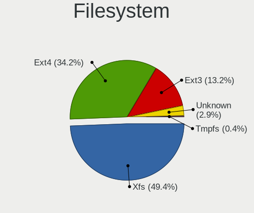

| Type | Desktops | Percent |
|------|----------|---------|
| Xfs  | 94       | 71.76%  |
| Ext4 | 36       | 27.48%  |
| Ext3 | 1        | 0.76%   |

Part. scheme
------------

Scheme of partitioning

| Type    | Desktops | Percent |
|---------|----------|---------|
| GPT     | 70       | 52.63%  |
| MBR     | 43       | 32.33%  |
| Unknown | 20       | 15.04%  |

Dual Boot with Linux/BSD
------------------------

Hosting more than one Linux/BSD

| Dual boot | Desktops | Percent |
|-----------|----------|---------|
| No        | 113      | 86.26%  |
| Yes       | 18       | 13.74%  |

Dual Boot (Win)
---------------

Hosting Linux and Windows

| Dual boot | Desktops | Percent |
|-----------|----------|---------|
| No        | 116      | 88.55%  |
| Yes       | 15       | 11.45%  |

Board
-----

Vendor
------

Motherboard manufacturer

| Name                | Desktops | Percent |
|---------------------|----------|---------|
| Dell                | 31       | 23.66%  |
| ASUSTek Computer    | 24       | 18.32%  |
| Hewlett-Packard     | 20       | 15.27%  |
| Gigabyte Technology | 18       | 13.74%  |
| ASRock              | 6        | 4.58%   |
| Intel               | 4        | 3.05%   |
| Supermicro          | 3        | 2.29%   |
| MSI                 | 3        | 2.29%   |
| ASRockRack          | 3        | 2.29%   |
| MiTAC               | 2        | 1.53%   |
| Lenovo              | 2        | 1.53%   |
| Fujitsu             | 2        | 1.53%   |
| ECS                 | 2        | 1.53%   |
| AMI                 | 2        | 1.53%   |
| Unknown             | 2        | 1.53%   |
| Zenith              | 1        | 0.76%   |
| Huanan              | 1        | 0.76%   |
| Foxconn             | 1        | 0.76%   |
| eMachines           | 1        | 0.76%   |
| Cisco Systems       | 1        | 0.76%   |
| AEWIN               | 1        | 0.76%   |
| AAEON               | 1        | 0.76%   |

Model
-----

Motherboard model

| Name                                | Desktops | Percent |
|-------------------------------------|----------|---------|
| Dell OptiPlex 7040                  | 8        | 6.11%   |
| Dell OptiPlex 9020                  | 7        | 5.34%   |
| ASUS All Series                     | 5        | 3.82%   |
| Dell Precision WorkStation T3500    | 3        | 2.29%   |
| ASRockRack E3C242D4U2-2T            | 3        | 2.29%   |
| HP Z800 Workstation                 | 2        | 1.53%   |
| HP Z420 Workstation                 | 2        | 1.53%   |
| HP Compaq Elite 8300 SFF            | 2        | 1.53%   |
| Fujitsu D3401-H1                    | 2        | 1.53%   |
| Unknown                             | 2        | 1.53%   |
| Zenith Orion                        | 1        | 0.76%   |
| Supermicro SYS-E200-8D              | 1        | 0.76%   |
| Supermicro SYS-5038MD-H24TRF-OS012  | 1        | 0.76%   |
| Supermicro SYS-1028GR-TR            | 1        | 0.76%   |
| MSI MS-7B89                         | 1        | 0.76%   |
| MSI MS-7A94                         | 1        | 0.76%   |
| MSI MS-7978                         | 1        | 0.76%   |
| MiTAC UltraPoint                    | 1        | 0.76%   |
| MiTAC PD10BI                        | 1        | 0.76%   |
| Lenovo 70UB001NEA ThinkServer TS150 | 1        | 0.76%   |
| Lenovo 70A4000FUX ThinkServer TS140 | 1        | 0.76%   |
| Intel SHARKBAY                      | 1        | 0.76%   |
| Intel SandyBridge Platform          | 1        | 0.76%   |
| Intel H81C                          | 1        | 0.76%   |
| Intel DQ67OW AAG12528-309           | 1        | 0.76%   |
| Huanan X79                          | 1        | 0.76%   |
| HP Z4 G4 Workstation                | 1        | 0.76%   |
| HP Z2 Tower G5 Workstation          | 1        | 0.76%   |
| HP Z1 Entry Tower G5                | 1        | 0.76%   |
| HP xw8600 Workstation               | 1        | 0.76%   |
| HP xw6600 Workstation               | 1        | 0.76%   |
| HP t620 PLUS Quad Core TC           | 1        | 0.76%   |
| HP ProDesk 400 G7 Microtower PC     | 1        | 0.76%   |
| HP EliteDesk 800 G5 Desktop Mini    | 1        | 0.76%   |
| HP EliteDesk 800 G2 SFF             | 1        | 0.76%   |
| HP EliteDesk 800 G1 TWR             | 1        | 0.76%   |
| HP EliteDesk 800 G1 DM              | 1        | 0.76%   |
| HP Compaq 8200 Elite SFF PC         | 1        | 0.76%   |
| HP Compaq 8200 Elite CMT PC         | 1        | 0.76%   |
| HP 280 G1 MT BUSINESS PC            | 1        | 0.76%   |
| Gigabyte Z77-D3H                    | 1        | 0.76%   |
| Gigabyte Z170X-UD3                  | 1        | 0.76%   |
| Gigabyte P85-D3                     | 1        | 0.76%   |
| Gigabyte H97N-WIFI                  | 1        | 0.76%   |
| Gigabyte GA-78LMT-USB3              | 1        | 0.76%   |
| Gigabyte G41M-ES2L                  | 1        | 0.76%   |
| Gigabyte EP45-DS3L                  | 1        | 0.76%   |
| Gigabyte EP43-DS3                   | 1        | 0.76%   |
| Gigabyte D525TUD                    | 1        | 0.76%   |
| Gigabyte B85M-D3PH                  | 1        | 0.76%   |
| Gigabyte B450M DS3H                 | 1        | 0.76%   |
| Gigabyte B450 AORUS M               | 1        | 0.76%   |
| Gigabyte B360M-DS3H                 | 1        | 0.76%   |
| Gigabyte B360 HD3P-LM               | 1        | 0.76%   |
| Gigabyte B360 HD3                   | 1        | 0.76%   |
| Gigabyte B150M-D3H-CF               | 1        | 0.76%   |
| Gigabyte 970A-DS3P                  | 1        | 0.76%   |
| Gigabyte 970A-D3P                   | 1        | 0.76%   |
| Foxconn Pro 3400 Series MT          | 1        | 0.76%   |
| eMachines ET1830                    | 1        | 0.76%   |

Model Family
------------

Motherboard model prefix

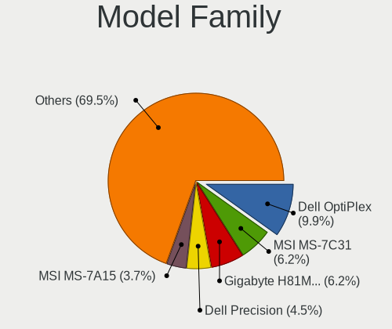

| Name                               | Desktops | Percent |
|------------------------------------|----------|---------|
| Dell OptiPlex                      | 21       | 16.03%  |
| Dell Precision                     | 9        | 6.87%   |
| ASUS All                           | 5        | 3.82%   |
| HP EliteDesk                       | 4        | 3.05%   |
| HP Compaq                          | 4        | 3.05%   |
| ASUS PRIME                         | 4        | 3.05%   |
| ASRockRack E3C242D4U2-2T           | 3        | 2.29%   |
| HP Z800                            | 2        | 1.53%   |
| HP Z420                            | 2        | 1.53%   |
| Gigabyte B360                      | 2        | 1.53%   |
| Fujitsu D3401-H1                   | 2        | 1.53%   |
| ASUS ROG                           | 2        | 1.53%   |
| ASUS M5A78L-M                      | 2        | 1.53%   |
| Unknown                            | 2        | 1.53%   |
| Zenith Orion                       | 1        | 0.76%   |
| Supermicro SYS-E200-8D             | 1        | 0.76%   |
| Supermicro SYS-5038MD-H24TRF-OS012 | 1        | 0.76%   |
| Supermicro SYS-1028GR-TR           | 1        | 0.76%   |
| MSI MS-7B89                        | 1        | 0.76%   |
| MSI MS-7A94                        | 1        | 0.76%   |
| MSI MS-7978                        | 1        | 0.76%   |
| MiTAC UltraPoint                   | 1        | 0.76%   |
| MiTAC PD10BI                       | 1        | 0.76%   |
| Lenovo 70UB001NEA                  | 1        | 0.76%   |
| Lenovo 70A4000FUX                  | 1        | 0.76%   |
| Intel SHARKBAY                     | 1        | 0.76%   |
| Intel SandyBridge                  | 1        | 0.76%   |
| Intel H81C                         | 1        | 0.76%   |
| Intel DQ67OW                       | 1        | 0.76%   |
| Huanan X79                         | 1        | 0.76%   |
| HP Z4                              | 1        | 0.76%   |
| HP Z2                              | 1        | 0.76%   |
| HP Z1                              | 1        | 0.76%   |
| HP xw8600                          | 1        | 0.76%   |
| HP xw6600                          | 1        | 0.76%   |
| HP t620                            | 1        | 0.76%   |
| HP ProDesk                         | 1        | 0.76%   |
| HP 280                             | 1        | 0.76%   |
| Gigabyte Z77-D3H                   | 1        | 0.76%   |
| Gigabyte Z170X-UD3                 | 1        | 0.76%   |
| Gigabyte P85-D3                    | 1        | 0.76%   |
| Gigabyte H97N-WIFI                 | 1        | 0.76%   |
| Gigabyte GA-78LMT-USB3             | 1        | 0.76%   |
| Gigabyte G41M-ES2L                 | 1        | 0.76%   |
| Gigabyte EP45-DS3L                 | 1        | 0.76%   |
| Gigabyte EP43-DS3                  | 1        | 0.76%   |
| Gigabyte D525TUD                   | 1        | 0.76%   |
| Gigabyte B85M-D3PH                 | 1        | 0.76%   |
| Gigabyte B450M                     | 1        | 0.76%   |
| Gigabyte B450                      | 1        | 0.76%   |
| Gigabyte B360M-DS3H                | 1        | 0.76%   |
| Gigabyte B150M-D3H-CF              | 1        | 0.76%   |
| Gigabyte 970A-DS3P                 | 1        | 0.76%   |
| Gigabyte 970A-D3P                  | 1        | 0.76%   |
| Foxconn Pro                        | 1        | 0.76%   |
| eMachines ET1830                   | 1        | 0.76%   |
| ECS H61H2-MV                       | 1        | 0.76%   |
| ECS H55H-M                         | 1        | 0.76%   |
| Dell Vostro                        | 1        | 0.76%   |
| Cisco Systems UCSB-B200-M4         | 1        | 0.76%   |

MFG Year
--------

Motherboard manufacture year

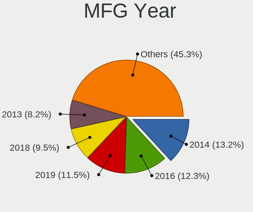

| Year    | Desktops | Percent |
|---------|----------|---------|
| 2014    | 17       | 12.98%  |
| 2016    | 14       | 10.69%  |
| 2018    | 13       | 9.92%   |
| 2012    | 13       | 9.92%   |
| 2011    | 11       | 8.4%    |
| 2019    | 10       | 7.63%   |
| 2015    | 9        | 6.87%   |
| 2013    | 9        | 6.87%   |
| 2017    | 8        | 6.11%   |
| 2010    | 8        | 6.11%   |
| 2020    | 6        | 4.58%   |
| 2008    | 5        | 3.82%   |
| 2021    | 4        | 3.05%   |
| 2009    | 3        | 2.29%   |
| Unknown | 1        | 0.76%   |

Form Factor
-----------

Physical design of the computer

| Name    | Desktops | Percent |
|---------|----------|---------|
| Desktop | 131      | 100%    |

Secure Boot
-----------

Enabled or disabled

| State    | Desktops | Percent |
|----------|----------|---------|
| Disabled | 128      | 97.71%  |
| Enabled  | 3        | 2.29%   |

Coreboot
--------

Have coreboot on board

| Used | Desktops | Percent |
|------|----------|---------|
| No   | 130      | 99.24%  |
| Yes  | 1        | 0.76%   |

RAM Size
--------

Total RAM memory

| Size in GB      | Desktops | Percent |
|-----------------|----------|---------|
| 4.01-8.0        | 36       | 27.48%  |
| 32.01-64.0      | 27       | 20.61%  |
| 16.01-24.0      | 22       | 16.79%  |
| 64.01-256.0     | 13       | 9.92%   |
| 3.01-4.0        | 11       | 8.4%    |
| 8.01-16.0       | 11       | 8.4%    |
| 1.01-2.0        | 7        | 5.34%   |
| More than 256.0 | 2        | 1.53%   |
| 24.01-32.0      | 2        | 1.53%   |

RAM Used
--------

Used RAM memory

| Used GB    | Desktops | Percent |
|------------|----------|---------|
| 1.01-2.0   | 30       | 22.06%  |
| 0.51-1.0   | 24       | 17.65%  |
| 2.01-3.0   | 22       | 16.18%  |
| 4.01-8.0   | 20       | 14.71%  |
| 8.01-16.0  | 14       | 10.29%  |
| 3.01-4.0   | 12       | 8.82%   |
| 0.01-0.5   | 9        | 6.62%   |
| 16.01-24.0 | 3        | 2.21%   |
| 24.01-32.0 | 2        | 1.47%   |

Total Drives
------------

Number of drives on board

| Drives | Desktops | Percent |
|--------|----------|---------|
| 1      | 56       | 42.11%  |
| 2      | 30       | 22.56%  |
| 3      | 19       | 14.29%  |
| 4      | 8        | 6.02%   |
| 6      | 5        | 3.76%   |
| 5      | 4        | 3.01%   |
| 10     | 2        | 1.5%    |
| 7      | 2        | 1.5%    |
| 0      | 2        | 1.5%    |
| 71     | 1        | 0.75%   |
| 68     | 1        | 0.75%   |
| 15     | 1        | 0.75%   |
| 12     | 1        | 0.75%   |
| 9      | 1        | 0.75%   |

Has CD-ROM
----------

Has CD-ROM on board

| Presented | Desktops | Percent |
|-----------|----------|---------|
| No        | 74       | 56.49%  |
| Yes       | 57       | 43.51%  |

Has Ethernet
------------

Has Ethernet on board

| Presented | Desktops | Percent |
|-----------|----------|---------|
| Yes       | 130      | 99.24%  |
| No        | 1        | 0.76%   |

Has WiFi
--------

Has WiFi module

| Presented | Desktops | Percent |
|-----------|----------|---------|
| No        | 108      | 82.44%  |
| Yes       | 23       | 17.56%  |

Has Bluetooth
-------------

Has Bluetooth module

| Presented | Desktops | Percent |
|-----------|----------|---------|
| No        | 115      | 87.79%  |
| Yes       | 16       | 12.21%  |

Location
--------

Country
-------

Geographic location (country)

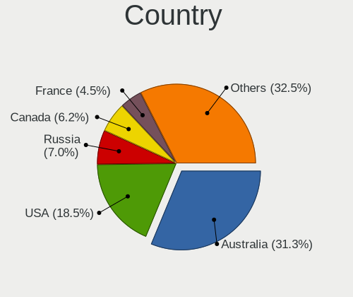

| Country      | Desktops | Percent |
|--------------|----------|---------|
| USA          | 42       | 31.82%  |
| Russia       | 13       | 9.85%   |
| Canada       | 9        | 6.82%   |
| UK           | 7        | 5.3%    |
| Germany      | 7        | 5.3%    |
| Brazil       | 7        | 5.3%    |
| France       | 6        | 4.55%   |
| Australia    | 6        | 4.55%   |
| India        | 4        | 3.03%   |
| Switzerland  | 3        | 2.27%   |
| South Korea  | 3        | 2.27%   |
| China        | 3        | 2.27%   |
| Finland      | 2        | 1.52%   |
| Czechia      | 2        | 1.52%   |
| Bulgaria     | 2        | 1.52%   |
| Belgium      | 2        | 1.52%   |
| Ukraine      | 1        | 0.76%   |
| Taiwan       | 1        | 0.76%   |
| Sweden       | 1        | 0.76%   |
| Spain        | 1        | 0.76%   |
| South Africa | 1        | 0.76%   |
| Singapore    | 1        | 0.76%   |
| Romania      | 1        | 0.76%   |
| Poland       | 1        | 0.76%   |
| Pakistan     | 1        | 0.76%   |
| Norway       | 1        | 0.76%   |
| Japan        | 1        | 0.76%   |
| Israel       | 1        | 0.76%   |
| Hong Kong    | 1        | 0.76%   |
| Ecuador      | 1        | 0.76%   |

City
----

Geographic location (city)

| City               | Desktops | Percent |
|--------------------|----------|---------|
| Rochester          | 15       | 11.11%  |
| Moscow             | 5        | 3.7%    |
| London             | 4        | 2.96%   |
| Frankfurt am Main  | 4        | 2.96%   |
| Alexandria         | 4        | 2.96%   |
| Victoria           | 3        | 2.22%   |
| Sydney             | 3        | 2.22%   |
| St Petersburg      | 3        | 2.22%   |
| Vancouver          | 2        | 1.48%   |
| Tampa              | 2        | 1.48%   |
| Paris              | 2        | 1.48%   |
| Montreal           | 2        | 1.48%   |
| Hornsby            | 2        | 1.48%   |
| Helsinki           | 2        | 1.48%   |
| Brno               | 2        | 1.48%   |
| Brandon            | 2        | 1.48%   |
| Yel'tsovka         | 1        | 0.74%   |
| Wuxi               | 1        | 0.74%   |
| Wheeling           | 1        | 0.74%   |
| West Henrietta     | 1        | 0.74%   |
| Waxhaw             | 1        | 0.74%   |
| Universitrio   | 1        | 0.74%   |
| Tyumen             | 1        | 0.74%   |
| Tucson             | 1        | 0.74%   |
| Tours              | 1        | 0.74%   |
| Tokyo              | 1        | 0.74%   |
| Tel Aviv           | 1        | 0.74%   |
| Sundbyberg         | 1        | 0.74%   |
| St Andrews         | 1        | 0.74%   |
| Springfield        | 1        | 0.74%   |
| Singapore          | 1        | 0.74%   |
| Shanghai           | 1        | 0.74%   |
| Seattle            | 1        | 0.74%   |
| Saratoga Springs   | 1        | 0.74%   |
| Sao Paulo          | 1        | 0.74%   |
| Sao Joao de Meriti | 1        | 0.74%   |
| Santa Luzia        | 1        | 0.74%   |
| Roubaix            | 1        | 0.74%   |
| Roodepoort         | 1        | 0.74%   |
| Rio de Janeiro     | 1        | 0.74%   |
| Reston             | 1        | 0.74%   |
| Red Oak            | 1        | 0.74%   |
| Rancho Cordova     | 1        | 0.74%   |
| Pyeongtaek-si      | 1        | 0.74%   |
| Porto Alegre       | 1        | 0.74%   |
| Papillion          | 1        | 0.74%   |
| Noril'sk           | 1        | 0.74%   |
| Nizhnevartovsk     | 1        | 0.74%   |
| New Taipei         | 1        | 0.74%   |
| Munich             | 1        | 0.74%   |
| Mumbai             | 1        | 0.74%   |
| Meyrin             | 1        | 0.74%   |
| Messery            | 1        | 0.74%   |
| Melbourne          | 1        | 0.74%   |
| Mayor Uzunovo      | 1        | 0.74%   |
| Mayfair            | 1        | 0.74%   |
| Lombard            | 1        | 0.74%   |
| Lausanne           | 1        | 0.74%   |
| Lahore             | 1        | 0.74%   |
| Lafayette          | 1        | 0.74%   |

Drives
------

Drive Vendor
------------

Hard drive vendors

| Vendor                    | Desktops | Drives | Percent |
|---------------------------|----------|--------|---------|
| Seagate                   | 47       | 216    | 22.27%  |
| WDC                       | 45       | 85     | 21.33%  |
| Samsung Electronics       | 27       | 101    | 12.8%   |
| Toshiba                   | 17       | 25     | 8.06%   |
| Kingston                  | 14       | 17     | 6.64%   |
| Hitachi                   | 11       | 19     | 5.21%   |
| SanDisk                   | 10       | 13     | 4.74%   |
| Intel                     | 8        | 26     | 3.79%   |
| Unknown                   | 5        | 14     | 2.37%   |
| HGST                      | 5        | 71     | 2.37%   |
| SK Hynix                  | 3        | 3      | 1.42%   |
| A-DATA Technology         | 2        | 3      | 0.95%   |
| Transcend                 | 1        | 1      | 0.47%   |
| SUN                       | 1        | 3      | 0.47%   |
| SPCC                      | 1        | 1      | 0.47%   |
| OWC                       | 1        | 1      | 0.47%   |
| OCZ                       | 1        | 1      | 0.47%   |
| NVMe                      | 1        | 1      | 0.47%   |
| Micron/Crucial Technology | 1        | 1      | 0.47%   |
| Micron Technology         | 1        | 2      | 0.47%   |
| MAXTOR                    | 1        | 1      | 0.47%   |
| LITEONIT                  | 1        | 1      | 0.47%   |
| Lenovo                    | 1        | 2      | 0.47%   |
| Kingston Technologies     | 1        | 1      | 0.47%   |
| KingSpec                  | 1        | 1      | 0.47%   |
| KingDian                  | 1        | 4      | 0.47%   |
| Hewlett-Packard           | 1        | 1      | 0.47%   |
| GLOWAY                    | 1        | 1      | 0.47%   |
| Corsair                   | 1        | 1      | 0.47%   |

Drive Model
-----------

Hard drive models

| Model                             | Desktops | Percent |
|-----------------------------------|----------|---------|
| Toshiba DT01ACA050 500GB          | 6        | 2.29%   |
| Seagate ST500DM002-1SB10A 500GB   | 6        | 2.29%   |
| Seagate ST500DM002-1BD142 500GB   | 4        | 1.53%   |
| Samsung SSD 860 EVO 250GB         | 4        | 1.53%   |
| WDC WD40EZAZ-00SF3B0 4TB          | 3        | 1.15%   |
| Seagate ST6000NM0095 6TB          | 3        | 1.15%   |
| Seagate ST6000NM0034 6TB          | 3        | 1.15%   |
| Seagate ST6000NM0014 6TB          | 3        | 1.15%   |
| Seagate ST4000NXCLAR4000 4TB      | 3        | 1.15%   |
| Seagate ST4000NM0023 4TB          | 3        | 1.15%   |
| Seagate ST1000DM010-2EP102 1TB    | 3        | 1.15%   |
| WDC WDS250G2B0A-00SM50 250GB SSD  | 2        | 0.76%   |
| WDC WD3200AAKS-75L9A0 320GB       | 2        | 0.76%   |
| WDC WD10EZEX-00BN5A0 1TB          | 2        | 0.76%   |
| Unknown HUH728080ALE601 8TB       | 2        | 0.76%   |
| Toshiba DT01ACA200 2TB            | 2        | 0.76%   |
| Toshiba DT01ACA100 1TB            | 2        | 0.76%   |
| SK Hynix SHGS31-500GS-2 500GB SSD | 2        | 0.76%   |
| Seagate ST4000VM000-2AF166 4TB    | 2        | 0.76%   |
| Seagate ST3000NC002-1DY166 3TB    | 2        | 0.76%   |
| Seagate ST2000DM006-2DM164 2TB    | 2        | 0.76%   |
| Seagate ST16000NM001G-2KK103 16TB | 2        | 0.76%   |
| Seagate ST1000DM003-1CH162 1TB    | 2        | 0.76%   |
| Sandisk WDC WDS100T2B0C 1TB       | 2        | 0.76%   |
| Sandisk WDC CL SN720 SDA 512GB    | 2        | 0.76%   |
| Kingston SV300S37A120G 120GB SSD  | 2        | 0.76%   |
| HGST HUS726060ALS640 6TB          | 2        | 0.76%   |
| HGST H7280A520SUN8.0T 8TB         | 2        | 0.76%   |
| WDC WDS500G2B0A-00SM50 500GB SSD  | 1        | 0.38%   |
| WDC WDS500G2B0A 500GB SSD         | 1        | 0.38%   |
| WDC WDS240G2G0A-00JH30 240GB SSD  | 1        | 0.38%   |
| WDC WDS120G1G0A-00SS50 120GB SSD  | 1        | 0.38%   |
| WDC WD80EFAX-68KNBN0 8TB          | 1        | 0.38%   |
| WDC WD7500BPVX-22JC3T0 752GB      | 1        | 0.38%   |
| WDC WD60EFRX-68L0BN1 6TB          | 1        | 0.38%   |
| WDC WD5003ABYX-01WERA0 500GB      | 1        | 0.38%   |
| WDC WD5000AZLX-75K2TA0 500GB      | 1        | 0.38%   |
| WDC WD5000AZLX-60K2TA1 500GB      | 1        | 0.38%   |
| WDC WD5000AVCS-632DY1 500GB       | 1        | 0.38%   |
| WDC WD5000AAKX-75U6AA0 500GB      | 1        | 0.38%   |
| WDC WD5000AAKX-603CA0 500GB       | 1        | 0.38%   |
| WDC WD5000AAKX-00ERMA0 500GB      | 1        | 0.38%   |
| WDC WD40EZRZ-75GXCB0 4TB          | 1        | 0.38%   |
| WDC WD40EZRX-00SPEB0 4TB          | 1        | 0.38%   |
| WDC WD3202ABYS-02B7A0 320GB       | 1        | 0.38%   |
| WDC WD3200AAKX-753CA0 320GB       | 1        | 0.38%   |
| WDC WD3200AAKX-001CA0 320GB       | 1        | 0.38%   |
| WDC WD30PURX-64P6ZY0 3TB          | 1        | 0.38%   |
| WDC WD30EZRZ-22Z5HB0 3TB          | 1        | 0.38%   |
| WDC WD30EZRZ-00GXCB0 3TB          | 1        | 0.38%   |
| WDC WD30EZRX-00MMMB0 3TB          | 1        | 0.38%   |
| WDC WD30EZRX-00DC0B0 3TB          | 1        | 0.38%   |
| WDC WD2500HHTZ-04N21V0 250GB      | 1        | 0.38%   |
| WDC WD2500BEVT-35A23T0 250GB      | 1        | 0.38%   |
| WDC WD20EZRX-00DC0B0 2TB          | 1        | 0.38%   |
| WDC WD20EZRX-00D8PB0 2TB          | 1        | 0.38%   |
| WDC WD20EFRX-68EUZN0 2TB          | 1        | 0.38%   |
| WDC WD20EARX-00PASB0 2TB          | 1        | 0.38%   |
| WDC WD20EARS-00MVWB0 2TB          | 1        | 0.38%   |
| WDC WD2003FZEX-00Z4SA0 2TB        | 1        | 0.38%   |

HDD Vendor
----------

Hard disk drive vendors

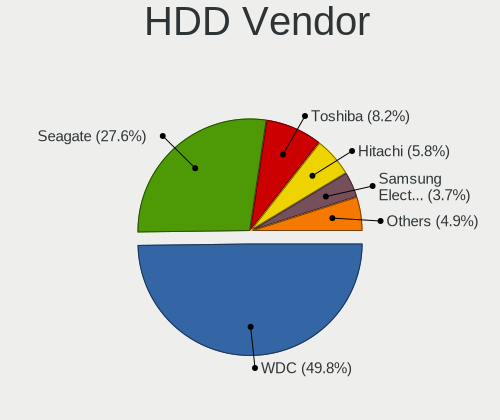

| Vendor              | Desktops | Drives | Percent |
|---------------------|----------|--------|---------|
| Seagate             | 47       | 215    | 35.07%  |
| WDC                 | 43       | 77     | 32.09%  |
| Toshiba             | 17       | 25     | 12.69%  |
| Hitachi             | 11       | 19     | 8.21%   |
| Samsung Electronics | 6        | 77     | 4.48%   |
| HGST                | 5        | 24     | 3.73%   |
| Unknown             | 2        | 11     | 1.49%   |
| SUN                 | 1        | 3      | 0.75%   |
| MAXTOR              | 1        | 1      | 0.75%   |
| Lenovo              | 1        | 2      | 0.75%   |

SSD Vendor
----------

Solid state drive vendors

| Vendor              | Desktops | Drives | Percent |
|---------------------|----------|--------|---------|
| Kingston            | 14       | 17     | 23.33%  |
| Samsung Electronics | 13       | 14     | 21.67%  |
| Intel               | 8        | 25     | 13.33%  |
| WDC                 | 5        | 8      | 8.33%   |
| SanDisk             | 4        | 4      | 6.67%   |
| SK Hynix            | 3        | 3      | 5%      |
| A-DATA Technology   | 2        | 3      | 3.33%   |
| Transcend           | 1        | 1      | 1.67%   |
| SPCC                | 1        | 1      | 1.67%   |
| Seagate             | 1        | 1      | 1.67%   |
| OWC                 | 1        | 1      | 1.67%   |
| OCZ                 | 1        | 1      | 1.67%   |
| Micron Technology   | 1        | 2      | 1.67%   |
| LITEONIT            | 1        | 1      | 1.67%   |
| KingDian            | 1        | 4      | 1.67%   |
| Hewlett-Packard     | 1        | 1      | 1.67%   |
| GLOWAY              | 1        | 1      | 1.67%   |
| Corsair             | 1        | 1      | 1.67%   |

Drive Kind
----------

HDD or SSD

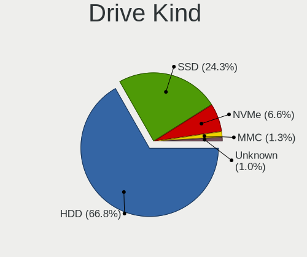

| Kind    | Desktops | Drives | Percent |
|---------|----------|--------|---------|
| HDD     | 99       | 454    | 56.9%   |
| SSD     | 52       | 89     | 29.89%  |
| NVMe    | 16       | 22     | 9.2%    |
| MMC     | 4        | 4      | 2.3%    |
| Unknown | 3        | 48     | 1.72%   |

Drive Connector
---------------

SATA, SAS, NVMe, etc.

| Type | Desktops | Drives | Percent |
|------|----------|--------|---------|
| SATA | 114      | 398    | 79.17%  |
| NVMe | 16       | 22     | 11.11%  |
| SAS  | 10       | 193    | 6.94%   |
| MMC  | 4        | 4      | 2.78%   |

Drive Size
----------

Size of hard drive

| Size in TB | Desktops | Drives | Percent |
|------------|----------|--------|---------|
| 0.01-0.5   | 82       | 213    | 45.56%  |
| 0.51-1.0   | 47       | 59     | 26.11%  |
| 3.01-4.0   | 14       | 109    | 7.78%   |
| 1.01-2.0   | 14       | 30     | 7.78%   |
| 2.01-3.0   | 9        | 20     | 5%      |
| 4.01-10.0  | 9        | 81     | 5%      |
| 10.01-20.0 | 5        | 31     | 2.78%   |

Space Total
-----------

Amount of disk space available on the file system

| Size in GB     | Desktops | Percent |
|----------------|----------|---------|
| 251-500        | 34       | 25.37%  |
| More than 3000 | 24       | 17.91%  |
| 101-250        | 19       | 14.18%  |
| 501-1000       | 18       | 13.43%  |
| 1001-2000      | 11       | 8.21%   |
| Unknown        | 9        | 6.72%   |
| 21-50          | 7        | 5.22%   |
| 1-20           | 5        | 3.73%   |
| 51-100         | 4        | 2.99%   |
| 2001-3000      | 3        | 2.24%   |

Space Used
----------

Amount of used disk space

| Used GB        | Desktops | Percent |
|----------------|----------|---------|
| 1-20           | 52       | 39.1%   |
| More than 3000 | 13       | 9.77%   |
| 101-250        | 13       | 9.77%   |
| 251-500        | 12       | 9.02%   |
| 501-1000       | 11       | 8.27%   |
| 21-50          | 9        | 6.77%   |
| Unknown        | 9        | 6.77%   |
| 51-100         | 7        | 5.26%   |
| 2001-3000      | 3        | 2.26%   |
| 1001-2000      | 3        | 2.26%   |
| 0              | 1        | 0.75%   |

Malfunc. Drives
---------------

Drive models with a malfunction

| Model                                       | Desktops | Drives | Percent |
|---------------------------------------------|----------|--------|---------|
| Seagate ST500DM002-1BD142 500GB             | 2        | 2      | 6.06%   |
| WDC WD5000AVCS-632DY1 500GB                 | 1        | 1      | 3.03%   |
| WDC WD3200AAKS-75L9A0 320GB                 | 1        | 1      | 3.03%   |
| WDC WD2500HHTZ-04N21V0 250GB                | 1        | 1      | 3.03%   |
| WDC WD20EARX-00PASB0 2TB                    | 1        | 1      | 3.03%   |
| WDC WD20EARS-00MVWB0 2TB                    | 1        | 2      | 3.03%   |
| WDC WD10EZEX-60WN4A1 1TB                    | 1        | 1      | 3.03%   |
| WDC WD10EADS-00L5B1 1TB                     | 1        | 1      | 3.03%   |
| WDC WD1001FALS-00J7B1 1TB                   | 1        | 1      | 3.03%   |
| Seagate ST380211AS 80GB                     | 1        | 1      | 3.03%   |
| Seagate ST380013AS 80GB                     | 1        | 1      | 3.03%   |
| Seagate ST3250620NS 250GB                   | 1        | 2      | 3.03%   |
| Seagate ST31000524NS 1TB                    | 1        | 1      | 3.03%   |
| Seagate ST31000340AS 1TB                    | 1        | 1      | 3.03%   |
| Seagate ST2000DM001-9YN164 2TB              | 1        | 1      | 3.03%   |
| Seagate ST1000NX0313 1TB                    | 1        | 1      | 3.03%   |
| SanDisk SDSSDX240GG25 240GB                 | 1        | 1      | 3.03%   |
| Samsung Electronics SSD SM871 2.5 7mm 512GB | 1        | 1      | 3.03%   |
| Samsung Electronics HD154UI 1TB             | 1        | 1      | 3.03%   |
| Samsung Electronics HD103UI 1TB             | 1        | 1      | 3.03%   |
| MAXTOR 6Y080L0 81GB                         | 1        | 1      | 3.03%   |
| LITEONIT LCT-256M3S 256GB SSD               | 1        | 1      | 3.03%   |
| Kingston SV100S264G 64GB SSD                | 1        | 1      | 3.03%   |
| Kingston SNS4151S316G 16GB SSD              | 1        | 1      | 3.03%   |
| Kingston SHFS37A120G 120GB SSD              | 1        | 1      | 3.03%   |
| Intel SSDSCKKW256G8 256GB                   | 1        | 1      | 3.03%   |
| Intel SSDSA2M120G2GC 120GB                  | 1        | 1      | 3.03%   |
| Intel SSDSA2M080G2LE 80GB                   | 1        | 14     | 3.03%   |
| Hitachi HTS542512K9A300 120GB               | 1        | 1      | 3.03%   |
| Hitachi HDS728080PLA380 80GB                | 1        | 1      | 3.03%   |
| Hitachi HDS721050CLA660 500GB               | 1        | 1      | 3.03%   |
| HGST HDN726060ALE610 6TB                    | 1        | 1      | 3.03%   |

Malfunc. Drive Vendor
---------------------

Vendors of faulty drives

| Vendor              | Desktops | Drives | Percent |
|---------------------|----------|--------|---------|
| Seagate             | 9        | 10     | 27.27%  |
| WDC                 | 8        | 9      | 24.24%  |
| Samsung Electronics | 3        | 3      | 9.09%   |
| Kingston            | 3        | 3      | 9.09%   |
| Intel               | 3        | 16     | 9.09%   |
| Hitachi             | 3        | 3      | 9.09%   |
| SanDisk             | 1        | 1      | 3.03%   |
| MAXTOR              | 1        | 1      | 3.03%   |
| LITEONIT            | 1        | 1      | 3.03%   |
| HGST                | 1        | 1      | 3.03%   |

Malfunc. HDD Vendor
-------------------

Vendors of faulty HDD drives

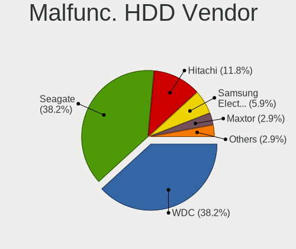

| Vendor              | Desktops | Drives | Percent |
|---------------------|----------|--------|---------|
| Seagate             | 9        | 10     | 37.5%   |
| WDC                 | 8        | 9      | 33.33%  |
| Hitachi             | 3        | 3      | 12.5%   |
| Samsung Electronics | 2        | 2      | 8.33%   |
| MAXTOR              | 1        | 1      | 4.17%   |
| HGST                | 1        | 1      | 4.17%   |

Malfunc. Drive Kind
-------------------

Kinds of faulty drives

| Kind | Desktops | Drives | Percent |
|------|----------|--------|---------|
| HDD  | 19       | 26     | 67.86%  |
| SSD  | 9        | 22     | 32.14%  |

Failed Drives
-------------

Failed drive models

Zero info for selected period =(

Failed Drive Vendor
-------------------

Failed drive vendors

Zero info for selected period =(

Drive Status
------------

Number of failed and malfunc. drives

| Status   | Desktops | Drives | Percent |
|----------|----------|--------|---------|
| Works    | 96       | 310    | 61.54%  |
| Detected | 34       | 259    | 21.79%  |
| Malfunc  | 26       | 48     | 16.67%  |

Storage controller
------------------

Storage Vendor
--------------

Storage controller vendors

| Vendor                      | Desktops | Percent |
|-----------------------------|----------|---------|
| Intel                       | 105      | 61.05%  |
| AMD                         | 18       | 10.47%  |
| Samsung Electronics         | 10       | 5.81%   |
| ASMedia Technology          | 8        | 4.65%   |
| Sandisk                     | 5        | 2.91%   |
| LSI Logic / Symbios Logic   | 5        | 2.91%   |
| Marvell Technology Group    | 4        | 2.33%   |
| JMicron Technology          | 4        | 2.33%   |
| Broadcom / LSI              | 4        | 2.33%   |
| Adaptec                     | 3        | 1.74%   |
| VIA Technologies            | 1        | 0.58%   |
| SK Hynix                    | 1        | 0.58%   |
| Silicon Image               | 1        | 0.58%   |
| Nvidia                      | 1        | 0.58%   |
| Micron/Crucial Technology   | 1        | 0.58%   |
| Kingston Technology Company | 1        | 0.58%   |

Storage Model
-------------

Storage controller models

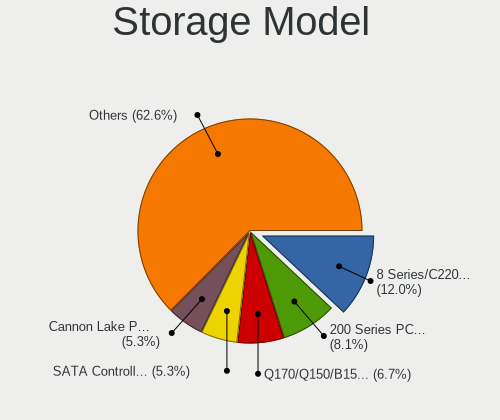

| Model                                                                                   | Desktops | Percent |
|-----------------------------------------------------------------------------------------|----------|---------|
| Intel 8 Series/C220 Series Chipset Family 6-port SATA Controller 1 [AHCI mode]          | 17       | 7.98%   |
| Intel SATA Controller [RAID mode]                                                       | 15       | 7.04%   |
| Intel Q170/Q150/B150/H170/H110/Z170/CM236 Chipset SATA Controller [AHCI Mode]           | 11       | 5.16%   |
| Intel Cannon Lake PCH SATA AHCI Controller                                              | 10       | 4.69%   |
| AMD FCH SATA Controller [AHCI mode]                                                     | 10       | 4.69%   |
| Samsung NVMe SSD Controller SM981/PM981/PM983                                           | 7        | 3.29%   |
| ASMedia ASM1062 Serial ATA Controller                                                   | 7        | 3.29%   |
| Intel 6 Series/C200 Series Chipset Family Desktop SATA Controller (IDE mode, ports 4-5) | 5        | 2.35%   |
| Intel 6 Series/C200 Series Chipset Family Desktop SATA Controller (IDE mode, ports 0-3) | 5        | 2.35%   |
| Intel C610/X99 series chipset 6-Port SATA Controller [AHCI mode]                        | 4        | 1.88%   |
| Intel C600/X79 series chipset 6-Port SATA AHCI Controller                               | 4        | 1.88%   |
| Intel 82801JI (ICH10 Family) SATA AHCI Controller                                       | 4        | 1.88%   |
| Intel 6 Series/C200 Series Chipset Family 6 port Desktop SATA AHCI Controller           | 4        | 1.88%   |
| AMD SB7x0/SB8x0/SB9x0 IDE Controller                                                    | 4        | 1.88%   |
| LSI Logic / Symbios Logic SAS2008 PCI-Express Fusion-MPT SAS-2 [Falcon]                 | 3        | 1.41%   |
| JMicron JMB363 SATA/IDE Controller                                                      | 3        | 1.41%   |
| Intel NM10/ICH7 Family SATA Controller [IDE mode]                                       | 3        | 1.41%   |
| Intel C610/X99 series chipset sSATA Controller [AHCI mode]                              | 3        | 1.41%   |
| Intel C602 chipset 4-Port SATA Storage Control Unit                                     | 3        | 1.41%   |
| Intel C600/X79 series chipset IDE-r Controller                                          | 3        | 1.41%   |
| Intel 7 Series/C210 Series Chipset Family 6-port SATA Controller [AHCI mode]            | 3        | 1.41%   |
| Intel 500 Series Chipset Family SATA AHCI Controller                                    | 3        | 1.41%   |
| AMD SB7x0/SB8x0/SB9x0 SATA Controller [AHCI mode]                                       | 3        | 1.41%   |
| AMD 400 Series Chipset SATA Controller                                                  | 3        | 1.41%   |
| Sandisk WD Blue SN550 NVMe SSD                                                          | 2        | 0.94%   |
| Sandisk WD Black 2018/SN750 / PC SN720 NVMe SSD                                         | 2        | 0.94%   |
| Samsung NVMe SSD Controller 980                                                         | 2        | 0.94%   |
| Marvell Group 88SE9235 PCIe 2.0 x2 4-port SATA 6 Gb/s Controller                        | 2        | 0.94%   |
| LSI Logic / Symbios Logic SAS1068E PCI-Express Fusion-MPT SAS                           | 2        | 0.94%   |
| Intel NM10/ICH7 Family SATA Controller [AHCI mode]                                      | 2        | 0.94%   |
| Intel Comet Lake SATA AHCI Controller                                                   | 2        | 0.94%   |
| Intel C600/X79 series chipset SATA RAID Controller                                      | 2        | 0.94%   |
| Intel 9 Series Chipset Family SATA Controller [AHCI Mode]                               | 2        | 0.94%   |
| Intel 82801G (ICH7 Family) IDE Controller                                               | 2        | 0.94%   |
| Intel 631xESB/632xESB SATA RAID Controller                                              | 2        | 0.94%   |
| Intel 631xESB/632xESB IDE Controller                                                    | 2        | 0.94%   |
| Broadcom / LSI SAS2116 PCI-Express Fusion-MPT SAS-2 [Meteor]                            | 2        | 0.94%   |
| ASMedia SATA controller                                                                 | 2        | 0.94%   |
| AMD SB7x0/SB8x0/SB9x0 SATA Controller [IDE mode]                                        | 2        | 0.94%   |
| AMD FCH IDE Controller                                                                  | 2        | 0.94%   |
| VIA VT6415 PATA IDE Host Controller                                                     | 1        | 0.47%   |
| SK Hynix BC501 NVMe Solid State Drive                                                   | 1        | 0.47%   |
| Silicon Image SiI 3132 Serial ATA Raid II Controller                                    | 1        | 0.47%   |
| Sandisk WD Black SN750 / PC SN730 NVMe SSD                                              | 1        | 0.47%   |
| Samsung Electronics SATA controller                                                     | 1        | 0.47%   |
| Nvidia MCP73 IDE Controller                                                             | 1        | 0.47%   |
| Nvidia GeForce 7100/nForce 630i SATA                                                    | 1        | 0.47%   |
| Micron/Crucial P1 NVMe PCIe SSD                                                         | 1        | 0.47%   |
| Marvell Group 88SE9230 PCIe 2.0 x2 4-port SATA 6 Gb/s RAID Controller                   | 1        | 0.47%   |
| Marvell Group 88SE9128 PCIe SATA 6 Gb/s RAID controller with HyperDuo                   | 1        | 0.47%   |
| Kingston Company A2000 NVMe SSD                                                         | 1        | 0.47%   |
| JMicron JMB362 SATA Controller                                                          | 1        | 0.47%   |
| Intel Volume Management Device NVMe RAID Controller                                     | 1        | 0.47%   |
| Intel Sunrise Point-LP SATA Controller [AHCI mode]                                      | 1        | 0.47%   |
| Intel SSD 660P Series                                                                   | 1        | 0.47%   |
| Intel Comet Lake PCH-H RAID                                                             | 1        | 0.47%   |
| Intel Celeron N3350/Pentium N4200/Atom E3900 Series SATA AHCI Controller                | 1        | 0.47%   |
| Intel C610/X99 series chipset sSATA Controller [RAID mode]                              | 1        | 0.47%   |
| Intel C600/X79 series chipset 4-Port SATA IDE Controller                                | 1        | 0.47%   |
| Intel C600/X79 series chipset 2-Port SATA IDE Controller                                | 1        | 0.47%   |

Storage Kind
------------

Kind of storage controller (IDE, SATA, NVMe, SAS, ...)

| Kind | Desktops | Percent |
|------|----------|---------|
| SATA | 91       | 52.91%  |
| RAID | 27       | 15.7%   |
| IDE  | 26       | 15.12%  |
| NVMe | 17       | 9.88%   |
| SAS  | 8        | 4.65%   |
| SCSI | 3        | 1.74%   |

Processor
---------

CPU Vendor
----------

Processor vendors

| Vendor | Desktops | Percent |
|--------|----------|---------|
| Intel  | 113      | 86.26%  |
| AMD    | 18       | 13.74%  |

CPU Model
---------

Processor models

| Model                                       | Desktops | Percent |
|---------------------------------------------|----------|---------|
| Intel Core i7-6700 CPU @ 3.40GHz            | 11       | 8.4%    |
| Intel Core i7-4790 CPU @ 3.60GHz            | 7        | 5.34%   |
| Intel Xeon E-2136 CPU @ 3.30GHz             | 3        | 2.29%   |
| Intel Xeon CPU X5680 @ 3.33GHz              | 2        | 1.53%   |
| Intel Xeon CPU W3530 @ 2.80GHz              | 2        | 1.53%   |
| Intel Xeon CPU E5-1620 0 @ 3.60GHz          | 2        | 1.53%   |
| Intel Core i7-7700 CPU @ 3.60GHz            | 2        | 1.53%   |
| Intel Core i5-9500 CPU @ 3.00GHz            | 2        | 1.53%   |
| Intel Core i5-3470 CPU @ 3.20GHz            | 2        | 1.53%   |
| Intel Core i3-4160 CPU @ 3.60GHz            | 2        | 1.53%   |
| Intel Core 2 Duo CPU E7500 @ 2.93GHz        | 2        | 1.53%   |
| Intel Atom x5-Z8350 CPU @ 1.44GHz           | 2        | 1.53%   |
| Intel Atom CPU D525 @ 1.80GHz               | 2        | 1.53%   |
| AMD Ryzen 5 1600 Six-Core Processor         | 2        | 1.53%   |
| AMD FX-6300 Six-Core Processor              | 2        | 1.53%   |
| Intel Xeon W-2155 CPU @ 3.30GHz             | 1        | 0.76%   |
| Intel Xeon W-2125 CPU @ 4.00GHz             | 1        | 0.76%   |
| Intel Xeon W-1290 CPU @ 3.20GHz             | 1        | 0.76%   |
| Intel Xeon CPU X5650 @ 2.67GHz              | 1        | 0.76%   |
| Intel Xeon CPU X5450 @ 3.00GHz              | 1        | 0.76%   |
| Intel Xeon CPU E5620 @ 2.40GHz              | 1        | 0.76%   |
| Intel Xeon CPU E5440 @ 2.83GHz              | 1        | 0.76%   |
| Intel Xeon CPU E5-2690 v4 @ 2.60GHz         | 1        | 0.76%   |
| Intel Xeon CPU E5-2690 v3 @ 2.60GHz         | 1        | 0.76%   |
| Intel Xeon CPU E5-2660 v3 @ 2.60GHz         | 1        | 0.76%   |
| Intel Xeon CPU E5-1650 0 @ 3.20GHz          | 1        | 0.76%   |
| Intel Xeon CPU E5-1607 0 @ 3.00GHz          | 1        | 0.76%   |
| Intel Xeon CPU E31220 @ 3.10GHz             | 1        | 0.76%   |
| Intel Xeon CPU E3-1230 v3 @ 3.30GHz         | 1        | 0.76%   |
| Intel Xeon CPU E3-1225 v6 @ 3.30GHz         | 1        | 0.76%   |
| Intel Xeon CPU D-1531 @ 2.20GHz             | 1        | 0.76%   |
| Intel Xeon CPU D-1528 @ 1.90GHz             | 1        | 0.76%   |
| Intel Pentium Dual-Core CPU E5700 @ 3.00GHz | 1        | 0.76%   |
| Intel Pentium Dual CPU E2180 @ 2.00GHz      | 1        | 0.76%   |
| Intel Pentium CPU J3710 @ 1.60GHz           | 1        | 0.76%   |
| Intel Pentium CPU G860 @ 3.00GHz            | 1        | 0.76%   |
| Intel Pentium CPU G4400 @ 3.30GHz           | 1        | 0.76%   |
| Intel Pentium CPU G3220T @ 2.60GHz          | 1        | 0.76%   |
| Intel Core i9-9900K CPU @ 3.60GHz           | 1        | 0.76%   |
| Intel Core i9-7940X CPU @ 3.10GHz           | 1        | 0.76%   |
| Intel Core i9-10900K CPU @ 3.70GHz          | 1        | 0.76%   |
| Intel Core i7-9700 CPU @ 3.00GHz            | 1        | 0.76%   |
| Intel Core i7-8700K CPU @ 3.70GHz           | 1        | 0.76%   |
| Intel Core i7-8700 CPU @ 3.20GHz            | 1        | 0.76%   |
| Intel Core i7-5960X CPU @ 3.00GHz           | 1        | 0.76%   |
| Intel Core i7-5930K CPU @ 3.50GHz           | 1        | 0.76%   |
| Intel Core i7-5820K CPU @ 3.30GHz           | 1        | 0.76%   |
| Intel Core i7-4790K CPU @ 4.00GHz           | 1        | 0.76%   |
| Intel Core i7-4710MQ CPU @ 2.50GHz          | 1        | 0.76%   |
| Intel Core i7-4500U CPU @ 1.80GHz           | 1        | 0.76%   |
| Intel Core i7-3820 CPU @ 3.60GHz            | 1        | 0.76%   |
| Intel Core i7-3770 CPU @ 3.40GHz            | 1        | 0.76%   |
| Intel Core i7-2700K CPU @ 3.50GHz           | 1        | 0.76%   |
| Intel Core i7-2600K CPU @ 3.40GHz           | 1        | 0.76%   |
| Intel Core i7-10700 CPU @ 2.90GHz           | 1        | 0.76%   |
| Intel Core i5-8400 CPU @ 2.80GHz            | 1        | 0.76%   |
| Intel Core i5-6600K CPU @ 3.50GHz           | 1        | 0.76%   |
| Intel Core i5-6600 CPU @ 3.30GHz            | 1        | 0.76%   |
| Intel Core i5-6500 CPU @ 3.20GHz            | 1        | 0.76%   |
| Intel Core i5-4670 CPU @ 3.40GHz            | 1        | 0.76%   |

CPU Model Family
----------------

Processor model prefix

| Model                   | Desktops | Percent |
|-------------------------|----------|---------|
| Intel Core i7           | 34       | 25.95%  |
| Intel Xeon              | 26       | 19.85%  |
| Intel Core i5           | 21       | 16.03%  |
| Intel Core i3           | 9        | 6.87%   |
| Intel Atom              | 6        | 4.58%   |
| AMD FX                  | 5        | 3.82%   |
| Intel Pentium           | 4        | 3.05%   |
| AMD Ryzen 5             | 4        | 3.05%   |
| Intel Core i9           | 3        | 2.29%   |
| Intel Core 2 Duo        | 3        | 2.29%   |
| Intel Core 2 Quad       | 2        | 1.53%   |
| Intel Celeron           | 2        | 1.53%   |
| Other                   | 1        | 0.76%   |
| Intel Pentium Dual-Core | 1        | 0.76%   |
| Intel Pentium Dual      | 1        | 0.76%   |
| AMD Ryzen Threadripper  | 1        | 0.76%   |
| AMD Ryzen 7             | 1        | 0.76%   |
| AMD Ryzen 3             | 1        | 0.76%   |
| AMD Phenom II X6        | 1        | 0.76%   |
| AMD GX                  | 1        | 0.76%   |
| AMD E2                  | 1        | 0.76%   |
| AMD Athlon              | 1        | 0.76%   |
| AMD A8                  | 1        | 0.76%   |
| AMD A10                 | 1        | 0.76%   |

CPU Cores
---------

Number of processor cores

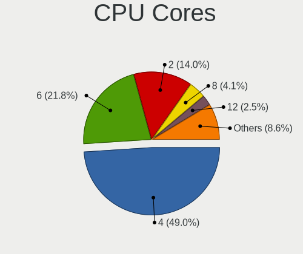

| Number | Desktops | Percent |
|--------|----------|---------|
| 4      | 64       | 48.85%  |
| 2      | 23       | 17.56%  |
| 6      | 21       | 16.03%  |
| 8      | 8        | 6.11%   |
| 12     | 3        | 2.29%   |
| 10     | 3        | 2.29%   |
| 3      | 3        | 2.29%   |
| 1      | 2        | 1.53%   |
| 28     | 1        | 0.76%   |
| 20     | 1        | 0.76%   |
| 16     | 1        | 0.76%   |
| 14     | 1        | 0.76%   |

CPU Sockets
-----------

Number of sockets

| Number | Desktops | Percent |
|--------|----------|---------|
| 1      | 124      | 94.66%  |
| 2      | 6        | 4.58%   |
| 0      | 1        | 0.76%   |

CPU Threads
-----------

Threads per core (Hyper-Threading)

| Number | Desktops | Percent |
|--------|----------|---------|
| 2      | 80       | 61.07%  |
| 1      | 51       | 38.93%  |

CPU Op-Modes
------------

CPU Operation Modes (32-bit, 64-bit)

| Op mode        | Desktops | Percent |
|----------------|----------|---------|
| 32-bit, 64-bit | 123      | 93.89%  |
| Unknown        | 8        | 6.11%   |

CPU Microcode
-------------

Microcode number

| Number     | Desktops | Percent |
|------------|----------|---------|
| 0x306c3    | 19       | 14.29%  |
| 0x506e3    | 13       | 9.77%   |
| Unknown    | 13       | 9.77%   |
| 0x206a7    | 9        | 6.77%   |
| 0x906ea    | 8        | 6.02%   |
| 0x306a9    | 6        | 4.51%   |
| 0x306f2    | 5        | 3.76%   |
| 0xa0655    | 4        | 3.01%   |
| 0x906e9    | 4        | 3.01%   |
| 0x206d7    | 4        | 3.01%   |
| 0x1067a    | 4        | 3.01%   |
| 0x06000852 | 4        | 3.01%   |
| 0x50654    | 3        | 2.26%   |
| 0x406c4    | 3        | 2.26%   |
| 0x206c2    | 3        | 2.26%   |
| 0x106ca    | 3        | 2.26%   |
| 0x906ed    | 2        | 1.5%    |
| 0x106e5    | 2        | 1.5%    |
| 0x106a5    | 2        | 1.5%    |
| 0x08701013 | 2        | 1.5%    |
| 0x08001137 | 2        | 1.5%    |
| 0x03000027 | 2        | 1.5%    |
| 0xa0671    | 1        | 0.75%   |
| 0xa0653    | 1        | 0.75%   |
| 0x6fd      | 1        | 0.75%   |
| 0x6fb      | 1        | 0.75%   |
| 0x506ca    | 1        | 0.75%   |
| 0x50663    | 1        | 0.75%   |
| 0x406e3    | 1        | 0.75%   |
| 0x406c3    | 1        | 0.75%   |
| 0x40651    | 1        | 0.75%   |
| 0x30678    | 1        | 0.75%   |
| 0x0800820d | 1        | 0.75%   |
| 0x0800820b | 1        | 0.75%   |
| 0x0700010f | 1        | 0.75%   |
| 0x06001119 | 1        | 0.75%   |
| 0x0600084f | 1        | 0.75%   |
| 0x010000dc | 1        | 0.75%   |

CPU Microarch
-------------

Microarchitecture

| Name        | Desktops | Percent |
|-------------|----------|---------|
| Haswell     | 25       | 19.08%  |
| Skylake     | 19       | 14.5%   |
| SandyBridge | 14       | 10.69%  |
| KabyLake    | 14       | 10.69%  |
| Penryn      | 7        | 5.34%   |
| Piledriver  | 6        | 4.58%   |
| IvyBridge   | 6        | 4.58%   |
| Silvermont  | 5        | 3.82%   |
| CometLake   | 5        | 3.82%   |
| Westmere    | 4        | 3.05%   |
| Nehalem     | 4        | 3.05%   |
| Zen 2       | 3        | 2.29%   |
| Broadwell   | 3        | 2.29%   |
| Bonnell     | 3        | 2.29%   |
| Zen+        | 2        | 1.53%   |
| Zen         | 2        | 1.53%   |
| K10 Llano   | 2        | 1.53%   |
| Jaguar      | 2        | 1.53%   |
| Core        | 2        | 1.53%   |
| K10         | 1        | 0.76%   |
| Goldmont    | 1        | 0.76%   |
| Unknown     | 1        | 0.76%   |

Graphics
--------

GPU Vendor
----------

Vendors of graphics cards

| Vendor                                       | Desktops | Percent |
|----------------------------------------------|----------|---------|
| Intel                                        | 54       | 39.71%  |
| Nvidia                                       | 37       | 27.21%  |
| AMD                                          | 36       | 26.47%  |
| ASPEED Technology                            | 6        | 4.41%   |
| XGI Technology (eXtreme Graphics Innovation) | 1        | 0.74%   |
| Silicon Motion                               | 1        | 0.74%   |
| Matrox Electronics Systems                   | 1        | 0.74%   |

GPU Model
---------

Graphics card models

| Model                                                                                    | Desktops | Percent |
|------------------------------------------------------------------------------------------|----------|---------|
| Intel HD Graphics 530                                                                    | 8        | 5.76%   |
| AMD Oland XT [Radeon HD 8670 / R5 340X OEM / R7 250/350/350X OEM]                        | 8        | 5.76%   |
| Intel Xeon E3-1200 v3/4th Gen Core Processor Integrated Graphics Controller              | 7        | 5.04%   |
| AMD Oland [Radeon HD 8570 / R5 430 OEM / R7 240/340 / Radeon 520 OEM]                    | 7        | 5.04%   |
| Intel CoffeeLake-S GT2 [UHD Graphics 630]                                                | 6        | 4.32%   |
| Intel 2nd Generation Core Processor Family Integrated Graphics Controller                | 6        | 4.32%   |
| ASPEED Technology ASPEED Graphics Family                                                 | 6        | 4.32%   |
| Nvidia GP107GL [Quadro P400]                                                             | 4        | 2.88%   |
| Intel Atom/Celeron/Pentium Processor x5-E8000/J3xxx/N3xxx Integrated Graphics Controller | 4        | 2.88%   |
| Nvidia GK208B [GeForce GT 710]                                                           | 3        | 2.16%   |
| Intel Xeon E3-1200 v2/3rd Gen Core processor Graphics Controller                         | 3        | 2.16%   |
| Intel Atom Processor D4xx/D5xx/N4xx/N5xx Integrated Graphics Controller                  | 3        | 2.16%   |
| Intel 4 Series Chipset Integrated Graphics Controller                                    | 3        | 2.16%   |
| AMD Ellesmere [Radeon RX 470/480/570/570X/580/580X/590]                                  | 3        | 2.16%   |
| Nvidia GT218 [GeForce 210]                                                               | 2        | 1.44%   |
| Nvidia GP106GL [Quadro P2000]                                                            | 2        | 1.44%   |
| Nvidia GK104GL [Quadro K4200]                                                            | 2        | 1.44%   |
| Intel HD Graphics 630                                                                    | 2        | 1.44%   |
| Intel CometLake-S GT2 [UHD Graphics 630]                                                 | 2        | 1.44%   |
| Intel 4th Generation Core Processor Family Integrated Graphics Controller                | 2        | 1.44%   |
| AMD RS780L [Radeon 3000]                                                                 | 2        | 1.44%   |
| XGI Technology (eXtreme Graphics Innovation) Z7/Z9 (XG20 core)                           | 1        | 0.72%   |
| Silicon Motion SM712 LynxEM+                                                             | 1        | 0.72%   |
| Nvidia TU106 [GeForce RTX 2060 SUPER]                                                    | 1        | 0.72%   |
| Nvidia TU104 [GeForce RTX 2080]                                                          | 1        | 0.72%   |
| Nvidia TU104 [GeForce RTX 2080 SUPER]                                                    | 1        | 0.72%   |
| Nvidia TU102 [TITAN RTX]                                                                 | 1        | 0.72%   |
| Nvidia TU102 [GeForce RTX 2080 Ti]                                                       | 1        | 0.72%   |
| Nvidia GT218 [GeForce 8400 GS Rev. 3]                                                    | 1        | 0.72%   |
| Nvidia GT215 [GeForce GT 240]                                                            | 1        | 0.72%   |
| Nvidia GP107 [GeForce GTX 1050]                                                          | 1        | 0.72%   |
| Nvidia GP106GL [Quadro P2200]                                                            | 1        | 0.72%   |
| Nvidia GP106 [GeForce GTX 1060 6GB]                                                      | 1        | 0.72%   |
| Nvidia GP104 [GeForce GTX 1080]                                                          | 1        | 0.72%   |
| Nvidia GM204GL [Quadro M4000]                                                            | 1        | 0.72%   |
| Nvidia GM204 [GeForce GTX 970]                                                           | 1        | 0.72%   |
| Nvidia GK210GL [Tesla K80]                                                               | 1        | 0.72%   |
| Nvidia GK107 [GeForce GTX 650]                                                           | 1        | 0.72%   |
| Nvidia GK106GL [Quadro K4000]                                                            | 1        | 0.72%   |
| Nvidia GK106 [GeForce GTX 650 Ti]                                                        | 1        | 0.72%   |
| Nvidia GK104 [GeForce GTX 770]                                                           | 1        | 0.72%   |
| Nvidia GF119 [GeForce GT 520]                                                            | 1        | 0.72%   |
| Nvidia GF116 [GeForce GTX 550 Ti]                                                        | 1        | 0.72%   |
| Nvidia GF108 [GeForce GT 630]                                                            | 1        | 0.72%   |
| Nvidia G98 [Quadro NVS 295]                                                              | 1        | 0.72%   |
| Nvidia G92 [GeForce GTS 250]                                                             | 1        | 0.72%   |
| Nvidia G86 [GeForce 8500 GT]                                                             | 1        | 0.72%   |
| Nvidia G72 [GeForce 7300 GS]                                                             | 1        | 0.72%   |
| Nvidia C73 [GeForce 7100 / nForce 620i]                                                  | 1        | 0.72%   |
| Matrox Electronics Systems MGA G200e [Pilot] ServerEngines (SEP1)                        | 1        | 0.72%   |
| Intel UHD P630 Graphics                                                                  | 1        | 0.72%   |
| Intel Skylake GT2 [HD Graphics 520]                                                      | 1        | 0.72%   |
| Intel IvyBridge GT2 [HD Graphics 4000]                                                   | 1        | 0.72%   |
| Intel HD Graphics P630                                                                   | 1        | 0.72%   |
| Intel HD Graphics 500                                                                    | 1        | 0.72%   |
| Intel Haswell-ULT Integrated Graphics Controller                                         | 1        | 0.72%   |
| Intel Atom Processor Z36xxx/Z37xxx Series Graphics & Display                             | 1        | 0.72%   |
| Intel 4th Gen Core Processor Integrated Graphics Controller                              | 1        | 0.72%   |
| AMD Trinity [Radeon HD 7660D]                                                            | 1        | 0.72%   |
| AMD Tobago PRO [Radeon R7 360 / R9 360 OEM]                                              | 1        | 0.72%   |

GPU Combo
---------

Combinations of graphics cards

| Name               | Desktops | Percent |
|--------------------|----------|---------|
| 1 x Intel          | 49       | 37.4%   |
| 1 x AMD            | 34       | 25.95%  |
| 1 x Nvidia         | 33       | 25.19%  |
| 1 x ASPEED         | 5        | 3.82%   |
| 2 x Nvidia         | 2        | 1.53%   |
| Other              | 1        | 0.76%   |
| 2 x AMD            | 1        | 0.76%   |
| 1 x XGI            | 1        | 0.76%   |
| 1 x Silicon Motion | 1        | 0.76%   |
| Nvidia + ASPEED    | 1        | 0.76%   |
| 1 x Matrox         | 1        | 0.76%   |
| Intel + Nvidia     | 1        | 0.76%   |
| Intel + AMD        | 1        | 0.76%   |

GPU Driver
----------

Free vs proprietary

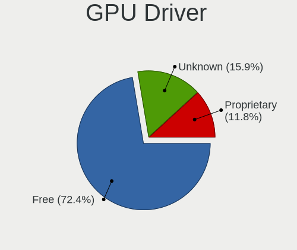

| Driver      | Desktops | Percent |
|-------------|----------|---------|
| Free        | 92       | 70.23%  |
| Proprietary | 20       | 15.27%  |
| Unknown     | 19       | 14.5%   |

GPU Memory
----------

Total video memory

| Size in GB | Desktops | Percent |
|------------|----------|---------|
| Unknown    | 60       | 45.45%  |
| 1.01-2.0   | 24       | 18.18%  |
| 0.51-1.0   | 19       | 14.39%  |
| 7.01-8.0   | 8        | 6.06%   |
| 0.01-0.5   | 8        | 6.06%   |
| 3.01-4.0   | 7        | 5.3%    |
| 4.01-5.0   | 3        | 2.27%   |
| 5.01-6.0   | 1        | 0.76%   |
| 2.01-3.0   | 1        | 0.76%   |
| 16.01-24.0 | 1        | 0.76%   |

Monitor
-------

Monitor Vendor
--------------

Monitor vendors

| Vendor                  | Desktops | Percent |
|-------------------------|----------|---------|
| Dell                    | 33       | 31.43%  |
| Samsung Electronics     | 13       | 12.38%  |
| Hewlett-Packard         | 11       | 10.48%  |
| Goldstar                | 8        | 7.62%   |
| AOC                     | 7        | 6.67%   |
| Acer                    | 6        | 5.71%   |
| Ancor Communications    | 5        | 4.76%   |
| Philips                 | 4        | 3.81%   |
| BenQ                    | 4        | 3.81%   |
| NEC Computers           | 2        | 1.9%    |
| ___                     | 1        | 0.95%   |
| ViewSonic               | 1        | 0.95%   |
| Unknown                 | 1        | 0.95%   |
| Sceptre Tech            | 1        | 0.95%   |
| Packard Bell            | 1        | 0.95%   |
| NME                     | 1        | 0.95%   |
| Lenovo                  | 1        | 0.95%   |
| GVV                     | 1        | 0.95%   |
| Founder                 | 1        | 0.95%   |
| Eizo                    | 1        | 0.95%   |
| Chi Mei Optoelectronics | 1        | 0.95%   |
| AMW                     | 1        | 0.95%   |

Monitor Model
-------------

Monitor models

| Model                                                                | Desktops | Percent |
|----------------------------------------------------------------------|----------|---------|
| Dell P2417H DELA0DB 1920x1080 527x296mm 23.8-inch                    | 6        | 5.08%   |
| Dell P2414H DELA09A 1920x1080 527x297mm 23.8-inch                    | 6        | 5.08%   |
| AOC 2436 AOC2436 1920x1080 521x293mm 23.5-inch                       | 4        | 3.39%   |
| Dell P2317H DEL40F4 1920x1080 509x286mm 23.0-inch                    | 3        | 2.54%   |
| Samsung Electronics SyncMaster SAM01D3 1440x900 408x225mm 18.3-inch  | 2        | 1.69%   |
| Hewlett-Packard ZR2440w HWP2956 1920x1200 518x324mm 24.1-inch        | 2        | 1.69%   |
| Dell P2417H DELA0DA 1920x1080 527x296mm 23.8-inch                    | 2        | 1.69%   |
| BenQ GW2765 BNQ78D6 2560x1440 597x336mm 27.0-inch                    | 2        | 1.69%   |
| ___ LCD TV ___9000 1360x768                                          | 1        | 0.85%   |
| ViewSonic VA2226w-3 VSC2051 1680x1050 490x290mm 22.4-inch            | 1        | 0.85%   |
| Unknown LCDTV16 9000 1360x768 1600x900mm 72.3-inch                   | 1        | 0.85%   |
| Sceptre Tech F27 SPT0ABF 1920x1080 409x230mm 18.5-inch               | 1        | 0.85%   |
| Samsung Electronics U32R59x SAM0F96 3840x2160 700x390mm 31.5-inch    | 1        | 0.85%   |
| Samsung Electronics SyncMaster SAM05C7 1920x1080 521x293mm 23.5-inch | 1        | 0.85%   |
| Samsung Electronics SyncMaster SAM04DD 1920x1080 477x268mm 21.5-inch | 1        | 0.85%   |
| Samsung Electronics SyncMaster SAM011E 1280x1024 338x270mm 17.0-inch | 1        | 0.85%   |
| Samsung Electronics SMBX2350 SAM071E 1920x1080 509x286mm 23.0-inch   | 1        | 0.85%   |
| Samsung Electronics SMB1930N SAM0632 1366x768 410x230mm 18.5-inch    | 1        | 0.85%   |
| Samsung Electronics S27E391 SAM0C16 1920x1080 598x336mm 27.0-inch    | 1        | 0.85%   |
| Samsung Electronics S22C300 SAM0A20 1920x1080 480x270mm 21.7-inch    | 1        | 0.85%   |
| Samsung Electronics S22C300 SAM0A1E 1920x1080 477x268mm 21.5-inch    | 1        | 0.85%   |
| Samsung Electronics S20B300 SAM08A7 1600x900 443x249mm 20.0-inch     | 1        | 0.85%   |
| Samsung Electronics LCD Monitor C27F591 1440x900                     | 1        | 0.85%   |
| Samsung Electronics C24F390 SAM0D2D 1920x1080 521x293mm 23.5-inch    | 1        | 0.85%   |
| Philips PHL 284E5 PHLC0DE 1920x1080 621x341mm 27.9-inch              | 1        | 0.85%   |
| Philips 226VL PHLC081 1920x1080 480x268mm 21.6-inch                  | 1        | 0.85%   |
| Philips 196V4 PHLC0AF 1366x768 410x230mm 18.5-inch                   | 1        | 0.85%   |
| Philips 190S PHL083F 1280x1024 376x301mm 19.0-inch                   | 1        | 0.85%   |
| Packard Bell Viseo223DX PKB0385 1920x1080 477x268mm 21.5-inch        | 1        | 0.85%   |
| NME 202M NME1021 1680x1050 380x290mm 18.8-inch                       | 1        | 0.85%   |
| NEC Computers LCD2190UXi NEC66B2 1600x1200 432x324mm 21.3-inch       | 1        | 0.85%   |
| NEC Computers EA261WM NEC6750 1920x1200 560x350mm 26.0-inch          | 1        | 0.85%   |
| Lenovo LEN E2224A LEN60DA 1920x1080 477x268mm 21.5-inch              | 1        | 0.85%   |
| Hewlett-Packard w2408 HWP26CF 1920x1200 518x324mm 24.1-inch          | 1        | 0.85%   |
| Hewlett-Packard V220 HPN3585 1920x1080 477x268mm 21.5-inch           | 1        | 0.85%   |
| Hewlett-Packard LE2002x HWP2963 1600x900 443x249mm 20.0-inch         | 1        | 0.85%   |
| Hewlett-Packard LE1901w HWP2842 1440x900 410x256mm 19.0-inch         | 1        | 0.85%   |
| Hewlett-Packard LCD Monitor Z24i 3840x1200                           | 1        | 0.85%   |
| Hewlett-Packard LCD Monitor LP2475w                                  | 1        | 0.85%   |
| Hewlett-Packard LA2405 HWP284B 1920x1200 518x324mm 24.1-inch         | 1        | 0.85%   |
| Hewlett-Packard LA2405 HWP284A 1920x1200 518x324mm 24.1-inch         | 1        | 0.85%   |
| Hewlett-Packard LA2205 HWP2847 1680x1050 473x296mm 22.0-inch         | 1        | 0.85%   |
| Hewlett-Packard E243i HPN3463 1920x1200 518x324mm 24.1-inch          | 1        | 0.85%   |
| Hewlett-Packard 24mh HPN366C 1920x1080 527x296mm 23.8-inch           | 1        | 0.85%   |
| GVV VGA G56x GVV0707 1024x768 304x228mm 15.0-inch                    | 1        | 0.85%   |
| Goldstar W2053 GSM4E9F 1600x900 443x249mm 20.0-inch                  | 1        | 0.85%   |
| Goldstar IPS FULLHD GSM5AB7 1920x1080 480x270mm 21.7-inch            | 1        | 0.85%   |
| Goldstar FULL HD GSM5B55 1920x1080 480x270mm 21.7-inch               | 1        | 0.85%   |
| Goldstar FULL HD GSM5AB9 1920x1080 480x270mm 21.7-inch               | 1        | 0.85%   |
| Goldstar E2250 GSM578D 1680x1050 480x270mm 21.7-inch                 | 1        | 0.85%   |
| Goldstar 23MB35 GSM5A96 1920x1080 510x290mm 23.1-inch                | 1        | 0.85%   |
| Goldstar 22EA53 GSM59A5 1920x1080 477x268mm 21.5-inch                | 1        | 0.85%   |
| Goldstar 19EN33 GSM4C18 1366x768 410x230mm 18.5-inch                 | 1        | 0.85%   |
| Founder LED MONITOR FDR309A 1920x1080 410x256mm 19.0-inch            | 1        | 0.85%   |
| Eizo L680 ENC1607 1280x1024                                          | 1        | 0.85%   |
| Dell U2717D DEL40EA 2560x1440 597x336mm 27.0-inch                    | 1        | 0.85%   |
| Dell U2518D DEL413C 2560x1440 553x311mm 25.0-inch                    | 1        | 0.85%   |
| Dell U2311H DELA05F 1920x1080 509x286mm 23.0-inch                    | 1        | 0.85%   |
| Dell ST2410 DELA05D 1920x1080 531x299mm 24.0-inch                    | 1        | 0.85%   |
| Dell SE2717H/HX DELD0A1 1920x1080 598x336mm 27.0-inch                | 1        | 0.85%   |

Monitor Resolution
------------------

Monitor screen resolution

| Resolution         | Desktops | Percent |
|--------------------|----------|---------|
| 1920x1080 (FHD)    | 51       | 47.22%  |
| 2560x1440 (QHD)    | 7        | 6.48%   |
| 1280x1024 (SXGA)   | 7        | 6.48%   |
| 1680x1050 (WSXGA+) | 6        | 5.56%   |
| 1440x900 (WXGA+)   | 6        | 5.56%   |
| 1366x768 (WXGA)    | 6        | 5.56%   |
| 1920x1200 (WUXGA)  | 5        | 4.63%   |
| Unknown            | 5        | 4.63%   |
| 3840x2160 (4K)     | 4        | 3.7%    |
| 1600x900 (HD+)     | 3        | 2.78%   |
| 3840x1200          | 2        | 1.85%   |
| 3840x1080          | 2        | 1.85%   |
| 1600x1200          | 2        | 1.85%   |
| 5760x1080          | 1        | 0.93%   |
| 1360x768           | 1        | 0.93%   |

Monitor Diagonal
----------------

Diagonal size in inches

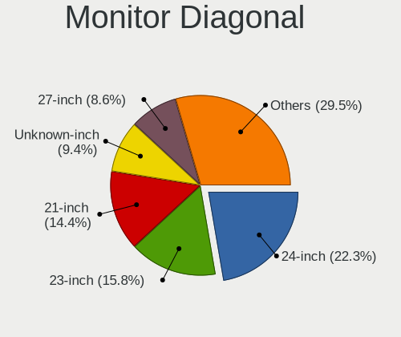

| Inches  | Desktops | Percent |
|---------|----------|---------|
| 24      | 26       | 24.53%  |
| 23      | 15       | 14.15%  |
| 21      | 15       | 14.15%  |
| Unknown | 10       | 9.43%   |
| 27      | 9        | 8.49%   |
| 19      | 7        | 6.6%    |
| 22      | 5        | 4.72%   |
| 18      | 5        | 4.72%   |
| 20      | 4        | 3.77%   |
| 17      | 2        | 1.89%   |
| 15      | 2        | 1.89%   |
| 72      | 1        | 0.94%   |
| 42      | 1        | 0.94%   |
| 32      | 1        | 0.94%   |
| 31      | 1        | 0.94%   |
| 26      | 1        | 0.94%   |
| 25      | 1        | 0.94%   |

Monitor Width
-------------

Physical width

| Width in mm | Desktops | Percent |
|-------------|----------|---------|
| 501-600     | 49       | 47.57%  |
| 401-500     | 31       | 30.1%   |
| Unknown     | 10       | 9.71%   |
| 351-400     | 4        | 3.88%   |
| 301-350     | 4        | 3.88%   |
| 601-700     | 2        | 1.94%   |
| 701-800     | 1        | 0.97%   |
| 1501-2000   | 1        | 0.97%   |
| 901-1000    | 1        | 0.97%   |

Aspect Ratio
------------

Proportional relationship between the width and the height

| Ratio   | Desktops | Percent |
|---------|----------|---------|
| 16/9    | 65       | 65.66%  |
| 16/10   | 17       | 17.17%  |
| Unknown | 8        | 8.08%   |
| 5/4     | 6        | 6.06%   |
| 4/3     | 3        | 3.03%   |

Monitor Area
------------

Area in inch

| Area in inch | Desktops | Percent |
|----------------|----------|---------|
| 201-250        | 49       | 46.67%  |
| 151-200        | 16       | 15.24%  |
| Unknown        | 10       | 9.52%   |
| 301-350        | 9        | 8.57%   |
| 251-300        | 9        | 8.57%   |
| 141-150        | 6        | 5.71%   |
| 351-500        | 2        | 1.9%    |
| 101-110        | 2        | 1.9%    |
| More than 1000 | 1        | 0.95%   |
| 501-1000       | 1        | 0.95%   |

Pixel Density
-------------

Pixels per inch

| Density | Desktops | Percent |
|---------|----------|---------|
| 51-100  | 65       | 65%     |
| 101-120 | 20       | 20%     |
| Unknown | 10       | 10%     |
| 121-160 | 3        | 3%      |
| 1-50    | 1        | 1%      |
| 161-240 | 1        | 1%      |

Multiple Monitors
-----------------

Total monitors connected

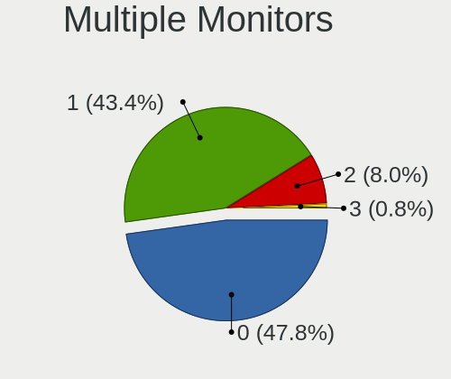

| Total | Desktops | Percent |
|-------|----------|---------|
| 1     | 77       | 58.33%  |
| 0     | 36       | 27.27%  |
| 2     | 17       | 12.88%  |
| 3     | 2        | 1.52%   |

Network
-------

Net Controller Vendor
---------------------

Controller vendors

| Vendor                      | Desktops | Percent |
|-----------------------------|----------|---------|
| Intel                       | 73       | 42.94%  |
| Realtek Semiconductor       | 51       | 30%     |
| Broadcom                    | 13       | 7.65%   |
| Qualcomm Atheros            | 5        | 2.94%   |
| TP-Link                     | 4        | 2.35%   |
| Ralink Technology           | 3        | 1.76%   |
| D-Link System               | 3        | 1.76%   |
| D-Link                      | 2        | 1.18%   |
| Xilinx                      | 1        | 0.59%   |
| Xiaomi                      | 1        | 0.59%   |
| VIA Technologies            | 1        | 0.59%   |
| Sierra Wireless             | 1        | 0.59%   |
| Samsung Electronics         | 1        | 0.59%   |
| Mellanox Technologies       | 1        | 0.59%   |
| MediaTek                    | 1        | 0.59%   |
| Marvell Technology Group    | 1        | 0.59%   |
| Linux 2.6.31.6 with s3c-udc | 1        | 0.59%   |
| Linksys                     | 1        | 0.59%   |
| Dresden Elektronik          | 1        | 0.59%   |
| Cisco Systems               | 1        | 0.59%   |
| Broadcom Limited            | 1        | 0.59%   |
| Aquantia                    | 1        | 0.59%   |
| Apple                       | 1        | 0.59%   |
| 3Com                        | 1        | 0.59%   |

Net Controller Model
--------------------

Controller models

| Model                                                                          | Desktops | Percent |
|--------------------------------------------------------------------------------|----------|---------|
| Realtek RTL8111/8168/8411 PCI Express Gigabit Ethernet Controller              | 45       | 23.56%  |
| Intel Ethernet Connection (2) I219-LM                                          | 15       | 7.85%   |
| Intel Ethernet Connection I217-LM                                              | 11       | 5.76%   |
| Intel 82579LM Gigabit Network Connection (Lewisville)                          | 9        | 4.71%   |
| Intel I211 Gigabit Network Connection                                          | 5        | 2.62%   |
| Intel Ethernet Connection (7) I219-LM                                          | 4        | 2.09%   |
| Intel Ethernet Connection (2) I219-V                                           | 4        | 2.09%   |
| Intel 82574L Gigabit Network Connection                                        | 4        | 2.09%   |
| Broadcom NetXtreme BCM5761 Gigabit Ethernet PCIe                               | 4        | 2.09%   |
| Intel I350 Gigabit Network Connection                                          | 3        | 1.57%   |
| Intel I210 Gigabit Network Connection                                          | 3        | 1.57%   |
| Intel Ethernet Controller 10G X550T                                            | 3        | 1.57%   |
| Intel Ethernet Connection (2) I218-V                                           | 3        | 1.57%   |
| Intel Ethernet Connection (11) I219-LM                                         | 3        | 1.57%   |
| Intel 82580 Gigabit Network Connection                                         | 3        | 1.57%   |
| Realtek RTL810xE PCI Express Fast Ethernet controller                          | 2        | 1.05%   |
| Qualcomm Atheros AR8131 Gigabit Ethernet                                       | 2        | 1.05%   |
| Broadcom NetXtreme BCM5764M Gigabit Ethernet PCIe                              | 2        | 1.05%   |
| Broadcom NetXtreme BCM5755 Gigabit Ethernet PCI Express                        | 2        | 1.05%   |
| Broadcom BCM4360 802.11ac Wireless Network Adapter                             | 2        | 1.05%   |
| Xilinx Network controller                                                      | 1        | 0.52%   |
| Xiaomi Mi/Redmi series (RNDIS)                                                 | 1        | 0.52%   |
| VIA VT6105/VT6106S [Rhine-III]                                                 | 1        | 0.52%   |
| TP-Link TL-WN722N v2/v3 [Realtek RTL8188EUS]                                   | 1        | 0.52%   |
| TP-Link Archer T1U 802.11a/n/ac Wireless Adapter [MediaTek MT7610U]            | 1        | 0.52%   |
| TP-Link AC600 wireless Realtek RTL8811AU [Archer T2U Nano]                     | 1        | 0.52%   |
| TP-Link 802.11ac WLAN Adapter                                                  | 1        | 0.52%   |
| Sierra Wireless AirPrime MC7455 3G/4G LTE Modem                                | 1        | 0.52%   |
| Samsung Galaxy series, misc. (tethering mode)                                  | 1        | 0.52%   |
| Realtek RTL8821CE 802.11ac PCIe Wireless Network Adapter                       | 1        | 0.52%   |
| Realtek RTL8723BE PCIe Wireless Network Adapter                                | 1        | 0.52%   |
| Realtek RTL8192CE PCIe Wireless Network Adapter                                | 1        | 0.52%   |
| Realtek RTL8188SU 802.11n WLAN Adapter                                         | 1        | 0.52%   |
| Realtek RTL8188EUS 802.11n Wireless Network Adapter                            | 1        | 0.52%   |
| Realtek RTL8188CUS 802.11n WLAN Adapter                                        | 1        | 0.52%   |
| Realtek RTL8169 PCI Gigabit Ethernet Controller                                | 1        | 0.52%   |
| Realtek RTL8125 2.5GbE Controller                                              | 1        | 0.52%   |
| Realtek RTL-8110SC/8169SC Gigabit Ethernet                                     | 1        | 0.52%   |
| Realtek RTL-8100/8101L/8139 PCI Fast Ethernet Adapter                          | 1        | 0.52%   |
| Ralink RT5572 Wireless Adapter                                                 | 1        | 0.52%   |
| Ralink RT5370 Wireless Adapter                                                 | 1        | 0.52%   |
| Ralink MT7601U Wireless Adapter                                                | 1        | 0.52%   |
| Qualcomm Atheros QCA9565 / AR9565 Wireless Network Adapter                     | 1        | 0.52%   |
| Qualcomm Atheros AR9462 Wireless Network Adapter                               | 1        | 0.52%   |
| Qualcomm Atheros AR8151 v2.0 Gigabit Ethernet                                  | 1        | 0.52%   |
| Mellanox MT27500 Family [ConnectX-3]                                           | 1        | 0.52%   |
| MediaTek MT7612U 802.11a/b/g/n/ac Wireless Adapter                             | 1        | 0.52%   |
| Marvell Group Yukon Optima 88E8059 [PCIe Gigabit Ethernet Controller with AVB] | 1        | 0.52%   |
| Linux 2.6.31.6 with s3c-udc Gadget Serial v2.4                                 | 1        | 0.52%   |
| Linksys AE6000 802.11a/b/g/n/ac Wireless Adapter [MediaTek MT7610U]            | 1        | 0.52%   |
| Intel Wireless 7260                                                            | 1        | 0.52%   |
| Intel Wi-Fi 6 AX200                                                            | 1        | 0.52%   |
| Intel Tiger Lake PCH CNVi WiFi                                                 | 1        | 0.52%   |
| Intel Ethernet Controller XXV710 for 25GbE SFP28                               | 1        | 0.52%   |
| Intel Ethernet Controller I225-V                                               | 1        | 0.52%   |
| Intel Ethernet Controller 10-Gigabit X540-AT2                                  | 1        | 0.52%   |
| Intel Ethernet Connection X552/X557-AT 10GBASE-T                               | 1        | 0.52%   |
| Intel Ethernet Connection I219-V                                               | 1        | 0.52%   |
| Intel Ethernet Connection I217-V                                               | 1        | 0.52%   |
| Intel Ethernet Connection (5) I219-LM                                          | 1        | 0.52%   |

Wireless Vendor
---------------

Wireless vendors

| Vendor                | Desktops | Percent |
|-----------------------|----------|---------|
| Realtek Semiconductor | 6        | 22.22%  |
| TP-Link               | 4        | 14.81%  |
| Intel                 | 4        | 14.81%  |
| Ralink Technology     | 3        | 11.11%  |
| Qualcomm Atheros      | 2        | 7.41%   |
| D-Link                | 2        | 7.41%   |
| Broadcom              | 2        | 7.41%   |
| Sierra Wireless       | 1        | 3.7%    |
| MediaTek              | 1        | 3.7%    |
| Linksys               | 1        | 3.7%    |
| D-Link System         | 1        | 3.7%    |

Wireless Model
--------------

Wireless models

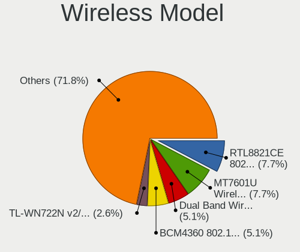

| Model                                                                | Desktops | Percent |
|----------------------------------------------------------------------|----------|---------|
| Broadcom BCM4360 802.11ac Wireless Network Adapter                   | 2        | 7.14%   |
| TP-Link TL-WN722N v2/v3 [Realtek RTL8188EUS]                         | 1        | 3.57%   |
| TP-Link Archer T1U 802.11a/n/ac Wireless Adapter [MediaTek MT7610U]  | 1        | 3.57%   |
| TP-Link AC600 wireless Realtek RTL8811AU [Archer T2U Nano]           | 1        | 3.57%   |
| TP-Link 802.11ac WLAN Adapter                                        | 1        | 3.57%   |
| Sierra Wireless AirPrime MC7455 3G/4G LTE Modem                      | 1        | 3.57%   |
| Realtek RTL8821CE 802.11ac PCIe Wireless Network Adapter             | 1        | 3.57%   |
| Realtek RTL8723BE PCIe Wireless Network Adapter                      | 1        | 3.57%   |
| Realtek RTL8192CE PCIe Wireless Network Adapter                      | 1        | 3.57%   |
| Realtek RTL8188SU 802.11n WLAN Adapter                               | 1        | 3.57%   |
| Realtek RTL8188EUS 802.11n Wireless Network Adapter                  | 1        | 3.57%   |
| Realtek RTL8188CUS 802.11n WLAN Adapter                              | 1        | 3.57%   |
| Ralink RT5572 Wireless Adapter                                       | 1        | 3.57%   |
| Ralink RT5370 Wireless Adapter                                       | 1        | 3.57%   |
| Ralink MT7601U Wireless Adapter                                      | 1        | 3.57%   |
| Qualcomm Atheros QCA9565 / AR9565 Wireless Network Adapter           | 1        | 3.57%   |
| Qualcomm Atheros AR9462 Wireless Network Adapter                     | 1        | 3.57%   |
| MediaTek MT7612U 802.11a/b/g/n/ac Wireless Adapter                   | 1        | 3.57%   |
| Linksys AE6000 802.11a/b/g/n/ac Wireless Adapter [MediaTek MT7610U]  | 1        | 3.57%   |
| Intel Wireless 7260                                                  | 1        | 3.57%   |
| Intel Wi-Fi 6 AX200                                                  | 1        | 3.57%   |
| Intel Tiger Lake PCH CNVi WiFi                                       | 1        | 3.57%   |
| Intel Dual Band Wireless-AC 3168NGW [Stone Peak]                     | 1        | 3.57%   |
| D-Link System DWA-110 Wireless G Adapter(rev.A1) [Ralink RT2571W]    | 1        | 3.57%   |
| D-Link DWA-160 Xtreme N Dual Band USB Adapter(rev.C1)                | 1        | 3.57%   |
| D-Link DWA-131 Wireless N Nano Adapter (Rev. E1) [Realtek RTL8192EU] | 1        | 3.57%   |
| D-Link 802.11 n WLAN                                                 | 1        | 3.57%   |

Ethernet Vendor
---------------

Ethernet vendors

| Vendor                   | Desktops | Percent |
|--------------------------|----------|---------|
| Intel                    | 72       | 48.98%  |
| Realtek Semiconductor    | 50       | 34.01%  |
| Broadcom                 | 11       | 7.48%   |
| Qualcomm Atheros         | 3        | 2.04%   |
| D-Link System            | 2        | 1.36%   |
| Xiaomi                   | 1        | 0.68%   |
| VIA Technologies         | 1        | 0.68%   |
| Samsung Electronics      | 1        | 0.68%   |
| Marvell Technology Group | 1        | 0.68%   |
| Cisco Systems            | 1        | 0.68%   |
| Broadcom Limited         | 1        | 0.68%   |
| Aquantia                 | 1        | 0.68%   |
| Apple                    | 1        | 0.68%   |
| 3Com                     | 1        | 0.68%   |

Ethernet Model
--------------

Ethernet models

| Model                                                                          | Desktops | Percent |
|--------------------------------------------------------------------------------|----------|---------|
| Realtek RTL8111/8168/8411 PCI Express Gigabit Ethernet Controller              | 45       | 28.3%   |
| Intel Ethernet Connection (2) I219-LM                                          | 15       | 9.43%   |
| Intel Ethernet Connection I217-LM                                              | 11       | 6.92%   |
| Intel 82579LM Gigabit Network Connection (Lewisville)                          | 9        | 5.66%   |
| Intel I211 Gigabit Network Connection                                          | 5        | 3.14%   |
| Intel Ethernet Connection (7) I219-LM                                          | 4        | 2.52%   |
| Intel Ethernet Connection (2) I219-V                                           | 4        | 2.52%   |
| Intel 82574L Gigabit Network Connection                                        | 4        | 2.52%   |
| Broadcom NetXtreme BCM5761 Gigabit Ethernet PCIe                               | 4        | 2.52%   |
| Intel I350 Gigabit Network Connection                                          | 3        | 1.89%   |
| Intel I210 Gigabit Network Connection                                          | 3        | 1.89%   |
| Intel Ethernet Controller 10G X550T                                            | 3        | 1.89%   |
| Intel Ethernet Connection (2) I218-V                                           | 3        | 1.89%   |
| Intel Ethernet Connection (11) I219-LM                                         | 3        | 1.89%   |
| Intel 82580 Gigabit Network Connection                                         | 3        | 1.89%   |
| Realtek RTL810xE PCI Express Fast Ethernet controller                          | 2        | 1.26%   |
| Qualcomm Atheros AR8131 Gigabit Ethernet                                       | 2        | 1.26%   |
| Broadcom NetXtreme BCM5764M Gigabit Ethernet PCIe                              | 2        | 1.26%   |
| Broadcom NetXtreme BCM5755 Gigabit Ethernet PCI Express                        | 2        | 1.26%   |
| Xiaomi Mi/Redmi series (RNDIS)                                                 | 1        | 0.63%   |
| VIA VT6105/VT6106S [Rhine-III]                                                 | 1        | 0.63%   |
| Samsung Galaxy series, misc. (tethering mode)                                  | 1        | 0.63%   |
| Realtek RTL8169 PCI Gigabit Ethernet Controller                                | 1        | 0.63%   |
| Realtek RTL8125 2.5GbE Controller                                              | 1        | 0.63%   |
| Realtek RTL-8110SC/8169SC Gigabit Ethernet                                     | 1        | 0.63%   |
| Realtek RTL-8100/8101L/8139 PCI Fast Ethernet Adapter                          | 1        | 0.63%   |
| Qualcomm Atheros AR8151 v2.0 Gigabit Ethernet                                  | 1        | 0.63%   |
| Marvell Group Yukon Optima 88E8059 [PCIe Gigabit Ethernet Controller with AVB] | 1        | 0.63%   |
| Intel Ethernet Controller XXV710 for 25GbE SFP28                               | 1        | 0.63%   |
| Intel Ethernet Controller I225-V                                               | 1        | 0.63%   |
| Intel Ethernet Controller 10-Gigabit X540-AT2                                  | 1        | 0.63%   |
| Intel Ethernet Connection X552/X557-AT 10GBASE-T                               | 1        | 0.63%   |
| Intel Ethernet Connection I219-V                                               | 1        | 0.63%   |
| Intel Ethernet Connection I217-V                                               | 1        | 0.63%   |
| Intel Ethernet Connection (5) I219-LM                                          | 1        | 0.63%   |
| Intel Ethernet Connection (14) I219-LM                                         | 1        | 0.63%   |
| Intel 82599ES 10-Gigabit SFI/SFP+ Network Connection                           | 1        | 0.63%   |
| Intel 82579V Gigabit Network Connection                                        | 1        | 0.63%   |
| Intel 82567LM-3 Gigabit Network Connection                                     | 1        | 0.63%   |
| Intel 82557/8/9/0/1 Ethernet Pro 100                                           | 1        | 0.63%   |
| D-Link System RTL8139 Ethernet                                                 | 1        | 0.63%   |
| D-Link System DGE-528T Gigabit Ethernet Adapter                                | 1        | 0.63%   |
| Cisco Systems VIC Ethernet NIC Dynamic                                         | 1        | 0.63%   |
| Cisco Systems VIC Ethernet NIC                                                 | 1        | 0.63%   |
| Broadcom NetXtreme BCM5721 Gigabit Ethernet PCI Express                        | 1        | 0.63%   |
| Broadcom NetXtreme BCM5715 Gigabit Ethernet                                    | 1        | 0.63%   |
| Broadcom NetLink BCM57781 Gigabit Ethernet PCIe                                | 1        | 0.63%   |
| Broadcom Limited NetXtreme BCM5722 Gigabit Ethernet PCI Express                | 1        | 0.63%   |
| Aquantia AQC107 NBase-T/IEEE 802.3bz Ethernet Controller [AQtion]              | 1        | 0.63%   |
| Apple Ethernet Adapter [A1277]                                                 | 1        | 0.63%   |
| 3Com 3c905B 100BaseTX [Cyclone]                                                | 1        | 0.63%   |

Net Controller Kind
-------------------

Ethernet, WiFi or modem

| Kind     | Desktops | Percent |
|----------|----------|---------|
| Ethernet | 130      | 82.8%   |
| WiFi     | 23       | 14.65%  |
| Modem    | 2        | 1.27%   |
| Unknown  | 2        | 1.27%   |

Used Controller
---------------

Currently used network controller

| Kind     | Desktops | Percent |
|----------|----------|---------|
| Ethernet | 122      | 92.42%  |
| WiFi     | 10       | 7.58%   |

NICs
----

Total network controllers on board

| Total | Desktops | Percent |
|-------|----------|---------|
| 1     | 86       | 65.65%  |
| 2     | 29       | 22.14%  |
| 3     | 7        | 5.34%   |
| 4     | 4        | 3.05%   |
| 5     | 2        | 1.53%   |
| 8     | 1        | 0.76%   |
| 6     | 1        | 0.76%   |
| 0     | 1        | 0.76%   |

IPv6
----

IPv6 vs IPv4

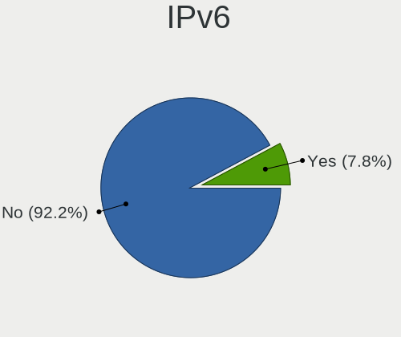

| Used | Desktops | Percent |
|------|----------|---------|
| No   | 122      | 92.42%  |
| Yes  | 10       | 7.58%   |

Bluetooth
---------

Bluetooth Vendor
----------------

Controller vendors

| Vendor                          | Desktops | Percent |
|---------------------------------|----------|---------|
| Cambridge Silicon Radio         | 5        | 29.41%  |
| Broadcom                        | 4        | 23.53%  |
| Intel                           | 3        | 17.65%  |
| Qualcomm Atheros Communications | 2        | 11.76%  |
| ASUSTek Computer                | 2        | 11.76%  |
| Realtek Semiconductor           | 1        | 5.88%   |

Bluetooth Model
---------------

Controller models

| Model                                                 | Desktops | Percent |
|-------------------------------------------------------|----------|---------|
| Cambridge Silicon Radio Bluetooth Dongle (HCI mode)   | 5        | 29.41%  |
| Broadcom BCM20702A0 Bluetooth 4.0                     | 2        | 11.76%  |
| ASUS Broadcom BCM20702 Single-Chip Bluetooth 4.0 + LE | 2        | 11.76%  |
| Realtek  Bluetooth 4.2 Adapter                        | 1        | 5.88%   |
| Qualcomm Atheros  Bluetooth Device                    | 1        | 5.88%   |
| Qualcomm Atheros AR3012 Bluetooth 4.0                 | 1        | 5.88%   |
| Intel Bluetooth wireless interface                    | 1        | 5.88%   |
| Intel AX201 Bluetooth                                 | 1        | 5.88%   |
| Intel AX200 Bluetooth                                 | 1        | 5.88%   |
| Broadcom BCM92046DG-CL1ROM Bluetooth 2.1 Adapter      | 1        | 5.88%   |
| Broadcom ANYCOM Blue USB-200/250                      | 1        | 5.88%   |

Sound
-----

Sound Vendor
------------

Sound card vendors

| Vendor              | Desktops | Percent |
|---------------------|----------|---------|
| Intel               | 88       | 50.29%  |
| AMD                 | 44       | 25.14%  |
| Nvidia              | 32       | 18.29%  |
| Texas Instruments   | 2        | 1.14%   |
| Logitech            | 2        | 1.14%   |
| Creative Labs       | 2        | 1.14%   |
| C-Media Electronics | 2        | 1.14%   |
| GN Netcom           | 1        | 0.57%   |
| Ensoniq             | 1        | 0.57%   |
| ASUSTek Computer    | 1        | 0.57%   |

Sound Model
-----------

Sound card models

| Model                                                                                             | Desktops | Percent |
|---------------------------------------------------------------------------------------------------|----------|---------|
| Intel 8 Series/C220 Series Chipset High Definition Audio Controller                               | 17       | 8.59%   |
| AMD Oland/Hainan/Cape Verde/Pitcairn HDMI Audio [Radeon HD 7000 Series]                           | 17       | 8.59%   |
| Intel 100 Series/C230 Series Chipset Family HD Audio Controller                                   | 16       | 8.08%   |
| Intel Xeon E3-1200 v3/4th Gen Core Processor HD Audio Controller                                  | 9        | 4.55%   |
| Intel 6 Series/C200 Series Chipset Family High Definition Audio Controller                        | 8        | 4.04%   |
| Intel Cannon Lake PCH cAVS                                                                        | 6        | 3.03%   |
| Intel 7 Series/C216 Chipset Family High Definition Audio Controller                               | 6        | 3.03%   |
| AMD SBx00 Azalia (Intel HDA)                                                                      | 6        | 3.03%   |
| Nvidia GP107GL High Definition Audio Controller                                                   | 5        | 2.53%   |
| Intel 82801JI (ICH10 Family) HD Audio Controller                                                  | 5        | 2.53%   |
| AMD FCH Azalia Controller                                                                         | 5        | 2.53%   |
| Nvidia High Definition Audio Controller                                                           | 4        | 2.02%   |
| Nvidia GP106 High Definition Audio Controller                                                     | 4        | 2.02%   |
| Intel C610/X99 series chipset HD Audio Controller                                                 | 4        | 2.02%   |
| Intel C600/X79 series chipset High Definition Audio Controller                                    | 4        | 2.02%   |
| AMD Family 17h (Models 00h-0fh) HD Audio Controller                                               | 4        | 2.02%   |
| Nvidia GK208 HDMI/DP Audio Controller                                                             | 3        | 1.52%   |
| Nvidia GK104 HDMI Audio Controller                                                                | 3        | 1.52%   |
| Intel NM10/ICH7 Family High Definition Audio Controller                                           | 3        | 1.52%   |
| Intel Comet Lake PCH cAVS                                                                         | 3        | 1.52%   |
| Intel 200 Series PCH HD Audio                                                                     | 3        | 1.52%   |
| AMD Starship/Matisse HD Audio Controller                                                          | 3        | 1.52%   |
| AMD Ellesmere HDMI Audio [Radeon RX 470/480 / 570/580/590]                                        | 3        | 1.52%   |
| AMD Caicos HDMI Audio [Radeon HD 6450 / 7450/8450/8490 OEM / R5 230/235/235X OEM]                 | 3        | 1.52%   |
| Nvidia TU104 HD Audio Controller                                                                  | 2        | 1.01%   |
| Nvidia TU102 High Definition Audio Controller                                                     | 2        | 1.01%   |
| Nvidia GM204 High Definition Audio Controller                                                     | 2        | 1.01%   |
| Nvidia GK106 HDMI Audio Controller                                                                | 2        | 1.01%   |
| Logitech Headset H390                                                                             | 2        | 1.01%   |
| Intel Audio device                                                                                | 2        | 1.01%   |
| Intel 9 Series Chipset Family HD Audio Controller                                                 | 2        | 1.01%   |
| AMD RS780 HDMI Audio [Radeon 3000/3100 / HD 3200/3300]                                            | 2        | 1.01%   |
| AMD Kabini HDMI/DP Audio                                                                          | 2        | 1.01%   |
| AMD Cypress HDMI Audio [Radeon HD 5830/5850/5870 / 6850/6870 Rebrand]                             | 2        | 1.01%   |
| AMD Baffin HDMI/DP Audio [Radeon RX 550 640SP / RX 560/560X]                                      | 2        | 1.01%   |
| Texas Instruments PCM2902 Audio Codec                                                             | 1        | 0.51%   |
| Texas Instruments Multimedia audio controller                                                     | 1        | 0.51%   |
| Nvidia TU106 High Definition Audio Controller                                                     | 1        | 0.51%   |
| Nvidia MCP73 High Definition Audio                                                                | 1        | 0.51%   |
| Nvidia GP104 High Definition Audio Controller                                                     | 1        | 0.51%   |
| Nvidia GK107 HDMI Audio Controller                                                                | 1        | 0.51%   |
| Nvidia GF119 HDMI Audio Controller                                                                | 1        | 0.51%   |
| Nvidia GF116 High Definition Audio Controller                                                     | 1        | 0.51%   |
| Nvidia GF108 High Definition Audio Controller                                                     | 1        | 0.51%   |
| Intel Tiger Lake-H HD Audio Controller                                                            | 1        | 0.51%   |
| Intel Haswell-ULT HD Audio Controller                                                             | 1        | 0.51%   |
| Intel Celeron N3350/Pentium N4200/Atom E3900 Series Audio Cluster                                 | 1        | 0.51%   |
| Intel Atom/Celeron/Pentium Processor x5-E8000/J3xxx/N3xxx Series High Definition Audio Controller | 1        | 0.51%   |
| Intel Atom Processor Z36xxx/Z37xxx Series High Definition Audio Controller                        | 1        | 0.51%   |
| Intel 82801JD/DO (ICH10 Family) HD Audio Controller                                               | 1        | 0.51%   |
| Intel 82801H (ICH8 Family) HD Audio Controller                                                    | 1        | 0.51%   |
| Intel 8 Series HD Audio Controller                                                                | 1        | 0.51%   |
| Intel 631xESB/632xESB High Definition Audio Controller                                            | 1        | 0.51%   |
| Intel 5 Series/3400 Series Chipset High Definition Audio                                          | 1        | 0.51%   |
| GN Netcom Jabra EVOLVE 30 II                                                                      | 1        | 0.51%   |
| Ensoniq ES1371/ES1373 / Creative Labs CT2518                                                      | 1        | 0.51%   |
| Creative Labs EMU10k2/CA0100/CA0102/CA10200 [Sound Blaster Audigy Series]                         | 1        | 0.51%   |
| Creative Labs CA0108/CA10300 [Sound Blaster Audigy Series]                                        | 1        | 0.51%   |
| C-Media Electronics USB Advanced Audio Device                                                     | 1        | 0.51%   |
| C-Media Electronics CM108 Audio Controller                                                        | 1        | 0.51%   |

Memory
------

Memory Vendor
-------------

Memory module vendors

| Vendor              | Desktops | Percent |
|---------------------|----------|---------|
| Kingston            | 25       | 19.84%  |
| Samsung Electronics | 24       | 19.05%  |
| SK Hynix            | 19       | 15.08%  |
| Unknown             | 18       | 14.29%  |
| Micron Technology   | 17       | 13.49%  |
| Crucial             | 12       | 9.52%   |
| Corsair             | 3        | 2.38%   |
| Patriot             | 2        | 1.59%   |
| G.Skill             | 2        | 1.59%   |
| A-DATA Technology   | 2        | 1.59%   |
| Transcend           | 1        | 0.79%   |
| Nanya Technology    | 1        | 0.79%   |

Memory Model
------------

Memory module models

| Model                                                       | Desktops | Percent |
|-------------------------------------------------------------|----------|---------|
| Samsung RAM M378B5173QH0-YK0 4GB DIMM DDR3 1600MT/s         | 6        | 4.11%   |
| Micron RAM 4ATF51264AZ-2G3B1 4GB DIMM DDR4 2800MT/s         | 4        | 2.74%   |
| Crucial RAM CT16G4DFD824A.C16FDD 16384MB DIMM DDR4 2400MT/s | 4        | 2.74%   |
| SK Hynix RAM Module 2048MB DIMM DDR3 1600MT/s               | 2        | 1.37%   |
| Samsung RAM Module 8192MB DIMM DDR4 3200MT/s                | 2        | 1.37%   |
| Micron RAM 8JTF51264AZ-1G6E1 4096MB DIMM DDR3 1600MT/s      | 2        | 1.37%   |
| Micron RAM 8ATF1G64AZ-2G3E1 8GB DIMM DDR4 2400MT/s          | 2        | 1.37%   |
| Micron RAM 18ASF2G72AZ-2G6D1 16384MB DIMM DDR4 2667MT/s     | 2        | 1.37%   |
| Kingston RAM KHX1600C9D3/4GX 4GB DIMM DDR3 2400MT/s         | 2        | 1.37%   |
| Crucial RAM CT8G4DFD824A.C16FBD1 8GB DIMM DDR4 2400MT/s     | 2        | 1.37%   |
| Unknown RAM Module 8192MB DIMM DDR3 1600MT/s                | 1        | 0.68%   |
| Unknown RAM Module 8192MB DIMM DDR3 1333MT/s                | 1        | 0.68%   |
| Unknown RAM Module 8192MB DIMM 1600MT/s                     | 1        | 0.68%   |
| Unknown RAM Module 8192MB DIMM 1333MT/s                     | 1        | 0.68%   |
| Unknown RAM Module 4096MB DIMM DDR3 1333MT/s                | 1        | 0.68%   |
| Unknown RAM Module 4096MB DIMM DDR 1333MT/s                 | 1        | 0.68%   |
| Unknown RAM Module 4096MB DIMM 800MT/s                      | 1        | 0.68%   |
| Unknown RAM Module 4096MB DIMM 1600MT/s                     | 1        | 0.68%   |
| Unknown RAM Module 4096MB DIMM 1333MT/s                     | 1        | 0.68%   |
| Unknown RAM Module 4096MB DIMM                              | 1        | 0.68%   |
| Unknown RAM Module 2048MB SODIMM DDR3 800MT/s               | 1        | 0.68%   |
| Unknown RAM Module 2048MB SODIMM DDR2 800MT/s               | 1        | 0.68%   |
| Unknown RAM Module 2048MB DIMM LPDDR4 1600MT/s              | 1        | 0.68%   |
| Unknown RAM Module 2048MB DIMM DDR3 1333MT/s                | 1        | 0.68%   |
| Unknown RAM Module 2048MB DIMM DDR2                         | 1        | 0.68%   |
| Unknown RAM Module 2048MB DIMM 800MT/s                      | 1        | 0.68%   |
| Unknown RAM Module 2048MB DIMM 400MT/s                      | 1        | 0.68%   |
| Unknown RAM Module 2048MB DIMM 1067MT/s                     | 1        | 0.68%   |
| Unknown RAM Module 16384MB DIMM DDR4 2133MT/s               | 1        | 0.68%   |
| Unknown RAM Module 16384MB DIMM 1067MT/s                    | 1        | 0.68%   |
| Unknown RAM Module 1024MB DIMM 800MT/s                      | 1        | 0.68%   |
| Transcend RAM TS1GLH64V1H 8GB DIMM DDR4 2133MT/s            | 1        | 0.68%   |
| SK Hynix RAM Module 8GB SODIMM DDR4 2667MT/s                | 1        | 0.68%   |
| SK Hynix RAM Module 2048MB DIMM DDR3 800MT/s                | 1        | 0.68%   |
| SK Hynix RAM Module 16GB DIMM DDR4 3200MT/s                 | 1        | 0.68%   |
| SK Hynix RAM HMT451U7BFR8A-PB 4096MB DIMM DDR3 1600MT/s     | 1        | 0.68%   |
| SK Hynix RAM HMT451U6BFR8C-PB 4096MB DIMM DDR3 1600MT/s     | 1        | 0.68%   |
| SK Hynix RAM HMT451U6BFR8A-PB 4GB DIMM DDR3 1600MT/s        | 1        | 0.68%   |
| SK Hynix RAM HMT451U6AFR8C-PB 4GB DIMM DDR3 1600MT/s        | 1        | 0.68%   |
| SK Hynix RAM HMT451S6BFR8A-PB 4GB SODIMM DDR3 1600MT/s      | 1        | 0.68%   |
| SK Hynix RAM HMT41GU7MFR8C-PB 8192MB DIMM DDR3 1600MT/s     | 1        | 0.68%   |
| SK Hynix RAM HMT41GU6BFR8A-PB 8GB DIMM DDR3 2000MT/s        | 1        | 0.68%   |
| SK Hynix RAM HMT351U6CFR8C-PB 4096MB DIMM DDR3 1800MT/s     | 1        | 0.68%   |
| SK Hynix RAM HMT351U6BFR8C-H9 4096MB DIMM DDR3 1333MT/s     | 1        | 0.68%   |
| SK Hynix RAM HMT31GR7BFR4C-H9 8GB DIMM DDR3 1333MT/s        | 1        | 0.68%   |
| SK Hynix RAM HMT31GR7AFR4C-H9 8GB DIMM DDR3 1333MT/s        | 1        | 0.68%   |
| SK Hynix RAM HMT112U7AFP8C-H9 1024MB DIMM DDR3 1333MT/s     | 1        | 0.68%   |
| SK Hynix RAM HMAA4GS6AJR8N-XN 32GB SODIMM DDR4 3200MT/s     | 1        | 0.68%   |
| SK Hynix RAM HMA82GU6AFR8N-UH 16384MB DIMM DDR4 2400MT/s    | 1        | 0.68%   |
| SK Hynix RAM HMA81GU6DJR8N-VK 8GB DIMM DDR4 2667MT/s        | 1        | 0.68%   |
| SK Hynix RAM HMA42GR7AFR4N-TF 16384MB RIMM 2133MT/s         | 1        | 0.68%   |
| SK Hynix RAM HMA41GU6AFR8N-TF 8GB DIMM DDR4 2465MT/s        | 1        | 0.68%   |
| Samsung RAM Module 8GB DIMM DDR4 3200MT/s                   | 1        | 0.68%   |
| Samsung RAM Module 8192MB DIMM DDR4 2133MT/s                | 1        | 0.68%   |
| Samsung RAM Module 2048MB DIMM DDR3 1333MT/s                | 1        | 0.68%   |
| Samsung RAM M471B5173QH0-YK0 4096MB SODIMM DDR3 1600MT/s    | 1        | 0.68%   |
| Samsung RAM M471B5173EB0-YK0 4GB SODIMM DDR3 1600MT/s       | 1        | 0.68%   |
| Samsung RAM M393B5270CH0-YH9 4GB DIMM DDR3 1333MT/s         | 1        | 0.68%   |
| Samsung RAM M393B1K70DH0-YK0 8192MB DIMM DDR3 1600MT/s      | 1        | 0.68%   |
| Samsung RAM M393B1K70DH0-CK0 8192MB DIMM DDR3 1600MT/s      | 1        | 0.68%   |

Memory Kind
-----------

Memory module kinds

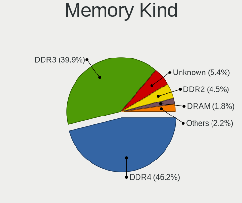

| Kind    | Desktops | Percent |
|---------|----------|---------|
| DDR3    | 51       | 45.13%  |
| DDR4    | 47       | 41.59%  |
| Unknown | 10       | 8.85%   |
| DDR2    | 3        | 2.65%   |
| LPDDR4  | 1        | 0.88%   |
| DDR     | 1        | 0.88%   |

Memory Form Factor
------------------

Physical design of the memory module

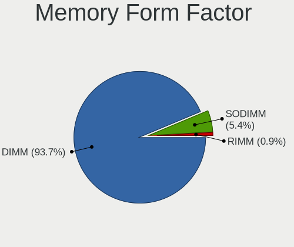

| Name   | Desktops | Percent |
|--------|----------|---------|
| DIMM   | 103      | 91.15%  |
| SODIMM | 9        | 7.96%   |
| RIMM   | 1        | 0.88%   |

Memory Size
-----------

Memory module size

| Size  | Desktops | Percent |
|-------|----------|---------|
| 4096  | 41       | 32.8%   |
| 8192  | 39       | 31.2%   |
| 16384 | 22       | 17.6%   |
| 2048  | 17       | 13.6%   |
| 32768 | 4        | 3.2%    |
| 1024  | 2        | 1.6%    |

Memory Speed
------------

Memory module speed

| Speed   | Desktops | Percent |
|---------|----------|---------|
| 1600    | 30       | 24.59%  |
| 1333    | 19       | 15.57%  |
| 2400    | 17       | 13.93%  |
| 2667    | 13       | 10.66%  |
| 3200    | 7        | 5.74%   |
| 2133    | 7        | 5.74%   |
| 800     | 6        | 4.92%   |
| 2800    | 4        | 3.28%   |
| 667     | 3        | 2.46%   |
| 2134    | 2        | 1.64%   |
| 2000    | 2        | 1.64%   |
| 1800    | 2        | 1.64%   |
| Unknown | 2        | 1.64%   |
| 4333    | 1        | 0.82%   |
| 3600    | 1        | 0.82%   |
| 3500    | 1        | 0.82%   |
| 2666    | 1        | 0.82%   |
| 2465    | 1        | 0.82%   |
| 1867    | 1        | 0.82%   |
| 1067    | 1        | 0.82%   |
| 400     | 1        | 0.82%   |

Printers & scanners
-------------------

Printer Vendor
--------------

Printer device vendors

| Vendor             | Desktops | Percent |
|--------------------|----------|---------|
| Hewlett-Packard    | 3        | 60%     |
| Canon              | 1        | 20%     |
| Brother Industries | 1        | 20%     |

Printer Model
-------------

Printer device models

| Model                   | Desktops | Percent |
|-------------------------|----------|---------|
| HP LaserJet 400 M401dne | 1        | 20%     |
| HP LaserJet 3030        | 1        | 20%     |
| HP LaserJet 1020        | 1        | 20%     |
| Canon MF210 Series      | 1        | 20%     |
| Brother MFC-9130CW      | 1        | 20%     |

Scanner Vendor
--------------

Scanner device vendors

Zero info for selected period =(

Scanner Model
-------------

Scanner device models

Zero info for selected period =(

Camera
------

Camera Vendor
-------------

Camera device vendors

| Vendor                 | Desktops | Percent |
|------------------------|----------|---------|
| Logitech               | 2        | 33.33%  |
| Samsung Electronics    | 1        | 16.67%  |
| Realtek Semiconductor  | 1        | 16.67%  |
| Microsoft              | 1        | 16.67%  |
| Generalplus Technology | 1        | 16.67%  |

Camera Model
------------

Camera device models

| Model                                    | Desktops | Percent |
|------------------------------------------|----------|---------|
| Samsung Galaxy series, misc. (MTP mode)  | 1        | 16.67%  |
| Realtek Web Camera                       | 1        | 16.67%  |
| Microsoft LifeCam HD-5000                | 1        | 16.67%  |
| Logitech Webcam C310                     | 1        | 16.67%  |
| Logitech HD Pro Webcam C920              | 1        | 16.67%  |
| Generalplus 808 Camera #9 (web-cam mode) | 1        | 16.67%  |

Security
--------

Fingerprint Vendor
------------------

Fingerprint sensor vendors

Zero info for selected period =(

Fingerprint Model
-----------------

Fingerprint sensor models

Zero info for selected period =(

Chipcard Vendor
---------------

Chipcard module vendors

| Vendor           | Desktops | Percent |
|------------------|----------|---------|
| SCM Microsystems | 1        | 100%    |

Chipcard Model
--------------

Chipcard module models

| Model                                                      | Desktops | Percent |
|------------------------------------------------------------|----------|---------|
| SCM Microsystems SCR3340 - ExpressCard54 Smart Card Reader | 1        | 100%    |

Unsupported
-----------

Unsupported Devices
-------------------

Total unsupported devices on board

| Total | Desktops | Percent |
|-------|----------|---------|
| 0     | 92       | 69.7%   |
| 1     | 30       | 22.73%  |
| 2     | 5        | 3.79%   |
| 4     | 4        | 3.03%   |
| 3     | 1        | 0.76%   |

Unsupported Device Types
------------------------

Types of unsupported devices

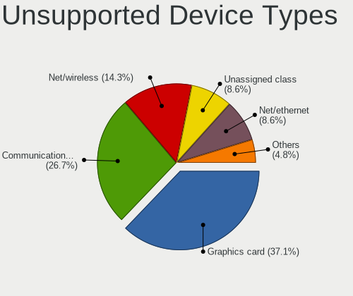

| Type                     | Desktops | Percent |
|--------------------------|----------|---------|
| Graphics card            | 18       | 34.62%  |
| Communication controller | 13       | 25%     |
| Net/wireless             | 8        | 15.38%  |
| Unassigned class         | 6        | 11.54%  |
| Net/ethernet             | 4        | 7.69%   |
| Storage/raid             | 1        | 1.92%   |
| Network                  | 1        | 1.92%   |
| Multimedia controller    | 1        | 1.92%   |

