CentOS 7 - Tested Hardware & Statistics (Desktops)
--------------------------------------------------

A project to collect tested hardware configurations for CentOS 7.

Anyone can contribute to this report by the [hw-probe](https://github.com/linuxhw/hw-probe) tool:

    sudo -E hw-probe -all -upload

Please submit a probe of your configuration if it's not presented on the page or is rare.

Full-feature report is available here: https://linux-hardware.org/?view=trends&rel=centos-7

Contents
--------

* [ Test Cases ](#test-cases)

* [ System ](#system)
  - [ Kernel                   ](#kernel)
  - [ Kernel Family            ](#kernel-family)
  - [ Kernel Major Ver.        ](#kernel-major-ver)
  - [ Arch                     ](#arch)
  - [ DE                       ](#de)
  - [ Display Server           ](#display-server)
  - [ Display Manager          ](#display-manager)
  - [ OS Lang                  ](#os-lang)
  - [ Boot Mode                ](#boot-mode)
  - [ Filesystem               ](#filesystem)
  - [ Part. scheme             ](#part-scheme)
  - [ Dual Boot with Linux/BSD ](#dual-boot-with-linuxbsd)
  - [ Dual Boot (Win)          ](#dual-boot-win)

* [ Board ](#board)
  - [ Vendor                   ](#vendor)
  - [ Model                    ](#model)
  - [ Model Family             ](#model-family)
  - [ MFG Year                 ](#mfg-year)
  - [ Form Factor              ](#form-factor)
  - [ Secure Boot              ](#secure-boot)
  - [ Coreboot                 ](#coreboot)
  - [ RAM Size                 ](#ram-size)
  - [ RAM Used                 ](#ram-used)
  - [ Total Drives             ](#total-drives)
  - [ Has CD-ROM               ](#has-cd-rom)
  - [ Has Ethernet             ](#has-ethernet)
  - [ Has WiFi                 ](#has-wifi)
  - [ Has Bluetooth            ](#has-bluetooth)

* [ Location ](#location)
  - [ Country                  ](#country)
  - [ City                     ](#city)

* [ Drives ](#drives)
  - [ Drive Vendor             ](#drive-vendor)
  - [ Drive Model              ](#drive-model)
  - [ HDD Vendor               ](#hdd-vendor)
  - [ SSD Vendor               ](#ssd-vendor)
  - [ Drive Kind               ](#drive-kind)
  - [ Drive Connector          ](#drive-connector)
  - [ Drive Size               ](#drive-size)
  - [ Space Total              ](#space-total)
  - [ Space Used               ](#space-used)
  - [ Malfunc. Drives          ](#malfunc-drives)
  - [ Malfunc. Drive Vendor    ](#malfunc-drive-vendor)
  - [ Malfunc. HDD Vendor      ](#malfunc-hdd-vendor)
  - [ Malfunc. Drive Kind      ](#malfunc-drive-kind)
  - [ Failed Drives            ](#failed-drives)
  - [ Failed Drive Vendor      ](#failed-drive-vendor)
  - [ Drive Status             ](#drive-status)

* [ Storage controller ](#storage-controller)
  - [ Storage Vendor           ](#storage-vendor)
  - [ Storage Model            ](#storage-model)
  - [ Storage Kind             ](#storage-kind)

* [ Processor ](#processor)
  - [ CPU Vendor               ](#cpu-vendor)
  - [ CPU Model                ](#cpu-model)
  - [ CPU Model Family         ](#cpu-model-family)
  - [ CPU Cores                ](#cpu-cores)
  - [ CPU Sockets              ](#cpu-sockets)
  - [ CPU Threads              ](#cpu-threads)
  - [ CPU Op-Modes             ](#cpu-op-modes)
  - [ CPU Microcode            ](#cpu-microcode)
  - [ CPU Microarch            ](#cpu-microarch)

* [ Graphics ](#graphics)
  - [ GPU Vendor               ](#gpu-vendor)
  - [ GPU Model                ](#gpu-model)
  - [ GPU Combo                ](#gpu-combo)
  - [ GPU Driver               ](#gpu-driver)
  - [ GPU Memory               ](#gpu-memory)

* [ Monitor ](#monitor)
  - [ Monitor Vendor           ](#monitor-vendor)
  - [ Monitor Model            ](#monitor-model)
  - [ Monitor Resolution       ](#monitor-resolution)
  - [ Monitor Diagonal         ](#monitor-diagonal)
  - [ Monitor Width            ](#monitor-width)
  - [ Aspect Ratio             ](#aspect-ratio)
  - [ Monitor Area             ](#monitor-area)
  - [ Pixel Density            ](#pixel-density)
  - [ Multiple Monitors        ](#multiple-monitors)

* [ Network ](#network)
  - [ Net Controller Vendor    ](#net-controller-vendor)
  - [ Net Controller Model     ](#net-controller-model)
  - [ Wireless Vendor          ](#wireless-vendor)
  - [ Wireless Model           ](#wireless-model)
  - [ Ethernet Vendor          ](#ethernet-vendor)
  - [ Ethernet Model           ](#ethernet-model)
  - [ Net Controller Kind      ](#net-controller-kind)
  - [ Used Controller          ](#used-controller)
  - [ NICs                     ](#nics)
  - [ IPv6                     ](#ipv6)

* [ Bluetooth ](#bluetooth)
  - [ Bluetooth Vendor         ](#bluetooth-vendor)
  - [ Bluetooth Model          ](#bluetooth-model)

* [ Sound ](#sound)
  - [ Sound Vendor             ](#sound-vendor)
  - [ Sound Model              ](#sound-model)

* [ Memory ](#memory)
  - [ Memory Vendor            ](#memory-vendor)
  - [ Memory Model             ](#memory-model)
  - [ Memory Kind              ](#memory-kind)
  - [ Memory Form Factor       ](#memory-form-factor)
  - [ Memory Size              ](#memory-size)
  - [ Memory Speed             ](#memory-speed)

* [ Printers & scanners ](#printers--scanners)
  - [ Printer Vendor           ](#printer-vendor)
  - [ Printer Model            ](#printer-model)
  - [ Scanner Vendor           ](#scanner-vendor)
  - [ Scanner Model            ](#scanner-model)

* [ Camera ](#camera)
  - [ Camera Vendor            ](#camera-vendor)
  - [ Camera Model             ](#camera-model)

* [ Security ](#security)
  - [ Fingerprint Vendor       ](#fingerprint-vendor)
  - [ Fingerprint Model        ](#fingerprint-model)
  - [ Chipcard Vendor          ](#chipcard-vendor)
  - [ Chipcard Model           ](#chipcard-model)

* [ Unsupported ](#unsupported)
  - [ Unsupported Devices      ](#unsupported-devices)
  - [ Unsupported Device Types ](#unsupported-device-types)

Test Cases
----------

| Vendor        | Model                       | Probe                                                      | Date         |
|---------------|-----------------------------|------------------------------------------------------------|--------------|
| Dell          | 0Y7WYT A00                  | [e4278d3243](https://linux-hardware.org/?probe=e4278d3243) | Sep 15, 2021 |
| Gigabyte      | B85M-D3PH                   | [01d87985dd](https://linux-hardware.org/?probe=01d87985dd) | Aug 28, 2021 |
| HP            | 8751                        | [cdaf5a0ed8](https://linux-hardware.org/?probe=cdaf5a0ed8) | Aug 24, 2021 |
| Supermicro    | X11SSH-F                    | [35fff898d1](https://linux-hardware.org/?probe=35fff898d1) | Aug 20, 2021 |
| Gigabyte      | B450M DS3H-CF               | [cabe0be4fc](https://linux-hardware.org/?probe=cabe0be4fc) | Aug 17, 2021 |
| ASUSTek       | PRIME B550-PLUS             | [cf348cec5f](https://linux-hardware.org/?probe=cf348cec5f) | Aug 16, 2021 |
| ASUSTek       | GRYPHON Z97 ARMOR EDITIO... | [4f9bb753aa](https://linux-hardware.org/?probe=4f9bb753aa) | Aug 16, 2021 |
| ASUSTek       | ROG Maximus XIII HERO       | [8ddb489f03](https://linux-hardware.org/?probe=8ddb489f03) | Aug 05, 2021 |
| Dell          | 0HD5W2 A01                  | [d19976dabe](https://linux-hardware.org/?probe=d19976dabe) | Aug 05, 2021 |
| Dell          | 00V62H A01                  | [d56fdac07b](https://linux-hardware.org/?probe=d56fdac07b) | Aug 05, 2021 |
| Dell          | 00V62H A01                  | [3eb59a276c](https://linux-hardware.org/?probe=3eb59a276c) | Aug 05, 2021 |
| Dell          | 00V62H A01                  | [3d0db6b81f](https://linux-hardware.org/?probe=3d0db6b81f) | Aug 05, 2021 |
| Dell          | 0YNVJG A01                  | [7952948421](https://linux-hardware.org/?probe=7952948421) | Aug 05, 2021 |
| Dell          | 0HD5W2 A01                  | [1fc2375e54](https://linux-hardware.org/?probe=1fc2375e54) | Aug 05, 2021 |
| Dell          | 0HD5W2 A01                  | [9a5d8276bf](https://linux-hardware.org/?probe=9a5d8276bf) | Aug 05, 2021 |
| Dell          | 0HD5W2 A01                  | [a653e9beb2](https://linux-hardware.org/?probe=a653e9beb2) | Aug 05, 2021 |
| Dell          | 00V62H A01                  | [2165980dd3](https://linux-hardware.org/?probe=2165980dd3) | Aug 05, 2021 |
| Dell          | 0HD5W2 A01                  | [4a2adade2a](https://linux-hardware.org/?probe=4a2adade2a) | Aug 05, 2021 |
| Dell          | 00V62H A01                  | [10bdaec1ef](https://linux-hardware.org/?probe=10bdaec1ef) | Aug 05, 2021 |
| Dell          | 0HD5W2 A01                  | [78c5e3532b](https://linux-hardware.org/?probe=78c5e3532b) | Aug 05, 2021 |
| Dell          | 00V62H A01                  | [80244f2809](https://linux-hardware.org/?probe=80244f2809) | Aug 05, 2021 |
| Dell          | 0HD5W2 A01                  | [70fc6a65ef](https://linux-hardware.org/?probe=70fc6a65ef) | Aug 05, 2021 |
| HP            | 8591                        | [6794bdb00e](https://linux-hardware.org/?probe=6794bdb00e) | Aug 05, 2021 |
| Dell          | 0HD5W2 A01                  | [f209feb9c8](https://linux-hardware.org/?probe=f209feb9c8) | Aug 05, 2021 |
| ASUSTek       | ROG Maximus XIII HERO       | [40b8d28af0](https://linux-hardware.org/?probe=40b8d28af0) | Aug 04, 2021 |
| Gigabyte      | EP45-DS3L                   | [597de4e10b](https://linux-hardware.org/?probe=597de4e10b) | Aug 01, 2021 |
| ASUSTek       | SABERTOOTH X79              | [1232705d62](https://linux-hardware.org/?probe=1232705d62) | Jul 22, 2021 |
| HP            | 2B34                        | [0de82dabad](https://linux-hardware.org/?probe=0de82dabad) | Jul 10, 2021 |
| HP            | 0A9Ch                       | [e3159a6511](https://linux-hardware.org/?probe=e3159a6511) | Jul 07, 2021 |
| Dell          | 09KPNV A01                  | [a3f3f1e1c0](https://linux-hardware.org/?probe=a3f3f1e1c0) | Jul 02, 2021 |
| Gigabyte      | EP45-DS3L                   | [6beb9f6867](https://linux-hardware.org/?probe=6beb9f6867) | Jun 19, 2021 |
| HP            | 1494                        | [d34b022996](https://linux-hardware.org/?probe=d34b022996) | Jun 11, 2021 |
| Intel         | E98683-353                  | [2f0ae62282](https://linux-hardware.org/?probe=2f0ae62282) | May 29, 2021 |
| HP            | 1589                        | [a4b0ebbee2](https://linux-hardware.org/?probe=a4b0ebbee2) | May 23, 2021 |
| ASRock        | J3710M                      | [6f289497fc](https://linux-hardware.org/?probe=6f289497fc) | May 23, 2021 |
| HP            | 8594                        | [991250b6a8](https://linux-hardware.org/?probe=991250b6a8) | May 14, 2021 |
| HP            | 1825                        | [13110a2081](https://linux-hardware.org/?probe=13110a2081) | May 14, 2021 |
| Gigabyte      | EP45-DS3L                   | [33c13bfcf0](https://linux-hardware.org/?probe=33c13bfcf0) | May 01, 2021 |
| HP            | 8591                        | [149576417f](https://linux-hardware.org/?probe=149576417f) | Apr 27, 2021 |
| HP            | 8591                        | [03b17d692d](https://linux-hardware.org/?probe=03b17d692d) | Apr 26, 2021 |
| HP            | 213D A01                    | [72e7e27309](https://linux-hardware.org/?probe=72e7e27309) | Apr 26, 2021 |
| Gigabyte      | EP43-DS3                    | [3eaab1a9d9](https://linux-hardware.org/?probe=3eaab1a9d9) | Apr 05, 2021 |
| HP            | 8591                        | [d3dd8e0a2b](https://linux-hardware.org/?probe=d3dd8e0a2b) | Apr 02, 2021 |
| Dell          | 0MWYPT A02                  | [e2e2e6f179](https://linux-hardware.org/?probe=e2e2e6f179) | Mar 31, 2021 |
| Cisco Syst... | UCSB-B200-M4 73-15862-03    | [4c55de0b30](https://linux-hardware.org/?probe=4c55de0b30) | Mar 31, 2021 |
| Unknown       | Unknown                     | [b672c68361](https://linux-hardware.org/?probe=b672c68361) | Mar 30, 2021 |
| HP            | 8591                        | [3c4d055665](https://linux-hardware.org/?probe=3c4d055665) | Mar 30, 2021 |
| HP            | 8591                        | [b436577a94](https://linux-hardware.org/?probe=b436577a94) | Mar 30, 2021 |
| Gigabyte      | EP45-DS3L                   | [c724df2a1a](https://linux-hardware.org/?probe=c724df2a1a) | Mar 23, 2021 |
| MiTAC         | PD10BI PD10BI-702           | [63335e1b88](https://linux-hardware.org/?probe=63335e1b88) | Mar 18, 2021 |
| MiTAC         | PD10BI PD10BI-702           | [5d23375dcd](https://linux-hardware.org/?probe=5d23375dcd) | Mar 18, 2021 |
| Unknown       | Unknown                     | [234c991949](https://linux-hardware.org/?probe=234c991949) | Mar 17, 2021 |
| MSI           | H170A GAMING PRO            | [dd38d014bd](https://linux-hardware.org/?probe=dd38d014bd) | Mar 17, 2021 |
| Gigabyte      | EP45-DS3L                   | [6663605d82](https://linux-hardware.org/?probe=6663605d82) | Feb 27, 2021 |
| AMI           | PCHK-Z83 Poslab_ECO         | [5dd25822e3](https://linux-hardware.org/?probe=5dd25822e3) | Feb 23, 2021 |
| Gigabyte      | D525TUD                     | [59b1050f5f](https://linux-hardware.org/?probe=59b1050f5f) | Feb 19, 2021 |
| ASUSTek       | PRIME B360M-D               | [aab84fafeb](https://linux-hardware.org/?probe=aab84fafeb) | Feb 10, 2021 |
| ASUSTek       | P8Z68-V LX                  | [9fc9b672d0](https://linux-hardware.org/?probe=9fc9b672d0) | Feb 07, 2021 |
| HP            | 3397                        | [aba05551cb](https://linux-hardware.org/?probe=aba05551cb) | Feb 05, 2021 |
| Dell          | 0HHV7N A00                  | [7b55587c5a](https://linux-hardware.org/?probe=7b55587c5a) | Jan 10, 2021 |
| Gigabyte      | D525TUD                     | [e9f1445d02](https://linux-hardware.org/?probe=e9f1445d02) | Jan 03, 2021 |
| Intel         | DQ67OW AAG12528-309         | [5f42b365ae](https://linux-hardware.org/?probe=5f42b365ae) | Dec 26, 2020 |
| Gigabyte      | EP45-DS3L                   | [aad57f82cd](https://linux-hardware.org/?probe=aad57f82cd) | Dec 24, 2020 |
| ASUSTek       | X99-DELUXE                  | [46613a5ce9](https://linux-hardware.org/?probe=46613a5ce9) | Dec 20, 2020 |
| Gigabyte      | Z77-D3H                     | [b7c033babd](https://linux-hardware.org/?probe=b7c033babd) | Dec 10, 2020 |
| Gigabyte      | D525TUD                     | [0c13d73ba0](https://linux-hardware.org/?probe=0c13d73ba0) | Nov 27, 2020 |
| ASUSTek       | M5A78L-M PLUS/USB3          | [bc3bd4ea10](https://linux-hardware.org/?probe=bc3bd4ea10) | Nov 24, 2020 |
| Dell          | 01NP3N A00                  | [1f5b92d91b](https://linux-hardware.org/?probe=1f5b92d91b) | Oct 12, 2020 |
| ASUSTek       | F2A55-M LE                  | [1fc864e04c](https://linux-hardware.org/?probe=1fc864e04c) | Oct 10, 2020 |
| ECS           | H61H2-MV                    | [0c5285cd22](https://linux-hardware.org/?probe=0c5285cd22) | Sep 20, 2020 |
| HP            | 0AECh D                     | [d80079cb33](https://linux-hardware.org/?probe=d80079cb33) | Sep 18, 2020 |
| Fujitsu       | D3401-H1 S26361-D3401-H1    | [b363aea94a](https://linux-hardware.org/?probe=b363aea94a) | Sep 17, 2020 |
| Fujitsu       | D3401-H1 S26361-D3401-H1    | [1896a5c345](https://linux-hardware.org/?probe=1896a5c345) | Sep 17, 2020 |
| AEWIN         | SCB-1711A                   | [2d8dbb0d3a](https://linux-hardware.org/?probe=2d8dbb0d3a) | Sep 09, 2020 |
| Zenith        | Orion                       | [9de5e32b25](https://linux-hardware.org/?probe=9de5e32b25) | Sep 02, 2020 |
| Gigabyte      | EP45-DS3L                   | [599830e150](https://linux-hardware.org/?probe=599830e150) | Aug 29, 2020 |
| ASUSTek       | P7P55D                      | [4a55c3588b](https://linux-hardware.org/?probe=4a55c3588b) | Aug 26, 2020 |
| Dell          | 0GTK4K A02                  | [09fb692364](https://linux-hardware.org/?probe=09fb692364) | Aug 26, 2020 |
| Gigabyte      | B450 AORUS M                | [f0d9b71d6d](https://linux-hardware.org/?probe=f0d9b71d6d) | Aug 15, 2020 |
| Lenovo        | ThinkServer TS140           | [03abb9daf3](https://linux-hardware.org/?probe=03abb9daf3) | Aug 11, 2020 |
| Lenovo        | ThinkServer TS140           | [2d296ca69c](https://linux-hardware.org/?probe=2d296ca69c) | Aug 11, 2020 |
| Dell          | 08HPGT A02                  | [fa6826d636](https://linux-hardware.org/?probe=fa6826d636) | Aug 02, 2020 |
| Gigabyte      | B360M DS3H                  | [be78e318ef](https://linux-hardware.org/?probe=be78e318ef) | Jul 23, 2020 |
| HP            | 0AECh D                     | [c6310b9606](https://linux-hardware.org/?probe=c6310b9606) | Jul 14, 2020 |
| HP            | 1589                        | [d142f54a38](https://linux-hardware.org/?probe=d142f54a38) | Jul 11, 2020 |
| Intel         | H81C                        | [54732275c2](https://linux-hardware.org/?probe=54732275c2) | Jul 04, 2020 |
| ASUSTek       | SABERTOOTH X99              | [d014e3ba24](https://linux-hardware.org/?probe=d014e3ba24) | Jul 03, 2020 |
| Gigabyte      | P85-D3                      | [3be565ccfd](https://linux-hardware.org/?probe=3be565ccfd) | Jun 23, 2020 |
| ASUSTek       | Crosshair IV Formula        | [51b8e4300b](https://linux-hardware.org/?probe=51b8e4300b) | Jun 20, 2020 |
| ASUSTek       | Crosshair IV Formula        | [e1184552d0](https://linux-hardware.org/?probe=e1184552d0) | Jun 20, 2020 |
| Supermicro    | X10DRG-H                    | [3bd676846b](https://linux-hardware.org/?probe=3bd676846b) | Jun 12, 2020 |
| MSI           | B450M MORTAR MAX            | [db0ff5f985](https://linux-hardware.org/?probe=db0ff5f985) | Jun 07, 2020 |
| Dell          | 0VRWRC A00                  | [dd7e20baec](https://linux-hardware.org/?probe=dd7e20baec) | May 29, 2020 |
| Dell          | 0VRWRC A00                  | [c27987482d](https://linux-hardware.org/?probe=c27987482d) | May 29, 2020 |
| ASRock        | AM1B-ITX                    | [d0b6f8f474](https://linux-hardware.org/?probe=d0b6f8f474) | May 25, 2020 |
| ASUSTek       | CM1740                      | [65921c1a5e](https://linux-hardware.org/?probe=65921c1a5e) | May 14, 2020 |
| Gigabyte      | EP45-DS3L                   | [6a3f0afa07](https://linux-hardware.org/?probe=6a3f0afa07) | May 07, 2020 |
| HP            | 1495                        | [a38478daa1](https://linux-hardware.org/?probe=a38478daa1) | May 05, 2020 |
| HP            | 1495                        | [c3d3f31b83](https://linux-hardware.org/?probe=c3d3f31b83) | May 05, 2020 |
| HP            | 1495                        | [6fed1750c3](https://linux-hardware.org/?probe=6fed1750c3) | May 05, 2020 |
| Supermicro    | X10SDE-DF                   | [54cbea6bb1](https://linux-hardware.org/?probe=54cbea6bb1) | Apr 26, 2020 |
| Supermicro    | X10SDE-DF                   | [3c55fe3c77](https://linux-hardware.org/?probe=3c55fe3c77) | Apr 26, 2020 |
| ASUSTek       | Rampage V EXTREME           | [a78c0430fb](https://linux-hardware.org/?probe=a78c0430fb) | Apr 15, 2020 |
| ASUSTek       | Rampage V EXTREME           | [6e7470b8c3](https://linux-hardware.org/?probe=6e7470b8c3) | Apr 15, 2020 |
| Gigabyte      | EP45-DS3L                   | [942f7d3c3c](https://linux-hardware.org/?probe=942f7d3c3c) | Apr 01, 2020 |
| Gigabyte      | EP45-DS3L                   | [fc9be427f5](https://linux-hardware.org/?probe=fc9be427f5) | Apr 01, 2020 |
| ASUSTek       | PRIME A320M-K               | [b3782f0e54](https://linux-hardware.org/?probe=b3782f0e54) | Mar 20, 2020 |
| ASRock        | X399 Professional Gaming    | [efe1215f69](https://linux-hardware.org/?probe=efe1215f69) | Mar 19, 2020 |
| Gigabyte      | EP45-DS3L                   | [c20d28a563](https://linux-hardware.org/?probe=c20d28a563) | Mar 15, 2020 |
| Gigabyte      | EP45-DS3L                   | [3086c3b9f5](https://linux-hardware.org/?probe=3086c3b9f5) | Mar 15, 2020 |
| Gigabyte      | EP45-DS3L                   | [1345dd63eb](https://linux-hardware.org/?probe=1345dd63eb) | Mar 11, 2020 |
| Gigabyte      | EP45-DS3L                   | [6fc52e234a](https://linux-hardware.org/?probe=6fc52e234a) | Mar 09, 2020 |
| Gigabyte      | EP45-DS3L                   | [add6bd96c8](https://linux-hardware.org/?probe=add6bd96c8) | Mar 09, 2020 |
| Gigabyte      | EP45-DS3L                   | [906db6cad1](https://linux-hardware.org/?probe=906db6cad1) | Mar 09, 2020 |
| Dell          | 0X8DXD A01                  | [37012211e0](https://linux-hardware.org/?probe=37012211e0) | Mar 05, 2020 |
| Gigabyte      | Z170X-UD3-CF                | [ed0506aa18](https://linux-hardware.org/?probe=ed0506aa18) | Feb 25, 2020 |
| Foxconn       | 2ABF                        | [d45674e336](https://linux-hardware.org/?probe=d45674e336) | Feb 06, 2020 |
| ASUSTek       | AT4NM10T-I                  | [a0fa3c7ca0](https://linux-hardware.org/?probe=a0fa3c7ca0) | Jan 28, 2020 |
| HP            | 18E4                        | [f6f6dfd341](https://linux-hardware.org/?probe=f6f6dfd341) | Jan 25, 2020 |
| Gigabyte      | GA-78LMT-USB3               | [917bf2b4cf](https://linux-hardware.org/?probe=917bf2b4cf) | Jan 24, 2020 |
| Dell          | 0C27VV A01                  | [01545ea8b0](https://linux-hardware.org/?probe=01545ea8b0) | Jan 24, 2020 |
| ASUSTek       | M5A78L-M/USB3               | [9d92e8ed9d](https://linux-hardware.org/?probe=9d92e8ed9d) | Jan 24, 2020 |
| Dell          | 0M5DCD A00                  | [21e230fb02](https://linux-hardware.org/?probe=21e230fb02) | Jan 24, 2020 |
| HP            | 0A98h                       | [e68759aa8e](https://linux-hardware.org/?probe=e68759aa8e) | Dec 12, 2019 |
| Dell          | 09KPNV A01                  | [0c44bfb480](https://linux-hardware.org/?probe=0c44bfb480) | Nov 22, 2019 |
| Gigabyte      | B150M-D3H-CF                | [0c5c6bd0d1](https://linux-hardware.org/?probe=0c5c6bd0d1) | Oct 31, 2019 |
| ECS           | H55H-M                      | [970477516c](https://linux-hardware.org/?probe=970477516c) | Oct 12, 2019 |
| ECS           | H55H-M                      | [dab03eeec5](https://linux-hardware.org/?probe=dab03eeec5) | Oct 12, 2019 |
| ASUSTek       | P8H67-M                     | [a3522aac75](https://linux-hardware.org/?probe=a3522aac75) | Oct 09, 2019 |
| ASUSTek       | P8H67-M                     | [1c6a686559](https://linux-hardware.org/?probe=1c6a686559) | Oct 08, 2019 |
| ASUSTek       | P8H67-M                     | [8c40634de7](https://linux-hardware.org/?probe=8c40634de7) | Oct 08, 2019 |
| Gigabyte      | B360HD3PLM-CF               | [05d00cc5d7](https://linux-hardware.org/?probe=05d00cc5d7) | Sep 09, 2019 |
| Gigabyte      | 970A-D3P                    | [6e3666d8c9](https://linux-hardware.org/?probe=6e3666d8c9) | Sep 04, 2019 |
| AMI           | Cherry Trail CR             | [fe652a02c9](https://linux-hardware.org/?probe=fe652a02c9) | Jul 25, 2019 |
| Dell          | 09KPNV A00                  | [a72c60b73b](https://linux-hardware.org/?probe=a72c60b73b) | Jul 24, 2019 |
| ASRockRack    | E3C242D4U2-2T               | [b2fac79afd](https://linux-hardware.org/?probe=b2fac79afd) | Jun 27, 2019 |
| ASRockRack    | E3C242D4U2-2T               | [44eb4c1fed](https://linux-hardware.org/?probe=44eb4c1fed) | Jun 25, 2019 |
| ASRockRack    | E3C242D4U2-2T               | [4bb11d6dc0](https://linux-hardware.org/?probe=4bb11d6dc0) | Jun 07, 2019 |
| ASRockRack    | E3C242D4U2-2T               | [3fb7cc0574](https://linux-hardware.org/?probe=3fb7cc0574) | Jun 07, 2019 |
| AAEON         | MF-001 V1.0                 | [19f89f5d4e](https://linux-hardware.org/?probe=19f89f5d4e) | Jun 05, 2019 |
| HP            | 8054                        | [8409fbc1c6](https://linux-hardware.org/?probe=8409fbc1c6) | May 28, 2019 |
| Intel         | SHARKBAY                    | [8418bef88a](https://linux-hardware.org/?probe=8418bef88a) | May 15, 2019 |
| ASUSTek       | P5G41T-M LX                 | [16ecb5a13f](https://linux-hardware.org/?probe=16ecb5a13f) | Apr 19, 2019 |
| Intel         | SHARKBAY                    | [58607accae](https://linux-hardware.org/?probe=58607accae) | Apr 08, 2019 |
| Intel         | SHARKBAY                    | [d8c89a633e](https://linux-hardware.org/?probe=d8c89a633e) | Apr 08, 2019 |
| Intel         | SHARKBAY                    | [5e5b4e25a0](https://linux-hardware.org/?probe=5e5b4e25a0) | Apr 08, 2019 |
| ASUSTek       | F1A75-M LE                  | [f8301ffe57](https://linux-hardware.org/?probe=f8301ffe57) | Mar 26, 2019 |
| ASRock        | Z87 Extreme6                | [96aaa39135](https://linux-hardware.org/?probe=96aaa39135) | Mar 18, 2019 |
| HP            | 81C5 MVB                    | [46ea2e591e](https://linux-hardware.org/?probe=46ea2e591e) | Mar 18, 2019 |
| MSI           | X299 RAIDER                 | [f06f57dde9](https://linux-hardware.org/?probe=f06f57dde9) | Mar 07, 2019 |
| Lenovo        | 4030                        | [10455104fd](https://linux-hardware.org/?probe=10455104fd) | Mar 01, 2019 |
| Gigabyte      | 970A-DS3P                   | [9c8b01fc94](https://linux-hardware.org/?probe=9c8b01fc94) | Dec 22, 2018 |
| Gigabyte      | 970A-DS3P                   | [3b0d00f6c9](https://linux-hardware.org/?probe=3b0d00f6c9) | Dec 22, 2018 |
| Dell          | 0CD6TV A01                  | [7f702ee88f](https://linux-hardware.org/?probe=7f702ee88f) | Oct 29, 2018 |
| Dell          | 0CD6TV A01                  | [46e3d4f4d9](https://linux-hardware.org/?probe=46e3d4f4d9) | Oct 29, 2018 |
| ASRock        | H77 Pro4/MVP                | [a5918b30a1](https://linux-hardware.org/?probe=a5918b30a1) | May 01, 2018 |

System
------

Kernel
------

Version of the Linux kernel

| Version                                 | Desktops | Percent |
|-----------------------------------------|----------|---------|
| 3.10.0-1160.31.1.el7.x86_64             | 11       | 8.73%   |
| 3.10.0-1160.25.1.el7.x86_64             | 10       | 7.94%   |
| 3.10.0-1160.15.2.el7.x86_64             | 7        | 5.56%   |
| 3.10.0-1062.12.1.el7.x86_64             | 6        | 4.76%   |
| 3.10.0-957.10.1.el7.x86_64              | 5        | 3.97%   |
| 3.10.0-1160.6.1.el7.x86_64              | 5        | 3.97%   |
| 3.10.0-1160.36.2.el7.x86_64             | 5        | 3.97%   |
| 3.10.0-957.27.2.el7.x86_64              | 4        | 3.17%   |
| 3.10.0-1127.el7.x86_64                  | 4        | 3.17%   |
| 3.10.0-1127.19.1.el7.x86_64             | 4        | 3.17%   |
| 3.10.0-957.5.1.el7.x86_64               | 3        | 2.38%   |
| 3.10.0-957.1.3.el7.x86_64               | 3        | 2.38%   |
| 3.10.0-1160.21.1.el7.x86_64             | 3        | 2.38%   |
| 3.10.0-1160.11.1.el7.x86_64             | 3        | 2.38%   |
| 3.10.0-1062.el7.x86_64                  | 3        | 2.38%   |
| 3.10.0-1062.9.1.el7.x86_64              | 3        | 2.38%   |
| 3.10.0-1062.18.1.el7.x86_64             | 3        | 2.38%   |
| 3.10.0-957.el7.x86_64                   | 2        | 1.59%   |
| 3.10.0-957.12.2.el7.x86_64              | 2        | 1.59%   |
| 3.10.0-693.21.1.el7.x86_64              | 2        | 1.59%   |
| 3.10.0-1160.24.1.el7.x86_64             | 2        | 1.59%   |
| 3.10.0-1127.13.1.el7.x86_64             | 2        | 1.59%   |
| 3.10.0-1127.10.1.el7.x86_64             | 2        | 1.59%   |
| 5.8.0-1.el7.elrepo.x86_64               | 1        | 0.79%   |
| 5.7.7-1.el7.elrepo.x86_64               | 1        | 0.79%   |
| 5.7.10-1.el7.elrepo.x86_64              | 1        | 0.79%   |
| 5.6.10-1.el7.elrepo.x86_64              | 1        | 0.79%   |
| 5.5.0-1.el7.elrepo.x86_64               | 1        | 0.79%   |
| 5.4.96-200.el7.x86_64                   | 1        | 0.79%   |
| 5.4.142-1.el7.elrepo.x86_64             | 1        | 0.79%   |
| 5.4.119-1.el7.elrepo.x86_64             | 1        | 0.79%   |
| 5.4.118-1.el7.elrepo.x86_64             | 1        | 0.79%   |
| 5.4.113-1.el7.elrepo.x86_64             | 1        | 0.79%   |
| 5.3.11-1.el7.elrepo.x86_64              | 1        | 0.79%   |
| 5.1.19                                  | 1        | 0.79%   |
| 4.9.188-35.el7.x86_64                   | 1        | 0.79%   |
| 4.9.182-xxxx-std-ipv6-64                | 1        | 0.79%   |
| 4.9.180-xxxx-std-ipv6-64                | 1        | 0.79%   |
| 4.9.179-xxxx-std-ipv6-64                | 1        | 0.79%   |
| 4.20.4-1.el7.elrepo.x86_64              | 1        | 0.79%   |
| 3.10.0-957.12.1.el7.x86_64              | 1        | 0.79%   |
| 3.10.0-862.el7.x86_64                   | 1        | 0.79%   |
| 3.10.0-862.14.4.el7.x86_64              | 1        | 0.79%   |
| 3.10.0-693.5.2.el7.x86_64               | 1        | 0.79%   |
| 3.10.0-693.2.2.el7.x86_64               | 1        | 0.79%   |
| 3.10.0-327.el7.x86_64                   | 1        | 0.79%   |
| 3.10.0-327.36.2.el7.x86_64              | 1        | 0.79%   |
| 3.10.0-1160.el7.x86_64                  | 1        | 0.79%   |
| 3.10.0-1160.2.2.el7.x86_64              | 1        | 0.79%   |
| 3.10.0-1127.8.2.el7.x86_64              | 1        | 0.79%   |
| 3.10.0-1127.13.1.el7.centos.plus.x86_64 | 1        | 0.79%   |
| 3.10.0-1062.4.1.el7.x86_64              | 1        | 0.79%   |
| 3.10.0-1062.1.2.el7.x86_64              | 1        | 0.79%   |
| 3.10.0-1062.1.1.el7.x86_64              | 1        | 0.79%   |
| 3.10.0                                  | 1        | 0.79%   |

Kernel Family
-------------

Linux kernel without a distro release

| Version | Desktops | Percent |
|---------|----------|---------|
| 3.10.0  | 96       | 84.96%  |
| 5.8.0   | 1        | 0.88%   |
| 5.7.7   | 1        | 0.88%   |
| 5.7.10  | 1        | 0.88%   |
| 5.6.10  | 1        | 0.88%   |
| 5.5.0   | 1        | 0.88%   |
| 5.4.96  | 1        | 0.88%   |
| 5.4.142 | 1        | 0.88%   |
| 5.4.119 | 1        | 0.88%   |
| 5.4.118 | 1        | 0.88%   |
| 5.4.113 | 1        | 0.88%   |
| 5.3.11  | 1        | 0.88%   |
| 5.1.19  | 1        | 0.88%   |
| 4.9.188 | 1        | 0.88%   |
| 4.9.182 | 1        | 0.88%   |
| 4.9.180 | 1        | 0.88%   |
| 4.9.179 | 1        | 0.88%   |
| 4.20.4  | 1        | 0.88%   |

Kernel Major Ver.
-----------------

Linux kernel major version

| Version | Desktops | Percent |
|---------|----------|---------|
| 3.10    | 96       | 84.96%  |
| 5.4     | 5        | 4.42%   |
| 4.9     | 4        | 3.54%   |
| 5.7     | 2        | 1.77%   |
| 5.8     | 1        | 0.88%   |
| 5.6     | 1        | 0.88%   |
| 5.5     | 1        | 0.88%   |
| 5.3     | 1        | 0.88%   |
| 5.1     | 1        | 0.88%   |
| 4.20    | 1        | 0.88%   |

Arch
----

OS architecture (x86_64, i586, etc.)

| Name   | Desktops | Percent |
|--------|----------|---------|
| x86_64 | 113      | 100%    |

DE
--

Desktop Environment

| Name          | Desktops | Percent |
|---------------|----------|---------|
| Unknown       | 50       | 43.86%  |
| GNOME         | 38       | 33.33%  |
| KDE4          | 13       | 11.4%   |
| GNOME Classic | 6        | 5.26%   |
| MATE          | 4        | 3.51%   |
| Cinnamon      | 2        | 1.75%   |
| Xpra          | 1        | 0.88%   |

Display Server
--------------

X11 or Wayland

| Name    | Desktops | Percent |
|---------|----------|---------|
| X11     | 90       | 79.65%  |
| Unknown | 22       | 19.47%  |
| Web     | 1        | 0.88%   |

Display Manager
---------------

SDDM, LightDM, etc.

| Name    | Desktops | Percent |
|---------|----------|---------|
| Unknown | 58       | 50.88%  |
| GDM     | 52       | 45.61%  |
| LightDM | 4        | 3.51%   |

OS Lang
-------

Language

| Lang        | Desktops | Percent |
|-------------|----------|---------|
| en_US       | 43       | 37.72%  |
| Unknown     | 32       | 28.07%  |
| C           | 15       | 13.16%  |
| ru_RU       | 4        | 3.51%   |
| en_AU       | 3        | 2.63%   |
| de_AT       | 3        | 2.63%   |
| zh_CN       | 2        | 1.75%   |
| pt_BR       | 2        | 1.75%   |
| fr_FR       | 2        | 1.75%   |
| en_GB       | 2        | 1.75%   |
| en_CA       | 2        | 1.75%   |
| ko_KR       | 1        | 0.88%   |
| en_US.utf-8 | 1        | 0.88%   |
| en_SG       | 1        | 0.88%   |
| de_DE       | 1        | 0.88%   |

Boot Mode
---------

EFI or BIOS

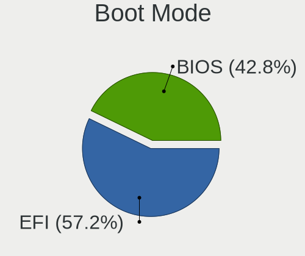

| Mode | Desktops | Percent |
|------|----------|---------|
| BIOS | 60       | 53.1%   |
| EFI  | 53       | 46.9%   |

Filesystem
----------

Type of filesystem

| Type | Desktops | Percent |
|------|----------|---------|
| Xfs  | 83       | 73.45%  |
| Ext4 | 29       | 25.66%  |
| Ext3 | 1        | 0.88%   |

Part. scheme
------------

Scheme of partitioning

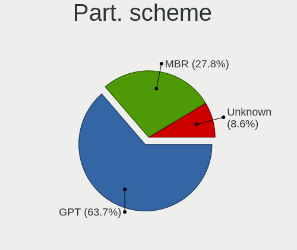

| Type    | Desktops | Percent |
|---------|----------|---------|
| GPT     | 58       | 50.88%  |
| MBR     | 37       | 32.46%  |
| Unknown | 19       | 16.67%  |

Dual Boot with Linux/BSD
------------------------

Hosting more than one Linux/BSD

| Dual boot | Desktops | Percent |
|-----------|----------|---------|
| No        | 100      | 88.5%   |
| Yes       | 13       | 11.5%   |

Dual Boot (Win)
---------------

Hosting Linux and Windows

| Dual boot | Desktops | Percent |
|-----------|----------|---------|
| No        | 101      | 89.38%  |
| Yes       | 12       | 10.62%  |

Board
-----

Vendor
------

Motherboard manufacturer

| Name                | Desktops | Percent |
|---------------------|----------|---------|
| Dell                | 27       | 23.89%  |
| ASUSTek Computer    | 20       | 17.7%   |
| Hewlett-Packard     | 17       | 15.04%  |
| Gigabyte Technology | 15       | 13.27%  |
| ASRock              | 5        | 4.42%   |
| Intel               | 4        | 3.54%   |
| Supermicro          | 3        | 2.65%   |
| MSI                 | 3        | 2.65%   |
| ASRockRack          | 3        | 2.65%   |
| Lenovo              | 2        | 1.77%   |
| Fujitsu             | 2        | 1.77%   |
| ECS                 | 2        | 1.77%   |
| AMI                 | 2        | 1.77%   |
| Unknown             | 2        | 1.77%   |
| Zenith              | 1        | 0.88%   |
| MiTAC               | 1        | 0.88%   |
| Foxconn             | 1        | 0.88%   |
| Cisco Systems       | 1        | 0.88%   |
| AEWIN               | 1        | 0.88%   |
| AAEON               | 1        | 0.88%   |

Model
-----

Motherboard model

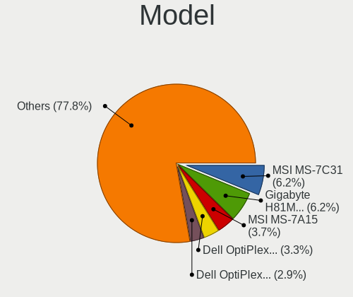

| Name                                | Desktops | Percent |
|-------------------------------------|----------|---------|
| Dell OptiPlex 7040                  | 8        | 7.08%   |
| Dell OptiPlex 9020                  | 6        | 5.31%   |
| ASUS All Series                     | 4        | 3.54%   |
| Dell Precision WorkStation T3500    | 3        | 2.65%   |
| ASRockRack E3C242D4U2-2T            | 3        | 2.65%   |
| HP Z420 Workstation                 | 2        | 1.77%   |
| Fujitsu D3401-H1                    | 2        | 1.77%   |
| Unknown                             | 2        | 1.77%   |
| Zenith Orion                        | 1        | 0.88%   |
| Supermicro SYS-5038MD-H24TRF-OS012  | 1        | 0.88%   |
| Supermicro SYS-5019S-MR             | 1        | 0.88%   |
| Supermicro SYS-1028GR-TR            | 1        | 0.88%   |
| MSI MS-7B89                         | 1        | 0.88%   |
| MSI MS-7A94                         | 1        | 0.88%   |
| MSI MS-7978                         | 1        | 0.88%   |
| MiTAC PD10BI                        | 1        | 0.88%   |
| Lenovo 70UB001NEA ThinkServer TS150 | 1        | 0.88%   |
| Lenovo 70A4000FUX ThinkServer TS140 | 1        | 0.88%   |
| Intel SHARKBAY                      | 1        | 0.88%   |
| Intel SandyBridge Platform          | 1        | 0.88%   |
| Intel H81C                          | 1        | 0.88%   |
| Intel DQ67OW AAG12528-309           | 1        | 0.88%   |
| HP Z800 Workstation                 | 1        | 0.88%   |
| HP Z4 G4 Workstation                | 1        | 0.88%   |
| HP Z2 Tower G5 Workstation          | 1        | 0.88%   |
| HP Z1 Entry Tower G5                | 1        | 0.88%   |
| HP xw8600 Workstation               | 1        | 0.88%   |
| HP xw6600 Workstation               | 1        | 0.88%   |
| HP t620 PLUS Quad Core TC           | 1        | 0.88%   |
| HP EliteDesk 800 G5 Desktop Mini    | 1        | 0.88%   |
| HP EliteDesk 800 G2 SFF             | 1        | 0.88%   |
| HP EliteDesk 800 G1 TWR             | 1        | 0.88%   |
| HP EliteDesk 800 G1 DM              | 1        | 0.88%   |
| HP Compaq Elite 8300 SFF            | 1        | 0.88%   |
| HP Compaq 8200 Elite SFF PC         | 1        | 0.88%   |
| HP Compaq 8200 Elite CMT PC         | 1        | 0.88%   |
| HP 280 G1 MT BUSINESS PC            | 1        | 0.88%   |
| Gigabyte Z77-D3H                    | 1        | 0.88%   |
| Gigabyte Z170X-UD3                  | 1        | 0.88%   |
| Gigabyte P85-D3                     | 1        | 0.88%   |
| Gigabyte GA-78LMT-USB3              | 1        | 0.88%   |
| Gigabyte EP45-DS3L                  | 1        | 0.88%   |
| Gigabyte EP43-DS3                   | 1        | 0.88%   |
| Gigabyte D525TUD                    | 1        | 0.88%   |
| Gigabyte B85M-D3PH                  | 1        | 0.88%   |
| Gigabyte B450M DS3H                 | 1        | 0.88%   |
| Gigabyte B450 AORUS M               | 1        | 0.88%   |
| Gigabyte B360M-DS3H                 | 1        | 0.88%   |
| Gigabyte B360 HD3P-LM               | 1        | 0.88%   |
| Gigabyte B150M-D3H-CF               | 1        | 0.88%   |
| Gigabyte 970A-DS3P                  | 1        | 0.88%   |
| Gigabyte 970A-D3P                   | 1        | 0.88%   |
| Foxconn Pro 3400 Series MT          | 1        | 0.88%   |
| ECS H61H2-MV                        | 1        | 0.88%   |
| ECS H55H-M                          | 1        | 0.88%   |
| Dell Precision Tower 5810           | 1        | 0.88%   |
| Dell Precision Tower 3620           | 1        | 0.88%   |
| Dell Precision T3600                | 1        | 0.88%   |
| Dell Precision 5820 Tower           | 1        | 0.88%   |
| Dell Precision 3240 Compact         | 1        | 0.88%   |

Model Family
------------

Motherboard model prefix

| Name                               | Desktops | Percent |
|------------------------------------|----------|---------|
| Dell OptiPlex                      | 19       | 16.81%  |
| Dell Precision                     | 8        | 7.08%   |
| HP EliteDesk                       | 4        | 3.54%   |
| ASUS All                           | 4        | 3.54%   |
| HP Compaq                          | 3        | 2.65%   |
| ASUS PRIME                         | 3        | 2.65%   |
| ASRockRack E3C242D4U2-2T           | 3        | 2.65%   |
| HP Z420                            | 2        | 1.77%   |
| Fujitsu D3401-H1                   | 2        | 1.77%   |
| ASUS M5A78L-M                      | 2        | 1.77%   |
| Unknown                            | 2        | 1.77%   |
| Zenith Orion                       | 1        | 0.88%   |
| Supermicro SYS-5038MD-H24TRF-OS012 | 1        | 0.88%   |
| Supermicro SYS-5019S-MR            | 1        | 0.88%   |
| Supermicro SYS-1028GR-TR           | 1        | 0.88%   |
| MSI MS-7B89                        | 1        | 0.88%   |
| MSI MS-7A94                        | 1        | 0.88%   |
| MSI MS-7978                        | 1        | 0.88%   |
| MiTAC PD10BI                       | 1        | 0.88%   |
| Lenovo 70UB001NEA                  | 1        | 0.88%   |
| Lenovo 70A4000FUX                  | 1        | 0.88%   |
| Intel SHARKBAY                     | 1        | 0.88%   |
| Intel SandyBridge                  | 1        | 0.88%   |
| Intel H81C                         | 1        | 0.88%   |
| Intel DQ67OW                       | 1        | 0.88%   |
| HP Z800                            | 1        | 0.88%   |
| HP Z4                              | 1        | 0.88%   |
| HP Z2                              | 1        | 0.88%   |
| HP Z1                              | 1        | 0.88%   |
| HP xw8600                          | 1        | 0.88%   |
| HP xw6600                          | 1        | 0.88%   |
| HP t620                            | 1        | 0.88%   |
| HP 280                             | 1        | 0.88%   |
| Gigabyte Z77-D3H                   | 1        | 0.88%   |
| Gigabyte Z170X-UD3                 | 1        | 0.88%   |
| Gigabyte P85-D3                    | 1        | 0.88%   |
| Gigabyte GA-78LMT-USB3             | 1        | 0.88%   |
| Gigabyte EP45-DS3L                 | 1        | 0.88%   |
| Gigabyte EP43-DS3                  | 1        | 0.88%   |
| Gigabyte D525TUD                   | 1        | 0.88%   |
| Gigabyte B85M-D3PH                 | 1        | 0.88%   |
| Gigabyte B450M                     | 1        | 0.88%   |
| Gigabyte B450                      | 1        | 0.88%   |
| Gigabyte B360M-DS3H                | 1        | 0.88%   |
| Gigabyte B360                      | 1        | 0.88%   |
| Gigabyte B150M-D3H-CF              | 1        | 0.88%   |
| Gigabyte 970A-DS3P                 | 1        | 0.88%   |
| Gigabyte 970A-D3P                  | 1        | 0.88%   |
| Foxconn Pro                        | 1        | 0.88%   |
| ECS H61H2-MV                       | 1        | 0.88%   |
| ECS H55H-M                         | 1        | 0.88%   |
| Cisco Systems UCSB-B200-M4         | 1        | 0.88%   |
| ASUS SABERTOOTH                    | 1        | 0.88%   |
| ASUS ROG                           | 1        | 0.88%   |
| ASUS P8Z68-V                       | 1        | 0.88%   |
| ASUS P8H67-M                       | 1        | 0.88%   |
| ASUS P7P55D                        | 1        | 0.88%   |
| ASUS P5G41T-M                      | 1        | 0.88%   |
| ASUS F2A55-M                       | 1        | 0.88%   |
| ASUS F1A75-M                       | 1        | 0.88%   |

MFG Year
--------

Motherboard manufacture year

| Year    | Desktops | Percent |
|---------|----------|---------|
| 2018    | 17       | 15.04%  |
| 2019    | 15       | 13.27%  |
| 2014    | 13       | 11.5%   |
| 2021    | 12       | 10.62%  |
| 2016    | 9        | 7.96%   |
| 2012    | 9        | 7.96%   |
| 2013    | 8        | 7.08%   |
| 2011    | 7        | 6.19%   |
| 2015    | 6        | 5.31%   |
| 2010    | 6        | 5.31%   |
| 2020    | 5        | 4.42%   |
| 2017    | 3        | 2.65%   |
| 2008    | 2        | 1.77%   |
| Unknown | 1        | 0.88%   |

Form Factor
-----------

Physical design of the computer

| Name    | Desktops | Percent |
|---------|----------|---------|
| Desktop | 113      | 100%    |

Secure Boot
-----------

Enabled or disabled

| State    | Desktops | Percent |
|----------|----------|---------|
| Disabled | 113      | 100%    |

Coreboot
--------

Have coreboot on board

| Used | Desktops | Percent |
|------|----------|---------|
| No   | 112      | 99.12%  |
| Yes  | 1        | 0.88%   |

RAM Size
--------

Total RAM memory

| Size in GB      | Desktops | Percent |
|-----------------|----------|---------|
| 4.01-8.0        | 29       | 25.66%  |
| 32.01-64.0      | 25       | 22.12%  |
| 16.01-24.0      | 21       | 18.58%  |
| 64.01-256.0     | 11       | 9.73%   |
| 8.01-16.0       | 10       | 8.85%   |
| 3.01-4.0        | 8        | 7.08%   |
| 1.01-2.0        | 5        | 4.42%   |
| More than 256.0 | 2        | 1.77%   |
| 24.01-32.0      | 2        | 1.77%   |

RAM Used
--------

Used RAM memory

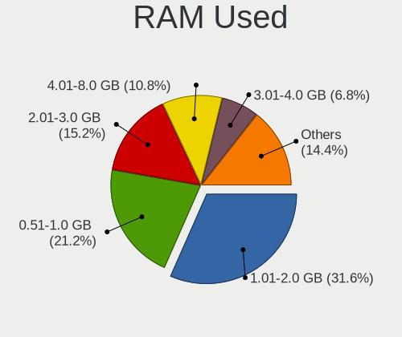

| Used GB    | Desktops | Percent |
|------------|----------|---------|
| 1.01-2.0   | 24       | 20.51%  |
| 0.51-1.0   | 22       | 18.8%   |
| 2.01-3.0   | 18       | 15.38%  |
| 4.01-8.0   | 17       | 14.53%  |
| 8.01-16.0  | 13       | 11.11%  |
| 3.01-4.0   | 10       | 8.55%   |
| 0.01-0.5   | 8        | 6.84%   |
| 16.01-24.0 | 3        | 2.56%   |
| 24.01-32.0 | 2        | 1.71%   |

Total Drives
------------

Number of drives on board

| Drives | Desktops | Percent |
|--------|----------|---------|
| 1      | 47       | 41.59%  |
| 2      | 28       | 24.78%  |
| 3      | 16       | 14.16%  |
| 4      | 8        | 7.08%   |
| 6      | 4        | 3.54%   |
| 5      | 4        | 3.54%   |
| 0      | 2        | 1.77%   |
| 12     | 1        | 0.88%   |
| 10     | 1        | 0.88%   |
| 9      | 1        | 0.88%   |
| 7      | 1        | 0.88%   |

Has CD-ROM
----------

Has CD-ROM on board

| Presented | Desktops | Percent |
|-----------|----------|---------|
| No        | 64       | 56.64%  |
| Yes       | 49       | 43.36%  |

Has Ethernet
------------

Has Ethernet on board

| Presented | Desktops | Percent |
|-----------|----------|---------|
| Yes       | 112      | 99.12%  |
| No        | 1        | 0.88%   |

Has WiFi
--------

Has WiFi module

| Presented | Desktops | Percent |
|-----------|----------|---------|
| No        | 95       | 84.07%  |
| Yes       | 18       | 15.93%  |

Has Bluetooth
-------------

Has Bluetooth module

| Presented | Desktops | Percent |
|-----------|----------|---------|
| No        | 103      | 91.15%  |
| Yes       | 10       | 8.85%   |

Location
--------

Country
-------

Geographic location (country)

| Country      | Desktops | Percent |
|--------------|----------|---------|
| USA          | 36       | 31.86%  |
| Russia       | 12       | 10.62%  |
| Germany      | 7        | 6.19%   |
| Brazil       | 7        | 6.19%   |
| UK           | 6        | 5.31%   |
| France       | 6        | 5.31%   |
| Canada       | 6        | 5.31%   |
| Australia    | 5        | 4.42%   |
| Switzerland  | 3        | 2.65%   |
| South Korea  | 3        | 2.65%   |
| China        | 3        | 2.65%   |
| India        | 2        | 1.77%   |
| Finland      | 2        | 1.77%   |
| Czechia      | 2        | 1.77%   |
| Belgium      | 2        | 1.77%   |
| Ukraine      | 1        | 0.88%   |
| Sweden       | 1        | 0.88%   |
| South Africa | 1        | 0.88%   |
| Singapore    | 1        | 0.88%   |
| Romania      | 1        | 0.88%   |
| Pakistan     | 1        | 0.88%   |
| Norway       | 1        | 0.88%   |
| Japan        | 1        | 0.88%   |
| Israel       | 1        | 0.88%   |
| Hong Kong    | 1        | 0.88%   |
| Ecuador      | 1        | 0.88%   |

City
----

Geographic location (city)

| City               | Desktops | Percent |
|--------------------|----------|---------|
| Rochester          | 15       | 13.04%  |
| Moscow             | 4        | 3.48%   |
| London             | 4        | 3.48%   |
| Frankfurt am Main  | 4        | 3.48%   |
| Sydney             | 3        | 2.61%   |
| Victoria           | 2        | 1.74%   |
| Tampa              | 2        | 1.74%   |
| St Petersburg      | 2        | 1.74%   |
| Paris              | 2        | 1.74%   |
| Hornsby            | 2        | 1.74%   |
| Helsinki           | 2        | 1.74%   |
| Brno               | 2        | 1.74%   |
| Brandon            | 2        | 1.74%   |
| Yel'tsovka         | 1        | 0.87%   |
| Wuxi               | 1        | 0.87%   |
| Wheeling           | 1        | 0.87%   |
| West Henrietta     | 1        | 0.87%   |
| Waxhaw             | 1        | 0.87%   |
| Vancouver          | 1        | 0.87%   |
| Universitário     | 1        | 0.87%   |
| Tyumen             | 1        | 0.87%   |
| Tucson             | 1        | 0.87%   |
| Tours              | 1        | 0.87%   |
| Tokyo              | 1        | 0.87%   |
| Tel Aviv           | 1        | 0.87%   |
| Sundbyberg         | 1        | 0.87%   |
| St Andrews         | 1        | 0.87%   |
| Springfield        | 1        | 0.87%   |
| Singapore          | 1        | 0.87%   |
| Shanghai           | 1        | 0.87%   |
| Seattle            | 1        | 0.87%   |
| S??o Paulo         | 1        | 0.87%   |
| Saratoga Springs   | 1        | 0.87%   |
| Sao Joao de Meriti | 1        | 0.87%   |
| Santa Luzia        | 1        | 0.87%   |
| Roubaix            | 1        | 0.87%   |
| Roodepoort         | 1        | 0.87%   |
| Rio de Janeiro     | 1        | 0.87%   |
| Red Oak            | 1        | 0.87%   |
| Pyeongtaek-si      | 1        | 0.87%   |
| Porto Alegre       | 1        | 0.87%   |
| Penza              | 1        | 0.87%   |
| Papillion          | 1        | 0.87%   |
| Noril'sk           | 1        | 0.87%   |
| Nizhnevartovsk     | 1        | 0.87%   |
| Munich             | 1        | 0.87%   |
| Mumbai             | 1        | 0.87%   |
| Meyrin             | 1        | 0.87%   |
| Messery            | 1        | 0.87%   |
| Mayfair            | 1        | 0.87%   |
| Lombard            | 1        | 0.87%   |
| Lausanne           | 1        | 0.87%   |
| Lahore             | 1        | 0.87%   |
| Lafayette          | 1        | 0.87%   |
| Kyiv               | 1        | 0.87%   |
| Kwangmyong         | 1        | 0.87%   |
| Krasnodar          | 1        | 0.87%   |
| Kirkland           | 1        | 0.87%   |
| Kanata             | 1        | 0.87%   |
| Issaquah           | 1        | 0.87%   |

Drives
------

Drive Vendor
------------

Hard drive vendors

| Vendor                    | Desktops | Drives | Percent |
|---------------------------|----------|--------|---------|
| Seagate                   | 37       | 66     | 21.26%  |
| WDC                       | 35       | 67     | 20.11%  |
| Samsung Electronics       | 25       | 79     | 14.37%  |
| Toshiba                   | 17       | 26     | 9.77%   |
| Kingston                  | 13       | 15     | 7.47%   |
| Hitachi                   | 11       | 17     | 6.32%   |
| Sandisk                   | 7        | 10     | 4.02%   |
| Intel                     | 6        | 17     | 3.45%   |
| Unknown                   | 3        | 3      | 1.72%   |
| HGST                      | 2        | 3      | 1.15%   |
| Transcend                 | 1        | 1      | 0.57%   |
| SUN                       | 1        | 3      | 0.57%   |
| SPCC                      | 1        | 1      | 0.57%   |
| SK Hynix                  | 1        | 1      | 0.57%   |
| OWC                       | 1        | 1      | 0.57%   |
| OCZ                       | 1        | 1      | 0.57%   |
| NVMe                      | 1        | 1      | 0.57%   |
| Micron/Crucial Technology | 1        | 1      | 0.57%   |
| Micron Technology         | 1        | 2      | 0.57%   |
| MAXTOR                    | 1        | 1      | 0.57%   |
| LITEONIT                  | 1        | 1      | 0.57%   |
| Lenovo                    | 1        | 2      | 0.57%   |
| KingSpec                  | 1        | 1      | 0.57%   |
| KingDian                  | 1        | 4      | 0.57%   |
| Hewlett-Packard           | 1        | 1      | 0.57%   |
| GLOWAY                    | 1        | 1      | 0.57%   |
| Corsair                   | 1        | 1      | 0.57%   |
| A-DATA Technology         | 1        | 2      | 0.57%   |

Drive Model
-----------

Hard drive models

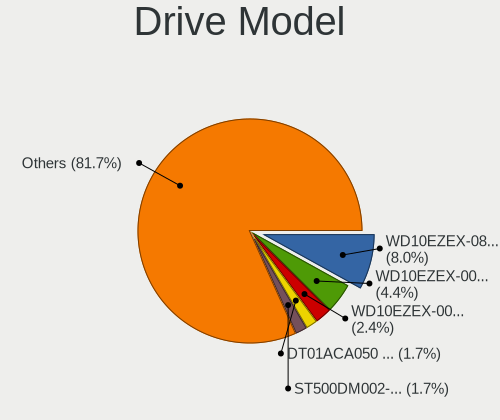

| Model                            | Desktops | Percent |
|----------------------------------|----------|---------|
| Toshiba DT01ACA050 500GB         | 6        | 2.99%   |
| Seagate ST500DM002-1SB10A 500GB  | 6        | 2.99%   |
| Samsung SSD 860 EVO 250GB        | 4        | 1.99%   |
| Seagate ST1000DM010-2EP102 1TB   | 3        | 1.49%   |
| WDC WDS250G2B0A-00SM50 250GB SSD | 2        | 1%      |
| WDC WD3200AAKS-75L9A0 320GB      | 2        | 1%      |
| WDC WD10EZEX-00BN5A0 1TB         | 2        | 1%      |
| Toshiba DT01ACA200 2TB           | 2        | 1%      |
| Seagate ST500DM002-1BD142 500GB  | 2        | 1%      |
| Seagate ST2000DM006-2DM164 2TB   | 2        | 1%      |
| Seagate ST1000DM003-1CH162 1TB   | 2        | 1%      |
| Sandisk WDC CL SN720 SDA 512GB   | 2        | 1%      |
| Kingston SV300S37A120G 120GB SSD | 2        | 1%      |
| WDC WDS500G2B0A-00SM50 500GB SSD | 1        | 0.5%    |
| WDC WDS500G2B0A 500GB SSD        | 1        | 0.5%    |
| WDC WDS120G1G0A-00SS50 120GB SSD | 1        | 0.5%    |
| WDC WD80EFAX-68KNBN0 8TB         | 1        | 0.5%    |
| WDC WD7500BPVX-22JC3T0 752GB     | 1        | 0.5%    |
| WDC WD60EFRX-68L0BN1 6TB         | 1        | 0.5%    |
| WDC WD5003ABYX-01WERA0 500GB     | 1        | 0.5%    |
| WDC WD5000AZLX-75K2TA0 500GB     | 1        | 0.5%    |
| WDC WD5000AZLX-60K2TA1 500GB     | 1        | 0.5%    |
| WDC WD5000AVCS-632DY1 500GB      | 1        | 0.5%    |
| WDC WD5000AAKX-603CA0 500GB      | 1        | 0.5%    |
| WDC WD5000AAKX-00ERMA0 500GB     | 1        | 0.5%    |
| WDC WD40EZRZ-75GXCB0 4TB         | 1        | 0.5%    |
| WDC WD40EZRX-00SPEB0 4TB         | 1        | 0.5%    |
| WDC WD3200AAKX-753CA0 320GB      | 1        | 0.5%    |
| WDC WD3200AAKX-001CA0 320GB      | 1        | 0.5%    |
| WDC WD30EZRZ-22Z5HB0 3TB         | 1        | 0.5%    |
| WDC WD30EZRX-00MMMB0 3TB         | 1        | 0.5%    |
| WDC WD30EZRX-00DC0B0 3TB         | 1        | 0.5%    |
| WDC WD2500HHTZ-04N21V0 250GB     | 1        | 0.5%    |
| WDC WD20EZRX-00DC0B0 2TB         | 1        | 0.5%    |
| WDC WD20EZRX-00D8PB0 2TB         | 1        | 0.5%    |
| WDC WD20EFRX-68EUZN0 2TB         | 1        | 0.5%    |
| WDC WD20EARX-00PASB0 2TB         | 1        | 0.5%    |
| WDC WD20EARS-00MVWB0 2TB         | 1        | 0.5%    |
| WDC WD2003FZEX-00Z4SA0 2TB       | 1        | 0.5%    |
| WDC WD2003FZEX-00SRLA0 2TB       | 1        | 0.5%    |
| WDC WD2002FAEX-007BA0 2TB        | 1        | 0.5%    |
| WDC WD181KFGX-68AFPN0 18TB       | 1        | 0.5%    |
| WDC WD15EARS-00MVWB0 1TB         | 1        | 0.5%    |
| WDC WD10JPVX-55JC3T3 1TB         | 1        | 0.5%    |
| WDC WD10JPLX-00MBPT0 1TB         | 1        | 0.5%    |
| WDC WD10EZRX-00L4HB0 1TB         | 1        | 0.5%    |
| WDC WD10EZEX-60WN4A1 1TB         | 1        | 0.5%    |
| WDC WD10EZEX-60M2NA0 1TB         | 1        | 0.5%    |
| WDC WD10EZEX-08WN4A0 1TB         | 1        | 0.5%    |
| WDC WD10EURX-73C57Y0 1TB         | 1        | 0.5%    |
| WDC WD10EADS-00L5B1 1TB          | 1        | 0.5%    |
| WDC WD1003FZEX-00K3CA0 1TB       | 1        | 0.5%    |
| WDC WD1003FBYX-01Y7B1 752GB      | 1        | 0.5%    |
| WDC WD1002FAEX-00Z3A0 1TB        | 1        | 0.5%    |
| WDC WD1001FALS-00J7B1 1TB        | 1        | 0.5%    |
| Unknown TA2832  32GB             | 1        | 0.5%    |
| Unknown M52516  16GB             | 1        | 0.5%    |
| Unknown 032G72  32GB             | 1        | 0.5%    |
| Transcend TS64GMTS800S 64GB SSD  | 1        | 0.5%    |
| Toshiba MQ01ACF050 500GB         | 1        | 0.5%    |

HDD Vendor
----------

Hard disk drive vendors

| Vendor              | Desktops | Drives | Percent |
|---------------------|----------|--------|---------|
| Seagate             | 37       | 66     | 33.94%  |
| WDC                 | 33       | 61     | 30.28%  |
| Toshiba             | 17       | 26     | 15.6%   |
| Hitachi             | 11       | 17     | 10.09%  |
| Samsung Electronics | 6        | 57     | 5.5%    |
| HGST                | 2        | 3      | 1.83%   |
| SUN                 | 1        | 3      | 0.92%   |
| MAXTOR              | 1        | 1      | 0.92%   |
| Lenovo              | 1        | 2      | 0.92%   |

SSD Vendor
----------

Solid state drive vendors

| Vendor              | Desktops | Drives | Percent |
|---------------------|----------|--------|---------|
| Kingston            | 13       | 15     | 25.49%  |
| Samsung Electronics | 12       | 13     | 23.53%  |
| Intel               | 6        | 17     | 11.76%  |
| WDC                 | 4        | 6      | 7.84%   |
| SanDisk             | 4        | 4      | 7.84%   |
| Transcend           | 1        | 1      | 1.96%   |
| SPCC                | 1        | 1      | 1.96%   |
| SK Hynix            | 1        | 1      | 1.96%   |
| OWC                 | 1        | 1      | 1.96%   |
| OCZ                 | 1        | 1      | 1.96%   |
| Micron Technology   | 1        | 2      | 1.96%   |
| LITEONIT            | 1        | 1      | 1.96%   |
| KingDian            | 1        | 4      | 1.96%   |
| Hewlett-Packard     | 1        | 1      | 1.96%   |
| GLOWAY              | 1        | 1      | 1.96%   |
| Corsair             | 1        | 1      | 1.96%   |
| A-DATA Technology   | 1        | 2      | 1.96%   |

Drive Kind
----------

HDD or SSD

| Kind    | Desktops | Drives | Percent |
|---------|----------|--------|---------|
| HDD     | 84       | 236    | 58.33%  |
| SSD     | 44       | 72     | 30.56%  |
| NVMe    | 12       | 17     | 8.33%   |
| MMC     | 3        | 3      | 2.08%   |
| Unknown | 1        | 1      | 0.69%   |

Drive Connector
---------------

SATA, SAS, NVMe, etc.

| Type | Desktops | Drives | Percent |
|------|----------|--------|---------|
| SATA | 99       | 301    | 83.19%  |
| NVMe | 12       | 17     | 10.08%  |
| SAS  | 5        | 8      | 4.2%    |
| MMC  | 3        | 3      | 2.52%   |

Drive Size
----------

Size of hard drive

| Size in TB | Desktops | Drives | Percent |
|------------|----------|--------|---------|
| 0.01-0.5   | 72       | 174    | 48.98%  |
| 0.51-1.0   | 39       | 51     | 26.53%  |
| 1.01-2.0   | 14       | 26     | 9.52%   |
| 3.01-4.0   | 7        | 17     | 4.76%   |
| 2.01-3.0   | 6        | 16     | 4.08%   |
| 4.01-10.0  | 6        | 14     | 4.08%   |
| 10.01-20.0 | 3        | 10     | 2.04%   |

Space Total
-----------

Amount of disk space available on the file system

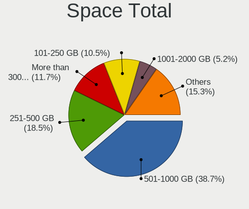

| Size in GB     | Desktops | Percent |
|----------------|----------|---------|
| 251-500        | 27       | 23.68%  |
| 101-250        | 19       | 16.67%  |
| More than 3000 | 17       | 14.91%  |
| 501-1000       | 16       | 14.04%  |
| 1001-2000      | 11       | 9.65%   |
| Unknown        | 8        | 7.02%   |
| 21-50          | 6        | 5.26%   |
| 1-20           | 4        | 3.51%   |
| 2001-3000      | 3        | 2.63%   |
| 51-100         | 3        | 2.63%   |

Space Used
----------

Amount of used disk space

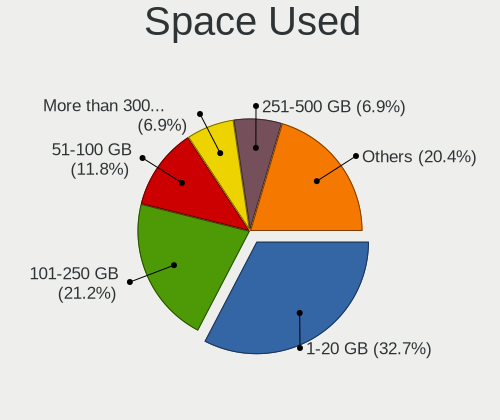

| Used GB        | Desktops | Percent |
|----------------|----------|---------|
| 1-20           | 44       | 38.94%  |
| 101-250        | 13       | 11.5%   |
| 251-500        | 12       | 10.62%  |
| 501-1000       | 10       | 8.85%   |
| More than 3000 | 8        | 7.08%   |
| Unknown        | 8        | 7.08%   |
| 21-50          | 7        | 6.19%   |
| 51-100         | 6        | 5.31%   |
| 2001-3000      | 3        | 2.65%   |
| 1001-2000      | 1        | 0.88%   |
| 0              | 1        | 0.88%   |

Malfunc. Drives
---------------

Drive models with a malfunction

| Model                                       | Desktops | Drives | Percent |
|---------------------------------------------|----------|--------|---------|
| WDC WD5000AVCS-632DY1 500GB                 | 1        | 1      | 3.45%   |
| WDC WD3200AAKS-75L9A0 320GB                 | 1        | 1      | 3.45%   |
| WDC WD2500HHTZ-04N21V0 250GB                | 1        | 1      | 3.45%   |
| WDC WD20EARX-00PASB0 2TB                    | 1        | 1      | 3.45%   |
| WDC WD10EZEX-60WN4A1 1TB                    | 1        | 1      | 3.45%   |
| WDC WD10EADS-00L5B1 1TB                     | 1        | 1      | 3.45%   |
| WDC WD1001FALS-00J7B1 1TB                   | 1        | 1      | 3.45%   |
| Seagate ST380211AS 80GB                     | 1        | 1      | 3.45%   |
| Seagate ST380013AS 80GB                     | 1        | 1      | 3.45%   |
| Seagate ST3250620NS 250GB                   | 1        | 2      | 3.45%   |
| Seagate ST31000524NS 1TB                    | 1        | 1      | 3.45%   |
| Seagate ST31000340AS 1TB                    | 1        | 1      | 3.45%   |
| Seagate ST2000DM001-9YN164 2TB              | 1        | 1      | 3.45%   |
| Seagate ST1000NX0313 1TB                    | 1        | 1      | 3.45%   |
| SanDisk SDSSDX240GG25 240GB                 | 1        | 1      | 3.45%   |
| Samsung Electronics SSD SM871 2.5 7mm 512GB | 1        | 1      | 3.45%   |
| Samsung Electronics HD154UI 1TB             | 1        | 1      | 3.45%   |
| Samsung Electronics HD103UI 1TB             | 1        | 1      | 3.45%   |
| MAXTOR 6Y080L0 82GB                         | 1        | 1      | 3.45%   |
| LITEONIT LCT-256M3S 256GB SSD               | 1        | 1      | 3.45%   |
| Kingston SV100S264G 64GB SSD                | 1        | 1      | 3.45%   |
| Kingston SNS4151S316G 16GB SSD              | 1        | 1      | 3.45%   |
| Kingston SHFS37A120G 120GB SSD              | 1        | 1      | 3.45%   |
| Intel SSDSA2M120G2GC 120GB                  | 1        | 1      | 3.45%   |
| Intel SSDSA2M080G2LE 80GB                   | 1        | 10     | 3.45%   |
| Hitachi HTS542512K9A300 120GB               | 1        | 1      | 3.45%   |
| Hitachi HDS728080PLA380 82GB                | 1        | 1      | 3.45%   |
| Hitachi HDS721050CLA660 500GB               | 1        | 1      | 3.45%   |
| HGST HDN726060ALE610 6TB                    | 1        | 1      | 3.45%   |

Malfunc. Drive Vendor
---------------------

Vendors of faulty drives

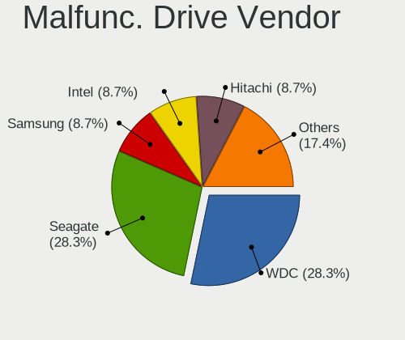

| Vendor              | Desktops | Drives | Percent |
|---------------------|----------|--------|---------|
| WDC                 | 7        | 7      | 24.14%  |
| Seagate             | 7        | 8      | 24.14%  |
| Samsung Electronics | 3        | 3      | 10.34%  |
| Kingston            | 3        | 3      | 10.34%  |
| Hitachi             | 3        | 3      | 10.34%  |
| Intel               | 2        | 11     | 6.9%    |
| SanDisk             | 1        | 1      | 3.45%   |
| MAXTOR              | 1        | 1      | 3.45%   |
| LITEONIT            | 1        | 1      | 3.45%   |
| HGST                | 1        | 1      | 3.45%   |

Malfunc. HDD Vendor
-------------------

Vendors of faulty HDD drives

| Vendor              | Desktops | Drives | Percent |
|---------------------|----------|--------|---------|
| WDC                 | 7        | 7      | 33.33%  |
| Seagate             | 7        | 8      | 33.33%  |
| Hitachi             | 3        | 3      | 14.29%  |
| Samsung Electronics | 2        | 2      | 9.52%   |
| MAXTOR              | 1        | 1      | 4.76%   |
| HGST                | 1        | 1      | 4.76%   |

Malfunc. Drive Kind
-------------------

Kinds of faulty drives

| Kind | Desktops | Drives | Percent |
|------|----------|--------|---------|
| HDD  | 16       | 22     | 66.67%  |
| SSD  | 8        | 17     | 33.33%  |

Failed Drives
-------------

Failed drive models

Zero info for selected period =(

Failed Drive Vendor
-------------------

Failed drive vendors

Zero info for selected period =(

Drive Status
------------

Number of failed and malfunc. drives

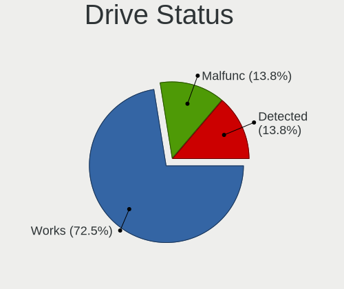

| Status   | Desktops | Drives | Percent |
|----------|----------|--------|---------|
| Works    | 80       | 224    | 62.02%  |
| Detected | 27       | 66     | 20.93%  |
| Malfunc  | 22       | 39     | 17.05%  |

Storage controller
------------------

Storage Vendor
--------------

Storage controller vendors

| Vendor                    | Desktops | Percent |
|---------------------------|----------|---------|
| Intel                     | 90       | 62.5%   |
| AMD                       | 17       | 11.81%  |
| Samsung Electronics       | 9        | 6.25%   |
| ASMedia Technology        | 6        | 4.17%   |
| Marvell Technology Group  | 4        | 2.78%   |
| JMicron Technology        | 4        | 2.78%   |
| Sandisk                   | 3        | 2.08%   |
| Adaptec                   | 3        | 2.08%   |
| LSI Logic / Symbios Logic | 2        | 1.39%   |
| Broadcom / LSI            | 2        | 1.39%   |
| VIA Technologies          | 1        | 0.69%   |
| SK Hynix                  | 1        | 0.69%   |
| Silicon Image             | 1        | 0.69%   |
| Micron/Crucial Technology | 1        | 0.69%   |

Storage Model
-------------

Storage controller models

| Model                                                                                   | Desktops | Percent |
|-----------------------------------------------------------------------------------------|----------|---------|
| Intel 8 Series/C220 Series Chipset Family 6-port SATA Controller 1 [AHCI mode]          | 15       | 8.38%   |
| Intel SATA Controller [RAID mode]                                                       | 13       | 7.26%   |
| Intel Q170/Q150/B150/H170/H110/Z170/CM236 Chipset SATA Controller [AHCI Mode]           | 10       | 5.59%   |
| Intel Cannon Lake PCH SATA AHCI Controller                                              | 9        | 5.03%   |
| AMD FCH SATA Controller [AHCI mode]                                                     | 9        | 5.03%   |
| Samsung NVMe SSD Controller SM981/PM981/PM983                                           | 6        | 3.35%   |
| ASMedia ASM1062 Serial ATA Controller                                                   | 6        | 3.35%   |
| Intel 6 Series/C200 Series Chipset Family Desktop SATA Controller (IDE mode, ports 4-5) | 5        | 2.79%   |
| Intel 6 Series/C200 Series Chipset Family Desktop SATA Controller (IDE mode, ports 0-3) | 5        | 2.79%   |
| Intel C610/X99 series chipset 6-Port SATA Controller [AHCI mode]                        | 4        | 2.23%   |
| Intel 82801JI (ICH10 Family) SATA AHCI Controller                                       | 4        | 2.23%   |
| Intel 6 Series/C200 Series Chipset Family 6 port Desktop SATA AHCI Controller           | 4        | 2.23%   |
| AMD SB7x0/SB8x0/SB9x0 IDE Controller                                                    | 4        | 2.23%   |
| JMicron JMB363 SATA/IDE Controller                                                      | 3        | 1.68%   |
| Intel C610/X99 series chipset sSATA Controller [AHCI mode]                              | 3        | 1.68%   |
| Intel C602 chipset 4-Port SATA Storage Control Unit                                     | 3        | 1.68%   |
| Intel C600/X79 series chipset 6-Port SATA AHCI Controller                               | 3        | 1.68%   |
| AMD SB7x0/SB8x0/SB9x0 SATA Controller [AHCI mode]                                       | 3        | 1.68%   |
| AMD 400 Series Chipset SATA Controller                                                  | 3        | 1.68%   |
| Sandisk WD Black 2018/SN750 / PC SN720 NVMe SSD                                         | 2        | 1.12%   |
| Samsung NVMe SSD Controller 980                                                         | 2        | 1.12%   |
| Marvell Group 88SE9235 PCIe 2.0 x2 4-port SATA 6 Gb/s Controller                        | 2        | 1.12%   |
| Intel NM10/ICH7 Family SATA Controller [AHCI mode]                                      | 2        | 1.12%   |
| Intel C600/X79 series chipset SATA RAID Controller                                      | 2        | 1.12%   |
| Intel C600/X79 series chipset IDE-r Controller                                          | 2        | 1.12%   |
| Intel 7 Series/C210 Series Chipset Family 6-port SATA Controller [AHCI mode]            | 2        | 1.12%   |
| Intel 631xESB/632xESB SATA RAID Controller                                              | 2        | 1.12%   |
| Intel 631xESB/632xESB IDE Controller                                                    | 2        | 1.12%   |
| AMD SB7x0/SB8x0/SB9x0 SATA Controller [IDE mode]                                        | 2        | 1.12%   |
| AMD FCH IDE Controller                                                                  | 2        | 1.12%   |
| VIA VT6415 PATA IDE Host Controller                                                     | 1        | 0.56%   |
| SK Hynix BC501 NVMe Solid State Drive                                                   | 1        | 0.56%   |
| Silicon Image SiI 3132 Serial ATA Raid II Controller                                    | 1        | 0.56%   |
| Sandisk WD Black SN750 / PC SN730 NVMe SSD                                              | 1        | 0.56%   |
| Samsung Electronics SATA controller                                                     | 1        | 0.56%   |
| Micron/Crucial P1 NVMe PCIe SSD                                                         | 1        | 0.56%   |
| Marvell Group 88SE9230 PCIe 2.0 x2 4-port SATA 6 Gb/s RAID Controller                   | 1        | 0.56%   |
| Marvell Group 88SE9128 PCIe SATA 6 Gb/s RAID controller with HyperDuo                   | 1        | 0.56%   |
| LSI Logic / Symbios Logic SAS2008 PCI-Express Fusion-MPT SAS-2 [Falcon]                 | 1        | 0.56%   |
| LSI Logic / Symbios Logic SAS1068E PCI-Express Fusion-MPT SAS                           | 1        | 0.56%   |
| JMicron JMB362 SATA Controller                                                          | 1        | 0.56%   |
| Intel Volume Management Device NVMe RAID Controller                                     | 1        | 0.56%   |
| Intel Sunrise Point-LP SATA Controller [AHCI mode]                                      | 1        | 0.56%   |
| Intel NM10/ICH7 Family SATA Controller [IDE mode]                                       | 1        | 0.56%   |
| Intel Comet Lake SATA AHCI Controller                                                   | 1        | 0.56%   |
| Intel C610/X99 series chipset sSATA Controller [RAID mode]                              | 1        | 0.56%   |
| Intel C600/X79 series chipset 4-Port SATA IDE Controller                                | 1        | 0.56%   |
| Intel C600/X79 series chipset 2-Port SATA IDE Controller                                | 1        | 0.56%   |
| Intel Atom/Celeron/Pentium Processor x5-E8000/J3xxx/N3xxx Series SATA Controller        | 1        | 0.56%   |
| Intel Atom Processor E3800 Series SATA AHCI Controller                                  | 1        | 0.56%   |
| Intel 9 Series Chipset Family SATA Controller [AHCI Mode]                               | 1        | 0.56%   |
| Intel 82801JD/DO (ICH10 Family) SATA AHCI Controller                                    | 1        | 0.56%   |
| Intel 82801HM/HEM (ICH8M/ICH8M-E) SATA Controller [IDE mode]                            | 1        | 0.56%   |
| Intel 82801HM/HEM (ICH8M/ICH8M-E) IDE Controller                                        | 1        | 0.56%   |
| Intel 82801G (ICH7 Family) IDE Controller                                               | 1        | 0.56%   |
| Intel 8 Series SATA Controller 1 [AHCI mode]                                            | 1        | 0.56%   |
| Intel 7 Series/C210 Series Chipset Family 4-port SATA Controller [IDE mode]             | 1        | 0.56%   |
| Intel 7 Series/C210 Series Chipset Family 2-port SATA Controller [IDE mode]             | 1        | 0.56%   |
| Intel 500 Series Chipset Family SATA AHCI Controller                                    | 1        | 0.56%   |
| Intel 5 Series/3400 Series Chipset 4 port SATA IDE Controller                           | 1        | 0.56%   |

Storage Kind
------------

Kind of storage controller (IDE, SATA, NVMe, SAS, ...)

| Kind | Desktops | Percent |
|------|----------|---------|
| SATA | 78       | 54.17%  |
| RAID | 25       | 17.36%  |
| IDE  | 22       | 15.28%  |
| NVMe | 13       | 9.03%   |
| SAS  | 4        | 2.78%   |
| SCSI | 2        | 1.39%   |

Processor
---------

CPU Vendor
----------

Processor vendors

| Vendor | Desktops | Percent |
|--------|----------|---------|
| Intel  | 96       | 84.96%  |
| AMD    | 17       | 15.04%  |

CPU Model
---------

Processor models

| Model                               | Desktops | Percent |
|-------------------------------------|----------|---------|
| Intel Core i7-6700 CPU @ 3.40GHz    | 11       | 9.73%   |
| Intel Core i7-4790 CPU @ 3.60GHz    | 7        | 6.19%   |
| Intel Xeon E-2136 CPU @ 3.30GHz     | 3        | 2.65%   |
| Intel Xeon CPU W3530 @ 2.80GHz      | 2        | 1.77%   |
| Intel Xeon CPU E5-1620 0 @ 3.60GHz  | 2        | 1.77%   |
| Intel Core i5-9500 CPU @ 3.00GHz    | 2        | 1.77%   |
| Intel Atom x5-Z8350 CPU @ 1.44GHz   | 2        | 1.77%   |
| Intel Atom CPU D525 @ 1.80GHz       | 2        | 1.77%   |
| AMD Ryzen 5 1600 Six-Core Processor | 2        | 1.77%   |
| AMD FX-6300 Six-Core Processor      | 2        | 1.77%   |
| Intel Xeon W-2155 CPU @ 3.30GHz     | 1        | 0.88%   |
| Intel Xeon W-2125 CPU @ 4.00GHz     | 1        | 0.88%   |
| Intel Xeon W-1290 CPU @ 3.20GHz     | 1        | 0.88%   |
| Intel Xeon CPU X5680 @ 3.33GHz      | 1        | 0.88%   |
| Intel Xeon CPU X5650 @ 2.67GHz      | 1        | 0.88%   |
| Intel Xeon CPU X5450 @ 3.00GHz      | 1        | 0.88%   |
| Intel Xeon CPU E5620 @ 2.40GHz      | 1        | 0.88%   |
| Intel Xeon CPU E5440 @ 2.83GHz      | 1        | 0.88%   |
| Intel Xeon CPU E5-2690 v4 @ 2.60GHz | 1        | 0.88%   |
| Intel Xeon CPU E5-2690 v3 @ 2.60GHz | 1        | 0.88%   |
| Intel Xeon CPU E5-2660 v3 @ 2.60GHz | 1        | 0.88%   |
| Intel Xeon CPU E5-1607 0 @ 3.00GHz  | 1        | 0.88%   |
| Intel Xeon CPU E31220 @ 3.10GHz     | 1        | 0.88%   |
| Intel Xeon CPU E3-1230 v3 @ 3.30GHz | 1        | 0.88%   |
| Intel Xeon CPU E3-1225 v6 @ 3.30GHz | 1        | 0.88%   |
| Intel Xeon CPU D-1531 @ 2.20GHz     | 1        | 0.88%   |
| Intel Pentium CPU J3710 @ 1.60GHz   | 1        | 0.88%   |
| Intel Pentium CPU G860 @ 3.00GHz    | 1        | 0.88%   |
| Intel Pentium CPU G4400 @ 3.30GHz   | 1        | 0.88%   |
| Intel Pentium CPU G3220T @ 2.60GHz  | 1        | 0.88%   |
| Intel Core i9-9900K CPU @ 3.60GHz   | 1        | 0.88%   |
| Intel Core i9-7940X CPU @ 3.10GHz   | 1        | 0.88%   |
| Intel Core i9-10900K CPU @ 3.70GHz  | 1        | 0.88%   |
| Intel Core i7-9700 CPU @ 3.00GHz    | 1        | 0.88%   |
| Intel Core i7-8700K CPU @ 3.70GHz   | 1        | 0.88%   |
| Intel Core i7-8700 CPU @ 3.20GHz    | 1        | 0.88%   |
| Intel Core i7-7700 CPU @ 3.60GHz    | 1        | 0.88%   |
| Intel Core i7-5960X CPU @ 3.00GHz   | 1        | 0.88%   |
| Intel Core i7-5930K CPU @ 3.50GHz   | 1        | 0.88%   |
| Intel Core i7-5820K CPU @ 3.30GHz   | 1        | 0.88%   |
| Intel Core i7-4790K CPU @ 4.00GHz   | 1        | 0.88%   |
| Intel Core i7-4710MQ CPU @ 2.50GHz  | 1        | 0.88%   |
| Intel Core i7-4500U CPU @ 1.80GHz   | 1        | 0.88%   |
| Intel Core i7-3820 CPU @ 3.60GHz    | 1        | 0.88%   |
| Intel Core i7-3770 CPU @ 3.40GHz    | 1        | 0.88%   |
| Intel Core i7-2700K CPU @ 3.50GHz   | 1        | 0.88%   |
| Intel Core i7-2600K CPU @ 3.40GHz   | 1        | 0.88%   |
| Intel Core i7-10700 CPU @ 2.90GHz   | 1        | 0.88%   |
| Intel Core i5-6600K CPU @ 3.50GHz   | 1        | 0.88%   |
| Intel Core i5-6600 CPU @ 3.30GHz    | 1        | 0.88%   |
| Intel Core i5-6500 CPU @ 3.20GHz    | 1        | 0.88%   |
| Intel Core i5-4670 CPU @ 3.40GHz    | 1        | 0.88%   |
| Intel Core i5-4590S CPU @ 3.00GHz   | 1        | 0.88%   |
| Intel Core i5-3570 CPU @ 3.40GHz    | 1        | 0.88%   |
| Intel Core i5-3470 CPU @ 3.20GHz    | 1        | 0.88%   |
| Intel Core i5-2500 CPU @ 3.30GHz    | 1        | 0.88%   |
| Intel Core i5-2400S CPU @ 2.50GHz   | 1        | 0.88%   |
| Intel Core i5-2310 CPU @ 2.90GHz    | 1        | 0.88%   |
| Intel Core i5 CPU 760 @ 2.80GHz     | 1        | 0.88%   |
| Intel Core i5 CPU 750 @ 2.67GHz     | 1        | 0.88%   |

CPU Model Family
----------------

Processor model prefix

| Model                  | Desktops | Percent |
|------------------------|----------|---------|
| Intel Core i7          | 33       | 29.2%   |
| Intel Xeon             | 23       | 20.35%  |
| Intel Core i5          | 14       | 12.39%  |
| Intel Core i3          | 8        | 7.08%   |
| Intel Atom             | 6        | 5.31%   |
| AMD FX                 | 5        | 4.42%   |
| Intel Pentium          | 4        | 3.54%   |
| AMD Ryzen 5            | 4        | 3.54%   |
| Intel Core i9          | 3        | 2.65%   |
| Intel Core 2 Quad      | 2        | 1.77%   |
| Intel Core 2 Duo       | 2        | 1.77%   |
| Intel Celeron          | 1        | 0.88%   |
| AMD Ryzen Threadripper | 1        | 0.88%   |
| AMD Ryzen 7            | 1        | 0.88%   |
| AMD Phenom II X6       | 1        | 0.88%   |
| AMD GX                 | 1        | 0.88%   |
| AMD E2                 | 1        | 0.88%   |
| AMD Athlon             | 1        | 0.88%   |
| AMD A8                 | 1        | 0.88%   |
| AMD A10                | 1        | 0.88%   |

CPU Cores
---------

Number of processor cores

| Number | Desktops | Percent |
|--------|----------|---------|
| 4      | 58       | 51.33%  |
| 2      | 18       | 15.93%  |
| 6      | 16       | 14.16%  |
| 8      | 7        | 6.19%   |
| 10     | 3        | 2.65%   |
| 3      | 3        | 2.65%   |
| 12     | 2        | 1.77%   |
| 1      | 2        | 1.77%   |
| 28     | 1        | 0.88%   |
| 20     | 1        | 0.88%   |
| 16     | 1        | 0.88%   |
| 14     | 1        | 0.88%   |

CPU Sockets
-----------

Number of sockets

| Number | Desktops | Percent |
|--------|----------|---------|
| 1      | 107      | 94.69%  |
| 2      | 5        | 4.42%   |
| 0      | 1        | 0.88%   |

CPU Threads
-----------

Threads per core (Hyper-Threading)

| Number | Desktops | Percent |
|--------|----------|---------|
| 2      | 72       | 63.72%  |
| 1      | 41       | 36.28%  |

CPU Op-Modes
------------

CPU Operation Modes (32-bit, 64-bit)

| Op mode        | Desktops | Percent |
|----------------|----------|---------|
| 32-bit, 64-bit | 105      | 92.92%  |
| Unknown        | 8        | 7.08%   |

CPU Microcode
-------------

Microcode number

| Number     | Desktops | Percent |
|------------|----------|---------|
| 0x306c3    | 16       | 14.04%  |
| 0x506e3    | 14       | 12.28%  |
| Unknown    | 11       | 9.65%   |
| 0x206a7    | 9        | 7.89%   |
| 0x906ea    | 7        | 6.14%   |
| 0x306f2    | 5        | 4.39%   |
| 0x306a9    | 4        | 3.51%   |
| 0x06000852 | 4        | 3.51%   |
| 0xa0655    | 3        | 2.63%   |
| 0x50654    | 3        | 2.63%   |
| 0x406c4    | 3        | 2.63%   |
| 0x206d7    | 3        | 2.63%   |
| 0x106ca    | 3        | 2.63%   |
| 0x1067a    | 3        | 2.63%   |
| 0x906ed    | 2        | 1.75%   |
| 0x906e9    | 2        | 1.75%   |
| 0x206c2    | 2        | 1.75%   |
| 0x106e5    | 2        | 1.75%   |
| 0x106a5    | 2        | 1.75%   |
| 0x08701013 | 2        | 1.75%   |
| 0x03000027 | 2        | 1.75%   |
| 0x6fb      | 1        | 0.88%   |
| 0x406e3    | 1        | 0.88%   |
| 0x406c3    | 1        | 0.88%   |
| 0x40651    | 1        | 0.88%   |
| 0x30678    | 1        | 0.88%   |
| 0x0800820d | 1        | 0.88%   |
| 0x0800820b | 1        | 0.88%   |
| 0x08001137 | 1        | 0.88%   |
| 0x0700010f | 1        | 0.88%   |
| 0x06001119 | 1        | 0.88%   |
| 0x0600084f | 1        | 0.88%   |
| 0x010000dc | 1        | 0.88%   |

CPU Microarch
-------------

Microarchitecture

| Name        | Desktops | Percent |
|-------------|----------|---------|
| Haswell     | 22       | 19.47%  |
| Skylake     | 20       | 17.7%   |
| SandyBridge | 13       | 11.5%   |
| KabyLake    | 11       | 9.73%   |
| Piledriver  | 6        | 5.31%   |
| Silvermont  | 5        | 4.42%   |
| Penryn      | 5        | 4.42%   |
| Nehalem     | 4        | 3.54%   |
| IvyBridge   | 4        | 3.54%   |
| Zen 2       | 3        | 2.65%   |
| Westmere    | 3        | 2.65%   |
| CometLake   | 3        | 2.65%   |
| Bonnell     | 3        | 2.65%   |
| Zen+        | 2        | 1.77%   |
| K10 Llano   | 2        | 1.77%   |
| Jaguar      | 2        | 1.77%   |
| Broadwell   | 2        | 1.77%   |
| Zen         | 1        | 0.88%   |
| K10         | 1        | 0.88%   |
| Core        | 1        | 0.88%   |

Graphics
--------

GPU Vendor
----------

Vendors of graphics cards

| Vendor                     | Desktops | Percent |
|----------------------------|----------|---------|
| Intel                      | 45       | 37.82%  |
| AMD                        | 34       | 28.57%  |
| Nvidia                     | 32       | 26.89%  |
| ASPEED Technology          | 6        | 5.04%   |
| Silicon Motion             | 1        | 0.84%   |
| Matrox Electronics Systems | 1        | 0.84%   |

GPU Model
---------

Graphics card models

| Model                                                                                    | Desktops | Percent |
|------------------------------------------------------------------------------------------|----------|---------|
| Intel HD Graphics 530                                                                    | 9        | 7.44%   |
| AMD Oland XT [Radeon HD 8670 / R5 340X OEM / R7 250/350/350X OEM]                        | 8        | 6.61%   |
| AMD Oland [Radeon HD 8570 / R5 430 OEM / R7 240/340 / Radeon 520 OEM]                    | 7        | 5.79%   |
| Intel 2nd Generation Core Processor Family Integrated Graphics Controller                | 6        | 4.96%   |
| ASPEED Technology ASPEED Graphics Family                                                 | 6        | 4.96%   |
| Intel Xeon E3-1200 v3/4th Gen Core Processor Integrated Graphics Controller              | 5        | 4.13%   |
| Intel CometLake-S GT2 [UHD Graphics 630]                                                 | 4        | 3.31%   |
| Intel Atom/Celeron/Pentium Processor x5-E8000/J3xxx/N3xxx Integrated Graphics Controller | 4        | 3.31%   |
| Nvidia GP107GL [Quadro P400]                                                             | 3        | 2.48%   |
| Intel Xeon E3-1200 v2/3rd Gen Core processor Graphics Controller                         | 3        | 2.48%   |
| Intel Atom Processor D4xx/D5xx/N4xx/N5xx Integrated Graphics Controller                  | 3        | 2.48%   |
| Nvidia GP106GL [Quadro P2000]                                                            | 2        | 1.65%   |
| Nvidia GK208B [GeForce GT 710]                                                           | 2        | 1.65%   |
| Intel CoffeeLake-S GT2 [UHD Graphics 630]                                                | 2        | 1.65%   |
| Intel 4 Series Chipset Integrated Graphics Controller                                    | 2        | 1.65%   |
| AMD RS780L [Radeon 3000]                                                                 | 2        | 1.65%   |
| AMD Ellesmere [Radeon RX 470/480/570/570X/580/580X/590]                                  | 2        | 1.65%   |
| Silicon Motion SM712 LynxEM+                                                             | 1        | 0.83%   |
| Nvidia TU104 [GeForce RTX 2080]                                                          | 1        | 0.83%   |
| Nvidia TU104 [GeForce RTX 2080 SUPER]                                                    | 1        | 0.83%   |
| Nvidia TU102 [TITAN RTX]                                                                 | 1        | 0.83%   |
| Nvidia TU102 [GeForce RTX 2080 Ti]                                                       | 1        | 0.83%   |
| Nvidia GT218 [GeForce 8400 GS Rev. 3]                                                    | 1        | 0.83%   |
| Nvidia GT218 [GeForce 210]                                                               | 1        | 0.83%   |
| Nvidia GT215 [GeForce GT 240]                                                            | 1        | 0.83%   |
| Nvidia GP107 [GeForce GTX 1050]                                                          | 1        | 0.83%   |
| Nvidia GP106GL [Quadro P2200]                                                            | 1        | 0.83%   |
| Nvidia GP106 [GeForce GTX 1060 6GB]                                                      | 1        | 0.83%   |
| Nvidia GP104 [GeForce GTX 1080]                                                          | 1        | 0.83%   |
| Nvidia GM204GL [Quadro M4000]                                                            | 1        | 0.83%   |
| Nvidia GM204 [GeForce GTX 970]                                                           | 1        | 0.83%   |
| Nvidia GK210GL [Tesla K80]                                                               | 1        | 0.83%   |
| Nvidia GK107 [GeForce GTX 650]                                                           | 1        | 0.83%   |
| Nvidia GK106GL [Quadro K4000]                                                            | 1        | 0.83%   |
| Nvidia GK106 [GeForce GTX 650 Ti]                                                        | 1        | 0.83%   |
| Nvidia GK104GL [Quadro K4200]                                                            | 1        | 0.83%   |
| Nvidia GK104 [GeForce GTX 770]                                                           | 1        | 0.83%   |
| Nvidia GF119 [GeForce GT 520]                                                            | 1        | 0.83%   |
| Nvidia GF116 [GeForce GTX 550 Ti]                                                        | 1        | 0.83%   |
| Nvidia GF108 [GeForce GT 630]                                                            | 1        | 0.83%   |
| Nvidia G98 [Quadro NVS 295]                                                              | 1        | 0.83%   |
| Nvidia G92 [GeForce GTS 250]                                                             | 1        | 0.83%   |
| Nvidia G86 [GeForce 8500 GT]                                                             | 1        | 0.83%   |
| Nvidia G72 [GeForce 7300 GS]                                                             | 1        | 0.83%   |
| Matrox Electronics Systems MGA G200e [Pilot] ServerEngines (SEP1)                        | 1        | 0.83%   |
| Intel UHD P630 Graphics                                                                  | 1        | 0.83%   |
| Intel Skylake GT2 [HD Graphics 520]                                                      | 1        | 0.83%   |
| Intel HD Graphics P630                                                                   | 1        | 0.83%   |
| Intel Haswell-ULT Integrated Graphics Controller                                         | 1        | 0.83%   |
| Intel Atom Processor Z36xxx/Z37xxx Series Graphics & Display                             | 1        | 0.83%   |
| Intel 4th Generation Core Processor Family Integrated Graphics Controller                | 1        | 0.83%   |
| Intel 4th Gen Core Processor Integrated Graphics Controller                              | 1        | 0.83%   |
| AMD Trinity [Radeon HD 7660D]                                                            | 1        | 0.83%   |
| AMD Tobago PRO [Radeon R7 360 / R9 360 OEM]                                              | 1        | 0.83%   |
| AMD SuperSumo [Radeon HD 6370D]                                                          | 1        | 0.83%   |
| AMD RV710 [Radeon HD 4350/4550]                                                          | 1        | 0.83%   |
| AMD Pitcairn XT GL [FirePro W7000]                                                       | 1        | 0.83%   |
| AMD Navi 14 [Radeon RX 5500/5500M / Pro 5500M]                                           | 1        | 0.83%   |
| AMD Lexa PRO [Radeon 540/540X/550/550X / RX 540X/550/550X]                               | 1        | 0.83%   |
| AMD Kabini [Radeon HD 8400E]                                                             | 1        | 0.83%   |

GPU Combo
---------

Combinations of graphics cards

| Name               | Desktops | Percent |
|--------------------|----------|---------|
| 1 x Intel          | 39       | 34.51%  |
| 1 x AMD            | 32       | 28.32%  |
| 1 x Nvidia         | 29       | 25.66%  |
| 1 x ASPEED         | 5        | 4.42%   |
| Other              | 1        | 0.88%   |
| 2 x Nvidia         | 1        | 0.88%   |
| 2 x AMD            | 1        | 0.88%   |
| 1 x Silicon Motion | 1        | 0.88%   |
| Nvidia + ASPEED    | 1        | 0.88%   |
| 1 x Matrox         | 1        | 0.88%   |
| Intel + Nvidia     | 1        | 0.88%   |
| Intel + AMD        | 1        | 0.88%   |

GPU Driver
----------

Free vs proprietary

| Driver      | Desktops | Percent |
|-------------|----------|---------|
| Free        | 81       | 71.68%  |
| Proprietary | 17       | 15.04%  |
| Unknown     | 15       | 13.27%  |

GPU Memory
----------

Total video memory

| Size in GB | Desktops | Percent |
|------------|----------|---------|
| Unknown    | 48       | 42.48%  |
| 1.01-2.0   | 21       | 18.58%  |
| 0.51-1.0   | 17       | 15.04%  |
| 0.01-0.5   | 8        | 7.08%   |
| 3.01-4.0   | 7        | 6.19%   |
| 7.01-8.0   | 6        | 5.31%   |
| 4.01-5.0   | 3        | 2.65%   |
| 5.01-6.0   | 1        | 0.88%   |
| 2.01-3.0   | 1        | 0.88%   |
| 16.01-24.0 | 1        | 0.88%   |

Monitor
-------

Monitor Vendor
--------------

Monitor vendors

| Vendor               | Desktops | Percent |
|----------------------|----------|---------|
| Dell                 | 32       | 35.96%  |
| Samsung Electronics  | 11       | 12.36%  |
| Hewlett-Packard      | 11       | 12.36%  |
| Goldstar             | 7        | 7.87%   |
| Acer                 | 5        | 5.62%   |
| Philips              | 3        | 3.37%   |
| AOC                  | 3        | 3.37%   |
| Ancor Communications | 3        | 3.37%   |
| NEC Computers        | 2        | 2.25%   |
| BenQ                 | 2        | 2.25%   |
| ___                  | 1        | 1.12%   |
| ViewSonic            | 1        | 1.12%   |
| Unknown              | 1        | 1.12%   |
| Packard Bell         | 1        | 1.12%   |
| NME                  | 1        | 1.12%   |
| Lenovo               | 1        | 1.12%   |
| GVV                  | 1        | 1.12%   |
| Founder              | 1        | 1.12%   |
| Eizo                 | 1        | 1.12%   |
| AMW                  | 1        | 1.12%   |

Monitor Model
-------------

Monitor models

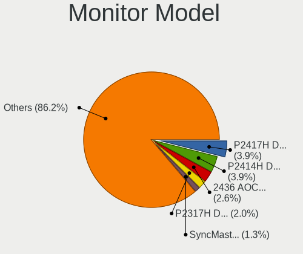

| Model                                                                                 | Desktops | Percent |
|---------------------------------------------------------------------------------------|----------|---------|
| Dell P2417H DELA0DB 1920x1080 527x296mm 23.8-inch                                     | 6        | 5.94%   |
| Dell P2414H DELA09A 1920x1080 527x297mm 23.8-inch                                     | 6        | 5.94%   |
| Dell P2317H DEL40F4 1920x1080 509x286mm 23.0-inch                                     | 3        | 2.97%   |
| Samsung Electronics SyncMaster SAM01D3 1440x900 410x260mm 19.1-inch                   | 2        | 1.98%   |
| Hewlett-Packard ZR2440w HWP2956 1920x1200 518x324mm 24.1-inch                         | 2        | 1.98%   |
| Dell P2417H DELA0DA 1920x1080 527x296mm 23.8-inch                                     | 2        | 1.98%   |
| BenQ GW2765 BNQ78D6 1920x1080 600x340mm 27.2-inch                                     | 2        | 1.98%   |
| ___ Monitor ranges (GTF): 48-62Hz V, 14-68kHz H, max dotclock 150MHz ___9000 1440x900 | 1        | 0.99%   |
| ViewSonic VA2226w-3 VSC2051 1680x1050 495x291mm 22.6-inch                             | 1        | 0.99%   |
| Unknown LCDTV16 9000 1360x768 1600x900mm 72.3-inch                                    | 1        | 0.99%   |
| Samsung Electronics SyncMaster SAM05C7 1920x1080 521x293mm 23.5-inch                  | 1        | 0.99%   |
| Samsung Electronics SyncMaster SAM04DD 1920x1080 477x268mm 21.5-inch                  | 1        | 0.99%   |
| Samsung Electronics SyncMaster SAM011E 1280x1024 338x270mm 17.0-inch                  | 1        | 0.99%   |
| Samsung Electronics SMBX2350 SAM071E 1920x1080 509x286mm 23.0-inch                    | 1        | 0.99%   |
| Samsung Electronics S27E391 SAM0C16 1920x1080 600x340mm 27.2-inch                     | 1        | 0.99%   |
| Samsung Electronics S22C300 SAM0A20 1920x1080 477x268mm 21.5-inch                     | 1        | 0.99%   |
| Samsung Electronics S22C300 SAM0A1E 1920x1080 477x268mm 21.5-inch                     | 1        | 0.99%   |
| Samsung Electronics S20B300 SAM08A7 1600x900 443x249mm 20.0-inch                      | 1        | 0.99%   |
| Samsung Electronics LCD Monitor C27F591 1440x900                                      | 1        | 0.99%   |
| Samsung Electronics C24F390 SAM0D2D 1920x1080 521x293mm 23.5-inch                     | 1        | 0.99%   |
| Philips PHL 284E5 PHLC0DE 1920x1080 621x341mm 27.9-inch                               | 1        | 0.99%   |
| Philips LCD Monitor PHLC081 1920x1080 480x270mm 21.7-inch                             | 1        | 0.99%   |
| Philips 190S PHL083F 1280x1024 376x301mm 19.0-inch                                    | 1        | 0.99%   |
| Packard Bell Viseo223DX PKB0385 1920x1080 477x268mm 21.5-inch                         | 1        | 0.99%   |
| NME 202M NME1021 1680x1050 380x290mm 18.8-inch                                        | 1        | 0.99%   |
| NEC Computers LCD2190UXi NEC66B2 1600x1200 432x324mm 21.3-inch                        | 1        | 0.99%   |
| NEC Computers EA261WM NEC6750 1920x1200 560x350mm 26.0-inch                           | 1        | 0.99%   |
| Lenovo LEN E2224A LEN60DA 1920x1080 477x268mm 21.5-inch                               | 1        | 0.99%   |
| Hewlett-Packard w2408 HWP26CF 1920x1200 518x324mm 24.1-inch                           | 1        | 0.99%   |
| Hewlett-Packard V220 HPN3585 1920x1080 477x268mm 21.5-inch                            | 1        | 0.99%   |
| Hewlett-Packard LE2002x HWP2963 1600x900 443x249mm 20.0-inch                          | 1        | 0.99%   |
| Hewlett-Packard LE1901w HWP2842 1440x900 410x256mm 19.0-inch                          | 1        | 0.99%   |
| Hewlett-Packard LCD Monitor Z24i 3840x1200                                            | 1        | 0.99%   |
| Hewlett-Packard LCD Monitor LP2475w                                                   | 1        | 0.99%   |
| Hewlett-Packard LA2405 HWP284B 1920x1200 518x324mm 24.1-inch                          | 1        | 0.99%   |
| Hewlett-Packard LA2405 HWP284A 1920x1200 518x324mm 24.1-inch                          | 1        | 0.99%   |
| Hewlett-Packard LA2205 HWP2847 1680x1050 473x296mm 22.0-inch                          | 1        | 0.99%   |
| Hewlett-Packard E243i HPN3463 1920x1200 518x324mm 24.1-inch                           | 1        | 0.99%   |
| Hewlett-Packard 24mh HPN366C 1920x1080 527x296mm 23.8-inch                            | 1        | 0.99%   |
| GVV VGA G56x GVV0707 1024x768 304x228mm 15.0-inch                                     | 1        | 0.99%   |
| Goldstar W2053 GSM4E9F 1600x900 443x249mm 20.0-inch                                   | 1        | 0.99%   |
| Goldstar LG FULL HD GSM5AB9 1680x1050 480x270mm 21.7-inch                             | 1        | 0.99%   |
| Goldstar IPS FULLHD GSM5AB7 1920x1080 480x270mm 21.7-inch                             | 1        | 0.99%   |
| Goldstar E2250 GSM578D 1680x1050 480x270mm 21.7-inch                                  | 1        | 0.99%   |
| Goldstar 23MB35 GSM5A96 1920x1080 510x290mm 23.1-inch                                 | 1        | 0.99%   |
| Goldstar 22EA53 GSM59A5 1680x1050 480x270mm 21.7-inch                                 | 1        | 0.99%   |
| Goldstar 19EN33 GSM4C18 1366x768 410x230mm 18.5-inch                                  | 1        | 0.99%   |
| Founder LED MONITOR FDR309A 1920x1080 410x256mm 19.0-inch                             | 1        | 0.99%   |
| Eizo L680 ENC1607 1280x1024                                                           | 1        | 0.99%   |
| Dell U2717D DEL40EA 2560x1440 600x340mm 27.2-inch                                     | 1        | 0.99%   |
| Dell U2518D DEL413C 2560x1440 553x311mm 25.0-inch                                     | 1        | 0.99%   |
| Dell U2311H DELA05F 1920x1080 509x286mm 23.0-inch                                     | 1        | 0.99%   |
| Dell ST2410 DELA05D 1920x1080 531x299mm 24.0-inch                                     | 1        | 0.99%   |
| Dell SE2717H/HX DELD0A1 1920x1080 600x340mm 27.2-inch                                 | 1        | 0.99%   |
| Dell SE2219H DELF10E 1920x1080 476x268mm 21.5-inch                                    | 1        | 0.99%   |
| Dell S2409W DELA038 1920x1080 531x298mm 24.0-inch                                     | 1        | 0.99%   |
| Dell P4317Q DELD085 3840x2160 940x530mm 42.5-inch                                     | 1        | 0.99%   |
| Dell P2719H DEL4183 1920x1080 598x336mm 27.0-inch                                     | 1        | 0.99%   |
| Dell P2419H DELD0D9 1920x1080 527x296mm 23.8-inch                                     | 1        | 0.99%   |
| Dell P2317H DEL40F3 1920x1080 509x286mm 23.0-inch                                     | 1        | 0.99%   |

Monitor Resolution
------------------

Monitor screen resolution

| Resolution         | Desktops | Percent |
|--------------------|----------|---------|
| 1920x1080 (FHD)    | 48       | 51.61%  |
| 1280x1024 (SXGA)   | 7        | 7.53%   |
| 2560x1440 (QHD)    | 6        | 6.45%   |
| 1440x900 (WXGA+)   | 6        | 6.45%   |
| 1680x1050 (WSXGA+) | 5        | 5.38%   |
| 1920x1200 (WUXGA)  | 4        | 4.3%    |
| Unknown            | 4        | 4.3%    |
| 1600x900 (HD+)     | 3        | 3.23%   |
| 3840x2160 (4K)     | 2        | 2.15%   |
| 3840x1200          | 2        | 2.15%   |
| 3840x1080          | 2        | 2.15%   |
| 1600x1200          | 2        | 2.15%   |
| 1366x768 (WXGA)    | 1        | 1.08%   |
| 1360x768           | 1        | 1.08%   |

Monitor Diagonal
----------------

Diagonal size in inches

| Inches  | Desktops | Percent |
|---------|----------|---------|
| 24      | 24       | 25.81%  |
| 21      | 15       | 16.13%  |
| 23      | 12       | 12.9%   |
| 27      | 9        | 9.68%   |
| Unknown | 9        | 9.68%   |
| 19      | 7        | 7.53%   |
| 22      | 4        | 4.3%    |
| 20      | 4        | 4.3%    |
| 17      | 3        | 3.23%   |
| 18      | 2        | 2.15%   |
| 72      | 1        | 1.08%   |
| 42      | 1        | 1.08%   |
| 26      | 1        | 1.08%   |
| 25      | 1        | 1.08%   |

Monitor Width
-------------

Physical width

| Width in mm | Desktops | Percent |
|-------------|----------|---------|
| 501-600     | 42       | 47.73%  |
| 401-500     | 27       | 30.68%  |
| Unknown     | 9        | 10.23%  |
| 351-400     | 5        | 5.68%   |
| 301-350     | 2        | 2.27%   |
| 601-700     | 1        | 1.14%   |
| 1501-2000   | 1        | 1.14%   |
| 901-1000    | 1        | 1.14%   |

Aspect Ratio
------------

Proportional relationship between the width and the height

| Ratio   | Desktops | Percent |
|---------|----------|---------|
| 16/9    | 55       | 64.71%  |
| 16/10   | 14       | 16.47%  |
| Unknown | 7        | 8.24%   |
| 5/4     | 6        | 7.06%   |
| 4/3     | 3        | 3.53%   |

Monitor Area
------------

Area in inch²

| Area in inch² | Desktops | Percent |
|----------------|----------|---------|
| 201-250        | 41       | 45.56%  |
| 151-200        | 18       | 20%     |
| 301-350        | 9        | 10%     |
| Unknown        | 9        | 10%     |
| 251-300        | 7        | 7.78%   |
| 141-150        | 3        | 3.33%   |
| More than 1000 | 1        | 1.11%   |
| 121-130        | 1        | 1.11%   |
| 501-1000       | 1        | 1.11%   |

Pixel Density
-------------

Pixels per inch

| Density | Desktops | Percent |
|---------|----------|---------|
| 51-100  | 54       | 63.53%  |
| 101-120 | 18       | 21.18%  |
| Unknown | 9        | 10.59%  |
| 121-160 | 2        | 2.35%   |
| 1-50    | 1        | 1.18%   |
| 161-240 | 1        | 1.18%   |

Multiple Monitors
-----------------

Total monitors connected

| Total | Desktops | Percent |
|-------|----------|---------|
| 1     | 64       | 56.14%  |
| 0     | 32       | 28.07%  |
| 2     | 16       | 14.04%  |
| 3     | 2        | 1.75%   |

Network
-------

Net Controller Vendor
---------------------

Controller vendors

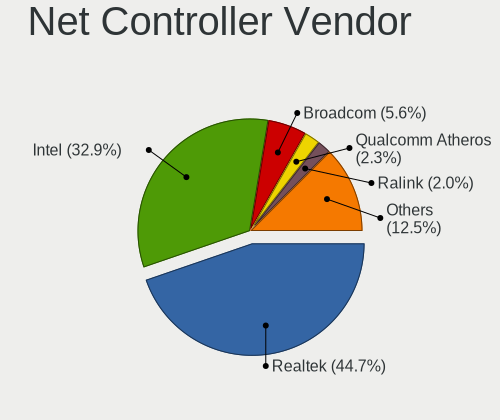

| Vendor                      | Desktops | Percent |
|-----------------------------|----------|---------|
| Intel                       | 65       | 45.77%  |
| Realtek Semiconductor       | 41       | 28.87%  |
| Broadcom                    | 10       | 7.04%   |
| TP-Link                     | 3        | 2.11%   |
| Ralink Technology           | 3        | 2.11%   |
| Qualcomm Atheros            | 3        | 2.11%   |
| D-Link System               | 3        | 2.11%   |
| D-Link                      | 2        | 1.41%   |
| Xilinx                      | 1        | 0.7%    |
| VIA Technologies            | 1        | 0.7%    |
| Samsung Electronics         | 1        | 0.7%    |
| Marvell Technology Group    | 1        | 0.7%    |
| Linux 2.6.31.6 with s3c-udc | 1        | 0.7%    |
| Linksys                     | 1        | 0.7%    |
| Dresden Elektronik          | 1        | 0.7%    |
| Cisco Systems               | 1        | 0.7%    |
| Broadcom Limited            | 1        | 0.7%    |
| Aquantia                    | 1        | 0.7%    |
| Apple                       | 1        | 0.7%    |
| 3Com                        | 1        | 0.7%    |

Net Controller Model
--------------------

Controller models

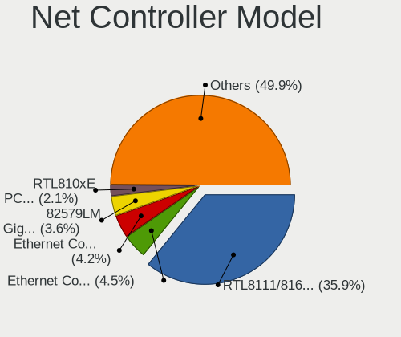

| Model                                                                          | Desktops | Percent |
|--------------------------------------------------------------------------------|----------|---------|
| Realtek RTL8111/8168/8411 PCI Express Gigabit Ethernet Controller              | 39       | 24.07%  |
| Intel Ethernet Connection (2) I219-LM                                          | 14       | 8.64%   |
| Intel Ethernet Connection I217-LM                                              | 10       | 6.17%   |
| Intel 82579LM Gigabit Network Connection (Lewisville)                          | 8        | 4.94%   |
| Intel I211 Gigabit Network Connection                                          | 4        | 2.47%   |
| Intel I210 Gigabit Network Connection                                          | 4        | 2.47%   |
| Intel Ethernet Connection (7) I219-LM                                          | 4        | 2.47%   |
| Intel Ethernet Connection (2) I219-V                                           | 4        | 2.47%   |
| Intel 82574L Gigabit Network Connection                                        | 4        | 2.47%   |
| Broadcom NetXtreme BCM5761 Gigabit Ethernet PCIe                               | 4        | 2.47%   |
| Intel I350 Gigabit Network Connection                                          | 3        | 1.85%   |
| Intel Ethernet Controller 10G X550T                                            | 3        | 1.85%   |
| Intel Ethernet Connection (2) I218-V                                           | 3        | 1.85%   |
| Intel 82580 Gigabit Network Connection                                         | 3        | 1.85%   |
| Qualcomm Atheros AR8131 Gigabit Ethernet                                       | 2        | 1.23%   |
| Intel Ethernet Connection (11) I219-LM                                         | 2        | 1.23%   |
| Broadcom NetXtreme BCM5755 Gigabit Ethernet PCI Express                        | 2        | 1.23%   |
| Broadcom BCM4360 802.11ac Wireless Network Adapter                             | 2        | 1.23%   |
| Xilinx Network controller                                                      | 1        | 0.62%   |
| VIA VT6105/VT6106S [Rhine-III]                                                 | 1        | 0.62%   |
| TP-Link Archer T1U 802.11a/n/ac Wireless Adapter [MediaTek MT7610U]            | 1        | 0.62%   |
| TP-Link AC600 wireless Realtek RTL8811AU [Archer T2U Nano]                     | 1        | 0.62%   |
| TP-Link 802.11ac WLAN Adapter                                                  | 1        | 0.62%   |
| Samsung Galaxy series, misc. (tethering mode)                                  | 1        | 0.62%   |
| Realtek RTL8723BE PCIe Wireless Network Adapter                                | 1        | 0.62%   |
| Realtek RTL8192CE PCIe Wireless Network Adapter                                | 1        | 0.62%   |
| Realtek RTL8188SU 802.11n WLAN Adapter                                         | 1        | 0.62%   |
| Realtek RTL8188EUS 802.11n Wireless Network Adapter                            | 1        | 0.62%   |
| Realtek RTL8188CUS 802.11n WLAN Adapter                                        | 1        | 0.62%   |
| Realtek RTL8169 PCI Gigabit Ethernet Controller                                | 1        | 0.62%   |
| Realtek RTL810xE PCI Express Fast Ethernet controller                          | 1        | 0.62%   |
| Realtek RTL-8110SC/8169SC Gigabit Ethernet                                     | 1        | 0.62%   |
| Ralink RT5572 Wireless Adapter                                                 | 1        | 0.62%   |
| Ralink RT5370 Wireless Adapter                                                 | 1        | 0.62%   |
| Ralink MT7601U Wireless Adapter                                                | 1        | 0.62%   |
| Qualcomm Atheros AR8151 v2.0 Gigabit Ethernet                                  | 1        | 0.62%   |
| Marvell Group Yukon Optima 88E8059 [PCIe Gigabit Ethernet Controller with AVB] | 1        | 0.62%   |
| Linux 2.6.31.6 with s3c-udc Gadget Serial v2.4                                 | 1        | 0.62%   |
| Linksys AE6000 802.11a/b/g/n/ac Wireless Adapter [MediaTek MT7610U]            | 1        | 0.62%   |
| Intel Wi-Fi 6 AX200                                                            | 1        | 0.62%   |
| Intel Ethernet Controller XXV710 for 25GbE SFP28                               | 1        | 0.62%   |
| Intel Ethernet Controller I225-V                                               | 1        | 0.62%   |
| Intel Ethernet Controller 10-Gigabit X540-AT2                                  | 1        | 0.62%   |
| Intel Ethernet Connection I219-V                                               | 1        | 0.62%   |
| Intel Ethernet Connection (5) I219-LM                                          | 1        | 0.62%   |
| Intel Dual Band Wireless-AC 3168NGW [Stone Peak]                               | 1        | 0.62%   |
| Intel 82599ES 10-Gigabit SFI/SFP+ Network Connection                           | 1        | 0.62%   |
| Intel 82579V Gigabit Network Connection                                        | 1        | 0.62%   |
| Intel 82567LM-3 Gigabit Network Connection                                     | 1        | 0.62%   |
| Intel 82557/8/9/0/1 Ethernet Pro 100                                           | 1        | 0.62%   |
| Dresden Elektronik ZigBee gateway [ConBee II]                                  | 1        | 0.62%   |
| D-Link Wireless N Nano USB Adapter                                             | 1        | 0.62%   |
| D-Link System RTL8139 Ethernet                                                 | 1        | 0.62%   |
| D-Link System DWA-110 Wireless G Adapter(rev.A1) [Ralink RT2571W]              | 1        | 0.62%   |
| D-Link System DGE-528T Gigabit Ethernet Adapter                                | 1        | 0.62%   |
| D-Link DWA-160 Xtreme N Dual Band USB Adapter(rev.C1)                          | 1        | 0.62%   |
| D-Link 802.11 n WLAN                                                           | 1        | 0.62%   |
| Cisco Systems VIC Ethernet NIC Dynamic                                         | 1        | 0.62%   |
| Cisco Systems VIC Ethernet NIC                                                 | 1        | 0.62%   |
| Broadcom NetXtreme BCM5764M Gigabit Ethernet PCIe                              | 1        | 0.62%   |

Wireless Vendor
---------------

Wireless vendors

| Vendor                | Desktops | Percent |
|-----------------------|----------|---------|
| Realtek Semiconductor | 5        | 26.32%  |
| TP-Link               | 3        | 15.79%  |
| Ralink Technology     | 3        | 15.79%  |
| Intel                 | 2        | 10.53%  |
| D-Link                | 2        | 10.53%  |
| Broadcom              | 2        | 10.53%  |
| Linksys               | 1        | 5.26%   |
| D-Link System         | 1        | 5.26%   |

Wireless Model
--------------

Wireless models

| Model                                                               | Desktops | Percent |
|---------------------------------------------------------------------|----------|---------|
| Broadcom BCM4360 802.11ac Wireless Network Adapter                  | 2        | 10%     |
| TP-Link Archer T1U 802.11a/n/ac Wireless Adapter [MediaTek MT7610U] | 1        | 5%      |
| TP-Link AC600 wireless Realtek RTL8811AU [Archer T2U Nano]          | 1        | 5%      |
| TP-Link 802.11ac WLAN Adapter                                       | 1        | 5%      |
| Realtek RTL8723BE PCIe Wireless Network Adapter                     | 1        | 5%      |
| Realtek RTL8192CE PCIe Wireless Network Adapter                     | 1        | 5%      |
| Realtek RTL8188SU 802.11n WLAN Adapter                              | 1        | 5%      |
| Realtek RTL8188EUS 802.11n Wireless Network Adapter                 | 1        | 5%      |
| Realtek RTL8188CUS 802.11n WLAN Adapter                             | 1        | 5%      |
| Ralink RT5572 Wireless Adapter                                      | 1        | 5%      |
| Ralink RT5370 Wireless Adapter                                      | 1        | 5%      |
| Ralink MT7601U Wireless Adapter                                     | 1        | 5%      |
| Linksys AE6000 802.11a/b/g/n/ac Wireless Adapter [MediaTek MT7610U] | 1        | 5%      |
| Intel Wi-Fi 6 AX200                                                 | 1        | 5%      |
| Intel Dual Band Wireless-AC 3168NGW [Stone Peak]                    | 1        | 5%      |
| D-Link Wireless N Nano USB Adapter                                  | 1        | 5%      |
| D-Link System DWA-110 Wireless G Adapter(rev.A1) [Ralink RT2571W]   | 1        | 5%      |
| D-Link DWA-160 Xtreme N Dual Band USB Adapter(rev.C1)               | 1        | 5%      |
| D-Link 802.11 n WLAN                                                | 1        | 5%      |

Ethernet Vendor
---------------

Ethernet vendors

| Vendor                   | Desktops | Percent |
|--------------------------|----------|---------|
| Intel                    | 65       | 51.18%  |
| Realtek Semiconductor    | 41       | 32.28%  |
| Broadcom                 | 8        | 6.3%    |
| Qualcomm Atheros         | 3        | 2.36%   |
| D-Link System            | 2        | 1.57%   |
| VIA Technologies         | 1        | 0.79%   |
| Samsung Electronics      | 1        | 0.79%   |
| Marvell Technology Group | 1        | 0.79%   |
| Cisco Systems            | 1        | 0.79%   |
| Broadcom Limited         | 1        | 0.79%   |
| Aquantia                 | 1        | 0.79%   |
| Apple                    | 1        | 0.79%   |
| 3Com                     | 1        | 0.79%   |

Ethernet Model
--------------

Ethernet models

| Model                                                                          | Desktops | Percent |
|--------------------------------------------------------------------------------|----------|---------|
| Realtek RTL8111/8168/8411 PCI Express Gigabit Ethernet Controller              | 39       | 28.06%  |
| Intel Ethernet Connection (2) I219-LM                                          | 14       | 10.07%  |
| Intel Ethernet Connection I217-LM                                              | 10       | 7.19%   |
| Intel 82579LM Gigabit Network Connection (Lewisville)                          | 8        | 5.76%   |
| Intel I211 Gigabit Network Connection                                          | 4        | 2.88%   |
| Intel I210 Gigabit Network Connection                                          | 4        | 2.88%   |
| Intel Ethernet Connection (7) I219-LM                                          | 4        | 2.88%   |
| Intel Ethernet Connection (2) I219-V                                           | 4        | 2.88%   |
| Intel 82574L Gigabit Network Connection                                        | 4        | 2.88%   |
| Broadcom NetXtreme BCM5761 Gigabit Ethernet PCIe                               | 4        | 2.88%   |
| Intel I350 Gigabit Network Connection                                          | 3        | 2.16%   |
| Intel Ethernet Controller 10G X550T                                            | 3        | 2.16%   |
| Intel Ethernet Connection (2) I218-V                                           | 3        | 2.16%   |
| Intel 82580 Gigabit Network Connection                                         | 3        | 2.16%   |
| Qualcomm Atheros AR8131 Gigabit Ethernet                                       | 2        | 1.44%   |
| Intel Ethernet Connection (11) I219-LM                                         | 2        | 1.44%   |
| Broadcom NetXtreme BCM5755 Gigabit Ethernet PCI Express                        | 2        | 1.44%   |
| VIA VT6105/VT6106S [Rhine-III]                                                 | 1        | 0.72%   |
| Samsung Galaxy series, misc. (tethering mode)                                  | 1        | 0.72%   |
| Realtek RTL8169 PCI Gigabit Ethernet Controller                                | 1        | 0.72%   |
| Realtek RTL810xE PCI Express Fast Ethernet controller                          | 1        | 0.72%   |
| Realtek RTL-8110SC/8169SC Gigabit Ethernet                                     | 1        | 0.72%   |
| Qualcomm Atheros AR8151 v2.0 Gigabit Ethernet                                  | 1        | 0.72%   |
| Marvell Group Yukon Optima 88E8059 [PCIe Gigabit Ethernet Controller with AVB] | 1        | 0.72%   |
| Intel Ethernet Controller XXV710 for 25GbE SFP28                               | 1        | 0.72%   |
| Intel Ethernet Controller I225-V                                               | 1        | 0.72%   |
| Intel Ethernet Controller 10-Gigabit X540-AT2                                  | 1        | 0.72%   |
| Intel Ethernet Connection I219-V                                               | 1        | 0.72%   |
| Intel Ethernet Connection (5) I219-LM                                          | 1        | 0.72%   |
| Intel 82599ES 10-Gigabit SFI/SFP+ Network Connection                           | 1        | 0.72%   |
| Intel 82579V Gigabit Network Connection                                        | 1        | 0.72%   |
| Intel 82567LM-3 Gigabit Network Connection                                     | 1        | 0.72%   |
| Intel 82557/8/9/0/1 Ethernet Pro 100                                           | 1        | 0.72%   |
| D-Link System RTL8139 Ethernet                                                 | 1        | 0.72%   |
| D-Link System DGE-528T Gigabit Ethernet Adapter                                | 1        | 0.72%   |
| Cisco Systems VIC Ethernet NIC Dynamic                                         | 1        | 0.72%   |
| Cisco Systems VIC Ethernet NIC                                                 | 1        | 0.72%   |
| Broadcom NetXtreme BCM5764M Gigabit Ethernet PCIe                              | 1        | 0.72%   |
| Broadcom NetXtreme BCM5715 Gigabit Ethernet                                    | 1        | 0.72%   |
| Broadcom Limited NetXtreme BCM5722 Gigabit Ethernet PCI Express                | 1        | 0.72%   |
| Aquantia AQC107 NBase-T/IEEE 802.3bz Ethernet Controller [AQtion]              | 1        | 0.72%   |
| Apple Ethernet Adapter [A1277]                                                 | 1        | 0.72%   |
| 3Com 3c905B 100BaseTX [Cyclone]                                                | 1        | 0.72%   |

Net Controller Kind
-------------------

Ethernet, WiFi or modem

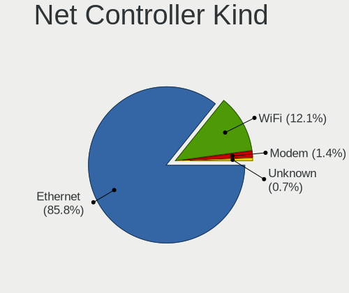

| Kind     | Desktops | Percent |
|----------|----------|---------|
| Ethernet | 112      | 84.21%  |
| WiFi     | 18       | 13.53%  |
| Modem    | 2        | 1.5%    |
| Unknown  | 1        | 0.75%   |

Used Controller
---------------

Currently used network controller

| Kind     | Desktops | Percent |
|----------|----------|---------|
| Ethernet | 105      | 92.92%  |
| WiFi     | 8        | 7.08%   |

NICs
----

Total network controllers on board

| Total | Desktops | Percent |
|-------|----------|---------|
| 1     | 76       | 67.26%  |
| 2     | 23       | 20.35%  |
| 3     | 5        | 4.42%   |
| 4     | 4        | 3.54%   |
| 5     | 2        | 1.77%   |
| 8     | 1        | 0.88%   |
| 6     | 1        | 0.88%   |
| 0     | 1        | 0.88%   |

IPv6
----

IPv6 vs IPv4

| Used | Desktops | Percent |
|------|----------|---------|
| No   | 104      | 92.04%  |
| Yes  | 9        | 7.96%   |

Bluetooth
---------

Bluetooth Vendor
----------------

Controller vendors

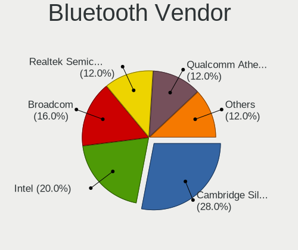

| Vendor                  | Desktops | Percent |
|-------------------------|----------|---------|
| Cambridge Silicon Radio | 4        | 40%     |
| Broadcom                | 3        | 30%     |
| ASUSTek Computer        | 2        | 20%     |
| Intel                   | 1        | 10%     |

Bluetooth Model
---------------

Controller models

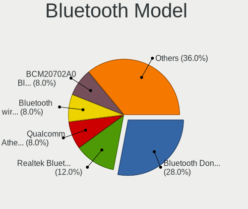

| Model                                                 | Desktops | Percent |
|-------------------------------------------------------|----------|---------|
| Cambridge Silicon Radio Bluetooth Dongle (HCI mode)   | 4        | 40%     |
| ASUS Broadcom BCM20702 Single-Chip Bluetooth 4.0 + LE | 2        | 20%     |
| Intel Bluetooth Device                                | 1        | 10%     |
| Broadcom BCM92046DG-CL1ROM Bluetooth 2.1 Adapter      | 1        | 10%     |
| Broadcom BCM20702A0 Bluetooth 4.0                     | 1        | 10%     |
| Broadcom ANYCOM Blue USB-200/250                      | 1        | 10%     |

Sound
-----

Sound Vendor
------------

Sound card vendors

| Vendor              | Desktops | Percent |
|---------------------|----------|---------|
| Intel               | 73       | 48.67%  |
| AMD                 | 41       | 27.33%  |
| Nvidia              | 27       | 18%     |
| Logitech            | 2        | 1.33%   |
| Creative Labs       | 2        | 1.33%   |
| Texas Instruments   | 1        | 0.67%   |
| GN Netcom           | 1        | 0.67%   |
| Ensoniq             | 1        | 0.67%   |
| C-Media Electronics | 1        | 0.67%   |
| ASUSTek Computer    | 1        | 0.67%   |

Sound Model
-----------

Sound card models

| Model                                                                                             | Desktops | Percent |
|---------------------------------------------------------------------------------------------------|----------|---------|
| AMD Oland/Hainan/Cape Verde/Pitcairn HDMI Audio [Radeon HD 7000 Series]                           | 16       | 9.47%   |
| Intel 8 Series/C220 Series Chipset High Definition Audio Controller                               | 15       | 8.88%   |
| Intel 100 Series/C230 Series Chipset Family HD Audio Controller                                   | 14       | 8.28%   |
| Intel 6 Series/C200 Series Chipset Family High Definition Audio Controller                        | 8        | 4.73%   |
| Intel Xeon E3-1200 v3/4th Gen Core Processor HD Audio Controller                                  | 6        | 3.55%   |
| AMD SBx00 Azalia (Intel HDA)                                                                      | 6        | 3.55%   |
| Intel Cannon Lake PCH cAVS                                                                        | 5        | 2.96%   |
| AMD FCH Azalia Controller                                                                         | 5        | 2.96%   |
| Nvidia GP107GL High Definition Audio Controller                                                   | 4        | 2.37%   |
| Nvidia GP106 High Definition Audio Controller                                                     | 4        | 2.37%   |
| Intel C610/X99 series chipset HD Audio Controller                                                 | 4        | 2.37%   |
| Intel 82801JI (ICH10 Family) HD Audio Controller                                                  | 4        | 2.37%   |
| Intel 7 Series/C216 Chipset Family High Definition Audio Controller                               | 4        | 2.37%   |
| Nvidia High Definition Audio Controller                                                           | 3        | 1.78%   |
| Intel C600/X79 series chipset High Definition Audio Controller                                    | 3        | 1.78%   |
| Intel 200 Series PCH HD Audio                                                                     | 3        | 1.78%   |
| AMD Starship/Matisse HD Audio Controller                                                          | 3        | 1.78%   |
| AMD Family 17h (Models 00h-0fh) HD Audio Controller                                               | 3        | 1.78%   |
| AMD Caicos HDMI Audio [Radeon HD 6450 / 7450/8450/8490 OEM / R5 230/235/235X OEM]                 | 3        | 1.78%   |
| Nvidia TU104 HD Audio Controller                                                                  | 2        | 1.18%   |
| Nvidia TU102 High Definition Audio Controller                                                     | 2        | 1.18%   |
| Nvidia GM204 High Definition Audio Controller                                                     | 2        | 1.18%   |
| Nvidia GK208 HDMI/DP Audio Controller                                                             | 2        | 1.18%   |
| Nvidia GK106 HDMI Audio Controller                                                                | 2        | 1.18%   |
| Nvidia GK104 HDMI Audio Controller                                                                | 2        | 1.18%   |
| Logitech Headset H390                                                                             | 2        | 1.18%   |
| Intel NM10/ICH7 Family High Definition Audio Controller                                           | 2        | 1.18%   |
| Intel Comet Lake PCH cAVS                                                                         | 2        | 1.18%   |
| AMD RS780 HDMI Audio [Radeon 3000/3100 / HD 3200/3300]                                            | 2        | 1.18%   |
| AMD Kabini HDMI/DP Audio                                                                          | 2        | 1.18%   |
| AMD Ellesmere HDMI Audio [Radeon RX 470/480 / 570/580/590]                                        | 2        | 1.18%   |
| AMD Cypress HDMI Audio [Radeon HD 5830/5850/5870 / 6850/6870 Rebrand]                             | 2        | 1.18%   |
| AMD Baffin HDMI/DP Audio [Radeon RX 550 640SP / RX 560/560X]                                      | 2        | 1.18%   |
| Texas Instruments PCM2902 Audio Codec                                                             | 1        | 0.59%   |
| Nvidia GP104 High Definition Audio Controller                                                     | 1        | 0.59%   |
| Nvidia GK107 HDMI Audio Controller                                                                | 1        | 0.59%   |
| Nvidia GF119 HDMI Audio Controller                                                                | 1        | 0.59%   |
| Nvidia GF116 High Definition Audio Controller                                                     | 1        | 0.59%   |
| Nvidia GF108 High Definition Audio Controller                                                     | 1        | 0.59%   |
| Intel Haswell-ULT HD Audio Controller                                                             | 1        | 0.59%   |
| Intel Audio device                                                                                | 1        | 0.59%   |
| Intel Atom/Celeron/Pentium Processor x5-E8000/J3xxx/N3xxx Series High Definition Audio Controller | 1        | 0.59%   |
| Intel Atom Processor Z36xxx/Z37xxx Series High Definition Audio Controller                        | 1        | 0.59%   |
| Intel 9 Series Chipset Family HD Audio Controller                                                 | 1        | 0.59%   |
| Intel 82801JD/DO (ICH10 Family) HD Audio Controller                                               | 1        | 0.59%   |
| Intel 82801H (ICH8 Family) HD Audio Controller                                                    | 1        | 0.59%   |
| Intel 8 Series HD Audio Controller                                                                | 1        | 0.59%   |
| Intel 631xESB/632xESB High Definition Audio Controller                                            | 1        | 0.59%   |
| Intel 5 Series/3400 Series Chipset High Definition Audio                                          | 1        | 0.59%   |
| GN Netcom Jabra EVOLVE 30 II                                                                      | 1        | 0.59%   |
| Ensoniq ES1371/ES1373 / Creative Labs CT2518                                                      | 1        | 0.59%   |
| Creative Labs EMU10k2/CA0100/CA0102/CA10200 [Sound Blaster Audigy Series]                         | 1        | 0.59%   |
| Creative Labs CA0108/CA10300 [Sound Blaster Audigy Series]                                        | 1        | 0.59%   |
| C-Media Electronics USB Advanced Audio Device                                                     | 1        | 0.59%   |
| ASUSTek Computer USB Audio                                                                        | 1        | 0.59%   |
| AMD Trinity HDMI Audio Controller                                                                 | 1        | 0.59%   |
| AMD Tobago HDMI Audio [Radeon R7 360 / R9 360 OEM]                                                | 1        | 0.59%   |
| AMD RV710/730 HDMI Audio [Radeon HD 4000 series]                                                  | 1        | 0.59%   |
| AMD Navi 10 HDMI Audio                                                                            | 1        | 0.59%   |
| AMD Hawaii HDMI Audio [Radeon R9 290/290X / 390/390X]                                             | 1        | 0.59%   |

Memory
------

Memory Vendor
-------------

Memory module vendors

| Vendor              | Desktops | Percent |
|---------------------|----------|---------|
| Kingston            | 22       | 21.36%  |
| Samsung Electronics | 20       | 19.42%  |
| Unknown             | 15       | 14.56%  |
| SK Hynix            | 15       | 14.56%  |
| Micron Technology   | 14       | 13.59%  |
| Crucial             | 11       | 10.68%  |
| Patriot             | 2        | 1.94%   |
| Corsair             | 2        | 1.94%   |
| Transcend           | 1        | 0.97%   |
| A-DATA Technology   | 1        | 0.97%   |

Memory Model
------------

Memory module models

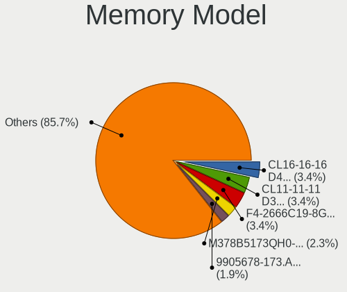

| Model                                                       | Desktops | Percent |
|-------------------------------------------------------------|----------|---------|
| Samsung RAM M378B5173QH0-YK0 4096MB DIMM DDR3 1600MT/s      | 6        | 4.96%   |
| Micron RAM 4ATF51264AZ-2G3B1 4096MB DIMM DDR4 2800MT/s      | 4        | 3.31%   |
| Crucial RAM CT16G4DFD824A.C16FDD 16384MB DIMM DDR4 2400MT/s | 4        | 3.31%   |
| SK Hynix RAM Module 2048MB DIMM DDR3 1600MT/s               | 2        | 1.65%   |
| Micron RAM 8ATF1G64AZ-2G3E1 8GB DIMM DDR4 2400MT/s          | 2        | 1.65%   |
| Micron RAM 18ASF2G72AZ-2G6D1 16384MB DIMM DDR4 2667MT/s     | 2        | 1.65%   |
| Crucial RAM CT8G4DFD824A.C16FBD1 8192MB DIMM DDR4 2400MT/s  | 2        | 1.65%   |
| Unknown RAM Module 8192MB DIMM DDR3 1600MT/s                | 1        | 0.83%   |
| Unknown RAM Module 8192MB DIMM DDR3 1333MT/s                | 1        | 0.83%   |
| Unknown RAM Module 8192MB DIMM 1600MT/s                     | 1        | 0.83%   |
| Unknown RAM Module 8192MB DIMM 1333MT/s                     | 1        | 0.83%   |
| Unknown RAM Module 4096MB DIMM DDR3 1333MT/s                | 1        | 0.83%   |
| Unknown RAM Module 4096MB DIMM DDR 1333MT/s                 | 1        | 0.83%   |
| Unknown RAM Module 4096MB DIMM 800MT/s                      | 1        | 0.83%   |
| Unknown RAM Module 4096MB DIMM 1600MT/s                     | 1        | 0.83%   |
| Unknown RAM Module 4096MB DIMM 1333MT/s                     | 1        | 0.83%   |
| Unknown RAM Module 4096MB DIMM                              | 1        | 0.83%   |
| Unknown RAM Module 2048MB SODIMM DDR3 800MT/s               | 1        | 0.83%   |
| Unknown RAM Module 2048MB SODIMM DDR2 800MT/s               | 1        | 0.83%   |
| Unknown RAM Module 2048MB DIMM DDR3 1333MT/s                | 1        | 0.83%   |
| Unknown RAM Module 2048MB DIMM 800MT/s                      | 1        | 0.83%   |
| Unknown RAM Module 2048MB DIMM 400MT/s                      | 1        | 0.83%   |
| Unknown RAM Module 2048MB DIMM 1067MT/s                     | 1        | 0.83%   |
| Unknown RAM Module 16384MB DIMM DDR4 2133MT/s               | 1        | 0.83%   |
| Unknown RAM Module 16384MB DIMM 1067MT/s                    | 1        | 0.83%   |
| Transcend RAM TS1GLH64V1H 8192MB DIMM DDR4 2133MT/s         | 1        | 0.83%   |
| SK Hynix RAM Module 8GB SODIMM DDR4 2667MT/s                | 1        | 0.83%   |
| SK Hynix RAM Module 2048MB DIMM DDR3 800MT/s                | 1        | 0.83%   |
| SK Hynix RAM Module 16GB DIMM DDR4 3200MT/s                 | 1        | 0.83%   |
| SK Hynix RAM HMT451U7BFR8A-PB 4096MB DIMM DDR3 1600MT/s     | 1        | 0.83%   |
| SK Hynix RAM HMT451U6BFR8A-PB 4GB DIMM DDR3 1600MT/s        | 1        | 0.83%   |
| SK Hynix RAM HMT451S6BFR8A-PB 4096MB SODIMM DDR3 1600MT/s   | 1        | 0.83%   |
| SK Hynix RAM HMT41GU7MFR8C-PB 8192MB DIMM DDR3 1600MT/s     | 1        | 0.83%   |
| SK Hynix RAM HMT41GU6BFR8A-PB 8192MB DIMM DDR3 2000MT/s     | 1        | 0.83%   |
| SK Hynix RAM HMT351U6CFR8C-PB 4096MB DIMM DDR3 1800MT/s     | 1        | 0.83%   |
| SK Hynix RAM HMT351U6BFR8C-H9 4096MB DIMM DDR3 1333MT/s     | 1        | 0.83%   |
| SK Hynix RAM HMT112U7AFP8C-H9 1024MB DIMM DDR3 1333MT/s     | 1        | 0.83%   |
| SK Hynix RAM HMAA4GS6AJR8N-XN 32GB SODIMM DDR4 3200MT/s     | 1        | 0.83%   |
| SK Hynix RAM HMA81GU6DJR8N-VK 8192MB DIMM DDR4 2666MT/s     | 1        | 0.83%   |
| SK Hynix RAM HMA42GR7AFR4N-TF 16384MB RIMM 2133MT/s         | 1        | 0.83%   |
| SK Hynix RAM HMA41GU6AFR8N-TF 8192MB DIMM DDR4 2465MT/s     | 1        | 0.83%   |
| Samsung RAM Module 8GB DIMM DDR4 3200MT/s                   | 1        | 0.83%   |
| Samsung RAM Module 8192MB DIMM DDR4 3200MT/s                | 1        | 0.83%   |
| Samsung RAM Module 8192MB DIMM DDR4 2133MT/s                | 1        | 0.83%   |
| Samsung RAM Module 2048MB DIMM DDR3 1333MT/s                | 1        | 0.83%   |
| Samsung RAM M471B5173QH0-YK0 4GB SODIMM DDR3 1600MT/s       | 1        | 0.83%   |
| Samsung RAM M471B5173EB0-YK0 4GB SODIMM DDR3 1600MT/s       | 1        | 0.83%   |
| Samsung RAM M393B1K70DH0-YK0 8GB DIMM DDR3 1600MT/s         | 1        | 0.83%   |
| Samsung RAM M393B1K70DH0-CK0 8192MB DIMM DDR3 1600MT/s      | 1        | 0.83%   |
| Samsung RAM M393A4K40BB1-CRC 32GB DIMM DDR4 2400MT/s        | 1        | 0.83%   |
| Samsung RAM M391B5773CH0-CH9 2048MB DIMM DDR3 1333MT/s      | 1        | 0.83%   |
| Samsung RAM M391B2873GB0-YH9 1024MB DIMM DDR3 1333MT/s      | 1        | 0.83%   |
| Samsung RAM M391A2K43BB1-CTD 16384MB DIMM DDR4 2667MT/s     | 1        | 0.83%   |
| Samsung RAM M391A1K43BB1-CRC 8GB DIMM DDR4 2400MT/s         | 1        | 0.83%   |
| Samsung RAM M378B5273EB0-CK0 4GB DIMM DDR3 1800MT/s         | 1        | 0.83%   |
| Samsung RAM M378B5273CH0-CK0 4GB DIMM DDR3 2000MT/s         | 1        | 0.83%   |
| Samsung RAM M378A2K43CB1-CTD 16GB DIMM DDR4 2667MT/s        | 1        | 0.83%   |
| Samsung RAM M378A1K43CB2-CRC 8GB DIMM DDR4 3500MT/s         | 1        | 0.83%   |
| Patriot RAM PSD34G160081 4096MB DIMM DDR3 1600MT/s          | 1        | 0.83%   |
| Patriot RAM PSD34G133381 4096MB DIMM 1333MT/s               | 1        | 0.83%   |

Memory Kind
-----------

Memory module kinds

| Kind    | Desktops | Percent |
|---------|----------|---------|
| DDR3    | 45       | 47.37%  |
| DDR4    | 39       | 41.05%  |
| Unknown | 9        | 9.47%   |
| DDR2    | 1        | 1.05%   |
| DDR     | 1        | 1.05%   |

Memory Form Factor
------------------

Physical design of the memory module

| Name   | Desktops | Percent |
|--------|----------|---------|
| DIMM   | 85       | 89.47%  |
| SODIMM | 9        | 9.47%   |
| RIMM   | 1        | 1.05%   |

Memory Size
-----------

Memory module size

| Size  | Desktops | Percent |
|-------|----------|---------|
| 8192  | 34       | 32.69%  |
| 4096  | 33       | 31.73%  |
| 16384 | 20       | 19.23%  |
| 2048  | 13       | 12.5%   |
| 32768 | 3        | 2.88%   |
| 1024  | 1        | 0.96%   |

Memory Speed
------------

Memory module speed

| Speed   | Desktops | Percent |
|---------|----------|---------|
| 1600    | 25       | 24.27%  |
| 1333    | 18       | 17.48%  |
| 2400    | 13       | 12.62%  |
| 2667    | 9        | 8.74%   |
| 2133    | 7        | 6.8%    |
| 3200    | 6        | 5.83%   |
| 800     | 5        | 4.85%   |
| 2800    | 4        | 3.88%   |
| 2666    | 2        | 1.94%   |
| 2134    | 2        | 1.94%   |
| 2000    | 2        | 1.94%   |
| 1800    | 2        | 1.94%   |
| 667     | 2        | 1.94%   |
| 3500    | 1        | 0.97%   |
| 2465    | 1        | 0.97%   |
| 1867    | 1        | 0.97%   |
| 1067    | 1        | 0.97%   |
| 400     | 1        | 0.97%   |
| Unknown | 1        | 0.97%   |

Printers & scanners
-------------------

Printer Vendor
--------------

Printer device vendors

| Vendor             | Desktops | Percent |
|--------------------|----------|---------|
| Hewlett-Packard    | 2        | 50%     |
| Canon              | 1        | 25%     |
| Brother Industries | 1        | 25%     |

Printer Model
-------------

Printer device models

| Model                  | Desktops | Percent |
|------------------------|----------|---------|
| HP LaserJet 400 M401dn | 1        | 25%     |
| HP LaserJet 3030       | 1        | 25%     |
| Canon MF210 Series     | 1        | 25%     |
| Brother MFC-9130CW     | 1        | 25%     |

Scanner Vendor
--------------

Scanner device vendors

Zero info for selected period =(

Scanner Model
-------------

Scanner device models

Zero info for selected period =(

Camera
------

Camera Vendor
-------------

Camera device vendors

| Vendor                 | Desktops | Percent |
|------------------------|----------|---------|
| Logitech               | 2        | 33.33%  |
| Samsung Electronics    | 1        | 16.67%  |
| Realtek Semiconductor  | 1        | 16.67%  |
| Microsoft              | 1        | 16.67%  |
| Generalplus Technology | 1        | 16.67%  |

Camera Model
------------

Camera device models

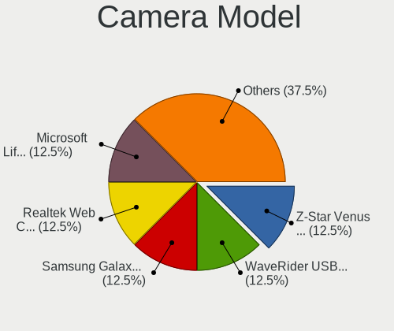

| Model                                    | Desktops | Percent |
|------------------------------------------|----------|---------|
| Samsung Galaxy A5 (MTP)                  | 1        | 16.67%  |
| Realtek Web Camera                       | 1        | 16.67%  |
| Microsoft LifeCam HD-5000                | 1        | 16.67%  |
| Logitech Webcam C310                     | 1        | 16.67%  |
| Logitech HD Pro Webcam C920              | 1        | 16.67%  |
| Generalplus 808 Camera #9 (web-cam mode) | 1        | 16.67%  |

Security
--------

Fingerprint Vendor
------------------

Fingerprint sensor vendors

Zero info for selected period =(

Fingerprint Model
-----------------

Fingerprint sensor models

Zero info for selected period =(

Chipcard Vendor
---------------

Chipcard module vendors

| Vendor           | Desktops | Percent |
|------------------|----------|---------|
| SCM Microsystems | 1        | 100%    |

Chipcard Model
--------------

Chipcard module models

| Model                                                      | Desktops | Percent |
|------------------------------------------------------------|----------|---------|
| SCM Microsystems SCR3340 - ExpressCard54 Smart Card Reader | 1        | 100%    |

Unsupported
-----------

Unsupported Devices
-------------------

Total unsupported devices on board

| Total | Desktops | Percent |
|-------|----------|---------|
| 0     | 83       | 72.81%  |
| 1     | 23       | 20.18%  |
| 2     | 4        | 3.51%   |
| 4     | 3        | 2.63%   |
| 3     | 1        | 0.88%   |

Unsupported Device Types
------------------------

Types of unsupported devices

| Type                     | Desktops | Percent |
|--------------------------|----------|---------|
| Graphics card            | 14       | 35%     |
| Communication controller | 8        | 20%     |
| Unassigned class         | 6        | 15%     |
| Net/wireless             | 6        | 15%     |
| Net/ethernet             | 3        | 7.5%    |
| Storage/raid             | 1        | 2.5%    |
| Network                  | 1        | 2.5%    |
| Multimedia controller    | 1        | 2.5%    |

