CentOS 7 - Tested Hardware & Statistics (Notebooks)
---------------------------------------------------

A project to collect tested hardware configurations for CentOS 7.

Anyone can contribute to this report by the [hw-probe](https://github.com/linuxhw/hw-probe) tool:

    sudo -E hw-probe -all -upload

Please submit a probe of your configuration if it's not presented on the page or is rare.

Full-feature report is available here: https://linux-hardware.org/?view=trends&rel=centos-7

Contents
--------

* [ Test Cases ](#test-cases)

* [ System ](#system)
  - [ Kernel                   ](#kernel)
  - [ Kernel Family            ](#kernel-family)
  - [ Kernel Major Ver.        ](#kernel-major-ver)
  - [ Arch                     ](#arch)
  - [ DE                       ](#de)
  - [ Display Server           ](#display-server)
  - [ Display Manager          ](#display-manager)
  - [ OS Lang                  ](#os-lang)
  - [ Boot Mode                ](#boot-mode)
  - [ Filesystem               ](#filesystem)
  - [ Part. scheme             ](#part-scheme)
  - [ Dual Boot with Linux/BSD ](#dual-boot-with-linuxbsd)
  - [ Dual Boot (Win)          ](#dual-boot-win)

* [ Board ](#board)
  - [ Vendor                   ](#vendor)
  - [ Model                    ](#model)
  - [ Model Family             ](#model-family)
  - [ MFG Year                 ](#mfg-year)
  - [ Form Factor              ](#form-factor)
  - [ Secure Boot              ](#secure-boot)
  - [ Coreboot                 ](#coreboot)
  - [ RAM Size                 ](#ram-size)
  - [ RAM Used                 ](#ram-used)
  - [ Total Drives             ](#total-drives)
  - [ Has CD-ROM               ](#has-cd-rom)
  - [ Has Ethernet             ](#has-ethernet)
  - [ Has WiFi                 ](#has-wifi)
  - [ Has Bluetooth            ](#has-bluetooth)

* [ Location ](#location)
  - [ Country                  ](#country)
  - [ City                     ](#city)

* [ Drives ](#drives)
  - [ Drive Vendor             ](#drive-vendor)
  - [ Drive Model              ](#drive-model)
  - [ HDD Vendor               ](#hdd-vendor)
  - [ SSD Vendor               ](#ssd-vendor)
  - [ Drive Kind               ](#drive-kind)
  - [ Drive Connector          ](#drive-connector)
  - [ Drive Size               ](#drive-size)
  - [ Space Total              ](#space-total)
  - [ Space Used               ](#space-used)
  - [ Malfunc. Drives          ](#malfunc-drives)
  - [ Malfunc. Drive Vendor    ](#malfunc-drive-vendor)
  - [ Malfunc. HDD Vendor      ](#malfunc-hdd-vendor)
  - [ Malfunc. Drive Kind      ](#malfunc-drive-kind)
  - [ Failed Drives            ](#failed-drives)
  - [ Failed Drive Vendor      ](#failed-drive-vendor)
  - [ Drive Status             ](#drive-status)

* [ Storage controller ](#storage-controller)
  - [ Storage Vendor           ](#storage-vendor)
  - [ Storage Model            ](#storage-model)
  - [ Storage Kind             ](#storage-kind)

* [ Processor ](#processor)
  - [ CPU Vendor               ](#cpu-vendor)
  - [ CPU Model                ](#cpu-model)
  - [ CPU Model Family         ](#cpu-model-family)
  - [ CPU Cores                ](#cpu-cores)
  - [ CPU Sockets              ](#cpu-sockets)
  - [ CPU Threads              ](#cpu-threads)
  - [ CPU Op-Modes             ](#cpu-op-modes)
  - [ CPU Microcode            ](#cpu-microcode)
  - [ CPU Microarch            ](#cpu-microarch)

* [ Graphics ](#graphics)
  - [ GPU Vendor               ](#gpu-vendor)
  - [ GPU Model                ](#gpu-model)
  - [ GPU Combo                ](#gpu-combo)
  - [ GPU Driver               ](#gpu-driver)
  - [ GPU Memory               ](#gpu-memory)

* [ Monitor ](#monitor)
  - [ Monitor Vendor           ](#monitor-vendor)
  - [ Monitor Model            ](#monitor-model)
  - [ Monitor Resolution       ](#monitor-resolution)
  - [ Monitor Diagonal         ](#monitor-diagonal)
  - [ Monitor Width            ](#monitor-width)
  - [ Aspect Ratio             ](#aspect-ratio)
  - [ Monitor Area             ](#monitor-area)
  - [ Pixel Density            ](#pixel-density)
  - [ Multiple Monitors        ](#multiple-monitors)

* [ Network ](#network)
  - [ Net Controller Vendor    ](#net-controller-vendor)
  - [ Net Controller Model     ](#net-controller-model)
  - [ Wireless Vendor          ](#wireless-vendor)
  - [ Wireless Model           ](#wireless-model)
  - [ Ethernet Vendor          ](#ethernet-vendor)
  - [ Ethernet Model           ](#ethernet-model)
  - [ Net Controller Kind      ](#net-controller-kind)
  - [ Used Controller          ](#used-controller)
  - [ NICs                     ](#nics)
  - [ IPv6                     ](#ipv6)

* [ Bluetooth ](#bluetooth)
  - [ Bluetooth Vendor         ](#bluetooth-vendor)
  - [ Bluetooth Model          ](#bluetooth-model)

* [ Sound ](#sound)
  - [ Sound Vendor             ](#sound-vendor)
  - [ Sound Model              ](#sound-model)

* [ Memory ](#memory)
  - [ Memory Vendor            ](#memory-vendor)
  - [ Memory Model             ](#memory-model)
  - [ Memory Kind              ](#memory-kind)
  - [ Memory Form Factor       ](#memory-form-factor)
  - [ Memory Size              ](#memory-size)
  - [ Memory Speed             ](#memory-speed)

* [ Printers & scanners ](#printers--scanners)
  - [ Printer Vendor           ](#printer-vendor)
  - [ Printer Model            ](#printer-model)
  - [ Scanner Vendor           ](#scanner-vendor)
  - [ Scanner Model            ](#scanner-model)

* [ Camera ](#camera)
  - [ Camera Vendor            ](#camera-vendor)
  - [ Camera Model             ](#camera-model)

* [ Security ](#security)
  - [ Fingerprint Vendor       ](#fingerprint-vendor)
  - [ Fingerprint Model        ](#fingerprint-model)
  - [ Chipcard Vendor          ](#chipcard-vendor)
  - [ Chipcard Model           ](#chipcard-model)

* [ Unsupported ](#unsupported)
  - [ Unsupported Devices      ](#unsupported-devices)
  - [ Unsupported Device Types ](#unsupported-device-types)

Test Cases
----------

| Vendor   | Model                       | Probe                                                      | Date         |
|----------|-----------------------------|------------------------------------------------------------|--------------|
| Apple    | MacBookPro5,5               | [d7ee29aac3](https://linux-hardware.org/?probe=d7ee29aac3) | Sep 15, 2021 |
| HP       | EliteBook 8540w             | [fd6f5273e3](https://linux-hardware.org/?probe=fd6f5273e3) | Sep 02, 2021 |
| HP       | EliteBook 2740p             | [0beccde57d](https://linux-hardware.org/?probe=0beccde57d) | Sep 01, 2021 |
| HP       | EliteBook 8540w             | [f9c840ba9c](https://linux-hardware.org/?probe=f9c840ba9c) | Aug 21, 2021 |
| HP       | EliteBook 8540w             | [d2f1dd867d](https://linux-hardware.org/?probe=d2f1dd867d) | Aug 20, 2021 |
| HP       | EliteBook 8540w             | [6e6d5c8f2c](https://linux-hardware.org/?probe=6e6d5c8f2c) | Aug 20, 2021 |
| HP       | Presario C700               | [fa731abf46](https://linux-hardware.org/?probe=fa731abf46) | Aug 19, 2021 |
| Lenovo   | ThinkPad X61s 7667DB2       | [c0af3fd295](https://linux-hardware.org/?probe=c0af3fd295) | Jul 05, 2021 |
| Lenovo   | ThinkPad X61s 7667DB2       | [70929dad4d](https://linux-hardware.org/?probe=70929dad4d) | Jun 24, 2021 |
| Lenovo   | ThinkPad X61s 7667DB2       | [32d294ba2a](https://linux-hardware.org/?probe=32d294ba2a) | Jun 23, 2021 |
| ASUSTek  | U35JC                       | [29ea6520a1](https://linux-hardware.org/?probe=29ea6520a1) | May 08, 2021 |
| Lenovo   | ThinkPad X200 7459ZEJ       | [a4f7ad5736](https://linux-hardware.org/?probe=a4f7ad5736) | May 07, 2021 |
| Lenovo   | IdeaPad 310-15ISK 80UH      | [72df2af331](https://linux-hardware.org/?probe=72df2af331) | Mar 16, 2021 |
| Dell     | Latitude E7250              | [551399bf55](https://linux-hardware.org/?probe=551399bf55) | Mar 08, 2021 |
| HP       | ProBook 6560b               | [57004cab16](https://linux-hardware.org/?probe=57004cab16) | Feb 17, 2021 |
| Lenovo   | ThinkPad T520 4243Y1N       | [66b47b2f1e](https://linux-hardware.org/?probe=66b47b2f1e) | Jan 20, 2021 |
| HP       | EliteBook 840 G5            | [71b67a3764](https://linux-hardware.org/?probe=71b67a3764) | Jan 14, 2021 |
| Acer     | Aspire E1-572               | [a06266ed7f](https://linux-hardware.org/?probe=a06266ed7f) | Dec 17, 2020 |
| Toshiba  | Satellite A135              | [310ddb721f](https://linux-hardware.org/?probe=310ddb721f) | Nov 20, 2020 |
| Lenovo   | ThinkPad X200 7459H92       | [242193b8bc](https://linux-hardware.org/?probe=242193b8bc) | Nov 17, 2020 |
| Dell     | Latitude E6440              | [46a2699a96](https://linux-hardware.org/?probe=46a2699a96) | Oct 21, 2020 |
| Samsung  | 300E5EV/300E4EV/270E5EV/... | [97a2b45d12](https://linux-hardware.org/?probe=97a2b45d12) | Oct 21, 2020 |
| Dell     | Latitude E6410              | [926bbbdaf2](https://linux-hardware.org/?probe=926bbbdaf2) | Oct 18, 2020 |
| Dell     | Latitude E6410              | [194e7f24f3](https://linux-hardware.org/?probe=194e7f24f3) | Oct 12, 2020 |
| Lenovo   | G500s 20245                 | [8a975cb577](https://linux-hardware.org/?probe=8a975cb577) | Oct 07, 2020 |
| Dell     | Latitude E6410              | [a36dab9e9b](https://linux-hardware.org/?probe=a36dab9e9b) | Oct 06, 2020 |
| Dell     | Inspiron 3542               | [233a83b315](https://linux-hardware.org/?probe=233a83b315) | Sep 08, 2020 |
| Dell     | Inspiron 3542               | [fcb2182f02](https://linux-hardware.org/?probe=fcb2182f02) | Sep 08, 2020 |
| Unknown  | 34AS1                       | [cc188d0f25](https://linux-hardware.org/?probe=cc188d0f25) | Sep 08, 2020 |
| Unknown  | 34AS1                       | [0ab59553ea](https://linux-hardware.org/?probe=0ab59553ea) | Sep 08, 2020 |
| Dell     | Inspiron 3542               | [751df6a75b](https://linux-hardware.org/?probe=751df6a75b) | Sep 08, 2020 |
| Dell     | Inspiron 3542               | [14680221b6](https://linux-hardware.org/?probe=14680221b6) | Sep 07, 2020 |
| HP       | EliteBook 6930p             | [8fdba744ec](https://linux-hardware.org/?probe=8fdba744ec) | Sep 03, 2020 |
| Dell     | Inspiron 5567               | [d7700d73c4](https://linux-hardware.org/?probe=d7700d73c4) | Sep 03, 2020 |
| Dell     | Inspiron N4050              | [c51c0d5538](https://linux-hardware.org/?probe=c51c0d5538) | Aug 15, 2020 |
| HP       | Falco                       | [26ace050f7](https://linux-hardware.org/?probe=26ace050f7) | Jul 07, 2020 |
| Dell     | Inspiron N4050              | [2a05830be5](https://linux-hardware.org/?probe=2a05830be5) | Jul 05, 2020 |
| HP       | EliteBook 840 G5            | [2605330e8c](https://linux-hardware.org/?probe=2605330e8c) | Jun 04, 2020 |
| HP       | EliteBook 840 G5            | [912c44b0ac](https://linux-hardware.org/?probe=912c44b0ac) | May 15, 2020 |
| Acer     | Aspire 5750G                | [1f49c0d636](https://linux-hardware.org/?probe=1f49c0d636) | May 06, 2020 |
| Dell     | Latitude E6220              | [a4db1d31a5](https://linux-hardware.org/?probe=a4db1d31a5) | May 05, 2020 |
| Dell     | Latitude E6220              | [c0152a3b02](https://linux-hardware.org/?probe=c0152a3b02) | May 05, 2020 |
| Toshiba  | Satellite Radius 12 P20W... | [4f272f1c99](https://linux-hardware.org/?probe=4f272f1c99) | May 03, 2020 |
| Dell     | Inspiron 5437               | [0606d60ddb](https://linux-hardware.org/?probe=0606d60ddb) | Apr 29, 2020 |
| Dell     | Inspiron 5437               | [c4f288077d](https://linux-hardware.org/?probe=c4f288077d) | Apr 29, 2020 |
| Dell     | Precision 7510              | [40e5c33fd8](https://linux-hardware.org/?probe=40e5c33fd8) | Apr 27, 2020 |
| Sony     | VGN-N19VP_B                 | [a2e6c99940](https://linux-hardware.org/?probe=a2e6c99940) | Apr 20, 2020 |
| Lenovo   | ThinkPad P53 20QNS00Y00     | [2918602e15](https://linux-hardware.org/?probe=2918602e15) | Mar 12, 2020 |
| Lenovo   | ThinkPad P53 20QNS00Y00     | [8376f889c2](https://linux-hardware.org/?probe=8376f889c2) | Mar 12, 2020 |
| HP       | Laptop 15-da0xxx            | [d2ab3b608a](https://linux-hardware.org/?probe=d2ab3b608a) | Mar 07, 2020 |
| HP       | ZBook 17                    | [5937f48c97](https://linux-hardware.org/?probe=5937f48c97) | Feb 13, 2020 |
| Sony     | VPCSB19GG                   | [cc8806b4ec](https://linux-hardware.org/?probe=cc8806b4ec) | Feb 04, 2020 |
| HP       | EliteBook x360 1040 G6      | [7d1585f3cd](https://linux-hardware.org/?probe=7d1585f3cd) | Dec 28, 2019 |
| Lenovo   | Y520-15IKBN 80WK            | [e795735d5b](https://linux-hardware.org/?probe=e795735d5b) | Dec 14, 2019 |
| Lenovo   | ThinkPad X1 Carbon 6th 2... | [1bb0047e0e](https://linux-hardware.org/?probe=1bb0047e0e) | Dec 03, 2019 |
| Dell     | XPS L702X                   | [ba096189bc](https://linux-hardware.org/?probe=ba096189bc) | Dec 03, 2019 |
| MSI      | GL63 8SD                    | [3cef0087aa](https://linux-hardware.org/?probe=3cef0087aa) | Dec 01, 2019 |
| Dell     | Vostro 5568                 | [a0b3e4d70f](https://linux-hardware.org/?probe=a0b3e4d70f) | Oct 16, 2019 |
| HP       | Pavilion 15                 | [7e407e7cd4](https://linux-hardware.org/?probe=7e407e7cd4) | Sep 15, 2019 |
| HP       | Pavilion 15                 | [b2625d7672](https://linux-hardware.org/?probe=b2625d7672) | Sep 15, 2019 |
| HP       | Pavilion 15                 | [447f75484c](https://linux-hardware.org/?probe=447f75484c) | Sep 11, 2019 |
| HP       | Pavilion 15                 | [9352d1efae](https://linux-hardware.org/?probe=9352d1efae) | Sep 11, 2019 |
| MSI      | GP62MVR 7RFX                | [5a21834bbd](https://linux-hardware.org/?probe=5a21834bbd) | Sep 01, 2019 |
| Notebook | WA50SRQ                     | [fd99d2b5e2](https://linux-hardware.org/?probe=fd99d2b5e2) | Aug 09, 2019 |
| Dell     | Precision M4600             | [9b9a3a238d](https://linux-hardware.org/?probe=9b9a3a238d) | Apr 14, 2019 |
| Dell     | Vostro 5470                 | [e106741644](https://linux-hardware.org/?probe=e106741644) | Apr 10, 2019 |
| ASUSTek  | X540SC                      | [f513215ec6](https://linux-hardware.org/?probe=f513215ec6) | Jan 09, 2019 |
| Lenovo   | ThinkPad T440p 20AWS27B0... | [000dae069a](https://linux-hardware.org/?probe=000dae069a) | Oct 31, 2018 |
| Lenovo   | ThinkPad T530 2394AG6       | [6b8015f1e2](https://linux-hardware.org/?probe=6b8015f1e2) | Oct 26, 2018 |
| Lenovo   | ThinkPad T530 2394AG6       | [c834cadf29](https://linux-hardware.org/?probe=c834cadf29) | Oct 26, 2018 |
| HP       | EliteBook 2740p             | [1b72dbb418](https://linux-hardware.org/?probe=1b72dbb418) | Sep 17, 2017 |

System
------

Kernel
------

Version of the Linux kernel

| Version                               | Notebooks | Percent |
|---------------------------------------|-----------|---------|
| 3.10.0-957.10.1.el7.x86_64            | 3         | 6%      |
| 3.10.0-1160.15.2.el7.x86_64           | 3         | 6%      |
| 3.10.0-1127.19.1.el7.x86_64           | 3         | 6%      |
| 3.10.0-957.el7.x86_64                 | 2         | 4%      |
| 3.10.0-957.27.2.el7.x86_64            | 2         | 4%      |
| 3.10.0-957.1.3.el7.x86_64             | 2         | 4%      |
| 3.10.0-862.14.4.el7.x86_64            | 2         | 4%      |
| 3.10.0-1127.el7.x86_64                | 2         | 4%      |
| 3.10.0-1127.18.2.el7.x86_64           | 2         | 4%      |
| 3.10.0-1127.18.2.el7.centos.plus.i686 | 2         | 4%      |
| 3.10.0-1127.13.1.el7.x86_64           | 2         | 4%      |
| 3.10.0-1062.9.1.el7.x86_64            | 2         | 4%      |
| 3.10.0-1062.4.3.el7.x86_64            | 2         | 4%      |
| 3.10.0-1062.12.1.el7.x86_64           | 2         | 4%      |
| 5.8.13-1.el7.elrepo.x86_64            | 1         | 2%      |
| 5.6.8-1.el7.elrepo.x86_64             | 1         | 2%      |
| 5.4.6-1.el7.elrepo.x86_64             | 1         | 2%      |
| 5.4.125-200.el7.x86_64                | 1         | 2%      |
| 5.4.121-200.el7.x86_64                | 1         | 2%      |
| 5.11.0-1.el7.elrepo.x86_64            | 1         | 2%      |
| 4.20.8-1.el7.elrepo.x86_64            | 1         | 2%      |
| 4.19.8-1.el7.elrepo.x86_64            | 1         | 2%      |
| 3.10.0-957.21.3.el7.x86_64            | 1         | 2%      |
| 3.10.0-693.2.2.el7.x86_64             | 1         | 2%      |
| 3.10.0-1160.el7.x86_64                | 1         | 2%      |
| 3.10.0-1160.42.2.el7.x86_64           | 1         | 2%      |
| 3.10.0-1160.2.2.el7.x86_64            | 1         | 2%      |
| 3.10.0-1160.11.1.el7.x86_64           | 1         | 2%      |
| 3.10.0-1127.10.1.el7.x86_64           | 1         | 2%      |
| 3.10.0-1062.4.1.el7.x86_64            | 1         | 2%      |
| 3.10.0-1062.18.1.el7.x86_64           | 1         | 2%      |
| 3.10.0-1062.18.1.el7.centos.plus.i686 | 1         | 2%      |
| 3.10.0-1062.1.2.el7.x86_64            | 1         | 2%      |

Kernel Family
-------------

Linux kernel without a distro release

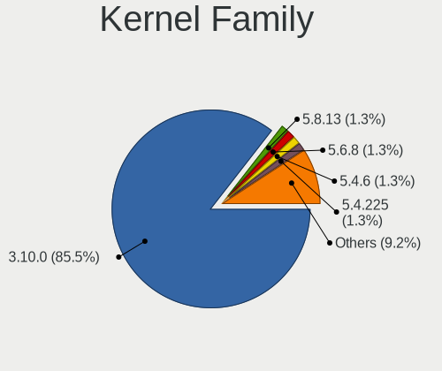

| Version | Notebooks | Percent |
|---------|-----------|---------|
| 3.10.0  | 42        | 84%     |
| 5.8.13  | 1         | 2%      |
| 5.6.8   | 1         | 2%      |
| 5.4.6   | 1         | 2%      |
| 5.4.125 | 1         | 2%      |
| 5.4.121 | 1         | 2%      |
| 5.11.0  | 1         | 2%      |
| 4.20.8  | 1         | 2%      |
| 4.19.8  | 1         | 2%      |

Kernel Major Ver.
-----------------

Linux kernel major version

| Version | Notebooks | Percent |
|---------|-----------|---------|
| 3.10    | 42        | 85.71%  |
| 5.4     | 2         | 4.08%   |
| 5.8     | 1         | 2.04%   |
| 5.6     | 1         | 2.04%   |
| 5.11    | 1         | 2.04%   |
| 4.20    | 1         | 2.04%   |
| 4.19    | 1         | 2.04%   |

Arch
----

OS architecture (x86_64, i586, etc.)

| Name   | Notebooks | Percent |
|--------|-----------|---------|
| x86_64 | 46        | 93.88%  |
| i686   | 3         | 6.12%   |

DE
--

Desktop Environment

| Name          | Notebooks | Percent |
|---------------|-----------|---------|
| GNOME         | 16        | 32.65%  |
| KDE4          | 11        | 22.45%  |
| Unknown       | 7         | 14.29%  |
| GNOME Classic | 5         | 10.2%   |
| MATE          | 4         | 8.16%   |
| Cinnamon      | 3         | 6.12%   |
| XFCE          | 2         | 4.08%   |
| KDE           | 1         | 2.04%   |

Display Server
--------------

X11 or Wayland

| Name    | Notebooks | Percent |
|---------|-----------|---------|
| X11     | 47        | 95.92%  |
| Unknown | 2         | 4.08%   |

Display Manager
---------------

SDDM, LightDM, etc.

| Name    | Notebooks | Percent |
|---------|-----------|---------|
| GDM     | 30        | 61.22%  |
| Unknown | 16        | 32.65%  |
| LightDM | 3         | 6.12%   |

OS Lang
-------

Language

| Lang    | Notebooks | Percent |
|---------|-----------|---------|
| en_US   | 18        | 36%     |
| Unknown | 13        | 26%     |
| en_GB   | 4         | 8%      |
| ru_RU   | 3         | 6%      |
| pt_BR   | 2         | 4%      |
| pl_PL   | 2         | 4%      |
| fr_FR   | 2         | 4%      |
| zh_CN   | 1         | 2%      |
| pt_PT   | 1         | 2%      |
| ja_JP   | 1         | 2%      |
| es_ES   | 1         | 2%      |
| es_AR   | 1         | 2%      |
| de_DE   | 1         | 2%      |

Boot Mode
---------

EFI or BIOS

| Mode | Notebooks | Percent |
|------|-----------|---------|
| BIOS | 39        | 78%     |
| EFI  | 11        | 22%     |

Filesystem
----------

Type of filesystem

| Type    | Notebooks | Percent |
|---------|-----------|---------|
| Xfs     | 30        | 60%     |
| Ext4    | 18        | 36%     |
| Overlay | 1         | 2%      |
| Ext2    | 1         | 2%      |

Part. scheme
------------

Scheme of partitioning

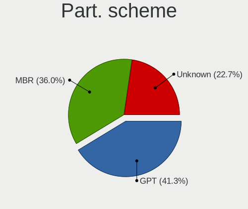

| Type    | Notebooks | Percent |
|---------|-----------|---------|
| MBR     | 20        | 40.82%  |
| Unknown | 15        | 30.61%  |
| GPT     | 14        | 28.57%  |

Dual Boot with Linux/BSD
------------------------

Hosting more than one Linux/BSD

| Dual boot | Notebooks | Percent |
|-----------|-----------|---------|
| No        | 41        | 83.67%  |
| Yes       | 8         | 16.33%  |

Dual Boot (Win)
---------------

Hosting Linux and Windows

| Dual boot | Notebooks | Percent |
|-----------|-----------|---------|
| No        | 40        | 80%     |
| Yes       | 10        | 20%     |

Board
-----

Vendor
------

Motherboard manufacturer

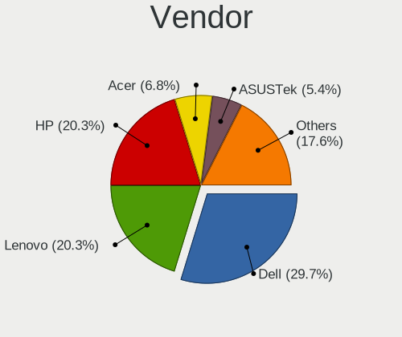

| Name                | Notebooks | Percent |
|---------------------|-----------|---------|
| Dell                | 14        | 28.57%  |
| Lenovo              | 11        | 22.45%  |
| Hewlett-Packard     | 11        | 22.45%  |
| Toshiba             | 2         | 4.08%   |
| Sony                | 2         | 4.08%   |
| MSI                 | 2         | 4.08%   |
| ASUSTek Computer    | 2         | 4.08%   |
| Samsung Electronics | 1         | 2.04%   |
| Notebook            | 1         | 2.04%   |
| Apple               | 1         | 2.04%   |
| Acer                | 1         | 2.04%   |
| Unknown             | 1         | 2.04%   |

Model
-----

Motherboard model

| Name                                                  | Notebooks | Percent |
|-------------------------------------------------------|-----------|---------|
| Dell Inspiron N4050                                   | 2         | 4.08%   |
| Toshiba Satellite Radius 12 P20W-C-106                | 1         | 2.04%   |
| Toshiba Satellite A135                                | 1         | 2.04%   |
| Sony VPCSB19GG                                        | 1         | 2.04%   |
| Sony VGN-N19VP_B                                      | 1         | 2.04%   |
| Samsung 300E5EV/300E4EV/270E5EV/270E4EV/2470EV/2470EE | 1         | 2.04%   |
| Notebook WA50SRQ                                      | 1         | 2.04%   |
| MSI GP62MVR 7RFX                                      | 1         | 2.04%   |
| MSI GL63 8SD                                          | 1         | 2.04%   |
| Lenovo Y520-15IKBN 80WK                               | 1         | 2.04%   |
| Lenovo ThinkPad X61s 7667DB2                          | 1         | 2.04%   |
| Lenovo ThinkPad X200 7459ZEJ                          | 1         | 2.04%   |
| Lenovo ThinkPad X200 7459H92                          | 1         | 2.04%   |
| Lenovo ThinkPad X1 Carbon 6th 20KGSA3T00              | 1         | 2.04%   |
| Lenovo ThinkPad T530 2394AG6                          | 1         | 2.04%   |
| Lenovo ThinkPad T520 4243Y1N                          | 1         | 2.04%   |
| Lenovo ThinkPad T440p 20AWS27B0X                      | 1         | 2.04%   |
| Lenovo ThinkPad P53 20QNS00Y00                        | 1         | 2.04%   |
| Lenovo IdeaPad 310-15ISK 80UH                         | 1         | 2.04%   |
| Lenovo G500s 20245                                    | 1         | 2.04%   |
| HP ZBook 17                                           | 1         | 2.04%   |
| HP ProBook 6560b                                      | 1         | 2.04%   |
| HP Presario C700                                      | 1         | 2.04%   |
| HP Pavilion 15                                        | 1         | 2.04%   |
| HP Laptop 15-da0xxx                                   | 1         | 2.04%   |
| HP Falco                                              | 1         | 2.04%   |
| HP EliteBook x360 1040 G6                             | 1         | 2.04%   |
| HP EliteBook 8540w                                    | 1         | 2.04%   |
| HP EliteBook 840 G5                                   | 1         | 2.04%   |
| HP EliteBook 6930p                                    | 1         | 2.04%   |
| HP EliteBook 2740p                                    | 1         | 2.04%   |
| Dell XPS L702X                                        | 1         | 2.04%   |
| Dell Vostro 5568                                      | 1         | 2.04%   |
| Dell Vostro 5470                                      | 1         | 2.04%   |
| Dell Precision M4600                                  | 1         | 2.04%   |
| Dell Precision 7510                                   | 1         | 2.04%   |
| Dell Latitude E7250                                   | 1         | 2.04%   |
| Dell Latitude E6440                                   | 1         | 2.04%   |
| Dell Latitude E6410                                   | 1         | 2.04%   |
| Dell Latitude E6220                                   | 1         | 2.04%   |
| Dell Inspiron 5567                                    | 1         | 2.04%   |
| Dell Inspiron 5437                                    | 1         | 2.04%   |
| Dell Inspiron 3542                                    | 1         | 2.04%   |
| ASUS X540SC                                           | 1         | 2.04%   |
| ASUS U35JC                                            | 1         | 2.04%   |
| Apple MacBookPro5,5                                   | 1         | 2.04%   |
| Acer Aspire E1-572                                    | 1         | 2.04%   |
| Unknown                                               | 1         | 2.04%   |

Model Family
------------

Motherboard model prefix

| Name               | Notebooks | Percent |
|--------------------|-----------|---------|
| Lenovo ThinkPad    | 8         | 16.33%  |
| HP EliteBook       | 5         | 10.2%   |
| Dell Inspiron      | 5         | 10.2%   |
| Dell Latitude      | 4         | 8.16%   |
| Toshiba Satellite  | 2         | 4.08%   |
| Dell Vostro        | 2         | 4.08%   |
| Dell Precision     | 2         | 4.08%   |
| Sony VPCSB19GG     | 1         | 2.04%   |
| Sony VGN-N19VP     | 1         | 2.04%   |
| Samsung 300E5EV    | 1         | 2.04%   |
| Notebook WA50SRQ   | 1         | 2.04%   |
| MSI GP62MVR        | 1         | 2.04%   |
| MSI GL63           | 1         | 2.04%   |
| Lenovo Y520-15IKBN | 1         | 2.04%   |
| Lenovo IdeaPad     | 1         | 2.04%   |
| Lenovo G500s       | 1         | 2.04%   |
| HP ZBook           | 1         | 2.04%   |
| HP ProBook         | 1         | 2.04%   |
| HP Presario        | 1         | 2.04%   |
| HP Pavilion        | 1         | 2.04%   |
| HP Laptop          | 1         | 2.04%   |
| HP Falco           | 1         | 2.04%   |
| Dell XPS           | 1         | 2.04%   |
| ASUS X540SC        | 1         | 2.04%   |
| ASUS U35JC         | 1         | 2.04%   |
| Apple MacBookPro5  | 1         | 2.04%   |
| Acer Aspire        | 1         | 2.04%   |
| Unknown            | 1         | 2.04%   |

MFG Year
--------

Motherboard manufacture year

| Year | Notebooks | Percent |
|------|-----------|---------|
| 2019 | 6         | 12.24%  |
| 2015 | 6         | 12.24%  |
| 2013 | 5         | 10.2%   |
| 2011 | 5         | 10.2%   |
| 2018 | 4         | 8.16%   |
| 2017 | 4         | 8.16%   |
| 2016 | 4         | 8.16%   |
| 2012 | 4         | 8.16%   |
| 2014 | 3         | 6.12%   |
| 2010 | 3         | 6.12%   |
| 2009 | 2         | 4.08%   |
| 2008 | 1         | 2.04%   |
| 2006 | 1         | 2.04%   |
| 2001 | 1         | 2.04%   |

Form Factor
-----------

Physical design of the computer

| Name     | Notebooks | Percent |
|----------|-----------|---------|
| Notebook | 49        | 100%    |

Secure Boot
-----------

Enabled or disabled

| State    | Notebooks | Percent |
|----------|-----------|---------|
| Disabled | 49        | 100%    |

Coreboot
--------

Have coreboot on board

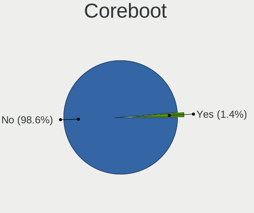

| Used | Notebooks | Percent |
|------|-----------|---------|
| No   | 48        | 97.96%  |
| Yes  | 1         | 2.04%   |

RAM Size
--------

Total RAM memory

| Size in GB | Notebooks | Percent |
|------------|-----------|---------|
| 4.01-8.0   | 25        | 51.02%  |
| 3.01-4.0   | 7         | 14.29%  |
| 16.01-24.0 | 5         | 10.2%   |
| 32.01-64.0 | 3         | 6.12%   |
| 1.01-2.0   | 3         | 6.12%   |
| 8.01-16.0  | 3         | 6.12%   |
| 24.01-32.0 | 1         | 2.04%   |
| 2.01-3.0   | 1         | 2.04%   |
| 0.51-1.0   | 1         | 2.04%   |

RAM Used
--------

Used RAM memory

| Used GB   | Notebooks | Percent |
|-----------|-----------|---------|
| 1.01-2.0  | 13        | 25%     |
| 2.01-3.0  | 11        | 21.15%  |
| 4.01-8.0  | 9         | 17.31%  |
| 3.01-4.0  | 9         | 17.31%  |
| 0.51-1.0  | 8         | 15.38%  |
| 8.01-16.0 | 1         | 1.92%   |
| 0.01-0.5  | 1         | 1.92%   |

Total Drives
------------

Number of drives on board

| Drives | Notebooks | Percent |
|--------|-----------|---------|
| 1      | 37        | 74%     |
| 2      | 11        | 22%     |
| 3      | 2         | 4%      |

Has CD-ROM
----------

Has CD-ROM on board

| Presented | Notebooks | Percent |
|-----------|-----------|---------|
| No        | 26        | 53.06%  |
| Yes       | 23        | 46.94%  |

Has Ethernet
------------

Has Ethernet on board

| Presented | Notebooks | Percent |
|-----------|-----------|---------|
| Yes       | 47        | 95.92%  |
| No        | 2         | 4.08%   |

Has WiFi
--------

Has WiFi module

| Presented | Notebooks | Percent |
|-----------|-----------|---------|
| Yes       | 49        | 100%    |

Has Bluetooth
-------------

Has Bluetooth module

| Presented | Notebooks | Percent |
|-----------|-----------|---------|
| Yes       | 35        | 71.43%  |
| No        | 14        | 28.57%  |

Location
--------

Country
-------

Geographic location (country)

| Country    | Notebooks | Percent |
|------------|-----------|---------|
| Russia     | 7         | 14.29%  |
| USA        | 5         | 10.2%   |
| UK         | 3         | 6.12%   |
| Poland     | 3         | 6.12%   |
| France     | 3         | 6.12%   |
| China      | 3         | 6.12%   |
| Ukraine    | 2         | 4.08%   |
| Spain      | 2         | 4.08%   |
| Japan      | 2         | 4.08%   |
| Brazil     | 2         | 4.08%   |
| Australia  | 2         | 4.08%   |
| Portugal   | 1         | 2.04%   |
| Mexico     | 1         | 2.04%   |
| Kazakhstan | 1         | 2.04%   |
| Israel     | 1         | 2.04%   |
| Ireland    | 1         | 2.04%   |
| Iran       | 1         | 2.04%   |
| Greece     | 1         | 2.04%   |
| Germany    | 1         | 2.04%   |
| Finland    | 1         | 2.04%   |
| Croatia    | 1         | 2.04%   |
| Chile      | 1         | 2.04%   |
| Canada     | 1         | 2.04%   |
| Bulgaria   | 1         | 2.04%   |
| Argentina  | 1         | 2.04%   |
| Algeria    | 1         | 2.04%   |

City
----

Geographic location (city)

| City             | Notebooks | Percent |
|------------------|-----------|---------|
| Moscow           | 4         | 8%      |
| Melbourne        | 2         | 4%      |
| Guangzhou        | 2         | 4%      |
| Zagreb           | 1         | 2%      |
| West Chester     | 1         | 2%      |
| Toyama           | 1         | 2%      |
| Toronto          | 1         | 2%      |
| Tehran           | 1         | 2%      |
| Shakhovskaya     | 1         | 2%      |
| S??o Paulo       | 1         | 2%      |
| Santiago         | 1         | 2%      |
| Salt Lake City   | 1         | 2%      |
| Rzesz??w         | 1         | 2%      |
| Rostov-on-Don    | 1         | 2%      |
| Paris            | 1         | 2%      |
| Nur-Sultan       | 1         | 2%      |
| Novi Iskar       | 1         | 2%      |
| Ningbo           | 1         | 2%      |
| Mykolayiv        | 1         | 2%      |
| Molina de Segura | 1         | 2%      |
| Milwaukee        | 1         | 2%      |
| Mexico City      | 1         | 2%      |
| Manchester       | 1         | 2%      |
| Maidenhead       | 1         | 2%      |
| Lyubertsy        | 1         | 2%      |
| Los ??ngeles     | 1         | 2%      |
| Lodz             | 1         | 2%      |
| Lisbon           | 1         | 2%      |
| Langenhagen      | 1         | 2%      |
| Kyiv             | 1         | 2%      |
| Krasnodar        | 1         | 2%      |
| Itoshima-shi     | 1         | 2%      |
| Helsinki         | 1         | 2%      |
| Haifa            | 1         | 2%      |
| Guyancourt       | 1         | 2%      |
| Gdansk           | 1         | 2%      |
| el Pertus        | 1         | 2%      |
| Dublin           | 1         | 2%      |
| Constantine      | 1         | 2%      |
| Buenos Aires     | 1         | 2%      |
| Borough Green    | 1         | 2%      |
| Athens           | 1         | 2%      |
| Ashburn          | 1         | 2%      |
| Alcobendas       | 1         | 2%      |
| Albuquerque      | 1         | 2%      |

Drives
------

Drive Vendor
------------

Hard drive vendors

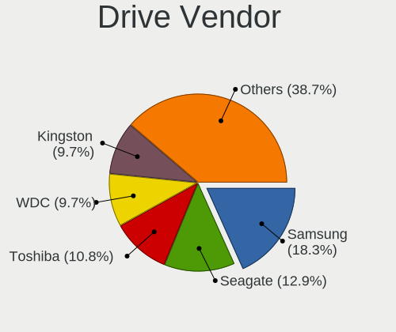

| Vendor              | Notebooks | Drives | Percent |
|---------------------|-----------|--------|---------|
| Samsung Electronics | 12        | 15     | 19.05%  |
| Toshiba             | 9         | 10     | 14.29%  |
| Seagate             | 9         | 10     | 14.29%  |
| Kingston            | 7         | 7      | 11.11%  |
| WDC                 | 4         | 4      | 6.35%   |
| Intel               | 3         | 3      | 4.76%   |
| Hitachi             | 3         | 3      | 4.76%   |
| Unknown             | 2         | 2      | 3.17%   |
| StoreJet            | 2         | 2      | 3.17%   |
| SK Hynix            | 2         | 2      | 3.17%   |
| Micron Technology   | 2         | 2      | 3.17%   |
| SPCC                | 1         | 2      | 1.59%   |
| Smartbuy            | 1         | 1      | 1.59%   |
| SanDisk             | 1         | 1      | 1.59%   |
| OCZ                 | 1         | 2      | 1.59%   |
| LITEONIT            | 1         | 1      | 1.59%   |
| GOODRAM             | 1         | 1      | 1.59%   |
| Fujitsu             | 1         | 1      | 1.59%   |
| Crucial             | 1         | 1      | 1.59%   |

Drive Model
-----------

Hard drive models

| Model                                    | Notebooks | Percent |
|------------------------------------------|-----------|---------|
| Kingston SA400S37240G 240GB SSD          | 3         | 4.69%   |
| Toshiba TR200 240GB SSD                  | 2         | 3.13%   |
| StoreJet Transcend 512GB                 | 2         | 3.13%   |
| Seagate BUP Slim 1TB                     | 2         | 3.13%   |
| WDC WD7500BPKX-00HPJT0 752GB             | 1         | 1.56%   |
| WDC WD5000BEVT-80A0RT0 500GB             | 1         | 1.56%   |
| WDC WD10JPCX-24UE4T0 1TB                 | 1         | 1.56%   |
| WDC PC SN520 SDAPNUW-256G-1006 256GB     | 1         | 1.56%   |
| Unknown SDC  4GB                         | 1         | 1.56%   |
| Unknown SD32G  32GB                      | 1         | 1.56%   |
| Toshiba THNSNC128GMMJ 128GB SSD          | 1         | 1.56%   |
| Toshiba MQ04ABF100 1TB                   | 1         | 1.56%   |
| Toshiba MQ01ABF050 500GB                 | 1         | 1.56%   |
| Toshiba MQ01ABD100 1TB                   | 1         | 1.56%   |
| Toshiba MQ01ABD050 500GB                 | 1         | 1.56%   |
| Toshiba MK8032GSX 80GB                   | 1         | 1.56%   |
| Toshiba MK5061GSY 500GB                  | 1         | 1.56%   |
| SPCC Solid State Disk 256GB              | 1         | 1.56%   |
| Smartbuy SSD 120GB                       | 1         | 1.56%   |
| SK Hynix SH920 2.5 7MM 256GB SSD         | 1         | 1.56%   |
| SK Hynix SC210 mSATA 256GB SSD           | 1         | 1.56%   |
| Seagate ST980813ASG 80GB                 | 1         | 1.56%   |
| Seagate ST9320328CS 320GB                | 1         | 1.56%   |
| Seagate ST9320325AS 320GB                | 1         | 1.56%   |
| Seagate ST9120823AS 120GB                | 1         | 1.56%   |
| Seagate ST750LM022 HN-M750MBB 752GB      | 1         | 1.56%   |
| Seagate ST500LT012-1DG142 500GB          | 1         | 1.56%   |
| Seagate ST1000LM024 HN-M101MBB 1TB       | 1         | 1.56%   |
| SanDisk SD8SN8U-128G-1006 128GB SSD      | 1         | 1.56%   |
| Samsung SSD SM871 2.5 7mm 512GB          | 1         | 1.56%   |
| Samsung SSD 860 EVO M.2 500GB            | 1         | 1.56%   |
| Samsung SSD 860 EVO 500GB                | 1         | 1.56%   |
| Samsung SSD 860 EVO 250GB                | 1         | 1.56%   |
| Samsung SSD 860 EVO 1TB                  | 1         | 1.56%   |
| Samsung SSD 850 EVO 500GB                | 1         | 1.56%   |
| Samsung SSD 840 Series 250GB             | 1         | 1.56%   |
| Samsung NVMe SSD Drive 512GB             | 1         | 1.56%   |
| Samsung MZVLB1T0HBLR-000L7 1TB           | 1         | 1.56%   |
| Samsung MZVLB1T0 1TB                     | 1         | 1.56%   |
| Samsung MZNLN256HMHQ-00000 256GB SSD     | 1         | 1.56%   |
| Samsung MZ7TE512HMHP-000L1 512GB SSD     | 1         | 1.56%   |
| Samsung HM160HC 160GB                    | 1         | 1.56%   |
| OCZ D2CSTK181M11-0180 180GB SSD          | 1         | 1.56%   |
| Micron MTFDDAK256MAY-1AH1ZABHA 256GB SSD | 1         | 1.56%   |
| Micron 1100 SATA 256GB SSD               | 1         | 1.56%   |
| LITEONIT LSS-16L6G-HP 16GB SSD           | 1         | 1.56%   |
| Kingston SV300S37A120G 120GB SSD         | 1         | 1.56%   |
| Kingston SUV400S37480G 480GB SSD         | 1         | 1.56%   |
| Kingston SKC300S37A240G 240GB SSD        | 1         | 1.56%   |
| Kingston RBUSNS8154P3512GJ 512GB         | 1         | 1.56%   |
| Intel SSDSC2KW240H6 240GB                | 1         | 1.56%   |
| Intel SSDSC2KW180H6 180GB                | 1         | 1.56%   |
| Intel SSDPEKKF256G8L 256GB               | 1         | 1.56%   |
| Hitachi HTS727575A9E364 752GB            | 1         | 1.56%   |
| Hitachi HTS723232A7A364 320GB            | 1         | 1.56%   |
| Hitachi HTS541680J9SA00 80GB             | 1         | 1.56%   |
| GOODRAM SSDPR-CL100-480-G2 480GB         | 1         | 1.56%   |
| Fujitsu MJA2250BH FFS G1 250GB           | 1         | 1.56%   |
| Crucial CT480M500SSD1 480GB              | 1         | 1.56%   |

HDD Vendor
----------

Hard disk drive vendors

| Vendor              | Notebooks | Drives | Percent |
|---------------------|-----------|--------|---------|
| Seagate             | 9         | 10     | 39.13%  |
| Toshiba             | 6         | 6      | 26.09%  |
| WDC                 | 3         | 3      | 13.04%  |
| Hitachi             | 3         | 3      | 13.04%  |
| Samsung Electronics | 1         | 1      | 4.35%   |
| Fujitsu             | 1         | 1      | 4.35%   |

SSD Vendor
----------

Solid state drive vendors

| Vendor              | Notebooks | Drives | Percent |
|---------------------|-----------|--------|---------|
| Samsung Electronics | 9         | 9      | 27.27%  |
| Kingston            | 6         | 6      | 18.18%  |
| Toshiba             | 3         | 4      | 9.09%   |
| StoreJet            | 2         | 2      | 6.06%   |
| SK Hynix            | 2         | 2      | 6.06%   |
| Micron Technology   | 2         | 2      | 6.06%   |
| Intel               | 2         | 2      | 6.06%   |
| SPCC                | 1         | 2      | 3.03%   |
| Smartbuy            | 1         | 1      | 3.03%   |
| SanDisk             | 1         | 1      | 3.03%   |
| OCZ                 | 1         | 2      | 3.03%   |
| LITEONIT            | 1         | 1      | 3.03%   |
| GOODRAM             | 1         | 1      | 3.03%   |
| Crucial             | 1         | 1      | 3.03%   |

Drive Kind
----------

HDD or SSD

| Kind | Notebooks | Drives | Percent |
|------|-----------|--------|---------|
| SSD  | 30        | 36     | 50%     |
| HDD  | 23        | 24     | 38.33%  |
| NVMe | 5         | 8      | 8.33%   |
| MMC  | 2         | 2      | 3.33%   |

Drive Connector
---------------

SATA, SAS, NVMe, etc.

| Type | Notebooks | Drives | Percent |
|------|-----------|--------|---------|
| SATA | 44        | 56     | 80%     |
| NVMe | 5         | 8      | 9.09%   |
| SAS  | 4         | 4      | 7.27%   |
| MMC  | 2         | 2      | 3.64%   |

Drive Size
----------

Size of hard drive

| Size in TB | Notebooks | Drives | Percent |
|------------|-----------|--------|---------|
| 0.01-0.5   | 37        | 46     | 72.55%  |
| 0.51-1.0   | 14        | 14     | 27.45%  |

Space Total
-----------

Amount of disk space available on the file system

| Size in GB | Notebooks | Percent |
|------------|-----------|---------|
| 101-250    | 16        | 31.37%  |
| 251-500    | 12        | 23.53%  |
| 51-100     | 8         | 15.69%  |
| 501-1000   | 7         | 13.73%  |
| 1001-2000  | 4         | 7.84%   |
| 21-50      | 3         | 5.88%   |
| 1-20       | 1         | 1.96%   |

Space Used
----------

Amount of used disk space

| Used GB   | Notebooks | Percent |
|-----------|-----------|---------|
| 1-20      | 20        | 40.82%  |
| 251-500   | 8         | 16.33%  |
| 101-250   | 7         | 14.29%  |
| 21-50     | 5         | 10.2%   |
| 51-100    | 5         | 10.2%   |
| 501-1000  | 3         | 6.12%   |
| 1001-2000 | 1         | 2.04%   |

Malfunc. Drives
---------------

Drive models with a malfunction

| Model                                               | Notebooks | Drives | Percent |
|-----------------------------------------------------|-----------|--------|---------|
| WDC WD10JPCX-24UE4T0 1TB                            | 1         | 1      | 7.69%   |
| Toshiba MQ04ABF100 1TB                              | 1         | 1      | 7.69%   |
| Toshiba MK8032GSX 80GB                              | 1         | 1      | 7.69%   |
| Smartbuy SSD 120GB                                  | 1         | 1      | 7.69%   |
| SK Hynix SC210 mSATA 256GB SSD                      | 1         | 1      | 7.69%   |
| Micron Technology MTFDDAK256MAY-1AH1ZABHA 256GB SSD | 1         | 1      | 7.69%   |
| Micron Technology 1100 SATA 256GB SSD               | 1         | 1      | 7.69%   |
| LITEONIT LSS-16L6G-HP 16GB SSD                      | 1         | 1      | 7.69%   |
| Intel SSDSC2KW240H6 240GB                           | 1         | 1      | 7.69%   |
| Intel SSDSC2KW180H6 180GB                           | 1         | 1      | 7.69%   |
| Hitachi HTS727575A9E364 752GB                       | 1         | 1      | 7.69%   |
| Hitachi HTS541680J9SA00 80GB                        | 1         | 1      | 7.69%   |
| Crucial CT480M500SSD1 480GB                         | 1         | 1      | 7.69%   |

Malfunc. Drive Vendor
---------------------

Vendors of faulty drives

| Vendor            | Notebooks | Drives | Percent |
|-------------------|-----------|--------|---------|
| Toshiba           | 2         | 2      | 15.38%  |
| Micron Technology | 2         | 2      | 15.38%  |
| Intel             | 2         | 2      | 15.38%  |
| Hitachi           | 2         | 2      | 15.38%  |
| WDC               | 1         | 1      | 7.69%   |
| Smartbuy          | 1         | 1      | 7.69%   |
| SK Hynix          | 1         | 1      | 7.69%   |
| LITEONIT          | 1         | 1      | 7.69%   |
| Crucial           | 1         | 1      | 7.69%   |

Malfunc. HDD Vendor
-------------------

Vendors of faulty HDD drives

| Vendor  | Notebooks | Drives | Percent |
|---------|-----------|--------|---------|
| Toshiba | 2         | 2      | 40%     |
| Hitachi | 2         | 2      | 40%     |
| WDC     | 1         | 1      | 20%     |

Malfunc. Drive Kind
-------------------

Kinds of faulty drives

| Kind | Notebooks | Drives | Percent |
|------|-----------|--------|---------|
| SSD  | 8         | 8      | 61.54%  |
| HDD  | 5         | 5      | 38.46%  |

Failed Drives
-------------

Failed drive models

Zero info for selected period =(

Failed Drive Vendor
-------------------

Failed drive vendors

Zero info for selected period =(

Drive Status
------------

Number of failed and malfunc. drives

| Status   | Notebooks | Drives | Percent |
|----------|-----------|--------|---------|
| Works    | 22        | 31     | 42.31%  |
| Detected | 18        | 26     | 34.62%  |
| Malfunc  | 12        | 13     | 23.08%  |

Storage controller
------------------

Storage Vendor
--------------

Storage controller vendors

| Vendor                           | Notebooks | Percent |
|----------------------------------|-----------|---------|
| Intel                            | 43        | 86%     |
| Samsung Electronics              | 2         | 4%      |
| Silicon Integrated Systems [SiS] | 1         | 2%      |
| Sandisk                          | 1         | 2%      |
| Nvidia                           | 1         | 2%      |
| Kingston Technology Company      | 1         | 2%      |
| AMD                              | 1         | 2%      |

Storage Model
-------------

Storage controller models

| Model                                                                                  | Notebooks | Percent |
|----------------------------------------------------------------------------------------|-----------|---------|
| Intel 82801 Mobile SATA Controller [RAID mode]                                         | 7         | 12.28%  |
| Intel 8 Series SATA Controller 1 [AHCI mode]                                           | 5         | 8.77%   |
| Intel Sunrise Point-LP SATA Controller [AHCI mode]                                     | 4         | 7.02%   |
| Intel 7 Series Chipset Family 6-port SATA Controller [AHCI mode]                       | 4         | 7.02%   |
| Intel 6 Series/C200 Series Chipset Family 6 port Mobile SATA AHCI Controller           | 4         | 7.02%   |
| Intel 82801IBM/IEM (ICH9M/ICH9M-E) 4 port SATA Controller [AHCI mode]                  | 3         | 5.26%   |
| Intel 8 Series/C220 Series Chipset Family 6-port SATA Controller 1 [AHCI mode]         | 3         | 5.26%   |
| Intel 5 Series/3400 Series Chipset 6 port SATA AHCI Controller                         | 3         | 5.26%   |
| Intel 82801HM/HEM (ICH8M/ICH8M-E) SATA Controller [AHCI mode]                          | 2         | 3.51%   |
| Intel 82801HM/HEM (ICH8M/ICH8M-E) IDE Controller                                       | 2         | 3.51%   |
| Silicon Integrated Systems [SiS] 5513 IDE Controller                                   | 1         | 1.75%   |
| Sandisk WD Blue SN500 / PC SN520 NVMe SSD                                              | 1         | 1.75%   |
| Samsung NVMe SSD Controller SM981/PM981/PM983                                          | 1         | 1.75%   |
| Samsung NVMe SSD Controller SM961/PM961/SM963                                          | 1         | 1.75%   |
| Nvidia MCP79 SATA Controller                                                           | 1         | 1.75%   |
| Kingston Company U-SNS8154P3 NVMe SSD                                                  | 1         | 1.75%   |
| Intel SSD Pro 7600p/760p/E 6100p Series                                                | 1         | 1.75%   |
| Intel Q170/Q150/B150/H170/H110/Z170/CM236 Chipset SATA Controller [AHCI Mode]          | 1         | 1.75%   |
| Intel Mobile PM965/GM965 PT IDER Controller                                            | 1         | 1.75%   |
| Intel Mobile 4 Series Chipset PT IDER Controller                                       | 1         | 1.75%   |
| Intel HM170/QM170 Chipset SATA Controller [AHCI Mode]                                  | 1         | 1.75%   |
| Intel Cannon Lake Mobile PCH SATA AHCI Controller                                      | 1         | 1.75%   |
| Intel Atom/Celeron/Pentium Processor x5-E8000/J3xxx/N3xxx Series SATA Controller       | 1         | 1.75%   |
| Intel 82801GBM/GHM (ICH7-M Family) SATA Controller [IDE mode]                          | 1         | 1.75%   |
| Intel 82801G (ICH7 Family) IDE Controller                                              | 1         | 1.75%   |
| Intel 6 Series/C200 Series Chipset Family Mobile SATA Controller (IDE mode, ports 4-5) | 1         | 1.75%   |
| Intel 6 Series/C200 Series Chipset Family Mobile SATA Controller (IDE mode, ports 0-3) | 1         | 1.75%   |
| Intel 5 Series/3400 Series Chipset 4 port SATA AHCI Controller                         | 1         | 1.75%   |
| AMD IXP SB4x0 Serial ATA Controller                                                    | 1         | 1.75%   |
| AMD IXP SB4x0 IDE Controller                                                           | 1         | 1.75%   |

Storage Kind
------------

Kind of storage controller (IDE, SATA, NVMe, SAS, ...)

| Kind | Notebooks | Percent |
|------|-----------|---------|
| SATA | 33        | 62.26%  |
| IDE  | 8         | 15.09%  |
| RAID | 7         | 13.21%  |
| NVMe | 5         | 9.43%   |

Processor
---------

CPU Vendor
----------

Processor vendors

| Vendor | Notebooks | Percent |
|--------|-----------|---------|
| Intel  | 49        | 100%    |

CPU Model
---------

Processor models

| Model                                | Notebooks | Percent |
|--------------------------------------|-----------|---------|
| Intel Core i5-2520M CPU @ 2.50GHz    | 3         | 6.12%   |
| Intel Core i7-8550U CPU @ 1.80GHz    | 2         | 4.08%   |
| Intel Core i5-7200U CPU @ 2.50GHz    | 2         | 4.08%   |
| Intel Core i5 CPU M 560 @ 2.67GHz    | 2         | 4.08%   |
| Intel Core i3-3120M CPU @ 2.50GHz    | 2         | 4.08%   |
| Intel Core i3-2330M CPU @ 2.20GHz    | 2         | 4.08%   |
| Intel Core 2 Duo CPU P8600 @ 2.40GHz | 2         | 4.08%   |
| Intel Pentium CPU N3700 @ 1.60GHz    | 1         | 2.04%   |
| Intel Pentium 4 CPU 2.00GHz          | 1         | 2.04%   |
| Intel Genuine CPU T2060 @ 1.60GHz    | 1         | 2.04%   |
| Intel Genuine CPU T2050 @ 1.60GHz    | 1         | 2.04%   |
| Intel Core i9-9880H CPU @ 2.30GHz    | 1         | 2.04%   |
| Intel Core i7-8750H CPU @ 2.20GHz    | 1         | 2.04%   |
| Intel Core i7-7700HQ CPU @ 2.80GHz   | 1         | 2.04%   |
| Intel Core i7-6820HQ CPU @ 2.70GHz   | 1         | 2.04%   |
| Intel Core i7-6500U CPU @ 2.50GHz    | 1         | 2.04%   |
| Intel Core i7-4800MQ CPU @ 2.70GHz   | 1         | 2.04%   |
| Intel Core i7-4700MQ CPU @ 2.40GHz   | 1         | 2.04%   |
| Intel Core i7-4610M CPU @ 3.00GHz    | 1         | 2.04%   |
| Intel Core i7-3520M CPU @ 2.90GHz    | 1         | 2.04%   |
| Intel Core i7-2670QM CPU @ 2.20GHz   | 1         | 2.04%   |
| Intel Core i7-2620M CPU @ 2.70GHz    | 1         | 2.04%   |
| Intel Core i7 CPU Q 840 @ 1.87GHz    | 1         | 2.04%   |
| Intel Core i5-8365U CPU @ 1.60GHz    | 1         | 2.04%   |
| Intel Core i5-8250U CPU @ 1.60GHz    | 1         | 2.04%   |
| Intel Core i5-7300HQ CPU @ 2.50GHz   | 1         | 2.04%   |
| Intel Core i5-5300U CPU @ 2.30GHz    | 1         | 2.04%   |
| Intel Core i5-4300M CPU @ 2.60GHz    | 1         | 2.04%   |
| Intel Core i5-4210U CPU @ 1.70GHz    | 1         | 2.04%   |
| Intel Core i5-4200U CPU @ 1.60GHz    | 1         | 2.04%   |
| Intel Core i3-6100U CPU @ 2.30GHz    | 1         | 2.04%   |
| Intel Core i3-4010U CPU @ 1.70GHz    | 1         | 2.04%   |
| Intel Core i3-3217U CPU @ 1.80GHz    | 1         | 2.04%   |
| Intel Core i3-2350M CPU @ 2.30GHz    | 1         | 2.04%   |
| Intel Core i3 CPU M 370 @ 2.40GHz    | 1         | 2.04%   |
| Intel Core 2 Duo CPU T9300 @ 2.50GHz | 1         | 2.04%   |
| Intel Core 2 Duo CPU P8700 @ 2.53GHz | 1         | 2.04%   |
| Intel Core 2 Duo CPU P8400 @ 2.26GHz | 1         | 2.04%   |
| Intel Core 2 Duo CPU L7500 @ 1.60GHz | 1         | 2.04%   |
| Intel Celeron 2957U @ 1.40GHz        | 1         | 2.04%   |
| Intel Celeron 2955U @ 1.40GHz        | 1         | 2.04%   |

CPU Model Family
----------------

Processor model prefix

| Model            | Notebooks | Percent |
|------------------|-----------|---------|
| Intel Core i5    | 14        | 28.57%  |
| Intel Core i7    | 13        | 26.53%  |
| Intel Core i3    | 9         | 18.37%  |
| Intel Core 2 Duo | 6         | 12.24%  |
| Intel Genuine    | 2         | 4.08%   |
| Intel Celeron    | 2         | 4.08%   |
| Intel Pentium 4  | 1         | 2.04%   |
| Intel Pentium    | 1         | 2.04%   |
| Intel Core i9    | 1         | 2.04%   |

CPU Cores
---------

Number of processor cores

| Number | Notebooks | Percent |
|--------|-----------|---------|
| 2      | 34        | 69.39%  |
| 4      | 12        | 24.49%  |
| 8      | 1         | 2.04%   |
| 6      | 1         | 2.04%   |
| 1      | 1         | 2.04%   |

CPU Sockets
-----------

Number of sockets

| Number | Notebooks | Percent |
|--------|-----------|---------|
| 1      | 49        | 100%    |

CPU Threads
-----------

Threads per core (Hyper-Threading)

| Number | Notebooks | Percent |
|--------|-----------|---------|
| 2      | 36        | 73.47%  |
| 1      | 13        | 26.53%  |

CPU Op-Modes
------------

CPU Operation Modes (32-bit, 64-bit)

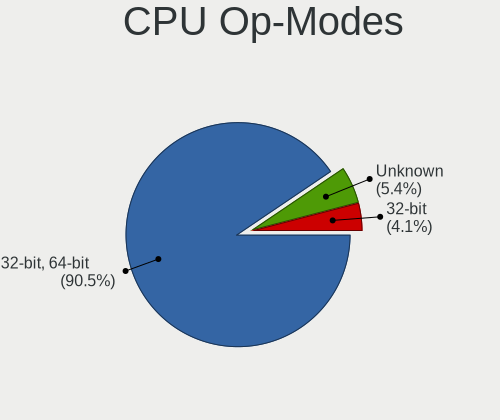

| Op mode        | Notebooks | Percent |
|----------------|-----------|---------|
| 32-bit, 64-bit | 42        | 85.71%  |
| Unknown        | 4         | 8.16%   |
| 32-bit         | 3         | 6.12%   |

CPU Microcode
-------------

Microcode number

| Number  | Notebooks | Percent |
|---------|-----------|---------|
| 0x206a7 | 8         | 16%     |
| 0x40651 | 5         | 10%     |
| 0x306c3 | 4         | 8%      |
| 0x306a9 | 4         | 8%      |
| 0x806ea | 3         | 6%      |
| 0x20655 | 3         | 6%      |
| 0x1067a | 3         | 6%      |
| 0x906e9 | 2         | 4%      |
| 0x806e9 | 2         | 4%      |
| 0x10676 | 2         | 4%      |
| Unknown | 2         | 4%      |
| 0xf24   | 1         | 2%      |
| 0x906ed | 1         | 2%      |
| 0x906ea | 1         | 2%      |
| 0x806ec | 1         | 2%      |
| 0x6fb   | 1         | 2%      |
| 0x6ec   | 1         | 2%      |
| 0x6e8   | 1         | 2%      |
| 0x506e3 | 1         | 2%      |
| 0x406e3 | 1         | 2%      |
| 0x406c3 | 1         | 2%      |
| 0x306d4 | 1         | 2%      |
| 0x106e5 | 1         | 2%      |

CPU Microarch
-------------

Microarchitecture

| Name        | Notebooks | Percent |
|-------------|-----------|---------|
| KabyLake    | 10        | 20.41%  |
| Haswell     | 9         | 18.37%  |
| SandyBridge | 8         | 16.33%  |
| Penryn      | 5         | 10.2%   |
| IvyBridge   | 4         | 8.16%   |
| Westmere    | 3         | 6.12%   |
| Skylake     | 3         | 6.12%   |
| P6          | 2         | 4.08%   |
| Silvermont  | 1         | 2.04%   |
| NetBurst    | 1         | 2.04%   |
| Nehalem     | 1         | 2.04%   |
| Core        | 1         | 2.04%   |
| Broadwell   | 1         | 2.04%   |

Graphics
--------

GPU Vendor
----------

Vendors of graphics cards

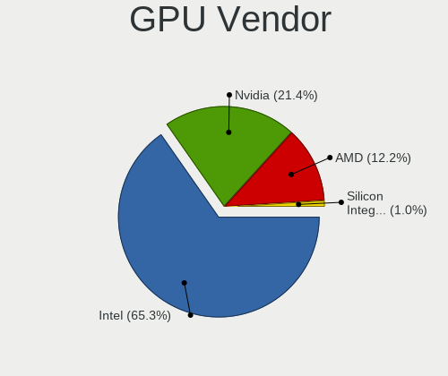

| Vendor                           | Notebooks | Percent |
|----------------------------------|-----------|---------|
| Intel                            | 41        | 64.06%  |
| Nvidia                           | 13        | 20.31%  |
| AMD                              | 9         | 14.06%  |
| Silicon Integrated Systems [SiS] | 1         | 1.56%   |

GPU Model
---------

Graphics card models

| Model                                                                                    | Notebooks | Percent |
|------------------------------------------------------------------------------------------|-----------|---------|
| Intel 2nd Generation Core Processor Family Integrated Graphics Controller                | 6         | 8.96%   |
| Intel Haswell-ULT Integrated Graphics Controller                                         | 5         | 7.46%   |
| Intel 3rd Gen Core processor Graphics Controller                                         | 4         | 5.97%   |
| Intel UHD Graphics 620                                                                   | 3         | 4.48%   |
| Intel Mobile 4 Series Chipset Integrated Graphics Controller                             | 3         | 4.48%   |
| Intel Core Processor Integrated Graphics Controller                                      | 3         | 4.48%   |
| Intel 4th Gen Core Processor Integrated Graphics Controller                              | 3         | 4.48%   |
| Intel Skylake GT2 [HD Graphics 520]                                                      | 2         | 2.99%   |
| Intel Mobile GM965/GL960 Integrated Graphics Controller (secondary)                      | 2         | 2.99%   |
| Intel Mobile GM965/GL960 Integrated Graphics Controller (primary)                        | 2         | 2.99%   |
| Intel HD Graphics 630                                                                    | 2         | 2.99%   |
| Intel HD Graphics 620                                                                    | 2         | 2.99%   |
| Intel CoffeeLake-H GT2 [UHD Graphics 630]                                                | 2         | 2.99%   |
| AMD Sun XT [Radeon HD 8670A/8670M/8690M / R5 M330 / M430 / Radeon 520 Mobile]            | 2         | 2.99%   |
| AMD Seymour [Radeon HD 6400M/7400M Series]                                               | 2         | 2.99%   |
| Silicon Integrated Systems [SiS] 65x/M650/740 PCI/AGP VGA Display Adapter                | 1         | 1.49%   |
| Nvidia TU116M [GeForce GTX 1660 Ti Mobile]                                               | 1         | 1.49%   |
| Nvidia TU104GLM [Quadro RTX 4000 Mobile / Max-Q]                                         | 1         | 1.49%   |
| Nvidia GT218M [GeForce 310M]                                                             | 1         | 1.49%   |
| Nvidia GP107M [GeForce GTX 1050 Mobile]                                                  | 1         | 1.49%   |
| Nvidia GP106M [GeForce GTX 1060 Mobile]                                                  | 1         | 1.49%   |
| Nvidia GM108M [GeForce MX110]                                                            | 1         | 1.49%   |
| Nvidia GM107GLM [Quadro M1000M]                                                          | 1         | 1.49%   |
| Nvidia GK208M [GeForce GT 740M]                                                          | 1         | 1.49%   |
| Nvidia GK107M [GeForce GT 750M]                                                          | 1         | 1.49%   |
| Nvidia GK107M [GeForce 810M]                                                             | 1         | 1.49%   |
| Nvidia GK104GLM [Quadro K3100M]                                                          | 1         | 1.49%   |
| Nvidia GF116M [GeForce GT 555M/635M]                                                     | 1         | 1.49%   |
| Nvidia C79 [GeForce 9400M]                                                               | 1         | 1.49%   |
| Intel WhiskeyLake-U GT2 [UHD Graphics 620]                                               | 1         | 1.49%   |
| Intel Mobile 945GM/GMS/GME, 943/940GML Express Integrated Graphics Controller            | 1         | 1.49%   |
| Intel Mobile 945GM/GMS, 943/940GML Express Integrated Graphics Controller                | 1         | 1.49%   |
| Intel HD Graphics 5500                                                                   | 1         | 1.49%   |
| Intel Atom/Celeron/Pentium Processor x5-E8000/J3xxx/N3xxx Integrated Graphics Controller | 1         | 1.49%   |
| AMD Whistler [Radeon HD 6730M/6770M/7690M XT]                                            | 1         | 1.49%   |
| AMD Whistler [Radeon HD 6630M/6650M/6750M/7670M/7690M]                                   | 1         | 1.49%   |
| AMD Topaz XT [Radeon R7 M260/M265 / M340/M360 / M440/M445 / 530/535 / 620/625 Mobile]    | 1         | 1.49%   |
| AMD RC410M [Mobility Radeon Xpress 200M]                                                 | 1         | 1.49%   |
| AMD Madison [Mobility Radeon HD 5730 / 6570M]                                            | 1         | 1.49%   |

GPU Combo
---------

Combinations of graphics cards

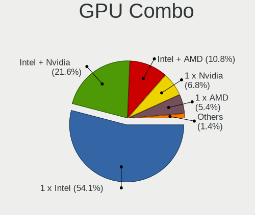

| Name           | Notebooks | Percent |
|----------------|-----------|---------|
| 1 x Intel      | 26        | 53.06%  |
| Intel + Nvidia | 9         | 18.37%  |
| Intel + AMD    | 6         | 12.24%  |
| 1 x Nvidia     | 4         | 8.16%   |
| 1 x AMD        | 3         | 6.12%   |
| 1 x SiS        | 1         | 2.04%   |

GPU Driver
----------

Free vs proprietary

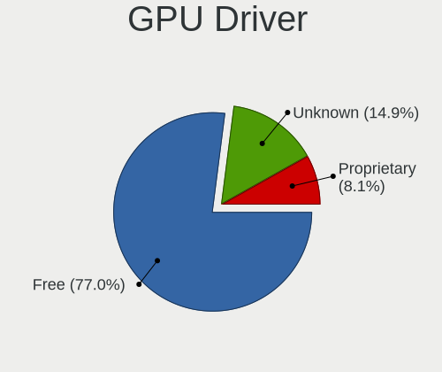

| Driver      | Notebooks | Percent |
|-------------|-----------|---------|
| Free        | 42        | 85.71%  |
| Proprietary | 4         | 8.16%   |
| Unknown     | 3         | 6.12%   |

GPU Memory
----------

Total video memory

| Size in GB | Notebooks | Percent |
|------------|-----------|---------|
| Unknown    | 29        | 59.18%  |
| 1.01-2.0   | 7         | 14.29%  |
| 0.51-1.0   | 7         | 14.29%  |
| 3.01-4.0   | 2         | 4.08%   |
| 0.01-0.5   | 2         | 4.08%   |
| 5.01-6.0   | 1         | 2.04%   |
| 2.01-3.0   | 1         | 2.04%   |

Monitor
-------

Monitor Vendor
--------------

Monitor vendors

| Vendor              | Notebooks | Percent |
|---------------------|-----------|---------|
| LG Display          | 10        | 16.67%  |
| Chimei Innolux      | 9         | 15%     |
| AU Optronics        | 9         | 15%     |
| Samsung Electronics | 7         | 11.67%  |
| Lenovo              | 5         | 8.33%   |
| Dell                | 4         | 6.67%   |
| BOE                 | 3         | 5%      |
| Acer                | 3         | 5%      |
| InnoLux Display     | 2         | 3.33%   |
| Goldstar            | 2         | 3.33%   |
| Sony                | 1         | 1.67%   |
| Sharp               | 1         | 1.67%   |
| MIT                 | 1         | 1.67%   |
| LG Philips          | 1         | 1.67%   |
| Hewlett-Packard     | 1         | 1.67%   |
| Apple               | 1         | 1.67%   |

Monitor Model
-------------

Monitor models

| Model                                                                 | Notebooks | Percent |
|-----------------------------------------------------------------------|-----------|---------|
| LG Display LCD Monitor LGD039F 1366x768 345x194mm 15.6-inch           | 2         | 3.28%   |
| InnoLux Display LCD Monitor INL0014 1366x768 309x174mm 14.0-inch      | 2         | 3.28%   |
| Sony TV *02 SNY9403 1920x1080 1218x685mm 55.0-inch                    | 1         | 1.64%   |
| Sharp LCD Monitor SHP144D 3840x2160 276x156mm 12.5-inch               | 1         | 1.64%   |
| Samsung Electronics SA300/SA350 SAM078E 1680x1050 480x270mm 21.7-inch | 1         | 1.64%   |
| Samsung Electronics S24D300 SAM0B43 1920x1080 531x299mm 24.0-inch     | 1         | 1.64%   |
| Samsung Electronics LCD Monitor SEC5441 1366x768 344x194mm 15.5-inch  | 1         | 1.64%   |
| Samsung Electronics LCD Monitor SEC4D45 1280x800 331x207mm 15.4-inch  | 1         | 1.64%   |
| Samsung Electronics LCD Monitor SEC4C42 1280x800 303x190mm 14.1-inch  | 1         | 1.64%   |
| Samsung Electronics LCD Monitor SEC325A 1366x768 344x194mm 15.5-inch  | 1         | 1.64%   |
| Samsung Electronics LCD Monitor SEC3152 1366x768 344x194mm 15.5-inch  | 1         | 1.64%   |
| MIT LCD Monitor MIT2011 3840x2160 1150x650mm 52.0-inch                | 1         | 1.64%   |
| MIT HDMI Analyzer MIT2011 3840x2160 800x450mm 36.1-inch               | 1         | 1.64%   |
| LG Philips LCD Monitor LPLC700 1280x800 331x207mm 15.4-inch           | 1         | 1.64%   |
| LG Display LCD Monitor LGD6616 1366x768 277x156mm 12.5-inch           | 1         | 1.64%   |
| LG Display LCD Monitor LGD0525 1366x768 344x194mm 15.5-inch           | 1         | 1.64%   |
| LG Display LCD Monitor LGD0456 1366x768 344x194mm 15.5-inch           | 1         | 1.64%   |
| LG Display LCD Monitor LGD0450 1366x768 277x156mm 12.5-inch           | 1         | 1.64%   |
| LG Display LCD Monitor LGD03B7 1366x768 309x174mm 14.0-inch           | 1         | 1.64%   |
| LG Display LCD Monitor LGD02FC 1920x1080 380x210mm 17.1-inch          | 1         | 1.64%   |
| LG Display LCD Monitor LGD02D9 1920x1080 350x190mm 15.7-inch          | 1         | 1.64%   |
| LG Display LCD Monitor LGD02C5 1920x1080 380x210mm 17.1-inch          | 1         | 1.64%   |
| Lenovo T24i-10 LEN61A6 1920x1080 527x296mm 23.8-inch                  | 1         | 1.64%   |
| Lenovo LCD Monitor LEN40B1 1600x900 344x194mm 15.5-inch               | 1         | 1.64%   |
| Lenovo LCD Monitor LEN4011 1280x800 261x163mm 12.1-inch               | 1         | 1.64%   |
| Lenovo LCD Monitor LEN4010 1280x800 261x163mm 12.1-inch               | 1         | 1.64%   |
| Lenovo LCD Monitor LEN4000 1024x768 246x185mm 12.1-inch               | 1         | 1.64%   |
| Hewlett-Packard E232 HWP3279 1920x1080 509x286mm 23.0-inch            | 1         | 1.64%   |
| Goldstar W2252 GSM567E 1680x1050 474x296mm 22.0-inch                  | 1         | 1.64%   |
| Goldstar L192WS GSM4B32 1440x900 410x256mm 19.0-inch                  | 1         | 1.64%   |
| Dell U2417H DEL40E7 1920x1080 527x296mm 23.8-inch                     | 1         | 1.64%   |
| Dell P2016 DEL40D0 1440x900 419x262mm 19.5-inch                       | 1         | 1.64%   |
| Dell P170S DEL4058 1280x1024 338x270mm 17.0-inch                      | 1         | 1.64%   |
| Dell 1908FP DEL4025 1280x1024 380x300mm 19.1-inch                     | 1         | 1.64%   |
| Chimei Innolux LCD Monitor CMN15F4 1920x1080 344x193mm 15.5-inch      | 1         | 1.64%   |
| Chimei Innolux LCD Monitor CMN15D6 1920x1080 344x193mm 15.5-inch      | 1         | 1.64%   |
| Chimei Innolux LCD Monitor CMN15D3 1920x1080 344x193mm 15.5-inch      | 1         | 1.64%   |
| Chimei Innolux LCD Monitor CMN15CA 1366x768 340x190mm 15.3-inch       | 1         | 1.64%   |
| Chimei Innolux LCD Monitor CMN15BE 1366x768 340x190mm 15.3-inch       | 1         | 1.64%   |
| Chimei Innolux LCD Monitor CMN14D7 1920x1080 309x173mm 13.9-inch      | 1         | 1.64%   |
| Chimei Innolux LCD Monitor CMN14D4 1920x1080 309x173mm 13.9-inch      | 1         | 1.64%   |
| Chimei Innolux LCD Monitor CMN14A1 1366x768 309x174mm 14.0-inch       | 1         | 1.64%   |
| Chimei Innolux LCD Monitor CMN1482 1600x900 309x174mm 14.0-inch       | 1         | 1.64%   |
| BOE LCD Monitor BOE08A0 1280x800 261x163mm 12.1-inch                  | 1         | 1.64%   |
| BOE LCD Monitor BOE06A9 1920x1080 344x193mm 15.5-inch                 | 1         | 1.64%   |
| BOE LCD Monitor BOE0672 1366x768 344x194mm 15.5-inch                  | 1         | 1.64%   |
| AU Optronics LCD Monitor AUO593D 1920x1080 309x174mm 14.0-inch        | 1         | 1.64%   |
| AU Optronics LCD Monitor AUO42EB 3840x2160 344x193mm 15.5-inch        | 1         | 1.64%   |
| AU Optronics LCD Monitor AUO423D 1920x1080 309x173mm 13.9-inch        | 1         | 1.64%   |
| AU Optronics LCD Monitor AUO38ED 1920x1080 340x190mm 15.3-inch        | 1         | 1.64%   |
| AU Optronics LCD Monitor AUO21EC 1366x768 340x190mm 15.3-inch         | 1         | 1.64%   |
| AU Optronics LCD Monitor AUO133D 1920x1080 309x173mm 13.9-inch        | 1         | 1.64%   |
| AU Optronics LCD Monitor AUO103C 1366x768 310x170mm 13.9-inch         | 1         | 1.64%   |
| AU Optronics LCD Monitor AUO102C 1366x768 290x160mm 13.0-inch         | 1         | 1.64%   |
| AU Optronics LCD Monitor 1920x1080                                    | 1         | 1.64%   |
| Apple LCD Monitor APP9C9F 1280x800 286x179mm 13.3-inch                | 1         | 1.64%   |
| Acer K272HL ACR0523 1920x1080 600x340mm 27.2-inch                     | 1         | 1.64%   |
| Acer E191HQ ACR0062 1366x768 344x194mm 15.5-inch                      | 1         | 1.64%   |
| Acer AL1917 ACR57AD 1280x1024 376x301mm 19.0-inch                     | 1         | 1.64%   |

Monitor Resolution
------------------

Monitor screen resolution

| Resolution         | Notebooks | Percent |
|--------------------|-----------|---------|
| 1366x768 (WXGA)    | 20        | 36.36%  |
| 1920x1080 (FHD)    | 17        | 30.91%  |
| 1280x800 (WXGA)    | 7         | 12.73%  |
| 3840x2160 (4K)     | 3         | 5.45%   |
| 1280x1024 (SXGA)   | 3         | 5.45%   |
| 1600x900 (HD+)     | 2         | 3.64%   |
| 1440x900 (WXGA+)   | 2         | 3.64%   |
| 1680x1050 (WSXGA+) | 1         | 1.82%   |

Monitor Diagonal
----------------

Diagonal size in inches

| Inches  | Notebooks | Percent |
|---------|-----------|---------|
| 15      | 22        | 36.07%  |
| 14      | 7         | 11.48%  |
| 13      | 7         | 11.48%  |
| 12      | 6         | 9.84%   |
| 23      | 4         | 6.56%   |
| 19      | 4         | 6.56%   |
| 17      | 3         | 4.92%   |
| 24      | 2         | 3.28%   |
| 55      | 1         | 1.64%   |
| 52      | 1         | 1.64%   |
| 36      | 1         | 1.64%   |
| 27      | 1         | 1.64%   |
| 21      | 1         | 1.64%   |
| Unknown | 1         | 1.64%   |

Monitor Width
-------------

Physical width

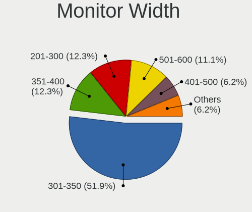

| Width in mm | Notebooks | Percent |
|-------------|-----------|---------|
| 301-350     | 33        | 55%     |
| 201-300     | 8         | 13.33%  |
| 501-600     | 6         | 10%     |
| 351-400     | 5         | 8.33%   |
| 401-500     | 4         | 6.67%   |
| 1001-1500   | 2         | 3.33%   |
| 701-800     | 1         | 1.67%   |
| Unknown     | 1         | 1.67%   |

Aspect Ratio
------------

Proportional relationship between the width and the height

| Ratio   | Notebooks | Percent |
|---------|-----------|---------|
| 16/9    | 37        | 72.55%  |
| 16/10   | 8         | 15.69%  |
| 5/4     | 3         | 5.88%   |
| 3/2     | 2         | 3.92%   |
| Unknown | 1         | 1.96%   |

Monitor Area
------------

Area in inch

| Area in inch | Notebooks | Percent |
|----------------|-----------|---------|
| 101-110        | 22        | 36.67%  |
| 81-90          | 13        | 21.67%  |
| 61-70          | 6         | 10%     |
| 201-250        | 6         | 10%     |
| 151-200        | 4         | 6.67%   |
| More than 1000 | 2         | 3.33%   |
| 121-130        | 2         | 3.33%   |
| 71-80          | 1         | 1.67%   |
| 301-350        | 1         | 1.67%   |
| 141-150        | 1         | 1.67%   |
| 501-1000       | 1         | 1.67%   |
| Unknown        | 1         | 1.67%   |

Pixel Density
-------------

Pixels per inch

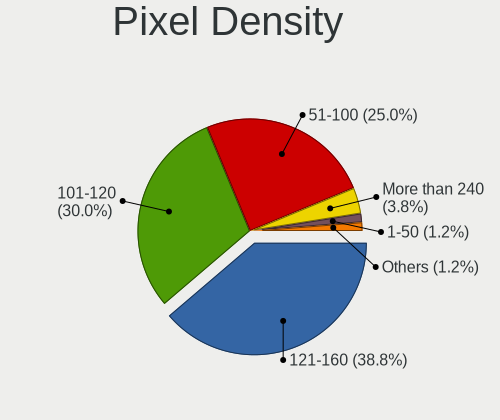

| Density       | Notebooks | Percent |
|---------------|-----------|---------|
| 121-160       | 20        | 33.9%   |
| 101-120       | 19        | 32.2%   |
| 51-100        | 16        | 27.12%  |
| More than 240 | 2         | 3.39%   |
| 1-50          | 1         | 1.69%   |
| Unknown       | 1         | 1.69%   |

Multiple Monitors
-----------------

Total monitors connected

| Total | Notebooks | Percent |
|-------|-----------|---------|
| 1     | 35        | 68.63%  |
| 2     | 14        | 27.45%  |
| 3     | 1         | 1.96%   |
| 0     | 1         | 1.96%   |

Network
-------

Net Controller Vendor
---------------------

Controller vendors

| Vendor                            | Notebooks | Percent |
|-----------------------------------|-----------|---------|
| Intel                             | 33        | 40.24%  |
| Realtek Semiconductor             | 19        | 23.17%  |
| Qualcomm Atheros                  | 14        | 17.07%  |
| TP-Link                           | 3         | 3.66%   |
| Broadcom                          | 3         | 3.66%   |
| Xilinx                            | 1         | 1.22%   |
| Silicon Integrated Systems [SiS]  | 1         | 1.22%   |
| Ralink Technology                 | 1         | 1.22%   |
| Ralink                            | 1         | 1.22%   |
| Qualcomm Atheros Communications   | 1         | 1.22%   |
| Nvidia                            | 1         | 1.22%   |
| Marvell Technology Group          | 1         | 1.22%   |
| Ericsson Business Mobile Networks | 1         | 1.22%   |
| Edimax Technology                 | 1         | 1.22%   |
| ASIX Electronics                  | 1         | 1.22%   |

Net Controller Model
--------------------

Controller models

| Model                                                                         | Notebooks | Percent |
|-------------------------------------------------------------------------------|-----------|---------|
| Realtek RTL8111/8168/8411 PCI Express Gigabit Ethernet Controller             | 8         | 7.62%   |
| Realtek RTL810xE PCI Express Fast Ethernet controller                         | 8         | 7.62%   |
| Qualcomm Atheros QCA9565 / AR9565 Wireless Network Adapter                    | 4         | 3.81%   |
| Intel 82579LM Gigabit Network Connection (Lewisville)                         | 4         | 3.81%   |
| Intel Wireless 7260                                                           | 3         | 2.86%   |
| Intel Ethernet Connection I217-LM                                             | 3         | 2.86%   |
| Intel Centrino Advanced-N 6205 [Taylor Peak]                                  | 3         | 2.86%   |
| Intel 82577LM Gigabit Network Connection                                      | 3         | 2.86%   |
| Intel 82567LM Gigabit Network Connection                                      | 3         | 2.86%   |
| Realtek RTL-8100/8101L/8139 PCI Fast Ethernet Adapter                         | 2         | 1.9%    |
| Qualcomm Atheros Killer E2400 Gigabit Ethernet Controller                     | 2         | 1.9%    |
| Qualcomm Atheros AR242x / AR542x Wireless Network Adapter (PCI-Express)       | 2         | 1.9%    |
| Intel Wireless 7265                                                           | 2         | 1.9%    |
| Intel Wireless 3165                                                           | 2         | 1.9%    |
| Intel Wi-Fi 6 AX200                                                           | 2         | 1.9%    |
| Intel PRO/Wireless 5100 AGN [Shiloh] Network Connection                       | 2         | 1.9%    |
| Intel PRO/Wireless 3945ABG [Golan] Network Connection                         | 2         | 1.9%    |
| Intel Ethernet Connection (4) I219-V                                          | 2         | 1.9%    |
| Intel Centrino Ultimate-N 6300                                                | 2         | 1.9%    |
| Intel Centrino Advanced-N 6230 [Rainbow Peak]                                 | 2         | 1.9%    |
| Intel Centrino Advanced-N 6200                                                | 2         | 1.9%    |
| Broadcom BCM4322 802.11a/b/g/n Wireless LAN Controller                        | 2         | 1.9%    |
| Xilinx Ethernet controller                                                    | 1         | 0.95%   |
| TP-Link USB 10/100/1000 LAN                                                   | 1         | 0.95%   |
| TP-Link USB 10/100 LAN                                                        | 1         | 0.95%   |
| TP-Link AC600 wireless Realtek RTL8811AU [Archer T2U Nano]                    | 1         | 0.95%   |
| Silicon Integrated Systems [SiS] SiS900 PCI Fast Ethernet                     | 1         | 0.95%   |
| Silicon Integrated Systems [SiS] AC'97 Modem Controller                       | 1         | 0.95%   |
| Realtek RTL8822BE 802.11a/b/g/n/ac WiFi adapter                               | 1         | 0.95%   |
| Realtek RTL8723DE Wireless Network Adapter                                    | 1         | 0.95%   |
| Realtek RTL8723BE PCIe Wireless Network Adapter                               | 1         | 0.95%   |
| Realtek RTL8188EE Wireless Network Adapter                                    | 1         | 0.95%   |
| Ralink Conceptronic C300RU v2 802.11bgn Wireless Adapter [Ralink RT2770]      | 1         | 0.95%   |
| Ralink RT2500 Wireless 802.11bg                                               | 1         | 0.95%   |
| Qualcomm Atheros QCA9377 802.11ac Wireless Network Adapter                    | 1         | 0.95%   |
| Qualcomm Atheros QCA8172 Fast Ethernet                                        | 1         | 0.95%   |
| Qualcomm Atheros QCA6174 802.11ac Wireless Network Adapter                    | 1         | 0.95%   |
| Qualcomm Atheros TP-Link TL-WN322G v3 / TL-WN422G v2 802.11g [Atheros AR9271] | 1         | 0.95%   |
| Qualcomm Atheros AR9485 Wireless Network Adapter                              | 1         | 0.95%   |
| Qualcomm Atheros AR9462 Wireless Network Adapter                              | 1         | 0.95%   |
| Qualcomm Atheros AR9285 Wireless Network Adapter (PCI-Express)                | 1         | 0.95%   |
| Qualcomm Atheros AR8131 Gigabit Ethernet                                      | 1         | 0.95%   |
| Nvidia MCP79 Ethernet                                                         | 1         | 0.95%   |
| Marvell Group 88E8036 PCI-E Fast Ethernet Controller                          | 1         | 0.95%   |
| Intel Wireless 8265 / 8275                                                    | 1         | 0.95%   |
| Intel Wireless 8260                                                           | 1         | 0.95%   |
| Intel Ultimate N WiFi Link 5300                                               | 1         | 0.95%   |
| Intel Ethernet Connection (7) I219-LM                                         | 1         | 0.95%   |
| Intel Ethernet Connection (3) I218-LM                                         | 1         | 0.95%   |
| Intel Ethernet Connection (2) I219-LM                                         | 1         | 0.95%   |
| Intel Dual Band Wireless-AC 3168NGW [Stone Peak]                              | 1         | 0.95%   |
| Intel Centrino Wireless-N 135                                                 | 1         | 0.95%   |
| Intel Centrino Wireless-N 1030 [Rainbow Peak]                                 | 1         | 0.95%   |
| Intel Centrino Wireless-N 1000 [Condor Peak]                                  | 1         | 0.95%   |
| Intel Centrino Advanced-N 6235                                                | 1         | 0.95%   |
| Intel Cannon Lake PCH CNVi WiFi                                               | 1         | 0.95%   |
| Intel 82579V Gigabit Network Connection                                       | 1         | 0.95%   |
| Intel 82566MM Gigabit Network Connection                                      | 1         | 0.95%   |
| Ericsson Business Mobile Networks F3507g Mobile Broadband Module              | 1         | 0.95%   |
| Edimax AC600 USB                                                              | 1         | 0.95%   |

Wireless Vendor
---------------

Wireless vendors

| Vendor                          | Notebooks | Percent |
|---------------------------------|-----------|---------|
| Intel                           | 31        | 58.49%  |
| Qualcomm Atheros                | 11        | 20.75%  |
| Realtek Semiconductor           | 4         | 7.55%   |
| Broadcom                        | 2         | 3.77%   |
| TP-Link                         | 1         | 1.89%   |
| Ralink Technology               | 1         | 1.89%   |
| Ralink                          | 1         | 1.89%   |
| Qualcomm Atheros Communications | 1         | 1.89%   |
| Edimax Technology               | 1         | 1.89%   |

Wireless Model
--------------

Wireless models

| Model                                                                         | Notebooks | Percent |
|-------------------------------------------------------------------------------|-----------|---------|
| Qualcomm Atheros QCA9565 / AR9565 Wireless Network Adapter                    | 4         | 7.55%   |
| Intel Wireless 7260                                                           | 3         | 5.66%   |
| Intel Centrino Advanced-N 6205 [Taylor Peak]                                  | 3         | 5.66%   |
| Qualcomm Atheros AR242x / AR542x Wireless Network Adapter (PCI-Express)       | 2         | 3.77%   |
| Intel Wireless 7265                                                           | 2         | 3.77%   |
| Intel Wireless 3165                                                           | 2         | 3.77%   |
| Intel Wi-Fi 6 AX200                                                           | 2         | 3.77%   |
| Intel PRO/Wireless 5100 AGN [Shiloh] Network Connection                       | 2         | 3.77%   |
| Intel PRO/Wireless 3945ABG [Golan] Network Connection                         | 2         | 3.77%   |
| Intel Centrino Ultimate-N 6300                                                | 2         | 3.77%   |
| Intel Centrino Advanced-N 6230 [Rainbow Peak]                                 | 2         | 3.77%   |
| Intel Centrino Advanced-N 6200                                                | 2         | 3.77%   |
| Broadcom BCM4322 802.11a/b/g/n Wireless LAN Controller                        | 2         | 3.77%   |
| TP-Link AC600 wireless Realtek RTL8811AU [Archer T2U Nano]                    | 1         | 1.89%   |
| Realtek RTL8822BE 802.11a/b/g/n/ac WiFi adapter                               | 1         | 1.89%   |
| Realtek RTL8723DE Wireless Network Adapter                                    | 1         | 1.89%   |
| Realtek RTL8723BE PCIe Wireless Network Adapter                               | 1         | 1.89%   |
| Realtek RTL8188EE Wireless Network Adapter                                    | 1         | 1.89%   |
| Ralink Conceptronic C300RU v2 802.11bgn Wireless Adapter [Ralink RT2770]      | 1         | 1.89%   |
| Ralink RT2500 Wireless 802.11bg                                               | 1         | 1.89%   |
| Qualcomm Atheros QCA9377 802.11ac Wireless Network Adapter                    | 1         | 1.89%   |
| Qualcomm Atheros QCA6174 802.11ac Wireless Network Adapter                    | 1         | 1.89%   |
| Qualcomm Atheros TP-Link TL-WN322G v3 / TL-WN422G v2 802.11g [Atheros AR9271] | 1         | 1.89%   |
| Qualcomm Atheros AR9485 Wireless Network Adapter                              | 1         | 1.89%   |
| Qualcomm Atheros AR9462 Wireless Network Adapter                              | 1         | 1.89%   |
| Qualcomm Atheros AR9285 Wireless Network Adapter (PCI-Express)                | 1         | 1.89%   |
| Intel Wireless 8265 / 8275                                                    | 1         | 1.89%   |
| Intel Wireless 8260                                                           | 1         | 1.89%   |
| Intel Ultimate N WiFi Link 5300                                               | 1         | 1.89%   |
| Intel Dual Band Wireless-AC 3168NGW [Stone Peak]                              | 1         | 1.89%   |
| Intel Centrino Wireless-N 135                                                 | 1         | 1.89%   |
| Intel Centrino Wireless-N 1030 [Rainbow Peak]                                 | 1         | 1.89%   |
| Intel Centrino Wireless-N 1000 [Condor Peak]                                  | 1         | 1.89%   |
| Intel Centrino Advanced-N 6235                                                | 1         | 1.89%   |
| Intel Cannon Lake PCH CNVi WiFi                                               | 1         | 1.89%   |
| Edimax AC600 USB                                                              | 1         | 1.89%   |

Ethernet Vendor
---------------

Ethernet vendors

| Vendor                           | Notebooks | Percent |
|----------------------------------|-----------|---------|
| Intel                            | 20        | 40%     |
| Realtek Semiconductor            | 18        | 36%     |
| Qualcomm Atheros                 | 4         | 8%      |
| TP-Link                          | 2         | 4%      |
| Xilinx                           | 1         | 2%      |
| Silicon Integrated Systems [SiS] | 1         | 2%      |
| Nvidia                           | 1         | 2%      |
| Marvell Technology Group         | 1         | 2%      |
| Broadcom                         | 1         | 2%      |
| ASIX Electronics                 | 1         | 2%      |

Ethernet Model
--------------

Ethernet models

| Model                                                             | Notebooks | Percent |
|-------------------------------------------------------------------|-----------|---------|
| Realtek RTL8111/8168/8411 PCI Express Gigabit Ethernet Controller | 8         | 16%     |
| Realtek RTL810xE PCI Express Fast Ethernet controller             | 8         | 16%     |
| Intel 82579LM Gigabit Network Connection (Lewisville)             | 4         | 8%      |
| Intel Ethernet Connection I217-LM                                 | 3         | 6%      |
| Intel 82577LM Gigabit Network Connection                          | 3         | 6%      |
| Intel 82567LM Gigabit Network Connection                          | 3         | 6%      |
| Realtek RTL-8100/8101L/8139 PCI Fast Ethernet Adapter             | 2         | 4%      |
| Qualcomm Atheros Killer E2400 Gigabit Ethernet Controller         | 2         | 4%      |
| Intel Ethernet Connection (4) I219-V                              | 2         | 4%      |
| Xilinx Ethernet controller                                        | 1         | 2%      |
| TP-Link USB 10/100/1000 LAN                                       | 1         | 2%      |
| TP-Link USB 10/100 LAN                                            | 1         | 2%      |
| Silicon Integrated Systems [SiS] SiS900 PCI Fast Ethernet         | 1         | 2%      |
| Qualcomm Atheros QCA8172 Fast Ethernet                            | 1         | 2%      |
| Qualcomm Atheros AR8131 Gigabit Ethernet                          | 1         | 2%      |
| Nvidia MCP79 Ethernet                                             | 1         | 2%      |
| Marvell Group 88E8036 PCI-E Fast Ethernet Controller              | 1         | 2%      |
| Intel Ethernet Connection (7) I219-LM                             | 1         | 2%      |
| Intel Ethernet Connection (3) I218-LM                             | 1         | 2%      |
| Intel Ethernet Connection (2) I219-LM                             | 1         | 2%      |
| Intel 82579V Gigabit Network Connection                           | 1         | 2%      |
| Intel 82566MM Gigabit Network Connection                          | 1         | 2%      |
| Broadcom NetXtreme BCM57786 Gigabit Ethernet PCIe                 | 1         | 2%      |
| ASIX AX88179 Gigabit Ethernet                                     | 1         | 2%      |

Net Controller Kind
-------------------

Ethernet, WiFi or modem

| Kind     | Notebooks | Percent |
|----------|-----------|---------|
| WiFi     | 49        | 50%     |
| Ethernet | 47        | 47.96%  |
| Modem    | 2         | 2.04%   |

Used Controller
---------------

Currently used network controller

| Kind     | Notebooks | Percent |
|----------|-----------|---------|
| WiFi     | 39        | 58.21%  |
| Ethernet | 28        | 41.79%  |

NICs
----

Total network controllers on board

| Total | Notebooks | Percent |
|-------|-----------|---------|
| 2     | 44        | 89.8%   |
| 1     | 4         | 8.16%   |
| 3     | 1         | 2.04%   |

IPv6
----

IPv6 vs IPv4

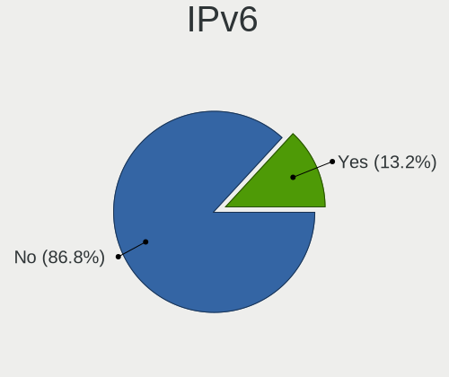

| Used | Notebooks | Percent |
|------|-----------|---------|
| No   | 46        | 92%     |
| Yes  | 4         | 8%      |

Bluetooth
---------

Bluetooth Vendor
----------------

Controller vendors

| Vendor                          | Notebooks | Percent |
|---------------------------------|-----------|---------|
| Intel                           | 15        | 41.67%  |
| Qualcomm Atheros Communications | 7         | 19.44%  |
| Broadcom                        | 4         | 11.11%  |
| Realtek Semiconductor           | 3         | 8.33%   |
| Dell                            | 2         | 5.56%   |
| Lite-On Technology              | 1         | 2.78%   |
| IMC Networks                    | 1         | 2.78%   |
| Foxconn / Hon Hai               | 1         | 2.78%   |
| ASUSTek Computer                | 1         | 2.78%   |
| Apple                           | 1         | 2.78%   |

Bluetooth Model
---------------

Controller models

| Model                                                                               | Notebooks | Percent |
|-------------------------------------------------------------------------------------|-----------|---------|
| Intel Bluetooth wireless interface                                                  | 7         | 19.44%  |
| Qualcomm Atheros  Bluetooth Device                                                  | 4         | 11.11%  |
| Intel Centrino Bluetooth Wireless Transceiver                                       | 2         | 5.56%   |
| Intel Centrino Advanced-N 6230 Bluetooth adapter                                    | 2         | 5.56%   |
| Intel Bluetooth Device                                                              | 2         | 5.56%   |
| Dell DW375 Bluetooth Module                                                         | 2         | 5.56%   |
| Broadcom BCM2045B (BDC-2.1) [Bluetooth Controller]                                  | 2         | 5.56%   |
| Realtek  Bluetooth 4.2 Adapter                                                      | 1         | 2.78%   |
| Realtek Bluetooth Radio                                                             | 1         | 2.78%   |
| Realtek 802.11n WLAN Adapter                                                        | 1         | 2.78%   |
| Qualcomm Atheros QCA61x4 Bluetooth 4.0                                              | 1         | 2.78%   |
| Qualcomm Atheros AR3012 Bluetooth 4.0                                               | 1         | 2.78%   |
| Qualcomm Atheros AR3011 Bluetooth                                                   | 1         | 2.78%   |
| Lite-On Atheros AR3012 Bluetooth                                                    | 1         | 2.78%   |
| Intel Wireless-AC 3168 Bluetooth                                                    | 1         | 2.78%   |
| Intel Bluetooth 9460/9560 Jefferson Peak (JfP)                                      | 1         | 2.78%   |
| IMC Networks Bluetooth Device                                                       | 1         | 2.78%   |
| Foxconn / Hon Hai Foxconn T77H114 BCM2070 [Single-Chip Bluetooth 2.1 + EDR Adapter] | 1         | 2.78%   |
| Broadcom BCM2045B (BDC-2.1)                                                         | 1         | 2.78%   |
| Broadcom BCM2045B (BDC-2) [Bluetooth Controller]                                    | 1         | 2.78%   |
| ASUS BT-270 Bluetooth Adapter                                                       | 1         | 2.78%   |
| Apple Bluetooth Host Controller                                                     | 1         | 2.78%   |

Sound
-----

Sound Vendor
------------

Sound card vendors

| Vendor                           | Notebooks | Percent |
|----------------------------------|-----------|---------|
| Intel                            | 46        | 79.31%  |
| Nvidia                           | 6         | 10.34%  |
| AMD                              | 3         | 5.17%   |
| Silicon Integrated Systems [SiS] | 1         | 1.72%   |
| Lenovo                           | 1         | 1.72%   |
| GN Netcom                        | 1         | 1.72%   |

Sound Model
-----------

Sound card models

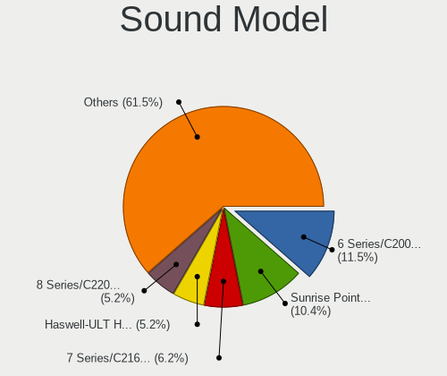

| Model                                                                                             | Notebooks | Percent |
|---------------------------------------------------------------------------------------------------|-----------|---------|
| Intel 6 Series/C200 Series Chipset Family High Definition Audio Controller                        | 8         | 11.76%  |
| Intel Sunrise Point-LP HD Audio                                                                   | 7         | 10.29%  |
| Intel Haswell-ULT HD Audio Controller                                                             | 5         | 7.35%   |
| Intel 8 Series HD Audio Controller                                                                | 5         | 7.35%   |
| Intel 8 Series/C220 Series Chipset High Definition Audio Controller                               | 4         | 5.88%   |
| Intel 7 Series/C216 Chipset Family High Definition Audio Controller                               | 4         | 5.88%   |
| Intel 5 Series/3400 Series Chipset High Definition Audio                                          | 4         | 5.88%   |
| Intel Xeon E3-1200 v3/4th Gen Core Processor HD Audio Controller                                  | 3         | 4.41%   |
| Intel 82801I (ICH9 Family) HD Audio Controller                                                    | 3         | 4.41%   |
| Intel CM238 HD Audio Controller                                                                   | 2         | 2.94%   |
| Intel Cannon Lake PCH cAVS                                                                        | 2         | 2.94%   |
| Intel 82801H (ICH8 Family) HD Audio Controller                                                    | 2         | 2.94%   |
| Silicon Integrated Systems [SiS] SiS7012 AC'97 Sound Controller                                   | 1         | 1.47%   |
| Nvidia TU116 High Definition Audio Controller                                                     | 1         | 1.47%   |
| Nvidia TU104 HD Audio Controller                                                                  | 1         | 1.47%   |
| Nvidia stereo controller                                                                          | 1         | 1.47%   |
| Nvidia MCP79 High Definition Audio                                                                | 1         | 1.47%   |
| Nvidia GM107 High Definition Audio Controller [GeForce 940MX]                                     | 1         | 1.47%   |
| Nvidia GK104 HDMI Audio Controller                                                                | 1         | 1.47%   |
| Nvidia GF116 High Definition Audio Controller                                                     | 1         | 1.47%   |
| Lenovo ThinkPad Dock USB Audio                                                                    | 1         | 1.47%   |
| Intel Wildcat Point-LP High Definition Audio Controller                                           | 1         | 1.47%   |
| Intel NM10/ICH7 Family High Definition Audio Controller                                           | 1         | 1.47%   |
| Intel Cannon Point-LP High Definition Audio Controller                                            | 1         | 1.47%   |
| Intel Broadwell-U Audio Controller                                                                | 1         | 1.47%   |
| Intel Atom/Celeron/Pentium Processor x5-E8000/J3xxx/N3xxx Series High Definition Audio Controller | 1         | 1.47%   |
| Intel 100 Series/C230 Series Chipset Family HD Audio Controller                                   | 1         | 1.47%   |
| GN Netcom Jabra SPEAK 510 USB                                                                     | 1         | 1.47%   |
| AMD Turks HDMI Audio [Radeon HD 6500/6600 / 6700M Series]                                         | 1         | 1.47%   |
| AMD Redwood HDMI Audio [Radeon HD 5000 Series]                                                    | 1         | 1.47%   |
| AMD IXP SB4x0 High Definition Audio Controller                                                    | 1         | 1.47%   |

Memory
------

Memory Vendor
-------------

Memory module vendors

| Vendor              | Notebooks | Percent |
|---------------------|-----------|---------|
| Samsung Electronics | 11        | 28.95%  |
| SK Hynix            | 7         | 18.42%  |
| Kingston            | 6         | 15.79%  |
| Unknown             | 3         | 7.89%   |
| Micron Technology   | 3         | 7.89%   |
| Crucial             | 2         | 5.26%   |
| A-DATA Technology   | 2         | 5.26%   |
| Transcend           | 1         | 2.63%   |
| Ramaxel Technology  | 1         | 2.63%   |
| ELPIDA              | 1         | 2.63%   |
| Apacer              | 1         | 2.63%   |

Memory Model
------------

Memory module models

| Model                                                        | Notebooks | Percent |
|--------------------------------------------------------------|-----------|---------|
| Unknown RAM Module 4GB SODIMM DDR3 1067MT/s                  | 1         | 2.5%    |
| Unknown RAM Module 4096MB SODIMM DDR3                        | 1         | 2.5%    |
| Unknown RAM Module 1024MB SODIMM DRAM                        | 1         | 2.5%    |
| Transcend RAM JM2666HSB-16G 16GB SODIMM DDR4 2667MT/s        | 1         | 2.5%    |
| SK Hynix RAM HMT451S6CFR6A-PB 4GB SODIMM DDR3 1600MT/s       | 1         | 2.5%    |
| SK Hynix RAM HMT451S6BFR8A-PB 4GB SODIMM DDR3 1600MT/s       | 1         | 2.5%    |
| SK Hynix RAM HMT41GS6BFR8A-PB 8GB SODIMM DDR3 1600MT/s       | 1         | 2.5%    |
| SK Hynix RAM HMT351S6EFR8A-PB 4GB SODIMM DDR3 1600MT/s       | 1         | 2.5%    |
| SK Hynix RAM HMT325S6CFR8C-PB 2048MB SODIMM DDR3 1600MT/s    | 1         | 2.5%    |
| SK Hynix RAM HMT325S6BFR8C-H9 2GB SODIMM DDR3 1333MT/s       | 1         | 2.5%    |
| SK Hynix RAM HMA82GS6JJR8N-VK 16384MB SODIMM DDR4 2667MT/s   | 1         | 2.5%    |
| SK Hynix RAM HMA81GS6AFR8N-UH 8192MB SODIMM DDR4 2667MT/s    | 1         | 2.5%    |
| Samsung RAM Module 4096MB SODIMM DDR4 2667MT/s               | 1         | 2.5%    |
| Samsung RAM Module 2048MB SODIMM DDR2 667MT/s                | 1         | 2.5%    |
| Samsung RAM Module 1024MB SODIMM DDR2 667MT/s                | 1         | 2.5%    |
| Samsung RAM M471B5273EB0-CK0 4096MB SODIMM DDR3 4199MT/s     | 1         | 2.5%    |
| Samsung RAM M471B5273DH0-CH9 4096MB SODIMM DDR3 1334MT/s     | 1         | 2.5%    |
| Samsung RAM M471B5173QH0-YK0 4GB SODIMM DDR3 1600MT/s        | 1         | 2.5%    |
| Samsung RAM M471B1G73QH0-YK0 8192MB SODIMM DDR3 2667MT/s     | 1         | 2.5%    |
| Samsung RAM M471A5244CB0-CTD 4GB SODIMM DDR4 3266MT/s        | 1         | 2.5%    |
| Samsung RAM M471A5244BB0-CPB 4GB SODIMM DDR4 2400MT/s        | 1         | 2.5%    |
| Samsung RAM M471A1K43CB1-CRC 8192MB SODIMM DDR4 2667MT/s     | 1         | 2.5%    |
| Samsung RAM K4E6E304EE-EGCE 4096MB SODIMM LPDDR3 1600MT/s    | 1         | 2.5%    |
| Samsung RAM K4E6E304EB-EGCG 4GB Row Of Chips LPDDR3 2133MT/s | 1         | 2.5%    |
| Ramaxel RAM RMSA3260MB78HAF2400 8GB SODIMM DDR4 2400MT/s     | 1         | 2.5%    |
| Micron RAM 8JSF25664HZ-1G4D1 2048MB SODIMM DDR3 1334MT/s     | 1         | 2.5%    |
| Micron RAM 16JTF51264HZ-1G4M1 4GB SODIMM DDR3 1334MT/s       | 1         | 2.5%    |
| Micron RAM 16JTF51264HZ-1G4H1 4GB SODIMM DDR3 1333MT/s       | 1         | 2.5%    |
| Kingston RAM MSI26D4S9D8ME-16 16GB SODIMM DDR4 2667MT/s      | 1         | 2.5%    |
| Kingston RAM KHX1600C9S3L/8G 8GB SODIMM DDR3 1600MT/s        | 1         | 2.5%    |
| Kingston RAM ACR16D3LS1NGG/4G 4096MB SODIMM DDR3 1600MT/s    | 1         | 2.5%    |
| Kingston RAM 99U5469-041.A00LF 4GB SODIMM DDR3 1600MT/s      | 1         | 2.5%    |
| Kingston RAM 99U5428-058.A00LF 8192MB SODIMM DDR3 1333MT/s   | 1         | 2.5%    |
| Kingston RAM 9905700-025.A00G 8GB SODIMM DDR4 2400MT/s       | 1         | 2.5%    |
| ELPIDA RAM EBJ20UF8BDU5-GN-F 2GB SODIMM DDR3 1600MT/s        | 1         | 2.5%    |
| Crucial RAM CT51264BF160B.C16F 4GB SODIMM DDR3 1600MT/s      | 1         | 2.5%    |
| Crucial RAM CT25664BF160B.C8FK 2048MB SODIMM DDR3 1600MT/s   | 1         | 2.5%    |
| Apacer RAM 78.A2G86.AF5 2048MB SODIMM DDR2 800MT/s           | 1         | 2.5%    |
| A-DATA RAM Module 4096MB SODIMM DDR3 1333MT/s                | 1         | 2.5%    |
| A-DATA RAM AD73I1B1672EG 2GB SODIMM DDR3 1333MT/s            | 1         | 2.5%    |

Memory Kind
-----------

Memory module kinds

| Kind   | Notebooks | Percent |
|--------|-----------|---------|
| DDR3   | 19        | 57.58%  |
| DDR4   | 8         | 24.24%  |
| LPDDR3 | 2         | 6.06%   |
| DDR2   | 2         | 6.06%   |
| SDRAM  | 1         | 3.03%   |
| DRAM   | 1         | 3.03%   |

Memory Form Factor
------------------

Physical design of the memory module

| Name         | Notebooks | Percent |
|--------------|-----------|---------|
| SODIMM       | 32        | 96.97%  |
| Row Of Chips | 1         | 3.03%   |

Memory Size
-----------

Memory module size

| Size  | Notebooks | Percent |
|-------|-----------|---------|
| 4096  | 15        | 42.86%  |
| 8192  | 8         | 22.86%  |
| 2048  | 7         | 20%     |
| 16384 | 3         | 8.57%   |
| 1024  | 2         | 5.71%   |

Memory Speed
------------

Memory module speed

| Speed   | Notebooks | Percent |
|---------|-----------|---------|
| 1600    | 12        | 33.33%  |
| 2667    | 7         | 19.44%  |
| 1333    | 5         | 13.89%  |
| 2400    | 2         | 5.56%   |
| 1334    | 2         | 5.56%   |
| Unknown | 2         | 5.56%   |
| 4199    | 1         | 2.78%   |
| 3266    | 1         | 2.78%   |
| 2133    | 1         | 2.78%   |
| 1067    | 1         | 2.78%   |
| 800     | 1         | 2.78%   |
| 667     | 1         | 2.78%   |

Printers & scanners
-------------------

Printer Vendor
--------------

Printer device vendors

| Vendor              | Notebooks | Percent |
|---------------------|-----------|---------|
| Samsung Electronics | 1         | 100%    |

Printer Model
-------------

Printer device models

| Model                | Notebooks | Percent |
|----------------------|-----------|---------|
| Samsung M288x Series | 1         | 100%    |

Scanner Vendor
--------------

Scanner device vendors

Zero info for selected period =(

Scanner Model
-------------

Scanner device models

Zero info for selected period =(

Camera
------

Camera Vendor
-------------

Camera device vendors

| Vendor                                 | Notebooks | Percent |
|----------------------------------------|-----------|---------|
| Chicony Electronics                    | 6         | 15.79%  |
| Sunplus Innovation Technology          | 5         | 13.16%  |
| Suyin                                  | 3         | 7.89%   |
| Realtek Semiconductor                  | 3         | 7.89%   |
| Quanta                                 | 3         | 7.89%   |
| Acer                                   | 3         | 7.89%   |
| Ricoh                                  | 2         | 5.26%   |
| Microdia                               | 2         | 5.26%   |
| IMC Networks                           | 2         | 5.26%   |
| Apple                                  | 2         | 5.26%   |
| Syntek                                 | 1         | 2.63%   |
| Silicon Motion                         | 1         | 2.63%   |
| Microsoft                              | 1         | 2.63%   |
| Logitech                               | 1         | 2.63%   |
| Lite-On Technology                     | 1         | 2.63%   |
| Generalplus Technology                 | 1         | 2.63%   |
| Cheng Uei Precision Industry (Foxlink) | 1         | 2.63%   |

Camera Model
------------

Camera device models

| Model                                         | Notebooks | Percent |
|-----------------------------------------------|-----------|---------|
| Sunplus Integrated_Webcam_HD                  | 3         | 7.89%   |
| Suyin Integrated Webcam                       | 2         | 5.26%   |
| IMC Networks Integrated Camera                | 2         | 5.26%   |
| Syntek EasyCamera                             | 1         | 2.63%   |
| Suyin Asus Integrated Webcam [CN031B]         | 1         | 2.63%   |
| Sunplus Laptop_Integrated_Webcam_HD           | 1         | 2.63%   |
| Sunplus Integrated Webcam                     | 1         | 2.63%   |
| Silicon Motion WebCam SC-10HDD12636N          | 1         | 2.63%   |
| Ricoh Laptop_Integrated_Webcam_FHD            | 1         | 2.63%   |
| Ricoh HD Webcam                               | 1         | 2.63%   |
| Realtek USB2.0 VGA UVC WebCam                 | 1         | 2.63%   |
| Realtek Lenovo EasyCamera                     | 1         | 2.63%   |
| Realtek Integrated Webcam HD                  | 1         | 2.63%   |
| Quanta Laptop_Integrated_Webcam_2HDM          | 1         | 2.63%   |
| Quanta HP Webcam                              | 1         | 2.63%   |
| Quanta HP Full-HD Camera                      | 1         | 2.63%   |
| Microsoft LifeCam NX-6000                     | 1         | 2.63%   |
| Microdia Laptop_Integrated_Webcam_HD          | 1         | 2.63%   |
| Microdia Integrated_Webcam_HD                 | 1         | 2.63%   |
| Logitech Webcam C170                          | 1         | 2.63%   |
| Lite-On HP HD Camera                          | 1         | 2.63%   |
| Generalplus 808 Camera #9 (web-cam mode)      | 1         | 2.63%   |
| Chicony USB2.0 Camera                         | 1         | 2.63%   |
| Chicony TOSHIBA Web Camera - HD               | 1         | 2.63%   |
| Chicony Lenovo Integrated Camera (0.3MP)      | 1         | 2.63%   |
| Chicony HP Webcam [2 MP Macro]                | 1         | 2.63%   |
| Chicony HP Truevision HD                      | 1         | 2.63%   |
| Chicony HD WebCam                             | 1         | 2.63%   |
| Cheng Uei Precision Industry (Foxlink) Webcam | 1         | 2.63%   |
| Apple iPhone 5/5C/5S/6/SE                     | 1         | 2.63%   |
| Apple Built-in iSight                         | 1         | 2.63%   |
| Acer Integrated Camera                        | 1         | 2.63%   |
| Acer HD Webcam                                | 1         | 2.63%   |
| Acer EasyCamera                               | 1         | 2.63%   |

Security
--------

Fingerprint Vendor
------------------

Fingerprint sensor vendors

| Vendor             | Notebooks | Percent |
|--------------------|-----------|---------|
| Validity Sensors   | 6         | 40%     |
| AuthenTec          | 4         | 26.67%  |
| Synaptics          | 3         | 20%     |
| Upek               | 1         | 6.67%   |
| STMicroelectronics | 1         | 6.67%   |

Fingerprint Model
-----------------

Fingerprint sensor models

| Model                                                                      | Notebooks | Percent |
|----------------------------------------------------------------------------|-----------|---------|
| AuthenTec AES2810                                                          | 3         | 20%     |
| Validity Sensors VFS451 Fingerprint Reader                                 | 2         | 13.33%  |
| Validity Sensors VFS5011 Fingerprint Reader                                | 1         | 6.67%   |
| Validity Sensors VFS495 Fingerprint Reader                                 | 1         | 6.67%   |
| Validity Sensors VFS 5011 fingerprint sensor                               | 1         | 6.67%   |
| Validity Sensors Synaptics VFS7552 Touch Fingerprint Sensor with PurePrint | 1         | 6.67%   |
| Upek Biometric Touchchip/Touchstrip Fingerprint Sensor                     | 1         | 6.67%   |
| Synaptics  VFS7552 Touch Fingerprint Sensor with PurePrint                 | 1         | 6.67%   |
| Synaptics Prometheus MIS Touch Fingerprint Reader                          | 1         | 6.67%   |
| Synaptics Metallica MIS Touch Fingerprint Reader                           | 1         | 6.67%   |
| STMicroelectronics Fingerprint Reader                                      | 1         | 6.67%   |
| AuthenTec AES1660 Fingerprint Sensor                                       | 1         | 6.67%   |

Chipcard Vendor
---------------

Chipcard module vendors

| Vendor           | Notebooks | Percent |
|------------------|-----------|---------|
| Broadcom         | 6         | 75%     |
| SCM Microsystems | 1         | 12.5%   |
| Lenovo           | 1         | 12.5%   |

Chipcard Model
--------------

Chipcard module models

| Model                                                                        | Notebooks | Percent |
|------------------------------------------------------------------------------|-----------|---------|
| Broadcom BCM5880 Secure Applications Processor                               | 4         | 50%     |
| SCM Microsystems SCR331 SmartCard Reader                                     | 1         | 12.5%   |
| Lenovo Integrated Smart Card Reader                                          | 1         | 12.5%   |
| Broadcom BCM5880 Secure Applications Processor with fingerprint swipe sensor | 1         | 12.5%   |
| Broadcom 5880                                                                | 1         | 12.5%   |

Unsupported
-----------

Unsupported Devices
-------------------

Total unsupported devices on board

| Total | Notebooks | Percent |
|-------|-----------|---------|
| 1     | 26        | 52%     |
| 0     | 17        | 34%     |
| 2     | 6         | 12%     |
| 5     | 1         | 2%      |

Unsupported Device Types
------------------------

Types of unsupported devices

| Type                     | Notebooks | Percent |
|--------------------------|-----------|---------|
| Fingerprint reader       | 15        | 38.46%  |
| Graphics card            | 9         | 23.08%  |
| Chipcard                 | 5         | 12.82%  |
| Net/wireless             | 4         | 10.26%  |
| Communication controller | 3         | 7.69%   |
| Storage                  | 2         | 5.13%   |
| Net/ethernet             | 1         | 2.56%   |

