CentOS 7 - Tested Hardware & Statistics
---------------------------------------

A project to collect tested hardware configurations for CentOS 7.

Anyone can contribute to this report by the [hw-probe](https://github.com/linuxhw/hw-probe) tool:

    sudo -E hw-probe -all -upload

Please contribute! Especially if your hardware is rare.

This is a report for all computer types. See also reports for [desktops](/Dist/CentOS_7/Desktop/README.md) and [notebooks](/Dist/CentOS_7/Notebook/README.md).

Contents
--------

* [ Test Cases ](#test-cases)

* [ System ](#system)
  - [ Kernel                   ](#kernel)
  - [ Kernel Family            ](#kernel-family)
  - [ Kernel Major Ver.        ](#kernel-major-ver)
  - [ Arch                     ](#arch)
  - [ DE                       ](#de)
  - [ Display Server           ](#display-server)
  - [ Display Manager          ](#display-manager)
  - [ OS Lang                  ](#os-lang)
  - [ Boot Mode                ](#boot-mode)
  - [ Filesystem               ](#filesystem)
  - [ Part. scheme             ](#part-scheme)
  - [ Dual Boot with Linux/BSD ](#dual-boot-with-linuxbsd)
  - [ Dual Boot (Win)          ](#dual-boot-win)

* [ Board ](#board)
  - [ Vendor                   ](#vendor)
  - [ Model                    ](#model)
  - [ Model Family             ](#model-family)
  - [ MFG Year                 ](#mfg-year)
  - [ Form Factor              ](#form-factor)
  - [ Secure Boot              ](#secure-boot)
  - [ Coreboot                 ](#coreboot)
  - [ RAM Size                 ](#ram-size)
  - [ RAM Used                 ](#ram-used)
  - [ Total Drives             ](#total-drives)
  - [ Has CD-ROM               ](#has-cd-rom)
  - [ Has Ethernet             ](#has-ethernet)
  - [ Has WiFi                 ](#has-wifi)
  - [ Has Bluetooth            ](#has-bluetooth)

* [ Location ](#location)
  - [ Country                  ](#country)
  - [ City                     ](#city)

* [ Drives ](#drives)
  - [ Drive Vendor             ](#drive-vendor)
  - [ Drive Model              ](#drive-model)
  - [ HDD Vendor               ](#hdd-vendor)
  - [ SSD Vendor               ](#ssd-vendor)
  - [ Drive Kind               ](#drive-kind)
  - [ Drive Connector          ](#drive-connector)
  - [ Drive Size               ](#drive-size)
  - [ Space Total              ](#space-total)
  - [ Space Used               ](#space-used)
  - [ Malfunc. Drives          ](#malfunc-drives)
  - [ Malfunc. Drive Vendor    ](#malfunc-drive-vendor)
  - [ Malfunc. HDD Vendor      ](#malfunc-hdd-vendor)
  - [ Malfunc. Drive Kind      ](#malfunc-drive-kind)
  - [ Failed Drives            ](#failed-drives)
  - [ Failed Drive Vendor      ](#failed-drive-vendor)
  - [ Drive Status             ](#drive-status)

* [ Storage controller ](#storage-controller)
  - [ Storage Vendor           ](#storage-vendor)
  - [ Storage Model            ](#storage-model)
  - [ Storage Kind             ](#storage-kind)

* [ Processor ](#processor)
  - [ CPU Vendor               ](#cpu-vendor)
  - [ CPU Model                ](#cpu-model)
  - [ CPU Model Family         ](#cpu-model-family)
  - [ CPU Cores                ](#cpu-cores)
  - [ CPU Sockets              ](#cpu-sockets)
  - [ CPU Threads              ](#cpu-threads)
  - [ CPU Op-Modes             ](#cpu-op-modes)
  - [ CPU Microcode            ](#cpu-microcode)
  - [ CPU Microarch            ](#cpu-microarch)

* [ Graphics ](#graphics)
  - [ GPU Vendor               ](#gpu-vendor)
  - [ GPU Model                ](#gpu-model)
  - [ GPU Combo                ](#gpu-combo)
  - [ GPU Driver               ](#gpu-driver)
  - [ GPU Memory               ](#gpu-memory)

* [ Monitor ](#monitor)
  - [ Monitor Vendor           ](#monitor-vendor)
  - [ Monitor Model            ](#monitor-model)
  - [ Monitor Resolution       ](#monitor-resolution)
  - [ Monitor Diagonal         ](#monitor-diagonal)
  - [ Monitor Width            ](#monitor-width)
  - [ Aspect Ratio             ](#aspect-ratio)
  - [ Monitor Area             ](#monitor-area)
  - [ Pixel Density            ](#pixel-density)
  - [ Multiple Monitors        ](#multiple-monitors)

* [ Network ](#network)
  - [ Net Controller Vendor    ](#net-controller-vendor)
  - [ Net Controller Model     ](#net-controller-model)
  - [ Wireless Vendor          ](#wireless-vendor)
  - [ Wireless Model           ](#wireless-model)
  - [ Ethernet Vendor          ](#ethernet-vendor)
  - [ Ethernet Model           ](#ethernet-model)
  - [ Net Controller Kind      ](#net-controller-kind)
  - [ Used Controller          ](#used-controller)
  - [ NICs                     ](#nics)
  - [ IPv6                     ](#ipv6)

* [ Bluetooth ](#bluetooth)
  - [ Bluetooth Vendor         ](#bluetooth-vendor)
  - [ Bluetooth Model          ](#bluetooth-model)

* [ Sound ](#sound)
  - [ Sound Vendor             ](#sound-vendor)
  - [ Sound Model              ](#sound-model)

* [ Memory ](#memory)
  - [ Memory Vendor            ](#memory-vendor)
  - [ Memory Model             ](#memory-model)
  - [ Memory Kind              ](#memory-kind)
  - [ Memory Form Factor       ](#memory-form-factor)
  - [ Memory Size              ](#memory-size)
  - [ Memory Speed             ](#memory-speed)

* [ Printers & scanners ](#printers--scanners)
  - [ Printer Vendor           ](#printer-vendor)
  - [ Printer Model            ](#printer-model)
  - [ Scanner Vendor           ](#scanner-vendor)
  - [ Scanner Model            ](#scanner-model)

* [ Camera ](#camera)
  - [ Camera Vendor            ](#camera-vendor)
  - [ Camera Model             ](#camera-model)

* [ Security ](#security)
  - [ Fingerprint Vendor       ](#fingerprint-vendor)
  - [ Fingerprint Model        ](#fingerprint-model)
  - [ Chipcard Vendor          ](#chipcard-vendor)
  - [ Chipcard Model           ](#chipcard-model)

* [ Unsupported ](#unsupported)
  - [ Unsupported Devices      ](#unsupported-devices)
  - [ Unsupported Device Types ](#unsupported-device-types)

Test Cases
----------

Total: 350

| Vendor        | Model                       | Form-Factor | Probe                                                      | Date         |
|---------------|-----------------------------|-------------|------------------------------------------------------------|--------------|
| Intel         | D410PT AAE76528-404         | Desktop     | [b7c62fc4a8](https://linux-hardware.org/?probe=b7c62fc4a8) | Jun 29, 2022 |
| Lenovo        | ThinkPad X390 Yoga 20NQS... | Convertible | [f0d321b741](https://linux-hardware.org/?probe=f0d321b741) | Jun 22, 2022 |
| Lenovo        | ThinkPad X390 Yoga 20NQS... | Convertible | [139ffc0039](https://linux-hardware.org/?probe=139ffc0039) | Jun 16, 2022 |
| ASUSTek       | G752VSK                     | Notebook    | [16e086c77f](https://linux-hardware.org/?probe=16e086c77f) | Jun 16, 2022 |
| Lenovo        | ThinkPad X390 Yoga 20NQS... | Convertible | [f339cce523](https://linux-hardware.org/?probe=f339cce523) | Jun 16, 2022 |
| HP            | 8711                        | Mini pc     | [6ceafddb10](https://linux-hardware.org/?probe=6ceafddb10) | Jun 13, 2022 |
| Dell          | Inspiron 3584               | Notebook    | [27ac9bc8f9](https://linux-hardware.org/?probe=27ac9bc8f9) | Jun 07, 2022 |
| Dell          | Inspiron 3584               | Notebook    | [7fdce576b4](https://linux-hardware.org/?probe=7fdce576b4) | Jun 07, 2022 |
| HP            | Pavilion Laptop 14-dv0xx... | Notebook    | [4655b6a8ed](https://linux-hardware.org/?probe=4655b6a8ed) | Jun 07, 2022 |
| HP            | 3397                        | Desktop     | [f2e8417afc](https://linux-hardware.org/?probe=f2e8417afc) | Jun 04, 2022 |
| ASRock        | B460 Phantom Gaming 4       | Desktop     | [0353933c85](https://linux-hardware.org/?probe=0353933c85) | Jun 02, 2022 |
| HP            | 1998                        | Desktop     | [d68e99102e](https://linux-hardware.org/?probe=d68e99102e) | May 29, 2022 |
| ASUSTek       | VivoBook_ASUSLaptop X712... | Notebook    | [8120719b26](https://linux-hardware.org/?probe=8120719b26) | May 26, 2022 |
| Gigabyte      | EP45-DS3L                   | Desktop     | [81360dffcc](https://linux-hardware.org/?probe=81360dffcc) | May 21, 2022 |
| Lenovo        | ThinkPad X390 Yoga 20NQS... | Convertible | [7cbd29cc48](https://linux-hardware.org/?probe=7cbd29cc48) | May 15, 2022 |
| Gigabyte      | GA-78LMT-USB3               | Desktop     | [5de8d1f805](https://linux-hardware.org/?probe=5de8d1f805) | May 11, 2022 |
| Dell          | Vostro 5581                 | Notebook    | [cdcb310766](https://linux-hardware.org/?probe=cdcb310766) | Apr 30, 2022 |
| Dell          | 0K068D A00                  | Desktop     | [a73170db03](https://linux-hardware.org/?probe=a73170db03) | Apr 30, 2022 |
| Lenovo        | ThinkPad T61 64665WG        | Notebook    | [ac1bec6053](https://linux-hardware.org/?probe=ac1bec6053) | Apr 26, 2022 |
| HP            | ProLiant DL380 G7           | Server      | [8f3e545e28](https://linux-hardware.org/?probe=8f3e545e28) | Apr 13, 2022 |
| Lenovo        | ThinkPad X61s 7667DB2       | Notebook    | [34ae68d221](https://linux-hardware.org/?probe=34ae68d221) | Apr 05, 2022 |
| Dell          | 0Y2YM6 A01                  | Desktop     | [4578be5a1e](https://linux-hardware.org/?probe=4578be5a1e) | Mar 30, 2022 |
| Dell          | 00V62H A01                  | Desktop     | [309ea240bd](https://linux-hardware.org/?probe=309ea240bd) | Mar 25, 2022 |
| HP            | 0AECh D                     | Desktop     | [2fa93f9b4e](https://linux-hardware.org/?probe=2fa93f9b4e) | Mar 22, 2022 |
| MiTAC         | UltraPoint                  | Desktop     | [5199d92feb](https://linux-hardware.org/?probe=5199d92feb) | Mar 21, 2022 |
| HP            | 0A9Ch                       | Desktop     | [0403520776](https://linux-hardware.org/?probe=0403520776) | Mar 03, 2022 |
| ASUSTek       | X99-DELUXE                  | Desktop     | [27513a5e2d](https://linux-hardware.org/?probe=27513a5e2d) | Feb 28, 2022 |
| Intel         | S1200SP H57533-210          | Server      | [7c1fa00b21](https://linux-hardware.org/?probe=7c1fa00b21) | Feb 23, 2022 |
| ASUSTek       | PN40                        | Mini pc     | [27bb88805d](https://linux-hardware.org/?probe=27bb88805d) | Feb 10, 2022 |
| ASUSTek       | PN40                        | Mini pc     | [6f558be780](https://linux-hardware.org/?probe=6f558be780) | Feb 10, 2022 |
| Gigabyte      | EP45-DS3L                   | Desktop     | [294d18eb2b](https://linux-hardware.org/?probe=294d18eb2b) | Jan 30, 2022 |
| Lenovo        | ThinkPad X390 Yoga 20NQS... | Convertible | [f76e2b6c0f](https://linux-hardware.org/?probe=f76e2b6c0f) | Jan 28, 2022 |
| ASUSTek       | ROG STRIX B560-A GAMING ... | Desktop     | [a355e13859](https://linux-hardware.org/?probe=a355e13859) | Jan 11, 2022 |
| Gigabyte      | G41M-ES2L                   | Desktop     | [a993fafbf7](https://linux-hardware.org/?probe=a993fafbf7) | Jan 08, 2022 |
| HP            | 3397                        | Desktop     | [3bd3d85718](https://linux-hardware.org/?probe=3bd3d85718) | Jan 03, 2022 |
| ASUSTek       | PRIME X370-PRO              | Desktop     | [a810f7c0fb](https://linux-hardware.org/?probe=a810f7c0fb) | Dec 28, 2021 |
| Acer          | Aspire 3820                 | Notebook    | [195bb81f89](https://linux-hardware.org/?probe=195bb81f89) | Dec 28, 2021 |
| Acer          | Aspire 3820                 | Notebook    | [149083ba5f](https://linux-hardware.org/?probe=149083ba5f) | Dec 28, 2021 |
| Lenovo        | 7Z71CTO1WW                  | Server      | [ff6113b91d](https://linux-hardware.org/?probe=ff6113b91d) | Dec 17, 2021 |
| Supermicro    | X10SDV-6C-TLN4F             | Desktop     | [07aa1e6365](https://linux-hardware.org/?probe=07aa1e6365) | Dec 17, 2021 |
| ASUSTek       | Pro Q570M-C                 | Desktop     | [d868c52b5a](https://linux-hardware.org/?probe=d868c52b5a) | Dec 15, 2021 |
| Lenovo        | ThinkPad X390 Yoga 20NQS... | Convertible | [0ca333f8b0](https://linux-hardware.org/?probe=0ca333f8b0) | Dec 15, 2021 |
| Dell          | Vostro 14 5410              | Notebook    | [ef6f4cf593](https://linux-hardware.org/?probe=ef6f4cf593) | Dec 05, 2021 |
| Gigabyte      | H97N-WIFI                   | Desktop     | [646eb8cd7d](https://linux-hardware.org/?probe=646eb8cd7d) | Dec 04, 2021 |
| Dell          | Vostro 14 5410              | Notebook    | [6ab102bc84](https://linux-hardware.org/?probe=6ab102bc84) | Nov 30, 2021 |
| HP            | 8717                        | Desktop     | [a00d17d8c4](https://linux-hardware.org/?probe=a00d17d8c4) | Nov 25, 2021 |
| Dell          | 02K9CR A01                  | Desktop     | [36c6a137fb](https://linux-hardware.org/?probe=36c6a137fb) | Nov 23, 2021 |
| Gigabyte      | B360HD3                     | Desktop     | [71a92047fb](https://linux-hardware.org/?probe=71a92047fb) | Nov 23, 2021 |
| Dell          | 02K9CR A01                  | Desktop     | [7d558b813e](https://linux-hardware.org/?probe=7d558b813e) | Nov 17, 2021 |
| Dell          | 06WXJT A01                  | Server      | [fcc6d41c03](https://linux-hardware.org/?probe=fcc6d41c03) | Nov 12, 2021 |
| Dell          | 04YP6J A02                  | Desktop     | [6c41e1551e](https://linux-hardware.org/?probe=6c41e1551e) | Nov 09, 2021 |
| Dell          | 04YP6J A02                  | Desktop     | [736e182a15](https://linux-hardware.org/?probe=736e182a15) | Nov 09, 2021 |
| HP            | 872C                        | Mini pc     | [36f1254c43](https://linux-hardware.org/?probe=36f1254c43) | Nov 08, 2021 |
| HP            | 872C                        | Mini pc     | [e4450bb253](https://linux-hardware.org/?probe=e4450bb253) | Nov 08, 2021 |
| ASRock        | Z77 Extreme4                | Desktop     | [bf66e1d281](https://linux-hardware.org/?probe=bf66e1d281) | Oct 29, 2021 |
| eMachines     | EMCP73VT-PM                 | Desktop     | [6fe6c2d416](https://linux-hardware.org/?probe=6fe6c2d416) | Oct 27, 2021 |
| eMachines     | EMCP73VT-PM                 | Desktop     | [22fd625209](https://linux-hardware.org/?probe=22fd625209) | Oct 26, 2021 |
| ASRock        | Z77 Extreme4                | Desktop     | [862513b9f6](https://linux-hardware.org/?probe=862513b9f6) | Oct 21, 2021 |
| ASUSTek       | P5BV-M/RS100-E5             | Desktop     | [13134022df](https://linux-hardware.org/?probe=13134022df) | Oct 19, 2021 |
| Huanan        | X79                         | Desktop     | [3532bbed3d](https://linux-hardware.org/?probe=3532bbed3d) | Oct 08, 2021 |
| Huanan        | X79                         | Desktop     | [6638a35363](https://linux-hardware.org/?probe=6638a35363) | Oct 08, 2021 |
| HP            | EliteBook 8540w             | Notebook    | [a68000e142](https://linux-hardware.org/?probe=a68000e142) | Sep 26, 2021 |
| Dell          | Latitude E6530              | Notebook    | [41d65e59eb](https://linux-hardware.org/?probe=41d65e59eb) | Sep 26, 2021 |
| Dell          | 0F0XJ6 A11                  | Server      | [26944912d7](https://linux-hardware.org/?probe=26944912d7) | Sep 17, 2021 |
| Apple         | MacBookPro5,5               | Notebook    | [d7ee29aac3](https://linux-hardware.org/?probe=d7ee29aac3) | Sep 15, 2021 |
| Dell          | 0Y7WYT A00                  | Desktop     | [e4278d3243](https://linux-hardware.org/?probe=e4278d3243) | Sep 15, 2021 |
| HP            | EliteBook 8540w             | Notebook    | [fd6f5273e3](https://linux-hardware.org/?probe=fd6f5273e3) | Sep 02, 2021 |
| HP            | EliteBook 2740p             | Notebook    | [0beccde57d](https://linux-hardware.org/?probe=0beccde57d) | Sep 01, 2021 |
| Supermicro    | X10DRL-CT                   | Server      | [cc00646768](https://linux-hardware.org/?probe=cc00646768) | Aug 28, 2021 |
| Supermicro    | X10DRL-CT                   | Server      | [15df3c0fff](https://linux-hardware.org/?probe=15df3c0fff) | Aug 28, 2021 |
| Gigabyte      | B85M-D3PH                   | Desktop     | [01d87985dd](https://linux-hardware.org/?probe=01d87985dd) | Aug 28, 2021 |
| HP            | 8751                        | Desktop     | [cdaf5a0ed8](https://linux-hardware.org/?probe=cdaf5a0ed8) | Aug 24, 2021 |
| Lenovo        | 7X06CTO1WW                  | Server      | [928ee22e71](https://linux-hardware.org/?probe=928ee22e71) | Aug 24, 2021 |
| Dell          | 0F0XJ6 A11                  | Server      | [5e08b5eafd](https://linux-hardware.org/?probe=5e08b5eafd) | Aug 22, 2021 |
| Supermicro    | X11SSH-F                    | Server      | [35fff898d1](https://linux-hardware.org/?probe=35fff898d1) | Aug 20, 2021 |
| HP            | EliteBook 8540w             | Notebook    | [6e6d5c8f2c](https://linux-hardware.org/?probe=6e6d5c8f2c) | Aug 20, 2021 |
| HP            | Presario C700               | Notebook    | [fa731abf46](https://linux-hardware.org/?probe=fa731abf46) | Aug 19, 2021 |
| Gigabyte      | B450M DS3H-CF               | Desktop     | [cabe0be4fc](https://linux-hardware.org/?probe=cabe0be4fc) | Aug 17, 2021 |
| ASUSTek       | PRIME B550-PLUS             | Desktop     | [cf348cec5f](https://linux-hardware.org/?probe=cf348cec5f) | Aug 16, 2021 |
| ASUSTek       | GRYPHON Z97 ARMOR EDITIO... | Desktop     | [4f9bb753aa](https://linux-hardware.org/?probe=4f9bb753aa) | Aug 16, 2021 |
| ASUSTek       | ROG Maximus XIII HERO       | Desktop     | [8ddb489f03](https://linux-hardware.org/?probe=8ddb489f03) | Aug 05, 2021 |
| Dell          | 0HD5W2 A01                  | Desktop     | [d19976dabe](https://linux-hardware.org/?probe=d19976dabe) | Aug 05, 2021 |
| Dell          | 00V62H A01                  | Desktop     | [d56fdac07b](https://linux-hardware.org/?probe=d56fdac07b) | Aug 05, 2021 |
| HP            | ProLiant DL360 G5           | Server      | [58c9a1d28b](https://linux-hardware.org/?probe=58c9a1d28b) | Aug 05, 2021 |
| Dell          | 00V62H A01                  | Desktop     | [3eb59a276c](https://linux-hardware.org/?probe=3eb59a276c) | Aug 05, 2021 |
| Dell          | 00V62H A01                  | Desktop     | [3d0db6b81f](https://linux-hardware.org/?probe=3d0db6b81f) | Aug 05, 2021 |
| Sun Micros... | S39                         | Server      | [e54a36a0c4](https://linux-hardware.org/?probe=e54a36a0c4) | Aug 05, 2021 |
| Dell          | 0HD5W2 A01                  | Desktop     | [1fc2375e54](https://linux-hardware.org/?probe=1fc2375e54) | Aug 05, 2021 |
| Dell          | 0YNVJG A01                  | Desktop     | [7952948421](https://linux-hardware.org/?probe=7952948421) | Aug 05, 2021 |
| Dell          | 0HD5W2 A01                  | Desktop     | [a653e9beb2](https://linux-hardware.org/?probe=a653e9beb2) | Aug 05, 2021 |
| Dell          | 0HD5W2 A01                  | Desktop     | [9a5d8276bf](https://linux-hardware.org/?probe=9a5d8276bf) | Aug 05, 2021 |
| Dell          | 00V62H A01                  | Desktop     | [2165980dd3](https://linux-hardware.org/?probe=2165980dd3) | Aug 05, 2021 |
| Dell          | 0HD5W2 A01                  | Desktop     | [4a2adade2a](https://linux-hardware.org/?probe=4a2adade2a) | Aug 05, 2021 |
| Dell          | 0HD5W2 A01                  | Desktop     | [78c5e3532b](https://linux-hardware.org/?probe=78c5e3532b) | Aug 05, 2021 |
| Dell          | 00V62H A01                  | Desktop     | [10bdaec1ef](https://linux-hardware.org/?probe=10bdaec1ef) | Aug 05, 2021 |
| Dell          | 0HD5W2 A01                  | Desktop     | [70fc6a65ef](https://linux-hardware.org/?probe=70fc6a65ef) | Aug 05, 2021 |
| Dell          | 00V62H A01                  | Desktop     | [80244f2809](https://linux-hardware.org/?probe=80244f2809) | Aug 05, 2021 |
| Sun Micros... | Sun Fire X2270 375-3602-... | Server      | [54eaa5139f](https://linux-hardware.org/?probe=54eaa5139f) | Aug 05, 2021 |
| HP            | 8591                        | Desktop     | [6794bdb00e](https://linux-hardware.org/?probe=6794bdb00e) | Aug 05, 2021 |
| Dell          | 0HD5W2 A01                  | Desktop     | [f209feb9c8](https://linux-hardware.org/?probe=f209feb9c8) | Aug 05, 2021 |
| ASUSTek       | ROG Maximus XIII HERO       | Desktop     | [40b8d28af0](https://linux-hardware.org/?probe=40b8d28af0) | Aug 04, 2021 |
| Gigabyte      | EP45-DS3L                   | Desktop     | [597de4e10b](https://linux-hardware.org/?probe=597de4e10b) | Aug 01, 2021 |
| ASUSTek       | SABERTOOTH X79              | Desktop     | [1232705d62](https://linux-hardware.org/?probe=1232705d62) | Jul 22, 2021 |
| HP            | 2B34                        | Desktop     | [0de82dabad](https://linux-hardware.org/?probe=0de82dabad) | Jul 10, 2021 |
| HP            | 0A9Ch                       | Desktop     | [e3159a6511](https://linux-hardware.org/?probe=e3159a6511) | Jul 07, 2021 |
| Lenovo        | ThinkPad X61s 7667DB2       | Notebook    | [c0af3fd295](https://linux-hardware.org/?probe=c0af3fd295) | Jul 05, 2021 |
| Dell          | 09KPNV A01                  | Desktop     | [a3f3f1e1c0](https://linux-hardware.org/?probe=a3f3f1e1c0) | Jul 02, 2021 |
| Lenovo        | ThinkPad X61s 7667DB2       | Notebook    | [32d294ba2a](https://linux-hardware.org/?probe=32d294ba2a) | Jun 23, 2021 |
| HP            | 1494                        | Desktop     | [d34b022996](https://linux-hardware.org/?probe=d34b022996) | Jun 11, 2021 |
| Intel         | E98683-353                  | Desktop     | [2f0ae62282](https://linux-hardware.org/?probe=2f0ae62282) | May 29, 2021 |
| HP            | 1589                        | Desktop     | [a4b0ebbee2](https://linux-hardware.org/?probe=a4b0ebbee2) | May 23, 2021 |
| ASRock        | J3710M                      | Desktop     | [6f289497fc](https://linux-hardware.org/?probe=6f289497fc) | May 23, 2021 |
| HP            | 8710                        | Mini pc     | [b2a212246b](https://linux-hardware.org/?probe=b2a212246b) | May 14, 2021 |
| HP            | 8594                        | Desktop     | [991250b6a8](https://linux-hardware.org/?probe=991250b6a8) | May 14, 2021 |
| HP            | 829A                        | Mini pc     | [c326081d7d](https://linux-hardware.org/?probe=c326081d7d) | May 14, 2021 |
| HP            | 1825                        | Desktop     | [13110a2081](https://linux-hardware.org/?probe=13110a2081) | May 14, 2021 |
| ASUSTek       | U35JC                       | Notebook    | [29ea6520a1](https://linux-hardware.org/?probe=29ea6520a1) | May 08, 2021 |
| Lenovo        | ThinkPad X200 7459ZEJ       | Notebook    | [a4f7ad5736](https://linux-hardware.org/?probe=a4f7ad5736) | May 07, 2021 |
| HP            | 8710                        | Mini pc     | [a9e3962fe5](https://linux-hardware.org/?probe=a9e3962fe5) | May 07, 2021 |
| HP            | 8710                        | Mini pc     | [a862c9d728](https://linux-hardware.org/?probe=a862c9d728) | May 07, 2021 |
| Lenovo        | 01DC328                     | Server      | [3510dd7b10](https://linux-hardware.org/?probe=3510dd7b10) | May 05, 2021 |
| HP            | 8591                        | Desktop     | [03b17d692d](https://linux-hardware.org/?probe=03b17d692d) | Apr 26, 2021 |
| Lenovo        | 01GR174                     | Server      | [63ec4551f5](https://linux-hardware.org/?probe=63ec4551f5) | Apr 26, 2021 |
| Lenovo        | 01GR174                     | Server      | [c68b7991a5](https://linux-hardware.org/?probe=c68b7991a5) | Apr 26, 2021 |
| HP            | 213D A01                    | Desktop     | [72e7e27309](https://linux-hardware.org/?probe=72e7e27309) | Apr 26, 2021 |
| Hyve          | HS-9216Lite2 5411C405005... | Server      | [20edfbf60b](https://linux-hardware.org/?probe=20edfbf60b) | Apr 06, 2021 |
| Gigabyte      | EP43-DS3                    | Desktop     | [3eaab1a9d9](https://linux-hardware.org/?probe=3eaab1a9d9) | Apr 05, 2021 |
| Dell          | 0MWYPT A02                  | Desktop     | [e2e2e6f179](https://linux-hardware.org/?probe=e2e2e6f179) | Mar 31, 2021 |
| Cisco Syst... | UCSB-B200-M4 73-15862-03    | Desktop     | [4c55de0b30](https://linux-hardware.org/?probe=4c55de0b30) | Mar 31, 2021 |
| Unknown       | Unknown                     | Desktop     | [b672c68361](https://linux-hardware.org/?probe=b672c68361) | Mar 30, 2021 |
| HP            | 8591                        | Desktop     | [3c4d055665](https://linux-hardware.org/?probe=3c4d055665) | Mar 30, 2021 |
| HP            | 8591                        | Desktop     | [b436577a94](https://linux-hardware.org/?probe=b436577a94) | Mar 30, 2021 |
| Gigabyte      | EP45-DS3L                   | Desktop     | [c724df2a1a](https://linux-hardware.org/?probe=c724df2a1a) | Mar 23, 2021 |
| MiTAC         | PD10BI PD10BI-702           | Desktop     | [63335e1b88](https://linux-hardware.org/?probe=63335e1b88) | Mar 18, 2021 |
| MiTAC         | PD10BI PD10BI-702           | Desktop     | [5d23375dcd](https://linux-hardware.org/?probe=5d23375dcd) | Mar 18, 2021 |
| Unknown       | Unknown                     | Desktop     | [234c991949](https://linux-hardware.org/?probe=234c991949) | Mar 17, 2021 |
| MSI           | H170A GAMING PRO            | Desktop     | [dd38d014bd](https://linux-hardware.org/?probe=dd38d014bd) | Mar 17, 2021 |
| Lenovo        | IdeaPad 310-15ISK 80UH      | Notebook    | [72df2af331](https://linux-hardware.org/?probe=72df2af331) | Mar 16, 2021 |
| HP            | 871C                        | All in one  | [2f7fd6200f](https://linux-hardware.org/?probe=2f7fd6200f) | Mar 10, 2021 |
| HP            | 871C                        | All in one  | [7cbfb86cef](https://linux-hardware.org/?probe=7cbfb86cef) | Mar 10, 2021 |
| Dell          | Latitude E7250              | Notebook    | [551399bf55](https://linux-hardware.org/?probe=551399bf55) | Mar 08, 2021 |
| HUAWEI        | BC82AMDDA V200R002C00       | Server      | [63bdabb5a4](https://linux-hardware.org/?probe=63bdabb5a4) | Feb 26, 2021 |
| AMI           | PCHK-Z83 Poslab_ECO         | Desktop     | [5dd25822e3](https://linux-hardware.org/?probe=5dd25822e3) | Feb 23, 2021 |
| HP            | 81C6 MVB 0C                 | Server      | [9d6e46eca9](https://linux-hardware.org/?probe=9d6e46eca9) | Feb 23, 2021 |
| Gigabyte      | D525TUD                     | Desktop     | [59b1050f5f](https://linux-hardware.org/?probe=59b1050f5f) | Feb 19, 2021 |
| HP            | ProBook 6560b               | Notebook    | [57004cab16](https://linux-hardware.org/?probe=57004cab16) | Feb 17, 2021 |
| ASUSTek       | PRIME B360M-D               | Desktop     | [aab84fafeb](https://linux-hardware.org/?probe=aab84fafeb) | Feb 10, 2021 |
| ASUSTek       | P8Z68-V LX                  | Desktop     | [9fc9b672d0](https://linux-hardware.org/?probe=9fc9b672d0) | Feb 07, 2021 |
| HP            | 3397                        | Desktop     | [aba05551cb](https://linux-hardware.org/?probe=aba05551cb) | Feb 05, 2021 |
| Intel         | S5000PAL0 FRU Ver           | Server      | [390f15b7f9](https://linux-hardware.org/?probe=390f15b7f9) | Feb 03, 2021 |
| HP            | 8755                        | Mini pc     | [334abf8c53](https://linux-hardware.org/?probe=334abf8c53) | Feb 02, 2021 |
| Lenovo        | ThinkPad T520 4243Y1N       | Notebook    | [66b47b2f1e](https://linux-hardware.org/?probe=66b47b2f1e) | Jan 20, 2021 |
| HP            | EliteBook 840 G5            | Notebook    | [71b67a3764](https://linux-hardware.org/?probe=71b67a3764) | Jan 14, 2021 |
| Dell          | 0HHV7N A00                  | Desktop     | [7b55587c5a](https://linux-hardware.org/?probe=7b55587c5a) | Jan 10, 2021 |
| Intel         | S1200RP_SE G62252-405       | Server      | [1eaaae85a8](https://linux-hardware.org/?probe=1eaaae85a8) | Jan 04, 2021 |
| Gigabyte      | D525TUD                     | Desktop     | [e9f1445d02](https://linux-hardware.org/?probe=e9f1445d02) | Jan 03, 2021 |
| Intel         | DQ67OW AAG12528-309         | Desktop     | [5f42b365ae](https://linux-hardware.org/?probe=5f42b365ae) | Dec 26, 2020 |
| ASUSTek       | X99-DELUXE                  | Desktop     | [46613a5ce9](https://linux-hardware.org/?probe=46613a5ce9) | Dec 20, 2020 |
| Acer          | Aspire E1-572               | Notebook    | [a06266ed7f](https://linux-hardware.org/?probe=a06266ed7f) | Dec 17, 2020 |
| Gigabyte      | Z77-D3H                     | Desktop     | [b7c033babd](https://linux-hardware.org/?probe=b7c033babd) | Dec 10, 2020 |
| Gigabyte      | D525TUD                     | Desktop     | [0c13d73ba0](https://linux-hardware.org/?probe=0c13d73ba0) | Nov 27, 2020 |
| ASUSTek       | M5A78L-M PLUS/USB3          | Desktop     | [bc3bd4ea10](https://linux-hardware.org/?probe=bc3bd4ea10) | Nov 24, 2020 |
| Toshiba       | Satellite A135              | Notebook    | [310ddb721f](https://linux-hardware.org/?probe=310ddb721f) | Nov 20, 2020 |
| Lenovo        | ThinkPad X200 7459H92       | Notebook    | [242193b8bc](https://linux-hardware.org/?probe=242193b8bc) | Nov 17, 2020 |
| HP            | 81C7 MVB 0C                 | Server      | [ed3c250112](https://linux-hardware.org/?probe=ed3c250112) | Nov 03, 2020 |
| Dell          | Latitude E6440              | Notebook    | [46a2699a96](https://linux-hardware.org/?probe=46a2699a96) | Oct 21, 2020 |
| Samsung       | 300E5EV/300E4EV/270E5EV/... | Notebook    | [97a2b45d12](https://linux-hardware.org/?probe=97a2b45d12) | Oct 21, 2020 |
| Dell          | Latitude E6410              | Notebook    | [926bbbdaf2](https://linux-hardware.org/?probe=926bbbdaf2) | Oct 18, 2020 |
| Dell          | 01NP3N A00                  | Desktop     | [1f5b92d91b](https://linux-hardware.org/?probe=1f5b92d91b) | Oct 12, 2020 |
| ASUSTek       | F2A55-M LE                  | Desktop     | [1fc864e04c](https://linux-hardware.org/?probe=1fc864e04c) | Oct 10, 2020 |
| Lenovo        | G500s 20245                 | Notebook    | [8a975cb577](https://linux-hardware.org/?probe=8a975cb577) | Oct 07, 2020 |
| Dell          | Latitude E6410              | Notebook    | [a36dab9e9b](https://linux-hardware.org/?probe=a36dab9e9b) | Oct 06, 2020 |
| ECS           | H61H2-MV                    | Desktop     | [0c5285cd22](https://linux-hardware.org/?probe=0c5285cd22) | Sep 20, 2020 |
| HP            | 0AECh D                     | Desktop     | [d80079cb33](https://linux-hardware.org/?probe=d80079cb33) | Sep 18, 2020 |
| Fujitsu       | D3401-H1 S26361-D3401-H1    | Desktop     | [b363aea94a](https://linux-hardware.org/?probe=b363aea94a) | Sep 17, 2020 |
| Fujitsu       | D3401-H1 S26361-D3401-H1    | Desktop     | [1896a5c345](https://linux-hardware.org/?probe=1896a5c345) | Sep 17, 2020 |
| HP            | ProLiant DL165 G7           | Server      | [91ad975174](https://linux-hardware.org/?probe=91ad975174) | Sep 14, 2020 |
| AEWIN         | SCB-1711A                   | Desktop     | [2d8dbb0d3a](https://linux-hardware.org/?probe=2d8dbb0d3a) | Sep 09, 2020 |
| Dell          | Inspiron 3542               | Notebook    | [233a83b315](https://linux-hardware.org/?probe=233a83b315) | Sep 08, 2020 |
| Dell          | Inspiron 3542               | Notebook    | [fcb2182f02](https://linux-hardware.org/?probe=fcb2182f02) | Sep 08, 2020 |
| Unknown       | 34AS1                       | Notebook    | [cc188d0f25](https://linux-hardware.org/?probe=cc188d0f25) | Sep 08, 2020 |
| Unknown       | 34AS1                       | Notebook    | [0ab59553ea](https://linux-hardware.org/?probe=0ab59553ea) | Sep 08, 2020 |
| Dell          | Inspiron 3542               | Notebook    | [751df6a75b](https://linux-hardware.org/?probe=751df6a75b) | Sep 08, 2020 |
| Dell          | Inspiron 3542               | Notebook    | [14680221b6](https://linux-hardware.org/?probe=14680221b6) | Sep 07, 2020 |
| HP            | EliteBook 6930p             | Notebook    | [8fdba744ec](https://linux-hardware.org/?probe=8fdba744ec) | Sep 03, 2020 |
| Dell          | Inspiron 5567               | Notebook    | [d7700d73c4](https://linux-hardware.org/?probe=d7700d73c4) | Sep 03, 2020 |
| Zenith        | Orion                       | Desktop     | [9de5e32b25](https://linux-hardware.org/?probe=9de5e32b25) | Sep 02, 2020 |
| ASUSTek       | P7P55D                      | Desktop     | [4a55c3588b](https://linux-hardware.org/?probe=4a55c3588b) | Aug 26, 2020 |
| Dell          | 0GTK4K A02                  | Desktop     | [09fb692364](https://linux-hardware.org/?probe=09fb692364) | Aug 26, 2020 |
| Supermicro    | X8DT3                       | Server      | [c3337aa815](https://linux-hardware.org/?probe=c3337aa815) | Aug 24, 2020 |
| Dell          | Inspiron N4050              | Notebook    | [c51c0d5538](https://linux-hardware.org/?probe=c51c0d5538) | Aug 15, 2020 |
| Gigabyte      | B450 AORUS M                | Desktop     | [f0d9b71d6d](https://linux-hardware.org/?probe=f0d9b71d6d) | Aug 15, 2020 |
| Lenovo        | ThinkServer TS140           | Desktop     | [03abb9daf3](https://linux-hardware.org/?probe=03abb9daf3) | Aug 11, 2020 |
| Lenovo        | ThinkServer TS140           | Desktop     | [2d296ca69c](https://linux-hardware.org/?probe=2d296ca69c) | Aug 11, 2020 |
| Dell          | 08HPGT A02                  | Desktop     | [fa6826d636](https://linux-hardware.org/?probe=fa6826d636) | Aug 02, 2020 |
| Intel         | NUC6i3SYB H81132-505        | Mini pc     | [001888ed9c](https://linux-hardware.org/?probe=001888ed9c) | Aug 02, 2020 |
| Dell          | 0W23H8 A00                  | Server      | [e752263e49](https://linux-hardware.org/?probe=e752263e49) | Jul 27, 2020 |
| Gigabyte      | B360M DS3H                  | Desktop     | [be78e318ef](https://linux-hardware.org/?probe=be78e318ef) | Jul 23, 2020 |
| HP            | 0AECh D                     | Desktop     | [c6310b9606](https://linux-hardware.org/?probe=c6310b9606) | Jul 14, 2020 |
| HP            | 1589                        | Desktop     | [d142f54a38](https://linux-hardware.org/?probe=d142f54a38) | Jul 11, 2020 |
| HP            | Pavilion x360 Convertibl... | Convertible | [8ce6e9cb36](https://linux-hardware.org/?probe=8ce6e9cb36) | Jul 10, 2020 |
| HP            | Falco                       | Notebook    | [26ace050f7](https://linux-hardware.org/?probe=26ace050f7) | Jul 07, 2020 |
| Dell          | Inspiron N4050              | Notebook    | [2a05830be5](https://linux-hardware.org/?probe=2a05830be5) | Jul 05, 2020 |
| Intel         | H81C                        | Desktop     | [54732275c2](https://linux-hardware.org/?probe=54732275c2) | Jul 04, 2020 |
| ASUSTek       | SABERTOOTH X99              | Desktop     | [d014e3ba24](https://linux-hardware.org/?probe=d014e3ba24) | Jul 03, 2020 |
| Dell          | 0PYVT1 A03                  | Server      | [b7f3606e31](https://linux-hardware.org/?probe=b7f3606e31) | Jun 30, 2020 |
| HP            | 81C7 MVB 0C                 | Server      | [670706063d](https://linux-hardware.org/?probe=670706063d) | Jun 25, 2020 |
| Gigabyte      | P85-D3                      | Desktop     | [3be565ccfd](https://linux-hardware.org/?probe=3be565ccfd) | Jun 23, 2020 |
| Intel         | NUC8BEB J72688-305          | Mini pc     | [bdaf8406b2](https://linux-hardware.org/?probe=bdaf8406b2) | Jun 22, 2020 |
| Intel         | NUC10i7FNB K61360-302       | Mini pc     | [f2bfe6bfb3](https://linux-hardware.org/?probe=f2bfe6bfb3) | Jun 22, 2020 |
| ASUSTek       | Crosshair IV Formula        | Desktop     | [51b8e4300b](https://linux-hardware.org/?probe=51b8e4300b) | Jun 20, 2020 |
| ASUSTek       | Crosshair IV Formula        | Desktop     | [e1184552d0](https://linux-hardware.org/?probe=e1184552d0) | Jun 20, 2020 |
| HP            | 81C7 MVB 0C                 | Server      | [b5360affff](https://linux-hardware.org/?probe=b5360affff) | Jun 18, 2020 |
| Supermicro    | X10DRG-H                    | Desktop     | [3bd676846b](https://linux-hardware.org/?probe=3bd676846b) | Jun 12, 2020 |
| MSI           | B450M MORTAR MAX            | Desktop     | [db0ff5f985](https://linux-hardware.org/?probe=db0ff5f985) | Jun 07, 2020 |
| HP            | EliteBook 840 G5            | Notebook    | [2605330e8c](https://linux-hardware.org/?probe=2605330e8c) | Jun 04, 2020 |
| IBM           | 00W2263                     | Server      | [fc0558920d](https://linux-hardware.org/?probe=fc0558920d) | Jun 01, 2020 |
| Dell          | 0VRWRC A00                  | Desktop     | [dd7e20baec](https://linux-hardware.org/?probe=dd7e20baec) | May 29, 2020 |
| Dell          | 0VRWRC A00                  | Desktop     | [c27987482d](https://linux-hardware.org/?probe=c27987482d) | May 29, 2020 |
| AMI           | Aptio CRB                   | Mini pc     | [8f5cbe37da](https://linux-hardware.org/?probe=8f5cbe37da) | May 26, 2020 |
| AMI           | Aptio CRB                   | Mini pc     | [396660cc0e](https://linux-hardware.org/?probe=396660cc0e) | May 26, 2020 |
| ASRock        | AM1B-ITX                    | Desktop     | [d0b6f8f474](https://linux-hardware.org/?probe=d0b6f8f474) | May 25, 2020 |
| IBM           | I/O Port                    | Server      | [7c109612b9](https://linux-hardware.org/?probe=7c109612b9) | May 20, 2020 |
| HP            | EliteBook 840 G5            | Notebook    | [912c44b0ac](https://linux-hardware.org/?probe=912c44b0ac) | May 15, 2020 |
| ASUSTek       | CM1740                      | Desktop     | [65921c1a5e](https://linux-hardware.org/?probe=65921c1a5e) | May 14, 2020 |
| Gigabyte      | EP45-DS3L                   | Desktop     | [6a3f0afa07](https://linux-hardware.org/?probe=6a3f0afa07) | May 07, 2020 |
| Acer          | Aspire 5750G                | Notebook    | [1f49c0d636](https://linux-hardware.org/?probe=1f49c0d636) | May 06, 2020 |
| Dell          | Latitude E6220              | Notebook    | [a4db1d31a5](https://linux-hardware.org/?probe=a4db1d31a5) | May 05, 2020 |
| Dell          | Latitude E6220              | Notebook    | [c0152a3b02](https://linux-hardware.org/?probe=c0152a3b02) | May 05, 2020 |
| HP            | 1495                        | Desktop     | [a38478daa1](https://linux-hardware.org/?probe=a38478daa1) | May 05, 2020 |
| HP            | 1495                        | Desktop     | [6fed1750c3](https://linux-hardware.org/?probe=6fed1750c3) | May 05, 2020 |
| Toshiba       | Satellite Radius 12 P20W... | Notebook    | [4f272f1c99](https://linux-hardware.org/?probe=4f272f1c99) | May 03, 2020 |
| Dell          | Inspiron 5437               | Notebook    | [0606d60ddb](https://linux-hardware.org/?probe=0606d60ddb) | Apr 29, 2020 |
| Dell          | Inspiron 5437               | Notebook    | [c4f288077d](https://linux-hardware.org/?probe=c4f288077d) | Apr 29, 2020 |
| Dell          | Precision 7510              | Notebook    | [40e5c33fd8](https://linux-hardware.org/?probe=40e5c33fd8) | Apr 27, 2020 |
| Supermicro    | H12SSW-NT                   | Server      | [7027370293](https://linux-hardware.org/?probe=7027370293) | Apr 27, 2020 |
| Supermicro    | X10SDE-DF                   | Desktop     | [54cbea6bb1](https://linux-hardware.org/?probe=54cbea6bb1) | Apr 26, 2020 |
| Supermicro    | X10SDE-DF                   | Desktop     | [3c55fe3c77](https://linux-hardware.org/?probe=3c55fe3c77) | Apr 26, 2020 |
| Sony          | VGN-N19VP_B                 | Notebook    | [a2e6c99940](https://linux-hardware.org/?probe=a2e6c99940) | Apr 20, 2020 |
| ASUSTek       | Rampage V EXTREME           | Desktop     | [a78c0430fb](https://linux-hardware.org/?probe=a78c0430fb) | Apr 15, 2020 |
| ASUSTek       | Rampage V EXTREME           | Desktop     | [6e7470b8c3](https://linux-hardware.org/?probe=6e7470b8c3) | Apr 15, 2020 |
| ASUSTek       | PRIME A320M-K               | Desktop     | [b3782f0e54](https://linux-hardware.org/?probe=b3782f0e54) | Mar 20, 2020 |
| ASRock        | X399 Professional Gaming    | Desktop     | [efe1215f69](https://linux-hardware.org/?probe=efe1215f69) | Mar 19, 2020 |
| Lenovo        | ThinkPad P53 20QNS00Y00     | Notebook    | [2918602e15](https://linux-hardware.org/?probe=2918602e15) | Mar 12, 2020 |
| Lenovo        | ThinkPad P53 20QNS00Y00     | Notebook    | [8376f889c2](https://linux-hardware.org/?probe=8376f889c2) | Mar 12, 2020 |
| Gigabyte      | EP45-DS3L                   | Desktop     | [6fc52e234a](https://linux-hardware.org/?probe=6fc52e234a) | Mar 09, 2020 |
| Gigabyte      | EP45-DS3L                   | Desktop     | [906db6cad1](https://linux-hardware.org/?probe=906db6cad1) | Mar 09, 2020 |
| HP            | Laptop 15-da0xxx            | Notebook    | [d2ab3b608a](https://linux-hardware.org/?probe=d2ab3b608a) | Mar 07, 2020 |
| Dell          | 0X8DXD A01                  | Desktop     | [37012211e0](https://linux-hardware.org/?probe=37012211e0) | Mar 05, 2020 |
| Gigabyte      | Z170X-UD3-CF                | Desktop     | [ed0506aa18](https://linux-hardware.org/?probe=ed0506aa18) | Feb 25, 2020 |
| Dell          | 0FRVY0 A06                  | Server      | [40545e3bb0](https://linux-hardware.org/?probe=40545e3bb0) | Feb 21, 2020 |
| Dell          | 0CNCJW A05                  | Server      | [c436f9e67a](https://linux-hardware.org/?probe=c436f9e67a) | Feb 21, 2020 |
| Dell          | 0CNCJW A05                  | Server      | [0b376dd32a](https://linux-hardware.org/?probe=0b376dd32a) | Feb 21, 2020 |
| HP            | ZBook 17                    | Notebook    | [5937f48c97](https://linux-hardware.org/?probe=5937f48c97) | Feb 13, 2020 |
| Foxconn       | 2ABF                        | Desktop     | [d45674e336](https://linux-hardware.org/?probe=d45674e336) | Feb 06, 2020 |
| Sony          | VPCSB19GG                   | Notebook    | [cc8806b4ec](https://linux-hardware.org/?probe=cc8806b4ec) | Feb 04, 2020 |
| ASUSTek       | AT4NM10T-I                  | Desktop     | [a0fa3c7ca0](https://linux-hardware.org/?probe=a0fa3c7ca0) | Jan 28, 2020 |
| HP            | 18E4                        | Desktop     | [f6f6dfd341](https://linux-hardware.org/?probe=f6f6dfd341) | Jan 25, 2020 |
| Gigabyte      | GA-78LMT-USB3               | Desktop     | [917bf2b4cf](https://linux-hardware.org/?probe=917bf2b4cf) | Jan 24, 2020 |
| Dell          | 0C27VV A01                  | Desktop     | [01545ea8b0](https://linux-hardware.org/?probe=01545ea8b0) | Jan 24, 2020 |
| Dell          | 081N4V A01                  | Server      | [9a09d720c8](https://linux-hardware.org/?probe=9a09d720c8) | Jan 24, 2020 |
| ASUSTek       | M5A78L-M/USB3               | Desktop     | [9d92e8ed9d](https://linux-hardware.org/?probe=9d92e8ed9d) | Jan 24, 2020 |
| Dell          | 0M5DCD A00                  | Desktop     | [21e230fb02](https://linux-hardware.org/?probe=21e230fb02) | Jan 24, 2020 |
| HP            | EliteBook x360 1040 G6      | Notebook    | [7d1585f3cd](https://linux-hardware.org/?probe=7d1585f3cd) | Dec 28, 2019 |
| AIC           | LIBRA                       | Server      | [43ee2001e1](https://linux-hardware.org/?probe=43ee2001e1) | Dec 17, 2019 |
| Lenovo        | Y520-15IKBN 80WK            | Notebook    | [e795735d5b](https://linux-hardware.org/?probe=e795735d5b) | Dec 14, 2019 |
| Dell          | 0VRJCG A05                  | Server      | [0fc3f83656](https://linux-hardware.org/?probe=0fc3f83656) | Dec 14, 2019 |
| HP            | 0A98h                       | Desktop     | [e68759aa8e](https://linux-hardware.org/?probe=e68759aa8e) | Dec 12, 2019 |
| Lenovo        | 3136 SDK0J40697 WIN 3305... | Mini pc     | [02eca27578](https://linux-hardware.org/?probe=02eca27578) | Dec 05, 2019 |
| Lenovo        | ThinkPad X1 Carbon 6th 2... | Notebook    | [1bb0047e0e](https://linux-hardware.org/?probe=1bb0047e0e) | Dec 03, 2019 |
| Dell          | System XPS L702X            | Notebook    | [ba096189bc](https://linux-hardware.org/?probe=ba096189bc) | Dec 03, 2019 |
| MSI           | GL63 8SD                    | Notebook    | [3cef0087aa](https://linux-hardware.org/?probe=3cef0087aa) | Dec 01, 2019 |
| Dell          | 09KPNV A01                  | Desktop     | [0c44bfb480](https://linux-hardware.org/?probe=0c44bfb480) | Nov 22, 2019 |
| Gigabyte      | B150M-D3H-CF                | Desktop     | [0c5c6bd0d1](https://linux-hardware.org/?probe=0c5c6bd0d1) | Oct 31, 2019 |
| Dell          | Vostro 5568                 | Notebook    | [a0b3e4d70f](https://linux-hardware.org/?probe=a0b3e4d70f) | Oct 16, 2019 |
| Lenovo        | 3135 SDK0J40697 WIN 3305... | Mini pc     | [aa1be9cbec](https://linux-hardware.org/?probe=aa1be9cbec) | Oct 15, 2019 |
| ECS           | H55H-M                      | Desktop     | [970477516c](https://linux-hardware.org/?probe=970477516c) | Oct 12, 2019 |
| ECS           | H55H-M                      | Desktop     | [dab03eeec5](https://linux-hardware.org/?probe=dab03eeec5) | Oct 12, 2019 |
| ASUSTek       | P8H67-M                     | Desktop     | [a3522aac75](https://linux-hardware.org/?probe=a3522aac75) | Oct 09, 2019 |
| ASUSTek       | P8H67-M                     | Desktop     | [1c6a686559](https://linux-hardware.org/?probe=1c6a686559) | Oct 08, 2019 |
| ASUSTek       | P8H67-M                     | Desktop     | [8c40634de7](https://linux-hardware.org/?probe=8c40634de7) | Oct 08, 2019 |
| Supermicro    | X8DTN+-F                    | Server      | [cf99aad395](https://linux-hardware.org/?probe=cf99aad395) | Sep 16, 2019 |
| Supermicro    | X8DTN+-F                    | Server      | [de7268071a](https://linux-hardware.org/?probe=de7268071a) | Sep 16, 2019 |
| Supermicro    | X8DTN+-F                    | Server      | [550719b1d2](https://linux-hardware.org/?probe=550719b1d2) | Sep 16, 2019 |
| HP            | Pavilion 15                 | Notebook    | [7e407e7cd4](https://linux-hardware.org/?probe=7e407e7cd4) | Sep 15, 2019 |
| HP            | Pavilion 15                 | Notebook    | [447f75484c](https://linux-hardware.org/?probe=447f75484c) | Sep 11, 2019 |
| HP            | Pavilion 15                 | Notebook    | [9352d1efae](https://linux-hardware.org/?probe=9352d1efae) | Sep 11, 2019 |
| Gigabyte      | B360HD3PLM-CF               | Desktop     | [05d00cc5d7](https://linux-hardware.org/?probe=05d00cc5d7) | Sep 09, 2019 |
| Supermicro    | X8DTL                       | Server      | [f94537400b](https://linux-hardware.org/?probe=f94537400b) | Sep 08, 2019 |
| Gigabyte      | 970A-D3P                    | Desktop     | [6e3666d8c9](https://linux-hardware.org/?probe=6e3666d8c9) | Sep 04, 2019 |
| MSI           | GP62MVR 7RFX                | Notebook    | [5a21834bbd](https://linux-hardware.org/?probe=5a21834bbd) | Sep 01, 2019 |
| Notebook      | WA50SRQ                     | Notebook    | [fd99d2b5e2](https://linux-hardware.org/?probe=fd99d2b5e2) | Aug 09, 2019 |
| AMI           | Cherry Trail CR             | Desktop     | [fe652a02c9](https://linux-hardware.org/?probe=fe652a02c9) | Jul 25, 2019 |
| Dell          | 09KPNV A00                  | Desktop     | [a72c60b73b](https://linux-hardware.org/?probe=a72c60b73b) | Jul 24, 2019 |
| Supermicro    | X8DTL                       | Server      | [e6f0f25fea](https://linux-hardware.org/?probe=e6f0f25fea) | Jul 22, 2019 |
| ASRockRack    | E3C242D4U2-2T               | Desktop     | [b2fac79afd](https://linux-hardware.org/?probe=b2fac79afd) | Jun 27, 2019 |
| ASRockRack    | E3C242D4U2-2T               | Desktop     | [44eb4c1fed](https://linux-hardware.org/?probe=44eb4c1fed) | Jun 25, 2019 |
| ASRockRack    | E3C242D4U2-2T               | Desktop     | [4bb11d6dc0](https://linux-hardware.org/?probe=4bb11d6dc0) | Jun 07, 2019 |
| ASRockRack    | E3C242D4U2-2T               | Desktop     | [3fb7cc0574](https://linux-hardware.org/?probe=3fb7cc0574) | Jun 07, 2019 |
| AAEON         | MF-001 V1.0                 | Desktop     | [19f89f5d4e](https://linux-hardware.org/?probe=19f89f5d4e) | Jun 05, 2019 |
| HP            | 8054                        | Desktop     | [8409fbc1c6](https://linux-hardware.org/?probe=8409fbc1c6) | May 28, 2019 |
| Intel         | SHARKBAY                    | Desktop     | [8418bef88a](https://linux-hardware.org/?probe=8418bef88a) | May 15, 2019 |
| Intel         | NUC6i7KYB H90766-405        | Mini pc     | [24dd606150](https://linux-hardware.org/?probe=24dd606150) | May 13, 2019 |
| Supermicro    | X10DRW-i                    | Server      | [17bf7a3cbc](https://linux-hardware.org/?probe=17bf7a3cbc) | May 01, 2019 |
| Supermicro    | X10DRW-i                    | Server      | [57fc9bdf47](https://linux-hardware.org/?probe=57fc9bdf47) | May 01, 2019 |
| Supermicro    | X10DRW-i                    | Server      | [351f393121](https://linux-hardware.org/?probe=351f393121) | May 01, 2019 |
| Supermicro    | X10DRW-i                    | Server      | [b3519b05fc](https://linux-hardware.org/?probe=b3519b05fc) | May 01, 2019 |
| Supermicro    | X10DRW-i                    | Server      | [c6069f57f1](https://linux-hardware.org/?probe=c6069f57f1) | May 01, 2019 |
| Supermicro    | X10DRW-i                    | Server      | [6c1c564ab7](https://linux-hardware.org/?probe=6c1c564ab7) | May 01, 2019 |
| Supermicro    | X10DRW-i                    | Server      | [5a96f790b1](https://linux-hardware.org/?probe=5a96f790b1) | May 01, 2019 |
| Supermicro    | X10DRW-i                    | Server      | [a57a14dcc6](https://linux-hardware.org/?probe=a57a14dcc6) | May 01, 2019 |
| Supermicro    | X10DRW-i                    | Server      | [f55ae15514](https://linux-hardware.org/?probe=f55ae15514) | May 01, 2019 |
| Supermicro    | X10DRW-i                    | Server      | [e41c677045](https://linux-hardware.org/?probe=e41c677045) | May 01, 2019 |
| Supermicro    | X10DRW-i                    | Server      | [add4ffbbb0](https://linux-hardware.org/?probe=add4ffbbb0) | May 01, 2019 |
| Supermicro    | X10DRW-i                    | Server      | [7b74a423d0](https://linux-hardware.org/?probe=7b74a423d0) | May 01, 2019 |
| Supermicro    | X10DRW-i                    | Server      | [143a54d4b9](https://linux-hardware.org/?probe=143a54d4b9) | May 01, 2019 |
| Supermicro    | X10DRW-i                    | Server      | [e31de989f7](https://linux-hardware.org/?probe=e31de989f7) | May 01, 2019 |
| Supermicro    | X10DRW-i                    | Server      | [7d87dd2d1c](https://linux-hardware.org/?probe=7d87dd2d1c) | May 01, 2019 |
| Supermicro    | X10DRT-P                    | Server      | [6c96e4a591](https://linux-hardware.org/?probe=6c96e4a591) | May 01, 2019 |
| Supermicro    | X10DRT-P                    | Server      | [cc949d61be](https://linux-hardware.org/?probe=cc949d61be) | May 01, 2019 |
| ASUSTek       | P5G41T-M LX                 | Desktop     | [16ecb5a13f](https://linux-hardware.org/?probe=16ecb5a13f) | Apr 19, 2019 |
| Dell          | Precision M4600             | Notebook    | [9b9a3a238d](https://linux-hardware.org/?probe=9b9a3a238d) | Apr 14, 2019 |
| Dell          | Vostro 5470                 | Notebook    | [e106741644](https://linux-hardware.org/?probe=e106741644) | Apr 10, 2019 |
| Intel         | SHARKBAY                    | Desktop     | [58607accae](https://linux-hardware.org/?probe=58607accae) | Apr 08, 2019 |
| Intel         | SHARKBAY                    | Desktop     | [5e5b4e25a0](https://linux-hardware.org/?probe=5e5b4e25a0) | Apr 08, 2019 |
| Dell          | 09T7VV A02                  | Server      | [3a05f2f446](https://linux-hardware.org/?probe=3a05f2f446) | Apr 05, 2019 |
| Intel         | NUC6i5SYB H81131-504        | Mini pc     | [97355011d7](https://linux-hardware.org/?probe=97355011d7) | Apr 05, 2019 |
| ASUSTek       | F1A75-M LE                  | Desktop     | [f8301ffe57](https://linux-hardware.org/?probe=f8301ffe57) | Mar 26, 2019 |
| ASRock        | Z87 Extreme6                | Desktop     | [96aaa39135](https://linux-hardware.org/?probe=96aaa39135) | Mar 18, 2019 |
| HP            | 81C5 MVB                    | Desktop     | [46ea2e591e](https://linux-hardware.org/?probe=46ea2e591e) | Mar 18, 2019 |
| MSI           | X299 RAIDER                 | Desktop     | [f06f57dde9](https://linux-hardware.org/?probe=f06f57dde9) | Mar 07, 2019 |
| Lenovo        | 4030                        | Desktop     | [10455104fd](https://linux-hardware.org/?probe=10455104fd) | Mar 01, 2019 |
| IBM           | 00W2444 08                  | Server      | [b55f7ae6f3](https://linux-hardware.org/?probe=b55f7ae6f3) | Feb 20, 2019 |
| IBM           | 00W2444 08                  | Server      | [1acfafdc9e](https://linux-hardware.org/?probe=1acfafdc9e) | Feb 20, 2019 |
| ASUSTek       | X540SC                      | Notebook    | [f513215ec6](https://linux-hardware.org/?probe=f513215ec6) | Jan 09, 2019 |
| Gigabyte      | 970A-DS3P                   | Desktop     | [9c8b01fc94](https://linux-hardware.org/?probe=9c8b01fc94) | Dec 22, 2018 |
| Gigabyte      | 970A-DS3P                   | Desktop     | [3b0d00f6c9](https://linux-hardware.org/?probe=3b0d00f6c9) | Dec 22, 2018 |
| Lenovo        | ThinkPad T440p 20AWS27B0... | Notebook    | [000dae069a](https://linux-hardware.org/?probe=000dae069a) | Oct 31, 2018 |
| Dell          | 0CD6TV A01                  | Desktop     | [7f702ee88f](https://linux-hardware.org/?probe=7f702ee88f) | Oct 29, 2018 |
| Dell          | 0CD6TV A01                  | Desktop     | [46e3d4f4d9](https://linux-hardware.org/?probe=46e3d4f4d9) | Oct 29, 2018 |
| Lenovo        | ThinkPad T530 2394AG6       | Notebook    | [6b8015f1e2](https://linux-hardware.org/?probe=6b8015f1e2) | Oct 26, 2018 |
| Lenovo        | ThinkPad T530 2394AG6       | Notebook    | [c834cadf29](https://linux-hardware.org/?probe=c834cadf29) | Oct 26, 2018 |
| Supermicro    | X10SRi-FB                   | Server      | [eee6327556](https://linux-hardware.org/?probe=eee6327556) | Jul 11, 2018 |
| Supermicro    | X8DTN+-F                    | Server      | [73b1be59e6](https://linux-hardware.org/?probe=73b1be59e6) | May 03, 2018 |
| Supermicro    | X8DTN+-F                    | Server      | [7b5a78d2db](https://linux-hardware.org/?probe=7b5a78d2db) | May 03, 2018 |
| Supermicro    | X8DTN+-F                    | Server      | [6d7db21504](https://linux-hardware.org/?probe=6d7db21504) | May 03, 2018 |
| Supermicro    | X8DTN+-F                    | Server      | [7e6e74a11d](https://linux-hardware.org/?probe=7e6e74a11d) | May 03, 2018 |
| ASRock        | H77 Pro4/MVP                | Desktop     | [a5918b30a1](https://linux-hardware.org/?probe=a5918b30a1) | May 01, 2018 |
| Dell          | 0CX0R0 A01                  | Server      | [3f4700f256](https://linux-hardware.org/?probe=3f4700f256) | Jan 29, 2018 |
| HP            | EliteBook 2740p             | Notebook    | [1b72dbb418](https://linux-hardware.org/?probe=1b72dbb418) | Sep 17, 2017 |

System
------

Kernel
------

Version of the Linux kernel

| Version                               | Computers | Percent |
|---------------------------------------|-----------|---------|
| 3.10.0-862.14.4.el7.x86_64            | 17        | 5.9%    |
| 3.10.0-1160.25.1.el7.x86_64           | 13        | 4.51%   |
| 3.10.0-1062.12.1.el7.x86_64           | 12        | 4.17%   |
| 3.10.0-1160.31.1.el7.x86_64           | 11        | 3.82%   |
| 3.10.0-1160.45.1.el7.x86_64           | 10        | 3.47%   |
| 3.10.0-957.10.1.el7.x86_64            | 9         | 3.13%   |
| 3.10.0-1160.15.2.el7.x86_64           | 9         | 3.13%   |
| 3.10.0-1127.19.1.el7.x86_64           | 9         | 3.13%   |
| 3.10.0-957.1.3.el7.x86_64             | 8         | 2.78%   |
| 3.10.0-1160.66.1.el7.x86_64           | 8         | 2.78%   |
| 3.10.0-1127.el7.x86_64                | 8         | 2.78%   |
| 3.10.0-957.27.2.el7.x86_64            | 7         | 2.43%   |
| 3.10.0-957.5.1.el7.x86_64             | 6         | 2.08%   |
| 3.10.0-1127.13.1.el7.x86_64           | 6         | 2.08%   |
| 3.10.0-1127.10.1.el7.x86_64           | 6         | 2.08%   |
| 3.10.0-1062.18.1.el7.x86_64           | 6         | 2.08%   |
| 3.10.0-1160.6.1.el7.x86_64            | 5         | 1.74%   |
| 3.10.0-1160.49.1.el7.x86_64           | 5         | 1.74%   |
| 3.10.0-1160.36.2.el7.x86_64           | 5         | 1.74%   |
| 3.10.0-1160.11.1.el7.x86_64           | 5         | 1.74%   |
| 3.10.0-1062.9.1.el7.x86_64            | 5         | 1.74%   |
| 3.10.0-957.el7.x86_64                 | 4         | 1.39%   |
| 3.10.0-1160.62.1.el7.x86_64           | 4         | 1.39%   |
| 3.10.0-1160.59.1.el7.x86_64           | 4         | 1.39%   |
| 3.10.0-1160.53.1.el7.x86_64           | 4         | 1.39%   |
| 3.10.0-1160.21.1.el7.x86_64           | 4         | 1.39%   |
| 3.10.0-1062.el7.x86_64                | 4         | 1.39%   |
| 5.4.118-1.el7.elrepo.x86_64           | 3         | 1.04%   |
| 3.10.0-957.12.2.el7.x86_64            | 3         | 1.04%   |
| 3.10.0-1160.el7.x86_64                | 3         | 1.04%   |
| 3.10.0-1160.24.1.el7.x86_64           | 3         | 1.04%   |
| 3.10.0-1127.8.2.el7.x86_64            | 3         | 1.04%   |
| 3.10.0-1062.4.1.el7.x86_64            | 3         | 1.04%   |
| 3.10.0-1062.1.2.el7.x86_64            | 3         | 1.04%   |
| 3.10.0-1062.1.1.el7.x86_64            | 3         | 1.04%   |
| 3.10.0-957.21.3.el7.x86_64            | 2         | 0.69%   |
| 3.10.0-957.12.1.el7.x86_64            | 2         | 0.69%   |
| 3.10.0-693.21.1.el7.x86_64            | 2         | 0.69%   |
| 3.10.0-693.2.2.el7.x86_64             | 2         | 0.69%   |
| 3.10.0-327.28.3.el7.x86_64            | 2         | 0.69%   |
| 3.10.0-1160.42.2.el7.x86_64           | 2         | 0.69%   |
| 3.10.0-1160.2.2.el7.x86_64            | 2         | 0.69%   |
| 3.10.0-1127.18.2.el7.x86_64           | 2         | 0.69%   |
| 3.10.0-1127.18.2.el7.centos.plus.i686 | 2         | 0.69%   |
| 3.10.0-1062.4.3.el7.x86_64            | 2         | 0.69%   |
| 5.8.13-1.el7.elrepo.x86_64            | 1         | 0.35%   |
| 5.8.0-1.el7.elrepo.x86_64             | 1         | 0.35%   |
| 5.7.7-1.el7.elrepo.x86_64             | 1         | 0.35%   |
| 5.7.10-1.el7.elrepo.x86_64            | 1         | 0.35%   |
| 5.6.8-1.el7.elrepo.x86_64             | 1         | 0.35%   |
| 5.6.10-1.el7.elrepo.x86_64            | 1         | 0.35%   |
| 5.5.0-1.el7.elrepo.x86_64             | 1         | 0.35%   |
| 5.4.96-200.el7.x86_64                 | 1         | 0.35%   |
| 5.4.6-1.el7.elrepo.x86_64             | 1         | 0.35%   |
| 5.4.158-1.el7.elrepo.x86_64           | 1         | 0.35%   |
| 5.4.142-1.el7.elrepo.x86_64           | 1         | 0.35%   |
| 5.4.125-200.el7.x86_64                | 1         | 0.35%   |
| 5.4.121-200.el7.x86_64                | 1         | 0.35%   |
| 5.4.119-1.el7.elrepo.x86_64           | 1         | 0.35%   |
| 5.4.113-1.el7.elrepo.x86_64           | 1         | 0.35%   |

Kernel Family
-------------

Linux kernel without a distro release

| Version | Computers | Percent |
|---------|-----------|---------|
| 3.10.0  | 240       | 87.59%  |
| 5.4.118 | 3         | 1.09%   |
| 5.8.13  | 1         | 0.36%   |
| 5.8.0   | 1         | 0.36%   |
| 5.7.7   | 1         | 0.36%   |
| 5.7.10  | 1         | 0.36%   |
| 5.6.8   | 1         | 0.36%   |
| 5.6.10  | 1         | 0.36%   |
| 5.5.0   | 1         | 0.36%   |
| 5.4.96  | 1         | 0.36%   |
| 5.4.6   | 1         | 0.36%   |
| 5.4.158 | 1         | 0.36%   |
| 5.4.142 | 1         | 0.36%   |
| 5.4.125 | 1         | 0.36%   |
| 5.4.121 | 1         | 0.36%   |
| 5.4.119 | 1         | 0.36%   |
| 5.4.113 | 1         | 0.36%   |
| 5.3.11  | 1         | 0.36%   |
| 5.2.13  | 1         | 0.36%   |
| 5.2.1   | 1         | 0.36%   |
| 5.11.0  | 1         | 0.36%   |
| 5.10.75 | 1         | 0.36%   |
| 5.1.19  | 1         | 0.36%   |
| 4.9.188 | 1         | 0.36%   |
| 4.9.182 | 1         | 0.36%   |
| 4.9.180 | 1         | 0.36%   |
| 4.9.179 | 1         | 0.36%   |
| 4.4.241 | 1         | 0.36%   |
| 4.20.8  | 1         | 0.36%   |
| 4.20.4  | 1         | 0.36%   |
| 4.19.8  | 1         | 0.36%   |
| 4.18.6  | 1         | 0.36%   |
| 4.18.0  | 1         | 0.36%   |

Kernel Major Ver.
-----------------

Linux kernel major version

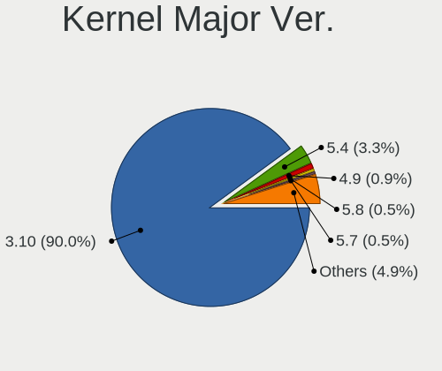

| Version | Computers | Percent |
|---------|-----------|---------|
| 3.10    | 240       | 88.24%  |
| 5.4     | 10        | 3.68%   |
| 4.9     | 4         | 1.47%   |
| 5.8     | 2         | 0.74%   |
| 5.7     | 2         | 0.74%   |
| 5.6     | 2         | 0.74%   |
| 4.20    | 2         | 0.74%   |
| 4.18    | 2         | 0.74%   |
| 5.5     | 1         | 0.37%   |
| 5.3     | 1         | 0.37%   |
| 5.2     | 1         | 0.37%   |
| 5.11    | 1         | 0.37%   |
| 5.10    | 1         | 0.37%   |
| 5.1     | 1         | 0.37%   |
| 4.4     | 1         | 0.37%   |
| 4.19    | 1         | 0.37%   |

Arch
----

OS architecture (x86_64, i586, etc.)

| Name    | Computers | Percent |
|---------|-----------|---------|
| x86_64  | 267       | 98.52%  |
| i686    | 3         | 1.11%   |
| aarch64 | 1         | 0.37%   |

DE
--

Desktop Environment

| Name          | Computers | Percent |
|---------------|-----------|---------|
| Unknown       | 118       | 43.22%  |
| GNOME         | 83        | 30.4%   |
| KDE4          | 31        | 11.36%  |
| GNOME Classic | 21        | 7.69%   |
| MATE          | 11        | 4.03%   |
| Cinnamon      | 6         | 2.2%    |
| XFCE          | 2         | 0.73%   |
| Xpra          | 1         | 0.37%   |

Display Server
--------------

X11 or Wayland

| Name    | Computers | Percent |
|---------|-----------|---------|
| X11     | 198       | 73.06%  |
| Unknown | 72        | 26.57%  |
| Web     | 1         | 0.37%   |

Display Manager
---------------

SDDM, LightDM, etc.

| Name    | Computers | Percent |
|---------|-----------|---------|
| Unknown | 139       | 50.92%  |
| GDM     | 124       | 45.42%  |
| LightDM | 6         | 2.2%    |
| TDM     | 3         | 1.1%    |
| SDDM    | 1         | 0.37%   |

OS Lang
-------

Language

| Lang        | Computers | Percent |
|-------------|-----------|---------|
| en_US       | 104       | 37.96%  |
| Unknown     | 79        | 28.83%  |
| C           | 18        | 6.57%   |
| ru_RU       | 15        | 5.47%   |
| en_GB       | 7         | 2.55%   |
| de_AT       | 7         | 2.55%   |
| fr_FR       | 6         | 2.19%   |
| zh_CN       | 5         | 1.82%   |
| pt_BR       | 5         | 1.82%   |
| en_CA       | 4         | 1.46%   |
| en_AU       | 4         | 1.46%   |
| pl_PL       | 3         | 1.09%   |
| en_US.utf-8 | 3         | 1.09%   |
| de_DE       | 3         | 1.09%   |
| es_ES       | 2         | 0.73%   |
| pt_PT       | 1         | 0.36%   |
| ko_KR       | 1         | 0.36%   |
| ja_JP       | 1         | 0.36%   |
| fr_CA       | 1         | 0.36%   |
| fi_FI       | 1         | 0.36%   |
| es_AR       | 1         | 0.36%   |
| en_SG       | 1         | 0.36%   |
| en_IN       | 1         | 0.36%   |
| cs_CZ       | 1         | 0.36%   |

Boot Mode
---------

EFI or BIOS

| Mode | Computers | Percent |
|------|-----------|---------|
| BIOS | 157       | 57.72%  |
| EFI  | 115       | 42.28%  |

Filesystem
----------

Type of filesystem

| Type    | Computers | Percent |
|---------|-----------|---------|
| Xfs     | 185       | 68.01%  |
| Ext4    | 71        | 26.1%   |
| Unknown | 13        | 4.78%   |
| Overlay | 1         | 0.37%   |
| Ext3    | 1         | 0.37%   |
| Ext2    | 1         | 0.37%   |

Part. scheme
------------

Scheme of partitioning

| Type    | Computers | Percent |
|---------|-----------|---------|
| GPT     | 144       | 52.55%  |
| MBR     | 91        | 33.21%  |
| Unknown | 39        | 14.23%  |

Dual Boot with Linux/BSD
------------------------

Hosting more than one Linux/BSD

| Dual boot | Computers | Percent |
|-----------|-----------|---------|
| No        | 222       | 81.62%  |
| Yes       | 50        | 18.38%  |

Dual Boot (Win)
---------------

Hosting Linux and Windows

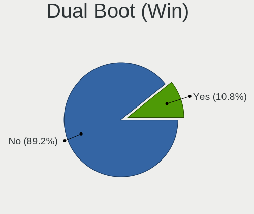

| Dual boot | Computers | Percent |
|-----------|-----------|---------|
| No        | 244       | 89.71%  |
| Yes       | 28        | 10.29%  |

Board
-----

Vendor
------

Motherboard manufacturer

| Name                | Computers | Percent |
|---------------------|-----------|---------|
| Dell                | 61        | 22.51%  |
| Hewlett-Packard     | 47        | 17.34%  |
| Supermicro          | 31        | 11.44%  |
| ASUSTek Computer    | 29        | 10.7%   |
| Lenovo              | 21        | 7.75%   |
| Gigabyte Technology | 19        | 7.01%   |
| Intel               | 13        | 4.8%    |
| ASRock              | 6         | 2.21%   |
| MSI                 | 5         | 1.85%   |
| IBM                 | 3         | 1.11%   |
| ASRockRack          | 3         | 1.11%   |
| AMI                 | 3         | 1.11%   |
| Unknown             | 3         | 1.11%   |
| Toshiba             | 2         | 0.74%   |
| Sun Microsystems    | 2         | 0.74%   |
| Sony                | 2         | 0.74%   |
| MiTAC               | 2         | 0.74%   |
| Fujitsu             | 2         | 0.74%   |
| ECS                 | 2         | 0.74%   |
| Acer                | 2         | 0.74%   |
| Zenith              | 1         | 0.37%   |
| Samsung Electronics | 1         | 0.37%   |
| Notebook            | 1         | 0.37%   |
| Hyve                | 1         | 0.37%   |
| HUAWEI              | 1         | 0.37%   |
| Huanan              | 1         | 0.37%   |
| Foxconn             | 1         | 0.37%   |
| eMachines           | 1         | 0.37%   |
| Cisco Systems       | 1         | 0.37%   |
| Apple               | 1         | 0.37%   |
| AIC                 | 1         | 0.37%   |
| AEWIN               | 1         | 0.37%   |
| AAEON               | 1         | 0.37%   |

Model
-----

Motherboard model

| Name                                                  | Computers | Percent |
|-------------------------------------------------------|-----------|---------|
| Supermicro Super Server                               | 18        | 6.64%   |
| Dell OptiPlex 7040                                    | 8         | 2.95%   |
| Dell OptiPlex 9020                                    | 7         | 2.58%   |
| Supermicro X8DTN+-F                                   | 4         | 1.48%   |
| ASUS All Series                                       | 4         | 1.48%   |
| HP EliteDesk 800 G6 Desktop Mini PC                   | 3         | 1.11%   |
| HP Compaq Elite 8300 SFF                              | 3         | 1.11%   |
| Dell Precision WorkStation T3500                      | 3         | 1.11%   |
| ASRockRack E3C242D4U2-2T                              | 3         | 1.11%   |
| Unknown                                               | 3         | 1.11%   |
| Supermicro SYS-1028TP-DC1R                            | 2         | 0.74%   |
| Lenovo System x3650 M5: -[8871AC1]-                   | 2         | 0.74%   |
| HP Z800 Workstation                                   | 2         | 0.74%   |
| HP Z420 Workstation                                   | 2         | 0.74%   |
| Gigabyte GA-78LMT-USB3                                | 2         | 0.74%   |
| Fujitsu D3401-H1                                      | 2         | 0.74%   |
| Dell PowerEdge R630                                   | 2         | 0.74%   |
| Dell Inspiron N4050                                   | 2         | 0.74%   |
| Zenith Orion                                          | 1         | 0.37%   |
| Toshiba Satellite Radius 12 P20W-C-106                | 1         | 0.37%   |
| Toshiba Satellite A135                                | 1         | 0.37%   |
| Supermicro X8DTL                                      | 1         | 0.37%   |
| Supermicro X8DT3                                      | 1         | 0.37%   |
| Supermicro SYS-E200-8D                                | 1         | 0.37%   |
| Supermicro SYS-6018R-WTR                              | 1         | 0.37%   |
| Supermicro SYS-5038MD-H24TRF-OS012                    | 1         | 0.37%   |
| Supermicro SYS-1028GR-TR                              | 1         | 0.37%   |
| Supermicro AS -1014S-WTRT                             | 1         | 0.37%   |
| Sun Microsystems Sun Fire X2270                       | 1         | 0.37%   |
| Sun Microsystems Sun Fire X2200 M2                    | 1         | 0.37%   |
| Sony VPCSB19GG                                        | 1         | 0.37%   |
| Sony VGN-N19VP_B                                      | 1         | 0.37%   |
| Samsung 300E5EV/300E4EV/270E5EV/270E4EV/2470EV/2470EE | 1         | 0.37%   |
| Notebook WA50SRQ                                      | 1         | 0.37%   |
| MSI MS-7B89                                           | 1         | 0.37%   |
| MSI MS-7A94                                           | 1         | 0.37%   |
| MSI MS-7978                                           | 1         | 0.37%   |
| MSI GP62MVR 7RFX                                      | 1         | 0.37%   |
| MSI GL63 8SD                                          | 1         | 0.37%   |
| MiTAC UltraPoint                                      | 1         | 0.37%   |
| MiTAC PD10BI                                          | 1         | 0.37%   |
| Lenovo Y520-15IKBN 80WK                               | 1         | 0.37%   |
| Lenovo ThinkSystem SR650 -[7X06CTO1WW]-               | 1         | 0.37%   |
| Lenovo ThinkSystem SR630 V2                           | 1         | 0.37%   |
| Lenovo ThinkPad X61s 7667DB2                          | 1         | 0.37%   |
| Lenovo ThinkPad X390 Yoga 20NQS18Y00                  | 1         | 0.37%   |
| Lenovo ThinkPad X200 7459ZEJ                          | 1         | 0.37%   |
| Lenovo ThinkPad X200 7459H92                          | 1         | 0.37%   |
| Lenovo ThinkPad X1 Carbon 6th 20KGSA3T00              | 1         | 0.37%   |
| Lenovo ThinkPad T61 64665WG                           | 1         | 0.37%   |
| Lenovo ThinkPad T530 2394AG6                          | 1         | 0.37%   |
| Lenovo ThinkPad T520 4243Y1N                          | 1         | 0.37%   |
| Lenovo ThinkPad T440p 20AWS27B0X                      | 1         | 0.37%   |
| Lenovo ThinkPad P53 20QNS00Y00                        | 1         | 0.37%   |
| Lenovo ThinkCentre M920x 10S10013GE                   | 1         | 0.37%   |
| Lenovo ThinkCentre M920q 10RS002YGE                   | 1         | 0.37%   |
| Lenovo IdeaPad 310-15ISK 80UH                         | 1         | 0.37%   |
| Lenovo G500s 20245                                    | 1         | 0.37%   |
| Lenovo 70UB001NEA ThinkServer TS150                   | 1         | 0.37%   |
| Lenovo 70A4000FUX ThinkServer TS140                   | 1         | 0.37%   |

Model Family
------------

Motherboard model prefix

| Name                               | Computers | Percent |
|------------------------------------|-----------|---------|
| Dell OptiPlex                      | 21        | 7.75%   |
| Supermicro Super                   | 18        | 6.64%   |
| Dell Precision                     | 11        | 4.06%   |
| Dell PowerEdge                     | 11        | 4.06%   |
| Lenovo ThinkPad                    | 10        | 3.69%   |
| HP EliteDesk                       | 10        | 3.69%   |
| Dell Inspiron                      | 7         | 2.58%   |
| HP EliteBook                       | 5         | 1.85%   |
| HP Compaq                          | 5         | 1.85%   |
| Dell Vostro                        | 5         | 1.85%   |
| Dell Latitude                      | 5         | 1.85%   |
| Supermicro X8DTN+-F                | 4         | 1.48%   |
| ASUS PRIME                         | 4         | 1.48%   |
| ASUS All                           | 4         | 1.48%   |
| HP ProLiant                        | 3         | 1.11%   |
| HP Pavilion                        | 3         | 1.11%   |
| ASRockRack E3C242D4U2-2T           | 3         | 1.11%   |
| Unknown                            | 3         | 1.11%   |
| Toshiba Satellite                  | 2         | 0.74%   |
| Supermicro SYS-1028TP-DC1R         | 2         | 0.74%   |
| Sun Microsystems Sun               | 2         | 0.74%   |
| Lenovo ThinkSystem                 | 2         | 0.74%   |
| Lenovo ThinkCentre                 | 2         | 0.74%   |
| Lenovo System                      | 2         | 0.74%   |
| IBM System                         | 2         | 0.74%   |
| HP Z800                            | 2         | 0.74%   |
| HP Z420                            | 2         | 0.74%   |
| HP Z2                              | 2         | 0.74%   |
| Gigabyte GA-78LMT-USB3             | 2         | 0.74%   |
| Gigabyte B360                      | 2         | 0.74%   |
| Fujitsu D3401-H1                   | 2         | 0.74%   |
| ASUS ROG                           | 2         | 0.74%   |
| ASUS M5A78L-M                      | 2         | 0.74%   |
| Acer Aspire                        | 2         | 0.74%   |
| Zenith Orion                       | 1         | 0.37%   |
| Supermicro X8DTL                   | 1         | 0.37%   |
| Supermicro X8DT3                   | 1         | 0.37%   |
| Supermicro SYS-E200-8D             | 1         | 0.37%   |
| Supermicro SYS-6018R-WTR           | 1         | 0.37%   |
| Supermicro SYS-5038MD-H24TRF-OS012 | 1         | 0.37%   |
| Supermicro SYS-1028GR-TR           | 1         | 0.37%   |
| Supermicro AS                      | 1         | 0.37%   |
| Sony VPCSB19GG                     | 1         | 0.37%   |
| Sony VGN-N19VP                     | 1         | 0.37%   |
| Samsung 300E5EV                    | 1         | 0.37%   |
| Notebook WA50SRQ                   | 1         | 0.37%   |
| MSI MS-7B89                        | 1         | 0.37%   |
| MSI MS-7A94                        | 1         | 0.37%   |
| MSI MS-7978                        | 1         | 0.37%   |
| MSI GP62MVR                        | 1         | 0.37%   |
| MSI GL63                           | 1         | 0.37%   |
| MiTAC UltraPoint                   | 1         | 0.37%   |
| MiTAC PD10BI                       | 1         | 0.37%   |
| Lenovo Y520-15IKBN                 | 1         | 0.37%   |
| Lenovo IdeaPad                     | 1         | 0.37%   |
| Lenovo G500s                       | 1         | 0.37%   |
| Lenovo 70UB001NEA                  | 1         | 0.37%   |
| Lenovo 70A4000FUX                  | 1         | 0.37%   |
| Intel SHARKBAY                     | 1         | 0.37%   |
| Intel SandyBridge                  | 1         | 0.37%   |

MFG Year
--------

Motherboard manufacture year

| Year    | Computers | Percent |
|---------|-----------|---------|
| 2017    | 30        | 11.07%  |
| 2018    | 26        | 9.59%   |
| 2019    | 24        | 8.86%   |
| 2011    | 23        | 8.49%   |
| 2016    | 22        | 8.12%   |
| 2014    | 22        | 8.12%   |
| 2013    | 21        | 7.75%   |
| 2010    | 19        | 7.01%   |
| 2012    | 18        | 6.64%   |
| 2015    | 16        | 5.9%    |
| 2020    | 15        | 5.54%   |
| 2021    | 11        | 4.06%   |
| 2008    | 10        | 3.69%   |
| 2009    | 5         | 1.85%   |
| 2007    | 5         | 1.85%   |
| 2006    | 2         | 0.74%   |
| 2001    | 1         | 0.37%   |
| Unknown | 1         | 0.37%   |

Form Factor
-----------

Physical design of the computer

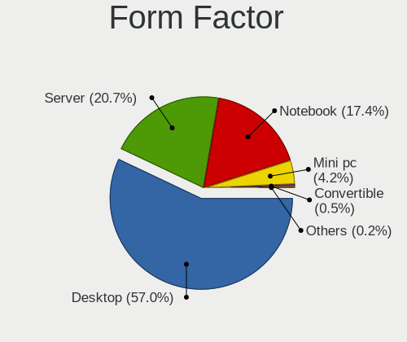

| Name        | Computers | Percent |
|-------------|-----------|---------|
| Desktop     | 136       | 50.18%  |
| Server      | 59        | 21.77%  |
| Notebook    | 58        | 21.4%   |
| Mini pc     | 15        | 5.54%   |
| Convertible | 2         | 0.74%   |
| All in one  | 1         | 0.37%   |

Secure Boot
-----------

Enabled or disabled

| State    | Computers | Percent |
|----------|-----------|---------|
| Disabled | 264       | 97.42%  |
| Enabled  | 7         | 2.58%   |

Coreboot
--------

Have coreboot on board

| Used | Computers | Percent |
|------|-----------|---------|
| No   | 269       | 99.26%  |
| Yes  | 2         | 0.74%   |

RAM Size
--------

Total RAM memory

| Size in GB      | Computers | Percent |
|-----------------|-----------|---------|
| 4.01-8.0        | 71        | 26.2%   |
| 32.01-64.0      | 47        | 17.34%  |
| 16.01-24.0      | 36        | 13.28%  |
| 64.01-256.0     | 28        | 10.33%  |
| More than 256.0 | 27        | 9.96%   |
| 3.01-4.0        | 22        | 8.12%   |
| 8.01-16.0       | 19        | 7.01%   |
| 1.01-2.0        | 12        | 4.43%   |
| 24.01-32.0      | 6         | 2.21%   |
| 0.51-1.0        | 2         | 0.74%   |
| 2.01-3.0        | 1         | 0.37%   |

RAM Used
--------

Used RAM memory

| Used GB         | Computers | Percent |
|-----------------|-----------|---------|
| 1.01-2.0        | 61        | 21.63%  |
| 2.01-3.0        | 44        | 15.6%   |
| 0.51-1.0        | 43        | 15.25%  |
| 4.01-8.0        | 42        | 14.89%  |
| 3.01-4.0        | 28        | 9.93%   |
| 8.01-16.0       | 19        | 6.74%   |
| 64.01-256.0     | 15        | 5.32%   |
| 32.01-64.0      | 11        | 3.9%    |
| 0.01-0.5        | 11        | 3.9%    |
| 16.01-24.0      | 4         | 1.42%   |
| 24.01-32.0      | 3         | 1.06%   |
| More than 256.0 | 1         | 0.35%   |

Total Drives
------------

Number of drives on board

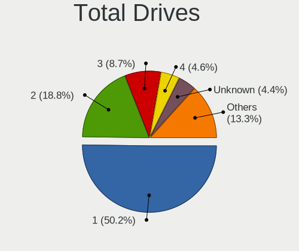

| Drives  | Computers | Percent |
|---------|-----------|---------|
| 1       | 122       | 44.04%  |
| 2       | 56        | 20.22%  |
| 3       | 30        | 10.83%  |
| Unknown | 19        | 6.86%   |
| 4       | 12        | 4.33%   |
| 5       | 9         | 3.25%   |
| 6       | 6         | 2.17%   |
| 0       | 4         | 1.44%   |
| 15      | 2         | 0.72%   |
| 10      | 2         | 0.72%   |
| 9       | 2         | 0.72%   |
| 8       | 2         | 0.72%   |
| 7       | 2         | 0.72%   |
| 209     | 1         | 0.36%   |
| 71      | 1         | 0.36%   |
| 68      | 1         | 0.36%   |
| 19      | 1         | 0.36%   |
| 18      | 1         | 0.36%   |
| 17      | 1         | 0.36%   |
| 13      | 1         | 0.36%   |
| 12      | 1         | 0.36%   |
| 11      | 1         | 0.36%   |

Has CD-ROM
----------

Has CD-ROM on board

| Presented | Computers | Percent |
|-----------|-----------|---------|
| No        | 174       | 64.21%  |
| Yes       | 97        | 35.79%  |

Has Ethernet
------------

Has Ethernet on board

| Presented | Computers | Percent |
|-----------|-----------|---------|
| Yes       | 265       | 97.79%  |
| No        | 6         | 2.21%   |

Has WiFi
--------

Has WiFi module

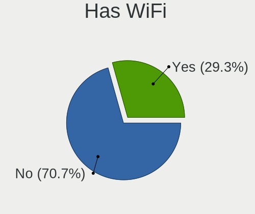

| Presented | Computers | Percent |
|-----------|-----------|---------|
| No        | 176       | 64.94%  |
| Yes       | 95        | 35.06%  |

Has Bluetooth
-------------

Has Bluetooth module

| Presented | Computers | Percent |
|-----------|-----------|---------|
| No        | 201       | 74.17%  |
| Yes       | 70        | 25.83%  |

Location
--------

Country
-------

Geographic location (country)

| Country      | Computers | Percent |
|--------------|-----------|---------|
| USA          | 79        | 28.83%  |
| Russia       | 37        | 13.5%   |
| Germany      | 14        | 5.11%   |
| Brazil       | 12        | 4.38%   |
| France       | 11        | 4.01%   |
| Canada       | 11        | 4.01%   |
| UK           | 10        | 3.65%   |
| China        | 10        | 3.65%   |
| Australia    | 8         | 2.92%   |
| Switzerland  | 7         | 2.55%   |
| India        | 6         | 2.19%   |
| Finland      | 6         | 2.19%   |
| Poland       | 5         | 1.82%   |
| Czechia      | 5         | 1.82%   |
| Belgium      | 5         | 1.82%   |
| Spain        | 4         | 1.46%   |
| Norway       | 4         | 1.46%   |
| Bulgaria     | 4         | 1.46%   |
| Ukraine      | 3         | 1.09%   |
| Sweden       | 3         | 1.09%   |
| South Korea  | 3         | 1.09%   |
| Netherlands  | 3         | 1.09%   |
| Japan        | 3         | 1.09%   |
| Taiwan       | 2         | 0.73%   |
| Pakistan     | 2         | 0.73%   |
| Israel       | 2         | 0.73%   |
| South Africa | 1         | 0.36%   |
| Singapore    | 1         | 0.36%   |
| Romania      | 1         | 0.36%   |
| Portugal     | 1         | 0.36%   |
| Mexico       | 1         | 0.36%   |
| Kazakhstan   | 1         | 0.36%   |
| Ireland      | 1         | 0.36%   |
| Iran         | 1         | 0.36%   |
| Hong Kong    | 1         | 0.36%   |
| Greece       | 1         | 0.36%   |
| Ecuador      | 1         | 0.36%   |
| Croatia      | 1         | 0.36%   |
| Chile        | 1         | 0.36%   |
| Argentina    | 1         | 0.36%   |
| Algeria      | 1         | 0.36%   |

City
----

Geographic location (city)

| City              | Computers | Percent |
|-------------------|-----------|---------|
| Rochester         | 19        | 6.76%   |
| Moscow            | 19        | 6.76%   |
| Madison           | 17        | 6.05%   |
| Frankfurt am Main | 6         | 2.14%   |
| Bern              | 5         | 1.78%   |
| St Petersburg     | 4         | 1.42%   |
| Rio de Janeiro    | 4         | 1.42%   |
| Paris             | 4         | 1.42%   |
| London            | 4         | 1.42%   |
| Helsinki          | 4         | 1.42%   |
| Alexandria        | 4         | 1.42%   |
| Victoria          | 3         | 1.07%   |
| Tampa             | 3         | 1.07%   |
| Sydney            | 3         | 1.07%   |
| Sofia             | 3         | 1.07%   |
| Prague            | 3         | 1.07%   |
| Wahroonga         | 2         | 0.71%   |
| Vitry-sur-Seine   | 2         | 0.71%   |
| Vancouver         | 2         | 0.71%   |
| Twistetal         | 2         | 0.71%   |
| Sao Paulo         | 2         | 0.71%   |
| Perm              | 2         | 0.71%   |
| Oslo              | 2         | 0.71%   |
| North Bend        | 2         | 0.71%   |
| Newark            | 2         | 0.71%   |
| Montreal          | 2         | 0.71%   |
| Leuven            | 2         | 0.71%   |
| Kyiv              | 2         | 0.71%   |
| Krasnodar         | 2         | 0.71%   |
| Hyderabad         | 2         | 0.71%   |
| Guangzhou         | 2         | 0.71%   |
| Grovedale         | 2         | 0.71%   |
| Brno              | 2         | 0.71%   |
| Brandon           | 2         | 0.71%   |
| Beijing           | 2         | 0.71%   |
| Ashburn           | 2         | 0.71%   |
| Amsterdam         | 2         | 0.71%   |
| Zhuhai            | 1         | 0.36%   |
| Zagreb            | 1         | 0.36%   |
| Yekaterinburg     | 1         | 0.36%   |
| Xuhui             | 1         | 0.36%   |
| Wheeling          | 1         | 0.36%   |
| West Chester      | 1         | 0.36%   |
| Waxhaw            | 1         | 0.36%   |
| Varna             | 1         | 0.36%   |
| Universitrio  | 1         | 0.36%   |
| Tyumentsevo       | 1         | 0.36%   |
| Tyumen            | 1         | 0.36%   |
| Tygelsjoe         | 1         | 0.36%   |
| Tuscaloosa        | 1         | 0.36%   |
| Turku             | 1         | 0.36%   |
| Tucson            | 1         | 0.36%   |
| Trivandrum        | 1         | 0.36%   |
| Toyama            | 1         | 0.36%   |
| Tours             | 1         | 0.36%   |
| Toronto           | 1         | 0.36%   |
| Tokyo             | 1         | 0.36%   |
| Tharwa            | 1         | 0.36%   |
| Tel Aviv          | 1         | 0.36%   |
| Tehran            | 1         | 0.36%   |

Drives
------

Drive Vendor
------------

Hard drive vendors

| Vendor                       | Computers | Drives | Percent |
|------------------------------|-----------|--------|---------|
| Seagate                      | 73        | 301    | 19.84%  |
| WDC                          | 63        | 329    | 17.12%  |
| Samsung Electronics          | 53        | 101    | 14.4%   |
| Toshiba                      | 32        | 48     | 8.7%    |
| Kingston                     | 23        | 26     | 6.25%   |
| Intel                        | 20        | 37     | 5.43%   |
| Hitachi                      | 17        | 24     | 4.62%   |
| SanDisk                      | 11        | 14     | 2.99%   |
| HGST                         | 10        | 95     | 2.72%   |
| Unknown                      | 8         | 18     | 2.17%   |
| Micron Technology            | 6         | 10     | 1.63%   |
| SK hynix                     | 5         | 5      | 1.36%   |
| Hewlett-Packard              | 5         | 27     | 1.36%   |
| SPCC                         | 4         | 6      | 1.09%   |
| Toshiba America Info Systems | 3         | 4      | 0.82%   |
| A-DATA Technology            | 3         | 4      | 0.82%   |
| Sun                          | 2         | 6      | 0.54%   |
| StoreJet                     | 2         | 2      | 0.54%   |
| OCZ                          | 2         | 3      | 0.54%   |
| NVMe                         | 2         | 2      | 0.54%   |
| LITEONIT                     | 2         | 2      | 0.54%   |
| Crucial                      | 2         | 2      | 0.54%   |
| Transcend                    | 1         | 1      | 0.27%   |
| TAISU                        | 1         | 1      | 0.27%   |
| Smartbuy                     | 1         | 1      | 0.27%   |
| Realtek                      | 1         | 1      | 0.27%   |
| OWC                          | 1         | 1      | 0.27%   |
| Micron/Crucial Technology    | 1         | 1      | 0.27%   |
| Maxtor                       | 1         | 1      | 0.27%   |
| Lexar                        | 1         | 2      | 0.27%   |
| Lenovo                       | 1         | 2      | 0.27%   |
| Kingston Technology Company  | 1         | 1      | 0.27%   |
| Kingston Technologies        | 1         | 1      | 0.27%   |
| KingSpec                     | 1         | 1      | 0.27%   |
| KingDian                     | 1         | 4      | 0.27%   |
| Goodram                      | 1         | 1      | 0.27%   |
| GLOWAY                       | 1         | 1      | 0.27%   |
| Fujitsu                      | 1         | 1      | 0.27%   |
| Corsair                      | 1         | 1      | 0.27%   |
| ASUSTek Computer             | 1         | 1      | 0.27%   |
| ASMT                         | 1         | 3      | 0.27%   |
| 2.5"                         | 1         | 1      | 0.27%   |

Drive Model
-----------

Hard drive models

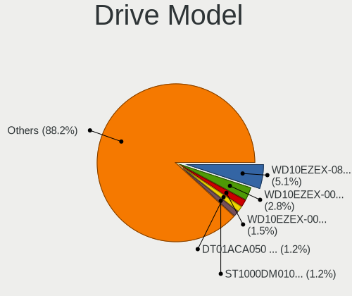

| Model                                         | Computers | Percent |
|-----------------------------------------------|-----------|---------|
| Toshiba DT01ACA050 500GB                      | 7         | 1.61%   |
| Seagate ST500DM002-1SB10A 500GB               | 6         | 1.38%   |
| Seagate ST500DM002-1BD142 500GB               | 5         | 1.15%   |
| Samsung SSD 860 EVO 250GB                     | 5         | 1.15%   |
| Kingston SA400S37240G 240GB SSD               | 5         | 1.15%   |
| WDC WD1003FZEX-00MK2A0 1TB                    | 4         | 0.92%   |
| Seagate ST1000DM010-2EP102 1TB                | 4         | 0.92%   |
| Intel SSDSC2BA200G4 200GB                     | 4         | 0.92%   |
| WDC WD40EZAZ-00SF3B0 4TB                      | 3         | 0.69%   |
| Seagate ST6000NM0095 6TB                      | 3         | 0.69%   |
| Seagate ST6000NM0034 6TB                      | 3         | 0.69%   |
| Seagate ST6000NM0014 6TB                      | 3         | 0.69%   |
| Seagate ST4000NXCLAR4000 4TB                  | 3         | 0.69%   |
| Seagate ST4000NM0023 4TB                      | 3         | 0.69%   |
| Seagate ST2000DM006-2DM164 2TB                | 3         | 0.69%   |
| Seagate BUP Slim 2TB                          | 3         | 0.69%   |
| Samsung SSD 970 2TB                           | 3         | 0.69%   |
| Kingston SV300S37A120G 120GB SSD              | 3         | 0.69%   |
| WDC WDS250G2B0A-00SM50 250GB SSD              | 2         | 0.46%   |
| WDC WD3200AAKS-75L9A0 320GB                   | 2         | 0.46%   |
| WDC WD20EFRX-68EUZN0 2TB                      | 2         | 0.46%   |
| WDC WD10EZEX-00BN5A0 1TB                      | 2         | 0.46%   |
| Unknown HUH728080ALE601 8TB                   | 2         | 0.46%   |
| Toshiba TR200 240GB SSD                       | 2         | 0.46%   |
| Toshiba KBG30ZMS128G 128GB NVMe SSD           | 2         | 0.46%   |
| Toshiba DT01ACA200 2TB                        | 2         | 0.46%   |
| Toshiba DT01ACA100 1TB                        | 2         | 0.46%   |
| Sun COMSTAR 112GB                             | 2         | 0.46%   |
| StoreJet Transcend 1TB                        | 2         | 0.46%   |
| SPCC Solid State Disk 64GB                    | 2         | 0.46%   |
| SK hynix SHGS31-500GS-2 500GB SSD             | 2         | 0.46%   |
| Seagate ST600MM0026 600GB                     | 2         | 0.46%   |
| Seagate ST4000VM000-2AF166 4TB                | 2         | 0.46%   |
| Seagate ST3000NC002-1DY166 3TB                | 2         | 0.46%   |
| Seagate ST2000DM001-1ER164 2TB                | 2         | 0.46%   |
| Seagate ST2000DM001-1CH164 2TB                | 2         | 0.46%   |
| Seagate ST16000NM001G-2KK103 16TB             | 2         | 0.46%   |
| Seagate ST1000NX0423 00AJ142 1TB              | 2         | 0.46%   |
| Seagate ST1000DM003-1CH162 1TB                | 2         | 0.46%   |
| SanDisk WDC WDS100T2B0C 1TB                   | 2         | 0.46%   |
| SanDisk WDC CL SN720 SDA 512GB                | 2         | 0.46%   |
| Samsung SSD SM871 2.5 7mm 512GB               | 2         | 0.46%   |
| Samsung SSD 850 EVO 250GB                     | 2         | 0.46%   |
| Samsung NVMe SSD Drive 512GB                  | 2         | 0.46%   |
| Samsung NVMe SSD Drive 256GB                  | 2         | 0.46%   |
| Samsung NVMe SSD Controller SM961/PM961 256GB | 2         | 0.46%   |
| Samsung MZVLB512 512GB                        | 2         | 0.46%   |
| Samsung MZVLB1T0 1TB                          | 2         | 0.46%   |
| Kingston SA400S37120G 120GB SSD               | 2         | 0.46%   |
| HGST HUS726060ALS640 6TB                      | 2         | 0.46%   |
| HGST H7280A520SUN8.0T 8TB                     | 2         | 0.46%   |
| WDC WUH721816AL5204 16TB                      | 1         | 0.23%   |
| WDC WSH722020ALE6L0 20TB                      | 1         | 0.23%   |
| WDC WDS500G2B0A-00SM50 500GB SSD              | 1         | 0.23%   |
| WDC WDS500G2B0A 500GB SSD                     | 1         | 0.23%   |
| WDC WDS240G2G0A-00JH30 240GB SSD              | 1         | 0.23%   |
| WDC WDS120G1G0A-00SS50 120GB SSD              | 1         | 0.23%   |
| WDC WD80EFAX-68KNBN0 8TB                      | 1         | 0.23%   |
| WDC WD7500BPVX-22JC3T0 752GB                  | 1         | 0.23%   |
| WDC WD7500BPKX-00HPJT0 752GB                  | 1         | 0.23%   |

HDD Vendor
----------

Hard disk drive vendors

| Vendor              | Computers | Drives | Percent |
|---------------------|-----------|--------|---------|
| Seagate             | 73        | 300    | 35.96%  |
| WDC                 | 59        | 115    | 29.06%  |
| Toshiba             | 26        | 37     | 12.81%  |
| Hitachi             | 17        | 24     | 8.37%   |
| HGST                | 10        | 48     | 4.93%   |
| Samsung Electronics | 8         | 39     | 3.94%   |
| Hewlett-Packard     | 3         | 24     | 1.48%   |
| Unknown             | 2         | 11     | 0.99%   |
| Sun                 | 2         | 6      | 0.99%   |
| Maxtor              | 1         | 1      | 0.49%   |
| Lenovo              | 1         | 2      | 0.49%   |
| Fujitsu             | 1         | 1      | 0.49%   |

SSD Vendor
----------

Solid state drive vendors

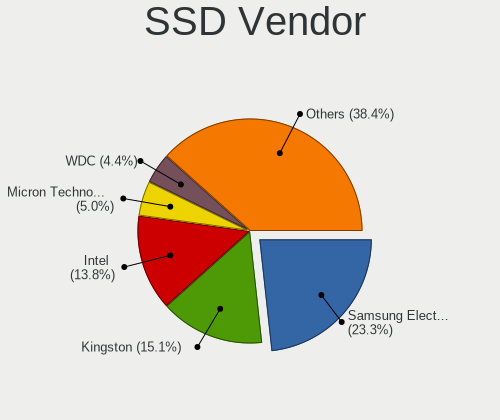

| Vendor              | Computers | Drives | Percent |
|---------------------|-----------|--------|---------|
| Samsung Electronics | 27        | 35     | 21.95%  |
| Kingston            | 22        | 25     | 17.89%  |
| Intel               | 19        | 35     | 15.45%  |
| Micron Technology   | 6         | 10     | 4.88%   |
| WDC                 | 5         | 8      | 4.07%   |
| SK hynix            | 5         | 5      | 4.07%   |
| SanDisk             | 5         | 5      | 4.07%   |
| Toshiba             | 4         | 8      | 3.25%   |
| SPCC                | 4         | 6      | 3.25%   |
| A-DATA Technology   | 3         | 4      | 2.44%   |
| StoreJet            | 2         | 2      | 1.63%   |
| OCZ                 | 2         | 3      | 1.63%   |
| LITEONIT            | 2         | 2      | 1.63%   |
| Hewlett-Packard     | 2         | 3      | 1.63%   |
| Crucial             | 2         | 2      | 1.63%   |
| Transcend           | 1         | 1      | 0.81%   |
| TAISU               | 1         | 1      | 0.81%   |
| Smartbuy            | 1         | 1      | 0.81%   |
| Seagate             | 1         | 1      | 0.81%   |
| OWC                 | 1         | 1      | 0.81%   |
| Lexar               | 1         | 2      | 0.81%   |
| KingDian            | 1         | 4      | 0.81%   |
| Goodram             | 1         | 1      | 0.81%   |
| GLOWAY              | 1         | 1      | 0.81%   |
| Corsair             | 1         | 1      | 0.81%   |
| ASUSTek Computer    | 1         | 1      | 0.81%   |
| ASMT                | 1         | 3      | 0.81%   |
| 2.5"                | 1         | 1      | 0.81%   |

Drive Kind
----------

HDD or SSD

| Kind    | Computers | Drives | Percent |
|---------|-----------|--------|---------|
| HDD     | 166       | 608    | 51.55%  |
| SSD     | 109       | 172    | 33.85%  |
| NVMe    | 36        | 52     | 11.18%  |
| MMC     | 7         | 8      | 2.17%   |
| Unknown | 4         | 253    | 1.24%   |

Drive Connector
---------------

SATA, SAS, NVMe, etc.

| Type | Computers | Drives | Percent |
|------|-----------|--------|---------|
| SATA | 212       | 610    | 77.09%  |
| NVMe | 36        | 51     | 13.09%  |
| SAS  | 20        | 424    | 7.27%   |
| MMC  | 7         | 8      | 2.55%   |

Drive Size
----------

Size of hard drive

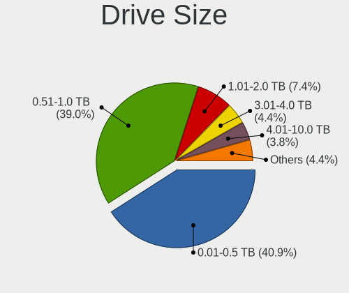

| Size in TB | Computers | Drives | Percent |
|------------|-----------|--------|---------|
| 0.01-0.5   | 154       | 293    | 50.33%  |
| 0.51-1.0   | 82        | 156    | 26.8%   |
| 1.01-2.0   | 24        | 62     | 7.84%   |
| 3.01-4.0   | 18        | 119    | 5.88%   |
| 4.01-10.0  | 12        | 86     | 3.92%   |
| 2.01-3.0   | 10        | 21     | 3.27%   |
| 10.01-20.0 | 6         | 43     | 1.96%   |

Space Total
-----------

Amount of disk space available on the file system

| Size in GB     | Computers | Percent |
|----------------|-----------|---------|
| 251-500        | 59        | 21.38%  |
| 101-250        | 54        | 19.57%  |
| More than 3000 | 49        | 17.75%  |
| 501-1000       | 35        | 12.68%  |
| 1001-2000      | 24        | 8.7%    |
| 51-100         | 16        | 5.8%    |
| 21-50          | 12        | 4.35%   |
| Unknown        | 12        | 4.35%   |
| 1-20           | 9         | 3.26%   |
| 2001-3000      | 6         | 2.17%   |

Space Used
----------

Amount of used disk space

| Used GB        | Computers | Percent |
|----------------|-----------|---------|
| 1-20           | 108       | 39.13%  |
| 101-250        | 34        | 12.32%  |
| 51-100         | 31        | 11.23%  |
| 251-500        | 25        | 9.06%   |
| 21-50          | 20        | 7.25%   |
| 501-1000       | 18        | 6.52%   |
| More than 3000 | 15        | 5.43%   |
| Unknown        | 12        | 4.35%   |
| 1001-2000      | 8         | 2.9%    |
| 2001-3000      | 4         | 1.45%   |
| 0              | 1         | 0.36%   |

Malfunc. Drives
---------------

Drive models with a malfunction

| Model                                               | Computers | Drives | Percent |
|-----------------------------------------------------|-----------|--------|---------|
| Seagate ST500DM002-1BD142 500GB                     | 2         | 2      | 3.57%   |
| WDC WD5000AVCS-632DY1 500GB                         | 1         | 1      | 1.79%   |
| WDC WD5000AAKX-08U6AA0 500GB                        | 1         | 1      | 1.79%   |
| WDC WD3200AAKS-75L9A0 320GB                         | 1         | 1      | 1.79%   |
| WDC WD2500HHTZ-04N21V0 250GB                        | 1         | 1      | 1.79%   |
| WDC WD20EARX-00PASB0 2TB                            | 1         | 1      | 1.79%   |
| WDC WD20EARS-00MVWB0 2TB                            | 1         | 2      | 1.79%   |
| WDC WD10SPZX-21Z10T0 1TB                            | 1         | 2      | 1.79%   |
| WDC WD10JPCX-24UE4T0 1TB                            | 1         | 1      | 1.79%   |
| WDC WD10EZEX-60WN4A1 1TB                            | 1         | 1      | 1.79%   |
| WDC WD10EADS-00L5B1 1TB                             | 1         | 1      | 1.79%   |
| WDC WD1001FALS-00J7B1 1TB                           | 1         | 1      | 1.79%   |
| Toshiba MQ04ABF100 1TB                              | 1         | 1      | 1.79%   |
| Toshiba MK8032GSX 80GB                              | 1         | 1      | 1.79%   |
| Smartbuy SSD 120GB                                  | 1         | 1      | 1.79%   |
| SK hynix SC210 mSATA 256GB SSD                      | 1         | 1      | 1.79%   |
| Seagate ST380211AS 80GB                             | 1         | 1      | 1.79%   |
| Seagate ST380013AS 80GB                             | 1         | 1      | 1.79%   |
| Seagate ST3250620NS 250GB                           | 1         | 2      | 1.79%   |
| Seagate ST3160813AS 160GB                           | 1         | 1      | 1.79%   |
| Seagate ST31000524NS 1TB                            | 1         | 1      | 1.79%   |
| Seagate ST31000340AS 1TB                            | 1         | 1      | 1.79%   |
| Seagate ST2000DM001-9YN164 2TB                      | 1         | 1      | 1.79%   |
| Seagate ST1000NX0313 1TB                            | 1         | 1      | 1.79%   |
| Seagate ST1000LM035-1RK172 1TB                      | 1         | 1      | 1.79%   |
| SanDisk SDSSDX240GG25 240GB                         | 1         | 1      | 1.79%   |
| Samsung Electronics SSD SM871 2.5 7mm 512GB         | 1         | 1      | 1.79%   |
| Samsung Electronics HD154UI 1TB                     | 1         | 1      | 1.79%   |
| Samsung Electronics HD103UI 1TB                     | 1         | 1      | 1.79%   |
| Micron Technology MTFDDAK256MAY-1AH1ZABHA 256GB SSD | 1         | 1      | 1.79%   |
| Micron Technology 1100 SATA 256GB SSD               | 1         | 1      | 1.79%   |
| Maxtor 6Y080L0 82GB                                 | 1         | 1      | 1.79%   |
| LITEONIT LSS-16L6G-HP 16GB SSD                      | 1         | 1      | 1.79%   |
| LITEONIT LCT-256M3S 256GB SSD                       | 1         | 1      | 1.79%   |
| Kingston SV100S264G 64GB SSD                        | 1         | 1      | 1.79%   |
| Kingston SNS4151S316G 16GB SSD                      | 1         | 1      | 1.79%   |
| Kingston SHFS37A120G 120GB SSD                      | 1         | 1      | 1.79%   |
| Intel SSDSCKKW256G8 256GB                           | 1         | 1      | 1.79%   |
| Intel SSDSC2KW240H6 240GB                           | 1         | 1      | 1.79%   |
| Intel SSDSC2KW180H6 180GB                           | 1         | 1      | 1.79%   |
| Intel SSDSC2BX400G4R 400GB                          | 1         | 2      | 1.79%   |
| Intel SSDSC2BW240A4 240GB                           | 1         | 2      | 1.79%   |
| Intel SSDSC2BB300G4R 304GB                          | 1         | 2      | 1.79%   |
| Intel SSDSA2M120G2GC 120GB                          | 1         | 1      | 1.79%   |
| Intel SSDSA2M080G2LE 80GB                           | 1         | 6      | 1.79%   |
| Hitachi HTS727575A9E364 752GB                       | 1         | 1      | 1.79%   |
| Hitachi HTS542512K9A300 120GB                       | 1         | 1      | 1.79%   |
| Hitachi HTS541680J9SA00 80GB                        | 1         | 1      | 1.79%   |
| Hitachi HDS728080PLA380 82GB                        | 1         | 1      | 1.79%   |
| Hitachi HDS7225SBSUN250G 0632NLKRTJ 250GB           | 1         | 1      | 1.79%   |
| Hitachi HDS721050CLA660 500GB                       | 1         | 1      | 1.79%   |
| HGST HDN726060ALE610 6TB                            | 1         | 1      | 1.79%   |
| Hewlett-Packard VB0160EAVEQ 160GB                   | 1         | 1      | 1.79%   |
| Crucial CT480M500SSD1 480GB                         | 1         | 1      | 1.79%   |
| A-DATA Technology SP900NS38 256GB SSD               | 1         | 1      | 1.79%   |

Malfunc. Drive Vendor
---------------------

Vendors of faulty drives

| Vendor              | Computers | Drives | Percent |
|---------------------|-----------|--------|---------|
| WDC                 | 11        | 13     | 19.64%  |
| Seagate             | 11        | 12     | 19.64%  |
| Intel               | 8         | 16     | 14.29%  |
| Hitachi             | 6         | 6      | 10.71%  |
| Samsung Electronics | 3         | 3      | 5.36%   |
| Kingston            | 3         | 3      | 5.36%   |
| Toshiba             | 2         | 2      | 3.57%   |
| Micron Technology   | 2         | 2      | 3.57%   |
| LITEONIT            | 2         | 2      | 3.57%   |
| Smartbuy            | 1         | 1      | 1.79%   |
| SK hynix            | 1         | 1      | 1.79%   |
| SanDisk             | 1         | 1      | 1.79%   |
| Maxtor              | 1         | 1      | 1.79%   |
| HGST                | 1         | 1      | 1.79%   |
| Hewlett-Packard     | 1         | 1      | 1.79%   |
| Crucial             | 1         | 1      | 1.79%   |
| A-DATA Technology   | 1         | 1      | 1.79%   |

Malfunc. HDD Vendor
-------------------

Vendors of faulty HDD drives

| Vendor              | Computers | Drives | Percent |
|---------------------|-----------|--------|---------|
| WDC                 | 11        | 13     | 31.43%  |
| Seagate             | 11        | 12     | 31.43%  |
| Hitachi             | 6         | 6      | 17.14%  |
| Toshiba             | 2         | 2      | 5.71%   |
| Samsung Electronics | 2         | 2      | 5.71%   |
| Maxtor              | 1         | 1      | 2.86%   |
| HGST                | 1         | 1      | 2.86%   |
| Hewlett-Packard     | 1         | 1      | 2.86%   |

Malfunc. Drive Kind
-------------------

Kinds of faulty drives

| Kind | Computers | Drives | Percent |
|------|-----------|--------|---------|
| HDD  | 30        | 38     | 58.82%  |
| SSD  | 21        | 29     | 41.18%  |

Failed Drives
-------------

Failed drive models

Zero info for selected period =(

Failed Drive Vendor
-------------------

Failed drive vendors

Zero info for selected period =(

Drive Status
------------

Number of failed and malfunc. drives

| Status   | Computers | Drives | Percent |
|----------|-----------|--------|---------|
| Works    | 176       | 500    | 61.11%  |
| Detected | 64        | 526    | 22.22%  |
| Malfunc  | 48        | 67     | 16.67%  |

Storage controller
------------------

Storage Vendor
--------------

Storage controller vendors

| Vendor                           | Computers | Percent |
|----------------------------------|-----------|---------|
| Intel                            | 222       | 61.5%   |
| LSI Logic / Symbios Logic        | 33        | 9.14%   |
| AMD                              | 24        | 6.65%   |
| Samsung Electronics              | 20        | 5.54%   |
| Broadcom / LSI                   | 16        | 4.43%   |
| ASMedia Technology               | 9         | 2.49%   |
| SanDisk                          | 6         | 1.66%   |
| Toshiba America Info Systems     | 5         | 1.39%   |
| Marvell Technology Group         | 4         | 1.11%   |
| JMicron Technology               | 4         | 1.11%   |
| Nvidia                           | 3         | 0.83%   |
| Kingston Technology Company      | 3         | 0.83%   |
| Adaptec                          | 3         | 0.83%   |
| Hewlett-Packard                  | 2         | 0.55%   |
| VIA Technologies                 | 1         | 0.28%   |
| SK hynix                         | 1         | 0.28%   |
| Silicon Integrated Systems [SiS] | 1         | 0.28%   |
| Silicon Image                    | 1         | 0.28%   |
| Micron/Crucial Technology        | 1         | 0.28%   |
| KIOXIA                           | 1         | 0.28%   |
| Huawei Technologies              | 1         | 0.28%   |

Storage Model
-------------

Storage controller models

| Model                                                                                   | Computers | Percent |
|-----------------------------------------------------------------------------------------|-----------|---------|
| Intel C610/X99 series chipset 6-Port SATA Controller [AHCI mode]                        | 23        | 5.17%   |
| Intel 8 Series/C220 Series Chipset Family 6-port SATA Controller 1 [AHCI mode]          | 22        | 4.94%   |
| Intel C610/X99 series chipset sSATA Controller [AHCI mode]                              | 21        | 4.72%   |
| LSI Logic / Symbios Logic MegaRAID SAS-3 3108 [Invader]                                 | 19        | 4.27%   |
| Intel Q170/Q150/B150/H170/H110/Z170/CM236 Chipset SATA Controller [AHCI Mode]           | 16        | 3.6%    |
| Intel SATA Controller [RAID mode]                                                       | 15        | 3.37%   |
| Samsung NVMe SSD Controller SM981/PM981/PM983                                           | 12        | 2.7%    |
| Intel Cannon Lake PCH SATA AHCI Controller                                              | 12        | 2.7%    |
| AMD FCH SATA Controller [AHCI mode]                                                     | 12        | 2.7%    |
| Intel 82801JI (ICH10 Family) SATA AHCI Controller                                       | 11        | 2.47%   |
| Intel Sunrise Point-LP SATA Controller [AHCI mode]                                      | 9         | 2.02%   |
| Intel 82801 Mobile SATA Controller [RAID mode]                                          | 9         | 2.02%   |
| Intel Comet Lake SATA AHCI Controller                                                   | 8         | 1.8%    |
| ASMedia ASM1062 Serial ATA Controller                                                   | 8         | 1.8%    |
| Intel 8 Series SATA Controller 1 [AHCI mode]                                            | 6         | 1.35%   |
| Broadcom / LSI MegaRAID SAS-3 3108 [Invader]                                            | 6         | 1.35%   |
| AMD SB7x0/SB8x0/SB9x0 IDE Controller                                                    | 6         | 1.35%   |
| Intel C620 Series Chipset Family SSATA Controller [AHCI mode]                           | 5         | 1.12%   |
| Intel C620 Series Chipset Family SATA Controller [AHCI mode]                            | 5         | 1.12%   |
| Intel C600/X79 series chipset 6-Port SATA AHCI Controller                               | 5         | 1.12%   |
| Intel 6 Series/C200 Series Chipset Family Desktop SATA Controller (IDE mode, ports 4-5) | 5         | 1.12%   |
| Intel 6 Series/C200 Series Chipset Family Desktop SATA Controller (IDE mode, ports 0-3) | 5         | 1.12%   |
| Intel 6 Series/C200 Series Chipset Family 6 port Desktop SATA AHCI Controller           | 5         | 1.12%   |
| Toshiba America Info Systems XG6 NVMe SSD Controller                                    | 4         | 0.9%    |
| LSI Logic / Symbios Logic SAS2008 PCI-Express Fusion-MPT SAS-2 [Falcon]                 | 4         | 0.9%    |
| Intel NM10/ICH7 Family SATA Controller [IDE mode]                                       | 4         | 0.9%    |
| Intel C602 chipset 4-Port SATA Storage Control Unit                                     | 4         | 0.9%    |
| Intel C600/X79 series chipset SATA RAID Controller                                      | 4         | 0.9%    |
| Intel 82801HM/HEM (ICH8M/ICH8M-E) IDE Controller                                        | 4         | 0.9%    |
| Intel 7 Series/C210 Series Chipset Family 6-port SATA Controller [AHCI mode]            | 4         | 0.9%    |
| Intel 7 Series Chipset Family 6-port SATA Controller [AHCI mode]                        | 4         | 0.9%    |
| Intel 6 Series/C200 Series Chipset Family 6 port Mobile SATA AHCI Controller            | 4         | 0.9%    |
| AMD SB7x0/SB8x0/SB9x0 SATA Controller [AHCI mode]                                       | 4         | 0.9%    |
| Samsung NVMe SSD Controller SM961/PM961/SM963                                           | 3         | 0.67%   |
| Samsung NVMe SSD Controller 980                                                         | 3         | 0.67%   |
| JMicron JMB363 SATA/IDE Controller                                                      | 3         | 0.67%   |
| Intel C610/X99 series chipset sSATA Controller [RAID mode]                              | 3         | 0.67%   |
| Intel C600/X79 series chipset IDE-r Controller                                          | 3         | 0.67%   |
| Intel 82801IBM/IEM (ICH9M/ICH9M-E) 4 port SATA Controller [AHCI mode]                   | 3         | 0.67%   |
| Intel 82801HM/HEM (ICH8M/ICH8M-E) SATA Controller [AHCI mode]                           | 3         | 0.67%   |
| Intel 82801G (ICH7 Family) IDE Controller                                               | 3         | 0.67%   |
| Intel 631xESB/632xESB IDE Controller                                                    | 3         | 0.67%   |
| Intel 500 Series Chipset Family SATA AHCI Controller                                    | 3         | 0.67%   |
| Intel 5 Series/3400 Series Chipset 6 port SATA AHCI Controller                          | 3         | 0.67%   |
| AMD SB7x0/SB8x0/SB9x0 SATA Controller [IDE mode]                                        | 3         | 0.67%   |
| AMD 400 Series Chipset SATA Controller                                                  | 3         | 0.67%   |
| SanDisk WD Blue SN550 NVMe SSD                                                          | 2         | 0.45%   |
| SanDisk WD Black 2018/SN750 / PC SN720 NVMe SSD                                         | 2         | 0.45%   |
| Marvell Group 88SE9235 PCIe 2.0 x2 4-port SATA 6 Gb/s Controller                        | 2         | 0.45%   |
| LSI Logic / Symbios Logic SAS1068E PCI-Express Fusion-MPT SAS                           | 2         | 0.45%   |
| LSI Logic / Symbios Logic MegaRAID Tri-Mode SAS3508                                     | 2         | 0.45%   |
| LSI Logic / Symbios Logic MegaRAID SAS 2208 [Thunderbolt]                               | 2         | 0.45%   |
| LSI Logic / Symbios Logic MegaRAID SAS 1078                                             | 2         | 0.45%   |
| Intel Volume Management Device NVMe RAID Controller                                     | 2         | 0.45%   |
| Intel NM10/ICH7 Family SATA Controller [AHCI mode]                                      | 2         | 0.45%   |
| Intel HM170/QM170 Chipset SATA Controller [AHCI Mode]                                   | 2         | 0.45%   |
| Intel C600/X79 series chipset 4-Port SATA IDE Controller                                | 2         | 0.45%   |
| Intel C600/X79 series chipset 2-Port SATA IDE Controller                                | 2         | 0.45%   |
| Intel Atom/Celeron/Pentium Processor x5-E8000/J3xxx/N3xxx Series SATA Controller        | 2         | 0.45%   |
| Intel Atom Processor E3800 Series SATA AHCI Controller                                  | 2         | 0.45%   |

Storage Kind
------------

Kind of storage controller (IDE, SATA, NVMe, SAS, ...)

| Kind | Computers | Percent |
|------|-----------|---------|
| SATA | 191       | 51.34%  |
| RAID | 79        | 21.24%  |
| IDE  | 45        | 12.1%   |
| NVMe | 37        | 9.95%   |
| SAS  | 14        | 3.76%   |
| SCSI | 6         | 1.61%   |

Processor
---------

CPU Vendor
----------

Processor vendors

| Vendor    | Computers | Percent |
|-----------|-----------|---------|
| Intel     | 246       | 90.77%  |
| AMD       | 24        | 8.86%   |
| Hisilicon | 1         | 0.37%   |

CPU Model
---------

Processor models

| Model                                 | Computers | Percent |
|---------------------------------------|-----------|---------|
| Intel Xeon CPU E5-2630 v4 @ 2.20GHz   | 17        | 6.27%   |
| Intel Core i7-6700 CPU @ 3.40GHz      | 11        | 4.06%   |
| Intel Core i7-4790 CPU @ 3.60GHz      | 7         | 2.58%   |
| Intel Xeon CPU X5650 @ 2.67GHz        | 6         | 2.21%   |
| Intel Xeon E-2136 CPU @ 3.30GHz       | 3         | 1.11%   |
| Intel Xeon CPU E5620 @ 2.40GHz        | 3         | 1.11%   |
| Intel Core i5-3470 CPU @ 3.20GHz      | 3         | 1.11%   |
| Intel Core i5-2520M CPU @ 2.50GHz     | 3         | 1.11%   |
| Intel Core i5-10500 CPU @ 3.10GHz     | 3         | 1.11%   |
| Intel Core i3-6100U CPU @ 2.30GHz     | 3         | 1.11%   |
| AMD FX-6300 Six-Core Processor        | 3         | 1.11%   |
| Intel Xeon W-1290 CPU @ 3.20GHz       | 2         | 0.74%   |
| Intel Xeon CPU X5680 @ 3.33GHz        | 2         | 0.74%   |
| Intel Xeon CPU W3530 @ 2.80GHz        | 2         | 0.74%   |
| Intel Xeon CPU E5-2650 v3 @ 2.30GHz   | 2         | 0.74%   |
| Intel Xeon CPU E5-2620 v4 @ 2.10GHz   | 2         | 0.74%   |
| Intel Xeon CPU E5-1620 0 @ 3.60GHz    | 2         | 0.74%   |
| Intel Xeon CPU E3-1220 v5 @ 3.00GHz   | 2         | 0.74%   |
| Intel Core i7-8700 CPU @ 3.20GHz      | 2         | 0.74%   |
| Intel Core i7-8550U CPU @ 1.80GHz     | 2         | 0.74%   |
| Intel Core i7-7700HQ CPU @ 2.80GHz    | 2         | 0.74%   |
| Intel Core i7-7700 CPU @ 3.60GHz      | 2         | 0.74%   |
| Intel Core i5-9500 CPU @ 3.00GHz      | 2         | 0.74%   |
| Intel Core i5-7200U CPU @ 2.50GHz     | 2         | 0.74%   |
| Intel Core i5-4570 CPU @ 3.20GHz      | 2         | 0.74%   |
| Intel Core i5-10500T CPU @ 2.30GHz    | 2         | 0.74%   |
| Intel Core i5 CPU M 560 @ 2.67GHz     | 2         | 0.74%   |
| Intel Core i3-4160 CPU @ 3.60GHz      | 2         | 0.74%   |
| Intel Core i3-3120M CPU @ 2.50GHz     | 2         | 0.74%   |
| Intel Core i3-2330M CPU @ 2.20GHz     | 2         | 0.74%   |
| Intel Core 2 Duo CPU P8600 @ 2.40GHz  | 2         | 0.74%   |
| Intel Core 2 Duo CPU E7500 @ 2.93GHz  | 2         | 0.74%   |
| Intel Celeron CPU J1900 @ 1.99GHz     | 2         | 0.74%   |
| Intel Atom x5-Z8350 CPU @ 1.44GHz     | 2         | 0.74%   |
| Intel Atom CPU D525 @ 1.80GHz         | 2         | 0.74%   |
| AMD Ryzen 5 1600 Six-Core Processor   | 2         | 0.74%   |
| Intel Xeon W-2155 CPU @ 3.30GHz       | 1         | 0.37%   |
| Intel Xeon W-2125 CPU @ 4.00GHz       | 1         | 0.37%   |
| Intel Xeon Silver 4309Y CPU @ 2.80GHz | 1         | 0.37%   |
| Intel Xeon Silver 4116 CPU @ 2.10GHz  | 1         | 0.37%   |
| Intel Xeon Gold 6248 CPU @ 2.50GHz    | 1         | 0.37%   |
| Intel Xeon Gold 6230N CPU @ 2.30GHz   | 1         | 0.37%   |
| Intel Xeon Gold 6139 CPU @ 2.30GHz    | 1         | 0.37%   |
| Intel Xeon Gold 6134 CPU @ 3.20GHz    | 1         | 0.37%   |
| Intel Xeon Gold 6130 CPU @ 2.10GHz    | 1         | 0.37%   |
| Intel Xeon CPU X5670 @ 2.93GHz        | 1         | 0.37%   |
| Intel Xeon CPU X5450 @ 3.00GHz        | 1         | 0.37%   |
| Intel Xeon CPU L5420 @ 2.50GHz        | 1         | 0.37%   |
| Intel Xeon CPU E5506 @ 2.13GHz        | 1         | 0.37%   |
| Intel Xeon CPU E5504 @ 2.00GHz        | 1         | 0.37%   |
| Intel Xeon CPU E5440 @ 2.83GHz        | 1         | 0.37%   |
| Intel Xeon CPU E5430 @ 2.66GHz        | 1         | 0.37%   |
| Intel Xeon CPU E5-2697A v4 @ 2.60GHz  | 1         | 0.37%   |
| Intel Xeon CPU E5-2697 v2 @ 2.70GHz   | 1         | 0.37%   |
| Intel Xeon CPU E5-2690 v4 @ 2.60GHz   | 1         | 0.37%   |
| Intel Xeon CPU E5-2690 v3 @ 2.60GHz   | 1         | 0.37%   |
| Intel Xeon CPU E5-2690 0 @ 2.90GHz    | 1         | 0.37%   |
| Intel Xeon CPU E5-2687W v3 @ 3.10GHz  | 1         | 0.37%   |
| Intel Xeon CPU E5-2660 v3 @ 2.60GHz   | 1         | 0.37%   |
| Intel Xeon CPU E5-2650 v4 @ 2.20GHz   | 1         | 0.37%   |

CPU Model Family
----------------

Processor model prefix

| Model                   | Computers | Percent |
|-------------------------|-----------|---------|
| Intel Xeon              | 73        | 26.94%  |
| Intel Core i7           | 54        | 19.93%  |
| Intel Core i5           | 44        | 16.24%  |
| Intel Core i3           | 22        | 8.12%   |
| Intel Core 2 Duo        | 10        | 3.69%   |
| Intel Pentium           | 8         | 2.95%   |
| Intel Atom              | 7         | 2.58%   |
| Intel Celeron           | 6         | 2.21%   |
| AMD FX                  | 6         | 2.21%   |
| Other                   | 5         | 1.85%   |
| Intel Xeon Gold         | 5         | 1.85%   |
| Intel Core i9           | 4         | 1.48%   |
| AMD Ryzen 5             | 4         | 1.48%   |
| Intel Xeon Silver       | 2         | 0.74%   |
| Intel Pentium Dual-Core | 2         | 0.74%   |
| Intel Genuine           | 2         | 0.74%   |
| Intel Core 2 Quad       | 2         | 0.74%   |
| AMD EPYC                | 2         | 0.74%   |
| Intel Pentium Dual      | 1         | 0.37%   |
| Intel Pentium 4         | 1         | 0.37%   |
| AMD Ryzen Threadripper  | 1         | 0.37%   |
| AMD Ryzen 7             | 1         | 0.37%   |
| AMD Ryzen 5 PRO         | 1         | 0.37%   |
| AMD Ryzen 3             | 1         | 0.37%   |
| AMD Phenom II X6        | 1         | 0.37%   |
| AMD Opteron             | 1         | 0.37%   |
| AMD GX                  | 1         | 0.37%   |
| AMD E2                  | 1         | 0.37%   |
| AMD Athlon              | 1         | 0.37%   |
| AMD A8                  | 1         | 0.37%   |
| AMD A10                 | 1         | 0.37%   |

CPU Cores
---------

Number of processor cores

| Number | Computers | Percent |
|--------|-----------|---------|
| 4      | 94        | 34.69%  |
| 2      | 69        | 25.46%  |
| 6      | 30        | 11.07%  |
| 20     | 21        | 7.75%   |
| 8      | 16        | 5.9%    |
| 12     | 12        | 4.43%   |
| 16     | 6         | 2.21%   |
| 10     | 4         | 1.48%   |
| 3      | 4         | 1.48%   |
| 1      | 4         | 1.48%   |
| 40     | 2         | 0.74%   |
| 32     | 2         | 0.74%   |
| 24     | 2         | 0.74%   |
| 96     | 1         | 0.37%   |
| 48     | 1         | 0.37%   |
| 36     | 1         | 0.37%   |
| 28     | 1         | 0.37%   |
| 14     | 1         | 0.37%   |

CPU Sockets
-----------

Number of sockets

| Number | Computers | Percent |
|--------|-----------|---------|
| 1      | 218       | 80.44%  |
| 2      | 52        | 19.19%  |
| 0      | 1         | 0.37%   |

CPU Threads
-----------

Threads per core (Hyper-Threading)

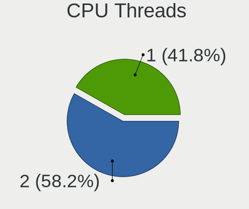

| Number | Computers | Percent |
|--------|-----------|---------|
| 2      | 184       | 67.9%   |
| 1      | 87        | 32.1%   |

CPU Op-Modes
------------

CPU Operation Modes (32-bit, 64-bit)

| Op mode        | Computers | Percent |
|----------------|-----------|---------|
| 32-bit, 64-bit | 255       | 94.1%   |
| Unknown        | 13        | 4.8%    |
| 32-bit         | 3         | 1.11%   |

CPU Microcode
-------------

Microcode number

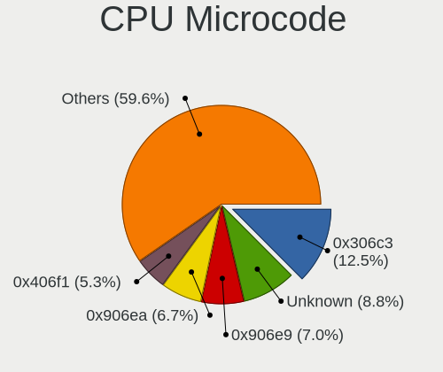

| Number     | Computers | Percent |
|------------|-----------|---------|
| Unknown    | 30        | 10.87%  |
| 0x306c3    | 26        | 9.42%   |
| 0x506e3    | 19        | 6.88%   |
| 0x406f1    | 18        | 6.52%   |
| 0x206a7    | 18        | 6.52%   |
| 0x306a9    | 12        | 4.35%   |
| 0x906ea    | 11        | 3.99%   |
| 0x206c2    | 9         | 3.26%   |
| 0x306f2    | 8         | 2.9%    |
| 0x1067a    | 8         | 2.9%    |
| 0x906e9    | 7         | 2.54%   |
| 0x40651    | 6         | 2.17%   |
| 0xa0655    | 5         | 1.81%   |
| 0xa0653    | 5         | 1.81%   |
| 0x50654    | 5         | 1.81%   |
| 0x206d7    | 5         | 1.81%   |
| 0x06000852 | 5         | 1.81%   |
| 0x806ea    | 4         | 1.45%   |
| 0x806e9    | 4         | 1.45%   |
| 0x20655    | 4         | 1.45%   |
| 0x106ca    | 4         | 1.45%   |
| 0x106a5    | 4         | 1.45%   |
| 0x10676    | 4         | 1.45%   |
| 0x906ed    | 3         | 1.09%   |
| 0x406e3    | 3         | 1.09%   |
| 0x406c4    | 3         | 1.09%   |
| 0x106e5    | 3         | 1.09%   |
| 0x806ec    | 2         | 0.72%   |
| 0x806c1    | 2         | 0.72%   |
| 0x6fd      | 2         | 0.72%   |
| 0x6fb      | 2         | 0.72%   |
| 0x406c3    | 2         | 0.72%   |
| 0x306e4    | 2         | 0.72%   |
| 0x30678    | 2         | 0.72%   |
| 0x08701013 | 2         | 0.72%   |
| 0x08301034 | 2         | 0.72%   |
| 0x08001137 | 2         | 0.72%   |
| 0x03000027 | 2         | 0.72%   |
| 0xf24      | 1         | 0.36%   |
| 0xa0671    | 1         | 0.36%   |
| 0xa0660    | 1         | 0.36%   |
| 0x806eb    | 1         | 0.36%   |
| 0x706e5    | 1         | 0.36%   |
| 0x706a1    | 1         | 0.36%   |
| 0x6ec      | 1         | 0.36%   |
| 0x6e8      | 1         | 0.36%   |
| 0x606a6    | 1         | 0.36%   |
| 0x506ca    | 1         | 0.36%   |
| 0x50663    | 1         | 0.36%   |
| 0x50657    | 1         | 0.36%   |
| 0x306d4    | 1         | 0.36%   |
| 0x08600106 | 1         | 0.36%   |
| 0x0800820d | 1         | 0.36%   |
| 0x0800820b | 1         | 0.36%   |
| 0x0700010f | 1         | 0.36%   |
| 0x06001119 | 1         | 0.36%   |
| 0x0600084f | 1         | 0.36%   |
| 0x010000dc | 1         | 0.36%   |
| 0x010000d9 | 1         | 0.36%   |

CPU Microarch
-------------

Microarchitecture

| Name          | Computers | Percent |
|---------------|-----------|---------|
| Haswell       | 41        | 15.13%  |
| Skylake       | 35        | 12.92%  |
| KabyLake      | 32        | 11.81%  |
| SandyBridge   | 25        | 9.23%   |
| Broadwell     | 25        | 9.23%   |
| Westmere      | 16        | 5.9%    |
| Penryn        | 15        | 5.54%   |
| IvyBridge     | 14        | 5.17%   |
| CometLake     | 11        | 4.06%   |
| Silvermont    | 7         | 2.58%   |
| Piledriver    | 7         | 2.58%   |
| Nehalem       | 7         | 2.58%   |
| Zen 2         | 6         | 2.21%   |
| Core          | 4         | 1.48%   |
| Bonnell       | 4         | 1.48%   |
| Unknown       | 3         | 1.11%   |
| Zen+          | 2         | 0.74%   |
| Zen           | 2         | 0.74%   |
| TigerLake     | 2         | 0.74%   |
| P6            | 2         | 0.74%   |
| K10 Llano     | 2         | 0.74%   |
| K10           | 2         | 0.74%   |
| Jaguar        | 2         | 0.74%   |
| NetBurst      | 1         | 0.37%   |
| K8 Hammer     | 1         | 0.37%   |
| IceLake       | 1         | 0.37%   |
| Goldmont plus | 1         | 0.37%   |
| Goldmont      | 1         | 0.37%   |

Graphics
--------

GPU Vendor
----------

Vendors of graphics cards

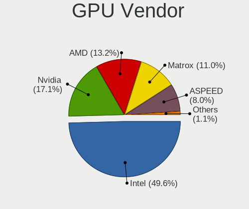

| Vendor                                       | Computers | Percent |
|----------------------------------------------|-----------|---------|
| Intel                                        | 125       | 42.52%  |
| Nvidia                                       | 55        | 18.71%  |
| AMD                                          | 50        | 17.01%  |
| ASPEED Technology                            | 32        | 10.88%  |
| Matrox Electronics Systems                   | 28        | 9.52%   |
| XGI Technology (eXtreme Graphics Innovation) | 1         | 0.34%   |
| Silicon Motion                               | 1         | 0.34%   |
| Silicon Integrated Systems [SiS]             | 1         | 0.34%   |
| Huawei Technologies                          | 1         | 0.34%   |

GPU Model
---------

Graphics card models

| Model                                                                                    | Computers | Percent |
|------------------------------------------------------------------------------------------|-----------|---------|
| ASPEED Technology ASPEED Graphics Family                                                 | 32        | 10.63%  |
| Intel 2nd Generation Core Processor Family Integrated Graphics Controller                | 12        | 3.99%   |
| Matrox Electronics Systems G200eR2                                                       | 10        | 3.32%   |
| Matrox Electronics Systems MGA G200eW WPCM450                                            | 9         | 2.99%   |
| Intel HD Graphics 530                                                                    | 9         | 2.99%   |
| Intel Xeon E3-1200 v3/4th Gen Core Processor Integrated Graphics Controller              | 8         | 2.66%   |
| Intel CoffeeLake-S GT2 [UHD Graphics 630]                                                | 8         | 2.66%   |
| AMD Oland XT [Radeon HD 8670 / R5 340X OEM / R7 250/350/350X OEM]                        | 8         | 2.66%   |
| AMD Oland [Radeon HD 8570 / R5 430 OEM / R7 240/340 / Radeon 520 OEM]                    | 7         | 2.33%   |
| Matrox Electronics Systems MGA G200e [Pilot] ServerEngines (SEP1)                        | 6         | 1.99%   |
| Intel Haswell-ULT Integrated Graphics Controller                                         | 6         | 1.99%   |
| Intel CometLake-S GT2 [UHD Graphics 630]                                                 | 6         | 1.99%   |
| Intel Atom/Celeron/Pentium Processor x5-E8000/J3xxx/N3xxx Integrated Graphics Controller | 5         | 1.66%   |
| Intel 3rd Gen Core processor Graphics Controller                                         | 5         | 1.66%   |
| Nvidia GP107GL [Quadro P400]                                                             | 4         | 1.33%   |
| Intel Xeon E3-1200 v2/3rd Gen Core processor Graphics Controller                         | 4         | 1.33%   |
| Intel Skylake GT2 [HD Graphics 520]                                                      | 4         | 1.33%   |
| Intel HD Graphics 630                                                                    | 4         | 1.33%   |
| Intel Core Processor Integrated Graphics Controller                                      | 4         | 1.33%   |
| Intel Atom Processor D4xx/D5xx/N4xx/N5xx Integrated Graphics Controller                  | 4         | 1.33%   |
| Intel 4th Gen Core Processor Integrated Graphics Controller                              | 4         | 1.33%   |
| Nvidia GK208B [GeForce GT 710]                                                           | 3         | 1%      |
| Matrox Electronics Systems Integrated Matrox G200eW3 Graphics Controller                 | 3         | 1%      |
| Intel WhiskeyLake-U GT2 [UHD Graphics 620]                                               | 3         | 1%      |
| Intel UHD Graphics 620                                                                   | 3         | 1%      |
| Intel Mobile GM965/GL960 Integrated Graphics Controller (secondary)                      | 3         | 1%      |
| Intel Mobile GM965/GL960 Integrated Graphics Controller (primary)                        | 3         | 1%      |
| Intel Mobile 4 Series Chipset Integrated Graphics Controller                             | 3         | 1%      |
| Intel 4 Series Chipset Integrated Graphics Controller                                    | 3         | 1%      |
| AMD ES1000                                                                               | 3         | 1%      |
| AMD Ellesmere [Radeon RX 470/480/570/570X/580/580X/590]                                  | 3         | 1%      |
| Nvidia GT218 [GeForce 210]                                                               | 2         | 0.66%   |
| Nvidia GP106GL [Quadro P2000]                                                            | 2         | 0.66%   |
| Nvidia GM204GL [Quadro M4000]                                                            | 2         | 0.66%   |
| Nvidia GK104GL [Quadro K4200]                                                            | 2         | 0.66%   |
| Intel UHD P630 Graphics                                                                  | 2         | 0.66%   |
| Intel TigerLake-LP GT2 [Iris Xe Graphics]                                                | 2         | 0.66%   |
| Intel HD Graphics 620                                                                    | 2         | 0.66%   |
| Intel CoffeeLake-H GT2 [UHD Graphics 630]                                                | 2         | 0.66%   |
| Intel Atom Processor Z36xxx/Z37xxx Series Graphics & Display                             | 2         | 0.66%   |
| Intel 4th Generation Core Processor Family Integrated Graphics Controller                | 2         | 0.66%   |
| AMD Sun XT [Radeon HD 8670A/8670M/8690M / R5 M330 / M430 / Radeon 520 Mobile]            | 2         | 0.66%   |
| AMD Seymour [Radeon HD 6400M/7400M Series]                                               | 2         | 0.66%   |
| AMD RS780L [Radeon 3000]                                                                 | 2         | 0.66%   |
| XGI Technology (eXtreme Graphics Innovation) Z7/Z9 (XG20 core)                           | 1         | 0.33%   |
| Silicon Motion SM712 LynxEM+                                                             | 1         | 0.33%   |
| Silicon Integrated Systems [SiS] 65x/M650/740 PCI/AGP VGA Display Adapter                | 1         | 0.33%   |
| Nvidia TU117M [GeForce MX450]                                                            | 1         | 0.33%   |
| Nvidia TU117 [GeForce GTX 1650]                                                          | 1         | 0.33%   |
| Nvidia TU116M [GeForce GTX 1660 Ti Mobile]                                               | 1         | 0.33%   |
| Nvidia TU106 [GeForce RTX 2060 SUPER]                                                    | 1         | 0.33%   |
| Nvidia TU104GLM [Quadro RTX 4000 Mobile / Max-Q]                                         | 1         | 0.33%   |
| Nvidia TU104 [GeForce RTX 2080]                                                          | 1         | 0.33%   |
| Nvidia TU104 [GeForce RTX 2080 SUPER]                                                    | 1         | 0.33%   |
| Nvidia TU102 [TITAN RTX]                                                                 | 1         | 0.33%   |
| Nvidia TU102 [GeForce RTX 2080 Ti]                                                       | 1         | 0.33%   |
| Nvidia GT218M [GeForce 310M]                                                             | 1         | 0.33%   |
| Nvidia GT218 [GeForce 8400 GS Rev. 3]                                                    | 1         | 0.33%   |
| Nvidia GT215 [GeForce GT 240]                                                            | 1         | 0.33%   |
| Nvidia GP107M [GeForce GTX 1050 Mobile]                                                  | 1         | 0.33%   |

GPU Combo
---------

Combinations of graphics cards

| Name                    | Computers | Percent |
|-------------------------|-----------|---------|
| 1 x Intel               | 102       | 37.64%  |
| 1 x AMD                 | 42        | 15.5%   |
| 1 x Nvidia              | 41        | 15.13%  |
| 1 x ASPEED              | 31        | 11.44%  |
| 1 x Matrox              | 28        | 10.33%  |
| Intel + Nvidia          | 11        | 4.06%   |
| Intel + AMD             | 7         | 2.58%   |
| 2 x Nvidia              | 2         | 0.74%   |
| Other                   | 1         | 0.37%   |
| 2 x AMD                 | 1         | 0.37%   |
| 1 x XGI                 | 1         | 0.37%   |
| 1 x SiS                 | 1         | 0.37%   |
| 1 x Silicon Motion      | 1         | 0.37%   |
| Nvidia + ASPEED         | 1         | 0.37%   |
| 1 x Huawei Technologies | 1         | 0.37%   |

GPU Driver
----------

Free vs proprietary

| Driver      | Computers | Percent |
|-------------|-----------|---------|
| Free        | 211       | 77.86%  |
| Unknown     | 33        | 12.18%  |
| Proprietary | 27        | 9.96%   |

GPU Memory
----------

Total video memory

| Size in GB | Computers | Percent |
|------------|-----------|---------|
| Unknown    | 171       | 62.87%  |
| 1.01-2.0   | 32        | 11.76%  |
| 0.51-1.0   | 26        | 9.56%   |
| 0.01-0.5   | 14        | 5.15%   |
| 3.01-4.0   | 11        | 4.04%   |
| 7.01-8.0   | 10        | 3.68%   |
| 4.01-5.0   | 3         | 1.1%    |
| 5.01-6.0   | 2         | 0.74%   |
| 2.01-3.0   | 2         | 0.74%   |
| 16.01-24.0 | 1         | 0.37%   |

Monitor
-------

Monitor Vendor
--------------

Monitor vendors

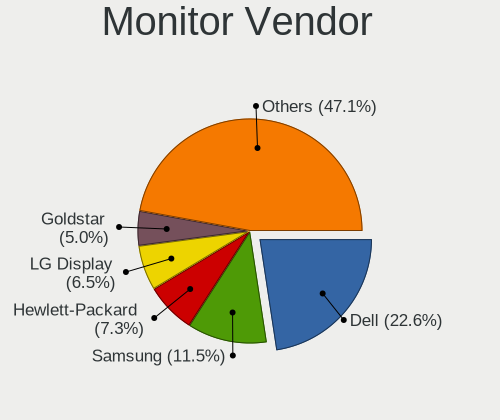

| Vendor                  | Computers | Percent |
|-------------------------|-----------|---------|
| Dell                    | 51        | 24.88%  |
| Samsung Electronics     | 22        | 10.73%  |
| Hewlett-Packard         | 15        | 7.32%   |
| LG Display              | 12        | 5.85%   |
| Goldstar                | 11        | 5.37%   |
| Chimei Innolux          | 10        | 4.88%   |
| AU Optronics            | 10        | 4.88%   |
| AOC                     | 9         | 4.39%   |
| Acer                    | 9         | 4.39%   |
| Lenovo                  | 8         | 3.9%    |
| Ancor Communications    | 6         | 2.93%   |
| BOE                     | 5         | 2.44%   |
| BenQ                    | 5         | 2.44%   |
| Philips                 | 4         | 1.95%   |
| NEC Computers           | 2         | 0.98%   |
| InnoLux Display         | 2         | 0.98%   |
| ___                     | 1         | 0.49%   |
| Westinghouse            | 1         | 0.49%   |
| ViewSonic               | 1         | 0.49%   |
| Unknown                 | 1         | 0.49%   |
| Sony                    | 1         | 0.49%   |
| Sharp                   | 1         | 0.49%   |
| Sceptre Tech            | 1         | 0.49%   |
| Pixio                   | 1         | 0.49%   |
| PEP                     | 1         | 0.49%   |
| PANDA                   | 1         | 0.49%   |
| Packard Bell            | 1         | 0.49%   |
| NME                     | 1         | 0.49%   |
| MIT                     | 1         | 0.49%   |
| LG Philips              | 1         | 0.49%   |
| LG Electronics          | 1         | 0.49%   |
| Insignia                | 1         | 0.49%   |
| HPN                     | 1         | 0.49%   |
| GVV                     | 1         | 0.49%   |
| Founder                 | 1         | 0.49%   |
| Eizo                    | 1         | 0.49%   |
| CHR                     | 1         | 0.49%   |
| Chi Mei Optoelectronics | 1         | 0.49%   |
| Apple                   | 1         | 0.49%   |
| AMW                     | 1         | 0.49%   |

Monitor Model
-------------

Monitor models

| Model                                                                 | Computers | Percent |
|-----------------------------------------------------------------------|-----------|---------|
| Dell P2317H DEL40F4 1920x1080 509x286mm 23.0-inch                     | 7         | 3.18%   |
| Dell P2417H DELA0DB 1920x1080 530x300mm 24.0-inch                     | 6         | 2.73%   |
| Dell P2414H DELA09A 1920x1080 527x297mm 23.8-inch                     | 6         | 2.73%   |
| AOC 2436 AOC2436 1920x1080 521x293mm 23.5-inch                        | 4         | 1.82%   |
| Samsung Electronics SyncMaster SAM01D3 1440x900 408x225mm 18.3-inch   | 2         | 0.91%   |
| LG Display LCD Monitor LGD039F 1366x768 345x194mm 15.6-inch           | 2         | 0.91%   |
| InnoLux Display LCD Monitor INL0014 1366x768 309x174mm 14.0-inch      | 2         | 0.91%   |
| Hewlett-Packard ZR2440w HWP2956 1920x1200 518x324mm 24.1-inch         | 2         | 0.91%   |
| Hewlett-Packard Z32x HWP3275 3840x2160 697x392mm 31.5-inch            | 2         | 0.91%   |
| Dell P2417H DELA0DA 1920x1080 527x296mm 23.8-inch                     | 2         | 0.91%   |
| BenQ GW2765 BNQ78D6 2560x1440 597x336mm 27.0-inch                     | 2         | 0.91%   |
| ___ LCDTV16 ___9000 1360x768                                          | 1         | 0.45%   |
| Westinghouse LD-2240 WDT19DA 1920x1080 480x270mm 21.7-inch            | 1         | 0.45%   |
| ViewSonic VA2226w-3 VSC2051 1680x1050 490x290mm 22.4-inch             | 1         | 0.45%   |
| Unknown LCDTV16 9000 1360x768 1600x900mm 72.3-inch                    | 1         | 0.45%   |
| Sony TV *02 SNY9403 1920x1080 1218x685mm 55.0-inch                    | 1         | 0.45%   |
| Sharp LCD Monitor SHP144D 3840x2160 276x156mm 12.5-inch               | 1         | 0.45%   |
| Sceptre Tech F27 SPT0ABF 1920x1080 409x230mm 18.5-inch                | 1         | 0.45%   |
| Samsung Electronics U32R59x SAM0F96 3840x2160 697x392mm 31.5-inch     | 1         | 0.45%   |
| Samsung Electronics SyncMaster SAM05C7 1920x1080 521x293mm 23.5-inch  | 1         | 0.45%   |
| Samsung Electronics SyncMaster SAM04DD 1920x1080 477x268mm 21.5-inch  | 1         | 0.45%   |
| Samsung Electronics SyncMaster SAM022B 1280x1024 338x270mm 17.0-inch  | 1         | 0.45%   |
| Samsung Electronics SyncMaster SAM011E 1280x1024 338x270mm 17.0-inch  | 1         | 0.45%   |
| Samsung Electronics SMBX2350 SAM071E 1920x1080 509x286mm 23.0-inch    | 1         | 0.45%   |
| Samsung Electronics SMB1930N SAM0632 1366x768 410x230mm 18.5-inch     | 1         | 0.45%   |
| Samsung Electronics SA300/SA350 SAM078E 1920x1080 477x268mm 21.5-inch | 1         | 0.45%   |
| Samsung Electronics S27E391 SAM0C16 1920x1080 598x336mm 27.0-inch     | 1         | 0.45%   |
| Samsung Electronics S24D300 SAM0B43 1920x1080 530x300mm 24.0-inch     | 1         | 0.45%   |
| Samsung Electronics S22C300 SAM0A20 1920x1080 480x270mm 21.7-inch     | 1         | 0.45%   |
| Samsung Electronics S22C300 SAM0A1E 1920x1080 477x268mm 21.5-inch     | 1         | 0.45%   |
| Samsung Electronics S20B300 SAM08A7 1600x900 443x249mm 20.0-inch      | 1         | 0.45%   |
| Samsung Electronics LCD Monitor SEC5441 1366x768 344x194mm 15.5-inch  | 1         | 0.45%   |
| Samsung Electronics LCD Monitor SEC4D45 1280x800 331x207mm 15.4-inch  | 1         | 0.45%   |
| Samsung Electronics LCD Monitor SEC4C42 1280x800 303x190mm 14.1-inch  | 1         | 0.45%   |
| Samsung Electronics LCD Monitor SEC325A 1366x768 344x194mm 15.5-inch  | 1         | 0.45%   |
| Samsung Electronics LCD Monitor SEC3155 1920x1200 367x230mm 17.1-inch | 1         | 0.45%   |
| Samsung Electronics LCD Monitor SEC3152 1366x768 344x194mm 15.5-inch  | 1         | 0.45%   |
| Samsung Electronics LCD Monitor C27F591 1440x900                      | 1         | 0.45%   |
| Samsung Electronics C24F390 SAM0D2D 1920x1080 520x290mm 23.4-inch     | 1         | 0.45%   |
| Pixio HDMI ICB270A 1280x800 368x207mm 16.6-inch                       | 1         | 0.45%   |
| Philips PHL 284E5 PHLC0DE 1920x1080 621x341mm 27.9-inch               | 1         | 0.45%   |
| Philips 226VL PHLC081 1920x1080 480x268mm 21.6-inch                   | 1         | 0.45%   |
| Philips 196V4 PHLC0AF 1366x768 410x230mm 18.5-inch                    | 1         | 0.45%   |
| Philips 190S PHL083F 1280x1024 376x301mm 19.0-inch                    | 1         | 0.45%   |
| PEP KIRA PEP0001 1600x1200 376x301mm 19.0-inch                        | 1         | 0.45%   |
| PANDA LCD Monitor NCP0033 1920x1080 344x194mm 15.5-inch               | 1         | 0.45%   |
| Packard Bell Viseo223DX PKB0385 1920x1080 477x268mm 21.5-inch         | 1         | 0.45%   |
| NME 202M NME1021 1680x1050 380x290mm 18.8-inch                        | 1         | 0.45%   |
| NEC Computers LCD2190UXi NEC66B2 1600x1200 432x324mm 21.3-inch        | 1         | 0.45%   |
| NEC Computers EA261WM NEC6750 1920x1200 560x350mm 26.0-inch           | 1         | 0.45%   |
| MIT LCD Monitor MIT2011 3840x2160 1150x650mm 52.0-inch                | 1         | 0.45%   |
| MIT HDMI Analyzer MIT2011 3840x2160 800x450mm 36.1-inch               | 1         | 0.45%   |
| LG Philips LCD Monitor LPLC700 1280x800 331x207mm 15.4-inch           | 1         | 0.45%   |
| LG Electronics LCD Monitor LG TV SSCR2 3840x2160                      | 1         | 0.45%   |
| LG Display LCD Monitor LGD6616 1366x768 277x156mm 12.5-inch           | 1         | 0.45%   |
| LG Display LCD Monitor LGD0525 1366x768 344x194mm 15.5-inch           | 1         | 0.45%   |
| LG Display LCD Monitor LGD0456 1366x768 344x194mm 15.5-inch           | 1         | 0.45%   |
| LG Display LCD Monitor LGD0450 1366x768 277x156mm 12.5-inch           | 1         | 0.45%   |
| LG Display LCD Monitor LGD03B7 1366x768 309x174mm 14.0-inch           | 1         | 0.45%   |
| LG Display LCD Monitor LGD032C 1920x1080 344x194mm 15.5-inch          | 1         | 0.45%   |

Monitor Resolution
------------------

Monitor screen resolution

| Resolution         | Computers | Percent |
|--------------------|-----------|---------|
| 1920x1080 (FHD)    | 83        | 41.09%  |
| 1366x768 (WXGA)    | 30        | 14.85%  |
| 1280x1024 (SXGA)   | 15        | 7.43%   |
| 3840x2160 (4K)     | 10        | 4.95%   |
| 1440x900 (WXGA+)   | 10        | 4.95%   |
| 2560x1440 (QHD)    | 9         | 4.46%   |
| 1920x1200 (WUXGA)  | 7         | 3.47%   |
| 1680x1050 (WSXGA+) | 7         | 3.47%   |
| 1280x800 (WXGA)    | 7         | 3.47%   |
| Unknown            | 6         | 2.97%   |
| 1600x900 (HD+)     | 5         | 2.48%   |
| 1600x1200          | 3         | 1.49%   |
| 3840x1200          | 2         | 0.99%   |
| 3840x1080          | 2         | 0.99%   |
| 1360x768           | 2         | 0.99%   |
| 5760x1080          | 1         | 0.5%    |
| 4480x1440          | 1         | 0.5%    |
| 3440x1440          | 1         | 0.5%    |
| 1280x720 (HD)      | 1         | 0.5%    |

Monitor Diagonal
----------------

Diagonal size in inches

| Inches  | Computers | Percent |
|---------|-----------|---------|
| 24      | 31        | 15.05%  |
| 15      | 27        | 13.11%  |
| 23      | 24        | 11.65%  |
| 21      | 18        | 8.74%   |
| 19      | 16        | 7.77%   |
| Unknown | 14        | 6.8%    |
| 27      | 13        | 6.31%   |
| 17      | 10        | 4.85%   |
| 13      | 10        | 4.85%   |
| 14      | 7         | 3.4%    |
| 18      | 6         | 2.91%   |
| 12      | 6         | 2.91%   |
| 22      | 5         | 2.43%   |
| 20      | 4         | 1.94%   |
| 31      | 3         | 1.46%   |
| 32      | 2         | 0.97%   |
| 16      | 2         | 0.97%   |
| 72      | 1         | 0.49%   |
| 55      | 1         | 0.49%   |
| 52      | 1         | 0.49%   |
| 42      | 1         | 0.49%   |
| 36      | 1         | 0.49%   |
| 34      | 1         | 0.49%   |
| 26      | 1         | 0.49%   |
| 25      | 1         | 0.49%   |

Monitor Width
-------------

Physical width

| Width in mm | Computers | Percent |
|-------------|-----------|---------|
| 501-600     | 66        | 32.51%  |
| 301-350     | 44        | 21.67%  |
| 401-500     | 40        | 19.7%   |
| 351-400     | 16        | 7.88%   |
| Unknown     | 14        | 6.9%    |
| 201-300     | 10        | 4.93%   |
| 601-700     | 5         | 2.46%   |
| 701-800     | 4         | 1.97%   |
| 1001-1500   | 2         | 0.99%   |
| 1501-2000   | 1         | 0.49%   |
| 901-1000    | 1         | 0.49%   |

Aspect Ratio
------------

Proportional relationship between the width and the height

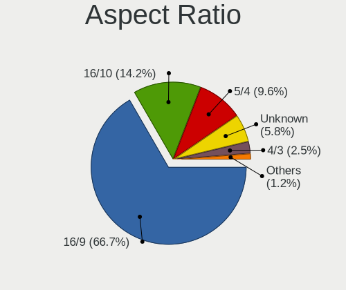

| Ratio   | Computers | Percent |
|---------|-----------|---------|
| 16/9    | 125       | 66.84%  |
| 16/10   | 29        | 15.51%  |
| 5/4     | 15        | 8.02%   |
| Unknown | 12        | 6.42%   |
| 4/3     | 3         | 1.6%    |
| 3/2     | 2         | 1.07%   |
| 21/9    | 1         | 0.53%   |

Monitor Area
------------

Area in inch

| Area in inch | Computers | Percent |
|----------------|-----------|---------|
| 201-250        | 63        | 30.88%  |
| 101-110        | 27        | 13.24%  |
| 151-200        | 25        | 12.25%  |
| 81-90          | 14        | 6.86%   |
| Unknown        | 14        | 6.86%   |
| 301-350        | 13        | 6.37%   |
| 251-300        | 11        | 5.39%   |
| 141-150        | 11        | 5.39%   |
| 61-70          | 6         | 2.94%   |
| 351-500        | 6         | 2.94%   |
| More than 1000 | 3         | 1.47%   |
| 71-80          | 3         | 1.47%   |
| 121-130        | 3         | 1.47%   |
| 111-120        | 2         | 0.98%   |
| 501-1000       | 2         | 0.98%   |
| 131-140        | 1         | 0.49%   |

Pixel Density
-------------

Pixels per inch

| Density       | Computers | Percent |
|---------------|-----------|---------|
| 51-100        | 100       | 50.51%  |
| 101-120       | 47        | 23.74%  |
| 121-160       | 30        | 15.15%  |
| Unknown       | 14        | 7.07%   |
| 1-50          | 3         | 1.52%   |
| More than 240 | 2         | 1.01%   |
| 161-240       | 2         | 1.01%   |

Multiple Monitors
-----------------

Total monitors connected

| Total | Computers | Percent |
|-------|-----------|---------|
| 1     | 152       | 55.27%  |
| 0     | 84        | 30.55%  |
| 2     | 36        | 13.09%  |
| 3     | 3         | 1.09%   |

Network
-------

Net Controller Vendor
---------------------

Controller vendors

| Vendor                            | Computers | Percent |
|-----------------------------------|-----------|---------|
| Intel                             | 174       | 46.52%  |
| Realtek Semiconductor             | 87        | 23.26%  |
| Broadcom                          | 28        | 7.49%   |
| Qualcomm Atheros                  | 21        | 5.61%   |
| TP-Link                           | 7         | 1.87%   |
| IBM                               | 7         | 1.87%   |
| Ralink Technology                 | 6         | 1.6%    |
| Broadcom Limited                  | 5         | 1.34%   |
| Mellanox Technologies             | 3         | 0.8%    |
| D-Link System                     | 3         | 0.8%    |
| Xilinx                            | 2         | 0.53%   |
| Nvidia                            | 2         | 0.53%   |
| Marvell Technology Group          | 2         | 0.53%   |
| Huawei Technologies               | 2         | 0.53%   |
| D-Link                            | 2         | 0.53%   |
| ZTE WCDMA Technologies MSM        | 1         | 0.27%   |
| Xiaomi                            | 1         | 0.27%   |
| VIA Technologies                  | 1         | 0.27%   |
| Silicon Integrated Systems [SiS]  | 1         | 0.27%   |
| Sierra Wireless                   | 1         | 0.27%   |
| Samsung Electronics               | 1         | 0.27%   |
| Ralink                            | 1         | 0.27%   |
| Qualcomm Atheros Communications   | 1         | 0.27%   |
| MediaTek                          | 1         | 0.27%   |
| LSI                               | 1         | 0.27%   |
| Linux 2.6.31.6 with s3c-udc       | 1         | 0.27%   |
| Linksys                           | 1         | 0.27%   |
| Lenovo                            | 1         | 0.27%   |
| Ericsson Business Mobile Networks | 1         | 0.27%   |
| Emulex                            | 1         | 0.27%   |
| Edimax Technology                 | 1         | 0.27%   |
| Dresden Elektronik                | 1         | 0.27%   |
| Cisco Systems                     | 1         | 0.27%   |
| ASUSTek Computer                  | 1         | 0.27%   |
| ASIX Electronics                  | 1         | 0.27%   |
| Aquantia                          | 1         | 0.27%   |
| Apple                             | 1         | 0.27%   |
| 3Com                              | 1         | 0.27%   |

Net Controller Model
--------------------

Controller models

| Model                                                                   | Computers | Percent |
|-------------------------------------------------------------------------|-----------|---------|
| Realtek RTL8111/8168/8411 PCI Express Gigabit Ethernet Controller       | 62        | 13.3%   |
| Intel I350 Gigabit Network Connection                                   | 26        | 5.58%   |
| Intel Ethernet Connection (2) I219-LM                                   | 17        | 3.65%   |
| Intel Ethernet Connection I217-LM                                       | 16        | 3.43%   |
| Intel 82599ES 10-Gigabit SFI/SFP+ Network Connection                    | 15        | 3.22%   |
| Intel 82579LM Gigabit Network Connection (Lewisville)                   | 15        | 3.22%   |
| Realtek RTL810xE PCI Express Fast Ethernet controller                   | 12        | 2.58%   |
| Intel Ethernet Controller X710 for 10GbE SFP+                           | 10        | 2.15%   |
| Intel I210 Gigabit Network Connection                                   | 9         | 1.93%   |
| Intel Ethernet Connection (11) I219-LM                                  | 8         | 1.72%   |
| Intel Ethernet Connection (7) I219-LM                                   | 7         | 1.5%    |
| Intel 82576 Gigabit Network Connection                                  | 7         | 1.5%    |
| IBM RNDIS/CDC ETHER                                                     | 7         | 1.5%    |
| Realtek RTL8153 Gigabit Ethernet Adapter                                | 5         | 1.07%   |
| Qualcomm Atheros QCA9565 / AR9565 Wireless Network Adapter              | 5         | 1.07%   |
| Intel I211 Gigabit Network Connection                                   | 5         | 1.07%   |
| Intel 82574L Gigabit Network Connection                                 | 5         | 1.07%   |
| Intel Wireless 8260                                                     | 4         | 0.86%   |
| Intel Wireless 7260                                                     | 4         | 0.86%   |
| Intel Ethernet Controller 10-Gigabit X540-AT2                           | 4         | 0.86%   |
| Intel Ethernet Connection (2) I219-V                                    | 4         | 0.86%   |
| Broadcom NetXtreme BCM5761 Gigabit Ethernet PCIe                        | 4         | 0.86%   |
| Broadcom NetXtreme BCM5720 Gigabit Ethernet PCIe                        | 4         | 0.86%   |
| Realtek RTL-8100/8101L/8139 PCI Fast Ethernet Adapter                   | 3         | 0.64%   |
| Qualcomm Atheros AR8131 Gigabit Ethernet                                | 3         | 0.64%   |
| Intel Wireless 7265                                                     | 3         | 0.64%   |
| Intel Wi-Fi 6 AX200                                                     | 3         | 0.64%   |
| Intel PRO/Wireless 3945ABG [Golan] Network Connection                   | 3         | 0.64%   |
| Intel Ethernet Controller X550                                          | 3         | 0.64%   |
| Intel Ethernet Connection I219-V                                        | 3         | 0.64%   |
| Intel Ethernet Connection (2) I218-V                                    | 3         | 0.64%   |
| Intel Centrino Advanced-N 6205 [Taylor Peak]                            | 3         | 0.64%   |
| Intel Cannon Point-LP CNVi [Wireless-AC]                                | 3         | 0.64%   |
| Intel Cannon Lake PCH CNVi WiFi                                         | 3         | 0.64%   |
| Intel 82580 Gigabit Network Connection                                  | 3         | 0.64%   |
| Intel 82577LM Gigabit Network Connection                                | 3         | 0.64%   |
| Intel 82567LM Gigabit Network Connection                                | 3         | 0.64%   |
| TP-Link AC600 wireless Realtek RTL8811AU [Archer T2U Nano]              | 2         | 0.43%   |
| Realtek RTL8822BE 802.11a/b/g/n/ac WiFi adapter                         | 2         | 0.43%   |
| Realtek RTL8723BE PCIe Wireless Network Adapter                         | 2         | 0.43%   |
| Realtek RTL8188CUS 802.11n WLAN Adapter                                 | 2         | 0.43%   |
| Ralink MT7601U Wireless Adapter                                         | 2         | 0.43%   |
| Qualcomm Atheros QCA9377 802.11ac Wireless Network Adapter              | 2         | 0.43%   |
| Qualcomm Atheros Killer E2400 Gigabit Ethernet Controller               | 2         | 0.43%   |
| Qualcomm Atheros AR9462 Wireless Network Adapter                        | 2         | 0.43%   |
| Qualcomm Atheros AR242x / AR542x Wireless Network Adapter (PCI-Express) | 2         | 0.43%   |
| Intel Wireless 3165                                                     | 2         | 0.43%   |
| Intel PRO/Wireless 5100 AGN [Shiloh] Network Connection                 | 2         | 0.43%   |
| Intel Ethernet Connection X722 for 1GbE                                 | 2         | 0.43%   |
| Intel Ethernet Connection X722                                          | 2         | 0.43%   |
| Intel Ethernet Connection (6) I219-V                                    | 2         | 0.43%   |
| Intel Ethernet Connection (5) I219-LM                                   | 2         | 0.43%   |
| Intel Ethernet Connection (4) I219-V                                    | 2         | 0.43%   |
| Intel Ethernet Connection (3) I219-LM                                   | 2         | 0.43%   |
| Intel Dual Band Wireless-AC 3168NGW [Stone Peak]                        | 2         | 0.43%   |
| Intel Comet Lake PCH CNVi WiFi                                          | 2         | 0.43%   |
| Intel Centrino Ultimate-N 6300                                          | 2         | 0.43%   |
| Intel Centrino Advanced-N 6230 [Rainbow Peak]                           | 2         | 0.43%   |
| Intel Centrino Advanced-N 6200                                          | 2         | 0.43%   |
| Intel 82579V Gigabit Network Connection                                 | 2         | 0.43%   |

Wireless Vendor
---------------

Wireless vendors

| Vendor                          | Computers | Percent |
|---------------------------------|-----------|---------|
| Intel                           | 50        | 48.08%  |
| Qualcomm Atheros                | 15        | 14.42%  |
| Realtek Semiconductor           | 13        | 12.5%   |
| Ralink Technology               | 6         | 5.77%   |
| TP-Link                         | 5         | 4.81%   |
| Broadcom                        | 5         | 4.81%   |
| D-Link                          | 2         | 1.92%   |
| Sierra Wireless                 | 1         | 0.96%   |
| Ralink                          | 1         | 0.96%   |
| Qualcomm Atheros Communications | 1         | 0.96%   |
| MediaTek                        | 1         | 0.96%   |
| Linksys                         | 1         | 0.96%   |
| Edimax Technology               | 1         | 0.96%   |
| D-Link System                   | 1         | 0.96%   |
| ASUSTek Computer                | 1         | 0.96%   |

Wireless Model
--------------

Wireless models

| Model                                                                         | Computers | Percent |
|-------------------------------------------------------------------------------|-----------|---------|
| Qualcomm Atheros QCA9565 / AR9565 Wireless Network Adapter                    | 5         | 4.76%   |
| Intel Wireless 8260                                                           | 4         | 3.81%   |
| Intel Wireless 7260                                                           | 4         | 3.81%   |
| Intel Wireless 7265                                                           | 3         | 2.86%   |
| Intel Wi-Fi 6 AX200                                                           | 3         | 2.86%   |
| Intel PRO/Wireless 3945ABG [Golan] Network Connection                         | 3         | 2.86%   |
| Intel Centrino Advanced-N 6205 [Taylor Peak]                                  | 3         | 2.86%   |
| Intel Cannon Point-LP CNVi [Wireless-AC]                                      | 3         | 2.86%   |
| Intel Cannon Lake PCH CNVi WiFi                                               | 3         | 2.86%   |
| TP-Link AC600 wireless Realtek RTL8811AU [Archer T2U Nano]                    | 2         | 1.9%    |
| Realtek RTL8822BE 802.11a/b/g/n/ac WiFi adapter                               | 2         | 1.9%    |
| Realtek RTL8723BE PCIe Wireless Network Adapter                               | 2         | 1.9%    |
| Realtek RTL8188CUS 802.11n WLAN Adapter                                       | 2         | 1.9%    |
| Ralink MT7601U Wireless Adapter                                               | 2         | 1.9%    |
| Qualcomm Atheros QCA9377 802.11ac Wireless Network Adapter                    | 2         | 1.9%    |
| Qualcomm Atheros AR9462 Wireless Network Adapter                              | 2         | 1.9%    |
| Qualcomm Atheros AR242x / AR542x Wireless Network Adapter (PCI-Express)       | 2         | 1.9%    |
| Intel Wireless 3165                                                           | 2         | 1.9%    |
| Intel PRO/Wireless 5100 AGN [Shiloh] Network Connection                       | 2         | 1.9%    |
| Intel Dual Band Wireless-AC 3168NGW [Stone Peak]                              | 2         | 1.9%    |
| Intel Comet Lake PCH CNVi WiFi                                                | 2         | 1.9%    |
| Intel Centrino Ultimate-N 6300                                                | 2         | 1.9%    |
| Intel Centrino Advanced-N 6230 [Rainbow Peak]                                 | 2         | 1.9%    |
| Intel Centrino Advanced-N 6200                                                | 2         | 1.9%    |
| Broadcom BCM4360 802.11ac Wireless Network Adapter                            | 2         | 1.9%    |
| Broadcom BCM4322 802.11a/b/g/n Wireless LAN Controller                        | 2         | 1.9%    |
| TP-Link TL-WN722N v2/v3 [Realtek RTL8188EUS]                                  | 1         | 0.95%   |
| TP-Link Archer T1U 802.11a/n/ac Wireless Adapter [MediaTek MT7610U]           | 1         | 0.95%   |
| TP-Link 802.11ac WLAN Adapter                                                 | 1         | 0.95%   |
| Sierra Wireless AirPrime MC7455 3G/4G LTE Modem                               | 1         | 0.95%   |
| Realtek RTL8822CE 802.11ac PCIe Wireless Network Adapter                      | 1         | 0.95%   |
| Realtek RTL8821CE 802.11ac PCIe Wireless Network Adapter                      | 1         | 0.95%   |
| Realtek RTL8723DE Wireless Network Adapter                                    | 1         | 0.95%   |
| Realtek RTL8192CE PCIe Wireless Network Adapter                               | 1         | 0.95%   |
| Realtek RTL8188SU 802.11n WLAN Adapter                                        | 1         | 0.95%   |
| Realtek RTL8188EUS 802.11n Wireless Network Adapter                           | 1         | 0.95%   |
| Realtek RTL8188EE Wireless Network Adapter                                    | 1         | 0.95%   |
| Ralink RT5572 Wireless Adapter                                                | 1         | 0.95%   |
| Ralink RT5370 Wireless Adapter                                                | 1         | 0.95%   |
| Ralink RT2870/RT3070 Wireless Adapter                                         | 1         | 0.95%   |
| Ralink Conceptronic C300RU v2 802.11bgn Wireless Adapter [Ralink RT2770]      | 1         | 0.95%   |
| Ralink RT2500 Wireless 802.11bg                                               | 1         | 0.95%   |
| Qualcomm Atheros QCA6174 802.11ac Wireless Network Adapter                    | 1         | 0.95%   |
| Qualcomm Atheros TP-Link TL-WN322G v3 / TL-WN422G v2 802.11g [Atheros AR9271] | 1         | 0.95%   |
| Qualcomm Atheros AR9485 Wireless Network Adapter                              | 1         | 0.95%   |
| Qualcomm Atheros AR9287 Wireless Network Adapter (PCI-Express)                | 1         | 0.95%   |
| Qualcomm Atheros AR9285 Wireless Network Adapter (PCI-Express)                | 1         | 0.95%   |
| MediaTek MT7612U 802.11a/b/g/n/ac Wireless Adapter                            | 1         | 0.95%   |
| Linksys AE6000 802.11a/b/g/n/ac Wireless Adapter [MediaTek MT7610U]           | 1         | 0.95%   |
| Intel Wireless 8265 / 8275                                                    | 1         | 0.95%   |
| Intel Wi-Fi 6 AX201                                                           | 1         | 0.95%   |
| Intel Ultimate N WiFi Link 5300                                               | 1         | 0.95%   |
| Intel Tiger Lake PCH CNVi WiFi                                                | 1         | 0.95%   |
| Intel Ice Lake-LP PCH CNVi WiFi                                               | 1         | 0.95%   |
| Intel Comet Lake PCH-LP CNVi WiFi                                             | 1         | 0.95%   |
| Intel Centrino Wireless-N 135                                                 | 1         | 0.95%   |
| Intel Centrino Wireless-N 1030 [Rainbow Peak]                                 | 1         | 0.95%   |
| Intel Centrino Wireless-N 1000 [Condor Peak]                                  | 1         | 0.95%   |
| Intel Centrino Advanced-N 6235                                                | 1         | 0.95%   |
| Edimax 802.11ac WLAN Adapter                                                  | 1         | 0.95%   |

Ethernet Vendor
---------------

Ethernet vendors

| Vendor                           | Computers | Percent |
|----------------------------------|-----------|---------|
| Intel                            | 155       | 50.99%  |
| Realtek Semiconductor            | 82        | 26.97%  |
| Broadcom                         | 23        | 7.57%   |
| Qualcomm Atheros                 | 8         | 2.63%   |
| IBM                              | 7         | 2.3%    |
| Broadcom Limited                 | 5         | 1.64%   |
| TP-Link                          | 2         | 0.66%   |
| Nvidia                           | 2         | 0.66%   |
| Marvell Technology Group         | 2         | 0.66%   |
| Huawei Technologies              | 2         | 0.66%   |
| D-Link System                    | 2         | 0.66%   |
| ZTE WCDMA Technologies MSM       | 1         | 0.33%   |
| Xilinx                           | 1         | 0.33%   |
| Xiaomi                           | 1         | 0.33%   |
| VIA Technologies                 | 1         | 0.33%   |
| Silicon Integrated Systems [SiS] | 1         | 0.33%   |
| Samsung Electronics              | 1         | 0.33%   |
| Mellanox Technologies            | 1         | 0.33%   |
| Lenovo                           | 1         | 0.33%   |
| Emulex                           | 1         | 0.33%   |
| Cisco Systems                    | 1         | 0.33%   |
| ASIX Electronics                 | 1         | 0.33%   |
| Aquantia                         | 1         | 0.33%   |
| Apple                            | 1         | 0.33%   |
| 3Com                             | 1         | 0.33%   |

Ethernet Model
--------------

Ethernet models

| Model                                                             | Computers | Percent |
|-------------------------------------------------------------------|-----------|---------|
| Realtek RTL8111/8168/8411 PCI Express Gigabit Ethernet Controller | 62        | 17.56%  |
| Intel I350 Gigabit Network Connection                             | 26        | 7.37%   |
| Intel Ethernet Connection (2) I219-LM                             | 17        | 4.82%   |
| Intel Ethernet Connection I217-LM                                 | 16        | 4.53%   |
| Intel 82599ES 10-Gigabit SFI/SFP+ Network Connection              | 15        | 4.25%   |
| Intel 82579LM Gigabit Network Connection (Lewisville)             | 15        | 4.25%   |
| Realtek RTL810xE PCI Express Fast Ethernet controller             | 12        | 3.4%    |
| Intel Ethernet Controller X710 for 10GbE SFP+                     | 10        | 2.83%   |
| Intel I210 Gigabit Network Connection                             | 9         | 2.55%   |
| Intel Ethernet Connection (11) I219-LM                            | 8         | 2.27%   |
| Intel Ethernet Connection (7) I219-LM                             | 7         | 1.98%   |
| Intel 82576 Gigabit Network Connection                            | 7         | 1.98%   |
| IBM RNDIS/CDC ETHER                                               | 7         | 1.98%   |
| Realtek RTL8153 Gigabit Ethernet Adapter                          | 5         | 1.42%   |
| Intel I211 Gigabit Network Connection                             | 5         | 1.42%   |
| Intel 82574L Gigabit Network Connection                           | 5         | 1.42%   |
| Intel Ethernet Controller 10-Gigabit X540-AT2                     | 4         | 1.13%   |
| Intel Ethernet Connection (2) I219-V                              | 4         | 1.13%   |
| Broadcom NetXtreme BCM5761 Gigabit Ethernet PCIe                  | 4         | 1.13%   |
| Broadcom NetXtreme BCM5720 Gigabit Ethernet PCIe                  | 4         | 1.13%   |
| Realtek RTL-8100/8101L/8139 PCI Fast Ethernet Adapter             | 3         | 0.85%   |
| Qualcomm Atheros AR8131 Gigabit Ethernet                          | 3         | 0.85%   |
| Intel Ethernet Controller X550                                    | 3         | 0.85%   |
| Intel Ethernet Connection I219-V                                  | 3         | 0.85%   |
| Intel Ethernet Connection (2) I218-V                              | 3         | 0.85%   |
| Intel 82580 Gigabit Network Connection                            | 3         | 0.85%   |
| Intel 82577LM Gigabit Network Connection                          | 3         | 0.85%   |
| Intel 82567LM Gigabit Network Connection                          | 3         | 0.85%   |
| Qualcomm Atheros Killer E2400 Gigabit Ethernet Controller         | 2         | 0.57%   |
| Intel Ethernet Connection X722 for 1GbE                           | 2         | 0.57%   |
| Intel Ethernet Connection X722                                    | 2         | 0.57%   |
| Intel Ethernet Connection (6) I219-V                              | 2         | 0.57%   |
| Intel Ethernet Connection (5) I219-LM                             | 2         | 0.57%   |
| Intel Ethernet Connection (4) I219-V                              | 2         | 0.57%   |
| Intel Ethernet Connection (3) I219-LM                             | 2         | 0.57%   |
| Intel 82579V Gigabit Network Connection                           | 2         | 0.57%   |
| Intel 82566MM Gigabit Network Connection                          | 2         | 0.57%   |
| Broadcom NetXtreme II BCM5709 Gigabit Ethernet                    | 2         | 0.57%   |
| Broadcom NetXtreme BCM5764M Gigabit Ethernet PCIe                 | 2         | 0.57%   |
| Broadcom NetXtreme BCM5755 Gigabit Ethernet PCI Express           | 2         | 0.57%   |
| Broadcom NetXtreme BCM5719 Gigabit Ethernet PCIe                  | 2         | 0.57%   |
| Broadcom NetXtreme BCM5715 Gigabit Ethernet                       | 2         | 0.57%   |
| Broadcom Limited NetXtreme BCM5720 Gigabit Ethernet PCIe          | 2         | 0.57%   |
| ZTE WCDMA MSM Z6201V                                              | 1         | 0.28%   |
| Xilinx Ethernet controller                                        | 1         | 0.28%   |
| Xiaomi Mi/Redmi series (RNDIS)                                    | 1         | 0.28%   |
| VIA VT6105/VT6106S [Rhine-III]                                    | 1         | 0.28%   |
| TP-Link USB 10/100 LAN                                            | 1         | 0.28%   |
| TP-Link UE300 10/100/1000 LAN (ethernet mode) [Realtek RTL8153]   | 1         | 0.28%   |
| Silicon Integrated Systems [SiS] SiS900 PCI Fast Ethernet         | 1         | 0.28%   |
| Samsung Galaxy series, misc. (tethering mode)                     | 1         | 0.28%   |
| Realtek RTL8169 PCI Gigabit Ethernet Controller                   | 1         | 0.28%   |
| Realtek RTL8125 2.5GbE Controller                                 | 1         | 0.28%   |
| Realtek RTL-8110SC/8169SC Gigabit Ethernet                        | 1         | 0.28%   |
| Qualcomm Atheros QCA8172 Fast Ethernet                            | 1         | 0.28%   |
| Qualcomm Atheros AR8151 v2.0 Gigabit Ethernet                     | 1         | 0.28%   |
| Qualcomm Atheros AR8151 v1.0 Gigabit Ethernet                     | 1         | 0.28%   |
| Nvidia MCP79 Ethernet                                             | 1         | 0.28%   |
| Nvidia MCP55 Ethernet                                             | 1         | 0.28%   |
| Mellanox MT27710 Family [ConnectX-4 Lx]                           | 1         | 0.28%   |

Net Controller Kind
-------------------

Ethernet, WiFi or modem

| Kind     | Computers | Percent |
|----------|-----------|---------|
| Ethernet | 265       | 72.01%  |
| WiFi     | 95        | 25.82%  |
| Modem    | 5         | 1.36%   |
| Unknown  | 3         | 0.82%   |

Used Controller
---------------

Currently used network controller

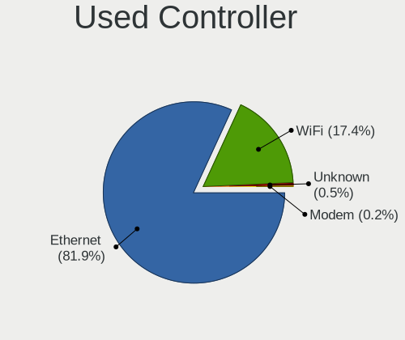

| Kind     | Computers | Percent |
|----------|-----------|---------|
| Ethernet | 215       | 79.04%  |
| WiFi     | 56        | 20.59%  |
| Unknown  | 1         | 0.37%   |

NICs
----

Total network controllers on board

| Total | Computers | Percent |
|-------|-----------|---------|
| 2     | 107       | 39.48%  |
| 1     | 104       | 38.38%  |
| 4     | 25        | 9.23%   |
| 6     | 14        | 5.17%   |
| 3     | 11        | 4.06%   |
| 8     | 3         | 1.11%   |
| 5     | 2         | 0.74%   |
| 0     | 2         | 0.74%   |
| 20    | 1         | 0.37%   |
| 12    | 1         | 0.37%   |
| 10    | 1         | 0.37%   |

IPv6
----

IPv6 vs IPv4

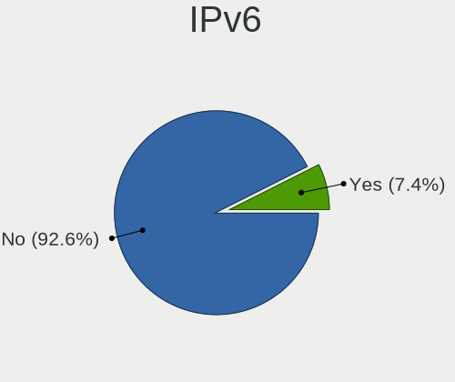

| Used | Computers | Percent |
|------|-----------|---------|
| No   | 260       | 94.55%  |
| Yes  | 15        | 5.45%   |

Bluetooth
---------

Bluetooth Vendor
----------------

Controller vendors

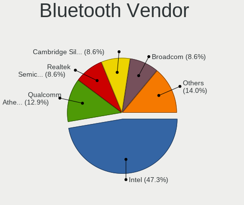

| Vendor                          | Computers | Percent |
|---------------------------------|-----------|---------|
| Intel                           | 31        | 43.06%  |
| Qualcomm Atheros Communications | 10        | 13.89%  |
| Broadcom                        | 8         | 11.11%  |
| Realtek Semiconductor           | 6         | 8.33%   |
| Cambridge Silicon Radio         | 6         | 8.33%   |
| Dell                            | 3         | 4.17%   |
| ASUSTek Computer                | 3         | 4.17%   |
| Lite-On Technology              | 1         | 1.39%   |
| IMC Networks                    | 1         | 1.39%   |
| Foxconn / Hon Hai               | 1         | 1.39%   |
| Dynex                           | 1         | 1.39%   |
| Apple                           | 1         | 1.39%   |

Bluetooth Model
---------------

Controller models

| Model                                                                               | Computers | Percent |
|-------------------------------------------------------------------------------------|-----------|---------|
| Intel Bluetooth wireless interface                                                  | 11        | 15.28%  |
| Intel Bluetooth Device                                                              | 6         | 8.33%   |
| Intel Bluetooth 9460/9560 Jefferson Peak (JfP)                                      | 6         | 8.33%   |
| Cambridge Silicon Radio Bluetooth Dongle (HCI mode)                                 | 6         | 8.33%   |
| Realtek  Bluetooth 4.2 Adapter                                                      | 4         | 5.56%   |
| Qualcomm Atheros  Bluetooth Device                                                  | 4         | 5.56%   |
| Intel AX200 Bluetooth                                                               | 3         | 4.17%   |
| Realtek Bluetooth Radio                                                             | 2         | 2.78%   |
| Qualcomm Atheros AR9462 Bluetooth                                                   | 2         | 2.78%   |
| Qualcomm Atheros AR3012 Bluetooth 4.0                                               | 2         | 2.78%   |
| Intel Centrino Bluetooth Wireless Transceiver                                       | 2         | 2.78%   |
| Intel Centrino Advanced-N 6230 Bluetooth adapter                                    | 2         | 2.78%   |
| Dell DW375 Bluetooth Module                                                         | 2         | 2.78%   |
| Broadcom BCM20702A0 Bluetooth 4.0                                                   | 2         | 2.78%   |
| Broadcom BCM2045B (BDC-2.1) [Bluetooth Controller]                                  | 2         | 2.78%   |
| ASUS Broadcom BCM20702 Single-Chip Bluetooth 4.0 + LE                               | 2         | 2.78%   |
| Qualcomm Atheros QCA61x4 Bluetooth 4.0                                              | 1         | 1.39%   |
| Qualcomm Atheros AR3011 Bluetooth                                                   | 1         | 1.39%   |
| Lite-On Atheros AR3012 Bluetooth                                                    | 1         | 1.39%   |
| Intel Wireless-AC 3168 Bluetooth                                                    | 1         | 1.39%   |
| IMC Networks Bluetooth Device                                                       | 1         | 1.39%   |
| Foxconn / Hon Hai Foxconn T77H114 BCM2070 [Single-Chip Bluetooth 2.1 + EDR Adapter] | 1         | 1.39%   |
| Dynex BCM20702A0                                                                    | 1         | 1.39%   |
| Dell BCM20702A0 Bluetooth Module                                                    | 1         | 1.39%   |
| Broadcom BCM92046DG-CL1ROM Bluetooth 2.1 Adapter                                    | 1         | 1.39%   |
| Broadcom BCM2045B (BDC-2.1)                                                         | 1         | 1.39%   |
| Broadcom BCM2045B (BDC-2) [Bluetooth Controller]                                    | 1         | 1.39%   |
| Broadcom ANYCOM Blue USB-200/250                                                    | 1         | 1.39%   |
| ASUS BT-270 Bluetooth Adapter                                                       | 1         | 1.39%   |
| Apple Bluetooth Host Controller                                                     | 1         | 1.39%   |

Sound
-----

Sound Vendor
------------

Sound card vendors

| Vendor                           | Computers | Percent |
|----------------------------------|-----------|---------|
| Intel                            | 163       | 60.59%  |
| AMD                              | 49        | 18.22%  |
| Nvidia                           | 41        | 15.24%  |
| Texas Instruments                | 2         | 0.74%   |
| Logitech                         | 2         | 0.74%   |
| GN Netcom                        | 2         | 0.74%   |
| Creative Labs                    | 2         | 0.74%   |
| C-Media Electronics              | 2         | 0.74%   |
| Silicon Integrated Systems [SiS] | 1         | 0.37%   |
| Realtek Semiconductor            | 1         | 0.37%   |
| Plantronics                      | 1         | 0.37%   |
| Lenovo                           | 1         | 0.37%   |
| Ensoniq                          | 1         | 0.37%   |
| ASUSTek Computer                 | 1         | 0.37%   |

Sound Model
-----------

Sound card models

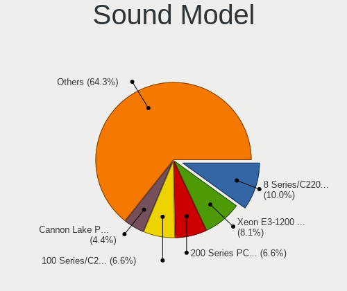

| Model                                                                                             | Computers | Percent |
|---------------------------------------------------------------------------------------------------|-----------|---------|
| Intel 8 Series/C220 Series Chipset High Definition Audio Controller                               | 22        | 7.21%   |
| Intel 100 Series/C230 Series Chipset Family HD Audio Controller                                   | 18        | 5.9%    |
| AMD Oland/Hainan/Cape Verde/Pitcairn HDMI Audio [Radeon HD 7000 Series]                           | 17        | 5.57%   |
| Intel 6 Series/C200 Series Chipset Family High Definition Audio Controller                        | 16        | 5.25%   |
| Intel Xeon E3-1200 v3/4th Gen Core Processor HD Audio Controller                                  | 13        | 4.26%   |
| Intel 7 Series/C216 Chipset Family High Definition Audio Controller                               | 12        | 3.93%   |
| Intel Sunrise Point-LP HD Audio                                                                   | 10        | 3.28%   |
| Intel Cannon Lake PCH cAVS                                                                        | 10        | 3.28%   |
| Intel Comet Lake PCH cAVS                                                                         | 7         | 2.3%    |
| AMD SBx00 Azalia (Intel HDA)                                                                      | 7         | 2.3%    |
| Intel Haswell-ULT HD Audio Controller                                                             | 6         | 1.97%   |
| Intel 8 Series HD Audio Controller                                                                | 6         | 1.97%   |
| Intel 5 Series/3400 Series Chipset High Definition Audio                                          | 6         | 1.97%   |
| Nvidia GP107GL High Definition Audio Controller                                                   | 5         | 1.64%   |
| Intel 82801JI (ICH10 Family) HD Audio Controller                                                  | 5         | 1.64%   |
| AMD FCH Azalia Controller                                                                         | 5         | 1.64%   |
| Nvidia High Definition Audio Controller                                                           | 4         | 1.31%   |
| Nvidia GP106 High Definition Audio Controller                                                     | 4         | 1.31%   |
| Nvidia GK104 HDMI Audio Controller                                                                | 4         | 1.31%   |
| Intel NM10/ICH7 Family High Definition Audio Controller                                           | 4         | 1.31%   |
| Intel Cannon Point-LP High Definition Audio Controller                                            | 4         | 1.31%   |
| Intel C610/X99 series chipset HD Audio Controller                                                 | 4         | 1.31%   |
| Intel C600/X79 series chipset High Definition Audio Controller                                    | 4         | 1.31%   |
| Intel 82801I (ICH9 Family) HD Audio Controller                                                    | 4         | 1.31%   |
| Intel 82801H (ICH8 Family) HD Audio Controller                                                    | 4         | 1.31%   |
| Intel 200 Series PCH HD Audio                                                                     | 4         | 1.31%   |
| AMD Family 17h (Models 00h-0fh) HD Audio Controller                                               | 4         | 1.31%   |
| Nvidia TU104 HD Audio Controller                                                                  | 3         | 0.98%   |
| Nvidia GM204 High Definition Audio Controller                                                     | 3         | 0.98%   |
| Nvidia GK208 HDMI/DP Audio Controller                                                             | 3         | 0.98%   |
| Intel CM238 HD Audio Controller                                                                   | 3         | 0.98%   |
| AMD Starship/Matisse HD Audio Controller                                                          | 3         | 0.98%   |
| AMD Ellesmere HDMI Audio [Radeon RX 470/480 / 570/580/590]                                        | 3         | 0.98%   |
| AMD Caicos HDMI Audio [Radeon HD 6450 / 7450/8450/8490 OEM / R5 230/235/235X OEM]                 | 3         | 0.98%   |
| Nvidia TU102 High Definition Audio Controller                                                     | 2         | 0.66%   |
| Nvidia GP104 High Definition Audio Controller                                                     | 2         | 0.66%   |
| Nvidia GK106 HDMI Audio Controller                                                                | 2         | 0.66%   |
| Nvidia GF116 High Definition Audio Controller                                                     | 2         | 0.66%   |
| Logitech Headset H390                                                                             | 2         | 0.66%   |
| Intel Tiger Lake-LP Smart Sound Technology Audio Controller                                       | 2         | 0.66%   |
| Intel Lewisburg MROM 0                                                                            | 2         | 0.66%   |
| Intel Audio device                                                                                | 2         | 0.66%   |
| Intel Atom/Celeron/Pentium Processor x5-E8000/J3xxx/N3xxx Series High Definition Audio Controller | 2         | 0.66%   |
| Intel Atom Processor Z36xxx/Z37xxx Series High Definition Audio Controller                        | 2         | 0.66%   |
| Intel 9 Series Chipset Family HD Audio Controller                                                 | 2         | 0.66%   |
| AMD Tobago HDMI Audio [Radeon R7 360 / R9 360 OEM]                                                | 2         | 0.66%   |
| AMD RS780 HDMI Audio [Radeon 3000/3100 / HD 3200/3300]                                            | 2         | 0.66%   |
| AMD Kabini HDMI/DP Audio                                                                          | 2         | 0.66%   |
| AMD Cypress HDMI Audio [Radeon HD 5830/5850/5870 / 6850/6870 Rebrand]                             | 2         | 0.66%   |
| AMD Baffin HDMI/DP Audio [Radeon RX 550 640SP / RX 560/560X]                                      | 2         | 0.66%   |
| Texas Instruments PCM2902 Audio Codec                                                             | 1         | 0.33%   |
| Texas Instruments Multimedia audio controller                                                     | 1         | 0.33%   |
| Silicon Integrated Systems [SiS] SiS7012 AC'97 Sound Controller                                   | 1         | 0.33%   |
| Realtek Semiconductor USB Audio                                                                   | 1         | 0.33%   |
| Plantronics Poly BT700                                                                            | 1         | 0.33%   |
| Nvidia TU116 High Definition Audio Controller                                                     | 1         | 0.33%   |
| Nvidia TU107 GeForce GTX 1650 High Definition Audio Controller                                    | 1         | 0.33%   |
| Nvidia TU106 High Definition Audio Controller                                                     | 1         | 0.33%   |
| Nvidia stereo controller                                                                          | 1         | 0.33%   |
| Nvidia MCP79 High Definition Audio                                                                | 1         | 0.33%   |

Memory
------

Memory Vendor
-------------

Memory module vendors

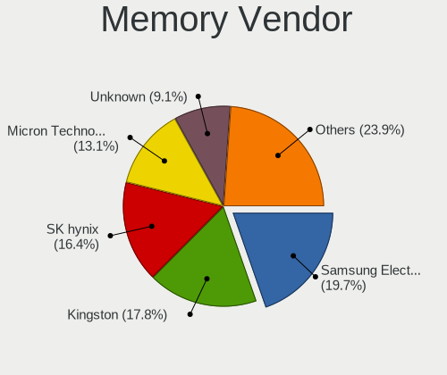

| Vendor              | Computers | Percent |
|---------------------|-----------|---------|
| Samsung Electronics | 60        | 22.73%  |
| SK hynix            | 50        | 18.94%  |
| Micron Technology   | 48        | 18.18%  |
| Kingston            | 42        | 15.91%  |
| Unknown             | 27        | 10.23%  |
| Crucial             | 18        | 6.82%   |
| A-DATA Technology   | 4         | 1.52%   |
| Transcend           | 3         | 1.14%   |
| Corsair             | 3         | 1.14%   |
| Patriot             | 2         | 0.76%   |
| G.Skill             | 2         | 0.76%   |
| Wilk                | 1         | 0.38%   |
| Ramaxel Technology  | 1         | 0.38%   |
| Nanya Technology    | 1         | 0.38%   |
| Elpida              | 1         | 0.38%   |
| Apacer              | 1         | 0.38%   |

Memory Model
------------

Memory module models

| Model                                                     | Computers | Percent |
|-----------------------------------------------------------|-----------|---------|
| Micron RAM 36ASF4G72PZ-2G3B1 32GB DIMM DDR4 2400MT/s      | 10        | 3.46%   |
| Samsung RAM M378B5173QH0-YK0 4GB DIMM DDR3 1600MT/s       | 6         | 2.08%   |
| Samsung RAM M393A4K40BB1-CRC 32GB DIMM DDR4 2400MT/s      | 5         | 1.73%   |
| Samsung RAM Module 8192MB DIMM DDR3 800MT/s               | 4         | 1.38%   |
| Micron RAM 4ATF51264AZ-2G3B1 4GB DIMM DDR4 2800MT/s       | 4         | 1.38%   |
| Micron RAM 36ASF4G72PZ-2G6D1 32GB DIMM DDR4 2667MT/s      | 4         | 1.38%   |
| Crucial RAM CT16G4DFD824A.C16FDD 16GB DIMM DDR4 2400MT/s  | 4         | 1.38%   |
| Micron RAM Module 8GB SODIMM DDR4 3200MT/s                | 3         | 1.04%   |
| Unknown RAM Module 8192MB DIMM 1333MT/s                   | 2         | 0.69%   |
| Unknown RAM Module 4096MB DIMM DDR3 1333MT/s              | 2         | 0.69%   |
| SK hynix RAM Module 2048MB DIMM DDR3 1600MT/s             | 2         | 0.69%   |
| SK hynix RAM HMA81GS6AFR8N-UH 8GB SODIMM DDR4 2667MT/s    | 2         | 0.69%   |
| SK hynix RAM HMA451R7MFR8N-TF 4096MB DIMM DDR4 2133MT/s   | 2         | 0.69%   |
| Samsung RAM Module 8192MB DIMM DDR4 3200MT/s              | 2         | 0.69%   |
| Samsung RAM M471B5173QH0-YK0 4GB SODIMM DDR3 1600MT/s     | 2         | 0.69%   |
| Samsung RAM M471A5244CB0-CTD 4GB SODIMM DDR4 3266MT/s     | 2         | 0.69%   |
| Samsung RAM M393A4K40CB1-CRC 32GB DIMM DDR4 2400MT/s      | 2         | 0.69%   |
| Micron RAM 8JTF51264AZ-1G6E1 4GB DIMM DDR3 1600MT/s       | 2         | 0.69%   |
| Micron RAM 8ATF1G64AZ-2G3E1 8GB DIMM DDR4 2400MT/s        | 2         | 0.69%   |
| Micron RAM 36ASF4G72PZ-2G3A1 32GB DIMM DDR4 2400MT/s      | 2         | 0.69%   |
| Micron RAM 18ASF2G72AZ-2G6D1 16GB DIMM DDR4 2667MT/s      | 2         | 0.69%   |
| Kingston RAM KHX1600C9D3/4GX 4GB DIMM DDR3 2400MT/s       | 2         | 0.69%   |
| Crucial RAM CT8G4DFD824A.C16FBD1 8GB DIMM DDR4 2400MT/s   | 2         | 0.69%   |
| Wilk RAM GR3200S464L22/16G 16384MB SODIMM DDR4 3200MT/s   | 1         | 0.35%   |
| Unknown RAM Module 8192MB DIMM DDR3 1600MT/s              | 1         | 0.35%   |
| Unknown RAM Module 8192MB DIMM DDR3 1333MT/s              | 1         | 0.35%   |
| Unknown RAM Module 8192MB DIMM 1600MT/s                   | 1         | 0.35%   |
| Unknown RAM Module 4GB SODIMM DDR3 1067MT/s               | 1         | 0.35%   |
| Unknown RAM Module 4096MB SODIMM DDR3                     | 1         | 0.35%   |
| Unknown RAM Module 4096MB SODIMM DDR2 667MT/s             | 1         | 0.35%   |
| Unknown RAM Module 4096MB DIMM DDR 1333MT/s               | 1         | 0.35%   |
| Unknown RAM Module 4096MB DIMM 800MT/s                    | 1         | 0.35%   |
| Unknown RAM Module 4096MB DIMM 1600MT/s                   | 1         | 0.35%   |
| Unknown RAM Module 4096MB DIMM 1333MT/s                   | 1         | 0.35%   |
| Unknown RAM Module 4096MB DIMM                            | 1         | 0.35%   |
| Unknown RAM Module 2048MB SODIMM DDR3 800MT/s             | 1         | 0.35%   |
| Unknown RAM Module 2048MB SODIMM DDR2 800MT/s             | 1         | 0.35%   |
| Unknown RAM Module 2048MB SODIMM DDR2 667MT/s             | 1         | 0.35%   |
| Unknown RAM Module 2048MB FB-DIMM DDR2 667MT/s            | 1         | 0.35%   |
| Unknown RAM Module 2048MB DIMM LPDDR4 1600MT/s            | 1         | 0.35%   |
| Unknown RAM Module 2048MB DIMM DDR3 1333MT/s              | 1         | 0.35%   |
| Unknown RAM Module 2048MB DIMM DDR2 533MT/s               | 1         | 0.35%   |
| Unknown RAM Module 2048MB DIMM DDR2                       | 1         | 0.35%   |
| Unknown RAM Module 2048MB DIMM 800MT/s                    | 1         | 0.35%   |
| Unknown RAM Module 2048MB DIMM 400MT/s                    | 1         | 0.35%   |
| Unknown RAM Module 2048MB DIMM 1067MT/s                   | 1         | 0.35%   |
| Unknown RAM Module 16384MB DIMM DDR4 2133MT/s             | 1         | 0.35%   |
| Unknown RAM Module 16384MB DIMM 1067MT/s                  | 1         | 0.35%   |
| Unknown RAM Module 1024MB SODIMM DRAM                     | 1         | 0.35%   |
| Unknown RAM Module 1024MB DIMM DDR2 533MT/s               | 1         | 0.35%   |
| Unknown RAM Module 1024MB DIMM 800MT/s                    | 1         | 0.35%   |
| Transcend RAM TS1GLH64V1H 8GB DIMM DDR4 2133MT/s          | 1         | 0.35%   |
| Transcend RAM JM2666HSB-16G 16GB SODIMM DDR4 2667MT/s     | 1         | 0.35%   |
| Transcend RAM AQD-SD3L2GN16-S Q 2048MB DIMM DDR3 1600MT/s | 1         | 0.35%   |
| SK hynix RAM Module 8GB SODIMM DDR4 2667MT/s              | 1         | 0.35%   |
| SK hynix RAM Module 8GB SODIMM DDR4 2133MT/s              | 1         | 0.35%   |
| SK hynix RAM Module 32GB SODIMM DDR4 3200MT/s             | 1         | 0.35%   |
| SK hynix RAM Module 2048MB DIMM DDR3 800MT/s              | 1         | 0.35%   |
| SK hynix RAM Module 2048MB DIMM DDR3 667MT/s              | 1         | 0.35%   |
| SK hynix RAM Module 16GB DIMM DDR4 3200MT/s               | 1         | 0.35%   |

Memory Kind
-----------

Memory module kinds

| Kind    | Computers | Percent |
|---------|-----------|---------|
| DDR4    | 115       | 48.73%  |
| DDR3    | 91        | 38.56%  |
| DDR2    | 12        | 5.08%   |
| Unknown | 12        | 5.08%   |
| LPDDR3  | 2         | 0.85%   |
| SDRAM   | 1         | 0.42%   |
| LPDDR4  | 1         | 0.42%   |
| DRAM    | 1         | 0.42%   |
| DDR     | 1         | 0.42%   |

Memory Form Factor
------------------

Physical design of the memory module

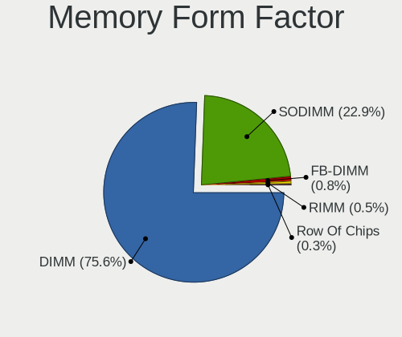

| Name         | Computers | Percent |
|--------------|-----------|---------|
| DIMM         | 165       | 69.92%  |
| SODIMM       | 67        | 28.39%  |
| FB-DIMM      | 2         | 0.85%   |
| Row Of Chips | 1         | 0.42%   |
| RIMM         | 1         | 0.42%   |

Memory Size
-----------

Memory module size

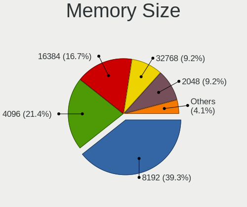

| Size  | Computers | Percent |
|-------|-----------|---------|
| 8192  | 74        | 29.13%  |
| 4096  | 70        | 27.56%  |
| 16384 | 39        | 15.35%  |
| 32768 | 32        | 12.6%   |
| 2048  | 31        | 12.2%   |
| 1024  | 6         | 2.36%   |
| 65536 | 2         | 0.79%   |

Memory Speed
------------

Memory module speed

| Speed   | Computers | Percent |
|---------|-----------|---------|
| 1600    | 49        | 19.29%  |
| 2400    | 44        | 17.32%  |
| 2667    | 35        | 13.78%  |
| 1333    | 32        | 12.6%   |
| 3200    | 18        | 7.09%   |
| 2133    | 15        | 5.91%   |
| 800     | 13        | 5.12%   |
| 667     | 9         | 3.54%   |
| 2800    | 4         | 1.57%   |
| Unknown | 4         | 1.57%   |
| 2666    | 3         | 1.18%   |
| 3600    | 2         | 0.79%   |
| 3266    | 2         | 0.79%   |
| 2933    | 2         | 0.79%   |
| 2134    | 2         | 0.79%   |
| 2000    | 2         | 0.79%   |
| 1866    | 2         | 0.79%   |
| 1800    | 2         | 0.79%   |
| 1334    | 2         | 0.79%   |
| 1067    | 2         | 0.79%   |
| 1066    | 2         | 0.79%   |
| 4333    | 1         | 0.39%   |
| 4199    | 1         | 0.39%   |
| 3500    | 1         | 0.39%   |
| 3466    | 1         | 0.39%   |
| 2465    | 1         | 0.39%   |
| 1867    | 1         | 0.39%   |
| 533     | 1         | 0.39%   |
| 400     | 1         | 0.39%   |

Printers & scanners
-------------------

Printer Vendor
--------------

Printer device vendors

| Vendor              | Computers | Percent |
|---------------------|-----------|---------|
| Hewlett-Packard     | 3         | 50%     |
| Samsung Electronics | 1         | 16.67%  |
| Canon               | 1         | 16.67%  |
| Brother Industries  | 1         | 16.67%  |

Printer Model
-------------

Printer device models

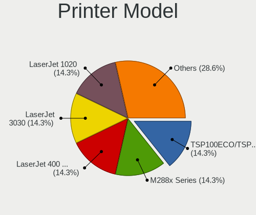

| Model                   | Computers | Percent |
|-------------------------|-----------|---------|
| Samsung M288x Series    | 1         | 16.67%  |
| HP LaserJet 400 M401dne | 1         | 16.67%  |
| HP LaserJet 3030        | 1         | 16.67%  |
| HP LaserJet 1020        | 1         | 16.67%  |
| Canon MF210 Series      | 1         | 16.67%  |
| Brother MFC-9130CW      | 1         | 16.67%  |

Scanner Vendor
--------------

Scanner device vendors

Zero info for selected period =(

Scanner Model
-------------

Scanner device models

Zero info for selected period =(

Camera
------

Camera Vendor
-------------

Camera device vendors

| Vendor                                 | Computers | Percent |
|----------------------------------------|-----------|---------|
| Chicony Electronics                    | 7         | 12.5%   |
| Sunplus Innovation Technology          | 5         | 8.93%   |
| Realtek Semiconductor                  | 5         | 8.93%   |
| Microdia                               | 5         | 8.93%   |
| Logitech                               | 4         | 7.14%   |
| IMC Networks                           | 4         | 7.14%   |
| Suyin                                  | 3         | 5.36%   |
| Quanta                                 | 3         | 5.36%   |
| Generalplus Technology                 | 3         | 5.36%   |
| Cheng Uei Precision Industry (Foxlink) | 3         | 5.36%   |
| Acer                                   | 3         | 5.36%   |
| Ricoh                                  | 2         | 3.57%   |
| Microsoft                              | 2         | 3.57%   |
| Apple                                  | 2         | 3.57%   |
| Syntek                                 | 1         | 1.79%   |
| Silicon Motion                         | 1         | 1.79%   |
| Samsung Electronics                    | 1         | 1.79%   |
| Lite-On Technology                     | 1         | 1.79%   |
| Alcor Micro                            | 1         | 1.79%   |

Camera Model
------------

Camera device models

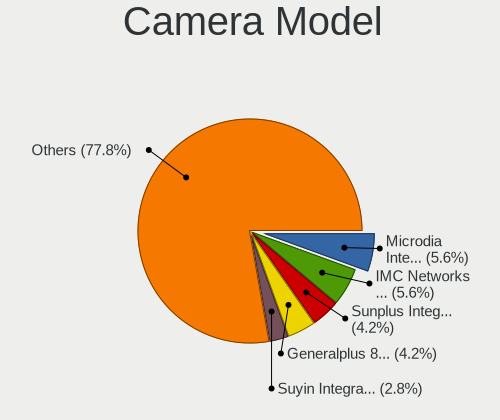

| Model                                                                      | Computers | Percent |
|----------------------------------------------------------------------------|-----------|---------|
| Sunplus Integrated_Webcam_HD                                               | 3         | 5.36%   |
| Microdia Integrated_Webcam_HD                                              | 3         | 5.36%   |
| IMC Networks Integrated Camera                                             | 3         | 5.36%   |
| Generalplus 808 Camera                                                     | 3         | 5.36%   |
| Suyin Integrated Webcam                                                    | 2         | 3.57%   |
| Syntek EasyCamera                                                          | 1         | 1.79%   |
| Suyin Asus Integrated Webcam [CN031B]                                      | 1         | 1.79%   |
| Sunplus Laptop_Integrated_Webcam_HD                                        | 1         | 1.79%   |
| Sunplus Integrated Webcam                                                  | 1         | 1.79%   |
| Silicon Motion WebCam SC-10HDD12636N                                       | 1         | 1.79%   |
| Samsung Galaxy series, misc. (MTP mode)                                    | 1         | 1.79%   |
| Ricoh Laptop_Integrated_Webcam_FHD                                         | 1         | 1.79%   |
| Ricoh HD Webcam                                                            | 1         | 1.79%   |
| Realtek Web Camera                                                         | 1         | 1.79%   |
| Realtek USB2.0 VGA UVC WebCam                                              | 1         | 1.79%   |
| Realtek USB2.0 HD UVC WebCam                                               | 1         | 1.79%   |
| Realtek Lenovo EasyCamera                                                  | 1         | 1.79%   |
| Realtek Integrated Webcam HD                                               | 1         | 1.79%   |
| Quanta Laptop_Integrated_Webcam_2HDM                                       | 1         | 1.79%   |
| Quanta HP Webcam                                                           | 1         | 1.79%   |
| Quanta HP Full-HD Camera                                                   | 1         | 1.79%   |
| Microsoft LifeCam NX-6000                                                  | 1         | 1.79%   |
| Microsoft LifeCam HD-5000                                                  | 1         | 1.79%   |
| Microdia Laptop_Integrated_Webcam_HD                                       | 1         | 1.79%   |
| Microdia Dell Integrated HD Webcam                                         | 1         | 1.79%   |
| Logitech Webcam C310                                                       | 1         | 1.79%   |
| Logitech Webcam C170                                                       | 1         | 1.79%   |
| Logitech HD Pro Webcam C920                                                | 1         | 1.79%   |
| Logitech C922 Pro Stream Webcam                                            | 1         | 1.79%   |
| Lite-On HP HD Camera                                                       | 1         | 1.79%   |
| IMC Networks USB2.0 HD UVC WebCam                                          | 1         | 1.79%   |
| Chicony USB2.0 Camera                                                      | 1         | 1.79%   |
| Chicony TOSHIBA Web Camera - HD                                            | 1         | 1.79%   |
| Chicony Lenovo Integrated Camera (0.3MP)                                   | 1         | 1.79%   |
| Chicony HP Wide Vision HD Camera                                           | 1         | 1.79%   |
| Chicony HP Webcam [2 MP Macro]                                             | 1         | 1.79%   |
| Chicony HP Truevision HD                                                   | 1         | 1.79%   |
| Chicony HD WebCam                                                          | 1         | 1.79%   |
| Cheng Uei Precision Industry (Foxlink) Webcam                              | 1         | 1.79%   |
| Cheng Uei Precision Industry (Foxlink) HP Wide Vision HD Integrated Webcam | 1         | 1.79%   |
| Cheng Uei Precision Industry (Foxlink) HP 5M Camera                        | 1         | 1.79%   |
| Apple iPhone 5/5C/5S/6/SE                                                  | 1         | 1.79%   |
| Apple Built-in iSight                                                      | 1         | 1.79%   |
| Alcor Micro Acer Integrated Webcam                                         | 1         | 1.79%   |
| Acer SunplusIT INC. Integrated Camera                                      | 1         | 1.79%   |
| Acer HD Webcam                                                             | 1         | 1.79%   |
| Acer EasyCamera                                                            | 1         | 1.79%   |

Security
--------

Fingerprint Vendor
------------------

Fingerprint sensor vendors

| Vendor             | Computers | Percent |
|--------------------|-----------|---------|
| Validity Sensors   | 6         | 35.29%  |
| Synaptics          | 4         | 23.53%  |
| AuthenTec          | 4         | 23.53%  |
| STMicroelectronics | 2         | 11.76%  |
| Upek               | 1         | 5.88%   |

Fingerprint Model
-----------------

Fingerprint sensor models

| Model                                                                      | Computers | Percent |
|----------------------------------------------------------------------------|-----------|---------|
| AuthenTec AES2810                                                          | 3         | 17.65%  |
| Validity Sensors VFS451 Fingerprint Reader                                 | 2         | 11.76%  |
| Synaptics Prometheus MIS Touch Fingerprint Reader                          | 2         | 11.76%  |
| STMicroelectronics Fingerprint Reader                                      | 2         | 11.76%  |
| Validity Sensors VFS5011 Fingerprint Reader                                | 1         | 5.88%   |
| Validity Sensors VFS495 Fingerprint Reader                                 | 1         | 5.88%   |
| Validity Sensors VFS 5011 fingerprint sensor                               | 1         | 5.88%   |
| Validity Sensors Synaptics VFS7552 Touch Fingerprint Sensor with PurePrint | 1         | 5.88%   |
| Upek Biometric Touchchip/Touchstrip Fingerprint Sensor                     | 1         | 5.88%   |
| Synaptics  VFS7552 Touch Fingerprint Sensor with PurePrint                 | 1         | 5.88%   |
| Synaptics Metallica MIS Touch Fingerprint Reader                           | 1         | 5.88%   |
| AuthenTec AES1660 Fingerprint Sensor                                       | 1         | 5.88%   |

Chipcard Vendor
---------------

Chipcard module vendors

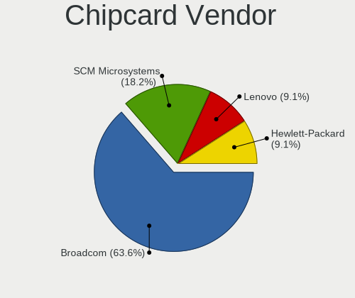

| Vendor           | Computers | Percent |
|------------------|-----------|---------|
| Broadcom         | 6         | 60%     |
| SCM Microsystems | 2         | 20%     |
| Lenovo           | 1         | 10%     |
| Hewlett-Packard  | 1         | 10%     |

Chipcard Model
--------------

Chipcard module models

| Model                                                                        | Computers | Percent |
|------------------------------------------------------------------------------|-----------|---------|
| Broadcom BCM5880 Secure Applications Processor                               | 4         | 40%     |
| SCM Microsystems SCR3340 - ExpressCard54 Smart Card Reader                   | 1         | 10%     |
| SCM Microsystems SCR331 SmartCard Reader                                     | 1         | 10%     |
| Lenovo Integrated Smart Card Reader                                          | 1         | 10%     |
| Hewlett-Packard SC Keyboard - Apollo (Liteon)                                | 1         | 10%     |
| Broadcom BCM5880 Secure Applications Processor with fingerprint swipe sensor | 1         | 10%     |
| Broadcom 5880                                                                | 1         | 10%     |

Unsupported
-----------

Unsupported Devices
-------------------

Total unsupported devices on board

| Total | Computers | Percent |
|-------|-----------|---------|
| 0     | 146       | 53.28%  |
| 1     | 68        | 24.82%  |
| 2     | 39        | 14.23%  |
| 3     | 13        | 4.74%   |
| 4     | 6         | 2.19%   |
| 5     | 2         | 0.73%   |

Unsupported Device Types
------------------------

Types of unsupported devices

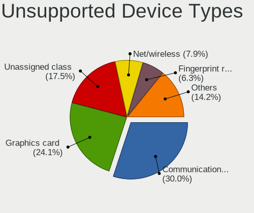

| Type                     | Computers | Percent |
|--------------------------|-----------|---------|
| Communication controller | 59        | 29.95%  |
| Unassigned class         | 39        | 19.8%   |
| Graphics card            | 39        | 19.8%   |
| Fingerprint reader       | 17        | 8.63%   |
| Net/wireless             | 15        | 7.61%   |
| Net/ethernet             | 11        | 5.58%   |
| Chipcard                 | 5         | 2.54%   |
| Storage                  | 3         | 1.52%   |
| Storage/raid             | 2         | 1.02%   |
| Sound                    | 2         | 1.02%   |
| Network                  | 2         | 1.02%   |
| Multimedia controller    | 1         | 0.51%   |
| Modem                    | 1         | 0.51%   |
| Camera                   | 1         | 0.51%   |

