CentOS 8 - Tested Hardware & Statistics (Desktops)
--------------------------------------------------

A project to collect tested hardware configurations for CentOS 8.

Anyone can contribute to this report by the [hw-probe](https://github.com/linuxhw/hw-probe) tool:

    sudo -E hw-probe -all -upload

Please submit a probe of your configuration if it's not presented on the page or is rare.

Full-feature report is available here: https://linux-hardware.org/?view=trends&rel=centos-8

Contents
--------

* [ Test Cases ](#test-cases)

* [ System ](#system)
  - [ Kernel                   ](#kernel)
  - [ Kernel Family            ](#kernel-family)
  - [ Kernel Major Ver.        ](#kernel-major-ver)
  - [ Arch                     ](#arch)
  - [ DE                       ](#de)
  - [ Display Server           ](#display-server)
  - [ Display Manager          ](#display-manager)
  - [ OS Lang                  ](#os-lang)
  - [ Boot Mode                ](#boot-mode)
  - [ Filesystem               ](#filesystem)
  - [ Part. scheme             ](#part-scheme)
  - [ Dual Boot with Linux/BSD ](#dual-boot-with-linuxbsd)
  - [ Dual Boot (Win)          ](#dual-boot-win)

* [ Board ](#board)
  - [ Vendor                   ](#vendor)
  - [ Model                    ](#model)
  - [ Model Family             ](#model-family)
  - [ MFG Year                 ](#mfg-year)
  - [ Form Factor              ](#form-factor)
  - [ Secure Boot              ](#secure-boot)
  - [ Coreboot                 ](#coreboot)
  - [ RAM Size                 ](#ram-size)
  - [ RAM Used                 ](#ram-used)
  - [ Total Drives             ](#total-drives)
  - [ Has CD-ROM               ](#has-cd-rom)
  - [ Has Ethernet             ](#has-ethernet)
  - [ Has WiFi                 ](#has-wifi)
  - [ Has Bluetooth            ](#has-bluetooth)

* [ Location ](#location)
  - [ Country                  ](#country)
  - [ City                     ](#city)

* [ Drives ](#drives)
  - [ Drive Vendor             ](#drive-vendor)
  - [ Drive Model              ](#drive-model)
  - [ HDD Vendor               ](#hdd-vendor)
  - [ SSD Vendor               ](#ssd-vendor)
  - [ Drive Kind               ](#drive-kind)
  - [ Drive Connector          ](#drive-connector)
  - [ Drive Size               ](#drive-size)
  - [ Space Total              ](#space-total)
  - [ Space Used               ](#space-used)
  - [ Malfunc. Drives          ](#malfunc-drives)
  - [ Malfunc. Drive Vendor    ](#malfunc-drive-vendor)
  - [ Malfunc. HDD Vendor      ](#malfunc-hdd-vendor)
  - [ Malfunc. Drive Kind      ](#malfunc-drive-kind)
  - [ Failed Drives            ](#failed-drives)
  - [ Failed Drive Vendor      ](#failed-drive-vendor)
  - [ Drive Status             ](#drive-status)

* [ Storage controller ](#storage-controller)
  - [ Storage Vendor           ](#storage-vendor)
  - [ Storage Model            ](#storage-model)
  - [ Storage Kind             ](#storage-kind)

* [ Processor ](#processor)
  - [ CPU Vendor               ](#cpu-vendor)
  - [ CPU Model                ](#cpu-model)
  - [ CPU Model Family         ](#cpu-model-family)
  - [ CPU Cores                ](#cpu-cores)
  - [ CPU Sockets              ](#cpu-sockets)
  - [ CPU Threads              ](#cpu-threads)
  - [ CPU Op-Modes             ](#cpu-op-modes)
  - [ CPU Microcode            ](#cpu-microcode)
  - [ CPU Microarch            ](#cpu-microarch)

* [ Graphics ](#graphics)
  - [ GPU Vendor               ](#gpu-vendor)
  - [ GPU Model                ](#gpu-model)
  - [ GPU Combo                ](#gpu-combo)
  - [ GPU Driver               ](#gpu-driver)
  - [ GPU Memory               ](#gpu-memory)

* [ Monitor ](#monitor)
  - [ Monitor Vendor           ](#monitor-vendor)
  - [ Monitor Model            ](#monitor-model)
  - [ Monitor Resolution       ](#monitor-resolution)
  - [ Monitor Diagonal         ](#monitor-diagonal)
  - [ Monitor Width            ](#monitor-width)
  - [ Aspect Ratio             ](#aspect-ratio)
  - [ Monitor Area             ](#monitor-area)
  - [ Pixel Density            ](#pixel-density)
  - [ Multiple Monitors        ](#multiple-monitors)

* [ Network ](#network)
  - [ Net Controller Vendor    ](#net-controller-vendor)
  - [ Net Controller Model     ](#net-controller-model)
  - [ Wireless Vendor          ](#wireless-vendor)
  - [ Wireless Model           ](#wireless-model)
  - [ Ethernet Vendor          ](#ethernet-vendor)
  - [ Ethernet Model           ](#ethernet-model)
  - [ Net Controller Kind      ](#net-controller-kind)
  - [ Used Controller          ](#used-controller)
  - [ NICs                     ](#nics)
  - [ IPv6                     ](#ipv6)

* [ Bluetooth ](#bluetooth)
  - [ Bluetooth Vendor         ](#bluetooth-vendor)
  - [ Bluetooth Model          ](#bluetooth-model)

* [ Sound ](#sound)
  - [ Sound Vendor             ](#sound-vendor)
  - [ Sound Model              ](#sound-model)

* [ Memory ](#memory)
  - [ Memory Vendor            ](#memory-vendor)
  - [ Memory Model             ](#memory-model)
  - [ Memory Kind              ](#memory-kind)
  - [ Memory Form Factor       ](#memory-form-factor)
  - [ Memory Size              ](#memory-size)
  - [ Memory Speed             ](#memory-speed)

* [ Printers & scanners ](#printers--scanners)
  - [ Printer Vendor           ](#printer-vendor)
  - [ Printer Model            ](#printer-model)
  - [ Scanner Vendor           ](#scanner-vendor)
  - [ Scanner Model            ](#scanner-model)

* [ Camera ](#camera)
  - [ Camera Vendor            ](#camera-vendor)
  - [ Camera Model             ](#camera-model)

* [ Security ](#security)
  - [ Fingerprint Vendor       ](#fingerprint-vendor)
  - [ Fingerprint Model        ](#fingerprint-model)
  - [ Chipcard Vendor          ](#chipcard-vendor)
  - [ Chipcard Model           ](#chipcard-model)

* [ Unsupported ](#unsupported)
  - [ Unsupported Devices      ](#unsupported-devices)
  - [ Unsupported Device Types ](#unsupported-device-types)

Test Cases
----------

| Vendor        | Model                       | Probe                                                      | Date         |
|---------------|-----------------------------|------------------------------------------------------------|--------------|
| ASRock        | Z77 Extreme4                | [b59cb8f7f5](https://linux-hardware.org/?probe=b59cb8f7f5) | Sep 17, 2021 |
| Gigabyte      | X570 AORUS MASTER           | [4720c56d37](https://linux-hardware.org/?probe=4720c56d37) | Sep 15, 2021 |
| HP            | 8750                        | [b5bbf3502f](https://linux-hardware.org/?probe=b5bbf3502f) | Sep 08, 2021 |
| ASRock        | Z77 Extreme4                | [5cda73f744](https://linux-hardware.org/?probe=5cda73f744) | Sep 05, 2021 |
| Intel         | DH55TC AAE70932-302         | [e5f7233230](https://linux-hardware.org/?probe=e5f7233230) | Sep 04, 2021 |
| Gigabyte      | X570 AORUS MASTER           | [5d701efa3e](https://linux-hardware.org/?probe=5d701efa3e) | Sep 03, 2021 |
| ASRock        | Z77 Extreme4                | [f754b0f478](https://linux-hardware.org/?probe=f754b0f478) | Sep 03, 2021 |
| MSI           | MAG B550M MORTAR            | [5ae94fc78a](https://linux-hardware.org/?probe=5ae94fc78a) | Aug 28, 2021 |
| Supermicro    | X8SAX                       | [3795e4ab95](https://linux-hardware.org/?probe=3795e4ab95) | Aug 28, 2021 |
| Gigabyte      | H97N-WIFI                   | [bee6b88bab](https://linux-hardware.org/?probe=bee6b88bab) | Aug 27, 2021 |
| Gigabyte      | Z170MX-Gaming 5             | [461d550db6](https://linux-hardware.org/?probe=461d550db6) | Aug 19, 2021 |
| Gigabyte      | GA-78LMT-USB3 x.x           | [70be38d5e1](https://linux-hardware.org/?probe=70be38d5e1) | Aug 18, 2021 |
| HP            | 2B3C                        | [5e60efc4a4](https://linux-hardware.org/?probe=5e60efc4a4) | Aug 18, 2021 |
| MSI           | MPG X570 GAMING EDGE WIF... | [3501d4479e](https://linux-hardware.org/?probe=3501d4479e) | Aug 17, 2021 |
| Gigabyte      | H270M-DS3H-CF               | [0cecab8e81](https://linux-hardware.org/?probe=0cecab8e81) | Aug 11, 2021 |
| ASRock        | A320M-HD                    | [13bd66cba7](https://linux-hardware.org/?probe=13bd66cba7) | Aug 11, 2021 |
| ASUSTek       | TUF B450M-PRO GAMING        | [92336b575c](https://linux-hardware.org/?probe=92336b575c) | Aug 10, 2021 |
| ASRock        | A320M-HD                    | [775b415921](https://linux-hardware.org/?probe=775b415921) | Aug 08, 2021 |
| ASRock        | A320M-HD                    | [d68ac72e1d](https://linux-hardware.org/?probe=d68ac72e1d) | Aug 03, 2021 |
| HP            | 0AECh D                     | [be8dfa216f](https://linux-hardware.org/?probe=be8dfa216f) | Jul 31, 2021 |
| Gigabyte      | H57M-USB3                   | [642d577f96](https://linux-hardware.org/?probe=642d577f96) | Jul 24, 2021 |
| MSI           | MAG B550M MORTAR            | [59a63323ed](https://linux-hardware.org/?probe=59a63323ed) | Jul 23, 2021 |
| MSI           | MAG X570 TOMAHAWK WIFI      | [ec0e7ce341](https://linux-hardware.org/?probe=ec0e7ce341) | Jul 19, 2021 |
| MSI           | B460M-A PRO                 | [da8382cb33](https://linux-hardware.org/?probe=da8382cb33) | Jul 15, 2021 |
| MSI           | B460M-A PRO                 | [146ce74ec9](https://linux-hardware.org/?probe=146ce74ec9) | Jul 15, 2021 |
| MSI           | MAG B550M MORTAR            | [4ac62bb08e](https://linux-hardware.org/?probe=4ac62bb08e) | Jul 13, 2021 |
| ASRock        | A320M-HD                    | [ff76aecb8e](https://linux-hardware.org/?probe=ff76aecb8e) | Jul 12, 2021 |
| ASUSTek       | M5A99FX PRO R2.0            | [f4606d038d](https://linux-hardware.org/?probe=f4606d038d) | Jun 29, 2021 |
| ASRock        | A320M-HD                    | [e09e4e329c](https://linux-hardware.org/?probe=e09e4e329c) | Jun 14, 2021 |
| Dell          | 0M5DCD A00                  | [00ce09b473](https://linux-hardware.org/?probe=00ce09b473) | May 31, 2021 |
| Apple         | Mac-7BA5B2D9E42DDD94        | [de14f99534](https://linux-hardware.org/?probe=de14f99534) | May 24, 2021 |
| Apple         | Mac-7BA5B2D9E42DDD94        | [8ecaed3eb2](https://linux-hardware.org/?probe=8ecaed3eb2) | May 24, 2021 |
| Dell          | 0200DY A02                  | [340184fb36](https://linux-hardware.org/?probe=340184fb36) | May 23, 2021 |
| HP            | 18E7                        | [3045530e64](https://linux-hardware.org/?probe=3045530e64) | May 17, 2021 |
| MSI           | MAG B550M MORTAR            | [640c5adfc3](https://linux-hardware.org/?probe=640c5adfc3) | May 10, 2021 |
| ASUSTek       | PRIME X570-PRO              | [88b8ca6dbe](https://linux-hardware.org/?probe=88b8ca6dbe) | Apr 30, 2021 |
| ASUSTek       | PRIME X570-PRO              | [be1a846088](https://linux-hardware.org/?probe=be1a846088) | Apr 30, 2021 |
| ASUSTek       | Z97-E/USB                   | [8524f8f381](https://linux-hardware.org/?probe=8524f8f381) | Apr 16, 2021 |
| ASUSTek       | Z97-E/USB                   | [561d33760f](https://linux-hardware.org/?probe=561d33760f) | Mar 31, 2021 |
| ASRock        | X570 Steel Legend           | [f8b36f6373](https://linux-hardware.org/?probe=f8b36f6373) | Mar 29, 2021 |
| ASRock        | X570 Steel Legend           | [60fa73286f](https://linux-hardware.org/?probe=60fa73286f) | Mar 29, 2021 |
| Gigabyte      | Z490 GAMING X               | [f37546f14b](https://linux-hardware.org/?probe=f37546f14b) | Mar 26, 2021 |
| Dell          | 0XHGV1 A00                  | [aa8337865d](https://linux-hardware.org/?probe=aa8337865d) | Mar 23, 2021 |
| Lenovo        | MAHOBAY                     | [3bce30311a](https://linux-hardware.org/?probe=3bce30311a) | Mar 23, 2021 |
| Gigabyte      | Z390 DESIGNARE-CF           | [c46179b0b2](https://linux-hardware.org/?probe=c46179b0b2) | Mar 22, 2021 |
| Gigabyte      | Z390 DESIGNARE-CF           | [0473f156a3](https://linux-hardware.org/?probe=0473f156a3) | Mar 22, 2021 |
| ASUSTek       | PRIME X370-PRO              | [ccdc5f822c](https://linux-hardware.org/?probe=ccdc5f822c) | Mar 20, 2021 |
| ASUSTek       | M5A78L-M/USB3               | [9fdca2136a](https://linux-hardware.org/?probe=9fdca2136a) | Mar 19, 2021 |
| Dell          | 0NC2VH A01                  | [cc8791aaa6](https://linux-hardware.org/?probe=cc8791aaa6) | Mar 17, 2021 |
| ASUSTek       | PRIME A320M-R               | [adac87af3d](https://linux-hardware.org/?probe=adac87af3d) | Mar 13, 2021 |
| ASUSTek       | P8H77-I                     | [0190551f1e](https://linux-hardware.org/?probe=0190551f1e) | Mar 13, 2021 |
| ASUSTek       | P8H77-I                     | [1184f695c1](https://linux-hardware.org/?probe=1184f695c1) | Mar 13, 2021 |
| ASUSTek       | P8H77-I                     | [b5658ed87e](https://linux-hardware.org/?probe=b5658ed87e) | Mar 12, 2021 |
| ASUSTek       | Z97-E/USB                   | [b979ba17d1](https://linux-hardware.org/?probe=b979ba17d1) | Mar 07, 2021 |
| ASUSTek       | Z97-E/USB                   | [47a56b26e5](https://linux-hardware.org/?probe=47a56b26e5) | Mar 07, 2021 |
| Gigabyte      | B75M-D3H                    | [774a5efd77](https://linux-hardware.org/?probe=774a5efd77) | Feb 25, 2021 |
| ASUSTek       | PRIME X370-PRO              | [1314989a9a](https://linux-hardware.org/?probe=1314989a9a) | Feb 21, 2021 |
| Dell          | 0WR7PY A01                  | [ad06439414](https://linux-hardware.org/?probe=ad06439414) | Feb 19, 2021 |
| Supermicro    | X9SCI/X9SCA                 | [28940aaa42](https://linux-hardware.org/?probe=28940aaa42) | Feb 16, 2021 |
| Dell          | 07T4MC A06                  | [ae053aa0ed](https://linux-hardware.org/?probe=ae053aa0ed) | Feb 15, 2021 |
| ASUSTek       | Z97-E/USB                   | [0cf9401181](https://linux-hardware.org/?probe=0cf9401181) | Feb 12, 2021 |
| Gigabyte      | MZBSWMP-00                  | [754ea78372](https://linux-hardware.org/?probe=754ea78372) | Feb 09, 2021 |
| Gigabyte      | MZBSWMP-00                  | [5e6e46d3b1](https://linux-hardware.org/?probe=5e6e46d3b1) | Feb 09, 2021 |
| Gigabyte      | H77N-WIFI                   | [8469853bc1](https://linux-hardware.org/?probe=8469853bc1) | Feb 08, 2021 |
| Gigabyte      | H77N-WIFI                   | [7b44703f86](https://linux-hardware.org/?probe=7b44703f86) | Feb 08, 2021 |
| ASUSTek       | Z97-E/USB                   | [494eafb565](https://linux-hardware.org/?probe=494eafb565) | Feb 03, 2021 |
| ASUSTek       | Z97-E/USB                   | [59f3594f3d](https://linux-hardware.org/?probe=59f3594f3d) | Jan 28, 2021 |
| ASUSTek       | Z97-E/USB                   | [17fef649e3](https://linux-hardware.org/?probe=17fef649e3) | Jan 25, 2021 |
| ASRock        | X570 Steel Legend           | [59145ca9e6](https://linux-hardware.org/?probe=59145ca9e6) | Jan 24, 2021 |
| ASUSTek       | M5A99FX PRO R2.0            | [996727413b](https://linux-hardware.org/?probe=996727413b) | Jan 17, 2021 |
| ASUSTek       | M5A99FX PRO R2.0            | [20c1a73c0e](https://linux-hardware.org/?probe=20c1a73c0e) | Jan 14, 2021 |
| ASUSTek       | GD30CI                      | [201c54f6b8](https://linux-hardware.org/?probe=201c54f6b8) | Jan 12, 2021 |
| Lenovo        | Board                       | [d798d76c9a](https://linux-hardware.org/?probe=d798d76c9a) | Jan 11, 2021 |
| Lenovo        | Board                       | [6de78c3913](https://linux-hardware.org/?probe=6de78c3913) | Jan 11, 2021 |
| Lenovo        | Board                       | [e2cd4bfc82](https://linux-hardware.org/?probe=e2cd4bfc82) | Jan 11, 2021 |
| MSI           | H97 GAMING 3                | [7e25d7549f](https://linux-hardware.org/?probe=7e25d7549f) | Jan 09, 2021 |
| ASUSTek       | GD30CI                      | [4f2d51ec4b](https://linux-hardware.org/?probe=4f2d51ec4b) | Jan 09, 2021 |
| ASRock        | X570 Steel Legend           | [6371149c87](https://linux-hardware.org/?probe=6371149c87) | Jan 08, 2021 |
| ASUSTek       | TUF Z370-PLUS GAMING        | [58204a920b](https://linux-hardware.org/?probe=58204a920b) | Jan 05, 2021 |
| HP            | 806A                        | [f02a4a5e93](https://linux-hardware.org/?probe=f02a4a5e93) | Jan 05, 2021 |
| ASRock        | X570 Steel Legend           | [dcd24f778c](https://linux-hardware.org/?probe=dcd24f778c) | Jan 03, 2021 |
| ASRock        | X570 Steel Legend           | [16fc91341e](https://linux-hardware.org/?probe=16fc91341e) | Dec 31, 2020 |
| ASRock        | X570 Steel Legend           | [91ed18105e](https://linux-hardware.org/?probe=91ed18105e) | Dec 31, 2020 |
| ASUSTek       | M5A99FX PRO R2.0            | [34a96782e3](https://linux-hardware.org/?probe=34a96782e3) | Dec 28, 2020 |
| ASRock        | X570 Steel Legend           | [384c4a8068](https://linux-hardware.org/?probe=384c4a8068) | Dec 27, 2020 |
| Gigabyte      | X470 AORUS ULTRA GAMING-... | [ac785c27e5](https://linux-hardware.org/?probe=ac785c27e5) | Dec 27, 2020 |
| Dell          | 0VD5HY A00                  | [470703f4af](https://linux-hardware.org/?probe=470703f4af) | Dec 27, 2020 |
| ASRock        | X570 Steel Legend           | [c96512d726](https://linux-hardware.org/?probe=c96512d726) | Dec 25, 2020 |
| ASUSTek       | M5A99FX PRO R2.0            | [2b7bb243da](https://linux-hardware.org/?probe=2b7bb243da) | Dec 23, 2020 |
| Gigabyte      | Z370 AORUS Gaming WIFI-C... | [5438d83866](https://linux-hardware.org/?probe=5438d83866) | Dec 14, 2020 |
| ASUSTek       | Z170-A                      | [b4e9865791](https://linux-hardware.org/?probe=b4e9865791) | Nov 25, 2020 |
| ASUSTek       | H87M-PLUS                   | [b2cc866da6](https://linux-hardware.org/?probe=b2cc866da6) | Nov 24, 2020 |
| ASRock        | Z390M-ITX/ac                | [3d5c6b679d](https://linux-hardware.org/?probe=3d5c6b679d) | Nov 22, 2020 |
| ASRock        | Z390M-ITX/ac                | [b3f3cd1511](https://linux-hardware.org/?probe=b3f3cd1511) | Nov 22, 2020 |
| HP            | 81C9                        | [ea900ff5b1](https://linux-hardware.org/?probe=ea900ff5b1) | Nov 19, 2020 |
| ASUSTek       | PRIME X370-PRO              | [70fc4e5649](https://linux-hardware.org/?probe=70fc4e5649) | Nov 16, 2020 |
| HP            | 1587h                       | [4b1f2221ee](https://linux-hardware.org/?probe=4b1f2221ee) | Nov 16, 2020 |
| ASUSTek       | TUF GAMING B550M-PLUS       | [a5d5227154](https://linux-hardware.org/?probe=a5d5227154) | Nov 12, 2020 |
| HP            | 1495                        | [931bc038c8](https://linux-hardware.org/?probe=931bc038c8) | Nov 07, 2020 |
| HP            | 1495                        | [a2c50ab08e](https://linux-hardware.org/?probe=a2c50ab08e) | Nov 07, 2020 |
| Supermicro    | X8SIL                       | [10b7c06f49](https://linux-hardware.org/?probe=10b7c06f49) | Nov 02, 2020 |
| Supermicro    | X8SIL                       | [e40055e7ca](https://linux-hardware.org/?probe=e40055e7ca) | Nov 01, 2020 |
| ASRock        | G31M-S                      | [1741a29fd6](https://linux-hardware.org/?probe=1741a29fd6) | Nov 01, 2020 |
| ASRock        | G31M-S                      | [e579695cc9](https://linux-hardware.org/?probe=e579695cc9) | Nov 01, 2020 |
| ASUSTek       | PRIME X570-P                | [4e9d94747a](https://linux-hardware.org/?probe=4e9d94747a) | Oct 30, 2020 |
| Supermicro    | X8SIL                       | [ff3a4a93df](https://linux-hardware.org/?probe=ff3a4a93df) | Oct 28, 2020 |
| Supermicro    | X8SIL                       | [c6d306f861](https://linux-hardware.org/?probe=c6d306f861) | Oct 27, 2020 |
| MSI           | A320M PRO-VD/S V2           | [56d1218104](https://linux-hardware.org/?probe=56d1218104) | Oct 25, 2020 |
| ASUSTek       | Z170-A                      | [e5b6274c3e](https://linux-hardware.org/?probe=e5b6274c3e) | Oct 22, 2020 |
| ASUSTek       | P9X79                       | [e0a6bc45ee](https://linux-hardware.org/?probe=e0a6bc45ee) | Oct 17, 2020 |
| ASUSTek       | P9X79                       | [d14403a73b](https://linux-hardware.org/?probe=d14403a73b) | Oct 17, 2020 |
| HP            | 1495                        | [a678a5caf0](https://linux-hardware.org/?probe=a678a5caf0) | Oct 13, 2020 |
| ASRock        | X99 Taichi                  | [fabde85a5a](https://linux-hardware.org/?probe=fabde85a5a) | Oct 11, 2020 |
| MSI           | B450I GAMING PLUS AC        | [ff2176937d](https://linux-hardware.org/?probe=ff2176937d) | Oct 03, 2020 |
| ASUSTek       | Berkeley                    | [8ead41d349](https://linux-hardware.org/?probe=8ead41d349) | Sep 28, 2020 |
| Gigabyte      | X570 AORUS PRO WIFI         | [29fdcb6b00](https://linux-hardware.org/?probe=29fdcb6b00) | Sep 28, 2020 |
| Gigabyte      | A320M-S2H-CF                | [bcf59e135b](https://linux-hardware.org/?probe=bcf59e135b) | Sep 19, 2020 |
| Gigabyte      | A320M-S2H-CF                | [43d38ed1be](https://linux-hardware.org/?probe=43d38ed1be) | Sep 19, 2020 |
| HP            | 8053                        | [b00f600647](https://linux-hardware.org/?probe=b00f600647) | Sep 09, 2020 |
| Intel         | D54250WYK H13922-303        | [219e110c70](https://linux-hardware.org/?probe=219e110c70) | Sep 03, 2020 |
| HP            | 0B54h D                     | [b39f47faf8](https://linux-hardware.org/?probe=b39f47faf8) | Aug 26, 2020 |
| Dell          | 0GTK4K A02                  | [81f3fe5ce0](https://linux-hardware.org/?probe=81f3fe5ce0) | Aug 26, 2020 |
| ASUSTek       | M5A99X EVO R2.0             | [1c28fb67ab](https://linux-hardware.org/?probe=1c28fb67ab) | Aug 20, 2020 |
| ASUSTek       | Z97-E/USB                   | [2377cf4d5e](https://linux-hardware.org/?probe=2377cf4d5e) | Aug 19, 2020 |
| ASUSTek       | Z97-E/USB                   | [2da17db4c1](https://linux-hardware.org/?probe=2da17db4c1) | Aug 19, 2020 |
| ASUSTek       | ROG STRIX X570-F GAMING     | [eeaeff9e52](https://linux-hardware.org/?probe=eeaeff9e52) | Aug 12, 2020 |
| MSI           | B350M PRO-VDH               | [301fe36ff7](https://linux-hardware.org/?probe=301fe36ff7) | Aug 06, 2020 |
| Gigabyte      | A320M-S2H-CF                | [cbcae43afd](https://linux-hardware.org/?probe=cbcae43afd) | Aug 02, 2020 |
| Gigabyte      | P35-DS4                     | [d9b3b9a12e](https://linux-hardware.org/?probe=d9b3b9a12e) | Aug 02, 2020 |
| Gigabyte      | P35-DS4                     | [3a33cfc73c](https://linux-hardware.org/?probe=3a33cfc73c) | Aug 02, 2020 |
| Gigabyte      | X399 AORUS Gaming 7         | [c27cdabb7b](https://linux-hardware.org/?probe=c27cdabb7b) | Aug 02, 2020 |
| Gigabyte      | A320M-S2H-CF                | [08325f77c1](https://linux-hardware.org/?probe=08325f77c1) | Aug 01, 2020 |
| Gigabyte      | H97-HD3                     | [06c68b698e](https://linux-hardware.org/?probe=06c68b698e) | Jul 24, 2020 |
| ASUSTek       | Z97-E/USB                   | [f6f4d985ea](https://linux-hardware.org/?probe=f6f4d985ea) | Jul 13, 2020 |
| Gigabyte      | X470 AORUS ULTRA GAMING-... | [2244646450](https://linux-hardware.org/?probe=2244646450) | Jul 11, 2020 |
| Gigabyte      | X470 AORUS ULTRA GAMING-... | [80c07a542a](https://linux-hardware.org/?probe=80c07a542a) | Jul 11, 2020 |
| Dell          | 0YXT71 A02                  | [0d249e4d90](https://linux-hardware.org/?probe=0d249e4d90) | Jul 08, 2020 |
| ASRockRack    | EP2C612 WS                  | [4392ed1437](https://linux-hardware.org/?probe=4392ed1437) | Jul 08, 2020 |
| Dell          | 073MMW A00                  | [115d71c055](https://linux-hardware.org/?probe=115d71c055) | Jul 06, 2020 |
| Gigabyte      | EP45-DS3R                   | [cfad3da667](https://linux-hardware.org/?probe=cfad3da667) | Jul 03, 2020 |
| Unknown       | IPM31-AK                    | [acd334c9b0](https://linux-hardware.org/?probe=acd334c9b0) | Jun 28, 2020 |
| ASUSTek       | P8Z77-V                     | [f94256b581](https://linux-hardware.org/?probe=f94256b581) | Jun 22, 2020 |
| ASUSTek       | PRIME X570-P                | [f9990a3c91](https://linux-hardware.org/?probe=f9990a3c91) | Jun 22, 2020 |
| ASUSTek       | PRIME X570-P                | [6d4908178c](https://linux-hardware.org/?probe=6d4908178c) | Jun 22, 2020 |
| ASRock        | Z170 Extreme7+              | [56fa210d0c](https://linux-hardware.org/?probe=56fa210d0c) | Jun 20, 2020 |
| ASRock        | Z170 Extreme7+              | [b2d975c2e7](https://linux-hardware.org/?probe=b2d975c2e7) | Jun 20, 2020 |
| MSI           | 2A9C                        | [9af3bb0a4e](https://linux-hardware.org/?probe=9af3bb0a4e) | Jun 17, 2020 |
| Packard Be... | MCP73VT-PM                  | [8cba2e7fa8](https://linux-hardware.org/?probe=8cba2e7fa8) | Jun 14, 2020 |
| Packard Be... | MCP73VT-PM                  | [26f700fbc5](https://linux-hardware.org/?probe=26f700fbc5) | Jun 14, 2020 |
| ASRock        | X399 Professional Gaming    | [d313005743](https://linux-hardware.org/?probe=d313005743) | Jun 10, 2020 |
| ASUSTek       | TUF GAMING X570-PLUS        | [9020f6e51c](https://linux-hardware.org/?probe=9020f6e51c) | Jun 07, 2020 |
| MSI           | B450 TOMAHAWK MAX           | [edbd2a746d](https://linux-hardware.org/?probe=edbd2a746d) | Jun 06, 2020 |
| ASUSTek       | TUF GAMING X570-PLUS        | [0436cc9607](https://linux-hardware.org/?probe=0436cc9607) | Jun 03, 2020 |
| Intel         | DP45SG AAE27733-405         | [f195015cf8](https://linux-hardware.org/?probe=f195015cf8) | Jun 02, 2020 |
| ASUSTek       | TUF GAMING X570-PLUS        | [6d648c7448](https://linux-hardware.org/?probe=6d648c7448) | May 27, 2020 |
| ASUSTek       | TUF GAMING X570-PLUS        | [22c1a49189](https://linux-hardware.org/?probe=22c1a49189) | May 27, 2020 |
| ASUSTek       | TUF GAMING X570-PLUS        | [d4cbe90b0f](https://linux-hardware.org/?probe=d4cbe90b0f) | May 27, 2020 |
| Dell          | 0YXT71 A02                  | [e3f86df812](https://linux-hardware.org/?probe=e3f86df812) | May 25, 2020 |
| Supermicro    | X10DAI                      | [c2d45e8975](https://linux-hardware.org/?probe=c2d45e8975) | May 21, 2020 |
| Gigabyte      | Z68P-DS3                    | [a82798aea1](https://linux-hardware.org/?probe=a82798aea1) | May 21, 2020 |
| Fujitsu       | D3062-A1 S26361-D3062-A1    | [3f253aecbb](https://linux-hardware.org/?probe=3f253aecbb) | May 15, 2020 |
| Lenovo        | MAHOBAY                     | [3ad583ff3d](https://linux-hardware.org/?probe=3ad583ff3d) | May 14, 2020 |
| Foxconn       | 17A0                        | [167cb26122](https://linux-hardware.org/?probe=167cb26122) | May 03, 2020 |
| Biostar       | A320MH                      | [bc6b5804c2](https://linux-hardware.org/?probe=bc6b5804c2) | Apr 24, 2020 |
| Foxconn       | 2A8C                        | [64941f8ea2](https://linux-hardware.org/?probe=64941f8ea2) | Apr 21, 2020 |
| ASRockRack    | EP2C612 WS                  | [22419b4efe](https://linux-hardware.org/?probe=22419b4efe) | Apr 20, 2020 |
| Dell          | 0C3YXR A01                  | [b50f6391f3](https://linux-hardware.org/?probe=b50f6391f3) | Apr 19, 2020 |
| ASUSTek       | P8Z77-I DELUXE              | [cfed23f08f](https://linux-hardware.org/?probe=cfed23f08f) | Apr 18, 2020 |
| Dell          | 0YXT71 A02                  | [f454033e1f](https://linux-hardware.org/?probe=f454033e1f) | Apr 13, 2020 |
| ASUSTek       | TUF B450M-PRO GAMING        | [17ba5a84d9](https://linux-hardware.org/?probe=17ba5a84d9) | Apr 12, 2020 |
| ASUSTek       | PRIME B450M-GAMING/BR       | [c670b78e38](https://linux-hardware.org/?probe=c670b78e38) | Apr 11, 2020 |
| ASUSTek       | PRIME B450M-GAMING/BR       | [5d17d05d00](https://linux-hardware.org/?probe=5d17d05d00) | Apr 11, 2020 |
| ASUSTek       | P8Z77-I DELUXE              | [bb9f29477a](https://linux-hardware.org/?probe=bb9f29477a) | Apr 07, 2020 |
| ASUSTek       | P8Z77-I DELUXE              | [95a4ea12d4](https://linux-hardware.org/?probe=95a4ea12d4) | Apr 05, 2020 |
| Unknown       | LakePort                    | [85bfbe1e35](https://linux-hardware.org/?probe=85bfbe1e35) | Apr 02, 2020 |
| HP            | 843F                        | [f76a18754d](https://linux-hardware.org/?probe=f76a18754d) | Mar 12, 2020 |
| Dell          | 040DDP A01                  | [1e1a7753ca](https://linux-hardware.org/?probe=1e1a7753ca) | Mar 10, 2020 |
| Gigabyte      | EX58-EXTREME                | [29d31a8603](https://linux-hardware.org/?probe=29d31a8603) | Mar 08, 2020 |
| Gigabyte      | EX58-EXTREME                | [d2b19a4a0f](https://linux-hardware.org/?probe=d2b19a4a0f) | Feb 24, 2020 |
| ASUSTek       | P8Z77-V PRO                 | [54d3d863ad](https://linux-hardware.org/?probe=54d3d863ad) | Feb 23, 2020 |
| ASUSTek       | P8Z77-V PRO                 | [72895d5cc3](https://linux-hardware.org/?probe=72895d5cc3) | Feb 23, 2020 |
| Gigabyte      | EX58-EXTREME                | [2ce62d5ef2](https://linux-hardware.org/?probe=2ce62d5ef2) | Feb 23, 2020 |
| Supermicro    | X10DAI                      | [8bb87102a9](https://linux-hardware.org/?probe=8bb87102a9) | Feb 20, 2020 |
| ASUSTek       | H87M-PLUS                   | [ca1f92519f](https://linux-hardware.org/?probe=ca1f92519f) | Jan 29, 2020 |
| Gigabyte      | Z77X-UD5H                   | [2c5e967e3a](https://linux-hardware.org/?probe=2c5e967e3a) | Jan 25, 2020 |
| MSI           | H77MA-G43                   | [5a0c6d2f14](https://linux-hardware.org/?probe=5a0c6d2f14) | Jan 24, 2020 |
| Gigabyte      | Z77N-WIFI                   | [94c13c0e97](https://linux-hardware.org/?probe=94c13c0e97) | Jan 11, 2020 |
| Foxconn       | 2AA9                        | [2b2a941903](https://linux-hardware.org/?probe=2b2a941903) | Jan 07, 2020 |
| Foxconn       | 2AA9                        | [ed7e0428fb](https://linux-hardware.org/?probe=ed7e0428fb) | Jan 07, 2020 |
| Gigabyte      | GA-990X-Gaming SLI-CF       | [3c407e606c](https://linux-hardware.org/?probe=3c407e606c) | Dec 31, 2019 |
| Gigabyte      | EP45-DS4                    | [13acec4985](https://linux-hardware.org/?probe=13acec4985) | Dec 25, 2019 |
| MSI           | H55M-E33                    | [48d4121155](https://linux-hardware.org/?probe=48d4121155) | Dec 10, 2019 |
| ASRock        | X79 Extreme11               | [1b28cc994f](https://linux-hardware.org/?probe=1b28cc994f) | Dec 07, 2019 |
| Dell          | 0PC5F7 A01                  | [ba442e31fa](https://linux-hardware.org/?probe=ba442e31fa) | Nov 24, 2019 |
| ASUSTek       | Benicia                     | [5d4f2621ec](https://linux-hardware.org/?probe=5d4f2621ec) | Nov 22, 2019 |
| Dell          | 0XR1GT A00                  | [76dba7bb94](https://linux-hardware.org/?probe=76dba7bb94) | Nov 22, 2019 |
| HP            | ProLiant MicroServer        | [fdfa4ab709](https://linux-hardware.org/?probe=fdfa4ab709) | Nov 14, 2019 |
| Dell          | 07T4MC A06                  | [8fba67a719](https://linux-hardware.org/?probe=8fba67a719) | Nov 14, 2019 |
| Lenovo        | MAHOBAY                     | [652157e27c](https://linux-hardware.org/?probe=652157e27c) | Nov 03, 2019 |
| Lenovo        | MAHOBAY                     | [fd672567d1](https://linux-hardware.org/?probe=fd672567d1) | Nov 03, 2019 |
| ASUSTek       | Benicia                     | [764ecc00c4](https://linux-hardware.org/?probe=764ecc00c4) | Oct 30, 2019 |
| ASUSTek       | Benicia                     | [c604466168](https://linux-hardware.org/?probe=c604466168) | Oct 26, 2019 |
| ASUSTek       | ROG STRIX X470-F GAMING     | [17d03076df](https://linux-hardware.org/?probe=17d03076df) | Oct 16, 2019 |
| Fujitsu       | D3227-A1 S26361-D3227-A1    | [11a89e3f6f](https://linux-hardware.org/?probe=11a89e3f6f) | Oct 13, 2019 |
| Gigabyte      | X58A-UD5                    | [c1cd5017a5](https://linux-hardware.org/?probe=c1cd5017a5) | Oct 05, 2019 |

System
------

Kernel
------

Version of the Linux kernel

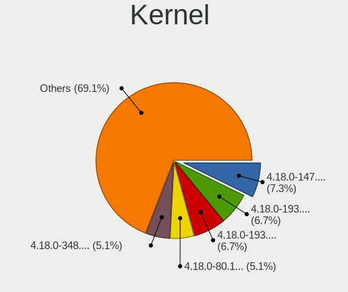

| Version                                  | Desktops | Percent |
|------------------------------------------|----------|---------|
| 4.18.0-147.8.1.el8_1.x86_64              | 13       | 9.35%   |
| 4.18.0-193.6.3.el8_2.x86_64              | 12       | 8.63%   |
| 4.18.0-193.14.2.el8_2.x86_64             | 12       | 8.63%   |
| 4.18.0-80.11.2.el8_0.x86_64              | 9        | 6.47%   |
| 4.18.0-193.19.1.el8_2.x86_64             | 9        | 6.47%   |
| 4.18.0-193.28.1.el8_2.x86_64             | 8        | 5.76%   |
| 4.18.0-147.5.1.el8_1.x86_64              | 7        | 5.04%   |
| 4.18.0-240.15.1.el8_3.x86_64             | 6        | 4.32%   |
| 4.18.0-240.10.1.el8_3.x86_64             | 6        | 4.32%   |
| 4.18.0-240.1.1.el8_3.x86_64              | 6        | 4.32%   |
| 4.18.0-240.22.1.el8_3.x86_64             | 5        | 3.6%    |
| 4.18.0-305.12.1.el8_4.x86_64             | 4        | 2.88%   |
| 4.18.0-301.1.el8.x86_64                  | 4        | 2.88%   |
| 4.18.0-147.el8.x86_64                    | 4        | 2.88%   |
| 4.18.0-315.el8.x86_64                    | 3        | 2.16%   |
| 4.18.0-80.el8.x86_64                     | 2        | 1.44%   |
| 4.18.0-305.7.1.el8_4.x86_64              | 2        | 1.44%   |
| 4.18.0-305.10.2.el8_4.x86_64             | 2        | 1.44%   |
| 4.18.0-294.el8.x86_64                    | 2        | 1.44%   |
| 4.18.0-277.el8.x86_64                    | 2        | 1.44%   |
| 4.18.0-240.el8.x86_64                    | 2        | 1.44%   |
| 4.18.0-193.10.el8.x86_64                 | 2        | 1.44%   |
| 4.18.0-147.3.1.el8_1.x86_64              | 2        | 1.44%   |
| 5.13.11-1.el8.elrepo.x86_64              | 1        | 0.72%   |
| 5.10.3-1.el8.elrepo.x86_64               | 1        | 0.72%   |
| 4.18.0-80.7.1.el8_0.x86_64               | 1        | 0.72%   |
| 4.18.0-338.el8.x86_64                    | 1        | 0.72%   |
| 4.18.0-326.el8.x86_64                    | 1        | 0.72%   |
| 4.18.0-269.el8.x86_64                    | 1        | 0.72%   |
| 4.18.0-259.el8.x86_64                    | 1        | 0.72%   |
| 4.18.0-257.el8.x86_64                    | 1        | 0.72%   |
| 4.18.0-240.10.1.el8_3.centos.plus.x86_64 | 1        | 0.72%   |
| 4.18.0-193.14.2.el8_2.x86_64+debug       | 1        | 0.72%   |
| 4.18.0-177.el8.x86_64                    | 1        | 0.72%   |
| 4.18.0-168.el8.x86_64                    | 1        | 0.72%   |
| 4.18.0-147.6.el8.x86_64                  | 1        | 0.72%   |
| 4.18.0-144.el8.x86_64                    | 1        | 0.72%   |
| 3.10.0-1062.4.1.el7.x86_64               | 1        | 0.72%   |

Kernel Family
-------------

Linux kernel without a distro release

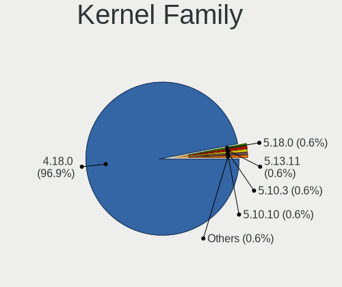

| Version | Desktops | Percent |
|---------|----------|---------|
| 4.18.0  | 119      | 97.54%  |
| 5.13.11 | 1        | 0.82%   |
| 5.10.3  | 1        | 0.82%   |
| 3.10.0  | 1        | 0.82%   |

Kernel Major Ver.
-----------------

Linux kernel major version

| Version | Desktops | Percent |
|---------|----------|---------|
| 4.18    | 119      | 97.54%  |
| 5.13    | 1        | 0.82%   |
| 5.10    | 1        | 0.82%   |
| 3.10    | 1        | 0.82%   |

Arch
----

OS architecture (x86_64, i586, etc.)

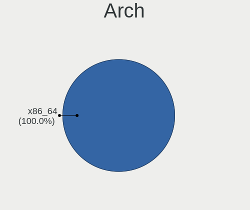

| Name   | Desktops | Percent |
|--------|----------|---------|
| x86_64 | 122      | 100%    |

DE
--

Desktop Environment

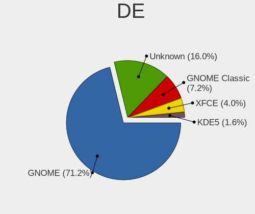

| Name          | Desktops | Percent |
|---------------|----------|---------|
| GNOME         | 89       | 71.2%   |
| Unknown       | 20       | 16%     |
| GNOME Classic | 9        | 7.2%    |
| XFCE          | 5        | 4%      |
| KDE5          | 2        | 1.6%    |

Display Server
--------------

X11 or Wayland

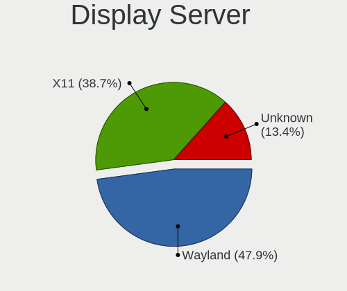

| Name    | Desktops | Percent |
|---------|----------|---------|
| Wayland | 60       | 46.88%  |
| X11     | 49       | 38.28%  |
| Unknown | 19       | 14.84%  |

Display Manager
---------------

SDDM, LightDM, etc.

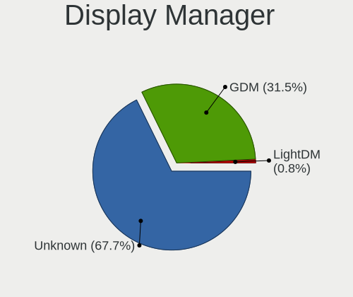

| Name    | Desktops | Percent |
|---------|----------|---------|
| Unknown | 84       | 68.29%  |
| GDM     | 38       | 30.89%  |
| LightDM | 1        | 0.81%   |

OS Lang
-------

Language

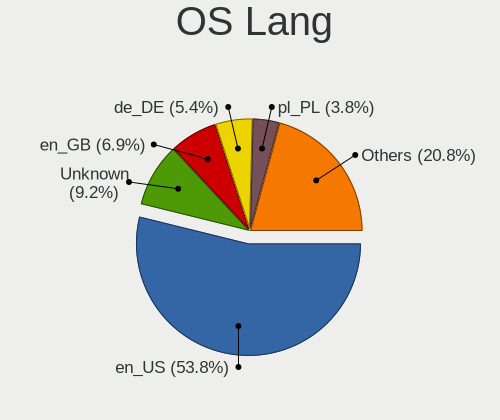

| Lang        | Desktops | Percent |
|-------------|----------|---------|
| en_US       | 66       | 52.38%  |
| Unknown     | 12       | 9.52%   |
| en_GB       | 9        | 7.14%   |
| de_DE       | 7        | 5.56%   |
| pl_PL       | 5        | 3.97%   |
| ru_RU       | 3        | 2.38%   |
| pt_BR       | 3        | 2.38%   |
| fr_FR       | 3        | 2.38%   |
| es_PE       | 2        | 1.59%   |
| en_CA       | 2        | 1.59%   |
| en_AU       | 2        | 1.59%   |
| uk_UA       | 1        | 0.79%   |
| tr_TR       | 1        | 0.79%   |
| sl_SI       | 1        | 0.79%   |
| ko_KR       | 1        | 0.79%   |
| it_IT       | 1        | 0.79%   |
| hu_HU       | 1        | 0.79%   |
| fr_CA       | 1        | 0.79%   |
| fi_FI       | 1        | 0.79%   |
| en_US.utf-8 | 1        | 0.79%   |
| de_LU       | 1        | 0.79%   |
| de_CH       | 1        | 0.79%   |
| C           | 1        | 0.79%   |

Boot Mode
---------

EFI or BIOS

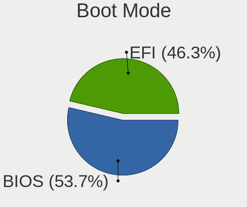

| Mode | Desktops | Percent |
|------|----------|---------|
| BIOS | 64       | 52.46%  |
| EFI  | 58       | 47.54%  |

Filesystem
----------

Type of filesystem

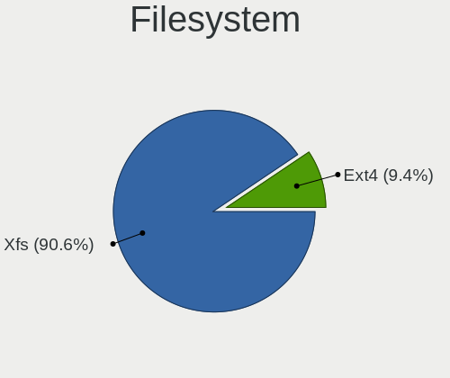

| Type | Desktops | Percent |
|------|----------|---------|
| Xfs  | 110      | 90.16%  |
| Ext4 | 12       | 9.84%   |

Part. scheme
------------

Scheme of partitioning

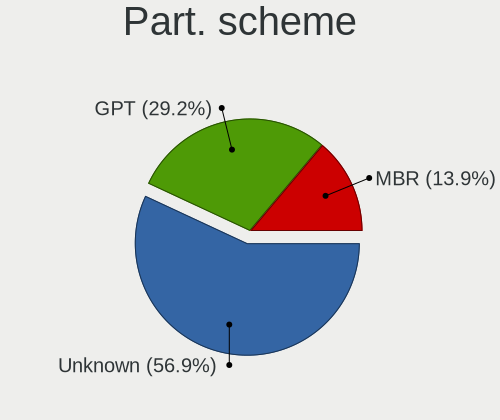

| Type    | Desktops | Percent |
|---------|----------|---------|
| Unknown | 69       | 55.65%  |
| GPT     | 39       | 31.45%  |
| MBR     | 16       | 12.9%   |

Dual Boot with Linux/BSD
------------------------

Hosting more than one Linux/BSD

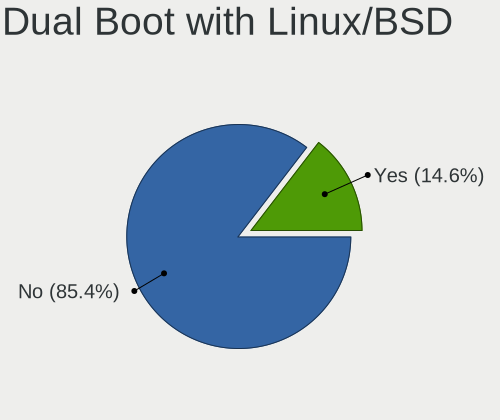

| Dual boot | Desktops | Percent |
|-----------|----------|---------|
| No        | 111      | 90.24%  |
| Yes       | 12       | 9.76%   |

Dual Boot (Win)
---------------

Hosting Linux and Windows

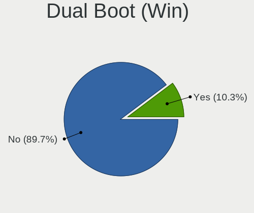

| Dual boot | Desktops | Percent |
|-----------|----------|---------|
| No        | 107      | 87.7%   |
| Yes       | 15       | 12.3%   |

Board
-----

Vendor
------

Motherboard manufacturer

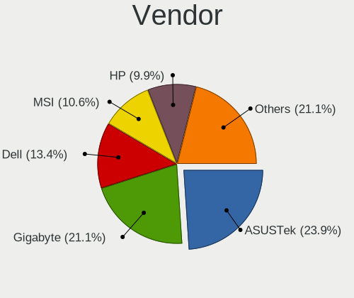

| Name                | Desktops | Percent |
|---------------------|----------|---------|
| Gigabyte Technology | 28       | 22.95%  |
| ASUSTek Computer    | 27       | 22.13%  |
| Dell                | 14       | 11.48%  |
| Hewlett-Packard     | 13       | 10.66%  |
| MSI                 | 12       | 9.84%   |
| ASRock              | 7        | 5.74%   |
| Supermicro          | 5        | 4.1%    |
| Intel               | 3        | 2.46%   |
| Foxconn             | 3        | 2.46%   |
| Lenovo              | 2        | 1.64%   |
| Fujitsu             | 2        | 1.64%   |
| Unknown             | 2        | 1.64%   |
| Packard Bell        | 1        | 0.82%   |
| Biostar             | 1        | 0.82%   |
| ASRockRack          | 1        | 0.82%   |
| Apple               | 1        | 0.82%   |

Model
-----

Motherboard model

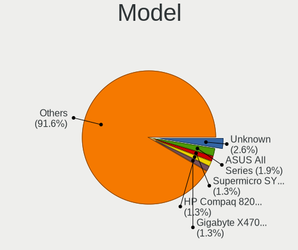

| Name                              | Desktops | Percent |
|-----------------------------------|----------|---------|
| Supermicro SYS-7048A-T            | 2        | 1.64%   |
| HP Compaq 8200 Elite SFF PC       | 2        | 1.64%   |
| Gigabyte X470 AORUS ULTRA GAMING  | 2        | 1.64%   |
| Gigabyte A320M-S2H                | 2        | 1.64%   |
| Dell OptiPlex 7010                | 2        | 1.64%   |
| ASUS TUF B450M-PRO GAMING         | 2        | 1.64%   |
| ASUS PRIME X570-P                 | 2        | 1.64%   |
| ASUS All Series                   | 2        | 1.64%   |
| Unknown                           | 2        | 1.64%   |
| Supermicro X9SCI/X9SCA            | 1        | 0.82%   |
| Supermicro X8SIL                  | 1        | 0.82%   |
| Supermicro X8SAX                  | 1        | 0.82%   |
| Packard Bell IMEDIA D3610 FR      | 1        | 0.82%   |
| MSI MS-7C94                       | 1        | 0.82%   |
| MSI MS-7C88                       | 1        | 0.82%   |
| MSI MS-7C84                       | 1        | 0.82%   |
| MSI MS-7C37                       | 1        | 0.82%   |
| MSI MS-7C02                       | 1        | 0.82%   |
| MSI MS-7A40                       | 1        | 0.82%   |
| MSI MS-7A38                       | 1        | 0.82%   |
| MSI MS-7A36                       | 1        | 0.82%   |
| MSI MS-7918                       | 1        | 0.82%   |
| MSI MS-7756                       | 1        | 0.82%   |
| MSI MS-7636                       | 1        | 0.82%   |
| MSI HPE-421f                      | 1        | 0.82%   |
| Lenovo ThinkCentre M92p 3238AZ8   | 1        | 0.82%   |
| Lenovo IdeaCentre K410            | 1        | 0.82%   |
| Intel DP45SG AAE27733-405         | 1        | 0.82%   |
| Intel DH55TC AAE70932-302         | 1        | 0.82%   |
| Intel D54250WYK H13922-303        | 1        | 0.82%   |
| HP Z800 Workstation               | 1        | 0.82%   |
| HP Z600 Workstation               | 1        | 0.82%   |
| HP Z210 Workstation               | 1        | 0.82%   |
| HP Z2 Tower G5 Workstation        | 1        | 0.82%   |
| HP ProLiant MicroServer           | 1        | 0.82%   |
| HP ProDesk 600 G1 SFF             | 1        | 0.82%   |
| HP ProDesk 400 G2 MINI            | 1        | 0.82%   |
| HP Pavilion Wave Desktop 600-a0xx | 1        | 0.82%   |
| HP EliteDesk 800 G2 TWR           | 1        | 0.82%   |
| HP 290 G1 SFF Business PC         | 1        | 0.82%   |
| HP 20-r124d                       | 1        | 0.82%   |
| Gigabyte Z77X-UD5H                | 1        | 0.82%   |
| Gigabyte Z77N-WIFI                | 1        | 0.82%   |
| Gigabyte Z68P-DS3                 | 1        | 0.82%   |
| Gigabyte Z490 GAMING X            | 1        | 0.82%   |
| Gigabyte Z390 DESIGNARE           | 1        | 0.82%   |
| Gigabyte Z370 AORUS Gaming WIFI   | 1        | 0.82%   |
| Gigabyte Z170MX-Gaming 5          | 1        | 0.82%   |
| Gigabyte X58A-UD5                 | 1        | 0.82%   |
| Gigabyte X570 AORUS PRO WIFI      | 1        | 0.82%   |
| Gigabyte X570 AORUS MASTER        | 1        | 0.82%   |
| Gigabyte X399 AORUS Gaming 7      | 1        | 0.82%   |
| Gigabyte P35-DS4                  | 1        | 0.82%   |
| Gigabyte H97N-WIFI                | 1        | 0.82%   |
| Gigabyte H97-HD3                  | 1        | 0.82%   |
| Gigabyte H77N-WIFI                | 1        | 0.82%   |
| Gigabyte H57M-USB3                | 1        | 0.82%   |
| Gigabyte H270M-DS3H               | 1        | 0.82%   |
| Gigabyte GB-BACE-3160             | 1        | 0.82%   |
| Gigabyte GA-990X-Gaming SLI-CF    | 1        | 0.82%   |

Model Family
------------

Motherboard model prefix

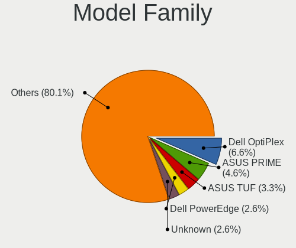

| Name                   | Desktops | Percent |
|------------------------|----------|---------|
| Dell OptiPlex          | 8        | 6.56%   |
| ASUS PRIME             | 6        | 4.92%   |
| ASUS TUF               | 5        | 4.1%    |
| Dell PowerEdge         | 3        | 2.46%   |
| Supermicro SYS-7048A-T | 2        | 1.64%   |
| HP ProDesk             | 2        | 1.64%   |
| HP Compaq              | 2        | 1.64%   |
| Gigabyte X570          | 2        | 1.64%   |
| Gigabyte X470          | 2        | 1.64%   |
| Gigabyte A320M-S2H     | 2        | 1.64%   |
| Dell Precision         | 2        | 1.64%   |
| ASUS ROG               | 2        | 1.64%   |
| ASUS P8Z77-V           | 2        | 1.64%   |
| ASUS All               | 2        | 1.64%   |
| Unknown                | 2        | 1.64%   |
| Supermicro X9SCI       | 1        | 0.82%   |
| Supermicro X8SIL       | 1        | 0.82%   |
| Supermicro X8SAX       | 1        | 0.82%   |
| Packard Bell IMEDIA    | 1        | 0.82%   |
| MSI MS-7C94            | 1        | 0.82%   |
| MSI MS-7C88            | 1        | 0.82%   |
| MSI MS-7C84            | 1        | 0.82%   |
| MSI MS-7C37            | 1        | 0.82%   |
| MSI MS-7C02            | 1        | 0.82%   |
| MSI MS-7A40            | 1        | 0.82%   |
| MSI MS-7A38            | 1        | 0.82%   |
| MSI MS-7A36            | 1        | 0.82%   |
| MSI MS-7918            | 1        | 0.82%   |
| MSI MS-7756            | 1        | 0.82%   |
| MSI MS-7636            | 1        | 0.82%   |
| MSI HPE-421f           | 1        | 0.82%   |
| Lenovo ThinkCentre     | 1        | 0.82%   |
| Lenovo IdeaCentre      | 1        | 0.82%   |
| Intel DP45SG           | 1        | 0.82%   |
| Intel DH55TC           | 1        | 0.82%   |
| Intel D54250WYK        | 1        | 0.82%   |
| HP Z800                | 1        | 0.82%   |
| HP Z600                | 1        | 0.82%   |
| HP Z210                | 1        | 0.82%   |
| HP Z2                  | 1        | 0.82%   |
| HP ProLiant            | 1        | 0.82%   |
| HP Pavilion            | 1        | 0.82%   |
| HP EliteDesk           | 1        | 0.82%   |
| HP 290                 | 1        | 0.82%   |
| HP 20-r124d            | 1        | 0.82%   |
| Gigabyte Z77X-UD5H     | 1        | 0.82%   |
| Gigabyte Z77N-WIFI     | 1        | 0.82%   |
| Gigabyte Z68P-DS3      | 1        | 0.82%   |
| Gigabyte Z490          | 1        | 0.82%   |
| Gigabyte Z390          | 1        | 0.82%   |
| Gigabyte Z370          | 1        | 0.82%   |
| Gigabyte Z170MX-Gaming | 1        | 0.82%   |
| Gigabyte X58A-UD5      | 1        | 0.82%   |
| Gigabyte X399          | 1        | 0.82%   |
| Gigabyte P35-DS4       | 1        | 0.82%   |
| Gigabyte H97N-WIFI     | 1        | 0.82%   |
| Gigabyte H97-HD3       | 1        | 0.82%   |
| Gigabyte H77N-WIFI     | 1        | 0.82%   |
| Gigabyte H57M-USB3     | 1        | 0.82%   |
| Gigabyte H270M-DS3H    | 1        | 0.82%   |

MFG Year
--------

Motherboard manufacture year

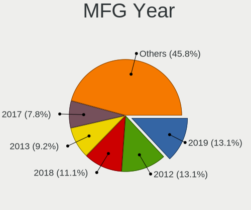

| Year | Desktops | Percent |
|------|----------|---------|
| 2020 | 17       | 13.93%  |
| 2019 | 16       | 13.11%  |
| 2018 | 16       | 13.11%  |
| 2013 | 16       | 13.11%  |
| 2010 | 10       | 8.2%    |
| 2014 | 9        | 7.38%   |
| 2016 | 7        | 5.74%   |
| 2012 | 7        | 5.74%   |
| 2021 | 5        | 4.1%    |
| 2015 | 4        | 3.28%   |
| 2011 | 4        | 3.28%   |
| 2009 | 4        | 3.28%   |
| 2017 | 3        | 2.46%   |
| 2008 | 2        | 1.64%   |
| 2007 | 2        | 1.64%   |

Form Factor
-----------

Physical design of the computer

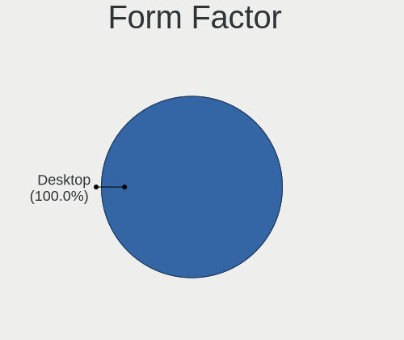

| Name    | Desktops | Percent |
|---------|----------|---------|
| Desktop | 122      | 100%    |

Secure Boot
-----------

Enabled or disabled

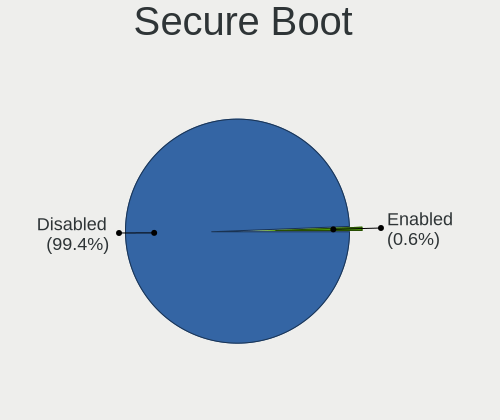

| State    | Desktops | Percent |
|----------|----------|---------|
| Disabled | 121      | 99.18%  |
| Enabled  | 1        | 0.82%   |

Coreboot
--------

Have coreboot on board

| Used | Desktops | Percent |
|------|----------|---------|
| No   | 122      | 100%    |

RAM Size
--------

Total RAM memory

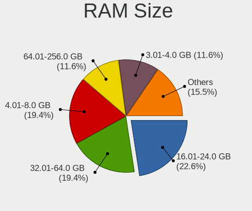

| Size in GB  | Desktops | Percent |
|-------------|----------|---------|
| 16.01-24.0  | 29       | 23.39%  |
| 32.01-64.0  | 26       | 20.97%  |
| 4.01-8.0    | 24       | 19.35%  |
| 8.01-16.0   | 15       | 12.1%   |
| 3.01-4.0    | 12       | 9.68%   |
| 64.01-256.0 | 12       | 9.68%   |
| 24.01-32.0  | 5        | 4.03%   |
| 1.01-2.0    | 1        | 0.81%   |

RAM Used
--------

Used RAM memory

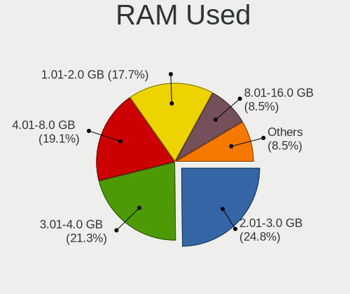

| Used GB    | Desktops | Percent |
|------------|----------|---------|
| 2.01-3.0   | 34       | 24.82%  |
| 3.01-4.0   | 30       | 21.9%   |
| 4.01-8.0   | 26       | 18.98%  |
| 1.01-2.0   | 23       | 16.79%  |
| 8.01-16.0  | 12       | 8.76%   |
| 0.51-1.0   | 7        | 5.11%   |
| 16.01-24.0 | 2        | 1.46%   |
| 0.01-0.5   | 2        | 1.46%   |
| 32.01-64.0 | 1        | 0.73%   |

Total Drives
------------

Number of drives on board

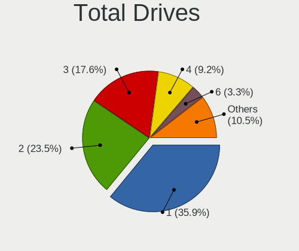

| Drives | Desktops | Percent |
|--------|----------|---------|
| 1      | 48       | 39.02%  |
| 2      | 25       | 20.33%  |
| 3      | 21       | 17.07%  |
| 4      | 9        | 7.32%   |
| 6      | 5        | 4.07%   |
| 5      | 5        | 4.07%   |
| 7      | 3        | 2.44%   |
| 19     | 2        | 1.63%   |
| 8      | 2        | 1.63%   |
| 15     | 1        | 0.81%   |
| 13     | 1        | 0.81%   |
| 9      | 1        | 0.81%   |

Has CD-ROM
----------

Has CD-ROM on board

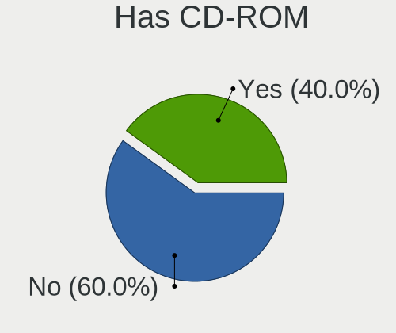

| Presented | Desktops | Percent |
|-----------|----------|---------|
| No        | 73       | 59.35%  |
| Yes       | 50       | 40.65%  |

Has Ethernet
------------

Has Ethernet on board

| Presented | Desktops | Percent |
|-----------|----------|---------|
| Yes       | 122      | 100%    |

Has WiFi
--------

Has WiFi module

| Presented | Desktops | Percent |
|-----------|----------|---------|
| No        | 82       | 66.67%  |
| Yes       | 41       | 33.33%  |

Has Bluetooth
-------------

Has Bluetooth module

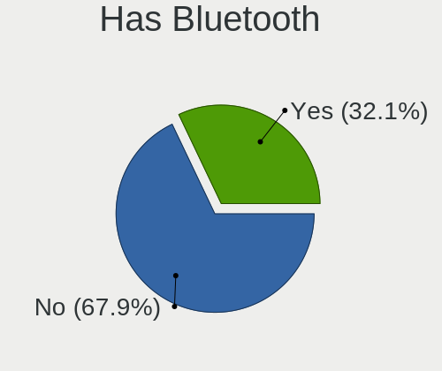

| Presented | Desktops | Percent |
|-----------|----------|---------|
| No        | 85       | 69.67%  |
| Yes       | 37       | 30.33%  |

Location
--------

Country
-------

Geographic location (country)

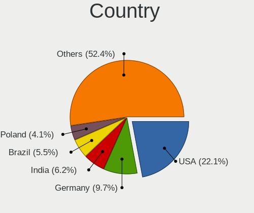

| Country      | Desktops | Percent |
|--------------|----------|---------|
| USA          | 27       | 22.13%  |
| Germany      | 13       | 10.66%  |
| Brazil       | 7        | 5.74%   |
| Canada       | 6        | 4.92%   |
| Russia       | 5        | 4.1%    |
| Poland       | 5        | 4.1%    |
| UK           | 4        | 3.28%   |
| France       | 4        | 3.28%   |
| Ukraine      | 3        | 2.46%   |
| Turkey       | 3        | 2.46%   |
| Sweden       | 3        | 2.46%   |
| Netherlands  | 3        | 2.46%   |
| India        | 3        | 2.46%   |
| Switzerland  | 2        | 1.64%   |
| Romania      | 2        | 1.64%   |
| Peru         | 2        | 1.64%   |
| Italy        | 2        | 1.64%   |
| Indonesia    | 2        | 1.64%   |
| Hong Kong    | 2        | 1.64%   |
| Finland      | 2        | 1.64%   |
| Czechia      | 2        | 1.64%   |
| China        | 2        | 1.64%   |
| Australia    | 2        | 1.64%   |
| Thailand     | 1        | 0.82%   |
| South Korea  | 1        | 0.82%   |
| South Africa | 1        | 0.82%   |
| Slovenia     | 1        | 0.82%   |
| Serbia       | 1        | 0.82%   |
| Saudi Arabia | 1        | 0.82%   |
| Norway       | 1        | 0.82%   |
| Mexico       | 1        | 0.82%   |
| Malaysia     | 1        | 0.82%   |
| Luxembourg   | 1        | 0.82%   |
| Lithuania    | 1        | 0.82%   |
| Iran         | 1        | 0.82%   |
| Hungary      | 1        | 0.82%   |
| Colombia     | 1        | 0.82%   |
| Belarus      | 1        | 0.82%   |
| Bangladesh   | 1        | 0.82%   |

City
----

Geographic location (city)

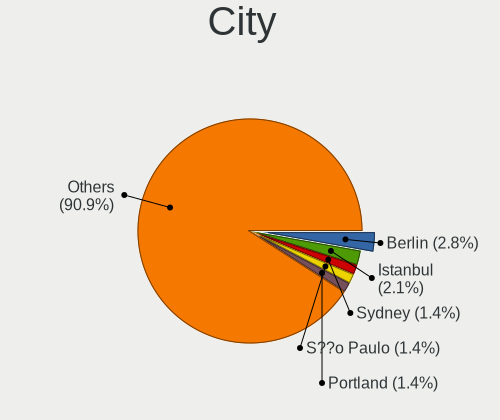

| City                | Desktops | Percent |
|---------------------|----------|---------|
| Berlin              | 4        | 3.25%   |
| Istanbul            | 3        | 2.44%   |
| Sydney              | 2        | 1.63%   |
| S??o Paulo          | 2        | 1.63%   |
| Portland            | 2        | 1.63%   |
| Munich              | 2        | 1.63%   |
| Lima                | 2        | 1.63%   |
| Gdansk              | 2        | 1.63%   |
| Chicago             | 2        | 1.63%   |
| Central             | 2        | 1.63%   |
| Alexandria          | 2        | 1.63%   |
| Zaporizhzhia        | 1        | 0.81%   |
| Zapopan             | 1        | 0.81%   |
| Yangquan            | 1        | 0.81%   |
| Wodzis?‚aw ??l?…ski | 1        | 0.81%   |
| West Bromwich       | 1        | 0.81%   |
| Wayne               | 1        | 0.81%   |
| Warsaw              | 1        | 0.81%   |
| Vitebsk             | 1        | 0.81%   |
| Vaugneray           | 1        | 0.81%   |
| Val-des-Monts       | 1        | 0.81%   |
| Tremembe            | 1        | 0.81%   |
| Toronto             | 1        | 0.81%   |
| Tirupati            | 1        | 0.81%   |
| Tehran              | 1        | 0.81%   |
| Taubate             | 1        | 0.81%   |
| Tambov              | 1        | 0.81%   |
| Sundbyberg          | 1        | 0.81%   |
| Stuttgart           | 1        | 0.81%   |
| Stockholm           | 1        | 0.81%   |
| Spijkenisse         | 1        | 0.81%   |
| Southlake           | 1        | 0.81%   |
| Sollentuna          | 1        | 0.81%   |
| Shenzhen            | 1        | 0.81%   |
| Seongdong-gu        | 1        | 0.81%   |
| Seattle             | 1        | 0.81%   |
| Satu Mare           | 1        | 0.81%   |
| Santa Rosa          | 1        | 0.81%   |
| Salem               | 1        | 0.81%   |
| Recea               | 1        | 0.81%   |
| Pretoria            | 1        | 0.81%   |
| Prague              | 1        | 0.81%   |
| Port Saint Lucie    | 1        | 0.81%   |
| Pogorze             | 1        | 0.81%   |
| Phoenix             | 1        | 0.81%   |
| Pato Branco         | 1        | 0.81%   |
| Novosibirsk         | 1        | 0.81%   |
| Newcastle upon Tyne | 1        | 0.81%   |
| New York            | 1        | 0.81%   |
| Nesttun             | 1        | 0.81%   |
| Moscow              | 1        | 0.81%   |
| Montreal            | 1        | 0.81%   |
| Mol?—tai            | 1        | 0.81%   |
| Milan               | 1        | 0.81%   |
| Maricopa            | 1        | 0.81%   |
| Maribor             | 1        | 0.81%   |
| Makkah              | 1        | 0.81%   |
| Mainz               | 1        | 0.81%   |
| Luxembourg          | 1        | 0.81%   |
| Lowell              | 1        | 0.81%   |

Drives
------

Drive Vendor
------------

Hard drive vendors

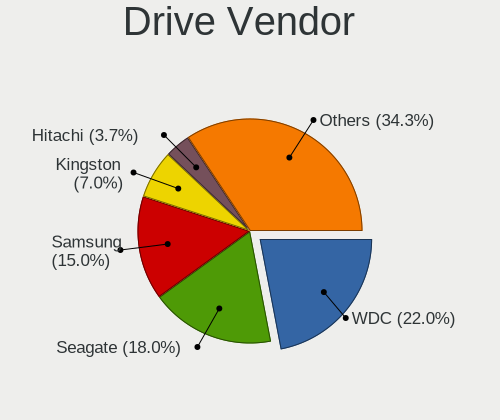

| Vendor                    | Desktops | Drives | Percent |
|---------------------------|----------|--------|---------|
| WDC                       | 53       | 155    | 23.14%  |
| Seagate                   | 42       | 79     | 18.34%  |
| Samsung Electronics       | 38       | 65     | 16.59%  |
| Kingston                  | 17       | 20     | 7.42%   |
| Toshiba                   | 7        | 11     | 3.06%   |
| SanDisk                   | 7        | 8      | 3.06%   |
| Hitachi                   | 7        | 9      | 3.06%   |
| Intel                     | 5        | 6      | 2.18%   |
| HGST                      | 5        | 23     | 2.18%   |
| Unknown                   | 4        | 12     | 1.75%   |
| Crucial                   | 4        | 5      | 1.75%   |
| A-DATA Technology         | 4        | 5      | 1.75%   |
| Silicon Motion            | 3        | 3      | 1.31%   |
| XPG                       | 2        | 2      | 0.87%   |
| SK Hynix                  | 2        | 2      | 0.87%   |
| Phison                    | 2        | 2      | 0.87%   |
| OCZ                       | 2        | 3      | 0.87%   |
| Micron/Crucial Technology | 2        | 3      | 0.87%   |
| Micron Technology         | 2        | 3      | 0.87%   |
| Gigabyte Technology       | 2        | 2      | 0.87%   |
| Apacer                    | 2        | 2      | 0.87%   |
| Verbatim                  | 1        | 1      | 0.44%   |
| V-GeN                     | 1        | 1      | 0.44%   |
| Team                      | 1        | 1      | 0.44%   |
| SPCC                      | 1        | 1      | 0.44%   |
| SATADOM-SL                | 1        | 1      | 0.44%   |
| ROG                       | 1        | 1      | 0.44%   |
| Realtek Semiconductor     | 1        | 1      | 0.44%   |
| PNY                       | 1        | 1      | 0.44%   |
| PLEXTOR                   | 1        | 1      | 0.44%   |
| Patriot                   | 1        | 3      | 0.44%   |
| Lexar                     | 1        | 1      | 0.44%   |
| KIOXIA-EXCERIA            | 1        | 2      | 0.44%   |
| Hewlett-Packard           | 1        | 1      | 0.44%   |
| Dell                      | 1        | 1      | 0.44%   |
| China                     | 1        | 4      | 0.44%   |
| ASMT                      | 1        | 1      | 0.44%   |
| Apple                     | 1        | 1      | 0.44%   |

Drive Model
-----------

Hard drive models

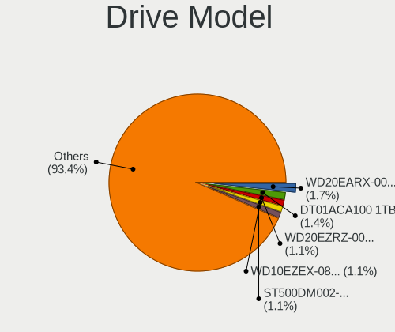

| Model                                | Desktops | Percent |
|--------------------------------------|----------|---------|
| WDC WD20EARX-00PASB0 2TB             | 5        | 1.77%   |
| Toshiba DT01ACA100 1TB               | 5        | 1.77%   |
| WDC WD10EZEX-08WN4A0 1TB             | 4        | 1.42%   |
| Seagate ST500DM002-1BD142 500GB      | 4        | 1.42%   |
| Kingston SA400S37480G 480GB SSD      | 4        | 1.42%   |
| WDC WDS240G2G0A-00JH30 240GB SSD     | 3        | 1.06%   |
| WDC WD20EZRZ-00Z5HB0 2TB             | 3        | 1.06%   |
| Seagate ST1000DM003-1ER162 1TB       | 3        | 1.06%   |
| Seagate ST1000DM003-1CH162 1TB       | 3        | 1.06%   |
| Samsung SSD 860 EVO 500GB            | 3        | 1.06%   |
| Samsung SSD 860 EVO 1TB              | 3        | 1.06%   |
| Samsung SSD 840 EVO 250GB            | 3        | 1.06%   |
| Kingston SA400S37240G 240GB SSD      | 3        | 1.06%   |
| WDC WDS500G2B0A-00SM50 500GB SSD     | 2        | 0.71%   |
| WDC WD40EFRX-68N32N0 4TB             | 2        | 0.71%   |
| WDC WD20EZRX-00D8PB0 2TB             | 2        | 0.71%   |
| WDC WD2003FZEX-00Z4SA0 2TB           | 2        | 0.71%   |
| WDC WD2002FAEX-007BA0 2TB            | 2        | 0.71%   |
| Unknown HUH728080ALE601 8TB          | 2        | 0.71%   |
| Seagate ST31000528AS 1TB             | 2        | 0.71%   |
| Seagate ST2000DM006-2DM164 2TB       | 2        | 0.71%   |
| Seagate ST2000DM001-1ER164 2TB       | 2        | 0.71%   |
| Seagate Expansion Desk 6TB           | 2        | 0.71%   |
| Sandisk NVMe SSD Drive 1TB           | 2        | 0.71%   |
| Samsung SSD 970 PRO 512GB            | 2        | 0.71%   |
| Samsung SSD 970 EVO Plus 500GB       | 2        | 0.71%   |
| Samsung SSD 850 EVO M.2 500GB        | 2        | 0.71%   |
| Samsung SSD 850 EVO 500GB            | 2        | 0.71%   |
| Samsung SSD 840 PRO Series 256GB     | 2        | 0.71%   |
| Samsung SSD 840 EVO 120GB            | 2        | 0.71%   |
| Samsung NVMe SSD Drive 512GB         | 2        | 0.71%   |
| Samsung NVMe SSD Drive 500GB         | 2        | 0.71%   |
| Samsung NVMe SSD Drive 250GB         | 2        | 0.71%   |
| Samsung MZ7LN256HMJP-000H1 256GB SSD | 2        | 0.71%   |
| Samsung HD103SI 1TB                  | 2        | 0.71%   |
| Kingston SA400S37120G 120GB SSD      | 2        | 0.71%   |
| Intel SSDSC2KG960G8 960GB            | 2        | 0.71%   |
| XPG NVMe SSD Drive 1024GB            | 1        | 0.35%   |
| XPG GAMMIX S11 Pro 512GB             | 1        | 0.35%   |
| WDC WDS240G2G0B-00EPW0 240GB SSD     | 1        | 0.35%   |
| WDC WDS100T2B0A-00SM50 1TB SSD       | 1        | 0.35%   |
| WDC WD7500BPVT-55HXZT3 752GB         | 1        | 0.35%   |
| WDC WD6400AADS-00M2B0 640GB          | 1        | 0.35%   |
| WDC WD5003AZEX-00MK2A0 500GB         | 1        | 0.35%   |
| WDC WD5002ABYS-01B1B0 500GB          | 1        | 0.35%   |
| WDC WD5001AALS-00L3B2 500GB          | 1        | 0.35%   |
| WDC WD5000LUCT-63C26Y0 500GB         | 1        | 0.35%   |
| WDC WD5000LPVX-22V0TT0 500GB         | 1        | 0.35%   |
| WDC WD5000AAKX-753CA1 500GB          | 1        | 0.35%   |
| WDC WD5000AAKX-60U6AA0 500GB         | 1        | 0.35%   |
| WDC WD5000AAKX-00U6AA0 500GB         | 1        | 0.35%   |
| WDC WD5000AAKS-60Z1A0 500GB          | 1        | 0.35%   |
| WDC WD5000AAKS-00V1A0 500GB          | 1        | 0.35%   |
| WDC WD5000AACS-00G8B0 500GB          | 1        | 0.35%   |
| WDC WD40PURZ-85TTDY0 4TB             | 1        | 0.35%   |
| WDC WD4001FFSX-68JNUN0 4TB           | 1        | 0.35%   |
| WDC WD3200BEVT-22ZCT0 320GB          | 1        | 0.35%   |
| WDC WD3200AVVS-63L2B0 320GB          | 1        | 0.35%   |
| WDC WD30PURX-64P6ZY0 3TB             | 1        | 0.35%   |
| WDC WD30EFRX-68EUZN0 3TB             | 1        | 0.35%   |

HDD Vendor
----------

Hard disk drive vendors

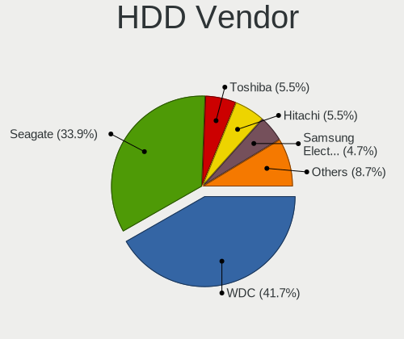

| Vendor              | Desktops | Drives | Percent |
|---------------------|----------|--------|---------|
| WDC                 | 50       | 145    | 41.32%  |
| Seagate             | 40       | 75     | 33.06%  |
| Toshiba             | 7        | 11     | 5.79%   |
| Hitachi             | 7        | 9      | 5.79%   |
| Samsung Electronics | 6        | 6      | 4.96%   |
| HGST                | 5        | 23     | 4.13%   |
| Unknown             | 3        | 11     | 2.48%   |
| Hewlett-Packard     | 1        | 1      | 0.83%   |
| Dell                | 1        | 1      | 0.83%   |
| Apple               | 1        | 1      | 0.83%   |

SSD Vendor
----------

Solid state drive vendors

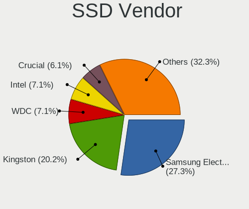

| Vendor              | Desktops | Drives | Percent |
|---------------------|----------|--------|---------|
| Samsung Electronics | 23       | 41     | 28.4%   |
| Kingston            | 17       | 20     | 20.99%  |
| WDC                 | 7        | 10     | 8.64%   |
| Intel               | 5        | 6      | 6.17%   |
| SanDisk             | 4        | 5      | 4.94%   |
| Crucial             | 4        | 5      | 4.94%   |
| SK Hynix            | 2        | 2      | 2.47%   |
| OCZ                 | 2        | 3      | 2.47%   |
| Apacer              | 2        | 2      | 2.47%   |
| A-DATA Technology   | 2        | 2      | 2.47%   |
| Verbatim            | 1        | 1      | 1.23%   |
| V-GeN               | 1        | 1      | 1.23%   |
| Team                | 1        | 1      | 1.23%   |
| SPCC                | 1        | 1      | 1.23%   |
| Seagate             | 1        | 1      | 1.23%   |
| SATADOM-SL          | 1        | 1      | 1.23%   |
| PNY                 | 1        | 1      | 1.23%   |
| PLEXTOR             | 1        | 1      | 1.23%   |
| Patriot             | 1        | 3      | 1.23%   |
| Micron Technology   | 1        | 1      | 1.23%   |
| Lexar               | 1        | 1      | 1.23%   |
| China               | 1        | 4      | 1.23%   |
| ASMT                | 1        | 1      | 1.23%   |

Drive Kind
----------

HDD or SSD

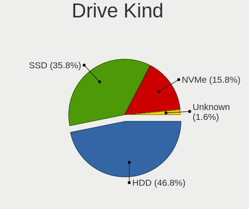

| Kind    | Desktops | Drives | Percent |
|---------|----------|--------|---------|
| HDD     | 87       | 283    | 47.03%  |
| SSD     | 66       | 114    | 35.68%  |
| NVMe    | 29       | 42     | 15.68%  |
| Unknown | 3        | 4      | 1.62%   |

Drive Connector
---------------

SATA, SAS, NVMe, etc.

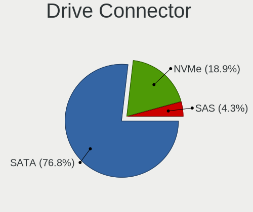

| Type | Desktops | Drives | Percent |
|------|----------|--------|---------|
| SATA | 113      | 390    | 75.84%  |
| NVMe | 29       | 42     | 19.46%  |
| SAS  | 7        | 11     | 4.7%    |

Drive Size
----------

Size of hard drive

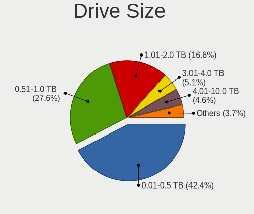

| Size in TB | Desktops | Drives | Percent |
|------------|----------|--------|---------|
| 0.01-0.5   | 79       | 155    | 44.38%  |
| 0.51-1.0   | 47       | 78     | 26.4%   |
| 1.01-2.0   | 29       | 77     | 16.29%  |
| 4.01-10.0  | 10       | 29     | 5.62%   |
| 3.01-4.0   | 6        | 23     | 3.37%   |
| 2.01-3.0   | 4        | 15     | 2.25%   |
| 10.01-20.0 | 3        | 20     | 1.69%   |

Space Total
-----------

Amount of disk space available on the file system

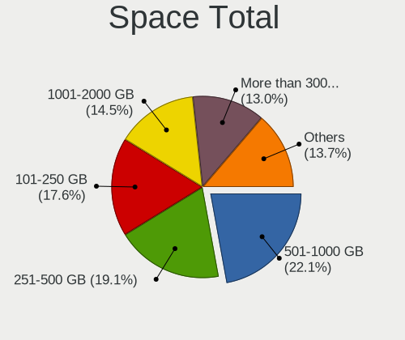

| Size in GB     | Desktops | Percent |
|----------------|----------|---------|
| 501-1000       | 28       | 22.05%  |
| 251-500        | 25       | 19.69%  |
| 101-250        | 22       | 17.32%  |
| 1001-2000      | 18       | 14.17%  |
| More than 3000 | 17       | 13.39%  |
| 51-100         | 5        | 3.94%   |
| Unknown        | 5        | 3.94%   |
| 2001-3000      | 4        | 3.15%   |
| 1-20           | 2        | 1.57%   |
| 21-50          | 1        | 0.79%   |

Space Used
----------

Amount of used disk space

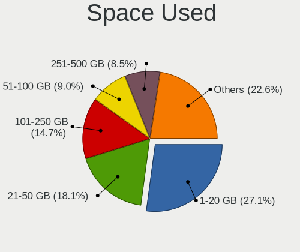

| Used GB        | Desktops | Percent |
|----------------|----------|---------|
| 1-20           | 38       | 28.57%  |
| 21-50          | 26       | 19.55%  |
| 101-250        | 20       | 15.04%  |
| More than 3000 | 12       | 9.02%   |
| 51-100         | 10       | 7.52%   |
| 251-500        | 9        | 6.77%   |
| 501-1000       | 8        | 6.02%   |
| 1001-2000      | 5        | 3.76%   |
| Unknown        | 5        | 3.76%   |

Malfunc. Drives
---------------

Drive models with a malfunction

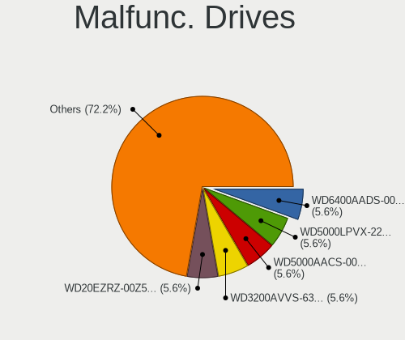

| Model                                 | Desktops | Drives | Percent |
|---------------------------------------|----------|--------|---------|
| WDC WD6400AADS-00M2B0 640GB           | 1        | 1      | 5.56%   |
| WDC WD5000LPVX-22V0TT0 500GB          | 1        | 1      | 5.56%   |
| WDC WD5000AACS-00G8B0 500GB           | 1        | 1      | 5.56%   |
| WDC WD3200AVVS-63L2B0 320GB           | 1        | 1      | 5.56%   |
| WDC WD20EZRZ-00Z5HB0 2TB              | 1        | 1      | 5.56%   |
| WDC WD20EFRX-68EUZN0 2TB              | 1        | 4      | 5.56%   |
| WDC WD1003FBYX-01Y7B0 1TB             | 1        | 1      | 5.56%   |
| WDC WD1002FBYS-18A6B0 1TB             | 1        | 1      | 5.56%   |
| SK Hynix HFS128G32TND-N210A 128GB SSD | 1        | 1      | 5.56%   |
| Seagate ST500LT012-1DG142 500GB       | 1        | 1      | 5.56%   |
| Seagate ST500DM002-1BD142 500GB       | 1        | 1      | 5.56%   |
| Seagate ST3400820AS 400GB             | 1        | 1      | 5.56%   |
| Seagate ST3000VM002-1ET166 3TB        | 1        | 1      | 5.56%   |
| Seagate ST2000DM001-9YN164 2TB        | 1        | 1      | 5.56%   |
| Seagate ST1000DM003-1ER162 1TB        | 1        | 1      | 5.56%   |
| Samsung Electronics SSD 840 EVO 250GB | 1        | 1      | 5.56%   |
| Intel SSDSA2M040G2GC 40GB             | 1        | 1      | 5.56%   |
| HGST HDS724040ALE640 4TB              | 1        | 2      | 5.56%   |

Malfunc. Drive Vendor
---------------------

Vendors of faulty drives

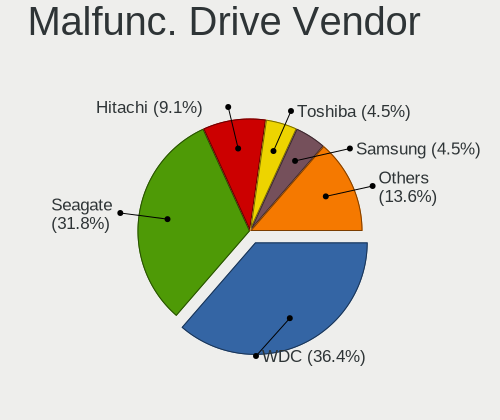

| Vendor              | Desktops | Drives | Percent |
|---------------------|----------|--------|---------|
| WDC                 | 6        | 11     | 37.5%   |
| Seagate             | 6        | 6      | 37.5%   |
| SK Hynix            | 1        | 1      | 6.25%   |
| Samsung Electronics | 1        | 1      | 6.25%   |
| Intel               | 1        | 1      | 6.25%   |
| HGST                | 1        | 2      | 6.25%   |

Malfunc. HDD Vendor
-------------------

Vendors of faulty HDD drives

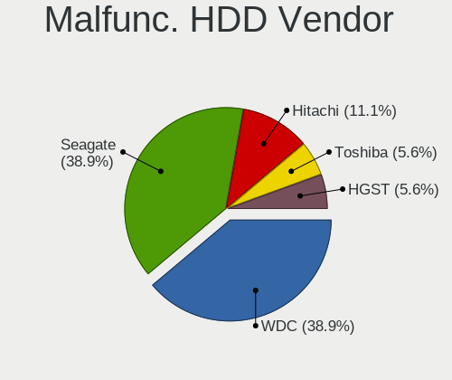

| Vendor  | Desktops | Drives | Percent |
|---------|----------|--------|---------|
| WDC     | 6        | 11     | 46.15%  |
| Seagate | 6        | 6      | 46.15%  |
| HGST    | 1        | 2      | 7.69%   |

Malfunc. Drive Kind
-------------------

Kinds of faulty drives

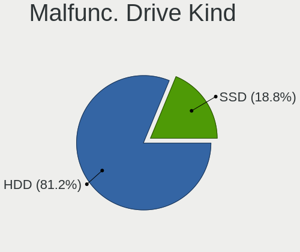

| Kind | Desktops | Drives | Percent |
|------|----------|--------|---------|
| HDD  | 13       | 19     | 81.25%  |
| SSD  | 3        | 3      | 18.75%  |

Failed Drives
-------------

Failed drive models

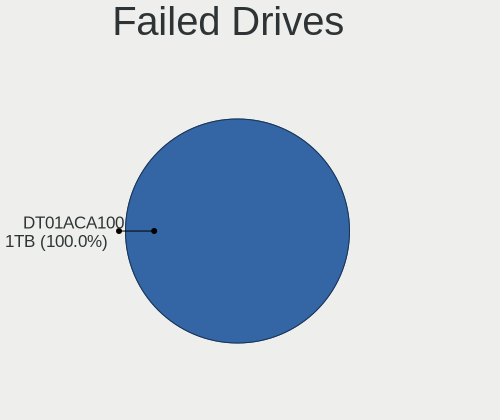

| Model                  | Desktops | Drives | Percent |
|------------------------|----------|--------|---------|
| Toshiba DT01ACA100 1TB | 1        | 2      | 100%    |

Failed Drive Vendor
-------------------

Failed drive vendors

| Vendor  | Desktops | Drives | Percent |
|---------|----------|--------|---------|
| Toshiba | 1        | 2      | 100%    |

Drive Status
------------

Number of failed and malfunc. drives

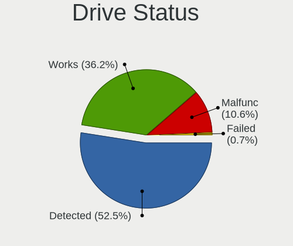

| Status   | Desktops | Drives | Percent |
|----------|----------|--------|---------|
| Detected | 72       | 220    | 52.55%  |
| Works    | 49       | 199    | 35.77%  |
| Malfunc  | 15       | 22     | 10.95%  |
| Failed   | 1        | 2      | 0.73%   |

Storage controller
------------------

Storage Vendor
--------------

Storage controller vendors

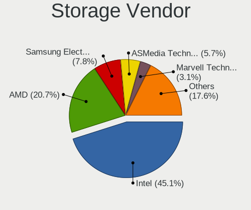

| Vendor                        | Desktops | Percent |
|-------------------------------|----------|---------|
| Intel                         | 83       | 45.11%  |
| AMD                           | 37       | 20.11%  |
| Samsung Electronics           | 14       | 7.61%   |
| ASMedia Technology            | 11       | 5.98%   |
| Marvell Technology Group      | 6        | 3.26%   |
| JMicron Technology            | 5        | 2.72%   |
| Silicon Motion                | 4        | 2.17%   |
| Phison Electronics            | 4        | 2.17%   |
| LSI Logic / Symbios Logic     | 4        | 2.17%   |
| Sandisk                       | 3        | 1.63%   |
| Broadcom / LSI                | 3        | 1.63%   |
| ADATA Technology              | 3        | 1.63%   |
| Micron/Crucial Technology     | 2        | 1.09%   |
| Realtek Semiconductor         | 1        | 0.54%   |
| Nvidia                        | 1        | 0.54%   |
| Micron Technology             | 1        | 0.54%   |
| KIOXIA                        | 1        | 0.54%   |
| Integrated Technology Express | 1        | 0.54%   |

Storage Model
-------------

Storage controller models

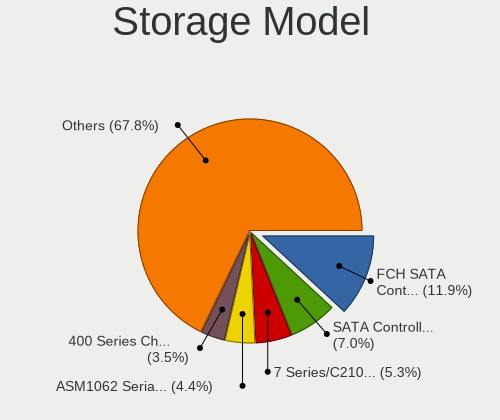

| Model                                                                                   | Desktops | Percent |
|-----------------------------------------------------------------------------------------|----------|---------|
| AMD FCH SATA Controller [AHCI mode]                                                     | 27       | 11.89%  |
| Intel SATA Controller [RAID mode]                                                       | 16       | 7.05%   |
| Intel 7 Series/C210 Series Chipset Family 6-port SATA Controller [AHCI mode]            | 12       | 5.29%   |
| ASMedia ASM1062 Serial ATA Controller                                                   | 10       | 4.41%   |
| AMD 400 Series Chipset SATA Controller                                                  | 8        | 3.52%   |
| Samsung NVMe SSD Controller SM981/PM981/PM983                                           | 7        | 3.08%   |
| Intel 8 Series/C220 Series Chipset Family 6-port SATA Controller 1 [AHCI mode]          | 7        | 3.08%   |
| Intel 6 Series/C200 Series Chipset Family 6 port Desktop SATA AHCI Controller           | 6        | 2.64%   |
| AMD FCH SATA Controller D                                                               | 6        | 2.64%   |
| Intel 82801JI (ICH10 Family) 4 port SATA IDE Controller #1                              | 5        | 2.2%    |
| Intel 82801JI (ICH10 Family) 2 port SATA IDE Controller #2                              | 5        | 2.2%    |
| Intel Q170/Q150/B150/H170/H110/Z170/CM236 Chipset SATA Controller [AHCI Mode]           | 4        | 1.76%   |
| Intel Cannon Lake PCH SATA AHCI Controller                                              | 4        | 1.76%   |
| Intel 200 Series PCH SATA controller [AHCI mode]                                        | 4        | 1.76%   |
| AMD SB7x0/SB8x0/SB9x0 SATA Controller [AHCI mode]                                       | 4        | 1.76%   |
| Samsung NVMe SSD Controller SM961/PM961/SM963                                           | 3        | 1.32%   |
| Marvell Group 88SE9215 PCIe 2.0 x1 4-port SATA 6 Gb/s Controller                        | 3        | 1.32%   |
| JMicron JMB363 SATA/IDE Controller                                                      | 3        | 1.32%   |
| Intel NM10/ICH7 Family SATA Controller [IDE mode]                                       | 3        | 1.32%   |
| Intel C610/X99 series chipset sSATA Controller [AHCI mode]                              | 3        | 1.32%   |
| Intel C610/X99 series chipset 6-Port SATA Controller [AHCI mode]                        | 3        | 1.32%   |
| Intel 5 Series/3400 Series Chipset 4 port SATA IDE Controller                           | 3        | 1.32%   |
| Intel 5 Series/3400 Series Chipset 2 port SATA IDE Controller                           | 3        | 1.32%   |
| AMD SB7x0/SB8x0/SB9x0 IDE Controller                                                    | 3        | 1.32%   |
| ADATA XPG SX8200 Pro PCIe Gen3x4 M.2 2280 Solid State Drive                             | 3        | 1.32%   |
| Silicon Motion SM2263EN/SM2263XT SSD Controller                                         | 2        | 0.88%   |
| Silicon Motion SM2262/SM2262EN SSD Controller                                           | 2        | 0.88%   |
| Sandisk WD Black SN750 / PC SN730 NVMe SSD                                              | 2        | 0.88%   |
| Samsung NVMe SSD Controller SM951/PM951                                                 | 2        | 0.88%   |
| Phison E16 PCIe4 NVMe Controller                                                        | 2        | 0.88%   |
| Micron/Crucial P1 NVMe PCIe SSD                                                         | 2        | 0.88%   |
| LSI Logic / Symbios Logic SAS2008 PCI-Express Fusion-MPT SAS-2 [Falcon]                 | 2        | 0.88%   |
| JMicron JMB368 IDE controller                                                           | 2        | 0.88%   |
| Intel 9 Series Chipset Family SATA Controller [AHCI Mode]                               | 2        | 0.88%   |
| Intel 82801JI (ICH10 Family) SATA AHCI Controller                                       | 2        | 0.88%   |
| Intel 82801IR/IO/IH (ICH9R/DO/DH) 4 port SATA Controller [IDE mode]                     | 2        | 0.88%   |
| Intel 82801I (ICH9 Family) 2 port SATA Controller [IDE mode]                            | 2        | 0.88%   |
| Intel 82801G (ICH7 Family) IDE Controller                                               | 2        | 0.88%   |
| Intel 6 Series/C200 Series Chipset Family Desktop SATA Controller (IDE mode, ports 4-5) | 2        | 0.88%   |
| Intel 6 Series/C200 Series Chipset Family Desktop SATA Controller (IDE mode, ports 0-3) | 2        | 0.88%   |
| AMD X399 Series Chipset SATA Controller                                                 | 2        | 0.88%   |
| AMD Starship/Matisse Chipset SATA Controller [AHCI mode]                                | 2        | 0.88%   |
| AMD SB7x0/SB8x0/SB9x0 SATA Controller [Non-RAID5 mode]                                  | 2        | 0.88%   |
| Sandisk WD Black 2018/SN750 / PC SN720 NVMe SSD                                         | 1        | 0.44%   |
| Samsung NVMe SSD Controller PM9A1/PM9A3/980PRO                                          | 1        | 0.44%   |
| Samsung NVMe SSD Controller 980                                                         | 1        | 0.44%   |
| Realtek RTS5763DL NVMe SSD Controller                                                   | 1        | 0.44%   |
| Phison PS5013 E13 NVMe Controller                                                       | 1        | 0.44%   |
| Phison E12 NVMe Controller                                                              | 1        | 0.44%   |
| Nvidia MCP73 SATA Controller (IDE mode)                                                 | 1        | 0.44%   |
| Nvidia MCP73 IDE Controller                                                             | 1        | 0.44%   |
| Micron Non-Volatile memory controller                                                   | 1        | 0.44%   |
| Marvell Group MV64460/64461/64462 System Controller, Revision B                         | 1        | 0.44%   |
| Marvell Group 88SE91A3 SATA-600 Controller                                              | 1        | 0.44%   |
| Marvell Group 88SE6145 SATA II PCI-E controller                                         | 1        | 0.44%   |
| LSI Logic / Symbios Logic SAS1068E PCI-Express Fusion-MPT SAS                           | 1        | 0.44%   |
| LSI Logic / Symbios Logic MegaRAID SAS-3 3108 [Invader]                                 | 1        | 0.44%   |
| KIOXIA Non-Volatile memory controller                                                   | 1        | 0.44%   |
| Intel C600/X79 series chipset SATA RAID Controller                                      | 1        | 0.44%   |
| Intel C600/X79 series chipset 6-Port SATA AHCI Controller                               | 1        | 0.44%   |

Storage Kind
------------

Kind of storage controller (IDE, SATA, NVMe, SAS, ...)

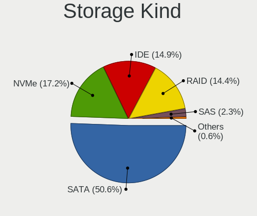

| Kind | Desktops | Percent |
|------|----------|---------|
| SATA | 84       | 50.91%  |
| NVMe | 29       | 17.58%  |
| RAID | 25       | 15.15%  |
| IDE  | 22       | 13.33%  |
| SAS  | 4        | 2.42%   |
| SCSI | 1        | 0.61%   |

Processor
---------

CPU Vendor
----------

Processor vendors

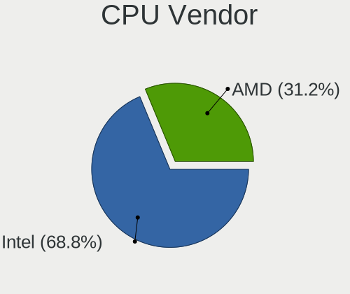

| Vendor | Desktops | Percent |
|--------|----------|---------|
| Intel  | 85       | 69.67%  |
| AMD    | 37       | 30.33%  |

CPU Model
---------

Processor models

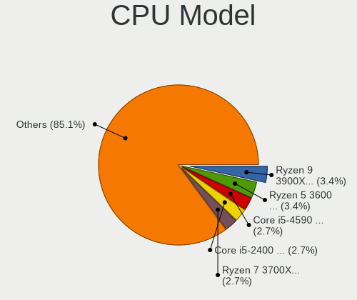

| Model                                       | Desktops | Percent |
|---------------------------------------------|----------|---------|
| AMD Ryzen 9 3900X 12-Core Processor         | 5        | 4.07%   |
| AMD Ryzen 5 3600 6-Core Processor           | 5        | 4.07%   |
| Intel Core i5-4590 CPU @ 3.30GHz            | 4        | 3.25%   |
| Intel Core i5-2400 CPU @ 3.10GHz            | 4        | 3.25%   |
| AMD Ryzen 7 3700X 8-Core Processor          | 4        | 3.25%   |
| Intel Core i5-3570K CPU @ 3.40GHz           | 3        | 2.44%   |
| Intel Core 2 Quad CPU Q9550 @ 2.83GHz       | 3        | 2.44%   |
| AMD Ryzen 3 2200G with Radeon Vega Graphics | 3        | 2.44%   |
| Intel Core i7-7700 CPU @ 3.60GHz            | 2        | 1.63%   |
| Intel Core i7-6700K CPU @ 4.00GHz           | 2        | 1.63%   |
| Intel Core i7-6700 CPU @ 3.40GHz            | 2        | 1.63%   |
| Intel Core i7-4770 CPU @ 3.40GHz            | 2        | 1.63%   |
| Intel Core i7-3770 CPU @ 3.40GHz            | 2        | 1.63%   |
| Intel Core i7 CPU 950 @ 3.07GHz             | 2        | 1.63%   |
| Intel Core i5-3470S CPU @ 2.90GHz           | 2        | 1.63%   |
| Intel Core i5-3470 CPU @ 3.20GHz            | 2        | 1.63%   |
| Intel Core i5 CPU 760 @ 2.80GHz             | 2        | 1.63%   |
| Intel Core 2 Quad CPU Q6600 @ 2.40GHz       | 2        | 1.63%   |
| AMD Ryzen 7 2700X Eight-Core Processor      | 2        | 1.63%   |
| AMD Ryzen 5 2600 Six-Core Processor         | 2        | 1.63%   |
| AMD FX-8350 Eight-Core Processor            | 2        | 1.63%   |
| Intel Xeon E-2224G CPU @ 3.50GHz            | 1        | 0.81%   |
| Intel Xeon CPU X5690 @ 3.47GHz              | 1        | 0.81%   |
| Intel Xeon CPU X5670 @ 2.93GHz              | 1        | 0.81%   |
| Intel Xeon CPU X5450 @ 3.00GHz              | 1        | 0.81%   |
| Intel Xeon CPU E5620 @ 2.40GHz              | 1        | 0.81%   |
| Intel Xeon CPU E5606 @ 2.13GHz              | 1        | 0.81%   |
| Intel Xeon CPU E5-2630 v3 @ 2.40GHz         | 1        | 0.81%   |
| Intel Xeon CPU E5-2620 v4 @ 2.10GHz         | 1        | 0.81%   |
| Intel Xeon CPU E5-2620 v3 @ 2.40GHz         | 1        | 0.81%   |
| Intel Xeon CPU E31270 @ 3.40GHz             | 1        | 0.81%   |
| Intel Xeon CPU E31260L @ 2.40GHz            | 1        | 0.81%   |
| Intel Xeon CPU E31240 @ 3.30GHz             | 1        | 0.81%   |
| Intel Xeon CPU E3-1276 v3 @ 3.60GHz         | 1        | 0.81%   |
| Intel Xeon CPU E3-1225 v5 @ 3.30GHz         | 1        | 0.81%   |
| Intel Pentium Gold G5400 CPU @ 3.70GHz      | 1        | 0.81%   |
| Intel Pentium Dual-Core CPU E5800 @ 3.20GHz | 1        | 0.81%   |
| Intel Pentium Dual CPU E2220 @ 2.40GHz      | 1        | 0.81%   |
| Intel Pentium CPU G3258 @ 3.20GHz           | 1        | 0.81%   |
| Intel Pentium CPU G3220 @ 3.00GHz           | 1        | 0.81%   |
| Intel Genuine CPU @ 2.20GHz                 | 1        | 0.81%   |
| Intel Core i9-9900K CPU @ 3.60GHz           | 1        | 0.81%   |
| Intel Core i7-8700K CPU @ 3.70GHz           | 1        | 0.81%   |
| Intel Core i7-8700 CPU @ 3.20GHz            | 1        | 0.81%   |
| Intel Core i7-7700K CPU @ 4.20GHz           | 1        | 0.81%   |
| Intel Core i7-4790K CPU @ 4.00GHz           | 1        | 0.81%   |
| Intel Core i7-3930K CPU @ 3.20GHz           | 1        | 0.81%   |
| Intel Core i7-3770K CPU @ 3.50GHz           | 1        | 0.81%   |
| Intel Core i7-2600K CPU @ 3.40GHz           | 1        | 0.81%   |
| Intel Core i7-10700F CPU @ 2.90GHz          | 1        | 0.81%   |
| Intel Core i7-10700 CPU @ 2.90GHz           | 1        | 0.81%   |
| Intel Core i7 CPU 870 @ 2.93GHz             | 1        | 0.81%   |
| Intel Core i7 CPU 860 @ 2.80GHz             | 1        | 0.81%   |
| Intel Core i5-8600K CPU @ 3.60GHz           | 1        | 0.81%   |
| Intel Core i5-6500T CPU @ 2.50GHz           | 1        | 0.81%   |
| Intel Core i5-6400T CPU @ 2.20GHz           | 1        | 0.81%   |
| Intel Core i5-4460T CPU @ 1.90GHz           | 1        | 0.81%   |
| Intel Core i5-4250U CPU @ 1.30GHz           | 1        | 0.81%   |
| Intel Core i5-3570 CPU @ 3.40GHz            | 1        | 0.81%   |
| Intel Core i5-3470T CPU @ 2.90GHz           | 1        | 0.81%   |

CPU Model Family
----------------

Processor model prefix

| Model                   | Desktops | Percent |
|-------------------------|----------|---------|
| Intel Core i5           | 26       | 21.14%  |
| Intel Core i7           | 23       | 18.7%   |
| Intel Xeon              | 14       | 11.38%  |
| AMD Ryzen 5             | 10       | 8.13%   |
| AMD Ryzen 7             | 7        | 5.69%   |
| Intel Core i3           | 6        | 4.88%   |
| Intel Core 2 Quad       | 6        | 4.88%   |
| AMD Ryzen 9             | 6        | 4.88%   |
| AMD FX                  | 5        | 4.07%   |
| AMD Ryzen 3             | 4        | 3.25%   |
| Intel Pentium           | 2        | 1.63%   |
| AMD Ryzen Threadripper  | 2        | 1.63%   |
| AMD Ryzen 7 PRO         | 2        | 1.63%   |
| Intel Pentium Gold      | 1        | 0.81%   |
| Intel Pentium Dual-Core | 1        | 0.81%   |
| Intel Pentium Dual      | 1        | 0.81%   |
| Intel Genuine           | 1        | 0.81%   |
| Intel Core i9           | 1        | 0.81%   |
| Intel Core 2 Duo        | 1        | 0.81%   |
| Intel Celeron           | 1        | 0.81%   |
| Intel Atom              | 1        | 0.81%   |
| AMD Turion II Neo       | 1        | 0.81%   |
| AMD Phenom II X4        | 1        | 0.81%   |

CPU Cores
---------

Number of processor cores

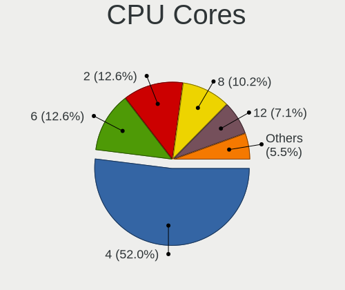

| Number | Desktops | Percent |
|--------|----------|---------|
| 4      | 65       | 52.85%  |
| 6      | 16       | 13.01%  |
| 2      | 14       | 11.38%  |
| 8      | 13       | 10.57%  |
| 12     | 8        | 6.5%    |
| 16     | 5        | 4.07%   |
| 3      | 1        | 0.81%   |
| 1      | 1        | 0.81%   |

CPU Sockets
-----------

Number of sockets

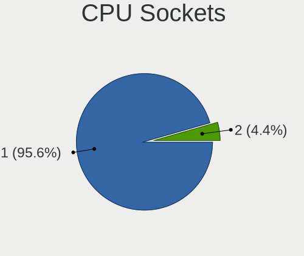

| Number | Desktops | Percent |
|--------|----------|---------|
| 1      | 117      | 95.9%   |
| 2      | 5        | 4.1%    |

CPU Threads
-----------

Threads per core (Hyper-Threading)

| Number | Desktops | Percent |
|--------|----------|---------|
| 2      | 72       | 58.06%  |
| 1      | 52       | 41.94%  |

CPU Op-Modes
------------

CPU Operation Modes (32-bit, 64-bit)

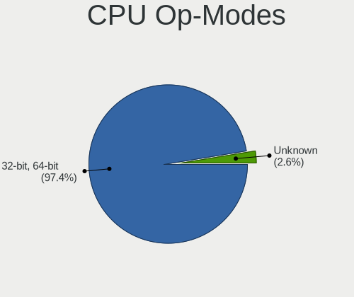

| Op mode        | Desktops | Percent |
|----------------|----------|---------|
| 32-bit, 64-bit | 118      | 96.72%  |
| Unknown        | 4        | 3.28%   |

CPU Microcode
-------------

Microcode number

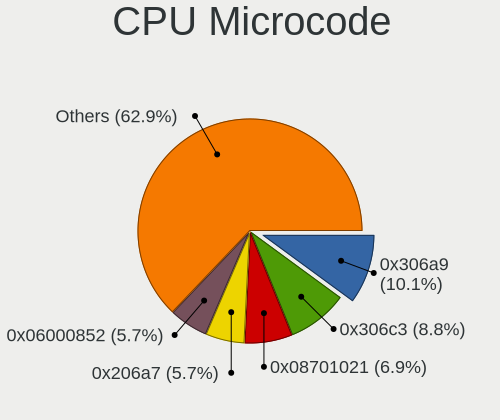

| Number     | Desktops | Percent |
|------------|----------|---------|
| 0x306a9    | 15       | 12.2%   |
| 0x306c3    | 12       | 9.76%   |
| 0x08701021 | 9        | 7.32%   |
| 0x206a7    | 8        | 6.5%    |
| 0x506e3    | 6        | 4.88%   |
| 0x0800820d | 6        | 4.88%   |
| 0x906ea    | 5        | 4.07%   |
| 0x1067a    | 5        | 4.07%   |
| 0x08701013 | 5        | 4.07%   |
| 0x06000852 | 5        | 4.07%   |
| 0x106e5    | 4        | 3.25%   |
| Unknown    | 4        | 3.25%   |
| 0xa0655    | 3        | 2.44%   |
| 0x906e9    | 3        | 2.44%   |
| 0x306f2    | 3        | 2.44%   |
| 0x206c2    | 3        | 2.44%   |
| 0x08101016 | 3        | 2.44%   |
| 0x6fb      | 2        | 1.63%   |
| 0x106a5    | 2        | 1.63%   |
| 0x08001137 | 2        | 1.63%   |
| 0x906ed    | 1        | 0.81%   |
| 0x906eb    | 1        | 0.81%   |
| 0x6fd      | 1        | 0.81%   |
| 0x406f1    | 1        | 0.81%   |
| 0x406c4    | 1        | 0.81%   |
| 0x40651    | 1        | 0.81%   |
| 0x206d7    | 1        | 0.81%   |
| 0x20652    | 1        | 0.81%   |
| 0x106c2    | 1        | 0.81%   |
| 0x10677    | 1        | 0.81%   |
| 0x10676    | 1        | 0.81%   |
| 0x0a201009 | 1        | 0.81%   |
| 0x08701011 | 1        | 0.81%   |
| 0x08600106 | 1        | 0.81%   |
| 0x08001138 | 1        | 0.81%   |
| 0x08001129 | 1        | 0.81%   |
| 0x010000db | 1        | 0.81%   |
| 0x010000c8 | 1        | 0.81%   |

CPU Microarch
-------------

Microarchitecture

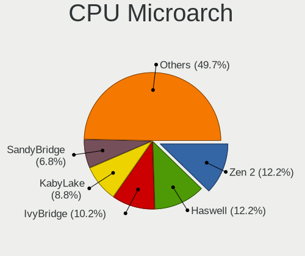

| Name        | Desktops | Percent |
|-------------|----------|---------|
| Zen 2       | 16       | 13.01%  |
| Haswell     | 16       | 13.01%  |
| IvyBridge   | 15       | 12.2%   |
| SandyBridge | 10       | 8.13%   |
| KabyLake    | 10       | 8.13%   |
| Zen         | 8        | 6.5%    |
| Skylake     | 7        | 5.69%   |
| Penryn      | 7        | 5.69%   |
| Zen+        | 6        | 4.88%   |
| Nehalem     | 6        | 4.88%   |
| Westmere    | 5        | 4.07%   |
| Piledriver  | 5        | 4.07%   |
| Core        | 3        | 2.44%   |
| CometLake   | 3        | 2.44%   |
| K10         | 2        | 1.63%   |
| Zen 3       | 1        | 0.81%   |
| Silvermont  | 1        | 0.81%   |
| Broadwell   | 1        | 0.81%   |
| Bonnell     | 1        | 0.81%   |

Graphics
--------

GPU Vendor
----------

Vendors of graphics cards

| Vendor                     | Desktops | Percent |
|----------------------------|----------|---------|
| Nvidia                     | 50       | 37.88%  |
| Intel                      | 47       | 35.61%  |
| AMD                        | 32       | 24.24%  |
| S3 Graphics                | 2        | 1.52%   |
| Matrox Electronics Systems | 1        | 0.76%   |

GPU Model
---------

Graphics card models

| Model                                                                       | Desktops | Percent |
|-----------------------------------------------------------------------------|----------|---------|
| Intel Xeon E3-1200 v3/4th Gen Core Processor Integrated Graphics Controller | 10       | 7.58%   |
| Intel Xeon E3-1200 v2/3rd Gen Core processor Graphics Controller            | 10       | 7.58%   |
| AMD Ellesmere [Radeon RX 470/480/570/570X/580/580X/590]                     | 7        | 5.3%    |
| Nvidia GK208B [GeForce GT 710]                                              | 5        | 3.79%   |
| Intel HD Graphics 530                                                       | 5        | 3.79%   |
| Intel 2nd Generation Core Processor Family Integrated Graphics Controller   | 5        | 3.79%   |
| Nvidia GT218 [GeForce 210]                                                  | 3        | 2.27%   |
| Intel CometLake-S GT2 [UHD Graphics 630]                                    | 3        | 2.27%   |
| AMD Raven Ridge [Radeon Vega Series / Radeon Vega Mobile Series]            | 3        | 2.27%   |
| Nvidia GT218 [GeForce G210]                                                 | 2        | 1.52%   |
| Nvidia GP104 [GeForce GTX 1070]                                             | 2        | 1.52%   |
| Nvidia GP102 [GeForce GTX 1080 Ti]                                          | 2        | 1.52%   |
| Nvidia GF106 [GeForce GTS 450]                                              | 2        | 1.52%   |
| Intel HD Graphics 630                                                       | 2        | 1.52%   |
| Intel CoffeeLake-S GT2 [UHD Graphics 630]                                   | 2        | 1.52%   |
| AMD RS780L [Radeon 3000]                                                    | 2        | 1.52%   |
| AMD Cedar [Radeon HD 5000/6000/7350/8350 Series]                            | 2        | 1.52%   |
| AMD Caicos [Radeon HD 6450/7450/8450 / R5 230 OEM]                          | 2        | 1.52%   |
| S3 Graphics Savage 4                                                        | 1        | 0.76%   |
| S3 Graphics 86c375 [ViRGE/DX] or 86c385 [ViRGE/GX]                          | 1        | 0.76%   |
| Nvidia TU116 [GeForce GTX 1660 Ti]                                          | 1        | 0.76%   |
| Nvidia TU116 [GeForce GTX 1650 SUPER]                                       | 1        | 0.76%   |
| Nvidia TU106 [GeForce RTX 2070 Rev. A]                                      | 1        | 0.76%   |
| Nvidia TU106 [GeForce RTX 2060 SUPER]                                       | 1        | 0.76%   |
| Nvidia TU104GL [Quadro RTX 5000]                                            | 1        | 0.76%   |
| Nvidia TU104 [GeForce RTX 2080 SUPER]                                       | 1        | 0.76%   |
| Nvidia TU104 [GeForce RTX 2070 SUPER]                                       | 1        | 0.76%   |
| Nvidia TU104 [GeForce RTX 2060]                                             | 1        | 0.76%   |
| Nvidia GT218 [NVS 300]                                                      | 1        | 0.76%   |
| Nvidia GT200GL [Quadro FX 4800]                                             | 1        | 0.76%   |
| Nvidia GP107GL [Quadro P620]                                                | 1        | 0.76%   |
| Nvidia GP107GL [Quadro P1000]                                               | 1        | 0.76%   |
| Nvidia GP107 [GeForce GTX 1050]                                             | 1        | 0.76%   |
| Nvidia GP107 [GeForce GTX 1050 Ti]                                          | 1        | 0.76%   |
| Nvidia GP106GL [Quadro P2000]                                               | 1        | 0.76%   |
| Nvidia GP106 [GeForce GTX 1060 3GB]                                         | 1        | 0.76%   |
| Nvidia GP104 [GeForce GTX 1080]                                             | 1        | 0.76%   |
| Nvidia GP104 [GeForce GTX 1070 Ti]                                          | 1        | 0.76%   |
| Nvidia GM206 [GeForce GTX 960]                                              | 1        | 0.76%   |
| Nvidia GM206 [GeForce GTX 950]                                              | 1        | 0.76%   |
| Nvidia GM107 [GeForce GTX 750]                                              | 1        | 0.76%   |
| Nvidia GM107 [GeForce GTX 750 Ti]                                           | 1        | 0.76%   |
| Nvidia GK208B [GeForce GT 730]                                              | 1        | 0.76%   |
| Nvidia GK110B [GeForce GTX 780 Ti]                                          | 1        | 0.76%   |
| Nvidia GK107 [NVS 510]                                                      | 1        | 0.76%   |
| Nvidia GK107 [GeForce GT 740]                                               | 1        | 0.76%   |
| Nvidia GK107 [GeForce GT 640 OEM]                                           | 1        | 0.76%   |
| Nvidia GF119 [GeForce GT 610]                                               | 1        | 0.76%   |
| Nvidia GF108GL [Quadro 600]                                                 | 1        | 0.76%   |
| Nvidia GF108 [GeForce GT 730]                                               | 1        | 0.76%   |
| Nvidia GF106GL [Quadro 2000]                                                | 1        | 0.76%   |
| Nvidia G92 [GeForce GT 230 OEM]                                             | 1        | 0.76%   |
| Nvidia G86 [GeForce 8500 GT]                                                | 1        | 0.76%   |
| Nvidia G73 [GeForce 7600 GS]                                                | 1        | 0.76%   |
| Matrox Electronics Systems MGA G200eW WPCM450                               | 1        | 0.76%   |
| Intel Xeon E3-1200 Processor Family Integrated Graphics Controller          | 1        | 0.76%   |
| Intel HD Graphics P530                                                      | 1        | 0.76%   |
| Intel Haswell-ULT Integrated Graphics Controller                            | 1        | 0.76%   |
| Intel Core Processor Integrated Graphics Controller                         | 1        | 0.76%   |
| Intel CoffeeLake-S GT2 [UHD Graphics P630]                                  | 1        | 0.76%   |

GPU Combo
---------

Combinations of graphics cards

| Name            | Desktops | Percent |
|-----------------|----------|---------|
| 1 x Nvidia      | 47       | 38.21%  |
| 1 x Intel       | 40       | 32.52%  |
| 1 x AMD         | 29       | 23.58%  |
| 1 x S3 Graphics | 2        | 1.63%   |
| Intel + AMD     | 2        | 1.63%   |
| 2 x AMD         | 1        | 0.81%   |
| 1 x Matrox      | 1        | 0.81%   |
| Intel + Nvidia  | 1        | 0.81%   |

GPU Driver
----------

Free vs proprietary

| Driver      | Desktops | Percent |
|-------------|----------|---------|
| Free        | 93       | 75.61%  |
| Proprietary | 21       | 17.07%  |
| Unknown     | 9        | 7.32%   |

GPU Memory
----------

Total video memory

| Size in GB | Desktops | Percent |
|------------|----------|---------|
| Unknown    | 54       | 42.86%  |
| 1.01-2.0   | 18       | 14.29%  |
| 0.51-1.0   | 16       | 12.7%   |
| 7.01-8.0   | 13       | 10.32%  |
| 0.01-0.5   | 13       | 10.32%  |
| 3.01-4.0   | 5        | 3.97%   |
| 8.01-16.0  | 3        | 2.38%   |
| 2.01-3.0   | 2        | 1.59%   |
| 5.01-6.0   | 1        | 0.79%   |
| 4.01-5.0   | 1        | 0.79%   |

Monitor
-------

Monitor Vendor
--------------

Monitor vendors

| Vendor               | Desktops | Percent |
|----------------------|----------|---------|
| Samsung Electronics  | 21       | 16.94%  |
| Dell                 | 19       | 15.32%  |
| Goldstar             | 16       | 12.9%   |
| Hewlett-Packard      | 15       | 12.1%   |
| Acer                 | 9        | 7.26%   |
| ViewSonic            | 5        | 4.03%   |
| BenQ                 | 5        | 4.03%   |
| LG Electronics       | 4        | 3.23%   |
| Eizo                 | 4        | 3.23%   |
| Ancor Communications | 4        | 3.23%   |
| Sony                 | 3        | 2.42%   |
| Iiyama               | 3        | 2.42%   |
| Xiaomi               | 2        | 1.61%   |
| Unknown              | 2        | 1.61%   |
| Philips              | 2        | 1.61%   |
| Xerox                | 1        | 0.81%   |
| Sceptre Tech         | 1        | 0.81%   |
| NEC Computers        | 1        | 0.81%   |
| MStar                | 1        | 0.81%   |
| Lenovo               | 1        | 0.81%   |
| HannStar Display     | 1        | 0.81%   |
| HannStar             | 1        | 0.81%   |
| AUS                  | 1        | 0.81%   |
| Apple                | 1        | 0.81%   |
| AOC                  | 1        | 0.81%   |

Monitor Model
-------------

Monitor models

| Model                                                                  | Desktops | Percent |
|------------------------------------------------------------------------|----------|---------|
| Goldstar Ultra HD GSM5B08 3840x2160 600x340mm 27.2-inch                | 3        | 2.13%   |
| Goldstar LG ULTRAWIDE GSM59F1 1920x1080 580x240mm 24.7-inch            | 3        | 2.13%   |
| Xiaomi Mi TV XMD009A 2880x1800 480x270mm 21.7-inch                     | 2        | 1.42%   |
| Samsung Electronics SMT22A550 SAM07AF 1920x1080 477x268mm 21.5-inch    | 2        | 1.42%   |
| Samsung Electronics C27F390 SAM0D32 1920x1080 600x340mm 27.2-inch      | 2        | 1.42%   |
| Hewlett-Packard LP2465 HWP2676 1920x1200 520x330mm 24.2-inch           | 2        | 1.42%   |
| Goldstar Ultra HD GSM5B09 3840x2160 600x340mm 27.2-inch                | 2        | 1.42%   |
| Dell U2412M DELA07A 1920x1200 518x324mm 24.1-inch                      | 2        | 1.42%   |
| Xerox XM7-22w XER08E8 1680x1050 474x296mm 22.0-inch                    | 1        | 0.71%   |
| ViewSonic VX3209-2K VSC328E 2560x1440 698x393mm 31.5-inch              | 1        | 0.71%   |
| ViewSonic VX2450 SERIES VSCE226 1920x1080 525x297mm 23.7-inch          | 1        | 0.71%   |
| ViewSonic VA2759 Series VSC6832 1920x1080 598x336mm 27.0-inch          | 1        | 0.71%   |
| ViewSonic VA2342 SERIES VSCFA2B 1920x1080 509x286mm 23.0-inch          | 1        | 0.71%   |
| ViewSonic VA2210-FHD VSCC536 1920x1080 476x268mm 21.5-inch             | 1        | 0.71%   |
| Unknown LCD Monitor XXX AAA 1366x768                                   | 1        | 0.71%   |
| Unknown LCD Monitor BENQ G2200W 5520x2160                              | 1        | 0.71%   |
| Sony TV *00 SNY8404 3840x2160 1218x685mm 55.0-inch                     | 1        | 0.71%   |
| Sony TV *00 SNY7C04 3840x2160 1218x685mm 55.0-inch                     | 1        | 0.71%   |
| Sony SDM-E96D SNYB400 1280x1024 376x301mm 19.0-inch                    | 1        | 0.71%   |
| Sceptre Tech U435CV-UMC SPT1109 3840x2160 575x323mm 26.0-inch          | 1        | 0.71%   |
| Samsung Electronics SyncMaster SAM0589 1920x1080 521x293mm 23.5-inch   | 1        | 0.71%   |
| Samsung Electronics SyncMaster SAM021E 1680x1050 433x271mm 20.1-inch   | 1        | 0.71%   |
| Samsung Electronics SyncMaster SAM021B 1400x1050 408x300mm 19.9-inch   | 1        | 0.71%   |
| Samsung Electronics SyncMaster SAM0094 1280x1024 338x270mm 17.0-inch   | 1        | 0.71%   |
| Samsung Electronics SMEX2220 SAM0685 1920x1080 477x268mm 21.5-inch     | 1        | 0.71%   |
| Samsung Electronics SMBX2231 SAM076D 1920x1080 477x268mm 21.5-inch     | 1        | 0.71%   |
| Samsung Electronics S27H65x SAM0E1D 1920x1080 598x336mm 27.0-inch      | 1        | 0.71%   |
| Samsung Electronics S27E390 SAM0C1C 1920x1080 598x336mm 27.0-inch      | 1        | 0.71%   |
| Samsung Electronics S24D300 SAM0B43 1920x1080 531x299mm 24.0-inch      | 1        | 0.71%   |
| Samsung Electronics S24B300 SAM08CB 1920x1080 521x293mm 23.5-inch      | 1        | 0.71%   |
| Samsung Electronics S22E390 SAM0C18 1920x1080 480x270mm 21.7-inch      | 1        | 0.71%   |
| Samsung Electronics LCD Monitor U28E590 3840x2160                      | 1        | 0.71%   |
| Samsung Electronics LCD Monitor T22C300 1920x1080                      | 1        | 0.71%   |
| Samsung Electronics LCD Monitor SAM0D42 1920x540                       | 1        | 0.71%   |
| Samsung Electronics LCD Monitor SAM0B7C 1920x1080 886x498mm 40.0-inch  | 1        | 0.71%   |
| Samsung Electronics LCD Monitor SAM0B60 1920x1080 1060x590mm 47.8-inch | 1        | 0.71%   |
| Samsung Electronics LCD Monitor LU28R55 3840x2160                      | 1        | 0.71%   |
| Samsung Electronics LCD Monitor C32JG5x 3640x1920                      | 1        | 0.71%   |
| Samsung Electronics EPSON PJ     SECA114 1600x1200                     | 1        | 0.71%   |
| Philips PHL 288P6L PHL08F2 3840x2160 621x341mm 27.9-inch               | 1        | 0.71%   |
| Philips 273ELH PHLC07D 1920x1080 598x336mm 27.0-inch                   | 1        | 0.71%   |
| NEC Computers LCD52V NEC6656 1024x768 304x228mm 15.0-inch              | 1        | 0.71%   |
| MStar TV_MONITOR MST0030 1440x900 1150x650mm 52.0-inch                 | 1        | 0.71%   |
| LG Electronics LCD Monitor W2442                                       | 1        | 0.71%   |
| LG Electronics LCD Monitor LG Ultra HD                                 | 1        | 0.71%   |
| LG Electronics LCD Monitor LG IPS FULLHD                               | 1        | 0.71%   |
| LG Electronics LCD Monitor LG HDR WQHD                                 | 1        | 0.71%   |
| Lenovo LEN T24i-10 LEN61CE 1920x1080 527x296mm 23.8-inch               | 1        | 0.71%   |
| Iiyama PLE2607WS IVM5608 1920x1200 550x344mm 25.5-inch                 | 1        | 0.71%   |
| Iiyama PLE2207WS IVM5609 1680x1050 474x296mm 22.0-inch                 | 1        | 0.71%   |
| Iiyama PL2480H IVM610B 1920x1080 520x290mm 23.4-inch                   | 1        | 0.71%   |
| Iiyama PL2210HD IVM5612 1920x1080 477x268mm 21.5-inch                  | 1        | 0.71%   |
| Hewlett-Packard ZR2440w HWP2955 1920x1080 520x320mm 24.0-inch          | 1        | 0.71%   |
| Hewlett-Packard Z27i HWP3095 2560x1440 597x336mm 27.0-inch             | 1        | 0.71%   |
| Hewlett-Packard S2331 HWP2907 1920x1080 509x286mm 23.0-inch            | 1        | 0.71%   |
| Hewlett-Packard OMEN by HP 32 HPN3378 2560x1440 708x399mm 32.0-inch    | 1        | 0.71%   |
| Hewlett-Packard LCD Monitor ZR22w 3840x1080                            | 1        | 0.71%   |
| Hewlett-Packard LCD Monitor ZR22w                                      | 1        | 0.71%   |
| Hewlett-Packard LCD Monitor Z24i 1920x1200                             | 1        | 0.71%   |
| Hewlett-Packard LCD Monitor 27er                                       | 1        | 0.71%   |

Monitor Resolution
------------------

Monitor screen resolution

| Resolution         | Desktops | Percent |
|--------------------|----------|---------|
| 1920x1080 (FHD)    | 55       | 44.35%  |
| 3840x2160 (4K)     | 15       | 12.1%   |
| 1920x1200 (WUXGA)  | 11       | 8.87%   |
| Unknown            | 8        | 6.45%   |
| 2560x1440 (QHD)    | 6        | 4.84%   |
| 1680x1050 (WSXGA+) | 6        | 4.84%   |
| 2560x1080          | 3        | 2.42%   |
| 3840x1080          | 2        | 1.61%   |
| 2880x1800          | 2        | 1.61%   |
| 1600x900 (HD+)     | 2        | 1.61%   |
| 1366x768 (WXGA)    | 2        | 1.61%   |
| 1280x1024 (SXGA)   | 2        | 1.61%   |
| 1024x768 (XGA)     | 2        | 1.61%   |
| 7280x2160          | 1        | 0.81%   |
| 5520x2160          | 1        | 0.81%   |
| 3840x1200          | 1        | 0.81%   |
| 3640x1920          | 1        | 0.81%   |
| 2560x1600          | 1        | 0.81%   |
| 1600x1200          | 1        | 0.81%   |
| 1400x1050          | 1        | 0.81%   |
| 1280x960           | 1        | 0.81%   |

Monitor Diagonal
----------------

Diagonal size in inches

| Inches  | Desktops | Percent |
|---------|----------|---------|
| 27      | 25       | 19.84%  |
| 24      | 18       | 14.29%  |
| 21      | 18       | 14.29%  |
| 23      | 16       | 12.7%   |
| Unknown | 16       | 12.7%   |
| 22      | 4        | 3.17%   |
| 20      | 4        | 3.17%   |
| 34      | 3        | 2.38%   |
| 31      | 3        | 2.38%   |
| 19      | 3        | 2.38%   |
| 65      | 2        | 1.59%   |
| 40      | 2        | 1.59%   |
| 32      | 2        | 1.59%   |
| 25      | 2        | 1.59%   |
| 15      | 2        | 1.59%   |
| 84      | 1        | 0.79%   |
| 54      | 1        | 0.79%   |
| 52      | 1        | 0.79%   |
| 29      | 1        | 0.79%   |
| 18      | 1        | 0.79%   |
| 17      | 1        | 0.79%   |

Monitor Width
-------------

Physical width

| Width in mm | Desktops | Percent |
|-------------|----------|---------|
| 501-600     | 55       | 46.22%  |
| 401-500     | 25       | 21.01%  |
| Unknown     | 16       | 13.45%  |
| 601-700     | 6        | 5.04%   |
| 701-800     | 5        | 4.2%    |
| 1001-1500   | 4        | 3.36%   |
| 301-350     | 3        | 2.52%   |
| 801-900     | 2        | 1.68%   |
| 351-400     | 2        | 1.68%   |
| 1501-2000   | 1        | 0.84%   |

Aspect Ratio
------------

Proportional relationship between the width and the height

| Ratio   | Desktops | Percent |
|---------|----------|---------|
| 16/9    | 71       | 62.83%  |
| 16/10   | 16       | 14.16%  |
| Unknown | 15       | 13.27%  |
| 4/3     | 4        | 3.54%   |
| 5/4     | 3        | 2.65%   |
| 21/9    | 3        | 2.65%   |
| 3/2     | 1        | 0.88%   |

Monitor Area
------------

Area in inch²

| Area in inch² | Desktops | Percent |
|----------------|----------|---------|
| 201-250        | 40       | 32.52%  |
| 301-350        | 25       | 20.33%  |
| Unknown        | 16       | 13.01%  |
| 251-300        | 11       | 8.94%   |
| 151-200        | 11       | 8.94%   |
| 351-500        | 9        | 7.32%   |
| More than 1000 | 5        | 4.07%   |
| 141-150        | 2        | 1.63%   |
| 101-110        | 2        | 1.63%   |
| 501-1000       | 2        | 1.63%   |

Pixel Density
-------------

Pixels per inch

| Density | Desktops | Percent |
|---------|----------|---------|
| 51-100  | 65       | 56.52%  |
| 101-120 | 22       | 19.13%  |
| Unknown | 16       | 13.91%  |
| 161-240 | 5        | 4.35%   |
| 121-160 | 5        | 4.35%   |
| 1-50    | 2        | 1.74%   |

Multiple Monitors
-----------------

Total monitors connected

| Total | Desktops | Percent |
|-------|----------|---------|
| 1     | 75       | 60.48%  |
| 2     | 25       | 20.16%  |
| 0     | 20       | 16.13%  |
| 3     | 2        | 1.61%   |
| 6     | 1        | 0.81%   |
| 4     | 1        | 0.81%   |

Network
-------

Net Controller Vendor
---------------------

Controller vendors

| Vendor                | Desktops | Percent |
|-----------------------|----------|---------|
| Intel                 | 70       | 40%     |
| Realtek Semiconductor | 65       | 37.14%  |
| Broadcom              | 10       | 5.71%   |
| Qualcomm Atheros      | 9        | 5.14%   |
| Ralink Technology     | 6        | 3.43%   |
| Mellanox Technologies | 3        | 1.71%   |
| D-Link System         | 2        | 1.14%   |
| Broadcom Limited      | 2        | 1.14%   |
| ASIX Electronics      | 2        | 1.14%   |
| Aquantia              | 2        | 1.14%   |
| TP-Link               | 1        | 0.57%   |
| Ralink                | 1        | 0.57%   |
| ICS Advent            | 1        | 0.57%   |
| DisplayLink           | 1        | 0.57%   |

Net Controller Model
--------------------

Controller models

| Model                                                                                                                  | Desktops | Percent |
|------------------------------------------------------------------------------------------------------------------------|----------|---------|
| Realtek RTL8111/8168/8411 PCI Express Gigabit Ethernet Controller                                                      | 53       | 26.77%  |
| Intel I211 Gigabit Network Connection                                                                                  | 15       | 7.58%   |
| Intel 82579LM Gigabit Network Connection (Lewisville)                                                                  | 8        | 4.04%   |
| Intel 82574L Gigabit Network Connection                                                                                | 7        | 3.54%   |
| Intel Wi-Fi 6 AX200                                                                                                    | 6        | 3.03%   |
| Intel Ethernet Connection I217-LM                                                                                      | 5        | 2.53%   |
| Intel Dual Band Wireless-AC 3168NGW [Stone Peak]                                                                       | 5        | 2.53%   |
| Realtek RTL8125 2.5GbE Controller                                                                                      | 4        | 2.02%   |
| Realtek RTL810xE PCI Express Fast Ethernet controller                                                                  | 4        | 2.02%   |
| Intel I210 Gigabit Network Connection                                                                                  | 4        | 2.02%   |
| Intel Ethernet Connection (2) I219-V                                                                                   | 4        | 2.02%   |
| Intel 82579V Gigabit Network Connection                                                                                | 4        | 2.02%   |
| Ralink RT5370 Wireless Adapter                                                                                         | 3        | 1.52%   |
| Broadcom BCM4360 802.11ac Wireless Network Adapter                                                                     | 3        | 1.52%   |
| Realtek RTL8153 Gigabit Ethernet Adapter                                                                               | 2        | 1.01%   |
| Qualcomm Atheros AR9485 Wireless Network Adapter                                                                       | 2        | 1.01%   |
| Qualcomm Atheros AR93xx Wireless Network Adapter                                                                       | 2        | 1.01%   |
| Mellanox MT27500 Family [ConnectX-3]                                                                                   | 2        | 1.01%   |
| Intel Wireless-AC 9260                                                                                                 | 2        | 1.01%   |
| Intel Wireless 8265 / 8275                                                                                             | 2        | 1.01%   |
| Intel Ethernet Connection (7) I219-V                                                                                   | 2        | 1.01%   |
| Intel Ethernet Connection (7) I219-LM                                                                                  | 2        | 1.01%   |
| Intel Ethernet Connection (2) I219-LM                                                                                  | 2        | 1.01%   |
| Intel Ethernet Connection (2) I218-V                                                                                   | 2        | 1.01%   |
| Intel 82571EB/82571GB Gigabit Ethernet Controller D0/D1 (copper applications)                                          | 2        | 1.01%   |
| Broadcom NetXtreme BCM5764M Gigabit Ethernet PCIe                                                                      | 2        | 1.01%   |
| Aquantia AQC107 NBase-T/IEEE 802.3bz Ethernet Controller [AQtion]                                                      | 2        | 1.01%   |
| TP-Link Archer T3U [Realtek RTL8812BU]                                                                                 | 1        | 0.51%   |
| Realtek RTL8192CE PCIe Wireless Network Adapter                                                                        | 1        | 0.51%   |
| Realtek RTL8191SU 802.11n WLAN Adapter                                                                                 | 1        | 0.51%   |
| Realtek RTL8169 PCI Gigabit Ethernet Controller                                                                        | 1        | 0.51%   |
| Realtek RTL-8100/8101L/8139 PCI Fast Ethernet Adapter                                                                  | 1        | 0.51%   |
| Realtek Realtek 8812AU/8821AU 802.11ac WLAN Adapter [USB Wireless Dual-Band Adapter 2.4/5Ghz]                          | 1        | 0.51%   |
| Realtek 802.11ac NIC                                                                                                   | 1        | 0.51%   |
| Ralink RT2870/RT3070 Wireless Adapter                                                                                  | 1        | 0.51%   |
| Ralink MT7610U ("Archer T2U" 2.4G+5G WLAN Adapter                                                                      | 1        | 0.51%   |
| Ralink MT7601U Wireless Adapter                                                                                        | 1        | 0.51%   |
| Ralink RT3090 Wireless 802.11n 1T/1R PCIe                                                                              | 1        | 0.51%   |
| Qualcomm Atheros QCA9377 802.11ac Wireless Network Adapter                                                             | 1        | 0.51%   |
| Qualcomm Atheros Killer E2500 Gigabit Ethernet Controller                                                              | 1        | 0.51%   |
| Qualcomm Atheros Killer E2400 Gigabit Ethernet Controller                                                              | 1        | 0.51%   |
| Qualcomm Atheros Killer E220x Gigabit Ethernet Controller                                                              | 1        | 0.51%   |
| Qualcomm Atheros AR9287 Wireless Network Adapter (PCI-Express)                                                         | 1        | 0.51%   |
| Mellanox MT25408A0-FCC-QI ConnectX, Dual Port 40Gb/s InfiniBand / 10GigE Adapter IC with PCIe 2.0 x8 5.0GT/s Interface | 1        | 0.51%   |
| Intel Wireless 7265                                                                                                    | 1        | 0.51%   |
| Intel Wireless 7260                                                                                                    | 1        | 0.51%   |
| Intel Wireless 3165                                                                                                    | 1        | 0.51%   |
| Intel Wireless 3160                                                                                                    | 1        | 0.51%   |
| Intel Ethernet Connection I218-V                                                                                       | 1        | 0.51%   |
| Intel Ethernet Connection I217-V                                                                                       | 1        | 0.51%   |
| Intel Ethernet Connection (5) I219-LM                                                                                  | 1        | 0.51%   |
| Intel Ethernet Connection (11) I219-V                                                                                  | 1        | 0.51%   |
| Intel Ethernet Connection (11) I219-LM                                                                                 | 1        | 0.51%   |
| Intel Centrino Advanced-N 6235                                                                                         | 1        | 0.51%   |
| Intel Cannon Lake PCH CNVi WiFi                                                                                        | 1        | 0.51%   |
| Intel 82578DC Gigabit Network Connection                                                                               | 1        | 0.51%   |
| Intel 82572EI Gigabit Ethernet Controller (Copper)                                                                     | 1        | 0.51%   |
| Intel 82567LM-3 Gigabit Network Connection                                                                             | 1        | 0.51%   |
| Intel 82567LF-2 Gigabit Network Connection                                                                             | 1        | 0.51%   |
| Intel 82566DC-2 Gigabit Network Connection                                                                             | 1        | 0.51%   |

Wireless Vendor
---------------

Wireless vendors

| Vendor                | Desktops | Percent |
|-----------------------|----------|---------|
| Intel                 | 21       | 47.73%  |
| Ralink Technology     | 6        | 13.64%  |
| Qualcomm Atheros      | 6        | 13.64%  |
| Broadcom              | 5        | 11.36%  |
| Realtek Semiconductor | 4        | 9.09%   |
| TP-Link               | 1        | 2.27%   |
| Ralink                | 1        | 2.27%   |

Wireless Model
--------------

Wireless models

| Model                                                                                         | Desktops | Percent |
|-----------------------------------------------------------------------------------------------|----------|---------|
| Intel Wi-Fi 6 AX200                                                                           | 6        | 13.64%  |
| Intel Dual Band Wireless-AC 3168NGW [Stone Peak]                                              | 5        | 11.36%  |
| Ralink RT5370 Wireless Adapter                                                                | 3        | 6.82%   |
| Broadcom BCM4360 802.11ac Wireless Network Adapter                                            | 3        | 6.82%   |
| Qualcomm Atheros AR9485 Wireless Network Adapter                                              | 2        | 4.55%   |
| Qualcomm Atheros AR93xx Wireless Network Adapter                                              | 2        | 4.55%   |
| Intel Wireless-AC 9260                                                                        | 2        | 4.55%   |
| Intel Wireless 8265 / 8275                                                                    | 2        | 4.55%   |
| TP-Link Archer T3U [Realtek RTL8812BU]                                                        | 1        | 2.27%   |
| Realtek RTL8192CE PCIe Wireless Network Adapter                                               | 1        | 2.27%   |
| Realtek RTL8191SU 802.11n WLAN Adapter                                                        | 1        | 2.27%   |
| Realtek Realtek 8812AU/8821AU 802.11ac WLAN Adapter [USB Wireless Dual-Band Adapter 2.4/5Ghz] | 1        | 2.27%   |
| Realtek 802.11ac NIC                                                                          | 1        | 2.27%   |
| Ralink RT2870/RT3070 Wireless Adapter                                                         | 1        | 2.27%   |
| Ralink MT7610U ("Archer T2U" 2.4G+5G WLAN Adapter                                             | 1        | 2.27%   |
| Ralink MT7601U Wireless Adapter                                                               | 1        | 2.27%   |
| Ralink RT3090 Wireless 802.11n 1T/1R PCIe                                                     | 1        | 2.27%   |
| Qualcomm Atheros QCA9377 802.11ac Wireless Network Adapter                                    | 1        | 2.27%   |
| Qualcomm Atheros AR9287 Wireless Network Adapter (PCI-Express)                                | 1        | 2.27%   |
| Intel Wireless 7265                                                                           | 1        | 2.27%   |
| Intel Wireless 7260                                                                           | 1        | 2.27%   |
| Intel Wireless 3165                                                                           | 1        | 2.27%   |
| Intel Wireless 3160                                                                           | 1        | 2.27%   |
| Intel Centrino Advanced-N 6235                                                                | 1        | 2.27%   |
| Intel Cannon Lake PCH CNVi WiFi                                                               | 1        | 2.27%   |
| Broadcom BCM43228 802.11a/b/g/n                                                               | 1        | 2.27%   |
| Broadcom BCM43142 802.11b/g/n                                                                 | 1        | 2.27%   |

Ethernet Vendor
---------------

Ethernet vendors

| Vendor                | Desktops | Percent |
|-----------------------|----------|---------|
| Realtek Semiconductor | 64       | 45.39%  |
| Intel                 | 59       | 41.84%  |
| Broadcom              | 5        | 3.55%   |
| Qualcomm Atheros      | 3        | 2.13%   |
| D-Link System         | 2        | 1.42%   |
| Broadcom Limited      | 2        | 1.42%   |
| ASIX Electronics      | 2        | 1.42%   |
| Aquantia              | 2        | 1.42%   |
| ICS Advent            | 1        | 0.71%   |
| DisplayLink           | 1        | 0.71%   |

Ethernet Model
--------------

Ethernet models

| Model                                                                         | Desktops | Percent |
|-------------------------------------------------------------------------------|----------|---------|
| Realtek RTL8111/8168/8411 PCI Express Gigabit Ethernet Controller             | 53       | 35.1%   |
| Intel I211 Gigabit Network Connection                                         | 15       | 9.93%   |
| Intel 82579LM Gigabit Network Connection (Lewisville)                         | 8        | 5.3%    |
| Intel 82574L Gigabit Network Connection                                       | 7        | 4.64%   |
| Intel Ethernet Connection I217-LM                                             | 5        | 3.31%   |
| Realtek RTL8125 2.5GbE Controller                                             | 4        | 2.65%   |
| Realtek RTL810xE PCI Express Fast Ethernet controller                         | 4        | 2.65%   |
| Intel I210 Gigabit Network Connection                                         | 4        | 2.65%   |
| Intel Ethernet Connection (2) I219-V                                          | 4        | 2.65%   |
| Intel 82579V Gigabit Network Connection                                       | 4        | 2.65%   |
| Realtek RTL8153 Gigabit Ethernet Adapter                                      | 2        | 1.32%   |
| Intel Ethernet Connection (7) I219-V                                          | 2        | 1.32%   |
| Intel Ethernet Connection (7) I219-LM                                         | 2        | 1.32%   |
| Intel Ethernet Connection (2) I219-LM                                         | 2        | 1.32%   |
| Intel Ethernet Connection (2) I218-V                                          | 2        | 1.32%   |
| Intel 82571EB/82571GB Gigabit Ethernet Controller D0/D1 (copper applications) | 2        | 1.32%   |
| Broadcom NetXtreme BCM5764M Gigabit Ethernet PCIe                             | 2        | 1.32%   |
| Aquantia AQC107 NBase-T/IEEE 802.3bz Ethernet Controller [AQtion]             | 2        | 1.32%   |
| Realtek RTL8169 PCI Gigabit Ethernet Controller                               | 1        | 0.66%   |
| Realtek RTL-8100/8101L/8139 PCI Fast Ethernet Adapter                         | 1        | 0.66%   |
| Qualcomm Atheros Killer E2500 Gigabit Ethernet Controller                     | 1        | 0.66%   |
| Qualcomm Atheros Killer E2400 Gigabit Ethernet Controller                     | 1        | 0.66%   |
| Qualcomm Atheros Killer E220x Gigabit Ethernet Controller                     | 1        | 0.66%   |
| Intel Ethernet Connection I218-V                                              | 1        | 0.66%   |
| Intel Ethernet Connection I217-V                                              | 1        | 0.66%   |
| Intel Ethernet Connection (5) I219-LM                                         | 1        | 0.66%   |
| Intel Ethernet Connection (11) I219-V                                         | 1        | 0.66%   |
| Intel Ethernet Connection (11) I219-LM                                        | 1        | 0.66%   |
| Intel 82578DC Gigabit Network Connection                                      | 1        | 0.66%   |
| Intel 82572EI Gigabit Ethernet Controller (Copper)                            | 1        | 0.66%   |
| Intel 82567LM-3 Gigabit Network Connection                                    | 1        | 0.66%   |
| Intel 82567LF-2 Gigabit Network Connection                                    | 1        | 0.66%   |
| Intel 82566DC-2 Gigabit Network Connection                                    | 1        | 0.66%   |
| Intel 82541PI Gigabit Ethernet Controller                                     | 1        | 0.66%   |
| ICS Advent DM9601 Fast Ethernet Adapter                                       | 1        | 0.66%   |
| DisplayLink HP Port Replicator (Composite Device)                             | 1        | 0.66%   |
| D-Link System DGE-530T Gigabit Ethernet Adapter (rev 11)                      | 1        | 0.66%   |
| D-Link System DGE-528T Gigabit Ethernet Adapter                               | 1        | 0.66%   |
| Broadcom NetXtreme II BCM5706 Gigabit Ethernet                                | 1        | 0.66%   |
| Broadcom NetXtreme BCM5723 Gigabit Ethernet PCIe                              | 1        | 0.66%   |
| Broadcom NetLink BCM57781 Gigabit Ethernet PCIe                               | 1        | 0.66%   |
| Broadcom Limited NetXtreme II BCM5709 Gigabit Ethernet                        | 1        | 0.66%   |
| Broadcom Limited NetXtreme BCM5722 Gigabit Ethernet PCI Express               | 1        | 0.66%   |
| ASIX AX88772B                                                                 | 1        | 0.66%   |
| ASIX AX88179 Gigabit Ethernet                                                 | 1        | 0.66%   |

Net Controller Kind
-------------------

Ethernet, WiFi or modem

| Kind     | Desktops | Percent |
|----------|----------|---------|
| Ethernet | 122      | 73.49%  |
| WiFi     | 41       | 24.7%   |
| Unknown  | 3        | 1.81%   |

Used Controller
---------------

Currently used network controller

| Kind     | Desktops | Percent |
|----------|----------|---------|
| Ethernet | 116      | 80%     |
| WiFi     | 28       | 19.31%  |
| Unknown  | 1        | 0.69%   |

NICs
----

Total network controllers on board

| Total | Desktops | Percent |
|-------|----------|---------|
| 1     | 60       | 48.78%  |
| 2     | 44       | 35.77%  |
| 3     | 14       | 11.38%  |
| 5     | 2        | 1.63%   |
| 7     | 1        | 0.81%   |
| 4     | 1        | 0.81%   |
| 0     | 1        | 0.81%   |

IPv6
----

IPv6 vs IPv4

| Used | Desktops | Percent |
|------|----------|---------|
| No   | 118      | 95.93%  |
| Yes  | 5        | 4.07%   |

Bluetooth
---------

Bluetooth Vendor
----------------

Controller vendors

| Vendor                  | Desktops | Percent |
|-------------------------|----------|---------|
| Intel                   | 20       | 54.05%  |
| Cambridge Silicon Radio | 8        | 21.62%  |
| Broadcom                | 5        | 13.51%  |
| ASUSTek Computer        | 2        | 5.41%   |
| IMC Networks            | 1        | 2.7%    |
| Apple                   | 1        | 2.7%    |

Bluetooth Model
---------------

Controller models

| Model                                               | Desktops | Percent |
|-----------------------------------------------------|----------|---------|
| Cambridge Silicon Radio Bluetooth Dongle (HCI mode) | 8        | 21.62%  |
| Intel AX200 Bluetooth                               | 6        | 16.22%  |
| Intel Wireless-AC 3168 Bluetooth                    | 5        | 13.51%  |
| Broadcom BCM20702A0 Bluetooth 4.0                   | 4        | 10.81%  |
| Intel Bluetooth wireless interface                  | 3        | 8.11%   |
| Intel Wireless-AC 9260 Bluetooth Adapter            | 2        | 5.41%   |
| Intel Bluetooth Device                              | 2        | 5.41%   |
| Intel Centrino Bluetooth Wireless Transceiver       | 1        | 2.7%    |
| Intel Bluetooth 9460/9560 Jefferson Peak (JfP)      | 1        | 2.7%    |
| IMC Networks Bluetooth Device                       | 1        | 2.7%    |
| Broadcom BCM43142A0 Bluetooth 4.0                   | 1        | 2.7%    |
| ASUS Broadcom BCM20702A0 Bluetooth                  | 1        | 2.7%    |
| ASUS BCM20702A0                                     | 1        | 2.7%    |
| Apple Bluetooth USB Host Controller                 | 1        | 2.7%    |

Sound
-----

Sound Vendor
------------

Sound card vendors

| Vendor              | Desktops | Percent |
|---------------------|----------|---------|
| Intel               | 78       | 42.16%  |
| AMD                 | 48       | 25.95%  |
| Nvidia              | 46       | 24.86%  |
| C-Media Electronics | 3        | 1.62%   |
| Plantronics         | 2        | 1.08%   |
| Logitech            | 2        | 1.08%   |
| Texas Instruments   | 1        | 0.54%   |
| Lynx                | 1        | 0.54%   |
| Fry's Electronics   | 1        | 0.54%   |
| Creative Labs       | 1        | 0.54%   |
| Corsair             | 1        | 0.54%   |
| AVID Technology     | 1        | 0.54%   |

Sound Model
-----------

Sound card models

| Model                                                                                             | Desktops | Percent |
|---------------------------------------------------------------------------------------------------|----------|---------|
| AMD Starship/Matisse HD Audio Controller                                                          | 16       | 7.48%   |
| Intel 7 Series/C216 Chipset Family High Definition Audio Controller                               | 14       | 6.54%   |
| AMD Family 17h (Models 00h-0fh) HD Audio Controller                                               | 11       | 5.14%   |
| Intel Xeon E3-1200 v3/4th Gen Core Processor HD Audio Controller                                  | 9        | 4.21%   |
| Intel 82801JI (ICH10 Family) HD Audio Controller                                                  | 8        | 3.74%   |
| Intel 6 Series/C200 Series Chipset Family High Definition Audio Controller                        | 8        | 3.74%   |
| Intel 8 Series/C220 Series Chipset High Definition Audio Controller                               | 7        | 3.27%   |
| Intel 100 Series/C230 Series Chipset Family HD Audio Controller                                   | 7        | 3.27%   |
| AMD Ellesmere HDMI Audio [Radeon RX 470/480 / 570/580/590]                                        | 7        | 3.27%   |
| Nvidia High Definition Audio Controller                                                           | 6        | 2.8%    |
| Nvidia GK208 HDMI/DP Audio Controller                                                             | 6        | 2.8%    |
| AMD SBx00 Azalia (Intel HDA)                                                                      | 6        | 2.8%    |
| Nvidia TU104 HD Audio Controller                                                                  | 4        | 1.87%   |
| Nvidia GP107GL High Definition Audio Controller                                                   | 4        | 1.87%   |
| Nvidia GP104 High Definition Audio Controller                                                     | 4        | 1.87%   |
| Intel Cannon Lake PCH cAVS                                                                        | 4        | 1.87%   |
| Intel C610/X99 series chipset HD Audio Controller                                                 | 4        | 1.87%   |
| Intel 9 Series Chipset Family HD Audio Controller                                                 | 4        | 1.87%   |
| Intel 5 Series/3400 Series Chipset High Definition Audio                                          | 4        | 1.87%   |
| Intel 200 Series PCH HD Audio                                                                     | 4        | 1.87%   |
| AMD Family 17h (Models 10h-1fh) HD Audio Controller                                               | 4        | 1.87%   |
| Nvidia GK107 HDMI Audio Controller                                                                | 3        | 1.4%    |
| Nvidia GF106 High Definition Audio Controller                                                     | 3        | 1.4%    |
| Intel NM10/ICH7 Family High Definition Audio Controller                                           | 3        | 1.4%    |
| Intel 82801I (ICH9 Family) HD Audio Controller                                                    | 3        | 1.4%    |
| AMD Raven/Raven2/Fenghuang HDMI/DP Audio Controller                                               | 3        | 1.4%    |
| AMD Oland/Hainan/Cape Verde/Pitcairn HDMI Audio [Radeon HD 7000 Series]                           | 3        | 1.4%    |
| Nvidia TU116 High Definition Audio Controller                                                     | 2        | 0.93%   |
| Nvidia TU106 High Definition Audio Controller                                                     | 2        | 0.93%   |
| Nvidia GP106 High Definition Audio Controller                                                     | 2        | 0.93%   |
| Nvidia GP102 HDMI Audio Controller                                                                | 2        | 0.93%   |
| Nvidia GM206 High Definition Audio Controller                                                     | 2        | 0.93%   |
| Nvidia GM107 High Definition Audio Controller [GeForce 940MX]                                     | 2        | 0.93%   |
| Nvidia GF108 High Definition Audio Controller                                                     | 2        | 0.93%   |
| Logitech H390 headset with microphone                                                             | 2        | 0.93%   |
| Intel Comet Lake PCH cAVS                                                                         | 2        | 0.93%   |
| C-Media Electronics CMI8788 [Oxygen HD Audio]                                                     | 2        | 0.93%   |
| AMD RS780 HDMI Audio [Radeon 3000/3100 / HD 3200/3300]                                            | 2        | 0.93%   |
| AMD Navi 10 HDMI Audio                                                                            | 2        | 0.93%   |
| AMD Cedar HDMI Audio [Radeon HD 5400/6300/7300 Series]                                            | 2        | 0.93%   |
| AMD Caicos HDMI Audio [Radeon HD 6450 / 7450/8450/8490 OEM / R5 230/235/235X OEM]                 | 2        | 0.93%   |
| AMD Baffin HDMI/DP Audio [Radeon RX 550 640SP / RX 560/560X]                                      | 2        | 0.93%   |
| Texas Instruments PCM2900B Audio CODEC                                                            | 1        | 0.47%   |
| Plantronics Blackwire 5220 Series                                                                 | 1        | 0.47%   |
| Plantronics Blackwire 3220 Series                                                                 | 1        | 0.47%   |
| Nvidia MCP73 High Definition Audio                                                                | 1        | 0.47%   |
| Nvidia GK110 High Definition Audio Controller                                                     | 1        | 0.47%   |
| Nvidia GF119 HDMI Audio Controller                                                                | 1        | 0.47%   |
| Lynx Hilo                                                                                         | 1        | 0.47%   |
| Intel USB PnP Sound Device                                                                        | 1        | 0.47%   |
| Intel Haswell-ULT HD Audio Controller                                                             | 1        | 0.47%   |
| Intel Comet Lake PCH-V Smart Sound Technology Audio Controller                                    | 1        | 0.47%   |
| Intel C600/X79 series chipset High Definition Audio Controller                                    | 1        | 0.47%   |
| Intel Atom/Celeron/Pentium Processor x5-E8000/J3xxx/N3xxx Series High Definition Audio Controller | 1        | 0.47%   |
| Intel 82801JD/DO (ICH10 Family) HD Audio Controller                                               | 1        | 0.47%   |
| Intel 8 Series HD Audio Controller                                                                | 1        | 0.47%   |
| Fry's Electronics EDIFIER R19U                                                                    | 1        | 0.47%   |
| Creative Labs Sound Core3D [Sound Blaster Recon3D / Z-Series]                                     | 1        | 0.47%   |
| Corsair HS60 PRO Surround USB Sound Adapter                                                       | 1        | 0.47%   |
| C-Media Electronics Digital Hifi Audio                                                            | 1        | 0.47%   |

Memory
------

Memory Vendor
-------------

Memory module vendors

| Vendor              | Desktops | Percent |
|---------------------|----------|---------|
| Unknown             | 13       | 18.57%  |
| SK Hynix            | 11       | 15.71%  |
| Crucial             | 9        | 12.86%  |
| Kingston            | 8        | 11.43%  |
| Corsair             | 8        | 11.43%  |
| Samsung Electronics | 6        | 8.57%   |
| G.Skill             | 5        | 7.14%   |
| Team                | 3        | 4.29%   |
| Micron Technology   | 2        | 2.86%   |
| TwinMOS             | 1        | 1.43%   |
| Ramaxel Technology  | 1        | 1.43%   |
| Nanya Technology    | 1        | 1.43%   |
| Elpida              | 1        | 1.43%   |
| A-DATA Technology   | 1        | 1.43%   |

Memory Model
------------

Memory module models

| Model                                                      | Desktops | Percent |
|------------------------------------------------------------|----------|---------|
| Unknown RAM Module 8GB DIMM 1600MT/s                       | 2        | 2.78%   |
| Unknown RAM Module 4GB DIMM 1333MT/s                       | 2        | 2.78%   |
| Unknown RAM Module 4096MB DIMM 1333MT/s                    | 2        | 2.78%   |
| Unknown RAM Module 2GB DIMM SDRAM                          | 2        | 2.78%   |
| Corsair RAM CMZ16GX3M2A1600C10 8192MB DIMM DDR3 1600MT/s   | 2        | 2.78%   |
| Unknown RAM Module 8GB SODIMM DDR3 1600MT/s                | 1        | 1.39%   |
| Unknown RAM Module 8GB DIMM DDR3 1600MT/s                  | 1        | 1.39%   |
| Unknown RAM Module 4096MB DIMM 400MT/s                     | 1        | 1.39%   |
| Unknown RAM Module 2048MB DIMM DDR2                        | 1        | 1.39%   |
| Unknown RAM Module 2048MB DIMM 1333MT/s                    | 1        | 1.39%   |
| TwinMOS RAM 9DEPBMZ8-TATP 2048MB DIMM DDR3 1333MT/s        | 1        | 1.39%   |
| Team RAM TEAMGROUP-UD4-3200 8192MB DIMM DDR4 3200MT/s      | 1        | 1.39%   |
| Team RAM TEAMGROUP-UD4-2400 8GB DIMM DDR4 2400MT/s         | 1        | 1.39%   |
| Team RAM Elite-1333 4GB DIMM 1333MT/s                      | 1        | 1.39%   |
| SK Hynix RAM Module 8GB DIMM DDR4 2133MT/s                 | 1        | 1.39%   |
| SK Hynix RAM Module 16GB DIMM DDR4 3200MT/s                | 1        | 1.39%   |
| SK Hynix RAM HYMP564U64CP8-Y5 512MB DIMM DDR2 667MT/s      | 1        | 1.39%   |
| SK Hynix RAM HMT451U7AFR8A-PB 4096MB DIMM DDR3 1600MT/s    | 1        | 1.39%   |
| SK Hynix RAM HMT451S6BFR8A-PB 4096MB SODIMM DDR3 1600MT/s  | 1        | 1.39%   |
| SK Hynix RAM HMT351U7BFR8C-H9 4GB DIMM DDR3 1333MT/s       | 1        | 1.39%   |
| SK Hynix RAM HMT351U6CFR8C-PB 4096MB DIMM DDR3 1800MT/s    | 1        | 1.39%   |
| SK Hynix RAM HMT151R7TFR4C-H9 4GB DIMM DDR3 1333MT/s       | 1        | 1.39%   |
| SK Hynix RAM HMA851U6CJR6N-VK 4GB DIMM DDR4 2667MT/s       | 1        | 1.39%   |
| SK Hynix RAM HMA851U6AFR6N-UH 4GB DIMM DDR4 2400MT/s       | 1        | 1.39%   |
| SK Hynix RAM HMA81GR7AFR8N-UH 8192MB DIMM DDR4 2400MT/s    | 1        | 1.39%   |
| Samsung RAM Module 8GB DIMM DDR4 2133MT/s                  | 1        | 1.39%   |
| Samsung RAM Module 8192MB DIMM DDR4 2666MT/s               | 1        | 1.39%   |
| Samsung RAM M393A2G40DB0-CPB 16GB DIMM DDR4 2133MT/s       | 1        | 1.39%   |
| Samsung RAM M391B5273DH0-CK0 4096MB DIMM DDR3 1600MT/s     | 1        | 1.39%   |
| Samsung RAM M378A1K43BB1-CPB 8192MB DIMM DDR4 2133MT/s     | 1        | 1.39%   |
| Samsung RAM M3 78T2953EZ3-CE6 1GB DIMM DDR2 667MT/s        | 1        | 1.39%   |
| Ramaxel RAM RMR5040ED58E9W1600 4GB DIMM DDR3 1600MT/s      | 1        | 1.39%   |
| Nanya RAM NT2GC64B8HC0NF-CG 2048MB DIMM DDR3 1333MT/s      | 1        | 1.39%   |
| Nanya RAM NT2GC64B88G0NF-CG 2GB DIMM DDR3 1333MT/s         | 1        | 1.39%   |
| Micron RAM 8JTF51264AZ-1G6E1 4GB DIMM DDR3 1600MT/s        | 1        | 1.39%   |
| Micron RAM 4ATF51264AZ-2G6E1 4GB DIMM DDR4 2667MT/s        | 1        | 1.39%   |
| Kingston RAM KHX2400C15D4/8G 8GB DIMM DDR4 2400MT/s        | 1        | 1.39%   |
| Kingston RAM KHX1600C9S3L/8G 8GB SODIMM DDR3 1600MT/s      | 1        | 1.39%   |
| Kingston RAM KHX1600C9D3/4GX 4GB DIMM DDR3 2400MT/s        | 1        | 1.39%   |
| Kingston RAM ACR512X64D3U16C11G 4096MB DIMM DDR3 1600MT/s  | 1        | 1.39%   |
| Kingston RAM 9965525-072.A00LF 8GB DIMM DDR3 1600MT/s      | 1        | 1.39%   |
| Kingston RAM 9905734-059.A00G 16GB DIMM DDR4 2666MT/s      | 1        | 1.39%   |
| Kingston RAM 9905702-021.A00G 8GB DIMM DDR4 2400MT/s       | 1        | 1.39%   |
| Kingston RAM 9905471-006.A01LF 4GB DIMM DDR3 1333MT/s      | 1        | 1.39%   |
| Kingston RAM 9905403-189.A00LF 4GB DIMM DDR3 1333MT/s      | 1        | 1.39%   |
| G.Skill RAM F4-3600C18-32GTZR 32GB DIMM DDR4 3600MT/s      | 1        | 1.39%   |
| G.Skill RAM F4-3200C16-8GTZB 8192MB DIMM DDR4 3200MT/s     | 1        | 1.39%   |
| G.Skill RAM F4-2666C19-8GVR 8GB DIMM DDR4 2666MT/s         | 1        | 1.39%   |
| G.Skill RAM F4-2400C15-8GRR 8192MB DIMM DDR4 2400MT/s      | 1        | 1.39%   |
| G.Skill RAM F3-14900CL9-4GBSR 4GB DIMM DDR3 1600MT/s       | 1        | 1.39%   |
| Elpida RAM Module 2GB DIMM DDR3 1333MT/s                   | 1        | 1.39%   |
| Crucial RAM CT8G4DFS8213.C8FAD1 8GB DIMM DDR4 2133MT/s     | 1        | 1.39%   |
| Crucial RAM CT8G4DFD8213.C16FBD2 8192MB DIMM DDR4 2133MT/s | 1        | 1.39%   |
| Crucial RAM CT51264BA160B.C16F 4096MB DIMM DDR3 1600MT/s   | 1        | 1.39%   |
| Crucial RAM CT16G4DFD8266.C16FD1 16GB DIMM DDR4 2667MT/s   | 1        | 1.39%   |
| Crucial RAM CT102464BD160B.M16 8192MB DIMM DDR3 1600MT/s   | 1        | 1.39%   |
| Crucial RAM CB4GU2400.C8GT 4GB DIMM DDR4 2400MT/s          | 1        | 1.39%   |
| Crucial RAM BLS8G3D1609DS1S00. 8192MB DIMM DDR3 1600MT/s   | 1        | 1.39%   |
| Crucial RAM BLS16G4D26BFSE.16FD 16384MB DIMM DDR4 2666MT/s | 1        | 1.39%   |
| Crucial RAM BL16G36C16U4R.M8FB1 16GB DIMM DDR4 3600MT/s    | 1        | 1.39%   |

Memory Kind
-----------

Memory module kinds

| Kind    | Desktops | Percent |
|---------|----------|---------|
| DDR3    | 24       | 41.38%  |
| DDR4    | 22       | 37.93%  |
| Unknown | 8        | 13.79%  |
| SDRAM   | 3        | 5.17%   |
| DDR2    | 1        | 1.72%   |

Memory Form Factor
------------------

Physical design of the memory module

| Name   | Desktops | Percent |
|--------|----------|---------|
| DIMM   | 55       | 94.83%  |
| SODIMM | 3        | 5.17%   |

Memory Size
-----------

Memory module size

| Size  | Desktops | Percent |
|-------|----------|---------|
| 4096  | 22       | 35.48%  |
| 8192  | 21       | 33.87%  |
| 16384 | 9        | 14.52%  |
| 2048  | 7        | 11.29%  |
| 32768 | 1        | 1.61%   |
| 1024  | 1        | 1.61%   |
| 512   | 1        | 1.61%   |

Memory Speed
------------

Memory module speed

| Speed   | Desktops | Percent |
|---------|----------|---------|
| 1600    | 17       | 27.87%  |
| 1333    | 13       | 21.31%  |
| 2400    | 6        | 9.84%   |
| 3200    | 4        | 6.56%   |
| 2666    | 4        | 6.56%   |
| 3600    | 3        | 4.92%   |
| 2133    | 3        | 4.92%   |
| Unknown | 3        | 4.92%   |
| 2667    | 2        | 3.28%   |
| 3466    | 1        | 1.64%   |
| 3000    | 1        | 1.64%   |
| 2800    | 1        | 1.64%   |
| 1800    | 1        | 1.64%   |
| 667     | 1        | 1.64%   |
| 400     | 1        | 1.64%   |

Printers & scanners
-------------------

Printer Vendor
--------------

Printer device vendors

| Vendor             | Desktops | Percent |
|--------------------|----------|---------|
| Hewlett-Packard    | 2        | 40%     |
| Brother Industries | 2        | 40%     |
| Kyocera            | 1        | 20%     |

Printer Model
-------------

Printer device models

| Model                    | Desktops | Percent |
|--------------------------|----------|---------|
| HP DeskJet 2130 series   | 2        | 40%     |
| Kyocera FS-1030D printer | 1        | 20%     |
| Brother MFC-J450DW       | 1        | 20%     |
| Brother HL-L2390DW       | 1        | 20%     |

Scanner Vendor
--------------

Scanner device vendors

| Vendor | Desktops | Percent |
|--------|----------|---------|
| Canon  | 1        | 100%    |

Scanner Model
-------------

Scanner device models

| Model                   | Desktops | Percent |
|-------------------------|----------|---------|
| Canon CanoScan LiDE 110 | 1        | 100%    |

Camera
------

Camera Vendor
-------------

Camera device vendors

| Vendor                | Desktops | Percent |
|-----------------------|----------|---------|
| Logitech              | 7        | 53.85%  |
| Samsung Electronics   | 1        | 7.69%   |
| Realtek Semiconductor | 1        | 7.69%   |
| Microdia              | 1        | 7.69%   |
| Cubeternet            | 1        | 7.69%   |
| Creative Technology   | 1        | 7.69%   |
| Chicony Electronics   | 1        | 7.69%   |

Camera Model
------------

Camera device models

| Model                                | Desktops | Percent |
|--------------------------------------|----------|---------|
| Logitech HD Webcam C615              | 3        | 23.08%  |
| Logitech HD Pro Webcam C920          | 2        | 15.38%  |
| Samsung Galaxy A5 (MTP)              | 1        | 7.69%   |
| Realtek Laptop_Integrated_Webcam_FHD | 1        | 7.69%   |
| Microdia Camera                      | 1        | 7.69%   |
| Logitech Webcam C930e                | 1        | 7.69%   |
| Logitech Webcam C270                 | 1        | 7.69%   |
| Cubeternet USB2.0 Camera             | 1        | 7.69%   |
| Creative Live! Cam Chat HD [VF0700]  | 1        | 7.69%   |
| Chicony HP Integrated Webcam         | 1        | 7.69%   |

Security
--------

Fingerprint Vendor
------------------

Fingerprint sensor vendors

Zero info for selected period =(

Fingerprint Model
-----------------

Fingerprint sensor models

Zero info for selected period =(

Chipcard Vendor
---------------

Chipcard module vendors

| Vendor              | Desktops | Percent |
|---------------------|----------|---------|
| Giesecke & Devrient | 2        | 50%     |
| SCM Microsystems    | 1        | 25%     |
| Cherry              | 1        | 25%     |

Chipcard Model
--------------

Chipcard module models

| Model                                                  | Desktops | Percent |
|--------------------------------------------------------|----------|---------|
| Giesecke & Devrient StarSign CUT S                     | 2        | 50%     |
| SCM Microsystems SCR331-LC1 / SCR3310 SmartCard Reader | 1        | 25%     |
| Cherry SmartCard Reader Keyboard KC 1000 SC            | 1        | 25%     |

Unsupported
-----------

Unsupported Devices
-------------------

Total unsupported devices on board

| Total | Desktops | Percent |
|-------|----------|---------|
| 0     | 99       | 79.84%  |
| 1     | 21       | 16.94%  |
| 2     | 4        | 3.23%   |

Unsupported Device Types
------------------------

Types of unsupported devices

| Type                     | Desktops | Percent |
|--------------------------|----------|---------|
| Graphics card            | 11       | 37.93%  |
| Unassigned class         | 5        | 17.24%  |
| Storage/ide              | 5        | 17.24%  |
| Net/wireless             | 3        | 10.34%  |
| Network                  | 2        | 6.9%    |
| Sound                    | 1        | 3.45%   |
| Net/ethernet             | 1        | 3.45%   |
| Communication controller | 1        | 3.45%   |

