CentOS 8 - Tested Hardware & Statistics (Notebooks)
---------------------------------------------------

A project to collect tested hardware configurations for CentOS 8.

Anyone can contribute to this report by the [hw-probe](https://github.com/linuxhw/hw-probe) tool:

    sudo -E hw-probe -all -upload

Please contribute! Especially if your hardware is rare.

Contents
--------

* [ Test Cases ](#test-cases)

* [ System ](#system)
  - [ Kernel                   ](#kernel)
  - [ Kernel Family            ](#kernel-family)
  - [ Kernel Major Ver.        ](#kernel-major-ver)
  - [ Arch                     ](#arch)
  - [ DE                       ](#de)
  - [ Display Server           ](#display-server)
  - [ Display Manager          ](#display-manager)
  - [ OS Lang                  ](#os-lang)
  - [ Boot Mode                ](#boot-mode)
  - [ Filesystem               ](#filesystem)
  - [ Part. scheme             ](#part-scheme)
  - [ Dual Boot with Linux/BSD ](#dual-boot-with-linuxbsd)
  - [ Dual Boot (Win)          ](#dual-boot-win)

* [ Board ](#board)
  - [ Vendor                   ](#vendor)
  - [ Model                    ](#model)
  - [ Model Family             ](#model-family)
  - [ MFG Year                 ](#mfg-year)
  - [ Form Factor              ](#form-factor)
  - [ Secure Boot              ](#secure-boot)
  - [ Coreboot                 ](#coreboot)
  - [ RAM Size                 ](#ram-size)
  - [ RAM Used                 ](#ram-used)
  - [ Total Drives             ](#total-drives)
  - [ Has CD-ROM               ](#has-cd-rom)
  - [ Has Ethernet             ](#has-ethernet)
  - [ Has WiFi                 ](#has-wifi)
  - [ Has Bluetooth            ](#has-bluetooth)

* [ Location ](#location)
  - [ Country                  ](#country)
  - [ City                     ](#city)

* [ Drives ](#drives)
  - [ Drive Vendor             ](#drive-vendor)
  - [ Drive Model              ](#drive-model)
  - [ HDD Vendor               ](#hdd-vendor)
  - [ SSD Vendor               ](#ssd-vendor)
  - [ Drive Kind               ](#drive-kind)
  - [ Drive Connector          ](#drive-connector)
  - [ Drive Size               ](#drive-size)
  - [ Space Total              ](#space-total)
  - [ Space Used               ](#space-used)
  - [ Malfunc. Drives          ](#malfunc-drives)
  - [ Malfunc. Drive Vendor    ](#malfunc-drive-vendor)
  - [ Malfunc. HDD Vendor      ](#malfunc-hdd-vendor)
  - [ Malfunc. Drive Kind      ](#malfunc-drive-kind)
  - [ Failed Drives            ](#failed-drives)
  - [ Failed Drive Vendor      ](#failed-drive-vendor)
  - [ Drive Status             ](#drive-status)

* [ Storage controller ](#storage-controller)
  - [ Storage Vendor           ](#storage-vendor)
  - [ Storage Model            ](#storage-model)
  - [ Storage Kind             ](#storage-kind)

* [ Processor ](#processor)
  - [ CPU Vendor               ](#cpu-vendor)
  - [ CPU Model                ](#cpu-model)
  - [ CPU Model Family         ](#cpu-model-family)
  - [ CPU Cores                ](#cpu-cores)
  - [ CPU Sockets              ](#cpu-sockets)
  - [ CPU Threads              ](#cpu-threads)
  - [ CPU Op-Modes             ](#cpu-op-modes)
  - [ CPU Microcode            ](#cpu-microcode)
  - [ CPU Microarch            ](#cpu-microarch)

* [ Graphics ](#graphics)
  - [ GPU Vendor               ](#gpu-vendor)
  - [ GPU Model                ](#gpu-model)
  - [ GPU Combo                ](#gpu-combo)
  - [ GPU Driver               ](#gpu-driver)
  - [ GPU Memory               ](#gpu-memory)

* [ Monitor ](#monitor)
  - [ Monitor Vendor           ](#monitor-vendor)
  - [ Monitor Model            ](#monitor-model)
  - [ Monitor Resolution       ](#monitor-resolution)
  - [ Monitor Diagonal         ](#monitor-diagonal)
  - [ Monitor Width            ](#monitor-width)
  - [ Aspect Ratio             ](#aspect-ratio)
  - [ Monitor Area             ](#monitor-area)
  - [ Pixel Density            ](#pixel-density)
  - [ Multiple Monitors        ](#multiple-monitors)

* [ Network ](#network)
  - [ Net Controller Vendor    ](#net-controller-vendor)
  - [ Net Controller Model     ](#net-controller-model)
  - [ Wireless Vendor          ](#wireless-vendor)
  - [ Wireless Model           ](#wireless-model)
  - [ Ethernet Vendor          ](#ethernet-vendor)
  - [ Ethernet Model           ](#ethernet-model)
  - [ Net Controller Kind      ](#net-controller-kind)
  - [ Used Controller          ](#used-controller)
  - [ NICs                     ](#nics)
  - [ IPv6                     ](#ipv6)

* [ Bluetooth ](#bluetooth)
  - [ Bluetooth Vendor         ](#bluetooth-vendor)
  - [ Bluetooth Model          ](#bluetooth-model)

* [ Sound ](#sound)
  - [ Sound Vendor             ](#sound-vendor)
  - [ Sound Model              ](#sound-model)

* [ Memory ](#memory)
  - [ Memory Vendor            ](#memory-vendor)
  - [ Memory Model             ](#memory-model)
  - [ Memory Kind              ](#memory-kind)
  - [ Memory Form Factor       ](#memory-form-factor)
  - [ Memory Size              ](#memory-size)
  - [ Memory Speed             ](#memory-speed)

* [ Printers & scanners ](#printers--scanners)
  - [ Printer Vendor           ](#printer-vendor)
  - [ Printer Model            ](#printer-model)
  - [ Scanner Vendor           ](#scanner-vendor)
  - [ Scanner Model            ](#scanner-model)

* [ Camera ](#camera)
  - [ Camera Vendor            ](#camera-vendor)
  - [ Camera Model             ](#camera-model)

* [ Security ](#security)
  - [ Fingerprint Vendor       ](#fingerprint-vendor)
  - [ Fingerprint Model        ](#fingerprint-model)
  - [ Chipcard Vendor          ](#chipcard-vendor)
  - [ Chipcard Model           ](#chipcard-model)

* [ Unsupported ](#unsupported)
  - [ Unsupported Devices      ](#unsupported-devices)
  - [ Unsupported Device Types ](#unsupported-device-types)

Test Cases
----------

Total: 170

| Vendor        | Model                       | Probe                                                      | Date         |
|---------------|-----------------------------|------------------------------------------------------------|--------------|
| Samsung       | 300E4A/300E5A/300E7A        | [1b0b5a798f](https://linux-hardware.org/?probe=1b0b5a798f) | Dec 20, 2022 |
| Lenovo        | ThinkPad X260 20F6007KKR    | [9b788f857e](https://linux-hardware.org/?probe=9b788f857e) | Dec 14, 2022 |
| Acer          | Aspire E1-531               | [e9161d7c33](https://linux-hardware.org/?probe=e9161d7c33) | Jul 29, 2022 |
| Lenovo        | ThinkPad T14s Gen 2i 20W... | [8bf06ee1c1](https://linux-hardware.org/?probe=8bf06ee1c1) | Jul 21, 2022 |
| ASUSTek       | X455LJ                      | [0c08648c4d](https://linux-hardware.org/?probe=0c08648c4d) | Jul 15, 2022 |
| Dell          | G3 3500                     | [3b770a574b](https://linux-hardware.org/?probe=3b770a574b) | Jun 11, 2022 |
| Dell          | Latitude 5591               | [0bc1368ac5](https://linux-hardware.org/?probe=0bc1368ac5) | Feb 28, 2022 |
| Dell          | Latitude 3420               | [5690460ebd](https://linux-hardware.org/?probe=5690460ebd) | Jan 31, 2022 |
| Lenovo        | IdeaPad 5 15IIL05 81YK      | [6db6689862](https://linux-hardware.org/?probe=6db6689862) | Jan 26, 2022 |
| ASUSTek       | VivoBook_ASUSLaptop X421... | [dfe95d1e0a](https://linux-hardware.org/?probe=dfe95d1e0a) | Jan 24, 2022 |
| Fujitsu       | LIFEBOOK E752               | [e6e4d232a9](https://linux-hardware.org/?probe=e6e4d232a9) | Jan 02, 2022 |
| MSI           | GP75 Leopard 10SFK          | [f165698d96](https://linux-hardware.org/?probe=f165698d96) | Dec 29, 2021 |
| HP            | Pavilion Gaming Laptop 1... | [d14a949e3d](https://linux-hardware.org/?probe=d14a949e3d) | Dec 27, 2021 |
| Lenovo        | IdeaPad Slim 1-14AST-05 ... | [3af644f11a](https://linux-hardware.org/?probe=3af644f11a) | Dec 26, 2021 |
| Dell          | Latitude E6430              | [a7435eb4c7](https://linux-hardware.org/?probe=a7435eb4c7) | Nov 28, 2021 |
| ASUSTek       | N56VJ                       | [f39e92a1f3](https://linux-hardware.org/?probe=f39e92a1f3) | Nov 16, 2021 |
| Lenovo        | IdeaPad 500-15ISK 80NT      | [d0fb953c7e](https://linux-hardware.org/?probe=d0fb953c7e) | Oct 11, 2021 |
| Dell          | Latitude E6430              | [3d605c2c36](https://linux-hardware.org/?probe=3d605c2c36) | Oct 05, 2021 |
| Dell          | Latitude E5470              | [17d97e59de](https://linux-hardware.org/?probe=17d97e59de) | Sep 23, 2021 |
| Dell          | Latitude E5470              | [82aca1d7b4](https://linux-hardware.org/?probe=82aca1d7b4) | Sep 16, 2021 |
| Dell          | Latitude E5470              | [c898d2b210](https://linux-hardware.org/?probe=c898d2b210) | Sep 16, 2021 |
| Sony          | SVT11215CGW                 | [0e12747ab1](https://linux-hardware.org/?probe=0e12747ab1) | Sep 12, 2021 |
| Dell          | Latitude 3420               | [1c1ef48be6](https://linux-hardware.org/?probe=1c1ef48be6) | Sep 06, 2021 |
| Dell          | Latitude E7450              | [090d2bd5c7](https://linux-hardware.org/?probe=090d2bd5c7) | Sep 05, 2021 |
| Dell          | Latitude E7450              | [c2d943414c](https://linux-hardware.org/?probe=c2d943414c) | Sep 04, 2021 |
| Lenovo        | ThinkPad P1 Gen 3 20TJS2... | [9f3d5555ce](https://linux-hardware.org/?probe=9f3d5555ce) | Aug 26, 2021 |
| HP            | NOTEBOOKE 15-AY084TU        | [fe06a5029a](https://linux-hardware.org/?probe=fe06a5029a) | Aug 22, 2021 |
| Lenovo        | ThinkPad P50 20EN001PUS     | [38843da0aa](https://linux-hardware.org/?probe=38843da0aa) | Aug 18, 2021 |
| Lenovo        | ThinkPad P50 20EN001PUS     | [322b1fb2ba](https://linux-hardware.org/?probe=322b1fb2ba) | Aug 18, 2021 |
| Dell          | Latitude 7420               | [67165b9d66](https://linux-hardware.org/?probe=67165b9d66) | Aug 12, 2021 |
| Dell          | XPS 15 7590                 | [1778263a70](https://linux-hardware.org/?probe=1778263a70) | Aug 08, 2021 |
| Dell          | XPS 15 9570                 | [e329149eb4](https://linux-hardware.org/?probe=e329149eb4) | Aug 06, 2021 |
| HP            | EliteBook 8440p             | [80cb2748cf](https://linux-hardware.org/?probe=80cb2748cf) | Aug 02, 2021 |
| Acer          | Nitro AN515-51              | [130fff31f2](https://linux-hardware.org/?probe=130fff31f2) | Jul 12, 2021 |
| Lenovo        | IdeaPad 3 15IIL05 81WE      | [8cf37f7d3d](https://linux-hardware.org/?probe=8cf37f7d3d) | Jul 11, 2021 |
| Lenovo        | IdeaPad 3 15IIL05 81WE      | [3ec82c9dc0](https://linux-hardware.org/?probe=3ec82c9dc0) | Jul 11, 2021 |
| COPELION I... | QX-350                      | [6fd40c02da](https://linux-hardware.org/?probe=6fd40c02da) | Jul 01, 2021 |
| HP            | EliteBook 820 G2            | [4993490f00](https://linux-hardware.org/?probe=4993490f00) | Jul 01, 2021 |
| HP            | EliteBook 820 G2            | [69346a0102](https://linux-hardware.org/?probe=69346a0102) | Jul 01, 2021 |
| ASUSTek       | X455LJ                      | [b8a939ca9c](https://linux-hardware.org/?probe=b8a939ca9c) | Jun 27, 2021 |
| HP            | EliteBook 8740w             | [9b54339e9b](https://linux-hardware.org/?probe=9b54339e9b) | Jun 16, 2021 |
| HP            | EliteBook 8740w             | [9ad5884fca](https://linux-hardware.org/?probe=9ad5884fca) | Jun 16, 2021 |
| COPELION I... | QX-350                      | [7672d01a80](https://linux-hardware.org/?probe=7672d01a80) | Jun 08, 2021 |
| COPELION I... | QX-350                      | [4181e36f84](https://linux-hardware.org/?probe=4181e36f84) | Jun 07, 2021 |
| Dell          | Latitude E6530              | [eaf1c46fce](https://linux-hardware.org/?probe=eaf1c46fce) | May 29, 2021 |
| Samsung       | 500R4K/500R5H/5400RK/501... | [5742c8e4e5](https://linux-hardware.org/?probe=5742c8e4e5) | May 28, 2021 |
| HP            | EliteBook 840 G5            | [ef516b4f37](https://linux-hardware.org/?probe=ef516b4f37) | May 17, 2021 |
| Lenovo        | ThinkPad W540 20BG001KUK    | [ce71038513](https://linux-hardware.org/?probe=ce71038513) | May 14, 2021 |
| Lenovo        | ThinkPad E490 20N8007NTX    | [e9efa41cf8](https://linux-hardware.org/?probe=e9efa41cf8) | May 12, 2021 |
| HP            | ZBook 15 G6                 | [ea363ea07e](https://linux-hardware.org/?probe=ea363ea07e) | May 07, 2021 |
| ASUSTek       | ZenBook UX431DA_UM431DA     | [1133f762f5](https://linux-hardware.org/?probe=1133f762f5) | Apr 15, 2021 |
| Dell          | Precision 3551              | [4e9b5b097e](https://linux-hardware.org/?probe=4e9b5b097e) | Apr 15, 2021 |
| Lenovo        | ThinkPad W540 20BHS20700    | [30edeadde3](https://linux-hardware.org/?probe=30edeadde3) | Apr 13, 2021 |
| Lenovo        | ThinkPad T460p 20FXS0220... | [3aef8ed384](https://linux-hardware.org/?probe=3aef8ed384) | Apr 11, 2021 |
| Lenovo        | ThinkPad E15 20RD0066TX     | [c3c1d01480](https://linux-hardware.org/?probe=c3c1d01480) | Apr 09, 2021 |
| Lenovo        | ThinkPad P1 Gen 3 20TJS2... | [d4b7cef21b](https://linux-hardware.org/?probe=d4b7cef21b) | Apr 06, 2021 |
| HP            | ZBook 17 G2                 | [c974cb6fc7](https://linux-hardware.org/?probe=c974cb6fc7) | Apr 06, 2021 |
| Lenovo        | ThinkPad E15 20RD0066TX     | [3ab392c848](https://linux-hardware.org/?probe=3ab392c848) | Apr 05, 2021 |
| Lenovo        | IdeaPad 330-14AST 81D5      | [4b9332ae3a](https://linux-hardware.org/?probe=4b9332ae3a) | Apr 05, 2021 |
| Lenovo        | IdeaPad 330-14AST 81D5      | [d4a7fbec30](https://linux-hardware.org/?probe=d4a7fbec30) | Apr 01, 2021 |
| HP            | EliteBook 2540p             | [46c15e3b14](https://linux-hardware.org/?probe=46c15e3b14) | Apr 01, 2021 |
| LG Electro... | Z435-GE40K                  | [41dfc50f20](https://linux-hardware.org/?probe=41dfc50f20) | Mar 27, 2021 |
| Samsung       | 700Z3A/700Z4A/700Z5A/700... | [ba68c7c065](https://linux-hardware.org/?probe=ba68c7c065) | Mar 09, 2021 |
| HP            | ProBook 450 G5              | [fcc71c0314](https://linux-hardware.org/?probe=fcc71c0314) | Feb 13, 2021 |
| Acer          | Aspire V5-571G              | [6f498cb661](https://linux-hardware.org/?probe=6f498cb661) | Jan 27, 2021 |
| ASUSTek       | K54C                        | [ac91a40e03](https://linux-hardware.org/?probe=ac91a40e03) | Jan 24, 2021 |
| Sony          | VPCEG15FB                   | [badcac9c3d](https://linux-hardware.org/?probe=badcac9c3d) | Jan 17, 2021 |
| Lenovo        | V330-15IKB 81AX             | [48d877b127](https://linux-hardware.org/?probe=48d877b127) | Jan 07, 2021 |
| Acer          | Aspire 5750G                | [a448a76b2e](https://linux-hardware.org/?probe=a448a76b2e) | Jan 06, 2021 |
| Lenovo        | IdeaPad Slim 1-14AST-05 ... | [1ad69ae9c9](https://linux-hardware.org/?probe=1ad69ae9c9) | Jan 04, 2021 |
| Dell          | XPS L521X                   | [c109644955](https://linux-hardware.org/?probe=c109644955) | Dec 28, 2020 |
| Dell          | Latitude E7240              | [39e57b6b18](https://linux-hardware.org/?probe=39e57b6b18) | Dec 28, 2020 |
| Lenovo        | IdeaPad 500-15ISK 80NT      | [7038da6d94](https://linux-hardware.org/?probe=7038da6d94) | Dec 25, 2020 |
| Lenovo        | ThinkPad X1 Carbon 6th 2... | [55e2883ca5](https://linux-hardware.org/?probe=55e2883ca5) | Dec 24, 2020 |
| Lenovo        | ThinkPad T460p 20FXS0220... | [048b297665](https://linux-hardware.org/?probe=048b297665) | Dec 23, 2020 |
| Lenovo        | ThinkPad T490s 20NYS0290... | [d87cdee8cb](https://linux-hardware.org/?probe=d87cdee8cb) | Dec 19, 2020 |
| Acer          | Aspire A715-75G             | [814f906095](https://linux-hardware.org/?probe=814f906095) | Dec 15, 2020 |
| Lenovo        | IdeaPad Slim 1-14AST-05 ... | [da43f75c0c](https://linux-hardware.org/?probe=da43f75c0c) | Dec 14, 2020 |
| ASUSTek       | X455LJ                      | [9938aa76cf](https://linux-hardware.org/?probe=9938aa76cf) | Dec 10, 2020 |
| Lenovo        | ThinkPad T490s 20NYS0290... | [9d12f4f222](https://linux-hardware.org/?probe=9d12f4f222) | Dec 10, 2020 |
| Lenovo        | ThinkPad T490s 20NYS0290... | [c26814bfc2](https://linux-hardware.org/?probe=c26814bfc2) | Dec 10, 2020 |
| Lenovo        | G70-70 80HW005XUK           | [a57125fe89](https://linux-hardware.org/?probe=a57125fe89) | Dec 07, 2020 |
| Acer          | Aspire V5-431P              | [831f0df544](https://linux-hardware.org/?probe=831f0df544) | Dec 03, 2020 |
| Dell          | Studio 1747                 | [dd0085228f](https://linux-hardware.org/?probe=dd0085228f) | Nov 29, 2020 |
| HP            | ZBook 15                    | [033521235f](https://linux-hardware.org/?probe=033521235f) | Nov 29, 2020 |
| Lenovo        | ThinkPad E595 20NF0000GE    | [c58ad8f5e8](https://linux-hardware.org/?probe=c58ad8f5e8) | Nov 28, 2020 |
| Lenovo        | ThinkPad X240 20AMS7XW00    | [b7783af763](https://linux-hardware.org/?probe=b7783af763) | Nov 19, 2020 |
| Sony          | VPCEH15FX                   | [cc8c7bc4c9](https://linux-hardware.org/?probe=cc8c7bc4c9) | Nov 19, 2020 |
| Acer          | Aspire V5-571G              | [b8d43abe6e](https://linux-hardware.org/?probe=b8d43abe6e) | Nov 18, 2020 |
| Acer          | Aspire V5-571G              | [49707be15c](https://linux-hardware.org/?probe=49707be15c) | Nov 16, 2020 |
| Dell          | Latitude 3440               | [17db1f31f6](https://linux-hardware.org/?probe=17db1f31f6) | Nov 13, 2020 |
| HP            | EliteBook 830 G6            | [0e0009bcfc](https://linux-hardware.org/?probe=0e0009bcfc) | Nov 13, 2020 |
| Lenovo        | ThinkPad T420 4238AB9       | [9c7ec388e0](https://linux-hardware.org/?probe=9c7ec388e0) | Nov 11, 2020 |
| ASUSTek       | X455LJ                      | [d0085b85ad](https://linux-hardware.org/?probe=d0085b85ad) | Nov 09, 2020 |
| Lenovo        | IdeaPad L340-15IRH Gamin... | [dbc5336b07](https://linux-hardware.org/?probe=dbc5336b07) | Nov 01, 2020 |
| Lenovo        | ThinkPad E590 20NBS03S00    | [29ae827508](https://linux-hardware.org/?probe=29ae827508) | Oct 29, 2020 |
| Unknown       | Unknown                     | [98cd8695de](https://linux-hardware.org/?probe=98cd8695de) | Oct 21, 2020 |
| Unknown       | Unknown                     | [a0e3328769](https://linux-hardware.org/?probe=a0e3328769) | Oct 21, 2020 |
| ASUSTek       | VivoBook_ASUSLaptop X512... | [50534bc0e0](https://linux-hardware.org/?probe=50534bc0e0) | Oct 01, 2020 |
| Lenovo        | ThinkPad X140e 20BL000BU... | [b00098bf37](https://linux-hardware.org/?probe=b00098bf37) | Sep 29, 2020 |
| ASUSTek       | X556UB                      | [15790fbe92](https://linux-hardware.org/?probe=15790fbe92) | Sep 28, 2020 |
| Timi          | TM1709                      | [9d4bd50d80](https://linux-hardware.org/?probe=9d4bd50d80) | Sep 25, 2020 |
| Gigabyte      | P35V3                       | [55580f63c2](https://linux-hardware.org/?probe=55580f63c2) | Sep 14, 2020 |
| Apple         | MacBookPro12,1              | [daceea1b39](https://linux-hardware.org/?probe=daceea1b39) | Sep 08, 2020 |
| Lenovo        | ThinkPad T430s 2356CZ4      | [585b5cd200](https://linux-hardware.org/?probe=585b5cd200) | Aug 22, 2020 |
| Lenovo        | ThinkPad T430s 2356CZ4      | [b16e78abbf](https://linux-hardware.org/?probe=b16e78abbf) | Aug 21, 2020 |
| HP            | ProBook 440 G2              | [b19e6b64a7](https://linux-hardware.org/?probe=b19e6b64a7) | Aug 07, 2020 |
| MSI           | GE73VR 7RF                  | [8f05f68c7d](https://linux-hardware.org/?probe=8f05f68c7d) | Aug 04, 2020 |
| HP            | Notebook                    | [00a853f189](https://linux-hardware.org/?probe=00a853f189) | Aug 01, 2020 |
| Samsung       | 270E5J/2570EJ               | [8907cdddd5](https://linux-hardware.org/?probe=8907cdddd5) | Jul 24, 2020 |
| Samsung       | R560                        | [4d35b24594](https://linux-hardware.org/?probe=4d35b24594) | Jul 23, 2020 |
| HP            | EliteBook 850 G3            | [529b5be1b5](https://linux-hardware.org/?probe=529b5be1b5) | Jul 14, 2020 |
| HP            | ProBook 640 G2              | [53ba25afcd](https://linux-hardware.org/?probe=53ba25afcd) | Jul 14, 2020 |
| HP            | ProBook 450 G0              | [8566dd2843](https://linux-hardware.org/?probe=8566dd2843) | Jul 11, 2020 |
| HP            | ProBook 450 G0              | [116cbdcf22](https://linux-hardware.org/?probe=116cbdcf22) | Jul 09, 2020 |
| HP            | EliteBook 840 G5            | [8c28479e2e](https://linux-hardware.org/?probe=8c28479e2e) | Jun 19, 2020 |
| HP            | Laptop 14-bp0xx             | [6efe053f69](https://linux-hardware.org/?probe=6efe053f69) | Jun 18, 2020 |
| HP            | Laptop 14-bp0xx             | [e1611d4a8f](https://linux-hardware.org/?probe=e1611d4a8f) | Jun 18, 2020 |
| Lenovo        | Z50-70 20354                | [765261db4d](https://linux-hardware.org/?probe=765261db4d) | Jun 17, 2020 |
| Lenovo        | Z50-70 20354                | [08a9f86f96](https://linux-hardware.org/?probe=08a9f86f96) | Jun 17, 2020 |
| Dell          | Inspiron 5570               | [3d59a7abfb](https://linux-hardware.org/?probe=3d59a7abfb) | Jun 14, 2020 |
| Dell          | Inspiron 3520               | [0fe6cc7ec2](https://linux-hardware.org/?probe=0fe6cc7ec2) | Jun 11, 2020 |
| Lenovo        | ThinkPad T480s 20L8002WM... | [4660651265](https://linux-hardware.org/?probe=4660651265) | Jun 09, 2020 |
| Sony          | VPCEG15FB                   | [764c88fff0](https://linux-hardware.org/?probe=764c88fff0) | May 30, 2020 |
| HP            | EliteBook 8440p             | [cc3e01ff0f](https://linux-hardware.org/?probe=cc3e01ff0f) | May 29, 2020 |
| Lenovo        | ThinkPad E580 20KS001JRT    | [a9b9b6f30e](https://linux-hardware.org/?probe=a9b9b6f30e) | May 29, 2020 |
| Acer          | Aspire 5750G                | [e99f24b527](https://linux-hardware.org/?probe=e99f24b527) | May 15, 2020 |
| ASUSTek       | X556UB                      | [ae412b00e1](https://linux-hardware.org/?probe=ae412b00e1) | May 02, 2020 |
| HP            | EliteBook 8440p             | [5856d8fd4a](https://linux-hardware.org/?probe=5856d8fd4a) | Apr 30, 2020 |
| Medion        | P6622                       | [57721ffc8f](https://linux-hardware.org/?probe=57721ffc8f) | Apr 29, 2020 |
| HP            | Laptop 14-dq1xxx            | [16dbe6c7cf](https://linux-hardware.org/?probe=16dbe6c7cf) | Apr 28, 2020 |
| Lenovo        | ThinkPad T500 2242CTO       | [8d383c8ba6](https://linux-hardware.org/?probe=8d383c8ba6) | Apr 25, 2020 |
| Lenovo        | ThinkPad T500 2242CTO       | [82c9bdc55a](https://linux-hardware.org/?probe=82c9bdc55a) | Apr 25, 2020 |
| Dell          | Inspiron 3520               | [30d580cc9d](https://linux-hardware.org/?probe=30d580cc9d) | Apr 23, 2020 |
| Dell          | Inspiron 3520               | [e18488f436](https://linux-hardware.org/?probe=e18488f436) | Apr 23, 2020 |
| Apple         | MacBookPro12,1              | [bf90b17b91](https://linux-hardware.org/?probe=bf90b17b91) | Apr 15, 2020 |
| Lenovo        | ThinkPad T440 20B7004JUS    | [7e54937ed3](https://linux-hardware.org/?probe=7e54937ed3) | Apr 15, 2020 |
| Apple         | MacBookPro12,1              | [e3673127d2](https://linux-hardware.org/?probe=e3673127d2) | Apr 14, 2020 |
| HP            | EliteBook Folio 9470m       | [9439de5a1c](https://linux-hardware.org/?probe=9439de5a1c) | Apr 12, 2020 |
| RM Educati... | RM                          | [548492cfc9](https://linux-hardware.org/?probe=548492cfc9) | Apr 11, 2020 |
| HP            | ProBook 430 G5              | [a1f59e373b](https://linux-hardware.org/?probe=a1f59e373b) | Apr 10, 2020 |
| Lenovo        | Z50-70 20354                | [03322f98e6](https://linux-hardware.org/?probe=03322f98e6) | Mar 24, 2020 |
| Lenovo        | B50-70 80EU                 | [32162d2fcb](https://linux-hardware.org/?probe=32162d2fcb) | Mar 19, 2020 |
| Acer          | One 14 Z2-485               | [d7c11b1573](https://linux-hardware.org/?probe=d7c11b1573) | Feb 24, 2020 |
| Acer          | One 14 Z2-485               | [22a7ce37ed](https://linux-hardware.org/?probe=22a7ce37ed) | Feb 24, 2020 |
| HP            | EliteBook 8570w             | [f2997e7cab](https://linux-hardware.org/?probe=f2997e7cab) | Feb 24, 2020 |
| HP            | ProBook 450 G5              | [d38140cd66](https://linux-hardware.org/?probe=d38140cd66) | Feb 24, 2020 |
| HP            | ProBook 450 G5              | [7d51d0400f](https://linux-hardware.org/?probe=7d51d0400f) | Feb 24, 2020 |
| Dell          | Precision 5510              | [97fdd683cd](https://linux-hardware.org/?probe=97fdd683cd) | Feb 23, 2020 |
| HP            | Laptop 15-bs1xx             | [891cb66753](https://linux-hardware.org/?probe=891cb66753) | Feb 06, 2020 |
| Lenovo        | ThinkPad X1 Carbon 7th 2... | [10a7b3c4f3](https://linux-hardware.org/?probe=10a7b3c4f3) | Feb 01, 2020 |
| Acer          | TravelMate P257-M           | [5dbe9649a7](https://linux-hardware.org/?probe=5dbe9649a7) | Jan 28, 2020 |
| Clevo         | P15xEMx                     | [e41e485e3b](https://linux-hardware.org/?probe=e41e485e3b) | Jan 25, 2020 |
| ASUSTek       | X550MJ                      | [16470618ab](https://linux-hardware.org/?probe=16470618ab) | Jan 09, 2020 |
| Dell          | Inspiron N4010              | [5b5d5fc395](https://linux-hardware.org/?probe=5b5d5fc395) | Jan 04, 2020 |
| Lenovo        | ThinkPad X1 Carbon 2nd 2... | [95488c6be1](https://linux-hardware.org/?probe=95488c6be1) | Jan 02, 2020 |
| Lenovo        | ThinkPad X1 Carbon 2nd 2... | [925412ddcd](https://linux-hardware.org/?probe=925412ddcd) | Jan 02, 2020 |
| Lenovo        | ThinkPad P51 W10DG 20MNS... | [46bfb60272](https://linux-hardware.org/?probe=46bfb60272) | Dec 14, 2019 |
| Dell          | Studio 1747                 | [e572489472](https://linux-hardware.org/?probe=e572489472) | Dec 05, 2019 |
| Toshiba       | Satellite L15W-B            | [c90b14d1e5](https://linux-hardware.org/?probe=c90b14d1e5) | Dec 03, 2019 |
| Dell          | Studio 1747                 | [24d64d118b](https://linux-hardware.org/?probe=24d64d118b) | Dec 02, 2019 |
| ASUSTek       | E202SA                      | [e052cf247b](https://linux-hardware.org/?probe=e052cf247b) | Nov 23, 2019 |
| Toshiba       | Satellite L15W-B            | [c96da5df5e](https://linux-hardware.org/?probe=c96da5df5e) | Nov 20, 2019 |
| Toshiba       | Satellite L15W-B            | [bf3a6bb4c3](https://linux-hardware.org/?probe=bf3a6bb4c3) | Nov 20, 2019 |
| Lenovo        | IdeaPad L340-15IRH Gamin... | [df76fe3ea4](https://linux-hardware.org/?probe=df76fe3ea4) | Nov 14, 2019 |
| Lenovo        | IdeaPad L340-15IRH Gamin... | [448a81eb7c](https://linux-hardware.org/?probe=448a81eb7c) | Nov 14, 2019 |
| HP            | Notebook                    | [4aae147ff7](https://linux-hardware.org/?probe=4aae147ff7) | Nov 01, 2019 |
| Sony          | VPCEH26EN                   | [28024462ac](https://linux-hardware.org/?probe=28024462ac) | Oct 22, 2019 |
| RM Educati... | RM                          | [4d22671841](https://linux-hardware.org/?probe=4d22671841) | Oct 03, 2019 |
| RM Educati... | RM                          | [43aad9067d](https://linux-hardware.org/?probe=43aad9067d) | Oct 02, 2019 |

System
------

Kernel
------

Version of the Linux kernel

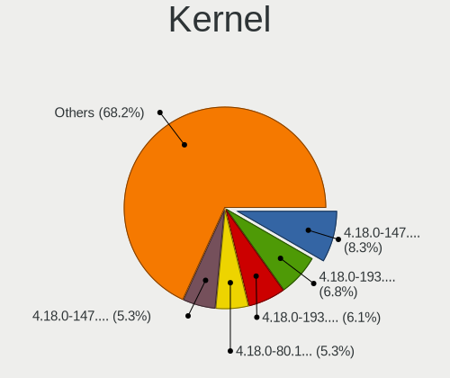

| Version                      | Notebooks | Percent |
|------------------------------|-----------|---------|
| 4.18.0-147.8.1.el8_1.x86_64  | 11        | 8.53%   |
| 4.18.0-193.6.3.el8_2.x86_64  | 9         | 6.98%   |
| 4.18.0-193.28.1.el8_2.x86_64 | 8         | 6.2%    |
| 4.18.0-80.11.2.el8_0.x86_64  | 7         | 5.43%   |
| 4.18.0-147.5.1.el8_1.x86_64  | 7         | 5.43%   |
| 4.18.0-240.1.1.el8_3.x86_64  | 6         | 4.65%   |
| 4.18.0-240.15.1.el8_3.x86_64 | 5         | 3.88%   |
| 4.18.0-193.14.2.el8_2.x86_64 | 5         | 3.88%   |
| 4.18.0-305.3.1.el8.x86_64    | 4         | 3.1%    |
| 4.18.0-294.el8.x86_64        | 4         | 3.1%    |
| 4.18.0-240.22.1.el8_3.x86_64 | 4         | 3.1%    |
| 4.18.0-147.3.1.el8_1.x86_64  | 4         | 3.1%    |
| 4.18.0-348.7.1.el8_5.x86_64  | 3         | 2.33%   |
| 4.18.0-305.17.1.el8_4.x86_64 | 3         | 2.33%   |
| 4.18.0-305.12.1.el8_4.x86_64 | 3         | 2.33%   |
| 4.18.0-277.el8.x86_64        | 3         | 2.33%   |
| 4.18.0-193.el8.x86_64        | 3         | 2.33%   |
| 4.18.0-193.19.1.el8_2.x86_64 | 3         | 2.33%   |
| 4.18.0-147.6.el8.x86_64      | 3         | 2.33%   |
| 5.15.11-1.el8.elrepo.x86_64  | 2         | 1.55%   |
| 4.18.0-80.el8.x86_64         | 2         | 1.55%   |
| 4.18.0-408.el8.x86_64        | 2         | 1.55%   |
| 4.18.0-348.2.1.el8_5.x86_64  | 2         | 1.55%   |
| 4.18.0-301.1.el8.x86_64      | 2         | 1.55%   |
| 4.18.0-240.el8.x86_64        | 2         | 1.55%   |
| 4.18.0-240.10.1.el8_3.x86_64 | 2         | 1.55%   |
| 4.18.0-147.el8.x86_64        | 2         | 1.55%   |
| 5.9.12-1.el8.elrepo.x86_64   | 1         | 0.78%   |
| 5.9.1-1.el8.elrepo.x86_64    | 1         | 0.78%   |
| 5.8.11-1.el8.elrepo.x86_64   | 1         | 0.78%   |
| 5.17.2-1.el8.elrepo.x86_64   | 1         | 0.78%   |
| 5.13.7-1.el8.elrepo.x86_64   | 1         | 0.78%   |
| 4.18.0-80.7.1.el8_0.x86_64   | 1         | 0.78%   |
| 4.18.0-365.el8.x86_64        | 1         | 0.78%   |
| 4.18.0-358.el8.x86_64        | 1         | 0.78%   |
| 4.18.0-348.el8.x86_64        | 1         | 0.78%   |
| 4.18.0-338.el8.x86_64        | 1         | 0.78%   |
| 4.18.0-315.el8.x86_64        | 1         | 0.78%   |
| 4.18.0-305.7.1.el8_4.x86_64  | 1         | 0.78%   |
| 4.18.0-305.19.1.el8_4.x86_64 | 1         | 0.78%   |

Kernel Family
-------------

Linux kernel without a distro release

| Version | Notebooks | Percent |
|---------|-----------|---------|
| 4.18.0  | 110       | 94.02%  |
| 5.15.11 | 2         | 1.71%   |
| 5.9.12  | 1         | 0.85%   |
| 5.9.1   | 1         | 0.85%   |
| 5.8.11  | 1         | 0.85%   |
| 5.17.2  | 1         | 0.85%   |
| 5.13.7  | 1         | 0.85%   |

Kernel Major Ver.
-----------------

Linux kernel major version

| Version | Notebooks | Percent |
|---------|-----------|---------|
| 4.18    | 110       | 94.02%  |
| 5.9     | 2         | 1.71%   |
| 5.15    | 2         | 1.71%   |
| 5.8     | 1         | 0.85%   |
| 5.17    | 1         | 0.85%   |
| 5.13    | 1         | 0.85%   |

Arch
----

OS architecture (x86_64, i586, etc.)

| Name   | Notebooks | Percent |
|--------|-----------|---------|
| x86_64 | 117       | 100%    |

DE
--

Desktop Environment

| Name          | Notebooks | Percent |
|---------------|-----------|---------|
| GNOME         | 106       | 89.08%  |
| GNOME Classic | 4         | 3.36%   |
| Unknown       | 3         | 2.52%   |
| XFCE          | 2         | 1.68%   |
| MATE          | 2         | 1.68%   |
| KDE5          | 1         | 0.84%   |
| KDE           | 1         | 0.84%   |

Display Server
--------------

X11 or Wayland

| Name    | Notebooks | Percent |
|---------|-----------|---------|
| Wayland | 77        | 62.1%   |
| X11     | 43        | 34.68%  |
| Unknown | 3         | 2.42%   |
| Web     | 1         | 0.81%   |

Display Manager
---------------

SDDM, LightDM, etc.

| Name    | Notebooks | Percent |
|---------|-----------|---------|
| Unknown | 70        | 58.33%  |
| GDM     | 48        | 40%     |
| TDM     | 1         | 0.83%   |
| LightDM | 1         | 0.83%   |

OS Lang
-------

Language

| Lang    | Notebooks | Percent |
|---------|-----------|---------|
| en_US   | 61        | 51.26%  |
| en_GB   | 10        | 8.4%    |
| Unknown | 10        | 8.4%    |
| de_DE   | 7         | 5.88%   |
| pt_BR   | 6         | 5.04%   |
| ru_RU   | 4         | 3.36%   |
| fr_FR   | 4         | 3.36%   |
| ko_KR   | 3         | 2.52%   |
| en_CA   | 3         | 2.52%   |
| nb_NO   | 2         | 1.68%   |
| en_IN   | 2         | 1.68%   |
| zh_CN   | 1         | 0.84%   |
| it_IT   | 1         | 0.84%   |
| es_PE   | 1         | 0.84%   |
| es_MX   | 1         | 0.84%   |
| es_AR   | 1         | 0.84%   |
| en_IE   | 1         | 0.84%   |
| da_DK   | 1         | 0.84%   |

Boot Mode
---------

EFI or BIOS

| Mode | Notebooks | Percent |
|------|-----------|---------|
| EFI  | 77        | 65.25%  |
| BIOS | 41        | 34.75%  |

Filesystem
----------

Type of filesystem

| Type    | Notebooks | Percent |
|---------|-----------|---------|
| Xfs     | 105       | 88.24%  |
| Ext4    | 10        | 8.4%    |
| Unknown | 4         | 3.36%   |

Part. scheme
------------

Scheme of partitioning

| Type    | Notebooks | Percent |
|---------|-----------|---------|
| Unknown | 71        | 59.66%  |
| GPT     | 35        | 29.41%  |
| MBR     | 13        | 10.92%  |

Dual Boot with Linux/BSD
------------------------

Hosting more than one Linux/BSD

| Dual boot | Notebooks | Percent |
|-----------|-----------|---------|
| No        | 106       | 90.6%   |
| Yes       | 11        | 9.4%    |

Dual Boot (Win)
---------------

Hosting Linux and Windows

| Dual boot | Notebooks | Percent |
|-----------|-----------|---------|
| No        | 99        | 83.9%   |
| Yes       | 19        | 16.1%   |

Board
-----

Vendor
------

Motherboard manufacturer

| Name                   | Notebooks | Percent |
|------------------------|-----------|---------|
| Lenovo                 | 33        | 28.21%  |
| Hewlett-Packard        | 25        | 21.37%  |
| Dell                   | 20        | 17.09%  |
| ASUSTek Computer       | 9         | 7.69%   |
| Acer                   | 8         | 6.84%   |
| Samsung Electronics    | 5         | 4.27%   |
| Sony                   | 4         | 3.42%   |
| MSI                    | 2         | 1.71%   |
| Toshiba                | 1         | 0.85%   |
| Timi                   | 1         | 0.85%   |
| RM Education           | 1         | 0.85%   |
| Medion                 | 1         | 0.85%   |
| LG Electronics         | 1         | 0.85%   |
| Gigabyte Technology    | 1         | 0.85%   |
| Fujitsu                | 1         | 0.85%   |
| COPELION INTERNATIONAL | 1         | 0.85%   |
| Clevo                  | 1         | 0.85%   |
| Apple                  | 1         | 0.85%   |
| Unknown                | 1         | 0.85%   |

Model
-----

Motherboard model

| Name                                              | Notebooks | Percent |
|---------------------------------------------------|-----------|---------|
| Lenovo Z50-70 20354                               | 2         | 1.71%   |
| Lenovo IdeaPad L340-15IRH Gaming 81LK             | 2         | 1.71%   |
| HP ProBook 450 G5                                 | 2         | 1.71%   |
| HP Notebook                                       | 2         | 1.71%   |
| Dell Studio 1747                                  | 2         | 1.71%   |
| Dell Latitude E5470                               | 2         | 1.71%   |
| Toshiba Satellite L15W-B                          | 1         | 0.85%   |
| Timi TM1709                                       | 1         | 0.85%   |
| Sony VPCEH26EN                                    | 1         | 0.85%   |
| Sony VPCEH15FX                                    | 1         | 0.85%   |
| Sony VPCEG15FB                                    | 1         | 0.85%   |
| Sony SVT11215CGW                                  | 1         | 0.85%   |
| Samsung R560                                      | 1         | 0.85%   |
| Samsung 700Z3A/700Z4A/700Z5A/700Z5B               | 1         | 0.85%   |
| Samsung 500R4K/500R5H/5400RK/501R5H/5500RH/500R5S | 1         | 0.85%   |
| Samsung 300E4A/300E5A/300E7A                      | 1         | 0.85%   |
| Samsung 270E5J/2570EJ                             | 1         | 0.85%   |
| RM Education RM                                   | 1         | 0.85%   |
| MSI GP75 Leopard 10SFK                            | 1         | 0.85%   |
| MSI GE73VR 7RF                                    | 1         | 0.85%   |
| Medion P6622                                      | 1         | 0.85%   |
| LG Z435-GE40K                                     | 1         | 0.85%   |
| Lenovo V330-15IKB 81AX                            | 1         | 0.85%   |
| Lenovo ThinkPad X260 20F6007KKR                   | 1         | 0.85%   |
| Lenovo ThinkPad X240 20AMS7XW00                   | 1         | 0.85%   |
| Lenovo ThinkPad X1 Carbon 6th 20KGS23S00          | 1         | 0.85%   |
| Lenovo ThinkPad X1 Carbon 2nd 20A7CT01WW          | 1         | 0.85%   |
| Lenovo ThinkPad W540 20BHS20700                   | 1         | 0.85%   |
| Lenovo ThinkPad W540 20BG001KUK                   | 1         | 0.85%   |
| Lenovo ThinkPad T500 2242CTO                      | 1         | 0.85%   |
| Lenovo ThinkPad T490s 20NYS02900                  | 1         | 0.85%   |
| Lenovo ThinkPad T480s 20L8002WMX                  | 1         | 0.85%   |
| Lenovo ThinkPad T460p 20FXS02200                  | 1         | 0.85%   |
| Lenovo ThinkPad T440 20B7004JUS                   | 1         | 0.85%   |
| Lenovo ThinkPad T430s 2356CZ4                     | 1         | 0.85%   |
| Lenovo ThinkPad T420 4238AB9                      | 1         | 0.85%   |
| Lenovo ThinkPad T14s Gen 2i 20WNS5JQ00            | 1         | 0.85%   |
| Lenovo ThinkPad P51 W10DG 20MNS08X00              | 1         | 0.85%   |
| Lenovo ThinkPad P50 20EN001PUS                    | 1         | 0.85%   |
| Lenovo ThinkPad E595 20NF0000GE                   | 1         | 0.85%   |

Model Family
------------

Motherboard model prefix

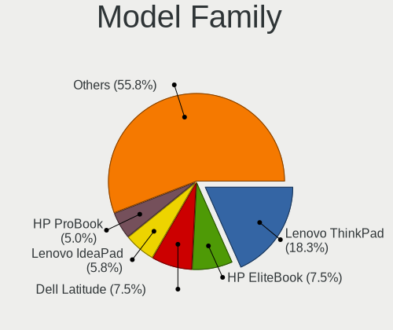

| Name                          | Notebooks | Percent |
|-------------------------------|-----------|---------|
| Lenovo ThinkPad               | 21        | 17.95%  |
| HP EliteBook                  | 9         | 7.69%   |
| Dell Latitude                 | 9         | 7.69%   |
| Lenovo IdeaPad                | 7         | 5.98%   |
| HP ProBook                    | 6         | 5.13%   |
| Acer Aspire                   | 5         | 4.27%   |
| HP ZBook                      | 3         | 2.56%   |
| HP Laptop                     | 3         | 2.56%   |
| Dell XPS                      | 3         | 2.56%   |
| Dell Inspiron                 | 3         | 2.56%   |
| Lenovo Z50-70                 | 2         | 1.71%   |
| HP Notebook                   | 2         | 1.71%   |
| Dell Studio                   | 2         | 1.71%   |
| Dell Precision                | 2         | 1.71%   |
| ASUS VivoBook                 | 2         | 1.71%   |
| Toshiba Satellite             | 1         | 0.85%   |
| Timi TM1709                   | 1         | 0.85%   |
| Sony VPCEH26EN                | 1         | 0.85%   |
| Sony VPCEH15FX                | 1         | 0.85%   |
| Sony VPCEG15FB                | 1         | 0.85%   |
| Sony SVT11215CGW              | 1         | 0.85%   |
| Samsung R560                  | 1         | 0.85%   |
| Samsung 700Z3A                | 1         | 0.85%   |
| Samsung 500R4K                | 1         | 0.85%   |
| Samsung 300E4A                | 1         | 0.85%   |
| Samsung 270E5J                | 1         | 0.85%   |
| RM Education RM               | 1         | 0.85%   |
| MSI GP75                      | 1         | 0.85%   |
| MSI GE73VR                    | 1         | 0.85%   |
| Medion P6622                  | 1         | 0.85%   |
| LG Z435-GE40K                 | 1         | 0.85%   |
| Lenovo V330-15IKB             | 1         | 0.85%   |
| Lenovo G70-70                 | 1         | 0.85%   |
| Lenovo B50-70                 | 1         | 0.85%   |
| HP Pavilion                   | 1         | 0.85%   |
| HP NOTEBOOKE                  | 1         | 0.85%   |
| Gigabyte P35V3                | 1         | 0.85%   |
| Fujitsu LIFEBOOK              | 1         | 0.85%   |
| Dell G3                       | 1         | 0.85%   |
| COPELION INTERNATIONAL QX-350 | 1         | 0.85%   |

MFG Year
--------

Motherboard manufacture year

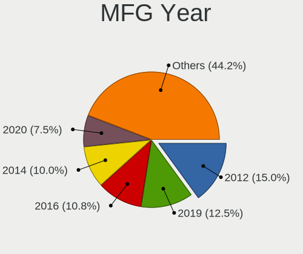

| Year | Notebooks | Percent |
|------|-----------|---------|
| 2019 | 16        | 13.68%  |
| 2012 | 16        | 13.68%  |
| 2016 | 14        | 11.97%  |
| 2014 | 12        | 10.26%  |
| 2020 | 9         | 7.69%   |
| 2018 | 9         | 7.69%   |
| 2015 | 9         | 7.69%   |
| 2017 | 8         | 6.84%   |
| 2013 | 7         | 5.98%   |
| 2010 | 7         | 5.98%   |
| 2011 | 6         | 5.13%   |
| 2021 | 2         | 1.71%   |
| 2008 | 2         | 1.71%   |

Form Factor
-----------

Physical design of the computer

| Name     | Notebooks | Percent |
|----------|-----------|---------|
| Notebook | 117       | 100%    |

Secure Boot
-----------

Enabled or disabled

| State    | Notebooks | Percent |
|----------|-----------|---------|
| Disabled | 104       | 88.14%  |
| Enabled  | 14        | 11.86%  |

Coreboot
--------

Have coreboot on board

| Used | Notebooks | Percent |
|------|-----------|---------|
| No   | 117       | 100%    |

RAM Size
--------

Total RAM memory

| Size in GB  | Notebooks | Percent |
|-------------|-----------|---------|
| 4.01-8.0    | 44        | 37.61%  |
| 16.01-24.0  | 23        | 19.66%  |
| 3.01-4.0    | 21        | 17.95%  |
| 32.01-64.0  | 13        | 11.11%  |
| 8.01-16.0   | 13        | 11.11%  |
| 24.01-32.0  | 1         | 0.85%   |
| 64.01-256.0 | 1         | 0.85%   |
| 1.01-2.0    | 1         | 0.85%   |

RAM Used
--------

Used RAM memory

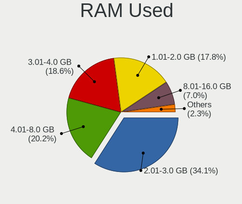

| Used GB    | Notebooks | Percent |
|------------|-----------|---------|
| 2.01-3.0   | 44        | 34.92%  |
| 4.01-8.0   | 25        | 19.84%  |
| 3.01-4.0   | 24        | 19.05%  |
| 1.01-2.0   | 21        | 16.67%  |
| 8.01-16.0  | 9         | 7.14%   |
| 0.51-1.0   | 2         | 1.59%   |
| 24.01-32.0 | 1         | 0.79%   |

Total Drives
------------

Number of drives on board

| Drives | Notebooks | Percent |
|--------|-----------|---------|
| 1      | 84        | 71.79%  |
| 2      | 26        | 22.22%  |
| 3      | 4         | 3.42%   |
| 4      | 3         | 2.56%   |

Has CD-ROM
----------

Has CD-ROM on board

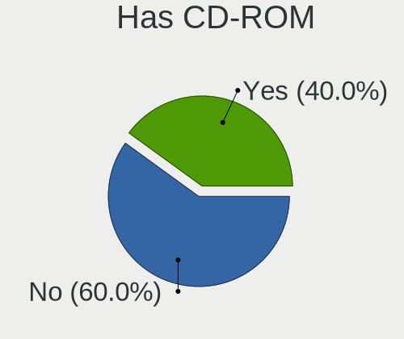

| Presented | Notebooks | Percent |
|-----------|-----------|---------|
| No        | 72        | 61.54%  |
| Yes       | 45        | 38.46%  |

Has Ethernet
------------

Has Ethernet on board

| Presented | Notebooks | Percent |
|-----------|-----------|---------|
| Yes       | 102       | 87.18%  |
| No        | 15        | 12.82%  |

Has WiFi
--------

Has WiFi module

| Presented | Notebooks | Percent |
|-----------|-----------|---------|
| Yes       | 116       | 99.15%  |
| No        | 1         | 0.85%   |

Has Bluetooth
-------------

Has Bluetooth module

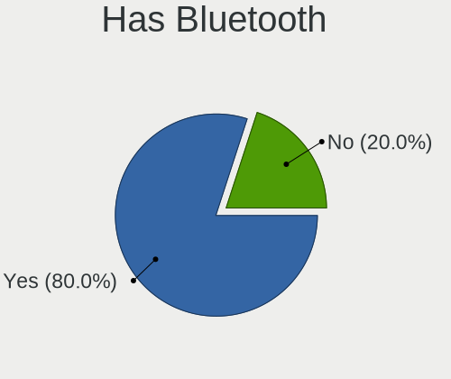

| Presented | Notebooks | Percent |
|-----------|-----------|---------|
| Yes       | 94        | 80.34%  |
| No        | 23        | 19.66%  |

Location
--------

Country
-------

Geographic location (country)

| Country      | Notebooks | Percent |
|--------------|-----------|---------|
| USA          | 21        | 17.8%   |
| Germany      | 12        | 10.17%  |
| UK           | 7         | 5.93%   |
| Brazil       | 7         | 5.93%   |
| Sweden       | 5         | 4.24%   |
| India        | 5         | 4.24%   |
| Belgium      | 5         | 4.24%   |
| Russia       | 4         | 3.39%   |
| Mexico       | 4         | 3.39%   |
| France       | 4         | 3.39%   |
| China        | 4         | 3.39%   |
| Spain        | 3         | 2.54%   |
| South Korea  | 3         | 2.54%   |
| Italy        | 3         | 2.54%   |
| Canada       | 3         | 2.54%   |
| Turkey       | 2         | 1.69%   |
| Peru         | 2         | 1.69%   |
| Norway       | 2         | 1.69%   |
| Netherlands  | 2         | 1.69%   |
| Indonesia    | 2         | 1.69%   |
| Austria      | 2         | 1.69%   |
| Vietnam      | 1         | 0.85%   |
| Ukraine      | 1         | 0.85%   |
| South Africa | 1         | 0.85%   |
| Morocco      | 1         | 0.85%   |
| Malaysia     | 1         | 0.85%   |
| Lithuania    | 1         | 0.85%   |
| Israel       | 1         | 0.85%   |
| Ireland      | 1         | 0.85%   |
| Greece       | 1         | 0.85%   |
| Egypt        | 1         | 0.85%   |
| Burkina Faso | 1         | 0.85%   |
| Bulgaria     | 1         | 0.85%   |
| Belarus      | 1         | 0.85%   |
| Bangladesh   | 1         | 0.85%   |
| Argentina    | 1         | 0.85%   |
| Afghanistan  | 1         | 0.85%   |

City
----

Geographic location (city)

| City            | Notebooks | Percent |
|-----------------|-----------|---------|
| Sollentuna      | 2         | 1.64%   |
| Sao Paulo       | 2         | 1.64%   |
| Munich          | 2         | 1.64%   |
| Moscow          | 2         | 1.64%   |
| Mexico City     | 2         | 1.64%   |
| Lima            | 2         | 1.64%   |
| Denver          | 2         | 1.64%   |
| Zirndorf        | 1         | 0.82%   |
| Yeonsu-gu       | 1         | 0.82%   |
| Yekaterinburg   | 1         | 0.82%   |
| Yangpu          | 1         | 0.82%   |
| Xuhui           | 1         | 0.82%   |
| Wheeling        | 1         | 0.82%   |
| Vilnius         | 1         | 0.82%   |
| Viladecans      | 1         | 0.82%   |
| Vancouver       | 1         | 0.82%   |
| Utrecht         | 1         | 0.82%   |
| Turnhout        | 1         | 0.82%   |
| Touget          | 1         | 0.82%   |
| Toronto         | 1         | 0.82%   |
| Tolosa          | 1         | 0.82%   |
| Tel Aviv        | 1         | 0.82%   |
| Southend-on-Sea | 1         | 0.82%   |
| Sofia           | 1         | 0.82%   |
| Sleman          | 1         | 0.82%   |
| Skreia          | 1         | 0.82%   |
| Sillod          | 1         | 0.82%   |
| Sheffield       | 1         | 0.82%   |
| Shah Alam       | 1         | 0.82%   |
| Seoul           | 1         | 0.82%   |
| San Antonio     | 1         | 0.82%   |
| Salé           | 1         | 0.82%   |
| Rethymno        | 1         | 0.82%   |
| Puebla          | 1         | 0.82%   |
| Portland        | 1         | 0.82%   |
| Port Elizabeth  | 1         | 0.82%   |
| Plano           | 1         | 0.82%   |
| Pirganj         | 1         | 0.82%   |
| Piacenza        | 1         | 0.82%   |
| Phoenix         | 1         | 0.82%   |

Drives
------

Drive Vendor
------------

Hard drive vendors

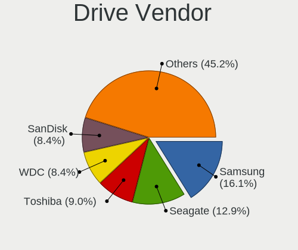

| Vendor                  | Notebooks | Drives | Percent |
|-------------------------|-----------|--------|---------|
| Samsung Electronics     | 25        | 36     | 16.45%  |
| Seagate                 | 20        | 23     | 13.16%  |
| WDC                     | 13        | 16     | 8.55%   |
| Toshiba                 | 13        | 16     | 8.55%   |
| SanDisk                 | 13        | 14     | 8.55%   |
| Unknown                 | 10        | 12     | 6.58%   |
| Kingston                | 8         | 9      | 5.26%   |
| HGST                    | 6         | 7      | 3.95%   |
| Crucial                 | 6         | 7      | 3.95%   |
| Intel                   | 5         | 6      | 3.29%   |
| SK hynix                | 4         | 4      | 2.63%   |
| Hitachi                 | 3         | 4      | 1.97%   |
| SPCC                    | 2         | 2      | 1.32%   |
| Micron Technology       | 2         | 2      | 1.32%   |
| LITEON                  | 2         | 3      | 1.32%   |
| Lenovo                  | 2         | 3      | 1.32%   |
| KIOXIA                  | 2         | 3      | 1.32%   |
| A-DATA Technology       | 2         | 2      | 1.32%   |
| XrayDisk                | 1         | 1      | 0.66%   |
| Union Memory (Shenzhen) | 1         | 1      | 0.66%   |
| Union Memory            | 1         | 1      | 0.66%   |
| UMIS                    | 1         | 1      | 0.66%   |
| Transcend               | 1         | 2      | 0.66%   |
| SSD                     | 1         | 1      | 0.66%   |
| Silicon Motion          | 1         | 1      | 0.66%   |
| Plextor                 | 1         | 1      | 0.66%   |
| LITEONIT                | 1         | 1      | 0.66%   |
| Lexar                   | 1         | 1      | 0.66%   |
| JetFlash                | 1         | 1      | 0.66%   |
| Biostar                 | 1         | 1      | 0.66%   |
| Apple                   | 1         | 1      | 0.66%   |
| 980Plus                 | 1         | 1      | 0.66%   |

Drive Model
-----------

Hard drive models

| Model                                        | Notebooks | Percent |
|----------------------------------------------|-----------|---------|
| Toshiba MQ01ABD100 1TB                       | 4         | 2.52%   |
| Seagate ST1000LM035-1RK172 1TB               | 4         | 2.52%   |
| Seagate ST1000LM024 HN-M101MBB 1TB           | 4         | 2.52%   |
| Samsung NVMe SSD Drive 512GB                 | 4         | 2.52%   |
| Unknown MMC Card  32GB                       | 3         | 1.89%   |
| SanDisk NVMe SSD Drive 512GB                 | 3         | 1.89%   |
| Kingston SA400M8240G 240GB SSD               | 3         | 1.89%   |
| Seagate ST500LT012-1DG142 500GB              | 2         | 1.26%   |
| Seagate ST500LM012 HN-M500MBB 500GB          | 2         | 1.26%   |
| SanDisk NVMe SSD Drive 500GB                 | 2         | 1.26%   |
| Samsung SM963 2.5" NVMe PCIe SSD 256GB       | 2         | 1.26%   |
| Samsung MZNLN128HAHQ-000H1 128GB SSD         | 2         | 1.26%   |
| Kingston SA400S37120G 120GB SSD              | 2         | 1.26%   |
| Hitachi HTS547550A9E384 500GB                | 2         | 1.26%   |
| HGST HTS545050A7E380 500GB                   | 2         | 1.26%   |
| XrayDisk SSD 240GB                           | 1         | 0.63%   |
| WDC WDS500G2B0B-00YS70 500GB SSD             | 1         | 0.63%   |
| WDC WDS500G1R0B-68A4Z0 500GB SSD             | 1         | 0.63%   |
| WDC WDS100T2B0A-00SM50 1TB SSD               | 1         | 0.63%   |
| WDC WDS100T1R0A-68A4W0 1TB SSD               | 1         | 0.63%   |
| WDC WD7500BPKX-22HPJT0 752GB                 | 1         | 0.63%   |
| WDC WD5000BEVT-00A0RT0 500GB                 | 1         | 0.63%   |
| WDC WD3200BEKT-60PVMT0 320GB                 | 1         | 0.63%   |
| WDC WD1600BEVT-75ZCT2 160GB                  | 1         | 0.63%   |
| WDC WD10SPZX-24Z10 1TB                       | 1         | 0.63%   |
| WDC WD10SPZX-22Z10T1 1TB                     | 1         | 0.63%   |
| WDC WD10JPVX-60JC3T0 1TB                     | 1         | 0.63%   |
| WDC WD10JPLX-00MBPT0 1TB                     | 1         | 0.63%   |
| WDC WD10JPCX-24UE4T0 1TB                     | 1         | 0.63%   |
| WDC PC SN520 SDAPMUW-512G-1101 512GB         | 1         | 0.63%   |
| Unknown SD02G  2GB                           | 1         | 0.63%   |
| Unknown SD/MMC/MS PRO 64GB                   | 1         | 0.63%   |
| Unknown MMC Card  976MB                      | 1         | 0.63%   |
| Unknown MMC Card  4GB                        | 1         | 0.63%   |
| Unknown MMC Card  33GB                       | 1         | 0.63%   |
| Unknown MMC Card  2GB                        | 1         | 0.63%   |
| Unknown MMC Card  1GB                        | 1         | 0.63%   |
| Unknown 00000  4GB                           | 1         | 0.63%   |
| Union Memory UMIS RPJTJ256MED1OWX 256GB      | 1         | 0.63%   |
| Union Memory (Shenzhen) NVMe SSD Drive 128GB | 1         | 0.63%   |

HDD Vendor
----------

Hard disk drive vendors

| Vendor              | Notebooks | Drives | Percent |
|---------------------|-----------|--------|---------|
| Seagate             | 19        | 22     | 40.43%  |
| WDC                 | 9         | 11     | 19.15%  |
| Toshiba             | 8         | 11     | 17.02%  |
| HGST                | 6         | 7      | 12.77%  |
| Hitachi             | 3         | 4      | 6.38%   |
| Unknown             | 1         | 1      | 2.13%   |
| Samsung Electronics | 1         | 1      | 2.13%   |

SSD Vendor
----------

Solid state drive vendors

| Vendor              | Notebooks | Drives | Percent |
|---------------------|-----------|--------|---------|
| Samsung Electronics | 18        | 25     | 28.57%  |
| Kingston            | 8         | 9      | 12.7%   |
| SanDisk             | 7         | 8      | 11.11%  |
| Crucial             | 5         | 6      | 7.94%   |
| Toshiba             | 4         | 4      | 6.35%   |
| WDC                 | 3         | 4      | 4.76%   |
| Intel               | 3         | 3      | 4.76%   |
| SPCC                | 2         | 2      | 3.17%   |
| SK hynix            | 2         | 2      | 3.17%   |
| LITEON              | 2         | 3      | 3.17%   |
| XrayDisk            | 1         | 1      | 1.59%   |
| Transcend           | 1         | 2      | 1.59%   |
| SSD                 | 1         | 1      | 1.59%   |
| Plextor             | 1         | 1      | 1.59%   |
| LITEONIT            | 1         | 1      | 1.59%   |
| Lenovo              | 1         | 2      | 1.59%   |
| Biostar             | 1         | 1      | 1.59%   |
| Apple               | 1         | 1      | 1.59%   |
| A-DATA Technology   | 1         | 1      | 1.59%   |

Drive Kind
----------

HDD or SSD

| Kind    | Notebooks | Drives | Percent |
|---------|-----------|--------|---------|
| SSD     | 60        | 77     | 40%     |
| HDD     | 46        | 57     | 30.67%  |
| NVMe    | 32        | 36     | 21.33%  |
| MMC     | 9         | 11     | 6%      |
| Unknown | 3         | 3      | 2%      |

Drive Connector
---------------

SATA, SAS, NVMe, etc.

| Type | Notebooks | Drives | Percent |
|------|-----------|--------|---------|
| SATA | 95        | 133    | 68.84%  |
| NVMe | 32        | 36     | 23.19%  |
| MMC  | 9         | 11     | 6.52%   |
| SAS  | 2         | 4      | 1.45%   |

Drive Size
----------

Size of hard drive

| Size in TB | Notebooks | Drives | Percent |
|------------|-----------|--------|---------|
| 0.01-0.5   | 69        | 89     | 65.09%  |
| 0.51-1.0   | 31        | 39     | 29.25%  |
| 1.01-2.0   | 5         | 5      | 4.72%   |
| 3.01-4.0   | 1         | 1      | 0.94%   |

Space Total
-----------

Amount of disk space available on the file system

| Size in GB     | Notebooks | Percent |
|----------------|-----------|---------|
| 251-500        | 37        | 31.62%  |
| 101-250        | 29        | 24.79%  |
| 501-1000       | 20        | 17.09%  |
| 51-100         | 8         | 6.84%   |
| 1001-2000      | 7         | 5.98%   |
| 21-50          | 5         | 4.27%   |
| Unknown        | 4         | 3.42%   |
| 1-20           | 3         | 2.56%   |
| More than 3000 | 2         | 1.71%   |
| 2001-3000      | 2         | 1.71%   |

Space Used
----------

Amount of used disk space

| Used GB   | Notebooks | Percent |
|-----------|-----------|---------|
| 1-20      | 41        | 33.33%  |
| 21-50     | 30        | 24.39%  |
| 51-100    | 20        | 16.26%  |
| 101-250   | 12        | 9.76%   |
| 251-500   | 7         | 5.69%   |
| 501-1000  | 6         | 4.88%   |
| Unknown   | 4         | 3.25%   |
| 1001-2000 | 3         | 2.44%   |

Malfunc. Drives
---------------

Drive models with a malfunction

| Model                          | Notebooks | Drives | Percent |
|--------------------------------|-----------|--------|---------|
| Toshiba MQ01ABD100 1TB         | 2         | 4      | 28.57%  |
| Seagate ST9750420AS 752GB      | 1         | 1      | 14.29%  |
| Seagate ST1000LM014-1EJ164 1TB | 1         | 1      | 14.29%  |
| SanDisk SSD PLUS 480GB         | 1         | 1      | 14.29%  |
| LITEON CV8-8E128-HP 128GB SSD  | 1         | 1      | 14.29%  |
| Hitachi HTS545032B9A302 320GB  | 1         | 1      | 14.29%  |

Malfunc. Drive Vendor
---------------------

Vendors of faulty drives

| Vendor  | Notebooks | Drives | Percent |
|---------|-----------|--------|---------|
| Toshiba | 2         | 4      | 28.57%  |
| Seagate | 2         | 2      | 28.57%  |
| SanDisk | 1         | 1      | 14.29%  |
| LITEON  | 1         | 1      | 14.29%  |
| Hitachi | 1         | 1      | 14.29%  |

Malfunc. HDD Vendor
-------------------

Vendors of faulty HDD drives

| Vendor  | Notebooks | Drives | Percent |
|---------|-----------|--------|---------|
| Toshiba | 2         | 4      | 40%     |
| Seagate | 2         | 2      | 40%     |
| Hitachi | 1         | 1      | 20%     |

Malfunc. Drive Kind
-------------------

Kinds of faulty drives

| Kind | Notebooks | Drives | Percent |
|------|-----------|--------|---------|
| HDD  | 5         | 7      | 71.43%  |
| SSD  | 2         | 2      | 28.57%  |

Failed Drives
-------------

Failed drive models

| Model                        | Notebooks | Drives | Percent |
|------------------------------|-----------|--------|---------|
| WDC WD5000BEVT-00A0RT0 500GB | 1         | 1      | 100%    |

Failed Drive Vendor
-------------------

Failed drive vendors

| Vendor | Notebooks | Drives | Percent |
|--------|-----------|--------|---------|
| WDC    | 1         | 1      | 100%    |

Drive Status
------------

Number of failed and malfunc. drives

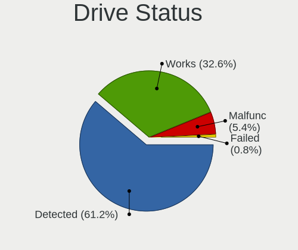

| Status   | Notebooks | Drives | Percent |
|----------|-----------|--------|---------|
| Detected | 77        | 126    | 61.11%  |
| Works    | 41        | 48     | 32.54%  |
| Malfunc  | 7         | 9      | 5.56%   |
| Failed   | 1         | 1      | 0.79%   |

Storage controller
------------------

Storage Vendor
--------------

Storage controller vendors

| Vendor                       | Notebooks | Percent |
|------------------------------|-----------|---------|
| Intel                        | 104       | 73.24%  |
| Samsung Electronics          | 10        | 7.04%   |
| SanDisk                      | 6         | 4.23%   |
| AMD                          | 6         | 4.23%   |
| Union Memory (Shenzhen)      | 3         | 2.11%   |
| SK hynix                     | 2         | 1.41%   |
| Micron Technology            | 2         | 1.41%   |
| KIOXIA                       | 2         | 1.41%   |
| Toshiba America Info Systems | 1         | 0.7%    |
| Silicon Motion               | 1         | 0.7%    |
| Shenzhen Longsys Electronics | 1         | 0.7%    |
| Micron/Crucial Technology    | 1         | 0.7%    |
| Marvell Technology Group     | 1         | 0.7%    |
| Lenovo                       | 1         | 0.7%    |
| ADATA Technology             | 1         | 0.7%    |

Storage Model
-------------

Storage controller models

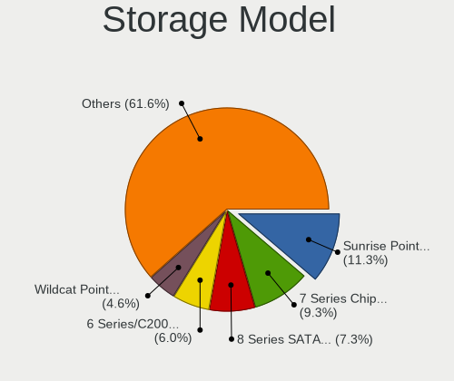

| Model                                                                          | Notebooks | Percent |
|--------------------------------------------------------------------------------|-----------|---------|
| Intel Sunrise Point-LP SATA Controller [AHCI mode]                             | 17        | 11.64%  |
| Intel 7 Series Chipset Family 6-port SATA Controller [AHCI mode]               | 13        | 8.9%    |
| Intel 8 Series SATA Controller 1 [AHCI mode]                                   | 11        | 7.53%   |
| Intel 6 Series/C200 Series Chipset Family 6 port Mobile SATA AHCI Controller   | 9         | 6.16%   |
| Intel Wildcat Point-LP SATA Controller [AHCI Mode]                             | 6         | 4.11%   |
| Intel Cannon Lake Mobile PCH SATA AHCI Controller                              | 6         | 4.11%   |
| Intel 82801 Mobile SATA Controller [RAID mode]                                 | 6         | 4.11%   |
| Intel 5 Series/3400 Series Chipset 6 port SATA AHCI Controller                 | 6         | 4.11%   |
| AMD FCH SATA Controller [AHCI mode]                                            | 6         | 4.11%   |
| Intel 8 Series/C220 Series Chipset Family 6-port SATA Controller 1 [AHCI mode] | 5         | 3.42%   |
| Samsung NVMe SSD Controller SM981/PM981/PM983                                  | 4         | 2.74%   |
| Union Memory (Shenzhen) Non-Volatile memory controller                         | 3         | 2.05%   |
| Intel Q170/Q150/B150/H170/H110/Z170/CM236 Chipset SATA Controller [AHCI Mode]  | 3         | 2.05%   |
| Intel HM170/QM170 Chipset SATA Controller [AHCI Mode]                          | 3         | 2.05%   |
| Intel Cannon Point-LP SATA Controller [AHCI Mode]                              | 3         | 2.05%   |
| Intel 400 Series Chipset Family SATA AHCI Controller                           | 3         | 2.05%   |
| SanDisk WD Blue SN550 NVMe SSD                                                 | 2         | 1.37%   |
| Samsung NVMe SSD Controller SM951/PM951                                        | 2         | 1.37%   |
| Samsung NVMe SSD Controller 980                                                | 2         | 1.37%   |
| Micron Non-Volatile memory controller                                          | 2         | 1.37%   |
| KIOXIA NVMe SSD Controller BG4                                                 | 2         | 1.37%   |
| Intel Volume Management Device NVMe RAID Controller                            | 2         | 1.37%   |
| Intel Ice Lake-LP SATA Controller [AHCI mode]                                  | 2         | 1.37%   |
| Intel Atom Processor E3800 Series SATA AHCI Controller                         | 2         | 1.37%   |
| Intel 5 Series/3400 Series Chipset 4 port SATA AHCI Controller                 | 2         | 1.37%   |
| Toshiba America Info Systems XG6 NVMe SSD Controller                           | 1         | 0.68%   |
| SK hynix PC401 NVMe Solid State Drive 256GB                                    | 1         | 0.68%   |
| SK hynix BC501 NVMe Solid State Drive                                          | 1         | 0.68%   |
| Silicon Motion SM2263EN/SM2263XT SSD Controller                                | 1         | 0.68%   |
| Shenzhen Longsys Non-Volatile memory controller                                | 1         | 0.68%   |
| SanDisk WD Black SN750 / PC SN730 NVMe SSD                                     | 1         | 0.68%   |
| SanDisk WD Black 2018/SN750 / PC SN720 NVMe SSD                                | 1         | 0.68%   |
| SanDisk PC SN520 NVMe SSD                                                      | 1         | 0.68%   |
| SanDisk Non-Volatile memory controller                                         | 1         | 0.68%   |
| Samsung NVMe SSD Controller SM961/PM961/SM963                                  | 1         | 0.68%   |
| Samsung Electronics SATA controller                                            | 1         | 0.68%   |
| Micron/Crucial P2 NVMe PCIe SSD                                                | 1         | 0.68%   |
| Marvell Group 88SS9183 PCIe SSD Controller                                     | 1         | 0.68%   |
| Lenovo Non-Volatile memory controller                                          | 1         | 0.68%   |
| Intel Tiger Lake-LP SATA Controller                                            | 1         | 0.68%   |

Storage Kind
------------

Kind of storage controller (IDE, SATA, NVMe, SAS, ...)

| Kind | Notebooks | Percent |
|------|-----------|---------|
| SATA | 102       | 70.83%  |
| NVMe | 32        | 22.22%  |
| RAID | 8         | 5.56%   |
| IDE  | 2         | 1.39%   |

Processor
---------

CPU Vendor
----------

Processor vendors

| Vendor | Notebooks | Percent |
|--------|-----------|---------|
| Intel  | 111       | 94.87%  |
| AMD    | 6         | 5.13%   |

CPU Model
---------

Processor models

| Model                                         | Notebooks | Percent |
|-----------------------------------------------|-----------|---------|
| Intel Core i7-8550U CPU @ 1.80GHz             | 4         | 3.42%   |
| Intel Core i5-6200U CPU @ 2.30GHz             | 4         | 3.42%   |
| Intel Core i7-8565U CPU @ 1.80GHz             | 3         | 2.56%   |
| Intel Core i5-8250U CPU @ 1.60GHz             | 3         | 2.56%   |
| Intel Core i5-6300U CPU @ 2.40GHz             | 3         | 2.56%   |
| Intel Core i5-5200U CPU @ 2.20GHz             | 3         | 2.56%   |
| Intel Core i5-4300U CPU @ 1.90GHz             | 3         | 2.56%   |
| Intel Core i5-4210U CPU @ 1.70GHz             | 3         | 2.56%   |
| Intel Core i7-9750H CPU @ 2.60GHz             | 2         | 1.71%   |
| Intel Core i7-6820HQ CPU @ 2.70GHz            | 2         | 1.71%   |
| Intel Core i7-4700MQ CPU @ 2.40GHz            | 2         | 1.71%   |
| Intel Core i7-3630QM CPU @ 2.40GHz            | 2         | 1.71%   |
| Intel Core i7-10750H CPU @ 2.60GHz            | 2         | 1.71%   |
| Intel Core i5-3320M CPU @ 2.60GHz             | 2         | 1.71%   |
| Intel Core i5-2410M CPU @ 2.30GHz             | 2         | 1.71%   |
| Intel Core i3-2370M CPU @ 2.40GHz             | 2         | 1.71%   |
| Intel Core i3-2330M CPU @ 2.20GHz             | 2         | 1.71%   |
| Intel 11th Gen Core i7-1165G7 @ 2.80GHz       | 2         | 1.71%   |
| AMD Ryzen 7 3700U with Radeon Vega Mobile Gfx | 2         | 1.71%   |
| Intel Xeon CPU E3-1505M v5 @ 2.80GHz          | 1         | 0.85%   |
| Intel Pentium CPU P6200 @ 2.13GHz             | 1         | 0.85%   |
| Intel Pentium CPU N3540 @ 2.16GHz             | 1         | 0.85%   |
| Intel Pentium CPU 3825U @ 1.90GHz             | 1         | 0.85%   |
| Intel Pentium CPU 2117U @ 1.80GHz             | 1         | 0.85%   |
| Intel Core i9-9980HK CPU @ 2.40GHz            | 1         | 0.85%   |
| Intel Core i7-8850H CPU @ 2.60GHz             | 1         | 0.85%   |
| Intel Core i7-8750H CPU @ 2.20GHz             | 1         | 0.85%   |
| Intel Core i7-8650U CPU @ 1.90GHz             | 1         | 0.85%   |
| Intel Core i7-7700HQ CPU @ 2.80GHz            | 1         | 0.85%   |
| Intel Core i7-7500U CPU @ 2.70GHz             | 1         | 0.85%   |
| Intel Core i7-6600U CPU @ 2.60GHz             | 1         | 0.85%   |
| Intel Core i7-6500U CPU @ 2.50GHz             | 1         | 0.85%   |
| Intel Core i7-5600U CPU @ 2.60GHz             | 1         | 0.85%   |
| Intel Core i7-4910MQ CPU @ 2.90GHz            | 1         | 0.85%   |
| Intel Core i7-4900MQ CPU @ 2.80GHz            | 1         | 0.85%   |
| Intel Core i7-4810MQ CPU @ 2.80GHz            | 1         | 0.85%   |
| Intel Core i7-4720HQ CPU @ 2.60GHz            | 1         | 0.85%   |
| Intel Core i7-4600U CPU @ 2.10GHz             | 1         | 0.85%   |
| Intel Core i7-4510U CPU @ 2.00GHz             | 1         | 0.85%   |
| Intel Core i7-3740QM CPU @ 2.70GHz            | 1         | 0.85%   |

CPU Model Family
----------------

Processor model prefix

| Model            | Notebooks | Percent |
|------------------|-----------|---------|
| Intel Core i7    | 42        | 35.9%   |
| Intel Core i5    | 42        | 35.9%   |
| Intel Core i3    | 11        | 9.4%    |
| Other            | 5         | 4.27%   |
| Intel Pentium    | 4         | 3.42%   |
| Intel Celeron    | 4         | 3.42%   |
| Intel Core 2 Duo | 2         | 1.71%   |
| AMD Ryzen 7      | 2         | 1.71%   |
| Intel Xeon       | 1         | 0.85%   |
| Intel Core i9    | 1         | 0.85%   |
| AMD Ryzen 5      | 1         | 0.85%   |
| AMD Ryzen 3      | 1         | 0.85%   |
| AMD A4           | 1         | 0.85%   |

CPU Cores
---------

Number of processor cores

| Number | Notebooks | Percent |
|--------|-----------|---------|
| 2      | 65        | 55.56%  |
| 4      | 43        | 36.75%  |
| 6      | 8         | 6.84%   |
| 8      | 1         | 0.85%   |

CPU Sockets
-----------

Number of sockets

| Number | Notebooks | Percent |
|--------|-----------|---------|
| 1      | 117       | 100%    |

CPU Threads
-----------

Threads per core (Hyper-Threading)

| Number | Notebooks | Percent |
|--------|-----------|---------|
| 2      | 102       | 87.18%  |
| 1      | 15        | 12.82%  |

CPU Op-Modes
------------

CPU Operation Modes (32-bit, 64-bit)

| Op mode        | Notebooks | Percent |
|----------------|-----------|---------|
| 32-bit, 64-bit | 116       | 98.31%  |
| Unknown        | 2         | 1.69%   |

CPU Microcode
-------------

Microcode number

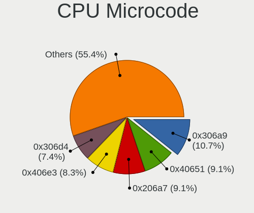

| Number     | Notebooks | Percent |
|------------|-----------|---------|
| 0x306a9    | 12        | 10.17%  |
| 0x40651    | 11        | 9.32%   |
| 0x206a7    | 11        | 9.32%   |
| 0x406e3    | 10        | 8.47%   |
| 0x806ea    | 8         | 6.78%   |
| 0x306d4    | 8         | 6.78%   |
| 0x306c3    | 6         | 5.08%   |
| 0x806ec    | 5         | 4.24%   |
| 0x20655    | 5         | 4.24%   |
| 0xa0652    | 4         | 3.39%   |
| 0x906ea    | 4         | 3.39%   |
| 0x806c1    | 4         | 3.39%   |
| 0x506e3    | 4         | 3.39%   |
| Unknown    | 4         | 3.39%   |
| 0x806e9    | 3         | 2.54%   |
| 0x706e5    | 3         | 2.54%   |
| 0x906ed    | 2         | 1.69%   |
| 0x906e9    | 2         | 1.69%   |
| 0x30678    | 2         | 1.69%   |
| 0x106e5    | 2         | 1.69%   |
| 0x06006705 | 2         | 1.69%   |
| 0x406c3    | 1         | 0.85%   |
| 0x20652    | 1         | 0.85%   |
| 0x1067a    | 1         | 0.85%   |
| 0x10676    | 1         | 0.85%   |
| 0x08108109 | 1         | 0.85%   |
| 0x08108102 | 1         | 0.85%   |

CPU Microarch
-------------

Microarchitecture

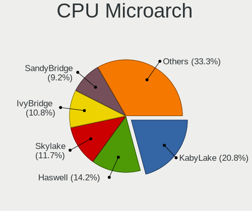

| Name        | Notebooks | Percent |
|-------------|-----------|---------|
| KabyLake    | 25        | 21.37%  |
| Haswell     | 17        | 14.53%  |
| Skylake     | 14        | 11.97%  |
| IvyBridge   | 12        | 10.26%  |
| SandyBridge | 11        | 9.4%    |
| Broadwell   | 8         | 6.84%   |
| Westmere    | 6         | 5.13%   |
| TigerLake   | 4         | 3.42%   |
| CometLake   | 4         | 3.42%   |
| Zen+        | 3         | 2.56%   |
| Silvermont  | 3         | 2.56%   |
| IceLake     | 3         | 2.56%   |
| Penryn      | 2         | 1.71%   |
| Nehalem     | 2         | 1.71%   |
| Excavator   | 2         | 1.71%   |
| Zen 2       | 1         | 0.85%   |

Graphics
--------

GPU Vendor
----------

Vendors of graphics cards

| Vendor | Notebooks | Percent |
|--------|-----------|---------|
| Intel  | 100       | 63.69%  |
| Nvidia | 40        | 25.48%  |
| AMD    | 17        | 10.83%  |

GPU Model
---------

Graphics card models

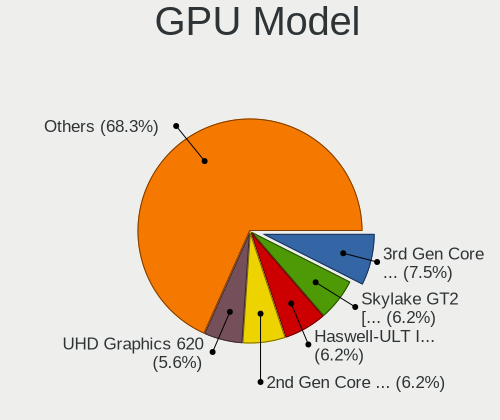

| Model                                                                                 | Notebooks | Percent |
|---------------------------------------------------------------------------------------|-----------|---------|
| Intel 3rd Gen Core processor Graphics Controller                                      | 11        | 7.01%   |
| Intel Skylake GT2 [HD Graphics 520]                                                   | 10        | 6.37%   |
| Intel Haswell-ULT Integrated Graphics Controller                                      | 10        | 6.37%   |
| Intel 2nd Generation Core Processor Family Integrated Graphics Controller             | 10        | 6.37%   |
| Intel UHD Graphics 620                                                                | 9         | 5.73%   |
| Intel HD Graphics 5500                                                                | 6         | 3.82%   |
| Intel 4th Gen Core Processor Integrated Graphics Controller                           | 5         | 3.18%   |
| Intel WhiskeyLake-U GT2 [UHD Graphics 620]                                            | 4         | 2.55%   |
| Intel TigerLake-LP GT2 [Iris Xe Graphics]                                             | 4         | 2.55%   |
| Intel Core Processor Integrated Graphics Controller                                   | 4         | 2.55%   |
| Intel CometLake-H GT2 [UHD Graphics]                                                  | 4         | 2.55%   |
| Intel CoffeeLake-H GT2 [UHD Graphics 630]                                             | 4         | 2.55%   |
| AMD Topaz XT [Radeon R7 M260/M265 / M340/M360 / M440/M445 / 530/535 / 620/625 Mobile] | 4         | 2.55%   |
| Nvidia TU117M [GeForce GTX 1650 Ti Mobile]                                            | 3         | 1.91%   |
| Nvidia TU117M [GeForce GTX 1650 Mobile / Max-Q]                                       | 3         | 1.91%   |
| Nvidia GF117M [GeForce 610M/710M/810M/820M / GT 620M/625M/630M/720M]                  | 3         | 1.91%   |
| Intel HD Graphics 620                                                                 | 3         | 1.91%   |
| AMD Picasso/Raven 2 [Radeon Vega Series / Radeon Vega Mobile Series]                  | 3         | 1.91%   |
| Nvidia GM108M [GeForce 930MX]                                                         | 2         | 1.27%   |
| Nvidia GM108M [GeForce 840M]                                                          | 2         | 1.27%   |
| Nvidia GK208BM [GeForce 920M]                                                         | 2         | 1.27%   |
| Nvidia GK107GLM [Quadro K1100M]                                                       | 2         | 1.27%   |
| Intel HD Graphics 630                                                                 | 2         | 1.27%   |
| Intel HD Graphics 530                                                                 | 2         | 1.27%   |
| Intel Atom Processor Z36xxx/Z37xxx Series Graphics & Display                          | 2         | 1.27%   |
| AMD Stoney [Radeon R2/R3/R4/R5 Graphics]                                              | 2         | 1.27%   |
| AMD RV730/M96 [Mobility Radeon HD 4650/5165]                                          | 2         | 1.27%   |
| Nvidia TU117GLM [Quadro T1000 Mobile]                                                 | 1         | 0.64%   |
| Nvidia TU106M [GeForce RTX 2070 Mobile / Max-Q Refresh]                               | 1         | 0.64%   |
| Nvidia GT218M [GeForce 310M]                                                          | 1         | 0.64%   |
| Nvidia GP107M [GeForce GTX 1050 Ti Mobile]                                            | 1         | 0.64%   |
| Nvidia GP107M [GeForce GTX 1050 Mobile]                                               | 1         | 0.64%   |
| Nvidia GP107GLM [Quadro P620]                                                         | 1         | 0.64%   |
| Nvidia GP104M [GeForce GTX 1070 Mobile]                                               | 1         | 0.64%   |
| Nvidia GM204M [GeForce GTX 980M]                                                      | 1         | 0.64%   |
| Nvidia GM108M [GeForce MX130]                                                         | 1         | 0.64%   |
| Nvidia GM108M [GeForce 940M]                                                          | 1         | 0.64%   |
| Nvidia GM107M [GeForce GTX 850M]                                                      | 1         | 0.64%   |
| Nvidia GM107GLM [Quadro M2000M]                                                       | 1         | 0.64%   |
| Nvidia GM107GLM [Quadro M1200 Mobile]                                                 | 1         | 0.64%   |

GPU Combo
---------

Combinations of graphics cards

| Name           | Notebooks | Percent |
|----------------|-----------|---------|
| 1 x Intel      | 61        | 52.14%  |
| Intel + Nvidia | 31        | 26.5%   |
| 1 x Nvidia     | 8         | 6.84%   |
| Intel + AMD    | 8         | 6.84%   |
| 1 x AMD        | 8         | 6.84%   |
| AMD + Nvidia   | 1         | 0.85%   |

GPU Driver
----------

Free vs proprietary

| Driver      | Notebooks | Percent |
|-------------|-----------|---------|
| Free        | 111       | 94.87%  |
| Proprietary | 3         | 2.56%   |
| Unknown     | 3         | 2.56%   |

GPU Memory
----------

Total video memory

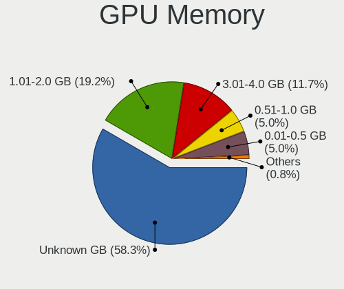

| Size in GB | Notebooks | Percent |
|------------|-----------|---------|
| Unknown    | 69        | 58.97%  |
| 1.01-2.0   | 23        | 19.66%  |
| 3.01-4.0   | 14        | 11.97%  |
| 0.51-1.0   | 5         | 4.27%   |
| 0.01-0.5   | 5         | 4.27%   |
| 7.01-8.0   | 1         | 0.85%   |

Monitor
-------

Monitor Vendor
--------------

Monitor vendors

| Vendor                  | Notebooks | Percent |
|-------------------------|-----------|---------|
| AU Optronics            | 28        | 20.14%  |
| Chimei Innolux          | 23        | 16.55%  |
| LG Display              | 19        | 13.67%  |
| Samsung Electronics     | 17        | 12.23%  |
| BOE                     | 17        | 12.23%  |
| Dell                    | 7         | 5.04%   |
| Panasonic               | 4         | 2.88%   |
| Sharp                   | 3         | 2.16%   |
| Lenovo                  | 3         | 2.16%   |
| Acer                    | 3         | 2.16%   |
| PANDA                   | 2         | 1.44%   |
| Hewlett-Packard         | 2         | 1.44%   |
| Goldstar                | 2         | 1.44%   |
| Vizio                   | 1         | 0.72%   |
| Philips                 | 1         | 0.72%   |
| Onkyo                   | 1         | 0.72%   |
| MSI                     | 1         | 0.72%   |
| InfoVision              | 1         | 0.72%   |
| Gateway                 | 1         | 0.72%   |
| Chi Mei Optoelectronics | 1         | 0.72%   |
| Apple                   | 1         | 0.72%   |
| AOC                     | 1         | 0.72%   |

Monitor Model
-------------

Monitor models

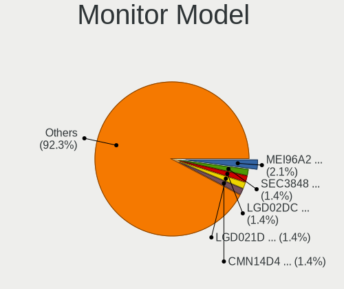

| Model                                                                 | Notebooks | Percent |
|-----------------------------------------------------------------------|-----------|---------|
| Panasonic LCD Monitor MEI96A2 2880x1620 344x193mm 15.5-inch           | 3         | 2.13%   |
| LG Display LCD Monitor LGD02DC 1366x768 344x194mm 15.5-inch           | 2         | 1.42%   |
| LG Display LCD Monitor LGD021D 1600x900 382x215mm 17.3-inch           | 2         | 1.42%   |
| Chimei Innolux LCD Monitor CMN14D4 1920x1080 309x173mm 13.9-inch      | 2         | 1.42%   |
| AU Optronics LCD Monitor AUO38ED 1920x1080 344x193mm 15.5-inch        | 2         | 1.42%   |
| AU Optronics LCD Monitor AUO26EC 1366x768 344x193mm 15.5-inch         | 2         | 1.42%   |
| Vizio E370VL VIZ0070 1920x1080 820x461mm 37.0-inch                    | 1         | 0.71%   |
| Sharp LCD Monitor SHP14B9 3840x2160 344x194mm 15.5-inch               | 1         | 0.71%   |
| Sharp LCD Monitor SHP149A 1920x1080 344x194mm 15.5-inch               | 1         | 0.71%   |
| Sharp LCD Monitor SHP1453 1920x1080 346x194mm 15.6-inch               | 1         | 0.71%   |
| Samsung Electronics SyncMaster SAM022B 1280x1024 340x270mm 17.1-inch  | 1         | 0.71%   |
| Samsung Electronics SMBX2450 SAM0721 1920x1080 530x300mm 24.0-inch    | 1         | 0.71%   |
| Samsung Electronics S22B420 SAM0979 1680x1050 473x291mm 21.9-inch     | 1         | 0.71%   |
| Samsung Electronics LU28R55 SAM1017 3840x2160 630x360mm 28.6-inch     | 1         | 0.71%   |
| Samsung Electronics LCD Monitor SEC544B 1600x900 382x214mm 17.2-inch  | 1         | 0.71%   |
| Samsung Electronics LCD Monitor SEC5441 1366x768 344x194mm 15.5-inch  | 1         | 0.71%   |
| Samsung Electronics LCD Monitor SEC5341 1366x768 344x193mm 15.5-inch  | 1         | 0.71%   |
| Samsung Electronics LCD Monitor SEC434E 1600x900 310x174mm 14.0-inch  | 1         | 0.71%   |
| Samsung Electronics LCD Monitor SEC384A 1366x768 344x194mm 15.5-inch  | 1         | 0.71%   |
| Samsung Electronics LCD Monitor SEC3848 1920x1200 367x230mm 17.1-inch | 1         | 0.71%   |
| Samsung Electronics LCD Monitor SEC3646 1680x1050 330x210mm 15.4-inch | 1         | 0.71%   |
| Samsung Electronics LCD Monitor SEC324C 1600x900 310x174mm 14.0-inch  | 1         | 0.71%   |
| Samsung Electronics LCD Monitor SEC3245 1366x768 344x194mm 15.5-inch  | 1         | 0.71%   |
| Samsung Electronics LCD Monitor SEC314C 1920x1080 344x194mm 15.5-inch | 1         | 0.71%   |
| Samsung Electronics LCD Monitor SEC3147 1600x900 332x187mm 15.0-inch  | 1         | 0.71%   |
| Samsung Electronics LCD Monitor SDC834E 1920x1080 309x174mm 14.0-inch | 1         | 0.71%   |
| Samsung Electronics LCD Monitor SDC364D 1920x1080 309x174mm 14.0-inch | 1         | 0.71%   |
| Samsung Electronics C27F390 SAM0D32 1920x1080 598x336mm 27.0-inch     | 1         | 0.71%   |
| Philips PHL 278E9Q PHLC17F 1920x1080 598x336mm 27.0-inch              | 1         | 0.71%   |
| PANDA LCD Monitor NCP0035 1920x1080 309x174mm 14.0-inch               | 1         | 0.71%   |
| PANDA LCD Monitor NCP002A 1920x1080 344x194mm 15.5-inch               | 1         | 0.71%   |
| Panasonic TV MEIC122 1280x720 697x392mm 31.5-inch                     | 1         | 0.71%   |
| Onkyo AV Receiver ONK1151 1920x1080                                   | 1         | 0.71%   |
| MSI Optix G241VC MSI1462 1920x1080 521x294mm 23.6-inch                | 1         | 0.71%   |
| LG Display LCD Monitor LGD065A 1920x1080 344x194mm 15.5-inch          | 1         | 0.71%   |
| LG Display LCD Monitor LGD061C 1920x1080 294x165mm 13.3-inch          | 1         | 0.71%   |
| LG Display LCD Monitor LGD05E5 1920x1080 340x190mm 15.3-inch          | 1         | 0.71%   |
| LG Display LCD Monitor LGD05D5 1920x1080 344x194mm 15.5-inch          | 1         | 0.71%   |
| LG Display LCD Monitor LGD05D1 1920x1080 344x194mm 15.5-inch          | 1         | 0.71%   |
| LG Display LCD Monitor LGD0490 1920x1080 309x174mm 14.0-inch          | 1         | 0.71%   |

Monitor Resolution
------------------

Monitor screen resolution

| Resolution         | Notebooks | Percent |
|--------------------|-----------|---------|
| 1920x1080 (FHD)    | 63        | 48.09%  |
| 1366x768 (WXGA)    | 36        | 27.48%  |
| 1600x900 (HD+)     | 10        | 7.63%   |
| 3840x2160 (4K)     | 6         | 4.58%   |
| 1680x1050 (WSXGA+) | 4         | 3.05%   |
| 2560x1600          | 2         | 1.53%   |
| 2560x1440 (QHD)    | 2         | 1.53%   |
| 1920x1200 (WUXGA)  | 2         | 1.53%   |
| 1280x800 (WXGA)    | 2         | 1.53%   |
| 1280x1024 (SXGA)   | 2         | 1.53%   |
| 3440x1440          | 1         | 0.76%   |
| 1280x720 (HD)      | 1         | 0.76%   |

Monitor Diagonal
----------------

Diagonal size in inches

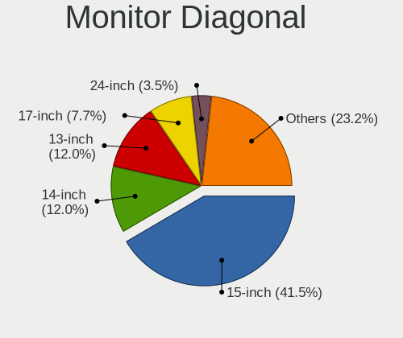

| Inches  | Notebooks | Percent |
|---------|-----------|---------|
| 15      | 60        | 42.86%  |
| 13      | 17        | 12.14%  |
| 14      | 16        | 11.43%  |
| 17      | 13        | 9.29%   |
| 24      | 6         | 4.29%   |
| 23      | 5         | 3.57%   |
| 12      | 5         | 3.57%   |
| 21      | 4         | 2.86%   |
| 27      | 3         | 2.14%   |
| 11      | 2         | 1.43%   |
| Unknown | 2         | 1.43%   |
| 42      | 1         | 0.71%   |
| 34      | 1         | 0.71%   |
| 32      | 1         | 0.71%   |
| 31      | 1         | 0.71%   |
| 29      | 1         | 0.71%   |
| 28      | 1         | 0.71%   |
| 20      | 1         | 0.71%   |

Monitor Width
-------------

Physical width

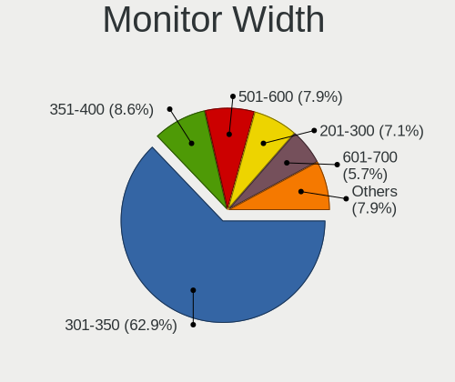

| Width in mm | Notebooks | Percent |
|-------------|-----------|---------|
| 301-350     | 87        | 63.04%  |
| 351-400     | 14        | 10.14%  |
| 501-600     | 12        | 8.7%    |
| 201-300     | 10        | 7.25%   |
| 401-500     | 6         | 4.35%   |
| 601-700     | 4         | 2.9%    |
| 701-800     | 2         | 1.45%   |
| Unknown     | 2         | 1.45%   |
| 901-1000    | 1         | 0.72%   |

Aspect Ratio
------------

Proportional relationship between the width and the height

| Ratio   | Notebooks | Percent |
|---------|-----------|---------|
| 16/9    | 108       | 89.26%  |
| 16/10   | 8         | 6.61%   |
| 5/4     | 2         | 1.65%   |
| 3/2     | 1         | 0.83%   |
| 21/9    | 1         | 0.83%   |
| Unknown | 1         | 0.83%   |

Monitor Area
------------

Area in inch²

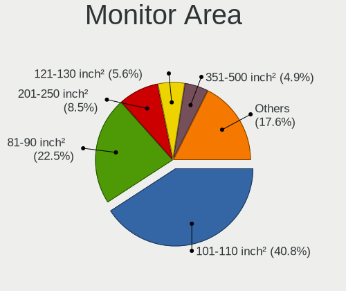

| Area in inch² | Notebooks | Percent |
|----------------|-----------|---------|
| 101-110        | 59        | 41.84%  |
| 81-90          | 31        | 21.99%  |
| 201-250        | 13        | 9.22%   |
| 121-130        | 10        | 7.09%   |
| 61-70          | 5         | 3.55%   |
| 351-500        | 5         | 3.55%   |
| 301-350        | 3         | 2.13%   |
| 71-80          | 2         | 1.42%   |
| 51-60          | 2         | 1.42%   |
| 251-300        | 2         | 1.42%   |
| 151-200        | 2         | 1.42%   |
| 141-150        | 2         | 1.42%   |
| Unknown        | 2         | 1.42%   |
| 131-140        | 1         | 0.71%   |
| 501-1000       | 1         | 0.71%   |
| 91-100         | 1         | 0.71%   |

Pixel Density
-------------

Pixels per inch

| Density       | Notebooks | Percent |
|---------------|-----------|---------|
| 121-160       | 65        | 47.79%  |
| 101-120       | 37        | 27.21%  |
| 51-100        | 23        | 16.91%  |
| More than 240 | 4         | 2.94%   |
| 161-240       | 4         | 2.94%   |
| Unknown       | 2         | 1.47%   |
| 1-50          | 1         | 0.74%   |

Multiple Monitors
-----------------

Total monitors connected

| Total | Notebooks | Percent |
|-------|-----------|---------|
| 1     | 95        | 78.51%  |
| 2     | 21        | 17.36%  |
| 3     | 3         | 2.48%   |
| 0     | 2         | 1.65%   |

Network
-------

Net Controller Vendor
---------------------

Controller vendors

| Vendor                            | Notebooks | Percent |
|-----------------------------------|-----------|---------|
| Intel                             | 71        | 39.89%  |
| Realtek Semiconductor             | 59        | 33.15%  |
| Qualcomm Atheros                  | 26        | 14.61%  |
| Broadcom                          | 7         | 3.93%   |
| Ralink                            | 2         | 1.12%   |
| Dell                              | 2         | 1.12%   |
| Broadcom Limited                  | 2         | 1.12%   |
| Xiaomi                            | 1         | 0.56%   |
| Sierra Wireless                   | 1         | 0.56%   |
| Samsung Electronics               | 1         | 0.56%   |
| Ralink Technology                 | 1         | 0.56%   |
| OnePlus Technology (Shenzhen)     | 1         | 0.56%   |
| Marvell Technology Group          | 1         | 0.56%   |
| Ericsson Business Mobile Networks | 1         | 0.56%   |
| D-Link                            | 1         | 0.56%   |
| ASIX Electronics                  | 1         | 0.56%   |

Net Controller Model
--------------------

Controller models

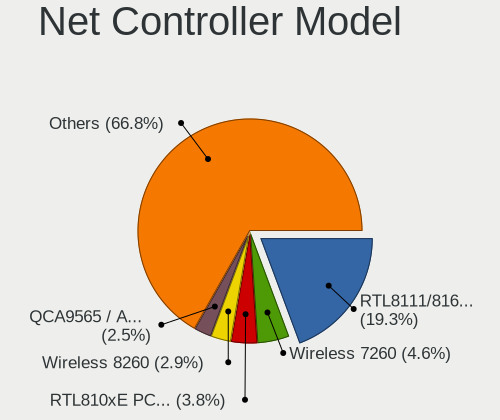

| Model                                                             | Notebooks | Percent |
|-------------------------------------------------------------------|-----------|---------|
| Realtek RTL8111/8168/8411 PCI Express Gigabit Ethernet Controller | 45        | 19.48%  |
| Intel Wireless 7260                                               | 11        | 4.76%   |
| Realtek RTL810xE PCI Express Fast Ethernet controller             | 9         | 3.9%    |
| Intel Wireless 8260                                               | 7         | 3.03%   |
| Qualcomm Atheros QCA9565 / AR9565 Wireless Network Adapter        | 6         | 2.6%    |
| Realtek RTL8723BE PCIe Wireless Network Adapter                   | 5         | 2.16%   |
| Qualcomm Atheros QCA9377 802.11ac Wireless Network Adapter        | 5         | 2.16%   |
| Intel Wireless 8265 / 8275                                        | 5         | 2.16%   |
| Intel Wi-Fi 6 AX200                                               | 5         | 2.16%   |
| Intel 82579LM Gigabit Network Connection (Lewisville)             | 5         | 2.16%   |
| Intel Wireless 7265                                               | 4         | 1.73%   |
| Intel Wi-Fi 6 AX201                                               | 4         | 1.73%   |
| Intel Ethernet Connection I219-LM                                 | 4         | 1.73%   |
| Intel Ethernet Connection I218-LM                                 | 4         | 1.73%   |
| Intel Ethernet Connection I217-LM                                 | 4         | 1.73%   |
| Intel Comet Lake PCH CNVi WiFi                                    | 4         | 1.73%   |
| Realtek RTL8821CE 802.11ac PCIe Wireless Network Adapter          | 3         | 1.3%    |
| Realtek RTL8153 Gigabit Ethernet Adapter                          | 3         | 1.3%    |
| Qualcomm Atheros AR9485 Wireless Network Adapter                  | 3         | 1.3%    |
| Qualcomm Atheros AR9462 Wireless Network Adapter                  | 3         | 1.3%    |
| Intel Dual Band Wireless-AC 3165 Plus Bluetooth                   | 3         | 1.3%    |
| Intel Centrino Ultimate-N 6300                                    | 3         | 1.3%    |
| Intel 82577LM Gigabit Network Connection                          | 3         | 1.3%    |
| Broadcom BCM4313 802.11bgn Wireless Network Adapter               | 3         | 1.3%    |
| Realtek RTL8822CE 802.11ac PCIe Wireless Network Adapter          | 2         | 0.87%   |
| Realtek RTL8723DE Wireless Network Adapter                        | 2         | 0.87%   |
| Qualcomm Atheros QCA6174 802.11ac Wireless Network Adapter        | 2         | 0.87%   |
| Qualcomm Atheros AR9285 Wireless Network Adapter (PCI-Express)    | 2         | 0.87%   |
| Qualcomm Atheros AR8151 v2.0 Gigabit Ethernet                     | 2         | 0.87%   |
| Qualcomm Atheros AR8131 Gigabit Ethernet                          | 2         | 0.87%   |
| Intel Wireless-AC 9260                                            | 2         | 0.87%   |
| Intel Wireless 3165                                               | 2         | 0.87%   |
| Intel Ice Lake-LP PCH CNVi WiFi                                   | 2         | 0.87%   |
| Intel Ethernet Connection (7) I219-LM                             | 2         | 0.87%   |
| Intel Ethernet Connection (6) I219-V                              | 2         | 0.87%   |
| Intel Ethernet Connection (4) I219-V                              | 2         | 0.87%   |
| Intel Ethernet Connection (3) I218-LM                             | 2         | 0.87%   |
| Intel Ethernet Connection (2) I219-LM                             | 2         | 0.87%   |
| Intel Centrino Advanced-N 6235                                    | 2         | 0.87%   |
| Intel Centrino Advanced-N 6205 [Taylor Peak]                      | 2         | 0.87%   |

Wireless Vendor
---------------

Wireless vendors

| Vendor                | Notebooks | Percent |
|-----------------------|-----------|---------|
| Intel                 | 69        | 56.56%  |
| Qualcomm Atheros      | 22        | 18.03%  |
| Realtek Semiconductor | 17        | 13.93%  |
| Broadcom              | 5         | 4.1%    |
| Ralink                | 2         | 1.64%   |
| Dell                  | 2         | 1.64%   |
| Broadcom Limited      | 2         | 1.64%   |
| Sierra Wireless       | 1         | 0.82%   |
| Ralink Technology     | 1         | 0.82%   |
| D-Link                | 1         | 0.82%   |

Wireless Model
--------------

Wireless models

| Model                                                          | Notebooks | Percent |
|----------------------------------------------------------------|-----------|---------|
| Intel Wireless 7260                                            | 11        | 9.02%   |
| Intel Wireless 8260                                            | 7         | 5.74%   |
| Qualcomm Atheros QCA9565 / AR9565 Wireless Network Adapter     | 6         | 4.92%   |
| Realtek RTL8723BE PCIe Wireless Network Adapter                | 5         | 4.1%    |
| Qualcomm Atheros QCA9377 802.11ac Wireless Network Adapter     | 5         | 4.1%    |
| Intel Wireless 8265 / 8275                                     | 5         | 4.1%    |
| Intel Wi-Fi 6 AX200                                            | 5         | 4.1%    |
| Intel Wireless 7265                                            | 4         | 3.28%   |
| Intel Wi-Fi 6 AX201                                            | 4         | 3.28%   |
| Intel Comet Lake PCH CNVi WiFi                                 | 4         | 3.28%   |
| Realtek RTL8821CE 802.11ac PCIe Wireless Network Adapter       | 3         | 2.46%   |
| Qualcomm Atheros AR9485 Wireless Network Adapter               | 3         | 2.46%   |
| Qualcomm Atheros AR9462 Wireless Network Adapter               | 3         | 2.46%   |
| Intel Dual Band Wireless-AC 3165 Plus Bluetooth                | 3         | 2.46%   |
| Intel Centrino Ultimate-N 6300                                 | 3         | 2.46%   |
| Broadcom BCM4313 802.11bgn Wireless Network Adapter            | 3         | 2.46%   |
| Realtek RTL8822CE 802.11ac PCIe Wireless Network Adapter       | 2         | 1.64%   |
| Realtek RTL8723DE Wireless Network Adapter                     | 2         | 1.64%   |
| Qualcomm Atheros QCA6174 802.11ac Wireless Network Adapter     | 2         | 1.64%   |
| Qualcomm Atheros AR9285 Wireless Network Adapter (PCI-Express) | 2         | 1.64%   |
| Intel Wireless-AC 9260                                         | 2         | 1.64%   |
| Intel Wireless 3165                                            | 2         | 1.64%   |
| Intel Ice Lake-LP PCH CNVi WiFi                                | 2         | 1.64%   |
| Intel Centrino Advanced-N 6235                                 | 2         | 1.64%   |
| Intel Centrino Advanced-N 6205 [Taylor Peak]                   | 2         | 1.64%   |
| Intel Centrino Advanced-N 6200                                 | 2         | 1.64%   |
| Intel Cannon Point-LP CNVi [Wireless-AC]                       | 2         | 1.64%   |
| Sierra Wireless EM7345 4G LTE                                  | 1         | 0.82%   |
| Realtek RTL88x2bu [AC1200 Techkey]                             | 1         | 0.82%   |
| Realtek RTL8822BE 802.11a/b/g/n/ac WiFi adapter                | 1         | 0.82%   |
| Realtek RTL8821AE 802.11ac PCIe Wireless Network Adapter       | 1         | 0.82%   |
| Realtek RTL8191SEvB Wireless LAN Controller                    | 1         | 0.82%   |
| Realtek RTL8188CE 802.11b/g/n WiFi Adapter                     | 1         | 0.82%   |
| Ralink RT2870/RT3070 Wireless Adapter                          | 1         | 0.82%   |
| Ralink RT5390 Wireless 802.11n 1T/1R PCIe                      | 1         | 0.82%   |
| Ralink RT3290 Wireless 802.11n 1T/1R PCIe                      | 1         | 0.82%   |
| Qualcomm Atheros AR9287 Wireless Network Adapter (PCI-Express) | 1         | 0.82%   |
| Intel Wireless 3160                                            | 1         | 0.82%   |
| Intel WiFi Link 5100                                           | 1         | 0.82%   |
| Intel Ultimate N WiFi Link 5300                                | 1         | 0.82%   |

Ethernet Vendor
---------------

Ethernet vendors

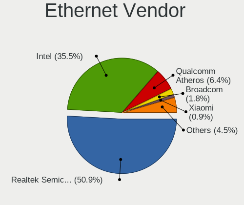

| Vendor                        | Notebooks | Percent |
|-------------------------------|-----------|---------|
| Realtek Semiconductor         | 55        | 51.89%  |
| Intel                         | 37        | 34.91%  |
| Qualcomm Atheros              | 7         | 6.6%    |
| Broadcom                      | 2         | 1.89%   |
| Xiaomi                        | 1         | 0.94%   |
| Samsung Electronics           | 1         | 0.94%   |
| OnePlus Technology (Shenzhen) | 1         | 0.94%   |
| Marvell Technology Group      | 1         | 0.94%   |
| ASIX Electronics              | 1         | 0.94%   |

Ethernet Model
--------------

Ethernet models

| Model                                                             | Notebooks | Percent |
|-------------------------------------------------------------------|-----------|---------|
| Realtek RTL8111/8168/8411 PCI Express Gigabit Ethernet Controller | 45        | 41.67%  |
| Realtek RTL810xE PCI Express Fast Ethernet controller             | 9         | 8.33%   |
| Intel 82579LM Gigabit Network Connection (Lewisville)             | 5         | 4.63%   |
| Intel Ethernet Connection I219-LM                                 | 4         | 3.7%    |
| Intel Ethernet Connection I218-LM                                 | 4         | 3.7%    |
| Intel Ethernet Connection I217-LM                                 | 4         | 3.7%    |
| Realtek RTL8153 Gigabit Ethernet Adapter                          | 3         | 2.78%   |
| Intel 82577LM Gigabit Network Connection                          | 3         | 2.78%   |
| Qualcomm Atheros AR8151 v2.0 Gigabit Ethernet                     | 2         | 1.85%   |
| Qualcomm Atheros AR8131 Gigabit Ethernet                          | 2         | 1.85%   |
| Intel Ethernet Connection (7) I219-LM                             | 2         | 1.85%   |
| Intel Ethernet Connection (6) I219-V                              | 2         | 1.85%   |
| Intel Ethernet Connection (4) I219-V                              | 2         | 1.85%   |
| Intel Ethernet Connection (3) I218-LM                             | 2         | 1.85%   |
| Intel Ethernet Connection (2) I219-LM                             | 2         | 1.85%   |
| Broadcom NetLink BCM57785 Gigabit Ethernet PCIe                   | 2         | 1.85%   |
| Xiaomi Mi/Redmi series (RNDIS)                                    | 1         | 0.93%   |
| Samsung Galaxy series, misc. (tethering mode)                     | 1         | 0.93%   |
| Qualcomm Atheros Killer E2500 Gigabit Ethernet Controller         | 1         | 0.93%   |
| Qualcomm Atheros AR8161 Gigabit Ethernet                          | 1         | 0.93%   |
| Qualcomm Atheros AR8152 v1.1 Fast Ethernet                        | 1         | 0.93%   |
| OnePlus (Shenzhen) OnePlus                                        | 1         | 0.93%   |
| Marvell Group 88E8055 PCI-E Gigabit Ethernet Controller           | 1         | 0.93%   |
| Intel Ethernet Connection I219-V                                  | 1         | 0.93%   |
| Intel Ethernet Connection (5) I219-LM                             | 1         | 0.93%   |
| Intel Ethernet Connection (4) I219-LM                             | 1         | 0.93%   |
| Intel Ethernet Connection (13) I219-V                             | 1         | 0.93%   |
| Intel Ethernet Connection (11) I219-LM                            | 1         | 0.93%   |
| Intel 82579V Gigabit Network Connection                           | 1         | 0.93%   |
| Intel 82567LM Gigabit Network Connection                          | 1         | 0.93%   |
| ASIX AX88772                                                      | 1         | 0.93%   |

Net Controller Kind
-------------------

Ethernet, WiFi or modem

| Kind     | Notebooks | Percent |
|----------|-----------|---------|
| WiFi     | 116       | 52.97%  |
| Ethernet | 102       | 46.58%  |
| Modem    | 1         | 0.46%   |

Used Controller
---------------

Currently used network controller

| Kind     | Notebooks | Percent |
|----------|-----------|---------|
| WiFi     | 96        | 75%     |
| Ethernet | 32        | 25%     |

NICs
----

Total network controllers on board

| Total | Notebooks | Percent |
|-------|-----------|---------|
| 2     | 99        | 84.62%  |
| 1     | 18        | 15.38%  |

IPv6
----

IPv6 vs IPv4

| Used | Notebooks | Percent |
|------|-----------|---------|
| No   | 101       | 86.32%  |
| Yes  | 16        | 13.68%  |

Bluetooth
---------

Bluetooth Vendor
----------------

Controller vendors

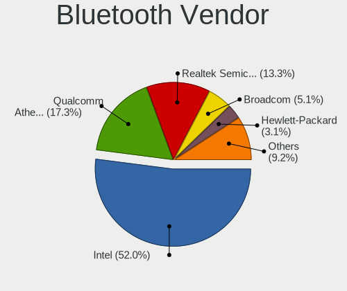

| Vendor                          | Notebooks | Percent |
|---------------------------------|-----------|---------|
| Intel                           | 50        | 52.08%  |
| Qualcomm Atheros Communications | 17        | 17.71%  |
| Realtek Semiconductor           | 13        | 13.54%  |
| Broadcom                        | 5         | 5.21%   |
| IMC Networks                    | 2         | 2.08%   |
| Hewlett-Packard                 | 2         | 2.08%   |
| Cambridge Silicon Radio         | 2         | 2.08%   |
| Toshiba                         | 1         | 1.04%   |
| Ralink                          | 1         | 1.04%   |
| Lite-On Technology              | 1         | 1.04%   |
| Foxconn / Hon Hai               | 1         | 1.04%   |
| Apple                           | 1         | 1.04%   |

Bluetooth Model
---------------

Controller models

| Model                                               | Notebooks | Percent |
|-----------------------------------------------------|-----------|---------|
| Intel Bluetooth wireless interface                  | 28        | 29.17%  |
| Realtek Bluetooth Radio                             | 10        | 10.42%  |
| Intel AX201 Bluetooth                               | 7         | 7.29%   |
| Qualcomm Atheros AR3012 Bluetooth 4.0               | 6         | 6.25%   |
| Intel Bluetooth 9460/9560 Jefferson Peak (JfP)      | 5         | 5.21%   |
| Intel AX200 Bluetooth                               | 5         | 5.21%   |
| Qualcomm Atheros  Bluetooth Device                  | 4         | 4.17%   |
| Qualcomm Atheros AR3011 Bluetooth                   | 3         | 3.13%   |
| Realtek  Bluetooth 4.2 Adapter                      | 2         | 2.08%   |
| Qualcomm Atheros QCA61x4 Bluetooth 4.0              | 2         | 2.08%   |
| Intel Centrino Bluetooth Wireless Transceiver       | 2         | 2.08%   |
| HP Broadcom 2070 Bluetooth Combo                    | 2         | 2.08%   |
| Cambridge Silicon Radio Bluetooth Dongle (HCI mode) | 2         | 2.08%   |
| Toshiba Bluetooth Radio                             | 1         | 1.04%   |
| Realtek RTL8821A Bluetooth                          | 1         | 1.04%   |
| Ralink RT3290 Bluetooth                             | 1         | 1.04%   |
| Qualcomm Atheros Bluetooth USB Host Controller      | 1         | 1.04%   |
| Qualcomm Atheros AR9462 Bluetooth                   | 1         | 1.04%   |
| Lite-On Broadcom BCM43142A0 Bluetooth Device        | 1         | 1.04%   |
| Intel Wireless-AC 9260 Bluetooth Adapter            | 1         | 1.04%   |
| Intel Wireless-AC 3168 Bluetooth                    | 1         | 1.04%   |
| Intel Centrino Advanced-N 6230 Bluetooth adapter    | 1         | 1.04%   |
| IMC Networks Bluetooth Device                       | 1         | 1.04%   |
| IMC Networks Atheros AR3012 Bluetooth 4.0 Adapter   | 1         | 1.04%   |
| Foxconn / Hon Hai Bluetooth Device                  | 1         | 1.04%   |
| Broadcom HP Portable SoftSailing                    | 1         | 1.04%   |
| Broadcom Bluetooth 3.0 Dongle                       | 1         | 1.04%   |
| Broadcom BCM20702A0                                 | 1         | 1.04%   |
| Broadcom BCM2045B (BDC-2.1)                         | 1         | 1.04%   |
| Broadcom BCM2045 Bluetooth                          | 1         | 1.04%   |
| Apple Bluetooth Host Controller                     | 1         | 1.04%   |

Sound
-----

Sound Vendor
------------

Sound card vendors

| Vendor                   | Notebooks | Percent |
|--------------------------|-----------|---------|
| Intel                    | 110       | 75.34%  |
| Nvidia                   | 19        | 13.01%  |
| AMD                      | 9         | 6.16%   |
| Logitech                 | 2         | 1.37%   |
| GN Netcom                | 2         | 1.37%   |
| Tenx Technology          | 1         | 0.68%   |
| Plantronics              | 1         | 0.68%   |
| Kingston Technology      | 1         | 0.68%   |
| Asahi Kasei Microsystems | 1         | 0.68%   |

Sound Model
-----------

Sound card models

| Model                                                                      | Notebooks | Percent |
|----------------------------------------------------------------------------|-----------|---------|
| Intel Sunrise Point-LP HD Audio                                            | 21        | 12.07%  |
| Intel 7 Series/C216 Chipset Family High Definition Audio Controller        | 14        | 8.05%   |
| Intel 8 Series HD Audio Controller                                         | 11        | 6.32%   |
| Intel Haswell-ULT HD Audio Controller                                      | 10        | 5.75%   |
| Intel 6 Series/C200 Series Chipset Family High Definition Audio Controller | 9         | 5.17%   |
| Intel Wildcat Point-LP High Definition Audio Controller                    | 8         | 4.6%    |
| Intel Broadwell-U Audio Controller                                         | 8         | 4.6%    |
| Intel 5 Series/3400 Series Chipset High Definition Audio                   | 8         | 4.6%    |
| Nvidia TU107 GeForce GTX 1650 High Definition Audio Controller             | 6         | 3.45%   |
| Intel Cannon Lake PCH cAVS                                                 | 6         | 3.45%   |
| Intel 8 Series/C220 Series Chipset High Definition Audio Controller        | 6         | 3.45%   |
| Nvidia GK107 HDMI Audio Controller                                         | 4         | 2.3%    |
| Intel Xeon E3-1200 v3/4th Gen Core Processor HD Audio Controller           | 4         | 2.3%    |
| Intel Tiger Lake-LP Smart Sound Technology Audio Controller                | 4         | 2.3%    |
| Intel Comet Lake PCH cAVS                                                  | 4         | 2.3%    |
| Intel Cannon Point-LP High Definition Audio Controller                     | 4         | 2.3%    |
| AMD Family 17h/19h HD Audio Controller                                     | 4         | 2.3%    |
| Intel Ice Lake-LP Smart Sound Technology Audio Controller                  | 3         | 1.72%   |
| Intel CM238 HD Audio Controller                                            | 3         | 1.72%   |
| Intel 100 Series/C230 Series Chipset Family HD Audio Controller            | 3         | 1.72%   |
| AMD Raven/Raven2/Fenghuang HDMI/DP Audio Controller                        | 3         | 1.72%   |
| Nvidia GF108 High Definition Audio Controller                              | 2         | 1.15%   |
| Intel Atom Processor Z36xxx/Z37xxx Series High Definition Audio Controller | 2         | 1.15%   |
| Intel 82801I (ICH9 Family) HD Audio Controller                             | 2         | 1.15%   |
| AMD RV710/730 HDMI Audio [Radeon HD 4000 series]                           | 2         | 1.15%   |
| AMD High Definition Audio Controller                                       | 2         | 1.15%   |
| AMD Family 15h (Models 60h-6fh) Audio Controller                           | 2         | 1.15%   |
| Tenx Technology USB AUDIO                                                  | 1         | 0.57%   |
| Plantronics Calisto 800 Series                                             | 1         | 0.57%   |
| Plantronics Blackwire C210                                                 | 1         | 0.57%   |
| Nvidia TU106 High Definition Audio Controller                              | 1         | 0.57%   |
| Nvidia GP107GL High Definition Audio Controller                            | 1         | 0.57%   |
| Nvidia GM107 High Definition Audio Controller [GeForce 940MX]              | 1         | 0.57%   |
| Nvidia GK208 HDMI/DP Audio Controller                                      | 1         | 0.57%   |
| Nvidia GK106 HDMI Audio Controller                                         | 1         | 0.57%   |
| Nvidia GK104 HDMI Audio Controller                                         | 1         | 0.57%   |
| Nvidia GF119 HDMI Audio Controller                                         | 1         | 0.57%   |
| Logitech Headset H340                                                      | 1         | 0.57%   |
| Logitech Clear Chat Comfort USB Headset                                    | 1         | 0.57%   |
| Kingston Technology HyperX 7.1 Audio                                       | 1         | 0.57%   |

Memory
------

Memory Vendor
-------------

Memory module vendors

| Vendor              | Notebooks | Percent |
|---------------------|-----------|---------|
| SK hynix            | 16        | 27.12%  |
| Samsung Electronics | 15        | 25.42%  |
| Kingston            | 11        | 18.64%  |
| Micron Technology   | 4         | 6.78%   |
| Unknown             | 3         | 5.08%   |
| A-DATA Technology   | 3         | 5.08%   |
| Elpida              | 2         | 3.39%   |
| Ramaxel Technology  | 1         | 1.69%   |
| Nanya Technology    | 1         | 1.69%   |
| Crucial             | 1         | 1.69%   |
| Corsair             | 1         | 1.69%   |
| Apacer              | 1         | 1.69%   |

Memory Model
------------

Memory module models

| Model                                                         | Notebooks | Percent |
|---------------------------------------------------------------|-----------|---------|
| Samsung RAM M471B1G73DB0-YK0 8GB SODIMM DDR3 1600MT/s         | 2         | 3.23%   |
| Samsung RAM M471A2K43DB1-CTD 16GB SODIMM DDR4 2667MT/s        | 2         | 3.23%   |
| Unknown RAM Module 8GB SODIMM DDR3 1600MT/s                   | 1         | 1.61%   |
| Unknown RAM Module 4GB SODIMM DDR2 667MT/s                    | 1         | 1.61%   |
| Unknown RAM Module 2048MB SODIMM DDR3 1333MT/s                | 1         | 1.61%   |
| SK hynix RAM Module 8GB SODIMM DDR4 2133MT/s                  | 1         | 1.61%   |
| SK hynix RAM Module 8192MB SODIMM DDR4 2400MT/s               | 1         | 1.61%   |
| SK hynix RAM Module 8192MB SODIMM DDR4 2133MT/s               | 1         | 1.61%   |
| SK hynix RAM Module 16GB SODIMM DDR4 2667MT/s                 | 1         | 1.61%   |
| SK hynix RAM HMT851S6AMR6R-PB N0 4GB Chip DDR3 1600MT/s       | 1         | 1.61%   |
| SK hynix RAM HMT451S6BFR8A-PB 4GB SODIMM DDR3 1600MT/s        | 1         | 1.61%   |
| SK hynix RAM HMT451S6AFR8A-PB 4GB SODIMM DDR3 1600MT/s        | 1         | 1.61%   |
| SK hynix RAM HMT351S6EFR8A-PB 4096MB SODIMM DDR3 1600MT/s     | 1         | 1.61%   |
| SK hynix RAM HMT351S6CFR8C-PB 4GB SODIMM DDR3 1600MT/s        | 1         | 1.61%   |
| SK hynix RAM HMT351S6BFR8C-H9 4GB SODIMM DDR3 1333MT/s        | 1         | 1.61%   |
| SK hynix RAM HMT125S6BFR8C-H9 2048MB SODIMM DDR3 1333MT/s     | 1         | 1.61%   |
| SK hynix RAM HMT125S6AFP8C-G7 2GB SODIMM DDR3 1066MT/s        | 1         | 1.61%   |
| SK hynix RAM HMA851S6CJR6N-VK 4GB Row Of Chips DDR4 1866MT/s  | 1         | 1.61%   |
| SK hynix RAM HMA851S6CJR6N-UH 4GB SODIMM DDR4 2400MT/s        | 1         | 1.61%   |
| SK hynix RAM HMA82GS6JJR8N-VK 16GB SODIMM DDR4 2667MT/s       | 1         | 1.61%   |
| SK hynix RAM HMA41GS6AFR8N-TF 8GB SODIMM DDR4 2667MT/s        | 1         | 1.61%   |
| Samsung RAM UBE3D4AA-MGCR 2048MB Row Of Chips LPDDR4 4267MT/s | 1         | 1.61%   |
| Samsung RAM M471B5673FH0-CF8 2GB SODIMM DDR3 1067MT/s         | 1         | 1.61%   |
| Samsung RAM M471B5273DH0-CK0 4GB SODIMM DDR3 1600MT/s         | 1         | 1.61%   |
| Samsung RAM M471B5273CM0-CH9 4096MB SODIMM DDR3 1334MT/s      | 1         | 1.61%   |
| Samsung RAM M471B5173EB0-YK0 4GB SODIMM DDR3 1600MT/s         | 1         | 1.61%   |
| Samsung RAM M471B1G73QH0-YK0 8192MB SODIMM DDR3 1600MT/s      | 1         | 1.61%   |
| Samsung RAM M471A5244CB0-CWE 4GB SODIMM DDR4 3200MT/s         | 1         | 1.61%   |
| Samsung RAM M471A5244CB0-CTD 4GB SODIMM DDR4 3266MT/s         | 1         | 1.61%   |
| Samsung RAM M471A5244CB0-CTD 4GB Row Of Chips DDR4 2667MT/s   | 1         | 1.61%   |
| Samsung RAM M471A5143DB0-CPB 4GB SODIMM DDR4 2133MT/s         | 1         | 1.61%   |
| Samsung RAM M471A1K43CB1-CTD 8GB SODIMM DDR4 2667MT/s         | 1         | 1.61%   |
| Samsung RAM M471A1K43BB1-CRC 8192MB SODIMM DDR4 2667MT/s      | 1         | 1.61%   |
| Ramaxel RAM RMSA3260ME78HAF-2666 8GB SODIMM DDR4 2667MT/s     | 1         | 1.61%   |
| Nanya RAM NT2GC64B8HC0NS-CG 2GB SODIMM DDR3 1334MT/s          | 1         | 1.61%   |
| Micron RAM MT52L1G32D4PG-093 8GB Row Of Chips LPDDR3 2133MT/s | 1         | 1.61%   |
| Micron RAM 8ATF1G64HZ-2G6D1 8GB SODIMM DDR4 2667MT/s          | 1         | 1.61%   |
| Micron RAM 53E2G32D4NQ-046 4GB Row Of Chips LPDDR4 4267MT/s   | 1         | 1.61%   |
| Micron RAM 4ATF51264HZ-2G6E1 4GB SODIMM DDR4 2667MT/s         | 1         | 1.61%   |
| Kingston RAM Module 4GB SODIMM DDR3 1600MT/s                  | 1         | 1.61%   |

Memory Kind
-----------

Memory module kinds

| Kind   | Notebooks | Percent |
|--------|-----------|---------|
| DDR3   | 25        | 49.02%  |
| DDR4   | 22        | 43.14%  |
| LPDDR4 | 2         | 3.92%   |
| LPDDR3 | 1         | 1.96%   |
| DDR2   | 1         | 1.96%   |

Memory Form Factor
------------------

Physical design of the memory module

| Name         | Notebooks | Percent |
|--------------|-----------|---------|
| SODIMM       | 45        | 88.24%  |
| Row Of Chips | 5         | 9.8%    |
| Chip         | 1         | 1.96%   |

Memory Size
-----------

Memory module size

| Size  | Notebooks | Percent |
|-------|-----------|---------|
| 4096  | 24        | 43.64%  |
| 8192  | 17        | 30.91%  |
| 16384 | 8         | 14.55%  |
| 2048  | 6         | 10.91%  |

Memory Speed
------------

Memory module speed

| Speed | Notebooks | Percent |
|-------|-----------|---------|
| 1600  | 16        | 29.63%  |
| 2667  | 14        | 25.93%  |
| 1333  | 5         | 9.26%   |
| 2133  | 4         | 7.41%   |
| 1334  | 4         | 7.41%   |
| 2400  | 3         | 5.56%   |
| 4267  | 2         | 3.7%    |
| 3266  | 1         | 1.85%   |
| 3200  | 1         | 1.85%   |
| 1866  | 1         | 1.85%   |
| 1067  | 1         | 1.85%   |
| 1066  | 1         | 1.85%   |
| 667   | 1         | 1.85%   |

Printers & scanners
-------------------

Printer Vendor
--------------

Printer device vendors

Zero info for selected period =(

Printer Model
-------------

Printer device models

Zero info for selected period =(

Scanner Vendor
--------------

Scanner device vendors

Zero info for selected period =(

Scanner Model
-------------

Scanner device models

Zero info for selected period =(

Camera
------

Camera Vendor
-------------

Camera device vendors

| Vendor                                 | Notebooks | Percent |
|----------------------------------------|-----------|---------|
| Chicony Electronics                    | 33        | 31.13%  |
| Microdia                               | 14        | 13.21%  |
| Acer                                   | 12        | 11.32%  |
| Realtek Semiconductor                  | 7         | 6.6%    |
| Lite-On Technology                     | 7         | 6.6%    |
| IMC Networks                           | 7         | 6.6%    |
| Sunplus Innovation Technology          | 6         | 5.66%   |
| Quanta                                 | 4         | 3.77%   |
| Cheng Uei Precision Industry (Foxlink) | 4         | 3.77%   |
| Syntek                                 | 2         | 1.89%   |
| Silicon Motion                         | 2         | 1.89%   |
| Microsoft                              | 2         | 1.89%   |
| Suyin                                  | 1         | 0.94%   |
| Sunplus Technology                     | 1         | 0.94%   |
| Samsung Electronics                    | 1         | 0.94%   |
| Logitech                               | 1         | 0.94%   |
| Intel                                  | 1         | 0.94%   |
| Alcor Micro                            | 1         | 0.94%   |

Camera Model
------------

Camera device models

| Model                                   | Notebooks | Percent |
|-----------------------------------------|-----------|---------|
| Chicony Integrated Camera               | 7         | 6.6%    |
| Microdia Integrated_Webcam_HD           | 5         | 4.72%   |
| Lite-On Integrated Camera               | 3         | 2.83%   |
| Lite-On HP HD Camera                    | 3         | 2.83%   |
| IMC Networks USB2.0 HD UVC WebCam       | 3         | 2.83%   |
| IMC Networks Integrated Camera          | 3         | 2.83%   |
| Chicony USB2.0 VGA UVC WebCam           | 3         | 2.83%   |
| Chicony Integrated Camera (1280x720@30) | 3         | 2.83%   |
| Chicony HP TrueVision HD                | 3         | 2.83%   |
| Chicony HP HD Camera                    | 3         | 2.83%   |
| Chicony HD WebCam                       | 3         | 2.83%   |
| Acer Lenovo EasyCamera                  | 3         | 2.83%   |
| Acer Integrated Camera                  | 3         | 2.83%   |
| Sunplus Integrated_Webcam_HD            | 2         | 1.89%   |
| Quanta HP TrueVision HD Camera          | 2         | 1.89%   |
| Microdia Laptop_Integrated_Webcam_2M    | 2         | 1.89%   |
| Chicony HP Webcam [2 MP Macro]          | 2         | 1.89%   |
| Chicony HP HD Webcam                    | 2         | 1.89%   |
| Syntek USB2.0 UVC PC Camera             | 1         | 0.94%   |
| Syntek Lenovo EasyCamera                | 1         | 0.94%   |
| Suyin Sony Visual Communication Camera  | 1         | 0.94%   |
| Sunplus 1.3M WebCam                     | 1         | 0.94%   |
| Sunplus USB Video Device                | 1         | 0.94%   |
| Sunplus Integrated_Webcam_FHD           | 1         | 0.94%   |
| Sunplus HD WebCam                       | 1         | 0.94%   |
| Sunplus Asus Webcam                     | 1         | 0.94%   |
| Silicon Motion WebCam SC-13HDL11431N    | 1         | 0.94%   |
| Silicon Motion ATIV VGA Camera          | 1         | 0.94%   |
| Samsung Galaxy A5 (MTP)                 | 1         | 0.94%   |
| Realtek USB Camera                      | 1         | 0.94%   |
| Realtek Rear Camera                     | 1         | 0.94%   |
| Realtek Integrated Webcam_HD            | 1         | 0.94%   |
| Realtek Integrated Webcam               | 1         | 0.94%   |
| Realtek HD Webcam - Realtek             | 1         | 0.94%   |
| Realtek HD Webcam                       | 1         | 0.94%   |
| Realtek EasyCamera                      | 1         | 0.94%   |
| Quanta HD Webcam                        | 1         | 0.94%   |
| Quanta HD User Facing                   | 1         | 0.94%   |
| Microsoft LifeCam VX-500 [1357]         | 1         | 0.94%   |
| Microsoft LifeCam HD-3000               | 1         | 0.94%   |

Security
--------

Fingerprint Vendor
------------------

Fingerprint sensor vendors

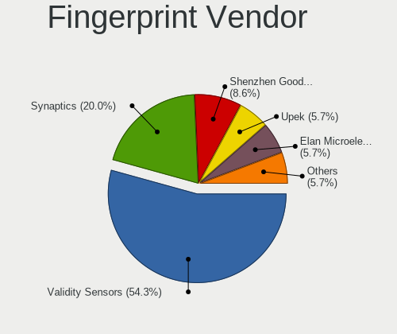

| Vendor                     | Notebooks | Percent |
|----------------------------|-----------|---------|
| Validity Sensors           | 19        | 57.58%  |
| Synaptics                  | 6         | 18.18%  |
| Shenzhen Goodix Technology | 3         | 9.09%   |
| Upek                       | 2         | 6.06%   |
| Elan Microelectronics      | 2         | 6.06%   |
| AuthenTec                  | 1         | 3.03%   |

Fingerprint Model
-----------------

Fingerprint sensor models

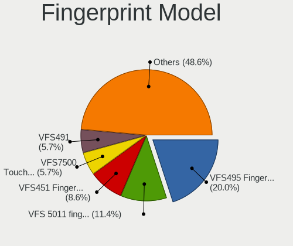

| Model                                                  | Notebooks | Percent |
|--------------------------------------------------------|-----------|---------|
| Validity Sensors VFS495 Fingerprint Reader             | 7         | 21.21%  |
| Validity Sensors VFS 5011 fingerprint sensor           | 4         | 12.12%  |
| Validity Sensors VFS451 Fingerprint Reader             | 3         | 9.09%   |
| Validity Sensors VFS7500 Touch Fingerprint Sensor      | 2         | 6.06%   |
| Validity Sensors VFS491                                | 2         | 6.06%   |
| Upek Biometric Touchchip/Touchstrip Fingerprint Sensor | 2         | 6.06%   |
| Synaptics Metallica MOH Touch Fingerprint Reader       | 2         | 6.06%   |
| Synaptics Metallica MIS Touch Fingerprint Reader       | 2         | 6.06%   |
| Shenzhen Goodix  FingerPrint Device                    | 2         | 6.06%   |
| Elan ELAN:Fingerprint                                  | 2         | 6.06%   |
| Validity Sensors Synaptics WBDI                        | 1         | 3.03%   |
| Synaptics  WBDI                                        | 1         | 3.03%   |
| Synaptics Prometheus MIS Touch Fingerprint Reader      | 1         | 3.03%   |
| Shenzhen Goodix Fingerprint Reader                     | 1         | 3.03%   |
| AuthenTec AES1660 Fingerprint Sensor                   | 1         | 3.03%   |

Chipcard Vendor
---------------

Chipcard module vendors

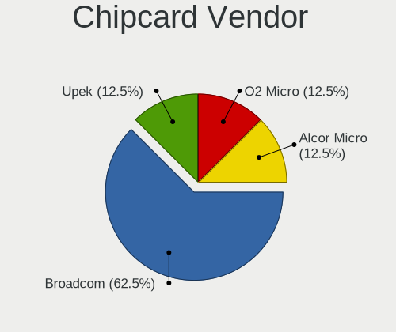

| Vendor      | Notebooks | Percent |
|-------------|-----------|---------|
| Broadcom    | 5         | 71.43%  |
| O2 Micro    | 1         | 14.29%  |
| Alcor Micro | 1         | 14.29%  |

Chipcard Model
--------------

Chipcard module models

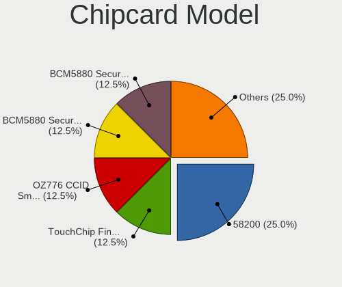

| Model                                                                        | Notebooks | Percent |
|------------------------------------------------------------------------------|-----------|---------|
| Broadcom 58200                                                               | 2         | 28.57%  |
| O2 Micro OZ776 CCID Smartcard Reader                                         | 1         | 14.29%  |
| Broadcom BCM5880 Secure Applications Processor with fingerprint swipe sensor | 1         | 14.29%  |
| Broadcom BCM5880 Secure Applications Processor                               | 1         | 14.29%  |
| Broadcom 5880                                                                | 1         | 14.29%  |
| Alcor Micro AU9540 Smartcard Reader                                          | 1         | 14.29%  |

Unsupported
-----------

Unsupported Devices
-------------------

Total unsupported devices on board

| Total | Notebooks | Percent |
|-------|-----------|---------|
| 0     | 60        | 50.85%  |
| 1     | 51        | 43.22%  |
| 2     | 5         | 4.24%   |
| 6     | 1         | 0.85%   |
| 3     | 1         | 0.85%   |

Unsupported Device Types
------------------------

Types of unsupported devices

| Type                     | Notebooks | Percent |
|--------------------------|-----------|---------|
| Fingerprint reader       | 33        | 48.53%  |
| Graphics card            | 13        | 19.12%  |
| Net/wireless             | 6         | 8.82%   |
| Chipcard                 | 5         | 7.35%   |
| Multimedia controller    | 4         | 5.88%   |
| Bluetooth                | 2         | 2.94%   |
| Storage                  | 1         | 1.47%   |
| Sound                    | 1         | 1.47%   |
| Net/ethernet             | 1         | 1.47%   |
| Communication controller | 1         | 1.47%   |
| Camera                   | 1         | 1.47%   |

