CentOS 8 - Tested Hardware & Statistics
---------------------------------------

A project to collect tested hardware configurations for CentOS 8.

Anyone can contribute to this report by the [hw-probe](https://github.com/linuxhw/hw-probe) tool:

    sudo -E hw-probe -all -upload

Please contribute! Especially if your hardware is rare.

This is a report for all computer types. See also reports for [desktops](/Dist/CentOS_8/Desktop/README.md) and [notebooks](/Dist/CentOS_8/Notebook/README.md).

Contents
--------

* [ Test Cases ](#test-cases)

* [ System ](#system)
  - [ Kernel                   ](#kernel)
  - [ Kernel Family            ](#kernel-family)
  - [ Kernel Major Ver.        ](#kernel-major-ver)
  - [ Arch                     ](#arch)
  - [ DE                       ](#de)
  - [ Display Server           ](#display-server)
  - [ Display Manager          ](#display-manager)
  - [ OS Lang                  ](#os-lang)
  - [ Boot Mode                ](#boot-mode)
  - [ Filesystem               ](#filesystem)
  - [ Part. scheme             ](#part-scheme)
  - [ Dual Boot with Linux/BSD ](#dual-boot-with-linuxbsd)
  - [ Dual Boot (Win)          ](#dual-boot-win)

* [ Board ](#board)
  - [ Vendor                   ](#vendor)
  - [ Model                    ](#model)
  - [ Model Family             ](#model-family)
  - [ MFG Year                 ](#mfg-year)
  - [ Form Factor              ](#form-factor)
  - [ Secure Boot              ](#secure-boot)
  - [ Coreboot                 ](#coreboot)
  - [ RAM Size                 ](#ram-size)
  - [ RAM Used                 ](#ram-used)
  - [ Total Drives             ](#total-drives)
  - [ Has CD-ROM               ](#has-cd-rom)
  - [ Has Ethernet             ](#has-ethernet)
  - [ Has WiFi                 ](#has-wifi)
  - [ Has Bluetooth            ](#has-bluetooth)

* [ Location ](#location)
  - [ Country                  ](#country)
  - [ City                     ](#city)

* [ Drives ](#drives)
  - [ Drive Vendor             ](#drive-vendor)
  - [ Drive Model              ](#drive-model)
  - [ HDD Vendor               ](#hdd-vendor)
  - [ SSD Vendor               ](#ssd-vendor)
  - [ Drive Kind               ](#drive-kind)
  - [ Drive Connector          ](#drive-connector)
  - [ Drive Size               ](#drive-size)
  - [ Space Total              ](#space-total)
  - [ Space Used               ](#space-used)
  - [ Malfunc. Drives          ](#malfunc-drives)
  - [ Malfunc. Drive Vendor    ](#malfunc-drive-vendor)
  - [ Malfunc. HDD Vendor      ](#malfunc-hdd-vendor)
  - [ Malfunc. Drive Kind      ](#malfunc-drive-kind)
  - [ Failed Drives            ](#failed-drives)
  - [ Failed Drive Vendor      ](#failed-drive-vendor)
  - [ Drive Status             ](#drive-status)

* [ Storage controller ](#storage-controller)
  - [ Storage Vendor           ](#storage-vendor)
  - [ Storage Model            ](#storage-model)
  - [ Storage Kind             ](#storage-kind)

* [ Processor ](#processor)
  - [ CPU Vendor               ](#cpu-vendor)
  - [ CPU Model                ](#cpu-model)
  - [ CPU Model Family         ](#cpu-model-family)
  - [ CPU Cores                ](#cpu-cores)
  - [ CPU Sockets              ](#cpu-sockets)
  - [ CPU Threads              ](#cpu-threads)
  - [ CPU Op-Modes             ](#cpu-op-modes)
  - [ CPU Microcode            ](#cpu-microcode)
  - [ CPU Microarch            ](#cpu-microarch)

* [ Graphics ](#graphics)
  - [ GPU Vendor               ](#gpu-vendor)
  - [ GPU Model                ](#gpu-model)
  - [ GPU Combo                ](#gpu-combo)
  - [ GPU Driver               ](#gpu-driver)
  - [ GPU Memory               ](#gpu-memory)

* [ Monitor ](#monitor)
  - [ Monitor Vendor           ](#monitor-vendor)
  - [ Monitor Model            ](#monitor-model)
  - [ Monitor Resolution       ](#monitor-resolution)
  - [ Monitor Diagonal         ](#monitor-diagonal)
  - [ Monitor Width            ](#monitor-width)
  - [ Aspect Ratio             ](#aspect-ratio)
  - [ Monitor Area             ](#monitor-area)
  - [ Pixel Density            ](#pixel-density)
  - [ Multiple Monitors        ](#multiple-monitors)

* [ Network ](#network)
  - [ Net Controller Vendor    ](#net-controller-vendor)
  - [ Net Controller Model     ](#net-controller-model)
  - [ Wireless Vendor          ](#wireless-vendor)
  - [ Wireless Model           ](#wireless-model)
  - [ Ethernet Vendor          ](#ethernet-vendor)
  - [ Ethernet Model           ](#ethernet-model)
  - [ Net Controller Kind      ](#net-controller-kind)
  - [ Used Controller          ](#used-controller)
  - [ NICs                     ](#nics)
  - [ IPv6                     ](#ipv6)

* [ Bluetooth ](#bluetooth)
  - [ Bluetooth Vendor         ](#bluetooth-vendor)
  - [ Bluetooth Model          ](#bluetooth-model)

* [ Sound ](#sound)
  - [ Sound Vendor             ](#sound-vendor)
  - [ Sound Model              ](#sound-model)

* [ Memory ](#memory)
  - [ Memory Vendor            ](#memory-vendor)
  - [ Memory Model             ](#memory-model)
  - [ Memory Kind              ](#memory-kind)
  - [ Memory Form Factor       ](#memory-form-factor)
  - [ Memory Size              ](#memory-size)
  - [ Memory Speed             ](#memory-speed)

* [ Printers & scanners ](#printers--scanners)
  - [ Printer Vendor           ](#printer-vendor)
  - [ Printer Model            ](#printer-model)
  - [ Scanner Vendor           ](#scanner-vendor)
  - [ Scanner Model            ](#scanner-model)

* [ Camera ](#camera)
  - [ Camera Vendor            ](#camera-vendor)
  - [ Camera Model             ](#camera-model)

* [ Security ](#security)
  - [ Fingerprint Vendor       ](#fingerprint-vendor)
  - [ Fingerprint Model        ](#fingerprint-model)
  - [ Chipcard Vendor          ](#chipcard-vendor)
  - [ Chipcard Model           ](#chipcard-model)

* [ Unsupported ](#unsupported)
  - [ Unsupported Devices      ](#unsupported-devices)
  - [ Unsupported Device Types ](#unsupported-device-types)

Test Cases
----------

Total: 481

| Vendor        | Model                       | Form-Factor | Probe                                                      | Date         |
|---------------|-----------------------------|-------------|------------------------------------------------------------|--------------|
| Samsung       | 300E4A/300E5A/300E7A        | Notebook    | [1b0b5a798f](https://linux-hardware.org/?probe=1b0b5a798f) | Dec 20, 2022 |
| Lenovo        | ThinkPad X260 20F6007KKR    | Notebook    | [9b788f857e](https://linux-hardware.org/?probe=9b788f857e) | Dec 14, 2022 |
| ASUSTek       | M5A78L-M PLUS/USB3          | Desktop     | [efecce0072](https://linux-hardware.org/?probe=efecce0072) | Nov 30, 2022 |
| MSI           | MAG B550 TOMAHAWK           | Desktop     | [0149d91a8d](https://linux-hardware.org/?probe=0149d91a8d) | Nov 28, 2022 |
| HPE           | ProLiant MicroServer Gen... | Server      | [dd2877fcc2](https://linux-hardware.org/?probe=dd2877fcc2) | Nov 05, 2022 |
| HPE           | ProLiant MicroServer Gen... | Server      | [d95735860b](https://linux-hardware.org/?probe=d95735860b) | Nov 05, 2022 |
| HP            | 3397                        | Desktop     | [9cb876048a](https://linux-hardware.org/?probe=9cb876048a) | Nov 05, 2022 |
| ASUSTek       | Z87-A                       | Desktop     | [d57a581b09](https://linux-hardware.org/?probe=d57a581b09) | Sep 04, 2022 |
| IBM           | 00AM527                     | Server      | [f562c32fa7](https://linux-hardware.org/?probe=f562c32fa7) | Aug 31, 2022 |
| IBM           | 00AM527                     | Server      | [847f75ac19](https://linux-hardware.org/?probe=847f75ac19) | Aug 31, 2022 |
| Acer          | Aspire E1-531               | Notebook    | [e9161d7c33](https://linux-hardware.org/?probe=e9161d7c33) | Jul 29, 2022 |
| Lenovo        | ThinkPad T14s Gen 2i 20W... | Notebook    | [8bf06ee1c1](https://linux-hardware.org/?probe=8bf06ee1c1) | Jul 21, 2022 |
| ASUSTek       | X455LJ                      | Notebook    | [0c08648c4d](https://linux-hardware.org/?probe=0c08648c4d) | Jul 15, 2022 |
| ASUSTek       | M5A78L-M PLUS/USB3          | Desktop     | [6069a015bb](https://linux-hardware.org/?probe=6069a015bb) | Jul 03, 2022 |
| Dell          | 0HD5W2 A01                  | Desktop     | [924537ba87](https://linux-hardware.org/?probe=924537ba87) | Jul 02, 2022 |
| Dell          | 0HD5W2 A01                  | Desktop     | [d5419be6e7](https://linux-hardware.org/?probe=d5419be6e7) | Jun 30, 2022 |
| Dell          | 0WN7Y6 A02                  | Desktop     | [3e2f6e6e1c](https://linux-hardware.org/?probe=3e2f6e6e1c) | Jun 22, 2022 |
| Unknown       | G41 Series                  | Desktop     | [d257436f52](https://linux-hardware.org/?probe=d257436f52) | Jun 17, 2022 |
| Dell          | G3 3500                     | Notebook    | [3b770a574b](https://linux-hardware.org/?probe=3b770a574b) | Jun 11, 2022 |
| Gigabyte      | H77N-WIFI                   | Desktop     | [a989dee1a0](https://linux-hardware.org/?probe=a989dee1a0) | Jun 06, 2022 |
| ASUSTek       | AT4NM10T-I                  | Desktop     | [c70d152830](https://linux-hardware.org/?probe=c70d152830) | May 29, 2022 |
| Unknown       | G41 Series                  | Desktop     | [e9a273726a](https://linux-hardware.org/?probe=e9a273726a) | May 26, 2022 |
| Unknown       | G41 Series                  | Desktop     | [f0890bb556](https://linux-hardware.org/?probe=f0890bb556) | May 24, 2022 |
| Unknown       | G41 Series                  | Desktop     | [94dcbec5e7](https://linux-hardware.org/?probe=94dcbec5e7) | May 20, 2022 |
| Dell          | 0R4CNN A01                  | Server      | [b12db2e5d7](https://linux-hardware.org/?probe=b12db2e5d7) | May 16, 2022 |
| Unknown       | G41 Series                  | Desktop     | [c6040e6638](https://linux-hardware.org/?probe=c6040e6638) | Apr 21, 2022 |
| Gigabyte      | H410M H V3                  | Desktop     | [5b5118db5d](https://linux-hardware.org/?probe=5b5118db5d) | Apr 06, 2022 |
| Unknown       | G41 Series                  | Desktop     | [4dbde5e06f](https://linux-hardware.org/?probe=4dbde5e06f) | Mar 28, 2022 |
| ASUSTek       | PRIME X570-PRO              | Desktop     | [beda807e51](https://linux-hardware.org/?probe=beda807e51) | Mar 20, 2022 |
| Daewoo Luc... | Solo Top                    | Desktop     | [6d961af923](https://linux-hardware.org/?probe=6d961af923) | Mar 03, 2022 |
| Dell          | Latitude 5591               | Notebook    | [0bc1368ac5](https://linux-hardware.org/?probe=0bc1368ac5) | Feb 28, 2022 |
| Intel         | X99                         | Desktop     | [9cc44f0705](https://linux-hardware.org/?probe=9cc44f0705) | Feb 26, 2022 |
| Gigabyte      | Z370 AORUS Gaming 7         | Desktop     | [746ddfc621](https://linux-hardware.org/?probe=746ddfc621) | Feb 09, 2022 |
| Dell          | Latitude 3420               | Notebook    | [5690460ebd](https://linux-hardware.org/?probe=5690460ebd) | Jan 31, 2022 |
| ASUSTek       | F1A55-M LX PLUS             | Desktop     | [706b5f2fab](https://linux-hardware.org/?probe=706b5f2fab) | Jan 27, 2022 |
| Unknown       | G41 Series                  | Desktop     | [28502ce22e](https://linux-hardware.org/?probe=28502ce22e) | Jan 27, 2022 |
| Lenovo        | IdeaPad 5 15IIL05 81YK      | Notebook    | [6db6689862](https://linux-hardware.org/?probe=6db6689862) | Jan 26, 2022 |
| ASUSTek       | VivoBook_ASUSLaptop X421... | Notebook    | [dfe95d1e0a](https://linux-hardware.org/?probe=dfe95d1e0a) | Jan 24, 2022 |
| ASUSTek       | PRIME X470-PRO              | Desktop     | [c7f152495b](https://linux-hardware.org/?probe=c7f152495b) | Jan 21, 2022 |
| ASUSTek       | M5A99FX PRO R2.0            | Desktop     | [6d015ef040](https://linux-hardware.org/?probe=6d015ef040) | Jan 15, 2022 |
| Gigabyte      | H77N-WIFI                   | Desktop     | [010543afde](https://linux-hardware.org/?probe=010543afde) | Jan 13, 2022 |
| Supermicro    | H11DSi                      | Server      | [2bb4102b1c](https://linux-hardware.org/?probe=2bb4102b1c) | Jan 11, 2022 |
| ASUSTek       | V-P7H55E                    | Desktop     | [7fc2d44a4a](https://linux-hardware.org/?probe=7fc2d44a4a) | Jan 11, 2022 |
| MSI           | Z270 GAMING PLUS            | Desktop     | [bd96b37321](https://linux-hardware.org/?probe=bd96b37321) | Jan 07, 2022 |
| Fujitsu       | LIFEBOOK E752               | Notebook    | [e6e4d232a9](https://linux-hardware.org/?probe=e6e4d232a9) | Jan 02, 2022 |
| ASUSTek       | Pro WS X570-ACE             | Desktop     | [cbb5305dc7](https://linux-hardware.org/?probe=cbb5305dc7) | Dec 30, 2021 |
| MSI           | GP75 Leopard 10SFK          | Notebook    | [f165698d96](https://linux-hardware.org/?probe=f165698d96) | Dec 29, 2021 |
| HP            | Pavilion Gaming Laptop 1... | Notebook    | [d14a949e3d](https://linux-hardware.org/?probe=d14a949e3d) | Dec 27, 2021 |
| Lenovo        | IdeaPad Slim 1-14AST-05 ... | Notebook    | [3af644f11a](https://linux-hardware.org/?probe=3af644f11a) | Dec 26, 2021 |
| MSI           | B460M PRO-VDH WIFI          | Desktop     | [aad21a9d66](https://linux-hardware.org/?probe=aad21a9d66) | Dec 21, 2021 |
| Gigabyte      | B550 AORUS PRO AC           | Desktop     | [fe889c0a84](https://linux-hardware.org/?probe=fe889c0a84) | Dec 15, 2021 |
| Supermicro    | X10DRH-iT                   | Server      | [50aebe4b28](https://linux-hardware.org/?probe=50aebe4b28) | Dec 14, 2021 |
| Supermicro    | H11DSi                      | Server      | [6b27a3eae9](https://linux-hardware.org/?probe=6b27a3eae9) | Dec 12, 2021 |
| Unknown       | G41 Series                  | Desktop     | [45a2524e2b](https://linux-hardware.org/?probe=45a2524e2b) | Dec 11, 2021 |
| Dell          | Inspiron 5406 2n1           | Convertible | [be9daabc79](https://linux-hardware.org/?probe=be9daabc79) | Dec 10, 2021 |
| Unknown       | G41 Series                  | Desktop     | [77c738bc15](https://linux-hardware.org/?probe=77c738bc15) | Dec 09, 2021 |
| Unknown       | G41 Series                  | Desktop     | [e9846d4aa5](https://linux-hardware.org/?probe=e9846d4aa5) | Dec 05, 2021 |
| Supermicro    | H11DSi                      | Server      | [3d2db8f378](https://linux-hardware.org/?probe=3d2db8f378) | Dec 01, 2021 |
| ASRock        | X570 Steel Legend           | Desktop     | [e5e357405c](https://linux-hardware.org/?probe=e5e357405c) | Nov 29, 2021 |
| Dell          | 0KC9NP A01                  | Desktop     | [cdc7bbd885](https://linux-hardware.org/?probe=cdc7bbd885) | Nov 29, 2021 |
| ASUSTek       | P5QL PRO                    | Desktop     | [ad0c0d07cf](https://linux-hardware.org/?probe=ad0c0d07cf) | Nov 28, 2021 |
| Dell          | Latitude E6430              | Notebook    | [a7435eb4c7](https://linux-hardware.org/?probe=a7435eb4c7) | Nov 28, 2021 |
| Aquarius      | Catfish AQC624CF            | Server      | [168c1506b2](https://linux-hardware.org/?probe=168c1506b2) | Nov 25, 2021 |
| Dell          | 0C2KJT A00                  | Desktop     | [b4fb255866](https://linux-hardware.org/?probe=b4fb255866) | Nov 23, 2021 |
| Samsung       | 950QDB                      | Convertible | [2b35cd5e57](https://linux-hardware.org/?probe=2b35cd5e57) | Nov 17, 2021 |
| ASUSTek       | N56VJ                       | Notebook    | [f39e92a1f3](https://linux-hardware.org/?probe=f39e92a1f3) | Nov 16, 2021 |
| MSI           | A88X-G43                    | Desktop     | [c546efdb47](https://linux-hardware.org/?probe=c546efdb47) | Nov 16, 2021 |
| MSI           | A88X-G43                    | Desktop     | [3cb4a9134c](https://linux-hardware.org/?probe=3cb4a9134c) | Nov 16, 2021 |
| Supermicro    | H11DSi                      | Server      | [f04297689f](https://linux-hardware.org/?probe=f04297689f) | Nov 16, 2021 |
| Aquarius      | Catfish AQC624CF            | Server      | [2552b5bb72](https://linux-hardware.org/?probe=2552b5bb72) | Nov 08, 2021 |
| Dell          | 0R038D A00                  | Desktop     | [6b0833e390](https://linux-hardware.org/?probe=6b0833e390) | Nov 05, 2021 |
| Supermicro    | H11DSi                      | Server      | [5c21cdfe50](https://linux-hardware.org/?probe=5c21cdfe50) | Nov 03, 2021 |
| MSI           | B460M PRO-VDH WIFI          | Desktop     | [97ece593e1](https://linux-hardware.org/?probe=97ece593e1) | Nov 01, 2021 |
| Gigabyte      | 970-GAMING                  | Desktop     | [9a9b258736](https://linux-hardware.org/?probe=9a9b258736) | Oct 22, 2021 |
| ASUSTek       | KGPE-D16                    | Desktop     | [b5d2358b76](https://linux-hardware.org/?probe=b5d2358b76) | Oct 21, 2021 |
| Dell          | 0GTK4K A02                  | Desktop     | [044546d5fa](https://linux-hardware.org/?probe=044546d5fa) | Oct 19, 2021 |
| ASRock        | Z77 Extreme4                | Desktop     | [53b29edc51](https://linux-hardware.org/?probe=53b29edc51) | Oct 14, 2021 |
| Lenovo        | IdeaPad 500-15ISK 80NT      | Notebook    | [d0fb953c7e](https://linux-hardware.org/?probe=d0fb953c7e) | Oct 11, 2021 |
| Supermicro    | H11DSi                      | Server      | [fee94d715d](https://linux-hardware.org/?probe=fee94d715d) | Oct 10, 2021 |
| ASRock        | Z77 Extreme4                | Desktop     | [0d69ee2560](https://linux-hardware.org/?probe=0d69ee2560) | Oct 10, 2021 |
| Intel         | NUC5i3RYB H41000-504        | Mini pc     | [b979bff593](https://linux-hardware.org/?probe=b979bff593) | Oct 06, 2021 |
| Gigabyte      | 970-GAMING                  | Desktop     | [9a4c250f63](https://linux-hardware.org/?probe=9a4c250f63) | Oct 06, 2021 |
| Dell          | Latitude E6430              | Notebook    | [3d605c2c36](https://linux-hardware.org/?probe=3d605c2c36) | Oct 05, 2021 |
| Intel         | NUC6CAYB J23203-403         | Mini pc     | [ec92b38160](https://linux-hardware.org/?probe=ec92b38160) | Oct 05, 2021 |
| MSI           | FM2-A55M-E33                | Desktop     | [2ff5df695f](https://linux-hardware.org/?probe=2ff5df695f) | Oct 05, 2021 |
| MSI           | FM2-A55M-E33                | Desktop     | [f6ff6eebb3](https://linux-hardware.org/?probe=f6ff6eebb3) | Oct 04, 2021 |
| ASRock        | A320M-HD                    | Desktop     | [21d49c2826](https://linux-hardware.org/?probe=21d49c2826) | Oct 04, 2021 |
| ASRock        | A320M-HD                    | Desktop     | [cb940b924d](https://linux-hardware.org/?probe=cb940b924d) | Sep 30, 2021 |
| HP            | 0AACh                       | Desktop     | [37766217ae](https://linux-hardware.org/?probe=37766217ae) | Sep 30, 2021 |
| ASUSTek       | ROG STRIX X399-E GAMING     | Desktop     | [1c1bca9399](https://linux-hardware.org/?probe=1c1bca9399) | Sep 28, 2021 |
| Unknown       | Unknown                     | Desktop     | [7baf2629b9](https://linux-hardware.org/?probe=7baf2629b9) | Sep 26, 2021 |
| ASRock        | Z77 Extreme4                | Desktop     | [b603b360a4](https://linux-hardware.org/?probe=b603b360a4) | Sep 25, 2021 |
| Dell          | Latitude E5470              | Notebook    | [17d97e59de](https://linux-hardware.org/?probe=17d97e59de) | Sep 23, 2021 |
| Supermicro    | H11DSi                      | Server      | [c41338a3bf](https://linux-hardware.org/?probe=c41338a3bf) | Sep 23, 2021 |
| Dell          | 0FM586                      | Desktop     | [5ec44ec202](https://linux-hardware.org/?probe=5ec44ec202) | Sep 20, 2021 |
| ASUSTek       | ROG STRIX X399-E GAMING     | Desktop     | [b04783b7e1](https://linux-hardware.org/?probe=b04783b7e1) | Sep 20, 2021 |
| Gigabyte      | X570 AORUS MASTER           | Desktop     | [976ca14e35](https://linux-hardware.org/?probe=976ca14e35) | Sep 19, 2021 |
| ASRock        | Z77 Extreme4                | Desktop     | [36129a77bf](https://linux-hardware.org/?probe=36129a77bf) | Sep 18, 2021 |
| Intel         | NUC6CAYB J23203-403         | Mini pc     | [23324e6aed](https://linux-hardware.org/?probe=23324e6aed) | Sep 17, 2021 |
| Dell          | Latitude E5470              | Notebook    | [82aca1d7b4](https://linux-hardware.org/?probe=82aca1d7b4) | Sep 16, 2021 |
| Dell          | Latitude E5470              | Notebook    | [c898d2b210](https://linux-hardware.org/?probe=c898d2b210) | Sep 16, 2021 |
| Gigabyte      | X570 AORUS MASTER           | Desktop     | [4720c56d37](https://linux-hardware.org/?probe=4720c56d37) | Sep 15, 2021 |
| Intel         | AST2600EVB                  | Server      | [aead99f55d](https://linux-hardware.org/?probe=aead99f55d) | Sep 14, 2021 |
| Sony          | SVT11215CGW                 | Notebook    | [0e12747ab1](https://linux-hardware.org/?probe=0e12747ab1) | Sep 12, 2021 |
| HP            | 8750                        | Desktop     | [b5bbf3502f](https://linux-hardware.org/?probe=b5bbf3502f) | Sep 08, 2021 |
| Intel         | EAGLESTREAM E63448-400      | Server      | [7c59811abb](https://linux-hardware.org/?probe=7c59811abb) | Sep 08, 2021 |
| Dell          | Latitude 3420               | Notebook    | [1c1ef48be6](https://linux-hardware.org/?probe=1c1ef48be6) | Sep 06, 2021 |
| ASRock        | Z77 Extreme4                | Desktop     | [5cda73f744](https://linux-hardware.org/?probe=5cda73f744) | Sep 05, 2021 |
| Dell          | Latitude E7450              | Notebook    | [090d2bd5c7](https://linux-hardware.org/?probe=090d2bd5c7) | Sep 05, 2021 |
| Intel         | DH55TC AAE70932-302         | Desktop     | [e5f7233230](https://linux-hardware.org/?probe=e5f7233230) | Sep 04, 2021 |
| Dell          | Latitude E7450              | Notebook    | [c2d943414c](https://linux-hardware.org/?probe=c2d943414c) | Sep 04, 2021 |
| Gigabyte      | X570 AORUS MASTER           | Desktop     | [5d701efa3e](https://linux-hardware.org/?probe=5d701efa3e) | Sep 03, 2021 |
| ASRock        | Z77 Extreme4                | Desktop     | [f754b0f478](https://linux-hardware.org/?probe=f754b0f478) | Sep 03, 2021 |
| MSI           | MAG B550M MORTAR            | Desktop     | [5ae94fc78a](https://linux-hardware.org/?probe=5ae94fc78a) | Aug 28, 2021 |
| Supermicro    | X8SAX                       | Desktop     | [3795e4ab95](https://linux-hardware.org/?probe=3795e4ab95) | Aug 28, 2021 |
| Gigabyte      | H97N-WIFI                   | Desktop     | [bee6b88bab](https://linux-hardware.org/?probe=bee6b88bab) | Aug 27, 2021 |
| Lenovo        | ThinkPad P1 Gen 3 20TJS2... | Notebook    | [9f3d5555ce](https://linux-hardware.org/?probe=9f3d5555ce) | Aug 26, 2021 |
| HP            | NOTEBOOKE 15-AY084TU        | Notebook    | [fe06a5029a](https://linux-hardware.org/?probe=fe06a5029a) | Aug 22, 2021 |
| Gigabyte      | Z170MX-Gaming 5             | Desktop     | [461d550db6](https://linux-hardware.org/?probe=461d550db6) | Aug 19, 2021 |
| Lenovo        | ThinkPad P50 20EN001PUS     | Notebook    | [38843da0aa](https://linux-hardware.org/?probe=38843da0aa) | Aug 18, 2021 |
| Gigabyte      | GA-78LMT-USB3 x.x           | Desktop     | [70be38d5e1](https://linux-hardware.org/?probe=70be38d5e1) | Aug 18, 2021 |
| HP            | 2B3C                        | Desktop     | [5e60efc4a4](https://linux-hardware.org/?probe=5e60efc4a4) | Aug 18, 2021 |
| Lenovo        | ThinkPad P50 20EN001PUS     | Notebook    | [322b1fb2ba](https://linux-hardware.org/?probe=322b1fb2ba) | Aug 18, 2021 |
| MSI           | MPG X570 GAMING EDGE WIF... | Desktop     | [3501d4479e](https://linux-hardware.org/?probe=3501d4479e) | Aug 17, 2021 |
| Dell          | Latitude 7420               | Notebook    | [67165b9d66](https://linux-hardware.org/?probe=67165b9d66) | Aug 12, 2021 |
| Gigabyte      | H270M-DS3H-CF               | Desktop     | [0cecab8e81](https://linux-hardware.org/?probe=0cecab8e81) | Aug 11, 2021 |
| ASUSTek       | TUF B450M-PRO GAMING        | Desktop     | [92336b575c](https://linux-hardware.org/?probe=92336b575c) | Aug 10, 2021 |
| Dell          | XPS 15 7590                 | Notebook    | [1778263a70](https://linux-hardware.org/?probe=1778263a70) | Aug 08, 2021 |
| Dell          | XPS 15 9570                 | Notebook    | [e329149eb4](https://linux-hardware.org/?probe=e329149eb4) | Aug 06, 2021 |
| HP            | EliteBook 8440p             | Notebook    | [80cb2748cf](https://linux-hardware.org/?probe=80cb2748cf) | Aug 02, 2021 |
| HP            | ProLiant DL360 G7           | Server      | [0e9e25f619](https://linux-hardware.org/?probe=0e9e25f619) | Aug 02, 2021 |
| HP            | 0AECh D                     | Desktop     | [be8dfa216f](https://linux-hardware.org/?probe=be8dfa216f) | Jul 31, 2021 |
| Gigabyte      | H57M-USB3                   | Desktop     | [642d577f96](https://linux-hardware.org/?probe=642d577f96) | Jul 24, 2021 |
| MSI           | MAG B550M MORTAR            | Desktop     | [59a63323ed](https://linux-hardware.org/?probe=59a63323ed) | Jul 23, 2021 |
| MSI           | MAG X570 TOMAHAWK WIFI      | Desktop     | [ec0e7ce341](https://linux-hardware.org/?probe=ec0e7ce341) | Jul 19, 2021 |
| MSI           | B460M-A PRO                 | Desktop     | [da8382cb33](https://linux-hardware.org/?probe=da8382cb33) | Jul 15, 2021 |
| MSI           | B460M-A PRO                 | Desktop     | [146ce74ec9](https://linux-hardware.org/?probe=146ce74ec9) | Jul 15, 2021 |
| MSI           | MAG B550M MORTAR            | Desktop     | [4ac62bb08e](https://linux-hardware.org/?probe=4ac62bb08e) | Jul 13, 2021 |
| Acer          | Nitro AN515-51              | Notebook    | [130fff31f2](https://linux-hardware.org/?probe=130fff31f2) | Jul 12, 2021 |
| Lenovo        | IdeaPad 3 15IIL05 81WE      | Notebook    | [8cf37f7d3d](https://linux-hardware.org/?probe=8cf37f7d3d) | Jul 11, 2021 |
| Lenovo        | IdeaPad 3 15IIL05 81WE      | Notebook    | [3ec82c9dc0](https://linux-hardware.org/?probe=3ec82c9dc0) | Jul 11, 2021 |
| COPELION I... | QX-350                      | Notebook    | [6fd40c02da](https://linux-hardware.org/?probe=6fd40c02da) | Jul 01, 2021 |
| HP            | EliteBook 820 G2            | Notebook    | [4993490f00](https://linux-hardware.org/?probe=4993490f00) | Jul 01, 2021 |
| HP            | EliteBook 820 G2            | Notebook    | [69346a0102](https://linux-hardware.org/?probe=69346a0102) | Jul 01, 2021 |
| ASUSTek       | M5A99FX PRO R2.0            | Desktop     | [f4606d038d](https://linux-hardware.org/?probe=f4606d038d) | Jun 29, 2021 |
| ASUSTek       | X455LJ                      | Notebook    | [b8a939ca9c](https://linux-hardware.org/?probe=b8a939ca9c) | Jun 27, 2021 |
| HP            | EliteBook 8740w             | Notebook    | [9b54339e9b](https://linux-hardware.org/?probe=9b54339e9b) | Jun 16, 2021 |
| HP            | EliteBook 8740w             | Notebook    | [9ad5884fca](https://linux-hardware.org/?probe=9ad5884fca) | Jun 16, 2021 |
| ASRock        | A320M-HD                    | Desktop     | [e09e4e329c](https://linux-hardware.org/?probe=e09e4e329c) | Jun 14, 2021 |
| COPELION I... | QX-350                      | Notebook    | [7672d01a80](https://linux-hardware.org/?probe=7672d01a80) | Jun 08, 2021 |
| COPELION I... | QX-350                      | Notebook    | [4181e36f84](https://linux-hardware.org/?probe=4181e36f84) | Jun 07, 2021 |
| Dell          | 0M5DCD A00                  | Desktop     | [00ce09b473](https://linux-hardware.org/?probe=00ce09b473) | May 31, 2021 |
| Intel         | NUC6CAYB J23203-403         | Mini pc     | [b9f5cb4e7c](https://linux-hardware.org/?probe=b9f5cb4e7c) | May 31, 2021 |
| Intel         | NUC7i7DNB J83500-205        | Mini pc     | [fa31d6f45c](https://linux-hardware.org/?probe=fa31d6f45c) | May 30, 2021 |
| Dell          | Latitude E6530              | Notebook    | [eaf1c46fce](https://linux-hardware.org/?probe=eaf1c46fce) | May 29, 2021 |
| Samsung       | 500R4K/500R5H/5400RK/501... | Notebook    | [5742c8e4e5](https://linux-hardware.org/?probe=5742c8e4e5) | May 28, 2021 |
| HP            | 872C                        | Mini pc     | [0e48c94f83](https://linux-hardware.org/?probe=0e48c94f83) | May 28, 2021 |
| Apple         | Mac-7BA5B2D9E42DDD94        | Desktop     | [de14f99534](https://linux-hardware.org/?probe=de14f99534) | May 24, 2021 |
| Apple         | Mac-7BA5B2D9E42DDD94        | Desktop     | [8ecaed3eb2](https://linux-hardware.org/?probe=8ecaed3eb2) | May 24, 2021 |
| Dell          | 0200DY A02                  | Desktop     | [340184fb36](https://linux-hardware.org/?probe=340184fb36) | May 23, 2021 |
| HP            | EliteBook 840 G5            | Notebook    | [ef516b4f37](https://linux-hardware.org/?probe=ef516b4f37) | May 17, 2021 |
| HP            | 18E7                        | Desktop     | [3045530e64](https://linux-hardware.org/?probe=3045530e64) | May 17, 2021 |
| Lenovo        | ThinkPad W540 20BG001KUK    | Notebook    | [ce71038513](https://linux-hardware.org/?probe=ce71038513) | May 14, 2021 |
| Lenovo        | ThinkPad E490 20N8007NTX    | Notebook    | [e9efa41cf8](https://linux-hardware.org/?probe=e9efa41cf8) | May 12, 2021 |
| MSI           | MAG B550M MORTAR            | Desktop     | [640c5adfc3](https://linux-hardware.org/?probe=640c5adfc3) | May 10, 2021 |
| HP            | ZBook 15 G6                 | Notebook    | [ea363ea07e](https://linux-hardware.org/?probe=ea363ea07e) | May 07, 2021 |
| Intel         | S3210SH FRU Ver             | Server      | [591107ec98](https://linux-hardware.org/?probe=591107ec98) | May 04, 2021 |
| Intel         | NUC7i7DNB J83500-205        | Mini pc     | [9eb409c988](https://linux-hardware.org/?probe=9eb409c988) | May 02, 2021 |
| ASUSTek       | PRIME X570-PRO              | Desktop     | [88b8ca6dbe](https://linux-hardware.org/?probe=88b8ca6dbe) | Apr 30, 2021 |
| ASUSTek       | PRIME X570-PRO              | Desktop     | [be1a846088](https://linux-hardware.org/?probe=be1a846088) | Apr 30, 2021 |
| ASUSTek       | Z97-E/USB                   | Desktop     | [8524f8f381](https://linux-hardware.org/?probe=8524f8f381) | Apr 16, 2021 |
| ASUSTek       | ZenBook UX431DA_UM431DA     | Notebook    | [1133f762f5](https://linux-hardware.org/?probe=1133f762f5) | Apr 15, 2021 |
| Dell          | Precision 3551              | Notebook    | [4e9b5b097e](https://linux-hardware.org/?probe=4e9b5b097e) | Apr 15, 2021 |
| Lenovo        | ThinkPad W540 20BHS20700    | Notebook    | [30edeadde3](https://linux-hardware.org/?probe=30edeadde3) | Apr 13, 2021 |
| Lenovo        | ThinkPad T460p 20FXS0220... | Notebook    | [3aef8ed384](https://linux-hardware.org/?probe=3aef8ed384) | Apr 11, 2021 |
| Lenovo        | ThinkPad E15 20RD0066TX     | Notebook    | [c3c1d01480](https://linux-hardware.org/?probe=c3c1d01480) | Apr 09, 2021 |
| Apple         | Mac-77F17D7DA9285301 iMa... | All in one  | [523b31291c](https://linux-hardware.org/?probe=523b31291c) | Apr 06, 2021 |
| Lenovo        | ThinkPad P1 Gen 3 20TJS2... | Notebook    | [d4b7cef21b](https://linux-hardware.org/?probe=d4b7cef21b) | Apr 06, 2021 |
| HP            | ZBook 17 G2                 | Notebook    | [c974cb6fc7](https://linux-hardware.org/?probe=c974cb6fc7) | Apr 06, 2021 |
| Lenovo        | ThinkPad E15 20RD0066TX     | Notebook    | [3ab392c848](https://linux-hardware.org/?probe=3ab392c848) | Apr 05, 2021 |
| Lenovo        | IdeaPad 330-14AST 81D5      | Notebook    | [4b9332ae3a](https://linux-hardware.org/?probe=4b9332ae3a) | Apr 05, 2021 |
| Lenovo        | IdeaPad 330-14AST 81D5      | Notebook    | [d4a7fbec30](https://linux-hardware.org/?probe=d4a7fbec30) | Apr 01, 2021 |
| HP            | EliteBook 2540p             | Notebook    | [46c15e3b14](https://linux-hardware.org/?probe=46c15e3b14) | Apr 01, 2021 |
| ASRock        | X570 Steel Legend           | Desktop     | [f8b36f6373](https://linux-hardware.org/?probe=f8b36f6373) | Mar 29, 2021 |
| LG Electro... | Z435-GE40K                  | Notebook    | [41dfc50f20](https://linux-hardware.org/?probe=41dfc50f20) | Mar 27, 2021 |
| Gigabyte      | Z490 GAMING X               | Desktop     | [f37546f14b](https://linux-hardware.org/?probe=f37546f14b) | Mar 26, 2021 |
| Dell          | 0XHGV1 A00                  | Desktop     | [aa8337865d](https://linux-hardware.org/?probe=aa8337865d) | Mar 23, 2021 |
| Lenovo        | MAHOBAY                     | Desktop     | [3bce30311a](https://linux-hardware.org/?probe=3bce30311a) | Mar 23, 2021 |
| Gigabyte      | Z390 DESIGNARE-CF           | Desktop     | [c46179b0b2](https://linux-hardware.org/?probe=c46179b0b2) | Mar 22, 2021 |
| Gigabyte      | Z390 DESIGNARE-CF           | Desktop     | [0473f156a3](https://linux-hardware.org/?probe=0473f156a3) | Mar 22, 2021 |
| ASUSTek       | PRIME X370-PRO              | Desktop     | [ccdc5f822c](https://linux-hardware.org/?probe=ccdc5f822c) | Mar 20, 2021 |
| ASUSTek       | M5A78L-M/USB3               | Desktop     | [9fdca2136a](https://linux-hardware.org/?probe=9fdca2136a) | Mar 19, 2021 |
| Intel         | NUC7i5BNB J31144-305        | Mini pc     | [18368633c1](https://linux-hardware.org/?probe=18368633c1) | Mar 19, 2021 |
| Intel         | NUC7i5BNB J31144-305        | Mini pc     | [59681c51ea](https://linux-hardware.org/?probe=59681c51ea) | Mar 19, 2021 |
| Dell          | 0NC2VH A01                  | Desktop     | [cc8791aaa6](https://linux-hardware.org/?probe=cc8791aaa6) | Mar 17, 2021 |
| Intel         | NUC10i7FNB K61360-304       | Mini pc     | [096fcfddb5](https://linux-hardware.org/?probe=096fcfddb5) | Mar 14, 2021 |
| ASUSTek       | PRIME A320M-R               | Desktop     | [adac87af3d](https://linux-hardware.org/?probe=adac87af3d) | Mar 13, 2021 |
| ASUSTek       | P8H77-I                     | Desktop     | [0190551f1e](https://linux-hardware.org/?probe=0190551f1e) | Mar 13, 2021 |
| ASUSTek       | P8H77-I                     | Desktop     | [1184f695c1](https://linux-hardware.org/?probe=1184f695c1) | Mar 13, 2021 |
| ASUSTek       | P8H77-I                     | Desktop     | [b5658ed87e](https://linux-hardware.org/?probe=b5658ed87e) | Mar 12, 2021 |
| Intel         | NUC8BEB J72693-306          | Mini pc     | [7a38c478bb](https://linux-hardware.org/?probe=7a38c478bb) | Mar 12, 2021 |
| Samsung       | 700Z3A/700Z4A/700Z5A/700... | Notebook    | [ba68c7c065](https://linux-hardware.org/?probe=ba68c7c065) | Mar 09, 2021 |
| Gigabyte      | B75M-D3H                    | Desktop     | [774a5efd77](https://linux-hardware.org/?probe=774a5efd77) | Feb 25, 2021 |
| ASUSTek       | PRIME X370-PRO              | Desktop     | [1314989a9a](https://linux-hardware.org/?probe=1314989a9a) | Feb 21, 2021 |
| Dell          | 0WR7PY A01                  | Desktop     | [ad06439414](https://linux-hardware.org/?probe=ad06439414) | Feb 19, 2021 |
| Supermicro    | X9SCI/X9SCA                 | Desktop     | [28940aaa42](https://linux-hardware.org/?probe=28940aaa42) | Feb 16, 2021 |
| Dell          | 07T4MC A06                  | Desktop     | [ae053aa0ed](https://linux-hardware.org/?probe=ae053aa0ed) | Feb 15, 2021 |
| HP            | ProBook 450 G5              | Notebook    | [fcc71c0314](https://linux-hardware.org/?probe=fcc71c0314) | Feb 13, 2021 |
| ASUSTek       | Z97-E/USB                   | Desktop     | [0cf9401181](https://linux-hardware.org/?probe=0cf9401181) | Feb 12, 2021 |
| Gigabyte      | MZBSWMP-00                  | Desktop     | [754ea78372](https://linux-hardware.org/?probe=754ea78372) | Feb 09, 2021 |
| Gigabyte      | MZBSWMP-00                  | Desktop     | [5e6e46d3b1](https://linux-hardware.org/?probe=5e6e46d3b1) | Feb 09, 2021 |
| Gigabyte      | H77N-WIFI                   | Desktop     | [8469853bc1](https://linux-hardware.org/?probe=8469853bc1) | Feb 08, 2021 |
| Gigabyte      | H77N-WIFI                   | Desktop     | [7b44703f86](https://linux-hardware.org/?probe=7b44703f86) | Feb 08, 2021 |
| Fujitsu       | D3488-A1 S26361-D3488-A1    | Server      | [86ab491564](https://linux-hardware.org/?probe=86ab491564) | Feb 08, 2021 |
| Lenovo        | 314D SDK0J40700 WIN 3258... | Mini pc     | [032db5db0f](https://linux-hardware.org/?probe=032db5db0f) | Feb 03, 2021 |
| Lenovo        | 314D SDK0J40700 WIN 3258... | Mini pc     | [91e6c3a3f5](https://linux-hardware.org/?probe=91e6c3a3f5) | Feb 03, 2021 |
| Intel         | NUC7i7DNB J83500-205        | Mini pc     | [b19f88f1bd](https://linux-hardware.org/?probe=b19f88f1bd) | Feb 02, 2021 |
| Acer          | Aspire V5-571G              | Notebook    | [6f498cb661](https://linux-hardware.org/?probe=6f498cb661) | Jan 27, 2021 |
| ASUSTek       | K54C                        | Notebook    | [ac91a40e03](https://linux-hardware.org/?probe=ac91a40e03) | Jan 24, 2021 |
| ASRock        | X570 Steel Legend           | Desktop     | [59145ca9e6](https://linux-hardware.org/?probe=59145ca9e6) | Jan 24, 2021 |
| Sony          | VPCEG15FB                   | Notebook    | [badcac9c3d](https://linux-hardware.org/?probe=badcac9c3d) | Jan 17, 2021 |
| ASUSTek       | GD30CI                      | Desktop     | [201c54f6b8](https://linux-hardware.org/?probe=201c54f6b8) | Jan 12, 2021 |
| Lenovo        | ThinkStation C20 426593U    | Desktop     | [d798d76c9a](https://linux-hardware.org/?probe=d798d76c9a) | Jan 11, 2021 |
| Lenovo        | ThinkStation C20 426593U    | Desktop     | [6de78c3913](https://linux-hardware.org/?probe=6de78c3913) | Jan 11, 2021 |
| Lenovo        | ThinkStation C20 426593U    | Desktop     | [e2cd4bfc82](https://linux-hardware.org/?probe=e2cd4bfc82) | Jan 11, 2021 |
| MSI           | H97 GAMING 3                | Desktop     | [7e25d7549f](https://linux-hardware.org/?probe=7e25d7549f) | Jan 09, 2021 |
| ASUSTek       | GD30CI                      | Desktop     | [4f2d51ec4b](https://linux-hardware.org/?probe=4f2d51ec4b) | Jan 09, 2021 |
| Lenovo        | V330-15IKB 81AX             | Notebook    | [48d877b127](https://linux-hardware.org/?probe=48d877b127) | Jan 07, 2021 |
| ASUSTek       | PN50                        | Mini pc     | [e105b05883](https://linux-hardware.org/?probe=e105b05883) | Jan 07, 2021 |
| Acer          | Aspire 5750G                | Notebook    | [a448a76b2e](https://linux-hardware.org/?probe=a448a76b2e) | Jan 06, 2021 |
| ASUSTek       | TUF Z370-PLUS GAMING        | Desktop     | [58204a920b](https://linux-hardware.org/?probe=58204a920b) | Jan 05, 2021 |
| HP            | 806A                        | Desktop     | [f02a4a5e93](https://linux-hardware.org/?probe=f02a4a5e93) | Jan 05, 2021 |
| Lenovo        | IdeaPad Slim 1-14AST-05 ... | Notebook    | [1ad69ae9c9](https://linux-hardware.org/?probe=1ad69ae9c9) | Jan 04, 2021 |
| Dell          | XPS L521X                   | Notebook    | [c109644955](https://linux-hardware.org/?probe=c109644955) | Dec 28, 2020 |
| Dell          | Latitude E7240              | Notebook    | [39e57b6b18](https://linux-hardware.org/?probe=39e57b6b18) | Dec 28, 2020 |
| Gigabyte      | X470 AORUS ULTRA GAMING-... | Desktop     | [ac785c27e5](https://linux-hardware.org/?probe=ac785c27e5) | Dec 27, 2020 |
| Dell          | 0VD5HY A00                  | Desktop     | [470703f4af](https://linux-hardware.org/?probe=470703f4af) | Dec 27, 2020 |
| ASRock        | X570 Steel Legend           | Desktop     | [c96512d726](https://linux-hardware.org/?probe=c96512d726) | Dec 25, 2020 |
| Lenovo        | IdeaPad 500-15ISK 80NT      | Notebook    | [7038da6d94](https://linux-hardware.org/?probe=7038da6d94) | Dec 25, 2020 |
| Lenovo        | ThinkPad X1 Carbon 6th 2... | Notebook    | [55e2883ca5](https://linux-hardware.org/?probe=55e2883ca5) | Dec 24, 2020 |
| Lenovo        | ThinkPad T460p 20FXS0220... | Notebook    | [048b297665](https://linux-hardware.org/?probe=048b297665) | Dec 23, 2020 |
| ASUSTek       | M5A99FX PRO R2.0            | Desktop     | [2b7bb243da](https://linux-hardware.org/?probe=2b7bb243da) | Dec 23, 2020 |
| Lenovo        | ThinkPad T490s 20NYS0290... | Notebook    | [d87cdee8cb](https://linux-hardware.org/?probe=d87cdee8cb) | Dec 19, 2020 |
| ASUSTek       | PN50                        | Mini pc     | [c286ba7e5e](https://linux-hardware.org/?probe=c286ba7e5e) | Dec 18, 2020 |
| ASUSTek       | PN50                        | Mini pc     | [809fb60059](https://linux-hardware.org/?probe=809fb60059) | Dec 18, 2020 |
| HP            | ENVY x360 Convertible 15... | Convertible | [5f5a111ab2](https://linux-hardware.org/?probe=5f5a111ab2) | Dec 16, 2020 |
| Acer          | Aspire A715-75G             | Notebook    | [814f906095](https://linux-hardware.org/?probe=814f906095) | Dec 15, 2020 |
| HP            | ENVY x360 Convertible 15... | Convertible | [813cd07e38](https://linux-hardware.org/?probe=813cd07e38) | Dec 14, 2020 |
| Gigabyte      | Z370 AORUS Gaming WIFI-C... | Desktop     | [5438d83866](https://linux-hardware.org/?probe=5438d83866) | Dec 14, 2020 |
| Lenovo        | IdeaPad Slim 1-14AST-05 ... | Notebook    | [da43f75c0c](https://linux-hardware.org/?probe=da43f75c0c) | Dec 14, 2020 |
| ASUSTek       | X455LJ                      | Notebook    | [9938aa76cf](https://linux-hardware.org/?probe=9938aa76cf) | Dec 10, 2020 |
| Lenovo        | ThinkPad T490s 20NYS0290... | Notebook    | [9d12f4f222](https://linux-hardware.org/?probe=9d12f4f222) | Dec 10, 2020 |
| Lenovo        | ThinkPad T490s 20NYS0290... | Notebook    | [c26814bfc2](https://linux-hardware.org/?probe=c26814bfc2) | Dec 10, 2020 |
| Lenovo        | G70-70 80HW005XUK           | Notebook    | [a57125fe89](https://linux-hardware.org/?probe=a57125fe89) | Dec 07, 2020 |
| Intel         | NUC6i7KYB H90766-406        | Mini pc     | [4d423f3865](https://linux-hardware.org/?probe=4d423f3865) | Dec 07, 2020 |
| Dell          | 0W7H8C A05                  | Server      | [a4512466f1](https://linux-hardware.org/?probe=a4512466f1) | Dec 06, 2020 |
| Acer          | Aspire V5-431P              | Notebook    | [831f0df544](https://linux-hardware.org/?probe=831f0df544) | Dec 03, 2020 |
| Dell          | Studio 1747                 | Notebook    | [dd0085228f](https://linux-hardware.org/?probe=dd0085228f) | Nov 29, 2020 |
| Lenovo        | HASWELLREFRESHDT NO DPK     | All in one  | [a37a75cdcb](https://linux-hardware.org/?probe=a37a75cdcb) | Nov 29, 2020 |
| HP            | ZBook 15                    | Notebook    | [033521235f](https://linux-hardware.org/?probe=033521235f) | Nov 29, 2020 |
| Lenovo        | ThinkPad E595 20NF0000GE    | Notebook    | [c58ad8f5e8](https://linux-hardware.org/?probe=c58ad8f5e8) | Nov 28, 2020 |
| BESSTAR Te... | AB1A                        | Mini pc     | [4b3cf9cdd0](https://linux-hardware.org/?probe=4b3cf9cdd0) | Nov 25, 2020 |
| ASUSTek       | Z170-A                      | Desktop     | [b4e9865791](https://linux-hardware.org/?probe=b4e9865791) | Nov 25, 2020 |
| ASUSTek       | H87M-PLUS                   | Desktop     | [b2cc866da6](https://linux-hardware.org/?probe=b2cc866da6) | Nov 24, 2020 |
| ASRock        | Z390M-ITX/ac                | Desktop     | [3d5c6b679d](https://linux-hardware.org/?probe=3d5c6b679d) | Nov 22, 2020 |
| ASRock        | Z390M-ITX/ac                | Desktop     | [b3f3cd1511](https://linux-hardware.org/?probe=b3f3cd1511) | Nov 22, 2020 |
| Lenovo        | ThinkPad X240 20AMS7XW00    | Notebook    | [b7783af763](https://linux-hardware.org/?probe=b7783af763) | Nov 19, 2020 |
| Sony          | VPCEH15FX                   | Notebook    | [cc8c7bc4c9](https://linux-hardware.org/?probe=cc8c7bc4c9) | Nov 19, 2020 |
| HP            | 81C9                        | Desktop     | [ea900ff5b1](https://linux-hardware.org/?probe=ea900ff5b1) | Nov 19, 2020 |
| Lenovo        | HASWELLREFRESHDT NO DPK     | All in one  | [574e7cc90c](https://linux-hardware.org/?probe=574e7cc90c) | Nov 18, 2020 |
| Lenovo        | HASWELLREFRESHDT NO DPK     | All in one  | [778d8e5380](https://linux-hardware.org/?probe=778d8e5380) | Nov 18, 2020 |
| Acer          | Aspire V5-571G              | Notebook    | [b8d43abe6e](https://linux-hardware.org/?probe=b8d43abe6e) | Nov 18, 2020 |
| ASUSTek       | Z9PE-D8 WS                  | Server      | [026b32269e](https://linux-hardware.org/?probe=026b32269e) | Nov 17, 2020 |
| ASUSTek       | PRIME X370-PRO              | Desktop     | [70fc4e5649](https://linux-hardware.org/?probe=70fc4e5649) | Nov 16, 2020 |
| HP            | 1587h                       | Desktop     | [4b1f2221ee](https://linux-hardware.org/?probe=4b1f2221ee) | Nov 16, 2020 |
| Acer          | Aspire V5-571G              | Notebook    | [49707be15c](https://linux-hardware.org/?probe=49707be15c) | Nov 16, 2020 |
| Dell          | Latitude 3440               | Notebook    | [17db1f31f6](https://linux-hardware.org/?probe=17db1f31f6) | Nov 13, 2020 |
| HP            | EliteBook 830 G6            | Notebook    | [0e0009bcfc](https://linux-hardware.org/?probe=0e0009bcfc) | Nov 13, 2020 |
| ASUSTek       | TUF Gaming B550M-PLUS       | Desktop     | [a5d5227154](https://linux-hardware.org/?probe=a5d5227154) | Nov 12, 2020 |
| CompuLab      | fit-PC3                     | Mini pc     | [2e92dc00d4](https://linux-hardware.org/?probe=2e92dc00d4) | Nov 12, 2020 |
| Lenovo        | ThinkPad T420 4238AB9       | Notebook    | [9c7ec388e0](https://linux-hardware.org/?probe=9c7ec388e0) | Nov 11, 2020 |
| ASUSTek       | X455LJ                      | Notebook    | [d0085b85ad](https://linux-hardware.org/?probe=d0085b85ad) | Nov 09, 2020 |
| HP            | 1495                        | Desktop     | [931bc038c8](https://linux-hardware.org/?probe=931bc038c8) | Nov 07, 2020 |
| HP            | 1495                        | Desktop     | [a2c50ab08e](https://linux-hardware.org/?probe=a2c50ab08e) | Nov 07, 2020 |
| Supermicro    | X8SIL                       | Desktop     | [10b7c06f49](https://linux-hardware.org/?probe=10b7c06f49) | Nov 02, 2020 |
| Supermicro    | X8SIL                       | Desktop     | [e40055e7ca](https://linux-hardware.org/?probe=e40055e7ca) | Nov 01, 2020 |
| ASRock        | G31M-S                      | Desktop     | [1741a29fd6](https://linux-hardware.org/?probe=1741a29fd6) | Nov 01, 2020 |
| ASRock        | G31M-S                      | Desktop     | [e579695cc9](https://linux-hardware.org/?probe=e579695cc9) | Nov 01, 2020 |
| Lenovo        | IdeaPad L340-15IRH Gamin... | Notebook    | [dbc5336b07](https://linux-hardware.org/?probe=dbc5336b07) | Nov 01, 2020 |
| HP            | 81C7 MVB 0C                 | Server      | [d69c97a2c3](https://linux-hardware.org/?probe=d69c97a2c3) | Oct 30, 2020 |
| ASUSTek       | PRIME X570-P                | Desktop     | [4e9d94747a](https://linux-hardware.org/?probe=4e9d94747a) | Oct 30, 2020 |
| Lenovo        | ThinkPad E590 20NBS03S00    | Notebook    | [29ae827508](https://linux-hardware.org/?probe=29ae827508) | Oct 29, 2020 |
| Supermicro    | X8SIL                       | Desktop     | [ff3a4a93df](https://linux-hardware.org/?probe=ff3a4a93df) | Oct 28, 2020 |
| Supermicro    | X8SIL                       | Desktop     | [c6d306f861](https://linux-hardware.org/?probe=c6d306f861) | Oct 27, 2020 |
| MSI           | A320M PRO-VD/S V2           | Desktop     | [56d1218104](https://linux-hardware.org/?probe=56d1218104) | Oct 25, 2020 |
| ASUSTek       | Z170-A                      | Desktop     | [e5b6274c3e](https://linux-hardware.org/?probe=e5b6274c3e) | Oct 22, 2020 |
| Unknown       | Unknown                     | Notebook    | [98cd8695de](https://linux-hardware.org/?probe=98cd8695de) | Oct 21, 2020 |
| Unknown       | Unknown                     | Notebook    | [a0e3328769](https://linux-hardware.org/?probe=a0e3328769) | Oct 21, 2020 |
| Dell          | 0599V5 A09                  | Server      | [a98d12ad3e](https://linux-hardware.org/?probe=a98d12ad3e) | Oct 20, 2020 |
| ASUSTek       | P9X79                       | Desktop     | [e0a6bc45ee](https://linux-hardware.org/?probe=e0a6bc45ee) | Oct 17, 2020 |
| ASUSTek       | P9X79                       | Desktop     | [d14403a73b](https://linux-hardware.org/?probe=d14403a73b) | Oct 17, 2020 |
| HP            | 1495                        | Desktop     | [a678a5caf0](https://linux-hardware.org/?probe=a678a5caf0) | Oct 13, 2020 |
| ASRock        | X99 Taichi                  | Desktop     | [fabde85a5a](https://linux-hardware.org/?probe=fabde85a5a) | Oct 11, 2020 |
| Dell          | 0W7H8C A05                  | Server      | [815d325e62](https://linux-hardware.org/?probe=815d325e62) | Oct 10, 2020 |
| MSI           | B450I GAMING PLUS AC        | Desktop     | [ff2176937d](https://linux-hardware.org/?probe=ff2176937d) | Oct 03, 2020 |
| ASUSTek       | VivoBook_ASUSLaptop X512... | Notebook    | [50534bc0e0](https://linux-hardware.org/?probe=50534bc0e0) | Oct 01, 2020 |
| Lenovo        | ThinkPad X140e 20BL000BU... | Notebook    | [b00098bf37](https://linux-hardware.org/?probe=b00098bf37) | Sep 29, 2020 |
| ASUSTek       | X556UB                      | Notebook    | [15790fbe92](https://linux-hardware.org/?probe=15790fbe92) | Sep 28, 2020 |
| ASUSTek       | Berkeley                    | Desktop     | [8ead41d349](https://linux-hardware.org/?probe=8ead41d349) | Sep 28, 2020 |
| Dell          | 0W7H8C A05                  | Server      | [e4e1a6fb02](https://linux-hardware.org/?probe=e4e1a6fb02) | Sep 28, 2020 |
| Gigabyte      | X570 AORUS PRO WIFI         | Desktop     | [29fdcb6b00](https://linux-hardware.org/?probe=29fdcb6b00) | Sep 28, 2020 |
| Timi          | TM1709                      | Notebook    | [9d4bd50d80](https://linux-hardware.org/?probe=9d4bd50d80) | Sep 25, 2020 |
| Gigabyte      | A320M-S2H-CF                | Desktop     | [bcf59e135b](https://linux-hardware.org/?probe=bcf59e135b) | Sep 19, 2020 |
| Gigabyte      | A320M-S2H-CF                | Desktop     | [43d38ed1be](https://linux-hardware.org/?probe=43d38ed1be) | Sep 19, 2020 |
| Supermicro    | X11SPW-TF                   | Server      | [94ef768b34](https://linux-hardware.org/?probe=94ef768b34) | Sep 17, 2020 |
| Gigabyte      | P35V3                       | Notebook    | [55580f63c2](https://linux-hardware.org/?probe=55580f63c2) | Sep 14, 2020 |
| HP            | 8053                        | Desktop     | [b00f600647](https://linux-hardware.org/?probe=b00f600647) | Sep 09, 2020 |
| Apple         | MacBookPro12,1              | Notebook    | [daceea1b39](https://linux-hardware.org/?probe=daceea1b39) | Sep 08, 2020 |
| Intel         | D54250WYK H13922-303        | Desktop     | [219e110c70](https://linux-hardware.org/?probe=219e110c70) | Sep 03, 2020 |
| Acer          | Spin SP513-51               | Convertible | [95af4b8dc9](https://linux-hardware.org/?probe=95af4b8dc9) | Aug 31, 2020 |
| HP            | 0B54h D                     | Desktop     | [b39f47faf8](https://linux-hardware.org/?probe=b39f47faf8) | Aug 26, 2020 |
| Dell          | 0GTK4K A02                  | Desktop     | [81f3fe5ce0](https://linux-hardware.org/?probe=81f3fe5ce0) | Aug 26, 2020 |
| Lenovo        | ThinkPad T430s 2356CZ4      | Notebook    | [585b5cd200](https://linux-hardware.org/?probe=585b5cd200) | Aug 22, 2020 |
| Lenovo        | ThinkPad T430s 2356CZ4      | Notebook    | [b16e78abbf](https://linux-hardware.org/?probe=b16e78abbf) | Aug 21, 2020 |
| ASUSTek       | M5A99X EVO R2.0             | Desktop     | [1c28fb67ab](https://linux-hardware.org/?probe=1c28fb67ab) | Aug 20, 2020 |
| ASUSTek       | Z97-E/USB                   | Desktop     | [2377cf4d5e](https://linux-hardware.org/?probe=2377cf4d5e) | Aug 19, 2020 |
| AZW           | U55                         | Mini pc     | [961d8fad80](https://linux-hardware.org/?probe=961d8fad80) | Aug 19, 2020 |
| AZW           | U55                         | Mini pc     | [6ee89b7a33](https://linux-hardware.org/?probe=6ee89b7a33) | Aug 19, 2020 |
| ASUSTek       | ROG STRIX X570-F GAMING     | Desktop     | [eeaeff9e52](https://linux-hardware.org/?probe=eeaeff9e52) | Aug 12, 2020 |
| ASRockRack    | EP2C622D16-2T               | Server      | [ef434d4b56](https://linux-hardware.org/?probe=ef434d4b56) | Aug 07, 2020 |
| HP            | ProBook 440 G2              | Notebook    | [b19e6b64a7](https://linux-hardware.org/?probe=b19e6b64a7) | Aug 07, 2020 |
| MSI           | B350M PRO-VDH               | Desktop     | [301fe36ff7](https://linux-hardware.org/?probe=301fe36ff7) | Aug 06, 2020 |
| MSI           | GE73VR 7RF                  | Notebook    | [8f05f68c7d](https://linux-hardware.org/?probe=8f05f68c7d) | Aug 04, 2020 |
| Gigabyte      | A320M-S2H-CF                | Desktop     | [cbcae43afd](https://linux-hardware.org/?probe=cbcae43afd) | Aug 02, 2020 |
| ASUSTek       | Z10PA-D8 Series             | Server      | [da20c4ffdb](https://linux-hardware.org/?probe=da20c4ffdb) | Aug 02, 2020 |
| Gigabyte      | P35-DS4                     | Desktop     | [d9b3b9a12e](https://linux-hardware.org/?probe=d9b3b9a12e) | Aug 02, 2020 |
| Gigabyte      | P35-DS4                     | Desktop     | [3a33cfc73c](https://linux-hardware.org/?probe=3a33cfc73c) | Aug 02, 2020 |
| Gigabyte      | X399 AORUS Gaming 7         | Desktop     | [c27cdabb7b](https://linux-hardware.org/?probe=c27cdabb7b) | Aug 02, 2020 |
| Gigabyte      | A320M-S2H-CF                | Desktop     | [08325f77c1](https://linux-hardware.org/?probe=08325f77c1) | Aug 01, 2020 |
| HP            | Notebook                    | Notebook    | [00a853f189](https://linux-hardware.org/?probe=00a853f189) | Aug 01, 2020 |
| Gigabyte      | H97-HD3                     | Desktop     | [06c68b698e](https://linux-hardware.org/?probe=06c68b698e) | Jul 24, 2020 |
| Samsung       | 270E5J/2570EJ               | Notebook    | [8907cdddd5](https://linux-hardware.org/?probe=8907cdddd5) | Jul 24, 2020 |
| Samsung       | R560                        | Notebook    | [4d35b24594](https://linux-hardware.org/?probe=4d35b24594) | Jul 23, 2020 |
| HP            | EliteBook 850 G3            | Notebook    | [529b5be1b5](https://linux-hardware.org/?probe=529b5be1b5) | Jul 14, 2020 |
| HP            | ProBook 640 G2              | Notebook    | [53ba25afcd](https://linux-hardware.org/?probe=53ba25afcd) | Jul 14, 2020 |
| ASUSTek       | Z97-E/USB                   | Desktop     | [f6f4d985ea](https://linux-hardware.org/?probe=f6f4d985ea) | Jul 13, 2020 |
| Gigabyte      | X470 AORUS ULTRA GAMING-... | Desktop     | [2244646450](https://linux-hardware.org/?probe=2244646450) | Jul 11, 2020 |
| Gigabyte      | X470 AORUS ULTRA GAMING-... | Desktop     | [80c07a542a](https://linux-hardware.org/?probe=80c07a542a) | Jul 11, 2020 |
| HP            | ProBook 450 G0              | Notebook    | [8566dd2843](https://linux-hardware.org/?probe=8566dd2843) | Jul 11, 2020 |
| HP            | ProBook 450 G0              | Notebook    | [116cbdcf22](https://linux-hardware.org/?probe=116cbdcf22) | Jul 09, 2020 |
| Dell          | 0YXT71 A02                  | Desktop     | [0d249e4d90](https://linux-hardware.org/?probe=0d249e4d90) | Jul 08, 2020 |
| ASRockRack    | EP2C612 WS                  | Desktop     | [4392ed1437](https://linux-hardware.org/?probe=4392ed1437) | Jul 08, 2020 |
| Dell          | 0JP31P A16                  | Server      | [9d7f34d428](https://linux-hardware.org/?probe=9d7f34d428) | Jul 07, 2020 |
| Dell          | 0JP31P A16                  | Server      | [7e35e837e0](https://linux-hardware.org/?probe=7e35e837e0) | Jul 07, 2020 |
| Dell          | 073MMW A00                  | Desktop     | [115d71c055](https://linux-hardware.org/?probe=115d71c055) | Jul 06, 2020 |
| Gigabyte      | EP45-DS3R                   | Desktop     | [cfad3da667](https://linux-hardware.org/?probe=cfad3da667) | Jul 03, 2020 |
| Unknown       | IPM31-AK                    | Desktop     | [acd334c9b0](https://linux-hardware.org/?probe=acd334c9b0) | Jun 28, 2020 |
| ASUSTek       | P8Z77-V                     | Desktop     | [f94256b581](https://linux-hardware.org/?probe=f94256b581) | Jun 22, 2020 |
| ASUSTek       | PRIME X570-P                | Desktop     | [f9990a3c91](https://linux-hardware.org/?probe=f9990a3c91) | Jun 22, 2020 |
| ASUSTek       | PRIME X570-P                | Desktop     | [6d4908178c](https://linux-hardware.org/?probe=6d4908178c) | Jun 22, 2020 |
| ASRock        | Z170 Extreme7+              | Desktop     | [56fa210d0c](https://linux-hardware.org/?probe=56fa210d0c) | Jun 20, 2020 |
| ASRock        | Z170 Extreme7+              | Desktop     | [b2d975c2e7](https://linux-hardware.org/?probe=b2d975c2e7) | Jun 20, 2020 |
| HP            | EliteBook 840 G5            | Notebook    | [8c28479e2e](https://linux-hardware.org/?probe=8c28479e2e) | Jun 19, 2020 |
| HP            | Laptop 14-bp0xx             | Notebook    | [6efe053f69](https://linux-hardware.org/?probe=6efe053f69) | Jun 18, 2020 |
| HP            | Laptop 14-bp0xx             | Notebook    | [e1611d4a8f](https://linux-hardware.org/?probe=e1611d4a8f) | Jun 18, 2020 |
| MSI           | 2A9C                        | Desktop     | [9af3bb0a4e](https://linux-hardware.org/?probe=9af3bb0a4e) | Jun 17, 2020 |
| Lenovo        | Z50-70 20354                | Notebook    | [765261db4d](https://linux-hardware.org/?probe=765261db4d) | Jun 17, 2020 |
| Lenovo        | Z50-70 20354                | Notebook    | [08a9f86f96](https://linux-hardware.org/?probe=08a9f86f96) | Jun 17, 2020 |
| HP            | ZBook Studio x360 G5        | Convertible | [620453a9dc](https://linux-hardware.org/?probe=620453a9dc) | Jun 16, 2020 |
| Dell          | Inspiron 5570               | Notebook    | [3d59a7abfb](https://linux-hardware.org/?probe=3d59a7abfb) | Jun 14, 2020 |
| Packard Be... | MCP73VT-PM                  | Desktop     | [8cba2e7fa8](https://linux-hardware.org/?probe=8cba2e7fa8) | Jun 14, 2020 |
| Packard Be... | MCP73VT-PM                  | Desktop     | [26f700fbc5](https://linux-hardware.org/?probe=26f700fbc5) | Jun 14, 2020 |
| Dell          | Inspiron 3520               | Notebook    | [0fe6cc7ec2](https://linux-hardware.org/?probe=0fe6cc7ec2) | Jun 11, 2020 |
| ASRock        | X399 Professional Gaming    | Desktop     | [d313005743](https://linux-hardware.org/?probe=d313005743) | Jun 10, 2020 |
| Lenovo        | ThinkPad T480s 20L8002WM... | Notebook    | [4660651265](https://linux-hardware.org/?probe=4660651265) | Jun 09, 2020 |
| ASUSTek       | TUF Gaming X570-PLUS        | Desktop     | [9020f6e51c](https://linux-hardware.org/?probe=9020f6e51c) | Jun 07, 2020 |
| MSI           | B450 TOMAHAWK MAX           | Desktop     | [edbd2a746d](https://linux-hardware.org/?probe=edbd2a746d) | Jun 06, 2020 |
| Intel         | DP45SG AAE27733-405         | Desktop     | [f195015cf8](https://linux-hardware.org/?probe=f195015cf8) | Jun 02, 2020 |
| Sony          | VPCEG15FB                   | Notebook    | [764c88fff0](https://linux-hardware.org/?probe=764c88fff0) | May 30, 2020 |
| HP            | EliteBook 8440p             | Notebook    | [cc3e01ff0f](https://linux-hardware.org/?probe=cc3e01ff0f) | May 29, 2020 |
| Lenovo        | ThinkPad E580 20KS001JRT    | Notebook    | [a9b9b6f30e](https://linux-hardware.org/?probe=a9b9b6f30e) | May 29, 2020 |
| ASUSTek       | TUF Gaming X570-PLUS        | Desktop     | [d4cbe90b0f](https://linux-hardware.org/?probe=d4cbe90b0f) | May 27, 2020 |
| Dell          | 0YXT71 A02                  | Desktop     | [e3f86df812](https://linux-hardware.org/?probe=e3f86df812) | May 25, 2020 |
| Supermicro    | X10DAI                      | Desktop     | [c2d45e8975](https://linux-hardware.org/?probe=c2d45e8975) | May 21, 2020 |
| Gigabyte      | Z68P-DS3                    | Desktop     | [a82798aea1](https://linux-hardware.org/?probe=a82798aea1) | May 21, 2020 |
| Acer          | Aspire 5750G                | Notebook    | [e99f24b527](https://linux-hardware.org/?probe=e99f24b527) | May 15, 2020 |
| Fujitsu       | D3062-A1 S26361-D3062-A1    | Desktop     | [3f253aecbb](https://linux-hardware.org/?probe=3f253aecbb) | May 15, 2020 |
| Lenovo        | MAHOBAY                     | Desktop     | [3ad583ff3d](https://linux-hardware.org/?probe=3ad583ff3d) | May 14, 2020 |
| HP            | ZBook Studio x360 G5        | Convertible | [0420235572](https://linux-hardware.org/?probe=0420235572) | May 08, 2020 |
| Foxconn       | 17A0                        | Desktop     | [167cb26122](https://linux-hardware.org/?probe=167cb26122) | May 03, 2020 |
| ASUSTek       | X556UB                      | Notebook    | [ae412b00e1](https://linux-hardware.org/?probe=ae412b00e1) | May 02, 2020 |
| HP            | EliteBook 8440p             | Notebook    | [5856d8fd4a](https://linux-hardware.org/?probe=5856d8fd4a) | Apr 30, 2020 |
| Medion        | P6622                       | Notebook    | [57721ffc8f](https://linux-hardware.org/?probe=57721ffc8f) | Apr 29, 2020 |
| HP            | Laptop 14-dq1xxx            | Notebook    | [16dbe6c7cf](https://linux-hardware.org/?probe=16dbe6c7cf) | Apr 28, 2020 |
| Lenovo        | ThinkPad T500 2242CTO       | Notebook    | [8d383c8ba6](https://linux-hardware.org/?probe=8d383c8ba6) | Apr 25, 2020 |
| Lenovo        | ThinkPad T500 2242CTO       | Notebook    | [82c9bdc55a](https://linux-hardware.org/?probe=82c9bdc55a) | Apr 25, 2020 |
| Biostar       | A320MH                      | Desktop     | [bc6b5804c2](https://linux-hardware.org/?probe=bc6b5804c2) | Apr 24, 2020 |
| Dell          | Inspiron 3520               | Notebook    | [30d580cc9d](https://linux-hardware.org/?probe=30d580cc9d) | Apr 23, 2020 |
| Dell          | Inspiron 3520               | Notebook    | [e18488f436](https://linux-hardware.org/?probe=e18488f436) | Apr 23, 2020 |
| Foxconn       | 2A8C                        | Desktop     | [64941f8ea2](https://linux-hardware.org/?probe=64941f8ea2) | Apr 21, 2020 |
| Intel         | S5000PSL                    | Server      | [0e19261b88](https://linux-hardware.org/?probe=0e19261b88) | Apr 21, 2020 |
| ASRockRack    | EP2C612 WS                  | Desktop     | [22419b4efe](https://linux-hardware.org/?probe=22419b4efe) | Apr 20, 2020 |
| Dell          | 0C3YXR A01                  | Desktop     | [b50f6391f3](https://linux-hardware.org/?probe=b50f6391f3) | Apr 19, 2020 |
| ASUSTek       | P8Z77-I DELUXE              | Desktop     | [cfed23f08f](https://linux-hardware.org/?probe=cfed23f08f) | Apr 18, 2020 |
| Apple         | MacBookPro12,1              | Notebook    | [bf90b17b91](https://linux-hardware.org/?probe=bf90b17b91) | Apr 15, 2020 |
| AMI           | Aptio CRB                   | Mini pc     | [d3f96f55f3](https://linux-hardware.org/?probe=d3f96f55f3) | Apr 15, 2020 |
| Lenovo        | ThinkPad T440 20B7004JUS    | Notebook    | [7e54937ed3](https://linux-hardware.org/?probe=7e54937ed3) | Apr 15, 2020 |
| Apple         | MacBookPro12,1              | Notebook    | [e3673127d2](https://linux-hardware.org/?probe=e3673127d2) | Apr 14, 2020 |
| Dell          | 0YXT71 A02                  | Desktop     | [f454033e1f](https://linux-hardware.org/?probe=f454033e1f) | Apr 13, 2020 |
| HP            | EliteBook Folio 9470m       | Notebook    | [9439de5a1c](https://linux-hardware.org/?probe=9439de5a1c) | Apr 12, 2020 |
| ASUSTek       | TUF B450M-PRO GAMING        | Desktop     | [17ba5a84d9](https://linux-hardware.org/?probe=17ba5a84d9) | Apr 12, 2020 |
| RM Educati... | RM                          | Notebook    | [548492cfc9](https://linux-hardware.org/?probe=548492cfc9) | Apr 11, 2020 |
| ASUSTek       | PRIME B450M-GAMING/BR       | Desktop     | [c670b78e38](https://linux-hardware.org/?probe=c670b78e38) | Apr 11, 2020 |
| ASUSTek       | PRIME B450M-GAMING/BR       | Desktop     | [5d17d05d00](https://linux-hardware.org/?probe=5d17d05d00) | Apr 11, 2020 |
| HP            | ProBook 430 G5              | Notebook    | [a1f59e373b](https://linux-hardware.org/?probe=a1f59e373b) | Apr 10, 2020 |
| ASUSTek       | P8Z77-I DELUXE              | Desktop     | [95a4ea12d4](https://linux-hardware.org/?probe=95a4ea12d4) | Apr 05, 2020 |
| Unknown       | LakePort                    | Desktop     | [85bfbe1e35](https://linux-hardware.org/?probe=85bfbe1e35) | Apr 02, 2020 |
| Dell          | 01V648 A04                  | Server      | [e27841554a](https://linux-hardware.org/?probe=e27841554a) | Mar 26, 2020 |
| Lenovo        | Z50-70 20354                | Notebook    | [03322f98e6](https://linux-hardware.org/?probe=03322f98e6) | Mar 24, 2020 |
| Lenovo        | B50-70 80EU                 | Notebook    | [32162d2fcb](https://linux-hardware.org/?probe=32162d2fcb) | Mar 19, 2020 |
| HP            | 843F                        | Desktop     | [f76a18754d](https://linux-hardware.org/?probe=f76a18754d) | Mar 12, 2020 |
| Dell          | 040DDP A01                  | Desktop     | [1e1a7753ca](https://linux-hardware.org/?probe=1e1a7753ca) | Mar 10, 2020 |
| Gigabyte      | EX58-EXTREME                | Desktop     | [29d31a8603](https://linux-hardware.org/?probe=29d31a8603) | Mar 08, 2020 |
| HPE           | ProLiant MicroServer Gen... | Server      | [f3e948ba19](https://linux-hardware.org/?probe=f3e948ba19) | Feb 29, 2020 |
| Acer          | One 14 Z2-485               | Notebook    | [d7c11b1573](https://linux-hardware.org/?probe=d7c11b1573) | Feb 24, 2020 |
| Acer          | One 14 Z2-485               | Notebook    | [22a7ce37ed](https://linux-hardware.org/?probe=22a7ce37ed) | Feb 24, 2020 |
| HP            | EliteBook 8570w             | Notebook    | [f2997e7cab](https://linux-hardware.org/?probe=f2997e7cab) | Feb 24, 2020 |
| HP            | ProBook 450 G5              | Notebook    | [d38140cd66](https://linux-hardware.org/?probe=d38140cd66) | Feb 24, 2020 |
| HP            | ProBook 450 G5              | Notebook    | [7d51d0400f](https://linux-hardware.org/?probe=7d51d0400f) | Feb 24, 2020 |
| ASUSTek       | P8Z77-V PRO                 | Desktop     | [54d3d863ad](https://linux-hardware.org/?probe=54d3d863ad) | Feb 23, 2020 |
| ASUSTek       | P8Z77-V PRO                 | Desktop     | [72895d5cc3](https://linux-hardware.org/?probe=72895d5cc3) | Feb 23, 2020 |
| Dell          | Precision 5510              | Notebook    | [97fdd683cd](https://linux-hardware.org/?probe=97fdd683cd) | Feb 23, 2020 |
| Gigabyte      | EX58-EXTREME                | Desktop     | [2ce62d5ef2](https://linux-hardware.org/?probe=2ce62d5ef2) | Feb 23, 2020 |
| Supermicro    | X10DAI                      | Desktop     | [8bb87102a9](https://linux-hardware.org/?probe=8bb87102a9) | Feb 20, 2020 |
| Lenovo        | 3130 SDK0J40697 WIN 3305... | Mini pc     | [d256eaa680](https://linux-hardware.org/?probe=d256eaa680) | Feb 16, 2020 |
| Lenovo        | 3130 SDK0J40697 WIN 3305... | Mini pc     | [f86854d517](https://linux-hardware.org/?probe=f86854d517) | Feb 16, 2020 |
| HP            | Laptop 15-bs1xx             | Notebook    | [891cb66753](https://linux-hardware.org/?probe=891cb66753) | Feb 06, 2020 |
| Lenovo        | ThinkPad X1 Carbon 7th 2... | Notebook    | [10a7b3c4f3](https://linux-hardware.org/?probe=10a7b3c4f3) | Feb 01, 2020 |
| ASUSTek       | H87M-PLUS                   | Desktop     | [ca1f92519f](https://linux-hardware.org/?probe=ca1f92519f) | Jan 29, 2020 |
| Acer          | TravelMate P257-M           | Notebook    | [5dbe9649a7](https://linux-hardware.org/?probe=5dbe9649a7) | Jan 28, 2020 |
| Gigabyte      | Z77X-UD5H                   | Desktop     | [2c5e967e3a](https://linux-hardware.org/?probe=2c5e967e3a) | Jan 25, 2020 |
| Dell          | 00NH4P A14                  | Server      | [ce13a1d7e9](https://linux-hardware.org/?probe=ce13a1d7e9) | Jan 25, 2020 |
| Clevo         | P15xEMx                     | Notebook    | [e41e485e3b](https://linux-hardware.org/?probe=e41e485e3b) | Jan 25, 2020 |
| MSI           | H77MA-G43                   | Desktop     | [5a0c6d2f14](https://linux-hardware.org/?probe=5a0c6d2f14) | Jan 24, 2020 |
| Gigabyte      | Z77N-WIFI                   | Desktop     | [94c13c0e97](https://linux-hardware.org/?probe=94c13c0e97) | Jan 11, 2020 |
| ASUSTek       | X550MJ                      | Notebook    | [16470618ab](https://linux-hardware.org/?probe=16470618ab) | Jan 09, 2020 |
| Foxconn       | 2AA9                        | Desktop     | [2b2a941903](https://linux-hardware.org/?probe=2b2a941903) | Jan 07, 2020 |
| Foxconn       | 2AA9                        | Desktop     | [ed7e0428fb](https://linux-hardware.org/?probe=ed7e0428fb) | Jan 07, 2020 |
| Dell          | Inspiron N4010              | Notebook    | [5b5d5fc395](https://linux-hardware.org/?probe=5b5d5fc395) | Jan 04, 2020 |
| Lenovo        | ThinkPad X1 Carbon 2nd 2... | Notebook    | [95488c6be1](https://linux-hardware.org/?probe=95488c6be1) | Jan 02, 2020 |
| Lenovo        | ThinkPad X1 Carbon 2nd 2... | Notebook    | [925412ddcd](https://linux-hardware.org/?probe=925412ddcd) | Jan 02, 2020 |
| Gigabyte      | GA-990X-Gaming SLI-CF       | Desktop     | [3c407e606c](https://linux-hardware.org/?probe=3c407e606c) | Dec 31, 2019 |
| Gigabyte      | EP45-DS4                    | Desktop     | [13acec4985](https://linux-hardware.org/?probe=13acec4985) | Dec 25, 2019 |
| AIC           | LIBRA                       | Server      | [2903921aeb](https://linux-hardware.org/?probe=2903921aeb) | Dec 17, 2019 |
| Lenovo        | ThinkPad P51 W10DG 20MNS... | Notebook    | [46bfb60272](https://linux-hardware.org/?probe=46bfb60272) | Dec 14, 2019 |
| MSI           | H55M-E33                    | Desktop     | [48d4121155](https://linux-hardware.org/?probe=48d4121155) | Dec 10, 2019 |
| ASRock        | X79 Extreme11               | Desktop     | [1b28cc994f](https://linux-hardware.org/?probe=1b28cc994f) | Dec 07, 2019 |
| Dell          | Studio 1747                 | Notebook    | [e572489472](https://linux-hardware.org/?probe=e572489472) | Dec 05, 2019 |
| Toshiba       | Satellite L15W-B            | Notebook    | [c90b14d1e5](https://linux-hardware.org/?probe=c90b14d1e5) | Dec 03, 2019 |
| Dell          | Studio 1747                 | Notebook    | [24d64d118b](https://linux-hardware.org/?probe=24d64d118b) | Dec 02, 2019 |
| Dell          | 0PC5F7 A01                  | Desktop     | [ba442e31fa](https://linux-hardware.org/?probe=ba442e31fa) | Nov 24, 2019 |
| ASUSTek       | E202SA                      | Notebook    | [e052cf247b](https://linux-hardware.org/?probe=e052cf247b) | Nov 23, 2019 |
| ASUSTek       | Benicia                     | Desktop     | [5d4f2621ec](https://linux-hardware.org/?probe=5d4f2621ec) | Nov 22, 2019 |
| Dell          | 0XR1GT A00                  | Desktop     | [76dba7bb94](https://linux-hardware.org/?probe=76dba7bb94) | Nov 22, 2019 |
| Toshiba       | Satellite L15W-B            | Notebook    | [c96da5df5e](https://linux-hardware.org/?probe=c96da5df5e) | Nov 20, 2019 |
| Toshiba       | Satellite L15W-B            | Notebook    | [bf3a6bb4c3](https://linux-hardware.org/?probe=bf3a6bb4c3) | Nov 20, 2019 |
| Lenovo        | IdeaPad L340-15IRH Gamin... | Notebook    | [df76fe3ea4](https://linux-hardware.org/?probe=df76fe3ea4) | Nov 14, 2019 |
| Lenovo        | IdeaPad L340-15IRH Gamin... | Notebook    | [448a81eb7c](https://linux-hardware.org/?probe=448a81eb7c) | Nov 14, 2019 |
| HP            | ProLiant MicroServer        | Desktop     | [fdfa4ab709](https://linux-hardware.org/?probe=fdfa4ab709) | Nov 14, 2019 |
| Dell          | 07T4MC A06                  | Desktop     | [8fba67a719](https://linux-hardware.org/?probe=8fba67a719) | Nov 14, 2019 |
| Lenovo        | MAHOBAY                     | Desktop     | [652157e27c](https://linux-hardware.org/?probe=652157e27c) | Nov 03, 2019 |
| Lenovo        | MAHOBAY                     | Desktop     | [fd672567d1](https://linux-hardware.org/?probe=fd672567d1) | Nov 03, 2019 |
| HP            | Notebook                    | Notebook    | [4aae147ff7](https://linux-hardware.org/?probe=4aae147ff7) | Nov 01, 2019 |
| ASUSTek       | Benicia                     | Desktop     | [764ecc00c4](https://linux-hardware.org/?probe=764ecc00c4) | Oct 30, 2019 |
| ASUSTek       | Benicia                     | Desktop     | [c604466168](https://linux-hardware.org/?probe=c604466168) | Oct 26, 2019 |
| Sony          | VPCEH26EN                   | Notebook    | [28024462ac](https://linux-hardware.org/?probe=28024462ac) | Oct 22, 2019 |
| ASUSTek       | ROG STRIX X470-F GAMING     | Desktop     | [17d03076df](https://linux-hardware.org/?probe=17d03076df) | Oct 16, 2019 |
| Fujitsu       | D3227-A1 S26361-D3227-A1    | Desktop     | [11a89e3f6f](https://linux-hardware.org/?probe=11a89e3f6f) | Oct 13, 2019 |
| Gigabyte      | X58A-UD5                    | Desktop     | [c1cd5017a5](https://linux-hardware.org/?probe=c1cd5017a5) | Oct 05, 2019 |
| RM Educati... | RM                          | Notebook    | [4d22671841](https://linux-hardware.org/?probe=4d22671841) | Oct 03, 2019 |
| RM Educati... | RM                          | Notebook    | [43aad9067d](https://linux-hardware.org/?probe=43aad9067d) | Oct 02, 2019 |

System
------

Kernel
------

Version of the Linux kernel

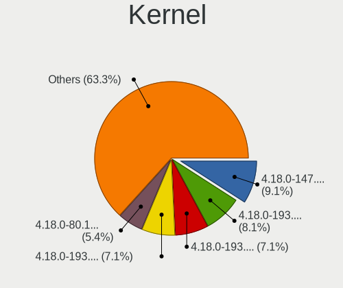

| Version                      | Computers | Percent |
|------------------------------|-----------|---------|
| 4.18.0-147.8.1.el8_1.x86_64  | 27        | 7.63%   |
| 4.18.0-193.6.3.el8_2.x86_64  | 23        | 6.5%    |
| 4.18.0-193.28.1.el8_2.x86_64 | 21        | 5.93%   |
| 4.18.0-193.14.2.el8_2.x86_64 | 20        | 5.65%   |
| 4.18.0-240.22.1.el8_3.x86_64 | 17        | 4.8%    |
| 4.18.0-80.11.2.el8_0.x86_64  | 16        | 4.52%   |
| 4.18.0-147.5.1.el8_1.x86_64  | 16        | 4.52%   |
| 4.18.0-240.15.1.el8_3.x86_64 | 15        | 4.24%   |
| 4.18.0-193.19.1.el8_2.x86_64 | 15        | 4.24%   |
| 4.18.0-348.2.1.el8_5.x86_64  | 13        | 3.67%   |
| 4.18.0-240.1.1.el8_3.x86_64  | 13        | 3.67%   |
| 4.18.0-240.10.1.el8_3.x86_64 | 10        | 2.82%   |
| 4.18.0-305.12.1.el8_4.x86_64 | 8         | 2.26%   |
| 4.18.0-348.7.1.el8_5.x86_64  | 7         | 1.98%   |
| 4.18.0-305.19.1.el8_4.x86_64 | 7         | 1.98%   |
| 4.18.0-301.1.el8.x86_64      | 7         | 1.98%   |
| 4.18.0-147.el8.x86_64        | 7         | 1.98%   |
| 4.18.0-147.3.1.el8_1.x86_64  | 7         | 1.98%   |
| 4.18.0-294.el8.x86_64        | 6         | 1.69%   |
| 4.18.0-80.el8.x86_64         | 5         | 1.41%   |
| 4.18.0-408.el8.x86_64        | 5         | 1.41%   |
| 4.18.0-277.el8.x86_64        | 5         | 1.41%   |
| 4.18.0-358.el8.x86_64        | 4         | 1.13%   |
| 4.18.0-348.el8.x86_64        | 4         | 1.13%   |
| 4.18.0-305.3.1.el8.x86_64    | 4         | 1.13%   |
| 4.18.0-240.el8.x86_64        | 4         | 1.13%   |
| 4.18.0-193.el8.x86_64        | 4         | 1.13%   |
| 4.18.0-147.6.el8.x86_64      | 4         | 1.13%   |
| 4.18.0-383.el8.x86_64        | 3         | 0.85%   |
| 4.18.0-338.el8.x86_64        | 3         | 0.85%   |
| 4.18.0-315.el8.x86_64        | 3         | 0.85%   |
| 4.18.0-305.7.1.el8_4.x86_64  | 3         | 0.85%   |
| 4.18.0-305.17.1.el8_4.x86_64 | 3         | 0.85%   |
| 4.18.0-305.10.2.el8_4.x86_64 | 3         | 0.85%   |
| 4.18.0-259.el8.x86_64        | 3         | 0.85%   |
| 4.18.0-257.el8.x86_64        | 3         | 0.85%   |
| 5.9.12-1.el8.elrepo.x86_64   | 2         | 0.56%   |
| 5.15.11-1.el8.elrepo.x86_64  | 2         | 0.56%   |
| 4.18.0-80.7.1.el8_0.x86_64   | 2         | 0.56%   |
| 4.18.0-365.el8.x86_64        | 2         | 0.56%   |

Kernel Family
-------------

Linux kernel without a distro release

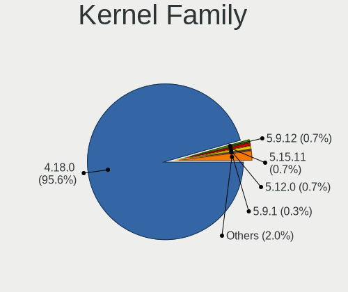

| Version | Computers | Percent |
|---------|-----------|---------|
| 4.18.0  | 302       | 95.27%  |
| 5.9.12  | 2         | 0.63%   |
| 5.15.11 | 2         | 0.63%   |
| 5.12.0  | 2         | 0.63%   |
| 5.9.1   | 1         | 0.32%   |
| 5.8.11  | 1         | 0.32%   |
| 5.4.61  | 1         | 0.32%   |
| 5.18.0  | 1         | 0.32%   |
| 5.17.2  | 1         | 0.32%   |
| 5.13.7  | 1         | 0.32%   |
| 5.13.11 | 1         | 0.32%   |
| 5.10.3  | 1         | 0.32%   |
| 3.10.0  | 1         | 0.32%   |

Kernel Major Ver.
-----------------

Linux kernel major version

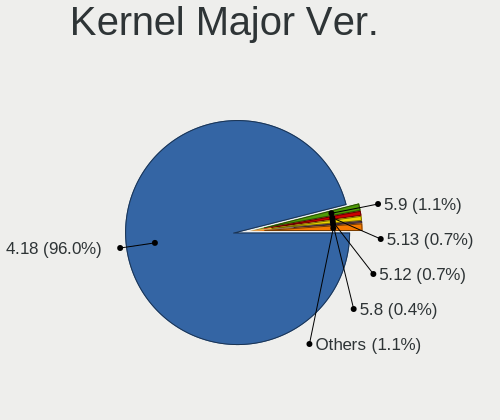

| Version | Computers | Percent |
|---------|-----------|---------|
| 4.18    | 302       | 95.27%  |
| 5.9     | 3         | 0.95%   |
| 5.15    | 2         | 0.63%   |
| 5.13    | 2         | 0.63%   |
| 5.12    | 2         | 0.63%   |
| 5.8     | 1         | 0.32%   |
| 5.4     | 1         | 0.32%   |
| 5.18    | 1         | 0.32%   |
| 5.17    | 1         | 0.32%   |
| 5.10    | 1         | 0.32%   |
| 3.10    | 1         | 0.32%   |

Arch
----

OS architecture (x86_64, i586, etc.)

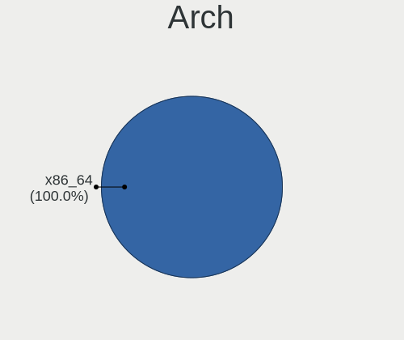

| Name   | Computers | Percent |
|--------|-----------|---------|
| x86_64 | 316       | 100%    |

DE
--

Desktop Environment

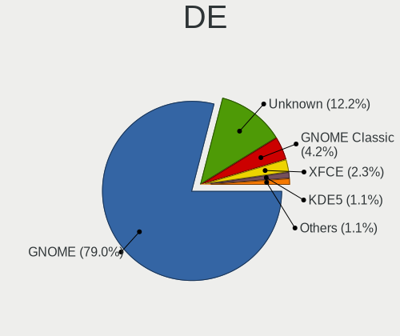

| Name          | Computers | Percent |
|---------------|-----------|---------|
| GNOME         | 252       | 78.26%  |
| Unknown       | 36        | 11.18%  |
| GNOME Classic | 16        | 4.97%   |
| XFCE          | 9         | 2.8%    |
| KDE5          | 5         | 1.55%   |
| MATE          | 2         | 0.62%   |
| X-Cinnamon    | 1         | 0.31%   |
| KDE           | 1         | 0.31%   |

Display Server
--------------

X11 or Wayland

| Name    | Computers | Percent |
|---------|-----------|---------|
| Wayland | 173       | 52.27%  |
| X11     | 124       | 37.46%  |
| Unknown | 33        | 9.97%   |
| Web     | 1         | 0.3%    |

Display Manager
---------------

SDDM, LightDM, etc.

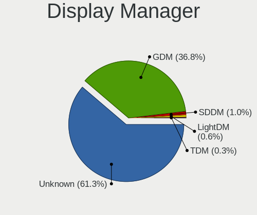

| Name    | Computers | Percent |
|---------|-----------|---------|
| Unknown | 199       | 61.8%   |
| GDM     | 117       | 36.34%  |
| SDDM    | 3         | 0.93%   |
| LightDM | 2         | 0.62%   |
| TDM     | 1         | 0.31%   |

OS Lang
-------

Language

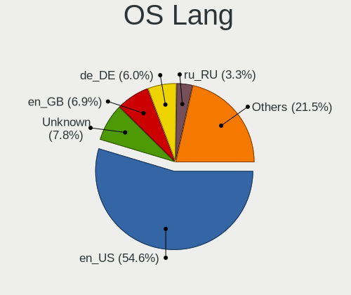

| Lang        | Computers | Percent |
|-------------|-----------|---------|
| en_US       | 174       | 53.87%  |
| Unknown     | 25        | 7.74%   |
| en_GB       | 23        | 7.12%   |
| de_DE       | 20        | 6.19%   |
| pt_BR       | 11        | 3.41%   |
| ru_RU       | 10        | 3.1%    |
| fr_FR       | 8         | 2.48%   |
| pl_PL       | 6         | 1.86%   |
| en_CA       | 6         | 1.86%   |
| en_IN       | 5         | 1.55%   |
| ko_KR       | 4         | 1.24%   |
| nb_NO       | 3         | 0.93%   |
| it_IT       | 3         | 0.93%   |
| es_PE       | 3         | 0.93%   |
| zh_CN       | 2         | 0.62%   |
| en_AU       | 2         | 0.62%   |
| C           | 2         | 0.62%   |
| uk_UA       | 1         | 0.31%   |
| tr_TR       | 1         | 0.31%   |
| sl_SI       | 1         | 0.31%   |
| sk_SK       | 1         | 0.31%   |
| hu_HU       | 1         | 0.31%   |
| fr_CA       | 1         | 0.31%   |
| fi_FI       | 1         | 0.31%   |
| es_US       | 1         | 0.31%   |
| es_MX       | 1         | 0.31%   |
| es_AR       | 1         | 0.31%   |
| en_US.utf-8 | 1         | 0.31%   |
| en_IE       | 1         | 0.31%   |
| de_LU       | 1         | 0.31%   |
| de_CH       | 1         | 0.31%   |
| da_DK       | 1         | 0.31%   |
| cs_CZ       | 1         | 0.31%   |

Boot Mode
---------

EFI or BIOS

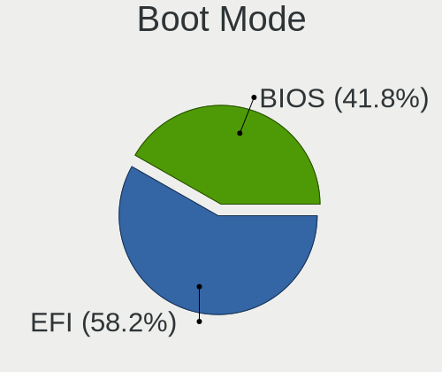

| Mode | Computers | Percent |
|------|-----------|---------|
| EFI  | 185       | 57.99%  |
| BIOS | 134       | 42.01%  |

Filesystem
----------

Type of filesystem

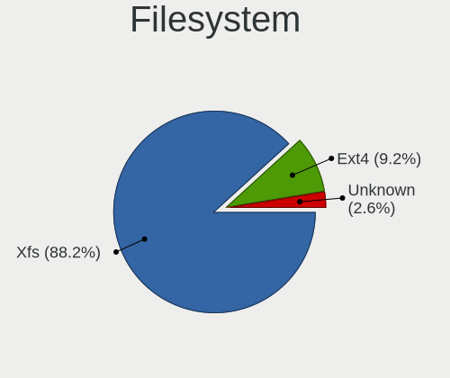

| Type    | Computers | Percent |
|---------|-----------|---------|
| Xfs     | 281       | 88.09%  |
| Ext4    | 30        | 9.4%    |
| Unknown | 8         | 2.51%   |

Part. scheme
------------

Scheme of partitioning

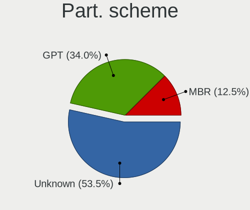

| Type    | Computers | Percent |
|---------|-----------|---------|
| Unknown | 175       | 54.35%  |
| GPT     | 106       | 32.92%  |
| MBR     | 41        | 12.73%  |

Dual Boot with Linux/BSD
------------------------

Hosting more than one Linux/BSD

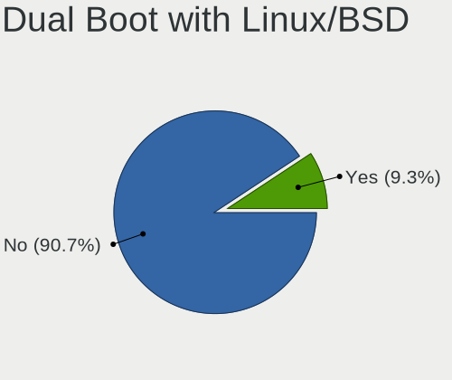

| Dual boot | Computers | Percent |
|-----------|-----------|---------|
| No        | 276       | 86.52%  |
| Yes       | 43        | 13.48%  |

Dual Boot (Win)
---------------

Hosting Linux and Windows

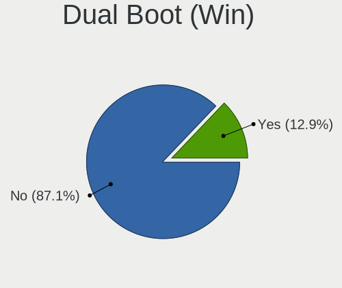

| Dual boot | Computers | Percent |
|-----------|-----------|---------|
| No        | 275       | 86.75%  |
| Yes       | 42        | 13.25%  |

Board
-----

Vendor
------

Motherboard manufacturer

| Name                   | Computers | Percent |
|------------------------|-----------|---------|
| ASUSTek Computer       | 50        | 15.82%  |
| Dell                   | 47        | 14.87%  |
| Hewlett-Packard        | 44        | 13.92%  |
| Lenovo                 | 38        | 12.03%  |
| Gigabyte Technology    | 33        | 10.44%  |
| MSI                    | 18        | 5.7%    |
| Intel                  | 15        | 4.75%   |
| Supermicro             | 11        | 3.48%   |
| Acer                   | 9         | 2.85%   |
| ASRock                 | 7         | 2.22%   |
| Samsung Electronics    | 6         | 1.9%    |
| Unknown                | 5         | 1.58%   |
| Sony                   | 4         | 1.27%   |
| Fujitsu                | 4         | 1.27%   |
| Foxconn                | 3         | 0.95%   |
| Apple                  | 3         | 0.95%   |
| HPE                    | 2         | 0.63%   |
| ASRockRack             | 2         | 0.63%   |
| Toshiba                | 1         | 0.32%   |
| Timi                   | 1         | 0.32%   |
| RM Education           | 1         | 0.32%   |
| Packard Bell           | 1         | 0.32%   |
| Medion                 | 1         | 0.32%   |
| LG Electronics         | 1         | 0.32%   |
| IBM                    | 1         | 0.32%   |
| COPELION INTERNATIONAL | 1         | 0.32%   |
| CompuLab               | 1         | 0.32%   |
| Clevo                  | 1         | 0.32%   |
| Biostar                | 1         | 0.32%   |
| AZW                    | 1         | 0.32%   |
| Aquarius               | 1         | 0.32%   |
| AMI                    | 1         | 0.32%   |
| AIC                    | 1         | 0.32%   |

Model
-----

Motherboard model

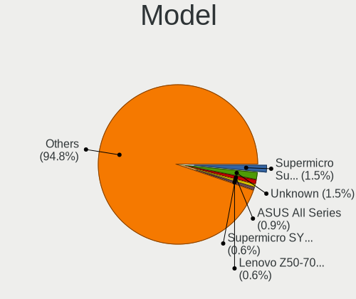

| Name                                              | Computers | Percent |
|---------------------------------------------------|-----------|---------|
| Unknown                                           | 5         | 1.58%   |
| Supermicro Super Server                           | 4         | 1.27%   |
| ASUS All Series                                   | 3         | 0.95%   |
| Supermicro SYS-7048A-T                            | 2         | 0.63%   |
| Lenovo Z50-70 20354                               | 2         | 0.63%   |
| Lenovo IdeaPad L340-15IRH Gaming 81LK             | 2         | 0.63%   |
| HPE ProLiant MicroServer Gen10                    | 2         | 0.63%   |
| HP ProBook 450 G5                                 | 2         | 0.63%   |
| HP Notebook                                       | 2         | 0.63%   |
| HP Compaq 8200 Elite SFF PC                       | 2         | 0.63%   |
| Gigabyte X470 AORUS ULTRA GAMING                  | 2         | 0.63%   |
| Gigabyte A320M-S2H                                | 2         | 0.63%   |
| Dell Studio 1747                                  | 2         | 0.63%   |
| Dell PowerEdge T40                                | 2         | 0.63%   |
| Dell OptiPlex 9020                                | 2         | 0.63%   |
| Dell OptiPlex 7010                                | 2         | 0.63%   |
| Dell Latitude E5470                               | 2         | 0.63%   |
| ASUS TUF B450M-PRO GAMING                         | 2         | 0.63%   |
| ASUS PRIME X570-PRO                               | 2         | 0.63%   |
| ASUS PRIME X570-P                                 | 2         | 0.63%   |
| ASUS M5A99FX PRO R2.0                             | 2         | 0.63%   |
| Toshiba Satellite L15W-B                          | 1         | 0.32%   |
| Timi TM1709                                       | 1         | 0.32%   |
| Supermicro X9SCI/X9SCA                            | 1         | 0.32%   |
| Supermicro X8SIL                                  | 1         | 0.32%   |
| Supermicro X8SAX                                  | 1         | 0.32%   |
| Supermicro SYS-5019P-WTR                          | 1         | 0.32%   |
| Supermicro SSG-6048R-E1CR24H                      | 1         | 0.32%   |
| Sony VPCEH26EN                                    | 1         | 0.32%   |
| Sony VPCEH15FX                                    | 1         | 0.32%   |
| Sony VPCEG15FB                                    | 1         | 0.32%   |
| Sony SVT11215CGW                                  | 1         | 0.32%   |
| Samsung R560                                      | 1         | 0.32%   |
| Samsung 950QDB                                    | 1         | 0.32%   |
| Samsung 700Z3A/700Z4A/700Z5A/700Z5B               | 1         | 0.32%   |
| Samsung 500R4K/500R5H/5400RK/501R5H/5500RH/500R5S | 1         | 0.32%   |
| Samsung 300E4A/300E5A/300E7A                      | 1         | 0.32%   |
| Samsung 270E5J/2570EJ                             | 1         | 0.32%   |
| RM Education RM                                   | 1         | 0.32%   |
| Packard Bell IMEDIA D3610 FR                      | 1         | 0.32%   |

Model Family
------------

Motherboard model prefix

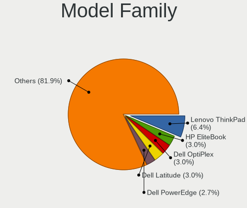

| Name                   | Computers | Percent |
|------------------------|-----------|---------|
| Lenovo ThinkPad        | 21        | 6.65%   |
| Dell OptiPlex          | 10        | 3.16%   |
| HP EliteBook           | 9         | 2.85%   |
| Dell PowerEdge         | 9         | 2.85%   |
| Dell Latitude          | 9         | 2.85%   |
| Lenovo IdeaPad         | 7         | 2.22%   |
| Dell Inspiron          | 7         | 2.22%   |
| ASUS PRIME             | 7         | 2.22%   |
| HP ProBook             | 6         | 1.9%    |
| Dell Precision         | 5         | 1.58%   |
| ASUS TUF               | 5         | 1.58%   |
| Acer Aspire            | 5         | 1.58%   |
| Unknown                | 5         | 1.58%   |
| Supermicro Super       | 4         | 1.27%   |
| HP ZBook               | 4         | 1.27%   |
| HP Compaq              | 4         | 1.27%   |
| Lenovo ThinkCentre     | 3         | 0.95%   |
| HP Laptop              | 3         | 0.95%   |
| Dell XPS               | 3         | 0.95%   |
| ASUS ROG               | 3         | 0.95%   |
| ASUS All               | 3         | 0.95%   |
| Supermicro SYS-7048A-T | 2         | 0.63%   |
| Lenovo Z50-70          | 2         | 0.63%   |
| HPE ProLiant           | 2         | 0.63%   |
| HP ProDesk             | 2         | 0.63%   |
| HP Pavilion            | 2         | 0.63%   |
| HP Notebook            | 2         | 0.63%   |
| HP EliteDesk           | 2         | 0.63%   |
| Gigabyte Z370          | 2         | 0.63%   |
| Gigabyte X570          | 2         | 0.63%   |
| Gigabyte X470          | 2         | 0.63%   |
| Gigabyte A320M-S2H     | 2         | 0.63%   |
| Fujitsu CELSIUS        | 2         | 0.63%   |
| Dell Studio            | 2         | 0.63%   |
| ASUS VivoBook          | 2         | 0.63%   |
| ASUS P8Z77-V           | 2         | 0.63%   |
| ASUS M5A99FX           | 2         | 0.63%   |
| ASUS M5A78L-M          | 2         | 0.63%   |
| Toshiba Satellite      | 1         | 0.32%   |
| Timi TM1709            | 1         | 0.32%   |

MFG Year
--------

Motherboard manufacture year

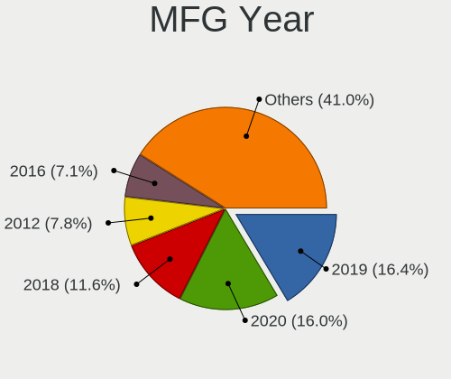

| Year | Computers | Percent |
|------|-----------|---------|
| 2019 | 40        | 12.66%  |
| 2012 | 36        | 11.39%  |
| 2018 | 34        | 10.76%  |
| 2016 | 30        | 9.49%   |
| 2020 | 28        | 8.86%   |
| 2017 | 24        | 7.59%   |
| 2013 | 23        | 7.28%   |
| 2014 | 20        | 6.33%   |
| 2010 | 19        | 6.01%   |
| 2015 | 15        | 4.75%   |
| 2011 | 15        | 4.75%   |
| 2021 | 12        | 3.8%    |
| 2009 | 8         | 2.53%   |
| 2008 | 7         | 2.22%   |
| 2007 | 5         | 1.58%   |

Form Factor
-----------

Physical design of the computer

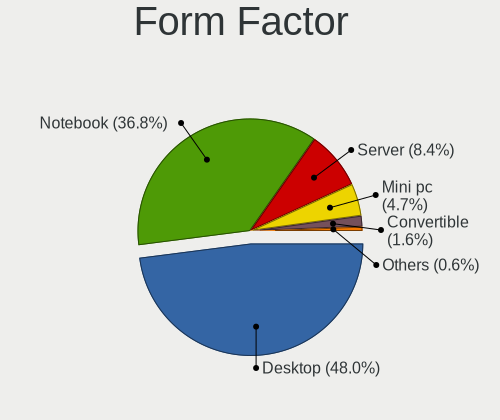

| Name        | Computers | Percent |
|-------------|-----------|---------|
| Desktop     | 153       | 48.42%  |
| Notebook    | 117       | 37.03%  |
| Server      | 25        | 7.91%   |
| Mini pc     | 14        | 4.43%   |
| Convertible | 5         | 1.58%   |
| All in one  | 2         | 0.63%   |

Secure Boot
-----------

Enabled or disabled

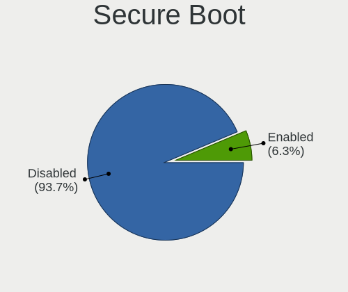

| State    | Computers | Percent |
|----------|-----------|---------|
| Disabled | 297       | 93.69%  |
| Enabled  | 20        | 6.31%   |

Coreboot
--------

Have coreboot on board

| Used | Computers | Percent |
|------|-----------|---------|
| No   | 316       | 100%    |

RAM Size
--------

Total RAM memory

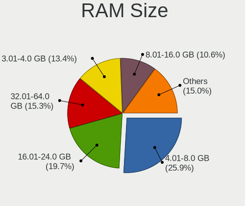

| Size in GB      | Computers | Percent |
|-----------------|-----------|---------|
| 4.01-8.0        | 82        | 25.79%  |
| 16.01-24.0      | 63        | 19.81%  |
| 32.01-64.0      | 49        | 15.41%  |
| 3.01-4.0        | 43        | 13.52%  |
| 8.01-16.0       | 34        | 10.69%  |
| 64.01-256.0     | 29        | 9.12%   |
| 24.01-32.0      | 10        | 3.14%   |
| More than 256.0 | 5         | 1.57%   |
| 1.01-2.0        | 2         | 0.63%   |
| 2.01-3.0        | 1         | 0.31%   |

RAM Used
--------

Used RAM memory

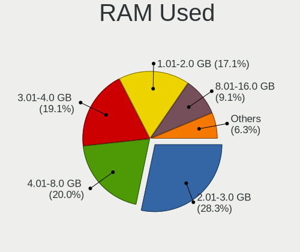

| Used GB         | Computers | Percent |
|-----------------|-----------|---------|
| 2.01-3.0        | 99        | 28.45%  |
| 4.01-8.0        | 70        | 20.11%  |
| 3.01-4.0        | 66        | 18.97%  |
| 1.01-2.0        | 60        | 17.24%  |
| 8.01-16.0       | 31        | 8.91%   |
| 0.51-1.0        | 11        | 3.16%   |
| 16.01-24.0      | 3         | 0.86%   |
| 32.01-64.0      | 2         | 0.57%   |
| 64.01-256.0     | 2         | 0.57%   |
| 0.01-0.5        | 2         | 0.57%   |
| More than 256.0 | 1         | 0.29%   |
| 24.01-32.0      | 1         | 0.29%   |

Total Drives
------------

Number of drives on board

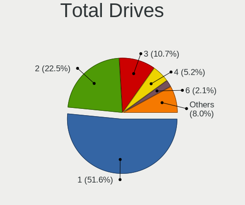

| Drives | Computers | Percent |
|--------|-----------|---------|
| 1      | 156       | 48.75%  |
| 2      | 77        | 24.06%  |
| 3      | 36        | 11.25%  |
| 4      | 20        | 6.25%   |
| 6      | 6         | 1.88%   |
| 5      | 5         | 1.56%   |
| 7      | 3         | 0.94%   |
| 97     | 2         | 0.63%   |
| 93     | 2         | 0.63%   |
| 19     | 2         | 0.63%   |
| 13     | 2         | 0.63%   |
| 11     | 2         | 0.63%   |
| 9      | 2         | 0.63%   |
| 8      | 2         | 0.63%   |
| 37     | 1         | 0.31%   |
| 15     | 1         | 0.31%   |
| 10     | 1         | 0.31%   |

Has CD-ROM
----------

Has CD-ROM on board

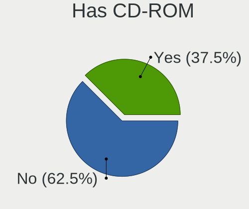

| Presented | Computers | Percent |
|-----------|-----------|---------|
| No        | 202       | 63.72%  |
| Yes       | 115       | 36.28%  |

Has Ethernet
------------

Has Ethernet on board

| Presented | Computers | Percent |
|-----------|-----------|---------|
| Yes       | 296       | 93.67%  |
| No        | 20        | 6.33%   |

Has WiFi
--------

Has WiFi module

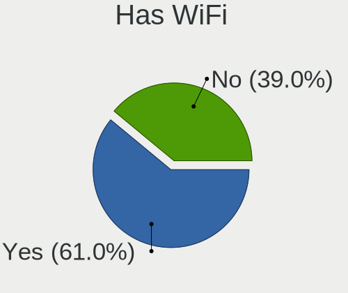

| Presented | Computers | Percent |
|-----------|-----------|---------|
| Yes       | 186       | 58.49%  |
| No        | 132       | 41.51%  |

Has Bluetooth
-------------

Has Bluetooth module

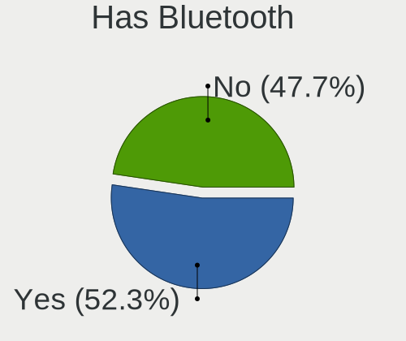

| Presented | Computers | Percent |
|-----------|-----------|---------|
| Yes       | 161       | 50.95%  |
| No        | 155       | 49.05%  |

Location
--------

Country
-------

Geographic location (country)

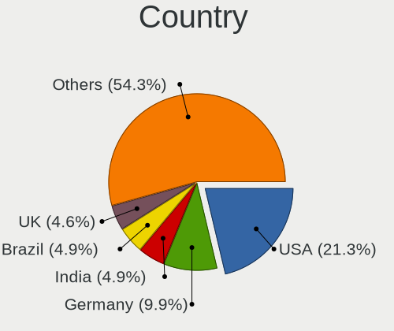

| Country      | Computers | Percent |
|--------------|-----------|---------|
| USA          | 68        | 21.38%  |
| Germany      | 32        | 10.06%  |
| India        | 16        | 5.03%   |
| Brazil       | 16        | 5.03%   |
| UK           | 15        | 4.72%   |
| Russia       | 14        | 4.4%    |
| Canada       | 12        | 3.77%   |
| Sweden       | 10        | 3.14%   |
| France       | 9         | 2.83%   |
| China        | 9         | 2.83%   |
| Mexico       | 7         | 2.2%    |
| Poland       | 6         | 1.89%   |
| Netherlands  | 6         | 1.89%   |
| Belgium      | 6         | 1.89%   |
| Ukraine      | 5         | 1.57%   |
| Turkey       | 5         | 1.57%   |
| Italy        | 5         | 1.57%   |
| South Korea  | 4         | 1.26%   |
| Peru         | 4         | 1.26%   |
| Indonesia    | 4         | 1.26%   |
| Finland      | 4         | 1.26%   |
| Czechia      | 4         | 1.26%   |
| Switzerland  | 3         | 0.94%   |
| Spain        | 3         | 0.94%   |
| South Africa | 3         | 0.94%   |
| Norway       | 3         | 0.94%   |
| Lithuania    | 3         | 0.94%   |
| Slovakia     | 2         | 0.63%   |
| Serbia       | 2         | 0.63%   |
| Romania      | 2         | 0.63%   |
| Malaysia     | 2         | 0.63%   |
| Israel       | 2         | 0.63%   |
| Hong Kong    | 2         | 0.63%   |
| Greece       | 2         | 0.63%   |
| Belarus      | 2         | 0.63%   |
| Bangladesh   | 2         | 0.63%   |
| Austria      | 2         | 0.63%   |
| Australia    | 2         | 0.63%   |
| Vietnam      | 1         | 0.31%   |
| Thailand     | 1         | 0.31%   |

City
----

Geographic location (city)

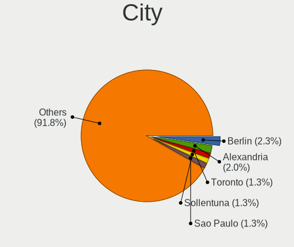

| City          | Computers | Percent |
|---------------|-----------|---------|
| Alexandria    | 6         | 1.86%   |
| Portland      | 5         | 1.55%   |
| Berlin        | 5         | 1.55%   |
| Sollentuna    | 4         | 1.24%   |
| Sao Paulo     | 4         | 1.24%   |
| Munich        | 4         | 1.24%   |
| Moscow        | 4         | 1.24%   |
| Lima          | 4         | 1.24%   |
| Prague        | 3         | 0.93%   |
| Mexico City   | 3         | 0.93%   |
| Istanbul      | 3         | 0.93%   |
| Warsaw        | 2         | 0.62%   |
| Toronto       | 2         | 0.62%   |
| Sydney        | 2         | 0.62%   |
| St Petersburg | 2         | 0.62%   |
| Saint Charles | 2         | 0.62%   |
| Phoenix       | 2         | 0.62%   |
| Paris         | 2         | 0.62%   |
| New York      | 2         | 0.62%   |
| Los Angeles   | 2         | 0.62%   |
| London        | 2         | 0.62%   |
| Lewisham      | 2         | 0.62%   |
| Kyiv          | 2         | 0.62%   |
| Khmelnytskyi  | 2         | 0.62%   |
| Jakarta       | 2         | 0.62%   |
| Helsinki      | 2         | 0.62%   |
| Ernakulam     | 2         | 0.62%   |
| Denver        | 2         | 0.62%   |
| Chicago       | 2         | 0.62%   |
| Changning Qu  | 2         | 0.62%   |
| Central       | 2         | 0.62%   |
| Bengaluru     | 2         | 0.62%   |
| Baihui        | 2         | 0.62%   |
| Atlanta       | 2         | 0.62%   |
| Zurich        | 1         | 0.31%   |
| Zirndorf      | 1         | 0.31%   |
| Zaporizhzhia  | 1         | 0.31%   |
| Zapopan       | 1         | 0.31%   |
| Yozgat        | 1         | 0.31%   |
| Yeonsu-gu     | 1         | 0.31%   |

Drives
------

Drive Vendor
------------

Hard drive vendors

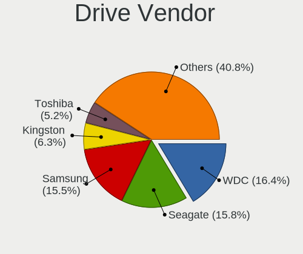

| Vendor                    | Computers | Drives | Percent |
|---------------------------|-----------|--------|---------|
| WDC                       | 86        | 212    | 16.41%  |
| Seagate                   | 85        | 348    | 16.22%  |
| Samsung Electronics       | 82        | 124    | 15.65%  |
| Kingston                  | 34        | 38     | 6.49%   |
| Toshiba                   | 27        | 40     | 5.15%   |
| SanDisk                   | 22        | 25     | 4.2%    |
| Unknown                   | 19        | 85     | 3.63%   |
| Intel                     | 17        | 24     | 3.24%   |
| HGST                      | 17        | 195    | 3.24%   |
| Crucial                   | 16        | 24     | 3.05%   |
| Hitachi                   | 15        | 25     | 2.86%   |
| Micron Technology         | 11        | 21     | 2.1%    |
| A-DATA Technology         | 8         | 12     | 1.53%   |
| SK hynix                  | 7         | 8      | 1.34%   |
| SPCC                      | 6         | 11     | 1.15%   |
| Silicon Motion            | 6         | 6      | 1.15%   |
| Phison                    | 5         | 6      | 0.95%   |
| PNY                       | 3         | 4      | 0.57%   |
| Plextor                   | 3         | 3      | 0.57%   |
| Lenovo                    | 3         | 4      | 0.57%   |
| Apple                     | 3         | 3      | 0.57%   |
| XPG                       | 2         | 2      | 0.38%   |
| Patriot                   | 2         | 6      | 0.38%   |
| OCZ                       | 2         | 3      | 0.38%   |
| Micron/Crucial Technology | 2         | 3      | 0.38%   |
| LITEON                    | 2         | 3      | 0.38%   |
| Lexar                     | 2         | 2      | 0.38%   |
| KIOXIA-EXCERIA            | 2         | 4      | 0.38%   |
| KIOXIA                    | 2         | 3      | 0.38%   |
| Gigabyte Technology       | 2         | 2      | 0.38%   |
| China                     | 2         | 5      | 0.38%   |
| ASMT                      | 2         | 2      | 0.38%   |
| Apacer                    | 2         | 2      | 0.38%   |
| ZEPLIN                    | 1         | 1      | 0.19%   |
| XrayDisk                  | 1         | 1      | 0.19%   |
| Verbatim                  | 1         | 1      | 0.19%   |
| V-GeN                     | 1         | 1      | 0.19%   |
| Union Memory (Shenzhen)   | 1         | 1      | 0.19%   |
| Union Memory              | 1         | 1      | 0.19%   |
| UMIS                      | 1         | 1      | 0.19%   |

Drive Model
-----------

Hard drive models

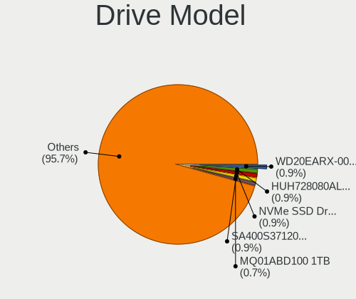

| Model                              | Computers | Percent |
|------------------------------------|-----------|---------|
| WDC WD20EARX-00PASB0 2TB           | 6         | 0.94%   |
| Unknown HUH728080ALE601 8TB        | 6         | 0.94%   |
| Samsung NVMe SSD Drive 512GB       | 6         | 0.94%   |
| Kingston SA400S37120G 120GB SSD    | 6         | 0.94%   |
| Toshiba DT01ACA100 1TB             | 5         | 0.78%   |
| Seagate ST16000NM001G-2KK103 16TB  | 5         | 0.78%   |
| Seagate ST1000LM024 HN-M101MBB 1TB | 5         | 0.78%   |
| Samsung SSD 980 1TB                | 5         | 0.78%   |
| Micron 9300_MTFDHAL6T4TDR 6.4TB    | 5         | 0.78%   |
| Kingston SA400S37480G 480GB SSD    | 5         | 0.78%   |
| Kingston SA400S37240G 240GB SSD    | 5         | 0.78%   |
| HGST HUH721212ALE600 12TB          | 5         | 0.78%   |
| WDC WD20EZRZ-00Z5HB0 2TB           | 4         | 0.62%   |
| WDC WD10EZEX-08WN4A0 1TB           | 4         | 0.62%   |
| Toshiba MQ01ABD100 1TB             | 4         | 0.62%   |
| Seagate ST6000NM0095 6TB           | 4         | 0.62%   |
| Seagate ST6000NM0034 6TB           | 4         | 0.62%   |
| Seagate ST6000NM0014 6TB           | 4         | 0.62%   |
| Seagate ST500DM002-1BD142 500GB    | 4         | 0.62%   |
| Seagate ST4000NXCLAR4000 4TB       | 4         | 0.62%   |
| Seagate ST4000NM0023 4TB           | 4         | 0.62%   |
| Seagate ST31000528AS 1TB           | 4         | 0.62%   |
| Seagate ST1000LM035-1RK172 1TB     | 4         | 0.62%   |
| Seagate ST1000DM010-2EP102 1TB     | 4         | 0.62%   |
| SanDisk NVMe SSD Drive 512GB       | 4         | 0.62%   |
| Samsung SSD 860 EVO 500GB          | 4         | 0.62%   |
| Samsung SSD 860 EVO 1TB            | 4         | 0.62%   |
| HGST HUS726060ALS640 6TB           | 4         | 0.62%   |
| HGST HUH721010AL4200 10TB          | 4         | 0.62%   |
| HGST H7280A520SUN8.0T 8TB          | 4         | 0.62%   |
| WDC WDS500G2B0A-00SM50 500GB SSD   | 3         | 0.47%   |
| WDC WDS240G2G0A-00JH30 240GB SSD   | 3         | 0.47%   |
| Unknown MMC Card  32GB             | 3         | 0.47%   |
| Seagate ST500LT012-1DG142 500GB    | 3         | 0.47%   |
| Seagate ST1000DM003-1ER162 1TB     | 3         | 0.47%   |
| Seagate ST1000DM003-1CH162 1TB     | 3         | 0.47%   |
| SanDisk NVMe SSD Drive 500GB       | 3         | 0.47%   |
| Samsung SSD 970 PRO 512GB          | 3         | 0.47%   |
| Samsung SSD 850 EVO 250GB          | 3         | 0.47%   |
| Samsung SSD 840 EVO 250GB          | 3         | 0.47%   |

HDD Vendor
----------

Hard disk drive vendors

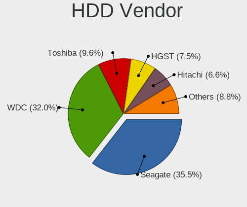

| Vendor              | Computers | Drives | Percent |
|---------------------|-----------|--------|---------|
| Seagate             | 81        | 343    | 34.76%  |
| WDC                 | 75        | 192    | 32.19%  |
| Toshiba             | 22        | 35     | 9.44%   |
| HGST                | 17        | 103    | 7.3%    |
| Hitachi             | 15        | 25     | 6.44%   |
| Unknown             | 8         | 71     | 3.43%   |
| Samsung Electronics | 8         | 8      | 3.43%   |
| Apple               | 2         | 2      | 0.86%   |
| MARVELL             | 1         | 1      | 0.43%   |
| IBM-ESXS            | 1         | 2      | 0.43%   |
| Hewlett-Packard     | 1         | 1      | 0.43%   |
| Dell                | 1         | 1      | 0.43%   |
| ASMT                | 1         | 1      | 0.43%   |

SSD Vendor
----------

Solid state drive vendors

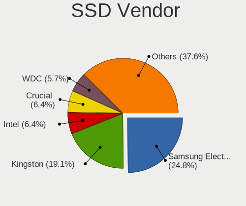

| Vendor              | Computers | Drives | Percent |
|---------------------|-----------|--------|---------|
| Samsung Electronics | 45        | 69     | 24.19%  |
| Kingston            | 33        | 37     | 17.74%  |
| Crucial             | 14        | 22     | 7.53%   |
| Intel               | 13        | 15     | 6.99%   |
| WDC                 | 12        | 16     | 6.45%   |
| SanDisk             | 12        | 14     | 6.45%   |
| SPCC                | 6         | 11     | 3.23%   |
| SK hynix            | 5         | 6      | 2.69%   |
| A-DATA Technology   | 5         | 7      | 2.69%   |
| Toshiba             | 4         | 4      | 2.15%   |
| Micron Technology   | 4         | 5      | 2.15%   |
| PNY                 | 3         | 4      | 1.61%   |
| Plextor             | 2         | 2      | 1.08%   |
| Patriot             | 2         | 6      | 1.08%   |
| OCZ                 | 2         | 3      | 1.08%   |
| LITEON              | 2         | 3      | 1.08%   |
| Lenovo              | 2         | 3      | 1.08%   |
| China               | 2         | 5      | 1.08%   |
| Apacer              | 2         | 2      | 1.08%   |
| XrayDisk            | 1         | 1      | 0.54%   |
| Verbatim            | 1         | 1      | 0.54%   |
| V-GeN               | 1         | 1      | 0.54%   |
| Transcend           | 1         | 2      | 0.54%   |
| Team                | 1         | 1      | 0.54%   |
| SSD                 | 1         | 1      | 0.54%   |
| Seagate             | 1         | 1      | 0.54%   |
| SATADOM-SL          | 1         | 1      | 0.54%   |
| LITEONIT            | 1         | 1      | 0.54%   |
| Linux               | 1         | 1      | 0.54%   |
| Lexar               | 1         | 1      | 0.54%   |
| KIOXIA-EXCERIA      | 1         | 2      | 0.54%   |
| KINGBANK            | 1         | 1      | 0.54%   |
| Biostar             | 1         | 1      | 0.54%   |
| ASMT                | 1         | 1      | 0.54%   |
| Apple               | 1         | 1      | 0.54%   |

Drive Kind
----------

HDD or SSD

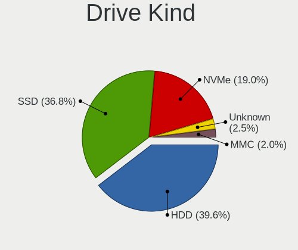

| Kind    | Computers | Drives | Percent |
|---------|-----------|--------|---------|
| HDD     | 177       | 785    | 39.33%  |
| SSD     | 161       | 252    | 35.78%  |
| NVMe    | 91        | 133    | 20.22%  |
| Unknown | 12        | 101    | 2.67%   |
| MMC     | 9         | 11     | 2%      |

Drive Connector
---------------

SATA, SAS, NVMe, etc.

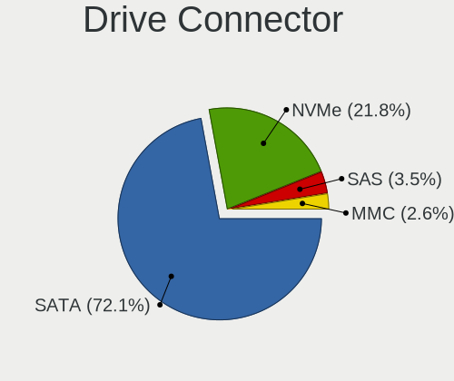

| Type | Computers | Drives | Percent |
|------|-----------|--------|---------|
| SATA | 274       | 833    | 69.72%  |
| NVMe | 91        | 133    | 23.16%  |
| SAS  | 19        | 305    | 4.83%   |
| MMC  | 9         | 11     | 2.29%   |

Drive Size
----------

Size of hard drive

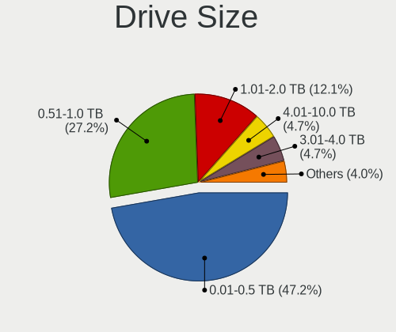

| Size in TB | Computers | Drives | Percent |
|------------|-----------|--------|---------|
| 0.01-0.5   | 184       | 311    | 47.55%  |
| 0.51-1.0   | 104       | 164    | 26.87%  |
| 1.01-2.0   | 47        | 95     | 12.14%  |
| 4.01-10.0  | 19        | 202    | 4.91%   |
| 3.01-4.0   | 17        | 140    | 4.39%   |
| 10.01-20.0 | 9         | 85     | 2.33%   |
| 2.01-3.0   | 7         | 40     | 1.81%   |

Space Total
-----------

Amount of disk space available on the file system

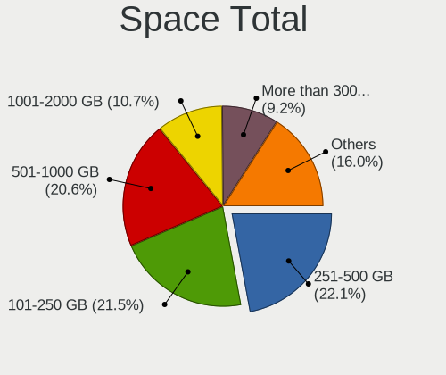

| Size in GB     | Computers | Percent |
|----------------|-----------|---------|
| 251-500        | 71        | 21.91%  |
| 101-250        | 70        | 21.6%   |
| 501-1000       | 67        | 20.68%  |
| 1001-2000      | 35        | 10.8%   |
| More than 3000 | 30        | 9.26%   |
| 51-100         | 14        | 4.32%   |
| Unknown        | 12        | 3.7%    |
| 21-50          | 11        | 3.4%    |
| 2001-3000      | 9         | 2.78%   |
| 1-20           | 5         | 1.54%   |

Space Used
----------

Amount of used disk space

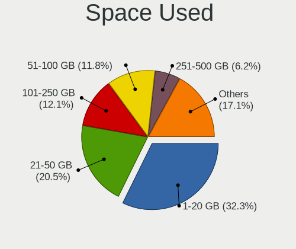

| Used GB        | Computers | Percent |
|----------------|-----------|---------|
| 1-20           | 108       | 31.86%  |
| 21-50          | 67        | 19.76%  |
| 51-100         | 41        | 12.09%  |
| 101-250        | 40        | 11.8%   |
| 251-500        | 23        | 6.78%   |
| 501-1000       | 18        | 5.31%   |
| More than 3000 | 17        | 5.01%   |
| 1001-2000      | 13        | 3.83%   |
| Unknown        | 12        | 3.54%   |

Malfunc. Drives
---------------

Drive models with a malfunction

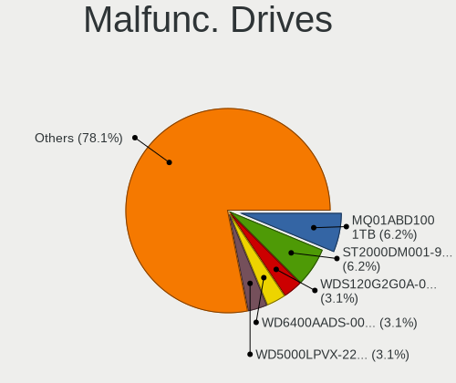

| Model                                 | Computers | Drives | Percent |
|---------------------------------------|-----------|--------|---------|
| Toshiba MQ01ABD100 1TB                | 2         | 4      | 6.45%   |
| Seagate ST2000DM001-9YN164 2TB        | 2         | 2      | 6.45%   |
| WDC WD6400AADS-00M2B0 640GB           | 1         | 1      | 3.23%   |
| WDC WD5000LPVX-22V0TT0 500GB          | 1         | 1      | 3.23%   |
| WDC WD5000AACS-00G8B0 500GB           | 1         | 1      | 3.23%   |
| WDC WD3200AVVS-63L2B0 320GB           | 1         | 1      | 3.23%   |
| WDC WD20EZRZ-00Z5HB0 2TB              | 1         | 1      | 3.23%   |
| WDC WD20EFRX-68EUZN0 2TB              | 1         | 4      | 3.23%   |
| WDC WD1003FBYX-01Y7B0 1TB             | 1         | 1      | 3.23%   |
| WDC WD1002FBYS-18A6B0 1TB             | 1         | 1      | 3.23%   |
| WDC RFT030VQFF-KRM5P7 3TB             | 1         | 1      | 3.23%   |
| Toshiba MK2552GSX 250GB               | 1         | 1      | 3.23%   |
| SK hynix HFS128G32TND-N210A 128GB SSD | 1         | 1      | 3.23%   |
| Seagate ST9750420AS 752GB             | 1         | 1      | 3.23%   |
| Seagate ST500LT012-1DG142 500GB       | 1         | 1      | 3.23%   |
| Seagate ST500DM002-1BD142 500GB       | 1         | 1      | 3.23%   |
| Seagate ST3400820AS 400GB             | 1         | 1      | 3.23%   |
| Seagate ST3000VM002-1ET166 3TB        | 1         | 1      | 3.23%   |
| Seagate ST12000VN0007-2GS116 12TB     | 1         | 14     | 3.23%   |
| Seagate ST1000LM014-1EJ164 1TB        | 1         | 1      | 3.23%   |
| Seagate ST1000DM003-1ER162 1TB        | 1         | 1      | 3.23%   |
| SanDisk SSD PLUS 480GB                | 1         | 1      | 3.23%   |
| Samsung Electronics SSD 840 EVO 250GB | 1         | 1      | 3.23%   |
| LITEON CV8-8E128-HP 128GB SSD         | 1         | 1      | 3.23%   |
| Intel SSDSA2M040G2GC 40GB             | 1         | 1      | 3.23%   |
| Hitachi HTS723232A7A364 320GB         | 1         | 1      | 3.23%   |
| Hitachi HTS545032B9A302 320GB         | 1         | 1      | 3.23%   |
| Hitachi HDT721010SLA360 1TB           | 1         | 1      | 3.23%   |
| HGST HDS724040ALE640 4TB              | 1         | 2      | 3.23%   |

Malfunc. Drive Vendor
---------------------

Vendors of faulty drives

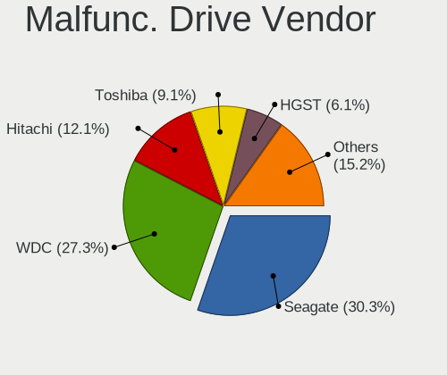

| Vendor              | Computers | Drives | Percent |
|---------------------|-----------|--------|---------|
| Seagate             | 10        | 23     | 34.48%  |
| WDC                 | 7         | 12     | 24.14%  |
| Toshiba             | 3         | 5      | 10.34%  |
| Hitachi             | 3         | 3      | 10.34%  |
| SK hynix            | 1         | 1      | 3.45%   |
| SanDisk             | 1         | 1      | 3.45%   |
| Samsung Electronics | 1         | 1      | 3.45%   |
| LITEON              | 1         | 1      | 3.45%   |
| Intel               | 1         | 1      | 3.45%   |
| HGST                | 1         | 2      | 3.45%   |

Malfunc. HDD Vendor
-------------------

Vendors of faulty HDD drives

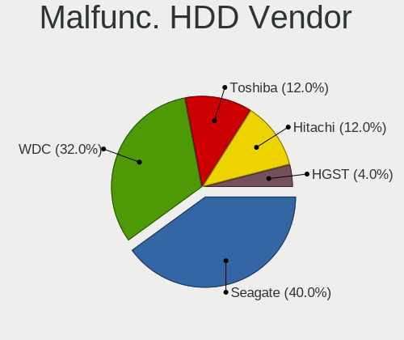

| Vendor  | Computers | Drives | Percent |
|---------|-----------|--------|---------|
| Seagate | 10        | 23     | 41.67%  |
| WDC     | 7         | 12     | 29.17%  |
| Toshiba | 3         | 5      | 12.5%   |
| Hitachi | 3         | 3      | 12.5%   |
| HGST    | 1         | 2      | 4.17%   |

Malfunc. Drive Kind
-------------------

Kinds of faulty drives

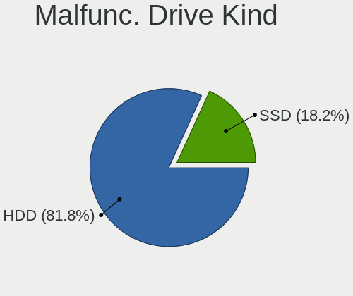

| Kind | Computers | Drives | Percent |
|------|-----------|--------|---------|
| HDD  | 23        | 45     | 82.14%  |
| SSD  | 5         | 5      | 17.86%  |

Failed Drives
-------------

Failed drive models

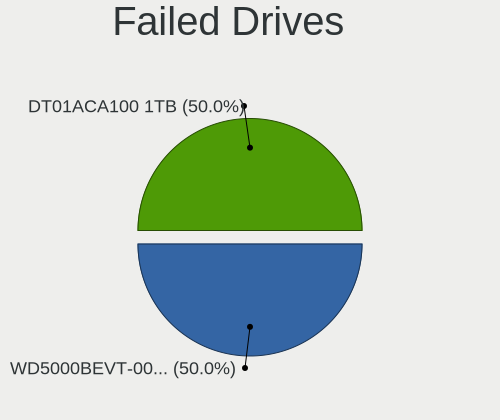

| Model                        | Computers | Drives | Percent |
|------------------------------|-----------|--------|---------|
| WDC WD5000BEVT-00A0RT0 500GB | 1         | 1      | 50%     |
| Toshiba DT01ACA100 1TB       | 1         | 2      | 50%     |

Failed Drive Vendor
-------------------

Failed drive vendors

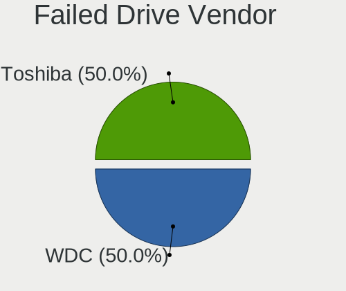

| Vendor  | Computers | Drives | Percent |
|---------|-----------|--------|---------|
| WDC     | 1         | 1      | 50%     |
| Toshiba | 1         | 2      | 50%     |

Drive Status
------------

Number of failed and malfunc. drives

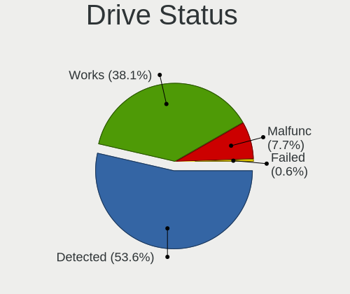

| Status   | Computers | Drives | Percent |
|----------|-----------|--------|---------|
| Detected | 192       | 664    | 54.08%  |
| Works    | 134       | 565    | 37.75%  |
| Malfunc  | 27        | 50     | 7.61%   |
| Failed   | 2         | 3      | 0.56%   |

Storage controller
------------------

Storage Vendor
--------------

Storage controller vendors

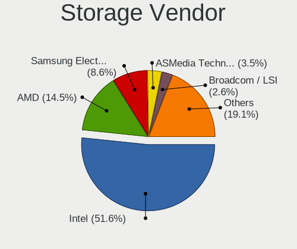

| Vendor                         | Computers | Percent |
|--------------------------------|-----------|---------|
| Intel                          | 237       | 51.86%  |
| AMD                            | 66        | 14.44%  |
| Samsung Electronics            | 39        | 8.53%   |
| ASMedia Technology             | 16        | 3.5%    |
| Broadcom / LSI                 | 12        | 2.63%   |
| SanDisk                        | 11        | 2.41%   |
| Marvell Technology Group       | 10        | 2.19%   |
| LSI Logic / Symbios Logic      | 10        | 2.19%   |
| Micron Technology              | 8         | 1.75%   |
| Silicon Motion                 | 7         | 1.53%   |
| Phison Electronics             | 7         | 1.53%   |
| JMicron Technology             | 7         | 1.53%   |
| ADATA Technology               | 5         | 1.09%   |
| Union Memory (Shenzhen)        | 3         | 0.66%   |
| Micron/Crucial Technology      | 3         | 0.66%   |
| KIOXIA                         | 3         | 0.66%   |
| SK hynix                       | 2         | 0.44%   |
| Toshiba America Info Systems   | 1         | 0.22%   |
| Solid State Storage Technology | 1         | 0.22%   |
| Shenzhen Longsys Electronics   | 1         | 0.22%   |
| Seagate Technology             | 1         | 0.22%   |
| Realtek Semiconductor          | 1         | 0.22%   |
| Nvidia                         | 1         | 0.22%   |
| Lite-On Technology             | 1         | 0.22%   |
| Lenovo                         | 1         | 0.22%   |
| Kingston Technology Company    | 1         | 0.22%   |
| Integrated Technology Express  | 1         | 0.22%   |
| Adaptec                        | 1         | 0.22%   |

Storage Model
-------------

Storage controller models

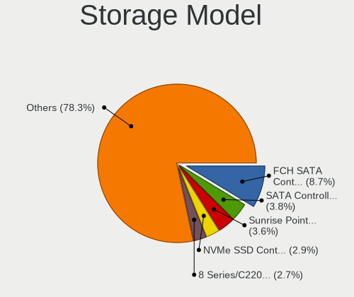

| Model                                                                          | Computers | Percent |
|--------------------------------------------------------------------------------|-----------|---------|
| AMD FCH SATA Controller [AHCI mode]                                            | 48        | 9.07%   |
| Intel Sunrise Point-LP SATA Controller [AHCI mode]                             | 20        | 3.78%   |
| Intel SATA Controller [RAID mode]                                              | 17        | 3.21%   |
| Samsung NVMe SSD Controller SM981/PM981/PM983                                  | 16        | 3.02%   |
| Intel 8 Series/C220 Series Chipset Family 6-port SATA Controller 1 [AHCI mode] | 15        | 2.84%   |
| Intel 7 Series/C210 Series Chipset Family 6-port SATA Controller [AHCI mode]   | 13        | 2.46%   |
| Intel 7 Series Chipset Family 6-port SATA Controller [AHCI mode]               | 13        | 2.46%   |
| Intel 8 Series SATA Controller 1 [AHCI mode]                                   | 12        | 2.27%   |
| ASMedia ASM1062 Serial ATA Controller                                          | 11        | 2.08%   |
| Samsung NVMe SSD Controller 980                                                | 9         | 1.7%    |
| Intel 6 Series/C200 Series Chipset Family 6 port Mobile SATA AHCI Controller   | 9         | 1.7%    |
| AMD SB7x0/SB8x0/SB9x0 SATA Controller [AHCI mode]                              | 9         | 1.7%    |
| Intel Wildcat Point-LP SATA Controller [AHCI Mode]                             | 8         | 1.51%   |
| Intel Q170/Q150/B150/H170/H110/Z170/CM236 Chipset SATA Controller [AHCI Mode]  | 8         | 1.51%   |
| Intel C610/X99 series chipset 6-Port SATA Controller [AHCI mode]               | 8         | 1.51%   |
| Intel 5 Series/3400 Series Chipset 6 port SATA AHCI Controller                 | 8         | 1.51%   |
| AMD 400 Series Chipset SATA Controller                                         | 8         | 1.51%   |
| Intel Cannon Lake Mobile PCH SATA AHCI Controller                              | 7         | 1.32%   |
| Intel C610/X99 series chipset sSATA Controller [AHCI mode]                     | 7         | 1.32%   |
| Samsung NVMe SSD Controller SM961/PM961/SM963                                  | 6         | 1.13%   |
| Intel 82801JI (ICH10 Family) 4 port SATA IDE Controller #1                     | 6         | 1.13%   |
| Intel 82801JI (ICH10 Family) 2 port SATA IDE Controller #2                     | 6         | 1.13%   |
| Intel 82801 Mobile SATA Controller [RAID mode]                                 | 6         | 1.13%   |
| Intel 6 Series/C200 Series Chipset Family 6 port Desktop SATA AHCI Controller  | 6         | 1.13%   |
| Intel 200 Series PCH SATA controller [AHCI mode]                               | 6         | 1.13%   |
| AMD FCH SATA Controller D                                                      | 6         | 1.13%   |
| Phison E16 PCIe4 NVMe Controller                                               | 5         | 0.95%   |
| Micron 9300 MAX NVMe SSD                                                       | 5         | 0.95%   |
| Intel NM10/ICH7 Family SATA Controller [IDE mode]                              | 5         | 0.95%   |
| Intel Cannon Lake PCH SATA AHCI Controller                                     | 5         | 0.95%   |
| Intel 5 Series/3400 Series Chipset 4 port SATA IDE Controller                  | 5         | 0.95%   |
| Intel 400 Series Chipset Family SATA AHCI Controller                           | 5         | 0.95%   |
| Broadcom / LSI SAS3008 PCI-Express Fusion-MPT SAS-3                            | 5         | 0.95%   |
| ASMedia SATA controller                                                        | 5         | 0.95%   |
| AMD SB7x0/SB8x0/SB9x0 IDE Controller                                           | 5         | 0.95%   |
| Silicon Motion SM2263EN/SM2263XT SSD Controller                                | 4         | 0.76%   |
| Samsung NVMe SSD Controller SM951/PM951                                        | 4         | 0.76%   |
| JMicron JMB363 SATA/IDE Controller                                             | 4         | 0.76%   |
| Intel Cannon Point-LP SATA Controller [AHCI Mode]                              | 4         | 0.76%   |
| Intel C620 Series Chipset Family SSATA Controller [AHCI mode]                  | 4         | 0.76%   |

Storage Kind
------------

Kind of storage controller (IDE, SATA, NVMe, SAS, ...)

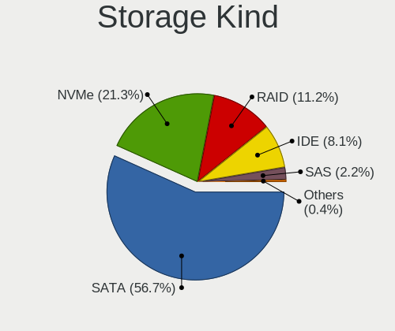

| Kind | Computers | Percent |
|------|-----------|---------|
| SATA | 246       | 56.94%  |
| NVMe | 91        | 21.06%  |
| RAID | 48        | 11.11%  |
| IDE  | 36        | 8.33%   |
| SAS  | 10        | 2.31%   |
| SCSI | 1         | 0.23%   |

Processor
---------

CPU Vendor
----------

Processor vendors

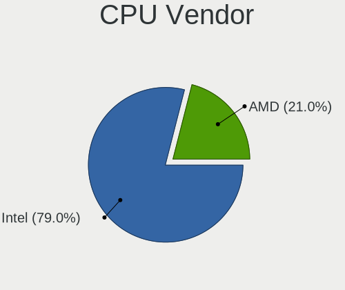

| Vendor | Computers | Percent |
|--------|-----------|---------|
| Intel  | 250       | 79.11%  |
| AMD    | 66        | 20.89%  |

CPU Model
---------

Processor models

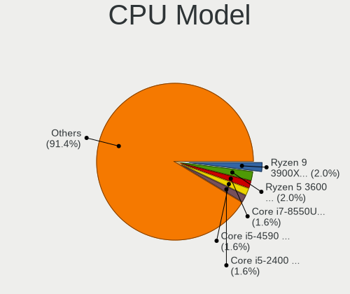

| Model                                       | Computers | Percent |
|---------------------------------------------|-----------|---------|
| AMD Ryzen 9 3900X 12-Core Processor         | 5         | 1.58%   |
| AMD Ryzen 5 3600 6-Core Processor           | 5         | 1.58%   |
| Intel Core i7-8550U CPU @ 1.80GHz           | 4         | 1.26%   |
| Intel Core i5-6200U CPU @ 2.30GHz           | 4         | 1.26%   |
| Intel Core i5-4590 CPU @ 3.30GHz            | 4         | 1.26%   |
| Intel Core i5-2400 CPU @ 3.10GHz            | 4         | 1.26%   |
| AMD Ryzen 7 3700X 8-Core Processor          | 4         | 1.26%   |
| AMD EPYC 7702 64-Core Processor             | 4         | 1.26%   |
| Intel Xeon CPU E5-2620 v3 @ 2.40GHz         | 3         | 0.95%   |
| Intel Core i7-8565U CPU @ 1.80GHz           | 3         | 0.95%   |
| Intel Core i5-8250U CPU @ 1.60GHz           | 3         | 0.95%   |
| Intel Core i5-6300U CPU @ 2.40GHz           | 3         | 0.95%   |
| Intel Core i5-5200U CPU @ 2.20GHz           | 3         | 0.95%   |
| Intel Core i5-4300U CPU @ 1.90GHz           | 3         | 0.95%   |
| Intel Core i5-4210U CPU @ 1.70GHz           | 3         | 0.95%   |
| Intel Core i5-3570K CPU @ 3.40GHz           | 3         | 0.95%   |
| Intel Core i5-3470 CPU @ 3.20GHz            | 3         | 0.95%   |
| Intel Core 2 Quad CPU Q9550 @ 2.83GHz       | 3         | 0.95%   |
| Intel Core 2 Quad CPU Q6600 @ 2.40GHz       | 3         | 0.95%   |
| Intel 11th Gen Core i7-1165G7 @ 2.80GHz     | 3         | 0.95%   |
| AMD Ryzen 3 2200G with Radeon Vega Graphics | 3         | 0.95%   |
| AMD FX-8350 Eight-Core Processor            | 3         | 0.95%   |
| Intel Xeon E-2224G CPU @ 3.50GHz            | 2         | 0.63%   |
| Intel Xeon CPU E5645 @ 2.40GHz              | 2         | 0.63%   |
| Intel Xeon CPU E5-2620 v4 @ 2.10GHz         | 2         | 0.63%   |
| Intel Xeon CPU E5-2620 v2 @ 2.10GHz         | 2         | 0.63%   |
| Intel Genuine CPU 0000%@                    | 2         | 0.63%   |
| Intel Core i7-9750H CPU @ 2.60GHz           | 2         | 0.63%   |
| Intel Core i7-8700K CPU @ 3.70GHz           | 2         | 0.63%   |
| Intel Core i7-8650U CPU @ 1.90GHz           | 2         | 0.63%   |
| Intel Core i7-7700K CPU @ 4.20GHz           | 2         | 0.63%   |
| Intel Core i7-7700 CPU @ 3.60GHz            | 2         | 0.63%   |
| Intel Core i7-6820HQ CPU @ 2.70GHz          | 2         | 0.63%   |
| Intel Core i7-6700K CPU @ 4.00GHz           | 2         | 0.63%   |
| Intel Core i7-6700 CPU @ 3.40GHz            | 2         | 0.63%   |
| Intel Core i7-4770 CPU @ 3.40GHz            | 2         | 0.63%   |
| Intel Core i7-4700MQ CPU @ 2.40GHz          | 2         | 0.63%   |
| Intel Core i7-3770 CPU @ 3.40GHz            | 2         | 0.63%   |
| Intel Core i7-3630QM CPU @ 2.40GHz          | 2         | 0.63%   |
| Intel Core i7-10750H CPU @ 2.60GHz          | 2         | 0.63%   |

CPU Model Family
----------------

Processor model prefix

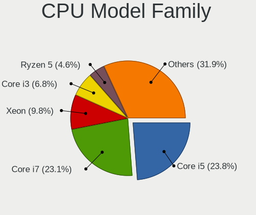

| Model                   | Computers | Percent |
|-------------------------|-----------|---------|
| Intel Core i5           | 75        | 23.66%  |
| Intel Core i7           | 71        | 22.4%   |
| Intel Xeon              | 31        | 9.78%   |
| Intel Core i3           | 22        | 6.94%   |
| AMD Ryzen 5             | 15        | 4.73%   |
| AMD Ryzen 7             | 10        | 3.15%   |
| Intel Pentium           | 8         | 2.52%   |
| Intel Core 2 Quad       | 8         | 2.52%   |
| AMD Ryzen 9             | 8         | 2.52%   |
| AMD FX                  | 8         | 2.52%   |
| Other                   | 7         | 2.21%   |
| Intel Core 2 Duo        | 7         | 2.21%   |
| Intel Celeron           | 6         | 1.89%   |
| AMD Ryzen 3             | 5         | 1.58%   |
| AMD EPYC                | 5         | 1.58%   |
| Intel Genuine           | 3         | 0.95%   |
| Intel Atom              | 3         | 0.95%   |
| AMD Ryzen Threadripper  | 3         | 0.95%   |
| AMD Ryzen 7 PRO         | 3         | 0.95%   |
| AMD Opteron             | 3         | 0.95%   |
| Intel Xeon Silver       | 2         | 0.63%   |
| Intel Core i9           | 2         | 0.63%   |
| AMD A4                  | 2         | 0.63%   |
| Intel Xeon Platinum     | 1         | 0.32%   |
| Intel Xeon Gold         | 1         | 0.32%   |
| Intel Xeon Bronze       | 1         | 0.32%   |
| Intel Pentium Gold      | 1         | 0.32%   |
| Intel Pentium Dual-Core | 1         | 0.32%   |
| Intel Pentium Dual      | 1         | 0.32%   |
| AMD Turion II Neo       | 1         | 0.32%   |
| AMD Phenom II X4        | 1         | 0.32%   |
| AMD G                   | 1         | 0.32%   |
| AMD A10                 | 1         | 0.32%   |

CPU Cores
---------

Number of processor cores

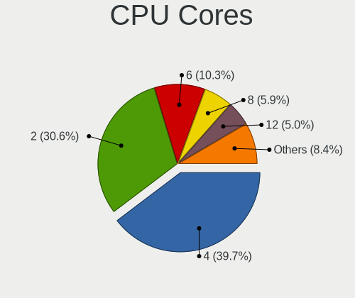

| Number | Computers | Percent |
|--------|-----------|---------|
| 4      | 127       | 40.06%  |
| 2      | 96        | 30.28%  |
| 6      | 33        | 10.41%  |
| 8      | 19        | 5.99%   |
| 12     | 16        | 5.05%   |
| 16     | 9         | 2.84%   |
| 64     | 4         | 1.26%   |
| 1      | 4         | 1.26%   |
| 96     | 2         | 0.63%   |
| 3      | 2         | 0.63%   |
| 52     | 1         | 0.32%   |
| 36     | 1         | 0.32%   |
| 32     | 1         | 0.32%   |
| 20     | 1         | 0.32%   |
| 10     | 1         | 0.32%   |

CPU Sockets
-----------

Number of sockets

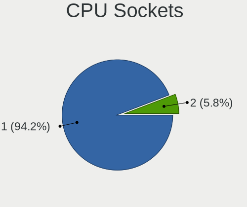

| Number | Computers | Percent |
|--------|-----------|---------|
| 1      | 295       | 93.35%  |
| 2      | 21        | 6.65%   |

CPU Threads
-----------

Threads per core (Hyper-Threading)

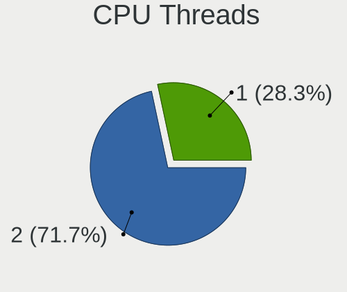

| Number | Computers | Percent |
|--------|-----------|---------|
| 2      | 228       | 71.7%   |
| 1      | 90        | 28.3%   |

CPU Op-Modes
------------

CPU Operation Modes (32-bit, 64-bit)

| Op mode        | Computers | Percent |
|----------------|-----------|---------|
| 32-bit, 64-bit | 311       | 98.11%  |
| Unknown        | 6         | 1.89%   |

CPU Microcode
-------------

Microcode number

| Number     | Computers | Percent |
|------------|-----------|---------|
| 0x306a9    | 28        | 8.75%   |
| 0x306c3    | 21        | 6.56%   |
| 0x206a7    | 19        | 5.94%   |
| 0x906ea    | 12        | 3.75%   |
| 0x506e3    | 12        | 3.75%   |
| 0x40651    | 12        | 3.75%   |
| 0x08701021 | 11        | 3.44%   |
| Unknown    | 11        | 3.44%   |
| 0x806ea    | 10        | 3.13%   |
| 0x406e3    | 10        | 3.13%   |
| 0x306d4    | 10        | 3.13%   |
| 0x06000852 | 9         | 2.81%   |
| 0x906e9    | 7         | 2.19%   |
| 0x106e5    | 7         | 2.19%   |
| 0x1067a    | 7         | 2.19%   |
| 0x0800820d | 7         | 2.19%   |
| 0x806ec    | 6         | 1.88%   |
| 0x806c1    | 6         | 1.88%   |
| 0x306f2    | 6         | 1.88%   |
| 0x20655    | 6         | 1.88%   |
| 0x806e9    | 5         | 1.56%   |
| 0x08701013 | 5         | 1.56%   |
| 0xa0655    | 4         | 1.25%   |
| 0xa0652    | 4         | 1.25%   |
| 0x6fb      | 4         | 1.25%   |
| 0x206c2    | 4         | 1.25%   |
| 0x10676    | 4         | 1.25%   |
| 0x0830104d | 4         | 1.25%   |
| 0x906ed    | 3         | 0.94%   |
| 0x706e5    | 3         | 0.94%   |
| 0x6fd      | 3         | 0.94%   |
| 0x50654    | 3         | 0.94%   |
| 0x406f1    | 3         | 0.94%   |
| 0x206d7    | 3         | 0.94%   |
| 0x0a201009 | 3         | 0.94%   |
| 0x08101016 | 3         | 0.94%   |
| 0x806f3    | 2         | 0.63%   |
| 0x50657    | 2         | 0.63%   |
| 0x406c4    | 2         | 0.63%   |
| 0x306e4    | 2         | 0.63%   |

CPU Microarch
-------------

Microarchitecture

| Name            | Computers | Percent |
|-----------------|-----------|---------|
| KabyLake        | 45        | 14.2%   |
| Haswell         | 39        | 12.3%   |
| IvyBridge       | 30        | 9.46%   |
| Skylake         | 28        | 8.83%   |
| Zen 2           | 26        | 8.2%    |
| SandyBridge     | 23        | 7.26%   |
| Westmere        | 14        | 4.42%   |
| Penryn          | 13        | 4.1%    |
| Broadwell       | 13        | 4.1%    |
| Zen+            | 10        | 3.15%   |
| Zen             | 10        | 3.15%   |
| Piledriver      | 10        | 3.15%   |
| CometLake       | 10        | 3.15%   |
| Nehalem         | 9         | 2.84%   |
| Core            | 7         | 2.21%   |
| TigerLake       | 6         | 1.89%   |
| Silvermont      | 5         | 1.58%   |
| Excavator       | 4         | 1.26%   |
| Zen 3           | 3         | 0.95%   |
| IceLake         | 3         | 0.95%   |
| Sapphire Rapids | 2         | 0.63%   |
| K10             | 2         | 0.63%   |
| Bonnell         | 2         | 0.63%   |
| K10 Llano       | 1         | 0.32%   |
| Goldmont        | 1         | 0.32%   |
| Bobcat          | 1         | 0.32%   |

Graphics
--------

GPU Vendor
----------

Vendors of graphics cards

| Vendor                     | Computers | Percent |
|----------------------------|-----------|---------|
| Intel                      | 174       | 46.77%  |
| Nvidia                     | 110       | 29.57%  |
| AMD                        | 66        | 17.74%  |
| ASPEED Technology          | 12        | 3.23%   |
| Matrox Electronics Systems | 8         | 2.15%   |
| S3 Graphics                | 2         | 0.54%   |

GPU Model
---------

Graphics card models

| Model                                                                                    | Computers | Percent |
|------------------------------------------------------------------------------------------|-----------|---------|
| Intel 2nd Generation Core Processor Family Integrated Graphics Controller                | 15        | 4.02%   |
| Intel Xeon E3-1200 v3/4th Gen Core Processor Integrated Graphics Controller              | 13        | 3.49%   |
| ASPEED Technology ASPEED Graphics Family                                                 | 12        | 3.22%   |
| Nvidia GK208B [GeForce GT 710]                                                           | 11        | 2.95%   |
| Intel Haswell-ULT Integrated Graphics Controller                                         | 11        | 2.95%   |
| Intel 3rd Gen Core processor Graphics Controller                                         | 11        | 2.95%   |
| AMD Ellesmere [Radeon RX 470/480/570/570X/580/580X/590]                                  | 11        | 2.95%   |
| Intel UHD Graphics 620                                                                   | 10        | 2.68%   |
| Intel Skylake GT2 [HD Graphics 520]                                                      | 10        | 2.68%   |
| Intel HD Graphics 5500                                                                   | 8         | 2.14%   |
| Intel HD Graphics 530                                                                    | 8         | 2.14%   |
| Intel TigerLake-LP GT2 [Iris Xe Graphics]                                                | 6         | 1.61%   |
| Intel IvyBridge GT2 [HD Graphics 4000]                                                   | 6         | 1.61%   |
| Intel Core Processor Integrated Graphics Controller                                      | 6         | 1.61%   |
| Intel Xeon E3-1200 v2/3rd Gen Core processor Graphics Controller                         | 5         | 1.34%   |
| Intel WhiskeyLake-U GT2 [UHD Graphics 620]                                               | 5         | 1.34%   |
| Intel HD Graphics 630                                                                    | 5         | 1.34%   |
| Intel 4th Gen Core Processor Integrated Graphics Controller                              | 5         | 1.34%   |
| AMD Raven Ridge [Radeon Vega Series / Radeon Vega Mobile Series]                         | 5         | 1.34%   |
| Intel HD Graphics 620                                                                    | 4         | 1.07%   |
| Intel CometLake-H GT2 [UHD Graphics]                                                     | 4         | 1.07%   |
| Intel CoffeeLake-S GT2 [UHD Graphics 630]                                                | 4         | 1.07%   |
| Intel CoffeeLake-H GT2 [UHD Graphics 630]                                                | 4         | 1.07%   |
| AMD Topaz XT [Radeon R7 M260/M265 / M340/M360 / M440/M445 / 530/535 / 620/625 Mobile]    | 4         | 1.07%   |
| AMD Renoir                                                                               | 4         | 1.07%   |
| Nvidia TU117M [GeForce GTX 1650 Ti Mobile]                                               | 3         | 0.8%    |
| Nvidia TU117M [GeForce GTX 1650 Mobile / Max-Q]                                          | 3         | 0.8%    |
| Nvidia GT218 [GeForce 210]                                                               | 3         | 0.8%    |
| Nvidia GP107 [GeForce GTX 1050 Ti]                                                       | 3         | 0.8%    |
| Nvidia GP102 [GeForce GTX 1080 Ti]                                                       | 3         | 0.8%    |
| Nvidia GF117M [GeForce 610M/710M/810M/820M / GT 620M/625M/630M/720M]                     | 3         | 0.8%    |
| Nvidia GF106 [GeForce GTS 450]                                                           | 3         | 0.8%    |
| Matrox Electronics Systems G200eR2                                                       | 3         | 0.8%    |
| Intel CometLake-S GT2 [UHD Graphics 630]                                                 | 3         | 0.8%    |
| Intel Atom/Celeron/Pentium Processor x5-E8000/J3xxx/N3xxx Integrated Graphics Controller | 3         | 0.8%    |
| AMD Picasso/Raven 2 [Radeon Vega Series / Radeon Vega Mobile Series]                     | 3         | 0.8%    |
| Nvidia TU104 [GeForce RTX 2060]                                                          | 2         | 0.54%   |
| Nvidia GT218 [GeForce G210]                                                              | 2         | 0.54%   |
| Nvidia GP106GL [Quadro P2000]                                                            | 2         | 0.54%   |
| Nvidia GP104 [GeForce GTX 1070]                                                          | 2         | 0.54%   |

GPU Combo
---------

Combinations of graphics cards

| Name                 | Computers | Percent |
|----------------------|-----------|---------|
| 1 x Intel            | 125       | 39.31%  |
| 1 x Nvidia           | 73        | 22.96%  |
| 1 x AMD              | 51        | 16.04%  |
| Intel + Nvidia       | 32        | 10.06%  |
| Intel + AMD          | 11        | 3.46%   |
| 1 x ASPEED           | 11        | 3.46%   |
| 1 x Matrox           | 8         | 2.52%   |
| 1 x S3 Graphics      | 2         | 0.63%   |
| AMD + Nvidia         | 2         | 0.63%   |
| 2 x AMD + 1 x ASPEED | 1         | 0.31%   |
| 2 x AMD              | 1         | 0.31%   |
| Intel + 2 x Nvidia   | 1         | 0.31%   |

GPU Driver
----------

Free vs proprietary

| Driver      | Computers | Percent |
|-------------|-----------|---------|
| Free        | 264       | 82.24%  |
| Proprietary | 35        | 10.9%   |
| Unknown     | 22        | 6.85%   |

GPU Memory
----------

Total video memory

| Size in GB | Computers | Percent |
|------------|-----------|---------|
| Unknown    | 172       | 53.09%  |
| 1.01-2.0   | 49        | 15.12%  |
| 0.51-1.0   | 26        | 8.02%   |
| 0.01-0.5   | 26        | 8.02%   |
| 3.01-4.0   | 25        | 7.72%   |
| 7.01-8.0   | 17        | 5.25%   |
| 5.01-6.0   | 3         | 0.93%   |
| 8.01-16.0  | 3         | 0.93%   |
| 2.01-3.0   | 2         | 0.62%   |
| 4.01-5.0   | 1         | 0.31%   |

Monitor
-------

Monitor Vendor
--------------

Monitor vendors

| Vendor               | Computers | Percent |
|----------------------|-----------|---------|
| Samsung Electronics  | 49        | 14.41%  |
| Dell                 | 35        | 10.29%  |
| AU Optronics         | 30        | 8.82%   |
| Goldstar             | 24        | 7.06%   |
| Chimei Innolux       | 24        | 7.06%   |
| Hewlett-Packard      | 22        | 6.47%   |
| LG Display           | 19        | 5.59%   |
| BOE                  | 18        | 5.29%   |
| Acer                 | 18        | 5.29%   |
| BenQ                 | 9         | 2.65%   |
| Philips              | 8         | 2.35%   |
| ViewSonic            | 7         | 2.06%   |
| AOC                  | 6         | 1.76%   |
| Ancor Communications | 6         | 1.76%   |
| LG Electronics       | 5         | 1.47%   |
| Lenovo               | 5         | 1.47%   |
| Eizo                 | 5         | 1.47%   |
| Panasonic            | 4         | 1.18%   |
| Iiyama               | 4         | 1.18%   |
| Sony                 | 3         | 0.88%   |
| Sharp                | 3         | 0.88%   |
| Apple                | 3         | 0.88%   |
| Xiaomi               | 2         | 0.59%   |
| Unknown              | 2         | 0.59%   |
| PANDA                | 2         | 0.59%   |
| NEC Computers        | 2         | 0.59%   |
| MStar                | 2         | 0.59%   |
| HPN                  | 2         | 0.59%   |
| Elo Touch            | 2         | 0.59%   |
| Xerox                | 1         | 0.29%   |
| Westinghouse         | 1         | 0.29%   |
| VOXICON              | 1         | 0.29%   |
| Vizio                | 1         | 0.29%   |
| Sceptre Tech         | 1         | 0.29%   |
| RTK                  | 1         | 0.29%   |
| Onkyo                | 1         | 0.29%   |
| NXP                  | 1         | 0.29%   |
| NEX                  | 1         | 0.29%   |
| MSI                  | 1         | 0.29%   |
| Insignia             | 1         | 0.29%   |

Monitor Model
-------------

Monitor models

| Model                                                                | Computers | Percent |
|----------------------------------------------------------------------|-----------|---------|
| Samsung Electronics C27F390 SAM0D32 1920x1080 598x336mm 27.0-inch    | 3         | 0.81%   |
| Panasonic LCD Monitor MEI96A2 2880x1620 344x193mm 15.5-inch          | 3         | 0.81%   |
| Goldstar ULTRAWIDE GSM59F1 2560x1080 798x334mm 34.1-inch             | 3         | 0.81%   |
| Goldstar Ultra HD GSM5B08 3840x2160 600x340mm 27.2-inch              | 3         | 0.81%   |
| Xiaomi Mi TV XMD009A 2880x1800 480x270mm 21.7-inch                   | 2         | 0.54%   |
| Samsung Electronics SyncMaster SAM0372 1680x1050 440x300mm 21.0-inch | 2         | 0.54%   |
| Samsung Electronics SyncMaster SAM0094 1280x1024 338x270mm 17.0-inch | 2         | 0.54%   |
| Samsung Electronics SMT22A550 SAM07AF 1920x1080 477x268mm 21.5-inch  | 2         | 0.54%   |
| MStar TV MST0030 1920x1080 708x398mm 32.0-inch                       | 2         | 0.54%   |
| LG Display LCD Monitor LGD02DC 1366x768 344x194mm 15.5-inch          | 2         | 0.54%   |
| LG Display LCD Monitor LGD021D 1600x900 382x215mm 17.3-inch          | 2         | 0.54%   |
| Hewlett-Packard ZR2440w HWP2955 1920x1200 518x324mm 24.1-inch        | 2         | 0.54%   |
| Hewlett-Packard LP2465 HWP2676 1920x1200 519x324mm 24.1-inch         | 2         | 0.54%   |
| Goldstar W2252 GSM567D 1680x1050 474x296mm 22.0-inch                 | 2         | 0.54%   |
| Goldstar Ultra HD GSM5B09 3840x2160 600x340mm 27.2-inch              | 2         | 0.54%   |
| Goldstar FULL HD GSM5B55 1920x1080 480x270mm 21.7-inch               | 2         | 0.54%   |
| Dell U2414H DELA0A4 1920x1080 527x296mm 23.8-inch                    | 2         | 0.54%   |
| Dell U2412M DELA07A 1920x1200 518x324mm 24.1-inch                    | 2         | 0.54%   |
| Dell SE2416H DELD082 1920x1080 527x296mm 23.8-inch                   | 2         | 0.54%   |
| Chimei Innolux LCD Monitor CMN15E7 1920x1080 344x193mm 15.5-inch     | 2         | 0.54%   |
| Chimei Innolux LCD Monitor CMN14D4 1920x1080 309x173mm 13.9-inch     | 2         | 0.54%   |
| BenQ LCD Monitor GW2283 3840x1080                                    | 2         | 0.54%   |
| BenQ LCD Monitor GW2283                                              | 2         | 0.54%   |
| AU Optronics LCD Monitor AUO38ED 1920x1080 344x193mm 15.5-inch       | 2         | 0.54%   |
| AU Optronics LCD Monitor AUO26EC 1366x768 344x193mm 15.5-inch        | 2         | 0.54%   |
| Acer G235H ACR0120 1920x1080 521x293mm 23.5-inch                     | 2         | 0.54%   |
| Xerox XM7-22w XER08E8 1680x1050 474x296mm 22.0-inch                  | 1         | 0.27%   |
| Westinghouse SK-26H520S WDE139C 1366x768 575x323mm 26.0-inch         | 1         | 0.27%   |
| VOXICON D32QO DUS3200 2560x1440 708x398mm 32.0-inch                  | 1         | 0.27%   |
| Vizio E370VL VIZ0070 1920x1080 820x461mm 37.0-inch                   | 1         | 0.27%   |
| ViewSonic VX3209-2K VSC328E 2560x1440 698x393mm 31.5-inch            | 1         | 0.27%   |
| ViewSonic VX2450 SERIES VSCE226 1920x1080 525x297mm 23.7-inch        | 1         | 0.27%   |
| ViewSonic VA503 SERIES VSCEF1D 1024x768 304x228mm 15.0-inch          | 1         | 0.27%   |
| ViewSonic VA2759 Series VSC6832 1920x1080 598x336mm 27.0-inch        | 1         | 0.27%   |
| ViewSonic VA2342 SERIES VSCFA2B 1920x1080 509x286mm 23.0-inch        | 1         | 0.27%   |
| ViewSonic VA2210-FHD VSCC536 1920x1080 476x268mm 21.5-inch           | 1         | 0.27%   |
| ViewSonic VA1601W-LED VSC1A25 1366x768 344x193mm 15.5-inch           | 1         | 0.27%   |
| Unknown LCD Monitor XXX AAA 1366x768                                 | 1         | 0.27%   |
| Unknown LCD Monitor BENQ G2200W 5520x2160                            | 1         | 0.27%   |
| Sony TV *00 SNY8404 3840x2160 1218x685mm 55.0-inch                   | 1         | 0.27%   |

Monitor Resolution
------------------

Monitor screen resolution

| Resolution         | Computers | Percent |
|--------------------|-----------|---------|
| 1920x1080 (FHD)    | 147       | 44.95%  |
| 1366x768 (WXGA)    | 40        | 12.23%  |
| 3840x2160 (4K)     | 28        | 8.56%   |
| 1680x1050 (WSXGA+) | 16        | 4.89%   |
| 1600x900 (HD+)     | 15        | 4.59%   |
| 1920x1200 (WUXGA)  | 13        | 3.98%   |
| Unknown            | 12        | 3.67%   |
| 1280x1024 (SXGA)   | 10        | 3.06%   |
| 2560x1440 (QHD)    | 9         | 2.75%   |
| 3440x1440          | 5         | 1.53%   |
| 3840x1080          | 4         | 1.22%   |
| 2560x1080          | 4         | 1.22%   |
| 1024x768 (XGA)     | 4         | 1.22%   |
| 2560x1600          | 3         | 0.92%   |
| 1600x1200          | 2         | 0.61%   |
| 1440x900 (WXGA+)   | 2         | 0.61%   |
| 1280x800 (WXGA)    | 2         | 0.61%   |
| 7680x1080          | 1         | 0.31%   |
| 7280x2160          | 1         | 0.31%   |
| 5520x2160          | 1         | 0.31%   |
| 4480x1440          | 1         | 0.31%   |
| 3840x1200          | 1         | 0.31%   |
| 3640x1920          | 1         | 0.31%   |
| 1920x540           | 1         | 0.31%   |
| 1400x1050          | 1         | 0.31%   |
| 1360x768           | 1         | 0.31%   |
| 1280x960           | 1         | 0.31%   |
| 1280x720 (HD)      | 1         | 0.31%   |

Monitor Diagonal
----------------

Diagonal size in inches

| Inches  | Computers | Percent |
|---------|-----------|---------|
| 15      | 68        | 20%     |
| 27      | 34        | 10%     |
| 24      | 34        | 10%     |
| 21      | 30        | 8.82%   |
| 23      | 29        | 8.53%   |
| Unknown | 27        | 7.94%   |
| 17      | 18        | 5.29%   |
| 13      | 18        | 5.29%   |
| 14      | 17        | 5%      |
| 20      | 10        | 2.94%   |
| 34      | 7         | 2.06%   |
| 22      | 7         | 2.06%   |
| 31      | 6         | 1.76%   |
| 19      | 5         | 1.47%   |
| 12      | 5         | 1.47%   |
| 32      | 4         | 1.18%   |
| 18      | 3         | 0.88%   |
| 65      | 2         | 0.59%   |
| 52      | 2         | 0.59%   |
| 29      | 2         | 0.59%   |
| 25      | 2         | 0.59%   |
| 11      | 2         | 0.59%   |
| 84      | 1         | 0.29%   |
| 58      | 1         | 0.29%   |
| 54      | 1         | 0.29%   |
| 49      | 1         | 0.29%   |
| 42      | 1         | 0.29%   |
| 40      | 1         | 0.29%   |
| 28      | 1         | 0.29%   |
| 26      | 1         | 0.29%   |

Monitor Width
-------------

Physical width

| Width in mm | Computers | Percent |
|-------------|-----------|---------|
| 301-350     | 101       | 30.98%  |
| 501-600     | 86        | 26.38%  |
| 401-500     | 50        | 15.34%  |
| Unknown     | 27        | 8.28%   |
| 351-400     | 17        | 5.21%   |
| 601-700     | 13        | 3.99%   |
| 701-800     | 11        | 3.37%   |
| 201-300     | 11        | 3.37%   |
| 1001-1500   | 7         | 2.15%   |
| 801-900     | 1         | 0.31%   |
| 1501-2000   | 1         | 0.31%   |
| 901-1000    | 1         | 0.31%   |

Aspect Ratio
------------

Proportional relationship between the width and the height

| Ratio   | Computers | Percent |
|---------|-----------|---------|
| 16/9    | 215       | 71.43%  |
| 16/10   | 35        | 11.63%  |
| Unknown | 24        | 7.97%   |
| 5/4     | 10        | 3.32%   |
| 4/3     | 7         | 2.33%   |
| 21/9    | 7         | 2.33%   |
| 3/2     | 2         | 0.66%   |
| 32/9    | 1         | 0.33%   |

Monitor Area
------------

Area in inch²

| Area in inch² | Computers | Percent |
|----------------|-----------|---------|
| 201-250        | 76        | 22.75%  |
| 101-110        | 66        | 19.76%  |
| 301-350        | 34        | 10.18%  |
| 81-90          | 32        | 9.58%   |
| Unknown        | 27        | 8.08%   |
| 151-200        | 21        | 6.29%   |
| 351-500        | 20        | 5.99%   |
| 251-300        | 16        | 4.79%   |
| 121-130        | 10        | 2.99%   |
| 141-150        | 9         | 2.69%   |
| More than 1000 | 8         | 2.4%    |
| 61-70          | 5         | 1.5%    |
| 71-80          | 3         | 0.9%    |
| 51-60          | 2         | 0.6%    |
| 501-1000       | 2         | 0.6%    |
| 131-140        | 1         | 0.3%    |
| 111-120        | 1         | 0.3%    |
| 91-100         | 1         | 0.3%    |

Pixel Density
-------------

Pixels per inch

| Density       | Computers | Percent |
|---------------|-----------|---------|
| 51-100        | 126       | 39.62%  |
| 121-160       | 75        | 23.58%  |
| 101-120       | 69        | 21.7%   |
| Unknown       | 27        | 8.49%   |
| 161-240       | 11        | 3.46%   |
| 1-50          | 6         | 1.89%   |
| More than 240 | 4         | 1.26%   |

Multiple Monitors
-----------------

Total monitors connected

| Total | Computers | Percent |
|-------|-----------|---------|
| 1     | 218       | 66.87%  |
| 2     | 55        | 16.87%  |
| 0     | 42        | 12.88%  |
| 3     | 7         | 2.15%   |
| 4     | 3         | 0.92%   |
| 6     | 1         | 0.31%   |

Network
-------

Net Controller Vendor
---------------------

Controller vendors

| Vendor                            | Computers | Percent |
|-----------------------------------|-----------|---------|
| Intel                             | 185       | 40.57%  |
| Realtek Semiconductor             | 154       | 33.77%  |
| Qualcomm Atheros                  | 39        | 8.55%   |
| Broadcom                          | 27        | 5.92%   |
| Ralink Technology                 | 10        | 2.19%   |
| Mellanox Technologies             | 8         | 1.75%   |
| ASIX Electronics                  | 6         | 1.32%   |
| Broadcom Limited                  | 4         | 0.88%   |
| Ralink                            | 3         | 0.66%   |
| TP-Link                           | 2         | 0.44%   |
| Dell                              | 2         | 0.44%   |
| D-Link System                     | 2         | 0.44%   |
| Aquantia                          | 2         | 0.44%   |
| Xiaomi                            | 1         | 0.22%   |
| Spreadtrum Communications         | 1         | 0.22%   |
| Sierra Wireless                   | 1         | 0.22%   |
| Samsung Electronics               | 1         | 0.22%   |
| OnePlus Technology (Shenzhen)     | 1         | 0.22%   |
| Marvell Technology Group          | 1         | 0.22%   |
| ICS Advent                        | 1         | 0.22%   |
| IBM                               | 1         | 0.22%   |
| Ericsson Business Mobile Networks | 1         | 0.22%   |
| DisplayLink                       | 1         | 0.22%   |
| D-Link                            | 1         | 0.22%   |
| American Megatrends               | 1         | 0.22%   |

Net Controller Model
--------------------

Controller models

| Model                                                             | Computers | Percent |
|-------------------------------------------------------------------|-----------|---------|
| Realtek RTL8111/8168/8411 PCI Express Gigabit Ethernet Controller | 122       | 21.9%   |
| Intel I211 Gigabit Network Connection                             | 18        | 3.23%   |
| Realtek RTL810xE PCI Express Fast Ethernet controller             | 15        | 2.69%   |
| Intel 82579LM Gigabit Network Connection (Lewisville)             | 15        | 2.69%   |
| Intel Wireless 7260                                               | 14        | 2.51%   |
| Intel Wi-Fi 6 AX200                                               | 14        | 2.51%   |
| Intel Ethernet Connection I217-LM                                 | 11        | 1.97%   |
| Intel Wireless 8265 / 8275                                        | 9         | 1.62%   |
| Intel 82574L Gigabit Network Connection                           | 9         | 1.62%   |
| Intel Wireless 8260                                               | 8         | 1.44%   |
| Intel I210 Gigabit Network Connection                             | 8         | 1.44%   |
| Intel Dual Band Wireless-AC 3168NGW [Stone Peak]                  | 8         | 1.44%   |
| Qualcomm Atheros QCA9377 802.11ac Wireless Network Adapter        | 7         | 1.26%   |
| Realtek RTL8125 2.5GbE Controller                                 | 6         | 1.08%   |
| Qualcomm Atheros QCA9565 / AR9565 Wireless Network Adapter        | 6         | 1.08%   |
| Mellanox MT27500 Family [ConnectX-3]                              | 6         | 1.08%   |
| Intel Wireless 7265                                               | 6         | 1.08%   |
| Intel Ethernet Connection (2) I219-V                              | 6         | 1.08%   |
| Intel Ethernet Connection (2) I219-LM                             | 6         | 1.08%   |
| Broadcom NetXtreme BCM5720 Gigabit Ethernet PCIe                  | 6         | 1.08%   |
| Realtek RTL8723BE PCIe Wireless Network Adapter                   | 5         | 0.9%    |
| Realtek RTL8153 Gigabit Ethernet Adapter                          | 5         | 0.9%    |
| Qualcomm Atheros AR9485 Wireless Network Adapter                  | 5         | 0.9%    |
| Intel Wireless-AC 9260                                            | 5         | 0.9%    |
| Intel Wi-Fi 6 AX201                                               | 5         | 0.9%    |
| Intel Ethernet Connection I219-LM                                 | 5         | 0.9%    |
| Intel Ethernet Connection (7) I219-LM                             | 5         | 0.9%    |
| Intel 82579V Gigabit Network Connection                           | 5         | 0.9%    |
| Intel Wireless 3165                                               | 4         | 0.72%   |
| Intel Ethernet Connection I218-LM                                 | 4         | 0.72%   |
| Intel Comet Lake PCH CNVi WiFi                                    | 4         | 0.72%   |
| Intel Cannon Point-LP CNVi [Wireless-AC]                          | 4         | 0.72%   |
| ASIX AX88179 Gigabit Ethernet                                     | 4         | 0.72%   |
| Realtek RTL8822BE 802.11a/b/g/n/ac WiFi adapter                   | 3         | 0.54%   |
| Realtek RTL8821CE 802.11ac PCIe Wireless Network Adapter          | 3         | 0.54%   |
| Ralink RT5370 Wireless Adapter                                    | 3         | 0.54%   |
| Ralink MT7601U Wireless Adapter                                   | 3         | 0.54%   |
| Qualcomm Atheros Killer E2500 Gigabit Ethernet Controller         | 3         | 0.54%   |
| Qualcomm Atheros AR9462 Wireless Network Adapter                  | 3         | 0.54%   |
| Intel Ethernet Connection X722                                    | 3         | 0.54%   |

Wireless Vendor
---------------

Wireless vendors

| Vendor                | Computers | Percent |
|-----------------------|-----------|---------|
| Intel                 | 109       | 55.33%  |
| Qualcomm Atheros      | 29        | 14.72%  |
| Realtek Semiconductor | 27        | 13.71%  |
| Broadcom              | 11        | 5.58%   |
| Ralink Technology     | 10        | 5.08%   |
| Ralink                | 3         | 1.52%   |
| TP-Link               | 2         | 1.02%   |
| Dell                  | 2         | 1.02%   |
| Broadcom Limited      | 2         | 1.02%   |
| Sierra Wireless       | 1         | 0.51%   |
| D-Link                | 1         | 0.51%   |

Wireless Model
--------------

Wireless models

| Model                                                          | Computers | Percent |
|----------------------------------------------------------------|-----------|---------|
| Intel Wireless 7260                                            | 14        | 7.11%   |
| Intel Wi-Fi 6 AX200                                            | 14        | 7.11%   |
| Intel Wireless 8265 / 8275                                     | 9         | 4.57%   |
| Intel Wireless 8260                                            | 8         | 4.06%   |
| Intel Dual Band Wireless-AC 3168NGW [Stone Peak]               | 8         | 4.06%   |
| Qualcomm Atheros QCA9377 802.11ac Wireless Network Adapter     | 7         | 3.55%   |
| Qualcomm Atheros QCA9565 / AR9565 Wireless Network Adapter     | 6         | 3.05%   |
| Intel Wireless 7265                                            | 6         | 3.05%   |
| Realtek RTL8723BE PCIe Wireless Network Adapter                | 5         | 2.54%   |
| Qualcomm Atheros AR9485 Wireless Network Adapter               | 5         | 2.54%   |
| Intel Wireless-AC 9260                                         | 5         | 2.54%   |
| Intel Wi-Fi 6 AX201                                            | 5         | 2.54%   |
| Intel Wireless 3165                                            | 4         | 2.03%   |
| Intel Comet Lake PCH CNVi WiFi                                 | 4         | 2.03%   |
| Intel Cannon Point-LP CNVi [Wireless-AC]                       | 4         | 2.03%   |
| Realtek RTL8822BE 802.11a/b/g/n/ac WiFi adapter                | 3         | 1.52%   |
| Realtek RTL8821CE 802.11ac PCIe Wireless Network Adapter       | 3         | 1.52%   |
| Ralink RT5370 Wireless Adapter                                 | 3         | 1.52%   |
| Ralink MT7601U Wireless Adapter                                | 3         | 1.52%   |
| Qualcomm Atheros AR9462 Wireless Network Adapter               | 3         | 1.52%   |
| Intel Dual Band Wireless-AC 3165 Plus Bluetooth                | 3         | 1.52%   |
| Intel Centrino Ultimate-N 6300                                 | 3         | 1.52%   |
| Intel Centrino Advanced-N 6235                                 | 3         | 1.52%   |
| Intel Cannon Lake PCH CNVi WiFi                                | 3         | 1.52%   |
| Broadcom BCM4360 802.11ac Wireless Network Adapter             | 3         | 1.52%   |
| Broadcom BCM4313 802.11bgn Wireless Network Adapter            | 3         | 1.52%   |
| Realtek RTL8822CE 802.11ac PCIe Wireless Network Adapter       | 2         | 1.02%   |
| Realtek RTL8723DE Wireless Network Adapter                     | 2         | 1.02%   |
| Realtek 802.11n WLAN Adapter                                   | 2         | 1.02%   |
| Ralink RT2870/RT3070 Wireless Adapter                          | 2         | 1.02%   |
| Qualcomm Atheros QCA6174 802.11ac Wireless Network Adapter     | 2         | 1.02%   |
| Qualcomm Atheros AR93xx Wireless Network Adapter               | 2         | 1.02%   |
| Qualcomm Atheros AR9287 Wireless Network Adapter (PCI-Express) | 2         | 1.02%   |
| Qualcomm Atheros AR9285 Wireless Network Adapter (PCI-Express) | 2         | 1.02%   |
| Intel Wireless 3160                                            | 2         | 1.02%   |
| Intel Ice Lake-LP PCH CNVi WiFi                                | 2         | 1.02%   |
| Intel Comet Lake PCH-LP CNVi WiFi                              | 2         | 1.02%   |
| Intel Centrino Advanced-N 6205 [Taylor Peak]                   | 2         | 1.02%   |
| Intel Centrino Advanced-N 6200                                 | 2         | 1.02%   |
| Broadcom BCM43602 802.11ac Wireless LAN SoC                    | 2         | 1.02%   |

Ethernet Vendor
---------------

Ethernet vendors

| Vendor                        | Computers | Percent |
|-------------------------------|-----------|---------|
| Realtek Semiconductor         | 146       | 44.79%  |
| Intel                         | 129       | 39.57%  |
| Broadcom                      | 17        | 5.21%   |
| Qualcomm Atheros              | 13        | 3.99%   |
| ASIX Electronics              | 6         | 1.84%   |
| D-Link System                 | 2         | 0.61%   |
| Broadcom Limited              | 2         | 0.61%   |
| Aquantia                      | 2         | 0.61%   |
| Xiaomi                        | 1         | 0.31%   |
| Spreadtrum Communications     | 1         | 0.31%   |
| Samsung Electronics           | 1         | 0.31%   |
| OnePlus Technology (Shenzhen) | 1         | 0.31%   |
| Marvell Technology Group      | 1         | 0.31%   |
| ICS Advent                    | 1         | 0.31%   |
| IBM                           | 1         | 0.31%   |
| DisplayLink                   | 1         | 0.31%   |
| American Megatrends           | 1         | 0.31%   |

Ethernet Model
--------------

Ethernet models

| Model                                                                         | Computers | Percent |
|-------------------------------------------------------------------------------|-----------|---------|
| Realtek RTL8111/8168/8411 PCI Express Gigabit Ethernet Controller             | 122       | 34.76%  |
| Intel I211 Gigabit Network Connection                                         | 18        | 5.13%   |
| Realtek RTL810xE PCI Express Fast Ethernet controller                         | 15        | 4.27%   |
| Intel 82579LM Gigabit Network Connection (Lewisville)                         | 15        | 4.27%   |
| Intel Ethernet Connection I217-LM                                             | 11        | 3.13%   |
| Intel 82574L Gigabit Network Connection                                       | 9         | 2.56%   |
| Intel I210 Gigabit Network Connection                                         | 8         | 2.28%   |
| Realtek RTL8125 2.5GbE Controller                                             | 6         | 1.71%   |
| Intel Ethernet Connection (2) I219-V                                          | 6         | 1.71%   |
| Intel Ethernet Connection (2) I219-LM                                         | 6         | 1.71%   |
| Broadcom NetXtreme BCM5720 Gigabit Ethernet PCIe                              | 6         | 1.71%   |
| Realtek RTL8153 Gigabit Ethernet Adapter                                      | 5         | 1.42%   |
| Intel Ethernet Connection I219-LM                                             | 5         | 1.42%   |
| Intel Ethernet Connection (7) I219-LM                                         | 5         | 1.42%   |
| Intel 82579V Gigabit Network Connection                                       | 5         | 1.42%   |
| Intel Ethernet Connection I218-LM                                             | 4         | 1.14%   |
| ASIX AX88179 Gigabit Ethernet                                                 | 4         | 1.14%   |
| Qualcomm Atheros Killer E2500 Gigabit Ethernet Controller                     | 3         | 0.85%   |
| Intel Ethernet Connection X722                                                | 3         | 0.85%   |
| Intel Ethernet Connection (6) I219-V                                          | 3         | 0.85%   |
| Intel Ethernet Connection (4) I219-V                                          | 3         | 0.85%   |
| Intel 82599ES 10-Gigabit SFI/SFP+ Network Connection                          | 3         | 0.85%   |
| Intel 82577LM Gigabit Network Connection                                      | 3         | 0.85%   |
| Qualcomm Atheros Killer E220x Gigabit Ethernet Controller                     | 2         | 0.57%   |
| Qualcomm Atheros AR8151 v2.0 Gigabit Ethernet                                 | 2         | 0.57%   |
| Qualcomm Atheros AR8131 Gigabit Ethernet                                      | 2         | 0.57%   |
| Intel I350 Gigabit Network Connection                                         | 2         | 0.57%   |
| Intel Ethernet Controller I225-LM                                             | 2         | 0.57%   |
| Intel Ethernet Controller 10-Gigabit X540-AT2                                 | 2         | 0.57%   |
| Intel Ethernet Connection X722 for 10GBASE-T                                  | 2         | 0.57%   |
| Intel Ethernet Connection (7) I219-V                                          | 2         | 0.57%   |
| Intel Ethernet Connection (5) I219-LM                                         | 2         | 0.57%   |
| Intel Ethernet Connection (3) I219-LM                                         | 2         | 0.57%   |
| Intel Ethernet Connection (3) I218-LM                                         | 2         | 0.57%   |
| Intel Ethernet Connection (2) I218-V                                          | 2         | 0.57%   |
| Intel Ethernet Connection (11) I219-LM                                        | 2         | 0.57%   |
| Intel 82571EB/82571GB Gigabit Ethernet Controller D0/D1 (copper applications) | 2         | 0.57%   |
| Intel 82566DM-2 Gigabit Network Connection                                    | 2         | 0.57%   |
| Broadcom NetXtreme II BCM5709 Gigabit Ethernet                                | 2         | 0.57%   |
| Broadcom NetXtreme BCM5764M Gigabit Ethernet PCIe                             | 2         | 0.57%   |

Net Controller Kind
-------------------

Ethernet, WiFi or modem

| Kind     | Computers | Percent |
|----------|-----------|---------|
| Ethernet | 296       | 60.16%  |
| WiFi     | 187       | 38.01%  |
| Unknown  | 8         | 1.63%   |
| Modem    | 1         | 0.2%    |

Used Controller
---------------

Currently used network controller

| Kind     | Computers | Percent |
|----------|-----------|---------|
| Ethernet | 201       | 61.09%  |
| WiFi     | 125       | 37.99%  |
| Unknown  | 3         | 0.91%   |

NICs
----

Total network controllers on board

| Total | Computers | Percent |
|-------|-----------|---------|
| 2     | 184       | 57.86%  |
| 1     | 104       | 32.7%   |
| 3     | 19        | 5.97%   |
| 4     | 5         | 1.57%   |
| 6     | 2         | 0.63%   |
| 5     | 2         | 0.63%   |
| 7     | 1         | 0.31%   |
| 0     | 1         | 0.31%   |

IPv6
----

IPv6 vs IPv4

| Used | Computers | Percent |
|------|-----------|---------|
| No   | 288       | 91.14%  |
| Yes  | 28        | 8.86%   |

Bluetooth
---------

Bluetooth Vendor
----------------

Controller vendors

| Vendor                          | Computers | Percent |
|---------------------------------|-----------|---------|
| Intel                           | 88        | 53.99%  |
| Realtek Semiconductor           | 17        | 10.43%  |
| Qualcomm Atheros Communications | 17        | 10.43%  |
| Cambridge Silicon Radio         | 15        | 9.2%    |
| Broadcom                        | 10        | 6.13%   |
| IMC Networks                    | 3         | 1.84%   |
| ASUSTek Computer                | 3         | 1.84%   |
| Apple                           | 3         | 1.84%   |
| Lite-On Technology              | 2         | 1.23%   |
| Hewlett-Packard                 | 2         | 1.23%   |
| Toshiba                         | 1         | 0.61%   |
| Ralink                          | 1         | 0.61%   |
| Foxconn / Hon Hai               | 1         | 0.61%   |

Bluetooth Model
---------------

Controller models

| Model                                               | Computers | Percent |
|-----------------------------------------------------|-----------|---------|
| Intel Bluetooth wireless interface                  | 40        | 24.54%  |
| Cambridge Silicon Radio Bluetooth Dongle (HCI mode) | 15        | 9.2%    |
| Intel AX200 Bluetooth                               | 13        | 7.98%   |
| Realtek Bluetooth Radio                             | 12        | 7.36%   |
| Intel Bluetooth 9460/9560 Jefferson Peak (JfP)      | 9         | 5.52%   |
| Intel AX201 Bluetooth                               | 9         | 5.52%   |
| Intel Wireless-AC 3168 Bluetooth                    | 8         | 4.91%   |
| Qualcomm Atheros AR3012 Bluetooth 4.0               | 6         | 3.68%   |
| Qualcomm Atheros  Bluetooth Device                  | 4         | 2.45%   |
| Intel Wireless-AC 9260 Bluetooth Adapter            | 4         | 2.45%   |
| Broadcom BCM20702A0 Bluetooth 4.0                   | 4         | 2.45%   |
| Realtek  Bluetooth 4.2 Adapter                      | 3         | 1.84%   |
| Qualcomm Atheros AR3011 Bluetooth                   | 3         | 1.84%   |
| Intel Centrino Bluetooth Wireless Transceiver       | 3         | 1.84%   |
| Qualcomm Atheros QCA61x4 Bluetooth 4.0              | 2         | 1.23%   |
| IMC Networks Bluetooth Device                       | 2         | 1.23%   |
| HP Broadcom 2070 Bluetooth Combo                    | 2         | 1.23%   |
| Apple Bluetooth USB Host Controller                 | 2         | 1.23%   |
| Toshiba Bluetooth Radio                             | 1         | 0.61%   |
| Realtek RTL8821A Bluetooth                          | 1         | 0.61%   |
| Realtek RTL8723A Bluetooth                          | 1         | 0.61%   |
| Ralink RT3290 Bluetooth                             | 1         | 0.61%   |
| Qualcomm Atheros Bluetooth USB Host Controller      | 1         | 0.61%   |
| Qualcomm Atheros AR9462 Bluetooth                   | 1         | 0.61%   |
| Lite-On Qualcomm Atheros QCA9377 Bluetooth          | 1         | 0.61%   |
| Lite-On Broadcom BCM43142A0 Bluetooth Device        | 1         | 0.61%   |
| Intel Centrino Advanced-N 6230 Bluetooth adapter    | 1         | 0.61%   |
| Intel AX210 Bluetooth                               | 1         | 0.61%   |
| IMC Networks Atheros AR3012 Bluetooth 4.0 Adapter   | 1         | 0.61%   |
| Foxconn / Hon Hai Bluetooth Device                  | 1         | 0.61%   |
| Broadcom HP Portable SoftSailing                    | 1         | 0.61%   |
| Broadcom Bluetooth 3.0 Dongle                       | 1         | 0.61%   |
| Broadcom BCM43142A0 Bluetooth 4.0                   | 1         | 0.61%   |
| Broadcom BCM20702A0                                 | 1         | 0.61%   |
| Broadcom BCM2045B (BDC-2.1)                         | 1         | 0.61%   |
| Broadcom BCM2045 Bluetooth                          | 1         | 0.61%   |
| ASUS Broadcom BCM20702A0 Bluetooth                  | 1         | 0.61%   |
| ASUS Bluetooth Radio                                | 1         | 0.61%   |
| ASUS BCM20702A0                                     | 1         | 0.61%   |
| Apple Bluetooth Host Controller                     | 1         | 0.61%   |

Sound
-----

Sound Vendor
------------

Sound card vendors

| Vendor                   | Computers | Percent |
|--------------------------|-----------|---------|
| Intel                    | 225       | 53.83%  |
| Nvidia                   | 83        | 19.86%  |
| AMD                      | 75        | 17.94%  |
| Logitech                 | 6         | 1.44%   |
| Plantronics              | 4         | 0.96%   |
| GN Netcom                | 3         | 0.72%   |
| Creative Labs            | 3         | 0.72%   |
| C-Media Electronics      | 3         | 0.72%   |
| Texas Instruments        | 2         | 0.48%   |
| Creative Technology      | 2         | 0.48%   |
| Tenx Technology          | 1         | 0.24%   |
| SteelSeries ApS          | 1         | 0.24%   |
| SAVITECH                 | 1         | 0.24%   |
| NEC Computers            | 1         | 0.24%   |
| Musical Fidelity         | 1         | 0.24%   |
| Lynx                     | 1         | 0.24%   |
| Kingston Technology      | 1         | 0.24%   |
| JMTek                    | 1         | 0.24%   |
| Fry's Electronics        | 1         | 0.24%   |
| Corsair                  | 1         | 0.24%   |
| Avid Technology          | 1         | 0.24%   |
| Asahi Kasei Microsystems | 1         | 0.24%   |

Sound Model
-----------

Sound card models

| Model                                                                      | Computers | Percent |
|----------------------------------------------------------------------------|-----------|---------|
| Intel 7 Series/C216 Chipset Family High Definition Audio Controller        | 29        | 5.92%   |
| Intel Sunrise Point-LP HD Audio                                            | 24        | 4.9%    |
| AMD Starship/Matisse HD Audio Controller                                   | 20        | 4.08%   |
| Intel 6 Series/C200 Series Chipset Family High Definition Audio Controller | 17        | 3.47%   |
| Intel Xeon E3-1200 v3/4th Gen Core Processor HD Audio Controller           | 15        | 3.06%   |
| Intel 8 Series/C220 Series Chipset High Definition Audio Controller        | 15        | 3.06%   |
| Intel 5 Series/3400 Series Chipset High Definition Audio                   | 14        | 2.86%   |
| Nvidia GK208 HDMI/DP Audio Controller                                      | 13        | 2.65%   |
| Intel 100 Series/C230 Series Chipset Family HD Audio Controller            | 13        | 2.65%   |
| Intel 8 Series HD Audio Controller                                         | 12        | 2.45%   |
| AMD Family 17h/19h HD Audio Controller                                     | 12        | 2.45%   |
| AMD Family 17h (Models 00h-0fh) HD Audio Controller                        | 12        | 2.45%   |
| Intel Haswell-ULT HD Audio Controller                                      | 11        | 2.24%   |
| Intel Cannon Lake PCH cAVS                                                 | 11        | 2.24%   |
| AMD Ellesmere HDMI Audio [Radeon RX 470/480 / 570/580/590]                 | 11        | 2.24%   |
| Intel Wildcat Point-LP High Definition Audio Controller                    | 10        | 2.04%   |
| Intel Broadwell-U Audio Controller                                         | 10        | 2.04%   |
| Intel 82801JI (ICH10 Family) HD Audio Controller                           | 10        | 2.04%   |
| AMD SBx00 Azalia (Intel HDA)                                               | 10        | 2.04%   |
| Nvidia GK107 HDMI Audio Controller                                         | 9         | 1.84%   |
| AMD Raven/Raven2/Fenghuang HDMI/DP Audio Controller                        | 8         | 1.63%   |
| Nvidia TU107 GeForce GTX 1650 High Definition Audio Controller             | 7         | 1.43%   |
| Nvidia GP107GL High Definition Audio Controller                            | 7         | 1.43%   |
| Intel 82801I (ICH9 Family) HD Audio Controller                             | 7         | 1.43%   |
| Nvidia High Definition Audio Controller                                    | 6         | 1.22%   |
| Intel Tiger Lake-LP Smart Sound Technology Audio Controller                | 6         | 1.22%   |
| Intel Comet Lake PCH cAVS                                                  | 6         | 1.22%   |
| Intel Cannon Point-LP High Definition Audio Controller                     | 6         | 1.22%   |
| Intel 200 Series PCH HD Audio                                              | 6         | 1.22%   |
| AMD Oland/Hainan/Cape Verde/Pitcairn HDMI Audio [Radeon HD 7000 Series]    | 6         | 1.22%   |
| Nvidia TU104 HD Audio Controller                                           | 5         | 1.02%   |
| Intel NM10/ICH7 Family High Definition Audio Controller                    | 5         | 1.02%   |
| Intel C610/X99 series chipset HD Audio Controller                          | 5         | 1.02%   |
| Nvidia GP104 High Definition Audio Controller                              | 4         | 0.82%   |
| Nvidia GM107 High Definition Audio Controller [GeForce 940MX]              | 4         | 0.82%   |
| Nvidia GF108 High Definition Audio Controller                              | 4         | 0.82%   |
| Nvidia GF106 High Definition Audio Controller                              | 4         | 0.82%   |
| Intel 9 Series Chipset Family HD Audio Controller                          | 4         | 0.82%   |
| Nvidia TU106 High Definition Audio Controller                              | 3         | 0.61%   |
| Nvidia GP106 High Definition Audio Controller                              | 3         | 0.61%   |

Memory
------

Memory Vendor
-------------

Memory module vendors

| Vendor              | Computers | Percent |
|---------------------|-----------|---------|
| SK hynix            | 38        | 20.99%  |
| Samsung Electronics | 31        | 17.13%  |
| Kingston            | 27        | 14.92%  |
| Unknown             | 21        | 11.6%   |
| Crucial             | 14        | 7.73%   |
| Micron Technology   | 12        | 6.63%   |
| Corsair             | 11        | 6.08%   |
| G.Skill             | 7         | 3.87%   |
| A-DATA Technology   | 5         | 2.76%   |
| Team                | 3         | 1.66%   |
| Elpida              | 3         | 1.66%   |
| Ramaxel Technology  | 2         | 1.1%    |
| Nanya Technology    | 2         | 1.1%    |
| Apacer              | 2         | 1.1%    |
| TwinMOS             | 1         | 0.55%   |
| Transcend           | 1         | 0.55%   |
| AMD                 | 1         | 0.55%   |

Memory Model
------------

Memory module models

| Model                                                     | Computers | Percent |
|-----------------------------------------------------------|-----------|---------|
| SK hynix RAM HMAA8GR7AJR4N-XN 64GB DIMM DDR4 3200MT/s     | 4         | 2.11%   |
| SK hynix RAM HMT451S6BFR8A-PB 4GB SODIMM DDR3 1600MT/s    | 3         | 1.58%   |
| Unknown RAM Module 8GB SODIMM DDR3 1600MT/s               | 2         | 1.05%   |
| Unknown RAM Module 8GB DIMM 1600MT/s                      | 2         | 1.05%   |
| Unknown RAM Module 4GB DIMM 1333MT/s                      | 2         | 1.05%   |
| Unknown RAM Module 4096MB DIMM 1333MT/s                   | 2         | 1.05%   |
| Unknown RAM Module 2GB DIMM SDRAM                         | 2         | 1.05%   |
| SK hynix RAM Module 64GB DIMM 4800MT/s                    | 2         | 1.05%   |
| Samsung RAM M471B1G73DB0-YK0 8GB SODIMM DDR3 1600MT/s     | 2         | 1.05%   |
| Samsung RAM M471A2K43DB1-CTD 16GB SODIMM DDR4 2667MT/s    | 2         | 1.05%   |
| Corsair RAM CMZ16GX3M2A1600C10 8GB DIMM DDR3 1600MT/s     | 2         | 1.05%   |
| Unknown RAM Module 8GB DIMM DDR3 1600MT/s                 | 1         | 0.53%   |
| Unknown RAM Module 8192MB DIMM DDR3 1333MT/s              | 1         | 0.53%   |
| Unknown RAM Module 4GB SODIMM DDR2 667MT/s                | 1         | 0.53%   |
| Unknown RAM Module 4GB DIMM DDR 1333MT/s                  | 1         | 0.53%   |
| Unknown RAM Module 4096MB DIMM DDR3 1333MT/s              | 1         | 0.53%   |
| Unknown RAM Module 4096MB DIMM 400MT/s                    | 1         | 0.53%   |
| Unknown RAM Module 2GB SODIMM DDR3 800MT/s                | 1         | 0.53%   |
| Unknown RAM Module 2GB DIMM DDR 667MT/s                   | 1         | 0.53%   |
| Unknown RAM Module 2048MB SODIMM DDR3 1333MT/s            | 1         | 0.53%   |
| Unknown RAM Module 2048MB DIMM DDR2                       | 1         | 0.53%   |
| Unknown RAM Module 2048MB DIMM 1333MT/s                   | 1         | 0.53%   |
| TwinMOS RAM 9DEPBMZ8-TATP 2048MB DIMM DDR3 1333MT/s       | 1         | 0.53%   |
| Transcend RAM JM800QLU-2G 2048MB DIMM DDR 2048MT/s        | 1         | 0.53%   |
| Team RAM TEAMGROUP-UD4-3200 16GB DIMM DDR4 3733MT/s       | 1         | 0.53%   |
| Team RAM TEAMGROUP-UD4-2400 4GB DIMM DDR4 2400MT/s        | 1         | 0.53%   |
| Team RAM Elite-1333 4GB DIMM DDR3 1333MT/s                | 1         | 0.53%   |
| SK hynix RAM Module 8GB SODIMM DDR4 2133MT/s              | 1         | 0.53%   |
| SK hynix RAM Module 8GB DIMM DDR4 2133MT/s                | 1         | 0.53%   |
| SK hynix RAM Module 8192MB SODIMM DDR4 2400MT/s           | 1         | 0.53%   |
| SK hynix RAM Module 8192MB SODIMM DDR4 2133MT/s           | 1         | 0.53%   |
| SK hynix RAM Module 16GB SODIMM DDR4 2667MT/s             | 1         | 0.53%   |
| SK hynix RAM Module 16GB DIMM DDR4 3200MT/s               | 1         | 0.53%   |
| SK hynix RAM HYMP564U64CP8-Y5 512MB DIMM DDR2 667MT/s     | 1         | 0.53%   |
| SK hynix RAM HMT851S6AMR6R-PB N0 4GB Chip DDR3 1600MT/s   | 1         | 0.53%   |
| SK hynix RAM HMT451U7AFR8A-PB 4GB DIMM DDR3 1600MT/s      | 1         | 0.53%   |
| SK hynix RAM HMT451S6AFR8A-PB 4GB SODIMM DDR3 1600MT/s    | 1         | 0.53%   |
| SK hynix RAM HMT351U7BFR8C-H9 4GB DIMM DDR3 1333MT/s      | 1         | 0.53%   |
| SK hynix RAM HMT351U6CFR8C-PB 4096MB DIMM DDR3 1800MT/s   | 1         | 0.53%   |
| SK hynix RAM HMT351S6EFR8A-PB 4096MB SODIMM DDR3 1600MT/s | 1         | 0.53%   |

Memory Kind
-----------

Memory module kinds

| Kind    | Computers | Percent |
|---------|-----------|---------|
| DDR4    | 75        | 47.47%  |
| DDR3    | 58        | 36.71%  |
| Unknown | 11        | 6.96%   |
| DDR2    | 6         | 3.8%    |
| SDRAM   | 3         | 1.9%    |
| LPDDR4  | 2         | 1.27%   |
| DDR     | 2         | 1.27%   |
| LPDDR3  | 1         | 0.63%   |

Memory Form Factor
------------------

Physical design of the memory module

| Name         | Computers | Percent |
|--------------|-----------|---------|
| DIMM         | 91        | 57.96%  |
| SODIMM       | 59        | 37.58%  |
| Row Of Chips | 5         | 3.18%   |
| FB-DIMM      | 1         | 0.64%   |
| Chip         | 1         | 0.64%   |

Memory Size
-----------

Memory module size

| Size  | Computers | Percent |
|-------|-----------|---------|
| 4096  | 53        | 31.74%  |
| 8192  | 48        | 28.74%  |
| 16384 | 31        | 18.56%  |
| 2048  | 18        | 10.78%  |
| 32768 | 8         | 4.79%   |
| 65536 | 6         | 3.59%   |
| 1024  | 2         | 1.2%    |
| 512   | 1         | 0.6%    |

Memory Speed
------------

Memory module speed

| Speed   | Computers | Percent |
|---------|-----------|---------|
| 1600    | 35        | 20.83%  |
| 2667    | 23        | 13.69%  |
| 1333    | 23        | 13.69%  |
| 2400    | 18        | 10.71%  |
| 3200    | 11        | 6.55%   |
| 2133    | 9         | 5.36%   |
| 2666    | 8         | 4.76%   |
| 3600    | 5         | 2.98%   |
| 667     | 5         | 2.98%   |
| 1334    | 4         | 2.38%   |
| 800     | 4         | 2.38%   |
| Unknown | 3         | 1.79%   |
| 4800    | 2         | 1.19%   |
| 4267    | 2         | 1.19%   |
| 3466    | 2         | 1.19%   |
| 1866    | 2         | 1.19%   |
| 3733    | 1         | 0.6%    |
| 3266    | 1         | 0.6%    |
| 3000    | 1         | 0.6%    |
| 2933    | 1         | 0.6%    |
| 2800    | 1         | 0.6%    |
| 2733    | 1         | 0.6%    |
| 2048    | 1         | 0.6%    |
| 1867    | 1         | 0.6%    |
| 1800    | 1         | 0.6%    |
| 1067    | 1         | 0.6%    |
| 1066    | 1         | 0.6%    |
| 400     | 1         | 0.6%    |

Printers & scanners
-------------------

Printer Vendor
--------------

Printer device vendors

| Vendor             | Computers | Percent |
|--------------------|-----------|---------|
| Hewlett-Packard    | 3         | 50%     |
| Brother Industries | 2         | 33.33%  |
| Kyocera            | 1         | 16.67%  |

Printer Model
-------------

Printer device models

| Model                    | Computers | Percent |
|--------------------------|-----------|---------|
| HP DeskJet 2130 series   | 2         | 33.33%  |
| Kyocera FS-1030D printer | 1         | 16.67%  |
| HP Smart Install         | 1         | 16.67%  |
| Brother MFC-J450DW       | 1         | 16.67%  |
| Brother HL-L2390DW       | 1         | 16.67%  |

Scanner Vendor
--------------

Scanner device vendors

| Vendor | Computers | Percent |
|--------|-----------|---------|
| Canon  | 1         | 100%    |

Scanner Model
-------------

Scanner device models

| Model                   | Computers | Percent |
|-------------------------|-----------|---------|
| Canon CanoScan LiDE 110 | 1         | 100%    |

Camera
------

Camera Vendor
-------------

Camera device vendors

| Vendor                                 | Computers | Percent |
|----------------------------------------|-----------|---------|
| Chicony Electronics                    | 35        | 25.36%  |
| Microdia                               | 19        | 13.77%  |
| Acer                                   | 13        | 9.42%   |
| Logitech                               | 12        | 8.7%    |
| Realtek Semiconductor                  | 10        | 7.25%   |
| Lite-On Technology                     | 9         | 6.52%   |
| IMC Networks                           | 7         | 5.07%   |
| Sunplus Innovation Technology          | 6         | 4.35%   |
| Quanta                                 | 4         | 2.9%    |
| Cheng Uei Precision Industry (Foxlink) | 4         | 2.9%    |
| Syntek                                 | 2         | 1.45%   |
| Silicon Motion                         | 2         | 1.45%   |
| Samsung Electronics                    | 2         | 1.45%   |
| Microsoft                              | 2         | 1.45%   |
| Lenovo                                 | 2         | 1.45%   |
| Unknown                                | 1         | 0.72%   |
| Suyin                                  | 1         | 0.72%   |
| Sunplus Technology                     | 1         | 0.72%   |
| Intel                                  | 1         | 0.72%   |
| Hewlett-Packard                        | 1         | 0.72%   |
| Cubeternet                             | 1         | 0.72%   |
| Creative Technology                    | 1         | 0.72%   |
| Apple                                  | 1         | 0.72%   |
| Alcor Micro                            | 1         | 0.72%   |

Camera Model
------------

Camera device models

| Model                                       | Computers | Percent |
|---------------------------------------------|-----------|---------|
| Chicony Integrated Camera                   | 7         | 5.07%   |
| Microdia Integrated_Webcam_HD               | 5         | 3.62%   |
| Logitech HD Webcam C615                     | 4         | 2.9%    |
| Lite-On HP HD Camera                        | 4         | 2.9%    |
| Chicony HD WebCam                           | 4         | 2.9%    |
| Logitech HD Pro Webcam C920                 | 3         | 2.17%   |
| Lite-On Integrated Camera                   | 3         | 2.17%   |
| IMC Networks USB2.0 HD UVC WebCam           | 3         | 2.17%   |
| IMC Networks Integrated Camera              | 3         | 2.17%   |
| Chicony USB2.0 VGA UVC WebCam               | 3         | 2.17%   |
| Chicony Integrated Camera (1280x720@30)     | 3         | 2.17%   |
| Chicony HP TrueVision HD                    | 3         | 2.17%   |
| Chicony HP HD Camera                        | 3         | 2.17%   |
| Acer Lenovo EasyCamera                      | 3         | 2.17%   |
| Acer Integrated Camera                      | 3         | 2.17%   |
| Sunplus Integrated_Webcam_HD                | 2         | 1.45%   |
| Samsung Galaxy A5 (MTP)                     | 2         | 1.45%   |
| Realtek USB Camera                          | 2         | 1.45%   |
| Quanta HP TrueVision HD Camera              | 2         | 1.45%   |
| Microdia USB 2.0 Camera                     | 2         | 1.45%   |
| Microdia Laptop_Integrated_Webcam_2M        | 2         | 1.45%   |
| Microdia Defender G-Lens 2577 HD720p Camera | 2         | 1.45%   |
| Microdia Camera                             | 2         | 1.45%   |
| Logitech Webcam C270                        | 2         | 1.45%   |
| Lenovo FHD Webcam Audio                     | 2         | 1.45%   |
| Chicony HP Webcam [2 MP Macro]              | 2         | 1.45%   |
| Chicony HP HD Webcam                        | 2         | 1.45%   |
| Unknown 720p HD Camera                      | 1         | 0.72%   |
| Syntek USB2.0 UVC PC Camera                 | 1         | 0.72%   |
| Syntek Lenovo EasyCamera                    | 1         | 0.72%   |
| Suyin Sony Visual Communication Camera      | 1         | 0.72%   |
| Sunplus 1.3M WebCam                         | 1         | 0.72%   |
| Sunplus USB Video Device                    | 1         | 0.72%   |
| Sunplus Integrated_Webcam_FHD               | 1         | 0.72%   |
| Sunplus HD WebCam                           | 1         | 0.72%   |
| Sunplus Asus Webcam                         | 1         | 0.72%   |
| Silicon Motion WebCam SC-13HDL11431N        | 1         | 0.72%   |
| Silicon Motion ATIV VGA Camera              | 1         | 0.72%   |
| Realtek Rear Camera                         | 1         | 0.72%   |
| Realtek Laptop_Integrated_Webcam_FHD        | 1         | 0.72%   |

Security
--------

Fingerprint Vendor
------------------

Fingerprint sensor vendors

| Vendor                     | Computers | Percent |
|----------------------------|-----------|---------|
| Validity Sensors           | 20        | 58.82%  |
| Synaptics                  | 6         | 17.65%  |
| Shenzhen Goodix Technology | 3         | 8.82%   |
| Upek                       | 2         | 5.88%   |
| Elan Microelectronics      | 2         | 5.88%   |
| AuthenTec                  | 1         | 2.94%   |

Fingerprint Model
-----------------

Fingerprint sensor models

| Model                                                                      | Computers | Percent |
|----------------------------------------------------------------------------|-----------|---------|
| Validity Sensors VFS495 Fingerprint Reader                                 | 7         | 20.59%  |
| Validity Sensors VFS 5011 fingerprint sensor                               | 4         | 11.76%  |
| Validity Sensors VFS451 Fingerprint Reader                                 | 3         | 8.82%   |
| Validity Sensors VFS7500 Touch Fingerprint Sensor                          | 2         | 5.88%   |
| Validity Sensors VFS491                                                    | 2         | 5.88%   |
| Upek Biometric Touchchip/Touchstrip Fingerprint Sensor                     | 2         | 5.88%   |
| Synaptics Metallica MOH Touch Fingerprint Reader                           | 2         | 5.88%   |
| Synaptics Metallica MIS Touch Fingerprint Reader                           | 2         | 5.88%   |
| Shenzhen Goodix  FingerPrint Device                                        | 2         | 5.88%   |
| Elan ELAN:Fingerprint                                                      | 2         | 5.88%   |
| Validity Sensors Synaptics WBDI                                            | 1         | 2.94%   |
| Validity Sensors Synaptics VFS7552 Touch Fingerprint Sensor with PurePrint | 1         | 2.94%   |
| Synaptics  WBDI                                                            | 1         | 2.94%   |
| Synaptics Prometheus MIS Touch Fingerprint Reader                          | 1         | 2.94%   |
| Shenzhen Goodix Fingerprint Reader                                         | 1         | 2.94%   |
| AuthenTec AES1660 Fingerprint Sensor                                       | 1         | 2.94%   |

Chipcard Vendor
---------------

Chipcard module vendors

| Vendor              | Computers | Percent |
|---------------------|-----------|---------|
| Broadcom            | 5         | 41.67%  |
| Giesecke & Devrient | 2         | 16.67%  |
| Cherry              | 2         | 16.67%  |
| SCM Microsystems    | 1         | 8.33%   |
| O2 Micro            | 1         | 8.33%   |
| Alcor Micro         | 1         | 8.33%   |

Chipcard Model
--------------

Chipcard module models

| Model                                                                        | Computers | Percent |
|------------------------------------------------------------------------------|-----------|---------|
| Giesecke & Devrient StarSign CUT S                                           | 2         | 16.67%  |
| Cherry SmartCard Reader Keyboard KC 1000 SC                                  | 2         | 16.67%  |
| Broadcom 58200                                                               | 2         | 16.67%  |
| SCM Microsystems SCR331-LC1 / SCR3310 SmartCard Reader                       | 1         | 8.33%   |
| O2 Micro OZ776 CCID Smartcard Reader                                         | 1         | 8.33%   |
| Broadcom BCM5880 Secure Applications Processor with fingerprint swipe sensor | 1         | 8.33%   |
| Broadcom BCM5880 Secure Applications Processor                               | 1         | 8.33%   |
| Broadcom 5880                                                                | 1         | 8.33%   |
| Alcor Micro AU9540 Smartcard Reader                                          | 1         | 8.33%   |

Unsupported
-----------

Unsupported Devices
-------------------

Total unsupported devices on board

| Total | Computers | Percent |
|-------|-----------|---------|
| 0     | 208       | 64.4%   |
| 1     | 88        | 27.24%  |
| 2     | 17        | 5.26%   |
| 3     | 4         | 1.24%   |
| 5     | 3         | 0.93%   |
| 4     | 2         | 0.62%   |
| 6     | 1         | 0.31%   |

Unsupported Device Types
------------------------

Types of unsupported devices

| Type                     | Computers | Percent |
|--------------------------|-----------|---------|
| Fingerprint reader       | 34        | 22.97%  |
| Graphics card            | 33        | 22.3%   |
| Unassigned class         | 17        | 11.49%  |
| Communication controller | 14        | 9.46%   |
| Net/wireless             | 11        | 7.43%   |
| Storage/ide              | 7         | 4.73%   |
| Multimedia controller    | 6         | 4.05%   |
| Sound                    | 5         | 3.38%   |
| Net/ethernet             | 5         | 3.38%   |
| Chipcard                 | 5         | 3.38%   |
| Storage/raid             | 3         | 2.03%   |
| Storage                  | 3         | 2.03%   |
| Network                  | 2         | 1.35%   |
| Bluetooth                | 2         | 1.35%   |
| Camera                   | 1         | 0.68%   |

