CentOS 9 - Tested Hardware & Statistics
---------------------------------------

A project to collect tested hardware configurations for CentOS 9.

Anyone can contribute to this report by the [hw-probe](https://github.com/linuxhw/hw-probe) tool:

    sudo -E hw-probe -all -upload

Please contribute! Especially if your hardware is rare.

This is a report for all computer types. See also reports for [desktops](/Dist/CentOS_9/Desktop/README.md) and [notebooks](/Dist/CentOS_9/Notebook/README.md).

Contents
--------

* [ Test Cases ](#test-cases)

* [ System ](#system)
  - [ Kernel                   ](#kernel)
  - [ Kernel Family            ](#kernel-family)
  - [ Kernel Major Ver.        ](#kernel-major-ver)
  - [ Arch                     ](#arch)
  - [ DE                       ](#de)
  - [ Display Server           ](#display-server)
  - [ Display Manager          ](#display-manager)
  - [ OS Lang                  ](#os-lang)
  - [ Boot Mode                ](#boot-mode)
  - [ Filesystem               ](#filesystem)
  - [ Part. scheme             ](#part-scheme)
  - [ Dual Boot with Linux/BSD ](#dual-boot-with-linuxbsd)
  - [ Dual Boot (Win)          ](#dual-boot-win)

* [ Board ](#board)
  - [ Vendor                   ](#vendor)
  - [ Model                    ](#model)
  - [ Model Family             ](#model-family)
  - [ MFG Year                 ](#mfg-year)
  - [ Form Factor              ](#form-factor)
  - [ Secure Boot              ](#secure-boot)
  - [ Coreboot                 ](#coreboot)
  - [ RAM Size                 ](#ram-size)
  - [ RAM Used                 ](#ram-used)
  - [ Total Drives             ](#total-drives)
  - [ Has CD-ROM               ](#has-cd-rom)
  - [ Has Ethernet             ](#has-ethernet)
  - [ Has WiFi                 ](#has-wifi)
  - [ Has Bluetooth            ](#has-bluetooth)

* [ Location ](#location)
  - [ Country                  ](#country)
  - [ City                     ](#city)

* [ Drives ](#drives)
  - [ Drive Vendor             ](#drive-vendor)
  - [ Drive Model              ](#drive-model)
  - [ HDD Vendor               ](#hdd-vendor)
  - [ SSD Vendor               ](#ssd-vendor)
  - [ Drive Kind               ](#drive-kind)
  - [ Drive Connector          ](#drive-connector)
  - [ Drive Size               ](#drive-size)
  - [ Space Total              ](#space-total)
  - [ Space Used               ](#space-used)
  - [ Malfunc. Drives          ](#malfunc-drives)
  - [ Malfunc. Drive Vendor    ](#malfunc-drive-vendor)
  - [ Malfunc. HDD Vendor      ](#malfunc-hdd-vendor)
  - [ Malfunc. Drive Kind      ](#malfunc-drive-kind)
  - [ Failed Drives            ](#failed-drives)
  - [ Failed Drive Vendor      ](#failed-drive-vendor)
  - [ Drive Status             ](#drive-status)

* [ Storage controller ](#storage-controller)
  - [ Storage Vendor           ](#storage-vendor)
  - [ Storage Model            ](#storage-model)
  - [ Storage Kind             ](#storage-kind)

* [ Processor ](#processor)
  - [ CPU Vendor               ](#cpu-vendor)
  - [ CPU Model                ](#cpu-model)
  - [ CPU Model Family         ](#cpu-model-family)
  - [ CPU Cores                ](#cpu-cores)
  - [ CPU Sockets              ](#cpu-sockets)
  - [ CPU Threads              ](#cpu-threads)
  - [ CPU Op-Modes             ](#cpu-op-modes)
  - [ CPU Microcode            ](#cpu-microcode)
  - [ CPU Microarch            ](#cpu-microarch)

* [ Graphics ](#graphics)
  - [ GPU Vendor               ](#gpu-vendor)
  - [ GPU Model                ](#gpu-model)
  - [ GPU Combo                ](#gpu-combo)
  - [ GPU Driver               ](#gpu-driver)
  - [ GPU Memory               ](#gpu-memory)

* [ Monitor ](#monitor)
  - [ Monitor Vendor           ](#monitor-vendor)
  - [ Monitor Model            ](#monitor-model)
  - [ Monitor Resolution       ](#monitor-resolution)
  - [ Monitor Diagonal         ](#monitor-diagonal)
  - [ Monitor Width            ](#monitor-width)
  - [ Aspect Ratio             ](#aspect-ratio)
  - [ Monitor Area             ](#monitor-area)
  - [ Pixel Density            ](#pixel-density)
  - [ Multiple Monitors        ](#multiple-monitors)

* [ Network ](#network)
  - [ Net Controller Vendor    ](#net-controller-vendor)
  - [ Net Controller Model     ](#net-controller-model)
  - [ Wireless Vendor          ](#wireless-vendor)
  - [ Wireless Model           ](#wireless-model)
  - [ Ethernet Vendor          ](#ethernet-vendor)
  - [ Ethernet Model           ](#ethernet-model)
  - [ Net Controller Kind      ](#net-controller-kind)
  - [ Used Controller          ](#used-controller)
  - [ NICs                     ](#nics)
  - [ IPv6                     ](#ipv6)

* [ Bluetooth ](#bluetooth)
  - [ Bluetooth Vendor         ](#bluetooth-vendor)
  - [ Bluetooth Model          ](#bluetooth-model)

* [ Sound ](#sound)
  - [ Sound Vendor             ](#sound-vendor)
  - [ Sound Model              ](#sound-model)

* [ Memory ](#memory)
  - [ Memory Vendor            ](#memory-vendor)
  - [ Memory Model             ](#memory-model)
  - [ Memory Kind              ](#memory-kind)
  - [ Memory Form Factor       ](#memory-form-factor)
  - [ Memory Size              ](#memory-size)
  - [ Memory Speed             ](#memory-speed)

* [ Printers & scanners ](#printers--scanners)
  - [ Printer Vendor           ](#printer-vendor)
  - [ Printer Model            ](#printer-model)
  - [ Scanner Vendor           ](#scanner-vendor)
  - [ Scanner Model            ](#scanner-model)

* [ Camera ](#camera)
  - [ Camera Vendor            ](#camera-vendor)
  - [ Camera Model             ](#camera-model)

* [ Security ](#security)
  - [ Fingerprint Vendor       ](#fingerprint-vendor)
  - [ Fingerprint Model        ](#fingerprint-model)
  - [ Chipcard Vendor          ](#chipcard-vendor)
  - [ Chipcard Model           ](#chipcard-model)

* [ Unsupported ](#unsupported)
  - [ Unsupported Devices      ](#unsupported-devices)
  - [ Unsupported Device Types ](#unsupported-device-types)

Test Cases
----------

Total: 50

| Vendor        | Model                       | Form-Factor | Probe                                                      | Date         |
|---------------|-----------------------------|-------------|------------------------------------------------------------|--------------|
| Colorful T... | CVN Z590 GAMING PRO V20     | Desktop     | [209ec5e477](https://linux-hardware.org/?probe=209ec5e477) | Apr 28, 2023 |
| Lenovo        | Legion 5P 15IMH05H 82AW     | Notebook    | [61408603be](https://linux-hardware.org/?probe=61408603be) | Apr 21, 2023 |
| Intel         | NUC12WSBi5 M63398-302       | Mini pc     | [785a41f4e9](https://linux-hardware.org/?probe=785a41f4e9) | Apr 02, 2023 |
| ASUSTek       | N751JK                      | Notebook    | [d148f91b52](https://linux-hardware.org/?probe=d148f91b52) | Mar 15, 2023 |
| Intel         | NUC12WSBi7 M46422-303       | Mini pc     | [eecf7c5d8b](https://linux-hardware.org/?probe=eecf7c5d8b) | Mar 13, 2023 |
| ASUSTek       | Q550LF                      | Notebook    | [793bf0d1d8](https://linux-hardware.org/?probe=793bf0d1d8) | Mar 06, 2023 |
| ASUSTek       | PRIME H670-PLUS D4          | Desktop     | [a7270cf962](https://linux-hardware.org/?probe=a7270cf962) | Feb 19, 2023 |
| ASUSTek       | N751JK                      | Notebook    | [a67a4d078f](https://linux-hardware.org/?probe=a67a4d078f) | Jan 21, 2023 |
| ASUSTek       | N751JK                      | Notebook    | [259556fd6f](https://linux-hardware.org/?probe=259556fd6f) | Jan 11, 2023 |
| Razer         | Blade 15 (2022) - RZ09-0... | Notebook    | [b9522e3683](https://linux-hardware.org/?probe=b9522e3683) | Jan 02, 2023 |
| Lenovo        | ThinkPad T430 2347DE9       | Notebook    | [7b4305ce5a](https://linux-hardware.org/?probe=7b4305ce5a) | Dec 27, 2022 |
| Lenovo        | ThinkPad T430 2347DE9       | Notebook    | [afc91c5da0](https://linux-hardware.org/?probe=afc91c5da0) | Dec 24, 2022 |
| ASUSTek       | PRIME H670-PLUS D4          | Desktop     | [117f4c04d6](https://linux-hardware.org/?probe=117f4c04d6) | Dec 21, 2022 |
| Dell          | 0NKW6Y A02                  | Desktop     | [f20d5b9289](https://linux-hardware.org/?probe=f20d5b9289) | Dec 07, 2022 |
| Acer          | Swift SF314-512             | Notebook    | [b2aac5194c](https://linux-hardware.org/?probe=b2aac5194c) | Dec 06, 2022 |
| MSI           | X470 GAMING PRO             | Desktop     | [6ca3196f35](https://linux-hardware.org/?probe=6ca3196f35) | Dec 05, 2022 |
| IP3 Tech      | GB3B                        | Mini pc     | [558174d9f4](https://linux-hardware.org/?probe=558174d9f4) | Nov 29, 2022 |
| ASUSTek       | TUF Gaming X570-PLUS        | Desktop     | [e840ded8c0](https://linux-hardware.org/?probe=e840ded8c0) | Nov 09, 2022 |
| Lenovo        | IdeaPad S145-15IWL 81S9     | Notebook    | [b981adc21a](https://linux-hardware.org/?probe=b981adc21a) | Nov 07, 2022 |
| ASUSTek       | PRIME H670-PLUS D4          | Desktop     | [8ee7171b61](https://linux-hardware.org/?probe=8ee7171b61) | Nov 03, 2022 |
| IP3 Tech      | GB3B                        | Mini pc     | [9598c40129](https://linux-hardware.org/?probe=9598c40129) | Oct 27, 2022 |
| Zvezda        | Elizium X3216OCP-002        | Server      | [0ace3642f0](https://linux-hardware.org/?probe=0ace3642f0) | Oct 21, 2022 |
| Lenovo        | Yoga S740-14IIL 81RS        | Notebook    | [8bd50f112b](https://linux-hardware.org/?probe=8bd50f112b) | Oct 15, 2022 |
| Lenovo        | Yoga S740-14IIL 81RS        | Notebook    | [88497baf29](https://linux-hardware.org/?probe=88497baf29) | Oct 15, 2022 |
| Intel         | D34010WYK H14771-303        | Desktop     | [e58d9849a5](https://linux-hardware.org/?probe=e58d9849a5) | Oct 06, 2022 |
| Acer          | Aspire E1-570G              | Notebook    | [2293724ae2](https://linux-hardware.org/?probe=2293724ae2) | Sep 19, 2022 |
| Acer          | Aspire E1-570G              | Notebook    | [09db514840](https://linux-hardware.org/?probe=09db514840) | Sep 19, 2022 |
| Lenovo        | ThinkPad T430 2349DG5       | Notebook    | [740898521d](https://linux-hardware.org/?probe=740898521d) | Aug 27, 2022 |
| AZW           | SER V01                     | Mini pc     | [873aac6635](https://linux-hardware.org/?probe=873aac6635) | Aug 11, 2022 |
| Timi          | Mi NoteBook Horizon Edit... | Notebook    | [52a0cb298b](https://linux-hardware.org/?probe=52a0cb298b) | Aug 09, 2022 |
| ASUSTek       | H81M-K                      | Desktop     | [e115d77240](https://linux-hardware.org/?probe=e115d77240) | Aug 07, 2022 |
| Lenovo        | G410 20237                  | Notebook    | [daea3239f0](https://linux-hardware.org/?probe=daea3239f0) | Aug 05, 2022 |
| ASUSTek       | H81M-K                      | Desktop     | [46201e4773](https://linux-hardware.org/?probe=46201e4773) | Jul 27, 2022 |
| Dell          | CS24-TY                     | Server      | [230ad2532f](https://linux-hardware.org/?probe=230ad2532f) | Jul 24, 2022 |
| NCR           | Pocono BIOS.6.0             | Desktop     | [ae030a0cda](https://linux-hardware.org/?probe=ae030a0cda) | Jul 15, 2022 |
| Gigabyte      | 970A-DS3P                   | Desktop     | [c45dba9246](https://linux-hardware.org/?probe=c45dba9246) | Jun 26, 2022 |
| Gigabyte      | 970A-DS3P                   | Desktop     | [3d36beed4b](https://linux-hardware.org/?probe=3d36beed4b) | Jun 25, 2022 |
| ASUSTek       | ROG STRIX B560-G GAMING ... | Desktop     | [88a7cd954c](https://linux-hardware.org/?probe=88a7cd954c) | Jun 19, 2022 |
| HP            | Pavilion Gaming Laptop 1... | Notebook    | [29f2cd44d5](https://linux-hardware.org/?probe=29f2cd44d5) | Jun 11, 2022 |
| HP            | ProBook 470 G2              | Notebook    | [9a331b90a5](https://linux-hardware.org/?probe=9a331b90a5) | May 19, 2022 |
| HP            | ProBook 470 G2              | Notebook    | [4c3a3b2de2](https://linux-hardware.org/?probe=4c3a3b2de2) | May 17, 2022 |
| MSI           | Katana GF76 12UE            | Notebook    | [460e78b93a](https://linux-hardware.org/?probe=460e78b93a) | May 15, 2022 |
| HP            | EliteBook 840 G3            | Notebook    | [a7fb96d9aa](https://linux-hardware.org/?probe=a7fb96d9aa) | May 13, 2022 |
| Lenovo        | ThinkPad L14 Gen 1 20U5S... | Notebook    | [228ec1a5f7](https://linux-hardware.org/?probe=228ec1a5f7) | Apr 24, 2022 |
| Gigabyte      | X99-UD4-CF                  | Desktop     | [db53151112](https://linux-hardware.org/?probe=db53151112) | Apr 19, 2022 |
| Timi          | RedmiBook 16                | Notebook    | [bef46c5065](https://linux-hardware.org/?probe=bef46c5065) | Mar 20, 2022 |
| Lenovo        | G580 20150                  | Notebook    | [1f84b1e42d](https://linux-hardware.org/?probe=1f84b1e42d) | Mar 11, 2022 |
| Lenovo        | ThinkPad T460s 20FAS5WX0... | Notebook    | [6fa180d5fa](https://linux-hardware.org/?probe=6fa180d5fa) | Feb 06, 2022 |
| HP            | EliteBook 840 G1            | Notebook    | [cf90d5430c](https://linux-hardware.org/?probe=cf90d5430c) | Feb 04, 2022 |
| Acer          | Aspire 5740                 | Notebook    | [0c661cb2d6](https://linux-hardware.org/?probe=0c661cb2d6) | Nov 12, 2021 |

System
------

Kernel
------

Version of the Linux kernel

| Version                        | Computers | Percent |
|--------------------------------|-----------|---------|
| 5.14.0-86.el9.x86_64           | 3         | 7.5%    |
| 5.14.0-202.el9.x86_64          | 3         | 7.5%    |
| 5.14.0-134.el9.x86_64          | 3         | 7.5%    |
| 5.14.0-214.el9.x86_64          | 2         | 5%      |
| 5.14.0-183.el9.x86_64          | 2         | 5%      |
| 5.14.0-171.el9.x86_64          | 2         | 5%      |
| 5.14.0-148.el9.x86_64          | 2         | 5%      |
| 6.1.8-1.el9.elrepo.x86_64      | 1         | 2.5%    |
| 6.1.1                          | 1         | 2.5%    |
| 5.17.2-lqx3.0.el9.x86_64       | 1         | 2.5%    |
| 5.14.0-78.el9.x86_64           | 1         | 2.5%    |
| 5.14.0-71.el9.x86_64           | 1         | 2.5%    |
| 5.14.0-66.el9.x86_64           | 1         | 2.5%    |
| 5.14.0-52.el9.x86_64           | 1         | 2.5%    |
| 5.14.0-44.el9.x86_64           | 1         | 2.5%    |
| 5.14.0-302.el9.x86_64          | 1         | 2.5%    |
| 5.14.0-299.el9.x86_64          | 1         | 2.5%    |
| 5.14.0-289.el9.x86_64          | 1         | 2.5%    |
| 5.14.0-283.el9.x86_64          | 1         | 2.5%    |
| 5.14.0-282.el9.x86_64          | 1         | 2.5%    |
| 5.14.0-267.el9.x86_64          | 1         | 2.5%    |
| 5.14.0-226.el9.x86_64          | 1         | 2.5%    |
| 5.14.0-200.el9.x86_64          | 1         | 2.5%    |
| 5.14.0-163.el9.x86_64          | 1         | 2.5%    |
| 5.14.0-130.rt21.130.el9.x86_64 | 1         | 2.5%    |
| 5.14.0-130.el9.x86_64          | 1         | 2.5%    |
| 5.14.0-12.el9.x86_64           | 1         | 2.5%    |
| 5.14.0-115.el9.x86_64          | 1         | 2.5%    |
| 5.14.0-109.el9.x86_64          | 1         | 2.5%    |
| 5.14.0-105.el9.x86_64          | 1         | 2.5%    |

Kernel Family
-------------

Linux kernel without a distro release

| Version | Computers | Percent |
|---------|-----------|---------|
| 5.14.0  | 34        | 91.89%  |
| 6.1.8   | 1         | 2.7%    |
| 6.1.1   | 1         | 2.7%    |
| 5.17.2  | 1         | 2.7%    |

Kernel Major Ver.
-----------------

Linux kernel major version

| Version | Computers | Percent |
|---------|-----------|---------|
| 5.14    | 34        | 91.89%  |
| 6.1     | 2         | 5.41%   |
| 5.17    | 1         | 2.7%    |

Arch
----

OS architecture (x86_64, i586, etc.)

| Name   | Computers | Percent |
|--------|-----------|---------|
| x86_64 | 36        | 100%    |

DE
--

Desktop Environment

| Name          | Computers | Percent |
|---------------|-----------|---------|
| GNOME         | 31        | 86.11%  |
| KDE5          | 2         | 5.56%   |
| GNOME Classic | 2         | 5.56%   |
| Unknown       | 1         | 2.78%   |

Display Server
--------------

X11 or Wayland

| Name    | Computers | Percent |
|---------|-----------|---------|
| Wayland | 25        | 67.57%  |
| X11     | 10        | 27.03%  |
| Tty     | 2         | 5.41%   |

Display Manager
---------------

SDDM, LightDM, etc.

| Name    | Computers | Percent |
|---------|-----------|---------|
| Unknown | 20        | 54.05%  |
| GDM     | 15        | 40.54%  |
| SDDM    | 2         | 5.41%   |

OS Lang
-------

Language

| Lang  | Computers | Percent |
|-------|-----------|---------|
| en_US | 23        | 63.89%  |
| zh_CN | 2         | 5.56%   |
| ru_RU | 2         | 5.56%   |
| it_IT | 2         | 5.56%   |
| sv_SE | 1         | 2.78%   |
| ru_UA | 1         | 2.78%   |
| pt_BR | 1         | 2.78%   |
| ja_JP | 1         | 2.78%   |
| fr_FR | 1         | 2.78%   |
| en_IN | 1         | 2.78%   |
| de_DE | 1         | 2.78%   |

Boot Mode
---------

EFI or BIOS

| Mode | Computers | Percent |
|------|-----------|---------|
| EFI  | 25        | 69.44%  |
| BIOS | 11        | 30.56%  |

Filesystem
----------

Type of filesystem

| Type | Computers | Percent |
|------|-----------|---------|
| Xfs  | 34        | 94.44%  |
| Ext4 | 2         | 5.56%   |

Part. scheme
------------

Scheme of partitioning

| Type    | Computers | Percent |
|---------|-----------|---------|
| Unknown | 19        | 50%     |
| GPT     | 13        | 34.21%  |
| MBR     | 6         | 15.79%  |

Dual Boot with Linux/BSD
------------------------

Hosting more than one Linux/BSD

| Dual boot | Computers | Percent |
|-----------|-----------|---------|
| No        | 32        | 86.49%  |
| Yes       | 5         | 13.51%  |

Dual Boot (Win)
---------------

Hosting Linux and Windows

| Dual boot | Computers | Percent |
|-----------|-----------|---------|
| No        | 29        | 76.32%  |
| Yes       | 9         | 23.68%  |

Board
-----

Vendor
------

Motherboard manufacturer

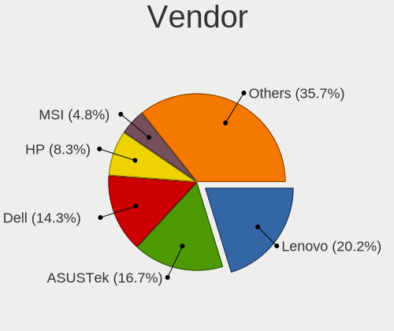

| Name                | Computers | Percent |
|---------------------|-----------|---------|
| Lenovo              | 9         | 25%     |
| ASUSTek Computer    | 6         | 16.67%  |
| Intel               | 3         | 8.33%   |
| Hewlett-Packard     | 3         | 8.33%   |
| Acer                | 3         | 8.33%   |
| Timi                | 2         | 5.56%   |
| MSI                 | 2         | 5.56%   |
| Gigabyte Technology | 2         | 5.56%   |
| Zvezda              | 1         | 2.78%   |
| Razer               | 1         | 2.78%   |
| IP3 Tech            | 1         | 2.78%   |
| Dell                | 1         | 2.78%   |
| Colorful Technology | 1         | 2.78%   |
| AZW                 | 1         | 2.78%   |

Model
-----

Motherboard model

| Name                                 | Computers | Percent |
|--------------------------------------|-----------|---------|
| Zvezda Iridium                       | 1         | 2.78%   |
| Timi RedmiBook 16                    | 1         | 2.78%   |
| Timi Mi NoteBook Horizon Edition 14  | 1         | 2.78%   |
| Razer Blade 15 (2022) - RZ09-0421    | 1         | 2.78%   |
| MSI MS-7B79                          | 1         | 2.78%   |
| MSI Katana GF76 12UE                 | 1         | 2.78%   |
| Lenovo Yoga S740-14IIL 81RS          | 1         | 2.78%   |
| Lenovo ThinkPad T460s 20FAS5WX00     | 1         | 2.78%   |
| Lenovo ThinkPad T430 2349DG5         | 1         | 2.78%   |
| Lenovo ThinkPad T430 2347DE9         | 1         | 2.78%   |
| Lenovo ThinkPad L14 Gen 1 20U5S0NT00 | 1         | 2.78%   |
| Lenovo Legion 5P 15IMH05H 82AW       | 1         | 2.78%   |
| Lenovo IdeaPad S145-15IWL 81S9       | 1         | 2.78%   |
| Lenovo G580 20150                    | 1         | 2.78%   |
| Lenovo G410 20237                    | 1         | 2.78%   |
| IP3 Tech HeroBox                     | 1         | 2.78%   |
| Intel NUC12WSHi7                     | 1         | 2.78%   |
| Intel NUC12WSHi5                     | 1         | 2.78%   |
| Intel D34010WYK H14771-303           | 1         | 2.78%   |
| HP Pavilion Gaming Laptop 15-ec0xxx  | 1         | 2.78%   |
| HP EliteBook 840 G3                  | 1         | 2.78%   |
| HP EliteBook 840 G1                  | 1         | 2.78%   |
| Gigabyte X99-UD4-CF                  | 1         | 2.78%   |
| Gigabyte 970A-DS3P                   | 1         | 2.78%   |
| Dell OptiPlex 790                    | 1         | 2.78%   |
| Colorful CVN Z590 GAMING PRO         | 1         | 2.78%   |
| AZW SER                              | 1         | 2.78%   |
| ASUS TUF Gaming X570-PLUS            | 1         | 2.78%   |
| ASUS ROG STRIX B560-G GAMING WIFI    | 1         | 2.78%   |
| ASUS Q550LF                          | 1         | 2.78%   |
| ASUS PRIME H670-PLUS D4              | 1         | 2.78%   |
| ASUS N751JK                          | 1         | 2.78%   |
| ASUS All Series                      | 1         | 2.78%   |
| Acer Swift SF314-512                 | 1         | 2.78%   |
| Acer Aspire E1-570G                  | 1         | 2.78%   |
| Acer Aspire 5740                     | 1         | 2.78%   |

Model Family
------------

Motherboard model prefix

| Name                | Computers | Percent |
|---------------------|-----------|---------|
| Lenovo ThinkPad     | 4         | 11.11%  |
| HP EliteBook        | 2         | 5.56%   |
| Acer Aspire         | 2         | 5.56%   |
| Zvezda Iridium      | 1         | 2.78%   |
| Timi RedmiBook      | 1         | 2.78%   |
| Timi Mi             | 1         | 2.78%   |
| Razer Blade         | 1         | 2.78%   |
| MSI MS-7B79         | 1         | 2.78%   |
| MSI Katana          | 1         | 2.78%   |
| Lenovo Yoga         | 1         | 2.78%   |
| Lenovo Legion       | 1         | 2.78%   |
| Lenovo IdeaPad      | 1         | 2.78%   |
| Lenovo G580         | 1         | 2.78%   |
| Lenovo G410         | 1         | 2.78%   |
| IP3 Tech HeroBox    | 1         | 2.78%   |
| Intel NUC12WSHi7    | 1         | 2.78%   |
| Intel NUC12WSHi5    | 1         | 2.78%   |
| Intel D34010WYK     | 1         | 2.78%   |
| HP Pavilion         | 1         | 2.78%   |
| Gigabyte X99-UD4-CF | 1         | 2.78%   |
| Gigabyte 970A-DS3P  | 1         | 2.78%   |
| Dell OptiPlex       | 1         | 2.78%   |
| Colorful CVN        | 1         | 2.78%   |
| AZW SER             | 1         | 2.78%   |
| ASUS TUF            | 1         | 2.78%   |
| ASUS ROG            | 1         | 2.78%   |
| ASUS Q550LF         | 1         | 2.78%   |
| ASUS PRIME          | 1         | 2.78%   |
| ASUS N751JK         | 1         | 2.78%   |
| ASUS All            | 1         | 2.78%   |
| Acer Swift          | 1         | 2.78%   |

MFG Year
--------

Motherboard manufacture year

| Year | Computers | Percent |
|------|-----------|---------|
| 2013 | 7         | 19.44%  |
| 2022 | 5         | 13.89%  |
| 2021 | 5         | 13.89%  |
| 2012 | 5         | 13.89%  |
| 2020 | 4         | 11.11%  |
| 2019 | 4         | 11.11%  |
| 2016 | 2         | 5.56%   |
| 2014 | 2         | 5.56%   |
| 2018 | 1         | 2.78%   |
| 2009 | 1         | 2.78%   |

Form Factor
-----------

Physical design of the computer

| Name     | Computers | Percent |
|----------|-----------|---------|
| Notebook | 21        | 58.33%  |
| Desktop  | 10        | 27.78%  |
| Mini pc  | 4         | 11.11%  |
| Server   | 1         | 2.78%   |

Secure Boot
-----------

Enabled or disabled

| State    | Computers | Percent |
|----------|-----------|---------|
| Disabled | 33        | 91.67%  |
| Enabled  | 3         | 8.33%   |

Coreboot
--------

Have coreboot on board

| Used | Computers | Percent |
|------|-----------|---------|
| No   | 36        | 100%    |

RAM Size
--------

Total RAM memory

| Size in GB      | Computers | Percent |
|-----------------|-----------|---------|
| 4.01-8.0        | 13        | 36.11%  |
| 8.01-16.0       | 9         | 25%     |
| 32.01-64.0      | 6         | 16.67%  |
| 64.01-256.0     | 3         | 8.33%   |
| 3.01-4.0        | 2         | 5.56%   |
| 16.01-24.0      | 2         | 5.56%   |
| More than 256.0 | 1         | 2.78%   |

RAM Used
--------

Used RAM memory

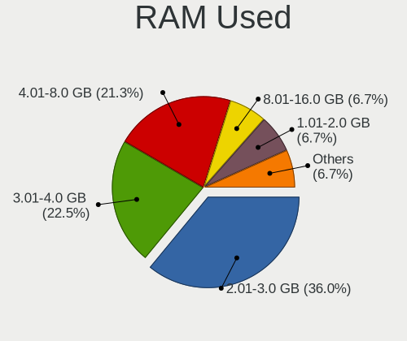

| Used GB   | Computers | Percent |
|-----------|-----------|---------|
| 2.01-3.0  | 15        | 38.46%  |
| 4.01-8.0  | 9         | 23.08%  |
| 3.01-4.0  | 7         | 17.95%  |
| 1.01-2.0  | 3         | 7.69%   |
| 8.01-16.0 | 3         | 7.69%   |
| 0.51-1.0  | 2         | 5.13%   |

Total Drives
------------

Number of drives on board

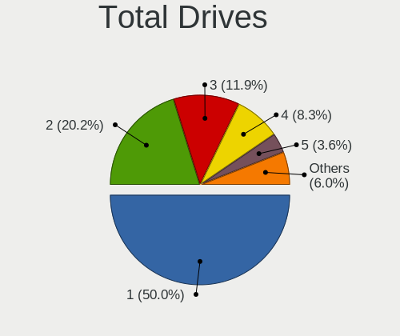

| Drives | Computers | Percent |
|--------|-----------|---------|
| 1      | 19        | 52.78%  |
| 2      | 9         | 25%     |
| 4      | 4         | 11.11%  |
| 3      | 3         | 8.33%   |
| 10     | 1         | 2.78%   |

Has CD-ROM
----------

Has CD-ROM on board

| Presented | Computers | Percent |
|-----------|-----------|---------|
| No        | 29        | 80.56%  |
| Yes       | 7         | 19.44%  |

Has Ethernet
------------

Has Ethernet on board

| Presented | Computers | Percent |
|-----------|-----------|---------|
| Yes       | 31        | 86.11%  |
| No        | 5         | 13.89%  |

Has WiFi
--------

Has WiFi module

| Presented | Computers | Percent |
|-----------|-----------|---------|
| Yes       | 31        | 86.11%  |
| No        | 5         | 13.89%  |

Has Bluetooth
-------------

Has Bluetooth module

| Presented | Computers | Percent |
|-----------|-----------|---------|
| Yes       | 28        | 77.78%  |
| No        | 8         | 22.22%  |

Location
--------

Country
-------

Geographic location (country)

| Country     | Computers | Percent |
|-------------|-----------|---------|
| USA         | 8         | 22.22%  |
| China       | 3         | 8.33%   |
| Bulgaria    | 3         | 8.33%   |
| Ukraine     | 2         | 5.56%   |
| Italy       | 2         | 5.56%   |
| Germany     | 2         | 5.56%   |
| Canada      | 2         | 5.56%   |
| Uzbekistan  | 1         | 2.78%   |
| Switzerland | 1         | 2.78%   |
| Sweden      | 1         | 2.78%   |
| Russia      | 1         | 2.78%   |
| Poland      | 1         | 2.78%   |
| Netherlands | 1         | 2.78%   |
| Kazakhstan  | 1         | 2.78%   |
| Japan       | 1         | 2.78%   |
| India       | 1         | 2.78%   |
| France      | 1         | 2.78%   |
| Finland     | 1         | 2.78%   |
| Colombia    | 1         | 2.78%   |
| Chile       | 1         | 2.78%   |
| Brazil      | 1         | 2.78%   |

City
----

Geographic location (city)

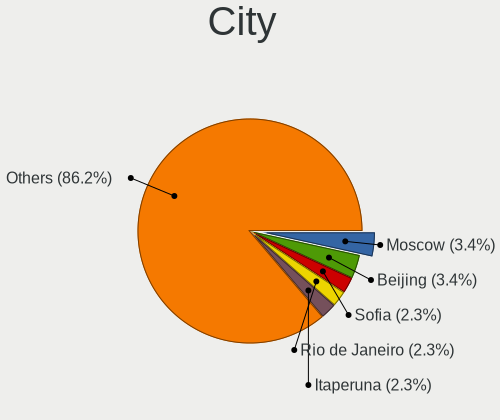

| City           | Computers | Percent |
|----------------|-----------|---------|
| Sofia          | 2         | 5.56%   |
| Bristow        | 2         | 5.56%   |
| Beijing        | 2         | 5.56%   |
| Wuhan          | 1         | 2.78%   |
| Tomah          | 1         | 2.78%   |
| Tashkent       | 1         | 2.78%   |
| Stockholm      | 1         | 2.78%   |
| Soest          | 1         | 2.78%   |
| Schemmerhofen  | 1         | 2.78%   |
| Ruda Śląska  | 1         | 2.78%   |
| Rome           | 1         | 2.78%   |
| Ribeirao Preto | 1         | 2.78%   |
| Quitman        | 1         | 2.78%   |
| Puente Alto    | 1         | 2.78%   |
| Portland       | 1         | 2.78%   |
| Okazaki        | 1         | 2.78%   |
| New York       | 1         | 2.78%   |
| New Cumberland | 1         | 2.78%   |
| Mumbai         | 1         | 2.78%   |
| Moscow         | 1         | 2.78%   |
| L'Isle-Adam    | 1         | 2.78%   |
| Kyiv           | 1         | 2.78%   |
| Kramatorsk     | 1         | 2.78%   |
| Helsinki       | 1         | 2.78%   |
| Dreis          | 1         | 2.78%   |
| Burgas         | 1         | 2.78%   |
| Bogotá        | 1         | 2.78%   |
| Birmensdorf    | 1         | 2.78%   |
| Battle Creek   | 1         | 2.78%   |
| Barrie         | 1         | 2.78%   |
| Almaty         | 1         | 2.78%   |
| Airdrie        | 1         | 2.78%   |
| Adelfia        | 1         | 2.78%   |

Drives
------

Drive Vendor
------------

Hard drive vendors

| Vendor                    | Computers | Drives | Percent |
|---------------------------|-----------|--------|---------|
| Samsung Electronics       | 11        | 15     | 19.3%   |
| WDC                       | 7         | 9      | 12.28%  |
| Seagate                   | 6         | 8      | 10.53%  |
| Kingston                  | 6         | 7      | 10.53%  |
| Toshiba                   | 3         | 4      | 5.26%   |
| Intel                     | 3         | 3      | 5.26%   |
| HGST                      | 3         | 4      | 5.26%   |
| SK hynix                  | 2         | 2      | 3.51%   |
| Micron Technology         | 2         | 2      | 3.51%   |
| WD MediaMax               | 1         | 1      | 1.75%   |
| Unknown                   | 1         | 1      | 1.75%   |
| Team                      | 1         | 2      | 1.75%   |
| SanDisk                   | 1         | 6      | 1.75%   |
| Plextor                   | 1         | 1      | 1.75%   |
| Phison                    | 1         | 1      | 1.75%   |
| Netac                     | 1         | 2      | 1.75%   |
| Micron/Crucial Technology | 1         | 1      | 1.75%   |
| LITEON                    | 1         | 1      | 1.75%   |
| Hjwdz                     | 1         | 1      | 1.75%   |
| Hewlett-Packard           | 1         | 1      | 1.75%   |
| Gigabyte Technology       | 1         | 2      | 1.75%   |
| Crucial                   | 1         | 6      | 1.75%   |
| A-DATA Technology         | 1         | 1      | 1.75%   |

Drive Model
-----------

Hard drive models

| Model                                              | Computers | Percent |
|----------------------------------------------------|-----------|---------|
| Samsung NVMe SSD Controller SM981/PM981/PM983 1TB  | 2         | 3.23%   |
| Samsung MZNLH512HALU-00000 512GB SSD               | 2         | 3.23%   |
| Micron 2450_MTFDKBA512TFK 512GB                    | 2         | 3.23%   |
| WDC WDS250G2B0A-00SM50 250GB SSD                   | 1         | 1.61%   |
| WDC WD6400BEVT-22A0RT0 640GB                       | 1         | 1.61%   |
| WDC WD5000LPLX-60ZNTT1 500GB                       | 1         | 1.61%   |
| WDC WD3200AAKX-753CA1 320GB                        | 1         | 1.61%   |
| WDC WD2500AAJS-60M0A0 250GB                        | 1         | 1.61%   |
| WDC WD22EJRX-89BEMY0 2TB                           | 1         | 1.61%   |
| WDC WD10EZEX-60M2NA0 1TB                           | 1         | 1.61%   |
| WDC WD10EZEX-08WN4A0 1TB                           | 1         | 1.61%   |
| WD MediaMax WL750GSA6472 752GB                     | 1         | 1.61%   |
| Unknown MMC Card  7GB                              | 1         | 1.61%   |
| Toshiba MQ04ABF100 1TB                             | 1         | 1.61%   |
| Toshiba MK2561GSYN 250GB                           | 1         | 1.61%   |
| Toshiba DT01ACA100 1TB                             | 1         | 1.61%   |
| Team T253X1480G 480GB SSD                          | 1         | 1.61%   |
| SK hynix NVMe SSD Drive 256GB                      | 1         | 1.61%   |
| SK hynix BC501 NVMe 256GB                          | 1         | 1.61%   |
| Seagate ST500LT012-9WS142 500GB                    | 1         | 1.61%   |
| Seagate ST3500413AS 500GB                          | 1         | 1.61%   |
| Seagate ST3250820AS 250GB                          | 1         | 1.61%   |
| Seagate ST1000LM024 HN-M101MBB 1TB                 | 1         | 1.61%   |
| Seagate ST1000DM010-2EP102 1TB                     | 1         | 1.61%   |
| Seagate FireCuda 520 SSD ZP2000GM30002 2TB         | 1         | 1.61%   |
| Seagate FireCuda 520 SSD ZP1000GM30002 1TB         | 1         | 1.61%   |
| Sandisk WD_BLACK SN770 1TB                         | 1         | 1.61%   |
| SanDisk SDSSDH3 1T00 1TB                           | 1         | 1.61%   |
| Samsung SSD 870 QVO 2TB                            | 1         | 1.61%   |
| Samsung SSD 870 EVO 250GB                          | 1         | 1.61%   |
| Samsung PSSD T7 1TB                                | 1         | 1.61%   |
| Samsung NVMe SSD Drive 1TB                         | 1         | 1.61%   |
| Samsung NVMe SSD Controller PM9A1/PM9A3/980PRO 2TB | 1         | 1.61%   |
| Samsung MZALQ512HALU-000L2 512GB                   | 1         | 1.61%   |
| Samsung MZ7LN256HAJQ-00000 256GB SSD               | 1         | 1.61%   |
| Samsung MZ7LH240HAHQ-00005 240GB                   | 1         | 1.61%   |
| Samsung MZ7LH240HAHQ-00005 1GB SSD                 | 1         | 1.61%   |
| Plextor PX-256M8VC 256GB SSD                       | 1         | 1.61%   |
| Phison NVMe SSD Drive 1024GB                       | 1         | 1.61%   |
| Netac SSD 256GB                                    | 1         | 1.61%   |

HDD Vendor
----------

Hard disk drive vendors

| Vendor      | Computers | Drives | Percent |
|-------------|-----------|--------|---------|
| WDC         | 6         | 8      | 33.33%  |
| Seagate     | 5         | 6      | 27.78%  |
| Toshiba     | 3         | 4      | 16.67%  |
| HGST        | 3         | 4      | 16.67%  |
| WD MediaMax | 1         | 1      | 5.56%   |

SSD Vendor
----------

Solid state drive vendors

| Vendor              | Computers | Drives | Percent |
|---------------------|-----------|--------|---------|
| Samsung Electronics | 7         | 10     | 31.82%  |
| Kingston            | 4         | 5      | 18.18%  |
| WDC                 | 1         | 1      | 4.55%   |
| Team                | 1         | 2      | 4.55%   |
| SanDisk             | 1         | 3      | 4.55%   |
| Plextor             | 1         | 1      | 4.55%   |
| Netac               | 1         | 2      | 4.55%   |
| LITEON              | 1         | 1      | 4.55%   |
| Intel               | 1         | 1      | 4.55%   |
| Hewlett-Packard     | 1         | 1      | 4.55%   |
| Gigabyte Technology | 1         | 2      | 4.55%   |
| Crucial             | 1         | 6      | 4.55%   |
| A-DATA Technology   | 1         | 1      | 4.55%   |

Drive Kind
----------

HDD or SSD

| Kind    | Computers | Drives | Percent |
|---------|-----------|--------|---------|
| SSD     | 18        | 36     | 37.5%   |
| NVMe    | 15        | 20     | 31.25%  |
| HDD     | 13        | 23     | 27.08%  |
| MMC     | 1         | 1      | 2.08%   |
| Unknown | 1         | 1      | 2.08%   |

Drive Connector
---------------

SATA, SAS, NVMe, etc.

| Type | Computers | Drives | Percent |
|------|-----------|--------|---------|
| SATA | 26        | 57     | 59.09%  |
| NVMe | 15        | 20     | 34.09%  |
| SAS  | 2         | 3      | 4.55%   |
| MMC  | 1         | 1      | 2.27%   |

Drive Size
----------

Size of hard drive

| Size in TB | Computers | Drives | Percent |
|------------|-----------|--------|---------|
| 0.01-0.5   | 19        | 28     | 55.88%  |
| 0.51-1.0   | 13        | 28     | 38.24%  |
| 1.01-2.0   | 2         | 3      | 5.88%   |

Space Total
-----------

Amount of disk space available on the file system

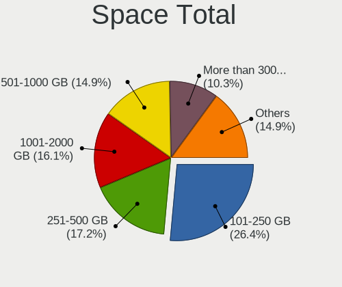

| Size in GB     | Computers | Percent |
|----------------|-----------|---------|
| 101-250        | 13        | 34.21%  |
| 251-500        | 8         | 21.05%  |
| 1001-2000      | 7         | 18.42%  |
| 501-1000       | 6         | 15.79%  |
| 2001-3000      | 2         | 5.26%   |
| More than 3000 | 1         | 2.63%   |
| 21-50          | 1         | 2.63%   |

Space Used
----------

Amount of used disk space

| Used GB        | Computers | Percent |
|----------------|-----------|---------|
| 1-20           | 18        | 48.65%  |
| 251-500        | 5         | 13.51%  |
| 101-250        | 5         | 13.51%  |
| 51-100         | 3         | 8.11%   |
| 21-50          | 2         | 5.41%   |
| 501-1000       | 2         | 5.41%   |
| More than 3000 | 1         | 2.7%    |
| 1001-2000      | 1         | 2.7%    |

Malfunc. Drives
---------------

Drive models with a malfunction

| Model                           | Computers | Drives | Percent |
|---------------------------------|-----------|--------|---------|
| WDC WD5000LPLX-60ZNTT1 500GB    | 1         | 1      | 20%     |
| WDC WD10EZEX-60M2NA0 1TB        | 1         | 1      | 20%     |
| Toshiba MK2561GSYN 250GB        | 1         | 1      | 20%     |
| Seagate ST500LT012-9WS142 500GB | 1         | 1      | 20%     |
| Seagate ST3250820AS 250GB       | 1         | 1      | 20%     |

Malfunc. Drive Vendor
---------------------

Vendors of faulty drives

| Vendor  | Computers | Drives | Percent |
|---------|-----------|--------|---------|
| WDC     | 2         | 2      | 40%     |
| Seagate | 2         | 2      | 40%     |
| Toshiba | 1         | 1      | 20%     |

Malfunc. HDD Vendor
-------------------

Vendors of faulty HDD drives

| Vendor  | Computers | Drives | Percent |
|---------|-----------|--------|---------|
| WDC     | 2         | 2      | 40%     |
| Seagate | 2         | 2      | 40%     |
| Toshiba | 1         | 1      | 20%     |

Malfunc. Drive Kind
-------------------

Kinds of faulty drives

| Kind | Computers | Drives | Percent |
|------|-----------|--------|---------|
| HDD  | 4         | 5      | 100%    |

Failed Drives
-------------

Failed drive models

Zero info for selected period =(

Failed Drive Vendor
-------------------

Failed drive vendors

Zero info for selected period =(

Drive Status
------------

Number of failed and malfunc. drives

| Status   | Computers | Drives | Percent |
|----------|-----------|--------|---------|
| Detected | 23        | 47     | 54.76%  |
| Works    | 15        | 29     | 35.71%  |
| Malfunc  | 4         | 5      | 9.52%   |

Storage controller
------------------

Storage Vendor
--------------

Storage controller vendors

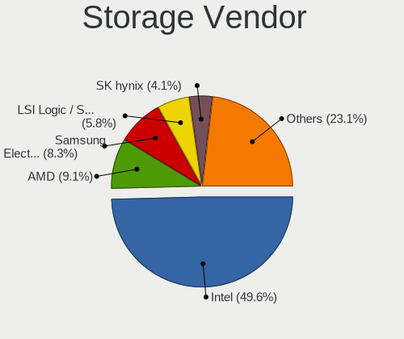

| Vendor                      | Computers | Percent |
|-----------------------------|-----------|---------|
| Intel                       | 28        | 57.14%  |
| AMD                         | 5         | 10.2%   |
| Samsung Electronics         | 4         | 8.16%   |
| SK hynix                    | 2         | 4.08%   |
| Micron Technology           | 2         | 4.08%   |
| Kingston Technology Company | 2         | 4.08%   |
| Silicon Image               | 1         | 2.04%   |
| Seagate Technology          | 1         | 2.04%   |
| SanDisk                     | 1         | 2.04%   |
| Phison Electronics          | 1         | 2.04%   |
| Micron/Crucial Technology   | 1         | 2.04%   |
| LSI Logic / Symbios Logic   | 1         | 2.04%   |

Storage Model
-------------

Storage controller models

| Model                                                                          | Computers | Percent |
|--------------------------------------------------------------------------------|-----------|---------|
| Intel 7 Series Chipset Family 6-port SATA Controller [AHCI mode]               | 4         | 7.69%   |
| AMD FCH SATA Controller [AHCI mode]                                            | 4         | 7.69%   |
| Intel Alder Lake-P SATA AHCI Controller                                        | 3         | 5.77%   |
| Intel 8 Series/C220 Series Chipset Family 6-port SATA Controller 1 [AHCI mode] | 3         | 5.77%   |
| Intel 8 Series SATA Controller 1 [AHCI mode]                                   | 3         | 5.77%   |
| Samsung NVMe SSD Controller SM981/PM981/PM983                                  | 2         | 3.85%   |
| Samsung NVMe SSD Controller 980                                                | 2         | 3.85%   |
| Micron NVMe Storage Controller                                                 | 2         | 3.85%   |
| Intel Sunrise Point-LP SATA Controller [AHCI mode]                             | 2         | 3.85%   |
| Intel 500 Series Chipset Family SATA AHCI Controller                           | 2         | 3.85%   |
| SK hynix Gold P31/PC711 NVMe Solid State Drive                                 | 1         | 1.92%   |
| SK hynix BC501 NVMe Solid State Drive                                          | 1         | 1.92%   |
| Silicon Image SiI 3132 Serial ATA Raid II Controller                           | 1         | 1.92%   |
| Seagate FireCuda 520 SSD                                                       | 1         | 1.92%   |
| SanDisk WD Black SN770 NVMe SSD                                                | 1         | 1.92%   |
| Samsung NVMe SSD Controller PM9A1/PM9A3/980PRO                                 | 1         | 1.92%   |
| Phison E12 NVMe Controller                                                     | 1         | 1.92%   |
| Micron/Crucial P2 NVMe PCIe SSD                                                | 1         | 1.92%   |
| LSI Logic / Symbios Logic MegaRAID SAS-3 3108 [Invader]                        | 1         | 1.92%   |
| Kingston Company Company Non-Volatile memory controller                        | 1         | 1.92%   |
| Kingston Company NVMe Controller                                               | 1         | 1.92%   |
| Intel Volume Management Device NVMe RAID Controller                            | 1         | 1.92%   |
| Intel SSD 660P Series                                                          | 1         | 1.92%   |
| Intel SATA Controller [RAID mode]                                              | 1         | 1.92%   |
| Intel Non-Volatile memory controller                                           | 1         | 1.92%   |
| Intel Comet Lake SATA AHCI Controller                                          | 1         | 1.92%   |
| Intel Celeron/Pentium Silver Processor SATA Controller                         | 1         | 1.92%   |
| Intel Cannon Point-LP SATA Controller [AHCI Mode]                              | 1         | 1.92%   |
| Intel C620 Series Chipset Family SSATA Controller [AHCI mode]                  | 1         | 1.92%   |
| Intel Alder Lake-S PCH SATA Controller [AHCI Mode]                             | 1         | 1.92%   |
| Intel 6 Series/C200 Series Chipset Family 6 port Desktop SATA AHCI Controller  | 1         | 1.92%   |
| Intel 5 Series/3400 Series Chipset 4 port SATA AHCI Controller                 | 1         | 1.92%   |
| Intel 400 Series Chipset Family SATA AHCI Controller                           | 1         | 1.92%   |
| AMD SB7x0/SB8x0/SB9x0 SATA Controller [AHCI mode]                              | 1         | 1.92%   |
| AMD 400 Series Chipset SATA Controller                                         | 1         | 1.92%   |

Storage Kind
------------

Kind of storage controller (IDE, SATA, NVMe, SAS, ...)

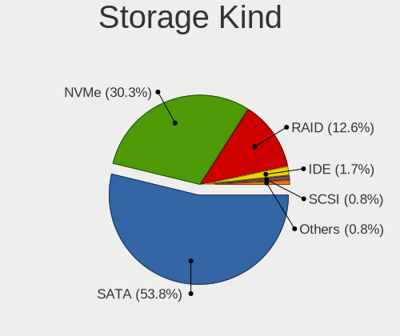

| Kind | Computers | Percent |
|------|-----------|---------|
| SATA | 30        | 61.22%  |
| NVMe | 15        | 30.61%  |
| RAID | 4         | 8.16%   |

Processor
---------

CPU Vendor
----------

Processor vendors

| Vendor | Computers | Percent |
|--------|-----------|---------|
| Intel  | 29        | 80.56%  |
| AMD    | 7         | 19.44%  |

CPU Model
---------

Processor models

| Model                                         | Computers | Percent |
|-----------------------------------------------|-----------|---------|
| Intel 12th Gen Core i7-1260P                  | 2         | 5.56%   |
| Intel Xeon Gold 6326 CPU @ 2.90GHz            | 1         | 2.78%   |
| Intel Core i7-8565U CPU @ 1.80GHz             | 1         | 2.78%   |
| Intel Core i7-5930K CPU @ 3.50GHz             | 1         | 2.78%   |
| Intel Core i7-4710HQ CPU @ 2.50GHz            | 1         | 2.78%   |
| Intel Core i7-4500U CPU @ 1.80GHz             | 1         | 2.78%   |
| Intel Core i7-10750H CPU @ 2.60GHz            | 1         | 2.78%   |
| Intel Core i7-1065G7 CPU @ 1.30GHz            | 1         | 2.78%   |
| Intel Core i5-6300U CPU @ 2.40GHz             | 1         | 2.78%   |
| Intel Core i5-6200U CPU @ 2.30GHz             | 1         | 2.78%   |
| Intel Core i5-4440 CPU @ 3.10GHz              | 1         | 2.78%   |
| Intel Core i5-4210U CPU @ 1.70GHz             | 1         | 2.78%   |
| Intel Core i5-4200M CPU @ 2.50GHz             | 1         | 2.78%   |
| Intel Core i5-3380M CPU @ 2.90GHz             | 1         | 2.78%   |
| Intel Core i5-3320M CPU @ 2.60GHz             | 1         | 2.78%   |
| Intel Core i5-3230M CPU @ 2.60GHz             | 1         | 2.78%   |
| Intel Core i5-2400S CPU @ 2.50GHz             | 1         | 2.78%   |
| Intel Core i5-10400F CPU @ 2.90GHz            | 1         | 2.78%   |
| Intel Core i5-10210U CPU @ 1.60GHz            | 1         | 2.78%   |
| Intel Core i5 CPU M 430 @ 2.27GHz             | 1         | 2.78%   |
| Intel Core i3-4010U CPU @ 1.70GHz             | 1         | 2.78%   |
| Intel Core i3-3217U CPU @ 1.80GHz             | 1         | 2.78%   |
| Intel Celeron J4125 CPU @ 2.00GHz             | 1         | 2.78%   |
| Intel 12th Gen Core i7-12800H                 | 1         | 2.78%   |
| Intel 12th Gen Core i7-12700H                 | 1         | 2.78%   |
| Intel 12th Gen Core i5-12600K                 | 1         | 2.78%   |
| Intel 12th Gen Core i5-1240P                  | 1         | 2.78%   |
| Intel 11th Gen Core i5-11400 @ 2.60GHz        | 1         | 2.78%   |
| AMD Ryzen 9 5950X 16-Core Processor           | 1         | 2.78%   |
| AMD Ryzen 7 4700U with Radeon Graphics        | 1         | 2.78%   |
| AMD Ryzen 5 4500U with Radeon Graphics        | 1         | 2.78%   |
| AMD Ryzen 5 3600 6-Core Processor             | 1         | 2.78%   |
| AMD Ryzen 5 3550H with Radeon Vega Mobile Gfx | 1         | 2.78%   |
| AMD Ryzen 3 PRO 4450U with Radeon Graphics    | 1         | 2.78%   |
| AMD FX-8120 Eight-Core Processor              | 1         | 2.78%   |

CPU Model Family
----------------

Processor model prefix

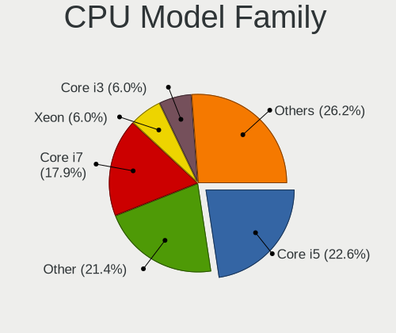

| Model           | Computers | Percent |
|-----------------|-----------|---------|
| Intel Core i5   | 12        | 33.33%  |
| Other           | 7         | 19.44%  |
| Intel Core i7   | 6         | 16.67%  |
| AMD Ryzen 5     | 3         | 8.33%   |
| Intel Core i3   | 2         | 5.56%   |
| Intel Xeon Gold | 1         | 2.78%   |
| Intel Celeron   | 1         | 2.78%   |
| AMD Ryzen 9     | 1         | 2.78%   |
| AMD Ryzen 7     | 1         | 2.78%   |
| AMD Ryzen 3 PRO | 1         | 2.78%   |
| AMD FX          | 1         | 2.78%   |

CPU Cores
---------

Number of processor cores

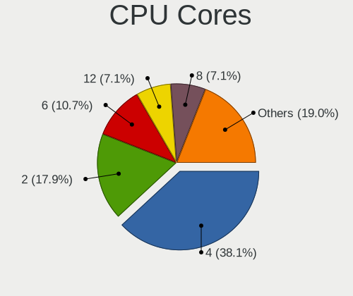

| Number | Computers | Percent |
|--------|-----------|---------|
| 2      | 11        | 30.56%  |
| 4      | 10        | 27.78%  |
| 6      | 6         | 16.67%  |
| 12     | 3         | 8.33%   |
| 14     | 2         | 5.56%   |
| 32     | 1         | 2.78%   |
| 16     | 1         | 2.78%   |
| 10     | 1         | 2.78%   |
| 8      | 1         | 2.78%   |

CPU Sockets
-----------

Number of sockets

| Number | Computers | Percent |
|--------|-----------|---------|
| 1      | 35        | 97.22%  |
| 2      | 1         | 2.78%   |

CPU Threads
-----------

Threads per core (Hyper-Threading)

| Number | Computers | Percent |
|--------|-----------|---------|
| 2      | 29        | 80.56%  |
| 1      | 7         | 19.44%  |

CPU Op-Modes
------------

CPU Operation Modes (32-bit, 64-bit)

| Op mode        | Computers | Percent |
|----------------|-----------|---------|
| 32-bit, 64-bit | 36        | 100%    |

CPU Microcode
-------------

Microcode number

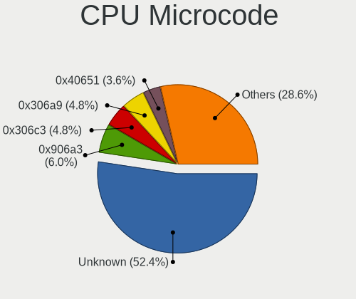

| Number     | Computers | Percent |
|------------|-----------|---------|
| 0x906a3    | 5         | 13.89%  |
| 0x306a9    | 4         | 11.11%  |
| 0x40651    | 3         | 8.33%   |
| 0x306c3    | 3         | 8.33%   |
| 0x806ec    | 2         | 5.56%   |
| 0x406e3    | 2         | 5.56%   |
| 0x08600106 | 2         | 5.56%   |
| Unknown    | 2         | 5.56%   |
| 0xa0671    | 1         | 2.78%   |
| 0xa0653    | 1         | 2.78%   |
| 0xa0652    | 1         | 2.78%   |
| 0x90672    | 1         | 2.78%   |
| 0x706e5    | 1         | 2.78%   |
| 0x706a8    | 1         | 2.78%   |
| 0x606a6    | 1         | 2.78%   |
| 0x306f2    | 1         | 2.78%   |
| 0x206a7    | 1         | 2.78%   |
| 0x20652    | 1         | 2.78%   |
| 0x0a201016 | 1         | 2.78%   |
| 0x08701013 | 1         | 2.78%   |
| 0x0600063d | 1         | 2.78%   |

CPU Microarch
-------------

Microarchitecture

| Name             | Computers | Percent |
|------------------|-----------|---------|
| Haswell          | 7         | 19.44%  |
| Alderlake Hybrid | 6         | 16.67%  |
| Zen 2            | 4         | 11.11%  |
| IvyBridge        | 4         | 11.11%  |
| Icelake          | 3         | 8.33%   |
| Skylake          | 2         | 5.56%   |
| KabyLake         | 2         | 5.56%   |
| CometLake        | 2         | 5.56%   |
| Zen+             | 1         | 2.78%   |
| Zen 3            | 1         | 2.78%   |
| Westmere         | 1         | 2.78%   |
| SandyBridge      | 1         | 2.78%   |
| Goldmont plus    | 1         | 2.78%   |
| Bulldozer        | 1         | 2.78%   |

Graphics
--------

GPU Vendor
----------

Vendors of graphics cards

| Vendor            | Computers | Percent |
|-------------------|-----------|---------|
| Intel             | 22        | 46.81%  |
| Nvidia            | 15        | 31.91%  |
| AMD               | 9         | 19.15%  |
| ASPEED Technology | 1         | 2.13%   |

GPU Model
---------

Graphics card models

| Model                                                                     | Computers | Percent |
|---------------------------------------------------------------------------|-----------|---------|
| Intel Alder Lake-P Integrated Graphics Controller                         | 5         | 10.2%   |
| Intel 3rd Gen Core processor Graphics Controller                          | 4         | 8.16%   |
| Intel Haswell-ULT Integrated Graphics Controller                          | 3         | 6.12%   |
| AMD Renoir                                                                | 3         | 6.12%   |
| Intel Skylake GT2 [HD Graphics 520]                                       | 2         | 4.08%   |
| Intel 4th Gen Core Processor Integrated Graphics Controller               | 2         | 4.08%   |
| Nvidia TU117M [GeForce GTX 1650 Mobile / Max-Q]                           | 1         | 2.04%   |
| Nvidia TU117 [GeForce GTX 1650]                                           | 1         | 2.04%   |
| Nvidia TU116 [GeForce GTX 1660]                                           | 1         | 2.04%   |
| Nvidia TU116 [GeForce GTX 1660 SUPER]                                     | 1         | 2.04%   |
| Nvidia TU106M [GeForce RTX 2060 Mobile]                                   | 1         | 2.04%   |
| Nvidia GP108M [GeForce MX250]                                             | 1         | 2.04%   |
| Nvidia GP107M [GeForce MX350]                                             | 1         | 2.04%   |
| Nvidia GM200 [GeForce GTX 980 Ti]                                         | 1         | 2.04%   |
| Nvidia GM108M [GeForce MX110]                                             | 1         | 2.04%   |
| Nvidia GM107M [GeForce GTX 850M]                                          | 1         | 2.04%   |
| Nvidia GK208M [GeForce GT 740M]                                           | 1         | 2.04%   |
| Nvidia GK208B [GeForce GT 730]                                            | 1         | 2.04%   |
| Nvidia GK107M [GeForce GT 745M]                                           | 1         | 2.04%   |
| Nvidia GF108M [NVS 5400M]                                                 | 1         | 2.04%   |
| Nvidia GA106M [GeForce RTX 3060 Mobile / Max-Q]                           | 1         | 2.04%   |
| Nvidia GA103M [GeForce RTX 3080 Ti Mobile]                                | 1         | 2.04%   |
| Intel WhiskeyLake-U GT2 [UHD Graphics 620]                                | 1         | 2.04%   |
| Intel RocketLake-S GT1 [UHD Graphics 730]                                 | 1         | 2.04%   |
| Intel Iris Plus Graphics G7                                               | 1         | 2.04%   |
| Intel GeminiLake [UHD Graphics 600]                                       | 1         | 2.04%   |
| Intel CometLake-U GT2 [UHD Graphics]                                      | 1         | 2.04%   |
| Intel 2nd Generation Core Processor Family Integrated Graphics Controller | 1         | 2.04%   |
| ASPEED Technology ASPEED Graphics Family                                  | 1         | 2.04%   |
| AMD RV370 [Radeon X300/X550/X1050 Series] (Secondary)                     | 1         | 2.04%   |
| AMD RV370 [Radeon X300/X550/X1050 Series]                                 | 1         | 2.04%   |
| AMD Picasso/Raven 2 [Radeon Vega Series / Radeon Vega Mobile Series]      | 1         | 2.04%   |
| AMD Park [Mobility Radeon HD 5430/5450/5470]                              | 1         | 2.04%   |
| AMD Navi 22 [Radeon RX 6700/6700 XT/6750 XT / 6800M/6850M XT]             | 1         | 2.04%   |
| AMD Mars [Radeon HD 8730M]                                                | 1         | 2.04%   |
| AMD Baffin [Radeon RX 550 640SP / RX 560/560X]                            | 1         | 2.04%   |

GPU Combo
---------

Combinations of graphics cards

| Name           | Computers | Percent |
|----------------|-----------|---------|
| 1 x Intel      | 12        | 33.33%  |
| Intel + Nvidia | 9         | 25%     |
| 1 x AMD        | 6         | 16.67%  |
| 1 x Nvidia     | 5         | 13.89%  |
| 2 x AMD        | 1         | 2.78%   |
| Intel + AMD    | 1         | 2.78%   |
| 1 x ASPEED     | 1         | 2.78%   |
| AMD + Nvidia   | 1         | 2.78%   |

GPU Driver
----------

Free vs proprietary

| Driver      | Computers | Percent |
|-------------|-----------|---------|
| Free        | 30        | 81.08%  |
| Proprietary | 5         | 13.51%  |
| Unknown     | 2         | 5.41%   |

GPU Memory
----------

Total video memory

| Size in GB | Computers | Percent |
|------------|-----------|---------|
| Unknown    | 19        | 48.72%  |
| 1.01-2.0   | 5         | 12.82%  |
| 5.01-6.0   | 4         | 10.26%  |
| 0.01-0.5   | 4         | 10.26%  |
| 3.01-4.0   | 3         | 7.69%   |
| 8.01-16.0  | 2         | 5.13%   |
| 0.51-1.0   | 2         | 5.13%   |

Monitor
-------

Monitor Vendor
--------------

Monitor vendors

| Vendor              | Computers | Percent |
|---------------------|-----------|---------|
| Samsung Electronics | 6         | 15.38%  |
| LG Display          | 6         | 15.38%  |
| Chimei Innolux      | 5         | 12.82%  |
| AU Optronics        | 4         | 10.26%  |
| Goldstar            | 2         | 5.13%   |
| Acer                | 2         | 5.13%   |
| ViewSonic           | 1         | 2.56%   |
| TMX                 | 1         | 2.56%   |
| SKY                 | 1         | 2.56%   |
| PANDA               | 1         | 2.56%   |
| LG Electronics      | 1         | 2.56%   |
| KVM                 | 1         | 2.56%   |
| Iiyama              | 1         | 2.56%   |
| Hewlett-Packard     | 1         | 2.56%   |
| Gigabyte Technology | 1         | 2.56%   |
| Dell                | 1         | 2.56%   |
| CHD                 | 1         | 2.56%   |
| BOE                 | 1         | 2.56%   |
| BenQ                | 1         | 2.56%   |
| AOC                 | 1         | 2.56%   |

Monitor Model
-------------

Monitor models

| Model                                                                   | Computers | Percent |
|-------------------------------------------------------------------------|-----------|---------|
| ViewSonic PJ402D-2 HCD7B1D 1280x960                                     | 1         | 2.56%   |
| TMX TL156MDMP11-0 TMX1560 3200x2000 336x210mm 15.6-inch                 | 1         | 2.56%   |
| SKY 22X1-M225F SKY2150 1920x1080 476x268mm 21.5-inch                    | 1         | 2.56%   |
| Samsung Electronics U28D590 SAM0B80 3840x2160 607x345mm 27.5-inch       | 1         | 2.56%   |
| Samsung Electronics SyncMaster SAM05EB 1920x1080 597x336mm 27.0-inch    | 1         | 2.56%   |
| Samsung Electronics SMT22A350 SAM07A7 1920x1080 477x268mm 21.5-inch     | 1         | 2.56%   |
| Samsung Electronics SMEX2220 SAM0686 1920x1080 477x268mm 21.5-inch      | 1         | 2.56%   |
| Samsung Electronics LCD Monitor SDC324C 1920x1080 344x194mm 15.5-inch   | 1         | 2.56%   |
| Samsung Electronics LCD Monitor SAM0FEE 3840x2160 1872x1053mm 84.6-inch | 1         | 2.56%   |
| PANDA LCD Monitor NCP0052 1920x1080 309x174mm 14.0-inch                 | 1         | 2.56%   |
| LG Electronics LCD Monitor LG FULL HD                                   | 1         | 2.56%   |
| LG Display LCD Monitor LGD0657 1920x1080 344x194mm 15.5-inch            | 1         | 2.56%   |
| LG Display LCD Monitor LGD0521 1920x1080 309x174mm 14.0-inch            | 1         | 2.56%   |
| LG Display LCD Monitor LGD046C 1920x1080 382x215mm 17.3-inch            | 1         | 2.56%   |
| LG Display LCD Monitor LGD033C 1366x768 309x174mm 14.0-inch             | 1         | 2.56%   |
| LG Display LCD Monitor LGD033A 1366x768 344x194mm 15.5-inch             | 1         | 2.56%   |
| LG Display LCD Monitor LGD0335 1366x768 310x174mm 14.0-inch             | 1         | 2.56%   |
| KVM LCD Monitor17 KVM4308 1280x1024 338x270mm 17.0-inch                 | 1         | 2.56%   |
| Iiyama PL2888H IVM7106 1920x1080 621x341mm 27.9-inch                    | 1         | 2.56%   |
| Hewlett-Packard L185x HWP298C 1366x768 410x230mm 18.5-inch              | 1         | 2.56%   |
| Goldstar MP59G GSM5B34 1920x1080 480x270mm 21.7-inch                    | 1         | 2.56%   |
| Goldstar 22EA53 GSM59A6 1920x1080 477x268mm 21.5-inch                   | 1         | 2.56%   |
| Gigabyte Technology G34WQC A GBT3403 3440x1440 797x334mm 34.0-inch      | 1         | 2.56%   |
| Dell 2408WFP DELA029 1920x1200 519x324mm 24.1-inch                      | 1         | 2.56%   |
| Chimei Innolux LCD Monitor CMN1608 1920x1080 355x199mm 16.0-inch        | 1         | 2.56%   |
| Chimei Innolux LCD Monitor CMN15F5 1920x1080 344x193mm 15.5-inch        | 1         | 2.56%   |
| Chimei Innolux LCD Monitor CMN15BF 1366x768 344x193mm 15.5-inch         | 1         | 2.56%   |
| Chimei Innolux LCD Monitor CMN1515 1920x1080 344x193mm 15.5-inch        | 1         | 2.56%   |
| Chimei Innolux LCD Monitor CMN14A3 1600x900 309x174mm 14.0-inch         | 1         | 2.56%   |
| CHD 24VCF CHD0240 1920x1080 368x207mm 16.6-inch                         | 1         | 2.56%   |
| BOE LCD Monitor BOE0697 1366x768 309x173mm 13.9-inch                    | 1         | 2.56%   |
| BenQ ZOWIE XL LCD BNQ7F83 1920x1080 544x303mm 24.5-inch                 | 1         | 2.56%   |
| AU Optronics LCD Monitor AUO5A3D 1920x1080 309x174mm 14.0-inch          | 1         | 2.56%   |
| AU Optronics LCD Monitor AUO323D 1920x1080 309x173mm 13.9-inch          | 1         | 2.56%   |
| AU Optronics LCD Monitor AUO213E 1600x900 309x174mm 14.0-inch           | 1         | 2.56%   |
| AU Optronics LCD Monitor AUO0BA2 2560x1440 309x174mm 14.0-inch          | 1         | 2.56%   |
| AOC LCD Monitor 24G1WG4 3840x1080                                       | 1         | 2.56%   |
| Acer KA272 A ACR079A 1920x1080 598x336mm 27.0-inch                      | 1         | 2.56%   |
| Acer H236HL ACR0318 1920x1080 509x286mm 23.0-inch                       | 1         | 2.56%   |

Monitor Resolution
------------------

Monitor screen resolution

| Resolution        | Computers | Percent |
|-------------------|-----------|---------|
| 1920x1080 (FHD)   | 18        | 50%     |
| 1366x768 (WXGA)   | 6         | 16.67%  |
| 3840x2160 (4K)    | 2         | 5.56%   |
| 1600x900 (HD+)    | 2         | 5.56%   |
| 3840x1080         | 1         | 2.78%   |
| 3440x1440         | 1         | 2.78%   |
| 3200x2000         | 1         | 2.78%   |
| 2560x1440 (QHD)   | 1         | 2.78%   |
| 1920x1200 (WUXGA) | 1         | 2.78%   |
| 1280x960          | 1         | 2.78%   |
| 1280x1024 (SXGA)  | 1         | 2.78%   |
| Unknown           | 1         | 2.78%   |

Monitor Diagonal
----------------

Diagonal size in inches

| Inches  | Computers | Percent |
|---------|-----------|---------|
| 14      | 9         | 23.68%  |
| 15      | 7         | 18.42%  |
| 27      | 4         | 10.53%  |
| 21      | 4         | 10.53%  |
| 24      | 3         | 7.89%   |
| 23      | 2         | 5.26%   |
| Unknown | 2         | 5.26%   |
| 84      | 1         | 2.63%   |
| 34      | 1         | 2.63%   |
| 19      | 1         | 2.63%   |
| 18      | 1         | 2.63%   |
| 17      | 1         | 2.63%   |
| 16      | 1         | 2.63%   |
| 13      | 1         | 2.63%   |

Monitor Width
-------------

Physical width

| Width in mm | Computers | Percent |
|-------------|-----------|---------|
| 301-350     | 17        | 45.95%  |
| 501-600     | 6         | 16.22%  |
| 401-500     | 5         | 13.51%  |
| 351-400     | 3         | 8.11%   |
| 601-700     | 2         | 5.41%   |
| Unknown     | 2         | 5.41%   |
| 701-800     | 1         | 2.7%    |
| 1501-2000   | 1         | 2.7%    |

Aspect Ratio
------------

Proportional relationship between the width and the height

| Ratio   | Computers | Percent |
|---------|-----------|---------|
| 16/9    | 26        | 81.25%  |
| 16/10   | 2         | 6.25%   |
| 5/4     | 1         | 3.13%   |
| 4/3     | 1         | 3.13%   |
| 21/9    | 1         | 3.13%   |
| Unknown | 1         | 3.13%   |

Monitor Area
------------

Area in inch²

| Area in inch² | Computers | Percent |
|----------------|-----------|---------|
| 81-90          | 10        | 27.03%  |
| 101-110        | 7         | 18.92%  |
| 301-350        | 4         | 10.81%  |
| 201-250        | 4         | 10.81%  |
| 151-200        | 3         | 8.11%   |
| 251-300        | 2         | 5.41%   |
| Unknown        | 2         | 5.41%   |
| More than 1000 | 1         | 2.7%    |
| 351-500        | 1         | 2.7%    |
| 141-150        | 1         | 2.7%    |
| 121-130        | 1         | 2.7%    |
| 111-120        | 1         | 2.7%    |

Pixel Density
-------------

Pixels per inch

| Density       | Computers | Percent |
|---------------|-----------|---------|
| 121-160       | 13        | 36.11%  |
| 101-120       | 10        | 27.78%  |
| 51-100        | 9         | 25%     |
| Unknown       | 2         | 5.56%   |
| More than 240 | 1         | 2.78%   |
| 161-240       | 1         | 2.78%   |

Multiple Monitors
-----------------

Total monitors connected

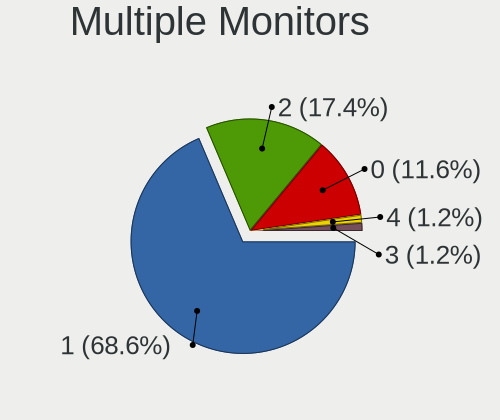

| Total | Computers | Percent |
|-------|-----------|---------|
| 1     | 26        | 70.27%  |
| 2     | 6         | 16.22%  |
| 0     | 4         | 10.81%  |
| 3     | 1         | 2.7%    |

Network
-------

Net Controller Vendor
---------------------

Controller vendors

| Vendor                            | Computers | Percent |
|-----------------------------------|-----------|---------|
| Intel                             | 25        | 43.1%   |
| Realtek Semiconductor             | 13        | 22.41%  |
| Qualcomm Atheros                  | 8         | 13.79%  |
| Broadcom                          | 3         | 5.17%   |
| Xiaomi                            | 1         | 1.72%   |
| U-Blox                            | 1         | 1.72%   |
| TP-Link                           | 1         | 1.72%   |
| Mellanox Technologies             | 1         | 1.72%   |
| MediaTek                          | 1         | 1.72%   |
| Ericsson Business Mobile Networks | 1         | 1.72%   |
| Ceton Technologies                | 1         | 1.72%   |
| ASUSTek Computer                  | 1         | 1.72%   |
| ASIX Electronics                  | 1         | 1.72%   |

Net Controller Model
--------------------

Controller models

| Model                                                              | Computers | Percent |
|--------------------------------------------------------------------|-----------|---------|
| Realtek RTL8111/8168/8411 PCI Express Gigabit Ethernet Controller  | 11        | 15.28%  |
| Intel Ethernet Controller I225-V                                   | 5         | 6.94%   |
| Intel Alder Lake-P PCH CNVi WiFi                                   | 5         | 6.94%   |
| Intel Wireless 7260                                                | 4         | 5.56%   |
| Qualcomm Atheros QCA9565 / AR9565 Wireless Network Adapter         | 3         | 4.17%   |
| Intel 82579LM Gigabit Network Connection (Lewisville)              | 3         | 4.17%   |
| Intel Wireless 8260                                                | 2         | 2.78%   |
| Intel Centrino Advanced-N 6205 [Taylor Peak]                       | 2         | 2.78%   |
| Xiaomi Mi/Redmi series (RNDIS)                                     | 1         | 1.39%   |
| U-Blox [u-blox 8]                                                  | 1         | 1.39%   |
| TP-Link Archer T3U [Realtek RTL8812BU]                             | 1         | 1.39%   |
| Realtek RTL8852AE 802.11ax PCIe Wireless Network Adapter           | 1         | 1.39%   |
| Realtek RTL8822CE 802.11ac PCIe Wireless Network Adapter           | 1         | 1.39%   |
| Realtek RTL8188EUS 802.11n Wireless Network Adapter                | 1         | 1.39%   |
| Realtek RTL8125 2.5GbE Controller                                  | 1         | 1.39%   |
| Qualcomm Atheros QCA9377 802.11ac Wireless Network Adapter         | 1         | 1.39%   |
| Qualcomm Atheros QCA8172 Fast Ethernet                             | 1         | 1.39%   |
| Qualcomm Atheros QCA6174 802.11ac Wireless Network Adapter         | 1         | 1.39%   |
| Qualcomm Atheros AR9462 Wireless Network Adapter                   | 1         | 1.39%   |
| Qualcomm Atheros AR928X Wireless Network Adapter (PCI-Express)     | 1         | 1.39%   |
| Qualcomm Atheros AR8162 Fast Ethernet                              | 1         | 1.39%   |
| Mellanox MT27800 Family [ConnectX-5]                               | 1         | 1.39%   |
| MediaTek MT7921K (RZ608) Wi-Fi 6E 80MHz                            | 1         | 1.39%   |
| Intel Wireless-AC 9260                                             | 1         | 1.39%   |
| Intel Wi-Fi 6 AX200                                                | 1         | 1.39%   |
| Intel Ice Lake-LP PCH CNVi WiFi                                    | 1         | 1.39%   |
| Intel I210 Gigabit Network Connection                              | 1         | 1.39%   |
| Intel Ethernet Controller XL710 for 40GbE QSFP+                    | 1         | 1.39%   |
| Intel Ethernet Controller X710 for 10GBASE-T                       | 1         | 1.39%   |
| Intel Ethernet Connection I219-V                                   | 1         | 1.39%   |
| Intel Ethernet Connection I219-LM                                  | 1         | 1.39%   |
| Intel Ethernet Connection I218-V                                   | 1         | 1.39%   |
| Intel Ethernet Connection I218-LM                                  | 1         | 1.39%   |
| Intel Ethernet Connection (2) I218-V                               | 1         | 1.39%   |
| Intel Dual Band Wireless-AC 3165 Plus Bluetooth                    | 1         | 1.39%   |
| Intel Comet Lake PCH-LP CNVi WiFi                                  | 1         | 1.39%   |
| Intel Comet Lake PCH CNVi WiFi                                     | 1         | 1.39%   |
| Intel 82574L Gigabit Network Connection                            | 1         | 1.39%   |
| Ericsson Business Mobile Networks H5321 gw Mobile Broadband Module | 1         | 1.39%   |
| Ceton InfiniTV Network                                             | 1         | 1.39%   |

Wireless Vendor
---------------

Wireless vendors

| Vendor                | Computers | Percent |
|-----------------------|-----------|---------|
| Intel                 | 19        | 57.58%  |
| Qualcomm Atheros      | 7         | 21.21%  |
| Realtek Semiconductor | 3         | 9.09%   |
| TP-Link               | 1         | 3.03%   |
| MediaTek              | 1         | 3.03%   |
| Broadcom              | 1         | 3.03%   |
| ASUSTek Computer      | 1         | 3.03%   |

Wireless Model
--------------

Wireless models

| Model                                                          | Computers | Percent |
|----------------------------------------------------------------|-----------|---------|
| Intel Alder Lake-P PCH CNVi WiFi                               | 5         | 15.15%  |
| Intel Wireless 7260                                            | 4         | 12.12%  |
| Qualcomm Atheros QCA9565 / AR9565 Wireless Network Adapter     | 3         | 9.09%   |
| Intel Wireless 8260                                            | 2         | 6.06%   |
| Intel Centrino Advanced-N 6205 [Taylor Peak]                   | 2         | 6.06%   |
| TP-Link Archer T3U [Realtek RTL8812BU]                         | 1         | 3.03%   |
| Realtek RTL8852AE 802.11ax PCIe Wireless Network Adapter       | 1         | 3.03%   |
| Realtek RTL8822CE 802.11ac PCIe Wireless Network Adapter       | 1         | 3.03%   |
| Realtek RTL8188EUS 802.11n Wireless Network Adapter            | 1         | 3.03%   |
| Qualcomm Atheros QCA9377 802.11ac Wireless Network Adapter     | 1         | 3.03%   |
| Qualcomm Atheros QCA6174 802.11ac Wireless Network Adapter     | 1         | 3.03%   |
| Qualcomm Atheros AR9462 Wireless Network Adapter               | 1         | 3.03%   |
| Qualcomm Atheros AR928X Wireless Network Adapter (PCI-Express) | 1         | 3.03%   |
| MediaTek MT7921K (RZ608) Wi-Fi 6E 80MHz                        | 1         | 3.03%   |
| Intel Wireless-AC 9260                                         | 1         | 3.03%   |
| Intel Wi-Fi 6 AX200                                            | 1         | 3.03%   |
| Intel Ice Lake-LP PCH CNVi WiFi                                | 1         | 3.03%   |
| Intel Dual Band Wireless-AC 3165 Plus Bluetooth                | 1         | 3.03%   |
| Intel Comet Lake PCH-LP CNVi WiFi                              | 1         | 3.03%   |
| Intel Comet Lake PCH CNVi WiFi                                 | 1         | 3.03%   |
| Broadcom BCM4313 802.11bgn Wireless Network Adapter            | 1         | 3.03%   |
| ASUS 802.11ac NIC                                              | 1         | 3.03%   |

Ethernet Vendor
---------------

Ethernet vendors

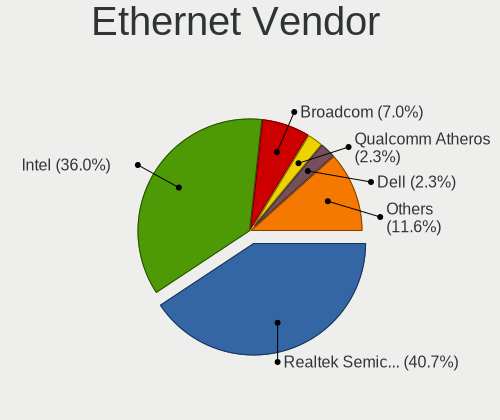

| Vendor                | Computers | Percent |
|-----------------------|-----------|---------|
| Intel                 | 15        | 42.86%  |
| Realtek Semiconductor | 12        | 34.29%  |
| Qualcomm Atheros      | 2         | 5.71%   |
| Broadcom              | 2         | 5.71%   |
| Xiaomi                | 1         | 2.86%   |
| Mellanox Technologies | 1         | 2.86%   |
| Ceton Technologies    | 1         | 2.86%   |
| ASIX Electronics      | 1         | 2.86%   |

Ethernet Model
--------------

Ethernet models

| Model                                                             | Computers | Percent |
|-------------------------------------------------------------------|-----------|---------|
| Realtek RTL8111/8168/8411 PCI Express Gigabit Ethernet Controller | 11        | 29.73%  |
| Intel Ethernet Controller I225-V                                  | 5         | 13.51%  |
| Intel 82579LM Gigabit Network Connection (Lewisville)             | 3         | 8.11%   |
| Xiaomi Mi/Redmi series (RNDIS)                                    | 1         | 2.7%    |
| Realtek RTL8125 2.5GbE Controller                                 | 1         | 2.7%    |
| Qualcomm Atheros QCA8172 Fast Ethernet                            | 1         | 2.7%    |
| Qualcomm Atheros AR8162 Fast Ethernet                             | 1         | 2.7%    |
| Mellanox MT27800 Family [ConnectX-5]                              | 1         | 2.7%    |
| Intel I210 Gigabit Network Connection                             | 1         | 2.7%    |
| Intel Ethernet Controller XL710 for 40GbE QSFP+                   | 1         | 2.7%    |
| Intel Ethernet Controller X710 for 10GBASE-T                      | 1         | 2.7%    |
| Intel Ethernet Connection I219-V                                  | 1         | 2.7%    |
| Intel Ethernet Connection I219-LM                                 | 1         | 2.7%    |
| Intel Ethernet Connection I218-V                                  | 1         | 2.7%    |
| Intel Ethernet Connection I218-LM                                 | 1         | 2.7%    |
| Intel Ethernet Connection (2) I218-V                              | 1         | 2.7%    |
| Intel 82574L Gigabit Network Connection                           | 1         | 2.7%    |
| Ceton InfiniTV Network                                            | 1         | 2.7%    |
| Broadcom NetXtreme BCM57786 Gigabit Ethernet PCIe                 | 1         | 2.7%    |
| Broadcom NetLink BCM57780 Gigabit Ethernet PCIe                   | 1         | 2.7%    |
| ASIX AX88179 Gigabit Ethernet                                     | 1         | 2.7%    |

Net Controller Kind
-------------------

Ethernet, WiFi or modem

| Kind     | Computers | Percent |
|----------|-----------|---------|
| WiFi     | 31        | 49.21%  |
| Ethernet | 30        | 47.62%  |
| Modem    | 2         | 3.17%   |

Used Controller
---------------

Currently used network controller

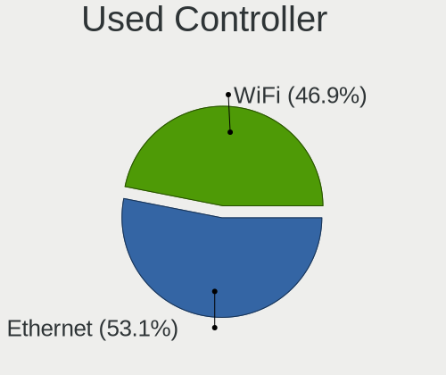

| Kind     | Computers | Percent |
|----------|-----------|---------|
| WiFi     | 19        | 55.88%  |
| Ethernet | 15        | 44.12%  |

NICs
----

Total network controllers on board

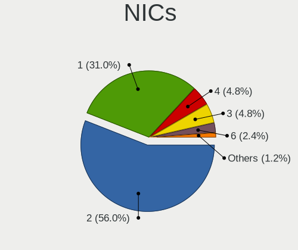

| Total | Computers | Percent |
|-------|-----------|---------|
| 2     | 23        | 63.89%  |
| 1     | 11        | 30.56%  |
| 7     | 1         | 2.78%   |
| 3     | 1         | 2.78%   |

IPv6
----

IPv6 vs IPv4

| Used | Computers | Percent |
|------|-----------|---------|
| No   | 27        | 75%     |
| Yes  | 9         | 25%     |

Bluetooth
---------

Bluetooth Vendor
----------------

Controller vendors

| Vendor                          | Computers | Percent |
|---------------------------------|-----------|---------|
| Intel                           | 16        | 57.14%  |
| Realtek Semiconductor           | 2         | 7.14%   |
| Qualcomm Atheros Communications | 2         | 7.14%   |
| Lite-On Technology              | 2         | 7.14%   |
| Broadcom                        | 2         | 7.14%   |
| MediaTek                        | 1         | 3.57%   |
| IMC Networks                    | 1         | 3.57%   |
| Cambridge Silicon Radio         | 1         | 3.57%   |
| ASUSTek Computer                | 1         | 3.57%   |

Bluetooth Model
---------------

Controller models

| Model                                               | Computers | Percent |
|-----------------------------------------------------|-----------|---------|
| Intel Bluetooth wireless interface                  | 7         | 25%     |
| Intel Bluetooth Device                              | 4         | 14.29%  |
| Realtek Bluetooth Radio                             | 2         | 7.14%   |
| Intel AX201 Bluetooth                               | 2         | 7.14%   |
| Broadcom BCM20702 Bluetooth 4.0 [ThinkPad]          | 2         | 7.14%   |
| Qualcomm Atheros AR9462 Bluetooth                   | 1         | 3.57%   |
| Qualcomm Atheros AR3012 Bluetooth 4.0               | 1         | 3.57%   |
| MediaTek Wireless_Device                            | 1         | 3.57%   |
| Lite-On Bluetooth Device                            | 1         | 3.57%   |
| Lite-On Atheros AR3012 Bluetooth                    | 1         | 3.57%   |
| Intel Wireless-AC 9260 Bluetooth Adapter            | 1         | 3.57%   |
| Intel Bluetooth 9460/9560 Jefferson Peak (JfP)      | 1         | 3.57%   |
| Intel AX200 Bluetooth                               | 1         | 3.57%   |
| IMC Networks Bluetooth Device                       | 1         | 3.57%   |
| Cambridge Silicon Radio Bluetooth Dongle (HCI mode) | 1         | 3.57%   |
| ASUS Broadcom BCM20702A0 Bluetooth                  | 1         | 3.57%   |

Sound
-----

Sound Vendor
------------

Sound card vendors

| Vendor          | Computers | Percent |
|-----------------|-----------|---------|
| Intel           | 27        | 57.45%  |
| AMD             | 10        | 21.28%  |
| Nvidia          | 9         | 19.15%  |
| SteelSeries ApS | 1         | 2.13%   |

Sound Model
-----------

Sound card models

| Model                                                                      | Computers | Percent |
|----------------------------------------------------------------------------|-----------|---------|
| Intel Alder Lake PCH-P High Definition Audio Controller                    | 5         | 8.77%   |
| Intel 7 Series/C216 Chipset Family High Definition Audio Controller        | 4         | 7.02%   |
| AMD Family 17h/19h HD Audio Controller                                     | 4         | 7.02%   |
| Intel Haswell-ULT HD Audio Controller                                      | 3         | 5.26%   |
| Intel 8 Series/C220 Series Chipset High Definition Audio Controller        | 3         | 5.26%   |
| Intel 8 Series HD Audio Controller                                         | 3         | 5.26%   |
| AMD Renoir Radeon High Definition Audio Controller                         | 3         | 5.26%   |
| Nvidia TU116 High Definition Audio Controller                              | 2         | 3.51%   |
| Nvidia TU107 GeForce GTX 1650 High Definition Audio Controller             | 2         | 3.51%   |
| Intel Xeon E3-1200 v3/4th Gen Core Processor HD Audio Controller           | 2         | 3.51%   |
| AMD Starship/Matisse HD Audio Controller                                   | 2         | 3.51%   |
| SteelSeries ApS SteelSeries GameDAC                                        | 1         | 1.75%   |
| Nvidia TU106 High Definition Audio Controller                              | 1         | 1.75%   |
| Nvidia GM200 High Definition Audio                                         | 1         | 1.75%   |
| Nvidia GK208 HDMI/DP Audio Controller                                      | 1         | 1.75%   |
| Nvidia GF108 High Definition Audio Controller                              | 1         | 1.75%   |
| Nvidia GA106 High Definition Audio Controller                              | 1         | 1.75%   |
| Nvidia Audio device                                                        | 1         | 1.75%   |
| Intel Tiger Lake-H HD Audio Controller                                     | 1         | 1.75%   |
| Intel Sunrise Point-LP HD Audio                                            | 1         | 1.75%   |
| Intel Smart Sound Technology (SST) Audio Controller                        | 1         | 1.75%   |
| Intel Ice Lake-LP Smart Sound Technology Audio Controller                  | 1         | 1.75%   |
| Intel Comet Lake PCH-LP cAVS                                               | 1         | 1.75%   |
| Intel Comet Lake PCH cAVS                                                  | 1         | 1.75%   |
| Intel Celeron/Pentium Silver Processor High Definition Audio               | 1         | 1.75%   |
| Intel Cannon Point-LP High Definition Audio Controller                     | 1         | 1.75%   |
| Intel C610/X99 series chipset HD Audio Controller                          | 1         | 1.75%   |
| Intel Alder Lake-S HD Audio Controller                                     | 1         | 1.75%   |
| Intel 6 Series/C200 Series Chipset Family High Definition Audio Controller | 1         | 1.75%   |
| Intel 5 Series/3400 Series Chipset High Definition Audio                   | 1         | 1.75%   |
| AMD SBx00 Azalia (Intel HDA)                                               | 1         | 1.75%   |
| AMD Oland/Hainan/Cape Verde/Pitcairn HDMI Audio [Radeon HD 7000 Series]    | 1         | 1.75%   |
| AMD Navi 21/23 HDMI/DP Audio Controller                                    | 1         | 1.75%   |
| AMD Cedar HDMI Audio [Radeon HD 5400/6300/7300 Series]                     | 1         | 1.75%   |
| AMD Baffin HDMI/DP Audio [Radeon RX 550 640SP / RX 560/560X]               | 1         | 1.75%   |

Memory
------

Memory Vendor
-------------

Memory module vendors

| Vendor              | Computers | Percent |
|---------------------|-----------|---------|
| Samsung Electronics | 7         | 35%     |
| SK hynix            | 2         | 10%     |
| G.Skill             | 2         | 10%     |
| Corsair             | 2         | 10%     |
| Unknown (ABCD)      | 1         | 5%      |
| Team                | 1         | 5%      |
| Smart Brazil        | 1         | 5%      |
| SHARETRONIC         | 1         | 5%      |
| Kingston            | 1         | 5%      |
| Crucial             | 1         | 5%      |
| A-DATA Technology   | 1         | 5%      |

Memory Model
------------

Memory module models

| Model                                                          | Computers | Percent |
|----------------------------------------------------------------|-----------|---------|
| Unknown (ABCD) RAM 123456789012345678 2GB DIMM LPDDR4 2400MT/s | 1         | 5%      |
| Team RAM TEAMGROUP-UD3-1600 4GB DIMM DDR3 1600MT/s             | 1         | 5%      |
| Smart Brazil RAM SMS4TDC3C0K0446SCG 4GB SODIMM DDR4 2667MT/s   | 1         | 5%      |
| SK hynix RAM HMT125S6BFR8C-G7 2048MB SODIMM DDR3 1067MT/s      | 1         | 5%      |
| SK hynix RAM HMA82GS6DJR8N-XN 16GB SODIMM DDR4 3200MT/s        | 1         | 5%      |
| SHARETRONIC RAM Module 4GB SODIMM DDR3 800MT/s                 | 1         | 5%      |
| Samsung RAM Module 8GB SODIMM DDR4 2133MT/s                    | 1         | 5%      |
| Samsung RAM M471B5273DH0-CK0 4GB SODIMM DDR3 1600MT/s          | 1         | 5%      |
| Samsung RAM M471A1K43EB1-CWE 8GB SODIMM DDR4 3200MT/s          | 1         | 5%      |
| Samsung RAM M471A1G44AB0-CTD 8GB SODIMM DDR4 2667MT/s          | 1         | 5%      |
| Samsung RAM M393A4K40EB3-CWE 32GB DIMM DDR4 3200MT/s           | 1         | 5%      |
| Samsung RAM M378B1G73EB0-YK0 8GB DIMM DDR3 1600MT/s            | 1         | 5%      |
| Samsung RAM K4UBE3D4AA-MGCR 2GB Row Of Chips LPDDR4 4267MT/s   | 1         | 5%      |
| Kingston RAM 9905417-083.A00G 4GB SODIMM DDR3 1600MT/s         | 1         | 5%      |
| G.Skill RAM F4-3600C18-32GTZR 32GB DIMM DDR4 3600MT/s          | 1         | 5%      |
| G.Skill RAM F3-1600C9-8GRSL 8GB SODIMM DDR3 1600MT/s           | 1         | 5%      |
| Crucial RAM CT16G4DFD824A.C16FBD 16GB DIMM DDR4 2933MT/s       | 1         | 5%      |
| Corsair RAM CMSO8GX3M1C1600C11 8GB SODIMM DDR3 1600MT/s        | 1         | 5%      |
| Corsair RAM CMK128GX4M8A2666C16 16GB DIMM DDR4 2133MT/s        | 1         | 5%      |
| A-DATA RAM Module 32GB SODIMM DDR4 3200MT/s                    | 1         | 5%      |

Memory Kind
-----------

Memory module kinds

| Kind   | Computers | Percent |
|--------|-----------|---------|
| DDR4   | 9         | 50%     |
| DDR3   | 7         | 38.89%  |
| LPDDR4 | 2         | 11.11%  |

Memory Form Factor
------------------

Physical design of the memory module

| Name         | Computers | Percent |
|--------------|-----------|---------|
| SODIMM       | 10        | 55.56%  |
| DIMM         | 7         | 38.89%  |
| Row Of Chips | 1         | 5.56%   |

Memory Size
-----------

Memory module size

| Size  | Computers | Percent |
|-------|-----------|---------|
| 8192  | 8         | 42.11%  |
| 16384 | 4         | 21.05%  |
| 32768 | 3         | 15.79%  |
| 4096  | 3         | 15.79%  |
| 2048  | 1         | 5.26%   |

Memory Speed
------------

Memory module speed

| Speed | Computers | Percent |
|-------|-----------|---------|
| 1600  | 4         | 22.22%  |
| 3200  | 3         | 16.67%  |
| 2667  | 2         | 11.11%  |
| 2133  | 2         | 11.11%  |
| 4267  | 1         | 5.56%   |
| 3600  | 1         | 5.56%   |
| 2933  | 1         | 5.56%   |
| 2400  | 1         | 5.56%   |
| 1800  | 1         | 5.56%   |
| 1067  | 1         | 5.56%   |
| 800   | 1         | 5.56%   |

Printers & scanners
-------------------

Printer Vendor
--------------

Printer device vendors

Zero info for selected period =(

Printer Model
-------------

Printer device models

Zero info for selected period =(

Scanner Vendor
--------------

Scanner device vendors

Zero info for selected period =(

Scanner Model
-------------

Scanner device models

Zero info for selected period =(

Camera
------

Camera Vendor
-------------

Camera device vendors

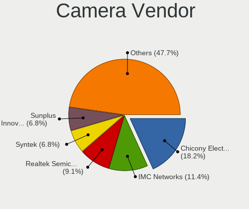

| Vendor                                 | Computers | Percent |
|----------------------------------------|-----------|---------|
| Chicony Electronics                    | 5         | 23.81%  |
| IMC Networks                           | 3         | 14.29%  |
| Sunplus Innovation Technology          | 2         | 9.52%   |
| Cheng Uei Precision Industry (Foxlink) | 2         | 9.52%   |
| Bison Electronics                      | 2         | 9.52%   |
| Acer                                   | 2         | 9.52%   |
| Syntek                                 | 1         | 4.76%   |
| Realtek Semiconductor                  | 1         | 4.76%   |
| Microdia                               | 1         | 4.76%   |
| Luxvisions Innotech Limited            | 1         | 4.76%   |
| Apple                                  | 1         | 4.76%   |

Camera Model
------------

Camera device models

| Model                                               | Computers | Percent |
|-----------------------------------------------------|-----------|---------|
| Sunplus Canyon CNS-CWC5 Webcam                      | 2         | 9.52%   |
| Syntek Integrated Camera                            | 1         | 4.76%   |
| Realtek Lenovo EasyCamera                           | 1         | 4.76%   |
| Microdia USB Live camera                            | 1         | 4.76%   |
| Luxvisions Innotech Limited HP TrueVision HD Camera | 1         | 4.76%   |
| IMC Networks USB2.0 UVC HD Webcam                   | 1         | 4.76%   |
| IMC Networks Integrated RGB Camera                  | 1         | 4.76%   |
| IMC Networks Integrated Camera                      | 1         | 4.76%   |
| Chicony Thinkpad T430 camera                        | 1         | 4.76%   |
| Chicony Integrated Camera                           | 1         | 4.76%   |
| Chicony HD WebCam (Asus N-series)                   | 1         | 4.76%   |
| Chicony HD WebCam                                   | 1         | 4.76%   |
| Chicony Acer CrystalEye Webcam                      | 1         | 4.76%   |
| Cheng Uei Precision Industry (Foxlink) HP HD Webcam | 1         | 4.76%   |
| Cheng Uei Precision Industry (Foxlink) HP HD Camera | 1         | 4.76%   |
| Bison Integrated Camera                             | 1         | 4.76%   |
| Bison HD Webcam                                     | 1         | 4.76%   |
| Apple iPhone 5/5C/5S/6/SE/7/8/X                     | 1         | 4.76%   |
| Acer Lenovo Integrated Webcam                       | 1         | 4.76%   |
| Acer Integrated Camera                              | 1         | 4.76%   |

Security
--------

Fingerprint Vendor
------------------

Fingerprint sensor vendors

| Vendor           | Computers | Percent |
|------------------|-----------|---------|
| Validity Sensors | 2         | 100%    |

Fingerprint Model
-----------------

Fingerprint sensor models

| Model                                             | Computers | Percent |
|---------------------------------------------------|-----------|---------|
| Validity Sensors VFS7500 Touch Fingerprint Sensor | 1         | 50%     |
| Validity Sensors VFS495 Fingerprint Reader        | 1         | 50%     |

Chipcard Vendor
---------------

Chipcard module vendors

| Vendor | Computers | Percent |
|--------|-----------|---------|
| Upek   | 1         | 100%    |

Chipcard Model
--------------

Chipcard module models

| Model                                                      | Computers | Percent |
|------------------------------------------------------------|-----------|---------|
| Upek TouchChip Fingerprint Coprocessor (WBF advanced mode) | 1         | 100%    |

Unsupported
-----------

Unsupported Devices
-------------------

Total unsupported devices on board

| Total | Computers | Percent |
|-------|-----------|---------|
| 0     | 21        | 53.85%  |
| 1     | 13        | 33.33%  |
| 2     | 4         | 10.26%  |
| 3     | 1         | 2.56%   |

Unsupported Device Types
------------------------

Types of unsupported devices

| Type                     | Computers | Percent |
|--------------------------|-----------|---------|
| Graphics card            | 5         | 23.81%  |
| Net/wireless             | 4         | 19.05%  |
| Multimedia controller    | 3         | 14.29%  |
| Unassigned class         | 2         | 9.52%   |
| Fingerprint reader       | 2         | 9.52%   |
| Storage/ata              | 1         | 4.76%   |
| Dvb card                 | 1         | 4.76%   |
| Communication controller | 1         | 4.76%   |
| Chipcard                 | 1         | 4.76%   |
| Bluetooth                | 1         | 4.76%   |

