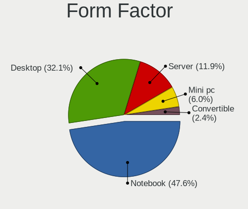
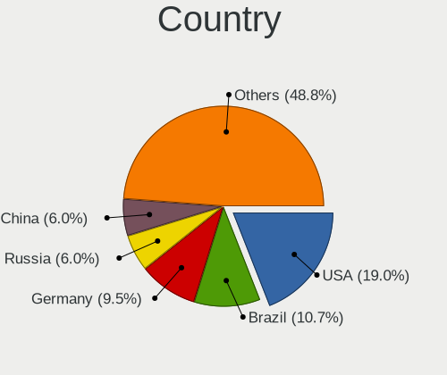
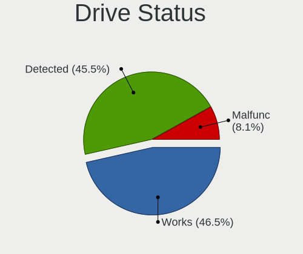
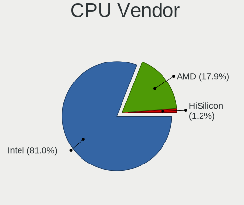
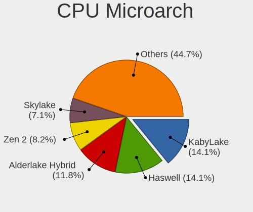
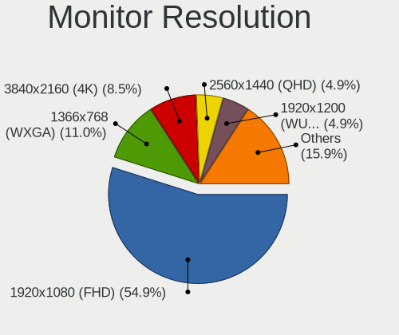
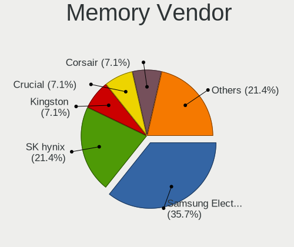

CentOS 9 - Tested Hardware & Statistics
---------------------------------------

A project to collect tested hardware configurations for CentOS 9.

Anyone can contribute to this report by the [hw-probe](https://github.com/linuxhw/hw-probe) tool:

    sudo -E hw-probe -all -upload

Please contribute! Especially if your hardware is rare.

This is a report for all computer types. See also reports for [desktops](/Dist/CentOS_9/Desktop/README.md) and [notebooks](/Dist/CentOS_9/Notebook/README.md).

Contents
--------

* [ Test Cases ](#test-cases)

* [ System ](#system)
  - [ Kernel                   ](#kernel)
  - [ Kernel Family            ](#kernel-family)
  - [ Kernel Major Ver.        ](#kernel-major-ver)
  - [ Arch                     ](#arch)
  - [ DE                       ](#de)
  - [ Display Server           ](#display-server)
  - [ Display Manager          ](#display-manager)
  - [ OS Lang                  ](#os-lang)
  - [ Boot Mode                ](#boot-mode)
  - [ Filesystem               ](#filesystem)
  - [ Part. scheme             ](#part-scheme)
  - [ Dual Boot with Linux/BSD ](#dual-boot-with-linuxbsd)
  - [ Dual Boot (Win)          ](#dual-boot-win)

* [ Board ](#board)
  - [ Vendor                   ](#vendor)
  - [ Model                    ](#model)
  - [ Model Family             ](#model-family)
  - [ MFG Year                 ](#mfg-year)
  - [ Form Factor              ](#form-factor)
  - [ Secure Boot              ](#secure-boot)
  - [ Coreboot                 ](#coreboot)
  - [ RAM Size                 ](#ram-size)
  - [ RAM Used                 ](#ram-used)
  - [ Total Drives             ](#total-drives)
  - [ Has CD-ROM               ](#has-cd-rom)
  - [ Has Ethernet             ](#has-ethernet)
  - [ Has WiFi                 ](#has-wifi)
  - [ Has Bluetooth            ](#has-bluetooth)

* [ Location ](#location)
  - [ Country                  ](#country)
  - [ City                     ](#city)

* [ Drives ](#drives)
  - [ Drive Vendor             ](#drive-vendor)
  - [ Drive Model              ](#drive-model)
  - [ HDD Vendor               ](#hdd-vendor)
  - [ SSD Vendor               ](#ssd-vendor)
  - [ Drive Kind               ](#drive-kind)
  - [ Drive Connector          ](#drive-connector)
  - [ Drive Size               ](#drive-size)
  - [ Space Total              ](#space-total)
  - [ Space Used               ](#space-used)
  - [ Malfunc. Drives          ](#malfunc-drives)
  - [ Malfunc. Drive Vendor    ](#malfunc-drive-vendor)
  - [ Malfunc. HDD Vendor      ](#malfunc-hdd-vendor)
  - [ Malfunc. Drive Kind      ](#malfunc-drive-kind)
  - [ Failed Drives            ](#failed-drives)
  - [ Failed Drive Vendor      ](#failed-drive-vendor)
  - [ Drive Status             ](#drive-status)

* [ Storage controller ](#storage-controller)
  - [ Storage Vendor           ](#storage-vendor)
  - [ Storage Model            ](#storage-model)
  - [ Storage Kind             ](#storage-kind)

* [ Processor ](#processor)
  - [ CPU Vendor               ](#cpu-vendor)
  - [ CPU Model                ](#cpu-model)
  - [ CPU Model Family         ](#cpu-model-family)
  - [ CPU Cores                ](#cpu-cores)
  - [ CPU Sockets              ](#cpu-sockets)
  - [ CPU Threads              ](#cpu-threads)
  - [ CPU Op-Modes             ](#cpu-op-modes)
  - [ CPU Microcode            ](#cpu-microcode)
  - [ CPU Microarch            ](#cpu-microarch)

* [ Graphics ](#graphics)
  - [ GPU Vendor               ](#gpu-vendor)
  - [ GPU Model                ](#gpu-model)
  - [ GPU Combo                ](#gpu-combo)
  - [ GPU Driver               ](#gpu-driver)
  - [ GPU Memory               ](#gpu-memory)

* [ Monitor ](#monitor)
  - [ Monitor Vendor           ](#monitor-vendor)
  - [ Monitor Model            ](#monitor-model)
  - [ Monitor Resolution       ](#monitor-resolution)
  - [ Monitor Diagonal         ](#monitor-diagonal)
  - [ Monitor Width            ](#monitor-width)
  - [ Aspect Ratio             ](#aspect-ratio)
  - [ Monitor Area             ](#monitor-area)
  - [ Pixel Density            ](#pixel-density)
  - [ Multiple Monitors        ](#multiple-monitors)

* [ Network ](#network)
  - [ Net Controller Vendor    ](#net-controller-vendor)
  - [ Net Controller Model     ](#net-controller-model)
  - [ Wireless Vendor          ](#wireless-vendor)
  - [ Wireless Model           ](#wireless-model)
  - [ Ethernet Vendor          ](#ethernet-vendor)
  - [ Ethernet Model           ](#ethernet-model)
  - [ Net Controller Kind      ](#net-controller-kind)
  - [ Used Controller          ](#used-controller)
  - [ NICs                     ](#nics)
  - [ IPv6                     ](#ipv6)

* [ Bluetooth ](#bluetooth)
  - [ Bluetooth Vendor         ](#bluetooth-vendor)
  - [ Bluetooth Model          ](#bluetooth-model)

* [ Sound ](#sound)
  - [ Sound Vendor             ](#sound-vendor)
  - [ Sound Model              ](#sound-model)

* [ Memory ](#memory)
  - [ Memory Vendor            ](#memory-vendor)
  - [ Memory Model             ](#memory-model)
  - [ Memory Kind              ](#memory-kind)
  - [ Memory Form Factor       ](#memory-form-factor)
  - [ Memory Size              ](#memory-size)
  - [ Memory Speed             ](#memory-speed)

* [ Printers & scanners ](#printers--scanners)
  - [ Printer Vendor           ](#printer-vendor)
  - [ Printer Model            ](#printer-model)
  - [ Scanner Vendor           ](#scanner-vendor)
  - [ Scanner Model            ](#scanner-model)

* [ Camera ](#camera)
  - [ Camera Vendor            ](#camera-vendor)
  - [ Camera Model             ](#camera-model)

* [ Security ](#security)
  - [ Fingerprint Vendor       ](#fingerprint-vendor)
  - [ Fingerprint Model        ](#fingerprint-model)
  - [ Chipcard Vendor          ](#chipcard-vendor)
  - [ Chipcard Model           ](#chipcard-model)

* [ Unsupported ](#unsupported)
  - [ Unsupported Devices      ](#unsupported-devices)
  - [ Unsupported Device Types ](#unsupported-device-types)

Test Cases
----------

Total: 77

| Vendor        | Model                       | Form-Factor | Probe                                                      | Date         |
|---------------|-----------------------------|-------------|------------------------------------------------------------|--------------|
| Dell          | Precision 5520              | Notebook    | [47f7336949](https://linux-hardware.org/?probe=47f7336949) | Jan 30, 2024 |
| ASUSTek       | PRIME H670-PLUS D4          | Desktop     | [5a711c0ff0](https://linux-hardware.org/?probe=5a711c0ff0) | Jan 20, 2024 |
| HP            | Spectre x360 Convertible... | Convertible | [6c329db1cf](https://linux-hardware.org/?probe=6c329db1cf) | Jan 18, 2024 |
| ASUSTek       | AT4NM10T-I                  | Desktop     | [7adc9b4d41](https://linux-hardware.org/?probe=7adc9b4d41) | Jan 06, 2024 |
| Dell          | G5 5505                     | Notebook    | [fd284cda8a](https://linux-hardware.org/?probe=fd284cda8a) | Jan 04, 2024 |
| MSI           | MAG B760M MORTAR WIFI       | Desktop     | [342164a6a4](https://linux-hardware.org/?probe=342164a6a4) | Dec 29, 2023 |
| SHANGZHAOY... | B85M-PRO V1.1               | Desktop     | [bd7c6e2693](https://linux-hardware.org/?probe=bd7c6e2693) | Dec 22, 2023 |
| ASUSTek       | PRIME H670-PLUS D4          | Desktop     | [e8965075d3](https://linux-hardware.org/?probe=e8965075d3) | Dec 14, 2023 |
| ASUSTek       | PRIME H670-PLUS D4          | Desktop     | [e9e5956d89](https://linux-hardware.org/?probe=e9e5956d89) | Dec 10, 2023 |
| Samsung       | 355V4C/356V4C/3445VC/354... | Notebook    | [ecc33f393d](https://linux-hardware.org/?probe=ecc33f393d) | Nov 22, 2023 |
| MSI           | MEG Z790 ACE                | Desktop     | [41d0e4fddd](https://linux-hardware.org/?probe=41d0e4fddd) | Oct 24, 2023 |
| Dell          | Vostro 5402                 | Notebook    | [f23d8804a7](https://linux-hardware.org/?probe=f23d8804a7) | Oct 11, 2023 |
| Dell          | 0HJK12 A03                  | Server      | [b4ec3650ef](https://linux-hardware.org/?probe=b4ec3650ef) | Sep 11, 2023 |
| ASUSTek       | P8H61/USB3                  | Desktop     | [ecf1a70c5d](https://linux-hardware.org/?probe=ecf1a70c5d) | Sep 08, 2023 |
| ASUSTek       | P8H61/USB3                  | Desktop     | [149cb27e46](https://linux-hardware.org/?probe=149cb27e46) | Aug 18, 2023 |
| Lenovo        | V15 G2 ITL 82KB             | Notebook    | [dfcebaef82](https://linux-hardware.org/?probe=dfcebaef82) | Aug 09, 2023 |
| ASUSTek       | ROG CROSSHAIR VIII DARK ... | Desktop     | [888c56f232](https://linux-hardware.org/?probe=888c56f232) | Aug 01, 2023 |
| ASUSTek       | PRIME H670-PLUS D4          | Desktop     | [993a10a30b](https://linux-hardware.org/?probe=993a10a30b) | Aug 01, 2023 |
| Dell          | 07978V A05                  | Server      | [8e1deb831f](https://linux-hardware.org/?probe=8e1deb831f) | Jul 26, 2023 |
| Intel         | NUC7i3BNB J22859-315        | Mini pc     | [8b2dd0b294](https://linux-hardware.org/?probe=8b2dd0b294) | Jul 07, 2023 |
| IBM           | 69Y1006 SIT                 | Server      | [b34e147b1c](https://linux-hardware.org/?probe=b34e147b1c) | Jun 25, 2023 |
| Gateway       | H61H2-AD V1.0               | Desktop     | [9a34a9295c](https://linux-hardware.org/?probe=9a34a9295c) | Jun 15, 2023 |
| ASUSTek       | P8H61/USB3                  | Desktop     | [d93dbf6db3](https://linux-hardware.org/?probe=d93dbf6db3) | Jun 01, 2023 |
| ASUSTek       | P8H61/USB3                  | Desktop     | [16c7ca187a](https://linux-hardware.org/?probe=16c7ca187a) | Jun 01, 2023 |
| ASUSTek       | P8H67-M LE                  | Desktop     | [a69366e2b7](https://linux-hardware.org/?probe=a69366e2b7) | May 29, 2023 |
| ASUSTek       | P8H67-M LE                  | Desktop     | [07202660b9](https://linux-hardware.org/?probe=07202660b9) | May 26, 2023 |
| Acer          | Predator G3-605             | Desktop     | [6f91022c83](https://linux-hardware.org/?probe=6f91022c83) | May 04, 2023 |
| Colorful T... | CVN Z590 GAMING PRO V20     | Desktop     | [209ec5e477](https://linux-hardware.org/?probe=209ec5e477) | Apr 28, 2023 |
| Lenovo        | Legion 5P 15IMH05H 82AW     | Notebook    | [61408603be](https://linux-hardware.org/?probe=61408603be) | Apr 21, 2023 |
| Intel         | NUC12WSBi5 M63398-302       | Mini pc     | [785a41f4e9](https://linux-hardware.org/?probe=785a41f4e9) | Apr 02, 2023 |
| ASUSTek       | N751JK                      | Notebook    | [d148f91b52](https://linux-hardware.org/?probe=d148f91b52) | Mar 15, 2023 |
| Intel         | NUC12WSBi7 M46422-303       | Mini pc     | [eecf7c5d8b](https://linux-hardware.org/?probe=eecf7c5d8b) | Mar 13, 2023 |
| ASUSTek       | Q550LF                      | Notebook    | [793bf0d1d8](https://linux-hardware.org/?probe=793bf0d1d8) | Mar 06, 2023 |
| ASUSTek       | PRIME H670-PLUS D4          | Desktop     | [a7270cf962](https://linux-hardware.org/?probe=a7270cf962) | Feb 19, 2023 |
| ASUSTek       | N751JK                      | Notebook    | [a67a4d078f](https://linux-hardware.org/?probe=a67a4d078f) | Jan 21, 2023 |
| ASUSTek       | N751JK                      | Notebook    | [259556fd6f](https://linux-hardware.org/?probe=259556fd6f) | Jan 11, 2023 |
| Razer         | Blade 15 (2022) - RZ09-0... | Notebook    | [b9522e3683](https://linux-hardware.org/?probe=b9522e3683) | Jan 02, 2023 |
| Lenovo        | ThinkPad T430 2347DE9       | Notebook    | [7b4305ce5a](https://linux-hardware.org/?probe=7b4305ce5a) | Dec 27, 2022 |
| Lenovo        | ThinkPad T430 2347DE9       | Notebook    | [afc91c5da0](https://linux-hardware.org/?probe=afc91c5da0) | Dec 24, 2022 |
| ASUSTek       | PRIME H670-PLUS D4          | Desktop     | [117f4c04d6](https://linux-hardware.org/?probe=117f4c04d6) | Dec 21, 2022 |
| Dell          | 0NKW6Y A02                  | Desktop     | [f20d5b9289](https://linux-hardware.org/?probe=f20d5b9289) | Dec 07, 2022 |
| Acer          | Swift SF314-512             | Notebook    | [b2aac5194c](https://linux-hardware.org/?probe=b2aac5194c) | Dec 06, 2022 |
| MSI           | X470 GAMING PRO             | Desktop     | [6ca3196f35](https://linux-hardware.org/?probe=6ca3196f35) | Dec 05, 2022 |
| IP3 Tech      | GB3B                        | Mini pc     | [558174d9f4](https://linux-hardware.org/?probe=558174d9f4) | Nov 29, 2022 |
| ASUSTek       | TUF Gaming X570-PLUS        | Desktop     | [e840ded8c0](https://linux-hardware.org/?probe=e840ded8c0) | Nov 09, 2022 |
| Lenovo        | IdeaPad S145-15IWL 81S9     | Notebook    | [b981adc21a](https://linux-hardware.org/?probe=b981adc21a) | Nov 07, 2022 |
| ASUSTek       | PRIME H670-PLUS D4          | Desktop     | [8ee7171b61](https://linux-hardware.org/?probe=8ee7171b61) | Nov 03, 2022 |
| IP3 Tech      | GB3B                        | Mini pc     | [9598c40129](https://linux-hardware.org/?probe=9598c40129) | Oct 27, 2022 |
| Zvezda        | Arctur test_serv            | Server      | [0ace3642f0](https://linux-hardware.org/?probe=0ace3642f0) | Oct 21, 2022 |
| Lenovo        | Yoga S740-14IIL 81RS        | Notebook    | [8bd50f112b](https://linux-hardware.org/?probe=8bd50f112b) | Oct 15, 2022 |
| Lenovo        | Yoga S740-14IIL 81RS        | Notebook    | [88497baf29](https://linux-hardware.org/?probe=88497baf29) | Oct 15, 2022 |
| Intel         | D34010WYK H14771-303        | Desktop     | [e58d9849a5](https://linux-hardware.org/?probe=e58d9849a5) | Oct 06, 2022 |
| Acer          | Aspire E1-570G              | Notebook    | [2293724ae2](https://linux-hardware.org/?probe=2293724ae2) | Sep 19, 2022 |
| Acer          | Aspire E1-570G              | Notebook    | [09db514840](https://linux-hardware.org/?probe=09db514840) | Sep 19, 2022 |
| Lenovo        | ThinkPad T430 2349DG5       | Notebook    | [740898521d](https://linux-hardware.org/?probe=740898521d) | Aug 27, 2022 |
| AZW           | SER V01                     | Mini pc     | [873aac6635](https://linux-hardware.org/?probe=873aac6635) | Aug 11, 2022 |
| Timi          | Mi NoteBook Horizon Edit... | Notebook    | [52a0cb298b](https://linux-hardware.org/?probe=52a0cb298b) | Aug 09, 2022 |
| ASUSTek       | H81M-K                      | Desktop     | [e115d77240](https://linux-hardware.org/?probe=e115d77240) | Aug 07, 2022 |
| Lenovo        | G410 20237                  | Notebook    | [daea3239f0](https://linux-hardware.org/?probe=daea3239f0) | Aug 05, 2022 |
| ASUSTek       | H81M-K                      | Desktop     | [46201e4773](https://linux-hardware.org/?probe=46201e4773) | Jul 27, 2022 |
| Dell          | CS24-TY                     | Server      | [230ad2532f](https://linux-hardware.org/?probe=230ad2532f) | Jul 24, 2022 |
| NCR           | Pocono BIOS.6.0             | Desktop     | [ae030a0cda](https://linux-hardware.org/?probe=ae030a0cda) | Jul 15, 2022 |
| Gigabyte      | 970A-DS3P                   | Desktop     | [c45dba9246](https://linux-hardware.org/?probe=c45dba9246) | Jun 26, 2022 |
| Gigabyte      | 970A-DS3P                   | Desktop     | [3d36beed4b](https://linux-hardware.org/?probe=3d36beed4b) | Jun 25, 2022 |
| ASUSTek       | ROG STRIX B560-G GAMING ... | Desktop     | [88a7cd954c](https://linux-hardware.org/?probe=88a7cd954c) | Jun 19, 2022 |
| HP            | Pavilion Gaming Laptop 1... | Notebook    | [29f2cd44d5](https://linux-hardware.org/?probe=29f2cd44d5) | Jun 11, 2022 |
| HP            | ProBook 470 G2              | Notebook    | [9a331b90a5](https://linux-hardware.org/?probe=9a331b90a5) | May 19, 2022 |
| HP            | ProBook 470 G2              | Notebook    | [4c3a3b2de2](https://linux-hardware.org/?probe=4c3a3b2de2) | May 17, 2022 |
| MSI           | Katana GF76 12UE            | Notebook    | [460e78b93a](https://linux-hardware.org/?probe=460e78b93a) | May 15, 2022 |
| HP            | EliteBook 840 G3            | Notebook    | [a7fb96d9aa](https://linux-hardware.org/?probe=a7fb96d9aa) | May 13, 2022 |
| Lenovo        | ThinkPad L14 Gen 1 20U5S... | Notebook    | [228ec1a5f7](https://linux-hardware.org/?probe=228ec1a5f7) | Apr 24, 2022 |
| Gigabyte      | X99-UD4-CF                  | Desktop     | [db53151112](https://linux-hardware.org/?probe=db53151112) | Apr 19, 2022 |
| Timi          | RedmiBook 16                | Notebook    | [bef46c5065](https://linux-hardware.org/?probe=bef46c5065) | Mar 20, 2022 |
| Lenovo        | G580 20150                  | Notebook    | [1f84b1e42d](https://linux-hardware.org/?probe=1f84b1e42d) | Mar 11, 2022 |
| Lenovo        | ThinkPad T460s 20FAS5WX0... | Notebook    | [6fa180d5fa](https://linux-hardware.org/?probe=6fa180d5fa) | Feb 06, 2022 |
| HP            | EliteBook 840 G1            | Notebook    | [cf90d5430c](https://linux-hardware.org/?probe=cf90d5430c) | Feb 04, 2022 |
| Acer          | Aspire 5740                 | Notebook    | [0c661cb2d6](https://linux-hardware.org/?probe=0c661cb2d6) | Nov 12, 2021 |

System
------

Kernel
------

Version of the Linux kernel

| Version                   | Computers | Percent |
|---------------------------|-----------|---------|
| 5.14.0-86.el9.x86_64      | 3         | 4.69%   |
| 5.14.0-202.el9.x86_64     | 3         | 4.69%   |
| 5.14.0-134.el9.x86_64     | 3         | 4.69%   |
| 5.14.0-407.el9.x86_64     | 2         | 3.13%   |
| 5.14.0-391.el9.x86_64     | 2         | 3.13%   |
| 5.14.0-362.el9.x86_64     | 2         | 3.13%   |
| 5.14.0-325.el9.x86_64     | 2         | 3.13%   |
| 5.14.0-319.el9.x86_64     | 2         | 3.13%   |
| 5.14.0-214.el9.x86_64     | 2         | 3.13%   |
| 5.14.0-183.el9.x86_64     | 2         | 3.13%   |
| 5.14.0-171.el9.x86_64     | 2         | 3.13%   |
| 5.14.0-148.el9.x86_64     | 2         | 3.13%   |
| 6.1.8-1.el9.elrepo.x86_64 | 1         | 1.56%   |
| 6.1.1                     | 1         | 1.56%   |
| 5.17.2-lqx3.0.el9.x86_64  | 1         | 1.56%   |
| 5.14.0-78.el9.x86_64      | 1         | 1.56%   |
| 5.14.0-71.el9.x86_64      | 1         | 1.56%   |
| 5.14.0-66.el9.x86_64      | 1         | 1.56%   |
| 5.14.0-52.el9.x86_64      | 1         | 1.56%   |
| 5.14.0-44.el9.x86_64      | 1         | 1.56%   |
| 5.14.0-410.el9.x86_64     | 1         | 1.56%   |
| 5.14.0-402.el9.x86_64     | 1         | 1.56%   |
| 5.14.0-390.el9.x86_64     | 1         | 1.56%   |
| 5.14.0-383.el9.x86_64     | 1         | 1.56%   |
| 5.14.0-375.el9.x86_64     | 1         | 1.56%   |
| 5.14.0-373.el9.x86_64     | 1         | 1.56%   |
| 5.14.0-352.el9.x86_64     | 1         | 1.56%   |
| 5.14.0-350.el9.x86_64     | 1         | 1.56%   |
| 5.14.0-344.el9.x86_64     | 1         | 1.56%   |
| 5.14.0-340.el9.x86_64     | 1         | 1.56%   |
| 5.14.0-333.el9.x86_64     | 1         | 1.56%   |
| 5.14.0-316.el9.x86_64     | 1         | 1.56%   |
| 5.14.0-305.el9.x86_64     | 1         | 1.56%   |
| 5.14.0-302.el9.x86_64     | 1         | 1.56%   |
| 5.14.0-299.el9.x86_64     | 1         | 1.56%   |
| 5.14.0-289.el9.x86_64     | 1         | 1.56%   |
| 5.14.0-283.el9.x86_64     | 1         | 1.56%   |
| 5.14.0-282.el9.x86_64     | 1         | 1.56%   |
| 5.14.0-267.el9.x86_64     | 1         | 1.56%   |
| 5.14.0-226.el9.x86_64     | 1         | 1.56%   |

Kernel Family
-------------

Linux kernel without a distro release

| Version | Computers | Percent |
|---------|-----------|---------|
| 5.14.0  | 53        | 92.98%  |
| 6.1.8   | 1         | 1.75%   |
| 6.1.1   | 1         | 1.75%   |
| 5.17.2  | 1         | 1.75%   |
| 4.18.0  | 1         | 1.75%   |

Kernel Major Ver.
-----------------

Linux kernel major version

| Version | Computers | Percent |
|---------|-----------|---------|
| 5.14    | 53        | 92.98%  |
| 6.1     | 2         | 3.51%   |
| 5.17    | 1         | 1.75%   |
| 4.18    | 1         | 1.75%   |

Arch
----

OS architecture (x86_64, i586, etc.)

| Name   | Computers | Percent |
|--------|-----------|---------|
| x86_64 | 56        | 100%    |

DE
--

Desktop Environment

| Name          | Computers | Percent |
|---------------|-----------|---------|
| GNOME         | 47        | 83.93%  |
| KDE5          | 3         | 5.36%   |
| GNOME Classic | 3         | 5.36%   |
| Unknown       | 3         | 5.36%   |

Display Server
--------------

X11 or Wayland

| Name    | Computers | Percent |
|---------|-----------|---------|
| Wayland | 35        | 61.4%   |
| X11     | 19        | 33.33%  |
| Tty     | 2         | 3.51%   |
| Unknown | 1         | 1.75%   |

Display Manager
---------------

SDDM, LightDM, etc.

| Name    | Computers | Percent |
|---------|-----------|---------|
| Unknown | 30        | 52.63%  |
| GDM     | 24        | 42.11%  |
| SDDM    | 2         | 3.51%   |
| LightDM | 1         | 1.75%   |

OS Lang
-------

Language

| Lang    | Computers | Percent |
|---------|-----------|---------|
| en_US   | 34        | 60.71%  |
| ru_RU   | 3         | 5.36%   |
| de_DE   | 3         | 5.36%   |
| zh_CN   | 2         | 3.57%   |
| pt_BR   | 2         | 3.57%   |
| ja_JP   | 2         | 3.57%   |
| it_IT   | 2         | 3.57%   |
| en_AU   | 2         | 3.57%   |
| sv_SE   | 1         | 1.79%   |
| ru_UA   | 1         | 1.79%   |
| fr_FR   | 1         | 1.79%   |
| en_IN   | 1         | 1.79%   |
| en_GB   | 1         | 1.79%   |
| Unknown | 1         | 1.79%   |

Boot Mode
---------

EFI or BIOS

| Mode | Computers | Percent |
|------|-----------|---------|
| EFI  | 41        | 71.93%  |
| BIOS | 16        | 28.07%  |

Filesystem
----------

Type of filesystem

| Type | Computers | Percent |
|------|-----------|---------|
| Xfs  | 52        | 92.86%  |
| Ext4 | 4         | 7.14%   |

Part. scheme
------------

Scheme of partitioning

| Type    | Computers | Percent |
|---------|-----------|---------|
| Unknown | 27        | 46.55%  |
| GPT     | 22        | 37.93%  |
| MBR     | 9         | 15.52%  |

Dual Boot with Linux/BSD
------------------------

Hosting more than one Linux/BSD

| Dual boot | Computers | Percent |
|-----------|-----------|---------|
| No        | 49        | 85.96%  |
| Yes       | 8         | 14.04%  |

Dual Boot (Win)
---------------

Hosting Linux and Windows

| Dual boot | Computers | Percent |
|-----------|-----------|---------|
| No        | 44        | 75.86%  |
| Yes       | 14        | 24.14%  |

Board
-----

Vendor
------

Motherboard manufacturer

| Name                | Computers | Percent |
|---------------------|-----------|---------|
| ASUSTek Computer    | 11        | 19.64%  |
| Lenovo              | 10        | 17.86%  |
| Dell                | 6         | 10.71%  |
| MSI                 | 4         | 7.14%   |
| Intel               | 4         | 7.14%   |
| Hewlett-Packard     | 4         | 7.14%   |
| Acer                | 4         | 7.14%   |
| Timi                | 2         | 3.57%   |
| Gigabyte Technology | 2         | 3.57%   |
| Zvezda              | 1         | 1.79%   |
| SHANGZHAOYUAN       | 1         | 1.79%   |
| Samsung Electronics | 1         | 1.79%   |
| Razer               | 1         | 1.79%   |
| IP3 Tech            | 1         | 1.79%   |
| IBM                 | 1         | 1.79%   |
| Gateway             | 1         | 1.79%   |
| Colorful Technology | 1         | 1.79%   |
| AZW                 | 1         | 1.79%   |

Model
-----

Motherboard model

| Name                                  | Computers | Percent |
|---------------------------------------|-----------|---------|
| ASUS PRIME H670-PLUS D4               | 2         | 3.57%   |
| Zvezda Altair Z                       | 1         | 1.79%   |
| Timi RedmiBook 16                     | 1         | 1.79%   |
| Timi Mi NoteBook Horizon Edition 14   | 1         | 1.79%   |
| SHANGZHAOYUAN B85M-PRO V1.1           | 1         | 1.79%   |
| Samsung 355V4C/356V4C/3445VC/3545VC   | 1         | 1.79%   |
| Razer Blade 15 (2022) - RZ09-0421     | 1         | 1.79%   |
| MSI MS-7E01                           | 1         | 1.79%   |
| MSI MS-7D86                           | 1         | 1.79%   |
| MSI MS-7B79                           | 1         | 1.79%   |
| MSI Katana GF76 12UE                  | 1         | 1.79%   |
| Lenovo Yoga S740-14IIL 81RS           | 1         | 1.79%   |
| Lenovo V15 G2 ITL 82KB                | 1         | 1.79%   |
| Lenovo ThinkPad T460s 20FAS5WX00      | 1         | 1.79%   |
| Lenovo ThinkPad T430 2349DG5          | 1         | 1.79%   |
| Lenovo ThinkPad T430 2347DE9          | 1         | 1.79%   |
| Lenovo ThinkPad L14 Gen 1 20U5S0NT00  | 1         | 1.79%   |
| Lenovo Legion 5P 15IMH05H 82AW        | 1         | 1.79%   |
| Lenovo IdeaPad S145-15IWL 81S9        | 1         | 1.79%   |
| Lenovo G580 20150                     | 1         | 1.79%   |
| Lenovo G410 20237                     | 1         | 1.79%   |
| IP3 Tech HeroBox                      | 1         | 1.79%   |
| Intel NUC7i3BNK                       | 1         | 1.79%   |
| Intel NUC12WSHi7                      | 1         | 1.79%   |
| Intel NUC12WSHi5                      | 1         | 1.79%   |
| Intel D34010WYK H14771-303            | 1         | 1.79%   |
| IBM System x3250 M3 -[425242G]        | 1         | 1.79%   |
| HP Spectre x360 Convertible 15-df0xxx | 1         | 1.79%   |
| HP Pavilion Gaming Laptop 15-ec0xxx   | 1         | 1.79%   |
| HP EliteBook 840 G3                   | 1         | 1.79%   |
| HP EliteBook 840 G1                   | 1         | 1.79%   |
| Gigabyte X99-UD4-CF                   | 1         | 1.79%   |
| Gigabyte 970A-DS3P                    | 1         | 1.79%   |
| Gateway SX2865                        | 1         | 1.79%   |
| Dell Vostro 5402                      | 1         | 1.79%   |
| Dell Precision 5520                   | 1         | 1.79%   |
| Dell PowerEdge T640                   | 1         | 1.79%   |
| Dell PowerEdge R720                   | 1         | 1.79%   |
| Dell OptiPlex 790                     | 1         | 1.79%   |
| Dell G5 5505                          | 1         | 1.79%   |

Model Family
------------

Motherboard model prefix

| Name                   | Computers | Percent |
|------------------------|-----------|---------|
| Lenovo ThinkPad        | 4         | 7.14%   |
| HP EliteBook           | 2         | 3.57%   |
| Dell PowerEdge         | 2         | 3.57%   |
| ASUS ROG               | 2         | 3.57%   |
| ASUS PRIME             | 2         | 3.57%   |
| Acer Aspire            | 2         | 3.57%   |
| Zvezda Altair          | 1         | 1.79%   |
| Timi RedmiBook         | 1         | 1.79%   |
| Timi Mi                | 1         | 1.79%   |
| SHANGZHAOYUAN B85M-PRO | 1         | 1.79%   |
| Samsung 355V4C         | 1         | 1.79%   |
| Razer Blade            | 1         | 1.79%   |
| MSI MS-7E01            | 1         | 1.79%   |
| MSI MS-7D86            | 1         | 1.79%   |
| MSI MS-7B79            | 1         | 1.79%   |
| MSI Katana             | 1         | 1.79%   |
| Lenovo Yoga            | 1         | 1.79%   |
| Lenovo V15             | 1         | 1.79%   |
| Lenovo Legion          | 1         | 1.79%   |
| Lenovo IdeaPad         | 1         | 1.79%   |
| Lenovo G580            | 1         | 1.79%   |
| Lenovo G410            | 1         | 1.79%   |
| IP3 Tech HeroBox       | 1         | 1.79%   |
| Intel NUC7i3BNK        | 1         | 1.79%   |
| Intel NUC12WSHi7       | 1         | 1.79%   |
| Intel NUC12WSHi5       | 1         | 1.79%   |
| Intel D34010WYK        | 1         | 1.79%   |
| IBM System             | 1         | 1.79%   |
| HP Spectre             | 1         | 1.79%   |
| HP Pavilion            | 1         | 1.79%   |
| Gigabyte X99-UD4-CF    | 1         | 1.79%   |
| Gigabyte 970A-DS3P     | 1         | 1.79%   |
| Gateway SX2865         | 1         | 1.79%   |
| Dell Vostro            | 1         | 1.79%   |
| Dell Precision         | 1         | 1.79%   |
| Dell OptiPlex          | 1         | 1.79%   |
| Dell G5                | 1         | 1.79%   |
| Colorful CVN           | 1         | 1.79%   |
| AZW SER                | 1         | 1.79%   |
| ASUS TUF               | 1         | 1.79%   |

MFG Year
--------

Motherboard manufacture year

| Year | Computers | Percent |
|------|-----------|---------|
| 2013 | 11        | 19.64%  |
| 2022 | 7         | 12.5%   |
| 2021 | 7         | 12.5%   |
| 2020 | 7         | 12.5%   |
| 2019 | 5         | 8.93%   |
| 2012 | 4         | 7.14%   |
| 2018 | 3         | 5.36%   |
| 2011 | 3         | 5.36%   |
| 2023 | 2         | 3.57%   |
| 2016 | 2         | 3.57%   |
| 2014 | 2         | 3.57%   |
| 2017 | 1         | 1.79%   |
| 2010 | 1         | 1.79%   |
| 2009 | 1         | 1.79%   |

Form Factor
-----------

Physical design of the computer

| Name        | Computers | Percent |
|-------------|-----------|---------|
| Notebook    | 26        | 46.43%  |
| Desktop     | 20        | 35.71%  |
| Mini pc     | 5         | 8.93%   |
| Server      | 4         | 7.14%   |
| Convertible | 1         | 1.79%   |

Secure Boot
-----------

Enabled or disabled

| State    | Computers | Percent |
|----------|-----------|---------|
| Disabled | 51        | 91.07%  |
| Enabled  | 5         | 8.93%   |

Coreboot
--------

Have coreboot on board

| Used | Computers | Percent |
|------|-----------|---------|
| No   | 56        | 100%    |

RAM Size
--------

Total RAM memory

| Size in GB      | Computers | Percent |
|-----------------|-----------|---------|
| 4.01-8.0        | 19        | 33.93%  |
| 8.01-16.0       | 12        | 21.43%  |
| 32.01-64.0      | 9         | 16.07%  |
| 64.01-256.0     | 7         | 12.5%   |
| 3.01-4.0        | 3         | 5.36%   |
| More than 256.0 | 2         | 3.57%   |
| 24.01-32.0      | 2         | 3.57%   |
| 16.01-24.0      | 2         | 3.57%   |

RAM Used
--------

Used RAM memory

| Used GB    | Computers | Percent |
|------------|-----------|---------|
| 2.01-3.0   | 21        | 35%     |
| 3.01-4.0   | 13        | 21.67%  |
| 4.01-8.0   | 11        | 18.33%  |
| 1.01-2.0   | 5         | 8.33%   |
| 8.01-16.0  | 5         | 8.33%   |
| 16.01-24.0 | 3         | 5%      |
| 0.51-1.0   | 2         | 3.33%   |

Total Drives
------------

Number of drives on board

| Drives | Computers | Percent |
|--------|-----------|---------|
| 1      | 28        | 50%     |
| 2      | 12        | 21.43%  |
| 3      | 7         | 12.5%   |
| 4      | 6         | 10.71%  |
| 5      | 2         | 3.57%   |
| 10     | 1         | 1.79%   |

Has CD-ROM
----------

Has CD-ROM on board

| Presented | Computers | Percent |
|-----------|-----------|---------|
| No        | 43        | 76.79%  |
| Yes       | 13        | 23.21%  |

Has Ethernet
------------

Has Ethernet on board

| Presented | Computers | Percent |
|-----------|-----------|---------|
| Yes       | 49        | 87.5%   |
| No        | 7         | 12.5%   |

Has WiFi
--------

Has WiFi module

| Presented | Computers | Percent |
|-----------|-----------|---------|
| Yes       | 43        | 76.79%  |
| No        | 13        | 23.21%  |

Has Bluetooth
-------------

Has Bluetooth module

| Presented | Computers | Percent |
|-----------|-----------|---------|
| Yes       | 39        | 69.64%  |
| No        | 17        | 30.36%  |

Location
--------

Country
-------

Geographic location (country)

| Country      | Computers | Percent |
|--------------|-----------|---------|
| USA          | 11        | 19.64%  |
| Germany      | 6         | 10.71%  |
| Russia       | 3         | 5.36%   |
| Italy        | 3         | 5.36%   |
| China        | 3         | 5.36%   |
| Bulgaria     | 3         | 5.36%   |
| Ukraine      | 2         | 3.57%   |
| Poland       | 2         | 3.57%   |
| Japan        | 2         | 3.57%   |
| Canada       | 2         | 3.57%   |
| Brazil       | 2         | 3.57%   |
| Australia    | 2         | 3.57%   |
| Uzbekistan   | 1         | 1.79%   |
| Switzerland  | 1         | 1.79%   |
| Sweden       | 1         | 1.79%   |
| South Africa | 1         | 1.79%   |
| Puerto Rico  | 1         | 1.79%   |
| Netherlands  | 1         | 1.79%   |
| Myanmar      | 1         | 1.79%   |
| Kazakhstan   | 1         | 1.79%   |
| India        | 1         | 1.79%   |
| France       | 1         | 1.79%   |
| Finland      | 1         | 1.79%   |
| Colombia     | 1         | 1.79%   |
| Chile        | 1         | 1.79%   |
| Belarus      | 1         | 1.79%   |
| Argentina    | 1         | 1.79%   |

City
----

Geographic location (city)

| City              | Computers | Percent |
|-------------------|-----------|---------|
| Moscow            | 3         | 5.08%   |
| Sofia             | 2         | 3.39%   |
| Bristow           | 2         | 3.39%   |
| Beijing           | 2         | 3.39%   |
| Yangon            | 1         | 1.69%   |
| Wuhan             | 1         | 1.69%   |
| Vitebsk           | 1         | 1.69%   |
| Vicenza           | 1         | 1.69%   |
| Tomah             | 1         | 1.69%   |
| Tashkent          | 1         | 1.69%   |
| Stromberg         | 1         | 1.69%   |
| Stockholm         | 1         | 1.69%   |
| Soest             | 1         | 1.69%   |
| Schemmerhofen     | 1         | 1.69%   |
| Sanford           | 1         | 1.69%   |
| San Juan          | 1         | 1.69%   |
| Ruda Śląska     | 1         | 1.69%   |
| Rome              | 1         | 1.69%   |
| Ribeirao Preto    | 1         | 1.69%   |
| Quitman           | 1         | 1.69%   |
| Puente Alto       | 1         | 1.69%   |
| Porto Alegre      | 1         | 1.69%   |
| Portland          | 1         | 1.69%   |
| Perth             | 1         | 1.69%   |
| Persan            | 1         | 1.69%   |
| Ozarow Mazowiecki | 1         | 1.69%   |
| Okazaki           | 1         | 1.69%   |
| New York          | 1         | 1.69%   |
| New Cumberland    | 1         | 1.69%   |
| Navapolatsk       | 1         | 1.69%   |
| Nagoya            | 1         | 1.69%   |
| Mumbai            | 1         | 1.69%   |
| Milpitas          | 1         | 1.69%   |
| Michelstadt       | 1         | 1.69%   |
| Melbourne         | 1         | 1.69%   |
| Meieki            | 1         | 1.69%   |
| L'Isle-Adam       | 1         | 1.69%   |
| Kyiv              | 1         | 1.69%   |
| Kramatorsk        | 1         | 1.69%   |
| Helsinki          | 1         | 1.69%   |

Drives
------

Drive Vendor
------------

Hard drive vendors

| Vendor                    | Computers | Drives | Percent |
|---------------------------|-----------|--------|---------|
| Samsung Electronics       | 13        | 19     | 14.61%  |
| WDC                       | 12        | 17     | 13.48%  |
| Seagate                   | 10        | 15     | 11.24%  |
| Kingston                  | 9         | 12     | 10.11%  |
| Toshiba                   | 7         | 10     | 7.87%   |
| SK hynix                  | 4         | 4      | 4.49%   |
| Sandisk                   | 4         | 14     | 4.49%   |
| Micron Technology         | 3         | 3      | 3.37%   |
| Intel                     | 3         | 3      | 3.37%   |
| HGST                      | 3         | 4      | 3.37%   |
| Crucial                   | 2         | 12     | 2.25%   |
| WD MediaMax               | 1         | 1      | 1.12%   |
| Unknown                   | 1         | 1      | 1.12%   |
| Union Memory              | 1         | 1      | 1.12%   |
| Team                      | 1         | 2      | 1.12%   |
| SPCC                      | 1         | 1      | 1.12%   |
| Plextor                   | 1         | 1      | 1.12%   |
| Phison Electronics        | 1         | 1      | 1.12%   |
| Phison                    | 1         | 1      | 1.12%   |
| OCZ                       | 1         | 1      | 1.12%   |
| Netac                     | 1         | 2      | 1.12%   |
| Micron/Crucial Technology | 1         | 1      | 1.12%   |
| LITEON                    | 1         | 1      | 1.12%   |
| Intenso                   | 1         | 1      | 1.12%   |
| Hjwdz                     | 1         | 1      | 1.12%   |
| Hitachi                   | 1         | 1      | 1.12%   |
| Hewlett-Packard           | 1         | 1      | 1.12%   |
| Gigabyte Technology       | 1         | 2      | 1.12%   |
| ASMT                      | 1         | 1      | 1.12%   |
| A-DATA Technology         | 1         | 1      | 1.12%   |

Drive Model
-----------

Hard drive models

| Model                                             | Computers | Percent |
|---------------------------------------------------|-----------|---------|
| SK hynix BC511 256GB                              | 2         | 2.06%   |
| Seagate ST1000DM010-2EP102 1TB                    | 2         | 2.06%   |
| Sandisk WD_BLACK SN770 1TB                        | 2         | 2.06%   |
| SanDisk SDSSDH3 1T00 1TB                          | 2         | 2.06%   |
| Samsung NVMe SSD Controller SM981/PM981/PM983 1TB | 2         | 2.06%   |
| Samsung MZNLH512HALU-00000 512GB SSD              | 2         | 2.06%   |
| Micron 2450_MTFDKBA512TFK 512GB                   | 2         | 2.06%   |
| Crucial CT525MX300SSD1 528GB                      | 2         | 2.06%   |
| WDC WDS250G2B0A-00SM50 250GB SSD                  | 1         | 1.03%   |
| WDC WD6400BEVT-22A0RT0 640GB                      | 1         | 1.03%   |
| WDC WD6003FZBX-00K5WB0 6TB                        | 1         | 1.03%   |
| WDC WD5000LPLX-60ZNTT1 500GB                      | 1         | 1.03%   |
| WDC WD5000BEVT-55A0RT0 500GB                      | 1         | 1.03%   |
| WDC WD3200AAKX-753CA1 320GB                       | 1         | 1.03%   |
| WDC WD2500AAJS-60M0A0 250GB                       | 1         | 1.03%   |
| WDC WD22EJRX-89BEMY0 2TB                          | 1         | 1.03%   |
| WDC WD2003FZEX-00Z4SA0 2TB                        | 1         | 1.03%   |
| WDC WD10EZEX-60M2NA0 1TB                          | 1         | 1.03%   |
| WDC WD10EZEX-08WN4A0 1TB                          | 1         | 1.03%   |
| WDC WD10EZEX-00BN5A0 1TB                          | 1         | 1.03%   |
| WDC WD Blue SA510 2.5 500GB                       | 1         | 1.03%   |
| WD MediaMax WL750GSA6472 752GB                    | 1         | 1.03%   |
| Unknown MMC Card  7GB                             | 1         | 1.03%   |
| Union Memory UMIS RPJTJ256MEE1OWX 256GB           | 1         | 1.03%   |
| Toshiba MQ04ABF100 1TB                            | 1         | 1.03%   |
| Toshiba MK2561GSYN 250GB                          | 1         | 1.03%   |
| Toshiba MK1234GSX 120GB                           | 1         | 1.03%   |
| Toshiba KXG50ZNV512G 512GB                        | 1         | 1.03%   |
| Toshiba DT01ACA200 2TB                            | 1         | 1.03%   |
| Toshiba DT01ACA100 1TB                            | 1         | 1.03%   |
| Toshiba AL15SEB24EQY 2TB                          | 1         | 1.03%   |
| Toshiba AL15SEB24EQY 2.4TB                        | 1         | 1.03%   |
| Team T253X1480G 480GB SSD                         | 1         | 1.03%   |
| SPCC Solid State Disk 120GB                       | 1         | 1.03%   |
| SK hynix NVMe SSD Drive 256GB                     | 1         | 1.03%   |
| SK hynix BC501 NVMe 256GB                         | 1         | 1.03%   |
| Seagate ST600MM0088 600GB                         | 1         | 1.03%   |
| Seagate ST500LT012-9WS142 500GB                   | 1         | 1.03%   |
| Seagate ST3500413AS 500GB                         | 1         | 1.03%   |
| Seagate ST3250820AS 249GB                         | 1         | 1.03%   |

HDD Vendor
----------

Hard disk drive vendors

| Vendor      | Computers | Drives | Percent |
|-------------|-----------|--------|---------|
| WDC         | 10        | 15     | 33.33%  |
| Seagate     | 9         | 13     | 30%     |
| Toshiba     | 6         | 8      | 20%     |
| HGST        | 3         | 4      | 10%     |
| WD MediaMax | 1         | 1      | 3.33%   |
| Hitachi     | 1         | 1      | 3.33%   |

SSD Vendor
----------

Solid state drive vendors

| Vendor              | Computers | Drives | Percent |
|---------------------|-----------|--------|---------|
| Samsung Electronics | 9         | 14     | 26.47%  |
| Kingston            | 6         | 9      | 17.65%  |
| SanDisk             | 3         | 7      | 8.82%   |
| WDC                 | 2         | 2      | 5.88%   |
| Crucial             | 2         | 12     | 5.88%   |
| Team                | 1         | 2      | 2.94%   |
| SPCC                | 1         | 1      | 2.94%   |
| Plextor             | 1         | 1      | 2.94%   |
| OCZ                 | 1         | 1      | 2.94%   |
| Netac               | 1         | 2      | 2.94%   |
| LITEON              | 1         | 1      | 2.94%   |
| Intenso             | 1         | 1      | 2.94%   |
| Intel               | 1         | 1      | 2.94%   |
| Hewlett-Packard     | 1         | 1      | 2.94%   |
| Gigabyte Technology | 1         | 2      | 2.94%   |
| ASMT                | 1         | 1      | 2.94%   |
| A-DATA Technology   | 1         | 1      | 2.94%   |

Drive Kind
----------

HDD or SSD

| Kind    | Computers | Drives | Percent |
|---------|-----------|--------|---------|
| SSD     | 28        | 59     | 35.9%   |
| NVMe    | 24        | 31     | 30.77%  |
| HDD     | 23        | 42     | 29.49%  |
| Unknown | 2         | 2      | 2.56%   |
| MMC     | 1         | 1      | 1.28%   |

Drive Connector
---------------

SATA, SAS, NVMe, etc.

| Type | Computers | Drives | Percent |
|------|-----------|--------|---------|
| SATA | 40        | 98     | 57.97%  |
| NVMe | 24        | 31     | 34.78%  |
| SAS  | 4         | 5      | 5.8%    |
| MMC  | 1         | 1      | 1.45%   |

Drive Size
----------

Size of hard drive

| Size in TB | Computers | Drives | Percent |
|------------|-----------|--------|---------|
| 0.01-0.5   | 27        | 42     | 50%     |
| 0.51-1.0   | 18        | 43     | 33.33%  |
| 1.01-2.0   | 7         | 13     | 12.96%  |
| 2.01-3.0   | 1         | 1      | 1.85%   |
| 4.01-10.0  | 1         | 2      | 1.85%   |

Space Total
-----------

Amount of disk space available on the file system

| Size in GB     | Computers | Percent |
|----------------|-----------|---------|
| 101-250        | 18        | 31.03%  |
| 251-500        | 13        | 22.41%  |
| 1001-2000      | 11        | 18.97%  |
| 501-1000       | 6         | 10.34%  |
| 2001-3000      | 4         | 6.9%    |
| More than 3000 | 2         | 3.45%   |
| 51-100         | 2         | 3.45%   |
| 21-50          | 1         | 1.72%   |
| Unknown        | 1         | 1.72%   |

Space Used
----------

Amount of used disk space

| Used GB        | Computers | Percent |
|----------------|-----------|---------|
| 1-20           | 25        | 43.86%  |
| 21-50          | 7         | 12.28%  |
| 101-250        | 6         | 10.53%  |
| 51-100         | 6         | 10.53%  |
| 251-500        | 5         | 8.77%   |
| 501-1000       | 3         | 5.26%   |
| 1001-2000      | 2         | 3.51%   |
| More than 3000 | 1         | 1.75%   |
| 2001-3000      | 1         | 1.75%   |
| Unknown        | 1         | 1.75%   |

Malfunc. Drives
---------------

Drive models with a malfunction

| Model                           | Computers | Drives | Percent |
|---------------------------------|-----------|--------|---------|
| WDC WD5000LPLX-60ZNTT1 500GB    | 1         | 1      | 16.67%  |
| WDC WD10EZEX-60M2NA0 1TB        | 1         | 1      | 16.67%  |
| Toshiba MK2561GSYN 250GB        | 1         | 1      | 16.67%  |
| Toshiba MK1234GSX 120GB         | 1         | 1      | 16.67%  |
| Seagate ST500LT012-9WS142 500GB | 1         | 1      | 16.67%  |
| Seagate ST3250820AS 249GB       | 1         | 1      | 16.67%  |

Malfunc. Drive Vendor
---------------------

Vendors of faulty drives

| Vendor  | Computers | Drives | Percent |
|---------|-----------|--------|---------|
| WDC     | 2         | 2      | 33.33%  |
| Toshiba | 2         | 2      | 33.33%  |
| Seagate | 2         | 2      | 33.33%  |

Malfunc. HDD Vendor
-------------------

Vendors of faulty HDD drives

| Vendor  | Computers | Drives | Percent |
|---------|-----------|--------|---------|
| WDC     | 2         | 2      | 33.33%  |
| Toshiba | 2         | 2      | 33.33%  |
| Seagate | 2         | 2      | 33.33%  |

Malfunc. Drive Kind
-------------------

Kinds of faulty drives

| Kind | Computers | Drives | Percent |
|------|-----------|--------|---------|
| HDD  | 5         | 6      | 100%    |

Failed Drives
-------------

Failed drive models

Zero info for selected period =(

Failed Drive Vendor
-------------------

Failed drive vendors

Zero info for selected period =(

Drive Status
------------

Number of failed and malfunc. drives

| Status   | Computers | Drives | Percent |
|----------|-----------|--------|---------|
| Detected | 33        | 74     | 50.77%  |
| Works    | 27        | 55     | 41.54%  |
| Malfunc  | 5         | 6      | 7.69%   |

Storage controller
------------------

Storage Vendor
--------------

Storage controller vendors

| Vendor                       | Computers | Percent |
|------------------------------|-----------|---------|
| Intel                        | 43        | 53.75%  |
| AMD                          | 7         | 8.75%   |
| SK hynix                     | 4         | 5%      |
| Samsung Electronics          | 4         | 5%      |
| SanDisk                      | 3         | 3.75%   |
| Micron Technology            | 3         | 3.75%   |
| LSI Logic / Symbios Logic    | 3         | 3.75%   |
| Kingston Technology Company  | 3         | 3.75%   |
| Phison Electronics           | 2         | 2.5%    |
| Union Memory (Shenzhen)      | 1         | 1.25%   |
| Toshiba America Info Systems | 1         | 1.25%   |
| Silicon Image                | 1         | 1.25%   |
| Seagate Technology           | 1         | 1.25%   |
| Micron/Crucial Technology    | 1         | 1.25%   |
| JMicron Technology           | 1         | 1.25%   |
| Broadcom / LSI               | 1         | 1.25%   |
| ASMedia Technology           | 1         | 1.25%   |

Storage Model
-------------

Storage controller models

| Model                                                                          | Computers | Percent |
|--------------------------------------------------------------------------------|-----------|---------|
| AMD FCH SATA Controller [AHCI mode]                                            | 6         | 6.98%   |
| Intel 8 Series/C220 Series Chipset Family 6-port SATA Controller 1 [AHCI mode] | 5         | 5.81%   |
| Intel 7 Series Chipset Family 6-port SATA Controller [AHCI mode]               | 4         | 4.65%   |
| Intel 6 Series/C200 Series Chipset Family 6 port Desktop SATA AHCI Controller  | 4         | 4.65%   |
| Intel Sunrise Point-LP SATA Controller [AHCI mode]                             | 3         | 3.49%   |
| Intel Alder Lake-P SATA AHCI Controller                                        | 3         | 3.49%   |
| Intel 8 Series SATA Controller 1 [AHCI mode]                                   | 3         | 3.49%   |
| SK hynix BC511 NVMe SSD                                                        | 2         | 2.33%   |
| SanDisk WD Black SN770 / PC SN740 256GB / PC SN560 (DRAM-less) NVMe SSD        | 2         | 2.33%   |
| Samsung NVMe SSD Controller SM981/PM981/PM983                                  | 2         | 2.33%   |
| Samsung NVMe SSD Controller 980 (DRAM-less)                                    | 2         | 2.33%   |
| Micron 2450 NVMe SSD [HendrixV] (DRAM-less)                                    | 2         | 2.33%   |
| Kingston Company KC3000/FURY Renegade NVMe SSD E18                             | 2         | 2.33%   |
| Intel Volume Management Device NVMe RAID Controller                            | 2         | 2.33%   |
| Intel Raptor Lake SATA AHCI Controller                                         | 2         | 2.33%   |
| Intel C620 Series Chipset Family SSATA Controller [AHCI mode]                  | 2         | 2.33%   |
| Intel Alder Lake-S PCH SATA Controller [AHCI Mode]                             | 2         | 2.33%   |
| Intel 500 Series Chipset Family SATA AHCI Controller                           | 2         | 2.33%   |
| Union Memory (Shenzhen) AM620 PCIe 3.0 NVMe SSD 256GB                          | 1         | 1.16%   |
| Toshiba America Info Systems XG5 NVMe SSD Controller                           | 1         | 1.16%   |
| SK hynix Gold P31/BC711/PC711 NVMe Solid State Drive                           | 1         | 1.16%   |
| SK hynix BC501 NVMe Solid State Drive                                          | 1         | 1.16%   |
| Silicon Image SiI 3132 Serial ATA Raid II Controller                           | 1         | 1.16%   |
| Seagate FireCuda 520/IronWolf 525 SSD                                          | 1         | 1.16%   |
| Sandisk WD Black SN850X NVMe SSD                                               | 1         | 1.16%   |
| Samsung NVMe SSD Controller PM9A1/PM9A3/980PRO                                 | 1         | 1.16%   |
| Phison E16 PCIe4 NVMe Controller                                               | 1         | 1.16%   |
| Phison E12 NVMe Controller                                                     | 1         | 1.16%   |
| Micron/Crucial P2 [Nick P2] / P3 / P3 Plus NVMe PCIe SSD (DRAM-less)           | 1         | 1.16%   |
| Micron 2200S NVMe SSD [Cassandra]                                              | 1         | 1.16%   |
| LSI Logic / Symbios Logic SAS1064ET PCI-Express Fusion-MPT SAS                 | 1         | 1.16%   |
| LSI Logic / Symbios Logic MegaRAID SAS-3 3108 [Invader]                        | 1         | 1.16%   |
| LSI Logic / Symbios Logic MegaRAID SAS 2208 [Thunderbolt]                      | 1         | 1.16%   |
| Kingston Company NV1 NVMe SSD SM2263XT (DRAM-less)                             | 1         | 1.16%   |
| JMicron JMB362 SATA Controller                                                 | 1         | 1.16%   |
| Intel Tiger Lake-LP SATA Controller                                            | 1         | 1.16%   |
| Intel SSD 670p Series [Keystone Harbor]                                        | 1         | 1.16%   |
| Intel SSD 660P Series                                                          | 1         | 1.16%   |
| Intel SATA Controller [RAID mode]                                              | 1         | 1.16%   |
| Intel Q170/Q150/B150/H170/H110/Z170/CM236 Chipset SATA Controller [AHCI Mode]  | 1         | 1.16%   |

Storage Kind
------------

Kind of storage controller (IDE, SATA, NVMe, SAS, ...)

| Kind | Computers | Percent |
|------|-----------|---------|
| SATA | 46        | 58.23%  |
| NVMe | 24        | 30.38%  |
| RAID | 7         | 8.86%   |
| SCSI | 1         | 1.27%   |
| IDE  | 1         | 1.27%   |

Processor
---------

CPU Vendor
----------

Processor vendors

| Vendor | Computers | Percent |
|--------|-----------|---------|
| Intel  | 46        | 82.14%  |
| AMD    | 10        | 17.86%  |

CPU Model
---------

Processor models

| Model                                 | Computers | Percent |
|---------------------------------------|-----------|---------|
| Intel 12th Gen Core i7-1260P          | 2         | 3.57%   |
| Intel 12th Gen Core i5-12600K         | 2         | 3.57%   |
| Intel Xeon Silver 4215R CPU @ 3.20GHz | 1         | 1.79%   |
| Intel Xeon Gold 6326 CPU @ 2.90GHz    | 1         | 1.79%   |
| Intel Xeon CPU X3440 @ 2.53GHz        | 1         | 1.79%   |
| Intel Xeon CPU E5-2670 0 @ 2.60GHz    | 1         | 1.79%   |
| Intel Core i7-8750H CPU @ 2.20GHz     | 1         | 1.79%   |
| Intel Core i7-8565U CPU @ 1.80GHz     | 1         | 1.79%   |
| Intel Core i7-7820HQ CPU @ 2.90GHz    | 1         | 1.79%   |
| Intel Core i7-5930K CPU @ 3.50GHz     | 1         | 1.79%   |
| Intel Core i7-4770K CPU @ 3.50GHz     | 1         | 1.79%   |
| Intel Core i7-4710HQ CPU @ 2.50GHz    | 1         | 1.79%   |
| Intel Core i7-4500U CPU @ 1.80GHz     | 1         | 1.79%   |
| Intel Core i7-2600K CPU @ 3.40GHz     | 1         | 1.79%   |
| Intel Core i7-10750H CPU @ 2.60GHz    | 1         | 1.79%   |
| Intel Core i7-1065G7 CPU @ 1.30GHz    | 1         | 1.79%   |
| Intel Core i5-6300U CPU @ 2.40GHz     | 1         | 1.79%   |
| Intel Core i5-6200U CPU @ 2.30GHz     | 1         | 1.79%   |
| Intel Core i5-4590 CPU @ 3.30GHz      | 1         | 1.79%   |
| Intel Core i5-4440 CPU @ 3.10GHz      | 1         | 1.79%   |
| Intel Core i5-4210U CPU @ 1.70GHz     | 1         | 1.79%   |
| Intel Core i5-4200M CPU @ 2.50GHz     | 1         | 1.79%   |
| Intel Core i5-3470 CPU @ 3.20GHz      | 1         | 1.79%   |
| Intel Core i5-3380M CPU @ 2.90GHz     | 1         | 1.79%   |
| Intel Core i5-3320M CPU @ 2.60GHz     | 1         | 1.79%   |
| Intel Core i5-3230M CPU @ 2.60GHz     | 1         | 1.79%   |
| Intel Core i5-2400S CPU @ 2.50GHz     | 1         | 1.79%   |
| Intel Core i5-10400F CPU @ 2.90GHz    | 1         | 1.79%   |
| Intel Core i5-10210U CPU @ 1.60GHz    | 1         | 1.79%   |
| Intel Core i5 CPU M 430 @ 2.27GHz     | 1         | 1.79%   |
| Intel Core i3-7100U CPU @ 2.40GHz     | 1         | 1.79%   |
| Intel Core i3-4010U CPU @ 1.70GHz     | 1         | 1.79%   |
| Intel Core i3-3217U CPU @ 1.80GHz     | 1         | 1.79%   |
| Intel Core i3-2130 CPU @ 3.40GHz      | 1         | 1.79%   |
| Intel Celeron J4125 CPU @ 2.00GHz     | 1         | 1.79%   |
| Intel Atom CPU D425 @ 1.80GHz         | 1         | 1.79%   |
| Intel 13th Gen Core i9-13900K         | 1         | 1.79%   |
| Intel 13th Gen Core i7-13700K         | 1         | 1.79%   |
| Intel 12th Gen Core i7-12800H         | 1         | 1.79%   |
| Intel 12th Gen Core i7-12700H         | 1         | 1.79%   |

CPU Model Family
----------------

Processor model prefix

| Model             | Computers | Percent |
|-------------------|-----------|---------|
| Intel Core i5     | 14        | 25%     |
| Other             | 12        | 21.43%  |
| Intel Core i7     | 10        | 17.86%  |
| Intel Core i3     | 4         | 7.14%   |
| AMD Ryzen 5       | 3         | 5.36%   |
| Intel Xeon        | 2         | 3.57%   |
| AMD Ryzen 9       | 2         | 3.57%   |
| AMD Ryzen 7       | 2         | 3.57%   |
| Intel Xeon Silver | 1         | 1.79%   |
| Intel Xeon Gold   | 1         | 1.79%   |
| Intel Celeron     | 1         | 1.79%   |
| Intel Atom        | 1         | 1.79%   |
| AMD Ryzen 3 PRO   | 1         | 1.79%   |
| AMD FX            | 1         | 1.79%   |
| AMD A10           | 1         | 1.79%   |

CPU Cores
---------

Number of processor cores

| Number | Computers | Percent |
|--------|-----------|---------|
| 4      | 18        | 32.14%  |
| 2      | 14        | 25%     |
| 6      | 7         | 12.5%   |
| 16     | 5         | 8.93%   |
| 12     | 3         | 5.36%   |
| 14     | 2         | 3.57%   |
| 10     | 2         | 3.57%   |
| 8      | 2         | 3.57%   |
| 32     | 1         | 1.79%   |
| 24     | 1         | 1.79%   |
| 1      | 1         | 1.79%   |

CPU Sockets
-----------

Number of sockets

| Number | Computers | Percent |
|--------|-----------|---------|
| 1      | 53        | 94.64%  |
| 2      | 3         | 5.36%   |

CPU Threads
-----------

Threads per core (Hyper-Threading)

| Number | Computers | Percent |
|--------|-----------|---------|
| 2      | 46        | 82.14%  |
| 1      | 10        | 17.86%  |

CPU Op-Modes
------------

CPU Operation Modes (32-bit, 64-bit)

| Op mode        | Computers | Percent |
|----------------|-----------|---------|
| 32-bit, 64-bit | 56        | 100%    |

CPU Microcode
-------------

Microcode number

| Number     | Computers | Percent |
|------------|-----------|---------|
| Unknown    | 18        | 32.14%  |
| 0x906a3    | 5         | 8.93%   |
| 0x306c3    | 4         | 7.14%   |
| 0x306a9    | 4         | 7.14%   |
| 0x40651    | 3         | 5.36%   |
| 0x08600106 | 3         | 5.36%   |
| 0x806ec    | 2         | 3.57%   |
| 0x406e3    | 2         | 3.57%   |
| 0xa0671    | 1         | 1.79%   |
| 0xa0653    | 1         | 1.79%   |
| 0xa0652    | 1         | 1.79%   |
| 0x90672    | 1         | 1.79%   |
| 0x706e5    | 1         | 1.79%   |
| 0x706a8    | 1         | 1.79%   |
| 0x606a6    | 1         | 1.79%   |
| 0x306f2    | 1         | 1.79%   |
| 0x206a7    | 1         | 1.79%   |
| 0x20652    | 1         | 1.79%   |
| 0x0a201016 | 1         | 1.79%   |
| 0x08701021 | 1         | 1.79%   |
| 0x08701013 | 1         | 1.79%   |
| 0x06001119 | 1         | 1.79%   |
| 0x0600063d | 1         | 1.79%   |

CPU Microarch
-------------

Microarchitecture

| Name             | Computers | Percent |
|------------------|-----------|---------|
| Haswell          | 9         | 15.79%  |
| Alderlake Hybrid | 9         | 15.79%  |
| Zen 2            | 6         | 10.53%  |
| KabyLake         | 5         | 8.77%   |
| IvyBridge        | 5         | 8.77%   |
| SandyBridge      | 4         | 7.02%   |
| Skylake          | 3         | 5.26%   |
| Icelake          | 3         | 5.26%   |
| TigerLake        | 2         | 3.51%   |
| CometLake        | 2         | 3.51%   |
| Zen+             | 1         | 1.75%   |
| Zen 3            | 1         | 1.75%   |
| Westmere         | 1         | 1.75%   |
| Piledriver       | 1         | 1.75%   |
| Nehalem          | 1         | 1.75%   |
| Goldmont plus    | 1         | 1.75%   |
| Bulldozer        | 1         | 1.75%   |
| Bonnell          | 1         | 1.75%   |
| Unknown          | 1         | 1.75%   |

Graphics
--------

GPU Vendor
----------

Vendors of graphics cards

| Vendor                     | Computers | Percent |
|----------------------------|-----------|---------|
| Intel                      | 32        | 44.44%  |
| Nvidia                     | 23        | 31.94%  |
| AMD                        | 13        | 18.06%  |
| Matrox Electronics Systems | 3         | 4.17%   |
| ASPEED Technology          | 1         | 1.39%   |

GPU Model
---------

Graphics card models

| Model                                                                       | Computers | Percent |
|-----------------------------------------------------------------------------|-----------|---------|
| Intel Alder Lake-P GT2 [Iris Xe Graphics]                                   | 4         | 5.33%   |
| Intel 3rd Gen Core processor Graphics Controller                            | 4         | 5.33%   |
| AMD Renoir [Radeon RX Vega 6 (Ryzen 4000/5000 Mobile Series)]               | 4         | 5.33%   |
| Intel Haswell-ULT Integrated Graphics Controller                            | 3         | 4%      |
| Nvidia TU117 [GeForce GTX 1650]                                             | 2         | 2.67%   |
| Intel TigerLake-LP GT2 [Iris Xe Graphics]                                   | 2         | 2.67%   |
| Intel Skylake GT2 [HD Graphics 520]                                         | 2         | 2.67%   |
| Intel Raptor Lake-S GT1 [UHD Graphics 770]                                  | 2         | 2.67%   |
| Intel 4th Gen Core Processor Integrated Graphics Controller                 | 2         | 2.67%   |
| Intel 2nd Generation Core Processor Family Integrated Graphics Controller   | 2         | 2.67%   |
| Nvidia TU117M [GeForce GTX 1650 Mobile / Max-Q]                             | 1         | 1.33%   |
| Nvidia TU116 [GeForce GTX 1660]                                             | 1         | 1.33%   |
| Nvidia TU116 [GeForce GTX 1660 SUPER]                                       | 1         | 1.33%   |
| Nvidia TU106M [GeForce RTX 2060 Mobile]                                     | 1         | 1.33%   |
| Nvidia TU102 [GeForce RTX 2080 Ti]                                          | 1         | 1.33%   |
| Nvidia TU102 [GeForce RTX 2080 Ti Rev. A]                                   | 1         | 1.33%   |
| Nvidia GP108M [GeForce MX330]                                               | 1         | 1.33%   |
| Nvidia GP108M [GeForce MX250]                                               | 1         | 1.33%   |
| Nvidia GP108 [GeForce GT 1030]                                              | 1         | 1.33%   |
| Nvidia GP107M [GeForce MX350]                                               | 1         | 1.33%   |
| Nvidia GP107M [GeForce GTX 1050 Ti Mobile]                                  | 1         | 1.33%   |
| Nvidia GM200 [GeForce GTX 980 Ti]                                           | 1         | 1.33%   |
| Nvidia GM108M [GeForce MX110]                                               | 1         | 1.33%   |
| Nvidia GM107M [GeForce GTX 850M]                                            | 1         | 1.33%   |
| Nvidia GM107GLM [Quadro M1200 Mobile]                                       | 1         | 1.33%   |
| Nvidia GM107 [GeForce GTX 745]                                              | 1         | 1.33%   |
| Nvidia GK208M [GeForce GT 740M]                                             | 1         | 1.33%   |
| Nvidia GK208B [GeForce GT 730]                                              | 1         | 1.33%   |
| Nvidia GK107M [GeForce GT 745M]                                             | 1         | 1.33%   |
| Nvidia GF108M [NVS 5400M]                                                   | 1         | 1.33%   |
| Nvidia GA106M [GeForce RTX 3060 Mobile / Max-Q]                             | 1         | 1.33%   |
| Nvidia GA103M [GeForce RTX 3080 Ti Mobile]                                  | 1         | 1.33%   |
| Matrox Electronics Systems MGA G200EV                                       | 1         | 1.33%   |
| Matrox Electronics Systems Integrated Matrox G200eW3 Graphics Controller    | 1         | 1.33%   |
| Matrox Electronics Systems G200eR2                                          | 1         | 1.33%   |
| Intel Xeon E3-1200 v3/4th Gen Core Processor Integrated Graphics Controller | 1         | 1.33%   |
| Intel WhiskeyLake-U GT2 [UHD Graphics 620]                                  | 1         | 1.33%   |
| Intel RocketLake-S GT1 [UHD Graphics 730]                                   | 1         | 1.33%   |
| Intel Iris Plus Graphics G7                                                 | 1         | 1.33%   |
| Intel HD Graphics 630                                                       | 1         | 1.33%   |

GPU Combo
---------

Combinations of graphics cards

| Name            | Computers | Percent |
|-----------------|-----------|---------|
| 1 x Intel       | 18        | 32.14%  |
| Intel + Nvidia  | 12        | 21.43%  |
| 1 x Nvidia      | 9         | 16.07%  |
| 1 x AMD         | 9         | 16.07%  |
| 2 x AMD         | 2         | 3.57%   |
| 1 x Matrox      | 2         | 3.57%   |
| Nvidia + Matrox | 1         | 1.79%   |
| Intel + AMD     | 1         | 1.79%   |
| 1 x ASPEED      | 1         | 1.79%   |
| AMD + Nvidia    | 1         | 1.79%   |

GPU Driver
----------

Free vs proprietary

| Driver      | Computers | Percent |
|-------------|-----------|---------|
| Free        | 46        | 80.7%   |
| Proprietary | 9         | 15.79%  |
| Unknown     | 2         | 3.51%   |

GPU Memory
----------

Total video memory

| Size in GB | Computers | Percent |
|------------|-----------|---------|
| Unknown    | 29        | 49.15%  |
| 1.01-2.0   | 7         | 11.86%  |
| 3.01-4.0   | 6         | 10.17%  |
| 5.01-6.0   | 5         | 8.47%   |
| 0.01-0.5   | 5         | 8.47%   |
| 0.51-1.0   | 4         | 6.78%   |
| 8.01-16.0  | 3         | 5.08%   |

Monitor
-------

Monitor Vendor
--------------

Monitor vendors

| Vendor                  | Computers | Percent |
|-------------------------|-----------|---------|
| LG Display              | 8         | 13.11%  |
| Samsung Electronics     | 7         | 11.48%  |
| Goldstar                | 5         | 8.2%    |
| Dell                    | 5         | 8.2%    |
| Chimei Innolux          | 5         | 8.2%    |
| AU Optronics            | 5         | 8.2%    |
| ViewSonic               | 3         | 4.92%   |
| Iiyama                  | 2         | 3.28%   |
| Hewlett-Packard         | 2         | 3.28%   |
| BOE                     | 2         | 3.28%   |
| AOC                     | 2         | 3.28%   |
| Acer                    | 2         | 3.28%   |
| TMX                     | 1         | 1.64%   |
| SKY                     | 1         | 1.64%   |
| Sharp                   | 1         | 1.64%   |
| PANDA                   | 1         | 1.64%   |
| NXG                     | 1         | 1.64%   |
| LG Electronics          | 1         | 1.64%   |
| KVM                     | 1         | 1.64%   |
| HKC                     | 1         | 1.64%   |
| Gigabyte Technology     | 1         | 1.64%   |
| Eizo                    | 1         | 1.64%   |
| Chi Mei Optoelectronics | 1         | 1.64%   |
| CHD                     | 1         | 1.64%   |
| BenQ                    | 1         | 1.64%   |

Monitor Model
-------------

Monitor models

| Model                                                                 | Computers | Percent |
|-----------------------------------------------------------------------|-----------|---------|
| Iiyama PL2888H IVM7106 1920x1080 620x340mm 27.8-inch                  | 2         | 3.08%   |
| ViewSonic VX2453 Series VSC0C28 1920x1080 520x290mm 23.4-inch         | 1         | 1.54%   |
| ViewSonic VX2250 SERIES VSCCB25 1920x1080 477x268mm 21.5-inch         | 1         | 1.54%   |
| ViewSonic PJ402D-2 HCD7B1D 1280x960                                   | 1         | 1.54%   |
| TMX TL156MDMP01-0 TMX1560 3200x2000 336x210mm 15.6-inch               | 1         | 1.54%   |
| SKY 22X1-M225F SKY2150 1920x1080 476x268mm 21.5-inch                  | 1         | 1.54%   |
| Sharp LCD Monitor SHP1453 1920x1080 346x194mm 15.6-inch               | 1         | 1.54%   |
| Samsung Electronics U28D590 SAM0B80 3840x2160 607x345mm 27.5-inch     | 1         | 1.54%   |
| Samsung Electronics SyncMaster SAM05EB 1920x1080 597x336mm 27.0-inch  | 1         | 1.54%   |
| Samsung Electronics SMT22A350 SAM07A7 1920x1080 477x268mm 21.5-inch   | 1         | 1.54%   |
| Samsung Electronics SMEX2220 SAM0686 1920x1080 477x268mm 21.5-inch    | 1         | 1.54%   |
| Samsung Electronics S27C450 SAM09D9 1920x1080 598x336mm 27.0-inch     | 1         | 1.54%   |
| Samsung Electronics LCD Monitor SDC324C 1920x1080 344x194mm 15.5-inch | 1         | 1.54%   |
| Samsung Electronics LCD Monitor SAM0FEE 3840x2160 950x540mm 43.0-inch | 1         | 1.54%   |
| PANDA LCD Monitor NCP0052 1920x1080 309x174mm 14.0-inch               | 1         | 1.54%   |
| NXG MIRAI DML-517 NXG138B 1280x1024 338x270mm 17.0-inch               | 1         | 1.54%   |
| LG Electronics LCD Monitor LG FULL HD                                 | 1         | 1.54%   |
| LG Display LCD Monitor LGD068A 1920x1080 309x174mm 14.0-inch          | 1         | 1.54%   |
| LG Display LCD Monitor LGD0657 1920x1080 344x194mm 15.5-inch          | 1         | 1.54%   |
| LG Display LCD Monitor LGD05E4 1920x1080 344x194mm 15.5-inch          | 1         | 1.54%   |
| LG Display LCD Monitor LGD0521 1920x1080 309x174mm 14.0-inch          | 1         | 1.54%   |
| LG Display LCD Monitor LGD046C 1920x1080 382x215mm 17.3-inch          | 1         | 1.54%   |
| LG Display LCD Monitor LGD033C 1366x768 309x174mm 14.0-inch           | 1         | 1.54%   |
| LG Display LCD Monitor LGD033A 1366x768 344x194mm 15.5-inch           | 1         | 1.54%   |
| LG Display LCD Monitor LGD0335 1366x768 310x174mm 14.0-inch           | 1         | 1.54%   |
| KVM LCD Monitor191919 KVM4308 1280x1024 376x301mm 19.0-inch           | 1         | 1.54%   |
| HKC 24N1 HKC2413 1920x1080 527x296mm 23.8-inch                        | 1         | 1.54%   |
| Hewlett-Packard L185x HWP298C 1366x768 410x230mm 18.5-inch            | 1         | 1.54%   |
| Hewlett-Packard 2159 HWP282C 1920x1080 479x269mm 21.6-inch            | 1         | 1.54%   |
| Goldstar MP59G GSM5B34 1920x1080 480x270mm 21.7-inch                  | 1         | 1.54%   |
| Goldstar FULL HD GSM5B55 1920x1080 480x270mm 21.7-inch                | 1         | 1.54%   |
| Goldstar FULL HD GSM5ABB 1920x1080 480x270mm 21.7-inch                | 1         | 1.54%   |
| Goldstar 27GL650F GSM5B70 1920x1080 531x298mm 24.0-inch               | 1         | 1.54%   |
| Goldstar 22EA53 GSM59A6 1920x1080 477x268mm 21.5-inch                 | 1         | 1.54%   |
| Gigabyte Technology G34WQC A GBT3403 3440x1440 797x334mm 34.0-inch    | 1         | 1.54%   |
| Eizo EV2450 ENC2532 1920x1080 528x297mm 23.9-inch                     | 1         | 1.54%   |
| Dell U2720Q DEL41B0 3840x2160 597x336mm 27.0-inch                     | 1         | 1.54%   |
| Dell U2718Q DELA0E9 3840x2160 609x349mm 27.6-inch                     | 1         | 1.54%   |
| Dell U2520D DELA150 2560x1440 553x311mm 25.0-inch                     | 1         | 1.54%   |
| Dell U2520D DELA14E 2560x1440 553x311mm 25.0-inch                     | 1         | 1.54%   |

Monitor Resolution
------------------

Monitor screen resolution

| Resolution         | Computers | Percent |
|--------------------|-----------|---------|
| 1920x1080 (FHD)    | 31        | 54.39%  |
| 1366x768 (WXGA)    | 7         | 12.28%  |
| 3840x2160 (4K)     | 6         | 10.53%  |
| 2560x1440 (QHD)    | 2         | 3.51%   |
| 1600x900 (HD+)     | 2         | 3.51%   |
| 1280x1024 (SXGA)   | 2         | 3.51%   |
| 3840x1080          | 1         | 1.75%   |
| 3440x1440          | 1         | 1.75%   |
| 3200x2000          | 1         | 1.75%   |
| 1920x1200 (WUXGA)  | 1         | 1.75%   |
| 1680x1050 (WSXGA+) | 1         | 1.75%   |
| 1280x960           | 1         | 1.75%   |
| Unknown            | 1         | 1.75%   |

Monitor Diagonal
----------------

Diagonal size in inches

| Inches  | Computers | Percent |
|---------|-----------|---------|
| 15      | 12        | 19.35%  |
| 21      | 10        | 16.13%  |
| 14      | 10        | 16.13%  |
| 27      | 8         | 12.9%   |
| 24      | 5         | 8.06%   |
| 23      | 4         | 6.45%   |
| 17      | 2         | 3.23%   |
| Unknown | 2         | 3.23%   |
| 84      | 1         | 1.61%   |
| 38      | 1         | 1.61%   |
| 34      | 1         | 1.61%   |
| 25      | 1         | 1.61%   |
| 22      | 1         | 1.61%   |
| 19      | 1         | 1.61%   |
| 18      | 1         | 1.61%   |
| 16      | 1         | 1.61%   |
| 13      | 1         | 1.61%   |

Monitor Width
-------------

Physical width

| Width in mm | Computers | Percent |
|-------------|-----------|---------|
| 301-350     | 24        | 40%     |
| 501-600     | 12        | 20%     |
| 401-500     | 12        | 20%     |
| 601-700     | 4         | 6.67%   |
| 351-400     | 3         | 5%      |
| Unknown     | 2         | 3.33%   |
| 801-900     | 1         | 1.67%   |
| 701-800     | 1         | 1.67%   |
| 1501-2000   | 1         | 1.67%   |

Aspect Ratio
------------

Proportional relationship between the width and the height

| Ratio   | Computers | Percent |
|---------|-----------|---------|
| 16/9    | 42        | 84%     |
| 16/10   | 3         | 6%      |
| 5/4     | 2         | 4%      |
| 4/3     | 1         | 2%      |
| 21/9    | 1         | 2%      |
| Unknown | 1         | 2%      |

Monitor Area
------------

Area in inch²

| Area in inch² | Computers | Percent |
|----------------|-----------|---------|
| 201-250        | 15        | 25%     |
| 101-110        | 12        | 20%     |
| 81-90          | 11        | 18.33%  |
| 301-350        | 8         | 13.33%  |
| 251-300        | 3         | 5%      |
| 151-200        | 2         | 3.33%   |
| 141-150        | 2         | 3.33%   |
| Unknown        | 2         | 3.33%   |
| More than 1000 | 1         | 1.67%   |
| 351-500        | 1         | 1.67%   |
| 121-130        | 1         | 1.67%   |
| 111-120        | 1         | 1.67%   |
| 501-1000       | 1         | 1.67%   |

Pixel Density
-------------

Pixels per inch

| Density       | Computers | Percent |
|---------------|-----------|---------|
| 121-160       | 18        | 30%     |
| 101-120       | 18        | 30%     |
| 51-100        | 18        | 30%     |
| More than 240 | 2         | 3.33%   |
| 161-240       | 2         | 3.33%   |
| Unknown       | 2         | 3.33%   |

Multiple Monitors
-----------------

Total monitors connected

| Total | Computers | Percent |
|-------|-----------|---------|
| 1     | 38        | 66.67%  |
| 2     | 11        | 19.3%   |
| 0     | 6         | 10.53%  |
| 4     | 1         | 1.75%   |
| 3     | 1         | 1.75%   |

Network
-------

Net Controller Vendor
---------------------

Controller vendors

| Vendor                            | Computers | Percent |
|-----------------------------------|-----------|---------|
| Intel                             | 36        | 40%     |
| Realtek Semiconductor             | 25        | 27.78%  |
| Qualcomm Atheros                  | 11        | 12.22%  |
| Broadcom                          | 5         | 5.56%   |
| Xiaomi                            | 1         | 1.11%   |
| U-Blox                            | 1         | 1.11%   |
| TP-Link                           | 1         | 1.11%   |
| Mellanox Technologies             | 1         | 1.11%   |
| MediaTek                          | 1         | 1.11%   |
| IBM                               | 1         | 1.11%   |
| Ericsson Business Mobile Networks | 1         | 1.11%   |
| DisplayLink                       | 1         | 1.11%   |
| Dell                              | 1         | 1.11%   |
| Ceton Technologies                | 1         | 1.11%   |
| ASUSTek Computer                  | 1         | 1.11%   |
| ASIX Electronics                  | 1         | 1.11%   |
| Aquantia                          | 1         | 1.11%   |

Net Controller Model
--------------------

Controller models

| Model                                                                  | Computers | Percent |
|------------------------------------------------------------------------|-----------|---------|
| Realtek RTL8111/8168/8211/8411 PCI Express Gigabit Ethernet Controller | 19        | 17.59%  |
| Intel Ethernet Controller I225-V                                       | 5         | 4.63%   |
| Intel Alder Lake-P PCH CNVi WiFi                                       | 5         | 4.63%   |
| Realtek RTL8125 2.5GbE Controller                                      | 4         | 3.7%    |
| Intel Wireless 7260                                                    | 4         | 3.7%    |
| Qualcomm Atheros QCA9565 / AR9565 Wireless Network Adapter             | 3         | 2.78%   |
| Intel Wi-Fi 6 AX200                                                    | 3         | 2.78%   |
| Intel 82579LM Gigabit Network Connection (Lewisville)                  | 3         | 2.78%   |
| Realtek RTL8188EUS 802.11n Wireless Network Adapter                    | 2         | 1.85%   |
| Qualcomm Atheros QCA6174 802.11ac Wireless Network Adapter             | 2         | 1.85%   |
| Qualcomm Atheros AR9462 Wireless Network Adapter                       | 2         | 1.85%   |
| Intel Wireless 8265 / 8275                                             | 2         | 1.85%   |
| Intel Wireless 8260                                                    | 2         | 1.85%   |
| Intel Raptor Lake-S PCH CNVi WiFi                                      | 2         | 1.85%   |
| Intel Centrino Advanced-N 6205 [Taylor Peak]                           | 2         | 1.85%   |
| Intel 82574L Gigabit Network Connection                                | 2         | 1.85%   |
| Xiaomi Mi/Redmi series (RNDIS)                                         | 1         | 0.93%   |
| U-Blox [u-blox 8]                                                      | 1         | 0.93%   |
| TP-Link Archer T3U [Realtek RTL8812BU]                                 | 1         | 0.93%   |
| Realtek RTL8852AE 802.11ax PCIe Wireless Network Adapter               | 1         | 0.93%   |
| Realtek RTL8822CE 802.11ac PCIe Wireless Network Adapter               | 1         | 0.93%   |
| Realtek RTL-8100/8101L/8139 PCI Fast Ethernet Adapter                  | 1         | 0.93%   |
| Qualcomm Atheros QCA9377 802.11ac Wireless Network Adapter             | 1         | 0.93%   |
| Qualcomm Atheros QCA8172 Fast Ethernet                                 | 1         | 0.93%   |
| Qualcomm Atheros AR928X Wireless Network Adapter (PCI-Express)         | 1         | 0.93%   |
| Qualcomm Atheros AR9285 Wireless Network Adapter (PCI-Express)         | 1         | 0.93%   |
| Qualcomm Atheros AR8162 Fast Ethernet                                  | 1         | 0.93%   |
| Mellanox MT27800 Family [ConnectX-5]                                   | 1         | 0.93%   |
| MediaTek MT7921K (RZ608) Wi-Fi 6E 80MHz                                | 1         | 0.93%   |
| Intel Wi-Fi 6 AX201                                                    | 1         | 0.93%   |
| Intel Wi-Fi 5(802.11ac) Wireless-AC 9x6x [Thunder Peak]                | 1         | 0.93%   |
| Intel Ice Lake-LP PCH CNVi WiFi                                        | 1         | 0.93%   |
| Intel I211 Gigabit Network Connection                                  | 1         | 0.93%   |
| Intel I210 Gigabit Network Connection                                  | 1         | 0.93%   |
| Intel Ethernet Controller XL710 for 40GbE QSFP+                        | 1         | 0.93%   |
| Intel Ethernet Controller X710 for 10GBASE-T                           | 1         | 0.93%   |
| Intel Ethernet Controller I226-V                                       | 1         | 0.93%   |
| Intel Ethernet Connection I219-V                                       | 1         | 0.93%   |
| Intel Ethernet Connection I219-LM                                      | 1         | 0.93%   |
| Intel Ethernet Connection I218-V                                       | 1         | 0.93%   |

Wireless Vendor
---------------

Wireless vendors

| Vendor                | Computers | Percent |
|-----------------------|-----------|---------|
| Intel                 | 27        | 60%     |
| Qualcomm Atheros      | 10        | 22.22%  |
| Realtek Semiconductor | 4         | 8.89%   |
| TP-Link               | 1         | 2.22%   |
| MediaTek              | 1         | 2.22%   |
| Broadcom              | 1         | 2.22%   |
| ASUSTek Computer      | 1         | 2.22%   |

Wireless Model
--------------

Wireless models

| Model                                                          | Computers | Percent |
|----------------------------------------------------------------|-----------|---------|
| Intel Alder Lake-P PCH CNVi WiFi                               | 5         | 11.11%  |
| Intel Wireless 7260                                            | 4         | 8.89%   |
| Qualcomm Atheros QCA9565 / AR9565 Wireless Network Adapter     | 3         | 6.67%   |
| Intel Wi-Fi 6 AX200                                            | 3         | 6.67%   |
| Realtek RTL8188EUS 802.11n Wireless Network Adapter            | 2         | 4.44%   |
| Qualcomm Atheros QCA6174 802.11ac Wireless Network Adapter     | 2         | 4.44%   |
| Qualcomm Atheros AR9462 Wireless Network Adapter               | 2         | 4.44%   |
| Intel Wireless 8265 / 8275                                     | 2         | 4.44%   |
| Intel Wireless 8260                                            | 2         | 4.44%   |
| Intel Raptor Lake-S PCH CNVi WiFi                              | 2         | 4.44%   |
| Intel Centrino Advanced-N 6205 [Taylor Peak]                   | 2         | 4.44%   |
| TP-Link Archer T3U [Realtek RTL8812BU]                         | 1         | 2.22%   |
| Realtek RTL8852AE 802.11ax PCIe Wireless Network Adapter       | 1         | 2.22%   |
| Realtek RTL8822CE 802.11ac PCIe Wireless Network Adapter       | 1         | 2.22%   |
| Qualcomm Atheros QCA9377 802.11ac Wireless Network Adapter     | 1         | 2.22%   |
| Qualcomm Atheros AR928X Wireless Network Adapter (PCI-Express) | 1         | 2.22%   |
| Qualcomm Atheros AR9285 Wireless Network Adapter (PCI-Express) | 1         | 2.22%   |
| MediaTek MT7921K (RZ608) Wi-Fi 6E 80MHz                        | 1         | 2.22%   |
| Intel Wi-Fi 6 AX201                                            | 1         | 2.22%   |
| Intel Wi-Fi 5(802.11ac) Wireless-AC 9x6x [Thunder Peak]        | 1         | 2.22%   |
| Intel Ice Lake-LP PCH CNVi WiFi                                | 1         | 2.22%   |
| Intel Dual Band Wireless-AC 3165 Plus Bluetooth                | 1         | 2.22%   |
| Intel Comet Lake PCH-LP CNVi WiFi                              | 1         | 2.22%   |
| Intel Comet Lake PCH CNVi WiFi                                 | 1         | 2.22%   |
| Intel Cannon Lake PCH CNVi WiFi                                | 1         | 2.22%   |
| Broadcom BCM4313 802.11bgn Wireless Network Adapter            | 1         | 2.22%   |
| ASUS 802.11ac NIC                                              | 1         | 2.22%   |

Ethernet Vendor
---------------

Ethernet vendors

| Vendor                | Computers | Percent |
|-----------------------|-----------|---------|
| Realtek Semiconductor | 23        | 39.66%  |
| Intel                 | 21        | 36.21%  |
| Broadcom              | 4         | 6.9%    |
| Qualcomm Atheros      | 2         | 3.45%   |
| Xiaomi                | 1         | 1.72%   |
| Mellanox Technologies | 1         | 1.72%   |
| IBM                   | 1         | 1.72%   |
| DisplayLink           | 1         | 1.72%   |
| Dell                  | 1         | 1.72%   |
| Ceton Technologies    | 1         | 1.72%   |
| ASIX Electronics      | 1         | 1.72%   |
| Aquantia              | 1         | 1.72%   |

Ethernet Model
--------------

Ethernet models

| Model                                                                           | Computers | Percent |
|---------------------------------------------------------------------------------|-----------|---------|
| Realtek RTL8111/8168/8211/8411 PCI Express Gigabit Ethernet Controller          | 19        | 31.15%  |
| Intel Ethernet Controller I225-V                                                | 5         | 8.2%    |
| Realtek RTL8125 2.5GbE Controller                                               | 4         | 6.56%   |
| Intel 82579LM Gigabit Network Connection (Lewisville)                           | 3         | 4.92%   |
| Intel 82574L Gigabit Network Connection                                         | 2         | 3.28%   |
| Xiaomi Mi/Redmi series (RNDIS)                                                  | 1         | 1.64%   |
| Realtek RTL-8100/8101L/8139 PCI Fast Ethernet Adapter                           | 1         | 1.64%   |
| Qualcomm Atheros QCA8172 Fast Ethernet                                          | 1         | 1.64%   |
| Qualcomm Atheros AR8162 Fast Ethernet                                           | 1         | 1.64%   |
| Mellanox MT27800 Family [ConnectX-5]                                            | 1         | 1.64%   |
| Intel I211 Gigabit Network Connection                                           | 1         | 1.64%   |
| Intel I210 Gigabit Network Connection                                           | 1         | 1.64%   |
| Intel Ethernet Controller XL710 for 40GbE QSFP+                                 | 1         | 1.64%   |
| Intel Ethernet Controller X710 for 10GBASE-T                                    | 1         | 1.64%   |
| Intel Ethernet Controller I226-V                                                | 1         | 1.64%   |
| Intel Ethernet Connection I219-V                                                | 1         | 1.64%   |
| Intel Ethernet Connection I219-LM                                               | 1         | 1.64%   |
| Intel Ethernet Connection I218-V                                                | 1         | 1.64%   |
| Intel Ethernet Connection I218-LM                                               | 1         | 1.64%   |
| Intel Ethernet Connection I217-V                                                | 1         | 1.64%   |
| Intel Ethernet Connection (4) I219-V                                            | 1         | 1.64%   |
| Intel Ethernet Connection (2) I218-V                                            | 1         | 1.64%   |
| Intel 82579V Gigabit Network Connection                                         | 1         | 1.64%   |
| IBM RNDIS/CDC ETHER                                                             | 1         | 1.64%   |
| DisplayLink Plugable UD-6950PDZ                                                 | 1         | 1.64%   |
| Dell iDRAC Virtual NIC                                                          | 1         | 1.64%   |
| Ceton InfiniTV Network                                                          | 1         | 1.64%   |
| Broadcom NetXtreme BCM57786 Gigabit Ethernet PCIe                               | 1         | 1.64%   |
| Broadcom NetXtreme BCM5720 Gigabit Ethernet PCIe                                | 1         | 1.64%   |
| Broadcom NetLink BCM57780 Gigabit Ethernet PCIe                                 | 1         | 1.64%   |
| Broadcom BCM57416 NetXtreme-E Dual-Media 10G RDMA Ethernet Controller           | 1         | 1.64%   |
| ASIX AX88179 Gigabit Ethernet                                                   | 1         | 1.64%   |
| Aquantia AQtion AQC113CS NBase-T/IEEE 802.3an Ethernet Controller [Antigua 10G] | 1         | 1.64%   |

Net Controller Kind
-------------------

Ethernet, WiFi or modem

| Kind     | Computers | Percent |
|----------|-----------|---------|
| Ethernet | 48        | 51.61%  |
| WiFi     | 43        | 46.24%  |
| Modem    | 2         | 2.15%   |

Used Controller
---------------

Currently used network controller

| Kind     | Computers | Percent |
|----------|-----------|---------|
| WiFi     | 27        | 50%     |
| Ethernet | 27        | 50%     |

NICs
----

Total network controllers on board

| Total | Computers | Percent |
|-------|-----------|---------|
| 2     | 36        | 64.29%  |
| 1     | 15        | 26.79%  |
| 3     | 3         | 5.36%   |
| 7     | 1         | 1.79%   |
| 4     | 1         | 1.79%   |

IPv6
----

IPv6 vs IPv4

| Used | Computers | Percent |
|------|-----------|---------|
| No   | 41        | 73.21%  |
| Yes  | 15        | 26.79%  |

Bluetooth
---------

Bluetooth Vendor
----------------

Controller vendors

| Vendor                          | Computers | Percent |
|---------------------------------|-----------|---------|
| Intel                           | 24        | 61.54%  |
| Qualcomm Atheros Communications | 4         | 10.26%  |
| Lite-On Technology              | 3         | 7.69%   |
| Realtek Semiconductor           | 2         | 5.13%   |
| Broadcom                        | 2         | 5.13%   |
| MediaTek                        | 1         | 2.56%   |
| IMC Networks                    | 1         | 2.56%   |
| Cambridge Silicon Radio         | 1         | 2.56%   |
| ASUSTek Computer                | 1         | 2.56%   |

Bluetooth Model
---------------

Controller models

| Model                                               | Computers | Percent |
|-----------------------------------------------------|-----------|---------|
| Intel Bluetooth wireless interface                  | 9         | 23.08%  |
| Intel Bluetooth Device                              | 6         | 15.38%  |
| Intel Bluetooth 9460/9560 Jefferson Peak (JfP)      | 3         | 7.69%   |
| Intel AX200 Bluetooth                               | 3         | 7.69%   |
| Realtek Bluetooth Radio                             | 2         | 5.13%   |
| Lite-On Bluetooth Device                            | 2         | 5.13%   |
| Intel AX201 Bluetooth                               | 2         | 5.13%   |
| Broadcom BCM20702 Bluetooth 4.0 [ThinkPad]          | 2         | 5.13%   |
| Qualcomm Atheros  Bluetooth Device                  | 1         | 2.56%   |
| Qualcomm Atheros AR9462 Bluetooth                   | 1         | 2.56%   |
| Qualcomm Atheros AR3012 Bluetooth 4.0               | 1         | 2.56%   |
| Qualcomm Atheros AR3011 Bluetooth                   | 1         | 2.56%   |
| MediaTek Wireless_Device                            | 1         | 2.56%   |
| Lite-On Atheros AR3012 Bluetooth                    | 1         | 2.56%   |
| Intel Wireless-AC 9260 Bluetooth Adapter            | 1         | 2.56%   |
| IMC Networks Bluetooth Device                       | 1         | 2.56%   |
| Cambridge Silicon Radio Bluetooth Dongle (HCI mode) | 1         | 2.56%   |
| ASUS Broadcom BCM20702A0 Bluetooth                  | 1         | 2.56%   |

Sound
-----

Sound Vendor
------------

Sound card vendors

| Vendor                   | Computers | Percent |
|--------------------------|-----------|---------|
| Intel                    | 41        | 53.25%  |
| Nvidia                   | 15        | 19.48%  |
| AMD                      | 15        | 19.48%  |
| SteelSeries ApS          | 3         | 3.9%    |
| Micro Star International | 1         | 1.3%    |
| JBL                      | 1         | 1.3%    |
| Anlya.cn                 | 1         | 1.3%    |

Sound Model
-----------

Sound card models

| Model                                                                      | Computers | Percent |
|----------------------------------------------------------------------------|-----------|---------|
| Intel Alder Lake PCH-P High Definition Audio Controller                    | 5         | 5.49%   |
| Intel 8 Series/C220 Series Chipset High Definition Audio Controller        | 5         | 5.49%   |
| AMD Family 17h/19h HD Audio Controller                                     | 5         | 5.49%   |
| Intel 7 Series/C216 Chipset Family High Definition Audio Controller        | 4         | 4.4%    |
| Intel 6 Series/C200 Series Chipset Family High Definition Audio Controller | 4         | 4.4%    |
| AMD Renoir Radeon High Definition Audio Controller                         | 4         | 4.4%    |
| Nvidia TU107 GeForce GTX 1650 High Definition Audio Controller             | 3         | 3.3%    |
| Intel Xeon E3-1200 v3/4th Gen Core Processor HD Audio Controller           | 3         | 3.3%    |
| Intel Haswell-ULT HD Audio Controller                                      | 3         | 3.3%    |
| Intel 8 Series HD Audio Controller                                         | 3         | 3.3%    |
| AMD Starship/Matisse HD Audio Controller                                   | 3         | 3.3%    |
| Nvidia TU116 High Definition Audio Controller                              | 2         | 2.2%    |
| Nvidia TU102 High Definition Audio Controller                              | 2         | 2.2%    |
| Intel Tiger Lake-LP Smart Sound Technology Audio Controller                | 2         | 2.2%    |
| Intel Sunrise Point-LP HD Audio                                            | 2         | 2.2%    |
| Intel Raptor Lake High Definition Audio Controller                         | 2         | 2.2%    |
| Intel Alder Lake-S HD Audio Controller                                     | 2         | 2.2%    |
| AMD Cedar HDMI Audio [Radeon HD 5400/6300/7300 Series]                     | 2         | 2.2%    |
| SteelSeries ApS SteelSeries Siberia 800                                    | 1         | 1.1%    |
| SteelSeries ApS SteelSeries GameDAC                                        | 1         | 1.1%    |
| SteelSeries ApS Arctis Nova Pro Wireless                                   | 1         | 1.1%    |
| Nvidia TU106 High Definition Audio Controller                              | 1         | 1.1%    |
| Nvidia GP108 High Definition Audio Controller                              | 1         | 1.1%    |
| Nvidia GP107GL High Definition Audio Controller                            | 1         | 1.1%    |
| Nvidia GM200 High Definition Audio                                         | 1         | 1.1%    |
| Nvidia GM107 High Definition Audio Controller [GeForce 940MX]              | 1         | 1.1%    |
| Nvidia GK208 HDMI/DP Audio Controller                                      | 1         | 1.1%    |
| Nvidia GF108 High Definition Audio Controller                              | 1         | 1.1%    |
| Nvidia GA106 High Definition Audio Controller                              | 1         | 1.1%    |
| Nvidia Audio device                                                        | 1         | 1.1%    |
| Micro Star International USB Audio                                         | 1         | 1.1%    |
| JBL Quantum 600                                                            | 1         | 1.1%    |
| Intel Tiger Lake-H HD Audio Controller                                     | 1         | 1.1%    |
| Intel Smart Sound Technology (SST) Audio Controller                        | 1         | 1.1%    |
| Intel NM10/ICH7 Family High Definition Audio Controller                    | 1         | 1.1%    |
| Intel Ice Lake-LP Smart Sound Technology Audio Controller                  | 1         | 1.1%    |
| Intel Comet Lake PCH-LP cAVS                                               | 1         | 1.1%    |
| Intel Comet Lake PCH cAVS                                                  | 1         | 1.1%    |
| Intel CM238 HD Audio Controller                                            | 1         | 1.1%    |
| Intel Celeron/Pentium Silver Processor High Definition Audio               | 1         | 1.1%    |

Memory
------

Memory Vendor
-------------

Memory module vendors

| Vendor              | Computers | Percent |
|---------------------|-----------|---------|
| Samsung Electronics | 11        | 31.43%  |
| SK hynix            | 6         | 17.14%  |
| Crucial             | 4         | 11.43%  |
| G.Skill             | 3         | 8.57%   |
| Corsair             | 3         | 8.57%   |
| Kingston            | 2         | 5.71%   |
| Unknown (ABCD)      | 1         | 2.86%   |
| Unknown             | 1         | 2.86%   |
| Team                | 1         | 2.86%   |
| Smart Brazil        | 1         | 2.86%   |
| SHARETRONIC         | 1         | 2.86%   |
| A-DATA Technology   | 1         | 2.86%   |

Memory Model
------------

Memory module models

| Model                                                          | Computers | Percent |
|----------------------------------------------------------------|-----------|---------|
| Unknown RAM Module 2GB SODIMM DDR3 800MT/s                     | 1         | 2.78%   |
| Unknown (ABCD) RAM 123456789012345678 2GB DIMM LPDDR4 2400MT/s | 1         | 2.78%   |
| Team RAM TEAMGROUP-UD3-1600 8GB DIMM DDR3 1600MT/s             | 1         | 2.78%   |
| Smart Brazil RAM SMS4TDC3C0K0446SCG 4GB SODIMM DDR4 2667MT/s   | 1         | 2.78%   |
| SK hynix RAM Module 4GB DIMM DDR3 1600MT/s                     | 1         | 2.78%   |
| SK hynix RAM HMT31GR7BFR4A-H9 8GB DIMM DDR3 1333MT/s           | 1         | 2.78%   |
| SK hynix RAM HMT125S6BFR8C-G7 2048MB SODIMM DDR3 1067MT/s      | 1         | 2.78%   |
| SK hynix RAM HMA84GR7DJR4N-XN 32GB DIMM DDR4 3200MT/s          | 1         | 2.78%   |
| SK hynix RAM HMA82GS6DJR8N-XN 16GB SODIMM DDR4 3200MT/s        | 1         | 2.78%   |
| SK hynix RAM HMA82GS6AFR8N-UH 16GB SODIMM DDR4 2667MT/s        | 1         | 2.78%   |
| SHARETRONIC RAM Module 4GB SODIMM DDR3 800MT/s                 | 1         | 2.78%   |
| Samsung RAM Module 8GB SODIMM DDR4 2133MT/s                    | 1         | 2.78%   |
| Samsung RAM M474A2K43BB1-CRC 16GB SODIMM DDR4 2400MT/s         | 1         | 2.78%   |
| Samsung RAM M471B5273DH0-CK0 4GB SODIMM DDR3 1600MT/s          | 1         | 2.78%   |
| Samsung RAM M471B5273DH0-CH9 4GB SODIMM DDR3 1334MT/s          | 1         | 2.78%   |
| Samsung RAM M471B5173QH0-YK0 4096MB SODIMM DDR3 1600MT/s       | 1         | 2.78%   |
| Samsung RAM M471A1K43EB1-CWE 8GB SODIMM DDR4 3200MT/s          | 1         | 2.78%   |
| Samsung RAM M471A1G44AB0-CWE 8GB Row Of Chips DDR4 3200MT/s    | 1         | 2.78%   |
| Samsung RAM M471A1G44AB0-CTD 8GB SODIMM DDR4 2667MT/s          | 1         | 2.78%   |
| Samsung RAM M393B1K70DH0-YH9 8GB DIMM DDR3 1333MT/s            | 1         | 2.78%   |
| Samsung RAM M393A4K40EB3-CWE 32GB DIMM DDR4 3200MT/s           | 1         | 2.78%   |
| Samsung RAM M378B1G73EB0-YK0 8GB DIMM DDR3 1600MT/s            | 1         | 2.78%   |
| Samsung RAM K4UBE3D4AA-MGCR 2GB Row Of Chips LPDDR4 4267MT/s   | 1         | 2.78%   |
| Kingston RAM 99U5471-034.A00LF 4GB DIMM DDR3 1600MT/s          | 1         | 2.78%   |
| Kingston RAM 9905417-083.A00G 4GB SODIMM DDR3 1600MT/s         | 1         | 2.78%   |
| G.Skill RAM F5-5600J3036D32G 32GB DIMM DDR5 5600MT/s           | 1         | 2.78%   |
| G.Skill RAM F4-3600C18-32GTZR 32GB DIMM DDR4 3600MT/s          | 1         | 2.78%   |
| G.Skill RAM F3-1600C9-8GRSL 8GB SODIMM DDR3 1600MT/s           | 1         | 2.78%   |
| Crucial RAM CT8G4SFS824A.M8FD 8GB SODIMM DDR4 2400MT/s         | 1         | 2.78%   |
| Crucial RAM CT16G4SFRA32A.M16FR 16GB SODIMM DDR4 3200MT/s      | 1         | 2.78%   |
| Crucial RAM CT16G4DFD824A.C16FBD 16GB DIMM DDR4 2933MT/s       | 1         | 2.78%   |
| Crucial RAM BLS8G3D1609DS1S00. 8GB DIMM DDR3 1800MT/s          | 1         | 2.78%   |
| Corsair RAM CMSO8GX3M1C1600C11 8GB SODIMM DDR3 1600MT/s        | 1         | 2.78%   |
| Corsair RAM CMK64GX4M2Z4000C18 32GB DIMM DDR4 4000MT/s         | 1         | 2.78%   |
| Corsair RAM CMK128GX4M8A2666C16 16GB DIMM DDR4 2133MT/s        | 1         | 2.78%   |
| A-DATA RAM Module 32GB SODIMM DDR4 3200MT/s                    | 1         | 2.78%   |

Memory Kind
-----------

Memory module kinds

| Kind   | Computers | Percent |
|--------|-----------|---------|
| DDR4   | 15        | 48.39%  |
| DDR3   | 13        | 41.94%  |
| LPDDR4 | 2         | 6.45%   |
| DDR5   | 1         | 3.23%   |

Memory Form Factor
------------------

Physical design of the memory module

| Name         | Computers | Percent |
|--------------|-----------|---------|
| SODIMM       | 15        | 48.39%  |
| DIMM         | 14        | 45.16%  |
| Row Of Chips | 2         | 6.45%   |

Memory Size
-----------

Memory module size

| Size  | Computers | Percent |
|-------|-----------|---------|
| 8192  | 13        | 39.39%  |
| 32768 | 6         | 18.18%  |
| 16384 | 6         | 18.18%  |
| 4096  | 6         | 18.18%  |
| 2048  | 2         | 6.06%   |

Memory Speed
------------

Memory module speed

| Speed | Computers | Percent |
|-------|-----------|---------|
| 1600  | 7         | 21.21%  |
| 3200  | 6         | 18.18%  |
| 2667  | 3         | 9.09%   |
| 2400  | 3         | 9.09%   |
| 2133  | 2         | 6.06%   |
| 1800  | 2         | 6.06%   |
| 800   | 2         | 6.06%   |
| 5600  | 1         | 3.03%   |
| 4267  | 1         | 3.03%   |
| 4000  | 1         | 3.03%   |
| 3600  | 1         | 3.03%   |
| 2933  | 1         | 3.03%   |
| 1334  | 1         | 3.03%   |
| 1333  | 1         | 3.03%   |
| 1067  | 1         | 3.03%   |

Printers & scanners
-------------------

Printer Vendor
--------------

Printer device vendors

Zero info for selected period =(

Printer Model
-------------

Printer device models

Zero info for selected period =(

Scanner Vendor
--------------

Scanner device vendors

Zero info for selected period =(

Scanner Model
-------------

Scanner device models

Zero info for selected period =(

Camera
------

Camera Vendor
-------------

Camera device vendors

| Vendor                                 | Computers | Percent |
|----------------------------------------|-----------|---------|
| Chicony Electronics                    | 5         | 16.67%  |
| Sunplus Innovation Technology          | 3         | 10%     |
| IMC Networks                           | 3         | 10%     |
| Bison Electronics                      | 3         | 10%     |
| Syntek                                 | 2         | 6.67%   |
| Realtek Semiconductor                  | 2         | 6.67%   |
| Microdia                               | 2         | 6.67%   |
| Logitech                               | 2         | 6.67%   |
| Cheng Uei Precision Industry (Foxlink) | 2         | 6.67%   |
| Silicon Motion                         | 1         | 3.33%   |
| Luxvisions Innotech Limited            | 1         | 3.33%   |
| Lite-On Technology                     | 1         | 3.33%   |
| KYE Systems                            | 1         | 3.33%   |
| Apple                                  | 1         | 3.33%   |
| Acer                                   | 1         | 3.33%   |

Camera Model
------------

Camera device models

| Model                                               | Computers | Percent |
|-----------------------------------------------------|-----------|---------|
| Syntek Integrated Camera                            | 2         | 6.67%   |
| Sunplus Full HD webcam                              | 2         | 6.67%   |
| Sunplus Integrated_Webcam_HD                        | 1         | 3.33%   |
| Silicon Motion WebCam SC-13HDL11939N                | 1         | 3.33%   |
| Realtek Lenovo EasyCamera                           | 1         | 3.33%   |
| Realtek Integrated_Webcam_HD                        | 1         | 3.33%   |
| Microdia USB Live camera                            | 1         | 3.33%   |
| Microdia Integrated_Webcam_HD                       | 1         | 3.33%   |
| Luxvisions Innotech Limited HP TrueVision HD Camera | 1         | 3.33%   |
| Logitech Webcam C270                                | 1         | 3.33%   |
| Logitech C922 Pro Stream Webcam                     | 1         | 3.33%   |
| Lite-On HP Wide Vision FHD Camera                   | 1         | 3.33%   |
| KYE Systems FaceCam 1320                            | 1         | 3.33%   |
| IMC Networks USB2.0 UVC HD Webcam                   | 1         | 3.33%   |
| IMC Networks Integrated RGB Camera                  | 1         | 3.33%   |
| IMC Networks Integrated Camera                      | 1         | 3.33%   |
| Chicony Thinkpad T430 camera                        | 1         | 3.33%   |
| Chicony Integrated Camera                           | 1         | 3.33%   |
| Chicony HD WebCam (Asus N-series)                   | 1         | 3.33%   |
| Chicony HD WebCam                                   | 1         | 3.33%   |
| Chicony Acer CrystalEye Webcam                      | 1         | 3.33%   |
| Cheng Uei Precision Industry (Foxlink) HP HD Webcam | 1         | 3.33%   |
| Cheng Uei Precision Industry (Foxlink) HP HD Camera | 1         | 3.33%   |
| Bison Lenovo Integrated Webcam                      | 1         | 3.33%   |
| Bison Integrated Camera                             | 1         | 3.33%   |
| Bison HD Webcam                                     | 1         | 3.33%   |
| Apple iPhone 5/5C/5S/6/SE/7/8/X/XR                  | 1         | 3.33%   |
| Acer Integrated Camera                              | 1         | 3.33%   |

Security
--------

Fingerprint Vendor
------------------

Fingerprint sensor vendors

| Vendor           | Computers | Percent |
|------------------|-----------|---------|
| Validity Sensors | 2         | 66.67%  |
| Synaptics        | 1         | 33.33%  |

Fingerprint Model
-----------------

Fingerprint sensor models

| Model                                             | Computers | Percent |
|---------------------------------------------------|-----------|---------|
| Validity Sensors VFS7500 Touch Fingerprint Sensor | 1         | 33.33%  |
| Validity Sensors VFS495 Fingerprint Reader        | 1         | 33.33%  |
| Synaptics WBDI Fingerprint Reader USB 102         | 1         | 33.33%  |

Chipcard Vendor
---------------

Chipcard module vendors

| Vendor | Computers | Percent |
|--------|-----------|---------|
| Upek   | 1         | 100%    |

Chipcard Model
--------------

Chipcard module models

| Model                                                      | Computers | Percent |
|------------------------------------------------------------|-----------|---------|
| Upek TouchChip Fingerprint Coprocessor (WBF advanced mode) | 1         | 100%    |

Unsupported
-----------

Unsupported Devices
-------------------

Total unsupported devices on board

| Total | Computers | Percent |
|-------|-----------|---------|
| 0     | 38        | 64.41%  |
| 1     | 15        | 25.42%  |
| 2     | 4         | 6.78%   |
| 4     | 1         | 1.69%   |
| 3     | 1         | 1.69%   |

Unsupported Device Types
------------------------

Types of unsupported devices

| Type                     | Computers | Percent |
|--------------------------|-----------|---------|
| Graphics card            | 5         | 19.23%  |
| Net/wireless             | 4         | 15.38%  |
| Unassigned class         | 3         | 11.54%  |
| Multimedia controller    | 3         | 11.54%  |
| Fingerprint reader       | 3         | 11.54%  |
| Communication controller | 3         | 11.54%  |
| Storage/ata              | 1         | 3.85%   |
| Storage                  | 1         | 3.85%   |
| Dvb card                 | 1         | 3.85%   |
| Chipcard                 | 1         | 3.85%   |
| Bluetooth                | 1         | 3.85%   |

