CentOS 9 - Tested Hardware & Statistics (Desktops)
--------------------------------------------------

A project to collect tested hardware configurations for CentOS 9.

Anyone can contribute to this report by the [hw-probe](https://github.com/linuxhw/hw-probe) tool:

    sudo -E hw-probe -all -upload

Please contribute! Especially if your hardware is rare.

Contents
--------

* [ Test Cases ](#test-cases)

* [ System ](#system)
  - [ Kernel                   ](#kernel)
  - [ Kernel Family            ](#kernel-family)
  - [ Kernel Major Ver.        ](#kernel-major-ver)
  - [ Arch                     ](#arch)
  - [ DE                       ](#de)
  - [ Display Server           ](#display-server)
  - [ Display Manager          ](#display-manager)
  - [ OS Lang                  ](#os-lang)
  - [ Boot Mode                ](#boot-mode)
  - [ Filesystem               ](#filesystem)
  - [ Part. scheme             ](#part-scheme)
  - [ Dual Boot with Linux/BSD ](#dual-boot-with-linuxbsd)
  - [ Dual Boot (Win)          ](#dual-boot-win)

* [ Board ](#board)
  - [ Vendor                   ](#vendor)
  - [ Model                    ](#model)
  - [ Model Family             ](#model-family)
  - [ MFG Year                 ](#mfg-year)
  - [ Form Factor              ](#form-factor)
  - [ Secure Boot              ](#secure-boot)
  - [ Coreboot                 ](#coreboot)
  - [ RAM Size                 ](#ram-size)
  - [ RAM Used                 ](#ram-used)
  - [ Total Drives             ](#total-drives)
  - [ Has CD-ROM               ](#has-cd-rom)
  - [ Has Ethernet             ](#has-ethernet)
  - [ Has WiFi                 ](#has-wifi)
  - [ Has Bluetooth            ](#has-bluetooth)

* [ Location ](#location)
  - [ Country                  ](#country)
  - [ City                     ](#city)

* [ Drives ](#drives)
  - [ Drive Vendor             ](#drive-vendor)
  - [ Drive Model              ](#drive-model)
  - [ HDD Vendor               ](#hdd-vendor)
  - [ SSD Vendor               ](#ssd-vendor)
  - [ Drive Kind               ](#drive-kind)
  - [ Drive Connector          ](#drive-connector)
  - [ Drive Size               ](#drive-size)
  - [ Space Total              ](#space-total)
  - [ Space Used               ](#space-used)
  - [ Malfunc. Drives          ](#malfunc-drives)
  - [ Malfunc. Drive Vendor    ](#malfunc-drive-vendor)
  - [ Malfunc. HDD Vendor      ](#malfunc-hdd-vendor)
  - [ Malfunc. Drive Kind      ](#malfunc-drive-kind)
  - [ Failed Drives            ](#failed-drives)
  - [ Failed Drive Vendor      ](#failed-drive-vendor)
  - [ Drive Status             ](#drive-status)

* [ Storage controller ](#storage-controller)
  - [ Storage Vendor           ](#storage-vendor)
  - [ Storage Model            ](#storage-model)
  - [ Storage Kind             ](#storage-kind)

* [ Processor ](#processor)
  - [ CPU Vendor               ](#cpu-vendor)
  - [ CPU Model                ](#cpu-model)
  - [ CPU Model Family         ](#cpu-model-family)
  - [ CPU Cores                ](#cpu-cores)
  - [ CPU Sockets              ](#cpu-sockets)
  - [ CPU Threads              ](#cpu-threads)
  - [ CPU Op-Modes             ](#cpu-op-modes)
  - [ CPU Microcode            ](#cpu-microcode)
  - [ CPU Microarch            ](#cpu-microarch)

* [ Graphics ](#graphics)
  - [ GPU Vendor               ](#gpu-vendor)
  - [ GPU Model                ](#gpu-model)
  - [ GPU Combo                ](#gpu-combo)
  - [ GPU Driver               ](#gpu-driver)
  - [ GPU Memory               ](#gpu-memory)

* [ Monitor ](#monitor)
  - [ Monitor Vendor           ](#monitor-vendor)
  - [ Monitor Model            ](#monitor-model)
  - [ Monitor Resolution       ](#monitor-resolution)
  - [ Monitor Diagonal         ](#monitor-diagonal)
  - [ Monitor Width            ](#monitor-width)
  - [ Aspect Ratio             ](#aspect-ratio)
  - [ Monitor Area             ](#monitor-area)
  - [ Pixel Density            ](#pixel-density)
  - [ Multiple Monitors        ](#multiple-monitors)

* [ Network ](#network)
  - [ Net Controller Vendor    ](#net-controller-vendor)
  - [ Net Controller Model     ](#net-controller-model)
  - [ Wireless Vendor          ](#wireless-vendor)
  - [ Wireless Model           ](#wireless-model)
  - [ Ethernet Vendor          ](#ethernet-vendor)
  - [ Ethernet Model           ](#ethernet-model)
  - [ Net Controller Kind      ](#net-controller-kind)
  - [ Used Controller          ](#used-controller)
  - [ NICs                     ](#nics)
  - [ IPv6                     ](#ipv6)

* [ Bluetooth ](#bluetooth)
  - [ Bluetooth Vendor         ](#bluetooth-vendor)
  - [ Bluetooth Model          ](#bluetooth-model)

* [ Sound ](#sound)
  - [ Sound Vendor             ](#sound-vendor)
  - [ Sound Model              ](#sound-model)

* [ Memory ](#memory)
  - [ Memory Vendor            ](#memory-vendor)
  - [ Memory Model             ](#memory-model)
  - [ Memory Kind              ](#memory-kind)
  - [ Memory Form Factor       ](#memory-form-factor)
  - [ Memory Size              ](#memory-size)
  - [ Memory Speed             ](#memory-speed)

* [ Printers & scanners ](#printers--scanners)
  - [ Printer Vendor           ](#printer-vendor)
  - [ Printer Model            ](#printer-model)
  - [ Scanner Vendor           ](#scanner-vendor)
  - [ Scanner Model            ](#scanner-model)

* [ Camera ](#camera)
  - [ Camera Vendor            ](#camera-vendor)
  - [ Camera Model             ](#camera-model)

* [ Security ](#security)
  - [ Fingerprint Vendor       ](#fingerprint-vendor)
  - [ Fingerprint Model        ](#fingerprint-model)
  - [ Chipcard Vendor          ](#chipcard-vendor)
  - [ Chipcard Model           ](#chipcard-model)

* [ Unsupported ](#unsupported)
  - [ Unsupported Devices      ](#unsupported-devices)
  - [ Unsupported Device Types ](#unsupported-device-types)

Test Cases
----------

Total: 58

| Vendor        | Model                       | Probe                                                      | Date         |
|---------------|-----------------------------|------------------------------------------------------------|--------------|
| ASUSTek       | PRIME B760-PLUS             | [d05a07fcbc](https://linux-hardware.org/?probe=d05a07fcbc) | Nov 18, 2025 |
| Supermicro    | X13SEW-F                    | [e11e0a3c3a](https://linux-hardware.org/?probe=e11e0a3c3a) | Jul 18, 2025 |
| ASUSTek       | PRIME H510M-R               | [7430eb8b5f](https://linux-hardware.org/?probe=7430eb8b5f) | Jun 16, 2025 |
| Intel         | DZ77GA-70K AAG39009-402     | [9fb57777ae](https://linux-hardware.org/?probe=9fb57777ae) | Apr 11, 2025 |
| Intel         | DZ77GA-70K AAG39009-402     | [7820b990f9](https://linux-hardware.org/?probe=7820b990f9) | Apr 11, 2025 |
| Seeed Stud... | ODYSSEY-X86J4105 SD-BS-C... | [d8d86946e7](https://linux-hardware.org/?probe=d8d86946e7) | Mar 05, 2025 |
| Seeed Stud... | ODYSSEY-X86J4105 SD-BS-C... | [26747b091b](https://linux-hardware.org/?probe=26747b091b) | Feb 21, 2025 |
| ASUSTek       | PRIME H670-PLUS D4          | [c1d0483654](https://linux-hardware.org/?probe=c1d0483654) | Feb 11, 2025 |
| Seeed Stud... | ODYSSEY-X86J4105 SD-BS-C... | [c48fe7366b](https://linux-hardware.org/?probe=c48fe7366b) | Jan 12, 2025 |
| Seeed Stud... | ODYSSEY-X86J4105 SD-BS-C... | [16efaa656c](https://linux-hardware.org/?probe=16efaa656c) | Jan 10, 2025 |
| HP            | 8906 SMVB                   | [1a1d29f62e](https://linux-hardware.org/?probe=1a1d29f62e) | Jan 10, 2025 |
| HP            | 18E7                        | [4ed0c6182c](https://linux-hardware.org/?probe=4ed0c6182c) | Dec 21, 2024 |
| ASUSTek       | P8H61/USB3                  | [6d27d6c54c](https://linux-hardware.org/?probe=6d27d6c54c) | Nov 22, 2024 |
| ASUSTek       | P8H61/USB3                  | [90ebd3b804](https://linux-hardware.org/?probe=90ebd3b804) | Nov 22, 2024 |
| ASUSTek       | P8H61/USB3                  | [645136fe14](https://linux-hardware.org/?probe=645136fe14) | Nov 22, 2024 |
| ASUSTek       | PRIME H670-PLUS D4          | [fbfd923c5c](https://linux-hardware.org/?probe=fbfd923c5c) | Nov 11, 2024 |
| ASUSTek       | PRIME X570-P                | [c747936704](https://linux-hardware.org/?probe=c747936704) | Oct 20, 2024 |
| ASUSTek       | PRIME H670-PLUS D4          | [313e850ec5](https://linux-hardware.org/?probe=313e850ec5) | Oct 14, 2024 |
| ASUSTek       | P8H61/USB3                  | [9abaa26cf8](https://linux-hardware.org/?probe=9abaa26cf8) | Sep 29, 2024 |
| AZW           | MINI S                      | [f9c5011b08](https://linux-hardware.org/?probe=f9c5011b08) | Sep 03, 2024 |
| AZW           | MINI S                      | [7a6ffcc519](https://linux-hardware.org/?probe=7a6ffcc519) | Sep 03, 2024 |
| ASUSTek       | ROG STRIX B550-A GAMING     | [a83776fa56](https://linux-hardware.org/?probe=a83776fa56) | Aug 15, 2024 |
| Lenovo        | 30BC SDK0J40697 WIN 3305... | [6cabf822ae](https://linux-hardware.org/?probe=6cabf822ae) | Aug 03, 2024 |
| Gigabyte      | TRX50 AERO D                | [8a253c988f](https://linux-hardware.org/?probe=8a253c988f) | Jul 20, 2024 |
| ASUSTek       | PRIME H670-PLUS D4          | [03405c1729](https://linux-hardware.org/?probe=03405c1729) | Jul 17, 2024 |
| Gigabyte      | B550M DS3H                  | [0bea57057c](https://linux-hardware.org/?probe=0bea57057c) | Mar 13, 2024 |
| ASUSTek       | PRIME H670-PLUS D4          | [5a711c0ff0](https://linux-hardware.org/?probe=5a711c0ff0) | Jan 20, 2024 |
| ASUSTek       | AT4NM10T-I                  | [7adc9b4d41](https://linux-hardware.org/?probe=7adc9b4d41) | Jan 06, 2024 |
| MSI           | MAG B760M MORTAR WIFI       | [342164a6a4](https://linux-hardware.org/?probe=342164a6a4) | Dec 29, 2023 |
| SHANGZHAOY... | B85M-PRO V1.1               | [bd7c6e2693](https://linux-hardware.org/?probe=bd7c6e2693) | Dec 22, 2023 |
| ASUSTek       | PRIME H670-PLUS D4          | [e8965075d3](https://linux-hardware.org/?probe=e8965075d3) | Dec 14, 2023 |
| ASUSTek       | PRIME H670-PLUS D4          | [e9e5956d89](https://linux-hardware.org/?probe=e9e5956d89) | Dec 10, 2023 |
| MSI           | MEG Z790 ACE                | [41d0e4fddd](https://linux-hardware.org/?probe=41d0e4fddd) | Oct 24, 2023 |
| ASUSTek       | P8H61/USB3                  | [ecf1a70c5d](https://linux-hardware.org/?probe=ecf1a70c5d) | Sep 08, 2023 |
| ASUSTek       | P8H61/USB3                  | [149cb27e46](https://linux-hardware.org/?probe=149cb27e46) | Aug 18, 2023 |
| ASUSTek       | ROG CROSSHAIR VIII DARK ... | [888c56f232](https://linux-hardware.org/?probe=888c56f232) | Aug 01, 2023 |
| ASUSTek       | PRIME H670-PLUS D4          | [993a10a30b](https://linux-hardware.org/?probe=993a10a30b) | Aug 01, 2023 |
| Gateway       | H61H2-AD V1.0               | [9a34a9295c](https://linux-hardware.org/?probe=9a34a9295c) | Jun 15, 2023 |
| ASUSTek       | P8H61/USB3                  | [d93dbf6db3](https://linux-hardware.org/?probe=d93dbf6db3) | Jun 01, 2023 |
| ASUSTek       | P8H61/USB3                  | [16c7ca187a](https://linux-hardware.org/?probe=16c7ca187a) | Jun 01, 2023 |
| ASUSTek       | P8H67-M LE                  | [a69366e2b7](https://linux-hardware.org/?probe=a69366e2b7) | May 29, 2023 |
| ASUSTek       | P8H67-M LE                  | [07202660b9](https://linux-hardware.org/?probe=07202660b9) | May 26, 2023 |
| Acer          | Predator G3-605             | [6f91022c83](https://linux-hardware.org/?probe=6f91022c83) | May 04, 2023 |
| Colorful T... | CVN Z590 GAMING PRO V20     | [209ec5e477](https://linux-hardware.org/?probe=209ec5e477) | Apr 28, 2023 |
| ASUSTek       | PRIME H670-PLUS D4          | [a7270cf962](https://linux-hardware.org/?probe=a7270cf962) | Feb 19, 2023 |
| ASUSTek       | PRIME H670-PLUS D4          | [117f4c04d6](https://linux-hardware.org/?probe=117f4c04d6) | Dec 21, 2022 |
| Dell          | 0NKW6Y A02                  | [f20d5b9289](https://linux-hardware.org/?probe=f20d5b9289) | Dec 07, 2022 |
| MSI           | X470 GAMING PRO             | [6ca3196f35](https://linux-hardware.org/?probe=6ca3196f35) | Dec 05, 2022 |
| ASUSTek       | TUF Gaming X570-PLUS        | [e840ded8c0](https://linux-hardware.org/?probe=e840ded8c0) | Nov 09, 2022 |
| ASUSTek       | PRIME H670-PLUS D4          | [8ee7171b61](https://linux-hardware.org/?probe=8ee7171b61) | Nov 03, 2022 |
| Intel         | D34010WYK H14771-303        | [e58d9849a5](https://linux-hardware.org/?probe=e58d9849a5) | Oct 06, 2022 |
| ASUSTek       | H81M-K                      | [e115d77240](https://linux-hardware.org/?probe=e115d77240) | Aug 07, 2022 |
| ASUSTek       | H81M-K                      | [46201e4773](https://linux-hardware.org/?probe=46201e4773) | Jul 27, 2022 |
| NCR           | Pocono BIOS.6.0             | [ae030a0cda](https://linux-hardware.org/?probe=ae030a0cda) | Jul 15, 2022 |
| Gigabyte      | 970A-DS3P                   | [c45dba9246](https://linux-hardware.org/?probe=c45dba9246) | Jun 26, 2022 |
| Gigabyte      | 970A-DS3P                   | [3d36beed4b](https://linux-hardware.org/?probe=3d36beed4b) | Jun 25, 2022 |
| ASUSTek       | ROG STRIX B560-G GAMING ... | [88a7cd954c](https://linux-hardware.org/?probe=88a7cd954c) | Jun 19, 2022 |
| Gigabyte      | X99-UD4-CF                  | [db53151112](https://linux-hardware.org/?probe=db53151112) | Apr 19, 2022 |

System
------

Kernel
------

Version of the Linux kernel

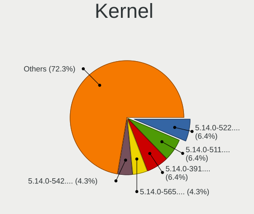

| Version                        | Desktops | Percent |
|--------------------------------|----------|---------|
| 5.14.0-522.el9.x86_64          | 3        | 6.38%   |
| 5.14.0-511.el9.x86_64          | 3        | 6.38%   |
| 5.14.0-391.el9.x86_64          | 3        | 6.38%   |
| 5.14.0-565.el9.x86_64          | 2        | 4.26%   |
| 5.14.0-542.el9.x86_64          | 2        | 4.26%   |
| 5.14.0-480.el9.x86_64          | 2        | 4.26%   |
| 5.14.0-479.el9.x86_64          | 2        | 4.26%   |
| 5.14.0-202.el9.x86_64          | 2        | 4.26%   |
| 6.12.8-1.el9.elrepo.x86_64     | 1        | 2.13%   |
| 5.17.2-lqx3.0.el9.x86_64       | 1        | 2.13%   |
| 5.14.0-86.el9.x86_64           | 1        | 2.13%   |
| 5.14.0-639.el9.x86_64          | 1        | 2.13%   |
| 5.14.0-596.el9.x86_64          | 1        | 2.13%   |
| 5.14.0-590.el9.x86_64          | 1        | 2.13%   |
| 5.14.0-529.el9.x86_64          | 1        | 2.13%   |
| 5.14.0-496.el9.x86_64          | 1        | 2.13%   |
| 5.14.0-427.el9.x86_64          | 1        | 2.13%   |
| 5.14.0-407.el9.x86_64          | 1        | 2.13%   |
| 5.14.0-375.el9.x86_64          | 1        | 2.13%   |
| 5.14.0-362.el9.x86_64          | 1        | 2.13%   |
| 5.14.0-352.el9.x86_64          | 1        | 2.13%   |
| 5.14.0-344.el9.x86_64          | 1        | 2.13%   |
| 5.14.0-340.el9.x86_64          | 1        | 2.13%   |
| 5.14.0-325.el9.x86_64          | 1        | 2.13%   |
| 5.14.0-319.el9.x86_64          | 1        | 2.13%   |
| 5.14.0-316.el9.x86_64          | 1        | 2.13%   |
| 5.14.0-305.el9.x86_64          | 1        | 2.13%   |
| 5.14.0-302.el9.x86_64          | 1        | 2.13%   |
| 5.14.0-267.el9.x86_64          | 1        | 2.13%   |
| 5.14.0-214.el9.x86_64          | 1        | 2.13%   |
| 5.14.0-183.el9.x86_64          | 1        | 2.13%   |
| 5.14.0-134.el9.x86_64          | 1        | 2.13%   |
| 5.14.0-130.rt21.130.el9.x86_64 | 1        | 2.13%   |
| 5.14.0-115.el9.x86_64          | 1        | 2.13%   |
| 5.14.0-109.el9.x86_64          | 1        | 2.13%   |
| 4.18.0-529.el8.x86_64          | 1        | 2.13%   |

Kernel Family
-------------

Linux kernel without a distro release

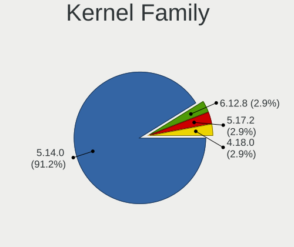

| Version | Desktops | Percent |
|---------|----------|---------|
| 5.14.0  | 31       | 91.18%  |
| 6.12.8  | 1        | 2.94%   |
| 5.17.2  | 1        | 2.94%   |
| 4.18.0  | 1        | 2.94%   |

Kernel Major Ver.
-----------------

Linux kernel major version

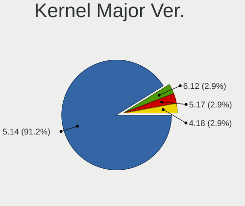

| Version | Desktops | Percent |
|---------|----------|---------|
| 5.14    | 31       | 91.18%  |
| 6.12    | 1        | 2.94%   |
| 5.17    | 1        | 2.94%   |
| 4.18    | 1        | 2.94%   |

Arch
----

OS architecture (x86_64, i586, etc.)

| Name   | Desktops | Percent |
|--------|----------|---------|
| x86_64 | 34       | 100%    |

DE
--

Desktop Environment

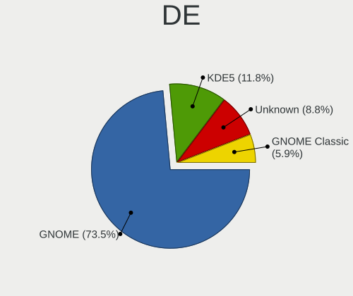

| Name          | Desktops | Percent |
|---------------|----------|---------|
| GNOME         | 25       | 73.53%  |
| KDE5          | 4        | 11.76%  |
| Unknown       | 3        | 8.82%   |
| GNOME Classic | 2        | 5.88%   |

Display Server
--------------

X11 or Wayland

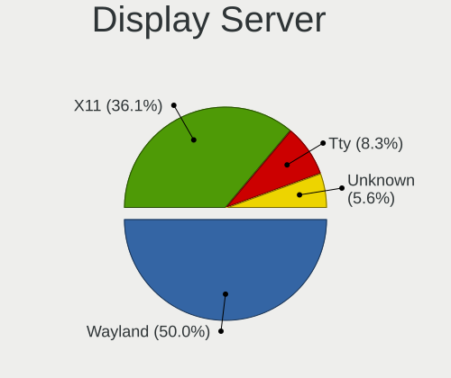

| Name    | Desktops | Percent |
|---------|----------|---------|
| Wayland | 18       | 50%     |
| X11     | 13       | 36.11%  |
| Tty     | 3        | 8.33%   |
| Unknown | 2        | 5.56%   |

Display Manager
---------------

SDDM, LightDM, etc.

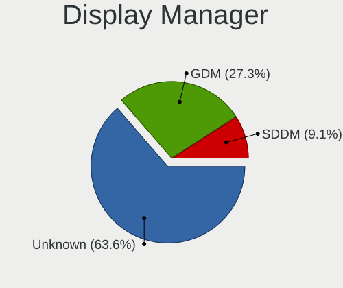

| Name    | Desktops | Percent |
|---------|----------|---------|
| Unknown | 22       | 61.11%  |
| GDM     | 12       | 33.33%  |
| SDDM    | 2        | 5.56%   |

OS Lang
-------

Language

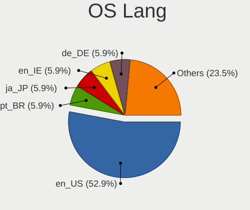

| Lang    | Desktops | Percent |
|---------|----------|---------|
| en_US   | 18       | 52.94%  |
| pt_BR   | 2        | 5.88%   |
| ja_JP   | 2        | 5.88%   |
| en_IE   | 2        | 5.88%   |
| de_DE   | 2        | 5.88%   |
| zh_CN   | 1        | 2.94%   |
| ru_UA   | 1        | 2.94%   |
| ru_RU   | 1        | 2.94%   |
| ro_RO   | 1        | 2.94%   |
| it_IT   | 1        | 2.94%   |
| en_GB   | 1        | 2.94%   |
| en_AU   | 1        | 2.94%   |
| Unknown | 1        | 2.94%   |

Boot Mode
---------

EFI or BIOS

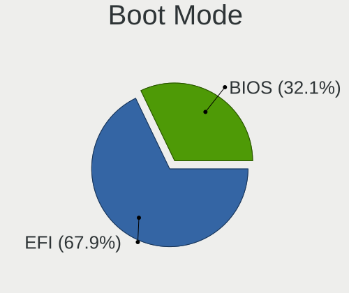

| Mode | Desktops | Percent |
|------|----------|---------|
| EFI  | 25       | 71.43%  |
| BIOS | 10       | 28.57%  |

Filesystem
----------

Type of filesystem

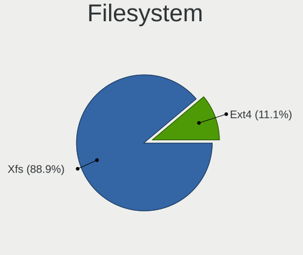

| Type | Desktops | Percent |
|------|----------|---------|
| Xfs  | 28       | 82.35%  |
| Ext4 | 6        | 17.65%  |

Part. scheme
------------

Scheme of partitioning

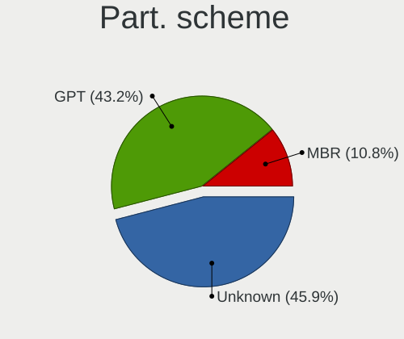

| Type    | Desktops | Percent |
|---------|----------|---------|
| Unknown | 17       | 45.95%  |
| GPT     | 16       | 43.24%  |
| MBR     | 4        | 10.81%  |

Dual Boot with Linux/BSD
------------------------

Hosting more than one Linux/BSD

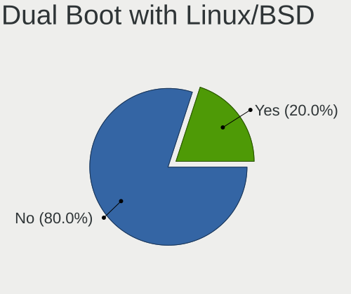

| Dual boot | Desktops | Percent |
|-----------|----------|---------|
| No        | 28       | 80%     |
| Yes       | 7        | 20%     |

Dual Boot (Win)
---------------

Hosting Linux and Windows

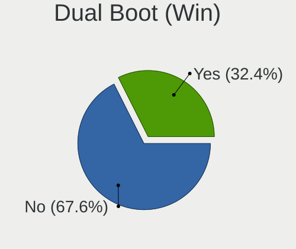

| Dual boot | Desktops | Percent |
|-----------|----------|---------|
| No        | 25       | 67.57%  |
| Yes       | 12       | 32.43%  |

Board
-----

Vendor
------

Motherboard manufacturer

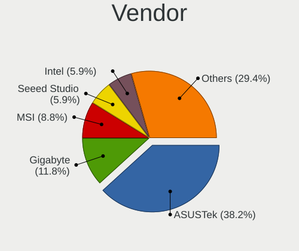

| Name                | Desktops | Percent |
|---------------------|----------|---------|
| ASUSTek Computer    | 13       | 38.24%  |
| Gigabyte Technology | 4        | 11.76%  |
| MSI                 | 3        | 8.82%   |
| Seeed Studio        | 2        | 5.88%   |
| Intel               | 2        | 5.88%   |
| Hewlett-Packard     | 2        | 5.88%   |
| Supermicro          | 1        | 2.94%   |
| SHANGZHAOYUAN       | 1        | 2.94%   |
| Lenovo              | 1        | 2.94%   |
| Gateway             | 1        | 2.94%   |
| Dell                | 1        | 2.94%   |
| Colorful Technology | 1        | 2.94%   |
| AZW                 | 1        | 2.94%   |
| Acer                | 1        | 2.94%   |

Model
-----

Motherboard model

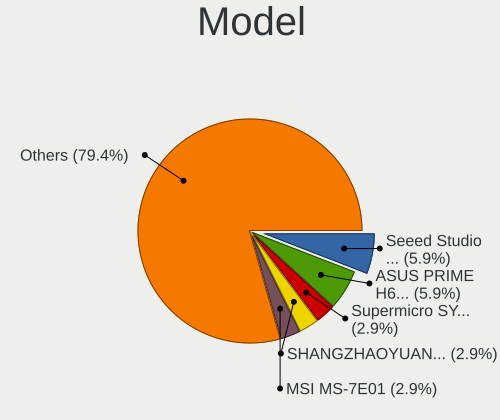

| Name                                 | Desktops | Percent |
|--------------------------------------|----------|---------|
| Seeed Studio ODYSSEY-X86J4105        | 2        | 5.88%   |
| ASUS PRIME H670-PLUS D4              | 2        | 5.88%   |
| Supermicro SYS-511E-WR               | 1        | 2.94%   |
| SHANGZHAOYUAN B85M-PRO V1.1          | 1        | 2.94%   |
| MSI MS-7E01                          | 1        | 2.94%   |
| MSI MS-7D86                          | 1        | 2.94%   |
| MSI MS-7B79                          | 1        | 2.94%   |
| Lenovo ThinkCentre M900 10FGS0301H   | 1        | 2.94%   |
| Intel DZ77GA-70K AAG39009-402        | 1        | 2.94%   |
| Intel D34010WYK H14771-303           | 1        | 2.94%   |
| HP ProDesk 600 G1 SFF                | 1        | 2.94%   |
| HP Pavilion Gaming Desktop TG01-2xxx | 1        | 2.94%   |
| Gigabyte X99-UD4-CF                  | 1        | 2.94%   |
| Gigabyte TRX50 AERO D                | 1        | 2.94%   |
| Gigabyte B550M DS3H                  | 1        | 2.94%   |
| Gigabyte 970A-DS3P                   | 1        | 2.94%   |
| Gateway SX2865                       | 1        | 2.94%   |
| Dell OptiPlex 790                    | 1        | 2.94%   |
| Colorful CVN Z590 GAMING PRO         | 1        | 2.94%   |
| AZW MINI S                           | 1        | 2.94%   |
| ASUS TUF Gaming X570-PLUS            | 1        | 2.94%   |
| ASUS ROG STRIX B560-G GAMING WIFI    | 1        | 2.94%   |
| ASUS ROG STRIX B550-A GAMING         | 1        | 2.94%   |
| ASUS ROG CROSSHAIR VIII DARK HERO    | 1        | 2.94%   |
| ASUS PRIME X570-P                    | 1        | 2.94%   |
| ASUS PRIME H510M-R                   | 1        | 2.94%   |
| ASUS PRIME B760-PLUS                 | 1        | 2.94%   |
| ASUS P8H67-M LE                      | 1        | 2.94%   |
| ASUS P8H61/USB3                      | 1        | 2.94%   |
| ASUS AT4NM10T-I                      | 1        | 2.94%   |
| ASUS All Series                      | 1        | 2.94%   |
| Acer Predator G3-605                 | 1        | 2.94%   |

Model Family
------------

Motherboard model prefix

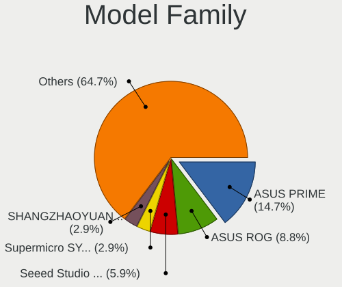

| Name                          | Desktops | Percent |
|-------------------------------|----------|---------|
| ASUS PRIME                    | 5        | 14.71%  |
| ASUS ROG                      | 3        | 8.82%   |
| Seeed Studio ODYSSEY-X86J4105 | 2        | 5.88%   |
| Supermicro SYS-511E-WR        | 1        | 2.94%   |
| SHANGZHAOYUAN B85M-PRO        | 1        | 2.94%   |
| MSI MS-7E01                   | 1        | 2.94%   |
| MSI MS-7D86                   | 1        | 2.94%   |
| MSI MS-7B79                   | 1        | 2.94%   |
| Lenovo ThinkCentre            | 1        | 2.94%   |
| Intel DZ77GA-70K              | 1        | 2.94%   |
| Intel D34010WYK               | 1        | 2.94%   |
| HP ProDesk                    | 1        | 2.94%   |
| HP Pavilion                   | 1        | 2.94%   |
| Gigabyte X99-UD4-CF           | 1        | 2.94%   |
| Gigabyte TRX50                | 1        | 2.94%   |
| Gigabyte B550M                | 1        | 2.94%   |
| Gigabyte 970A-DS3P            | 1        | 2.94%   |
| Gateway SX2865                | 1        | 2.94%   |
| Dell OptiPlex                 | 1        | 2.94%   |
| Colorful CVN                  | 1        | 2.94%   |
| AZW MINI                      | 1        | 2.94%   |
| ASUS TUF                      | 1        | 2.94%   |
| ASUS P8H67-M                  | 1        | 2.94%   |
| ASUS P8H61                    | 1        | 2.94%   |
| ASUS AT4NM10T-I               | 1        | 2.94%   |
| ASUS All                      | 1        | 2.94%   |
| Acer Predator                 | 1        | 2.94%   |

MFG Year
--------

Motherboard manufacture year

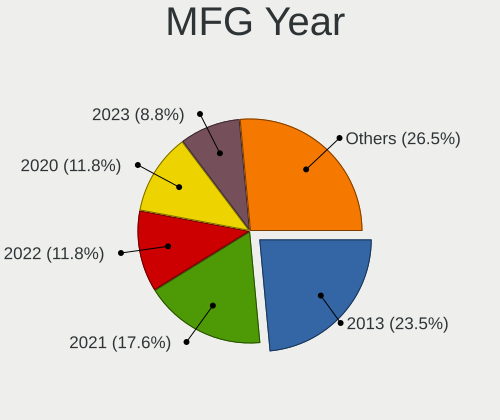

| Year | Desktops | Percent |
|------|----------|---------|
| 2013 | 8        | 23.53%  |
| 2021 | 6        | 17.65%  |
| 2022 | 4        | 11.76%  |
| 2020 | 4        | 11.76%  |
| 2023 | 3        | 8.82%   |
| 2011 | 3        | 8.82%   |
| 2019 | 2        | 5.88%   |
| 2018 | 2        | 5.88%   |
| 2025 | 1        | 2.94%   |
| 2014 | 1        | 2.94%   |

Form Factor
-----------

Physical design of the computer

| Name    | Desktops | Percent |
|---------|----------|---------|
| Desktop | 34       | 100%    |

Secure Boot
-----------

Enabled or disabled

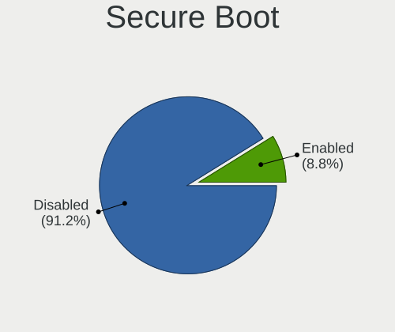

| State    | Desktops | Percent |
|----------|----------|---------|
| Disabled | 31       | 91.18%  |
| Enabled  | 3        | 8.82%   |

Coreboot
--------

Have coreboot on board

| Used | Desktops | Percent |
|------|----------|---------|
| No   | 34       | 100%    |

RAM Size
--------

Total RAM memory

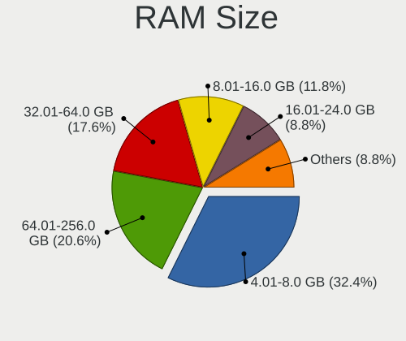

| Size in GB      | Desktops | Percent |
|-----------------|----------|---------|
| 4.01-8.0        | 11       | 32.35%  |
| 64.01-256.0     | 7        | 20.59%  |
| 32.01-64.0      | 6        | 17.65%  |
| 8.01-16.0       | 4        | 11.76%  |
| 16.01-24.0      | 3        | 8.82%   |
| More than 256.0 | 1        | 2.94%   |
| 3.01-4.0        | 1        | 2.94%   |
| 24.01-32.0      | 1        | 2.94%   |

RAM Used
--------

Used RAM memory

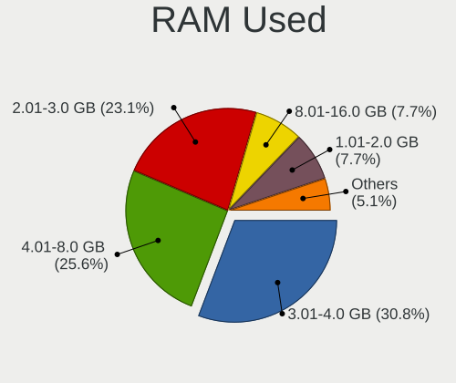

| Used GB    | Desktops | Percent |
|------------|----------|---------|
| 3.01-4.0   | 12       | 30.77%  |
| 4.01-8.0   | 10       | 25.64%  |
| 2.01-3.0   | 9        | 23.08%  |
| 1.01-2.0   | 3        | 7.69%   |
| 8.01-16.0  | 3        | 7.69%   |
| 16.01-24.0 | 2        | 5.13%   |

Total Drives
------------

Number of drives on board

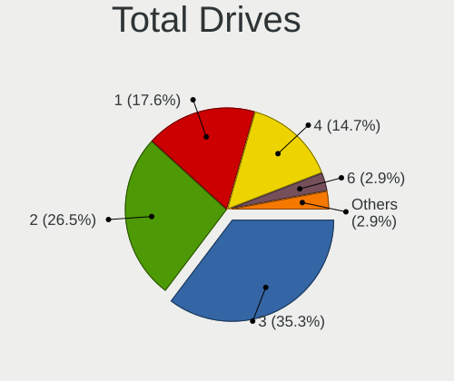

| Drives | Desktops | Percent |
|--------|----------|---------|
| 3      | 12       | 35.29%  |
| 2      | 9        | 26.47%  |
| 1      | 6        | 17.65%  |
| 4      | 5        | 14.71%  |
| 6      | 1        | 2.94%   |
| 5      | 1        | 2.94%   |

Has CD-ROM
----------

Has CD-ROM on board

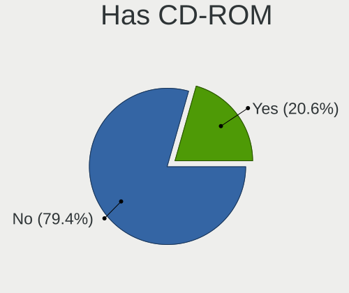

| Presented | Desktops | Percent |
|-----------|----------|---------|
| No        | 27       | 79.41%  |
| Yes       | 7        | 20.59%  |

Has Ethernet
------------

Has Ethernet on board

| Presented | Desktops | Percent |
|-----------|----------|---------|
| Yes       | 34       | 100%    |

Has WiFi
--------

Has WiFi module

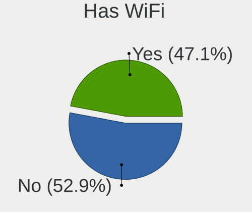

| Presented | Desktops | Percent |
|-----------|----------|---------|
| No        | 18       | 52.94%  |
| Yes       | 16       | 47.06%  |

Has Bluetooth
-------------

Has Bluetooth module

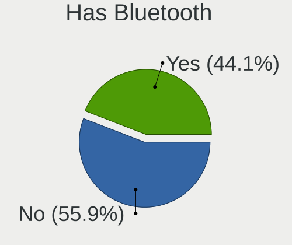

| Presented | Desktops | Percent |
|-----------|----------|---------|
| No        | 19       | 55.88%  |
| Yes       | 15       | 44.12%  |

Location
--------

Country
-------

Geographic location (country)

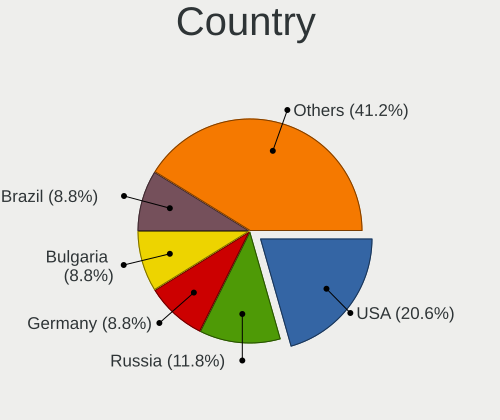

| Country     | Desktops | Percent |
|-------------|----------|---------|
| USA         | 7        | 20.59%  |
| Russia      | 4        | 11.76%  |
| Germany     | 3        | 8.82%   |
| Bulgaria    | 3        | 8.82%   |
| Brazil      | 3        | 8.82%   |
| Japan       | 2        | 5.88%   |
| Ireland     | 2        | 5.88%   |
| Australia   | 2        | 5.88%   |
| Ukraine     | 1        | 2.94%   |
| Romania     | 1        | 2.94%   |
| Puerto Rico | 1        | 2.94%   |
| Myanmar     | 1        | 2.94%   |
| Italy       | 1        | 2.94%   |
| Greece      | 1        | 2.94%   |
| China       | 1        | 2.94%   |
| Belarus     | 1        | 2.94%   |

City
----

Geographic location (city)

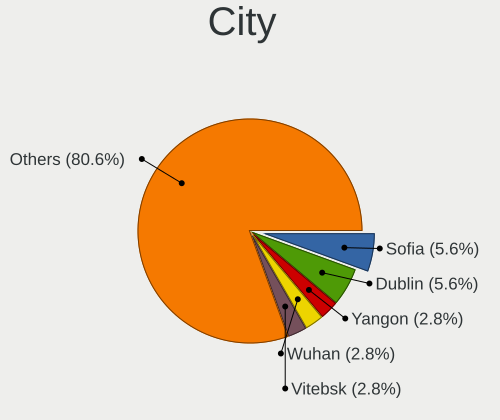

| City                 | Desktops | Percent |
|----------------------|----------|---------|
| Sofia                | 2        | 5.56%   |
| Dublin               | 2        | 5.56%   |
| Yangon               | 1        | 2.78%   |
| Wuhan                | 1        | 2.78%   |
| Vitebsk              | 1        | 2.78%   |
| Tyumen               | 1        | 2.78%   |
| Tomah                | 1        | 2.78%   |
| Sao José dos Campos | 1        | 2.78%   |
| San Juan             | 1        | 2.78%   |
| Rome                 | 1        | 2.78%   |
| Ramstein-Miesenbach  | 1        | 2.78%   |
| Ramenskoye           | 1        | 2.78%   |
| Porto Alegre         | 1        | 2.78%   |
| Portland             | 1        | 2.78%   |
| Perth                | 1        | 2.78%   |
| Okazaki              | 1        | 2.78%   |
| New Cumberland       | 1        | 2.78%   |
| Neunkirchen          | 1        | 2.78%   |
| Navapolatsk          | 1        | 2.78%   |
| Nagoya               | 1        | 2.78%   |
| Moscow               | 1        | 2.78%   |
| Milpitas             | 1        | 2.78%   |
| Meieki               | 1        | 2.78%   |
| Luverne              | 1        | 2.78%   |
| Kyiv                 | 1        | 2.78%   |
| Kovrov               | 1        | 2.78%   |
| Durham               | 1        | 2.78%   |
| Dortmund             | 1        | 2.78%   |
| Curitiba             | 1        | 2.78%   |
| Canberra             | 1        | 2.78%   |
| Burgas               | 1        | 2.78%   |
| Bucharest            | 1        | 2.78%   |
| Brooklyn             | 1        | 2.78%   |
| Athens               | 1        | 2.78%   |

Drives
------

Drive Vendor
------------

Hard drive vendors

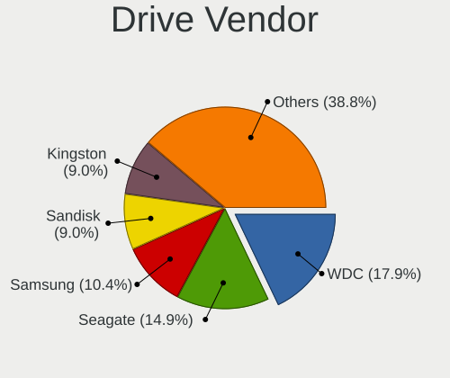

| Vendor                      | Desktops | Drives | Percent |
|-----------------------------|----------|--------|---------|
| WDC                         | 12       | 21     | 17.91%  |
| Seagate                     | 10       | 14     | 14.93%  |
| Samsung Electronics         | 7        | 10     | 10.45%  |
| Sandisk                     | 6        | 27     | 8.96%   |
| Kingston                    | 6        | 15     | 8.96%   |
| Toshiba                     | 5        | 7      | 7.46%   |
| Unknown                     | 2        | 4      | 2.99%   |
| Phison Electronics          | 2        | 2      | 2.99%   |
| Intel                       | 2        | 3      | 2.99%   |
| Crucial                     | 2        | 20     | 2.99%   |
| WD MediaMax                 | 1        | 1      | 1.49%   |
| Team                        | 1        | 2      | 1.49%   |
| Plextor                     | 1        | 1      | 1.49%   |
| Phison                      | 1        | 1      | 1.49%   |
| OCZ                         | 1        | 1      | 1.49%   |
| Netac                       | 1        | 1      | 1.49%   |
| Micron/Crucial Technology   | 1        | 1      | 1.49%   |
| MAXIO Technology (Hangzhou) | 1        | 1      | 1.49%   |
| Hitachi                     | 1        | 1      | 1.49%   |
| Gigabyte Technology         | 1        | 2      | 1.49%   |
| China                       | 1        | 1      | 1.49%   |
| ADATA Technology            | 1        | 1      | 1.49%   |
| A-DATA Technology           | 1        | 1      | 1.49%   |

Drive Model
-----------

Hard drive models

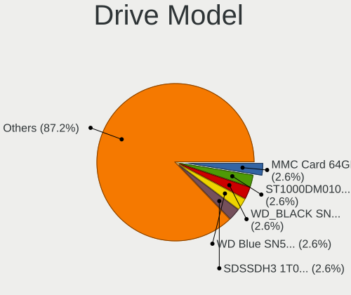

| Model                                      | Desktops | Percent |
|--------------------------------------------|----------|---------|
| Unknown MMC Card  64GB                     | 2        | 2.56%   |
| Seagate ST1000DM010-2EP102 1TB             | 2        | 2.56%   |
| Sandisk WD_BLACK SN770 1TB                 | 2        | 2.56%   |
| Sandisk WD Blue SN550 NVMe SSD 1024GB      | 2        | 2.56%   |
| SanDisk SDSSDH3 1T00 1TB                   | 2        | 2.56%   |
| Crucial CT525MX300SSD1 528GB               | 2        | 2.56%   |
| WDC WDS250G2B0A-00SM50 250GB SSD           | 1        | 1.28%   |
| WDC WDS120G2G0A-00JH30 120GB SSD           | 1        | 1.28%   |
| WDC WD6003FZBX-00K5WB0 6TB                 | 1        | 1.28%   |
| WDC WD5000BEVT-55A0RT0 500GB               | 1        | 1.28%   |
| WDC WD5000AAKX-083CA1 500GB                | 1        | 1.28%   |
| WDC WD3200AAKX-753CA1 320GB                | 1        | 1.28%   |
| WDC WD2500BEVT-00ZCT0 250GB                | 1        | 1.28%   |
| WDC WD2500AAJS-60M0A0 250GB                | 1        | 1.28%   |
| WDC WD22EJRX-89BEMY0 2TB                   | 1        | 1.28%   |
| WDC WD20EZAZ-00GGJB0 2TB                   | 1        | 1.28%   |
| WDC WD2003FZEX-00Z4SA0 2TB                 | 1        | 1.28%   |
| WDC WD10EZEX-60M2NA0 1TB                   | 1        | 1.28%   |
| WDC WD10EZEX-08WN4A0 1TB                   | 1        | 1.28%   |
| WDC WD10EZEX-00BN5A0 1TB                   | 1        | 1.28%   |
| WDC WD Blue SA510 2.5 500GB                | 1        | 1.28%   |
| WD MediaMax WL750GSA6472 752GB             | 1        | 1.28%   |
| Toshiba MQ01ABD100 1TB                     | 1        | 1.28%   |
| Toshiba MK2561GSYN 250GB                   | 1        | 1.28%   |
| Toshiba MK1234GSX 120GB                    | 1        | 1.28%   |
| Toshiba DT01ACA200 2TB                     | 1        | 1.28%   |
| Toshiba DT01ACA100 1TB                     | 1        | 1.28%   |
| Team T253X1480G 480GB SSD                  | 1        | 1.28%   |
| Seagate ST3500413AS 500GB                  | 1        | 1.28%   |
| Seagate ST3250820AS 250GB                  | 1        | 1.28%   |
| Seagate ST320LM001 HN-M320MBB 320GB        | 1        | 1.28%   |
| Seagate ST32000644NS 2TB                   | 1        | 1.28%   |
| Seagate ST31000528AS 1TB                   | 1        | 1.28%   |
| Seagate ST2000DL003-9VT166 2TB             | 1        | 1.28%   |
| Seagate ST14000NM001G-2KJ103 14TB          | 1        | 1.28%   |
| Seagate ST1000DM 010-2EP102 1TB            | 1        | 1.28%   |
| Seagate One Touch HDD 5TB                  | 1        | 1.28%   |
| Seagate FireCuda 520 SSD ZP2000GM30002 2TB | 1        | 1.28%   |
| Seagate FireCuda 520 SSD ZP1000GM30002 1TB | 1        | 1.28%   |
| Sandisk WD_BLACK SN850X 4000GB             | 1        | 1.28%   |

HDD Vendor
----------

Hard disk drive vendors

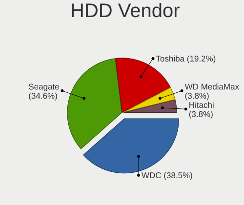

| Vendor      | Desktops | Drives | Percent |
|-------------|----------|--------|---------|
| WDC         | 10       | 18     | 38.46%  |
| Seagate     | 9        | 12     | 34.62%  |
| Toshiba     | 5        | 7      | 19.23%  |
| WD MediaMax | 1        | 1      | 3.85%   |
| Hitachi     | 1        | 1      | 3.85%   |

SSD Vendor
----------

Solid state drive vendors

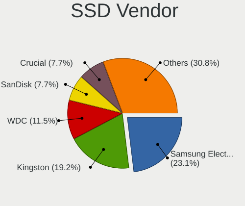

| Vendor              | Desktops | Drives | Percent |
|---------------------|----------|--------|---------|
| Samsung Electronics | 6        | 8      | 23.08%  |
| Kingston            | 5        | 14     | 19.23%  |
| WDC                 | 3        | 3      | 11.54%  |
| SanDisk             | 2        | 10     | 7.69%   |
| Crucial             | 2        | 20     | 7.69%   |
| Team                | 1        | 2      | 3.85%   |
| Plextor             | 1        | 1      | 3.85%   |
| OCZ                 | 1        | 1      | 3.85%   |
| Netac               | 1        | 1      | 3.85%   |
| Intel               | 1        | 2      | 3.85%   |
| Gigabyte Technology | 1        | 2      | 3.85%   |
| China               | 1        | 1      | 3.85%   |
| A-DATA Technology   | 1        | 1      | 3.85%   |

Drive Kind
----------

HDD or SSD

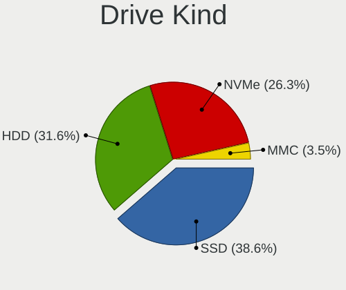

| Kind | Desktops | Drives | Percent |
|------|----------|--------|---------|
| SSD  | 22       | 66     | 38.6%   |
| HDD  | 18       | 39     | 31.58%  |
| NVMe | 15       | 29     | 26.32%  |
| MMC  | 2        | 4      | 3.51%   |

Drive Connector
---------------

SATA, SAS, NVMe, etc.

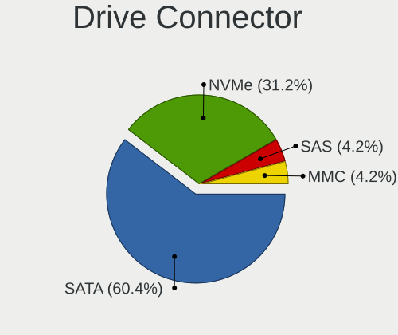

| Type | Desktops | Drives | Percent |
|------|----------|--------|---------|
| SATA | 29       | 103    | 60.42%  |
| NVMe | 15       | 29     | 31.25%  |
| SAS  | 2        | 2      | 4.17%   |
| MMC  | 2        | 4      | 4.17%   |

Drive Size
----------

Size of hard drive

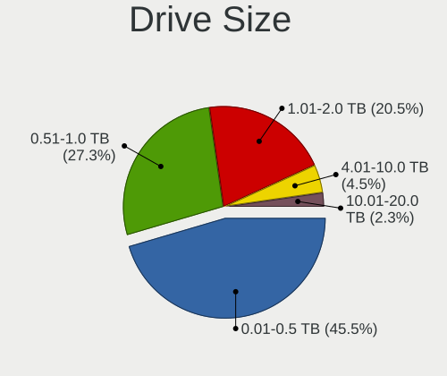

| Size in TB | Desktops | Drives | Percent |
|------------|----------|--------|---------|
| 0.01-0.5   | 20       | 38     | 45.45%  |
| 0.51-1.0   | 12       | 46     | 27.27%  |
| 1.01-2.0   | 9        | 17     | 20.45%  |
| 4.01-10.0  | 2        | 3      | 4.55%   |
| 10.01-20.0 | 1        | 1      | 2.27%   |

Space Total
-----------

Amount of disk space available on the file system

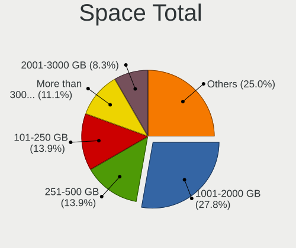

| Size in GB     | Desktops | Percent |
|----------------|----------|---------|
| 1001-2000      | 10       | 27.78%  |
| 251-500        | 5        | 13.89%  |
| 101-250        | 5        | 13.89%  |
| More than 3000 | 4        | 11.11%  |
| 2001-3000      | 3        | 8.33%   |
| 501-1000       | 3        | 8.33%   |
| 51-100         | 3        | 8.33%   |
| Unknown        | 2        | 5.56%   |
| 21-50          | 1        | 2.78%   |

Space Used
----------

Amount of used disk space

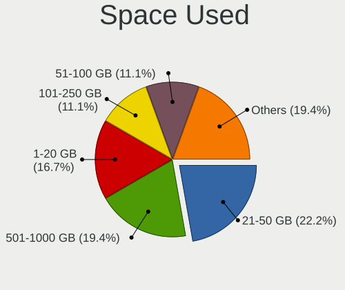

| Used GB        | Desktops | Percent |
|----------------|----------|---------|
| 21-50          | 8        | 22.22%  |
| 501-1000       | 7        | 19.44%  |
| 1-20           | 6        | 16.67%  |
| 101-250        | 4        | 11.11%  |
| 51-100         | 4        | 11.11%  |
| More than 3000 | 2        | 5.56%   |
| 1001-2000      | 2        | 5.56%   |
| Unknown        | 2        | 5.56%   |
| 251-500        | 1        | 2.78%   |

Malfunc. Drives
---------------

Drive models with a malfunction

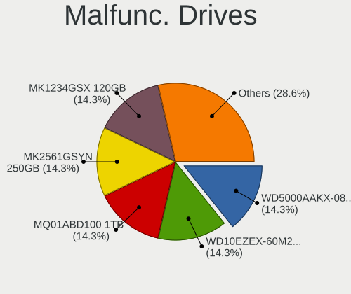

| Model                       | Desktops | Drives | Percent |
|-----------------------------|----------|--------|---------|
| WDC WD5000AAKX-083CA1 500GB | 1        | 1      | 14.29%  |
| WDC WD10EZEX-60M2NA0 1TB    | 1        | 1      | 14.29%  |
| Toshiba MQ01ABD100 1TB      | 1        | 1      | 14.29%  |
| Toshiba MK2561GSYN 250GB    | 1        | 1      | 14.29%  |
| Toshiba MK1234GSX 120GB     | 1        | 1      | 14.29%  |
| Seagate ST3250820AS 250GB   | 1        | 1      | 14.29%  |
| Seagate ST32000644NS 2TB    | 1        | 1      | 14.29%  |

Malfunc. Drive Vendor
---------------------

Vendors of faulty drives

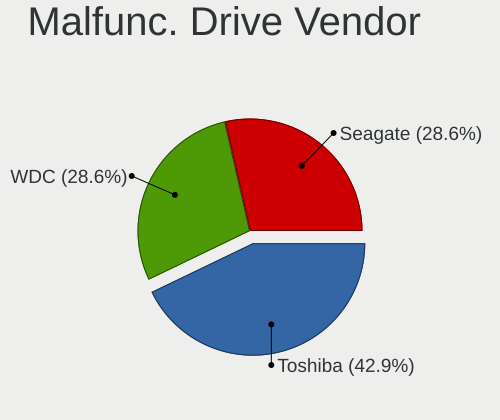

| Vendor  | Desktops | Drives | Percent |
|---------|----------|--------|---------|
| Toshiba | 3        | 3      | 42.86%  |
| WDC     | 2        | 2      | 28.57%  |
| Seagate | 2        | 2      | 28.57%  |

Malfunc. HDD Vendor
-------------------

Vendors of faulty HDD drives

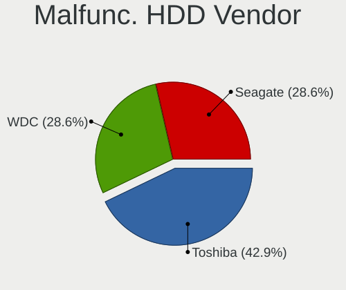

| Vendor  | Desktops | Drives | Percent |
|---------|----------|--------|---------|
| Toshiba | 3        | 3      | 42.86%  |
| WDC     | 2        | 2      | 28.57%  |
| Seagate | 2        | 2      | 28.57%  |

Malfunc. Drive Kind
-------------------

Kinds of faulty drives

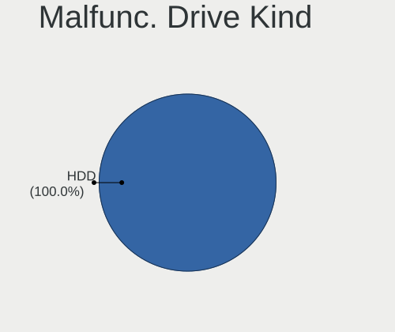

| Kind | Desktops | Drives | Percent |
|------|----------|--------|---------|
| HDD  | 6        | 7      | 100%    |

Failed Drives
-------------

Failed drive models

Zero info for selected period =(

Failed Drive Vendor
-------------------

Failed drive vendors

Zero info for selected period =(

Drive Status
------------

Number of failed and malfunc. drives

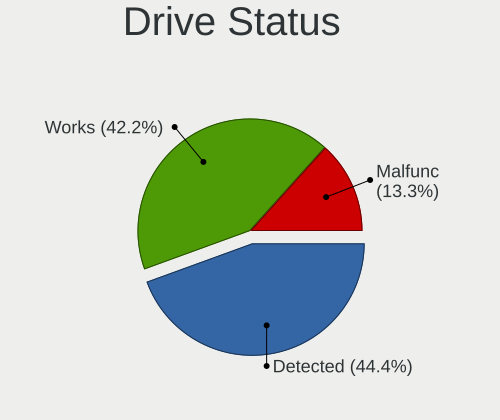

| Status   | Desktops | Drives | Percent |
|----------|----------|--------|---------|
| Detected | 20       | 85     | 44.44%  |
| Works    | 19       | 46     | 42.22%  |
| Malfunc  | 6        | 7      | 13.33%  |

Storage controller
------------------

Storage Vendor
--------------

Storage controller vendors

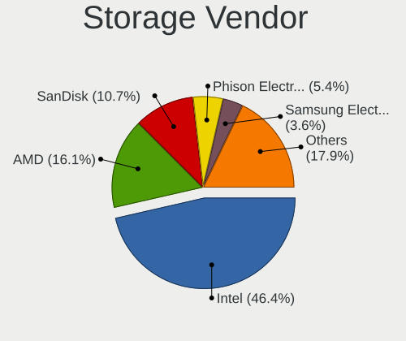

| Vendor                      | Desktops | Percent |
|-----------------------------|----------|---------|
| Intel                       | 26       | 46.43%  |
| AMD                         | 9        | 16.07%  |
| SanDisk                     | 6        | 10.71%  |
| Phison Electronics          | 3        | 5.36%   |
| Samsung Electronics         | 2        | 3.57%   |
| JMicron Technology          | 2        | 3.57%   |
| Silicon Image               | 1        | 1.79%   |
| Seagate Technology          | 1        | 1.79%   |
| Micron/Crucial Technology   | 1        | 1.79%   |
| MAXIO Technology (Hangzhou) | 1        | 1.79%   |
| Marvell Technology Group    | 1        | 1.79%   |
| Kingston Technology Company | 1        | 1.79%   |
| ASMedia Technology          | 1        | 1.79%   |
| ADATA Technology            | 1        | 1.79%   |

Storage Model
-------------

Storage controller models

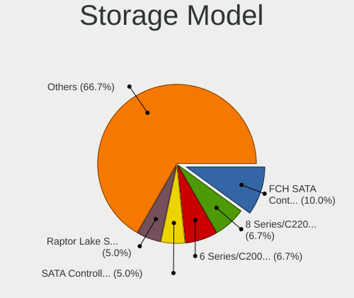

| Model                                                                          | Desktops | Percent |
|--------------------------------------------------------------------------------|----------|---------|
| AMD FCH SATA Controller [AHCI mode]                                            | 6        | 10%     |
| Intel 8 Series/C220 Series Chipset Family 6-port SATA Controller 1 [AHCI mode] | 4        | 6.67%   |
| Intel 6 Series/C200 Series Chipset Family 6 port Desktop SATA AHCI Controller  | 4        | 6.67%   |
| Intel SATA Controller [RAID mode]                                              | 3        | 5%      |
| Intel Raptor Lake SATA AHCI Controller                                         | 3        | 5%      |
| Intel 500 Series Chipset Family SATA AHCI Controller                           | 3        | 5%      |
| SanDisk WD SN560/SN740/SN770/SN5000 NVMe SSD                                   | 2        | 3.33%   |
| SanDisk Ultra 3D / WD PC SN530, IX SN530, Blue SN550 NVMe SSD (DRAM-less)      | 2        | 3.33%   |
| Intel Celeron/Pentium Silver Processor SATA Controller                         | 2        | 3.33%   |
| Intel Alder Lake-S PCH SATA Controller [AHCI Mode]                             | 2        | 3.33%   |
| AMD 500 Series Chipset SATA Controller                                         | 2        | 3.33%   |
| AMD 400 Series Chipset SATA Controller                                         | 2        | 3.33%   |
| Silicon Image SiI 3132 Serial ATA Raid II Controller                           | 1        | 1.67%   |
| Seagate FireCuda 520/IronWolf 525 SSD                                          | 1        | 1.67%   |
| SanDisk WD PC SN810 / Black SN850 NVMe SSD                                     | 1        | 1.67%   |
| Sandisk WD Black SN850X NVMe SSD                                               | 1        | 1.67%   |
| Samsung NVMe SSD Controller SM981/PM981/PM983                                  | 1        | 1.67%   |
| Samsung NVMe SSD Controller PM9A1/PM9A3/980PRO                                 | 1        | 1.67%   |
| Phison PS5019-E19 PCIe4 NVMe Controller (DRAM-less)                            | 1        | 1.67%   |
| Phison E16 PCIe4 NVMe Controller                                               | 1        | 1.67%   |
| Phison E12 NVMe Controller                                                     | 1        | 1.67%   |
| Micron/Crucial T500 NVMe PCIe SSD                                              | 1        | 1.67%   |
| MAXIO (Hangzhou) NVMe SSD Controller MAP1202 (DRAM-less)                       | 1        | 1.67%   |
| Marvell Group 88SE9172 SATA 6Gb/s Controller                                   | 1        | 1.67%   |
| Kingston Company KC3000/FURY Renegade NVMe SSD [E18]                           | 1        | 1.67%   |
| JMicron JMB58x AHCI SATA controller                                            | 1        | 1.67%   |
| JMicron JMB362 SATA Controller                                                 | 1        | 1.67%   |
| Intel SSD 670p Series [Keystone Harbor]                                        | 1        | 1.67%   |
| Intel Rapids SATA AHCI Controller                                              | 1        | 1.67%   |
| Intel Q170/Q150/B150/H170/H110/Z170/CM236 Chipset SATA Controller [AHCI Mode]  | 1        | 1.67%   |
| Intel NM10/ICH7 Family SATA Controller [AHCI mode]                             | 1        | 1.67%   |
| Intel Jasper Lake SATA AHCI Controller                                         | 1        | 1.67%   |
| Intel 8 Series SATA Controller 1 [AHCI mode]                                   | 1        | 1.67%   |
| ASMedia ASM1061/ASM1062 Serial ATA Controller                                  | 1        | 1.67%   |
| AMD SB7x0/SB8x0/SB9x0 SATA Controller [AHCI mode]                              | 1        | 1.67%   |
| AMD 600 Series Chipset SATA Controller                                         | 1        | 1.67%   |
| ADATA XPG GAMMIX S5 NVMe SSD (DRAM-less)                                       | 1        | 1.67%   |

Storage Kind
------------

Kind of storage controller (IDE, SATA, NVMe, SAS, ...)

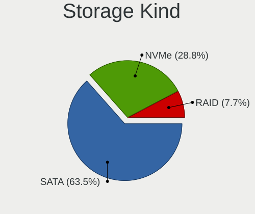

| Kind | Desktops | Percent |
|------|----------|---------|
| SATA | 33       | 63.46%  |
| NVMe | 15       | 28.85%  |
| RAID | 4        | 7.69%   |

Processor
---------

CPU Vendor
----------

Processor vendors

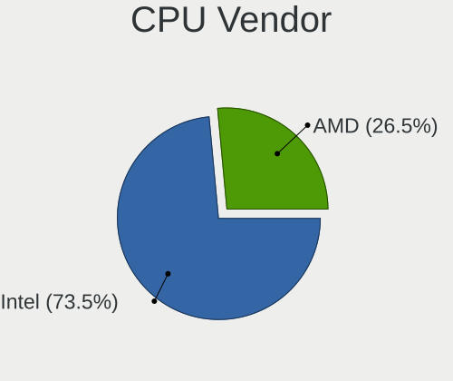

| Vendor | Desktops | Percent |
|--------|----------|---------|
| Intel  | 25       | 73.53%  |
| AMD    | 9        | 26.47%  |

CPU Model
---------

Processor models

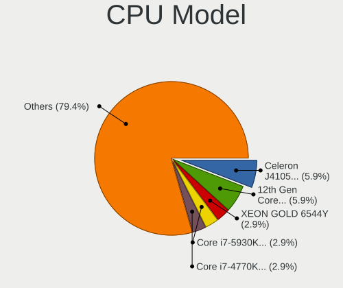

| Model                                  | Desktops | Percent |
|----------------------------------------|----------|---------|
| Intel Celeron J4105 CPU @ 1.50GHz      | 2        | 5.88%   |
| Intel 12th Gen Core i5-12600K          | 2        | 5.88%   |
| Intel XEON GOLD 6544Y                  | 1        | 2.94%   |
| Intel Core i7-5930K CPU @ 3.50GHz      | 1        | 2.94%   |
| Intel Core i7-4770K CPU @ 3.50GHz      | 1        | 2.94%   |
| Intel Core i7-4770 CPU @ 3.40GHz       | 1        | 2.94%   |
| Intel Core i7-3770K CPU @ 3.50GHz      | 1        | 2.94%   |
| Intel Core i7-2600K CPU @ 3.40GHz      | 1        | 2.94%   |
| Intel Core i5-6500 CPU @ 3.20GHz       | 1        | 2.94%   |
| Intel Core i5-4590 CPU @ 3.30GHz       | 1        | 2.94%   |
| Intel Core i5-4440 CPU @ 3.10GHz       | 1        | 2.94%   |
| Intel Core i5-3470 CPU @ 3.20GHz       | 1        | 2.94%   |
| Intel Core i5-2400S CPU @ 2.50GHz      | 1        | 2.94%   |
| Intel Core i5-10400F CPU @ 2.90GHz     | 1        | 2.94%   |
| Intel Core i3-4010U CPU @ 1.70GHz      | 1        | 2.94%   |
| Intel Core i3-2130 CPU @ 3.40GHz       | 1        | 2.94%   |
| Intel Core i3-10100 CPU @ 3.60GHz      | 1        | 2.94%   |
| Intel Celeron N5095 @ 2.00GHz          | 1        | 2.94%   |
| Intel Atom CPU D425 @ 1.80GHz          | 1        | 2.94%   |
| Intel 13th Gen Core i9-13900K          | 1        | 2.94%   |
| Intel 13th Gen Core i7-13700K          | 1        | 2.94%   |
| Intel 12th Gen Core i9-12900KF         | 1        | 2.94%   |
| Intel 11th Gen Core i5-11400 @ 2.60GHz | 1        | 2.94%   |
| AMD Ryzen Threadripper 7960X 24-Cores  | 1        | 2.94%   |
| AMD Ryzen 9 5950X 16-Core Processor    | 1        | 2.94%   |
| AMD Ryzen 9 3950X 16-Core Processor    | 1        | 2.94%   |
| AMD Ryzen 9 3900X 12-Core Processor    | 1        | 2.94%   |
| AMD Ryzen 7 5800X3D 8-Core Processor   | 1        | 2.94%   |
| AMD Ryzen 7 5700G with Radeon Graphics | 1        | 2.94%   |
| AMD Ryzen 5 5600G with Radeon Graphics | 1        | 2.94%   |
| AMD Ryzen 5 3600 6-Core Processor      | 1        | 2.94%   |
| AMD FX-8120 Eight-Core Processor       | 1        | 2.94%   |

CPU Model Family
----------------

Processor model prefix

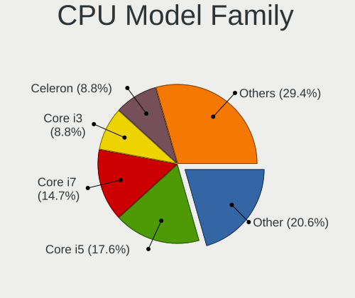

| Model                  | Desktops | Percent |
|------------------------|----------|---------|
| Other                  | 7        | 20.59%  |
| Intel Core i5          | 6        | 17.65%  |
| Intel Core i7          | 5        | 14.71%  |
| Intel Core i3          | 3        | 8.82%   |
| Intel Celeron          | 3        | 8.82%   |
| AMD Ryzen 9            | 3        | 8.82%   |
| AMD Ryzen 7            | 2        | 5.88%   |
| AMD Ryzen 5            | 2        | 5.88%   |
| Intel Atom             | 1        | 2.94%   |
| AMD Ryzen Threadripper | 1        | 2.94%   |
| AMD FX                 | 1        | 2.94%   |

CPU Cores
---------

Number of processor cores

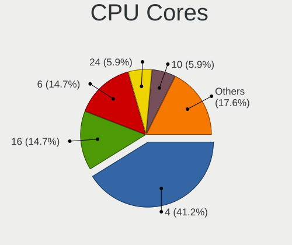

| Number | Desktops | Percent |
|--------|----------|---------|
| 4      | 14       | 41.18%  |
| 16     | 5        | 14.71%  |
| 6      | 5        | 14.71%  |
| 24     | 2        | 5.88%   |
| 10     | 2        | 5.88%   |
| 8      | 2        | 5.88%   |
| 2      | 2        | 5.88%   |
| 12     | 1        | 2.94%   |
| 1      | 1        | 2.94%   |

CPU Sockets
-----------

Number of sockets

| Number | Desktops | Percent |
|--------|----------|---------|
| 1      | 34       | 100%    |

CPU Threads
-----------

Threads per core (Hyper-Threading)

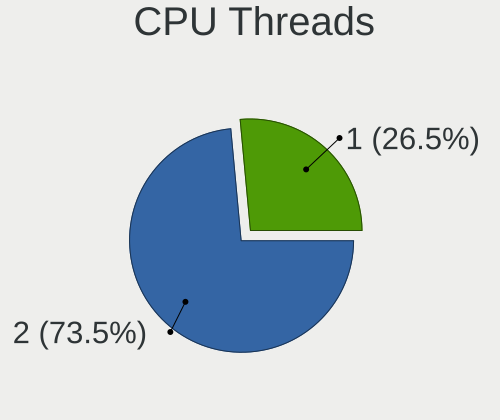

| Number | Desktops | Percent |
|--------|----------|---------|
| 2      | 25       | 73.53%  |
| 1      | 9        | 26.47%  |

CPU Op-Modes
------------

CPU Operation Modes (32-bit, 64-bit)

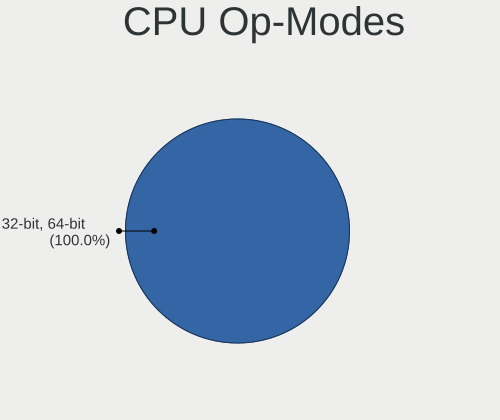

| Op mode        | Desktops | Percent |
|----------------|----------|---------|
| 32-bit, 64-bit | 34       | 100%    |

CPU Microcode
-------------

Microcode number

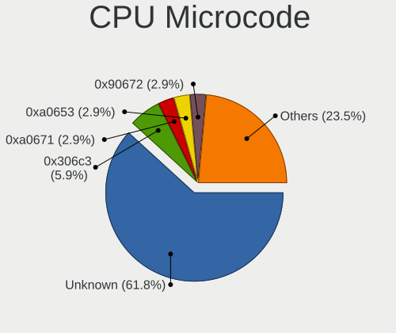

| Number     | Desktops | Percent |
|------------|----------|---------|
| Unknown    | 21       | 61.76%  |
| 0x306c3    | 2        | 5.88%   |
| 0xa0671    | 1        | 2.94%   |
| 0xa0653    | 1        | 2.94%   |
| 0x90672    | 1        | 2.94%   |
| 0x40651    | 1        | 2.94%   |
| 0x306f2    | 1        | 2.94%   |
| 0x206a7    | 1        | 2.94%   |
| 0x0a50000c | 1        | 2.94%   |
| 0x0a201016 | 1        | 2.94%   |
| 0x08701021 | 1        | 2.94%   |
| 0x08701013 | 1        | 2.94%   |
| 0x0600063d | 1        | 2.94%   |

CPU Microarch
-------------

Microarchitecture

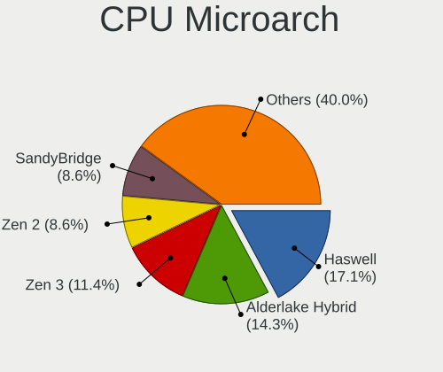

| Name             | Desktops | Percent |
|------------------|----------|---------|
| Haswell          | 6        | 17.14%  |
| Alderlake Hybrid | 5        | 14.29%  |
| Zen 3            | 4        | 11.43%  |
| Zen 2            | 3        | 8.57%   |
| SandyBridge      | 3        | 8.57%   |
| IvyBridge        | 2        | 5.71%   |
| Goldmont plus    | 2        | 5.71%   |
| CometLake        | 2        | 5.71%   |
| Unknown          | 2        | 5.71%   |
| Tremont          | 1        | 2.86%   |
| Skylake          | 1        | 2.86%   |
| Sapphire Rapids  | 1        | 2.86%   |
| Icelake          | 1        | 2.86%   |
| Bulldozer        | 1        | 2.86%   |
| Bonnell          | 1        | 2.86%   |

Graphics
--------

GPU Vendor
----------

Vendors of graphics cards

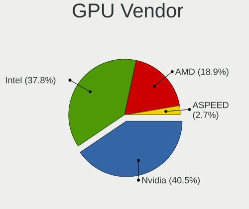

| Vendor            | Desktops | Percent |
|-------------------|----------|---------|
| Nvidia            | 15       | 40.54%  |
| Intel             | 14       | 37.84%  |
| AMD               | 7        | 18.92%  |
| ASPEED Technology | 1        | 2.7%    |

GPU Model
---------

Graphics card models

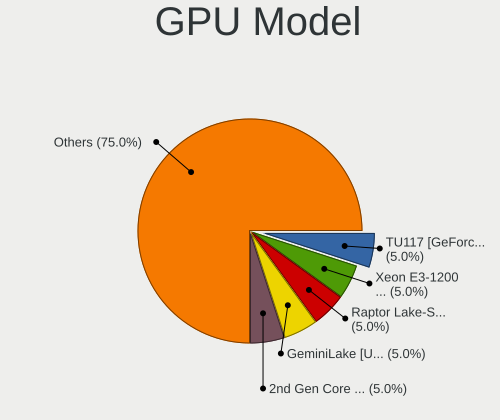

| Model                                                                       | Desktops | Percent |
|-----------------------------------------------------------------------------|----------|---------|
| Nvidia TU117 [GeForce GTX 1650]                                             | 2        | 5%      |
| Intel Xeon E3-1200 v3/4th Gen Core Processor Integrated Graphics Controller | 2        | 5%      |
| Intel Raptor Lake-S GT1 [UHD Graphics 770]                                  | 2        | 5%      |
| Intel GeminiLake [UHD Graphics 600]                                         | 2        | 5%      |
| Intel 2nd Generation Core Processor Family Integrated Graphics Controller   | 2        | 5%      |
| AMD Cezanne [Radeon Vega Series / Radeon Vega Mobile Series]                | 2        | 5%      |
| Nvidia TU116 [GeForce GTX 1660]                                             | 1        | 2.5%    |
| Nvidia TU116 [GeForce GTX 1660 SUPER]                                       | 1        | 2.5%    |
| Nvidia TU102 [GeForce RTX 2080 Ti Rev. A]                                   | 1        | 2.5%    |
| Nvidia GP108 [GeForce GT 1030]                                              | 1        | 2.5%    |
| Nvidia GP104 [GeForce GTX 1070]                                             | 1        | 2.5%    |
| Nvidia GM200 [GeForce GTX 980 Ti]                                           | 1        | 2.5%    |
| Nvidia GM107 [GeForce GTX 745]                                              | 1        | 2.5%    |
| Nvidia GK208B [GeForce GT 730]                                              | 1        | 2.5%    |
| Nvidia GK208 [GeForce GT 720]                                               | 1        | 2.5%    |
| Nvidia GK107GL [Quadro K600]                                                | 1        | 2.5%    |
| Nvidia GK104 [GeForce GTX 690]                                              | 1        | 2.5%    |
| Nvidia GA106 [RTX A2000 12GB]                                               | 1        | 2.5%    |
| Nvidia GA102 [GeForce RTX 3080 Lite Hash Rate]                              | 1        | 2.5%    |
| Nvidia AD104 [GeForce RTX 4070]                                             | 1        | 2.5%    |
| Intel Skylake-S GT2 [HD Graphics 530]                                       | 1        | 2.5%    |
| Intel RocketLake-S GT1 [UHD Graphics 730]                                   | 1        | 2.5%    |
| Intel JasperLake [UHD Graphics]                                             | 1        | 2.5%    |
| Intel Haswell-ULT Integrated Graphics Controller                            | 1        | 2.5%    |
| Intel CometLake-S GT2 [UHD Graphics 630]                                    | 1        | 2.5%    |
| Intel Atom Processor D4xx/D5xx/N4xx/N5xx Integrated Graphics Controller     | 1        | 2.5%    |
| ASPEED Technology ASPEED Graphics Family                                    | 1        | 2.5%    |
| AMD RV370 [Radeon X300/X550/X1050 Series] (Secondary)                       | 1        | 2.5%    |
| AMD RV370 [Radeon X300/X550/X1050 Series]                                   | 1        | 2.5%    |
| AMD Park [Mobility Radeon HD 5430]                                          | 1        | 2.5%    |
| AMD Navi 22 [Radeon RX 6700/6700 XT/6750 XT / 6800M/6850M XT]               | 1        | 2.5%    |
| AMD Navi 14 [Radeon RX 5500/5500M / Pro 5500M]                              | 1        | 2.5%    |
| AMD Juniper XT [Radeon HD 6770]                                             | 1        | 2.5%    |
| AMD Baffin [Radeon RX 550 640SP / RX 560/560X]                              | 1        | 2.5%    |

GPU Combo
---------

Combinations of graphics cards

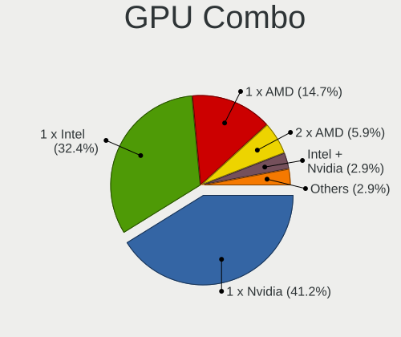

| Name           | Desktops | Percent |
|----------------|----------|---------|
| 1 x Nvidia     | 14       | 41.18%  |
| 1 x Intel      | 11       | 32.35%  |
| 1 x AMD        | 5        | 14.71%  |
| 2 x AMD        | 2        | 5.88%   |
| Intel + Nvidia | 1        | 2.94%   |
| 1 x ASPEED     | 1        | 2.94%   |

GPU Driver
----------

Free vs proprietary

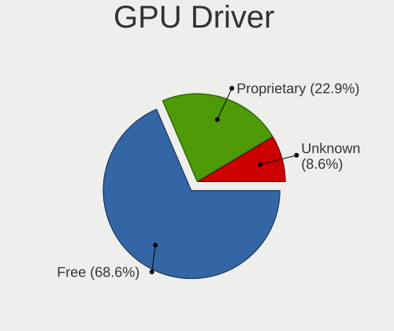

| Driver      | Desktops | Percent |
|-------------|----------|---------|
| Free        | 24       | 68.57%  |
| Proprietary | 8        | 22.86%  |
| Unknown     | 3        | 8.57%   |

GPU Memory
----------

Total video memory

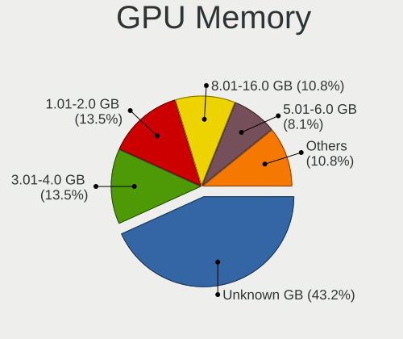

| Size in GB | Desktops | Percent |
|------------|----------|---------|
| Unknown    | 16       | 43.24%  |
| 3.01-4.0   | 5        | 13.51%  |
| 1.01-2.0   | 5        | 13.51%  |
| 8.01-16.0  | 4        | 10.81%  |
| 5.01-6.0   | 3        | 8.11%   |
| 0.51-1.0   | 3        | 8.11%   |
| 0.01-0.5   | 1        | 2.7%    |

Monitor
-------

Monitor Vendor
--------------

Monitor vendors

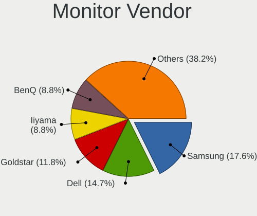

| Vendor              | Desktops | Percent |
|---------------------|----------|---------|
| Samsung Electronics | 6        | 17.65%  |
| Dell                | 5        | 14.71%  |
| Goldstar            | 4        | 11.76%  |
| Iiyama              | 3        | 8.82%   |
| BenQ                | 3        | 8.82%   |
| ViewSonic           | 2        | 5.88%   |
| AOC                 | 2        | 5.88%   |
| Acer                | 2        | 5.88%   |
| Philips             | 1        | 2.94%   |
| MStar               | 1        | 2.94%   |
| MSI                 | 1        | 2.94%   |
| LG Electronics      | 1        | 2.94%   |
| HKC                 | 1        | 2.94%   |
| Hewlett-Packard     | 1        | 2.94%   |
| ASUSTek Computer    | 1        | 2.94%   |

Monitor Model
-------------

Monitor models

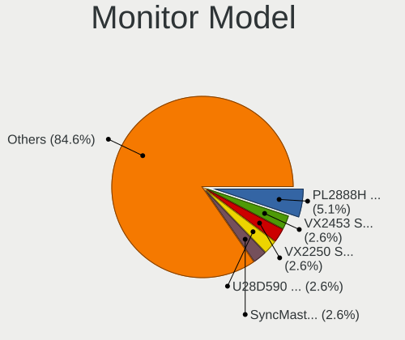

| Model                                                                   | Desktops | Percent |
|-------------------------------------------------------------------------|----------|---------|
| Iiyama PL2888H IVM7106 1920x1080 621x341mm 27.9-inch                    | 2        | 5.13%   |
| ViewSonic VX2453 Series VSC0C28 1920x1080 520x290mm 23.4-inch           | 1        | 2.56%   |
| ViewSonic VX2250 SERIES VSCCB25 1920x1080 477x268mm 21.5-inch           | 1        | 2.56%   |
| Samsung Electronics U28D590 SAM0B80 3840x2160 607x345mm 27.5-inch       | 1        | 2.56%   |
| Samsung Electronics SyncMaster SAM05EB 1920x1080 597x336mm 27.0-inch    | 1        | 2.56%   |
| Samsung Electronics SyncMaster SAM0589 1920x1080 521x293mm 23.5-inch    | 1        | 2.56%   |
| Samsung Electronics SMEX2220 SAM0686 1920x1080 477x268mm 21.5-inch      | 1        | 2.56%   |
| Samsung Electronics S27C450 SAM09D9 1920x1080 598x336mm 27.0-inch       | 1        | 2.56%   |
| Samsung Electronics LCD Monitor SAM7048 1366x768 522x293mm 23.6-inch    | 1        | 2.56%   |
| Samsung Electronics LCD Monitor SAM0FEE 3840x2160 1872x1053mm 84.6-inch | 1        | 2.56%   |
| Philips LCD Monitor 215Vw 1920x1080                                     | 1        | 2.56%   |
| MStar LCD Monitor Demo 1920x1080                                        | 1        | 2.56%   |
| MSI MAG342CQRV MSI3DB6 3440x1440 797x333mm 34.0-inch                    | 1        | 2.56%   |
| LG Electronics LCD Monitor LG FULL HD                                   | 1        | 2.56%   |
| Iiyama PL2492H IVM612F 1920x1080 527x296mm 23.8-inch                    | 1        | 2.56%   |
| HKC 24N1 HKC2413 1920x1080 527x296mm 23.8-inch                          | 1        | 2.56%   |
| Hewlett-Packard 2159 HWP282C 1920x1080 479x269mm 21.6-inch              | 1        | 2.56%   |
| Goldstar ULTRAGEAR GSM5B70 1920x1080 531x298mm 24.0-inch                | 1        | 2.56%   |
| Goldstar MP59G GSM5B34 1920x1080 480x270mm 21.7-inch                    | 1        | 2.56%   |
| Goldstar FULL HD GSM5ABB 1920x1080 480x270mm 21.7-inch                  | 1        | 2.56%   |
| Goldstar 22EA53 GSM59A6 1920x1080 477x268mm 21.5-inch                   | 1        | 2.56%   |
| Dell U2720Q DEL41B0 3840x2160 597x336mm 27.0-inch                       | 1        | 2.56%   |
| Dell U2719D DEL415A 2560x1440 597x336mm 27.0-inch                       | 1        | 2.56%   |
| Dell U2718Q DELA0E9 3840x2160 609x349mm 27.6-inch                       | 1        | 2.56%   |
| Dell U2520D DELA150 2560x1440 550x310mm 24.9-inch                       | 1        | 2.56%   |
| Dell U2520D DELA14E 2560x1440 553x311mm 25.0-inch                       | 1        | 2.56%   |
| Dell U2520D DELA14C 2560x1440 553x311mm 25.0-inch                       | 1        | 2.56%   |
| Dell U2412M DELA079 1920x1200 518x324mm 24.1-inch                       | 1        | 2.56%   |
| Dell P2418HT DEL4113 1920x1080 527x296mm 23.8-inch                      | 1        | 2.56%   |
| Dell 2408WFP DELA029 1920x1200 519x324mm 24.1-inch                      | 1        | 2.56%   |
| BenQ ZOWIE XL LCD BNQ7F83 1920x1080 544x303mm 24.5-inch                 | 1        | 2.56%   |
| BenQ PD2705U BNQ8039 3840x2160 597x336mm 27.0-inch                      | 1        | 2.56%   |
| BenQ GW2765 BNQ78D6 2560x1440 597x336mm 27.0-inch                       | 1        | 2.56%   |
| ASUSTek Computer PG329 AUS32F3 2560x1440 708x399mm 32.0-inch            | 1        | 2.56%   |
| AOC LCD Monitor 24G1WG4 3840x1080                                       | 1        | 2.56%   |
| AOC 2217 AOC2217 1680x1050 470x300mm 22.0-inch                          | 1        | 2.56%   |
| Acer V173 ACR0053 1280x1024 338x270mm 17.0-inch                         | 1        | 2.56%   |
| Acer H236HL ACR0318 1920x1080 509x286mm 23.0-inch                       | 1        | 2.56%   |

Monitor Resolution
------------------

Monitor screen resolution

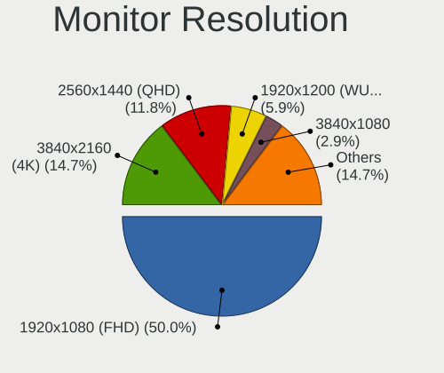

| Resolution         | Desktops | Percent |
|--------------------|----------|---------|
| 1920x1080 (FHD)    | 17       | 50%     |
| 3840x2160 (4K)     | 5        | 14.71%  |
| 2560x1440 (QHD)    | 4        | 11.76%  |
| 1920x1200 (WUXGA)  | 2        | 5.88%   |
| 3840x1080          | 1        | 2.94%   |
| 3440x1440          | 1        | 2.94%   |
| 1680x1050 (WSXGA+) | 1        | 2.94%   |
| 1440x900 (WXGA+)   | 1        | 2.94%   |
| 1366x768 (WXGA)    | 1        | 2.94%   |
| Unknown            | 1        | 2.94%   |

Monitor Diagonal
----------------

Diagonal size in inches

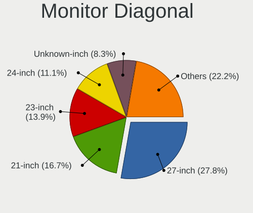

| Inches  | Desktops | Percent |
|---------|----------|---------|
| 27      | 10       | 27.78%  |
| 21      | 6        | 16.67%  |
| 23      | 5        | 13.89%  |
| 24      | 4        | 11.11%  |
| Unknown | 3        | 8.33%   |
| 32      | 2        | 5.56%   |
| 84      | 1        | 2.78%   |
| 38      | 1        | 2.78%   |
| 34      | 1        | 2.78%   |
| 25      | 1        | 2.78%   |
| 22      | 1        | 2.78%   |
| 19      | 1        | 2.78%   |

Monitor Width
-------------

Physical width

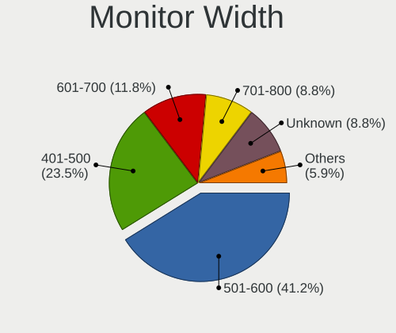

| Width in mm | Desktops | Percent |
|-------------|----------|---------|
| 501-600     | 14       | 41.18%  |
| 401-500     | 8        | 23.53%  |
| 601-700     | 4        | 11.76%  |
| 701-800     | 3        | 8.82%   |
| Unknown     | 3        | 8.82%   |
| 801-900     | 1        | 2.94%   |
| 1501-2000   | 1        | 2.94%   |

Aspect Ratio
------------

Proportional relationship between the width and the height

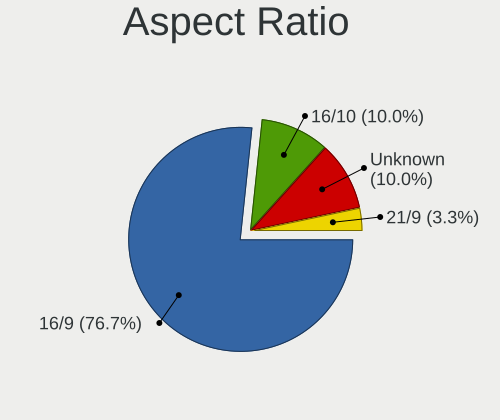

| Ratio   | Desktops | Percent |
|---------|----------|---------|
| 16/9    | 23       | 76.67%  |
| 16/10   | 3        | 10%     |
| Unknown | 3        | 10%     |
| 21/9    | 1        | 3.33%   |

Monitor Area
------------

Area in inch²

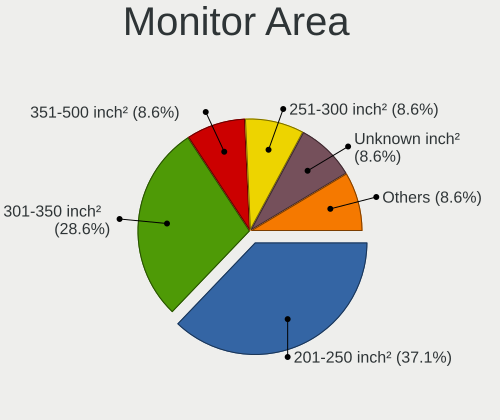

| Area in inch² | Desktops | Percent |
|----------------|----------|---------|
| 201-250        | 13       | 37.14%  |
| 301-350        | 10       | 28.57%  |
| 351-500        | 3        | 8.57%   |
| 251-300        | 3        | 8.57%   |
| Unknown        | 3        | 8.57%   |
| More than 1000 | 1        | 2.86%   |
| 151-200        | 1        | 2.86%   |
| 501-1000       | 1        | 2.86%   |

Pixel Density
-------------

Pixels per inch

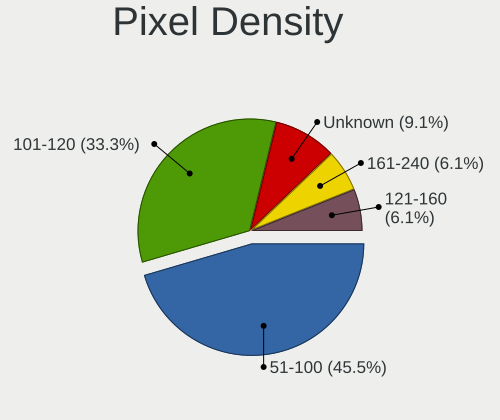

| Density | Desktops | Percent |
|---------|----------|---------|
| 51-100  | 15       | 45.45%  |
| 101-120 | 11       | 33.33%  |
| Unknown | 3        | 9.09%   |
| 161-240 | 2        | 6.06%   |
| 121-160 | 2        | 6.06%   |

Multiple Monitors
-----------------

Total monitors connected

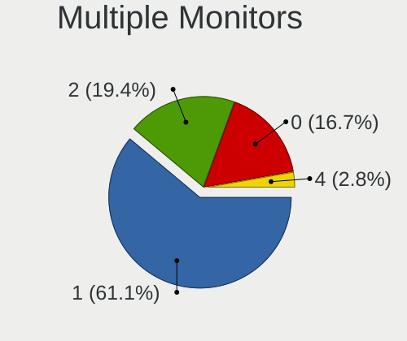

| Total | Desktops | Percent |
|-------|----------|---------|
| 1     | 22       | 61.11%  |
| 2     | 7        | 19.44%  |
| 0     | 6        | 16.67%  |
| 4     | 1        | 2.78%   |

Network
-------

Net Controller Vendor
---------------------

Controller vendors

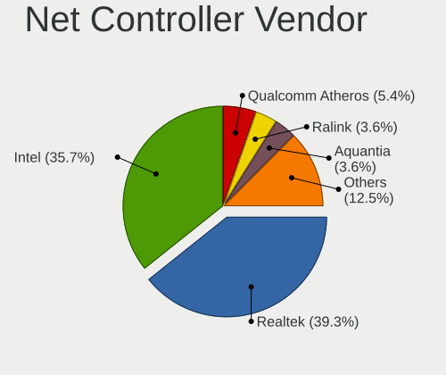

| Vendor                | Desktops | Percent |
|-----------------------|----------|---------|
| Realtek Semiconductor | 22       | 39.29%  |
| Intel                 | 20       | 35.71%  |
| Qualcomm Atheros      | 3        | 5.36%   |
| Ralink Technology     | 2        | 3.57%   |
| Aquantia              | 2        | 3.57%   |
| U-Blox                | 1        | 1.79%   |
| TP-Link               | 1        | 1.79%   |
| Seeed Technology      | 1        | 1.79%   |
| Mellanox Technologies | 1        | 1.79%   |
| Insyde Software       | 1        | 1.79%   |
| DisplayLink           | 1        | 1.79%   |
| Ceton Technologies    | 1        | 1.79%   |

Net Controller Model
--------------------

Controller models

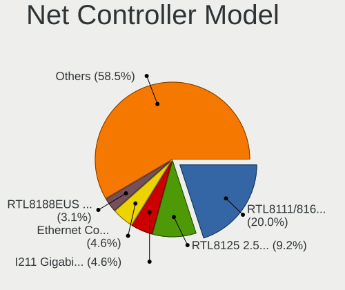

| Model                                                                             | Desktops | Percent |
|-----------------------------------------------------------------------------------|----------|---------|
| Realtek RTL8111/8168/8211/8411 PCI Express Gigabit Ethernet Controller            | 13       | 20%     |
| Realtek RTL8125 2.5GbE Controller                                                 | 6        | 9.23%   |
| Intel I211 Gigabit Network Connection                                             | 3        | 4.62%   |
| Intel Ethernet Controller I225-V                                                  | 3        | 4.62%   |
| Realtek RTL8188EUS 802.11n Wireless Network Adapter                               | 2        | 3.08%   |
| Qualcomm Atheros AR9462 Wireless Network Adapter                                  | 2        | 3.08%   |
| Intel Wi-Fi 6 AX200                                                               | 2        | 3.08%   |
| Intel 82579V Gigabit Network Connection                                           | 2        | 3.08%   |
| Intel 82574L Gigabit Network Connection                                           | 2        | 3.08%   |
| Intel 700 Series Chipset CNVi WiFi                                                | 2        | 3.08%   |
| U-Blox [u-blox 8]                                                                 | 1        | 1.54%   |
| TP-Link Archer T3U [Realtek RTL8812BU]                                            | 1        | 1.54%   |
| Seeed Seeeduino_Cortex_M0+                                                        | 1        | 1.54%   |
| Realtek RTL8821CE 802.11ac PCIe Wireless Network Adapter                          | 1        | 1.54%   |
| Realtek RTL8153 Gigabit Ethernet Adapter                                          | 1        | 1.54%   |
| Realtek RTL-8100/8101L/8139 PCI Fast Ethernet Adapter                             | 1        | 1.54%   |
| Ralink RT5370 Wireless Adapter                                                    | 1        | 1.54%   |
| Ralink RT2501/RT2573 Wireless Adapter                                             | 1        | 1.54%   |
| Qualcomm Atheros QCA9565 / AR9565 Wireless Network Adapter                        | 1        | 1.54%   |
| Mellanox MT27700 Family [ConnectX-4]                                              | 1        | 1.54%   |
| Intel Wireless 7265                                                               | 1        | 1.54%   |
| Intel Wireless 7260                                                               | 1        | 1.54%   |
| Intel Wi-Fi 5(802.11ac) Wireless-AC 9x6x [Thunder Peak]                           | 1        | 1.54%   |
| Intel I210 Gigabit Network Connection                                             | 1        | 1.54%   |
| Intel Gemini Lake PCH CNVi WiFi                                                   | 1        | 1.54%   |
| Intel Ethernet Controller X710/X557-AT 10GBASE-T                                  | 1        | 1.54%   |
| Intel Ethernet Controller I226-V                                                  | 1        | 1.54%   |
| Intel Ethernet Connection I218-V                                                  | 1        | 1.54%   |
| Intel Ethernet Connection I217-V                                                  | 1        | 1.54%   |
| Intel Ethernet Connection I217-LM                                                 | 1        | 1.54%   |
| Intel Ethernet Connection (2) I219-LM                                             | 1        | 1.54%   |
| Intel Ethernet Connection (2) I218-V                                              | 1        | 1.54%   |
| Intel 82579LM Gigabit Network Connection (Lewisville)                             | 1        | 1.54%   |
| Insyde Software RNDIS/Ethernet Gadget                                             | 1        | 1.54%   |
| DisplayLink Plugable UD_6950H                                                     | 1        | 1.54%   |
| Ceton InfiniTV Network                                                            | 1        | 1.54%   |
| Aquantia AQtion AQC113CS NBase-T/IEEE 802.3an Ethernet Controller [Antigua 10G]   | 1        | 1.54%   |
| Aquantia AQC113C NBase-T/IEEE 802.3an Ethernet Controller [Marvell Scalable mGig] | 1        | 1.54%   |

Wireless Vendor
---------------

Wireless vendors

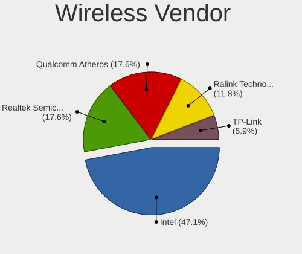

| Vendor                | Desktops | Percent |
|-----------------------|----------|---------|
| Intel                 | 8        | 47.06%  |
| Realtek Semiconductor | 3        | 17.65%  |
| Qualcomm Atheros      | 3        | 17.65%  |
| Ralink Technology     | 2        | 11.76%  |
| TP-Link               | 1        | 5.88%   |

Wireless Model
--------------

Wireless models

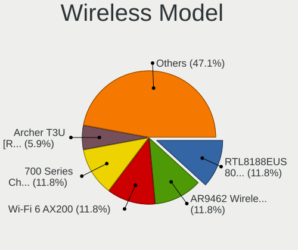

| Model                                                      | Desktops | Percent |
|------------------------------------------------------------|----------|---------|
| Realtek RTL8188EUS 802.11n Wireless Network Adapter        | 2        | 11.76%  |
| Qualcomm Atheros AR9462 Wireless Network Adapter           | 2        | 11.76%  |
| Intel Wi-Fi 6 AX200                                        | 2        | 11.76%  |
| Intel 700 Series Chipset CNVi WiFi                         | 2        | 11.76%  |
| TP-Link Archer T3U [Realtek RTL8812BU]                     | 1        | 5.88%   |
| Realtek RTL8821CE 802.11ac PCIe Wireless Network Adapter   | 1        | 5.88%   |
| Ralink RT5370 Wireless Adapter                             | 1        | 5.88%   |
| Ralink RT2501/RT2573 Wireless Adapter                      | 1        | 5.88%   |
| Qualcomm Atheros QCA9565 / AR9565 Wireless Network Adapter | 1        | 5.88%   |
| Intel Wireless 7265                                        | 1        | 5.88%   |
| Intel Wireless 7260                                        | 1        | 5.88%   |
| Intel Wi-Fi 5(802.11ac) Wireless-AC 9x6x [Thunder Peak]    | 1        | 5.88%   |
| Intel Gemini Lake PCH CNVi WiFi                            | 1        | 5.88%   |

Ethernet Vendor
---------------

Ethernet vendors

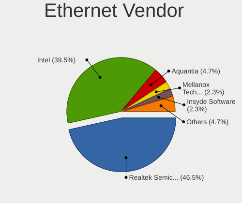

| Vendor                | Desktops | Percent |
|-----------------------|----------|---------|
| Realtek Semiconductor | 20       | 46.51%  |
| Intel                 | 17       | 39.53%  |
| Aquantia              | 2        | 4.65%   |
| Mellanox Technologies | 1        | 2.33%   |
| Insyde Software       | 1        | 2.33%   |
| DisplayLink           | 1        | 2.33%   |
| Ceton Technologies    | 1        | 2.33%   |

Ethernet Model
--------------

Ethernet models

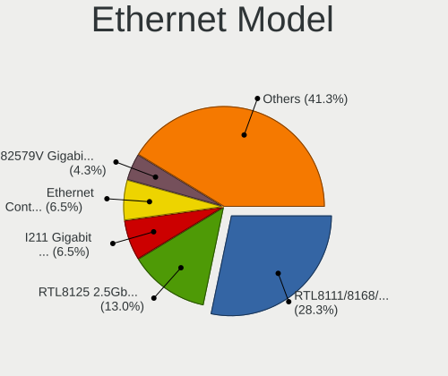

| Model                                                                             | Desktops | Percent |
|-----------------------------------------------------------------------------------|----------|---------|
| Realtek RTL8111/8168/8211/8411 PCI Express Gigabit Ethernet Controller            | 13       | 28.26%  |
| Realtek RTL8125 2.5GbE Controller                                                 | 6        | 13.04%  |
| Intel I211 Gigabit Network Connection                                             | 3        | 6.52%   |
| Intel Ethernet Controller I225-V                                                  | 3        | 6.52%   |
| Intel 82579V Gigabit Network Connection                                           | 2        | 4.35%   |
| Intel 82574L Gigabit Network Connection                                           | 2        | 4.35%   |
| Realtek RTL8153 Gigabit Ethernet Adapter                                          | 1        | 2.17%   |
| Realtek RTL-8100/8101L/8139 PCI Fast Ethernet Adapter                             | 1        | 2.17%   |
| Mellanox MT27700 Family [ConnectX-4]                                              | 1        | 2.17%   |
| Intel I210 Gigabit Network Connection                                             | 1        | 2.17%   |
| Intel Ethernet Controller X710/X557-AT 10GBASE-T                                  | 1        | 2.17%   |
| Intel Ethernet Controller I226-V                                                  | 1        | 2.17%   |
| Intel Ethernet Connection I218-V                                                  | 1        | 2.17%   |
| Intel Ethernet Connection I217-V                                                  | 1        | 2.17%   |
| Intel Ethernet Connection I217-LM                                                 | 1        | 2.17%   |
| Intel Ethernet Connection (2) I219-LM                                             | 1        | 2.17%   |
| Intel Ethernet Connection (2) I218-V                                              | 1        | 2.17%   |
| Intel 82579LM Gigabit Network Connection (Lewisville)                             | 1        | 2.17%   |
| Insyde Software RNDIS/Ethernet Gadget                                             | 1        | 2.17%   |
| DisplayLink Plugable UD_6950H                                                     | 1        | 2.17%   |
| Ceton InfiniTV Network                                                            | 1        | 2.17%   |
| Aquantia AQtion AQC113CS NBase-T/IEEE 802.3an Ethernet Controller [Antigua 10G]   | 1        | 2.17%   |
| Aquantia AQC113C NBase-T/IEEE 802.3an Ethernet Controller [Marvell Scalable mGig] | 1        | 2.17%   |

Net Controller Kind
-------------------

Ethernet, WiFi or modem

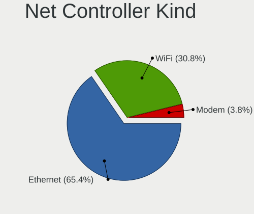

| Kind     | Desktops | Percent |
|----------|----------|---------|
| Ethernet | 34       | 65.38%  |
| WiFi     | 16       | 30.77%  |
| Modem    | 2        | 3.85%   |

Used Controller
---------------

Currently used network controller

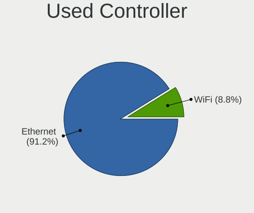

| Kind     | Desktops | Percent |
|----------|----------|---------|
| Ethernet | 31       | 91.18%  |
| WiFi     | 3        | 8.82%   |

NICs
----

Total network controllers on board

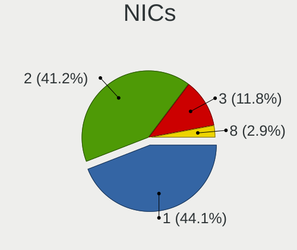

| Total | Desktops | Percent |
|-------|----------|---------|
| 1     | 15       | 44.12%  |
| 2     | 14       | 41.18%  |
| 3     | 4        | 11.76%  |
| 8     | 1        | 2.94%   |

IPv6
----

IPv6 vs IPv4

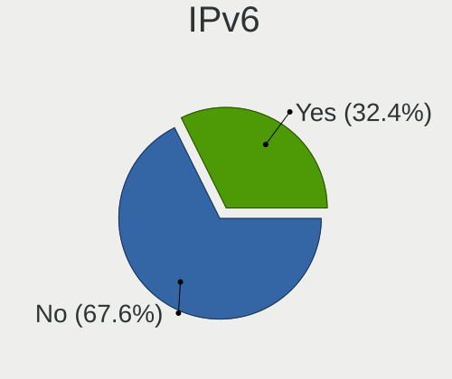

| Used | Desktops | Percent |
|------|----------|---------|
| No   | 23       | 67.65%  |
| Yes  | 11       | 32.35%  |

Bluetooth
---------

Bluetooth Vendor
----------------

Controller vendors

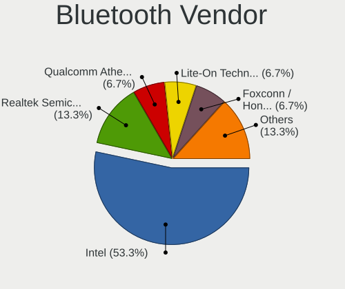

| Vendor                          | Desktops | Percent |
|---------------------------------|----------|---------|
| Intel                           | 8        | 53.33%  |
| Realtek Semiconductor           | 2        | 13.33%  |
| Qualcomm Atheros Communications | 1        | 6.67%   |
| Lite-On Technology              | 1        | 6.67%   |
| Foxconn / Hon Hai               | 1        | 6.67%   |
| Cambridge Silicon Radio         | 1        | 6.67%   |
| ASUSTek Computer                | 1        | 6.67%   |

Bluetooth Model
---------------

Controller models

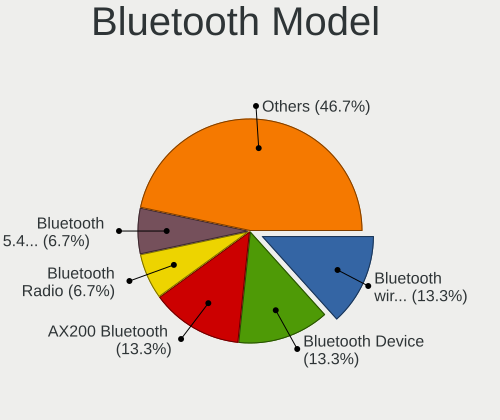

| Model                                               | Desktops | Percent |
|-----------------------------------------------------|----------|---------|
| Intel Bluetooth wireless interface                  | 2        | 13.33%  |
| Intel Bluetooth Device                              | 2        | 13.33%  |
| Intel AX200 Bluetooth                               | 2        | 13.33%  |
| Realtek Bluetooth Radio                             | 1        | 6.67%   |
| Realtek Bluetooth 5.4 Radio                         | 1        | 6.67%   |
| Qualcomm Atheros AR9462 Bluetooth                   | 1        | 6.67%   |
| Lite-On Bluetooth Device                            | 1        | 6.67%   |
| Intel Wireless-AC 9260 Bluetooth Adapter            | 1        | 6.67%   |
| Intel Bluetooth 9460/9560 Jefferson Peak (JfP)      | 1        | 6.67%   |
| Foxconn / Hon Hai Bluetooth Device                  | 1        | 6.67%   |
| Cambridge Silicon Radio Bluetooth Dongle (HCI mode) | 1        | 6.67%   |
| ASUS Broadcom BCM20702A0 Bluetooth                  | 1        | 6.67%   |

Sound
-----

Sound Vendor
------------

Sound card vendors

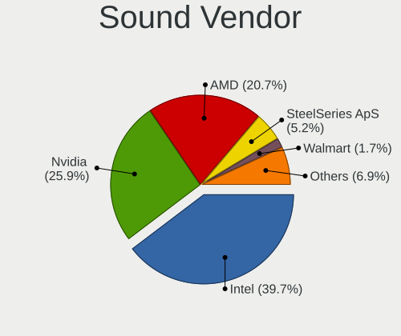

| Vendor                   | Desktops | Percent |
|--------------------------|----------|---------|
| Intel                    | 23       | 39.66%  |
| Nvidia                   | 15       | 25.86%  |
| AMD                      | 12       | 20.69%  |
| SteelSeries ApS          | 3        | 5.17%   |
| Walmart                  | 1        | 1.72%   |
| Micro Star International | 1        | 1.72%   |
| KTMicro                  | 1        | 1.72%   |
| Giga-Byte Technology     | 1        | 1.72%   |
| DSEA A/S                 | 1        | 1.72%   |

Sound Model
-----------

Sound card models

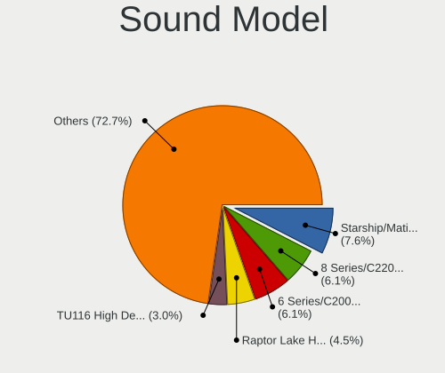

| Model                                                                      | Desktops | Percent |
|----------------------------------------------------------------------------|----------|---------|
| AMD Starship/Matisse HD Audio Controller                                   | 5        | 7.58%   |
| Intel 8 Series/C220 Series Chipset High Definition Audio Controller        | 4        | 6.06%   |
| Intel 6 Series/C200 Series Chipset Family High Definition Audio Controller | 4        | 6.06%   |
| Intel Raptor Lake High Definition Audio Controller                         | 3        | 4.55%   |
| Nvidia TU116 High Definition Audio Controller                              | 2        | 3.03%   |
| Nvidia TU107 GeForce GTX 1650 High Definition Audio Controller             | 2        | 3.03%   |
| Intel Xeon E3-1200 v3/4th Gen Core Processor HD Audio Controller           | 2        | 3.03%   |
| Intel Smart Sound Technology (SST) Audio Controller                        | 2        | 3.03%   |
| Intel Alder Lake-S HD Audio Controller                                     | 2        | 3.03%   |
| AMD Ryzen HD Audio Controller                                              | 2        | 3.03%   |
| AMD Renoir/Cezanne HDMI/DP Audio Controller                                | 2        | 3.03%   |
| Walmart AB13X Headset Adapter                                              | 1        | 1.52%   |
| SteelSeries ApS SteelSeries Siberia 800                                    | 1        | 1.52%   |
| SteelSeries ApS SteelSeries GameDAC                                        | 1        | 1.52%   |
| SteelSeries ApS Arctis Nova Pro Wireless                                   | 1        | 1.52%   |
| Nvidia TU102 High Definition Audio Controller                              | 1        | 1.52%   |
| Nvidia GP108 High Definition Audio Controller                              | 1        | 1.52%   |
| Nvidia GP104 High Definition Audio Controller                              | 1        | 1.52%   |
| Nvidia GM200 High Definition Audio                                         | 1        | 1.52%   |
| Nvidia GM107 High Definition Audio Controller [GeForce 940MX]              | 1        | 1.52%   |
| Nvidia GK208 HDMI/DP Audio Controller                                      | 1        | 1.52%   |
| Nvidia GK107 HDMI Audio Controller                                         | 1        | 1.52%   |
| Nvidia GK104 HDMI Audio Controller                                         | 1        | 1.52%   |
| Nvidia GF119 HDMI Audio Controller                                         | 1        | 1.52%   |
| Nvidia GA106 High Definition Audio Controller                              | 1        | 1.52%   |
| Nvidia GA102 High Definition Audio Controller                              | 1        | 1.52%   |
| Nvidia AD104 High Definition Audio Controller                              | 1        | 1.52%   |
| Micro Star International USB Audio                                         | 1        | 1.52%   |
| KTMicro KT USB Audio                                                       | 1        | 1.52%   |
| Intel Tiger Lake-H HD Audio Controller                                     | 1        | 1.52%   |
| Intel NM10/ICH7 Family High Definition Audio Controller                    | 1        | 1.52%   |
| Intel Jasper Lake HD Audio                                                 | 1        | 1.52%   |
| Intel Haswell-ULT HD Audio Controller                                      | 1        | 1.52%   |
| Intel Celeron/Pentium Silver Processor High Definition Audio               | 1        | 1.52%   |
| Intel C610/X99 series chipset HD Audio Controller                          | 1        | 1.52%   |
| Intel 8 Series HD Audio Controller                                         | 1        | 1.52%   |
| Intel 7 Series/C216 Chipset Family High Definition Audio Controller        | 1        | 1.52%   |
| Intel 100 Series/C230 Series Chipset Family HD Audio Controller            | 1        | 1.52%   |
| Giga-Byte Technology USB Audio                                             | 1        | 1.52%   |
| DSEA A/S Sennheiser USB headset                                            | 1        | 1.52%   |

Memory
------

Memory Vendor
-------------

Memory module vendors

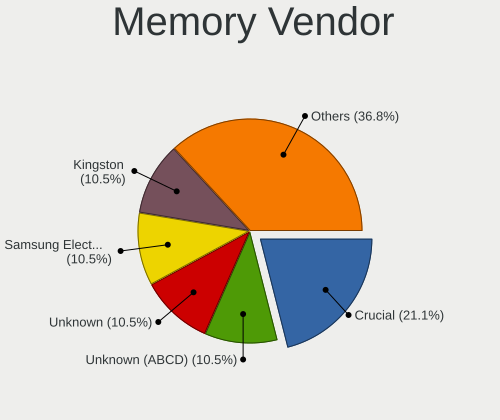

| Vendor              | Desktops | Percent |
|---------------------|----------|---------|
| Crucial             | 4        | 21.05%  |
| Unknown (ABCD)      | 2        | 10.53%  |
| Unknown             | 2        | 10.53%  |
| Samsung Electronics | 2        | 10.53%  |
| Kingston            | 2        | 10.53%  |
| G.Skill             | 2        | 10.53%  |
| Corsair             | 2        | 10.53%  |
| Team                | 1        | 5.26%   |
| SK hynix            | 1        | 5.26%   |
| Ramaxel Technology  | 1        | 5.26%   |

Memory Model
------------

Memory module models

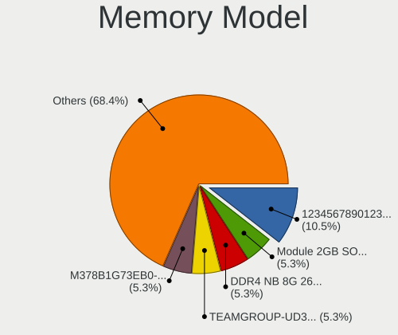

| Model                                                          | Desktops | Percent |
|----------------------------------------------------------------|----------|---------|
| Unknown (ABCD) RAM 123456789012345678 2GB DIMM LPDDR4 2133MT/s | 2        | 10.53%  |
| Unknown RAM Module 2GB SODIMM DDR3 800MT/s                     | 1        | 5.26%   |
| Unknown RAM DDR4 NB 8G 2666 8GB SODIMM DDR4 2667MT/s           | 1        | 5.26%   |
| Team RAM TEAMGROUP-UD3-1600 8GB DIMM DDR3 1866MT/s             | 1        | 5.26%   |
| SK hynix RAM Module 4GB DIMM DDR3 1600MT/s                     | 1        | 5.26%   |
| Samsung RAM M378B1G73EB0-YK0 8GB DIMM DDR3 1600MT/s            | 1        | 5.26%   |
| Samsung RAM M321R8GA0PB0-CWMCJ 64GB DIMM DDR5 5600MT/s         | 1        | 5.26%   |
| Ramaxel RAM RMUA5090KB78HAF2133 8GB DIMM DDR4 2400MT/s         | 1        | 5.26%   |
| Kingston RAM KF556R36-32 32GiB DIMM DDR5 4800MT/s              | 1        | 5.26%   |
| Kingston RAM 99U5471-034.A00LF 4GB DIMM DDR3 1600MT/s          | 1        | 5.26%   |
| G.Skill RAM F5-5600J3036D32G 32GB DIMM DDR5 5600MT/s           | 1        | 5.26%   |
| G.Skill RAM F4-3600C18-32GTZR 32GB DIMM DDR4 3600MT/s          | 1        | 5.26%   |
| Crucial RAM CT8G4DFRA32A.M4FF 8GB DIMM DDR4 3200MT/s           | 1        | 5.26%   |
| Crucial RAM CT16G4DFD824A.C16FBD 16GB DIMM DDR4 2933MT/s       | 1        | 5.26%   |
| Crucial RAM BLS8G3D1609DS1S00. 8GB DIMM DDR3 1800MT/s          | 1        | 5.26%   |
| Crucial RAM BL16G32C16U4B.M16FE 16GB DIMM DDR4 3466MT/s        | 1        | 5.26%   |
| Corsair RAM CMK64GX4M2Z4000C18 32GB DIMM DDR4 4000MT/s         | 1        | 5.26%   |
| Corsair RAM CMK128GX4M8A2666C16 16GB DIMM DDR4 2133MT/s        | 1        | 5.26%   |

Memory Kind
-----------

Memory module kinds

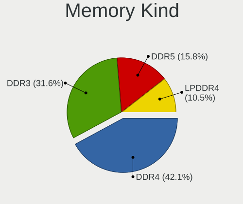

| Kind   | Desktops | Percent |
|--------|----------|---------|
| DDR4   | 8        | 42.11%  |
| DDR3   | 6        | 31.58%  |
| DDR5   | 3        | 15.79%  |
| LPDDR4 | 2        | 10.53%  |

Memory Form Factor
------------------

Physical design of the memory module

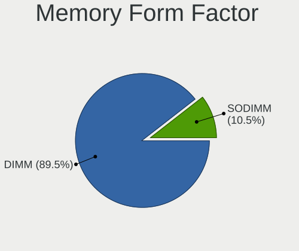

| Name   | Desktops | Percent |
|--------|----------|---------|
| DIMM   | 17       | 89.47%  |
| SODIMM | 2        | 10.53%  |

Memory Size
-----------

Memory module size

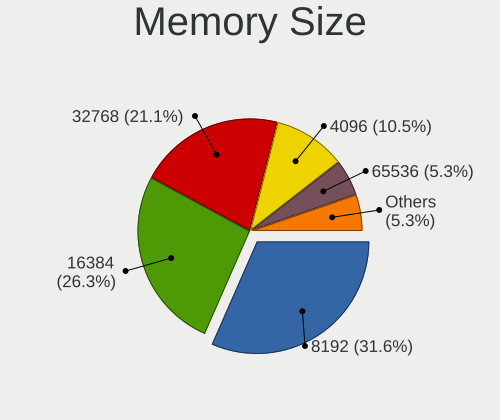

| Size  | Desktops | Percent |
|-------|----------|---------|
| 8192  | 6        | 31.58%  |
| 16384 | 5        | 26.32%  |
| 32768 | 4        | 21.05%  |
| 4096  | 2        | 10.53%  |
| 65536 | 1        | 5.26%   |
| 2048  | 1        | 5.26%   |

Memory Speed
------------

Memory module speed

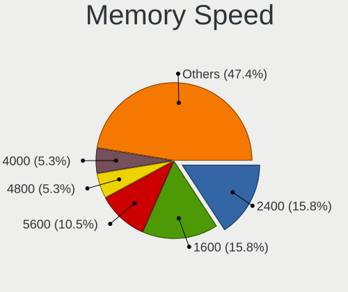

| Speed | Desktops | Percent |
|-------|----------|---------|
| 2400  | 3        | 15.79%  |
| 1600  | 3        | 15.79%  |
| 5600  | 2        | 10.53%  |
| 4800  | 1        | 5.26%   |
| 4000  | 1        | 5.26%   |
| 3600  | 1        | 5.26%   |
| 3466  | 1        | 5.26%   |
| 3200  | 1        | 5.26%   |
| 2933  | 1        | 5.26%   |
| 2667  | 1        | 5.26%   |
| 2133  | 1        | 5.26%   |
| 1866  | 1        | 5.26%   |
| 1800  | 1        | 5.26%   |
| 800   | 1        | 5.26%   |

Printers & scanners
-------------------

Printer Vendor
--------------

Printer device vendors

Zero info for selected period =(

Printer Model
-------------

Printer device models

Zero info for selected period =(

Scanner Vendor
--------------

Scanner device vendors

Zero info for selected period =(

Scanner Model
-------------

Scanner device models

Zero info for selected period =(

Camera
------

Camera Vendor
-------------

Camera device vendors

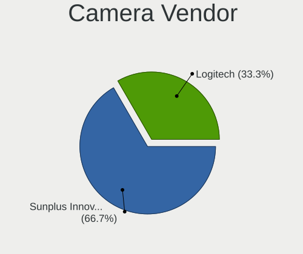

| Vendor                        | Desktops | Percent |
|-------------------------------|----------|---------|
| Logitech                      | 3        | 50%     |
| Sunplus Innovation Technology | 2        | 33.33%  |
| KYE Systems                   | 1        | 16.67%  |

Camera Model
------------

Camera device models

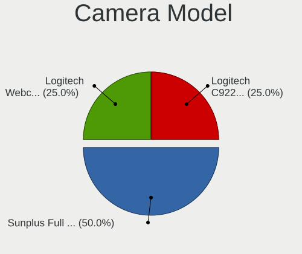

| Model                           | Desktops | Percent |
|---------------------------------|----------|---------|
| Sunplus Full HD webcam          | 2        | 33.33%  |
| Logitech C922 Pro Stream Webcam | 2        | 33.33%  |
| Logitech Webcam C270            | 1        | 16.67%  |
| KYE Systems FaceCam 1320        | 1        | 16.67%  |

Security
--------

Fingerprint Vendor
------------------

Fingerprint sensor vendors

Zero info for selected period =(

Fingerprint Model
-----------------

Fingerprint sensor models

Zero info for selected period =(

Chipcard Vendor
---------------

Chipcard module vendors

Zero info for selected period =(

Chipcard Model
--------------

Chipcard module models

Zero info for selected period =(

Unsupported
-----------

Unsupported Devices
-------------------

Total unsupported devices on board

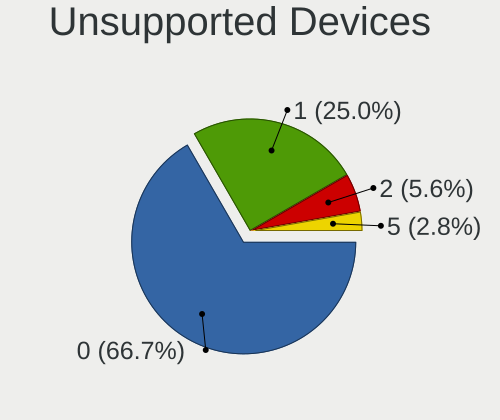

| Total | Desktops | Percent |
|-------|----------|---------|
| 0     | 24       | 66.67%  |
| 1     | 9        | 25%     |
| 2     | 2        | 5.56%   |
| 5     | 1        | 2.78%   |

Unsupported Device Types
------------------------

Types of unsupported devices

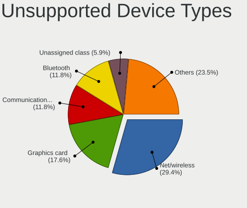

| Type                     | Desktops | Percent |
|--------------------------|----------|---------|
| Net/wireless             | 5        | 29.41%  |
| Graphics card            | 3        | 17.65%  |
| Communication controller | 2        | 11.76%  |
| Bluetooth                | 2        | 11.76%  |
| Unassigned class         | 1        | 5.88%   |
| Storage/ata              | 1        | 5.88%   |
| Sound                    | 1        | 5.88%   |
| Firewire controller      | 1        | 5.88%   |
| Dvb card                 | 1        | 5.88%   |

