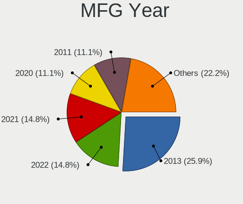
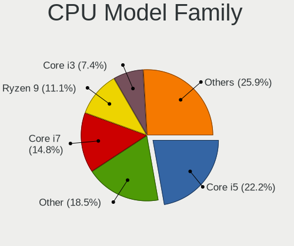
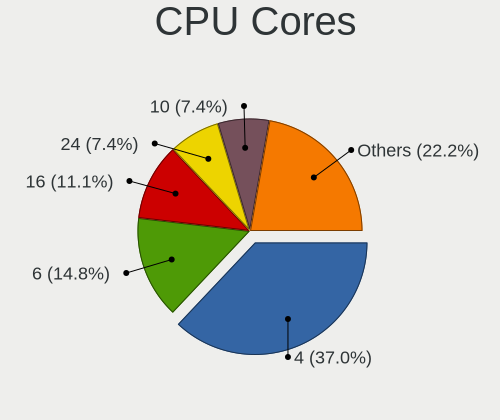
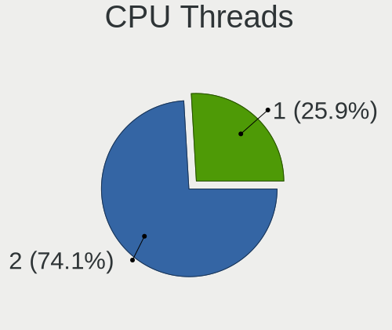
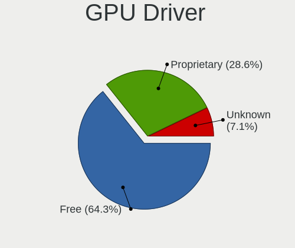
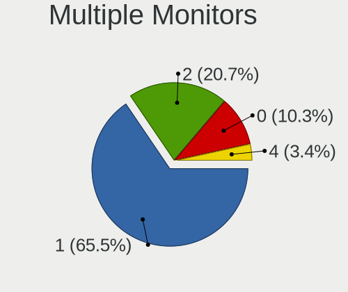
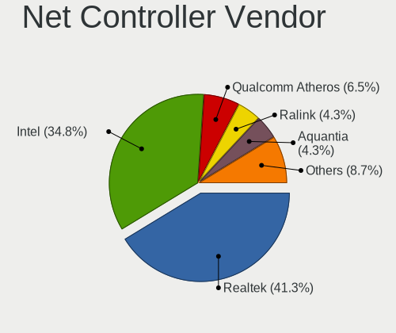
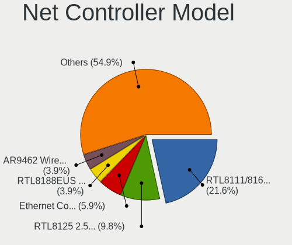
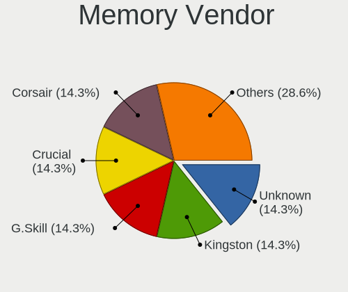

CentOS 9 - Tested Hardware & Statistics (Desktops)
--------------------------------------------------

A project to collect tested hardware configurations for CentOS 9.

Anyone can contribute to this report by the [hw-probe](https://github.com/linuxhw/hw-probe) tool:

    sudo -E hw-probe -all -upload

Please contribute! Especially if your hardware is rare.

Contents
--------

* [ Test Cases ](#test-cases)

* [ System ](#system)
  - [ Kernel                   ](#kernel)
  - [ Kernel Family            ](#kernel-family)
  - [ Kernel Major Ver.        ](#kernel-major-ver)
  - [ Arch                     ](#arch)
  - [ DE                       ](#de)
  - [ Display Server           ](#display-server)
  - [ Display Manager          ](#display-manager)
  - [ OS Lang                  ](#os-lang)
  - [ Boot Mode                ](#boot-mode)
  - [ Filesystem               ](#filesystem)
  - [ Part. scheme             ](#part-scheme)
  - [ Dual Boot with Linux/BSD ](#dual-boot-with-linuxbsd)
  - [ Dual Boot (Win)          ](#dual-boot-win)

* [ Board ](#board)
  - [ Vendor                   ](#vendor)
  - [ Model                    ](#model)
  - [ Model Family             ](#model-family)
  - [ MFG Year                 ](#mfg-year)
  - [ Form Factor              ](#form-factor)
  - [ Secure Boot              ](#secure-boot)
  - [ Coreboot                 ](#coreboot)
  - [ RAM Size                 ](#ram-size)
  - [ RAM Used                 ](#ram-used)
  - [ Total Drives             ](#total-drives)
  - [ Has CD-ROM               ](#has-cd-rom)
  - [ Has Ethernet             ](#has-ethernet)
  - [ Has WiFi                 ](#has-wifi)
  - [ Has Bluetooth            ](#has-bluetooth)

* [ Location ](#location)
  - [ Country                  ](#country)
  - [ City                     ](#city)

* [ Drives ](#drives)
  - [ Drive Vendor             ](#drive-vendor)
  - [ Drive Model              ](#drive-model)
  - [ HDD Vendor               ](#hdd-vendor)
  - [ SSD Vendor               ](#ssd-vendor)
  - [ Drive Kind               ](#drive-kind)
  - [ Drive Connector          ](#drive-connector)
  - [ Drive Size               ](#drive-size)
  - [ Space Total              ](#space-total)
  - [ Space Used               ](#space-used)
  - [ Malfunc. Drives          ](#malfunc-drives)
  - [ Malfunc. Drive Vendor    ](#malfunc-drive-vendor)
  - [ Malfunc. HDD Vendor      ](#malfunc-hdd-vendor)
  - [ Malfunc. Drive Kind      ](#malfunc-drive-kind)
  - [ Failed Drives            ](#failed-drives)
  - [ Failed Drive Vendor      ](#failed-drive-vendor)
  - [ Drive Status             ](#drive-status)

* [ Storage controller ](#storage-controller)
  - [ Storage Vendor           ](#storage-vendor)
  - [ Storage Model            ](#storage-model)
  - [ Storage Kind             ](#storage-kind)

* [ Processor ](#processor)
  - [ CPU Vendor               ](#cpu-vendor)
  - [ CPU Model                ](#cpu-model)
  - [ CPU Model Family         ](#cpu-model-family)
  - [ CPU Cores                ](#cpu-cores)
  - [ CPU Sockets              ](#cpu-sockets)
  - [ CPU Threads              ](#cpu-threads)
  - [ CPU Op-Modes             ](#cpu-op-modes)
  - [ CPU Microcode            ](#cpu-microcode)
  - [ CPU Microarch            ](#cpu-microarch)

* [ Graphics ](#graphics)
  - [ GPU Vendor               ](#gpu-vendor)
  - [ GPU Model                ](#gpu-model)
  - [ GPU Combo                ](#gpu-combo)
  - [ GPU Driver               ](#gpu-driver)
  - [ GPU Memory               ](#gpu-memory)

* [ Monitor ](#monitor)
  - [ Monitor Vendor           ](#monitor-vendor)
  - [ Monitor Model            ](#monitor-model)
  - [ Monitor Resolution       ](#monitor-resolution)
  - [ Monitor Diagonal         ](#monitor-diagonal)
  - [ Monitor Width            ](#monitor-width)
  - [ Aspect Ratio             ](#aspect-ratio)
  - [ Monitor Area             ](#monitor-area)
  - [ Pixel Density            ](#pixel-density)
  - [ Multiple Monitors        ](#multiple-monitors)

* [ Network ](#network)
  - [ Net Controller Vendor    ](#net-controller-vendor)
  - [ Net Controller Model     ](#net-controller-model)
  - [ Wireless Vendor          ](#wireless-vendor)
  - [ Wireless Model           ](#wireless-model)
  - [ Ethernet Vendor          ](#ethernet-vendor)
  - [ Ethernet Model           ](#ethernet-model)
  - [ Net Controller Kind      ](#net-controller-kind)
  - [ Used Controller          ](#used-controller)
  - [ NICs                     ](#nics)
  - [ IPv6                     ](#ipv6)

* [ Bluetooth ](#bluetooth)
  - [ Bluetooth Vendor         ](#bluetooth-vendor)
  - [ Bluetooth Model          ](#bluetooth-model)

* [ Sound ](#sound)
  - [ Sound Vendor             ](#sound-vendor)
  - [ Sound Model              ](#sound-model)

* [ Memory ](#memory)
  - [ Memory Vendor            ](#memory-vendor)
  - [ Memory Model             ](#memory-model)
  - [ Memory Kind              ](#memory-kind)
  - [ Memory Form Factor       ](#memory-form-factor)
  - [ Memory Size              ](#memory-size)
  - [ Memory Speed             ](#memory-speed)

* [ Printers & scanners ](#printers--scanners)
  - [ Printer Vendor           ](#printer-vendor)
  - [ Printer Model            ](#printer-model)
  - [ Scanner Vendor           ](#scanner-vendor)
  - [ Scanner Model            ](#scanner-model)

* [ Camera ](#camera)
  - [ Camera Vendor            ](#camera-vendor)
  - [ Camera Model             ](#camera-model)

* [ Security ](#security)
  - [ Fingerprint Vendor       ](#fingerprint-vendor)
  - [ Fingerprint Model        ](#fingerprint-model)
  - [ Chipcard Vendor          ](#chipcard-vendor)
  - [ Chipcard Model           ](#chipcard-model)

* [ Unsupported ](#unsupported)
  - [ Unsupported Devices      ](#unsupported-devices)
  - [ Unsupported Device Types ](#unsupported-device-types)

Test Cases
----------

Total: 33

| Vendor        | Model                       | Probe                                                      | Date         |
|---------------|-----------------------------|------------------------------------------------------------|--------------|
| Gigabyte      | B550M DS3H                  | [0bea57057c](https://linux-hardware.org/?probe=0bea57057c) | Mar 13, 2024 |
| ASUSTek       | PRIME H670-PLUS D4          | [5a711c0ff0](https://linux-hardware.org/?probe=5a711c0ff0) | Jan 20, 2024 |
| ASUSTek       | AT4NM10T-I                  | [7adc9b4d41](https://linux-hardware.org/?probe=7adc9b4d41) | Jan 06, 2024 |
| MSI           | MAG B760M MORTAR WIFI       | [342164a6a4](https://linux-hardware.org/?probe=342164a6a4) | Dec 29, 2023 |
| SHANGZHAOY... | B85M-PRO V1.1               | [bd7c6e2693](https://linux-hardware.org/?probe=bd7c6e2693) | Dec 22, 2023 |
| ASUSTek       | PRIME H670-PLUS D4          | [e8965075d3](https://linux-hardware.org/?probe=e8965075d3) | Dec 14, 2023 |
| ASUSTek       | PRIME H670-PLUS D4          | [e9e5956d89](https://linux-hardware.org/?probe=e9e5956d89) | Dec 10, 2023 |
| MSI           | MEG Z790 ACE                | [41d0e4fddd](https://linux-hardware.org/?probe=41d0e4fddd) | Oct 24, 2023 |
| ASUSTek       | P8H61/USB3                  | [ecf1a70c5d](https://linux-hardware.org/?probe=ecf1a70c5d) | Sep 08, 2023 |
| ASUSTek       | P8H61/USB3                  | [149cb27e46](https://linux-hardware.org/?probe=149cb27e46) | Aug 18, 2023 |
| ASUSTek       | ROG CROSSHAIR VIII DARK ... | [888c56f232](https://linux-hardware.org/?probe=888c56f232) | Aug 01, 2023 |
| ASUSTek       | PRIME H670-PLUS D4          | [993a10a30b](https://linux-hardware.org/?probe=993a10a30b) | Aug 01, 2023 |
| Gateway       | H61H2-AD V1.0               | [9a34a9295c](https://linux-hardware.org/?probe=9a34a9295c) | Jun 15, 2023 |
| ASUSTek       | P8H61/USB3                  | [d93dbf6db3](https://linux-hardware.org/?probe=d93dbf6db3) | Jun 01, 2023 |
| ASUSTek       | P8H61/USB3                  | [16c7ca187a](https://linux-hardware.org/?probe=16c7ca187a) | Jun 01, 2023 |
| ASUSTek       | P8H67-M LE                  | [a69366e2b7](https://linux-hardware.org/?probe=a69366e2b7) | May 29, 2023 |
| ASUSTek       | P8H67-M LE                  | [07202660b9](https://linux-hardware.org/?probe=07202660b9) | May 26, 2023 |
| Acer          | Predator G3-605             | [6f91022c83](https://linux-hardware.org/?probe=6f91022c83) | May 04, 2023 |
| Colorful T... | CVN Z590 GAMING PRO V20     | [209ec5e477](https://linux-hardware.org/?probe=209ec5e477) | Apr 28, 2023 |
| ASUSTek       | PRIME H670-PLUS D4          | [a7270cf962](https://linux-hardware.org/?probe=a7270cf962) | Feb 19, 2023 |
| ASUSTek       | PRIME H670-PLUS D4          | [117f4c04d6](https://linux-hardware.org/?probe=117f4c04d6) | Dec 21, 2022 |
| Dell          | 0NKW6Y A02                  | [f20d5b9289](https://linux-hardware.org/?probe=f20d5b9289) | Dec 07, 2022 |
| MSI           | X470 GAMING PRO             | [6ca3196f35](https://linux-hardware.org/?probe=6ca3196f35) | Dec 05, 2022 |
| ASUSTek       | TUF Gaming X570-PLUS        | [e840ded8c0](https://linux-hardware.org/?probe=e840ded8c0) | Nov 09, 2022 |
| ASUSTek       | PRIME H670-PLUS D4          | [8ee7171b61](https://linux-hardware.org/?probe=8ee7171b61) | Nov 03, 2022 |
| Intel         | D34010WYK H14771-303        | [e58d9849a5](https://linux-hardware.org/?probe=e58d9849a5) | Oct 06, 2022 |
| ASUSTek       | H81M-K                      | [e115d77240](https://linux-hardware.org/?probe=e115d77240) | Aug 07, 2022 |
| ASUSTek       | H81M-K                      | [46201e4773](https://linux-hardware.org/?probe=46201e4773) | Jul 27, 2022 |
| NCR           | Pocono BIOS.6.0             | [ae030a0cda](https://linux-hardware.org/?probe=ae030a0cda) | Jul 15, 2022 |
| Gigabyte      | 970A-DS3P                   | [c45dba9246](https://linux-hardware.org/?probe=c45dba9246) | Jun 26, 2022 |
| Gigabyte      | 970A-DS3P                   | [3d36beed4b](https://linux-hardware.org/?probe=3d36beed4b) | Jun 25, 2022 |
| ASUSTek       | ROG STRIX B560-G GAMING ... | [88a7cd954c](https://linux-hardware.org/?probe=88a7cd954c) | Jun 19, 2022 |
| Gigabyte      | X99-UD4-CF                  | [db53151112](https://linux-hardware.org/?probe=db53151112) | Apr 19, 2022 |

System
------

Kernel
------

Version of the Linux kernel

| Version                        | Desktops | Percent |
|--------------------------------|----------|---------|
| 5.14.0-391.el9.x86_64          | 3        | 11.11%  |
| 5.14.0-202.el9.x86_64          | 2        | 7.41%   |
| 5.17.2-lqx3.0.el9.x86_64       | 1        | 3.7%    |
| 5.14.0-86.el9.x86_64           | 1        | 3.7%    |
| 5.14.0-427.el9.x86_64          | 1        | 3.7%    |
| 5.14.0-407.el9.x86_64          | 1        | 3.7%    |
| 5.14.0-375.el9.x86_64          | 1        | 3.7%    |
| 5.14.0-362.el9.x86_64          | 1        | 3.7%    |
| 5.14.0-352.el9.x86_64          | 1        | 3.7%    |
| 5.14.0-344.el9.x86_64          | 1        | 3.7%    |
| 5.14.0-340.el9.x86_64          | 1        | 3.7%    |
| 5.14.0-325.el9.x86_64          | 1        | 3.7%    |
| 5.14.0-319.el9.x86_64          | 1        | 3.7%    |
| 5.14.0-316.el9.x86_64          | 1        | 3.7%    |
| 5.14.0-305.el9.x86_64          | 1        | 3.7%    |
| 5.14.0-302.el9.x86_64          | 1        | 3.7%    |
| 5.14.0-267.el9.x86_64          | 1        | 3.7%    |
| 5.14.0-214.el9.x86_64          | 1        | 3.7%    |
| 5.14.0-183.el9.x86_64          | 1        | 3.7%    |
| 5.14.0-134.el9.x86_64          | 1        | 3.7%    |
| 5.14.0-130.rt21.130.el9.x86_64 | 1        | 3.7%    |
| 5.14.0-115.el9.x86_64          | 1        | 3.7%    |
| 5.14.0-109.el9.x86_64          | 1        | 3.7%    |
| 4.18.0-529.el8.x86_64          | 1        | 3.7%    |

Kernel Family
-------------

Linux kernel without a distro release

| Version | Desktops | Percent |
|---------|----------|---------|
| 5.14.0  | 19       | 90.48%  |
| 5.17.2  | 1        | 4.76%   |
| 4.18.0  | 1        | 4.76%   |

Kernel Major Ver.
-----------------

Linux kernel major version

| Version | Desktops | Percent |
|---------|----------|---------|
| 5.14    | 19       | 90.48%  |
| 5.17    | 1        | 4.76%   |
| 4.18    | 1        | 4.76%   |

Arch
----

OS architecture (x86_64, i586, etc.)

| Name   | Desktops | Percent |
|--------|----------|---------|
| x86_64 | 21       | 100%    |

DE
--

Desktop Environment

| Name          | Desktops | Percent |
|---------------|----------|---------|
| GNOME         | 16       | 76.19%  |
| KDE5          | 2        | 9.52%   |
| GNOME Classic | 2        | 9.52%   |
| Unknown       | 1        | 4.76%   |

Display Server
--------------

X11 or Wayland

| Name    | Desktops | Percent |
|---------|----------|---------|
| Wayland | 12       | 54.55%  |
| X11     | 9        | 40.91%  |
| Unknown | 1        | 4.55%   |

Display Manager
---------------

SDDM, LightDM, etc.

| Name    | Desktops | Percent |
|---------|----------|---------|
| Unknown | 14       | 63.64%  |
| GDM     | 7        | 31.82%  |
| SDDM    | 1        | 4.55%   |

OS Lang
-------

Language

| Lang    | Desktops | Percent |
|---------|----------|---------|
| en_US   | 11       | 52.38%  |
| ja_JP   | 2        | 9.52%   |
| zh_CN   | 1        | 4.76%   |
| ru_UA   | 1        | 4.76%   |
| pt_BR   | 1        | 4.76%   |
| it_IT   | 1        | 4.76%   |
| en_GB   | 1        | 4.76%   |
| en_AU   | 1        | 4.76%   |
| de_DE   | 1        | 4.76%   |
| Unknown | 1        | 4.76%   |

Boot Mode
---------

EFI or BIOS

| Mode | Desktops | Percent |
|------|----------|---------|
| EFI  | 15       | 68.18%  |
| BIOS | 7        | 31.82%  |

Filesystem
----------

Type of filesystem

| Type | Desktops | Percent |
|------|----------|---------|
| Xfs  | 18       | 85.71%  |
| Ext4 | 3        | 14.29%  |

Part. scheme
------------

Scheme of partitioning

| Type    | Desktops | Percent |
|---------|----------|---------|
| Unknown | 13       | 56.52%  |
| GPT     | 7        | 30.43%  |
| MBR     | 3        | 13.04%  |

Dual Boot with Linux/BSD
------------------------

Hosting more than one Linux/BSD

| Dual boot | Desktops | Percent |
|-----------|----------|---------|
| No        | 18       | 81.82%  |
| Yes       | 4        | 18.18%  |

Dual Boot (Win)
---------------

Hosting Linux and Windows

| Dual boot | Desktops | Percent |
|-----------|----------|---------|
| No        | 17       | 73.91%  |
| Yes       | 6        | 26.09%  |

Board
-----

Vendor
------

Motherboard manufacturer

| Name                | Desktops | Percent |
|---------------------|----------|---------|
| ASUSTek Computer    | 9        | 42.86%  |
| MSI                 | 3        | 14.29%  |
| Gigabyte Technology | 3        | 14.29%  |
| SHANGZHAOYUAN       | 1        | 4.76%   |
| Intel               | 1        | 4.76%   |
| Gateway             | 1        | 4.76%   |
| Dell                | 1        | 4.76%   |
| Colorful Technology | 1        | 4.76%   |
| Acer                | 1        | 4.76%   |

Model
-----

Motherboard model

| Name                              | Desktops | Percent |
|-----------------------------------|----------|---------|
| ASUS PRIME H670-PLUS D4           | 2        | 9.52%   |
| SHANGZHAOYUAN B85M-PRO V1.1       | 1        | 4.76%   |
| MSI MS-7E01                       | 1        | 4.76%   |
| MSI MS-7D86                       | 1        | 4.76%   |
| MSI MS-7B79                       | 1        | 4.76%   |
| Intel D34010WYK H14771-303        | 1        | 4.76%   |
| Gigabyte X99-UD4-CF               | 1        | 4.76%   |
| Gigabyte B550M DS3H               | 1        | 4.76%   |
| Gigabyte 970A-DS3P                | 1        | 4.76%   |
| Gateway SX2865                    | 1        | 4.76%   |
| Dell OptiPlex 790                 | 1        | 4.76%   |
| Colorful CVN Z590 GAMING PRO      | 1        | 4.76%   |
| ASUS TUF Gaming X570-PLUS         | 1        | 4.76%   |
| ASUS ROG STRIX B560-G GAMING WIFI | 1        | 4.76%   |
| ASUS ROG CROSSHAIR VIII DARK HERO | 1        | 4.76%   |
| ASUS P8H67-M LE                   | 1        | 4.76%   |
| ASUS P8H61/USB3                   | 1        | 4.76%   |
| ASUS AT4NM10T-I                   | 1        | 4.76%   |
| ASUS All Series                   | 1        | 4.76%   |
| Acer Predator G3-605              | 1        | 4.76%   |

Model Family
------------

Motherboard model prefix

| Name                   | Desktops | Percent |
|------------------------|----------|---------|
| ASUS ROG               | 2        | 9.52%   |
| ASUS PRIME             | 2        | 9.52%   |
| SHANGZHAOYUAN B85M-PRO | 1        | 4.76%   |
| MSI MS-7E01            | 1        | 4.76%   |
| MSI MS-7D86            | 1        | 4.76%   |
| MSI MS-7B79            | 1        | 4.76%   |
| Intel D34010WYK        | 1        | 4.76%   |
| Gigabyte X99-UD4-CF    | 1        | 4.76%   |
| Gigabyte B550M         | 1        | 4.76%   |
| Gigabyte 970A-DS3P     | 1        | 4.76%   |
| Gateway SX2865         | 1        | 4.76%   |
| Dell OptiPlex          | 1        | 4.76%   |
| Colorful CVN           | 1        | 4.76%   |
| ASUS TUF               | 1        | 4.76%   |
| ASUS P8H67-M           | 1        | 4.76%   |
| ASUS P8H61             | 1        | 4.76%   |
| ASUS AT4NM10T-I        | 1        | 4.76%   |
| ASUS All               | 1        | 4.76%   |
| Acer Predator          | 1        | 4.76%   |

MFG Year
--------

Motherboard manufacture year

| Year | Desktops | Percent |
|------|----------|---------|
| 2013 | 6        | 28.57%  |
| 2021 | 4        | 19.05%  |
| 2011 | 3        | 14.29%  |
| 2022 | 2        | 9.52%   |
| 2020 | 2        | 9.52%   |
| 2023 | 1        | 4.76%   |
| 2019 | 1        | 4.76%   |
| 2018 | 1        | 4.76%   |
| 2014 | 1        | 4.76%   |

Form Factor
-----------

Physical design of the computer

| Name    | Desktops | Percent |
|---------|----------|---------|
| Desktop | 21       | 100%    |

Secure Boot
-----------

Enabled or disabled

| State    | Desktops | Percent |
|----------|----------|---------|
| Disabled | 19       | 90.48%  |
| Enabled  | 2        | 9.52%   |

Coreboot
--------

Have coreboot on board

| Used | Desktops | Percent |
|------|----------|---------|
| No   | 21       | 100%    |

RAM Size
--------

Total RAM memory

| Size in GB  | Desktops | Percent |
|-------------|----------|---------|
| 4.01-8.0    | 6        | 28.57%  |
| 64.01-256.0 | 5        | 23.81%  |
| 32.01-64.0  | 4        | 19.05%  |
| 8.01-16.0   | 3        | 14.29%  |
| 16.01-24.0  | 2        | 9.52%   |
| 3.01-4.0    | 1        | 4.76%   |

RAM Used
--------

Used RAM memory

| Used GB    | Desktops | Percent |
|------------|----------|---------|
| 3.01-4.0   | 9        | 37.5%   |
| 2.01-3.0   | 8        | 33.33%  |
| 4.01-8.0   | 2        | 8.33%   |
| 1.01-2.0   | 2        | 8.33%   |
| 8.01-16.0  | 2        | 8.33%   |
| 16.01-24.0 | 1        | 4.17%   |

Total Drives
------------

Number of drives on board

| Drives | Desktops | Percent |
|--------|----------|---------|
| 3      | 6        | 28.57%  |
| 4      | 5        | 23.81%  |
| 1      | 5        | 23.81%  |
| 2      | 4        | 19.05%  |
| 5      | 1        | 4.76%   |

Has CD-ROM
----------

Has CD-ROM on board

| Presented | Desktops | Percent |
|-----------|----------|---------|
| No        | 16       | 76.19%  |
| Yes       | 5        | 23.81%  |

Has Ethernet
------------

Has Ethernet on board

| Presented | Desktops | Percent |
|-----------|----------|---------|
| Yes       | 21       | 100%    |

Has WiFi
--------

Has WiFi module

| Presented | Desktops | Percent |
|-----------|----------|---------|
| Yes       | 11       | 52.38%  |
| No        | 10       | 47.62%  |

Has Bluetooth
-------------

Has Bluetooth module

| Presented | Desktops | Percent |
|-----------|----------|---------|
| No        | 11       | 52.38%  |
| Yes       | 10       | 47.62%  |

Location
--------

Country
-------

Geographic location (country)

| Country     | Desktops | Percent |
|-------------|----------|---------|
| USA         | 5        | 23.81%  |
| Bulgaria    | 3        | 14.29%  |
| Russia      | 2        | 9.52%   |
| Japan       | 2        | 9.52%   |
| Ukraine     | 1        | 4.76%   |
| Puerto Rico | 1        | 4.76%   |
| Myanmar     | 1        | 4.76%   |
| Italy       | 1        | 4.76%   |
| Germany     | 1        | 4.76%   |
| China       | 1        | 4.76%   |
| Brazil      | 1        | 4.76%   |
| Belarus     | 1        | 4.76%   |
| Australia   | 1        | 4.76%   |

City
----

Geographic location (city)

| City           | Desktops | Percent |
|----------------|----------|---------|
| Sofia          | 2        | 8.7%    |
| Yangon         | 1        | 4.35%   |
| Wuhan          | 1        | 4.35%   |
| Vitebsk        | 1        | 4.35%   |
| Tomah          | 1        | 4.35%   |
| San Juan       | 1        | 4.35%   |
| Rome           | 1        | 4.35%   |
| Porto Alegre   | 1        | 4.35%   |
| Portland       | 1        | 4.35%   |
| Perth          | 1        | 4.35%   |
| Okazaki        | 1        | 4.35%   |
| New Cumberland | 1        | 4.35%   |
| Navapolatsk    | 1        | 4.35%   |
| Nagoya         | 1        | 4.35%   |
| Moscow         | 1        | 4.35%   |
| Milpitas       | 1        | 4.35%   |
| Meieki         | 1        | 4.35%   |
| Kyiv           | 1        | 4.35%   |
| Kovrov         | 1        | 4.35%   |
| Durham         | 1        | 4.35%   |
| Dortmund       | 1        | 4.35%   |
| Burgas         | 1        | 4.35%   |

Drives
------

Drive Vendor
------------

Hard drive vendors

| Vendor              | Desktops | Drives | Percent |
|---------------------|----------|--------|---------|
| WDC                 | 10       | 15     | 22.73%  |
| Seagate             | 6        | 9      | 13.64%  |
| Toshiba             | 4        | 6      | 9.09%   |
| Samsung Electronics | 4        | 5      | 9.09%   |
| Kingston            | 4        | 6      | 9.09%   |
| SanDisk             | 3        | 13     | 6.82%   |
| Crucial             | 2        | 12     | 4.55%   |
| WD MediaMax         | 1        | 1      | 2.27%   |
| Team                | 1        | 2      | 2.27%   |
| Plextor             | 1        | 1      | 2.27%   |
| Phison Electronics  | 1        | 1      | 2.27%   |
| Phison              | 1        | 1      | 2.27%   |
| OCZ                 | 1        | 1      | 2.27%   |
| Intel               | 1        | 1      | 2.27%   |
| Hitachi             | 1        | 1      | 2.27%   |
| Gigabyte Technology | 1        | 2      | 2.27%   |
| ADATA Technology    | 1        | 1      | 2.27%   |
| A-DATA Technology   | 1        | 1      | 2.27%   |

Drive Model
-----------

Hard drive models

| Model                                      | Desktops | Percent |
|--------------------------------------------|----------|---------|
| Seagate ST1000DM010-2EP102 1TB             | 2        | 4.08%   |
| Sandisk WD_BLACK SN770 1TB                 | 2        | 4.08%   |
| SanDisk SDSSDH3 1T00 1TB                   | 2        | 4.08%   |
| Crucial CT525MX300SSD1 528GB               | 2        | 4.08%   |
| WDC WDS250G2B0A-00SM50 250GB SSD           | 1        | 2.04%   |
| WDC WD6003FZBX-00K5WB0 6TB                 | 1        | 2.04%   |
| WDC WD5000BEVT-55A0RT0 500GB               | 1        | 2.04%   |
| WDC WD3200AAKX-753CA1 320GB                | 1        | 2.04%   |
| WDC WD2500AAJS-60M0A0 250GB                | 1        | 2.04%   |
| WDC WD22EJRX-89BEMY0 2TB                   | 1        | 2.04%   |
| WDC WD2003FZEX-00Z4SA0 2TB                 | 1        | 2.04%   |
| WDC WD10EZEX-60M2NA0 1TB                   | 1        | 2.04%   |
| WDC WD10EZEX-08WN4A0 1TB                   | 1        | 2.04%   |
| WDC WD10EZEX-00BN5A0 1TB                   | 1        | 2.04%   |
| WDC WD Blue SA510 2.5 500GB SSD            | 1        | 2.04%   |
| WD MediaMax WL750GSA6472 752GB             | 1        | 2.04%   |
| Toshiba MK2561GSYN 250GB                   | 1        | 2.04%   |
| Toshiba MK1234GSX 118GB                    | 1        | 2.04%   |
| Toshiba DT01ACA200 2TB                     | 1        | 2.04%   |
| Toshiba DT01ACA100 1TB                     | 1        | 2.04%   |
| Team T253X1480G 480GB SSD                  | 1        | 2.04%   |
| Seagate ST3500413AS 500GB                  | 1        | 2.04%   |
| Seagate ST3250820AS 250GB                  | 1        | 2.04%   |
| Seagate ST320LM001 HN-M320MBB 320GB        | 1        | 2.04%   |
| Seagate ST2000DL003-9VT166 2TB             | 1        | 2.04%   |
| Seagate FireCuda 520 SSD ZP2000GM30002 2TB | 1        | 2.04%   |
| Seagate FireCuda 520 SSD ZP1000GM30002 1TB | 1        | 2.04%   |
| Sandisk WD_BLACK SN850X 4000GB             | 1        | 2.04%   |
| Samsung SSD 870 QVO 2TB                    | 1        | 2.04%   |
| Samsung SSD 870 EVO 250GB                  | 1        | 2.04%   |
| Samsung SSD 860 PRO 2TB                    | 1        | 2.04%   |
| Samsung MZ7LN256HAJQ-00000 256GB SSD       | 1        | 2.04%   |
| Plextor PX-256M8VC 256GB SSD               | 1        | 2.04%   |
| Phison NVMe SSD Drive 1024GB               | 1        | 2.04%   |
| Phison E16 PCIe4 NVMe Controller 1TB       | 1        | 2.04%   |
| OCZ AGILITY3 64GB SSD                      | 1        | 2.04%   |
| Kingston SUV400S37480G 480GB SSD           | 1        | 2.04%   |
| Kingston SHFS37A480G 480GB SSD             | 1        | 2.04%   |
| Kingston SFYRD2000G 2TB                    | 1        | 2.04%   |
| Kingston RBU-SMS100S3128GA 128GB SSD       | 1        | 2.04%   |

HDD Vendor
----------

Hard disk drive vendors

| Vendor      | Desktops | Drives | Percent |
|-------------|----------|--------|---------|
| WDC         | 8        | 13     | 42.11%  |
| Seagate     | 5        | 7      | 26.32%  |
| Toshiba     | 4        | 6      | 21.05%  |
| WD MediaMax | 1        | 1      | 5.26%   |
| Hitachi     | 1        | 1      | 5.26%   |

SSD Vendor
----------

Solid state drive vendors

| Vendor              | Desktops | Drives | Percent |
|---------------------|----------|--------|---------|
| Samsung Electronics | 4        | 5      | 22.22%  |
| Kingston            | 3        | 5      | 16.67%  |
| WDC                 | 2        | 2      | 11.11%  |
| SanDisk             | 2        | 6      | 11.11%  |
| Crucial             | 2        | 12     | 11.11%  |
| Team                | 1        | 2      | 5.56%   |
| Plextor             | 1        | 1      | 5.56%   |
| OCZ                 | 1        | 1      | 5.56%   |
| Gigabyte Technology | 1        | 2      | 5.56%   |
| A-DATA Technology   | 1        | 1      | 5.56%   |

Drive Kind
----------

HDD or SSD

| Kind | Desktops | Drives | Percent |
|------|----------|--------|---------|
| SSD  | 14       | 37     | 40%     |
| HDD  | 12       | 28     | 34.29%  |
| NVMe | 9        | 14     | 25.71%  |

Drive Connector
---------------

SATA, SAS, NVMe, etc.

| Type | Desktops | Drives | Percent |
|------|----------|--------|---------|
| SATA | 18       | 65     | 66.67%  |
| NVMe | 9        | 14     | 33.33%  |

Drive Size
----------

Size of hard drive

| Size in TB | Desktops | Drives | Percent |
|------------|----------|--------|---------|
| 0.01-0.5   | 13       | 23     | 44.83%  |
| 0.51-1.0   | 9        | 29     | 31.03%  |
| 1.01-2.0   | 6        | 11     | 20.69%  |
| 4.01-10.0  | 1        | 2      | 3.45%   |

Space Total
-----------

Amount of disk space available on the file system

| Size in GB     | Desktops | Percent |
|----------------|----------|---------|
| 1001-2000      | 7        | 31.82%  |
| 251-500        | 4        | 18.18%  |
| 101-250        | 4        | 18.18%  |
| More than 3000 | 2        | 9.09%   |
| 21-50          | 1        | 4.55%   |
| 2001-3000      | 1        | 4.55%   |
| 501-1000       | 1        | 4.55%   |
| 51-100         | 1        | 4.55%   |
| Unknown        | 1        | 4.55%   |

Space Used
----------

Amount of used disk space

| Used GB        | Desktops | Percent |
|----------------|----------|---------|
| 1-20           | 6        | 28.57%  |
| 21-50          | 5        | 23.81%  |
| 51-100         | 4        | 19.05%  |
| 501-1000       | 3        | 14.29%  |
| More than 3000 | 1        | 4.76%   |
| 251-500        | 1        | 4.76%   |
| Unknown        | 1        | 4.76%   |

Malfunc. Drives
---------------

Drive models with a malfunction

| Model                     | Desktops | Drives | Percent |
|---------------------------|----------|--------|---------|
| WDC WD10EZEX-60M2NA0 1TB  | 1        | 1      | 25%     |
| Toshiba MK2561GSYN 250GB  | 1        | 1      | 25%     |
| Toshiba MK1234GSX 118GB   | 1        | 1      | 25%     |
| Seagate ST3250820AS 250GB | 1        | 1      | 25%     |

Malfunc. Drive Vendor
---------------------

Vendors of faulty drives

| Vendor  | Desktops | Drives | Percent |
|---------|----------|--------|---------|
| Toshiba | 2        | 2      | 50%     |
| WDC     | 1        | 1      | 25%     |
| Seagate | 1        | 1      | 25%     |

Malfunc. HDD Vendor
-------------------

Vendors of faulty HDD drives

| Vendor  | Desktops | Drives | Percent |
|---------|----------|--------|---------|
| Toshiba | 2        | 2      | 50%     |
| WDC     | 1        | 1      | 25%     |
| Seagate | 1        | 1      | 25%     |

Malfunc. Drive Kind
-------------------

Kinds of faulty drives

| Kind | Desktops | Drives | Percent |
|------|----------|--------|---------|
| HDD  | 3        | 4      | 100%    |

Failed Drives
-------------

Failed drive models

Zero info for selected period =(

Failed Drive Vendor
-------------------

Failed drive vendors

Zero info for selected period =(

Drive Status
------------

Number of failed and malfunc. drives

| Status   | Desktops | Drives | Percent |
|----------|----------|--------|---------|
| Detected | 14       | 48     | 53.85%  |
| Works    | 9        | 27     | 34.62%  |
| Malfunc  | 3        | 4      | 11.54%  |

Storage controller
------------------

Storage Vendor
--------------

Storage controller vendors

| Vendor                      | Desktops | Percent |
|-----------------------------|----------|---------|
| Intel                       | 17       | 51.52%  |
| AMD                         | 5        | 15.15%  |
| SanDisk                     | 3        | 9.09%   |
| Phison Electronics          | 2        | 6.06%   |
| Silicon Image               | 1        | 3.03%   |
| Seagate Technology          | 1        | 3.03%   |
| Kingston Technology Company | 1        | 3.03%   |
| JMicron Technology          | 1        | 3.03%   |
| ASMedia Technology          | 1        | 3.03%   |
| ADATA Technology            | 1        | 3.03%   |

Storage Model
-------------

Storage controller models

| Model                                                                          | Desktops | Percent |
|--------------------------------------------------------------------------------|----------|---------|
| Intel 6 Series/C200 Series Chipset Family 6 port Desktop SATA AHCI Controller  | 4        | 11.76%  |
| Intel 8 Series/C220 Series Chipset Family 6-port SATA Controller 1 [AHCI mode] | 3        | 8.82%   |
| AMD FCH SATA Controller [AHCI mode]                                            | 3        | 8.82%   |
| SanDisk WD Black SN770 / PC SN740 256GB / PC SN560 (DRAM-less) NVMe SSD        | 2        | 5.88%   |
| Intel Raptor Lake SATA AHCI Controller                                         | 2        | 5.88%   |
| Intel Alder Lake-S PCH SATA Controller [AHCI Mode]                             | 2        | 5.88%   |
| Intel 500 Series Chipset Family SATA AHCI Controller                           | 2        | 5.88%   |
| Silicon Image SiI 3132 Serial ATA Raid II Controller                           | 1        | 2.94%   |
| Seagate FireCuda 520/IronWolf 525 SSD                                          | 1        | 2.94%   |
| Sandisk WD Black SN850X NVMe SSD                                               | 1        | 2.94%   |
| Phison E16 PCIe4 NVMe Controller                                               | 1        | 2.94%   |
| Phison E12 NVMe Controller                                                     | 1        | 2.94%   |
| Kingston Company KC3000/FURY Renegade NVMe SSD E18                             | 1        | 2.94%   |
| JMicron JMB362 SATA Controller                                                 | 1        | 2.94%   |
| Intel SSD 670p Series [Keystone Harbor]                                        | 1        | 2.94%   |
| Intel SATA Controller [RAID mode]                                              | 1        | 2.94%   |
| Intel NM10/ICH7 Family SATA Controller [AHCI mode]                             | 1        | 2.94%   |
| Intel 8 Series SATA Controller 1 [AHCI mode]                                   | 1        | 2.94%   |
| ASMedia ASM1061/ASM1062 Serial ATA Controller                                  | 1        | 2.94%   |
| AMD SB7x0/SB8x0/SB9x0 SATA Controller [AHCI mode]                              | 1        | 2.94%   |
| AMD 500 Series Chipset SATA Controller                                         | 1        | 2.94%   |
| AMD 400 Series Chipset SATA Controller                                         | 1        | 2.94%   |
| ADATA XPG GAMMIX S5 NVMe SSD (DRAM-less)                                       | 1        | 2.94%   |

Storage Kind
------------

Kind of storage controller (IDE, SATA, NVMe, SAS, ...)

| Kind | Desktops | Percent |
|------|----------|---------|
| SATA | 20       | 64.52%  |
| NVMe | 9        | 29.03%  |
| RAID | 2        | 6.45%   |

Processor
---------

CPU Vendor
----------

Processor vendors

| Vendor | Desktops | Percent |
|--------|----------|---------|
| Intel  | 16       | 76.19%  |
| AMD    | 5        | 23.81%  |

CPU Model
---------

Processor models

| Model                                  | Desktops | Percent |
|----------------------------------------|----------|---------|
| Intel 12th Gen Core i5-12600K          | 2        | 9.52%   |
| Intel Core i7-5930K CPU @ 3.50GHz      | 1        | 4.76%   |
| Intel Core i7-4770K CPU @ 3.50GHz      | 1        | 4.76%   |
| Intel Core i7-2600K CPU @ 3.40GHz      | 1        | 4.76%   |
| Intel Core i5-4590 CPU @ 3.30GHz       | 1        | 4.76%   |
| Intel Core i5-4440 CPU @ 3.10GHz       | 1        | 4.76%   |
| Intel Core i5-3470 CPU @ 3.20GHz       | 1        | 4.76%   |
| Intel Core i5-2400S CPU @ 2.50GHz      | 1        | 4.76%   |
| Intel Core i5-10400F CPU @ 2.90GHz     | 1        | 4.76%   |
| Intel Core i3-4010U CPU @ 1.70GHz      | 1        | 4.76%   |
| Intel Core i3-2130 CPU @ 3.40GHz       | 1        | 4.76%   |
| Intel Atom CPU D425 @ 1.80GHz          | 1        | 4.76%   |
| Intel 13th Gen Core i9-13900K          | 1        | 4.76%   |
| Intel 13th Gen Core i7-13700K          | 1        | 4.76%   |
| Intel 11th Gen Core i5-11400 @ 2.60GHz | 1        | 4.76%   |
| AMD Ryzen 9 5950X 16-Core Processor    | 1        | 4.76%   |
| AMD Ryzen 9 3950X 16-Core Processor    | 1        | 4.76%   |
| AMD Ryzen 7 5700G with Radeon Graphics | 1        | 4.76%   |
| AMD Ryzen 5 3600 6-Core Processor      | 1        | 4.76%   |
| AMD FX-8120 Eight-Core Processor       | 1        | 4.76%   |

CPU Model Family
----------------

Processor model prefix

| Model         | Desktops | Percent |
|---------------|----------|---------|
| Other         | 5        | 23.81%  |
| Intel Core i5 | 5        | 23.81%  |
| Intel Core i7 | 3        | 14.29%  |
| Intel Core i3 | 2        | 9.52%   |
| AMD Ryzen 9   | 2        | 9.52%   |
| Intel Atom    | 1        | 4.76%   |
| AMD Ryzen 7   | 1        | 4.76%   |
| AMD Ryzen 5   | 1        | 4.76%   |
| AMD FX        | 1        | 4.76%   |

CPU Cores
---------

Number of processor cores

| Number | Desktops | Percent |
|--------|----------|---------|
| 4      | 7        | 33.33%  |
| 6      | 4        | 19.05%  |
| 16     | 3        | 14.29%  |
| 10     | 2        | 9.52%   |
| 2      | 2        | 9.52%   |
| 24     | 1        | 4.76%   |
| 8      | 1        | 4.76%   |
| 1      | 1        | 4.76%   |

CPU Sockets
-----------

Number of sockets

| Number | Desktops | Percent |
|--------|----------|---------|
| 1      | 21       | 100%    |

CPU Threads
-----------

Threads per core (Hyper-Threading)

| Number | Desktops | Percent |
|--------|----------|---------|
| 2      | 16       | 76.19%  |
| 1      | 5        | 23.81%  |

CPU Op-Modes
------------

CPU Operation Modes (32-bit, 64-bit)

| Op mode        | Desktops | Percent |
|----------------|----------|---------|
| 32-bit, 64-bit | 21       | 100%    |

CPU Microcode
-------------

Microcode number

| Number     | Desktops | Percent |
|------------|----------|---------|
| Unknown    | 8        | 38.1%   |
| 0x306c3    | 2        | 9.52%   |
| 0xa0671    | 1        | 4.76%   |
| 0xa0653    | 1        | 4.76%   |
| 0x90672    | 1        | 4.76%   |
| 0x40651    | 1        | 4.76%   |
| 0x306f2    | 1        | 4.76%   |
| 0x206a7    | 1        | 4.76%   |
| 0x0a50000c | 1        | 4.76%   |
| 0x0a201016 | 1        | 4.76%   |
| 0x08701021 | 1        | 4.76%   |
| 0x08701013 | 1        | 4.76%   |
| 0x0600063d | 1        | 4.76%   |

CPU Microarch
-------------

Microarchitecture

| Name             | Desktops | Percent |
|------------------|----------|---------|
| Haswell          | 5        | 22.73%  |
| Alderlake Hybrid | 4        | 18.18%  |
| SandyBridge      | 3        | 13.64%  |
| Zen 3            | 2        | 9.09%   |
| Zen 2            | 2        | 9.09%   |
| IvyBridge        | 1        | 4.55%   |
| Icelake          | 1        | 4.55%   |
| CometLake        | 1        | 4.55%   |
| Bulldozer        | 1        | 4.55%   |
| Bonnell          | 1        | 4.55%   |
| Unknown          | 1        | 4.55%   |

Graphics
--------

GPU Vendor
----------

Vendors of graphics cards

| Vendor | Desktops | Percent |
|--------|----------|---------|
| Nvidia | 8        | 36.36%  |
| Intel  | 8        | 36.36%  |
| AMD    | 6        | 27.27%  |

GPU Model
---------

Graphics card models

| Model                                                                       | Desktops | Percent |
|-----------------------------------------------------------------------------|----------|---------|
| Nvidia TU117 [GeForce GTX 1650]                                             | 2        | 8.33%   |
| Intel Raptor Lake-S GT1 [UHD Graphics 770]                                  | 2        | 8.33%   |
| Intel 2nd Generation Core Processor Family Integrated Graphics Controller   | 2        | 8.33%   |
| Nvidia TU116 [GeForce GTX 1660]                                             | 1        | 4.17%   |
| Nvidia TU116 [GeForce GTX 1660 SUPER]                                       | 1        | 4.17%   |
| Nvidia TU102 [GeForce RTX 2080 Ti Rev. A]                                   | 1        | 4.17%   |
| Nvidia GP108 [GeForce GT 1030]                                              | 1        | 4.17%   |
| Nvidia GM200 [GeForce GTX 980 Ti]                                           | 1        | 4.17%   |
| Nvidia GM107 [GeForce GTX 745]                                              | 1        | 4.17%   |
| Nvidia GK208B [GeForce GT 730]                                              | 1        | 4.17%   |
| Intel Xeon E3-1200 v3/4th Gen Core Processor Integrated Graphics Controller | 1        | 4.17%   |
| Intel RocketLake-S GT1 [UHD Graphics 730]                                   | 1        | 4.17%   |
| Intel Haswell-ULT Integrated Graphics Controller                            | 1        | 4.17%   |
| Intel Atom Processor D4xx/D5xx/N4xx/N5xx Integrated Graphics Controller     | 1        | 4.17%   |
| AMD RV370 [Radeon X300/X550/X1050 Series] (Secondary)                       | 1        | 4.17%   |
| AMD RV370 [Radeon X300/X550/X1050 Series]                                   | 1        | 4.17%   |
| AMD Park [Mobility Radeon HD 5430]                                          | 1        | 4.17%   |
| AMD Navi 22 [Radeon RX 6700/6700 XT/6750 XT / 6800M/6850M XT]               | 1        | 4.17%   |
| AMD Juniper XT [Radeon HD 6770]                                             | 1        | 4.17%   |
| AMD Cezanne [Radeon Vega Series / Radeon Vega Mobile Series]                | 1        | 4.17%   |
| AMD Baffin [Radeon RX 550 640SP / RX 560/560X]                              | 1        | 4.17%   |

GPU Combo
---------

Combinations of graphics cards

| Name       | Desktops | Percent |
|------------|----------|---------|
| 1 x Nvidia | 8        | 38.1%   |
| 1 x Intel  | 7        | 33.33%  |
| 1 x AMD    | 5        | 23.81%  |
| 2 x AMD    | 1        | 4.76%   |

GPU Driver
----------

Free vs proprietary

| Driver      | Desktops | Percent |
|-------------|----------|---------|
| Free        | 15       | 68.18%  |
| Proprietary | 6        | 27.27%  |
| Unknown     | 1        | 4.55%   |

GPU Memory
----------

Total video memory

| Size in GB | Desktops | Percent |
|------------|----------|---------|
| Unknown    | 9        | 39.13%  |
| 5.01-6.0   | 3        | 13.04%  |
| 3.01-4.0   | 3        | 13.04%  |
| 1.01-2.0   | 3        | 13.04%  |
| 8.01-16.0  | 2        | 8.7%    |
| 0.51-1.0   | 2        | 8.7%    |
| 0.01-0.5   | 1        | 4.35%   |

Monitor
-------

Monitor Vendor
--------------

Monitor vendors

| Vendor              | Desktops | Percent |
|---------------------|----------|---------|
| Samsung Electronics | 5        | 20.83%  |
| Goldstar            | 4        | 16.67%  |
| Dell                | 3        | 12.5%   |
| ViewSonic           | 2        | 8.33%   |
| Iiyama              | 2        | 8.33%   |
| BenQ                | 2        | 8.33%   |
| AOC                 | 2        | 8.33%   |
| LG Electronics      | 1        | 4.17%   |
| HKC                 | 1        | 4.17%   |
| Hewlett-Packard     | 1        | 4.17%   |
| Acer                | 1        | 4.17%   |

Monitor Model
-------------

Monitor models

| Model                                                                 | Desktops | Percent |
|-----------------------------------------------------------------------|----------|---------|
| Iiyama PL2888H IVM7106 1920x1080 620x340mm 27.8-inch                  | 2        | 7.14%   |
| ViewSonic VX2453 Series VSC0C28 1920x1080 520x290mm 23.4-inch         | 1        | 3.57%   |
| ViewSonic VX2250 SERIES VSCCB25 1920x1080 477x268mm 21.5-inch         | 1        | 3.57%   |
| Samsung Electronics U28D590 SAM0B80 3840x2160 607x345mm 27.5-inch     | 1        | 3.57%   |
| Samsung Electronics SyncMaster SAM05EB 1920x1080 597x336mm 27.0-inch  | 1        | 3.57%   |
| Samsung Electronics SMEX2220 SAM0686 1920x1080 477x268mm 21.5-inch    | 1        | 3.57%   |
| Samsung Electronics S27C450 SAM09D9 1920x1080 598x336mm 27.0-inch     | 1        | 3.57%   |
| Samsung Electronics LCD Monitor SAM0FEE 3840x2160 950x540mm 43.0-inch | 1        | 3.57%   |
| LG Electronics LCD Monitor LG FULL HD                                 | 1        | 3.57%   |
| HKC GF40 HKC2413 1920x1080 521x297mm 23.6-inch                        | 1        | 3.57%   |
| Hewlett-Packard 2159 HWP282C 1920x1080 479x269mm 21.6-inch            | 1        | 3.57%   |
| Goldstar MP59G GSM5B34 1920x1080 480x270mm 21.7-inch                  | 1        | 3.57%   |
| Goldstar LG ULTRAGEAR GSM5B70 1920x1080 600x340mm 27.2-inch           | 1        | 3.57%   |
| Goldstar FULL HD GSM5ABB 1920x1080 480x270mm 21.7-inch                | 1        | 3.57%   |
| Goldstar 22EA53 GSM59A6 1920x1080 477x268mm 21.5-inch                 | 1        | 3.57%   |
| Dell U2720Q DEL41B0 3840x2160 597x336mm 27.0-inch                     | 1        | 3.57%   |
| Dell U2718Q DELA0E9 3840x2160 609x349mm 27.6-inch                     | 1        | 3.57%   |
| Dell U2520D DELA150 2560x1440 553x311mm 25.0-inch                     | 1        | 3.57%   |
| Dell U2520D DELA14E 2560x1440 553x311mm 25.0-inch                     | 1        | 3.57%   |
| Dell U2520D DELA14C 2560x1440 553x311mm 25.0-inch                     | 1        | 3.57%   |
| Dell P2418HT DEL4113 1920x1080 527x296mm 23.8-inch                    | 1        | 3.57%   |
| Dell 2408WFP DELA029 1920x1200 519x324mm 24.1-inch                    | 1        | 3.57%   |
| BenQ ZOWIE XL LCD BNQ7F83 1920x1080 544x303mm 24.5-inch               | 1        | 3.57%   |
| BenQ PD2705U BNQ8039 3840x2160 597x336mm 27.0-inch                    | 1        | 3.57%   |
| AOC LCD Monitor 24G1WG4 3840x1080                                     | 1        | 3.57%   |
| AOC 2217 AOC2217 1680x1050 470x300mm 22.0-inch                        | 1        | 3.57%   |
| Acer H236HL ACR0318 1920x1080 509x286mm 23.0-inch                     | 1        | 3.57%   |

Monitor Resolution
------------------

Monitor screen resolution

| Resolution         | Desktops | Percent |
|--------------------|----------|---------|
| 1920x1080 (FHD)    | 14       | 58.33%  |
| 3840x2160 (4K)     | 5        | 20.83%  |
| 3840x1080          | 1        | 4.17%   |
| 2560x1440 (QHD)    | 1        | 4.17%   |
| 1920x1200 (WUXGA)  | 1        | 4.17%   |
| 1680x1050 (WSXGA+) | 1        | 4.17%   |
| Unknown            | 1        | 4.17%   |

Monitor Diagonal
----------------

Diagonal size in inches

| Inches  | Desktops | Percent |
|---------|----------|---------|
| 27      | 8        | 32%     |
| 21      | 6        | 24%     |
| 24      | 3        | 12%     |
| 23      | 3        | 12%     |
| 84      | 1        | 4%      |
| 38      | 1        | 4%      |
| 25      | 1        | 4%      |
| 22      | 1        | 4%      |
| Unknown | 1        | 4%      |

Monitor Width
-------------

Physical width

| Width in mm | Desktops | Percent |
|-------------|----------|---------|
| 501-600     | 10       | 41.67%  |
| 401-500     | 7        | 29.17%  |
| 601-700     | 4        | 16.67%  |
| 801-900     | 1        | 4.17%   |
| 1501-2000   | 1        | 4.17%   |
| Unknown     | 1        | 4.17%   |

Aspect Ratio
------------

Proportional relationship between the width and the height

| Ratio   | Desktops | Percent |
|---------|----------|---------|
| 16/9    | 17       | 85%     |
| 16/10   | 2        | 10%     |
| Unknown | 1        | 5%      |

Monitor Area
------------

Area in inch²

| Area in inch² | Desktops | Percent |
|----------------|----------|---------|
| 201-250        | 10       | 41.67%  |
| 301-350        | 8        | 33.33%  |
| 251-300        | 3        | 12.5%   |
| More than 1000 | 1        | 4.17%   |
| 501-1000       | 1        | 4.17%   |
| Unknown        | 1        | 4.17%   |

Pixel Density
-------------

Pixels per inch

| Density | Desktops | Percent |
|---------|----------|---------|
| 51-100  | 11       | 45.83%  |
| 101-120 | 8        | 33.33%  |
| 161-240 | 2        | 8.33%   |
| 121-160 | 2        | 8.33%   |
| Unknown | 1        | 4.17%   |

Multiple Monitors
-----------------

Total monitors connected

| Total | Desktops | Percent |
|-------|----------|---------|
| 1     | 14       | 63.64%  |
| 2     | 5        | 22.73%  |
| 0     | 2        | 9.09%   |
| 4     | 1        | 4.55%   |

Network
-------

Net Controller Vendor
---------------------

Controller vendors

| Vendor                | Desktops | Percent |
|-----------------------|----------|---------|
| Realtek Semiconductor | 15       | 42.86%  |
| Intel                 | 12       | 34.29%  |
| Qualcomm Atheros      | 3        | 8.57%   |
| U-Blox                | 1        | 2.86%   |
| TP-Link               | 1        | 2.86%   |
| DisplayLink           | 1        | 2.86%   |
| Ceton Technologies    | 1        | 2.86%   |
| Aquantia              | 1        | 2.86%   |

Net Controller Model
--------------------

Controller models

| Model                                                                           | Desktops | Percent |
|---------------------------------------------------------------------------------|----------|---------|
| Realtek RTL8111/8168/8211/8411 PCI Express Gigabit Ethernet Controller          | 9        | 22.5%   |
| Realtek RTL8125 2.5GbE Controller                                               | 4        | 10%     |
| Realtek RTL8188EUS 802.11n Wireless Network Adapter                             | 2        | 5%      |
| Qualcomm Atheros AR9462 Wireless Network Adapter                                | 2        | 5%      |
| Intel Wi-Fi 6 AX200                                                             | 2        | 5%      |
| Intel Raptor Lake-S PCH CNVi WiFi                                               | 2        | 5%      |
| Intel Ethernet Controller I225-V                                                | 2        | 5%      |
| U-Blox [u-blox 8]                                                               | 1        | 2.5%    |
| TP-Link Archer T3U [Realtek RTL8812BU]                                          | 1        | 2.5%    |
| Realtek RTL-8100/8101L/8139 PCI Fast Ethernet Adapter                           | 1        | 2.5%    |
| Qualcomm Atheros QCA9565 / AR9565 Wireless Network Adapter                      | 1        | 2.5%    |
| Intel Wireless 7260                                                             | 1        | 2.5%    |
| Intel Wi-Fi 5(802.11ac) Wireless-AC 9x6x [Thunder Peak]                         | 1        | 2.5%    |
| Intel I211 Gigabit Network Connection                                           | 1        | 2.5%    |
| Intel Ethernet Controller I226-V                                                | 1        | 2.5%    |
| Intel Ethernet Connection I218-V                                                | 1        | 2.5%    |
| Intel Ethernet Connection I217-V                                                | 1        | 2.5%    |
| Intel Ethernet Connection (2) I218-V                                            | 1        | 2.5%    |
| Intel 82579V Gigabit Network Connection                                         | 1        | 2.5%    |
| Intel 82579LM Gigabit Network Connection (Lewisville)                           | 1        | 2.5%    |
| Intel 82574L Gigabit Network Connection                                         | 1        | 2.5%    |
| DisplayLink Plugable UD-6950PDZ                                                 | 1        | 2.5%    |
| Ceton InfiniTV Network                                                          | 1        | 2.5%    |
| Aquantia AQtion AQC113CS NBase-T/IEEE 802.3an Ethernet Controller [Antigua 10G] | 1        | 2.5%    |

Wireless Vendor
---------------

Wireless vendors

| Vendor                | Desktops | Percent |
|-----------------------|----------|---------|
| Intel                 | 6        | 50%     |
| Qualcomm Atheros      | 3        | 25%     |
| Realtek Semiconductor | 2        | 16.67%  |
| TP-Link               | 1        | 8.33%   |

Wireless Model
--------------

Wireless models

| Model                                                      | Desktops | Percent |
|------------------------------------------------------------|----------|---------|
| Realtek RTL8188EUS 802.11n Wireless Network Adapter        | 2        | 16.67%  |
| Qualcomm Atheros AR9462 Wireless Network Adapter           | 2        | 16.67%  |
| Intel Wi-Fi 6 AX200                                        | 2        | 16.67%  |
| Intel Raptor Lake-S PCH CNVi WiFi                          | 2        | 16.67%  |
| TP-Link Archer T3U [Realtek RTL8812BU]                     | 1        | 8.33%   |
| Qualcomm Atheros QCA9565 / AR9565 Wireless Network Adapter | 1        | 8.33%   |
| Intel Wireless 7260                                        | 1        | 8.33%   |
| Intel Wi-Fi 5(802.11ac) Wireless-AC 9x6x [Thunder Peak]    | 1        | 8.33%   |

Ethernet Vendor
---------------

Ethernet vendors

| Vendor                | Desktops | Percent |
|-----------------------|----------|---------|
| Realtek Semiconductor | 13       | 50%     |
| Intel                 | 10       | 38.46%  |
| DisplayLink           | 1        | 3.85%   |
| Ceton Technologies    | 1        | 3.85%   |
| Aquantia              | 1        | 3.85%   |

Ethernet Model
--------------

Ethernet models

| Model                                                                           | Desktops | Percent |
|---------------------------------------------------------------------------------|----------|---------|
| Realtek RTL8111/8168/8211/8411 PCI Express Gigabit Ethernet Controller          | 9        | 33.33%  |
| Realtek RTL8125 2.5GbE Controller                                               | 4        | 14.81%  |
| Intel Ethernet Controller I225-V                                                | 2        | 7.41%   |
| Realtek RTL-8100/8101L/8139 PCI Fast Ethernet Adapter                           | 1        | 3.7%    |
| Intel I211 Gigabit Network Connection                                           | 1        | 3.7%    |
| Intel Ethernet Controller I226-V                                                | 1        | 3.7%    |
| Intel Ethernet Connection I218-V                                                | 1        | 3.7%    |
| Intel Ethernet Connection I217-V                                                | 1        | 3.7%    |
| Intel Ethernet Connection (2) I218-V                                            | 1        | 3.7%    |
| Intel 82579V Gigabit Network Connection                                         | 1        | 3.7%    |
| Intel 82579LM Gigabit Network Connection (Lewisville)                           | 1        | 3.7%    |
| Intel 82574L Gigabit Network Connection                                         | 1        | 3.7%    |
| DisplayLink Plugable UD-6950PDZ                                                 | 1        | 3.7%    |
| Ceton InfiniTV Network                                                          | 1        | 3.7%    |
| Aquantia AQtion AQC113CS NBase-T/IEEE 802.3an Ethernet Controller [Antigua 10G] | 1        | 3.7%    |

Net Controller Kind
-------------------

Ethernet, WiFi or modem

| Kind     | Desktops | Percent |
|----------|----------|---------|
| Ethernet | 21       | 63.64%  |
| WiFi     | 11       | 33.33%  |
| Modem    | 1        | 3.03%   |

Used Controller
---------------

Currently used network controller

| Kind     | Desktops | Percent |
|----------|----------|---------|
| Ethernet | 20       | 90.91%  |
| WiFi     | 2        | 9.09%   |

NICs
----

Total network controllers on board

| Total | Desktops | Percent |
|-------|----------|---------|
| 2     | 10       | 47.62%  |
| 1     | 8        | 38.1%   |
| 3     | 3        | 14.29%  |

IPv6
----

IPv6 vs IPv4

| Used | Desktops | Percent |
|------|----------|---------|
| No   | 15       | 71.43%  |
| Yes  | 6        | 28.57%  |

Bluetooth
---------

Bluetooth Vendor
----------------

Controller vendors

| Vendor                          | Desktops | Percent |
|---------------------------------|----------|---------|
| Intel                           | 6        | 60%     |
| Qualcomm Atheros Communications | 1        | 10%     |
| Lite-On Technology              | 1        | 10%     |
| Cambridge Silicon Radio         | 1        | 10%     |
| ASUSTek Computer                | 1        | 10%     |

Bluetooth Model
---------------

Controller models

| Model                                               | Desktops | Percent |
|-----------------------------------------------------|----------|---------|
| Intel AX211 Bluetooth                               | 2        | 20%     |
| Intel AX200 Bluetooth                               | 2        | 20%     |
| Qualcomm Atheros AR9462 Bluetooth                   | 1        | 10%     |
| Lite-On Bluetooth Device                            | 1        | 10%     |
| Intel Wireless-AC 9260 Bluetooth Adapter            | 1        | 10%     |
| Intel Bluetooth wireless interface                  | 1        | 10%     |
| Cambridge Silicon Radio Bluetooth Dongle (HCI mode) | 1        | 10%     |
| ASUS Broadcom BCM20702A0 Bluetooth                  | 1        | 10%     |

Sound
-----

Sound Vendor
------------

Sound card vendors

| Vendor                   | Desktops | Percent |
|--------------------------|----------|---------|
| Intel                    | 16       | 43.24%  |
| Nvidia                   | 8        | 21.62%  |
| AMD                      | 8        | 21.62%  |
| SteelSeries ApS          | 3        | 8.11%   |
| TX                       | 1        | 2.7%    |
| Micro Star International | 1        | 2.7%    |

Sound Model
-----------

Sound card models

| Model                                                                      | Desktops | Percent |
|----------------------------------------------------------------------------|----------|---------|
| Intel 6 Series/C200 Series Chipset Family High Definition Audio Controller | 4        | 9.52%   |
| Intel 8 Series/C220 Series Chipset High Definition Audio Controller        | 3        | 7.14%   |
| AMD Starship/Matisse HD Audio Controller                                   | 3        | 7.14%   |
| Nvidia TU116 High Definition Audio Controller                              | 2        | 4.76%   |
| Nvidia TU107 GeForce GTX 1650 High Definition Audio Controller             | 2        | 4.76%   |
| Intel Raptor Lake High Definition Audio Controller                         | 2        | 4.76%   |
| Intel Alder Lake-S HD Audio Controller                                     | 2        | 4.76%   |
| TX USB Audio                                                               | 1        | 2.38%   |
| SteelSeries ApS SteelSeries Siberia 800                                    | 1        | 2.38%   |
| SteelSeries ApS SteelSeries GameDAC                                        | 1        | 2.38%   |
| SteelSeries ApS Arctis Nova Pro Wireless                                   | 1        | 2.38%   |
| Nvidia TU102 High Definition Audio Controller                              | 1        | 2.38%   |
| Nvidia GP108 High Definition Audio Controller                              | 1        | 2.38%   |
| Nvidia GM200 High Definition Audio                                         | 1        | 2.38%   |
| Nvidia GM107 High Definition Audio Controller [GeForce 940MX]              | 1        | 2.38%   |
| Nvidia GK208 HDMI/DP Audio Controller                                      | 1        | 2.38%   |
| Micro Star International USB Audio                                         | 1        | 2.38%   |
| Intel Xeon E3-1200 v3/4th Gen Core Processor HD Audio Controller           | 1        | 2.38%   |
| Intel Tiger Lake-H HD Audio Controller                                     | 1        | 2.38%   |
| Intel Smart Sound Technology (SST) Audio Controller                        | 1        | 2.38%   |
| Intel NM10/ICH7 Family High Definition Audio Controller                    | 1        | 2.38%   |
| Intel Haswell-ULT HD Audio Controller                                      | 1        | 2.38%   |
| Intel C610/X99 series chipset HD Audio Controller                          | 1        | 2.38%   |
| Intel 8 Series HD Audio Controller                                         | 1        | 2.38%   |
| AMD SBx00 Azalia (Intel HDA)                                               | 1        | 2.38%   |
| AMD Renoir Radeon High Definition Audio Controller                         | 1        | 2.38%   |
| AMD Navi 21/23 HDMI/DP Audio Controller                                    | 1        | 2.38%   |
| AMD Juniper HDMI Audio [Radeon HD 5700 Series]                             | 1        | 2.38%   |
| AMD Family 17h/19h HD Audio Controller                                     | 1        | 2.38%   |
| AMD Cedar HDMI Audio [Radeon HD 5400/6300/7300 Series]                     | 1        | 2.38%   |
| AMD Baffin HDMI/DP Audio [Radeon RX 550 640SP / RX 560/560X]               | 1        | 2.38%   |

Memory
------

Memory Vendor
-------------

Memory module vendors

| Vendor              | Desktops | Percent |
|---------------------|----------|---------|
| G.Skill             | 2        | 18.18%  |
| Crucial             | 2        | 18.18%  |
| Corsair             | 2        | 18.18%  |
| Unknown             | 1        | 9.09%   |
| Team                | 1        | 9.09%   |
| SK hynix            | 1        | 9.09%   |
| Samsung Electronics | 1        | 9.09%   |
| Kingston            | 1        | 9.09%   |

Memory Model
------------

Memory module models

| Model                                                    | Desktops | Percent |
|----------------------------------------------------------|----------|---------|
| Unknown RAM Module 2GB SODIMM DDR3 800MT/s               | 1        | 9.09%   |
| Team RAM TEAMGROUP-UD3-1600 8GB DIMM DDR3 1067MT/s       | 1        | 9.09%   |
| SK hynix RAM Module 4GB DIMM DDR3 1600MT/s               | 1        | 9.09%   |
| Samsung RAM M378B1G73EB0-YK0 8GB DIMM DDR3 1600MT/s      | 1        | 9.09%   |
| Kingston RAM 99U5471-034.A00LF 4GB DIMM DDR3 1600MT/s    | 1        | 9.09%   |
| G.Skill RAM F5-5600J3036D32G 32GB DIMM DDR5 5600MT/s     | 1        | 9.09%   |
| G.Skill RAM F4-3600C18-32GTZR 32GB DIMM DDR4 3600MT/s    | 1        | 9.09%   |
| Crucial RAM CT16G4DFD824A.C16FBD 16GB DIMM DDR4 2933MT/s | 1        | 9.09%   |
| Crucial RAM BLS8G3D1609DS1S00. 8GB DIMM DDR3 1800MT/s    | 1        | 9.09%   |
| Corsair RAM CMK64GX4M2Z4000C18 32GB DIMM DDR4 4000MT/s   | 1        | 9.09%   |
| Corsair RAM CMK128GX4M8A2666C16 16GB DIMM DDR4 2133MT/s  | 1        | 9.09%   |

Memory Kind
-----------

Memory module kinds

| Kind | Desktops | Percent |
|------|----------|---------|
| DDR3 | 6        | 54.55%  |
| DDR4 | 4        | 36.36%  |
| DDR5 | 1        | 9.09%   |

Memory Form Factor
------------------

Physical design of the memory module

| Name   | Desktops | Percent |
|--------|----------|---------|
| DIMM   | 10       | 90.91%  |
| SODIMM | 1        | 9.09%   |

Memory Size
-----------

Memory module size

| Size  | Desktops | Percent |
|-------|----------|---------|
| 32768 | 3        | 27.27%  |
| 8192  | 3        | 27.27%  |
| 16384 | 2        | 18.18%  |
| 4096  | 2        | 18.18%  |
| 2048  | 1        | 9.09%   |

Memory Speed
------------

Memory module speed

| Speed | Desktops | Percent |
|-------|----------|---------|
| 1600  | 3        | 27.27%  |
| 1800  | 2        | 18.18%  |
| 5600  | 1        | 9.09%   |
| 4000  | 1        | 9.09%   |
| 3600  | 1        | 9.09%   |
| 2933  | 1        | 9.09%   |
| 2133  | 1        | 9.09%   |
| 800   | 1        | 9.09%   |

Printers & scanners
-------------------

Printer Vendor
--------------

Printer device vendors

Zero info for selected period =(

Printer Model
-------------

Printer device models

Zero info for selected period =(

Scanner Vendor
--------------

Scanner device vendors

Zero info for selected period =(

Scanner Model
-------------

Scanner device models

Zero info for selected period =(

Camera
------

Camera Vendor
-------------

Camera device vendors

| Vendor                        | Desktops | Percent |
|-------------------------------|----------|---------|
| Sunplus Innovation Technology | 2        | 40%     |
| Logitech                      | 2        | 40%     |
| KYE Systems                   | 1        | 20%     |

Camera Model
------------

Camera device models

| Model                           | Desktops | Percent |
|---------------------------------|----------|---------|
| Sunplus Full HD webcam          | 2        | 40%     |
| Logitech Webcam C270            | 1        | 20%     |
| Logitech C922 Pro Stream Webcam | 1        | 20%     |
| KYE Systems FaceCam 1320        | 1        | 20%     |

Security
--------

Fingerprint Vendor
------------------

Fingerprint sensor vendors

Zero info for selected period =(

Fingerprint Model
-----------------

Fingerprint sensor models

Zero info for selected period =(

Chipcard Vendor
---------------

Chipcard module vendors

Zero info for selected period =(

Chipcard Model
--------------

Chipcard module models

Zero info for selected period =(

Unsupported
-----------

Unsupported Devices
-------------------

Total unsupported devices on board

| Total | Desktops | Percent |
|-------|----------|---------|
| 0     | 16       | 69.57%  |
| 1     | 6        | 26.09%  |
| 2     | 1        | 4.35%   |

Unsupported Device Types
------------------------

Types of unsupported devices

| Type             | Desktops | Percent |
|------------------|----------|---------|
| Net/wireless     | 3        | 37.5%   |
| Unassigned class | 1        | 12.5%   |
| Storage/ata      | 1        | 12.5%   |
| Graphics card    | 1        | 12.5%   |
| Dvb card         | 1        | 12.5%   |
| Bluetooth        | 1        | 12.5%   |

