CentOS 9 - Tested Hardware & Statistics (Notebooks)
---------------------------------------------------

A project to collect tested hardware configurations for CentOS 9.

Anyone can contribute to this report by the [hw-probe](https://github.com/linuxhw/hw-probe) tool:

    sudo -E hw-probe -all -upload

Please contribute! Especially if your hardware is rare.

Contents
--------

* [ Test Cases ](#test-cases)

* [ System ](#system)
  - [ Kernel                   ](#kernel)
  - [ Kernel Family            ](#kernel-family)
  - [ Kernel Major Ver.        ](#kernel-major-ver)
  - [ Arch                     ](#arch)
  - [ DE                       ](#de)
  - [ Display Server           ](#display-server)
  - [ Display Manager          ](#display-manager)
  - [ OS Lang                  ](#os-lang)
  - [ Boot Mode                ](#boot-mode)
  - [ Filesystem               ](#filesystem)
  - [ Part. scheme             ](#part-scheme)
  - [ Dual Boot with Linux/BSD ](#dual-boot-with-linuxbsd)
  - [ Dual Boot (Win)          ](#dual-boot-win)

* [ Board ](#board)
  - [ Vendor                   ](#vendor)
  - [ Model                    ](#model)
  - [ Model Family             ](#model-family)
  - [ MFG Year                 ](#mfg-year)
  - [ Form Factor              ](#form-factor)
  - [ Secure Boot              ](#secure-boot)
  - [ Coreboot                 ](#coreboot)
  - [ RAM Size                 ](#ram-size)
  - [ RAM Used                 ](#ram-used)
  - [ Total Drives             ](#total-drives)
  - [ Has CD-ROM               ](#has-cd-rom)
  - [ Has Ethernet             ](#has-ethernet)
  - [ Has WiFi                 ](#has-wifi)
  - [ Has Bluetooth            ](#has-bluetooth)

* [ Location ](#location)
  - [ Country                  ](#country)
  - [ City                     ](#city)

* [ Drives ](#drives)
  - [ Drive Vendor             ](#drive-vendor)
  - [ Drive Model              ](#drive-model)
  - [ HDD Vendor               ](#hdd-vendor)
  - [ SSD Vendor               ](#ssd-vendor)
  - [ Drive Kind               ](#drive-kind)
  - [ Drive Connector          ](#drive-connector)
  - [ Drive Size               ](#drive-size)
  - [ Space Total              ](#space-total)
  - [ Space Used               ](#space-used)
  - [ Malfunc. Drives          ](#malfunc-drives)
  - [ Malfunc. Drive Vendor    ](#malfunc-drive-vendor)
  - [ Malfunc. HDD Vendor      ](#malfunc-hdd-vendor)
  - [ Malfunc. Drive Kind      ](#malfunc-drive-kind)
  - [ Failed Drives            ](#failed-drives)
  - [ Failed Drive Vendor      ](#failed-drive-vendor)
  - [ Drive Status             ](#drive-status)

* [ Storage controller ](#storage-controller)
  - [ Storage Vendor           ](#storage-vendor)
  - [ Storage Model            ](#storage-model)
  - [ Storage Kind             ](#storage-kind)

* [ Processor ](#processor)
  - [ CPU Vendor               ](#cpu-vendor)
  - [ CPU Model                ](#cpu-model)
  - [ CPU Model Family         ](#cpu-model-family)
  - [ CPU Cores                ](#cpu-cores)
  - [ CPU Sockets              ](#cpu-sockets)
  - [ CPU Threads              ](#cpu-threads)
  - [ CPU Op-Modes             ](#cpu-op-modes)
  - [ CPU Microcode            ](#cpu-microcode)
  - [ CPU Microarch            ](#cpu-microarch)

* [ Graphics ](#graphics)
  - [ GPU Vendor               ](#gpu-vendor)
  - [ GPU Model                ](#gpu-model)
  - [ GPU Combo                ](#gpu-combo)
  - [ GPU Driver               ](#gpu-driver)
  - [ GPU Memory               ](#gpu-memory)

* [ Monitor ](#monitor)
  - [ Monitor Vendor           ](#monitor-vendor)
  - [ Monitor Model            ](#monitor-model)
  - [ Monitor Resolution       ](#monitor-resolution)
  - [ Monitor Diagonal         ](#monitor-diagonal)
  - [ Monitor Width            ](#monitor-width)
  - [ Aspect Ratio             ](#aspect-ratio)
  - [ Monitor Area             ](#monitor-area)
  - [ Pixel Density            ](#pixel-density)
  - [ Multiple Monitors        ](#multiple-monitors)

* [ Network ](#network)
  - [ Net Controller Vendor    ](#net-controller-vendor)
  - [ Net Controller Model     ](#net-controller-model)
  - [ Wireless Vendor          ](#wireless-vendor)
  - [ Wireless Model           ](#wireless-model)
  - [ Ethernet Vendor          ](#ethernet-vendor)
  - [ Ethernet Model           ](#ethernet-model)
  - [ Net Controller Kind      ](#net-controller-kind)
  - [ Used Controller          ](#used-controller)
  - [ NICs                     ](#nics)
  - [ IPv6                     ](#ipv6)

* [ Bluetooth ](#bluetooth)
  - [ Bluetooth Vendor         ](#bluetooth-vendor)
  - [ Bluetooth Model          ](#bluetooth-model)

* [ Sound ](#sound)
  - [ Sound Vendor             ](#sound-vendor)
  - [ Sound Model              ](#sound-model)

* [ Memory ](#memory)
  - [ Memory Vendor            ](#memory-vendor)
  - [ Memory Model             ](#memory-model)
  - [ Memory Kind              ](#memory-kind)
  - [ Memory Form Factor       ](#memory-form-factor)
  - [ Memory Size              ](#memory-size)
  - [ Memory Speed             ](#memory-speed)

* [ Printers & scanners ](#printers--scanners)
  - [ Printer Vendor           ](#printer-vendor)
  - [ Printer Model            ](#printer-model)
  - [ Scanner Vendor           ](#scanner-vendor)
  - [ Scanner Model            ](#scanner-model)

* [ Camera ](#camera)
  - [ Camera Vendor            ](#camera-vendor)
  - [ Camera Model             ](#camera-model)

* [ Security ](#security)
  - [ Fingerprint Vendor       ](#fingerprint-vendor)
  - [ Fingerprint Model        ](#fingerprint-model)
  - [ Chipcard Vendor          ](#chipcard-vendor)
  - [ Chipcard Model           ](#chipcard-model)

* [ Unsupported ](#unsupported)
  - [ Unsupported Devices      ](#unsupported-devices)
  - [ Unsupported Device Types ](#unsupported-device-types)

Test Cases
----------

Total: 40

| Vendor        | Model                       | Probe                                                      | Date         |
|---------------|-----------------------------|------------------------------------------------------------|--------------|
| Lenovo        | ThinkPad X1 Carbon Gen 1... | [994aae0769](https://linux-hardware.org/?probe=994aae0769) | Apr 21, 2024 |
| Lenovo        | ThinkPad X1 Carbon Gen 1... | [e26cecc411](https://linux-hardware.org/?probe=e26cecc411) | Apr 21, 2024 |
| ASUSTek       | VivoBook_ASUSLaptop X412... | [05372f86e5](https://linux-hardware.org/?probe=05372f86e5) | Apr 10, 2024 |
| Lenovo        | ThinkPad X390 20Q00039CD    | [9e8475784d](https://linux-hardware.org/?probe=9e8475784d) | Apr 05, 2024 |
| Micro Comp... | Venus series                | [ec0a83d39a](https://linux-hardware.org/?probe=ec0a83d39a) | Mar 27, 2024 |
| Notebook      | P377SM-A                    | [c073b6897b](https://linux-hardware.org/?probe=c073b6897b) | Mar 05, 2024 |
| Dell          | Precision 5560              | [e500714178](https://linux-hardware.org/?probe=e500714178) | Feb 22, 2024 |
| Dell          | Precision 5520              | [47f7336949](https://linux-hardware.org/?probe=47f7336949) | Jan 30, 2024 |
| Dell          | G5 5505                     | [fd284cda8a](https://linux-hardware.org/?probe=fd284cda8a) | Jan 04, 2024 |
| Samsung       | 355V4C/356V4C/3445VC/354... | [ecc33f393d](https://linux-hardware.org/?probe=ecc33f393d) | Nov 22, 2023 |
| Dell          | Vostro 5402                 | [f23d8804a7](https://linux-hardware.org/?probe=f23d8804a7) | Oct 11, 2023 |
| Lenovo        | V15 G2 ITL 82KB             | [dfcebaef82](https://linux-hardware.org/?probe=dfcebaef82) | Aug 09, 2023 |
| Lenovo        | Legion 5P 15IMH05H 82AW     | [61408603be](https://linux-hardware.org/?probe=61408603be) | Apr 21, 2023 |
| ASUSTek       | N751JK                      | [d148f91b52](https://linux-hardware.org/?probe=d148f91b52) | Mar 15, 2023 |
| ASUSTek       | Q550LF                      | [793bf0d1d8](https://linux-hardware.org/?probe=793bf0d1d8) | Mar 06, 2023 |
| ASUSTek       | N751JK                      | [a67a4d078f](https://linux-hardware.org/?probe=a67a4d078f) | Jan 21, 2023 |
| ASUSTek       | N751JK                      | [259556fd6f](https://linux-hardware.org/?probe=259556fd6f) | Jan 11, 2023 |
| Razer         | Blade 15 (2022) - RZ09-0... | [b9522e3683](https://linux-hardware.org/?probe=b9522e3683) | Jan 02, 2023 |
| Lenovo        | ThinkPad T430 2347DE9       | [7b4305ce5a](https://linux-hardware.org/?probe=7b4305ce5a) | Dec 27, 2022 |
| Lenovo        | ThinkPad T430 2347DE9       | [afc91c5da0](https://linux-hardware.org/?probe=afc91c5da0) | Dec 24, 2022 |
| Acer          | Swift SF314-512             | [b2aac5194c](https://linux-hardware.org/?probe=b2aac5194c) | Dec 06, 2022 |
| Lenovo        | IdeaPad S145-15IWL 81S9     | [b981adc21a](https://linux-hardware.org/?probe=b981adc21a) | Nov 07, 2022 |
| Lenovo        | Yoga S740-14IIL 81RS        | [8bd50f112b](https://linux-hardware.org/?probe=8bd50f112b) | Oct 15, 2022 |
| Lenovo        | Yoga S740-14IIL 81RS        | [88497baf29](https://linux-hardware.org/?probe=88497baf29) | Oct 15, 2022 |
| Acer          | Aspire E1-570G              | [2293724ae2](https://linux-hardware.org/?probe=2293724ae2) | Sep 19, 2022 |
| Acer          | Aspire E1-570G              | [09db514840](https://linux-hardware.org/?probe=09db514840) | Sep 19, 2022 |
| Lenovo        | ThinkPad T430 2349DG5       | [740898521d](https://linux-hardware.org/?probe=740898521d) | Aug 27, 2022 |
| Timi          | Mi NoteBook Horizon Edit... | [52a0cb298b](https://linux-hardware.org/?probe=52a0cb298b) | Aug 09, 2022 |
| Lenovo        | G410 20237                  | [daea3239f0](https://linux-hardware.org/?probe=daea3239f0) | Aug 05, 2022 |
| HP            | Pavilion Gaming Laptop 1... | [29f2cd44d5](https://linux-hardware.org/?probe=29f2cd44d5) | Jun 11, 2022 |
| HP            | ProBook 470 G2              | [9a331b90a5](https://linux-hardware.org/?probe=9a331b90a5) | May 19, 2022 |
| HP            | ProBook 470 G2              | [4c3a3b2de2](https://linux-hardware.org/?probe=4c3a3b2de2) | May 17, 2022 |
| MSI           | Katana GF76 12UE            | [460e78b93a](https://linux-hardware.org/?probe=460e78b93a) | May 15, 2022 |
| HP            | EliteBook 840 G3            | [a7fb96d9aa](https://linux-hardware.org/?probe=a7fb96d9aa) | May 13, 2022 |
| Lenovo        | ThinkPad L14 Gen 1 20U5S... | [228ec1a5f7](https://linux-hardware.org/?probe=228ec1a5f7) | Apr 24, 2022 |
| Timi          | RedmiBook 16                | [bef46c5065](https://linux-hardware.org/?probe=bef46c5065) | Mar 20, 2022 |
| Lenovo        | G580 20150                  | [1f84b1e42d](https://linux-hardware.org/?probe=1f84b1e42d) | Mar 11, 2022 |
| Lenovo        | ThinkPad T460s 20FAS5WX0... | [6fa180d5fa](https://linux-hardware.org/?probe=6fa180d5fa) | Feb 06, 2022 |
| HP            | EliteBook 840 G1            | [cf90d5430c](https://linux-hardware.org/?probe=cf90d5430c) | Feb 04, 2022 |
| Acer          | Aspire 5740                 | [0c661cb2d6](https://linux-hardware.org/?probe=0c661cb2d6) | Nov 12, 2021 |

System
------

Kernel
------

Version of the Linux kernel

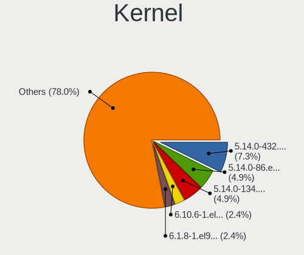

| Version                   | Notebooks | Percent |
|---------------------------|-----------|---------|
| 5.14.0-86.el9.x86_64      | 2         | 6.06%   |
| 5.14.0-432.el9.x86_64     | 2         | 6.06%   |
| 5.14.0-134.el9.x86_64     | 2         | 6.06%   |
| 6.1.8-1.el9.elrepo.x86_64 | 1         | 3.03%   |
| 6.1.1                     | 1         | 3.03%   |
| 5.14.0-78.el9.x86_64      | 1         | 3.03%   |
| 5.14.0-71.el9.x86_64      | 1         | 3.03%   |
| 5.14.0-66.el9.x86_64      | 1         | 3.03%   |
| 5.14.0-52.el9.x86_64      | 1         | 3.03%   |
| 5.14.0-44.el9.x86_64      | 1         | 3.03%   |
| 5.14.0-437.el9.x86_64     | 1         | 3.03%   |
| 5.14.0-435.el9.x86_64     | 1         | 3.03%   |
| 5.14.0-427.el9.x86_64     | 1         | 3.03%   |
| 5.14.0-419.el9.x86_64     | 1         | 3.03%   |
| 5.14.0-410.el9.x86_64     | 1         | 3.03%   |
| 5.14.0-402.el9.x86_64     | 1         | 3.03%   |
| 5.14.0-383.el9.x86_64     | 1         | 3.03%   |
| 5.14.0-373.el9.x86_64     | 1         | 3.03%   |
| 5.14.0-350.el9.x86_64     | 1         | 3.03%   |
| 5.14.0-299.el9.x86_64     | 1         | 3.03%   |
| 5.14.0-282.el9.x86_64     | 1         | 3.03%   |
| 5.14.0-226.el9.x86_64     | 1         | 3.03%   |
| 5.14.0-214.el9.x86_64     | 1         | 3.03%   |
| 5.14.0-202.el9.x86_64     | 1         | 3.03%   |
| 5.14.0-183.el9.x86_64     | 1         | 3.03%   |
| 5.14.0-171.el9.x86_64     | 1         | 3.03%   |
| 5.14.0-163.el9.x86_64     | 1         | 3.03%   |
| 5.14.0-148.el9.x86_64     | 1         | 3.03%   |
| 5.14.0-12.el9.x86_64      | 1         | 3.03%   |
| 5.14.0-105.el9.x86_64     | 1         | 3.03%   |

Kernel Family
-------------

Linux kernel without a distro release

| Version | Notebooks | Percent |
|---------|-----------|---------|
| 5.14.0  | 31        | 93.94%  |
| 6.1.8   | 1         | 3.03%   |
| 6.1.1   | 1         | 3.03%   |

Kernel Major Ver.
-----------------

Linux kernel major version

| Version | Notebooks | Percent |
|---------|-----------|---------|
| 5.14    | 31        | 93.94%  |
| 6.1     | 2         | 6.06%   |

Arch
----

OS architecture (x86_64, i586, etc.)

| Name   | Notebooks | Percent |
|--------|-----------|---------|
| x86_64 | 32        | 100%    |

DE
--

Desktop Environment

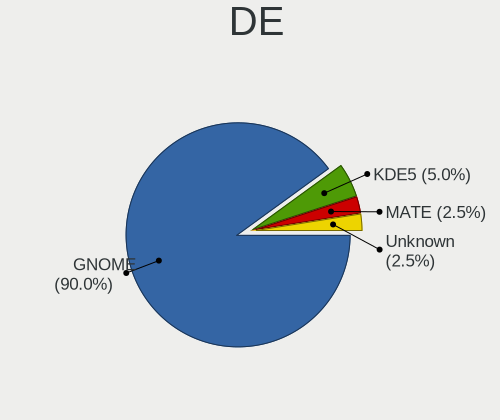

| Name    | Notebooks | Percent |
|---------|-----------|---------|
| GNOME   | 29        | 90.63%  |
| KDE5    | 2         | 6.25%   |
| Unknown | 1         | 3.13%   |

Display Server
--------------

X11 or Wayland

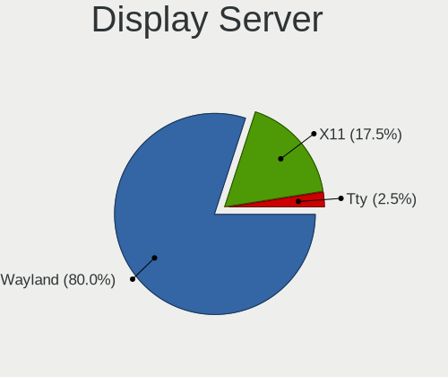

| Name    | Notebooks | Percent |
|---------|-----------|---------|
| Wayland | 24        | 75%     |
| X11     | 7         | 21.88%  |
| Tty     | 1         | 3.13%   |

Display Manager
---------------

SDDM, LightDM, etc.

| Name    | Notebooks | Percent |
|---------|-----------|---------|
| Unknown | 16        | 50%     |
| GDM     | 13        | 40.63%  |
| LightDM | 2         | 6.25%   |
| SDDM    | 1         | 3.13%   |

OS Lang
-------

Language

| Lang  | Notebooks | Percent |
|-------|-----------|---------|
| en_US | 22        | 68.75%  |
| ru_RU | 3         | 9.38%   |
| zh_CN | 1         | 3.13%   |
| pt_BR | 1         | 3.13%   |
| it_IT | 1         | 3.13%   |
| fr_FR | 1         | 3.13%   |
| en_IN | 1         | 3.13%   |
| de_DE | 1         | 3.13%   |
| C     | 1         | 3.13%   |

Boot Mode
---------

EFI or BIOS

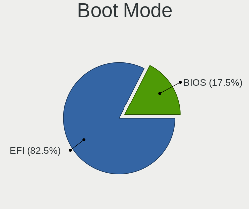

| Mode | Notebooks | Percent |
|------|-----------|---------|
| EFI  | 26        | 81.25%  |
| BIOS | 6         | 18.75%  |

Filesystem
----------

Type of filesystem

| Type | Notebooks | Percent |
|------|-----------|---------|
| Xfs  | 30        | 93.75%  |
| Ext4 | 2         | 6.25%   |

Part. scheme
------------

Scheme of partitioning

| Type    | Notebooks | Percent |
|---------|-----------|---------|
| Unknown | 14        | 43.75%  |
| GPT     | 13        | 40.63%  |
| MBR     | 5         | 15.63%  |

Dual Boot with Linux/BSD
------------------------

Hosting more than one Linux/BSD

| Dual boot | Notebooks | Percent |
|-----------|-----------|---------|
| No        | 27        | 84.38%  |
| Yes       | 5         | 15.63%  |

Dual Boot (Win)
---------------

Hosting Linux and Windows

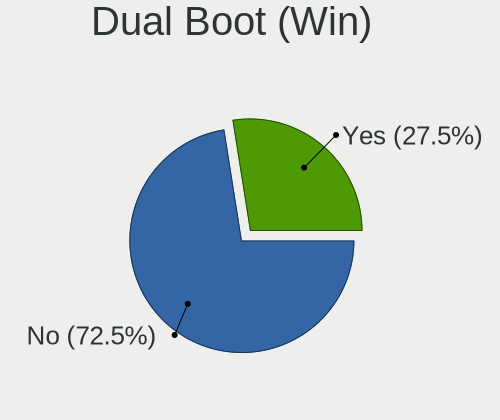

| Dual boot | Notebooks | Percent |
|-----------|-----------|---------|
| No        | 24        | 75%     |
| Yes       | 8         | 25%     |

Board
-----

Vendor
------

Motherboard manufacturer

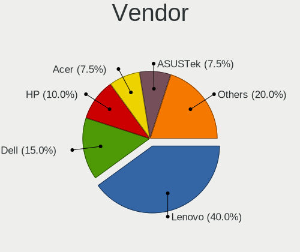

| Name                             | Notebooks | Percent |
|----------------------------------|-----------|---------|
| Lenovo                           | 12        | 37.5%   |
| Dell                             | 4         | 12.5%   |
| Hewlett-Packard                  | 3         | 9.38%   |
| ASUSTek Computer                 | 3         | 9.38%   |
| Acer                             | 3         | 9.38%   |
| Timi                             | 2         | 6.25%   |
| Samsung Electronics              | 1         | 3.13%   |
| Razer                            | 1         | 3.13%   |
| Notebook                         | 1         | 3.13%   |
| MSI                              | 1         | 3.13%   |
| Micro Computer (HK) Tech Limited | 1         | 3.13%   |

Model
-----

Motherboard model

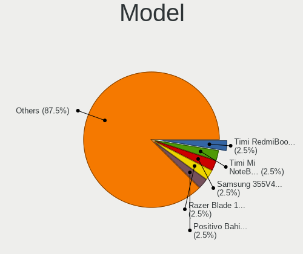

| Name                                        | Notebooks | Percent |
|---------------------------------------------|-----------|---------|
| Timi RedmiBook 16                           | 1         | 3.13%   |
| Timi Mi NoteBook Horizon Edition 14         | 1         | 3.13%   |
| Samsung 355V4C/356V4C/3445VC/3545VC         | 1         | 3.13%   |
| Razer Blade 15 (2022) - RZ09-0421           | 1         | 3.13%   |
| Notebook P377SM-A                           | 1         | 3.13%   |
| MSI Katana GF76 12UE                        | 1         | 3.13%   |
| Micro (HK) Tech Limited Venus series        | 1         | 3.13%   |
| Lenovo Yoga S740-14IIL 81RS                 | 1         | 3.13%   |
| Lenovo V15 G2 ITL 82KB                      | 1         | 3.13%   |
| Lenovo ThinkPad X390 20Q00039CD             | 1         | 3.13%   |
| Lenovo ThinkPad X1 Carbon Gen 10 21CBCTO1WW | 1         | 3.13%   |
| Lenovo ThinkPad T460s 20FAS5WX00            | 1         | 3.13%   |
| Lenovo ThinkPad T430 2349DG5                | 1         | 3.13%   |
| Lenovo ThinkPad T430 2347DE9                | 1         | 3.13%   |
| Lenovo ThinkPad L14 Gen 1 20U5S0NT00        | 1         | 3.13%   |
| Lenovo Legion 5P 15IMH05H 82AW              | 1         | 3.13%   |
| Lenovo IdeaPad S145-15IWL 81S9              | 1         | 3.13%   |
| Lenovo G580 20150                           | 1         | 3.13%   |
| Lenovo G410 20237                           | 1         | 3.13%   |
| HP Pavilion Gaming Laptop 15-ec0xxx         | 1         | 3.13%   |
| HP EliteBook 840 G3                         | 1         | 3.13%   |
| HP EliteBook 840 G1                         | 1         | 3.13%   |
| Dell Vostro 5402                            | 1         | 3.13%   |
| Dell Precision 5560                         | 1         | 3.13%   |
| Dell Precision 5520                         | 1         | 3.13%   |
| Dell G5 5505                                | 1         | 3.13%   |
| ASUS VivoBook_ASUSLaptop X412FA_A412FA      | 1         | 3.13%   |
| ASUS Q550LF                                 | 1         | 3.13%   |
| ASUS N751JK                                 | 1         | 3.13%   |
| Acer Swift SF314-512                        | 1         | 3.13%   |
| Acer Aspire E1-570G                         | 1         | 3.13%   |
| Acer Aspire 5740                            | 1         | 3.13%   |

Model Family
------------

Motherboard model prefix

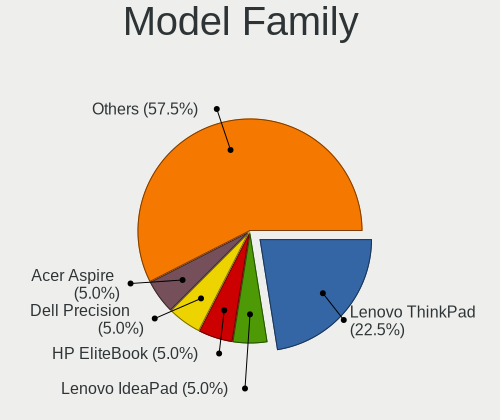

| Name                          | Notebooks | Percent |
|-------------------------------|-----------|---------|
| Lenovo ThinkPad               | 6         | 18.75%  |
| HP EliteBook                  | 2         | 6.25%   |
| Dell Precision                | 2         | 6.25%   |
| Acer Aspire                   | 2         | 6.25%   |
| Timi RedmiBook                | 1         | 3.13%   |
| Timi Mi                       | 1         | 3.13%   |
| Samsung 355V4C                | 1         | 3.13%   |
| Razer Blade                   | 1         | 3.13%   |
| Notebook P377SM-A             | 1         | 3.13%   |
| MSI Katana                    | 1         | 3.13%   |
| Micro (HK) Tech Limited Venus | 1         | 3.13%   |
| Lenovo Yoga                   | 1         | 3.13%   |
| Lenovo V15                    | 1         | 3.13%   |
| Lenovo Legion                 | 1         | 3.13%   |
| Lenovo IdeaPad                | 1         | 3.13%   |
| Lenovo G580                   | 1         | 3.13%   |
| Lenovo G410                   | 1         | 3.13%   |
| HP Pavilion                   | 1         | 3.13%   |
| Dell Vostro                   | 1         | 3.13%   |
| Dell G5                       | 1         | 3.13%   |
| ASUS VivoBook                 | 1         | 3.13%   |
| ASUS Q550LF                   | 1         | 3.13%   |
| ASUS N751JK                   | 1         | 3.13%   |
| Acer Swift                    | 1         | 3.13%   |

MFG Year
--------

Motherboard manufacture year

| Year | Notebooks | Percent |
|------|-----------|---------|
| 2020 | 6         | 18.75%  |
| 2019 | 5         | 15.63%  |
| 2013 | 5         | 15.63%  |
| 2021 | 3         | 9.38%   |
| 2012 | 3         | 9.38%   |
| 2022 | 2         | 6.25%   |
| 2016 | 2         | 6.25%   |
| 2014 | 2         | 6.25%   |
| 2023 | 1         | 3.13%   |
| 2017 | 1         | 3.13%   |
| 2015 | 1         | 3.13%   |
| 2009 | 1         | 3.13%   |

Form Factor
-----------

Physical design of the computer

| Name     | Notebooks | Percent |
|----------|-----------|---------|
| Notebook | 32        | 100%    |

Secure Boot
-----------

Enabled or disabled

| State    | Notebooks | Percent |
|----------|-----------|---------|
| Disabled | 30        | 93.75%  |
| Enabled  | 2         | 6.25%   |

Coreboot
--------

Have coreboot on board

| Used | Notebooks | Percent |
|------|-----------|---------|
| No   | 32        | 100%    |

RAM Size
--------

Total RAM memory

| Size in GB  | Notebooks | Percent |
|-------------|-----------|---------|
| 4.01-8.0    | 13        | 40.63%  |
| 8.01-16.0   | 9         | 28.13%  |
| 32.01-64.0  | 6         | 18.75%  |
| 3.01-4.0    | 2         | 6.25%   |
| 24.01-32.0  | 1         | 3.13%   |
| 64.01-256.0 | 1         | 3.13%   |

RAM Used
--------

Used RAM memory

| Used GB    | Notebooks | Percent |
|------------|-----------|---------|
| 2.01-3.0   | 15        | 46.88%  |
| 4.01-8.0   | 7         | 21.88%  |
| 3.01-4.0   | 6         | 18.75%  |
| 1.01-2.0   | 2         | 6.25%   |
| 16.01-24.0 | 1         | 3.13%   |
| 0.51-1.0   | 1         | 3.13%   |

Total Drives
------------

Number of drives on board

| Drives | Notebooks | Percent |
|--------|-----------|---------|
| 1      | 22        | 68.75%  |
| 2      | 8         | 25%     |
| 5      | 1         | 3.13%   |
| 3      | 1         | 3.13%   |

Has CD-ROM
----------

Has CD-ROM on board

| Presented | Notebooks | Percent |
|-----------|-----------|---------|
| No        | 25        | 78.13%  |
| Yes       | 7         | 21.88%  |

Has Ethernet
------------

Has Ethernet on board

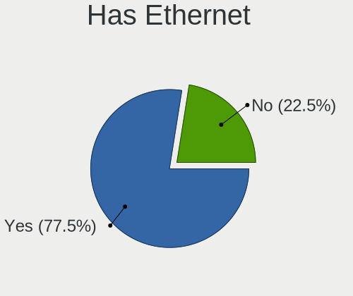

| Presented | Notebooks | Percent |
|-----------|-----------|---------|
| Yes       | 24        | 75%     |
| No        | 8         | 25%     |

Has WiFi
--------

Has WiFi module

| Presented | Notebooks | Percent |
|-----------|-----------|---------|
| Yes       | 32        | 100%    |

Has Bluetooth
-------------

Has Bluetooth module

| Presented | Notebooks | Percent |
|-----------|-----------|---------|
| Yes       | 29        | 90.63%  |
| No        | 3         | 9.38%   |

Location
--------

Country
-------

Geographic location (country)

| Country     | Notebooks | Percent |
|-------------|-----------|---------|
| USA         | 7         | 21.88%  |
| China       | 3         | 9.38%   |
| Italy       | 2         | 6.25%   |
| Germany     | 2         | 6.25%   |
| Canada      | 2         | 6.25%   |
| Vietnam     | 1         | 3.13%   |
| Uzbekistan  | 1         | 3.13%   |
| Ukraine     | 1         | 3.13%   |
| Switzerland | 1         | 3.13%   |
| Russia      | 1         | 3.13%   |
| Poland      | 1         | 3.13%   |
| Norway      | 1         | 3.13%   |
| Netherlands | 1         | 3.13%   |
| Kazakhstan  | 1         | 3.13%   |
| India       | 1         | 3.13%   |
| France      | 1         | 3.13%   |
| Finland     | 1         | 3.13%   |
| Colombia    | 1         | 3.13%   |
| Chile       | 1         | 3.13%   |
| Brazil      | 1         | 3.13%   |
| Argentina   | 1         | 3.13%   |

City
----

Geographic location (city)

| City             | Notebooks | Percent |
|------------------|-----------|---------|
| Beijing          | 3         | 9.09%   |
| Yakima           | 1         | 3.03%   |
| Vicenza          | 1         | 3.03%   |
| Tromsø          | 1         | 3.03%   |
| Tashkent         | 1         | 3.03%   |
| Sykesville       | 1         | 3.03%   |
| Soest            | 1         | 3.03%   |
| Schemmerhofen    | 1         | 3.03%   |
| Sanford          | 1         | 3.03%   |
| Ruda Śląska    | 1         | 3.03%   |
| Ribeirao Preto   | 1         | 3.03%   |
| Quitman          | 1         | 3.03%   |
| Puente Alto      | 1         | 3.03%   |
| Persan           | 1         | 3.03%   |
| Mumbai           | 1         | 3.03%   |
| Moscow           | 1         | 3.03%   |
| L'Isle-Adam      | 1         | 3.03%   |
| Kramatorsk       | 1         | 3.03%   |
| Ho Chi Minh City | 1         | 3.03%   |
| Helsinki         | 1         | 3.03%   |
| Fort Thomas      | 1         | 3.03%   |
| Don Torcuato     | 1         | 3.03%   |
| Bristow          | 1         | 3.03%   |
| Bogotá          | 1         | 3.03%   |
| Birmensdorf      | 1         | 3.03%   |
| Berlin           | 1         | 3.03%   |
| Battle Creek     | 1         | 3.03%   |
| Barrie           | 1         | 3.03%   |
| Almaty           | 1         | 3.03%   |
| Airdrie          | 1         | 3.03%   |
| Adelfia          | 1         | 3.03%   |

Drives
------

Drive Vendor
------------

Hard drive vendors

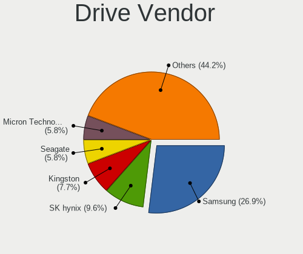

| Vendor              | Notebooks | Drives | Percent |
|---------------------|-----------|--------|---------|
| Samsung Electronics | 10        | 16     | 24.39%  |
| SK hynix            | 5         | 5      | 12.2%   |
| Seagate             | 3         | 3      | 7.32%   |
| Micron Technology   | 3         | 3      | 7.32%   |
| Kingston            | 3         | 4      | 7.32%   |
| Intel               | 3         | 3      | 7.32%   |
| HGST                | 3         | 4      | 7.32%   |
| WDC                 | 2         | 2      | 4.88%   |
| VICKTER             | 1         | 1      | 2.44%   |
| Unknown             | 1         | 1      | 2.44%   |
| Union Memory        | 1         | 1      | 2.44%   |
| Toshiba             | 1         | 1      | 2.44%   |
| SPCC                | 1         | 1      | 2.44%   |
| Phison Electronics  | 1         | 1      | 2.44%   |
| LITEON              | 1         | 1      | 2.44%   |
| Hjwdz               | 1         | 1      | 2.44%   |
| Hewlett-Packard     | 1         | 1      | 2.44%   |

Drive Model
-----------

Hard drive models

| Model                                              | Notebooks | Percent |
|----------------------------------------------------|-----------|---------|
| SK hynix BC511 256GB                               | 2         | 4.55%   |
| Samsung NVMe SSD Controller SM981/PM981/PM983 1TB  | 2         | 4.55%   |
| Samsung NVMe SSD Controller PM9A1/PM9A3/980PRO 1TB | 2         | 4.55%   |
| Samsung MZNLH512HALU-00000 512GB SSD               | 2         | 4.55%   |
| Micron 2450_MTFDKBA512TFK 512GB                    | 2         | 4.55%   |
| WDC WD6400BEVT-22A0RT0 640GB                       | 1         | 2.27%   |
| WDC WD5000LPLX-60ZNTT1 500GB                       | 1         | 2.27%   |
| VICKTER SSD 128GB                                  | 1         | 2.27%   |
| Unknown MMC Card  7GB                              | 1         | 2.27%   |
| Union Memory UMIS RPJTJ256MEE1OWX 256GB            | 1         | 2.27%   |
| Toshiba MQ04ABF100 1TB                             | 1         | 2.27%   |
| SPCC Solid State Disk 120GB                        | 1         | 2.27%   |
| SK hynix PC711 NVMe 1TB                            | 1         | 2.27%   |
| SK hynix NVMe SSD Drive 256GB                      | 1         | 2.27%   |
| SK hynix BC501 NVMe 256GB                          | 1         | 2.27%   |
| Seagate ST500LT012-9WS142 500GB                    | 1         | 2.27%   |
| Seagate ST1000LM035-1RK172 1TB                     | 1         | 2.27%   |
| Seagate ST1000LM024 HN-M101MBB 1TB                 | 1         | 2.27%   |
| Samsung SSD 870 EVO 1TB                            | 1         | 2.27%   |
| Samsung SSD 850 PRO 1TB                            | 1         | 2.27%   |
| Samsung SSD 850 EVO mSATA 1TB                      | 1         | 2.27%   |
| Samsung SSD 840 250GB                              | 1         | 2.27%   |
| Samsung PSSD T7 1TB                                | 1         | 2.27%   |
| Samsung NVMe SSD Drive 1TB                         | 1         | 2.27%   |
| Samsung MZALQ512HALU-000L2 512GB                   | 1         | 2.27%   |
| Phison PS5013 E13 NVMe Controller 512GB            | 1         | 2.27%   |
| Micron 2200S NVMe 512GB                            | 1         | 2.27%   |
| LITEON IT LST-32S9G-HP 32GB SSD                    | 1         | 2.27%   |
| Kingston SH103S3240G 240GB SSD                     | 1         | 2.27%   |
| Kingston SA400S37240G 240GB SSD                    | 1         | 2.27%   |
| Kingston RBU-SC100S37128GD 128GB SSD               | 1         | 2.27%   |
| Intel SSDSCKKF256H6L 256GB                         | 1         | 2.27%   |
| Intel SSDPEKNW512G8L 512GB                         | 1         | 2.27%   |
| Intel SSD 660P Series 1024GB                       | 1         | 2.27%   |
| Hjwdz MS2160 8MB                                   | 1         | 2.27%   |
| HGST HTS725032A7E630 320GB                         | 1         | 2.27%   |
| HGST HTS721010A9E630 1TB                           | 1         | 2.27%   |
| HGST HTS541010A9E680 1TB                           | 1         | 2.27%   |
| HP SSD S700 500GB                                  | 1         | 2.27%   |

HDD Vendor
----------

Hard disk drive vendors

| Vendor  | Notebooks | Drives | Percent |
|---------|-----------|--------|---------|
| Seagate | 3         | 3      | 33.33%  |
| HGST    | 3         | 4      | 33.33%  |
| WDC     | 2         | 2      | 22.22%  |
| Toshiba | 1         | 1      | 11.11%  |

SSD Vendor
----------

Solid state drive vendors

| Vendor              | Notebooks | Drives | Percent |
|---------------------|-----------|--------|---------|
| Samsung Electronics | 4         | 8      | 33.33%  |
| Kingston            | 3         | 4      | 25%     |
| VICKTER             | 1         | 1      | 8.33%   |
| SPCC                | 1         | 1      | 8.33%   |
| LITEON              | 1         | 1      | 8.33%   |
| Intel               | 1         | 1      | 8.33%   |
| Hewlett-Packard     | 1         | 1      | 8.33%   |

Drive Kind
----------

HDD or SSD

| Kind    | Notebooks | Drives | Percent |
|---------|-----------|--------|---------|
| NVMe    | 17        | 20     | 43.59%  |
| SSD     | 11        | 17     | 28.21%  |
| HDD     | 9         | 10     | 23.08%  |
| MMC     | 1         | 1      | 2.56%   |
| Unknown | 1         | 1      | 2.56%   |

Drive Connector
---------------

SATA, SAS, NVMe, etc.

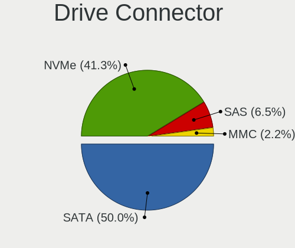

| Type | Notebooks | Drives | Percent |
|------|-----------|--------|---------|
| SATA | 18        | 27     | 48.65%  |
| NVMe | 16        | 18     | 43.24%  |
| SAS  | 2         | 3      | 5.41%   |
| MMC  | 1         | 1      | 2.7%    |

Drive Size
----------

Size of hard drive

| Size in TB | Notebooks | Drives | Percent |
|------------|-----------|--------|---------|
| 0.01-0.5   | 11        | 13     | 55%     |
| 0.51-1.0   | 9         | 14     | 45%     |

Space Total
-----------

Amount of disk space available on the file system

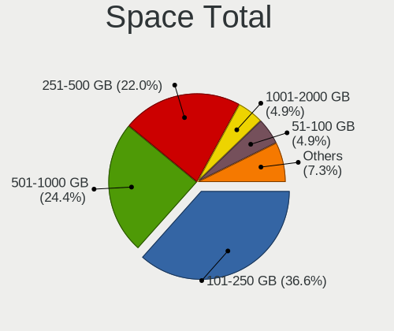

| Size in GB | Notebooks | Percent |
|------------|-----------|---------|
| 101-250    | 12        | 36.36%  |
| 251-500    | 9         | 27.27%  |
| 501-1000   | 8         | 24.24%  |
| 1001-2000  | 2         | 6.06%   |
| 2001-3000  | 1         | 3.03%   |
| 51-100     | 1         | 3.03%   |

Space Used
----------

Amount of used disk space

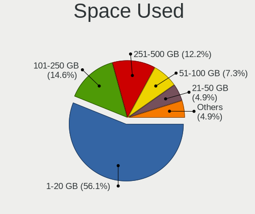

| Used GB   | Notebooks | Percent |
|-----------|-----------|---------|
| 1-20      | 18        | 54.55%  |
| 101-250   | 6         | 18.18%  |
| 251-500   | 4         | 12.12%  |
| 21-50     | 2         | 6.06%   |
| 51-100    | 2         | 6.06%   |
| 1001-2000 | 1         | 3.03%   |

Malfunc. Drives
---------------

Drive models with a malfunction

| Model                             | Notebooks | Drives | Percent |
|-----------------------------------|-----------|--------|---------|
| WDC WD5000LPLX-60ZNTT1 500GB      | 1         | 1      | 33.33%  |
| Seagate ST500LT012-9WS142 500GB   | 1         | 1      | 33.33%  |
| Samsung Electronics SSD 840 250GB | 1         | 1      | 33.33%  |

Malfunc. Drive Vendor
---------------------

Vendors of faulty drives

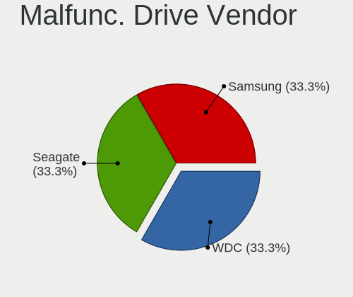

| Vendor              | Notebooks | Drives | Percent |
|---------------------|-----------|--------|---------|
| WDC                 | 1         | 1      | 33.33%  |
| Seagate             | 1         | 1      | 33.33%  |
| Samsung Electronics | 1         | 1      | 33.33%  |

Malfunc. HDD Vendor
-------------------

Vendors of faulty HDD drives

| Vendor  | Notebooks | Drives | Percent |
|---------|-----------|--------|---------|
| WDC     | 1         | 1      | 50%     |
| Seagate | 1         | 1      | 50%     |

Malfunc. Drive Kind
-------------------

Kinds of faulty drives

| Kind | Notebooks | Drives | Percent |
|------|-----------|--------|---------|
| HDD  | 2         | 2      | 66.67%  |
| SSD  | 1         | 1      | 33.33%  |

Failed Drives
-------------

Failed drive models

Zero info for selected period =(

Failed Drive Vendor
-------------------

Failed drive vendors

Zero info for selected period =(

Drive Status
------------

Number of failed and malfunc. drives

| Status   | Notebooks | Drives | Percent |
|----------|-----------|--------|---------|
| Works    | 16        | 20     | 47.06%  |
| Detected | 15        | 26     | 44.12%  |
| Malfunc  | 3         | 3      | 8.82%   |

Storage controller
------------------

Storage Vendor
--------------

Storage controller vendors

| Vendor                  | Notebooks | Percent |
|-------------------------|-----------|---------|
| Intel                   | 21        | 55.26%  |
| SK hynix                | 5         | 13.16%  |
| Samsung Electronics     | 5         | 13.16%  |
| Micron Technology       | 3         | 7.89%   |
| AMD                     | 2         | 5.26%   |
| Union Memory (Shenzhen) | 1         | 2.63%   |
| Phison Electronics      | 1         | 2.63%   |

Storage Model
-------------

Storage controller models

| Model                                                                          | Notebooks | Percent |
|--------------------------------------------------------------------------------|-----------|---------|
| Intel 7 Series Chipset Family 6-port SATA Controller [AHCI mode]               | 4         | 9.52%   |
| SK hynix Gold P31/BC711/PC711 NVMe Solid State Drive                           | 2         | 4.76%   |
| SK hynix BC511 NVMe SSD                                                        | 2         | 4.76%   |
| Samsung NVMe SSD Controller SM981/PM981/PM983                                  | 2         | 4.76%   |
| Samsung NVMe SSD Controller PM9A1/PM9A3/980PRO                                 | 2         | 4.76%   |
| Samsung NVMe SSD Controller 980 (DRAM-less)                                    | 2         | 4.76%   |
| Micron 2450 NVMe SSD [HendrixV] (DRAM-less)                                    | 2         | 4.76%   |
| Intel Volume Management Device NVMe RAID Controller                            | 2         | 4.76%   |
| Intel Sunrise Point-LP SATA Controller [AHCI mode]                             | 2         | 4.76%   |
| Intel SSD 660P Series                                                          | 2         | 4.76%   |
| Intel Cannon Point-LP SATA Controller [AHCI Mode]                              | 2         | 4.76%   |
| Intel 8 Series/C220 Series Chipset Family 6-port SATA Controller 1 [AHCI mode] | 2         | 4.76%   |
| Intel 8 Series SATA Controller 1 [AHCI mode]                                   | 2         | 4.76%   |
| AMD FCH SATA Controller [AHCI mode]                                            | 2         | 4.76%   |
| Union Memory (Shenzhen) AM620 PCIe 3.0 NVMe SSD 256GB                          | 1         | 2.38%   |
| SK hynix BC501 NVMe Solid State Drive                                          | 1         | 2.38%   |
| Phison PS5013-E13 PCIe3 NVMe Controller (DRAM-less)                            | 1         | 2.38%   |
| Micron 2200S NVMe SSD [Cassandra]                                              | 1         | 2.38%   |
| Intel Tiger Lake-LP SATA Controller                                            | 1         | 2.38%   |
| Intel SATA controller                                                          | 1         | 2.38%   |
| Intel Q170/Q150/B150/H170/H110/Z170/CM236 Chipset SATA Controller [AHCI Mode]  | 1         | 2.38%   |
| Intel Comet Lake SATA AHCI Controller                                          | 1         | 2.38%   |
| Intel Alder Lake-P SATA AHCI Controller                                        | 1         | 2.38%   |
| Intel 82801 Mobile SATA Controller [RAID mode]                                 | 1         | 2.38%   |
| Intel 5 Series/3400 Series Chipset 4 port SATA AHCI Controller                 | 1         | 2.38%   |
| Intel 400 Series Chipset Family SATA AHCI Controller                           | 1         | 2.38%   |

Storage Kind
------------

Kind of storage controller (IDE, SATA, NVMe, SAS, ...)

| Kind | Notebooks | Percent |
|------|-----------|---------|
| SATA | 21        | 52.5%   |
| NVMe | 16        | 40%     |
| RAID | 3         | 7.5%    |

Processor
---------

CPU Vendor
----------

Processor vendors

| Vendor | Notebooks | Percent |
|--------|-----------|---------|
| Intel  | 27        | 84.38%  |
| AMD    | 5         | 15.63%  |

CPU Model
---------

Processor models

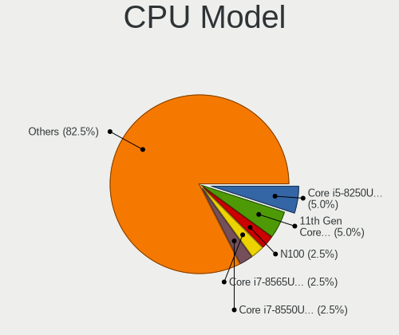

| Model                                         | Notebooks | Percent |
|-----------------------------------------------|-----------|---------|
| Intel N100                                    | 1         | 3.13%   |
| Intel Core i7-8565U CPU @ 1.80GHz             | 1         | 3.13%   |
| Intel Core i7-7820HQ CPU @ 2.90GHz            | 1         | 3.13%   |
| Intel Core i7-4910MQ CPU @ 2.90GHz            | 1         | 3.13%   |
| Intel Core i7-4710HQ CPU @ 2.50GHz            | 1         | 3.13%   |
| Intel Core i7-4500U CPU @ 1.80GHz             | 1         | 3.13%   |
| Intel Core i7-10750H CPU @ 2.60GHz            | 1         | 3.13%   |
| Intel Core i7-1065G7 CPU @ 1.30GHz            | 1         | 3.13%   |
| Intel Core i5-8265U CPU @ 1.60GHz             | 1         | 3.13%   |
| Intel Core i5-6300U CPU @ 2.40GHz             | 1         | 3.13%   |
| Intel Core i5-6200U CPU @ 2.30GHz             | 1         | 3.13%   |
| Intel Core i5-4210U CPU @ 1.70GHz             | 1         | 3.13%   |
| Intel Core i5-4200M CPU @ 2.50GHz             | 1         | 3.13%   |
| Intel Core i5-3380M CPU @ 2.90GHz             | 1         | 3.13%   |
| Intel Core i5-3320M CPU @ 2.60GHz             | 1         | 3.13%   |
| Intel Core i5-3230M CPU @ 2.60GHz             | 1         | 3.13%   |
| Intel Core i5-10210U CPU @ 1.60GHz            | 1         | 3.13%   |
| Intel Core i5 CPU M 430 @ 2.27GHz             | 1         | 3.13%   |
| Intel Core i3-8145U CPU @ 2.10GHz             | 1         | 3.13%   |
| Intel Core i3-3217U CPU @ 1.80GHz             | 1         | 3.13%   |
| Intel 12th Gen Core i7-12800H                 | 1         | 3.13%   |
| Intel 12th Gen Core i7-12700H                 | 1         | 3.13%   |
| Intel 12th Gen Core i7-1260P                  | 1         | 3.13%   |
| Intel 12th Gen Core i5-1250P                  | 1         | 3.13%   |
| Intel 11th Gen Core i7-11850H @ 2.50GHz       | 1         | 3.13%   |
| Intel 11th Gen Core i7-1165G7 @ 2.80GHz       | 1         | 3.13%   |
| Intel 11th Gen Core i5-1135G7 @ 2.40GHz       | 1         | 3.13%   |
| AMD Ryzen 7 4800H with Radeon Graphics        | 1         | 3.13%   |
| AMD Ryzen 5 4500U with Radeon Graphics        | 1         | 3.13%   |
| AMD Ryzen 5 3550H with Radeon Vega Mobile Gfx | 1         | 3.13%   |
| AMD Ryzen 3 PRO 4450U with Radeon Graphics    | 1         | 3.13%   |
| AMD A10-4600M APU with Radeon HD Graphics     | 1         | 3.13%   |

CPU Model Family
----------------

Processor model prefix

| Model           | Notebooks | Percent |
|-----------------|-----------|---------|
| Intel Core i5   | 10        | 31.25%  |
| Other           | 8         | 25%     |
| Intel Core i7   | 7         | 21.88%  |
| Intel Core i3   | 2         | 6.25%   |
| AMD Ryzen 5     | 2         | 6.25%   |
| AMD Ryzen 7     | 1         | 3.13%   |
| AMD Ryzen 3 PRO | 1         | 3.13%   |
| AMD A10         | 1         | 3.13%   |

CPU Cores
---------

Number of processor cores

| Number | Notebooks | Percent |
|--------|-----------|---------|
| 4      | 12        | 37.5%   |
| 2      | 12        | 37.5%   |
| 14     | 2         | 6.25%   |
| 12     | 2         | 6.25%   |
| 8      | 2         | 6.25%   |
| 6      | 2         | 6.25%   |

CPU Sockets
-----------

Number of sockets

| Number | Notebooks | Percent |
|--------|-----------|---------|
| 1      | 32        | 100%    |

CPU Threads
-----------

Threads per core (Hyper-Threading)

| Number | Notebooks | Percent |
|--------|-----------|---------|
| 2      | 28        | 87.5%   |
| 1      | 4         | 12.5%   |

CPU Op-Modes
------------

CPU Operation Modes (32-bit, 64-bit)

| Op mode        | Notebooks | Percent |
|----------------|-----------|---------|
| 32-bit, 64-bit | 32        | 100%    |

CPU Microcode
-------------

Microcode number

| Number     | Notebooks | Percent |
|------------|-----------|---------|
| Unknown    | 10        | 31.25%  |
| 0x306a9    | 4         | 12.5%   |
| 0x906a3    | 3         | 9.38%   |
| 0x08600106 | 3         | 9.38%   |
| 0x806ec    | 2         | 6.25%   |
| 0x406e3    | 2         | 6.25%   |
| 0x40651    | 2         | 6.25%   |
| 0x306c3    | 2         | 6.25%   |
| 0xa0652    | 1         | 3.13%   |
| 0x706e5    | 1         | 3.13%   |
| 0x20652    | 1         | 3.13%   |
| 0x06001119 | 1         | 3.13%   |

CPU Microarch
-------------

Microarchitecture

| Name             | Notebooks | Percent |
|------------------|-----------|---------|
| KabyLake         | 5         | 15.63%  |
| Haswell          | 5         | 15.63%  |
| IvyBridge        | 4         | 12.5%   |
| Alderlake Hybrid | 4         | 12.5%   |
| Zen 2            | 3         | 9.38%   |
| TigerLake        | 2         | 6.25%   |
| Skylake          | 2         | 6.25%   |
| Icelake          | 2         | 6.25%   |
| Zen+             | 1         | 3.13%   |
| Westmere         | 1         | 3.13%   |
| Piledriver       | 1         | 3.13%   |
| Gracemont        | 1         | 3.13%   |
| CometLake        | 1         | 3.13%   |

Graphics
--------

GPU Vendor
----------

Vendors of graphics cards

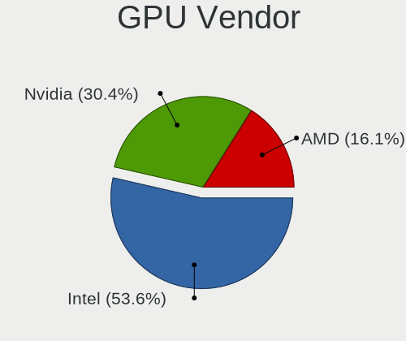

| Vendor | Notebooks | Percent |
|--------|-----------|---------|
| Intel  | 24        | 52.17%  |
| Nvidia | 15        | 32.61%  |
| AMD    | 7         | 15.22%  |

GPU Model
---------

Graphics card models

| Model                                                                | Notebooks | Percent |
|----------------------------------------------------------------------|-----------|---------|
| Intel Alder Lake-P GT2 [Iris Xe Graphics]                            | 4         | 8.51%   |
| Intel 3rd Gen Core processor Graphics Controller                     | 4         | 8.51%   |
| Intel WhiskeyLake-U GT2 [UHD Graphics 620]                           | 3         | 6.38%   |
| AMD Renoir [Radeon RX Vega 6 (Ryzen 4000/5000 Mobile Series)]        | 3         | 6.38%   |
| Intel TigerLake-LP GT2 [Iris Xe Graphics]                            | 2         | 4.26%   |
| Intel Skylake GT2 [HD Graphics 520]                                  | 2         | 4.26%   |
| Intel Haswell-ULT Integrated Graphics Controller                     | 2         | 4.26%   |
| Intel 4th Gen Core Processor Integrated Graphics Controller          | 2         | 4.26%   |
| Nvidia TU117M [GeForce GTX 1650 Mobile / Max-Q]                      | 1         | 2.13%   |
| Nvidia TU106M [GeForce RTX 2060 Mobile]                              | 1         | 2.13%   |
| Nvidia GP108M [GeForce MX330]                                        | 1         | 2.13%   |
| Nvidia GP108M [GeForce MX250]                                        | 1         | 2.13%   |
| Nvidia GP107M [GeForce MX350]                                        | 1         | 2.13%   |
| Nvidia GP104M [GeForce GTX 1070 Mobile]                              | 1         | 2.13%   |
| Nvidia GM108M [GeForce MX110]                                        | 1         | 2.13%   |
| Nvidia GM107M [GeForce GTX 850M]                                     | 1         | 2.13%   |
| Nvidia GM107GLM [Quadro M1200 Mobile]                                | 1         | 2.13%   |
| Nvidia GK208M [GeForce GT 740M]                                      | 1         | 2.13%   |
| Nvidia GK107M [GeForce GT 745M]                                      | 1         | 2.13%   |
| Nvidia GF108M [NVS 5400M]                                            | 1         | 2.13%   |
| Nvidia GA107GLM [RTX A2000 Mobile]                                   | 1         | 2.13%   |
| Nvidia GA106M [GeForce RTX 3060 Mobile / Max-Q]                      | 1         | 2.13%   |
| Nvidia GA103M [GeForce RTX 3080 Ti Mobile]                           | 1         | 2.13%   |
| Intel TigerLake-H GT1 [UHD Graphics]                                 | 1         | 2.13%   |
| Intel Iris Plus Graphics G7                                          | 1         | 2.13%   |
| Intel HD Graphics 630                                                | 1         | 2.13%   |
| Intel CometLake-U GT2 [UHD Graphics]                                 | 1         | 2.13%   |
| Intel Alder Lake-N [UHD Graphics]                                    | 1         | 2.13%   |
| AMD Trinity [Radeon HD 7660G]                                        | 1         | 2.13%   |
| AMD Picasso/Raven 2 [Radeon Vega Series / Radeon Vega Mobile Series] | 1         | 2.13%   |
| AMD Park [Mobility Radeon HD 5430/5450/5470]                         | 1         | 2.13%   |
| AMD Navi 10 [Radeon RX 5600 OEM/5600 XT / 5700/5700 XT]              | 1         | 2.13%   |
| AMD Mars [Radeon HD 8730M]                                           | 1         | 2.13%   |

GPU Combo
---------

Combinations of graphics cards

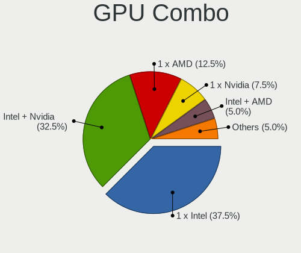

| Name           | Notebooks | Percent |
|----------------|-----------|---------|
| Intel + Nvidia | 12        | 37.5%   |
| 1 x Intel      | 11        | 34.38%  |
| 1 x AMD        | 4         | 12.5%   |
| 1 x Nvidia     | 2         | 6.25%   |
| 2 x AMD        | 1         | 3.13%   |
| Intel + AMD    | 1         | 3.13%   |
| AMD + Nvidia   | 1         | 3.13%   |

GPU Driver
----------

Free vs proprietary

| Driver      | Notebooks | Percent |
|-------------|-----------|---------|
| Free        | 28        | 87.5%   |
| Proprietary | 3         | 9.38%   |
| Unknown     | 1         | 3.13%   |

GPU Memory
----------

Total video memory

| Size in GB | Notebooks | Percent |
|------------|-----------|---------|
| Unknown    | 15        | 45.45%  |
| 1.01-2.0   | 5         | 15.15%  |
| 0.01-0.5   | 4         | 12.12%  |
| 3.01-4.0   | 3         | 9.09%   |
| 5.01-6.0   | 2         | 6.06%   |
| 0.51-1.0   | 2         | 6.06%   |
| 7.01-8.0   | 1         | 3.03%   |
| 8.01-16.0  | 1         | 3.03%   |

Monitor
-------

Monitor Vendor
--------------

Monitor vendors

| Vendor                  | Notebooks | Percent |
|-------------------------|-----------|---------|
| LG Display              | 9         | 24.32%  |
| Chimei Innolux          | 5         | 13.51%  |
| AU Optronics            | 5         | 13.51%  |
| BOE                     | 3         | 8.11%   |
| Samsung Electronics     | 2         | 5.41%   |
| Unknown (XXX)           | 1         | 2.7%    |
| TMX                     | 1         | 2.7%    |
| SKY                     | 1         | 2.7%    |
| Sharp                   | 1         | 2.7%    |
| PANDA                   | 1         | 2.7%    |
| Hewlett-Packard         | 1         | 2.7%    |
| Goldstar                | 1         | 2.7%    |
| Dell                    | 1         | 2.7%    |
| CSO                     | 1         | 2.7%    |
| Chi Mei Optoelectronics | 1         | 2.7%    |
| CHD                     | 1         | 2.7%    |
| Acer                    | 1         | 2.7%    |
| Unknown                 | 1         | 2.7%    |

Monitor Model
-------------

Monitor models

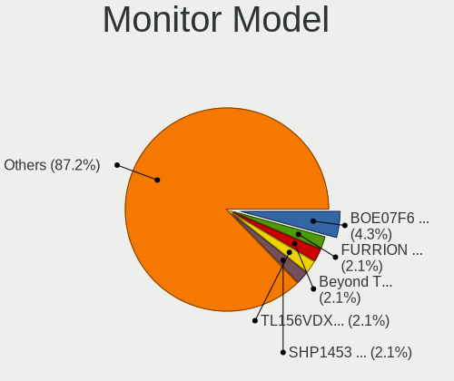

| Model                                                                    | Notebooks | Percent |
|--------------------------------------------------------------------------|-----------|---------|
| Unknown (XXX) FURRION TV XXX3553 1920x1080 520x290mm 23.4-inch           | 1         | 2.7%    |
| TMX TL156VDXP01 TMX1560 1920x1080 344x194mm 15.5-inch                    | 1         | 2.7%    |
| SKY 22X1-M225F SKY2150 1920x1080 476x268mm 21.5-inch                     | 1         | 2.7%    |
| Sharp LCD Monitor SHP1453 1920x1080 346x194mm 15.6-inch                  | 1         | 2.7%    |
| Samsung Electronics SMT22A350 SAM07A7 1920x1080 477x268mm 21.5-inch      | 1         | 2.7%    |
| Samsung Electronics LCD Monitor SDC324C 1920x1080 344x194mm 15.5-inch    | 1         | 2.7%    |
| PANDA LCD Monitor NCP0052 1920x1080 309x174mm 14.0-inch                  | 1         | 2.7%    |
| LG Display LCD Monitor LGD06B3 1920x1200 336x210mm 15.6-inch             | 1         | 2.7%    |
| LG Display LCD Monitor LGD068A 1920x1080 309x174mm 14.0-inch             | 1         | 2.7%    |
| LG Display LCD Monitor LGD0657 1920x1080 344x194mm 15.5-inch             | 1         | 2.7%    |
| LG Display LCD Monitor LGD05E4 1920x1080 344x194mm 15.5-inch             | 1         | 2.7%    |
| LG Display LCD Monitor LGD0521 1920x1080 309x174mm 14.0-inch             | 1         | 2.7%    |
| LG Display LCD Monitor LGD046C 1920x1080 382x215mm 17.3-inch             | 1         | 2.7%    |
| LG Display LCD Monitor LGD033C 1366x768 310x170mm 13.9-inch              | 1         | 2.7%    |
| LG Display LCD Monitor LGD033A 1366x768 344x194mm 15.5-inch              | 1         | 2.7%    |
| LG Display LCD Monitor LGD0335 1366x768 310x174mm 14.0-inch              | 1         | 2.7%    |
| Hewlett-Packard L185x HWP298C 1366x768 410x230mm 18.5-inch               | 1         | 2.7%    |
| Goldstar FULL HD GSM5B55 1920x1080 480x270mm 21.7-inch                   | 1         | 2.7%    |
| Dell P2214H DELA098 1920x1080 477x268mm 21.5-inch                        | 1         | 2.7%    |
| CSO LCD Monitor CSO1404 1920x1200 302x189mm 14.0-inch                    | 1         | 2.7%    |
| Chimei Innolux LCD Monitor CMN1608 1920x1080 355x199mm 16.0-inch         | 1         | 2.7%    |
| Chimei Innolux LCD Monitor CMN15F5 1920x1080 344x193mm 15.5-inch         | 1         | 2.7%    |
| Chimei Innolux LCD Monitor CMN15BF 1366x768 344x194mm 15.5-inch          | 1         | 2.7%    |
| Chimei Innolux LCD Monitor CMN1515 1920x1080 344x193mm 15.5-inch         | 1         | 2.7%    |
| Chimei Innolux LCD Monitor CMN14A3 1600x900 309x174mm 14.0-inch          | 1         | 2.7%    |
| Chi Mei Optoelectronics LCD Monitor CMO15A3 1366x768 344x193mm 15.5-inch | 1         | 2.7%    |
| CHD PMO S241-IFC CHD0240 1920x1080 530x300mm 24.0-inch                   | 1         | 2.7%    |
| BOE LCD Monitor BOE08D5 1920x1080 344x194mm 15.5-inch                    | 1         | 2.7%    |
| BOE LCD Monitor BOE07F6 1920x1080 309x174mm 14.0-inch                    | 1         | 2.7%    |
| BOE LCD Monitor BOE0697 1366x768 309x173mm 13.9-inch                     | 1         | 2.7%    |
| AU Optronics LCD Monitor AUO5A3D 1920x1080 309x174mm 14.0-inch           | 1         | 2.7%    |
| AU Optronics LCD Monitor AUO5A2D 1920x1080 293x165mm 13.2-inch           | 1         | 2.7%    |
| AU Optronics LCD Monitor AUO323D 1920x1080 309x174mm 14.0-inch           | 1         | 2.7%    |
| AU Optronics LCD Monitor AUO213E 1600x900 309x174mm 14.0-inch            | 1         | 2.7%    |
| AU Optronics LCD Monitor AUO0BA2 2560x1440 309x174mm 14.0-inch           | 1         | 2.7%    |
| Acer KA272 A ACR079A 1920x1080 598x336mm 27.0-inch                       | 1         | 2.7%    |
| Unknown                                                                  | 1         | 2.7%    |

Monitor Resolution
------------------

Monitor screen resolution

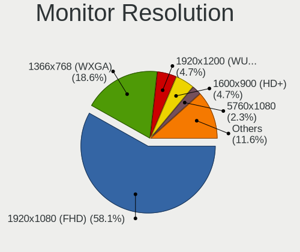

| Resolution        | Notebooks | Percent |
|-------------------|-----------|---------|
| 1920x1080 (FHD)   | 18        | 52.94%  |
| 1366x768 (WXGA)   | 7         | 20.59%  |
| 1920x1200 (WUXGA) | 2         | 5.88%   |
| 1600x900 (HD+)    | 2         | 5.88%   |
| 5760x1080         | 1         | 2.94%   |
| 3840x2160 (4K)    | 1         | 2.94%   |
| 3200x2000         | 1         | 2.94%   |
| 2560x1440 (QHD)   | 1         | 2.94%   |
| Unknown           | 1         | 2.94%   |

Monitor Diagonal
----------------

Diagonal size in inches

| Inches  | Notebooks | Percent |
|---------|-----------|---------|
| 15      | 12        | 32.43%  |
| 14      | 12        | 32.43%  |
| 21      | 3         | 8.11%   |
| 23      | 2         | 5.41%   |
| 13      | 2         | 5.41%   |
| 27      | 1         | 2.7%    |
| 24      | 1         | 2.7%    |
| 18      | 1         | 2.7%    |
| 17      | 1         | 2.7%    |
| 16      | 1         | 2.7%    |
| Unknown | 1         | 2.7%    |

Monitor Width
-------------

Physical width

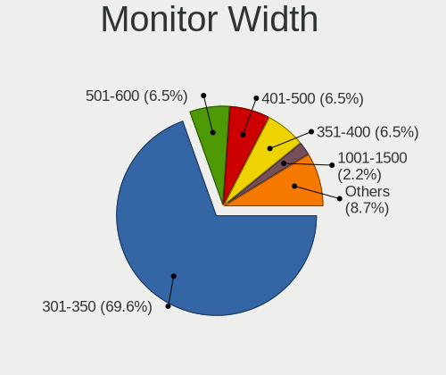

| Width in mm | Notebooks | Percent |
|-------------|-----------|---------|
| 301-350     | 25        | 69.44%  |
| 401-500     | 4         | 11.11%  |
| 501-600     | 3         | 8.33%   |
| 351-400     | 2         | 5.56%   |
| 201-300     | 1         | 2.78%   |
| Unknown     | 1         | 2.78%   |

Aspect Ratio
------------

Proportional relationship between the width and the height

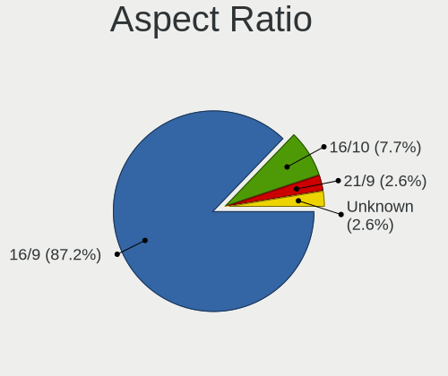

| Ratio   | Notebooks | Percent |
|---------|-----------|---------|
| 16/9    | 26        | 86.67%  |
| 16/10   | 3         | 10%     |
| Unknown | 1         | 3.33%   |

Monitor Area
------------

Area in inch²

| Area in inch² | Notebooks | Percent |
|----------------|-----------|---------|
| 81-90          | 13        | 36.11%  |
| 101-110        | 12        | 33.33%  |
| 201-250        | 4         | 11.11%  |
| 71-80          | 1         | 2.78%   |
| 301-350        | 1         | 2.78%   |
| 151-200        | 1         | 2.78%   |
| 141-150        | 1         | 2.78%   |
| 121-130        | 1         | 2.78%   |
| 111-120        | 1         | 2.78%   |
| Unknown        | 1         | 2.78%   |

Pixel Density
-------------

Pixels per inch

| Density       | Notebooks | Percent |
|---------------|-----------|---------|
| 121-160       | 18        | 50%     |
| 101-120       | 8         | 22.22%  |
| 51-100        | 5         | 13.89%  |
| 161-240       | 3         | 8.33%   |
| More than 240 | 1         | 2.78%   |
| Unknown       | 1         | 2.78%   |

Multiple Monitors
-----------------

Total monitors connected

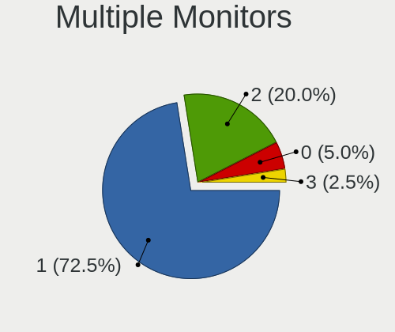

| Total | Notebooks | Percent |
|-------|-----------|---------|
| 1     | 23        | 71.88%  |
| 2     | 6         | 18.75%  |
| 0     | 2         | 6.25%   |
| 3     | 1         | 3.13%   |

Network
-------

Net Controller Vendor
---------------------

Controller vendors

| Vendor                            | Notebooks | Percent |
|-----------------------------------|-----------|---------|
| Intel                             | 22        | 44%     |
| Realtek Semiconductor             | 13        | 26%     |
| Qualcomm Atheros                  | 7         | 14%     |
| Broadcom                          | 3         | 6%      |
| ASUSTek Computer                  | 2         | 4%      |
| Xiaomi                            | 1         | 2%      |
| TP-Link                           | 1         | 2%      |
| Ericsson Business Mobile Networks | 1         | 2%      |

Net Controller Model
--------------------

Controller models

| Model                                                                  | Notebooks | Percent |
|------------------------------------------------------------------------|-----------|---------|
| Realtek RTL8111/8168/8211/8411 PCI Express Gigabit Ethernet Controller | 12        | 20%     |
| Intel Alder Lake-P PCH CNVi WiFi                                       | 4         | 6.67%   |
| Intel Wireless 7260                                                    | 3         | 5%      |
| Qualcomm Atheros QCA9565 / AR9565 Wireless Network Adapter             | 2         | 3.33%   |
| Qualcomm Atheros QCA6174 802.11ac Wireless Network Adapter             | 2         | 3.33%   |
| Intel Wireless 8260                                                    | 2         | 3.33%   |
| Intel Wi-Fi 6 AX200                                                    | 2         | 3.33%   |
| Intel Centrino Advanced-N 6205 [Taylor Peak]                           | 2         | 3.33%   |
| Intel 82579LM Gigabit Network Connection (Lewisville)                  | 2         | 3.33%   |
| ASUS 802.11ac NIC                                                      | 2         | 3.33%   |
| Xiaomi Mi/Redmi series (RNDIS)                                         | 1         | 1.67%   |
| TP-Link AC600 wireless Realtek RTL8811AU [Archer T2U Nano]             | 1         | 1.67%   |
| Realtek RTL8852AE 802.11ax PCIe Wireless Network Adapter               | 1         | 1.67%   |
| Realtek RTL8822CE 802.11ac PCIe Wireless Network Adapter               | 1         | 1.67%   |
| Realtek RTL8822BE 802.11a/b/g/n/ac WiFi adapter                        | 1         | 1.67%   |
| Realtek RTL8153 Gigabit Ethernet Adapter                               | 1         | 1.67%   |
| Qualcomm Atheros QCA8172 Fast Ethernet                                 | 1         | 1.67%   |
| Qualcomm Atheros AR928X Wireless Network Adapter (PCI-Express)         | 1         | 1.67%   |
| Qualcomm Atheros AR9285 Wireless Network Adapter (PCI-Express)         | 1         | 1.67%   |
| Qualcomm Atheros AR8162 Fast Ethernet                                  | 1         | 1.67%   |
| Intel Wireless 8265 / 8275                                             | 1         | 1.67%   |
| Intel Wireless 7265                                                    | 1         | 1.67%   |
| Intel Wi-Fi 6 AX201                                                    | 1         | 1.67%   |
| Intel Tiger Lake PCH CNVi WiFi                                         | 1         | 1.67%   |
| Intel Ice Lake-LP PCH CNVi WiFi                                        | 1         | 1.67%   |
| Intel Ethernet Connection I219-V                                       | 1         | 1.67%   |
| Intel Ethernet Connection I219-LM                                      | 1         | 1.67%   |
| Intel Ethernet Connection I218-LM                                      | 1         | 1.67%   |
| Intel Ethernet Connection (6) I219-V                                   | 1         | 1.67%   |
| Intel Dual Band Wireless-AC 3165 Plus Bluetooth                        | 1         | 1.67%   |
| Intel Comet Lake PCH-LP CNVi WiFi                                      | 1         | 1.67%   |
| Intel Comet Lake PCH CNVi WiFi                                         | 1         | 1.67%   |
| Intel Cannon Point-LP CNVi [Wireless-AC]                               | 1         | 1.67%   |
| Ericsson Business Mobile Networks H5321 gw Mobile Broadband Module     | 1         | 1.67%   |
| Broadcom NetXtreme BCM57786 Gigabit Ethernet PCIe                      | 1         | 1.67%   |
| Broadcom NetLink BCM57780 Gigabit Ethernet PCIe                        | 1         | 1.67%   |
| Broadcom BCM4313 802.11bgn Wireless Network Adapter                    | 1         | 1.67%   |

Wireless Vendor
---------------

Wireless vendors

| Vendor                | Notebooks | Percent |
|-----------------------|-----------|---------|
| Intel                 | 22        | 62.86%  |
| Qualcomm Atheros      | 6         | 17.14%  |
| Realtek Semiconductor | 3         | 8.57%   |
| ASUSTek Computer      | 2         | 5.71%   |
| TP-Link               | 1         | 2.86%   |
| Broadcom              | 1         | 2.86%   |

Wireless Model
--------------

Wireless models

| Model                                                          | Notebooks | Percent |
|----------------------------------------------------------------|-----------|---------|
| Intel Alder Lake-P PCH CNVi WiFi                               | 4         | 11.43%  |
| Intel Wireless 7260                                            | 3         | 8.57%   |
| Qualcomm Atheros QCA9565 / AR9565 Wireless Network Adapter     | 2         | 5.71%   |
| Qualcomm Atheros QCA6174 802.11ac Wireless Network Adapter     | 2         | 5.71%   |
| Intel Wireless 8260                                            | 2         | 5.71%   |
| Intel Wi-Fi 6 AX200                                            | 2         | 5.71%   |
| Intel Centrino Advanced-N 6205 [Taylor Peak]                   | 2         | 5.71%   |
| ASUS 802.11ac NIC                                              | 2         | 5.71%   |
| TP-Link AC600 wireless Realtek RTL8811AU [Archer T2U Nano]     | 1         | 2.86%   |
| Realtek RTL8852AE 802.11ax PCIe Wireless Network Adapter       | 1         | 2.86%   |
| Realtek RTL8822CE 802.11ac PCIe Wireless Network Adapter       | 1         | 2.86%   |
| Realtek RTL8822BE 802.11a/b/g/n/ac WiFi adapter                | 1         | 2.86%   |
| Qualcomm Atheros AR928X Wireless Network Adapter (PCI-Express) | 1         | 2.86%   |
| Qualcomm Atheros AR9285 Wireless Network Adapter (PCI-Express) | 1         | 2.86%   |
| Intel Wireless 8265 / 8275                                     | 1         | 2.86%   |
| Intel Wireless 7265                                            | 1         | 2.86%   |
| Intel Wi-Fi 6 AX201                                            | 1         | 2.86%   |
| Intel Tiger Lake PCH CNVi WiFi                                 | 1         | 2.86%   |
| Intel Ice Lake-LP PCH CNVi WiFi                                | 1         | 2.86%   |
| Intel Dual Band Wireless-AC 3165 Plus Bluetooth                | 1         | 2.86%   |
| Intel Comet Lake PCH-LP CNVi WiFi                              | 1         | 2.86%   |
| Intel Comet Lake PCH CNVi WiFi                                 | 1         | 2.86%   |
| Intel Cannon Point-LP CNVi [Wireless-AC]                       | 1         | 2.86%   |
| Broadcom BCM4313 802.11bgn Wireless Network Adapter            | 1         | 2.86%   |

Ethernet Vendor
---------------

Ethernet vendors

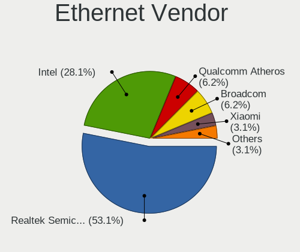

| Vendor                | Notebooks | Percent |
|-----------------------|-----------|---------|
| Realtek Semiconductor | 13        | 54.17%  |
| Intel                 | 6         | 25%     |
| Qualcomm Atheros      | 2         | 8.33%   |
| Broadcom              | 2         | 8.33%   |
| Xiaomi                | 1         | 4.17%   |

Ethernet Model
--------------

Ethernet models

| Model                                                                  | Notebooks | Percent |
|------------------------------------------------------------------------|-----------|---------|
| Realtek RTL8111/8168/8211/8411 PCI Express Gigabit Ethernet Controller | 12        | 50%     |
| Intel 82579LM Gigabit Network Connection (Lewisville)                  | 2         | 8.33%   |
| Xiaomi Mi/Redmi series (RNDIS)                                         | 1         | 4.17%   |
| Realtek RTL8153 Gigabit Ethernet Adapter                               | 1         | 4.17%   |
| Qualcomm Atheros QCA8172 Fast Ethernet                                 | 1         | 4.17%   |
| Qualcomm Atheros AR8162 Fast Ethernet                                  | 1         | 4.17%   |
| Intel Ethernet Connection I219-V                                       | 1         | 4.17%   |
| Intel Ethernet Connection I219-LM                                      | 1         | 4.17%   |
| Intel Ethernet Connection I218-LM                                      | 1         | 4.17%   |
| Intel Ethernet Connection (6) I219-V                                   | 1         | 4.17%   |
| Broadcom NetXtreme BCM57786 Gigabit Ethernet PCIe                      | 1         | 4.17%   |
| Broadcom NetLink BCM57780 Gigabit Ethernet PCIe                        | 1         | 4.17%   |

Net Controller Kind
-------------------

Ethernet, WiFi or modem

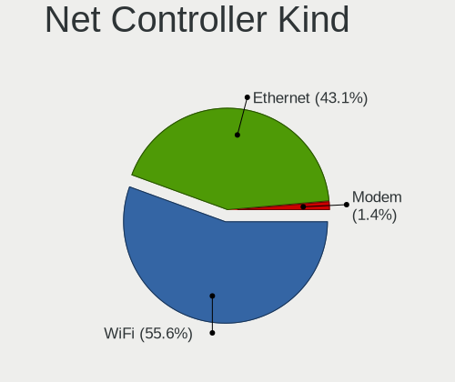

| Kind     | Notebooks | Percent |
|----------|-----------|---------|
| WiFi     | 32        | 57.14%  |
| Ethernet | 23        | 41.07%  |
| Modem    | 1         | 1.79%   |

Used Controller
---------------

Currently used network controller

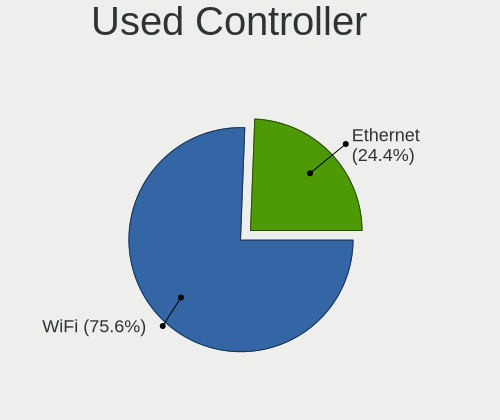

| Kind     | Notebooks | Percent |
|----------|-----------|---------|
| WiFi     | 26        | 83.87%  |
| Ethernet | 5         | 16.13%  |

NICs
----

Total network controllers on board

| Total | Notebooks | Percent |
|-------|-----------|---------|
| 2     | 21        | 65.63%  |
| 1     | 10        | 31.25%  |
| 3     | 1         | 3.13%   |

IPv6
----

IPv6 vs IPv4

| Used | Notebooks | Percent |
|------|-----------|---------|
| No   | 23        | 71.88%  |
| Yes  | 9         | 28.13%  |

Bluetooth
---------

Bluetooth Vendor
----------------

Controller vendors

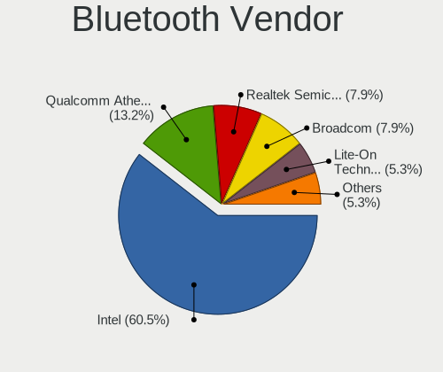

| Vendor                          | Notebooks | Percent |
|---------------------------------|-----------|---------|
| Intel                           | 19        | 65.52%  |
| Qualcomm Atheros Communications | 3         | 10.34%  |
| Realtek Semiconductor           | 2         | 6.9%    |
| Lite-On Technology              | 2         | 6.9%    |
| Broadcom                        | 2         | 6.9%    |
| IMC Networks                    | 1         | 3.45%   |

Bluetooth Model
---------------

Controller models

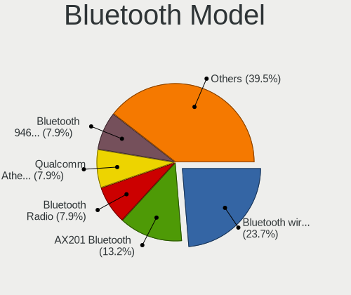

| Model                                          | Notebooks | Percent |
|------------------------------------------------|-----------|---------|
| Intel Bluetooth wireless interface             | 5         | 17.24%  |
| Intel Bluetooth Device                         | 3         | 10.34%  |
| Intel Bluetooth 9460/9560 Jefferson Peak (JfP) | 3         | 10.34%  |
| Intel AX211 Bluetooth                          | 3         | 10.34%  |
| Intel AX201 Bluetooth                          | 3         | 10.34%  |
| Intel AX200 Bluetooth                          | 2         | 6.9%    |
| Broadcom BCM20702 Bluetooth 4.0 [ThinkPad]     | 2         | 6.9%    |
| Realtek Bluetooth Radio                        | 1         | 3.45%   |
| Realtek 802.11ac WLAN Adapter                  | 1         | 3.45%   |
| Qualcomm Atheros  Bluetooth Device             | 1         | 3.45%   |
| Qualcomm Atheros AR3012 Bluetooth 4.0          | 1         | 3.45%   |
| Qualcomm Atheros AR3011 Bluetooth              | 1         | 3.45%   |
| Lite-On Bluetooth Device                       | 1         | 3.45%   |
| Lite-On Atheros AR3012 Bluetooth               | 1         | 3.45%   |
| IMC Networks Bluetooth Radio                   | 1         | 3.45%   |

Sound
-----

Sound Vendor
------------

Sound card vendors

| Vendor                 | Notebooks | Percent |
|------------------------|-----------|---------|
| Intel                  | 26        | 63.41%  |
| AMD                    | 7         | 17.07%  |
| Nvidia                 | 6         | 14.63%  |
| JBL                    | 1         | 2.44%   |
| Generalplus Technology | 1         | 2.44%   |

Sound Model
-----------

Sound card models

| Model                                                                   | Notebooks | Percent |
|-------------------------------------------------------------------------|-----------|---------|
| Intel Alder Lake PCH-P High Definition Audio Controller                 | 4         | 8%      |
| Intel 7 Series/C216 Chipset Family High Definition Audio Controller     | 4         | 8%      |
| AMD Family 17h/19h HD Audio Controller                                  | 4         | 8%      |
| Intel Cannon Point-LP High Definition Audio Controller                  | 3         | 6%      |
| Intel 8 Series/C220 Series Chipset High Definition Audio Controller     | 3         | 6%      |
| AMD Renoir Radeon High Definition Audio Controller                      | 3         | 6%      |
| Intel Xeon E3-1200 v3/4th Gen Core Processor HD Audio Controller        | 2         | 4%      |
| Intel Tiger Lake-LP Smart Sound Technology Audio Controller             | 2         | 4%      |
| Intel Haswell-ULT HD Audio Controller                                   | 2         | 4%      |
| Intel 8 Series HD Audio Controller                                      | 2         | 4%      |
| Nvidia TU107 GeForce GTX 1650 High Definition Audio Controller          | 1         | 2%      |
| Nvidia TU106 High Definition Audio Controller                           | 1         | 2%      |
| Nvidia GP104 High Definition Audio Controller                           | 1         | 2%      |
| Nvidia GF108 High Definition Audio Controller                           | 1         | 2%      |
| Nvidia GA106 High Definition Audio Controller                           | 1         | 2%      |
| Nvidia Audio device                                                     | 1         | 2%      |
| JBL Quantum 600                                                         | 1         | 2%      |
| Intel Tiger Lake-H HD Audio Controller                                  | 1         | 2%      |
| Intel Sunrise Point-LP HD Audio                                         | 1         | 2%      |
| Intel Ice Lake-LP Smart Sound Technology Audio Controller               | 1         | 2%      |
| Intel Comet Lake PCH-LP cAVS                                            | 1         | 2%      |
| Intel Comet Lake PCH cAVS                                               | 1         | 2%      |
| Intel CM238 HD Audio Controller                                         | 1         | 2%      |
| Intel Alder Lake-N PCH High Definition Audio Controller                 | 1         | 2%      |
| Intel 5 Series/3400 Series Chipset High Definition Audio                | 1         | 2%      |
| Generalplus Technology USB Audio Device                                 | 1         | 2%      |
| AMD Trinity HDMI Audio Controller                                       | 1         | 2%      |
| AMD Oland/Hainan/Cape Verde/Pitcairn HDMI Audio [Radeon HD 7000 Series] | 1         | 2%      |
| AMD Navi 10 HDMI Audio                                                  | 1         | 2%      |
| AMD FCH Azalia Controller                                               | 1         | 2%      |
| AMD Cedar HDMI Audio [Radeon HD 5400/6300/7300 Series]                  | 1         | 2%      |

Memory
------

Memory Vendor
-------------

Memory module vendors

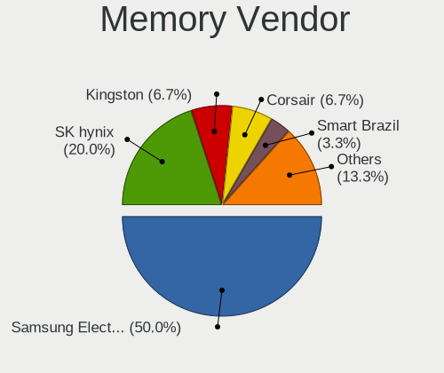

| Vendor              | Notebooks | Percent |
|---------------------|-----------|---------|
| Samsung Electronics | 11        | 47.83%  |
| SK hynix            | 4         | 17.39%  |
| Corsair             | 2         | 8.7%    |
| Smart Brazil        | 1         | 4.35%   |
| SHARETRONIC         | 1         | 4.35%   |
| Kingston            | 1         | 4.35%   |
| G.Skill             | 1         | 4.35%   |
| Crucial             | 1         | 4.35%   |
| A-DATA Technology   | 1         | 4.35%   |

Memory Model
------------

Memory module models

| Model                                                        | Notebooks | Percent |
|--------------------------------------------------------------|-----------|---------|
| Smart Brazil RAM SMS4TDC3C0K0446SCG 4GB SODIMM DDR4 2667MT/s | 1         | 4.17%   |
| SK hynix RAM HMT125S6BFR8C-G7 2GB SODIMM DDR3 1067MT/s       | 1         | 4.17%   |
| SK hynix RAM HMAA4GS6AJR8N-XN 32GB SODIMM DDR4 3200MT/s      | 1         | 4.17%   |
| SK hynix RAM HMA82GS6DJR8N-XN 16GB SODIMM DDR4 3200MT/s      | 1         | 4.17%   |
| SK hynix RAM HMA82GS6AFR8N-UH 16GB SODIMM DDR4 2667MT/s      | 1         | 4.17%   |
| SHARETRONIC RAM Module 4GB SODIMM DDR3 800MT/s               | 1         | 4.17%   |
| Samsung RAM Module 8GB SODIMM DDR4 2133MT/s                  | 1         | 4.17%   |
| Samsung RAM Module 2GB Row Of Chips LPDDR5 4000MT/s          | 1         | 4.17%   |
| Samsung RAM M474A2K43BB1-CRC 16GB SODIMM DDR4 2400MT/s       | 1         | 4.17%   |
| Samsung RAM M471B5273DH0-CK0 4096MB SODIMM DDR3 1600MT/s     | 1         | 4.17%   |
| Samsung RAM M471B5273DH0-CH9 4GB SODIMM DDR3 1334MT/s        | 1         | 4.17%   |
| Samsung RAM M471B5173QH0-YK0 4GB SODIMM DDR3 1600MT/s        | 1         | 4.17%   |
| Samsung RAM M471A5244BB0-CRC 4GB SODIMM DDR4 2667MT/s        | 1         | 4.17%   |
| Samsung RAM M471A1K43EB1-CWE 8GB SODIMM DDR4 3200MT/s        | 1         | 4.17%   |
| Samsung RAM M471A1G44AB0-CWE 8GB Row Of Chips DDR4 3200MT/s  | 1         | 4.17%   |
| Samsung RAM M471A1G44AB0-CTD 8GB SODIMM DDR4 2667MT/s        | 1         | 4.17%   |
| Samsung RAM K4UBE3D4AA-MGCR 2GB Row Of Chips LPDDR4 4267MT/s | 1         | 4.17%   |
| Samsung RAM K3LKBKB0BM-MGCP 2GB Row Of Chips LPDDR5 6400MT/s | 1         | 4.17%   |
| Kingston RAM 9905417-083.A00G 4GB SODIMM DDR3 1600MT/s       | 1         | 4.17%   |
| G.Skill RAM F3-1600C9-8GRSL 8GB SODIMM DDR3 1600MT/s         | 1         | 4.17%   |
| Crucial RAM CT16G4SFRA32A.M16FR 16GB SODIMM DDR4 3200MT/s    | 1         | 4.17%   |
| Corsair RAM CMSX8GX4M1A2400C16 8GB SODIMM DDR4 2400MT/s      | 1         | 4.17%   |
| Corsair RAM CMSO8GX3M1C1600C11 8GB SODIMM DDR3 1600MT/s      | 1         | 4.17%   |
| A-DATA RAM Module 32GB SODIMM DDR4 3200MT/s                  | 1         | 4.17%   |

Memory Kind
-----------

Memory module kinds

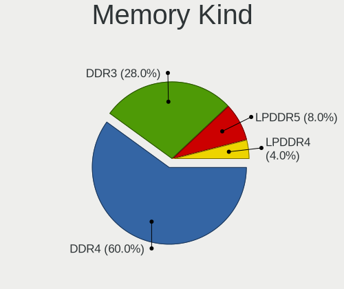

| Kind   | Notebooks | Percent |
|--------|-----------|---------|
| DDR4   | 10        | 52.63%  |
| DDR3   | 6         | 31.58%  |
| LPDDR5 | 2         | 10.53%  |
| LPDDR4 | 1         | 5.26%   |

Memory Form Factor
------------------

Physical design of the memory module

| Name         | Notebooks | Percent |
|--------------|-----------|---------|
| SODIMM       | 15        | 78.95%  |
| Row Of Chips | 4         | 21.05%  |

Memory Size
-----------

Memory module size

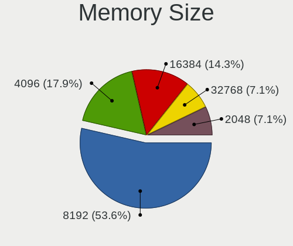

| Size  | Notebooks | Percent |
|-------|-----------|---------|
| 8192  | 10        | 47.62%  |
| 4096  | 4         | 19.05%  |
| 16384 | 3         | 14.29%  |
| 32768 | 2         | 9.52%   |
| 2048  | 2         | 9.52%   |

Memory Speed
------------

Memory module speed

| Speed | Notebooks | Percent |
|-------|-----------|---------|
| 3200  | 5         | 22.73%  |
| 2667  | 4         | 18.18%  |
| 1600  | 4         | 18.18%  |
| 2400  | 2         | 9.09%   |
| 6400  | 1         | 4.55%   |
| 4267  | 1         | 4.55%   |
| 4000  | 1         | 4.55%   |
| 2133  | 1         | 4.55%   |
| 1334  | 1         | 4.55%   |
| 1067  | 1         | 4.55%   |
| 800   | 1         | 4.55%   |

Printers & scanners
-------------------

Printer Vendor
--------------

Printer device vendors

Zero info for selected period =(

Printer Model
-------------

Printer device models

Zero info for selected period =(

Scanner Vendor
--------------

Scanner device vendors

Zero info for selected period =(

Scanner Model
-------------

Scanner device models

Zero info for selected period =(

Camera
------

Camera Vendor
-------------

Camera device vendors

| Vendor                                 | Notebooks | Percent |
|----------------------------------------|-----------|---------|
| Chicony Electronics                    | 6         | 22.22%  |
| IMC Networks                           | 5         | 18.52%  |
| Syntek                                 | 3         | 11.11%  |
| Acer                                   | 3         | 11.11%  |
| Realtek Semiconductor                  | 2         | 7.41%   |
| Cheng Uei Precision Industry (Foxlink) | 2         | 7.41%   |
| Sunplus Innovation Technology          | 1         | 3.7%    |
| Silicon Motion                         | 1         | 3.7%    |
| Microdia                               | 1         | 3.7%    |
| Luxvisions Innotech Limited            | 1         | 3.7%    |
| Bison Electronics                      | 1         | 3.7%    |
| Apple                                  | 1         | 3.7%    |

Camera Model
------------

Camera device models

| Model                                               | Notebooks | Percent |
|-----------------------------------------------------|-----------|---------|
| Syntek Integrated Camera                            | 3         | 10.71%  |
| IMC Networks Integrated Camera                      | 2         | 7.14%   |
| Acer Integrated Camera                              | 2         | 7.14%   |
| Sunplus Integrated_Webcam_HD                        | 1         | 3.57%   |
| Silicon Motion WebCam SC-13HDL11939N                | 1         | 3.57%   |
| Realtek Lenovo EasyCamera                           | 1         | 3.57%   |
| Realtek Integrated_Webcam_HD                        | 1         | 3.57%   |
| Microdia Integrated_Webcam_HD                       | 1         | 3.57%   |
| Luxvisions Innotech Limited HP TrueVision HD Camera | 1         | 3.57%   |
| IMC Networks USB2.0 UVC HD Webcam                   | 1         | 3.57%   |
| IMC Networks USB2.0 HD UVC WebCam                   | 1         | 3.57%   |
| IMC Networks Integrated RGB Camera                  | 1         | 3.57%   |
| Chicony USB2.0 2M WebCam                            | 1         | 3.57%   |
| Chicony USB 5M WebCam                               | 1         | 3.57%   |
| Chicony Thinkpad T430 camera                        | 1         | 3.57%   |
| Chicony Integrated Camera                           | 1         | 3.57%   |
| Chicony HD WebCam (Asus N-series)                   | 1         | 3.57%   |
| Chicony HD WebCam                                   | 1         | 3.57%   |
| Chicony Acer CrystalEye Webcam                      | 1         | 3.57%   |
| Cheng Uei Precision Industry (Foxlink) HP HD Webcam | 1         | 3.57%   |
| Cheng Uei Precision Industry (Foxlink) HP HD Camera | 1         | 3.57%   |
| Bison HD Webcam                                     | 1         | 3.57%   |
| Apple iPhone 5/5C/5S/6/SE/7/8/X                     | 1         | 3.57%   |
| Acer Lenovo Integrated Webcam                       | 1         | 3.57%   |

Security
--------

Fingerprint Vendor
------------------

Fingerprint sensor vendors

| Vendor                | Notebooks | Percent |
|-----------------------|-----------|---------|
| Validity Sensors      | 2         | 66.67%  |
| LighTuning Technology | 1         | 33.33%  |

Fingerprint Model
-----------------

Fingerprint sensor models

| Model                                             | Notebooks | Percent |
|---------------------------------------------------|-----------|---------|
| Validity Sensors VFS7500 Touch Fingerprint Sensor | 1         | 33.33%  |
| Validity Sensors VFS495 Fingerprint Reader        | 1         | 33.33%  |
| LighTuning ES603 Swipe Fingerprint Sensor         | 1         | 33.33%  |

Chipcard Vendor
---------------

Chipcard module vendors

| Vendor | Notebooks | Percent |
|--------|-----------|---------|
| Upek   | 1         | 100%    |

Chipcard Model
--------------

Chipcard module models

| Model                                                      | Notebooks | Percent |
|------------------------------------------------------------|-----------|---------|
| Upek TouchChip Fingerprint Coprocessor (WBF advanced mode) | 1         | 100%    |

Unsupported
-----------

Unsupported Devices
-------------------

Total unsupported devices on board

| Total | Notebooks | Percent |
|-------|-----------|---------|
| 0     | 21        | 63.64%  |
| 1     | 8         | 24.24%  |
| 2     | 4         | 12.12%  |

Unsupported Device Types
------------------------

Types of unsupported devices

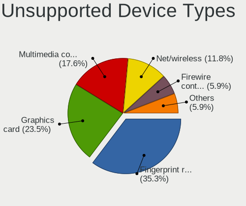

| Type                  | Notebooks | Percent |
|-----------------------|-----------|---------|
| Graphics card         | 4         | 30.77%  |
| Multimedia controller | 3         | 23.08%  |
| Fingerprint reader    | 3         | 23.08%  |
| Net/wireless          | 2         | 15.38%  |
| Chipcard              | 1         | 7.69%   |

