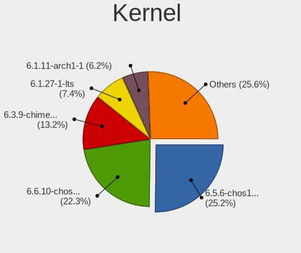
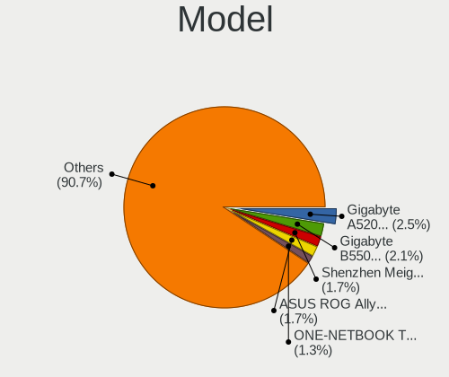
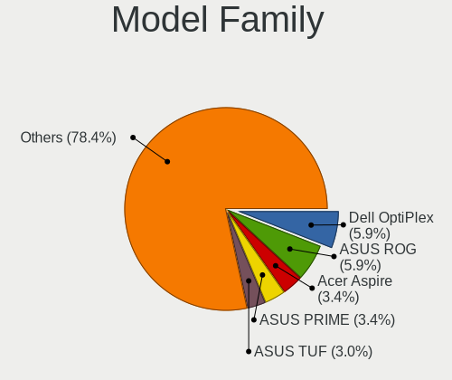
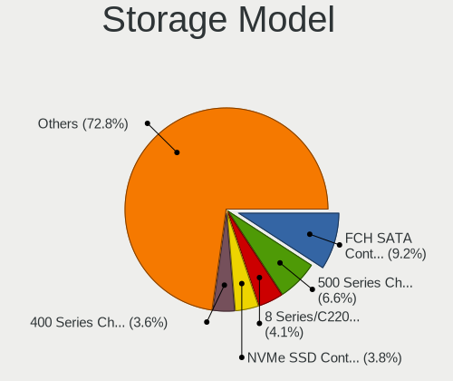
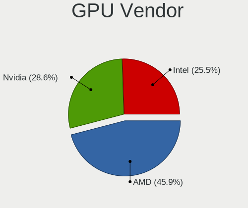
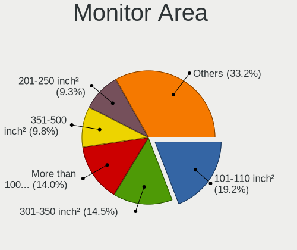

ChimeraOS - Tested Hardware & Statistics
----------------------------------------

A project to collect tested hardware configurations for ChimeraOS.

Anyone can contribute to this report by the [hw-probe](https://github.com/linuxhw/hw-probe) tool:

    sudo -E hw-probe -all -upload

Please contribute! Especially if your hardware is rare.

This is a report for all computer types. See also reports for [desktops](/Dist/ChimeraOS/Desktop/README.md) and [notebooks](/Dist/ChimeraOS/Notebook/README.md).

Contents
--------

* [ Test Cases ](#test-cases)

* [ System ](#system)
  - [ OS                       ](#os)
  - [ OS Family                ](#os-family)
  - [ Kernel                   ](#kernel)
  - [ Kernel Family            ](#kernel-family)
  - [ Kernel Major Ver.        ](#kernel-major-ver)
  - [ Arch                     ](#arch)
  - [ DE                       ](#de)
  - [ Display Server           ](#display-server)
  - [ Display Manager          ](#display-manager)
  - [ OS Lang                  ](#os-lang)
  - [ Boot Mode                ](#boot-mode)
  - [ Filesystem               ](#filesystem)
  - [ Part. scheme             ](#part-scheme)
  - [ Dual Boot with Linux/BSD ](#dual-boot-with-linuxbsd)
  - [ Dual Boot (Win)          ](#dual-boot-win)

* [ Board ](#board)
  - [ Vendor                   ](#vendor)
  - [ Model                    ](#model)
  - [ Model Family             ](#model-family)
  - [ MFG Year                 ](#mfg-year)
  - [ Form Factor              ](#form-factor)
  - [ Secure Boot              ](#secure-boot)
  - [ Coreboot                 ](#coreboot)
  - [ RAM Size                 ](#ram-size)
  - [ RAM Used                 ](#ram-used)
  - [ Total Drives             ](#total-drives)
  - [ Has CD-ROM               ](#has-cd-rom)
  - [ Has Ethernet             ](#has-ethernet)
  - [ Has WiFi                 ](#has-wifi)
  - [ Has Bluetooth            ](#has-bluetooth)

* [ Location ](#location)
  - [ Country                  ](#country)
  - [ City                     ](#city)

* [ Drives ](#drives)
  - [ Drive Vendor             ](#drive-vendor)
  - [ Drive Model              ](#drive-model)
  - [ HDD Vendor               ](#hdd-vendor)
  - [ SSD Vendor               ](#ssd-vendor)
  - [ Drive Kind               ](#drive-kind)
  - [ Drive Connector          ](#drive-connector)
  - [ Drive Size               ](#drive-size)
  - [ Space Total              ](#space-total)
  - [ Space Used               ](#space-used)
  - [ Malfunc. Drives          ](#malfunc-drives)
  - [ Malfunc. Drive Vendor    ](#malfunc-drive-vendor)
  - [ Malfunc. HDD Vendor      ](#malfunc-hdd-vendor)
  - [ Malfunc. Drive Kind      ](#malfunc-drive-kind)
  - [ Failed Drives            ](#failed-drives)
  - [ Failed Drive Vendor      ](#failed-drive-vendor)
  - [ Drive Status             ](#drive-status)

* [ Storage controller ](#storage-controller)
  - [ Storage Vendor           ](#storage-vendor)
  - [ Storage Model            ](#storage-model)
  - [ Storage Kind             ](#storage-kind)

* [ Processor ](#processor)
  - [ CPU Vendor               ](#cpu-vendor)
  - [ CPU Model                ](#cpu-model)
  - [ CPU Model Family         ](#cpu-model-family)
  - [ CPU Cores                ](#cpu-cores)
  - [ CPU Sockets              ](#cpu-sockets)
  - [ CPU Threads              ](#cpu-threads)
  - [ CPU Op-Modes             ](#cpu-op-modes)
  - [ CPU Microcode            ](#cpu-microcode)
  - [ CPU Microarch            ](#cpu-microarch)

* [ Graphics ](#graphics)
  - [ GPU Vendor               ](#gpu-vendor)
  - [ GPU Model                ](#gpu-model)
  - [ GPU Combo                ](#gpu-combo)
  - [ GPU Driver               ](#gpu-driver)
  - [ GPU Memory               ](#gpu-memory)

* [ Monitor ](#monitor)
  - [ Monitor Vendor           ](#monitor-vendor)
  - [ Monitor Model            ](#monitor-model)
  - [ Monitor Resolution       ](#monitor-resolution)
  - [ Monitor Diagonal         ](#monitor-diagonal)
  - [ Monitor Width            ](#monitor-width)
  - [ Aspect Ratio             ](#aspect-ratio)
  - [ Monitor Area             ](#monitor-area)
  - [ Pixel Density            ](#pixel-density)
  - [ Multiple Monitors        ](#multiple-monitors)

* [ Network ](#network)
  - [ Net Controller Vendor    ](#net-controller-vendor)
  - [ Net Controller Model     ](#net-controller-model)
  - [ Wireless Vendor          ](#wireless-vendor)
  - [ Wireless Model           ](#wireless-model)
  - [ Ethernet Vendor          ](#ethernet-vendor)
  - [ Ethernet Model           ](#ethernet-model)
  - [ Net Controller Kind      ](#net-controller-kind)
  - [ Used Controller          ](#used-controller)
  - [ NICs                     ](#nics)
  - [ IPv6                     ](#ipv6)

* [ Bluetooth ](#bluetooth)
  - [ Bluetooth Vendor         ](#bluetooth-vendor)
  - [ Bluetooth Model          ](#bluetooth-model)

* [ Sound ](#sound)
  - [ Sound Vendor             ](#sound-vendor)
  - [ Sound Model              ](#sound-model)

* [ Memory ](#memory)
  - [ Memory Vendor            ](#memory-vendor)
  - [ Memory Model             ](#memory-model)
  - [ Memory Kind              ](#memory-kind)
  - [ Memory Form Factor       ](#memory-form-factor)
  - [ Memory Size              ](#memory-size)
  - [ Memory Speed             ](#memory-speed)

* [ Printers & scanners ](#printers--scanners)
  - [ Printer Vendor           ](#printer-vendor)
  - [ Printer Model            ](#printer-model)
  - [ Scanner Vendor           ](#scanner-vendor)
  - [ Scanner Model            ](#scanner-model)

* [ Camera ](#camera)
  - [ Camera Vendor            ](#camera-vendor)
  - [ Camera Model             ](#camera-model)

* [ Security ](#security)
  - [ Fingerprint Vendor       ](#fingerprint-vendor)
  - [ Fingerprint Model        ](#fingerprint-model)
  - [ Chipcard Vendor          ](#chipcard-vendor)
  - [ Chipcard Model           ](#chipcard-model)

* [ Unsupported ](#unsupported)
  - [ Unsupported Devices      ](#unsupported-devices)
  - [ Unsupported Device Types ](#unsupported-device-types)

Test Cases
----------

Total: 105

| Vendor        | Model                       | Form-Factor | Probe                                                      | Date         |
|---------------|-----------------------------|-------------|------------------------------------------------------------|--------------|
| Dell          | Inspiron 15 7000 Gaming     | Notebook    | [6192c839f5](https://linux-hardware.org/?probe=6192c839f5) | Sep 06, 2023 |
| ASUSTek       | Zephyrus S GX502GV_GX502... | Notebook    | [3429c55014](https://linux-hardware.org/?probe=3429c55014) | Sep 06, 2023 |
| ASUSTek       | Zephyrus S GX502GV_GX502... | Notebook    | [72fb0f052e](https://linux-hardware.org/?probe=72fb0f052e) | Sep 06, 2023 |
| ASUSTek       | GD30CI                      | Desktop     | [f1c877be0e](https://linux-hardware.org/?probe=f1c877be0e) | Sep 05, 2023 |
| Dell          | Latitude 3590               | Notebook    | [9406fe5cf7](https://linux-hardware.org/?probe=9406fe5cf7) | Sep 02, 2023 |
| Gigabyte      | Z490 GAMING X AX y.y        | Desktop     | [94a6d62c4b](https://linux-hardware.org/?probe=94a6d62c4b) | Aug 28, 2023 |
| Dell          | 04Y8V0 A02                  | Desktop     | [5afb05e780](https://linux-hardware.org/?probe=5afb05e780) | Aug 27, 2023 |
| ASUSTek       | PN51-E1                     | Mini pc     | [64b9dbafae](https://linux-hardware.org/?probe=64b9dbafae) | Aug 16, 2023 |
| Acer          | Nitro AN515-57              | Notebook    | [ad8a62ee1d](https://linux-hardware.org/?probe=ad8a62ee1d) | Aug 14, 2023 |
| ASRock        | B550M-ITX/ac                | Desktop     | [64aa93e41b](https://linux-hardware.org/?probe=64aa93e41b) | Aug 14, 2023 |
| ASUSTek       | TUF B450M-PLUS GAMING       | Desktop     | [3ac1be3b93](https://linux-hardware.org/?probe=3ac1be3b93) | Aug 13, 2023 |
| Anbernic      | Win600                      | Notebook    | [32213b8d3b](https://linux-hardware.org/?probe=32213b8d3b) | Aug 13, 2023 |
| Dell          | 05YDCW A01                  | Desktop     | [3f3195be63](https://linux-hardware.org/?probe=3f3195be63) | Aug 12, 2023 |
| Dell          | 05YDCW A01                  | Desktop     | [80c27f0ac1](https://linux-hardware.org/?probe=80c27f0ac1) | Aug 12, 2023 |
| GPD           | P2 MAX                      | Notebook    | [064bc78973](https://linux-hardware.org/?probe=064bc78973) | Aug 09, 2023 |
| HP            | Victus by Laptop 16-d1xx... | Notebook    | [74c80ca51b](https://linux-hardware.org/?probe=74c80ca51b) | Aug 06, 2023 |
| Gigabyte      | B550I AORUS PRO AX          | Desktop     | [b1b6854522](https://linux-hardware.org/?probe=b1b6854522) | Jul 29, 2023 |
| AZW           | SER V01                     | Mini pc     | [a3b4c40b6e](https://linux-hardware.org/?probe=a3b4c40b6e) | Jul 28, 2023 |
| ASRock        | H97M Anniversary            | Desktop     | [f8a02ab68e](https://linux-hardware.org/?probe=f8a02ab68e) | Jul 27, 2023 |
| Lenovo        | IdeaPad 3 15ADA05 81W1      | Notebook    | [d3e22fde36](https://linux-hardware.org/?probe=d3e22fde36) | Jul 25, 2023 |
| Lenovo        | ThinkPad E15 20RD0011IX     | Notebook    | [c7a1caa230](https://linux-hardware.org/?probe=c7a1caa230) | Jul 25, 2023 |
| ASUSTek       | ROG STRIX B550-F GAMING     | Desktop     | [c8a41127a9](https://linux-hardware.org/?probe=c8a41127a9) | Jul 23, 2023 |
| ASUSTek       | ROG STRIX B550-F GAMING     | Desktop     | [9186fec300](https://linux-hardware.org/?probe=9186fec300) | Jul 23, 2023 |
| ASUSTek       | STRIX Z270F GAMING          | Desktop     | [80e44d8594](https://linux-hardware.org/?probe=80e44d8594) | Jul 22, 2023 |
| Gigabyte      | B450 AORUS PRO WIFI-CF      | Desktop     | [f747d5537e](https://linux-hardware.org/?probe=f747d5537e) | Jul 15, 2023 |
| Acer          | Veriton X6610G              | Desktop     | [e1189e3406](https://linux-hardware.org/?probe=e1189e3406) | Jul 13, 2023 |
| Acer          | Aspire A715-42G             | Notebook    | [ac10700edb](https://linux-hardware.org/?probe=ac10700edb) | Jul 13, 2023 |
| Dell          | 0KC9NP A01                  | Desktop     | [570f59305c](https://linux-hardware.org/?probe=570f59305c) | Jul 08, 2023 |
| Dell          | 0KC9NP A01                  | Desktop     | [6d62d0cdbf](https://linux-hardware.org/?probe=6d62d0cdbf) | Jul 08, 2023 |
| HP            | 1791                        | Desktop     | [a2bf914a45](https://linux-hardware.org/?probe=a2bf914a45) | Jul 08, 2023 |
| ASUSTek       | PRIME B550-PLUS             | Desktop     | [13195d7ff3](https://linux-hardware.org/?probe=13195d7ff3) | Jul 02, 2023 |
| HP            | 1998                        | Desktop     | [91f6e54877](https://linux-hardware.org/?probe=91f6e54877) | Jun 30, 2023 |
| AMI           | Unknown                     | Notebook    | [88da6b0232](https://linux-hardware.org/?probe=88da6b0232) | Jun 25, 2023 |
| Acer          | Aspire A315-58G             | Notebook    | [ea2b8a58b1](https://linux-hardware.org/?probe=ea2b8a58b1) | Jun 22, 2023 |
| Gigabyte      | G1.Sniper A88X-CF           | Desktop     | [d4470db5d3](https://linux-hardware.org/?probe=d4470db5d3) | Jun 20, 2023 |
| Dell          | 02YYK5 A01                  | Desktop     | [50efda9604](https://linux-hardware.org/?probe=50efda9604) | Jun 19, 2023 |
| Gigabyte      | B450 AORUS M                | Desktop     | [299db094f8](https://linux-hardware.org/?probe=299db094f8) | Jun 18, 2023 |
| Dell          | 07HXY6 A01                  | Desktop     | [ec3adcbe42](https://linux-hardware.org/?probe=ec3adcbe42) | Jun 16, 2023 |
| Razer         | Blade 14 - RZ09-0370        | Notebook    | [4932ae40b6](https://linux-hardware.org/?probe=4932ae40b6) | Jun 13, 2023 |
| Gigabyte      | X470 AORUS GAMING 5 WIFI... | Desktop     | [c6401638dd](https://linux-hardware.org/?probe=c6401638dd) | Jun 11, 2023 |
| Google        | Snappy                      | Notebook    | [737988d62e](https://linux-hardware.org/?probe=737988d62e) | Jun 11, 2023 |
| Google        | Snappy                      | Notebook    | [f228dabe46](https://linux-hardware.org/?probe=f228dabe46) | Jun 11, 2023 |
| Gigabyte      | B550I AORUS PRO AX          | Desktop     | [798d8e8914](https://linux-hardware.org/?probe=798d8e8914) | Jun 11, 2023 |
| Lenovo        | Y50-70 20378                | Notebook    | [5e060b53c2](https://linux-hardware.org/?probe=5e060b53c2) | Jun 10, 2023 |
| Lenovo        | Y50-70 20378                | Notebook    | [0d548e314b](https://linux-hardware.org/?probe=0d548e314b) | Jun 10, 2023 |
| Dell          | Inspiron 14 7420 2-in-1     | Convertible | [d7b5162532](https://linux-hardware.org/?probe=d7b5162532) | Jun 09, 2023 |
| MSI           | MPG B650I EDGE WIFI         | Desktop     | [d43ce99616](https://linux-hardware.org/?probe=d43ce99616) | Jun 07, 2023 |
| Gigabyte      | X470 AORUS GAMING 5 WIFI... | Desktop     | [8c6370ac0d](https://linux-hardware.org/?probe=8c6370ac0d) | May 23, 2023 |
| Acer          | Nitro AN515-51              | Notebook    | [4bbf7dc69e](https://linux-hardware.org/?probe=4bbf7dc69e) | May 21, 2023 |
| Microsoft     | Surface Book                | Tablet      | [7bb9611a98](https://linux-hardware.org/?probe=7bb9611a98) | May 21, 2023 |
| Micro Elec... | MG-VCP17I-3070              | Notebook    | [8ba5bb4bc7](https://linux-hardware.org/?probe=8ba5bb4bc7) | May 19, 2023 |
| Acer          | Aspire Z3-705               | All in one  | [95fcf79dd4](https://linux-hardware.org/?probe=95fcf79dd4) | May 18, 2023 |
| Gigabyte      | X470 AORUS GAMING 5 WIFI... | Desktop     | [41b69ae4db](https://linux-hardware.org/?probe=41b69ae4db) | May 12, 2023 |
| ASUSTek       | PRIME B760-PLUS D4          | Desktop     | [bb01d9e92b](https://linux-hardware.org/?probe=bb01d9e92b) | May 12, 2023 |
| ASUSTek       | ROG STRIX B460-I GAMING     | Desktop     | [3a9528f661](https://linux-hardware.org/?probe=3a9528f661) | May 10, 2023 |
| Gigabyte      | X470 AORUS GAMING 5 WIFI... | Desktop     | [bf3fee03d2](https://linux-hardware.org/?probe=bf3fee03d2) | May 09, 2023 |
| ONE-NETBOO... | ONEXPLAYER 2 ARP23 Ver.1... | Notebook    | [79bdb284fe](https://linux-hardware.org/?probe=79bdb284fe) | May 09, 2023 |
| ASUSTek       | ROG STRIX B550-F GAMING     | Desktop     | [ad66608cf0](https://linux-hardware.org/?probe=ad66608cf0) | May 08, 2023 |
| Gigabyte      | X470 AORUS GAMING 5 WIFI... | Desktop     | [101ec0a833](https://linux-hardware.org/?probe=101ec0a833) | May 05, 2023 |
| AYANEO        | 2                           | Tablet      | [672b480b96](https://linux-hardware.org/?probe=672b480b96) | May 05, 2023 |
| ASUSTek       | PRIME B760-PLUS D4          | Desktop     | [4ec161ab9b](https://linux-hardware.org/?probe=4ec161ab9b) | May 04, 2023 |
| MSI           | CX62 6QD                    | Notebook    | [9c6b781beb](https://linux-hardware.org/?probe=9c6b781beb) | May 02, 2023 |
| AYANEO        | 2                           | Tablet      | [4db5d91519](https://linux-hardware.org/?probe=4db5d91519) | Apr 21, 2023 |
| Dell          | 0FDY5C A00                  | Desktop     | [a6865b8591](https://linux-hardware.org/?probe=a6865b8591) | Apr 16, 2023 |
| HP            | 250 G4 Notebook PC          | Notebook    | [08036de728](https://linux-hardware.org/?probe=08036de728) | Apr 15, 2023 |
| Lenovo        | IdeaPad 320-15IKB 80YH      | Notebook    | [a34f2e065b](https://linux-hardware.org/?probe=a34f2e065b) | Apr 14, 2023 |
| ONE-NETBOO... | ONEXPLAYER 2 ARP23 Ver.1... | Notebook    | [cacab44211](https://linux-hardware.org/?probe=cacab44211) | Apr 13, 2023 |
| ONE-NETBOO... | ONEXPLAYER 2 ARP23 Ver.1... | Notebook    | [2a4894bdc0](https://linux-hardware.org/?probe=2a4894bdc0) | Apr 13, 2023 |
| MSI           | MS-7C91                     | Notebook    | [663c6729cb](https://linux-hardware.org/?probe=663c6729cb) | Apr 12, 2023 |
| ASUSTek       | ROG STRIX B460-I GAMING     | Desktop     | [14db4e6f1d](https://linux-hardware.org/?probe=14db4e6f1d) | Apr 11, 2023 |
| ASUSTek       | ROG STRIX B650E-I GAMING... | Desktop     | [03db223af4](https://linux-hardware.org/?probe=03db223af4) | Apr 06, 2023 |
| ASUSTek       | ROG STRIX B650E-I GAMING... | Desktop     | [f8c2ffcd09](https://linux-hardware.org/?probe=f8c2ffcd09) | Apr 06, 2023 |
| Razer         | Blade Pro 17 (Early 2020... | Notebook    | [36d75e1d7f](https://linux-hardware.org/?probe=36d75e1d7f) | Mar 26, 2023 |
| Razer         | Blade Pro 17 (Early 2020... | Notebook    | [244b228a30](https://linux-hardware.org/?probe=244b228a30) | Mar 26, 2023 |
| Lenovo        | IdeaPad 700-15ISK 80RU      | Notebook    | [8a92687be7](https://linux-hardware.org/?probe=8a92687be7) | Mar 26, 2023 |
| ASUSTek       | TUF Gaming FX505DV_FX505... | Notebook    | [f383688a79](https://linux-hardware.org/?probe=f383688a79) | Mar 23, 2023 |
| MACHINIST     | X99-RS9 V2.0                | Desktop     | [ad4c43dd09](https://linux-hardware.org/?probe=ad4c43dd09) | Mar 21, 2023 |
| HP            | EliteBook 850 G8 Noteboo... | Notebook    | [de9712600d](https://linux-hardware.org/?probe=de9712600d) | Mar 20, 2023 |
| Lenovo        | IdeaPad 700-15ISK 80RU      | Notebook    | [1ee17b12bd](https://linux-hardware.org/?probe=1ee17b12bd) | Mar 19, 2023 |
| Gigabyte      | B460M DS3H AC V2-Y1         | Desktop     | [b21cd49226](https://linux-hardware.org/?probe=b21cd49226) | Mar 16, 2023 |
| MSI           | MPG B650I EDGE WIFI         | Desktop     | [9f40b861a5](https://linux-hardware.org/?probe=9f40b861a5) | Mar 12, 2023 |
| Gigabyte      | B460M DS3H AC V2-Y1         | Desktop     | [7f8fc2ba96](https://linux-hardware.org/?probe=7f8fc2ba96) | Mar 10, 2023 |
| ASUSTek       | ROG Zephyrus G15 GA503QM... | Notebook    | [b8ea458df5](https://linux-hardware.org/?probe=b8ea458df5) | Mar 08, 2023 |
| Dell          | 0XHGV1 A00                  | Desktop     | [8fa504e81f](https://linux-hardware.org/?probe=8fa504e81f) | Mar 07, 2023 |
| Intel         | DB75EN AAG39650-400         | Desktop     | [4a0feca3f5](https://linux-hardware.org/?probe=4a0feca3f5) | Mar 02, 2023 |
| Acer          | Aspire A515-51G             | Notebook    | [432235c684](https://linux-hardware.org/?probe=432235c684) | Feb 25, 2023 |
| Gigabyte      | H77M-D3H                    | Desktop     | [01eb743492](https://linux-hardware.org/?probe=01eb743492) | Feb 25, 2023 |
| Gigabyte      | H77M-D3H                    | Desktop     | [766790f373](https://linux-hardware.org/?probe=766790f373) | Feb 25, 2023 |
| ASUSTek       | B150I PRO GAMING/WIFI/AU... | Desktop     | [eb1e211b0f](https://linux-hardware.org/?probe=eb1e211b0f) | Feb 25, 2023 |
| MSI           | GE75 Raider 10SF            | Notebook    | [cc21335206](https://linux-hardware.org/?probe=cc21335206) | Feb 24, 2023 |
| HP            | 1998                        | Desktop     | [dbb952f3f6](https://linux-hardware.org/?probe=dbb952f3f6) | Feb 13, 2023 |
| HP            | 1998                        | Desktop     | [0171575a1d](https://linux-hardware.org/?probe=0171575a1d) | Feb 13, 2023 |
| ASUSTek       | K45VM                       | Notebook    | [06af577a0c](https://linux-hardware.org/?probe=06af577a0c) | Feb 04, 2023 |
| Gigabyte      | H510M H                     | Desktop     | [69d2cb7e14](https://linux-hardware.org/?probe=69d2cb7e14) | Jan 11, 2023 |
| Lenovo        | Legion Y540-15IRH 81SX      | Notebook    | [f5ff2f8568](https://linux-hardware.org/?probe=f5ff2f8568) | Jan 06, 2023 |
| ASUSTek       | P8H61-MX R2.0               | Desktop     | [3e4b14919e](https://linux-hardware.org/?probe=3e4b14919e) | Jan 05, 2023 |
| Gigabyte      | X570S AORUS ELITE AX        | Desktop     | [02b3cbc8c6](https://linux-hardware.org/?probe=02b3cbc8c6) | Jan 04, 2023 |
| Gigabyte      | X570S AORUS ELITE AX        | Desktop     | [13ae6c7e25](https://linux-hardware.org/?probe=13ae6c7e25) | Jan 01, 2023 |
| Gigabyte      | X570 AORUS ELITE WIFI       | Desktop     | [49ca01435b](https://linux-hardware.org/?probe=49ca01435b) | Dec 27, 2022 |
| ONE-NETBOO... | ONE XPLAYER                 | Tablet      | [d721c7ae17](https://linux-hardware.org/?probe=d721c7ae17) | Dec 27, 2022 |
| Lenovo        | ThinkCentre M70e 0832B1U    | Desktop     | [d95663a632](https://linux-hardware.org/?probe=d95663a632) | Dec 07, 2022 |
| Gigabyte      | X470 AORUS GAMING 5 WIFI... | Desktop     | [2a7b6d570f](https://linux-hardware.org/?probe=2a7b6d570f) | Nov 26, 2022 |
| Gigabyte      | X470 AORUS GAMING 5 WIFI... | Desktop     | [58b3db6784](https://linux-hardware.org/?probe=58b3db6784) | Nov 23, 2022 |
| ONE-NETBOO... | ONE XPLAYER                 | Tablet      | [9bec9e1625](https://linux-hardware.org/?probe=9bec9e1625) | Oct 01, 2022 |
| ONE-NETBOO... | ONE XPLAYER                 | Tablet      | [501a588f11](https://linux-hardware.org/?probe=501a588f11) | Oct 01, 2022 |

System
------

OS
--

Installed operating systems

| Name           | Computers | Percent |
|----------------|-----------|---------|
| ChimeraOS 43-1 | 18        | 21.95%  |
| ChimeraOS 42   | 18        | 21.95%  |
| ChimeraOS 39   | 15        | 18.29%  |
| ChimeraOS 41   | 11        | 13.41%  |
| ChimeraOS 43   | 8         | 9.76%   |
| ChimeraOS 38   | 6         | 7.32%   |
| ChimeraOS 37   | 4         | 4.88%   |
| ChimeraOS 35   | 1         | 1.22%   |
| ChimeraOS      | 1         | 1.22%   |

OS Family
---------

OS without a version

| Name      | Computers | Percent |
|-----------|-----------|---------|
| ChimeraOS | 80        | 100%    |

Kernel
------

Version of the Linux kernel

| Version           | Computers | Percent |
|-------------------|-----------|---------|
| 6.3.9-chimeraos-1 | 25        | 30.12%  |
| 6.1.27-1-lts      | 18        | 21.69%  |
| 6.1.11-arch1-1    | 15        | 18.07%  |
| 6.1.21-1-lts      | 11        | 13.25%  |
| 6.1.1-arch1-1     | 6         | 7.23%   |
| 6.0.8-arch1-1     | 4         | 4.82%   |
| 6.4.9-0-generic   | 1         | 1.2%    |
| 6.3.3-arch1-1     | 1         | 1.2%    |
| 6.3.1-arch2-1     | 1         | 1.2%    |
| 5.19.6-arch1-1    | 1         | 1.2%    |

Kernel Family
-------------

Linux kernel without a distro release

| Version | Computers | Percent |
|---------|-----------|---------|
| 6.3.9   | 25        | 30.12%  |
| 6.1.27  | 18        | 21.69%  |
| 6.1.11  | 15        | 18.07%  |
| 6.1.21  | 11        | 13.25%  |
| 6.1.1   | 6         | 7.23%   |
| 6.0.8   | 4         | 4.82%   |
| 6.4.9   | 1         | 1.2%    |
| 6.3.3   | 1         | 1.2%    |
| 6.3.1   | 1         | 1.2%    |
| 5.19.6  | 1         | 1.2%    |

Kernel Major Ver.
-----------------

Linux kernel major version

| Version | Computers | Percent |
|---------|-----------|---------|
| 6.1     | 49        | 60.49%  |
| 6.3     | 26        | 32.1%   |
| 6.0     | 4         | 4.94%   |
| 6.4     | 1         | 1.23%   |
| 5.19    | 1         | 1.23%   |

Arch
----

OS architecture (x86_64, i586, etc.)

| Name   | Computers | Percent |
|--------|-----------|---------|
| x86_64 | 80        | 100%    |

DE
--

Desktop Environment

| Name    | Computers | Percent |
|---------|-----------|---------|
| GNOME   | 79        | 98.75%  |
| steamos | 1         | 1.25%   |

Display Server
--------------

X11 or Wayland

| Name    | Computers | Percent |
|---------|-----------|---------|
| Wayland | 74        | 92.5%   |
| X11     | 6         | 7.5%    |

Display Manager
---------------

SDDM, LightDM, etc.

| Name    | Computers | Percent |
|---------|-----------|---------|
| Unknown | 80        | 100%    |

OS Lang
-------

Language

| Lang  | Computers | Percent |
|-------|-----------|---------|
| en_US | 71        | 88.75%  |
| pt_BR | 2         | 2.5%    |
| it_IT | 2         | 2.5%    |
| es_ES | 2         | 2.5%    |
| fr_FR | 1         | 1.25%   |
| de_DE | 1         | 1.25%   |
| C     | 1         | 1.25%   |

Boot Mode
---------

EFI or BIOS

| Mode | Computers | Percent |
|------|-----------|---------|
| BIOS | 80        | 100%    |

Filesystem
----------

Type of filesystem

| Type  | Computers | Percent |
|-------|-----------|---------|
| Btrfs | 79        | 98.75%  |
| Ext4  | 1         | 1.25%   |

Part. scheme
------------

Scheme of partitioning

| Type    | Computers | Percent |
|---------|-----------|---------|
| Unknown | 80        | 100%    |

Dual Boot with Linux/BSD
------------------------

Hosting more than one Linux/BSD

| Dual boot | Computers | Percent |
|-----------|-----------|---------|
| No        | 80        | 100%    |

Dual Boot (Win)
---------------

Hosting Linux and Windows

| Dual boot | Computers | Percent |
|-----------|-----------|---------|
| No        | 80        | 100%    |

Board
-----

Vendor
------

Motherboard manufacturer

| Name                   | Computers | Percent |
|------------------------|-----------|---------|
| ASUSTek Computer       | 16        | 20%     |
| Gigabyte Technology    | 12        | 15%     |
| Dell                   | 9         | 11.25%  |
| Lenovo                 | 7         | 8.75%   |
| Acer                   | 7         | 8.75%   |
| Hewlett-Packard        | 6         | 7.5%    |
| MSI                    | 4         | 5%      |
| Razer                  | 2         | 2.5%    |
| ONE-NETBOOK TECHNOLOGY | 2         | 2.5%    |
| ONE-NETBOOK            | 2         | 2.5%    |
| AYANEO                 | 2         | 2.5%    |
| ASRock                 | 2         | 2.5%    |
| Microsoft              | 1         | 1.25%   |
| Micro Electronics      | 1         | 1.25%   |
| MACHINIST              | 1         | 1.25%   |
| Intel                  | 1         | 1.25%   |
| GPD                    | 1         | 1.25%   |
| Google                 | 1         | 1.25%   |
| AZW                    | 1         | 1.25%   |
| Anbernic               | 1         | 1.25%   |
| AMI                    | 1         | 1.25%   |

Model
-----

Motherboard model

| Name                                        | Computers | Percent |
|---------------------------------------------|-----------|---------|
| ONE-NETBOOK TECHNOLOGY ONE XPLAYER          | 2         | 2.5%    |
| ONE-NETBOOK ONEXPLAYER 2 ARP23              | 2         | 2.5%    |
| HP EliteDesk 800 G1 SFF                     | 2         | 2.5%    |
| Gigabyte B550I AORUS PRO AX                 | 2         | 2.5%    |
| AYANEO 2                                    | 2         | 2.5%    |
| ASUS ROG STRIX B550-F GAMING                | 2         | 2.5%    |
| Razer Blade Pro 17 (Early 2020) - RZ09-0329 | 1         | 1.25%   |
| Razer Blade 14 - RZ09-0370                  | 1         | 1.25%   |
| MSI MS-7D73                                 | 1         | 1.25%   |
| MSI MS-7C91                                 | 1         | 1.25%   |
| MSI GE75 Raider 10SF                        | 1         | 1.25%   |
| MSI CX62 6QD                                | 1         | 1.25%   |
| Microsoft Surface Book                      | 1         | 1.25%   |
| Micro MG-VCP17I-3070                        | 1         | 1.25%   |
| MACHINIST X99-RS9 V2.0                      | 1         | 1.25%   |
| Lenovo Y50-70 20378                         | 1         | 1.25%   |
| Lenovo ThinkPad E15 20RD0011IX              | 1         | 1.25%   |
| Lenovo ThinkCentre M70e 0832B1U             | 1         | 1.25%   |
| Lenovo Legion Y540-15IRH 81SX               | 1         | 1.25%   |
| Lenovo IdeaPad 700-15ISK 80RU               | 1         | 1.25%   |
| Lenovo IdeaPad 320-15IKB 80YH               | 1         | 1.25%   |
| Lenovo IdeaPad 3 15ADA05 81W1               | 1         | 1.25%   |
| Intel DB75EN AAG39650-400                   | 1         | 1.25%   |
| HP Z220 SFF Workstation                     | 1         | 1.25%   |
| HP Victus by Laptop 16-d1xxx                | 1         | 1.25%   |
| HP EliteBook 850 G8 Notebook PC             | 1         | 1.25%   |
| HP 250 G4 Notebook PC                       | 1         | 1.25%   |
| GPD P2 MAX                                  | 1         | 1.25%   |
| Google Snappy                               | 1         | 1.25%   |
| Gigabyte Z490 GAMING X AX                   | 1         | 1.25%   |
| Gigabyte X570S AORUS ELITE AX               | 1         | 1.25%   |
| Gigabyte X570 AORUS ELITE WIFI              | 1         | 1.25%   |
| Gigabyte X470 AORUS GAMING 5 WIFI           | 1         | 1.25%   |
| Gigabyte H77M-D3H                           | 1         | 1.25%   |
| Gigabyte H510M H                            | 1         | 1.25%   |
| Gigabyte G1.Sniper A88X-CF                  | 1         | 1.25%   |
| Gigabyte B460M DS3H AC V2-Y1                | 1         | 1.25%   |
| Gigabyte B450 AORUS PRO WIFI                | 1         | 1.25%   |
| Gigabyte B450 AORUS M                       | 1         | 1.25%   |
| Dell OptiPlex 9020                          | 1         | 1.25%   |

Model Family
------------

Motherboard model prefix

| Name                       | Computers | Percent |
|----------------------------|-----------|---------|
| Dell OptiPlex              | 6         | 7.5%    |
| ASUS ROG                   | 5         | 6.25%   |
| Acer Aspire                | 4         | 5%      |
| Lenovo IdeaPad             | 3         | 3.75%   |
| Razer Blade                | 2         | 2.5%    |
| ONE-NETBOOK TECHNOLOGY ONE | 2         | 2.5%    |
| ONE-NETBOOK ONEXPLAYER     | 2         | 2.5%    |
| HP EliteDesk               | 2         | 2.5%    |
| Gigabyte B550I             | 2         | 2.5%    |
| Gigabyte B450              | 2         | 2.5%    |
| Dell Inspiron              | 2         | 2.5%    |
| AYANEO 2                   | 2         | 2.5%    |
| ASUS TUF                   | 2         | 2.5%    |
| ASUS PRIME                 | 2         | 2.5%    |
| Acer Nitro                 | 2         | 2.5%    |
| MSI MS-7D73                | 1         | 1.25%   |
| MSI MS-7C91                | 1         | 1.25%   |
| MSI GE75                   | 1         | 1.25%   |
| MSI CX62                   | 1         | 1.25%   |
| Microsoft Surface          | 1         | 1.25%   |
| Micro MG-VCP17I-3070       | 1         | 1.25%   |
| MACHINIST X99-RS9          | 1         | 1.25%   |
| Lenovo Y50-70              | 1         | 1.25%   |
| Lenovo ThinkPad            | 1         | 1.25%   |
| Lenovo ThinkCentre         | 1         | 1.25%   |
| Lenovo Legion              | 1         | 1.25%   |
| Intel DB75EN               | 1         | 1.25%   |
| HP Z220                    | 1         | 1.25%   |
| HP Victus                  | 1         | 1.25%   |
| HP EliteBook               | 1         | 1.25%   |
| HP 250                     | 1         | 1.25%   |
| GPD P2                     | 1         | 1.25%   |
| Google Snappy              | 1         | 1.25%   |
| Gigabyte Z490              | 1         | 1.25%   |
| Gigabyte X570S             | 1         | 1.25%   |
| Gigabyte X570              | 1         | 1.25%   |
| Gigabyte X470              | 1         | 1.25%   |
| Gigabyte H77M-D3H          | 1         | 1.25%   |
| Gigabyte H510M             | 1         | 1.25%   |
| Gigabyte G1.Sniper         | 1         | 1.25%   |

MFG Year
--------

Motherboard manufacture year

| Year | Computers | Percent |
|------|-----------|---------|
| 2020 | 14        | 17.5%   |
| 2021 | 13        | 16.25%  |
| 2022 | 10        | 12.5%   |
| 2019 | 6         | 7.5%    |
| 2018 | 6         | 7.5%    |
| 2017 | 6         | 7.5%    |
| 2012 | 6         | 7.5%    |
| 2016 | 5         | 6.25%   |
| 2023 | 3         | 3.75%   |
| 2015 | 3         | 3.75%   |
| 2014 | 3         | 3.75%   |
| 2013 | 3         | 3.75%   |
| 2011 | 1         | 1.25%   |
| 2010 | 1         | 1.25%   |

Form Factor
-----------

Physical design of the computer

| Name        | Computers | Percent |
|-------------|-----------|---------|
| Desktop     | 39        | 48.75%  |
| Notebook    | 32        | 40%     |
| Tablet      | 5         | 6.25%   |
| Mini pc     | 2         | 2.5%    |
| Convertible | 1         | 1.25%   |
| All in one  | 1         | 1.25%   |

Secure Boot
-----------

Enabled or disabled

| State    | Computers | Percent |
|----------|-----------|---------|
| Disabled | 80        | 100%    |

Coreboot
--------

Have coreboot on board

| Used | Computers | Percent |
|------|-----------|---------|
| No   | 79        | 98.75%  |
| Yes  | 1         | 1.25%   |

RAM Size
--------

Total RAM memory

| Size in GB  | Computers | Percent |
|-------------|-----------|---------|
| 16.01-24.0  | 21        | 26.25%  |
| 32.01-64.0  | 20        | 25%     |
| 8.01-16.0   | 13        | 16.25%  |
| 4.01-8.0    | 12        | 15%     |
| 24.01-32.0  | 6         | 7.5%    |
| 3.01-4.0    | 5         | 6.25%   |
| 64.01-256.0 | 3         | 3.75%   |

RAM Used
--------

Used RAM memory

| Used GB    | Computers | Percent |
|------------|-----------|---------|
| 2.01-3.0   | 38        | 46.34%  |
| 1.01-2.0   | 17        | 20.73%  |
| 3.01-4.0   | 16        | 19.51%  |
| 4.01-8.0   | 10        | 12.2%   |
| 16.01-24.0 | 1         | 1.22%   |

Total Drives
------------

Number of drives on board

| Drives | Computers | Percent |
|--------|-----------|---------|
| 1      | 38        | 46.34%  |
| 2      | 27        | 32.93%  |
| 3      | 12        | 14.63%  |
| 4      | 2         | 2.44%   |
| 8      | 1         | 1.22%   |
| 7      | 1         | 1.22%   |
| 5      | 1         | 1.22%   |

Has CD-ROM
----------

Has CD-ROM on board

| Presented | Computers | Percent |
|-----------|-----------|---------|
| No        | 68        | 85%     |
| Yes       | 12        | 15%     |

Has Ethernet
------------

Has Ethernet on board

| Presented | Computers | Percent |
|-----------|-----------|---------|
| Yes       | 67        | 83.75%  |
| No        | 13        | 16.25%  |

Has WiFi
--------

Has WiFi module

| Presented | Computers | Percent |
|-----------|-----------|---------|
| Yes       | 64        | 80%     |
| No        | 16        | 20%     |

Has Bluetooth
-------------

Has Bluetooth module

| Presented | Computers | Percent |
|-----------|-----------|---------|
| Yes       | 63        | 78.75%  |
| No        | 17        | 21.25%  |

Location
--------

Country
-------

Geographic location (country)

| Country      | Computers | Percent |
|--------------|-----------|---------|
| USA          | 32        | 40%     |
| Germany      | 6         | 7.5%    |
| Brazil       | 4         | 5%      |
| Australia    | 4         | 5%      |
| UK           | 3         | 3.75%   |
| Russia       | 3         | 3.75%   |
| Italy        | 3         | 3.75%   |
| Vietnam      | 2         | 2.5%    |
| Spain        | 2         | 2.5%    |
| Saudi Arabia | 2         | 2.5%    |
| Poland       | 2         | 2.5%    |
| Canada       | 2         | 2.5%    |
| Switzerland  | 1         | 1.25%   |
| Romania      | 1         | 1.25%   |
| Norway       | 1         | 1.25%   |
| Netherlands  | 1         | 1.25%   |
| Malaysia     | 1         | 1.25%   |
| Macao        | 1         | 1.25%   |
| Japan        | 1         | 1.25%   |
| Iceland      | 1         | 1.25%   |
| Hungary      | 1         | 1.25%   |
| Honduras     | 1         | 1.25%   |
| France       | 1         | 1.25%   |
| Finland      | 1         | 1.25%   |
| Estonia      | 1         | 1.25%   |
| Costa Rica   | 1         | 1.25%   |
| Belgium      | 1         | 1.25%   |

City
----

Geographic location (city)

| City                     | Computers | Percent |
|--------------------------|-----------|---------|
| Melbourne                | 2         | 2.47%   |
| Chattanooga              | 2         | 2.47%   |
| Yekaterinburg            | 1         | 1.23%   |
| Yaroslavl                | 1         | 1.23%   |
| Wroclaw                  | 1         | 1.23%   |
| Wiesbaden                | 1         | 1.23%   |
| Watsonville              | 1         | 1.23%   |
| Warsaw                   | 1         | 1.23%   |
| Vũng Tàu               | 1         | 1.23%   |
| Virginia Beach           | 1         | 1.23%   |
| Valence                  | 1         | 1.23%   |
| Umeda                    | 1         | 1.23%   |
| Tulcea                   | 1         | 1.23%   |
| Toronto                  | 1         | 1.23%   |
| Tegucigalpa              | 1         | 1.23%   |
| Tallinn                  | 1         | 1.23%   |
| Sydney                   | 1         | 1.23%   |
| Sumaré                  | 1         | 1.23%   |
| Steyning                 | 1         | 1.23%   |
| St Louis                 | 1         | 1.23%   |
| Shelbyville              | 1         | 1.23%   |
| Seattle                  | 1         | 1.23%   |
| Sao Paulo                | 1         | 1.23%   |
| Santa Cruz das Palmeiras | 1         | 1.23%   |
| Sanford                  | 1         | 1.23%   |
| San José                | 1         | 1.23%   |
| Samara                   | 1         | 1.23%   |
| Saltillo                 | 1         | 1.23%   |
| Round Rock               | 1         | 1.23%   |
| Ridley Park              | 1         | 1.23%   |
| Reykjavik                | 1         | 1.23%   |
| Racine                   | 1         | 1.23%   |
| Pittsburg                | 1         | 1.23%   |
| Phoenix                  | 1         | 1.23%   |
| Philadelphia             | 1         | 1.23%   |
| Pennsauken               | 1         | 1.23%   |
| Parma                    | 1         | 1.23%   |
| Newport News             | 1         | 1.23%   |
| New York                 | 1         | 1.23%   |
| Monticello               | 1         | 1.23%   |

Drives
------

Drive Vendor
------------

Hard drive vendors

| Vendor                       | Computers | Drives | Percent |
|------------------------------|-----------|--------|---------|
| Samsung Electronics          | 19        | 29     | 13.97%  |
| Seagate                      | 18        | 23     | 13.24%  |
| Kingston                     | 12        | 12     | 8.82%   |
| WDC                          | 11        | 14     | 8.09%   |
| SanDisk                      | 8         | 12     | 5.88%   |
| Micron Technology            | 8         | 10     | 5.88%   |
| Unknown                      | 6         | 6      | 4.41%   |
| Micron/Crucial Technology    | 6         | 6      | 4.41%   |
| Toshiba                      | 5         | 6      | 3.68%   |
| Phison Electronics           | 5         | 5      | 3.68%   |
| Intel                        | 5         | 6      | 3.68%   |
| SK hynix                     | 4         | 4      | 2.94%   |
| Crucial                      | 4         | 6      | 2.94%   |
| Silicon Motion               | 2         | 2      | 1.47%   |
| KIOXIA                       | 2         | 2      | 1.47%   |
| Kingston Technology Company  | 2         | 2      | 1.47%   |
| Hitachi                      | 2         | 2      | 1.47%   |
| ADATA Technology             | 2         | 3      | 1.47%   |
| WDC PC S                     | 1         | 1      | 0.74%   |
| Shenzhen Longsys Electronics | 1         | 1      | 0.74%   |
| NT-1TB                       | 1         | 1      | 0.74%   |
| Netac                        | 1         | 1      | 0.74%   |
| KingFast                     | 1         | 1      | 0.74%   |
| KingDian                     | 1         | 3      | 0.74%   |
| JMicron Technology           | 1         | 1      | 0.74%   |
| Hewlett-Packard              | 1         | 1      | 0.74%   |
| Fanxiang                     | 1         | 1      | 0.74%   |
| Corsair                      | 1         | 1      | 0.74%   |
| China                        | 1         | 1      | 0.74%   |
| Biwin Storage Technology     | 1         | 1      | 0.74%   |
| AMD                          | 1         | 1      | 0.74%   |
| A-DATA Technology            | 1         | 1      | 0.74%   |
| Unknown                      | 1         | 1      | 0.74%   |

Drive Model
-----------

Hard drive models

| Model                                                           | Computers | Percent |
|-----------------------------------------------------------------|-----------|---------|
| Samsung NVMe SSD Controller SM981/PM981/PM983 500GB             | 7         | 4.79%   |
| Micron/Crucial P2 NVMe PCIe SSD 1TB                             | 6         | 4.11%   |
| Seagate ST1000DM010-2EP102 1TB                                  | 5         | 3.42%   |
| Samsung NVMe SSD Controller PM9A1/PM9A3/980PRO 1024GB           | 4         | 2.74%   |
| Kingston SA400S37120G 120GB SSD                                 | 3         | 2.05%   |
| Unknown MMC Card  64GB                                          | 2         | 1.37%   |
| SK hynix HFM512GD3JX016N 512GB                                  | 2         | 1.37%   |
| Silicon Motion SM2263EN/SM2263XT SSD Controller 256GB           | 2         | 1.37%   |
| Seagate ST1000LM035-1RK172 1TB                                  | 2         | 1.37%   |
| Samsung SSD 870 QVO 2TB                                         | 2         | 1.37%   |
| Samsung SSD 860 EVO 1TB                                         | 2         | 1.37%   |
| Phison PS5013 E13 NVMe Controller 512GB                         | 2         | 1.37%   |
| Phison E12 NVMe Controller 256GB                                | 2         | 1.37%   |
| Micron 1100 SATA 256GB SSD                                      | 2         | 1.37%   |
| Kingston SNVS500G 500GB                                         | 2         | 1.37%   |
| ADATA XPG SX8200 Pro PCIe Gen3x4 M.2 2280 Solid State Drive 2TB | 2         | 1.37%   |
| WDC WDS500G2B0A-00SM50 500GB SSD                                | 1         | 0.68%   |
| WDC WDBNCE5000PNC 500GB SSD                                     | 1         | 0.68%   |
| WDC WD7500BPVT-80HXZT3 752GB                                    | 1         | 0.68%   |
| WDC WD5000BEVT-22A0RT0 500GB                                    | 1         | 0.68%   |
| WDC WD5000AVDS-63U7B1 500GB                                     | 1         | 0.68%   |
| WDC WD40EZRX-00SPEB0 4TB                                        | 1         | 0.68%   |
| WDC WD20SPZX-08UA7 2TB                                          | 1         | 0.68%   |
| WDC WD20EARX-00PASB0 2TB                                        | 1         | 0.68%   |
| WDC WD201KFGX-68BKJN0 20TB                                      | 1         | 0.68%   |
| WDC WD1500HLFS-01G6U0 150GB                                     | 1         | 0.68%   |
| WDC WD10SPCX-24HWST1 1TB                                        | 1         | 0.68%   |
| WDC WD10JPLX-00MBPT0 1TB                                        | 1         | 0.68%   |
| WDC PC S N530 SDBPNPZ 256GB                                     | 1         | 0.68%   |
| Unknown SD/MMC/MS PRO 1GB                                       | 1         | 0.68%   |
| Unknown NVMe SSD Drive 1024GB                                   | 1         | 0.68%   |
| Unknown MMC Card  512GB                                         | 1         | 0.68%   |
| Unknown MMC Card  16GB                                          | 1         | 0.68%   |
| Toshiba XG6 NVMe SSD Controller 1024GB                          | 1         | 0.68%   |
| Toshiba NVMe Controller 1024GB                                  | 1         | 0.68%   |
| Toshiba MQ02ABD100H 1TB                                         | 1         | 0.68%   |
| Toshiba MQ01ABF050 500GB                                        | 1         | 0.68%   |
| Toshiba MK1234GSX 120GB                                         | 1         | 0.68%   |
| SK hynix SHGP31-2000GM 2TB                                      | 1         | 0.68%   |
| SK hynix PC601 NVMe 256GB                                       | 1         | 0.68%   |

HDD Vendor
----------

Hard disk drive vendors

| Vendor              | Computers | Drives | Percent |
|---------------------|-----------|--------|---------|
| Seagate             | 17        | 21     | 50%     |
| WDC                 | 10        | 12     | 29.41%  |
| Toshiba             | 3         | 4      | 8.82%   |
| Hitachi             | 2         | 2      | 5.88%   |
| Unknown             | 1         | 1      | 2.94%   |
| Samsung Electronics | 1         | 1      | 2.94%   |

SSD Vendor
----------

Solid state drive vendors

| Vendor              | Computers | Drives | Percent |
|---------------------|-----------|--------|---------|
| Samsung Electronics | 8         | 12     | 18.6%   |
| Kingston            | 8         | 8      | 18.6%   |
| Micron Technology   | 6         | 8      | 13.95%  |
| SanDisk             | 5         | 7      | 11.63%  |
| Crucial             | 4         | 6      | 9.3%    |
| WDC                 | 1         | 2      | 2.33%   |
| Seagate             | 1         | 1      | 2.33%   |
| NT-1TB              | 1         | 1      | 2.33%   |
| Netac               | 1         | 1      | 2.33%   |
| KingDian            | 1         | 3      | 2.33%   |
| Intel               | 1         | 1      | 2.33%   |
| Hewlett-Packard     | 1         | 1      | 2.33%   |
| Fanxiang            | 1         | 1      | 2.33%   |
| Corsair             | 1         | 1      | 2.33%   |
| China               | 1         | 1      | 2.33%   |
| AMD                 | 1         | 1      | 2.33%   |
| A-DATA Technology   | 1         | 1      | 2.33%   |

Drive Kind
----------

HDD or SSD

| Kind    | Computers | Drives | Percent |
|---------|-----------|--------|---------|
| NVMe    | 49        | 61     | 41.53%  |
| SSD     | 33        | 56     | 27.97%  |
| HDD     | 27        | 41     | 22.88%  |
| Unknown | 5         | 5      | 4.24%   |
| MMC     | 4         | 4      | 3.39%   |

Drive Connector
---------------

SATA, SAS, NVMe, etc.

| Type | Computers | Drives | Percent |
|------|-----------|--------|---------|
| SATA | 50        | 94     | 45.45%  |
| NVMe | 49        | 61     | 44.55%  |
| SAS  | 7         | 8      | 6.36%   |
| MMC  | 4         | 4      | 3.64%   |

Drive Size
----------

Size of hard drive

| Size in TB | Computers | Drives | Percent |
|------------|-----------|--------|---------|
| 0.01-0.5   | 27        | 52     | 42.19%  |
| 0.51-1.0   | 22        | 25     | 34.38%  |
| 1.01-2.0   | 11        | 13     | 17.19%  |
| 3.01-4.0   | 2         | 5      | 3.13%   |
| 2.01-3.0   | 1         | 1      | 1.56%   |
| 10.01-20.0 | 1         | 1      | 1.56%   |

Space Total
-----------

Amount of disk space available on the file system

| Size in GB     | Computers | Percent |
|----------------|-----------|---------|
| More than 3000 | 31        | 38.27%  |
| 1001-2000      | 26        | 32.1%   |
| 501-1000       | 10        | 12.35%  |
| 251-500        | 9         | 11.11%  |
| 2001-3000      | 3         | 3.7%    |
| 101-250        | 2         | 2.47%   |

Space Used
----------

Amount of used disk space

| Used GB        | Computers | Percent |
|----------------|-----------|---------|
| 21-50          | 26        | 31.71%  |
| 51-100         | 15        | 18.29%  |
| 101-250        | 13        | 15.85%  |
| 251-500        | 8         | 9.76%   |
| 501-1000       | 7         | 8.54%   |
| 1001-2000      | 5         | 6.1%    |
| More than 3000 | 4         | 4.88%   |
| 2001-3000      | 3         | 3.66%   |
| 1-20           | 1         | 1.22%   |

Malfunc. Drives
---------------

Drive models with a malfunction

Zero info for selected period =(

Malfunc. Drive Vendor
---------------------

Vendors of faulty drives

Zero info for selected period =(

Malfunc. HDD Vendor
-------------------

Vendors of faulty HDD drives

Zero info for selected period =(

Malfunc. Drive Kind
-------------------

Kinds of faulty drives

Zero info for selected period =(

Failed Drives
-------------

Failed drive models

Zero info for selected period =(

Failed Drive Vendor
-------------------

Failed drive vendors

Zero info for selected period =(

Drive Status
------------

Number of failed and malfunc. drives

| Status   | Computers | Drives | Percent |
|----------|-----------|--------|---------|
| Detected | 80        | 167    | 100%    |

Storage controller
------------------

Storage Vendor
--------------

Storage controller vendors

| Vendor                       | Computers | Percent |
|------------------------------|-----------|---------|
| Intel                        | 46        | 38.33%  |
| AMD                          | 22        | 18.33%  |
| Samsung Electronics          | 12        | 10%     |
| Micron/Crucial Technology    | 6         | 5%      |
| Kingston Technology Company  | 6         | 5%      |
| Phison Electronics           | 5         | 4.17%   |
| SK hynix                     | 4         | 3.33%   |
| SanDisk                      | 4         | 3.33%   |
| Toshiba America Info Systems | 2         | 1.67%   |
| Silicon Motion               | 2         | 1.67%   |
| Micron Technology            | 2         | 1.67%   |
| KIOXIA                       | 2         | 1.67%   |
| Biwin Storage Technology     | 2         | 1.67%   |
| ADATA Technology             | 2         | 1.67%   |
| Shenzhen Longsys Electronics | 1         | 0.83%   |
| Marvell Technology Group     | 1         | 0.83%   |
| INNOGRIT                     | 1         | 0.83%   |

Storage Model
-------------

Storage controller models

| Model                                                                          | Computers | Percent |
|--------------------------------------------------------------------------------|-----------|---------|
| AMD FCH SATA Controller [AHCI mode]                                            | 15        | 11.36%  |
| Samsung NVMe SSD Controller SM981/PM981/PM983                                  | 7         | 5.3%    |
| AMD 500 Series Chipset SATA Controller                                         | 7         | 5.3%    |
| Micron/Crucial P2 [Nick P2] / P3 / P3 Plus NVMe PCIe SSD (DRAM-less)           | 6         | 4.55%   |
| Samsung NVMe SSD Controller PM9A1/PM9A3/980PRO                                 | 4         | 3.03%   |
| Intel Volume Management Device NVMe RAID Controller                            | 4         | 3.03%   |
| Intel SATA Controller [RAID mode]                                              | 4         | 3.03%   |
| Intel 8 Series/C220 Series Chipset Family 6-port SATA Controller 1 [AHCI mode] | 4         | 3.03%   |
| Intel 400 Series Chipset Family SATA AHCI Controller                           | 4         | 3.03%   |
| AMD 400 Series Chipset SATA Controller                                         | 4         | 3.03%   |
| SK hynix Gold P31/BC711/PC711 NVMe Solid State Drive                           | 3         | 2.27%   |
| Kingston Company NVMe Controller                                               | 3         | 2.27%   |
| Intel HM170/QM170 Chipset SATA Controller [AHCI Mode]                          | 3         | 2.27%   |
| Intel 82801 Mobile SATA Controller [RAID mode]                                 | 3         | 2.27%   |
| Silicon Motion SM2263EN/SM2263XT (DRAM-less) NVMe SSD Controllers              | 2         | 1.52%   |
| Phison PS5013 E13 NVMe Controller                                              | 2         | 1.52%   |
| Phison E12 NVMe Controller                                                     | 2         | 1.52%   |
| KIOXIA NVMe SSD Controller BG4 (DRAM-less)                                     | 2         | 1.52%   |
| Intel Tiger Lake SATA AHCI Controller                                          | 2         | 1.52%   |
| Intel Sunrise Point-LP SATA Controller [AHCI mode]                             | 2         | 1.52%   |
| Intel Comet Lake SATA AHCI Controller                                          | 2         | 1.52%   |
| Intel 7 Series/C210 Series Chipset Family 6-port SATA Controller [AHCI mode]   | 2         | 1.52%   |
| Intel 6 Series/C200 Series Chipset Family 6 port Desktop SATA AHCI Controller  | 2         | 1.52%   |
| Intel 200 Series PCH SATA controller [AHCI mode]                               | 2         | 1.52%   |
| Biwin Storage Non-Volatile memory controller                                   | 2         | 1.52%   |
| ADATA XPG SX8200 Pro PCIe Gen3x4 M.2 2280 Solid State Drive                    | 2         | 1.52%   |
| Toshiba America Info Systems XG6 NVMe SSD Controller                           | 1         | 0.76%   |
| Toshiba America Info Systems XG3 NVMe SSD Controller                           | 1         | 0.76%   |
| SK hynix PC601 NVMe Solid State Drive                                          | 1         | 0.76%   |
| Shenzhen Longsys Non-Volatile memory controller                                | 1         | 0.76%   |
| SanDisk WD PC SN810 / Black SN850 NVMe SSD                                     | 1         | 0.76%   |
| SanDisk WD Black SN770 / PC SN740 256GB / PC SN560 (DRAM-less) NVMe SSD        | 1         | 0.76%   |
| SanDisk WD Black SN750 / PC SN730 NVMe SSD                                     | 1         | 0.76%   |
| SanDisk PC SN735 NVMe SSD (DRAM-less)                                          | 1         | 0.76%   |
| Samsung NVMe SSD Controller SM961/PM961/SM963                                  | 1         | 0.76%   |
| Samsung NVMe SSD Controller 980                                                | 1         | 0.76%   |
| Phison PS5019-E19 PCIe4 NVMe Controller (DRAM-less)                            | 1         | 0.76%   |
| Micron 2210 NVMe SSD [Cobain]                                                  | 1         | 0.76%   |
| Micron 2200S NVMe SSD [Cassandra]                                              | 1         | 0.76%   |
| Marvell Group 88SE9215 PCIe 2.0 x1 4-port SATA 6 Gb/s Controller               | 1         | 0.76%   |

Storage Kind
------------

Kind of storage controller (IDE, SATA, NVMe, SAS, ...)

| Kind | Computers | Percent |
|------|-----------|---------|
| SATA | 54        | 45.76%  |
| NVMe | 49        | 41.53%  |
| RAID | 12        | 10.17%  |
| IDE  | 3         | 2.54%   |

Processor
---------

CPU Vendor
----------

Processor vendors

| Vendor | Computers | Percent |
|--------|-----------|---------|
| Intel  | 49        | 61.25%  |
| AMD    | 31        | 38.75%  |

CPU Model
---------

Processor models

| Model                                  | Computers | Percent |
|----------------------------------------|-----------|---------|
| AMD Ryzen 7 6800U with Radeon Graphics | 4         | 4.94%   |
| AMD Ryzen 7 5800X 8-Core Processor     | 4         | 4.94%   |
| Intel Core i7-9750H CPU @ 2.60GHz      | 2         | 2.47%   |
| Intel Core i7-7700K CPU @ 4.20GHz      | 2         | 2.47%   |
| Intel Core i5-7300HQ CPU @ 2.50GHz     | 2         | 2.47%   |
| Intel Core i5-6300HQ CPU @ 2.30GHz     | 2         | 2.47%   |
| AMD Ryzen 9 5900X 12-Core Processor    | 2         | 2.47%   |
| AMD Ryzen 7 5800U with Radeon Graphics | 2         | 2.47%   |
| AMD Ryzen 5 5500U with Radeon Graphics | 2         | 2.47%   |
| AMD Ryzen 5 3600 6-Core Processor      | 2         | 2.47%   |
| Intel Xeon CPU E5-1650 v3 @ 3.50GHz    | 1         | 1.23%   |
| Intel Xeon CPU E3-1245 V2 @ 3.40GHz    | 1         | 1.23%   |
| Intel Core m3-8100Y CPU @ 1.10GHz      | 1         | 1.23%   |
| Intel Core i7-8550U CPU @ 1.80GHz      | 1         | 1.23%   |
| Intel Core i7-7700 CPU @ 3.60GHz       | 1         | 1.23%   |
| Intel Core i7-6600U CPU @ 2.60GHz      | 1         | 1.23%   |
| Intel Core i7-4770 CPU @ 3.40GHz       | 1         | 1.23%   |
| Intel Core i7-3610QM CPU @ 2.30GHz     | 1         | 1.23%   |
| Intel Core i7-10875H CPU @ 2.30GHz     | 1         | 1.23%   |
| Intel Core i7-10750H CPU @ 2.60GHz     | 1         | 1.23%   |
| Intel Core i7-10510U CPU @ 1.80GHz     | 1         | 1.23%   |
| Intel Core i5-9500T CPU @ 2.20GHz      | 1         | 1.23%   |
| Intel Core i5-8500 CPU @ 3.00GHz       | 1         | 1.23%   |
| Intel Core i5-8250U CPU @ 1.60GHz      | 1         | 1.23%   |
| Intel Core i5-7500 CPU @ 3.40GHz       | 1         | 1.23%   |
| Intel Core i5-7200U CPU @ 2.50GHz      | 1         | 1.23%   |
| Intel Core i5-6200U CPU @ 2.30GHz      | 1         | 1.23%   |
| Intel Core i5-4590S CPU @ 3.00GHz      | 1         | 1.23%   |
| Intel Core i5-4570 CPU @ 3.20GHz       | 1         | 1.23%   |
| Intel Core i5-4440 CPU @ 3.10GHz       | 1         | 1.23%   |
| Intel Core i5-4210H CPU @ 2.90GHz      | 1         | 1.23%   |
| Intel Core i5-3570 CPU @ 3.40GHz       | 1         | 1.23%   |
| Intel Core i5-2500K CPU @ 3.30GHz      | 1         | 1.23%   |
| Intel Core i5-2500 CPU @ 3.30GHz       | 1         | 1.23%   |
| Intel Core i5-2400 CPU @ 3.10GHz       | 1         | 1.23%   |
| Intel Core i5-10600KF CPU @ 4.10GHz    | 1         | 1.23%   |
| Intel Core i5-10400F CPU @ 2.90GHz     | 1         | 1.23%   |
| Intel Core i3-5005U CPU @ 2.00GHz      | 1         | 1.23%   |
| Intel Core i3-4160 CPU @ 3.60GHz       | 1         | 1.23%   |
| Intel Core i3-10100F CPU @ 3.60GHz     | 1         | 1.23%   |

CPU Model Family
----------------

Processor model prefix

| Model             | Computers | Percent |
|-------------------|-----------|---------|
| Intel Core i5     | 20        | 24.69%  |
| AMD Ryzen 7       | 13        | 16.05%  |
| Intel Core i7     | 12        | 14.81%  |
| AMD Ryzen 5       | 10        | 12.35%  |
| Other             | 7         | 8.64%   |
| AMD Ryzen 9       | 6         | 7.41%   |
| Intel Core i3     | 4         | 4.94%   |
| Intel Xeon        | 2         | 2.47%   |
| Intel Core m3     | 1         | 1.23%   |
| Intel Core 2 Quad | 1         | 1.23%   |
| Intel Celeron     | 1         | 1.23%   |
| Intel Atom        | 1         | 1.23%   |
| AMD Ryzen 5 PRO   | 1         | 1.23%   |
| AMD Athlon        | 1         | 1.23%   |
| AMD A10           | 1         | 1.23%   |

CPU Cores
---------

Number of processor cores

| Number | Computers | Percent |
|--------|-----------|---------|
| 4      | 29        | 35.8%   |
| 6      | 18        | 22.22%  |
| 8      | 16        | 19.75%  |
| 2      | 11        | 13.58%  |
| 16     | 2         | 2.47%   |
| 12     | 2         | 2.47%   |
| 24     | 1         | 1.23%   |
| 14     | 1         | 1.23%   |
| 10     | 1         | 1.23%   |

CPU Sockets
-----------

Number of sockets

| Number | Computers | Percent |
|--------|-----------|---------|
| 1      | 80        | 100%    |

CPU Threads
-----------

Threads per core (Hyper-Threading)

| Number | Computers | Percent |
|--------|-----------|---------|
| 2      | 61        | 76.25%  |
| 1      | 19        | 23.75%  |

CPU Op-Modes
------------

CPU Operation Modes (32-bit, 64-bit)

| Op mode        | Computers | Percent |
|----------------|-----------|---------|
| 32-bit, 64-bit | 80        | 100%    |

CPU Microcode
-------------

Microcode number

| Number  | Computers | Percent |
|---------|-----------|---------|
| Unknown | 80        | 100%    |

CPU Microarch
-------------

Microarchitecture

| Name        | Computers | Percent |
|-------------|-----------|---------|
| KabyLake    | 15        | 18.75%  |
| Zen 3       | 14        | 17.5%   |
| Unknown     | 13        | 16.25%  |
| Haswell     | 7         | 8.75%   |
| CometLake   | 6         | 7.5%    |
| Skylake     | 4         | 5%      |
| Zen+        | 3         | 3.75%   |
| Zen         | 3         | 3.75%   |
| SandyBridge | 3         | 3.75%   |
| IvyBridge   | 3         | 3.75%   |
| Zen 2       | 2         | 2.5%    |
| TigerLake   | 2         | 2.5%    |
| Silvermont  | 1         | 1.25%   |
| Piledriver  | 1         | 1.25%   |
| Penryn      | 1         | 1.25%   |
| Goldmont    | 1         | 1.25%   |
| Broadwell   | 1         | 1.25%   |

Graphics
--------

GPU Vendor
----------

Vendors of graphics cards

| Vendor | Computers | Percent |
|--------|-----------|---------|
| AMD    | 37        | 36.27%  |
| Nvidia | 33        | 32.35%  |
| Intel  | 32        | 31.37%  |

GPU Model
---------

Graphics card models

| Model                                                                       | Computers | Percent |
|-----------------------------------------------------------------------------|-----------|---------|
| AMD Cezanne [Radeon Vega Series / Radeon Vega Mobile Series]                | 5         | 4.85%   |
| AMD Rembrandt [Radeon 680M]                                                 | 4         | 3.88%   |
| Intel Xeon E3-1200 v3/4th Gen Core Processor Integrated Graphics Controller | 3         | 2.91%   |
| Intel HD Graphics 630                                                       | 3         | 2.91%   |
| Intel HD Graphics 530                                                       | 3         | 2.91%   |
| AMD Picasso/Raven 2 [Radeon Vega Series / Radeon Vega Mobile Series]        | 3         | 2.91%   |
| AMD Navi 21 [Radeon RX 6800/6800 XT / 6900 XT]                              | 3         | 2.91%   |
| AMD Baffin [Radeon RX 550 640SP / RX 560/560X]                              | 3         | 2.91%   |
| Nvidia GA107M [GeForce RTX 3050 Mobile]                                     | 2         | 1.94%   |
| Nvidia GA106M [GeForce RTX 3060 Mobile / Max-Q]                             | 2         | 1.94%   |
| Nvidia GA104M [GeForce RTX 3070 Mobile / Max-Q]                             | 2         | 1.94%   |
| Nvidia GA104 [GeForce RTX 3070 Ti]                                          | 2         | 1.94%   |
| Intel UHD Graphics 620                                                      | 2         | 1.94%   |
| Intel Skylake GT2 [HD Graphics 520]                                         | 2         | 1.94%   |
| Intel CoffeeLake-S GT2 [UHD Graphics 630]                                   | 2         | 1.94%   |
| AMD Navi 31 [Radeon RX 7900 XT/7900 XTX]                                    | 2         | 1.94%   |
| AMD Navi 24 [Radeon RX 6400/6500 XT/6500M]                                  | 2         | 1.94%   |
| AMD Navi 23 [Radeon RX 6600/6600 XT/6600M]                                  | 2         | 1.94%   |
| AMD Lucienne                                                                | 2         | 1.94%   |
| AMD Ellesmere [Radeon RX 470/480/570/570X/580/580X/590]                     | 2         | 1.94%   |
| Nvidia TU117 [GeForce GTX 1650]                                             | 1         | 0.97%   |
| Nvidia TU117 [GeForce GTX 1630]                                             | 1         | 0.97%   |
| Nvidia TU116M [GeForce GTX 1660 Ti Mobile]                                  | 1         | 0.97%   |
| Nvidia TU116 [GeForce GTX 1650 SUPER]                                       | 1         | 0.97%   |
| Nvidia TU106M [GeForce RTX 2070 Mobile / Max-Q Refresh]                     | 1         | 0.97%   |
| Nvidia TU106M [GeForce RTX 2060 Mobile]                                     | 1         | 0.97%   |
| Nvidia TU106BM [GeForce RTX 2060 Mobile]                                    | 1         | 0.97%   |
| Nvidia TU106 [GeForce GTX 1650]                                             | 1         | 0.97%   |
| Nvidia TU104M [GeForce RTX 2080 SUPER Mobile / Max-Q]                       | 1         | 0.97%   |
| Nvidia GP107M [GeForce MX350]                                               | 1         | 0.97%   |
| Nvidia GP107M [GeForce GTX 1050 Ti Mobile]                                  | 1         | 0.97%   |
| Nvidia GP107M [GeForce GTX 1050 Mobile]                                     | 1         | 0.97%   |
| Nvidia GP104 [GeForce GTX 1080]                                             | 1         | 0.97%   |
| Nvidia GP104 [GeForce GTX 1070 Ti]                                          | 1         | 0.97%   |
| Nvidia GM108M [GeForce MX130]                                               | 1         | 0.97%   |
| Nvidia GM108M [GeForce 940M]                                                | 1         | 0.97%   |
| Nvidia GM108M [GeForce 940MX]                                               | 1         | 0.97%   |
| Nvidia GM107M [GeForce GTX 960M]                                            | 1         | 0.97%   |
| Nvidia GM107M [GeForce GTX 950M]                                            | 1         | 0.97%   |
| Nvidia GF108M [GeForce GT 620M/630M/635M/640M LE]                           | 1         | 0.97%   |

GPU Combo
---------

Combinations of graphics cards

| Name           | Computers | Percent |
|----------------|-----------|---------|
| 1 x AMD        | 31        | 38.27%  |
| 1 x Nvidia     | 16        | 19.75%  |
| 1 x Intel      | 14        | 17.28%  |
| Intel + Nvidia | 13        | 16.05%  |
| AMD + Nvidia   | 4         | 4.94%   |
| Intel + AMD    | 2         | 2.47%   |
| Other          | 1         | 1.23%   |

GPU Driver
----------

Free vs proprietary

| Driver      | Computers | Percent |
|-------------|-----------|---------|
| Free        | 48        | 60%     |
| Proprietary | 32        | 40%     |

GPU Memory
----------

Total video memory

| Size in GB | Computers | Percent |
|------------|-----------|---------|
| Unknown    | 77        | 96.25%  |
| 3.01-4.0   | 2         | 2.5%    |
| 8.01-16.0  | 1         | 1.25%   |

Monitor
-------

Monitor Vendor
--------------

Monitor vendors

| Vendor               | Computers | Percent |
|----------------------|-----------|---------|
| Samsung Electronics  | 12        | 15.38%  |
| BOE                  | 9         | 11.54%  |
| Chimei Innolux       | 7         | 8.97%   |
| LG Display           | 5         | 6.41%   |
| AU Optronics         | 5         | 6.41%   |
| MSI                  | 3         | 3.85%   |
| Goldstar             | 3         | 3.85%   |
| BenQ                 | 3         | 3.85%   |
| Toshiba              | 2         | 2.56%   |
| Sony                 | 2         | 2.56%   |
| Sharp                | 2         | 2.56%   |
| Philips              | 2         | 2.56%   |
| Insignia             | 2         | 2.56%   |
| Hewlett-Packard      | 2         | 2.56%   |
| ASUSTek Computer     | 2         | 2.56%   |
| Vizio                | 1         | 1.28%   |
| Unknown (XXX)        | 1         | 1.28%   |
| TMX                  | 1         | 1.28%   |
| SANYO                | 1         | 1.28%   |
| RTK                  | 1         | 1.28%   |
| PANDA                | 1         | 1.28%   |
| Panasonic            | 1         | 1.28%   |
| Onkyo                | 1         | 1.28%   |
| Hitachi              | 1         | 1.28%   |
| Gigabyte Technology  | 1         | 1.28%   |
| Fujitsu Siemens      | 1         | 1.28%   |
| Dell                 | 1         | 1.28%   |
| AYANEO               | 1         | 1.28%   |
| AYA                  | 1         | 1.28%   |
| Ancor Communications | 1         | 1.28%   |
| AGO                  | 1         | 1.28%   |
| Acer                 | 1         | 1.28%   |

Monitor Model
-------------

Monitor models

| Model                                                                 | Computers | Percent |
|-----------------------------------------------------------------------|-----------|---------|
| BOE FLQ8423-24L0 BOE1003 1600x2560 113x181mm 8.4-inch                 | 2         | 2.53%   |
| Vizio D40f-G9 VIZ1027 1920x1080 477x268mm 21.5-inch                   | 1         | 1.27%   |
| Unknown (XXX) Beyond TV XXX2851 1920x1080 1209x680mm 54.6-inch        | 1         | 1.27%   |
| Toshiba TV TSB0206 1920x1080                                          | 1         | 1.27%   |
| Toshiba TV TSB002F 3840x2160 1095x616mm 49.5-inch                     | 1         | 1.27%   |
| TMX TL140BDXP01-0 TMX1400 2560x1440 310x174mm 14.0-inch               | 1         | 1.27%   |
| Sony TV SNYEE01 1920x1080                                             | 1         | 1.27%   |
| Sony TV SNY3002 1920x1080 886x498mm 40.0-inch                         | 1         | 1.27%   |
| Sharp LQ173M1JW02 SHP14DB 1920x1080 382x215mm 17.3-inch               | 1         | 1.27%   |
| Sharp HDMI SHP0FE8 1920x1080 1152x648mm 52.0-inch                     | 1         | 1.27%   |
| SANYO TV SAN0206 1920x1080 886x498mm 40.0-inch                        | 1         | 1.27%   |
| Samsung Electronics SyncMaster SAM030F 1680x1050 474x296mm 22.0-inch  | 1         | 1.27%   |
| Samsung Electronics S24R35xFZ SAM71A8 1920x1080 530x300mm 24.0-inch   | 1         | 1.27%   |
| Samsung Electronics S24C650 SAM09E8 1920x1080 521x293mm 23.5-inch     | 1         | 1.27%   |
| Samsung Electronics S24C300 SAM0A24 1920x1080 531x299mm 24.0-inch     | 1         | 1.27%   |
| Samsung Electronics QBQ95 SAM7229 3840x2160 1872x1053mm 84.6-inch     | 1         | 1.27%   |
| Samsung Electronics LCD Monitor SDC4C51 1366x768 344x194mm 15.5-inch  | 1         | 1.27%   |
| Samsung Electronics LCD Monitor SAM0FEE 3840x2160 950x540mm 43.0-inch | 1         | 1.27%   |
| Samsung Electronics LCD Monitor SAM065D 1920x1080                     | 1         | 1.27%   |
| Samsung Electronics LCD Monitor SAM020B 1920x540                      | 1         | 1.27%   |
| Samsung Electronics LC49G95T SAM7053 2560x1440 1193x336mm 48.8-inch   | 1         | 1.27%   |
| Samsung Electronics LC27T55 SAM701F 1920x1080 610x350mm 27.7-inch     | 1         | 1.27%   |
| Samsung Electronics C27F390 SAM0D32 1920x1080 598x336mm 27.0-inch     | 1         | 1.27%   |
| RTK FHD HDR RTK2A3B 1920x1080 344x195mm 15.6-inch                     | 1         | 1.27%   |
| Philips PHL 273V7 PHLC156 1920x1080 598x336mm 27.0-inch               | 1         | 1.27%   |
| Philips PHL 272E1GJ PHLC245 1920x1080 598x336mm 27.0-inch             | 1         | 1.27%   |
| PANDA LCD Monitor NCP004D 1920x1080 344x194mm 15.5-inch               | 1         | 1.27%   |
| Panasonic TDM13O56 MEI96A2 3000x2000 285x190mm 13.5-inch              | 1         | 1.27%   |
| Onkyo AV Receiver ONK1150 3840x2160 1872x1053mm 84.6-inch             | 1         | 1.27%   |
| MSI Optix MAG27C MSI1462 1920x1080 598x336mm 27.0-inch                | 1         | 1.27%   |
| MSI MAG301CR2 MSI3CB4 2560x1080 690x291mm 29.5-inch                   | 1         | 1.27%   |
| MSI G241 MSI3BA4 1920x1080 527x296mm 23.8-inch                        | 1         | 1.27%   |
| LG Display LCD Monitor LGD071E 1920x1080 344x194mm 15.5-inch          | 1         | 1.27%   |
| LG Display LCD Monitor LGD0590 1920x1080 344x194mm 15.5-inch          | 1         | 1.27%   |
| LG Display LCD Monitor LGD053F 1920x1080 344x194mm 15.5-inch          | 1         | 1.27%   |
| LG Display LCD Monitor LGD044F 1920x1080 345x194mm 15.6-inch          | 1         | 1.27%   |
| LG Display LCD Monitor LGD02F8 1366x768 309x174mm 14.0-inch           | 1         | 1.27%   |
| Insignia NS-39L240A13 BBY0042 1920x1080 544x326mm 25.0-inch           | 1         | 1.27%   |
| Insignia BBY LCD BBY0032 1920x540                                     | 1         | 1.27%   |
| Hitachi HISENSE HEC002F 3840x2160 1872x1053mm 84.6-inch               | 1         | 1.27%   |

Monitor Resolution
------------------

Monitor screen resolution

| Resolution         | Computers | Percent |
|--------------------|-----------|---------|
| 1920x1080 (FHD)    | 38        | 50%     |
| 3840x2160 (4K)     | 10        | 13.16%  |
| 2560x1440 (QHD)    | 7         | 9.21%   |
| 1366x768 (WXGA)    | 6         | 7.89%   |
| 1200x1920          | 3         | 3.95%   |
| 1920x540           | 2         | 2.63%   |
| 1600x2560          | 2         | 2.63%   |
| 800x1280           | 1         | 1.32%   |
| 3840x1600          | 1         | 1.32%   |
| 3840x1080          | 1         | 1.32%   |
| 3440x1440          | 1         | 1.32%   |
| 2560x1080          | 1         | 1.32%   |
| 1920x1200 (WUXGA)  | 1         | 1.32%   |
| 1680x1050 (WSXGA+) | 1         | 1.32%   |
| 1600x900 (HD+)     | 1         | 1.32%   |

Monitor Diagonal
----------------

Diagonal size in inches

| Inches  | Computers | Percent |
|---------|-----------|---------|
| 15      | 18        | 23.08%  |
| 27      | 7         | 8.97%   |
| Unknown | 6         | 7.69%   |
| 84      | 5         | 6.41%   |
| 24      | 5         | 6.41%   |
| 17      | 4         | 5.13%   |
| 72      | 3         | 3.85%   |
| 23      | 3         | 3.85%   |
| 14      | 3         | 3.85%   |
| 49      | 2         | 2.56%   |
| 48      | 2         | 2.56%   |
| 8       | 2         | 2.56%   |
| 74      | 1         | 1.28%   |
| 57      | 1         | 1.28%   |
| 54      | 1         | 1.28%   |
| 52      | 1         | 1.28%   |
| 46      | 1         | 1.28%   |
| 40      | 1         | 1.28%   |
| 38      | 1         | 1.28%   |
| 34      | 1         | 1.28%   |
| 31      | 1         | 1.28%   |
| 29      | 1         | 1.28%   |
| 26      | 1         | 1.28%   |
| 22      | 1         | 1.28%   |
| 21      | 1         | 1.28%   |
| 20      | 1         | 1.28%   |
| 18      | 1         | 1.28%   |
| 16      | 1         | 1.28%   |
| 12      | 1         | 1.28%   |
| 11      | 1         | 1.28%   |

Monitor Width
-------------

Physical width

| Width in mm | Computers | Percent |
|-------------|-----------|---------|
| 301-350     | 21        | 26.92%  |
| 501-600     | 15        | 19.23%  |
| 1501-2000   | 8         | 10.26%  |
| 1001-1500   | 7         | 8.97%   |
| Unknown     | 6         | 7.69%   |
| 351-400     | 5         | 6.41%   |
| 601-700     | 4         | 5.13%   |
| 401-500     | 4         | 5.13%   |
| 801-900     | 2         | 2.56%   |
| 701-800     | 2         | 2.56%   |
| 201-300     | 2         | 2.56%   |
| 101-200     | 2         | 2.56%   |

Aspect Ratio
------------

Proportional relationship between the width and the height

| Ratio | Computers | Percent |
|-------|-----------|---------|
| 16/9  | 58        | 76.32%  |
| 0.62  | 6         | 7.89%   |
| 16/10 | 4         | 5.26%   |
| 21/9  | 3         | 3.95%   |
| 32/9  | 2         | 2.63%   |
| 4/3   | 1         | 1.32%   |
| 1.96  | 1         | 1.32%   |
| 0.56  | 1         | 1.32%   |

Monitor Area
------------

Area in inch²

| Area in inch² | Computers | Percent |
|----------------|-----------|---------|
| 101-110        | 19        | 25.33%  |
| More than 1000 | 12        | 16%     |
| 301-350        | 9         | 12%     |
| 201-250        | 9         | 12%     |
| Unknown        | 6         | 8%      |
| 501-1000       | 5         | 6.67%   |
| 121-130        | 4         | 5.33%   |
| 81-90          | 3         | 4%      |
| 351-500        | 2         | 2.67%   |
| 1-40           | 2         | 2.67%   |
| 71-80          | 1         | 1.33%   |
| 51-60          | 1         | 1.33%   |
| 151-200        | 1         | 1.33%   |
| 141-150        | 1         | 1.33%   |

Pixel Density
-------------

Pixels per inch

| Density       | Computers | Percent |
|---------------|-----------|---------|
| 51-100        | 27        | 35.06%  |
| 121-160       | 20        | 25.97%  |
| 101-120       | 9         | 11.69%  |
| 1-50          | 7         | 9.09%   |
| Unknown       | 6         | 7.79%   |
| 161-240       | 5         | 6.49%   |
| More than 240 | 3         | 3.9%    |

Multiple Monitors
-----------------

Total monitors connected

| Total | Computers | Percent |
|-------|-----------|---------|
| 1     | 71        | 87.65%  |
| 2     | 8         | 9.88%   |
| 0     | 2         | 2.47%   |

Network
-------

Net Controller Vendor
---------------------

Controller vendors

| Vendor                          | Computers | Percent |
|---------------------------------|-----------|---------|
| Realtek Semiconductor           | 45        | 35.43%  |
| Intel                           | 42        | 33.07%  |
| Qualcomm Atheros                | 12        | 9.45%   |
| MediaTek                        | 12        | 9.45%   |
| Broadcom                        | 3         | 2.36%   |
| TP-Link                         | 2         | 1.57%   |
| Microsoft                       | 2         | 1.57%   |
| Marvell Technology Group        | 2         | 1.57%   |
| Ralink Technology               | 1         | 0.79%   |
| Ralink                          | 1         | 0.79%   |
| Qualcomm Atheros Communications | 1         | 0.79%   |
| OnePlus Technology (Shenzhen)   | 1         | 0.79%   |
| Edimax Technology               | 1         | 0.79%   |
| Broadcom Limited                | 1         | 0.79%   |
| ASIX Electronics                | 1         | 0.79%   |

Net Controller Model
--------------------

Controller models

| Model                                                                                | Computers | Percent |
|--------------------------------------------------------------------------------------|-----------|---------|
| Realtek RTL8111/8168/8411 PCI Express Gigabit Ethernet Controller                    | 31        | 21.68%  |
| Realtek RTL8125 2.5GbE Controller                                                    | 9         | 6.29%   |
| MediaTek MT7921K (RZ608) Wi-Fi 6E 80MHz                                              | 7         | 4.9%    |
| Intel Wi-Fi 6 AX210/AX211/AX411 160MHz                                               | 6         | 4.2%    |
| Qualcomm Atheros QCA9377 802.11ac Wireless Network Adapter                           | 4         | 2.8%    |
| Qualcomm Atheros QCA6174 802.11ac Wireless Network Adapter                           | 4         | 2.8%    |
| Intel Wireless 3165                                                                  | 4         | 2.8%    |
| Intel Ethernet Connection I217-LM                                                    | 4         | 2.8%    |
| Realtek RTL88x2bu [AC1200 Techkey]                                                   | 3         | 2.1%    |
| MediaTek MT7921 802.11ax PCI Express Wireless Network Adapter                        | 3         | 2.1%    |
| Intel Wi-Fi 6 AX200                                                                  | 3         | 2.1%    |
| Intel I211 Gigabit Network Connection                                                | 3         | 2.1%    |
| Intel Ethernet Controller I225-V                                                     | 3         | 2.1%    |
| Intel Dual Band Wireless-AC 3168NGW [Stone Peak]                                     | 3         | 2.1%    |
| Intel Comet Lake PCH CNVi WiFi                                                       | 3         | 2.1%    |
| Intel Cannon Lake PCH CNVi WiFi                                                      | 3         | 2.1%    |
| Realtek RTL8153 Gigabit Ethernet Adapter                                             | 2         | 1.4%    |
| Microsoft Xbox Wireless Adapter for Windows                                          | 2         | 1.4%    |
| MediaTek MT7922 802.11ax PCI Express Wireless Network Adapter                        | 2         | 1.4%    |
| Intel Wireless 7265                                                                  | 2         | 1.4%    |
| Intel Wi-Fi 6 AX201                                                                  | 2         | 1.4%    |
| Intel Tiger Lake PCH CNVi WiFi                                                       | 2         | 1.4%    |
| Intel Ethernet Connection (2) I219-V                                                 | 2         | 1.4%    |
| Intel 82579LM Gigabit Network Connection (Lewisville)                                | 2         | 1.4%    |
| TP-Link Archer T4U ver.3                                                             | 1         | 0.7%    |
| TP-Link Archer T3U [Realtek RTL8812BU]                                               | 1         | 0.7%    |
| Realtek RTL8822CE 802.11ac PCIe Wireless Network Adapter                             | 1         | 0.7%    |
| Realtek RTL8821CE 802.11ac PCIe Wireless Network Adapter                             | 1         | 0.7%    |
| Realtek RTL8723BE PCIe Wireless Network Adapter                                      | 1         | 0.7%    |
| Realtek RTL8192CU 802.11n WLAN Adapter                                               | 1         | 0.7%    |
| Realtek RTL8188EUS 802.11n Wireless Network Adapter                                  | 1         | 0.7%    |
| Realtek RTL8187 Wireless Adapter                                                     | 1         | 0.7%    |
| Realtek PCIe GbE Family Controller                                                   | 1         | 0.7%    |
| Realtek Killer E2600 Gigabit Ethernet Controller                                     | 1         | 0.7%    |
| Ralink MT7610U ("Archer T2U" 2.4G+5G WLAN Adapter                                    | 1         | 0.7%    |
| Ralink RT3090 Wireless 802.11n 1T/1R PCIe                                            | 1         | 0.7%    |
| Qualcomm Atheros QCA8171 Gigabit Ethernet                                            | 1         | 0.7%    |
| Qualcomm Atheros Killer E2500 Gigabit Ethernet Controller                            | 1         | 0.7%    |
| Qualcomm Atheros TP-Link TL-WN821N v3 / TL-WN822N v2 802.11n [Atheros AR7010+AR9287] | 1         | 0.7%    |
| Qualcomm Atheros AR9485 Wireless Network Adapter                                     | 1         | 0.7%    |

Wireless Vendor
---------------

Wireless vendors

| Vendor                          | Computers | Percent |
|---------------------------------|-----------|---------|
| Intel                           | 31        | 44.29%  |
| MediaTek                        | 12        | 17.14%  |
| Qualcomm Atheros                | 9         | 12.86%  |
| Realtek Semiconductor           | 6         | 8.57%   |
| TP-Link                         | 2         | 2.86%   |
| Microsoft                       | 2         | 2.86%   |
| Broadcom                        | 2         | 2.86%   |
| Ralink Technology               | 1         | 1.43%   |
| Ralink                          | 1         | 1.43%   |
| Qualcomm Atheros Communications | 1         | 1.43%   |
| Marvell Technology Group        | 1         | 1.43%   |
| Edimax Technology               | 1         | 1.43%   |
| Broadcom Limited                | 1         | 1.43%   |

Wireless Model
--------------

Wireless models

| Model                                                                                | Computers | Percent |
|--------------------------------------------------------------------------------------|-----------|---------|
| MediaTek MT7921K (RZ608) Wi-Fi 6E 80MHz                                              | 7         | 9.46%   |
| Intel Wi-Fi 6 AX210/AX211/AX411 160MHz                                               | 6         | 8.11%   |
| Qualcomm Atheros QCA9377 802.11ac Wireless Network Adapter                           | 4         | 5.41%   |
| Qualcomm Atheros QCA6174 802.11ac Wireless Network Adapter                           | 4         | 5.41%   |
| Intel Wireless 3165                                                                  | 4         | 5.41%   |
| Realtek RTL88x2bu [AC1200 Techkey]                                                   | 3         | 4.05%   |
| MediaTek MT7921 802.11ax PCI Express Wireless Network Adapter                        | 3         | 4.05%   |
| Intel Wi-Fi 6 AX200                                                                  | 3         | 4.05%   |
| Intel Dual Band Wireless-AC 3168NGW [Stone Peak]                                     | 3         | 4.05%   |
| Intel Comet Lake PCH CNVi WiFi                                                       | 3         | 4.05%   |
| Intel Cannon Lake PCH CNVi WiFi                                                      | 3         | 4.05%   |
| Microsoft Xbox Wireless Adapter for Windows                                          | 2         | 2.7%    |
| MediaTek MT7922 802.11ax PCI Express Wireless Network Adapter                        | 2         | 2.7%    |
| Intel Wireless 7265                                                                  | 2         | 2.7%    |
| Intel Wi-Fi 6 AX201                                                                  | 2         | 2.7%    |
| Intel Tiger Lake PCH CNVi WiFi                                                       | 2         | 2.7%    |
| TP-Link Archer T4U ver.3                                                             | 1         | 1.35%   |
| TP-Link Archer T3U [Realtek RTL8812BU]                                               | 1         | 1.35%   |
| Realtek RTL8822CE 802.11ac PCIe Wireless Network Adapter                             | 1         | 1.35%   |
| Realtek RTL8821CE 802.11ac PCIe Wireless Network Adapter                             | 1         | 1.35%   |
| Realtek RTL8723BE PCIe Wireless Network Adapter                                      | 1         | 1.35%   |
| Realtek RTL8192CU 802.11n WLAN Adapter                                               | 1         | 1.35%   |
| Realtek RTL8188EUS 802.11n Wireless Network Adapter                                  | 1         | 1.35%   |
| Realtek RTL8187 Wireless Adapter                                                     | 1         | 1.35%   |
| Ralink MT7610U ("Archer T2U" 2.4G+5G WLAN Adapter                                    | 1         | 1.35%   |
| Ralink RT3090 Wireless 802.11n 1T/1R PCIe                                            | 1         | 1.35%   |
| Qualcomm Atheros TP-Link TL-WN821N v3 / TL-WN822N v2 802.11n [Atheros AR7010+AR9287] | 1         | 1.35%   |
| Qualcomm Atheros AR9485 Wireless Network Adapter                                     | 1         | 1.35%   |
| Marvell Group 88W8897 [AVASTAR] 802.11ac Wireless                                    | 1         | 1.35%   |
| Intel Wireless-AC 9260                                                               | 1         | 1.35%   |
| Intel Dual Band Wireless-AC 3165 Plus Bluetooth                                      | 1         | 1.35%   |
| Intel Comet Lake PCH-LP CNVi WiFi                                                    | 1         | 1.35%   |
| Intel Alder Lake-P PCH CNVi WiFi                                                     | 1         | 1.35%   |
| Edimax Wi-Fi                                                                         | 1         | 1.35%   |
| Broadcom Limited BCM4352 802.11ac Wireless Network Adapter                           | 1         | 1.35%   |
| Broadcom BCM4360 802.11ac Wireless Network Adapter                                   | 1         | 1.35%   |
| Broadcom BCM4356 802.11ac Wireless Network Adapter                                   | 1         | 1.35%   |

Ethernet Vendor
---------------

Ethernet vendors

| Vendor                   | Computers | Percent |
|--------------------------|-----------|---------|
| Realtek Semiconductor    | 43        | 64.18%  |
| Intel                    | 18        | 26.87%  |
| Qualcomm Atheros         | 3         | 4.48%   |
| Marvell Technology Group | 1         | 1.49%   |
| Broadcom                 | 1         | 1.49%   |
| ASIX Electronics         | 1         | 1.49%   |

Ethernet Model
--------------

Ethernet models

| Model                                                             | Computers | Percent |
|-------------------------------------------------------------------|-----------|---------|
| Realtek RTL8111/8168/8411 PCI Express Gigabit Ethernet Controller | 31        | 45.59%  |
| Realtek RTL8125 2.5GbE Controller                                 | 9         | 13.24%  |
| Intel Ethernet Connection I217-LM                                 | 4         | 5.88%   |
| Intel I211 Gigabit Network Connection                             | 3         | 4.41%   |
| Intel Ethernet Controller I225-V                                  | 3         | 4.41%   |
| Realtek RTL8153 Gigabit Ethernet Adapter                          | 2         | 2.94%   |
| Intel Ethernet Connection (2) I219-V                              | 2         | 2.94%   |
| Intel 82579LM Gigabit Network Connection (Lewisville)             | 2         | 2.94%   |
| Realtek PCIe GbE Family Controller                                | 1         | 1.47%   |
| Realtek Killer E2600 Gigabit Ethernet Controller                  | 1         | 1.47%   |
| Qualcomm Atheros QCA8171 Gigabit Ethernet                         | 1         | 1.47%   |
| Qualcomm Atheros Killer E2500 Gigabit Ethernet Controller         | 1         | 1.47%   |
| Qualcomm Atheros AR8151 v2.0 Gigabit Ethernet                     | 1         | 1.47%   |
| Marvell Group 88E8057 PCI-E Gigabit Ethernet Controller           | 1         | 1.47%   |
| Intel Ethernet Connection (5) I219-LM                             | 1         | 1.47%   |
| Intel Ethernet Connection (12) I219-V                             | 1         | 1.47%   |
| Intel Ethernet Connection (11) I219-V                             | 1         | 1.47%   |
| Intel 82579V Gigabit Network Connection                           | 1         | 1.47%   |
| Broadcom NetXtreme BCM5762 Gigabit Ethernet PCIe                  | 1         | 1.47%   |
| ASIX AX88179 Gigabit Ethernet                                     | 1         | 1.47%   |

Net Controller Kind
-------------------

Ethernet, WiFi or modem

| Kind     | Computers | Percent |
|----------|-----------|---------|
| Ethernet | 66        | 50.77%  |
| WiFi     | 63        | 48.46%  |
| Unknown  | 1         | 0.77%   |

Used Controller
---------------

Currently used network controller

| Kind     | Computers | Percent |
|----------|-----------|---------|
| WiFi     | 51        | 60.71%  |
| Ethernet | 33        | 39.29%  |

NICs
----

Total network controllers on board

| Total | Computers | Percent |
|-------|-----------|---------|
| 2     | 42        | 52.5%   |
| 1     | 36        | 45%     |
| 3     | 2         | 2.5%    |

IPv6
----

IPv6 vs IPv4

| Used | Computers | Percent |
|------|-----------|---------|
| No   | 55        | 67.9%   |
| Yes  | 26        | 32.1%   |

Bluetooth
---------

Bluetooth Vendor
----------------

Controller vendors

| Vendor                          | Computers | Percent |
|---------------------------------|-----------|---------|
| Intel                           | 31        | 49.21%  |
| MediaTek                        | 8         | 12.7%   |
| Cambridge Silicon Radio         | 6         | 9.52%   |
| IMC Networks                    | 5         | 7.94%   |
| Lite-On Technology              | 4         | 6.35%   |
| Qualcomm Atheros Communications | 3         | 4.76%   |
| ASUSTek Computer                | 2         | 3.17%   |
| TP-Link                         | 1         | 1.59%   |
| Realtek Semiconductor           | 1         | 1.59%   |
| Foxconn / Hon Hai               | 1         | 1.59%   |
| Apple                           | 1         | 1.59%   |

Bluetooth Model
---------------

Controller models

| Model                                               | Computers | Percent |
|-----------------------------------------------------|-----------|---------|
| MediaTek Wireless_Device                            | 8         | 12.5%   |
| Intel Bluetooth wireless interface                  | 8         | 12.5%   |
| Intel AX201 Bluetooth                               | 7         | 10.94%  |
| Intel AX210 Bluetooth                               | 6         | 9.38%   |
| Cambridge Silicon Radio Bluetooth Dongle (HCI mode) | 6         | 9.38%   |
| Intel Bluetooth Device                              | 4         | 6.25%   |
| Intel Bluetooth 9460/9560 Jefferson Peak (JfP)      | 4         | 6.25%   |
| Qualcomm Atheros  Bluetooth Device                  | 2         | 3.13%   |
| Lite-On Qualcomm Atheros QCA9377 Bluetooth          | 2         | 3.13%   |
| Intel AX200 Bluetooth                               | 2         | 3.13%   |
| IMC Networks Wireless_Device                        | 2         | 3.13%   |
| IMC Networks Bluetooth Radio                        | 2         | 3.13%   |
| TP-Link UB5A Adapter                                | 1         | 1.56%   |
| Realtek Bluetooth Radio                             | 1         | 1.56%   |
| Qualcomm Atheros QCA61x4 Bluetooth 4.0              | 1         | 1.56%   |
| Lite-On Wireless_Device                             | 1         | 1.56%   |
| Lite-On Bluetooth Device                            | 1         | 1.56%   |
| Intel Wireless-AC 9260 Bluetooth Adapter            | 1         | 1.56%   |
| IMC Networks Bluetooth Device                       | 1         | 1.56%   |
| Foxconn / Hon Hai BCM20702A0                        | 1         | 1.56%   |
| ASUS Qualcomm Bluetooth 4.1                         | 1         | 1.56%   |
| ASUS Broadcom BCM20702A0 Bluetooth                  | 1         | 1.56%   |
| Apple Bluetooth Host Controller                     | 1         | 1.56%   |

Sound
-----

Sound Vendor
------------

Sound card vendors

| Vendor                   | Computers | Percent |
|--------------------------|-----------|---------|
| Intel                    | 48        | 36.36%  |
| AMD                      | 41        | 31.06%  |
| Nvidia                   | 26        | 19.7%   |
| Logitech                 | 3         | 2.27%   |
| Sony                     | 2         | 1.52%   |
| Texas Instruments        | 1         | 0.76%   |
| SteelSeries ApS          | 1         | 0.76%   |
| Realtek Semiconductor    | 1         | 0.76%   |
| Razer USA                | 1         | 0.76%   |
| Micro Star International | 1         | 0.76%   |
| Kingston Technology      | 1         | 0.76%   |
| Hewlett-Packard          | 1         | 0.76%   |
| Generalplus Technology   | 1         | 0.76%   |
| Focusrite-Novation       | 1         | 0.76%   |
| C-Media Electronics      | 1         | 0.76%   |
| ASUSTek Computer         | 1         | 0.76%   |
| Astro Gaming             | 1         | 0.76%   |

Sound Model
-----------

Sound card models

| Model                                                                      | Computers | Percent |
|----------------------------------------------------------------------------|-----------|---------|
| AMD Family 17h/19h HD Audio Controller                                     | 18        | 10.91%  |
| AMD Starship/Matisse HD Audio Controller                                   | 9         | 5.45%   |
| AMD Renoir Radeon High Definition Audio Controller                         | 8         | 4.85%   |
| AMD Navi 21/23 HDMI/DP Audio Controller                                    | 8         | 4.85%   |
| Nvidia GA104 High Definition Audio Controller                              | 6         | 3.64%   |
| Intel Sunrise Point-LP HD Audio                                            | 6         | 3.64%   |
| Intel 8 Series/C220 Series Chipset High Definition Audio Controller        | 6         | 3.64%   |
| Intel Xeon E3-1200 v3/4th Gen Core Processor HD Audio Controller           | 5         | 3.03%   |
| AMD Rembrandt Radeon High Definition Audio Controller                      | 5         | 3.03%   |
| Nvidia TU106 High Definition Audio Controller                              | 4         | 2.42%   |
| Intel Cannon Lake PCH cAVS                                                 | 4         | 2.42%   |
| Intel 7 Series/C216 Chipset Family High Definition Audio Controller        | 4         | 2.42%   |
| AMD Baffin HDMI/DP Audio [Radeon RX 550 640SP / RX 560/560X]               | 4         | 2.42%   |
| Nvidia GA106 High Definition Audio Controller                              | 3         | 1.82%   |
| Intel Comet Lake PCH cAVS                                                  | 3         | 1.82%   |
| Intel 200 Series PCH HD Audio                                              | 3         | 1.82%   |
| Intel 100 Series/C230 Series Chipset Family HD Audio Controller            | 3         | 1.82%   |
| AMD Raven/Raven2/Fenghuang HDMI/DP Audio Controller                        | 3         | 1.82%   |
| Nvidia TU116 High Definition Audio Controller                              | 2         | 1.21%   |
| Nvidia TU107 GeForce GTX 1650 High Definition Audio Controller             | 2         | 1.21%   |
| Nvidia GP107GL High Definition Audio Controller                            | 2         | 1.21%   |
| Nvidia GP104 High Definition Audio Controller                              | 2         | 1.21%   |
| Nvidia GA102 High Definition Audio Controller                              | 2         | 1.21%   |
| Intel Tiger Lake-LP Smart Sound Technology Audio Controller                | 2         | 1.21%   |
| Intel Tiger Lake-H HD Audio Controller                                     | 2         | 1.21%   |
| Intel Comet Lake PCH-V cAVS                                                | 2         | 1.21%   |
| Intel CM238 HD Audio Controller                                            | 2         | 1.21%   |
| Intel Alder Lake PCH-P High Definition Audio Controller                    | 2         | 1.21%   |
| Intel 6 Series/C200 Series Chipset Family High Definition Audio Controller | 2         | 1.21%   |
| AMD Navi 31 HDMI/DP Audio                                                  | 2         | 1.21%   |
| AMD Family 17h (Models 00h-0fh) HD Audio Controller                        | 2         | 1.21%   |
| AMD Ellesmere HDMI Audio [Radeon RX 470/480 / 570/580/590]                 | 2         | 1.21%   |
| Texas Instruments PCM2902 Audio Codec                                      | 1         | 0.61%   |
| SteelSeries ApS SteelSeries Arctis 1 Wireless                              | 1         | 0.61%   |
| Sony DualShock 4 [CUH-ZCT2x]                                               | 1         | 0.61%   |
| Sony DualSense Wireless Controller                                         | 1         | 0.61%   |
| Realtek Semiconductor USB Audio                                            | 1         | 0.61%   |
| Razer USA Razer Seiren Mini                                                | 1         | 0.61%   |
| Nvidia TU104 HD Audio Controller                                           | 1         | 0.61%   |
| Nvidia GF108 High Definition Audio Controller                              | 1         | 0.61%   |

Memory
------

Memory Vendor
-------------

Memory module vendors

Zero info for selected period =(

Memory Model
------------

Memory module models

Zero info for selected period =(

Memory Kind
-----------

Memory module kinds

Zero info for selected period =(

Memory Form Factor
------------------

Physical design of the memory module

Zero info for selected period =(

Memory Size
-----------

Memory module size

Zero info for selected period =(

Memory Speed
------------

Memory module speed

Zero info for selected period =(

Printers & scanners
-------------------

Printer Vendor
--------------

Printer device vendors

Zero info for selected period =(

Printer Model
-------------

Printer device models

Zero info for selected period =(

Scanner Vendor
--------------

Scanner device vendors

Zero info for selected period =(

Scanner Model
-------------

Scanner device models

Zero info for selected period =(

Camera
------

Camera Vendor
-------------

Camera device vendors

| Vendor                        | Computers | Percent |
|-------------------------------|-----------|---------|
| Chicony Electronics           | 10        | 33.33%  |
| Microdia                      | 4         | 13.33%  |
| IMC Networks                  | 4         | 13.33%  |
| Sunplus Innovation Technology | 3         | 10%     |
| Quanta                        | 2         | 6.67%   |
| YT-221117-J                   | 1         | 3.33%   |
| Silicon Motion                | 1         | 3.33%   |
| Realtek Semiconductor         | 1         | 3.33%   |
| Logitech                      | 1         | 3.33%   |
| Bison Electronics             | 1         | 3.33%   |
| Apple                         | 1         | 3.33%   |
| Acer                          | 1         | 3.33%   |

Camera Model
------------

Camera device models

| Model                             | Computers | Percent |
|-----------------------------------|-----------|---------|
| IMC Networks Integrated Camera    | 3         | 10%     |
| Chicony Integrated Camera         | 2         | 6.67%   |
| Chicony HD User Facing            | 2         | 6.67%   |
| YT-221117-J USB2.0 Camera         | 1         | 3.33%   |
| Sunplus Integrated_Webcam_HD      | 1         | 3.33%   |
| Sunplus HD WebCam                 | 1         | 3.33%   |
| Sunplus HD 720P webcam            | 1         | 3.33%   |
| Silicon Motion 300k Pixel Camera  | 1         | 3.33%   |
| Realtek Integrated Webcam         | 1         | 3.33%   |
| Quanta HP HD Camera               | 1         | 3.33%   |
| Quanta HD User Facing             | 1         | 3.33%   |
| Microdia Webcam Vitade AF         | 1         | 3.33%   |
| Microdia USB Camera               | 1         | 3.33%   |
| Microdia Integrated_Webcam_FHD    | 1         | 3.33%   |
| Microdia HP Webcam                | 1         | 3.33%   |
| Logitech Webcam C200              | 1         | 3.33%   |
| IMC Networks USB2.0 HD UVC WebCam | 1         | 3.33%   |
| Chicony USB2.0 FHD Camera         | 1         | 3.33%   |
| Chicony USB2.0 0.3M UVC WebCam    | 1         | 3.33%   |
| Chicony Integrated IR Camera      | 1         | 3.33%   |
| Chicony HP Wide Vision HD Camera  | 1         | 3.33%   |
| Chicony HP Truevision HD          | 1         | 3.33%   |
| Chicony EasyCamera                | 1         | 3.33%   |
| Bison Lenovo EasyCamera           | 1         | 3.33%   |
| Apple iPhone 5/5C/5S/6/SE/7/8/X   | 1         | 3.33%   |
| Acer Lenovo EasyCamera            | 1         | 3.33%   |

Security
--------

Fingerprint Vendor
------------------

Fingerprint sensor vendors

| Vendor                     | Computers | Percent |
|----------------------------|-----------|---------|
| Synaptics                  | 1         | 50%     |
| Shenzhen Goodix Technology | 1         | 50%     |

Fingerprint Model
-----------------

Fingerprint sensor models

| Model                                                    | Computers | Percent |
|----------------------------------------------------------|-----------|---------|
| Synaptics FS7604 Touch Fingerprint Sensor with PurePrint | 1         | 50%     |
| Shenzhen Goodix  FingerPrint Device                      | 1         | 50%     |

Chipcard Vendor
---------------

Chipcard module vendors

Zero info for selected period =(

Chipcard Model
--------------

Chipcard module models

Zero info for selected period =(

Unsupported
-----------

Unsupported Devices
-------------------

Total unsupported devices on board

| Total | Computers | Percent |
|-------|-----------|---------|
| 0     | 67        | 83.75%  |
| 1     | 13        | 16.25%  |

Unsupported Device Types
------------------------

Types of unsupported devices

| Type                  | Computers | Percent |
|-----------------------|-----------|---------|
| Multimedia controller | 6         | 46.15%  |
| Graphics card         | 2         | 15.38%  |
| Fingerprint reader    | 2         | 15.38%  |
| Storage/nvme          | 1         | 7.69%   |
| Network               | 1         | 7.69%   |
| Net/wireless          | 1         | 7.69%   |

