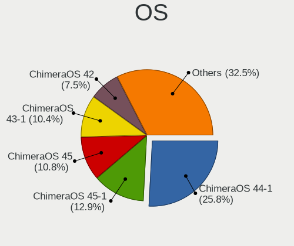
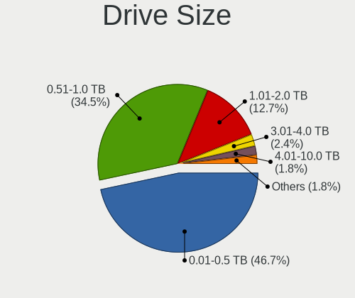
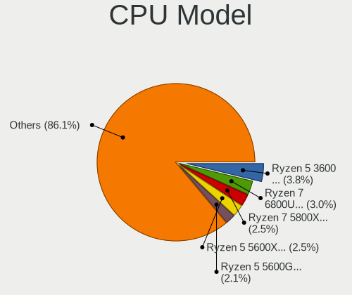
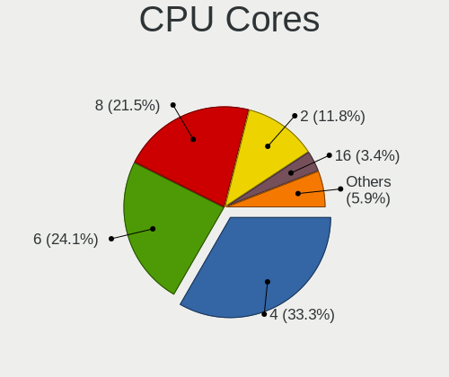
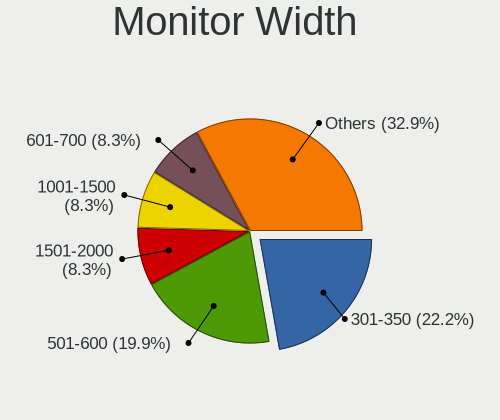
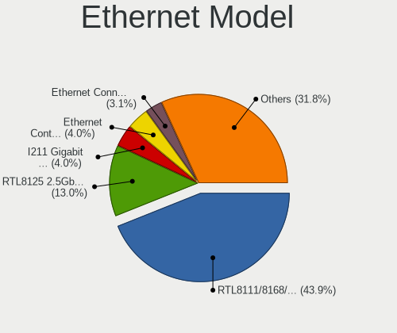

ChimeraOS - Tested Hardware & Statistics
----------------------------------------

A project to collect tested hardware configurations for ChimeraOS.

Anyone can contribute to this report by the [hw-probe](https://github.com/linuxhw/hw-probe) tool:

    sudo -E hw-probe -all -upload

Please contribute! Especially if your hardware is rare.

This is a report for all computer types. See also reports for [desktops](/Dist/ChimeraOS/Desktop/README.md) and [notebooks](/Dist/ChimeraOS/Notebook/README.md).

Contents
--------

* [ Test Cases ](#test-cases)

* [ System ](#system)
  - [ OS                       ](#os)
  - [ OS Family                ](#os-family)
  - [ Kernel                   ](#kernel)
  - [ Kernel Family            ](#kernel-family)
  - [ Kernel Major Ver.        ](#kernel-major-ver)
  - [ Arch                     ](#arch)
  - [ DE                       ](#de)
  - [ Display Server           ](#display-server)
  - [ Display Manager          ](#display-manager)
  - [ OS Lang                  ](#os-lang)
  - [ Boot Mode                ](#boot-mode)
  - [ Filesystem               ](#filesystem)
  - [ Part. scheme             ](#part-scheme)
  - [ Dual Boot with Linux/BSD ](#dual-boot-with-linuxbsd)
  - [ Dual Boot (Win)          ](#dual-boot-win)

* [ Board ](#board)
  - [ Vendor                   ](#vendor)
  - [ Model                    ](#model)
  - [ Model Family             ](#model-family)
  - [ MFG Year                 ](#mfg-year)
  - [ Form Factor              ](#form-factor)
  - [ Secure Boot              ](#secure-boot)
  - [ Coreboot                 ](#coreboot)
  - [ RAM Size                 ](#ram-size)
  - [ RAM Used                 ](#ram-used)
  - [ Total Drives             ](#total-drives)
  - [ Has CD-ROM               ](#has-cd-rom)
  - [ Has Ethernet             ](#has-ethernet)
  - [ Has WiFi                 ](#has-wifi)
  - [ Has Bluetooth            ](#has-bluetooth)

* [ Location ](#location)
  - [ Country                  ](#country)
  - [ City                     ](#city)

* [ Drives ](#drives)
  - [ Drive Vendor             ](#drive-vendor)
  - [ Drive Model              ](#drive-model)
  - [ HDD Vendor               ](#hdd-vendor)
  - [ SSD Vendor               ](#ssd-vendor)
  - [ Drive Kind               ](#drive-kind)
  - [ Drive Connector          ](#drive-connector)
  - [ Drive Size               ](#drive-size)
  - [ Space Total              ](#space-total)
  - [ Space Used               ](#space-used)
  - [ Malfunc. Drives          ](#malfunc-drives)
  - [ Malfunc. Drive Vendor    ](#malfunc-drive-vendor)
  - [ Malfunc. HDD Vendor      ](#malfunc-hdd-vendor)
  - [ Malfunc. Drive Kind      ](#malfunc-drive-kind)
  - [ Failed Drives            ](#failed-drives)
  - [ Failed Drive Vendor      ](#failed-drive-vendor)
  - [ Drive Status             ](#drive-status)

* [ Storage controller ](#storage-controller)
  - [ Storage Vendor           ](#storage-vendor)
  - [ Storage Model            ](#storage-model)
  - [ Storage Kind             ](#storage-kind)

* [ Processor ](#processor)
  - [ CPU Vendor               ](#cpu-vendor)
  - [ CPU Model                ](#cpu-model)
  - [ CPU Model Family         ](#cpu-model-family)
  - [ CPU Cores                ](#cpu-cores)
  - [ CPU Sockets              ](#cpu-sockets)
  - [ CPU Threads              ](#cpu-threads)
  - [ CPU Op-Modes             ](#cpu-op-modes)
  - [ CPU Microcode            ](#cpu-microcode)
  - [ CPU Microarch            ](#cpu-microarch)

* [ Graphics ](#graphics)
  - [ GPU Vendor               ](#gpu-vendor)
  - [ GPU Model                ](#gpu-model)
  - [ GPU Combo                ](#gpu-combo)
  - [ GPU Driver               ](#gpu-driver)
  - [ GPU Memory               ](#gpu-memory)

* [ Monitor ](#monitor)
  - [ Monitor Vendor           ](#monitor-vendor)
  - [ Monitor Model            ](#monitor-model)
  - [ Monitor Resolution       ](#monitor-resolution)
  - [ Monitor Diagonal         ](#monitor-diagonal)
  - [ Monitor Width            ](#monitor-width)
  - [ Aspect Ratio             ](#aspect-ratio)
  - [ Monitor Area             ](#monitor-area)
  - [ Pixel Density            ](#pixel-density)
  - [ Multiple Monitors        ](#multiple-monitors)

* [ Network ](#network)
  - [ Net Controller Vendor    ](#net-controller-vendor)
  - [ Net Controller Model     ](#net-controller-model)
  - [ Wireless Vendor          ](#wireless-vendor)
  - [ Wireless Model           ](#wireless-model)
  - [ Ethernet Vendor          ](#ethernet-vendor)
  - [ Ethernet Model           ](#ethernet-model)
  - [ Net Controller Kind      ](#net-controller-kind)
  - [ Used Controller          ](#used-controller)
  - [ NICs                     ](#nics)
  - [ IPv6                     ](#ipv6)

* [ Bluetooth ](#bluetooth)
  - [ Bluetooth Vendor         ](#bluetooth-vendor)
  - [ Bluetooth Model          ](#bluetooth-model)

* [ Sound ](#sound)
  - [ Sound Vendor             ](#sound-vendor)
  - [ Sound Model              ](#sound-model)

* [ Memory ](#memory)
  - [ Memory Vendor            ](#memory-vendor)
  - [ Memory Model             ](#memory-model)
  - [ Memory Kind              ](#memory-kind)
  - [ Memory Form Factor       ](#memory-form-factor)
  - [ Memory Size              ](#memory-size)
  - [ Memory Speed             ](#memory-speed)

* [ Printers & scanners ](#printers--scanners)
  - [ Printer Vendor           ](#printer-vendor)
  - [ Printer Model            ](#printer-model)
  - [ Scanner Vendor           ](#scanner-vendor)
  - [ Scanner Model            ](#scanner-model)

* [ Camera ](#camera)
  - [ Camera Vendor            ](#camera-vendor)
  - [ Camera Model             ](#camera-model)

* [ Security ](#security)
  - [ Fingerprint Vendor       ](#fingerprint-vendor)
  - [ Fingerprint Model        ](#fingerprint-model)
  - [ Chipcard Vendor          ](#chipcard-vendor)
  - [ Chipcard Model           ](#chipcard-model)

* [ Unsupported ](#unsupported)
  - [ Unsupported Devices      ](#unsupported-devices)
  - [ Unsupported Device Types ](#unsupported-device-types)

Test Cases
----------

Total: 173

| Vendor        | Model                       | Form-Factor | Probe                                                      | Date         |
|---------------|-----------------------------|-------------|------------------------------------------------------------|--------------|
| HP            | ProBook 4540s               | Notebook    | [fbed208acc](https://linux-hardware.org/?probe=fbed208acc) | Dec 23, 2023 |
| HP            | ProBook 4540s               | Notebook    | [27155e8350](https://linux-hardware.org/?probe=27155e8350) | Dec 22, 2023 |
| Valve         | Galileo                     | Notebook    | [355d2e1a38](https://linux-hardware.org/?probe=355d2e1a38) | Dec 17, 2023 |
| ASUSTek       | ASUS TUF Gaming F17 FX70... | Notebook    | [0018284858](https://linux-hardware.org/?probe=0018284858) | Dec 17, 2023 |
| AYANEO        | 2                           | Tablet      | [78a21ff7fb](https://linux-hardware.org/?probe=78a21ff7fb) | Dec 16, 2023 |
| ASUSTek       | ASUS TUF Gaming F17 FX70... | Notebook    | [f65efa02b6](https://linux-hardware.org/?probe=f65efa02b6) | Dec 16, 2023 |
| Shenzhen M... | F7BSD                       | Mini pc     | [10527fec61](https://linux-hardware.org/?probe=10527fec61) | Dec 16, 2023 |
| Shenzhen M... | F7BSC                       | Mini pc     | [69de9d26c7](https://linux-hardware.org/?probe=69de9d26c7) | Dec 15, 2023 |
| Dell          | 07WP95 A02                  | Desktop     | [b5d957b7ec](https://linux-hardware.org/?probe=b5d957b7ec) | Dec 12, 2023 |
| Gigabyte      | 970A-DS3P                   | Desktop     | [ea510ad39c](https://linux-hardware.org/?probe=ea510ad39c) | Dec 09, 2023 |
| Gigabyte      | H81M-H                      | Desktop     | [108ddf7f8e](https://linux-hardware.org/?probe=108ddf7f8e) | Dec 07, 2023 |
| ZOTAC         | ZBOX-ECM73070C/53060C       | Mini pc     | [34d2104b8a](https://linux-hardware.org/?probe=34d2104b8a) | Dec 06, 2023 |
| Notebook      | P15SM-A/SM1-A               | Notebook    | [f7c8033eef](https://linux-hardware.org/?probe=f7c8033eef) | Dec 06, 2023 |
| Dell          | 07HXY6 A01                  | Desktop     | [37ba613bd3](https://linux-hardware.org/?probe=37ba613bd3) | Dec 01, 2023 |
| Dell          | 0T0MHW A03                  | Desktop     | [91cd726063](https://linux-hardware.org/?probe=91cd726063) | Nov 30, 2023 |
| ASUSTek       | PRIME X370-A                | Desktop     | [491dd5c51b](https://linux-hardware.org/?probe=491dd5c51b) | Nov 28, 2023 |
| Gigabyte      | A520I AC                    | Desktop     | [9672d50090](https://linux-hardware.org/?probe=9672d50090) | Nov 28, 2023 |
| Dell          | Latitude E5540              | Notebook    | [33e3a21810](https://linux-hardware.org/?probe=33e3a21810) | Nov 25, 2023 |
| ASUSTek       | Unknown                     | Notebook    | [7cb8811992](https://linux-hardware.org/?probe=7cb8811992) | Nov 25, 2023 |
| ASUSTek       | Unknown                     | Notebook    | [9d2fdb067c](https://linux-hardware.org/?probe=9d2fdb067c) | Nov 25, 2023 |
| ASUSTek       | TUF Gaming B450M-PRO S      | Desktop     | [606a157eb4](https://linux-hardware.org/?probe=606a157eb4) | Nov 24, 2023 |
| Dell          | 03KWTV A00                  | Desktop     | [f641738a49](https://linux-hardware.org/?probe=f641738a49) | Nov 23, 2023 |
| ASUSTek       | PRIME B560M-A               | Desktop     | [4048fd2631](https://linux-hardware.org/?probe=4048fd2631) | Nov 22, 2023 |
| Acer          | Aspire V3-772G              | Notebook    | [742d987926](https://linux-hardware.org/?probe=742d987926) | Nov 21, 2023 |
| Gigabyte      | B550M AORUS ELITE AX        | Notebook    | [4e71e8e7b7](https://linux-hardware.org/?probe=4e71e8e7b7) | Nov 20, 2023 |
| Dell          | 0H1TR9 A00                  | All in one  | [d4fe05dcab](https://linux-hardware.org/?probe=d4fe05dcab) | Nov 20, 2023 |
| Gigabyte      | A520M H                     | Desktop     | [abba035964](https://linux-hardware.org/?probe=abba035964) | Nov 19, 2023 |
| ASRock        | Z87 Extreme4                | Desktop     | [84a46af7ee](https://linux-hardware.org/?probe=84a46af7ee) | Nov 19, 2023 |
| Gigabyte      | B550I AORUS PRO AX          | Desktop     | [694b0754fa](https://linux-hardware.org/?probe=694b0754fa) | Nov 18, 2023 |
| Dell          | 0DY62R A01                  | Desktop     | [03f9c7a1f2](https://linux-hardware.org/?probe=03f9c7a1f2) | Nov 17, 2023 |
| HP            | 8464                        | Desktop     | [2eae0556b2](https://linux-hardware.org/?probe=2eae0556b2) | Nov 16, 2023 |
| Apple         | Mac-BE088AF8C5EB4FA2 iMa... | All in one  | [7db396afcd](https://linux-hardware.org/?probe=7db396afcd) | Nov 16, 2023 |
| ONE-NETBOO... | ONEXPLAYER 2 PRO ARP23P     | Notebook    | [669eb1edcb](https://linux-hardware.org/?probe=669eb1edcb) | Nov 16, 2023 |
| MSI           | B550-A PRO                  | Desktop     | [10e26870d7](https://linux-hardware.org/?probe=10e26870d7) | Nov 13, 2023 |
| Shenzhen M... | F7BSC                       | Mini pc     | [aff29d99aa](https://linux-hardware.org/?probe=aff29d99aa) | Nov 12, 2023 |
| Gigabyte      | B550I AORUS PRO AX          | Desktop     | [b15037e662](https://linux-hardware.org/?probe=b15037e662) | Nov 11, 2023 |
| ASUSTek       | TUF Gaming B550M-PLUS       | Desktop     | [2c921ede59](https://linux-hardware.org/?probe=2c921ede59) | Nov 08, 2023 |
| ASRock        | B550M-HDV                   | Desktop     | [6f0980a8f2](https://linux-hardware.org/?probe=6f0980a8f2) | Nov 07, 2023 |
| MSI           | B550-A PRO                  | Desktop     | [3333de3c07](https://linux-hardware.org/?probe=3333de3c07) | Nov 06, 2023 |
| ASRock        | B550M-HDV                   | Desktop     | [e005a7da3a](https://linux-hardware.org/?probe=e005a7da3a) | Nov 06, 2023 |
| Gigabyte      | B450M S2H                   | Desktop     | [b40c43c829](https://linux-hardware.org/?probe=b40c43c829) | Nov 05, 2023 |
| Gigabyte      | B450M S2H                   | Desktop     | [67a1ec0ae8](https://linux-hardware.org/?probe=67a1ec0ae8) | Nov 05, 2023 |
| Gigabyte      | B550I AORUS PRO AX          | Desktop     | [9f47c70860](https://linux-hardware.org/?probe=9f47c70860) | Nov 04, 2023 |
| Dell          | 01NP3N A00                  | Desktop     | [2332805279](https://linux-hardware.org/?probe=2332805279) | Nov 04, 2023 |
| Gigabyte      | B550I AORUS PRO AX          | Desktop     | [e073d8c90a](https://linux-hardware.org/?probe=e073d8c90a) | Nov 03, 2023 |
| Gigabyte      | H61M-DS2                    | Desktop     | [877ab8782b](https://linux-hardware.org/?probe=877ab8782b) | Nov 01, 2023 |
| Dell          | G15 5510                    | Notebook    | [12bd3f99da](https://linux-hardware.org/?probe=12bd3f99da) | Oct 31, 2023 |
| MSI           | B450 GAMING PLUS            | Desktop     | [d7fb2de5a7](https://linux-hardware.org/?probe=d7fb2de5a7) | Oct 30, 2023 |
| ASUSTek       | H110M-A                     | Desktop     | [a58f65d857](https://linux-hardware.org/?probe=a58f65d857) | Oct 27, 2023 |
| ASUSTek       | Z170-A                      | Desktop     | [480f22e1b7](https://linux-hardware.org/?probe=480f22e1b7) | Oct 24, 2023 |
| Dell          | Precision 7520              | Notebook    | [ab5ec5ba37](https://linux-hardware.org/?probe=ab5ec5ba37) | Oct 22, 2023 |
| Gigabyte      | X570 I AORUS PRO WIFI       | Desktop     | [6d454c05e2](https://linux-hardware.org/?probe=6d454c05e2) | Oct 21, 2023 |
| Gigabyte      | X570 I AORUS PRO WIFI       | Desktop     | [6cc2145e11](https://linux-hardware.org/?probe=6cc2145e11) | Oct 21, 2023 |
| GMKtec        | NucBox K4                   | Desktop     | [b0f8dc54f3](https://linux-hardware.org/?probe=b0f8dc54f3) | Oct 20, 2023 |
| AZW           | SER V1                      | Desktop     | [eca53f2271](https://linux-hardware.org/?probe=eca53f2271) | Oct 18, 2023 |
| Acer          | Aspire VX5-591G             | Notebook    | [586d280ca5](https://linux-hardware.org/?probe=586d280ca5) | Oct 12, 2023 |
| ASUSTek       | ASUS TUF Gaming F15 FX50... | Notebook    | [11820fb443](https://linux-hardware.org/?probe=11820fb443) | Oct 10, 2023 |
| Gigabyte      | B550M AORUS PRO-P           | Desktop     | [257a13e71a](https://linux-hardware.org/?probe=257a13e71a) | Oct 02, 2023 |
| Gigabyte      | A520I AC                    | Desktop     | [48f4eb15cc](https://linux-hardware.org/?probe=48f4eb15cc) | Oct 02, 2023 |
| ASRock        | A320M-HDV                   | Desktop     | [2beb623746](https://linux-hardware.org/?probe=2beb623746) | Sep 26, 2023 |
| Alienware     | 17 R2                       | Notebook    | [6ad5704e29](https://linux-hardware.org/?probe=6ad5704e29) | Sep 21, 2023 |
| Alienware     | 17 R2                       | Notebook    | [76bf895d62](https://linux-hardware.org/?probe=76bf895d62) | Sep 21, 2023 |
| ASUSTek       | ROG CROSSHAIR VIII HERO     | Notebook    | [4298a1ab82](https://linux-hardware.org/?probe=4298a1ab82) | Sep 16, 2023 |
| ASUSTek       | SABERTOOTH Z170 MARK 1      | Desktop     | [27d1633bc3](https://linux-hardware.org/?probe=27d1633bc3) | Sep 11, 2023 |
| HP            | 18E7                        | Desktop     | [1b966d0110](https://linux-hardware.org/?probe=1b966d0110) | Sep 11, 2023 |
| HP            | 89B5 A                      | Desktop     | [4934bfa1a8](https://linux-hardware.org/?probe=4934bfa1a8) | Sep 09, 2023 |
| Gigabyte      | Z97X-Gaming 5               | Notebook    | [a3cdc2345d](https://linux-hardware.org/?probe=a3cdc2345d) | Sep 07, 2023 |
| ASUSTek       | VivoBook_ASUSLaptop X570... | Notebook    | [584a31e54e](https://linux-hardware.org/?probe=584a31e54e) | Sep 07, 2023 |
| Dell          | Inspiron 15 7000 Gaming     | Notebook    | [6192c839f5](https://linux-hardware.org/?probe=6192c839f5) | Sep 06, 2023 |
| ASUSTek       | Zephyrus S GX502GV_GX502... | Notebook    | [3429c55014](https://linux-hardware.org/?probe=3429c55014) | Sep 06, 2023 |
| ASUSTek       | Zephyrus S GX502GV_GX502... | Notebook    | [72fb0f052e](https://linux-hardware.org/?probe=72fb0f052e) | Sep 06, 2023 |
| ASUSTek       | GD30CI                      | Desktop     | [f1c877be0e](https://linux-hardware.org/?probe=f1c877be0e) | Sep 05, 2023 |
| Dell          | Latitude 3590               | Notebook    | [9406fe5cf7](https://linux-hardware.org/?probe=9406fe5cf7) | Sep 02, 2023 |
| Gigabyte      | Z490 GAMING X AX y.y        | Desktop     | [94a6d62c4b](https://linux-hardware.org/?probe=94a6d62c4b) | Aug 28, 2023 |
| Dell          | 04Y8V0 A02                  | Desktop     | [5afb05e780](https://linux-hardware.org/?probe=5afb05e780) | Aug 27, 2023 |
| ASUSTek       | PN51-E1                     | Mini pc     | [64b9dbafae](https://linux-hardware.org/?probe=64b9dbafae) | Aug 16, 2023 |
| Acer          | Nitro AN515-57              | Notebook    | [ad8a62ee1d](https://linux-hardware.org/?probe=ad8a62ee1d) | Aug 14, 2023 |
| ASRock        | B550M-ITX/ac                | Desktop     | [64aa93e41b](https://linux-hardware.org/?probe=64aa93e41b) | Aug 14, 2023 |
| ASUSTek       | TUF B450M-PLUS GAMING       | Desktop     | [3ac1be3b93](https://linux-hardware.org/?probe=3ac1be3b93) | Aug 13, 2023 |
| Anbernic      | Win600                      | Notebook    | [32213b8d3b](https://linux-hardware.org/?probe=32213b8d3b) | Aug 13, 2023 |
| Dell          | 05YDCW A01                  | Desktop     | [3f3195be63](https://linux-hardware.org/?probe=3f3195be63) | Aug 12, 2023 |
| Dell          | 05YDCW A01                  | Desktop     | [80c27f0ac1](https://linux-hardware.org/?probe=80c27f0ac1) | Aug 12, 2023 |
| GPD           | P2 MAX                      | Notebook    | [064bc78973](https://linux-hardware.org/?probe=064bc78973) | Aug 09, 2023 |
| HP            | Victus by Laptop 16-d1xx... | Notebook    | [74c80ca51b](https://linux-hardware.org/?probe=74c80ca51b) | Aug 06, 2023 |
| Gigabyte      | B550I AORUS PRO AX          | Desktop     | [b1b6854522](https://linux-hardware.org/?probe=b1b6854522) | Jul 29, 2023 |
| AZW           | SER V01                     | Mini pc     | [a3b4c40b6e](https://linux-hardware.org/?probe=a3b4c40b6e) | Jul 28, 2023 |
| ASRock        | H97M Anniversary            | Desktop     | [f8a02ab68e](https://linux-hardware.org/?probe=f8a02ab68e) | Jul 27, 2023 |
| Lenovo        | IdeaPad 3 15ADA05 81W1      | Notebook    | [d3e22fde36](https://linux-hardware.org/?probe=d3e22fde36) | Jul 25, 2023 |
| Lenovo        | ThinkPad E15 20RD0011IX     | Notebook    | [c7a1caa230](https://linux-hardware.org/?probe=c7a1caa230) | Jul 25, 2023 |
| ASUSTek       | ROG STRIX B550-F GAMING     | Desktop     | [c8a41127a9](https://linux-hardware.org/?probe=c8a41127a9) | Jul 23, 2023 |
| ASUSTek       | ROG STRIX B550-F GAMING     | Desktop     | [9186fec300](https://linux-hardware.org/?probe=9186fec300) | Jul 23, 2023 |
| ASUSTek       | STRIX Z270F GAMING          | Desktop     | [80e44d8594](https://linux-hardware.org/?probe=80e44d8594) | Jul 22, 2023 |
| Gigabyte      | B450 AORUS PRO WIFI-CF      | Desktop     | [f747d5537e](https://linux-hardware.org/?probe=f747d5537e) | Jul 15, 2023 |
| Acer          | Veriton X6610G              | Desktop     | [e1189e3406](https://linux-hardware.org/?probe=e1189e3406) | Jul 13, 2023 |
| Acer          | Aspire A715-42G             | Notebook    | [ac10700edb](https://linux-hardware.org/?probe=ac10700edb) | Jul 13, 2023 |
| Dell          | 0KC9NP A01                  | Desktop     | [570f59305c](https://linux-hardware.org/?probe=570f59305c) | Jul 08, 2023 |
| Dell          | 0KC9NP A01                  | Desktop     | [6d62d0cdbf](https://linux-hardware.org/?probe=6d62d0cdbf) | Jul 08, 2023 |
| HP            | 1791                        | Desktop     | [a2bf914a45](https://linux-hardware.org/?probe=a2bf914a45) | Jul 08, 2023 |
| ASUSTek       | PRIME B550-PLUS             | Desktop     | [13195d7ff3](https://linux-hardware.org/?probe=13195d7ff3) | Jul 02, 2023 |
| HP            | 1998                        | Desktop     | [91f6e54877](https://linux-hardware.org/?probe=91f6e54877) | Jun 30, 2023 |
| AMI           | Unknown                     | Notebook    | [88da6b0232](https://linux-hardware.org/?probe=88da6b0232) | Jun 25, 2023 |
| Acer          | Aspire A315-58G             | Notebook    | [ea2b8a58b1](https://linux-hardware.org/?probe=ea2b8a58b1) | Jun 22, 2023 |
| Gigabyte      | G1.Sniper A88X-CF           | Desktop     | [d4470db5d3](https://linux-hardware.org/?probe=d4470db5d3) | Jun 20, 2023 |
| Dell          | 02YYK5 A01                  | Desktop     | [50efda9604](https://linux-hardware.org/?probe=50efda9604) | Jun 19, 2023 |
| Gigabyte      | B450 AORUS M                | Desktop     | [299db094f8](https://linux-hardware.org/?probe=299db094f8) | Jun 18, 2023 |
| Dell          | 07HXY6 A01                  | Desktop     | [ec3adcbe42](https://linux-hardware.org/?probe=ec3adcbe42) | Jun 16, 2023 |
| Razer         | Blade 14 - RZ09-0370        | Notebook    | [4932ae40b6](https://linux-hardware.org/?probe=4932ae40b6) | Jun 13, 2023 |
| Gigabyte      | X470 AORUS GAMING 5 WIFI... | Desktop     | [c6401638dd](https://linux-hardware.org/?probe=c6401638dd) | Jun 11, 2023 |
| Google        | Snappy                      | Notebook    | [737988d62e](https://linux-hardware.org/?probe=737988d62e) | Jun 11, 2023 |
| Google        | Snappy                      | Notebook    | [f228dabe46](https://linux-hardware.org/?probe=f228dabe46) | Jun 11, 2023 |
| Gigabyte      | B550I AORUS PRO AX          | Desktop     | [798d8e8914](https://linux-hardware.org/?probe=798d8e8914) | Jun 11, 2023 |
| Lenovo        | Y50-70 20378                | Notebook    | [5e060b53c2](https://linux-hardware.org/?probe=5e060b53c2) | Jun 10, 2023 |
| Lenovo        | Y50-70 20378                | Notebook    | [0d548e314b](https://linux-hardware.org/?probe=0d548e314b) | Jun 10, 2023 |
| Dell          | Inspiron 14 7420 2-in-1     | Convertible | [d7b5162532](https://linux-hardware.org/?probe=d7b5162532) | Jun 09, 2023 |
| MSI           | MPG B650I EDGE WIFI         | Desktop     | [d43ce99616](https://linux-hardware.org/?probe=d43ce99616) | Jun 07, 2023 |
| Gigabyte      | X470 AORUS GAMING 5 WIFI... | Desktop     | [8c6370ac0d](https://linux-hardware.org/?probe=8c6370ac0d) | May 23, 2023 |
| Acer          | Nitro AN515-51              | Notebook    | [4bbf7dc69e](https://linux-hardware.org/?probe=4bbf7dc69e) | May 21, 2023 |
| Microsoft     | Surface Book                | Tablet      | [7bb9611a98](https://linux-hardware.org/?probe=7bb9611a98) | May 21, 2023 |
| Micro Elec... | MG-VCP17I-3070              | Notebook    | [8ba5bb4bc7](https://linux-hardware.org/?probe=8ba5bb4bc7) | May 19, 2023 |
| Acer          | Aspire Z3-705               | All in one  | [95fcf79dd4](https://linux-hardware.org/?probe=95fcf79dd4) | May 18, 2023 |
| Gigabyte      | X470 AORUS GAMING 5 WIFI... | Desktop     | [41b69ae4db](https://linux-hardware.org/?probe=41b69ae4db) | May 12, 2023 |
| ASUSTek       | PRIME B760-PLUS D4          | Desktop     | [bb01d9e92b](https://linux-hardware.org/?probe=bb01d9e92b) | May 12, 2023 |
| ASUSTek       | ROG STRIX B460-I GAMING     | Desktop     | [3a9528f661](https://linux-hardware.org/?probe=3a9528f661) | May 10, 2023 |
| Gigabyte      | X470 AORUS GAMING 5 WIFI... | Desktop     | [bf3fee03d2](https://linux-hardware.org/?probe=bf3fee03d2) | May 09, 2023 |
| ONE-NETBOO... | ONEXPLAYER 2 ARP23 Ver.1... | Notebook    | [79bdb284fe](https://linux-hardware.org/?probe=79bdb284fe) | May 09, 2023 |
| ASUSTek       | ROG STRIX B550-F GAMING     | Desktop     | [ad66608cf0](https://linux-hardware.org/?probe=ad66608cf0) | May 08, 2023 |
| Gigabyte      | X470 AORUS GAMING 5 WIFI... | Desktop     | [101ec0a833](https://linux-hardware.org/?probe=101ec0a833) | May 05, 2023 |
| AYANEO        | 2                           | Tablet      | [672b480b96](https://linux-hardware.org/?probe=672b480b96) | May 05, 2023 |
| ASUSTek       | PRIME B760-PLUS D4          | Desktop     | [4ec161ab9b](https://linux-hardware.org/?probe=4ec161ab9b) | May 04, 2023 |
| MSI           | CX62 6QD                    | Notebook    | [9c6b781beb](https://linux-hardware.org/?probe=9c6b781beb) | May 02, 2023 |
| AYANEO        | 2                           | Tablet      | [4db5d91519](https://linux-hardware.org/?probe=4db5d91519) | Apr 21, 2023 |
| Dell          | 0FDY5C A00                  | Desktop     | [a6865b8591](https://linux-hardware.org/?probe=a6865b8591) | Apr 16, 2023 |
| HP            | 250 G4 Notebook PC          | Notebook    | [08036de728](https://linux-hardware.org/?probe=08036de728) | Apr 15, 2023 |
| Lenovo        | IdeaPad 320-15IKB 80YH      | Notebook    | [a34f2e065b](https://linux-hardware.org/?probe=a34f2e065b) | Apr 14, 2023 |
| ONE-NETBOO... | ONEXPLAYER 2 ARP23 Ver.1... | Notebook    | [cacab44211](https://linux-hardware.org/?probe=cacab44211) | Apr 13, 2023 |
| ONE-NETBOO... | ONEXPLAYER 2 ARP23 Ver.1... | Notebook    | [2a4894bdc0](https://linux-hardware.org/?probe=2a4894bdc0) | Apr 13, 2023 |
| MSI           | MS-7C91                     | Notebook    | [663c6729cb](https://linux-hardware.org/?probe=663c6729cb) | Apr 12, 2023 |
| ASUSTek       | ROG STRIX B460-I GAMING     | Desktop     | [14db4e6f1d](https://linux-hardware.org/?probe=14db4e6f1d) | Apr 11, 2023 |
| ASUSTek       | ROG STRIX B650E-I GAMING... | Desktop     | [03db223af4](https://linux-hardware.org/?probe=03db223af4) | Apr 06, 2023 |
| ASUSTek       | ROG STRIX B650E-I GAMING... | Desktop     | [f8c2ffcd09](https://linux-hardware.org/?probe=f8c2ffcd09) | Apr 06, 2023 |
| Razer         | Blade Pro 17 (Early 2020... | Notebook    | [36d75e1d7f](https://linux-hardware.org/?probe=36d75e1d7f) | Mar 26, 2023 |
| Razer         | Blade Pro 17 (Early 2020... | Notebook    | [244b228a30](https://linux-hardware.org/?probe=244b228a30) | Mar 26, 2023 |
| Lenovo        | IdeaPad 700-15ISK 80RU      | Notebook    | [8a92687be7](https://linux-hardware.org/?probe=8a92687be7) | Mar 26, 2023 |
| ASUSTek       | TUF Gaming FX505DV_FX505... | Notebook    | [f383688a79](https://linux-hardware.org/?probe=f383688a79) | Mar 23, 2023 |
| MACHINIST     | X99-RS9 V2.0                | Desktop     | [ad4c43dd09](https://linux-hardware.org/?probe=ad4c43dd09) | Mar 21, 2023 |
| HP            | EliteBook 850 G8 Noteboo... | Notebook    | [de9712600d](https://linux-hardware.org/?probe=de9712600d) | Mar 20, 2023 |
| Lenovo        | IdeaPad 700-15ISK 80RU      | Notebook    | [1ee17b12bd](https://linux-hardware.org/?probe=1ee17b12bd) | Mar 19, 2023 |
| Gigabyte      | B460M DS3H AC V2-Y1         | Desktop     | [b21cd49226](https://linux-hardware.org/?probe=b21cd49226) | Mar 16, 2023 |
| MSI           | MPG B650I EDGE WIFI         | Desktop     | [9f40b861a5](https://linux-hardware.org/?probe=9f40b861a5) | Mar 12, 2023 |
| Gigabyte      | B460M DS3H AC V2-Y1         | Desktop     | [7f8fc2ba96](https://linux-hardware.org/?probe=7f8fc2ba96) | Mar 10, 2023 |
| ASUSTek       | ROG Zephyrus G15 GA503QM... | Notebook    | [b8ea458df5](https://linux-hardware.org/?probe=b8ea458df5) | Mar 08, 2023 |
| Dell          | 0XHGV1 A00                  | Desktop     | [8fa504e81f](https://linux-hardware.org/?probe=8fa504e81f) | Mar 07, 2023 |
| Intel         | DB75EN AAG39650-400         | Desktop     | [4a0feca3f5](https://linux-hardware.org/?probe=4a0feca3f5) | Mar 02, 2023 |
| Acer          | Aspire A515-51G             | Notebook    | [432235c684](https://linux-hardware.org/?probe=432235c684) | Feb 25, 2023 |
| Gigabyte      | H77M-D3H                    | Desktop     | [01eb743492](https://linux-hardware.org/?probe=01eb743492) | Feb 25, 2023 |
| Gigabyte      | H77M-D3H                    | Desktop     | [766790f373](https://linux-hardware.org/?probe=766790f373) | Feb 25, 2023 |
| ASUSTek       | B150I PRO GAMING/WIFI/AU... | Desktop     | [eb1e211b0f](https://linux-hardware.org/?probe=eb1e211b0f) | Feb 25, 2023 |
| MSI           | GE75 Raider 10SF            | Notebook    | [cc21335206](https://linux-hardware.org/?probe=cc21335206) | Feb 24, 2023 |
| HP            | 1998                        | Desktop     | [dbb952f3f6](https://linux-hardware.org/?probe=dbb952f3f6) | Feb 13, 2023 |
| HP            | 1998                        | Desktop     | [0171575a1d](https://linux-hardware.org/?probe=0171575a1d) | Feb 13, 2023 |
| ASUSTek       | K45VM                       | Notebook    | [06af577a0c](https://linux-hardware.org/?probe=06af577a0c) | Feb 04, 2023 |
| Gigabyte      | H510M H                     | Desktop     | [69d2cb7e14](https://linux-hardware.org/?probe=69d2cb7e14) | Jan 11, 2023 |
| Lenovo        | Legion Y540-15IRH 81SX      | Notebook    | [f5ff2f8568](https://linux-hardware.org/?probe=f5ff2f8568) | Jan 06, 2023 |
| ASUSTek       | P8H61-MX R2.0               | Desktop     | [3e4b14919e](https://linux-hardware.org/?probe=3e4b14919e) | Jan 05, 2023 |
| Gigabyte      | X570S AORUS ELITE AX        | Desktop     | [02b3cbc8c6](https://linux-hardware.org/?probe=02b3cbc8c6) | Jan 04, 2023 |
| Gigabyte      | X570S AORUS ELITE AX        | Desktop     | [13ae6c7e25](https://linux-hardware.org/?probe=13ae6c7e25) | Jan 01, 2023 |
| Gigabyte      | X570 AORUS ELITE WIFI       | Desktop     | [49ca01435b](https://linux-hardware.org/?probe=49ca01435b) | Dec 27, 2022 |
| ONE-NETBOO... | ONE XPLAYER                 | Tablet      | [d721c7ae17](https://linux-hardware.org/?probe=d721c7ae17) | Dec 27, 2022 |
| Lenovo        | ThinkCentre M70e 0832B1U    | Desktop     | [d95663a632](https://linux-hardware.org/?probe=d95663a632) | Dec 07, 2022 |
| Gigabyte      | X470 AORUS GAMING 5 WIFI... | Desktop     | [2a7b6d570f](https://linux-hardware.org/?probe=2a7b6d570f) | Nov 26, 2022 |
| Gigabyte      | X470 AORUS GAMING 5 WIFI... | Desktop     | [58b3db6784](https://linux-hardware.org/?probe=58b3db6784) | Nov 23, 2022 |
| ONE-NETBOO... | ONE XPLAYER                 | Tablet      | [9bec9e1625](https://linux-hardware.org/?probe=9bec9e1625) | Oct 01, 2022 |
| ONE-NETBOO... | ONE XPLAYER                 | Tablet      | [501a588f11](https://linux-hardware.org/?probe=501a588f11) | Oct 01, 2022 |

System
------

OS
--

Installed operating systems

| Name           | Computers | Percent |
|----------------|-----------|---------|
| ChimeraOS 44-1 | 43        | 30.94%  |
| ChimeraOS 43-1 | 25        | 17.99%  |
| ChimeraOS 42   | 18        | 12.95%  |
| ChimeraOS 39   | 15        | 10.79%  |
| ChimeraOS 41   | 11        | 7.91%   |
| ChimeraOS 43   | 8         | 5.76%   |
| ChimeraOS 38   | 6         | 4.32%   |
| ChimeraOS 44   | 5         | 3.6%    |
| ChimeraOS 37   | 4         | 2.88%   |
| ChimeraOS 45   | 2         | 1.44%   |
| ChimeraOS 35   | 1         | 0.72%   |
| ChimeraOS      | 1         | 0.72%   |

OS Family
---------

OS without a version

| Name      | Computers | Percent |
|-----------|-----------|---------|
| ChimeraOS | 137       | 100%    |

Kernel
------

Version of the Linux kernel

| Version                 | Computers | Percent |
|-------------------------|-----------|---------|
| 6.5.6-chos1-chimeraos-1 | 42        | 30%     |
| 6.3.9-chimeraos-1       | 32        | 22.86%  |
| 6.1.27-1-lts            | 18        | 12.86%  |
| 6.1.11-arch1-1          | 15        | 10.71%  |
| 6.1.21-1-lts            | 11        | 7.86%   |
| 6.1.1-arch1-1           | 6         | 4.29%   |
| 6.5.3-chos1-chimeraos-1 | 5         | 3.57%   |
| 6.0.8-arch1-1           | 4         | 2.86%   |
| 6.6.7-chos4-chimeraos-1 | 1         | 0.71%   |
| 6.6.6-arch1-1           | 1         | 0.71%   |
| 6.6.1-chos3-chimeraos-1 | 1         | 0.71%   |
| 6.4.9-0-generic         | 1         | 0.71%   |
| 6.3.3-arch1-1           | 1         | 0.71%   |
| 6.3.1-arch2-1           | 1         | 0.71%   |
| 5.19.6-arch1-1          | 1         | 0.71%   |

Kernel Family
-------------

Linux kernel without a distro release

| Version | Computers | Percent |
|---------|-----------|---------|
| 6.5.6   | 42        | 30%     |
| 6.3.9   | 32        | 22.86%  |
| 6.1.27  | 18        | 12.86%  |
| 6.1.11  | 15        | 10.71%  |
| 6.1.21  | 11        | 7.86%   |
| 6.1.1   | 6         | 4.29%   |
| 6.5.3   | 5         | 3.57%   |
| 6.0.8   | 4         | 2.86%   |
| 6.6.7   | 1         | 0.71%   |
| 6.6.6   | 1         | 0.71%   |
| 6.6.1   | 1         | 0.71%   |
| 6.4.9   | 1         | 0.71%   |
| 6.3.3   | 1         | 0.71%   |
| 6.3.1   | 1         | 0.71%   |
| 5.19.6  | 1         | 0.71%   |

Kernel Major Ver.
-----------------

Linux kernel major version

| Version | Computers | Percent |
|---------|-----------|---------|
| 6.1     | 49        | 35.51%  |
| 6.5     | 47        | 34.06%  |
| 6.3     | 33        | 23.91%  |
| 6.0     | 4         | 2.9%    |
| 6.6     | 3         | 2.17%   |
| 6.4     | 1         | 0.72%   |
| 5.19    | 1         | 0.72%   |

Arch
----

OS architecture (x86_64, i586, etc.)

| Name   | Computers | Percent |
|--------|-----------|---------|
| x86_64 | 137       | 100%    |

DE
--

Desktop Environment

| Name    | Computers | Percent |
|---------|-----------|---------|
| GNOME   | 136       | 99.27%  |
| steamos | 1         | 0.73%   |

Display Server
--------------

X11 or Wayland

| Name    | Computers | Percent |
|---------|-----------|---------|
| Wayland | 131       | 95.62%  |
| X11     | 6         | 4.38%   |

Display Manager
---------------

SDDM, LightDM, etc.

| Name    | Computers | Percent |
|---------|-----------|---------|
| Unknown | 137       | 100%    |

OS Lang
-------

Language

| Lang  | Computers | Percent |
|-------|-----------|---------|
| en_US | 116       | 84.67%  |
| es_ES | 5         | 3.65%   |
| pt_BR | 4         | 2.92%   |
| de_DE | 3         | 2.19%   |
| it_IT | 2         | 1.46%   |
| fr_FR | 2         | 1.46%   |
| ja_JP | 1         | 0.73%   |
| fr_CA | 1         | 0.73%   |
| es_AR | 1         | 0.73%   |
| en_GB | 1         | 0.73%   |
| C     | 1         | 0.73%   |

Boot Mode
---------

EFI or BIOS

| Mode | Computers | Percent |
|------|-----------|---------|
| BIOS | 137       | 100%    |

Filesystem
----------

Type of filesystem

| Type  | Computers | Percent |
|-------|-----------|---------|
| Btrfs | 136       | 99.27%  |
| Ext4  | 1         | 0.73%   |

Part. scheme
------------

Scheme of partitioning

| Type    | Computers | Percent |
|---------|-----------|---------|
| Unknown | 137       | 100%    |

Dual Boot with Linux/BSD
------------------------

Hosting more than one Linux/BSD

| Dual boot | Computers | Percent |
|-----------|-----------|---------|
| No        | 137       | 100%    |

Dual Boot (Win)
---------------

Hosting Linux and Windows

| Dual boot | Computers | Percent |
|-----------|-----------|---------|
| No        | 137       | 100%    |

Board
-----

Vendor
------

Motherboard manufacturer

| Name                                 | Computers | Percent |
|--------------------------------------|-----------|---------|
| ASUSTek Computer                     | 28        | 20.44%  |
| Gigabyte Technology                  | 24        | 17.52%  |
| Dell                                 | 19        | 13.87%  |
| Hewlett-Packard                      | 10        | 7.3%    |
| Acer                                 | 9         | 6.57%   |
| Lenovo                               | 7         | 5.11%   |
| MSI                                  | 6         | 4.38%   |
| ASRock                               | 5         | 3.65%   |
| Shenzhen Meigao Electronic Equipment | 3         | 2.19%   |
| ONE-NETBOOK                          | 3         | 2.19%   |
| AYANEO                               | 3         | 2.19%   |
| Razer                                | 2         | 1.46%   |
| ONE-NETBOOK TECHNOLOGY               | 2         | 1.46%   |
| AZW                                  | 2         | 1.46%   |
| ZOTAC                                | 1         | 0.73%   |
| Valve                                | 1         | 0.73%   |
| Notebook                             | 1         | 0.73%   |
| Microsoft                            | 1         | 0.73%   |
| Micro Electronics                    | 1         | 0.73%   |
| MACHINIST                            | 1         | 0.73%   |
| Intel                                | 1         | 0.73%   |
| GPD                                  | 1         | 0.73%   |
| Google                               | 1         | 0.73%   |
| GMKtec                               | 1         | 0.73%   |
| Apple                                | 1         | 0.73%   |
| Anbernic                             | 1         | 0.73%   |
| AMI                                  | 1         | 0.73%   |
| Alienware                            | 1         | 0.73%   |

Model
-----

Motherboard model

| Name                                              | Computers | Percent |
|---------------------------------------------------|-----------|---------|
| Gigabyte B550I AORUS PRO AX                       | 4         | 2.92%   |
| Shenzhen Meigao Electronic Equipment Venus series | 3         | 2.19%   |
| Dell OptiPlex 3060                                | 3         | 2.19%   |
| AYANEO 2                                          | 3         | 2.19%   |
| ONE-NETBOOK TECHNOLOGY ONE XPLAYER                | 2         | 1.46%   |
| ONE-NETBOOK ONEXPLAYER 2 ARP23                    | 2         | 1.46%   |
| HP EliteDesk 800 G1 SFF                           | 2         | 1.46%   |
| Gigabyte A520I AC                                 | 2         | 1.46%   |
| Dell OptiPlex 5055 Ryzen APU                      | 2         | 1.46%   |
| Dell OptiPlex 3070                                | 2         | 1.46%   |
| AZW SER                                           | 2         | 1.46%   |
| ASUS ROG STRIX B550-F GAMING                      | 2         | 1.46%   |
| Unknown                                           | 2         | 1.46%   |
| ZOTAC ZBOX-ECM73070C/53060C                       | 1         | 0.73%   |
| Valve Galileo                                     | 1         | 0.73%   |
| Razer Blade Pro 17 (Early 2020) - RZ09-0329       | 1         | 0.73%   |
| Razer Blade 14 - RZ09-0370                        | 1         | 0.73%   |
| ONE-NETBOOK ONEXPLAYER 2 PRO ARP23P               | 1         | 0.73%   |
| Notebook P15SM-A/SM1-A                            | 1         | 0.73%   |
| MSI MS-7D73                                       | 1         | 0.73%   |
| MSI MS-7C91                                       | 1         | 0.73%   |
| MSI MS-7C56                                       | 1         | 0.73%   |
| MSI MS-7B86                                       | 1         | 0.73%   |
| MSI GE75 Raider 10SF                              | 1         | 0.73%   |
| MSI CX62 6QD                                      | 1         | 0.73%   |
| Microsoft Surface Book                            | 1         | 0.73%   |
| Micro MG-VCP17I-3070                              | 1         | 0.73%   |
| MACHINIST X99-RS9 V2.0                            | 1         | 0.73%   |
| Lenovo Y50-70 20378                               | 1         | 0.73%   |
| Lenovo ThinkPad E15 20RD0011IX                    | 1         | 0.73%   |
| Lenovo ThinkCentre M70e 0832B1U                   | 1         | 0.73%   |
| Lenovo Legion Y540-15IRH 81SX                     | 1         | 0.73%   |
| Lenovo IdeaPad 700-15ISK 80RU                     | 1         | 0.73%   |
| Lenovo IdeaPad 320-15IKB 80YH                     | 1         | 0.73%   |
| Lenovo IdeaPad 3 15ADA05 81W1                     | 1         | 0.73%   |
| Intel DB75EN AAG39650-400                         | 1         | 0.73%   |
| HP Z220 SFF Workstation                           | 1         | 0.73%   |
| HP Victus by Laptop 16-d1xxx                      | 1         | 0.73%   |
| HP Victus by 15L Gaming Desktop TG02-0xxx         | 1         | 0.73%   |
| HP ProDesk 600 G1 SFF                             | 1         | 0.73%   |

Model Family
------------

Motherboard model prefix

| Name                                       | Computers | Percent |
|--------------------------------------------|-----------|---------|
| Dell OptiPlex                              | 11        | 8.03%   |
| ASUS ROG                                   | 6         | 4.38%   |
| Acer Aspire                                | 6         | 4.38%   |
| Gigabyte B550I                             | 4         | 2.92%   |
| ASUS TUF                                   | 4         | 2.92%   |
| ASUS PRIME                                 | 4         | 2.92%   |
| Shenzhen Meigao Electronic Equipment Venus | 3         | 2.19%   |
| ONE-NETBOOK ONEXPLAYER                     | 3         | 2.19%   |
| Lenovo IdeaPad                             | 3         | 2.19%   |
| HP EliteDesk                               | 3         | 2.19%   |
| Dell Inspiron                              | 3         | 2.19%   |
| AYANEO 2                                   | 3         | 2.19%   |
| Razer Blade                                | 2         | 1.46%   |
| ONE-NETBOOK TECHNOLOGY ONE                 | 2         | 1.46%   |
| HP Victus                                  | 2         | 1.46%   |
| Gigabyte X570                              | 2         | 1.46%   |
| Gigabyte B450                              | 2         | 1.46%   |
| Gigabyte A520I                             | 2         | 1.46%   |
| Dell Precision                             | 2         | 1.46%   |
| Dell Latitude                              | 2         | 1.46%   |
| AZW SER                                    | 2         | 1.46%   |
| ASUS ASUS                                  | 2         | 1.46%   |
| Acer Nitro                                 | 2         | 1.46%   |
| Unknown                                    | 2         | 1.46%   |
| ZOTAC ZBOX-ECM73070C                       | 1         | 0.73%   |
| Valve Galileo                              | 1         | 0.73%   |
| Notebook P15SM-A                           | 1         | 0.73%   |
| MSI MS-7D73                                | 1         | 0.73%   |
| MSI MS-7C91                                | 1         | 0.73%   |
| MSI MS-7C56                                | 1         | 0.73%   |
| MSI MS-7B86                                | 1         | 0.73%   |
| MSI GE75                                   | 1         | 0.73%   |
| MSI CX62                                   | 1         | 0.73%   |
| Microsoft Surface                          | 1         | 0.73%   |
| Micro MG-VCP17I-3070                       | 1         | 0.73%   |
| MACHINIST X99-RS9                          | 1         | 0.73%   |
| Lenovo Y50-70                              | 1         | 0.73%   |
| Lenovo ThinkPad                            | 1         | 0.73%   |
| Lenovo ThinkCentre                         | 1         | 0.73%   |
| Lenovo Legion                              | 1         | 0.73%   |

MFG Year
--------

Motherboard manufacture year

| Year | Computers | Percent |
|------|-----------|---------|
| 2020 | 23        | 16.79%  |
| 2021 | 22        | 16.06%  |
| 2023 | 13        | 9.49%   |
| 2022 | 12        | 8.76%   |
| 2017 | 11        | 8.03%   |
| 2018 | 10        | 7.3%    |
| 2019 | 9         | 6.57%   |
| 2012 | 9         | 6.57%   |
| 2013 | 8         | 5.84%   |
| 2015 | 7         | 5.11%   |
| 2016 | 6         | 4.38%   |
| 2014 | 5         | 3.65%   |
| 2011 | 1         | 0.73%   |
| 2010 | 1         | 0.73%   |

Form Factor
-----------

Physical design of the computer

| Name        | Computers | Percent |
|-------------|-----------|---------|
| Desktop     | 73        | 53.28%  |
| Notebook    | 48        | 35.04%  |
| Tablet      | 6         | 4.38%   |
| Mini pc     | 6         | 4.38%   |
| All in one  | 3         | 2.19%   |
| Convertible | 1         | 0.73%   |

Secure Boot
-----------

Enabled or disabled

| State    | Computers | Percent |
|----------|-----------|---------|
| Disabled | 137       | 100%    |

Coreboot
--------

Have coreboot on board

| Used | Computers | Percent |
|------|-----------|---------|
| No   | 136       | 99.27%  |
| Yes  | 1         | 0.73%   |

RAM Size
--------

Total RAM memory

| Size in GB  | Computers | Percent |
|-------------|-----------|---------|
| 16.01-24.0  | 37        | 27.01%  |
| 32.01-64.0  | 33        | 24.09%  |
| 8.01-16.0   | 22        | 16.06%  |
| 4.01-8.0    | 20        | 14.6%   |
| 24.01-32.0  | 14        | 10.22%  |
| 3.01-4.0    | 7         | 5.11%   |
| 64.01-256.0 | 4         | 2.92%   |

RAM Used
--------

Used RAM memory

| Used GB    | Computers | Percent |
|------------|-----------|---------|
| 2.01-3.0   | 57        | 41.01%  |
| 1.01-2.0   | 35        | 25.18%  |
| 3.01-4.0   | 24        | 17.27%  |
| 4.01-8.0   | 21        | 15.11%  |
| 16.01-24.0 | 1         | 0.72%   |
| 8.01-16.0  | 1         | 0.72%   |

Total Drives
------------

Number of drives on board

| Drives | Computers | Percent |
|--------|-----------|---------|
| 1      | 65        | 46.76%  |
| 2      | 45        | 32.37%  |
| 3      | 18        | 12.95%  |
| 4      | 6         | 4.32%   |
| 5      | 2         | 1.44%   |
| 8      | 1         | 0.72%   |
| 7      | 1         | 0.72%   |
| 6      | 1         | 0.72%   |

Has CD-ROM
----------

Has CD-ROM on board

| Presented | Computers | Percent |
|-----------|-----------|---------|
| No        | 115       | 83.94%  |
| Yes       | 22        | 16.06%  |

Has Ethernet
------------

Has Ethernet on board

| Presented | Computers | Percent |
|-----------|-----------|---------|
| Yes       | 122       | 89.05%  |
| No        | 15        | 10.95%  |

Has WiFi
--------

Has WiFi module

| Presented | Computers | Percent |
|-----------|-----------|---------|
| Yes       | 107       | 78.1%   |
| No        | 30        | 21.9%   |

Has Bluetooth
-------------

Has Bluetooth module

| Presented | Computers | Percent |
|-----------|-----------|---------|
| Yes       | 97        | 70.8%   |
| No        | 40        | 29.2%   |

Location
--------

Country
-------

Geographic location (country)

| Country      | Computers | Percent |
|--------------|-----------|---------|
| USA          | 56        | 40.88%  |
| Germany      | 10        | 7.3%    |
| UK           | 9         | 6.57%   |
| Brazil       | 9         | 6.57%   |
| Vietnam      | 4         | 2.92%   |
| Spain        | 4         | 2.92%   |
| Russia       | 4         | 2.92%   |
| Australia    | 4         | 2.92%   |
| Italy        | 3         | 2.19%   |
| France       | 3         | 2.19%   |
| Canada       | 3         | 2.19%   |
| Switzerland  | 2         | 1.46%   |
| Saudi Arabia | 2         | 1.46%   |
| Poland       | 2         | 1.46%   |
| Netherlands  | 2         | 1.46%   |
| Japan        | 2         | 1.46%   |
| Hungary      | 2         | 1.46%   |
| Turkey       | 1         | 0.73%   |
| Romania      | 1         | 0.73%   |
| Norway       | 1         | 0.73%   |
| New Zealand  | 1         | 0.73%   |
| Malaysia     | 1         | 0.73%   |
| Macao        | 1         | 0.73%   |
| Iceland      | 1         | 0.73%   |
| Honduras     | 1         | 0.73%   |
| Finland      | 1         | 0.73%   |
| Estonia      | 1         | 0.73%   |
| Czechia      | 1         | 0.73%   |
| Costa Rica   | 1         | 0.73%   |
| Colombia     | 1         | 0.73%   |
| Chile        | 1         | 0.73%   |
| Belgium      | 1         | 0.73%   |
| Argentina    | 1         | 0.73%   |

City
----

Geographic location (city)

| City                     | Computers | Percent |
|--------------------------|-----------|---------|
| Springfield              | 2         | 1.45%   |
| Sanford                  | 2         | 1.45%   |
| San Jose                 | 2         | 1.45%   |
| Melbourne                | 2         | 1.45%   |
| London                   | 2         | 1.45%   |
| Las Vegas                | 2         | 1.45%   |
| Chattanooga              | 2         | 1.45%   |
| Yekaterinburg            | 1         | 0.72%   |
| Yaroslavl                | 1         | 0.72%   |
| Wroclaw                  | 1         | 0.72%   |
| Wiesbaden                | 1         | 0.72%   |
| Watsonville              | 1         | 0.72%   |
| Warsaw                   | 1         | 0.72%   |
| Vũng Tàu               | 1         | 0.72%   |
| Virginia Beach           | 1         | 0.72%   |
| Vila-seca                | 1         | 0.72%   |
| Valence                  | 1         | 0.72%   |
| Umeda                    | 1         | 0.72%   |
| Tulcea                   | 1         | 0.72%   |
| Toronto                  | 1         | 0.72%   |
| Tegucigalpa              | 1         | 0.72%   |
| Tampa                    | 1         | 0.72%   |
| Tallinn                  | 1         | 0.72%   |
| Sydney                   | 1         | 0.72%   |
| Sumaré                  | 1         | 0.72%   |
| Steyning                 | 1         | 0.72%   |
| St Louis                 | 1         | 0.72%   |
| Soldotna                 | 1         | 0.72%   |
| Shelbyville              | 1         | 0.72%   |
| Seattle                  | 1         | 0.72%   |
| Sao Paulo                | 1         | 0.72%   |
| Santiago                 | 1         | 0.72%   |
| Santa Cruz das Palmeiras | 1         | 0.72%   |
| San Leandro              | 1         | 0.72%   |
| Samara                   | 1         | 0.72%   |
| Salvador                 | 1         | 0.72%   |
| Saltillo                 | 1         | 0.72%   |
| Round Rock               | 1         | 0.72%   |
| Rockford                 | 1         | 0.72%   |
| Ridley Park              | 1         | 0.72%   |

Drives
------

Drive Vendor
------------

Hard drive vendors

| Vendor                       | Computers | Drives | Percent |
|------------------------------|-----------|--------|---------|
| Samsung Electronics          | 28        | 41     | 11.91%  |
| Seagate                      | 26        | 31     | 11.06%  |
| WDC                          | 23        | 32     | 9.79%   |
| SanDisk                      | 17        | 22     | 7.23%   |
| Kingston                     | 17        | 17     | 7.23%   |
| Micron/Crucial Technology    | 12        | 13     | 5.11%   |
| Unknown                      | 9         | 9      | 3.83%   |
| Micron Technology            | 9         | 11     | 3.83%   |
| Crucial                      | 9         | 11     | 3.83%   |
| Toshiba                      | 8         | 9      | 3.4%    |
| SK hynix                     | 8         | 8      | 3.4%    |
| Phison Electronics           | 7         | 7      | 2.98%   |
| Intel                        | 7         | 8      | 2.98%   |
| KIOXIA                       | 5         | 5      | 2.13%   |
| Kingston Technology Company  | 4         | 4      | 1.7%    |
| Hitachi                      | 4         | 4      | 1.7%    |
| China                        | 4         | 4      | 1.7%    |
| Silicon Motion               | 3         | 3      | 1.28%   |
| Shenzhen Longsys Electronics | 3         | 3      | 1.28%   |
| Realtek Semiconductor        | 2         | 2      | 0.85%   |
| HGST                         | 2         | 2      | 0.85%   |
| Fanxiang                     | 2         | 2      | 0.85%   |
| ADATA Technology             | 2         | 3      | 0.85%   |
| A-DATA Technology            | 2         | 2      | 0.85%   |
| Unknown                      | 2         | 2      | 0.85%   |
| WDC PC S                     | 1         | 1      | 0.43%   |
| TO Exter                     | 1         | 1      | 0.43%   |
| SSSTC                        | 1         | 1      | 0.43%   |
| Realtek                      | 1         | 1      | 0.43%   |
| PNY                          | 1         | 1      | 0.43%   |
| O2 Micro                     | 1         | 1      | 0.43%   |
| NT-1TB                       | 1         | 1      | 0.43%   |
| Netac                        | 1         | 1      | 0.43%   |
| MAXIO Technology (Hangzhou)  | 1         | 1      | 0.43%   |
| Lenovo                       | 1         | 1      | 0.43%   |
| KingFast                     | 1         | 1      | 0.43%   |
| KingDian                     | 1         | 3      | 0.43%   |
| JMicron Technology           | 1         | 1      | 0.43%   |
| Hewlett-Packard              | 1         | 1      | 0.43%   |
| GALAX                        | 1         | 1      | 0.43%   |

Drive Model
-----------

Hard drive models

| Model                                                           | Computers | Percent |
|-----------------------------------------------------------------|-----------|---------|
| Micron/Crucial P2 NVMe PCIe SSD 1TB                             | 10        | 3.95%   |
| Samsung NVMe SSD Controller SM981/PM981/PM983 250GB             | 8         | 3.16%   |
| Seagate ST1000DM010-2EP102 1TB                                  | 5         | 1.98%   |
| Samsung NVMe SSD Controller PM9A1/PM9A3/980PRO 2TB              | 4         | 1.58%   |
| Phison PS5013 E13 NVMe Controller 512GB                         | 3         | 1.19%   |
| Kingston SA400S37120G 120GB SSD                                 | 3         | 1.19%   |
| WDC WDBNCE5000PNC 500GB SSD                                     | 2         | 0.79%   |
| WDC WD10EZEX-00BN5A0 1TB                                        | 2         | 0.79%   |
| Unknown SD/MMC/MS PRO 128GB                                     | 2         | 0.79%   |
| Unknown MMC Card  64GB                                          | 2         | 0.79%   |
| Unknown MMC Card  512GB                                         | 2         | 0.79%   |
| Toshiba MQ04ABF100 1TB                                          | 2         | 0.79%   |
| SK hynix HFM512GD3JX016N 512GB                                  | 2         | 0.79%   |
| Silicon Motion SM2263EN/SM2263XT SSD Controller 256GB           | 2         | 0.79%   |
| Seagate ST1000LM035-1RK172 1TB                                  | 2         | 0.79%   |
| Sandisk WD Blue SN550 NVMe SSD 512GB                            | 2         | 0.79%   |
| Samsung SSD 870 QVO 2TB                                         | 2         | 0.79%   |
| Samsung SSD 860 EVO 1TB                                         | 2         | 0.79%   |
| Samsung SSD 850 EVO 250GB                                       | 2         | 0.79%   |
| Samsung NVMe SSD Controller SM961/PM961/SM963 256GB             | 2         | 0.79%   |
| Phison E12 NVMe Controller 512GB                                | 2         | 0.79%   |
| Micron/Crucial CT1000P5PSSD8 1TB                                | 2         | 0.79%   |
| Micron 1100 SATA 256GB SSD                                      | 2         | 0.79%   |
| KIOXIA KBG40ZNS256G NVMe 256GB                                  | 2         | 0.79%   |
| Kingston Company SNV2S1000G 1TB                                 | 2         | 0.79%   |
| Kingston SV300S37A120G 120GB SSD                                | 2         | 0.79%   |
| Kingston SNVS500G 500GB                                         | 2         | 0.79%   |
| Kingston SA400S37480G 480GB SSD                                 | 2         | 0.79%   |
| Intel SSDPEKNU512GZ 512GB                                       | 2         | 0.79%   |
| Intel SSD 660P Series 512GB                                     | 2         | 0.79%   |
| Crucial CT500MX500SSD1 500GB                                    | 2         | 0.79%   |
| ADATA XPG SX8200 Pro PCIe Gen3x4 M.2 2280 Solid State Drive 1TB | 2         | 0.79%   |
| Unknown                                                         | 2         | 0.79%   |
| WDC WDS500G2B0B-00YS70 500GB SSD                                | 1         | 0.4%    |
| WDC WDS500G2B0A-00SM50 500GB SSD                                | 1         | 0.4%    |
| WDC WDS240G2G0B-00EPW0 240GB SSD                                | 1         | 0.4%    |
| WDC WDS240G2G0A-00JH30 240GB SSD                                | 1         | 0.4%    |
| WDC WDS120G2G0A-00JH30 120GB SSD                                | 1         | 0.4%    |
| WDC WDBNCE0010PNC 1TB SSD                                       | 1         | 0.4%    |
| WDC WD7500BPVT-80HXZT3 752GB                                    | 1         | 0.4%    |

HDD Vendor
----------

Hard disk drive vendors

| Vendor              | Computers | Drives | Percent |
|---------------------|-----------|--------|---------|
| Seagate             | 25        | 29     | 41.67%  |
| WDC                 | 18        | 21     | 30%     |
| Toshiba             | 6         | 7      | 10%     |
| Hitachi             | 4         | 4      | 6.67%   |
| Unknown             | 2         | 2      | 3.33%   |
| HGST                | 2         | 2      | 3.33%   |
| TO Exter            | 1         | 1      | 1.67%   |
| Samsung Electronics | 1         | 1      | 1.67%   |
| Apple               | 1         | 1      | 1.67%   |

SSD Vendor
----------

Solid state drive vendors

| Vendor              | Computers | Drives | Percent |
|---------------------|-----------|--------|---------|
| Samsung Electronics | 12        | 18     | 15.79%  |
| Kingston            | 12        | 12     | 15.79%  |
| Crucial             | 9         | 11     | 11.84%  |
| WDC                 | 8         | 11     | 10.53%  |
| SanDisk             | 7         | 9      | 9.21%   |
| Micron Technology   | 6         | 8      | 7.89%   |
| China               | 4         | 4      | 5.26%   |
| SK hynix            | 2         | 2      | 2.63%   |
| Fanxiang            | 2         | 2      | 2.63%   |
| A-DATA Technology   | 2         | 2      | 2.63%   |
| SSSTC               | 1         | 1      | 1.32%   |
| Seagate             | 1         | 1      | 1.32%   |
| PNY                 | 1         | 1      | 1.32%   |
| NT-1TB              | 1         | 1      | 1.32%   |
| Netac               | 1         | 1      | 1.32%   |
| KingDian            | 1         | 3      | 1.32%   |
| Intel               | 1         | 1      | 1.32%   |
| Hewlett-Packard     | 1         | 1      | 1.32%   |
| GALAX               | 1         | 1      | 1.32%   |
| Corsair             | 1         | 1      | 1.32%   |
| ASMedia             | 1         | 1      | 1.32%   |
| AMD                 | 1         | 1      | 1.32%   |

Drive Kind
----------

HDD or SSD

| Kind    | Computers | Drives | Percent |
|---------|-----------|--------|---------|
| NVMe    | 88        | 105    | 42.11%  |
| SSD     | 62        | 93     | 29.67%  |
| HDD     | 48        | 68     | 22.97%  |
| MMC     | 6         | 6      | 2.87%   |
| Unknown | 5         | 5      | 2.39%   |

Drive Connector
---------------

SATA, SAS, NVMe, etc.

| Type | Computers | Drives | Percent |
|------|-----------|--------|---------|
| NVMe | 88        | 104    | 45.83%  |
| SATA | 87        | 155    | 45.31%  |
| SAS  | 11        | 12     | 5.73%   |
| MMC  | 6         | 6      | 3.13%   |

Drive Size
----------

Size of hard drive

| Size in TB | Computers | Drives | Percent |
|------------|-----------|--------|---------|
| 0.01-0.5   | 54        | 90     | 47.37%  |
| 0.51-1.0   | 38        | 44     | 33.33%  |
| 1.01-2.0   | 13        | 15     | 11.4%   |
| 3.01-4.0   | 3         | 6      | 2.63%   |
| 4.01-10.0  | 3         | 3      | 2.63%   |
| 10.01-20.0 | 2         | 2      | 1.75%   |
| 2.01-3.0   | 1         | 1      | 0.88%   |

Space Total
-----------

Amount of disk space available on the file system

| Size in GB     | Computers | Percent |
|----------------|-----------|---------|
| More than 3000 | 55        | 39.86%  |
| 1001-2000      | 38        | 27.54%  |
| 501-1000       | 21        | 15.22%  |
| 251-500        | 11        | 7.97%   |
| 2001-3000      | 11        | 7.97%   |
| 101-250        | 2         | 1.45%   |

Space Used
----------

Amount of used disk space

| Used GB        | Computers | Percent |
|----------------|-----------|---------|
| 21-50          | 41        | 29.5%   |
| 101-250        | 20        | 14.39%  |
| 51-100         | 20        | 14.39%  |
| 501-1000       | 18        | 12.95%  |
| 251-500        | 13        | 9.35%   |
| 1001-2000      | 12        | 8.63%   |
| More than 3000 | 9         | 6.47%   |
| 2001-3000      | 5         | 3.6%    |
| 1-20           | 1         | 0.72%   |

Malfunc. Drives
---------------

Drive models with a malfunction

Zero info for selected period =(

Malfunc. Drive Vendor
---------------------

Vendors of faulty drives

Zero info for selected period =(

Malfunc. HDD Vendor
-------------------

Vendors of faulty HDD drives

Zero info for selected period =(

Malfunc. Drive Kind
-------------------

Kinds of faulty drives

Zero info for selected period =(

Failed Drives
-------------

Failed drive models

Zero info for selected period =(

Failed Drive Vendor
-------------------

Failed drive vendors

Zero info for selected period =(

Drive Status
------------

Number of failed and malfunc. drives

| Status   | Computers | Drives | Percent |
|----------|-----------|--------|---------|
| Detected | 138       | 277    | 100%    |

Storage controller
------------------

Storage Vendor
--------------

Storage controller vendors

| Vendor                       | Computers | Percent |
|------------------------------|-----------|---------|
| Intel                        | 74        | 35.41%  |
| AMD                          | 42        | 20.1%   |
| Samsung Electronics          | 18        | 8.61%   |
| Micron/Crucial Technology    | 12        | 5.74%   |
| SanDisk                      | 11        | 5.26%   |
| Kingston Technology Company  | 9         | 4.31%   |
| Phison Electronics           | 7         | 3.35%   |
| SK hynix                     | 6         | 2.87%   |
| KIOXIA                       | 5         | 2.39%   |
| Silicon Motion               | 3         | 1.44%   |
| Shenzhen Longsys Electronics | 3         | 1.44%   |
| Micron Technology            | 3         | 1.44%   |
| Toshiba America Info Systems | 2         | 0.96%   |
| Realtek Semiconductor        | 2         | 0.96%   |
| Biwin Storage Technology     | 2         | 0.96%   |
| ASMedia Technology           | 2         | 0.96%   |
| ADATA Technology             | 2         | 0.96%   |
| Solidigm                     | 1         | 0.48%   |
| O2 Micro                     | 1         | 0.48%   |
| MAXIO Technology (Hangzhou)  | 1         | 0.48%   |
| Marvell Technology Group     | 1         | 0.48%   |
| Lenovo                       | 1         | 0.48%   |
| INNOGRIT                     | 1         | 0.48%   |

Storage Model
-------------

Storage controller models

| Model                                                                          | Computers | Percent |
|--------------------------------------------------------------------------------|-----------|---------|
| AMD FCH SATA Controller [AHCI mode]                                            | 23        | 9.87%   |
| AMD 500 Series Chipset SATA Controller                                         | 16        | 6.87%   |
| Micron/Crucial P2 [Nick P2] / P3 / P3 Plus NVMe PCIe SSD (DRAM-less)           | 10        | 4.29%   |
| Intel 8 Series/C220 Series Chipset Family 6-port SATA Controller 1 [AHCI mode] | 10        | 4.29%   |
| Samsung NVMe SSD Controller SM981/PM981/PM983                                  | 8         | 3.43%   |
| Intel Volume Management Device NVMe RAID Controller                            | 7         | 3%      |
| Intel SATA Controller [RAID mode]                                              | 7         | 3%      |
| AMD 400 Series Chipset SATA Controller                                         | 7         | 3%      |
| Intel Q170/Q150/B150/H170/H110/Z170/CM236 Chipset SATA Controller [AHCI Mode]  | 5         | 2.15%   |
| Intel Comet Lake SATA AHCI Controller                                          | 5         | 2.15%   |
| SK hynix Gold P31/BC711/PC711 NVMe Solid State Drive                           | 4         | 1.72%   |
| Samsung NVMe SSD Controller PM9A1/PM9A3/980PRO                                 | 4         | 1.72%   |
| KIOXIA NVMe SSD Controller BG4 (DRAM-less)                                     | 4         | 1.72%   |
| Intel HM170/QM170 Chipset SATA Controller [AHCI Mode]                          | 4         | 1.72%   |
| Intel 82801 Mobile SATA Controller [RAID mode]                                 | 4         | 1.72%   |
| Intel 400 Series Chipset Family SATA AHCI Controller                           | 4         | 1.72%   |
| Phison PS5013-E13 PCIe3 NVMe Controller (DRAM-less)                            | 3         | 1.29%   |
| Kingston Company NV1 NVMe SSD SM2263XT                                         | 3         | 1.29%   |
| AMD 300 Series Chipset SATA Controller                                         | 3         | 1.29%   |
| Silicon Motion SM2263EN/SM2263XT (DRAM-less) NVMe SSD Controllers              | 2         | 0.86%   |
| Shenzhen Longsys Non-Volatile memory controller                                | 2         | 0.86%   |
| SanDisk WD Green SN350 240GB (DRAM-less) / SN560E NVMe SSD                     | 2         | 0.86%   |
| SanDisk WD Black SN770 / PC SN740 256GB / PC SN560 (DRAM-less) NVMe SSD        | 2         | 0.86%   |
| SanDisk Ultra 3D / WD Blue SN550 NVMe SSD                                      | 2         | 0.86%   |
| Samsung NVMe SSD Controller SM961/PM961/SM963                                  | 2         | 0.86%   |
| Samsung NVMe SSD Controller 980 (DRAM-less)                                    | 2         | 0.86%   |
| Phison E12 NVMe Controller                                                     | 2         | 0.86%   |
| Micron/Crucial P5 Plus NVMe PCIe SSD                                           | 2         | 0.86%   |
| Kingston Company NV2 NVMe SSD SM2267XT                                         | 2         | 0.86%   |
| Intel Tiger Lake-LP SATA Controller                                            | 2         | 0.86%   |
| Intel Tiger Lake SATA AHCI Controller                                          | 2         | 0.86%   |
| Intel Sunrise Point-LP SATA Controller [AHCI mode]                             | 2         | 0.86%   |
| Intel SSD 670p Series [Keystone Harbor]                                        | 2         | 0.86%   |
| Intel SSD 660P Series                                                          | 2         | 0.86%   |
| Intel Cannon Lake PCH SATA AHCI Controller                                     | 2         | 0.86%   |
| Intel Alder Lake-S PCH SATA Controller [AHCI Mode]                             | 2         | 0.86%   |
| Intel 9 Series Chipset Family SATA Controller [AHCI Mode]                      | 2         | 0.86%   |
| Intel 7 Series/C210 Series Chipset Family 6-port SATA Controller [AHCI mode]   | 2         | 0.86%   |
| Intel 7 Series Chipset Family 6-port SATA Controller [AHCI mode]               | 2         | 0.86%   |
| Intel 6 Series/C200 Series Chipset Family 6 port Desktop SATA AHCI Controller  | 2         | 0.86%   |

Storage Kind
------------

Kind of storage controller (IDE, SATA, NVMe, SAS, ...)

| Kind | Computers | Percent |
|------|-----------|---------|
| SATA | 94        | 45.41%  |
| NVMe | 88        | 42.51%  |
| RAID | 20        | 9.66%   |
| IDE  | 5         | 2.42%   |

Processor
---------

CPU Vendor
----------

Processor vendors

| Vendor | Computers | Percent |
|--------|-----------|---------|
| Intel  | 78        | 56.93%  |
| AMD    | 59        | 43.07%  |

CPU Model
---------

Processor models

| Model                                           | Computers | Percent |
|-------------------------------------------------|-----------|---------|
| AMD Ryzen 7 6800U with Radeon Graphics          | 5         | 3.62%   |
| AMD Ryzen 7 5800X 8-Core Processor              | 5         | 3.62%   |
| AMD Ryzen 5 3600 6-Core Processor               | 5         | 3.62%   |
| AMD Ryzen 5 5600X 6-Core Processor              | 4         | 2.9%    |
| Intel Core i7-7700K CPU @ 4.20GHz               | 3         | 2.17%   |
| Intel Core i5-7300HQ CPU @ 2.50GHz              | 3         | 2.17%   |
| AMD Ryzen 9 7940HS w/ Radeon 780M Graphics      | 3         | 2.17%   |
| Intel Core i7-9750H CPU @ 2.60GHz               | 2         | 1.45%   |
| Intel Core i5-8500 CPU @ 3.00GHz                | 2         | 1.45%   |
| Intel Core i5-7500 CPU @ 3.40GHz                | 2         | 1.45%   |
| Intel Core i5-6300HQ CPU @ 2.30GHz              | 2         | 1.45%   |
| Intel Core i5-4570 CPU @ 3.20GHz                | 2         | 1.45%   |
| Intel Core i5-4440 CPU @ 3.10GHz                | 2         | 1.45%   |
| Intel 11th Gen Core i7-11800H @ 2.30GHz         | 2         | 1.45%   |
| Intel 11th Gen Core i5-11400H @ 2.70GHz         | 2         | 1.45%   |
| AMD Ryzen 9 5950X 16-Core Processor             | 2         | 1.45%   |
| AMD Ryzen 9 5900X 12-Core Processor             | 2         | 1.45%   |
| AMD Ryzen 7 5800U with Radeon Graphics          | 2         | 1.45%   |
| AMD Ryzen 5 PRO 2400G with Radeon Vega Graphics | 2         | 1.45%   |
| AMD Ryzen 5 5600G with Radeon Graphics          | 2         | 1.45%   |
| AMD Ryzen 5 5500U with Radeon Graphics          | 2         | 1.45%   |
| AMD Ryzen 5 3500U with Radeon Vega Mobile Gfx   | 2         | 1.45%   |
| AMD Ryzen 5 2600X Six-Core Processor            | 2         | 1.45%   |
| Intel Xeon CPU E5-1650 v3 @ 3.50GHz             | 1         | 0.72%   |
| Intel Xeon CPU E3-1245 V2 @ 3.40GHz             | 1         | 0.72%   |
| Intel Pentium CPU B980 @ 2.40GHz                | 1         | 0.72%   |
| Intel Core m3-8100Y CPU @ 1.10GHz               | 1         | 0.72%   |
| Intel Core i7-8550U CPU @ 1.80GHz               | 1         | 0.72%   |
| Intel Core i7-7700 CPU @ 3.60GHz                | 1         | 0.72%   |
| Intel Core i7-6820HQ CPU @ 2.70GHz              | 1         | 0.72%   |
| Intel Core i7-6700K CPU @ 4.00GHz               | 1         | 0.72%   |
| Intel Core i7-6600U CPU @ 2.60GHz               | 1         | 0.72%   |
| Intel Core i7-4790K CPU @ 4.00GHz               | 1         | 0.72%   |
| Intel Core i7-4770 CPU @ 3.40GHz                | 1         | 0.72%   |
| Intel Core i7-4710HQ CPU @ 2.50GHz              | 1         | 0.72%   |
| Intel Core i7-3610QM CPU @ 2.30GHz              | 1         | 0.72%   |
| Intel Core i7-10875H CPU @ 2.30GHz              | 1         | 0.72%   |
| Intel Core i7-10750H CPU @ 2.60GHz              | 1         | 0.72%   |
| Intel Core i7-10700K CPU @ 3.80GHz              | 1         | 0.72%   |
| Intel Core i7-10700 CPU @ 2.90GHz               | 1         | 0.72%   |

CPU Model Family
----------------

Processor model prefix

| Model             | Computers | Percent |
|-------------------|-----------|---------|
| Intel Core i5     | 33        | 23.91%  |
| AMD Ryzen 5       | 23        | 16.67%  |
| Intel Core i7     | 19        | 13.77%  |
| AMD Ryzen 7       | 19        | 13.77%  |
| Other             | 13        | 9.42%   |
| AMD Ryzen 9       | 11        | 7.97%   |
| Intel Core i3     | 6         | 4.35%   |
| Intel Xeon        | 2         | 1.45%   |
| Intel Celeron     | 2         | 1.45%   |
| AMD Ryzen 5 PRO   | 2         | 1.45%   |
| Intel Pentium     | 1         | 0.72%   |
| Intel Core m3     | 1         | 0.72%   |
| Intel Core 2 Quad | 1         | 0.72%   |
| Intel Atom        | 1         | 0.72%   |
| AMD PRO A10       | 1         | 0.72%   |
| AMD FX            | 1         | 0.72%   |
| AMD Athlon        | 1         | 0.72%   |
| AMD A10           | 1         | 0.72%   |

CPU Cores
---------

Number of processor cores

| Number | Computers | Percent |
|--------|-----------|---------|
| 4      | 49        | 35.51%  |
| 6      | 35        | 25.36%  |
| 8      | 27        | 19.57%  |
| 2      | 17        | 12.32%  |
| 16     | 3         | 2.17%   |
| 12     | 3         | 2.17%   |
| 10     | 2         | 1.45%   |
| 24     | 1         | 0.72%   |
| 14     | 1         | 0.72%   |

CPU Sockets
-----------

Number of sockets

| Number | Computers | Percent |
|--------|-----------|---------|
| 1      | 137       | 100%    |

CPU Threads
-----------

Threads per core (Hyper-Threading)

| Number | Computers | Percent |
|--------|-----------|---------|
| 2      | 106       | 77.37%  |
| 1      | 31        | 22.63%  |

CPU Op-Modes
------------

CPU Operation Modes (32-bit, 64-bit)

| Op mode        | Computers | Percent |
|----------------|-----------|---------|
| 32-bit, 64-bit | 137       | 100%    |

CPU Microcode
-------------

Microcode number

| Number  | Computers | Percent |
|---------|-----------|---------|
| Unknown | 137       | 100%    |

CPU Microarch
-------------

Microarchitecture

| Name        | Computers | Percent |
|-------------|-----------|---------|
| Unknown     | 25        | 18.25%  |
| Zen 3       | 21        | 15.33%  |
| KabyLake    | 21        | 15.33%  |
| Haswell     | 15        | 10.95%  |
| CometLake   | 11        | 8.03%   |
| Zen+        | 7         | 5.11%   |
| Zen 2       | 7         | 5.11%   |
| Skylake     | 7         | 5.11%   |
| Zen         | 5         | 3.65%   |
| SandyBridge | 4         | 2.92%   |
| IvyBridge   | 4         | 2.92%   |
| TigerLake   | 3         | 2.19%   |
| Piledriver  | 2         | 1.46%   |
| Silvermont  | 1         | 0.73%   |
| Penryn      | 1         | 0.73%   |
| Goldmont    | 1         | 0.73%   |
| Excavator   | 1         | 0.73%   |
| Broadwell   | 1         | 0.73%   |

Graphics
--------

GPU Vendor
----------

Vendors of graphics cards

| Vendor | Computers | Percent |
|--------|-----------|---------|
| AMD    | 65        | 37.14%  |
| Nvidia | 58        | 33.14%  |
| Intel  | 52        | 29.71%  |

GPU Model
---------

Graphics card models

| Model                                                                       | Computers | Percent |
|-----------------------------------------------------------------------------|-----------|---------|
| Intel Xeon E3-1200 v3/4th Gen Core Processor Integrated Graphics Controller | 6         | 3.41%   |
| AMD Rembrandt [Radeon 680M]                                                 | 6         | 3.41%   |
| Intel CoffeeLake-S GT2 [UHD Graphics 630]                                   | 5         | 2.84%   |
| AMD Phoenix1                                                                | 5         | 2.84%   |
| AMD Cezanne [Radeon Vega Series / Radeon Vega Mobile Series]                | 5         | 2.84%   |
| Nvidia GA107M [GeForce RTX 3050 Mobile]                                     | 4         | 2.27%   |
| Intel HD Graphics 630                                                       | 4         | 2.27%   |
| Intel HD Graphics 530                                                       | 4         | 2.27%   |
| Intel CometLake-S GT2 [UHD Graphics 630]                                    | 4         | 2.27%   |
| Intel 4th Gen Core Processor Integrated Graphics Controller                 | 4         | 2.27%   |
| AMD Picasso/Raven 2 [Radeon Vega Series / Radeon Vega Mobile Series]        | 4         | 2.27%   |
| AMD Navi 23 [Radeon RX 6600/6600 XT/6600M]                                  | 4         | 2.27%   |
| AMD Navi 21 [Radeon RX 6800/6800 XT / 6900 XT]                              | 4         | 2.27%   |
| AMD Ellesmere [Radeon RX 470/480/570/570X/580/580X/590]                     | 4         | 2.27%   |
| Nvidia TU117 [GeForce GTX 1650]                                             | 3         | 1.7%    |
| Nvidia GP107M [GeForce GTX 1050 Mobile]                                     | 3         | 1.7%    |
| Intel TigerLake-H GT1 [UHD Graphics]                                        | 3         | 1.7%    |
| AMD Navi 31 [Radeon RX 7900 XT/7900 XTX]                                    | 3         | 1.7%    |
| AMD Navi 10 [Radeon RX 5600 OEM/5600 XT / 5700/5700 XT]                     | 3         | 1.7%    |
| AMD Baffin [Radeon RX 550 640SP / RX 560/560X]                              | 3         | 1.7%    |
| Nvidia GP106 [GeForce GTX 1060 3GB]                                         | 2         | 1.14%   |
| Nvidia GP104 [GeForce GTX 1080]                                             | 2         | 1.14%   |
| Nvidia GP102 [GeForce GTX 1080 Ti]                                          | 2         | 1.14%   |
| Nvidia GA106M [GeForce RTX 3060 Mobile / Max-Q]                             | 2         | 1.14%   |
| Nvidia GA104M [GeForce RTX 3070 Mobile / Max-Q]                             | 2         | 1.14%   |
| Nvidia GA104 [GeForce RTX 3070 Ti]                                          | 2         | 1.14%   |
| Intel UHD Graphics 620                                                      | 2         | 1.14%   |
| Intel TigerLake-LP GT2 [Iris Xe Graphics]                                   | 2         | 1.14%   |
| Intel Skylake GT2 [HD Graphics 520]                                         | 2         | 1.14%   |
| Intel CometLake-H GT2 [UHD Graphics]                                        | 2         | 1.14%   |
| AMD Raven Ridge [Radeon Vega Series / Radeon Vega Mobile Series]            | 2         | 1.14%   |
| AMD Polaris 20 XL [Radeon RX 580 2048SP]                                    | 2         | 1.14%   |
| AMD Navi 24 [Radeon RX 6400/6500 XT/6500M]                                  | 2         | 1.14%   |
| AMD Navi 22 [Radeon RX 6700/6700 XT/6750 XT / 6800M/6850M XT]               | 2         | 1.14%   |
| AMD Lucienne                                                                | 2         | 1.14%   |
| Nvidia TU117M [GeForce GTX 1650 Mobile / Max-Q]                             | 1         | 0.57%   |
| Nvidia TU117 [GeForce GTX 1630]                                             | 1         | 0.57%   |
| Nvidia TU116M [GeForce GTX 1660 Ti Mobile]                                  | 1         | 0.57%   |
| Nvidia TU116 [GeForce GTX 1650 SUPER]                                       | 1         | 0.57%   |
| Nvidia TU106M [GeForce RTX 2070 Mobile / Max-Q Refresh]                     | 1         | 0.57%   |

GPU Combo
---------

Combinations of graphics cards

| Name           | Computers | Percent |
|----------------|-----------|---------|
| 1 x AMD        | 54        | 39.13%  |
| 1 x Nvidia     | 31        | 22.46%  |
| Intel + Nvidia | 22        | 15.94%  |
| 1 x Intel      | 20        | 14.49%  |
| Intel + AMD    | 5         | 3.62%   |
| AMD + Nvidia   | 5         | 3.62%   |
| Other          | 1         | 0.72%   |

GPU Driver
----------

Free vs proprietary

| Driver      | Computers | Percent |
|-------------|-----------|---------|
| Free        | 90        | 65.69%  |
| Proprietary | 36        | 26.28%  |
| Unknown     | 11        | 8.03%   |

GPU Memory
----------

Total video memory

| Size in GB | Computers | Percent |
|------------|-----------|---------|
| Unknown    | 134       | 97.81%  |
| 3.01-4.0   | 2         | 1.46%   |
| 8.01-16.0  | 1         | 0.73%   |

Monitor
-------

Monitor Vendor
--------------

Monitor vendors

| Vendor              | Computers | Percent |
|---------------------|-----------|---------|
| Samsung Electronics | 18        | 14.29%  |
| BOE                 | 12        | 9.52%   |
| Chimei Innolux      | 9         | 7.14%   |
| AU Optronics        | 9         | 7.14%   |
| LG Display          | 8         | 6.35%   |
| Goldstar            | 6         | 4.76%   |
| Dell                | 4         | 3.17%   |
| Vizio               | 3         | 2.38%   |
| Unknown (XXX)       | 3         | 2.38%   |
| Sharp               | 3         | 2.38%   |
| Philips             | 3         | 2.38%   |
| MSI                 | 3         | 2.38%   |
| Insignia            | 3         | 2.38%   |
| BenQ                | 3         | 2.38%   |
| Toshiba             | 2         | 1.59%   |
| Sony                | 2         | 1.59%   |
| SANYO               | 2         | 1.59%   |
| Lenovo              | 2         | 1.59%   |
| Hewlett-Packard     | 2         | 1.59%   |
| DENON               | 2         | 1.59%   |
| AYANEO              | 2         | 1.59%   |
| ASUSTek Computer    | 2         | 1.59%   |
| VIE                 | 1         | 0.79%   |
| Valve               | 1         | 0.79%   |
| TMX                 | 1         | 0.79%   |
| Sceptre Tech        | 1         | 0.79%   |
| RTK                 | 1         | 0.79%   |
| PXO                 | 1         | 0.79%   |
| PANDA               | 1         | 0.79%   |
| Panasonic           | 1         | 0.79%   |
| Onkyo               | 1         | 0.79%   |
| ITE                 | 1         | 0.79%   |
| HJW                 | 1         | 0.79%   |
| Hitachi             | 1         | 0.79%   |
| Gigabyte Technology | 1         | 0.79%   |
| Gateway             | 1         | 0.79%   |
| GameMax             | 1         | 0.79%   |
| Fujitsu Siemens     | 1         | 0.79%   |
| CGC                 | 1         | 0.79%   |
| AYA                 | 1         | 0.79%   |

Monitor Model
-------------

Monitor models

| Model                                                                   | Computers | Percent |
|-------------------------------------------------------------------------|-----------|---------|
| BOE FLQ8423-24L0 BOE1003 1600x2560 113x181mm 8.4-inch                   | 3         | 2.36%   |
| Unknown (XXX) Beyond TV XXX2851 3840x2160 1209x680mm 54.6-inch          | 2         | 1.57%   |
| Samsung Electronics LC27T55 SAM701F 1920x1080 609x349mm 27.6-inch       | 2         | 1.57%   |
| Chimei Innolux LCD Monitor CMN1521 1920x1080 344x193mm 15.5-inch        | 2         | 1.57%   |
| AYANEO AYANEOWUXGA AYA0105 1200x1920                                    | 2         | 1.57%   |
| AU Optronics LCD Monitor AUO38ED 1920x1080 344x193mm 15.5-inch          | 2         | 1.57%   |
| Vizio E480i-C2 VIZ1004 1920x1080 477x268mm 21.5-inch                    | 1         | 0.79%   |
| Vizio E241i-A1 VIZ1005 1920x1080 521x293mm 23.5-inch                    | 1         | 0.79%   |
| Vizio D24f-F1 VIZ1027 1920x1080 530x300mm 24.0-inch                     | 1         | 0.79%   |
| VIE HORIZON Z24 VIE2380 1920x1080 527x296mm 23.8-inch                   | 1         | 0.79%   |
| Valve ANX7530 U VLV3003 800x1280 100x160mm 7.4-inch                     | 1         | 0.79%   |
| Unknown (XXX) Union TV XXX2841 1920x1080 1209x680mm 54.6-inch           | 1         | 0.79%   |
| Toshiba TV TSB0206 1920x1080 890x500mm 40.2-inch                        | 1         | 0.79%   |
| Toshiba TV TSB002F 3840x2160 1095x616mm 49.5-inch                       | 1         | 0.79%   |
| TMX TL140BDXP02-0 TMX1400 2560x1440 310x174mm 14.0-inch                 | 1         | 0.79%   |
| Sony TV SNYEE01 1920x1080                                               | 1         | 0.79%   |
| Sony TV SNY3002 1920x1080 1018x573mm 46.0-inch                          | 1         | 0.79%   |
| Sharp LQ173M1JW02 SHP14DB 1920x1080 382x215mm 17.3-inch                 | 1         | 0.79%   |
| Sharp HDMI SHP101E 1920x1080 820x460mm 37.0-inch                        | 1         | 0.79%   |
| Sharp HDMI SHP0FE8 1920x1080 1152x648mm 52.0-inch                       | 1         | 0.79%   |
| Sceptre Tech Sceptre C35 SPT0DB7 3440x1440 819x346mm 35.0-inch          | 1         | 0.79%   |
| SANYO TV SAN0206 1920x1080 886x498mm 40.0-inch                          | 1         | 0.79%   |
| SANYO LED MONITOR SAN3219 1360x768 304x228mm 15.0-inch                  | 1         | 0.79%   |
| Samsung Electronics SyncMaster SAM030F 1680x1050 474x296mm 22.0-inch    | 1         | 0.79%   |
| Samsung Electronics SyncMaster SAM01AC 1600x1200 312x234mm 15.4-inch    | 1         | 0.79%   |
| Samsung Electronics S24R35xFZ SAM71A8 1920x1080 527x296mm 23.8-inch     | 1         | 0.79%   |
| Samsung Electronics S24C650 SAM09E8 1920x1080 521x293mm 23.5-inch       | 1         | 0.79%   |
| Samsung Electronics S24C300 SAM0A24 1920x1080 531x299mm 24.0-inch       | 1         | 0.79%   |
| Samsung Electronics QBQ95 SAM7229 3840x2160 1872x1053mm 84.6-inch       | 1         | 0.79%   |
| Samsung Electronics LU28R55 SAM1017 3840x2160 632x360mm 28.6-inch       | 1         | 0.79%   |
| Samsung Electronics LCD Monitor SDC4C51 1366x768 344x194mm 15.5-inch    | 1         | 0.79%   |
| Samsung Electronics LCD Monitor SAM7017 3840x2160 1872x1053mm 84.6-inch | 1         | 0.79%   |
| Samsung Electronics LCD Monitor SAM0FEE 3840x2160 1872x1053mm 84.6-inch | 1         | 0.79%   |
| Samsung Electronics LCD Monitor SAM0DF6 3840x2160 1110x620mm 50.1-inch  | 1         | 0.79%   |
| Samsung Electronics LCD Monitor SAM065D 1920x1080                       | 1         | 0.79%   |
| Samsung Electronics LCD Monitor SAM020B 1920x540                        | 1         | 0.79%   |
| Samsung Electronics LC49G95T SAM7053 3840x1080 1193x336mm 48.8-inch     | 1         | 0.79%   |
| Samsung Electronics C32HG7x SAM0E13 2560x1440 697x392mm 31.5-inch       | 1         | 0.79%   |
| Samsung Electronics C27F390 SAM0D32 1920x1080 598x336mm 27.0-inch       | 1         | 0.79%   |
| RTK 7911D RTK2A3B 720x1280 720x1280mm 57.8-inch                         | 1         | 0.79%   |

Monitor Resolution
------------------

Monitor screen resolution

| Resolution         | Computers | Percent |
|--------------------|-----------|---------|
| 1920x1080 (FHD)    | 60        | 48.78%  |
| 3840x2160 (4K)     | 18        | 14.63%  |
| 2560x1440 (QHD)    | 10        | 8.13%   |
| 1366x768 (WXGA)    | 9         | 7.32%   |
| 1200x1920          | 4         | 3.25%   |
| 3440x1440          | 3         | 2.44%   |
| 1600x2560          | 3         | 2.44%   |
| 800x1280           | 2         | 1.63%   |
| 1920x540           | 2         | 1.63%   |
| 1680x1050 (WSXGA+) | 2         | 1.63%   |
| 1600x900 (HD+)     | 2         | 1.63%   |
| 3840x1600          | 1         | 0.81%   |
| 3840x1080          | 1         | 0.81%   |
| 2560x1080          | 1         | 0.81%   |
| 1920x1200 (WUXGA)  | 1         | 0.81%   |
| 1600x1200          | 1         | 0.81%   |
| 1360x768           | 1         | 0.81%   |
| 1280x960           | 1         | 0.81%   |
| 1280x768           | 1         | 0.81%   |

Monitor Diagonal
----------------

Diagonal size in inches

| Inches  | Computers | Percent |
|---------|-----------|---------|
| 15      | 26        | 20.47%  |
| 27      | 14        | 11.02%  |
| Unknown | 8         | 6.3%    |
| 84      | 7         | 5.51%   |
| 23      | 7         | 5.51%   |
| 17      | 7         | 5.51%   |
| 31      | 6         | 4.72%   |
| 24      | 5         | 3.94%   |
| 54      | 4         | 3.15%   |
| 14      | 4         | 3.15%   |
| 72      | 3         | 2.36%   |
| 34      | 3         | 2.36%   |
| 21      | 3         | 2.36%   |
| 8       | 3         | 2.36%   |
| 49      | 2         | 1.57%   |
| 48      | 2         | 1.57%   |
| 40      | 2         | 1.57%   |
| 22      | 2         | 1.57%   |
| 20      | 2         | 1.57%   |
| 74      | 1         | 0.79%   |
| 57      | 1         | 0.79%   |
| 52      | 1         | 0.79%   |
| 47      | 1         | 0.79%   |
| 46      | 1         | 0.79%   |
| 38      | 1         | 0.79%   |
| 37      | 1         | 0.79%   |
| 35      | 1         | 0.79%   |
| 29      | 1         | 0.79%   |
| 28      | 1         | 0.79%   |
| 26      | 1         | 0.79%   |
| 18      | 1         | 0.79%   |
| 16      | 1         | 0.79%   |
| 13      | 1         | 0.79%   |
| 12      | 1         | 0.79%   |
| 11      | 1         | 0.79%   |
| 7       | 1         | 0.79%   |

Monitor Width
-------------

Physical width

| Width in mm | Computers | Percent |
|-------------|-----------|---------|
| 301-350     | 31        | 24.6%   |
| 501-600     | 24        | 19.05%  |
| 601-700     | 11        | 8.73%   |
| 1001-1500   | 11        | 8.73%   |
| 1501-2000   | 10        | 7.94%   |
| 401-500     | 8         | 6.35%   |
| 351-400     | 8         | 6.35%   |
| Unknown     | 8         | 6.35%   |
| 801-900     | 5         | 3.97%   |
| 701-800     | 4         | 3.17%   |
| 101-200     | 3         | 2.38%   |
| 201-300     | 2         | 1.59%   |
| 1-100       | 1         | 0.79%   |

Aspect Ratio
------------

Proportional relationship between the width and the height

| Ratio | Computers | Percent |
|-------|-----------|---------|
| 16/9  | 94        | 78.99%  |
| 0.62  | 9         | 7.56%   |
| 21/9  | 5         | 4.2%    |
| 16/10 | 5         | 4.2%    |
| 4/3   | 2         | 1.68%   |
| 32/9  | 2         | 1.68%   |
| 1.96  | 1         | 0.84%   |
| 0.56  | 1         | 0.84%   |

Monitor Area
------------

Area in inch²

| Area in inch² | Computers | Percent |
|----------------|-----------|---------|
| 101-110        | 26        | 20.97%  |
| More than 1000 | 17        | 13.71%  |
| 301-350        | 16        | 12.9%   |
| 201-250        | 15        | 12.1%   |
| 351-500        | 10        | 8.06%   |
| 501-1000       | 9         | 7.26%   |
| Unknown        | 8         | 6.45%   |
| 121-130        | 7         | 5.65%   |
| 81-90          | 5         | 4.03%   |
| 1-40           | 4         | 3.23%   |
| 151-200        | 3         | 2.42%   |
| 71-80          | 1         | 0.81%   |
| 51-60          | 1         | 0.81%   |
| 141-150        | 1         | 0.81%   |
| 111-120        | 1         | 0.81%   |

Pixel Density
-------------

Pixels per inch

| Density       | Computers | Percent |
|---------------|-----------|---------|
| 51-100        | 45        | 36.59%  |
| 121-160       | 31        | 25.2%   |
| 101-120       | 16        | 13.01%  |
| 1-50          | 11        | 8.94%   |
| 161-240       | 8         | 6.5%    |
| Unknown       | 8         | 6.5%    |
| More than 240 | 4         | 3.25%   |

Multiple Monitors
-----------------

Total monitors connected

| Total | Computers | Percent |
|-------|-----------|---------|
| 1     | 108       | 78.26%  |
| 0     | 15        | 10.87%  |
| 2     | 14        | 10.14%  |
| 3     | 1         | 0.72%   |

Network
-------

Net Controller Vendor
---------------------

Controller vendors

| Vendor                          | Computers | Percent |
|---------------------------------|-----------|---------|
| Realtek Semiconductor           | 90        | 40%     |
| Intel                           | 70        | 31.11%  |
| Qualcomm Atheros                | 20        | 8.89%   |
| MediaTek                        | 13        | 5.78%   |
| TP-Link                         | 6         | 2.67%   |
| Microsoft                       | 6         | 2.67%   |
| Broadcom                        | 6         | 2.67%   |
| Qualcomm Atheros Communications | 2         | 0.89%   |
| Marvell Technology Group        | 2         | 0.89%   |
| Broadcom Limited                | 2         | 0.89%   |
| ASIX Electronics                | 2         | 0.89%   |
| Samsung Electronics             | 1         | 0.44%   |
| Ralink Technology               | 1         | 0.44%   |
| Ralink                          | 1         | 0.44%   |
| Qualcomm                        | 1         | 0.44%   |
| OnePlus Technology (Shenzhen)   | 1         | 0.44%   |
| Edimax Technology               | 1         | 0.44%   |

Net Controller Model
--------------------

Controller models

| Model                                                             | Computers | Percent |
|-------------------------------------------------------------------|-----------|---------|
| Realtek RTL8111/8168/8411 PCI Express Gigabit Ethernet Controller | 58        | 22.92%  |
| Realtek RTL8125 2.5GbE Controller                                 | 20        | 7.91%   |
| Intel Wi-Fi 6 AX210/AX211/AX411 160MHz                            | 13        | 5.14%   |
| MediaTek MT7921K (RZ608) Wi-Fi 6E 80MHz                           | 7         | 2.77%   |
| Intel Wi-Fi 6 AX200                                               | 7         | 2.77%   |
| Qualcomm Atheros QCA6174 802.11ac Wireless Network Adapter        | 6         | 2.37%   |
| Realtek RTL88x2bu [AC1200 Techkey]                                | 5         | 1.98%   |
| Qualcomm Atheros QCA9377 802.11ac Wireless Network Adapter        | 5         | 1.98%   |
| Intel I211 Gigabit Network Connection                             | 5         | 1.98%   |
| Intel Ethernet Connection I217-LM                                 | 5         | 1.98%   |
| Intel Dual Band Wireless-AC 3168NGW [Stone Peak]                  | 5         | 1.98%   |
| Realtek RTL8153 Gigabit Ethernet Adapter                          | 4         | 1.58%   |
| Microsoft XBOX ACC                                                | 4         | 1.58%   |
| MediaTek MT7921 802.11ax PCI Express Wireless Network Adapter     | 4         | 1.58%   |
| Intel Wireless 3165                                               | 4         | 1.58%   |
| Intel Ethernet Controller I225-V                                  | 4         | 1.58%   |
| Intel Ethernet Connection (2) I219-V                              | 4         | 1.58%   |
| Intel Comet Lake PCH CNVi WiFi                                    | 4         | 1.58%   |
| TP-Link Archer T4U ver.3                                          | 3         | 1.19%   |
| Intel Wireless 8265 / 8275                                        | 3         | 1.19%   |
| Intel Wireless 7265                                               | 3         | 1.19%   |
| Intel Wi-Fi 6 AX201                                               | 3         | 1.19%   |
| Intel Tiger Lake PCH CNVi WiFi                                    | 3         | 1.19%   |
| Intel Cannon Lake PCH CNVi WiFi                                   | 3         | 1.19%   |
| Realtek Realtek WLAN controller                                   | 2         | 0.79%   |
| Realtek PCIe GbE Family Controller                                | 2         | 0.79%   |
| Qualcomm Atheros Killer E220x Gigabit Ethernet Controller         | 2         | 0.79%   |
| Qualcomm Atheros AR9485 Wireless Network Adapter                  | 2         | 0.79%   |
| MediaTek MT7922 802.11ax PCI Express Wireless Network Adapter     | 2         | 0.79%   |
| Intel Ethernet Connection (5) I219-LM                             | 2         | 0.79%   |
| Intel 82579LM Gigabit Network Connection (Lewisville)             | 2         | 0.79%   |
| Broadcom NetXtreme BCM5762 Gigabit Ethernet PCIe                  | 2         | 0.79%   |
| ASIX AX88179 Gigabit Ethernet                                     | 2         | 0.79%   |
| TP-Link Archer T3U [Realtek RTL8812BU]                            | 1         | 0.4%    |
| TP-Link 802.11ac WLAN Adapter                                     | 1         | 0.4%    |
| TP-Link 802.11ac NIC                                              | 1         | 0.4%    |
| Samsung GT-I9070 (network tethering, USB debugging enabled)       | 1         | 0.4%    |
| Realtek RTL8852BE PCIe 802.11ax Wireless Network Controller       | 1         | 0.4%    |
| Realtek RTL8852AE 802.11ax PCIe Wireless Network Adapter          | 1         | 0.4%    |
| Realtek RTL8822CE 802.11ac PCIe Wireless Network Adapter          | 1         | 0.4%    |

Wireless Vendor
---------------

Wireless vendors

| Vendor                          | Computers | Percent |
|---------------------------------|-----------|---------|
| Intel                           | 52        | 43.7%   |
| Qualcomm Atheros                | 16        | 13.45%  |
| Realtek Semiconductor           | 14        | 11.76%  |
| MediaTek                        | 13        | 10.92%  |
| TP-Link                         | 6         | 5.04%   |
| Microsoft                       | 6         | 5.04%   |
| Broadcom                        | 4         | 3.36%   |
| Qualcomm Atheros Communications | 2         | 1.68%   |
| Ralink Technology               | 1         | 0.84%   |
| Ralink                          | 1         | 0.84%   |
| Qualcomm                        | 1         | 0.84%   |
| Marvell Technology Group        | 1         | 0.84%   |
| Edimax Technology               | 1         | 0.84%   |
| Broadcom Limited                | 1         | 0.84%   |

Wireless Model
--------------

Wireless models

| Model                                                                                | Computers | Percent |
|--------------------------------------------------------------------------------------|-----------|---------|
| Intel Wi-Fi 6 AX210/AX211/AX411 160MHz                                               | 13        | 10.57%  |
| MediaTek MT7921K (RZ608) Wi-Fi 6E 80MHz                                              | 7         | 5.69%   |
| Intel Wi-Fi 6 AX200                                                                  | 7         | 5.69%   |
| Qualcomm Atheros QCA6174 802.11ac Wireless Network Adapter                           | 6         | 4.88%   |
| Realtek RTL88x2bu [AC1200 Techkey]                                                   | 5         | 4.07%   |
| Qualcomm Atheros QCA9377 802.11ac Wireless Network Adapter                           | 5         | 4.07%   |
| Intel Dual Band Wireless-AC 3168NGW [Stone Peak]                                     | 5         | 4.07%   |
| Microsoft XBOX ACC                                                                   | 4         | 3.25%   |
| MediaTek MT7921 802.11ax PCI Express Wireless Network Adapter                        | 4         | 3.25%   |
| Intel Wireless 3165                                                                  | 4         | 3.25%   |
| Intel Comet Lake PCH CNVi WiFi                                                       | 4         | 3.25%   |
| TP-Link Archer T4U ver.3                                                             | 3         | 2.44%   |
| Intel Wireless 8265 / 8275                                                           | 3         | 2.44%   |
| Intel Wireless 7265                                                                  | 3         | 2.44%   |
| Intel Wi-Fi 6 AX201                                                                  | 3         | 2.44%   |
| Intel Tiger Lake PCH CNVi WiFi                                                       | 3         | 2.44%   |
| Intel Cannon Lake PCH CNVi WiFi                                                      | 3         | 2.44%   |
| Realtek Realtek WLAN controller                                                      | 2         | 1.63%   |
| Qualcomm Atheros AR9485 Wireless Network Adapter                                     | 2         | 1.63%   |
| MediaTek MT7922 802.11ax PCI Express Wireless Network Adapter                        | 2         | 1.63%   |
| TP-Link Archer T3U [Realtek RTL8812BU]                                               | 1         | 0.81%   |
| TP-Link 802.11ac WLAN Adapter                                                        | 1         | 0.81%   |
| TP-Link 802.11ac NIC                                                                 | 1         | 0.81%   |
| Realtek RTL8852AE 802.11ax PCIe Wireless Network Adapter                             | 1         | 0.81%   |
| Realtek RTL8822CE 802.11ac PCIe Wireless Network Adapter                             | 1         | 0.81%   |
| Realtek RTL8821CE 802.11ac PCIe Wireless Network Adapter                             | 1         | 0.81%   |
| Realtek RTL8723BU 802.11b/g/n WLAN Adapter                                           | 1         | 0.81%   |
| Realtek RTL8723BE PCIe Wireless Network Adapter                                      | 1         | 0.81%   |
| Realtek RTL8192CU 802.11n WLAN Adapter                                               | 1         | 0.81%   |
| Realtek RTL8192CE PCIe Wireless Network Adapter                                      | 1         | 0.81%   |
| Realtek RTL8188EUS 802.11n Wireless Network Adapter                                  | 1         | 0.81%   |
| Realtek RTL8187 Wireless Adapter                                                     | 1         | 0.81%   |
| Realtek 802.11ac NIC                                                                 | 1         | 0.81%   |
| Ralink MT7610U ("Archer T2U" 2.4G+5G WLAN Adapter                                    | 1         | 0.81%   |
| Ralink RT3090 Wireless 802.11n 1T/1R PCIe                                            | 1         | 0.81%   |
| Qualcomm QCNFA765 Wireless Network Adapter                                           | 1         | 0.81%   |
| Qualcomm Atheros QCA9565 / AR9565 Wireless Network Adapter                           | 1         | 0.81%   |
| Qualcomm Atheros TP-Link TL-WN821N v3 / TL-WN822N v2 802.11n [Atheros AR7010+AR9287] | 1         | 0.81%   |
| Qualcomm Atheros AR9271 802.11n                                                      | 1         | 0.81%   |
| Qualcomm Atheros AR9462 Wireless Network Adapter                                     | 1         | 0.81%   |

Ethernet Vendor
---------------

Ethernet vendors

| Vendor                   | Computers | Percent |
|--------------------------|-----------|---------|
| Realtek Semiconductor    | 84        | 67.2%   |
| Intel                    | 29        | 23.2%   |
| Qualcomm Atheros         | 5         | 4%      |
| Broadcom                 | 3         | 2.4%    |
| ASIX Electronics         | 2         | 1.6%    |
| Marvell Technology Group | 1         | 0.8%    |
| Broadcom Limited         | 1         | 0.8%    |

Ethernet Model
--------------

Ethernet models

| Model                                                             | Computers | Percent |
|-------------------------------------------------------------------|-----------|---------|
| Realtek RTL8111/8168/8411 PCI Express Gigabit Ethernet Controller | 58        | 45.67%  |
| Realtek RTL8125 2.5GbE Controller                                 | 19        | 14.96%  |
| Intel I211 Gigabit Network Connection                             | 5         | 3.94%   |
| Intel Ethernet Connection I217-LM                                 | 5         | 3.94%   |
| Realtek RTL8153 Gigabit Ethernet Adapter                          | 4         | 3.15%   |
| Intel Ethernet Controller I225-V                                  | 4         | 3.15%   |
| Intel Ethernet Connection (2) I219-V                              | 4         | 3.15%   |
| Realtek PCIe GbE Family Controller                                | 2         | 1.57%   |
| Qualcomm Atheros Killer E220x Gigabit Ethernet Controller         | 2         | 1.57%   |
| Intel Ethernet Connection (5) I219-LM                             | 2         | 1.57%   |
| Intel 82579LM Gigabit Network Connection (Lewisville)             | 2         | 1.57%   |
| Broadcom NetXtreme BCM5762 Gigabit Ethernet PCIe                  | 2         | 1.57%   |
| ASIX AX88179 Gigabit Ethernet                                     | 2         | 1.57%   |
| Realtek RTL8852BE PCIe 802.11ax Wireless Network Controller       | 1         | 0.79%   |
| Realtek Killer E3000 2.5GbE Controller                            | 1         | 0.79%   |
| Realtek Killer E2600 Gigabit Ethernet Controller                  | 1         | 0.79%   |
| Qualcomm Atheros QCA8171 Gigabit Ethernet                         | 1         | 0.79%   |
| Qualcomm Atheros Killer E2500 Gigabit Ethernet Controller         | 1         | 0.79%   |
| Qualcomm Atheros AR8151 v2.0 Gigabit Ethernet                     | 1         | 0.79%   |
| Marvell Group 88E8057 PCI-E Gigabit Ethernet Controller           | 1         | 0.79%   |
| Intel Ethernet Connection I218-LM                                 | 1         | 0.79%   |
| Intel Ethernet Connection I217-V                                  | 1         | 0.79%   |
| Intel Ethernet Connection (14) I219-V                             | 1         | 0.79%   |
| Intel Ethernet Connection (12) I219-V                             | 1         | 0.79%   |
| Intel Ethernet Connection (11) I219-V                             | 1         | 0.79%   |
| Intel Ethernet Connection (11) I219-LM                            | 1         | 0.79%   |
| Intel 82579V Gigabit Network Connection                           | 1         | 0.79%   |
| Broadcom NetXtreme BCM57766 Gigabit Ethernet PCIe                 | 1         | 0.79%   |
| Broadcom Limited NetLink BCM57780 Gigabit Ethernet PCIe           | 1         | 0.79%   |

Net Controller Kind
-------------------

Ethernet, WiFi or modem

| Kind     | Computers | Percent |
|----------|-----------|---------|
| Ethernet | 121       | 52.61%  |
| WiFi     | 106       | 46.09%  |
| Unknown  | 2         | 0.87%   |
| Modem    | 1         | 0.43%   |

Used Controller
---------------

Currently used network controller

| Kind     | Computers | Percent |
|----------|-----------|---------|
| WiFi     | 83        | 59.71%  |
| Ethernet | 56        | 40.29%  |

NICs
----

Total network controllers on board

| Total | Computers | Percent |
|-------|-----------|---------|
| 2     | 73        | 53.28%  |
| 1     | 59        | 43.07%  |
| 3     | 5         | 3.65%   |

IPv6
----

IPv6 vs IPv4

| Used | Computers | Percent |
|------|-----------|---------|
| No   | 88        | 63.77%  |
| Yes  | 50        | 36.23%  |

Bluetooth
---------

Bluetooth Vendor
----------------

Controller vendors

| Vendor                          | Computers | Percent |
|---------------------------------|-----------|---------|
| Intel                           | 51        | 52.58%  |
| MediaTek                        | 8         | 8.25%   |
| Cambridge Silicon Radio         | 8         | 8.25%   |
| Qualcomm Atheros Communications | 7         | 7.22%   |
| IMC Networks                    | 7         | 7.22%   |
| Realtek Semiconductor           | 4         | 4.12%   |
| Lite-On Technology              | 4         | 4.12%   |
| ASUSTek Computer                | 2         | 2.06%   |
| Apple                           | 2         | 2.06%   |
| TP-Link                         | 1         | 1.03%   |
| Realtek                         | 1         | 1.03%   |
| Foxconn / Hon Hai               | 1         | 1.03%   |
| Actions                         | 1         | 1.03%   |

Bluetooth Model
---------------

Controller models

| Model                                               | Computers | Percent |
|-----------------------------------------------------|-----------|---------|
| Intel AX210 Bluetooth                               | 13        | 13.27%  |
| Intel Bluetooth wireless interface                  | 11        | 11.22%  |
| Intel AX201 Bluetooth                               | 10        | 10.2%   |
| MediaTek Wireless_Device                            | 8         | 8.16%   |
| Cambridge Silicon Radio Bluetooth Dongle (HCI mode) | 8         | 8.16%   |
| Intel AX200 Bluetooth                               | 6         | 6.12%   |
| Intel Wireless-AC 3168 Bluetooth                    | 5         | 5.1%    |
| Realtek Bluetooth Radio                             | 4         | 4.08%   |
| Qualcomm Atheros  Bluetooth Device                  | 4         | 4.08%   |
| Intel Bluetooth 9460/9560 Jefferson Peak (JfP)      | 4         | 4.08%   |
| IMC Networks Wireless_Device                        | 3         | 3.06%   |
| IMC Networks Bluetooth Radio                        | 3         | 3.06%   |
| Lite-On Qualcomm Atheros QCA9377 Bluetooth          | 2         | 2.04%   |
| TP-Link TP-Cdj+ UB5A Adapter                        | 1         | 1.02%   |
| Realtek Bluetooth Radio                             | 1         | 1.02%   |
| Qualcomm Atheros QCA61x4 Bluetooth 4.0              | 1         | 1.02%   |
| Qualcomm Atheros AR3012 Bluetooth 4.0               | 1         | 1.02%   |
| Qualcomm Atheros AR3012 Bluetooth                   | 1         | 1.02%   |
| Lite-On Wireless_Device                             | 1         | 1.02%   |
| Lite-On Bluetooth Device                            | 1         | 1.02%   |
| Intel Wireless-AC 9260 Bluetooth Adapter            | 1         | 1.02%   |
| Intel Centrino Advanced-N 6230 Bluetooth adapter    | 1         | 1.02%   |
| Intel Bluetooth Device                              | 1         | 1.02%   |
| IMC Networks Bluetooth Device                       | 1         | 1.02%   |
| Foxconn / Hon Hai Broadcom BCM20702A1 Bluetooth     | 1         | 1.02%   |
| ASUS Qualcomm Bluetooth 4.1                         | 1         | 1.02%   |
| ASUS Broadcom BCM20702A0 Bluetooth                  | 1         | 1.02%   |
| Apple Bluetooth USB Host Controller                 | 1         | 1.02%   |
| Apple Bluetooth Host Controller                     | 1         | 1.02%   |
| Actions general adapter                             | 1         | 1.02%   |

Sound
-----

Sound Vendor
------------

Sound card vendors

| Vendor                   | Computers | Percent |
|--------------------------|-----------|---------|
| AMD                      | 76        | 33.78%  |
| Intel                    | 74        | 32.89%  |
| Nvidia                   | 47        | 20.89%  |
| Logitech                 | 5         | 2.22%   |
| Sony                     | 4         | 1.78%   |
| Kingston Technology      | 3         | 1.33%   |
| Razer USA                | 2         | 0.89%   |
| C-Media Electronics      | 2         | 0.89%   |
| Texas Instruments        | 1         | 0.44%   |
| SteelSeries ApS          | 1         | 0.44%   |
| Realtek Semiconductor    | 1         | 0.44%   |
| Micro Star International | 1         | 0.44%   |
| JMTek                    | 1         | 0.44%   |
| Hewlett-Packard          | 1         | 0.44%   |
| Google                   | 1         | 0.44%   |
| Generalplus Technology   | 1         | 0.44%   |
| Focusrite-Novation       | 1         | 0.44%   |
| Comtrue                  | 1         | 0.44%   |
| ASUSTek Computer         | 1         | 0.44%   |
| Astro Gaming             | 1         | 0.44%   |

Sound Model
-----------

Sound card models

| Model                                                                      | Computers | Percent |
|----------------------------------------------------------------------------|-----------|---------|
| AMD Family 17h/19h HD Audio Controller                                     | 29        | 10.18%  |
| AMD Starship/Matisse HD Audio Controller                                   | 20        | 7.02%   |
| AMD Rembrandt Radeon High Definition Audio Controller                      | 13        | 4.56%   |
| Intel 8 Series/C220 Series Chipset High Definition Audio Controller        | 12        | 4.21%   |
| AMD Navi 21/23 HDMI/DP Audio Controller                                    | 12        | 4.21%   |
| Intel Xeon E3-1200 v3/4th Gen Core Processor HD Audio Controller           | 11        | 3.86%   |
| AMD Renoir Radeon High Definition Audio Controller                         | 9         | 3.16%   |
| Nvidia GA104 High Definition Audio Controller                              | 7         | 2.46%   |
| Intel Comet Lake PCH cAVS                                                  | 7         | 2.46%   |
| Intel Cannon Lake PCH cAVS                                                 | 7         | 2.46%   |
| Intel Sunrise Point-LP HD Audio                                            | 6         | 2.11%   |
| Intel 100 Series/C230 Series Chipset Family HD Audio Controller            | 6         | 2.11%   |
| AMD Ellesmere HDMI Audio [Radeon RX 470/480 / 570/580/590]                 | 6         | 2.11%   |
| Nvidia TU107 GeForce GTX 1650 High Definition Audio Controller             | 5         | 1.75%   |
| Nvidia TU106 High Definition Audio Controller                              | 5         | 1.75%   |
| Nvidia GA106 High Definition Audio Controller                              | 5         | 1.75%   |
| AMD Raven/Raven2/Fenghuang HDMI/DP Audio Controller                        | 5         | 1.75%   |
| AMD Family 17h (Models 00h-0fh) HD Audio Controller                        | 5         | 1.75%   |
| Nvidia GP104 High Definition Audio Controller                              | 4         | 1.4%    |
| Nvidia Audio device                                                        | 4         | 1.4%    |
| Intel Tiger Lake-H HD Audio Controller                                     | 4         | 1.4%    |
| Intel 7 Series/C216 Chipset Family High Definition Audio Controller        | 4         | 1.4%    |
| AMD Oland/Hainan/Cape Verde/Pitcairn HDMI Audio [Radeon HD 7000 Series]    | 4         | 1.4%    |
| AMD Navi 31 HDMI/DP Audio                                                  | 4         | 1.4%    |
| AMD Navi 10 HDMI Audio                                                     | 4         | 1.4%    |
| AMD Baffin HDMI/DP Audio [Radeon RX 550 640SP / RX 560/560X]               | 4         | 1.4%    |
| Nvidia GP107GL High Definition Audio Controller                            | 3         | 1.05%   |
| Intel Tiger Lake-LP Smart Sound Technology Audio Controller                | 3         | 1.05%   |
| Intel CM238 HD Audio Controller                                            | 3         | 1.05%   |
| Intel 6 Series/C200 Series Chipset Family High Definition Audio Controller | 3         | 1.05%   |
| Intel 200 Series PCH HD Audio                                              | 3         | 1.05%   |
| Sony DualShock 4 [CUH-ZCT2x]                                               | 2         | 0.7%    |
| Sony DualSense wireless controller (PS5)                                   | 2         | 0.7%    |
| Razer USA Razer Seiren Mini                                                | 2         | 0.7%    |
| Nvidia TU116 High Definition Audio Controller                              | 2         | 0.7%    |
| Nvidia TU104 HD Audio Controller                                           | 2         | 0.7%    |
| Nvidia GP106 High Definition Audio Controller                              | 2         | 0.7%    |
| Nvidia GP102 HDMI Audio Controller                                         | 2         | 0.7%    |
| Nvidia GK104 HDMI Audio Controller                                         | 2         | 0.7%    |
| Nvidia GA102 High Definition Audio Controller                              | 2         | 0.7%    |

Memory
------

Memory Vendor
-------------

Memory module vendors

Zero info for selected period =(

Memory Model
------------

Memory module models

Zero info for selected period =(

Memory Kind
-----------

Memory module kinds

Zero info for selected period =(

Memory Form Factor
------------------

Physical design of the memory module

Zero info for selected period =(

Memory Size
-----------

Memory module size

Zero info for selected period =(

Memory Speed
------------

Memory module speed

Zero info for selected period =(

Printers & scanners
-------------------

Printer Vendor
--------------

Printer device vendors

Zero info for selected period =(

Printer Model
-------------

Printer device models

Zero info for selected period =(

Scanner Vendor
--------------

Scanner device vendors

Zero info for selected period =(

Scanner Model
-------------

Scanner device models

Zero info for selected period =(

Camera
------

Camera Vendor
-------------

Camera device vendors

| Vendor                        | Computers | Percent |
|-------------------------------|-----------|---------|
| Chicony Electronics           | 12        | 26.09%  |
| Microdia                      | 9         | 19.57%  |
| IMC Networks                  | 5         | 10.87%  |
| Sunplus Innovation Technology | 4         | 8.7%    |
| Logitech                      | 3         | 6.52%   |
| Realtek Semiconductor         | 2         | 4.35%   |
| Quanta                        | 2         | 4.35%   |
| Apple                         | 2         | 4.35%   |
| Acer                          | 2         | 4.35%   |
| YT-221117-J                   | 1         | 2.17%   |
| Sonix Technology              | 1         | 2.17%   |
| Silicon Motion                | 1         | 2.17%   |
| Samsung Electronics           | 1         | 2.17%   |
| Bison Electronics             | 1         | 2.17%   |

Camera Model
------------

Camera device models

| Model                                   | Computers | Percent |
|-----------------------------------------|-----------|---------|
| IMC Networks Integrated Camera          | 3         | 6.52%   |
| Sunplus HD WebCam                       | 2         | 4.35%   |
| Microdia USB Camera                     | 2         | 4.35%   |
| Microdia Integrated_Webcam_FHD          | 2         | 4.35%   |
| IMC Networks USB2.0 HD UVC WebCam       | 2         | 4.35%   |
| Chicony Integrated Camera               | 2         | 4.35%   |
| Chicony HD WebCam                       | 2         | 4.35%   |
| Chicony HD User Facing                  | 2         | 4.35%   |
| YT-221117-J USB2.0 Camera               | 1         | 2.17%   |
| Sunplus Integrated_Webcam_HD            | 1         | 2.17%   |
| Sunplus HD 720P webcam                  | 1         | 2.17%   |
| Sonix USB2.0 HD UVC WebCam              | 1         | 2.17%   |
| Silicon Motion 300k Pixel Camera        | 1         | 2.17%   |
| Samsung Galaxy series, misc. (MTP mode) | 1         | 2.17%   |
| Realtek Integrated_Webcam_FHD           | 1         | 2.17%   |
| Realtek Integrated Webcam               | 1         | 2.17%   |
| Quanta HP HD Camera                     | 1         | 2.17%   |
| Quanta HD User Facing                   | 1         | 2.17%   |
| Microdia Webcam Vitade AF               | 1         | 2.17%   |
| Microdia Laptop_Integrated_Webcam_HD    | 1         | 2.17%   |
| Microdia Integrated_Webcam_HD           | 1         | 2.17%   |
| Microdia HP Webcam                      | 1         | 2.17%   |
| Microdia Camera                         | 1         | 2.17%   |
| Logitech Webcam C930e                   | 1         | 2.17%   |
| Logitech Webcam C200                    | 1         | 2.17%   |
| Logitech Logi Webcam C920e              | 1         | 2.17%   |
| Chicony USB2.0 FHD Camera               | 1         | 2.17%   |
| Chicony USB2.0 0.3M UVC WebCam          | 1         | 2.17%   |
| Chicony HP Wide Vision HD Camera        | 1         | 2.17%   |
| Chicony HP Truevision HD                | 1         | 2.17%   |
| Chicony HP HD Webcam [Fixed]            | 1         | 2.17%   |
| Chicony EasyCamera                      | 1         | 2.17%   |
| Bison Lenovo EasyCamera                 | 1         | 2.17%   |
| Apple iPhone 5/5C/5S/6/SE/7/8/X/XR      | 1         | 2.17%   |
| Apple FaceTime HD Camera (Built-in)     | 1         | 2.17%   |
| Acer Lenovo EasyCamera                  | 1         | 2.17%   |
| Acer BisonCam, NB Pro                   | 1         | 2.17%   |

Security
--------

Fingerprint Vendor
------------------

Fingerprint sensor vendors

| Vendor                     | Computers | Percent |
|----------------------------|-----------|---------|
| Synaptics                  | 1         | 33.33%  |
| Shenzhen Goodix Technology | 1         | 33.33%  |
| LighTuning Technology      | 1         | 33.33%  |

Fingerprint Model
-----------------

Fingerprint sensor models

| Model                                                    | Computers | Percent |
|----------------------------------------------------------|-----------|---------|
| Synaptics FS7604 Touch Fingerprint Sensor with PurePrint | 1         | 33.33%  |
| Shenzhen Goodix  FingerPrint Device                      | 1         | 33.33%  |
| LighTuning ES603 Swipe Fingerprint Sensor                | 1         | 33.33%  |

Chipcard Vendor
---------------

Chipcard module vendors

| Vendor   | Computers | Percent |
|----------|-----------|---------|
| Broadcom | 1         | 100%    |

Chipcard Model
--------------

Chipcard module models

| Model         | Computers | Percent |
|---------------|-----------|---------|
| Broadcom 5880 | 1         | 100%    |

Unsupported
-----------

Unsupported Devices
-------------------

Total unsupported devices on board

| Total | Computers | Percent |
|-------|-----------|---------|
| 0     | 87        | 63.5%   |
| 1     | 48        | 35.04%  |
| 2     | 2         | 1.46%   |

Unsupported Device Types
------------------------

Types of unsupported devices

| Type                  | Computers | Percent |
|-----------------------|-----------|---------|
| Graphics card         | 24        | 46.15%  |
| Network               | 8         | 15.38%  |
| Multimedia controller | 7         | 13.46%  |
| Net/wireless          | 4         | 7.69%   |
| Net/ethernet          | 4         | 7.69%   |
| Fingerprint reader    | 3         | 5.77%   |
| Storage/nvme          | 1         | 1.92%   |
| Chipcard              | 1         | 1.92%   |

