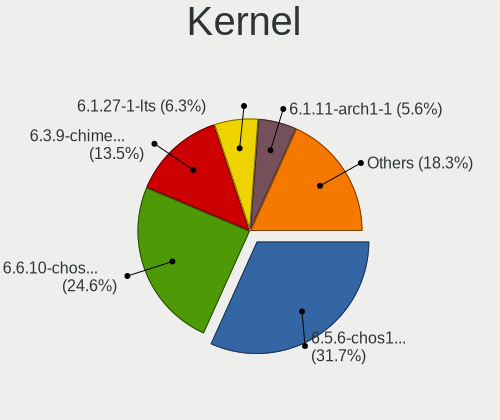
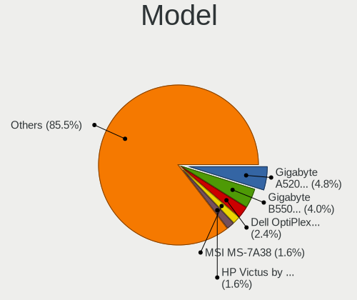
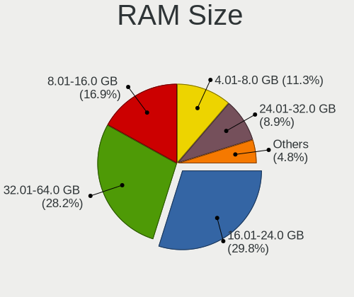
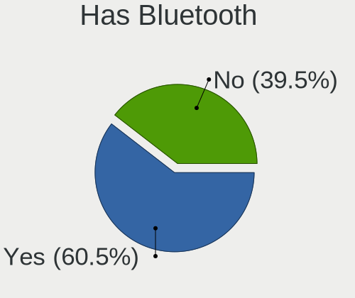
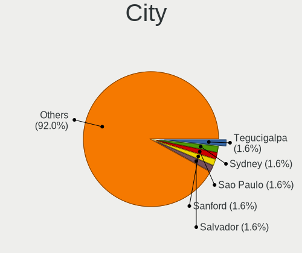
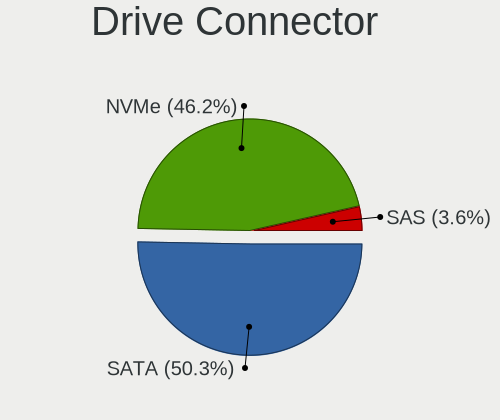
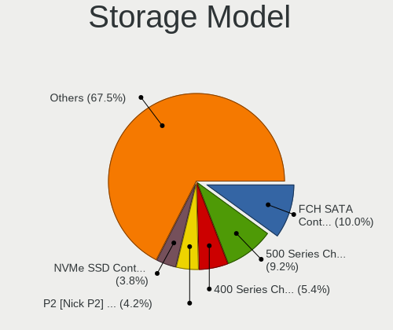
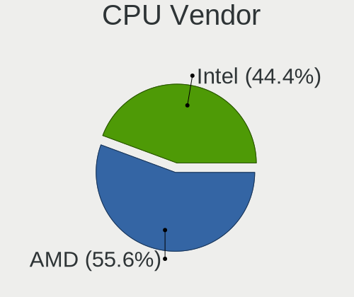
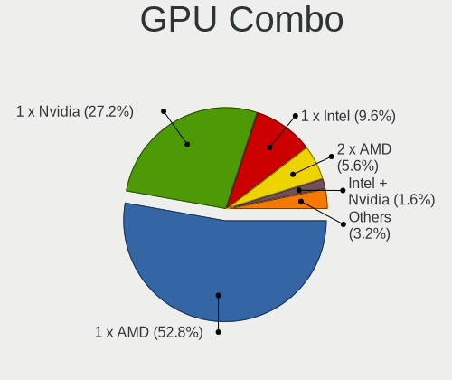
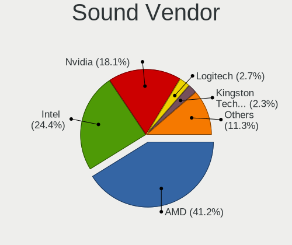

ChimeraOS - Tested Hardware & Statistics (Desktops)
---------------------------------------------------

A project to collect tested hardware configurations for ChimeraOS.

Anyone can contribute to this report by the [hw-probe](https://github.com/linuxhw/hw-probe) tool:

    sudo -E hw-probe -all -upload

Please contribute! Especially if your hardware is rare.

Contents
--------

* [ Test Cases ](#test-cases)

* [ System ](#system)
  - [ OS                       ](#os)
  - [ OS Family                ](#os-family)
  - [ Kernel                   ](#kernel)
  - [ Kernel Family            ](#kernel-family)
  - [ Kernel Major Ver.        ](#kernel-major-ver)
  - [ Arch                     ](#arch)
  - [ DE                       ](#de)
  - [ Display Server           ](#display-server)
  - [ Display Manager          ](#display-manager)
  - [ OS Lang                  ](#os-lang)
  - [ Boot Mode                ](#boot-mode)
  - [ Filesystem               ](#filesystem)
  - [ Part. scheme             ](#part-scheme)
  - [ Dual Boot with Linux/BSD ](#dual-boot-with-linuxbsd)
  - [ Dual Boot (Win)          ](#dual-boot-win)

* [ Board ](#board)
  - [ Vendor                   ](#vendor)
  - [ Model                    ](#model)
  - [ Model Family             ](#model-family)
  - [ MFG Year                 ](#mfg-year)
  - [ Form Factor              ](#form-factor)
  - [ Secure Boot              ](#secure-boot)
  - [ Coreboot                 ](#coreboot)
  - [ RAM Size                 ](#ram-size)
  - [ RAM Used                 ](#ram-used)
  - [ Total Drives             ](#total-drives)
  - [ Has CD-ROM               ](#has-cd-rom)
  - [ Has Ethernet             ](#has-ethernet)
  - [ Has WiFi                 ](#has-wifi)
  - [ Has Bluetooth            ](#has-bluetooth)

* [ Location ](#location)
  - [ Country                  ](#country)
  - [ City                     ](#city)

* [ Drives ](#drives)
  - [ Drive Vendor             ](#drive-vendor)
  - [ Drive Model              ](#drive-model)
  - [ HDD Vendor               ](#hdd-vendor)
  - [ SSD Vendor               ](#ssd-vendor)
  - [ Drive Kind               ](#drive-kind)
  - [ Drive Connector          ](#drive-connector)
  - [ Drive Size               ](#drive-size)
  - [ Space Total              ](#space-total)
  - [ Space Used               ](#space-used)
  - [ Malfunc. Drives          ](#malfunc-drives)
  - [ Malfunc. Drive Vendor    ](#malfunc-drive-vendor)
  - [ Malfunc. HDD Vendor      ](#malfunc-hdd-vendor)
  - [ Malfunc. Drive Kind      ](#malfunc-drive-kind)
  - [ Failed Drives            ](#failed-drives)
  - [ Failed Drive Vendor      ](#failed-drive-vendor)
  - [ Drive Status             ](#drive-status)

* [ Storage controller ](#storage-controller)
  - [ Storage Vendor           ](#storage-vendor)
  - [ Storage Model            ](#storage-model)
  - [ Storage Kind             ](#storage-kind)

* [ Processor ](#processor)
  - [ CPU Vendor               ](#cpu-vendor)
  - [ CPU Model                ](#cpu-model)
  - [ CPU Model Family         ](#cpu-model-family)
  - [ CPU Cores                ](#cpu-cores)
  - [ CPU Sockets              ](#cpu-sockets)
  - [ CPU Threads              ](#cpu-threads)
  - [ CPU Op-Modes             ](#cpu-op-modes)
  - [ CPU Microcode            ](#cpu-microcode)
  - [ CPU Microarch            ](#cpu-microarch)

* [ Graphics ](#graphics)
  - [ GPU Vendor               ](#gpu-vendor)
  - [ GPU Model                ](#gpu-model)
  - [ GPU Combo                ](#gpu-combo)
  - [ GPU Driver               ](#gpu-driver)
  - [ GPU Memory               ](#gpu-memory)

* [ Monitor ](#monitor)
  - [ Monitor Vendor           ](#monitor-vendor)
  - [ Monitor Model            ](#monitor-model)
  - [ Monitor Resolution       ](#monitor-resolution)
  - [ Monitor Diagonal         ](#monitor-diagonal)
  - [ Monitor Width            ](#monitor-width)
  - [ Aspect Ratio             ](#aspect-ratio)
  - [ Monitor Area             ](#monitor-area)
  - [ Pixel Density            ](#pixel-density)
  - [ Multiple Monitors        ](#multiple-monitors)

* [ Network ](#network)
  - [ Net Controller Vendor    ](#net-controller-vendor)
  - [ Net Controller Model     ](#net-controller-model)
  - [ Wireless Vendor          ](#wireless-vendor)
  - [ Wireless Model           ](#wireless-model)
  - [ Ethernet Vendor          ](#ethernet-vendor)
  - [ Ethernet Model           ](#ethernet-model)
  - [ Net Controller Kind      ](#net-controller-kind)
  - [ Used Controller          ](#used-controller)
  - [ NICs                     ](#nics)
  - [ IPv6                     ](#ipv6)

* [ Bluetooth ](#bluetooth)
  - [ Bluetooth Vendor         ](#bluetooth-vendor)
  - [ Bluetooth Model          ](#bluetooth-model)

* [ Sound ](#sound)
  - [ Sound Vendor             ](#sound-vendor)
  - [ Sound Model              ](#sound-model)

* [ Memory ](#memory)
  - [ Memory Vendor            ](#memory-vendor)
  - [ Memory Model             ](#memory-model)
  - [ Memory Kind              ](#memory-kind)
  - [ Memory Form Factor       ](#memory-form-factor)
  - [ Memory Size              ](#memory-size)
  - [ Memory Speed             ](#memory-speed)

* [ Printers & scanners ](#printers--scanners)
  - [ Printer Vendor           ](#printer-vendor)
  - [ Printer Model            ](#printer-model)
  - [ Scanner Vendor           ](#scanner-vendor)
  - [ Scanner Model            ](#scanner-model)

* [ Camera ](#camera)
  - [ Camera Vendor            ](#camera-vendor)
  - [ Camera Model             ](#camera-model)

* [ Security ](#security)
  - [ Fingerprint Vendor       ](#fingerprint-vendor)
  - [ Fingerprint Model        ](#fingerprint-model)
  - [ Chipcard Vendor          ](#chipcard-vendor)
  - [ Chipcard Model           ](#chipcard-model)

* [ Unsupported ](#unsupported)
  - [ Unsupported Devices      ](#unsupported-devices)
  - [ Unsupported Device Types ](#unsupported-device-types)

Test Cases
----------

Total: 124

| Vendor        | Model                       | Probe                                                      | Date         |
|---------------|-----------------------------|------------------------------------------------------------|--------------|
| Soyo          | SY-Classic B450M            | [e82641ba3c](https://linux-hardware.org/?probe=e82641ba3c) | May 02, 2024 |
| Shenzhen M... | DRFXI                       | [951a976cb0](https://linux-hardware.org/?probe=951a976cb0) | Apr 18, 2024 |
| ASUSTek       | ROG STRIX X570-E GAMING     | [c0a20b5a39](https://linux-hardware.org/?probe=c0a20b5a39) | Apr 14, 2024 |
| ASUSTek       | TUF Gaming Z690-PLUS WIF... | [635072047d](https://linux-hardware.org/?probe=635072047d) | Apr 14, 2024 |
| HP            | 1905                        | [64d13b2833](https://linux-hardware.org/?probe=64d13b2833) | Apr 12, 2024 |
| MSI           | B450M PRO-VDH MAX           | [f939a8ab03](https://linux-hardware.org/?probe=f939a8ab03) | Apr 04, 2024 |
| Dell          | 0Y7WYT A00                  | [5843a8bea7](https://linux-hardware.org/?probe=5843a8bea7) | Mar 25, 2024 |
| ASUSTek       | ROG STRIX B650-A GAMING ... | [4811d76465](https://linux-hardware.org/?probe=4811d76465) | Mar 18, 2024 |
| ASUSTek       | P8H61-M LE                  | [75db640e66](https://linux-hardware.org/?probe=75db640e66) | Mar 10, 2024 |
| MSI           | B450 TOMAHAWK MAX II        | [d9770af085](https://linux-hardware.org/?probe=d9770af085) | Mar 06, 2024 |
| Fujitsu       | D3061-A1 S26361-D3061-A1    | [964e9fc189](https://linux-hardware.org/?probe=964e9fc189) | Mar 06, 2024 |
| HC Technol... | HCAR6000-MI2                | [e84a5cbddb](https://linux-hardware.org/?probe=e84a5cbddb) | Mar 04, 2024 |
| Dell          | 02YYK5 A01                  | [fa518467ad](https://linux-hardware.org/?probe=fa518467ad) | Mar 04, 2024 |
| Gigabyte      | A520I AC                    | [6623b5eb34](https://linux-hardware.org/?probe=6623b5eb34) | Mar 04, 2024 |
| HC Technol... | HCAR5000-MI                 | [4db4f0aa29](https://linux-hardware.org/?probe=4db4f0aa29) | Mar 02, 2024 |
| Gigabyte      | A620I AX                    | [684be66545](https://linux-hardware.org/?probe=684be66545) | Feb 29, 2024 |
| Intel         | DH61WW AAG23116-302         | [eda91e0749](https://linux-hardware.org/?probe=eda91e0749) | Feb 26, 2024 |
| Dell          | 0NKW6Y A02                  | [59a10b16df](https://linux-hardware.org/?probe=59a10b16df) | Feb 17, 2024 |
| ASRock        | 970M Pro3                   | [3fdb7d7227](https://linux-hardware.org/?probe=3fdb7d7227) | Feb 12, 2024 |
| HP            | 89D8 SMVB                   | [2130b12c50](https://linux-hardware.org/?probe=2130b12c50) | Feb 09, 2024 |
| Gigabyte      | A520I AC                    | [914c716ebc](https://linux-hardware.org/?probe=914c716ebc) | Feb 05, 2024 |
| Gigabyte      | B650M AORUS ELITE AX        | [f39c1ef04f](https://linux-hardware.org/?probe=f39c1ef04f) | Jan 27, 2024 |
| Gateway       | IPISB-VR                    | [31d92a1fe6](https://linux-hardware.org/?probe=31d92a1fe6) | Jan 25, 2024 |
| Intel         | H61                         | [d3895696ad](https://linux-hardware.org/?probe=d3895696ad) | Jan 23, 2024 |
| ASUSTek       | AM1M-A                      | [6b24e4acaf](https://linux-hardware.org/?probe=6b24e4acaf) | Jan 22, 2024 |
| ASUSTek       | PRIME X570-PRO              | [0a04043949](https://linux-hardware.org/?probe=0a04043949) | Jan 22, 2024 |
| ASRock        | B550 Phantom Gaming-ITX/... | [85f96ac567](https://linux-hardware.org/?probe=85f96ac567) | Jan 14, 2024 |
| ASUSTek       | ROG STRIX X570-I GAMING     | [3885b0cee8](https://linux-hardware.org/?probe=3885b0cee8) | Jan 12, 2024 |
| HP            | 885F A                      | [3050f4d975](https://linux-hardware.org/?probe=3050f4d975) | Jan 05, 2024 |
| HP            | 885F A                      | [7f484d8166](https://linux-hardware.org/?probe=7f484d8166) | Jan 05, 2024 |
| MSI           | Z87-G41 PC Mate             | [36d3fe7f0a](https://linux-hardware.org/?probe=36d3fe7f0a) | Jan 03, 2024 |
| MSI           | PRO B650-P WIFI             | [544a799ce8](https://linux-hardware.org/?probe=544a799ce8) | Jan 02, 2024 |
| ASRock        | Z77 Professional            | [d1d9fce85d](https://linux-hardware.org/?probe=d1d9fce85d) | Jan 01, 2024 |
| ASUSTek       | ROG STRIX B650-A GAMING ... | [dffaa09f84](https://linux-hardware.org/?probe=dffaa09f84) | Dec 29, 2023 |
| Dell          | 07WP95 A02                  | [b5d957b7ec](https://linux-hardware.org/?probe=b5d957b7ec) | Dec 12, 2023 |
| Gigabyte      | 970A-DS3P                   | [ea510ad39c](https://linux-hardware.org/?probe=ea510ad39c) | Dec 09, 2023 |
| Gigabyte      | H81M-H                      | [108ddf7f8e](https://linux-hardware.org/?probe=108ddf7f8e) | Dec 07, 2023 |
| Dell          | 07HXY6 A01                  | [37ba613bd3](https://linux-hardware.org/?probe=37ba613bd3) | Dec 01, 2023 |
| Dell          | 0T0MHW A03                  | [91cd726063](https://linux-hardware.org/?probe=91cd726063) | Nov 30, 2023 |
| ASUSTek       | PRIME X370-A                | [491dd5c51b](https://linux-hardware.org/?probe=491dd5c51b) | Nov 28, 2023 |
| Gigabyte      | A520I AC                    | [9672d50090](https://linux-hardware.org/?probe=9672d50090) | Nov 28, 2023 |
| ASUSTek       | TUF Gaming B450M-PRO S      | [606a157eb4](https://linux-hardware.org/?probe=606a157eb4) | Nov 24, 2023 |
| Dell          | 03KWTV A00                  | [f641738a49](https://linux-hardware.org/?probe=f641738a49) | Nov 23, 2023 |
| ASUSTek       | PRIME B560M-A               | [4048fd2631](https://linux-hardware.org/?probe=4048fd2631) | Nov 22, 2023 |
| Gigabyte      | A520M H                     | [abba035964](https://linux-hardware.org/?probe=abba035964) | Nov 19, 2023 |
| ASRock        | Z87 Extreme4                | [84a46af7ee](https://linux-hardware.org/?probe=84a46af7ee) | Nov 19, 2023 |
| Gigabyte      | B550I AORUS PRO AX          | [694b0754fa](https://linux-hardware.org/?probe=694b0754fa) | Nov 18, 2023 |
| Dell          | 0DY62R A01                  | [03f9c7a1f2](https://linux-hardware.org/?probe=03f9c7a1f2) | Nov 17, 2023 |
| HP            | 8464                        | [2eae0556b2](https://linux-hardware.org/?probe=2eae0556b2) | Nov 16, 2023 |
| MSI           | B550-A PRO                  | [10e26870d7](https://linux-hardware.org/?probe=10e26870d7) | Nov 13, 2023 |
| Gigabyte      | B550I AORUS PRO AX          | [b15037e662](https://linux-hardware.org/?probe=b15037e662) | Nov 11, 2023 |
| ASUSTek       | TUF Gaming B550M-PLUS       | [2c921ede59](https://linux-hardware.org/?probe=2c921ede59) | Nov 08, 2023 |
| ASRock        | B550M-HDV                   | [6f0980a8f2](https://linux-hardware.org/?probe=6f0980a8f2) | Nov 07, 2023 |
| MSI           | B550-A PRO                  | [3333de3c07](https://linux-hardware.org/?probe=3333de3c07) | Nov 06, 2023 |
| ASRock        | B550M-HDV                   | [e005a7da3a](https://linux-hardware.org/?probe=e005a7da3a) | Nov 06, 2023 |
| Gigabyte      | B450M S2H                   | [b40c43c829](https://linux-hardware.org/?probe=b40c43c829) | Nov 05, 2023 |
| Gigabyte      | B450M S2H                   | [67a1ec0ae8](https://linux-hardware.org/?probe=67a1ec0ae8) | Nov 05, 2023 |
| Gigabyte      | B550I AORUS PRO AX          | [9f47c70860](https://linux-hardware.org/?probe=9f47c70860) | Nov 04, 2023 |
| Dell          | 01NP3N A00                  | [2332805279](https://linux-hardware.org/?probe=2332805279) | Nov 04, 2023 |
| Gigabyte      | B550I AORUS PRO AX          | [e073d8c90a](https://linux-hardware.org/?probe=e073d8c90a) | Nov 03, 2023 |
| Gigabyte      | H61M-DS2                    | [877ab8782b](https://linux-hardware.org/?probe=877ab8782b) | Nov 01, 2023 |
| MSI           | B450 GAMING PLUS            | [d7fb2de5a7](https://linux-hardware.org/?probe=d7fb2de5a7) | Oct 30, 2023 |
| ASUSTek       | H110M-A                     | [a58f65d857](https://linux-hardware.org/?probe=a58f65d857) | Oct 27, 2023 |
| ASUSTek       | Z170-A                      | [480f22e1b7](https://linux-hardware.org/?probe=480f22e1b7) | Oct 24, 2023 |
| Gigabyte      | X570 I AORUS PRO WIFI       | [6d454c05e2](https://linux-hardware.org/?probe=6d454c05e2) | Oct 21, 2023 |
| Gigabyte      | X570 I AORUS PRO WIFI       | [6cc2145e11](https://linux-hardware.org/?probe=6cc2145e11) | Oct 21, 2023 |
| GMKtec        | NucBox K4                   | [b0f8dc54f3](https://linux-hardware.org/?probe=b0f8dc54f3) | Oct 20, 2023 |
| AZW           | SER V1                      | [eca53f2271](https://linux-hardware.org/?probe=eca53f2271) | Oct 18, 2023 |
| Gigabyte      | B550M AORUS PRO-P           | [257a13e71a](https://linux-hardware.org/?probe=257a13e71a) | Oct 02, 2023 |
| Gigabyte      | A520I AC                    | [48f4eb15cc](https://linux-hardware.org/?probe=48f4eb15cc) | Oct 02, 2023 |
| ASRock        | A320M-HDV                   | [2beb623746](https://linux-hardware.org/?probe=2beb623746) | Sep 26, 2023 |
| ASUSTek       | SABERTOOTH Z170 MARK 1      | [27d1633bc3](https://linux-hardware.org/?probe=27d1633bc3) | Sep 11, 2023 |
| HP            | 18E7                        | [1b966d0110](https://linux-hardware.org/?probe=1b966d0110) | Sep 11, 2023 |
| HP            | 89B5 A                      | [4934bfa1a8](https://linux-hardware.org/?probe=4934bfa1a8) | Sep 09, 2023 |
| ASUSTek       | GD30CI                      | [f1c877be0e](https://linux-hardware.org/?probe=f1c877be0e) | Sep 05, 2023 |
| Gigabyte      | Z490 GAMING X AX y.y        | [94a6d62c4b](https://linux-hardware.org/?probe=94a6d62c4b) | Aug 28, 2023 |
| Dell          | 04Y8V0 A02                  | [5afb05e780](https://linux-hardware.org/?probe=5afb05e780) | Aug 27, 2023 |
| ASRock        | B550M-ITX/ac                | [64aa93e41b](https://linux-hardware.org/?probe=64aa93e41b) | Aug 14, 2023 |
| ASUSTek       | TUF B450M-PLUS GAMING       | [3ac1be3b93](https://linux-hardware.org/?probe=3ac1be3b93) | Aug 13, 2023 |
| Dell          | 05YDCW A01                  | [3f3195be63](https://linux-hardware.org/?probe=3f3195be63) | Aug 12, 2023 |
| Dell          | 05YDCW A01                  | [80c27f0ac1](https://linux-hardware.org/?probe=80c27f0ac1) | Aug 12, 2023 |
| Gigabyte      | B550I AORUS PRO AX          | [b1b6854522](https://linux-hardware.org/?probe=b1b6854522) | Jul 29, 2023 |
| ASRock        | H97M Anniversary            | [f8a02ab68e](https://linux-hardware.org/?probe=f8a02ab68e) | Jul 27, 2023 |
| ASUSTek       | ROG STRIX B550-F GAMING     | [c8a41127a9](https://linux-hardware.org/?probe=c8a41127a9) | Jul 23, 2023 |
| ASUSTek       | ROG STRIX B550-F GAMING     | [9186fec300](https://linux-hardware.org/?probe=9186fec300) | Jul 23, 2023 |
| ASUSTek       | STRIX Z270F GAMING          | [80e44d8594](https://linux-hardware.org/?probe=80e44d8594) | Jul 22, 2023 |
| Gigabyte      | B450 AORUS PRO WIFI-CF      | [f747d5537e](https://linux-hardware.org/?probe=f747d5537e) | Jul 15, 2023 |
| Acer          | Veriton X6610G              | [e1189e3406](https://linux-hardware.org/?probe=e1189e3406) | Jul 13, 2023 |
| Dell          | 0KC9NP A01                  | [570f59305c](https://linux-hardware.org/?probe=570f59305c) | Jul 08, 2023 |
| Dell          | 0KC9NP A01                  | [6d62d0cdbf](https://linux-hardware.org/?probe=6d62d0cdbf) | Jul 08, 2023 |
| HP            | 1791                        | [a2bf914a45](https://linux-hardware.org/?probe=a2bf914a45) | Jul 08, 2023 |
| ASUSTek       | PRIME B550-PLUS             | [13195d7ff3](https://linux-hardware.org/?probe=13195d7ff3) | Jul 02, 2023 |
| HP            | 1998                        | [91f6e54877](https://linux-hardware.org/?probe=91f6e54877) | Jun 30, 2023 |
| Gigabyte      | G1.Sniper A88X-CF           | [d4470db5d3](https://linux-hardware.org/?probe=d4470db5d3) | Jun 20, 2023 |
| Dell          | 02YYK5 A01                  | [50efda9604](https://linux-hardware.org/?probe=50efda9604) | Jun 19, 2023 |
| Gigabyte      | B450 AORUS M                | [299db094f8](https://linux-hardware.org/?probe=299db094f8) | Jun 18, 2023 |
| Dell          | 07HXY6 A01                  | [ec3adcbe42](https://linux-hardware.org/?probe=ec3adcbe42) | Jun 16, 2023 |
| Gigabyte      | B550I AORUS PRO AX          | [798d8e8914](https://linux-hardware.org/?probe=798d8e8914) | Jun 11, 2023 |
| MSI           | MPG B650I EDGE WIFI         | [d43ce99616](https://linux-hardware.org/?probe=d43ce99616) | Jun 07, 2023 |
| ASUSTek       | PRIME B760-PLUS D4          | [bb01d9e92b](https://linux-hardware.org/?probe=bb01d9e92b) | May 12, 2023 |
| ASUSTek       | ROG STRIX B460-I GAMING     | [3a9528f661](https://linux-hardware.org/?probe=3a9528f661) | May 10, 2023 |
| ASUSTek       | ROG STRIX B550-F GAMING     | [ad66608cf0](https://linux-hardware.org/?probe=ad66608cf0) | May 08, 2023 |
| ASUSTek       | PRIME B760-PLUS D4          | [4ec161ab9b](https://linux-hardware.org/?probe=4ec161ab9b) | May 04, 2023 |
| Dell          | 0FDY5C A00                  | [a6865b8591](https://linux-hardware.org/?probe=a6865b8591) | Apr 16, 2023 |
| ASUSTek       | ROG STRIX B460-I GAMING     | [14db4e6f1d](https://linux-hardware.org/?probe=14db4e6f1d) | Apr 11, 2023 |
| ASUSTek       | ROG STRIX B650E-I GAMING... | [03db223af4](https://linux-hardware.org/?probe=03db223af4) | Apr 06, 2023 |
| ASUSTek       | ROG STRIX B650E-I GAMING... | [f8c2ffcd09](https://linux-hardware.org/?probe=f8c2ffcd09) | Apr 06, 2023 |
| MACHINIST     | X99-RS9 V2.0                | [ad4c43dd09](https://linux-hardware.org/?probe=ad4c43dd09) | Mar 21, 2023 |
| Gigabyte      | B460M DS3H AC V2-Y1         | [b21cd49226](https://linux-hardware.org/?probe=b21cd49226) | Mar 16, 2023 |
| MSI           | MPG B650I EDGE WIFI         | [9f40b861a5](https://linux-hardware.org/?probe=9f40b861a5) | Mar 12, 2023 |
| Gigabyte      | B460M DS3H AC V2-Y1         | [7f8fc2ba96](https://linux-hardware.org/?probe=7f8fc2ba96) | Mar 10, 2023 |
| Dell          | 0XHGV1 A00                  | [8fa504e81f](https://linux-hardware.org/?probe=8fa504e81f) | Mar 07, 2023 |
| Intel         | DB75EN AAG39650-400         | [4a0feca3f5](https://linux-hardware.org/?probe=4a0feca3f5) | Mar 02, 2023 |
| Gigabyte      | H77M-D3H                    | [01eb743492](https://linux-hardware.org/?probe=01eb743492) | Feb 25, 2023 |
| Gigabyte      | H77M-D3H                    | [766790f373](https://linux-hardware.org/?probe=766790f373) | Feb 25, 2023 |
| ASUSTek       | B150I PRO GAMING/WIFI/AU... | [eb1e211b0f](https://linux-hardware.org/?probe=eb1e211b0f) | Feb 25, 2023 |
| HP            | 1998                        | [dbb952f3f6](https://linux-hardware.org/?probe=dbb952f3f6) | Feb 13, 2023 |
| HP            | 1998                        | [0171575a1d](https://linux-hardware.org/?probe=0171575a1d) | Feb 13, 2023 |
| Gigabyte      | H510M H                     | [69d2cb7e14](https://linux-hardware.org/?probe=69d2cb7e14) | Jan 11, 2023 |
| ASUSTek       | P8H61-MX R2.0               | [3e4b14919e](https://linux-hardware.org/?probe=3e4b14919e) | Jan 05, 2023 |
| Gigabyte      | X570S AORUS ELITE AX        | [02b3cbc8c6](https://linux-hardware.org/?probe=02b3cbc8c6) | Jan 04, 2023 |
| Gigabyte      | X570S AORUS ELITE AX        | [13ae6c7e25](https://linux-hardware.org/?probe=13ae6c7e25) | Jan 01, 2023 |
| Gigabyte      | X570 AORUS ELITE WIFI       | [49ca01435b](https://linux-hardware.org/?probe=49ca01435b) | Dec 27, 2022 |
| Lenovo        | ThinkCentre M70e 0832B1U    | [d95663a632](https://linux-hardware.org/?probe=d95663a632) | Dec 07, 2022 |

System
------

OS
--

Installed operating systems

| Name           | Desktops | Percent |
|----------------|----------|---------|
| ChimeraOS 44-1 | 41       | 38.68%  |
| ChimeraOS 45   | 13       | 12.26%  |
| ChimeraOS 43-1 | 11       | 10.38%  |
| ChimeraOS 42   | 8        | 7.55%   |
| ChimeraOS 45-1 | 7        | 6.6%    |
| ChimeraOS 39   | 7        | 6.6%    |
| ChimeraOS 43   | 6        | 5.66%   |
| ChimeraOS 41   | 4        | 3.77%   |
| ChimeraOS 38   | 4        | 3.77%   |
| ChimeraOS 44   | 3        | 2.83%   |
| ChimeraOS 37   | 2        | 1.89%   |

OS Family
---------

OS without a version

| Name      | Desktops | Percent |
|-----------|----------|---------|
| ChimeraOS | 104      | 100%    |

Kernel
------

Version of the Linux kernel

| Version                  | Desktops | Percent |
|--------------------------|----------|---------|
| 6.5.6-chos1-chimeraos-1  | 40       | 37.74%  |
| 6.6.10-chos1-chimeraos-2 | 20       | 18.87%  |
| 6.3.9-chimeraos-1        | 17       | 16.04%  |
| 6.1.27-1-lts             | 8        | 7.55%   |
| 6.1.11-arch1-1           | 7        | 6.6%    |
| 6.1.21-1-lts             | 4        | 3.77%   |
| 6.1.1-arch1-1            | 4        | 3.77%   |
| 6.5.3-chos1-chimeraos-1  | 3        | 2.83%   |
| 6.0.8-arch1-1            | 2        | 1.89%   |
| 6.6.6-arch1-1            | 1        | 0.94%   |

Kernel Family
-------------

Linux kernel without a distro release

| Version | Desktops | Percent |
|---------|----------|---------|
| 6.5.6   | 40       | 37.74%  |
| 6.6.10  | 20       | 18.87%  |
| 6.3.9   | 17       | 16.04%  |
| 6.1.27  | 8        | 7.55%   |
| 6.1.11  | 7        | 6.6%    |
| 6.1.21  | 4        | 3.77%   |
| 6.1.1   | 4        | 3.77%   |
| 6.5.3   | 3        | 2.83%   |
| 6.0.8   | 2        | 1.89%   |
| 6.6.6   | 1        | 0.94%   |

Kernel Major Ver.
-----------------

Linux kernel major version

| Version | Desktops | Percent |
|---------|----------|---------|
| 6.5     | 43       | 40.95%  |
| 6.1     | 22       | 20.95%  |
| 6.6     | 21       | 20%     |
| 6.3     | 17       | 16.19%  |
| 6.0     | 2        | 1.9%    |

Arch
----

OS architecture (x86_64, i586, etc.)

| Name   | Desktops | Percent |
|--------|----------|---------|
| x86_64 | 104      | 100%    |

DE
--

Desktop Environment

| Name    | Desktops | Percent |
|---------|----------|---------|
| GNOME   | 103      | 99.04%  |
| steamos | 1        | 0.96%   |

Display Server
--------------

X11 or Wayland

| Name    | Desktops | Percent |
|---------|----------|---------|
| Wayland | 100      | 96.15%  |
| X11     | 4        | 3.85%   |

Display Manager
---------------

SDDM, LightDM, etc.

| Name    | Desktops | Percent |
|---------|----------|---------|
| Unknown | 104      | 100%    |

OS Lang
-------

Language

| Lang  | Desktops | Percent |
|-------|----------|---------|
| en_US | 95       | 91.35%  |
| es_ES | 2        | 1.92%   |
| de_DE | 2        | 1.92%   |
| pt_BR | 1        | 0.96%   |
| ja_JP | 1        | 0.96%   |
| fr_FR | 1        | 0.96%   |
| es_AR | 1        | 0.96%   |
| en_GB | 1        | 0.96%   |

Boot Mode
---------

EFI or BIOS

| Mode | Desktops | Percent |
|------|----------|---------|
| BIOS | 104      | 100%    |

Filesystem
----------

Type of filesystem

| Type  | Desktops | Percent |
|-------|----------|---------|
| Btrfs | 104      | 100%    |

Part. scheme
------------

Scheme of partitioning

| Type    | Desktops | Percent |
|---------|----------|---------|
| Unknown | 104      | 100%    |

Dual Boot with Linux/BSD
------------------------

Hosting more than one Linux/BSD

| Dual boot | Desktops | Percent |
|-----------|----------|---------|
| No        | 104      | 100%    |

Dual Boot (Win)
---------------

Hosting Linux and Windows

| Dual boot | Desktops | Percent |
|-----------|----------|---------|
| No        | 104      | 100%    |

Board
-----

Vendor
------

Motherboard manufacturer

| Name                                 | Desktops | Percent |
|--------------------------------------|----------|---------|
| Gigabyte Technology                  | 26       | 25%     |
| ASUSTek Computer                     | 25       | 24.04%  |
| Dell                                 | 15       | 14.42%  |
| Hewlett-Packard                      | 9        | 8.65%   |
| ASRock                               | 8        | 7.69%   |
| MSI                                  | 7        | 6.73%   |
| Intel                                | 3        | 2.88%   |
| HC Technology.                       | 2        | 1.92%   |
| Soyo                                 | 1        | 0.96%   |
| Shenzhen Meigao Electronic Equipment | 1        | 0.96%   |
| MACHINIST                            | 1        | 0.96%   |
| Lenovo                               | 1        | 0.96%   |
| GMKtec                               | 1        | 0.96%   |
| Gateway                              | 1        | 0.96%   |
| Fujitsu                              | 1        | 0.96%   |
| AZW                                  | 1        | 0.96%   |
| Acer                                 | 1        | 0.96%   |

Model
-----

Motherboard model

| Name                                               | Desktops | Percent |
|----------------------------------------------------|----------|---------|
| Gigabyte B550I AORUS PRO AX                        | 4        | 3.85%   |
| Gigabyte A520I AC                                  | 4        | 3.85%   |
| Dell OptiPlex 3060                                 | 3        | 2.88%   |
| HP Victus by 15L Gaming Desktop TG02-0xxx          | 2        | 1.92%   |
| HP EliteDesk 800 G1 SFF                            | 2        | 1.92%   |
| Dell OptiPlex 7020                                 | 2        | 1.92%   |
| Dell OptiPlex 5055 Ryzen APU                       | 2        | 1.92%   |
| Dell OptiPlex 3070                                 | 2        | 1.92%   |
| ASUS ROG STRIX B550-F GAMING                       | 2        | 1.92%   |
| Soyo SY-Classic B450M                              | 1        | 0.96%   |
| Shenzhen Meigao Electronic Equipment Uranus Series | 1        | 0.96%   |
| MSI MS-7D78                                        | 1        | 0.96%   |
| MSI MS-7D73                                        | 1        | 0.96%   |
| MSI MS-7C56                                        | 1        | 0.96%   |
| MSI MS-7C02                                        | 1        | 0.96%   |
| MSI MS-7B86                                        | 1        | 0.96%   |
| MSI MS-7A38                                        | 1        | 0.96%   |
| MSI MS-7850                                        | 1        | 0.96%   |
| MACHINIST X99-RS9 V2.0                             | 1        | 0.96%   |
| Lenovo ThinkCentre M70e 0832B1U                    | 1        | 0.96%   |
| Intel H61                                          | 1        | 0.96%   |
| Intel DH61WW AAG23116-302                          | 1        | 0.96%   |
| Intel DB75EN AAG39650-400                          | 1        | 0.96%   |
| HP Z230 Tower Workstation                          | 1        | 0.96%   |
| HP Z220 SFF Workstation                            | 1        | 0.96%   |
| HP Slim Desktop S01-pF2xxx                         | 1        | 0.96%   |
| HP ProDesk 600 G1 SFF                              | 1        | 0.96%   |
| HP EliteDesk 705 G4 DM 35W                         | 1        | 0.96%   |
| HC Technology. HCAR6000-MI2                        | 1        | 0.96%   |
| HC Technology. HCAR5000-MI                         | 1        | 0.96%   |
| GMKtec NucBox K4                                   | 1        | 0.96%   |
| Gigabyte Z490 GAMING X AX                          | 1        | 0.96%   |
| Gigabyte X570S AORUS ELITE AX                      | 1        | 0.96%   |
| Gigabyte X570 I AORUS PRO WIFI                     | 1        | 0.96%   |
| Gigabyte X570 AORUS ELITE WIFI                     | 1        | 0.96%   |
| Gigabyte H81M-H                                    | 1        | 0.96%   |
| Gigabyte H77M-D3H                                  | 1        | 0.96%   |
| Gigabyte H61M-DS2                                  | 1        | 0.96%   |
| Gigabyte H510M H                                   | 1        | 0.96%   |
| Gigabyte G1.Sniper A88X-CF                         | 1        | 0.96%   |

Model Family
------------

Motherboard model prefix

| Name                                        | Desktops | Percent |
|---------------------------------------------|----------|---------|
| Dell OptiPlex                               | 14       | 13.46%  |
| ASUS ROG                                    | 7        | 6.73%   |
| ASUS PRIME                                  | 5        | 4.81%   |
| Gigabyte B550I                              | 4        | 3.85%   |
| Gigabyte A520I                              | 4        | 3.85%   |
| ASUS TUF                                    | 4        | 3.85%   |
| HP EliteDesk                                | 3        | 2.88%   |
| HP Victus                                   | 2        | 1.92%   |
| Gigabyte X570                               | 2        | 1.92%   |
| Gigabyte B450                               | 2        | 1.92%   |
| Soyo SY-Classic                             | 1        | 0.96%   |
| Shenzhen Meigao Electronic Equipment Uranus | 1        | 0.96%   |
| MSI MS-7D78                                 | 1        | 0.96%   |
| MSI MS-7D73                                 | 1        | 0.96%   |
| MSI MS-7C56                                 | 1        | 0.96%   |
| MSI MS-7C02                                 | 1        | 0.96%   |
| MSI MS-7B86                                 | 1        | 0.96%   |
| MSI MS-7A38                                 | 1        | 0.96%   |
| MSI MS-7850                                 | 1        | 0.96%   |
| MACHINIST X99-RS9                           | 1        | 0.96%   |
| Lenovo ThinkCentre                          | 1        | 0.96%   |
| Intel H61                                   | 1        | 0.96%   |
| Intel DH61WW                                | 1        | 0.96%   |
| Intel DB75EN                                | 1        | 0.96%   |
| HP Z230                                     | 1        | 0.96%   |
| HP Z220                                     | 1        | 0.96%   |
| HP Slim                                     | 1        | 0.96%   |
| HP ProDesk                                  | 1        | 0.96%   |
| HC Technology. HCAR6000-MI2                 | 1        | 0.96%   |
| HC Technology. HCAR5000-MI                  | 1        | 0.96%   |
| GMKtec NucBox                               | 1        | 0.96%   |
| Gigabyte Z490                               | 1        | 0.96%   |
| Gigabyte X570S                              | 1        | 0.96%   |
| Gigabyte H81M-H                             | 1        | 0.96%   |
| Gigabyte H77M-D3H                           | 1        | 0.96%   |
| Gigabyte H61M-DS2                           | 1        | 0.96%   |
| Gigabyte H510M                              | 1        | 0.96%   |
| Gigabyte G1.Sniper                          | 1        | 0.96%   |
| Gigabyte B650M                              | 1        | 0.96%   |
| Gigabyte B550M                              | 1        | 0.96%   |

MFG Year
--------

Motherboard manufacture year

| Year | Desktops | Percent |
|------|----------|---------|
| 2020 | 19       | 18.27%  |
| 2021 | 12       | 11.54%  |
| 2019 | 10       | 9.62%   |
| 2013 | 9        | 8.65%   |
| 2022 | 8        | 7.69%   |
| 2018 | 8        | 7.69%   |
| 2023 | 7        | 6.73%   |
| 2012 | 7        | 6.73%   |
| 2015 | 6        | 5.77%   |
| 2017 | 5        | 4.81%   |
| 2011 | 5        | 4.81%   |
| 2016 | 3        | 2.88%   |
| 2014 | 3        | 2.88%   |
| 2024 | 1        | 0.96%   |
| 2010 | 1        | 0.96%   |

Form Factor
-----------

Physical design of the computer

| Name    | Desktops | Percent |
|---------|----------|---------|
| Desktop | 104      | 100%    |

Secure Boot
-----------

Enabled or disabled

| State    | Desktops | Percent |
|----------|----------|---------|
| Disabled | 104      | 100%    |

Coreboot
--------

Have coreboot on board

| Used | Desktops | Percent |
|------|----------|---------|
| No   | 104      | 100%    |

RAM Size
--------

Total RAM memory

| Size in GB  | Desktops | Percent |
|-------------|----------|---------|
| 32.01-64.0  | 30       | 28.85%  |
| 16.01-24.0  | 29       | 27.88%  |
| 8.01-16.0   | 19       | 18.27%  |
| 4.01-8.0    | 14       | 13.46%  |
| 24.01-32.0  | 10       | 9.62%   |
| 64.01-256.0 | 2        | 1.92%   |

RAM Used
--------

Used RAM memory

| Used GB    | Desktops | Percent |
|------------|----------|---------|
| 2.01-3.0   | 37       | 35.24%  |
| 1.01-2.0   | 31       | 29.52%  |
| 3.01-4.0   | 19       | 18.1%   |
| 4.01-8.0   | 17       | 16.19%  |
| 16.01-24.0 | 1        | 0.95%   |

Total Drives
------------

Number of drives on board

| Drives | Desktops | Percent |
|--------|----------|---------|
| 1      | 52       | 49.06%  |
| 2      | 25       | 23.58%  |
| 3      | 20       | 18.87%  |
| 4      | 5        | 4.72%   |
| 5      | 3        | 2.83%   |
| 6      | 1        | 0.94%   |

Has CD-ROM
----------

Has CD-ROM on board

| Presented | Desktops | Percent |
|-----------|----------|---------|
| No        | 83       | 79.81%  |
| Yes       | 21       | 20.19%  |

Has Ethernet
------------

Has Ethernet on board

| Presented | Desktops | Percent |
|-----------|----------|---------|
| Yes       | 104      | 100%    |

Has WiFi
--------

Has WiFi module

| Presented | Desktops | Percent |
|-----------|----------|---------|
| Yes       | 68       | 65.38%  |
| No        | 36       | 34.62%  |

Has Bluetooth
-------------

Has Bluetooth module

| Presented | Desktops | Percent |
|-----------|----------|---------|
| Yes       | 61       | 58.65%  |
| No        | 43       | 41.35%  |

Location
--------

Country
-------

Geographic location (country)

| Country     | Desktops | Percent |
|-------------|----------|---------|
| USA         | 51       | 49.04%  |
| Germany     | 7        | 6.73%   |
| UK          | 5        | 4.81%   |
| Brazil      | 5        | 4.81%   |
| Russia      | 4        | 3.85%   |
| France      | 4        | 3.85%   |
| Australia   | 4        | 3.85%   |
| Canada      | 3        | 2.88%   |
| Turkey      | 2        | 1.92%   |
| Spain       | 2        | 1.92%   |
| Poland      | 2        | 1.92%   |
| Norway      | 2        | 1.92%   |
| Japan       | 2        | 1.92%   |
| Argentina   | 2        | 1.92%   |
| Vietnam     | 1        | 0.96%   |
| New Zealand | 1        | 0.96%   |
| Netherlands | 1        | 0.96%   |
| Malaysia    | 1        | 0.96%   |
| Indonesia   | 1        | 0.96%   |
| Iceland     | 1        | 0.96%   |
| Hungary     | 1        | 0.96%   |
| Honduras    | 1        | 0.96%   |
| Chile       | 1        | 0.96%   |

City
----

Geographic location (city)

| City           | Desktops | Percent |
|----------------|----------|---------|
| Sanford        | 2        | 1.9%    |
| Salvador       | 2        | 1.9%    |
| Melbourne      | 2        | 1.9%    |
| Istanbul       | 2        | 1.9%    |
| Yekaterinburg  | 1        | 0.95%   |
| Yaroslavl      | 1        | 0.95%   |
| Wilmington     | 1        | 0.95%   |
| Wiehl          | 1        | 0.95%   |
| Watsonville    | 1        | 0.95%   |
| Warsaw         | 1        | 0.95%   |
| Vincennes      | 1        | 0.95%   |
| Valence        | 1        | 0.95%   |
| Umeda          | 1        | 0.95%   |
| Tucson         | 1        | 0.95%   |
| Toronto        | 1        | 0.95%   |
| Theodore       | 1        | 0.95%   |
| The Hague      | 1        | 0.95%   |
| Tegucigalpa    | 1        | 0.95%   |
| Tampa          | 1        | 0.95%   |
| Sydney         | 1        | 0.95%   |
| Sumaré        | 1        | 0.95%   |
| Steyning       | 1        | 0.95%   |
| Shelbyville    | 1        | 0.95%   |
| Severn         | 1        | 0.95%   |
| Seneca         | 1        | 0.95%   |
| Seattle        | 1        | 0.95%   |
| Sarpsborg      | 1        | 0.95%   |
| Sao Paulo      | 1        | 0.95%   |
| Santiago       | 1        | 0.95%   |
| San Leandro    | 1        | 0.95%   |
| San Jose       | 1        | 0.95%   |
| San Bernardino | 1        | 0.95%   |
| Salisbury      | 1        | 0.95%   |
| Round Rock     | 1        | 0.95%   |
| Rockford       | 1        | 0.95%   |
| Rio Rancho     | 1        | 0.95%   |
| Reykjavik      | 1        | 0.95%   |
| Racine         | 1        | 0.95%   |
| Quilmes        | 1        | 0.95%   |
| Porto Alegre   | 1        | 0.95%   |

Drives
------

Drive Vendor
------------

Hard drive vendors

| Vendor                       | Desktops | Drives | Percent |
|------------------------------|----------|--------|---------|
| Seagate                      | 26       | 31     | 14.53%  |
| Samsung Electronics          | 25       | 36     | 13.97%  |
| WDC                          | 18       | 22     | 10.06%  |
| SanDisk                      | 13       | 16     | 7.26%   |
| Micron/Crucial Technology    | 9        | 9      | 5.03%   |
| Kingston                     | 9        | 9      | 5.03%   |
| SK hynix                     | 7        | 7      | 3.91%   |
| Crucial                      | 6        | 6      | 3.35%   |
| Realtek Semiconductor        | 5        | 5      | 2.79%   |
| Phison Electronics           | 5        | 5      | 2.79%   |
| Intel                        | 5        | 7      | 2.79%   |
| ADATA Technology             | 5        | 7      | 2.79%   |
| Unknown                      | 4        | 4      | 2.23%   |
| China                        | 4        | 4      | 2.23%   |
| Toshiba                      | 3        | 3      | 1.68%   |
| Silicon Motion               | 3        | 3      | 1.68%   |
| PNY                          | 3        | 3      | 1.68%   |
| Kingston Technology Company  | 3        | 3      | 1.68%   |
| Team                         | 2        | 2      | 1.12%   |
| Micron Technology            | 2        | 2      | 1.12%   |
| KIOXIA                       | 2        | 2      | 1.12%   |
| Hitachi                      | 2        | 2      | 1.12%   |
| Fanxiang                     | 2        | 2      | 1.12%   |
| A-DATA Technology            | 2        | 2      | 1.12%   |
| TO Exter                     | 1        | 1      | 0.56%   |
| SPCC                         | 1        | 1      | 0.56%   |
| Shenzhen Longsys Electronics | 1        | 1      | 0.56%   |
| O2 Micro                     | 1        | 1      | 0.56%   |
| Netac                        | 1        | 1      | 0.56%   |
| MAXIO Technology (Hangzhou)  | 1        | 1      | 0.56%   |
| KingFast                     | 1        | 1      | 0.56%   |
| HGST                         | 1        | 1      | 0.56%   |
| Hewlett-Packard              | 1        | 1      | 0.56%   |
| GALAX                        | 1        | 1      | 0.56%   |
| Corsair                      | 1        | 1      | 0.56%   |
| ASMedia                      | 1        | 1      | 0.56%   |
| AMD                          | 1        | 1      | 0.56%   |
| Unknown                      | 1        | 1      | 0.56%   |

Drive Model
-----------

Hard drive models

| Model                                                           | Desktops | Percent |
|-----------------------------------------------------------------|----------|---------|
| Micron/Crucial P2 NVMe PCIe SSD 4TB                             | 8        | 4.1%    |
| Samsung NVMe SSD Controller SM981/PM981/PM983 1TB               | 7        | 3.59%   |
| Seagate ST1000DM010-2EP102 1TB                                  | 5        | 2.56%   |
| Seagate ST500DM002-1BD142 500GB                                 | 3        | 1.54%   |
| Samsung SSD 860 EVO 1TB                                         | 3        | 1.54%   |
| Samsung NVMe SSD Controller SM961/PM961/SM963 1TB               | 3        | 1.54%   |
| Kingston Company SNV2S1000G 1TB                                 | 3        | 1.54%   |
| ADATA XPG SX8200 Pro PCIe Gen3x4 M.2 2280 Solid State Drive 1TB | 3        | 1.54%   |
| WDC WD20EZRZ-00Z5HB0 2TB                                        | 2        | 1.03%   |
| WDC WD1600AAJS-00B4A0 160GB                                     | 2        | 1.03%   |
| WDC WD10EZEX-00BN5A0 1TB                                        | 2        | 1.03%   |
| Unknown NVMe SSD Drive 512GB                                    | 2        | 1.03%   |
| Unknown NVMe SSD Drive 2TB                                      | 2        | 1.03%   |
| Silicon Motion SM2263EN/SM2263XT SSD Controller 256GB           | 2        | 1.03%   |
| Seagate ST1000LM035-1RK172 1TB                                  | 2        | 1.03%   |
| Sandisk WD_BLACK SN770 500GB                                    | 2        | 1.03%   |
| Samsung SSD 980 1TB                                             | 2        | 1.03%   |
| Samsung SSD 870 QVO 2TB                                         | 2        | 1.03%   |
| Samsung SSD 870 EVO 1TB                                         | 2        | 1.03%   |
| Samsung NVMe SSD Controller PM9A1/PM9A3/980PRO 1TB              | 2        | 1.03%   |
| Realtek RTS5763DL NVMe SSD Controller 256GB                     | 2        | 1.03%   |
| Phison E12 NVMe Controller 2TB                                  | 2        | 1.03%   |
| Kingston SA400S37120G 120GB SSD                                 | 2        | 1.03%   |
| Crucial CT500MX500SSD1 500GB                                    | 2        | 1.03%   |
| WDC WDS500G2B0B-00YS70 500GB SSD                                | 1        | 0.51%   |
| WDC WDS500G2B0A-00SM50 500GB SSD                                | 1        | 0.51%   |
| WDC WDS120G2G0A-00JH30 120GB SSD                                | 1        | 0.51%   |
| WDC WDBNCE5000PNC 500GB SSD                                     | 1        | 0.51%   |
| WDC WD5000BEVT-22A0RT0 500GB                                    | 1        | 0.51%   |
| WDC WD5000AVDS-63U7B1 500GB                                     | 1        | 0.51%   |
| WDC WD5000AAKX-003CA0 500GB                                     | 1        | 0.51%   |
| WDC WD3200BEKT-08PVMT1 320GB                                    | 1        | 0.51%   |
| WDC WD3200AAKS-00L9A0 320GB                                     | 1        | 0.51%   |
| WDC WD20EARX-00PASB0 2TB                                        | 1        | 0.51%   |
| WDC WD1500HLFS-01G6U0 150GB                                     | 1        | 0.51%   |
| WDC WD10EARS-00Y5B1 1TB                                         | 1        | 0.51%   |
| WDC WD1003FZEX-00MK2A0 1TB                                      | 1        | 0.51%   |
| WDC WD Green 2.5 240GB                                          | 1        | 0.51%   |
| WDC WD Blue SA510 2.5 500GB SSD                                 | 1        | 0.51%   |
| Toshiba MQ04ABF100 1TB                                          | 1        | 0.51%   |

HDD Vendor
----------

Hard disk drive vendors

| Vendor              | Desktops | Drives | Percent |
|---------------------|----------|--------|---------|
| Seagate             | 26       | 30     | 54.17%  |
| WDC                 | 14       | 15     | 29.17%  |
| Toshiba             | 3        | 3      | 6.25%   |
| Hitachi             | 2        | 2      | 4.17%   |
| TO Exter            | 1        | 1      | 2.08%   |
| Samsung Electronics | 1        | 1      | 2.08%   |
| HGST                | 1        | 1      | 2.08%   |

SSD Vendor
----------

Solid state drive vendors

| Vendor              | Desktops | Drives | Percent |
|---------------------|----------|--------|---------|
| Samsung Electronics | 12       | 16     | 19.05%  |
| SanDisk             | 7        | 7      | 11.11%  |
| Kingston            | 7        | 7      | 11.11%  |
| Crucial             | 6        | 6      | 9.52%   |
| WDC                 | 5        | 7      | 7.94%   |
| China               | 4        | 4      | 6.35%   |
| PNY                 | 3        | 3      | 4.76%   |
| Intel               | 3        | 4      | 4.76%   |
| SK hynix            | 2        | 2      | 3.17%   |
| Fanxiang            | 2        | 2      | 3.17%   |
| A-DATA Technology   | 2        | 2      | 3.17%   |
| Team                | 1        | 1      | 1.59%   |
| SPCC                | 1        | 1      | 1.59%   |
| Seagate             | 1        | 1      | 1.59%   |
| Netac               | 1        | 1      | 1.59%   |
| Micron Technology   | 1        | 1      | 1.59%   |
| Hewlett-Packard     | 1        | 1      | 1.59%   |
| GALAX               | 1        | 1      | 1.59%   |
| Corsair             | 1        | 1      | 1.59%   |
| ASMedia             | 1        | 1      | 1.59%   |
| AMD                 | 1        | 1      | 1.59%   |

Drive Kind
----------

HDD or SSD

| Kind    | Desktops | Drives | Percent |
|---------|----------|--------|---------|
| NVMe    | 62       | 81     | 38.99%  |
| SSD     | 55       | 70     | 34.59%  |
| HDD     | 40       | 53     | 25.16%  |
| Unknown | 2        | 2      | 1.26%   |

Drive Connector
---------------

SATA, SAS, NVMe, etc.

| Type | Desktops | Drives | Percent |
|------|----------|--------|---------|
| SATA | 75       | 120    | 52.82%  |
| NVMe | 62       | 81     | 43.66%  |
| SAS  | 5        | 5      | 3.52%   |

Drive Size
----------

Size of hard drive

| Size in TB | Desktops | Drives | Percent |
|------------|----------|--------|---------|
| 0.01-0.5   | 49       | 66     | 50.52%  |
| 0.51-1.0   | 28       | 34     | 28.87%  |
| 1.01-2.0   | 13       | 15     | 13.4%   |
| 3.01-4.0   | 2        | 3      | 2.06%   |
| 10.01-20.0 | 2        | 2      | 2.06%   |
| 4.01-10.0  | 2        | 2      | 2.06%   |
| 2.01-3.0   | 1        | 1      | 1.03%   |

Space Total
-----------

Amount of disk space available on the file system

| Size in GB     | Desktops | Percent |
|----------------|----------|---------|
| More than 3000 | 44       | 42.31%  |
| 1001-2000      | 27       | 25.96%  |
| 501-1000       | 19       | 18.27%  |
| 2001-3000      | 10       | 9.62%   |
| 251-500        | 3        | 2.88%   |
| 51-100         | 1        | 0.96%   |

Space Used
----------

Amount of used disk space

| Used GB        | Desktops | Percent |
|----------------|----------|---------|
| 21-50          | 29       | 27.36%  |
| 51-100         | 15       | 14.15%  |
| 1001-2000      | 14       | 13.21%  |
| 501-1000       | 14       | 13.21%  |
| 101-250        | 13       | 12.26%  |
| 251-500        | 9        | 8.49%   |
| 2001-3000      | 8        | 7.55%   |
| More than 3000 | 4        | 3.77%   |

Malfunc. Drives
---------------

Drive models with a malfunction

Zero info for selected period =(

Malfunc. Drive Vendor
---------------------

Vendors of faulty drives

Zero info for selected period =(

Malfunc. HDD Vendor
-------------------

Vendors of faulty HDD drives

Zero info for selected period =(

Malfunc. Drive Kind
-------------------

Kinds of faulty drives

Zero info for selected period =(

Failed Drives
-------------

Failed drive models

Zero info for selected period =(

Failed Drive Vendor
-------------------

Failed drive vendors

Zero info for selected period =(

Drive Status
------------

Number of failed and malfunc. drives

| Status   | Desktops | Drives | Percent |
|----------|----------|--------|---------|
| Detected | 104      | 206    | 100%    |

Storage controller
------------------

Storage Vendor
--------------

Storage controller vendors

| Vendor                       | Desktops | Percent |
|------------------------------|----------|---------|
| Intel                        | 52       | 29.21%  |
| AMD                          | 50       | 28.09%  |
| Samsung Electronics          | 14       | 7.87%   |
| Micron/Crucial Technology    | 9        | 5.06%   |
| SanDisk                      | 7        | 3.93%   |
| SK hynix                     | 5        | 2.81%   |
| Realtek Semiconductor        | 5        | 2.81%   |
| Phison Electronics           | 5        | 2.81%   |
| Kingston Technology Company  | 5        | 2.81%   |
| ADATA Technology             | 5        | 2.81%   |
| ASMedia Technology           | 4        | 2.25%   |
| Silicon Motion               | 3        | 1.69%   |
| Solidigm                     | 2        | 1.12%   |
| KIOXIA                       | 2        | 1.12%   |
| VIA Technologies             | 1        | 0.56%   |
| TenaFe                       | 1        | 0.56%   |
| Shenzhen Longsys Electronics | 1        | 0.56%   |
| O2 Micro                     | 1        | 0.56%   |
| Micron Technology            | 1        | 0.56%   |
| MAXIO Technology (Hangzhou)  | 1        | 0.56%   |
| Marvell Technology Group     | 1        | 0.56%   |
| Hosin Global Electronics     | 1        | 0.56%   |
| Biwin Storage Technology     | 1        | 0.56%   |
| Unknown                      | 1        | 0.56%   |

Storage Model
-------------

Storage controller models

| Model                                                                                   | Desktops | Percent |
|-----------------------------------------------------------------------------------------|----------|---------|
| AMD FCH SATA Controller [AHCI mode]                                                     | 20       | 9.95%   |
| AMD 500 Series Chipset SATA Controller                                                  | 18       | 8.96%   |
| AMD 400 Series Chipset SATA Controller                                                  | 10       | 4.98%   |
| Micron/Crucial P2 [Nick P2] / P3 / P3 Plus NVMe PCIe SSD (DRAM-less)                    | 8        | 3.98%   |
| Intel 8 Series/C220 Series Chipset Family 6-port SATA Controller 1 [AHCI mode]          | 8        | 3.98%   |
| Samsung NVMe SSD Controller SM981/PM981/PM983                                           | 7        | 3.48%   |
| Intel SATA Controller [RAID mode]                                                       | 7        | 3.48%   |
| Intel 6 Series/C200 Series Chipset Family 6 port Desktop SATA AHCI Controller           | 7        | 3.48%   |
| AMD 600 Series Chipset SATA Controller                                                  | 6        | 2.99%   |
| Intel Q170/Q150/B150/H170/H110/Z170/CM236 Chipset SATA Controller [AHCI Mode]           | 5        | 2.49%   |
| Samsung NVMe SSD Controller 980 (DRAM-less)                                             | 4        | 1.99%   |
| Samsung NVMe SSD Controller SM961/PM961/SM963                                           | 3        | 1.49%   |
| Intel Comet Lake SATA AHCI Controller                                                   | 3        | 1.49%   |
| Intel 7 Series/C210 Series Chipset Family 6-port SATA Controller [AHCI mode]            | 3        | 1.49%   |
| Intel 500 Series Chipset Family SATA AHCI Controller                                    | 3        | 1.49%   |
| ASMedia ASM1061/ASM1062 Serial ATA Controller                                           | 3        | 1.49%   |
| AMD 300 Series Chipset SATA Controller                                                  | 3        | 1.49%   |
| ADATA XPG SX8200 Pro PCIe Gen3x4 M.2 2280 Solid State Drive                             | 3        | 1.49%   |
| Solidigm P41 Plus NVMe SSD (DRAM-less) [Echo Harbor]                                    | 2        | 1%      |
| SK hynix Gold P31/BC711/PC711 NVMe Solid State Drive                                    | 2        | 1%      |
| Silicon Motion SM2263EN/SM2263XT (DRAM-less) NVMe SSD Controllers                       | 2        | 1%      |
| SanDisk WD Green SN350 240GB (DRAM-less) / SN560E NVMe SSD                              | 2        | 1%      |
| SanDisk WD Black SN770 / PC SN740 256GB / PC SN560 (DRAM-less) NVMe SSD                 | 2        | 1%      |
| Samsung NVMe SSD Controller PM9A1/PM9A3/980PRO                                          | 2        | 1%      |
| Realtek RTS5762 NVMe SSD Controller                                                     | 2        | 1%      |
| Phison E12 NVMe Controller                                                              | 2        | 1%      |
| Kingston Company NV2 NVMe SSD SM2267XT (DRAM-less)                                      | 2        | 1%      |
| Intel Volume Management Device NVMe RAID Controller                                     | 2        | 1%      |
| Intel Cannon Lake PCH SATA AHCI Controller                                              | 2        | 1%      |
| Intel Alder Lake-S PCH SATA Controller [AHCI Mode]                                      | 2        | 1%      |
| Intel 6 Series/C200 Series Chipset Family Desktop SATA Controller (IDE mode, ports 4-5) | 2        | 1%      |
| Intel 6 Series/C200 Series Chipset Family Desktop SATA Controller (IDE mode, ports 0-3) | 2        | 1%      |
| Intel 400 Series Chipset Family SATA AHCI Controller                                    | 2        | 1%      |
| Intel 200 Series PCH SATA controller [AHCI mode]                                        | 2        | 1%      |
| AMD SB7x0/SB8x0/SB9x0 SATA Controller [AHCI mode]                                       | 2        | 1%      |
| AMD SB7x0/SB8x0/SB9x0 IDE Controller                                                    | 2        | 1%      |
| ADATA GAMMIX S70 BLADE, PS5 PREMIUM NVMe SSD                                            | 2        | 1%      |
| VIA VT6415 PATA IDE Host Controller                                                     | 1        | 0.5%    |
| TenaFe TC2200/TC2201 NVMe Controller (DRAM-less)                                        | 1        | 0.5%    |
| SK hynix Platinum P41/PC801 NVMe Solid State Drive                                      | 1        | 0.5%    |

Storage Kind
------------

Kind of storage controller (IDE, SATA, NVMe, SAS, ...)

| Kind | Desktops | Percent |
|------|----------|---------|
| SATA | 89       | 52.66%  |
| NVMe | 62       | 36.69%  |
| RAID | 10       | 5.92%   |
| IDE  | 8        | 4.73%   |

Processor
---------

CPU Vendor
----------

Processor vendors

| Vendor | Desktops | Percent |
|--------|----------|---------|
| AMD    | 54       | 51.92%  |
| Intel  | 50       | 48.08%  |

CPU Model
---------

Processor models

| Model                                           | Desktops | Percent |
|-------------------------------------------------|----------|---------|
| AMD Ryzen 7 5800X 8-Core Processor              | 6        | 5.71%   |
| AMD Ryzen 5 3600 6-Core Processor               | 5        | 4.76%   |
| AMD Ryzen 5 5600X 6-Core Processor              | 4        | 3.81%   |
| AMD Ryzen 5 5600G with Radeon Graphics          | 4        | 3.81%   |
| Intel Core i7-7700K CPU @ 4.20GHz               | 3        | 2.86%   |
| AMD Ryzen 9 5950X 16-Core Processor             | 3        | 2.86%   |
| Intel Core i5-8500 CPU @ 3.00GHz                | 2        | 1.9%    |
| Intel Core i5-4570 CPU @ 3.20GHz                | 2        | 1.9%    |
| Intel Core i5-4440 CPU @ 3.10GHz                | 2        | 1.9%    |
| Intel Core i5-2400 CPU @ 3.10GHz                | 2        | 1.9%    |
| AMD Ryzen 7 7800X3D 8-Core Processor            | 2        | 1.9%    |
| AMD Ryzen 7 7700X 8-Core Processor              | 2        | 1.9%    |
| AMD Ryzen 5 PRO 2400G with Radeon Vega Graphics | 2        | 1.9%    |
| AMD Ryzen 5 5500                                | 2        | 1.9%    |
| AMD Ryzen 5 3400G with Radeon Vega Graphics     | 2        | 1.9%    |
| AMD Ryzen 5 2600X Six-Core Processor            | 2        | 1.9%    |
| Intel Xeon CPU E5-1650 v3 @ 3.50GHz             | 1        | 0.95%   |
| Intel Xeon CPU E3-1271 v3 @ 3.60GHz             | 1        | 0.95%   |
| Intel Xeon CPU E3-1245 V2 @ 3.40GHz             | 1        | 0.95%   |
| Intel Xeon CPU E3-1231 v3 @ 3.40GHz             | 1        | 0.95%   |
| Intel Xeon CPU E3-1220 v3 @ 3.10GHz             | 1        | 0.95%   |
| Intel Pentium CPU G2030 @ 3.00GHz               | 1        | 0.95%   |
| Intel Core i7-7700 CPU @ 3.60GHz                | 1        | 0.95%   |
| Intel Core i7-6700K CPU @ 4.00GHz               | 1        | 0.95%   |
| Intel Core i7-6700 CPU @ 3.40GHz                | 1        | 0.95%   |
| Intel Core i7-4770 CPU @ 3.40GHz                | 1        | 0.95%   |
| Intel Core i7-3770K CPU @ 3.50GHz               | 1        | 0.95%   |
| Intel Core i7-10700K CPU @ 3.80GHz              | 1        | 0.95%   |
| Intel Core i7-10700 CPU @ 2.90GHz               | 1        | 0.95%   |
| Intel Core i5-9500T CPU @ 2.20GHz               | 1        | 0.95%   |
| Intel Core i5-9500 CPU @ 3.00GHz                | 1        | 0.95%   |
| Intel Core i5-8500T CPU @ 2.10GHz               | 1        | 0.95%   |
| Intel Core i5-7500 CPU @ 3.40GHz                | 1        | 0.95%   |
| Intel Core i5-4590S CPU @ 3.00GHz               | 1        | 0.95%   |
| Intel Core i5-4590 CPU @ 3.30GHz                | 1        | 0.95%   |
| Intel Core i5-3570 CPU @ 3.40GHz                | 1        | 0.95%   |
| Intel Core i5-3470 CPU @ 3.20GHz                | 1        | 0.95%   |
| Intel Core i5-2500K CPU @ 3.30GHz               | 1        | 0.95%   |
| Intel Core i5-2500 CPU @ 3.30GHz                | 1        | 0.95%   |
| Intel Core i5-2400S CPU @ 2.50GHz               | 1        | 0.95%   |

CPU Model Family
----------------

Processor model prefix

| Model             | Desktops | Percent |
|-------------------|----------|---------|
| AMD Ryzen 5       | 25       | 23.81%  |
| Intel Core i5     | 22       | 20.95%  |
| AMD Ryzen 7       | 16       | 15.24%  |
| Intel Core i7     | 10       | 9.52%   |
| Intel Core i3     | 7        | 6.67%   |
| AMD Ryzen 9       | 7        | 6.67%   |
| Intel Xeon        | 5        | 4.76%   |
| Other             | 3        | 2.86%   |
| AMD Ryzen 5 PRO   | 2        | 1.9%    |
| AMD FX            | 2        | 1.9%    |
| Intel Pentium     | 1        | 0.95%   |
| Intel Core 2 Quad | 1        | 0.95%   |
| Intel Celeron     | 1        | 0.95%   |
| AMD PRO A10       | 1        | 0.95%   |
| AMD Athlon        | 1        | 0.95%   |
| AMD A10           | 1        | 0.95%   |

CPU Cores
---------

Number of processor cores

| Number | Desktops | Percent |
|--------|----------|---------|
| 4      | 38       | 36.19%  |
| 6      | 30       | 28.57%  |
| 8      | 19       | 18.1%   |
| 2      | 9        | 8.57%   |
| 16     | 5        | 4.76%   |
| 24     | 1        | 0.95%   |
| 12     | 1        | 0.95%   |
| 10     | 1        | 0.95%   |
| 3      | 1        | 0.95%   |

CPU Sockets
-----------

Number of sockets

| Number | Desktops | Percent |
|--------|----------|---------|
| 1      | 104      | 100%    |

CPU Threads
-----------

Threads per core (Hyper-Threading)

| Number | Desktops | Percent |
|--------|----------|---------|
| 2      | 80       | 76.92%  |
| 1      | 24       | 23.08%  |

CPU Op-Modes
------------

CPU Operation Modes (32-bit, 64-bit)

| Op mode        | Desktops | Percent |
|----------------|----------|---------|
| 32-bit, 64-bit | 104      | 100%    |

CPU Microcode
-------------

Microcode number

| Number  | Desktops | Percent |
|---------|----------|---------|
| Unknown | 104      | 100%    |

CPU Microarch
-------------

Microarchitecture

| Name        | Desktops | Percent |
|-------------|----------|---------|
| Zen 3       | 22       | 21.15%  |
| Unknown     | 14       | 13.46%  |
| Haswell     | 12       | 11.54%  |
| KabyLake    | 10       | 9.62%   |
| CometLake   | 8        | 7.69%   |
| Zen 2       | 7        | 6.73%   |
| SandyBridge | 7        | 6.73%   |
| IvyBridge   | 6        | 5.77%   |
| Zen+        | 5        | 4.81%   |
| Zen         | 4        | 3.85%   |
| Skylake     | 3        | 2.88%   |
| Piledriver  | 3        | 2.88%   |
| Penryn      | 1        | 0.96%   |
| Jaguar      | 1        | 0.96%   |
| Excavator   | 1        | 0.96%   |

Graphics
--------

GPU Vendor
----------

Vendors of graphics cards

| Vendor | Desktops | Percent |
|--------|----------|---------|
| AMD    | 58       | 50%     |
| Nvidia | 37       | 31.9%   |
| Intel  | 21       | 18.1%   |

GPU Model
---------

Graphics card models

| Model                                                                       | Desktops | Percent |
|-----------------------------------------------------------------------------|----------|---------|
| Intel Xeon E3-1200 v3/4th Gen Core Processor Integrated Graphics Controller | 5        | 4.13%   |
| Intel CoffeeLake-S GT2 [UHD Graphics 630]                                   | 5        | 4.13%   |
| AMD Raphael                                                                 | 5        | 4.13%   |
| AMD Navi 21 [Radeon RX 6800/6800 XT / 6900 XT]                              | 5        | 4.13%   |
| AMD Ellesmere [Radeon RX 470/480/570/570X/580/580X/590]                     | 5        | 4.13%   |
| AMD Navi 32 [Radeon RX 7700 XT / 7800 XT]                                   | 4        | 3.31%   |
| AMD Navi 24 [Radeon RX 6400/6500 XT/6500M]                                  | 4        | 3.31%   |
| Nvidia TU117 [GeForce GTX 1650]                                             | 3        | 2.48%   |
| Nvidia GA102 [GeForce RTX 3080 Ti]                                          | 3        | 2.48%   |
| Intel CometLake-S GT2 [UHD Graphics 630]                                    | 3        | 2.48%   |
| AMD Raven Ridge [Radeon Vega Series / Radeon Vega Mobile Series]            | 3        | 2.48%   |
| AMD Polaris 20 XL [Radeon RX 580 2048SP]                                    | 3        | 2.48%   |
| AMD Navi 31 [Radeon RX 7900 XT/7900 XTX/7900M]                              | 3        | 2.48%   |
| AMD Navi 23 [Radeon RX 6600/6600 XT/6600M]                                  | 3        | 2.48%   |
| AMD Navi 22 [Radeon RX 6700/6700 XT/6750 XT / 6800M/6850M XT]               | 3        | 2.48%   |
| AMD Navi 10 [Radeon RX 5600 OEM/5600 XT / 5700/5700 XT]                     | 3        | 2.48%   |
| Nvidia GP106 [GeForce GTX 1060 3GB]                                         | 2        | 1.65%   |
| Nvidia GP104 [GeForce GTX 1080]                                             | 2        | 1.65%   |
| Nvidia GP104 [GeForce GTX 1070]                                             | 2        | 1.65%   |
| Nvidia GA104 [GeForce RTX 3070 Ti]                                          | 2        | 1.65%   |
| Intel HD Graphics 530                                                       | 2        | 1.65%   |
| Intel 2nd Generation Core Processor Family Integrated Graphics Controller   | 2        | 1.65%   |
| AMD Phoenix1                                                                | 2        | 1.65%   |
| AMD Navi 14 [Radeon RX 5500/5500M / Pro 5500M]                              | 2        | 1.65%   |
| AMD Cezanne [Radeon Vega Series / Radeon Vega Mobile Series]                | 2        | 1.65%   |
| AMD Baffin [Radeon RX 550 640SP / RX 560/560X]                              | 2        | 1.65%   |
| Nvidia TU117 [GeForce GTX 1630]                                             | 1        | 0.83%   |
| Nvidia TU116 [GeForce GTX 1660 SUPER]                                       | 1        | 0.83%   |
| Nvidia TU116 [GeForce GTX 1650 SUPER]                                       | 1        | 0.83%   |
| Nvidia TU106 [GeForce RTX 2060 12GB]                                        | 1        | 0.83%   |
| Nvidia TU106 [GeForce GTX 1650]                                             | 1        | 0.83%   |
| Nvidia TU104 [GeForce RTX 2080 SUPER]                                       | 1        | 0.83%   |
| Nvidia TU104 [GeForce RTX 2070 SUPER]                                       | 1        | 0.83%   |
| Nvidia GP107GL [Quadro P400]                                                | 1        | 0.83%   |
| Nvidia GP107 [GeForce GTX 1050]                                             | 1        | 0.83%   |
| Nvidia GP104 [GeForce GTX 1070 Ti]                                          | 1        | 0.83%   |
| Nvidia GP102 [GeForce GTX 1080 Ti]                                          | 1        | 0.83%   |
| Nvidia GM204 [GeForce GTX 980]                                              | 1        | 0.83%   |
| Nvidia GK107 [GeForce GT 740]                                               | 1        | 0.83%   |
| Nvidia GK104 [GeForce GTX 760]                                              | 1        | 0.83%   |

GPU Combo
---------

Combinations of graphics cards

| Name           | Desktops | Percent |
|----------------|----------|---------|
| 1 x AMD        | 51       | 48.57%  |
| 1 x Nvidia     | 33       | 31.43%  |
| 1 x Intel      | 12       | 11.43%  |
| 2 x AMD        | 5        | 4.76%   |
| Intel + Nvidia | 2        | 1.9%    |
| Intel + AMD    | 2        | 1.9%    |

GPU Driver
----------

Free vs proprietary

| Driver      | Desktops | Percent |
|-------------|----------|---------|
| Free        | 73       | 70.19%  |
| Unknown     | 17       | 16.35%  |
| Proprietary | 14       | 13.46%  |

GPU Memory
----------

Total video memory

| Size in GB | Desktops | Percent |
|------------|----------|---------|
| Unknown    | 101      | 97.12%  |
| 3.01-4.0   | 2        | 1.92%   |
| 8.01-16.0  | 1        | 0.96%   |

Monitor
-------

Monitor Vendor
--------------

Monitor vendors

| Vendor               | Desktops | Percent |
|----------------------|----------|---------|
| Samsung Electronics  | 17       | 20.99%  |
| Goldstar             | 7        | 8.64%   |
| Dell                 | 5        | 6.17%   |
| Vizio                | 4        | 4.94%   |
| Hewlett-Packard      | 4        | 4.94%   |
| BenQ                 | 4        | 4.94%   |
| Unknown (XXX)        | 3        | 3.7%    |
| Toshiba              | 3        | 3.7%    |
| ASUSTek Computer     | 3        | 3.7%    |
| Ancor Communications | 3        | 3.7%    |
| Sharp                | 2        | 2.47%   |
| Philips              | 2        | 2.47%   |
| Panasonic            | 2        | 2.47%   |
| MSI                  | 2        | 2.47%   |
| Insignia             | 2        | 2.47%   |
| DENON                | 2        | 2.47%   |
| AOC                  | 2        | 2.47%   |
| Acer                 | 2        | 2.47%   |
| ViewSonic            | 1        | 1.23%   |
| VIE                  | 1        | 1.23%   |
| Sony                 | 1        | 1.23%   |
| SANYO                | 1        | 1.23%   |
| PXO                  | 1        | 1.23%   |
| Onkyo                | 1        | 1.23%   |
| ITE                  | 1        | 1.23%   |
| Hitachi              | 1        | 1.23%   |
| Gigabyte Technology  | 1        | 1.23%   |
| Gateway              | 1        | 1.23%   |
| CGC                  | 1        | 1.23%   |
| AGO                  | 1        | 1.23%   |

Monitor Model
-------------

Monitor models

| Model                                                                   | Desktops | Percent |
|-------------------------------------------------------------------------|----------|---------|
| Unknown (XXX) Beyond TV XXX2851 3840x2160 1209x680mm 54.6-inch          | 3        | 3.66%   |
| Samsung Electronics LC27T55 SAM701F 1920x1080 609x349mm 27.6-inch       | 2        | 2.44%   |
| Panasonic TV MEIA296 1920x1080 698x392mm 31.5-inch                      | 2        | 2.44%   |
| Vizio V555-J01 VIZ1039 3840x2160 1209x680mm 54.6-inch                   | 1        | 1.22%   |
| Vizio OLED65-H1 VIZ1040 3840x2160 1428x803mm 64.5-inch                  | 1        | 1.22%   |
| Vizio E500i-A1 VIZ1004 1920x1080 1095x616mm 49.5-inch                   | 1        | 1.22%   |
| Vizio D40f-G9 VIZ1027 1920x1080 477x268mm 21.5-inch                     | 1        | 1.22%   |
| ViewSonic VA2702w VSCE727 1920x1080 598x336mm 27.0-inch                 | 1        | 1.22%   |
| VIE ATHEN U2L 24 VIE2380 1920x1080 527x296mm 23.8-inch                  | 1        | 1.22%   |
| Toshiba TV TSB2017 3840x2160                                            | 1        | 1.22%   |
| Toshiba TV TSB0206 1920x1080                                            | 1        | 1.22%   |
| Toshiba TV TSB002F 3840x2160 1095x616mm 49.5-inch                       | 1        | 1.22%   |
| Sony TV SNY3002 1920x1080 531x299mm 24.0-inch                           | 1        | 1.22%   |
| Sharp HDMI SHP101E 1920x1080 820x460mm 37.0-inch                        | 1        | 1.22%   |
| Sharp HDMI SHP0FE8 1920x1080 1152x648mm 52.0-inch                       | 1        | 1.22%   |
| SANYO TV SAN0206 1920x1080 886x498mm 40.0-inch                          | 1        | 1.22%   |
| Samsung Electronics U28E590 SAM0C4D 3840x2160 607x345mm 27.5-inch       | 1        | 1.22%   |
| Samsung Electronics SyncMaster SAM030F 1680x1050 474x296mm 22.0-inch    | 1        | 1.22%   |
| Samsung Electronics SyncMaster SAM01AC 1600x1200 312x234mm 15.4-inch    | 1        | 1.22%   |
| Samsung Electronics S24R35xFZ SAM71A8 1920x1080 521x293mm 23.5-inch     | 1        | 1.22%   |
| Samsung Electronics S24C300 SAM0A24 1920x1080 531x299mm 24.0-inch       | 1        | 1.22%   |
| Samsung Electronics QCQ90S SAM733F 3840x2160 1020x570mm 46.0-inch       | 1        | 1.22%   |
| Samsung Electronics Odyssey G50A SAM7181 2560x1440 597x336mm 27.0-inch  | 1        | 1.22%   |
| Samsung Electronics LU28R55 SAM1017 3840x2160 632x360mm 28.6-inch       | 1        | 1.22%   |
| Samsung Electronics LCD Monitor SAM7017 3840x2160 1872x1053mm 84.6-inch | 1        | 1.22%   |
| Samsung Electronics LCD Monitor SAM0DF6 3840x2160 1210x680mm 54.6-inch  | 1        | 1.22%   |
| Samsung Electronics LCD Monitor SAM065D 1920x1080                       | 1        | 1.22%   |
| Samsung Electronics LCD Monitor SAM020B 1920x540                        | 1        | 1.22%   |
| Samsung Electronics LC49G95T SAM7053 3840x1080 1193x336mm 48.8-inch     | 1        | 1.22%   |
| Samsung Electronics C32HG7x SAM0E13 2560x1440 697x392mm 31.5-inch       | 1        | 1.22%   |
| Samsung Electronics C27F390 SAM0D32 1920x1080 598x336mm 27.0-inch       | 1        | 1.22%   |
| PXO Pixio PX248P PXO0279 1920x1080 698x393mm 31.5-inch                  | 1        | 1.22%   |
| Philips PHL 273V7 PHLC156 1920x1080 598x336mm 27.0-inch                 | 1        | 1.22%   |
| Philips PHL 272E1GJ PHLC245 1920x1080 598x336mm 27.0-inch               | 1        | 1.22%   |
| Onkyo AV Receiver ONK1150 3840x2160 1872x1053mm 84.6-inch               | 1        | 1.22%   |
| MSI MAG301CR2 MSI3CB4 2560x1080 690x291mm 29.5-inch                     | 1        | 1.22%   |
| MSI G241 MSI3BA4 1920x1080 527x296mm 23.8-inch                          | 1        | 1.22%   |
| ITE DP2VGA V260 ITE6516 1920x1080 600x340mm 27.2-inch                   | 1        | 1.22%   |
| Insignia DX-15E220A12 BBY0032 1360x768 544x326mm 25.0-inch              | 1        | 1.22%   |
| Insignia 48DR510NA17 BBY3253 1920x1080 1054x591mm 47.6-inch             | 1        | 1.22%   |

Monitor Resolution
------------------

Monitor screen resolution

| Resolution         | Desktops | Percent |
|--------------------|----------|---------|
| 1920x1080 (FHD)    | 37       | 45.68%  |
| 3840x2160 (4K)     | 22       | 27.16%  |
| 2560x1440 (QHD)    | 8        | 9.88%   |
| 2560x1080          | 3        | 3.7%    |
| 1920x540           | 2        | 2.47%   |
| 1680x1050 (WSXGA+) | 2        | 2.47%   |
| 1600x900 (HD+)     | 2        | 2.47%   |
| 3840x1600          | 1        | 1.23%   |
| 3840x1080          | 1        | 1.23%   |
| 3440x1440          | 1        | 1.23%   |
| 1600x1200          | 1        | 1.23%   |
| 1366x768 (WXGA)    | 1        | 1.23%   |

Monitor Diagonal
----------------

Diagonal size in inches

| Inches  | Desktops | Percent |
|---------|----------|---------|
| 27      | 21       | 25.93%  |
| 84      | 7        | 8.64%   |
| 24      | 7        | 8.64%   |
| 31      | 5        | 6.17%   |
| 54      | 4        | 4.94%   |
| 23      | 4        | 4.94%   |
| 72      | 3        | 3.7%    |
| 34      | 3        | 3.7%    |
| Unknown | 3        | 3.7%    |
| 48      | 2        | 2.47%   |
| 46      | 2        | 2.47%   |
| 40      | 2        | 2.47%   |
| 22      | 2        | 2.47%   |
| 20      | 2        | 2.47%   |
| 74      | 1        | 1.23%   |
| 69      | 1        | 1.23%   |
| 64      | 1        | 1.23%   |
| 52      | 1        | 1.23%   |
| 49      | 1        | 1.23%   |
| 47      | 1        | 1.23%   |
| 38      | 1        | 1.23%   |
| 37      | 1        | 1.23%   |
| 29      | 1        | 1.23%   |
| 28      | 1        | 1.23%   |
| 21      | 1        | 1.23%   |
| 18      | 1        | 1.23%   |
| 15      | 1        | 1.23%   |
| 12      | 1        | 1.23%   |

Monitor Width
-------------

Physical width

| Width in mm | Desktops | Percent |
|-------------|----------|---------|
| 501-600     | 28       | 35.44%  |
| 1001-1500   | 12       | 15.19%  |
| 1501-2000   | 11       | 13.92%  |
| 601-700     | 10       | 12.66%  |
| 401-500     | 6        | 7.59%   |
| 801-900     | 4        | 5.06%   |
| 701-800     | 3        | 3.8%    |
| Unknown     | 3        | 3.8%    |
| 301-350     | 1        | 1.27%   |
| 201-300     | 1        | 1.27%   |

Aspect Ratio
------------

Proportional relationship between the width and the height

| Ratio | Desktops | Percent |
|-------|----------|---------|
| 16/9  | 65       | 83.33%  |
| 21/9  | 5        | 6.41%   |
| 16/10 | 3        | 3.85%   |
| 4/3   | 2        | 2.56%   |
| 32/9  | 2        | 2.56%   |
| 1.96  | 1        | 1.28%   |

Monitor Area
------------

Area in inch²

| Area in inch² | Desktops | Percent |
|----------------|----------|---------|
| 301-350        | 22       | 28.21%  |
| More than 1000 | 18       | 23.08%  |
| 201-250        | 12       | 15.38%  |
| 501-1000       | 9        | 11.54%  |
| 351-500        | 8        | 10.26%  |
| Unknown        | 3        | 3.85%   |
| 151-200        | 2        | 2.56%   |
| 71-80          | 1        | 1.28%   |
| 251-300        | 1        | 1.28%   |
| 141-150        | 1        | 1.28%   |
| 111-120        | 1        | 1.28%   |

Pixel Density
-------------

Pixels per inch

| Density | Desktops | Percent |
|---------|----------|---------|
| 51-100  | 56       | 70.89%  |
| 1-50    | 7        | 8.86%   |
| 101-120 | 6        | 7.59%   |
| 121-160 | 5        | 6.33%   |
| Unknown | 3        | 3.8%    |
| 161-240 | 2        | 2.53%   |

Multiple Monitors
-----------------

Total monitors connected

| Total | Desktops | Percent |
|-------|----------|---------|
| 1     | 77       | 74.04%  |
| 0     | 20       | 19.23%  |
| 2     | 6        | 5.77%   |
| 3     | 1        | 0.96%   |

Network
-------

Net Controller Vendor
---------------------

Controller vendors

| Vendor                   | Desktops | Percent |
|--------------------------|----------|---------|
| Realtek Semiconductor    | 69       | 43.67%  |
| Intel                    | 51       | 32.28%  |
| Qualcomm Atheros         | 7        | 4.43%   |
| MediaTek                 | 7        | 4.43%   |
| Microsoft                | 6        | 3.8%    |
| TP-Link                  | 5        | 3.16%   |
| Broadcom                 | 5        | 3.16%   |
| Ralink                   | 2        | 1.27%   |
| Samsung Electronics      | 1        | 0.63%   |
| Ralink Technology        | 1        | 0.63%   |
| Qualcomm                 | 1        | 0.63%   |
| Marvell Technology Group | 1        | 0.63%   |
| Edimax Technology        | 1        | 0.63%   |
| Aquantia                 | 1        | 0.63%   |

Net Controller Model
--------------------

Controller models

| Model                                                                  | Desktops | Percent |
|------------------------------------------------------------------------|----------|---------|
| Realtek RTL8111/8168/8211/8411 PCI Express Gigabit Ethernet Controller | 46       | 24.08%  |
| Realtek RTL8125 2.5GbE Controller                                      | 16       | 8.38%   |
| Intel Wi-Fi 6 AX200                                                    | 8        | 4.19%   |
| Intel Ethernet Controller I225-V                                       | 7        | 3.66%   |
| Intel Ethernet Connection I217-LM                                      | 7        | 3.66%   |
| Intel Wi-Fi 6E(802.11ax) AX210/AX1675* 2x2 [Typhoon Peak]              | 6        | 3.14%   |
| Intel I211 Gigabit Network Connection                                  | 6        | 3.14%   |
| Intel Dual Band Wireless-AC 3168NGW [Stone Peak]                       | 6        | 3.14%   |
| Realtek RTL88x2bu [AC1200 Techkey]                                     | 4        | 2.09%   |
| Realtek RTL8852CE PCIe 802.11ax Wireless Network Controller            | 4        | 2.09%   |
| Microsoft XBOX ACC                                                     | 4        | 2.09%   |
| MediaTek MT7922 802.11ax PCI Express Wireless Network Adapter          | 4        | 2.09%   |
| Intel Ethernet Connection (2) I219-V                                   | 4        | 2.09%   |
| Realtek RTL8852BE PCIe 802.11ax Wireless Network Controller            | 3        | 1.57%   |
| Realtek RTL8821CE 802.11ac PCIe Wireless Network Adapter               | 3        | 1.57%   |
| Realtek RTL8153 Gigabit Ethernet Adapter                               | 3        | 1.57%   |
| MediaTek MT7921K (RZ608) Wi-Fi 6E 80MHz                                | 3        | 1.57%   |
| Intel 82579V Gigabit Network Connection                                | 3        | 1.57%   |
| Intel 82579LM Gigabit Network Connection (Lewisville)                  | 3        | 1.57%   |
| TP-Link Archer T4U ver.3                                               | 2        | 1.05%   |
| Realtek RTL8822CE 802.11ac PCIe Wireless Network Adapter               | 2        | 1.05%   |
| Ralink RT3090 Wireless 802.11n 1T/1R PCIe                              | 2        | 1.05%   |
| Qualcomm Atheros QCA9377 802.11ac Wireless Network Adapter             | 2        | 1.05%   |
| Qualcomm Atheros QCA6174 802.11ac Wireless Network Adapter             | 2        | 1.05%   |
| Intel Ethernet Controller I226-V                                       | 2        | 1.05%   |
| Broadcom NetXtreme BCM5762 Gigabit Ethernet PCIe                       | 2        | 1.05%   |
| TP-Link Archer T3U [Realtek RTL8812BU]                                 | 1        | 0.52%   |
| TP-Link 802.11ac WLAN Adapter                                          | 1        | 0.52%   |
| TP-Link 802.11ac NIC                                                   | 1        | 0.52%   |
| Samsung GT-I9070 (network tethering, USB debugging enabled)            | 1        | 0.52%   |
| Realtek RTL8852AE 802.11ax PCIe Wireless Network Adapter               | 1        | 0.52%   |
| Realtek RTL8723BU 802.11b/g/n WLAN Adapter                             | 1        | 0.52%   |
| Realtek RTL8192CE PCIe Wireless Network Adapter                        | 1        | 0.52%   |
| Realtek RTL8188EUS 802.11n Wireless Network Adapter                    | 1        | 0.52%   |
| Realtek RTL810xE PCI Express Fast Ethernet controller                  | 1        | 0.52%   |
| Realtek 802.11ac NIC                                                   | 1        | 0.52%   |
| Ralink MT7610U ("Archer T2U" 2.4G+5G WLAN Adapter                      | 1        | 0.52%   |
| Qualcomm Atheros AR9485 Wireless Network Adapter                       | 1        | 0.52%   |
| Qualcomm Atheros AR93xx Wireless Network Adapter                       | 1        | 0.52%   |
| Qualcomm Atheros AR8151 v2.0 Gigabit Ethernet                          | 1        | 0.52%   |

Wireless Vendor
---------------

Wireless vendors

| Vendor                | Desktops | Percent |
|-----------------------|----------|---------|
| Intel                 | 26       | 34.67%  |
| Realtek Semiconductor | 19       | 25.33%  |
| MediaTek              | 7        | 9.33%   |
| Qualcomm Atheros      | 6        | 8%      |
| Microsoft             | 6        | 8%      |
| TP-Link               | 5        | 6.67%   |
| Ralink                | 2        | 2.67%   |
| Broadcom              | 2        | 2.67%   |
| Ralink Technology     | 1        | 1.33%   |
| Edimax Technology     | 1        | 1.33%   |

Wireless Model
--------------

Wireless models

| Model                                                         | Desktops | Percent |
|---------------------------------------------------------------|----------|---------|
| Intel Wi-Fi 6 AX200                                           | 8        | 10.26%  |
| Intel Wi-Fi 6E(802.11ax) AX210/AX1675* 2x2 [Typhoon Peak]     | 6        | 7.69%   |
| Intel Dual Band Wireless-AC 3168NGW [Stone Peak]              | 6        | 7.69%   |
| Realtek RTL88x2bu [AC1200 Techkey]                            | 4        | 5.13%   |
| Realtek RTL8852CE PCIe 802.11ax Wireless Network Controller   | 4        | 5.13%   |
| Microsoft XBOX ACC                                            | 4        | 5.13%   |
| MediaTek MT7922 802.11ax PCI Express Wireless Network Adapter | 4        | 5.13%   |
| Realtek RTL8852BE PCIe 802.11ax Wireless Network Controller   | 3        | 3.85%   |
| Realtek RTL8821CE 802.11ac PCIe Wireless Network Adapter      | 3        | 3.85%   |
| MediaTek MT7921K (RZ608) Wi-Fi 6E 80MHz                       | 3        | 3.85%   |
| TP-Link Archer T4U ver.3                                      | 2        | 2.56%   |
| Realtek RTL8822CE 802.11ac PCIe Wireless Network Adapter      | 2        | 2.56%   |
| Ralink RT3090 Wireless 802.11n 1T/1R PCIe                     | 2        | 2.56%   |
| Qualcomm Atheros QCA9377 802.11ac Wireless Network Adapter    | 2        | 2.56%   |
| Qualcomm Atheros QCA6174 802.11ac Wireless Network Adapter    | 2        | 2.56%   |
| TP-Link Archer T3U [Realtek RTL8812BU]                        | 1        | 1.28%   |
| TP-Link 802.11ac WLAN Adapter                                 | 1        | 1.28%   |
| TP-Link 802.11ac NIC                                          | 1        | 1.28%   |
| Realtek RTL8852AE 802.11ax PCIe Wireless Network Adapter      | 1        | 1.28%   |
| Realtek RTL8723BU 802.11b/g/n WLAN Adapter                    | 1        | 1.28%   |
| Realtek RTL8192CE PCIe Wireless Network Adapter               | 1        | 1.28%   |
| Realtek RTL8188EUS 802.11n Wireless Network Adapter           | 1        | 1.28%   |
| Realtek 802.11ac NIC                                          | 1        | 1.28%   |
| Ralink MT7610U ("Archer T2U" 2.4G+5G WLAN Adapter             | 1        | 1.28%   |
| Qualcomm Atheros AR9485 Wireless Network Adapter              | 1        | 1.28%   |
| Qualcomm Atheros AR93xx Wireless Network Adapter              | 1        | 1.28%   |
| Microsoft Xbox Wireless Adapter for Windows                   | 1        | 1.28%   |
| Microsoft Xbox 360 Wireless Adapter                           | 1        | 1.28%   |
| Intel Wireless 8265 / 8275                                    | 1        | 1.28%   |
| Intel Wireless 7265                                           | 1        | 1.28%   |
| Intel Wireless 3165                                           | 1        | 1.28%   |
| Intel WiFi Link 5100                                          | 1        | 1.28%   |
| Intel Comet Lake PCH CNVi WiFi                                | 1        | 1.28%   |
| Intel Cannon Lake PCH CNVi WiFi                               | 1        | 1.28%   |
| Intel Alder Lake-S PCH CNVi WiFi                              | 1        | 1.28%   |
| Edimax Wi-Fi                                                  | 1        | 1.28%   |
| Broadcom BCM4360 802.11ac Dual Band Wireless Network Adapter  | 1        | 1.28%   |
| Broadcom BCM4313 802.11bgn Wireless Network Adapter           | 1        | 1.28%   |

Ethernet Vendor
---------------

Ethernet vendors

| Vendor                   | Desktops | Percent |
|--------------------------|----------|---------|
| Realtek Semiconductor    | 65       | 58.04%  |
| Intel                    | 39       | 34.82%  |
| Broadcom                 | 3        | 2.68%   |
| Samsung Electronics      | 1        | 0.89%   |
| Qualcomm Atheros         | 1        | 0.89%   |
| Qualcomm                 | 1        | 0.89%   |
| Marvell Technology Group | 1        | 0.89%   |
| Aquantia                 | 1        | 0.89%   |

Ethernet Model
--------------

Ethernet models

| Model                                                                           | Desktops | Percent |
|---------------------------------------------------------------------------------|----------|---------|
| Realtek RTL8111/8168/8211/8411 PCI Express Gigabit Ethernet Controller          | 46       | 40.71%  |
| Realtek RTL8125 2.5GbE Controller                                               | 16       | 14.16%  |
| Intel Ethernet Controller I225-V                                                | 7        | 6.19%   |
| Intel Ethernet Connection I217-LM                                               | 7        | 6.19%   |
| Intel I211 Gigabit Network Connection                                           | 6        | 5.31%   |
| Intel Ethernet Connection (2) I219-V                                            | 4        | 3.54%   |
| Realtek RTL8153 Gigabit Ethernet Adapter                                        | 3        | 2.65%   |
| Intel 82579V Gigabit Network Connection                                         | 3        | 2.65%   |
| Intel 82579LM Gigabit Network Connection (Lewisville)                           | 3        | 2.65%   |
| Intel Ethernet Controller I226-V                                                | 2        | 1.77%   |
| Broadcom NetXtreme BCM5762 Gigabit Ethernet PCIe                                | 2        | 1.77%   |
| Samsung GT-I9070 (network tethering, USB debugging enabled)                     | 1        | 0.88%   |
| Realtek RTL810xE PCI Express Fast Ethernet controller                           | 1        | 0.88%   |
| Qualcomm Atheros AR8151 v2.0 Gigabit Ethernet                                   | 1        | 0.88%   |
| Qualcomm Android                                                                | 1        | 0.88%   |
| Marvell Group 88E8057 PCI-E Gigabit Ethernet Controller                         | 1        | 0.88%   |
| Intel Ethernet Connection I217-V                                                | 1        | 0.88%   |
| Intel Ethernet Connection (5) I219-LM                                           | 1        | 0.88%   |
| Intel Ethernet Connection (2) I219-LM                                           | 1        | 0.88%   |
| Intel Ethernet Connection (14) I219-V                                           | 1        | 0.88%   |
| Intel Ethernet Connection (12) I219-V                                           | 1        | 0.88%   |
| Intel Ethernet Connection (11) I219-V                                           | 1        | 0.88%   |
| Intel Ethernet Connection (11) I219-LM                                          | 1        | 0.88%   |
| Broadcom NetLink BCM57781 Gigabit Ethernet PCIe                                 | 1        | 0.88%   |
| Aquantia AQtion AQC113CS NBase-T/IEEE 802.3an Ethernet Controller [Antigua 10G] | 1        | 0.88%   |

Net Controller Kind
-------------------

Ethernet, WiFi or modem

| Kind     | Desktops | Percent |
|----------|----------|---------|
| Ethernet | 104      | 60.82%  |
| WiFi     | 67       | 39.18%  |

Used Controller
---------------

Currently used network controller

| Kind     | Desktops | Percent |
|----------|----------|---------|
| Ethernet | 62       | 58.49%  |
| WiFi     | 44       | 41.51%  |

NICs
----

Total network controllers on board

| Total | Desktops | Percent |
|-------|----------|---------|
| 2     | 53       | 50.96%  |
| 1     | 46       | 44.23%  |
| 3     | 5        | 4.81%   |

IPv6
----

IPv6 vs IPv4

| Used | Desktops | Percent |
|------|----------|---------|
| No   | 63       | 60.58%  |
| Yes  | 41       | 39.42%  |

Bluetooth
---------

Bluetooth Vendor
----------------

Controller vendors

| Vendor                          | Desktops | Percent |
|---------------------------------|----------|---------|
| Intel                           | 23       | 35.94%  |
| Realtek Semiconductor           | 12       | 18.75%  |
| Cambridge Silicon Radio         | 11       | 17.19%  |
| MediaTek                        | 5        | 7.81%   |
| IMC Networks                    | 5        | 7.81%   |
| Qualcomm Atheros Communications | 2        | 3.13%   |
| ASUSTek Computer                | 2        | 3.13%   |
| TP-Link                         | 1        | 1.56%   |
| Foxconn / Hon Hai               | 1        | 1.56%   |
| Apple                           | 1        | 1.56%   |
| Actions                         | 1        | 1.56%   |

Bluetooth Model
---------------

Controller models

| Model                                               | Desktops | Percent |
|-----------------------------------------------------|----------|---------|
| Cambridge Silicon Radio Bluetooth Dongle (HCI mode) | 11       | 16.92%  |
| Realtek Bluetooth Radio                             | 10       | 15.38%  |
| Intel AX200 Bluetooth                               | 7        | 10.77%  |
| Intel Wireless-AC 3168 Bluetooth                    | 6        | 9.23%   |
| MediaTek Wireless_Device                            | 5        | 7.69%   |
| Intel AX210 Bluetooth                               | 5        | 7.69%   |
| IMC Networks Bluetooth Radio                        | 4        | 6.15%   |
| Realtek 802.11ac WLAN Adapter                       | 2        | 3.08%   |
| Qualcomm Atheros  Bluetooth Device                  | 2        | 3.08%   |
| Intel Bluetooth wireless interface                  | 2        | 3.08%   |
| Intel AX201 Bluetooth                               | 2        | 3.08%   |
| TP-Link UB500 Adapter                               | 1        | 1.54%   |
| Intel Bluetooth Device                              | 1        | 1.54%   |
| Intel Bluetooth 9460/9560 Jefferson Peak (JfP)      | 1        | 1.54%   |
| IMC Networks Bluetooth Device                       | 1        | 1.54%   |
| Foxconn / Hon Hai Wireless_Device                   | 1        | 1.54%   |
| ASUS Qualcomm Bluetooth 4.1                         | 1        | 1.54%   |
| ASUS Broadcom BCM20702A0 Bluetooth                  | 1        | 1.54%   |
| Apple Bluetooth Host Controller                     | 1        | 1.54%   |
| Actions general adapter                             | 1        | 1.54%   |

Sound
-----

Sound Vendor
------------

Sound card vendors

| Vendor                   | Desktops | Percent |
|--------------------------|----------|---------|
| AMD                      | 72       | 37.5%   |
| Intel                    | 49       | 25.52%  |
| Nvidia                   | 37       | 19.27%  |
| Logitech                 | 6        | 3.13%   |
| Kingston Technology      | 5        | 2.6%    |
| C-Media Electronics      | 4        | 2.08%   |
| Hewlett-Packard          | 3        | 1.56%   |
| SteelSeries ApS          | 2        | 1.04%   |
| Razer USA                | 2        | 1.04%   |
| ASUSTek Computer         | 2        | 1.04%   |
| Astro Gaming             | 2        | 1.04%   |
| Texas Instruments        | 1        | 0.52%   |
| Sony                     | 1        | 0.52%   |
| Micro Star International | 1        | 0.52%   |
| JMTek                    | 1        | 0.52%   |
| Focusrite-Novation       | 1        | 0.52%   |
| Creative Labs            | 1        | 0.52%   |
| Comtrue                  | 1        | 0.52%   |
| Blue Microphones         | 1        | 0.52%   |

Sound Model
-----------

Sound card models

| Model                                                                      | Desktops | Percent |
|----------------------------------------------------------------------------|----------|---------|
| AMD Starship/Matisse HD Audio Controller                                   | 23       | 9.39%   |
| AMD Family 17h/19h HD Audio Controller                                     | 19       | 7.76%   |
| AMD Navi 21/23 HDMI/DP Audio Controller                                    | 16       | 6.53%   |
| Intel 8 Series/C220 Series Chipset High Definition Audio Controller        | 11       | 4.49%   |
| Intel 6 Series/C200 Series Chipset Family High Definition Audio Controller | 9        | 3.67%   |
| AMD Rembrandt Radeon High Definition Audio Controller                      | 8        | 3.27%   |
| AMD Ellesmere HDMI Audio [Radeon RX 470/480 / 570/580/590]                 | 8        | 3.27%   |
| AMD Renoir Radeon High Definition Audio Controller                         | 7        | 2.86%   |
| AMD Navi 31 HDMI/DP Audio                                                  | 7        | 2.86%   |
| Intel Xeon E3-1200 v3/4th Gen Core Processor HD Audio Controller           | 6        | 2.45%   |
| Nvidia GP104 High Definition Audio Controller                              | 5        | 2.04%   |
| Nvidia GA104 High Definition Audio Controller                              | 5        | 2.04%   |
| Intel Cannon Lake PCH cAVS                                                 | 5        | 2.04%   |
| AMD Oland/Hainan/Cape Verde/Pitcairn HDMI Audio [Radeon HD 7000 Series]    | 5        | 2.04%   |
| AMD Navi 10 HDMI Audio                                                     | 5        | 2.04%   |
| Nvidia TU107 GeForce GTX 1650 High Definition Audio Controller             | 4        | 1.63%   |
| Nvidia GA102 High Definition Audio Controller                              | 4        | 1.63%   |
| Intel 7 Series/C216 Chipset Family High Definition Audio Controller        | 4        | 1.63%   |
| Intel 100 Series/C230 Series Chipset Family HD Audio Controller            | 4        | 1.63%   |
| AMD Family 17h (Models 00h-0fh) HD Audio Controller                        | 4        | 1.63%   |
| Nvidia GA106 High Definition Audio Controller                              | 3        | 1.22%   |
| Intel Smart Sound Technology (SST) Audio Controller                        | 3        | 1.22%   |
| Intel Comet Lake PCH cAVS                                                  | 3        | 1.22%   |
| Intel 200 Series PCH HD Audio                                              | 3        | 1.22%   |
| AMD Raven/Raven2/Fenghuang HDMI/DP Audio Controller                        | 3        | 1.22%   |
| AMD Baffin HDMI/DP Audio [Radeon RX 550 640SP / RX 560/560X]               | 3        | 1.22%   |
| SteelSeries ApS SteelSeries Arctis 1 Wireless                              | 2        | 0.82%   |
| Razer USA Razer Seiren Mini                                                | 2        | 0.82%   |
| Nvidia TU116 High Definition Audio Controller                              | 2        | 0.82%   |
| Nvidia TU106 High Definition Audio Controller                              | 2        | 0.82%   |
| Nvidia TU104 HD Audio Controller                                           | 2        | 0.82%   |
| Nvidia GP107GL High Definition Audio Controller                            | 2        | 0.82%   |
| Nvidia GP106 High Definition Audio Controller                              | 2        | 0.82%   |
| Logitech Yeti X                                                            | 2        | 0.82%   |
| Kingston Technology HyperX 7.1 Audio                                       | 2        | 0.82%   |
| Intel Comet Lake PCH-V cAVS                                                | 2        | 0.82%   |
| Intel Alder Lake-S HD Audio Controller                                     | 2        | 0.82%   |
| C-Media Electronics USB PnP Audio Device                                   | 2        | 0.82%   |
| ASUSTek Computer USB Audio                                                 | 2        | 0.82%   |
| AMD SBx00 Azalia (Intel HDA)                                               | 2        | 0.82%   |

Memory
------

Memory Vendor
-------------

Memory module vendors

Zero info for selected period =(

Memory Model
------------

Memory module models

Zero info for selected period =(

Memory Kind
-----------

Memory module kinds

Zero info for selected period =(

Memory Form Factor
------------------

Physical design of the memory module

Zero info for selected period =(

Memory Size
-----------

Memory module size

Zero info for selected period =(

Memory Speed
------------

Memory module speed

Zero info for selected period =(

Printers & scanners
-------------------

Printer Vendor
--------------

Printer device vendors

Zero info for selected period =(

Printer Model
-------------

Printer device models

Zero info for selected period =(

Scanner Vendor
--------------

Scanner device vendors

| Vendor      | Desktops | Percent |
|-------------|----------|---------|
| Seiko Epson | 1        | 100%    |

Scanner Model
-------------

Scanner device models

| Model                                       | Desktops | Percent |
|---------------------------------------------|----------|---------|
| Seiko Epson GT-X820 [Perfection V600 Photo] | 1        | 100%    |

Camera
------

Camera Vendor
-------------

Camera device vendors

| Vendor                        | Desktops | Percent |
|-------------------------------|----------|---------|
| Logitech                      | 5        | 45.45%  |
| Microdia                      | 3        | 27.27%  |
| YT-221117-J                   | 1        | 9.09%   |
| Sunplus Innovation Technology | 1        | 9.09%   |
| Samsung Electronics           | 1        | 9.09%   |

Camera Model
------------

Camera device models

| Model                                   | Desktops | Percent |
|-----------------------------------------|----------|---------|
| YT-221117-J USB2.0 Camera               | 1        | 9.09%   |
| Sunplus HD 720P webcam                  | 1        | 9.09%   |
| Samsung Galaxy series, misc. (MTP mode) | 1        | 9.09%   |
| Microdia Webcam Vitade AF               | 1        | 9.09%   |
| Microdia USB Camera                     | 1        | 9.09%   |
| Microdia Camera                         | 1        | 9.09%   |
| Logitech Webcam C930e                   | 1        | 9.09%   |
| Logitech Webcam C270                    | 1        | 9.09%   |
| Logitech Webcam C200                    | 1        | 9.09%   |
| Logitech Logi Webcam C920e              | 1        | 9.09%   |
| Logitech HD Pro Webcam C920             | 1        | 9.09%   |

Security
--------

Fingerprint Vendor
------------------

Fingerprint sensor vendors

Zero info for selected period =(

Fingerprint Model
-----------------

Fingerprint sensor models

Zero info for selected period =(

Chipcard Vendor
---------------

Chipcard module vendors

Zero info for selected period =(

Chipcard Model
--------------

Chipcard module models

Zero info for selected period =(

Unsupported
-----------

Unsupported Devices
-------------------

Total unsupported devices on board

| Total | Desktops | Percent |
|-------|----------|---------|
| 0     | 67       | 64.42%  |
| 1     | 36       | 34.62%  |
| 2     | 1        | 0.96%   |

Unsupported Device Types
------------------------

Types of unsupported devices

| Type          | Desktops | Percent |
|---------------|----------|---------|
| Graphics card | 25       | 65.79%  |
| Network       | 7        | 18.42%  |
| Net/ethernet  | 3        | 7.89%   |
| Net/wireless  | 2        | 5.26%   |
| Storage/nvme  | 1        | 2.63%   |

