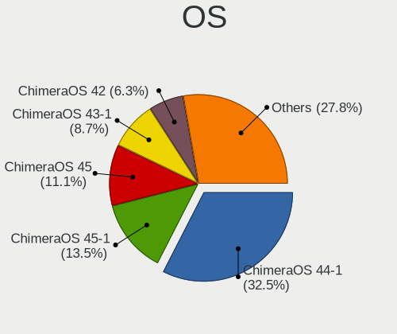
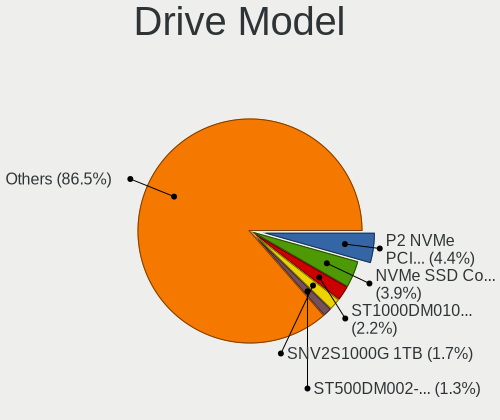
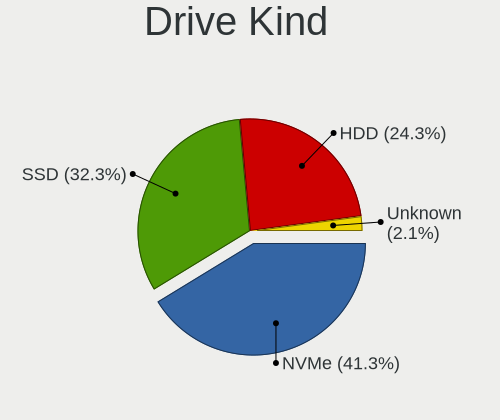
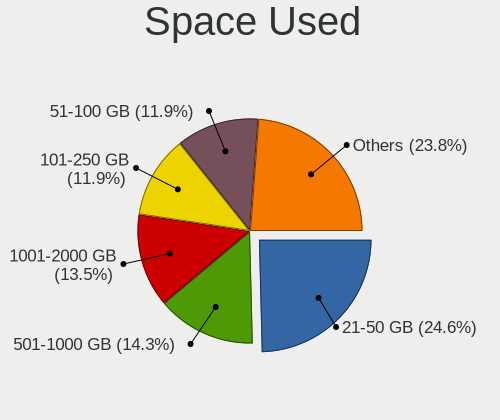
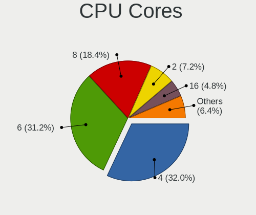
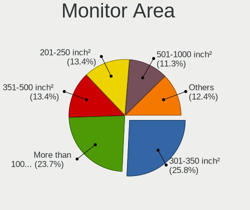
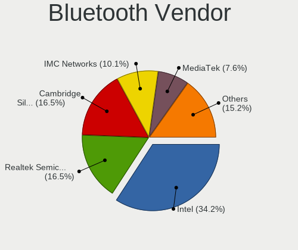
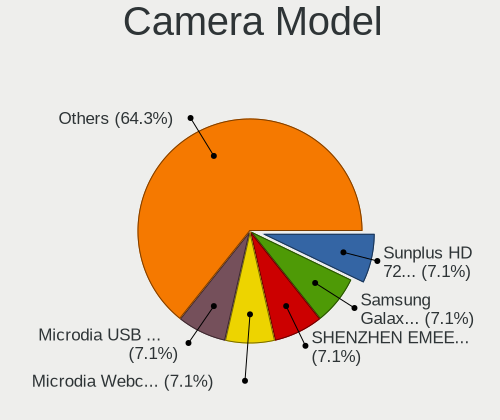

ChimeraOS - Tested Hardware & Statistics (Desktops)
---------------------------------------------------

A project to collect tested hardware configurations for ChimeraOS.

Anyone can contribute to this report by the [hw-probe](https://github.com/linuxhw/hw-probe) tool:

    sudo -E hw-probe -all -upload

Please contribute! Especially if your hardware is rare.

Contents
--------

* [ Test Cases ](#test-cases)

* [ System ](#system)
  - [ OS                       ](#os)
  - [ OS Family                ](#os-family)
  - [ Kernel                   ](#kernel)
  - [ Kernel Family            ](#kernel-family)
  - [ Kernel Major Ver.        ](#kernel-major-ver)
  - [ Arch                     ](#arch)
  - [ DE                       ](#de)
  - [ Display Server           ](#display-server)
  - [ Display Manager          ](#display-manager)
  - [ OS Lang                  ](#os-lang)
  - [ Boot Mode                ](#boot-mode)
  - [ Filesystem               ](#filesystem)
  - [ Part. scheme             ](#part-scheme)
  - [ Dual Boot with Linux/BSD ](#dual-boot-with-linuxbsd)
  - [ Dual Boot (Win)          ](#dual-boot-win)

* [ Board ](#board)
  - [ Vendor                   ](#vendor)
  - [ Model                    ](#model)
  - [ Model Family             ](#model-family)
  - [ MFG Year                 ](#mfg-year)
  - [ Form Factor              ](#form-factor)
  - [ Secure Boot              ](#secure-boot)
  - [ Coreboot                 ](#coreboot)
  - [ RAM Size                 ](#ram-size)
  - [ RAM Used                 ](#ram-used)
  - [ Total Drives             ](#total-drives)
  - [ Has CD-ROM               ](#has-cd-rom)
  - [ Has Ethernet             ](#has-ethernet)
  - [ Has WiFi                 ](#has-wifi)
  - [ Has Bluetooth            ](#has-bluetooth)

* [ Location ](#location)
  - [ Country                  ](#country)
  - [ City                     ](#city)

* [ Drives ](#drives)
  - [ Drive Vendor             ](#drive-vendor)
  - [ Drive Model              ](#drive-model)
  - [ HDD Vendor               ](#hdd-vendor)
  - [ SSD Vendor               ](#ssd-vendor)
  - [ Drive Kind               ](#drive-kind)
  - [ Drive Connector          ](#drive-connector)
  - [ Drive Size               ](#drive-size)
  - [ Space Total              ](#space-total)
  - [ Space Used               ](#space-used)
  - [ Malfunc. Drives          ](#malfunc-drives)
  - [ Malfunc. Drive Vendor    ](#malfunc-drive-vendor)
  - [ Malfunc. HDD Vendor      ](#malfunc-hdd-vendor)
  - [ Malfunc. Drive Kind      ](#malfunc-drive-kind)
  - [ Failed Drives            ](#failed-drives)
  - [ Failed Drive Vendor      ](#failed-drive-vendor)
  - [ Drive Status             ](#drive-status)

* [ Storage controller ](#storage-controller)
  - [ Storage Vendor           ](#storage-vendor)
  - [ Storage Model            ](#storage-model)
  - [ Storage Kind             ](#storage-kind)

* [ Processor ](#processor)
  - [ CPU Vendor               ](#cpu-vendor)
  - [ CPU Model                ](#cpu-model)
  - [ CPU Model Family         ](#cpu-model-family)
  - [ CPU Cores                ](#cpu-cores)
  - [ CPU Sockets              ](#cpu-sockets)
  - [ CPU Threads              ](#cpu-threads)
  - [ CPU Op-Modes             ](#cpu-op-modes)
  - [ CPU Microcode            ](#cpu-microcode)
  - [ CPU Microarch            ](#cpu-microarch)

* [ Graphics ](#graphics)
  - [ GPU Vendor               ](#gpu-vendor)
  - [ GPU Model                ](#gpu-model)
  - [ GPU Combo                ](#gpu-combo)
  - [ GPU Driver               ](#gpu-driver)
  - [ GPU Memory               ](#gpu-memory)

* [ Monitor ](#monitor)
  - [ Monitor Vendor           ](#monitor-vendor)
  - [ Monitor Model            ](#monitor-model)
  - [ Monitor Resolution       ](#monitor-resolution)
  - [ Monitor Diagonal         ](#monitor-diagonal)
  - [ Monitor Width            ](#monitor-width)
  - [ Aspect Ratio             ](#aspect-ratio)
  - [ Monitor Area             ](#monitor-area)
  - [ Pixel Density            ](#pixel-density)
  - [ Multiple Monitors        ](#multiple-monitors)

* [ Network ](#network)
  - [ Net Controller Vendor    ](#net-controller-vendor)
  - [ Net Controller Model     ](#net-controller-model)
  - [ Wireless Vendor          ](#wireless-vendor)
  - [ Wireless Model           ](#wireless-model)
  - [ Ethernet Vendor          ](#ethernet-vendor)
  - [ Ethernet Model           ](#ethernet-model)
  - [ Net Controller Kind      ](#net-controller-kind)
  - [ Used Controller          ](#used-controller)
  - [ NICs                     ](#nics)
  - [ IPv6                     ](#ipv6)

* [ Bluetooth ](#bluetooth)
  - [ Bluetooth Vendor         ](#bluetooth-vendor)
  - [ Bluetooth Model          ](#bluetooth-model)

* [ Sound ](#sound)
  - [ Sound Vendor             ](#sound-vendor)
  - [ Sound Model              ](#sound-model)

* [ Memory ](#memory)
  - [ Memory Vendor            ](#memory-vendor)
  - [ Memory Model             ](#memory-model)
  - [ Memory Kind              ](#memory-kind)
  - [ Memory Form Factor       ](#memory-form-factor)
  - [ Memory Size              ](#memory-size)
  - [ Memory Speed             ](#memory-speed)

* [ Printers & scanners ](#printers--scanners)
  - [ Printer Vendor           ](#printer-vendor)
  - [ Printer Model            ](#printer-model)
  - [ Scanner Vendor           ](#scanner-vendor)
  - [ Scanner Model            ](#scanner-model)

* [ Camera ](#camera)
  - [ Camera Vendor            ](#camera-vendor)
  - [ Camera Model             ](#camera-model)

* [ Security ](#security)
  - [ Fingerprint Vendor       ](#fingerprint-vendor)
  - [ Fingerprint Model        ](#fingerprint-model)
  - [ Chipcard Vendor          ](#chipcard-vendor)
  - [ Chipcard Model           ](#chipcard-model)

* [ Unsupported ](#unsupported)
  - [ Unsupported Devices      ](#unsupported-devices)
  - [ Unsupported Device Types ](#unsupported-device-types)

Test Cases
----------

Total: 78

| Vendor    | Model                       | Probe                                                      | Date         |
|-----------|-----------------------------|------------------------------------------------------------|--------------|
| MSI       | B550-A PRO                  | [3333de3c07](https://linux-hardware.org/?probe=3333de3c07) | Nov 06, 2023 |
| ASRock    | B550M-HDV                   | [e005a7da3a](https://linux-hardware.org/?probe=e005a7da3a) | Nov 06, 2023 |
| Gigabyte  | B450M S2H                   | [b40c43c829](https://linux-hardware.org/?probe=b40c43c829) | Nov 05, 2023 |
| Gigabyte  | B450M S2H                   | [67a1ec0ae8](https://linux-hardware.org/?probe=67a1ec0ae8) | Nov 05, 2023 |
| Gigabyte  | B550I AORUS PRO AX          | [9f47c70860](https://linux-hardware.org/?probe=9f47c70860) | Nov 04, 2023 |
| Dell      | 01NP3N A00                  | [2332805279](https://linux-hardware.org/?probe=2332805279) | Nov 04, 2023 |
| Gigabyte  | B550I AORUS PRO AX          | [e073d8c90a](https://linux-hardware.org/?probe=e073d8c90a) | Nov 03, 2023 |
| Gigabyte  | H61M-DS2                    | [877ab8782b](https://linux-hardware.org/?probe=877ab8782b) | Nov 01, 2023 |
| MSI       | B450 GAMING PLUS            | [d7fb2de5a7](https://linux-hardware.org/?probe=d7fb2de5a7) | Oct 30, 2023 |
| ASUSTek   | H110M-A                     | [a58f65d857](https://linux-hardware.org/?probe=a58f65d857) | Oct 27, 2023 |
| ASUSTek   | Z170-A                      | [480f22e1b7](https://linux-hardware.org/?probe=480f22e1b7) | Oct 24, 2023 |
| Gigabyte  | X570 I AORUS PRO WIFI       | [6d454c05e2](https://linux-hardware.org/?probe=6d454c05e2) | Oct 21, 2023 |
| Gigabyte  | X570 I AORUS PRO WIFI       | [6cc2145e11](https://linux-hardware.org/?probe=6cc2145e11) | Oct 21, 2023 |
| GMKtec    | NucBox K4                   | [b0f8dc54f3](https://linux-hardware.org/?probe=b0f8dc54f3) | Oct 20, 2023 |
| AZW       | SER V1                      | [eca53f2271](https://linux-hardware.org/?probe=eca53f2271) | Oct 18, 2023 |
| Gigabyte  | B550M AORUS PRO-P           | [257a13e71a](https://linux-hardware.org/?probe=257a13e71a) | Oct 02, 2023 |
| Gigabyte  | A520I AC                    | [48f4eb15cc](https://linux-hardware.org/?probe=48f4eb15cc) | Oct 02, 2023 |
| ASRock    | A320M-HDV                   | [2beb623746](https://linux-hardware.org/?probe=2beb623746) | Sep 26, 2023 |
| ASUSTek   | SABERTOOTH Z170 MARK 1      | [27d1633bc3](https://linux-hardware.org/?probe=27d1633bc3) | Sep 11, 2023 |
| HP        | 18E7                        | [1b966d0110](https://linux-hardware.org/?probe=1b966d0110) | Sep 11, 2023 |
| HP        | 89B5 A                      | [4934bfa1a8](https://linux-hardware.org/?probe=4934bfa1a8) | Sep 09, 2023 |
| ASUSTek   | GD30CI                      | [f1c877be0e](https://linux-hardware.org/?probe=f1c877be0e) | Sep 05, 2023 |
| Gigabyte  | Z490 GAMING X AX y.y        | [94a6d62c4b](https://linux-hardware.org/?probe=94a6d62c4b) | Aug 28, 2023 |
| Dell      | 04Y8V0 A02                  | [5afb05e780](https://linux-hardware.org/?probe=5afb05e780) | Aug 27, 2023 |
| ASRock    | B550M-ITX/ac                | [64aa93e41b](https://linux-hardware.org/?probe=64aa93e41b) | Aug 14, 2023 |
| ASUSTek   | TUF B450M-PLUS GAMING       | [3ac1be3b93](https://linux-hardware.org/?probe=3ac1be3b93) | Aug 13, 2023 |
| Dell      | 05YDCW A01                  | [3f3195be63](https://linux-hardware.org/?probe=3f3195be63) | Aug 12, 2023 |
| Dell      | 05YDCW A01                  | [80c27f0ac1](https://linux-hardware.org/?probe=80c27f0ac1) | Aug 12, 2023 |
| Gigabyte  | B550I AORUS PRO AX          | [b1b6854522](https://linux-hardware.org/?probe=b1b6854522) | Jul 29, 2023 |
| ASRock    | H97M Anniversary            | [f8a02ab68e](https://linux-hardware.org/?probe=f8a02ab68e) | Jul 27, 2023 |
| ASUSTek   | ROG STRIX B550-F GAMING     | [c8a41127a9](https://linux-hardware.org/?probe=c8a41127a9) | Jul 23, 2023 |
| ASUSTek   | ROG STRIX B550-F GAMING     | [9186fec300](https://linux-hardware.org/?probe=9186fec300) | Jul 23, 2023 |
| ASUSTek   | STRIX Z270F GAMING          | [80e44d8594](https://linux-hardware.org/?probe=80e44d8594) | Jul 22, 2023 |
| Gigabyte  | B450 AORUS PRO WIFI-CF      | [f747d5537e](https://linux-hardware.org/?probe=f747d5537e) | Jul 15, 2023 |
| Acer      | Veriton X6610G              | [e1189e3406](https://linux-hardware.org/?probe=e1189e3406) | Jul 13, 2023 |
| Dell      | 0KC9NP A01                  | [570f59305c](https://linux-hardware.org/?probe=570f59305c) | Jul 08, 2023 |
| Dell      | 0KC9NP A01                  | [6d62d0cdbf](https://linux-hardware.org/?probe=6d62d0cdbf) | Jul 08, 2023 |
| HP        | 1791                        | [a2bf914a45](https://linux-hardware.org/?probe=a2bf914a45) | Jul 08, 2023 |
| ASUSTek   | PRIME B550-PLUS             | [13195d7ff3](https://linux-hardware.org/?probe=13195d7ff3) | Jul 02, 2023 |
| HP        | 1998                        | [91f6e54877](https://linux-hardware.org/?probe=91f6e54877) | Jun 30, 2023 |
| Gigabyte  | G1.Sniper A88X-CF           | [d4470db5d3](https://linux-hardware.org/?probe=d4470db5d3) | Jun 20, 2023 |
| Dell      | 02YYK5 A01                  | [50efda9604](https://linux-hardware.org/?probe=50efda9604) | Jun 19, 2023 |
| Gigabyte  | B450 AORUS M                | [299db094f8](https://linux-hardware.org/?probe=299db094f8) | Jun 18, 2023 |
| Dell      | 07HXY6 A01                  | [ec3adcbe42](https://linux-hardware.org/?probe=ec3adcbe42) | Jun 16, 2023 |
| Gigabyte  | X470 AORUS GAMING 5 WIFI... | [c6401638dd](https://linux-hardware.org/?probe=c6401638dd) | Jun 11, 2023 |
| Gigabyte  | B550I AORUS PRO AX          | [798d8e8914](https://linux-hardware.org/?probe=798d8e8914) | Jun 11, 2023 |
| MSI       | MPG B650I EDGE WIFI         | [d43ce99616](https://linux-hardware.org/?probe=d43ce99616) | Jun 07, 2023 |
| Gigabyte  | X470 AORUS GAMING 5 WIFI... | [8c6370ac0d](https://linux-hardware.org/?probe=8c6370ac0d) | May 23, 2023 |
| Gigabyte  | X470 AORUS GAMING 5 WIFI... | [41b69ae4db](https://linux-hardware.org/?probe=41b69ae4db) | May 12, 2023 |
| ASUSTek   | PRIME B760-PLUS D4          | [bb01d9e92b](https://linux-hardware.org/?probe=bb01d9e92b) | May 12, 2023 |
| ASUSTek   | ROG STRIX B460-I GAMING     | [3a9528f661](https://linux-hardware.org/?probe=3a9528f661) | May 10, 2023 |
| Gigabyte  | X470 AORUS GAMING 5 WIFI... | [bf3fee03d2](https://linux-hardware.org/?probe=bf3fee03d2) | May 09, 2023 |
| ASUSTek   | ROG STRIX B550-F GAMING     | [ad66608cf0](https://linux-hardware.org/?probe=ad66608cf0) | May 08, 2023 |
| Gigabyte  | X470 AORUS GAMING 5 WIFI... | [101ec0a833](https://linux-hardware.org/?probe=101ec0a833) | May 05, 2023 |
| ASUSTek   | PRIME B760-PLUS D4          | [4ec161ab9b](https://linux-hardware.org/?probe=4ec161ab9b) | May 04, 2023 |
| Dell      | 0FDY5C A00                  | [a6865b8591](https://linux-hardware.org/?probe=a6865b8591) | Apr 16, 2023 |
| ASUSTek   | ROG STRIX B460-I GAMING     | [14db4e6f1d](https://linux-hardware.org/?probe=14db4e6f1d) | Apr 11, 2023 |
| ASUSTek   | ROG STRIX B650E-I GAMING... | [03db223af4](https://linux-hardware.org/?probe=03db223af4) | Apr 06, 2023 |
| ASUSTek   | ROG STRIX B650E-I GAMING... | [f8c2ffcd09](https://linux-hardware.org/?probe=f8c2ffcd09) | Apr 06, 2023 |
| MACHINIST | X99-RS9 V2.0                | [ad4c43dd09](https://linux-hardware.org/?probe=ad4c43dd09) | Mar 21, 2023 |
| Gigabyte  | B460M DS3H AC V2-Y1         | [b21cd49226](https://linux-hardware.org/?probe=b21cd49226) | Mar 16, 2023 |
| MSI       | MPG B650I EDGE WIFI         | [9f40b861a5](https://linux-hardware.org/?probe=9f40b861a5) | Mar 12, 2023 |
| Gigabyte  | B460M DS3H AC V2-Y1         | [7f8fc2ba96](https://linux-hardware.org/?probe=7f8fc2ba96) | Mar 10, 2023 |
| Dell      | 0XHGV1 A00                  | [8fa504e81f](https://linux-hardware.org/?probe=8fa504e81f) | Mar 07, 2023 |
| Intel     | DB75EN AAG39650-400         | [4a0feca3f5](https://linux-hardware.org/?probe=4a0feca3f5) | Mar 02, 2023 |
| Gigabyte  | H77M-D3H                    | [01eb743492](https://linux-hardware.org/?probe=01eb743492) | Feb 25, 2023 |
| Gigabyte  | H77M-D3H                    | [766790f373](https://linux-hardware.org/?probe=766790f373) | Feb 25, 2023 |
| ASUSTek   | B150I PRO GAMING/WIFI/AU... | [eb1e211b0f](https://linux-hardware.org/?probe=eb1e211b0f) | Feb 25, 2023 |
| HP        | 1998                        | [dbb952f3f6](https://linux-hardware.org/?probe=dbb952f3f6) | Feb 13, 2023 |
| HP        | 1998                        | [0171575a1d](https://linux-hardware.org/?probe=0171575a1d) | Feb 13, 2023 |
| Gigabyte  | H510M H                     | [69d2cb7e14](https://linux-hardware.org/?probe=69d2cb7e14) | Jan 11, 2023 |
| ASUSTek   | P8H61-MX R2.0               | [3e4b14919e](https://linux-hardware.org/?probe=3e4b14919e) | Jan 05, 2023 |
| Gigabyte  | X570S AORUS ELITE AX        | [02b3cbc8c6](https://linux-hardware.org/?probe=02b3cbc8c6) | Jan 04, 2023 |
| Gigabyte  | X570S AORUS ELITE AX        | [13ae6c7e25](https://linux-hardware.org/?probe=13ae6c7e25) | Jan 01, 2023 |
| Gigabyte  | X570 AORUS ELITE WIFI       | [49ca01435b](https://linux-hardware.org/?probe=49ca01435b) | Dec 27, 2022 |
| Lenovo    | ThinkCentre M70e 0832B1U    | [d95663a632](https://linux-hardware.org/?probe=d95663a632) | Dec 07, 2022 |
| Gigabyte  | X470 AORUS GAMING 5 WIFI... | [2a7b6d570f](https://linux-hardware.org/?probe=2a7b6d570f) | Nov 26, 2022 |
| Gigabyte  | X470 AORUS GAMING 5 WIFI... | [58b3db6784](https://linux-hardware.org/?probe=58b3db6784) | Nov 23, 2022 |

System
------

OS
--

Installed operating systems

| Name           | Desktops | Percent |
|----------------|----------|---------|
| ChimeraOS 44-1 | 12       | 20.34%  |
| ChimeraOS 43-1 | 11       | 18.64%  |
| ChimeraOS 42   | 8        | 13.56%  |
| ChimeraOS 43   | 7        | 11.86%  |
| ChimeraOS 39   | 7        | 11.86%  |
| ChimeraOS 41   | 4        | 6.78%   |
| ChimeraOS 38   | 4        | 6.78%   |
| ChimeraOS 44   | 3        | 5.08%   |
| ChimeraOS 37   | 3        | 5.08%   |

OS Family
---------

OS without a version

| Name      | Desktops | Percent |
|-----------|----------|---------|
| ChimeraOS | 57       | 100%    |

Kernel
------

Version of the Linux kernel

| Version                 | Desktops | Percent |
|-------------------------|----------|---------|
| 6.3.9-chimeraos-1       | 17       | 28.33%  |
| 6.5.6-chos1-chimeraos-1 | 12       | 20%     |
| 6.1.27-1-lts            | 8        | 13.33%  |
| 6.1.11-arch1-1          | 7        | 11.67%  |
| 6.1.21-1-lts            | 4        | 6.67%   |
| 6.1.1-arch1-1           | 4        | 6.67%   |
| 6.5.3-chos1-chimeraos-1 | 3        | 5%      |
| 6.0.8-arch1-1           | 3        | 5%      |
| 6.3.3-arch1-1           | 1        | 1.67%   |
| 6.3.1-arch2-1           | 1        | 1.67%   |

Kernel Family
-------------

Linux kernel without a distro release

| Version | Desktops | Percent |
|---------|----------|---------|
| 6.3.9   | 17       | 28.33%  |
| 6.5.6   | 12       | 20%     |
| 6.1.27  | 8        | 13.33%  |
| 6.1.11  | 7        | 11.67%  |
| 6.1.21  | 4        | 6.67%   |
| 6.1.1   | 4        | 6.67%   |
| 6.5.3   | 3        | 5%      |
| 6.0.8   | 3        | 5%      |
| 6.3.3   | 1        | 1.67%   |
| 6.3.1   | 1        | 1.67%   |

Kernel Major Ver.
-----------------

Linux kernel major version

| Version | Desktops | Percent |
|---------|----------|---------|
| 6.1     | 22       | 37.93%  |
| 6.3     | 18       | 31.03%  |
| 6.5     | 15       | 25.86%  |
| 6.0     | 3        | 5.17%   |

Arch
----

OS architecture (x86_64, i586, etc.)

| Name   | Desktops | Percent |
|--------|----------|---------|
| x86_64 | 57       | 100%    |

DE
--

Desktop Environment

| Name    | Desktops | Percent |
|---------|----------|---------|
| GNOME   | 56       | 98.25%  |
| steamos | 1        | 1.75%   |

Display Server
--------------

X11 or Wayland

| Name    | Desktops | Percent |
|---------|----------|---------|
| Wayland | 53       | 92.98%  |
| X11     | 4        | 7.02%   |

Display Manager
---------------

SDDM, LightDM, etc.

| Name    | Desktops | Percent |
|---------|----------|---------|
| Unknown | 57       | 100%    |

OS Lang
-------

Language

| Lang  | Desktops | Percent |
|-------|----------|---------|
| en_US | 50       | 87.72%  |
| es_ES | 2        | 3.51%   |
| de_DE | 2        | 3.51%   |
| pt_BR | 1        | 1.75%   |
| ja_JP | 1        | 1.75%   |
| fr_FR | 1        | 1.75%   |

Boot Mode
---------

EFI or BIOS

| Mode | Desktops | Percent |
|------|----------|---------|
| BIOS | 57       | 100%    |

Filesystem
----------

Type of filesystem

| Type  | Desktops | Percent |
|-------|----------|---------|
| Btrfs | 57       | 100%    |

Part. scheme
------------

Scheme of partitioning

| Type    | Desktops | Percent |
|---------|----------|---------|
| Unknown | 57       | 100%    |

Dual Boot with Linux/BSD
------------------------

Hosting more than one Linux/BSD

| Dual boot | Desktops | Percent |
|-----------|----------|---------|
| No        | 57       | 100%    |

Dual Boot (Win)
---------------

Hosting Linux and Windows

| Dual boot | Desktops | Percent |
|-----------|----------|---------|
| No        | 57       | 100%    |

Board
-----

Vendor
------

Motherboard manufacturer

| Name                | Desktops | Percent |
|---------------------|----------|---------|
| Gigabyte Technology | 18       | 31.58%  |
| ASUSTek Computer    | 14       | 24.56%  |
| Dell                | 7        | 12.28%  |
| Hewlett-Packard     | 5        | 8.77%   |
| ASRock              | 4        | 7.02%   |
| MSI                 | 3        | 5.26%   |
| MACHINIST           | 1        | 1.75%   |
| Lenovo              | 1        | 1.75%   |
| Intel               | 1        | 1.75%   |
| GMKtec              | 1        | 1.75%   |
| AZW                 | 1        | 1.75%   |
| Acer                | 1        | 1.75%   |

Model
-----

Motherboard model

| Name                                      | Desktops | Percent |
|-------------------------------------------|----------|---------|
| Gigabyte B550I AORUS PRO AX               | 3        | 5.26%   |
| HP EliteDesk 800 G1 SFF                   | 2        | 3.51%   |
| ASUS ROG STRIX B550-F GAMING              | 2        | 3.51%   |
| MSI MS-7D73                               | 1        | 1.75%   |
| MSI MS-7C56                               | 1        | 1.75%   |
| MSI MS-7B86                               | 1        | 1.75%   |
| MACHINIST X99-RS9 V2.0                    | 1        | 1.75%   |
| Lenovo ThinkCentre M70e 0832B1U           | 1        | 1.75%   |
| Intel DB75EN AAG39650-400                 | 1        | 1.75%   |
| HP Z220 SFF Workstation                   | 1        | 1.75%   |
| HP Victus by 15L Gaming Desktop TG02-0xxx | 1        | 1.75%   |
| HP ProDesk 600 G1 SFF                     | 1        | 1.75%   |
| GMKtec NucBox K4                          | 1        | 1.75%   |
| Gigabyte Z490 GAMING X AX                 | 1        | 1.75%   |
| Gigabyte X570S AORUS ELITE AX             | 1        | 1.75%   |
| Gigabyte X570 I AORUS PRO WIFI            | 1        | 1.75%   |
| Gigabyte X570 AORUS ELITE WIFI            | 1        | 1.75%   |
| Gigabyte X470 AORUS GAMING 5 WIFI         | 1        | 1.75%   |
| Gigabyte H77M-D3H                         | 1        | 1.75%   |
| Gigabyte H61M-DS2                         | 1        | 1.75%   |
| Gigabyte H510M H                          | 1        | 1.75%   |
| Gigabyte G1.Sniper A88X-CF                | 1        | 1.75%   |
| Gigabyte B550M AORUS PRO-P                | 1        | 1.75%   |
| Gigabyte B460M DS3H AC V2-Y1              | 1        | 1.75%   |
| Gigabyte B450M S2H                        | 1        | 1.75%   |
| Gigabyte B450 AORUS PRO WIFI              | 1        | 1.75%   |
| Gigabyte B450 AORUS M                     | 1        | 1.75%   |
| Gigabyte A520I AC                         | 1        | 1.75%   |
| Dell Precision 3240 Compact               | 1        | 1.75%   |
| Dell OptiPlex 9020                        | 1        | 1.75%   |
| Dell OptiPlex 7050                        | 1        | 1.75%   |
| Dell OptiPlex 7020                        | 1        | 1.75%   |
| Dell OptiPlex 5055 Ryzen APU              | 1        | 1.75%   |
| Dell OptiPlex 3070                        | 1        | 1.75%   |
| Dell OptiPlex 3060                        | 1        | 1.75%   |
| AZW SER                                   | 1        | 1.75%   |
| ASUS Z170-A                               | 1        | 1.75%   |
| ASUS TUF B450M-PLUS GAMING                | 1        | 1.75%   |
| ASUS STRIX Z270F GAMING                   | 1        | 1.75%   |
| ASUS SABERTOOTH Z170 MARK 1               | 1        | 1.75%   |

Model Family
------------

Motherboard model prefix

| Name               | Desktops | Percent |
|--------------------|----------|---------|
| Dell OptiPlex      | 6        | 10.53%  |
| ASUS ROG           | 4        | 7.02%   |
| Gigabyte B550I     | 3        | 5.26%   |
| HP EliteDesk       | 2        | 3.51%   |
| Gigabyte X570      | 2        | 3.51%   |
| Gigabyte B450      | 2        | 3.51%   |
| ASUS PRIME         | 2        | 3.51%   |
| MSI MS-7D73        | 1        | 1.75%   |
| MSI MS-7C56        | 1        | 1.75%   |
| MSI MS-7B86        | 1        | 1.75%   |
| MACHINIST X99-RS9  | 1        | 1.75%   |
| Lenovo ThinkCentre | 1        | 1.75%   |
| Intel DB75EN       | 1        | 1.75%   |
| HP Z220            | 1        | 1.75%   |
| HP Victus          | 1        | 1.75%   |
| HP ProDesk         | 1        | 1.75%   |
| GMKtec NucBox      | 1        | 1.75%   |
| Gigabyte Z490      | 1        | 1.75%   |
| Gigabyte X570S     | 1        | 1.75%   |
| Gigabyte X470      | 1        | 1.75%   |
| Gigabyte H77M-D3H  | 1        | 1.75%   |
| Gigabyte H61M-DS2  | 1        | 1.75%   |
| Gigabyte H510M     | 1        | 1.75%   |
| Gigabyte G1.Sniper | 1        | 1.75%   |
| Gigabyte B550M     | 1        | 1.75%   |
| Gigabyte B460M     | 1        | 1.75%   |
| Gigabyte B450M     | 1        | 1.75%   |
| Gigabyte A520I     | 1        | 1.75%   |
| Dell Precision     | 1        | 1.75%   |
| AZW SER            | 1        | 1.75%   |
| ASUS Z170-A        | 1        | 1.75%   |
| ASUS TUF           | 1        | 1.75%   |
| ASUS STRIX         | 1        | 1.75%   |
| ASUS SABERTOOTH    | 1        | 1.75%   |
| ASUS P8H61-MX      | 1        | 1.75%   |
| ASUS H110M-A       | 1        | 1.75%   |
| ASUS GD30CI        | 1        | 1.75%   |
| ASUS B150I         | 1        | 1.75%   |
| ASRock H97M        | 1        | 1.75%   |
| ASRock B550M-ITX   | 1        | 1.75%   |

MFG Year
--------

Motherboard manufacture year

| Year | Desktops | Percent |
|------|----------|---------|
| 2020 | 11       | 19.3%   |
| 2018 | 8        | 14.04%  |
| 2021 | 6        | 10.53%  |
| 2012 | 5        | 8.77%   |
| 2022 | 4        | 7.02%   |
| 2013 | 4        | 7.02%   |
| 2023 | 3        | 5.26%   |
| 2019 | 3        | 5.26%   |
| 2017 | 3        | 5.26%   |
| 2016 | 3        | 5.26%   |
| 2015 | 3        | 5.26%   |
| 2014 | 2        | 3.51%   |
| 2011 | 1        | 1.75%   |
| 2010 | 1        | 1.75%   |

Form Factor
-----------

Physical design of the computer

| Name    | Desktops | Percent |
|---------|----------|---------|
| Desktop | 57       | 100%    |

Secure Boot
-----------

Enabled or disabled

| State    | Desktops | Percent |
|----------|----------|---------|
| Disabled | 57       | 100%    |

Coreboot
--------

Have coreboot on board

| Used | Desktops | Percent |
|------|----------|---------|
| No   | 57       | 100%    |

RAM Size
--------

Total RAM memory

| Size in GB  | Desktops | Percent |
|-------------|----------|---------|
| 32.01-64.0  | 20       | 35.09%  |
| 16.01-24.0  | 16       | 28.07%  |
| 4.01-8.0    | 9        | 15.79%  |
| 24.01-32.0  | 5        | 8.77%   |
| 8.01-16.0   | 5        | 8.77%   |
| 64.01-256.0 | 2        | 3.51%   |

RAM Used
--------

Used RAM memory

| Used GB    | Desktops | Percent |
|------------|----------|---------|
| 2.01-3.0   | 21       | 35.59%  |
| 1.01-2.0   | 18       | 30.51%  |
| 4.01-8.0   | 10       | 16.95%  |
| 3.01-4.0   | 9        | 15.25%  |
| 16.01-24.0 | 1        | 1.69%   |

Total Drives
------------

Number of drives on board

| Drives | Desktops | Percent |
|--------|----------|---------|
| 1      | 27       | 45.76%  |
| 3      | 13       | 22.03%  |
| 2      | 13       | 22.03%  |
| 5      | 2        | 3.39%   |
| 4      | 2        | 3.39%   |
| 8      | 1        | 1.69%   |
| 7      | 1        | 1.69%   |

Has CD-ROM
----------

Has CD-ROM on board

| Presented | Desktops | Percent |
|-----------|----------|---------|
| No        | 45       | 78.95%  |
| Yes       | 12       | 21.05%  |

Has Ethernet
------------

Has Ethernet on board

| Presented | Desktops | Percent |
|-----------|----------|---------|
| Yes       | 57       | 100%    |

Has WiFi
--------

Has WiFi module

| Presented | Desktops | Percent |
|-----------|----------|---------|
| Yes       | 35       | 61.4%   |
| No        | 22       | 38.6%   |

Has Bluetooth
-------------

Has Bluetooth module

| Presented | Desktops | Percent |
|-----------|----------|---------|
| Yes       | 32       | 56.14%  |
| No        | 25       | 43.86%  |

Location
--------

Country
-------

Geographic location (country)

| Country     | Desktops | Percent |
|-------------|----------|---------|
| USA         | 25       | 43.86%  |
| Germany     | 6        | 10.53%  |
| Australia   | 4        | 7.02%   |
| Spain       | 2        | 3.51%   |
| Russia      | 2        | 3.51%   |
| Japan       | 2        | 3.51%   |
| France      | 2        | 3.51%   |
| Canada      | 2        | 3.51%   |
| Brazil      | 2        | 3.51%   |
| Vietnam     | 1        | 1.75%   |
| UK          | 1        | 1.75%   |
| Turkey      | 1        | 1.75%   |
| Poland      | 1        | 1.75%   |
| Norway      | 1        | 1.75%   |
| New Zealand | 1        | 1.75%   |
| Malaysia    | 1        | 1.75%   |
| Iceland     | 1        | 1.75%   |
| Hungary     | 1        | 1.75%   |
| Honduras    | 1        | 1.75%   |

City
----

Geographic location (city)

| City          | Desktops | Percent |
|---------------|----------|---------|
| Sanford       | 2        | 3.45%   |
| Melbourne     | 2        | 3.45%   |
| Yekaterinburg | 1        | 1.72%   |
| Yaroslavl     | 1        | 1.72%   |
| Watsonville   | 1        | 1.72%   |
| Warsaw        | 1        | 1.72%   |
| Valence       | 1        | 1.72%   |
| Umeda         | 1        | 1.72%   |
| Toronto       | 1        | 1.72%   |
| Tegucigalpa   | 1        | 1.72%   |
| Tampa         | 1        | 1.72%   |
| Sydney        | 1        | 1.72%   |
| Sumaré       | 1        | 1.72%   |
| Steyning      | 1        | 1.72%   |
| Shelbyville   | 1        | 1.72%   |
| Sao Paulo     | 1        | 1.72%   |
| Round Rock    | 1        | 1.72%   |
| Rockford      | 1        | 1.72%   |
| Reykjavik     | 1        | 1.72%   |
| Racine        | 1        | 1.72%   |
| Phoenix       | 1        | 1.72%   |
| Philadelphia  | 1        | 1.72%   |
| New City      | 1        | 1.72%   |
| Meissen       | 1        | 1.72%   |
| Madrid        | 1        | 1.72%   |
| Madison       | 1        | 1.72%   |
| Longueuil     | 1        | 1.72%   |
| Lille         | 1        | 1.72%   |
| Lewiston      | 1        | 1.72%   |
| Leipzig       | 1        | 1.72%   |
| Las Vegas     | 1        | 1.72%   |
| Kuala Lumpur  | 1        | 1.72%   |
| Istanbul      | 1        | 1.72%   |
| Houston       | 1        | 1.72%   |
| Hixson        | 1        | 1.72%   |
| Hialeah       | 1        | 1.72%   |
| Hanoi         | 1        | 1.72%   |
| Hanesawa      | 1        | 1.72%   |
| Hamburg       | 1        | 1.72%   |
| Gary          | 1        | 1.72%   |

Drives
------

Drive Vendor
------------

Hard drive vendors

| Vendor                       | Desktops | Drives | Percent |
|------------------------------|----------|--------|---------|
| Seagate                      | 18       | 23     | 17.48%  |
| Samsung Electronics          | 14       | 25     | 13.59%  |
| WDC                          | 7        | 10     | 6.8%    |
| Sandisk                      | 7        | 12     | 6.8%    |
| Micron/Crucial Technology    | 7        | 7      | 6.8%    |
| Kingston                     | 7        | 7      | 6.8%    |
| SK hynix                     | 4        | 4      | 3.88%   |
| Crucial                      | 4        | 6      | 3.88%   |
| Silicon Motion               | 3        | 3      | 2.91%   |
| Toshiba                      | 2        | 3      | 1.94%   |
| Phison Electronics           | 2        | 2      | 1.94%   |
| Micron Technology            | 2        | 4      | 1.94%   |
| Kingston Technology Company  | 2        | 2      | 1.94%   |
| Intel                        | 2        | 3      | 1.94%   |
| Hitachi                      | 2        | 2      | 1.94%   |
| Fanxiang                     | 2        | 2      | 1.94%   |
| ADATA Technology             | 2        | 3      | 1.94%   |
| Shenzhen Longsys Electronics | 1        | 1      | 0.97%   |
| Realtek Semiconductor        | 1        | 1      | 0.97%   |
| PNY                          | 1        | 1      | 0.97%   |
| O2 Micro                     | 1        | 1      | 0.97%   |
| Netac                        | 1        | 1      | 0.97%   |
| KIOXIA                       | 1        | 1      | 0.97%   |
| KingFast                     | 1        | 1      | 0.97%   |
| KingDian                     | 1        | 3      | 0.97%   |
| HGST                         | 1        | 1      | 0.97%   |
| Hewlett-Packard              | 1        | 1      | 0.97%   |
| Corsair                      | 1        | 1      | 0.97%   |
| China                        | 1        | 1      | 0.97%   |
| ASMedia                      | 1        | 1      | 0.97%   |
| AMD                          | 1        | 1      | 0.97%   |
| A-DATA Technology            | 1        | 1      | 0.97%   |
| Unknown                      | 1        | 1      | 0.97%   |

Drive Model
-----------

Hard drive models

| Model                                                             | Desktops | Percent |
|-------------------------------------------------------------------|----------|---------|
| Micron/Crucial P2 NVMe PCIe SSD 500GB                             | 7        | 6.09%   |
| Seagate ST1000DM010-2EP102 1TB                                    | 5        | 4.35%   |
| Samsung NVMe SSD Controller SM981/PM981/PM983 1TB                 | 5        | 4.35%   |
| Silicon Motion SM2263EN/SM2263XT SSD Controller 256GB             | 2        | 1.74%   |
| Samsung SSD 870 QVO 2TB                                           | 2        | 1.74%   |
| Samsung SSD 860 EVO 1TB                                           | 2        | 1.74%   |
| Samsung NVMe SSD Controller SM961/PM961/SM963 121GB               | 2        | 1.74%   |
| Samsung NVMe SSD Controller PM9A1/PM9A3/980PRO 1TB                | 2        | 1.74%   |
| Kingston Company SNV2S1000G 1TB                                   | 2        | 1.74%   |
| Kingston SA400S37120G 120GB SSD                                   | 2        | 1.74%   |
| ADATA XPG SX8200 Pro PCIe Gen3x4 M.2 2280 Solid State Drive 512GB | 2        | 1.74%   |
| WDC WDS500G2B0B-00YS70 500GB SSD                                  | 1        | 0.87%   |
| WDC WDS500G2B0A-00SM50 500GB SSD                                  | 1        | 0.87%   |
| WDC WDBNCE5000PNC 500GB SSD                                       | 1        | 0.87%   |
| WDC WD5000BEVT-22A0RT0 500GB                                      | 1        | 0.87%   |
| WDC WD5000AVDS-63U7B1 500GB                                       | 1        | 0.87%   |
| WDC WD40EZRX-00SPEB0 4TB                                          | 1        | 0.87%   |
| WDC WD20EARX-00PASB0 2TB                                          | 1        | 0.87%   |
| WDC WD1500HLFS-01G6U0 150GB                                       | 1        | 0.87%   |
| Toshiba MQ02ABD100H 1TB                                           | 1        | 0.87%   |
| Toshiba DT01ABA200V 2TB                                           | 1        | 0.87%   |
| SK hynix SHGP31-2000GM 2TB                                        | 1        | 0.87%   |
| SK hynix PC611 NVMe 256GB                                         | 1        | 0.87%   |
| SK hynix PC601 NVMe 256GB                                         | 1        | 0.87%   |
| SK hynix BC711 HFM512GD3JX013N 512GB                              | 1        | 0.87%   |
| Silicon Motion ADATA SX8000NP 256GB                               | 1        | 0.87%   |
| Shenzhen Longsys Emtec X300 256GB                                 | 1        | 0.87%   |
| Seagate ST9500620NS 500GB                                         | 1        | 0.87%   |
| Seagate ST9500325AS 500GB                                         | 1        | 0.87%   |
| Seagate ST6000VX0003-1ZH110 6TB                                   | 1        | 0.87%   |
| Seagate ST500LM000-1EJ162-SSHD 500GB                              | 1        | 0.87%   |
| Seagate ST500DM002-1BD142 500GB                                   | 1        | 0.87%   |
| Seagate ST4000LM024-2AN17V 4TB                                    | 1        | 0.87%   |
| Seagate ST2000DX002-2DV164 2TB                                    | 1        | 0.87%   |
| Seagate ST2000DM008-2FR102 2TB                                    | 1        | 0.87%   |
| Seagate ST2000DM006-2DM164 2TB                                    | 1        | 0.87%   |
| Seagate ST2000DL003-9VT166 2TB                                    | 1        | 0.87%   |
| Seagate ST12000VN0008-2PH103 12TB                                 | 1        | 0.87%   |
| Seagate ST1000LX015-1U7172 1TB                                    | 1        | 0.87%   |
| Seagate ST1000LM035-1RK172 1TB                                    | 1        | 0.87%   |

HDD Vendor
----------

Hard disk drive vendors

| Vendor              | Desktops | Drives | Percent |
|---------------------|----------|--------|---------|
| Seagate             | 18       | 22     | 62.07%  |
| WDC                 | 5        | 7      | 17.24%  |
| Toshiba             | 2        | 3      | 6.9%    |
| Hitachi             | 2        | 2      | 6.9%    |
| Samsung Electronics | 1        | 1      | 3.45%   |
| HGST                | 1        | 1      | 3.45%   |

SSD Vendor
----------

Solid state drive vendors

| Vendor              | Desktops | Drives | Percent |
|---------------------|----------|--------|---------|
| Samsung Electronics | 7        | 11     | 18.42%  |
| SanDisk             | 5        | 7      | 13.16%  |
| Kingston            | 5        | 5      | 13.16%  |
| Crucial             | 4        | 6      | 10.53%  |
| WDC                 | 2        | 3      | 5.26%   |
| Micron Technology   | 2        | 4      | 5.26%   |
| Fanxiang            | 2        | 2      | 5.26%   |
| Seagate             | 1        | 1      | 2.63%   |
| PNY                 | 1        | 1      | 2.63%   |
| Netac               | 1        | 1      | 2.63%   |
| KingDian            | 1        | 3      | 2.63%   |
| Intel               | 1        | 1      | 2.63%   |
| Hewlett-Packard     | 1        | 1      | 2.63%   |
| Corsair             | 1        | 1      | 2.63%   |
| China               | 1        | 1      | 2.63%   |
| ASMedia             | 1        | 1      | 2.63%   |
| AMD                 | 1        | 1      | 2.63%   |
| A-DATA Technology   | 1        | 1      | 2.63%   |

Drive Kind
----------

HDD or SSD

| Kind    | Desktops | Drives | Percent |
|---------|----------|--------|---------|
| NVMe    | 35       | 47     | 39.33%  |
| SSD     | 29       | 51     | 32.58%  |
| HDD     | 23       | 36     | 25.84%  |
| Unknown | 2        | 2      | 2.25%   |

Drive Connector
---------------

SATA, SAS, NVMe, etc.

| Type | Desktops | Drives | Percent |
|------|----------|--------|---------|
| SATA | 43       | 85     | 52.44%  |
| NVMe | 35       | 47     | 42.68%  |
| SAS  | 4        | 4      | 4.88%   |

Drive Size
----------

Size of hard drive

| Size in TB | Desktops | Drives | Percent |
|------------|----------|--------|---------|
| 0.01-0.5   | 25       | 46     | 43.1%   |
| 0.51-1.0   | 16       | 19     | 27.59%  |
| 1.01-2.0   | 9        | 11     | 15.52%  |
| 2.01-3.0   | 3        | 3      | 5.17%   |
| 3.01-4.0   | 2        | 5      | 3.45%   |
| 4.01-10.0  | 2        | 2      | 3.45%   |
| 10.01-20.0 | 1        | 1      | 1.72%   |

Space Total
-----------

Amount of disk space available on the file system

| Size in GB     | Desktops | Percent |
|----------------|----------|---------|
| More than 3000 | 28       | 48.28%  |
| 1001-2000      | 14       | 24.14%  |
| 501-1000       | 10       | 17.24%  |
| 251-500        | 3        | 5.17%   |
| 2001-3000      | 3        | 5.17%   |

Space Used
----------

Amount of used disk space

| Used GB        | Desktops | Percent |
|----------------|----------|---------|
| 21-50          | 14       | 23.73%  |
| 51-100         | 10       | 16.95%  |
| 1001-2000      | 8        | 13.56%  |
| 501-1000       | 8        | 13.56%  |
| 101-250        | 7        | 11.86%  |
| 2001-3000      | 5        | 8.47%   |
| More than 3000 | 4        | 6.78%   |
| 251-500        | 3        | 5.08%   |

Malfunc. Drives
---------------

Drive models with a malfunction

Zero info for selected period =(

Malfunc. Drive Vendor
---------------------

Vendors of faulty drives

Zero info for selected period =(

Malfunc. HDD Vendor
-------------------

Vendors of faulty HDD drives

Zero info for selected period =(

Malfunc. Drive Kind
-------------------

Kinds of faulty drives

Zero info for selected period =(

Failed Drives
-------------

Failed drive models

Zero info for selected period =(

Failed Drive Vendor
-------------------

Failed drive vendors

Zero info for selected period =(

Drive Status
------------

Number of failed and malfunc. drives

| Status   | Desktops | Drives | Percent |
|----------|----------|--------|---------|
| Detected | 57       | 136    | 100%    |

Storage controller
------------------

Storage Vendor
--------------

Storage controller vendors

| Vendor                       | Desktops | Percent |
|------------------------------|----------|---------|
| Intel                        | 31       | 31.96%  |
| AMD                          | 25       | 25.77%  |
| Samsung Electronics          | 9        | 9.28%   |
| Micron/Crucial Technology    | 7        | 7.22%   |
| SK hynix                     | 4        | 4.12%   |
| Kingston Technology Company  | 4        | 4.12%   |
| Silicon Motion               | 3        | 3.09%   |
| SanDisk                      | 3        | 3.09%   |
| Phison Electronics           | 2        | 2.06%   |
| ADATA Technology             | 2        | 2.06%   |
| Shenzhen Longsys Electronics | 1        | 1.03%   |
| Realtek Semiconductor        | 1        | 1.03%   |
| O2 Micro                     | 1        | 1.03%   |
| Marvell Technology Group     | 1        | 1.03%   |
| KIOXIA                       | 1        | 1.03%   |
| Biwin Storage Technology     | 1        | 1.03%   |
| ASMedia Technology           | 1        | 1.03%   |

Storage Model
-------------

Storage controller models

| Model                                                                          | Desktops | Percent |
|--------------------------------------------------------------------------------|----------|---------|
| AMD FCH SATA Controller [AHCI mode]                                            | 14       | 12.5%   |
| AMD 500 Series Chipset SATA Controller                                         | 11       | 9.82%   |
| Micron/Crucial P2 [Nick P2] / P3 / P3 Plus NVMe PCIe SSD (DRAM-less)           | 7        | 6.25%   |
| AMD 400 Series Chipset SATA Controller                                         | 6        | 5.36%   |
| Samsung NVMe SSD Controller SM981/PM981/PM983                                  | 5        | 4.46%   |
| Intel SATA Controller [RAID mode]                                              | 4        | 3.57%   |
| Intel Q170/Q150/B150/H170/H110/Z170/CM236 Chipset SATA Controller [AHCI Mode]  | 4        | 3.57%   |
| Intel 8 Series/C220 Series Chipset Family 6-port SATA Controller 1 [AHCI mode] | 4        | 3.57%   |
| SK hynix Gold P31/BC711/PC711 NVMe Solid State Drive                           | 2        | 1.79%   |
| Silicon Motion SM2263EN/SM2263XT (DRAM-less) NVMe SSD Controllers              | 2        | 1.79%   |
| Samsung NVMe SSD Controller SM961/PM961/SM963                                  | 2        | 1.79%   |
| Samsung NVMe SSD Controller PM9A1/PM9A3/980PRO                                 | 2        | 1.79%   |
| Kingston Company NV2 NVMe SSD SM2267XT                                         | 2        | 1.79%   |
| Intel Comet Lake SATA AHCI Controller                                          | 2        | 1.79%   |
| Intel 7 Series/C210 Series Chipset Family 6-port SATA Controller [AHCI mode]   | 2        | 1.79%   |
| Intel 6 Series/C200 Series Chipset Family 6 port Desktop SATA AHCI Controller  | 2        | 1.79%   |
| Intel 400 Series Chipset Family SATA AHCI Controller                           | 2        | 1.79%   |
| Intel 200 Series PCH SATA controller [AHCI mode]                               | 2        | 1.79%   |
| ADATA XPG SX8200 Pro PCIe Gen3x4 M.2 2280 Solid State Drive                    | 2        | 1.79%   |
| SK hynix PC611 NVMe Solid State Drive                                          | 1        | 0.89%   |
| SK hynix PC601 NVMe Solid State Drive                                          | 1        | 0.89%   |
| Silicon Motion SM2260 NVMe SSD Controller                                      | 1        | 0.89%   |
| Shenzhen Longsys Lexar NM620 NVME SSD (DRAM-less)                              | 1        | 0.89%   |
| SanDisk WD Green SN350 240GB (DRAM-less) / SN560E NVMe SSD                     | 1        | 0.89%   |
| SanDisk Ultra 3D / WD Blue SN570 NVMe SSD (DRAM-less)                          | 1        | 0.89%   |
| SanDisk Ultra 3D / WD Blue SN550 NVMe SSD                                      | 1        | 0.89%   |
| SanDisk PC SN735 NVMe SSD (DRAM-less)                                          | 1        | 0.89%   |
| Samsung NVMe SSD Controller 980 (DRAM-less)                                    | 1        | 0.89%   |
| Realtek RTS5772DL NVMe SSD Controller (DRAM-less)                              | 1        | 0.89%   |
| Phison PS5013-E13 PCIe3 NVMe Controller (DRAM-less)                            | 1        | 0.89%   |
| Phison E12 NVMe Controller                                                     | 1        | 0.89%   |
| O2 Micro FORESEE E2M2 NVMe SSD                                                 | 1        | 0.89%   |
| Marvell Group 88SE9215 PCIe 2.0 x1 4-port SATA 6 Gb/s Controller               | 1        | 0.89%   |
| KIOXIA NVMe SSD Controller BG4 (DRAM-less)                                     | 1        | 0.89%   |
| Kingston Company NV1 NVMe SSD SM2263XT                                         | 1        | 0.89%   |
| Kingston Company NV1 NVMe SSD E13T                                             | 1        | 0.89%   |
| Intel Volume Management Device NVMe RAID Controller Intel Corporation          | 1        | 0.89%   |
| Intel Volume Management Device NVMe RAID Controller                            | 1        | 0.89%   |
| Intel SSD 665p Series [Neptune Harbor Refresh]                                 | 1        | 0.89%   |
| Intel NM10/ICH7 Family SATA Controller [IDE mode]                              | 1        | 0.89%   |

Storage Kind
------------

Kind of storage controller (IDE, SATA, NVMe, SAS, ...)

| Kind | Desktops | Percent |
|------|----------|---------|
| SATA | 48       | 51.61%  |
| NVMe | 35       | 37.63%  |
| RAID | 6        | 6.45%   |
| IDE  | 4        | 4.3%    |

Processor
---------

CPU Vendor
----------

Processor vendors

| Vendor | Desktops | Percent |
|--------|----------|---------|
| Intel  | 30       | 52.63%  |
| AMD    | 27       | 47.37%  |

CPU Model
---------

Processor models

| Model                                           | Desktops | Percent |
|-------------------------------------------------|----------|---------|
| AMD Ryzen 7 5800X 8-Core Processor              | 5        | 8.62%   |
| Intel Core i7-7700K CPU @ 4.20GHz               | 3        | 5.17%   |
| AMD Ryzen 5 3600 6-Core Processor               | 3        | 5.17%   |
| Intel Core i5-4570 CPU @ 3.20GHz                | 2        | 3.45%   |
| AMD Ryzen 9 5950X 16-Core Processor             | 2        | 3.45%   |
| AMD Ryzen 5 5600X 6-Core Processor              | 2        | 3.45%   |
| Intel Xeon CPU E5-1650 v3 @ 3.50GHz             | 1        | 1.72%   |
| Intel Xeon CPU E3-1245 V2 @ 3.40GHz             | 1        | 1.72%   |
| Intel Core i7-7700 CPU @ 3.60GHz                | 1        | 1.72%   |
| Intel Core i7-6700K CPU @ 4.00GHz               | 1        | 1.72%   |
| Intel Core i7-4770 CPU @ 3.40GHz                | 1        | 1.72%   |
| Intel Core i7-10700 CPU @ 2.90GHz               | 1        | 1.72%   |
| Intel Core i5-9500T CPU @ 2.20GHz               | 1        | 1.72%   |
| Intel Core i5-8500 CPU @ 3.00GHz                | 1        | 1.72%   |
| Intel Core i5-7500 CPU @ 3.40GHz                | 1        | 1.72%   |
| Intel Core i5-4590S CPU @ 3.00GHz               | 1        | 1.72%   |
| Intel Core i5-4440 CPU @ 3.10GHz                | 1        | 1.72%   |
| Intel Core i5-3570 CPU @ 3.40GHz                | 1        | 1.72%   |
| Intel Core i5-3470 CPU @ 3.20GHz                | 1        | 1.72%   |
| Intel Core i5-2500K CPU @ 3.30GHz               | 1        | 1.72%   |
| Intel Core i5-2500 CPU @ 3.30GHz                | 1        | 1.72%   |
| Intel Core i5-2400 CPU @ 3.10GHz                | 1        | 1.72%   |
| Intel Core i5-10600KF CPU @ 4.10GHz             | 1        | 1.72%   |
| Intel Core i5-10400F CPU @ 2.90GHz              | 1        | 1.72%   |
| Intel Core i3-4160 CPU @ 3.60GHz                | 1        | 1.72%   |
| Intel Core i3-10100F CPU @ 3.60GHz              | 1        | 1.72%   |
| Intel Core i3-10100 CPU @ 3.60GHz               | 1        | 1.72%   |
| Intel Core 2 Quad CPU Q9550 @ 2.83GHz           | 1        | 1.72%   |
| Intel Celeron CPU G3900 @ 2.80GHz               | 1        | 1.72%   |
| Intel 13th Gen Core i9-13900K                   | 1        | 1.72%   |
| Intel 12th Gen Core i3-12100F                   | 1        | 1.72%   |
| AMD Ryzen 9 7950X3D 16-Core Processor           | 1        | 1.72%   |
| AMD Ryzen 9 7940HS w/ Radeon 780M Graphics      | 1        | 1.72%   |
| AMD Ryzen 9 5900X 12-Core Processor             | 1        | 1.72%   |
| AMD Ryzen 7 7735HS with Radeon Graphics         | 1        | 1.72%   |
| AMD Ryzen 7 7700X 8-Core Processor              | 1        | 1.72%   |
| AMD Ryzen 7 3700X 8-Core Processor              | 1        | 1.72%   |
| AMD Ryzen 7 1700X Eight-Core Processor          | 1        | 1.72%   |
| AMD Ryzen 5 PRO 2400G with Radeon Vega Graphics | 1        | 1.72%   |
| AMD Ryzen 5 7600X 6-Core Processor              | 1        | 1.72%   |

CPU Model Family
----------------

Processor model prefix

| Model             | Desktops | Percent |
|-------------------|----------|---------|
| Intel Core i5     | 14       | 24.14%  |
| AMD Ryzen 5       | 12       | 20.69%  |
| AMD Ryzen 7       | 9        | 15.52%  |
| Intel Core i7     | 7        | 12.07%  |
| AMD Ryzen 9       | 5        | 8.62%   |
| Intel Core i3     | 3        | 5.17%   |
| Other             | 2        | 3.45%   |
| Intel Xeon        | 2        | 3.45%   |
| Intel Core 2 Quad | 1        | 1.72%   |
| Intel Celeron     | 1        | 1.72%   |
| AMD Ryzen 5 PRO   | 1        | 1.72%   |
| AMD A10           | 1        | 1.72%   |

CPU Cores
---------

Number of processor cores

| Number | Desktops | Percent |
|--------|----------|---------|
| 4      | 24       | 41.38%  |
| 6      | 15       | 25.86%  |
| 8      | 11       | 18.97%  |
| 16     | 3        | 5.17%   |
| 2      | 3        | 5.17%   |
| 24     | 1        | 1.72%   |
| 12     | 1        | 1.72%   |

CPU Sockets
-----------

Number of sockets

| Number | Desktops | Percent |
|--------|----------|---------|
| 1      | 57       | 100%    |

CPU Threads
-----------

Threads per core (Hyper-Threading)

| Number | Desktops | Percent |
|--------|----------|---------|
| 2      | 43       | 75.44%  |
| 1      | 14       | 24.56%  |

CPU Op-Modes
------------

CPU Operation Modes (32-bit, 64-bit)

| Op mode        | Desktops | Percent |
|----------------|----------|---------|
| 32-bit, 64-bit | 57       | 100%    |

CPU Microcode
-------------

Microcode number

| Number  | Desktops | Percent |
|---------|----------|---------|
| Unknown | 57       | 100%    |

CPU Microarch
-------------

Microarchitecture

| Name        | Desktops | Percent |
|-------------|----------|---------|
| Zen 3       | 12       | 21.05%  |
| KabyLake    | 7        | 12.28%  |
| Haswell     | 7        | 12.28%  |
| Unknown     | 6        | 10.53%  |
| CometLake   | 5        | 8.77%   |
| Zen 2       | 4        | 7.02%   |
| Zen+        | 3        | 5.26%   |
| Zen         | 3        | 5.26%   |
| SandyBridge | 3        | 5.26%   |
| IvyBridge   | 3        | 5.26%   |
| Skylake     | 2        | 3.51%   |
| Piledriver  | 1        | 1.75%   |
| Penryn      | 1        | 1.75%   |

Graphics
--------

GPU Vendor
----------

Vendors of graphics cards

| Vendor | Desktops | Percent |
|--------|----------|---------|
| AMD    | 27       | 43.55%  |
| Nvidia | 24       | 38.71%  |
| Intel  | 11       | 17.74%  |

GPU Model
---------

Graphics card models

| Model                                                                       | Desktops | Percent |
|-----------------------------------------------------------------------------|----------|---------|
| Intel Xeon E3-1200 v3/4th Gen Core Processor Integrated Graphics Controller | 4        | 6.35%   |
| AMD Navi 21 [Radeon RX 6800/6800 XT / 6900 XT]                              | 3        | 4.76%   |
| AMD Baffin [Radeon RX 550 640SP / RX 560/560X]                              | 3        | 4.76%   |
| Nvidia TU117 [GeForce GTX 1650]                                             | 2        | 3.17%   |
| Nvidia GP104 [GeForce GTX 1080]                                             | 2        | 3.17%   |
| Nvidia GA104 [GeForce RTX 3070 Ti]                                          | 2        | 3.17%   |
| Intel CometLake-S GT2 [UHD Graphics 630]                                    | 2        | 3.17%   |
| Intel CoffeeLake-S GT2 [UHD Graphics 630]                                   | 2        | 3.17%   |
| AMD Navi 31 [Radeon RX 7900 XT/7900 XTX]                                    | 2        | 3.17%   |
| AMD Navi 24 [Radeon RX 6400/6500 XT/6500M]                                  | 2        | 3.17%   |
| AMD Navi 23 [Radeon RX 6600/6600 XT/6600M]                                  | 2        | 3.17%   |
| AMD Navi 22 [Radeon RX 6700/6700 XT/6750 XT / 6800M/6850M XT]               | 2        | 3.17%   |
| AMD Ellesmere [Radeon RX 470/480/570/570X/580/580X/590]                     | 2        | 3.17%   |
| Nvidia TU117 [GeForce GTX 1630]                                             | 1        | 1.59%   |
| Nvidia TU116 [GeForce GTX 1650 SUPER]                                       | 1        | 1.59%   |
| Nvidia TU106 [GeForce RTX 2060 12GB]                                        | 1        | 1.59%   |
| Nvidia TU106 [GeForce GTX 1650]                                             | 1        | 1.59%   |
| Nvidia TU104 [GeForce RTX 2070 SUPER]                                       | 1        | 1.59%   |
| Nvidia GP107GL [Quadro P400]                                                | 1        | 1.59%   |
| Nvidia GP106 [GeForce GTX 1060 3GB]                                         | 1        | 1.59%   |
| Nvidia GP104 [GeForce GTX 1070]                                             | 1        | 1.59%   |
| Nvidia GP104 [GeForce GTX 1070 Ti]                                          | 1        | 1.59%   |
| Nvidia GK104 [GeForce GTX 760]                                              | 1        | 1.59%   |
| Nvidia GA106 [RTX A2000]                                                    | 1        | 1.59%   |
| Nvidia GA106 [GeForce RTX 3060]                                             | 1        | 1.59%   |
| Nvidia GA104 [GeForce RTX 3070]                                             | 1        | 1.59%   |
| Nvidia GA104 [GeForce RTX 3060]                                             | 1        | 1.59%   |
| Nvidia GA104 [GeForce RTX 3060 Ti]                                          | 1        | 1.59%   |
| Nvidia GA102 [GeForce RTX 3080 Ti]                                          | 1        | 1.59%   |
| Nvidia GA102 [GeForce RTX 3080 Lite Hash Rate]                              | 1        | 1.59%   |
| Nvidia AD107 [GeForce RTX 4060]                                             | 1        | 1.59%   |
| Intel HD Graphics 630                                                       | 1        | 1.59%   |
| Intel HD Graphics 530                                                       | 1        | 1.59%   |
| Intel 4th Generation Core Processor Family Integrated Graphics Controller   | 1        | 1.59%   |
| AMD Tahiti XT [Radeon HD 7970/8970 OEM / R9 280X]                           | 1        | 1.59%   |
| AMD Rembrandt [Radeon 680M]                                                 | 1        | 1.59%   |
| AMD Raven Ridge [Radeon Vega Series / Radeon Vega Mobile Series]            | 1        | 1.59%   |
| AMD Raphael                                                                 | 1        | 1.59%   |
| AMD Polaris 20 XL [Radeon RX 580 2048SP]                                    | 1        | 1.59%   |
| AMD Phoenix1                                                                | 1        | 1.59%   |

GPU Combo
---------

Combinations of graphics cards

| Name        | Desktops | Percent |
|-------------|----------|---------|
| 1 x AMD     | 26       | 44.83%  |
| 1 x Nvidia  | 24       | 41.38%  |
| 1 x Intel   | 7        | 12.07%  |
| Intel + AMD | 1        | 1.72%   |

GPU Driver
----------

Free vs proprietary

| Driver      | Desktops | Percent |
|-------------|----------|---------|
| Free        | 34       | 59.65%  |
| Proprietary | 14       | 24.56%  |
| Unknown     | 9        | 15.79%  |

GPU Memory
----------

Total video memory

| Size in GB | Desktops | Percent |
|------------|----------|---------|
| Unknown    | 54       | 94.74%  |
| 3.01-4.0   | 2        | 3.51%   |
| 8.01-16.0  | 1        | 1.75%   |

Monitor
-------

Monitor Vendor
--------------

Monitor vendors

| Vendor               | Desktops | Percent |
|----------------------|----------|---------|
| Samsung Electronics  | 11       | 25%     |
| BenQ                 | 3        | 6.82%   |
| Vizio                | 2        | 4.55%   |
| Toshiba              | 2        | 4.55%   |
| Sony                 | 2        | 4.55%   |
| Sharp                | 2        | 4.55%   |
| Philips              | 2        | 4.55%   |
| MSI                  | 2        | 4.55%   |
| Insignia             | 2        | 4.55%   |
| Hewlett-Packard      | 2        | 4.55%   |
| Goldstar             | 2        | 4.55%   |
| ASUSTek Computer     | 2        | 4.55%   |
| Unknown (XXX)        | 1        | 2.27%   |
| SANYO                | 1        | 2.27%   |
| PXO                  | 1        | 2.27%   |
| Onkyo                | 1        | 2.27%   |
| Hitachi              | 1        | 2.27%   |
| Gigabyte Technology  | 1        | 2.27%   |
| DENON                | 1        | 2.27%   |
| Dell                 | 1        | 2.27%   |
| Ancor Communications | 1        | 2.27%   |
| AGO                  | 1        | 2.27%   |

Monitor Model
-------------

Monitor models

| Model                                                                | Desktops | Percent |
|----------------------------------------------------------------------|----------|---------|
| Samsung Electronics LC27T55 SAM701F 1920x1080 609x349mm 27.6-inch    | 2        | 4.44%   |
| Vizio E550i-B2 VIZ1004 1920x1080 477x268mm 21.5-inch                 | 1        | 2.22%   |
| Vizio D32f-G1 VIZ1027 1920x1080 698x392mm 31.5-inch                  | 1        | 2.22%   |
| Unknown (XXX) Beyond TV XXX2851 3840x2160 1209x680mm 54.6-inch       | 1        | 2.22%   |
| Toshiba TV TSB002F 3840x2160 1095x616mm 49.5-inch                    | 1        | 2.22%   |
| Toshiba TSB-TV TSB0206 1360x768 930x520mm 41.9-inch                  | 1        | 2.22%   |
| Sony TV SNYEE01 1920x1080                                            | 1        | 2.22%   |
| Sony TV SNY3002 1920x1080 886x498mm 40.0-inch                        | 1        | 2.22%   |
| Sharp HDMI SHP101E 1920x1080 820x460mm 37.0-inch                     | 1        | 2.22%   |
| Sharp HDMI SHP0FE8 1920x1080 1152x648mm 52.0-inch                    | 1        | 2.22%   |
| SANYO TV SAN0206 1920x1080 886x498mm 40.0-inch                       | 1        | 2.22%   |
| Samsung Electronics SyncMaster SAM030F 1680x1050 474x296mm 22.0-inch | 1        | 2.22%   |
| Samsung Electronics S24R35xFZ SAM71A8 1920x1080 527x296mm 23.8-inch  | 1        | 2.22%   |
| Samsung Electronics S24C650 SAM09E8 1920x1080 521x293mm 23.5-inch    | 1        | 2.22%   |
| Samsung Electronics S24C300 SAM0A24 1920x1080 531x299mm 24.0-inch    | 1        | 2.22%   |
| Samsung Electronics LCD Monitor SAM065D 1920x1080                    | 1        | 2.22%   |
| Samsung Electronics LCD Monitor SAM020B 1920x540                     | 1        | 2.22%   |
| Samsung Electronics LC49G95T SAM7053 3840x1080 1193x336mm 48.8-inch  | 1        | 2.22%   |
| Samsung Electronics C32HG7x SAM0E13 2560x1440 697x392mm 31.5-inch    | 1        | 2.22%   |
| Samsung Electronics C27F390 SAM0D32 1920x1080 598x336mm 27.0-inch    | 1        | 2.22%   |
| PXO Pixio PX248P PXO0279 1920x1080 698x393mm 31.5-inch               | 1        | 2.22%   |
| Philips PHL 273V7 PHLC156 1920x1080 598x336mm 27.0-inch              | 1        | 2.22%   |
| Philips PHL 272E1GJ PHLC245 1920x1080 598x336mm 27.0-inch            | 1        | 2.22%   |
| Onkyo AV Receiver ONK1150 3840x2160 1872x1053mm 84.6-inch            | 1        | 2.22%   |
| MSI MAG301CR2 MSI3CB4 2560x1080 690x291mm 29.5-inch                  | 1        | 2.22%   |
| MSI G241 MSI3BA4 1920x1080 527x296mm 23.8-inch                       | 1        | 2.22%   |
| Insignia BBY LCD BBY0032 1920x540                                    | 1        | 2.22%   |
| Insignia 48DR510NA17 BBY3253 1920x1080 1054x591mm 47.6-inch          | 1        | 2.22%   |
| Hitachi HISENSE HEC002F 3840x2160 1872x1053mm 84.6-inch              | 1        | 2.22%   |
| Hewlett-Packard M24fwa FHD HPN372F 1920x1080 527x296mm 23.8-inch     | 1        | 2.22%   |
| Hewlett-Packard 2009 HWP2828 1600x900 443x250mm 20.0-inch            | 1        | 2.22%   |
| Goldstar TV GSMC0A0 3840x2160                                        | 1        | 2.22%   |
| Goldstar 38GL950G GSM7734 3840x1600 890x388mm 38.2-inch              | 1        | 2.22%   |
| Gigabyte Technology M27Q GBT270D 2560x1440 596x335mm 26.9-inch       | 1        | 2.22%   |
| DENON AVR DON004C 3840x2160                                          | 1        | 2.22%   |
| Dell IN1910N DELA04C 1366x768 410x230mm 18.5-inch                    | 1        | 2.22%   |
| BenQ XL2411Z BNQ7F31 1920x1080 531x298mm 24.0-inch                   | 1        | 2.22%   |
| BenQ M2700HD BNQ7C06 1920x1080 598x336mm 27.0-inch                   | 1        | 2.22%   |
| BenQ LCD BNQ801B 2560x1440 527x296mm 23.8-inch                       | 1        | 2.22%   |
| ASUSTek Computer VP249 AUS24AF 1920x1080 527x296mm 23.8-inch         | 1        | 2.22%   |

Monitor Resolution
------------------

Monitor screen resolution

| Resolution         | Desktops | Percent |
|--------------------|----------|---------|
| 1920x1080 (FHD)    | 23       | 53.49%  |
| 3840x2160 (4K)     | 7        | 16.28%  |
| 2560x1440 (QHD)    | 5        | 11.63%  |
| 1920x540           | 2        | 4.65%   |
| 3840x1600          | 1        | 2.33%   |
| 3840x1080          | 1        | 2.33%   |
| 2560x1080          | 1        | 2.33%   |
| 1680x1050 (WSXGA+) | 1        | 2.33%   |
| 1600x900 (HD+)     | 1        | 2.33%   |
| 1366x768 (WXGA)    | 1        | 2.33%   |

Monitor Diagonal
----------------

Diagonal size in inches

| Inches  | Desktops | Percent |
|---------|----------|---------|
| 27      | 7        | 15.56%  |
| 24      | 5        | 11.11%  |
| 31      | 4        | 8.89%   |
| 84      | 3        | 6.67%   |
| 72      | 3        | 6.67%   |
| 23      | 3        | 6.67%   |
| 54      | 2        | 4.44%   |
| 48      | 2        | 4.44%   |
| 40      | 2        | 4.44%   |
| Unknown | 2        | 4.44%   |
| 74      | 1        | 2.22%   |
| 52      | 1        | 2.22%   |
| 49      | 1        | 2.22%   |
| 47      | 1        | 2.22%   |
| 46      | 1        | 2.22%   |
| 38      | 1        | 2.22%   |
| 37      | 1        | 2.22%   |
| 29      | 1        | 2.22%   |
| 22      | 1        | 2.22%   |
| 20      | 1        | 2.22%   |
| 18      | 1        | 2.22%   |
| 12      | 1        | 2.22%   |

Monitor Width
-------------

Physical width

| Width in mm | Desktops | Percent |
|-------------|----------|---------|
| 501-600     | 12       | 27.27%  |
| 601-700     | 8        | 18.18%  |
| 1001-1500   | 8        | 18.18%  |
| 1501-2000   | 6        | 13.64%  |
| 801-900     | 4        | 9.09%   |
| 401-500     | 3        | 6.82%   |
| Unknown     | 2        | 4.55%   |
| 201-300     | 1        | 2.27%   |

Aspect Ratio
------------

Proportional relationship between the width and the height

| Ratio | Desktops | Percent |
|-------|----------|---------|
| 16/9  | 35       | 81.4%   |
| 32/9  | 2        | 4.65%   |
| 21/9  | 2        | 4.65%   |
| 16/10 | 2        | 4.65%   |
| 4/3   | 1        | 2.33%   |
| 1.96  | 1        | 2.33%   |

Monitor Area
------------

Area in inch²

| Area in inch² | Desktops | Percent |
|----------------|----------|---------|
| More than 1000 | 10       | 23.26%  |
| 301-350        | 8        | 18.6%   |
| 201-250        | 8        | 18.6%   |
| 501-1000       | 8        | 18.6%   |
| 351-500        | 4        | 9.3%    |
| Unknown        | 2        | 4.65%   |
| 71-80          | 1        | 2.33%   |
| 151-200        | 1        | 2.33%   |
| 141-150        | 1        | 2.33%   |

Pixel Density
-------------

Pixels per inch

| Density | Desktops | Percent |
|---------|----------|---------|
| 51-100  | 28       | 63.64%  |
| 1-50    | 8        | 18.18%  |
| 121-160 | 3        | 6.82%   |
| 101-120 | 2        | 4.55%   |
| Unknown | 2        | 4.55%   |
| 161-240 | 1        | 2.27%   |

Multiple Monitors
-----------------

Total monitors connected

| Total | Desktops | Percent |
|-------|----------|---------|
| 1     | 44       | 75.86%  |
| 0     | 10       | 17.24%  |
| 2     | 4        | 6.9%    |

Network
-------

Net Controller Vendor
---------------------

Controller vendors

| Vendor                   | Desktops | Percent |
|--------------------------|----------|---------|
| Realtek Semiconductor    | 35       | 40.7%   |
| Intel                    | 28       | 32.56%  |
| MediaTek                 | 5        | 5.81%   |
| Qualcomm Atheros         | 4        | 4.65%   |
| Microsoft                | 4        | 4.65%   |
| TP-Link                  | 3        | 3.49%   |
| Broadcom                 | 3        | 3.49%   |
| Ralink Technology        | 1        | 1.16%   |
| Ralink                   | 1        | 1.16%   |
| Marvell Technology Group | 1        | 1.16%   |
| Edimax Technology        | 1        | 1.16%   |

Net Controller Model
--------------------

Controller models

| Model                                                             | Desktops | Percent |
|-------------------------------------------------------------------|----------|---------|
| Realtek RTL8111/8168/8411 PCI Express Gigabit Ethernet Controller | 23       | 21.9%   |
| Realtek RTL8125 2.5GbE Controller                                 | 8        | 7.62%   |
| Intel Wi-Fi 6 AX200                                               | 5        | 4.76%   |
| Intel Ethernet Connection I217-LM                                 | 5        | 4.76%   |
| Intel I211 Gigabit Network Connection                             | 4        | 3.81%   |
| Intel Ethernet Controller I225-V                                  | 4        | 3.81%   |
| Intel Ethernet Connection (2) I219-V                              | 4        | 3.81%   |
| Intel Dual Band Wireless-AC 3168NGW [Stone Peak]                  | 4        | 3.81%   |
| Realtek RTL88x2bu [AC1200 Techkey]                                | 3        | 2.86%   |
| Realtek RTL8153 Gigabit Ethernet Adapter                          | 3        | 2.86%   |
| Microsoft Xbox Wireless Adapter for Windows                       | 3        | 2.86%   |
| MediaTek MT7921K (RZ608) Wi-Fi 6E 80MHz                           | 3        | 2.86%   |
| Qualcomm Atheros QCA6174 802.11ac Wireless Network Adapter        | 2        | 1.9%    |
| MediaTek MT7922 802.11ax PCI Express Wireless Network Adapter     | 2        | 1.9%    |
| Intel Wi-Fi 6 AX210/AX211/AX411 160MHz                            | 2        | 1.9%    |
| Intel 82579LM Gigabit Network Connection (Lewisville)             | 2        | 1.9%    |
| TP-Link Archer T4U ver.3                                          | 1        | 0.95%   |
| TP-Link Archer T3U [Realtek RTL8812BU]                            | 1        | 0.95%   |
| TP-Link 802.11ac WLAN Adapter                                     | 1        | 0.95%   |
| Realtek RTL8852AE 802.11ax PCIe Wireless Network Adapter          | 1        | 0.95%   |
| Realtek RTL8821CE 802.11ac PCIe Wireless Network Adapter          | 1        | 0.95%   |
| Realtek RTL8192CU 802.11n WLAN Adapter                            | 1        | 0.95%   |
| Realtek RTL8192CE PCIe Wireless Network Adapter                   | 1        | 0.95%   |
| Realtek RTL8188EUS 802.11n Wireless Network Adapter               | 1        | 0.95%   |
| Realtek RTL8187 Wireless Adapter                                  | 1        | 0.95%   |
| Realtek Realtek WLAN controller                                   | 1        | 0.95%   |
| Ralink MT7610U ("Archer T2U" 2.4G+5G WLAN Adapter                 | 1        | 0.95%   |
| Ralink RT3090 Wireless 802.11n 1T/1R PCIe                         | 1        | 0.95%   |
| Qualcomm Atheros QCA9377 802.11ac Wireless Network Adapter        | 1        | 0.95%   |
| Qualcomm Atheros AR8151 v2.0 Gigabit Ethernet                     | 1        | 0.95%   |
| Microsoft Wireless XBox Controller Dongle                         | 1        | 0.95%   |
| Marvell Group 88E8057 PCI-E Gigabit Ethernet Controller           | 1        | 0.95%   |
| Intel Wireless-AC 9260                                            | 1        | 0.95%   |
| Intel Wireless 3165                                               | 1        | 0.95%   |
| Intel Ethernet Connection (5) I219-LM                             | 1        | 0.95%   |
| Intel Ethernet Connection (12) I219-V                             | 1        | 0.95%   |
| Intel Ethernet Connection (11) I219-V                             | 1        | 0.95%   |
| Intel Comet Lake PCH CNVi WiFi                                    | 1        | 0.95%   |
| Intel Cannon Lake PCH CNVi WiFi                                   | 1        | 0.95%   |
| Intel 82579V Gigabit Network Connection                           | 1        | 0.95%   |

Wireless Vendor
---------------

Wireless vendors

| Vendor                | Desktops | Percent |
|-----------------------|----------|---------|
| Intel                 | 14       | 34.15%  |
| Realtek Semiconductor | 7        | 17.07%  |
| MediaTek              | 5        | 12.2%   |
| Microsoft             | 4        | 9.76%   |
| TP-Link               | 3        | 7.32%   |
| Qualcomm Atheros      | 3        | 7.32%   |
| Broadcom              | 2        | 4.88%   |
| Ralink Technology     | 1        | 2.44%   |
| Ralink                | 1        | 2.44%   |
| Edimax Technology     | 1        | 2.44%   |

Wireless Model
--------------

Wireless models

| Model                                                         | Desktops | Percent |
|---------------------------------------------------------------|----------|---------|
| Intel Wi-Fi 6 AX200                                           | 5        | 11.11%  |
| Intel Dual Band Wireless-AC 3168NGW [Stone Peak]              | 4        | 8.89%   |
| Realtek RTL88x2bu [AC1200 Techkey]                            | 3        | 6.67%   |
| Microsoft Xbox Wireless Adapter for Windows                   | 3        | 6.67%   |
| MediaTek MT7921K (RZ608) Wi-Fi 6E 80MHz                       | 3        | 6.67%   |
| Qualcomm Atheros QCA6174 802.11ac Wireless Network Adapter    | 2        | 4.44%   |
| MediaTek MT7922 802.11ax PCI Express Wireless Network Adapter | 2        | 4.44%   |
| Intel Wi-Fi 6 AX210/AX211/AX411 160MHz                        | 2        | 4.44%   |
| TP-Link Archer T4U ver.3                                      | 1        | 2.22%   |
| TP-Link Archer T3U [Realtek RTL8812BU]                        | 1        | 2.22%   |
| TP-Link 802.11ac WLAN Adapter                                 | 1        | 2.22%   |
| Realtek RTL8852AE 802.11ax PCIe Wireless Network Adapter      | 1        | 2.22%   |
| Realtek RTL8821CE 802.11ac PCIe Wireless Network Adapter      | 1        | 2.22%   |
| Realtek RTL8192CU 802.11n WLAN Adapter                        | 1        | 2.22%   |
| Realtek RTL8192CE PCIe Wireless Network Adapter               | 1        | 2.22%   |
| Realtek RTL8188EUS 802.11n Wireless Network Adapter           | 1        | 2.22%   |
| Realtek RTL8187 Wireless Adapter                              | 1        | 2.22%   |
| Realtek Realtek WLAN controller                               | 1        | 2.22%   |
| Ralink MT7610U ("Archer T2U" 2.4G+5G WLAN Adapter             | 1        | 2.22%   |
| Ralink RT3090 Wireless 802.11n 1T/1R PCIe                     | 1        | 2.22%   |
| Qualcomm Atheros QCA9377 802.11ac Wireless Network Adapter    | 1        | 2.22%   |
| Microsoft Wireless XBox Controller Dongle                     | 1        | 2.22%   |
| Intel Wireless-AC 9260                                        | 1        | 2.22%   |
| Intel Wireless 3165                                           | 1        | 2.22%   |
| Intel Comet Lake PCH CNVi WiFi                                | 1        | 2.22%   |
| Intel Cannon Lake PCH CNVi WiFi                               | 1        | 2.22%   |
| Edimax Wi-Fi                                                  | 1        | 2.22%   |
| Broadcom BCM4360 802.11ac Dual Band Wireless Network Adapter  | 1        | 2.22%   |
| Broadcom BCM4313 802.11bgn Wireless Network Adapter           | 1        | 2.22%   |

Ethernet Vendor
---------------

Ethernet vendors

| Vendor                   | Desktops | Percent |
|--------------------------|----------|---------|
| Realtek Semiconductor    | 33       | 55.93%  |
| Intel                    | 23       | 38.98%  |
| Qualcomm Atheros         | 1        | 1.69%   |
| Marvell Technology Group | 1        | 1.69%   |
| Broadcom                 | 1        | 1.69%   |

Ethernet Model
--------------

Ethernet models

| Model                                                             | Desktops | Percent |
|-------------------------------------------------------------------|----------|---------|
| Realtek RTL8111/8168/8411 PCI Express Gigabit Ethernet Controller | 23       | 38.33%  |
| Realtek RTL8125 2.5GbE Controller                                 | 8        | 13.33%  |
| Intel Ethernet Connection I217-LM                                 | 5        | 8.33%   |
| Intel I211 Gigabit Network Connection                             | 4        | 6.67%   |
| Intel Ethernet Controller I225-V                                  | 4        | 6.67%   |
| Intel Ethernet Connection (2) I219-V                              | 4        | 6.67%   |
| Realtek RTL8153 Gigabit Ethernet Adapter                          | 3        | 5%      |
| Intel 82579LM Gigabit Network Connection (Lewisville)             | 2        | 3.33%   |
| Qualcomm Atheros AR8151 v2.0 Gigabit Ethernet                     | 1        | 1.67%   |
| Marvell Group 88E8057 PCI-E Gigabit Ethernet Controller           | 1        | 1.67%   |
| Intel Ethernet Connection (5) I219-LM                             | 1        | 1.67%   |
| Intel Ethernet Connection (12) I219-V                             | 1        | 1.67%   |
| Intel Ethernet Connection (11) I219-V                             | 1        | 1.67%   |
| Intel 82579V Gigabit Network Connection                           | 1        | 1.67%   |
| Broadcom NetXtreme BCM5762 Gigabit Ethernet PCIe                  | 1        | 1.67%   |

Net Controller Kind
-------------------

Ethernet, WiFi or modem

| Kind     | Desktops | Percent |
|----------|----------|---------|
| Ethernet | 57       | 62.64%  |
| WiFi     | 34       | 37.36%  |

Used Controller
---------------

Currently used network controller

| Kind     | Desktops | Percent |
|----------|----------|---------|
| Ethernet | 36       | 61.02%  |
| WiFi     | 23       | 38.98%  |

NICs
----

Total network controllers on board

| Total | Desktops | Percent |
|-------|----------|---------|
| 1     | 29       | 50.88%  |
| 2     | 26       | 45.61%  |
| 3     | 2        | 3.51%   |

IPv6
----

IPv6 vs IPv4

| Used | Desktops | Percent |
|------|----------|---------|
| No   | 37       | 63.79%  |
| Yes  | 21       | 36.21%  |

Bluetooth
---------

Bluetooth Vendor
----------------

Controller vendors

| Vendor                          | Desktops | Percent |
|---------------------------------|----------|---------|
| Intel                           | 13       | 40.63%  |
| Cambridge Silicon Radio         | 6        | 18.75%  |
| MediaTek                        | 4        | 12.5%   |
| Realtek Semiconductor           | 2        | 6.25%   |
| IMC Networks                    | 2        | 6.25%   |
| ASUSTek Computer                | 2        | 6.25%   |
| TP-Link                         | 1        | 3.13%   |
| Qualcomm Atheros Communications | 1        | 3.13%   |
| Apple                           | 1        | 3.13%   |

Bluetooth Model
---------------

Controller models

| Model                                               | Desktops | Percent |
|-----------------------------------------------------|----------|---------|
| Cambridge Silicon Radio Bluetooth Dongle (HCI mode) | 6        | 18.18%  |
| MediaTek Wireless_Device                            | 4        | 12.12%  |
| Intel Wireless-AC 3168 Bluetooth                    | 4        | 12.12%  |
| Intel AX200 Bluetooth                               | 4        | 12.12%  |
| Realtek Bluetooth Radio                             | 2        | 6.06%   |
| Intel AX210 Bluetooth                               | 2        | 6.06%   |
| TP-Link UB500 Adapter                               | 1        | 3.03%   |
| Qualcomm Atheros  Bluetooth Device                  | 1        | 3.03%   |
| Intel Wireless-AC 9260 Bluetooth Adapter            | 1        | 3.03%   |
| Intel Bluetooth wireless interface                  | 1        | 3.03%   |
| Intel Bluetooth 9460/9560 Jefferson Peak (JfP)      | 1        | 3.03%   |
| Intel AX201 Bluetooth                               | 1        | 3.03%   |
| IMC Networks Bluetooth Radio                        | 1        | 3.03%   |
| IMC Networks Bluetooth Device                       | 1        | 3.03%   |
| ASUS Qualcomm Bluetooth 4.1                         | 1        | 3.03%   |
| ASUS Broadcom BCM20702A0 Bluetooth                  | 1        | 3.03%   |
| Apple Bluetooth Host Controller                     | 1        | 3.03%   |

Sound
-----

Sound Vendor
------------

Sound card vendors

| Vendor                   | Desktops | Percent |
|--------------------------|----------|---------|
| AMD                      | 38       | 34.86%  |
| Intel                    | 29       | 26.61%  |
| Nvidia                   | 24       | 22.02%  |
| Logitech                 | 3        | 2.75%   |
| Razer USA                | 2        | 1.83%   |
| Kingston Technology      | 2        | 1.83%   |
| C-Media Electronics      | 2        | 1.83%   |
| Texas Instruments        | 1        | 0.92%   |
| SteelSeries ApS          | 1        | 0.92%   |
| Micro Star International | 1        | 0.92%   |
| JMTek                    | 1        | 0.92%   |
| Hewlett-Packard          | 1        | 0.92%   |
| Focusrite-Novation       | 1        | 0.92%   |
| Comtrue                  | 1        | 0.92%   |
| ASUSTek Computer         | 1        | 0.92%   |
| Astro Gaming             | 1        | 0.92%   |

Sound Model
-----------

Sound card models

| Model                                                                      | Desktops | Percent |
|----------------------------------------------------------------------------|----------|---------|
| AMD Starship/Matisse HD Audio Controller                                   | 14       | 10.53%  |
| AMD Navi 21/23 HDMI/DP Audio Controller                                    | 9        | 6.77%   |
| AMD Family 17h/19h HD Audio Controller                                     | 7        | 5.26%   |
| Intel 8 Series/C220 Series Chipset High Definition Audio Controller        | 6        | 4.51%   |
| Nvidia GA104 High Definition Audio Controller                              | 5        | 3.76%   |
| Intel Xeon E3-1200 v3/4th Gen Core Processor HD Audio Controller           | 5        | 3.76%   |
| Nvidia GP104 High Definition Audio Controller                              | 4        | 3.01%   |
| AMD Family 17h (Models 00h-0fh) HD Audio Controller                        | 4        | 3.01%   |
| AMD Baffin HDMI/DP Audio [Radeon RX 550 640SP / RX 560/560X]               | 4        | 3.01%   |
| Nvidia TU107 GeForce GTX 1650 High Definition Audio Controller             | 3        | 2.26%   |
| Intel 7 Series/C216 Chipset Family High Definition Audio Controller        | 3        | 2.26%   |
| Intel 6 Series/C200 Series Chipset Family High Definition Audio Controller | 3        | 2.26%   |
| Intel 200 Series PCH HD Audio                                              | 3        | 2.26%   |
| Intel 100 Series/C230 Series Chipset Family HD Audio Controller            | 3        | 2.26%   |
| AMD Rembrandt Radeon High Definition Audio Controller                      | 3        | 2.26%   |
| AMD Navi 31 HDMI/DP Audio                                                  | 3        | 2.26%   |
| AMD Ellesmere HDMI Audio [Radeon RX 470/480 / 570/580/590]                 | 3        | 2.26%   |
| Razer USA Razer Seiren Mini                                                | 2        | 1.5%    |
| Nvidia TU106 High Definition Audio Controller                              | 2        | 1.5%    |
| Nvidia GA106 High Definition Audio Controller                              | 2        | 1.5%    |
| Nvidia GA102 High Definition Audio Controller                              | 2        | 1.5%    |
| Intel Comet Lake PCH-V cAVS                                                | 2        | 1.5%    |
| Intel Comet Lake PCH cAVS                                                  | 2        | 1.5%    |
| Intel Cannon Lake PCH cAVS                                                 | 2        | 1.5%    |
| AMD Renoir Radeon High Definition Audio Controller                         | 2        | 1.5%    |
| Texas Instruments PCM2902 Audio Codec                                      | 1        | 0.75%   |
| SteelSeries ApS SteelSeries Arctis 1 Wireless                              | 1        | 0.75%   |
| Nvidia TU116 High Definition Audio Controller                              | 1        | 0.75%   |
| Nvidia TU104 HD Audio Controller                                           | 1        | 0.75%   |
| Nvidia GP107GL High Definition Audio Controller                            | 1        | 0.75%   |
| Nvidia GP106 High Definition Audio Controller                              | 1        | 0.75%   |
| Nvidia GK104 HDMI Audio Controller                                         | 1        | 0.75%   |
| Nvidia Audio device                                                        | 1        | 0.75%   |
| Micro Star International USB Audio                                         | 1        | 0.75%   |
| Logitech Yeti X                                                            | 1        | 0.75%   |
| Logitech Logitech USB Microphone                                           | 1        | 0.75%   |
| Logitech G432 Gaming Headset                                               | 1        | 0.75%   |
| Kingston Technology HyperX QuadCast                                        | 1        | 0.75%   |
| Kingston Technology HyperX 7.1 Audio                                       | 1        | 0.75%   |
| JMTek USB PnP Audio Device                                                 | 1        | 0.75%   |

Memory
------

Memory Vendor
-------------

Memory module vendors

Zero info for selected period =(

Memory Model
------------

Memory module models

Zero info for selected period =(

Memory Kind
-----------

Memory module kinds

Zero info for selected period =(

Memory Form Factor
------------------

Physical design of the memory module

Zero info for selected period =(

Memory Size
-----------

Memory module size

Zero info for selected period =(

Memory Speed
------------

Memory module speed

Zero info for selected period =(

Printers & scanners
-------------------

Printer Vendor
--------------

Printer device vendors

Zero info for selected period =(

Printer Model
-------------

Printer device models

Zero info for selected period =(

Scanner Vendor
--------------

Scanner device vendors

Zero info for selected period =(

Scanner Model
-------------

Scanner device models

Zero info for selected period =(

Camera
------

Camera Vendor
-------------

Camera device vendors

| Vendor                        | Desktops | Percent |
|-------------------------------|----------|---------|
| Microdia                      | 3        | 50%     |
| Sunplus Innovation Technology | 1        | 16.67%  |
| SHENZHEN EMEET TECHNOLOGY     | 1        | 16.67%  |
| Logitech                      | 1        | 16.67%  |

Camera Model
------------

Camera device models

| Model                                | Desktops | Percent |
|--------------------------------------|----------|---------|
| Sunplus Full HD webcam               | 1        | 16.67%  |
| SHENZHEN EMEET TECHNOLOGY eMeet Nova | 1        | 16.67%  |
| Microdia Webcam Vitade AF            | 1        | 16.67%  |
| Microdia USB Camera                  | 1        | 16.67%  |
| Microdia Camera                      | 1        | 16.67%  |
| Logitech Webcam C200                 | 1        | 16.67%  |

Security
--------

Fingerprint Vendor
------------------

Fingerprint sensor vendors

Zero info for selected period =(

Fingerprint Model
-----------------

Fingerprint sensor models

Zero info for selected period =(

Chipcard Vendor
---------------

Chipcard module vendors

Zero info for selected period =(

Chipcard Model
--------------

Chipcard module models

Zero info for selected period =(

Unsupported
-----------

Unsupported Devices
-------------------

Total unsupported devices on board

| Total | Desktops | Percent |
|-------|----------|---------|
| 0     | 40       | 70.18%  |
| 1     | 17       | 29.82%  |

Unsupported Device Types
------------------------

Types of unsupported devices

| Type          | Desktops | Percent |
|---------------|----------|---------|
| Graphics card | 11       | 64.71%  |
| Network       | 3        | 17.65%  |
| Net/wireless  | 2        | 11.76%  |
| Storage/nvme  | 1        | 5.88%   |

