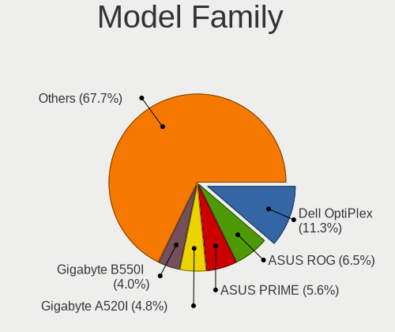
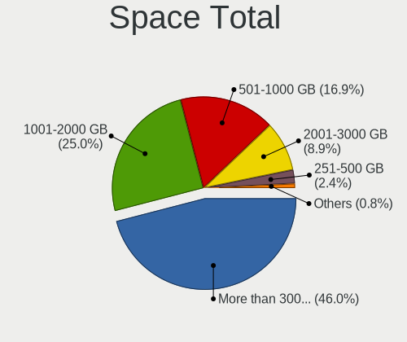
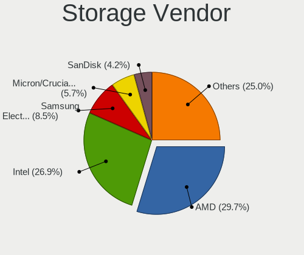
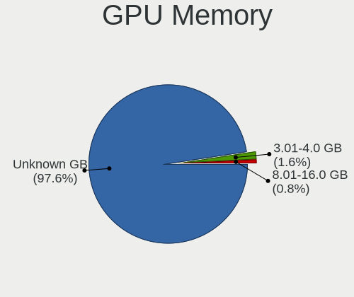
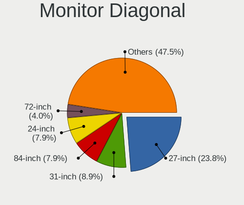
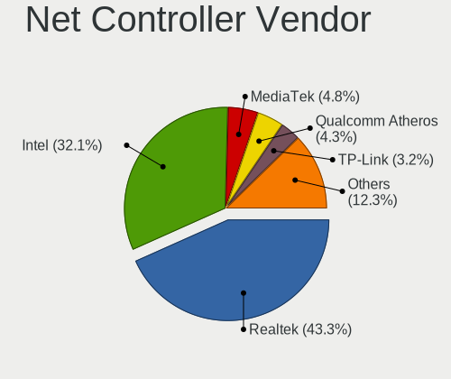
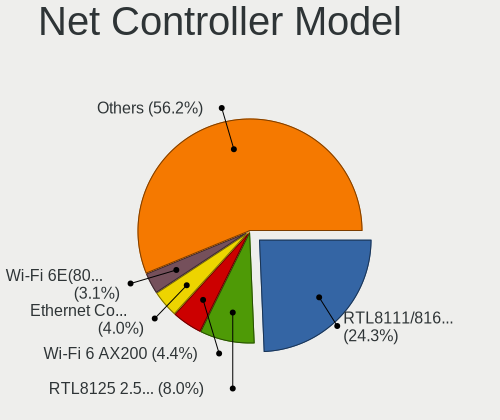
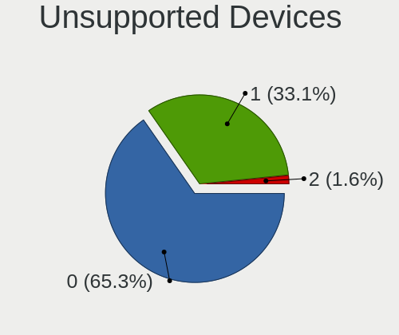

ChimeraOS - Tested Hardware & Statistics (Desktops)
---------------------------------------------------

A project to collect tested hardware configurations for ChimeraOS.

Anyone can contribute to this report by the [hw-probe](https://github.com/linuxhw/hw-probe) tool:

    sudo -E hw-probe -all -upload

Please contribute! Especially if your hardware is rare.

Contents
--------

* [ Test Cases ](#test-cases)

* [ System ](#system)
  - [ OS                       ](#os)
  - [ OS Family                ](#os-family)
  - [ Kernel                   ](#kernel)
  - [ Kernel Family            ](#kernel-family)
  - [ Kernel Major Ver.        ](#kernel-major-ver)
  - [ Arch                     ](#arch)
  - [ DE                       ](#de)
  - [ Display Server           ](#display-server)
  - [ Display Manager          ](#display-manager)
  - [ OS Lang                  ](#os-lang)
  - [ Boot Mode                ](#boot-mode)
  - [ Filesystem               ](#filesystem)
  - [ Part. scheme             ](#part-scheme)
  - [ Dual Boot with Linux/BSD ](#dual-boot-with-linuxbsd)
  - [ Dual Boot (Win)          ](#dual-boot-win)

* [ Board ](#board)
  - [ Vendor                   ](#vendor)
  - [ Model                    ](#model)
  - [ Model Family             ](#model-family)
  - [ MFG Year                 ](#mfg-year)
  - [ Form Factor              ](#form-factor)
  - [ Secure Boot              ](#secure-boot)
  - [ Coreboot                 ](#coreboot)
  - [ RAM Size                 ](#ram-size)
  - [ RAM Used                 ](#ram-used)
  - [ Total Drives             ](#total-drives)
  - [ Has CD-ROM               ](#has-cd-rom)
  - [ Has Ethernet             ](#has-ethernet)
  - [ Has WiFi                 ](#has-wifi)
  - [ Has Bluetooth            ](#has-bluetooth)

* [ Location ](#location)
  - [ Country                  ](#country)
  - [ City                     ](#city)

* [ Drives ](#drives)
  - [ Drive Vendor             ](#drive-vendor)
  - [ Drive Model              ](#drive-model)
  - [ HDD Vendor               ](#hdd-vendor)
  - [ SSD Vendor               ](#ssd-vendor)
  - [ Drive Kind               ](#drive-kind)
  - [ Drive Connector          ](#drive-connector)
  - [ Drive Size               ](#drive-size)
  - [ Space Total              ](#space-total)
  - [ Space Used               ](#space-used)
  - [ Malfunc. Drives          ](#malfunc-drives)
  - [ Malfunc. Drive Vendor    ](#malfunc-drive-vendor)
  - [ Malfunc. HDD Vendor      ](#malfunc-hdd-vendor)
  - [ Malfunc. Drive Kind      ](#malfunc-drive-kind)
  - [ Failed Drives            ](#failed-drives)
  - [ Failed Drive Vendor      ](#failed-drive-vendor)
  - [ Drive Status             ](#drive-status)

* [ Storage controller ](#storage-controller)
  - [ Storage Vendor           ](#storage-vendor)
  - [ Storage Model            ](#storage-model)
  - [ Storage Kind             ](#storage-kind)

* [ Processor ](#processor)
  - [ CPU Vendor               ](#cpu-vendor)
  - [ CPU Model                ](#cpu-model)
  - [ CPU Model Family         ](#cpu-model-family)
  - [ CPU Cores                ](#cpu-cores)
  - [ CPU Sockets              ](#cpu-sockets)
  - [ CPU Threads              ](#cpu-threads)
  - [ CPU Op-Modes             ](#cpu-op-modes)
  - [ CPU Microcode            ](#cpu-microcode)
  - [ CPU Microarch            ](#cpu-microarch)

* [ Graphics ](#graphics)
  - [ GPU Vendor               ](#gpu-vendor)
  - [ GPU Model                ](#gpu-model)
  - [ GPU Combo                ](#gpu-combo)
  - [ GPU Driver               ](#gpu-driver)
  - [ GPU Memory               ](#gpu-memory)

* [ Monitor ](#monitor)
  - [ Monitor Vendor           ](#monitor-vendor)
  - [ Monitor Model            ](#monitor-model)
  - [ Monitor Resolution       ](#monitor-resolution)
  - [ Monitor Diagonal         ](#monitor-diagonal)
  - [ Monitor Width            ](#monitor-width)
  - [ Aspect Ratio             ](#aspect-ratio)
  - [ Monitor Area             ](#monitor-area)
  - [ Pixel Density            ](#pixel-density)
  - [ Multiple Monitors        ](#multiple-monitors)

* [ Network ](#network)
  - [ Net Controller Vendor    ](#net-controller-vendor)
  - [ Net Controller Model     ](#net-controller-model)
  - [ Wireless Vendor          ](#wireless-vendor)
  - [ Wireless Model           ](#wireless-model)
  - [ Ethernet Vendor          ](#ethernet-vendor)
  - [ Ethernet Model           ](#ethernet-model)
  - [ Net Controller Kind      ](#net-controller-kind)
  - [ Used Controller          ](#used-controller)
  - [ NICs                     ](#nics)
  - [ IPv6                     ](#ipv6)

* [ Bluetooth ](#bluetooth)
  - [ Bluetooth Vendor         ](#bluetooth-vendor)
  - [ Bluetooth Model          ](#bluetooth-model)

* [ Sound ](#sound)
  - [ Sound Vendor             ](#sound-vendor)
  - [ Sound Model              ](#sound-model)

* [ Memory ](#memory)
  - [ Memory Vendor            ](#memory-vendor)
  - [ Memory Model             ](#memory-model)
  - [ Memory Kind              ](#memory-kind)
  - [ Memory Form Factor       ](#memory-form-factor)
  - [ Memory Size              ](#memory-size)
  - [ Memory Speed             ](#memory-speed)

* [ Printers & scanners ](#printers--scanners)
  - [ Printer Vendor           ](#printer-vendor)
  - [ Printer Model            ](#printer-model)
  - [ Scanner Vendor           ](#scanner-vendor)
  - [ Scanner Model            ](#scanner-model)

* [ Camera ](#camera)
  - [ Camera Vendor            ](#camera-vendor)
  - [ Camera Model             ](#camera-model)

* [ Security ](#security)
  - [ Fingerprint Vendor       ](#fingerprint-vendor)
  - [ Fingerprint Model        ](#fingerprint-model)
  - [ Chipcard Vendor          ](#chipcard-vendor)
  - [ Chipcard Model           ](#chipcard-model)

* [ Unsupported ](#unsupported)
  - [ Unsupported Devices      ](#unsupported-devices)
  - [ Unsupported Device Types ](#unsupported-device-types)

Test Cases
----------

Total: 57

| Vendor    | Model                       | Probe                                                      | Date         |
|-----------|-----------------------------|------------------------------------------------------------|--------------|
| ASUSTek   | GD30CI                      | [f1c877be0e](https://linux-hardware.org/?probe=f1c877be0e) | Sep 05, 2023 |
| Gigabyte  | Z490 GAMING X AX y.y        | [94a6d62c4b](https://linux-hardware.org/?probe=94a6d62c4b) | Aug 28, 2023 |
| Dell      | 04Y8V0 A02                  | [5afb05e780](https://linux-hardware.org/?probe=5afb05e780) | Aug 27, 2023 |
| ASRock    | B550M-ITX/ac                | [64aa93e41b](https://linux-hardware.org/?probe=64aa93e41b) | Aug 14, 2023 |
| ASUSTek   | TUF B450M-PLUS GAMING       | [3ac1be3b93](https://linux-hardware.org/?probe=3ac1be3b93) | Aug 13, 2023 |
| Dell      | 05YDCW A01                  | [3f3195be63](https://linux-hardware.org/?probe=3f3195be63) | Aug 12, 2023 |
| Dell      | 05YDCW A01                  | [80c27f0ac1](https://linux-hardware.org/?probe=80c27f0ac1) | Aug 12, 2023 |
| Gigabyte  | B550I AORUS PRO AX          | [b1b6854522](https://linux-hardware.org/?probe=b1b6854522) | Jul 29, 2023 |
| ASRock    | H97M Anniversary            | [f8a02ab68e](https://linux-hardware.org/?probe=f8a02ab68e) | Jul 27, 2023 |
| ASUSTek   | ROG STRIX B550-F GAMING     | [c8a41127a9](https://linux-hardware.org/?probe=c8a41127a9) | Jul 23, 2023 |
| ASUSTek   | ROG STRIX B550-F GAMING     | [9186fec300](https://linux-hardware.org/?probe=9186fec300) | Jul 23, 2023 |
| ASUSTek   | STRIX Z270F GAMING          | [80e44d8594](https://linux-hardware.org/?probe=80e44d8594) | Jul 22, 2023 |
| Gigabyte  | B450 AORUS PRO WIFI-CF      | [f747d5537e](https://linux-hardware.org/?probe=f747d5537e) | Jul 15, 2023 |
| Acer      | Veriton X6610G              | [e1189e3406](https://linux-hardware.org/?probe=e1189e3406) | Jul 13, 2023 |
| Dell      | 0KC9NP A01                  | [570f59305c](https://linux-hardware.org/?probe=570f59305c) | Jul 08, 2023 |
| Dell      | 0KC9NP A01                  | [6d62d0cdbf](https://linux-hardware.org/?probe=6d62d0cdbf) | Jul 08, 2023 |
| HP        | 1791                        | [a2bf914a45](https://linux-hardware.org/?probe=a2bf914a45) | Jul 08, 2023 |
| ASUSTek   | PRIME B550-PLUS             | [13195d7ff3](https://linux-hardware.org/?probe=13195d7ff3) | Jul 02, 2023 |
| HP        | 1998                        | [91f6e54877](https://linux-hardware.org/?probe=91f6e54877) | Jun 30, 2023 |
| Gigabyte  | G1.Sniper A88X-CF           | [d4470db5d3](https://linux-hardware.org/?probe=d4470db5d3) | Jun 20, 2023 |
| Dell      | 02YYK5 A01                  | [50efda9604](https://linux-hardware.org/?probe=50efda9604) | Jun 19, 2023 |
| Gigabyte  | B450 AORUS M                | [299db094f8](https://linux-hardware.org/?probe=299db094f8) | Jun 18, 2023 |
| Dell      | 07HXY6 A01                  | [ec3adcbe42](https://linux-hardware.org/?probe=ec3adcbe42) | Jun 16, 2023 |
| Gigabyte  | X470 AORUS GAMING 5 WIFI... | [c6401638dd](https://linux-hardware.org/?probe=c6401638dd) | Jun 11, 2023 |
| Gigabyte  | B550I AORUS PRO AX          | [798d8e8914](https://linux-hardware.org/?probe=798d8e8914) | Jun 11, 2023 |
| MSI       | MPG B650I EDGE WIFI         | [d43ce99616](https://linux-hardware.org/?probe=d43ce99616) | Jun 07, 2023 |
| Gigabyte  | X470 AORUS GAMING 5 WIFI... | [8c6370ac0d](https://linux-hardware.org/?probe=8c6370ac0d) | May 23, 2023 |
| Gigabyte  | X470 AORUS GAMING 5 WIFI... | [41b69ae4db](https://linux-hardware.org/?probe=41b69ae4db) | May 12, 2023 |
| ASUSTek   | PRIME B760-PLUS D4          | [bb01d9e92b](https://linux-hardware.org/?probe=bb01d9e92b) | May 12, 2023 |
| ASUSTek   | ROG STRIX B460-I GAMING     | [3a9528f661](https://linux-hardware.org/?probe=3a9528f661) | May 10, 2023 |
| Gigabyte  | X470 AORUS GAMING 5 WIFI... | [bf3fee03d2](https://linux-hardware.org/?probe=bf3fee03d2) | May 09, 2023 |
| ASUSTek   | ROG STRIX B550-F GAMING     | [ad66608cf0](https://linux-hardware.org/?probe=ad66608cf0) | May 08, 2023 |
| Gigabyte  | X470 AORUS GAMING 5 WIFI... | [101ec0a833](https://linux-hardware.org/?probe=101ec0a833) | May 05, 2023 |
| ASUSTek   | PRIME B760-PLUS D4          | [4ec161ab9b](https://linux-hardware.org/?probe=4ec161ab9b) | May 04, 2023 |
| Dell      | 0FDY5C A00                  | [a6865b8591](https://linux-hardware.org/?probe=a6865b8591) | Apr 16, 2023 |
| ASUSTek   | ROG STRIX B460-I GAMING     | [14db4e6f1d](https://linux-hardware.org/?probe=14db4e6f1d) | Apr 11, 2023 |
| ASUSTek   | ROG STRIX B650E-I GAMING... | [03db223af4](https://linux-hardware.org/?probe=03db223af4) | Apr 06, 2023 |
| ASUSTek   | ROG STRIX B650E-I GAMING... | [f8c2ffcd09](https://linux-hardware.org/?probe=f8c2ffcd09) | Apr 06, 2023 |
| MACHINIST | X99-RS9 V2.0                | [ad4c43dd09](https://linux-hardware.org/?probe=ad4c43dd09) | Mar 21, 2023 |
| Gigabyte  | B460M DS3H AC V2-Y1         | [b21cd49226](https://linux-hardware.org/?probe=b21cd49226) | Mar 16, 2023 |
| MSI       | MPG B650I EDGE WIFI         | [9f40b861a5](https://linux-hardware.org/?probe=9f40b861a5) | Mar 12, 2023 |
| Gigabyte  | B460M DS3H AC V2-Y1         | [7f8fc2ba96](https://linux-hardware.org/?probe=7f8fc2ba96) | Mar 10, 2023 |
| Dell      | 0XHGV1 A00                  | [8fa504e81f](https://linux-hardware.org/?probe=8fa504e81f) | Mar 07, 2023 |
| Intel     | DB75EN AAG39650-400         | [4a0feca3f5](https://linux-hardware.org/?probe=4a0feca3f5) | Mar 02, 2023 |
| Gigabyte  | H77M-D3H                    | [01eb743492](https://linux-hardware.org/?probe=01eb743492) | Feb 25, 2023 |
| Gigabyte  | H77M-D3H                    | [766790f373](https://linux-hardware.org/?probe=766790f373) | Feb 25, 2023 |
| ASUSTek   | B150I PRO GAMING/WIFI/AU... | [eb1e211b0f](https://linux-hardware.org/?probe=eb1e211b0f) | Feb 25, 2023 |
| HP        | 1998                        | [dbb952f3f6](https://linux-hardware.org/?probe=dbb952f3f6) | Feb 13, 2023 |
| HP        | 1998                        | [0171575a1d](https://linux-hardware.org/?probe=0171575a1d) | Feb 13, 2023 |
| Gigabyte  | H510M H                     | [69d2cb7e14](https://linux-hardware.org/?probe=69d2cb7e14) | Jan 11, 2023 |
| ASUSTek   | P8H61-MX R2.0               | [3e4b14919e](https://linux-hardware.org/?probe=3e4b14919e) | Jan 05, 2023 |
| Gigabyte  | X570S AORUS ELITE AX        | [02b3cbc8c6](https://linux-hardware.org/?probe=02b3cbc8c6) | Jan 04, 2023 |
| Gigabyte  | X570S AORUS ELITE AX        | [13ae6c7e25](https://linux-hardware.org/?probe=13ae6c7e25) | Jan 01, 2023 |
| Gigabyte  | X570 AORUS ELITE WIFI       | [49ca01435b](https://linux-hardware.org/?probe=49ca01435b) | Dec 27, 2022 |
| Lenovo    | ThinkCentre M70e 0832B1U    | [d95663a632](https://linux-hardware.org/?probe=d95663a632) | Dec 07, 2022 |
| Gigabyte  | X470 AORUS GAMING 5 WIFI... | [2a7b6d570f](https://linux-hardware.org/?probe=2a7b6d570f) | Nov 26, 2022 |
| Gigabyte  | X470 AORUS GAMING 5 WIFI... | [58b3db6784](https://linux-hardware.org/?probe=58b3db6784) | Nov 23, 2022 |

System
------

OS
--

Installed operating systems

| Name           | Desktops | Percent |
|----------------|----------|---------|
| ChimeraOS 43-1 | 8        | 19.51%  |
| ChimeraOS 42   | 8        | 19.51%  |
| ChimeraOS 43   | 7        | 17.07%  |
| ChimeraOS 39   | 7        | 17.07%  |
| ChimeraOS 41   | 4        | 9.76%   |
| ChimeraOS 38   | 4        | 9.76%   |
| ChimeraOS 37   | 3        | 7.32%   |

OS Family
---------

OS without a version

| Name      | Desktops | Percent |
|-----------|----------|---------|
| ChimeraOS | 39       | 100%    |

Kernel
------

Version of the Linux kernel

| Version           | Desktops | Percent |
|-------------------|----------|---------|
| 6.3.9-chimeraos-1 | 14       | 33.33%  |
| 6.1.27-1-lts      | 8        | 19.05%  |
| 6.1.11-arch1-1    | 7        | 16.67%  |
| 6.1.21-1-lts      | 4        | 9.52%   |
| 6.1.1-arch1-1     | 4        | 9.52%   |
| 6.0.8-arch1-1     | 3        | 7.14%   |
| 6.3.3-arch1-1     | 1        | 2.38%   |
| 6.3.1-arch2-1     | 1        | 2.38%   |

Kernel Family
-------------

Linux kernel without a distro release

| Version | Desktops | Percent |
|---------|----------|---------|
| 6.3.9   | 14       | 33.33%  |
| 6.1.27  | 8        | 19.05%  |
| 6.1.11  | 7        | 16.67%  |
| 6.1.21  | 4        | 9.52%   |
| 6.1.1   | 4        | 9.52%   |
| 6.0.8   | 3        | 7.14%   |
| 6.3.3   | 1        | 2.38%   |
| 6.3.1   | 1        | 2.38%   |

Kernel Major Ver.
-----------------

Linux kernel major version

| Version | Desktops | Percent |
|---------|----------|---------|
| 6.1     | 22       | 55%     |
| 6.3     | 15       | 37.5%   |
| 6.0     | 3        | 7.5%    |

Arch
----

OS architecture (x86_64, i586, etc.)

| Name   | Desktops | Percent |
|--------|----------|---------|
| x86_64 | 39       | 100%    |

DE
--

Desktop Environment

| Name    | Desktops | Percent |
|---------|----------|---------|
| GNOME   | 38       | 97.44%  |
| steamos | 1        | 2.56%   |

Display Server
--------------

X11 or Wayland

| Name    | Desktops | Percent |
|---------|----------|---------|
| Wayland | 35       | 89.74%  |
| X11     | 4        | 10.26%  |

Display Manager
---------------

SDDM, LightDM, etc.

| Name    | Desktops | Percent |
|---------|----------|---------|
| Unknown | 39       | 100%    |

OS Lang
-------

Language

| Lang  | Desktops | Percent |
|-------|----------|---------|
| en_US | 35       | 89.74%  |
| pt_BR | 1        | 2.56%   |
| fr_FR | 1        | 2.56%   |
| es_ES | 1        | 2.56%   |
| de_DE | 1        | 2.56%   |

Boot Mode
---------

EFI or BIOS

| Mode | Desktops | Percent |
|------|----------|---------|
| BIOS | 39       | 100%    |

Filesystem
----------

Type of filesystem

| Type  | Desktops | Percent |
|-------|----------|---------|
| Btrfs | 39       | 100%    |

Part. scheme
------------

Scheme of partitioning

| Type    | Desktops | Percent |
|---------|----------|---------|
| Unknown | 39       | 100%    |

Dual Boot with Linux/BSD
------------------------

Hosting more than one Linux/BSD

| Dual boot | Desktops | Percent |
|-----------|----------|---------|
| No        | 39       | 100%    |

Dual Boot (Win)
---------------

Hosting Linux and Windows

| Dual boot | Desktops | Percent |
|-----------|----------|---------|
| No        | 39       | 100%    |

Board
-----

Vendor
------

Motherboard manufacturer

| Name                | Desktops | Percent |
|---------------------|----------|---------|
| Gigabyte Technology | 12       | 30.77%  |
| ASUSTek Computer    | 11       | 28.21%  |
| Dell                | 6        | 15.38%  |
| Hewlett-Packard     | 3        | 7.69%   |
| ASRock              | 2        | 5.13%   |
| MSI                 | 1        | 2.56%   |
| MACHINIST           | 1        | 2.56%   |
| Lenovo              | 1        | 2.56%   |
| Intel               | 1        | 2.56%   |
| Acer                | 1        | 2.56%   |

Model
-----

Motherboard model

| Name                               | Desktops | Percent |
|------------------------------------|----------|---------|
| HP EliteDesk 800 G1 SFF            | 2        | 5.13%   |
| Gigabyte B550I AORUS PRO AX        | 2        | 5.13%   |
| ASUS ROG STRIX B550-F GAMING       | 2        | 5.13%   |
| MSI MS-7D73                        | 1        | 2.56%   |
| MACHINIST X99-RS9 V2.0             | 1        | 2.56%   |
| Lenovo ThinkCentre M70e 0832B1U    | 1        | 2.56%   |
| Intel DB75EN AAG39650-400          | 1        | 2.56%   |
| HP Z220 SFF Workstation            | 1        | 2.56%   |
| Gigabyte Z490 GAMING X AX          | 1        | 2.56%   |
| Gigabyte X570S AORUS ELITE AX      | 1        | 2.56%   |
| Gigabyte X570 AORUS ELITE WIFI     | 1        | 2.56%   |
| Gigabyte X470 AORUS GAMING 5 WIFI  | 1        | 2.56%   |
| Gigabyte H77M-D3H                  | 1        | 2.56%   |
| Gigabyte H510M H                   | 1        | 2.56%   |
| Gigabyte G1.Sniper A88X-CF         | 1        | 2.56%   |
| Gigabyte B460M DS3H AC V2-Y1       | 1        | 2.56%   |
| Gigabyte B450 AORUS PRO WIFI       | 1        | 2.56%   |
| Gigabyte B450 AORUS M              | 1        | 2.56%   |
| Dell OptiPlex 9020                 | 1        | 2.56%   |
| Dell OptiPlex 7050                 | 1        | 2.56%   |
| Dell OptiPlex 7020                 | 1        | 2.56%   |
| Dell OptiPlex 5055 Ryzen APU       | 1        | 2.56%   |
| Dell OptiPlex 3070                 | 1        | 2.56%   |
| Dell OptiPlex 3060                 | 1        | 2.56%   |
| ASUS TUF B450M-PLUS GAMING         | 1        | 2.56%   |
| ASUS STRIX Z270F GAMING            | 1        | 2.56%   |
| ASUS ROG STRIX B650E-I GAMING WIFI | 1        | 2.56%   |
| ASUS ROG STRIX B460-I GAMING       | 1        | 2.56%   |
| ASUS PRIME B760-PLUS D4            | 1        | 2.56%   |
| ASUS PRIME B550-PLUS               | 1        | 2.56%   |
| ASUS P8H61-MX R2.0                 | 1        | 2.56%   |
| ASUS GD30CI                        | 1        | 2.56%   |
| ASUS B150I PRO GAMING/WIFI/AURA    | 1        | 2.56%   |
| ASRock H97M Anniversary            | 1        | 2.56%   |
| ASRock B550M-ITX/ac                | 1        | 2.56%   |
| Acer Veriton X6610G                | 1        | 2.56%   |

Model Family
------------

Motherboard model prefix

| Name               | Desktops | Percent |
|--------------------|----------|---------|
| Dell OptiPlex      | 6        | 15.38%  |
| ASUS ROG           | 4        | 10.26%  |
| HP EliteDesk       | 2        | 5.13%   |
| Gigabyte B550I     | 2        | 5.13%   |
| Gigabyte B450      | 2        | 5.13%   |
| ASUS PRIME         | 2        | 5.13%   |
| MSI MS-7D73        | 1        | 2.56%   |
| MACHINIST X99-RS9  | 1        | 2.56%   |
| Lenovo ThinkCentre | 1        | 2.56%   |
| Intel DB75EN       | 1        | 2.56%   |
| HP Z220            | 1        | 2.56%   |
| Gigabyte Z490      | 1        | 2.56%   |
| Gigabyte X570S     | 1        | 2.56%   |
| Gigabyte X570      | 1        | 2.56%   |
| Gigabyte X470      | 1        | 2.56%   |
| Gigabyte H77M-D3H  | 1        | 2.56%   |
| Gigabyte H510M     | 1        | 2.56%   |
| Gigabyte G1.Sniper | 1        | 2.56%   |
| Gigabyte B460M     | 1        | 2.56%   |
| ASUS TUF           | 1        | 2.56%   |
| ASUS STRIX         | 1        | 2.56%   |
| ASUS P8H61-MX      | 1        | 2.56%   |
| ASUS GD30CI        | 1        | 2.56%   |
| ASUS B150I         | 1        | 2.56%   |
| ASRock H97M        | 1        | 2.56%   |
| ASRock B550M-ITX   | 1        | 2.56%   |
| Acer Veriton       | 1        | 2.56%   |

MFG Year
--------

Motherboard manufacture year

| Year | Desktops | Percent |
|------|----------|---------|
| 2020 | 9        | 23.08%  |
| 2018 | 5        | 12.82%  |
| 2021 | 4        | 10.26%  |
| 2012 | 4        | 10.26%  |
| 2022 | 3        | 7.69%   |
| 2013 | 3        | 7.69%   |
| 2019 | 2        | 5.13%   |
| 2017 | 2        | 5.13%   |
| 2016 | 2        | 5.13%   |
| 2014 | 2        | 5.13%   |
| 2015 | 1        | 2.56%   |
| 2011 | 1        | 2.56%   |
| 2010 | 1        | 2.56%   |

Form Factor
-----------

Physical design of the computer

| Name    | Desktops | Percent |
|---------|----------|---------|
| Desktop | 39       | 100%    |

Secure Boot
-----------

Enabled or disabled

| State    | Desktops | Percent |
|----------|----------|---------|
| Disabled | 39       | 100%    |

Coreboot
--------

Have coreboot on board

| Used | Desktops | Percent |
|------|----------|---------|
| No   | 39       | 100%    |

RAM Size
--------

Total RAM memory

| Size in GB  | Desktops | Percent |
|-------------|----------|---------|
| 32.01-64.0  | 15       | 38.46%  |
| 16.01-24.0  | 11       | 28.21%  |
| 4.01-8.0    | 7        | 17.95%  |
| 8.01-16.0   | 3        | 7.69%   |
| 24.01-32.0  | 2        | 5.13%   |
| 64.01-256.0 | 1        | 2.56%   |

RAM Used
--------

Used RAM memory

| Used GB    | Desktops | Percent |
|------------|----------|---------|
| 2.01-3.0   | 18       | 43.9%   |
| 1.01-2.0   | 8        | 19.51%  |
| 4.01-8.0   | 7        | 17.07%  |
| 3.01-4.0   | 7        | 17.07%  |
| 16.01-24.0 | 1        | 2.44%   |

Total Drives
------------

Number of drives on board

| Drives | Desktops | Percent |
|--------|----------|---------|
| 1      | 16       | 39.02%  |
| 3      | 10       | 24.39%  |
| 2      | 10       | 24.39%  |
| 4      | 2        | 4.88%   |
| 8      | 1        | 2.44%   |
| 7      | 1        | 2.44%   |
| 5      | 1        | 2.44%   |

Has CD-ROM
----------

Has CD-ROM on board

| Presented | Desktops | Percent |
|-----------|----------|---------|
| No        | 29       | 74.36%  |
| Yes       | 10       | 25.64%  |

Has Ethernet
------------

Has Ethernet on board

| Presented | Desktops | Percent |
|-----------|----------|---------|
| Yes       | 39       | 100%    |

Has WiFi
--------

Has WiFi module

| Presented | Desktops | Percent |
|-----------|----------|---------|
| Yes       | 24       | 61.54%  |
| No        | 15       | 38.46%  |

Has Bluetooth
-------------

Has Bluetooth module

| Presented | Desktops | Percent |
|-----------|----------|---------|
| Yes       | 24       | 61.54%  |
| No        | 15       | 38.46%  |

Location
--------

Country
-------

Geographic location (country)

| Country   | Desktops | Percent |
|-----------|----------|---------|
| USA       | 16       | 41.03%  |
| Germany   | 4        | 10.26%  |
| Australia | 4        | 10.26%  |
| Russia    | 2        | 5.13%   |
| Canada    | 2        | 5.13%   |
| Brazil    | 2        | 5.13%   |
| UK        | 1        | 2.56%   |
| Spain     | 1        | 2.56%   |
| Poland    | 1        | 2.56%   |
| Norway    | 1        | 2.56%   |
| Malaysia  | 1        | 2.56%   |
| Japan     | 1        | 2.56%   |
| Iceland   | 1        | 2.56%   |
| Honduras  | 1        | 2.56%   |
| France    | 1        | 2.56%   |

City
----

Geographic location (city)

| City          | Desktops | Percent |
|---------------|----------|---------|
| Melbourne     | 2        | 5%      |
| Yekaterinburg | 1        | 2.5%    |
| Yaroslavl     | 1        | 2.5%    |
| Watsonville   | 1        | 2.5%    |
| Warsaw        | 1        | 2.5%    |
| Valence       | 1        | 2.5%    |
| Umeda         | 1        | 2.5%    |
| Toronto       | 1        | 2.5%    |
| Tegucigalpa   | 1        | 2.5%    |
| Sydney        | 1        | 2.5%    |
| Sumaré       | 1        | 2.5%    |
| Steyning      | 1        | 2.5%    |
| Shelbyville   | 1        | 2.5%    |
| Sao Paulo     | 1        | 2.5%    |
| Sanford       | 1        | 2.5%    |
| Round Rock    | 1        | 2.5%    |
| Reykjavik     | 1        | 2.5%    |
| Racine        | 1        | 2.5%    |
| Phoenix       | 1        | 2.5%    |
| Philadelphia  | 1        | 2.5%    |
| Meissen       | 1        | 2.5%    |
| Madison       | 1        | 2.5%    |
| Longueuil     | 1        | 2.5%    |
| Lewiston      | 1        | 2.5%    |
| Kuala Lumpur  | 1        | 2.5%    |
| Houston       | 1        | 2.5%    |
| Hixson        | 1        | 2.5%    |
| Hialeah       | 1        | 2.5%    |
| Hamburg       | 1        | 2.5%    |
| Gary          | 1        | 2.5%    |
| Eidsberg      | 1        | 2.5%    |
| Duluth        | 1        | 2.5%    |
| Dresden       | 1        | 2.5%    |
| Chattanooga   | 1        | 2.5%    |
| Brossard      | 1        | 2.5%    |
| Bielefeld     | 1        | 2.5%    |
| Beaverton     | 1        | 2.5%    |
| Badalona      | 1        | 2.5%    |
| Adelaide      | 1        | 2.5%    |

Drives
------

Drive Vendor
------------

Hard drive vendors

| Vendor                      | Desktops | Drives | Percent |
|-----------------------------|----------|--------|---------|
| Seagate                     | 14       | 19     | 18.92%  |
| Samsung Electronics         | 11       | 21     | 14.86%  |
| WDC                         | 6        | 9      | 8.11%   |
| Kingston                    | 6        | 6      | 8.11%   |
| SanDisk                     | 5        | 9      | 6.76%   |
| Micron/Crucial Technology   | 4        | 4      | 5.41%   |
| SK hynix                    | 2        | 2      | 2.7%    |
| Silicon Motion              | 2        | 2      | 2.7%    |
| Phison Electronics          | 2        | 2      | 2.7%    |
| Micron Technology           | 2        | 4      | 2.7%    |
| Intel                       | 2        | 3      | 2.7%    |
| Hitachi                     | 2        | 2      | 2.7%    |
| Crucial                     | 2        | 4      | 2.7%    |
| ADATA Technology            | 2        | 3      | 2.7%    |
| Toshiba                     | 1        | 2      | 1.35%   |
| Netac                       | 1        | 1      | 1.35%   |
| KIOXIA                      | 1        | 1      | 1.35%   |
| Kingston Technology Company | 1        | 1      | 1.35%   |
| KingFast                    | 1        | 1      | 1.35%   |
| KingDian                    | 1        | 3      | 1.35%   |
| Hewlett-Packard             | 1        | 1      | 1.35%   |
| Fanxiang                    | 1        | 1      | 1.35%   |
| Corsair                     | 1        | 1      | 1.35%   |
| AMD                         | 1        | 1      | 1.35%   |
| A-DATA Technology           | 1        | 1      | 1.35%   |
| Unknown                     | 1        | 1      | 1.35%   |

Drive Model
-----------

Hard drive models

| Model                                                           | Desktops | Percent |
|-----------------------------------------------------------------|----------|---------|
| Seagate ST1000DM010-2EP102 1TB                                  | 5        | 5.95%   |
| Samsung NVMe SSD Controller SM981/PM981/PM983 500GB             | 4        | 4.76%   |
| Micron/Crucial P2 NVMe PCIe SSD 1TB                             | 4        | 4.76%   |
| Silicon Motion SM2263EN/SM2263XT SSD Controller 256GB           | 2        | 2.38%   |
| Samsung SSD 870 QVO 2TB                                         | 2        | 2.38%   |
| Samsung SSD 860 EVO 1TB                                         | 2        | 2.38%   |
| Samsung NVMe SSD Controller PM9A1/PM9A3/980PRO 1024GB           | 2        | 2.38%   |
| Kingston SA400S37120G 120GB SSD                                 | 2        | 2.38%   |
| ADATA XPG SX8200 Pro PCIe Gen3x4 M.2 2280 Solid State Drive 2TB | 2        | 2.38%   |
| WDC WDS500G2B0A-00SM50 500GB SSD                                | 1        | 1.19%   |
| WDC WDBNCE5000PNC 500GB SSD                                     | 1        | 1.19%   |
| WDC WD5000BEVT-22A0RT0 500GB                                    | 1        | 1.19%   |
| WDC WD5000AVDS-63U7B1 500GB                                     | 1        | 1.19%   |
| WDC WD40EZRX-00SPEB0 4TB                                        | 1        | 1.19%   |
| WDC WD20EARX-00PASB0 2TB                                        | 1        | 1.19%   |
| WDC WD1500HLFS-01G6U0 150GB                                     | 1        | 1.19%   |
| Toshiba MQ02ABD100H 1TB                                         | 1        | 1.19%   |
| SK hynix SHGP31-2000GM 2TB                                      | 1        | 1.19%   |
| SK hynix PC601 NVMe 256GB                                       | 1        | 1.19%   |
| Seagate ST9500325AS 500GB                                       | 1        | 1.19%   |
| Seagate ST500LM000-1EJ162-SSHD 500GB                            | 1        | 1.19%   |
| Seagate ST500DM002-1BD142 500GB                                 | 1        | 1.19%   |
| Seagate ST4000LM024-2AN17V 4TB                                  | 1        | 1.19%   |
| Seagate ST2000DX002-2DV164 2TB                                  | 1        | 1.19%   |
| Seagate ST2000DM008-2FR102 2TB                                  | 1        | 1.19%   |
| Seagate ST2000DM006-2DM164 2TB                                  | 1        | 1.19%   |
| Seagate ST2000DL003-9VT166 2TB                                  | 1        | 1.19%   |
| Seagate ST1000LM035-1RK172 1TB                                  | 1        | 1.19%   |
| Seagate ST1000LM024 HN-M101MBB 1TB                              | 1        | 1.19%   |
| Seagate FireCuda HDD 2TB                                        | 1        | 1.19%   |
| Seagate Expansion Desk 2TB                                      | 1        | 1.19%   |
| Seagate BarraCuda 120 SSD ZA2000CM10003 2TB                     | 1        | 1.19%   |
| Sandisk WD_BLACK SN750 SE NVMe 1TB                              | 1        | 1.19%   |
| SanDisk Ultra II 240GB SSD                                      | 1        | 1.19%   |
| SanDisk SDSSDP128G 128GB                                        | 1        | 1.19%   |
| SanDisk SDSSDA480G 480GB                                        | 1        | 1.19%   |
| SanDisk SD7TB3Q-256G-1006 256GB SSD                             | 1        | 1.19%   |
| SanDisk Extreme SSD 500GB                                       | 1        | 1.19%   |
| Samsung SSD 850 EVO 250GB                                       | 1        | 1.19%   |
| Samsung SSD 840 PRO Series 512GB                                | 1        | 1.19%   |

HDD Vendor
----------

Hard disk drive vendors

| Vendor              | Desktops | Drives | Percent |
|---------------------|----------|--------|---------|
| Seagate             | 14       | 18     | 60.87%  |
| WDC                 | 5        | 7      | 21.74%  |
| Hitachi             | 2        | 2      | 8.7%    |
| Toshiba             | 1        | 2      | 4.35%   |
| Samsung Electronics | 1        | 1      | 4.35%   |

SSD Vendor
----------

Solid state drive vendors

| Vendor              | Desktops | Drives | Percent |
|---------------------|----------|--------|---------|
| Samsung Electronics | 6        | 10     | 20.69%  |
| SanDisk             | 5        | 7      | 17.24%  |
| Kingston            | 4        | 4      | 13.79%  |
| Micron Technology   | 2        | 4      | 6.9%    |
| Crucial             | 2        | 4      | 6.9%    |
| WDC                 | 1        | 2      | 3.45%   |
| Seagate             | 1        | 1      | 3.45%   |
| Netac               | 1        | 1      | 3.45%   |
| KingDian            | 1        | 3      | 3.45%   |
| Intel               | 1        | 1      | 3.45%   |
| Hewlett-Packard     | 1        | 1      | 3.45%   |
| Fanxiang            | 1        | 1      | 3.45%   |
| Corsair             | 1        | 1      | 3.45%   |
| AMD                 | 1        | 1      | 3.45%   |
| A-DATA Technology   | 1        | 1      | 3.45%   |

Drive Kind
----------

HDD or SSD

| Kind    | Desktops | Drives | Percent |
|---------|----------|--------|---------|
| NVMe    | 21       | 31     | 33.87%  |
| SSD     | 21       | 42     | 33.87%  |
| HDD     | 18       | 30     | 29.03%  |
| Unknown | 2        | 2      | 3.23%   |

Drive Connector
---------------

SATA, SAS, NVMe, etc.

| Type | Desktops | Drives | Percent |
|------|----------|--------|---------|
| SATA | 32       | 71     | 57.14%  |
| NVMe | 21       | 31     | 37.5%   |
| SAS  | 3        | 3      | 5.36%   |

Drive Size
----------

Size of hard drive

| Size in TB | Desktops | Drives | Percent |
|------------|----------|--------|---------|
| 0.01-0.5   | 18       | 39     | 41.86%  |
| 0.51-1.0   | 13       | 16     | 30.23%  |
| 1.01-2.0   | 9        | 11     | 20.93%  |
| 3.01-4.0   | 2        | 5      | 4.65%   |
| 2.01-3.0   | 1        | 1      | 2.33%   |

Space Total
-----------

Amount of disk space available on the file system

| Size in GB     | Desktops | Percent |
|----------------|----------|---------|
| More than 3000 | 18       | 45%     |
| 1001-2000      | 10       | 25%     |
| 501-1000       | 7        | 17.5%   |
| 251-500        | 3        | 7.5%    |
| 2001-3000      | 2        | 5%      |

Space Used
----------

Amount of used disk space

| Used GB        | Desktops | Percent |
|----------------|----------|---------|
| 21-50          | 10       | 24.39%  |
| 51-100         | 9        | 21.95%  |
| 101-250        | 5        | 12.2%   |
| 1001-2000      | 5        | 12.2%   |
| More than 3000 | 3        | 7.32%   |
| 251-500        | 3        | 7.32%   |
| 2001-3000      | 3        | 7.32%   |
| 501-1000       | 3        | 7.32%   |

Malfunc. Drives
---------------

Drive models with a malfunction

Zero info for selected period =(

Malfunc. Drive Vendor
---------------------

Vendors of faulty drives

Zero info for selected period =(

Malfunc. HDD Vendor
-------------------

Vendors of faulty HDD drives

Zero info for selected period =(

Malfunc. Drive Kind
-------------------

Kinds of faulty drives

Zero info for selected period =(

Failed Drives
-------------

Failed drive models

Zero info for selected period =(

Failed Drive Vendor
-------------------

Failed drive vendors

Zero info for selected period =(

Drive Status
------------

Number of failed and malfunc. drives

| Status   | Desktops | Drives | Percent |
|----------|----------|--------|---------|
| Detected | 39       | 105    | 100%    |

Storage controller
------------------

Storage Vendor
--------------

Storage controller vendors

| Vendor                      | Desktops | Percent |
|-----------------------------|----------|---------|
| Intel                       | 24       | 36.92%  |
| AMD                         | 16       | 24.62%  |
| Samsung Electronics         | 6        | 9.23%   |
| Micron/Crucial Technology   | 4        | 6.15%   |
| Kingston Technology Company | 3        | 4.62%   |
| SK hynix                    | 2        | 3.08%   |
| Silicon Motion              | 2        | 3.08%   |
| Phison Electronics          | 2        | 3.08%   |
| ADATA Technology            | 2        | 3.08%   |
| SanDisk                     | 1        | 1.54%   |
| Marvell Technology Group    | 1        | 1.54%   |
| KIOXIA                      | 1        | 1.54%   |
| Biwin Storage Technology    | 1        | 1.54%   |

Storage Model
-------------

Storage controller models

| Model                                                                          | Desktops | Percent |
|--------------------------------------------------------------------------------|----------|---------|
| AMD FCH SATA Controller [AHCI mode]                                            | 10       | 13.51%  |
| AMD 500 Series Chipset SATA Controller                                         | 6        | 8.11%   |
| Samsung NVMe SSD Controller SM981/PM981/PM983                                  | 4        | 5.41%   |
| Micron/Crucial P2 [Nick P2] / P3 / P3 Plus NVMe PCIe SSD (DRAM-less)           | 4        | 5.41%   |
| Intel SATA Controller [RAID mode]                                              | 4        | 5.41%   |
| AMD 400 Series Chipset SATA Controller                                         | 4        | 5.41%   |
| Intel 8 Series/C220 Series Chipset Family 6-port SATA Controller 1 [AHCI mode] | 3        | 4.05%   |
| Silicon Motion SM2263EN/SM2263XT (DRAM-less) NVMe SSD Controllers              | 2        | 2.7%    |
| Samsung NVMe SSD Controller PM9A1/PM9A3/980PRO                                 | 2        | 2.7%    |
| Intel 7 Series/C210 Series Chipset Family 6-port SATA Controller [AHCI mode]   | 2        | 2.7%    |
| Intel 6 Series/C200 Series Chipset Family 6 port Desktop SATA AHCI Controller  | 2        | 2.7%    |
| Intel 400 Series Chipset Family SATA AHCI Controller                           | 2        | 2.7%    |
| Intel 200 Series PCH SATA controller [AHCI mode]                               | 2        | 2.7%    |
| ADATA XPG SX8200 Pro PCIe Gen3x4 M.2 2280 Solid State Drive                    | 2        | 2.7%    |
| SK hynix PC601 NVMe Solid State Drive                                          | 1        | 1.35%   |
| SK hynix Gold P31/BC711/PC711 NVMe Solid State Drive                           | 1        | 1.35%   |
| SanDisk PC SN735 NVMe SSD (DRAM-less)                                          | 1        | 1.35%   |
| Samsung NVMe SSD Controller SM961/PM961/SM963                                  | 1        | 1.35%   |
| Phison PS5013 E13 NVMe Controller                                              | 1        | 1.35%   |
| Phison E12 NVMe Controller                                                     | 1        | 1.35%   |
| Marvell Group 88SE9215 PCIe 2.0 x1 4-port SATA 6 Gb/s Controller               | 1        | 1.35%   |
| KIOXIA NVMe SSD Controller BG4 (DRAM-less)                                     | 1        | 1.35%   |
| Kingston Company Company Non-Volatile memory controller                        | 1        | 1.35%   |
| Kingston Company NVMe Controller                                               | 1        | 1.35%   |
| Kingston Company NV1 NVMe SSD                                                  | 1        | 1.35%   |
| Intel Volume Management Device NVMe RAID Controller Intel Corporation          | 1        | 1.35%   |
| Intel SSD 665p Series [Neptune Harbor Refresh]                                 | 1        | 1.35%   |
| Intel Q170/Q150/B150/H170/H110/Z170/CM236 Chipset SATA Controller [AHCI Mode]  | 1        | 1.35%   |
| Intel NM10/ICH7 Family SATA Controller [IDE mode]                              | 1        | 1.35%   |
| Intel Comet Lake SATA AHCI Controller                                          | 1        | 1.35%   |
| Intel Cannon Lake PCH SATA AHCI Controller                                     | 1        | 1.35%   |
| Intel 9 Series Chipset Family SATA Controller [AHCI Mode]                      | 1        | 1.35%   |
| Intel 82801G (ICH7 Family) IDE Controller                                      | 1        | 1.35%   |
| Intel 8 Series/C220 Series Chipset Family 4-port SATA Controller 1 [IDE mode]  | 1        | 1.35%   |
| Intel 700 Series Chipset Family SATA AHCI Controller                           | 1        | 1.35%   |
| Intel 6 Series/C200 Series Chipset Family IDE-r Controller                     | 1        | 1.35%   |
| Intel 500 Series Chipset Family SATA AHCI Controller                           | 1        | 1.35%   |
| Biwin Storage Non-Volatile memory controller                                   | 1        | 1.35%   |
| AMD 300 Series Chipset SATA Controller                                         | 1        | 1.35%   |

Storage Kind
------------

Kind of storage controller (IDE, SATA, NVMe, SAS, ...)

| Kind | Desktops | Percent |
|------|----------|---------|
| SATA | 33       | 53.23%  |
| NVMe | 21       | 33.87%  |
| RAID | 5        | 8.06%   |
| IDE  | 3        | 4.84%   |

Processor
---------

CPU Vendor
----------

Processor vendors

| Vendor | Desktops | Percent |
|--------|----------|---------|
| Intel  | 23       | 58.97%  |
| AMD    | 16       | 41.03%  |

CPU Model
---------

Processor models

| Model                                           | Desktops | Percent |
|-------------------------------------------------|----------|---------|
| AMD Ryzen 7 5800X 8-Core Processor              | 4        | 10%     |
| Intel Core i7-7700K CPU @ 4.20GHz               | 2        | 5%      |
| AMD Ryzen 5 3600 6-Core Processor               | 2        | 5%      |
| Intel Xeon CPU E5-1650 v3 @ 3.50GHz             | 1        | 2.5%    |
| Intel Xeon CPU E3-1245 V2 @ 3.40GHz             | 1        | 2.5%    |
| Intel Core i7-7700 CPU @ 3.60GHz                | 1        | 2.5%    |
| Intel Core i7-4770 CPU @ 3.40GHz                | 1        | 2.5%    |
| Intel Core i5-9500T CPU @ 2.20GHz               | 1        | 2.5%    |
| Intel Core i5-8500 CPU @ 3.00GHz                | 1        | 2.5%    |
| Intel Core i5-7500 CPU @ 3.40GHz                | 1        | 2.5%    |
| Intel Core i5-4590S CPU @ 3.00GHz               | 1        | 2.5%    |
| Intel Core i5-4570 CPU @ 3.20GHz                | 1        | 2.5%    |
| Intel Core i5-4440 CPU @ 3.10GHz                | 1        | 2.5%    |
| Intel Core i5-3570 CPU @ 3.40GHz                | 1        | 2.5%    |
| Intel Core i5-2500K CPU @ 3.30GHz               | 1        | 2.5%    |
| Intel Core i5-2500 CPU @ 3.30GHz                | 1        | 2.5%    |
| Intel Core i5-2400 CPU @ 3.10GHz                | 1        | 2.5%    |
| Intel Core i5-10600KF CPU @ 4.10GHz             | 1        | 2.5%    |
| Intel Core i5-10400F CPU @ 2.90GHz              | 1        | 2.5%    |
| Intel Core i3-4160 CPU @ 3.60GHz                | 1        | 2.5%    |
| Intel Core i3-10100F CPU @ 3.60GHz              | 1        | 2.5%    |
| Intel Core i3-10100 CPU @ 3.60GHz               | 1        | 2.5%    |
| Intel Core 2 Quad CPU Q9550 @ 2.83GHz           | 1        | 2.5%    |
| Intel 13th Gen Core i9-13900K                   | 1        | 2.5%    |
| AMD Ryzen 9 7950X3D 16-Core Processor           | 1        | 2.5%    |
| AMD Ryzen 9 5950X 16-Core Processor             | 1        | 2.5%    |
| AMD Ryzen 9 5900X 12-Core Processor             | 1        | 2.5%    |
| AMD Ryzen 7 7700X 8-Core Processor              | 1        | 2.5%    |
| AMD Ryzen 7 1700X Eight-Core Processor          | 1        | 2.5%    |
| AMD Ryzen 5 PRO 2400G with Radeon Vega Graphics | 1        | 2.5%    |
| AMD Ryzen 5 7600X 6-Core Processor              | 1        | 2.5%    |
| AMD Ryzen 5 5600G with Radeon Graphics          | 1        | 2.5%    |
| AMD Ryzen 5 5500                                | 1        | 2.5%    |
| AMD Ryzen 5 2600X Six-Core Processor            | 1        | 2.5%    |
| AMD A10-6800K APU with Radeon HD Graphics       | 1        | 2.5%    |

CPU Model Family
----------------

Processor model prefix

| Model             | Desktops | Percent |
|-------------------|----------|---------|
| Intel Core i5     | 12       | 30%     |
| AMD Ryzen 7       | 6        | 15%     |
| AMD Ryzen 5       | 6        | 15%     |
| Intel Core i7     | 4        | 10%     |
| Intel Core i3     | 3        | 7.5%    |
| AMD Ryzen 9       | 3        | 7.5%    |
| Intel Xeon        | 2        | 5%      |
| Other             | 1        | 2.5%    |
| Intel Core 2 Quad | 1        | 2.5%    |
| AMD Ryzen 5 PRO   | 1        | 2.5%    |
| AMD A10           | 1        | 2.5%    |

CPU Cores
---------

Number of processor cores

| Number | Desktops | Percent |
|--------|----------|---------|
| 4      | 17       | 42.5%   |
| 6      | 11       | 27.5%   |
| 8      | 6        | 15%     |
| 16     | 2        | 5%      |
| 2      | 2        | 5%      |
| 24     | 1        | 2.5%    |
| 12     | 1        | 2.5%    |

CPU Sockets
-----------

Number of sockets

| Number | Desktops | Percent |
|--------|----------|---------|
| 1      | 39       | 100%    |

CPU Threads
-----------

Threads per core (Hyper-Threading)

| Number | Desktops | Percent |
|--------|----------|---------|
| 2      | 28       | 71.79%  |
| 1      | 11       | 28.21%  |

CPU Op-Modes
------------

CPU Operation Modes (32-bit, 64-bit)

| Op mode        | Desktops | Percent |
|----------------|----------|---------|
| 32-bit, 64-bit | 39       | 100%    |

CPU Microcode
-------------

Microcode number

| Number  | Desktops | Percent |
|---------|----------|---------|
| Unknown | 39       | 100%    |

CPU Microarch
-------------

Microarchitecture

| Name        | Desktops | Percent |
|-------------|----------|---------|
| Zen 3       | 8        | 20.51%  |
| KabyLake    | 6        | 15.38%  |
| Haswell     | 6        | 15.38%  |
| CometLake   | 4        | 10.26%  |
| SandyBridge | 3        | 7.69%   |
| Unknown     | 3        | 7.69%   |
| Zen 2       | 2        | 5.13%   |
| Zen         | 2        | 5.13%   |
| IvyBridge   | 2        | 5.13%   |
| Zen+        | 1        | 2.56%   |
| Piledriver  | 1        | 2.56%   |
| Penryn      | 1        | 2.56%   |

Graphics
--------

GPU Vendor
----------

Vendors of graphics cards

| Vendor | Desktops | Percent |
|--------|----------|---------|
| AMD    | 21       | 48.84%  |
| Nvidia | 13       | 30.23%  |
| Intel  | 9        | 20.93%  |

GPU Model
---------

Graphics card models

| Model                                                                             | Desktops | Percent |
|-----------------------------------------------------------------------------------|----------|---------|
| Intel Xeon E3-1200 v3/4th Gen Core Processor Integrated Graphics Controller       | 3        | 6.82%   |
| AMD Navi 21 [Radeon RX 6800/6800 XT / 6900 XT]                                    | 3        | 6.82%   |
| AMD Baffin [Radeon RX 550 640SP / RX 560/560X]                                    | 3        | 6.82%   |
| Nvidia GA104 [GeForce RTX 3070 Ti]                                                | 2        | 4.55%   |
| Intel CoffeeLake-S GT2 [UHD Graphics 630]                                         | 2        | 4.55%   |
| AMD Navi 24 [Radeon RX 6400/6500 XT/6500M]                                        | 2        | 4.55%   |
| AMD Navi 23 [Radeon RX 6600/6600 XT/6600M]                                        | 2        | 4.55%   |
| AMD Ellesmere [Radeon RX 470/480/570/570X/580/580X/590]                           | 2        | 4.55%   |
| Nvidia TU117 [GeForce GTX 1650]                                                   | 1        | 2.27%   |
| Nvidia TU117 [GeForce GTX 1630]                                                   | 1        | 2.27%   |
| Nvidia TU116 [GeForce GTX 1650 SUPER]                                             | 1        | 2.27%   |
| Nvidia TU106 [GeForce GTX 1650]                                                   | 1        | 2.27%   |
| Nvidia GP104 [GeForce GTX 1080]                                                   | 1        | 2.27%   |
| Nvidia GP104 [GeForce GTX 1070 Ti]                                                | 1        | 2.27%   |
| Nvidia GA106 [RTX A2000]                                                          | 1        | 2.27%   |
| Nvidia GA104 [GeForce RTX 3070]                                                   | 1        | 2.27%   |
| Nvidia GA104 [GeForce RTX 3060]                                                   | 1        | 2.27%   |
| Nvidia GA102 [GeForce RTX 3080 Ti]                                                | 1        | 2.27%   |
| Nvidia GA102 [GeForce RTX 3080 Lite Hash Rate]                                    | 1        | 2.27%   |
| Intel HD Graphics 630                                                             | 1        | 2.27%   |
| Intel HD Graphics 530                                                             | 1        | 2.27%   |
| Intel CometLake-S GT2 [UHD Graphics 630]                                          | 1        | 2.27%   |
| Intel 4th Generation Core Processor Family Integrated Graphics Controller         | 1        | 2.27%   |
| AMD Tahiti XT [Radeon HD 7970/8970 OEM / R9 280X]                                 | 1        | 2.27%   |
| AMD Raven Ridge [Radeon Vega Series / Radeon Vega Mobile Series]                  | 1        | 2.27%   |
| AMD Raphael                                                                       | 1        | 2.27%   |
| AMD Navi 31 [Radeon RX 7900 XT/7900 XTX]                                          | 1        | 2.27%   |
| AMD Navi 22 [Radeon RX 6700/6700 XT/6750 XT / 6800M/6850M XT]                     | 1        | 2.27%   |
| AMD Navi 10 [Radeon RX 5600 OEM/5600 XT / 5700/5700 XT]                           | 1        | 2.27%   |
| AMD Cape Verde PRO / Venus LE / Tropo PRO-L [Radeon HD 8830M / R7 250 / R7 M465X] | 1        | 2.27%   |
| AMD Caicos XT [Radeon HD 7470/8470 / R5 235/310 OEM]                              | 1        | 2.27%   |
| AMD Bonaire XTX [Radeon R7 260X/360]                                              | 1        | 2.27%   |
| AMD Baffin [Radeon RX 460/560D / Pro 450/455/460/555/555X/560/560X]               | 1        | 2.27%   |

GPU Combo
---------

Combinations of graphics cards

| Name        | Desktops | Percent |
|-------------|----------|---------|
| 1 x AMD     | 20       | 50%     |
| 1 x Nvidia  | 13       | 32.5%   |
| 1 x Intel   | 6        | 15%     |
| Intel + AMD | 1        | 2.5%    |

GPU Driver
----------

Free vs proprietary

| Driver      | Desktops | Percent |
|-------------|----------|---------|
| Free        | 26       | 66.67%  |
| Proprietary | 13       | 33.33%  |

GPU Memory
----------

Total video memory

| Size in GB | Desktops | Percent |
|------------|----------|---------|
| Unknown    | 36       | 92.31%  |
| 3.01-4.0   | 2        | 5.13%   |
| 8.01-16.0  | 1        | 2.56%   |

Monitor
-------

Monitor Vendor
--------------

Monitor vendors

| Vendor               | Desktops | Percent |
|----------------------|----------|---------|
| Samsung Electronics  | 9        | 24.32%  |
| BenQ                 | 3        | 8.11%   |
| Toshiba              | 2        | 5.41%   |
| Sony                 | 2        | 5.41%   |
| Philips              | 2        | 5.41%   |
| MSI                  | 2        | 5.41%   |
| Hewlett-Packard      | 2        | 5.41%   |
| Goldstar             | 2        | 5.41%   |
| ASUSTek Computer     | 2        | 5.41%   |
| Vizio                | 1        | 2.7%    |
| Unknown (XXX)        | 1        | 2.7%    |
| Sharp                | 1        | 2.7%    |
| SANYO                | 1        | 2.7%    |
| Onkyo                | 1        | 2.7%    |
| Insignia             | 1        | 2.7%    |
| Hitachi              | 1        | 2.7%    |
| Gigabyte Technology  | 1        | 2.7%    |
| Dell                 | 1        | 2.7%    |
| Ancor Communications | 1        | 2.7%    |
| AGO                  | 1        | 2.7%    |

Monitor Model
-------------

Monitor models

| Model                                                                  | Desktops | Percent |
|------------------------------------------------------------------------|----------|---------|
| Vizio D40f-G9 VIZ1027 1920x1080 477x268mm 21.5-inch                    | 1        | 2.63%   |
| Unknown (XXX) Beyond TV XXX2851 1920x1080 1209x680mm 54.6-inch         | 1        | 2.63%   |
| Toshiba TV TSB0206 1920x1080                                           | 1        | 2.63%   |
| Toshiba TV TSB002F 3840x2160 1095x616mm 49.5-inch                      | 1        | 2.63%   |
| Sony TV SNYEE01 1920x1080                                              | 1        | 2.63%   |
| Sony TV SNY3002 1920x1080 886x498mm 40.0-inch                          | 1        | 2.63%   |
| Sharp HDMI SHP0FE8 1920x1080 1152x648mm 52.0-inch                      | 1        | 2.63%   |
| SANYO TV SAN0206 1920x1080 886x498mm 40.0-inch                         | 1        | 2.63%   |
| Samsung Electronics SyncMaster SAM030F 1680x1050 474x296mm 22.0-inch   | 1        | 2.63%   |
| Samsung Electronics S24R35xFZ SAM71A8 1920x1080 530x300mm 24.0-inch    | 1        | 2.63%   |
| Samsung Electronics S24C650 SAM09E8 1920x1080 521x293mm 23.5-inch      | 1        | 2.63%   |
| Samsung Electronics S24C300 SAM0A24 1920x1080 531x299mm 24.0-inch      | 1        | 2.63%   |
| Samsung Electronics LCD Monitor SAM065D 1920x1080                      | 1        | 2.63%   |
| Samsung Electronics LCD Monitor SAM020B 1920x540                       | 1        | 2.63%   |
| Samsung Electronics LC49G95T SAM7053 2560x1440 1193x336mm 48.8-inch    | 1        | 2.63%   |
| Samsung Electronics LC27T55 SAM701F 1920x1080 610x350mm 27.7-inch      | 1        | 2.63%   |
| Samsung Electronics C27F390 SAM0D32 1920x1080 598x336mm 27.0-inch      | 1        | 2.63%   |
| Philips PHL 273V7 PHLC156 1920x1080 598x336mm 27.0-inch                | 1        | 2.63%   |
| Philips PHL 272E1GJ PHLC245 1920x1080 598x336mm 27.0-inch              | 1        | 2.63%   |
| Onkyo AV Receiver ONK1150 3840x2160 1872x1053mm 84.6-inch              | 1        | 2.63%   |
| MSI MAG301CR2 MSI3CB4 2560x1080 690x291mm 29.5-inch                    | 1        | 2.63%   |
| MSI G241 MSI3BA4 1920x1080 527x296mm 23.8-inch                         | 1        | 2.63%   |
| Insignia BBY LCD BBY0032 1920x540                                      | 1        | 2.63%   |
| Hitachi HISENSE HEC002F 3840x2160 1872x1053mm 84.6-inch                | 1        | 2.63%   |
| Hewlett-Packard M24fwa FHD HPN372F 1920x1080 527x296mm 23.8-inch       | 1        | 2.63%   |
| Hewlett-Packard 2009 HWP2828 1600x900 443x250mm 20.0-inch              | 1        | 2.63%   |
| Goldstar TV GSMC0A0 3840x2160                                          | 1        | 2.63%   |
| Goldstar 38GL950G GSM7734 3840x1600 890x388mm 38.2-inch                | 1        | 2.63%   |
| Gigabyte Technology M27Q GBT270D 2560x1440 596x335mm 26.9-inch         | 1        | 2.63%   |
| Dell IN1910N DELA04C 1366x768 410x230mm 18.5-inch                      | 1        | 2.63%   |
| BenQ XL2411Z BNQ7F31 1920x1080 531x298mm 24.0-inch                     | 1        | 2.63%   |
| BenQ M2700HD BNQ7C06 1920x1080 598x336mm 27.0-inch                     | 1        | 2.63%   |
| BenQ LCD BNQ801B 2560x1440 527x296mm 23.8-inch                         | 1        | 2.63%   |
| ASUSTek Computer VP249 AUS24AF 1920x1080 530x300mm 24.0-inch           | 1        | 2.63%   |
| ASUSTek Computer ROG XG279Q AUS278D 2560x1440 597x336mm 27.0-inch      | 1        | 2.63%   |
| Ancor Communications ROG PG279Q ACI27EC 2560x1440 598x336mm 27.0-inch  | 1        | 2.63%   |
| Ancor Communications ASUS PB287Q ACI28A3 3840x2160 621x341mm 27.9-inch | 1        | 2.63%   |
| AGO LCD Monitor AGO0001 1920x1080 256x192mm 12.6-inch                  | 1        | 2.63%   |

Monitor Resolution
------------------

Monitor screen resolution

| Resolution         | Desktops | Percent |
|--------------------|----------|---------|
| 1920x1080 (FHD)    | 18       | 50%     |
| 3840x2160 (4K)     | 6        | 16.67%  |
| 2560x1440 (QHD)    | 4        | 11.11%  |
| 1920x540           | 2        | 5.56%   |
| 3840x1600          | 1        | 2.78%   |
| 3840x1080          | 1        | 2.78%   |
| 2560x1080          | 1        | 2.78%   |
| 1680x1050 (WSXGA+) | 1        | 2.78%   |
| 1600x900 (HD+)     | 1        | 2.78%   |
| 1366x768 (WXGA)    | 1        | 2.78%   |

Monitor Diagonal
----------------

Diagonal size in inches

| Inches  | Desktops | Percent |
|---------|----------|---------|
| 27      | 6        | 16.22%  |
| 24      | 5        | 13.51%  |
| 84      | 3        | 8.11%   |
| 72      | 3        | 8.11%   |
| 23      | 3        | 8.11%   |
| 48      | 2        | 5.41%   |
| Unknown | 2        | 5.41%   |
| 74      | 1        | 2.7%    |
| 54      | 1        | 2.7%    |
| 52      | 1        | 2.7%    |
| 49      | 1        | 2.7%    |
| 46      | 1        | 2.7%    |
| 40      | 1        | 2.7%    |
| 38      | 1        | 2.7%    |
| 31      | 1        | 2.7%    |
| 29      | 1        | 2.7%    |
| 22      | 1        | 2.7%    |
| 20      | 1        | 2.7%    |
| 18      | 1        | 2.7%    |
| 12      | 1        | 2.7%    |

Monitor Width
-------------

Physical width

| Width in mm | Desktops | Percent |
|-------------|----------|---------|
| 501-600     | 13       | 35.14%  |
| 1501-2000   | 6        | 16.22%  |
| 1001-1500   | 6        | 16.22%  |
| 601-700     | 4        | 10.81%  |
| 401-500     | 3        | 8.11%   |
| 801-900     | 2        | 5.41%   |
| Unknown     | 2        | 5.41%   |
| 201-300     | 1        | 2.7%    |

Aspect Ratio
------------

Proportional relationship between the width and the height

| Ratio | Desktops | Percent |
|-------|----------|---------|
| 16/9  | 28       | 77.78%  |
| 32/9  | 2        | 5.56%   |
| 21/9  | 2        | 5.56%   |
| 16/10 | 2        | 5.56%   |
| 4/3   | 1        | 2.78%   |
| 1.96  | 1        | 2.78%   |

Monitor Area
------------

Area in inch²

| Area in inch² | Desktops | Percent |
|----------------|----------|---------|
| More than 1000 | 9        | 25.71%  |
| 201-250        | 8        | 22.86%  |
| 301-350        | 7        | 20%     |
| 501-1000       | 5        | 14.29%  |
| Unknown        | 2        | 5.71%   |
| 71-80          | 1        | 2.86%   |
| 351-500        | 1        | 2.86%   |
| 151-200        | 1        | 2.86%   |
| 141-150        | 1        | 2.86%   |

Pixel Density
-------------

Pixels per inch

| Density | Desktops | Percent |
|---------|----------|---------|
| 51-100  | 23       | 62.16%  |
| 1-50    | 6        | 16.22%  |
| 101-120 | 3        | 8.11%   |
| 121-160 | 2        | 5.41%   |
| Unknown | 2        | 5.41%   |
| 161-240 | 1        | 2.7%    |

Multiple Monitors
-----------------

Total monitors connected

| Total | Desktops | Percent |
|-------|----------|---------|
| 1     | 36       | 90%     |
| 2     | 4        | 10%     |

Network
-------

Net Controller Vendor
---------------------

Controller vendors

| Vendor                   | Desktops | Percent |
|--------------------------|----------|---------|
| Realtek Semiconductor    | 21       | 35%     |
| Intel                    | 21       | 35%     |
| MediaTek                 | 5        | 8.33%   |
| Qualcomm Atheros         | 3        | 5%      |
| TP-Link                  | 2        | 3.33%   |
| Microsoft                | 2        | 3.33%   |
| Broadcom                 | 2        | 3.33%   |
| Ralink Technology        | 1        | 1.67%   |
| Ralink                   | 1        | 1.67%   |
| Marvell Technology Group | 1        | 1.67%   |
| Edimax Technology        | 1        | 1.67%   |

Net Controller Model
--------------------

Controller models

| Model                                                             | Desktops | Percent |
|-------------------------------------------------------------------|----------|---------|
| Realtek RTL8111/8168/8411 PCI Express Gigabit Ethernet Controller | 13       | 17.57%  |
| Realtek RTL8125 2.5GbE Controller                                 | 5        | 6.76%   |
| Intel Ethernet Connection I217-LM                                 | 4        | 5.41%   |
| Realtek RTL88x2bu [AC1200 Techkey]                                | 3        | 4.05%   |
| MediaTek MT7921K (RZ608) Wi-Fi 6E 80MHz                           | 3        | 4.05%   |
| Intel Wi-Fi 6 AX200                                               | 3        | 4.05%   |
| Intel I211 Gigabit Network Connection                             | 3        | 4.05%   |
| Intel Ethernet Controller I225-V                                  | 3        | 4.05%   |
| Intel Dual Band Wireless-AC 3168NGW [Stone Peak]                  | 3        | 4.05%   |
| Realtek RTL8153 Gigabit Ethernet Adapter                          | 2        | 2.7%    |
| Microsoft Xbox Wireless Adapter for Windows                       | 2        | 2.7%    |
| MediaTek MT7922 802.11ax PCI Express Wireless Network Adapter     | 2        | 2.7%    |
| Intel Ethernet Connection (2) I219-V                              | 2        | 2.7%    |
| Intel 82579LM Gigabit Network Connection (Lewisville)             | 2        | 2.7%    |
| TP-Link Archer T4U ver.3                                          | 1        | 1.35%   |
| TP-Link Archer T3U [Realtek RTL8812BU]                            | 1        | 1.35%   |
| Realtek RTL8821CE 802.11ac PCIe Wireless Network Adapter          | 1        | 1.35%   |
| Realtek RTL8192CU 802.11n WLAN Adapter                            | 1        | 1.35%   |
| Realtek RTL8188EUS 802.11n Wireless Network Adapter               | 1        | 1.35%   |
| Realtek RTL8187 Wireless Adapter                                  | 1        | 1.35%   |
| Ralink MT7610U ("Archer T2U" 2.4G+5G WLAN Adapter                 | 1        | 1.35%   |
| Ralink RT3090 Wireless 802.11n 1T/1R PCIe                         | 1        | 1.35%   |
| Qualcomm Atheros QCA9377 802.11ac Wireless Network Adapter        | 1        | 1.35%   |
| Qualcomm Atheros QCA6174 802.11ac Wireless Network Adapter        | 1        | 1.35%   |
| Qualcomm Atheros AR8151 v2.0 Gigabit Ethernet                     | 1        | 1.35%   |
| Marvell Group 88E8057 PCI-E Gigabit Ethernet Controller           | 1        | 1.35%   |
| Intel Wireless-AC 9260                                            | 1        | 1.35%   |
| Intel Wireless 3165                                               | 1        | 1.35%   |
| Intel Wi-Fi 6 AX210/AX211/AX411 160MHz                            | 1        | 1.35%   |
| Intel Ethernet Connection (5) I219-LM                             | 1        | 1.35%   |
| Intel Ethernet Connection (12) I219-V                             | 1        | 1.35%   |
| Intel Ethernet Connection (11) I219-V                             | 1        | 1.35%   |
| Intel Comet Lake PCH CNVi WiFi                                    | 1        | 1.35%   |
| Intel Cannon Lake PCH CNVi WiFi                                   | 1        | 1.35%   |
| Intel 82579V Gigabit Network Connection                           | 1        | 1.35%   |
| Edimax Wi-Fi                                                      | 1        | 1.35%   |
| Broadcom NetXtreme BCM5762 Gigabit Ethernet PCIe                  | 1        | 1.35%   |
| Broadcom BCM4360 802.11ac Wireless Network Adapter                | 1        | 1.35%   |

Wireless Vendor
---------------

Wireless vendors

| Vendor                | Desktops | Percent |
|-----------------------|----------|---------|
| Intel                 | 10       | 34.48%  |
| MediaTek              | 5        | 17.24%  |
| Realtek Semiconductor | 4        | 13.79%  |
| TP-Link               | 2        | 6.9%    |
| Qualcomm Atheros      | 2        | 6.9%    |
| Microsoft             | 2        | 6.9%    |
| Ralink Technology     | 1        | 3.45%   |
| Ralink                | 1        | 3.45%   |
| Edimax Technology     | 1        | 3.45%   |
| Broadcom              | 1        | 3.45%   |

Wireless Model
--------------

Wireless models

| Model                                                         | Desktops | Percent |
|---------------------------------------------------------------|----------|---------|
| Realtek RTL88x2bu [AC1200 Techkey]                            | 3        | 9.09%   |
| MediaTek MT7921K (RZ608) Wi-Fi 6E 80MHz                       | 3        | 9.09%   |
| Intel Wi-Fi 6 AX200                                           | 3        | 9.09%   |
| Intel Dual Band Wireless-AC 3168NGW [Stone Peak]              | 3        | 9.09%   |
| Microsoft Xbox Wireless Adapter for Windows                   | 2        | 6.06%   |
| MediaTek MT7922 802.11ax PCI Express Wireless Network Adapter | 2        | 6.06%   |
| TP-Link Archer T4U ver.3                                      | 1        | 3.03%   |
| TP-Link Archer T3U [Realtek RTL8812BU]                        | 1        | 3.03%   |
| Realtek RTL8821CE 802.11ac PCIe Wireless Network Adapter      | 1        | 3.03%   |
| Realtek RTL8192CU 802.11n WLAN Adapter                        | 1        | 3.03%   |
| Realtek RTL8188EUS 802.11n Wireless Network Adapter           | 1        | 3.03%   |
| Realtek RTL8187 Wireless Adapter                              | 1        | 3.03%   |
| Ralink MT7610U ("Archer T2U" 2.4G+5G WLAN Adapter             | 1        | 3.03%   |
| Ralink RT3090 Wireless 802.11n 1T/1R PCIe                     | 1        | 3.03%   |
| Qualcomm Atheros QCA9377 802.11ac Wireless Network Adapter    | 1        | 3.03%   |
| Qualcomm Atheros QCA6174 802.11ac Wireless Network Adapter    | 1        | 3.03%   |
| Intel Wireless-AC 9260                                        | 1        | 3.03%   |
| Intel Wireless 3165                                           | 1        | 3.03%   |
| Intel Wi-Fi 6 AX210/AX211/AX411 160MHz                        | 1        | 3.03%   |
| Intel Comet Lake PCH CNVi WiFi                                | 1        | 3.03%   |
| Intel Cannon Lake PCH CNVi WiFi                               | 1        | 3.03%   |
| Edimax Wi-Fi                                                  | 1        | 3.03%   |
| Broadcom BCM4360 802.11ac Wireless Network Adapter            | 1        | 3.03%   |

Ethernet Vendor
---------------

Ethernet vendors

| Vendor                   | Desktops | Percent |
|--------------------------|----------|---------|
| Realtek Semiconductor    | 19       | 47.5%   |
| Intel                    | 18       | 45%     |
| Qualcomm Atheros         | 1        | 2.5%    |
| Marvell Technology Group | 1        | 2.5%    |
| Broadcom                 | 1        | 2.5%    |

Ethernet Model
--------------

Ethernet models

| Model                                                             | Desktops | Percent |
|-------------------------------------------------------------------|----------|---------|
| Realtek RTL8111/8168/8411 PCI Express Gigabit Ethernet Controller | 13       | 31.71%  |
| Realtek RTL8125 2.5GbE Controller                                 | 5        | 12.2%   |
| Intel Ethernet Connection I217-LM                                 | 4        | 9.76%   |
| Intel I211 Gigabit Network Connection                             | 3        | 7.32%   |
| Intel Ethernet Controller I225-V                                  | 3        | 7.32%   |
| Realtek RTL8153 Gigabit Ethernet Adapter                          | 2        | 4.88%   |
| Intel Ethernet Connection (2) I219-V                              | 2        | 4.88%   |
| Intel 82579LM Gigabit Network Connection (Lewisville)             | 2        | 4.88%   |
| Qualcomm Atheros AR8151 v2.0 Gigabit Ethernet                     | 1        | 2.44%   |
| Marvell Group 88E8057 PCI-E Gigabit Ethernet Controller           | 1        | 2.44%   |
| Intel Ethernet Connection (5) I219-LM                             | 1        | 2.44%   |
| Intel Ethernet Connection (12) I219-V                             | 1        | 2.44%   |
| Intel Ethernet Connection (11) I219-V                             | 1        | 2.44%   |
| Intel 82579V Gigabit Network Connection                           | 1        | 2.44%   |
| Broadcom NetXtreme BCM5762 Gigabit Ethernet PCIe                  | 1        | 2.44%   |

Net Controller Kind
-------------------

Ethernet, WiFi or modem

| Kind     | Desktops | Percent |
|----------|----------|---------|
| Ethernet | 39       | 62.9%   |
| WiFi     | 23       | 37.1%   |

Used Controller
---------------

Currently used network controller

| Kind     | Desktops | Percent |
|----------|----------|---------|
| Ethernet | 25       | 60.98%  |
| WiFi     | 16       | 39.02%  |

NICs
----

Total network controllers on board

| Total | Desktops | Percent |
|-------|----------|---------|
| 1     | 20       | 51.28%  |
| 2     | 17       | 43.59%  |
| 3     | 2        | 5.13%   |

IPv6
----

IPv6 vs IPv4

| Used | Desktops | Percent |
|------|----------|---------|
| No   | 26       | 65%     |
| Yes  | 14       | 35%     |

Bluetooth
---------

Bluetooth Vendor
----------------

Controller vendors

| Vendor                  | Desktops | Percent |
|-------------------------|----------|---------|
| Intel                   | 9        | 37.5%   |
| Cambridge Silicon Radio | 5        | 20.83%  |
| MediaTek                | 4        | 16.67%  |
| IMC Networks            | 2        | 8.33%   |
| ASUSTek Computer        | 2        | 8.33%   |
| TP-Link                 | 1        | 4.17%   |
| Apple                   | 1        | 4.17%   |

Bluetooth Model
---------------

Controller models

| Model                                               | Desktops | Percent |
|-----------------------------------------------------|----------|---------|
| Cambridge Silicon Radio Bluetooth Dongle (HCI mode) | 5        | 20%     |
| MediaTek Wireless_Device                            | 4        | 16%     |
| Intel Bluetooth Device                              | 3        | 12%     |
| Intel AX200 Bluetooth                               | 2        | 8%      |
| TP-Link UB5A Adapter                                | 1        | 4%      |
| Intel Wireless-AC 9260 Bluetooth Adapter            | 1        | 4%      |
| Intel Bluetooth wireless interface                  | 1        | 4%      |
| Intel Bluetooth 9460/9560 Jefferson Peak (JfP)      | 1        | 4%      |
| Intel AX210 Bluetooth                               | 1        | 4%      |
| Intel AX201 Bluetooth                               | 1        | 4%      |
| IMC Networks Bluetooth Radio                        | 1        | 4%      |
| IMC Networks Bluetooth Device                       | 1        | 4%      |
| ASUS Qualcomm Bluetooth 4.1                         | 1        | 4%      |
| ASUS Broadcom BCM20702A0 Bluetooth                  | 1        | 4%      |
| Apple Bluetooth Host Controller                     | 1        | 4%      |

Sound
-----

Sound Vendor
------------

Sound card vendors

| Vendor                   | Desktops | Percent |
|--------------------------|----------|---------|
| AMD                      | 26       | 34.67%  |
| Intel                    | 23       | 30.67%  |
| Nvidia                   | 13       | 17.33%  |
| Logitech                 | 3        | 4%      |
| Texas Instruments        | 1        | 1.33%   |
| SteelSeries ApS          | 1        | 1.33%   |
| Razer USA                | 1        | 1.33%   |
| Micro Star International | 1        | 1.33%   |
| Kingston Technology      | 1        | 1.33%   |
| Hewlett-Packard          | 1        | 1.33%   |
| Focusrite-Novation       | 1        | 1.33%   |
| C-Media Electronics      | 1        | 1.33%   |
| ASUSTek Computer         | 1        | 1.33%   |
| Astro Gaming             | 1        | 1.33%   |

Sound Model
-----------

Sound card models

| Model                                                                      | Desktops | Percent |
|----------------------------------------------------------------------------|----------|---------|
| AMD Starship/Matisse HD Audio Controller                                   | 8        | 8.6%    |
| AMD Navi 21/23 HDMI/DP Audio Controller                                    | 8        | 8.6%    |
| Intel 8 Series/C220 Series Chipset High Definition Audio Controller        | 5        | 5.38%   |
| Nvidia GA104 High Definition Audio Controller                              | 4        | 4.3%    |
| Intel Xeon E3-1200 v3/4th Gen Core Processor HD Audio Controller           | 4        | 4.3%    |
| AMD Family 17h/19h HD Audio Controller                                     | 4        | 4.3%    |
| AMD Baffin HDMI/DP Audio [Radeon RX 550 640SP / RX 560/560X]               | 4        | 4.3%    |
| Intel 7 Series/C216 Chipset Family High Definition Audio Controller        | 3        | 3.23%   |
| Intel 200 Series PCH HD Audio                                              | 3        | 3.23%   |
| Nvidia TU107 GeForce GTX 1650 High Definition Audio Controller             | 2        | 2.15%   |
| Nvidia GP104 High Definition Audio Controller                              | 2        | 2.15%   |
| Nvidia GA102 High Definition Audio Controller                              | 2        | 2.15%   |
| Intel Comet Lake PCH-V cAVS                                                | 2        | 2.15%   |
| Intel Cannon Lake PCH cAVS                                                 | 2        | 2.15%   |
| Intel 6 Series/C200 Series Chipset Family High Definition Audio Controller | 2        | 2.15%   |
| AMD Renoir Radeon High Definition Audio Controller                         | 2        | 2.15%   |
| AMD Family 17h (Models 00h-0fh) HD Audio Controller                        | 2        | 2.15%   |
| AMD Ellesmere HDMI Audio [Radeon RX 470/480 / 570/580/590]                 | 2        | 2.15%   |
| Texas Instruments PCM2902 Audio Codec                                      | 1        | 1.08%   |
| SteelSeries ApS SteelSeries Arctis 1 Wireless                              | 1        | 1.08%   |
| Razer USA Razer Seiren Mini                                                | 1        | 1.08%   |
| Nvidia TU116 High Definition Audio Controller                              | 1        | 1.08%   |
| Nvidia TU106 High Definition Audio Controller                              | 1        | 1.08%   |
| Nvidia GA106 High Definition Audio Controller                              | 1        | 1.08%   |
| Micro Star International USB Audio                                         | 1        | 1.08%   |
| Logitech Yeti X                                                            | 1        | 1.08%   |
| Logitech Logitech USB Microphone                                           | 1        | 1.08%   |
| Logitech G432 Gaming Headset                                               | 1        | 1.08%   |
| Kingston Technology HyperX QuadCast                                        | 1        | 1.08%   |
| Intel Smart Sound Technology (SST) Audio Controller                        | 1        | 1.08%   |
| Intel NM10/ICH7 Family High Definition Audio Controller                    | 1        | 1.08%   |
| Intel Comet Lake PCH cAVS                                                  | 1        | 1.08%   |
| Intel 9 Series Chipset Family HD Audio Controller                          | 1        | 1.08%   |
| Intel 700 Series Chipset Family Precise Touch and Stylus Port #1           | 1        | 1.08%   |
| Intel 100 Series/C230 Series Chipset Family HD Audio Controller            | 1        | 1.08%   |
| Hewlett-Packard HyperX Cloud Stinger Core Wireless DTS                     | 1        | 1.08%   |
| Focusrite-Novation Scarlett 6i6                                            | 1        | 1.08%   |
| C-Media Electronics Blue Snowball                                          | 1        | 1.08%   |
| ASUSTek Computer USB Audio                                                 | 1        | 1.08%   |
| Astro Gaming ASTRO C40                                                     | 1        | 1.08%   |

Memory
------

Memory Vendor
-------------

Memory module vendors

Zero info for selected period =(

Memory Model
------------

Memory module models

Zero info for selected period =(

Memory Kind
-----------

Memory module kinds

Zero info for selected period =(

Memory Form Factor
------------------

Physical design of the memory module

Zero info for selected period =(

Memory Size
-----------

Memory module size

Zero info for selected period =(

Memory Speed
------------

Memory module speed

Zero info for selected period =(

Printers & scanners
-------------------

Printer Vendor
--------------

Printer device vendors

Zero info for selected period =(

Printer Model
-------------

Printer device models

Zero info for selected period =(

Scanner Vendor
--------------

Scanner device vendors

Zero info for selected period =(

Scanner Model
-------------

Scanner device models

Zero info for selected period =(

Camera
------

Camera Vendor
-------------

Camera device vendors

| Vendor                        | Desktops | Percent |
|-------------------------------|----------|---------|
| Microdia                      | 2        | 40%     |
| YT-221117-J                   | 1        | 20%     |
| Sunplus Innovation Technology | 1        | 20%     |
| Logitech                      | 1        | 20%     |

Camera Model
------------

Camera device models

| Model                     | Desktops | Percent |
|---------------------------|----------|---------|
| YT-221117-J USB2.0 Camera | 1        | 20%     |
| Sunplus HD 720P webcam    | 1        | 20%     |
| Microdia Webcam Vitade AF | 1        | 20%     |
| Microdia USB Camera       | 1        | 20%     |
| Logitech Webcam C200      | 1        | 20%     |

Security
--------

Fingerprint Vendor
------------------

Fingerprint sensor vendors

Zero info for selected period =(

Fingerprint Model
-----------------

Fingerprint sensor models

Zero info for selected period =(

Chipcard Vendor
---------------

Chipcard module vendors

Zero info for selected period =(

Chipcard Model
--------------

Chipcard module models

Zero info for selected period =(

Unsupported
-----------

Unsupported Devices
-------------------

Total unsupported devices on board

| Total | Desktops | Percent |
|-------|----------|---------|
| 0     | 36       | 92.31%  |
| 1     | 3        | 7.69%   |

Unsupported Device Types
------------------------

Types of unsupported devices

| Type          | Desktops | Percent |
|---------------|----------|---------|
| Storage/nvme  | 1        | 33.33%  |
| Network       | 1        | 33.33%  |
| Graphics card | 1        | 33.33%  |

