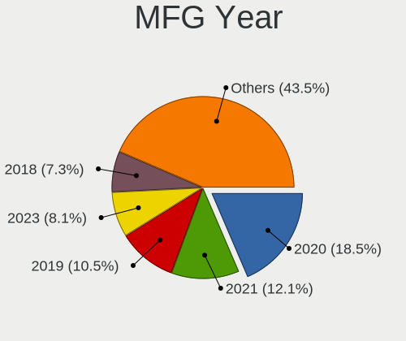
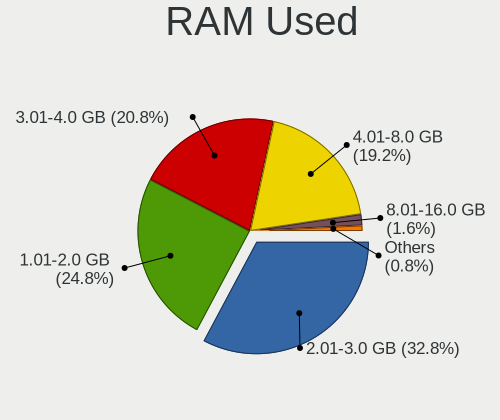
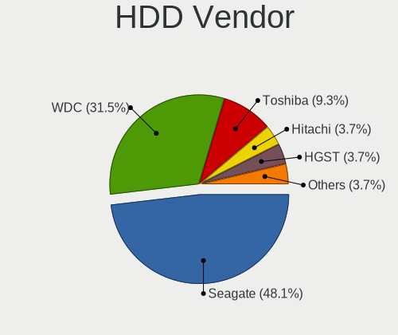
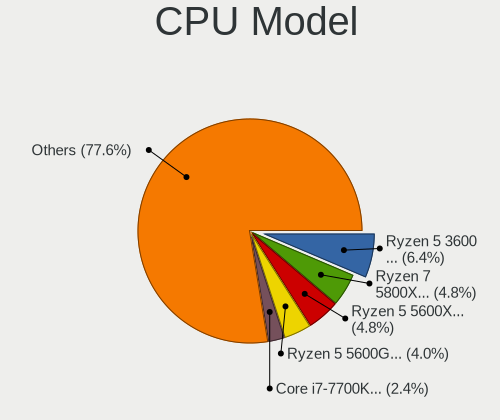
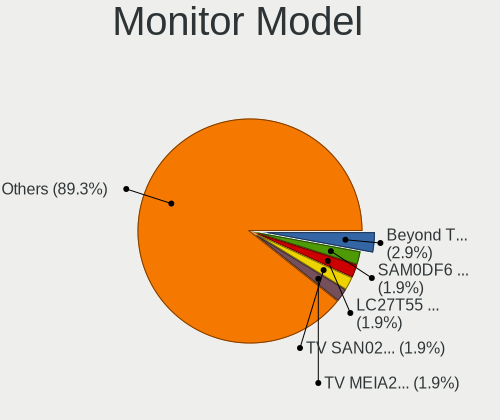
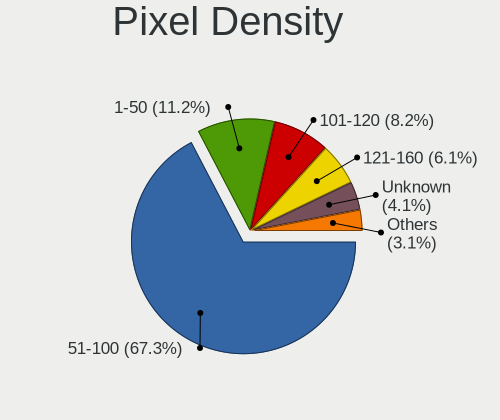
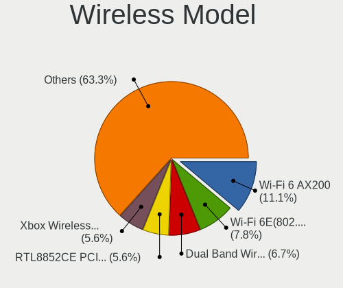
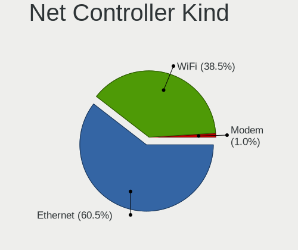
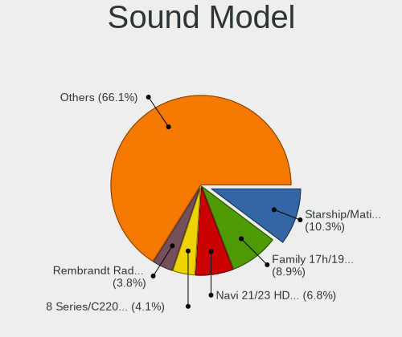

ChimeraOS - Tested Hardware & Statistics (Desktops)
---------------------------------------------------

A project to collect tested hardware configurations for ChimeraOS.

Anyone can contribute to this report by the [hw-probe](https://github.com/linuxhw/hw-probe) tool:

    sudo -E hw-probe -all -upload

Please contribute! Especially if your hardware is rare.

Contents
--------

* [ Test Cases ](#test-cases)

* [ System ](#system)
  - [ OS                       ](#os)
  - [ OS Family                ](#os-family)
  - [ Kernel                   ](#kernel)
  - [ Kernel Family            ](#kernel-family)
  - [ Kernel Major Ver.        ](#kernel-major-ver)
  - [ Arch                     ](#arch)
  - [ DE                       ](#de)
  - [ Display Server           ](#display-server)
  - [ Display Manager          ](#display-manager)
  - [ OS Lang                  ](#os-lang)
  - [ Boot Mode                ](#boot-mode)
  - [ Filesystem               ](#filesystem)
  - [ Part. scheme             ](#part-scheme)
  - [ Dual Boot with Linux/BSD ](#dual-boot-with-linuxbsd)
  - [ Dual Boot (Win)          ](#dual-boot-win)

* [ Board ](#board)
  - [ Vendor                   ](#vendor)
  - [ Model                    ](#model)
  - [ Model Family             ](#model-family)
  - [ MFG Year                 ](#mfg-year)
  - [ Form Factor              ](#form-factor)
  - [ Secure Boot              ](#secure-boot)
  - [ Coreboot                 ](#coreboot)
  - [ RAM Size                 ](#ram-size)
  - [ RAM Used                 ](#ram-used)
  - [ Total Drives             ](#total-drives)
  - [ Has CD-ROM               ](#has-cd-rom)
  - [ Has Ethernet             ](#has-ethernet)
  - [ Has WiFi                 ](#has-wifi)
  - [ Has Bluetooth            ](#has-bluetooth)

* [ Location ](#location)
  - [ Country                  ](#country)
  - [ City                     ](#city)

* [ Drives ](#drives)
  - [ Drive Vendor             ](#drive-vendor)
  - [ Drive Model              ](#drive-model)
  - [ HDD Vendor               ](#hdd-vendor)
  - [ SSD Vendor               ](#ssd-vendor)
  - [ Drive Kind               ](#drive-kind)
  - [ Drive Connector          ](#drive-connector)
  - [ Drive Size               ](#drive-size)
  - [ Space Total              ](#space-total)
  - [ Space Used               ](#space-used)
  - [ Malfunc. Drives          ](#malfunc-drives)
  - [ Malfunc. Drive Vendor    ](#malfunc-drive-vendor)
  - [ Malfunc. HDD Vendor      ](#malfunc-hdd-vendor)
  - [ Malfunc. Drive Kind      ](#malfunc-drive-kind)
  - [ Failed Drives            ](#failed-drives)
  - [ Failed Drive Vendor      ](#failed-drive-vendor)
  - [ Drive Status             ](#drive-status)

* [ Storage controller ](#storage-controller)
  - [ Storage Vendor           ](#storage-vendor)
  - [ Storage Model            ](#storage-model)
  - [ Storage Kind             ](#storage-kind)

* [ Processor ](#processor)
  - [ CPU Vendor               ](#cpu-vendor)
  - [ CPU Model                ](#cpu-model)
  - [ CPU Model Family         ](#cpu-model-family)
  - [ CPU Cores                ](#cpu-cores)
  - [ CPU Sockets              ](#cpu-sockets)
  - [ CPU Threads              ](#cpu-threads)
  - [ CPU Op-Modes             ](#cpu-op-modes)
  - [ CPU Microcode            ](#cpu-microcode)
  - [ CPU Microarch            ](#cpu-microarch)

* [ Graphics ](#graphics)
  - [ GPU Vendor               ](#gpu-vendor)
  - [ GPU Model                ](#gpu-model)
  - [ GPU Combo                ](#gpu-combo)
  - [ GPU Driver               ](#gpu-driver)
  - [ GPU Memory               ](#gpu-memory)

* [ Monitor ](#monitor)
  - [ Monitor Vendor           ](#monitor-vendor)
  - [ Monitor Model            ](#monitor-model)
  - [ Monitor Resolution       ](#monitor-resolution)
  - [ Monitor Diagonal         ](#monitor-diagonal)
  - [ Monitor Width            ](#monitor-width)
  - [ Aspect Ratio             ](#aspect-ratio)
  - [ Monitor Area             ](#monitor-area)
  - [ Pixel Density            ](#pixel-density)
  - [ Multiple Monitors        ](#multiple-monitors)

* [ Network ](#network)
  - [ Net Controller Vendor    ](#net-controller-vendor)
  - [ Net Controller Model     ](#net-controller-model)
  - [ Wireless Vendor          ](#wireless-vendor)
  - [ Wireless Model           ](#wireless-model)
  - [ Ethernet Vendor          ](#ethernet-vendor)
  - [ Ethernet Model           ](#ethernet-model)
  - [ Net Controller Kind      ](#net-controller-kind)
  - [ Used Controller          ](#used-controller)
  - [ NICs                     ](#nics)
  - [ IPv6                     ](#ipv6)

* [ Bluetooth ](#bluetooth)
  - [ Bluetooth Vendor         ](#bluetooth-vendor)
  - [ Bluetooth Model          ](#bluetooth-model)

* [ Sound ](#sound)
  - [ Sound Vendor             ](#sound-vendor)
  - [ Sound Model              ](#sound-model)

* [ Memory ](#memory)
  - [ Memory Vendor            ](#memory-vendor)
  - [ Memory Model             ](#memory-model)
  - [ Memory Kind              ](#memory-kind)
  - [ Memory Form Factor       ](#memory-form-factor)
  - [ Memory Size              ](#memory-size)
  - [ Memory Speed             ](#memory-speed)

* [ Printers & scanners ](#printers--scanners)
  - [ Printer Vendor           ](#printer-vendor)
  - [ Printer Model            ](#printer-model)
  - [ Scanner Vendor           ](#scanner-vendor)
  - [ Scanner Model            ](#scanner-model)

* [ Camera ](#camera)
  - [ Camera Vendor            ](#camera-vendor)
  - [ Camera Model             ](#camera-model)

* [ Security ](#security)
  - [ Fingerprint Vendor       ](#fingerprint-vendor)
  - [ Fingerprint Model        ](#fingerprint-model)
  - [ Chipcard Vendor          ](#chipcard-vendor)
  - [ Chipcard Model           ](#chipcard-model)

* [ Unsupported ](#unsupported)
  - [ Unsupported Devices      ](#unsupported-devices)
  - [ Unsupported Device Types ](#unsupported-device-types)

Test Cases
----------

Total: 32

| Vendor    | Model                       | Probe                                                      | Date         |
|-----------|-----------------------------|------------------------------------------------------------|--------------|
| MSI       | MPG B650I EDGE WIFI         | [d43ce99616](https://linux-hardware.org/?probe=d43ce99616) | Jun 07, 2023 |
| Gigabyte  | X470 AORUS GAMING 5 WIFI... | [8c6370ac0d](https://linux-hardware.org/?probe=8c6370ac0d) | May 23, 2023 |
| Gigabyte  | X470 AORUS GAMING 5 WIFI... | [41b69ae4db](https://linux-hardware.org/?probe=41b69ae4db) | May 12, 2023 |
| ASUSTek   | PRIME B760-PLUS D4          | [bb01d9e92b](https://linux-hardware.org/?probe=bb01d9e92b) | May 12, 2023 |
| ASUSTek   | ROG STRIX B460-I GAMING     | [3a9528f661](https://linux-hardware.org/?probe=3a9528f661) | May 10, 2023 |
| Gigabyte  | X470 AORUS GAMING 5 WIFI... | [bf3fee03d2](https://linux-hardware.org/?probe=bf3fee03d2) | May 09, 2023 |
| ASUSTek   | ROG STRIX B550-F GAMING     | [ad66608cf0](https://linux-hardware.org/?probe=ad66608cf0) | May 08, 2023 |
| Gigabyte  | X470 AORUS GAMING 5 WIFI... | [101ec0a833](https://linux-hardware.org/?probe=101ec0a833) | May 05, 2023 |
| ASUSTek   | PRIME B760-PLUS D4          | [4ec161ab9b](https://linux-hardware.org/?probe=4ec161ab9b) | May 04, 2023 |
| Dell      | 0FDY5C A00                  | [a6865b8591](https://linux-hardware.org/?probe=a6865b8591) | Apr 16, 2023 |
| ASUSTek   | ROG STRIX B460-I GAMING     | [14db4e6f1d](https://linux-hardware.org/?probe=14db4e6f1d) | Apr 11, 2023 |
| ASUSTek   | ROG STRIX B650E-I GAMING... | [03db223af4](https://linux-hardware.org/?probe=03db223af4) | Apr 06, 2023 |
| ASUSTek   | ROG STRIX B650E-I GAMING... | [f8c2ffcd09](https://linux-hardware.org/?probe=f8c2ffcd09) | Apr 06, 2023 |
| MACHINIST | X99-RS9 V2.0                | [ad4c43dd09](https://linux-hardware.org/?probe=ad4c43dd09) | Mar 21, 2023 |
| Gigabyte  | B460M DS3H AC V2-Y1         | [b21cd49226](https://linux-hardware.org/?probe=b21cd49226) | Mar 16, 2023 |
| MSI       | MPG B650I EDGE WIFI         | [9f40b861a5](https://linux-hardware.org/?probe=9f40b861a5) | Mar 12, 2023 |
| Gigabyte  | B460M DS3H AC V2-Y1         | [7f8fc2ba96](https://linux-hardware.org/?probe=7f8fc2ba96) | Mar 10, 2023 |
| Dell      | 0XHGV1 A00                  | [8fa504e81f](https://linux-hardware.org/?probe=8fa504e81f) | Mar 07, 2023 |
| Intel     | DB75EN AAG39650-400         | [4a0feca3f5](https://linux-hardware.org/?probe=4a0feca3f5) | Mar 02, 2023 |
| Gigabyte  | H77M-D3H                    | [01eb743492](https://linux-hardware.org/?probe=01eb743492) | Feb 25, 2023 |
| Gigabyte  | H77M-D3H                    | [766790f373](https://linux-hardware.org/?probe=766790f373) | Feb 25, 2023 |
| ASUSTek   | B150I PRO GAMING/WIFI/AU... | [eb1e211b0f](https://linux-hardware.org/?probe=eb1e211b0f) | Feb 25, 2023 |
| HP        | 1998                        | [dbb952f3f6](https://linux-hardware.org/?probe=dbb952f3f6) | Feb 13, 2023 |
| HP        | 1998                        | [0171575a1d](https://linux-hardware.org/?probe=0171575a1d) | Feb 13, 2023 |
| Gigabyte  | H510M H                     | [69d2cb7e14](https://linux-hardware.org/?probe=69d2cb7e14) | Jan 11, 2023 |
| ASUSTek   | P8H61-MX R2.0               | [3e4b14919e](https://linux-hardware.org/?probe=3e4b14919e) | Jan 05, 2023 |
| Gigabyte  | X570S AORUS ELITE AX        | [02b3cbc8c6](https://linux-hardware.org/?probe=02b3cbc8c6) | Jan 04, 2023 |
| Gigabyte  | X570S AORUS ELITE AX        | [13ae6c7e25](https://linux-hardware.org/?probe=13ae6c7e25) | Jan 01, 2023 |
| Gigabyte  | X570 AORUS ELITE WIFI       | [49ca01435b](https://linux-hardware.org/?probe=49ca01435b) | Dec 27, 2022 |
| Lenovo    | ThinkCentre M70e 0832B1U    | [d95663a632](https://linux-hardware.org/?probe=d95663a632) | Dec 07, 2022 |
| Gigabyte  | X470 AORUS GAMING 5 WIFI... | [2a7b6d570f](https://linux-hardware.org/?probe=2a7b6d570f) | Nov 26, 2022 |
| Gigabyte  | X470 AORUS GAMING 5 WIFI... | [58b3db6784](https://linux-hardware.org/?probe=58b3db6784) | Nov 23, 2022 |

System
------

OS
--

Installed operating systems

| Name         | Desktops | Percent |
|--------------|----------|---------|
| ChimeraOS 39 | 7        | 35%     |
| ChimeraOS 41 | 4        | 20%     |
| ChimeraOS 38 | 4        | 20%     |
| ChimeraOS 37 | 3        | 15%     |
| ChimeraOS 43 | 1        | 5%      |
| ChimeraOS 42 | 1        | 5%      |

OS Family
---------

OS without a version

| Name      | Desktops | Percent |
|-----------|----------|---------|
| ChimeraOS | 18       | 100%    |

Kernel
------

Version of the Linux kernel

| Version        | Desktops | Percent |
|----------------|----------|---------|
| 6.1.11-arch1-1 | 7        | 35%     |
| 6.1.21-1-lts   | 4        | 20%     |
| 6.1.1-arch1-1  | 4        | 20%     |
| 6.0.8-arch1-1  | 3        | 15%     |
| 6.3.1-arch2-1  | 1        | 5%      |
| 6.1.27-1-lts   | 1        | 5%      |

Kernel Family
-------------

Linux kernel without a distro release

| Version | Desktops | Percent |
|---------|----------|---------|
| 6.1.11  | 7        | 35%     |
| 6.1.21  | 4        | 20%     |
| 6.1.1   | 4        | 20%     |
| 6.0.8   | 3        | 15%     |
| 6.3.1   | 1        | 5%      |
| 6.1.27  | 1        | 5%      |

Kernel Major Ver.
-----------------

Linux kernel major version

| Version | Desktops | Percent |
|---------|----------|---------|
| 6.1     | 15       | 78.95%  |
| 6.0     | 3        | 15.79%  |
| 6.3     | 1        | 5.26%   |

Arch
----

OS architecture (x86_64, i586, etc.)

| Name   | Desktops | Percent |
|--------|----------|---------|
| x86_64 | 18       | 100%    |

DE
--

Desktop Environment

| Name    | Desktops | Percent |
|---------|----------|---------|
| GNOME   | 17       | 94.44%  |
| steamos | 1        | 5.56%   |

Display Server
--------------

X11 or Wayland

| Name    | Desktops | Percent |
|---------|----------|---------|
| Wayland | 14       | 77.78%  |
| X11     | 4        | 22.22%  |

Display Manager
---------------

SDDM, LightDM, etc.

| Name    | Desktops | Percent |
|---------|----------|---------|
| Unknown | 18       | 100%    |

OS Lang
-------

Language

| Lang  | Desktops | Percent |
|-------|----------|---------|
| en_US | 16       | 88.89%  |
| es_ES | 1        | 5.56%   |
| de_DE | 1        | 5.56%   |

Boot Mode
---------

EFI or BIOS

| Mode | Desktops | Percent |
|------|----------|---------|
| BIOS | 18       | 100%    |

Filesystem
----------

Type of filesystem

| Type  | Desktops | Percent |
|-------|----------|---------|
| Btrfs | 18       | 100%    |

Part. scheme
------------

Scheme of partitioning

| Type    | Desktops | Percent |
|---------|----------|---------|
| Unknown | 18       | 100%    |

Dual Boot with Linux/BSD
------------------------

Hosting more than one Linux/BSD

| Dual boot | Desktops | Percent |
|-----------|----------|---------|
| No        | 18       | 100%    |

Dual Boot (Win)
---------------

Hosting Linux and Windows

| Dual boot | Desktops | Percent |
|-----------|----------|---------|
| No        | 18       | 100%    |

Board
-----

Vendor
------

Motherboard manufacturer

| Name                | Desktops | Percent |
|---------------------|----------|---------|
| Gigabyte Technology | 6        | 33.33%  |
| ASUSTek Computer    | 6        | 33.33%  |
| MSI                 | 1        | 5.56%   |
| MACHINIST           | 1        | 5.56%   |
| Lenovo              | 1        | 5.56%   |
| Intel               | 1        | 5.56%   |
| Hewlett-Packard     | 1        | 5.56%   |
| Dell                | 1        | 5.56%   |

Model
-----

Motherboard model

| Name                               | Desktops | Percent |
|------------------------------------|----------|---------|
| MSI MS-7D73                        | 1        | 5.56%   |
| MACHINIST X99-RS9 V2.0             | 1        | 5.56%   |
| Lenovo ThinkCentre M70e 0832B1U    | 1        | 5.56%   |
| Intel DB75EN AAG39650-400          | 1        | 5.56%   |
| HP EliteDesk 800 G1 SFF            | 1        | 5.56%   |
| Gigabyte X570S AORUS ELITE AX      | 1        | 5.56%   |
| Gigabyte X570 AORUS ELITE WIFI     | 1        | 5.56%   |
| Gigabyte X470 AORUS GAMING 5 WIFI  | 1        | 5.56%   |
| Gigabyte H77M-D3H                  | 1        | 5.56%   |
| Gigabyte H510M H                   | 1        | 5.56%   |
| Gigabyte B460M DS3H AC V2-Y1       | 1        | 5.56%   |
| Dell OptiPlex 7050                 | 1        | 5.56%   |
| ASUS ROG STRIX B650E-I GAMING WIFI | 1        | 5.56%   |
| ASUS ROG STRIX B550-F GAMING       | 1        | 5.56%   |
| ASUS ROG STRIX B460-I GAMING       | 1        | 5.56%   |
| ASUS PRIME B760-PLUS D4            | 1        | 5.56%   |
| ASUS P8H61-MX R2.0                 | 1        | 5.56%   |
| ASUS B150I PRO GAMING/WIFI/AURA    | 1        | 5.56%   |

Model Family
------------

Motherboard model prefix

| Name               | Desktops | Percent |
|--------------------|----------|---------|
| ASUS ROG           | 3        | 16.67%  |
| MSI MS-7D73        | 1        | 5.56%   |
| MACHINIST X99-RS9  | 1        | 5.56%   |
| Lenovo ThinkCentre | 1        | 5.56%   |
| Intel DB75EN       | 1        | 5.56%   |
| HP EliteDesk       | 1        | 5.56%   |
| Gigabyte X570S     | 1        | 5.56%   |
| Gigabyte X570      | 1        | 5.56%   |
| Gigabyte X470      | 1        | 5.56%   |
| Gigabyte H77M-D3H  | 1        | 5.56%   |
| Gigabyte H510M     | 1        | 5.56%   |
| Gigabyte B460M     | 1        | 5.56%   |
| Dell OptiPlex      | 1        | 5.56%   |
| ASUS PRIME         | 1        | 5.56%   |
| ASUS P8H61-MX      | 1        | 5.56%   |
| ASUS B150I         | 1        | 5.56%   |

MFG Year
--------

Motherboard manufacture year

| Year | Desktops | Percent |
|------|----------|---------|
| 2022 | 3        | 16.67%  |
| 2021 | 3        | 16.67%  |
| 2020 | 3        | 16.67%  |
| 2012 | 3        | 16.67%  |
| 2019 | 1        | 5.56%   |
| 2018 | 1        | 5.56%   |
| 2017 | 1        | 5.56%   |
| 2016 | 1        | 5.56%   |
| 2013 | 1        | 5.56%   |
| 2010 | 1        | 5.56%   |

Form Factor
-----------

Physical design of the computer

| Name    | Desktops | Percent |
|---------|----------|---------|
| Desktop | 18       | 100%    |

Secure Boot
-----------

Enabled or disabled

| State    | Desktops | Percent |
|----------|----------|---------|
| Disabled | 18       | 100%    |

Coreboot
--------

Have coreboot on board

| Used | Desktops | Percent |
|------|----------|---------|
| No   | 18       | 100%    |

RAM Size
--------

Total RAM memory

| Size in GB  | Desktops | Percent |
|-------------|----------|---------|
| 32.01-64.0  | 9        | 50%     |
| 16.01-24.0  | 4        | 22.22%  |
| 24.01-32.0  | 2        | 11.11%  |
| 4.01-8.0    | 1        | 5.56%   |
| 64.01-256.0 | 1        | 5.56%   |
| 8.01-16.0   | 1        | 5.56%   |

RAM Used
--------

Used RAM memory

| Used GB    | Desktops | Percent |
|------------|----------|---------|
| 2.01-3.0   | 7        | 35%     |
| 1.01-2.0   | 5        | 25%     |
| 3.01-4.0   | 4        | 20%     |
| 4.01-8.0   | 3        | 15%     |
| 16.01-24.0 | 1        | 5%      |

Total Drives
------------

Number of drives on board

| Drives | Desktops | Percent |
|--------|----------|---------|
| 2      | 6        | 31.58%  |
| 3      | 5        | 26.32%  |
| 1      | 5        | 26.32%  |
| 4      | 2        | 10.53%  |
| 7      | 1        | 5.26%   |

Has CD-ROM
----------

Has CD-ROM on board

| Presented | Desktops | Percent |
|-----------|----------|---------|
| No        | 15       | 83.33%  |
| Yes       | 3        | 16.67%  |

Has Ethernet
------------

Has Ethernet on board

| Presented | Desktops | Percent |
|-----------|----------|---------|
| Yes       | 18       | 100%    |

Has WiFi
--------

Has WiFi module

| Presented | Desktops | Percent |
|-----------|----------|---------|
| Yes       | 13       | 72.22%  |
| No        | 5        | 27.78%  |

Has Bluetooth
-------------

Has Bluetooth module

| Presented | Desktops | Percent |
|-----------|----------|---------|
| Yes       | 10       | 55.56%  |
| No        | 8        | 44.44%  |

Location
--------

Country
-------

Geographic location (country)

| Country   | Desktops | Percent |
|-----------|----------|---------|
| USA       | 9        | 50%     |
| Germany   | 2        | 11.11%  |
| Australia | 2        | 11.11%  |
| UK        | 1        | 5.56%   |
| Spain     | 1        | 5.56%   |
| Russia    | 1        | 5.56%   |
| Canada    | 1        | 5.56%   |
| Brazil    | 1        | 5.56%   |

City
----

Geographic location (city)

| City         | Desktops | Percent |
|--------------|----------|---------|
| Yaroslavl    | 1        | 5.26%   |
| Watsonville  | 1        | 5.26%   |
| Sumaré      | 1        | 5.26%   |
| Steyning     | 1        | 5.26%   |
| Sanford      | 1        | 5.26%   |
| Round Rock   | 1        | 5.26%   |
| Racine       | 1        | 5.26%   |
| Philadelphia | 1        | 5.26%   |
| Melbourne    | 1        | 5.26%   |
| Longueuil    | 1        | 5.26%   |
| Lewiston     | 1        | 5.26%   |
| Houston      | 1        | 5.26%   |
| Hixson       | 1        | 5.26%   |
| Hamburg      | 1        | 5.26%   |
| Brossard     | 1        | 5.26%   |
| Bielefeld    | 1        | 5.26%   |
| Beaverton    | 1        | 5.26%   |
| Badalona     | 1        | 5.26%   |
| Adelaide     | 1        | 5.26%   |

Drives
------

Drive Vendor
------------

Hard drive vendors

| Vendor                    | Desktops | Drives | Percent |
|---------------------------|----------|--------|---------|
| Samsung Electronics       | 7        | 13     | 17.5%   |
| Seagate                   | 6        | 8      | 15%     |
| WDC                       | 4        | 6      | 10%     |
| Sandisk                   | 4        | 7      | 10%     |
| Kingston                  | 3        | 3      | 7.5%    |
| Micron/Crucial Technology | 2        | 2      | 5%      |
| Crucial                   | 2        | 3      | 5%      |
| Toshiba                   | 1        | 1      | 2.5%    |
| Silicon Motion            | 1        | 1      | 2.5%    |
| Phison Electronics        | 1        | 1      | 2.5%    |
| Netac                     | 1        | 1      | 2.5%    |
| Micron Technology         | 1        | 2      | 2.5%    |
| KingFast                  | 1        | 1      | 2.5%    |
| KingDian                  | 1        | 2      | 2.5%    |
| Intel                     | 1        | 2      | 2.5%    |
| Hewlett-Packard           | 1        | 1      | 2.5%    |
| Fanxiang                  | 1        | 1      | 2.5%    |
| Corsair                   | 1        | 1      | 2.5%    |
| ADATA Technology          | 1        | 2      | 2.5%    |

Drive Model
-----------

Hard drive models

| Model                                               | Desktops | Percent |
|-----------------------------------------------------|----------|---------|
| Samsung NVMe SSD Controller SM981/PM981/PM983 256GB | 2        | 4.26%   |
| Samsung NVMe SSD Controller PM9A1/PM9A3/980PRO 1TB  | 2        | 4.26%   |
| Micron/Crucial P2 NVMe PCIe SSD 1TB                 | 2        | 4.26%   |
| WDC WDS500G2B0A-00SM50 500GB SSD                    | 1        | 2.13%   |
| WDC WDBNCE5000PNC 500GB SSD                         | 1        | 2.13%   |
| WDC WD5000AVDS-63U7B1 500GB                         | 1        | 2.13%   |
| WDC WD40EZRX-00SPEB0 4TB                            | 1        | 2.13%   |
| WDC WD20EARX-00PASB0 2TB                            | 1        | 2.13%   |
| Toshiba MQ02ABD100H 1TB                             | 1        | 2.13%   |
| Silicon Motion SM2263EN/SM2263XT SSD Controller 1TB | 1        | 2.13%   |
| Seagate ST9500325AS 500GB                           | 1        | 2.13%   |
| Seagate ST500LM000-1EJ162-SSHD 500GB                | 1        | 2.13%   |
| Seagate ST4000LM024-2AN17V 4TB                      | 1        | 2.13%   |
| Seagate ST2000DM006-2DM164 2TB                      | 1        | 2.13%   |
| Seagate ST2000DL003-9VT166 2TB                      | 1        | 2.13%   |
| Seagate ST1000DM010-2EP102 1TB                      | 1        | 2.13%   |
| Seagate Expansion Desk 4TB                          | 1        | 2.13%   |
| Sandisk WD_BLACK SN750 SE NVMe 1TB                  | 1        | 2.13%   |
| SanDisk SDSSDP128G 128GB                            | 1        | 2.13%   |
| SanDisk SDSSDA480G 480GB                            | 1        | 2.13%   |
| SanDisk SD7TB3Q-256G-1006 256GB SSD                 | 1        | 2.13%   |
| SanDisk Extreme SSD 500GB                           | 1        | 2.13%   |
| Samsung SSD 870 QVO 2TB                             | 1        | 2.13%   |
| Samsung SSD 860 EVO 1TB                             | 1        | 2.13%   |
| Samsung SSD 850 EVO 250GB                           | 1        | 2.13%   |
| Samsung SSD 840 PRO Series 512GB                    | 1        | 2.13%   |
| Samsung SSD 840 EVO 250GB                           | 1        | 2.13%   |
| Samsung NVMe SSD Controller SM961/PM961/SM963 256GB | 1        | 2.13%   |
| Samsung HD502IJ 500GB                               | 1        | 2.13%   |
| Phison E12 NVMe Controller 256GB                    | 1        | 2.13%   |
| Netac SSD 1TB                                       | 1        | 2.13%   |
| Micron MTFDDAK256MBF-1AN15ABHA 256GB SSD            | 1        | 2.13%   |
| Kingston SNVS500G 500GB                             | 1        | 2.13%   |
| Kingston SNVS1000GB 1TB                             | 1        | 2.13%   |
| Kingston SA400S37120G 120GB SSD                     | 1        | 2.13%   |
| KingFast 1024GB                                     | 1        | 2.13%   |
| KingDian S280-240GB                                 | 1        | 2.13%   |
| Intel SSDPEKNW010T9 1024GB                          | 1        | 2.13%   |
| HP SSD S600 120GB                                   | 1        | 2.13%   |
| Fanxiang S101 256GB                                 | 1        | 2.13%   |

HDD Vendor
----------

Hard disk drive vendors

| Vendor              | Desktops | Drives | Percent |
|---------------------|----------|--------|---------|
| Seagate             | 6        | 8      | 54.55%  |
| WDC                 | 3        | 4      | 27.27%  |
| Toshiba             | 1        | 1      | 9.09%   |
| Samsung Electronics | 1        | 1      | 9.09%   |

SSD Vendor
----------

Solid state drive vendors

| Vendor              | Desktops | Drives | Percent |
|---------------------|----------|--------|---------|
| SanDisk             | 4        | 5      | 22.22%  |
| Samsung Electronics | 4        | 7      | 22.22%  |
| Crucial             | 2        | 3      | 11.11%  |
| WDC                 | 1        | 2      | 5.56%   |
| Netac               | 1        | 1      | 5.56%   |
| Micron Technology   | 1        | 2      | 5.56%   |
| Kingston            | 1        | 1      | 5.56%   |
| KingDian            | 1        | 2      | 5.56%   |
| Hewlett-Packard     | 1        | 1      | 5.56%   |
| Fanxiang            | 1        | 1      | 5.56%   |
| Corsair             | 1        | 1      | 5.56%   |

Drive Kind
----------

HDD or SSD

| Kind    | Desktops | Drives | Percent |
|---------|----------|--------|---------|
| SSD     | 12       | 26     | 38.71%  |
| NVMe    | 10       | 17     | 32.26%  |
| HDD     | 8        | 14     | 25.81%  |
| Unknown | 1        | 1      | 3.23%   |

Drive Connector
---------------

SATA, SAS, NVMe, etc.

| Type | Desktops | Drives | Percent |
|------|----------|--------|---------|
| SATA | 15       | 39     | 55.56%  |
| NVMe | 10       | 17     | 37.04%  |
| SAS  | 2        | 2      | 7.41%   |

Drive Size
----------

Size of hard drive

| Size in TB | Desktops | Drives | Percent |
|------------|----------|--------|---------|
| 0.01-0.5   | 11       | 25     | 50%     |
| 0.51-1.0   | 5        | 5      | 22.73%  |
| 3.01-4.0   | 3        | 5      | 13.64%  |
| 1.01-2.0   | 3        | 5      | 13.64%  |

Space Total
-----------

Amount of disk space available on the file system

| Size in GB     | Desktops | Percent |
|----------------|----------|---------|
| More than 3000 | 8        | 42.11%  |
| 1001-2000      | 6        | 31.58%  |
| 501-1000       | 3        | 15.79%  |
| 251-500        | 2        | 10.53%  |

Space Used
----------

Amount of used disk space

| Used GB        | Desktops | Percent |
|----------------|----------|---------|
| 21-50          | 5        | 25%     |
| 101-250        | 4        | 20%     |
| More than 3000 | 3        | 15%     |
| 51-100         | 3        | 15%     |
| 251-500        | 2        | 10%     |
| 2001-3000      | 1        | 5%      |
| 1001-2000      | 1        | 5%      |
| 501-1000       | 1        | 5%      |

Malfunc. Drives
---------------

Drive models with a malfunction

Zero info for selected period =(

Malfunc. Drive Vendor
---------------------

Vendors of faulty drives

Zero info for selected period =(

Malfunc. HDD Vendor
-------------------

Vendors of faulty HDD drives

Zero info for selected period =(

Malfunc. Drive Kind
-------------------

Kinds of faulty drives

Zero info for selected period =(

Failed Drives
-------------

Failed drive models

Zero info for selected period =(

Failed Drive Vendor
-------------------

Failed drive vendors

Zero info for selected period =(

Drive Status
------------

Number of failed and malfunc. drives

| Status   | Desktops | Drives | Percent |
|----------|----------|--------|---------|
| Detected | 18       | 58     | 100%    |

Storage controller
------------------

Storage Vendor
--------------

Storage controller vendors

| Vendor                      | Desktops | Percent |
|-----------------------------|----------|---------|
| Intel                       | 13       | 40.63%  |
| AMD                         | 6        | 18.75%  |
| Samsung Electronics         | 4        | 12.5%   |
| Micron/Crucial Technology   | 2        | 6.25%   |
| Kingston Technology Company | 2        | 6.25%   |
| Silicon Motion              | 1        | 3.13%   |
| SanDisk                     | 1        | 3.13%   |
| Phison Electronics          | 1        | 3.13%   |
| Biwin Storage Technology    | 1        | 3.13%   |
| ADATA Technology            | 1        | 3.13%   |

Storage Model
-------------

Storage controller models

| Model                                                                          | Desktops | Percent |
|--------------------------------------------------------------------------------|----------|---------|
| AMD FCH SATA Controller [AHCI mode]                                            | 5        | 13.89%  |
| Samsung NVMe SSD Controller SM981/PM981/PM983                                  | 2        | 5.56%   |
| Samsung NVMe SSD Controller PM9A1/PM9A3/980PRO                                 | 2        | 5.56%   |
| Micron/Crucial P2 NVMe PCIe SSD                                                | 2        | 5.56%   |
| Intel 8 Series/C220 Series Chipset Family 6-port SATA Controller 1 [AHCI mode] | 2        | 5.56%   |
| Intel 7 Series/C210 Series Chipset Family 6-port SATA Controller [AHCI mode]   | 2        | 5.56%   |
| Intel 400 Series Chipset Family SATA AHCI Controller                           | 2        | 5.56%   |
| Silicon Motion SM2263EN/SM2263XT SSD Controller                                | 1        | 2.78%   |
| SanDisk Non-Volatile memory controller                                         | 1        | 2.78%   |
| Samsung NVMe SSD Controller SM961/PM961/SM963                                  | 1        | 2.78%   |
| Phison E12 NVMe Controller                                                     | 1        | 2.78%   |
| Kingston Company SNVS2000G [NV1 NVMe PCIe SSD 2TB]                             | 1        | 2.78%   |
| Kingston Company NVMe Controller                                               | 1        | 2.78%   |
| Intel Volume Management Device NVMe RAID Controller Intel Corporation          | 1        | 2.78%   |
| Intel SSD 665p Series                                                          | 1        | 2.78%   |
| Intel Q170/Q150/B150/H170/H110/Z170/CM236 Chipset SATA Controller [AHCI Mode]  | 1        | 2.78%   |
| Intel NM10/ICH7 Family SATA Controller [IDE mode]                              | 1        | 2.78%   |
| Intel 82801G (ICH7 Family) IDE Controller                                      | 1        | 2.78%   |
| Intel 700 Series Chipset Family SATA AHCI Controller                           | 1        | 2.78%   |
| Intel 6 Series/C200 Series Chipset Family 6 port Desktop SATA AHCI Controller  | 1        | 2.78%   |
| Intel 500 Series Chipset Family SATA AHCI Controller                           | 1        | 2.78%   |
| Intel 200 Series PCH SATA controller [AHCI mode]                               | 1        | 2.78%   |
| Biwin Storage Non-Volatile memory controller                                   | 1        | 2.78%   |
| AMD 500 Series Chipset SATA Controller                                         | 1        | 2.78%   |
| AMD 400 Series Chipset SATA Controller                                         | 1        | 2.78%   |
| ADATA XPG SX8200 Pro PCIe Gen3x4 M.2 2280 Solid State Drive                    | 1        | 2.78%   |

Storage Kind
------------

Kind of storage controller (IDE, SATA, NVMe, SAS, ...)

| Kind | Desktops | Percent |
|------|----------|---------|
| SATA | 17       | 58.62%  |
| NVMe | 10       | 34.48%  |
| RAID | 1        | 3.45%   |
| IDE  | 1        | 3.45%   |

Processor
---------

CPU Vendor
----------

Processor vendors

| Vendor | Desktops | Percent |
|--------|----------|---------|
| Intel  | 12       | 66.67%  |
| AMD    | 6        | 33.33%  |

CPU Model
---------

Processor models

| Model                                  | Desktops | Percent |
|----------------------------------------|----------|---------|
| Intel Xeon CPU E5-1650 v3 @ 3.50GHz    | 1        | 5.26%   |
| Intel Core i7-7700K CPU @ 4.20GHz      | 1        | 5.26%   |
| Intel Core i7-4770 CPU @ 3.40GHz       | 1        | 5.26%   |
| Intel Core i5-7500 CPU @ 3.40GHz       | 1        | 5.26%   |
| Intel Core i5-3570 CPU @ 3.40GHz       | 1        | 5.26%   |
| Intel Core i5-2500K CPU @ 3.30GHz      | 1        | 5.26%   |
| Intel Core i5-2500 CPU @ 3.30GHz       | 1        | 5.26%   |
| Intel Core i5-10400F CPU @ 2.90GHz     | 1        | 5.26%   |
| Intel Core i3-10100F CPU @ 3.60GHz     | 1        | 5.26%   |
| Intel Core i3-10100 CPU @ 3.60GHz      | 1        | 5.26%   |
| Intel Core 2 Quad CPU Q9550 @ 2.83GHz  | 1        | 5.26%   |
| Intel 13th Gen Core i9-13900K          | 1        | 5.26%   |
| AMD Ryzen 9 7950X3D 16-Core Processor  | 1        | 5.26%   |
| AMD Ryzen 9 5950X 16-Core Processor    | 1        | 5.26%   |
| AMD Ryzen 9 5900X 12-Core Processor    | 1        | 5.26%   |
| AMD Ryzen 7 7700X 8-Core Processor     | 1        | 5.26%   |
| AMD Ryzen 7 5800X 8-Core Processor     | 1        | 5.26%   |
| AMD Ryzen 7 1700X Eight-Core Processor | 1        | 5.26%   |
| AMD Ryzen 5 7600X 6-Core Processor     | 1        | 5.26%   |

CPU Model Family
----------------

Processor model prefix

| Model             | Desktops | Percent |
|-------------------|----------|---------|
| Intel Core i5     | 5        | 26.32%  |
| AMD Ryzen 9       | 3        | 15.79%  |
| AMD Ryzen 7       | 3        | 15.79%  |
| Intel Core i7     | 2        | 10.53%  |
| Intel Core i3     | 2        | 10.53%  |
| Other             | 1        | 5.26%   |
| Intel Xeon        | 1        | 5.26%   |
| Intel Core 2 Quad | 1        | 5.26%   |
| AMD Ryzen 5       | 1        | 5.26%   |

CPU Cores
---------

Number of processor cores

| Number | Desktops | Percent |
|--------|----------|---------|
| 4      | 9        | 47.37%  |
| 8      | 3        | 15.79%  |
| 6      | 3        | 15.79%  |
| 16     | 2        | 10.53%  |
| 24     | 1        | 5.26%   |
| 12     | 1        | 5.26%   |

CPU Sockets
-----------

Number of sockets

| Number | Desktops | Percent |
|--------|----------|---------|
| 1      | 18       | 100%    |

CPU Threads
-----------

Threads per core (Hyper-Threading)

| Number | Desktops | Percent |
|--------|----------|---------|
| 2      | 13       | 72.22%  |
| 1      | 5        | 27.78%  |

CPU Op-Modes
------------

CPU Operation Modes (32-bit, 64-bit)

| Op mode        | Desktops | Percent |
|----------------|----------|---------|
| 32-bit, 64-bit | 18       | 100%    |

CPU Microcode
-------------

Microcode number

| Number  | Desktops | Percent |
|---------|----------|---------|
| Unknown | 18       | 100%    |

CPU Microarch
-------------

Microarchitecture

| Name        | Desktops | Percent |
|-------------|----------|---------|
| Zen 3       | 3        | 16.67%  |
| CometLake   | 3        | 16.67%  |
| Unknown     | 3        | 16.67%  |
| SandyBridge | 2        | 11.11%  |
| KabyLake    | 2        | 11.11%  |
| Haswell     | 2        | 11.11%  |
| Zen         | 1        | 5.56%   |
| Penryn      | 1        | 5.56%   |
| IvyBridge   | 1        | 5.56%   |

Graphics
--------

GPU Vendor
----------

Vendors of graphics cards

| Vendor | Desktops | Percent |
|--------|----------|---------|
| AMD    | 10       | 50%     |
| Nvidia | 6        | 30%     |
| Intel  | 4        | 20%     |

GPU Model
---------

Graphics card models

| Model                                                                       | Desktops | Percent |
|-----------------------------------------------------------------------------|----------|---------|
| AMD Navi 21 [Radeon RX 6800/6800 XT / 6900 XT]                              | 2        | 9.52%   |
| AMD Ellesmere [Radeon RX 470/480/570/570X/580/580X/590]                     | 2        | 9.52%   |
| Nvidia TU117 [GeForce GTX 1650]                                             | 1        | 4.76%   |
| Nvidia TU117 [GeForce GTX 1630]                                             | 1        | 4.76%   |
| Nvidia TU116 [GeForce GTX 1650 SUPER]                                       | 1        | 4.76%   |
| Nvidia GP104 [GeForce GTX 1070 Ti]                                          | 1        | 4.76%   |
| Nvidia GA102 [GeForce RTX 3080 Ti]                                          | 1        | 4.76%   |
| Nvidia GA102 [GeForce RTX 3080 Lite Hash Rate]                              | 1        | 4.76%   |
| Intel Xeon E3-1200 v3/4th Gen Core Processor Integrated Graphics Controller | 1        | 4.76%   |
| Intel HD Graphics 630                                                       | 1        | 4.76%   |
| Intel HD Graphics 530                                                       | 1        | 4.76%   |
| Intel CometLake-S GT2 [UHD Graphics 630]                                    | 1        | 4.76%   |
| AMD Raphael                                                                 | 1        | 4.76%   |
| AMD Navi 31 [Radeon RX 7900 XT/7900 XTX]                                    | 1        | 4.76%   |
| AMD Navi 23 [Radeon RX 6600/6600 XT/6600M]                                  | 1        | 4.76%   |
| AMD Navi 22 [Radeon RX 6700/6700 XT/6750 XT / 6800M/6850M XT]               | 1        | 4.76%   |
| AMD Navi 10 [Radeon RX 5600 OEM/5600 XT / 5700/5700 XT]                     | 1        | 4.76%   |
| AMD Baffin [Radeon RX 550 640SP / RX 560/560X]                              | 1        | 4.76%   |
| AMD Baffin [Radeon RX 460/560D / Pro 450/455/460/555/555X/560/560X]         | 1        | 4.76%   |

GPU Combo
---------

Combinations of graphics cards

| Name       | Desktops | Percent |
|------------|----------|---------|
| 1 x AMD    | 10       | 52.63%  |
| 1 x Nvidia | 6        | 31.58%  |
| 1 x Intel  | 3        | 15.79%  |

GPU Driver
----------

Free vs proprietary

| Driver      | Desktops | Percent |
|-------------|----------|---------|
| Free        | 12       | 66.67%  |
| Proprietary | 6        | 33.33%  |

GPU Memory
----------

Total video memory

| Size in GB | Desktops | Percent |
|------------|----------|---------|
| Unknown    | 15       | 83.33%  |
| 3.01-4.0   | 2        | 11.11%  |
| 8.01-16.0  | 1        | 5.56%   |

Monitor
-------

Monitor Vendor
--------------

Monitor vendors

| Vendor              | Desktops | Percent |
|---------------------|----------|---------|
| Samsung Electronics | 6        | 33.33%  |
| Sony                | 2        | 11.11%  |
| BenQ                | 2        | 11.11%  |
| Vizio               | 1        | 5.56%   |
| Toshiba             | 1        | 5.56%   |
| Sharp               | 1        | 5.56%   |
| Onkyo               | 1        | 5.56%   |
| Insignia            | 1        | 5.56%   |
| Hewlett-Packard     | 1        | 5.56%   |
| Goldstar            | 1        | 5.56%   |
| ASUSTek Computer    | 1        | 5.56%   |

Monitor Model
-------------

Monitor models

| Model                                                                | Desktops | Percent |
|----------------------------------------------------------------------|----------|---------|
| Vizio D40f-G9 VIZ1027 1920x1080 477x268mm 21.5-inch                  | 1        | 5.56%   |
| Toshiba TV TSB002F 3840x2160 1095x616mm 49.5-inch                    | 1        | 5.56%   |
| Sony TV SNYEE01 1920x1080                                            | 1        | 5.56%   |
| Sony TV SNY3002 1920x1080 886x498mm 40.0-inch                        | 1        | 5.56%   |
| Sharp HDMI SHP0FE8 1920x1080 1152x648mm 52.0-inch                    | 1        | 5.56%   |
| Samsung Electronics SyncMaster SAM030F 1680x1050 474x296mm 22.0-inch | 1        | 5.56%   |
| Samsung Electronics S24R35xFZ SAM71A8 1920x1080 527x296mm 23.8-inch  | 1        | 5.56%   |
| Samsung Electronics S24C650 SAM09E8 1920x1080 521x293mm 23.5-inch    | 1        | 5.56%   |
| Samsung Electronics LCD Monitor SAM065D 1920x1080                    | 1        | 5.56%   |
| Samsung Electronics LC49G95T SAM7053 3840x1080 1193x336mm 48.8-inch  | 1        | 5.56%   |
| Samsung Electronics LC27T55 SAM701F 1920x1080 609x349mm 27.6-inch    | 1        | 5.56%   |
| Onkyo AV Receiver ONK1150 3840x2160 1872x1053mm 84.6-inch            | 1        | 5.56%   |
| Insignia NS-32D20SNA14 BBY0032 1360x768 544x326mm 25.0-inch          | 1        | 5.56%   |
| Hewlett-Packard M24fwa FHD HPN372F 1920x1080 527x296mm 23.8-inch     | 1        | 5.56%   |
| Goldstar TV GSMC0A0 3840x2160                                        | 1        | 5.56%   |
| BenQ XL2411Z BNQ7F31 1920x1080 530x300mm 24.0-inch                   | 1        | 5.56%   |
| BenQ LCD BNQ801B 2560x1440 527x296mm 23.8-inch                       | 1        | 5.56%   |
| ASUSTek Computer ROG XG279Q AUS278D 2560x1440 597x336mm 27.0-inch    | 1        | 5.56%   |

Monitor Resolution
------------------

Monitor screen resolution

| Resolution         | Desktops | Percent |
|--------------------|----------|---------|
| 1920x1080 (FHD)    | 9        | 52.94%  |
| 3840x2160 (4K)     | 3        | 17.65%  |
| 2560x1440 (QHD)    | 2        | 11.76%  |
| 3840x1080          | 1        | 5.88%   |
| 1920x540           | 1        | 5.88%   |
| 1680x1050 (WSXGA+) | 1        | 5.88%   |

Monitor Diagonal
----------------

Diagonal size in inches

| Inches  | Desktops | Percent |
|---------|----------|---------|
| 23      | 3        | 16.67%  |
| 84      | 2        | 11.11%  |
| 72      | 2        | 11.11%  |
| 48      | 2        | 11.11%  |
| 27      | 2        | 11.11%  |
| 24      | 2        | 11.11%  |
| 52      | 1        | 5.56%   |
| 49      | 1        | 5.56%   |
| 40      | 1        | 5.56%   |
| 22      | 1        | 5.56%   |
| Unknown | 1        | 5.56%   |

Monitor Width
-------------

Physical width

| Width in mm | Desktops | Percent |
|-------------|----------|---------|
| 501-600     | 6        | 33.33%  |
| 1501-2000   | 4        | 22.22%  |
| 1001-1500   | 4        | 22.22%  |
| 801-900     | 1        | 5.56%   |
| 601-700     | 1        | 5.56%   |
| 401-500     | 1        | 5.56%   |
| Unknown     | 1        | 5.56%   |

Aspect Ratio
------------

Proportional relationship between the width and the height

| Ratio | Desktops | Percent |
|-------|----------|---------|
| 16/9  | 14       | 82.35%  |
| 32/9  | 1        | 5.88%   |
| 16/10 | 1        | 5.88%   |
| 1.96  | 1        | 5.88%   |

Monitor Area
------------

Area in inch²

| Area in inch² | Desktops | Percent |
|----------------|----------|---------|
| More than 1000 | 6        | 35.29%  |
| 201-250        | 5        | 29.41%  |
| 501-1000       | 3        | 17.65%  |
| 301-350        | 2        | 11.76%  |
| Unknown        | 1        | 5.88%   |

Pixel Density
-------------

Pixels per inch

| Density | Desktops | Percent |
|---------|----------|---------|
| 51-100  | 11       | 61.11%  |
| 1-50    | 4        | 22.22%  |
| 121-160 | 1        | 5.56%   |
| 101-120 | 1        | 5.56%   |
| Unknown | 1        | 5.56%   |

Multiple Monitors
-----------------

Total monitors connected

| Total | Desktops | Percent |
|-------|----------|---------|
| 1     | 17       | 89.47%  |
| 2     | 2        | 10.53%  |

Network
-------

Net Controller Vendor
---------------------

Controller vendors

| Vendor                   | Desktops | Percent |
|--------------------------|----------|---------|
| Realtek Semiconductor    | 9        | 32.14%  |
| Intel                    | 9        | 32.14%  |
| MediaTek                 | 3        | 10.71%  |
| TP-Link                  | 2        | 7.14%   |
| Qualcomm Atheros         | 2        | 7.14%   |
| Ralink                   | 1        | 3.57%   |
| Marvell Technology Group | 1        | 3.57%   |
| Broadcom                 | 1        | 3.57%   |

Net Controller Model
--------------------

Controller models

| Model                                                             | Desktops | Percent |
|-------------------------------------------------------------------|----------|---------|
| Realtek RTL8111/8168/8411 PCI Express Gigabit Ethernet Controller | 4        | 10.53%  |
| Realtek RTL8125 2.5GbE Controller                                 | 3        | 7.89%   |
| Intel Wi-Fi 6 AX200                                               | 3        | 7.89%   |
| Realtek RTL8153 Gigabit Ethernet Adapter                          | 2        | 5.26%   |
| MediaTek MT7922 802.11ax PCI Express Wireless Network Adapter     | 2        | 5.26%   |
| Intel I211 Gigabit Network Connection                             | 2        | 5.26%   |
| Intel Ethernet Controller I225-V                                  | 2        | 5.26%   |
| TP-Link Archer T4U ver.3                                          | 1        | 2.63%   |
| TP-Link Archer T3U [Realtek RTL8812BU]                            | 1        | 2.63%   |
| Realtek RTL88x2bu [AC1200 Techkey]                                | 1        | 2.63%   |
| Realtek RTL8821CE 802.11ac PCIe Wireless Network Adapter          | 1        | 2.63%   |
| Realtek RTL8188EUS 802.11n Wireless Network Adapter               | 1        | 2.63%   |
| Realtek RTL8187 Wireless Adapter                                  | 1        | 2.63%   |
| Ralink RT3090 Wireless 802.11n 1T/1R PCIe                         | 1        | 2.63%   |
| Qualcomm Atheros QCA6174 802.11ac Wireless Network Adapter        | 1        | 2.63%   |
| Qualcomm Atheros AR8151 v2.0 Gigabit Ethernet                     | 1        | 2.63%   |
| MediaTek MT7921K (RZ608) Wi-Fi 6E 80MHz                           | 1        | 2.63%   |
| Marvell Group 88E8057 PCI-E Gigabit Ethernet Controller           | 1        | 2.63%   |
| Intel Wireless-AC 9260                                            | 1        | 2.63%   |
| Intel Wi-Fi 6 AX210/AX211/AX411 160MHz                            | 1        | 2.63%   |
| Intel Ethernet Connection I217-LM                                 | 1        | 2.63%   |
| Intel Ethernet Connection (5) I219-LM                             | 1        | 2.63%   |
| Intel Ethernet Connection (2) I219-V                              | 1        | 2.63%   |
| Intel Ethernet Connection (12) I219-V                             | 1        | 2.63%   |
| Intel Dual Band Wireless-AC 3168NGW [Stone Peak]                  | 1        | 2.63%   |
| Intel 82579V Gigabit Network Connection                           | 1        | 2.63%   |
| Broadcom BCM4360 802.11ac Wireless Network Adapter                | 1        | 2.63%   |

Wireless Vendor
---------------

Wireless vendors

| Vendor                | Desktops | Percent |
|-----------------------|----------|---------|
| Intel                 | 5        | 33.33%  |
| MediaTek              | 3        | 20%     |
| TP-Link               | 2        | 13.33%  |
| Realtek Semiconductor | 2        | 13.33%  |
| Ralink                | 1        | 6.67%   |
| Qualcomm Atheros      | 1        | 6.67%   |
| Broadcom              | 1        | 6.67%   |

Wireless Model
--------------

Wireless models

| Model                                                         | Desktops | Percent |
|---------------------------------------------------------------|----------|---------|
| Intel Wi-Fi 6 AX200                                           | 3        | 16.67%  |
| MediaTek MT7922 802.11ax PCI Express Wireless Network Adapter | 2        | 11.11%  |
| TP-Link Archer T4U ver.3                                      | 1        | 5.56%   |
| TP-Link Archer T3U [Realtek RTL8812BU]                        | 1        | 5.56%   |
| Realtek RTL88x2bu [AC1200 Techkey]                            | 1        | 5.56%   |
| Realtek RTL8821CE 802.11ac PCIe Wireless Network Adapter      | 1        | 5.56%   |
| Realtek RTL8188EUS 802.11n Wireless Network Adapter           | 1        | 5.56%   |
| Realtek RTL8187 Wireless Adapter                              | 1        | 5.56%   |
| Ralink RT3090 Wireless 802.11n 1T/1R PCIe                     | 1        | 5.56%   |
| Qualcomm Atheros QCA6174 802.11ac Wireless Network Adapter    | 1        | 5.56%   |
| MediaTek MT7921K (RZ608) Wi-Fi 6E 80MHz                       | 1        | 5.56%   |
| Intel Wireless-AC 9260                                        | 1        | 5.56%   |
| Intel Wi-Fi 6 AX210/AX211/AX411 160MHz                        | 1        | 5.56%   |
| Intel Dual Band Wireless-AC 3168NGW [Stone Peak]              | 1        | 5.56%   |
| Broadcom BCM4360 802.11ac Wireless Network Adapter            | 1        | 5.56%   |

Ethernet Vendor
---------------

Ethernet vendors

| Vendor                   | Desktops | Percent |
|--------------------------|----------|---------|
| Intel                    | 9        | 47.37%  |
| Realtek Semiconductor    | 8        | 42.11%  |
| Qualcomm Atheros         | 1        | 5.26%   |
| Marvell Technology Group | 1        | 5.26%   |

Ethernet Model
--------------

Ethernet models

| Model                                                             | Desktops | Percent |
|-------------------------------------------------------------------|----------|---------|
| Realtek RTL8111/8168/8411 PCI Express Gigabit Ethernet Controller | 4        | 20%     |
| Realtek RTL8125 2.5GbE Controller                                 | 3        | 15%     |
| Realtek RTL8153 Gigabit Ethernet Adapter                          | 2        | 10%     |
| Intel I211 Gigabit Network Connection                             | 2        | 10%     |
| Intel Ethernet Controller I225-V                                  | 2        | 10%     |
| Qualcomm Atheros AR8151 v2.0 Gigabit Ethernet                     | 1        | 5%      |
| Marvell Group 88E8057 PCI-E Gigabit Ethernet Controller           | 1        | 5%      |
| Intel Ethernet Connection I217-LM                                 | 1        | 5%      |
| Intel Ethernet Connection (5) I219-LM                             | 1        | 5%      |
| Intel Ethernet Connection (2) I219-V                              | 1        | 5%      |
| Intel Ethernet Connection (12) I219-V                             | 1        | 5%      |
| Intel 82579V Gigabit Network Connection                           | 1        | 5%      |

Net Controller Kind
-------------------

Ethernet, WiFi or modem

| Kind     | Desktops | Percent |
|----------|----------|---------|
| Ethernet | 18       | 60%     |
| WiFi     | 12       | 40%     |

Used Controller
---------------

Currently used network controller

| Kind     | Desktops | Percent |
|----------|----------|---------|
| Ethernet | 11       | 55%     |
| WiFi     | 9        | 45%     |

NICs
----

Total network controllers on board

| Total | Desktops | Percent |
|-------|----------|---------|
| 2     | 9        | 50%     |
| 1     | 7        | 38.89%  |
| 3     | 2        | 11.11%  |

IPv6
----

IPv6 vs IPv4

| Used | Desktops | Percent |
|------|----------|---------|
| No   | 13       | 68.42%  |
| Yes  | 6        | 31.58%  |

Bluetooth
---------

Bluetooth Vendor
----------------

Controller vendors

| Vendor                  | Desktops | Percent |
|-------------------------|----------|---------|
| Intel                   | 4        | 40%     |
| MediaTek                | 2        | 20%     |
| IMC Networks            | 1        | 10%     |
| Cambridge Silicon Radio | 1        | 10%     |
| ASUSTek Computer        | 1        | 10%     |
| Apple                   | 1        | 10%     |

Bluetooth Model
---------------

Controller models

| Model                                               | Desktops | Percent |
|-----------------------------------------------------|----------|---------|
| MediaTek Wireless_Device                            | 2        | 18.18%  |
| Intel AX200 Bluetooth                               | 2        | 18.18%  |
| Intel Wireless-AC 9260 Bluetooth Adapter            | 1        | 9.09%   |
| Intel Wireless-AC 3168 Bluetooth                    | 1        | 9.09%   |
| Intel AX210 Bluetooth                               | 1        | 9.09%   |
| IMC Networks Bluetooth Radio                        | 1        | 9.09%   |
| Cambridge Silicon Radio Bluetooth Dongle (HCI mode) | 1        | 9.09%   |
| ASUS Qualcomm Bluetooth 4.1                         | 1        | 9.09%   |
| Apple Bluetooth Host Controller                     | 1        | 9.09%   |

Sound
-----

Sound Vendor
------------

Sound card vendors

| Vendor                   | Desktops | Percent |
|--------------------------|----------|---------|
| Intel                    | 12       | 33.33%  |
| AMD                      | 12       | 33.33%  |
| Nvidia                   | 6        | 16.67%  |
| SteelSeries ApS          | 1        | 2.78%   |
| Micro Star International | 1        | 2.78%   |
| Kingston Technology      | 1        | 2.78%   |
| Focusrite-Novation       | 1        | 2.78%   |
| ASUSTek Computer         | 1        | 2.78%   |
| Astro Gaming             | 1        | 2.78%   |

Sound Model
-----------

Sound card models

| Model                                                                      | Desktops | Percent |
|----------------------------------------------------------------------------|----------|---------|
| AMD Navi 21/23 HDMI/DP Audio Controller                                    | 4        | 9.52%   |
| AMD Starship/Matisse HD Audio Controller                                   | 3        | 7.14%   |
| Nvidia TU107 GeForce GTX 1650 High Definition Audio Controller             | 2        | 4.76%   |
| Nvidia GA102 High Definition Audio Controller                              | 2        | 4.76%   |
| Intel Comet Lake PCH-V cAVS                                                | 2        | 4.76%   |
| Intel 8 Series/C220 Series Chipset High Definition Audio Controller        | 2        | 4.76%   |
| Intel 7 Series/C216 Chipset Family High Definition Audio Controller        | 2        | 4.76%   |
| AMD Ellesmere HDMI Audio [Radeon RX 470/480 / 570/580/590]                 | 2        | 4.76%   |
| AMD Baffin HDMI/DP Audio [Radeon RX 550 640SP / RX 560/560X]               | 2        | 4.76%   |
| SteelSeries ApS SteelSeries Arctis 1 Wireless                              | 1        | 2.38%   |
| Nvidia TU116 High Definition Audio Controller                              | 1        | 2.38%   |
| Nvidia GP104 High Definition Audio Controller                              | 1        | 2.38%   |
| Micro Star International USB Audio                                         | 1        | 2.38%   |
| Kingston Technology HyperX Quadcast                                        | 1        | 2.38%   |
| Intel Xeon E3-1200 v3/4th Gen Core Processor HD Audio Controller           | 1        | 2.38%   |
| Intel Smart Sound Technology (SST) Audio Controller                        | 1        | 2.38%   |
| Intel NM10/ICH7 Family High Definition Audio Controller                    | 1        | 2.38%   |
| Intel 700 Series Chipset Family Precise Touch and Stylus Port #1           | 1        | 2.38%   |
| Intel 6 Series/C200 Series Chipset Family High Definition Audio Controller | 1        | 2.38%   |
| Intel 200 Series PCH HD Audio                                              | 1        | 2.38%   |
| Intel 100 Series/C230 Series Chipset Family HD Audio Controller            | 1        | 2.38%   |
| Focusrite-Novation Scarlett 6i6                                            | 1        | 2.38%   |
| ASUSTek Computer USB Audio                                                 | 1        | 2.38%   |
| Astro Gaming ASTRO C40                                                     | 1        | 2.38%   |
| Astro Gaming Astro A50                                                     | 1        | 2.38%   |
| AMD Rembrandt Radeon High Definition Audio Controller                      | 1        | 2.38%   |
| AMD Navi 31 [Radeon RX 7000 HDMI Audio]                                    | 1        | 2.38%   |
| AMD Navi 10 HDMI Audio                                                     | 1        | 2.38%   |
| AMD Family 17h/19h HD Audio Controller                                     | 1        | 2.38%   |
| AMD Family 17h (Models 00h-0fh) HD Audio Controller                        | 1        | 2.38%   |

Memory
------

Memory Vendor
-------------

Memory module vendors

Zero info for selected period =(

Memory Model
------------

Memory module models

Zero info for selected period =(

Memory Kind
-----------

Memory module kinds

Zero info for selected period =(

Memory Form Factor
------------------

Physical design of the memory module

Zero info for selected period =(

Memory Size
-----------

Memory module size

Zero info for selected period =(

Memory Speed
------------

Memory module speed

Zero info for selected period =(

Printers & scanners
-------------------

Printer Vendor
--------------

Printer device vendors

Zero info for selected period =(

Printer Model
-------------

Printer device models

Zero info for selected period =(

Scanner Vendor
--------------

Scanner device vendors

Zero info for selected period =(

Scanner Model
-------------

Scanner device models

Zero info for selected period =(

Camera
------

Camera Vendor
-------------

Camera device vendors

| Vendor   | Desktops | Percent |
|----------|----------|---------|
| Logitech | 1        | 100%    |

Camera Model
------------

Camera device models

| Model                | Desktops | Percent |
|----------------------|----------|---------|
| Logitech Webcam C200 | 1        | 100%    |

Security
--------

Fingerprint Vendor
------------------

Fingerprint sensor vendors

Zero info for selected period =(

Fingerprint Model
-----------------

Fingerprint sensor models

Zero info for selected period =(

Chipcard Vendor
---------------

Chipcard module vendors

Zero info for selected period =(

Chipcard Model
--------------

Chipcard module models

Zero info for selected period =(

Unsupported
-----------

Unsupported Devices
-------------------

Total unsupported devices on board

| Total | Desktops | Percent |
|-------|----------|---------|
| 0     | 16       | 88.89%  |
| 1     | 2        | 11.11%  |

Unsupported Device Types
------------------------

Types of unsupported devices

| Type         | Desktops | Percent |
|--------------|----------|---------|
| Storage/nvme | 1        | 50%     |
| Network      | 1        | 50%     |

