ChimeraOS - Tested Hardware & Statistics (Notebooks)
----------------------------------------------------

A project to collect tested hardware configurations for ChimeraOS.

Anyone can contribute to this report by the [hw-probe](https://github.com/linuxhw/hw-probe) tool:

    sudo -E hw-probe -all -upload

Please contribute! Especially if your hardware is rare.

Contents
--------

* [ Test Cases ](#test-cases)

* [ System ](#system)
  - [ OS                       ](#os)
  - [ OS Family                ](#os-family)
  - [ Kernel                   ](#kernel)
  - [ Kernel Family            ](#kernel-family)
  - [ Kernel Major Ver.        ](#kernel-major-ver)
  - [ Arch                     ](#arch)
  - [ DE                       ](#de)
  - [ Display Server           ](#display-server)
  - [ Display Manager          ](#display-manager)
  - [ OS Lang                  ](#os-lang)
  - [ Boot Mode                ](#boot-mode)
  - [ Filesystem               ](#filesystem)
  - [ Part. scheme             ](#part-scheme)
  - [ Dual Boot with Linux/BSD ](#dual-boot-with-linuxbsd)
  - [ Dual Boot (Win)          ](#dual-boot-win)

* [ Board ](#board)
  - [ Vendor                   ](#vendor)
  - [ Model                    ](#model)
  - [ Model Family             ](#model-family)
  - [ MFG Year                 ](#mfg-year)
  - [ Form Factor              ](#form-factor)
  - [ Secure Boot              ](#secure-boot)
  - [ Coreboot                 ](#coreboot)
  - [ RAM Size                 ](#ram-size)
  - [ RAM Used                 ](#ram-used)
  - [ Total Drives             ](#total-drives)
  - [ Has CD-ROM               ](#has-cd-rom)
  - [ Has Ethernet             ](#has-ethernet)
  - [ Has WiFi                 ](#has-wifi)
  - [ Has Bluetooth            ](#has-bluetooth)

* [ Location ](#location)
  - [ Country                  ](#country)
  - [ City                     ](#city)

* [ Drives ](#drives)
  - [ Drive Vendor             ](#drive-vendor)
  - [ Drive Model              ](#drive-model)
  - [ HDD Vendor               ](#hdd-vendor)
  - [ SSD Vendor               ](#ssd-vendor)
  - [ Drive Kind               ](#drive-kind)
  - [ Drive Connector          ](#drive-connector)
  - [ Drive Size               ](#drive-size)
  - [ Space Total              ](#space-total)
  - [ Space Used               ](#space-used)
  - [ Malfunc. Drives          ](#malfunc-drives)
  - [ Malfunc. Drive Vendor    ](#malfunc-drive-vendor)
  - [ Malfunc. HDD Vendor      ](#malfunc-hdd-vendor)
  - [ Malfunc. Drive Kind      ](#malfunc-drive-kind)
  - [ Failed Drives            ](#failed-drives)
  - [ Failed Drive Vendor      ](#failed-drive-vendor)
  - [ Drive Status             ](#drive-status)

* [ Storage controller ](#storage-controller)
  - [ Storage Vendor           ](#storage-vendor)
  - [ Storage Model            ](#storage-model)
  - [ Storage Kind             ](#storage-kind)

* [ Processor ](#processor)
  - [ CPU Vendor               ](#cpu-vendor)
  - [ CPU Model                ](#cpu-model)
  - [ CPU Model Family         ](#cpu-model-family)
  - [ CPU Cores                ](#cpu-cores)
  - [ CPU Sockets              ](#cpu-sockets)
  - [ CPU Threads              ](#cpu-threads)
  - [ CPU Op-Modes             ](#cpu-op-modes)
  - [ CPU Microcode            ](#cpu-microcode)
  - [ CPU Microarch            ](#cpu-microarch)

* [ Graphics ](#graphics)
  - [ GPU Vendor               ](#gpu-vendor)
  - [ GPU Model                ](#gpu-model)
  - [ GPU Combo                ](#gpu-combo)
  - [ GPU Driver               ](#gpu-driver)
  - [ GPU Memory               ](#gpu-memory)

* [ Monitor ](#monitor)
  - [ Monitor Vendor           ](#monitor-vendor)
  - [ Monitor Model            ](#monitor-model)
  - [ Monitor Resolution       ](#monitor-resolution)
  - [ Monitor Diagonal         ](#monitor-diagonal)
  - [ Monitor Width            ](#monitor-width)
  - [ Aspect Ratio             ](#aspect-ratio)
  - [ Monitor Area             ](#monitor-area)
  - [ Pixel Density            ](#pixel-density)
  - [ Multiple Monitors        ](#multiple-monitors)

* [ Network ](#network)
  - [ Net Controller Vendor    ](#net-controller-vendor)
  - [ Net Controller Model     ](#net-controller-model)
  - [ Wireless Vendor          ](#wireless-vendor)
  - [ Wireless Model           ](#wireless-model)
  - [ Ethernet Vendor          ](#ethernet-vendor)
  - [ Ethernet Model           ](#ethernet-model)
  - [ Net Controller Kind      ](#net-controller-kind)
  - [ Used Controller          ](#used-controller)
  - [ NICs                     ](#nics)
  - [ IPv6                     ](#ipv6)

* [ Bluetooth ](#bluetooth)
  - [ Bluetooth Vendor         ](#bluetooth-vendor)
  - [ Bluetooth Model          ](#bluetooth-model)

* [ Sound ](#sound)
  - [ Sound Vendor             ](#sound-vendor)
  - [ Sound Model              ](#sound-model)

* [ Memory ](#memory)
  - [ Memory Vendor            ](#memory-vendor)
  - [ Memory Model             ](#memory-model)
  - [ Memory Kind              ](#memory-kind)
  - [ Memory Form Factor       ](#memory-form-factor)
  - [ Memory Size              ](#memory-size)
  - [ Memory Speed             ](#memory-speed)

* [ Printers & scanners ](#printers--scanners)
  - [ Printer Vendor           ](#printer-vendor)
  - [ Printer Model            ](#printer-model)
  - [ Scanner Vendor           ](#scanner-vendor)
  - [ Scanner Model            ](#scanner-model)

* [ Camera ](#camera)
  - [ Camera Vendor            ](#camera-vendor)
  - [ Camera Model             ](#camera-model)

* [ Security ](#security)
  - [ Fingerprint Vendor       ](#fingerprint-vendor)
  - [ Fingerprint Model        ](#fingerprint-model)
  - [ Chipcard Vendor          ](#chipcard-vendor)
  - [ Chipcard Model           ](#chipcard-model)

* [ Unsupported ](#unsupported)
  - [ Unsupported Devices      ](#unsupported-devices)
  - [ Unsupported Device Types ](#unsupported-device-types)

Test Cases
----------

Total: 27

| Vendor        | Model                       | Probe                                                      | Date         |
|---------------|-----------------------------|------------------------------------------------------------|--------------|
| AMI           | Unknown                     | [88da6b0232](https://linux-hardware.org/?probe=88da6b0232) | Jun 25, 2023 |
| Acer          | Aspire A315-58G             | [ea2b8a58b1](https://linux-hardware.org/?probe=ea2b8a58b1) | Jun 22, 2023 |
| Razer         | Blade 14 - RZ09-0370        | [4932ae40b6](https://linux-hardware.org/?probe=4932ae40b6) | Jun 13, 2023 |
| Google        | Snappy                      | [737988d62e](https://linux-hardware.org/?probe=737988d62e) | Jun 11, 2023 |
| Google        | Snappy                      | [f228dabe46](https://linux-hardware.org/?probe=f228dabe46) | Jun 11, 2023 |
| Lenovo        | Y50-70 20378                | [5e060b53c2](https://linux-hardware.org/?probe=5e060b53c2) | Jun 10, 2023 |
| Lenovo        | Y50-70 20378                | [0d548e314b](https://linux-hardware.org/?probe=0d548e314b) | Jun 10, 2023 |
| Acer          | Nitro AN515-51              | [4bbf7dc69e](https://linux-hardware.org/?probe=4bbf7dc69e) | May 21, 2023 |
| Micro Elec... | MG-VCP17I-3070              | [8ba5bb4bc7](https://linux-hardware.org/?probe=8ba5bb4bc7) | May 19, 2023 |
| ONE-NETBOO... | ONEXPLAYER 2 ARP23 Ver.1... | [79bdb284fe](https://linux-hardware.org/?probe=79bdb284fe) | May 09, 2023 |
| MSI           | CX62 6QD                    | [9c6b781beb](https://linux-hardware.org/?probe=9c6b781beb) | May 02, 2023 |
| HP            | 250 G4 Notebook PC          | [08036de728](https://linux-hardware.org/?probe=08036de728) | Apr 15, 2023 |
| Lenovo        | IdeaPad 320-15IKB 80YH      | [a34f2e065b](https://linux-hardware.org/?probe=a34f2e065b) | Apr 14, 2023 |
| ONE-NETBOO... | ONEXPLAYER 2 ARP23 Ver.1... | [cacab44211](https://linux-hardware.org/?probe=cacab44211) | Apr 13, 2023 |
| ONE-NETBOO... | ONEXPLAYER 2 ARP23 Ver.1... | [2a4894bdc0](https://linux-hardware.org/?probe=2a4894bdc0) | Apr 13, 2023 |
| MSI           | MS-7C91                     | [663c6729cb](https://linux-hardware.org/?probe=663c6729cb) | Apr 12, 2023 |
| Razer         | Blade Pro 17 (Early 2020... | [36d75e1d7f](https://linux-hardware.org/?probe=36d75e1d7f) | Mar 26, 2023 |
| Razer         | Blade Pro 17 (Early 2020... | [244b228a30](https://linux-hardware.org/?probe=244b228a30) | Mar 26, 2023 |
| Lenovo        | IdeaPad 700-15ISK 80RU      | [8a92687be7](https://linux-hardware.org/?probe=8a92687be7) | Mar 26, 2023 |
| ASUSTek       | TUF Gaming FX505DV_FX505... | [f383688a79](https://linux-hardware.org/?probe=f383688a79) | Mar 23, 2023 |
| HP            | EliteBook 850 G8 Noteboo... | [de9712600d](https://linux-hardware.org/?probe=de9712600d) | Mar 20, 2023 |
| Lenovo        | IdeaPad 700-15ISK 80RU      | [1ee17b12bd](https://linux-hardware.org/?probe=1ee17b12bd) | Mar 19, 2023 |
| ASUSTek       | ROG Zephyrus G15 GA503QM... | [b8ea458df5](https://linux-hardware.org/?probe=b8ea458df5) | Mar 08, 2023 |
| Acer          | Aspire A515-51G             | [432235c684](https://linux-hardware.org/?probe=432235c684) | Feb 25, 2023 |
| MSI           | GE75 Raider 10SF            | [cc21335206](https://linux-hardware.org/?probe=cc21335206) | Feb 24, 2023 |
| ASUSTek       | K45VM                       | [06af577a0c](https://linux-hardware.org/?probe=06af577a0c) | Feb 04, 2023 |
| Lenovo        | Legion Y540-15IRH 81SX      | [f5ff2f8568](https://linux-hardware.org/?probe=f5ff2f8568) | Jan 06, 2023 |

System
------

OS
--

Installed operating systems

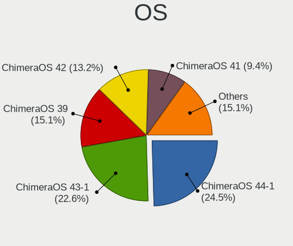

| Name         | Notebooks | Percent |
|--------------|-----------|---------|
| ChimeraOS 39 | 8         | 36.36%  |
| ChimeraOS 42 | 7         | 31.82%  |
| ChimeraOS 41 | 5         | 22.73%  |
| ChimeraOS 38 | 2         | 9.09%   |

OS Family
---------

OS without a version

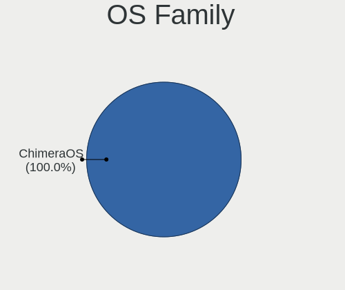

| Name      | Notebooks | Percent |
|-----------|-----------|---------|
| ChimeraOS | 22        | 100%    |

Kernel
------

Version of the Linux kernel

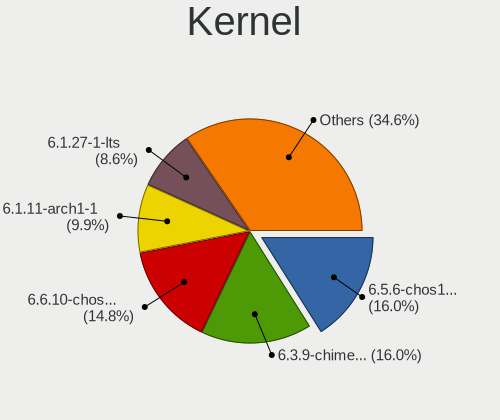

| Version        | Notebooks | Percent |
|----------------|-----------|---------|
| 6.1.11-arch1-1 | 8         | 36.36%  |
| 6.1.27-1-lts   | 7         | 31.82%  |
| 6.1.21-1-lts   | 5         | 22.73%  |
| 6.1.1-arch1-1  | 2         | 9.09%   |

Kernel Family
-------------

Linux kernel without a distro release

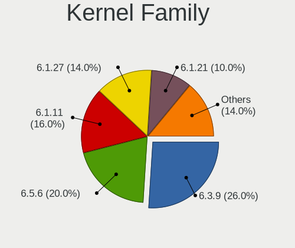

| Version | Notebooks | Percent |
|---------|-----------|---------|
| 6.1.11  | 8         | 36.36%  |
| 6.1.27  | 7         | 31.82%  |
| 6.1.21  | 5         | 22.73%  |
| 6.1.1   | 2         | 9.09%   |

Kernel Major Ver.
-----------------

Linux kernel major version

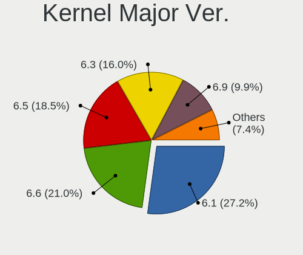

| Version | Notebooks | Percent |
|---------|-----------|---------|
| 6.1     | 22        | 100%    |

Arch
----

OS architecture (x86_64, i586, etc.)

| Name   | Notebooks | Percent |
|--------|-----------|---------|
| x86_64 | 22        | 100%    |

DE
--

Desktop Environment

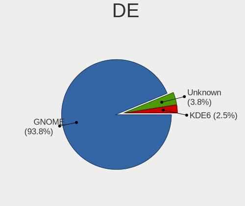

| Name  | Notebooks | Percent |
|-------|-----------|---------|
| GNOME | 22        | 100%    |

Display Server
--------------

X11 or Wayland

| Name    | Notebooks | Percent |
|---------|-----------|---------|
| Wayland | 20        | 90.91%  |
| X11     | 2         | 9.09%   |

Display Manager
---------------

SDDM, LightDM, etc.

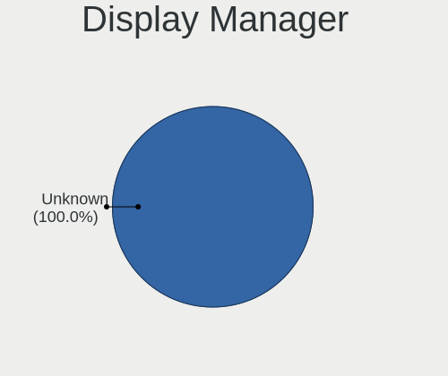

| Name    | Notebooks | Percent |
|---------|-----------|---------|
| Unknown | 22        | 100%    |

OS Lang
-------

Language

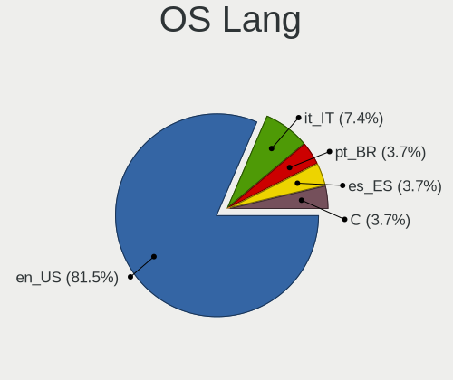

| Lang  | Notebooks | Percent |
|-------|-----------|---------|
| en_US | 20        | 90.91%  |
| pt_BR | 1         | 4.55%   |
| it_IT | 1         | 4.55%   |

Boot Mode
---------

EFI or BIOS

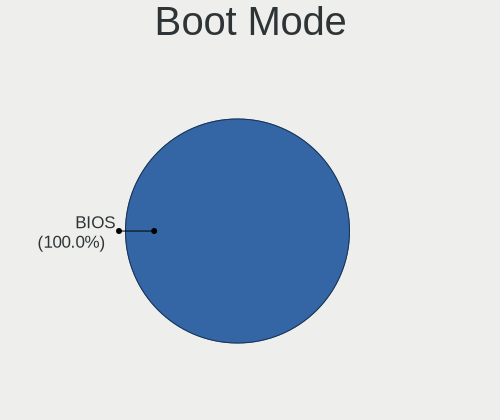

| Mode | Notebooks | Percent |
|------|-----------|---------|
| BIOS | 22        | 100%    |

Filesystem
----------

Type of filesystem

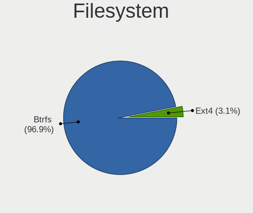

| Type  | Notebooks | Percent |
|-------|-----------|---------|
| Btrfs | 22        | 100%    |

Part. scheme
------------

Scheme of partitioning

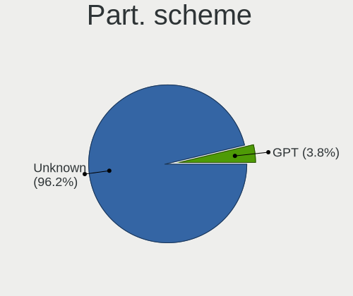

| Type    | Notebooks | Percent |
|---------|-----------|---------|
| Unknown | 22        | 100%    |

Dual Boot with Linux/BSD
------------------------

Hosting more than one Linux/BSD

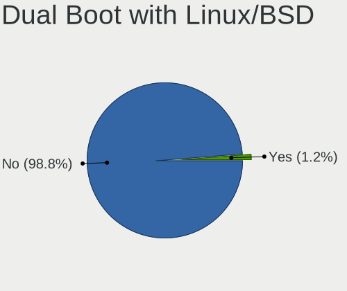

| Dual boot | Notebooks | Percent |
|-----------|-----------|---------|
| No        | 22        | 100%    |

Dual Boot (Win)
---------------

Hosting Linux and Windows

| Dual boot | Notebooks | Percent |
|-----------|-----------|---------|
| No        | 22        | 100%    |

Board
-----

Vendor
------

Motherboard manufacturer

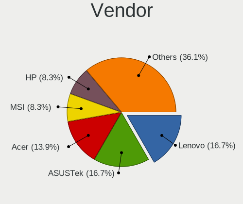

| Name              | Notebooks | Percent |
|-------------------|-----------|---------|
| Lenovo            | 4         | 18.18%  |
| MSI               | 3         | 13.64%  |
| ASUSTek Computer  | 3         | 13.64%  |
| Acer              | 3         | 13.64%  |
| Razer             | 2         | 9.09%   |
| ONE-NETBOOK       | 2         | 9.09%   |
| Hewlett-Packard   | 2         | 9.09%   |
| Micro Electronics | 1         | 4.55%   |
| Google            | 1         | 4.55%   |
| AMI               | 1         | 4.55%   |

Model
-----

Motherboard model

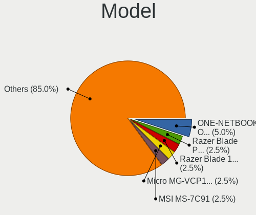

| Name                                        | Notebooks | Percent |
|---------------------------------------------|-----------|---------|
| ONE-NETBOOK ONEXPLAYER 2 ARP23              | 2         | 9.09%   |
| Razer Blade Pro 17 (Early 2020) - RZ09-0329 | 1         | 4.55%   |
| Razer Blade 14 - RZ09-0370                  | 1         | 4.55%   |
| MSI MS-7C91                                 | 1         | 4.55%   |
| MSI GE75 Raider 10SF                        | 1         | 4.55%   |
| MSI CX62 6QD                                | 1         | 4.55%   |
| Micro MG-VCP17I-3070                        | 1         | 4.55%   |
| Lenovo Y50-70 20378                         | 1         | 4.55%   |
| Lenovo Legion Y540-15IRH 81SX               | 1         | 4.55%   |
| Lenovo IdeaPad 700-15ISK 80RU               | 1         | 4.55%   |
| Lenovo IdeaPad 320-15IKB 80YH               | 1         | 4.55%   |
| HP EliteBook 850 G8 Notebook PC             | 1         | 4.55%   |
| HP 250 G4 Notebook PC                       | 1         | 4.55%   |
| Google Snappy                               | 1         | 4.55%   |
| ASUS TUF Gaming FX505DV_FX505DV             | 1         | 4.55%   |
| ASUS ROG Zephyrus G15 GA503QM_GA503QM       | 1         | 4.55%   |
| ASUS K45VM                                  | 1         | 4.55%   |
| Acer Nitro AN515-51                         | 1         | 4.55%   |
| Acer Aspire A515-51G                        | 1         | 4.55%   |
| Acer Aspire A315-58G                        | 1         | 4.55%   |
| Unknown                                     | 1         | 4.55%   |

Model Family
------------

Motherboard model prefix

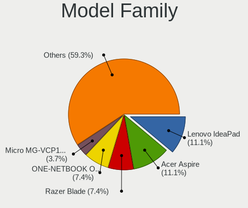

| Name                   | Notebooks | Percent |
|------------------------|-----------|---------|
| Razer Blade            | 2         | 9.09%   |
| ONE-NETBOOK ONEXPLAYER | 2         | 9.09%   |
| Lenovo IdeaPad         | 2         | 9.09%   |
| Acer Aspire            | 2         | 9.09%   |
| MSI MS-7C91            | 1         | 4.55%   |
| MSI GE75               | 1         | 4.55%   |
| MSI CX62               | 1         | 4.55%   |
| Micro MG-VCP17I-3070   | 1         | 4.55%   |
| Lenovo Y50-70          | 1         | 4.55%   |
| Lenovo Legion          | 1         | 4.55%   |
| HP EliteBook           | 1         | 4.55%   |
| HP 250                 | 1         | 4.55%   |
| Google Snappy          | 1         | 4.55%   |
| ASUS TUF               | 1         | 4.55%   |
| ASUS ROG               | 1         | 4.55%   |
| ASUS K45VM             | 1         | 4.55%   |
| Acer Nitro             | 1         | 4.55%   |
| Unknown                | 1         | 4.55%   |

MFG Year
--------

Motherboard manufacture year

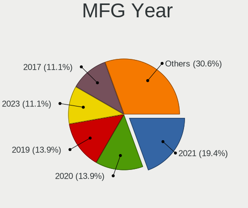

| Year | Notebooks | Percent |
|------|-----------|---------|
| 2021 | 4         | 18.18%  |
| 2023 | 3         | 13.64%  |
| 2020 | 3         | 13.64%  |
| 2017 | 3         | 13.64%  |
| 2019 | 2         | 9.09%   |
| 2016 | 2         | 9.09%   |
| 2015 | 2         | 9.09%   |
| 2022 | 1         | 4.55%   |
| 2014 | 1         | 4.55%   |
| 2012 | 1         | 4.55%   |

Form Factor
-----------

Physical design of the computer

| Name     | Notebooks | Percent |
|----------|-----------|---------|
| Notebook | 22        | 100%    |

Secure Boot
-----------

Enabled or disabled

| State    | Notebooks | Percent |
|----------|-----------|---------|
| Disabled | 22        | 100%    |

Coreboot
--------

Have coreboot on board

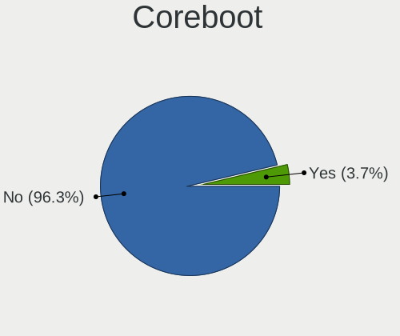

| Used | Notebooks | Percent |
|------|-----------|---------|
| No   | 21        | 95.45%  |
| Yes  | 1         | 4.55%   |

RAM Size
--------

Total RAM memory

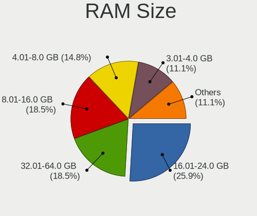

| Size in GB  | Notebooks | Percent |
|-------------|-----------|---------|
| 16.01-24.0  | 5         | 22.73%  |
| 4.01-8.0    | 4         | 18.18%  |
| 32.01-64.0  | 4         | 18.18%  |
| 8.01-16.0   | 4         | 18.18%  |
| 3.01-4.0    | 3         | 13.64%  |
| 24.01-32.0  | 1         | 4.55%   |
| 64.01-256.0 | 1         | 4.55%   |

RAM Used
--------

Used RAM memory

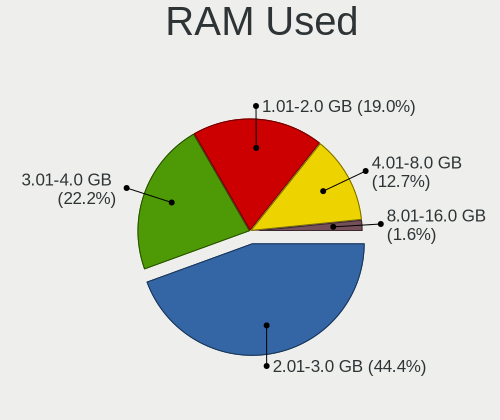

| Used GB  | Notebooks | Percent |
|----------|-----------|---------|
| 2.01-3.0 | 9         | 40.91%  |
| 1.01-2.0 | 6         | 27.27%  |
| 3.01-4.0 | 5         | 22.73%  |
| 4.01-8.0 | 2         | 9.09%   |

Total Drives
------------

Number of drives on board

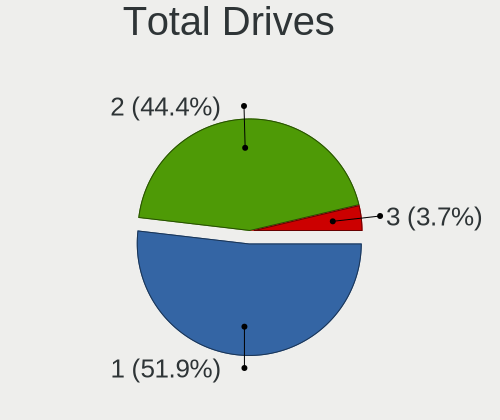

| Drives | Notebooks | Percent |
|--------|-----------|---------|
| 1      | 11        | 50%     |
| 2      | 10        | 45.45%  |
| 3      | 1         | 4.55%   |

Has CD-ROM
----------

Has CD-ROM on board

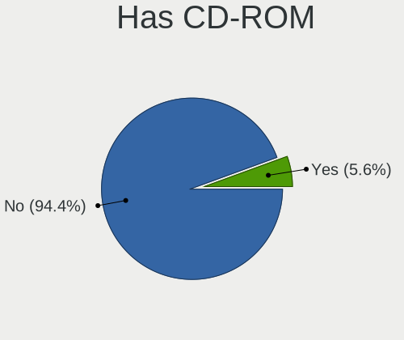

| Presented | Notebooks | Percent |
|-----------|-----------|---------|
| No        | 21        | 95.45%  |
| Yes       | 1         | 4.55%   |

Has Ethernet
------------

Has Ethernet on board

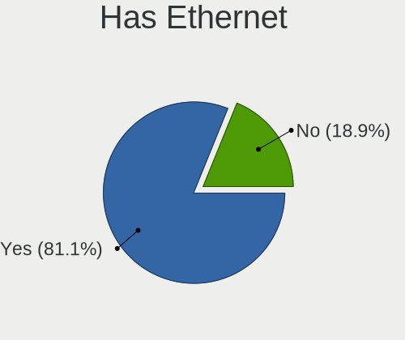

| Presented | Notebooks | Percent |
|-----------|-----------|---------|
| Yes       | 16        | 72.73%  |
| No        | 6         | 27.27%  |

Has WiFi
--------

Has WiFi module

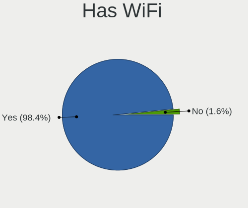

| Presented | Notebooks | Percent |
|-----------|-----------|---------|
| Yes       | 22        | 100%    |

Has Bluetooth
-------------

Has Bluetooth module

| Presented | Notebooks | Percent |
|-----------|-----------|---------|
| Yes       | 21        | 95.45%  |
| No        | 1         | 4.55%   |

Location
--------

Country
-------

Geographic location (country)

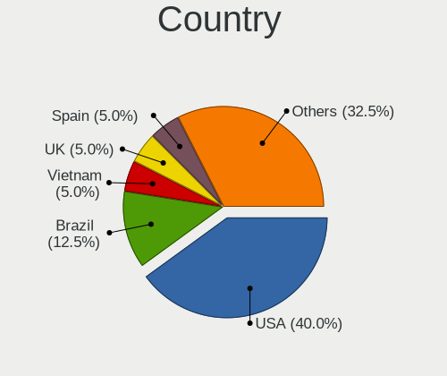

| Country      | Notebooks | Percent |
|--------------|-----------|---------|
| USA          | 10        | 45.45%  |
| UK           | 2         | 9.09%   |
| Brazil       | 2         | 9.09%   |
| Saudi Arabia | 1         | 4.55%   |
| Romania      | 1         | 4.55%   |
| Poland       | 1         | 4.55%   |
| Netherlands  | 1         | 4.55%   |
| Italy        | 1         | 4.55%   |
| Hungary      | 1         | 4.55%   |
| Costa Rica   | 1         | 4.55%   |
| Belgium      | 1         | 4.55%   |

City
----

Geographic location (city)

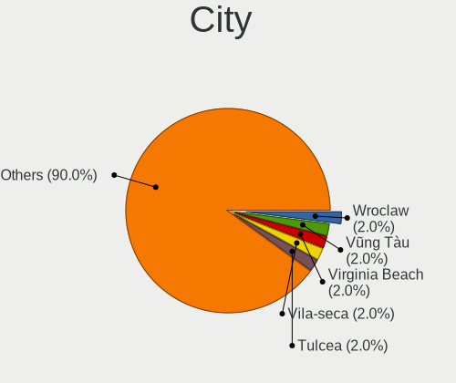

| City                     | Notebooks | Percent |
|--------------------------|-----------|---------|
| Wroclaw                  | 1         | 4.55%   |
| Virginia Beach           | 1         | 4.55%   |
| Tulcea                   | 1         | 4.55%   |
| St Louis                 | 1         | 4.55%   |
| Santa Cruz das Palmeiras | 1         | 4.55%   |
| San José                | 1         | 4.55%   |
| Saltillo                 | 1         | 4.55%   |
| Ridley Park              | 1         | 4.55%   |
| Pittsburg                | 1         | 4.55%   |
| Pennsauken               | 1         | 4.55%   |
| Newport News             | 1         | 4.55%   |
| Monticello               | 1         | 4.55%   |
| Milan                    | 1         | 4.55%   |
| Jeddah                   | 1         | 4.55%   |
| Hot Springs              | 1         | 4.55%   |
| Chattanooga              | 1         | 4.55%   |
| Budapest                 | 1         | 4.55%   |
| Brussels                 | 1         | 4.55%   |
| Belfast                  | 1         | 4.55%   |
| Barnet                   | 1         | 4.55%   |
| Araras                   | 1         | 4.55%   |
| Almere Stad              | 1         | 4.55%   |

Drives
------

Drive Vendor
------------

Hard drive vendors

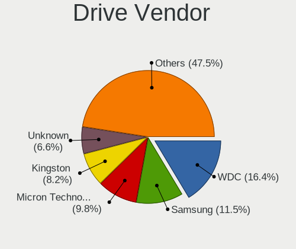

| Vendor                   | Notebooks | Drives | Percent |
|--------------------------|-----------|--------|---------|
| Samsung Electronics      | 6         | 6      | 17.65%  |
| WDC                      | 5         | 5      | 14.71%  |
| Unknown                  | 4         | 4      | 11.76%  |
| Kingston                 | 4         | 4      | 11.76%  |
| Seagate                  | 3         | 3      | 8.82%   |
| Sandisk                  | 3         | 3      | 8.82%   |
| Micron Technology        | 3         | 3      | 8.82%   |
| Toshiba                  | 2         | 2      | 5.88%   |
| Intel                    | 2         | 2      | 5.88%   |
| SK hynix                 | 1         | 1      | 2.94%   |
| Biwin Storage Technology | 1         | 1      | 2.94%   |

Drive Model
-----------

Hard drive models

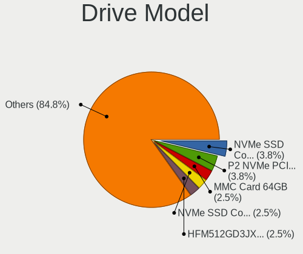

| Model                                               | Notebooks | Percent |
|-----------------------------------------------------|-----------|---------|
| Samsung NVMe SSD Controller SM981/PM981/PM983 250GB | 3         | 8.82%   |
| Unknown MMC Card  64GB                              | 2         | 5.88%   |
| WDC WD7500BPVT-80HXZT3 752GB                        | 1         | 2.94%   |
| WDC WD20SPZX-08UA7 2TB                              | 1         | 2.94%   |
| WDC WD201KFGX-68BKJN0 20TB                          | 1         | 2.94%   |
| WDC WD10SPCX-24HWST1 1TB                            | 1         | 2.94%   |
| WDC WD10JPLX-00MBPT0 1TB                            | 1         | 2.94%   |
| Unknown NVMe SSD Drive 1024GB                       | 1         | 2.94%   |
| Unknown MMC Card  16GB                              | 1         | 2.94%   |
| Toshiba XG6 NVMe SSD Controller 2TB                 | 1         | 2.94%   |
| Toshiba MQ01ABF050 500GB                            | 1         | 2.94%   |
| SK hynix HFM512GD3JX016N 512GB                      | 1         | 2.94%   |
| Seagate ST9320423AS 320GB                           | 1         | 2.94%   |
| Seagate ST1000LM048-2E7172 1TB                      | 1         | 2.94%   |
| Seagate ST1000LM035-1RK172 1TB                      | 1         | 2.94%   |
| Sandisk WD_BLACK SN770 2TB                          | 1         | 2.94%   |
| Sandisk WD Black SN850 1TB                          | 1         | 2.94%   |
| Sandisk WD Black SN750 / PC SN730 NVMe SSD 500GB    | 1         | 2.94%   |
| Samsung Portable SSD T5 1TB                         | 1         | 2.94%   |
| Samsung NVMe SSD Controller PM9A1/PM9A3/980PRO 2TB  | 1         | 2.94%   |
| Samsung MZNLF128HCHP-000H1 128GB SSD                | 1         | 2.94%   |
| Micron 2200V_MTFDHBA512TCK 512GB                    | 1         | 2.94%   |
| Micron 1100_MTFDDAV512TBN 512GB SSD                 | 1         | 2.94%   |
| Micron 1100_MTFDDAV256TBN 256GB SSD                 | 1         | 2.94%   |
| Kingston SV300S37A120G 120GB SSD                    | 1         | 2.94%   |
| Kingston SV100S2128G 128GB SSD                      | 1         | 2.94%   |
| Kingston SA400S37480G 480GB SSD                     | 1         | 2.94%   |
| Kingston SA400S37120G 120GB SSD                     | 1         | 2.94%   |
| Intel SSDPEKNU512GZ 512GB                           | 1         | 2.94%   |
| Intel SSD 600P Series 256GB                         | 1         | 2.94%   |
| Biwin Storage ONE XPLAYER Q1 2TB                    | 1         | 2.94%   |

HDD Vendor
----------

Hard disk drive vendors

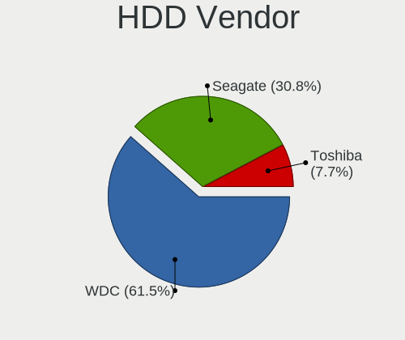

| Vendor  | Notebooks | Drives | Percent |
|---------|-----------|--------|---------|
| WDC     | 5         | 5      | 55.56%  |
| Seagate | 3         | 3      | 33.33%  |
| Toshiba | 1         | 1      | 11.11%  |

SSD Vendor
----------

Solid state drive vendors

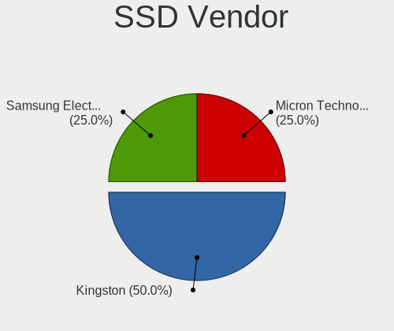

| Vendor              | Notebooks | Drives | Percent |
|---------------------|-----------|--------|---------|
| Kingston            | 4         | 4      | 50%     |
| Samsung Electronics | 2         | 2      | 25%     |
| Micron Technology   | 2         | 2      | 25%     |

Drive Kind
----------

HDD or SSD

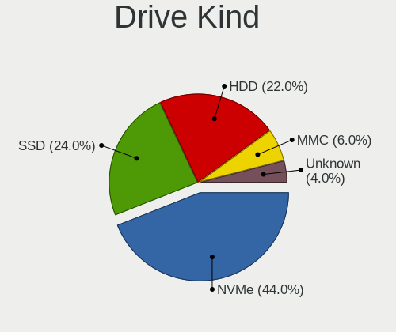

| Kind | Notebooks | Drives | Percent |
|------|-----------|--------|---------|
| NVMe | 13        | 14     | 41.94%  |
| HDD  | 8         | 9      | 25.81%  |
| SSD  | 7         | 8      | 22.58%  |
| MMC  | 3         | 3      | 9.68%   |

Drive Connector
---------------

SATA, SAS, NVMe, etc.

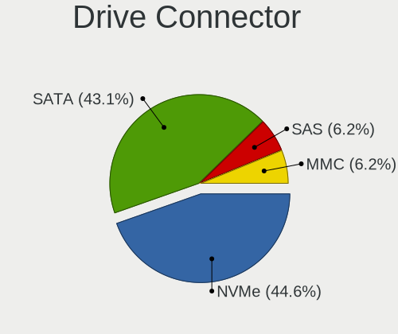

| Type | Notebooks | Drives | Percent |
|------|-----------|--------|---------|
| NVMe | 13        | 14     | 44.83%  |
| SATA | 12        | 16     | 41.38%  |
| MMC  | 3         | 3      | 10.34%  |
| SAS  | 1         | 1      | 3.45%   |

Drive Size
----------

Size of hard drive

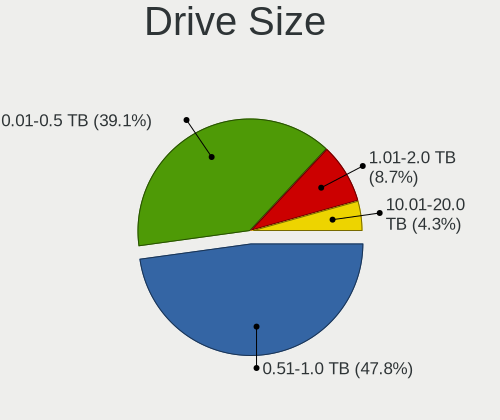

| Size in TB | Notebooks | Drives | Percent |
|------------|-----------|--------|---------|
| 0.51-1.0   | 7         | 7      | 46.67%  |
| 0.01-0.5   | 6         | 8      | 40%     |
| 10.01-20.0 | 1         | 1      | 6.67%   |
| 1.01-2.0   | 1         | 1      | 6.67%   |

Space Total
-----------

Amount of disk space available on the file system

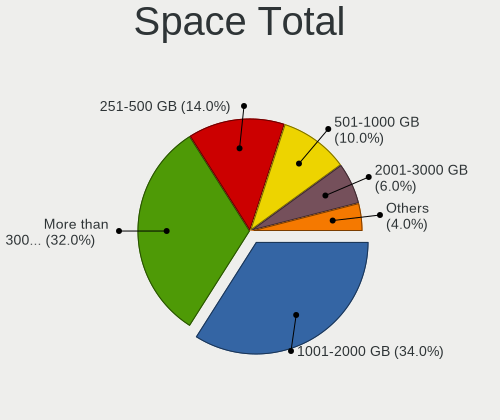

| Size in GB     | Notebooks | Percent |
|----------------|-----------|---------|
| 1001-2000      | 8         | 36.36%  |
| More than 3000 | 7         | 31.82%  |
| 251-500        | 4         | 18.18%  |
| 101-250        | 2         | 9.09%   |
| 501-1000       | 1         | 4.55%   |

Space Used
----------

Amount of used disk space

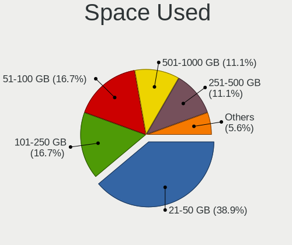

| Used GB  | Notebooks | Percent |
|----------|-----------|---------|
| 21-50    | 9         | 40.91%  |
| 251-500  | 4         | 18.18%  |
| 101-250  | 4         | 18.18%  |
| 51-100   | 4         | 18.18%  |
| 501-1000 | 1         | 4.55%   |

Malfunc. Drives
---------------

Drive models with a malfunction

Zero info for selected period =(

Malfunc. Drive Vendor
---------------------

Vendors of faulty drives

Zero info for selected period =(

Malfunc. HDD Vendor
-------------------

Vendors of faulty HDD drives

Zero info for selected period =(

Malfunc. Drive Kind
-------------------

Kinds of faulty drives

Zero info for selected period =(

Failed Drives
-------------

Failed drive models

Zero info for selected period =(

Failed Drive Vendor
-------------------

Failed drive vendors

Zero info for selected period =(

Drive Status
------------

Number of failed and malfunc. drives

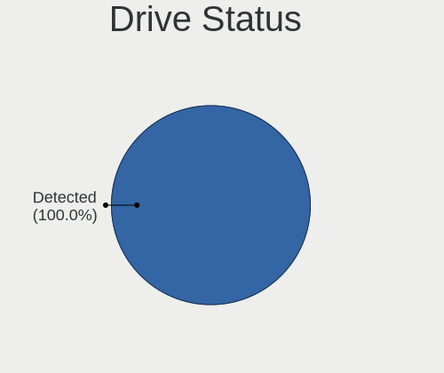

| Status   | Notebooks | Drives | Percent |
|----------|-----------|--------|---------|
| Detected | 22        | 34     | 100%    |

Storage controller
------------------

Storage Vendor
--------------

Storage controller vendors

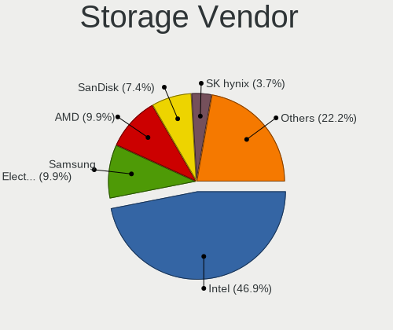

| Vendor                       | Notebooks | Percent |
|------------------------------|-----------|---------|
| Intel                        | 15        | 51.72%  |
| Samsung Electronics          | 4         | 13.79%  |
| SanDisk                      | 3         | 10.34%  |
| AMD                          | 2         | 6.9%    |
| Toshiba America Info Systems | 1         | 3.45%   |
| SK hynix                     | 1         | 3.45%   |
| Micron Technology            | 1         | 3.45%   |
| INNOGRIT                     | 1         | 3.45%   |
| Biwin Storage Technology     | 1         | 3.45%   |

Storage Model
-------------

Storage controller models

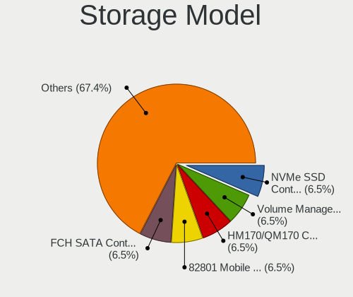

| Model                                                                          | Notebooks | Percent |
|--------------------------------------------------------------------------------|-----------|---------|
| Samsung NVMe SSD Controller SM981/PM981/PM983                                  | 3         | 9.38%   |
| Intel Volume Management Device NVMe RAID Controller                            | 3         | 9.38%   |
| Intel HM170/QM170 Chipset SATA Controller [AHCI Mode]                          | 3         | 9.38%   |
| Intel Sunrise Point-LP SATA Controller [AHCI mode]                             | 2         | 6.25%   |
| Intel 400 Series Chipset Family SATA AHCI Controller                           | 2         | 6.25%   |
| Toshiba America Info Systems XG6 NVMe SSD Controller                           | 1         | 3.13%   |
| SK hynix Gold P31/BC711/PC711 NVMe Solid State Drive                           | 1         | 3.13%   |
| SanDisk WD PC SN810 / Black SN850 NVMe SSD                                     | 1         | 3.13%   |
| SanDisk WD Black SN770 NVMe SSD                                                | 1         | 3.13%   |
| SanDisk WD Black SN750 / PC SN730 NVMe SSD                                     | 1         | 3.13%   |
| Samsung NVMe SSD Controller PM9A1/PM9A3/980PRO                                 | 1         | 3.13%   |
| Micron 2200S NVMe SSD                                                          | 1         | 3.13%   |
| Intel Tiger Lake-LP SATA Controller                                            | 1         | 3.13%   |
| Intel Tiger Lake SATA AHCI Controller                                          | 1         | 3.13%   |
| Intel SSD 600P Series                                                          | 1         | 3.13%   |
| Intel Non-Volatile memory controller                                           | 1         | 3.13%   |
| Intel Cannon Lake Mobile PCH SATA AHCI Controller                              | 1         | 3.13%   |
| Intel 82801 Mobile SATA Controller [RAID mode]                                 | 1         | 3.13%   |
| Intel 8 Series/C220 Series Chipset Family 6-port SATA Controller 1 [AHCI mode] | 1         | 3.13%   |
| Intel 7 Series Chipset Family 6-port SATA Controller [AHCI mode]               | 1         | 3.13%   |
| INNOGRIT Non-Volatile memory controller                                        | 1         | 3.13%   |
| Biwin Storage Non-Volatile memory controller                                   | 1         | 3.13%   |
| AMD FCH SATA Controller [AHCI mode]                                            | 1         | 3.13%   |
| AMD 500 Series Chipset SATA Controller                                         | 1         | 3.13%   |

Storage Kind
------------

Kind of storage controller (IDE, SATA, NVMe, SAS, ...)

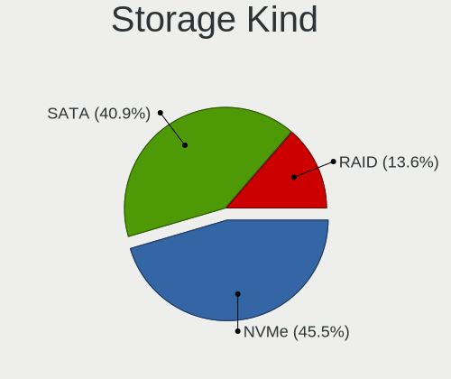

| Kind | Notebooks | Percent |
|------|-----------|---------|
| SATA | 14        | 45.16%  |
| NVMe | 13        | 41.94%  |
| RAID | 4         | 12.9%   |

Processor
---------

CPU Vendor
----------

Processor vendors

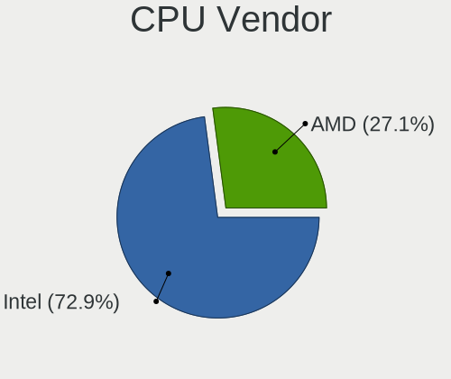

| Vendor | Notebooks | Percent |
|--------|-----------|---------|
| Intel  | 16        | 72.73%  |
| AMD    | 6         | 27.27%  |

CPU Model
---------

Processor models

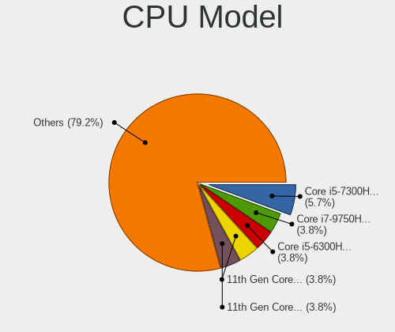

| Model                                         | Notebooks | Percent |
|-----------------------------------------------|-----------|---------|
| Intel Core i5-6300HQ CPU @ 2.30GHz            | 2         | 9.09%   |
| AMD Ryzen 7 6800U with Radeon Graphics        | 2         | 9.09%   |
| Intel Core i7-9750H CPU @ 2.60GHz             | 1         | 4.55%   |
| Intel Core i7-8550U CPU @ 1.80GHz             | 1         | 4.55%   |
| Intel Core i7-3610QM CPU @ 2.30GHz            | 1         | 4.55%   |
| Intel Core i7-10875H CPU @ 2.30GHz            | 1         | 4.55%   |
| Intel Core i7-10750H CPU @ 2.60GHz            | 1         | 4.55%   |
| Intel Core i5-7300HQ CPU @ 2.50GHz            | 1         | 4.55%   |
| Intel Core i5-7200U CPU @ 2.50GHz             | 1         | 4.55%   |
| Intel Core i5-6200U CPU @ 2.30GHz             | 1         | 4.55%   |
| Intel Core i5-4210H CPU @ 2.90GHz             | 1         | 4.55%   |
| Intel Celeron CPU N3350 @ 1.10GHz             | 1         | 4.55%   |
| Intel Atom x7-Z8700 CPU @ 1.60GHz             | 1         | 4.55%   |
| Intel 11th Gen Core i7-1185G7 @ 3.00GHz       | 1         | 4.55%   |
| Intel 11th Gen Core i7-11800H @ 2.30GHz       | 1         | 4.55%   |
| Intel 11th Gen Core i3-1115G4 @ 3.00GHz       | 1         | 4.55%   |
| AMD Ryzen 9 5900X 12-Core Processor           | 1         | 4.55%   |
| AMD Ryzen 9 5900HX with Radeon Graphics       | 1         | 4.55%   |
| AMD Ryzen 9 5900HS with Radeon Graphics       | 1         | 4.55%   |
| AMD Ryzen 7 3750H with Radeon Vega Mobile Gfx | 1         | 4.55%   |

CPU Model Family
----------------

Processor model prefix

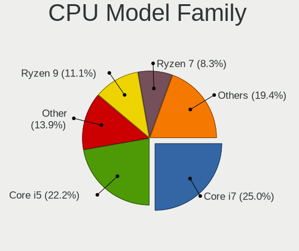

| Model         | Notebooks | Percent |
|---------------|-----------|---------|
| Intel Core i5 | 6         | 27.27%  |
| Intel Core i7 | 5         | 22.73%  |
| Other         | 3         | 13.64%  |
| AMD Ryzen 9   | 3         | 13.64%  |
| AMD Ryzen 7   | 3         | 13.64%  |
| Intel Celeron | 1         | 4.55%   |
| Intel Atom    | 1         | 4.55%   |

CPU Cores
---------

Number of processor cores

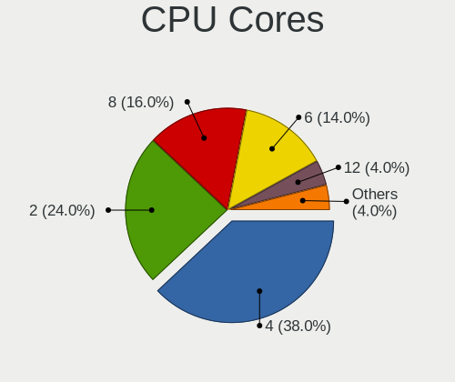

| Number | Notebooks | Percent |
|--------|-----------|---------|
| 4      | 8         | 36.36%  |
| 8      | 6         | 27.27%  |
| 2      | 5         | 22.73%  |
| 6      | 2         | 9.09%   |
| 12     | 1         | 4.55%   |

CPU Sockets
-----------

Number of sockets

| Number | Notebooks | Percent |
|--------|-----------|---------|
| 1      | 22        | 100%    |

CPU Threads
-----------

Threads per core (Hyper-Threading)

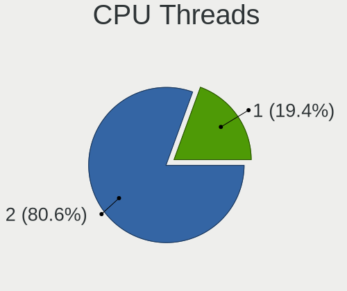

| Number | Notebooks | Percent |
|--------|-----------|---------|
| 2      | 17        | 77.27%  |
| 1      | 5         | 22.73%  |

CPU Op-Modes
------------

CPU Operation Modes (32-bit, 64-bit)

| Op mode        | Notebooks | Percent |
|----------------|-----------|---------|
| 32-bit, 64-bit | 22        | 100%    |

CPU Microcode
-------------

Microcode number

| Number  | Notebooks | Percent |
|---------|-----------|---------|
| Unknown | 22        | 100%    |

CPU Microarch
-------------

Microarchitecture

| Name       | Notebooks | Percent |
|------------|-----------|---------|
| KabyLake   | 4         | 18.18%  |
| Zen 3      | 3         | 13.64%  |
| Skylake    | 3         | 13.64%  |
| Unknown    | 3         | 13.64%  |
| TigerLake  | 2         | 9.09%   |
| CometLake  | 2         | 9.09%   |
| Zen+       | 1         | 4.55%   |
| Silvermont | 1         | 4.55%   |
| IvyBridge  | 1         | 4.55%   |
| Haswell    | 1         | 4.55%   |
| Goldmont   | 1         | 4.55%   |

Graphics
--------

GPU Vendor
----------

Vendors of graphics cards

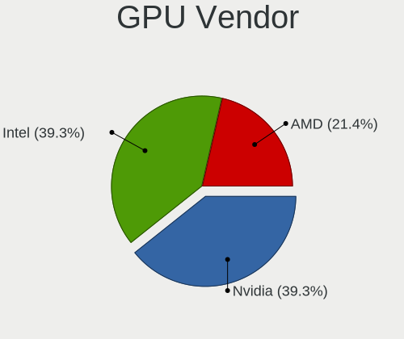

| Vendor | Notebooks | Percent |
|--------|-----------|---------|
| Nvidia | 14        | 41.18%  |
| Intel  | 14        | 41.18%  |
| AMD    | 6         | 17.65%  |

GPU Model
---------

Graphics card models

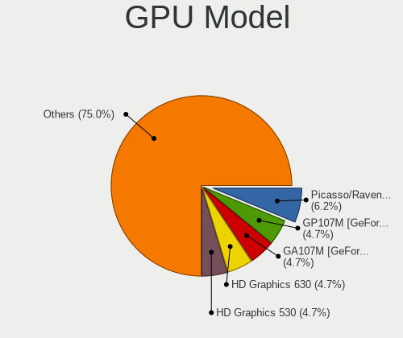

| Model                                                                                    | Notebooks | Percent |
|------------------------------------------------------------------------------------------|-----------|---------|
| Nvidia GA104M [GeForce RTX 3070 Mobile / Max-Q]                                          | 2         | 5.88%   |
| Intel HD Graphics 530                                                                    | 2         | 5.88%   |
| AMD Rembrandt [Radeon 680M]                                                              | 2         | 5.88%   |
| AMD Cezanne [Radeon Vega Series / Radeon Vega Mobile Series]                             | 2         | 5.88%   |
| Nvidia TU116M [GeForce GTX 1660 Ti Mobile]                                               | 1         | 2.94%   |
| Nvidia TU106M [GeForce RTX 2070 Mobile / Max-Q Refresh]                                  | 1         | 2.94%   |
| Nvidia TU106M [GeForce RTX 2060 Mobile]                                                  | 1         | 2.94%   |
| Nvidia TU104M [GeForce RTX 2080 SUPER Mobile / Max-Q]                                    | 1         | 2.94%   |
| Nvidia GP107M [GeForce MX350]                                                            | 1         | 2.94%   |
| Nvidia GP107M [GeForce GTX 1050 Mobile]                                                  | 1         | 2.94%   |
| Nvidia GM108M [GeForce MX130]                                                            | 1         | 2.94%   |
| Nvidia GM108M [GeForce 940MX]                                                            | 1         | 2.94%   |
| Nvidia GM107M [GeForce GTX 960M]                                                         | 1         | 2.94%   |
| Nvidia GM107M [GeForce GTX 950M]                                                         | 1         | 2.94%   |
| Nvidia GF108M [GeForce GT 620M/630M/635M/640M LE]                                        | 1         | 2.94%   |
| Nvidia GA106M [GeForce RTX 3060 Mobile / Max-Q]                                          | 1         | 2.94%   |
| Intel UHD Graphics 620                                                                   | 1         | 2.94%   |
| Intel TigerLake-LP GT2 [Iris Xe Graphics]                                                | 1         | 2.94%   |
| Intel Tiger Lake-LP GT2 [UHD Graphics G4]                                                | 1         | 2.94%   |
| Intel Skylake GT2 [HD Graphics 520]                                                      | 1         | 2.94%   |
| Intel HD Graphics 630                                                                    | 1         | 2.94%   |
| Intel HD Graphics 620                                                                    | 1         | 2.94%   |
| Intel HD Graphics 500                                                                    | 1         | 2.94%   |
| Intel CometLake-H GT2 [UHD Graphics]                                                     | 1         | 2.94%   |
| Intel CoffeeLake-H GT2 [UHD Graphics 630]                                                | 1         | 2.94%   |
| Intel Atom/Celeron/Pentium Processor x5-E8000/J3xxx/N3xxx Integrated Graphics Controller | 1         | 2.94%   |
| Intel 4th Gen Core Processor Integrated Graphics Controller                              | 1         | 2.94%   |
| Intel 3rd Gen Core processor Graphics Controller                                         | 1         | 2.94%   |
| AMD Picasso/Raven 2 [Radeon Vega Series / Radeon Vega Mobile Series]                     | 1         | 2.94%   |
| AMD Navi 31 [Radeon RX 7900 XT/7900 XTX]                                                 | 1         | 2.94%   |

GPU Combo
---------

Combinations of graphics cards

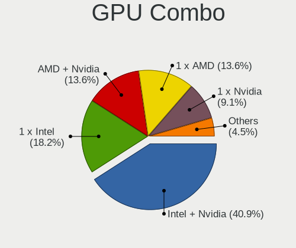

| Name           | Notebooks | Percent |
|----------------|-----------|---------|
| Intel + Nvidia | 9         | 40.91%  |
| 1 x Intel      | 4         | 18.18%  |
| AMD + Nvidia   | 3         | 13.64%  |
| 1 x AMD        | 3         | 13.64%  |
| 1 x Nvidia     | 2         | 9.09%   |
| Other          | 1         | 4.55%   |

GPU Driver
----------

Free vs proprietary

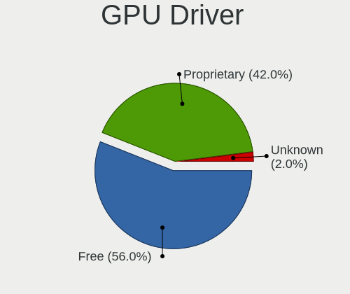

| Driver      | Notebooks | Percent |
|-------------|-----------|---------|
| Proprietary | 13        | 59.09%  |
| Free        | 9         | 40.91%  |

GPU Memory
----------

Total video memory

| Size in GB | Notebooks | Percent |
|------------|-----------|---------|
| Unknown    | 22        | 100%    |

Monitor
-------

Monitor Vendor
--------------

Monitor vendors

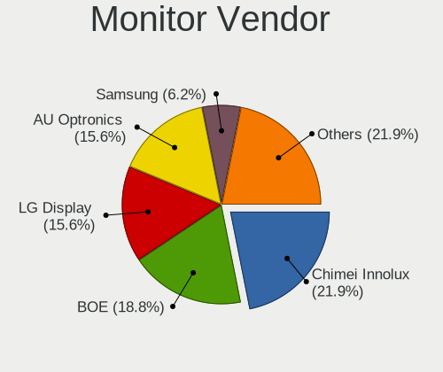

| Vendor              | Notebooks | Percent |
|---------------------|-----------|---------|
| Chimei Innolux      | 5         | 22.73%  |
| LG Display          | 4         | 18.18%  |
| BOE                 | 4         | 18.18%  |
| AU Optronics        | 3         | 13.64%  |
| Samsung Electronics | 2         | 9.09%   |
| TMX                 | 1         | 4.55%   |
| Sharp               | 1         | 4.55%   |
| Goldstar            | 1         | 4.55%   |
| Fujitsu Siemens     | 1         | 4.55%   |

Monitor Model
-------------

Monitor models

| Model                                                                | Notebooks | Percent |
|----------------------------------------------------------------------|-----------|---------|
| BOE FLQ8423-24L0 BOE1003 1600x2560 113x181mm 8.4-inch                | 2         | 9.09%   |
| TMX TL140BDXP02-0 TMX1400 2560x1440 310x174mm 14.0-inch              | 1         | 4.55%   |
| Sharp LQ173M1JW02 SHP14DB 1920x1080 382x215mm 17.3-inch              | 1         | 4.55%   |
| Samsung Electronics QBQ95 SAM7229 3840x2160 1872x1053mm 84.6-inch    | 1         | 4.55%   |
| Samsung Electronics LCD Monitor SDC4C51 1366x768 344x194mm 15.5-inch | 1         | 4.55%   |
| LG Display LCD Monitor LGD071E 1920x1080 344x194mm 15.5-inch         | 1         | 4.55%   |
| LG Display LCD Monitor LGD0590 1920x1080 344x194mm 15.5-inch         | 1         | 4.55%   |
| LG Display LCD Monitor LGD044F 1920x1080 345x194mm 15.6-inch         | 1         | 4.55%   |
| LG Display LCD Monitor LGD02F8 1366x768 309x174mm 14.0-inch          | 1         | 4.55%   |
| Goldstar M237WDP GSM5779 1920x1080 598x336mm 27.0-inch               | 1         | 4.55%   |
| Fujitsu Siemens B22T-7 LED PG FUS082A 1920x1080 477x268mm 21.5-inch  | 1         | 4.55%   |
| Chimei Innolux LCD Monitor CMN176E 1920x1080 381x214mm 17.2-inch     | 1         | 4.55%   |
| Chimei Innolux LCD Monitor CMN15F5 1920x1080 344x193mm 15.5-inch     | 1         | 4.55%   |
| Chimei Innolux LCD Monitor CMN15DB 1366x768 344x193mm 15.5-inch      | 1         | 4.55%   |
| Chimei Innolux LCD Monitor CMN15D2 1920x1080 344x193mm 15.5-inch     | 1         | 4.55%   |
| Chimei Innolux LCD Monitor CMN1540 2560x1440 344x193mm 15.5-inch     | 1         | 4.55%   |
| BOE LCD Monitor BOE0977 2560x1440 381x214mm 17.2-inch                | 1         | 4.55%   |
| BOE LCD Monitor BOE065D 1920x1080 344x194mm 15.5-inch                | 1         | 4.55%   |
| AU Optronics LCD Monitor AUOD0ED 1920x1080 344x193mm 15.5-inch       | 1         | 4.55%   |
| AU Optronics LCD Monitor AUO21ED 1920x1080 344x194mm 15.5-inch       | 1         | 4.55%   |
| AU Optronics LCD Monitor AUO135C 1366x768 256x144mm 11.6-inch        | 1         | 4.55%   |

Monitor Resolution
------------------

Monitor screen resolution

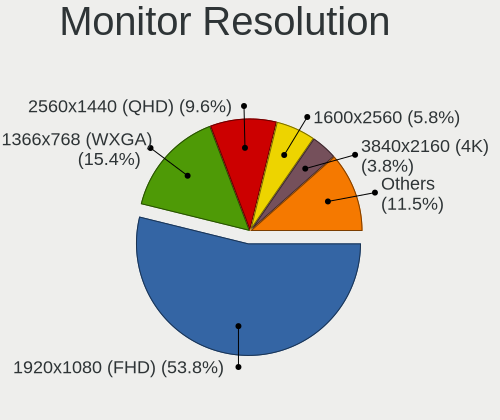

| Resolution      | Notebooks | Percent |
|-----------------|-----------|---------|
| 1920x1080 (FHD) | 11        | 52.38%  |
| 1366x768 (WXGA) | 4         | 19.05%  |
| 2560x1440 (QHD) | 3         | 14.29%  |
| 1600x2560       | 2         | 9.52%   |
| 3840x2160 (4K)  | 1         | 4.76%   |

Monitor Diagonal
----------------

Diagonal size in inches

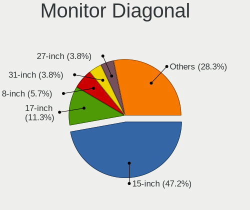

| Inches | Notebooks | Percent |
|--------|-----------|---------|
| 15     | 11        | 50%     |
| 17     | 3         | 13.64%  |
| 14     | 2         | 9.09%   |
| 8      | 2         | 9.09%   |
| 84     | 1         | 4.55%   |
| 27     | 1         | 4.55%   |
| 21     | 1         | 4.55%   |
| 11     | 1         | 4.55%   |

Monitor Width
-------------

Physical width

| Width in mm | Notebooks | Percent |
|-------------|-----------|---------|
| 301-350     | 13        | 59.09%  |
| 351-400     | 3         | 13.64%  |
| 101-200     | 2         | 9.09%   |
| 501-600     | 1         | 4.55%   |
| 401-500     | 1         | 4.55%   |
| 201-300     | 1         | 4.55%   |
| 1501-2000   | 1         | 4.55%   |

Aspect Ratio
------------

Proportional relationship between the width and the height

| Ratio | Notebooks | Percent |
|-------|-----------|---------|
| 16/9  | 19        | 90.48%  |
| 0.62  | 2         | 9.52%   |

Monitor Area
------------

Area in inch²

| Area in inch² | Notebooks | Percent |
|----------------|-----------|---------|
| 101-110        | 11        | 50%     |
| 121-130        | 3         | 13.64%  |
| 81-90          | 2         | 9.09%   |
| 1-40           | 2         | 9.09%   |
| More than 1000 | 1         | 4.55%   |
| 51-60          | 1         | 4.55%   |
| 301-350        | 1         | 4.55%   |
| 201-250        | 1         | 4.55%   |

Pixel Density
-------------

Pixels per inch

| Density       | Notebooks | Percent |
|---------------|-----------|---------|
| 121-160       | 11        | 50%     |
| 101-120       | 4         | 18.18%  |
| 161-240       | 3         | 13.64%  |
| More than 240 | 2         | 9.09%   |
| 51-100        | 2         | 9.09%   |

Multiple Monitors
-----------------

Total monitors connected

| Total | Notebooks | Percent |
|-------|-----------|---------|
| 1     | 18        | 81.82%  |
| 2     | 3         | 13.64%  |
| 0     | 1         | 4.55%   |

Network
-------

Net Controller Vendor
---------------------

Controller vendors

| Vendor                | Notebooks | Percent |
|-----------------------|-----------|---------|
| Realtek Semiconductor | 14        | 38.89%  |
| Intel                 | 12        | 33.33%  |
| Qualcomm Atheros      | 6         | 16.67%  |
| MediaTek              | 2         | 5.56%   |
| Broadcom Limited      | 1         | 2.78%   |
| Broadcom              | 1         | 2.78%   |

Net Controller Model
--------------------

Controller models

| Model                                                             | Notebooks | Percent |
|-------------------------------------------------------------------|-----------|---------|
| Realtek RTL8111/8168/8411 PCI Express Gigabit Ethernet Controller | 10        | 26.32%  |
| Realtek RTL8125 2.5GbE Controller                                 | 3         | 7.89%   |
| Intel Wi-Fi 6 AX210/AX211/AX411 160MHz                            | 3         | 7.89%   |
| Qualcomm Atheros QCA9377 802.11ac Wireless Network Adapter        | 2         | 5.26%   |
| Intel Wi-Fi 6 AX201                                               | 2         | 5.26%   |
| Intel Comet Lake PCH CNVi WiFi                                    | 2         | 5.26%   |
| Realtek RTL8822CE 802.11ac PCIe Wireless Network Adapter          | 1         | 2.63%   |
| Realtek RTL8723BE PCIe Wireless Network Adapter                   | 1         | 2.63%   |
| Realtek PCIe GbE Family Controller                                | 1         | 2.63%   |
| Qualcomm Atheros QCA8171 Gigabit Ethernet                         | 1         | 2.63%   |
| Qualcomm Atheros QCA6174 802.11ac Wireless Network Adapter        | 1         | 2.63%   |
| Qualcomm Atheros Killer E2500 Gigabit Ethernet Controller         | 1         | 2.63%   |
| Qualcomm Atheros AR9485 Wireless Network Adapter                  | 1         | 2.63%   |
| MediaTek MT7921K (RZ608) Wi-Fi 6E 80MHz                           | 1         | 2.63%   |
| MediaTek MT7921 802.11ax PCI Express Wireless Network Adapter     | 1         | 2.63%   |
| Intel Wireless 7265                                               | 1         | 2.63%   |
| Intel Wireless 3165                                               | 1         | 2.63%   |
| Intel Tiger Lake PCH CNVi WiFi                                    | 1         | 2.63%   |
| Intel Dual Band Wireless-AC 3165 Plus Bluetooth                   | 1         | 2.63%   |
| Intel Cannon Lake PCH CNVi WiFi                                   | 1         | 2.63%   |
| Broadcom Limited BCM4352 802.11ac Wireless Network Adapter        | 1         | 2.63%   |
| Broadcom BCM4356 802.11ac Wireless Network Adapter                | 1         | 2.63%   |

Wireless Vendor
---------------

Wireless vendors

| Vendor                | Notebooks | Percent |
|-----------------------|-----------|---------|
| Intel                 | 12        | 54.55%  |
| Qualcomm Atheros      | 4         | 18.18%  |
| Realtek Semiconductor | 2         | 9.09%   |
| MediaTek              | 2         | 9.09%   |
| Broadcom Limited      | 1         | 4.55%   |
| Broadcom              | 1         | 4.55%   |

Wireless Model
--------------

Wireless models

| Model                                                         | Notebooks | Percent |
|---------------------------------------------------------------|-----------|---------|
| Intel Wi-Fi 6 AX210/AX211/AX411 160MHz                        | 3         | 13.64%  |
| Qualcomm Atheros QCA9377 802.11ac Wireless Network Adapter    | 2         | 9.09%   |
| Intel Wi-Fi 6 AX201                                           | 2         | 9.09%   |
| Intel Comet Lake PCH CNVi WiFi                                | 2         | 9.09%   |
| Realtek RTL8822CE 802.11ac PCIe Wireless Network Adapter      | 1         | 4.55%   |
| Realtek RTL8723BE PCIe Wireless Network Adapter               | 1         | 4.55%   |
| Qualcomm Atheros QCA6174 802.11ac Wireless Network Adapter    | 1         | 4.55%   |
| Qualcomm Atheros AR9485 Wireless Network Adapter              | 1         | 4.55%   |
| MediaTek MT7921K (RZ608) Wi-Fi 6E 80MHz                       | 1         | 4.55%   |
| MediaTek MT7921 802.11ax PCI Express Wireless Network Adapter | 1         | 4.55%   |
| Intel Wireless 7265                                           | 1         | 4.55%   |
| Intel Wireless 3165                                           | 1         | 4.55%   |
| Intel Tiger Lake PCH CNVi WiFi                                | 1         | 4.55%   |
| Intel Dual Band Wireless-AC 3165 Plus Bluetooth               | 1         | 4.55%   |
| Intel Cannon Lake PCH CNVi WiFi                               | 1         | 4.55%   |
| Broadcom Limited BCM4352 802.11ac Wireless Network Adapter    | 1         | 4.55%   |
| Broadcom BCM4356 802.11ac Wireless Network Adapter            | 1         | 4.55%   |

Ethernet Vendor
---------------

Ethernet vendors

| Vendor                | Notebooks | Percent |
|-----------------------|-----------|---------|
| Realtek Semiconductor | 14        | 87.5%   |
| Qualcomm Atheros      | 2         | 12.5%   |

Ethernet Model
--------------

Ethernet models

| Model                                                             | Notebooks | Percent |
|-------------------------------------------------------------------|-----------|---------|
| Realtek RTL8111/8168/8411 PCI Express Gigabit Ethernet Controller | 10        | 62.5%   |
| Realtek RTL8125 2.5GbE Controller                                 | 3         | 18.75%  |
| Realtek PCIe GbE Family Controller                                | 1         | 6.25%   |
| Qualcomm Atheros QCA8171 Gigabit Ethernet                         | 1         | 6.25%   |
| Qualcomm Atheros Killer E2500 Gigabit Ethernet Controller         | 1         | 6.25%   |

Net Controller Kind
-------------------

Ethernet, WiFi or modem

| Kind     | Notebooks | Percent |
|----------|-----------|---------|
| WiFi     | 22        | 57.89%  |
| Ethernet | 16        | 42.11%  |

Used Controller
---------------

Currently used network controller

| Kind     | Notebooks | Percent |
|----------|-----------|---------|
| WiFi     | 19        | 82.61%  |
| Ethernet | 4         | 17.39%  |

NICs
----

Total network controllers on board

| Total | Notebooks | Percent |
|-------|-----------|---------|
| 2     | 16        | 72.73%  |
| 1     | 6         | 27.27%  |

IPv6
----

IPv6 vs IPv4

| Used | Notebooks | Percent |
|------|-----------|---------|
| No   | 17        | 77.27%  |
| Yes  | 5         | 22.73%  |

Bluetooth
---------

Bluetooth Vendor
----------------

Controller vendors

| Vendor                          | Notebooks | Percent |
|---------------------------------|-----------|---------|
| Intel                           | 12        | 57.14%  |
| Lite-On Technology              | 2         | 9.52%   |
| IMC Networks                    | 2         | 9.52%   |
| Realtek Semiconductor           | 1         | 4.76%   |
| Qualcomm Atheros Communications | 1         | 4.76%   |
| MediaTek                        | 1         | 4.76%   |
| Foxconn / Hon Hai               | 1         | 4.76%   |
| Cambridge Silicon Radio         | 1         | 4.76%   |

Bluetooth Model
---------------

Controller models

| Model                                               | Notebooks | Percent |
|-----------------------------------------------------|-----------|---------|
| Intel AX201 Bluetooth                               | 4         | 19.05%  |
| Intel Bluetooth wireless interface                  | 3         | 14.29%  |
| Intel AX210 Bluetooth                               | 3         | 14.29%  |
| Intel Bluetooth 9460/9560 Jefferson Peak (JfP)      | 2         | 9.52%   |
| Realtek Bluetooth Radio                             | 1         | 4.76%   |
| Qualcomm Atheros  Bluetooth Device                  | 1         | 4.76%   |
| MediaTek Wireless_Device                            | 1         | 4.76%   |
| Lite-On Qualcomm Atheros QCA9377 Bluetooth          | 1         | 4.76%   |
| Lite-On Bluetooth Device                            | 1         | 4.76%   |
| IMC Networks Wireless_Device                        | 1         | 4.76%   |
| IMC Networks Bluetooth Radio                        | 1         | 4.76%   |
| Foxconn / Hon Hai BCM20702A0                        | 1         | 4.76%   |
| Cambridge Silicon Radio Bluetooth Dongle (HCI mode) | 1         | 4.76%   |

Sound
-----

Sound Vendor
------------

Sound card vendors

| Vendor | Notebooks | Percent |
|--------|-----------|---------|
| Intel  | 15        | 48.39%  |
| Nvidia | 9         | 29.03%  |
| AMD    | 6         | 19.35%  |
| Sony   | 1         | 3.23%   |

Sound Model
-----------

Sound card models

| Model                                                               | Notebooks | Percent |
|---------------------------------------------------------------------|-----------|---------|
| AMD Family 17h/19h HD Audio Controller                              | 5         | 13.89%  |
| Intel Sunrise Point-LP HD Audio                                     | 3         | 8.33%   |
| Nvidia TU106 High Definition Audio Controller                       | 2         | 5.56%   |
| Nvidia GA104 High Definition Audio Controller                       | 2         | 5.56%   |
| Intel Tiger Lake-LP Smart Sound Technology Audio Controller         | 2         | 5.56%   |
| Intel Comet Lake PCH cAVS                                           | 2         | 5.56%   |
| Intel 100 Series/C230 Series Chipset Family HD Audio Controller     | 2         | 5.56%   |
| AMD Rembrandt Radeon High Definition Audio Controller               | 2         | 5.56%   |
| Sony DualSense wireless controller (PS5)                            | 1         | 2.78%   |
| Nvidia TU116 High Definition Audio Controller                       | 1         | 2.78%   |
| Nvidia TU104 HD Audio Controller                                    | 1         | 2.78%   |
| Nvidia GP107GL High Definition Audio Controller                     | 1         | 2.78%   |
| Nvidia GF108 High Definition Audio Controller                       | 1         | 2.78%   |
| Nvidia GA106 High Definition Audio Controller                       | 1         | 2.78%   |
| Intel Xeon E3-1200 v3/4th Gen Core Processor HD Audio Controller    | 1         | 2.78%   |
| Intel Tiger Lake-H HD Audio Controller                              | 1         | 2.78%   |
| Intel CM238 HD Audio Controller                                     | 1         | 2.78%   |
| Intel Celeron N3350/Pentium N4200/Atom E3900 Series Audio Cluster   | 1         | 2.78%   |
| Intel Cannon Lake PCH cAVS                                          | 1         | 2.78%   |
| Intel 8 Series/C220 Series Chipset High Definition Audio Controller | 1         | 2.78%   |
| Intel 7 Series/C216 Chipset Family High Definition Audio Controller | 1         | 2.78%   |
| AMD Starship/Matisse HD Audio Controller                            | 1         | 2.78%   |
| AMD Renoir Radeon High Definition Audio Controller                  | 1         | 2.78%   |
| AMD Navi 31 [Radeon RX 7000 HDMI Audio]                             | 1         | 2.78%   |

Memory
------

Memory Vendor
-------------

Memory module vendors

Zero info for selected period =(

Memory Model
------------

Memory module models

Zero info for selected period =(

Memory Kind
-----------

Memory module kinds

Zero info for selected period =(

Memory Form Factor
------------------

Physical design of the memory module

Zero info for selected period =(

Memory Size
-----------

Memory module size

Zero info for selected period =(

Memory Speed
------------

Memory module speed

Zero info for selected period =(

Printers & scanners
-------------------

Printer Vendor
--------------

Printer device vendors

Zero info for selected period =(

Printer Model
-------------

Printer device models

Zero info for selected period =(

Scanner Vendor
--------------

Scanner device vendors

Zero info for selected period =(

Scanner Model
-------------

Scanner device models

Zero info for selected period =(

Camera
------

Camera Vendor
-------------

Camera device vendors

| Vendor                        | Notebooks | Percent |
|-------------------------------|-----------|---------|
| Chicony Electronics           | 5         | 35.71%  |
| IMC Networks                  | 3         | 21.43%  |
| Quanta                        | 2         | 14.29%  |
| Acer                          | 2         | 14.29%  |
| Sunplus Innovation Technology | 1         | 7.14%   |
| Microdia                      | 1         | 7.14%   |

Camera Model
------------

Camera device models

| Model                             | Notebooks | Percent |
|-----------------------------------|-----------|---------|
| IMC Networks Integrated Camera    | 2         | 14.29%  |
| Acer Lenovo EasyCamera            | 2         | 14.29%  |
| Sunplus HD WebCam                 | 1         | 7.14%   |
| Quanta HP HD Camera               | 1         | 7.14%   |
| Quanta HD User Facing             | 1         | 7.14%   |
| Microdia HP Webcam                | 1         | 7.14%   |
| IMC Networks USB2.0 HD UVC WebCam | 1         | 7.14%   |
| Chicony USB2.0 0.3M UVC WebCam    | 1         | 7.14%   |
| Chicony Integrated IR Camera      | 1         | 7.14%   |
| Chicony Integrated Camera         | 1         | 7.14%   |
| Chicony HP Truevision HD          | 1         | 7.14%   |
| Chicony EasyCamera                | 1         | 7.14%   |

Security
--------

Fingerprint Vendor
------------------

Fingerprint sensor vendors

| Vendor    | Notebooks | Percent |
|-----------|-----------|---------|
| Synaptics | 1         | 100%    |

Fingerprint Model
-----------------

Fingerprint sensor models

| Model                                                    | Notebooks | Percent |
|----------------------------------------------------------|-----------|---------|
| Synaptics FS7604 Touch Fingerprint Sensor with PurePrint | 1         | 100%    |

Chipcard Vendor
---------------

Chipcard module vendors

Zero info for selected period =(

Chipcard Model
--------------

Chipcard module models

Zero info for selected period =(

Unsupported
-----------

Unsupported Devices
-------------------

Total unsupported devices on board

| Total | Notebooks | Percent |
|-------|-----------|---------|
| 0     | 18        | 81.82%  |
| 1     | 4         | 18.18%  |

Unsupported Device Types
------------------------

Types of unsupported devices

| Type                  | Notebooks | Percent |
|-----------------------|-----------|---------|
| Net/wireless          | 1         | 25%     |
| Multimedia controller | 1         | 25%     |
| Graphics card         | 1         | 25%     |
| Fingerprint reader    | 1         | 25%     |

