ChimeraOS - Tested Hardware & Statistics (Notebooks)
----------------------------------------------------

A project to collect tested hardware configurations for ChimeraOS.

Anyone can contribute to this report by the [hw-probe](https://github.com/linuxhw/hw-probe) tool:

    sudo -E hw-probe -all -upload

Please contribute! Especially if your hardware is rare.

Contents
--------

* [ Test Cases ](#test-cases)

* [ System ](#system)
  - [ OS                       ](#os)
  - [ OS Family                ](#os-family)
  - [ Kernel                   ](#kernel)
  - [ Kernel Family            ](#kernel-family)
  - [ Kernel Major Ver.        ](#kernel-major-ver)
  - [ Arch                     ](#arch)
  - [ DE                       ](#de)
  - [ Display Server           ](#display-server)
  - [ Display Manager          ](#display-manager)
  - [ OS Lang                  ](#os-lang)
  - [ Boot Mode                ](#boot-mode)
  - [ Filesystem               ](#filesystem)
  - [ Part. scheme             ](#part-scheme)
  - [ Dual Boot with Linux/BSD ](#dual-boot-with-linuxbsd)
  - [ Dual Boot (Win)          ](#dual-boot-win)

* [ Board ](#board)
  - [ Vendor                   ](#vendor)
  - [ Model                    ](#model)
  - [ Model Family             ](#model-family)
  - [ MFG Year                 ](#mfg-year)
  - [ Form Factor              ](#form-factor)
  - [ Secure Boot              ](#secure-boot)
  - [ Coreboot                 ](#coreboot)
  - [ RAM Size                 ](#ram-size)
  - [ RAM Used                 ](#ram-used)
  - [ Total Drives             ](#total-drives)
  - [ Has CD-ROM               ](#has-cd-rom)
  - [ Has Ethernet             ](#has-ethernet)
  - [ Has WiFi                 ](#has-wifi)
  - [ Has Bluetooth            ](#has-bluetooth)

* [ Location ](#location)
  - [ Country                  ](#country)
  - [ City                     ](#city)

* [ Drives ](#drives)
  - [ Drive Vendor             ](#drive-vendor)
  - [ Drive Model              ](#drive-model)
  - [ HDD Vendor               ](#hdd-vendor)
  - [ SSD Vendor               ](#ssd-vendor)
  - [ Drive Kind               ](#drive-kind)
  - [ Drive Connector          ](#drive-connector)
  - [ Drive Size               ](#drive-size)
  - [ Space Total              ](#space-total)
  - [ Space Used               ](#space-used)
  - [ Malfunc. Drives          ](#malfunc-drives)
  - [ Malfunc. Drive Vendor    ](#malfunc-drive-vendor)
  - [ Malfunc. HDD Vendor      ](#malfunc-hdd-vendor)
  - [ Malfunc. Drive Kind      ](#malfunc-drive-kind)
  - [ Failed Drives            ](#failed-drives)
  - [ Failed Drive Vendor      ](#failed-drive-vendor)
  - [ Drive Status             ](#drive-status)

* [ Storage controller ](#storage-controller)
  - [ Storage Vendor           ](#storage-vendor)
  - [ Storage Model            ](#storage-model)
  - [ Storage Kind             ](#storage-kind)

* [ Processor ](#processor)
  - [ CPU Vendor               ](#cpu-vendor)
  - [ CPU Model                ](#cpu-model)
  - [ CPU Model Family         ](#cpu-model-family)
  - [ CPU Cores                ](#cpu-cores)
  - [ CPU Sockets              ](#cpu-sockets)
  - [ CPU Threads              ](#cpu-threads)
  - [ CPU Op-Modes             ](#cpu-op-modes)
  - [ CPU Microcode            ](#cpu-microcode)
  - [ CPU Microarch            ](#cpu-microarch)

* [ Graphics ](#graphics)
  - [ GPU Vendor               ](#gpu-vendor)
  - [ GPU Model                ](#gpu-model)
  - [ GPU Combo                ](#gpu-combo)
  - [ GPU Driver               ](#gpu-driver)
  - [ GPU Memory               ](#gpu-memory)

* [ Monitor ](#monitor)
  - [ Monitor Vendor           ](#monitor-vendor)
  - [ Monitor Model            ](#monitor-model)
  - [ Monitor Resolution       ](#monitor-resolution)
  - [ Monitor Diagonal         ](#monitor-diagonal)
  - [ Monitor Width            ](#monitor-width)
  - [ Aspect Ratio             ](#aspect-ratio)
  - [ Monitor Area             ](#monitor-area)
  - [ Pixel Density            ](#pixel-density)
  - [ Multiple Monitors        ](#multiple-monitors)

* [ Network ](#network)
  - [ Net Controller Vendor    ](#net-controller-vendor)
  - [ Net Controller Model     ](#net-controller-model)
  - [ Wireless Vendor          ](#wireless-vendor)
  - [ Wireless Model           ](#wireless-model)
  - [ Ethernet Vendor          ](#ethernet-vendor)
  - [ Ethernet Model           ](#ethernet-model)
  - [ Net Controller Kind      ](#net-controller-kind)
  - [ Used Controller          ](#used-controller)
  - [ NICs                     ](#nics)
  - [ IPv6                     ](#ipv6)

* [ Bluetooth ](#bluetooth)
  - [ Bluetooth Vendor         ](#bluetooth-vendor)
  - [ Bluetooth Model          ](#bluetooth-model)

* [ Sound ](#sound)
  - [ Sound Vendor             ](#sound-vendor)
  - [ Sound Model              ](#sound-model)

* [ Memory ](#memory)
  - [ Memory Vendor            ](#memory-vendor)
  - [ Memory Model             ](#memory-model)
  - [ Memory Kind              ](#memory-kind)
  - [ Memory Form Factor       ](#memory-form-factor)
  - [ Memory Size              ](#memory-size)
  - [ Memory Speed             ](#memory-speed)

* [ Printers & scanners ](#printers--scanners)
  - [ Printer Vendor           ](#printer-vendor)
  - [ Printer Model            ](#printer-model)
  - [ Scanner Vendor           ](#scanner-vendor)
  - [ Scanner Model            ](#scanner-model)

* [ Camera ](#camera)
  - [ Camera Vendor            ](#camera-vendor)
  - [ Camera Model             ](#camera-model)

* [ Security ](#security)
  - [ Fingerprint Vendor       ](#fingerprint-vendor)
  - [ Fingerprint Model        ](#fingerprint-model)
  - [ Chipcard Vendor          ](#chipcard-vendor)
  - [ Chipcard Model           ](#chipcard-model)

* [ Unsupported ](#unsupported)
  - [ Unsupported Devices      ](#unsupported-devices)
  - [ Unsupported Device Types ](#unsupported-device-types)

Test Cases
----------

Total: 112

| Vendor        | Model                       | Probe                                                      | Date         |
|---------------|-----------------------------|------------------------------------------------------------|--------------|
| Samsung       | RC530/RC730                 | [cb7902a3a1](https://linux-hardware.org/?probe=cb7902a3a1) | Nov 24, 2025 |
| GPD           | P2 MAX                      | [4cb4001558](https://linux-hardware.org/?probe=4cb4001558) | Nov 02, 2025 |
| Framework     | Laptop                      | [dc045b59cf](https://linux-hardware.org/?probe=dc045b59cf) | Sep 25, 2025 |
| Pegatron      | C15B                        | [324b4d8a34](https://linux-hardware.org/?probe=324b4d8a34) | Sep 06, 2025 |
| Lenovo        | IdeaPad 320-15ISK 80XH      | [412d72a077](https://linux-hardware.org/?probe=412d72a077) | Aug 17, 2025 |
| Lenovo        | IdeaPad 320-15ISK 80XH      | [a8e24ee6be](https://linux-hardware.org/?probe=a8e24ee6be) | Aug 17, 2025 |
| Google        | Craask                      | [97182777bb](https://linux-hardware.org/?probe=97182777bb) | Aug 10, 2025 |
| Lenovo        | IdeaPad 320-15ISK 80XH      | [19fad203bf](https://linux-hardware.org/?probe=19fad203bf) | Jul 04, 2025 |
| Lenovo        | IdeaPad 320-15ISK 80XH      | [87d3b25303](https://linux-hardware.org/?probe=87d3b25303) | Jul 04, 2025 |
| Lenovo        | IdeaPad Y700-15ISK 80NV     | [9d0b15be7b](https://linux-hardware.org/?probe=9d0b15be7b) | Apr 23, 2025 |
| Lenovo        | IdeaPad Y700-15ISK 80NV     | [b3b8e767ee](https://linux-hardware.org/?probe=b3b8e767ee) | Apr 23, 2025 |
| Unknown       | Unknown                     | [f0cbfd7362](https://linux-hardware.org/?probe=f0cbfd7362) | Mar 28, 2025 |
| Unknown       | Unknown                     | [9fb2d28fca](https://linux-hardware.org/?probe=9fb2d28fca) | Mar 28, 2025 |
| MSI           | Katana GF76 11UD            | [ecb9fc53be](https://linux-hardware.org/?probe=ecb9fc53be) | Mar 26, 2025 |
| MSI           | Katana GF76 11UD            | [e69f14a808](https://linux-hardware.org/?probe=e69f14a808) | Mar 19, 2025 |
| Acer          | Aspire A515-51              | [563b77b112](https://linux-hardware.org/?probe=563b77b112) | Feb 26, 2025 |
| MSI           | H310M PRO-M2                | [6202affca1](https://linux-hardware.org/?probe=6202affca1) | Feb 06, 2025 |
| HP            | ENVY 15                     | [5801892217](https://linux-hardware.org/?probe=5801892217) | Jan 23, 2025 |
| ASUSTek       | ASUS TUF Dash F15 FX516P... | [638c1123d0](https://linux-hardware.org/?probe=638c1123d0) | Dec 05, 2024 |
| AYANEO        | AB05-AMD                    | [60390b6f89](https://linux-hardware.org/?probe=60390b6f89) | Nov 16, 2024 |
| HP            | Victus by Gaming Laptop ... | [a1d36dc841](https://linux-hardware.org/?probe=a1d36dc841) | Nov 04, 2024 |
| ASUSTek       | TUF Gaming FX505DD_FX505... | [8659fd177c](https://linux-hardware.org/?probe=8659fd177c) | Oct 31, 2024 |
| ASUSTek       | TUF Gaming FX505DD_FX505... | [82ab276d55](https://linux-hardware.org/?probe=82ab276d55) | Oct 31, 2024 |
| HUAWEI        | BOD-WXX9                    | [353cba650d](https://linux-hardware.org/?probe=353cba650d) | Oct 19, 2024 |
| AYANEO        | AB05-AMD                    | [a9f0ebcf7c](https://linux-hardware.org/?probe=a9f0ebcf7c) | Oct 07, 2024 |
| Dell          | Latitude 7420               | [7eb7fea444](https://linux-hardware.org/?probe=7eb7fea444) | Sep 20, 2024 |
| Lenovo        | ThinkPad X230 23255J6       | [e754879569](https://linux-hardware.org/?probe=e754879569) | Sep 15, 2024 |
| HUAWEI        | NBM-WXX9                    | [4445b6689d](https://linux-hardware.org/?probe=4445b6689d) | Sep 08, 2024 |
| ONE-NETBOO... | ONEXPLAYER X1 mini          | [6b39950dc6](https://linux-hardware.org/?probe=6b39950dc6) | Aug 28, 2024 |
| HP            | Victus by Gaming Laptop ... | [ed06f1be24](https://linux-hardware.org/?probe=ed06f1be24) | Aug 17, 2024 |
| Apple         | MacBookPro11,4              | [dfede07c9d](https://linux-hardware.org/?probe=dfede07c9d) | Aug 16, 2024 |
| ASUSTek       | ASUS TUF Gaming F15 FX50... | [a7190fb979](https://linux-hardware.org/?probe=a7190fb979) | Jul 31, 2024 |
| ASRock        | B550M Pro4                  | [71d8153a82](https://linux-hardware.org/?probe=71d8153a82) | Jun 29, 2024 |
| MSI           | A520M-A PRO                 | [3df6b0c991](https://linux-hardware.org/?probe=3df6b0c991) | Jun 25, 2024 |
| MSI           | GP60 2QF                    | [40ac6a147a](https://linux-hardware.org/?probe=40ac6a147a) | Jun 13, 2024 |
| ONE-NETBOO... | ONEXPLAYER 2 PRO ARP23P     | [326ee7fd03](https://linux-hardware.org/?probe=326ee7fd03) | Jun 08, 2024 |
| Lenovo        | IdeaPad Gaming 3 15ARH7 ... | [1886617675](https://linux-hardware.org/?probe=1886617675) | May 27, 2024 |
| Micro Comp... | Uranus Series               | [e1a6fe56df](https://linux-hardware.org/?probe=e1a6fe56df) | May 19, 2024 |
| GPD           | G1618-03                    | [9e3bd9bdf5](https://linux-hardware.org/?probe=9e3bd9bdf5) | May 16, 2024 |
| ASUSTek       | TUF Gaming FX505DU_FX505... | [eefd534cd5](https://linux-hardware.org/?probe=eefd534cd5) | May 01, 2024 |
| GPD           | G1618-04                    | [2c1da6a68d](https://linux-hardware.org/?probe=2c1da6a68d) | Apr 26, 2024 |
| GPD           | P2 MAX                      | [8e53b3ed39](https://linux-hardware.org/?probe=8e53b3ed39) | Apr 01, 2024 |
| ASUSTek       | PRIME B550M-A               | [e5fc501332](https://linux-hardware.org/?probe=e5fc501332) | Mar 31, 2024 |
| Acer          | Aspire E5-575G              | [83b5323b19](https://linux-hardware.org/?probe=83b5323b19) | Mar 18, 2024 |
| Dell          | Precision 5570              | [65270db170](https://linux-hardware.org/?probe=65270db170) | Mar 13, 2024 |
| ASUSTek       | PRIME B550M-A               | [ed405fd8da](https://linux-hardware.org/?probe=ed405fd8da) | Mar 11, 2024 |
| ASUSTek       | G551JX                      | [8a875afd94](https://linux-hardware.org/?probe=8a875afd94) | Mar 08, 2024 |
| Lenovo        | IdeaPad Flex-14API 81SS     | [9fc35ed4b6](https://linux-hardware.org/?probe=9fc35ed4b6) | Mar 08, 2024 |
| HP            | Pavilion Gaming Laptop 1... | [df560f1f39](https://linux-hardware.org/?probe=df560f1f39) | Mar 03, 2024 |
| Acer          | Aspire V3-772G              | [e9bc1c5d68](https://linux-hardware.org/?probe=e9bc1c5d68) | Jan 19, 2024 |
| Dell          | Latitude 7310               | [664667c69b](https://linux-hardware.org/?probe=664667c69b) | Jan 19, 2024 |
| HP            | Pavilion 15                 | [dad46e573f](https://linux-hardware.org/?probe=dad46e573f) | Jan 07, 2024 |
| ASUSTek       | G74Sx                       | [0933c174aa](https://linux-hardware.org/?probe=0933c174aa) | Dec 30, 2023 |
| Sony          | SVS13A25PLB                 | [9b32de2519](https://linux-hardware.org/?probe=9b32de2519) | Dec 27, 2023 |
| HP            | ProBook 4540s               | [fbed208acc](https://linux-hardware.org/?probe=fbed208acc) | Dec 23, 2023 |
| HP            | ProBook 4540s               | [27155e8350](https://linux-hardware.org/?probe=27155e8350) | Dec 22, 2023 |
| Valve         | Galileo                     | [355d2e1a38](https://linux-hardware.org/?probe=355d2e1a38) | Dec 17, 2023 |
| ASUSTek       | ASUS TUF Gaming F17 FX70... | [0018284858](https://linux-hardware.org/?probe=0018284858) | Dec 17, 2023 |
| ASUSTek       | ASUS TUF Gaming F17 FX70... | [f65efa02b6](https://linux-hardware.org/?probe=f65efa02b6) | Dec 16, 2023 |
| Notebook      | P15SM-A/SM1-A               | [f7c8033eef](https://linux-hardware.org/?probe=f7c8033eef) | Dec 06, 2023 |
| Dell          | Latitude E5540              | [33e3a21810](https://linux-hardware.org/?probe=33e3a21810) | Nov 25, 2023 |
| ASUSTek       | Unknown                     | [7cb8811992](https://linux-hardware.org/?probe=7cb8811992) | Nov 25, 2023 |
| ASUSTek       | Unknown                     | [9d2fdb067c](https://linux-hardware.org/?probe=9d2fdb067c) | Nov 25, 2023 |
| Acer          | Aspire V3-772G              | [742d987926](https://linux-hardware.org/?probe=742d987926) | Nov 21, 2023 |
| Gigabyte      | B550M AORUS ELITE AX        | [4e71e8e7b7](https://linux-hardware.org/?probe=4e71e8e7b7) | Nov 20, 2023 |
| ONE-NETBOO... | ONEXPLAYER 2 PRO ARP23P     | [669eb1edcb](https://linux-hardware.org/?probe=669eb1edcb) | Nov 16, 2023 |
| Dell          | G15 5510                    | [12bd3f99da](https://linux-hardware.org/?probe=12bd3f99da) | Oct 31, 2023 |
| Dell          | Precision 7520              | [ab5ec5ba37](https://linux-hardware.org/?probe=ab5ec5ba37) | Oct 22, 2023 |
| Acer          | Aspire VX5-591G             | [586d280ca5](https://linux-hardware.org/?probe=586d280ca5) | Oct 12, 2023 |
| ASUSTek       | ASUS TUF Gaming F15 FX50... | [11820fb443](https://linux-hardware.org/?probe=11820fb443) | Oct 10, 2023 |
| Alienware     | 17 R2                       | [6ad5704e29](https://linux-hardware.org/?probe=6ad5704e29) | Sep 21, 2023 |
| Alienware     | 17 R2                       | [76bf895d62](https://linux-hardware.org/?probe=76bf895d62) | Sep 21, 2023 |
| ASUSTek       | ROG CROSSHAIR VIII HERO     | [4298a1ab82](https://linux-hardware.org/?probe=4298a1ab82) | Sep 16, 2023 |
| Gigabyte      | Z97X-Gaming 5               | [a3cdc2345d](https://linux-hardware.org/?probe=a3cdc2345d) | Sep 07, 2023 |
| ASUSTek       | VivoBook_ASUSLaptop X570... | [584a31e54e](https://linux-hardware.org/?probe=584a31e54e) | Sep 07, 2023 |
| Dell          | Inspiron 15 7000 Gaming     | [6192c839f5](https://linux-hardware.org/?probe=6192c839f5) | Sep 06, 2023 |
| ASUSTek       | Zephyrus S GX502GV_GX502... | [3429c55014](https://linux-hardware.org/?probe=3429c55014) | Sep 06, 2023 |
| ASUSTek       | Zephyrus S GX502GV_GX502... | [72fb0f052e](https://linux-hardware.org/?probe=72fb0f052e) | Sep 06, 2023 |
| Dell          | Latitude 3590               | [9406fe5cf7](https://linux-hardware.org/?probe=9406fe5cf7) | Sep 02, 2023 |
| Acer          | Nitro AN515-57              | [ad8a62ee1d](https://linux-hardware.org/?probe=ad8a62ee1d) | Aug 14, 2023 |
| Anbernic      | Win600                      | [32213b8d3b](https://linux-hardware.org/?probe=32213b8d3b) | Aug 13, 2023 |
| GPD           | P2 MAX                      | [064bc78973](https://linux-hardware.org/?probe=064bc78973) | Aug 09, 2023 |
| HP            | Victus by Laptop 16-d1xx... | [74c80ca51b](https://linux-hardware.org/?probe=74c80ca51b) | Aug 06, 2023 |
| Lenovo        | IdeaPad 3 15ADA05 81W1      | [d3e22fde36](https://linux-hardware.org/?probe=d3e22fde36) | Jul 25, 2023 |
| Lenovo        | ThinkPad E15 20RD0011IX     | [c7a1caa230](https://linux-hardware.org/?probe=c7a1caa230) | Jul 25, 2023 |
| Acer          | Aspire A715-42G             | [ac10700edb](https://linux-hardware.org/?probe=ac10700edb) | Jul 13, 2023 |
| AMI           | Unknown                     | [88da6b0232](https://linux-hardware.org/?probe=88da6b0232) | Jun 25, 2023 |
| Acer          | Aspire A315-58G             | [ea2b8a58b1](https://linux-hardware.org/?probe=ea2b8a58b1) | Jun 22, 2023 |
| Razer         | Blade 14 - RZ09-0370        | [4932ae40b6](https://linux-hardware.org/?probe=4932ae40b6) | Jun 13, 2023 |
| Google        | Snappy                      | [737988d62e](https://linux-hardware.org/?probe=737988d62e) | Jun 11, 2023 |
| Google        | Snappy                      | [f228dabe46](https://linux-hardware.org/?probe=f228dabe46) | Jun 11, 2023 |
| Lenovo        | Y50-70 20378                | [5e060b53c2](https://linux-hardware.org/?probe=5e060b53c2) | Jun 10, 2023 |
| Lenovo        | Y50-70 20378                | [0d548e314b](https://linux-hardware.org/?probe=0d548e314b) | Jun 10, 2023 |
| Acer          | Nitro AN515-51              | [4bbf7dc69e](https://linux-hardware.org/?probe=4bbf7dc69e) | May 21, 2023 |
| Micro Elec... | MG-VCP17I-3070              | [8ba5bb4bc7](https://linux-hardware.org/?probe=8ba5bb4bc7) | May 19, 2023 |
| ONE-NETBOO... | ONEXPLAYER 2 ARP23 Ver.1... | [79bdb284fe](https://linux-hardware.org/?probe=79bdb284fe) | May 09, 2023 |
| MSI           | CX62 6QD                    | [9c6b781beb](https://linux-hardware.org/?probe=9c6b781beb) | May 02, 2023 |
| HP            | 250 G4 Notebook PC          | [08036de728](https://linux-hardware.org/?probe=08036de728) | Apr 15, 2023 |
| Lenovo        | IdeaPad 320-15IKB 80YH      | [a34f2e065b](https://linux-hardware.org/?probe=a34f2e065b) | Apr 14, 2023 |
| ONE-NETBOO... | ONEXPLAYER 2 ARP23 Ver.1... | [cacab44211](https://linux-hardware.org/?probe=cacab44211) | Apr 13, 2023 |
| ONE-NETBOO... | ONEXPLAYER 2 ARP23 Ver.1... | [2a4894bdc0](https://linux-hardware.org/?probe=2a4894bdc0) | Apr 13, 2023 |
| Razer         | Blade Pro 17 (Early 2020... | [36d75e1d7f](https://linux-hardware.org/?probe=36d75e1d7f) | Mar 26, 2023 |
| Razer         | Blade Pro 17 (Early 2020... | [244b228a30](https://linux-hardware.org/?probe=244b228a30) | Mar 26, 2023 |
| Lenovo        | IdeaPad 700-15ISK 80RU      | [8a92687be7](https://linux-hardware.org/?probe=8a92687be7) | Mar 26, 2023 |
| ASUSTek       | TUF Gaming FX505DV_FX505... | [f383688a79](https://linux-hardware.org/?probe=f383688a79) | Mar 23, 2023 |
| HP            | EliteBook 850 G8 Noteboo... | [de9712600d](https://linux-hardware.org/?probe=de9712600d) | Mar 20, 2023 |
| Lenovo        | IdeaPad 700-15ISK 80RU      | [1ee17b12bd](https://linux-hardware.org/?probe=1ee17b12bd) | Mar 19, 2023 |
| ASUSTek       | ROG Zephyrus G15 GA503QM... | [b8ea458df5](https://linux-hardware.org/?probe=b8ea458df5) | Mar 08, 2023 |
| Acer          | Aspire A515-51G             | [432235c684](https://linux-hardware.org/?probe=432235c684) | Feb 25, 2023 |
| MSI           | GE75 Raider 10SF            | [cc21335206](https://linux-hardware.org/?probe=cc21335206) | Feb 24, 2023 |
| ASUSTek       | K45VM                       | [06af577a0c](https://linux-hardware.org/?probe=06af577a0c) | Feb 04, 2023 |
| Lenovo        | Legion Y540-15IRH 81SX      | [f5ff2f8568](https://linux-hardware.org/?probe=f5ff2f8568) | Jan 06, 2023 |

System
------

OS
--

Installed operating systems

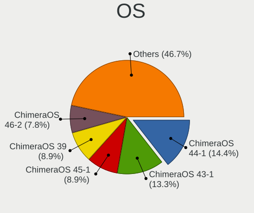

| Name           | Notebooks | Percent |
|----------------|-----------|---------|
| ChimeraOS 44-1 | 13        | 14.44%  |
| ChimeraOS 43-1 | 12        | 13.33%  |
| ChimeraOS 45-1 | 8         | 8.89%   |
| ChimeraOS 39   | 8         | 8.89%   |
| ChimeraOS 46-2 | 7         | 7.78%   |
| ChimeraOS 45   | 7         | 7.78%   |
| ChimeraOS 42   | 7         | 7.78%   |
| ChimeraOS      | 5         | 5.56%   |
| ChimeraOS 49-1 | 4         | 4.44%   |
| ChimeraOS 48   | 4         | 4.44%   |
| ChimeraOS 41   | 4         | 4.44%   |
| ChimeraOS 44   | 2         | 2.22%   |
| ChimeraOS 38   | 2         | 2.22%   |
| ChimeraOS 47-7 | 1         | 1.11%   |
| ChimeraOS 47-4 | 1         | 1.11%   |
| ChimeraOS 47-1 | 1         | 1.11%   |
| ChimeraOS 47   | 1         | 1.11%   |
| ChimeraOS 46-8 | 1         | 1.11%   |
| ChimeraOS 46   | 1         | 1.11%   |
| ChimeraOS 43   | 1         | 1.11%   |

OS Family
---------

OS without a version

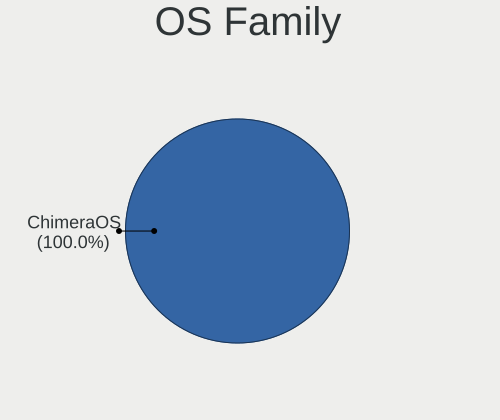

| Name      | Notebooks | Percent |
|-----------|-----------|---------|
| ChimeraOS | 89        | 100%    |

Kernel
------

Version of the Linux kernel

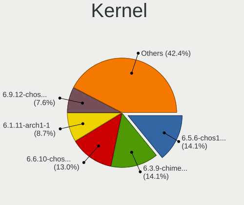

| Version                     | Notebooks | Percent |
|-----------------------------|-----------|---------|
| 6.5.6-chos1-chimeraos-1     | 13        | 14.13%  |
| 6.3.9-chimeraos-1           | 13        | 14.13%  |
| 6.6.10-chos1-chimeraos-2    | 12        | 13.04%  |
| 6.1.11-arch1-1              | 8         | 8.7%    |
| 6.9.12-chos7-chimeraos-1    | 7         | 7.61%   |
| 6.1.27-1-lts                | 7         | 7.61%   |
| 6.14.7-chos4-chimeraos-2    | 4         | 4.35%   |
| 6.13.5-chos2-chimeraos-1    | 4         | 4.35%   |
| 6.1.21-1-lts                | 4         | 4.35%   |
| 6.5.3-chos1-chimeraos-1     | 2         | 2.17%   |
| 6.1.1-arch1-1               | 2         | 2.17%   |
| 6.9.9-chos1-chimeraos-1     | 1         | 1.09%   |
| 6.9.3-sk-chos3-chimeraos-1  | 1         | 1.09%   |
| 6.8.2-0-generic             | 1         | 1.09%   |
| 6.6.7-chos4-chimeraos-1     | 1         | 1.09%   |
| 6.6.51-0-generic            | 1         | 1.09%   |
| 6.6.37-0-generic            | 1         | 1.09%   |
| 6.6.1-chos3-chimeraos-3     | 1         | 1.09%   |
| 6.6.1-chos3-chimeraos-1     | 1         | 1.09%   |
| 6.4.9-0-generic             | 1         | 1.09%   |
| 6.17.5-0-generic            | 1         | 1.09%   |
| 6.12.9-chos1-chimeraos-1    | 1         | 1.09%   |
| 6.12.45-0-generic           | 1         | 1.09%   |
| 6.11.4-0-generic            | 1         | 1.09%   |
| 6.11.1-sk-chos1-chimeraos-1 | 1         | 1.09%   |
| 6.10.8-sk-chos1-chimeraos-1 | 1         | 1.09%   |
| 6.10.3-arch1-chimeraos-1    | 1         | 1.09%   |

Kernel Family
-------------

Linux kernel without a distro release

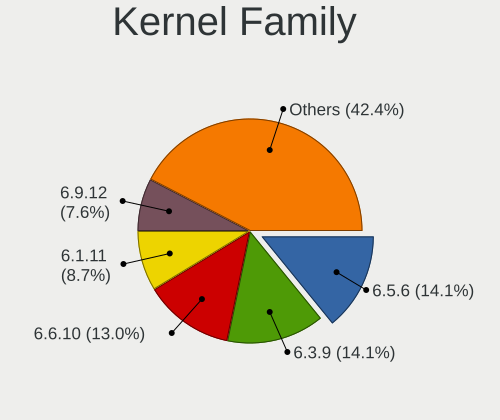

| Version | Notebooks | Percent |
|---------|-----------|---------|
| 6.5.6   | 13        | 14.13%  |
| 6.3.9   | 13        | 14.13%  |
| 6.6.10  | 12        | 13.04%  |
| 6.1.11  | 8         | 8.7%    |
| 6.9.12  | 7         | 7.61%   |
| 6.1.27  | 7         | 7.61%   |
| 6.14.7  | 4         | 4.35%   |
| 6.13.5  | 4         | 4.35%   |
| 6.1.21  | 4         | 4.35%   |
| 6.6.1   | 2         | 2.17%   |
| 6.5.3   | 2         | 2.17%   |
| 6.1.1   | 2         | 2.17%   |
| 6.9.9   | 1         | 1.09%   |
| 6.9.3   | 1         | 1.09%   |
| 6.8.2   | 1         | 1.09%   |
| 6.6.7   | 1         | 1.09%   |
| 6.6.51  | 1         | 1.09%   |
| 6.6.37  | 1         | 1.09%   |
| 6.4.9   | 1         | 1.09%   |
| 6.17.5  | 1         | 1.09%   |
| 6.12.9  | 1         | 1.09%   |
| 6.12.45 | 1         | 1.09%   |
| 6.11.4  | 1         | 1.09%   |
| 6.11.1  | 1         | 1.09%   |
| 6.10.8  | 1         | 1.09%   |
| 6.10.3  | 1         | 1.09%   |

Kernel Major Ver.
-----------------

Linux kernel major version

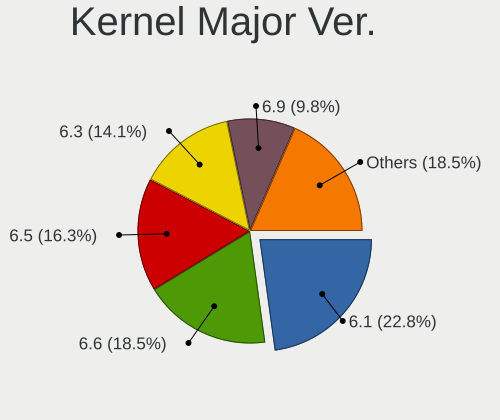

| Version | Notebooks | Percent |
|---------|-----------|---------|
| 6.1     | 21        | 22.83%  |
| 6.6     | 17        | 18.48%  |
| 6.5     | 15        | 16.3%   |
| 6.3     | 13        | 14.13%  |
| 6.9     | 9         | 9.78%   |
| 6.14    | 4         | 4.35%   |
| 6.13    | 4         | 4.35%   |
| 6.12    | 2         | 2.17%   |
| 6.11    | 2         | 2.17%   |
| 6.10    | 2         | 2.17%   |
| 6.8     | 1         | 1.09%   |
| 6.4     | 1         | 1.09%   |
| 6.17    | 1         | 1.09%   |

Arch
----

OS architecture (x86_64, i586, etc.)

| Name   | Notebooks | Percent |
|--------|-----------|---------|
| x86_64 | 89        | 100%    |

DE
--

Desktop Environment

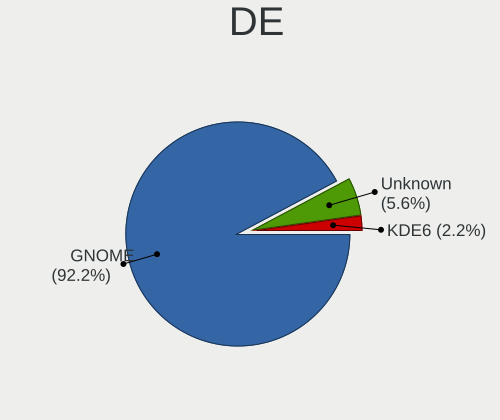

| Name    | Notebooks | Percent |
|---------|-----------|---------|
| GNOME   | 83        | 92.22%  |
| Unknown | 5         | 5.56%   |
| KDE6    | 2         | 2.22%   |

Display Server
--------------

X11 or Wayland

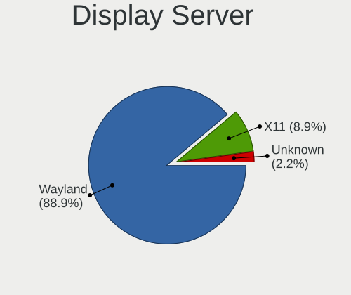

| Name    | Notebooks | Percent |
|---------|-----------|---------|
| Wayland | 80        | 88.89%  |
| X11     | 8         | 8.89%   |
| Unknown | 2         | 2.22%   |

Display Manager
---------------

SDDM, LightDM, etc.

| Name    | Notebooks | Percent |
|---------|-----------|---------|
| Unknown | 89        | 100%    |

OS Lang
-------

Language

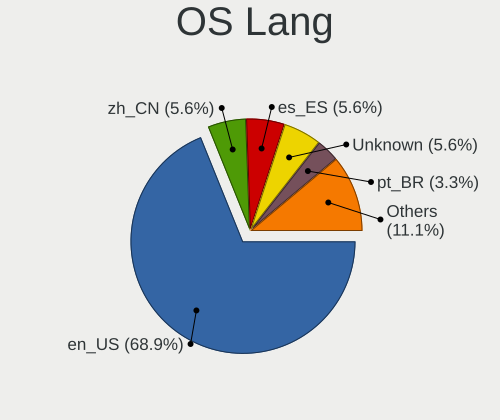

| Lang    | Notebooks | Percent |
|---------|-----------|---------|
| en_US   | 62        | 68.89%  |
| zh_CN   | 5         | 5.56%   |
| es_ES   | 5         | 5.56%   |
| Unknown | 5         | 5.56%   |
| pt_BR   | 3         | 3.33%   |
| it_IT   | 3         | 3.33%   |
| fr_FR   | 3         | 3.33%   |
| de_DE   | 2         | 2.22%   |
| fr_CA   | 1         | 1.11%   |
| C       | 1         | 1.11%   |

Boot Mode
---------

EFI or BIOS

| Mode | Notebooks | Percent |
|------|-----------|---------|
| BIOS | 89        | 100%    |

Filesystem
----------

Type of filesystem

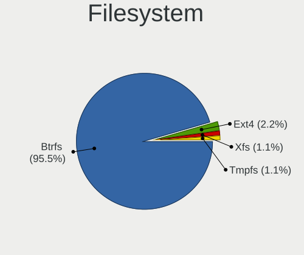

| Type  | Notebooks | Percent |
|-------|-----------|---------|
| Btrfs | 85        | 95.51%  |
| Ext4  | 2         | 2.25%   |
| Xfs   | 1         | 1.12%   |
| Tmpfs | 1         | 1.12%   |

Part. scheme
------------

Scheme of partitioning

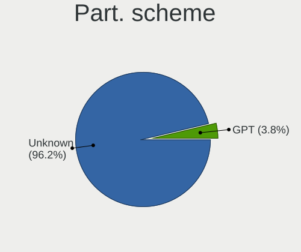

| Type    | Notebooks | Percent |
|---------|-----------|---------|
| Unknown | 85        | 94.44%  |
| GPT     | 5         | 5.56%   |

Dual Boot with Linux/BSD
------------------------

Hosting more than one Linux/BSD

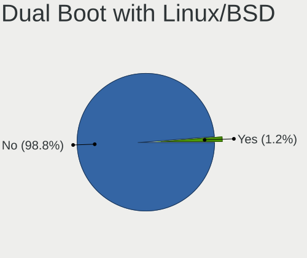

| Dual boot | Notebooks | Percent |
|-----------|-----------|---------|
| No        | 88        | 97.78%  |
| Yes       | 2         | 2.22%   |

Dual Boot (Win)
---------------

Hosting Linux and Windows

| Dual boot | Notebooks | Percent |
|-----------|-----------|---------|
| No        | 88        | 98.88%  |
| Yes       | 1         | 1.12%   |

Board
-----

Vendor
------

Motherboard manufacturer

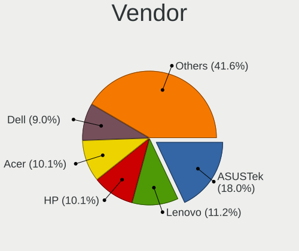

| Name                             | Notebooks | Percent |
|----------------------------------|-----------|---------|
| ASUSTek Computer                 | 16        | 17.98%  |
| Lenovo                           | 10        | 11.24%  |
| Hewlett-Packard                  | 9         | 10.11%  |
| Acer                             | 9         | 10.11%  |
| Dell                             | 8         | 8.99%   |
| MSI                              | 6         | 6.74%   |
| ONE-NETBOOK                      | 5         | 5.62%   |
| GPD                              | 3         | 3.37%   |
| Razer                            | 2         | 2.25%   |
| HUAWEI                           | 2         | 2.25%   |
| Google                           | 2         | 2.25%   |
| AYANEO                           | 2         | 2.25%   |
| Valve                            | 1         | 1.12%   |
| Sony                             | 1         | 1.12%   |
| Samsung Electronics              | 1         | 1.12%   |
| Pegatron                         | 1         | 1.12%   |
| Notebook                         | 1         | 1.12%   |
| Micro Electronics                | 1         | 1.12%   |
| Micro Computer (HK) Tech Limited | 1         | 1.12%   |
| Gigabyte Technology              | 1         | 1.12%   |
| Framework                        | 1         | 1.12%   |
| ASRock                           | 1         | 1.12%   |
| Apple                            | 1         | 1.12%   |
| Anbernic                         | 1         | 1.12%   |
| AMI                              | 1         | 1.12%   |
| Alienware                        | 1         | 1.12%   |
| Unknown                          | 1         | 1.12%   |

Model
-----

Motherboard model

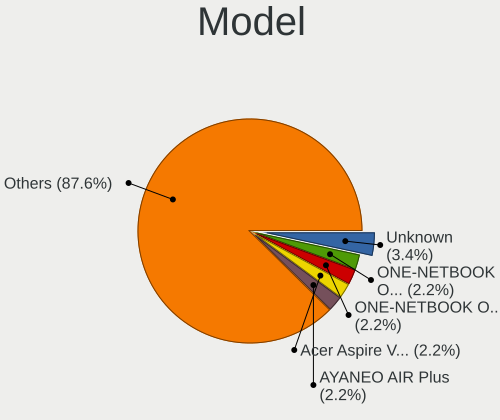

| Name                                        | Notebooks | Percent |
|---------------------------------------------|-----------|---------|
| Unknown                                     | 3         | 3.37%   |
| ONE-NETBOOK ONEXPLAYER 2 PRO ARP23P         | 2         | 2.25%   |
| ONE-NETBOOK ONEXPLAYER 2 ARP23              | 2         | 2.25%   |
| AYANEO AIR Plus                             | 2         | 2.25%   |
| Acer Aspire V3-772G                         | 2         | 2.25%   |
| Valve Galileo                               | 1         | 1.12%   |
| Sony SVS13A25PLB                            | 1         | 1.12%   |
| Samsung RC530/RC730                         | 1         | 1.12%   |
| Razer Blade Pro 17 (Early 2020) - RZ09-0329 | 1         | 1.12%   |
| Razer Blade 14 - RZ09-0370                  | 1         | 1.12%   |
| Pegatron C15B                               | 1         | 1.12%   |
| ONE-NETBOOK ONEXPLAYER X1 mini              | 1         | 1.12%   |
| Notebook P15SM-A/SM1-A                      | 1         | 1.12%   |
| MSI MS-7C96                                 | 1         | 1.12%   |
| MSI MS-7B28                                 | 1         | 1.12%   |
| MSI Katana GF76 11UD                        | 1         | 1.12%   |
| MSI GP60 2QF                                | 1         | 1.12%   |
| MSI GE75 Raider 10SF                        | 1         | 1.12%   |
| MSI CX62 6QD                                | 1         | 1.12%   |
| Micro MG-VCP17I-3070                        | 1         | 1.12%   |
| Micro (HK) Tech Limited Uranus Series       | 1         | 1.12%   |
| Lenovo Y50-70 20378                         | 1         | 1.12%   |
| Lenovo ThinkPad X230 23255J6                | 1         | 1.12%   |
| Lenovo ThinkPad E15 20RD0011IX              | 1         | 1.12%   |
| Lenovo Legion Y540-15IRH 81SX               | 1         | 1.12%   |
| Lenovo IdeaPad Y700-15ISK 80NV              | 1         | 1.12%   |
| Lenovo IdeaPad Flex-14API 81SS              | 1         | 1.12%   |
| Lenovo IdeaPad 700-15ISK 80RU               | 1         | 1.12%   |
| Lenovo IdeaPad 320-15ISK 80XH               | 1         | 1.12%   |
| Lenovo IdeaPad 320-15IKB 80YH               | 1         | 1.12%   |
| Lenovo IdeaPad 3 15ADA05 81W1               | 1         | 1.12%   |
| HUAWEI NBM-WXX9                             | 1         | 1.12%   |
| HUAWEI BOD-WXX9                             | 1         | 1.12%   |
| HP Victus by Laptop 16-d1xxx                | 1         | 1.12%   |
| HP Victus by Gaming Laptop 16-r0xxx         | 1         | 1.12%   |
| HP Victus by Gaming Laptop 15-fb0xxx        | 1         | 1.12%   |
| HP ProBook 4540s                            | 1         | 1.12%   |
| HP Pavilion Gaming Laptop 15-dk0xxx         | 1         | 1.12%   |
| HP Pavilion 15                              | 1         | 1.12%   |
| HP ENVY 15                                  | 1         | 1.12%   |

Model Family
------------

Motherboard model prefix

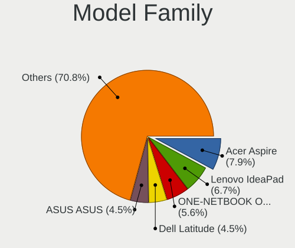

| Name                           | Notebooks | Percent |
|--------------------------------|-----------|---------|
| Acer Aspire                    | 7         | 7.87%   |
| Lenovo IdeaPad                 | 6         | 6.74%   |
| ONE-NETBOOK ONEXPLAYER         | 5         | 5.62%   |
| Dell Latitude                  | 4         | 4.49%   |
| ASUS ASUS                      | 4         | 4.49%   |
| HP Victus                      | 3         | 3.37%   |
| ASUS TUF                       | 3         | 3.37%   |
| Unknown                        | 3         | 3.37%   |
| Razer Blade                    | 2         | 2.25%   |
| Lenovo ThinkPad                | 2         | 2.25%   |
| HP Pavilion                    | 2         | 2.25%   |
| Dell Precision                 | 2         | 2.25%   |
| AYANEO AIR                     | 2         | 2.25%   |
| ASUS ROG                       | 2         | 2.25%   |
| Acer Nitro                     | 2         | 2.25%   |
| Valve Galileo                  | 1         | 1.12%   |
| Sony SVS13A25PLB               | 1         | 1.12%   |
| Samsung RC530                  | 1         | 1.12%   |
| Pegatron C15B                  | 1         | 1.12%   |
| Notebook P15SM-A               | 1         | 1.12%   |
| MSI MS-7C96                    | 1         | 1.12%   |
| MSI MS-7B28                    | 1         | 1.12%   |
| MSI Katana                     | 1         | 1.12%   |
| MSI GP60                       | 1         | 1.12%   |
| MSI GE75                       | 1         | 1.12%   |
| MSI CX62                       | 1         | 1.12%   |
| Micro MG-VCP17I-3070           | 1         | 1.12%   |
| Micro (HK) Tech Limited Uranus | 1         | 1.12%   |
| Lenovo Y50-70                  | 1         | 1.12%   |
| Lenovo Legion                  | 1         | 1.12%   |
| HUAWEI NBM-WXX9                | 1         | 1.12%   |
| HUAWEI BOD-WXX9                | 1         | 1.12%   |
| HP ProBook                     | 1         | 1.12%   |
| HP ENVY                        | 1         | 1.12%   |
| HP EliteBook                   | 1         | 1.12%   |
| HP 250                         | 1         | 1.12%   |
| GPD P2                         | 1         | 1.12%   |
| GPD G1618-04                   | 1         | 1.12%   |
| GPD G1618-03                   | 1         | 1.12%   |
| Google Snappy                  | 1         | 1.12%   |

MFG Year
--------

Motherboard manufacture year

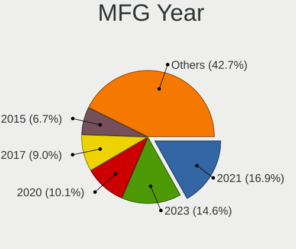

| Year | Notebooks | Percent |
|------|-----------|---------|
| 2021 | 15        | 16.85%  |
| 2023 | 13        | 14.61%  |
| 2020 | 9         | 10.11%  |
| 2017 | 8         | 8.99%   |
| 2015 | 6         | 6.74%   |
| 2013 | 6         | 6.74%   |
| 2019 | 5         | 5.62%   |
| 2012 | 5         | 5.62%   |
| 2024 | 4         | 4.49%   |
| 2022 | 4         | 4.49%   |
| 2016 | 4         | 4.49%   |
| 2014 | 3         | 3.37%   |
| 2011 | 3         | 3.37%   |
| 2025 | 1         | 1.12%   |
| 2018 | 1         | 1.12%   |
| 2010 | 1         | 1.12%   |
| 2008 | 1         | 1.12%   |

Form Factor
-----------

Physical design of the computer

| Name     | Notebooks | Percent |
|----------|-----------|---------|
| Notebook | 89        | 100%    |

Secure Boot
-----------

Enabled or disabled

| State    | Notebooks | Percent |
|----------|-----------|---------|
| Disabled | 89        | 100%    |

Coreboot
--------

Have coreboot on board

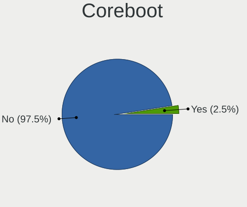

| Used | Notebooks | Percent |
|------|-----------|---------|
| No   | 86        | 96.63%  |
| Yes  | 3         | 3.37%   |

RAM Size
--------

Total RAM memory

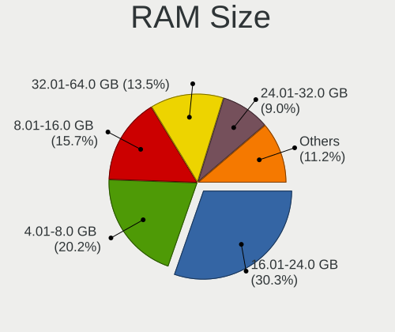

| Size in GB  | Notebooks | Percent |
|-------------|-----------|---------|
| 16.01-24.0  | 27        | 30.34%  |
| 4.01-8.0    | 18        | 20.22%  |
| 8.01-16.0   | 14        | 15.73%  |
| 32.01-64.0  | 12        | 13.48%  |
| 24.01-32.0  | 8         | 8.99%   |
| 3.01-4.0    | 6         | 6.74%   |
| 64.01-256.0 | 4         | 4.49%   |

RAM Used
--------

Used RAM memory

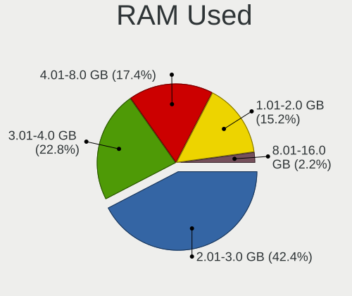

| Used GB   | Notebooks | Percent |
|-----------|-----------|---------|
| 2.01-3.0  | 39        | 42.39%  |
| 3.01-4.0  | 21        | 22.83%  |
| 4.01-8.0  | 16        | 17.39%  |
| 1.01-2.0  | 14        | 15.22%  |
| 8.01-16.0 | 2         | 2.17%   |

Total Drives
------------

Number of drives on board

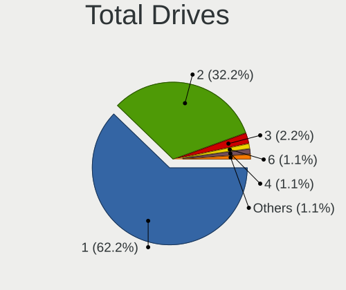

| Drives | Notebooks | Percent |
|--------|-----------|---------|
| 1      | 56        | 62.22%  |
| 2      | 29        | 32.22%  |
| 3      | 2         | 2.22%   |
| 6      | 1         | 1.11%   |
| 4      | 1         | 1.11%   |
| 0      | 1         | 1.11%   |

Has CD-ROM
----------

Has CD-ROM on board

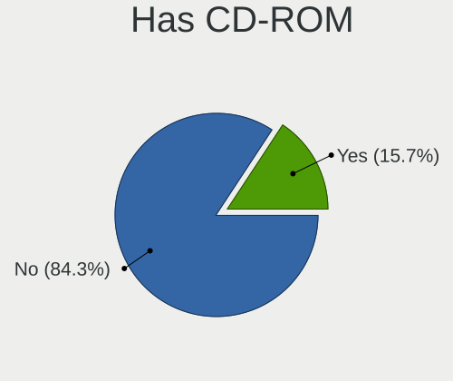

| Presented | Notebooks | Percent |
|-----------|-----------|---------|
| No        | 75        | 84.27%  |
| Yes       | 14        | 15.73%  |

Has Ethernet
------------

Has Ethernet on board

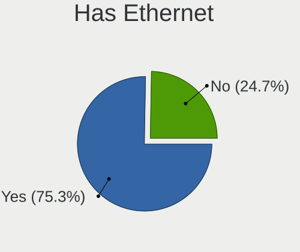

| Presented | Notebooks | Percent |
|-----------|-----------|---------|
| Yes       | 67        | 75.28%  |
| No        | 22        | 24.72%  |

Has WiFi
--------

Has WiFi module

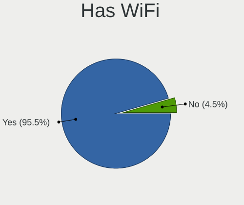

| Presented | Notebooks | Percent |
|-----------|-----------|---------|
| Yes       | 85        | 95.51%  |
| No        | 4         | 4.49%   |

Has Bluetooth
-------------

Has Bluetooth module

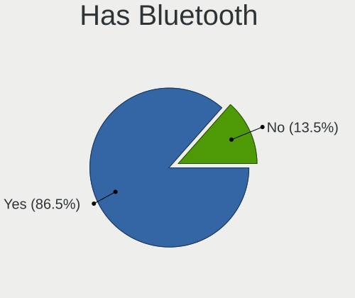

| Presented | Notebooks | Percent |
|-----------|-----------|---------|
| Yes       | 77        | 86.52%  |
| No        | 12        | 13.48%  |

Location
--------

Country
-------

Geographic location (country)

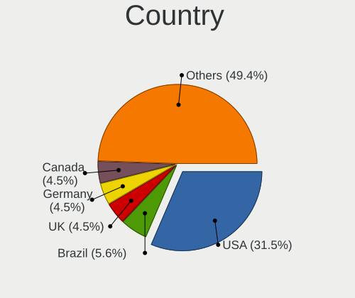

| Country       | Notebooks | Percent |
|---------------|-----------|---------|
| USA           | 28        | 31.46%  |
| Brazil        | 5         | 5.62%   |
| UK            | 4         | 4.49%   |
| Germany       | 4         | 4.49%   |
| Canada        | 4         | 4.49%   |
| Spain         | 3         | 3.37%   |
| Netherlands   | 3         | 3.37%   |
| Mexico        | 3         | 3.37%   |
| Italy         | 3         | 3.37%   |
| France        | 3         | 3.37%   |
| China         | 3         | 3.37%   |
| Vietnam       | 2         | 2.25%   |
| Saudi Arabia  | 2         | 2.25%   |
| Russia        | 2         | 2.25%   |
| Poland        | 2         | 2.25%   |
| Colombia      | 2         | 2.25%   |
| Switzerland   | 1         | 1.12%   |
| South Africa  | 1         | 1.12%   |
| Romania       | 1         | 1.12%   |
| Philippines   | 1         | 1.12%   |
| Peru          | 1         | 1.12%   |
| Malaysia      | 1         | 1.12%   |
| Hungary       | 1         | 1.12%   |
| Greece        | 1         | 1.12%   |
| French Guiana | 1         | 1.12%   |
| Finland       | 1         | 1.12%   |
| Estonia       | 1         | 1.12%   |
| Czechia       | 1         | 1.12%   |
| Costa Rica    | 1         | 1.12%   |
| Belgium       | 1         | 1.12%   |
| Austria       | 1         | 1.12%   |
| Algeria       | 1         | 1.12%   |

City
----

Geographic location (city)

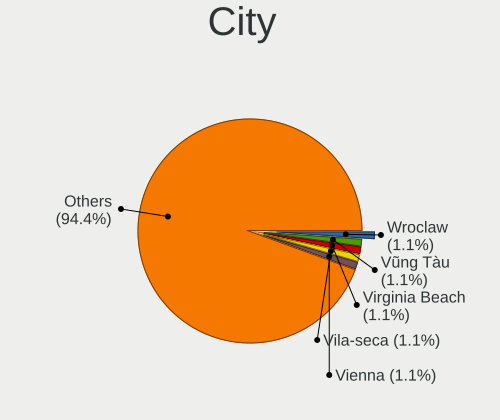

| City                     | Notebooks | Percent |
|--------------------------|-----------|---------|
| Wroclaw                  | 1         | 1.11%   |
| Vũng Tàu               | 1         | 1.11%   |
| Virginia Beach           | 1         | 1.11%   |
| Vila-seca                | 1         | 1.11%   |
| Vienna                   | 1         | 1.11%   |
| Vancouver                | 1         | 1.11%   |
| Tulcea                   | 1         | 1.11%   |
| Stuttgart                | 1         | 1.11%   |
| St Louis                 | 1         | 1.11%   |
| Springfield              | 1         | 1.11%   |
| Soldotna                 | 1         | 1.11%   |
| Santa Cruz das Palmeiras | 1         | 1.11%   |
| San Pedro                | 1         | 1.11%   |
| San José                | 1         | 1.11%   |
| Ridley Park              | 1         | 1.11%   |
| Remire-Montjoly          | 1         | 1.11%   |
| Rapla                    | 1         | 1.11%   |
| Portland                 | 1         | 1.11%   |
| Pontarlier               | 1         | 1.11%   |
| Pittsburg                | 1         | 1.11%   |
| Phoenix                  | 1         | 1.11%   |
| Philadelphia             | 1         | 1.11%   |
| Pedersore                | 1         | 1.11%   |
| Parma                    | 1         | 1.11%   |
| Pachuca                  | 1         | 1.11%   |
| Ostrów Wielkopolski     | 1         | 1.11%   |
| Olympia                  | 1         | 1.11%   |
| Nules                    | 1         | 1.11%   |
| Norcross                 | 1         | 1.11%   |
| Ningbo                   | 1         | 1.11%   |
| Nieuwegein               | 1         | 1.11%   |
| Newport News             | 1         | 1.11%   |
| Neiva                    | 1         | 1.11%   |
| Moscow                   | 1         | 1.11%   |
| Monticello               | 1         | 1.11%   |
| Milan                    | 1         | 1.11%   |
| Miami                    | 1         | 1.11%   |
| Manchester               | 1         | 1.11%   |
| Manaus                   | 1         | 1.11%   |
| Mainhausen               | 1         | 1.11%   |

Drives
------

Drive Vendor
------------

Hard drive vendors

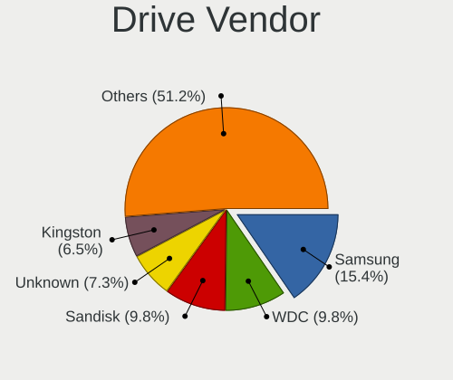

| Vendor                       | Notebooks | Drives | Percent |
|------------------------------|-----------|--------|---------|
| Samsung Electronics          | 19        | 20     | 15.45%  |
| WDC                          | 12        | 15     | 9.76%   |
| Sandisk                      | 12        | 12     | 9.76%   |
| Unknown                      | 9         | 9      | 7.32%   |
| Kingston                     | 8         | 9      | 6.5%    |
| Seagate                      | 7         | 7      | 5.69%   |
| Micron Technology            | 7         | 7      | 5.69%   |
| SK hynix                     | 5         | 5      | 4.07%   |
| Intel                        | 5         | 5      | 4.07%   |
| Toshiba                      | 3         | 3      | 2.44%   |
| Phison Electronics           | 3         | 5      | 2.44%   |
| Micron/Crucial Technology    | 3         | 4      | 2.44%   |
| MAXIO Technology (Hangzhou)  | 3         | 4      | 2.44%   |
| Shenzhen Longsys Electronics | 2         | 3      | 1.63%   |
| Realtek Semiconductor        | 2         | 2      | 1.63%   |
| KIOXIA                       | 2         | 2      | 1.63%   |
| JMicron Technology           | 2         | 2      | 1.63%   |
| Hitachi                      | 2         | 2      | 1.63%   |
| HGST                         | 2         | 2      | 1.63%   |
| Crucial                      | 2         | 2      | 1.63%   |
| Biwin Storage Technology     | 2         | 2      | 1.63%   |
| WDC PC S                     | 1         | 1      | 0.81%   |
| SSSTC                        | 1         | 1      | 0.81%   |
| SPCC                         | 1         | 1      | 0.81%   |
| Silicon Motion               | 1         | 1      | 0.81%   |
| Realtek                      | 1         | 1      | 0.81%   |
| NT-1TB                       | 1         | 1      | 0.81%   |
| Kingston Technology Company  | 1         | 1      | 0.81%   |
| GOODRAM                      | 1         | 1      | 0.81%   |
| Corsair                      | 1         | 1      | 0.81%   |
| Apple                        | 1         | 1      | 0.81%   |
| A-DATA Technology            | 1         | 1      | 0.81%   |

Drive Model
-----------

Hard drive models

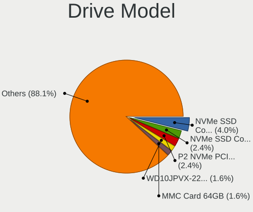

| Model                                              | Notebooks | Percent |
|----------------------------------------------------|-----------|---------|
| Samsung NVMe SSD Controller SM981/PM981/PM983 1TB  | 5         | 3.97%   |
| Samsung NVMe SSD Controller PM9A1/PM9A3/980PRO 1TB | 3         | 2.38%   |
| Micron/Crucial P2 NVMe PCIe SSD 2TB                | 3         | 2.38%   |
| WDC WD10JPVX-22JC3T0 1TB                           | 2         | 1.59%   |
| Unknown MMC Card  64GB                             | 2         | 1.59%   |
| Unknown MMC Card  512GB                            | 2         | 1.59%   |
| SK hynix HFM512GD3JX016N 512GB                     | 2         | 1.59%   |
| Seagate ST1000LM035-1RK172 1TB                     | 2         | 1.59%   |
| Sandisk WD_BLACK SN770 2TB                         | 2         | 1.59%   |
| Sandisk WD Black SN750 / PC SN730 NVMe SSD 500GB   | 2         | 1.59%   |
| Phison PS5013 E13 NVMe Controller 500GB            | 2         | 1.59%   |
| Micron 1100 SATA 256GB SSD                         | 2         | 1.59%   |
| Kingston SV300S37A120G 120GB SSD                   | 2         | 1.59%   |
| Kingston SA400S37480G 480GB SSD                    | 2         | 1.59%   |
| JMicron Tech 250GB                                 | 2         | 1.59%   |
| Intel SSDPEKNU512GZ 512GB                          | 2         | 1.59%   |
| WDC WDS240G2G0B-00EPW0 240GB SSD                   | 1         | 0.79%   |
| WDC WDS240G2G0A-00JH30 240GB SSD                   | 1         | 0.79%   |
| WDC WDBNCE5000PNC 500GB SSD                        | 1         | 0.79%   |
| WDC WDBNCE0010PNC 1TB SSD                          | 1         | 0.79%   |
| WDC WD7500BPVT-80HXZT3 752GB                       | 1         | 0.79%   |
| WDC WD7500BPVT-55HXZT3 752GB                       | 1         | 0.79%   |
| WDC WD20SPZX-08UA7 2TB                             | 1         | 0.79%   |
| WDC WD10SPZX-80Z10T2 1TB                           | 1         | 0.79%   |
| WDC WD10SPZX-24Z10 1TB                             | 1         | 0.79%   |
| WDC WD10SPCX-24HWST1 1TB                           | 1         | 0.79%   |
| WDC WD10JPLX-00MBPT0 1TB                           | 1         | 0.79%   |
| WDC WD10EZEX-60M2NA0 1TB                           | 1         | 0.79%   |
| WDC PC S N530 SDBPNPZ 512GB                        | 1         | 0.79%   |
| Unknown NVMe SSD Drive 512GB                       | 1         | 0.79%   |
| Unknown NVMe SSD Drive 1024GB                      | 1         | 0.79%   |
| Unknown MMC Card  250GB                            | 1         | 0.79%   |
| Unknown MMC Card  1TB                              | 1         | 0.79%   |
| Unknown MMC Card  16GB                             | 1         | 0.79%   |
| Toshiba XG6 NVMe SSD Controller 1024GB             | 1         | 0.79%   |
| Toshiba MQ01ABF050 500GB                           | 1         | 0.79%   |
| Toshiba KXG50ZNV512G 512GB                         | 1         | 0.79%   |
| SSSTC CVB-8D128-HP 128GB                           | 1         | 0.79%   |
| SPCC Solid State Disk 256GB                        | 1         | 0.79%   |
| SK hynix PC801 NVMe 1TB                            | 1         | 0.79%   |

HDD Vendor
----------

Hard disk drive vendors

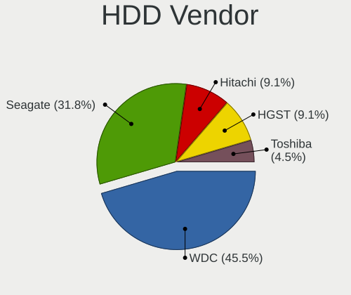

| Vendor  | Notebooks | Drives | Percent |
|---------|-----------|--------|---------|
| WDC     | 10        | 10     | 45.45%  |
| Seagate | 7         | 7      | 31.82%  |
| Hitachi | 2         | 2      | 9.09%   |
| HGST    | 2         | 2      | 9.09%   |
| Toshiba | 1         | 1      | 4.55%   |

SSD Vendor
----------

Solid state drive vendors

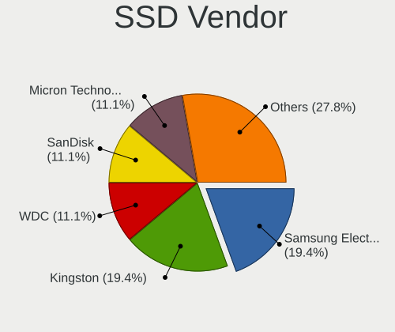

| Vendor              | Notebooks | Drives | Percent |
|---------------------|-----------|--------|---------|
| Samsung Electronics | 7         | 8      | 19.44%  |
| Kingston            | 7         | 8      | 19.44%  |
| WDC                 | 4         | 5      | 11.11%  |
| SanDisk             | 4         | 4      | 11.11%  |
| Micron Technology   | 4         | 4      | 11.11%  |
| Crucial             | 2         | 2      | 5.56%   |
| SSSTC               | 1         | 1      | 2.78%   |
| SPCC                | 1         | 1      | 2.78%   |
| NT-1TB              | 1         | 1      | 2.78%   |
| Intel               | 1         | 1      | 2.78%   |
| GOODRAM             | 1         | 1      | 2.78%   |
| Corsair             | 1         | 1      | 2.78%   |
| Apple               | 1         | 1      | 2.78%   |
| A-DATA Technology   | 1         | 1      | 2.78%   |

Drive Kind
----------

HDD or SSD

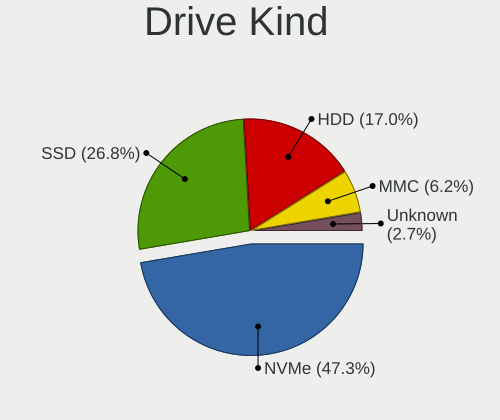

| Kind    | Notebooks | Drives | Percent |
|---------|-----------|--------|---------|
| NVMe    | 53        | 62     | 47.32%  |
| SSD     | 30        | 39     | 26.79%  |
| HDD     | 19        | 22     | 16.96%  |
| MMC     | 7         | 7      | 6.25%   |
| Unknown | 3         | 3      | 2.68%   |

Drive Connector
---------------

SATA, SAS, NVMe, etc.

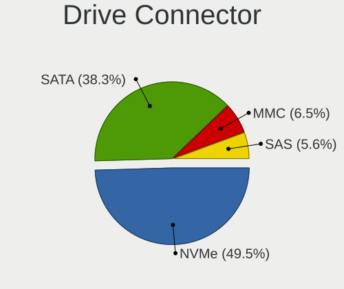

| Type | Notebooks | Drives | Percent |
|------|-----------|--------|---------|
| NVMe | 53        | 61     | 49.53%  |
| SATA | 41        | 59     | 38.32%  |
| MMC  | 7         | 7      | 6.54%   |
| SAS  | 6         | 6      | 5.61%   |

Drive Size
----------

Size of hard drive

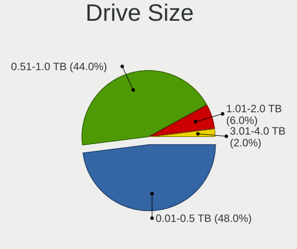

| Size in TB | Notebooks | Drives | Percent |
|------------|-----------|--------|---------|
| 0.01-0.5   | 24        | 35     | 48%     |
| 0.51-1.0   | 22        | 22     | 44%     |
| 1.01-2.0   | 3         | 3      | 6%      |
| 3.01-4.0   | 1         | 1      | 2%      |

Space Total
-----------

Amount of disk space available on the file system

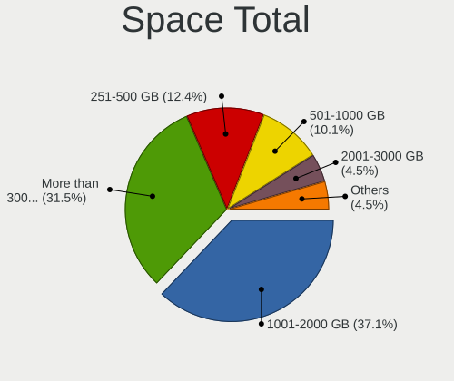

| Size in GB     | Notebooks | Percent |
|----------------|-----------|---------|
| 1001-2000      | 33        | 37.08%  |
| More than 3000 | 28        | 31.46%  |
| 251-500        | 11        | 12.36%  |
| 501-1000       | 9         | 10.11%  |
| 2001-3000      | 4         | 4.49%   |
| 101-250        | 2         | 2.25%   |
| 21-50          | 1         | 1.12%   |
| 1-20           | 1         | 1.12%   |

Space Used
----------

Amount of used disk space

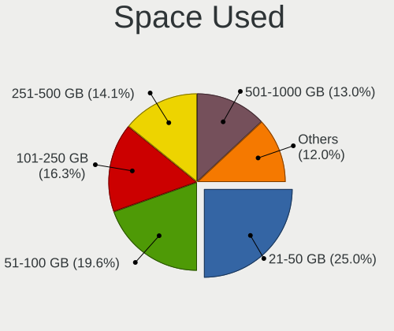

| Used GB        | Notebooks | Percent |
|----------------|-----------|---------|
| 21-50          | 23        | 25%     |
| 51-100         | 18        | 19.57%  |
| 101-250        | 15        | 16.3%   |
| 251-500        | 13        | 14.13%  |
| 501-1000       | 12        | 13.04%  |
| 1001-2000      | 5         | 5.43%   |
| More than 3000 | 3         | 3.26%   |
| 1-20           | 3         | 3.26%   |

Malfunc. Drives
---------------

Drive models with a malfunction

Zero info for selected period =(

Malfunc. Drive Vendor
---------------------

Vendors of faulty drives

Zero info for selected period =(

Malfunc. HDD Vendor
-------------------

Vendors of faulty HDD drives

Zero info for selected period =(

Malfunc. Drive Kind
-------------------

Kinds of faulty drives

Zero info for selected period =(

Failed Drives
-------------

Failed drive models

Zero info for selected period =(

Failed Drive Vendor
-------------------

Failed drive vendors

Zero info for selected period =(

Drive Status
------------

Number of failed and malfunc. drives

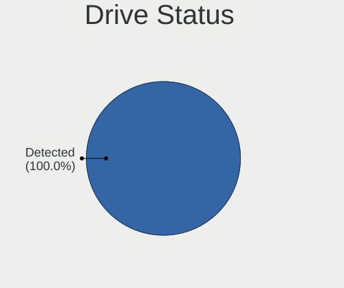

| Status   | Notebooks | Drives | Percent |
|----------|-----------|--------|---------|
| Detected | 89        | 133    | 100%    |

Storage controller
------------------

Storage Vendor
--------------

Storage controller vendors

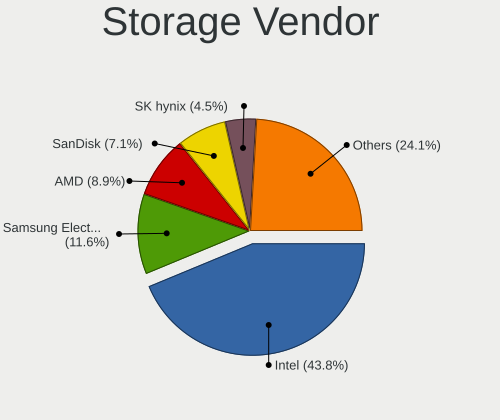

| Vendor                       | Notebooks | Percent |
|------------------------------|-----------|---------|
| Intel                        | 49        | 43.75%  |
| Samsung Electronics          | 13        | 11.61%  |
| AMD                          | 10        | 8.93%   |
| SanDisk                      | 8         | 7.14%   |
| SK hynix                     | 5         | 4.46%   |
| Phison Electronics           | 3         | 2.68%   |
| Micron/Crucial Technology    | 3         | 2.68%   |
| Micron Technology            | 3         | 2.68%   |
| MAXIO Technology (Hangzhou)  | 3         | 2.68%   |
| Toshiba America Info Systems | 2         | 1.79%   |
| Shenzhen Longsys Electronics | 2         | 1.79%   |
| Realtek Semiconductor        | 2         | 1.79%   |
| KIOXIA                       | 2         | 1.79%   |
| Kingston Technology Company  | 2         | 1.79%   |
| INNOGRIT                     | 2         | 1.79%   |
| Biwin Storage Technology     | 2         | 1.79%   |
| Silicon Motion               | 1         | 0.89%   |

Storage Model
-------------

Storage controller models

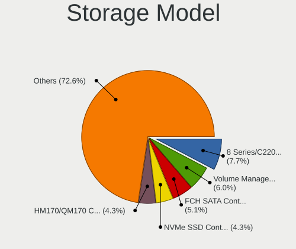

| Model                                                                          | Notebooks | Percent |
|--------------------------------------------------------------------------------|-----------|---------|
| Intel 8 Series/C220 Series Chipset Family 6-port SATA Controller 1 [AHCI mode] | 9         | 7.69%   |
| Intel Volume Management Device NVMe RAID Controller                            | 7         | 5.98%   |
| AMD FCH SATA Controller [AHCI mode]                                            | 6         | 5.13%   |
| Samsung NVMe SSD Controller SM981/PM981/PM983                                  | 5         | 4.27%   |
| Intel HM170/QM170 Chipset SATA Controller [AHCI Mode]                          | 5         | 4.27%   |
| Intel 82801 Mobile SATA Controller [RAID mode]                                 | 5         | 4.27%   |
| SanDisk WD SN560/SN740/SN770/SN5000 NVMe SSD                                   | 4         | 3.42%   |
| Intel Sunrise Point-LP SATA Controller [AHCI mode]                             | 4         | 3.42%   |
| SK hynix Gold P31/BC711/PC711 NVMe Solid State Drive                           | 3         | 2.56%   |
| Samsung NVMe SSD Controller PM9A1/PM9A3/980PRO                                 | 3         | 2.56%   |
| Micron/Crucial P2 [Nick P2] / P3 / P3 Plus NVMe PCIe SSD (DRAM-less)           | 3         | 2.56%   |
| Intel Tiger Lake SATA AHCI Controller                                          | 3         | 2.56%   |
| Intel 7 Series Chipset Family 6-port SATA Controller [AHCI mode]               | 3         | 2.56%   |
| AMD 500 Series Chipset SATA Controller                                         | 3         | 2.56%   |
| Shenzhen Longsys Lexar NM790 / Patriot Viper VP4300 Lite NVMe SSD (DRAM-less)  | 2         | 1.71%   |
| SanDisk Extreme Pro / WD Black SN750 / PC SN730 / Red SN700 NVMe SSD           | 2         | 1.71%   |
| Samsung NVMe SSD Controller PM9B1 (DRAM-less)                                  | 2         | 1.71%   |
| Realtek RTS5765DL NVMe SSD Controller (DRAM-less)                              | 2         | 1.71%   |
| Phison PS5013-E13 PCIe3 NVMe Controller (DRAM-less)                            | 2         | 1.71%   |
| MAXIO (Hangzhou) NVMe SSD Controller MAP1602 (DRAM-less)                       | 2         | 1.71%   |
| KIOXIA NVMe SSD Controller BG4 (DRAM-less)                                     | 2         | 1.71%   |
| Intel SSD 670p Series [Keystone Harbor]                                        | 2         | 1.71%   |
| Intel 6 Series/C200 Series Chipset Family 6 port Mobile SATA AHCI Controller   | 2         | 1.71%   |
| Intel 400 Series Chipset Family SATA AHCI Controller                           | 2         | 1.71%   |
| Toshiba America Info Systems XG6 NVMe SSD Controller                           | 1         | 0.85%   |
| Toshiba America Info Systems XG5 NVMe SSD Controller                           | 1         | 0.85%   |
| SK hynix Platinum P41/PC801 NVMe Solid State Drive                             | 1         | 0.85%   |
| SK hynix PC601 NVMe Solid State Drive                                          | 1         | 0.85%   |
| Silicon Motion Non-Volatile memory controller                                  | 1         | 0.85%   |
| Sandisk WD Black SN850X NVMe SSD                                               | 1         | 0.85%   |
| SanDisk Ultra 3D / WD PC SN530, IX SN530, Blue SN550 NVMe SSD (DRAM-less)      | 1         | 0.85%   |
| Samsung S4LN058A01[SSUBX] AHCI SSD Controller (Apple slot)                     | 1         | 0.85%   |
| Samsung NVMe SSD Controller SM961/PM961/SM963                                  | 1         | 0.85%   |
| Samsung NVMe SSD Controller 980 (DRAM-less)                                    | 1         | 0.85%   |
| Phison E12 NVMe Controller                                                     | 1         | 0.85%   |
| Micron 2400 NVMe SSD (DRAM-less)                                               | 1         | 0.85%   |
| Micron 2210 NVMe SSD [Cobain]                                                  | 1         | 0.85%   |
| Micron 2200S NVMe SSD [Cassandra]                                              | 1         | 0.85%   |
| MAXIO (Hangzhou) NVMe SSD Controller MAP1202 (DRAM-less)                       | 1         | 0.85%   |
| Kingston Company NV2 NVMe SSD [E21T] (DRAM-less)                               | 1         | 0.85%   |

Storage Kind
------------

Kind of storage controller (IDE, SATA, NVMe, SAS, ...)

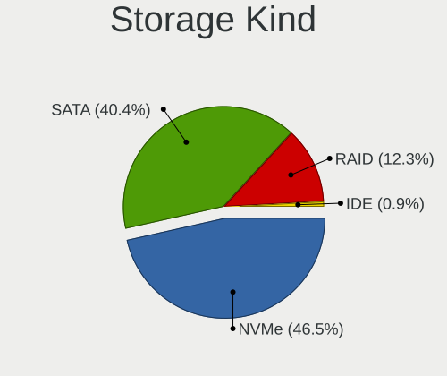

| Kind | Notebooks | Percent |
|------|-----------|---------|
| NVMe | 53        | 46.49%  |
| SATA | 46        | 40.35%  |
| RAID | 14        | 12.28%  |
| IDE  | 1         | 0.88%   |

Processor
---------

CPU Vendor
----------

Processor vendors

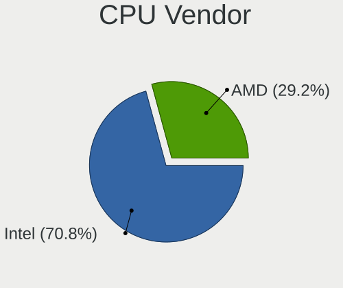

| Vendor | Notebooks | Percent |
|--------|-----------|---------|
| Intel  | 63        | 70.79%  |
| AMD    | 26        | 29.21%  |

CPU Model
---------

Processor models

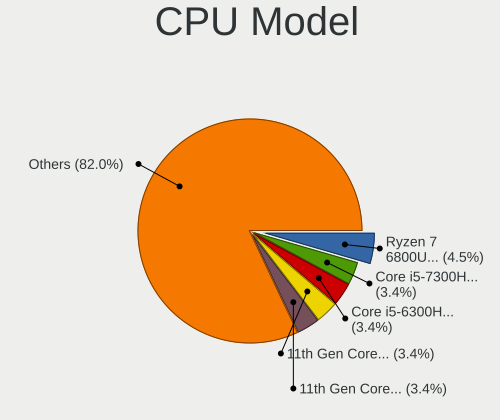

| Model                                         | Notebooks | Percent |
|-----------------------------------------------|-----------|---------|
| AMD Ryzen 7 6800U with Radeon Graphics        | 4         | 4.49%   |
| Intel Core i5-7300HQ CPU @ 2.50GHz            | 3         | 3.37%   |
| Intel Core i5-6300HQ CPU @ 2.30GHz            | 3         | 3.37%   |
| Intel 11th Gen Core i7-11800H @ 2.30GHz       | 3         | 3.37%   |
| Intel 11th Gen Core i5-11400H @ 2.70GHz       | 3         | 3.37%   |
| AMD Ryzen 7 3750H with Radeon Vega Mobile Gfx | 3         | 3.37%   |
| AMD Ryzen 5 3500U with Radeon Vega Mobile Gfx | 3         | 3.37%   |
| Intel Core i7-9750H CPU @ 2.60GHz             | 2         | 2.25%   |
| Intel Core i7-4720HQ CPU @ 2.60GHz            | 2         | 2.25%   |
| Intel Core i5-6200U CPU @ 2.30GHz             | 2         | 2.25%   |
| Intel 11th Gen Core i7-1185G7 @ 3.00GHz       | 2         | 2.25%   |
| Intel 11th Gen Core i7-1165G7 @ 2.80GHz       | 2         | 2.25%   |
| AMD Ryzen 7 8840U w/ Radeon 780M Graphics     | 2         | 2.25%   |
| AMD Ryzen 7 7840U w/ Radeon 780M Graphics     | 2         | 2.25%   |
| AMD Ryzen 5 5500U with Radeon Graphics        | 2         | 2.25%   |
| Intel Pentium CPU B980 @ 2.40GHz              | 1         | 1.12%   |
| Intel Core m3-8100Y CPU @ 1.10GHz             | 1         | 1.12%   |
| Intel Core i9-9900 CPU @ 3.10GHz              | 1         | 1.12%   |
| Intel Core i7-8550U CPU @ 1.80GHz             | 1         | 1.12%   |
| Intel Core i7-6820HQ CPU @ 2.70GHz            | 1         | 1.12%   |
| Intel Core i7-4790K CPU @ 4.00GHz             | 1         | 1.12%   |
| Intel Core i7-4770HQ CPU @ 2.20GHz            | 1         | 1.12%   |
| Intel Core i7-4710HQ CPU @ 2.50GHz            | 1         | 1.12%   |
| Intel Core i7-4702MQ CPU @ 2.20GHz            | 1         | 1.12%   |
| Intel Core i7-4700MQ CPU @ 2.40GHz            | 1         | 1.12%   |
| Intel Core i7-3610QM CPU @ 2.30GHz            | 1         | 1.12%   |
| Intel Core i7-2630QM CPU @ 2.00GHz            | 1         | 1.12%   |
| Intel Core i7-10875H CPU @ 2.30GHz            | 1         | 1.12%   |
| Intel Core i7-10750H CPU @ 2.60GHz            | 1         | 1.12%   |
| Intel Core i7-10610U CPU @ 1.80GHz            | 1         | 1.12%   |
| Intel Core i7-10510U CPU @ 1.80GHz            | 1         | 1.12%   |
| Intel Core i5-9300H CPU @ 2.40GHz             | 1         | 1.12%   |
| Intel Core i5-8250U CPU @ 1.60GHz             | 1         | 1.12%   |
| Intel Core i5-7200U CPU @ 2.50GHz             | 1         | 1.12%   |
| Intel Core i5-4210U CPU @ 1.70GHz             | 1         | 1.12%   |
| Intel Core i5-4210M CPU @ 2.60GHz             | 1         | 1.12%   |
| Intel Core i5-4210H CPU @ 2.90GHz             | 1         | 1.12%   |
| Intel Core i5-4200M CPU @ 2.50GHz             | 1         | 1.12%   |
| Intel Core i5-3320M CPU @ 2.60GHz             | 1         | 1.12%   |
| Intel Core i5-3210M CPU @ 2.50GHz             | 1         | 1.12%   |

CPU Model Family
----------------

Processor model prefix

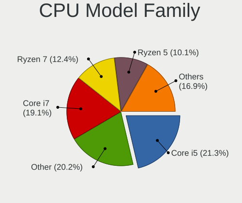

| Model         | Notebooks | Percent |
|---------------|-----------|---------|
| Intel Core i5 | 19        | 21.35%  |
| Other         | 18        | 20.22%  |
| Intel Core i7 | 17        | 19.1%   |
| AMD Ryzen 7   | 11        | 12.36%  |
| AMD Ryzen 5   | 9         | 10.11%  |
| Intel Core i3 | 4         | 4.49%   |
| AMD Ryzen 9   | 4         | 4.49%   |
| Intel Celeron | 2         | 2.25%   |
| Intel Pentium | 1         | 1.12%   |
| Intel Core m3 | 1         | 1.12%   |
| Intel Core i9 | 1         | 1.12%   |
| Intel Atom    | 1         | 1.12%   |
| AMD Athlon    | 1         | 1.12%   |

CPU Cores
---------

Number of processor cores

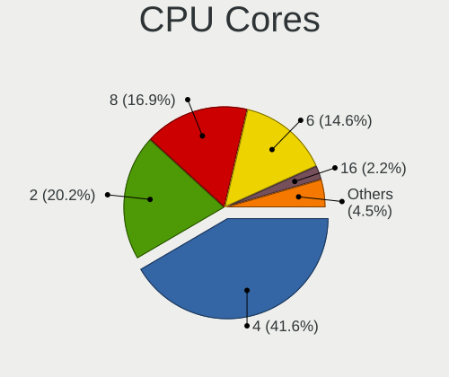

| Number | Notebooks | Percent |
|--------|-----------|---------|
| 4      | 37        | 41.57%  |
| 2      | 18        | 20.22%  |
| 8      | 15        | 16.85%  |
| 6      | 13        | 14.61%  |
| 16     | 2         | 2.25%   |
| 14     | 2         | 2.25%   |
| 12     | 1         | 1.12%   |
| 10     | 1         | 1.12%   |

CPU Sockets
-----------

Number of sockets

| Number | Notebooks | Percent |
|--------|-----------|---------|
| 1      | 89        | 100%    |

CPU Threads
-----------

Threads per core (Hyper-Threading)

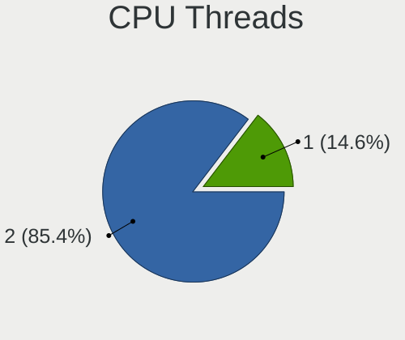

| Number | Notebooks | Percent |
|--------|-----------|---------|
| 2      | 76        | 85.39%  |
| 1      | 13        | 14.61%  |

CPU Op-Modes
------------

CPU Operation Modes (32-bit, 64-bit)

| Op mode        | Notebooks | Percent |
|----------------|-----------|---------|
| 32-bit, 64-bit | 89        | 100%    |

CPU Microcode
-------------

Microcode number

| Number  | Notebooks | Percent |
|---------|-----------|---------|
| Unknown | 89        | 100%    |

CPU Microarch
-------------

Microarchitecture

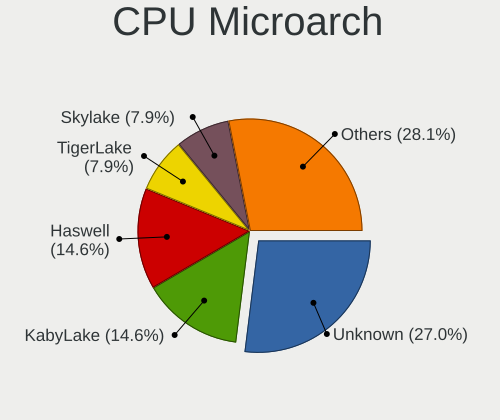

| Name        | Notebooks | Percent |
|-------------|-----------|---------|
| Unknown     | 24        | 26.97%  |
| KabyLake    | 13        | 14.61%  |
| Haswell     | 13        | 14.61%  |
| TigerLake   | 7         | 7.87%   |
| Skylake     | 7         | 7.87%   |
| Zen+        | 6         | 6.74%   |
| Zen 3       | 4         | 4.49%   |
| Zen 2       | 3         | 3.37%   |
| SandyBridge | 3         | 3.37%   |
| IvyBridge   | 3         | 3.37%   |
| CometLake   | 3         | 3.37%   |
| Zen         | 1         | 1.12%   |
| Silvermont  | 1         | 1.12%   |
| Goldmont    | 1         | 1.12%   |

Graphics
--------

GPU Vendor
----------

Vendors of graphics cards

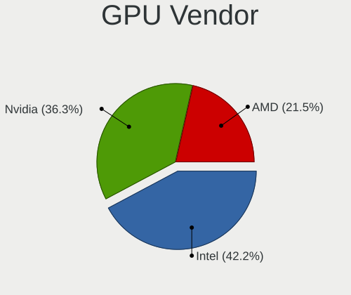

| Vendor | Notebooks | Percent |
|--------|-----------|---------|
| Intel  | 57        | 42.22%  |
| Nvidia | 49        | 36.3%   |
| AMD    | 29        | 21.48%  |

GPU Model
---------

Graphics card models

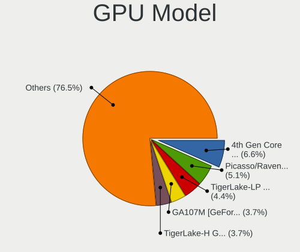

| Model                                                                     | Notebooks | Percent |
|---------------------------------------------------------------------------|-----------|---------|
| Intel 4th Gen Core Processor Integrated Graphics Controller               | 9         | 6.62%   |
| AMD Picasso/Raven 2 [Radeon Vega Series / Radeon Vega Mobile Series]      | 7         | 5.15%   |
| Intel TigerLake-LP GT2 [Iris Xe Graphics]                                 | 6         | 4.41%   |
| Nvidia GA107M [GeForce RTX 3050 Mobile]                                   | 5         | 3.68%   |
| Intel TigerLake-H GT1 [UHD Graphics]                                      | 5         | 3.68%   |
| Nvidia GM107M [GeForce GTX 950M]                                          | 4         | 2.94%   |
| Intel Skylake-H GT2 [HD Graphics 530]                                     | 4         | 2.94%   |
| AMD Rembrandt [Radeon 680M]                                               | 4         | 2.94%   |
| Nvidia GP107M [GeForce GTX 1050 Mobile]                                   | 3         | 2.21%   |
| Nvidia GA106M [GeForce RTX 3060 Mobile / Max-Q]                           | 3         | 2.21%   |
| Intel Kaby Lake-H GT2 [HD Graphics 630]                                   | 3         | 2.21%   |
| Intel 3rd Gen Core processor Graphics Controller                          | 3         | 2.21%   |
| AMD Cezanne [Radeon Vega Series / Radeon Vega Mobile Series]              | 3         | 2.21%   |
| Nvidia TU117M [GeForce GTX 1650 Mobile / Max-Q]                           | 2         | 1.47%   |
| Nvidia TU116M [GeForce GTX 1660 Ti Mobile]                                | 2         | 1.47%   |
| Nvidia GM107M [GeForce GTX 960M]                                          | 2         | 1.47%   |
| Nvidia GA104M [GeForce RTX 3070 Mobile / Max-Q]                           | 2         | 1.47%   |
| Intel Skylake-U GT2 [HD Graphics 520]                                     | 2         | 1.47%   |
| Intel Kaby Lake-R GT2 [UHD Graphics 620]                                  | 2         | 1.47%   |
| Intel Haswell-ULT Integrated Graphics Controller                          | 2         | 1.47%   |
| Intel CometLake-U GT2 [UHD Graphics]                                      | 2         | 1.47%   |
| Intel CometLake-H GT2 [UHD Graphics]                                      | 2         | 1.47%   |
| Intel CoffeeLake-H GT2 [UHD Graphics 630]                                 | 2         | 1.47%   |
| Intel Alder Lake-P GT2 [Iris Xe Graphics]                                 | 2         | 1.47%   |
| Intel 2nd Generation Core Processor Family Integrated Graphics Controller | 2         | 1.47%   |
| AMD Phoenix1                                                              | 2         | 1.47%   |
| AMD Navi 23 [Radeon RX 6600/6600 XT/6600M]                                | 2         | 1.47%   |
| AMD Lucienne                                                              | 2         | 1.47%   |
| AMD HawkPoint1                                                            | 2         | 1.47%   |
| AMD Ellesmere [Radeon RX 470/480/570/570X/580/580X/590]                   | 2         | 1.47%   |
| Nvidia TU117 [GeForce GTX 1650]                                           | 1         | 0.74%   |
| Nvidia TU106M [GeForce RTX 2070 Mobile / Max-Q Refresh]                   | 1         | 0.74%   |
| Nvidia TU106M [GeForce RTX 2060 Mobile]                                   | 1         | 0.74%   |
| Nvidia TU106BM [GeForce RTX 2060 Mobile]                                  | 1         | 0.74%   |
| Nvidia TU104M [GeForce RTX 2080 SUPER Mobile / Max-Q]                     | 1         | 0.74%   |
| Nvidia GP107M [GeForce MX350]                                             | 1         | 0.74%   |
| Nvidia GP107M [GeForce GTX 1050 Ti Mobile]                                | 1         | 0.74%   |
| Nvidia GP107M [GeForce GTX 1050 3 GB Max-Q]                               | 1         | 0.74%   |
| Nvidia GP102 [GeForce GTX 1080 Ti]                                        | 1         | 0.74%   |
| Nvidia GM206GLM [Quadro M2200 Mobile]                                     | 1         | 0.74%   |

GPU Combo
---------

Combinations of graphics cards

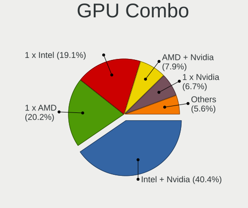

| Name           | Notebooks | Percent |
|----------------|-----------|---------|
| Intel + Nvidia | 36        | 40.45%  |
| 1 x AMD        | 18        | 20.22%  |
| 1 x Intel      | 17        | 19.1%   |
| AMD + Nvidia   | 7         | 7.87%   |
| 1 x Nvidia     | 6         | 6.74%   |
| Intel + AMD    | 3         | 3.37%   |
| Other          | 1         | 1.12%   |
| 2 x AMD        | 1         | 1.12%   |

GPU Driver
----------

Free vs proprietary

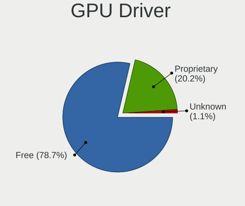

| Driver      | Notebooks | Percent |
|-------------|-----------|---------|
| Free        | 70        | 78.65%  |
| Proprietary | 18        | 20.22%  |
| Unknown     | 1         | 1.12%   |

GPU Memory
----------

Total video memory

| Size in GB | Notebooks | Percent |
|------------|-----------|---------|
| Unknown    | 89        | 100%    |

Monitor
-------

Monitor Vendor
--------------

Monitor vendors

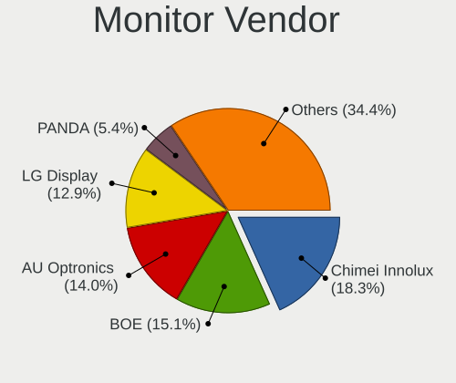

| Vendor              | Notebooks | Percent |
|---------------------|-----------|---------|
| Chimei Innolux      | 17        | 18.28%  |
| BOE                 | 14        | 15.05%  |
| AU Optronics        | 13        | 13.98%  |
| LG Display          | 12        | 12.9%   |
| PANDA               | 5         | 5.38%   |
| Samsung Electronics | 4         | 4.3%    |
| TMX                 | 2         | 2.15%   |
| Sharp               | 2         | 2.15%   |
| Philips             | 2         | 2.15%   |
| AYANEO              | 2         | 2.15%   |
| Vizio               | 1         | 1.08%   |
| Valve               | 1         | 1.08%   |
| Unknown (XXX)       | 1         | 1.08%   |
| Toshiba             | 1         | 1.08%   |
| Sceptre Tech        | 1         | 1.08%   |
| SANYO               | 1         | 1.08%   |
| RTK                 | 1         | 1.08%   |
| Lenovo              | 1         | 1.08%   |
| Insignia            | 1         | 1.08%   |
| HSX                 | 1         | 1.08%   |
| HKC                 | 1         | 1.08%   |
| HJW                 | 1         | 1.08%   |
| GreenWood           | 1         | 1.08%   |
| GPD                 | 1         | 1.08%   |
| Goldstar            | 1         | 1.08%   |
| GameMax             | 1         | 1.08%   |
| Fujitsu Siemens     | 1         | 1.08%   |
| Apple               | 1         | 1.08%   |
| AOC                 | 1         | 1.08%   |
| Acer                | 1         | 1.08%   |

Monitor Model
-------------

Monitor models

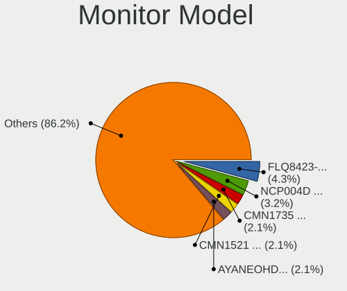

| Model                                                                 | Notebooks | Percent |
|-----------------------------------------------------------------------|-----------|---------|
| BOE FLQ8423-24L0 BOE1003 1600x2560 113x181mm 8.4-inch                 | 4         | 4.26%   |
| PANDA LCD Monitor NCP004D 1920x1080 344x194mm 15.5-inch               | 3         | 3.19%   |
| Chimei Innolux LCD Monitor CMN1735 1920x1080 381x214mm 17.2-inch      | 2         | 2.13%   |
| Chimei Innolux LCD Monitor CMN1521 1920x1080 344x193mm 15.5-inch      | 2         | 2.13%   |
| AYANEO AYANEOHD AYA6108 1080x1920                                     | 2         | 2.13%   |
| AU Optronics LCD Monitor AUO38ED 1920x1080 344x193mm 15.5-inch        | 2         | 2.13%   |
| Vizio D24-D1 VIZ1005 1920x1080 521x293mm 23.5-inch                    | 1         | 1.06%   |
| Valve ANX7530 U VLV3003 800x1280 100x160mm 7.4-inch                   | 1         | 1.06%   |
| Unknown (XXX) Union TV XXX2841 1920x1080 1209x680mm 54.6-inch         | 1         | 1.06%   |
| Toshiba TV TSB2017 3840x2160                                          | 1         | 1.06%   |
| TMX TL140BDXP01-0 TMX1400 2560x1440 310x174mm 14.0-inch               | 1         | 1.06%   |
| TMX TL070FVXS01-0 TMX0002 1920x1080 160x100mm 7.4-inch                | 1         | 1.06%   |
| Sharp LQ173M1JW02 SHP14DB 1920x1080 382x215mm 17.3-inch               | 1         | 1.06%   |
| Sharp LCD Monitor SHP1515 1920x1200 336x210mm 15.6-inch               | 1         | 1.06%   |
| Sceptre Tech Sceptre C35 SPT0DB7 3440x1440 819x346mm 35.0-inch        | 1         | 1.06%   |
| SANYO LCD MONITOR SAN3219 1360x768 304x228mm 15.0-inch                | 1         | 1.06%   |
| Samsung Electronics SyncMaster SAM0352 1680x1050 459x296mm 21.5-inch  | 1         | 1.06%   |
| Samsung Electronics LCD Monitor SEC544B 1600x900 382x214mm 17.2-inch  | 1         | 1.06%   |
| Samsung Electronics LCD Monitor SDC4C51 1366x768 344x194mm 15.5-inch  | 1         | 1.06%   |
| Samsung Electronics LCD Monitor SDC3752 1920x1080 344x194mm 15.5-inch | 1         | 1.06%   |
| Samsung Electronics C24F390 SAM0D2C 1920x1080 521x293mm 23.5-inch     | 1         | 1.06%   |
| RTK XP-PEN RTK2A3B 1920x1080 531x299mm 24.0-inch                      | 1         | 1.06%   |
| Philips PHL 271V8 PHLC213 1920x1080 598x336mm 27.0-inch               | 1         | 1.06%   |
| Philips LCD Monitor PHL4650 1280x768 530x398mm 26.1-inch              | 1         | 1.06%   |
| PANDA LCD Monitor NCP0036 1920x1080 344x194mm 15.5-inch               | 1         | 1.06%   |
| PANDA LCD Monitor NCP002D 1920x1080 344x194mm 15.5-inch               | 1         | 1.06%   |
| LG Display LCD Monitor LGD071E 1920x1080 344x194mm 15.5-inch          | 1         | 1.06%   |
| LG Display LCD Monitor LGD062E 1920x1080 344x194mm 15.5-inch          | 1         | 1.06%   |
| LG Display LCD Monitor LGD05DB 1920x1080 294x165mm 13.3-inch          | 1         | 1.06%   |
| LG Display LCD Monitor LGD0590 1920x1080 344x194mm 15.5-inch          | 1         | 1.06%   |
| LG Display LCD Monitor LGD053F 1920x1080 344x194mm 15.5-inch          | 1         | 1.06%   |
| LG Display LCD Monitor LGD0459 1920x1080 382x215mm 17.3-inch          | 1         | 1.06%   |
| LG Display LCD Monitor LGD044F 1920x1080 345x194mm 15.6-inch          | 1         | 1.06%   |
| LG Display LCD Monitor LGD03DD 1366x768 344x194mm 15.5-inch           | 1         | 1.06%   |
| LG Display LCD Monitor LGD03A3 1366x768 277x156mm 12.5-inch           | 1         | 1.06%   |
| LG Display LCD Monitor LGD039F 1366x768 345x194mm 15.6-inch           | 1         | 1.06%   |
| LG Display LCD Monitor LGD0395 1366x768 344x194mm 15.5-inch           | 1         | 1.06%   |
| LG Display LCD Monitor LGD02F8 1366x768 309x174mm 14.0-inch           | 1         | 1.06%   |
| Lenovo P27h-28 LEN62ED 2560x1440 597x336mm 27.0-inch                  | 1         | 1.06%   |
| Insignia NS-24E730A12 BBY0042 1920x1080 640x384mm 29.4-inch           | 1         | 1.06%   |

Monitor Resolution
------------------

Monitor screen resolution

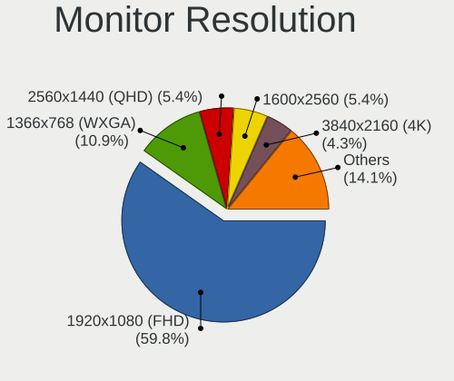

| Resolution         | Notebooks | Percent |
|--------------------|-----------|---------|
| 1920x1080 (FHD)    | 55        | 59.78%  |
| 1366x768 (WXGA)    | 10        | 10.87%  |
| 2560x1440 (QHD)    | 5         | 5.43%   |
| 1600x2560          | 5         | 5.43%   |
| 3840x2160 (4K)     | 4         | 4.35%   |
| 1600x900 (HD+)     | 2         | 2.17%   |
| 1080x1920          | 2         | 2.17%   |
| 800x1280           | 1         | 1.09%   |
| 3440x1440          | 1         | 1.09%   |
| 2880x1800          | 1         | 1.09%   |
| 2256x1504          | 1         | 1.09%   |
| 1920x1200 (WUXGA)  | 1         | 1.09%   |
| 1680x1050 (WSXGA+) | 1         | 1.09%   |
| 1360x768           | 1         | 1.09%   |
| 1280x960           | 1         | 1.09%   |
| 1280x768           | 1         | 1.09%   |

Monitor Diagonal
----------------

Diagonal size in inches

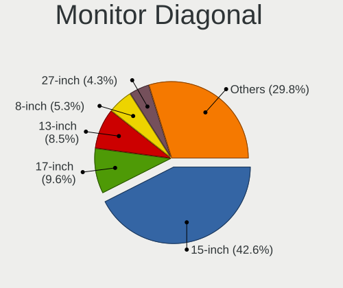

| Inches  | Notebooks | Percent |
|---------|-----------|---------|
| 15      | 40        | 42.55%  |
| 17      | 9         | 9.57%   |
| 13      | 8         | 8.51%   |
| 8       | 5         | 5.32%   |
| 27      | 4         | 4.26%   |
| 21      | 4         | 4.26%   |
| Unknown | 3         | 3.19%   |
| 31      | 2         | 2.13%   |
| 23      | 2         | 2.13%   |
| 16      | 2         | 2.13%   |
| 14      | 2         | 2.13%   |
| 7       | 2         | 2.13%   |
| 72      | 1         | 1.06%   |
| 57      | 1         | 1.06%   |
| 54      | 1         | 1.06%   |
| 52      | 1         | 1.06%   |
| 49      | 1         | 1.06%   |
| 36      | 1         | 1.06%   |
| 35      | 1         | 1.06%   |
| 34      | 1         | 1.06%   |
| 24      | 1         | 1.06%   |
| 12      | 1         | 1.06%   |
| 11      | 1         | 1.06%   |

Monitor Width
-------------

Physical width

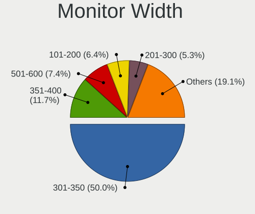

| Width in mm | Notebooks | Percent |
|-------------|-----------|---------|
| 301-350     | 47        | 50%     |
| 351-400     | 11        | 11.7%   |
| 501-600     | 7         | 7.45%   |
| 101-200     | 6         | 6.38%   |
| 201-300     | 5         | 5.32%   |
| 401-500     | 4         | 4.26%   |
| 701-800     | 3         | 3.19%   |
| 1001-1500   | 3         | 3.19%   |
| Unknown     | 3         | 3.19%   |
| 601-700     | 2         | 2.13%   |
| 801-900     | 1         | 1.06%   |
| 1501-2000   | 1         | 1.06%   |
| 1-100       | 1         | 1.06%   |

Aspect Ratio
------------

Proportional relationship between the width and the height

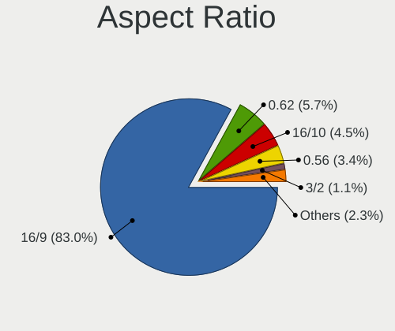

| Ratio | Notebooks | Percent |
|-------|-----------|---------|
| 16/9  | 73        | 82.95%  |
| 0.62  | 5         | 5.68%   |
| 16/10 | 4         | 4.55%   |
| 0.56  | 3         | 3.41%   |
| 3/2   | 1         | 1.14%   |
| 21/9  | 1         | 1.14%   |
| 0.63  | 1         | 1.14%   |

Monitor Area
------------

Area in inch²

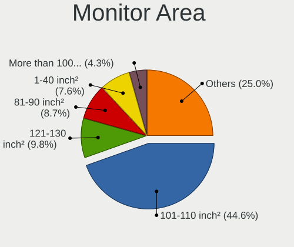

| Area in inch² | Notebooks | Percent |
|----------------|-----------|---------|
| 101-110        | 41        | 44.57%  |
| 121-130        | 9         | 9.78%   |
| 81-90          | 8         | 8.7%    |
| 1-40           | 7         | 7.61%   |
| More than 1000 | 4         | 4.35%   |
| 301-350        | 4         | 4.35%   |
| 201-250        | 4         | 4.35%   |
| 351-500        | 3         | 3.26%   |
| Unknown        | 3         | 3.26%   |
| 71-80          | 2         | 2.17%   |
| 501-1000       | 2         | 2.17%   |
| 61-70          | 1         | 1.09%   |
| 51-60          | 1         | 1.09%   |
| 251-300        | 1         | 1.09%   |
| 151-200        | 1         | 1.09%   |
| 111-120        | 1         | 1.09%   |

Pixel Density
-------------

Pixels per inch

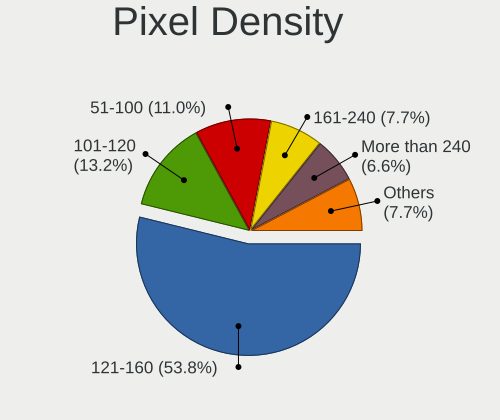

| Density       | Notebooks | Percent |
|---------------|-----------|---------|
| 121-160       | 49        | 53.85%  |
| 101-120       | 12        | 13.19%  |
| 51-100        | 10        | 10.99%  |
| 161-240       | 7         | 7.69%   |
| More than 240 | 6         | 6.59%   |
| 1-50          | 4         | 4.4%    |
| Unknown       | 3         | 3.3%    |

Multiple Monitors
-----------------

Total monitors connected

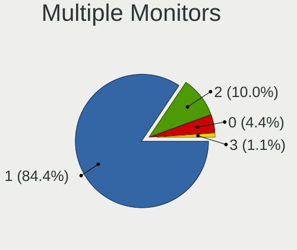

| Total | Notebooks | Percent |
|-------|-----------|---------|
| 1     | 76        | 84.44%  |
| 2     | 9         | 10%     |
| 0     | 4         | 4.44%   |
| 3     | 1         | 1.11%   |

Network
-------

Net Controller Vendor
---------------------

Controller vendors

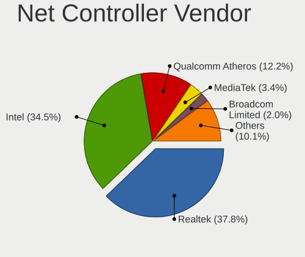

| Vendor                          | Notebooks | Percent |
|---------------------------------|-----------|---------|
| Realtek Semiconductor           | 56        | 37.84%  |
| Intel                           | 51        | 34.46%  |
| Qualcomm Atheros                | 18        | 12.16%  |
| MediaTek                        | 5         | 3.38%   |
| Broadcom Limited                | 3         | 2.03%   |
| ASIX Electronics                | 3         | 2.03%   |
| Broadcom                        | 2         | 1.35%   |
| Xiaomi                          | 1         | 0.68%   |
| TP-Link                         | 1         | 0.68%   |
| Samsung Electronics             | 1         | 0.68%   |
| Ralink Technology               | 1         | 0.68%   |
| Ralink                          | 1         | 0.68%   |
| Qualcomm Atheros Communications | 1         | 0.68%   |
| Qualcomm                        | 1         | 0.68%   |
| QNAP System                     | 1         | 0.68%   |
| Google                          | 1         | 0.68%   |
| DisplayLink                     | 1         | 0.68%   |

Net Controller Model
--------------------

Controller models

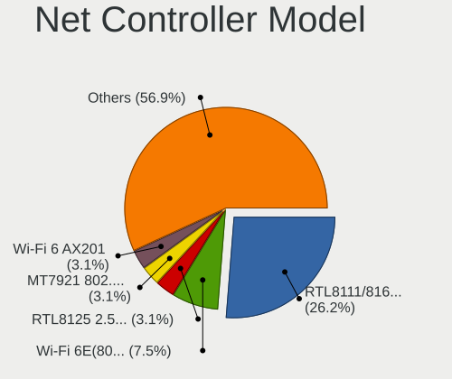

| Model                                                                  | Notebooks | Percent |
|------------------------------------------------------------------------|-----------|---------|
| Realtek RTL8111/8168/8211/8411 PCI Express Gigabit Ethernet Controller | 42        | 26.25%  |
| Intel Wi-Fi 6E(802.11ax) AX210/AX1675* 2x2 [Typhoon Peak]              | 12        | 7.5%    |
| Realtek RTL8125 2.5GbE Controller                                      | 5         | 3.13%   |
| MediaTek MT7921 802.11ax PCIe Wireless Network Adapter [Filogic 330]   | 5         | 3.13%   |
| Intel Wi-Fi 6 AX201                                                    | 5         | 3.13%   |
| Intel Tiger Lake PCH CNVi WiFi                                         | 5         | 3.13%   |
| Realtek RTL8822CE 802.11ac PCIe Wireless Network Adapter               | 4         | 2.5%    |
| Qualcomm Atheros QCA6174 802.11ac Wireless Network Adapter             | 4         | 2.5%    |
| Qualcomm Atheros QCA9377 802.11ac Wireless Network Adapter             | 3         | 1.88%   |
| Qualcomm Atheros Killer E220x Gigabit Ethernet Controller              | 3         | 1.88%   |
| Qualcomm Atheros AR9462 Wireless Network Adapter                       | 3         | 1.88%   |
| Intel Wireless 7265                                                    | 3         | 1.88%   |
| Intel Wireless 3165                                                    | 3         | 1.88%   |
| Intel Comet Lake PCH CNVi WiFi                                         | 3         | 1.88%   |
| ASIX AX88179 Gigabit Ethernet                                          | 3         | 1.88%   |
| Realtek RTL88x2bu [AC1200 Techkey]                                     | 2         | 1.25%   |
| Realtek RTL8822BE 802.11a/b/g/n/ac WiFi adapter                        | 2         | 1.25%   |
| Realtek PCIe GbE Family Controller                                     | 2         | 1.25%   |
| Qualcomm Atheros AR9485 Wireless Network Adapter                       | 2         | 1.25%   |
| Intel Wireless 8265 / 8275                                             | 2         | 1.25%   |
| Intel Dual Band Wireless-AC 3165 Plus Bluetooth                        | 2         | 1.25%   |
| Intel Comet Lake PCH-LP CNVi WiFi                                      | 2         | 1.25%   |
| Intel Cannon Lake PCH CNVi WiFi                                        | 2         | 1.25%   |
| Broadcom Limited NetLink BCM57780 Gigabit Ethernet PCIe                | 2         | 1.25%   |
| Xiaomi Mi/Redmi series (RNDIS)                                         | 1         | 0.63%   |
| TP-Link 802.11ac NIC                                                   | 1         | 0.63%   |
| Samsung Galaxy series, misc. (tethering mode)                          | 1         | 0.63%   |
| Realtek USB 10/100/1G/2.5 LAN                                          | 1         | 0.63%   |
| Realtek RTL8821CE 802.11ac PCIe Wireless Network Adapter               | 1         | 0.63%   |
| Realtek RTL8821AE 802.11ac PCIe Wireless Network Adapter               | 1         | 0.63%   |
| Realtek RTL8723BE PCIe Wireless Network Adapter                        | 1         | 0.63%   |
| Realtek RTL8188FTV 802.11b/g/n 1T1R 2.4G WLAN Adapter                  | 1         | 0.63%   |
| Realtek RTL810xE PCI Express Fast Ethernet controller                  | 1         | 0.63%   |
| Realtek Killer E2600 GbE Controller                                    | 1         | 0.63%   |
| Ralink MT7601U Wireless Adapter                                        | 1         | 0.63%   |
| Ralink RT3290 Wireless 802.11n 1T/1R PCIe                              | 1         | 0.63%   |
| Qualcomm QCNFA765 Wireless Network Adapter                             | 1         | 0.63%   |
| Qualcomm Atheros QCA9565 / AR9565 Wireless Network Adapter             | 1         | 0.63%   |
| Qualcomm Atheros QCA8171 Gigabit Ethernet                              | 1         | 0.63%   |
| Qualcomm Atheros Killer E2500 Gigabit Ethernet Controller              | 1         | 0.63%   |

Wireless Vendor
---------------

Wireless vendors

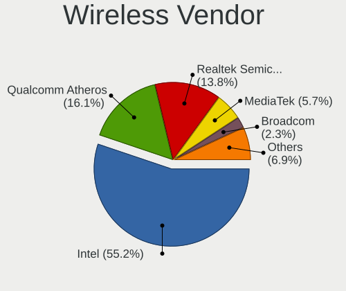

| Vendor                          | Notebooks | Percent |
|---------------------------------|-----------|---------|
| Intel                           | 48        | 55.17%  |
| Qualcomm Atheros                | 14        | 16.09%  |
| Realtek Semiconductor           | 12        | 13.79%  |
| MediaTek                        | 5         | 5.75%   |
| Broadcom                        | 2         | 2.3%    |
| TP-Link                         | 1         | 1.15%   |
| Ralink Technology               | 1         | 1.15%   |
| Ralink                          | 1         | 1.15%   |
| Qualcomm Atheros Communications | 1         | 1.15%   |
| Qualcomm                        | 1         | 1.15%   |
| Broadcom Limited                | 1         | 1.15%   |

Wireless Model
--------------

Wireless models

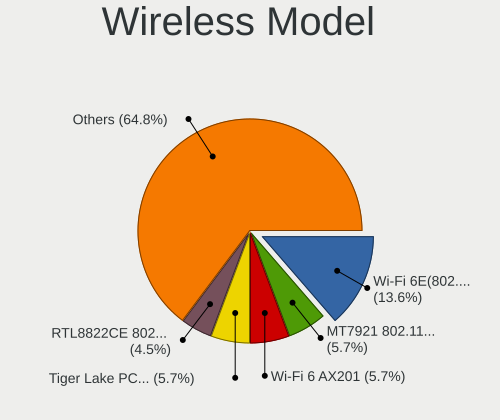

| Model                                                                | Notebooks | Percent |
|----------------------------------------------------------------------|-----------|---------|
| Intel Wi-Fi 6E(802.11ax) AX210/AX1675* 2x2 [Typhoon Peak]            | 12        | 13.64%  |
| MediaTek MT7921 802.11ax PCIe Wireless Network Adapter [Filogic 330] | 5         | 5.68%   |
| Intel Wi-Fi 6 AX201                                                  | 5         | 5.68%   |
| Intel Tiger Lake PCH CNVi WiFi                                       | 5         | 5.68%   |
| Realtek RTL8822CE 802.11ac PCIe Wireless Network Adapter             | 4         | 4.55%   |
| Qualcomm Atheros QCA6174 802.11ac Wireless Network Adapter           | 4         | 4.55%   |
| Qualcomm Atheros QCA9377 802.11ac Wireless Network Adapter           | 3         | 3.41%   |
| Qualcomm Atheros AR9462 Wireless Network Adapter                     | 3         | 3.41%   |
| Intel Wireless 7265                                                  | 3         | 3.41%   |
| Intel Wireless 3165                                                  | 3         | 3.41%   |
| Intel Comet Lake PCH CNVi WiFi                                       | 3         | 3.41%   |
| Realtek RTL88x2bu [AC1200 Techkey]                                   | 2         | 2.27%   |
| Realtek RTL8822BE 802.11a/b/g/n/ac WiFi adapter                      | 2         | 2.27%   |
| Qualcomm Atheros AR9485 Wireless Network Adapter                     | 2         | 2.27%   |
| Intel Wireless 8265 / 8275                                           | 2         | 2.27%   |
| Intel Dual Band Wireless-AC 3165 Plus Bluetooth                      | 2         | 2.27%   |
| Intel Comet Lake PCH-LP CNVi WiFi                                    | 2         | 2.27%   |
| Intel Cannon Lake PCH CNVi WiFi                                      | 2         | 2.27%   |
| TP-Link 802.11ac NIC                                                 | 1         | 1.14%   |
| Realtek RTL8821CE 802.11ac PCIe Wireless Network Adapter             | 1         | 1.14%   |
| Realtek RTL8821AE 802.11ac PCIe Wireless Network Adapter             | 1         | 1.14%   |
| Realtek RTL8723BE PCIe Wireless Network Adapter                      | 1         | 1.14%   |
| Realtek RTL8188FTV 802.11b/g/n 1T1R 2.4G WLAN Adapter                | 1         | 1.14%   |
| Ralink MT7601U Wireless Adapter                                      | 1         | 1.14%   |
| Ralink RT3290 Wireless 802.11n 1T/1R PCIe                            | 1         | 1.14%   |
| Qualcomm QCNFA765 Wireless Network Adapter                           | 1         | 1.14%   |
| Qualcomm Atheros QCA9565 / AR9565 Wireless Network Adapter           | 1         | 1.14%   |
| Qualcomm Atheros AR9271 802.11n                                      | 1         | 1.14%   |
| Qualcomm Atheros AR928X Wireless Network Adapter (PCI-Express)       | 1         | 1.14%   |
| Intel Wireless 3160                                                  | 1         | 1.14%   |
| Intel Wi-Fi 6 AX200                                                  | 1         | 1.14%   |
| Intel Intel Centrino Wireless-N + WiMAX 6150                         | 1         | 1.14%   |
| Intel Centrino Wireless-N 6150                                       | 1         | 1.14%   |
| Intel Centrino Wireless-N 130                                        | 1         | 1.14%   |
| Intel Centrino Advanced-N 6235                                       | 1         | 1.14%   |
| Intel Centrino Advanced-N 6230 [Rainbow Peak]                        | 1         | 1.14%   |
| Intel Alder Lake-P PCH CNVi WiFi                                     | 1         | 1.14%   |
| Intel Alder Lake-N PCH CNVi WiFi                                     | 1         | 1.14%   |
| Intel 700 Series Chipset CNVi WiFi                                   | 1         | 1.14%   |
| Broadcom Limited BCM4352 802.11ac Dual Band Wireless Network Adapter | 1         | 1.14%   |

Ethernet Vendor
---------------

Ethernet vendors

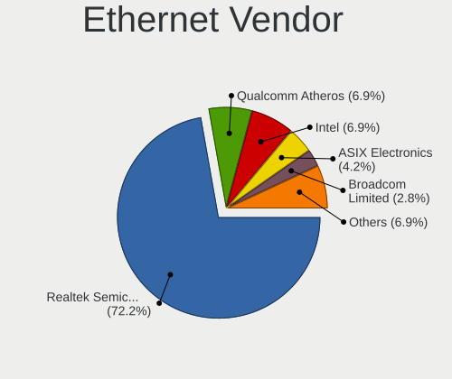

| Vendor                | Notebooks | Percent |
|-----------------------|-----------|---------|
| Realtek Semiconductor | 52        | 72.22%  |
| Qualcomm Atheros      | 5         | 6.94%   |
| Intel                 | 5         | 6.94%   |
| ASIX Electronics      | 3         | 4.17%   |
| Broadcom Limited      | 2         | 2.78%   |
| Xiaomi                | 1         | 1.39%   |
| Samsung Electronics   | 1         | 1.39%   |
| QNAP System           | 1         | 1.39%   |
| Google                | 1         | 1.39%   |
| DisplayLink           | 1         | 1.39%   |

Ethernet Model
--------------

Ethernet models

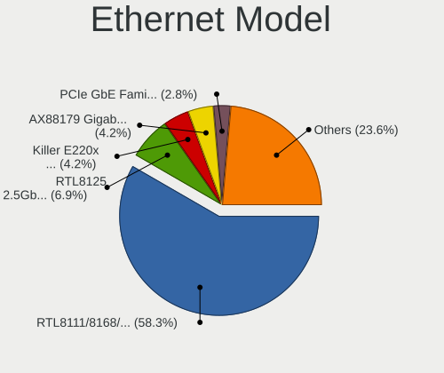

| Model                                                                  | Notebooks | Percent |
|------------------------------------------------------------------------|-----------|---------|
| Realtek RTL8111/8168/8211/8411 PCI Express Gigabit Ethernet Controller | 42        | 58.33%  |
| Realtek RTL8125 2.5GbE Controller                                      | 5         | 6.94%   |
| Qualcomm Atheros Killer E220x Gigabit Ethernet Controller              | 3         | 4.17%   |
| ASIX AX88179 Gigabit Ethernet                                          | 3         | 4.17%   |
| Realtek PCIe GbE Family Controller                                     | 2         | 2.78%   |
| Broadcom Limited NetLink BCM57780 Gigabit Ethernet PCIe                | 2         | 2.78%   |
| Xiaomi Mi/Redmi series (RNDIS)                                         | 1         | 1.39%   |
| Samsung Galaxy series, misc. (tethering mode)                          | 1         | 1.39%   |
| Realtek USB 10/100/1G/2.5 LAN                                          | 1         | 1.39%   |
| Realtek RTL810xE PCI Express Fast Ethernet controller                  | 1         | 1.39%   |
| Realtek Killer E2600 GbE Controller                                    | 1         | 1.39%   |
| Qualcomm Atheros QCA8171 Gigabit Ethernet                              | 1         | 1.39%   |
| Qualcomm Atheros Killer E2500 Gigabit Ethernet Controller              | 1         | 1.39%   |
| QNAP System QNAP QNA-UC5G1T USB to 5GbE Adapter                        | 1         | 1.39%   |
| Intel I211 Gigabit Network Connection                                  | 1         | 1.39%   |
| Intel Ethernet Connection I218-LM                                      | 1         | 1.39%   |
| Intel Ethernet Connection (7) I219-V                                   | 1         | 1.39%   |
| Intel Ethernet Connection (5) I219-LM                                  | 1         | 1.39%   |
| Intel 82579LM Gigabit Network Connection (Lewisville)                  | 1         | 1.39%   |
| Google Pixel 9a                                                        | 1         | 1.39%   |
| DisplayLink HP Port Replicator (Composite Device)                      | 1         | 1.39%   |

Net Controller Kind
-------------------

Ethernet, WiFi or modem

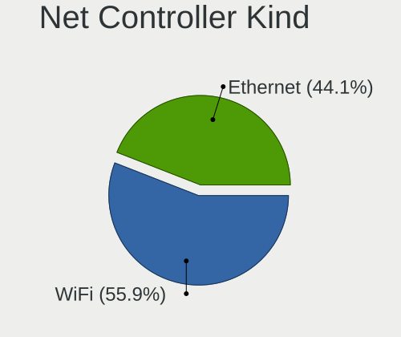

| Kind     | Notebooks | Percent |
|----------|-----------|---------|
| WiFi     | 85        | 55.92%  |
| Ethernet | 67        | 44.08%  |

Used Controller
---------------

Currently used network controller

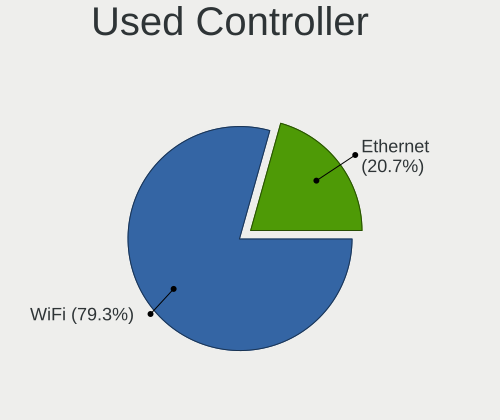

| Kind     | Notebooks | Percent |
|----------|-----------|---------|
| WiFi     | 73        | 79.35%  |
| Ethernet | 19        | 20.65%  |

NICs
----

Total network controllers on board

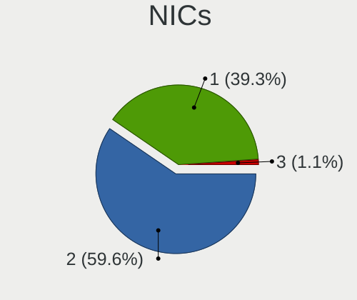

| Total | Notebooks | Percent |
|-------|-----------|---------|
| 2     | 53        | 59.55%  |
| 1     | 35        | 39.33%  |
| 3     | 1         | 1.12%   |

IPv6
----

IPv6 vs IPv4

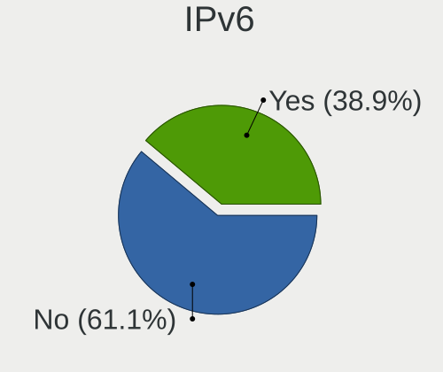

| Used | Notebooks | Percent |
|------|-----------|---------|
| No   | 55        | 61.11%  |
| Yes  | 35        | 38.89%  |

Bluetooth
---------

Bluetooth Vendor
----------------

Controller vendors

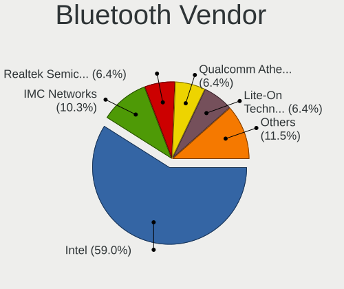

| Vendor                          | Notebooks | Percent |
|---------------------------------|-----------|---------|
| Intel                           | 46        | 58.97%  |
| IMC Networks                    | 8         | 10.26%  |
| Realtek Semiconductor           | 5         | 6.41%   |
| Qualcomm Atheros Communications | 5         | 6.41%   |
| Lite-On Technology              | 5         | 6.41%   |
| Cambridge Silicon Radio         | 3         | 3.85%   |
| Realtek                         | 2         | 2.56%   |
| TP-Link                         | 1         | 1.28%   |
| Ralink                          | 1         | 1.28%   |
| Foxconn / Hon Hai               | 1         | 1.28%   |
| Apple                           | 1         | 1.28%   |

Bluetooth Model
---------------

Controller models

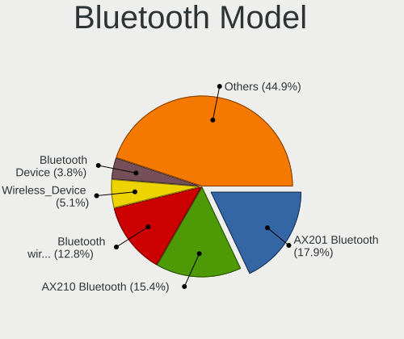

| Model                                               | Notebooks | Percent |
|-----------------------------------------------------|-----------|---------|
| Intel AX201 Bluetooth                               | 14        | 17.95%  |
| Intel AX210 Bluetooth                               | 12        | 15.38%  |
| Intel Bluetooth wireless interface                  | 10        | 12.82%  |
| IMC Networks Wireless_Device                        | 4         | 5.13%   |
| Intel Bluetooth Device                              | 3         | 3.85%   |
| Intel Bluetooth 9460/9560 Jefferson Peak (JfP)      | 3         | 3.85%   |
| IMC Networks Bluetooth Radio                        | 3         | 3.85%   |
| Cambridge Silicon Radio Bluetooth Dongle (HCI mode) | 3         | 3.85%   |
| Realtek Bluetooth Radio                             | 2         | 2.56%   |
| Realtek Bluetooth Radio                             | 2         | 2.56%   |
| Qualcomm Atheros  Bluetooth Device                  | 2         | 2.56%   |
| Lite-On Qualcomm Atheros QCA9377 Bluetooth          | 2         | 2.56%   |
| Lite-On Bluetooth Device                            | 2         | 2.56%   |
| Intel Centrino Advanced-N 6230 Bluetooth adapter    | 2         | 2.56%   |
| TP-Link TP-T@- UB500 Adapter                        | 1         | 1.28%   |
| Realtek RTL8822BE Bluetooth 4.2 Adapter             | 1         | 1.28%   |
| Realtek RTL8821A Bluetooth                          | 1         | 1.28%   |
| Realtek  Bluetooth 4.2 Adapter                      | 1         | 1.28%   |
| Ralink RT3290 Bluetooth                             | 1         | 1.28%   |
| Qualcomm Atheros QCA61x4 Bluetooth 4.0              | 1         | 1.28%   |
| Qualcomm Atheros AR3012 Bluetooth 4.0               | 1         | 1.28%   |
| Qualcomm Atheros AR3012 Bluetooth                   | 1         | 1.28%   |
| Lite-On Wireless_Device                             | 1         | 1.28%   |
| Intel Centrino Bluetooth Wireless Transceiver       | 1         | 1.28%   |
| Intel AX200 Bluetooth                               | 1         | 1.28%   |
| IMC Networks Atheros AR3012 Bluetooth               | 1         | 1.28%   |
| Foxconn / Hon Hai Broadcom BCM20702A1 Bluetooth     | 1         | 1.28%   |
| Apple Bluetooth Host Controller                     | 1         | 1.28%   |

Sound
-----

Sound Vendor
------------

Sound card vendors

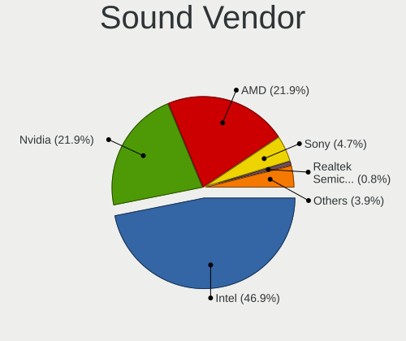

| Vendor                 | Notebooks | Percent |
|------------------------|-----------|---------|
| Intel                  | 60        | 46.88%  |
| Nvidia                 | 28        | 21.88%  |
| AMD                    | 28        | 21.88%  |
| Sony                   | 6         | 4.69%   |
| Realtek Semiconductor  | 1         | 0.78%   |
| Logitech               | 1         | 0.78%   |
| Kingston Technology    | 1         | 0.78%   |
| Jieli Technology       | 1         | 0.78%   |
| Google                 | 1         | 0.78%   |
| Generalplus Technology | 1         | 0.78%   |

Sound Model
-----------

Sound card models

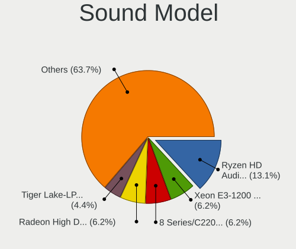

| Model                                                                      | Notebooks | Percent |
|----------------------------------------------------------------------------|-----------|---------|
| AMD Ryzen HD Audio Controller                                              | 21        | 13.13%  |
| Intel Xeon E3-1200 v3/4th Gen Core Processor HD Audio Controller           | 10        | 6.25%   |
| Intel 8 Series/C220 Series Chipset High Definition Audio Controller        | 10        | 6.25%   |
| AMD Radeon High Definition Audio Controller                                | 10        | 6.25%   |
| Intel Tiger Lake-LP Smart Sound Technology Audio Controller                | 7         | 4.38%   |
| Intel Sunrise Point-LP HD Audio                                            | 7         | 4.38%   |
| Intel Tiger Lake-H HD Audio Controller                                     | 6         | 3.75%   |
| Sony DualShock 4 [CUH-ZCT2x]                                               | 4         | 2.5%    |
| Nvidia GA107 High Definition Audio Controller                              | 4         | 2.5%    |
| Intel Cannon Lake PCH cAVS                                                 | 4         | 2.5%    |
| AMD Renoir/Cezanne HDMI/DP Audio Controller                                | 4         | 2.5%    |
| AMD Raven/Raven2/Fenghuang HDMI/DP Audio Controller                        | 4         | 2.5%    |
| Nvidia TU107 GeForce GTX 1650 High Definition Audio Controller             | 3         | 1.88%   |
| Nvidia TU106 High Definition Audio Controller                              | 3         | 1.88%   |
| Nvidia GP107GL High Definition Audio Controller                            | 3         | 1.88%   |
| Nvidia GA106 High Definition Audio Controller                              | 3         | 1.88%   |
| Intel Comet Lake PCH cAVS                                                  | 3         | 1.88%   |
| Intel CM238 HD Audio Controller                                            | 3         | 1.88%   |
| Intel 7 Series/C216 Chipset Family High Definition Audio Controller        | 3         | 1.88%   |
| Intel 100 Series/C230 Series Chipset Family HD Audio Controller            | 3         | 1.88%   |
| AMD Navi 21/23 HDMI/DP Audio Controller                                    | 3         | 1.88%   |
| AMD Ellesmere HDMI Audio [Radeon RX 470/480 / 570/580/590]                 | 3         | 1.88%   |
| Sony DualSense wireless controller (PS5)                                   | 2         | 1.25%   |
| Nvidia TU116 High Definition Audio Controller                              | 2         | 1.25%   |
| Nvidia GF108 High Definition Audio Controller                              | 2         | 1.25%   |
| Nvidia GA104 High Definition Audio Controller                              | 2         | 1.25%   |
| Intel Haswell-ULT HD Audio Controller                                      | 2         | 1.25%   |
| Intel Comet Lake PCH-LP cAVS                                               | 2         | 1.25%   |
| Intel Alder Lake PCH-P High Definition Audio Controller                    | 2         | 1.25%   |
| Intel 8 Series HD Audio Controller                                         | 2         | 1.25%   |
| Intel 6 Series/C200 Series Chipset Family High Definition Audio Controller | 2         | 1.25%   |
| AMD Starship/Matisse HD Audio Controller                                   | 2         | 1.25%   |
| Realtek Semiconductor USB Audio                                            | 1         | 0.63%   |
| Nvidia TU104 HD Audio Controller                                           | 1         | 0.63%   |
| Nvidia GP102 HDMI Audio Controller                                         | 1         | 0.63%   |
| Nvidia GM206 High Definition Audio Controller                              | 1         | 0.63%   |
| Nvidia GK104 HDMI Audio Controller                                         | 1         | 0.63%   |
| Nvidia GF116 High Definition Audio Controller                              | 1         | 0.63%   |
| Nvidia AD107 High Definition Audio Controller                              | 1         | 0.63%   |
| Logitech Logitech G PRO X Gaming Headset                                   | 1         | 0.63%   |

Memory
------

Memory Vendor
-------------

Memory module vendors

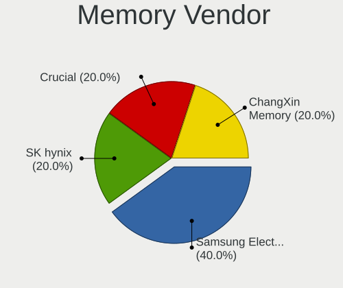

| Vendor              | Notebooks | Percent |
|---------------------|-----------|---------|
| Samsung Electronics | 2         | 40%     |
| SK hynix            | 1         | 20%     |
| Crucial             | 1         | 20%     |
| ChangXin Memory     | 1         | 20%     |

Memory Model
------------

Memory module models

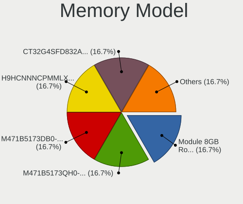

| Model                                                              | Notebooks | Percent |
|--------------------------------------------------------------------|-----------|---------|
| SK hynix RAM H9HCNNNCPMMLXR-NEE 2GB Row Of Chips LPDDR4 4267MT/s   | 1         | 16.67%  |
| Samsung RAM Module 8GB Row Of Chips LPDDR3 1600MT/s                | 1         | 16.67%  |
| Samsung RAM M471B5173QH0-YK0 4GB SODIMM DDR3 1600MT/s              | 1         | 16.67%  |
| Samsung RAM M471B5173DB0-YK0 4GB SODIMM DDR3 1600MT/s              | 1         | 16.67%  |
| Crucial RAM CT32G4SFD832A.M16FF 32GB SODIMM DDR4 3200MT/s          | 1         | 16.67%  |
| ChangXin Memory RAM DB4ABAM-MK 1024MB Row Of Chips LPDDR4 3733MT/s | 1         | 16.67%  |

Memory Kind
-----------

Memory module kinds

| Kind   | Notebooks | Percent |
|--------|-----------|---------|
| LPDDR4 | 2         | 40%     |
| LPDDR3 | 1         | 20%     |
| DDR4   | 1         | 20%     |
| DDR3   | 1         | 20%     |

Memory Form Factor
------------------

Physical design of the memory module

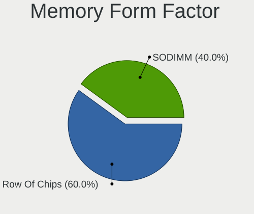

| Name         | Notebooks | Percent |
|--------------|-----------|---------|
| Row Of Chips | 3         | 60%     |
| SODIMM       | 2         | 40%     |

Memory Size
-----------

Memory module size

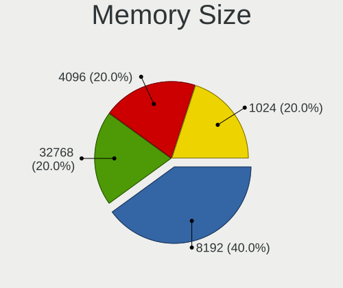

| Size  | Notebooks | Percent |
|-------|-----------|---------|
| 8192  | 2         | 40%     |
| 32768 | 1         | 20%     |
| 4096  | 1         | 20%     |
| 1024  | 1         | 20%     |

Memory Speed
------------

Memory module speed

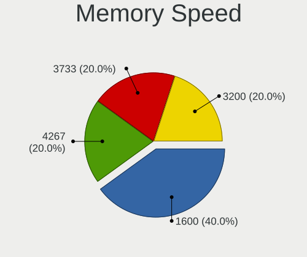

| Speed | Notebooks | Percent |
|-------|-----------|---------|
| 1600  | 2         | 40%     |
| 4267  | 1         | 20%     |
| 3733  | 1         | 20%     |
| 3200  | 1         | 20%     |

Printers & scanners
-------------------

Printer Vendor
--------------

Printer device vendors

Zero info for selected period =(

Printer Model
-------------

Printer device models

Zero info for selected period =(

Scanner Vendor
--------------

Scanner device vendors

Zero info for selected period =(

Scanner Model
-------------

Scanner device models

Zero info for selected period =(

Camera
------

Camera Vendor
-------------

Camera device vendors

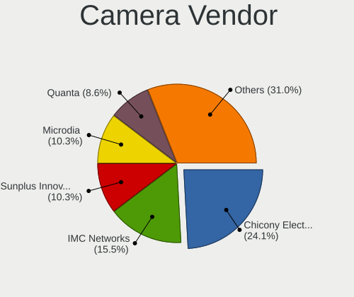

| Vendor                                 | Notebooks | Percent |
|----------------------------------------|-----------|---------|
| Chicony Electronics                    | 14        | 24.14%  |
| IMC Networks                           | 9         | 15.52%  |
| Sunplus Innovation Technology          | 6         | 10.34%  |
| Microdia                               | 6         | 10.34%  |
| Quanta                                 | 5         | 8.62%   |
| Bison Electronics                      | 5         | 8.62%   |
| Syntek                                 | 2         | 3.45%   |
| Sonix Technology                       | 2         | 3.45%   |
| Realtek Semiconductor                  | 2         | 3.45%   |
| Cheng Uei Precision Industry (Foxlink) | 2         | 3.45%   |
| Suyin                                  | 1         | 1.72%   |
| Silicon Motion                         | 1         | 1.72%   |
| Logitech                               | 1         | 1.72%   |
| Goodong                                | 1         | 1.72%   |
| DigiTech                               | 1         | 1.72%   |

Camera Model
------------

Camera device models

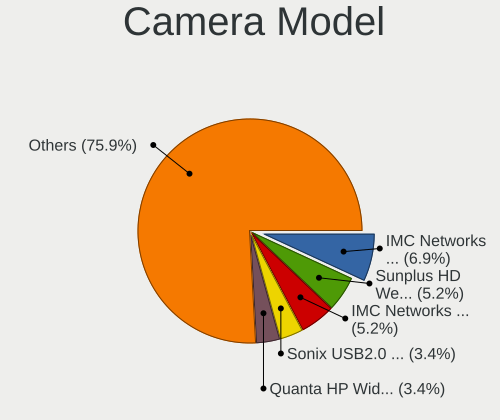

| Model                                                            | Notebooks | Percent |
|------------------------------------------------------------------|-----------|---------|
| IMC Networks USB2.0 HD UVC WebCam                                | 4         | 6.9%    |
| Sunplus HD WebCam                                                | 3         | 5.17%   |
| IMC Networks Integrated Camera                                   | 3         | 5.17%   |
| Sonix USB2.0 HD UVC WebCam                                       | 2         | 3.45%   |
| Quanta HP Wide Vision HD Camera                                  | 2         | 3.45%   |
| Microdia Integrated_Webcam_HD                                    | 2         | 3.45%   |
| IMC Networks ov9734_azurewave_camera                             | 2         | 3.45%   |
| Chicony Integrated Camera                                        | 2         | 3.45%   |
| Chicony HD WebCam                                                | 2         | 3.45%   |
| Chicony HD User Facing                                           | 2         | 3.45%   |
| Bison Lenovo EasyCamera                                          | 2         | 3.45%   |
| Syntek USB2.0 Camera                                             | 1         | 1.72%   |
| Syntek Lenovo EasyCamera                                         | 1         | 1.72%   |
| Suyin HP Truevision HD                                           | 1         | 1.72%   |
| Sunplus Integrated_Webcam_HD                                     | 1         | 1.72%   |
| Sunplus Integrated_Webcam_FHD                                    | 1         | 1.72%   |
| Sunplus ASUS Webcam                                              | 1         | 1.72%   |
| Silicon Motion 300k Pixel Camera                                 | 1         | 1.72%   |
| Realtek Integrated_Webcam_HD                                     | 1         | 1.72%   |
| Realtek Integrated Webcam                                        | 1         | 1.72%   |
| Quanta HP HD Camera                                              | 1         | 1.72%   |
| Quanta HD User Facing                                            | 1         | 1.72%   |
| Quanta ACER FHD User Facing                                      | 1         | 1.72%   |
| Microdia USB 2.0 Camera                                          | 1         | 1.72%   |
| Microdia Laptop_Integrated_Webcam_HD                             | 1         | 1.72%   |
| Microdia Integrated_Webcam_FHD                                   | 1         | 1.72%   |
| Microdia HP Webcam                                               | 1         | 1.72%   |
| Logitech Webcam C930e                                            | 1         | 1.72%   |
| Goodong USB Camera                                               | 1         | 1.72%   |
| DigiTech WebCam SCB-1110M                                        | 1         | 1.72%   |
| Chicony USB2.0 HD UVC WebCam                                     | 1         | 1.72%   |
| Chicony USB2.0 0.3M UVC WebCam                                   | 1         | 1.72%   |
| Chicony Integrated IR Camera                                     | 1         | 1.72%   |
| Chicony HP Wide Vision HD Camera                                 | 1         | 1.72%   |
| Chicony HP Truevision HD                                         | 1         | 1.72%   |
| Chicony HP HD Webcam [Fixed]                                     | 1         | 1.72%   |
| Chicony HD WebCam (Asus N-series)                                | 1         | 1.72%   |
| Chicony EasyCamera                                               | 1         | 1.72%   |
| Cheng Uei Precision Industry (Foxlink) Webcam                    | 1         | 1.72%   |
| Cheng Uei Precision Industry (Foxlink) HP True Vision FHD Camera | 1         | 1.72%   |

Security
--------

Fingerprint Vendor
------------------

Fingerprint sensor vendors

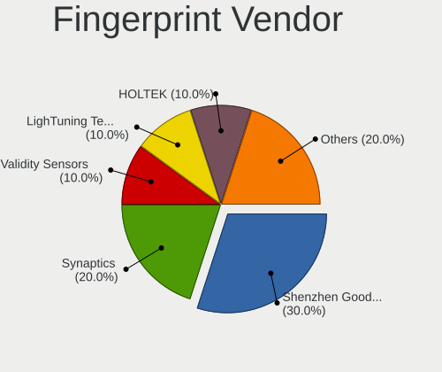

| Vendor                     | Notebooks | Percent |
|----------------------------|-----------|---------|
| Shenzhen Goodix Technology | 3         | 30%     |
| Synaptics                  | 2         | 20%     |
| Validity Sensors           | 1         | 10%     |
| LighTuning Technology      | 1         | 10%     |
| HOLTEK                     | 1         | 10%     |
| Focal-systems.Corp         | 1         | 10%     |
| AuthenTec                  | 1         | 10%     |

Fingerprint Model
-----------------

Fingerprint sensor models

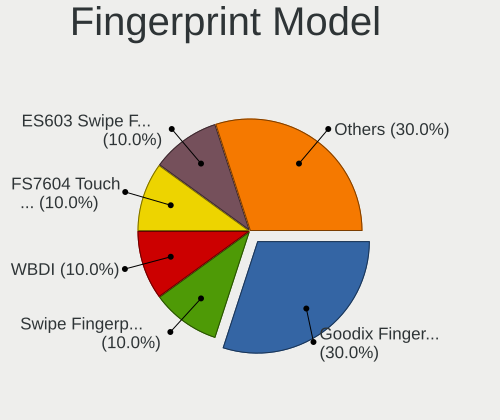

| Model                                                    | Notebooks | Percent |
|----------------------------------------------------------|-----------|---------|
| Shenzhen Goodix  Fingerprint Device                      | 3         | 30%     |
| Validity Sensors Swipe Fingerprint Sensor                | 1         | 10%     |
| Synaptics WBDI                                           | 1         | 10%     |
| Synaptics FS7604 Touch Fingerprint Sensor with PurePrint | 1         | 10%     |
| LighTuning ES603 Swipe Fingerprint Sensor                | 1         | 10%     |
| HOLTEK FocalTech Fingerprint Device                      | 1         | 10%     |
| Focal-systems.Corp FT9201Fingerprint.                    | 1         | 10%     |
| AuthenTec AES1660 Fingerprint Sensor                     | 1         | 10%     |

Chipcard Vendor
---------------

Chipcard module vendors

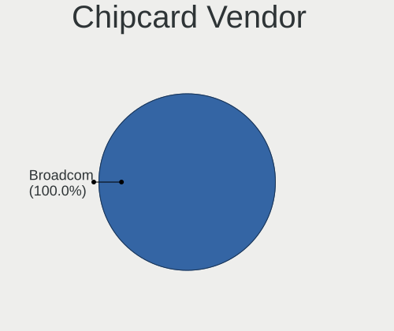

| Vendor   | Notebooks | Percent |
|----------|-----------|---------|
| Broadcom | 3         | 100%    |

Chipcard Model
--------------

Chipcard module models

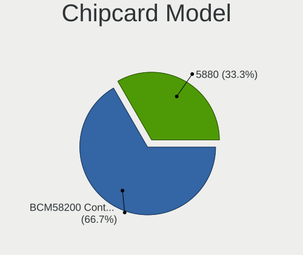

| Model                                                                       | Notebooks | Percent |
|-----------------------------------------------------------------------------|-----------|---------|
| Broadcom BCM58200 ControlVault 3 (FingerPrint sensor + Contacted SmartCard) | 2         | 66.67%  |
| Broadcom 5880                                                               | 1         | 33.33%  |

Unsupported
-----------

Unsupported Devices
-------------------

Total unsupported devices on board

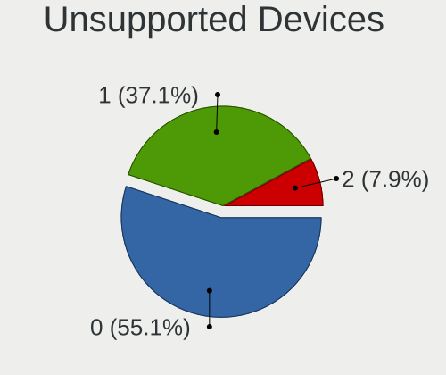

| Total | Notebooks | Percent |
|-------|-----------|---------|
| 0     | 49        | 55.06%  |
| 1     | 33        | 37.08%  |
| 2     | 7         | 7.87%   |

Unsupported Device Types
------------------------

Types of unsupported devices

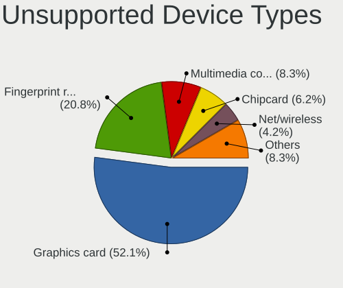

| Type                  | Notebooks | Percent |
|-----------------------|-----------|---------|
| Graphics card         | 25        | 52.08%  |
| Fingerprint reader    | 10        | 20.83%  |
| Multimedia controller | 4         | 8.33%   |
| Chipcard              | 3         | 6.25%   |
| Net/wireless          | 2         | 4.17%   |
| Bluetooth             | 2         | 4.17%   |
| Network               | 1         | 2.08%   |
| Net/ethernet          | 1         | 2.08%   |

