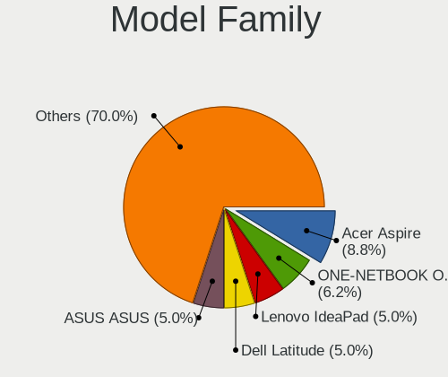
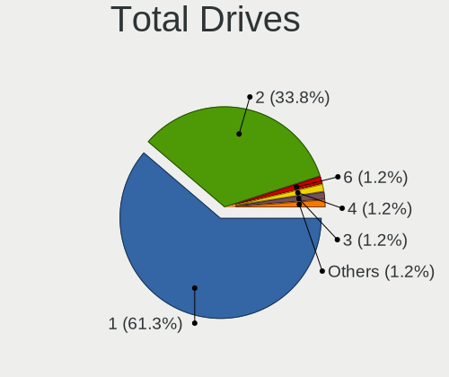
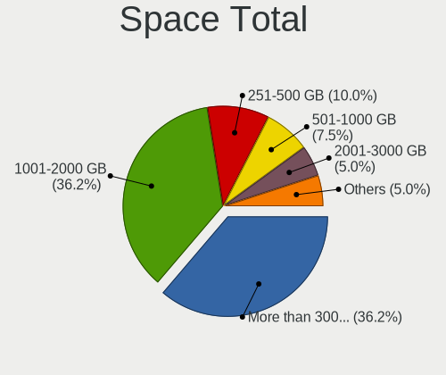
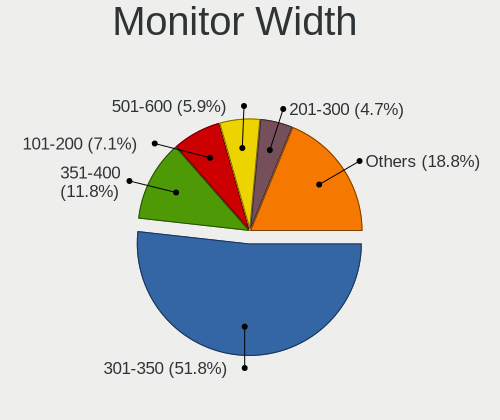
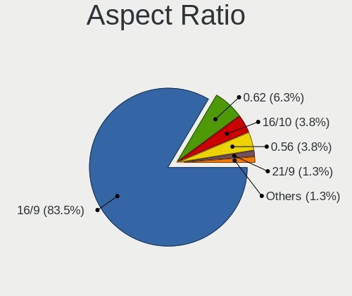
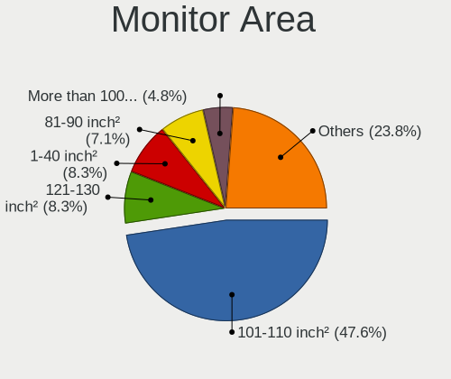

ChimeraOS - Tested Hardware & Statistics (Notebooks)
----------------------------------------------------

A project to collect tested hardware configurations for ChimeraOS.

Anyone can contribute to this report by the [hw-probe](https://github.com/linuxhw/hw-probe) tool:

    sudo -E hw-probe -all -upload

Please contribute! Especially if your hardware is rare.

Contents
--------

* [ Test Cases ](#test-cases)

* [ System ](#system)
  - [ OS                       ](#os)
  - [ OS Family                ](#os-family)
  - [ Kernel                   ](#kernel)
  - [ Kernel Family            ](#kernel-family)
  - [ Kernel Major Ver.        ](#kernel-major-ver)
  - [ Arch                     ](#arch)
  - [ DE                       ](#de)
  - [ Display Server           ](#display-server)
  - [ Display Manager          ](#display-manager)
  - [ OS Lang                  ](#os-lang)
  - [ Boot Mode                ](#boot-mode)
  - [ Filesystem               ](#filesystem)
  - [ Part. scheme             ](#part-scheme)
  - [ Dual Boot with Linux/BSD ](#dual-boot-with-linuxbsd)
  - [ Dual Boot (Win)          ](#dual-boot-win)

* [ Board ](#board)
  - [ Vendor                   ](#vendor)
  - [ Model                    ](#model)
  - [ Model Family             ](#model-family)
  - [ MFG Year                 ](#mfg-year)
  - [ Form Factor              ](#form-factor)
  - [ Secure Boot              ](#secure-boot)
  - [ Coreboot                 ](#coreboot)
  - [ RAM Size                 ](#ram-size)
  - [ RAM Used                 ](#ram-used)
  - [ Total Drives             ](#total-drives)
  - [ Has CD-ROM               ](#has-cd-rom)
  - [ Has Ethernet             ](#has-ethernet)
  - [ Has WiFi                 ](#has-wifi)
  - [ Has Bluetooth            ](#has-bluetooth)

* [ Location ](#location)
  - [ Country                  ](#country)
  - [ City                     ](#city)

* [ Drives ](#drives)
  - [ Drive Vendor             ](#drive-vendor)
  - [ Drive Model              ](#drive-model)
  - [ HDD Vendor               ](#hdd-vendor)
  - [ SSD Vendor               ](#ssd-vendor)
  - [ Drive Kind               ](#drive-kind)
  - [ Drive Connector          ](#drive-connector)
  - [ Drive Size               ](#drive-size)
  - [ Space Total              ](#space-total)
  - [ Space Used               ](#space-used)
  - [ Malfunc. Drives          ](#malfunc-drives)
  - [ Malfunc. Drive Vendor    ](#malfunc-drive-vendor)
  - [ Malfunc. HDD Vendor      ](#malfunc-hdd-vendor)
  - [ Malfunc. Drive Kind      ](#malfunc-drive-kind)
  - [ Failed Drives            ](#failed-drives)
  - [ Failed Drive Vendor      ](#failed-drive-vendor)
  - [ Drive Status             ](#drive-status)

* [ Storage controller ](#storage-controller)
  - [ Storage Vendor           ](#storage-vendor)
  - [ Storage Model            ](#storage-model)
  - [ Storage Kind             ](#storage-kind)

* [ Processor ](#processor)
  - [ CPU Vendor               ](#cpu-vendor)
  - [ CPU Model                ](#cpu-model)
  - [ CPU Model Family         ](#cpu-model-family)
  - [ CPU Cores                ](#cpu-cores)
  - [ CPU Sockets              ](#cpu-sockets)
  - [ CPU Threads              ](#cpu-threads)
  - [ CPU Op-Modes             ](#cpu-op-modes)
  - [ CPU Microcode            ](#cpu-microcode)
  - [ CPU Microarch            ](#cpu-microarch)

* [ Graphics ](#graphics)
  - [ GPU Vendor               ](#gpu-vendor)
  - [ GPU Model                ](#gpu-model)
  - [ GPU Combo                ](#gpu-combo)
  - [ GPU Driver               ](#gpu-driver)
  - [ GPU Memory               ](#gpu-memory)

* [ Monitor ](#monitor)
  - [ Monitor Vendor           ](#monitor-vendor)
  - [ Monitor Model            ](#monitor-model)
  - [ Monitor Resolution       ](#monitor-resolution)
  - [ Monitor Diagonal         ](#monitor-diagonal)
  - [ Monitor Width            ](#monitor-width)
  - [ Aspect Ratio             ](#aspect-ratio)
  - [ Monitor Area             ](#monitor-area)
  - [ Pixel Density            ](#pixel-density)
  - [ Multiple Monitors        ](#multiple-monitors)

* [ Network ](#network)
  - [ Net Controller Vendor    ](#net-controller-vendor)
  - [ Net Controller Model     ](#net-controller-model)
  - [ Wireless Vendor          ](#wireless-vendor)
  - [ Wireless Model           ](#wireless-model)
  - [ Ethernet Vendor          ](#ethernet-vendor)
  - [ Ethernet Model           ](#ethernet-model)
  - [ Net Controller Kind      ](#net-controller-kind)
  - [ Used Controller          ](#used-controller)
  - [ NICs                     ](#nics)
  - [ IPv6                     ](#ipv6)

* [ Bluetooth ](#bluetooth)
  - [ Bluetooth Vendor         ](#bluetooth-vendor)
  - [ Bluetooth Model          ](#bluetooth-model)

* [ Sound ](#sound)
  - [ Sound Vendor             ](#sound-vendor)
  - [ Sound Model              ](#sound-model)

* [ Memory ](#memory)
  - [ Memory Vendor            ](#memory-vendor)
  - [ Memory Model             ](#memory-model)
  - [ Memory Kind              ](#memory-kind)
  - [ Memory Form Factor       ](#memory-form-factor)
  - [ Memory Size              ](#memory-size)
  - [ Memory Speed             ](#memory-speed)

* [ Printers & scanners ](#printers--scanners)
  - [ Printer Vendor           ](#printer-vendor)
  - [ Printer Model            ](#printer-model)
  - [ Scanner Vendor           ](#scanner-vendor)
  - [ Scanner Model            ](#scanner-model)

* [ Camera ](#camera)
  - [ Camera Vendor            ](#camera-vendor)
  - [ Camera Model             ](#camera-model)

* [ Security ](#security)
  - [ Fingerprint Vendor       ](#fingerprint-vendor)
  - [ Fingerprint Model        ](#fingerprint-model)
  - [ Chipcard Vendor          ](#chipcard-vendor)
  - [ Chipcard Model           ](#chipcard-model)

* [ Unsupported ](#unsupported)
  - [ Unsupported Devices      ](#unsupported-devices)
  - [ Unsupported Device Types ](#unsupported-device-types)

Test Cases
----------

Total: 75

| Vendor        | Model                       | Probe                                                      | Date         |
|---------------|-----------------------------|------------------------------------------------------------|--------------|
| ASUSTek       | TUF Gaming FX505DU_FX505... | [eefd534cd5](https://linux-hardware.org/?probe=eefd534cd5) | May 01, 2024 |
| GPD           | G1618-04                    | [2c1da6a68d](https://linux-hardware.org/?probe=2c1da6a68d) | Apr 26, 2024 |
| GPD           | P2 MAX                      | [8e53b3ed39](https://linux-hardware.org/?probe=8e53b3ed39) | Apr 01, 2024 |
| ASUSTek       | PRIME B550M-A               | [e5fc501332](https://linux-hardware.org/?probe=e5fc501332) | Mar 31, 2024 |
| Acer          | Aspire E5-575G              | [83b5323b19](https://linux-hardware.org/?probe=83b5323b19) | Mar 18, 2024 |
| Dell          | Precision 5570              | [65270db170](https://linux-hardware.org/?probe=65270db170) | Mar 13, 2024 |
| ASUSTek       | PRIME B550M-A               | [ed405fd8da](https://linux-hardware.org/?probe=ed405fd8da) | Mar 11, 2024 |
| ASUSTek       | G551JX                      | [8a875afd94](https://linux-hardware.org/?probe=8a875afd94) | Mar 08, 2024 |
| Lenovo        | IdeaPad Flex-14API 81SS     | [9fc35ed4b6](https://linux-hardware.org/?probe=9fc35ed4b6) | Mar 08, 2024 |
| HP            | Pavilion Gaming Laptop 1... | [df560f1f39](https://linux-hardware.org/?probe=df560f1f39) | Mar 03, 2024 |
| Micro Comp... | HX100G                      | [30d14495d2](https://linux-hardware.org/?probe=30d14495d2) | Feb 15, 2024 |
| Acer          | Aspire V3-772G              | [e9bc1c5d68](https://linux-hardware.org/?probe=e9bc1c5d68) | Jan 19, 2024 |
| Dell          | Latitude 7310               | [664667c69b](https://linux-hardware.org/?probe=664667c69b) | Jan 19, 2024 |
| HP            | Pavilion 15                 | [dad46e573f](https://linux-hardware.org/?probe=dad46e573f) | Jan 07, 2024 |
| ASUSTek       | G74Sx                       | [0933c174aa](https://linux-hardware.org/?probe=0933c174aa) | Dec 30, 2023 |
| Sony          | SVS13A25PLB                 | [9b32de2519](https://linux-hardware.org/?probe=9b32de2519) | Dec 27, 2023 |
| HP            | ProBook 4540s               | [fbed208acc](https://linux-hardware.org/?probe=fbed208acc) | Dec 23, 2023 |
| HP            | ProBook 4540s               | [27155e8350](https://linux-hardware.org/?probe=27155e8350) | Dec 22, 2023 |
| Valve         | Galileo                     | [355d2e1a38](https://linux-hardware.org/?probe=355d2e1a38) | Dec 17, 2023 |
| ASUSTek       | ASUS TUF Gaming F17 FX70... | [0018284858](https://linux-hardware.org/?probe=0018284858) | Dec 17, 2023 |
| ASUSTek       | ASUS TUF Gaming F17 FX70... | [f65efa02b6](https://linux-hardware.org/?probe=f65efa02b6) | Dec 16, 2023 |
| Notebook      | P15SM-A/SM1-A               | [f7c8033eef](https://linux-hardware.org/?probe=f7c8033eef) | Dec 06, 2023 |
| Dell          | Latitude E5540              | [33e3a21810](https://linux-hardware.org/?probe=33e3a21810) | Nov 25, 2023 |
| ASUSTek       | Unknown                     | [7cb8811992](https://linux-hardware.org/?probe=7cb8811992) | Nov 25, 2023 |
| ASUSTek       | Unknown                     | [9d2fdb067c](https://linux-hardware.org/?probe=9d2fdb067c) | Nov 25, 2023 |
| Acer          | Aspire V3-772G              | [742d987926](https://linux-hardware.org/?probe=742d987926) | Nov 21, 2023 |
| Gigabyte      | B550M AORUS ELITE AX        | [4e71e8e7b7](https://linux-hardware.org/?probe=4e71e8e7b7) | Nov 20, 2023 |
| ONE-NETBOO... | ONEXPLAYER 2 PRO ARP23P     | [669eb1edcb](https://linux-hardware.org/?probe=669eb1edcb) | Nov 16, 2023 |
| Dell          | G15 5510                    | [12bd3f99da](https://linux-hardware.org/?probe=12bd3f99da) | Oct 31, 2023 |
| Dell          | Precision 7520              | [ab5ec5ba37](https://linux-hardware.org/?probe=ab5ec5ba37) | Oct 22, 2023 |
| Acer          | Aspire VX5-591G             | [586d280ca5](https://linux-hardware.org/?probe=586d280ca5) | Oct 12, 2023 |
| ASUSTek       | ASUS TUF Gaming F15 FX50... | [11820fb443](https://linux-hardware.org/?probe=11820fb443) | Oct 10, 2023 |
| Alienware     | 17 R2                       | [6ad5704e29](https://linux-hardware.org/?probe=6ad5704e29) | Sep 21, 2023 |
| Alienware     | 17 R2                       | [76bf895d62](https://linux-hardware.org/?probe=76bf895d62) | Sep 21, 2023 |
| ASUSTek       | ROG CROSSHAIR VIII HERO     | [4298a1ab82](https://linux-hardware.org/?probe=4298a1ab82) | Sep 16, 2023 |
| Gigabyte      | Z97X-Gaming 5               | [a3cdc2345d](https://linux-hardware.org/?probe=a3cdc2345d) | Sep 07, 2023 |
| ASUSTek       | VivoBook_ASUSLaptop X570... | [584a31e54e](https://linux-hardware.org/?probe=584a31e54e) | Sep 07, 2023 |
| Dell          | Inspiron 15 7000 Gaming     | [6192c839f5](https://linux-hardware.org/?probe=6192c839f5) | Sep 06, 2023 |
| ASUSTek       | Zephyrus S GX502GV_GX502... | [3429c55014](https://linux-hardware.org/?probe=3429c55014) | Sep 06, 2023 |
| ASUSTek       | Zephyrus S GX502GV_GX502... | [72fb0f052e](https://linux-hardware.org/?probe=72fb0f052e) | Sep 06, 2023 |
| Dell          | Latitude 3590               | [9406fe5cf7](https://linux-hardware.org/?probe=9406fe5cf7) | Sep 02, 2023 |
| Acer          | Nitro AN515-57              | [ad8a62ee1d](https://linux-hardware.org/?probe=ad8a62ee1d) | Aug 14, 2023 |
| Anbernic      | Win600                      | [32213b8d3b](https://linux-hardware.org/?probe=32213b8d3b) | Aug 13, 2023 |
| GPD           | P2 MAX                      | [064bc78973](https://linux-hardware.org/?probe=064bc78973) | Aug 09, 2023 |
| HP            | Victus by Laptop 16-d1xx... | [74c80ca51b](https://linux-hardware.org/?probe=74c80ca51b) | Aug 06, 2023 |
| Lenovo        | IdeaPad 3 15ADA05 81W1      | [d3e22fde36](https://linux-hardware.org/?probe=d3e22fde36) | Jul 25, 2023 |
| Lenovo        | ThinkPad E15 20RD0011IX     | [c7a1caa230](https://linux-hardware.org/?probe=c7a1caa230) | Jul 25, 2023 |
| Acer          | Aspire A715-42G             | [ac10700edb](https://linux-hardware.org/?probe=ac10700edb) | Jul 13, 2023 |
| AMI           | Unknown                     | [88da6b0232](https://linux-hardware.org/?probe=88da6b0232) | Jun 25, 2023 |
| Acer          | Aspire A315-58G             | [ea2b8a58b1](https://linux-hardware.org/?probe=ea2b8a58b1) | Jun 22, 2023 |
| Razer         | Blade 14 - RZ09-0370        | [4932ae40b6](https://linux-hardware.org/?probe=4932ae40b6) | Jun 13, 2023 |
| Google        | Snappy                      | [737988d62e](https://linux-hardware.org/?probe=737988d62e) | Jun 11, 2023 |
| Google        | Snappy                      | [f228dabe46](https://linux-hardware.org/?probe=f228dabe46) | Jun 11, 2023 |
| Lenovo        | Y50-70 20378                | [5e060b53c2](https://linux-hardware.org/?probe=5e060b53c2) | Jun 10, 2023 |
| Lenovo        | Y50-70 20378                | [0d548e314b](https://linux-hardware.org/?probe=0d548e314b) | Jun 10, 2023 |
| Acer          | Nitro AN515-51              | [4bbf7dc69e](https://linux-hardware.org/?probe=4bbf7dc69e) | May 21, 2023 |
| Micro Elec... | MG-VCP17I-3070              | [8ba5bb4bc7](https://linux-hardware.org/?probe=8ba5bb4bc7) | May 19, 2023 |
| ONE-NETBOO... | ONEXPLAYER 2 ARP23 Ver.1... | [79bdb284fe](https://linux-hardware.org/?probe=79bdb284fe) | May 09, 2023 |
| MSI           | CX62 6QD                    | [9c6b781beb](https://linux-hardware.org/?probe=9c6b781beb) | May 02, 2023 |
| HP            | 250 G4 Notebook PC          | [08036de728](https://linux-hardware.org/?probe=08036de728) | Apr 15, 2023 |
| Lenovo        | IdeaPad 320-15IKB 80YH      | [a34f2e065b](https://linux-hardware.org/?probe=a34f2e065b) | Apr 14, 2023 |
| ONE-NETBOO... | ONEXPLAYER 2 ARP23 Ver.1... | [cacab44211](https://linux-hardware.org/?probe=cacab44211) | Apr 13, 2023 |
| ONE-NETBOO... | ONEXPLAYER 2 ARP23 Ver.1... | [2a4894bdc0](https://linux-hardware.org/?probe=2a4894bdc0) | Apr 13, 2023 |
| MSI           | MS-7C91                     | [663c6729cb](https://linux-hardware.org/?probe=663c6729cb) | Apr 12, 2023 |
| Razer         | Blade Pro 17 (Early 2020... | [36d75e1d7f](https://linux-hardware.org/?probe=36d75e1d7f) | Mar 26, 2023 |
| Razer         | Blade Pro 17 (Early 2020... | [244b228a30](https://linux-hardware.org/?probe=244b228a30) | Mar 26, 2023 |
| Lenovo        | IdeaPad 700-15ISK 80RU      | [8a92687be7](https://linux-hardware.org/?probe=8a92687be7) | Mar 26, 2023 |
| ASUSTek       | TUF Gaming FX505DV_FX505... | [f383688a79](https://linux-hardware.org/?probe=f383688a79) | Mar 23, 2023 |
| HP            | EliteBook 850 G8 Noteboo... | [de9712600d](https://linux-hardware.org/?probe=de9712600d) | Mar 20, 2023 |
| Lenovo        | IdeaPad 700-15ISK 80RU      | [1ee17b12bd](https://linux-hardware.org/?probe=1ee17b12bd) | Mar 19, 2023 |
| ASUSTek       | ROG Zephyrus G15 GA503QM... | [b8ea458df5](https://linux-hardware.org/?probe=b8ea458df5) | Mar 08, 2023 |
| Acer          | Aspire A515-51G             | [432235c684](https://linux-hardware.org/?probe=432235c684) | Feb 25, 2023 |
| MSI           | GE75 Raider 10SF            | [cc21335206](https://linux-hardware.org/?probe=cc21335206) | Feb 24, 2023 |
| ASUSTek       | K45VM                       | [06af577a0c](https://linux-hardware.org/?probe=06af577a0c) | Feb 04, 2023 |
| Lenovo        | Legion Y540-15IRH 81SX      | [f5ff2f8568](https://linux-hardware.org/?probe=f5ff2f8568) | Jan 06, 2023 |

System
------

OS
--

Installed operating systems

| Name           | Notebooks | Percent |
|----------------|-----------|---------|
| ChimeraOS 44-1 | 13        | 20.97%  |
| ChimeraOS 43-1 | 12        | 19.35%  |
| ChimeraOS 39   | 8         | 12.9%   |
| ChimeraOS 45   | 7         | 11.29%  |
| ChimeraOS 42   | 7         | 11.29%  |
| ChimeraOS 41   | 5         | 8.06%   |
| ChimeraOS 45-1 | 4         | 6.45%   |
| ChimeraOS 44   | 2         | 3.23%   |
| ChimeraOS 38   | 2         | 3.23%   |
| ChimeraOS 43   | 1         | 1.61%   |
| ChimeraOS      | 1         | 1.61%   |

OS Family
---------

OS without a version

| Name      | Notebooks | Percent |
|-----------|-----------|---------|
| ChimeraOS | 62        | 100%    |

Kernel
------

Version of the Linux kernel

| Version                  | Notebooks | Percent |
|--------------------------|-----------|---------|
| 6.5.6-chos1-chimeraos-1  | 13        | 20.63%  |
| 6.3.9-chimeraos-1        | 13        | 20.63%  |
| 6.6.10-chos1-chimeraos-2 | 9         | 14.29%  |
| 6.1.11-arch1-1           | 8         | 12.7%   |
| 6.1.27-1-lts             | 7         | 11.11%  |
| 6.1.21-1-lts             | 5         | 7.94%   |
| 6.5.3-chos1-chimeraos-1  | 2         | 3.17%   |
| 6.1.1-arch1-1            | 2         | 3.17%   |
| 6.8.2-0-generic          | 1         | 1.59%   |
| 6.6.7-chos4-chimeraos-1  | 1         | 1.59%   |
| 6.6.1-chos3-chimeraos-1  | 1         | 1.59%   |
| 6.4.9-0-generic          | 1         | 1.59%   |

Kernel Family
-------------

Linux kernel without a distro release

| Version | Notebooks | Percent |
|---------|-----------|---------|
| 6.5.6   | 13        | 20.63%  |
| 6.3.9   | 13        | 20.63%  |
| 6.6.10  | 9         | 14.29%  |
| 6.1.11  | 8         | 12.7%   |
| 6.1.27  | 7         | 11.11%  |
| 6.1.21  | 5         | 7.94%   |
| 6.5.3   | 2         | 3.17%   |
| 6.1.1   | 2         | 3.17%   |
| 6.8.2   | 1         | 1.59%   |
| 6.6.7   | 1         | 1.59%   |
| 6.6.1   | 1         | 1.59%   |
| 6.4.9   | 1         | 1.59%   |

Kernel Major Ver.
-----------------

Linux kernel major version

| Version | Notebooks | Percent |
|---------|-----------|---------|
| 6.1     | 22        | 34.92%  |
| 6.5     | 15        | 23.81%  |
| 6.3     | 13        | 20.63%  |
| 6.6     | 11        | 17.46%  |
| 6.8     | 1         | 1.59%   |
| 6.4     | 1         | 1.59%   |

Arch
----

OS architecture (x86_64, i586, etc.)

| Name   | Notebooks | Percent |
|--------|-----------|---------|
| x86_64 | 62        | 100%    |

DE
--

Desktop Environment

| Name  | Notebooks | Percent |
|-------|-----------|---------|
| GNOME | 62        | 100%    |

Display Server
--------------

X11 or Wayland

| Name    | Notebooks | Percent |
|---------|-----------|---------|
| Wayland | 60        | 96.77%  |
| X11     | 2         | 3.23%   |

Display Manager
---------------

SDDM, LightDM, etc.

| Name    | Notebooks | Percent |
|---------|-----------|---------|
| Unknown | 62        | 100%    |

OS Lang
-------

Language

| Lang  | Notebooks | Percent |
|-------|-----------|---------|
| en_US | 50        | 80.65%  |
| pt_BR | 3         | 4.84%   |
| es_ES | 3         | 4.84%   |
| it_IT | 2         | 3.23%   |
| fr_FR | 1         | 1.61%   |
| fr_CA | 1         | 1.61%   |
| de_DE | 1         | 1.61%   |
| C     | 1         | 1.61%   |

Boot Mode
---------

EFI or BIOS

| Mode | Notebooks | Percent |
|------|-----------|---------|
| BIOS | 62        | 100%    |

Filesystem
----------

Type of filesystem

| Type  | Notebooks | Percent |
|-------|-----------|---------|
| Btrfs | 61        | 98.39%  |
| Ext4  | 1         | 1.61%   |

Part. scheme
------------

Scheme of partitioning

| Type    | Notebooks | Percent |
|---------|-----------|---------|
| Unknown | 62        | 100%    |

Dual Boot with Linux/BSD
------------------------

Hosting more than one Linux/BSD

| Dual boot | Notebooks | Percent |
|-----------|-----------|---------|
| No        | 62        | 100%    |

Dual Boot (Win)
---------------

Hosting Linux and Windows

| Dual boot | Notebooks | Percent |
|-----------|-----------|---------|
| No        | 62        | 100%    |

Board
-----

Vendor
------

Motherboard manufacturer

| Name                             | Notebooks | Percent |
|----------------------------------|-----------|---------|
| ASUSTek Computer                 | 13        | 20.97%  |
| Acer                             | 9         | 14.52%  |
| Lenovo                           | 7         | 11.29%  |
| Dell                             | 7         | 11.29%  |
| Hewlett-Packard                  | 6         | 9.68%   |
| ONE-NETBOOK                      | 3         | 4.84%   |
| MSI                              | 3         | 4.84%   |
| Razer                            | 2         | 3.23%   |
| GPD                              | 2         | 3.23%   |
| Valve                            | 1         | 1.61%   |
| Sony                             | 1         | 1.61%   |
| Notebook                         | 1         | 1.61%   |
| Micro Electronics                | 1         | 1.61%   |
| Micro Computer (HK) Tech Limited | 1         | 1.61%   |
| Google                           | 1         | 1.61%   |
| Gigabyte Technology              | 1         | 1.61%   |
| Anbernic                         | 1         | 1.61%   |
| AMI                              | 1         | 1.61%   |
| Alienware                        | 1         | 1.61%   |

Model
-----

Motherboard model

| Name                                        | Notebooks | Percent |
|---------------------------------------------|-----------|---------|
| ONE-NETBOOK ONEXPLAYER 2 ARP23              | 2         | 3.23%   |
| Acer Aspire V3-772G                         | 2         | 3.23%   |
| Unknown                                     | 2         | 3.23%   |
| Valve Galileo                               | 1         | 1.61%   |
| Sony SVS13A25PLB                            | 1         | 1.61%   |
| Razer Blade Pro 17 (Early 2020) - RZ09-0329 | 1         | 1.61%   |
| Razer Blade 14 - RZ09-0370                  | 1         | 1.61%   |
| ONE-NETBOOK ONEXPLAYER 2 PRO ARP23P         | 1         | 1.61%   |
| Notebook P15SM-A/SM1-A                      | 1         | 1.61%   |
| MSI MS-7C91                                 | 1         | 1.61%   |
| MSI GE75 Raider 10SF                        | 1         | 1.61%   |
| MSI CX62 6QD                                | 1         | 1.61%   |
| Micro MG-VCP17I-3070                        | 1         | 1.61%   |
| Micro (HK) Tech Limited HX100G              | 1         | 1.61%   |
| Lenovo Y50-70 20378                         | 1         | 1.61%   |
| Lenovo ThinkPad E15 20RD0011IX              | 1         | 1.61%   |
| Lenovo Legion Y540-15IRH 81SX               | 1         | 1.61%   |
| Lenovo IdeaPad Flex-14API 81SS              | 1         | 1.61%   |
| Lenovo IdeaPad 700-15ISK 80RU               | 1         | 1.61%   |
| Lenovo IdeaPad 320-15IKB 80YH               | 1         | 1.61%   |
| Lenovo IdeaPad 3 15ADA05 81W1               | 1         | 1.61%   |
| HP Victus by Laptop 16-d1xxx                | 1         | 1.61%   |
| HP ProBook 4540s                            | 1         | 1.61%   |
| HP Pavilion Gaming Laptop 15-dk0xxx         | 1         | 1.61%   |
| HP Pavilion 15                              | 1         | 1.61%   |
| HP EliteBook 850 G8 Notebook PC             | 1         | 1.61%   |
| HP 250 G4 Notebook PC                       | 1         | 1.61%   |
| GPD P2 MAX                                  | 1         | 1.61%   |
| GPD G1618-04                                | 1         | 1.61%   |
| Google Snappy                               | 1         | 1.61%   |
| Gigabyte Z97X-Gaming 5                      | 1         | 1.61%   |
| Dell Precision 7520                         | 1         | 1.61%   |
| Dell Precision 5570                         | 1         | 1.61%   |
| Dell Latitude E5540                         | 1         | 1.61%   |
| Dell Latitude 7310                          | 1         | 1.61%   |
| Dell Latitude 3590                          | 1         | 1.61%   |
| Dell Inspiron 15 7000 Gaming                | 1         | 1.61%   |
| Dell G15 5510                               | 1         | 1.61%   |
| ASUS Zephyrus S GX502GV_GX502GV             | 1         | 1.61%   |
| ASUS VivoBook_ASUSLaptop X570DD_X570DD      | 1         | 1.61%   |

Model Family
------------

Motherboard model prefix

| Name                           | Notebooks | Percent |
|--------------------------------|-----------|---------|
| Acer Aspire                    | 7         | 11.29%  |
| Lenovo IdeaPad                 | 4         | 6.45%   |
| ONE-NETBOOK ONEXPLAYER         | 3         | 4.84%   |
| Dell Latitude                  | 3         | 4.84%   |
| Razer Blade                    | 2         | 3.23%   |
| HP Pavilion                    | 2         | 3.23%   |
| Dell Precision                 | 2         | 3.23%   |
| ASUS TUF                       | 2         | 3.23%   |
| ASUS ROG                       | 2         | 3.23%   |
| ASUS ASUS                      | 2         | 3.23%   |
| Acer Nitro                     | 2         | 3.23%   |
| Unknown                        | 2         | 3.23%   |
| Valve Galileo                  | 1         | 1.61%   |
| Sony SVS13A25PLB               | 1         | 1.61%   |
| Notebook P15SM-A               | 1         | 1.61%   |
| MSI MS-7C91                    | 1         | 1.61%   |
| MSI GE75                       | 1         | 1.61%   |
| MSI CX62                       | 1         | 1.61%   |
| Micro MG-VCP17I-3070           | 1         | 1.61%   |
| Micro (HK) Tech Limited HX100G | 1         | 1.61%   |
| Lenovo Y50-70                  | 1         | 1.61%   |
| Lenovo ThinkPad                | 1         | 1.61%   |
| Lenovo Legion                  | 1         | 1.61%   |
| HP Victus                      | 1         | 1.61%   |
| HP ProBook                     | 1         | 1.61%   |
| HP EliteBook                   | 1         | 1.61%   |
| HP 250                         | 1         | 1.61%   |
| GPD P2                         | 1         | 1.61%   |
| GPD G1618-04                   | 1         | 1.61%   |
| Google Snappy                  | 1         | 1.61%   |
| Gigabyte Z97X-Gaming           | 1         | 1.61%   |
| Dell Inspiron                  | 1         | 1.61%   |
| Dell G15                       | 1         | 1.61%   |
| ASUS Zephyrus                  | 1         | 1.61%   |
| ASUS VivoBook                  | 1         | 1.61%   |
| ASUS PRIME                     | 1         | 1.61%   |
| ASUS K45VM                     | 1         | 1.61%   |
| ASUS G74Sx                     | 1         | 1.61%   |
| ASUS G551JX                    | 1         | 1.61%   |
| Anbernic Win600                | 1         | 1.61%   |

MFG Year
--------

Motherboard manufacture year

| Year | Notebooks | Percent |
|------|-----------|---------|
| 2021 | 10        | 16.13%  |
| 2023 | 8         | 12.9%   |
| 2020 | 6         | 9.68%   |
| 2017 | 6         | 9.68%   |
| 2019 | 5         | 8.06%   |
| 2015 | 5         | 8.06%   |
| 2022 | 4         | 6.45%   |
| 2013 | 4         | 6.45%   |
| 2012 | 4         | 6.45%   |
| 2016 | 3         | 4.84%   |
| 2014 | 3         | 4.84%   |
| 2011 | 2         | 3.23%   |
| 2024 | 1         | 1.61%   |
| 2018 | 1         | 1.61%   |

Form Factor
-----------

Physical design of the computer

| Name     | Notebooks | Percent |
|----------|-----------|---------|
| Notebook | 62        | 100%    |

Secure Boot
-----------

Enabled or disabled

| State    | Notebooks | Percent |
|----------|-----------|---------|
| Disabled | 62        | 100%    |

Coreboot
--------

Have coreboot on board

| Used | Notebooks | Percent |
|------|-----------|---------|
| No   | 61        | 98.39%  |
| Yes  | 1         | 1.61%   |

RAM Size
--------

Total RAM memory

| Size in GB  | Notebooks | Percent |
|-------------|-----------|---------|
| 16.01-24.0  | 16        | 25.81%  |
| 4.01-8.0    | 11        | 17.74%  |
| 32.01-64.0  | 10        | 16.13%  |
| 8.01-16.0   | 9         | 14.52%  |
| 3.01-4.0    | 6         | 9.68%   |
| 24.01-32.0  | 6         | 9.68%   |
| 64.01-256.0 | 4         | 6.45%   |

RAM Used
--------

Used RAM memory

| Used GB   | Notebooks | Percent |
|-----------|-----------|---------|
| 2.01-3.0  | 28        | 44.44%  |
| 3.01-4.0  | 14        | 22.22%  |
| 1.01-2.0  | 12        | 19.05%  |
| 4.01-8.0  | 8         | 12.7%   |
| 8.01-16.0 | 1         | 1.59%   |

Total Drives
------------

Number of drives on board

| Drives | Notebooks | Percent |
|--------|-----------|---------|
| 1      | 35        | 56.45%  |
| 2      | 24        | 38.71%  |
| 6      | 1         | 1.61%   |
| 4      | 1         | 1.61%   |
| 3      | 1         | 1.61%   |

Has CD-ROM
----------

Has CD-ROM on board

| Presented | Notebooks | Percent |
|-----------|-----------|---------|
| No        | 50        | 80.65%  |
| Yes       | 12        | 19.35%  |

Has Ethernet
------------

Has Ethernet on board

| Presented | Notebooks | Percent |
|-----------|-----------|---------|
| Yes       | 49        | 79.03%  |
| No        | 13        | 20.97%  |

Has WiFi
--------

Has WiFi module

| Presented | Notebooks | Percent |
|-----------|-----------|---------|
| Yes       | 61        | 98.39%  |
| No        | 1         | 1.61%   |

Has Bluetooth
-------------

Has Bluetooth module

| Presented | Notebooks | Percent |
|-----------|-----------|---------|
| Yes       | 54        | 87.1%   |
| No        | 8         | 12.9%   |

Location
--------

Country
-------

Geographic location (country)

| Country      | Notebooks | Percent |
|--------------|-----------|---------|
| USA          | 24        | 38.71%  |
| Brazil       | 5         | 8.06%   |
| UK           | 3         | 4.84%   |
| Vietnam      | 2         | 3.23%   |
| Spain        | 2         | 3.23%   |
| Saudi Arabia | 2         | 3.23%   |
| Poland       | 2         | 3.23%   |
| Netherlands  | 2         | 3.23%   |
| Italy        | 2         | 3.23%   |
| Germany      | 2         | 3.23%   |
| France       | 2         | 3.23%   |
| Canada       | 2         | 3.23%   |
| Switzerland  | 1         | 1.61%   |
| Romania      | 1         | 1.61%   |
| Peru         | 1         | 1.61%   |
| Mexico       | 1         | 1.61%   |
| Hungary      | 1         | 1.61%   |
| Estonia      | 1         | 1.61%   |
| Czechia      | 1         | 1.61%   |
| Costa Rica   | 1         | 1.61%   |
| Colombia     | 1         | 1.61%   |
| Belgium      | 1         | 1.61%   |
| Austria      | 1         | 1.61%   |
| Algeria      | 1         | 1.61%   |

City
----

Geographic location (city)

| City                     | Notebooks | Percent |
|--------------------------|-----------|---------|
| Wroclaw                  | 1         | 1.61%   |
| Vũng Tàu               | 1         | 1.61%   |
| Virginia Beach           | 1         | 1.61%   |
| Vila-seca                | 1         | 1.61%   |
| Vienna                   | 1         | 1.61%   |
| Tulcea                   | 1         | 1.61%   |
| St Louis                 | 1         | 1.61%   |
| Springfield              | 1         | 1.61%   |
| Soldotna                 | 1         | 1.61%   |
| Santa Cruz das Palmeiras | 1         | 1.61%   |
| San José                | 1         | 1.61%   |
| Saltillo                 | 1         | 1.61%   |
| Ridley Park              | 1         | 1.61%   |
| Rapla                    | 1         | 1.61%   |
| Portland                 | 1         | 1.61%   |
| Pittsburg                | 1         | 1.61%   |
| Philadelphia             | 1         | 1.61%   |
| Parma                    | 1         | 1.61%   |
| Ostrów Wielkopolski     | 1         | 1.61%   |
| Olympia                  | 1         | 1.61%   |
| Newport News             | 1         | 1.61%   |
| Monticello               | 1         | 1.61%   |
| Milan                    | 1         | 1.61%   |
| Miami                    | 1         | 1.61%   |
| Manchester               | 1         | 1.61%   |
| Manaus                   | 1         | 1.61%   |
| Maastricht               | 1         | 1.61%   |
| Lima                     | 1         | 1.61%   |
| Legazpia                 | 1         | 1.61%   |
| Las Vegas                | 1         | 1.61%   |
| Kolea                    | 1         | 1.61%   |
| Jeddah                   | 1         | 1.61%   |
| Hot Springs              | 1         | 1.61%   |
| Highland Park            | 1         | 1.61%   |
| Hewitt                   | 1         | 1.61%   |
| Herndon                  | 1         | 1.61%   |
| Gelsenkirchen            | 1         | 1.61%   |
| Foz do Iguaçu           | 1         | 1.61%   |
| Fortaleza                | 1         | 1.61%   |
| Fairbanks                | 1         | 1.61%   |

Drives
------

Drive Vendor
------------

Hard drive vendors

| Vendor                      | Notebooks | Drives | Percent |
|-----------------------------|-----------|--------|---------|
| WDC                         | 13        | 16     | 13.83%  |
| Samsung Electronics         | 13        | 13     | 13.83%  |
| Kingston                    | 8         | 8      | 8.51%   |
| Sandisk                     | 7         | 7      | 7.45%   |
| Unknown                     | 6         | 6      | 6.38%   |
| Seagate                     | 6         | 6      | 6.38%   |
| Micron Technology           | 6         | 6      | 6.38%   |
| Intel                       | 5         | 5      | 5.32%   |
| Toshiba                     | 3         | 3      | 3.19%   |
| SK hynix                    | 3         | 3      | 3.19%   |
| Micron/Crucial Technology   | 3         | 4      | 3.19%   |
| Phison Electronics          | 2         | 3      | 2.13%   |
| KIOXIA                      | 2         | 2      | 2.13%   |
| Hitachi                     | 2         | 2      | 2.13%   |
| HGST                        | 2         | 2      | 2.13%   |
| Crucial                     | 2         | 2      | 2.13%   |
| WDC PC S                    | 1         | 1      | 1.06%   |
| SSSTC                       | 1         | 1      | 1.06%   |
| Realtek Semiconductor       | 1         | 1      | 1.06%   |
| Realtek                     | 1         | 1      | 1.06%   |
| NT-1TB                      | 1         | 1      | 1.06%   |
| MAXIO Technology (Hangzhou) | 1         | 1      | 1.06%   |
| Kingston Technology Company | 1         | 1      | 1.06%   |
| JMicron Technology          | 1         | 1      | 1.06%   |
| GOODRAM                     | 1         | 1      | 1.06%   |
| Biwin Storage Technology    | 1         | 1      | 1.06%   |
| A-DATA Technology           | 1         | 1      | 1.06%   |

Drive Model
-----------

Hard drive models

| Model                                              | Notebooks | Percent |
|----------------------------------------------------|-----------|---------|
| Samsung NVMe SSD Controller SM981/PM981/PM983 1TB  | 4         | 4.17%   |
| Micron/Crucial P2 NVMe PCIe SSD 4TB                | 3         | 3.13%   |
| WDC WD10JPVX-22JC3T0 1TB                           | 2         | 2.08%   |
| Unknown MMC Card  64GB                             | 2         | 2.08%   |
| Unknown MMC Card  512GB                            | 2         | 2.08%   |
| SK hynix HFM512GD3JX016N 512GB                     | 2         | 2.08%   |
| Seagate ST1000LM035-1RK172 1TB                     | 2         | 2.08%   |
| Sandisk WD_BLACK SN770 2TB                         | 2         | 2.08%   |
| Samsung NVMe SSD Controller PM9A1/PM9A3/980PRO 1TB | 2         | 2.08%   |
| Micron 1100 SATA 256GB SSD                         | 2         | 2.08%   |
| Kingston SV300S37A120G 120GB SSD                   | 2         | 2.08%   |
| Kingston SA400S37480G 480GB SSD                    | 2         | 2.08%   |
| Intel SSDPEKNU512GZ 512GB                          | 2         | 2.08%   |
| WDC WDS240G2G0B-00EPW0 240GB SSD                   | 1         | 1.04%   |
| WDC WDS240G2G0A-00JH30 240GB SSD                   | 1         | 1.04%   |
| WDC WDBNCE5000PNC 500GB SSD                        | 1         | 1.04%   |
| WDC WDBNCE0010PNC 1TB SSD                          | 1         | 1.04%   |
| WDC WD7500BPVT-80HXZT3 752GB                       | 1         | 1.04%   |
| WDC WD7500BPVT-55HXZT3 752GB                       | 1         | 1.04%   |
| WDC WD20SPZX-08UA7 2TB                             | 1         | 1.04%   |
| WDC WD201KFGX-68BKJN0 20TB                         | 1         | 1.04%   |
| WDC WD10SPZX-80Z10T2 1TB                           | 1         | 1.04%   |
| WDC WD10SPZX-24Z10 1TB                             | 1         | 1.04%   |
| WDC WD10SPCX-24HWST1 1TB                           | 1         | 1.04%   |
| WDC WD10JPLX-00MBPT0 1TB                           | 1         | 1.04%   |
| WDC WD10EZEX-60M2NA0 1TB                           | 1         | 1.04%   |
| WDC PC S N530 SDBPNPZ 256GB                        | 1         | 1.04%   |
| Unknown NVMe SSD Drive 1024GB                      | 1         | 1.04%   |
| Unknown MMC Card  16GB                             | 1         | 1.04%   |
| Toshiba XG6 NVMe SSD Controller 1024GB             | 1         | 1.04%   |
| Toshiba MQ01ABF050 500GB                           | 1         | 1.04%   |
| Toshiba KXG50ZNV512G 512GB                         | 1         | 1.04%   |
| SSSTC CVB-8D128-HP 128GB SSD                       | 1         | 1.04%   |
| SK hynix PC801 NVMe 1TB                            | 1         | 1.04%   |
| Seagate ST9320423AS 320GB                          | 1         | 1.04%   |
| Seagate ST500LT012-1DG142 500GB                    | 1         | 1.04%   |
| Seagate ST3500418AS 500GB                          | 1         | 1.04%   |
| Seagate ST1000LM048-2E7172 1TB                     | 1         | 1.04%   |
| Sandisk WD_BLACK SN850X 2000GB                     | 1         | 1.04%   |
| Sandisk WD Blue SN550 NVMe SSD 2TB                 | 1         | 1.04%   |

HDD Vendor
----------

Hard disk drive vendors

| Vendor  | Notebooks | Drives | Percent |
|---------|-----------|--------|---------|
| WDC     | 11        | 11     | 50%     |
| Seagate | 6         | 6      | 27.27%  |
| Hitachi | 2         | 2      | 9.09%   |
| HGST    | 2         | 2      | 9.09%   |
| Toshiba | 1         | 1      | 4.55%   |

SSD Vendor
----------

Solid state drive vendors

| Vendor              | Notebooks | Drives | Percent |
|---------------------|-----------|--------|---------|
| Kingston            | 6         | 6      | 22.22%  |
| Samsung Electronics | 5         | 5      | 18.52%  |
| WDC                 | 4         | 5      | 14.81%  |
| Micron Technology   | 4         | 4      | 14.81%  |
| Crucial             | 2         | 2      | 7.41%   |
| SSSTC               | 1         | 1      | 3.7%    |
| SanDisk             | 1         | 1      | 3.7%    |
| NT-1TB              | 1         | 1      | 3.7%    |
| Intel               | 1         | 1      | 3.7%    |
| GOODRAM             | 1         | 1      | 3.7%    |
| A-DATA Technology   | 1         | 1      | 3.7%    |

Drive Kind
----------

HDD or SSD

| Kind    | Notebooks | Drives | Percent |
|---------|-----------|--------|---------|
| NVMe    | 36        | 42     | 42.86%  |
| SSD     | 22        | 28     | 26.19%  |
| HDD     | 19        | 22     | 22.62%  |
| MMC     | 5         | 5      | 5.95%   |
| Unknown | 2         | 2      | 2.38%   |

Drive Connector
---------------

SATA, SAS, NVMe, etc.

| Type | Notebooks | Drives | Percent |
|------|-----------|--------|---------|
| NVMe | 36        | 41     | 45.57%  |
| SATA | 34        | 49     | 43.04%  |
| MMC  | 5         | 5      | 6.33%   |
| SAS  | 4         | 4      | 5.06%   |

Drive Size
----------

Size of hard drive

| Size in TB | Notebooks | Drives | Percent |
|------------|-----------|--------|---------|
| 0.51-1.0   | 18        | 18     | 43.9%   |
| 0.01-0.5   | 18        | 27     | 43.9%   |
| 1.01-2.0   | 3         | 3      | 7.32%   |
| 3.01-4.0   | 1         | 1      | 2.44%   |
| 10.01-20.0 | 1         | 1      | 2.44%   |

Space Total
-----------

Amount of disk space available on the file system

| Size in GB     | Notebooks | Percent |
|----------------|-----------|---------|
| More than 3000 | 22        | 35.48%  |
| 1001-2000      | 21        | 33.87%  |
| 251-500        | 7         | 11.29%  |
| 501-1000       | 6         | 9.68%   |
| 2001-3000      | 4         | 6.45%   |
| 101-250        | 2         | 3.23%   |

Space Used
----------

Amount of used disk space

| Used GB        | Notebooks | Percent |
|----------------|-----------|---------|
| 21-50          | 21        | 33.33%  |
| 51-100         | 10        | 15.87%  |
| 101-250        | 9         | 14.29%  |
| 501-1000       | 9         | 14.29%  |
| 251-500        | 8         | 12.7%   |
| More than 3000 | 3         | 4.76%   |
| 2001-3000      | 1         | 1.59%   |
| 1001-2000      | 1         | 1.59%   |
| 1-20           | 1         | 1.59%   |

Malfunc. Drives
---------------

Drive models with a malfunction

Zero info for selected period =(

Malfunc. Drive Vendor
---------------------

Vendors of faulty drives

Zero info for selected period =(

Malfunc. HDD Vendor
-------------------

Vendors of faulty HDD drives

Zero info for selected period =(

Malfunc. Drive Kind
-------------------

Kinds of faulty drives

Zero info for selected period =(

Failed Drives
-------------

Failed drive models

Zero info for selected period =(

Failed Drive Vendor
-------------------

Failed drive vendors

Zero info for selected period =(

Drive Status
------------

Number of failed and malfunc. drives

| Status   | Notebooks | Drives | Percent |
|----------|-----------|--------|---------|
| Detected | 63        | 99     | 100%    |

Storage controller
------------------

Storage Vendor
--------------

Storage controller vendors

| Vendor                       | Notebooks | Percent |
|------------------------------|-----------|---------|
| Intel                        | 38        | 46.91%  |
| Samsung Electronics          | 8         | 9.88%   |
| AMD                          | 8         | 9.88%   |
| SanDisk                      | 6         | 7.41%   |
| SK hynix                     | 3         | 3.7%    |
| Micron/Crucial Technology    | 3         | 3.7%    |
| Kingston Technology Company  | 3         | 3.7%    |
| Toshiba America Info Systems | 2         | 2.47%   |
| Phison Electronics           | 2         | 2.47%   |
| Micron Technology            | 2         | 2.47%   |
| KIOXIA                       | 2         | 2.47%   |
| Realtek Semiconductor        | 1         | 1.23%   |
| MAXIO Technology (Hangzhou)  | 1         | 1.23%   |
| INNOGRIT                     | 1         | 1.23%   |
| Biwin Storage Technology     | 1         | 1.23%   |

Storage Model
-------------

Storage controller models

| Model                                                                          | Notebooks | Percent |
|--------------------------------------------------------------------------------|-----------|---------|
| Intel Volume Management Device NVMe RAID Controller                            | 6         | 6.98%   |
| Intel 8 Series/C220 Series Chipset Family 6-port SATA Controller 1 [AHCI mode] | 6         | 6.98%   |
| Intel 82801 Mobile SATA Controller [RAID mode]                                 | 5         | 5.81%   |
| AMD FCH SATA Controller [AHCI mode]                                            | 5         | 5.81%   |
| Samsung NVMe SSD Controller SM981/PM981/PM983                                  | 4         | 4.65%   |
| Intel HM170/QM170 Chipset SATA Controller [AHCI Mode]                          | 4         | 4.65%   |
| Micron/Crucial P2 [Nick P2] / P3 / P3 Plus NVMe PCIe SSD (DRAM-less)           | 3         | 3.49%   |
| Intel Sunrise Point-LP SATA Controller [AHCI mode]                             | 3         | 3.49%   |
| Intel 7 Series Chipset Family 6-port SATA Controller [AHCI mode]               | 3         | 3.49%   |
| SK hynix Gold P31/BC711/PC711 NVMe Solid State Drive                           | 2         | 2.33%   |
| SanDisk WD Black SN770 / PC SN740 256GB / PC SN560 (DRAM-less) NVMe SSD        | 2         | 2.33%   |
| Samsung NVMe SSD Controller PM9A1/PM9A3/980PRO                                 | 2         | 2.33%   |
| KIOXIA NVMe SSD Controller BG4 (DRAM-less)                                     | 2         | 2.33%   |
| Intel Tiger Lake SATA AHCI Controller                                          | 2         | 2.33%   |
| Intel SSD 670p Series [Keystone Harbor]                                        | 2         | 2.33%   |
| Intel 400 Series Chipset Family SATA AHCI Controller                           | 2         | 2.33%   |
| AMD 500 Series Chipset SATA Controller                                         | 2         | 2.33%   |
| Toshiba America Info Systems XG6 NVMe SSD Controller                           | 1         | 1.16%   |
| Toshiba America Info Systems XG5 NVMe SSD Controller                           | 1         | 1.16%   |
| SK hynix Platinum P41/PC801 NVMe Solid State Drive                             | 1         | 1.16%   |
| SanDisk WD PC SN810 / Black SN850 NVMe SSD                                     | 1         | 1.16%   |
| Sandisk WD Black SN850X NVMe SSD                                               | 1         | 1.16%   |
| SanDisk Ultra 3D / WD Blue SN550 NVMe SSD                                      | 1         | 1.16%   |
| SanDisk Extreme Pro / WD Black SN750 / PC SN730 / Red SN700 NVMe SSD           | 1         | 1.16%   |
| Samsung NVMe SSD Controller PM9B1 (DRAM-less)                                  | 1         | 1.16%   |
| Samsung NVMe SSD Controller 980 (DRAM-less)                                    | 1         | 1.16%   |
| Realtek RTS5765DL NVMe SSD Controller (DRAM-less)                              | 1         | 1.16%   |
| Phison PS5013-E13 PCIe3 NVMe Controller (DRAM-less)                            | 1         | 1.16%   |
| Phison E12 NVMe Controller                                                     | 1         | 1.16%   |
| Micron 2210 NVMe SSD [Cobain]                                                  | 1         | 1.16%   |
| Micron 2200S NVMe SSD [Cassandra]                                              | 1         | 1.16%   |
| MAXIO (Hangzhou) NVMe SSD Controller MAP1602 (DRAM-less)                       | 1         | 1.16%   |
| Kingston Company OM8PGP4 NVMe PCIe SSD (DRAM-less)                             | 1         | 1.16%   |
| Kingston Company NV2 NVMe SSD E21T (DRAM-less)                                 | 1         | 1.16%   |
| Kingston Company A2000 NVMe SSD SM2263EN                                       | 1         | 1.16%   |
| Intel Tiger Lake-LP SATA Controller                                            | 1         | 1.16%   |
| Intel SSD 660P Series                                                          | 1         | 1.16%   |
| Intel SSD 600P Series                                                          | 1         | 1.16%   |
| Intel SATA Controller [RAID mode]                                              | 1         | 1.16%   |
| Intel Comet Lake SATA AHCI Controller                                          | 1         | 1.16%   |

Storage Kind
------------

Kind of storage controller (IDE, SATA, NVMe, SAS, ...)

| Kind | Notebooks | Percent |
|------|-----------|---------|
| NVMe | 36        | 43.37%  |
| SATA | 34        | 40.96%  |
| RAID | 13        | 15.66%  |

Processor
---------

CPU Vendor
----------

Processor vendors

| Vendor | Notebooks | Percent |
|--------|-----------|---------|
| Intel  | 44        | 70.97%  |
| AMD    | 18        | 29.03%  |

CPU Model
---------

Processor models

| Model                                         | Notebooks | Percent |
|-----------------------------------------------|-----------|---------|
| Intel Core i5-7300HQ CPU @ 2.50GHz            | 3         | 4.84%   |
| AMD Ryzen 5 3500U with Radeon Vega Mobile Gfx | 3         | 4.84%   |
| Intel Core i7-9750H CPU @ 2.60GHz             | 2         | 3.23%   |
| Intel Core i5-6300HQ CPU @ 2.30GHz            | 2         | 3.23%   |
| Intel Core i5-6200U CPU @ 2.30GHz             | 2         | 3.23%   |
| Intel 11th Gen Core i7-11800H @ 2.30GHz       | 2         | 3.23%   |
| Intel 11th Gen Core i5-11400H @ 2.70GHz       | 2         | 3.23%   |
| AMD Ryzen 7 6800U with Radeon Graphics        | 2         | 3.23%   |
| AMD Ryzen 7 3750H with Radeon Vega Mobile Gfx | 2         | 3.23%   |
| Intel Pentium CPU B980 @ 2.40GHz              | 1         | 1.61%   |
| Intel Core m3-8100Y CPU @ 1.10GHz             | 1         | 1.61%   |
| Intel Core i7-8550U CPU @ 1.80GHz             | 1         | 1.61%   |
| Intel Core i7-6820HQ CPU @ 2.70GHz            | 1         | 1.61%   |
| Intel Core i7-4790K CPU @ 4.00GHz             | 1         | 1.61%   |
| Intel Core i7-4720HQ CPU @ 2.60GHz            | 1         | 1.61%   |
| Intel Core i7-4710HQ CPU @ 2.50GHz            | 1         | 1.61%   |
| Intel Core i7-4702MQ CPU @ 2.20GHz            | 1         | 1.61%   |
| Intel Core i7-3610QM CPU @ 2.30GHz            | 1         | 1.61%   |
| Intel Core i7-2630QM CPU @ 2.00GHz            | 1         | 1.61%   |
| Intel Core i7-10875H CPU @ 2.30GHz            | 1         | 1.61%   |
| Intel Core i7-10750H CPU @ 2.60GHz            | 1         | 1.61%   |
| Intel Core i7-10610U CPU @ 1.80GHz            | 1         | 1.61%   |
| Intel Core i7-10510U CPU @ 1.80GHz            | 1         | 1.61%   |
| Intel Core i5-9300H CPU @ 2.40GHz             | 1         | 1.61%   |
| Intel Core i5-8250U CPU @ 1.60GHz             | 1         | 1.61%   |
| Intel Core i5-7200U CPU @ 2.50GHz             | 1         | 1.61%   |
| Intel Core i5-4210U CPU @ 1.70GHz             | 1         | 1.61%   |
| Intel Core i5-4210H CPU @ 2.90GHz             | 1         | 1.61%   |
| Intel Core i5-4200M CPU @ 2.50GHz             | 1         | 1.61%   |
| Intel Core i5-3210M CPU @ 2.50GHz             | 1         | 1.61%   |
| Intel Core i5-10500H CPU @ 2.50GHz            | 1         | 1.61%   |
| Intel Core i3-4030U CPU @ 1.90GHz             | 1         | 1.61%   |
| Intel Core i3-4000M CPU @ 2.40GHz             | 1         | 1.61%   |
| Intel Celeron CPU N3350 @ 1.10GHz             | 1         | 1.61%   |
| Intel Atom x7-Z8700 CPU @ 1.60GHz             | 1         | 1.61%   |
| Intel 12th Gen Core i9-12900H                 | 1         | 1.61%   |
| Intel 12th Gen Core i7-12700H                 | 1         | 1.61%   |
| Intel 12th Gen Core i5-12600KF                | 1         | 1.61%   |
| Intel 11th Gen Core i7-1185G7 @ 3.00GHz       | 1         | 1.61%   |
| Intel 11th Gen Core i3-1115G4 @ 3.00GHz       | 1         | 1.61%   |

CPU Model Family
----------------

Processor model prefix

| Model         | Notebooks | Percent |
|---------------|-----------|---------|
| Intel Core i5 | 15        | 24.19%  |
| Intel Core i7 | 14        | 22.58%  |
| Other         | 10        | 16.13%  |
| AMD Ryzen 7   | 7         | 11.29%  |
| AMD Ryzen 5   | 5         | 8.06%   |
| AMD Ryzen 9   | 4         | 6.45%   |
| Intel Core i3 | 2         | 3.23%   |
| Intel Pentium | 1         | 1.61%   |
| Intel Core m3 | 1         | 1.61%   |
| Intel Celeron | 1         | 1.61%   |
| Intel Atom    | 1         | 1.61%   |
| AMD Athlon    | 1         | 1.61%   |

CPU Cores
---------

Number of processor cores

| Number | Notebooks | Percent |
|--------|-----------|---------|
| 4      | 25        | 40.32%  |
| 2      | 14        | 22.58%  |
| 8      | 10        | 16.13%  |
| 6      | 8         | 12.9%   |
| 14     | 2         | 3.23%   |
| 12     | 2         | 3.23%   |
| 10     | 1         | 1.61%   |

CPU Sockets
-----------

Number of sockets

| Number | Notebooks | Percent |
|--------|-----------|---------|
| 1      | 62        | 100%    |

CPU Threads
-----------

Threads per core (Hyper-Threading)

| Number | Notebooks | Percent |
|--------|-----------|---------|
| 2      | 53        | 85.48%  |
| 1      | 9         | 14.52%  |

CPU Op-Modes
------------

CPU Operation Modes (32-bit, 64-bit)

| Op mode        | Notebooks | Percent |
|----------------|-----------|---------|
| 32-bit, 64-bit | 62        | 100%    |

CPU Microcode
-------------

Microcode number

| Number  | Notebooks | Percent |
|---------|-----------|---------|
| Unknown | 62        | 100%    |

CPU Microarch
-------------

Microarchitecture

| Name        | Notebooks | Percent |
|-------------|-----------|---------|
| Unknown     | 14        | 22.58%  |
| KabyLake    | 12        | 19.35%  |
| Haswell     | 9         | 14.52%  |
| Zen+        | 5         | 8.06%   |
| Skylake     | 5         | 8.06%   |
| Zen 3       | 3         | 4.84%   |
| CometLake   | 3         | 4.84%   |
| Zen 2       | 2         | 3.23%   |
| TigerLake   | 2         | 3.23%   |
| SandyBridge | 2         | 3.23%   |
| IvyBridge   | 2         | 3.23%   |
| Zen         | 1         | 1.61%   |
| Silvermont  | 1         | 1.61%   |
| Goldmont    | 1         | 1.61%   |

Graphics
--------

GPU Vendor
----------

Vendors of graphics cards

| Vendor | Notebooks | Percent |
|--------|-----------|---------|
| Intel  | 39        | 39.8%   |
| Nvidia | 38        | 38.78%  |
| AMD    | 21        | 21.43%  |

GPU Model
---------

Graphics card models

| Model                                                                | Notebooks | Percent |
|----------------------------------------------------------------------|-----------|---------|
| Intel 4th Gen Core Processor Integrated Graphics Controller          | 6         | 6.06%   |
| AMD Picasso/Raven 2 [Radeon Vega Series / Radeon Vega Mobile Series] | 6         | 6.06%   |
| Nvidia GA107M [GeForce RTX 3050 Mobile]                              | 4         | 4.04%   |
| Nvidia GP107M [GeForce GTX 1050 Mobile]                              | 3         | 3.03%   |
| Nvidia GM107M [GeForce GTX 950M]                                     | 3         | 3.03%   |
| Intel TigerLake-H GT1 [UHD Graphics]                                 | 3         | 3.03%   |
| Intel HD Graphics 630                                                | 3         | 3.03%   |
| Intel HD Graphics 530                                                | 3         | 3.03%   |
| Nvidia TU117M [GeForce GTX 1650 Mobile / Max-Q]                      | 2         | 2.02%   |
| Nvidia TU116M [GeForce GTX 1660 Ti Mobile]                           | 2         | 2.02%   |
| Nvidia GA106M [GeForce RTX 3060 Mobile / Max-Q]                      | 2         | 2.02%   |
| Nvidia GA104M [GeForce RTX 3070 Mobile / Max-Q]                      | 2         | 2.02%   |
| Intel UHD Graphics 620                                               | 2         | 2.02%   |
| Intel Skylake GT2 [HD Graphics 520]                                  | 2         | 2.02%   |
| Intel Haswell-ULT Integrated Graphics Controller                     | 2         | 2.02%   |
| Intel CometLake-U GT2 [UHD Graphics]                                 | 2         | 2.02%   |
| Intel CometLake-H GT2 [UHD Graphics]                                 | 2         | 2.02%   |
| Intel CoffeeLake-H GT2 [UHD Graphics 630]                            | 2         | 2.02%   |
| Intel Alder Lake-P GT2 [Iris Xe Graphics]                            | 2         | 2.02%   |
| Intel 3rd Gen Core processor Graphics Controller                     | 2         | 2.02%   |
| AMD Rembrandt [Radeon 680M]                                          | 2         | 2.02%   |
| AMD Phoenix1                                                         | 2         | 2.02%   |
| AMD Cezanne [Radeon Vega Series / Radeon Vega Mobile Series]         | 2         | 2.02%   |
| Nvidia TU106M [GeForce RTX 2070 Mobile / Max-Q Refresh]              | 1         | 1.01%   |
| Nvidia TU106M [GeForce RTX 2060 Mobile]                              | 1         | 1.01%   |
| Nvidia TU106BM [GeForce RTX 2060 Mobile]                             | 1         | 1.01%   |
| Nvidia TU104M [GeForce RTX 2080 SUPER Mobile / Max-Q]                | 1         | 1.01%   |
| Nvidia GP107M [GeForce MX350]                                        | 1         | 1.01%   |
| Nvidia GP107M [GeForce GTX 1050 Ti Mobile]                           | 1         | 1.01%   |
| Nvidia GP102 [GeForce GTX 1080 Ti]                                   | 1         | 1.01%   |
| Nvidia GM206GLM [Quadro M2200 Mobile]                                | 1         | 1.01%   |
| Nvidia GM204M [GeForce GTX 960 OEM / 970M]                           | 1         | 1.01%   |
| Nvidia GM108M [GeForce MX130]                                        | 1         | 1.01%   |
| Nvidia GM108M [GeForce 940MX]                                        | 1         | 1.01%   |
| Nvidia GM108M [GeForce 840M]                                         | 1         | 1.01%   |
| Nvidia GM107M [GeForce GTX 960M]                                     | 1         | 1.01%   |
| Nvidia GK107M [GeForce GT 750M]                                      | 1         | 1.01%   |
| Nvidia GK107M [GeForce GT 640M LE]                                   | 1         | 1.01%   |
| Nvidia GK106M [GeForce GTX 760M]                                     | 1         | 1.01%   |
| Nvidia GK104M [GeForce GTX 860M]                                     | 1         | 1.01%   |

GPU Combo
---------

Combinations of graphics cards

| Name           | Notebooks | Percent |
|----------------|-----------|---------|
| Intel + Nvidia | 27        | 43.55%  |
| 1 x AMD        | 11        | 17.74%  |
| 1 x Intel      | 8         | 12.9%   |
| AMD + Nvidia   | 6         | 9.68%   |
| 1 x Nvidia     | 5         | 8.06%   |
| Intel + AMD    | 3         | 4.84%   |
| Other          | 1         | 1.61%   |
| 2 x AMD        | 1         | 1.61%   |

GPU Driver
----------

Free vs proprietary

| Driver      | Notebooks | Percent |
|-------------|-----------|---------|
| Free        | 40        | 64.52%  |
| Proprietary | 21        | 33.87%  |
| Unknown     | 1         | 1.61%   |

GPU Memory
----------

Total video memory

| Size in GB | Notebooks | Percent |
|------------|-----------|---------|
| Unknown    | 62        | 100%    |

Monitor
-------

Monitor Vendor
--------------

Monitor vendors

| Vendor              | Notebooks | Percent |
|---------------------|-----------|---------|
| Chimei Innolux      | 13        | 19.4%   |
| LG Display          | 11        | 16.42%  |
| AU Optronics        | 10        | 14.93%  |
| BOE                 | 9         | 13.43%  |
| Samsung Electronics | 3         | 4.48%   |
| Sharp               | 2         | 2.99%   |
| PANDA               | 2         | 2.99%   |
| Vizio               | 1         | 1.49%   |
| Valve               | 1         | 1.49%   |
| Unknown (XXX)       | 1         | 1.49%   |
| Toshiba             | 1         | 1.49%   |
| TMX                 | 1         | 1.49%   |
| Sceptre Tech        | 1         | 1.49%   |
| SANYO               | 1         | 1.49%   |
| RTK                 | 1         | 1.49%   |
| Philips             | 1         | 1.49%   |
| Lenovo              | 1         | 1.49%   |
| Insignia            | 1         | 1.49%   |
| HJW                 | 1         | 1.49%   |
| GPD                 | 1         | 1.49%   |
| Goldstar            | 1         | 1.49%   |
| GameMax             | 1         | 1.49%   |
| Fujitsu Siemens     | 1         | 1.49%   |
| AOC                 | 1         | 1.49%   |

Monitor Model
-------------

Monitor models

| Model                                                                 | Notebooks | Percent |
|-----------------------------------------------------------------------|-----------|---------|
| BOE TV080WUM-NL0 BOE1003 1600x2560 113x181mm 8.4-inch                 | 3         | 4.48%   |
| Chimei Innolux LCD Monitor CMN1735 1920x1080 382x215mm 17.3-inch      | 2         | 2.99%   |
| Chimei Innolux LCD Monitor CMN1521 1920x1080 344x193mm 15.5-inch      | 2         | 2.99%   |
| AU Optronics LCD Monitor AUO38ED 1920x1080 344x193mm 15.5-inch        | 2         | 2.99%   |
| Vizio M322i-B1 VIZ1005 1920x1080 698x392mm 31.5-inch                  | 1         | 1.49%   |
| Valve ANX7530 U VLV3003 800x1280 100x160mm 7.4-inch                   | 1         | 1.49%   |
| Unknown (XXX) Union TV XXX2841 1920x1080 1209x680mm 54.6-inch         | 1         | 1.49%   |
| Toshiba TV TSB2017 3840x2160                                          | 1         | 1.49%   |
| TMX TL140BDXP01-0 TMX1400 2560x1440 310x174mm 14.0-inch               | 1         | 1.49%   |
| Sharp LQ173M1JW02 SHP14DB 1920x1080 382x215mm 17.3-inch               | 1         | 1.49%   |
| Sharp LCD Monitor SHP1515 1920x1200 336x210mm 15.6-inch               | 1         | 1.49%   |
| Sceptre Tech Sceptre C35 SPT0DB7 3440x1440 819x346mm 35.0-inch        | 1         | 1.49%   |
| SANYO LED MONITOR SAN3219 1360x768 304x228mm 15.0-inch                | 1         | 1.49%   |
| Samsung Electronics QBQ95 SAM7229 3840x2160 1872x1053mm 84.6-inch     | 1         | 1.49%   |
| Samsung Electronics LCD Monitor SDC4C51 1366x768 344x194mm 15.5-inch  | 1         | 1.49%   |
| Samsung Electronics LCD Monitor SAM0A7D 1920x1080 410x230mm 18.5-inch | 1         | 1.49%   |
| RTK 7911D RTK2A3B 720x1280 720x1280mm 57.8-inch                       | 1         | 1.49%   |
| Philips LCD Monitor PHL4650 1280x768 710x400mm 32.1-inch              | 1         | 1.49%   |
| PANDA LCD Monitor NCP004D 1920x1080 344x194mm 15.5-inch               | 1         | 1.49%   |
| PANDA LCD Monitor NCP0036 1920x1080 344x194mm 15.5-inch               | 1         | 1.49%   |
| LG Display LCD Monitor LGD071E 1920x1080 344x194mm 15.5-inch          | 1         | 1.49%   |
| LG Display LCD Monitor LGD062E 1920x1080 344x194mm 15.5-inch          | 1         | 1.49%   |
| LG Display LCD Monitor LGD05DB 1920x1080 294x165mm 13.3-inch          | 1         | 1.49%   |
| LG Display LCD Monitor LGD0590 1920x1080 344x194mm 15.5-inch          | 1         | 1.49%   |
| LG Display LCD Monitor LGD053F 1920x1080 344x194mm 15.5-inch          | 1         | 1.49%   |
| LG Display LCD Monitor LGD0459 1920x1080 382x215mm 17.3-inch          | 1         | 1.49%   |
| LG Display LCD Monitor LGD044F 1920x1080 345x194mm 15.6-inch          | 1         | 1.49%   |
| LG Display LCD Monitor LGD03DD 1366x768 344x194mm 15.5-inch           | 1         | 1.49%   |
| LG Display LCD Monitor LGD039F 1366x768 345x194mm 15.6-inch           | 1         | 1.49%   |
| LG Display LCD Monitor LGD0395 1366x768 344x194mm 15.5-inch           | 1         | 1.49%   |
| LG Display LCD Monitor LGD02F8 1366x768 309x174mm 14.0-inch           | 1         | 1.49%   |
| Lenovo P27h-28 LEN62ED 2560x1440 597x336mm 27.0-inch                  | 1         | 1.49%   |
| Insignia NS-22E400NA14 BBY0042 1920x1080 544x306mm 24.6-inch          | 1         | 1.49%   |
| HJW MACROSILICON HJW9291 1680x1050 530x290mm 23.8-inch                | 1         | 1.49%   |
| GPD G1618-04 GPD0598 1920x1080                                        | 1         | 1.49%   |
| Goldstar M237WDP GSM5779 1920x1080 510x290mm 23.1-inch                | 1         | 1.49%   |
| GameMax GMX32CEWQ GMX0315 2560x1440 697x392mm 31.5-inch               | 1         | 1.49%   |
| Fujitsu Siemens B22T-7 LED PG FUS082A 1920x1080 477x268mm 21.5-inch   | 1         | 1.49%   |
| Chimei Innolux LCD Monitor CMN176E 1920x1080 381x214mm 17.2-inch      | 1         | 1.49%   |
| Chimei Innolux LCD Monitor CMN15F5 1920x1080 344x193mm 15.5-inch      | 1         | 1.49%   |

Monitor Resolution
------------------

Monitor screen resolution

| Resolution        | Notebooks | Percent |
|-------------------|-----------|---------|
| 1920x1080 (FHD)   | 37        | 56.92%  |
| 1366x768 (WXGA)   | 9         | 13.85%  |
| 2560x1440 (QHD)   | 5         | 7.69%   |
| 3840x2160 (4K)    | 4         | 6.15%   |
| 1600x2560         | 3         | 4.62%   |
| 800x1280          | 1         | 1.54%   |
| 3440x1440         | 1         | 1.54%   |
| 1920x1200 (WUXGA) | 1         | 1.54%   |
| 1600x900 (HD+)    | 1         | 1.54%   |
| 1360x768          | 1         | 1.54%   |
| 1280x960          | 1         | 1.54%   |
| 1280x768          | 1         | 1.54%   |

Monitor Diagonal
----------------

Diagonal size in inches

| Inches  | Notebooks | Percent |
|---------|-----------|---------|
| 15      | 31        | 46.27%  |
| 17      | 7         | 10.45%  |
| 13      | 4         | 5.97%   |
| 27      | 3         | 4.48%   |
| 8       | 3         | 4.48%   |
| 31      | 2         | 2.99%   |
| 21      | 2         | 2.99%   |
| 14      | 2         | 2.99%   |
| 84      | 1         | 1.49%   |
| 72      | 1         | 1.49%   |
| 57      | 1         | 1.49%   |
| 54      | 1         | 1.49%   |
| 49      | 1         | 1.49%   |
| 48      | 1         | 1.49%   |
| 35      | 1         | 1.49%   |
| 34      | 1         | 1.49%   |
| 23      | 1         | 1.49%   |
| 16      | 1         | 1.49%   |
| 11      | 1         | 1.49%   |
| 7       | 1         | 1.49%   |
| Unknown | 1         | 1.49%   |

Monitor Width
-------------

Physical width

| Width in mm | Notebooks | Percent |
|-------------|-----------|---------|
| 301-350     | 35        | 52.24%  |
| 351-400     | 8         | 11.94%  |
| 501-600     | 4         | 5.97%   |
| 201-300     | 3         | 4.48%   |
| 101-200     | 3         | 4.48%   |
| 1001-1500   | 3         | 4.48%   |
| 701-800     | 2         | 2.99%   |
| 601-700     | 2         | 2.99%   |
| 401-500     | 2         | 2.99%   |
| 1501-2000   | 2         | 2.99%   |
| 801-900     | 1         | 1.49%   |
| 1-100       | 1         | 1.49%   |
| Unknown     | 1         | 1.49%   |

Aspect Ratio
------------

Proportional relationship between the width and the height

| Ratio | Notebooks | Percent |
|-------|-----------|---------|
| 16/9  | 54        | 88.52%  |
| 0.62  | 4         | 6.56%   |
| 21/9  | 1         | 1.64%   |
| 16/10 | 1         | 1.64%   |
| 0.56  | 1         | 1.64%   |

Monitor Area
------------

Area in inch²

| Area in inch² | Notebooks | Percent |
|----------------|-----------|---------|
| 101-110        | 31        | 46.97%  |
| 121-130        | 7         | 10.61%  |
| More than 1000 | 5         | 7.58%   |
| 81-90          | 4         | 6.06%   |
| 1-40           | 4         | 6.06%   |
| 351-500        | 3         | 4.55%   |
| 301-350        | 3         | 4.55%   |
| 71-80          | 2         | 3.03%   |
| 201-250        | 2         | 3.03%   |
| 51-60          | 1         | 1.52%   |
| 151-200        | 1         | 1.52%   |
| 111-120        | 1         | 1.52%   |
| 501-1000       | 1         | 1.52%   |
| Unknown        | 1         | 1.52%   |

Pixel Density
-------------

Pixels per inch

| Density       | Notebooks | Percent |
|---------------|-----------|---------|
| 121-160       | 34        | 52.31%  |
| 101-120       | 10        | 15.38%  |
| 51-100        | 8         | 12.31%  |
| 161-240       | 5         | 7.69%   |
| 1-50          | 4         | 6.15%   |
| More than 240 | 3         | 4.62%   |
| Unknown       | 1         | 1.54%   |

Multiple Monitors
-----------------

Total monitors connected

| Total | Notebooks | Percent |
|-------|-----------|---------|
| 1     | 49        | 79.03%  |
| 2     | 9         | 14.52%  |
| 0     | 3         | 4.84%   |
| 3     | 1         | 1.61%   |

Network
-------

Net Controller Vendor
---------------------

Controller vendors

| Vendor                          | Notebooks | Percent |
|---------------------------------|-----------|---------|
| Realtek Semiconductor           | 41        | 37.96%  |
| Intel                           | 33        | 30.56%  |
| Qualcomm Atheros                | 16        | 14.81%  |
| MediaTek                        | 6         | 5.56%   |
| Broadcom Limited                | 3         | 2.78%   |
| ASIX Electronics                | 2         | 1.85%   |
| TP-Link                         | 1         | 0.93%   |
| Samsung Electronics             | 1         | 0.93%   |
| Ralink Technology               | 1         | 0.93%   |
| Qualcomm Atheros Communications | 1         | 0.93%   |
| Qualcomm                        | 1         | 0.93%   |
| DisplayLink                     | 1         | 0.93%   |
| Broadcom                        | 1         | 0.93%   |

Net Controller Model
--------------------

Controller models

| Model                                                                  | Notebooks | Percent |
|------------------------------------------------------------------------|-----------|---------|
| Realtek RTL8111/8168/8211/8411 PCI Express Gigabit Ethernet Controller | 29        | 25%     |
| Intel Wi-Fi 6E(802.11ax) AX210/AX1675* 2x2 [Typhoon Peak]              | 6         | 5.17%   |
| Realtek RTL8125 2.5GbE Controller                                      | 5         | 4.31%   |
| MediaTek MT7921 802.11ax PCI Express Wireless Network Adapter          | 5         | 4.31%   |
| Qualcomm Atheros QCA6174 802.11ac Wireless Network Adapter             | 4         | 3.45%   |
| Qualcomm Atheros QCA9377 802.11ac Wireless Network Adapter             | 3         | 2.59%   |
| Qualcomm Atheros AR9462 Wireless Network Adapter                       | 3         | 2.59%   |
| Intel Wireless 7265                                                    | 3         | 2.59%   |
| Intel Wireless 3165                                                    | 3         | 2.59%   |
| Intel Tiger Lake PCH CNVi WiFi                                         | 3         | 2.59%   |
| Intel Comet Lake PCH CNVi WiFi                                         | 3         | 2.59%   |
| Realtek RTL88x2bu [AC1200 Techkey]                                     | 2         | 1.72%   |
| Realtek RTL8822CE 802.11ac PCIe Wireless Network Adapter               | 2         | 1.72%   |
| Realtek RTL8822BE 802.11a/b/g/n/ac WiFi adapter                        | 2         | 1.72%   |
| Realtek PCIe GbE Family Controller                                     | 2         | 1.72%   |
| Qualcomm Atheros Killer E220x Gigabit Ethernet Controller              | 2         | 1.72%   |
| Qualcomm Atheros AR9485 Wireless Network Adapter                       | 2         | 1.72%   |
| Intel Wireless 8265 / 8275                                             | 2         | 1.72%   |
| Intel Wi-Fi 6 AX201                                                    | 2         | 1.72%   |
| Intel Comet Lake PCH-LP CNVi WiFi                                      | 2         | 1.72%   |
| Intel Cannon Lake PCH CNVi WiFi                                        | 2         | 1.72%   |
| Broadcom Limited NetLink BCM57780 Gigabit Ethernet PCIe                | 2         | 1.72%   |
| ASIX AX88179 Gigabit Ethernet                                          | 2         | 1.72%   |
| TP-Link 802.11ac NIC                                                   | 1         | 0.86%   |
| Samsung Galaxy series, misc. (tethering mode)                          | 1         | 0.86%   |
| Realtek RTL8723BE PCIe Wireless Network Adapter                        | 1         | 0.86%   |
| Realtek RTL810xE PCI Express Fast Ethernet controller                  | 1         | 0.86%   |
| Realtek Killer E2600 GbE Controller                                    | 1         | 0.86%   |
| Ralink MT7601U Wireless Adapter                                        | 1         | 0.86%   |
| Qualcomm QCNFA765 Wireless Network Adapter                             | 1         | 0.86%   |
| Qualcomm Atheros QCA9565 / AR9565 Wireless Network Adapter             | 1         | 0.86%   |
| Qualcomm Atheros QCA8171 Gigabit Ethernet                              | 1         | 0.86%   |
| Qualcomm Atheros Killer E2500 Gigabit Ethernet Controller              | 1         | 0.86%   |
| Qualcomm Atheros AR9271 802.11n                                        | 1         | 0.86%   |
| MediaTek MT7921K (RZ608) Wi-Fi 6E 80MHz                                | 1         | 0.86%   |
| Intel I211 Gigabit Network Connection                                  | 1         | 0.86%   |
| Intel Ethernet Controller I226-V                                       | 1         | 0.86%   |
| Intel Ethernet Connection I218-LM                                      | 1         | 0.86%   |
| Intel Ethernet Connection (5) I219-LM                                  | 1         | 0.86%   |
| Intel Dual Band Wireless-AC 3165 Plus Bluetooth                        | 1         | 0.86%   |

Wireless Vendor
---------------

Wireless vendors

| Vendor                          | Notebooks | Percent |
|---------------------------------|-----------|---------|
| Intel                           | 31        | 49.21%  |
| Qualcomm Atheros                | 13        | 20.63%  |
| Realtek Semiconductor           | 7         | 11.11%  |
| MediaTek                        | 6         | 9.52%   |
| TP-Link                         | 1         | 1.59%   |
| Ralink Technology               | 1         | 1.59%   |
| Qualcomm Atheros Communications | 1         | 1.59%   |
| Qualcomm                        | 1         | 1.59%   |
| Broadcom Limited                | 1         | 1.59%   |
| Broadcom                        | 1         | 1.59%   |

Wireless Model
--------------

Wireless models

| Model                                                                | Notebooks | Percent |
|----------------------------------------------------------------------|-----------|---------|
| Intel Wi-Fi 6E(802.11ax) AX210/AX1675* 2x2 [Typhoon Peak]            | 6         | 9.38%   |
| MediaTek MT7921 802.11ax PCI Express Wireless Network Adapter        | 5         | 7.81%   |
| Qualcomm Atheros QCA6174 802.11ac Wireless Network Adapter           | 4         | 6.25%   |
| Qualcomm Atheros QCA9377 802.11ac Wireless Network Adapter           | 3         | 4.69%   |
| Qualcomm Atheros AR9462 Wireless Network Adapter                     | 3         | 4.69%   |
| Intel Wireless 7265                                                  | 3         | 4.69%   |
| Intel Wireless 3165                                                  | 3         | 4.69%   |
| Intel Tiger Lake PCH CNVi WiFi                                       | 3         | 4.69%   |
| Intel Comet Lake PCH CNVi WiFi                                       | 3         | 4.69%   |
| Realtek RTL88x2bu [AC1200 Techkey]                                   | 2         | 3.13%   |
| Realtek RTL8822CE 802.11ac PCIe Wireless Network Adapter             | 2         | 3.13%   |
| Realtek RTL8822BE 802.11a/b/g/n/ac WiFi adapter                      | 2         | 3.13%   |
| Qualcomm Atheros AR9485 Wireless Network Adapter                     | 2         | 3.13%   |
| Intel Wireless 8265 / 8275                                           | 2         | 3.13%   |
| Intel Wi-Fi 6 AX201                                                  | 2         | 3.13%   |
| Intel Comet Lake PCH-LP CNVi WiFi                                    | 2         | 3.13%   |
| Intel Cannon Lake PCH CNVi WiFi                                      | 2         | 3.13%   |
| TP-Link 802.11ac NIC                                                 | 1         | 1.56%   |
| Realtek RTL8723BE PCIe Wireless Network Adapter                      | 1         | 1.56%   |
| Ralink MT7601U Wireless Adapter                                      | 1         | 1.56%   |
| Qualcomm QCNFA765 Wireless Network Adapter                           | 1         | 1.56%   |
| Qualcomm Atheros QCA9565 / AR9565 Wireless Network Adapter           | 1         | 1.56%   |
| Qualcomm Atheros AR9271 802.11n                                      | 1         | 1.56%   |
| MediaTek MT7921K (RZ608) Wi-Fi 6E 80MHz                              | 1         | 1.56%   |
| Intel Dual Band Wireless-AC 3165 Plus Bluetooth                      | 1         | 1.56%   |
| Intel Centrino Wireless-N 6150                                       | 1         | 1.56%   |
| Intel Centrino Wireless-N + WiMAX 6150                               | 1         | 1.56%   |
| Intel Centrino Advanced-N 6235                                       | 1         | 1.56%   |
| Intel Centrino Advanced-N 6230 [Rainbow Peak]                        | 1         | 1.56%   |
| Intel Alder Lake-P PCH CNVi WiFi                                     | 1         | 1.56%   |
| Broadcom Limited BCM4352 802.11ac Dual Band Wireless Network Adapter | 1         | 1.56%   |
| Broadcom BCM4356 802.11ac Wireless Network Adapter                   | 1         | 1.56%   |

Ethernet Vendor
---------------

Ethernet vendors

| Vendor                | Notebooks | Percent |
|-----------------------|-----------|---------|
| Realtek Semiconductor | 38        | 73.08%  |
| Qualcomm Atheros      | 4         | 7.69%   |
| Intel                 | 4         | 7.69%   |
| Broadcom Limited      | 2         | 3.85%   |
| ASIX Electronics      | 2         | 3.85%   |
| Samsung Electronics   | 1         | 1.92%   |
| DisplayLink           | 1         | 1.92%   |

Ethernet Model
--------------

Ethernet models

| Model                                                                  | Notebooks | Percent |
|------------------------------------------------------------------------|-----------|---------|
| Realtek RTL8111/8168/8211/8411 PCI Express Gigabit Ethernet Controller | 29        | 55.77%  |
| Realtek RTL8125 2.5GbE Controller                                      | 5         | 9.62%   |
| Realtek PCIe GbE Family Controller                                     | 2         | 3.85%   |
| Qualcomm Atheros Killer E220x Gigabit Ethernet Controller              | 2         | 3.85%   |
| Broadcom Limited NetLink BCM57780 Gigabit Ethernet PCIe                | 2         | 3.85%   |
| ASIX AX88179 Gigabit Ethernet                                          | 2         | 3.85%   |
| Samsung Galaxy series, misc. (tethering mode)                          | 1         | 1.92%   |
| Realtek RTL810xE PCI Express Fast Ethernet controller                  | 1         | 1.92%   |
| Realtek Killer E2600 GbE Controller                                    | 1         | 1.92%   |
| Qualcomm Atheros QCA8171 Gigabit Ethernet                              | 1         | 1.92%   |
| Qualcomm Atheros Killer E2500 Gigabit Ethernet Controller              | 1         | 1.92%   |
| Intel I211 Gigabit Network Connection                                  | 1         | 1.92%   |
| Intel Ethernet Controller I226-V                                       | 1         | 1.92%   |
| Intel Ethernet Connection I218-LM                                      | 1         | 1.92%   |
| Intel Ethernet Connection (5) I219-LM                                  | 1         | 1.92%   |
| DisplayLink HP Port Replicator (Composite Device)                      | 1         | 1.92%   |

Net Controller Kind
-------------------

Ethernet, WiFi or modem

| Kind     | Notebooks | Percent |
|----------|-----------|---------|
| WiFi     | 61        | 55.45%  |
| Ethernet | 49        | 44.55%  |

Used Controller
---------------

Currently used network controller

| Kind     | Notebooks | Percent |
|----------|-----------|---------|
| WiFi     | 52        | 82.54%  |
| Ethernet | 11        | 17.46%  |

NICs
----

Total network controllers on board

| Total | Notebooks | Percent |
|-------|-----------|---------|
| 2     | 42        | 67.74%  |
| 1     | 19        | 30.65%  |
| 3     | 1         | 1.61%   |

IPv6
----

IPv6 vs IPv4

| Used | Notebooks | Percent |
|------|-----------|---------|
| No   | 38        | 61.29%  |
| Yes  | 24        | 38.71%  |

Bluetooth
---------

Bluetooth Vendor
----------------

Controller vendors

| Vendor                          | Notebooks | Percent |
|---------------------------------|-----------|---------|
| Intel                           | 29        | 53.7%   |
| IMC Networks                    | 6         | 11.11%  |
| Qualcomm Atheros Communications | 5         | 9.26%   |
| Lite-On Technology              | 5         | 9.26%   |
| Realtek Semiconductor           | 3         | 5.56%   |
| MediaTek                        | 2         | 3.7%    |
| TP-Link                         | 1         | 1.85%   |
| Realtek                         | 1         | 1.85%   |
| Foxconn / Hon Hai               | 1         | 1.85%   |
| Cambridge Silicon Radio         | 1         | 1.85%   |

Bluetooth Model
---------------

Controller models

| Model                                               | Notebooks | Percent |
|-----------------------------------------------------|-----------|---------|
| Intel AX201 Bluetooth                               | 9         | 16.67%  |
| Intel Bluetooth wireless interface                  | 7         | 12.96%  |
| Intel AX210 Bluetooth                               | 6         | 11.11%  |
| Intel Bluetooth 9460/9560 Jefferson Peak (JfP)      | 3         | 5.56%   |
| IMC Networks Wireless_Device                        | 3         | 5.56%   |
| Realtek Bluetooth Radio                             | 2         | 3.7%    |
| Qualcomm Atheros  Bluetooth Device                  | 2         | 3.7%    |
| MediaTek Wireless_Device                            | 2         | 3.7%    |
| Lite-On Qualcomm Atheros QCA9377 Bluetooth          | 2         | 3.7%    |
| Lite-On Bluetooth Device                            | 2         | 3.7%    |
| IMC Networks Bluetooth Radio                        | 2         | 3.7%    |
| TP-Link UB500 Adapter                               | 1         | 1.85%   |
| Realtek RTL8822BE Bluetooth 4.2 Adapter             | 1         | 1.85%   |
| Realtek Bluetooth Radio                             | 1         | 1.85%   |
| Qualcomm Atheros QCA61x4 Bluetooth 4.0              | 1         | 1.85%   |
| Qualcomm Atheros AR3012 Bluetooth 4.0               | 1         | 1.85%   |
| Qualcomm Atheros AR3012 Bluetooth                   | 1         | 1.85%   |
| Lite-On Wireless_Device                             | 1         | 1.85%   |
| Intel Centrino Bluetooth Wireless Transceiver       | 1         | 1.85%   |
| Intel Centrino Advanced-N 6230 Bluetooth adapter    | 1         | 1.85%   |
| Intel Bluetooth Device                              | 1         | 1.85%   |
| Intel AX211 Bluetooth                               | 1         | 1.85%   |
| IMC Networks Atheros AR3012 Bluetooth               | 1         | 1.85%   |
| Foxconn / Hon Hai Broadcom BCM20702A1 Bluetooth     | 1         | 1.85%   |
| Cambridge Silicon Radio Bluetooth Dongle (HCI mode) | 1         | 1.85%   |

Sound
-----

Sound Vendor
------------

Sound card vendors

| Vendor                 | Notebooks | Percent |
|------------------------|-----------|---------|
| Intel                  | 41        | 43.62%  |
| Nvidia                 | 22        | 23.4%   |
| AMD                    | 20        | 21.28%  |
| Sony                   | 4         | 4.26%   |
| Realtek Semiconductor  | 1         | 1.06%   |
| Logitech               | 1         | 1.06%   |
| Kingston Technology    | 1         | 1.06%   |
| Google                 | 1         | 1.06%   |
| Generalplus Technology | 1         | 1.06%   |
| C-Media Electronics    | 1         | 1.06%   |
| BR25                   | 1         | 1.06%   |

Sound Model
-----------

Sound card models

| Model                                                               | Notebooks | Percent |
|---------------------------------------------------------------------|-----------|---------|
| AMD Family 17h/19h HD Audio Controller                              | 14        | 12.07%  |
| Intel Xeon E3-1200 v3/4th Gen Core Processor HD Audio Controller    | 7         | 6.03%   |
| Intel Sunrise Point-LP HD Audio                                     | 6         | 5.17%   |
| Intel 8 Series/C220 Series Chipset High Definition Audio Controller | 6         | 5.17%   |
| AMD Rembrandt Radeon High Definition Audio Controller               | 6         | 5.17%   |
| Intel Tiger Lake-H HD Audio Controller                              | 4         | 3.45%   |
| AMD Raven/Raven2/Fenghuang HDMI/DP Audio Controller                 | 4         | 3.45%   |
| Nvidia TU106 High Definition Audio Controller                       | 3         | 2.59%   |
| Nvidia Audio device                                                 | 3         | 2.59%   |
| Intel Comet Lake PCH cAVS                                           | 3         | 2.59%   |
| Intel CM238 HD Audio Controller                                     | 3         | 2.59%   |
| Intel Cannon Lake PCH cAVS                                          | 3         | 2.59%   |
| Sony DualShock 4 [CUH-ZCT2x]                                        | 2         | 1.72%   |
| Sony DualSense wireless controller (PS5)                            | 2         | 1.72%   |
| Nvidia TU116 High Definition Audio Controller                       | 2         | 1.72%   |
| Nvidia TU107 GeForce GTX 1650 High Definition Audio Controller      | 2         | 1.72%   |
| Nvidia GP107GL High Definition Audio Controller                     | 2         | 1.72%   |
| Nvidia GA106 High Definition Audio Controller                       | 2         | 1.72%   |
| Nvidia GA104 High Definition Audio Controller                       | 2         | 1.72%   |
| Intel Tiger Lake-LP Smart Sound Technology Audio Controller         | 2         | 1.72%   |
| Intel Haswell-ULT HD Audio Controller                               | 2         | 1.72%   |
| Intel Comet Lake PCH-LP cAVS                                        | 2         | 1.72%   |
| Intel Alder Lake PCH-P High Definition Audio Controller             | 2         | 1.72%   |
| Intel 8 Series HD Audio Controller                                  | 2         | 1.72%   |
| Intel 7 Series/C216 Chipset Family High Definition Audio Controller | 2         | 1.72%   |
| Intel 100 Series/C230 Series Chipset Family HD Audio Controller     | 2         | 1.72%   |
| AMD Starship/Matisse HD Audio Controller                            | 2         | 1.72%   |
| AMD Renoir Radeon High Definition Audio Controller                  | 2         | 1.72%   |
| AMD Navi 21/23 HDMI/DP Audio Controller                             | 2         | 1.72%   |
| AMD Ellesmere HDMI Audio [Radeon RX 470/480 / 570/580/590]          | 2         | 1.72%   |
| Realtek Semiconductor USB Audio                                     | 1         | 0.86%   |
| Nvidia TU104 HD Audio Controller                                    | 1         | 0.86%   |
| Nvidia GP102 HDMI Audio Controller                                  | 1         | 0.86%   |
| Nvidia GM206 High Definition Audio Controller                       | 1         | 0.86%   |
| Nvidia GK104 HDMI Audio Controller                                  | 1         | 0.86%   |
| Nvidia GF116 High Definition Audio Controller                       | 1         | 0.86%   |
| Nvidia GF108 High Definition Audio Controller                       | 1         | 0.86%   |
| Logitech Logitech G PRO X Gaming Headset                            | 1         | 0.86%   |
| Kingston Technology HyperX QuadCast                                 | 1         | 0.86%   |
| Intel Celeron N3350/Pentium N4200/Atom E3900 Series Audio Cluster   | 1         | 0.86%   |

Memory
------

Memory Vendor
-------------

Memory module vendors

Zero info for selected period =(

Memory Model
------------

Memory module models

Zero info for selected period =(

Memory Kind
-----------

Memory module kinds

Zero info for selected period =(

Memory Form Factor
------------------

Physical design of the memory module

Zero info for selected period =(

Memory Size
-----------

Memory module size

Zero info for selected period =(

Memory Speed
------------

Memory module speed

Zero info for selected period =(

Printers & scanners
-------------------

Printer Vendor
--------------

Printer device vendors

Zero info for selected period =(

Printer Model
-------------

Printer device models

Zero info for selected period =(

Scanner Vendor
--------------

Scanner device vendors

Zero info for selected period =(

Scanner Model
-------------

Scanner device models

Zero info for selected period =(

Camera
------

Camera Vendor
-------------

Camera device vendors

| Vendor                        | Notebooks | Percent |
|-------------------------------|-----------|---------|
| Chicony Electronics           | 13        | 29.55%  |
| Microdia                      | 6         | 13.64%  |
| IMC Networks                  | 6         | 13.64%  |
| Sunplus Innovation Technology | 5         | 11.36%  |
| Quanta                        | 3         | 6.82%   |
| Bison Electronics             | 3         | 6.82%   |
| Realtek Semiconductor         | 2         | 4.55%   |
| Syntek                        | 1         | 2.27%   |
| Suyin                         | 1         | 2.27%   |
| Sonix Technology              | 1         | 2.27%   |
| Silicon Motion                | 1         | 2.27%   |
| Logitech                      | 1         | 2.27%   |
| Acer                          | 1         | 2.27%   |

Camera Model
------------

Camera device models

| Model                                | Notebooks | Percent |
|--------------------------------------|-----------|---------|
| Sunplus HD WebCam                    | 3         | 6.82%   |
| IMC Networks USB2.0 HD UVC WebCam    | 3         | 6.82%   |
| IMC Networks Integrated Camera       | 3         | 6.82%   |
| Microdia Integrated_Webcam_HD        | 2         | 4.55%   |
| Chicony Integrated Camera            | 2         | 4.55%   |
| Chicony HD WebCam                    | 2         | 4.55%   |
| Chicony HD User Facing               | 2         | 4.55%   |
| Bison Lenovo EasyCamera              | 2         | 4.55%   |
| Syntek USB2.0 Camera                 | 1         | 2.27%   |
| Suyin HP Truevision HD               | 1         | 2.27%   |
| Sunplus Integrated_Webcam_HD         | 1         | 2.27%   |
| Sunplus ASUS Webcam                  | 1         | 2.27%   |
| Sonix USB2.0 HD UVC WebCam           | 1         | 2.27%   |
| Silicon Motion 300k Pixel Camera     | 1         | 2.27%   |
| Realtek Integrated_Webcam_HD         | 1         | 2.27%   |
| Realtek Integrated Webcam            | 1         | 2.27%   |
| Quanta HP Wide Vision HD Camera      | 1         | 2.27%   |
| Quanta HP HD Camera                  | 1         | 2.27%   |
| Quanta HD User Facing                | 1         | 2.27%   |
| Microdia USB 2.0 Camera              | 1         | 2.27%   |
| Microdia Laptop_Integrated_Webcam_HD | 1         | 2.27%   |
| Microdia Integrated_Webcam_FHD       | 1         | 2.27%   |
| Microdia HP Webcam                   | 1         | 2.27%   |
| Logitech Webcam C930e                | 1         | 2.27%   |
| Chicony USB2.0 0.3M UVC WebCam       | 1         | 2.27%   |
| Chicony Integrated IR Camera         | 1         | 2.27%   |
| Chicony HP Wide Vision HD Camera     | 1         | 2.27%   |
| Chicony HP Truevision HD             | 1         | 2.27%   |
| Chicony HP HD Webcam [Fixed]         | 1         | 2.27%   |
| Chicony HD WebCam (Asus N-series)    | 1         | 2.27%   |
| Chicony EasyCamera                   | 1         | 2.27%   |
| Bison Integrated Camera              | 1         | 2.27%   |
| Acer BisonCam, NB Pro                | 1         | 2.27%   |

Security
--------

Fingerprint Vendor
------------------

Fingerprint sensor vendors

| Vendor                     | Notebooks | Percent |
|----------------------------|-----------|---------|
| Synaptics                  | 2         | 33.33%  |
| Shenzhen Goodix Technology | 1         | 16.67%  |
| LighTuning Technology      | 1         | 16.67%  |
| Focal-systems.Corp         | 1         | 16.67%  |
| AuthenTec                  | 1         | 16.67%  |

Fingerprint Model
-----------------

Fingerprint sensor models

| Model                                                    | Notebooks | Percent |
|----------------------------------------------------------|-----------|---------|
| Synaptics WBDI                                           | 1         | 16.67%  |
| Synaptics FS7604 Touch Fingerprint Sensor with PurePrint | 1         | 16.67%  |
| Shenzhen Goodix  FingerPrint Device                      | 1         | 16.67%  |
| LighTuning ES603 Swipe Fingerprint Sensor                | 1         | 16.67%  |
| Focal-systems.Corp FT9201Fingerprint.                    | 1         | 16.67%  |
| AuthenTec AES1660 Fingerprint Sensor                     | 1         | 16.67%  |

Chipcard Vendor
---------------

Chipcard module vendors

| Vendor   | Notebooks | Percent |
|----------|-----------|---------|
| Broadcom | 2         | 100%    |

Chipcard Model
--------------

Chipcard module models

| Model          | Notebooks | Percent |
|----------------|-----------|---------|
| Broadcom 5880  | 1         | 50%     |
| Broadcom 58200 | 1         | 50%     |

Unsupported
-----------

Unsupported Devices
-------------------

Total unsupported devices on board

| Total | Notebooks | Percent |
|-------|-----------|---------|
| 0     | 34        | 54.84%  |
| 1     | 24        | 38.71%  |
| 2     | 4         | 6.45%   |

Unsupported Device Types
------------------------

Types of unsupported devices

| Type                  | Notebooks | Percent |
|-----------------------|-----------|---------|
| Graphics card         | 18        | 56.25%  |
| Fingerprint reader    | 6         | 18.75%  |
| Multimedia controller | 3         | 9.38%   |
| Chipcard              | 2         | 6.25%   |
| Network               | 1         | 3.13%   |
| Net/wireless          | 1         | 3.13%   |
| Net/ethernet          | 1         | 3.13%   |

