ChimeraOS - Tested Hardware & Statistics
----------------------------------------

A project to collect tested hardware configurations for ChimeraOS.

Anyone can contribute to this report by the [hw-probe](https://github.com/linuxhw/hw-probe) tool:

    sudo -E hw-probe -all -upload

Please contribute! Especially if your hardware is rare.

This is a report for all computer types. See also reports for [desktops](/Dist/ChimeraOS/Desktop/README.md) and [notebooks](/Dist/ChimeraOS/Notebook/README.md).

Contents
--------

* [ Test Cases ](#test-cases)

* [ System ](#system)
  - [ OS                       ](#os)
  - [ OS Family                ](#os-family)
  - [ Kernel                   ](#kernel)
  - [ Kernel Family            ](#kernel-family)
  - [ Kernel Major Ver.        ](#kernel-major-ver)
  - [ Arch                     ](#arch)
  - [ DE                       ](#de)
  - [ Display Server           ](#display-server)
  - [ Display Manager          ](#display-manager)
  - [ OS Lang                  ](#os-lang)
  - [ Boot Mode                ](#boot-mode)
  - [ Filesystem               ](#filesystem)
  - [ Part. scheme             ](#part-scheme)
  - [ Dual Boot with Linux/BSD ](#dual-boot-with-linuxbsd)
  - [ Dual Boot (Win)          ](#dual-boot-win)

* [ Board ](#board)
  - [ Vendor                   ](#vendor)
  - [ Model                    ](#model)
  - [ Model Family             ](#model-family)
  - [ MFG Year                 ](#mfg-year)
  - [ Form Factor              ](#form-factor)
  - [ Secure Boot              ](#secure-boot)
  - [ Coreboot                 ](#coreboot)
  - [ RAM Size                 ](#ram-size)
  - [ RAM Used                 ](#ram-used)
  - [ Total Drives             ](#total-drives)
  - [ Has CD-ROM               ](#has-cd-rom)
  - [ Has Ethernet             ](#has-ethernet)
  - [ Has WiFi                 ](#has-wifi)
  - [ Has Bluetooth            ](#has-bluetooth)

* [ Location ](#location)
  - [ Country                  ](#country)
  - [ City                     ](#city)

* [ Drives ](#drives)
  - [ Drive Vendor             ](#drive-vendor)
  - [ Drive Model              ](#drive-model)
  - [ HDD Vendor               ](#hdd-vendor)
  - [ SSD Vendor               ](#ssd-vendor)
  - [ Drive Kind               ](#drive-kind)
  - [ Drive Connector          ](#drive-connector)
  - [ Drive Size               ](#drive-size)
  - [ Space Total              ](#space-total)
  - [ Space Used               ](#space-used)
  - [ Malfunc. Drives          ](#malfunc-drives)
  - [ Malfunc. Drive Vendor    ](#malfunc-drive-vendor)
  - [ Malfunc. HDD Vendor      ](#malfunc-hdd-vendor)
  - [ Malfunc. Drive Kind      ](#malfunc-drive-kind)
  - [ Failed Drives            ](#failed-drives)
  - [ Failed Drive Vendor      ](#failed-drive-vendor)
  - [ Drive Status             ](#drive-status)

* [ Storage controller ](#storage-controller)
  - [ Storage Vendor           ](#storage-vendor)
  - [ Storage Model            ](#storage-model)
  - [ Storage Kind             ](#storage-kind)

* [ Processor ](#processor)
  - [ CPU Vendor               ](#cpu-vendor)
  - [ CPU Model                ](#cpu-model)
  - [ CPU Model Family         ](#cpu-model-family)
  - [ CPU Cores                ](#cpu-cores)
  - [ CPU Sockets              ](#cpu-sockets)
  - [ CPU Threads              ](#cpu-threads)
  - [ CPU Op-Modes             ](#cpu-op-modes)
  - [ CPU Microcode            ](#cpu-microcode)
  - [ CPU Microarch            ](#cpu-microarch)

* [ Graphics ](#graphics)
  - [ GPU Vendor               ](#gpu-vendor)
  - [ GPU Model                ](#gpu-model)
  - [ GPU Combo                ](#gpu-combo)
  - [ GPU Driver               ](#gpu-driver)
  - [ GPU Memory               ](#gpu-memory)

* [ Monitor ](#monitor)
  - [ Monitor Vendor           ](#monitor-vendor)
  - [ Monitor Model            ](#monitor-model)
  - [ Monitor Resolution       ](#monitor-resolution)
  - [ Monitor Diagonal         ](#monitor-diagonal)
  - [ Monitor Width            ](#monitor-width)
  - [ Aspect Ratio             ](#aspect-ratio)
  - [ Monitor Area             ](#monitor-area)
  - [ Pixel Density            ](#pixel-density)
  - [ Multiple Monitors        ](#multiple-monitors)

* [ Network ](#network)
  - [ Net Controller Vendor    ](#net-controller-vendor)
  - [ Net Controller Model     ](#net-controller-model)
  - [ Wireless Vendor          ](#wireless-vendor)
  - [ Wireless Model           ](#wireless-model)
  - [ Ethernet Vendor          ](#ethernet-vendor)
  - [ Ethernet Model           ](#ethernet-model)
  - [ Net Controller Kind      ](#net-controller-kind)
  - [ Used Controller          ](#used-controller)
  - [ NICs                     ](#nics)
  - [ IPv6                     ](#ipv6)

* [ Bluetooth ](#bluetooth)
  - [ Bluetooth Vendor         ](#bluetooth-vendor)
  - [ Bluetooth Model          ](#bluetooth-model)

* [ Sound ](#sound)
  - [ Sound Vendor             ](#sound-vendor)
  - [ Sound Model              ](#sound-model)

* [ Memory ](#memory)
  - [ Memory Vendor            ](#memory-vendor)
  - [ Memory Model             ](#memory-model)
  - [ Memory Kind              ](#memory-kind)
  - [ Memory Form Factor       ](#memory-form-factor)
  - [ Memory Size              ](#memory-size)
  - [ Memory Speed             ](#memory-speed)

* [ Printers & scanners ](#printers--scanners)
  - [ Printer Vendor           ](#printer-vendor)
  - [ Printer Model            ](#printer-model)
  - [ Scanner Vendor           ](#scanner-vendor)
  - [ Scanner Model            ](#scanner-model)

* [ Camera ](#camera)
  - [ Camera Vendor            ](#camera-vendor)
  - [ Camera Model             ](#camera-model)

* [ Security ](#security)
  - [ Fingerprint Vendor       ](#fingerprint-vendor)
  - [ Fingerprint Model        ](#fingerprint-model)
  - [ Chipcard Vendor          ](#chipcard-vendor)
  - [ Chipcard Model           ](#chipcard-model)

* [ Unsupported ](#unsupported)
  - [ Unsupported Devices      ](#unsupported-devices)
  - [ Unsupported Device Types ](#unsupported-device-types)

Test Cases
----------

Total: 335

| Vendor        | Model                       | Form-Factor | Probe                                                      | Date         |
|---------------|-----------------------------|-------------|------------------------------------------------------------|--------------|
| Gigabyte      | B450 AORUS ELITE            | Desktop     | [a484dcc81e](https://linux-hardware.org/?probe=a484dcc81e) | Dec 14, 2025 |
| Samsung       | RC530/RC730                 | Notebook    | [cb7902a3a1](https://linux-hardware.org/?probe=cb7902a3a1) | Nov 24, 2025 |
| GPD           | P2 MAX                      | Notebook    | [4cb4001558](https://linux-hardware.org/?probe=4cb4001558) | Nov 02, 2025 |
| Gigabyte      | B450 AORUS PRO WIFI-CF      | Desktop     | [bd588270b0](https://linux-hardware.org/?probe=bd588270b0) | Oct 31, 2025 |
| ASUSTek       | PRIME B550M-K               | Desktop     | [7fa3a287a0](https://linux-hardware.org/?probe=7fa3a287a0) | Sep 26, 2025 |
| Framework     | Laptop                      | Notebook    | [dc045b59cf](https://linux-hardware.org/?probe=dc045b59cf) | Sep 25, 2025 |
| AZW           | SER                         | Mini pc     | [18cc1e318f](https://linux-hardware.org/?probe=18cc1e318f) | Sep 14, 2025 |
| ASUSTek       | PRIME B550M-A               | Desktop     | [eaf18be28f](https://linux-hardware.org/?probe=eaf18be28f) | Sep 08, 2025 |
| Pegatron      | C15B                        | Notebook    | [324b4d8a34](https://linux-hardware.org/?probe=324b4d8a34) | Sep 06, 2025 |
| ASUSTek       | TUF Gaming B550-PLUS WIF... | Desktop     | [af2c352c56](https://linux-hardware.org/?probe=af2c352c56) | Aug 23, 2025 |
| HP            | 8AC3                        | Mini pc     | [ab8db2cd9f](https://linux-hardware.org/?probe=ab8db2cd9f) | Aug 21, 2025 |
| Lenovo        | IdeaPad 320-15ISK 80XH      | Notebook    | [412d72a077](https://linux-hardware.org/?probe=412d72a077) | Aug 17, 2025 |
| Lenovo        | IdeaPad 320-15ISK 80XH      | Notebook    | [a8e24ee6be](https://linux-hardware.org/?probe=a8e24ee6be) | Aug 17, 2025 |
| Lenovo        | Yoga C740-15IML 81TD        | Convertible | [6f3a39db38](https://linux-hardware.org/?probe=6f3a39db38) | Aug 11, 2025 |
| Lenovo        | Yoga C740-15IML 81TD        | Convertible | [a009cb0b3b](https://linux-hardware.org/?probe=a009cb0b3b) | Aug 11, 2025 |
| Google        | Craask                      | Notebook    | [97182777bb](https://linux-hardware.org/?probe=97182777bb) | Aug 10, 2025 |
| MSI           | B450M MORTAR MAX            | Desktop     | [afdc061a68](https://linux-hardware.org/?probe=afdc061a68) | Jul 20, 2025 |
| Microsoft     | Surface Pro 4               | Tablet      | [399f2f9420](https://linux-hardware.org/?probe=399f2f9420) | Jul 16, 2025 |
| Microsoft     | Surface Pro 4               | Tablet      | [90a38571e4](https://linux-hardware.org/?probe=90a38571e4) | Jul 15, 2025 |
| Lenovo        | IdeaPad 320-15ISK 80XH      | Notebook    | [19fad203bf](https://linux-hardware.org/?probe=19fad203bf) | Jul 04, 2025 |
| Lenovo        | IdeaPad 320-15ISK 80XH      | Notebook    | [87d3b25303](https://linux-hardware.org/?probe=87d3b25303) | Jul 04, 2025 |
| Acer          | Veriton N2590G V:1.0        | Desktop     | [c9e3b95e49](https://linux-hardware.org/?probe=c9e3b95e49) | Jun 28, 2025 |
| Microsoft     | Surface Book 3              | Tablet      | [0d4fabb2cc](https://linux-hardware.org/?probe=0d4fabb2cc) | Jun 17, 2025 |
| Microsoft     | Surface Book 3              | Tablet      | [0fa4b06248](https://linux-hardware.org/?probe=0fa4b06248) | Jun 17, 2025 |
| QIYIDA        | X99 K9S                     | Desktop     | [1a90288b53](https://linux-hardware.org/?probe=1a90288b53) | Jun 15, 2025 |
| QIYIDA        | X99 K9S                     | Desktop     | [5d39bfa03d](https://linux-hardware.org/?probe=5d39bfa03d) | Jun 15, 2025 |
| ASRock        | B450M Steel Legend          | Desktop     | [2d98598a5f](https://linux-hardware.org/?probe=2d98598a5f) | Jun 01, 2025 |
| OEM           | B75 Ver:1.41                | Desktop     | [27db26cba9](https://linux-hardware.org/?probe=27db26cba9) | May 28, 2025 |
| OEM           | B75 Ver:1.41                | Desktop     | [ebdd7423a5](https://linux-hardware.org/?probe=ebdd7423a5) | May 28, 2025 |
| MSI           | B650 GAMING PLUS WIFI       | Desktop     | [c4aabea575](https://linux-hardware.org/?probe=c4aabea575) | Apr 27, 2025 |
| Lenovo        | IdeaPad Y700-15ISK 80NV     | Notebook    | [9d0b15be7b](https://linux-hardware.org/?probe=9d0b15be7b) | Apr 23, 2025 |
| Lenovo        | IdeaPad Y700-15ISK 80NV     | Notebook    | [b3b8e767ee](https://linux-hardware.org/?probe=b3b8e767ee) | Apr 23, 2025 |
| c4m1GcrtNM... | eu1OzCBsU9wOLMJ rPVUvv7r... | Desktop     | [6293d7694f](https://linux-hardware.org/?probe=6293d7694f) | Apr 22, 2025 |
| Dell          | 0WR7PY A03                  | Desktop     | [9589d76c94](https://linux-hardware.org/?probe=9589d76c94) | Apr 19, 2025 |
| Unknown       | Unknown                     | Notebook    | [f0cbfd7362](https://linux-hardware.org/?probe=f0cbfd7362) | Mar 28, 2025 |
| Unknown       | Unknown                     | Notebook    | [9fb2d28fca](https://linux-hardware.org/?probe=9fb2d28fca) | Mar 28, 2025 |
| MSI           | Katana GF76 11UD            | Notebook    | [ecb9fc53be](https://linux-hardware.org/?probe=ecb9fc53be) | Mar 26, 2025 |
| AYANEO        | AIR Plus                    | Tablet      | [90767dc627](https://linux-hardware.org/?probe=90767dc627) | Mar 24, 2025 |
| MSI           | Z87-G45 GAMING              | Desktop     | [6b54949f6b](https://linux-hardware.org/?probe=6b54949f6b) | Mar 22, 2025 |
| MSI           | Katana GF76 11UD            | Notebook    | [e69f14a808](https://linux-hardware.org/?probe=e69f14a808) | Mar 19, 2025 |
| Gigabyte      | B850M AORUS ELITE WIFI6E... | Desktop     | [6d43324a8d](https://linux-hardware.org/?probe=6d43324a8d) | Mar 18, 2025 |
| Acer          | Aspire A515-51              | Notebook    | [563b77b112](https://linux-hardware.org/?probe=563b77b112) | Feb 26, 2025 |
| ASUSTek       | PRIME A320M-K               | Desktop     | [1a27881cf2](https://linux-hardware.org/?probe=1a27881cf2) | Feb 21, 2025 |
| Gigabyte      | X870I AORUS PRO ICE         | Desktop     | [c70703323f](https://linux-hardware.org/?probe=c70703323f) | Feb 20, 2025 |
| Apple         | Mac-27AD2F918AE68F61 Mac... | Desktop     | [37144a0ad8](https://linux-hardware.org/?probe=37144a0ad8) | Feb 17, 2025 |
| HP            | 89D8 SMVB                   | Desktop     | [70656ccbda](https://linux-hardware.org/?probe=70656ccbda) | Feb 16, 2025 |
| Gigabyte      | Z370 HD3-CF                 | Desktop     | [1e499d85d9](https://linux-hardware.org/?probe=1e499d85d9) | Feb 10, 2025 |
| ASUSTek       | PRIME B550-PLUS             | Desktop     | [eacf39b7fe](https://linux-hardware.org/?probe=eacf39b7fe) | Feb 10, 2025 |
| MSI           | H310M PRO-M2                | Notebook    | [6202affca1](https://linux-hardware.org/?probe=6202affca1) | Feb 06, 2025 |
| HP            | ENVY 15                     | Notebook    | [5801892217](https://linux-hardware.org/?probe=5801892217) | Jan 23, 2025 |
| ASUSTek       | TUF Gaming B650-PLUS WIF... | Desktop     | [724ceabf2e](https://linux-hardware.org/?probe=724ceabf2e) | Jan 14, 2025 |
| Lenovo        | 312F SDK0J40697 WIN 3305... | Mini pc     | [646b14da1e](https://linux-hardware.org/?probe=646b14da1e) | Dec 30, 2024 |
| ONE-NETBOO... | ONE XPLAYER                 | Tablet      | [f51b8777e8](https://linux-hardware.org/?probe=f51b8777e8) | Dec 14, 2024 |
| Shenzhen M... | DRBAA                       | Desktop     | [fa3ca24355](https://linux-hardware.org/?probe=fa3ca24355) | Dec 07, 2024 |
| ASUSTek       | ASUS TUF Dash F15 FX516P... | Notebook    | [638c1123d0](https://linux-hardware.org/?probe=638c1123d0) | Dec 05, 2024 |
| Biostar       | H81MLV3                     | Desktop     | [0b38f93635](https://linux-hardware.org/?probe=0b38f93635) | Nov 29, 2024 |
| AYANEO        | AB05-AMD                    | Notebook    | [60390b6f89](https://linux-hardware.org/?probe=60390b6f89) | Nov 16, 2024 |
| AYANEO        | AIR 1S                      | Tablet      | [58f0c948e1](https://linux-hardware.org/?probe=58f0c948e1) | Nov 16, 2024 |
| HP            | Victus by Gaming Laptop ... | Notebook    | [a1d36dc841](https://linux-hardware.org/?probe=a1d36dc841) | Nov 04, 2024 |
| ASUSTek       | TUF Gaming FX505DD_FX505... | Notebook    | [8659fd177c](https://linux-hardware.org/?probe=8659fd177c) | Oct 31, 2024 |
| ASUSTek       | TUF Gaming FX505DD_FX505... | Notebook    | [82ab276d55](https://linux-hardware.org/?probe=82ab276d55) | Oct 31, 2024 |
| Gigabyte      | Z790 AORUS MASTER X         | Desktop     | [f86e1fe5ee](https://linux-hardware.org/?probe=f86e1fe5ee) | Oct 23, 2024 |
| HUAWEI        | BOD-WXX9                    | Notebook    | [353cba650d](https://linux-hardware.org/?probe=353cba650d) | Oct 19, 2024 |
| Gigabyte      | Z790 AORUS MASTER X         | Desktop     | [31611b8c3f](https://linux-hardware.org/?probe=31611b8c3f) | Oct 17, 2024 |
| ASRock        | X570 Taichi                 | Desktop     | [e2c762be95](https://linux-hardware.org/?probe=e2c762be95) | Oct 16, 2024 |
| AYANEO        | AB05-AMD                    | Notebook    | [a9f0ebcf7c](https://linux-hardware.org/?probe=a9f0ebcf7c) | Oct 07, 2024 |
| Gigabyte      | A520I AC                    | Desktop     | [c6a5317149](https://linux-hardware.org/?probe=c6a5317149) | Sep 21, 2024 |
| Dell          | Latitude 7420               | Notebook    | [7eb7fea444](https://linux-hardware.org/?probe=7eb7fea444) | Sep 20, 2024 |
| ASUSTek       | ROG STRIX B550-I GAMING     | Desktop     | [109404b71a](https://linux-hardware.org/?probe=109404b71a) | Sep 19, 2024 |
| MSI           | B450M PRO-VDH MAX           | Desktop     | [54ce0b3d34](https://linux-hardware.org/?probe=54ce0b3d34) | Sep 16, 2024 |
| Lenovo        | ThinkPad X230 23255J6       | Notebook    | [e754879569](https://linux-hardware.org/?probe=e754879569) | Sep 15, 2024 |
| HUAWEI        | NBM-WXX9                    | Notebook    | [4445b6689d](https://linux-hardware.org/?probe=4445b6689d) | Sep 08, 2024 |
| ONE-NETBOO... | ONEXPLAYER X1 mini          | Notebook    | [6b39950dc6](https://linux-hardware.org/?probe=6b39950dc6) | Aug 28, 2024 |
| HP            | Victus by Gaming Laptop ... | Notebook    | [ed06f1be24](https://linux-hardware.org/?probe=ed06f1be24) | Aug 17, 2024 |
| Apple         | MacBookPro11,4              | Notebook    | [dfede07c9d](https://linux-hardware.org/?probe=dfede07c9d) | Aug 16, 2024 |
| ASUSTek       | ASUS TUF Gaming F15 FX50... | Notebook    | [a7190fb979](https://linux-hardware.org/?probe=a7190fb979) | Jul 31, 2024 |
| ASRock        | A520M-ITX/ac                | Desktop     | [85947c736b](https://linux-hardware.org/?probe=85947c736b) | Jul 29, 2024 |
| ASRock        | 970A-G                      | Desktop     | [7d66332210](https://linux-hardware.org/?probe=7d66332210) | Jul 26, 2024 |
| ASRock        | B450M Pro4                  | Desktop     | [f5ce4a9f35](https://linux-hardware.org/?probe=f5ce4a9f35) | Jul 25, 2024 |
| ASUSTek       | ROG Ally RC71L_RC71L        | Tablet      | [b1e7ff3985](https://linux-hardware.org/?probe=b1e7ff3985) | Jul 13, 2024 |
| Intel         | X99-P4 V8.2                 | Desktop     | [b02cd106bf](https://linux-hardware.org/?probe=b02cd106bf) | Jul 05, 2024 |
| ASRock        | B550M Pro4                  | Notebook    | [71d8153a82](https://linux-hardware.org/?probe=71d8153a82) | Jun 29, 2024 |
| MSI           | PRO B650M-B                 | Desktop     | [624bc9d85a](https://linux-hardware.org/?probe=624bc9d85a) | Jun 29, 2024 |
| MSI           | PRO B650M-B                 | Desktop     | [814e12e091](https://linux-hardware.org/?probe=814e12e091) | Jun 29, 2024 |
| MSI           | A520M-A PRO                 | Notebook    | [3df6b0c991](https://linux-hardware.org/?probe=3df6b0c991) | Jun 25, 2024 |
| ASUSTek       | PRIME Z370-A                | Desktop     | [f24f6c287a](https://linux-hardware.org/?probe=f24f6c287a) | Jun 13, 2024 |
| MSI           | GP60 2QF                    | Notebook    | [40ac6a147a](https://linux-hardware.org/?probe=40ac6a147a) | Jun 13, 2024 |
| ONE-NETBOO... | ONEXPLAYER 2 PRO ARP23P     | Notebook    | [326ee7fd03](https://linux-hardware.org/?probe=326ee7fd03) | Jun 08, 2024 |
| ASUSTek       | PRIME B450M-A II            | Desktop     | [deab23a295](https://linux-hardware.org/?probe=deab23a295) | Jun 08, 2024 |
| Gigabyte      | B550I AORUS PRO AX          | Desktop     | [178ff3ba92](https://linux-hardware.org/?probe=178ff3ba92) | Jun 06, 2024 |
| HP            | 212A                        | Desktop     | [14d0c6a707](https://linux-hardware.org/?probe=14d0c6a707) | Jun 05, 2024 |
| Lenovo        | 3130 SDK0J40697 WIN 3305... | Mini pc     | [495e163b58](https://linux-hardware.org/?probe=495e163b58) | Jun 01, 2024 |
| Gigabyte      | A520I AC                    | Desktop     | [f043ddb98c](https://linux-hardware.org/?probe=f043ddb98c) | May 27, 2024 |
| Lenovo        | IdeaPad Gaming 3 15ARH7 ... | Notebook    | [1886617675](https://linux-hardware.org/?probe=1886617675) | May 27, 2024 |
| Gigabyte      | A520I AC                    | Desktop     | [d818c81141](https://linux-hardware.org/?probe=d818c81141) | May 23, 2024 |
| HP            | 83E9                        | Desktop     | [0854536f3e](https://linux-hardware.org/?probe=0854536f3e) | May 19, 2024 |
| Micro Comp... | Uranus Series               | Notebook    | [e1a6fe56df](https://linux-hardware.org/?probe=e1a6fe56df) | May 19, 2024 |
| AZW           | GTR V02                     | Desktop     | [8ecb74cbb8](https://linux-hardware.org/?probe=8ecb74cbb8) | May 19, 2024 |
| GPD           | G1618-03                    | Notebook    | [9e3bd9bdf5](https://linux-hardware.org/?probe=9e3bd9bdf5) | May 16, 2024 |
| Lenovo        | Legion Go 8APU1 83E1        | Tablet      | [6582da7bda](https://linux-hardware.org/?probe=6582da7bda) | May 11, 2024 |
| Apple         | Mac-F2268DAE                | All in one  | [9e279775ed](https://linux-hardware.org/?probe=9e279775ed) | May 07, 2024 |
| Soyo          | SY-Classic B450M            | Desktop     | [e82641ba3c](https://linux-hardware.org/?probe=e82641ba3c) | May 02, 2024 |
| ASUSTek       | TUF Gaming FX505DU_FX505... | Notebook    | [eefd534cd5](https://linux-hardware.org/?probe=eefd534cd5) | May 01, 2024 |
| GPD           | G1618-04                    | Notebook    | [2c1da6a68d](https://linux-hardware.org/?probe=2c1da6a68d) | Apr 26, 2024 |
| Shenzhen M... | DRFXI                       | Desktop     | [951a976cb0](https://linux-hardware.org/?probe=951a976cb0) | Apr 18, 2024 |
| ASUSTek       | ROG STRIX X570-E GAMING     | Desktop     | [c0a20b5a39](https://linux-hardware.org/?probe=c0a20b5a39) | Apr 14, 2024 |
| ASUSTek       | TUF Gaming Z690-PLUS WIF... | Desktop     | [635072047d](https://linux-hardware.org/?probe=635072047d) | Apr 14, 2024 |
| HP            | 1905                        | Desktop     | [64d13b2833](https://linux-hardware.org/?probe=64d13b2833) | Apr 12, 2024 |
| MSI           | B450M PRO-VDH MAX           | Desktop     | [f939a8ab03](https://linux-hardware.org/?probe=f939a8ab03) | Apr 04, 2024 |
| GPD           | P2 MAX                      | Notebook    | [8e53b3ed39](https://linux-hardware.org/?probe=8e53b3ed39) | Apr 01, 2024 |
| ASUSTek       | PRIME B550M-A               | Notebook    | [e5fc501332](https://linux-hardware.org/?probe=e5fc501332) | Mar 31, 2024 |
| Dell          | 0Y7WYT A00                  | Desktop     | [5843a8bea7](https://linux-hardware.org/?probe=5843a8bea7) | Mar 25, 2024 |
| ASUSTek       | ROG Ally RC71L_RC71L        | Tablet      | [47b8c30a82](https://linux-hardware.org/?probe=47b8c30a82) | Mar 21, 2024 |
| Acer          | Aspire E5-575G              | Notebook    | [83b5323b19](https://linux-hardware.org/?probe=83b5323b19) | Mar 18, 2024 |
| ASUSTek       | ROG STRIX B650-A GAMING ... | Desktop     | [4811d76465](https://linux-hardware.org/?probe=4811d76465) | Mar 18, 2024 |
| ONE-NETBOO... | ONEXPLAYER F1               | Tablet      | [2b4990129d](https://linux-hardware.org/?probe=2b4990129d) | Mar 16, 2024 |
| Dell          | Precision 5570              | Notebook    | [65270db170](https://linux-hardware.org/?probe=65270db170) | Mar 13, 2024 |
| Intel         | NUC8i7HVB J68196-502        | Mini pc     | [ff4ef16193](https://linux-hardware.org/?probe=ff4ef16193) | Mar 11, 2024 |
| ASUSTek       | PRIME B550M-A               | Notebook    | [ed405fd8da](https://linux-hardware.org/?probe=ed405fd8da) | Mar 11, 2024 |
| ASUSTek       | P8H61-M LE                  | Desktop     | [75db640e66](https://linux-hardware.org/?probe=75db640e66) | Mar 10, 2024 |
| AYANEO        | AIR Pro                     | Tablet      | [6caf615aeb](https://linux-hardware.org/?probe=6caf615aeb) | Mar 09, 2024 |
| ASUSTek       | G551JX                      | Notebook    | [8a875afd94](https://linux-hardware.org/?probe=8a875afd94) | Mar 08, 2024 |
| Lenovo        | IdeaPad Flex-14API 81SS     | Notebook    | [9fc35ed4b6](https://linux-hardware.org/?probe=9fc35ed4b6) | Mar 08, 2024 |
| MSI           | B450 TOMAHAWK MAX II        | Desktop     | [d9770af085](https://linux-hardware.org/?probe=d9770af085) | Mar 06, 2024 |
| Fujitsu       | D3061-A1 S26361-D3061-A1    | Desktop     | [964e9fc189](https://linux-hardware.org/?probe=964e9fc189) | Mar 06, 2024 |
| HC Technol... | HCAR6000-MI2                | Desktop     | [e84a5cbddb](https://linux-hardware.org/?probe=e84a5cbddb) | Mar 04, 2024 |
| Dell          | 02YYK5 A01                  | Desktop     | [fa518467ad](https://linux-hardware.org/?probe=fa518467ad) | Mar 04, 2024 |
| Gigabyte      | A520I AC                    | Desktop     | [6623b5eb34](https://linux-hardware.org/?probe=6623b5eb34) | Mar 04, 2024 |
| HP            | Pavilion Gaming Laptop 1... | Notebook    | [df560f1f39](https://linux-hardware.org/?probe=df560f1f39) | Mar 03, 2024 |
| Acidanther... | Mac-7BA5B2D9E42DDD94 iMa... | All in one  | [d05a394fc8](https://linux-hardware.org/?probe=d05a394fc8) | Mar 02, 2024 |
| HC Technol... | HCAR5000-MI                 | Desktop     | [4db4f0aa29](https://linux-hardware.org/?probe=4db4f0aa29) | Mar 02, 2024 |
| Gigabyte      | A620I AX                    | Desktop     | [684be66545](https://linux-hardware.org/?probe=684be66545) | Feb 29, 2024 |
| Intel         | DH61WW AAG23116-302         | Desktop     | [eda91e0749](https://linux-hardware.org/?probe=eda91e0749) | Feb 26, 2024 |
| Dell          | 0NKW6Y A02                  | Desktop     | [59a10b16df](https://linux-hardware.org/?probe=59a10b16df) | Feb 17, 2024 |
| Lenovo        | 3130 SDK0J40697 WIN 3305... | Mini pc     | [0deaf8efb4](https://linux-hardware.org/?probe=0deaf8efb4) | Feb 17, 2024 |
| Micro Comp... | HX100G                      | Desktop     | [30d14495d2](https://linux-hardware.org/?probe=30d14495d2) | Feb 15, 2024 |
| ASRock        | 970M Pro3                   | Desktop     | [3fdb7d7227](https://linux-hardware.org/?probe=3fdb7d7227) | Feb 12, 2024 |
| HP            | 89D8 SMVB                   | Desktop     | [2130b12c50](https://linux-hardware.org/?probe=2130b12c50) | Feb 09, 2024 |
| ASUSTek       | ROG Ally RC71L_RC71L        | Tablet      | [72f1930494](https://linux-hardware.org/?probe=72f1930494) | Feb 08, 2024 |
| ASUSTek       | ROG Ally RC71L_RC71L        | Tablet      | [26aa825b43](https://linux-hardware.org/?probe=26aa825b43) | Feb 08, 2024 |
| Gigabyte      | A520I AC                    | Desktop     | [914c716ebc](https://linux-hardware.org/?probe=914c716ebc) | Feb 05, 2024 |
| Acidanther... | Mac-7BA5B2D9E42DDD94 iMa... | All in one  | [59fa8206eb](https://linux-hardware.org/?probe=59fa8206eb) | Feb 04, 2024 |
| Shenzhen M... | F7BSC                       | Mini pc     | [37b70e517a](https://linux-hardware.org/?probe=37b70e517a) | Feb 03, 2024 |
| Gigabyte      | B650M AORUS ELITE AX        | Desktop     | [f39c1ef04f](https://linux-hardware.org/?probe=f39c1ef04f) | Jan 27, 2024 |
| Gateway       | IPISB-VR                    | Desktop     | [31d92a1fe6](https://linux-hardware.org/?probe=31d92a1fe6) | Jan 25, 2024 |
| Intel         | H61                         | Desktop     | [d3895696ad](https://linux-hardware.org/?probe=d3895696ad) | Jan 23, 2024 |
| ASUSTek       | AM1M-A                      | Desktop     | [6b24e4acaf](https://linux-hardware.org/?probe=6b24e4acaf) | Jan 22, 2024 |
| ASUSTek       | PRIME X570-PRO              | Desktop     | [0a04043949](https://linux-hardware.org/?probe=0a04043949) | Jan 22, 2024 |
| Acer          | Aspire V3-772G              | Notebook    | [e9bc1c5d68](https://linux-hardware.org/?probe=e9bc1c5d68) | Jan 19, 2024 |
| Dell          | Latitude 7310               | Notebook    | [664667c69b](https://linux-hardware.org/?probe=664667c69b) | Jan 19, 2024 |
| ASRock        | B550 Phantom Gaming-ITX/... | Desktop     | [85f96ac567](https://linux-hardware.org/?probe=85f96ac567) | Jan 14, 2024 |
| ASUSTek       | ROG STRIX X570-I GAMING     | Desktop     | [3885b0cee8](https://linux-hardware.org/?probe=3885b0cee8) | Jan 12, 2024 |
| HP            | Pavilion 15                 | Notebook    | [dad46e573f](https://linux-hardware.org/?probe=dad46e573f) | Jan 07, 2024 |
| HP            | 885F A                      | Desktop     | [3050f4d975](https://linux-hardware.org/?probe=3050f4d975) | Jan 05, 2024 |
| HP            | 885F A                      | Desktop     | [7f484d8166](https://linux-hardware.org/?probe=7f484d8166) | Jan 05, 2024 |
| MSI           | Z87-G41 PC Mate             | Desktop     | [36d3fe7f0a](https://linux-hardware.org/?probe=36d3fe7f0a) | Jan 03, 2024 |
| MSI           | PRO B650-P WIFI             | Desktop     | [544a799ce8](https://linux-hardware.org/?probe=544a799ce8) | Jan 02, 2024 |
| ASRock        | Z77 Professional            | Desktop     | [d1d9fce85d](https://linux-hardware.org/?probe=d1d9fce85d) | Jan 01, 2024 |
| ASUSTek       | ROG Ally RC71L_RC71L        | Tablet      | [d492f561d9](https://linux-hardware.org/?probe=d492f561d9) | Dec 31, 2023 |
| ASUSTek       | G74Sx                       | Notebook    | [0933c174aa](https://linux-hardware.org/?probe=0933c174aa) | Dec 30, 2023 |
| ASUSTek       | ROG STRIX B650-A GAMING ... | Desktop     | [dffaa09f84](https://linux-hardware.org/?probe=dffaa09f84) | Dec 29, 2023 |
| Sony          | SVS13A25PLB                 | Notebook    | [9b32de2519](https://linux-hardware.org/?probe=9b32de2519) | Dec 27, 2023 |
| HP            | ProBook 4540s               | Notebook    | [fbed208acc](https://linux-hardware.org/?probe=fbed208acc) | Dec 23, 2023 |
| HP            | ProBook 4540s               | Notebook    | [27155e8350](https://linux-hardware.org/?probe=27155e8350) | Dec 22, 2023 |
| Valve         | Galileo                     | Notebook    | [355d2e1a38](https://linux-hardware.org/?probe=355d2e1a38) | Dec 17, 2023 |
| ASUSTek       | ASUS TUF Gaming F17 FX70... | Notebook    | [0018284858](https://linux-hardware.org/?probe=0018284858) | Dec 17, 2023 |
| AYANEO        | 2                           | Tablet      | [78a21ff7fb](https://linux-hardware.org/?probe=78a21ff7fb) | Dec 16, 2023 |
| ASUSTek       | ASUS TUF Gaming F17 FX70... | Notebook    | [f65efa02b6](https://linux-hardware.org/?probe=f65efa02b6) | Dec 16, 2023 |
| Shenzhen M... | F7BSD                       | Mini pc     | [10527fec61](https://linux-hardware.org/?probe=10527fec61) | Dec 16, 2023 |
| Shenzhen M... | F7BSC                       | Mini pc     | [69de9d26c7](https://linux-hardware.org/?probe=69de9d26c7) | Dec 15, 2023 |
| Dell          | 07WP95 A02                  | Desktop     | [b5d957b7ec](https://linux-hardware.org/?probe=b5d957b7ec) | Dec 12, 2023 |
| Gigabyte      | 970A-DS3P                   | Desktop     | [ea510ad39c](https://linux-hardware.org/?probe=ea510ad39c) | Dec 09, 2023 |
| Gigabyte      | H81M-H                      | Desktop     | [108ddf7f8e](https://linux-hardware.org/?probe=108ddf7f8e) | Dec 07, 2023 |
| ZOTAC         | ZBOX-ECM73070C/53060C       | Mini pc     | [34d2104b8a](https://linux-hardware.org/?probe=34d2104b8a) | Dec 06, 2023 |
| Notebook      | P15SM-A/SM1-A               | Notebook    | [f7c8033eef](https://linux-hardware.org/?probe=f7c8033eef) | Dec 06, 2023 |
| Dell          | 07HXY6 A01                  | Desktop     | [37ba613bd3](https://linux-hardware.org/?probe=37ba613bd3) | Dec 01, 2023 |
| Dell          | 0T0MHW A03                  | Desktop     | [91cd726063](https://linux-hardware.org/?probe=91cd726063) | Nov 30, 2023 |
| ASUSTek       | PRIME X370-A                | Desktop     | [491dd5c51b](https://linux-hardware.org/?probe=491dd5c51b) | Nov 28, 2023 |
| Gigabyte      | A520I AC                    | Desktop     | [9672d50090](https://linux-hardware.org/?probe=9672d50090) | Nov 28, 2023 |
| Dell          | Latitude E5540              | Notebook    | [33e3a21810](https://linux-hardware.org/?probe=33e3a21810) | Nov 25, 2023 |
| ASUSTek       | Unknown                     | Notebook    | [7cb8811992](https://linux-hardware.org/?probe=7cb8811992) | Nov 25, 2023 |
| ASUSTek       | Unknown                     | Notebook    | [9d2fdb067c](https://linux-hardware.org/?probe=9d2fdb067c) | Nov 25, 2023 |
| ASUSTek       | TUF Gaming B450M-PRO S      | Desktop     | [606a157eb4](https://linux-hardware.org/?probe=606a157eb4) | Nov 24, 2023 |
| Dell          | 03KWTV A00                  | Desktop     | [f641738a49](https://linux-hardware.org/?probe=f641738a49) | Nov 23, 2023 |
| ASUSTek       | PRIME B560M-A               | Desktop     | [4048fd2631](https://linux-hardware.org/?probe=4048fd2631) | Nov 22, 2023 |
| Acer          | Aspire V3-772G              | Notebook    | [742d987926](https://linux-hardware.org/?probe=742d987926) | Nov 21, 2023 |
| Gigabyte      | B550M AORUS ELITE AX        | Notebook    | [4e71e8e7b7](https://linux-hardware.org/?probe=4e71e8e7b7) | Nov 20, 2023 |
| Dell          | 0H1TR9 A00                  | All in one  | [d4fe05dcab](https://linux-hardware.org/?probe=d4fe05dcab) | Nov 20, 2023 |
| Gigabyte      | A520M H                     | Desktop     | [abba035964](https://linux-hardware.org/?probe=abba035964) | Nov 19, 2023 |
| ASRock        | Z87 Extreme4                | Desktop     | [84a46af7ee](https://linux-hardware.org/?probe=84a46af7ee) | Nov 19, 2023 |
| Gigabyte      | B550I AORUS PRO AX          | Desktop     | [694b0754fa](https://linux-hardware.org/?probe=694b0754fa) | Nov 18, 2023 |
| Dell          | 0DY62R A01                  | Desktop     | [03f9c7a1f2](https://linux-hardware.org/?probe=03f9c7a1f2) | Nov 17, 2023 |
| HP            | 8464                        | Desktop     | [2eae0556b2](https://linux-hardware.org/?probe=2eae0556b2) | Nov 16, 2023 |
| Apple         | Mac-BE088AF8C5EB4FA2 iMa... | All in one  | [7db396afcd](https://linux-hardware.org/?probe=7db396afcd) | Nov 16, 2023 |
| ONE-NETBOO... | ONEXPLAYER 2 PRO ARP23P     | Notebook    | [669eb1edcb](https://linux-hardware.org/?probe=669eb1edcb) | Nov 16, 2023 |
| MSI           | B550-A PRO                  | Desktop     | [10e26870d7](https://linux-hardware.org/?probe=10e26870d7) | Nov 13, 2023 |
| Shenzhen M... | F7BSC                       | Mini pc     | [aff29d99aa](https://linux-hardware.org/?probe=aff29d99aa) | Nov 12, 2023 |
| Gigabyte      | B550I AORUS PRO AX          | Desktop     | [b15037e662](https://linux-hardware.org/?probe=b15037e662) | Nov 11, 2023 |
| ASUSTek       | TUF Gaming B550M-PLUS       | Desktop     | [2c921ede59](https://linux-hardware.org/?probe=2c921ede59) | Nov 08, 2023 |
| ASRock        | B550M-HDV                   | Desktop     | [6f0980a8f2](https://linux-hardware.org/?probe=6f0980a8f2) | Nov 07, 2023 |
| MSI           | B550-A PRO                  | Desktop     | [3333de3c07](https://linux-hardware.org/?probe=3333de3c07) | Nov 06, 2023 |
| ASRock        | B550M-HDV                   | Desktop     | [e005a7da3a](https://linux-hardware.org/?probe=e005a7da3a) | Nov 06, 2023 |
| Gigabyte      | B450M S2H                   | Desktop     | [b40c43c829](https://linux-hardware.org/?probe=b40c43c829) | Nov 05, 2023 |
| Gigabyte      | B450M S2H                   | Desktop     | [67a1ec0ae8](https://linux-hardware.org/?probe=67a1ec0ae8) | Nov 05, 2023 |
| Gigabyte      | B550I AORUS PRO AX          | Desktop     | [9f47c70860](https://linux-hardware.org/?probe=9f47c70860) | Nov 04, 2023 |
| Dell          | 01NP3N A00                  | Desktop     | [2332805279](https://linux-hardware.org/?probe=2332805279) | Nov 04, 2023 |
| Gigabyte      | B550I AORUS PRO AX          | Desktop     | [e073d8c90a](https://linux-hardware.org/?probe=e073d8c90a) | Nov 03, 2023 |
| Gigabyte      | H61M-DS2                    | Desktop     | [877ab8782b](https://linux-hardware.org/?probe=877ab8782b) | Nov 01, 2023 |
| Dell          | G15 5510                    | Notebook    | [12bd3f99da](https://linux-hardware.org/?probe=12bd3f99da) | Oct 31, 2023 |
| MSI           | B450 GAMING PLUS            | Desktop     | [d7fb2de5a7](https://linux-hardware.org/?probe=d7fb2de5a7) | Oct 30, 2023 |
| ASUSTek       | H110M-A                     | Desktop     | [a58f65d857](https://linux-hardware.org/?probe=a58f65d857) | Oct 27, 2023 |
| ASUSTek       | Z170-A                      | Desktop     | [480f22e1b7](https://linux-hardware.org/?probe=480f22e1b7) | Oct 24, 2023 |
| Dell          | Precision 7520              | Notebook    | [ab5ec5ba37](https://linux-hardware.org/?probe=ab5ec5ba37) | Oct 22, 2023 |
| Gigabyte      | X570 I AORUS PRO WIFI       | Desktop     | [6d454c05e2](https://linux-hardware.org/?probe=6d454c05e2) | Oct 21, 2023 |
| Gigabyte      | X570 I AORUS PRO WIFI       | Desktop     | [6cc2145e11](https://linux-hardware.org/?probe=6cc2145e11) | Oct 21, 2023 |
| GMKtec        | NucBox K4                   | Desktop     | [b0f8dc54f3](https://linux-hardware.org/?probe=b0f8dc54f3) | Oct 20, 2023 |
| AZW           | SER V1                      | Desktop     | [eca53f2271](https://linux-hardware.org/?probe=eca53f2271) | Oct 18, 2023 |
| Acer          | Aspire VX5-591G             | Notebook    | [586d280ca5](https://linux-hardware.org/?probe=586d280ca5) | Oct 12, 2023 |
| ASUSTek       | ASUS TUF Gaming F15 FX50... | Notebook    | [11820fb443](https://linux-hardware.org/?probe=11820fb443) | Oct 10, 2023 |
| Gigabyte      | B550M AORUS PRO-P           | Desktop     | [257a13e71a](https://linux-hardware.org/?probe=257a13e71a) | Oct 02, 2023 |
| Gigabyte      | A520I AC                    | Desktop     | [48f4eb15cc](https://linux-hardware.org/?probe=48f4eb15cc) | Oct 02, 2023 |
| ASRock        | A320M-HDV                   | Desktop     | [2beb623746](https://linux-hardware.org/?probe=2beb623746) | Sep 26, 2023 |
| Alienware     | 17 R2                       | Notebook    | [6ad5704e29](https://linux-hardware.org/?probe=6ad5704e29) | Sep 21, 2023 |
| Alienware     | 17 R2                       | Notebook    | [76bf895d62](https://linux-hardware.org/?probe=76bf895d62) | Sep 21, 2023 |
| ASUSTek       | ROG CROSSHAIR VIII HERO     | Notebook    | [4298a1ab82](https://linux-hardware.org/?probe=4298a1ab82) | Sep 16, 2023 |
| ASUSTek       | SABERTOOTH Z170 MARK 1      | Desktop     | [27d1633bc3](https://linux-hardware.org/?probe=27d1633bc3) | Sep 11, 2023 |
| HP            | 18E7                        | Desktop     | [1b966d0110](https://linux-hardware.org/?probe=1b966d0110) | Sep 11, 2023 |
| HP            | 89B5 A                      | Desktop     | [4934bfa1a8](https://linux-hardware.org/?probe=4934bfa1a8) | Sep 09, 2023 |
| Gigabyte      | Z97X-Gaming 5               | Notebook    | [a3cdc2345d](https://linux-hardware.org/?probe=a3cdc2345d) | Sep 07, 2023 |
| ASUSTek       | VivoBook_ASUSLaptop X570... | Notebook    | [584a31e54e](https://linux-hardware.org/?probe=584a31e54e) | Sep 07, 2023 |
| Dell          | Inspiron 15 7000 Gaming     | Notebook    | [6192c839f5](https://linux-hardware.org/?probe=6192c839f5) | Sep 06, 2023 |
| ASUSTek       | Zephyrus S GX502GV_GX502... | Notebook    | [3429c55014](https://linux-hardware.org/?probe=3429c55014) | Sep 06, 2023 |
| ASUSTek       | Zephyrus S GX502GV_GX502... | Notebook    | [72fb0f052e](https://linux-hardware.org/?probe=72fb0f052e) | Sep 06, 2023 |
| ASUSTek       | GD30CI                      | Desktop     | [f1c877be0e](https://linux-hardware.org/?probe=f1c877be0e) | Sep 05, 2023 |
| Dell          | Latitude 3590               | Notebook    | [9406fe5cf7](https://linux-hardware.org/?probe=9406fe5cf7) | Sep 02, 2023 |
| Gigabyte      | Z490 GAMING X AX y.y        | Desktop     | [94a6d62c4b](https://linux-hardware.org/?probe=94a6d62c4b) | Aug 28, 2023 |
| Dell          | 04Y8V0 A02                  | Desktop     | [5afb05e780](https://linux-hardware.org/?probe=5afb05e780) | Aug 27, 2023 |
| ASUSTek       | PN51-E1                     | Mini pc     | [64b9dbafae](https://linux-hardware.org/?probe=64b9dbafae) | Aug 16, 2023 |
| Acer          | Nitro AN515-57              | Notebook    | [ad8a62ee1d](https://linux-hardware.org/?probe=ad8a62ee1d) | Aug 14, 2023 |
| ASRock        | B550M-ITX/ac                | Desktop     | [64aa93e41b](https://linux-hardware.org/?probe=64aa93e41b) | Aug 14, 2023 |
| ASUSTek       | TUF B450M-PLUS GAMING       | Desktop     | [3ac1be3b93](https://linux-hardware.org/?probe=3ac1be3b93) | Aug 13, 2023 |
| Anbernic      | Win600                      | Notebook    | [32213b8d3b](https://linux-hardware.org/?probe=32213b8d3b) | Aug 13, 2023 |
| Dell          | 05YDCW A01                  | Desktop     | [3f3195be63](https://linux-hardware.org/?probe=3f3195be63) | Aug 12, 2023 |
| Dell          | 05YDCW A01                  | Desktop     | [80c27f0ac1](https://linux-hardware.org/?probe=80c27f0ac1) | Aug 12, 2023 |
| GPD           | P2 MAX                      | Notebook    | [064bc78973](https://linux-hardware.org/?probe=064bc78973) | Aug 09, 2023 |
| HP            | Victus by Laptop 16-d1xx... | Notebook    | [74c80ca51b](https://linux-hardware.org/?probe=74c80ca51b) | Aug 06, 2023 |
| Gigabyte      | B550I AORUS PRO AX          | Desktop     | [b1b6854522](https://linux-hardware.org/?probe=b1b6854522) | Jul 29, 2023 |
| AZW           | SER V01                     | Mini pc     | [a3b4c40b6e](https://linux-hardware.org/?probe=a3b4c40b6e) | Jul 28, 2023 |
| ASRock        | H97M Anniversary            | Desktop     | [f8a02ab68e](https://linux-hardware.org/?probe=f8a02ab68e) | Jul 27, 2023 |
| Lenovo        | IdeaPad 3 15ADA05 81W1      | Notebook    | [d3e22fde36](https://linux-hardware.org/?probe=d3e22fde36) | Jul 25, 2023 |
| Lenovo        | ThinkPad E15 20RD0011IX     | Notebook    | [c7a1caa230](https://linux-hardware.org/?probe=c7a1caa230) | Jul 25, 2023 |
| ASUSTek       | ROG STRIX B550-F GAMING     | Desktop     | [c8a41127a9](https://linux-hardware.org/?probe=c8a41127a9) | Jul 23, 2023 |
| ASUSTek       | ROG STRIX B550-F GAMING     | Desktop     | [9186fec300](https://linux-hardware.org/?probe=9186fec300) | Jul 23, 2023 |
| ASUSTek       | STRIX Z270F GAMING          | Desktop     | [80e44d8594](https://linux-hardware.org/?probe=80e44d8594) | Jul 22, 2023 |
| Gigabyte      | B450 AORUS PRO WIFI-CF      | Desktop     | [f747d5537e](https://linux-hardware.org/?probe=f747d5537e) | Jul 15, 2023 |
| Acer          | Veriton X6610G              | Desktop     | [e1189e3406](https://linux-hardware.org/?probe=e1189e3406) | Jul 13, 2023 |
| Acer          | Aspire A715-42G             | Notebook    | [ac10700edb](https://linux-hardware.org/?probe=ac10700edb) | Jul 13, 2023 |
| Dell          | 0KC9NP A01                  | Desktop     | [570f59305c](https://linux-hardware.org/?probe=570f59305c) | Jul 08, 2023 |
| Dell          | 0KC9NP A01                  | Desktop     | [6d62d0cdbf](https://linux-hardware.org/?probe=6d62d0cdbf) | Jul 08, 2023 |
| HP            | 1791                        | Desktop     | [a2bf914a45](https://linux-hardware.org/?probe=a2bf914a45) | Jul 08, 2023 |
| ASUSTek       | PRIME B550-PLUS             | Desktop     | [13195d7ff3](https://linux-hardware.org/?probe=13195d7ff3) | Jul 02, 2023 |
| HP            | 1998                        | Desktop     | [91f6e54877](https://linux-hardware.org/?probe=91f6e54877) | Jun 30, 2023 |
| AMI           | Unknown                     | Notebook    | [88da6b0232](https://linux-hardware.org/?probe=88da6b0232) | Jun 25, 2023 |
| Acer          | Aspire A315-58G             | Notebook    | [ea2b8a58b1](https://linux-hardware.org/?probe=ea2b8a58b1) | Jun 22, 2023 |
| Gigabyte      | G1.Sniper A88X-CF           | Desktop     | [d4470db5d3](https://linux-hardware.org/?probe=d4470db5d3) | Jun 20, 2023 |
| Dell          | 02YYK5 A01                  | Desktop     | [50efda9604](https://linux-hardware.org/?probe=50efda9604) | Jun 19, 2023 |
| Gigabyte      | B450 AORUS M                | Desktop     | [299db094f8](https://linux-hardware.org/?probe=299db094f8) | Jun 18, 2023 |
| Dell          | 07HXY6 A01                  | Desktop     | [ec3adcbe42](https://linux-hardware.org/?probe=ec3adcbe42) | Jun 16, 2023 |
| Razer         | Blade 14 - RZ09-0370        | Notebook    | [4932ae40b6](https://linux-hardware.org/?probe=4932ae40b6) | Jun 13, 2023 |
| Acidanther... | Mac-7BA5B2D9E42DDD94 iMa... | All in one  | [c6401638dd](https://linux-hardware.org/?probe=c6401638dd) | Jun 11, 2023 |
| Google        | Snappy                      | Notebook    | [737988d62e](https://linux-hardware.org/?probe=737988d62e) | Jun 11, 2023 |
| Google        | Snappy                      | Notebook    | [f228dabe46](https://linux-hardware.org/?probe=f228dabe46) | Jun 11, 2023 |
| Gigabyte      | B550I AORUS PRO AX          | Desktop     | [798d8e8914](https://linux-hardware.org/?probe=798d8e8914) | Jun 11, 2023 |
| Lenovo        | Y50-70 20378                | Notebook    | [5e060b53c2](https://linux-hardware.org/?probe=5e060b53c2) | Jun 10, 2023 |
| Lenovo        | Y50-70 20378                | Notebook    | [0d548e314b](https://linux-hardware.org/?probe=0d548e314b) | Jun 10, 2023 |
| Dell          | Inspiron 14 7420 2-in-1     | Convertible | [d7b5162532](https://linux-hardware.org/?probe=d7b5162532) | Jun 09, 2023 |
| MSI           | MPG B650I EDGE WIFI         | Desktop     | [d43ce99616](https://linux-hardware.org/?probe=d43ce99616) | Jun 07, 2023 |
| Acidanther... | Mac-7BA5B2D9E42DDD94 iMa... | All in one  | [8c6370ac0d](https://linux-hardware.org/?probe=8c6370ac0d) | May 23, 2023 |
| Acer          | Nitro AN515-51              | Notebook    | [4bbf7dc69e](https://linux-hardware.org/?probe=4bbf7dc69e) | May 21, 2023 |
| Microsoft     | Surface Book                | Tablet      | [7bb9611a98](https://linux-hardware.org/?probe=7bb9611a98) | May 21, 2023 |
| Micro Elec... | MG-VCP17I-3070              | Notebook    | [8ba5bb4bc7](https://linux-hardware.org/?probe=8ba5bb4bc7) | May 19, 2023 |
| Acer          | Aspire Z3-705               | All in one  | [95fcf79dd4](https://linux-hardware.org/?probe=95fcf79dd4) | May 18, 2023 |
| Acidanther... | Mac-7BA5B2D9E42DDD94 iMa... | All in one  | [41b69ae4db](https://linux-hardware.org/?probe=41b69ae4db) | May 12, 2023 |
| ASUSTek       | PRIME B760-PLUS D4          | Desktop     | [bb01d9e92b](https://linux-hardware.org/?probe=bb01d9e92b) | May 12, 2023 |
| ASUSTek       | ROG STRIX B460-I GAMING     | Desktop     | [3a9528f661](https://linux-hardware.org/?probe=3a9528f661) | May 10, 2023 |
| Acidanther... | Mac-7BA5B2D9E42DDD94 iMa... | All in one  | [bf3fee03d2](https://linux-hardware.org/?probe=bf3fee03d2) | May 09, 2023 |
| ONE-NETBOO... | ONEXPLAYER 2 ARP23 Ver.1... | Notebook    | [79bdb284fe](https://linux-hardware.org/?probe=79bdb284fe) | May 09, 2023 |
| ASUSTek       | ROG STRIX B550-F GAMING     | Desktop     | [ad66608cf0](https://linux-hardware.org/?probe=ad66608cf0) | May 08, 2023 |
| Acidanther... | Mac-7BA5B2D9E42DDD94 iMa... | All in one  | [101ec0a833](https://linux-hardware.org/?probe=101ec0a833) | May 05, 2023 |
| AYANEO        | 2                           | Tablet      | [672b480b96](https://linux-hardware.org/?probe=672b480b96) | May 05, 2023 |
| ASUSTek       | PRIME B760-PLUS D4          | Desktop     | [4ec161ab9b](https://linux-hardware.org/?probe=4ec161ab9b) | May 04, 2023 |
| MSI           | CX62 6QD                    | Notebook    | [9c6b781beb](https://linux-hardware.org/?probe=9c6b781beb) | May 02, 2023 |
| AYANEO        | 2                           | Tablet      | [4db5d91519](https://linux-hardware.org/?probe=4db5d91519) | Apr 21, 2023 |
| Dell          | 0FDY5C A00                  | Desktop     | [a6865b8591](https://linux-hardware.org/?probe=a6865b8591) | Apr 16, 2023 |
| HP            | 250 G4 Notebook PC          | Notebook    | [08036de728](https://linux-hardware.org/?probe=08036de728) | Apr 15, 2023 |
| Lenovo        | IdeaPad 320-15IKB 80YH      | Notebook    | [a34f2e065b](https://linux-hardware.org/?probe=a34f2e065b) | Apr 14, 2023 |
| ONE-NETBOO... | ONEXPLAYER 2 ARP23 Ver.1... | Notebook    | [cacab44211](https://linux-hardware.org/?probe=cacab44211) | Apr 13, 2023 |
| ONE-NETBOO... | ONEXPLAYER 2 ARP23 Ver.1... | Notebook    | [2a4894bdc0](https://linux-hardware.org/?probe=2a4894bdc0) | Apr 13, 2023 |
| MSI           | MAG B550 TOMAHAWK MAX WI... | Desktop     | [663c6729cb](https://linux-hardware.org/?probe=663c6729cb) | Apr 12, 2023 |
| ASUSTek       | ROG STRIX B460-I GAMING     | Desktop     | [14db4e6f1d](https://linux-hardware.org/?probe=14db4e6f1d) | Apr 11, 2023 |
| ASUSTek       | ROG STRIX B650E-I GAMING... | Desktop     | [03db223af4](https://linux-hardware.org/?probe=03db223af4) | Apr 06, 2023 |
| ASUSTek       | ROG STRIX B650E-I GAMING... | Desktop     | [f8c2ffcd09](https://linux-hardware.org/?probe=f8c2ffcd09) | Apr 06, 2023 |
| Razer         | Blade Pro 17 (Early 2020... | Notebook    | [36d75e1d7f](https://linux-hardware.org/?probe=36d75e1d7f) | Mar 26, 2023 |
| Razer         | Blade Pro 17 (Early 2020... | Notebook    | [244b228a30](https://linux-hardware.org/?probe=244b228a30) | Mar 26, 2023 |
| Lenovo        | IdeaPad 700-15ISK 80RU      | Notebook    | [8a92687be7](https://linux-hardware.org/?probe=8a92687be7) | Mar 26, 2023 |
| ASUSTek       | TUF Gaming FX505DV_FX505... | Notebook    | [f383688a79](https://linux-hardware.org/?probe=f383688a79) | Mar 23, 2023 |
| MACHINIST     | X99-RS9 V2.0                | Desktop     | [ad4c43dd09](https://linux-hardware.org/?probe=ad4c43dd09) | Mar 21, 2023 |
| HP            | EliteBook 850 G8 Noteboo... | Notebook    | [de9712600d](https://linux-hardware.org/?probe=de9712600d) | Mar 20, 2023 |
| Lenovo        | IdeaPad 700-15ISK 80RU      | Notebook    | [1ee17b12bd](https://linux-hardware.org/?probe=1ee17b12bd) | Mar 19, 2023 |
| Gigabyte      | B460M DS3H AC V2-Y1         | Desktop     | [b21cd49226](https://linux-hardware.org/?probe=b21cd49226) | Mar 16, 2023 |
| MSI           | MPG B650I EDGE WIFI         | Desktop     | [9f40b861a5](https://linux-hardware.org/?probe=9f40b861a5) | Mar 12, 2023 |
| Gigabyte      | B460M DS3H AC V2-Y1         | Desktop     | [7f8fc2ba96](https://linux-hardware.org/?probe=7f8fc2ba96) | Mar 10, 2023 |
| ASUSTek       | ROG Zephyrus G15 GA503QM... | Notebook    | [b8ea458df5](https://linux-hardware.org/?probe=b8ea458df5) | Mar 08, 2023 |
| Dell          | 0XHGV1 A00                  | Desktop     | [8fa504e81f](https://linux-hardware.org/?probe=8fa504e81f) | Mar 07, 2023 |
| Intel         | DB75EN AAG39650-400         | Desktop     | [4a0feca3f5](https://linux-hardware.org/?probe=4a0feca3f5) | Mar 02, 2023 |
| Acer          | Aspire A515-51G             | Notebook    | [432235c684](https://linux-hardware.org/?probe=432235c684) | Feb 25, 2023 |
| Gigabyte      | H77M-D3H                    | Desktop     | [01eb743492](https://linux-hardware.org/?probe=01eb743492) | Feb 25, 2023 |
| Gigabyte      | H77M-D3H                    | Desktop     | [766790f373](https://linux-hardware.org/?probe=766790f373) | Feb 25, 2023 |
| ASUSTek       | B150I PRO GAMING/WIFI/AU... | Desktop     | [eb1e211b0f](https://linux-hardware.org/?probe=eb1e211b0f) | Feb 25, 2023 |
| MSI           | GE75 Raider 10SF            | Notebook    | [cc21335206](https://linux-hardware.org/?probe=cc21335206) | Feb 24, 2023 |
| HP            | 1998                        | Desktop     | [dbb952f3f6](https://linux-hardware.org/?probe=dbb952f3f6) | Feb 13, 2023 |
| HP            | 1998                        | Desktop     | [0171575a1d](https://linux-hardware.org/?probe=0171575a1d) | Feb 13, 2023 |
| ASUSTek       | K45VM                       | Notebook    | [06af577a0c](https://linux-hardware.org/?probe=06af577a0c) | Feb 04, 2023 |
| Gigabyte      | H510M H                     | Desktop     | [69d2cb7e14](https://linux-hardware.org/?probe=69d2cb7e14) | Jan 11, 2023 |
| Lenovo        | Legion Y540-15IRH 81SX      | Notebook    | [f5ff2f8568](https://linux-hardware.org/?probe=f5ff2f8568) | Jan 06, 2023 |
| ASUSTek       | P8H61-MX R2.0               | Desktop     | [3e4b14919e](https://linux-hardware.org/?probe=3e4b14919e) | Jan 05, 2023 |
| Gigabyte      | X570S AORUS ELITE AX        | Desktop     | [02b3cbc8c6](https://linux-hardware.org/?probe=02b3cbc8c6) | Jan 04, 2023 |
| Gigabyte      | X570S AORUS ELITE AX        | Desktop     | [13ae6c7e25](https://linux-hardware.org/?probe=13ae6c7e25) | Jan 01, 2023 |
| Gigabyte      | X570 AORUS ELITE WIFI       | Desktop     | [49ca01435b](https://linux-hardware.org/?probe=49ca01435b) | Dec 27, 2022 |
| ONE-NETBOO... | ONE XPLAYER                 | Tablet      | [d721c7ae17](https://linux-hardware.org/?probe=d721c7ae17) | Dec 27, 2022 |
| Lenovo        | ThinkCentre M70e 0832B1U    | Desktop     | [d95663a632](https://linux-hardware.org/?probe=d95663a632) | Dec 07, 2022 |
| Acidanther... | Mac-7BA5B2D9E42DDD94 iMa... | All in one  | [2a7b6d570f](https://linux-hardware.org/?probe=2a7b6d570f) | Nov 26, 2022 |
| Acidanther... | Mac-7BA5B2D9E42DDD94 iMa... | All in one  | [58b3db6784](https://linux-hardware.org/?probe=58b3db6784) | Nov 23, 2022 |
| ONE-NETBOO... | ONE XPLAYER                 | Tablet      | [9bec9e1625](https://linux-hardware.org/?probe=9bec9e1625) | Oct 01, 2022 |
| ONE-NETBOO... | ONE XPLAYER                 | Tablet      | [501a588f11](https://linux-hardware.org/?probe=501a588f11) | Oct 01, 2022 |

System
------

OS
--

Installed operating systems

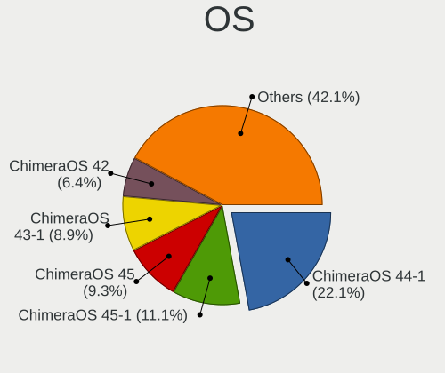

| Name           | Computers | Percent |
|----------------|-----------|---------|
| ChimeraOS 44-1 | 62        | 22.14%  |
| ChimeraOS 45-1 | 31        | 11.07%  |
| ChimeraOS 45   | 26        | 9.29%   |
| ChimeraOS 43-1 | 25        | 8.93%   |
| ChimeraOS 42   | 18        | 6.43%   |
| ChimeraOS 46-2 | 17        | 6.07%   |
| ChimeraOS 48   | 15        | 5.36%   |
| ChimeraOS 39   | 15        | 5.36%   |
| ChimeraOS 49-1 | 11        | 3.93%   |
| ChimeraOS 41   | 11        | 3.93%   |
| ChimeraOS 47   | 9         | 3.21%   |
| ChimeraOS 43   | 8         | 2.86%   |
| ChimeraOS 44   | 6         | 2.14%   |
| ChimeraOS 38   | 6         | 2.14%   |
| ChimeraOS      | 6         | 2.14%   |
| ChimeraOS 46   | 5         | 1.79%   |
| ChimeraOS 37   | 4         | 1.43%   |
| ChimeraOS 47-7 | 1         | 0.36%   |
| ChimeraOS 47-4 | 1         | 0.36%   |
| ChimeraOS 47-1 | 1         | 0.36%   |
| ChimeraOS 46-8 | 1         | 0.36%   |
| ChimeraOS 35   | 1         | 0.36%   |

OS Family
---------

OS without a version

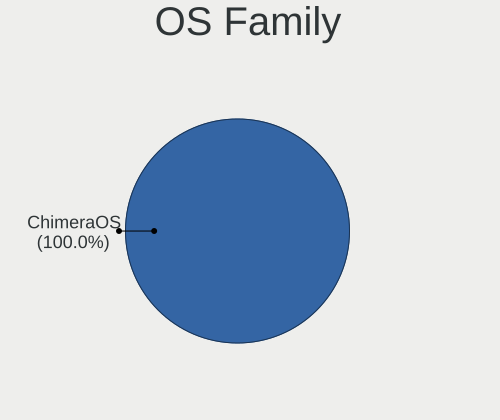

| Name      | Computers | Percent |
|-----------|-----------|---------|
| ChimeraOS | 274       | 100%    |

Kernel
------

Version of the Linux kernel

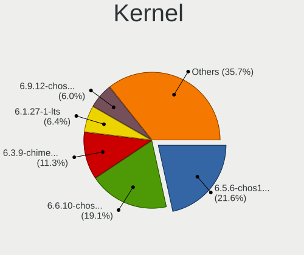

| Version                     | Computers | Percent |
|-----------------------------|-----------|---------|
| 6.5.6-chos1-chimeraos-1     | 61        | 21.55%  |
| 6.6.10-chos1-chimeraos-2    | 54        | 19.08%  |
| 6.3.9-chimeraos-1           | 32        | 11.31%  |
| 6.1.27-1-lts                | 18        | 6.36%   |
| 6.9.12-chos7-chimeraos-1    | 17        | 6.01%   |
| 6.13.5-chos2-chimeraos-1    | 15        | 5.3%    |
| 6.1.11-arch1-1              | 15        | 5.3%    |
| 6.14.7-chos4-chimeraos-2    | 11        | 3.89%   |
| 6.1.21-1-lts                | 11        | 3.89%   |
| 6.12.9-chos1-chimeraos-1    | 9         | 3.18%   |
| 6.5.3-chos1-chimeraos-1     | 6         | 2.12%   |
| 6.1.1-arch1-1               | 6         | 2.12%   |
| 6.9.9-chos1-chimeraos-1     | 4         | 1.41%   |
| 6.0.8-arch1-1               | 4         | 1.41%   |
| 6.9.3-sk-chos3-chimeraos-1  | 1         | 0.35%   |
| 6.8.2-0-generic             | 1         | 0.35%   |
| 6.8.0-rc2-chos1-chimeraos-1 | 1         | 0.35%   |
| 6.6.7-chos4-chimeraos-1     | 1         | 0.35%   |
| 6.6.6-arch1-1               | 1         | 0.35%   |
| 6.6.56-0-generic            | 1         | 0.35%   |
| 6.6.51-0-generic            | 1         | 0.35%   |
| 6.6.37-0-generic            | 1         | 0.35%   |
| 6.6.1-chos3-chimeraos-3     | 1         | 0.35%   |
| 6.6.1-chos3-chimeraos-1     | 1         | 0.35%   |
| 6.4.9-0-generic             | 1         | 0.35%   |
| 6.3.3-arch1-1               | 1         | 0.35%   |
| 6.3.1-arch2-1               | 1         | 0.35%   |
| 6.17.5-0-generic            | 1         | 0.35%   |
| 6.12.45-0-generic           | 1         | 0.35%   |
| 6.11.4-0-generic            | 1         | 0.35%   |
| 6.11.1-sk-chos1-chimeraos-1 | 1         | 0.35%   |
| 6.10.8-sk-chos1-chimeraos-1 | 1         | 0.35%   |
| 6.10.3-arch1-chimeraos-1    | 1         | 0.35%   |
| 5.19.6-arch1-1              | 1         | 0.35%   |

Kernel Family
-------------

Linux kernel without a distro release

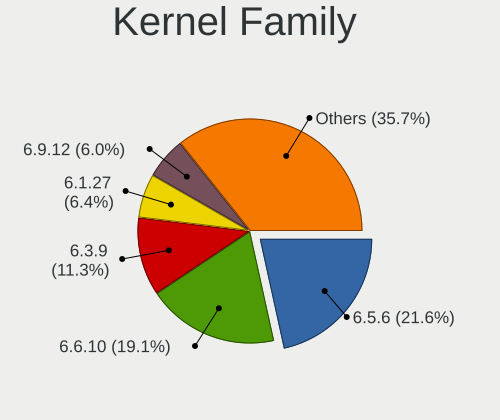

| Version | Computers | Percent |
|---------|-----------|---------|
| 6.5.6   | 61        | 21.55%  |
| 6.6.10  | 54        | 19.08%  |
| 6.3.9   | 32        | 11.31%  |
| 6.1.27  | 18        | 6.36%   |
| 6.9.12  | 17        | 6.01%   |
| 6.13.5  | 15        | 5.3%    |
| 6.1.11  | 15        | 5.3%    |
| 6.14.7  | 11        | 3.89%   |
| 6.1.21  | 11        | 3.89%   |
| 6.12.9  | 9         | 3.18%   |
| 6.5.3   | 6         | 2.12%   |
| 6.1.1   | 6         | 2.12%   |
| 6.9.9   | 4         | 1.41%   |
| 6.0.8   | 4         | 1.41%   |
| 6.6.1   | 2         | 0.71%   |
| 6.9.3   | 1         | 0.35%   |
| 6.8.2   | 1         | 0.35%   |
| 6.8.0   | 1         | 0.35%   |
| 6.6.7   | 1         | 0.35%   |
| 6.6.6   | 1         | 0.35%   |
| 6.6.56  | 1         | 0.35%   |
| 6.6.51  | 1         | 0.35%   |
| 6.6.37  | 1         | 0.35%   |
| 6.4.9   | 1         | 0.35%   |
| 6.3.3   | 1         | 0.35%   |
| 6.3.1   | 1         | 0.35%   |
| 6.17.5  | 1         | 0.35%   |
| 6.12.45 | 1         | 0.35%   |
| 6.11.4  | 1         | 0.35%   |
| 6.11.1  | 1         | 0.35%   |
| 6.10.8  | 1         | 0.35%   |
| 6.10.3  | 1         | 0.35%   |
| 5.19.6  | 1         | 0.35%   |

Kernel Major Ver.
-----------------

Linux kernel major version

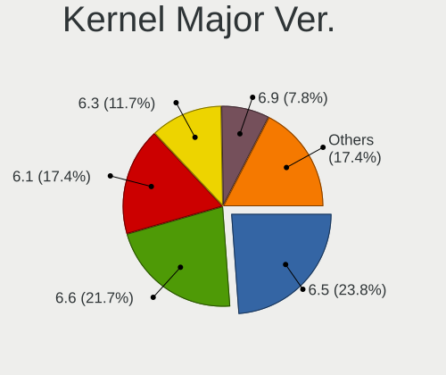

| Version | Computers | Percent |
|---------|-----------|---------|
| 6.5     | 67        | 23.84%  |
| 6.6     | 61        | 21.71%  |
| 6.1     | 49        | 17.44%  |
| 6.3     | 33        | 11.74%  |
| 6.9     | 22        | 7.83%   |
| 6.13    | 15        | 5.34%   |
| 6.14    | 11        | 3.91%   |
| 6.12    | 10        | 3.56%   |
| 6.0     | 4         | 1.42%   |
| 6.8     | 2         | 0.71%   |
| 6.11    | 2         | 0.71%   |
| 6.10    | 2         | 0.71%   |
| 6.4     | 1         | 0.36%   |
| 6.17    | 1         | 0.36%   |
| 5.19    | 1         | 0.36%   |

Arch
----

OS architecture (x86_64, i586, etc.)

| Name   | Computers | Percent |
|--------|-----------|---------|
| x86_64 | 274       | 100%    |

DE
--

Desktop Environment

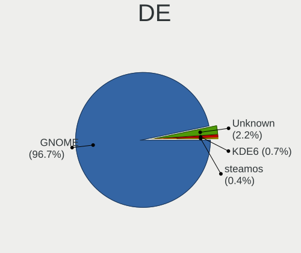

| Name    | Computers | Percent |
|---------|-----------|---------|
| GNOME   | 266       | 96.73%  |
| Unknown | 6         | 2.18%   |
| KDE6    | 2         | 0.73%   |
| steamos | 1         | 0.36%   |

Display Server
--------------

X11 or Wayland

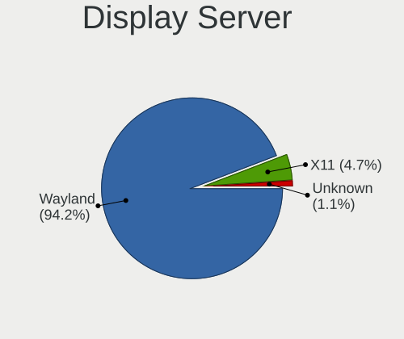

| Name    | Computers | Percent |
|---------|-----------|---------|
| Wayland | 259       | 94.18%  |
| X11     | 13        | 4.73%   |
| Unknown | 3         | 1.09%   |

Display Manager
---------------

SDDM, LightDM, etc.

| Name    | Computers | Percent |
|---------|-----------|---------|
| Unknown | 274       | 100%    |

OS Lang
-------

Language

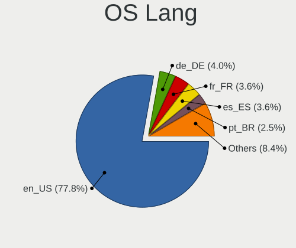

| Lang    | Computers | Percent |
|---------|-----------|---------|
| en_US   | 214       | 77.82%  |
| de_DE   | 11        | 4%      |
| fr_FR   | 10        | 3.64%   |
| es_ES   | 10        | 3.64%   |
| pt_BR   | 7         | 2.55%   |
| zh_CN   | 6         | 2.18%   |
| Unknown | 6         | 2.18%   |
| it_IT   | 4         | 1.45%   |
| es_AR   | 2         | 0.73%   |
| ko_KR   | 1         | 0.36%   |
| ja_JP   | 1         | 0.36%   |
| fr_CA   | 1         | 0.36%   |
| en_GB   | 1         | 0.36%   |
| C       | 1         | 0.36%   |

Boot Mode
---------

EFI or BIOS

| Mode | Computers | Percent |
|------|-----------|---------|
| BIOS | 274       | 100%    |

Filesystem
----------

Type of filesystem

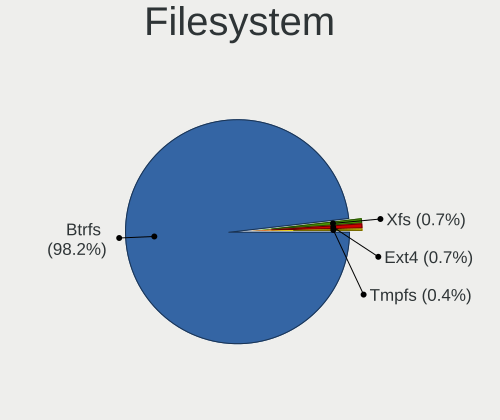

| Type  | Computers | Percent |
|-------|-----------|---------|
| Btrfs | 269       | 98.18%  |
| Xfs   | 2         | 0.73%   |
| Ext4  | 2         | 0.73%   |
| Tmpfs | 1         | 0.36%   |

Part. scheme
------------

Scheme of partitioning

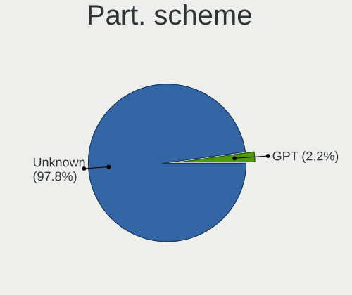

| Type    | Computers | Percent |
|---------|-----------|---------|
| Unknown | 269       | 97.82%  |
| GPT     | 6         | 2.18%   |

Dual Boot with Linux/BSD
------------------------

Hosting more than one Linux/BSD

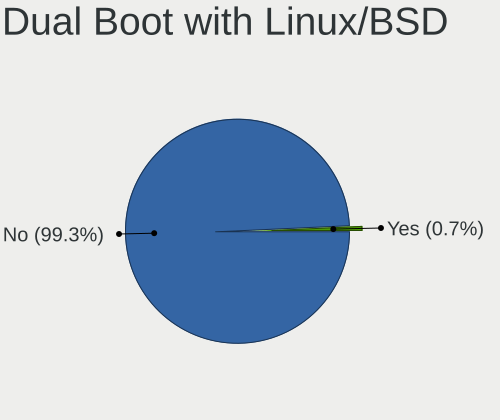

| Dual boot | Computers | Percent |
|-----------|-----------|---------|
| No        | 273       | 99.27%  |
| Yes       | 2         | 0.73%   |

Dual Boot (Win)
---------------

Hosting Linux and Windows

| Dual boot | Computers | Percent |
|-----------|-----------|---------|
| No        | 272       | 99.27%  |
| Yes       | 2         | 0.73%   |

Board
-----

Vendor
------

Motherboard manufacturer

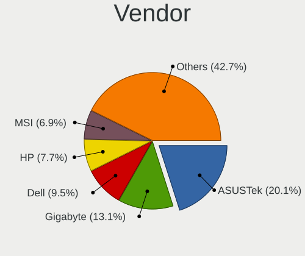

| Name                                 | Computers | Percent |
|--------------------------------------|-----------|---------|
| ASUSTek Computer                     | 55        | 20.07%  |
| Gigabyte Technology                  | 36        | 13.14%  |
| Dell                                 | 26        | 9.49%   |
| Hewlett-Packard                      | 21        | 7.66%   |
| MSI                                  | 19        | 6.93%   |
| Lenovo                               | 16        | 5.84%   |
| ASRock                               | 14        | 5.11%   |
| Acer                                 | 12        | 4.38%   |
| AYANEO                               | 8         | 2.92%   |
| Shenzhen Meigao Electronic Equipment | 6         | 2.19%   |
| ONE-NETBOOK                          | 6         | 2.19%   |
| Intel                                | 5         | 1.82%   |
| Microsoft                            | 4         | 1.46%   |
| AZW                                  | 4         | 1.46%   |
| Apple                                | 4         | 1.46%   |
| ONE-NETBOOK TECHNOLOGY               | 3         | 1.09%   |
| GPD                                  | 3         | 1.09%   |
| Razer                                | 2         | 0.73%   |
| Micro Computer (HK) Tech Limited     | 2         | 0.73%   |
| HUAWEI                               | 2         | 0.73%   |
| HC Technology.                       | 2         | 0.73%   |
| Google                               | 2         | 0.73%   |
| ZOTAC                                | 1         | 0.36%   |
| Valve                                | 1         | 0.36%   |
| Soyo                                 | 1         | 0.36%   |
| Sony                                 | 1         | 0.36%   |
| Samsung Electronics                  | 1         | 0.36%   |
| QIYIDA                               | 1         | 0.36%   |
| Pegatron                             | 1         | 0.36%   |
| OEM                                  | 1         | 0.36%   |
| Notebook                             | 1         | 0.36%   |
| Micro Electronics                    | 1         | 0.36%   |
| MACHINIST                            | 1         | 0.36%   |
| GMKtec                               | 1         | 0.36%   |
| Gateway                              | 1         | 0.36%   |
| Fujitsu                              | 1         | 0.36%   |
| Framework                            | 1         | 0.36%   |
| c4m1GcrtNMC3RUy                      | 1         | 0.36%   |
| Biostar                              | 1         | 0.36%   |
| Anbernic                             | 1         | 0.36%   |

Model
-----

Motherboard model

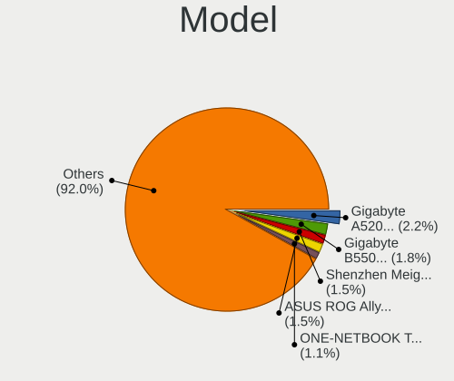

| Name                                                  | Computers | Percent |
|-------------------------------------------------------|-----------|---------|
| Gigabyte A520I AC                                     | 6         | 2.19%   |
| Gigabyte B550I AORUS PRO AX                           | 5         | 1.82%   |
| Shenzhen Meigao Electronic Equipment Venus series     | 4         | 1.46%   |
| ASUS ROG Ally RC71L_RC71L                             | 4         | 1.46%   |
| ONE-NETBOOK TECHNOLOGY ONE XPLAYER                    | 3         | 1.09%   |
| Dell OptiPlex 3060                                    | 3         | 1.09%   |
| AZW SER                                               | 3         | 1.09%   |
| AYANEO AIR Plus                                       | 3         | 1.09%   |
| AYANEO 2                                              | 3         | 1.09%   |
| Unknown                                               | 3         | 1.09%   |
| ONE-NETBOOK ONEXPLAYER 2 PRO ARP23P                   | 2         | 0.73%   |
| ONE-NETBOOK ONEXPLAYER 2 ARP23                        | 2         | 0.73%   |
| MSI MS-7A38                                           | 2         | 0.73%   |
| Microsoft Surface Pro 4                               | 2         | 0.73%   |
| HP Victus by 15L Gaming Desktop TG02-0xxx             | 2         | 0.73%   |
| HP EliteDesk 800 G1 SFF                               | 2         | 0.73%   |
| Gigabyte B450 AORUS PRO WIFI                          | 2         | 0.73%   |
| Dell OptiPlex 7020                                    | 2         | 0.73%   |
| Dell OptiPlex 5055 Ryzen APU                          | 2         | 0.73%   |
| Dell OptiPlex 3070                                    | 2         | 0.73%   |
| ASUS ROG STRIX B550-F GAMING                          | 2         | 0.73%   |
| ASUS PRIME B550M-A                                    | 2         | 0.73%   |
| ASUS PRIME B550-PLUS                                  | 2         | 0.73%   |
| Acer Aspire V3-772G                                   | 2         | 0.73%   |
| ZOTAC ZBOX-ECM73070C/53060C                           | 1         | 0.36%   |
| Valve Galileo                                         | 1         | 0.36%   |
| Soyo SY-Classic B450M                                 | 1         | 0.36%   |
| Sony SVS13A25PLB                                      | 1         | 0.36%   |
| Shenzhen Meigao Electronic Equipment Uranus Series    | 1         | 0.36%   |
| Shenzhen Meigao Electronic Equipment AtomMan G Series | 1         | 0.36%   |
| Samsung RC530/RC730                                   | 1         | 0.36%   |
| Razer Blade Pro 17 (Early 2020) - RZ09-0329           | 1         | 0.36%   |
| Razer Blade 14 - RZ09-0370                            | 1         | 0.36%   |
| QIYIDA X99 K9S                                        | 1         | 0.36%   |
| Pegatron C15B                                         | 1         | 0.36%   |
| ONE-NETBOOK ONEXPLAYER X1 mini                        | 1         | 0.36%   |
| ONE-NETBOOK ONEXPLAYER F1                             | 1         | 0.36%   |
| OEM B75                                               | 1         | 0.36%   |
| Notebook P15SM-A/SM1-A                                | 1         | 0.36%   |
| MSI MS-7E28                                           | 1         | 0.36%   |

Model Family
------------

Motherboard model prefix

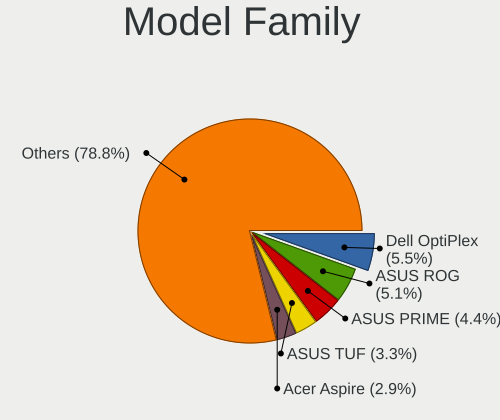

| Name                                         | Computers | Percent |
|----------------------------------------------|-----------|---------|
| Dell OptiPlex                                | 15        | 5.47%   |
| ASUS ROG                                     | 14        | 5.11%   |
| ASUS PRIME                                   | 12        | 4.38%   |
| ASUS TUF                                     | 9         | 3.28%   |
| Acer Aspire                                  | 8         | 2.92%   |
| ONE-NETBOOK ONEXPLAYER                       | 6         | 2.19%   |
| Lenovo IdeaPad                               | 6         | 2.19%   |
| Gigabyte A520I                               | 6         | 2.19%   |
| HP Victus                                    | 5         | 1.82%   |
| Gigabyte B550I                               | 5         | 1.82%   |
| AYANEO AIR                                   | 5         | 1.82%   |
| Shenzhen Meigao Electronic Equipment Venus   | 4         | 1.46%   |
| Microsoft Surface                            | 4         | 1.46%   |
| Lenovo ThinkCentre                           | 4         | 1.46%   |
| HP EliteDesk                                 | 4         | 1.46%   |
| Gigabyte B450                                | 4         | 1.46%   |
| Dell Latitude                                | 4         | 1.46%   |
| ASUS ASUS                                    | 4         | 1.46%   |
| ONE-NETBOOK TECHNOLOGY ONE                   | 3         | 1.09%   |
| Dell Precision                               | 3         | 1.09%   |
| Dell Inspiron                                | 3         | 1.09%   |
| AZW SER                                      | 3         | 1.09%   |
| AYANEO 2                                     | 3         | 1.09%   |
| Unknown                                      | 3         | 1.09%   |
| Razer Blade                                  | 2         | 0.73%   |
| MSI MS-7A38                                  | 2         | 0.73%   |
| Lenovo ThinkPad                              | 2         | 0.73%   |
| Lenovo Legion                                | 2         | 0.73%   |
| HP Pavilion                                  | 2         | 0.73%   |
| Gigabyte X570                                | 2         | 0.73%   |
| ASRock B450M                                 | 2         | 0.73%   |
| Acer Veriton                                 | 2         | 0.73%   |
| Acer Nitro                                   | 2         | 0.73%   |
| ZOTAC ZBOX-ECM73070C                         | 1         | 0.36%   |
| Valve Galileo                                | 1         | 0.36%   |
| Soyo SY-Classic                              | 1         | 0.36%   |
| Sony SVS13A25PLB                             | 1         | 0.36%   |
| Shenzhen Meigao Electronic Equipment Uranus  | 1         | 0.36%   |
| Shenzhen Meigao Electronic Equipment AtomMan | 1         | 0.36%   |
| Samsung RC530                                | 1         | 0.36%   |

MFG Year
--------

Motherboard manufacture year

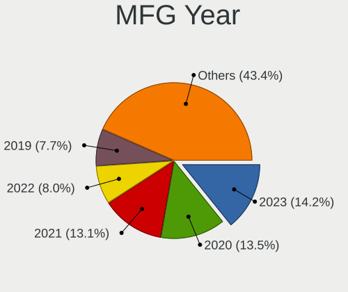

| Year | Computers | Percent |
|------|-----------|---------|
| 2023 | 39        | 14.23%  |
| 2020 | 37        | 13.5%   |
| 2021 | 36        | 13.14%  |
| 2022 | 22        | 8.03%   |
| 2019 | 21        | 7.66%   |
| 2013 | 17        | 6.2%    |
| 2017 | 15        | 5.47%   |
| 2012 | 14        | 5.11%   |
| 2018 | 13        | 4.74%   |
| 2015 | 13        | 4.74%   |
| 2024 | 11        | 4.01%   |
| 2016 | 11        | 4.01%   |
| 2014 | 9         | 3.28%   |
| 2011 | 8         | 2.92%   |
| 2010 | 4         | 1.46%   |
| 2025 | 2         | 0.73%   |
| 2009 | 1         | 0.36%   |
| 2008 | 1         | 0.36%   |

Form Factor
-----------

Physical design of the computer

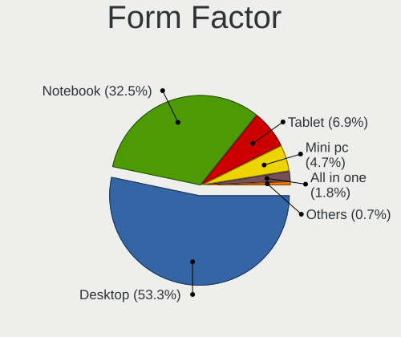

| Name        | Computers | Percent |
|-------------|-----------|---------|
| Desktop     | 146       | 53.28%  |
| Notebook    | 89        | 32.48%  |
| Tablet      | 19        | 6.93%   |
| Mini pc     | 13        | 4.74%   |
| All in one  | 5         | 1.82%   |
| Convertible | 2         | 0.73%   |

Secure Boot
-----------

Enabled or disabled

| State    | Computers | Percent |
|----------|-----------|---------|
| Disabled | 274       | 100%    |

Coreboot
--------

Have coreboot on board

| Used | Computers | Percent |
|------|-----------|---------|
| No   | 271       | 98.91%  |
| Yes  | 3         | 1.09%   |

RAM Size
--------

Total RAM memory

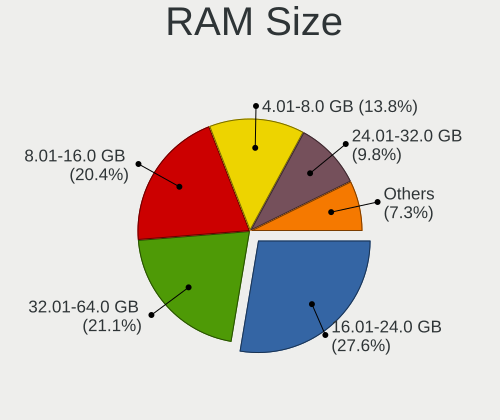

| Size in GB  | Computers | Percent |
|-------------|-----------|---------|
| 16.01-24.0  | 76        | 27.64%  |
| 32.01-64.0  | 58        | 21.09%  |
| 8.01-16.0   | 56        | 20.36%  |
| 4.01-8.0    | 38        | 13.82%  |
| 24.01-32.0  | 27        | 9.82%   |
| 64.01-256.0 | 13        | 4.73%   |
| 3.01-4.0    | 7         | 2.55%   |

RAM Used
--------

Used RAM memory

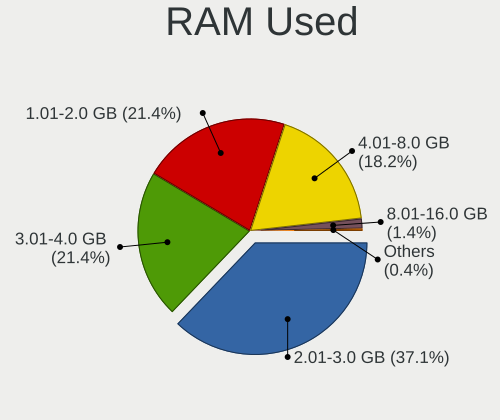

| Used GB    | Computers | Percent |
|------------|-----------|---------|
| 2.01-3.0   | 104       | 37.14%  |
| 3.01-4.0   | 60        | 21.43%  |
| 1.01-2.0   | 60        | 21.43%  |
| 4.01-8.0   | 51        | 18.21%  |
| 8.01-16.0  | 4         | 1.43%   |
| 16.01-24.0 | 1         | 0.36%   |

Total Drives
------------

Number of drives on board

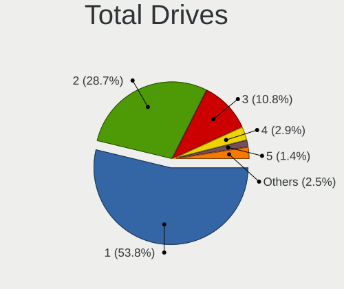

| Drives | Computers | Percent |
|--------|-----------|---------|
| 1      | 150       | 53.76%  |
| 2      | 80        | 28.67%  |
| 3      | 30        | 10.75%  |
| 4      | 8         | 2.87%   |
| 5      | 4         | 1.43%   |
| 6      | 2         | 0.72%   |
| 0      | 2         | 0.72%   |
| 11     | 1         | 0.36%   |
| 8      | 1         | 0.36%   |
| 7      | 1         | 0.36%   |

Has CD-ROM
----------

Has CD-ROM on board

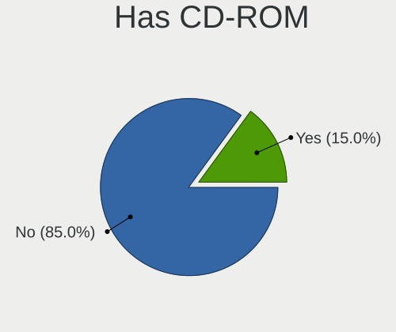

| Presented | Computers | Percent |
|-----------|-----------|---------|
| No        | 233       | 85.04%  |
| Yes       | 41        | 14.96%  |

Has Ethernet
------------

Has Ethernet on board

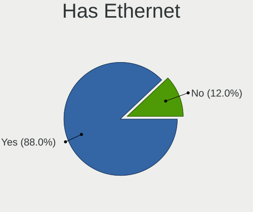

| Presented | Computers | Percent |
|-----------|-----------|---------|
| Yes       | 241       | 87.96%  |
| No        | 33        | 12.04%  |

Has WiFi
--------

Has WiFi module

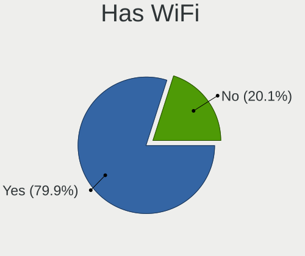

| Presented | Computers | Percent |
|-----------|-----------|---------|
| Yes       | 219       | 79.93%  |
| No        | 55        | 20.07%  |

Has Bluetooth
-------------

Has Bluetooth module

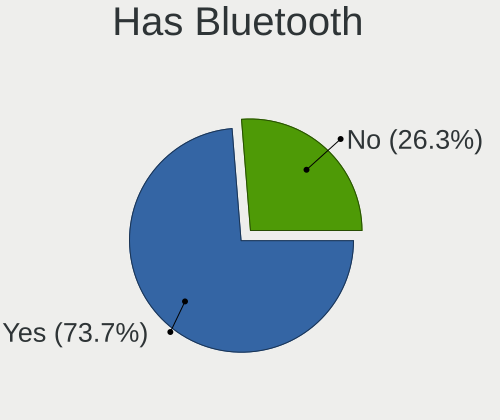

| Presented | Computers | Percent |
|-----------|-----------|---------|
| Yes       | 202       | 73.72%  |
| No        | 72        | 26.28%  |

Location
--------

Country
-------

Geographic location (country)

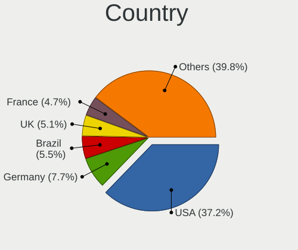

| Country       | Computers | Percent |
|---------------|-----------|---------|
| USA           | 102       | 37.23%  |
| Germany       | 21        | 7.66%   |
| Brazil        | 15        | 5.47%   |
| UK            | 14        | 5.11%   |
| France        | 13        | 4.74%   |
| Canada        | 11        | 4.01%   |
| Spain         | 9         | 3.28%   |
| Russia        | 8         | 2.92%   |
| Australia     | 6         | 2.19%   |
| Poland        | 5         | 1.82%   |
| Netherlands   | 5         | 1.82%   |
| Italy         | 5         | 1.82%   |
| Vietnam       | 4         | 1.46%   |
| Mexico        | 4         | 1.46%   |
| China         | 4         | 1.46%   |
| Saudi Arabia  | 3         | 1.09%   |
| Peru          | 3         | 1.09%   |
| Turkey        | 2         | 0.73%   |
| Switzerland   | 2         | 0.73%   |
| South Korea   | 2         | 0.73%   |
| South Africa  | 2         | 0.73%   |
| Norway        | 2         | 0.73%   |
| Malaysia      | 2         | 0.73%   |
| Japan         | 2         | 0.73%   |
| Hungary       | 2         | 0.73%   |
| Honduras      | 2         | 0.73%   |
| Finland       | 2         | 0.73%   |
| Estonia       | 2         | 0.73%   |
| Colombia      | 2         | 0.73%   |
| Austria       | 2         | 0.73%   |
| Argentina     | 2         | 0.73%   |
| Romania       | 1         | 0.36%   |
| Philippines   | 1         | 0.36%   |
| Oman          | 1         | 0.36%   |
| New Zealand   | 1         | 0.36%   |
| Macao         | 1         | 0.36%   |
| Indonesia     | 1         | 0.36%   |
| Iceland       | 1         | 0.36%   |
| Greece        | 1         | 0.36%   |
| French Guiana | 1         | 0.36%   |

City
----

Geographic location (city)

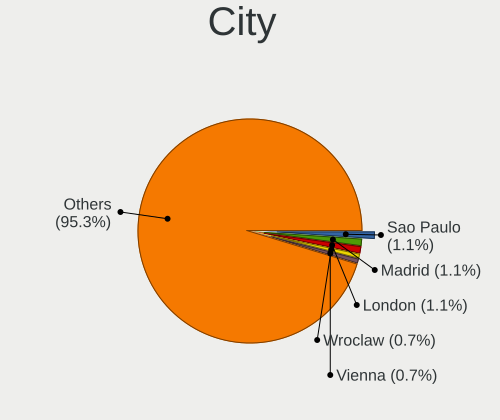

| City          | Computers | Percent |
|---------------|-----------|---------|
| Sao Paulo     | 3         | 1.08%   |
| Madrid        | 3         | 1.08%   |
| London        | 3         | 1.08%   |
| Wroclaw       | 2         | 0.72%   |
| Vienna        | 2         | 0.72%   |
| Vancouver     | 2         | 0.72%   |
| Tegucigalpa   | 2         | 0.72%   |
| Sydney        | 2         | 0.72%   |
| Stuttgart     | 2         | 0.72%   |
| Springfield   | 2         | 0.72%   |
| Seattle       | 2         | 0.72%   |
| Sanford       | 2         | 0.72%   |
| San José     | 2         | 0.72%   |
| Salvador      | 2         | 0.72%   |
| Portland      | 2         | 0.72%   |
| Phoenix       | 2         | 0.72%   |
| Philadelphia  | 2         | 0.72%   |
| New York      | 2         | 0.72%   |
| Moscow        | 2         | 0.72%   |
| Melbourne     | 2         | 0.72%   |
| Lima          | 2         | 0.72%   |
| Las Vegas     | 2         | 0.72%   |
| Kuala Lumpur  | 2         | 0.72%   |
| Istanbul      | 2         | 0.72%   |
| Guangzhou     | 2         | 0.72%   |
| Geneva        | 2         | 0.72%   |
| Gelsenkirchen | 2         | 0.72%   |
| Fortaleza     | 2         | 0.72%   |
| Effingham     | 2         | 0.72%   |
| Dammam        | 2         | 0.72%   |
| Cincinnati    | 2         | 0.72%   |
| Chattanooga   | 2         | 0.72%   |
| Cape Town     | 2         | 0.72%   |
| Calgary       | 2         | 0.72%   |
| Bellevue      | 2         | 0.72%   |
| Yekaterinburg | 1         | 0.36%   |
| Yaroslavl     | 1         | 0.36%   |
| Wilmington    | 1         | 0.36%   |
| Wiesbaden     | 1         | 0.36%   |
| Wiehl         | 1         | 0.36%   |

Drives
------

Drive Vendor
------------

Hard drive vendors

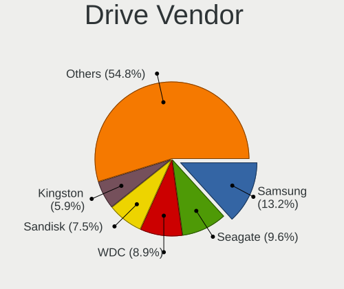

| Vendor                       | Computers | Drives | Percent |
|------------------------------|-----------|--------|---------|
| Samsung Electronics          | 58        | 80     | 13.24%  |
| Seagate                      | 42        | 49     | 9.59%   |
| WDC                          | 39        | 49     | 8.9%    |
| Sandisk                      | 33        | 41     | 7.53%   |
| Kingston                     | 26        | 28     | 5.94%   |
| Unknown                      | 19        | 19     | 4.34%   |
| Micron Technology            | 19        | 25     | 4.34%   |
| SK hynix                     | 17        | 17     | 3.88%   |
| Micron/Crucial Technology    | 16        | 17     | 3.65%   |
| Crucial                      | 16        | 20     | 3.65%   |
| Phison Electronics           | 14        | 16     | 3.2%    |
| Toshiba                      | 13        | 16     | 2.97%   |
| Kingston Technology Company  | 11        | 11     | 2.51%   |
| Realtek Semiconductor        | 10        | 10     | 2.28%   |
| Intel                        | 10        | 12     | 2.28%   |
| MAXIO Technology (Hangzhou)  | 9         | 10     | 2.05%   |
| Shenzhen Longsys Electronics | 6         | 7      | 1.37%   |
| KIOXIA                       | 6         | 7      | 1.37%   |
| China                        | 6         | 6      | 1.37%   |
| Silicon Motion               | 5         | 5      | 1.14%   |
| ADATA Technology             | 5         | 7      | 1.14%   |
| A-DATA Technology            | 5         | 5      | 1.14%   |
| Hitachi                      | 4         | 4      | 0.91%   |
| HGST                         | 4         | 4      | 0.91%   |
| SPCC                         | 3         | 3      | 0.68%   |
| PNY                          | 3         | 4      | 0.68%   |
| JMicron Technology           | 3         | 3      | 0.68%   |
| Unknown                      | 3         | 3      | 0.68%   |
| Team                         | 2         | 2      | 0.46%   |
| Fanxiang                     | 2         | 2      | 0.46%   |
| Corsair                      | 2         | 2      | 0.46%   |
| Biwin Storage Technology     | 2         | 2      | 0.46%   |
| Apple                        | 2         | 2      | 0.46%   |
| AMD                          | 2         | 2      | 0.46%   |
| WDC PC S                     | 1         | 1      | 0.23%   |
| TO Exter                     | 1         | 1      | 0.23%   |
| Timetec                      | 1         | 1      | 0.23%   |
| SSSTC                        | 1         | 1      | 0.23%   |
| SSK                          | 1         | 1      | 0.23%   |
| SABRENT                      | 1         | 1      | 0.23%   |

Drive Model
-----------

Hard drive models

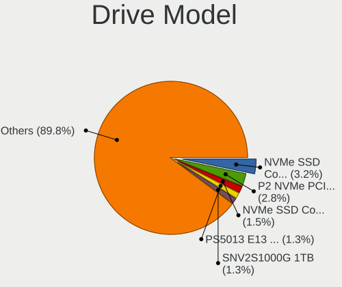

| Model                                                              | Computers | Percent |
|--------------------------------------------------------------------|-----------|---------|
| Samsung NVMe SSD Controller SM981/PM981/PM983 1TB                  | 15        | 3.25%   |
| Micron/Crucial P2 NVMe PCIe SSD 2TB                                | 13        | 2.81%   |
| Samsung NVMe SSD Controller PM9A1/PM9A3/980PRO 1TB                 | 7         | 1.52%   |
| Phison PS5013 E13 NVMe Controller 500GB                            | 6         | 1.3%    |
| Kingston Company SNV2S1000G 1TB                                    | 6         | 1.3%    |
| Seagate ST1000DM010-2EP102 1TB                                     | 5         | 1.08%   |
| Samsung NVMe SSD Controller SM961/PM961/SM963 1024GB               | 5         | 1.08%   |
| Kingston SA400S37480G 480GB SSD                                    | 5         | 1.08%   |
| Seagate ST500DM002-1BD142 500GB                                    | 4         | 0.87%   |
| Seagate ST1000LM035-1RK172 1TB                                     | 4         | 0.87%   |
| Samsung SSD 860 EVO 1TB                                            | 4         | 0.87%   |
| Micron 2400_MTFDKBK512QFM 512GB                                    | 4         | 0.87%   |
| MAXIO (Hangzhou) NVMe SSD Controller MAP1202 2TB                   | 4         | 0.87%   |
| WDC WD20EZRZ-00Z5HB0 2TB                                           | 3         | 0.65%   |
| Unknown NVMe SSD Drive 512GB                                       | 3         | 0.65%   |
| Unknown MMC Card  512GB                                            | 3         | 0.65%   |
| Silicon Motion SM2263EN/SM2263XT SSD Controller 512GB              | 3         | 0.65%   |
| Sandisk WD_BLACK SN770 2TB                                         | 3         | 0.65%   |
| Sandisk WD Blue SN550 NVMe SSD 1024GB                              | 3         | 0.65%   |
| Samsung SSD 980 1TB                                                | 3         | 0.65%   |
| Realtek RTS5763DL NVMe SSD Controller 512GB                        | 3         | 0.65%   |
| Phison E12 NVMe Controller 1TB                                     | 3         | 0.65%   |
| Kingston SA400S37120G 120GB SSD                                    | 3         | 0.65%   |
| JMicron Tech 250GB                                                 | 3         | 0.65%   |
| Crucial CT500MX500SSD1 500GB                                       | 3         | 0.65%   |
| Crucial CT240BX500SSD1 240GB                                       | 3         | 0.65%   |
| ADATA XPG SX8200 Pro PCIe Gen3x4 M.2 2280 Solid State Drive 1024GB | 3         | 0.65%   |
| Unknown                                                            | 3         | 0.65%   |
| WDC WDBNCE5000PNC 500GB SSD                                        | 2         | 0.43%   |
| WDC WD1600AAJS-00B4A0 160GB                                        | 2         | 0.43%   |
| WDC WD10JPVX-22JC3T0 1TB                                           | 2         | 0.43%   |
| WDC WD10EZEX-00BN5A0 1TB                                           | 2         | 0.43%   |
| Unknown SD/MMC/MS PRO 2GB                                          | 2         | 0.43%   |
| Unknown NVMe SSD Drive 2TB                                         | 2         | 0.43%   |
| Unknown MMC Card  64GB                                             | 2         | 0.43%   |
| Unknown MMC Card  1TB                                              | 2         | 0.43%   |
| Unknown MMC Card  16GB                                             | 2         | 0.43%   |
| Toshiba MQ04ABF100 1TB                                             | 2         | 0.43%   |
| SPCC Solid State Disk 1024GB                                       | 2         | 0.43%   |
| SK hynix HFM512GD3JX016N 512GB                                     | 2         | 0.43%   |

HDD Vendor
----------

Hard disk drive vendors

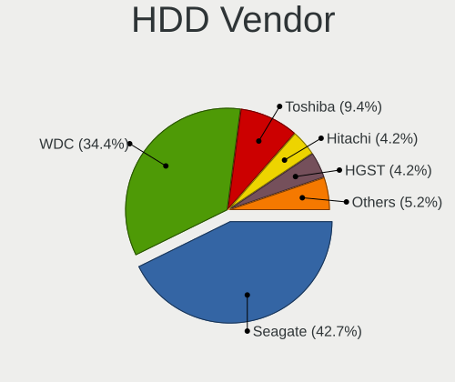

| Vendor              | Computers | Drives | Percent |
|---------------------|-----------|--------|---------|
| Seagate             | 41        | 47     | 42.71%  |
| WDC                 | 33        | 37     | 34.38%  |
| Toshiba             | 9         | 12     | 9.38%   |
| Hitachi             | 4         | 4      | 4.17%   |
| HGST                | 4         | 4      | 4.17%   |
| Unknown             | 2         | 2      | 2.08%   |
| TO Exter            | 1         | 1      | 1.04%   |
| Samsung Electronics | 1         | 1      | 1.04%   |
| Apple               | 1         | 1      | 1.04%   |

SSD Vendor
----------

Solid state drive vendors

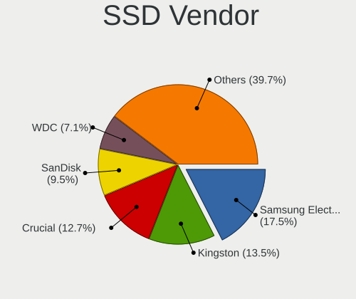

| Vendor              | Computers | Drives | Percent |
|---------------------|-----------|--------|---------|
| Samsung Electronics | 22        | 31     | 17.46%  |
| Kingston            | 17        | 19     | 13.49%  |
| Crucial             | 16        | 20     | 12.7%   |
| SanDisk             | 12        | 17     | 9.52%   |
| WDC                 | 9         | 12     | 7.14%   |
| Micron Technology   | 6         | 12     | 4.76%   |
| China               | 6         | 6      | 4.76%   |
| A-DATA Technology   | 5         | 5      | 3.97%   |
| Intel               | 4         | 5      | 3.17%   |
| SPCC                | 3         | 3      | 2.38%   |
| SK hynix            | 3         | 3      | 2.38%   |
| PNY                 | 3         | 4      | 2.38%   |
| Fanxiang            | 2         | 2      | 1.59%   |
| Corsair             | 2         | 2      | 1.59%   |
| Team                | 1         | 1      | 0.79%   |
| SSSTC               | 1         | 1      | 0.79%   |
| Seagate             | 1         | 1      | 0.79%   |
| SABRENT             | 1         | 1      | 0.79%   |
| RZX                 | 1         | 1      | 0.79%   |
| NT-1TB              | 1         | 1      | 0.79%   |
| Netac               | 1         | 1      | 0.79%   |
| KingDian            | 1         | 5      | 0.79%   |
| Intenso             | 1         | 1      | 0.79%   |
| Hewlett-Packard     | 1         | 1      | 0.79%   |
| GOODRAM             | 1         | 1      | 0.79%   |
| GALAX               | 1         | 1      | 0.79%   |
| ASMedia             | 1         | 1      | 0.79%   |
| Apple               | 1         | 1      | 0.79%   |
| ANKEJE              | 1         | 1      | 0.79%   |
| AMD                 | 1         | 1      | 0.79%   |

Drive Kind
----------

HDD or SSD

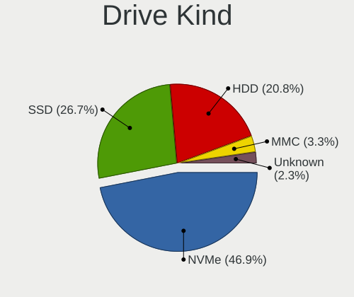

| Kind    | Computers | Drives | Percent |
|---------|-----------|--------|---------|
| NVMe    | 183       | 223    | 46.92%  |
| SSD     | 104       | 161    | 26.67%  |
| HDD     | 81        | 109    | 20.77%  |
| MMC     | 13        | 13     | 3.33%   |
| Unknown | 9         | 9      | 2.31%   |

Drive Connector
---------------

SATA, SAS, NVMe, etc.

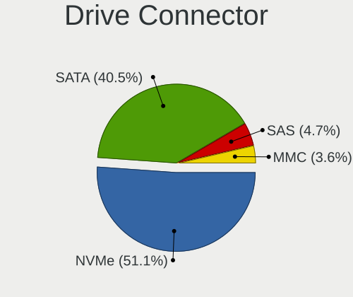

| Type | Computers | Drives | Percent |
|------|-----------|--------|---------|
| NVMe | 183       | 221    | 51.12%  |
| SATA | 145       | 263    | 40.5%   |
| SAS  | 17        | 18     | 4.75%   |
| MMC  | 13        | 13     | 3.63%   |

Drive Size
----------

Size of hard drive

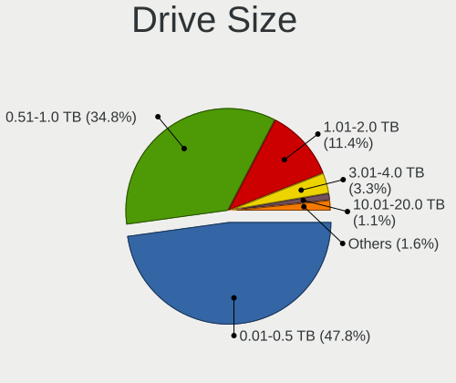

| Size in TB | Computers | Drives | Percent |
|------------|-----------|--------|---------|
| 0.01-0.5   | 88        | 151    | 47.83%  |
| 0.51-1.0   | 64        | 80     | 34.78%  |
| 1.01-2.0   | 21        | 24     | 11.41%  |
| 3.01-4.0   | 6         | 10     | 3.26%   |
| 10.01-20.0 | 2         | 2      | 1.09%   |
| 4.01-10.0  | 2         | 2      | 1.09%   |
| 2.01-3.0   | 1         | 1      | 0.54%   |

Space Total
-----------

Amount of disk space available on the file system

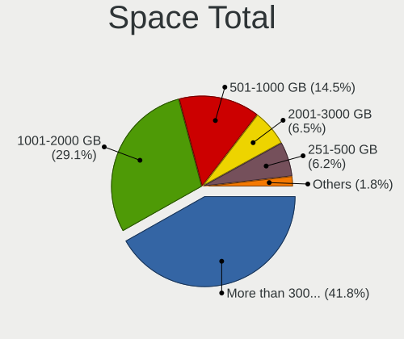

| Size in GB     | Computers | Percent |
|----------------|-----------|---------|
| More than 3000 | 115       | 41.82%  |
| 1001-2000      | 80        | 29.09%  |
| 501-1000       | 40        | 14.55%  |
| 2001-3000      | 18        | 6.55%   |
| 251-500        | 17        | 6.18%   |
| 101-250        | 2         | 0.73%   |
| 21-50          | 1         | 0.36%   |
| 1-20           | 1         | 0.36%   |
| 51-100         | 1         | 0.36%   |

Space Used
----------

Amount of used disk space

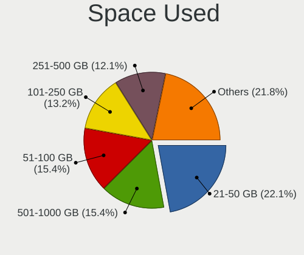

| Used GB        | Computers | Percent |
|----------------|-----------|---------|
| 21-50          | 62        | 22.14%  |
| 501-1000       | 43        | 15.36%  |
| 51-100         | 43        | 15.36%  |
| 101-250        | 37        | 13.21%  |
| 251-500        | 34        | 12.14%  |
| 1001-2000      | 29        | 10.36%  |
| More than 3000 | 15        | 5.36%   |
| 2001-3000      | 14        | 5%      |
| 1-20           | 3         | 1.07%   |

Malfunc. Drives
---------------

Drive models with a malfunction

Zero info for selected period =(

Malfunc. Drive Vendor
---------------------

Vendors of faulty drives

Zero info for selected period =(

Malfunc. HDD Vendor
-------------------

Vendors of faulty HDD drives

Zero info for selected period =(

Malfunc. Drive Kind
-------------------

Kinds of faulty drives

Zero info for selected period =(

Failed Drives
-------------

Failed drive models

Zero info for selected period =(

Failed Drive Vendor
-------------------

Failed drive vendors

Zero info for selected period =(

Drive Status
------------

Number of failed and malfunc. drives

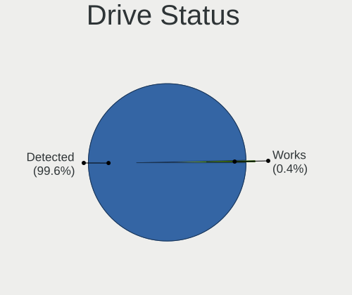

| Status   | Computers | Drives | Percent |
|----------|-----------|--------|---------|
| Detected | 272       | 514    | 99.63%  |
| Works    | 1         | 1      | 0.37%   |

Storage controller
------------------

Storage Vendor
--------------

Storage controller vendors

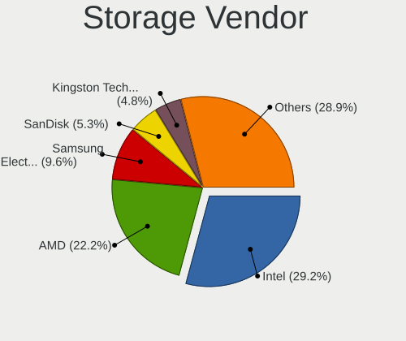

| Vendor                       | Computers | Percent |
|------------------------------|-----------|---------|
| Intel                        | 122       | 29.19%  |
| AMD                          | 93        | 22.25%  |
| Samsung Electronics          | 40        | 9.57%   |
| SanDisk                      | 22        | 5.26%   |
| Kingston Technology Company  | 20        | 4.78%   |
| Micron/Crucial Technology    | 16        | 3.83%   |
| SK hynix                     | 14        | 3.35%   |
| Phison Electronics           | 14        | 3.35%   |
| Micron Technology            | 13        | 3.11%   |
| Realtek Semiconductor        | 10        | 2.39%   |
| MAXIO Technology (Hangzhou)  | 9         | 2.15%   |
| Shenzhen Longsys Electronics | 6         | 1.44%   |
| KIOXIA                       | 6         | 1.44%   |
| Silicon Motion               | 5         | 1.2%    |
| ADATA Technology             | 5         | 1.2%    |
| Toshiba America Info Systems | 4         | 0.96%   |
| ASMedia Technology           | 4         | 0.96%   |
| Biwin Storage Technology     | 3         | 0.72%   |
| Solidigm                     | 2         | 0.48%   |
| Marvell Technology Group     | 2         | 0.48%   |
| INNOGRIT                     | 2         | 0.48%   |
| VIA Technologies             | 1         | 0.24%   |
| TenaFe                       | 1         | 0.24%   |
| O2 Micro                     | 1         | 0.24%   |
| Lenovo                       | 1         | 0.24%   |
| Hosin Global Electronics     | 1         | 0.24%   |
| Unknown                      | 1         | 0.24%   |

Storage Model
-------------

Storage controller models

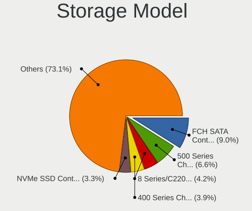

| Model                                                                          | Computers | Percent |
|--------------------------------------------------------------------------------|-----------|---------|
| AMD FCH SATA Controller [AHCI mode]                                            | 41        | 8.97%   |
| AMD 500 Series Chipset SATA Controller                                         | 30        | 6.56%   |
| Intel 8 Series/C220 Series Chipset Family 6-port SATA Controller 1 [AHCI mode] | 19        | 4.16%   |
| AMD 400 Series Chipset SATA Controller                                         | 18        | 3.94%   |
| Samsung NVMe SSD Controller SM981/PM981/PM983                                  | 15        | 3.28%   |
| Micron/Crucial P2 [Nick P2] / P3 / P3 Plus NVMe PCIe SSD (DRAM-less)           | 13        | 2.84%   |
| AMD 600 Series Chipset SATA Controller                                         | 11        | 2.41%   |
| Intel Volume Management Device NVMe RAID Controller                            | 10        | 2.19%   |
| Intel SATA Controller [RAID mode]                                              | 8         | 1.75%   |
| SanDisk WD SN560/SN740/SN770/SN5000 NVMe SSD                                   | 7         | 1.53%   |
| Samsung NVMe SSD Controller PM9A1/PM9A3/980PRO                                 | 7         | 1.53%   |
| Samsung NVMe SSD Controller 980 (DRAM-less)                                    | 7         | 1.53%   |
| Intel 6 Series/C200 Series Chipset Family 6 port Desktop SATA AHCI Controller  | 7         | 1.53%   |
| Phison PS5013-E13 PCIe3 NVMe Controller (DRAM-less)                            | 6         | 1.31%   |
| Kingston Company NV2 NVMe SSD [SM2267XT] (DRAM-less)                           | 6         | 1.31%   |
| Intel Q170/Q150/B150/H170/H110/Z170/CM236 Chipset SATA Controller [AHCI Mode]  | 6         | 1.31%   |
| Intel Comet Lake SATA AHCI Controller                                          | 6         | 1.31%   |
| Intel 7 Series/C210 Series Chipset Family 6-port SATA Controller [AHCI mode]   | 6         | 1.31%   |
| SK hynix Gold P31/BC711/PC711 NVMe Solid State Drive                           | 5         | 1.09%   |
| Shenzhen Longsys Lexar NM790 / Patriot Viper VP4300 Lite NVMe SSD (DRAM-less)  | 5         | 1.09%   |
| Samsung NVMe SSD Controller SM961/PM961/SM963                                  | 5         | 1.09%   |
| Micron 2400 NVMe SSD (DRAM-less)                                               | 5         | 1.09%   |
| MAXIO (Hangzhou) NVMe SSD Controller MAP1602 (DRAM-less)                       | 5         | 1.09%   |
| Intel HM170/QM170 Chipset SATA Controller [AHCI Mode]                          | 5         | 1.09%   |
| Intel 82801 Mobile SATA Controller [RAID mode]                                 | 5         | 1.09%   |
| Realtek RTS5765DL NVMe SSD Controller (DRAM-less)                              | 4         | 0.88%   |
| MAXIO (Hangzhou) NVMe SSD Controller MAP1202 (DRAM-less)                       | 4         | 0.88%   |
| KIOXIA NVMe SSD Controller BG4 (DRAM-less)                                     | 4         | 0.88%   |
| Kingston Company NV2 NVMe SSD [E21T] (DRAM-less)                               | 4         | 0.88%   |
| Intel Sunrise Point-LP SATA Controller [AHCI mode]                             | 4         | 0.88%   |
| Intel Alder Lake-S PCH SATA Controller [AHCI Mode]                             | 4         | 0.88%   |
| Intel 400 Series Chipset Family SATA AHCI Controller                           | 4         | 0.88%   |
| Intel 200 Series PCH SATA controller [AHCI mode]                               | 4         | 0.88%   |
| AMD 300 Series Chipset SATA Controller                                         | 4         | 0.88%   |
| SK hynix Platinum P41/PC801 NVMe Solid State Drive                             | 3         | 0.66%   |
| SK hynix PC601 NVMe Solid State Drive                                          | 3         | 0.66%   |
| Silicon Motion SM2263EN/SM2263XT (DRAM-less) NVMe SSD Controllers              | 3         | 0.66%   |
| SanDisk WD Green SN350 240GB (DRAM-less) / SN560E NVMe SSD                     | 3         | 0.66%   |
| SanDisk Ultra 3D / WD PC SN530, IX SN530, Blue SN550 NVMe SSD (DRAM-less)      | 3         | 0.66%   |
| Realtek RTS5762 NVMe SSD Controller                                            | 3         | 0.66%   |

Storage Kind
------------

Kind of storage controller (IDE, SATA, NVMe, SAS, ...)

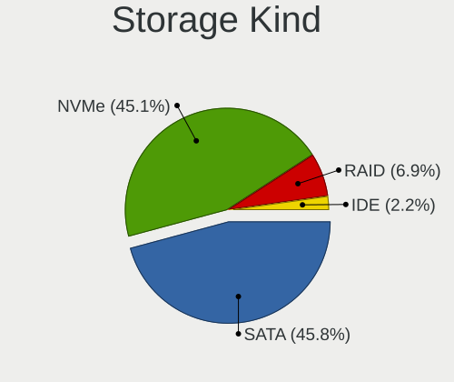

| Kind | Computers | Percent |
|------|-----------|---------|
| SATA | 186       | 45.81%  |
| NVMe | 183       | 45.07%  |
| RAID | 28        | 6.9%    |
| IDE  | 9         | 2.22%   |

Processor
---------

CPU Vendor
----------

Processor vendors

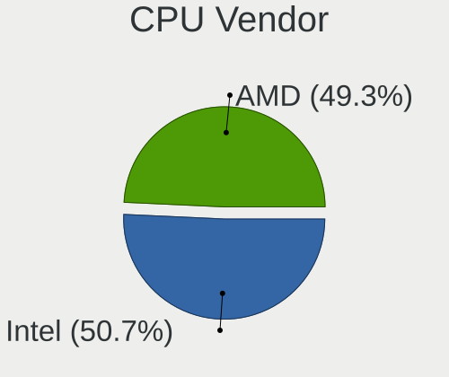

| Vendor | Computers | Percent |
|--------|-----------|---------|
| Intel  | 139       | 50.73%  |
| AMD    | 135       | 49.27%  |

CPU Model
---------

Processor models

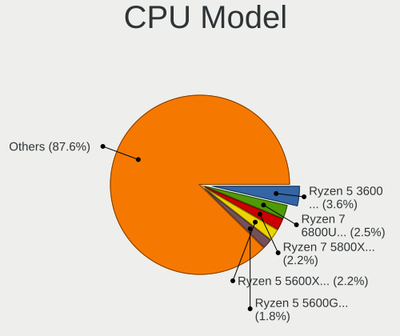

| Model                                           | Computers | Percent |
|-------------------------------------------------|-----------|---------|
| AMD Ryzen 5 3600 6-Core Processor               | 10        | 3.64%   |
| AMD Ryzen 7 6800U with Radeon Graphics          | 7         | 2.55%   |
| AMD Ryzen 7 5800X 8-Core Processor              | 6         | 2.18%   |
| AMD Ryzen 5 5600X 6-Core Processor              | 6         | 2.18%   |
| AMD Ryzen 5 5600G with Radeon Graphics          | 5         | 1.82%   |
| AMD Ryzen Z1 Extreme                            | 4         | 1.45%   |
| AMD Ryzen 7 7840U w/ Radeon 780M Graphics       | 4         | 1.45%   |
| AMD Ryzen 7 7840HS w/ Radeon 780M Graphics      | 4         | 1.45%   |
| AMD Ryzen 5 5600 6-Core Processor               | 4         | 1.45%   |
| Intel Core i7-7700K CPU @ 4.20GHz               | 3         | 1.09%   |
| Intel Core i5-7300HQ CPU @ 2.50GHz              | 3         | 1.09%   |
| Intel Core i5-6300HQ CPU @ 2.30GHz              | 3         | 1.09%   |
| Intel 11th Gen Core i7-11800H @ 2.30GHz         | 3         | 1.09%   |
| Intel 11th Gen Core i5-11400H @ 2.70GHz         | 3         | 1.09%   |
| AMD Ryzen 9 7945HX with Radeon Graphics         | 3         | 1.09%   |
| AMD Ryzen 9 7940HS w/ Radeon 780M Graphics      | 3         | 1.09%   |
| AMD Ryzen 9 5950X 16-Core Processor             | 3         | 1.09%   |
| AMD Ryzen 7 3750H with Radeon Vega Mobile Gfx   | 3         | 1.09%   |
| AMD Ryzen 7 3700X 8-Core Processor              | 3         | 1.09%   |
| AMD Ryzen 5 PRO 2400G with Radeon Vega Graphics | 3         | 1.09%   |
| AMD Ryzen 5 5500U with Radeon Graphics          | 3         | 1.09%   |
| AMD Ryzen 5 5500                                | 3         | 1.09%   |
| AMD Ryzen 5 3500U with Radeon Vega Mobile Gfx   | 3         | 1.09%   |
| Intel Core i7-9750H CPU @ 2.60GHz               | 2         | 0.73%   |
| Intel Core i7-4770 CPU @ 3.40GHz                | 2         | 0.73%   |
| Intel Core i7-4720HQ CPU @ 2.60GHz              | 2         | 0.73%   |
| Intel Core i7-3770 CPU @ 3.40GHz                | 2         | 0.73%   |
| Intel Core i5-8500 CPU @ 3.00GHz                | 2         | 0.73%   |
| Intel Core i5-7500 CPU @ 3.40GHz                | 2         | 0.73%   |
| Intel Core i5-6300U CPU @ 2.40GHz               | 2         | 0.73%   |
| Intel Core i5-6200U CPU @ 2.30GHz               | 2         | 0.73%   |
| Intel Core i5-4570 CPU @ 3.20GHz                | 2         | 0.73%   |
| Intel Core i5-4440 CPU @ 3.10GHz                | 2         | 0.73%   |
| Intel Core i5-2400 CPU @ 3.10GHz                | 2         | 0.73%   |
| Intel 11th Gen Core i7-1185G7 @ 3.00GHz         | 2         | 0.73%   |
| Intel 11th Gen Core i7-1165G7 @ 2.80GHz         | 2         | 0.73%   |
| Intel 11th Gen Core i5-1135G7 @ 2.40GHz         | 2         | 0.73%   |
| AMD Ryzen 9 5900X 12-Core Processor             | 2         | 0.73%   |
| AMD Ryzen 7 8840U w/ Radeon 780M Graphics       | 2         | 0.73%   |
| AMD Ryzen 7 7800X3D 8-Core Processor            | 2         | 0.73%   |

CPU Model Family
----------------

Processor model prefix

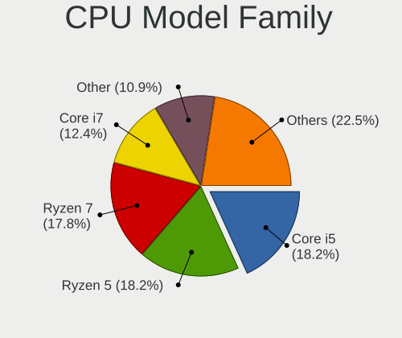

| Model             | Computers | Percent |
|-------------------|-----------|---------|
| Intel Core i5     | 50        | 18.18%  |
| AMD Ryzen 5       | 50        | 18.18%  |
| AMD Ryzen 7       | 49        | 17.82%  |
| Intel Core i7     | 34        | 12.36%  |
| Other             | 30        | 10.91%  |
| AMD Ryzen 9       | 17        | 6.18%   |
| Intel Core i3     | 13        | 4.73%   |
| Intel Xeon        | 9         | 3.27%   |
| AMD Ryzen 5 PRO   | 4         | 1.45%   |
| Intel Celeron     | 3         | 1.09%   |
| AMD FX            | 3         | 1.09%   |
| Intel Pentium     | 2         | 0.73%   |
| Intel Core i9     | 2         | 0.73%   |
| AMD PRO A10       | 2         | 0.73%   |
| AMD Athlon        | 2         | 0.73%   |
| Intel Core m3     | 1         | 0.36%   |
| Intel Core 2 Quad | 1         | 0.36%   |
| Intel Atom        | 1         | 0.36%   |
| AMD Ryzen 3       | 1         | 0.36%   |
| AMD A10           | 1         | 0.36%   |

CPU Cores
---------

Number of processor cores

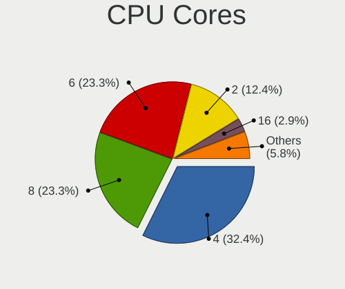

| Number | Computers | Percent |
|--------|-----------|---------|
| 4      | 89        | 32.36%  |
| 8      | 64        | 23.27%  |
| 6      | 64        | 23.27%  |
| 2      | 34        | 12.36%  |
| 16     | 8         | 2.91%   |
| 12     | 6         | 2.18%   |
| 24     | 3         | 1.09%   |
| 14     | 3         | 1.09%   |
| 10     | 3         | 1.09%   |
| 3      | 1         | 0.36%   |

CPU Sockets
-----------

Number of sockets

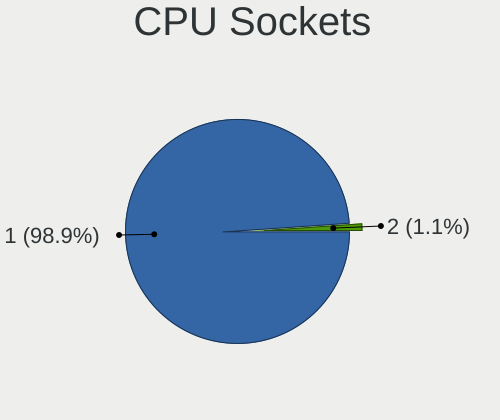

| Number | Computers | Percent |
|--------|-----------|---------|
| 1      | 271       | 98.91%  |
| 2      | 3         | 1.09%   |

CPU Threads
-----------

Threads per core (Hyper-Threading)

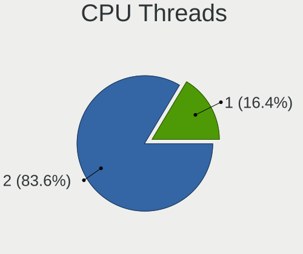

| Number | Computers | Percent |
|--------|-----------|---------|
| 2      | 229       | 83.58%  |
| 1      | 45        | 16.42%  |

CPU Op-Modes
------------

CPU Operation Modes (32-bit, 64-bit)

| Op mode        | Computers | Percent |
|----------------|-----------|---------|
| 32-bit, 64-bit | 274       | 100%    |

CPU Microcode
-------------

Microcode number

| Number  | Computers | Percent |
|---------|-----------|---------|
| Unknown | 274       | 100%    |

CPU Microarch
-------------

Microarchitecture

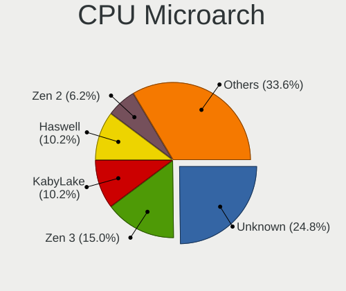

| Name        | Computers | Percent |
|-------------|-----------|---------|
| Unknown     | 68        | 24.82%  |
| Zen 3       | 41        | 14.96%  |
| KabyLake    | 28        | 10.22%  |
| Haswell     | 28        | 10.22%  |
| Zen 2       | 17        | 6.2%    |
| Skylake     | 13        | 4.74%   |
| Zen+        | 12        | 4.38%   |
| IvyBridge   | 12        | 4.38%   |
| CometLake   | 12        | 4.38%   |
| SandyBridge | 10        | 3.65%   |
| Zen         | 8         | 2.92%   |
| TigerLake   | 8         | 2.92%   |
| Piledriver  | 4         | 1.46%   |
| Excavator   | 3         | 1.09%   |
| Broadwell   | 3         | 1.09%   |
| Westmere    | 1         | 0.36%   |
| Silvermont  | 1         | 0.36%   |
| Penryn      | 1         | 0.36%   |
| Nehalem     | 1         | 0.36%   |
| Jaguar      | 1         | 0.36%   |
| IceLake     | 1         | 0.36%   |
| Goldmont    | 1         | 0.36%   |

Graphics
--------

GPU Vendor
----------

Vendors of graphics cards

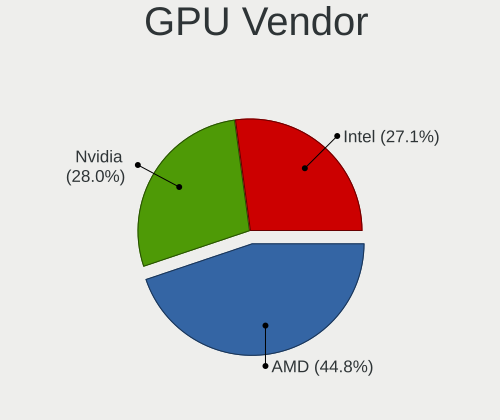

| Vendor | Computers | Percent |
|--------|-----------|---------|
| AMD    | 152       | 44.84%  |
| Nvidia | 95        | 28.02%  |
| Intel  | 92        | 27.14%  |

GPU Model
---------

Graphics card models

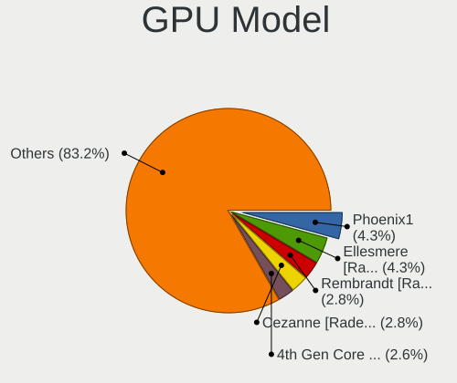

| Model                                                                       | Computers | Percent |
|-----------------------------------------------------------------------------|-----------|---------|
| AMD Phoenix1                                                                | 15        | 4.26%   |
| AMD Ellesmere [Radeon RX 470/480/570/570X/580/580X/590]                     | 15        | 4.26%   |
| AMD Rembrandt [Radeon 680M]                                                 | 10        | 2.84%   |
| AMD Cezanne [Radeon Vega Series / Radeon Vega Mobile Series]                | 10        | 2.84%   |
| Intel 4th Gen Core Processor Integrated Graphics Controller                 | 9         | 2.56%   |
| AMD Raphael                                                                 | 9         | 2.56%   |
| AMD Navi 10 [Radeon RX 5600 OEM/5600 XT / 5700/5700 XT]                     | 9         | 2.56%   |
| AMD Navi 32 [Radeon RX 7700 XT / 7800 XT]                                   | 8         | 2.27%   |
| Intel TigerLake-LP GT2 [Iris Xe Graphics]                                   | 7         | 1.99%   |
| AMD Picasso/Raven 2 [Radeon Vega Series / Radeon Vega Mobile Series]        | 7         | 1.99%   |
| AMD Navi 23 [Radeon RX 6600/6600 XT/6600M]                                  | 7         | 1.99%   |
| Nvidia TU117 [GeForce GTX 1650]                                             | 6         | 1.7%    |
| Intel Xeon E3-1200 v3/4th Gen Core Processor Integrated Graphics Controller | 6         | 1.7%    |
| AMD Navi 31 [Radeon RX 7900 XT/7900 XTX/7900 GRE/7900M]                     | 6         | 1.7%    |
| Nvidia GA107M [GeForce RTX 3050 Mobile]                                     | 5         | 1.42%   |
| Intel TigerLake-H GT1 [UHD Graphics]                                        | 5         | 1.42%   |
| Intel Skylake-U GT2 [HD Graphics 520]                                       | 5         | 1.42%   |
| Intel CoffeeLake-S GT2 [UHD Graphics 630]                                   | 5         | 1.42%   |
| AMD Raven Ridge [Radeon Vega Series / Radeon Vega Mobile Series]            | 5         | 1.42%   |
| AMD Polaris 20 XL [Radeon RX 580 2048SP]                                    | 5         | 1.42%   |
| AMD Navi 24 [Radeon RX 6400/6500 XT/6500M]                                  | 5         | 1.42%   |
| AMD Navi 21 [Radeon RX 6800/6800 XT / 6900 XT]                              | 5         | 1.42%   |
| AMD Lucienne                                                                | 5         | 1.42%   |
| Nvidia GM107M [GeForce GTX 950M]                                            | 4         | 1.14%   |
| Intel Skylake-H GT2 [HD Graphics 530]                                       | 4         | 1.14%   |
| Intel Kaby Lake-H GT2 [HD Graphics 630]                                     | 4         | 1.14%   |
| Intel CometLake-S GT2 [UHD Graphics 630]                                    | 4         | 1.14%   |
| Intel 2nd Generation Core Processor Family Integrated Graphics Controller   | 4         | 1.14%   |
| AMD Navi 22 [Radeon RX 6700/6700 XT/6750 XT / 6800M/6850M XT]               | 4         | 1.14%   |
| Nvidia TU117M [GeForce GTX 1650 Mobile / Max-Q]                             | 3         | 0.85%   |
| Nvidia GP107M [GeForce GTX 1050 Mobile]                                     | 3         | 0.85%   |
| Nvidia GA106M [GeForce RTX 3060 Mobile / Max-Q]                             | 3         | 0.85%   |
| Nvidia GA102 [GeForce RTX 3080 Ti]                                          | 3         | 0.85%   |
| Intel CometLake-U GT2 [UHD Graphics]                                        | 3         | 0.85%   |
| Intel 3rd Gen Core processor Graphics Controller                            | 3         | 0.85%   |
| AMD Vega 10 XL/XT [Radeon RX Vega 56/64]                                    | 3         | 0.85%   |
| AMD Navi 23 [Radeon RX 6650 XT / 6700S / 6800S]                             | 3         | 0.85%   |
| AMD Baffin [Radeon RX 550 640SP / RX 560/560X]                              | 3         | 0.85%   |
| Nvidia TU116M [GeForce GTX 1660 Ti Mobile]                                  | 2         | 0.57%   |
| Nvidia TU104 [GeForce RTX 2080 Rev. A]                                      | 2         | 0.57%   |

GPU Combo
---------

Combinations of graphics cards

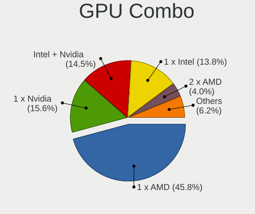

| Name           | Computers | Percent |
|----------------|-----------|---------|
| 1 x AMD        | 126       | 45.82%  |
| 1 x Nvidia     | 43        | 15.64%  |
| Intel + Nvidia | 40        | 14.55%  |
| 1 x Intel      | 38        | 13.82%  |
| 2 x AMD        | 11        | 4%      |
| AMD + Nvidia   | 9         | 3.27%   |
| Intel + AMD    | 6         | 2.18%   |
| Other          | 1         | 0.36%   |
| 2 x Nvidia     | 1         | 0.36%   |

GPU Driver
----------

Free vs proprietary

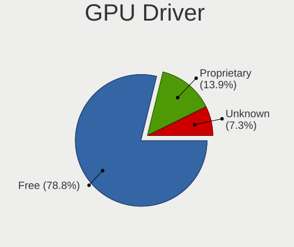

| Driver      | Computers | Percent |
|-------------|-----------|---------|
| Free        | 216       | 78.83%  |
| Proprietary | 38        | 13.87%  |
| Unknown     | 20        | 7.3%    |

GPU Memory
----------

Total video memory

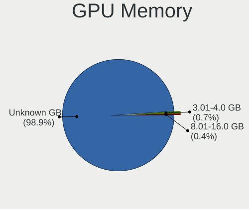

| Size in GB | Computers | Percent |
|------------|-----------|---------|
| Unknown    | 271       | 98.91%  |
| 3.01-4.0   | 2         | 0.73%   |
| 8.01-16.0  | 1         | 0.36%   |

Monitor
-------

Monitor Vendor
--------------

Monitor vendors

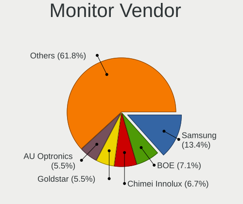

| Vendor               | Computers | Percent |
|----------------------|-----------|---------|
| Samsung Electronics  | 34        | 13.39%  |
| BOE                  | 18        | 7.09%   |
| Chimei Innolux       | 17        | 6.69%   |
| Goldstar             | 14        | 5.51%   |
| AU Optronics         | 14        | 5.51%   |
| LG Display           | 12        | 4.72%   |
| Dell                 | 11        | 4.33%   |
| Panasonic            | 7         | 2.76%   |
| TMX                  | 6         | 2.36%   |
| Hewlett-Packard      | 6         | 2.36%   |
| AYANEO               | 6         | 2.36%   |
| Vizio                | 5         | 1.97%   |
| Philips              | 5         | 1.97%   |
| PANDA                | 5         | 1.97%   |
| AOC                  | 5         | 1.97%   |
| Acer                 | 5         | 1.97%   |
| Unknown (XXX)        | 4         | 1.57%   |
| Toshiba              | 4         | 1.57%   |
| Sony                 | 4         | 1.57%   |
| Sharp                | 4         | 1.57%   |
| BenQ                 | 4         | 1.57%   |
| ASUSTek Computer     | 4         | 1.57%   |
| SANYO                | 3         | 1.18%   |
| MSI                  | 3         | 1.18%   |
| Lenovo               | 3         | 1.18%   |
| Insignia             | 3         | 1.18%   |
| Apple                | 3         | 1.18%   |
| Ancor Communications | 3         | 1.18%   |
| ONN                  | 2         | 0.79%   |
| Onkyo                | 2         | 0.79%   |
| MSF                  | 2         | 0.79%   |
| ITE                  | 2         | 0.79%   |
| Gigabyte Technology  | 2         | 0.79%   |
| DENON                | 2         | 0.79%   |
| Xiaomi               | 1         | 0.39%   |
| ViewSonic            | 1         | 0.39%   |
| VIE                  | 1         | 0.39%   |
| Valve                | 1         | 0.39%   |
| STD                  | 1         | 0.39%   |
| Sceptre Tech         | 1         | 0.39%   |

Monitor Model
-------------

Monitor models

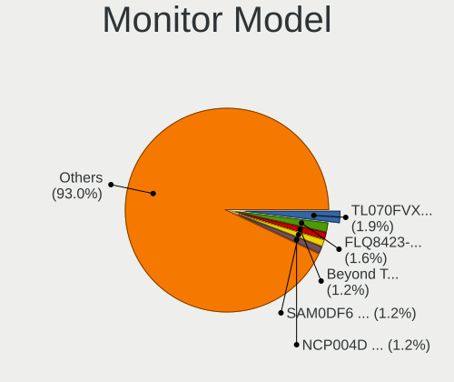

| Model                                                                 | Computers | Percent |
|-----------------------------------------------------------------------|-----------|---------|
| TMX TL070FVXS01-0 TMX0002 1920x1080 160x100mm 7.4-inch                | 5         | 1.95%   |
| BOE FLQ8423-24L0 BOE1003 1600x2560 113x181mm 8.4-inch                 | 4         | 1.56%   |
| Unknown (XXX) Beyond TV XXX2851 3840x2160 1209x680mm 54.6-inch        | 3         | 1.17%   |
| Samsung Electronics LCD Monitor SAM0DF6 3840x2160 890x500mm 40.2-inch | 3         | 1.17%   |
| PANDA LCD Monitor NCP004D 1920x1080 344x194mm 15.5-inch               | 3         | 1.17%   |
| Toshiba TV TSB2017 3840x2160                                          | 2         | 0.78%   |
| SANYO TV SAN0206 1920x1080                                            | 2         | 0.78%   |
| Samsung Electronics LCD Monitor SDC3853 2736x1824 260x173mm 12.3-inch | 2         | 0.78%   |
| Samsung Electronics LC27T55 SAM701F 1920x1080 609x349mm 27.6-inch     | 2         | 0.78%   |
| Panasonic VVX11F009G00 MEI96A2 1920x1080 344x193mm 15.5-inch          | 2         | 0.78%   |
| Panasonic TV MEIA296 1920x1080 698x392mm 31.5-inch                    | 2         | 0.78%   |
| MSF W0550U99GE-D MSF1003 1080x1920                                    | 2         | 0.78%   |
| Goldstar LG ULTRAWIDE GSM59F1 2560x1080 670x280mm 28.6-inch           | 2         | 0.78%   |
| Chimei Innolux LCD Monitor CMN1735 1920x1080 381x214mm 17.2-inch      | 2         | 0.78%   |
| Chimei Innolux LCD Monitor CMN1521 1920x1080 344x193mm 15.5-inch      | 2         | 0.78%   |
| AYANEO AYANEOWUXGA AYA0105 1200x1920                                  | 2         | 0.78%   |
| AYANEO AYANEOHD AYA6108 1080x1920                                     | 2         | 0.78%   |
| AU Optronics LCD Monitor AUO38ED 1920x1080 344x193mm 15.5-inch        | 2         | 0.78%   |
| AOC U2790B AOC2790 3840x2160 597x336mm 27.0-inch                      | 2         | 0.78%   |
| Xiaomi Mi TV XMD00E2 3840x2160 800x450mm 36.1-inch                    | 1         | 0.39%   |
| Vizio V505-J09 VIZ1039 3840x2160 1096x616mm 49.5-inch                 | 1         | 0.39%   |
| Vizio OLED55-H1 VIZ1040 3840x2160 1209x680mm 54.6-inch                | 1         | 0.39%   |
| Vizio E500i-B1 VIZ1004 1920x1080 1095x616mm 49.5-inch                 | 1         | 0.39%   |
| Vizio D43f-F1 VIZ1027 1920x1080 940x529mm 42.5-inch                   | 1         | 0.39%   |
| Vizio D24-D1 VIZ1005 1920x1080 521x293mm 23.5-inch                    | 1         | 0.39%   |
| ViewSonic VA2702w VSCE727 1920x1080 598x336mm 27.0-inch               | 1         | 0.39%   |
| VIE VALAK Z180H VIE2380 1920x1080 527x296mm 23.8-inch                 | 1         | 0.39%   |
| Valve ANX7530 U VLV3003 800x1280 100x160mm 7.4-inch                   | 1         | 0.39%   |
| Unknown (XXX) Union TV XXX2841 1920x1080 1209x680mm 54.6-inch         | 1         | 0.39%   |
| Toshiba TV TSB0206 1920x1080                                          | 1         | 0.39%   |
| Toshiba TV TSB002F 3840x2160 1872x1053mm 84.6-inch                    | 1         | 0.39%   |
| TMX TL140BDXP01-0 TMX1400 2560x1440 310x174mm 14.0-inch               | 1         | 0.39%   |
| STD Monitor STD2023 1920x1080 480x260mm 21.5-inch                     | 1         | 0.39%   |
| Sony TV SNYEE01 1920x1080                                             | 1         | 0.39%   |
| Sony TV SNY7502 1920x1080 1018x573mm 46.0-inch                        | 1         | 0.39%   |
| Sony TV SNY3002 1920x1080 886x498mm 40.0-inch                         | 1         | 0.39%   |
| Sony TV *30 SNY0406 3840x2160 1705x959mm 77.0-inch                    | 1         | 0.39%   |
| Sharp LQ173M1JW02 SHP14DB 1920x1080 382x215mm 17.3-inch               | 1         | 0.39%   |
| Sharp LCD Monitor SHP1515 1920x1200 336x210mm 15.6-inch               | 1         | 0.39%   |
| Sharp HDMI SHP101E 1920x1080 820x460mm 37.0-inch                      | 1         | 0.39%   |

Monitor Resolution
------------------

Monitor screen resolution

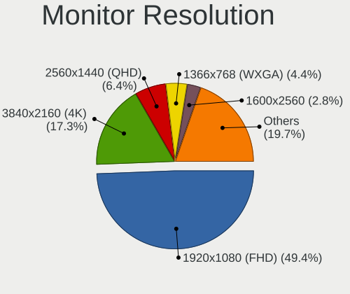

| Resolution         | Computers | Percent |
|--------------------|-----------|---------|
| 1920x1080 (FHD)    | 123       | 49.4%   |
| 3840x2160 (4K)     | 43        | 17.27%  |
| 2560x1440 (QHD)    | 16        | 6.43%   |
| 1366x768 (WXGA)    | 11        | 4.42%   |
| 1600x2560          | 7         | 2.81%   |
| 3440x1440          | 5         | 2.01%   |
| 1600x900 (HD+)     | 5         | 2.01%   |
| 1080x1920          | 5         | 2.01%   |
| 2560x1080          | 4         | 1.61%   |
| 1200x1920          | 4         | 1.61%   |
| 1920x540           | 3         | 1.2%    |
| 1920x1200 (WUXGA)  | 3         | 1.2%    |
| 1680x1050 (WSXGA+) | 3         | 1.2%    |
| 800x1280           | 2         | 0.8%    |
| 3840x1080          | 2         | 0.8%    |
| 2736x1824          | 2         | 0.8%    |
| 3840x2560          | 1         | 0.4%    |
| 3840x1600          | 1         | 0.4%    |
| 2880x1800          | 1         | 0.4%    |
| 2256x1504          | 1         | 0.4%    |
| 1600x1200          | 1         | 0.4%    |
| 1440x900 (WXGA+)   | 1         | 0.4%    |
| 1360x768           | 1         | 0.4%    |
| 1280x960           | 1         | 0.4%    |
| 1280x768           | 1         | 0.4%    |
| 1280x720 (HD)      | 1         | 0.4%    |
| Unknown            | 1         | 0.4%    |

Monitor Diagonal
----------------

Diagonal size in inches

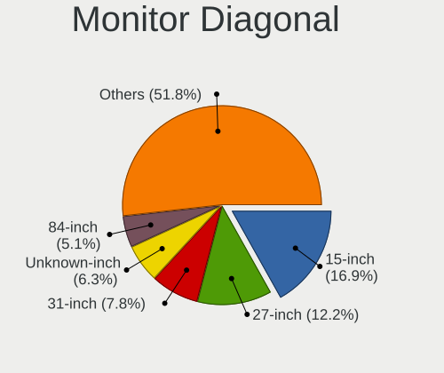

| Inches  | Computers | Percent |
|---------|-----------|---------|
| 15      | 43        | 16.86%  |
| 27      | 31        | 12.16%  |
| 31      | 20        | 7.84%   |
| Unknown | 16        | 6.27%   |
| 84      | 13        | 5.1%    |
| 24      | 11        | 4.31%   |
| 23      | 11        | 4.31%   |
| 21      | 9         | 3.53%   |
| 17      | 9         | 3.53%   |
| 34      | 8         | 3.14%   |
| 13      | 8         | 3.14%   |
| 8       | 8         | 3.14%   |
| 72      | 6         | 2.35%   |
| 7       | 6         | 2.35%   |
| 14      | 4         | 1.57%   |
| 12      | 4         | 1.57%   |
| 63      | 3         | 1.18%   |
| 54      | 3         | 1.18%   |
| 49      | 3         | 1.18%   |
| 48      | 3         | 1.18%   |
| 20      | 3         | 1.18%   |
| 74      | 2         | 0.78%   |
| 52      | 2         | 0.78%   |
| 46      | 2         | 0.78%   |
| 40      | 2         | 0.78%   |
| 28      | 2         | 0.78%   |
| 22      | 2         | 0.78%   |
| 16      | 2         | 0.78%   |
| 77      | 1         | 0.39%   |
| 69      | 1         | 0.39%   |
| 65      | 1         | 0.39%   |
| 64      | 1         | 0.39%   |
| 57      | 1         | 0.39%   |
| 47      | 1         | 0.39%   |
| 44      | 1         | 0.39%   |
| 43      | 1         | 0.39%   |
| 42      | 1         | 0.39%   |
| 38      | 1         | 0.39%   |
| 37      | 1         | 0.39%   |
| 36      | 1         | 0.39%   |

Monitor Width
-------------

Physical width

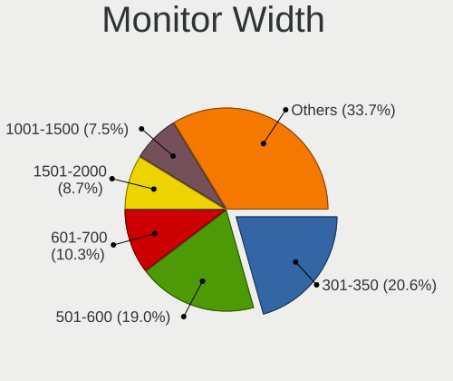

| Width in mm | Computers | Percent |
|-------------|-----------|---------|
| 301-350     | 52        | 20.63%  |
| 501-600     | 48        | 19.05%  |
| 601-700     | 26        | 10.32%  |
| 1501-2000   | 22        | 8.73%   |
| 1001-1500   | 19        | 7.54%   |
| 401-500     | 17        | 6.75%   |
| Unknown     | 16        | 6.35%   |
| 101-200     | 13        | 5.16%   |
| 351-400     | 11        | 4.37%   |
| 701-800     | 10        | 3.97%   |
| 201-300     | 8         | 3.17%   |
| 801-900     | 6         | 2.38%   |
| 901-1000    | 3         | 1.19%   |
| 1-100       | 1         | 0.4%    |

Aspect Ratio
------------

Proportional relationship between the width and the height

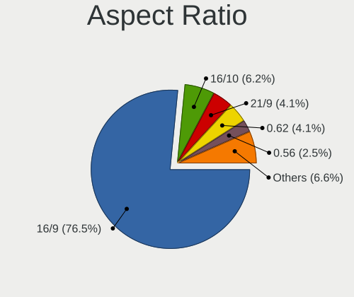

| Ratio | Computers | Percent |
|-------|-----------|---------|
| 16/9  | 186       | 76.54%  |
| 16/10 | 15        | 6.17%   |
| 21/9  | 10        | 4.12%   |
| 0.62  | 10        | 4.12%   |
| 0.56  | 6         | 2.47%   |
| 32/9  | 5         | 2.06%   |
| 3/2   | 4         | 1.65%   |
| 4/3   | 2         | 0.82%   |
| 0.63  | 2         | 0.82%   |
| 0.58  | 2         | 0.82%   |
| 1.96  | 1         | 0.41%   |

Monitor Area
------------

Area in inch²

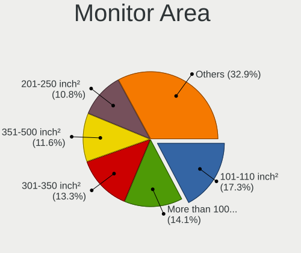

| Area in inch² | Computers | Percent |
|----------------|-----------|---------|
| 101-110        | 43        | 17.27%  |
| More than 1000 | 35        | 14.06%  |
| 301-350        | 33        | 13.25%  |
| 351-500        | 29        | 11.65%  |
| 201-250        | 27        | 10.84%  |
| Unknown        | 16        | 6.43%   |
| 501-1000       | 15        | 6.02%   |
| 1-40           | 14        | 5.62%   |
| 81-90          | 10        | 4.02%   |
| 121-130        | 9         | 3.61%   |
| 151-200        | 6         | 2.41%   |
| 71-80          | 3         | 1.2%    |
| 61-70          | 3         | 1.2%    |
| 251-300        | 2         | 0.8%    |
| 111-120        | 2         | 0.8%    |
| 51-60          | 1         | 0.4%    |
| 141-150        | 1         | 0.4%    |

Pixel Density
-------------

Pixels per inch

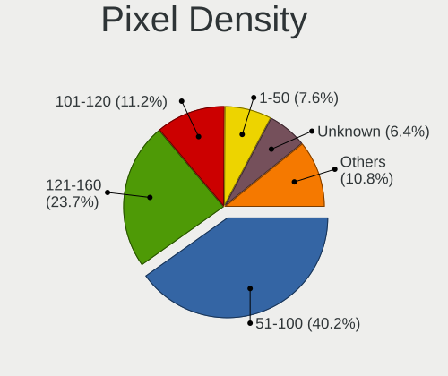

| Density       | Computers | Percent |
|---------------|-----------|---------|
| 51-100        | 100       | 40.16%  |
| 121-160       | 59        | 23.69%  |
| 101-120       | 28        | 11.24%  |
| 1-50          | 19        | 7.63%   |
| Unknown       | 16        | 6.43%   |
| 161-240       | 14        | 5.62%   |
| More than 240 | 13        | 5.22%   |

Multiple Monitors
-----------------

Total monitors connected

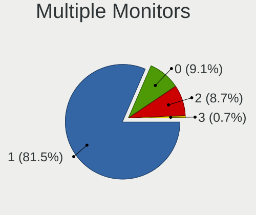

| Total | Computers | Percent |
|-------|-----------|---------|
| 1     | 225       | 81.52%  |
| 0     | 25        | 9.06%   |
| 2     | 24        | 8.7%    |
| 3     | 2         | 0.72%   |

Network
-------

Net Controller Vendor
---------------------

Controller vendors

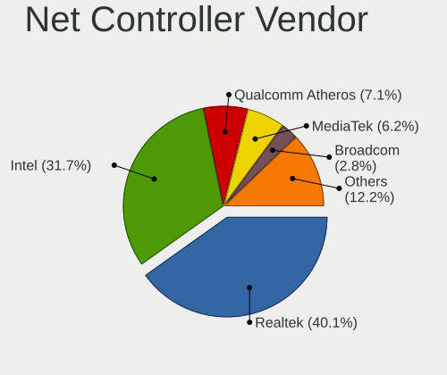

| Vendor                          | Computers | Percent |
|---------------------------------|-----------|---------|
| Realtek Semiconductor           | 175       | 40.14%  |
| Intel                           | 138       | 31.65%  |
| Qualcomm Atheros                | 31        | 7.11%   |
| MediaTek                        | 27        | 6.19%   |
| Broadcom                        | 12        | 2.75%   |
| TP-Link                         | 8         | 1.83%   |
| Microsoft                       | 6         | 1.38%   |
| ASIX Electronics                | 5         | 1.15%   |
| Marvell Technology Group        | 4         | 0.92%   |
| Broadcom Limited                | 4         | 0.92%   |
| Ralink Technology               | 3         | 0.69%   |
| Ralink                          | 3         | 0.69%   |
| Samsung Electronics             | 2         | 0.46%   |
| Qualcomm Atheros Communications | 2         | 0.46%   |
| Qualcomm                        | 2         | 0.46%   |
| Google                          | 2         | 0.46%   |
| DisplayLink                     | 2         | 0.46%   |
| Aquantia                        | 2         | 0.46%   |
| ZTopInc                         | 1         | 0.23%   |
| ZTE WCDMA Technologies MSM      | 1         | 0.23%   |
| Xiaomi                          | 1         | 0.23%   |
| Qualcomm Technologies           | 1         | 0.23%   |
| QNAP System                     | 1         | 0.23%   |
| OnePlus Technology (Shenzhen)   | 1         | 0.23%   |
| NetGear                         | 1         | 0.23%   |
| Edimax Technology               | 1         | 0.23%   |

Net Controller Model
--------------------

Controller models

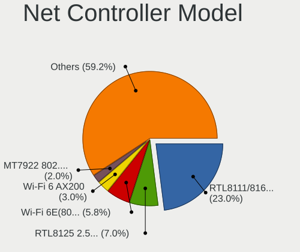

| Model                                                                  | Computers | Percent |
|------------------------------------------------------------------------|-----------|---------|
| Realtek RTL8111/8168/8211/8411 PCI Express Gigabit Ethernet Controller | 115       | 23%     |
| Realtek RTL8125 2.5GbE Controller                                      | 35        | 7%      |
| Intel Wi-Fi 6E(802.11ax) AX210/AX1675* 2x2 [Typhoon Peak]              | 29        | 5.8%    |
| Intel Wi-Fi 6 AX200                                                    | 15        | 3%      |
| MediaTek MT7922 802.11ax PCI Express Wireless Network Adapter          | 10        | 2%      |
| Intel I211 Gigabit Network Connection                                  | 10        | 2%      |
| Realtek RTL8153 Gigabit Ethernet Adapter                               | 9         | 1.8%    |
| MediaTek MT7921K (RZ608) Wi-Fi 6E 80MHz                                | 9         | 1.8%    |
| Intel Ethernet Controller I225-V                                       | 9         | 1.8%    |
| Qualcomm Atheros QCA6174 802.11ac Wireless Network Adapter             | 8         | 1.6%    |
| MediaTek MT7921 802.11ax PCIe Wireless Network Adapter [Filogic 330]   | 7         | 1.4%    |
| Intel Ethernet Connection I217-LM                                      | 7         | 1.4%    |
| Realtek RTL88x2bu [AC1200 Techkey]                                     | 6         | 1.2%    |
| Realtek RTL8852CE PCIe 802.11ax Wireless Network Controller            | 6         | 1.2%    |
| Realtek RTL8822CE 802.11ac PCIe Wireless Network Adapter               | 6         | 1.2%    |
| Qualcomm Atheros QCA9377 802.11ac Wireless Network Adapter             | 6         | 1.2%    |
| Intel Wi-Fi 6 AX201                                                    | 6         | 1.2%    |
| Intel Ethernet Connection (2) I219-V                                   | 6         | 1.2%    |
| Intel Dual Band Wireless-AC 3168NGW [Stone Peak]                       | 6         | 1.2%    |
| Realtek RTL8852BE PCIe 802.11ax Wireless Network Controller            | 5         | 1%      |
| Realtek RTL8821CE 802.11ac PCIe Wireless Network Adapter               | 5         | 1%      |
| Intel Tiger Lake PCH CNVi WiFi                                         | 5         | 1%      |
| Intel 82579LM Gigabit Network Connection (Lewisville)                  | 5         | 1%      |
| ASIX AX88179 Gigabit Ethernet                                          | 5         | 1%      |
| Qualcomm Atheros Killer E220x Gigabit Ethernet Controller              | 4         | 0.8%    |
| Microsoft Xbox Wireless Adapter for Windows                            | 4         | 0.8%    |
| Intel Wireless 8265 / 8275                                             | 4         | 0.8%    |
| Intel Wireless 7265                                                    | 4         | 0.8%    |
| Intel Wireless 3165                                                    | 4         | 0.8%    |
| Intel Wi-Fi 5(802.11ac) Wireless-AC 9x6x [Thunder Peak]                | 4         | 0.8%    |
| Intel Ethernet Controller I226-V                                       | 4         | 0.8%    |
| Intel Comet Lake PCH CNVi WiFi                                         | 4         | 0.8%    |
| TP-Link Archer T4U ver.3                                               | 3         | 0.6%    |
| TP-Link 802.11ac NIC                                                   | 3         | 0.6%    |
| Realtek RTL810xE PCI Express Fast Ethernet controller                  | 3         | 0.6%    |
| Qualcomm Atheros AR9485 Wireless Network Adapter                       | 3         | 0.6%    |
| Qualcomm Atheros AR9462 Wireless Network Adapter                       | 3         | 0.6%    |
| Marvell Group 88W8897 [AVASTAR] 802.11ac Wireless                      | 3         | 0.6%    |
| Intel Comet Lake PCH-LP CNVi WiFi                                      | 3         | 0.6%    |
| Intel Cannon Lake PCH CNVi WiFi                                        | 3         | 0.6%    |

Wireless Vendor
---------------

Wireless vendors

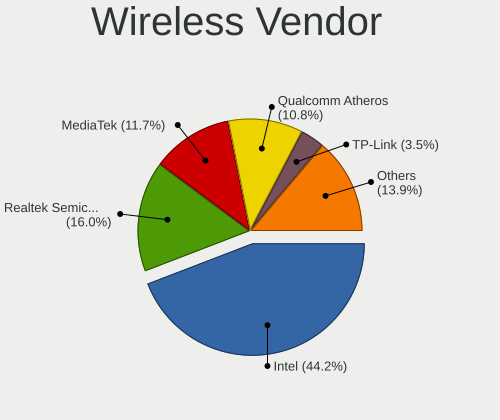

| Vendor                          | Computers | Percent |
|---------------------------------|-----------|---------|
| Intel                           | 102       | 44.16%  |
| Realtek Semiconductor           | 37        | 16.02%  |
| MediaTek                        | 27        | 11.69%  |
| Qualcomm Atheros                | 25        | 10.82%  |
| TP-Link                         | 8         | 3.46%   |
| Broadcom                        | 8         | 3.46%   |
| Microsoft                       | 6         | 2.6%    |
| Ralink Technology               | 3         | 1.3%    |
| Ralink                          | 3         | 1.3%    |
| Marvell Technology Group        | 3         | 1.3%    |
| Qualcomm Atheros Communications | 2         | 0.87%   |
| Broadcom Limited                | 2         | 0.87%   |
| ZTopInc                         | 1         | 0.43%   |
| Qualcomm Technologies           | 1         | 0.43%   |
| Qualcomm                        | 1         | 0.43%   |
| NetGear                         | 1         | 0.43%   |
| Edimax Technology               | 1         | 0.43%   |

Wireless Model
--------------

Wireless models

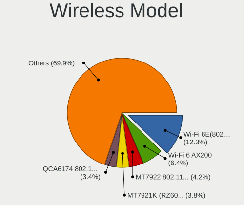

| Model                                                                | Computers | Percent |
|----------------------------------------------------------------------|-----------|---------|
| Intel Wi-Fi 6E(802.11ax) AX210/AX1675* 2x2 [Typhoon Peak]            | 29        | 12.29%  |
| Intel Wi-Fi 6 AX200                                                  | 15        | 6.36%   |
| MediaTek MT7922 802.11ax PCI Express Wireless Network Adapter        | 10        | 4.24%   |
| MediaTek MT7921K (RZ608) Wi-Fi 6E 80MHz                              | 9         | 3.81%   |
| Qualcomm Atheros QCA6174 802.11ac Wireless Network Adapter           | 8         | 3.39%   |
| MediaTek MT7921 802.11ax PCIe Wireless Network Adapter [Filogic 330] | 7         | 2.97%   |
| Realtek RTL88x2bu [AC1200 Techkey]                                   | 6         | 2.54%   |
| Realtek RTL8852CE PCIe 802.11ax Wireless Network Controller          | 6         | 2.54%   |
| Realtek RTL8822CE 802.11ac PCIe Wireless Network Adapter             | 6         | 2.54%   |
| Qualcomm Atheros QCA9377 802.11ac Wireless Network Adapter           | 6         | 2.54%   |
| Intel Wi-Fi 6 AX201                                                  | 6         | 2.54%   |
| Intel Dual Band Wireless-AC 3168NGW [Stone Peak]                     | 6         | 2.54%   |
| Realtek RTL8821CE 802.11ac PCIe Wireless Network Adapter             | 5         | 2.12%   |
| Intel Tiger Lake PCH CNVi WiFi                                       | 5         | 2.12%   |
| Microsoft Xbox Wireless Adapter for Windows                          | 4         | 1.69%   |
| Intel Wireless 8265 / 8275                                           | 4         | 1.69%   |
| Intel Wireless 7265                                                  | 4         | 1.69%   |
| Intel Wireless 3165                                                  | 4         | 1.69%   |
| Intel Wi-Fi 5(802.11ac) Wireless-AC 9x6x [Thunder Peak]              | 4         | 1.69%   |
| Intel Comet Lake PCH CNVi WiFi                                       | 4         | 1.69%   |
| TP-Link Archer T4U ver.3                                             | 3         | 1.27%   |
| TP-Link 802.11ac NIC                                                 | 3         | 1.27%   |
| Realtek RTL8852BE PCIe 802.11ax Wireless Network Controller          | 3         | 1.27%   |
| Qualcomm Atheros AR9485 Wireless Network Adapter                     | 3         | 1.27%   |
| Qualcomm Atheros AR9462 Wireless Network Adapter                     | 3         | 1.27%   |
| Marvell Group 88W8897 [AVASTAR] 802.11ac Wireless                    | 3         | 1.27%   |
| Intel Comet Lake PCH-LP CNVi WiFi                                    | 3         | 1.27%   |
| Intel Cannon Lake PCH CNVi WiFi                                      | 3         | 1.27%   |
| Broadcom BCM4360 802.11ac Dual Band Wireless Network Adapter         | 3         | 1.27%   |
| Realtek RTL8822BE 802.11a/b/g/n/ac WiFi adapter                      | 2         | 0.85%   |
| Ralink RT3090 Wireless 802.11n 1T/1R PCIe                            | 2         | 0.85%   |
| Qualcomm Atheros AR928X Wireless Network Adapter (PCI-Express)       | 2         | 0.85%   |
| Intel Dual Band Wireless-AC 3165 Plus Bluetooth                      | 2         | 0.85%   |
| Intel Alder Lake-S PCH CNVi WiFi                                     | 2         | 0.85%   |
| Intel Alder Lake-P PCH CNVi WiFi                                     | 2         | 0.85%   |
| Broadcom BCM43602 802.11ac Wireless LAN SoC                          | 2         | 0.85%   |
| ZTopInc 802.11n NIC                                                  | 1         | 0.42%   |
| TP-Link Archer T3U [Realtek RTL8812BU]                               | 1         | 0.42%   |
| TP-Link 802.11ac WLAN Adapter                                        | 1         | 0.42%   |
| Realtek RTL8852AE 802.11ax PCIe Wireless Network Adapter             | 1         | 0.42%   |

Ethernet Vendor
---------------

Ethernet vendors

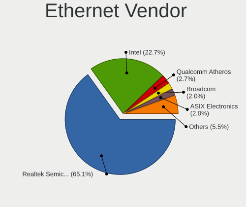

| Vendor                   | Computers | Percent |
|--------------------------|-----------|---------|
| Realtek Semiconductor    | 166       | 65.1%   |
| Intel                    | 58        | 22.75%  |
| Qualcomm Atheros         | 7         | 2.75%   |
| Broadcom                 | 5         | 1.96%   |
| ASIX Electronics         | 5         | 1.96%   |
| Samsung Electronics      | 2         | 0.78%   |
| Google                   | 2         | 0.78%   |
| DisplayLink              | 2         | 0.78%   |
| Broadcom Limited         | 2         | 0.78%   |
| Aquantia                 | 2         | 0.78%   |
| Xiaomi                   | 1         | 0.39%   |
| Qualcomm                 | 1         | 0.39%   |
| QNAP System              | 1         | 0.39%   |
| Marvell Technology Group | 1         | 0.39%   |

Ethernet Model
--------------

Ethernet models

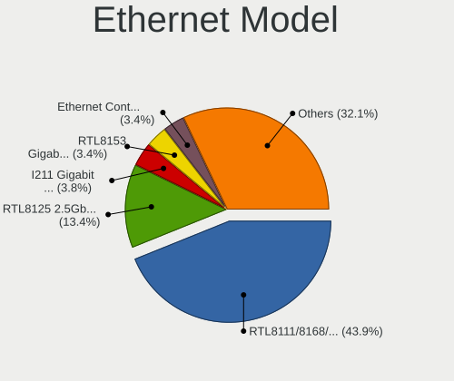

| Model                                                                  | Computers | Percent |
|------------------------------------------------------------------------|-----------|---------|
| Realtek RTL8111/8168/8211/8411 PCI Express Gigabit Ethernet Controller | 115       | 43.89%  |
| Realtek RTL8125 2.5GbE Controller                                      | 35        | 13.36%  |
| Intel I211 Gigabit Network Connection                                  | 10        | 3.82%   |
| Realtek RTL8153 Gigabit Ethernet Adapter                               | 9         | 3.44%   |
| Intel Ethernet Controller I225-V                                       | 9         | 3.44%   |
| Intel Ethernet Connection I217-LM                                      | 7         | 2.67%   |
| Intel Ethernet Connection (2) I219-V                                   | 6         | 2.29%   |
| Intel 82579LM Gigabit Network Connection (Lewisville)                  | 5         | 1.91%   |
| ASIX AX88179 Gigabit Ethernet                                          | 5         | 1.91%   |
| Qualcomm Atheros Killer E220x Gigabit Ethernet Controller              | 4         | 1.53%   |
| Intel Ethernet Controller I226-V                                       | 4         | 1.53%   |
| Realtek RTL810xE PCI Express Fast Ethernet controller                  | 3         | 1.15%   |
| Intel 82579V Gigabit Network Connection                                | 3         | 1.15%   |
| Realtek USB 10/100/1G/2.5 LAN                                          | 2         | 0.76%   |
| Realtek RTL8852BE PCIe 802.11ax Wireless Network Controller            | 2         | 0.76%   |
| Realtek PCIe GbE Family Controller                                     | 2         | 0.76%   |
| Intel Ethernet Connection (5) I219-LM                                  | 2         | 0.76%   |
| Intel Ethernet Connection (2) I219-LM                                  | 2         | 0.76%   |
| Google Pixel 9a                                                        | 2         | 0.76%   |
| Broadcom NetXtreme BCM5762 Gigabit Ethernet PCIe                       | 2         | 0.76%   |
| Broadcom Limited NetLink BCM57780 Gigabit Ethernet PCIe                | 2         | 0.76%   |
| Xiaomi Mi/Redmi series (RNDIS)                                         | 1         | 0.38%   |
| Samsung GT-I9070 (network tethering, USB debugging enabled)            | 1         | 0.38%   |
| Samsung Galaxy series, misc. (tethering mode)                          | 1         | 0.38%   |
| Realtek RTL8922AE 802.11be PCIe Wireless Network Adapter               | 1         | 0.38%   |
| Realtek RTL8111/8168/8411 PCI Express Gigabit Ethernet Controller      | 1         | 0.38%   |
| Realtek Killer E3000 2.5GbE Controller                                 | 1         | 0.38%   |
| Realtek Killer E2600 GbE Controller                                    | 1         | 0.38%   |
| Qualcomm MDM9207-MTP _SN:DA633261                                      | 1         | 0.38%   |
| Qualcomm Atheros QCA8171 Gigabit Ethernet                              | 1         | 0.38%   |
| Qualcomm Atheros Killer E2500 Gigabit Ethernet Controller              | 1         | 0.38%   |
| Qualcomm Atheros AR8151 v2.0 Gigabit Ethernet                          | 1         | 0.38%   |
| QNAP System QNAP QNA-UC5G1T USB to 5GbE Adapter                        | 1         | 0.38%   |
| Marvell Group 88E8057 PCI-E Gigabit Ethernet Controller                | 1         | 0.38%   |
| Intel I210 Gigabit Network Connection                                  | 1         | 0.38%   |
| Intel Ethernet Connection I218-LM                                      | 1         | 0.38%   |
| Intel Ethernet Connection I217-V                                       | 1         | 0.38%   |
| Intel Ethernet Connection (7) I219-V                                   | 1         | 0.38%   |
| Intel Ethernet Connection (2) I218-LM                                  | 1         | 0.38%   |
| Intel Ethernet Connection (17) I219-LM                                 | 1         | 0.38%   |

Net Controller Kind
-------------------

Ethernet, WiFi or modem

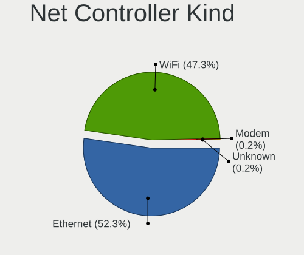

| Kind     | Computers | Percent |
|----------|-----------|---------|
| Ethernet | 240       | 52.29%  |
| WiFi     | 217       | 47.28%  |
| Modem    | 1         | 0.22%   |
| Unknown  | 1         | 0.22%   |

Used Controller
---------------

Currently used network controller

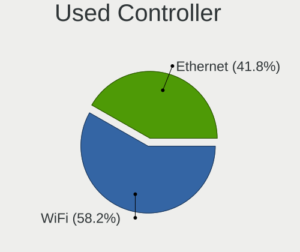

| Kind     | Computers | Percent |
|----------|-----------|---------|
| WiFi     | 166       | 58.25%  |
| Ethernet | 119       | 41.75%  |

NICs
----

Total network controllers on board

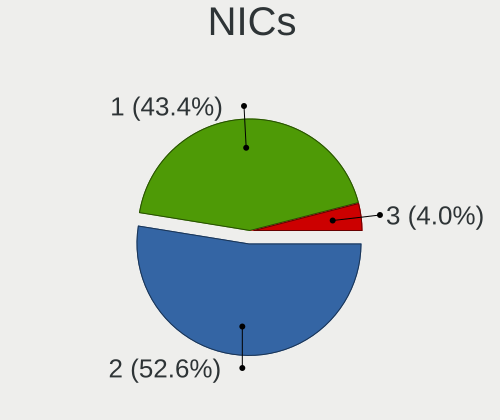

| Total | Computers | Percent |
|-------|-----------|---------|
| 2     | 144       | 52.55%  |
| 1     | 119       | 43.43%  |
| 3     | 11        | 4.01%   |

IPv6
----

IPv6 vs IPv4

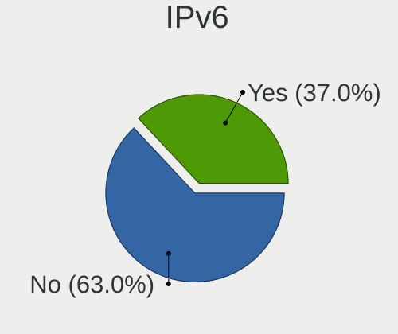

| Used | Computers | Percent |
|------|-----------|---------|
| No   | 174       | 63.04%  |
| Yes  | 102       | 36.96%  |

Bluetooth
---------

Bluetooth Vendor
----------------

Controller vendors

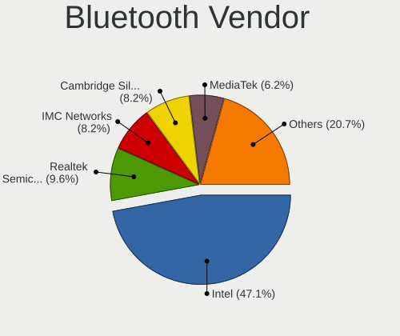

| Vendor                          | Computers | Percent |
|---------------------------------|-----------|---------|
| Intel                           | 98        | 47.12%  |
| Realtek Semiconductor           | 20        | 9.62%   |
| IMC Networks                    | 17        | 8.17%   |
| Cambridge Silicon Radio         | 17        | 8.17%   |
| MediaTek                        | 13        | 6.25%   |
| Qualcomm Atheros Communications | 9         | 4.33%   |
| Foxconn / Hon Hai               | 8         | 3.85%   |
| Apple                           | 8         | 3.85%   |
| Lite-On Technology              | 6         | 2.88%   |
| ASUSTek Computer                | 4         | 1.92%   |
| TP-Link                         | 2         | 0.96%   |
| Realtek                         | 2         | 0.96%   |
| Ralink                          | 1         | 0.48%   |
| Dynex                           | 1         | 0.48%   |
| Actions                         | 1         | 0.48%   |
| Unknown                         | 1         | 0.48%   |

Bluetooth Model
---------------

Controller models

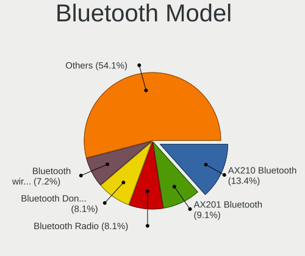

| Model                                                    | Computers | Percent |
|----------------------------------------------------------|-----------|---------|
| Intel AX210 Bluetooth                                    | 28        | 13.4%   |
| Intel AX201 Bluetooth                                    | 19        | 9.09%   |
| Realtek Bluetooth Radio                                  | 17        | 8.13%   |
| Cambridge Silicon Radio Bluetooth Dongle (HCI mode)      | 17        | 8.13%   |
| Intel Bluetooth wireless interface                       | 15        | 7.18%   |
| Intel AX200 Bluetooth                                    | 14        | 6.7%    |
| MediaTek Wireless_Device                                 | 13        | 6.22%   |
| IMC Networks Bluetooth Radio                             | 10        | 4.78%   |
| Intel Wireless-AC 3168 Bluetooth                         | 6         | 2.87%   |
| Foxconn / Hon Hai Wireless_Device                        | 6         | 2.87%   |
| Intel Bluetooth Device                                   | 5         | 2.39%   |
| Intel Bluetooth 9460/9560 Jefferson Peak (JfP)           | 5         | 2.39%   |
| IMC Networks Wireless_Device                             | 5         | 2.39%   |
| Apple Bluetooth Host Controller                          | 5         | 2.39%   |
| Qualcomm Atheros  Bluetooth Device                       | 4         | 1.91%   |
| Intel Wireless-AC 9260 Bluetooth Adapter                 | 4         | 1.91%   |
| Qualcomm Atheros QCA61x4 Bluetooth 4.0                   | 3         | 1.44%   |
| Lite-On Qualcomm Atheros QCA9377 Bluetooth               | 3         | 1.44%   |
| TP-Link TP-T@- UB500 Adapter                             | 2         | 0.96%   |
| Realtek Bluetooth Radio                                  | 2         | 0.96%   |
| Lite-On Bluetooth Device                                 | 2         | 0.96%   |
| Intel Centrino Advanced-N 6230 Bluetooth adapter         | 2         | 0.96%   |
| ASUS Broadcom BCM20702A0 Bluetooth                       | 2         | 0.96%   |
| Apple Built-in Bluetooth 2.0+EDR HCI                     | 2         | 0.96%   |
| Realtek RTL8822BE Bluetooth 4.2 Adapter                  | 1         | 0.48%   |
| Realtek RTL8821A Bluetooth                               | 1         | 0.48%   |
| Realtek  Bluetooth 4.2 Adapter                           | 1         | 0.48%   |
| Ralink RT3290 Bluetooth                                  | 1         | 0.48%   |
| Qualcomm Atheros AR3012 Bluetooth 4.0                    | 1         | 0.48%   |
| Qualcomm Atheros AR3012 Bluetooth                        | 1         | 0.48%   |
| Lite-On Wireless_Device                                  | 1         | 0.48%   |
| Intel Centrino Bluetooth Wireless Transceiver            | 1         | 0.48%   |
| IMC Networks Bluetooth Device                            | 1         | 0.48%   |
| IMC Networks Atheros AR3012 Bluetooth                    | 1         | 0.48%   |
| Foxconn / Hon Hai Broadcom BCM20702A1 Bluetooth          | 1         | 0.48%   |
| Foxconn / Hon Hai Bluetooth Device                       | 1         | 0.48%   |
| Dynex Bluetooth 4.0 Adapter [Broadcom, 1.12, BCM20702A0] | 1         | 0.48%   |
| ASUS Qualcomm Bluetooth 4.1                              | 1         | 0.48%   |
| ASUS ASUS USB-BT500                                      | 1         | 0.48%   |
| Apple Bluetooth USB Host Controller                      | 1         | 0.48%   |

Sound
-----

Sound Vendor
------------

Sound card vendors

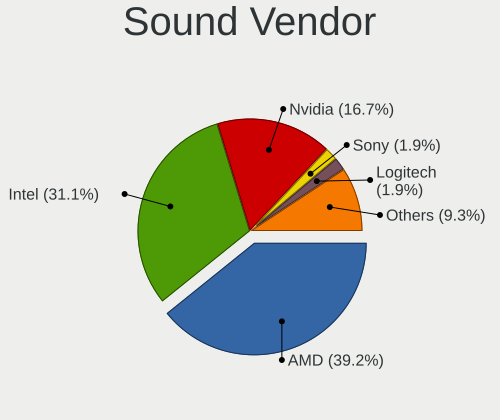

| Vendor                   | Computers | Percent |
|--------------------------|-----------|---------|
| AMD                      | 169       | 39.21%  |
| Intel                    | 134       | 31.09%  |
| Nvidia                   | 72        | 16.71%  |
| Sony                     | 8         | 1.86%   |
| Logitech                 | 8         | 1.86%   |
| Kingston Technology      | 6         | 1.39%   |
| C-Media Electronics      | 6         | 1.39%   |
| Hewlett-Packard          | 5         | 1.16%   |
| SteelSeries ApS          | 2         | 0.46%   |
| Realtek Semiconductor    | 2         | 0.46%   |
| Razer USA                | 2         | 0.46%   |
| Generalplus Technology   | 2         | 0.46%   |
| ASUSTek Computer         | 2         | 0.46%   |
| Astro Gaming             | 2         | 0.46%   |
| Texas Instruments        | 1         | 0.23%   |
| Micro Star International | 1         | 0.23%   |
| JMTek                    | 1         | 0.23%   |
| Jieli Technology         | 1         | 0.23%   |
| Google                   | 1         | 0.23%   |
| Giga-Byte Technology     | 1         | 0.23%   |
| Focusrite-Novation       | 1         | 0.23%   |
| Creative Labs            | 1         | 0.23%   |
| Comtrue                  | 1         | 0.23%   |
| Blue Microphones         | 1         | 0.23%   |
| Arturia                  | 1         | 0.23%   |

Sound Model
-----------

Sound card models

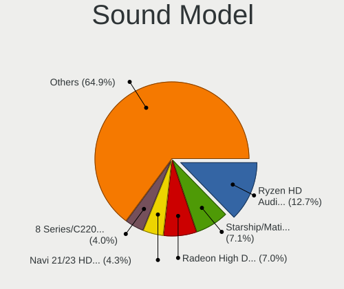

| Model                                                                      | Computers | Percent |
|----------------------------------------------------------------------------|-----------|---------|
| AMD Ryzen HD Audio Controller                                              | 73        | 12.7%   |
| AMD Starship/Matisse HD Audio Controller                                   | 41        | 7.13%   |
| AMD Radeon High Definition Audio Controller                                | 40        | 6.96%   |
| AMD Navi 21/23 HDMI/DP Audio Controller                                    | 25        | 4.35%   |
| Intel 8 Series/C220 Series Chipset High Definition Audio Controller        | 23        | 4%      |
| AMD Ellesmere HDMI Audio [Radeon RX 470/480 / 570/580/590]                 | 20        | 3.48%   |
| AMD Renoir/Cezanne HDMI/DP Audio Controller                                | 19        | 3.3%    |
| Intel Xeon E3-1200 v3/4th Gen Core Processor HD Audio Controller           | 16        | 2.78%   |
| AMD Navi 31 HDMI/DP Audio                                                  | 16        | 2.78%   |
| Intel 6 Series/C200 Series Chipset Family High Definition Audio Controller | 11        | 1.91%   |
| AMD Navi 10 HDMI Audio                                                     | 11        | 1.91%   |
| Intel Sunrise Point-LP HD Audio                                            | 10        | 1.74%   |
| Intel 7 Series/C216 Chipset Family High Definition Audio Controller        | 10        | 1.74%   |
| Nvidia TU107 GeForce GTX 1650 High Definition Audio Controller             | 9         | 1.57%   |
| Intel Cannon Lake PCH cAVS                                                 | 9         | 1.57%   |
| AMD Raven/Raven2/Fenghuang HDMI/DP Audio Controller                        | 9         | 1.57%   |
| Intel Tiger Lake-LP Smart Sound Technology Audio Controller                | 8         | 1.39%   |
| Intel 100 Series/C230 Series Chipset Family HD Audio Controller            | 8         | 1.39%   |
| Nvidia GA106 High Definition Audio Controller                              | 7         | 1.22%   |
| Nvidia GA104 High Definition Audio Controller                              | 7         | 1.22%   |
| Intel Comet Lake PCH cAVS                                                  | 7         | 1.22%   |
| Nvidia TU106 High Definition Audio Controller                              | 6         | 1.04%   |
| Nvidia GP107GL High Definition Audio Controller                            | 6         | 1.04%   |
| Intel Tiger Lake-H HD Audio Controller                                     | 6         | 1.04%   |
| AMD Family 17h (Models 00h-0fh) HD Audio Controller                        | 6         | 1.04%   |
| Sony DualShock 4 [CUH-ZCT2x]                                               | 5         | 0.87%   |
| Nvidia TU104 HD Audio Controller                                           | 5         | 0.87%   |
| Nvidia GP104 High Definition Audio Controller                              | 5         | 0.87%   |
| AMD Oland/Hainan/Cape Verde/Pitcairn HDMI Audio [Radeon HD 7000 Series]    | 5         | 0.87%   |
| Nvidia TU116 High Definition Audio Controller                              | 4         | 0.7%    |
| Nvidia GA107 High Definition Audio Controller                              | 4         | 0.7%    |
| Nvidia GA102 High Definition Audio Controller                              | 4         | 0.7%    |
| Intel CM238 HD Audio Controller                                            | 4         | 0.7%    |
| Intel Alder Lake-S HD Audio Controller                                     | 4         | 0.7%    |
| Intel 200 Series PCH HD Audio                                              | 4         | 0.7%    |
| AMD Baffin HDMI/DP Audio [Radeon RX 550 640SP / RX 560/560X]               | 4         | 0.7%    |
| Intel Smart Sound Technology (SST) Audio Controller                        | 3         | 0.52%   |
| Intel Raptor Lake High Definition Audio Controller                         | 3         | 0.52%   |
| Intel Comet Lake PCH-LP cAVS                                               | 3         | 0.52%   |
| Intel Alder Lake PCH-P High Definition Audio Controller                    | 3         | 0.52%   |

Memory
------

Memory Vendor
-------------

Memory module vendors

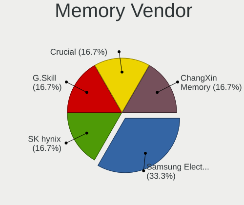

| Vendor              | Computers | Percent |
|---------------------|-----------|---------|
| Samsung Electronics | 2         | 33.33%  |
| SK hynix            | 1         | 16.67%  |
| G.Skill             | 1         | 16.67%  |
| Crucial             | 1         | 16.67%  |
| ChangXin Memory     | 1         | 16.67%  |

Memory Model
------------

Memory module models

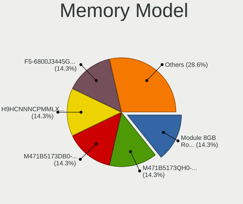

| Model                                                              | Computers | Percent |
|--------------------------------------------------------------------|-----------|---------|
| SK hynix RAM H9HCNNNCPMMLXR-NEE 2GB Row Of Chips LPDDR4 4267MT/s   | 1         | 14.29%  |
| Samsung RAM Module 8GB Row Of Chips LPDDR3 1600MT/s                | 1         | 14.29%  |
| Samsung RAM M471B5173QH0-YK0 4GB SODIMM DDR3 1600MT/s              | 1         | 14.29%  |
| Samsung RAM M471B5173DB0-YK0 4GB SODIMM DDR3 1600MT/s              | 1         | 14.29%  |
| G.Skill RAM F5-6800J3445G32G 32GB DIMM DDR5 4800MT/s               | 1         | 14.29%  |
| Crucial RAM CT32G4SFD832A.M16FF 32GB SODIMM DDR4 3200MT/s          | 1         | 14.29%  |
| ChangXin Memory RAM DB4ABAM-MK 1024MB Row Of Chips LPDDR4 3733MT/s | 1         | 14.29%  |

Memory Kind
-----------

Memory module kinds

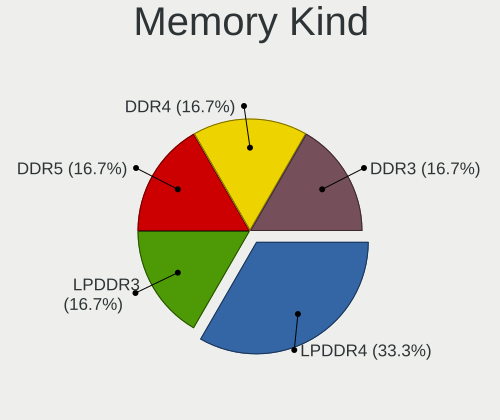

| Kind   | Computers | Percent |
|--------|-----------|---------|
| LPDDR4 | 2         | 33.33%  |
| LPDDR3 | 1         | 16.67%  |
| DDR5   | 1         | 16.67%  |
| DDR4   | 1         | 16.67%  |
| DDR3   | 1         | 16.67%  |

Memory Form Factor
------------------

Physical design of the memory module

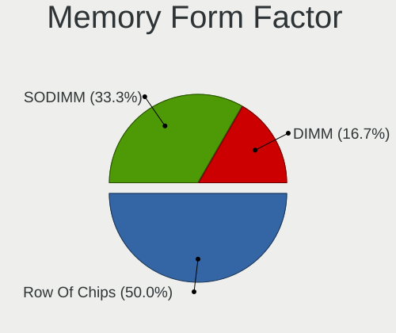

| Name         | Computers | Percent |
|--------------|-----------|---------|
| Row Of Chips | 3         | 50%     |
| SODIMM       | 2         | 33.33%  |
| DIMM         | 1         | 16.67%  |

Memory Size
-----------

Memory module size

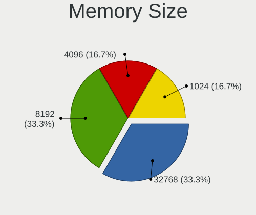

| Size  | Computers | Percent |
|-------|-----------|---------|
| 32768 | 2         | 33.33%  |
| 8192  | 2         | 33.33%  |
| 4096  | 1         | 16.67%  |
| 1024  | 1         | 16.67%  |

Memory Speed
------------

Memory module speed

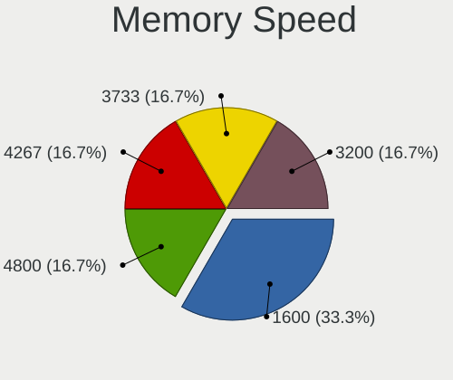

| Speed | Computers | Percent |
|-------|-----------|---------|
| 1600  | 2         | 33.33%  |
| 4800  | 1         | 16.67%  |
| 4267  | 1         | 16.67%  |
| 3733  | 1         | 16.67%  |
| 3200  | 1         | 16.67%  |

Printers & scanners
-------------------

Printer Vendor
--------------

Printer device vendors

| Vendor             | Computers | Percent |
|--------------------|-----------|---------|
| Brother Industries | 1         | 100%    |

Printer Model
-------------

Printer device models

| Model                      | Computers | Percent |
|----------------------------|-----------|---------|
| Brother HL-L3220CDW series | 1         | 100%    |

Scanner Vendor
--------------

Scanner device vendors

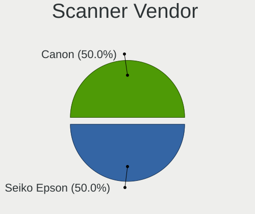

| Vendor      | Computers | Percent |
|-------------|-----------|---------|
| Seiko Epson | 1         | 50%     |
| Canon       | 1         | 50%     |

Scanner Model
-------------

Scanner device models

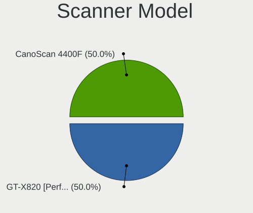

| Model                                       | Computers | Percent |
|---------------------------------------------|-----------|---------|
| Seiko Epson GT-X820 [Perfection V600 Photo] | 1         | 50%     |
| Canon CanoScan 4400F                        | 1         | 50%     |

Camera
------

Camera Vendor
-------------

Camera device vendors

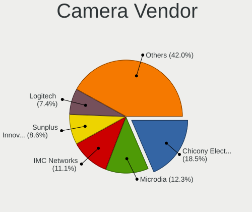

| Vendor                                 | Computers | Percent |
|----------------------------------------|-----------|---------|
| Chicony Electronics                    | 15        | 18.52%  |
| Microdia                               | 10        | 12.35%  |
| IMC Networks                           | 9         | 11.11%  |
| Sunplus Innovation Technology          | 7         | 8.64%   |
| Logitech                               | 6         | 7.41%   |
| Quanta                                 | 5         | 6.17%   |
| Bison Electronics                      | 5         | 6.17%   |
| Syntek                                 | 3         | 3.7%    |
| Realtek Semiconductor                  | 3         | 3.7%    |
| Apple                                  | 3         | 3.7%    |
| Sonix Technology                       | 2         | 2.47%   |
| Samsung Electronics                    | 2         | 2.47%   |
| Cheng Uei Precision Industry (Foxlink) | 2         | 2.47%   |
| Suyin                                  | 1         | 1.23%   |
| Silicon Motion                         | 1         | 1.23%   |
| SHENZHEN EMEET TECHNOLOGY              | 1         | 1.23%   |
| MacroSilicon                           | 1         | 1.23%   |
| Linux Foundation                       | 1         | 1.23%   |
| Huawei Technologies                    | 1         | 1.23%   |
| Goodong                                | 1         | 1.23%   |
| DigiTech                               | 1         | 1.23%   |
| AVerMedia Technologies                 | 1         | 1.23%   |

Camera Model
------------

Camera device models

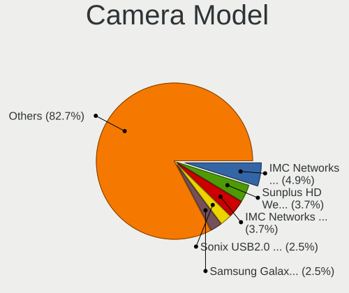

| Model                                   | Computers | Percent |
|-----------------------------------------|-----------|---------|
| IMC Networks USB2.0 HD UVC WebCam       | 4         | 4.94%   |
| Sunplus HD WebCam                       | 3         | 3.7%    |
| IMC Networks Integrated Camera          | 3         | 3.7%    |
| Sonix USB2.0 HD UVC WebCam              | 2         | 2.47%   |
| Samsung Galaxy series, misc. (MTP mode) | 2         | 2.47%   |
| Quanta HP Wide Vision HD Camera         | 2         | 2.47%   |
| Microdia Integrated_Webcam_HD           | 2         | 2.47%   |
| Microdia Integrated_Webcam_FHD          | 2         | 2.47%   |
| Logitech Webcam C930e                   | 2         | 2.47%   |
| IMC Networks ov9734_azurewave_camera    | 2         | 2.47%   |
| Chicony Integrated Camera               | 2         | 2.47%   |
| Chicony HD WebCam                       | 2         | 2.47%   |
| Chicony HD User Facing                  | 2         | 2.47%   |
| Bison Lenovo EasyCamera                 | 2         | 2.47%   |
| Syntek USB2.0 Camera                    | 1         | 1.23%   |
| Syntek Lenovo EasyCamera                | 1         | 1.23%   |
| Syntek Integrated Camera                | 1         | 1.23%   |
| Suyin HP Truevision HD                  | 1         | 1.23%   |
| Sunplus Integrated_Webcam_HD            | 1         | 1.23%   |
| Sunplus Integrated_Webcam_FHD           | 1         | 1.23%   |
| Sunplus Full HD webcam                  | 1         | 1.23%   |
| Sunplus ASUS Webcam                     | 1         | 1.23%   |
| Silicon Motion 300k Pixel Camera        | 1         | 1.23%   |
| SHENZHEN EMEET TECHNOLOGY eMeet Nova    | 1         | 1.23%   |
| Realtek Integrated_Webcam_HD            | 1         | 1.23%   |
| Realtek Integrated_Webcam_FHD           | 1         | 1.23%   |
| Realtek Integrated Webcam               | 1         | 1.23%   |
| Quanta HP HD Camera                     | 1         | 1.23%   |
| Quanta HD User Facing                   | 1         | 1.23%   |
| Quanta ACER FHD User Facing             | 1         | 1.23%   |
| Microdia Webcam Vitade AF               | 1         | 1.23%   |
| Microdia USB Camera                     | 1         | 1.23%   |
| Microdia USB 2.0 Camera                 | 1         | 1.23%   |
| Microdia Laptop_Integrated_Webcam_HD    | 1         | 1.23%   |
| Microdia HP Webcam                      | 1         | 1.23%   |
| Microdia Camera                         | 1         | 1.23%   |
| MacroSilicon USB Video                  | 1         | 1.23%   |
| Logitech Webcam C270                    | 1         | 1.23%   |
| Logitech Webcam C200                    | 1         | 1.23%   |
| Logitech Logi Webcam C920e              | 1         | 1.23%   |

Security
--------

Fingerprint Vendor
------------------

Fingerprint sensor vendors

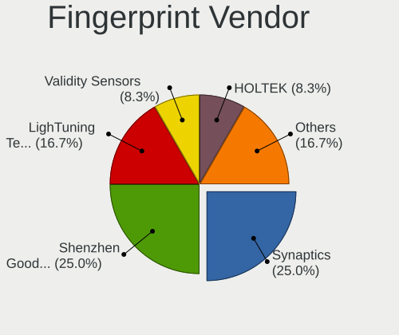

| Vendor                     | Computers | Percent |
|----------------------------|-----------|---------|
| Synaptics                  | 3         | 25%     |
| Shenzhen Goodix Technology | 3         | 25%     |
| LighTuning Technology      | 2         | 16.67%  |
| Validity Sensors           | 1         | 8.33%   |
| HOLTEK                     | 1         | 8.33%   |
| Focal-systems.Corp         | 1         | 8.33%   |
| AuthenTec                  | 1         | 8.33%   |

Fingerprint Model
-----------------

Fingerprint sensor models

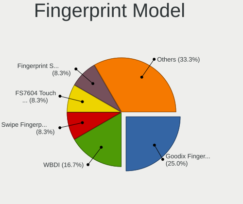

| Model                                                    | Computers | Percent |
|----------------------------------------------------------|-----------|---------|
| Shenzhen Goodix  Fingerprint Device                      | 3         | 25%     |
| Synaptics WBDI                                           | 2         | 16.67%  |
| Validity Sensors Swipe Fingerprint Sensor                | 1         | 8.33%   |
| Synaptics FS7604 Touch Fingerprint Sensor with PurePrint | 1         | 8.33%   |
| LighTuning Fingerprint Sensor                            | 1         | 8.33%   |
| LighTuning ES603 Swipe Fingerprint Sensor                | 1         | 8.33%   |
| HOLTEK FocalTech Fingerprint Device                      | 1         | 8.33%   |
| Focal-systems.Corp FT9201Fingerprint.                    | 1         | 8.33%   |
| AuthenTec AES1660 Fingerprint Sensor                     | 1         | 8.33%   |

Chipcard Vendor
---------------

Chipcard module vendors

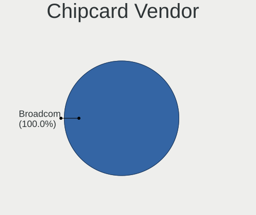

| Vendor   | Computers | Percent |
|----------|-----------|---------|
| Broadcom | 3         | 100%    |

Chipcard Model
--------------

Chipcard module models

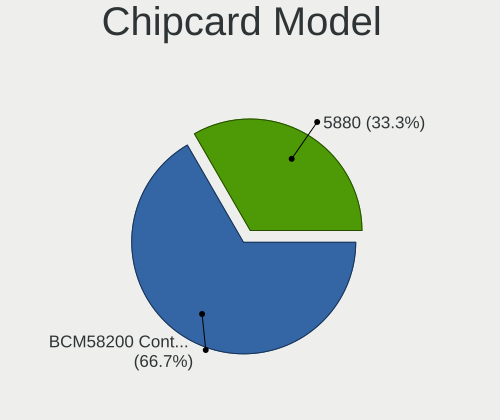

| Model                                                                       | Computers | Percent |
|-----------------------------------------------------------------------------|-----------|---------|
| Broadcom BCM58200 ControlVault 3 (FingerPrint sensor + Contacted SmartCard) | 2         | 66.67%  |
| Broadcom 5880                                                               | 1         | 33.33%  |

Unsupported
-----------

Unsupported Devices
-------------------

Total unsupported devices on board

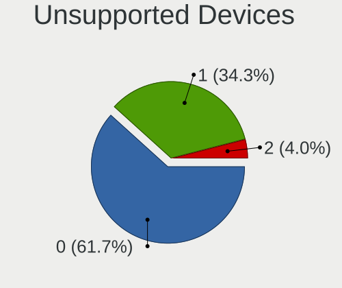

| Total | Computers | Percent |
|-------|-----------|---------|
| 0     | 169       | 61.68%  |
| 1     | 94        | 34.31%  |
| 2     | 11        | 4.01%   |

Unsupported Device Types
------------------------

Types of unsupported devices

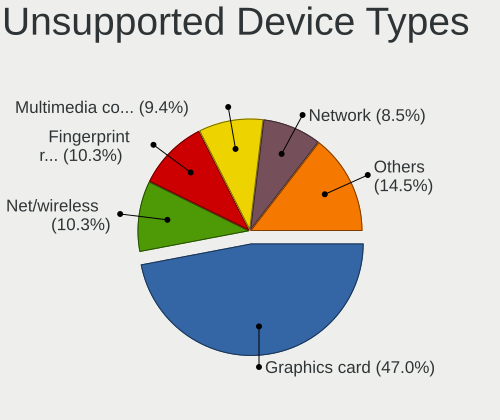

| Type                     | Computers | Percent |
|--------------------------|-----------|---------|
| Graphics card            | 55        | 47.01%  |
| Net/wireless             | 12        | 10.26%  |
| Fingerprint reader       | 12        | 10.26%  |
| Multimedia controller    | 11        | 9.4%    |
| Network                  | 10        | 8.55%   |
| Net/ethernet             | 7         | 5.98%   |
| Chipcard                 | 3         | 2.56%   |
| Unassigned class         | 2         | 1.71%   |
| Bluetooth                | 2         | 1.71%   |
| Storage/raid             | 1         | 0.85%   |
| Storage/nvme             | 1         | 0.85%   |
| Communication controller | 1         | 0.85%   |

