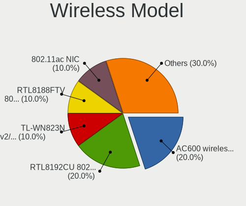
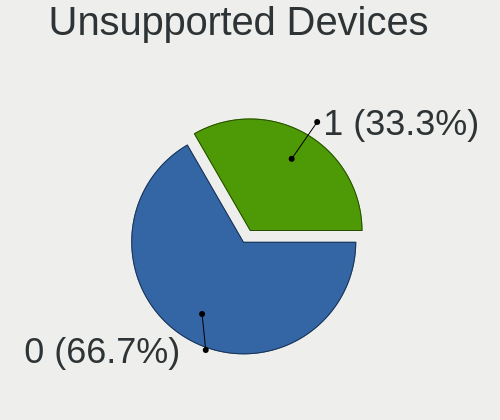
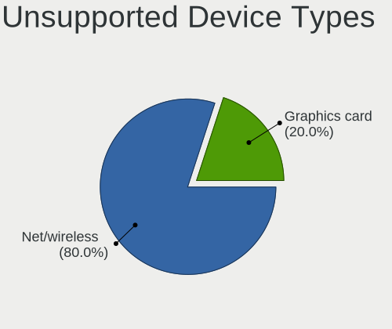

Chrome OS - Tested Hardware & Statistics (Desktops)
---------------------------------------------------

A project to collect tested hardware configurations for Chrome OS.

Anyone can contribute to this report by the [hw-probe](https://github.com/linuxhw/hw-probe) tool:

    sudo -E hw-probe -all -upload

Please contribute! Especially if your hardware is rare.

Contents
--------

* [ Test Cases ](#test-cases)

* [ System ](#system)
  - [ OS                       ](#os)
  - [ OS Family                ](#os-family)
  - [ Kernel                   ](#kernel)
  - [ Kernel Family            ](#kernel-family)
  - [ Kernel Major Ver.        ](#kernel-major-ver)
  - [ Arch                     ](#arch)
  - [ DE                       ](#de)
  - [ Display Server           ](#display-server)
  - [ Display Manager          ](#display-manager)
  - [ OS Lang                  ](#os-lang)
  - [ Boot Mode                ](#boot-mode)
  - [ Filesystem               ](#filesystem)
  - [ Part. scheme             ](#part-scheme)
  - [ Dual Boot with Linux/BSD ](#dual-boot-with-linuxbsd)
  - [ Dual Boot (Win)          ](#dual-boot-win)

* [ Board ](#board)
  - [ Vendor                   ](#vendor)
  - [ Model                    ](#model)
  - [ Model Family             ](#model-family)
  - [ MFG Year                 ](#mfg-year)
  - [ Form Factor              ](#form-factor)
  - [ Secure Boot              ](#secure-boot)
  - [ Coreboot                 ](#coreboot)
  - [ RAM Size                 ](#ram-size)
  - [ RAM Used                 ](#ram-used)
  - [ Total Drives             ](#total-drives)
  - [ Has CD-ROM               ](#has-cd-rom)
  - [ Has Ethernet             ](#has-ethernet)
  - [ Has WiFi                 ](#has-wifi)
  - [ Has Bluetooth            ](#has-bluetooth)

* [ Location ](#location)
  - [ Country                  ](#country)
  - [ City                     ](#city)

* [ Drives ](#drives)
  - [ Drive Vendor             ](#drive-vendor)
  - [ Drive Model              ](#drive-model)
  - [ HDD Vendor               ](#hdd-vendor)
  - [ SSD Vendor               ](#ssd-vendor)
  - [ Drive Kind               ](#drive-kind)
  - [ Drive Connector          ](#drive-connector)
  - [ Drive Size               ](#drive-size)
  - [ Space Total              ](#space-total)
  - [ Space Used               ](#space-used)
  - [ Malfunc. Drives          ](#malfunc-drives)
  - [ Malfunc. Drive Vendor    ](#malfunc-drive-vendor)
  - [ Malfunc. HDD Vendor      ](#malfunc-hdd-vendor)
  - [ Malfunc. Drive Kind      ](#malfunc-drive-kind)
  - [ Failed Drives            ](#failed-drives)
  - [ Failed Drive Vendor      ](#failed-drive-vendor)
  - [ Drive Status             ](#drive-status)

* [ Storage controller ](#storage-controller)
  - [ Storage Vendor           ](#storage-vendor)
  - [ Storage Model            ](#storage-model)
  - [ Storage Kind             ](#storage-kind)

* [ Processor ](#processor)
  - [ CPU Vendor               ](#cpu-vendor)
  - [ CPU Model                ](#cpu-model)
  - [ CPU Model Family         ](#cpu-model-family)
  - [ CPU Cores                ](#cpu-cores)
  - [ CPU Sockets              ](#cpu-sockets)
  - [ CPU Threads              ](#cpu-threads)
  - [ CPU Op-Modes             ](#cpu-op-modes)
  - [ CPU Microcode            ](#cpu-microcode)
  - [ CPU Microarch            ](#cpu-microarch)

* [ Graphics ](#graphics)
  - [ GPU Vendor               ](#gpu-vendor)
  - [ GPU Model                ](#gpu-model)
  - [ GPU Combo                ](#gpu-combo)
  - [ GPU Driver               ](#gpu-driver)
  - [ GPU Memory               ](#gpu-memory)

* [ Monitor ](#monitor)
  - [ Monitor Vendor           ](#monitor-vendor)
  - [ Monitor Model            ](#monitor-model)
  - [ Monitor Resolution       ](#monitor-resolution)
  - [ Monitor Diagonal         ](#monitor-diagonal)
  - [ Monitor Width            ](#monitor-width)
  - [ Aspect Ratio             ](#aspect-ratio)
  - [ Monitor Area             ](#monitor-area)
  - [ Pixel Density            ](#pixel-density)
  - [ Multiple Monitors        ](#multiple-monitors)

* [ Network ](#network)
  - [ Net Controller Vendor    ](#net-controller-vendor)
  - [ Net Controller Model     ](#net-controller-model)
  - [ Wireless Vendor          ](#wireless-vendor)
  - [ Wireless Model           ](#wireless-model)
  - [ Ethernet Vendor          ](#ethernet-vendor)
  - [ Ethernet Model           ](#ethernet-model)
  - [ Net Controller Kind      ](#net-controller-kind)
  - [ Used Controller          ](#used-controller)
  - [ NICs                     ](#nics)
  - [ IPv6                     ](#ipv6)

* [ Bluetooth ](#bluetooth)
  - [ Bluetooth Vendor         ](#bluetooth-vendor)
  - [ Bluetooth Model          ](#bluetooth-model)

* [ Sound ](#sound)
  - [ Sound Vendor             ](#sound-vendor)
  - [ Sound Model              ](#sound-model)

* [ Memory ](#memory)
  - [ Memory Vendor            ](#memory-vendor)
  - [ Memory Model             ](#memory-model)
  - [ Memory Kind              ](#memory-kind)
  - [ Memory Form Factor       ](#memory-form-factor)
  - [ Memory Size              ](#memory-size)
  - [ Memory Speed             ](#memory-speed)

* [ Printers & scanners ](#printers--scanners)
  - [ Printer Vendor           ](#printer-vendor)
  - [ Printer Model            ](#printer-model)
  - [ Scanner Vendor           ](#scanner-vendor)
  - [ Scanner Model            ](#scanner-model)

* [ Camera ](#camera)
  - [ Camera Vendor            ](#camera-vendor)
  - [ Camera Model             ](#camera-model)

* [ Security ](#security)
  - [ Fingerprint Vendor       ](#fingerprint-vendor)
  - [ Fingerprint Model        ](#fingerprint-model)
  - [ Chipcard Vendor          ](#chipcard-vendor)
  - [ Chipcard Model           ](#chipcard-model)

* [ Unsupported ](#unsupported)
  - [ Unsupported Devices      ](#unsupported-devices)
  - [ Unsupported Device Types ](#unsupported-device-types)

Test Cases
----------

Total: 24

| Vendor        | Model                       | Probe                                                      | Date         |
|---------------|-----------------------------|------------------------------------------------------------|--------------|
| ASUSTek       | C8HM70-I/HDMI               | [5452f92c7b](https://linux-hardware.org/?probe=5452f92c7b) | Mar 29, 2021 |
| ASUSTek       | C8HM70-I/HDMI               | [3d51048d61](https://linux-hardware.org/?probe=3d51048d61) | Mar 29, 2021 |
| HP            | 3033h                       | [c2dace7dd3](https://linux-hardware.org/?probe=c2dace7dd3) | Mar 05, 2021 |
| HP            | 3033h                       | [dee35e0ef1](https://linux-hardware.org/?probe=dee35e0ef1) | Feb 27, 2021 |
| HP            | 3033h                       | [41495dac27](https://linux-hardware.org/?probe=41495dac27) | Feb 26, 2021 |
| Dell          | 0PU052                      | [855a0698a6](https://linux-hardware.org/?probe=855a0698a6) | Jan 10, 2021 |
| Dell          | 0PU052                      | [4472b7cd46](https://linux-hardware.org/?probe=4472b7cd46) | Jan 10, 2021 |
| Dell          | 0CRH6C A00                  | [d23fabf572](https://linux-hardware.org/?probe=d23fabf572) | Dec 27, 2020 |
| ASUSTek       | P5GD1                       | [5a7acf0d43](https://linux-hardware.org/?probe=5a7acf0d43) | Dec 19, 2020 |
| MSI           | P6N SLI                     | [ac24861b49](https://linux-hardware.org/?probe=ac24861b49) | Dec 06, 2020 |
| MSI           | P6N SLI                     | [04304ff21c](https://linux-hardware.org/?probe=04304ff21c) | Dec 06, 2020 |
| Intel         | DN2820FYK H24582-202        | [1379002508](https://linux-hardware.org/?probe=1379002508) | Nov 01, 2020 |
| Samsung       | DT1234567890 SEC_SW_REVI... | [3aba059c2c](https://linux-hardware.org/?probe=3aba059c2c) | Sep 24, 2020 |
| Samsung       | DT1234567890 SEC_SW_REVI... | [c535500f86](https://linux-hardware.org/?probe=c535500f86) | Sep 24, 2020 |
| Gigabyte      | F2A68HM-H                   | [8ca04b349d](https://linux-hardware.org/?probe=8ca04b349d) | Sep 18, 2020 |
| Gigabyte      | F2A68HM-H                   | [fe0a0fac0f](https://linux-hardware.org/?probe=fe0a0fac0f) | Sep 18, 2020 |
| Dell          | 0V6D8J A00                  | [557355ba08](https://linux-hardware.org/?probe=557355ba08) | Sep 15, 2020 |
| Dell          | 0V6D8J A00                  | [bf4e456e50](https://linux-hardware.org/?probe=bf4e456e50) | Sep 15, 2020 |
| Dell          | 05XGC8 A01                  | [f243c5fe72](https://linux-hardware.org/?probe=f243c5fe72) | Apr 17, 2020 |
| Dell          | 05XGC8 A01                  | [7e85fad5a0](https://linux-hardware.org/?probe=7e85fad5a0) | Apr 17, 2020 |
| Google        | Panther                     | [fbc127e88c](https://linux-hardware.org/?probe=fbc127e88c) | Feb 17, 2020 |
| Google        | Panther                     | [5ead9de21a](https://linux-hardware.org/?probe=5ead9de21a) | Feb 17, 2020 |
| ASUSTek       | P5B-PLUS Series             | [b0a90d8478](https://linux-hardware.org/?probe=b0a90d8478) | Jan 02, 2020 |
| NEC Comput... | ECS-945G                    | [3494d9ef49](https://linux-hardware.org/?probe=3494d9ef49) | Nov 10, 2019 |

System
------

OS
--

Installed operating systems

| Name      | Desktops | Percent |
|-----------|----------|---------|
| Chrome OS | 14       | 100%    |

OS Family
---------

OS without a version

| Name      | Desktops | Percent |
|-----------|----------|---------|
| Chrome OS | 14       | 100%    |

Kernel
------

Version of the Linux kernel

| Version  | Desktops | Percent |
|----------|----------|---------|
| 5.4.53+  | 4        | 28.57%  |
| 5.4.66+  | 3        | 21.43%  |
| 5.4.25+  | 3        | 21.43%  |
| 4.19.65+ | 3        | 21.43%  |
| 4.19.49+ | 1        | 7.14%   |

Kernel Family
-------------

Linux kernel without a distro release

| Version | Desktops | Percent |
|---------|----------|---------|
| 5.4.53  | 4        | 28.57%  |
| 5.4.66  | 3        | 21.43%  |
| 5.4.25  | 3        | 21.43%  |
| 4.19.65 | 3        | 21.43%  |
| 4.19.49 | 1        | 7.14%   |

Kernel Major Ver.
-----------------

Linux kernel major version

| Version | Desktops | Percent |
|---------|----------|---------|
| 5.4     | 10       | 71.43%  |
| 4.19    | 4        | 28.57%  |

Arch
----

OS architecture (x86_64, i586, etc.)

| Name   | Desktops | Percent |
|--------|----------|---------|
| x86_64 | 14       | 100%    |

DE
--

Desktop Environment

| Name    | Desktops | Percent |
|---------|----------|---------|
| Unknown | 14       | 100%    |

Display Server
--------------

X11 or Wayland

| Name    | Desktops | Percent |
|---------|----------|---------|
| Unknown | 14       | 100%    |

Display Manager
---------------

SDDM, LightDM, etc.

| Name    | Desktops | Percent |
|---------|----------|---------|
| Unknown | 14       | 100%    |

OS Lang
-------

Language

| Lang    | Desktops | Percent |
|---------|----------|---------|
| Unknown | 14       | 100%    |

Boot Mode
---------

EFI or BIOS

| Mode | Desktops | Percent |
|------|----------|---------|
| BIOS | 8        | 57.14%  |
| EFI  | 6        | 42.86%  |

Filesystem
----------

Type of filesystem

| Type    | Desktops | Percent |
|---------|----------|---------|
| Ext4    | 13       | 92.86%  |
| Unknown | 1        | 7.14%   |

Part. scheme
------------

Scheme of partitioning

| Type    | Desktops | Percent |
|---------|----------|---------|
| Unknown | 14       | 100%    |

Dual Boot with Linux/BSD
------------------------

Hosting more than one Linux/BSD

| Dual boot | Desktops | Percent |
|-----------|----------|---------|
| No        | 14       | 100%    |

Dual Boot (Win)
---------------

Hosting Linux and Windows

| Dual boot | Desktops | Percent |
|-----------|----------|---------|
| No        | 14       | 100%    |

Board
-----

Vendor
------

Motherboard manufacturer

| Name                | Desktops | Percent |
|---------------------|----------|---------|
| Dell                | 4        | 28.57%  |
| ASUSTek Computer    | 3        | 21.43%  |
| Samsung Electronics | 1        | 7.14%   |
| NEC Computers       | 1        | 7.14%   |
| MSI                 | 1        | 7.14%   |
| Intel               | 1        | 7.14%   |
| Hewlett-Packard     | 1        | 7.14%   |
| Google              | 1        | 7.14%   |
| Gigabyte Technology | 1        | 7.14%   |

Model
-----

Motherboard model

| Name                                | Desktops | Percent |
|-------------------------------------|----------|---------|
| Samsung DeskTop System              | 1        | 7.14%   |
| NEC Computers ECS-945G              | 1        | 7.14%   |
| MSI MS-7350                         | 1        | 7.14%   |
| Intel DN2820FYK H24582-202          | 1        | 7.14%   |
| HP Compaq dc7900 Ultra-Slim Desktop | 1        | 7.14%   |
| Google Panther                      | 1        | 7.14%   |
| Gigabyte F2A68HM-H                  | 1        | 7.14%   |
| Dell Precision WorkStation T5500    | 1        | 7.14%   |
| Dell OptiPlex 755                   | 1        | 7.14%   |
| Dell OptiPlex 3040                  | 1        | 7.14%   |
| Dell Inspiron 3646                  | 1        | 7.14%   |
| ASUS P5GD1                          | 1        | 7.14%   |
| ASUS P5B-PLUS Series                | 1        | 7.14%   |
| ASUS C8HM70-I/HDMI                  | 1        | 7.14%   |

Model Family
------------

Motherboard model prefix

| Name                   | Desktops | Percent |
|------------------------|----------|---------|
| Dell OptiPlex          | 2        | 14.29%  |
| Samsung DeskTop        | 1        | 7.14%   |
| NEC Computers ECS-945G | 1        | 7.14%   |
| MSI MS-7350            | 1        | 7.14%   |
| Intel DN2820FYK        | 1        | 7.14%   |
| HP Compaq              | 1        | 7.14%   |
| Google Panther         | 1        | 7.14%   |
| Gigabyte F2A68HM-H     | 1        | 7.14%   |
| Dell Precision         | 1        | 7.14%   |
| Dell Inspiron          | 1        | 7.14%   |
| ASUS P5GD1             | 1        | 7.14%   |
| ASUS P5B-PLUS          | 1        | 7.14%   |
| ASUS C8HM70-I          | 1        | 7.14%   |

MFG Year
--------

Motherboard manufacture year

| Year | Desktops | Percent |
|------|----------|---------|
| 2008 | 3        | 21.43%  |
| 2014 | 2        | 14.29%  |
| 2012 | 2        | 14.29%  |
| 2007 | 2        | 14.29%  |
| 2019 | 1        | 7.14%   |
| 2016 | 1        | 7.14%   |
| 2015 | 1        | 7.14%   |
| 2010 | 1        | 7.14%   |
| 2005 | 1        | 7.14%   |

Form Factor
-----------

Physical design of the computer

| Name    | Desktops | Percent |
|---------|----------|---------|
| Desktop | 14       | 100%    |

Secure Boot
-----------

Enabled or disabled

| State    | Desktops | Percent |
|----------|----------|---------|
| Disabled | 12       | 85.71%  |
| Enabled  | 2        | 14.29%  |

Coreboot
--------

Have coreboot on board

| Used | Desktops | Percent |
|------|----------|---------|
| No   | 13       | 92.86%  |
| Yes  | 1        | 7.14%   |

RAM Size
--------

Total RAM memory

| Size in GB | Desktops | Percent |
|------------|----------|---------|
| 3.01-4.0   | 7        | 50%     |
| 4.01-8.0   | 2        | 14.29%  |
| 24.01-32.0 | 1        | 7.14%   |
| 2.01-3.0   | 1        | 7.14%   |
| 16.01-24.0 | 1        | 7.14%   |
| 1.01-2.0   | 1        | 7.14%   |
| 8.01-16.0  | 1        | 7.14%   |

RAM Used
--------

Used RAM memory

| Used GB  | Desktops | Percent |
|----------|----------|---------|
| 1.01-2.0 | 6        | 40%     |
| 2.01-3.0 | 4        | 26.67%  |
| 3.01-4.0 | 2        | 13.33%  |
| 0.51-1.0 | 2        | 13.33%  |
| 4.01-8.0 | 1        | 6.67%   |

Total Drives
------------

Number of drives on board

| Drives | Desktops | Percent |
|--------|----------|---------|
| 1      | 11       | 78.57%  |
| 2      | 3        | 21.43%  |

Has CD-ROM
----------

Has CD-ROM on board

| Presented | Desktops | Percent |
|-----------|----------|---------|
| Yes       | 9        | 64.29%  |
| No        | 5        | 35.71%  |

Has Ethernet
------------

Has Ethernet on board

| Presented | Desktops | Percent |
|-----------|----------|---------|
| Yes       | 14       | 100%    |

Has WiFi
--------

Has WiFi module

| Presented | Desktops | Percent |
|-----------|----------|---------|
| No        | 8        | 53.33%  |
| Yes       | 7        | 46.67%  |

Has Bluetooth
-------------

Has Bluetooth module

| Presented | Desktops | Percent |
|-----------|----------|---------|
| No        | 9        | 60%     |
| Yes       | 6        | 40%     |

Location
--------

Country
-------

Geographic location (country)

| Country     | Desktops | Percent |
|-------------|----------|---------|
| USA         | 5        | 35.71%  |
| UK          | 3        | 21.43%  |
| South Korea | 2        | 14.29%  |
| Italy       | 2        | 14.29%  |
| Germany     | 1        | 7.14%   |
| Brazil      | 1        | 7.14%   |

City
----

Geographic location (city)

| City               | Desktops | Percent |
|--------------------|----------|---------|
| Winter Garden      | 1        | 7.14%   |
| Welwyn Garden City | 1        | 7.14%   |
| Suwon              | 1        | 7.14%   |
| Sidney             | 1        | 7.14%   |
| Oklahoma City      | 1        | 7.14%   |
| Middle River       | 1        | 7.14%   |
| Hitchin            | 1        | 7.14%   |
| Forlì             | 1        | 7.14%   |
| Concesio           | 1        | 7.14%   |
| Cleveleys          | 1        | 7.14%   |
| Cheonan            | 1        | 7.14%   |
| Campinas           | 1        | 7.14%   |
| Aschaffenburg      | 1        | 7.14%   |
| Arlington          | 1        | 7.14%   |

Drives
------

Drive Vendor
------------

Hard drive vendors

| Vendor              | Desktops | Drives | Percent |
|---------------------|----------|--------|---------|
| Seagate             | 4        | 5      | 26.67%  |
| WDC                 | 2        | 2      | 13.33%  |
| Crucial             | 2        | 2      | 13.33%  |
| SPCC                | 1        | 1      | 6.67%   |
| Samsung Electronics | 1        | 1      | 6.67%   |
| Patriot             | 1        | 2      | 6.67%   |
| KingSpec            | 1        | 1      | 6.67%   |
| KingDian            | 1        | 1      | 6.67%   |
| Intel               | 1        | 1      | 6.67%   |
| China               | 1        | 1      | 6.67%   |

Drive Model
-----------

Hard drive models

| Model                                 | Desktops | Percent |
|---------------------------------------|----------|---------|
| Seagate ST500DM002-1BD142 500GB       | 2        | 13.33%  |
| WDC WDS240G2G0A-00JH30 240GB SSD      | 1        | 6.67%   |
| WDC WD5000 500GB                      | 1        | 6.67%   |
| SPCC Solid State Disk 128GB           | 1        | 6.67%   |
| Seagate ST980210AS 80GB               | 1        | 6.67%   |
| Seagate ST3160812AS 41N3268 LEN 160GB | 1        | 6.67%   |
| Samsung HD502IJ 500GB                 | 1        | 6.67%   |
| Patriot Inferno 120GB SSD             | 1        | 6.67%   |
| KingSpec NT-256 256GB SSD             | 1        | 6.67%   |
| KingDian S200 60GB                    | 1        | 6.67%   |
| Intel SSDSC2BB300G4 304GB             | 1        | 6.67%   |
| Crucial M4-CT128M4SSD2 128GB          | 1        | 6.67%   |
| Crucial CT256MX100SSD1 256GB          | 1        | 6.67%   |
| China MSATA 32GB SSD                  | 1        | 6.67%   |

HDD Vendor
----------

Hard disk drive vendors

| Vendor              | Desktops | Drives | Percent |
|---------------------|----------|--------|---------|
| Seagate             | 4        | 5      | 66.67%  |
| WDC                 | 1        | 1      | 16.67%  |
| Samsung Electronics | 1        | 1      | 16.67%  |

SSD Vendor
----------

Solid state drive vendors

| Vendor   | Desktops | Drives | Percent |
|----------|----------|--------|---------|
| Crucial  | 2        | 2      | 22.22%  |
| WDC      | 1        | 1      | 11.11%  |
| SPCC     | 1        | 1      | 11.11%  |
| Patriot  | 1        | 2      | 11.11%  |
| KingSpec | 1        | 1      | 11.11%  |
| KingDian | 1        | 1      | 11.11%  |
| Intel    | 1        | 1      | 11.11%  |
| China    | 1        | 1      | 11.11%  |

Drive Kind
----------

HDD or SSD

| Kind | Desktops | Drives | Percent |
|------|----------|--------|---------|
| SSD  | 9        | 10     | 60%     |
| HDD  | 6        | 7      | 40%     |

Drive Connector
---------------

SATA, SAS, NVMe, etc.

| Type | Desktops | Drives | Percent |
|------|----------|--------|---------|
| SATA | 14       | 17     | 100%    |

Drive Size
----------

Size of hard drive

| Size in TB | Desktops | Drives | Percent |
|------------|----------|--------|---------|
| 0.01-0.5   | 14       | 17     | 100%    |

Space Total
-----------

Amount of disk space available on the file system

| Size in GB | Desktops | Percent |
|------------|----------|---------|
| 251-500    | 4        | 28.57%  |
| 101-250    | 4        | 28.57%  |
| 501-1000   | 4        | 28.57%  |
| 51-100     | 2        | 14.29%  |

Space Used
----------

Amount of used disk space

| Used GB | Desktops | Percent |
|---------|----------|---------|
| 1-20    | 14       | 100%    |

Malfunc. Drives
---------------

Drive models with a malfunction

Zero info for selected period =(

Malfunc. Drive Vendor
---------------------

Vendors of faulty drives

Zero info for selected period =(

Malfunc. HDD Vendor
-------------------

Vendors of faulty HDD drives

Zero info for selected period =(

Malfunc. Drive Kind
-------------------

Kinds of faulty drives

Zero info for selected period =(

Failed Drives
-------------

Failed drive models

Zero info for selected period =(

Failed Drive Vendor
-------------------

Failed drive vendors

Zero info for selected period =(

Drive Status
------------

Number of failed and malfunc. drives

| Status   | Desktops | Drives | Percent |
|----------|----------|--------|---------|
| Detected | 14       | 17     | 100%    |

Storage controller
------------------

Storage Vendor
--------------

Storage controller vendors

| Vendor                        | Desktops | Percent |
|-------------------------------|----------|---------|
| Intel                         | 12       | 70.59%  |
| Nvidia                        | 1        | 5.88%   |
| Marvell Technology Group      | 1        | 5.88%   |
| JMicron Technology            | 1        | 5.88%   |
| Integrated Technology Express | 1        | 5.88%   |
| AMD                           | 1        | 5.88%   |

Storage Model
-------------

Storage controller models

| Model                                                                         | Desktops | Percent |
|-------------------------------------------------------------------------------|----------|---------|
| Intel Atom Processor E3800 Series SATA AHCI Controller                        | 2        | 8.7%    |
| Nvidia MCP51 Serial ATA Controller                                            | 1        | 4.35%   |
| Nvidia MCP51 IDE                                                              | 1        | 4.35%   |
| Marvell Group 88SE9128 PCIe SATA 6 Gb/s RAID controller with HyperDuo         | 1        | 4.35%   |
| JMicron JMB363 SATA/IDE Controller                                            | 1        | 4.35%   |
| Intel Q170/Q150/B150/H170/H110/Z170/CM236 Chipset SATA Controller [AHCI Mode] | 1        | 4.35%   |
| Intel NM10/ICH7 Family SATA Controller [IDE mode]                             | 1        | 4.35%   |
| Intel 82Q35 Express PT IDER Controller                                        | 1        | 4.35%   |
| Intel 82801JI (ICH10 Family) SATA AHCI Controller                             | 1        | 4.35%   |
| Intel 82801JD/DO (ICH10 Family) SATA AHCI Controller                          | 1        | 4.35%   |
| Intel 82801IR/IO/IH (ICH9R/DO/DH) 6 port SATA Controller [AHCI mode]          | 1        | 4.35%   |
| Intel 82801HR/HO/HH (ICH8R/DO/DH) 2 port SATA Controller [IDE mode]           | 1        | 4.35%   |
| Intel 82801H (ICH8 Family) 4 port SATA Controller [IDE mode]                  | 1        | 4.35%   |
| Intel 82801G (ICH7 Family) IDE Controller                                     | 1        | 4.35%   |
| Intel 82801FR/FRW (ICH6R/ICH6RW) SATA Controller                              | 1        | 4.35%   |
| Intel 82801FB/FBM/FR/FW/FRW (ICH6 Family) IDE Controller                      | 1        | 4.35%   |
| Intel 8 Series SATA Controller 1 [AHCI mode]                                  | 1        | 4.35%   |
| Intel 7 Series Chipset Family 6-port SATA Controller [AHCI mode]              | 1        | 4.35%   |
| Intel 6 Series/C200 Series Chipset Family 6 port Desktop SATA AHCI Controller | 1        | 4.35%   |
| Intel 4 Series Chipset PT IDER Controller                                     | 1        | 4.35%   |
| Integrated Express IT8212 Dual channel ATA RAID controller                    | 1        | 4.35%   |
| AMD FCH SATA Controller [IDE mode]                                            | 1        | 4.35%   |

Storage Kind
------------

Kind of storage controller (IDE, SATA, NVMe, SAS, ...)

| Kind | Desktops | Percent |
|------|----------|---------|
| SATA | 10       | 58.82%  |
| IDE  | 6        | 35.29%  |
| RAID | 1        | 5.88%   |

Processor
---------

CPU Vendor
----------

Processor vendors

| Vendor | Desktops | Percent |
|--------|----------|---------|
| Intel  | 13       | 92.86%  |
| AMD    | 1        | 7.14%   |

CPU Model
---------

Processor models

| Model                                         | Desktops | Percent |
|-----------------------------------------------|----------|---------|
| Intel Xeon CPU X5687 @ 3.60GHz                | 1        | 7.14%   |
| Intel Pentium Dual CPU E2200 @ 2.20GHz        | 1        | 7.14%   |
| Intel Pentium CPU J2900 @ 2.41GHz             | 1        | 7.14%   |
| Intel Pentium 4 CPU 3.00GHz                   | 1        | 7.14%   |
| Intel Core i5-6500 CPU @ 3.20GHz              | 1        | 7.14%   |
| Intel Core i3-3220 CPU @ 3.30GHz              | 1        | 7.14%   |
| Intel Core 2 Quad CPU Q6600 @ 2.40GHz         | 1        | 7.14%   |
| Intel Core 2 Duo CPU E8500 @ 3.16GHz          | 1        | 7.14%   |
| Intel Core 2 Duo CPU E6850 @ 3.00GHz          | 1        | 7.14%   |
| Intel Core 2 Duo CPU E4600 @ 2.40GHz          | 1        | 7.14%   |
| Intel Celeron CPU N2820 @ 2.13GHz             | 1        | 7.14%   |
| Intel Celeron CPU 847 @ 1.10GHz               | 1        | 7.14%   |
| Intel Celeron 2955U @ 1.40GHz                 | 1        | 7.14%   |
| AMD A6-7400K Radeon R5, 6 Compute Cores 2C+4G | 1        | 7.14%   |

CPU Model Family
----------------

Processor model prefix

| Model              | Desktops | Percent |
|--------------------|----------|---------|
| Intel Core 2 Duo   | 3        | 21.43%  |
| Intel Celeron      | 3        | 21.43%  |
| Intel Xeon         | 1        | 7.14%   |
| Intel Pentium Dual | 1        | 7.14%   |
| Intel Pentium 4    | 1        | 7.14%   |
| Intel Pentium      | 1        | 7.14%   |
| Intel Core i5      | 1        | 7.14%   |
| Intel Core i3      | 1        | 7.14%   |
| Intel Core 2 Quad  | 1        | 7.14%   |
| AMD A6             | 1        | 7.14%   |

CPU Cores
---------

Number of processor cores

| Number | Desktops | Percent |
|--------|----------|---------|
| 2      | 8        | 57.14%  |
| 4      | 4        | 28.57%  |
| 1      | 2        | 14.29%  |

CPU Sockets
-----------

Number of sockets

| Number | Desktops | Percent |
|--------|----------|---------|
| 1      | 14       | 100%    |

CPU Threads
-----------

Threads per core (Hyper-Threading)

| Number | Desktops | Percent |
|--------|----------|---------|
| 1      | 12       | 85.71%  |
| 2      | 2        | 14.29%  |

CPU Op-Modes
------------

CPU Operation Modes (32-bit, 64-bit)

| Op mode        | Desktops | Percent |
|----------------|----------|---------|
| 32-bit, 64-bit | 13       | 92.86%  |
| Unknown        | 1        | 7.14%   |

CPU Microcode
-------------

Microcode number

| Number     | Desktops | Percent |
|------------|----------|---------|
| 0x6fd      | 2        | 13.33%  |
| 0x6fb      | 2        | 13.33%  |
| 0xf43      | 1        | 6.67%   |
| 0x506e3    | 1        | 6.67%   |
| 0x40651    | 1        | 6.67%   |
| 0x306a9    | 1        | 6.67%   |
| 0x30678    | 1        | 6.67%   |
| 0x30673    | 1        | 6.67%   |
| 0x206c2    | 1        | 6.67%   |
| 0x206a7    | 1        | 6.67%   |
| 0x1067a    | 1        | 6.67%   |
| 0x06003106 | 1        | 6.67%   |
| Unknown    | 1        | 6.67%   |

CPU Microarch
-------------

Microarchitecture

| Name        | Desktops | Percent |
|-------------|----------|---------|
| Core        | 4        | 28.57%  |
| Silvermont  | 2        | 14.29%  |
| Westmere    | 1        | 7.14%   |
| Steamroller | 1        | 7.14%   |
| Skylake     | 1        | 7.14%   |
| SandyBridge | 1        | 7.14%   |
| Penryn      | 1        | 7.14%   |
| NetBurst    | 1        | 7.14%   |
| IvyBridge   | 1        | 7.14%   |
| Haswell     | 1        | 7.14%   |

Graphics
--------

GPU Vendor
----------

Vendors of graphics cards

| Vendor | Desktops | Percent |
|--------|----------|---------|
| Intel  | 9        | 64.29%  |
| AMD    | 4        | 28.57%  |
| Nvidia | 1        | 7.14%   |

GPU Model
---------

Graphics card models

| Model                                                                     | Desktops | Percent |
|---------------------------------------------------------------------------|----------|---------|
| Intel Atom Processor Z36xxx/Z37xxx Series Graphics & Display              | 2        | 13.33%  |
| Nvidia G98 [GeForce 9300 GS]                                              | 1        | 6.67%   |
| Intel Xeon E3-1200 v2/3rd Gen Core processor Graphics Controller          | 1        | 6.67%   |
| Intel HD Graphics 530                                                     | 1        | 6.67%   |
| Intel Haswell-ULT Integrated Graphics Controller                          | 1        | 6.67%   |
| Intel 82Q35 Express Integrated Graphics Controller                        | 1        | 6.67%   |
| Intel 82945G/GZ Integrated Graphics Controller                            | 1        | 6.67%   |
| Intel 4 Series Chipset Integrated Graphics Controller                     | 1        | 6.67%   |
| Intel 2nd Generation Core Processor Family Integrated Graphics Controller | 1        | 6.67%   |
| AMD RV380 [Radeon X550/X600] (Secondary)                                  | 1        | 6.67%   |
| AMD RV380 [Radeon X550/X600]                                              | 1        | 6.67%   |
| AMD Park [Mobility Radeon HD 5430]                                        | 1        | 6.67%   |
| AMD Kaveri [Radeon R5 Graphics]                                           | 1        | 6.67%   |
| AMD Juniper XT [Radeon HD 5770]                                           | 1        | 6.67%   |

GPU Combo
---------

Combinations of graphics cards

| Name       | Desktops | Percent |
|------------|----------|---------|
| 1 x Intel  | 9        | 64.29%  |
| 1 x AMD    | 3        | 21.43%  |
| 2 x AMD    | 1        | 7.14%   |
| 1 x Nvidia | 1        | 7.14%   |

GPU Driver
----------

Free vs proprietary

| Driver | Desktops | Percent |
|--------|----------|---------|
| Free   | 14       | 100%    |

GPU Memory
----------

Total video memory

| Size in GB | Desktops | Percent |
|------------|----------|---------|
| Unknown    | 9        | 64.29%  |
| 0.01-0.5   | 3        | 21.43%  |
| 0.51-1.0   | 2        | 14.29%  |

Monitor
-------

Monitor Vendor
--------------

Monitor vendors

| Vendor               | Desktops | Percent |
|----------------------|----------|---------|
| Goldstar             | 2        | 15.38%  |
| Dell                 | 2        | 15.38%  |
| Toshiba              | 1        | 7.69%   |
| Sony                 | 1        | 7.69%   |
| Samsung Electronics  | 1        | 7.69%   |
| OUT                  | 1        | 7.69%   |
| Lite-On              | 1        | 7.69%   |
| Gateway              | 1        | 7.69%   |
| BenQ                 | 1        | 7.69%   |
| Apple                | 1        | 7.69%   |
| Ancor Communications | 1        | 7.69%   |

Monitor Model
-------------

Monitor models

| Model                                                                | Desktops | Percent |
|----------------------------------------------------------------------|----------|---------|
| Toshiba TV TSB0106 1920x1080 708x398mm 32.0-inch                     | 1        | 7.69%   |
| Sony TV SNY9C01 1920x1080                                            | 1        | 7.69%   |
| Samsung Electronics SyncMaster SAM03F3 1920x1200 518x324mm 24.1-inch | 1        | 7.69%   |
| OUT HDMI OUT0240 1920x1200 341x256mm 16.8-inch                       | 1        | 7.69%   |
| Lite-On R17AAC/S LTN023F 1280x1024 338x270mm 17.0-inch               | 1        | 7.69%   |
| Goldstar W1952 GSM4B77 1440x900 410x260mm 19.1-inch                  | 1        | 7.69%   |
| Goldstar E2260 GSM57DF 1920x1080 477x268mm 21.5-inch                 | 1        | 7.69%   |
| Gateway FPD1775W GWY06AF 1280x1024 373x209mm 16.8-inch               | 1        | 7.69%   |
| Dell P2418HZm DELD0C4 1920x1080 527x296mm 23.8-inch                  | 1        | 7.69%   |
| Dell 2407WFP DELA016 1920x1200 519x324mm 24.1-inch                   | 1        | 7.69%   |
| BenQ GL2450H BNQ78A6 1920x1080 531x298mm 24.0-inch                   | 1        | 7.69%   |
| Apple Cinema HD Display APP9220 2560x1600 641x401mm 29.8-inch        | 1        | 7.69%   |
| Ancor Communications VS278 ACI27A1 1920x1080 598x336mm 27.0-inch     | 1        | 7.69%   |

Monitor Resolution
------------------

Monitor screen resolution

| Resolution        | Desktops | Percent |
|-------------------|----------|---------|
| 1920x1080 (FHD)   | 5        | 38.46%  |
| 1920x1200 (WUXGA) | 3        | 23.08%  |
| 1280x1024 (SXGA)  | 2        | 15.38%  |
| 2560x1600         | 1        | 7.69%   |
| 1920x540          | 1        | 7.69%   |
| 1440x900 (WXGA+)  | 1        | 7.69%   |

Monitor Diagonal
----------------

Diagonal size in inches

| Inches | Desktops | Percent |
|--------|----------|---------|
| 24     | 3        | 23.08%  |
| 16     | 2        | 15.38%  |
| 72     | 1        | 7.69%   |
| 47     | 1        | 7.69%   |
| 29     | 1        | 7.69%   |
| 27     | 1        | 7.69%   |
| 23     | 1        | 7.69%   |
| 21     | 1        | 7.69%   |
| 19     | 1        | 7.69%   |
| 17     | 1        | 7.69%   |

Monitor Width
-------------

Physical width

| Width in mm | Desktops | Percent |
|-------------|----------|---------|
| 501-600     | 5        | 38.46%  |
| 401-500     | 2        | 15.38%  |
| 301-350     | 2        | 15.38%  |
| 601-700     | 1        | 7.69%   |
| 351-400     | 1        | 7.69%   |
| 1501-2000   | 1        | 7.69%   |
| 1001-1500   | 1        | 7.69%   |

Aspect Ratio
------------

Proportional relationship between the width and the height

| Ratio | Desktops | Percent |
|-------|----------|---------|
| 16/9  | 7        | 53.85%  |
| 16/10 | 4        | 30.77%  |
| 5/4   | 1        | 7.69%   |
| 4/3   | 1        | 7.69%   |

Monitor Area
------------

Area in inch²

| Area in inch² | Desktops | Percent |
|----------------|----------|---------|
| 201-250        | 3        | 23.08%  |
| 251-300        | 2        | 15.38%  |
| More than 1000 | 1        | 7.69%   |
| 351-500        | 1        | 7.69%   |
| 301-350        | 1        | 7.69%   |
| 151-200        | 1        | 7.69%   |
| 141-150        | 1        | 7.69%   |
| 131-140        | 1        | 7.69%   |
| 121-130        | 1        | 7.69%   |
| 501-1000       | 1        | 7.69%   |

Pixel Density
-------------

Pixels per inch

| Density | Desktops | Percent |
|---------|----------|---------|
| 51-100  | 8        | 61.54%  |
| 1-50    | 2        | 15.38%  |
| 101-120 | 2        | 15.38%  |
| 121-160 | 1        | 7.69%   |

Multiple Monitors
-----------------

Total monitors connected

| Total | Desktops | Percent |
|-------|----------|---------|
| 1     | 13       | 92.86%  |
| 0     | 1        | 7.14%   |

Network
-------

Net Controller Vendor
---------------------

Controller vendors

| Vendor                   | Desktops | Percent |
|--------------------------|----------|---------|
| Realtek Semiconductor    | 12       | 52.17%  |
| Qualcomm Atheros         | 3        | 13.04%  |
| Intel                    | 3        | 13.04%  |
| TP-Link                  | 2        | 8.7%    |
| Nvidia                   | 1        | 4.35%   |
| Marvell Technology Group | 1        | 4.35%   |
| Broadcom                 | 1        | 4.35%   |

Net Controller Model
--------------------

Controller models

| Model                                                             | Desktops | Percent |
|-------------------------------------------------------------------|----------|---------|
| Realtek RTL8111/8168/8411 PCI Express Gigabit Ethernet Controller | 8        | 29.63%  |
| Realtek RTL-8100/8101L/8139 PCI Fast Ethernet Adapter             | 3        | 11.11%  |
| TP-Link AC600 wireless Realtek RTL8811AU [Archer T2U Nano]        | 2        | 7.41%   |
| Realtek RTL8192CU 802.11n WLAN Adapter                            | 2        | 7.41%   |
| TP-Link TL-WN823N v2/v3 [Realtek RTL8192EU]                       | 1        | 3.7%    |
| Realtek RTL8188FTV 802.11b/g/n 1T1R 2.4G WLAN Adapter             | 1        | 3.7%    |
| Realtek 802.11ac NIC                                              | 1        | 3.7%    |
| Qualcomm Atheros QCA9565 / AR9565 Wireless Network Adapter        | 1        | 3.7%    |
| Qualcomm Atheros Attansic L1 Gigabit Ethernet                     | 1        | 3.7%    |
| Qualcomm Atheros AR9462 Wireless Network Adapter                  | 1        | 3.7%    |
| Nvidia MCP51 Ethernet Controller                                  | 1        | 3.7%    |
| Marvell Group 88E8053 PCI-E Gigabit Ethernet Controller           | 1        | 3.7%    |
| Intel Wireless 7260                                               | 1        | 3.7%    |
| Intel 82567LM-3 Gigabit Network Connection                        | 1        | 3.7%    |
| Intel 82566DM-2 Gigabit Network Connection                        | 1        | 3.7%    |
| Broadcom NetXtreme BCM5761 Gigabit Ethernet PCIe                  | 1        | 3.7%    |

Wireless Vendor
---------------

Wireless vendors

| Vendor                | Desktops | Percent |
|-----------------------|----------|---------|
| Realtek Semiconductor | 3        | 37.5%   |
| TP-Link               | 2        | 25%     |
| Qualcomm Atheros      | 2        | 25%     |
| Intel                 | 1        | 12.5%   |

Wireless Model
--------------

Wireless models

| Model                                                      | Desktops | Percent |
|------------------------------------------------------------|----------|---------|
| TP-Link AC600 wireless Realtek RTL8811AU [Archer T2U Nano] | 2        | 20%     |
| Realtek RTL8192CU 802.11n WLAN Adapter                     | 2        | 20%     |
| TP-Link TL-WN823N v2/v3 [Realtek RTL8192EU]                | 1        | 10%     |
| Realtek RTL8188FTV 802.11b/g/n 1T1R 2.4G WLAN Adapter      | 1        | 10%     |
| Realtek 802.11ac NIC                                       | 1        | 10%     |
| Qualcomm Atheros QCA9565 / AR9565 Wireless Network Adapter | 1        | 10%     |
| Qualcomm Atheros AR9462 Wireless Network Adapter           | 1        | 10%     |
| Intel Wireless 7260                                        | 1        | 10%     |

Ethernet Vendor
---------------

Ethernet vendors

| Vendor                   | Desktops | Percent |
|--------------------------|----------|---------|
| Realtek Semiconductor    | 10       | 62.5%   |
| Intel                    | 2        | 12.5%   |
| Qualcomm Atheros         | 1        | 6.25%   |
| Nvidia                   | 1        | 6.25%   |
| Marvell Technology Group | 1        | 6.25%   |
| Broadcom                 | 1        | 6.25%   |

Ethernet Model
--------------

Ethernet models

| Model                                                             | Desktops | Percent |
|-------------------------------------------------------------------|----------|---------|
| Realtek RTL8111/8168/8411 PCI Express Gigabit Ethernet Controller | 8        | 47.06%  |
| Realtek RTL-8100/8101L/8139 PCI Fast Ethernet Adapter             | 3        | 17.65%  |
| Qualcomm Atheros Attansic L1 Gigabit Ethernet                     | 1        | 5.88%   |
| Nvidia MCP51 Ethernet Controller                                  | 1        | 5.88%   |
| Marvell Group 88E8053 PCI-E Gigabit Ethernet Controller           | 1        | 5.88%   |
| Intel 82567LM-3 Gigabit Network Connection                        | 1        | 5.88%   |
| Intel 82566DM-2 Gigabit Network Connection                        | 1        | 5.88%   |
| Broadcom NetXtreme BCM5761 Gigabit Ethernet PCIe                  | 1        | 5.88%   |

Net Controller Kind
-------------------

Ethernet, WiFi or modem

| Kind     | Desktops | Percent |
|----------|----------|---------|
| Ethernet | 14       | 66.67%  |
| WiFi     | 7        | 33.33%  |

Used Controller
---------------

Currently used network controller

| Kind     | Desktops | Percent |
|----------|----------|---------|
| Ethernet | 11       | 68.75%  |
| WiFi     | 5        | 31.25%  |

NICs
----

Total network controllers on board

| Total | Desktops | Percent |
|-------|----------|---------|
| 1     | 8        | 57.14%  |
| 2     | 6        | 42.86%  |

IPv6
----

IPv6 vs IPv4

| Used | Desktops | Percent |
|------|----------|---------|
| No   | 14       | 93.33%  |
| Yes  | 1        | 6.67%   |

Bluetooth
---------

Bluetooth Vendor
----------------

Controller vendors

| Vendor                          | Desktops | Percent |
|---------------------------------|----------|---------|
| Cambridge Silicon Radio         | 3        | 50%     |
| Qualcomm Atheros Communications | 1        | 16.67%  |
| Intel                           | 1        | 16.67%  |
| IMC Networks                    | 1        | 16.67%  |

Bluetooth Model
---------------

Controller models

| Model                                               | Desktops | Percent |
|-----------------------------------------------------|----------|---------|
| Cambridge Silicon Radio Bluetooth Dongle (HCI mode) | 3        | 50%     |
| Qualcomm Atheros AR9462 Bluetooth                   | 1        | 16.67%  |
| Intel Bluetooth wireless interface                  | 1        | 16.67%  |
| IMC Networks Bluetooth Device                       | 1        | 16.67%  |

Sound
-----

Sound Vendor
------------

Sound card vendors

| Vendor | Desktops | Percent |
|--------|----------|---------|
| Intel  | 12       | 75%     |
| AMD    | 3        | 18.75%  |
| Nvidia | 1        | 6.25%   |

Sound Model
-----------

Sound card models

| Model                                                                      | Desktops | Percent |
|----------------------------------------------------------------------------|----------|---------|
| Intel Atom Processor Z36xxx/Z37xxx Series High Definition Audio Controller | 2        | 11.11%  |
| Nvidia MCP51 High Definition Audio                                         | 1        | 5.56%   |
| Intel NM10/ICH7 Family High Definition Audio Controller                    | 1        | 5.56%   |
| Intel Haswell-ULT HD Audio Controller                                      | 1        | 5.56%   |
| Intel 82801JI (ICH10 Family) HD Audio Controller                           | 1        | 5.56%   |
| Intel 82801JD/DO (ICH10 Family) HD Audio Controller                        | 1        | 5.56%   |
| Intel 82801I (ICH9 Family) HD Audio Controller                             | 1        | 5.56%   |
| Intel 82801H (ICH8 Family) HD Audio Controller                             | 1        | 5.56%   |
| Intel 82801FB/FBM/FR/FW/FRW (ICH6 Family) High Definition Audio Controller | 1        | 5.56%   |
| Intel 8 Series HD Audio Controller                                         | 1        | 5.56%   |
| Intel 7 Series/C216 Chipset Family High Definition Audio Controller        | 1        | 5.56%   |
| Intel 6 Series/C200 Series Chipset Family High Definition Audio Controller | 1        | 5.56%   |
| Intel 100 Series/C230 Series Chipset Family HD Audio Controller            | 1        | 5.56%   |
| AMD Kaveri HDMI/DP Audio Controller                                        | 1        | 5.56%   |
| AMD Juniper HDMI Audio [Radeon HD 5700 Series]                             | 1        | 5.56%   |
| AMD FCH Azalia Controller                                                  | 1        | 5.56%   |
| AMD Cedar HDMI Audio [Radeon HD 5400/6300/7300 Series]                     | 1        | 5.56%   |

Memory
------

Memory Vendor
-------------

Memory module vendors

Zero info for selected period =(

Memory Model
------------

Memory module models

Zero info for selected period =(

Memory Kind
-----------

Memory module kinds

Zero info for selected period =(

Memory Form Factor
------------------

Physical design of the memory module

Zero info for selected period =(

Memory Size
-----------

Memory module size

Zero info for selected period =(

Memory Speed
------------

Memory module speed

Zero info for selected period =(

Printers & scanners
-------------------

Printer Vendor
--------------

Printer device vendors

| Vendor          | Desktops | Percent |
|-----------------|----------|---------|
| Seiko Epson     | 1        | 50%     |
| Hewlett-Packard | 1        | 50%     |

Printer Model
-------------

Printer device models

| Model                    | Desktops | Percent |
|--------------------------|----------|---------|
| Seiko Epson L3150 Series | 1        | 50%     |
| HP LaserJet 1012         | 1        | 50%     |

Scanner Vendor
--------------

Scanner device vendors

| Vendor      | Desktops | Percent |
|-------------|----------|---------|
| Seiko Epson | 1        | 100%    |

Scanner Model
-------------

Scanner device models

| Model                                        | Desktops | Percent |
|----------------------------------------------|----------|---------|
| Seiko Epson GT-9700F [Perfection 2450 PHOTO] | 1        | 100%    |

Camera
------

Camera Vendor
-------------

Camera device vendors

| Vendor            | Desktops | Percent |
|-------------------|----------|---------|
| ARC International | 1        | 100%    |

Camera Model
------------

Camera device models

| Model                    | Desktops | Percent |
|--------------------------|----------|---------|
| ARC International Camera | 1        | 100%    |

Security
--------

Fingerprint Vendor
------------------

Fingerprint sensor vendors

Zero info for selected period =(

Fingerprint Model
-----------------

Fingerprint sensor models

Zero info for selected period =(

Chipcard Vendor
---------------

Chipcard module vendors

Zero info for selected period =(

Chipcard Model
--------------

Chipcard module models

Zero info for selected period =(

Unsupported
-----------

Unsupported Devices
-------------------

Total unsupported devices on board

| Total | Desktops | Percent |
|-------|----------|---------|
| 0     | 11       | 73.33%  |
| 1     | 4        | 26.67%  |

Unsupported Device Types
------------------------

Types of unsupported devices

| Type         | Desktops | Percent |
|--------------|----------|---------|
| Net/wireless | 4        | 100%    |

