Chrome OS - Tested Hardware & Statistics (Notebooks)
----------------------------------------------------

A project to collect tested hardware configurations for Chrome OS.

Anyone can contribute to this report by the [hw-probe](https://github.com/linuxhw/hw-probe) tool:

    sudo -E hw-probe -all -upload

Please contribute! Especially if your hardware is rare.

Contents
--------

* [ Test Cases ](#test-cases)

* [ System ](#system)
  - [ OS                       ](#os)
  - [ OS Family                ](#os-family)
  - [ Kernel                   ](#kernel)
  - [ Kernel Family            ](#kernel-family)
  - [ Kernel Major Ver.        ](#kernel-major-ver)
  - [ Arch                     ](#arch)
  - [ DE                       ](#de)
  - [ Display Server           ](#display-server)
  - [ Display Manager          ](#display-manager)
  - [ OS Lang                  ](#os-lang)
  - [ Boot Mode                ](#boot-mode)
  - [ Filesystem               ](#filesystem)
  - [ Part. scheme             ](#part-scheme)
  - [ Dual Boot with Linux/BSD ](#dual-boot-with-linuxbsd)
  - [ Dual Boot (Win)          ](#dual-boot-win)

* [ Board ](#board)
  - [ Vendor                   ](#vendor)
  - [ Model                    ](#model)
  - [ Model Family             ](#model-family)
  - [ MFG Year                 ](#mfg-year)
  - [ Form Factor              ](#form-factor)
  - [ Secure Boot              ](#secure-boot)
  - [ Coreboot                 ](#coreboot)
  - [ RAM Size                 ](#ram-size)
  - [ RAM Used                 ](#ram-used)
  - [ Total Drives             ](#total-drives)
  - [ Has CD-ROM               ](#has-cd-rom)
  - [ Has Ethernet             ](#has-ethernet)
  - [ Has WiFi                 ](#has-wifi)
  - [ Has Bluetooth            ](#has-bluetooth)

* [ Location ](#location)
  - [ Country                  ](#country)
  - [ City                     ](#city)

* [ Drives ](#drives)
  - [ Drive Vendor             ](#drive-vendor)
  - [ Drive Model              ](#drive-model)
  - [ HDD Vendor               ](#hdd-vendor)
  - [ SSD Vendor               ](#ssd-vendor)
  - [ Drive Kind               ](#drive-kind)
  - [ Drive Connector          ](#drive-connector)
  - [ Drive Size               ](#drive-size)
  - [ Space Total              ](#space-total)
  - [ Space Used               ](#space-used)
  - [ Malfunc. Drives          ](#malfunc-drives)
  - [ Malfunc. Drive Vendor    ](#malfunc-drive-vendor)
  - [ Malfunc. HDD Vendor      ](#malfunc-hdd-vendor)
  - [ Malfunc. Drive Kind      ](#malfunc-drive-kind)
  - [ Failed Drives            ](#failed-drives)
  - [ Failed Drive Vendor      ](#failed-drive-vendor)
  - [ Drive Status             ](#drive-status)

* [ Storage controller ](#storage-controller)
  - [ Storage Vendor           ](#storage-vendor)
  - [ Storage Model            ](#storage-model)
  - [ Storage Kind             ](#storage-kind)

* [ Processor ](#processor)
  - [ CPU Vendor               ](#cpu-vendor)
  - [ CPU Model                ](#cpu-model)
  - [ CPU Model Family         ](#cpu-model-family)
  - [ CPU Cores                ](#cpu-cores)
  - [ CPU Sockets              ](#cpu-sockets)
  - [ CPU Threads              ](#cpu-threads)
  - [ CPU Op-Modes             ](#cpu-op-modes)
  - [ CPU Microcode            ](#cpu-microcode)
  - [ CPU Microarch            ](#cpu-microarch)

* [ Graphics ](#graphics)
  - [ GPU Vendor               ](#gpu-vendor)
  - [ GPU Model                ](#gpu-model)
  - [ GPU Combo                ](#gpu-combo)
  - [ GPU Driver               ](#gpu-driver)
  - [ GPU Memory               ](#gpu-memory)

* [ Monitor ](#monitor)
  - [ Monitor Vendor           ](#monitor-vendor)
  - [ Monitor Model            ](#monitor-model)
  - [ Monitor Resolution       ](#monitor-resolution)
  - [ Monitor Diagonal         ](#monitor-diagonal)
  - [ Monitor Width            ](#monitor-width)
  - [ Aspect Ratio             ](#aspect-ratio)
  - [ Monitor Area             ](#monitor-area)
  - [ Pixel Density            ](#pixel-density)
  - [ Multiple Monitors        ](#multiple-monitors)

* [ Network ](#network)
  - [ Net Controller Vendor    ](#net-controller-vendor)
  - [ Net Controller Model     ](#net-controller-model)
  - [ Wireless Vendor          ](#wireless-vendor)
  - [ Wireless Model           ](#wireless-model)
  - [ Ethernet Vendor          ](#ethernet-vendor)
  - [ Ethernet Model           ](#ethernet-model)
  - [ Net Controller Kind      ](#net-controller-kind)
  - [ Used Controller          ](#used-controller)
  - [ NICs                     ](#nics)
  - [ IPv6                     ](#ipv6)

* [ Bluetooth ](#bluetooth)
  - [ Bluetooth Vendor         ](#bluetooth-vendor)
  - [ Bluetooth Model          ](#bluetooth-model)

* [ Sound ](#sound)
  - [ Sound Vendor             ](#sound-vendor)
  - [ Sound Model              ](#sound-model)

* [ Memory ](#memory)
  - [ Memory Vendor            ](#memory-vendor)
  - [ Memory Model             ](#memory-model)
  - [ Memory Kind              ](#memory-kind)
  - [ Memory Form Factor       ](#memory-form-factor)
  - [ Memory Size              ](#memory-size)
  - [ Memory Speed             ](#memory-speed)

* [ Printers & scanners ](#printers--scanners)
  - [ Printer Vendor           ](#printer-vendor)
  - [ Printer Model            ](#printer-model)
  - [ Scanner Vendor           ](#scanner-vendor)
  - [ Scanner Model            ](#scanner-model)

* [ Camera ](#camera)
  - [ Camera Vendor            ](#camera-vendor)
  - [ Camera Model             ](#camera-model)

* [ Security ](#security)
  - [ Fingerprint Vendor       ](#fingerprint-vendor)
  - [ Fingerprint Model        ](#fingerprint-model)
  - [ Chipcard Vendor          ](#chipcard-vendor)
  - [ Chipcard Model           ](#chipcard-model)

* [ Unsupported ](#unsupported)
  - [ Unsupported Devices      ](#unsupported-devices)
  - [ Unsupported Device Types ](#unsupported-device-types)

Test Cases
----------

Total: 70

| Vendor        | Model                       | Probe                                                      | Date         |
|---------------|-----------------------------|------------------------------------------------------------|--------------|
| Intel Clie... | LAPKC71F                    | [3ae3afeece](https://linux-hardware.org/?probe=3ae3afeece) | Jul 13, 2022 |
| Dell          | XPS 15 7590                 | [91780395d8](https://linux-hardware.org/?probe=91780395d8) | Dec 25, 2021 |
| Google        | Grunt                       | [e6c7c07304](https://linux-hardware.org/?probe=e6c7c07304) | Nov 04, 2021 |
| Google        | Akemi                       | [d59a7856ce](https://linux-hardware.org/?probe=d59a7856ce) | Sep 04, 2021 |
| Google        | Akemi                       | [91212d1a8e](https://linux-hardware.org/?probe=91212d1a8e) | Sep 04, 2021 |
| HP            | Compaq 6510b (GB867ET#AK... | [c9c18dfdeb](https://linux-hardware.org/?probe=c9c18dfdeb) | Feb 16, 2021 |
| Lenovo        | IdeaPad L340-15IRH Gamin... | [38a0ac2efa](https://linux-hardware.org/?probe=38a0ac2efa) | Feb 16, 2021 |
| Toshiba       | Satellite C850-14X          | [73977134ff](https://linux-hardware.org/?probe=73977134ff) | Feb 12, 2021 |
| Lenovo        | ThinkPad T500 22439AG       | [fe8ffb1fc3](https://linux-hardware.org/?probe=fe8ffb1fc3) | Jan 27, 2021 |
| Chuwi         | UBook Pro                   | [ae3077af50](https://linux-hardware.org/?probe=ae3077af50) | Jan 01, 2021 |
| HP            | Compaq 6510b (GB867ET#AK... | [65279b81c8](https://linux-hardware.org/?probe=65279b81c8) | Dec 28, 2020 |
| Lenovo        | ThinkPad SL400 27439MA      | [a53bf69f31](https://linux-hardware.org/?probe=a53bf69f31) | Dec 24, 2020 |
| Lenovo        | ThinkPad SL400 27439MA      | [7f1872861c](https://linux-hardware.org/?probe=7f1872861c) | Dec 24, 2020 |
| Chuwi         | UBook Pro                   | [e908ef1b8f](https://linux-hardware.org/?probe=e908ef1b8f) | Dec 22, 2020 |
| Chuwi         | UBook Pro                   | [022d7e1d0d](https://linux-hardware.org/?probe=022d7e1d0d) | Dec 22, 2020 |
| Google        | Stout                       | [2e966e7fba](https://linux-hardware.org/?probe=2e966e7fba) | Dec 11, 2020 |
| Google        | Stout                       | [e93637345c](https://linux-hardware.org/?probe=e93637345c) | Dec 11, 2020 |
| Lenovo        | ThinkPad T500 2055WYX       | [6f04a45e2e](https://linux-hardware.org/?probe=6f04a45e2e) | Dec 11, 2020 |
| Apple         | MacBookPro11,1              | [e7e19a17c2](https://linux-hardware.org/?probe=e7e19a17c2) | Nov 23, 2020 |
| Lenovo        | IdeaPad 100-15IBD 80QQ      | [4fccf7c912](https://linux-hardware.org/?probe=4fccf7c912) | Nov 15, 2020 |
| Lenovo        | IdeaPad 100-15IBD 80QQ      | [00d5983461](https://linux-hardware.org/?probe=00d5983461) | Nov 15, 2020 |
| Haier         | HI133L                      | [b475b32fbe](https://linux-hardware.org/?probe=b475b32fbe) | Oct 18, 2020 |
| Haier         | HI133L                      | [f3537f4f0c](https://linux-hardware.org/?probe=f3537f4f0c) | Oct 18, 2020 |
| HP            | 15 TouchSmart               | [8e8b2c7b3b](https://linux-hardware.org/?probe=8e8b2c7b3b) | Oct 02, 2020 |
| Acer          | Aspire ES1-411              | [8dcd17e446](https://linux-hardware.org/?probe=8dcd17e446) | Sep 15, 2020 |
| Dell          | Inspiron 1545               | [fc28ab4623](https://linux-hardware.org/?probe=fc28ab4623) | Aug 18, 2020 |
| Dell          | Latitude E6430              | [2a1cb09252](https://linux-hardware.org/?probe=2a1cb09252) | Aug 17, 2020 |
| HP            | Stream Laptop 14-ax0XX      | [6ab94ce643](https://linux-hardware.org/?probe=6ab94ce643) | May 26, 2020 |
| HP            | Stream Laptop 14-ax0XX      | [ba370ad4d4](https://linux-hardware.org/?probe=ba370ad4d4) | May 18, 2020 |
| Insyde        | MID-WIN1052                 | [c3623326f4](https://linux-hardware.org/?probe=c3623326f4) | May 13, 2020 |
| Insyde        | MID-WIN1052                 | [c0583f7e16](https://linux-hardware.org/?probe=c0583f7e16) | May 13, 2020 |
| HP            | Stream Notebook             | [1d99923bed](https://linux-hardware.org/?probe=1d99923bed) | May 10, 2020 |
| HP            | Stream Notebook             | [b8f59efc42](https://linux-hardware.org/?probe=b8f59efc42) | May 10, 2020 |
| Toshiba       | Satellite T130              | [0c6c8b85d4](https://linux-hardware.org/?probe=0c6c8b85d4) | May 06, 2020 |
| Toshiba       | Satellite T130              | [5a28a5cd81](https://linux-hardware.org/?probe=5a28a5cd81) | May 06, 2020 |
| HP            | Pavilion dv6                | [43b2da97bf](https://linux-hardware.org/?probe=43b2da97bf) | Apr 30, 2020 |
| Google        | Peppy                       | [417b93b591](https://linux-hardware.org/?probe=417b93b591) | Apr 28, 2020 |
| Google        | Peppy                       | [3a4c5d1adf](https://linux-hardware.org/?probe=3a4c5d1adf) | Apr 28, 2020 |
| Fujitsu Si... | LIFEBOOK E8420              | [cd2222973b](https://linux-hardware.org/?probe=cd2222973b) | Apr 21, 2020 |
| Fujitsu Si... | LIFEBOOK E8420              | [05c4106212](https://linux-hardware.org/?probe=05c4106212) | Apr 20, 2020 |
| HP            | Pavilion dv6                | [26098586ce](https://linux-hardware.org/?probe=26098586ce) | Apr 19, 2020 |
| ONDA          | OBOOK 11                    | [ee48f07c90](https://linux-hardware.org/?probe=ee48f07c90) | Apr 14, 2020 |
| ONDA          | OBOOK 11                    | [2833831652](https://linux-hardware.org/?probe=2833831652) | Apr 14, 2020 |
| ONDA          | OBOOK 11                    | [9f4ddc3830](https://linux-hardware.org/?probe=9f4ddc3830) | Apr 14, 2020 |
| ASUSTek       | E200HA                      | [3117acfee5](https://linux-hardware.org/?probe=3117acfee5) | Apr 11, 2020 |
| ASUSTek       | E200HA                      | [a3c88b9be1](https://linux-hardware.org/?probe=a3c88b9be1) | Apr 11, 2020 |
| Acer          | Aspire 3810T                | [10965a7219](https://linux-hardware.org/?probe=10965a7219) | Mar 23, 2020 |
| Dell          | Inspiron 1545               | [d558a45887](https://linux-hardware.org/?probe=d558a45887) | Feb 09, 2020 |
| Dell          | Inspiron 1545               | [b2a0d6b4ee](https://linux-hardware.org/?probe=b2a0d6b4ee) | Feb 09, 2020 |
| Hampoo        | B3W6_NA123C Reserved        | [eaf4701374](https://linux-hardware.org/?probe=eaf4701374) | Feb 08, 2020 |
| Hampoo        | B3W6_NA123C Reserved        | [1ca0264090](https://linux-hardware.org/?probe=1ca0264090) | Feb 04, 2020 |
| Hampoo        | B3W6_NA123C Reserved        | [f1d169e079](https://linux-hardware.org/?probe=f1d169e079) | Feb 04, 2020 |
| Dell          | Latitude E5420              | [ad85615ed1](https://linux-hardware.org/?probe=ad85615ed1) | Jan 26, 2020 |
| Lenovo        | IdeaPad S145-14IWL 81MU     | [9afa4563ce](https://linux-hardware.org/?probe=9afa4563ce) | Jan 15, 2020 |
| Positivo      | Q232A                       | [7cbfc66813](https://linux-hardware.org/?probe=7cbfc66813) | Jan 15, 2020 |
| HP            | EliteBook 8460p             | [7d7699569b](https://linux-hardware.org/?probe=7d7699569b) | Jan 08, 2020 |
| HP            | 635                         | [8bd618c5d7](https://linux-hardware.org/?probe=8bd618c5d7) | Jan 08, 2020 |
| Lenovo        | IdeaPad S145-14IWL 81MU     | [6a1ec0281a](https://linux-hardware.org/?probe=6a1ec0281a) | Dec 11, 2019 |
| HP            | Pavilion dv3500             | [ba878abe40](https://linux-hardware.org/?probe=ba878abe40) | Dec 09, 2019 |
| HP            | Pavilion dv3500             | [089a351d46](https://linux-hardware.org/?probe=089a351d46) | Dec 09, 2019 |
| Unknown       | Unknown                     | [f8f1207d2d](https://linux-hardware.org/?probe=f8f1207d2d) | Sep 29, 2019 |
| Unknown       | Unknown                     | [d19b3f1330](https://linux-hardware.org/?probe=d19b3f1330) | Sep 28, 2019 |
| Unknown       | Unknown                     | [a6d4347345](https://linux-hardware.org/?probe=a6d4347345) | Sep 28, 2019 |
| Positivo      | S14CT01                     | [dc55febba4](https://linux-hardware.org/?probe=dc55febba4) | May 14, 2019 |
| Dell          | Latitude E6400              | [8ab390f2d4](https://linux-hardware.org/?probe=8ab390f2d4) | Mar 17, 2019 |
| HP            | 15 TouchSmart               | [d96ad40896](https://linux-hardware.org/?probe=d96ad40896) | Jan 04, 2019 |
| HP            | 15 TouchSmart               | [3cfc2a6f62](https://linux-hardware.org/?probe=3cfc2a6f62) | Jan 03, 2019 |
| Acer          | Swift SF114-31              | [96142e3044](https://linux-hardware.org/?probe=96142e3044) | Nov 01, 2018 |
| Lenovo        | ThinkPad T500 224234U       | [81a4da9481](https://linux-hardware.org/?probe=81a4da9481) | Oct 30, 2018 |
| Lenovo        | ThinkPad T500 224234U       | [a738fda6fa](https://linux-hardware.org/?probe=a738fda6fa) | Oct 30, 2018 |

System
------

OS
--

Installed operating systems

| Name         | Notebooks | Percent |
|--------------|-----------|---------|
| Chrome OS    | 41        | 95.35%  |
| Chrome OS 94 | 2         | 4.65%   |

OS Family
---------

OS without a version

| Name      | Notebooks | Percent |
|-----------|-----------|---------|
| Chrome OS | 43        | 100%    |

Kernel
------

Version of the Linux kernel

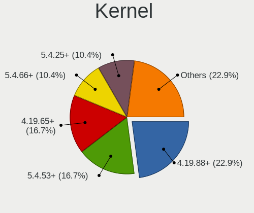

| Version                      | Notebooks | Percent |
|------------------------------|-----------|---------|
| 4.19.88+                     | 11        | 23.4%   |
| 5.4.53+                      | 8         | 17.02%  |
| 4.19.65+                     | 8         | 17.02%  |
| 5.4.66+                      | 5         | 10.64%  |
| 5.4.25+                      | 5         | 10.64%  |
| 4.19.49+                     | 3         | 6.38%   |
| 4.14.86+                     | 2         | 4.26%   |
| 4.14.58+                     | 2         | 4.26%   |
| 5.4.157-brunch-sebanc        | 1         | 2.13%   |
| 4.14.243-18084-g7bc10658733d | 1         | 2.13%   |
| 4.14.105+                    | 1         | 2.13%   |

Kernel Family
-------------

Linux kernel without a distro release

| Version  | Notebooks | Percent |
|----------|-----------|---------|
| 4.19.88  | 11        | 23.4%   |
| 5.4.53   | 8         | 17.02%  |
| 4.19.65  | 8         | 17.02%  |
| 5.4.66   | 5         | 10.64%  |
| 5.4.25   | 5         | 10.64%  |
| 4.19.49  | 3         | 6.38%   |
| 4.14.86  | 2         | 4.26%   |
| 4.14.58  | 2         | 4.26%   |
| 5.4.157  | 1         | 2.13%   |
| 4.14.243 | 1         | 2.13%   |
| 4.14.105 | 1         | 2.13%   |

Kernel Major Ver.
-----------------

Linux kernel major version

| Version | Notebooks | Percent |
|---------|-----------|---------|
| 4.19    | 21        | 47.73%  |
| 5.4     | 17        | 38.64%  |
| 4.14    | 6         | 13.64%  |

Arch
----

OS architecture (x86_64, i586, etc.)

| Name   | Notebooks | Percent |
|--------|-----------|---------|
| x86_64 | 43        | 100%    |

DE
--

Desktop Environment

| Name    | Notebooks | Percent |
|---------|-----------|---------|
| Unknown | 43        | 100%    |

Display Server
--------------

X11 or Wayland

| Name    | Notebooks | Percent |
|---------|-----------|---------|
| Unknown | 43        | 100%    |

Display Manager
---------------

SDDM, LightDM, etc.

| Name    | Notebooks | Percent |
|---------|-----------|---------|
| Unknown | 43        | 100%    |

OS Lang
-------

Language

| Lang    | Notebooks | Percent |
|---------|-----------|---------|
| Unknown | 43        | 100%    |

Boot Mode
---------

EFI or BIOS

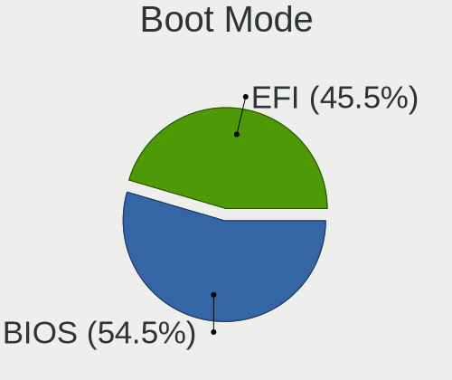

| Mode | Notebooks | Percent |
|------|-----------|---------|
| BIOS | 23        | 53.49%  |
| EFI  | 20        | 46.51%  |

Filesystem
----------

Type of filesystem

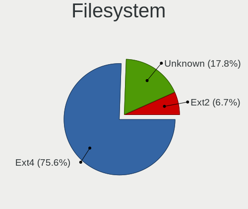

| Type    | Notebooks | Percent |
|---------|-----------|---------|
| Ext4    | 34        | 77.27%  |
| Unknown | 8         | 18.18%  |
| Ext2    | 2         | 4.55%   |

Part. scheme
------------

Scheme of partitioning

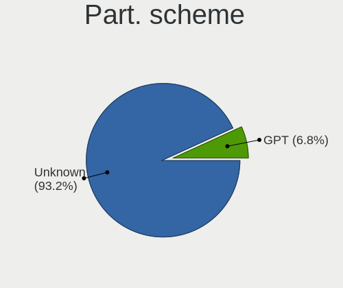

| Type    | Notebooks | Percent |
|---------|-----------|---------|
| Unknown | 41        | 95.35%  |
| GPT     | 2         | 4.65%   |

Dual Boot with Linux/BSD
------------------------

Hosting more than one Linux/BSD

| Dual boot | Notebooks | Percent |
|-----------|-----------|---------|
| No        | 41        | 95.35%  |
| Yes       | 2         | 4.65%   |

Dual Boot (Win)
---------------

Hosting Linux and Windows

| Dual boot | Notebooks | Percent |
|-----------|-----------|---------|
| No        | 42        | 97.67%  |
| Yes       | 1         | 2.33%   |

Board
-----

Vendor
------

Motherboard manufacturer

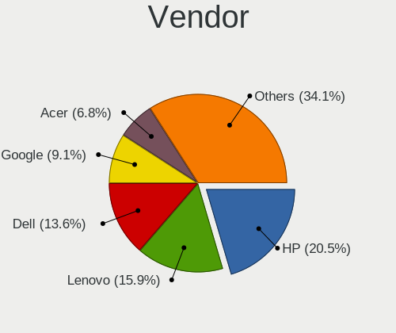

| Name             | Notebooks | Percent |
|------------------|-----------|---------|
| Hewlett-Packard  | 9         | 20.93%  |
| Lenovo           | 7         | 16.28%  |
| Dell             | 6         | 13.95%  |
| Google           | 3         | 6.98%   |
| Acer             | 3         | 6.98%   |
| Unknown          | 3         | 6.98%   |
| Toshiba          | 2         | 4.65%   |
| Positivo         | 2         | 4.65%   |
| ONDA             | 1         | 2.33%   |
| Insyde           | 1         | 2.33%   |
| Hampoo           | 1         | 2.33%   |
| Haier            | 1         | 2.33%   |
| Fujitsu Siemens  | 1         | 2.33%   |
| Chuwi            | 1         | 2.33%   |
| ASUSTek Computer | 1         | 2.33%   |
| Apple            | 1         | 2.33%   |

Model
-----

Motherboard model

| Name                                  | Notebooks | Percent |
|---------------------------------------|-----------|---------|
| Unknown                               | 3         | 6.98%   |
| HP Pavilion dv6                       | 2         | 4.65%   |
| Dell Inspiron 1545                    | 2         | 4.65%   |
| Toshiba Satellite T130                | 1         | 2.33%   |
| Toshiba Satellite C850-14X            | 1         | 2.33%   |
| Positivo S14CT01                      | 1         | 2.33%   |
| Positivo Q232A                        | 1         | 2.33%   |
| ONDA OBOOK 11                         | 1         | 2.33%   |
| Lenovo ThinkPad T500 22439AG          | 1         | 2.33%   |
| Lenovo ThinkPad T500 224234U          | 1         | 2.33%   |
| Lenovo ThinkPad T500 2055WYX          | 1         | 2.33%   |
| Lenovo ThinkPad SL400 27439MA         | 1         | 2.33%   |
| Lenovo IdeaPad S145-14IWL 81MU        | 1         | 2.33%   |
| Lenovo IdeaPad L340-15IRH Gaming 81LK | 1         | 2.33%   |
| Lenovo IdeaPad 100-15IBD 80QQ         | 1         | 2.33%   |
| Insyde MID-WIN1052                    | 1         | 2.33%   |
| HP Stream Notebook                    | 1         | 2.33%   |
| HP Stream Laptop 14-ax0XX             | 1         | 2.33%   |
| HP Pavilion dv3500                    | 1         | 2.33%   |
| HP EliteBook 8460p                    | 1         | 2.33%   |
| HP Compaq 6510b (GB867ET#AK8)         | 1         | 2.33%   |
| HP 635                                | 1         | 2.33%   |
| HP 15 TouchSmart                      | 1         | 2.33%   |
| Hampoo NA123                          | 1         | 2.33%   |
| Haier HI133L                          | 1         | 2.33%   |
| Google Stout                          | 1         | 2.33%   |
| Google Peppy                          | 1         | 2.33%   |
| Google Grunt                          | 1         | 2.33%   |
| Fujitsu Siemens LIFEBOOK E8420        | 1         | 2.33%   |
| Dell XPS 15 7590                      | 1         | 2.33%   |
| Dell Latitude E6430                   | 1         | 2.33%   |
| Dell Latitude E6400                   | 1         | 2.33%   |
| Dell Latitude E5420                   | 1         | 2.33%   |
| Chuwi UBook Pro                       | 1         | 2.33%   |
| ASUS E200HA                           | 1         | 2.33%   |
| Apple MacBookPro11,1                  | 1         | 2.33%   |
| Acer Swift SF114-31                   | 1         | 2.33%   |
| Acer Aspire ES1-411                   | 1         | 2.33%   |
| Acer Aspire 3810T                     | 1         | 2.33%   |

Model Family
------------

Motherboard model prefix

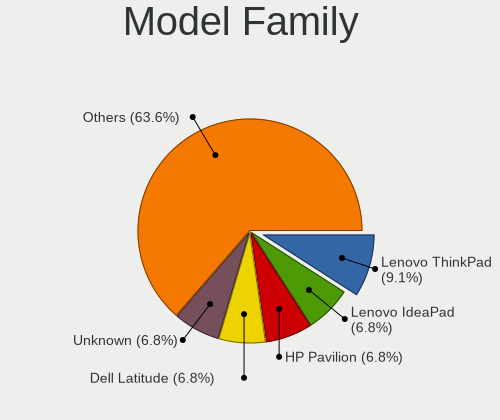

| Name                     | Notebooks | Percent |
|--------------------------|-----------|---------|
| Lenovo ThinkPad          | 4         | 9.3%    |
| Lenovo IdeaPad           | 3         | 6.98%   |
| HP Pavilion              | 3         | 6.98%   |
| Dell Latitude            | 3         | 6.98%   |
| Unknown                  | 3         | 6.98%   |
| Toshiba Satellite        | 2         | 4.65%   |
| HP Stream                | 2         | 4.65%   |
| Dell Inspiron            | 2         | 4.65%   |
| Acer Aspire              | 2         | 4.65%   |
| Positivo S14CT01         | 1         | 2.33%   |
| Positivo Q232A           | 1         | 2.33%   |
| ONDA OBOOK               | 1         | 2.33%   |
| Insyde MID-WIN1052       | 1         | 2.33%   |
| HP EliteBook             | 1         | 2.33%   |
| HP Compaq                | 1         | 2.33%   |
| HP 635                   | 1         | 2.33%   |
| HP 15                    | 1         | 2.33%   |
| Hampoo NA123             | 1         | 2.33%   |
| Haier HI133L             | 1         | 2.33%   |
| Google Stout             | 1         | 2.33%   |
| Google Peppy             | 1         | 2.33%   |
| Google Grunt             | 1         | 2.33%   |
| Fujitsu Siemens LIFEBOOK | 1         | 2.33%   |
| Dell XPS                 | 1         | 2.33%   |
| Chuwi UBook              | 1         | 2.33%   |
| ASUS E200HA              | 1         | 2.33%   |
| Apple MacBookPro11       | 1         | 2.33%   |
| Acer Swift               | 1         | 2.33%   |

MFG Year
--------

Motherboard manufacture year

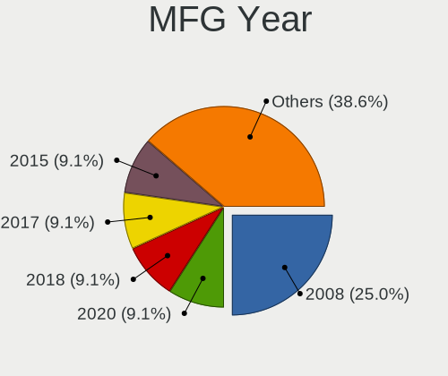

| Year | Notebooks | Percent |
|------|-----------|---------|
| 2008 | 10        | 23.26%  |
| 2020 | 4         | 9.3%    |
| 2018 | 4         | 9.3%    |
| 2016 | 4         | 9.3%    |
| 2015 | 4         | 9.3%    |
| 2009 | 4         | 9.3%    |
| 2019 | 3         | 6.98%   |
| 2017 | 3         | 6.98%   |
| 2011 | 3         | 6.98%   |
| 2014 | 2         | 4.65%   |
| 2013 | 1         | 2.33%   |
| 2012 | 1         | 2.33%   |

Form Factor
-----------

Physical design of the computer

| Name     | Notebooks | Percent |
|----------|-----------|---------|
| Notebook | 43        | 100%    |

Secure Boot
-----------

Enabled or disabled

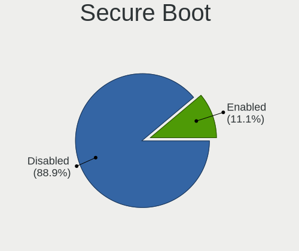

| State    | Notebooks | Percent |
|----------|-----------|---------|
| Disabled | 39        | 88.64%  |
| Enabled  | 5         | 11.36%  |

Coreboot
--------

Have coreboot on board

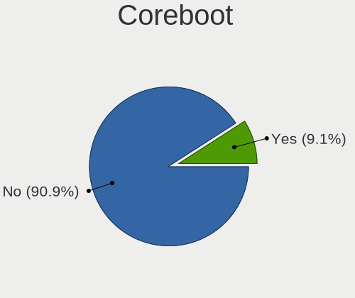

| Used | Notebooks | Percent |
|------|-----------|---------|
| No   | 40        | 93.02%  |
| Yes  | 3         | 6.98%   |

RAM Size
--------

Total RAM memory

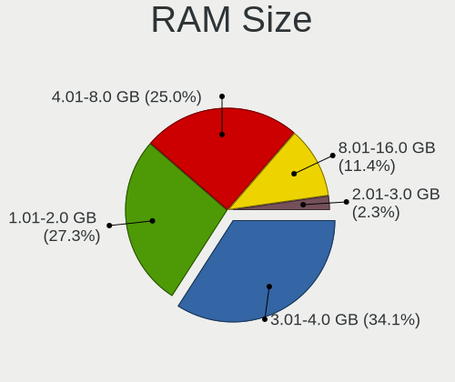

| Size in GB | Notebooks | Percent |
|------------|-----------|---------|
| 3.01-4.0   | 15        | 34.88%  |
| 4.01-8.0   | 11        | 25.58%  |
| 1.01-2.0   | 11        | 25.58%  |
| 8.01-16.0  | 5         | 11.63%  |
| 2.01-3.0   | 1         | 2.33%   |

RAM Used
--------

Used RAM memory

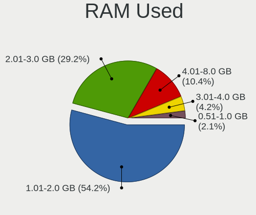

| Used GB  | Notebooks | Percent |
|----------|-----------|---------|
| 1.01-2.0 | 24        | 51.06%  |
| 2.01-3.0 | 15        | 31.91%  |
| 4.01-8.0 | 5         | 10.64%  |
| 3.01-4.0 | 2         | 4.26%   |
| 0.51-1.0 | 1         | 2.13%   |

Total Drives
------------

Number of drives on board

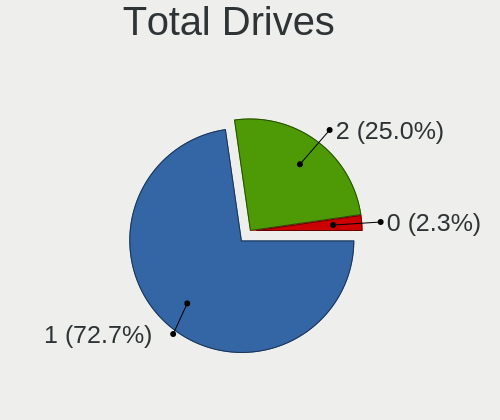

| Drives | Notebooks | Percent |
|--------|-----------|---------|
| 1      | 31        | 72.09%  |
| 2      | 11        | 25.58%  |
| 0      | 1         | 2.33%   |

Has CD-ROM
----------

Has CD-ROM on board

| Presented | Notebooks | Percent |
|-----------|-----------|---------|
| No        | 27        | 62.79%  |
| Yes       | 16        | 37.21%  |

Has Ethernet
------------

Has Ethernet on board

| Presented | Notebooks | Percent |
|-----------|-----------|---------|
| Yes       | 25        | 58.14%  |
| No        | 18        | 41.86%  |

Has WiFi
--------

Has WiFi module

| Presented | Notebooks | Percent |
|-----------|-----------|---------|
| Yes       | 38        | 88.37%  |
| No        | 5         | 11.63%  |

Has Bluetooth
-------------

Has Bluetooth module

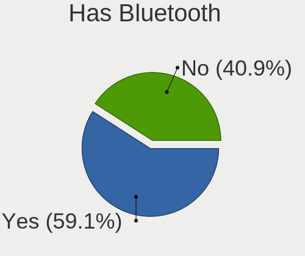

| Presented | Notebooks | Percent |
|-----------|-----------|---------|
| Yes       | 25        | 58.14%  |
| No        | 18        | 41.86%  |

Location
--------

Country
-------

Geographic location (country)

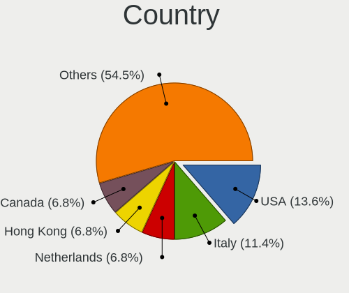

| Country     | Notebooks | Percent |
|-------------|-----------|---------|
| USA         | 5         | 11.63%  |
| Italy       | 5         | 11.63%  |
| Netherlands | 3         | 6.98%   |
| Hong Kong   | 3         | 6.98%   |
| Canada      | 3         | 6.98%   |
| UK          | 2         | 4.65%   |
| Sweden      | 2         | 4.65%   |
| Russia      | 2         | 4.65%   |
| Indonesia   | 2         | 4.65%   |
| Brazil      | 2         | 4.65%   |
| Turkey      | 1         | 2.33%   |
| Spain       | 1         | 2.33%   |
| Slovenia    | 1         | 2.33%   |
| Norway      | 1         | 2.33%   |
| Ireland     | 1         | 2.33%   |
| India       | 1         | 2.33%   |
| Hungary     | 1         | 2.33%   |
| Greece      | 1         | 2.33%   |
| Germany     | 1         | 2.33%   |
| France      | 1         | 2.33%   |
| Belgium     | 1         | 2.33%   |
| Austria     | 1         | 2.33%   |
| Australia   | 1         | 2.33%   |
| Argentina   | 1         | 2.33%   |

City
----

Geographic location (city)

| City               | Notebooks | Percent |
|--------------------|-----------|---------|
| Central            | 3         | 6.98%   |
| Turin              | 2         | 4.65%   |
| Rome               | 2         | 4.65%   |
| Montreal           | 2         | 4.65%   |
| Yekaterinburg      | 1         | 2.33%   |
| Thessaloniki       | 1         | 2.33%   |
| Spokane            | 1         | 2.33%   |
| South Bend         | 1         | 2.33%   |
| Senador Jose Bento | 1         | 2.33%   |
| Samara             | 1         | 2.33%   |
| Porter Ranch       | 1         | 2.33%   |
| Oslo               | 1         | 2.33%   |
| Omagh              | 1         | 2.33%   |
| Navan              | 1         | 2.33%   |
| Murici             | 1         | 2.33%   |
| Melbourne          | 1         | 2.33%   |
| Mannheim           | 1         | 2.33%   |
| Los Angeles        | 1         | 2.33%   |
| Ljubljana          | 1         | 2.33%   |
| Kolkata            | 1         | 2.33%   |
| Istanbul           | 1         | 2.33%   |
| Henan              | 1         | 2.33%   |
| Haarlem            | 1         | 2.33%   |
| Green Bay          | 1         | 2.33%   |
| Farnborough        | 1         | 2.33%   |
| Falun              | 1         | 2.33%   |
| Etobicoke          | 1         | 2.33%   |
| Deurne             | 1         | 2.33%   |
| Debrecen           | 1         | 2.33%   |
| Crispiano          | 1         | 2.33%   |
| Chinon             | 1         | 2.33%   |
| Buenos Aires       | 1         | 2.33%   |
| Bogor              | 1         | 2.33%   |
| Bleiswijk          | 1         | 2.33%   |
| Beuningen          | 1         | 2.33%   |
| Barcelona          | 1         | 2.33%   |
| Bandung            | 1         | 2.33%   |
| Bad Hall           | 1         | 2.33%   |

Drives
------

Drive Vendor
------------

Hard drive vendors

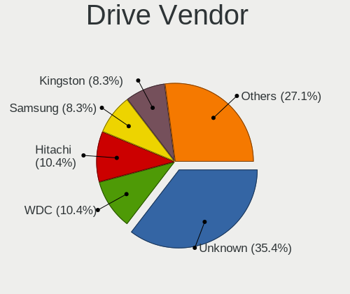

| Vendor                  | Notebooks | Drives | Percent |
|-------------------------|-----------|--------|---------|
| Unknown                 | 16        | 21     | 34.04%  |
| WDC                     | 5         | 6      | 10.64%  |
| Hitachi                 | 5         | 5      | 10.64%  |
| Samsung Electronics     | 4         | 5      | 8.51%   |
| Kingston                | 4         | 5      | 8.51%   |
| Toshiba                 | 2         | 2      | 4.26%   |
| Seagate                 | 2         | 2      | 4.26%   |
| HGST                    | 2         | 3      | 4.26%   |
| Fujitsu                 | 2         | 2      | 4.26%   |
| Union Memory (Shenzhen) | 1         | 1      | 2.13%   |
| TO Exter                | 1         | 1      | 2.13%   |
| SanDisk                 | 1         | 1      | 2.13%   |
| Netac                   | 1         | 2      | 2.13%   |
| MyDigitalSSD            | 1         | 1      | 2.13%   |

Drive Model
-----------

Hard drive models

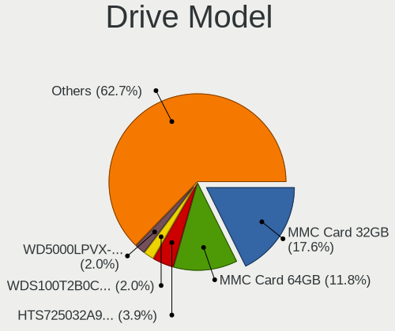

| Model                                        | Notebooks | Percent |
|----------------------------------------------|-----------|---------|
| Unknown MMC Card  32GB                       | 9         | 18%     |
| Unknown MMC Card  64GB                       | 6         | 12%     |
| Hitachi HTS725032A9A364 320GB                | 2         | 4%      |
| WDC WDS100T2B0C-00PXH0 1TB                   | 1         | 2%      |
| WDC WD5000LPVX-22V0TT0 500GB                 | 1         | 2%      |
| WDC WD3200BPVT-22JJ5T0 320GB                 | 1         | 2%      |
| WDC WD2500BEVS-08VAT2 250GB                  | 1         | 2%      |
| WDC WD1200BEVS-22UST0 120GB                  | 1         | 2%      |
| WDC PC SN730 SDBPNTY-512G-1101 512GB         | 1         | 2%      |
| Unknown MMC Card  8GB                        | 1         | 2%      |
| Unknown MMC Card  4GB                        | 1         | 2%      |
| Unknown MMC Card  118MB                      | 1         | 2%      |
| Union Memory (Shenzhen) NVMe SSD Drive 256GB | 1         | 2%      |
| Toshiba MQ01ABD032 320GB                     | 1         | 2%      |
| Toshiba MK2555GSX 250GB                      | 1         | 2%      |
| TO Exter nal USB 3.0 512GB                   | 1         | 2%      |
| Seagate ST980811AS 80GB                      | 1         | 2%      |
| Seagate ST9160821AS 160GB                    | 1         | 2%      |
| SanDisk SSD U100 16GB                        | 1         | 2%      |
| Samsung SSD PM800 2.5 128GB                  | 1         | 2%      |
| Samsung SSD 850 EVO 250GB                    | 1         | 2%      |
| Samsung SSD 850 EVO 120GB                    | 1         | 2%      |
| Samsung MZNLN128HAHQ-000L2 128GB SSD         | 1         | 2%      |
| Netac SSD 256GB                              | 1         | 2%      |
| MyDigitalSSD SC2 M2 SSD 120GB                | 1         | 2%      |
| Kingston SUV500120G 120GB SSD                | 1         | 2%      |
| Kingston SH100S3120G 120GB SSD               | 1         | 2%      |
| Kingston SA400S37120G 120GB SSD              | 1         | 2%      |
| Kingston SA2000M81000G 1TB                   | 1         | 2%      |
| Hitachi HTS725050A9A364 500GB                | 1         | 2%      |
| Hitachi HTS545032B9A300 320GB                | 1         | 2%      |
| Hitachi HTS545025B9A300 250GB                | 1         | 2%      |
| HGST HTS545050A7E680 500GB                   | 1         | 2%      |
| HGST HTS545050A7E660 500GB                   | 1         | 2%      |
| Fujitsu MHZ2080BH G1 80GB                    | 1         | 2%      |
| Fujitsu MHW2120BH 120GB                      | 1         | 2%      |

HDD Vendor
----------

Hard disk drive vendors

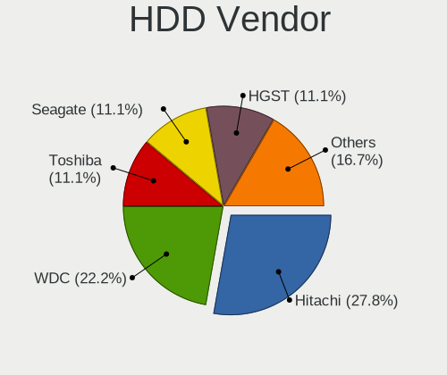

| Vendor  | Notebooks | Drives | Percent |
|---------|-----------|--------|---------|
| Hitachi | 5         | 5      | 29.41%  |
| WDC     | 4         | 4      | 23.53%  |
| Toshiba | 2         | 2      | 11.76%  |
| Seagate | 2         | 2      | 11.76%  |
| HGST    | 2         | 3      | 11.76%  |
| Fujitsu | 2         | 2      | 11.76%  |

SSD Vendor
----------

Solid state drive vendors

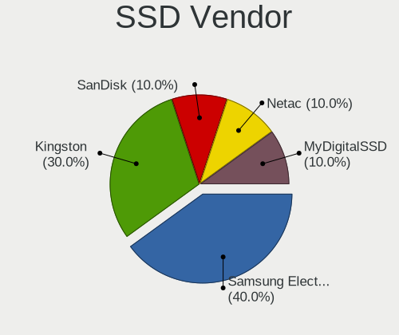

| Vendor              | Notebooks | Drives | Percent |
|---------------------|-----------|--------|---------|
| Samsung Electronics | 4         | 5      | 36.36%  |
| Kingston            | 3         | 4      | 27.27%  |
| TO Exter            | 1         | 1      | 9.09%   |
| SanDisk             | 1         | 1      | 9.09%   |
| Netac               | 1         | 2      | 9.09%   |
| MyDigitalSSD        | 1         | 1      | 9.09%   |

Drive Kind
----------

HDD or SSD

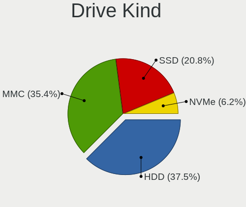

| Kind | Notebooks | Drives | Percent |
|------|-----------|--------|---------|
| HDD  | 17        | 18     | 36.17%  |
| MMC  | 16        | 21     | 34.04%  |
| SSD  | 11        | 14     | 23.4%   |
| NVMe | 3         | 4      | 6.38%   |

Drive Connector
---------------

SATA, SAS, NVMe, etc.

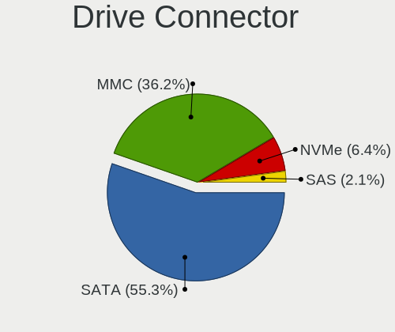

| Type | Notebooks | Drives | Percent |
|------|-----------|--------|---------|
| SATA | 26        | 31     | 56.52%  |
| MMC  | 16        | 21     | 34.78%  |
| NVMe | 3         | 4      | 6.52%   |
| SAS  | 1         | 1      | 2.17%   |

Drive Size
----------

Size of hard drive

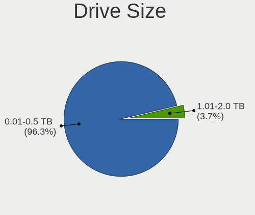

| Size in TB | Notebooks | Drives | Percent |
|------------|-----------|--------|---------|
| 0.01-0.5   | 26        | 31     | 96.3%   |
| 0.51-1.0   | 1         | 1      | 3.7%    |

Space Total
-----------

Amount of disk space available on the file system

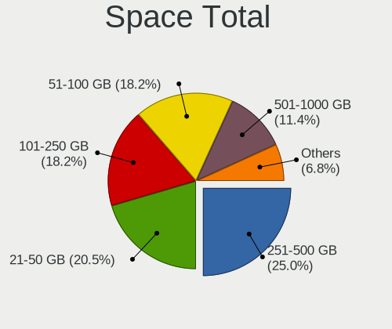

| Size in GB | Notebooks | Percent |
|------------|-----------|---------|
| 251-500    | 11        | 25.58%  |
| 21-50      | 9         | 20.93%  |
| 101-250    | 8         | 18.6%   |
| 51-100     | 8         | 18.6%   |
| 501-1000   | 5         | 11.63%  |
| 1-20       | 2         | 4.65%   |

Space Used
----------

Amount of used disk space

| Used GB | Notebooks | Percent |
|---------|-----------|---------|
| 1-20    | 38        | 86.36%  |
| 21-50   | 4         | 9.09%   |
| 51-100  | 2         | 4.55%   |

Malfunc. Drives
---------------

Drive models with a malfunction

Zero info for selected period =(

Malfunc. Drive Vendor
---------------------

Vendors of faulty drives

Zero info for selected period =(

Malfunc. HDD Vendor
-------------------

Vendors of faulty HDD drives

Zero info for selected period =(

Malfunc. Drive Kind
-------------------

Kinds of faulty drives

Zero info for selected period =(

Failed Drives
-------------

Failed drive models

Zero info for selected period =(

Failed Drive Vendor
-------------------

Failed drive vendors

Zero info for selected period =(

Drive Status
------------

Number of failed and malfunc. drives

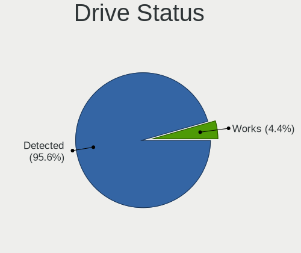

| Status   | Notebooks | Drives | Percent |
|----------|-----------|--------|---------|
| Detected | 42        | 54     | 95.45%  |
| Works    | 2         | 3      | 4.55%   |

Storage controller
------------------

Storage Vendor
--------------

Storage controller vendors

| Vendor                      | Notebooks | Percent |
|-----------------------------|-----------|---------|
| Intel                       | 30        | 88.24%  |
| AMD                         | 2         | 5.88%   |
| Union Memory (Shenzhen)     | 1         | 2.94%   |
| Kingston Technology Company | 1         | 2.94%   |

Storage Model
-------------

Storage controller models

| Model                                                                        | Notebooks | Percent |
|------------------------------------------------------------------------------|-----------|---------|
| Intel 82801IBM/IEM (ICH9M/ICH9M-E) 4 port SATA Controller [AHCI mode]        | 10        | 27.03%  |
| Intel Celeron N3350/Pentium N4200/Atom E3900 Series SATA AHCI Controller     | 4         | 10.81%  |
| Intel 7 Series Chipset Family 6-port SATA Controller [AHCI mode]             | 3         | 8.11%   |
| Intel 6 Series/C200 Series Chipset Family 6 port Mobile SATA AHCI Controller | 3         | 8.11%   |
| Intel Mobile 4 Series Chipset PT IDER Controller                             | 2         | 5.41%   |
| Intel Cannon Lake Mobile PCH SATA AHCI Controller                            | 2         | 5.41%   |
| AMD SB7x0/SB8x0/SB9x0 SATA Controller [AHCI mode]                            | 2         | 5.41%   |
| Union Memory (Shenzhen) Non-Volatile memory controller                       | 1         | 2.7%    |
| Kingston Company A2000 NVMe SSD                                              | 1         | 2.7%    |
| Intel Wildcat Point-LP SATA Controller [AHCI Mode]                           | 1         | 2.7%    |
| Intel Sunrise Point-LP SATA Controller [AHCI mode]                           | 1         | 2.7%    |
| Intel Cannon Point-LP SATA Controller [AHCI Mode]                            | 1         | 2.7%    |
| Intel Atom Processor E3800 Series SATA AHCI Controller                       | 1         | 2.7%    |
| Intel 82801IBM/IEM (ICH9M/ICH9M-E) 2 port SATA Controller [IDE mode]         | 1         | 2.7%    |
| Intel 82801HM/HEM (ICH8M/ICH8M-E) SATA Controller [AHCI mode]                | 1         | 2.7%    |
| Intel 82801HM/HEM (ICH8M/ICH8M-E) IDE Controller                             | 1         | 2.7%    |
| Intel 82801 Mobile SATA Controller [RAID mode]                               | 1         | 2.7%    |
| Intel 8 Series SATA Controller 1 [AHCI mode]                                 | 1         | 2.7%    |

Storage Kind
------------

Kind of storage controller (IDE, SATA, NVMe, SAS, ...)

| Kind | Notebooks | Percent |
|------|-----------|---------|
| SATA | 30        | 81.08%  |
| IDE  | 4         | 10.81%  |
| NVMe | 2         | 5.41%   |
| RAID | 1         | 2.7%    |

Processor
---------

CPU Vendor
----------

Processor vendors

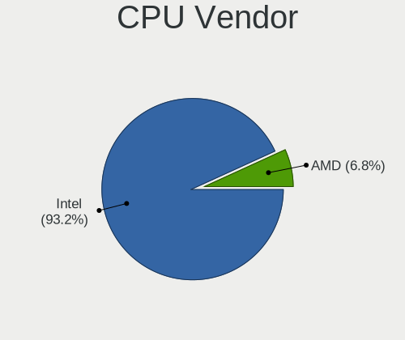

| Vendor | Notebooks | Percent |
|--------|-----------|---------|
| Intel  | 40        | 93.02%  |
| AMD    | 3         | 6.98%   |

CPU Model
---------

Processor models

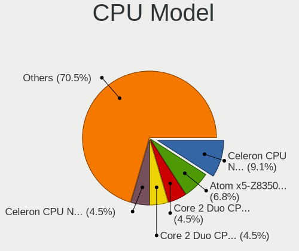

| Model                                         | Notebooks | Percent |
|-----------------------------------------------|-----------|---------|
| Intel Celeron CPU N3450 @ 1.10GHz             | 4         | 9.3%    |
| Intel Atom x5-Z8350 CPU @ 1.44GHz             | 3         | 6.98%   |
| Intel Core 2 Duo CPU P8700 @ 2.53GHz          | 2         | 4.65%   |
| Intel Core 2 Duo CPU P8400 @ 2.26GHz          | 2         | 4.65%   |
| Intel Celeron CPU N3050 @ 1.60GHz             | 2         | 4.65%   |
| Intel Atom x5-Z8300 CPU @ 1.44GHz             | 2         | 4.65%   |
| Intel Pentium Dual-Core CPU T4500 @ 2.30GHz   | 1         | 2.33%   |
| Intel Pentium Dual-Core CPU T4300 @ 2.10GHz   | 1         | 2.33%   |
| Intel Pentium CPU N3710 @ 1.60GHz             | 1         | 2.33%   |
| Intel Pentium CPU N3540 @ 2.16GHz             | 1         | 2.33%   |
| Intel Genuine CPU U4100 @ 1.30GHz             | 1         | 2.33%   |
| Intel Genuine CPU 575 @ 2.00GHz               | 1         | 2.33%   |
| Intel Core m3-8100Y CPU @ 1.10GHz             | 1         | 2.33%   |
| Intel Core i7-9750H CPU @ 2.60GHz             | 1         | 2.33%   |
| Intel Core i7-2630QM CPU @ 2.00GHz            | 1         | 2.33%   |
| Intel Core i5-9300H CPU @ 2.40GHz             | 1         | 2.33%   |
| Intel Core i5-4258U CPU @ 2.40GHz             | 1         | 2.33%   |
| Intel Core i5-3340M CPU @ 2.70GHz             | 1         | 2.33%   |
| Intel Core i5-2520M CPU @ 2.50GHz             | 1         | 2.33%   |
| Intel Core i5-2410M CPU @ 2.30GHz             | 1         | 2.33%   |
| Intel Core i3-8145U CPU @ 2.10GHz             | 1         | 2.33%   |
| Intel Core i3-5005U CPU @ 2.00GHz             | 1         | 2.33%   |
| Intel Core i3-3110M CPU @ 2.40GHz             | 1         | 2.33%   |
| Intel Core i3-2310M CPU @ 2.10GHz             | 1         | 2.33%   |
| Intel Core 2 Duo CPU U9400 @ 1.40GHz          | 1         | 2.33%   |
| Intel Core 2 Duo CPU T9400 @ 2.53GHz          | 1         | 2.33%   |
| Intel Core 2 Duo CPU T7100 @ 1.80GHz          | 1         | 2.33%   |
| Intel Core 2 Duo CPU T6400 @ 2.00GHz          | 1         | 2.33%   |
| Intel Celeron CPU 1007U @ 1.50GHz             | 1         | 2.33%   |
| Intel Celeron 2957U @ 1.40GHz                 | 1         | 2.33%   |
| Intel Atom CPU Z3735F @ 1.33GHz               | 1         | 2.33%   |
| AMD E-450 APU with Radeon HD Graphics         | 1         | 2.33%   |
| AMD Athlon II P340 Dual-Core Processor        | 1         | 2.33%   |
| AMD A4-9120C RADEON R4, 5 COMPUTE CORES 2C+3G | 1         | 2.33%   |

CPU Model Family
----------------

Processor model prefix

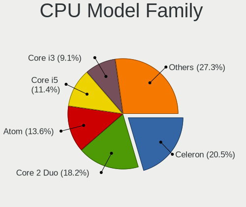

| Model                   | Notebooks | Percent |
|-------------------------|-----------|---------|
| Intel Core 2 Duo        | 8         | 18.6%   |
| Intel Celeron           | 8         | 18.6%   |
| Intel Atom              | 6         | 13.95%  |
| Intel Core i5           | 5         | 11.63%  |
| Intel Core i3           | 4         | 9.3%    |
| Intel Pentium Dual-Core | 2         | 4.65%   |
| Intel Pentium           | 2         | 4.65%   |
| Intel Genuine           | 2         | 4.65%   |
| Intel Core i7           | 2         | 4.65%   |
| Intel Core m3           | 1         | 2.33%   |
| AMD E                   | 1         | 2.33%   |
| AMD Athlon II           | 1         | 2.33%   |
| AMD A4                  | 1         | 2.33%   |

CPU Cores
---------

Number of processor cores

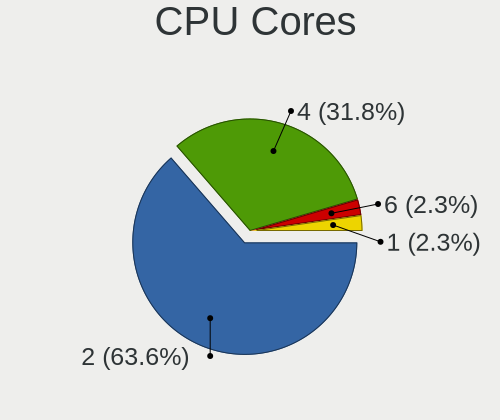

| Number | Notebooks | Percent |
|--------|-----------|---------|
| 2      | 27        | 62.79%  |
| 4      | 14        | 32.56%  |
| 6      | 1         | 2.33%   |
| 1      | 1         | 2.33%   |

CPU Sockets
-----------

Number of sockets

| Number | Notebooks | Percent |
|--------|-----------|---------|
| 1      | 43        | 100%    |

CPU Threads
-----------

Threads per core (Hyper-Threading)

| Number | Notebooks | Percent |
|--------|-----------|---------|
| 1      | 38        | 86.36%  |
| 2      | 6         | 13.64%  |

CPU Op-Modes
------------

CPU Operation Modes (32-bit, 64-bit)

| Op mode        | Notebooks | Percent |
|----------------|-----------|---------|
| 32-bit, 64-bit | 36        | 81.82%  |
| Unknown        | 8         | 18.18%  |

CPU Microcode
-------------

Microcode number

| Number     | Notebooks | Percent |
|------------|-----------|---------|
| 0x1067a    | 8         | 18.6%   |
| 0x506c9    | 4         | 9.3%    |
| 0x406c4    | 4         | 9.3%    |
| 0x406c3    | 4         | 9.3%    |
| 0x206a7    | 4         | 9.3%    |
| 0x306a9    | 3         | 6.98%   |
| 0x906ea    | 2         | 4.65%   |
| 0x30678    | 2         | 4.65%   |
| 0x10676    | 2         | 4.65%   |
| Unknown    | 2         | 4.65%   |
| 0x806eb    | 1         | 2.33%   |
| 0x806e9    | 1         | 2.33%   |
| 0x6fd      | 1         | 2.33%   |
| 0x40651    | 1         | 2.33%   |
| 0x306d4    | 1         | 2.33%   |
| 0x06006705 | 1         | 2.33%   |
| 0x05000101 | 1         | 2.33%   |
| 0x010000c8 | 1         | 2.33%   |

CPU Microarch
-------------

Microarchitecture

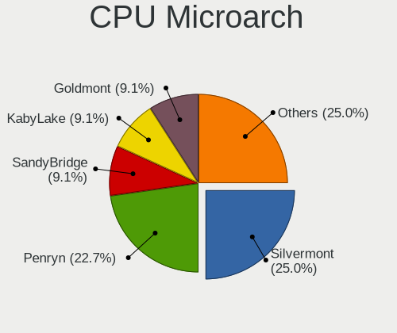

| Name        | Notebooks | Percent |
|-------------|-----------|---------|
| Silvermont  | 10        | 23.26%  |
| Penryn      | 10        | 23.26%  |
| SandyBridge | 4         | 9.3%    |
| KabyLake    | 4         | 9.3%    |
| Goldmont    | 4         | 9.3%    |
| IvyBridge   | 3         | 6.98%   |
| Haswell     | 2         | 4.65%   |
| Core        | 2         | 4.65%   |
| K10         | 1         | 2.33%   |
| Excavator   | 1         | 2.33%   |
| Broadwell   | 1         | 2.33%   |
| Bobcat      | 1         | 2.33%   |

Graphics
--------

GPU Vendor
----------

Vendors of graphics cards

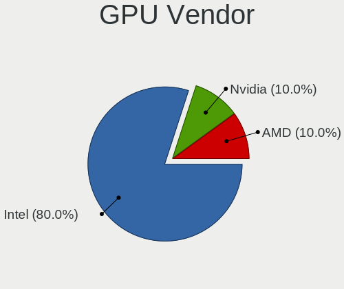

| Vendor | Notebooks | Percent |
|--------|-----------|---------|
| Intel  | 39        | 79.59%  |
| Nvidia | 5         | 10.2%   |
| AMD    | 5         | 10.2%   |

GPU Model
---------

Graphics card models

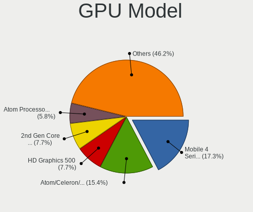

| Model                                                                                    | Notebooks | Percent |
|------------------------------------------------------------------------------------------|-----------|---------|
| Intel Mobile 4 Series Chipset Integrated Graphics Controller                             | 9         | 17.65%  |
| Intel Atom/Celeron/Pentium Processor x5-E8000/J3xxx/N3xxx Integrated Graphics Controller | 8         | 15.69%  |
| Intel HD Graphics 500                                                                    | 4         | 7.84%   |
| Intel 2nd Generation Core Processor Family Integrated Graphics Controller                | 4         | 7.84%   |
| Intel 3rd Gen Core processor Graphics Controller                                         | 3         | 5.88%   |
| Nvidia G98M [GeForce 9300M GS]                                                           | 2         | 3.92%   |
| Intel Haswell-ULT Integrated Graphics Controller                                         | 2         | 3.92%   |
| Intel CoffeeLake-H GT2 [UHD Graphics 630]                                                | 2         | 3.92%   |
| Intel Atom Processor Z36xxx/Z37xxx Series Graphics & Display                             | 2         | 3.92%   |
| Nvidia TU117M [GeForce GTX 1650 Mobile / Max-Q]                                          | 1         | 1.96%   |
| Nvidia GP107M [GeForce GTX 1050 3 GB Max-Q]                                              | 1         | 1.96%   |
| Nvidia GF108GLM [NVS 5200M]                                                              | 1         | 1.96%   |
| Intel WhiskeyLake-U GT2 [UHD Graphics 620]                                               | 1         | 1.96%   |
| Intel UHD Graphics 615                                                                   | 1         | 1.96%   |
| Intel Mobile GM965/GL960 Integrated Graphics Controller (secondary)                      | 1         | 1.96%   |
| Intel Mobile GM965/GL960 Integrated Graphics Controller (primary)                        | 1         | 1.96%   |
| Intel HD Graphics 5500                                                                   | 1         | 1.96%   |
| Intel CometLake-U GT2 [UHD Graphics]                                                     | 1         | 1.96%   |
| AMD Wrestler [Radeon HD 6320]                                                            | 1         | 1.96%   |
| AMD Stoney [Radeon R2/R3/R4/R5 Graphics]                                                 | 1         | 1.96%   |
| AMD Seymour [Radeon HD 6400M/7400M Series]                                               | 1         | 1.96%   |
| AMD RV635/M86 [Mobility Radeon HD 3650]                                                  | 1         | 1.96%   |
| AMD RS880M [Mobility Radeon HD 4225/4250]                                                | 1         | 1.96%   |
| AMD Park [Mobility Radeon HD 5430/5450/5470]                                             | 1         | 1.96%   |

GPU Combo
---------

Combinations of graphics cards

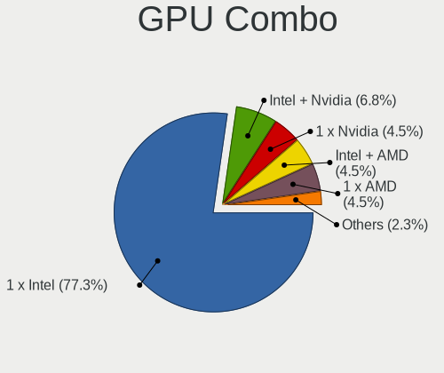

| Name           | Notebooks | Percent |
|----------------|-----------|---------|
| 1 x Intel      | 33        | 76.74%  |
| Intel + Nvidia | 3         | 6.98%   |
| 1 x Nvidia     | 2         | 4.65%   |
| Intel + AMD    | 2         | 4.65%   |
| 1 x AMD        | 2         | 4.65%   |
| 2 x AMD        | 1         | 2.33%   |

GPU Driver
----------

Free vs proprietary

| Driver | Notebooks | Percent |
|--------|-----------|---------|
| Free   | 43        | 100%    |

GPU Memory
----------

Total video memory

| Size in GB | Notebooks | Percent |
|------------|-----------|---------|
| Unknown    | 30        | 68.18%  |
| 0.01-0.5   | 6         | 13.64%  |
| 1.01-2.0   | 5         | 11.36%  |
| 0.51-1.0   | 2         | 4.55%   |
| 2.01-3.0   | 1         | 2.27%   |

Monitor
-------

Monitor Vendor
--------------

Monitor vendors

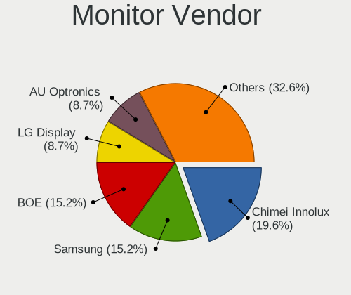

| Vendor                  | Notebooks | Percent |
|-------------------------|-----------|---------|
| Chimei Innolux          | 8         | 17.78%  |
| Samsung Electronics     | 7         | 15.56%  |
| BOE                     | 7         | 15.56%  |
| LG Display              | 4         | 8.89%   |
| AU Optronics            | 4         | 8.89%   |
| Lenovo                  | 3         | 6.67%   |
| Chi Mei Optoelectronics | 3         | 6.67%   |
| LG Philips              | 2         | 4.44%   |
| Dell                    | 2         | 4.44%   |
| Sharp                   | 1         | 2.22%   |
| InnoLux Display         | 1         | 2.22%   |
| Hewlett-Packard         | 1         | 2.22%   |
| HannStar                | 1         | 2.22%   |
| Apple                   | 1         | 2.22%   |

Monitor Model
-------------

Monitor models

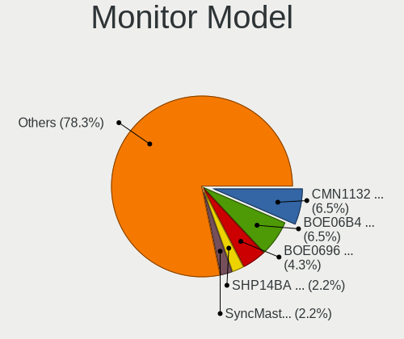

| Model                                                                    | Notebooks | Percent |
|--------------------------------------------------------------------------|-----------|---------|
| BOE LCD Monitor BOE06B4 1920x1080 344x194mm 15.5-inch                    | 3         | 6.67%   |
| Chimei Innolux LCD Monitor CMN1132 1366x768 256x144mm 11.6-inch          | 2         | 4.44%   |
| BOE LCD Monitor BOE0696 1366x768 309x173mm 13.9-inch                     | 2         | 4.44%   |
| Sharp LCD Monitor SHP14BA 1920x1080 344x194mm 15.5-inch                  | 1         | 2.22%   |
| Samsung Electronics SyncMaster SAM0254 1680x1050 474x296mm 22.0-inch     | 1         | 2.22%   |
| Samsung Electronics LCD Monitor SEC5442 1440x900 331x207mm 15.4-inch     | 1         | 2.22%   |
| Samsung Electronics LCD Monitor SEC3651 1366x768 344x194mm 15.5-inch     | 1         | 2.22%   |
| Samsung Electronics LCD Monitor SEC3150 1366x768 344x193mm 15.5-inch     | 1         | 2.22%   |
| Samsung Electronics LCD Monitor SEC3143 1366x768 256x144mm 11.6-inch     | 1         | 2.22%   |
| Samsung Electronics LCD Monitor SDC3853 2736x1824 260x173mm 12.3-inch    | 1         | 2.22%   |
| Samsung Electronics LCD Monitor SAM07BC 1360x768 700x390mm 31.5-inch     | 1         | 2.22%   |
| LG Philips LCD Monitor LPL8D00 1280x800 304x190mm 14.1-inch              | 1         | 2.22%   |
| LG Philips LCD Monitor LPL2D01 1920x1200 331x207mm 15.4-inch             | 1         | 2.22%   |
| LG Display LCD Monitor LGD0395 1366x768 344x194mm 15.5-inch              | 1         | 2.22%   |
| LG Display LCD Monitor LGD033E 1366x768 309x174mm 14.0-inch              | 1         | 2.22%   |
| LG Display LCD Monitor LGD01F7 1366x768 293x165mm 13.2-inch              | 1         | 2.22%   |
| LG Display LCD Monitor LGD01BC 1366x768 294x166mm 13.3-inch              | 1         | 2.22%   |
| Lenovo LCD Monitor LEN4057 1280x800 331x207mm 15.4-inch                  | 1         | 2.22%   |
| Lenovo LCD Monitor LEN4053 1680x1050 331x207mm 15.4-inch                 | 1         | 2.22%   |
| Lenovo LCD Monitor LEN4031 1280x800 303x190mm 14.1-inch                  | 1         | 2.22%   |
| InnoLux Display LCD Monitor INL000A 1366x768 344x194mm 15.5-inch         | 1         | 2.22%   |
| Hewlett-Packard S2031 HWP2904 1600x900 443x249mm 20.0-inch               | 1         | 2.22%   |
| HannStar HSD116PHW2A HSD0450 1366x768 260x140mm 11.6-inch                | 1         | 2.22%   |
| Dell SE2717H/HX DELD0A1 1920x1080 600x340mm 27.2-inch                    | 1         | 2.22%   |
| Dell P2312H DEL4076 1920x1080 510x287mm 23.0-inch                        | 1         | 2.22%   |
| Chimei Innolux LCD Monitor CMN15E7 1920x1080 344x193mm 15.5-inch         | 1         | 2.22%   |
| Chimei Innolux LCD Monitor CMN14E5 1920x1080 309x173mm 13.9-inch         | 1         | 2.22%   |
| Chimei Innolux LCD Monitor CMN14C3 1366x768 309x173mm 13.9-inch          | 1         | 2.22%   |
| Chimei Innolux LCD Monitor CMN1476 1366x768 309x174mm 14.0-inch          | 1         | 2.22%   |
| Chimei Innolux LCD Monitor CMN1131 1366x768 256x144mm 11.6-inch          | 1         | 2.22%   |
| Chimei Innolux LCD Monitor CMN1126 1920x1080 256x144mm 11.6-inch         | 1         | 2.22%   |
| Chi Mei Optoelectronics LCD Monitor CMO15A2 1366x768 344x193mm 15.5-inch | 1         | 2.22%   |
| Chi Mei Optoelectronics LCD Monitor CMO15A1 1366x768 344x193mm 15.5-inch | 1         | 2.22%   |
| Chi Mei Optoelectronics LCD Monitor CMO1464 1366x768 309x174mm 14.0-inch | 1         | 2.22%   |
| BOE LCD Monitor BOE06DC 1920x1280 259x173mm 12.3-inch                    | 1         | 2.22%   |
| BOE LCD Monitor BOE061D 1366x768 309x173mm 13.9-inch                     | 1         | 2.22%   |
| AU Optronics LCD Monitor AUO6024 1280x800 286x178mm 13.3-inch            | 1         | 2.22%   |
| AU Optronics LCD Monitor AUO323C 1366x768 309x173mm 13.9-inch            | 1         | 2.22%   |
| AU Optronics LCD Monitor AUO22EC 1366x768 344x193mm 15.5-inch            | 1         | 2.22%   |
| AU Optronics LCD Monitor AUO225C 1366x768 256x144mm 11.6-inch            | 1         | 2.22%   |

Monitor Resolution
------------------

Monitor screen resolution

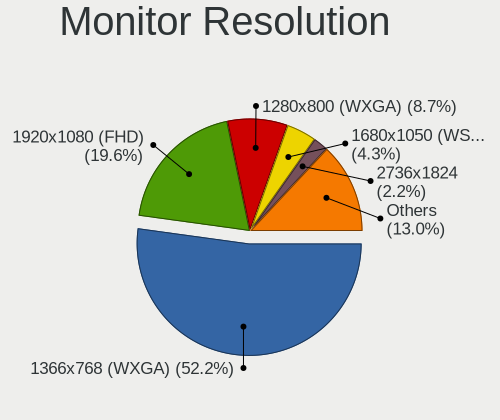

| Resolution         | Notebooks | Percent |
|--------------------|-----------|---------|
| 1366x768 (WXGA)    | 23        | 51.11%  |
| 1920x1080 (FHD)    | 9         | 20%     |
| 1280x800 (WXGA)    | 4         | 8.89%   |
| 1680x1050 (WSXGA+) | 2         | 4.44%   |
| 2736x1824          | 1         | 2.22%   |
| 2560x1600          | 1         | 2.22%   |
| 1920x1280          | 1         | 2.22%   |
| 1920x1200 (WUXGA)  | 1         | 2.22%   |
| 1600x900 (HD+)     | 1         | 2.22%   |
| 1440x900 (WXGA+)   | 1         | 2.22%   |
| 1360x768           | 1         | 2.22%   |

Monitor Diagonal
----------------

Diagonal size in inches

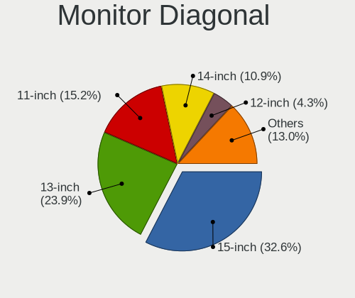

| Inches | Notebooks | Percent |
|--------|-----------|---------|
| 15     | 15        | 33.33%  |
| 13     | 11        | 24.44%  |
| 11     | 6         | 13.33%  |
| 14     | 5         | 11.11%  |
| 12     | 2         | 4.44%   |
| 31     | 1         | 2.22%   |
| 27     | 1         | 2.22%   |
| 23     | 1         | 2.22%   |
| 22     | 1         | 2.22%   |
| 20     | 1         | 2.22%   |
| 17     | 1         | 2.22%   |

Monitor Width
-------------

Physical width

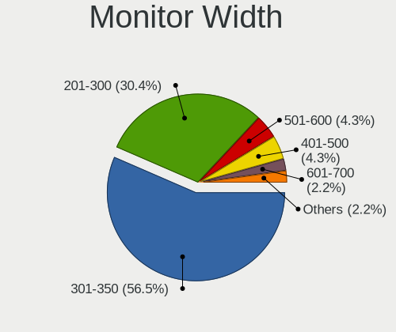

| Width in mm | Notebooks | Percent |
|-------------|-----------|---------|
| 301-350     | 26        | 57.78%  |
| 201-300     | 13        | 28.89%  |
| 501-600     | 2         | 4.44%   |
| 401-500     | 2         | 4.44%   |
| 601-700     | 1         | 2.22%   |
| 351-400     | 1         | 2.22%   |

Aspect Ratio
------------

Proportional relationship between the width and the height

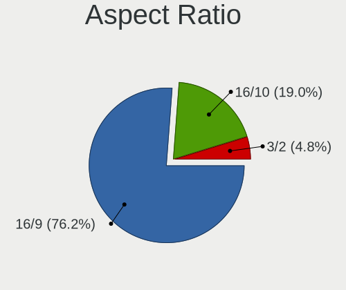

| Ratio | Notebooks | Percent |
|-------|-----------|---------|
| 16/9  | 31        | 75.61%  |
| 16/10 | 8         | 19.51%  |
| 3/2   | 2         | 4.88%   |

Monitor Area
------------

Area in inch

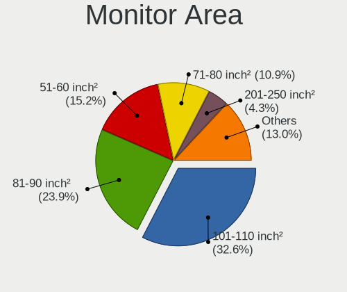

| Area in inch | Notebooks | Percent |
|----------------|-----------|---------|
| 101-110        | 15        | 33.33%  |
| 81-90          | 11        | 24.44%  |
| 51-60          | 6         | 13.33%  |
| 71-80          | 5         | 11.11%  |
| 61-70          | 2         | 4.44%   |
| 201-250        | 2         | 4.44%   |
| 351-500        | 1         | 2.22%   |
| 301-350        | 1         | 2.22%   |
| 151-200        | 1         | 2.22%   |
| 131-140        | 1         | 2.22%   |

Pixel Density
-------------

Pixels per inch

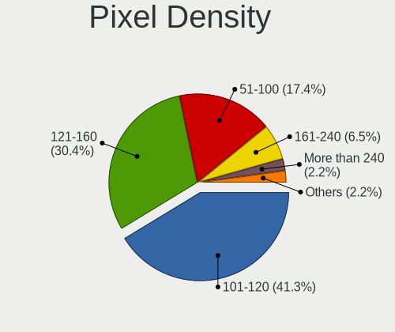

| Density       | Notebooks | Percent |
|---------------|-----------|---------|
| 101-120       | 19        | 42.22%  |
| 121-160       | 13        | 28.89%  |
| 51-100        | 8         | 17.78%  |
| 161-240       | 3         | 6.67%   |
| More than 240 | 1         | 2.22%   |
| 1-50          | 1         | 2.22%   |

Multiple Monitors
-----------------

Total monitors connected

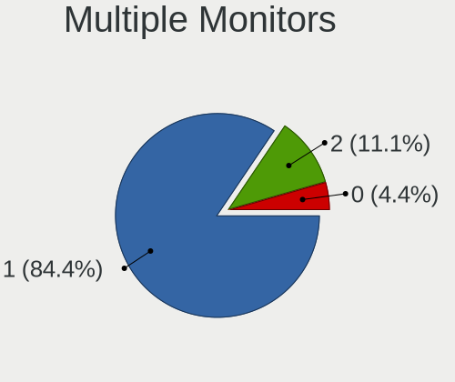

| Total | Notebooks | Percent |
|-------|-----------|---------|
| 1     | 37        | 84.09%  |
| 2     | 5         | 11.36%  |
| 0     | 2         | 4.55%   |

Network
-------

Net Controller Vendor
---------------------

Controller vendors

| Vendor                            | Notebooks | Percent |
|-----------------------------------|-----------|---------|
| Intel                             | 17        | 29.31%  |
| Realtek Semiconductor             | 16        | 27.59%  |
| Qualcomm Atheros                  | 10        | 17.24%  |
| Broadcom                          | 4         | 6.9%    |
| Ralink Technology                 | 3         | 5.17%   |
| Broadcom Limited                  | 3         | 5.17%   |
| Marvell Technology Group          | 2         | 3.45%   |
| TP-Link                           | 1         | 1.72%   |
| Ericsson Business Mobile Networks | 1         | 1.72%   |
| Dell                              | 1         | 1.72%   |

Net Controller Model
--------------------

Controller models

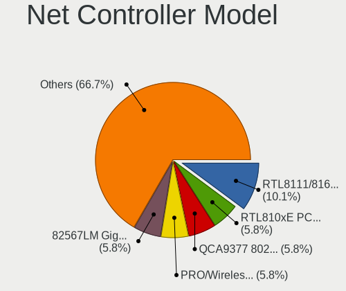

| Model                                                                   | Notebooks | Percent |
|-------------------------------------------------------------------------|-----------|---------|
| Realtek RTL8111/8168/8411 PCI Express Gigabit Ethernet Controller       | 7         | 10.29%  |
| Realtek RTL810xE PCI Express Fast Ethernet controller                   | 4         | 5.88%   |
| Qualcomm Atheros QCA9377 802.11ac Wireless Network Adapter              | 4         | 5.88%   |
| Intel PRO/Wireless 5100 AGN [Shiloh] Network Connection                 | 4         | 5.88%   |
| Intel 82567LM Gigabit Network Connection                                | 4         | 5.88%   |
| Realtek 802.11n WLAN Adapter                                            | 3         | 4.41%   |
| Ralink MT7601U Wireless Adapter                                         | 3         | 4.41%   |
| Intel WiFi Link 5100                                                    | 3         | 4.41%   |
| Realtek RTL8723BE PCIe Wireless Network Adapter                         | 2         | 2.94%   |
| Qualcomm Atheros AR9285 Wireless Network Adapter (PCI-Express)          | 2         | 2.94%   |
| Marvell Group 88E8040 PCI-E Fast Ethernet Controller                    | 2         | 2.94%   |
| Intel Wireless 3165                                                     | 2         | 2.94%   |
| Intel Centrino Ultimate-N 6300                                          | 2         | 2.94%   |
| Intel 82579LM Gigabit Network Connection (Lewisville)                   | 2         | 2.94%   |
| TP-Link USB 10/100 LAN                                                  | 1         | 1.47%   |
| Realtek RTL8191SEvB Wireless LAN Controller                             | 1         | 1.47%   |
| Realtek RTL8188EE Wireless Network Adapter                              | 1         | 1.47%   |
| Realtek RTL8188CE 802.11b/g/n WiFi Adapter                              | 1         | 1.47%   |
| Qualcomm Atheros AR9462 Wireless Network Adapter                        | 1         | 1.47%   |
| Qualcomm Atheros AR8132 Fast Ethernet                                   | 1         | 1.47%   |
| Qualcomm Atheros AR8131 Gigabit Ethernet                                | 1         | 1.47%   |
| Qualcomm Atheros AR242x / AR542x Wireless Network Adapter (PCI-Express) | 1         | 1.47%   |
| Intel Wireless 7265                                                     | 1         | 1.47%   |
| Intel Wireless 7260                                                     | 1         | 1.47%   |
| Intel Wi-Fi 6 AX200                                                     | 1         | 1.47%   |
| Intel Ultimate N WiFi Link 5300                                         | 1         | 1.47%   |
| Intel PRO/Wireless 3945ABG [Golan] Network Connection                   | 1         | 1.47%   |
| Intel Centrino Wireless-N 2230                                          | 1         | 1.47%   |
| Intel 82567LF Gigabit Network Connection                                | 1         | 1.47%   |
| Ericsson Business Mobile Networks F3507g Mobile Broadband Module        | 1         | 1.47%   |
| Dell F3507g Mobile Broadband Module                                     | 1         | 1.47%   |
| Broadcom Limited NetXtreme BCM5761 Gigabit Ethernet PCIe                | 1         | 1.47%   |
| Broadcom Limited NetLink BCM5787M Gigabit Ethernet PCI Express          | 1         | 1.47%   |
| Broadcom Limited BCM4360 802.11ac Wireless Network Adapter              | 1         | 1.47%   |
| Broadcom BCM43228 802.11a/b/g/n                                         | 1         | 1.47%   |
| Broadcom BCM4322 802.11a/b/g/n Wireless LAN Controller                  | 1         | 1.47%   |
| Broadcom BCM43142 802.11b/g/n                                           | 1         | 1.47%   |
| Broadcom BCM4313 802.11bgn Wireless Network Adapter                     | 1         | 1.47%   |

Wireless Vendor
---------------

Wireless vendors

| Vendor                | Notebooks | Percent |
|-----------------------|-----------|---------|
| Intel                 | 17        | 41.46%  |
| Realtek Semiconductor | 8         | 19.51%  |
| Qualcomm Atheros      | 8         | 19.51%  |
| Broadcom              | 4         | 9.76%   |
| Ralink Technology     | 3         | 7.32%   |
| Broadcom Limited      | 1         | 2.44%   |

Wireless Model
--------------

Wireless models

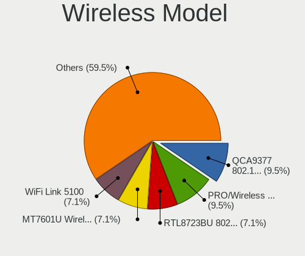

| Model                                                                   | Notebooks | Percent |
|-------------------------------------------------------------------------|-----------|---------|
| Qualcomm Atheros QCA9377 802.11ac Wireless Network Adapter              | 4         | 9.76%   |
| Intel PRO/Wireless 5100 AGN [Shiloh] Network Connection                 | 4         | 9.76%   |
| Realtek 802.11n WLAN Adapter                                            | 3         | 7.32%   |
| Ralink MT7601U Wireless Adapter                                         | 3         | 7.32%   |
| Intel WiFi Link 5100                                                    | 3         | 7.32%   |
| Realtek RTL8723BE PCIe Wireless Network Adapter                         | 2         | 4.88%   |
| Qualcomm Atheros AR9285 Wireless Network Adapter (PCI-Express)          | 2         | 4.88%   |
| Intel Wireless 3165                                                     | 2         | 4.88%   |
| Intel Centrino Ultimate-N 6300                                          | 2         | 4.88%   |
| Realtek RTL8191SEvB Wireless LAN Controller                             | 1         | 2.44%   |
| Realtek RTL8188EE Wireless Network Adapter                              | 1         | 2.44%   |
| Realtek RTL8188CE 802.11b/g/n WiFi Adapter                              | 1         | 2.44%   |
| Qualcomm Atheros AR9462 Wireless Network Adapter                        | 1         | 2.44%   |
| Qualcomm Atheros AR242x / AR542x Wireless Network Adapter (PCI-Express) | 1         | 2.44%   |
| Intel Wireless 7265                                                     | 1         | 2.44%   |
| Intel Wireless 7260                                                     | 1         | 2.44%   |
| Intel Wi-Fi 6 AX200                                                     | 1         | 2.44%   |
| Intel Ultimate N WiFi Link 5300                                         | 1         | 2.44%   |
| Intel PRO/Wireless 3945ABG [Golan] Network Connection                   | 1         | 2.44%   |
| Intel Centrino Wireless-N 2230                                          | 1         | 2.44%   |
| Broadcom Limited BCM4360 802.11ac Wireless Network Adapter              | 1         | 2.44%   |
| Broadcom BCM43228 802.11a/b/g/n                                         | 1         | 2.44%   |
| Broadcom BCM4322 802.11a/b/g/n Wireless LAN Controller                  | 1         | 2.44%   |
| Broadcom BCM43142 802.11b/g/n                                           | 1         | 2.44%   |
| Broadcom BCM4313 802.11bgn Wireless Network Adapter                     | 1         | 2.44%   |

Ethernet Vendor
---------------

Ethernet vendors

| Vendor                   | Notebooks | Percent |
|--------------------------|-----------|---------|
| Realtek Semiconductor    | 11        | 44%     |
| Intel                    | 7         | 28%     |
| Qualcomm Atheros         | 2         | 8%      |
| Marvell Technology Group | 2         | 8%      |
| Broadcom Limited         | 2         | 8%      |
| TP-Link                  | 1         | 4%      |

Ethernet Model
--------------

Ethernet models

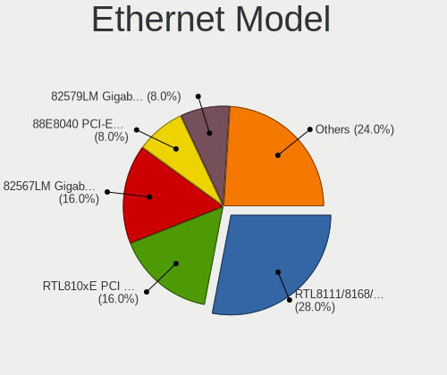

| Model                                                             | Notebooks | Percent |
|-------------------------------------------------------------------|-----------|---------|
| Realtek RTL8111/8168/8411 PCI Express Gigabit Ethernet Controller | 7         | 28%     |
| Realtek RTL810xE PCI Express Fast Ethernet controller             | 4         | 16%     |
| Intel 82567LM Gigabit Network Connection                          | 4         | 16%     |
| Marvell Group 88E8040 PCI-E Fast Ethernet Controller              | 2         | 8%      |
| Intel 82579LM Gigabit Network Connection (Lewisville)             | 2         | 8%      |
| TP-Link USB 10/100 LAN                                            | 1         | 4%      |
| Qualcomm Atheros AR8132 Fast Ethernet                             | 1         | 4%      |
| Qualcomm Atheros AR8131 Gigabit Ethernet                          | 1         | 4%      |
| Intel 82567LF Gigabit Network Connection                          | 1         | 4%      |
| Broadcom Limited NetXtreme BCM5761 Gigabit Ethernet PCIe          | 1         | 4%      |
| Broadcom Limited NetLink BCM5787M Gigabit Ethernet PCI Express    | 1         | 4%      |

Net Controller Kind
-------------------

Ethernet, WiFi or modem

| Kind     | Notebooks | Percent |
|----------|-----------|---------|
| WiFi     | 38        | 58.46%  |
| Ethernet | 25        | 38.46%  |
| Modem    | 2         | 3.08%   |

Used Controller
---------------

Currently used network controller

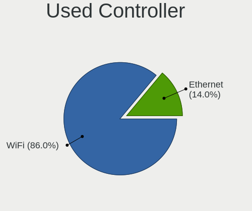

| Kind     | Notebooks | Percent |
|----------|-----------|---------|
| WiFi     | 36        | 85.71%  |
| Ethernet | 6         | 14.29%  |

NICs
----

Total network controllers on board

| Total | Notebooks | Percent |
|-------|-----------|---------|
| 2     | 24        | 55.81%  |
| 1     | 11        | 25.58%  |
| 0     | 8         | 18.6%   |

IPv6
----

IPv6 vs IPv4

| Used | Notebooks | Percent |
|------|-----------|---------|
| No   | 43        | 100%    |

Bluetooth
---------

Bluetooth Vendor
----------------

Controller vendors

| Vendor                          | Notebooks | Percent |
|---------------------------------|-----------|---------|
| Intel                           | 6         | 24%     |
| Broadcom                        | 4         | 16%     |
| Qualcomm Atheros Communications | 3         | 12%     |
| Hewlett-Packard                 | 3         | 12%     |
| Realtek Semiconductor           | 2         | 8%      |
| Foxconn / Hon Hai               | 2         | 8%      |
| Toshiba                         | 1         | 4%      |
| Lite-On Technology              | 1         | 4%      |
| IMC Networks                    | 1         | 4%      |
| Cambridge Silicon Radio         | 1         | 4%      |
| Apple                           | 1         | 4%      |

Bluetooth Model
---------------

Controller models

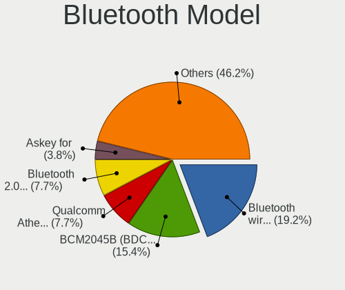

| Model                                               | Notebooks | Percent |
|-----------------------------------------------------|-----------|---------|
| Intel Bluetooth wireless interface                  | 4         | 16%     |
| Broadcom BCM2045B (BDC-2.1) [Bluetooth Controller]  | 4         | 16%     |
| Qualcomm Atheros  Bluetooth Device                  | 2         | 8%      |
| HP Bluetooth 2.0 Interface [Broadcom BCM2045]       | 2         | 8%      |
| Toshiba Askey for                                   | 1         | 4%      |
| Realtek RTL8723B Bluetooth                          | 1         | 4%      |
| Realtek Bluetooth Radio                             | 1         | 4%      |
| Qualcomm Atheros AR3011 Bluetooth                   | 1         | 4%      |
| Lite-On Qualcomm Atheros QCA9377 Bluetooth          | 1         | 4%      |
| Intel Centrino Bluetooth Wireless Transceiver       | 1         | 4%      |
| Intel AX200 Bluetooth                               | 1         | 4%      |
| IMC Networks Bluetooth Device                       | 1         | 4%      |
| HP Broadcom 2070 Bluetooth Combo                    | 1         | 4%      |
| Foxconn / Hon Hai Bluetooth Device                  | 1         | 4%      |
| Foxconn / Hon Hai BCM43142A0 broadcom bluetooth     | 1         | 4%      |
| Cambridge Silicon Radio Bluetooth Dongle (HCI mode) | 1         | 4%      |
| Apple Bluetooth Host Controller                     | 1         | 4%      |

Sound
-----

Sound Vendor
------------

Sound card vendors

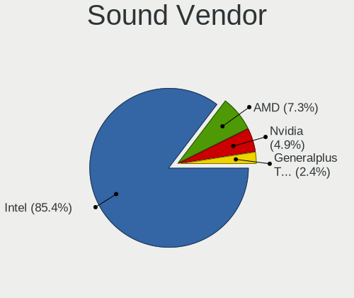

| Vendor                 | Notebooks | Percent |
|------------------------|-----------|---------|
| Intel                  | 34        | 85%     |
| AMD                    | 3         | 7.5%    |
| Nvidia                 | 2         | 5%      |
| Generalplus Technology | 1         | 2.5%    |

Sound Model
-----------

Sound card models

| Model                                                                                             | Notebooks | Percent |
|---------------------------------------------------------------------------------------------------|-----------|---------|
| Intel 82801I (ICH9 Family) HD Audio Controller                                                    | 11        | 24.44%  |
| Intel Celeron N3350/Pentium N4200/Atom E3900 Series Audio Cluster                                 | 4         | 8.89%   |
| Intel 7 Series/C216 Chipset Family High Definition Audio Controller                               | 4         | 8.89%   |
| Intel Atom/Celeron/Pentium Processor x5-E8000/J3xxx/N3xxx Series High Definition Audio Controller | 3         | 6.67%   |
| Intel 6 Series/C200 Series Chipset Family High Definition Audio Controller                        | 3         | 6.67%   |
| Intel Haswell-ULT HD Audio Controller                                                             | 2         | 4.44%   |
| Intel Cannon Lake PCH cAVS                                                                        | 2         | 4.44%   |
| Intel 8 Series HD Audio Controller                                                                | 2         | 4.44%   |
| AMD SBx00 Azalia (Intel HDA)                                                                      | 2         | 4.44%   |
| Nvidia GP107GL High Definition Audio Controller                                                   | 1         | 2.22%   |
| Nvidia GF108 High Definition Audio Controller                                                     | 1         | 2.22%   |
| Intel Wildcat Point-LP High Definition Audio Controller                                           | 1         | 2.22%   |
| Intel Sunrise Point-LP HD Audio                                                                   | 1         | 2.22%   |
| Intel Cannon Point-LP High Definition Audio Controller                                            | 1         | 2.22%   |
| Intel Broadwell-U Audio Controller                                                                | 1         | 2.22%   |
| Intel Atom Processor Z36xxx/Z37xxx Series High Definition Audio Controller                        | 1         | 2.22%   |
| Intel 82801H (ICH8 Family) HD Audio Controller                                                    | 1         | 2.22%   |
| Generalplus Technology USB Audio Device                                                           | 1         | 2.22%   |
| AMD Wrestler HDMI Audio                                                                           | 1         | 2.22%   |
| AMD High Definition Audio Controller                                                              | 1         | 2.22%   |
| AMD Cedar HDMI Audio [Radeon HD 5400/6300/7300 Series]                                            | 1         | 2.22%   |

Memory
------

Memory Vendor
-------------

Memory module vendors

| Vendor              | Notebooks | Percent |
|---------------------|-----------|---------|
| Unknown             | 1         | 33.33%  |
| Samsung Electronics | 1         | 33.33%  |
| Micron Technology   | 1         | 33.33%  |

Memory Model
------------

Memory module models

| Model                                                 | Notebooks | Percent |
|-------------------------------------------------------|-----------|---------|
| Unknown RAM Module 2048MB SODIMM DDR3 1600MT/s        | 1         | 33.33%  |
| Samsung RAM M471A5244CB0-CWE 4GB SODIMM DDR4 3200MT/s | 1         | 33.33%  |
| Micron RAM 8ATF1G64HZ-2G6E1 8GB SODIMM DDR4 2667MT/s  | 1         | 33.33%  |

Memory Kind
-----------

Memory module kinds

| Kind | Notebooks | Percent |
|------|-----------|---------|
| DDR4 | 2         | 66.67%  |
| DDR3 | 1         | 33.33%  |

Memory Form Factor
------------------

Physical design of the memory module

| Name   | Notebooks | Percent |
|--------|-----------|---------|
| SODIMM | 3         | 100%    |

Memory Size
-----------

Memory module size

| Size | Notebooks | Percent |
|------|-----------|---------|
| 8192 | 1         | 33.33%  |
| 4096 | 1         | 33.33%  |
| 2048 | 1         | 33.33%  |

Memory Speed
------------

Memory module speed

| Speed | Notebooks | Percent |
|-------|-----------|---------|
| 3200  | 1         | 33.33%  |
| 2667  | 1         | 33.33%  |
| 1600  | 1         | 33.33%  |

Printers & scanners
-------------------

Printer Vendor
--------------

Printer device vendors

Zero info for selected period =(

Printer Model
-------------

Printer device models

Zero info for selected period =(

Scanner Vendor
--------------

Scanner device vendors

Zero info for selected period =(

Scanner Model
-------------

Scanner device models

Zero info for selected period =(

Camera
------

Camera Vendor
-------------

Camera device vendors

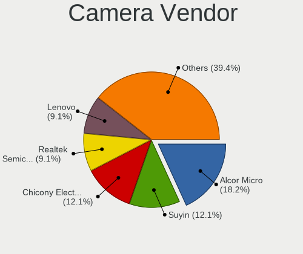

| Vendor                                 | Notebooks | Percent |
|----------------------------------------|-----------|---------|
| Alcor Micro                            | 6         | 18.75%  |
| Suyin                                  | 4         | 12.5%   |
| Realtek Semiconductor                  | 3         | 9.38%   |
| Lenovo                                 | 3         | 9.38%   |
| Chicony Electronics                    | 3         | 9.38%   |
| Ricoh                                  | 2         | 6.25%   |
| Microdia                               | 2         | 6.25%   |
| Lite-On Technology                     | 2         | 6.25%   |
| Cheng Uei Precision Industry (Foxlink) | 2         | 6.25%   |
| Acer                                   | 2         | 6.25%   |
| Sunplus Innovation Technology          | 1         | 3.13%   |
| Importek                               | 1         | 3.13%   |
| IMC Networks                           | 1         | 3.13%   |

Camera Model
------------

Camera device models

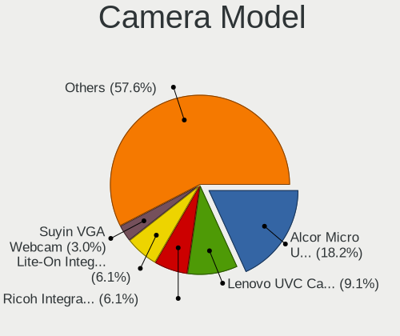

| Model                                                   | Notebooks | Percent |
|---------------------------------------------------------|-----------|---------|
| Alcor Micro USB 2.0 Camera                              | 6         | 18.75%  |
| Lenovo UVC Camera                                       | 3         | 9.38%   |
| Ricoh Integrated Webcam                                 | 2         | 6.25%   |
| Lite-On Integrated Camera                               | 2         | 6.25%   |
| Suyin VGA Webcam                                        | 1         | 3.13%   |
| Suyin HP TrueVision HD Integrated Webcam                | 1         | 3.13%   |
| Suyin HP Truevision HD                                  | 1         | 3.13%   |
| Suyin HD Video WebCam                                   | 1         | 3.13%   |
| Sunplus HD WebCam                                       | 1         | 3.13%   |
| Realtek USB2.0 VGA UVC WebCam                           | 1         | 3.13%   |
| Realtek USB Camera                                      | 1         | 3.13%   |
| Realtek Acer 640 x 480 laptop camera                    | 1         | 3.13%   |
| Microdia Integrated_Webcam_HD                           | 1         | 3.13%   |
| Microdia HP Webcam                                      | 1         | 3.13%   |
| Importek HP Webcam                                      | 1         | 3.13%   |
| IMC Networks Lenovo EasyCamera                          | 1         | 3.13%   |
| Chicony USB 2.0 Camera                                  | 1         | 3.13%   |
| Chicony TOSHIBA Web Camera - HD                         | 1         | 3.13%   |
| Chicony Integrated Camera                               | 1         | 3.13%   |
| Cheng Uei Precision Industry (Foxlink) HP Webcam-101    | 1         | 3.13%   |
| Cheng Uei Precision Industry (Foxlink) HP Truevision HD | 1         | 3.13%   |
| Acer VGA WebCam                                         | 1         | 3.13%   |
| Acer EasyCamera                                         | 1         | 3.13%   |

Security
--------

Fingerprint Vendor
------------------

Fingerprint sensor vendors

| Vendor           | Notebooks | Percent |
|------------------|-----------|---------|
| AuthenTec        | 3         | 60%     |
| Validity Sensors | 2         | 40%     |

Fingerprint Model
-----------------

Fingerprint sensor models

| Model                                      | Notebooks | Percent |
|--------------------------------------------|-----------|---------|
| AuthenTec AES2810                          | 3         | 60%     |
| Validity Sensors VFS101 Fingerprint Reader | 1         | 20%     |
| Validity Sensors Fingerprint scanner       | 1         | 20%     |

Chipcard Vendor
---------------

Chipcard module vendors

| Vendor      | Notebooks | Percent |
|-------------|-----------|---------|
| Broadcom    | 2         | 66.67%  |
| Alcor Micro | 1         | 33.33%  |

Chipcard Model
--------------

Chipcard module models

| Model                                                                        | Notebooks | Percent |
|------------------------------------------------------------------------------|-----------|---------|
| Broadcom BCM5880 Secure Applications Processor with fingerprint swipe sensor | 1         | 33.33%  |
| Broadcom BCM5880 Secure Applications Processor                               | 1         | 33.33%  |
| Alcor Micro AU9540 Smartcard Reader                                          | 1         | 33.33%  |

Unsupported
-----------

Unsupported Devices
-------------------

Total unsupported devices on board

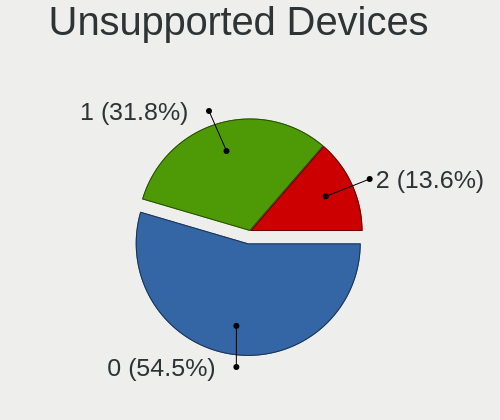

| Total | Notebooks | Percent |
|-------|-----------|---------|
| 0     | 23        | 53.49%  |
| 1     | 15        | 34.88%  |
| 2     | 5         | 11.63%  |

Unsupported Device Types
------------------------

Types of unsupported devices

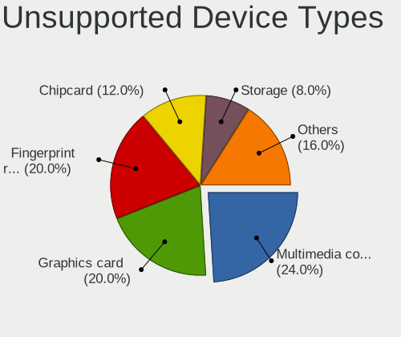

| Type                     | Notebooks | Percent |
|--------------------------|-----------|---------|
| Multimedia controller    | 6         | 25%     |
| Fingerprint reader       | 5         | 20.83%  |
| Graphics card            | 4         | 16.67%  |
| Chipcard                 | 3         | 12.5%   |
| Storage                  | 2         | 8.33%   |
| Storage/ide              | 1         | 4.17%   |
| Net/wireless             | 1         | 4.17%   |
| Modem                    | 1         | 4.17%   |
| Communication controller | 1         | 4.17%   |

