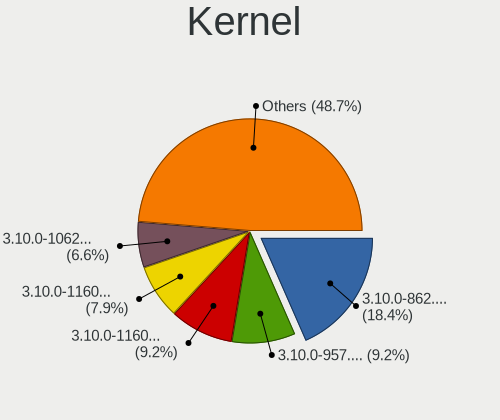
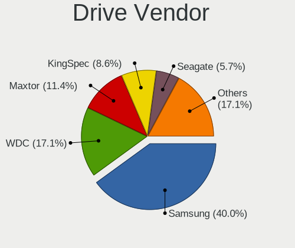
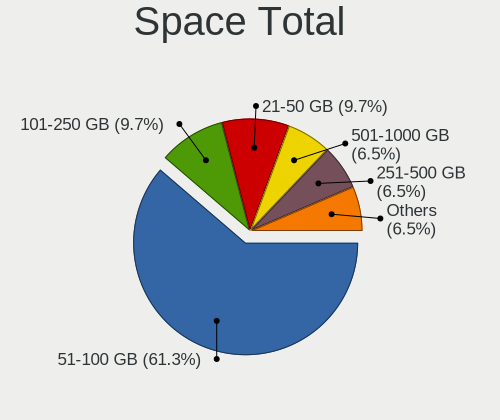
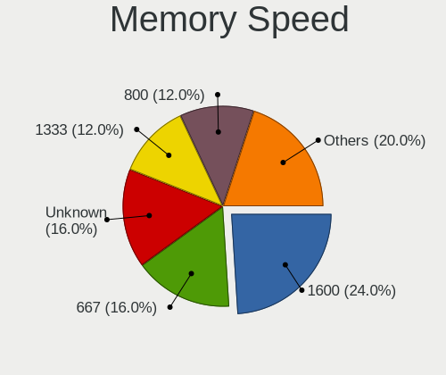
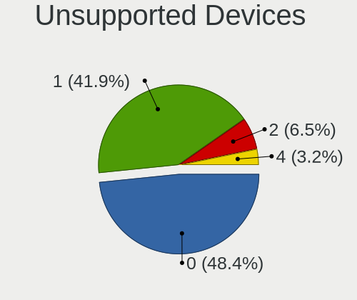

ClearOS - Tested Hardware & Statistics
--------------------------------------

A project to collect tested hardware configurations for ClearOS.

Anyone can contribute to this report by the [hw-probe](https://github.com/linuxhw/hw-probe) tool:

    sudo -E hw-probe -all -upload

Please contribute! Especially if your hardware is rare.

This is a report for all computer types. See also reports for [desktops](/Dist/ClearOS/Desktop/README.md) and [notebooks](/Dist/ClearOS/Notebook/README.md).

Contents
--------

* [ Test Cases ](#test-cases)

* [ System ](#system)
  - [ OS                       ](#os)
  - [ OS Family                ](#os-family)
  - [ Kernel                   ](#kernel)
  - [ Kernel Family            ](#kernel-family)
  - [ Kernel Major Ver.        ](#kernel-major-ver)
  - [ Arch                     ](#arch)
  - [ DE                       ](#de)
  - [ Display Server           ](#display-server)
  - [ Display Manager          ](#display-manager)
  - [ OS Lang                  ](#os-lang)
  - [ Boot Mode                ](#boot-mode)
  - [ Filesystem               ](#filesystem)
  - [ Part. scheme             ](#part-scheme)
  - [ Dual Boot with Linux/BSD ](#dual-boot-with-linuxbsd)
  - [ Dual Boot (Win)          ](#dual-boot-win)

* [ Board ](#board)
  - [ Vendor                   ](#vendor)
  - [ Model                    ](#model)
  - [ Model Family             ](#model-family)
  - [ MFG Year                 ](#mfg-year)
  - [ Form Factor              ](#form-factor)
  - [ Secure Boot              ](#secure-boot)
  - [ Coreboot                 ](#coreboot)
  - [ RAM Size                 ](#ram-size)
  - [ RAM Used                 ](#ram-used)
  - [ Total Drives             ](#total-drives)
  - [ Has CD-ROM               ](#has-cd-rom)
  - [ Has Ethernet             ](#has-ethernet)
  - [ Has WiFi                 ](#has-wifi)
  - [ Has Bluetooth            ](#has-bluetooth)

* [ Location ](#location)
  - [ Country                  ](#country)
  - [ City                     ](#city)

* [ Drives ](#drives)
  - [ Drive Vendor             ](#drive-vendor)
  - [ Drive Model              ](#drive-model)
  - [ HDD Vendor               ](#hdd-vendor)
  - [ SSD Vendor               ](#ssd-vendor)
  - [ Drive Kind               ](#drive-kind)
  - [ Drive Connector          ](#drive-connector)
  - [ Drive Size               ](#drive-size)
  - [ Space Total              ](#space-total)
  - [ Space Used               ](#space-used)
  - [ Malfunc. Drives          ](#malfunc-drives)
  - [ Malfunc. Drive Vendor    ](#malfunc-drive-vendor)
  - [ Malfunc. HDD Vendor      ](#malfunc-hdd-vendor)
  - [ Malfunc. Drive Kind      ](#malfunc-drive-kind)
  - [ Failed Drives            ](#failed-drives)
  - [ Failed Drive Vendor      ](#failed-drive-vendor)
  - [ Drive Status             ](#drive-status)

* [ Storage controller ](#storage-controller)
  - [ Storage Vendor           ](#storage-vendor)
  - [ Storage Model            ](#storage-model)
  - [ Storage Kind             ](#storage-kind)

* [ Processor ](#processor)
  - [ CPU Vendor               ](#cpu-vendor)
  - [ CPU Model                ](#cpu-model)
  - [ CPU Model Family         ](#cpu-model-family)
  - [ CPU Cores                ](#cpu-cores)
  - [ CPU Sockets              ](#cpu-sockets)
  - [ CPU Threads              ](#cpu-threads)
  - [ CPU Op-Modes             ](#cpu-op-modes)
  - [ CPU Microcode            ](#cpu-microcode)
  - [ CPU Microarch            ](#cpu-microarch)

* [ Graphics ](#graphics)
  - [ GPU Vendor               ](#gpu-vendor)
  - [ GPU Model                ](#gpu-model)
  - [ GPU Combo                ](#gpu-combo)
  - [ GPU Driver               ](#gpu-driver)
  - [ GPU Memory               ](#gpu-memory)

* [ Monitor ](#monitor)
  - [ Monitor Vendor           ](#monitor-vendor)
  - [ Monitor Model            ](#monitor-model)
  - [ Monitor Resolution       ](#monitor-resolution)
  - [ Monitor Diagonal         ](#monitor-diagonal)
  - [ Monitor Width            ](#monitor-width)
  - [ Aspect Ratio             ](#aspect-ratio)
  - [ Monitor Area             ](#monitor-area)
  - [ Pixel Density            ](#pixel-density)
  - [ Multiple Monitors        ](#multiple-monitors)

* [ Network ](#network)
  - [ Net Controller Vendor    ](#net-controller-vendor)
  - [ Net Controller Model     ](#net-controller-model)
  - [ Wireless Vendor          ](#wireless-vendor)
  - [ Wireless Model           ](#wireless-model)
  - [ Ethernet Vendor          ](#ethernet-vendor)
  - [ Ethernet Model           ](#ethernet-model)
  - [ Net Controller Kind      ](#net-controller-kind)
  - [ Used Controller          ](#used-controller)
  - [ NICs                     ](#nics)
  - [ IPv6                     ](#ipv6)

* [ Bluetooth ](#bluetooth)
  - [ Bluetooth Vendor         ](#bluetooth-vendor)
  - [ Bluetooth Model          ](#bluetooth-model)

* [ Sound ](#sound)
  - [ Sound Vendor             ](#sound-vendor)
  - [ Sound Model              ](#sound-model)

* [ Memory ](#memory)
  - [ Memory Vendor            ](#memory-vendor)
  - [ Memory Model             ](#memory-model)
  - [ Memory Kind              ](#memory-kind)
  - [ Memory Form Factor       ](#memory-form-factor)
  - [ Memory Size              ](#memory-size)
  - [ Memory Speed             ](#memory-speed)

* [ Printers & scanners ](#printers--scanners)
  - [ Printer Vendor           ](#printer-vendor)
  - [ Printer Model            ](#printer-model)
  - [ Scanner Vendor           ](#scanner-vendor)
  - [ Scanner Model            ](#scanner-model)

* [ Camera ](#camera)
  - [ Camera Vendor            ](#camera-vendor)
  - [ Camera Model             ](#camera-model)

* [ Security ](#security)
  - [ Fingerprint Vendor       ](#fingerprint-vendor)
  - [ Fingerprint Model        ](#fingerprint-model)
  - [ Chipcard Vendor          ](#chipcard-vendor)
  - [ Chipcard Model           ](#chipcard-model)

* [ Unsupported ](#unsupported)
  - [ Unsupported Devices      ](#unsupported-devices)
  - [ Unsupported Device Types ](#unsupported-device-types)

Test Cases
----------

Total: 97

| Vendor   | Model                  | Form-Factor | Probe                                                      | Date         |
|----------|------------------------|-------------|------------------------------------------------------------|--------------|
| MSI      | MS-7142                | Desktop     | [1cb67ac1ca](https://linux-hardware.org/?probe=1cb67ac1ca) | Mar 22, 2023 |
| ASRock   | AD525PV3               | Desktop     | [da83c87218](https://linux-hardware.org/?probe=da83c87218) | Dec 01, 2022 |
| Intel    | LADPNVMO AAE76523-300  | Desktop     | [db4e4c9c5b](https://linux-hardware.org/?probe=db4e4c9c5b) | Nov 22, 2022 |
| ASRock   | AD525PV3               | Desktop     | [4bba69ecd9](https://linux-hardware.org/?probe=4bba69ecd9) | Nov 18, 2022 |
| Intel    | LADPNVMO AAE76523-300  | Desktop     | [ea94d443c9](https://linux-hardware.org/?probe=ea94d443c9) | Nov 12, 2022 |
| Gigabyte | J1900M-D2P             | Desktop     | [7ea9f2df61](https://linux-hardware.org/?probe=7ea9f2df61) | Nov 06, 2022 |
| Gigabyte | Z77MX-D3H              | Desktop     | [be0b70efdb](https://linux-hardware.org/?probe=be0b70efdb) | Aug 15, 2022 |
| Gigabyte | Z77MX-D3H              | Desktop     | [360447806b](https://linux-hardware.org/?probe=360447806b) | Aug 04, 2022 |
| Gigabyte | GA-870A-UD3            | Desktop     | [950542a4a3](https://linux-hardware.org/?probe=950542a4a3) | Jul 16, 2022 |
| Gigabyte | J1900M-D2P             | Desktop     | [29602ec66f](https://linux-hardware.org/?probe=29602ec66f) | Jul 13, 2022 |
| Intel    | LADPNVMO AAE76523-300  | Desktop     | [07a37c99cb](https://linux-hardware.org/?probe=07a37c99cb) | Jul 11, 2022 |
| Gigabyte | J1900M-D2P             | Desktop     | [36fa61e21d](https://linux-hardware.org/?probe=36fa61e21d) | Jul 09, 2022 |
| Gigabyte | J1900M-D2P             | Desktop     | [d703a63932](https://linux-hardware.org/?probe=d703a63932) | Jun 26, 2022 |
| Gigabyte | J1900M-D2P             | Desktop     | [8ded20d82b](https://linux-hardware.org/?probe=8ded20d82b) | Jun 15, 2022 |
| Gigabyte | Z77MX-D3H              | Desktop     | [24c8a035ac](https://linux-hardware.org/?probe=24c8a035ac) | Jun 03, 2022 |
| Gigabyte | GA-870A-UD3            | Desktop     | [719fe6db76](https://linux-hardware.org/?probe=719fe6db76) | May 28, 2022 |
| Intel    | LADPNVMO AAE76523-300  | Desktop     | [9161d40357](https://linux-hardware.org/?probe=9161d40357) | May 14, 2022 |
| Gigabyte | Z77MX-D3H              | Desktop     | [42067d196a](https://linux-hardware.org/?probe=42067d196a) | May 02, 2022 |
| Gigabyte | J1900M-D2P             | Desktop     | [170db82573](https://linux-hardware.org/?probe=170db82573) | Apr 18, 2022 |
| ASRock   | AD525PV3               | Desktop     | [b5c71cfdef](https://linux-hardware.org/?probe=b5c71cfdef) | Apr 18, 2022 |
| Gigabyte | GA-870A-UD3            | Desktop     | [2bc3cb42bb](https://linux-hardware.org/?probe=2bc3cb42bb) | Apr 16, 2022 |
| Gigabyte | J1900M-D2P             | Desktop     | [794fbc68d8](https://linux-hardware.org/?probe=794fbc68d8) | Apr 14, 2022 |
| Intel    | LADPNVMO AAE76523-300  | Desktop     | [e6ca2fb62e](https://linux-hardware.org/?probe=e6ca2fb62e) | Feb 10, 2022 |
| ASRock   | AD525PV3               | Desktop     | [59739aa694](https://linux-hardware.org/?probe=59739aa694) | Jan 26, 2022 |
| ASRock   | AD525PV3               | Desktop     | [fc3b3de53f](https://linux-hardware.org/?probe=fc3b3de53f) | Jan 13, 2022 |
| ASUSTek  | A8R32-MVP Deluxe       | Desktop     | [0ddae870e9](https://linux-hardware.org/?probe=0ddae870e9) | Jan 13, 2022 |
| ASRock   | AD525PV3               | Desktop     | [51870f0b25](https://linux-hardware.org/?probe=51870f0b25) | Jan 01, 2022 |
| MSI      | MS-7142                | Desktop     | [4c0b236c8b](https://linux-hardware.org/?probe=4c0b236c8b) | Oct 06, 2021 |
| ASRock   | AD525PV3               | Desktop     | [04426b1a9d](https://linux-hardware.org/?probe=04426b1a9d) | Oct 02, 2021 |
| Gigabyte | J1900M-D2P             | Desktop     | [3e73db1984](https://linux-hardware.org/?probe=3e73db1984) | Sep 15, 2021 |
| Gigabyte | GA-870A-UD3            | Desktop     | [abc4e152fe](https://linux-hardware.org/?probe=abc4e152fe) | Sep 04, 2021 |
| Gigabyte | J1900M-D2P             | Desktop     | [836a8eb41d](https://linux-hardware.org/?probe=836a8eb41d) | Jul 11, 2021 |
| Gigabyte | J1900M-D2P             | Desktop     | [e0cb0f2571](https://linux-hardware.org/?probe=e0cb0f2571) | Jul 04, 2021 |
| ASRock   | AD2700-ITX             | Desktop     | [a1c7155352](https://linux-hardware.org/?probe=a1c7155352) | Jun 23, 2021 |
| MSI      | MS-7142                | Desktop     | [f1ffafce15](https://linux-hardware.org/?probe=f1ffafce15) | Feb 21, 2021 |
| ASRock   | K8Upgrade-VM800        | Desktop     | [0f084ce1b4](https://linux-hardware.org/?probe=0f084ce1b4) | Feb 11, 2021 |
| Gigabyte | D525TUD                | Desktop     | [d917ae12cd](https://linux-hardware.org/?probe=d917ae12cd) | Nov 08, 2020 |
| Gigabyte | Z77MX-D3H              | Desktop     | [85d94c05ce](https://linux-hardware.org/?probe=85d94c05ce) | Nov 08, 2020 |
| Gigabyte | D525TUD                | Desktop     | [cd08ac380a](https://linux-hardware.org/?probe=cd08ac380a) | Nov 08, 2020 |
| Dell     | 0C2GT0 A02             | Server      | [56cb3fc570](https://linux-hardware.org/?probe=56cb3fc570) | Aug 01, 2020 |
| Gigabyte | Z77MX-D3H              | Desktop     | [d3a72a4472](https://linux-hardware.org/?probe=d3a72a4472) | Jul 08, 2020 |
| Gigabyte | GA-MA780G-UD3H         | Desktop     | [8112a45866](https://linux-hardware.org/?probe=8112a45866) | Jun 10, 2020 |
| Gigabyte | GA-870A-UD3            | Desktop     | [f4b0bf03de](https://linux-hardware.org/?probe=f4b0bf03de) | May 23, 2020 |
| Dell     | 07F37C A00             | Desktop     | [530cc43be2](https://linux-hardware.org/?probe=530cc43be2) | Apr 03, 2020 |
| Gigabyte | Z77MX-D3H              | Desktop     | [7e686b721e](https://linux-hardware.org/?probe=7e686b721e) | Mar 31, 2020 |
| Gigabyte | GA-MA780G-UD3H         | Desktop     | [16db1089e5](https://linux-hardware.org/?probe=16db1089e5) | Mar 15, 2020 |
| Gigabyte | GA-870A-UD3            | Desktop     | [c7bcbaa3a9](https://linux-hardware.org/?probe=c7bcbaa3a9) | Mar 15, 2020 |
| Gigabyte | GA-870A-UD3            | Desktop     | [60d8c5fbf4](https://linux-hardware.org/?probe=60d8c5fbf4) | Mar 11, 2020 |
| Intel    | LADPNVMO AAE76523-300  | Desktop     | [53be5db473](https://linux-hardware.org/?probe=53be5db473) | Feb 12, 2020 |
| Gigabyte | J1900M-D2P             | Desktop     | [4bc55155f5](https://linux-hardware.org/?probe=4bc55155f5) | Jan 11, 2020 |
| Gigabyte | D525TUD                | Desktop     | [3c58d48568](https://linux-hardware.org/?probe=3c58d48568) | Jan 10, 2020 |
| Gigabyte | J1900M-D2P             | Desktop     | [a8dc75f51b](https://linux-hardware.org/?probe=a8dc75f51b) | Jan 08, 2020 |
| Gigabyte | GA-MA780G-UD3H         | Desktop     | [52f139cc1c](https://linux-hardware.org/?probe=52f139cc1c) | Jan 08, 2020 |
| Gigabyte | J1900M-D2P             | Desktop     | [2ad366f4c0](https://linux-hardware.org/?probe=2ad366f4c0) | Dec 21, 2019 |
| Gigabyte | J1900M-D2P             | Desktop     | [e1685d9ba3](https://linux-hardware.org/?probe=e1685d9ba3) | Dec 06, 2019 |
| ASRock   | D1800B-ITX             | Desktop     | [13eafdefca](https://linux-hardware.org/?probe=13eafdefca) | Dec 06, 2019 |
| Gigabyte | D525TUD                | Desktop     | [2ece09c60b](https://linux-hardware.org/?probe=2ece09c60b) | Dec 06, 2019 |
| ASRock   | AD2700-ITX             | Desktop     | [fd83493705](https://linux-hardware.org/?probe=fd83493705) | Nov 26, 2019 |
| ASRock   | K8Upgrade-VM800        | Desktop     | [6fac734286](https://linux-hardware.org/?probe=6fac734286) | Nov 10, 2019 |
| ASRock   | AD2700-ITX             | Desktop     | [e568c873e2](https://linux-hardware.org/?probe=e568c873e2) | Nov 10, 2019 |
| Gigabyte | GA-990FXA-D3           | Desktop     | [ea03943650](https://linux-hardware.org/?probe=ea03943650) | Oct 24, 2019 |
| ASRock   | D1800B-ITX             | Desktop     | [1c2c965bff](https://linux-hardware.org/?probe=1c2c965bff) | Oct 16, 2019 |
| Gigabyte | J1900M-D2P             | Desktop     | [0a473fe232](https://linux-hardware.org/?probe=0a473fe232) | Oct 11, 2019 |
| Gigabyte | J1900M-D2P             | Desktop     | [23a87404be](https://linux-hardware.org/?probe=23a87404be) | Oct 11, 2019 |
| Gigabyte | J1900M-D2P             | Desktop     | [79d776a451](https://linux-hardware.org/?probe=79d776a451) | Oct 11, 2019 |
| ASRock   | D1800B-ITX             | Desktop     | [ea920a2bb8](https://linux-hardware.org/?probe=ea920a2bb8) | Sep 16, 2019 |
| Gigabyte | D525TUD                | Desktop     | [aac6218619](https://linux-hardware.org/?probe=aac6218619) | Aug 17, 2019 |
| Intel    | LADPNVMO AAE76523-300  | Desktop     | [f9331b7e6e](https://linux-hardware.org/?probe=f9331b7e6e) | Aug 11, 2019 |
| Gigabyte | Z77MX-D3H              | Desktop     | [d29d8e6525](https://linux-hardware.org/?probe=d29d8e6525) | Aug 11, 2019 |
| MSI      | MS-7142                | Desktop     | [5597a4ecbc](https://linux-hardware.org/?probe=5597a4ecbc) | Aug 09, 2019 |
| MSI      | MS-7142                | Desktop     | [62cb880370](https://linux-hardware.org/?probe=62cb880370) | Aug 09, 2019 |
| Gigabyte | GA-MA780G-UD3H         | Desktop     | [059b3e7104](https://linux-hardware.org/?probe=059b3e7104) | Aug 06, 2019 |
| ASRock   | K8Upgrade-VM800        | Desktop     | [4cf5bafe24](https://linux-hardware.org/?probe=4cf5bafe24) | Aug 05, 2019 |
| ASUSTek  | AT5NM10-I              | Desktop     | [47e870b0b9](https://linux-hardware.org/?probe=47e870b0b9) | Aug 05, 2019 |
| ASRock   | AD525PV3               | Desktop     | [27e239601b](https://linux-hardware.org/?probe=27e239601b) | Jul 14, 2019 |
| ASRock   | AD525PV3               | Desktop     | [a77743a828](https://linux-hardware.org/?probe=a77743a828) | Jul 06, 2019 |
| Gigabyte | Z77MX-D3H              | Desktop     | [0818f19e7a](https://linux-hardware.org/?probe=0818f19e7a) | May 10, 2019 |
| Intel    | D945GCLF2 AAE46416-103 | Desktop     | [1b11619ec9](https://linux-hardware.org/?probe=1b11619ec9) | Apr 19, 2019 |
| ASRock   | AD2700-ITX             | Desktop     | [9a4c5de0dd](https://linux-hardware.org/?probe=9a4c5de0dd) | Apr 17, 2019 |
| Gigabyte | Z77MX-D3H              | Desktop     | [84474e86fe](https://linux-hardware.org/?probe=84474e86fe) | Apr 14, 2019 |
| Gigabyte | D525TUD                | Desktop     | [e42fb17101](https://linux-hardware.org/?probe=e42fb17101) | Jan 24, 2019 |
| Gigabyte | GA-990FXA-D3           | Desktop     | [04595a2160](https://linux-hardware.org/?probe=04595a2160) | Dec 23, 2018 |
| Gigabyte | Z77MX-D3H              | Desktop     | [66d5165338](https://linux-hardware.org/?probe=66d5165338) | Dec 23, 2018 |
| Gigabyte | GA-990FXA-D3           | Desktop     | [6f5833f2e6](https://linux-hardware.org/?probe=6f5833f2e6) | Dec 20, 2018 |
| Gigabyte | GA-MA785G-UD3H         | Desktop     | [21cf5ac2d5](https://linux-hardware.org/?probe=21cf5ac2d5) | Dec 03, 2018 |
| Gigabyte | GA-MA785G-UD3H         | Desktop     | [f0831b789a](https://linux-hardware.org/?probe=f0831b789a) | Nov 20, 2018 |
| Gigabyte | 970A-DS3P              | Desktop     | [e84f35cfae](https://linux-hardware.org/?probe=e84f35cfae) | Nov 17, 2018 |
| ASRock   | K8Upgrade-VM800        | Desktop     | [f078674842](https://linux-hardware.org/?probe=f078674842) | Oct 29, 2018 |
| ASRock   | K8Upgrade-VM800        | Desktop     | [700f075a1a](https://linux-hardware.org/?probe=700f075a1a) | Oct 29, 2018 |
| Intel    | LADPNVMO AAE76523-300  | Desktop     | [8812da1475](https://linux-hardware.org/?probe=8812da1475) | Oct 29, 2018 |
| Intel    | D945GCLF2 AAE46416-103 | Desktop     | [ec75fd707d](https://linux-hardware.org/?probe=ec75fd707d) | Oct 29, 2018 |
| Intel    | LADPNVMO AAE76523-300  | Desktop     | [a1f047ea98](https://linux-hardware.org/?probe=a1f047ea98) | Oct 29, 2018 |
| ASUSTek  | AT5NM10-I              | Desktop     | [835a1b97e7](https://linux-hardware.org/?probe=835a1b97e7) | Oct 29, 2018 |
| ASRock   | AD2700-ITX             | Desktop     | [68112b4fbd](https://linux-hardware.org/?probe=68112b4fbd) | Oct 29, 2018 |
| ASRock   | D1800B-ITX             | Desktop     | [7c2537a197](https://linux-hardware.org/?probe=7c2537a197) | Oct 29, 2018 |
| Gigabyte | GA-MA780G-UD3H         | Desktop     | [a54a34840f](https://linux-hardware.org/?probe=a54a34840f) | Oct 29, 2018 |
| Gigabyte | Z77MX-D3H              | Desktop     | [775d3afac4](https://linux-hardware.org/?probe=775d3afac4) | Oct 29, 2018 |

System
------

OS
--

Installed operating systems

| Name      | Computers | Percent |
|-----------|-----------|---------|
| ClearOS 7 | 25        | 100%    |

OS Family
---------

OS without a version

| Name    | Computers | Percent |
|---------|-----------|---------|
| ClearOS | 25        | 100%    |

Kernel
------

Version of the Linux kernel

| Version                     | Computers | Percent |
|-----------------------------|-----------|---------|
| 3.10.0-862.11.6.v7.x86_64   | 14        | 18.42%  |
| 3.10.0-957.21.3.v7.x86_64   | 7         | 9.21%   |
| 3.10.0-1160.71.1.el7.x86_64 | 7         | 9.21%   |
| 3.10.0-1160.62.1.el7.x86_64 | 6         | 7.89%   |
| 3.10.0-1062.9.1.el7.x86_64  | 5         | 6.58%   |
| 3.10.0-1160.66.1.el7.x86_64 | 4         | 5.26%   |
| 3.10.0-1062.1.2.el7.x86_64  | 4         | 5.26%   |
| 3.10.0-957.10.1.v7.x86_64   | 3         | 3.95%   |
| 3.10.0-1160.42.2.el7.x86_64 | 3         | 3.95%   |
| 3.10.0-1160.31.1.el7.x86_64 | 3         | 3.95%   |
| 3.10.0-1062.4.3.el7.x86_64  | 3         | 3.95%   |
| 3.10.0-1160.49.1.el7.x86_64 | 2         | 2.63%   |
| 3.10.0-1160.15.2.el7.x86_64 | 2         | 2.63%   |
| 3.10.0-1127.13.1.el7.x86_64 | 2         | 2.63%   |
| 3.10.0-1062.18.1.el7.x86_64 | 2         | 2.63%   |
| 3.10.0-1062.12.1.el7.x86_64 | 2         | 2.63%   |
| 3.10.0-693.17.1.v7.x86_64   | 1         | 1.32%   |
| 3.10.0-327.3.1.el7.x86_64   | 1         | 1.32%   |
| 3.10.0-1160.53.1.el7.x86_64 | 1         | 1.32%   |
| 3.10.0-1160.36.2.el7.x86_64 | 1         | 1.32%   |
| 3.10.0-1127.19.1.el7.x86_64 | 1         | 1.32%   |
| 3.10.0-1127.10.1.el7.x86_64 | 1         | 1.32%   |
| 3.10.0-1062.1.1.el7.x86_64  | 1         | 1.32%   |

Kernel Family
-------------

Linux kernel without a distro release

| Version | Computers | Percent |
|---------|-----------|---------|
| 3.10.0  | 25        | 100%    |

Kernel Major Ver.
-----------------

Linux kernel major version

| Version | Computers | Percent |
|---------|-----------|---------|
| 3.10    | 25        | 100%    |

Arch
----

OS architecture (x86_64, i586, etc.)

| Name   | Computers | Percent |
|--------|-----------|---------|
| x86_64 | 25        | 100%    |

DE
--

Desktop Environment

| Name    | Computers | Percent |
|---------|-----------|---------|
| Unknown | 24        | 96%     |
| GNOME   | 1         | 4%      |

Display Server
--------------

X11 or Wayland

| Name | Computers | Percent |
|------|-----------|---------|
| X11  | 25        | 100%    |

Display Manager
---------------

SDDM, LightDM, etc.

| Name    | Computers | Percent |
|---------|-----------|---------|
| Unknown | 24        | 96%     |
| GDM     | 1         | 4%      |

OS Lang
-------

Language

| Lang    | Computers | Percent |
|---------|-----------|---------|
| Unknown | 19        | 55.88%  |
| en_AU   | 11        | 32.35%  |
| en_US   | 4         | 11.76%  |

Boot Mode
---------

EFI or BIOS

| Mode | Computers | Percent |
|------|-----------|---------|
| BIOS | 24        | 96%     |
| EFI  | 1         | 4%      |

Filesystem
----------

Type of filesystem

| Type | Computers | Percent |
|------|-----------|---------|
| Xfs  | 24        | 96%     |
| Ext4 | 1         | 4%      |

Part. scheme
------------

Scheme of partitioning

| Type | Computers | Percent |
|------|-----------|---------|
| MBR  | 24        | 92.31%  |
| GPT  | 2         | 7.69%   |

Dual Boot with Linux/BSD
------------------------

Hosting more than one Linux/BSD

| Dual boot | Computers | Percent |
|-----------|-----------|---------|
| No        | 24        | 85.71%  |
| Yes       | 4         | 14.29%  |

Dual Boot (Win)
---------------

Hosting Linux and Windows

| Dual boot | Computers | Percent |
|-----------|-----------|---------|
| No        | 25        | 92.59%  |
| Yes       | 2         | 7.41%   |

Board
-----

Vendor
------

Motherboard manufacturer

| Name                | Computers | Percent |
|---------------------|-----------|---------|
| Gigabyte Technology | 13        | 52%     |
| ASRock              | 4         | 16%     |
| MSI                 | 2         | 8%      |
| Intel               | 2         | 8%      |
| Dell                | 2         | 8%      |
| ASUSTek Computer    | 2         | 8%      |

Model
-----

Motherboard model

| Name                         | Computers | Percent |
|------------------------------|-----------|---------|
| Gigabyte Z77MX-D3H           | 3         | 12%     |
| MSI MS-7142                  | 2         | 8%      |
| Gigabyte J1900M-D2P          | 2         | 8%      |
| Gigabyte GA-MA780G-UD3H      | 2         | 8%      |
| Gigabyte GA-990FXA-D3        | 2         | 8%      |
| Intel LADPNVMO AAE76523-300  | 1         | 4%      |
| Intel D945GCLF2 AAE46416-103 | 1         | 4%      |
| Gigabyte GA-MA785G-UD3H      | 1         | 4%      |
| Gigabyte GA-870A-UD3         | 1         | 4%      |
| Gigabyte D525TUD             | 1         | 4%      |
| Gigabyte 970A-DS3P           | 1         | 4%      |
| Dell PowerEdge T140          | 1         | 4%      |
| Dell Inspiron 3268           | 1         | 4%      |
| ASUS AT5NM10-I               | 1         | 4%      |
| ASUS A8R32-MVP Deluxe        | 1         | 4%      |
| ASRock K8Upgrade-VM800       | 1         | 4%      |
| ASRock D1800B-ITX            | 1         | 4%      |
| ASRock AD525PV3              | 1         | 4%      |
| ASRock AD2700-ITX            | 1         | 4%      |

Model Family
------------

Motherboard model prefix

| Name                    | Computers | Percent |
|-------------------------|-----------|---------|
| Gigabyte Z77MX-D3H      | 3         | 12%     |
| MSI MS-7142             | 2         | 8%      |
| Gigabyte J1900M-D2P     | 2         | 8%      |
| Gigabyte GA-MA780G-UD3H | 2         | 8%      |
| Gigabyte GA-990FXA-D3   | 2         | 8%      |
| Intel LADPNVMO          | 1         | 4%      |
| Intel D945GCLF2         | 1         | 4%      |
| Gigabyte GA-MA785G-UD3H | 1         | 4%      |
| Gigabyte GA-870A-UD3    | 1         | 4%      |
| Gigabyte D525TUD        | 1         | 4%      |
| Gigabyte 970A-DS3P      | 1         | 4%      |
| Dell PowerEdge          | 1         | 4%      |
| Dell Inspiron           | 1         | 4%      |
| ASUS AT5NM10-I          | 1         | 4%      |
| ASUS A8R32-MVP          | 1         | 4%      |
| ASRock K8Upgrade-VM800  | 1         | 4%      |
| ASRock D1800B-ITX       | 1         | 4%      |
| ASRock AD525PV3         | 1         | 4%      |
| ASRock AD2700-ITX       | 1         | 4%      |

MFG Year
--------

Motherboard manufacture year

| Year | Computers | Percent |
|------|-----------|---------|
| 2012 | 4         | 16%     |
| 2014 | 3         | 12%     |
| 2011 | 3         | 12%     |
| 2010 | 3         | 12%     |
| 2009 | 3         | 12%     |
| 2005 | 3         | 12%     |
| 2008 | 2         | 8%      |
| 2018 | 1         | 4%      |
| 2017 | 1         | 4%      |
| 2013 | 1         | 4%      |
| 2006 | 1         | 4%      |

Form Factor
-----------

Physical design of the computer

| Name    | Computers | Percent |
|---------|-----------|---------|
| Desktop | 24        | 96%     |
| Server  | 1         | 4%      |

Secure Boot
-----------

Enabled or disabled

| State    | Computers | Percent |
|----------|-----------|---------|
| Disabled | 25        | 100%    |

Coreboot
--------

Have coreboot on board

| Used | Computers | Percent |
|------|-----------|---------|
| No   | 25        | 100%    |

RAM Size
--------

Total RAM memory

| Size in GB | Computers | Percent |
|------------|-----------|---------|
| 8.01-16.0  | 8         | 28.57%  |
| 4.01-8.0   | 6         | 21.43%  |
| 3.01-4.0   | 6         | 21.43%  |
| 1.01-2.0   | 6         | 21.43%  |
| 16.01-24.0 | 2         | 7.14%   |

RAM Used
--------

Used RAM memory

| Used GB   | Computers | Percent |
|-----------|-----------|---------|
| 0.51-1.0  | 14        | 31.11%  |
| 2.01-3.0  | 10        | 22.22%  |
| 1.01-2.0  | 10        | 22.22%  |
| 4.01-8.0  | 5         | 11.11%  |
| 3.01-4.0  | 3         | 6.67%   |
| 0.01-0.5  | 2         | 4.44%   |
| 8.01-16.0 | 1         | 2.22%   |

Total Drives
------------

Number of drives on board

| Drives | Computers | Percent |
|--------|-----------|---------|
| 1      | 18        | 62.07%  |
| 4      | 3         | 10.34%  |
| 3      | 3         | 10.34%  |
| 2      | 2         | 6.9%    |
| 8      | 1         | 3.45%   |
| 6      | 1         | 3.45%   |
| 0      | 1         | 3.45%   |

Has CD-ROM
----------

Has CD-ROM on board

| Presented | Computers | Percent |
|-----------|-----------|---------|
| No        | 21        | 80.77%  |
| Yes       | 5         | 19.23%  |

Has Ethernet
------------

Has Ethernet on board

| Presented | Computers | Percent |
|-----------|-----------|---------|
| Yes       | 25        | 100%    |

Has WiFi
--------

Has WiFi module

| Presented | Computers | Percent |
|-----------|-----------|---------|
| No        | 23        | 92%     |
| Yes       | 2         | 8%      |

Has Bluetooth
-------------

Has Bluetooth module

| Presented | Computers | Percent |
|-----------|-----------|---------|
| No        | 24        | 82.76%  |
| Yes       | 5         | 17.24%  |

Location
--------

Country
-------

Geographic location (country)

| Country   | Computers | Percent |
|-----------|-----------|---------|
| Australia | 23        | 92%     |
| USA       | 1         | 4%      |
| Brazil    | 1         | 4%      |

City
----

Geographic location (city)

| City           | Computers | Percent |
|----------------|-----------|---------|
| Wahroonga      | 19        | 38.78%  |
| Sydney         | 11        | 22.45%  |
| Surry Hills    | 10        | 20.41%  |
| Lane Cove      | 4         | 8.16%   |
| Launceston     | 3         | 6.12%   |
| Carson         | 1         | 2.04%   |
| Belo Horizonte | 1         | 2.04%   |

Drives
------

Drive Vendor
------------

Hard drive vendors

| Vendor              | Computers | Drives | Percent |
|---------------------|-----------|--------|---------|
| Samsung Electronics | 14        | 76     | 40%     |
| WDC                 | 6         | 41     | 17.14%  |
| Maxtor              | 4         | 7      | 11.43%  |
| KingSpec            | 3         | 9      | 8.57%   |
| Seagate             | 2         | 33     | 5.71%   |
| LITEONIT            | 2         | 4      | 5.71%   |
| Vaseky              | 1         | 4      | 2.86%   |
| Intel               | 1         | 4      | 2.86%   |
| Hitachi             | 1         | 1      | 2.86%   |
| HGST                | 1         | 2      | 2.86%   |

Drive Model
-----------

Hard drive models

| Model                               | Computers | Percent |
|-------------------------------------|-----------|---------|
| Samsung SSD 850 PRO 128GB           | 5         | 10.2%   |
| Samsung SSD 850 EVO 250GB           | 5         | 10.2%   |
| Samsung SSD 830 Series 256GB        | 5         | 10.2%   |
| WDC WD10EFRX-68PJCN0 1TB            | 3         | 6.12%   |
| WDC WD10EFRX-68FYTN0 1TB            | 3         | 6.12%   |
| Seagate ST31000333AS 1TB            | 2         | 4.08%   |
| Seagate ST2000DL003-9VT166 2TB      | 2         | 4.08%   |
| Samsung SSD 840 PRO Series 128GB    | 2         | 4.08%   |
| Samsung SSD 840 EVO 250GB           | 2         | 4.08%   |
| Samsung HD103UJ 1TB                 | 2         | 4.08%   |
| Maxtor 6Y080L0 82GB                 | 2         | 4.08%   |
| Maxtor 6L200M0 208GB                | 2         | 4.08%   |
| LITEONIT LMT-128M6M mSATA 128GB SSD | 2         | 4.08%   |
| KingSpec MT-128 128GB               | 2         | 4.08%   |
| WDC WD40EFRX-68N32N0 4TB            | 1         | 2.04%   |
| WDC WD2500BEVE-00A0HT0 250GB        | 1         | 2.04%   |
| WDC WD2000JB-16FUA0 200GB           | 1         | 2.04%   |
| WDC WD1200JB-00EVA0 120GB           | 1         | 2.04%   |
| Vaseky V850/64G 64GB SSD            | 1         | 2.04%   |
| Samsung HM250JI 250GB               | 1         | 2.04%   |
| KingSpec V-32 32GB SSD              | 1         | 2.04%   |
| Intel SSDSC2CT120A3 120GB           | 1         | 2.04%   |
| Hitachi HDS721010DLE630 1TB         | 1         | 2.04%   |
| HGST HUS722T1TALA600 1TB            | 1         | 2.04%   |

HDD Vendor
----------

Hard disk drive vendors

| Vendor              | Computers | Drives | Percent |
|---------------------|-----------|--------|---------|
| WDC                 | 6         | 41     | 35.29%  |
| Maxtor              | 4         | 7      | 23.53%  |
| Samsung Electronics | 3         | 19     | 17.65%  |
| Seagate             | 2         | 33     | 11.76%  |
| Hitachi             | 1         | 1      | 5.88%   |
| HGST                | 1         | 2      | 5.88%   |

SSD Vendor
----------

Solid state drive vendors

| Vendor              | Computers | Drives | Percent |
|---------------------|-----------|--------|---------|
| Samsung Electronics | 13        | 57     | 65%     |
| KingSpec            | 3         | 9      | 15%     |
| LITEONIT            | 2         | 4      | 10%     |
| Vaseky              | 1         | 4      | 5%      |
| Intel               | 1         | 4      | 5%      |

Drive Kind
----------

HDD or SSD

| Kind | Computers | Drives | Percent |
|------|-----------|--------|---------|
| SSD  | 18        | 78     | 56.25%  |
| HDD  | 14        | 103    | 43.75%  |

Drive Connector
---------------

SATA, SAS, NVMe, etc.

| Type | Computers | Drives | Percent |
|------|-----------|--------|---------|
| SATA | 24        | 181    | 100%    |

Drive Size
----------

Size of hard drive

| Size in TB | Computers | Drives | Percent |
|------------|-----------|--------|---------|
| 0.01-0.5   | 23        | 96     | 69.7%   |
| 0.51-1.0   | 7         | 66     | 21.21%  |
| 1.01-2.0   | 2         | 18     | 6.06%   |
| 3.01-4.0   | 1         | 1      | 3.03%   |

Space Total
-----------

Amount of disk space available on the file system

| Size in GB | Computers | Percent |
|------------|-----------|---------|
| 51-100     | 19        | 61.29%  |
| 21-50      | 3         | 9.68%   |
| 101-250    | 3         | 9.68%   |
| 251-500    | 2         | 6.45%   |
| 501-1000   | 2         | 6.45%   |
| 2001-3000  | 1         | 3.23%   |
| 1001-2000  | 1         | 3.23%   |

Space Used
----------

Amount of used disk space

| Used GB   | Computers | Percent |
|-----------|-----------|---------|
| 1-20      | 21        | 70%     |
| 21-50     | 3         | 10%     |
| 101-250   | 3         | 10%     |
| 2001-3000 | 1         | 3.33%   |
| 1001-2000 | 1         | 3.33%   |
| 51-100    | 1         | 3.33%   |

Malfunc. Drives
---------------

Drive models with a malfunction

| Model                           | Computers | Drives | Percent |
|---------------------------------|-----------|--------|---------|
| Maxtor 6Y080L0 82GB             | 2         | 4      | 25%     |
| Maxtor 6L200M0 208GB            | 2         | 3      | 25%     |
| Seagate ST31000333AS 1TB        | 1         | 3      | 12.5%   |
| Samsung Electronics HD103UJ 1TB | 1         | 12     | 12.5%   |
| Intel SSDSC2CT120A3 120GB       | 1         | 4      | 12.5%   |
| Hitachi HDS721010DLE630 1TB     | 1         | 1      | 12.5%   |

Malfunc. Drive Vendor
---------------------

Vendors of faulty drives

| Vendor              | Computers | Drives | Percent |
|---------------------|-----------|--------|---------|
| Maxtor              | 4         | 7      | 50%     |
| Seagate             | 1         | 3      | 12.5%   |
| Samsung Electronics | 1         | 12     | 12.5%   |
| Intel               | 1         | 4      | 12.5%   |
| Hitachi             | 1         | 1      | 12.5%   |

Malfunc. HDD Vendor
-------------------

Vendors of faulty HDD drives

| Vendor              | Computers | Drives | Percent |
|---------------------|-----------|--------|---------|
| Maxtor              | 4         | 7      | 57.14%  |
| Seagate             | 1         | 3      | 14.29%  |
| Samsung Electronics | 1         | 12     | 14.29%  |
| Hitachi             | 1         | 1      | 14.29%  |

Malfunc. Drive Kind
-------------------

Kinds of faulty drives

| Kind | Computers | Drives | Percent |
|------|-----------|--------|---------|
| HDD  | 7         | 23     | 87.5%   |
| SSD  | 1         | 4      | 12.5%   |

Failed Drives
-------------

Failed drive models

Zero info for selected period =(

Failed Drive Vendor
-------------------

Failed drive vendors

Zero info for selected period =(

Drive Status
------------

Number of failed and malfunc. drives

| Status  | Computers | Drives | Percent |
|---------|-----------|--------|---------|
| Works   | 20        | 154    | 71.43%  |
| Malfunc | 8         | 27     | 28.57%  |

Storage controller
------------------

Storage Vendor
--------------

Storage controller vendors

| Vendor                    | Computers | Percent |
|---------------------------|-----------|---------|
| Intel                     | 14        | 46.67%  |
| AMD                       | 7         | 23.33%  |
| VIA Technologies          | 3         | 10%     |
| JMicron Technology        | 2         | 6.67%   |
| ULi Electronics           | 1         | 3.33%   |
| Silicon Image             | 1         | 3.33%   |
| LSI Logic / Symbios Logic | 1         | 3.33%   |
| 3ware                     | 1         | 3.33%   |

Storage Model
-------------

Storage controller models

| Model                                                                         | Computers | Percent |
|-------------------------------------------------------------------------------|-----------|---------|
| AMD SB7x0/SB8x0/SB9x0 SATA Controller [AHCI mode]                             | 7         | 18.92%  |
| Intel NM10/ICH7 Family SATA Controller [AHCI mode]                            | 5         | 13.51%  |
| VIA VT82C586A/B/VT82C686/A/B/VT823x/A/C PIPC Bus Master IDE                   | 3         | 8.11%   |
| Intel Atom Processor E3800 Series SATA AHCI Controller                        | 3         | 8.11%   |
| Intel 7 Series/C210 Series Chipset Family 6-port SATA Controller [AHCI mode]  | 3         | 8.11%   |
| VIA VIA VT6420 SATA RAID Controller                                           | 2         | 5.41%   |
| JMicron JMB363 SATA/IDE Controller                                            | 2         | 5.41%   |
| Intel NM10/ICH7 Family SATA Controller [IDE mode]                             | 2         | 5.41%   |
| AMD SB7x0/SB8x0/SB9x0 IDE Controller                                          | 2         | 5.41%   |
| ULi ULi M5288 SATA                                                            | 1         | 2.7%    |
| ULi M5229 IDE                                                                 | 1         | 2.7%    |
| Silicon Image SiI 3132 Serial ATA Raid II Controller                          | 1         | 2.7%    |
| LSI Logic / Symbios Logic MegaRAID SAS-3 3008 [Fury]                          | 1         | 2.7%    |
| Intel Q170/Q150/B150/H170/H110/Z170/CM236 Chipset SATA Controller [AHCI Mode] | 1         | 2.7%    |
| Intel Cannon Lake PCH SATA AHCI Controller                                    | 1         | 2.7%    |
| Intel 82801G (ICH7 Family) IDE Controller                                     | 1         | 2.7%    |
| 3ware 9650SE SATA-II RAID PCIe                                                | 1         | 2.7%    |

Storage Kind
------------

Kind of storage controller (IDE, SATA, NVMe, SAS, ...)

| Kind | Computers | Percent |
|------|-----------|---------|
| SATA | 20        | 57.14%  |
| IDE  | 10        | 28.57%  |
| RAID | 5         | 14.29%  |

Processor
---------

CPU Vendor
----------

Processor vendors

| Vendor | Computers | Percent |
|--------|-----------|---------|
| Intel  | 14        | 56%     |
| AMD    | 11        | 44%     |

CPU Model
---------

Processor models

| Model                                      | Computers | Percent |
|--------------------------------------------|-----------|---------|
| AMD FX-4100 Quad-Core Processor            | 4         | 16%     |
| Intel Core i7-3770 CPU @ 3.40GHz           | 3         | 12%     |
| AMD Sempron Processor 3000+                | 3         | 12%     |
| Intel Celeron CPU J1900 @ 1.99GHz          | 2         | 8%      |
| Intel Atom CPU D525 @ 1.80GHz              | 2         | 8%      |
| AMD Phenom II X2 570 Processor             | 2         | 8%      |
| Intel Xeon E-2124 CPU @ 3.30GHz            | 1         | 4%      |
| Intel Genuine CPU @ 1.66GHz                | 1         | 4%      |
| Intel Core i3-7100 CPU @ 3.90GHz           | 1         | 4%      |
| Intel Celeron CPU J1800 @ 2.41GHz          | 1         | 4%      |
| Intel Atom CPU D510 @ 1.66GHz              | 1         | 4%      |
| Intel Atom CPU D2700 @ 2.13GHz             | 1         | 4%      |
| Intel Atom CPU 330 @ 1.60GHz               | 1         | 4%      |
| AMD Phenom II X4 955 Processor             | 1         | 4%      |
| AMD Athlon 64 X2 Dual Core Processor 4400+ | 1         | 4%      |

CPU Model Family
----------------

Processor model prefix

| Model            | Computers | Percent |
|------------------|-----------|---------|
| Intel Atom       | 5         | 20%     |
| AMD FX           | 4         | 16%     |
| Intel Core i7    | 3         | 12%     |
| Intel Celeron    | 3         | 12%     |
| AMD Sempron      | 3         | 12%     |
| AMD Phenom II X2 | 2         | 8%      |
| Intel Xeon       | 1         | 4%      |
| Intel Genuine    | 1         | 4%      |
| Intel Core i3    | 1         | 4%      |
| AMD Phenom II X4 | 1         | 4%      |
| AMD Athlon 64 X2 | 1         | 4%      |

CPU Cores
---------

Number of processor cores

| Number | Computers | Percent |
|--------|-----------|---------|
| 2      | 15        | 60%     |
| 4      | 7         | 28%     |
| 1      | 3         | 12%     |

CPU Sockets
-----------

Number of sockets

| Number | Computers | Percent |
|--------|-----------|---------|
| 1      | 25        | 100%    |

CPU Threads
-----------

Threads per core (Hyper-Threading)

| Number | Computers | Percent |
|--------|-----------|---------|
| 2      | 14        | 56%     |
| 1      | 11        | 44%     |

CPU Op-Modes
------------

CPU Operation Modes (32-bit, 64-bit)

| Op mode        | Computers | Percent |
|----------------|-----------|---------|
| 32-bit, 64-bit | 25        | 100%    |

CPU Microcode
-------------

Microcode number

| Number     | Computers | Percent |
|------------|-----------|---------|
| Unknown    | 6         | 21.43%  |
| 0x106ca    | 4         | 14.29%  |
| 0x306a9    | 3         | 10.71%  |
| 0x30678    | 3         | 10.71%  |
| 0x0600063e | 3         | 10.71%  |
| 0x010000c8 | 3         | 10.71%  |
| 0x906ea    | 1         | 3.57%   |
| 0x906e9    | 1         | 3.57%   |
| 0x30661    | 1         | 3.57%   |
| 0x106c2    | 1         | 3.57%   |
| 0x0600062e | 1         | 3.57%   |
| 0x06000609 | 1         | 3.57%   |

CPU Microarch
-------------

Microarchitecture

| Name       | Computers | Percent |
|------------|-----------|---------|
| Bonnell    | 6         | 24%     |
| K8 Hammer  | 4         | 16%     |
| Bulldozer  | 4         | 16%     |
| Silvermont | 3         | 12%     |
| K10        | 3         | 12%     |
| IvyBridge  | 3         | 12%     |
| KabyLake   | 2         | 8%      |

Graphics
--------

GPU Vendor
----------

Vendors of graphics cards

| Vendor                     | Computers | Percent |
|----------------------------|-----------|---------|
| Intel                      | 13        | 52%     |
| AMD                        | 6         | 24%     |
| VIA Technologies           | 3         | 12%     |
| Nvidia                     | 2         | 8%      |
| Matrox Electronics Systems | 1         | 4%      |

GPU Model
---------

Graphics card models

| Model                                                                    | Computers | Percent |
|--------------------------------------------------------------------------|-----------|---------|
| Intel Atom Processor D4xx/D5xx/N4xx/N5xx Integrated Graphics Controller  | 4         | 13.79%  |
| VIA Technologies K8M800/K8N800/K8N800A [S3 UniChrome Pro]                | 3         | 10.34%  |
| Intel IvyBridge GT2 [HD Graphics 4000]                                   | 3         | 10.34%  |
| Intel Atom Processor Z36xxx/Z37xxx Series Graphics & Display             | 3         | 10.34%  |
| AMD RV370 [Radeon X300]                                                  | 3         | 10.34%  |
| AMD RV370 [Radeon X300 SE]                                               | 3         | 10.34%  |
| Nvidia G72 [GeForce 7300 GS]                                             | 2         | 6.9%    |
| AMD RS780 [Radeon HD 3200]                                               | 2         | 6.9%    |
| Matrox Electronics Systems Integrated Matrox G200eW3 Graphics Controller | 1         | 3.45%   |
| Intel HD Graphics 630                                                    | 1         | 3.45%   |
| Intel Atom Processor D2xxx/N2xxx Integrated Graphics Controller          | 1         | 3.45%   |
| Intel 82945G/GZ Integrated Graphics Controller                           | 1         | 3.45%   |
| AMD RV380 [Radeon X300/X550/X1050 Series] (Secondary)                    | 1         | 3.45%   |
| AMD RV370 [Radeon X600/X600 SE]                                          | 1         | 3.45%   |

GPU Combo
---------

Combinations of graphics cards

| Name       | Computers | Percent |
|------------|-----------|---------|
| 1 x Intel  | 13        | 52%     |
| 2 x AMD    | 4         | 16%     |
| 1 x VIA    | 3         | 12%     |
| 1 x Nvidia | 2         | 8%      |
| 1 x AMD    | 2         | 8%      |
| 1 x Matrox | 1         | 4%      |

GPU Driver
----------

Free vs proprietary

| Driver  | Computers | Percent |
|---------|-----------|---------|
| Free    | 19        | 65.52%  |
| Unknown | 10        | 34.48%  |

GPU Memory
----------

Total video memory

| Size in GB | Computers | Percent |
|------------|-----------|---------|
| Unknown    | 16        | 55.17%  |
| 0.01-0.5   | 11        | 37.93%  |
| 1.01-2.0   | 2         | 6.9%    |

Monitor
-------

Monitor Vendor
--------------

Monitor vendors

| Vendor              | Computers | Percent |
|---------------------|-----------|---------|
| Samsung Electronics | 16        | 34.04%  |
| ___                 | 9         | 19.15%  |
| Philips             | 5         | 10.64%  |
| ViewSonic           | 4         | 8.51%   |
| Unknown             | 4         | 8.51%   |
| BenQ                | 3         | 6.38%   |
| Lenovo              | 2         | 4.26%   |
| Hewlett-Packard     | 1         | 2.13%   |
| Goldstar            | 1         | 2.13%   |
| Dell                | 1         | 2.13%   |
| AOC                 | 1         | 2.13%   |

Monitor Model
-------------

Monitor models

| Model                                                                   | Computers | Percent |
|-------------------------------------------------------------------------|-----------|---------|
| Samsung Electronics SyncMaster SAM01D3 1440x900 408x225mm 18.3-inch     | 11        | 22.92%  |
| ___ LCDTV16 ___0101 1920x1080                                           | 9         | 18.75%  |
| Samsung Electronics LCD Monitor SAM2C35 1024x768 280x210mm 13.8-inch    | 5         | 10.42%  |
| Philips 190S PHL082F 1280x1024 338x270mm 17.0-inch                      | 5         | 10.42%  |
| ViewSonic VA2226w-3 VSC2051 1680x1050 490x290mm 22.4-inch               | 4         | 8.33%   |
| Unknown LCDTV16 0101 1920x1080 1600x900mm 72.3-inch                     | 4         | 8.33%   |
| BenQ FP91G+ BNQ76A5 1280x1024 376x301mm 19.0-inch                       | 3         | 6.25%   |
| Lenovo LEN L1711pC LEN13B7 1280x1024 360x300mm 18.4-inch                | 2         | 4.17%   |
| Samsung Electronics LCD Monitor SAM0F9F 3840x2160 1872x1053mm 84.6-inch | 1         | 2.08%   |
| Hewlett-Packard L1502 HWP2600 1024x768 304x228mm 15.0-inch              | 1         | 2.08%   |
| Goldstar E2241 GSM5818 1920x1080 477x268mm 21.5-inch                    | 1         | 2.08%   |
| Dell P1917S DELD091 1280x1024 380x300mm 19.1-inch                       | 1         | 2.08%   |
| AOC 1619w AOC1619 1366x768 340x190mm 15.3-inch                          | 1         | 2.08%   |

Monitor Resolution
------------------

Monitor screen resolution

| Resolution         | Computers | Percent |
|--------------------|-----------|---------|
| 1920x1080 (FHD)    | 12        | 26.09%  |
| 1440x900 (WXGA+)   | 11        | 23.91%  |
| 1280x1024 (SXGA)   | 11        | 23.91%  |
| 1280x768           | 5         | 10.87%  |
| 1680x1050 (WSXGA+) | 4         | 8.7%    |
| 3840x2160 (4K)     | 1         | 2.17%   |
| 1366x768 (WXGA)    | 1         | 2.17%   |
| 1024x768 (XGA)     | 1         | 2.17%   |

Monitor Diagonal
----------------

Diagonal size in inches

| Inches | Computers | Percent |
|--------|-----------|---------|
| 19     | 18        | 39.13%  |
| 21     | 10        | 21.74%  |
| 13     | 5         | 10.87%  |
| 72     | 4         | 8.7%    |
| 22     | 4         | 8.7%    |
| 18     | 2         | 4.35%   |
| 15     | 2         | 4.35%   |
| 84     | 1         | 2.17%   |

Monitor Width
-------------

Physical width

| Width in mm | Computers | Percent |
|-------------|-----------|---------|
| 401-500     | 19        | 45.24%  |
| 351-400     | 11        | 26.19%  |
| 201-300     | 5         | 11.9%   |
| 1501-2000   | 5         | 11.9%   |
| 301-350     | 2         | 4.76%   |

Aspect Ratio
------------

Proportional relationship between the width and the height

| Ratio | Computers | Percent |
|-------|-----------|---------|
| 16/9  | 16        | 36.36%  |
| 16/10 | 11        | 25%     |
| 5/4   | 9         | 20.45%  |
| 4/3   | 6         | 13.64%  |
| 6/5   | 2         | 4.55%   |

Monitor Area
------------

Area in inch

| Area in inch | Computers | Percent |
|----------------|-----------|---------|
| 151-200        | 18        | 40.91%  |
| 201-250        | 14        | 31.82%  |
| More than 1000 | 5         | 11.36%  |
| 91-100         | 5         | 11.36%  |
| 111-120        | 1         | 2.27%   |
| 101-110        | 1         | 2.27%   |

Pixel Density
-------------

Pixels per inch

| Density | Computers | Percent |
|---------|-----------|---------|
| 51-100  | 23        | 62.16%  |
| 101-120 | 10        | 27.03%  |
| 1-50    | 4         | 10.81%  |

Multiple Monitors
-----------------

Total monitors connected

| Total | Computers | Percent |
|-------|-----------|---------|
| 1     | 18        | 51.43%  |
| 2     | 16        | 45.71%  |
| 0     | 1         | 2.86%   |

Network
-------

Net Controller Vendor
---------------------

Controller vendors

| Vendor                   | Computers | Percent |
|--------------------------|-----------|---------|
| Realtek Semiconductor    | 20        | 35.09%  |
| Intel                    | 19        | 33.33%  |
| D-Link                   | 6         | 10.53%  |
| Qualcomm Atheros         | 5         | 8.77%   |
| VIA Technologies         | 3         | 5.26%   |
| Broadcom                 | 2         | 3.51%   |
| Marvell Technology Group | 1         | 1.75%   |
| ASIX Electronics         | 1         | 1.75%   |

Net Controller Model
--------------------

Controller models

| Model                                                             | Computers | Percent |
|-------------------------------------------------------------------|-----------|---------|
| Realtek RTL8111/8168/8411 PCI Express Gigabit Ethernet Controller | 17        | 25.76%  |
| Intel 82546EB Gigabit Ethernet Controller (Copper)                | 10        | 15.15%  |
| D-Link DUB-1312 Gigabit Ethernet Adapter                          | 6         | 9.09%   |
| Intel 82541PI Gigabit Ethernet Controller                         | 5         | 7.58%   |
| Qualcomm Atheros AR8151 v2.0 Gigabit Ethernet                     | 4         | 6.06%   |
| VIA VT6102/VT6103 [Rhine-II]                                      | 3         | 4.55%   |
| Intel 82575EB Gigabit Network Connection                          | 3         | 4.55%   |
| Intel 82574L Gigabit Network Connection                           | 3         | 4.55%   |
| Realtek RTL8150 Fast Ethernet Adapter                             | 2         | 3.03%   |
| Realtek RTL-8100/8101L/8139 PCI Fast Ethernet Adapter             | 2         | 3.03%   |
| Intel 82557/8/9/0/1 Ethernet Pro 100                              | 2         | 3.03%   |
| Realtek RTL8169 PCI Gigabit Ethernet Controller                   | 1         | 1.52%   |
| Realtek RTL8152 Fast Ethernet Adapter                             | 1         | 1.52%   |
| Qualcomm Atheros QCA9565 / AR9565 Wireless Network Adapter        | 1         | 1.52%   |
| Qualcomm Atheros AR9285 Wireless Network Adapter (PCI-Express)    | 1         | 1.52%   |
| Marvell Group 88E8053 PCI-E Gigabit Ethernet Controller           | 1         | 1.52%   |
| Marvell Group 88E8001 Gigabit Ethernet Controller                 | 1         | 1.52%   |
| Broadcom NetXtreme BCM5720 Gigabit Ethernet PCIe                  | 1         | 1.52%   |
| Broadcom Network controller                                       | 1         | 1.52%   |
| ASIX AX88179 Gigabit Ethernet                                     | 1         | 1.52%   |

Wireless Vendor
---------------

Wireless vendors

| Vendor           | Computers | Percent |
|------------------|-----------|---------|
| Qualcomm Atheros | 2         | 66.67%  |
| Broadcom         | 1         | 33.33%  |

Wireless Model
--------------

Wireless models

| Model                                                          | Computers | Percent |
|----------------------------------------------------------------|-----------|---------|
| Qualcomm Atheros QCA9565 / AR9565 Wireless Network Adapter     | 1         | 33.33%  |
| Qualcomm Atheros AR9285 Wireless Network Adapter (PCI-Express) | 1         | 33.33%  |
| Broadcom Network controller                                    | 1         | 33.33%  |

Ethernet Vendor
---------------

Ethernet vendors

| Vendor                   | Computers | Percent |
|--------------------------|-----------|---------|
| Realtek Semiconductor    | 20        | 36.36%  |
| Intel                    | 19        | 34.55%  |
| D-Link                   | 6         | 10.91%  |
| Qualcomm Atheros         | 4         | 7.27%   |
| VIA Technologies         | 3         | 5.45%   |
| Marvell Technology Group | 1         | 1.82%   |
| Broadcom                 | 1         | 1.82%   |
| ASIX Electronics         | 1         | 1.82%   |

Ethernet Model
--------------

Ethernet models

| Model                                                             | Computers | Percent |
|-------------------------------------------------------------------|-----------|---------|
| Realtek RTL8111/8168/8411 PCI Express Gigabit Ethernet Controller | 17        | 26.98%  |
| Intel 82546EB Gigabit Ethernet Controller (Copper)                | 10        | 15.87%  |
| D-Link DUB-1312 Gigabit Ethernet Adapter                          | 6         | 9.52%   |
| Intel 82541PI Gigabit Ethernet Controller                         | 5         | 7.94%   |
| Qualcomm Atheros AR8151 v2.0 Gigabit Ethernet                     | 4         | 6.35%   |
| VIA VT6102/VT6103 [Rhine-II]                                      | 3         | 4.76%   |
| Intel 82575EB Gigabit Network Connection                          | 3         | 4.76%   |
| Intel 82574L Gigabit Network Connection                           | 3         | 4.76%   |
| Realtek RTL8150 Fast Ethernet Adapter                             | 2         | 3.17%   |
| Realtek RTL-8100/8101L/8139 PCI Fast Ethernet Adapter             | 2         | 3.17%   |
| Intel 82557/8/9/0/1 Ethernet Pro 100                              | 2         | 3.17%   |
| Realtek RTL8169 PCI Gigabit Ethernet Controller                   | 1         | 1.59%   |
| Realtek RTL8152 Fast Ethernet Adapter                             | 1         | 1.59%   |
| Marvell Group 88E8053 PCI-E Gigabit Ethernet Controller           | 1         | 1.59%   |
| Marvell Group 88E8001 Gigabit Ethernet Controller                 | 1         | 1.59%   |
| Broadcom NetXtreme BCM5720 Gigabit Ethernet PCIe                  | 1         | 1.59%   |
| ASIX AX88179 Gigabit Ethernet                                     | 1         | 1.59%   |

Net Controller Kind
-------------------

Ethernet, WiFi or modem

| Kind     | Computers | Percent |
|----------|-----------|---------|
| Ethernet | 25        | 92.59%  |
| WiFi     | 2         | 7.41%   |

Used Controller
---------------

Currently used network controller

| Kind     | Computers | Percent |
|----------|-----------|---------|
| Ethernet | 25        | 100%    |

NICs
----

Total network controllers on board

| Total | Computers | Percent |
|-------|-----------|---------|
| 3     | 13        | 43.33%  |
| 4     | 5         | 16.67%  |
| 2     | 5         | 16.67%  |
| 1     | 4         | 13.33%  |
| 5     | 3         | 10%     |

IPv6
----

IPv6 vs IPv4

| Used | Computers | Percent |
|------|-----------|---------|
| No   | 25        | 86.21%  |
| Yes  | 4         | 13.79%  |

Bluetooth
---------

Bluetooth Vendor
----------------

Controller vendors

| Vendor                  | Computers | Percent |
|-------------------------|-----------|---------|
| Cambridge Silicon Radio | 5         | 100%    |

Bluetooth Model
---------------

Controller models

| Model                                               | Computers | Percent |
|-----------------------------------------------------|-----------|---------|
| Cambridge Silicon Radio Bluetooth Dongle (HCI mode) | 5         | 100%    |

Sound
-----

Sound Vendor
------------

Sound card vendors

| Vendor           | Computers | Percent |
|------------------|-----------|---------|
| Intel            | 8         | 66.67%  |
| AMD              | 2         | 16.67%  |
| VIA Technologies | 1         | 8.33%   |
| ULi Electronics  | 1         | 8.33%   |

Sound Model
-----------

Sound card models

| Model                                                                      | Computers | Percent |
|----------------------------------------------------------------------------|-----------|---------|
| Intel Atom Processor Z36xxx/Z37xxx Series High Definition Audio Controller | 3         | 23.08%  |
| Intel 7 Series/C216 Chipset Family High Definition Audio Controller        | 3         | 23.08%  |
| AMD RS780 HDMI Audio [Radeon 3000/3100 / HD 3200/3300]                     | 2         | 15.38%  |
| VIA Technologies VT8233/A/8235/8237 AC97 Audio Controller                  | 1         | 7.69%   |
| ULi Electronics HD Audio Controller                                        | 1         | 7.69%   |
| Intel NM10/ICH7 Family High Definition Audio Controller                    | 1         | 7.69%   |
| Intel 100 Series/C230 Series Chipset Family HD Audio Controller            | 1         | 7.69%   |
| AMD SBx00 Azalia (Intel HDA)                                               | 1         | 7.69%   |

Memory
------

Memory Vendor
-------------

Memory module vendors

| Vendor              | Computers | Percent |
|---------------------|-----------|---------|
| Unknown             | 13        | 48.15%  |
| Kingston            | 4         | 14.81%  |
| G.Skill             | 3         | 11.11%  |
| Crucial             | 2         | 7.41%   |
| Smart Modular       | 1         | 3.7%    |
| Samsung Electronics | 1         | 3.7%    |
| pqi                 | 1         | 3.7%    |
| Nanya Technology    | 1         | 3.7%    |
| Corsair             | 1         | 3.7%    |

Memory Model
------------

Memory module models

| Model                                                          | Computers | Percent |
|----------------------------------------------------------------|-----------|---------|
| G.Skill RAM F3-12800CL8-4GBXM 4GB DIMM DDR3 1600MT/s           | 3         | 9.38%   |
| Unknown RAM Module 8192MB DIMM                                 | 2         | 6.25%   |
| Unknown RAM Module 4096MB DIMM DDR3 1333MT/s                   | 2         | 6.25%   |
| Unknown RAM Module 4096MB DIMM                                 | 2         | 6.25%   |
| Unknown RAM Module 2048MB SODIMM DDR2 800MT/s                  | 2         | 6.25%   |
| Unknown RAM Module 2048MB DIMM 667MT/s                         | 2         | 6.25%   |
| Kingston RAM 99U5471-011.A 2048MB DIMM DDR3 667MT/s            | 2         | 6.25%   |
| Kingston RAM 99U5471-002.A 2048MB DIMM DDR3 667MT/s            | 2         | 6.25%   |
| Crucial RAM CT51264BA160B.C16F 4GB DIMM DDR3 1600MT/s          | 2         | 6.25%   |
| Unknown RAM Module 4096MB SODIMM DDR2 800MT/s                  | 1         | 3.13%   |
| Unknown RAM Module 4096MB DIMM 1333MT/s                        | 1         | 3.13%   |
| Unknown RAM Module 2048MB DIMM 400MT/s                         | 1         | 3.13%   |
| Unknown RAM Module 1024MB SODIMM DDR2 800MT/s                  | 1         | 3.13%   |
| Unknown RAM Module 1024MB DIMM DDR 333MT/s                     | 1         | 3.13%   |
| Smart Modular RAM SF4721G8CK8M8HLSBG 8192MB DIMM DDR4 2666MT/s | 1         | 3.13%   |
| Samsung RAM M471B5273DH0-YK0 4GB DIMM DDR3 1600MT/s            | 1         | 3.13%   |
| pqi RAM Module 1024MB DIMM DDR2 800MT/s                        | 1         | 3.13%   |
| Nanya RAM Module 2048MB DIMM DDR2 800MT/s                      | 1         | 3.13%   |
| Kingston RAM Module 2048MB DIMM DDR2 533MT/s                   | 1         | 3.13%   |
| Kingston RAM 99U5471-020.A00LF 4GB DIMM DDR3 1600MT/s          | 1         | 3.13%   |
| Kingston RAM 99P5471-002.A 2048MB DIMM DDR3 667MT/s            | 1         | 3.13%   |
| Corsair RAM CMK16GX4M2A2400C16 8GB DIMM DDR4 2933MT/s          | 1         | 3.13%   |

Memory Kind
-----------

Memory module kinds

| Kind    | Computers | Percent |
|---------|-----------|---------|
| DDR3    | 8         | 34.78%  |
| Unknown | 8         | 34.78%  |
| DDR2    | 4         | 17.39%  |
| DDR4    | 2         | 8.7%    |
| DDR     | 1         | 4.35%   |

Memory Form Factor
------------------

Physical design of the memory module

| Name   | Computers | Percent |
|--------|-----------|---------|
| DIMM   | 21        | 91.3%   |
| SODIMM | 2         | 8.7%    |

Memory Size
-----------

Memory module size

| Size | Computers | Percent |
|------|-----------|---------|
| 4096 | 10        | 38.46%  |
| 2048 | 9         | 34.62%  |
| 8192 | 4         | 15.38%  |
| 1024 | 3         | 11.54%  |

Memory Speed
------------

Memory module speed

| Speed   | Computers | Percent |
|---------|-----------|---------|
| 1600    | 6         | 24%     |
| 667     | 4         | 16%     |
| Unknown | 4         | 16%     |
| 1333    | 3         | 12%     |
| 800     | 3         | 12%     |
| 2933    | 1         | 4%      |
| 2666    | 1         | 4%      |
| 533     | 1         | 4%      |
| 400     | 1         | 4%      |
| 333     | 1         | 4%      |

Printers & scanners
-------------------

Printer Vendor
--------------

Printer device vendors

Zero info for selected period =(

Printer Model
-------------

Printer device models

Zero info for selected period =(

Scanner Vendor
--------------

Scanner device vendors

Zero info for selected period =(

Scanner Model
-------------

Scanner device models

Zero info for selected period =(

Camera
------

Camera Vendor
-------------

Camera device vendors

Zero info for selected period =(

Camera Model
------------

Camera device models

Zero info for selected period =(

Security
--------

Fingerprint Vendor
------------------

Fingerprint sensor vendors

Zero info for selected period =(

Fingerprint Model
-----------------

Fingerprint sensor models

Zero info for selected period =(

Chipcard Vendor
---------------

Chipcard module vendors

Zero info for selected period =(

Chipcard Model
--------------

Chipcard module models

Zero info for selected period =(

Unsupported
-----------

Unsupported Devices
-------------------

Total unsupported devices on board

| Total | Computers | Percent |
|-------|-----------|---------|
| 0     | 18        | 58.06%  |
| 1     | 11        | 35.48%  |
| 4     | 1         | 3.23%   |
| 2     | 1         | 3.23%   |

Unsupported Device Types
------------------------

Types of unsupported devices

| Type                     | Computers | Percent |
|--------------------------|-----------|---------|
| Graphics card            | 11        | 68.75%  |
| Network                  | 1         | 6.25%   |
| Net/wireless             | 1         | 6.25%   |
| Net/ethernet             | 1         | 6.25%   |
| Communication controller | 1         | 6.25%   |
| Card reader              | 1         | 6.25%   |

