Clear Linux - Tested Hardware & Statistics (Desktops)
-----------------------------------------------------

A project to collect tested hardware configurations for Clear Linux.

Anyone can contribute to this report by the [hw-probe](https://github.com/linuxhw/hw-probe) tool:

    sudo -E hw-probe -all -upload

Please contribute! Especially if your hardware is rare.

Contents
--------

* [ Test Cases ](#test-cases)

* [ System ](#system)
  - [ OS                       ](#os)
  - [ OS Family                ](#os-family)
  - [ Kernel                   ](#kernel)
  - [ Kernel Family            ](#kernel-family)
  - [ Kernel Major Ver.        ](#kernel-major-ver)
  - [ Arch                     ](#arch)
  - [ DE                       ](#de)
  - [ Display Server           ](#display-server)
  - [ Display Manager          ](#display-manager)
  - [ OS Lang                  ](#os-lang)
  - [ Boot Mode                ](#boot-mode)
  - [ Filesystem               ](#filesystem)
  - [ Part. scheme             ](#part-scheme)
  - [ Dual Boot with Linux/BSD ](#dual-boot-with-linuxbsd)
  - [ Dual Boot (Win)          ](#dual-boot-win)

* [ Board ](#board)
  - [ Vendor                   ](#vendor)
  - [ Model                    ](#model)
  - [ Model Family             ](#model-family)
  - [ MFG Year                 ](#mfg-year)
  - [ Form Factor              ](#form-factor)
  - [ Secure Boot              ](#secure-boot)
  - [ Coreboot                 ](#coreboot)
  - [ RAM Size                 ](#ram-size)
  - [ RAM Used                 ](#ram-used)
  - [ Total Drives             ](#total-drives)
  - [ Has CD-ROM               ](#has-cd-rom)
  - [ Has Ethernet             ](#has-ethernet)
  - [ Has WiFi                 ](#has-wifi)
  - [ Has Bluetooth            ](#has-bluetooth)

* [ Location ](#location)
  - [ Country                  ](#country)
  - [ City                     ](#city)

* [ Drives ](#drives)
  - [ Drive Vendor             ](#drive-vendor)
  - [ Drive Model              ](#drive-model)
  - [ HDD Vendor               ](#hdd-vendor)
  - [ SSD Vendor               ](#ssd-vendor)
  - [ Drive Kind               ](#drive-kind)
  - [ Drive Connector          ](#drive-connector)
  - [ Drive Size               ](#drive-size)
  - [ Space Total              ](#space-total)
  - [ Space Used               ](#space-used)
  - [ Malfunc. Drives          ](#malfunc-drives)
  - [ Malfunc. Drive Vendor    ](#malfunc-drive-vendor)
  - [ Malfunc. HDD Vendor      ](#malfunc-hdd-vendor)
  - [ Malfunc. Drive Kind      ](#malfunc-drive-kind)
  - [ Failed Drives            ](#failed-drives)
  - [ Failed Drive Vendor      ](#failed-drive-vendor)
  - [ Drive Status             ](#drive-status)

* [ Storage controller ](#storage-controller)
  - [ Storage Vendor           ](#storage-vendor)
  - [ Storage Model            ](#storage-model)
  - [ Storage Kind             ](#storage-kind)

* [ Processor ](#processor)
  - [ CPU Vendor               ](#cpu-vendor)
  - [ CPU Model                ](#cpu-model)
  - [ CPU Model Family         ](#cpu-model-family)
  - [ CPU Cores                ](#cpu-cores)
  - [ CPU Sockets              ](#cpu-sockets)
  - [ CPU Threads              ](#cpu-threads)
  - [ CPU Op-Modes             ](#cpu-op-modes)
  - [ CPU Microcode            ](#cpu-microcode)
  - [ CPU Microarch            ](#cpu-microarch)

* [ Graphics ](#graphics)
  - [ GPU Vendor               ](#gpu-vendor)
  - [ GPU Model                ](#gpu-model)
  - [ GPU Combo                ](#gpu-combo)
  - [ GPU Driver               ](#gpu-driver)
  - [ GPU Memory               ](#gpu-memory)

* [ Monitor ](#monitor)
  - [ Monitor Vendor           ](#monitor-vendor)
  - [ Monitor Model            ](#monitor-model)
  - [ Monitor Resolution       ](#monitor-resolution)
  - [ Monitor Diagonal         ](#monitor-diagonal)
  - [ Monitor Width            ](#monitor-width)
  - [ Aspect Ratio             ](#aspect-ratio)
  - [ Monitor Area             ](#monitor-area)
  - [ Pixel Density            ](#pixel-density)
  - [ Multiple Monitors        ](#multiple-monitors)

* [ Network ](#network)
  - [ Net Controller Vendor    ](#net-controller-vendor)
  - [ Net Controller Model     ](#net-controller-model)
  - [ Wireless Vendor          ](#wireless-vendor)
  - [ Wireless Model           ](#wireless-model)
  - [ Ethernet Vendor          ](#ethernet-vendor)
  - [ Ethernet Model           ](#ethernet-model)
  - [ Net Controller Kind      ](#net-controller-kind)
  - [ Used Controller          ](#used-controller)
  - [ NICs                     ](#nics)
  - [ IPv6                     ](#ipv6)

* [ Bluetooth ](#bluetooth)
  - [ Bluetooth Vendor         ](#bluetooth-vendor)
  - [ Bluetooth Model          ](#bluetooth-model)

* [ Sound ](#sound)
  - [ Sound Vendor             ](#sound-vendor)
  - [ Sound Model              ](#sound-model)

* [ Memory ](#memory)
  - [ Memory Vendor            ](#memory-vendor)
  - [ Memory Model             ](#memory-model)
  - [ Memory Kind              ](#memory-kind)
  - [ Memory Form Factor       ](#memory-form-factor)
  - [ Memory Size              ](#memory-size)
  - [ Memory Speed             ](#memory-speed)

* [ Printers & scanners ](#printers--scanners)
  - [ Printer Vendor           ](#printer-vendor)
  - [ Printer Model            ](#printer-model)
  - [ Scanner Vendor           ](#scanner-vendor)
  - [ Scanner Model            ](#scanner-model)

* [ Camera ](#camera)
  - [ Camera Vendor            ](#camera-vendor)
  - [ Camera Model             ](#camera-model)

* [ Security ](#security)
  - [ Fingerprint Vendor       ](#fingerprint-vendor)
  - [ Fingerprint Model        ](#fingerprint-model)
  - [ Chipcard Vendor          ](#chipcard-vendor)
  - [ Chipcard Model           ](#chipcard-model)

* [ Unsupported ](#unsupported)
  - [ Unsupported Devices      ](#unsupported-devices)
  - [ Unsupported Device Types ](#unsupported-device-types)

Test Cases
----------

Total: 493

| Vendor        | Model                       | Probe                                                      | Date         |
|---------------|-----------------------------|------------------------------------------------------------|--------------|
| HP            | 18E7                        | [2e2890fa90](https://linux-hardware.org/?probe=2e2890fa90) | Nov 25, 2024 |
| HP            | 18E7                        | [bb9d771e55](https://linux-hardware.org/?probe=bb9d771e55) | Nov 11, 2024 |
| Gigabyte      | B660 DS3H AX DDR4           | [980e65b389](https://linux-hardware.org/?probe=980e65b389) | Nov 09, 2024 |
| ASUSTek       | PRIME Z390-A                | [03f25d4aa0](https://linux-hardware.org/?probe=03f25d4aa0) | Oct 25, 2024 |
| ASUSTek       | H110-PLUS                   | [1ed40dc81e](https://linux-hardware.org/?probe=1ed40dc81e) | Oct 06, 2024 |
| Shenzhen M... | AHWSA                       | [b2095e6211](https://linux-hardware.org/?probe=b2095e6211) | Sep 16, 2024 |
| ASUSTek       | TUF Gaming B650M-PLUS       | [9cf000f67c](https://linux-hardware.org/?probe=9cf000f67c) | Sep 12, 2024 |
| Shenzhen M... | AHWSA                       | [8279710a58](https://linux-hardware.org/?probe=8279710a58) | Sep 09, 2024 |
| Gigabyte      | H87-HD3                     | [c080e185a8](https://linux-hardware.org/?probe=c080e185a8) | Sep 08, 2024 |
| ASUSTek       | TUF Gaming Z690-PLUS D4     | [de5916af69](https://linux-hardware.org/?probe=de5916af69) | Aug 28, 2024 |
| ASUSTek       | TUF Gaming B650M-PLUS       | [3c0cd2dbe3](https://linux-hardware.org/?probe=3c0cd2dbe3) | Aug 22, 2024 |
| ASUSTek       | H110-PLUS                   | [d96d59b833](https://linux-hardware.org/?probe=d96d59b833) | Aug 03, 2024 |
| HP            | 8462                        | [4369a9a9e3](https://linux-hardware.org/?probe=4369a9a9e3) | Jul 29, 2024 |
| ASUSTek       | H110-PLUS                   | [66abd24072](https://linux-hardware.org/?probe=66abd24072) | Jul 29, 2024 |
| Gigabyte      | B760M AORUS ELITE AX        | [86cafd9087](https://linux-hardware.org/?probe=86cafd9087) | Jun 27, 2024 |
| LattePanda    | Sigma                       | [ae1ba16921](https://linux-hardware.org/?probe=ae1ba16921) | Mar 10, 2024 |
| ASRock        | Z97 Pro4                    | [9c48e758c6](https://linux-hardware.org/?probe=9c48e758c6) | Feb 26, 2024 |
| ASRock        | Z97 Pro4                    | [d6189a161e](https://linux-hardware.org/?probe=d6189a161e) | Feb 20, 2024 |
| ASUSTek       | PRIME Z690-P WIFI D4        | [e2c0eadcb1](https://linux-hardware.org/?probe=e2c0eadcb1) | Feb 05, 2024 |
| ASRock        | B550M-HDV                   | [c72427a053](https://linux-hardware.org/?probe=c72427a053) | Jan 21, 2024 |
| ASUSTek       | TUF B450M-PLUS GAMING       | [80001dbe10](https://linux-hardware.org/?probe=80001dbe10) | Jan 21, 2024 |
| ASUSTek       | TUF Gaming B650M-PLUS       | [13451bf305](https://linux-hardware.org/?probe=13451bf305) | Jan 15, 2024 |
| ASUSTek       | P8H61-M LX3 R2.0            | [2f34cc5377](https://linux-hardware.org/?probe=2f34cc5377) | Jan 06, 2024 |
| Hampoo        | Cherry Trail CR             | [2c180fa555](https://linux-hardware.org/?probe=2c180fa555) | Dec 20, 2023 |
| Huanan        | X99-TF                      | [2bf94ff272](https://linux-hardware.org/?probe=2bf94ff272) | Dec 13, 2023 |
| Lenovo        | SHARKBAY SDK0E50510 WIN     | [e521354b60](https://linux-hardware.org/?probe=e521354b60) | Dec 11, 2023 |
| Lenovo        | SHARKBAY SDK0E50510 WIN     | [76a6e4545f](https://linux-hardware.org/?probe=76a6e4545f) | Dec 11, 2023 |
| HP            | 8643 SMVB                   | [c864159547](https://linux-hardware.org/?probe=c864159547) | Nov 03, 2023 |
| ASUSTek       | ROG STRIX B450-F GAMING     | [48405d326c](https://linux-hardware.org/?probe=48405d326c) | Oct 21, 2023 |
| ASUSTek       | SABERTOOTH 990FX R2.0       | [436e243db6](https://linux-hardware.org/?probe=436e243db6) | Oct 21, 2023 |
| ASRock        | B550 Steel Legend           | [b605b832db](https://linux-hardware.org/?probe=b605b832db) | Oct 16, 2023 |
| Lenovo        | SHARKBAY 0B98401 PRO        | [904a4a7d23](https://linux-hardware.org/?probe=904a4a7d23) | Sep 13, 2023 |
| Lenovo        | SHARKBAY 0B98401 PRO        | [d178c2211b](https://linux-hardware.org/?probe=d178c2211b) | Sep 13, 2023 |
| MSI           | MAG Z490 TOMAHAWK           | [bacfcd3028](https://linux-hardware.org/?probe=bacfcd3028) | Sep 07, 2023 |
| ASUSTek       | ROG Maximus XII APEX        | [f735c5a6e7](https://linux-hardware.org/?probe=f735c5a6e7) | Sep 06, 2023 |
| MSI           | PRO B550M-VC WIFI           | [3a7f86cf53](https://linux-hardware.org/?probe=3a7f86cf53) | Sep 02, 2023 |
| HP            | 843B                        | [b809c37499](https://linux-hardware.org/?probe=b809c37499) | Aug 13, 2023 |
| MSI           | MPG Z790I EDGE WIFI         | [a395d59ef5](https://linux-hardware.org/?probe=a395d59ef5) | Jul 23, 2023 |
| Gigabyte      | H61M-S2-B3                  | [5575cdf0c2](https://linux-hardware.org/?probe=5575cdf0c2) | May 02, 2023 |
| HP            | 1589                        | [b5309b9a82](https://linux-hardware.org/?probe=b5309b9a82) | Apr 14, 2023 |
| Gigabyte      | B550M DS3H                  | [d79c9f1cf1](https://linux-hardware.org/?probe=d79c9f1cf1) | Apr 12, 2023 |
| ASUSTek       | Maximus VIII IMPACT         | [deab2a5eac](https://linux-hardware.org/?probe=deab2a5eac) | Mar 31, 2023 |
| Gigabyte      | B85M-D2V                    | [afba39d63c](https://linux-hardware.org/?probe=afba39d63c) | Mar 23, 2023 |
| HP            | 843B                        | [2e7bf7ff44](https://linux-hardware.org/?probe=2e7bf7ff44) | Mar 14, 2023 |
| MSI           | MPG Z490 GAMING CARBON W... | [a6c5296f86](https://linux-hardware.org/?probe=a6c5296f86) | Mar 12, 2023 |
| ASRock        | B450 Gaming-ITX/ac          | [f06981aa62](https://linux-hardware.org/?probe=f06981aa62) | Mar 08, 2023 |
| ASUSTek       | PRIME Z690-P D4             | [b1697b4550](https://linux-hardware.org/?probe=b1697b4550) | Mar 05, 2023 |
| Dell          | 0KWVT8 A03                  | [fcea958b77](https://linux-hardware.org/?probe=fcea958b77) | Feb 26, 2023 |
| Dell          | 0GXM1W A00                  | [e7edf0f7c3](https://linux-hardware.org/?probe=e7edf0f7c3) | Feb 23, 2023 |
| Dell          | 00V62H A01                  | [ade0244936](https://linux-hardware.org/?probe=ade0244936) | Feb 21, 2023 |
| HP            | 212A                        | [5b9c217d02](https://linux-hardware.org/?probe=5b9c217d02) | Jan 27, 2023 |
| MSI           | TRX40 PRO 10G               | [492a6fb119](https://linux-hardware.org/?probe=492a6fb119) | Jan 14, 2023 |
| ASUSTek       | TUF B360M-PLUS GAMING/BR    | [52164aa403](https://linux-hardware.org/?probe=52164aa403) | Jan 10, 2023 |
| HP            | 8399                        | [8a4ef9ab88](https://linux-hardware.org/?probe=8a4ef9ab88) | Dec 29, 2022 |
| ASUSTek       | Z170-DELUXE                 | [915c2dd055](https://linux-hardware.org/?probe=915c2dd055) | Dec 17, 2022 |
| Gigabyte      | G1.SNIPER B7-CF             | [c53295ce70](https://linux-hardware.org/?probe=c53295ce70) | Nov 25, 2022 |
| ASUSTek       | P8H61-I LX/RM/SI            | [61cfa154b0](https://linux-hardware.org/?probe=61cfa154b0) | Nov 24, 2022 |
| ASUSTek       | Z97M-PLUS                   | [be2b867450](https://linux-hardware.org/?probe=be2b867450) | Nov 20, 2022 |
| ASUSTek       | TUF Gaming X570-PRO         | [8084d88d4b](https://linux-hardware.org/?probe=8084d88d4b) | Nov 17, 2022 |
| ASUSTek       | Z170 PRO GAMING             | [c1103d767e](https://linux-hardware.org/?probe=c1103d767e) | Nov 12, 2022 |
| HP            | 3397                        | [27c0a5213d](https://linux-hardware.org/?probe=27c0a5213d) | Nov 11, 2022 |
| HP            | 8643 SMVB                   | [768e2bbf53](https://linux-hardware.org/?probe=768e2bbf53) | Nov 04, 2022 |
| Dell          | 042P49 A01                  | [1fb51cc10c](https://linux-hardware.org/?probe=1fb51cc10c) | Oct 31, 2022 |
| ASUSTek       | Z170I PRO GAMING            | [2ae55c9228](https://linux-hardware.org/?probe=2ae55c9228) | Oct 27, 2022 |
| HP            | 8643 SMVB                   | [34f98de888](https://linux-hardware.org/?probe=34f98de888) | Oct 27, 2022 |
| HP            | 8643 SMVB                   | [b29a0df34f](https://linux-hardware.org/?probe=b29a0df34f) | Oct 27, 2022 |
| ASUSTek       | P8P67 LE                    | [a78f249f0e](https://linux-hardware.org/?probe=a78f249f0e) | Oct 23, 2022 |
| Dell          | 0VRWRC A00                  | [543bbf49af](https://linux-hardware.org/?probe=543bbf49af) | Oct 19, 2022 |
| Dell          | 0VRWRC A00                  | [f13dd4393d](https://linux-hardware.org/?probe=f13dd4393d) | Oct 19, 2022 |
| ASUSTek       | ROG ZENITH II EXTREME AL... | [ff225777df](https://linux-hardware.org/?probe=ff225777df) | Oct 18, 2022 |
| ASUSTek       | ROG Maximus Z690 HERO       | [b966faf224](https://linux-hardware.org/?probe=b966faf224) | Oct 14, 2022 |
| ASUSTek       | TUF Gaming X570-PRO         | [28a985f0e9](https://linux-hardware.org/?probe=28a985f0e9) | Oct 06, 2022 |
| Gigabyte      | H270N-WIFI-CF               | [908c7afaf3](https://linux-hardware.org/?probe=908c7afaf3) | Oct 06, 2022 |
| Gigabyte      | H87-HD3                     | [bc172de17b](https://linux-hardware.org/?probe=bc172de17b) | Oct 02, 2022 |
| ASUSTek       | PRIME H510M-K               | [5bdf95fbdc](https://linux-hardware.org/?probe=5bdf95fbdc) | Oct 02, 2022 |
| Gigabyte      | Z77-DS3H                    | [5de472d6c0](https://linux-hardware.org/?probe=5de472d6c0) | Sep 18, 2022 |
| MSI           | 760GM-P21                   | [172a6c16be](https://linux-hardware.org/?probe=172a6c16be) | Sep 14, 2022 |
| Dell          | 09M8Y8 A01                  | [c719d7f544](https://linux-hardware.org/?probe=c719d7f544) | Sep 11, 2022 |
| ASUSTek       | PRIME Z270-P                | [4a00a1ca0b](https://linux-hardware.org/?probe=4a00a1ca0b) | Sep 10, 2022 |
| Dell          | 0N4YC8 A00                  | [8cd8165ff0](https://linux-hardware.org/?probe=8cd8165ff0) | Sep 02, 2022 |
| ASUSTek       | PRIME H510M-K               | [6fa51d2c4e](https://linux-hardware.org/?probe=6fa51d2c4e) | Aug 31, 2022 |
| Gigabyte      | B75M-D3H                    | [6503feb8b7](https://linux-hardware.org/?probe=6503feb8b7) | Aug 20, 2022 |
| Dell          | 096JG8 A01                  | [6605c5f8ec](https://linux-hardware.org/?probe=6605c5f8ec) | Aug 18, 2022 |
| ASUSTek       | TUF Gaming X570-PRO         | [a083c7a306](https://linux-hardware.org/?probe=a083c7a306) | Aug 06, 2022 |
| Gigabyte      | Z590I AORUS ULTRA           | [7711256117](https://linux-hardware.org/?probe=7711256117) | Aug 05, 2022 |
| ASUSTek       | TUF Gaming X570-PRO         | [c810dc35f9](https://linux-hardware.org/?probe=c810dc35f9) | Aug 05, 2022 |
| Unknown       | Intel X79                   | [f013fa996e](https://linux-hardware.org/?probe=f013fa996e) | Aug 04, 2022 |
| Gigabyte      | B365M H                     | [527b25a7f3](https://linux-hardware.org/?probe=527b25a7f3) | Jul 25, 2022 |
| MSI           | MAG B550M BAZOOKA           | [76f5f39b78](https://linux-hardware.org/?probe=76f5f39b78) | Jul 24, 2022 |
| ASUSTek       | TUF Gaming X570-PRO         | [e311d24fa1](https://linux-hardware.org/?probe=e311d24fa1) | Jul 22, 2022 |
| Huanan        | X99-TF                      | [55b43de5a6](https://linux-hardware.org/?probe=55b43de5a6) | Jul 17, 2022 |
| ASUSTek       | TUF Gaming X570-PRO         | [aae85dbe4b](https://linux-hardware.org/?probe=aae85dbe4b) | Jul 15, 2022 |
| ASUSTek       | TUF Gaming X570-PRO         | [628dd44ea9](https://linux-hardware.org/?probe=628dd44ea9) | Jul 15, 2022 |
| Dell          | 0VHWTR A02                  | [32463f298d](https://linux-hardware.org/?probe=32463f298d) | Jul 05, 2022 |
| Intel         | DN2820FYB H24582-205        | [147320c75c](https://linux-hardware.org/?probe=147320c75c) | Jul 04, 2022 |
| Acer          | Aspire TC-1660 V:1.1        | [4b65cbc6e6](https://linux-hardware.org/?probe=4b65cbc6e6) | Jul 03, 2022 |
| Fujitsu       | D3161-A1 S26361-D3161-A1    | [f9630aadbb](https://linux-hardware.org/?probe=f9630aadbb) | Jun 26, 2022 |
| Fujitsu       | D3161-A1 S26361-D3161-A1    | [c49e821c3c](https://linux-hardware.org/?probe=c49e821c3c) | Jun 26, 2022 |
| Dell          | 01HYR7 A01                  | [465ffdd126](https://linux-hardware.org/?probe=465ffdd126) | Jun 21, 2022 |
| Huanan        | X99-TF                      | [04dc5246af](https://linux-hardware.org/?probe=04dc5246af) | Jun 18, 2022 |
| MSI           | PRO Z690-A WIFI DDR4        | [da44ae8ded](https://linux-hardware.org/?probe=da44ae8ded) | Jun 15, 2022 |
| Dell          | 01HYR7 A01                  | [4e33fa1a1d](https://linux-hardware.org/?probe=4e33fa1a1d) | Jun 15, 2022 |
| Dell          | 01HYR7 A01                  | [71f9801165](https://linux-hardware.org/?probe=71f9801165) | Jun 15, 2022 |
| MSI           | H510M PRO                   | [b75b035492](https://linux-hardware.org/?probe=b75b035492) | Jun 14, 2022 |
| Intel         | DN2820FYB H24582-205        | [c8b26ae553](https://linux-hardware.org/?probe=c8b26ae553) | Jun 13, 2022 |
| HP            | 1850                        | [0048661597](https://linux-hardware.org/?probe=0048661597) | Jun 12, 2022 |
| Biostar       | H61MLV3                     | [dd47d4aac6](https://linux-hardware.org/?probe=dd47d4aac6) | Jun 08, 2022 |
| Biostar       | H61MLV3                     | [906bb764d6](https://linux-hardware.org/?probe=906bb764d6) | Jun 08, 2022 |
| Huanan        | X99-TF                      | [4e5364e832](https://linux-hardware.org/?probe=4e5364e832) | Jun 08, 2022 |
| ASUSTek       | H110M-K                     | [58566ab4b6](https://linux-hardware.org/?probe=58566ab4b6) | May 30, 2022 |
| MSI           | TRX40 PRO WIFI              | [36ee0ea60c](https://linux-hardware.org/?probe=36ee0ea60c) | May 27, 2022 |
| ASUSTek       | PRIME B460M-K               | [a6dafabf0c](https://linux-hardware.org/?probe=a6dafabf0c) | May 27, 2022 |
| Gigabyte      | H87-HD3                     | [38875f631e](https://linux-hardware.org/?probe=38875f631e) | May 27, 2022 |
| ASUSTek       | H110M-K                     | [9c2c8025ed](https://linux-hardware.org/?probe=9c2c8025ed) | May 26, 2022 |
| ASUSTek       | TUF Gaming X570-PRO         | [5076d170e0](https://linux-hardware.org/?probe=5076d170e0) | May 24, 2022 |
| ASUSTek       | H110M-K                     | [d0d6870830](https://linux-hardware.org/?probe=d0d6870830) | May 23, 2022 |
| Dell          | 01HYR7 A01                  | [2cd1f7fd5e](https://linux-hardware.org/?probe=2cd1f7fd5e) | May 23, 2022 |
| Gigabyte      | AX370M-Gaming 3-CF          | [830532746e](https://linux-hardware.org/?probe=830532746e) | May 20, 2022 |
| Gigabyte      | AX370M-Gaming 3-CF          | [27289062cb](https://linux-hardware.org/?probe=27289062cb) | May 19, 2022 |
| Medion        | MS-7728                     | [72b22a927a](https://linux-hardware.org/?probe=72b22a927a) | May 19, 2022 |
| ASUSTek       | TUF Gaming X570-PRO         | [fccf22ebe1](https://linux-hardware.org/?probe=fccf22ebe1) | May 14, 2022 |
| Intel         | DN2820FYB H24582-205        | [5af3adc742](https://linux-hardware.org/?probe=5af3adc742) | May 13, 2022 |
| ASUSTek       | TUF Gaming X570-PRO         | [58c936ec28](https://linux-hardware.org/?probe=58c936ec28) | May 11, 2022 |
| Intel         | DN2820FYB H24582-205        | [ba9835cb43](https://linux-hardware.org/?probe=ba9835cb43) | May 10, 2022 |
| Dell          | 00V62H A01                  | [fc3604980a](https://linux-hardware.org/?probe=fc3604980a) | May 04, 2022 |
| ASRock        | H370 Pro4                   | [ccf085e9dc](https://linux-hardware.org/?probe=ccf085e9dc) | May 02, 2022 |
| ASUSTek       | TUF Gaming Z690-PLUS WIF... | [b4d4e52220](https://linux-hardware.org/?probe=b4d4e52220) | Apr 30, 2022 |
| Gigabyte      | 970A-DS3P                   | [1fc7423fdf](https://linux-hardware.org/?probe=1fc7423fdf) | Apr 27, 2022 |
| Dell          | 01HYR7 A01                  | [d7757bf097](https://linux-hardware.org/?probe=d7757bf097) | Apr 27, 2022 |
| ASUSTek       | PRIME B660M-A WIFI D4       | [288bb26592](https://linux-hardware.org/?probe=288bb26592) | Apr 27, 2022 |
| ASUSTek       | PRIME Z690M-PLUS D4         | [f0aea29124](https://linux-hardware.org/?probe=f0aea29124) | Apr 25, 2022 |
| Intel         | DN2820FYB H24582-205        | [fb612cbcd5](https://linux-hardware.org/?probe=fb612cbcd5) | Apr 24, 2022 |
| HP            | 158B                        | [af3f62d027](https://linux-hardware.org/?probe=af3f62d027) | Apr 22, 2022 |
| Gigabyte      | H97-Gaming 3                | [8ea4ee1c50](https://linux-hardware.org/?probe=8ea4ee1c50) | Apr 11, 2022 |
| Intel         | DN2820FYB H24582-205        | [48e5060f20](https://linux-hardware.org/?probe=48e5060f20) | Apr 10, 2022 |
| Dell          | 0YXT71 A01                  | [ff682e31dc](https://linux-hardware.org/?probe=ff682e31dc) | Apr 09, 2022 |
| Intel         | DN2820FYB H24582-205        | [a19db5a006](https://linux-hardware.org/?probe=a19db5a006) | Apr 05, 2022 |
| Acer          | Aspire XC-895 V:1.0         | [2671214482](https://linux-hardware.org/?probe=2671214482) | Apr 01, 2022 |
| HP            | 843B                        | [9c9f43770f](https://linux-hardware.org/?probe=9c9f43770f) | Mar 30, 2022 |
| HP            | 843B                        | [84ae0f086f](https://linux-hardware.org/?probe=84ae0f086f) | Mar 30, 2022 |
| Intel         | DN2820FYB H24582-205        | [87a81b14f0](https://linux-hardware.org/?probe=87a81b14f0) | Mar 25, 2022 |
| MSI           | B560M PRO-VDH               | [b171a344f7](https://linux-hardware.org/?probe=b171a344f7) | Mar 20, 2022 |
| Gigabyte      | Z690 GAMING X DDR4          | [8b31578713](https://linux-hardware.org/?probe=8b31578713) | Mar 18, 2022 |
| ASUSTek       | PRIME H510M-K               | [8a97b4f2d3](https://linux-hardware.org/?probe=8a97b4f2d3) | Mar 09, 2022 |
| ASUSTek       | PRIME Z590M-PLUS            | [4980da013a](https://linux-hardware.org/?probe=4980da013a) | Feb 25, 2022 |
| ASUSTek       | ROG ZENITH II EXTREME AL... | [15efc7df1a](https://linux-hardware.org/?probe=15efc7df1a) | Feb 18, 2022 |
| ASUSTek       | H81M-CS                     | [28b9a2b500](https://linux-hardware.org/?probe=28b9a2b500) | Feb 14, 2022 |
| ASUSTek       | H81M-CS                     | [4f647b985e](https://linux-hardware.org/?probe=4f647b985e) | Feb 12, 2022 |
| Dell          | 0K240Y A04                  | [4342c15fb0](https://linux-hardware.org/?probe=4342c15fb0) | Feb 11, 2022 |
| Gigabyte      | H97-Gaming 3                | [b5ee6e292d](https://linux-hardware.org/?probe=b5ee6e292d) | Feb 10, 2022 |
| ECS           | BSWI-DA                     | [2b3dda83e5](https://linux-hardware.org/?probe=2b3dda83e5) | Feb 04, 2022 |
| HP            | 1495                        | [b5cb1ae686](https://linux-hardware.org/?probe=b5cb1ae686) | Feb 03, 2022 |
| ASUSTek       | A88XM-A                     | [a91c7ce0bd](https://linux-hardware.org/?probe=a91c7ce0bd) | Jan 26, 2022 |
| ASUSTek       | A88XM-A                     | [c6c0f18149](https://linux-hardware.org/?probe=c6c0f18149) | Jan 26, 2022 |
| MSI           | H81M-P33                    | [5906cdc7bb](https://linux-hardware.org/?probe=5906cdc7bb) | Jan 24, 2022 |
| Lenovo        | 3098 SDK0E50510 WIN         | [b6b0ace138](https://linux-hardware.org/?probe=b6b0ace138) | Jan 23, 2022 |
| HP            | 1495                        | [f391be3ce3](https://linux-hardware.org/?probe=f391be3ce3) | Jan 14, 2022 |
| ASUSTek       | A88X-PRO                    | [bd78c03781](https://linux-hardware.org/?probe=bd78c03781) | Jan 11, 2022 |
| Dell          | 0CRH6C A00                  | [e6e6da8cf0](https://linux-hardware.org/?probe=e6e6da8cf0) | Jan 07, 2022 |
| Gigabyte      | 990FXA-UD5 R5               | [e80c5b0522](https://linux-hardware.org/?probe=e80c5b0522) | Jan 01, 2022 |
| ASUSTek       | TUF Gaming X570-PRO         | [7f8ea5d071](https://linux-hardware.org/?probe=7f8ea5d071) | Dec 26, 2021 |
| HP            | 21D0                        | [50548c11b7](https://linux-hardware.org/?probe=50548c11b7) | Dec 04, 2021 |
| ASUSTek       | PRIME Z590-P                | [6490a6beba](https://linux-hardware.org/?probe=6490a6beba) | Nov 29, 2021 |
| ASUSTek       | ROG Maximus XIII HERO       | [36fa5a689f](https://linux-hardware.org/?probe=36fa5a689f) | Nov 28, 2021 |
| ASUSTek       | ROG Maximus Z690 HERO       | [f3e1cfcdab](https://linux-hardware.org/?probe=f3e1cfcdab) | Nov 26, 2021 |
| MSI           | MAG B550M MORTAR WIFI       | [2879c07a24](https://linux-hardware.org/?probe=2879c07a24) | Nov 23, 2021 |
| ASUSTek       | PRIME B360-PLUS             | [8c90375658](https://linux-hardware.org/?probe=8c90375658) | Nov 20, 2021 |
| ASUSTek       | PRIME B360-PLUS             | [a385b829b0](https://linux-hardware.org/?probe=a385b829b0) | Nov 20, 2021 |
| HP            | 339A                        | [a30141ff62](https://linux-hardware.org/?probe=a30141ff62) | Nov 14, 2021 |
| HP            | 339A                        | [46b4ce405b](https://linux-hardware.org/?probe=46b4ce405b) | Nov 13, 2021 |
| Dell          | 0CRH6C A00                  | [0741aa1566](https://linux-hardware.org/?probe=0741aa1566) | Nov 10, 2021 |
| MSI           | MPG X570 GAMING PRO CARB... | [640758abea](https://linux-hardware.org/?probe=640758abea) | Nov 09, 2021 |
| Pegatron      | SKLD4-P1                    | [c4b1d5c274](https://linux-hardware.org/?probe=c4b1d5c274) | Nov 01, 2021 |
| Pegatron      | SKLD4-P1                    | [715a0f960e](https://linux-hardware.org/?probe=715a0f960e) | Nov 01, 2021 |
| ASUSTek       | ROG STRIX Z390-H GAMING     | [1f0c766b1c](https://linux-hardware.org/?probe=1f0c766b1c) | Oct 27, 2021 |
| ASUSTek       | ROG STRIX Z390-H GAMING     | [51c82ff556](https://linux-hardware.org/?probe=51c82ff556) | Oct 24, 2021 |
| ASUSTek       | PRIME Z270-P                | [5b429fd560](https://linux-hardware.org/?probe=5b429fd560) | Oct 23, 2021 |
| Dell          | 0DF42J A00                  | [61ad2cb211](https://linux-hardware.org/?probe=61ad2cb211) | Oct 17, 2021 |
| Dell          | 0DF42J A00                  | [16a04162fc](https://linux-hardware.org/?probe=16a04162fc) | Oct 17, 2021 |
| ASUSTek       | PRIME Z590-P                | [36e45017ff](https://linux-hardware.org/?probe=36e45017ff) | Oct 14, 2021 |
| ASUSTek       | PRIME Z590-P                | [36d8e83f29](https://linux-hardware.org/?probe=36d8e83f29) | Oct 11, 2021 |
| Shuttle       | FH67H                       | [fcf20902e3](https://linux-hardware.org/?probe=fcf20902e3) | Oct 10, 2021 |
| Gigabyte      | H61M-DS2                    | [62bd532ea6](https://linux-hardware.org/?probe=62bd532ea6) | Oct 07, 2021 |
| ASUSTek       | M5A99X EVO R2.0             | [ee15b6dab0](https://linux-hardware.org/?probe=ee15b6dab0) | Oct 07, 2021 |
| ASRock        | H97 Anniversary             | [a73dde5e98](https://linux-hardware.org/?probe=a73dde5e98) | Oct 05, 2021 |
| Dell          | 0XR1GT A00                  | [39257b61d6](https://linux-hardware.org/?probe=39257b61d6) | Oct 05, 2021 |
| Dell          | 0XR1GT A00                  | [b9fef09cfa](https://linux-hardware.org/?probe=b9fef09cfa) | Oct 05, 2021 |
| ASRock        | Z590M-ITX/ax                | [90dbdbed7b](https://linux-hardware.org/?probe=90dbdbed7b) | Oct 04, 2021 |
| HP            | 843B                        | [66ea3388b1](https://linux-hardware.org/?probe=66ea3388b1) | Oct 01, 2021 |
| Gigabyte      | Z370 AORUS ULTRA GAMING-... | [2f27c4c6f0](https://linux-hardware.org/?probe=2f27c4c6f0) | Sep 29, 2021 |
| HP            | 843B                        | [3f53b96972](https://linux-hardware.org/?probe=3f53b96972) | Sep 28, 2021 |
| HP            | 843B                        | [8de340a761](https://linux-hardware.org/?probe=8de340a761) | Sep 28, 2021 |
| Hampoo        | Cherry Trail CR             | [a059116962](https://linux-hardware.org/?probe=a059116962) | Sep 18, 2021 |
| Gigabyte      | B450 AORUS PRO-CF           | [73d4452fc3](https://linux-hardware.org/?probe=73d4452fc3) | Sep 15, 2021 |
| MSI           | MAG B550M BAZOOKA           | [6ddab6806e](https://linux-hardware.org/?probe=6ddab6806e) | Sep 14, 2021 |
| MSI           | MAG B550M BAZOOKA           | [72352cd62b](https://linux-hardware.org/?probe=72352cd62b) | Sep 14, 2021 |
| Gigabyte      | X570 AORUS PRO WIFI         | [a48ec730b7](https://linux-hardware.org/?probe=a48ec730b7) | Sep 13, 2021 |
| ASRock        | B450 Gaming K4              | [356430d4ae](https://linux-hardware.org/?probe=356430d4ae) | Sep 11, 2021 |
| HP            | 1589                        | [0a77f3540b](https://linux-hardware.org/?probe=0a77f3540b) | Sep 08, 2021 |
| ASUSTek       | ROG STRIX X570-I GAMING     | [f8b30bd0cf](https://linux-hardware.org/?probe=f8b30bd0cf) | Sep 04, 2021 |
| ASUSTek       | ROG STRIX B550-F GAMING     | [596f8a121f](https://linux-hardware.org/?probe=596f8a121f) | Aug 27, 2021 |
| ASRock        | X300M-STX                   | [246709cb9b](https://linux-hardware.org/?probe=246709cb9b) | Aug 27, 2021 |
| ASUSTek       | ROG STRIX TRX40-E GAMING    | [afd5f8b9b1](https://linux-hardware.org/?probe=afd5f8b9b1) | Aug 27, 2021 |
| ASRock        | AB350 Gaming K4             | [f25ecb1f4d](https://linux-hardware.org/?probe=f25ecb1f4d) | Aug 25, 2021 |
| ASRock        | B550M Pro4                  | [6d4b2d1904](https://linux-hardware.org/?probe=6d4b2d1904) | Aug 19, 2021 |
| Unknown       | Intel X79                   | [1c9353265e](https://linux-hardware.org/?probe=1c9353265e) | Aug 17, 2021 |
| Gigabyte      | Z68MA-D2H-B3                | [bf398306f4](https://linux-hardware.org/?probe=bf398306f4) | Aug 12, 2021 |
| ASRock        | H470M-STX                   | [73dd46e48a](https://linux-hardware.org/?probe=73dd46e48a) | Aug 11, 2021 |
| HP            | 8767 A                      | [5944b600c5](https://linux-hardware.org/?probe=5944b600c5) | Aug 09, 2021 |
| HP            | 8767 A                      | [39a268c1b4](https://linux-hardware.org/?probe=39a268c1b4) | Aug 09, 2021 |
| Gigabyte      | B75M-D3H                    | [dbcb2750e9](https://linux-hardware.org/?probe=dbcb2750e9) | Aug 09, 2021 |
| Foxconn       | 2ABF                        | [605fe34818](https://linux-hardware.org/?probe=605fe34818) | Aug 06, 2021 |
| Foxconn       | 2ABF                        | [236eefa6a3](https://linux-hardware.org/?probe=236eefa6a3) | Aug 06, 2021 |
| HP            | 8767 A                      | [e3b0eb537d](https://linux-hardware.org/?probe=e3b0eb537d) | Aug 04, 2021 |
| HP            | 8767 A                      | [7b9311366d](https://linux-hardware.org/?probe=7b9311366d) | Aug 03, 2021 |
| ASUSTek       | ROG STRIX X570-F GAMING     | [1bcb4e3744](https://linux-hardware.org/?probe=1bcb4e3744) | Aug 03, 2021 |
| ASRock        | H470M-STX                   | [2b06fc5589](https://linux-hardware.org/?probe=2b06fc5589) | Jul 22, 2021 |
| Dell          | 0YXT71 A03                  | [9f6c5866ae](https://linux-hardware.org/?probe=9f6c5866ae) | Jul 20, 2021 |
| Dell          | 0YXT71 A03                  | [74f54d66b2](https://linux-hardware.org/?probe=74f54d66b2) | Jul 20, 2021 |
| MSI           | TRX40 PRO 10G               | [a06646b4da](https://linux-hardware.org/?probe=a06646b4da) | Jul 19, 2021 |
| Gigabyte      | H61M-DS2                    | [eda44f6d7c](https://linux-hardware.org/?probe=eda44f6d7c) | Jul 18, 2021 |
| ASRock        | H470M-STX                   | [929192be0f](https://linux-hardware.org/?probe=929192be0f) | Jul 14, 2021 |
| HP            | 1497                        | [12f471ea0d](https://linux-hardware.org/?probe=12f471ea0d) | Jul 12, 2021 |
| Dell          | 0YXT71 A03                  | [e6d4cd2e90](https://linux-hardware.org/?probe=e6d4cd2e90) | Jul 10, 2021 |
| Lenovo        | ThinkServer TS140           | [ce4504e2f0](https://linux-hardware.org/?probe=ce4504e2f0) | Jul 09, 2021 |
| Lenovo        | ThinkServer TS140           | [927c1f1b83](https://linux-hardware.org/?probe=927c1f1b83) | Jul 09, 2021 |
| Intel         | DQ77MK AAG39642-500         | [e185c99124](https://linux-hardware.org/?probe=e185c99124) | Jul 02, 2021 |
| ASUSTek       | H110M-A/M.2                 | [fd2d0c3aea](https://linux-hardware.org/?probe=fd2d0c3aea) | Jun 25, 2021 |
| ASRock        | Z68 Extreme4 Gen3           | [913c59fc58](https://linux-hardware.org/?probe=913c59fc58) | Jun 21, 2021 |
| ASRock        | Z68 Extreme4 Gen3           | [617842a492](https://linux-hardware.org/?probe=617842a492) | Jun 21, 2021 |
| Unknown       | Unknown                     | [489dc53e4d](https://linux-hardware.org/?probe=489dc53e4d) | Jun 20, 2021 |
| Unknown       | Unknown                     | [077a1849dd](https://linux-hardware.org/?probe=077a1849dd) | Jun 20, 2021 |
| ASUSTek       | ROG ZENITH II EXTREME AL... | [70c81260fe](https://linux-hardware.org/?probe=70c81260fe) | Jun 18, 2021 |
| ASUSTek       | ROG ZENITH II EXTREME AL... | [90f62d9ea2](https://linux-hardware.org/?probe=90f62d9ea2) | Jun 18, 2021 |
| ASUSTek       | B85M-G                      | [f2d7281431](https://linux-hardware.org/?probe=f2d7281431) | Jun 13, 2021 |
| Unknown       | Unknown                     | [fbfc225ce7](https://linux-hardware.org/?probe=fbfc225ce7) | Jun 07, 2021 |
| Unknown       | Unknown                     | [6bad6316a0](https://linux-hardware.org/?probe=6bad6316a0) | Jun 07, 2021 |
| MSI           | Z590 PRO WIFI               | [35b29f391f](https://linux-hardware.org/?probe=35b29f391f) | Jun 01, 2021 |
| ASRock        | B550M Pro4                  | [d5f17bf23f](https://linux-hardware.org/?probe=d5f17bf23f) | Jun 01, 2021 |
| ASUSTek       | TUF Gaming B460-PRO         | [93390ed697](https://linux-hardware.org/?probe=93390ed697) | May 29, 2021 |
| Gigabyte      | Z490I AORUS ULTRA           | [57a08ffceb](https://linux-hardware.org/?probe=57a08ffceb) | May 28, 2021 |
| MSI           | B450 TOMAHAWK               | [616f23126b](https://linux-hardware.org/?probe=616f23126b) | May 22, 2021 |
| ASUSTek       | PRIME Z390M-PLUS            | [8748a193b6](https://linux-hardware.org/?probe=8748a193b6) | May 19, 2021 |
| Gigabyte      | B365M D2V                   | [887f18105e](https://linux-hardware.org/?probe=887f18105e) | May 17, 2021 |
| Gigabyte      | B365M D2V                   | [644431aa47](https://linux-hardware.org/?probe=644431aa47) | May 17, 2021 |
| Unknown       | Unknown                     | [b7dc673e5c](https://linux-hardware.org/?probe=b7dc673e5c) | May 07, 2021 |
| Unknown       | Unknown                     | [9936062c88](https://linux-hardware.org/?probe=9936062c88) | May 07, 2021 |
| AZW           | AP35                        | [ac530e40ad](https://linux-hardware.org/?probe=ac530e40ad) | May 05, 2021 |
| Biostar       | B360MHD PRO2                | [88839213ee](https://linux-hardware.org/?probe=88839213ee) | May 03, 2021 |
| AZW           | AP35                        | [867223f2cf](https://linux-hardware.org/?probe=867223f2cf) | May 02, 2021 |
| AZW           | AP35                        | [45487d6ab8](https://linux-hardware.org/?probe=45487d6ab8) | May 02, 2021 |
| Acer          | Aspire XC-885 V:1.1         | [5c8af3a6f6](https://linux-hardware.org/?probe=5c8af3a6f6) | Apr 26, 2021 |
| Acer          | Aspire TC-885 V:1.1         | [a0753ae0f8](https://linux-hardware.org/?probe=a0753ae0f8) | Apr 26, 2021 |
| Gigabyte      | Z97X-UD3H-CF                | [c941a697c2](https://linux-hardware.org/?probe=c941a697c2) | Apr 22, 2021 |
| Acer          | Aspire XC-885 V:1.1         | [6d786229f3](https://linux-hardware.org/?probe=6d786229f3) | Apr 21, 2021 |
| Acer          | Aspire XC-885 V:1.1         | [d659fa1ad2](https://linux-hardware.org/?probe=d659fa1ad2) | Apr 21, 2021 |
| ASUSTek       | F2A85-M PRO                 | [285fc011a7](https://linux-hardware.org/?probe=285fc011a7) | Apr 18, 2021 |
| ASUSTek       | F2A85-M PRO                 | [24cda07874](https://linux-hardware.org/?probe=24cda07874) | Apr 18, 2021 |
| Intel         | B75                         | [b87d332f6c](https://linux-hardware.org/?probe=b87d332f6c) | Apr 17, 2021 |
| Gigabyte      | B85M-D3H                    | [a16e9aea15](https://linux-hardware.org/?probe=a16e9aea15) | Apr 17, 2021 |
| Lenovo        | SHARKBAY SDK0E50510 WIN     | [4849762adf](https://linux-hardware.org/?probe=4849762adf) | Apr 14, 2021 |
| Unknown       | Unknown                     | [270515effb](https://linux-hardware.org/?probe=270515effb) | Apr 13, 2021 |
| ASUSTek       | X99-E WS                    | [4e03caf1b2](https://linux-hardware.org/?probe=4e03caf1b2) | Apr 13, 2021 |
| AZW           | AP35                        | [d9275d56b3](https://linux-hardware.org/?probe=d9275d56b3) | Apr 02, 2021 |
| HP            | 18E4                        | [d97f86a6f8](https://linux-hardware.org/?probe=d97f86a6f8) | Mar 26, 2021 |
| Unknown       | Unknown                     | [f99039c20b](https://linux-hardware.org/?probe=f99039c20b) | Mar 20, 2021 |
| Unknown       | Unknown                     | [3c469f8c33](https://linux-hardware.org/?probe=3c469f8c33) | Mar 20, 2021 |
| GMK           | NucBox                      | [d9c312187f](https://linux-hardware.org/?probe=d9c312187f) | Mar 12, 2021 |
| Intel         | B75                         | [6a917fae14](https://linux-hardware.org/?probe=6a917fae14) | Mar 08, 2021 |
| Gigabyte      | B550 AORUS ELITE V2         | [6093659817](https://linux-hardware.org/?probe=6093659817) | Mar 07, 2021 |
| Gigabyte      | B450M DS3H-CF               | [9161109236](https://linux-hardware.org/?probe=9161109236) | Mar 06, 2021 |
| MAXSUN        | TA300 Series                | [efbd8e2910](https://linux-hardware.org/?probe=efbd8e2910) | Mar 06, 2021 |
| HP            | 2AF7                        | [32795fb797](https://linux-hardware.org/?probe=32795fb797) | Mar 04, 2021 |
| Intel         | B75                         | [55e99d4728](https://linux-hardware.org/?probe=55e99d4728) | Mar 01, 2021 |
| ASUSTek       | B85M-G                      | [cd9d36e77b](https://linux-hardware.org/?probe=cd9d36e77b) | Feb 28, 2021 |
| MSI           | H110M PRO-VD                | [07963851fe](https://linux-hardware.org/?probe=07963851fe) | Feb 26, 2021 |
| ASUSTek       | H81I-PLUS                   | [b6c7d98eb2](https://linux-hardware.org/?probe=b6c7d98eb2) | Feb 23, 2021 |
| Gigabyte      | Z490 AORUS XTREME           | [78d71ec4a3](https://linux-hardware.org/?probe=78d71ec4a3) | Feb 22, 2021 |
| Gigabyte      | Z490 AORUS XTREME           | [cfc160c199](https://linux-hardware.org/?probe=cfc160c199) | Feb 22, 2021 |
| Dell          | 048DY8 A01                  | [7d749b3ecc](https://linux-hardware.org/?probe=7d749b3ecc) | Feb 21, 2021 |
| iEi           | B202 V1.0                   | [3dce687709](https://linux-hardware.org/?probe=3dce687709) | Feb 14, 2021 |
| Unknown       | Unknown                     | [0730e68b60](https://linux-hardware.org/?probe=0730e68b60) | Feb 13, 2021 |
| Unknown       | Unknown                     | [5c52adac31](https://linux-hardware.org/?probe=5c52adac31) | Feb 09, 2021 |
| Unknown       | Unknown                     | [fb9143648d](https://linux-hardware.org/?probe=fb9143648d) | Feb 09, 2021 |
| ASUSTek       | TUF Gaming X570-PLUS        | [414df2922d](https://linux-hardware.org/?probe=414df2922d) | Feb 07, 2021 |
| MSI           | B360 GAMING PLUS            | [f409735b4a](https://linux-hardware.org/?probe=f409735b4a) | Feb 01, 2021 |
| Gigabyte      | X570 AORUS MASTER           | [928c36893b](https://linux-hardware.org/?probe=928c36893b) | Jan 29, 2021 |
| ASUSTek       | ROG STRIX X370-F GAMING     | [8d455bbc9b](https://linux-hardware.org/?probe=8d455bbc9b) | Jan 20, 2021 |
| ASUSTek       | ROG STRIX Z390-H GAMING     | [a298dd061d](https://linux-hardware.org/?probe=a298dd061d) | Jan 16, 2021 |
| Pegatron      | 2AD5                        | [e289a86560](https://linux-hardware.org/?probe=e289a86560) | Jan 16, 2021 |
| ASUSTek       | AM1I-A                      | [ae008b3ccf](https://linux-hardware.org/?probe=ae008b3ccf) | Jan 11, 2021 |
| Gigabyte      | A320M-S2H-CF                | [ee3769c94b](https://linux-hardware.org/?probe=ee3769c94b) | Jan 11, 2021 |
| ASUSTek       | H110M-E/M.2                 | [cd5fa09ba3](https://linux-hardware.org/?probe=cd5fa09ba3) | Jan 07, 2021 |
| Gigabyte      | X570 AORUS PRO WIFI         | [9f873d681e](https://linux-hardware.org/?probe=9f873d681e) | Jan 07, 2021 |
| Gigabyte      | X570 AORUS PRO WIFI         | [b7f5733608](https://linux-hardware.org/?probe=b7f5733608) | Jan 06, 2021 |
| Lenovo        | SHARKBAY NOK                | [4cf58c8a8c](https://linux-hardware.org/?probe=4cf58c8a8c) | Jan 02, 2021 |
| MSI           | A320M-A PRO                 | [0edf382cee](https://linux-hardware.org/?probe=0edf382cee) | Dec 25, 2020 |
| MSI           | A320M-A PRO                 | [550ec69d3e](https://linux-hardware.org/?probe=550ec69d3e) | Dec 25, 2020 |
| ASUSTek       | ROG Maximus XII FORMULA     | [656256db83](https://linux-hardware.org/?probe=656256db83) | Dec 22, 2020 |
| Gigabyte      | H310M H                     | [dfa5c13a96](https://linux-hardware.org/?probe=dfa5c13a96) | Dec 22, 2020 |
| HP            | 8459                        | [b5eb47ab31](https://linux-hardware.org/?probe=b5eb47ab31) | Dec 19, 2020 |
| MSI           | B450 TOMAHAWK MAX           | [1842fb451a](https://linux-hardware.org/?probe=1842fb451a) | Dec 15, 2020 |
| ASRock        | TRX40 Creator               | [dd14b01c46](https://linux-hardware.org/?probe=dd14b01c46) | Dec 13, 2020 |
| ASUSTek       | PRIME A320M-R               | [653c485c8d](https://linux-hardware.org/?probe=653c485c8d) | Dec 08, 2020 |
| ASUSTek       | PRIME B450-PLUS             | [c381251f06](https://linux-hardware.org/?probe=c381251f06) | Dec 08, 2020 |
| HP            | 8459                        | [3755e58561](https://linux-hardware.org/?probe=3755e58561) | Dec 03, 2020 |
| Gigabyte      | Z370 AORUS Gaming 5-CF      | [af0867c0cd](https://linux-hardware.org/?probe=af0867c0cd) | Nov 28, 2020 |
| Gigabyte      | X570 AORUS PRO              | [e9cff0432f](https://linux-hardware.org/?probe=e9cff0432f) | Nov 24, 2020 |
| Unknown       | Unknown                     | [65fba277e7](https://linux-hardware.org/?probe=65fba277e7) | Nov 11, 2020 |
| Unknown       | Unknown                     | [2a8118e258](https://linux-hardware.org/?probe=2a8118e258) | Nov 11, 2020 |
| ASUSTek       | P8Z77-I DELUXE              | [ab463224ae](https://linux-hardware.org/?probe=ab463224ae) | Nov 02, 2020 |
| iEi           | B202 V1.0                   | [ad705b0098](https://linux-hardware.org/?probe=ad705b0098) | Oct 29, 2020 |
| ASUSTek       | ProArt Z490-CREATOR 10G     | [511ec72263](https://linux-hardware.org/?probe=511ec72263) | Oct 27, 2020 |
| ASUSTek       | B85M-K                      | [593f27d247](https://linux-hardware.org/?probe=593f27d247) | Oct 19, 2020 |
| ASUSTek       | Z87-PLUS                    | [40a7a6d4ae](https://linux-hardware.org/?probe=40a7a6d4ae) | Oct 13, 2020 |
| ASUSTek       | Z87-PLUS                    | [2b044d627b](https://linux-hardware.org/?probe=2b044d627b) | Oct 13, 2020 |
| Gigabyte      | G1.Sniper Z97               | [204e4aff9e](https://linux-hardware.org/?probe=204e4aff9e) | Oct 13, 2020 |
| ASUSTek       | TUF Gaming X570-PLUS        | [eed7ced527](https://linux-hardware.org/?probe=eed7ced527) | Oct 11, 2020 |
| ASUSTek       | TUF Gaming X570-PLUS        | [9c37b1dfff](https://linux-hardware.org/?probe=9c37b1dfff) | Oct 11, 2020 |
| Gigabyte      | X570 AORUS ELITE            | [968e3c668b](https://linux-hardware.org/?probe=968e3c668b) | Oct 08, 2020 |
| ASUSTek       | ROG STRIX Z390-E GAMING     | [7f79b48532](https://linux-hardware.org/?probe=7f79b48532) | Sep 30, 2020 |
| Gigabyte      | Z390 UD                     | [1b0a93d73d](https://linux-hardware.org/?probe=1b0a93d73d) | Sep 29, 2020 |
| ASUSTek       | PRIME TRX40-PRO             | [cf1b29d15f](https://linux-hardware.org/?probe=cf1b29d15f) | Sep 24, 2020 |
| ASUSTek       | ROG Maximus XII FORMULA     | [5152450400](https://linux-hardware.org/?probe=5152450400) | Sep 19, 2020 |
| HP            | 82F2 A01                    | [f01ac2045a](https://linux-hardware.org/?probe=f01ac2045a) | Sep 05, 2020 |
| Acer          | Aspire TC-885G V:1.1        | [4053fd88a8](https://linux-hardware.org/?probe=4053fd88a8) | Aug 29, 2020 |
| ASUSTek       | M5A78L LE                   | [af37124d62](https://linux-hardware.org/?probe=af37124d62) | Aug 28, 2020 |
| ASRock        | TRX40 Taichi                | [dae871210e](https://linux-hardware.org/?probe=dae871210e) | Aug 23, 2020 |
| ASRock        | TRX40 Taichi                | [d5e4a3484b](https://linux-hardware.org/?probe=d5e4a3484b) | Aug 23, 2020 |
| ASRock        | TRX40 Creator               | [97fdcce42e](https://linux-hardware.org/?probe=97fdcce42e) | Aug 22, 2020 |
| ASRock        | H410M-HDV/M.2               | [8c6f947041](https://linux-hardware.org/?probe=8c6f947041) | Aug 16, 2020 |
| HP            | 802E                        | [653b11eec3](https://linux-hardware.org/?probe=653b11eec3) | Aug 11, 2020 |
| HP            | 802E                        | [6f32afeb2b](https://linux-hardware.org/?probe=6f32afeb2b) | Aug 10, 2020 |
| HP            | 802E                        | [25d8ddc0bb](https://linux-hardware.org/?probe=25d8ddc0bb) | Aug 10, 2020 |
| ASRock        | TRX40 Creator               | [3e4a555186](https://linux-hardware.org/?probe=3e4a555186) | Aug 10, 2020 |
| HP            | 8459                        | [c0c5068e12](https://linux-hardware.org/?probe=c0c5068e12) | Aug 08, 2020 |
| ASRock        | 970A-G                      | [9fcf5d6433](https://linux-hardware.org/?probe=9fcf5d6433) | Aug 08, 2020 |
| ASRock        | A300M-STX                   | [b90097a987](https://linux-hardware.org/?probe=b90097a987) | Aug 03, 2020 |
| ASUSTek       | Maximus VIII IMPACT         | [eba5d19e5f](https://linux-hardware.org/?probe=eba5d19e5f) | Aug 01, 2020 |
| Dell          | 0773VG A01                  | [e423142ac2](https://linux-hardware.org/?probe=e423142ac2) | Jul 28, 2020 |
| ASUSTek       | PRIME Z370-P                | [f526c1ab74](https://linux-hardware.org/?probe=f526c1ab74) | Jul 24, 2020 |
| HP            | 8425                        | [25fd18c4f7](https://linux-hardware.org/?probe=25fd18c4f7) | Jul 19, 2020 |
| HP            | 1497                        | [114fc860bc](https://linux-hardware.org/?probe=114fc860bc) | Jul 06, 2020 |
| ASUSTek       | PRIME B450M-A               | [5b37542530](https://linux-hardware.org/?probe=5b37542530) | Jul 03, 2020 |
| MSI           | MPG X570 GAMING PLUS        | [77345420dd](https://linux-hardware.org/?probe=77345420dd) | Jun 30, 2020 |
| Gigabyte      | Z390 AORUS ULTRA-CF         | [f61fb65566](https://linux-hardware.org/?probe=f61fb65566) | Jun 27, 2020 |
| ASRock        | X99 Extreme11               | [fa8d061f8f](https://linux-hardware.org/?probe=fa8d061f8f) | Jun 27, 2020 |
| ASRock        | X99 Extreme11               | [2f6eabe3fc](https://linux-hardware.org/?probe=2f6eabe3fc) | Jun 27, 2020 |
| Foxconn       | 2ABF                        | [ad7aca7798](https://linux-hardware.org/?probe=ad7aca7798) | Jun 25, 2020 |
| Intel         | X79 INTEL(INTEL Xeon E5/... | [79099f1375](https://linux-hardware.org/?probe=79099f1375) | Jun 18, 2020 |
| ASUSTek       | TUF Z370-PLUS GAMING II     | [44fc6290e2](https://linux-hardware.org/?probe=44fc6290e2) | Jun 17, 2020 |
| Dell          | 00V62H A01                  | [a7e9be3818](https://linux-hardware.org/?probe=a7e9be3818) | Jun 16, 2020 |
| MSI           | Z370 GAMING PLUS            | [b3ae454f4d](https://linux-hardware.org/?probe=b3ae454f4d) | Jun 07, 2020 |
| Lenovo        | 30C9 SDK0J40697 WIN 3305... | [0bd408c7b1](https://linux-hardware.org/?probe=0bd408c7b1) | Jun 03, 2020 |
| Gigabyte      | H110M-S2H-CF                | [4d40264618](https://linux-hardware.org/?probe=4d40264618) | Jun 01, 2020 |
| ASRock        | AB350 Pro4                  | [a83a3c451a](https://linux-hardware.org/?probe=a83a3c451a) | May 25, 2020 |
| Gigabyte      | TRX40 DESIGNARE             | [2732c1d769](https://linux-hardware.org/?probe=2732c1d769) | May 22, 2020 |
| ASUSTek       | Z97-A                       | [32fc505cab](https://linux-hardware.org/?probe=32fc505cab) | May 17, 2020 |
| MSI           | B450 TOMAHAWK MAX           | [db8887bb7a](https://linux-hardware.org/?probe=db8887bb7a) | May 13, 2020 |
| Intel         | X79 V2.4E                   | [c95d31e867](https://linux-hardware.org/?probe=c95d31e867) | May 12, 2020 |
| Gigabyte      | H77M-D3H                    | [de237bc9f1](https://linux-hardware.org/?probe=de237bc9f1) | May 12, 2020 |
| ASUSTek       | ROG ZENITH II EXTREME       | [f5152b2ec1](https://linux-hardware.org/?probe=f5152b2ec1) | May 07, 2020 |
| MSI           | Z370 TOMAHAWK               | [9ef1c24681](https://linux-hardware.org/?probe=9ef1c24681) | May 06, 2020 |
| ASUSTek       | C8HM70-I/HDMI               | [1bce8d72b4](https://linux-hardware.org/?probe=1bce8d72b4) | May 04, 2020 |
| ASUSTek       | P8P67 LE                    | [2701a098f7](https://linux-hardware.org/?probe=2701a098f7) | May 02, 2020 |
| ASUSTek       | PRIME H270-PRO              | [f2de5c3a83](https://linux-hardware.org/?probe=f2de5c3a83) | May 02, 2020 |
| HP            | 0AECh D                     | [a1b7a080a8](https://linux-hardware.org/?probe=a1b7a080a8) | May 02, 2020 |
| HP            | 0AECh D                     | [80d5a1434e](https://linux-hardware.org/?probe=80d5a1434e) | May 01, 2020 |
| MSI           | X470 GAMING M7 AC           | [66b75d7bff](https://linux-hardware.org/?probe=66b75d7bff) | Apr 28, 2020 |
| ASUSTek       | PRIME Z370-P                | [7dfa763f99](https://linux-hardware.org/?probe=7dfa763f99) | Apr 28, 2020 |
| ASRock        | B450M-HDV R4.0              | [1ba348dd3d](https://linux-hardware.org/?probe=1ba348dd3d) | Apr 18, 2020 |
| Dell          | 0Y5DDC A00                  | [a607ebd7d9](https://linux-hardware.org/?probe=a607ebd7d9) | Apr 15, 2020 |
| HP            | 8459                        | [c241c2fa75](https://linux-hardware.org/?probe=c241c2fa75) | Apr 13, 2020 |
| ASUSTek       | PRIME Z370-P                | [ad5a70ea5b](https://linux-hardware.org/?probe=ad5a70ea5b) | Apr 07, 2020 |
| ASUSTek       | TUF Z390-PRO GAMING         | [de0d4452e5](https://linux-hardware.org/?probe=de0d4452e5) | Apr 06, 2020 |
| ASRock        | Q1900M                      | [11c1c6b498](https://linux-hardware.org/?probe=11c1c6b498) | Apr 06, 2020 |
| Gigabyte      | F2A68HM-HD2                 | [1013dc1d5f](https://linux-hardware.org/?probe=1013dc1d5f) | Apr 06, 2020 |
| Gigabyte      | F2A68HM-HD2                 | [3c115dc0b0](https://linux-hardware.org/?probe=3c115dc0b0) | Apr 06, 2020 |
| MSI           | X470 GAMING M7 AC           | [47f06299cb](https://linux-hardware.org/?probe=47f06299cb) | Apr 04, 2020 |
| Gigabyte      | Z97X-UD3H-CF                | [03662c05b2](https://linux-hardware.org/?probe=03662c05b2) | Apr 04, 2020 |
| ASUSTek       | PRIME Z390-A                | [cc3bde6b84](https://linux-hardware.org/?probe=cc3bde6b84) | Mar 30, 2020 |
| ASUSTek       | ROG Maximus X HERO          | [581217af06](https://linux-hardware.org/?probe=581217af06) | Mar 26, 2020 |
| ASUSTek       | ROG Maximus X HERO          | [e9424adfcc](https://linux-hardware.org/?probe=e9424adfcc) | Mar 26, 2020 |
| ASUSTek       | PRIME Z390-A                | [edd441d5a3](https://linux-hardware.org/?probe=edd441d5a3) | Mar 25, 2020 |
| ASUSTek       | PRIME B350M-A               | [0b821be62a](https://linux-hardware.org/?probe=0b821be62a) | Mar 23, 2020 |
| ASUSTek       | PRIME Z390-A                | [f2eec9742e](https://linux-hardware.org/?probe=f2eec9742e) | Mar 20, 2020 |
| ASUSTek       | M5A97 R2.0                  | [ce917a03e4](https://linux-hardware.org/?probe=ce917a03e4) | Mar 18, 2020 |
| ASUSTek       | TUF B450M-PRO GAMING        | [bdbb9118bc](https://linux-hardware.org/?probe=bdbb9118bc) | Mar 15, 2020 |
| Gigabyte      | B450 AORUS M                | [3c6e4bca36](https://linux-hardware.org/?probe=3c6e4bca36) | Mar 13, 2020 |
| Acer          | Aspire X1935                | [bbfb5f1f3e](https://linux-hardware.org/?probe=bbfb5f1f3e) | Mar 05, 2020 |
| Gigabyte      | B450 I AORUS PRO WIFI-CF    | [7ea9f32ae7](https://linux-hardware.org/?probe=7ea9f32ae7) | Mar 04, 2020 |
| Supermicro    | X10SRA                      | [47e52c7012](https://linux-hardware.org/?probe=47e52c7012) | Mar 03, 2020 |
| ASRock        | H81M-VG4 R2.0               | [3708a45377](https://linux-hardware.org/?probe=3708a45377) | Mar 03, 2020 |
| ASUSTek       | ROG STRIX Z390-I GAMING     | [267507fb84](https://linux-hardware.org/?probe=267507fb84) | Mar 01, 2020 |
| ASUSTek       | GL12CM                      | [f094f68a37](https://linux-hardware.org/?probe=f094f68a37) | Mar 01, 2020 |
| ASUSTek       | Z97-A                       | [8bc7b7979a](https://linux-hardware.org/?probe=8bc7b7979a) | Mar 01, 2020 |
| Dell          | 0PGKWF A01                  | [cbbf7e3478](https://linux-hardware.org/?probe=cbbf7e3478) | Feb 29, 2020 |
| Gigabyte      | J1800M-D3P                  | [803029cff0](https://linux-hardware.org/?probe=803029cff0) | Feb 28, 2020 |
| Gigabyte      | J1800M-D3P                  | [54abb6e16a](https://linux-hardware.org/?probe=54abb6e16a) | Feb 28, 2020 |
| Dell          | 0K240Y A04                  | [f939a0998f](https://linux-hardware.org/?probe=f939a0998f) | Feb 27, 2020 |
| Dell          | 0K240Y A04                  | [2499cafa99](https://linux-hardware.org/?probe=2499cafa99) | Feb 27, 2020 |
| Gigabyte      | J1800M-D3P                  | [8adc425674](https://linux-hardware.org/?probe=8adc425674) | Feb 27, 2020 |
| Gigabyte      | Z170-HD3P-CF                | [41cd90fda5](https://linux-hardware.org/?probe=41cd90fda5) | Feb 26, 2020 |
| Gigabyte      | Z170-HD3P-CF                | [bd66d1fdd8](https://linux-hardware.org/?probe=bd66d1fdd8) | Feb 26, 2020 |
| Dell          | 0X9M3X A04                  | [21538fb1e9](https://linux-hardware.org/?probe=21538fb1e9) | Feb 25, 2020 |
| HP            | 1497                        | [fe95ac27b8](https://linux-hardware.org/?probe=fe95ac27b8) | Feb 24, 2020 |
| MSI           | Z97A GAMING 7               | [1befa15987](https://linux-hardware.org/?probe=1befa15987) | Feb 23, 2020 |
| MSI           | Z97A GAMING 7               | [f0924024d4](https://linux-hardware.org/?probe=f0924024d4) | Feb 23, 2020 |
| MSI           | Z97A GAMING 7               | [532b9c71a9](https://linux-hardware.org/?probe=532b9c71a9) | Feb 23, 2020 |
| Intel         | X99 V102                    | [d05866e3c1](https://linux-hardware.org/?probe=d05866e3c1) | Feb 21, 2020 |
| Intel         | X99 V102                    | [9b81b3499d](https://linux-hardware.org/?probe=9b81b3499d) | Feb 21, 2020 |
| ASUSTek       | ROG STRIX B450-F GAMING     | [30976e85b2](https://linux-hardware.org/?probe=30976e85b2) | Feb 21, 2020 |
| ASUSTek       | ROG STRIX B450-F GAMING     | [958869cf0f](https://linux-hardware.org/?probe=958869cf0f) | Feb 21, 2020 |
| ASRock        | Z170 Gaming K4              | [fb5c561a90](https://linux-hardware.org/?probe=fb5c561a90) | Feb 21, 2020 |
| Gigabyte      | X79-UD3                     | [f91e107db3](https://linux-hardware.org/?probe=f91e107db3) | Feb 18, 2020 |
| ASUSTek       | Z170-A                      | [1ef6222ab2](https://linux-hardware.org/?probe=1ef6222ab2) | Feb 16, 2020 |
| ASUSTek       | Z170-A                      | [c96f9af8a3](https://linux-hardware.org/?probe=c96f9af8a3) | Feb 16, 2020 |
| Dell          | 0DF42J A00                  | [315459c675](https://linux-hardware.org/?probe=315459c675) | Feb 16, 2020 |
| ASRock        | X399 Taichi                 | [ceecf1b739](https://linux-hardware.org/?probe=ceecf1b739) | Feb 15, 2020 |
| Biostar       | TB85                        | [ee5bd25897](https://linux-hardware.org/?probe=ee5bd25897) | Feb 13, 2020 |
| Huanan        | X99-F8                      | [9a66d849b3](https://linux-hardware.org/?probe=9a66d849b3) | Feb 13, 2020 |
| ASRock        | Z390 Phantom Gaming-ITX/... | [f320068ea4](https://linux-hardware.org/?probe=f320068ea4) | Feb 13, 2020 |
| Gigabyte      | Z390 AORUS MASTER-CF        | [a708959c5d](https://linux-hardware.org/?probe=a708959c5d) | Feb 12, 2020 |
| Gigabyte      | Z390 AORUS MASTER-CF        | [8f09b5d8a7](https://linux-hardware.org/?probe=8f09b5d8a7) | Feb 12, 2020 |
| MSI           | Z370 SLI PLUS               | [c76ba1a6d0](https://linux-hardware.org/?probe=c76ba1a6d0) | Feb 08, 2020 |
| Intel         | DH61BE AAG14062-204         | [7f2b3ed726](https://linux-hardware.org/?probe=7f2b3ed726) | Feb 08, 2020 |
| Intel         | DH61BE AAG14062-204         | [61ae489c00](https://linux-hardware.org/?probe=61ae489c00) | Feb 08, 2020 |
| Acer          | Aspire TC-885G V:1.1        | [13f5754871](https://linux-hardware.org/?probe=13f5754871) | Feb 08, 2020 |
| ASRock        | B150M-HDV                   | [c08c6d0574](https://linux-hardware.org/?probe=c08c6d0574) | Feb 08, 2020 |
| Shuttle       | FS81                        | [93c00d64e6](https://linux-hardware.org/?probe=93c00d64e6) | Feb 07, 2020 |
| ASUSTek       | PRIME B450M-A               | [f62741949a](https://linux-hardware.org/?probe=f62741949a) | Feb 07, 2020 |
| Dell          | 0PGKWF A01                  | [bee05c475f](https://linux-hardware.org/?probe=bee05c475f) | Jan 25, 2020 |
| HP            | 82F2                        | [74dceabd1d](https://linux-hardware.org/?probe=74dceabd1d) | Jan 24, 2020 |
| Dell          | 0PGKWF A01                  | [a01daae028](https://linux-hardware.org/?probe=a01daae028) | Jan 24, 2020 |
| Dell          | 0PGKWF A01                  | [c56b762cab](https://linux-hardware.org/?probe=c56b762cab) | Jan 22, 2020 |
| Acer          | Aspire TC-780               | [409a76b0f1](https://linux-hardware.org/?probe=409a76b0f1) | Jan 21, 2020 |
| Acer          | Aspire TC-780               | [dcb51adf05](https://linux-hardware.org/?probe=dcb51adf05) | Jan 21, 2020 |
| Gigabyte      | A320M-S2H V2-CF             | [7bf277e620](https://linux-hardware.org/?probe=7bf277e620) | Jan 18, 2020 |
| Gigabyte      | A320M-S2H V2-CF             | [065a2d2ef5](https://linux-hardware.org/?probe=065a2d2ef5) | Jan 18, 2020 |
| ASUSTek       | PRIME H310M-R R2.0          | [cb5aa49150](https://linux-hardware.org/?probe=cb5aa49150) | Jan 16, 2020 |
| Dell          | 0773VG A01                  | [c4bfa83ca3](https://linux-hardware.org/?probe=c4bfa83ca3) | Jan 15, 2020 |
| ASUSTek       | G11DF                       | [5e1039a3a1](https://linux-hardware.org/?probe=5e1039a3a1) | Jan 08, 2020 |
| ASUSTek       | G11DF                       | [a76b1d2af6](https://linux-hardware.org/?probe=a76b1d2af6) | Jan 08, 2020 |
| ASUSTek       | B85M-G                      | [302a15feb4](https://linux-hardware.org/?probe=302a15feb4) | Jan 02, 2020 |
| Dell          | 0PGKWF A01                  | [3b48d2db7d](https://linux-hardware.org/?probe=3b48d2db7d) | Jan 02, 2020 |
| Gigabyte      | F2A88XM-HD3                 | [328148394f](https://linux-hardware.org/?probe=328148394f) | Dec 19, 2019 |
| Gigabyte      | F2A88XM-HD3                 | [a526c59a72](https://linux-hardware.org/?probe=a526c59a72) | Dec 19, 2019 |
| Dell          | 0PGKWF A01                  | [e6ff0bd804](https://linux-hardware.org/?probe=e6ff0bd804) | Dec 18, 2019 |
| ASUSTek       | PRIME B250M-A               | [e8674bffb4](https://linux-hardware.org/?probe=e8674bffb4) | Dec 14, 2019 |
| ASUSTek       | Z97-C                       | [d9048f1428](https://linux-hardware.org/?probe=d9048f1428) | Dec 13, 2019 |
| Lenovo        | SHARKBAY 0B98401 WIN        | [c7d04d3d16](https://linux-hardware.org/?probe=c7d04d3d16) | Dec 05, 2019 |
| Gigabyte      | F2A68HM-H                   | [b9efdbd9ea](https://linux-hardware.org/?probe=b9efdbd9ea) | Nov 19, 2019 |
| Dell          | 0PGKWF A01                  | [e0d9d87400](https://linux-hardware.org/?probe=e0d9d87400) | Nov 14, 2019 |
| Dell          | 0PGKWF A01                  | [0db06e6c68](https://linux-hardware.org/?probe=0db06e6c68) | Nov 14, 2019 |
| Dell          | 0PGKWF A01                  | [d9cd3df5f4](https://linux-hardware.org/?probe=d9cd3df5f4) | Nov 13, 2019 |
| iEi           | B202 V1.0                   | [16699afe19](https://linux-hardware.org/?probe=16699afe19) | Nov 13, 2019 |
| ASUSTek       | M5A97 R2.0                  | [e4e6ac6035](https://linux-hardware.org/?probe=e4e6ac6035) | Nov 10, 2019 |
| ASUSTek       | M5A97 R2.0                  | [14b215a494](https://linux-hardware.org/?probe=14b215a494) | Nov 10, 2019 |
| Gigabyte      | H77-D3H                     | [ad9349bbff](https://linux-hardware.org/?probe=ad9349bbff) | Nov 10, 2019 |
| ASRock        | H110M-DGS R3.0              | [78d267783c](https://linux-hardware.org/?probe=78d267783c) | Nov 06, 2019 |
| ASUSTek       | Z170-A                      | [7766dda677](https://linux-hardware.org/?probe=7766dda677) | Nov 04, 2019 |
| ASUSTek       | Z170-A                      | [15aaac44b3](https://linux-hardware.org/?probe=15aaac44b3) | Nov 04, 2019 |
| iEi           | B202 V1.0                   | [bffdad4a05](https://linux-hardware.org/?probe=bffdad4a05) | Oct 26, 2019 |
| ASRock        | IMB-170                     | [aeee40220b](https://linux-hardware.org/?probe=aeee40220b) | Oct 17, 2019 |
| ASUSTek       | H81M-PLUS                   | [dab482c9fe](https://linux-hardware.org/?probe=dab482c9fe) | Oct 17, 2019 |
| MSI           | Z390-A PRO                  | [7b13483e17](https://linux-hardware.org/?probe=7b13483e17) | Oct 14, 2019 |
| ASRock        | H110M-DGS                   | [724931a3b9](https://linux-hardware.org/?probe=724931a3b9) | Oct 14, 2019 |
| ASRock        | Z77 Pro4-M                  | [7291533e89](https://linux-hardware.org/?probe=7291533e89) | Oct 01, 2019 |
| MSI           | H270 TOMAHAWK ARCTIC        | [a3e9040cd5](https://linux-hardware.org/?probe=a3e9040cd5) | Sep 15, 2019 |
| ASUSTek       | H81M-PLUS                   | [91337a6d76](https://linux-hardware.org/?probe=91337a6d76) | Sep 11, 2019 |
| ASUSTek       | H81M-PLUS                   | [7a8b0b27b5](https://linux-hardware.org/?probe=7a8b0b27b5) | Sep 03, 2019 |
| Dell          | 0XCR8D A02                  | [ed9cabe6d7](https://linux-hardware.org/?probe=ed9cabe6d7) | Aug 16, 2019 |
| MSI           | MPG Z390 GAMING EDGE AC     | [f1c3773063](https://linux-hardware.org/?probe=f1c3773063) | Aug 13, 2019 |
| ASRock        | Z390 Steel Legend           | [416c87c987](https://linux-hardware.org/?probe=416c87c987) | Aug 12, 2019 |
| ASRock        | Z390 Steel Legend           | [e7df22136e](https://linux-hardware.org/?probe=e7df22136e) | Aug 06, 2019 |
| MSI           | H110M PRO-VH PLUS           | [cdce9b48f0](https://linux-hardware.org/?probe=cdce9b48f0) | Jul 20, 2019 |
| ASUSTek       | PRIME B250M-A               | [6f6ca5ee9d](https://linux-hardware.org/?probe=6f6ca5ee9d) | Jul 06, 2019 |
| ASUSTek       | PRIME B250M-A               | [84a0645101](https://linux-hardware.org/?probe=84a0645101) | Jul 06, 2019 |
| Gigabyte      | Z370 AORUS Gaming K3-CF     | [0f152d6ad7](https://linux-hardware.org/?probe=0f152d6ad7) | Jul 01, 2019 |
| Gigabyte      | Z370N WIFI-CF               | [1920d53d00](https://linux-hardware.org/?probe=1920d53d00) | Jun 14, 2019 |
| AAEON         | UP-CHT01 V0.4               | [90f9bd30f6](https://linux-hardware.org/?probe=90f9bd30f6) | Jun 04, 2019 |
| MSI           | B75A-G43 GAMING             | [fad87cd401](https://linux-hardware.org/?probe=fad87cd401) | May 31, 2019 |
| MSI           | B75A-G43 GAMING             | [2663832777](https://linux-hardware.org/?probe=2663832777) | May 31, 2019 |
| ASUSTek       | H110M-A/M.2                 | [6e8096d588](https://linux-hardware.org/?probe=6e8096d588) | May 28, 2019 |
| Gigabyte      | X79-UD3                     | [2fb24608fb](https://linux-hardware.org/?probe=2fb24608fb) | May 25, 2019 |
| Dell          | 0Y7WYT A00                  | [5e6308d089](https://linux-hardware.org/?probe=5e6308d089) | May 21, 2019 |
| Gigabyte      | Z370 AORUS Gaming K3-CF     | [ab671458e9](https://linux-hardware.org/?probe=ab671458e9) | May 19, 2019 |
| Gigabyte      | Z370 AORUS Gaming K3-CF     | [5e34a31988](https://linux-hardware.org/?probe=5e34a31988) | May 19, 2019 |
| Gigabyte      | X79-UD3                     | [987629983c](https://linux-hardware.org/?probe=987629983c) | May 15, 2019 |
| Gigabyte      | X79-UD3                     | [e361b0b9f1](https://linux-hardware.org/?probe=e361b0b9f1) | May 15, 2019 |
| Gigabyte      | X79-UD3                     | [92399f97c7](https://linux-hardware.org/?probe=92399f97c7) | May 15, 2019 |
| Lenovo        | 313C SDK0J40697 WIN 3305... | [d6926e4f6c](https://linux-hardware.org/?probe=d6926e4f6c) | May 10, 2019 |
| SYS           | BAT-MINI                    | [b4f7b429bf](https://linux-hardware.org/?probe=b4f7b429bf) | Apr 02, 2019 |

System
------

OS
--

Installed operating systems

| Name              | Desktops | Percent |
|-------------------|----------|---------|
| Clear Linux 35000 | 14       | 3.72%   |
| Clear Linux 36010 | 13       | 3.46%   |
| Clear Linux 33590 | 8        | 2.13%   |
| Clear Linux 34930 | 6        | 1.6%    |
| Clear Linux 34500 | 6        | 1.6%    |
| Clear Linux 32480 | 5        | 1.33%   |
| Clear Linux 35110 | 4        | 1.06%   |
| Clear Linux 34860 | 4        | 1.06%   |
| Clear Linux 32270 | 4        | 1.06%   |
| Clear Linux 36640 | 3        | 0.8%    |
| Clear Linux 36480 | 3        | 0.8%    |
| Clear Linux 35090 | 3        | 0.8%    |
| Clear Linux 34820 | 3        | 0.8%    |
| Clear Linux 34670 | 3        | 0.8%    |
| Clear Linux 34320 | 3        | 0.8%    |
| Clear Linux 34000 | 3        | 0.8%    |
| Clear Linux 33460 | 3        | 0.8%    |
| Clear Linux 33440 | 3        | 0.8%    |
| Clear Linux 32910 | 3        | 0.8%    |
| Clear Linux 32760 | 3        | 0.8%    |
| Clear Linux 32510 | 3        | 0.8%    |
| Clear Linux 32330 | 3        | 0.8%    |
| Clear Linux 31470 | 3        | 0.8%    |
| Clear Linux       | 3        | 0.8%    |
| Clear Linux 42330 | 2        | 0.53%   |
| Clear Linux 42100 | 2        | 0.53%   |
| Clear Linux 40690 | 2        | 0.53%   |
| Clear Linux 40450 | 2        | 0.53%   |
| Clear Linux 40130 | 2        | 0.53%   |
| Clear Linux 39900 | 2        | 0.53%   |
| Clear Linux 38520 | 2        | 0.53%   |
| Clear Linux 37980 | 2        | 0.53%   |
| Clear Linux 37610 | 2        | 0.53%   |
| Clear Linux 37450 | 2        | 0.53%   |
| Clear Linux 37390 | 2        | 0.53%   |
| Clear Linux 37000 | 2        | 0.53%   |
| Clear Linux 36750 | 2        | 0.53%   |
| Clear Linux 36580 | 2        | 0.53%   |
| Clear Linux 36470 | 2        | 0.53%   |
| Clear Linux 36410 | 2        | 0.53%   |

OS Family
---------

OS without a version

| Name        | Desktops | Percent |
|-------------|----------|---------|
| Clear Linux | 327      | 100%    |

Kernel
------

Version of the Linux kernel

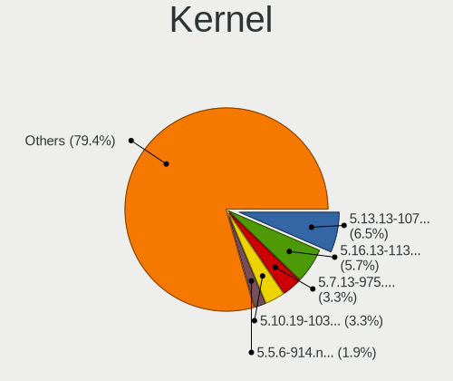

| Version             | Desktops | Percent |
|---------------------|----------|---------|
| 5.13.13-1070.native | 24       | 6.5%    |
| 5.16.13-1132.native | 21       | 5.69%   |
| 5.7.13-975.native   | 12       | 3.25%   |
| 5.10.19-1032.native | 12       | 3.25%   |
| 5.5.6-914.native    | 7        | 1.9%    |
| 5.9.12-1004.native  | 6        | 1.63%   |
| 5.4.18-902.native   | 6        | 1.63%   |
| 5.13.8-1065.native  | 6        | 1.63%   |
| 5.12.14-1051.native | 6        | 1.63%   |
| 6.5.7-1371.native   | 3        | 0.81%   |
| 6.10.6-1459.native  | 3        | 0.81%   |
| 6.0.2-1201.native   | 3        | 0.81%   |
| 5.9.16-1009.native  | 3        | 0.81%   |
| 5.7.7-967.native    | 3        | 0.81%   |
| 5.7.6-966.native    | 3        | 0.81%   |
| 5.7.2-962.native    | 3        | 0.81%   |
| 5.6.6-942.native    | 3        | 0.81%   |
| 5.6.10-947.native   | 3        | 0.81%   |
| 5.5.9-918.native    | 3        | 0.81%   |
| 5.5.5-911.native    | 3        | 0.81%   |
| 5.5.4-910.native    | 3        | 0.81%   |
| 5.5.3-908.native    | 3        | 0.81%   |
| 5.4.2-875.native    | 3        | 0.81%   |
| 5.3.5-847.native    | 3        | 0.81%   |
| 5.18.16-1165.native | 3        | 0.81%   |
| 5.14.8-1078.native  | 3        | 0.81%   |
| 5.10.18-1027.native | 3        | 0.81%   |
| 6.6.4-1389.native   | 2        | 0.54%   |
| 6.4.13-1351.native  | 2        | 0.54%   |
| 6.2.2-1285.native   | 2        | 0.54%   |
| 6.2.1-1280.native   | 2        | 0.54%   |
| 6.10.9-1462.native  | 2        | 0.54%   |
| 6.10.1-1453.native  | 2        | 0.54%   |
| 6.1.2-1232.native   | 2        | 0.54%   |
| 6.0.7-1207.native   | 2        | 0.54%   |
| 5.9.8-1000.native   | 2        | 0.54%   |
| 5.9.13-1006.native  | 2        | 0.54%   |
| 5.9.1-992.native    | 2        | 0.54%   |
| 5.8.14-991.native   | 2        | 0.54%   |
| 5.7.18-980.native   | 2        | 0.54%   |

Kernel Family
-------------

Linux kernel without a distro release

| Version | Desktops | Percent |
|---------|----------|---------|
| 5.13.13 | 24       | 6.5%    |
| 5.16.13 | 21       | 5.69%   |
| 5.7.13  | 12       | 3.25%   |
| 5.10.19 | 12       | 3.25%   |
| 5.5.6   | 7        | 1.9%    |
| 5.9.12  | 6        | 1.63%   |
| 5.4.18  | 6        | 1.63%   |
| 5.13.8  | 6        | 1.63%   |
| 5.12.14 | 6        | 1.63%   |
| 5.5.4   | 4        | 1.08%   |
| 5.18.2  | 4        | 1.08%   |
| 6.5.7   | 3        | 0.81%   |
| 6.10.6  | 3        | 0.81%   |
| 6.0.2   | 3        | 0.81%   |
| 5.9.16  | 3        | 0.81%   |
| 5.7.7   | 3        | 0.81%   |
| 5.7.6   | 3        | 0.81%   |
| 5.7.2   | 3        | 0.81%   |
| 5.6.6   | 3        | 0.81%   |
| 5.6.11  | 3        | 0.81%   |
| 5.6.10  | 3        | 0.81%   |
| 5.5.9   | 3        | 0.81%   |
| 5.5.5   | 3        | 0.81%   |
| 5.5.3   | 3        | 0.81%   |
| 5.4.2   | 3        | 0.81%   |
| 5.3.5   | 3        | 0.81%   |
| 5.18.16 | 3        | 0.81%   |
| 5.16.18 | 3        | 0.81%   |
| 5.14.8  | 3        | 0.81%   |
| 5.10.18 | 3        | 0.81%   |
| 6.6.8   | 2        | 0.54%   |
| 6.6.4   | 2        | 0.54%   |
| 6.4.13  | 2        | 0.54%   |
| 6.2.2   | 2        | 0.54%   |
| 6.2.1   | 2        | 0.54%   |
| 6.10.9  | 2        | 0.54%   |
| 6.10.1  | 2        | 0.54%   |
| 6.1.2   | 2        | 0.54%   |
| 6.0.7   | 2        | 0.54%   |
| 5.9.8   | 2        | 0.54%   |

Kernel Major Ver.
-----------------

Linux kernel major version

| Version | Desktops | Percent |
|---------|----------|---------|
| 5.13    | 36       | 10.08%  |
| 5.7     | 31       | 8.68%   |
| 5.16    | 31       | 8.68%   |
| 5.5     | 29       | 8.12%   |
| 5.10    | 29       | 8.12%   |
| 5.4     | 27       | 7.56%   |
| 5.6     | 21       | 5.88%   |
| 5.9     | 18       | 5.04%   |
| 5.12    | 16       | 4.48%   |
| 5.18    | 13       | 3.64%   |
| 5.3     | 11       | 3.08%   |
| 6.2     | 8        | 2.24%   |
| 6.10    | 8        | 2.24%   |
| 6.1     | 8        | 2.24%   |
| 6.0     | 8        | 2.24%   |
| 5.15    | 7        | 1.96%   |
| 6.6     | 6        | 1.68%   |
| 5.2     | 6        | 1.68%   |
| 5.14    | 6        | 1.68%   |
| 5.1     | 6        | 1.68%   |
| 5.0     | 6        | 1.68%   |
| 5.17    | 5        | 1.4%    |
| 6.5     | 4        | 1.12%   |
| 5.8     | 4        | 1.12%   |
| 6.7     | 3        | 0.84%   |
| 6.4     | 3        | 0.84%   |
| 5.19    | 3        | 0.84%   |
| 6.3     | 2        | 0.56%   |
| 6.11    | 1        | 0.28%   |
| 4.19    | 1        | 0.28%   |

Arch
----

OS architecture (x86_64, i586, etc.)

| Name   | Desktops | Percent |
|--------|----------|---------|
| x86_64 | 327      | 100%    |

DE
--

Desktop Environment

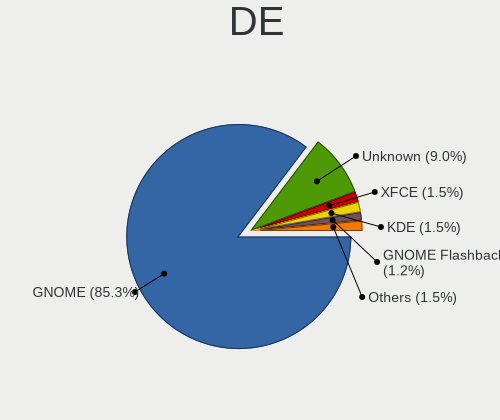

| Name            | Desktops | Percent |
|-----------------|----------|---------|
| GNOME           | 285      | 85.33%  |
| Unknown         | 30       | 8.98%   |
| XFCE            | 5        | 1.5%    |
| KDE             | 5        | 1.5%    |
| GNOME Flashback | 4        | 1.2%    |
| KDE5            | 3        | 0.9%    |
| KDE6            | 1        | 0.3%    |
| GNOME-Flashback | 1        | 0.3%    |

Display Server
--------------

X11 or Wayland

| Name    | Desktops | Percent |
|---------|----------|---------|
| X11     | 291      | 87.65%  |
| Wayland | 38       | 11.45%  |
| Tty     | 3        | 0.9%    |

Display Manager
---------------

SDDM, LightDM, etc.

| Name    | Desktops | Percent |
|---------|----------|---------|
| Unknown | 324      | 99.08%  |
| GDM     | 3        | 0.92%   |

OS Lang
-------

Language

| Lang       | Desktops | Percent |
|------------|----------|---------|
| en_US      | 204      | 60.71%  |
| Unknown    | 28       | 8.33%   |
| ru_RU      | 21       | 6.25%   |
| C          | 13       | 3.87%   |
| de_DE      | 12       | 3.57%   |
| es_MX      | 11       | 3.27%   |
| en_GB      | 10       | 2.98%   |
| it_IT      | 7        | 2.08%   |
| fr_FR      | 7        | 2.08%   |
| pt_BR      | 4        | 1.19%   |
| pl_PL      | 4        | 1.19%   |
| es_ES      | 3        | 0.89%   |
| zh_TW      | 2        | 0.6%    |
| zh_CN      | 2        | 0.6%    |
| pt_PT      | 2        | 0.6%    |
| nl_BE      | 1        | 0.3%    |
| fi_FI      | 1        | 0.3%    |
| en_US.UTF8 | 1        | 0.3%    |
| en_AU      | 1        | 0.3%    |
| de_AT      | 1        | 0.3%    |
| bg_BG      | 1        | 0.3%    |

Boot Mode
---------

EFI or BIOS

| Mode | Desktops | Percent |
|------|----------|---------|
| BIOS | 327      | 100%    |

Filesystem
----------

Type of filesystem

| Type    | Desktops | Percent |
|---------|----------|---------|
| Ext4    | 288      | 86.75%  |
| Unknown | 32       | 9.64%   |
| Btrfs   | 7        | 2.11%   |
| Xfs     | 5        | 1.51%   |

Part. scheme
------------

Scheme of partitioning

| Type    | Desktops | Percent |
|---------|----------|---------|
| Unknown | 320      | 97.56%  |
| GPT     | 8        | 2.44%   |

Dual Boot with Linux/BSD
------------------------

Hosting more than one Linux/BSD

| Dual boot | Desktops | Percent |
|-----------|----------|---------|
| No        | 326      | 99.69%  |
| Yes       | 1        | 0.31%   |

Dual Boot (Win)
---------------

Hosting Linux and Windows

| Dual boot | Desktops | Percent |
|-----------|----------|---------|
| No        | 325      | 99.39%  |
| Yes       | 2        | 0.61%   |

Board
-----

Vendor
------

Motherboard manufacturer

| Name                                 | Desktops | Percent |
|--------------------------------------|----------|---------|
| ASUSTek Computer                     | 91       | 27.83%  |
| Gigabyte Technology                  | 58       | 17.74%  |
| MSI                                  | 34       | 10.4%   |
| ASRock                               | 34       | 10.4%   |
| Hewlett-Packard                      | 28       | 8.56%   |
| Dell                                 | 25       | 7.65%   |
| Intel                                | 10       | 3.06%   |
| Lenovo                               | 9        | 2.75%   |
| Acer                                 | 7        | 2.14%   |
| Unknown                              | 7        | 2.14%   |
| Biostar                              | 3        | 0.92%   |
| Shuttle                              | 2        | 0.61%   |
| Pegatron                             | 2        | 0.61%   |
| Huanan                               | 2        | 0.61%   |
| Foxconn                              | 2        | 0.61%   |
| SYS                                  | 1        | 0.31%   |
| Supermicro                           | 1        | 0.31%   |
| Shenzhen Meigao Electronic Equipment | 1        | 0.31%   |
| Medion                               | 1        | 0.31%   |
| MAXSUN                               | 1        | 0.31%   |
| LattePanda                           | 1        | 0.31%   |
| iEi                                  | 1        | 0.31%   |
| Hampoo                               | 1        | 0.31%   |
| GMK                                  | 1        | 0.31%   |
| Fujitsu                              | 1        | 0.31%   |
| ECS                                  | 1        | 0.31%   |
| AZW                                  | 1        | 0.31%   |
| AAEON                                | 1        | 0.31%   |

Model
-----

Motherboard model

| Name                                              | Desktops | Percent |
|---------------------------------------------------|----------|---------|
| ASUS All Series                                   | 12       | 3.67%   |
| Unknown                                           | 7        | 2.14%   |
| Dell OptiPlex 9020                                | 5        | 1.53%   |
| Intel DN2820FYB H24582-205                        | 4        | 1.22%   |
| Dell OptiPlex 7010                                | 4        | 1.22%   |
| MSI MS-7C95                                       | 3        | 0.92%   |
| MSI MS-7C60                                       | 3        | 0.92%   |
| MSI MS-7C02                                       | 3        | 0.92%   |
| ASRock TRX40 Creator                              | 3        | 0.92%   |
| HP Z420 Workstation                               | 2        | 0.61%   |
| HP Compaq 8200 Elite SFF PC                       | 2        | 0.61%   |
| HP Compaq 6200 Pro SFF PC                         | 2        | 0.61%   |
| Gigabyte Z97X-UD3H                                | 2        | 0.61%   |
| Gigabyte X79-UD3                                  | 2        | 0.61%   |
| Gigabyte X570 AORUS PRO WIFI                      | 2        | 0.61%   |
| Gigabyte H87-HD3                                  | 2        | 0.61%   |
| Gigabyte H61M-DS2                                 | 2        | 0.61%   |
| Gigabyte B75M-D3H                                 | 2        | 0.61%   |
| Dell XPS 8930                                     | 2        | 0.61%   |
| Dell OptiPlex 7040                                | 2        | 0.61%   |
| ASUS Z170-A                                       | 2        | 0.61%   |
| ASUS TUF Gaming X570-PRO                          | 2        | 0.61%   |
| ASUS TUF Gaming X570-PLUS                         | 2        | 0.61%   |
| ASUS ROG STRIX B450-F GAMING                      | 2        | 0.61%   |
| ASUS ROG Maximus Z690 HERO                        | 2        | 0.61%   |
| ASUS ROG Maximus XII FORMULA                      | 2        | 0.61%   |
| ASUS PRIME B450M-A                                | 2        | 0.61%   |
| ASUS P8P67 LE                                     | 2        | 0.61%   |
| ASUS H110M-A/M.2                                  | 2        | 0.61%   |
| SYS BAT-MINI                                      | 1        | 0.31%   |
| Supermicro SYS-5038A-I                            | 1        | 0.31%   |
| Shuttle SH67H                                     | 1        | 0.31%   |
| Shuttle DS81D                                     | 1        | 0.31%   |
| Shenzhen Meigao Electronic Equipment Venus Series | 1        | 0.31%   |
| Pegatron SKLD4-P1                                 | 1        | 0.31%   |
| Pegatron h8-1400ex                                | 1        | 0.31%   |
| MSI MS-7E03                                       | 1        | 0.31%   |
| MSI MS-7D25                                       | 1        | 0.31%   |
| MSI MS-7D22                                       | 1        | 0.31%   |
| MSI MS-7D18                                       | 1        | 0.31%   |

Model Family
------------

Motherboard model prefix

| Name               | Desktops | Percent |
|--------------------|----------|---------|
| ASUS PRIME         | 22       | 6.73%   |
| ASUS ROG           | 20       | 6.12%   |
| Dell OptiPlex      | 16       | 4.89%   |
| ASUS All           | 12       | 3.67%   |
| ASUS TUF           | 11       | 3.36%   |
| Lenovo ThinkCentre | 8        | 2.45%   |
| HP Compaq          | 8        | 2.45%   |
| Acer Aspire        | 7        | 2.14%   |
| Unknown            | 7        | 2.14%   |
| HP Pavilion        | 5        | 1.53%   |
| Gigabyte X570      | 5        | 1.53%   |
| Intel DN2820FYB    | 4        | 1.22%   |
| Dell Precision     | 4        | 1.22%   |
| ASRock TRX40       | 4        | 1.22%   |
| MSI MS-7C95        | 3        | 0.92%   |
| MSI MS-7C60        | 3        | 0.92%   |
| MSI MS-7C02        | 3        | 0.92%   |
| Gigabyte Z390      | 3        | 0.92%   |
| Gigabyte Z370      | 3        | 0.92%   |
| Gigabyte B450      | 3        | 0.92%   |
| Dell XPS           | 3        | 0.92%   |
| Intel X79          | 2        | 0.61%   |
| HP Z420            | 2        | 0.61%   |
| HP ProDesk         | 2        | 0.61%   |
| HP EliteDesk       | 2        | 0.61%   |
| Gigabyte Z97X-UD3H | 2        | 0.61%   |
| Gigabyte X79-UD3   | 2        | 0.61%   |
| Gigabyte H87-HD3   | 2        | 0.61%   |
| Gigabyte H61M-DS2  | 2        | 0.61%   |
| Gigabyte G1.SNIPER | 2        | 0.61%   |
| Gigabyte B75M-D3H  | 2        | 0.61%   |
| Gigabyte B365M     | 2        | 0.61%   |
| Gigabyte A320M-S2H | 2        | 0.61%   |
| ASUS Z170-A        | 2        | 0.61%   |
| ASUS P8P67         | 2        | 0.61%   |
| ASUS H110M-A       | 2        | 0.61%   |
| ASRock Z390        | 2        | 0.61%   |
| ASRock H110M-DGS   | 2        | 0.61%   |
| ASRock B450        | 2        | 0.61%   |
| ASRock AB350       | 2        | 0.61%   |

MFG Year
--------

Motherboard manufacture year

| Year | Desktops | Percent |
|------|----------|---------|
| 2018 | 52       | 15.9%   |
| 2020 | 35       | 10.7%   |
| 2019 | 35       | 10.7%   |
| 2012 | 35       | 10.7%   |
| 2014 | 30       | 9.17%   |
| 2013 | 26       | 7.95%   |
| 2021 | 24       | 7.34%   |
| 2017 | 22       | 6.73%   |
| 2015 | 21       | 6.42%   |
| 2016 | 20       | 6.12%   |
| 2011 | 15       | 4.59%   |
| 2022 | 6        | 1.83%   |
| 2010 | 3        | 0.92%   |
| 2023 | 2        | 0.61%   |
| 2024 | 1        | 0.31%   |

Form Factor
-----------

Physical design of the computer

| Name    | Desktops | Percent |
|---------|----------|---------|
| Desktop | 327      | 100%    |

Secure Boot
-----------

Enabled or disabled

| State    | Desktops | Percent |
|----------|----------|---------|
| Disabled | 327      | 100%    |

Coreboot
--------

Have coreboot on board

| Used | Desktops | Percent |
|------|----------|---------|
| No   | 327      | 100%    |

RAM Size
--------

Total RAM memory

| Size in GB      | Desktops | Percent |
|-----------------|----------|---------|
| 16.01-24.0      | 102      | 30.72%  |
| 32.01-64.0      | 61       | 18.37%  |
| 8.01-16.0       | 59       | 17.77%  |
| 4.01-8.0        | 35       | 10.54%  |
| 64.01-256.0     | 35       | 10.54%  |
| 3.01-4.0        | 26       | 7.83%   |
| 24.01-32.0      | 10       | 3.01%   |
| More than 256.0 | 2        | 0.6%    |
| 1.01-2.0        | 2        | 0.6%    |

RAM Used
--------

Used RAM memory

| Used GB     | Desktops | Percent |
|-------------|----------|---------|
| 1.01-2.0    | 116      | 32.58%  |
| 2.01-3.0    | 104      | 29.21%  |
| 4.01-8.0    | 58       | 16.29%  |
| 3.01-4.0    | 50       | 14.04%  |
| 8.01-16.0   | 16       | 4.49%   |
| 0.51-1.0    | 9        | 2.53%   |
| 32.01-64.0  | 1        | 0.28%   |
| 64.01-256.0 | 1        | 0.28%   |
| 16.01-24.0  | 1        | 0.28%   |

Total Drives
------------

Number of drives on board

| Drives | Desktops | Percent |
|--------|----------|---------|
| 1      | 124      | 36.26%  |
| 2      | 96       | 28.07%  |
| 3      | 58       | 16.96%  |
| 4      | 37       | 10.82%  |
| 5      | 16       | 4.68%   |
| 6      | 7        | 2.05%   |
| 7      | 3        | 0.88%   |
| 0      | 1        | 0.29%   |

Has CD-ROM
----------

Has CD-ROM on board

| Presented | Desktops | Percent |
|-----------|----------|---------|
| No        | 234      | 71.12%  |
| Yes       | 95       | 28.88%  |

Has Ethernet
------------

Has Ethernet on board

| Presented | Desktops | Percent |
|-----------|----------|---------|
| Yes       | 323      | 98.78%  |
| No        | 4        | 1.22%   |

Has WiFi
--------

Has WiFi module

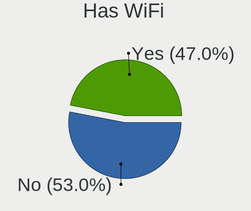

| Presented | Desktops | Percent |
|-----------|----------|---------|
| No        | 175      | 53.03%  |
| Yes       | 155      | 46.97%  |

Has Bluetooth
-------------

Has Bluetooth module

| Presented | Desktops | Percent |
|-----------|----------|---------|
| No        | 194      | 58.79%  |
| Yes       | 136      | 41.21%  |

Location
--------

Country
-------

Geographic location (country)

| Country      | Desktops | Percent |
|--------------|----------|---------|
| USA          | 90       | 27.44%  |
| Russia       | 30       | 9.15%   |
| UK           | 24       | 7.32%   |
| Germany      | 21       | 6.4%    |
| Italy        | 14       | 4.27%   |
| Brazil       | 12       | 3.66%   |
| France       | 11       | 3.35%   |
| India        | 9        | 2.74%   |
| Canada       | 9        | 2.74%   |
| Australia    | 9        | 2.74%   |
| Argentina    | 8        | 2.44%   |
| Sweden       | 7        | 2.13%   |
| Spain        | 7        | 2.13%   |
| Poland       | 6        | 1.83%   |
| Netherlands  | 6        | 1.83%   |
| Romania      | 5        | 1.52%   |
| Portugal     | 4        | 1.22%   |
| Norway       | 4        | 1.22%   |
| Serbia       | 3        | 0.91%   |
| Indonesia    | 3        | 0.91%   |
| China        | 3        | 0.91%   |
| Austria      | 3        | 0.91%   |
| Vietnam      | 2        | 0.61%   |
| Ukraine      | 2        | 0.61%   |
| Turkey       | 2        | 0.61%   |
| Thailand     | 2        | 0.61%   |
| Taiwan       | 2        | 0.61%   |
| South Africa | 2        | 0.61%   |
| Mexico       | 2        | 0.61%   |
| Latvia       | 2        | 0.61%   |
| Japan        | 2        | 0.61%   |
| Hong Kong    | 2        | 0.61%   |
| Finland      | 2        | 0.61%   |
| Bulgaria     | 2        | 0.61%   |
| Belgium      | 2        | 0.61%   |
| Saudi Arabia | 1        | 0.3%    |
| Myanmar      | 1        | 0.3%    |
| Lithuania    | 1        | 0.3%    |
| Lebanon      | 1        | 0.3%    |
| Kazakhstan   | 1        | 0.3%    |

City
----

Geographic location (city)

| City             | Desktops | Percent |
|------------------|----------|---------|
| Moscow           | 7        | 2.05%   |
| Brisbane         | 6        | 1.75%   |
| St Petersburg    | 4        | 1.17%   |
| Springfield      | 3        | 0.88%   |
| Shelbyville      | 3        | 0.88%   |
| Mumbai           | 3        | 0.88%   |
| Lisbon           | 3        | 0.88%   |
| Buenos Aires     | 3        | 0.88%   |
| Yekaterinburg    | 2        | 0.58%   |
| Villa Elisa      | 2        | 0.58%   |
| Toronto          | 2        | 0.58%   |
| Stockton         | 2        | 0.58%   |
| Sao Paulo        | 2        | 0.58%   |
| San Jose         | 2        | 0.58%   |
| Rome             | 2        | 0.58%   |
| Riga             | 2        | 0.58%   |
| Portland         | 2        | 0.58%   |
| Palermo          | 2        | 0.58%   |
| Milan            | 2        | 0.58%   |
| Madrid           | 2        | 0.58%   |
| Las Vegas        | 2        | 0.58%   |
| La Plata         | 2        | 0.58%   |
| Ho Chi Minh City | 2        | 0.58%   |
| Groton           | 2        | 0.58%   |
| Gijn           | 2        | 0.58%   |
| Cincinnati       | 2        | 0.58%   |
| Chicago          | 2        | 0.58%   |
| Central          | 2        | 0.58%   |
| Bengaluru        | 2        | 0.58%   |
| Belgrade         | 2        | 0.58%   |
| Athens           | 2        | 0.58%   |
| Zaandam          | 1        | 0.29%   |
| Yogyakarta       | 1        | 0.29%   |
| Yangon           | 1        | 0.29%   |
| Wroclaw          | 1        | 0.29%   |
| Woodbine         | 1        | 0.29%   |
| Wolfenbttel    | 1        | 0.29%   |
| Winnipeg         | 1        | 0.29%   |
| Wezep            | 1        | 0.29%   |
| Wetteren         | 1        | 0.29%   |

Drives
------

Drive Vendor
------------

Hard drive vendors

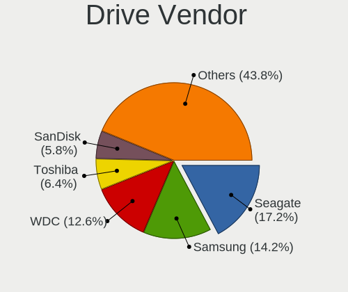

| Vendor                      | Desktops | Drives | Percent |
|-----------------------------|----------|--------|---------|
| Seagate                     | 107      | 157    | 17.23%  |
| Samsung Electronics         | 88       | 146    | 14.17%  |
| WDC                         | 78       | 108    | 12.56%  |
| Toshiba                     | 40       | 58     | 6.44%   |
| SanDisk                     | 36       | 49     | 5.8%    |
| Kingston                    | 28       | 35     | 4.51%   |
| Crucial                     | 24       | 32     | 3.86%   |
| Intel                       | 22       | 26     | 3.54%   |
| Phison                      | 21       | 29     | 3.38%   |
| Unknown                     | 20       | 23     | 3.22%   |
| A-DATA Technology           | 12       | 12     | 1.93%   |
| Hitachi                     | 11       | 11     | 1.77%   |
| SPCC                        | 8        | 9      | 1.29%   |
| Patriot                     | 8        | 8      | 1.29%   |
| HGST                        | 7        | 11     | 1.13%   |
| Transcend                   | 6        | 6      | 0.97%   |
| Silicon Motion              | 6        | 7      | 0.97%   |
| Micron/Crucial Technology   | 6        | 8      | 0.97%   |
| Micron Technology           | 6        | 9      | 0.97%   |
| SK hynix                    | 5        | 6      | 0.81%   |
| PNY                         | 5        | 10     | 0.81%   |
| China                       | 5        | 25     | 0.81%   |
| XPG                         | 4        | 4      | 0.64%   |
| Team                        | 4        | 4      | 0.64%   |
| LITEONIT                    | 4        | 6      | 0.64%   |
| JMicron Technology          | 4        | 4      | 0.64%   |
| ADATA Technology            | 4        | 4      | 0.64%   |
| Phison Electronics          | 3        | 3      | 0.48%   |
| Apacer                      | 3        | 4      | 0.48%   |
| Yangtze Memory Technologies | 2        | 2      | 0.32%   |
| Realtek Semiconductor       | 2        | 2      | 0.32%   |
| Netac                       | 2        | 2      | 0.32%   |
| Maxtor                      | 2        | 2      | 0.32%   |
| KIOXIA                      | 2        | 4      | 0.32%   |
| KingDian                    | 2        | 4      | 0.32%   |
| Hewlett-Packard             | 2        | 2      | 0.32%   |
| GOODRAM                     | 2        | 2      | 0.32%   |
| Corsair                     | 2        | 6      | 0.32%   |
| WDC WDS2                    | 1        | 1      | 0.16%   |
| Verbatim                    | 1        | 2      | 0.16%   |

Drive Model
-----------

Hard drive models

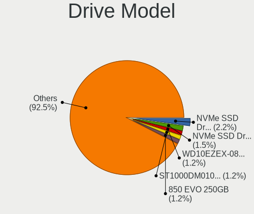

| Model                                               | Desktops | Percent |
|-----------------------------------------------------|----------|---------|
| Samsung NVMe SSD Drive 500GB                        | 16       | 2.22%   |
| Samsung NVMe SSD Drive 1TB                          | 11       | 1.53%   |
| WDC WD10EZEX-08WN4A0 1TB                            | 9        | 1.25%   |
| Seagate ST1000DM010-2EP102 1TB                      | 9        | 1.25%   |
| Samsung SSD 850 EVO 250GB                           | 9        | 1.25%   |
| Unknown SD/MMC/MS PRO 128GB                         | 8        | 1.11%   |
| Toshiba DT01ACA100 1TB                              | 8        | 1.11%   |
| Samsung SM963 2.5" NVMe PCIe SSD 250GB              | 7        | 0.97%   |
| Toshiba DT01ACA050 500GB                            | 6        | 0.83%   |
| Phison NVMe SSD Drive 1TB                           | 6        | 0.83%   |
| Crucial CT500MX500SSD1 500GB                        | 6        | 0.83%   |
| Toshiba HDWD110 1TB                                 | 5        | 0.69%   |
| Seagate ST2000DM008-2FR102 2TB                      | 5        | 0.69%   |
| Samsung SSD 860 EVO 250GB                           | 5        | 0.69%   |
| Samsung NVMe SSD Controller SM981/PM981/PM983 512GB | 5        | 0.69%   |
| Kingston SA400S37240G 240GB SSD                     | 5        | 0.69%   |
| Kingston SA400S37120G 120GB SSD                     | 5        | 0.69%   |
| Unknown MMC Card  64GB                              | 4        | 0.56%   |
| Seagate ST500LM030-2E717D 500GB                     | 4        | 0.56%   |
| Seagate ST500DM002-1BD142 500GB                     | 4        | 0.56%   |
| Seagate ST1000DM003-1ER162 1TB                      | 4        | 0.56%   |
| SanDisk SSD PLUS 480GB                              | 4        | 0.56%   |
| SanDisk NVMe SSD Drive 500GB                        | 4        | 0.56%   |
| Samsung SSD 860 QVO 1TB                             | 4        | 0.56%   |
| Samsung SSD 850 EVO 500GB                           | 4        | 0.56%   |
| Samsung SSD 850 EVO 120GB                           | 4        | 0.56%   |
| Samsung SSD 840 EVO 120GB                           | 4        | 0.56%   |
| Samsung NVMe SSD Drive 2TB                          | 4        | 0.56%   |
| Samsung NVMe SSD Drive 1024GB                       | 4        | 0.56%   |
| Phison NVMe SSD Drive 512GB                         | 4        | 0.56%   |
| Intel NVMe SSD Drive 1024GB                         | 4        | 0.56%   |
| Crucial CT240BX500SSD1 240GB                        | 4        | 0.56%   |
| WDC WDS500G2B0A-00SM50 500GB SSD                    | 3        | 0.42%   |
| WDC WD5000AAKX-00ERMA0 500GB                        | 3        | 0.42%   |
| WDC WD10EZEX-60WN4A0 1TB                            | 3        | 0.42%   |
| Toshiba DT01ACA200 2TB                              | 3        | 0.42%   |
| SPCC Solid State Disk 120GB                         | 3        | 0.42%   |
| Seagate ST6000VN0033-2EE110 6TB                     | 3        | 0.42%   |
| Seagate ST500LT012-1DG142 500GB                     | 3        | 0.42%   |
| Seagate ST4000DM005-2DP166 4TB                      | 3        | 0.42%   |

HDD Vendor
----------

Hard disk drive vendors

| Vendor              | Desktops | Drives | Percent |
|---------------------|----------|--------|---------|
| Seagate             | 101      | 144    | 40.73%  |
| WDC                 | 70       | 97     | 28.23%  |
| Toshiba             | 30       | 47     | 12.1%   |
| Hitachi             | 11       | 11     | 4.44%   |
| Unknown             | 8        | 8      | 3.23%   |
| Samsung Electronics | 7        | 7      | 2.82%   |
| HGST                | 7        | 11     | 2.82%   |
| JMicron Technology  | 3        | 3      | 1.21%   |
| Maxtor              | 2        | 2      | 0.81%   |
| USB3.0              | 1        | 1      | 0.4%    |
| SABRENT             | 1        | 1      | 0.4%    |
| MARVELL             | 1        | 1      | 0.4%    |
| HPE                 | 1        | 1      | 0.4%    |
| H/W                 | 1        | 2      | 0.4%    |
| Fujitsu             | 1        | 1      | 0.4%    |
| External            | 1        | 1      | 0.4%    |
| ASMT                | 1        | 2      | 0.4%    |
| Unknown             | 1        | 5      | 0.4%    |

SSD Vendor
----------

Solid state drive vendors

| Vendor              | Desktops | Drives | Percent |
|---------------------|----------|--------|---------|
| Samsung Electronics | 50       | 73     | 21.74%  |
| Kingston            | 26       | 32     | 11.3%   |
| Crucial             | 24       | 32     | 10.43%  |
| SanDisk             | 20       | 23     | 8.7%    |
| A-DATA Technology   | 12       | 12     | 5.22%   |
| WDC                 | 10       | 11     | 4.35%   |
| Intel               | 10       | 11     | 4.35%   |
| SPCC                | 8        | 9      | 3.48%   |
| Patriot             | 8        | 8      | 3.48%   |
| Transcend           | 6        | 6      | 2.61%   |
| Toshiba             | 6        | 6      | 2.61%   |
| PNY                 | 5        | 10     | 2.17%   |
| China               | 5        | 25     | 2.17%   |
| Team                | 4        | 4      | 1.74%   |
| Micron Technology   | 4        | 4      | 1.74%   |
| LITEONIT            | 4        | 6      | 1.74%   |
| Apacer              | 3        | 4      | 1.3%    |
| Seagate             | 2        | 2      | 0.87%   |
| KingDian            | 2        | 4      | 0.87%   |
| Hewlett-Packard     | 2        | 2      | 0.87%   |
| GOODRAM             | 2        | 2      | 0.87%   |
| Corsair             | 2        | 6      | 0.87%   |
| WDC WDS2            | 1        | 1      | 0.43%   |
| Verbatim            | 1        | 2      | 0.43%   |
| Unknown             | 1        | 1      | 0.43%   |
| SK hynix            | 1        | 2      | 0.43%   |
| SD                  | 1        | 2      | 0.43%   |
| Plextor             | 1        | 1      | 0.43%   |
| OCZ                 | 1        | 2      | 0.43%   |
| Netac               | 1        | 1      | 0.43%   |
| KingSpec            | 1        | 1      | 0.43%   |
| Intenso             | 1        | 1      | 0.43%   |
| Hoodisk             | 1        | 2      | 0.43%   |
| Hikvision           | 1        | 1      | 0.43%   |
| Gigabyte Technology | 1        | 1      | 0.43%   |
| Acer                | 1        | 1      | 0.43%   |
| 2.5                 | 1        | 2      | 0.43%   |

Drive Kind
----------

HDD or SSD

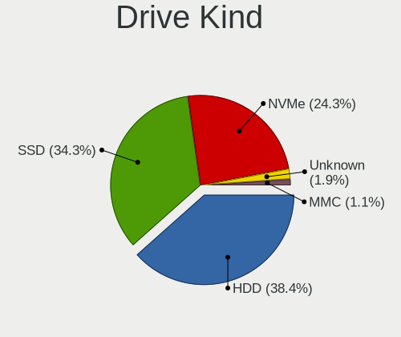

| Kind    | Desktops | Drives | Percent |
|---------|----------|--------|---------|
| HDD     | 206      | 345    | 38.43%  |
| SSD     | 184      | 313    | 34.33%  |
| NVMe    | 130      | 202    | 24.25%  |
| Unknown | 10       | 13     | 1.87%   |
| MMC     | 6        | 7      | 1.12%   |

Drive Connector
---------------

SATA, SAS, NVMe, etc.

| Type | Desktops | Drives | Percent |
|------|----------|--------|---------|
| SATA | 283      | 636    | 63.31%  |
| NVMe | 130      | 202    | 29.08%  |
| SAS  | 28       | 35     | 6.26%   |
| MMC  | 6        | 7      | 1.34%   |

Drive Size
----------

Size of hard drive

| Size in TB | Desktops | Drives | Percent |
|------------|----------|--------|---------|
| 0.01-0.5   | 212      | 393    | 52.09%  |
| 0.51-1.0   | 102      | 142    | 25.06%  |
| 1.01-2.0   | 41       | 51     | 10.07%  |
| 4.01-10.0  | 19       | 25     | 4.67%   |
| 3.01-4.0   | 15       | 20     | 3.69%   |
| 2.01-3.0   | 9        | 10     | 2.21%   |
| 10.01-20.0 | 9        | 17     | 2.21%   |

Space Total
-----------

Amount of disk space available on the file system

| Size in GB     | Desktops | Percent |
|----------------|----------|---------|
| 101-250        | 109      | 31.87%  |
| 251-500        | 75       | 21.93%  |
| 501-1000       | 50       | 14.62%  |
| 1001-2000      | 30       | 8.77%   |
| 51-100         | 20       | 5.85%   |
| More than 3000 | 18       | 5.26%   |
| Unknown        | 18       | 5.26%   |
| 2001-3000      | 13       | 3.8%    |
| 21-50          | 8        | 2.34%   |
| 1-20           | 1        | 0.29%   |

Space Used
----------

Amount of used disk space

| Used GB        | Desktops | Percent |
|----------------|----------|---------|
| 1-20           | 135      | 38.46%  |
| 21-50          | 85       | 24.22%  |
| 51-100         | 30       | 8.55%   |
| 101-250        | 28       | 7.98%   |
| 251-500        | 18       | 5.13%   |
| Unknown        | 18       | 5.13%   |
| 501-1000       | 15       | 4.27%   |
| 1001-2000      | 11       | 3.13%   |
| More than 3000 | 8        | 2.28%   |
| 2001-3000      | 3        | 0.85%   |

Malfunc. Drives
---------------

Drive models with a malfunction

| Model                           | Desktops | Drives | Percent |
|---------------------------------|----------|--------|---------|
| Seagate ST500LM030-2E717D 500GB | 2        | 2      | 100%    |

Malfunc. Drive Vendor
---------------------

Vendors of faulty drives

| Vendor  | Desktops | Drives | Percent |
|---------|----------|--------|---------|
| Seagate | 2        | 2      | 100%    |

Malfunc. HDD Vendor
-------------------

Vendors of faulty HDD drives

| Vendor  | Desktops | Drives | Percent |
|---------|----------|--------|---------|
| Seagate | 2        | 2      | 100%    |

Malfunc. Drive Kind
-------------------

Kinds of faulty drives

| Kind | Desktops | Drives | Percent |
|------|----------|--------|---------|
| HDD  | 2        | 2      | 100%    |

Failed Drives
-------------

Failed drive models

Zero info for selected period =(

Failed Drive Vendor
-------------------

Failed drive vendors

Zero info for selected period =(

Drive Status
------------

Number of failed and malfunc. drives

| Status   | Desktops | Drives | Percent |
|----------|----------|--------|---------|
| Detected | 321      | 858    | 97.27%  |
| Works    | 7        | 20     | 2.12%   |
| Malfunc  | 2        | 2      | 0.61%   |

Storage controller
------------------

Storage Vendor
--------------

Storage controller vendors

| Vendor                       | Desktops | Percent |
|------------------------------|----------|---------|
| Intel                        | 237      | 47.49%  |
| AMD                          | 86       | 17.23%  |
| Samsung Electronics          | 50       | 10.02%  |
| Phison Electronics           | 23       | 4.61%   |
| ASMedia Technology           | 22       | 4.41%   |
| SanDisk                      | 18       | 3.61%   |
| Marvell Technology Group     | 9        | 1.8%    |
| ADATA Technology             | 9        | 1.8%    |
| Silicon Motion               | 6        | 1.2%    |
| Micron/Crucial Technology    | 6        | 1.2%    |
| Toshiba America Info Systems | 4        | 0.8%    |
| SK hynix                     | 4        | 0.8%    |
| Seagate Technology           | 4        | 0.8%    |
| Realtek Semiconductor        | 3        | 0.6%    |
| Kingston Technology Company  | 3        | 0.6%    |
| Broadcom / LSI               | 3        | 0.6%    |
| Yangtze Memory Technologies  | 2        | 0.4%    |
| Micron Technology            | 2        | 0.4%    |
| LSI Logic / Symbios Logic    | 2        | 0.4%    |
| KIOXIA                       | 2        | 0.4%    |
| Shenzhen Longsys Electronics | 1        | 0.2%    |
| MAXIO Technology (Hangzhou)  | 1        | 0.2%    |
| Lite-On Technology           | 1        | 0.2%    |
| JMicron Technology           | 1        | 0.2%    |

Storage Model
-------------

Storage controller models

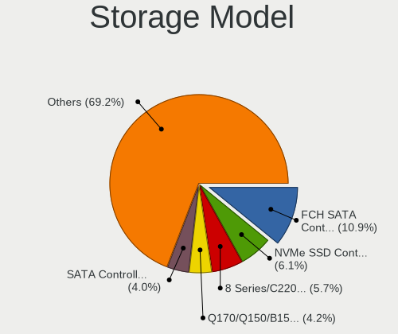

| Model                                                                          | Desktops | Percent |
|--------------------------------------------------------------------------------|----------|---------|
| AMD FCH SATA Controller [AHCI mode]                                            | 63       | 10.9%   |
| Samsung NVMe SSD Controller SM981/PM981/PM983                                  | 35       | 6.06%   |
| Intel 8 Series/C220 Series Chipset Family 6-port SATA Controller 1 [AHCI mode] | 33       | 5.71%   |
| Intel Q170/Q150/B150/H170/H110/Z170/CM236 Chipset SATA Controller [AHCI Mode]  | 24       | 4.15%   |
| Intel SATA Controller [RAID mode]                                              | 23       | 3.98%   |
| Intel 6 Series/C200 Series Chipset Family 6 port Desktop SATA AHCI Controller  | 21       | 3.63%   |
| Intel 200 Series PCH SATA controller [AHCI mode]                               | 21       | 3.63%   |
| ASMedia ASM1061/ASM1062 Serial ATA Controller                                  | 20       | 3.46%   |
| Intel Cannon Lake PCH SATA AHCI Controller                                     | 19       | 3.29%   |
| AMD 400 Series Chipset SATA Controller                                         | 19       | 3.29%   |
| Intel 7 Series/C210 Series Chipset Family 6-port SATA Controller [AHCI mode]   | 18       | 3.11%   |
| Intel Alder Lake-S PCH SATA Controller [AHCI Mode]                             | 11       | 1.9%    |
| Phison E16 PCIe4 NVMe Controller                                               | 9        | 1.56%   |
| Phison E12 NVMe Controller                                                     | 9        | 1.56%   |
| Intel 500 Series Chipset Family SATA AHCI Controller                           | 9        | 1.56%   |
| AMD 500 Series Chipset SATA Controller                                         | 9        | 1.56%   |
| Samsung NVMe SSD Controller PM9A1/PM9A3/980PRO                                 | 8        | 1.38%   |
| Intel 9 Series Chipset Family SATA Controller [AHCI Mode]                      | 8        | 1.38%   |
| AMD SB7x0/SB8x0/SB9x0 SATA Controller [AHCI mode]                              | 8        | 1.38%   |
| ADATA XPG SX8200 Pro PCIe Gen3x4 M.2 2280 Solid State Drive                    | 8        | 1.38%   |
| AMD 300 Series Chipset SATA Controller                                         | 7        | 1.21%   |
| SanDisk WD PC SN810 / Black SN850 NVMe SSD                                     | 6        | 1.04%   |
| Samsung NVMe SSD Controller SM961/PM961/SM963                                  | 6        | 1.04%   |
| Intel Volume Management Device NVMe RAID Controller                            | 6        | 1.04%   |
| Intel Comet Lake SATA AHCI Controller                                          | 6        | 1.04%   |
| Intel C610/X99 series chipset sSATA Controller [AHCI mode]                     | 6        | 1.04%   |
| Intel C610/X99 series chipset 6-Port SATA Controller [AHCI mode]               | 6        | 1.04%   |
| Intel Atom Processor E3800 Series SATA AHCI Controller                         | 6        | 1.04%   |
| Samsung NVMe SSD Controller 980 (DRAM-less)                                    | 5        | 0.87%   |
| Intel SSD 660P Series                                                          | 5        | 0.87%   |
| Intel C600/X79 series chipset 6-Port SATA AHCI Controller                      | 5        | 0.87%   |
| Intel 7 Series/C210 Series Chipset Family 4-port SATA Controller [IDE mode]    | 5        | 0.87%   |
| Intel 7 Series/C210 Series Chipset Family 2-port SATA Controller [IDE mode]    | 5        | 0.87%   |
| Silicon Motion SM2263EN/SM2263XT (DRAM-less) NVMe SSD Controllers              | 4        | 0.69%   |
| Seagate FireCuda 520/IronWolf 525 SSD                                          | 4        | 0.69%   |
| AMD SB7x0/SB8x0/SB9x0 IDE Controller                                           | 4        | 0.69%   |
| SanDisk WD Black SN770 / PC SN740 256GB / PC SN560 (DRAM-less) NVMe SSD        | 3        | 0.52%   |
| SanDisk Ultra 3D / WD PC SN530, IX SN530, Blue SN550 NVMe SSD (DRAM-less)      | 3        | 0.52%   |
| Realtek RTS5763DL NVMe SSD Controller (DRAM-less)                              | 3        | 0.52%   |
| Micron/Crucial P2 [Nick P2] / P3 / P3 Plus NVMe PCIe SSD (DRAM-less)           | 3        | 0.52%   |

Storage Kind
------------

Kind of storage controller (IDE, SATA, NVMe, SAS, ...)

| Kind | Desktops | Percent |
|------|----------|---------|
| SATA | 290      | 60.29%  |
| NVMe | 132      | 27.44%  |
| RAID | 36       | 7.48%   |
| IDE  | 17       | 3.53%   |
| SAS  | 5        | 1.04%   |
| SCSI | 1        | 0.21%   |

Processor
---------

CPU Vendor
----------

Processor vendors

| Vendor | Desktops | Percent |
|--------|----------|---------|
| Intel  | 241      | 73.7%   |
| AMD    | 86       | 26.3%   |

CPU Model
---------

Processor models

| Model                                          | Desktops | Percent |
|------------------------------------------------|----------|---------|
| AMD Ryzen Threadripper 3960X 24-Core Processor | 7        | 2.13%   |
| Intel Core i7-3770 CPU @ 3.40GHz               | 6        | 1.83%   |
| Intel Core i5-7400 CPU @ 3.00GHz               | 6        | 1.83%   |
| AMD Ryzen 5 3600 6-Core Processor              | 6        | 1.83%   |
| Intel Core i7-8700K CPU @ 3.70GHz              | 5        | 1.52%   |
| Intel Core i7-8700 CPU @ 3.20GHz               | 5        | 1.52%   |
| Intel Core i5-3470 CPU @ 3.20GHz               | 5        | 1.52%   |
| Intel Core i7-6700K CPU @ 4.00GHz              | 4        | 1.22%   |
| Intel Core i7-2600K CPU @ 3.40GHz              | 4        | 1.22%   |
| Intel Core i5-9400F CPU @ 2.90GHz              | 4        | 1.22%   |
| Intel Core i5-8600K CPU @ 3.60GHz              | 4        | 1.22%   |
| Intel Core i5-6600K CPU @ 3.50GHz              | 4        | 1.22%   |
| Intel Core i5-4590 CPU @ 3.30GHz               | 4        | 1.22%   |
| Intel Core i5-4440 CPU @ 3.10GHz               | 4        | 1.22%   |
| Intel Celeron CPU N2830 @ 2.16GHz              | 4        | 1.22%   |
| Intel 12th Gen Core i9-12900K                  | 4        | 1.22%   |
| AMD Ryzen 9 3900X 12-Core Processor            | 4        | 1.22%   |
| AMD Ryzen 7 2700X Eight-Core Processor         | 4        | 1.22%   |
| AMD Ryzen 5 2600 Six-Core Processor            | 4        | 1.22%   |
| AMD FX-8350 Eight-Core Processor               | 4        | 1.22%   |
| Intel Core i7-9700K CPU @ 3.60GHz              | 3        | 0.91%   |
| Intel Core i7-7700 CPU @ 3.60GHz               | 3        | 0.91%   |
| Intel Core i7-10700 CPU @ 2.90GHz              | 3        | 0.91%   |
| Intel Core i5-9600K CPU @ 3.70GHz              | 3        | 0.91%   |
| Intel Core i5-8400 CPU @ 2.80GHz               | 3        | 0.91%   |
| Intel Core i5-3550 CPU @ 3.30GHz               | 3        | 0.91%   |
| Intel Core i3-8100 CPU @ 3.60GHz               | 3        | 0.91%   |
| Intel Core i3-4130 CPU @ 3.40GHz               | 3        | 0.91%   |
| Intel Core i3-2120 CPU @ 3.30GHz               | 3        | 0.91%   |
| AMD Ryzen Threadripper 3990X 64-Core Processor | 3        | 0.91%   |
| AMD Ryzen 9 5900X 12-Core Processor            | 3        | 0.91%   |
| AMD Ryzen 7 5700G with Radeon Graphics         | 3        | 0.91%   |
| AMD Ryzen 7 3700X 8-Core Processor             | 3        | 0.91%   |
| AMD Ryzen 3 3200G with Radeon Vega Graphics    | 3        | 0.91%   |
| Intel Xeon CPU X5675 @ 3.07GHz                 | 2        | 0.61%   |
| Intel Xeon CPU E5-2650 v2 @ 2.60GHz            | 2        | 0.61%   |
| Intel Xeon CPU E5-1650 v3 @ 3.50GHz            | 2        | 0.61%   |
| Intel Xeon CPU E3-1220 v3 @ 3.10GHz            | 2        | 0.61%   |
| Intel Core i9-9900K CPU @ 3.60GHz              | 2        | 0.61%   |
| Intel Core i9-10900K CPU @ 3.70GHz             | 2        | 0.61%   |

CPU Model Family
----------------

Processor model prefix

| Model                  | Desktops | Percent |
|------------------------|----------|---------|
| Intel Core i5          | 82       | 25.08%  |
| Intel Core i7          | 55       | 16.82%  |
| Intel Xeon             | 24       | 7.34%   |
| Other                  | 23       | 7.03%   |
| Intel Core i3          | 22       | 6.73%   |
| AMD Ryzen 5            | 20       | 6.12%   |
| Intel Celeron          | 15       | 4.59%   |
| AMD Ryzen 7            | 15       | 4.59%   |
| AMD Ryzen Threadripper | 13       | 3.98%   |
| AMD Ryzen 9            | 11       | 3.36%   |
| Intel Core i9          | 9        | 2.75%   |
| AMD FX                 | 8        | 2.45%   |
| Intel Pentium          | 7        | 2.14%   |
| AMD Ryzen 3            | 7        | 2.14%   |
| AMD Athlon             | 3        | 0.92%   |
| AMD A10                | 3        | 0.92%   |
| Intel Atom             | 2        | 0.61%   |
| AMD A6                 | 2        | 0.61%   |
| Intel Pentium Gold     | 1        | 0.31%   |
| Intel Genuine          | 1        | 0.31%   |
| AMD Ryzen 7 PRO        | 1        | 0.31%   |
| AMD Ryzen 5 PRO        | 1        | 0.31%   |
| AMD A8                 | 1        | 0.31%   |
| AMD A4                 | 1        | 0.31%   |

CPU Cores
---------

Number of processor cores

| Number | Desktops | Percent |
|--------|----------|---------|
| 4      | 132      | 40.37%  |
| 6      | 62       | 18.96%  |
| 2      | 46       | 14.07%  |
| 8      | 37       | 11.31%  |
| 12     | 16       | 4.89%   |
| 24     | 9        | 2.75%   |
| 16     | 7        | 2.14%   |
| 10     | 7        | 2.14%   |
| 64     | 3        | 0.92%   |
| 1      | 3        | 0.92%   |
| 32     | 2        | 0.61%   |
| 14     | 2        | 0.61%   |
| 36     | 1        | 0.31%   |

CPU Sockets
-----------

Number of sockets

| Number | Desktops | Percent |
|--------|----------|---------|
| 1      | 322      | 98.47%  |
| 2      | 5        | 1.53%   |

CPU Threads
-----------

Threads per core (Hyper-Threading)

| Number | Desktops | Percent |
|--------|----------|---------|
| 2      | 206      | 62.61%  |
| 1      | 123      | 37.39%  |

CPU Op-Modes
------------

CPU Operation Modes (32-bit, 64-bit)

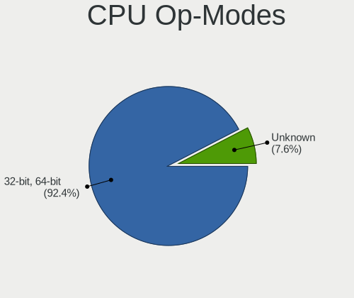

| Op mode        | Desktops | Percent |
|----------------|----------|---------|
| 32-bit, 64-bit | 305      | 92.42%  |
| Unknown        | 25       | 7.58%   |

CPU Microcode
-------------

Microcode number

| Number  | Desktops | Percent |
|---------|----------|---------|
| Unknown | 312      | 94.83%  |
| 0x506e3 | 4        | 1.22%   |
| 0x906e9 | 3        | 0.91%   |
| 0x306c3 | 3        | 0.91%   |
| 0x30678 | 3        | 0.91%   |
| 0x906ea | 2        | 0.61%   |
| 0x406c4 | 1        | 0.3%    |
| 0x206a7 | 1        | 0.3%    |

CPU Microarch
-------------

Microarchitecture

| Name          | Desktops | Percent |
|---------------|----------|---------|
| KabyLake      | 56       | 17.13%  |
| Haswell       | 53       | 16.21%  |
| IvyBridge     | 32       | 9.79%   |
| Zen 2         | 31       | 9.48%   |
| Unknown       | 24       | 7.34%   |
| SandyBridge   | 23       | 7.03%   |
| Zen+          | 19       | 5.81%   |
| Skylake       | 19       | 5.81%   |
| CometLake     | 16       | 4.89%   |
| Silvermont    | 12       | 3.67%   |
| Piledriver    | 12       | 3.67%   |
| Zen 3         | 11       | 3.36%   |
| Zen           | 8        | 2.45%   |
| Westmere      | 2        | 0.61%   |
| Goldmont plus | 2        | 0.61%   |
| Broadwell     | 2        | 0.61%   |
| Steamroller   | 1        | 0.31%   |
| Jaguar        | 1        | 0.31%   |
| Goldmont      | 1        | 0.31%   |
| Excavator     | 1        | 0.31%   |
| Bulldozer     | 1        | 0.31%   |

Graphics
--------

GPU Vendor
----------

Vendors of graphics cards

| Vendor | Desktops | Percent |
|--------|----------|---------|
| Nvidia | 158      | 43.89%  |
| Intel  | 117      | 32.5%   |
| AMD    | 85       | 23.61%  |

GPU Model
---------

Graphics card models

| Model                                                                                    | Desktops | Percent |
|------------------------------------------------------------------------------------------|----------|---------|
| Intel Xeon E3-1200 v3/4th Gen Core Processor Integrated Graphics Controller              | 20       | 5.46%   |
| AMD Ellesmere [Radeon RX 470/480/570/570X/580/580X/590]                                  | 18       | 4.92%   |
| Nvidia GP108 [GeForce GT 1030]                                                           | 11       | 3.01%   |
| Intel Xeon E3-1200 v2/3rd Gen Core processor Graphics Controller                         | 11       | 3.01%   |
| Intel CoffeeLake-S GT2 [UHD Graphics 630]                                                | 11       | 3.01%   |
| Nvidia GP106 [GeForce GTX 1060 6GB]                                                      | 10       | 2.73%   |
| Intel 2nd Generation Core Processor Family Integrated Graphics Controller                | 10       | 2.73%   |
| Nvidia GP104 [GeForce GTX 1070]                                                          | 9        | 2.46%   |
| Intel HD Graphics 630                                                                    | 9        | 2.46%   |
| AMD Navi 10 [Radeon RX 5600 OEM/5600 XT / 5700/5700 XT]                                  | 8        | 2.19%   |
| Nvidia GP106 [GeForce GTX 1060 3GB]                                                      | 7        | 1.91%   |
| Intel HD Graphics 530                                                                    | 7        | 1.91%   |
| Intel Atom Processor Z36xxx/Z37xxx Series Graphics & Display                             | 7        | 1.91%   |
| Intel AlderLake-S GT1                                                                    | 7        | 1.91%   |
| Nvidia GP107 [GeForce GTX 1050 Ti]                                                       | 6        | 1.64%   |
| Nvidia GP104 [GeForce GTX 1080]                                                          | 6        | 1.64%   |
| Nvidia GP104 [GeForce GTX 1070 Ti]                                                       | 6        | 1.64%   |
| Intel 4th Generation Core Processor Family Integrated Graphics Controller                | 6        | 1.64%   |
| Nvidia GM107 [GeForce GTX 750 Ti]                                                        | 5        | 1.37%   |
| Nvidia GK208B [GeForce GT 710]                                                           | 5        | 1.37%   |
| Intel CometLake-S GT2 [UHD Graphics 630]                                                 | 5        | 1.37%   |
| Intel Atom/Celeron/Pentium Processor x5-E8000/J3xxx/N3xxx Integrated Graphics Controller | 5        | 1.37%   |
| Nvidia TU106 [GeForce RTX 2070]                                                          | 4        | 1.09%   |
| Nvidia GP107 [GeForce GTX 1050]                                                          | 4        | 1.09%   |
| Nvidia GM204 [GeForce GTX 970]                                                           | 4        | 1.09%   |
| Nvidia GM107 [GeForce GTX 750]                                                           | 4        | 1.09%   |
| Intel IvyBridge GT2 [HD Graphics 4000]                                                   | 4        | 1.09%   |
| AMD Picasso/Raven 2 [Radeon Vega Series / Radeon Vega Mobile Series]                     | 4        | 1.09%   |
| AMD Lexa PRO [Radeon 540/540X/550/550X / RX 540X/550/550X]                               | 4        | 1.09%   |
| AMD Cezanne [Radeon Vega Series / Radeon Vega Mobile Series]                             | 4        | 1.09%   |
| Nvidia TU116 [GeForce GTX 1660 Ti]                                                       | 3        | 0.82%   |
| Nvidia GP102 [GeForce GTX 1080 Ti]                                                       | 3        | 0.82%   |
| Nvidia GA106 [GeForce RTX 3060 Lite Hash Rate]                                           | 3        | 0.82%   |
| Intel RocketLake-S GT1 [UHD Graphics 750]                                                | 3        | 0.82%   |
| AMD Navi 21 [Radeon RX 6800/6800 XT / 6900 XT]                                           | 3        | 0.82%   |
| AMD Caicos [Radeon HD 6450/7450/8450 / R5 230 OEM]                                       | 3        | 0.82%   |
| AMD Baffin [Radeon RX 460/560D / Pro 450/455/460/555/555X/560/560X]                      | 3        | 0.82%   |
| Nvidia TU117 [GeForce GTX 1650]                                                          | 2        | 0.55%   |
| Nvidia TU116 [GeForce GTX 1650 SUPER]                                                    | 2        | 0.55%   |
| Nvidia TU106 [GeForce RTX 2060 SUPER]                                                    | 2        | 0.55%   |

GPU Combo
---------

Combinations of graphics cards

| Name                     | Desktops | Percent |
|--------------------------|----------|---------|
| 1 x Nvidia               | 145      | 43.67%  |
| 1 x Intel                | 91       | 27.41%  |
| 1 x AMD                  | 80       | 24.1%   |
| Intel + Nvidia           | 8        | 2.41%   |
| 2 x Nvidia               | 2        | 0.6%    |
| Intel + AMD              | 2        | 0.6%    |
| AMD + Nvidia             | 2        | 0.6%    |
| 2 x AMD + 1 x Nvidia     | 1        | 0.3%    |
| Intel + AMD + 1 x Nvidia | 1        | 0.3%    |

GPU Driver
----------

Free vs proprietary

| Driver      | Desktops | Percent |
|-------------|----------|---------|
| Free        | 304      | 92.4%   |
| Proprietary | 22       | 6.69%   |
| Unknown     | 3        | 0.91%   |

GPU Memory
----------

Total video memory

| Size in GB | Desktops | Percent |
|------------|----------|---------|
| Unknown    | 302      | 91.79%  |
| 7.01-8.0   | 7        | 2.13%   |
| 3.01-4.0   | 6        | 1.82%   |
| 1.01-2.0   | 6        | 1.82%   |
| 5.01-6.0   | 2        | 0.61%   |
| 16.01-24.0 | 2        | 0.61%   |
| 8.01-16.0  | 2        | 0.61%   |
| 0.51-1.0   | 2        | 0.61%   |

Monitor
-------

Monitor Vendor
--------------

Monitor vendors

| Vendor               | Desktops | Percent |
|----------------------|----------|---------|
| Samsung Electronics  | 77       | 21.1%   |
| Dell                 | 35       | 9.59%   |
| Goldstar             | 33       | 9.04%   |
| AOC                  | 24       | 6.58%   |
| Hewlett-Packard      | 23       | 6.3%    |
| BenQ                 | 21       | 5.75%   |
| Ancor Communications | 19       | 5.21%   |
| ViewSonic            | 16       | 4.38%   |
| Acer                 | 16       | 4.38%   |
| Philips              | 11       | 3.01%   |
| ASUSTek Computer     | 8        | 2.19%   |
| MSI                  | 7        | 1.92%   |
| Sony                 | 6        | 1.64%   |
| Hitachi              | 6        | 1.64%   |
| LG Electronics       | 4        | 1.1%    |
| Lenovo               | 4        | 1.1%    |
| Iiyama               | 4        | 1.1%    |
| Unknown              | 3        | 0.82%   |
| Toshiba              | 3        | 0.82%   |
| Sharp                | 3        | 0.82%   |
| Medion               | 3        | 0.82%   |
| Vizio                | 2        | 0.55%   |
| Unknown (XXX)        | 2        | 0.55%   |
| Sceptre Tech         | 2        | 0.55%   |
| RTK                  | 2        | 0.55%   |
| Medion Akoya         | 2        | 0.55%   |
| Insignia             | 2        | 0.55%   |
| Gigabyte Technology  | 2        | 0.55%   |
| Fujitsu Siemens      | 2        | 0.55%   |
| Arnos Instruments    | 2        | 0.55%   |
| Yuraku               | 1        | 0.27%   |
| Westinghouse         | 1        | 0.27%   |
| VIE                  | 1        | 0.27%   |
| Vestel Elektronik    | 1        | 0.27%   |
| STD                  | 1        | 0.27%   |
| Pixio                | 1        | 0.27%   |
| NEC Computers        | 1        | 0.27%   |
| MStar                | 1        | 0.27%   |
| MiTAC                | 1        | 0.27%   |
| HVR                  | 1        | 0.27%   |

Monitor Model
-------------

Monitor models

| Model                                                                 | Desktops | Percent |
|-----------------------------------------------------------------------|----------|---------|
| Goldstar IPS FULLHD GSM5AB8 1920x1080 480x270mm 21.7-inch             | 5        | 1.29%   |
| Samsung Electronics C24F390 SAM0D2C 1920x1080 521x293mm 23.5-inch     | 4        | 1.03%   |
| MSI Optix MAG27CQ MSI1462 2560x1440 597x336mm 27.0-inch               | 4        | 1.03%   |
| Hitachi HISENSE HEC0030 3840x2160 1872x1053mm 84.6-inch               | 4        | 1.03%   |
| Samsung Electronics C27F390 SAM0D32 1920x1080 600x340mm 27.2-inch     | 3        | 0.78%   |
| Goldstar Ultra HD GSM5B08 3840x2160 600x340mm 27.2-inch               | 3        | 0.78%   |
| ViewSonic LCD Monitor VA2212 Series                                   | 2        | 0.52%   |
| Unknown (XXX) Beyond TV XXX2851 3840x2160 1210x680mm 54.6-inch        | 2        | 0.52%   |
| Toshiba TV TSB0108 1920x540                                           | 2        | 0.52%   |
| Samsung Electronics U28E510 SAM0D64 3840x2160 608x345mm 27.5-inch     | 2        | 0.52%   |
| Samsung Electronics U28E510 SAM0D63 3840x2160 610x350mm 27.7-inch     | 2        | 0.52%   |
| Samsung Electronics S24D391 SAM0B87 1920x1080 521x293mm 23.5-inch     | 2        | 0.52%   |
| Samsung Electronics LCD Monitor SAM0F13 3840x2160 950x540mm 43.0-inch | 2        | 0.52%   |
| Samsung Electronics C49RG9x SAM0F9C 3840x1080 1193x336mm 48.8-inch    | 2        | 0.52%   |
| Medion Akoya MD20491 MEC5201 1920x1080 521x293mm 23.5-inch            | 2        | 0.52%   |
| Hitachi W240D DVI HIT7D03 1920x1200 520x320mm 24.0-inch               | 2        | 0.52%   |
| Goldstar ULTRAWIDE GSM76F9 2560x1080 531x298mm 24.0-inch              | 2        | 0.52%   |
| Goldstar ULTRAWIDE GSM59F2 2560x1080 798x334mm 34.1-inch              | 2        | 0.52%   |
| Goldstar ULTRAWIDE GSM59F1 2560x1080 677x290mm 29.0-inch              | 2        | 0.52%   |
| Goldstar Ultra HD GSM5B09 3840x2160 600x340mm 27.2-inch               | 2        | 0.52%   |
| Dell P2414H DELA09A 1920x1080 527x297mm 23.8-inch                     | 2        | 0.52%   |
| AOC AG352QG2 AOC3520 2560x1080 820x346mm 35.0-inch                    | 2        | 0.52%   |
| AOC 2276WM AOC2276 1920x1080 477x268mm 21.5-inch                      | 2        | 0.52%   |
| AOC 2260WG5 AOC2260 1920x1080 477x268mm 21.5-inch                     | 2        | 0.52%   |
| Ancor Communications VX238 ACI23C1 1920x1080 510x290mm 23.1-inch      | 2        | 0.52%   |
| Ancor Communications ASUS VS228 ACI22FD 1920x1080 476x268mm 21.5-inch | 2        | 0.52%   |
| Acer GN246HL ACR02F9 1920x1080 531x299mm 24.0-inch                    | 2        | 0.52%   |
| Yuraku MA2221 FAC2221 1920x1080 477x268mm 21.5-inch                   | 1        | 0.26%   |
| Westinghouse WD40FX1170 WET3553 1920x1080 708x398mm 32.0-inch         | 1        | 0.26%   |
| Vizio LCD Monitor VIZ0026 1360x768 580x320mm 26.1-inch                | 1        | 0.26%   |
| Vizio D32x-D1 VIZ1005 1920x1080 698x392mm 31.5-inch                   | 1        | 0.26%   |
| ViewSonic VX3276-QHD VSCE635 2560x1440 698x393mm 31.5-inch            | 1        | 0.26%   |
| ViewSonic VX2718-2KPC VSCB73A 2560x1440 598x336mm 27.0-inch           | 1        | 0.26%   |
| ViewSonic VX2450 SERIES VSCE226 1920x1080 525x297mm 23.7-inch         | 1        | 0.26%   |
| ViewSonic VX2363 Series VSC6B2F 1920x1080 509x286mm 23.0-inch         | 1        | 0.26%   |
| ViewSonic VX2257 VSCB731 1920x1080 477x268mm 21.5-inch                | 1        | 0.26%   |
| ViewSonic VX2239 SERIES VSC5225 1920x1080 480x270mm 21.7-inch         | 1        | 0.26%   |
| ViewSonic VX2039 Series VSCB531 1440x900 419x262mm 19.5-inch          | 1        | 0.26%   |
| ViewSonic VX2035wm VSCAF1E 1680x1050 433x271mm 20.1-inch              | 1        | 0.26%   |
| ViewSonic VP2650wb VSCEB20 1920x1200 550x344mm 25.5-inch              | 1        | 0.26%   |

Monitor Resolution
------------------

Monitor screen resolution

| Resolution         | Desktops | Percent |
|--------------------|----------|---------|
| 1920x1080 (FHD)    | 173      | 48.32%  |
| 3840x2160 (4K)     | 46       | 12.85%  |
| 2560x1440 (QHD)    | 28       | 7.82%   |
| 1280x1024 (SXGA)   | 16       | 4.47%   |
| 1680x1050 (WSXGA+) | 15       | 4.19%   |
| 3440x1440          | 13       | 3.63%   |
| 2560x1080          | 11       | 3.07%   |
| 1920x1200 (WUXGA)  | 11       | 3.07%   |
| 1440x900 (WXGA+)   | 8        | 2.23%   |
| 1366x768 (WXGA)    | 6        | 1.68%   |
| 1360x768           | 5        | 1.4%    |
| Unknown            | 5        | 1.4%    |
| 1600x900 (HD+)     | 4        | 1.12%   |
| 1920x540           | 3        | 0.84%   |
| 5760x2160          | 2        | 0.56%   |
| 3840x1080          | 2        | 0.56%   |
| 1024x768 (XGA)     | 2        | 0.56%   |
| 4480x1440          | 1        | 0.28%   |
| 3840x1600          | 1        | 0.28%   |
| 3600x1080          | 1        | 0.28%   |
| 3360x1050          | 1        | 0.28%   |
| 2160x1200          | 1        | 0.28%   |
| 2048x1152          | 1        | 0.28%   |
| 1600x1200          | 1        | 0.28%   |
| 1280x720 (HD)      | 1        | 0.28%   |

Monitor Diagonal
----------------

Diagonal size in inches

| Inches  | Desktops | Percent |
|---------|----------|---------|
| 27      | 65       | 17.76%  |
| 24      | 58       | 15.85%  |
| 23      | 41       | 11.2%   |
| 21      | 36       | 9.84%   |
| Unknown | 21       | 5.74%   |
| 34      | 17       | 4.64%   |
| 19      | 15       | 4.1%    |
| 84      | 12       | 3.28%   |
| 22      | 12       | 3.28%   |
| 20      | 11       | 3.01%   |
| 17      | 9        | 2.46%   |
| 31      | 8        | 2.19%   |
| 18      | 7        | 1.91%   |
| 40      | 6        | 1.64%   |
| 72      | 5        | 1.37%   |
| 54      | 5        | 1.37%   |
| 25      | 5        | 1.37%   |
| 48      | 4        | 1.09%   |
| 35      | 4        | 1.09%   |
| 32      | 4        | 1.09%   |
| 37      | 3        | 0.82%   |
| 26      | 3        | 0.82%   |
| 55      | 2        | 0.55%   |
| 52      | 2        | 0.55%   |
| 29      | 2        | 0.55%   |
| 15      | 2        | 0.55%   |
| 65      | 1        | 0.27%   |
| 57      | 1        | 0.27%   |
| 43      | 1        | 0.27%   |
| 42      | 1        | 0.27%   |
| 36      | 1        | 0.27%   |
| 33      | 1        | 0.27%   |
| 28      | 1        | 0.27%   |

Monitor Width
-------------

Physical width

| Width in mm | Desktops | Percent |
|-------------|----------|---------|
| 501-600     | 147      | 41.76%  |
| 401-500     | 70       | 19.89%  |
| 701-800     | 24       | 6.82%   |
| 601-700     | 24       | 6.82%   |
| Unknown     | 21       | 5.97%   |
| 1501-2000   | 17       | 4.83%   |
| 1001-1500   | 14       | 3.98%   |
| 801-900     | 13       | 3.69%   |
| 351-400     | 10       | 2.84%   |
| 301-350     | 10       | 2.84%   |
| 901-1000    | 2        | 0.57%   |

Aspect Ratio
------------

Proportional relationship between the width and the height

| Ratio   | Desktops | Percent |
|---------|----------|---------|
| 16/9    | 234      | 68.62%  |
| 16/10   | 38       | 11.14%  |
| 21/9    | 24       | 7.04%   |
| 5/4     | 17       | 4.99%   |
| Unknown | 16       | 4.69%   |
| 4/3     | 5        | 1.47%   |
| 32/9    | 3        | 0.88%   |
| 3/2     | 1        | 0.29%   |
| 1.96    | 1        | 0.29%   |
| 1.00    | 1        | 0.29%   |
| 0.56    | 1        | 0.29%   |

Monitor Area
------------

Area in inch

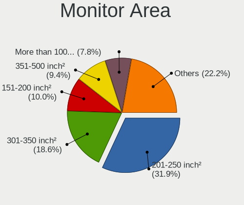

| Area in inch | Desktops | Percent |
|----------------|----------|---------|
| 201-250        | 115      | 31.94%  |
| 301-350        | 67       | 18.61%  |
| 151-200        | 36       | 10%     |
| 351-500        | 34       | 9.44%   |
| More than 1000 | 28       | 7.78%   |
| 251-300        | 27       | 7.5%    |
| Unknown        | 21       | 5.83%   |
| 501-1000       | 16       | 4.44%   |
| 141-150        | 14       | 3.89%   |
| 101-110        | 2        | 0.56%   |

Pixel Density
-------------

Pixels per inch

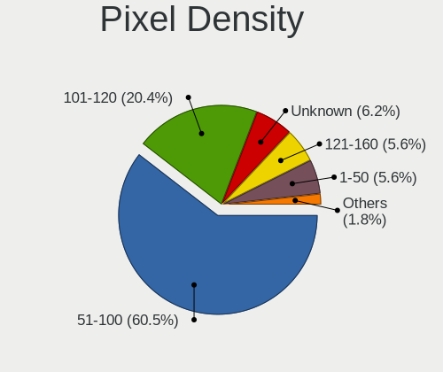

| Density | Desktops | Percent |
|---------|----------|---------|
| 51-100  | 205      | 60.47%  |
| 101-120 | 69       | 20.35%  |
| Unknown | 21       | 6.19%   |
| 1-50    | 19       | 5.6%    |
| 121-160 | 19       | 5.6%    |
| 161-240 | 6        | 1.77%   |

Multiple Monitors
-----------------

Total monitors connected

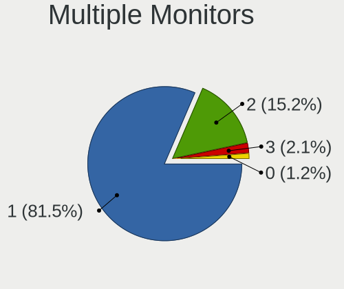

| Total | Desktops | Percent |
|-------|----------|---------|
| 1     | 268      | 81.46%  |
| 2     | 50       | 15.2%   |
| 3     | 7        | 2.13%   |
| 0     | 4        | 1.22%   |

Network
-------

Net Controller Vendor
---------------------

Controller vendors

| Vendor                          | Desktops | Percent |
|---------------------------------|----------|---------|
| Realtek Semiconductor           | 179      | 39.43%  |
| Intel                           | 173      | 38.11%  |
| Qualcomm Atheros                | 34       | 7.49%   |
| Aquantia                        | 10       | 2.2%    |
| Ralink Technology               | 8        | 1.76%   |
| Broadcom                        | 7        | 1.54%   |
| TP-Link                         | 5        | 1.1%    |
| Samsung Electronics             | 4        | 0.88%   |
| Microsoft                       | 4        | 0.88%   |
| MediaTek                        | 4        | 0.88%   |
| Ralink                          | 3        | 0.66%   |
| Qualcomm Atheros Communications | 3        | 0.66%   |
| Broadcom Limited                | 3        | 0.66%   |
| Microchip Technology            | 2        | 0.44%   |
| HMD Global                      | 2        | 0.44%   |
| D-Link                          | 2        | 0.44%   |
| ASUSTek Computer                | 2        | 0.44%   |
| Xiaomi                          | 1        | 0.22%   |
| Nordic Semiconductor ASA        | 1        | 0.22%   |
| Micro Star International        | 1        | 0.22%   |
| Leaflabs                        | 1        | 0.22%   |
| DisplayLink                     | 1        | 0.22%   |
| Digital Equipment               | 1        | 0.22%   |
| D-Link System                   | 1        | 0.22%   |
| Apple                           | 1        | 0.22%   |
| Unknown                         | 1        | 0.22%   |

Net Controller Model
--------------------

Controller models

| Model                                                                          | Desktops | Percent |
|--------------------------------------------------------------------------------|----------|---------|
| Realtek RTL8111/8168/8211/8411 PCI Express Gigabit Ethernet Controller         | 146      | 26.94%  |
| Intel I211 Gigabit Network Connection                                          | 27       | 4.98%   |
| Intel Wi-Fi 6 AX200                                                            | 22       | 4.06%   |
| Intel Ethernet Connection (2) I219-V                                           | 22       | 4.06%   |
| Intel Ethernet Controller I225-V                                               | 19       | 3.51%   |
| Realtek RTL8125 2.5GbE Controller                                              | 18       | 3.32%   |
| Intel 82579LM Gigabit Network Connection (Lewisville)                          | 18       | 3.32%   |
| Intel Ethernet Connection I217-LM                                              | 16       | 2.95%   |
| Intel Ethernet Connection (7) I219-V                                           | 16       | 2.95%   |
| Aquantia AQtion AQC107 NBase-T/IEEE 802.3an Ethernet Controller [Atlantic 10G] | 10       | 1.85%   |
| Realtek RTL8821CE 802.11ac PCIe Wireless Network Adapter                       | 7        | 1.29%   |
| Intel Wi-Fi 6E(802.11ax) AX210/AX1675* 2x2 [Typhoon Peak]                      | 7        | 1.29%   |
| Intel Comet Lake PCH CNVi WiFi                                                 | 7        | 1.29%   |
| Intel Cannon Lake PCH CNVi WiFi                                                | 7        | 1.29%   |
| Intel 82579V Gigabit Network Connection                                        | 6        | 1.11%   |
| Qualcomm Atheros AR9485 Wireless Network Adapter                               | 5        | 0.92%   |
| Intel Ethernet Connection I217-V                                               | 5        | 0.92%   |
| Intel Centrino Wireless-N 2230                                                 | 5        | 0.92%   |
| Realtek RTL8188EUS 802.11n Wireless Network Adapter                            | 4        | 0.74%   |
| Qualcomm Atheros QCA9377 802.11ac Wireless Network Adapter                     | 4        | 0.74%   |
| Qualcomm Atheros Killer E220x Gigabit Ethernet Controller                      | 4        | 0.74%   |
| Qualcomm Atheros AR9287 Wireless Network Adapter (PCI-Express)                 | 4        | 0.74%   |
| Intel Wireless 8265 / 8275                                                     | 4        | 0.74%   |
| Intel Ethernet Connection (2) I218-V                                           | 4        | 0.74%   |
| Intel Dual Band Wireless-AC 3168NGW [Stone Peak]                               | 4        | 0.74%   |
| Intel Alder Lake-S PCH CNVi WiFi                                               | 4        | 0.74%   |
| Samsung Galaxy series, misc. (tethering mode)                                  | 3        | 0.55%   |
| Realtek RTL8153 Gigabit Ethernet Adapter                                       | 3        | 0.55%   |
| Ralink RT5370 Wireless Adapter                                                 | 3        | 0.55%   |
| Ralink MT7601U Wireless Adapter                                                | 3        | 0.55%   |
| Qualcomm Atheros Killer E2400 Gigabit Ethernet Controller                      | 3        | 0.55%   |
| Qualcomm Atheros AR9271 802.11n                                                | 3        | 0.55%   |
| Qualcomm Atheros AR8161 Gigabit Ethernet                                       | 3        | 0.55%   |
| Microsoft Xbox Wireless Adapter for Windows                                    | 3        | 0.55%   |
| Intel Wireless 7260                                                            | 3        | 0.55%   |
| Intel Wireless 3165                                                            | 3        | 0.55%   |
| Intel Wi-Fi 5(802.11ac) Wireless-AC 9x6x [Thunder Peak]                        | 3        | 0.55%   |
| Intel I210 Gigabit Network Connection                                          | 3        | 0.55%   |
| Intel Ethernet Connection (2) I219-LM                                          | 3        | 0.55%   |
| Intel Ethernet Connection (14) I219-V                                          | 3        | 0.55%   |

Wireless Vendor
---------------

Wireless vendors

| Vendor                          | Desktops | Percent |
|---------------------------------|----------|---------|
| Intel                           | 76       | 45.78%  |
| Realtek Semiconductor           | 29       | 17.47%  |
| Qualcomm Atheros                | 22       | 13.25%  |
| Ralink Technology               | 8        | 4.82%   |
| TP-Link                         | 5        | 3.01%   |
| Broadcom                        | 5        | 3.01%   |
| Microsoft                       | 4        | 2.41%   |
| Ralink                          | 3        | 1.81%   |
| Qualcomm Atheros Communications | 3        | 1.81%   |
| MediaTek                        | 3        | 1.81%   |
| D-Link                          | 2        | 1.2%    |
| Broadcom Limited                | 2        | 1.2%    |
| ASUSTek Computer                | 2        | 1.2%    |
| Micro Star International        | 1        | 0.6%    |
| D-Link System                   | 1        | 0.6%    |

Wireless Model
--------------

Wireless models

| Model                                                                                         | Desktops | Percent |
|-----------------------------------------------------------------------------------------------|----------|---------|
| Intel Wi-Fi 6 AX200                                                                           | 22       | 13.17%  |
| Realtek RTL8821CE 802.11ac PCIe Wireless Network Adapter                                      | 7        | 4.19%   |
| Intel Wi-Fi 6E(802.11ax) AX210/AX1675* 2x2 [Typhoon Peak]                                     | 7        | 4.19%   |
| Intel Comet Lake PCH CNVi WiFi                                                                | 7        | 4.19%   |
| Intel Cannon Lake PCH CNVi WiFi                                                               | 7        | 4.19%   |
| Qualcomm Atheros AR9485 Wireless Network Adapter                                              | 5        | 2.99%   |
| Intel Centrino Wireless-N 2230                                                                | 5        | 2.99%   |
| Realtek RTL8188EUS 802.11n Wireless Network Adapter                                           | 4        | 2.4%    |
| Qualcomm Atheros QCA9377 802.11ac Wireless Network Adapter                                    | 4        | 2.4%    |
| Qualcomm Atheros AR9287 Wireless Network Adapter (PCI-Express)                                | 4        | 2.4%    |
| Intel Wireless 8265 / 8275                                                                    | 4        | 2.4%    |
| Intel Dual Band Wireless-AC 3168NGW [Stone Peak]                                              | 4        | 2.4%    |
| Intel Alder Lake-S PCH CNVi WiFi                                                              | 4        | 2.4%    |
| Ralink RT5370 Wireless Adapter                                                                | 3        | 1.8%    |
| Ralink MT7601U Wireless Adapter                                                               | 3        | 1.8%    |
| Qualcomm Atheros AR9271 802.11n                                                               | 3        | 1.8%    |
| Microsoft Xbox Wireless Adapter for Windows                                                   | 3        | 1.8%    |
| Intel Wireless 7260                                                                           | 3        | 1.8%    |
| Intel Wireless 3165                                                                           | 3        | 1.8%    |
| Intel Wi-Fi 5(802.11ac) Wireless-AC 9x6x [Thunder Peak]                                       | 3        | 1.8%    |
| Broadcom BCM4360 802.11ac Dual Band Wireless Network Adapter                                  | 3        | 1.8%    |
| TP-Link TL-WN722N v2/v3 [Realtek RTL8188EUS]                                                  | 2        | 1.2%    |
| Realtek RTL88x2bu [AC1200 Techkey]                                                            | 2        | 1.2%    |
| Realtek RTL8192EE PCIe Wireless Network Adapter                                               | 2        | 1.2%    |
| Realtek RTL8188EE Wireless Network Adapter                                                    | 2        | 1.2%    |
| Realtek Realtek 8812AU/8821AU 802.11ac WLAN Adapter [USB Wireless Dual-Band Adapter 2.4/5Ghz] | 2        | 1.2%    |
| Realtek 802.11ac NIC                                                                          | 2        | 1.2%    |
| Qualcomm Atheros QCA6174 802.11ac Wireless Network Adapter                                    | 2        | 1.2%    |
| Qualcomm Atheros AR5212/5213/2414 Wireless Network Adapter                                    | 2        | 1.2%    |
| MediaTek MT7921K (RZ608) Wi-Fi 6E 80MHz                                                       | 2        | 1.2%    |
| Intel Raptor Lake-S PCH CNVi WiFi                                                             | 2        | 1.2%    |
| TP-Link TL-WN822N Version 4 RTL8192EU                                                         | 1        | 0.6%    |
| TP-Link Archer T3U [Realtek RTL8812BU]                                                        | 1        | 0.6%    |
| TP-Link 802.11ac NIC                                                                          | 1        | 0.6%    |
| Realtek RTL8812AU 802.11a/b/g/n/ac 2T2R DB WLAN Adapter                                       | 1        | 0.6%    |
| Realtek RTL8812AE 802.11ac PCIe Wireless Network Adapter                                      | 1        | 0.6%    |
| Realtek RTL8811AU 802.11a/b/g/n/ac WLAN Adapter                                               | 1        | 0.6%    |
| Realtek RTL8723BU 802.11b/g/n WLAN Adapter                                                    | 1        | 0.6%    |
| Realtek RTL8723BE PCIe Wireless Network Adapter                                               | 1        | 0.6%    |
| Realtek RTL8192EU 802.11b/g/n WLAN Adapter                                                    | 1        | 0.6%    |

Ethernet Vendor
---------------

Ethernet vendors

| Vendor                | Desktops | Percent |
|-----------------------|----------|---------|
| Realtek Semiconductor | 169      | 48.01%  |
| Intel                 | 148      | 42.05%  |
| Qualcomm Atheros      | 13       | 3.69%   |
| Aquantia              | 10       | 2.84%   |
| Samsung Electronics   | 3        | 0.85%   |
| HMD Global            | 2        | 0.57%   |
| Broadcom              | 2        | 0.57%   |
| Xiaomi                | 1        | 0.28%   |
| MediaTek              | 1        | 0.28%   |
| DisplayLink           | 1        | 0.28%   |
| Broadcom Limited      | 1        | 0.28%   |
| Apple                 | 1        | 0.28%   |

Ethernet Model
--------------

Ethernet models

| Model                                                                          | Desktops | Percent |
|--------------------------------------------------------------------------------|----------|---------|
| Realtek RTL8111/8168/8211/8411 PCI Express Gigabit Ethernet Controller         | 146      | 39.67%  |
| Intel I211 Gigabit Network Connection                                          | 27       | 7.34%   |
| Intel Ethernet Connection (2) I219-V                                           | 22       | 5.98%   |
| Intel Ethernet Controller I225-V                                               | 19       | 5.16%   |
| Realtek RTL8125 2.5GbE Controller                                              | 18       | 4.89%   |
| Intel 82579LM Gigabit Network Connection (Lewisville)                          | 18       | 4.89%   |
| Intel Ethernet Connection I217-LM                                              | 16       | 4.35%   |
| Intel Ethernet Connection (7) I219-V                                           | 16       | 4.35%   |
| Aquantia AQtion AQC107 NBase-T/IEEE 802.3an Ethernet Controller [Atlantic 10G] | 10       | 2.72%   |
| Intel 82579V Gigabit Network Connection                                        | 6        | 1.63%   |
| Intel Ethernet Connection I217-V                                               | 5        | 1.36%   |
| Qualcomm Atheros Killer E220x Gigabit Ethernet Controller                      | 4        | 1.09%   |
| Intel Ethernet Connection (2) I218-V                                           | 4        | 1.09%   |
| Samsung Galaxy series, misc. (tethering mode)                                  | 3        | 0.82%   |
| Realtek RTL8153 Gigabit Ethernet Adapter                                       | 3        | 0.82%   |
| Qualcomm Atheros Killer E2400 Gigabit Ethernet Controller                      | 3        | 0.82%   |
| Qualcomm Atheros AR8161 Gigabit Ethernet                                       | 3        | 0.82%   |
| Intel I210 Gigabit Network Connection                                          | 3        | 0.82%   |
| Intel Ethernet Connection (2) I219-LM                                          | 3        | 0.82%   |
| Intel Ethernet Connection (14) I219-V                                          | 3        | 0.82%   |
| Intel 82574L Gigabit Network Connection                                        | 3        | 0.82%   |
| Realtek RTL810xE PCI Express Fast Ethernet controller                          | 2        | 0.54%   |
| Qualcomm Atheros AR8151 v2.0 Gigabit Ethernet                                  | 2        | 0.54%   |
| Intel Ethernet Controller I226-V                                               | 2        | 0.54%   |
| Intel Ethernet Connection (2) I218-LM                                          | 2        | 0.54%   |
| Intel Ethernet Connection (17) I219-V                                          | 2        | 0.54%   |
| Intel 82571EB/82571GB Gigabit Ethernet Controller D0/D1 (copper applications)  | 2        | 0.54%   |
| HMD Global Nokia6.2                                                            | 2        | 0.54%   |
| Xiaomi Mi/Redmi series (RNDIS)                                                 | 1        | 0.27%   |
| Realtek RTL8152 Fast Ethernet Adapter                                          | 1        | 0.27%   |
| Qualcomm Atheros Killer E2500 Gigabit Ethernet Controller                      | 1        | 0.27%   |
| MediaTek Infinix SMART 5                                                       | 1        | 0.27%   |
| Intel Ethernet Controller X710 for 10GbE SFP+                                  | 1        | 0.27%   |
| Intel Ethernet Controller I226-LM                                              | 1        | 0.27%   |
| Intel Ethernet Controller I225-LM                                              | 1        | 0.27%   |
| Intel Ethernet Connection (12) I219-V                                          | 1        | 0.27%   |
| Intel Ethernet Connection (11) I219-V                                          | 1        | 0.27%   |
| Intel Ethernet Connection (10) I219-V                                          | 1        | 0.27%   |
| Intel 82583V Gigabit Network Connection                                        | 1        | 0.27%   |
| Intel 82576 Gigabit Network Connection                                         | 1        | 0.27%   |

Net Controller Kind
-------------------

Ethernet, WiFi or modem

| Kind     | Desktops | Percent |
|----------|----------|---------|
| Ethernet | 325      | 66.74%  |
| WiFi     | 155      | 31.83%  |
| Modem    | 6        | 1.23%   |
| Unknown  | 1        | 0.21%   |

Used Controller
---------------

Currently used network controller

| Kind     | Desktops | Percent |
|----------|----------|---------|
| Ethernet | 258      | 76.79%  |
| WiFi     | 78       | 23.21%  |

NICs
----

Total network controllers on board

| Total | Desktops | Percent |
|-------|----------|---------|
| 1     | 188      | 57.32%  |
| 2     | 110      | 33.54%  |
| 3     | 24       | 7.32%   |
| 5     | 3        | 0.91%   |
| 4     | 2        | 0.61%   |
| 0     | 1        | 0.3%    |

IPv6
----

IPv6 vs IPv4

| Used | Desktops | Percent |
|------|----------|---------|
| No   | 273      | 83.23%  |
| Yes  | 55       | 16.77%  |

Bluetooth
---------

Bluetooth Vendor
----------------

Controller vendors

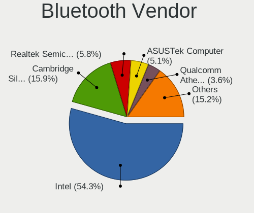

| Vendor                          | Desktops | Percent |
|---------------------------------|----------|---------|
| Intel                           | 75       | 54.35%  |
| Cambridge Silicon Radio         | 22       | 15.94%  |
| Realtek Semiconductor           | 8        | 5.8%    |
| ASUSTek Computer                | 7        | 5.07%   |
| Qualcomm Atheros Communications | 5        | 3.62%   |
| Broadcom                        | 5        | 3.62%   |
| MediaTek                        | 3        | 2.17%   |
| IMC Networks                    | 3        | 2.17%   |
| TP-Link                         | 2        | 1.45%   |
| HTC (High Tech Computer)        | 2        | 1.45%   |
| Micro Star International        | 1        | 0.72%   |
| Lite-On Technology              | 1        | 0.72%   |
| Edimax Technology               | 1        | 0.72%   |
| Creative Technology             | 1        | 0.72%   |
| Belkin Components               | 1        | 0.72%   |
| Apple                           | 1        | 0.72%   |

Bluetooth Model
---------------

Controller models

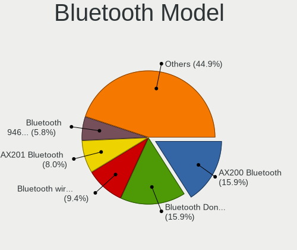

| Model                                                                | Desktops | Percent |
|----------------------------------------------------------------------|----------|---------|
| Intel AX200 Bluetooth                                                | 22       | 15.94%  |
| Cambridge Silicon Radio Bluetooth Dongle (HCI mode)                  | 22       | 15.94%  |
| Intel Bluetooth wireless interface                                   | 13       | 9.42%   |
| Intel AX201 Bluetooth                                                | 11       | 7.97%   |
| Intel Bluetooth 9460/9560 Jefferson Peak (JfP)                       | 8        | 5.8%    |
| Realtek  Bluetooth 4.2 Adapter                                       | 7        | 5.07%   |
| Intel AX210 Bluetooth                                                | 6        | 4.35%   |
| Intel Centrino Bluetooth Wireless Transceiver                        | 5        | 3.62%   |
| Intel Wireless-AC 3168 Bluetooth                                     | 4        | 2.9%    |
| MediaTek Wireless_Device                                             | 3        | 2.17%   |
| Intel Wireless-AC 9260 Bluetooth Adapter                             | 3        | 2.17%   |
| Intel AX211 Bluetooth                                                | 3        | 2.17%   |
| Broadcom BCM20702A0 Bluetooth 4.0                                    | 3        | 2.17%   |
| TP-Link TP-Link Bluetooth USB Adapter                                | 2        | 1.45%   |
| Qualcomm Atheros  Bluetooth Device                                   | 2        | 1.45%   |
| IMC Networks Bluetooth Device                                        | 2        | 1.45%   |
| HTC (High Tech Computer) Vive Hub Bluetooth 4.1 (Broadcom BCM920703) | 2        | 1.45%   |
| ASUS Qualcomm Bluetooth 4.1                                          | 2        | 1.45%   |
| ASUS Broadcom BCM20702A0 Bluetooth                                   | 2        | 1.45%   |
| Realtek Bluetooth Radio                                              | 1        | 0.72%   |
| Qualcomm Atheros Bluetooth USB Host Controller                       | 1        | 0.72%   |
| Qualcomm Atheros Bluetooth (AR3011)                                  | 1        | 0.72%   |
| Qualcomm Atheros AR3011 Bluetooth                                    | 1        | 0.72%   |
| Micro Star International Bluetooth Device                            | 1        | 0.72%   |
| Lite-On Qualcomm Atheros QCA9377 Bluetooth                           | 1        | 0.72%   |
| IMC Networks Bluetooth Radio                                         | 1        | 0.72%   |
| Edimax Bluetooth Adapter                                             | 1        | 0.72%   |
| Creative Bluetooth Audio W2                                          | 1        | 0.72%   |
| Broadcom BCM43142 Bluetooth 4.0                                      | 1        | 0.72%   |
| Broadcom BCM2035 Bluetooth dongle                                    | 1        | 0.72%   |
| Belkin Components F8T012 Bluetooth Adapter                           | 1        | 0.72%   |
| ASUS Broadcom BCM20702 Single-Chip Bluetooth 4.0 + LE                | 1        | 0.72%   |
| ASUS Bluetooth Device                                                | 1        | 0.72%   |
| ASUS BCM20702A0                                                      | 1        | 0.72%   |
| Apple Bluetooth USB Host Controller                                  | 1        | 0.72%   |

Sound
-----

Sound Vendor
------------

Sound card vendors

| Vendor                               | Desktops | Percent |
|--------------------------------------|----------|---------|
| Intel                                | 232      | 39.26%  |
| Nvidia                               | 154      | 26.06%  |
| AMD                                  | 121      | 20.47%  |
| C-Media Electronics                  | 12       | 2.03%   |
| ASUSTek Computer                     | 9        | 1.52%   |
| Logitech                             | 7        | 1.18%   |
| Micro Star International             | 4        | 0.68%   |
| JMTek                                | 4        | 0.68%   |
| Creative Labs                        | 4        | 0.68%   |
| ASRock                               | 4        | 0.68%   |
| SteelSeries ApS                      | 3        | 0.51%   |
| KORG                                 | 3        | 0.51%   |
| Corsair                              | 3        | 0.51%   |
| Thesycon Systemsoftware & Consulting | 2        | 0.34%   |
| JBL                                  | 2        | 0.34%   |
| Creative Technology                  | 2        | 0.34%   |
| Blue Microphones                     | 2        | 0.34%   |
| Yamaha                               | 1        | 0.17%   |
| VIA Technologies                     | 1        | 0.17%   |
| Texas Instruments                    | 1        | 0.17%   |
| TEAC                                 | 1        | 0.17%   |
| Sony                                 | 1        | 0.17%   |
| Schiit Audio                         | 1        | 0.17%   |
| Samsung Electronics                  | 1        | 0.17%   |
| PreSonus Audio Electronics           | 1        | 0.17%   |
| Plantronics                          | 1        | 0.17%   |
| MAG Technology                       | 1        | 0.17%   |
| Kingston Technology                  | 1        | 0.17%   |
| Guillemot                            | 1        | 0.17%   |
| Giga-Byte Technology                 | 1        | 0.17%   |
| Generalplus Technology               | 1        | 0.17%   |
| Focusrite-Novation                   | 1        | 0.17%   |
| DSEA A/S                             | 1        | 0.17%   |
| Cooler Master                        | 1        | 0.17%   |
| Bose                                 | 1        | 0.17%   |
| BEHRINGER International              | 1        | 0.17%   |
| AudioQuest                           | 1        | 0.17%   |
| Audio-Technica                       | 1        | 0.17%   |
| Areson Technology                    | 1        | 0.17%   |
| AKAI Professional M.I.               | 1        | 0.17%   |

Sound Model
-----------

Sound card models

| Model                                                                      | Desktops | Percent |
|----------------------------------------------------------------------------|----------|---------|
| AMD Starship/Matisse HD Audio Controller                                   | 37       | 5.56%   |
| Intel 8 Series/C220 Series Chipset High Definition Audio Controller        | 36       | 5.41%   |
| Intel Xeon E3-1200 v3/4th Gen Core Processor HD Audio Controller           | 25       | 3.76%   |
| Intel 7 Series/C216 Chipset Family High Definition Audio Controller        | 25       | 3.76%   |
| Intel 100 Series/C230 Series Chipset Family HD Audio Controller            | 25       | 3.76%   |
| Intel 200 Series PCH HD Audio                                              | 24       | 3.61%   |
| Intel 6 Series/C200 Series Chipset Family High Definition Audio Controller | 22       | 3.31%   |
| Nvidia GP104 High Definition Audio Controller                              | 21       | 3.16%   |
| Intel Cannon Lake PCH cAVS                                                 | 21       | 3.16%   |
| AMD Family 17h (Models 00h-0fh) HD Audio Controller                        | 19       | 2.86%   |
| AMD Ellesmere HDMI Audio [Radeon RX 470/480 / 570/580/590]                 | 18       | 2.71%   |
| Nvidia GP106 High Definition Audio Controller                              | 17       | 2.56%   |
| Nvidia GP107GL High Definition Audio Controller                            | 13       | 1.95%   |
| AMD Family 17h/19h/1ah HD Audio Controller                                 | 13       | 1.95%   |
| Nvidia GP108 High Definition Audio Controller                              | 11       | 1.65%   |
| Intel Alder Lake-S HD Audio Controller                                     | 11       | 1.65%   |
| Nvidia TU106 High Definition Audio Controller                              | 10       | 1.5%    |
| Nvidia GM107 High Definition Audio Controller [GeForce 940MX]              | 10       | 1.5%    |
| Intel Comet Lake PCH cAVS                                                  | 9        | 1.35%   |
| Intel 9 Series Chipset Family HD Audio Controller                          | 9        | 1.35%   |
| AMD Baffin HDMI/DP Audio [Radeon RX 550 640SP / RX 560/560X]               | 9        | 1.35%   |
| Nvidia GK208 HDMI/DP Audio Controller                                      | 8        | 1.2%    |
| Intel C610/X99 series chipset HD Audio Controller                          | 8        | 1.2%    |
| AMD Navi 10 HDMI Audio                                                     | 8        | 1.2%    |
| Intel Tiger Lake-H HD Audio Controller                                     | 7        | 1.05%   |
| Intel C600/X79 series chipset High Definition Audio Controller             | 7        | 1.05%   |
| Intel Atom Processor Z36xxx/Z37xxx Series High Definition Audio Controller | 7        | 1.05%   |
| ASUSTek Computer USB Audio                                                 | 7        | 1.05%   |
| AMD SBx00 Azalia (Intel HDA)                                               | 7        | 1.05%   |
| AMD FCH Azalia Controller                                                  | 7        | 1.05%   |
| Nvidia TU116 High Definition Audio Controller                              | 6        | 0.9%    |
| Nvidia GK104 HDMI Audio Controller                                         | 6        | 0.9%    |
| Nvidia GA104 High Definition Audio Controller                              | 6        | 0.9%    |
| AMD Raven/Raven2/Fenghuang HDMI/DP Audio Controller                        | 6        | 0.9%    |
| Nvidia GM204 High Definition Audio Controller                              | 5        | 0.75%   |
| AMD Renoir Radeon High Definition Audio Controller                         | 5        | 0.75%   |
| AMD Oland/Hainan/Cape Verde/Pitcairn HDMI Audio [Radeon HD 7000 Series]    | 5        | 0.75%   |
| AMD Navi 21/23 HDMI/DP Audio Controller                                    | 5        | 0.75%   |
| Nvidia TU104 HD Audio Controller                                           | 4        | 0.6%    |
| Nvidia High Definition Audio Controller                                    | 4        | 0.6%    |

Memory
------

Memory Vendor
-------------

Memory module vendors

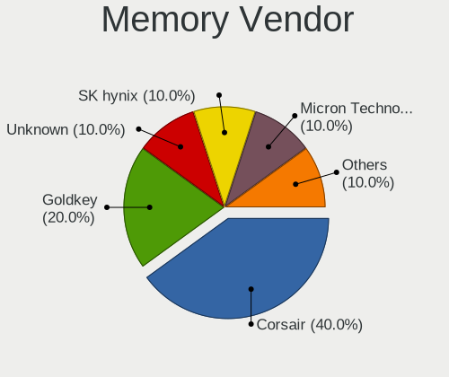

| Vendor            | Desktops | Percent |
|-------------------|----------|---------|
| Corsair           | 4        | 40%     |
| Goldkey           | 2        | 20%     |
| Unknown           | 1        | 10%     |
| SK hynix          | 1        | 10%     |
| Micron Technology | 1        | 10%     |
| Crucial           | 1        | 10%     |

Memory Model
------------

Memory module models

| Model                                                     | Desktops | Percent |
|-----------------------------------------------------------|----------|---------|
| Goldkey RAM GKH400SO51208-1333 4GB DIMM DDR3 1333MT/s     | 2        | 20%     |
| Unknown RAM CL17-17-17 D4-2400 16384MB DIMM DDR4 2400MT/s | 1        | 10%     |
| SK hynix RAM HMT351U6EFR8C-PB 4GB DIMM DDR3 1600MT/s      | 1        | 10%     |
| Micron RAM 8KTF51264AZ-1G6E1 4GB DIMM DDR3 1600MT/s       | 1        | 10%     |
| Crucial RAM CT51264BD160B.C16F 4GB DIMM DDR3 1600MT/s     | 1        | 10%     |
| Corsair RAM CMY32GX3M4A1600C9 8GB DIMM DDR3 1600MT/s      | 1        | 10%     |
| Corsair RAM CMK16GX4M2B3000C15 8GB DIMM DDR4 3600MT/s     | 1        | 10%     |
| Corsair RAM CMK16GX4M2A2400C16 8GB DIMM DDR4 2933MT/s     | 1        | 10%     |
| Corsair RAM CM4X16GC3000C15K4 16GB DIMM DDR4 3000MT/s     | 1        | 10%     |

Memory Kind
-----------

Memory module kinds

| Kind | Desktops | Percent |
|------|----------|---------|
| DDR3 | 5        | 55.56%  |
| DDR4 | 4        | 44.44%  |

Memory Form Factor
------------------

Physical design of the memory module

| Name | Desktops | Percent |
|------|----------|---------|
| DIMM | 9        | 100%    |

Memory Size
-----------

Memory module size

| Size  | Desktops | Percent |
|-------|----------|---------|
| 4096  | 4        | 44.44%  |
| 16384 | 3        | 33.33%  |
| 8192  | 2        | 22.22%  |

Memory Speed
------------

Memory module speed

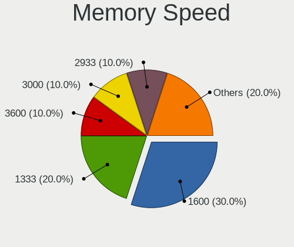

| Speed | Desktops | Percent |
|-------|----------|---------|
| 1600  | 3        | 30%     |
| 1333  | 2        | 20%     |
| 3600  | 1        | 10%     |
| 3000  | 1        | 10%     |
| 2933  | 1        | 10%     |
| 2800  | 1        | 10%     |
| 1800  | 1        | 10%     |

Printers & scanners
-------------------

Printer Vendor
--------------

Printer device vendors

| Vendor              | Desktops | Percent |
|---------------------|----------|---------|
| Hewlett-Packard     | 7        | 36.84%  |
| Canon               | 6        | 31.58%  |
| Samsung Electronics | 3        | 15.79%  |
| Seiko Epson         | 1        | 5.26%   |
| Ricoh               | 1        | 5.26%   |
| Dymo-CoStar         | 1        | 5.26%   |

Printer Model
-------------

Printer device models

| Model                                | Desktops | Percent |
|--------------------------------------|----------|---------|
| Canon PIXMA MG2500 Series            | 2        | 10.53%  |
| Seiko Epson L3150 Series             | 1        | 5.26%   |
| Samsung SCX-4216F Scanner            | 1        | 5.26%   |
| Samsung SCX-4200 series              | 1        | 5.26%   |
| Samsung ML-1640 Series Laser Printer | 1        | 5.26%   |
| Ricoh Printing Support               | 1        | 5.26%   |
| HP LaserJet 1200                     | 1        | 5.26%   |
| HP HP Laser 107w                     | 1        | 5.26%   |
| HP ENVY Pro 6400 series              | 1        | 5.26%   |
| HP ENVY 6000 series                  | 1        | 5.26%   |
| HP ENVY 4520 series                  | 1        | 5.26%   |
| HP Deskjet 3520 series               | 1        | 5.26%   |
| HP Deskjet 2540 series               | 1        | 5.26%   |
| Dymo-CoStar DYMO LabelWriter 4XL     | 1        | 5.26%   |
| Canon MF3010                         | 1        | 5.26%   |
| Canon LBP6000                        | 1        | 5.26%   |
| Canon iP2700 series                  | 1        | 5.26%   |
| Canon G3010 series                   | 1        | 5.26%   |

Scanner Vendor
--------------

Scanner device vendors

| Vendor          | Desktops | Percent |
|-----------------|----------|---------|
| Canon           | 2        | 66.67%  |
| Hewlett-Packard | 1        | 33.33%  |

Scanner Model
-------------

Scanner device models

| Model                              | Desktops | Percent |
|------------------------------------|----------|---------|
| HP ScanJet 6200c                   | 1        | 33.33%  |
| Canon CanoScan N670U/N676U/LiDE 20 | 1        | 33.33%  |
| Canon CanoScan 8800F               | 1        | 33.33%  |

Camera
------

Camera Vendor
-------------

Camera device vendors

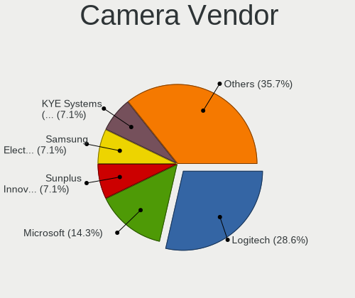

| Vendor                        | Desktops | Percent |
|-------------------------------|----------|---------|
| Logitech                      | 12       | 28.57%  |
| Microsoft                     | 6        | 14.29%  |
| Sunplus Innovation Technology | 3        | 7.14%   |
| Samsung Electronics           | 3        | 7.14%   |
| KYE Systems (Mouse Systems)   | 3        | 7.14%   |
| Realtek Semiconductor         | 2        | 4.76%   |
| Hewlett-Packard               | 2        | 4.76%   |
| Creative Technology           | 2        | 4.76%   |
| Apple                         | 2        | 4.76%   |
| Z-Star Microelectronics       | 1        | 2.38%   |
| Microdia                      | 1        | 2.38%   |
| FINGERS                       | 1        | 2.38%   |
| Cubeternet                    | 1        | 2.38%   |
| Arkmicro Technologies         | 1        | 2.38%   |
| ARC International             | 1        | 2.38%   |
| Anchor Chips                  | 1        | 2.38%   |

Camera Model
------------

Camera device models

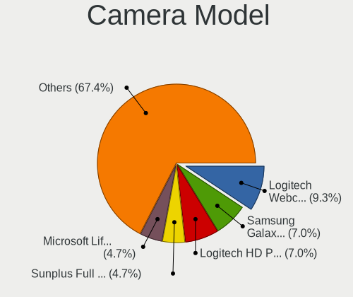

| Model                                      | Desktops | Percent |
|--------------------------------------------|----------|---------|
| Logitech Webcam C270                       | 4        | 9.3%    |
| Samsung Galaxy series, misc. (MTP mode)    | 3        | 6.98%   |
| Logitech HD Pro Webcam C920                | 3        | 6.98%   |
| Sunplus Full HD webcam                     | 2        | 4.65%   |
| Microsoft LifeCam HD-3000                  | 2        | 4.65%   |
| Apple iPhone 5/5C/5S/6/SE/7/8/X/XR         | 2        | 4.65%   |
| Z-Star Venus USB2.0 Camera                 | 1        | 2.33%   |
| Sunplus Sandberg USB Webcam Pro            | 1        | 2.33%   |
| Realtek NexiGo N660P FHD Webcam            | 1        | 2.33%   |
| Realtek FULL HD 1080P Webcam               | 1        | 2.33%   |
| Microsoft LifeCam VX-7000 (UVC-compliant)  | 1        | 2.33%   |
| Microsoft LifeCam VX-700                   | 1        | 2.33%   |
| Microsoft LifeCam Studio                   | 1        | 2.33%   |
| Microsoft LifeCam Cinema                   | 1        | 2.33%   |
| Microdia Sonix USB 2.0 Camera              | 1        | 2.33%   |
| Logitech QuickCam Zoom                     | 1        | 2.33%   |
| Logitech Logitech Webcam C925e             | 1        | 2.33%   |
| Logitech Logitech Webcam C160              | 1        | 2.33%   |
| Logitech C922 Pro Stream Webcam            | 1        | 2.33%   |
| Logitech BRIO 4K Stream Edition            | 1        | 2.33%   |
| KYE Systems (Mouse Systems) Genius Webcam  | 1        | 2.33%   |
| KYE Systems (Mouse Systems) eFace 2050AF   | 1        | 2.33%   |
| KYE Systems (Mouse Systems) eFace 2025     | 1        | 2.33%   |
| HP Webcam HD 4310                          | 1        | 2.33%   |
| HP HP Webcam HD 2300                       | 1        | 2.33%   |
| FINGERS 1080 Hi-Res Webcam                 | 1        | 2.33%   |
| Cubeternet USB2.0 Camera                   | 1        | 2.33%   |
| Creative Live! Cam Sync HD [VF0770]        | 1        | 2.33%   |
| Creative Live! Cam Chat HD [VF0700/VF0790] | 1        | 2.33%   |
| Arkmicro Webcam Carrefour                  | 1        | 2.33%   |
| ARC International Camera                   | 1        | 2.33%   |
| Apple iPod Touch 5.Gen [A1421]             | 1        | 2.33%   |
| Anchor Chips USB2.0 Camera                 | 1        | 2.33%   |

Security
--------

Fingerprint Vendor
------------------

Fingerprint sensor vendors

| Vendor    | Desktops | Percent |
|-----------|----------|---------|
| AuthenTec | 1        | 100%    |

Fingerprint Model
-----------------

Fingerprint sensor models

| Model                                | Desktops | Percent |
|--------------------------------------|----------|---------|
| AuthenTec AES2550 Fingerprint Sensor | 1        | 100%    |

Chipcard Vendor
---------------

Chipcard module vendors

| Vendor                | Desktops | Percent |
|-----------------------|----------|---------|
| Gemalto (was Gemplus) | 1        | 50%     |
| Advanced Card Systems | 1        | 50%     |

Chipcard Model
--------------

Chipcard module models

| Model                                             | Desktops | Percent |
|---------------------------------------------------|----------|---------|
| Gemalto (was Gemplus) GemPC Twin SmartCard Reader | 1        | 50%     |
| Advanced Card Systems ACR1281 1S Dual Reader      | 1        | 50%     |

Unsupported
-----------

Unsupported Devices
-------------------

Total unsupported devices on board

| Total | Desktops | Percent |
|-------|----------|---------|
| 0     | 262      | 77.98%  |
| 1     | 62       | 18.45%  |
| 2     | 12       | 3.57%   |

Unsupported Device Types
------------------------

Types of unsupported devices

| Type                     | Desktops | Percent |
|--------------------------|----------|---------|
| Net/wireless             | 23       | 26.44%  |
| Net/ethernet             | 11       | 12.64%  |
| Unassigned class         | 8        | 9.2%    |
| Sound                    | 8        | 9.2%    |
| Graphics card            | 8        | 9.2%    |
| Firewire controller      | 8        | 9.2%    |
| Storage/ide              | 7        | 8.05%   |
| Camera                   | 4        | 4.6%    |
| Network                  | 2        | 2.3%    |
| Multimedia controller    | 2        | 2.3%    |
| Communication controller | 2        | 2.3%    |
| Chipcard                 | 2        | 2.3%    |
| Fingerprint reader       | 1        | 1.15%   |
| Card reader              | 1        | 1.15%   |

