Clear Linux - Tested Hardware & Statistics (Desktops)
-----------------------------------------------------

A project to collect tested hardware configurations for Clear Linux.

Anyone can contribute to this report by the [hw-probe](https://github.com/linuxhw/hw-probe) tool:

    sudo -E hw-probe -all -upload

Please submit a probe of your configuration if it's not presented on the page or is rare.

Full-feature report is available here: https://linux-hardware.org/?view=trends

Contents
--------

* [ Test Cases ](#test-cases)

* [ System ](#system)
  - [ OS                       ](#os)
  - [ OS Family                ](#os-family)
  - [ Kernel                   ](#kernel)
  - [ Kernel Family            ](#kernel-family)
  - [ Kernel Major Ver.        ](#kernel-major-ver)
  - [ Arch                     ](#arch)
  - [ DE                       ](#de)
  - [ Display Server           ](#display-server)
  - [ Display Manager          ](#display-manager)
  - [ OS Lang                  ](#os-lang)
  - [ Boot Mode                ](#boot-mode)
  - [ Filesystem               ](#filesystem)
  - [ Part. scheme             ](#part-scheme)
  - [ Dual Boot with Linux/BSD ](#dual-boot-with-linuxbsd)
  - [ Dual Boot (Win)          ](#dual-boot-win)

* [ Board ](#board)
  - [ Vendor                   ](#vendor)
  - [ Model                    ](#model)
  - [ Model Family             ](#model-family)
  - [ MFG Year                 ](#mfg-year)
  - [ Form Factor              ](#form-factor)
  - [ Secure Boot              ](#secure-boot)
  - [ Coreboot                 ](#coreboot)
  - [ RAM Size                 ](#ram-size)
  - [ RAM Used                 ](#ram-used)
  - [ Total Drives             ](#total-drives)
  - [ Has CD-ROM               ](#has-cd-rom)
  - [ Has Ethernet             ](#has-ethernet)
  - [ Has WiFi                 ](#has-wifi)
  - [ Has Bluetooth            ](#has-bluetooth)

* [ Location ](#location)
  - [ Country                  ](#country)
  - [ City                     ](#city)

* [ Drives ](#drives)
  - [ Drive Vendor             ](#drive-vendor)
  - [ Drive Model              ](#drive-model)
  - [ HDD Vendor               ](#hdd-vendor)
  - [ SSD Vendor               ](#ssd-vendor)
  - [ Drive Kind               ](#drive-kind)
  - [ Drive Connector          ](#drive-connector)
  - [ Drive Size               ](#drive-size)
  - [ Space Total              ](#space-total)
  - [ Space Used               ](#space-used)
  - [ Malfunc. Drives          ](#malfunc-drives)
  - [ Malfunc. Drive Vendor    ](#malfunc-drive-vendor)
  - [ Malfunc. HDD Vendor      ](#malfunc-hdd-vendor)
  - [ Malfunc. Drive Kind      ](#malfunc-drive-kind)
  - [ Failed Drives            ](#failed-drives)
  - [ Failed Drive Vendor      ](#failed-drive-vendor)
  - [ Drive Status             ](#drive-status)

* [ Storage controller ](#storage-controller)
  - [ Storage Vendor           ](#storage-vendor)
  - [ Storage Model            ](#storage-model)
  - [ Storage Kind             ](#storage-kind)

* [ Processor ](#processor)
  - [ CPU Vendor               ](#cpu-vendor)
  - [ CPU Model                ](#cpu-model)
  - [ CPU Model Family         ](#cpu-model-family)
  - [ CPU Cores                ](#cpu-cores)
  - [ CPU Sockets              ](#cpu-sockets)
  - [ CPU Threads              ](#cpu-threads)
  - [ CPU Op-Modes             ](#cpu-op-modes)
  - [ CPU Microcode            ](#cpu-microcode)
  - [ CPU Microarch            ](#cpu-microarch)

* [ Graphics ](#graphics)
  - [ GPU Vendor               ](#gpu-vendor)
  - [ GPU Model                ](#gpu-model)
  - [ GPU Combo                ](#gpu-combo)
  - [ GPU Driver               ](#gpu-driver)
  - [ GPU Memory               ](#gpu-memory)

* [ Monitor ](#monitor)
  - [ Monitor Vendor           ](#monitor-vendor)
  - [ Monitor Model            ](#monitor-model)
  - [ Monitor Resolution       ](#monitor-resolution)
  - [ Monitor Diagonal         ](#monitor-diagonal)
  - [ Monitor Width            ](#monitor-width)
  - [ Aspect Ratio             ](#aspect-ratio)
  - [ Monitor Area             ](#monitor-area)
  - [ Pixel Density            ](#pixel-density)
  - [ Multiple Monitors        ](#multiple-monitors)

* [ Network ](#network)
  - [ Net Controller Vendor    ](#net-controller-vendor)
  - [ Net Controller Model     ](#net-controller-model)
  - [ Wireless Vendor          ](#wireless-vendor)
  - [ Wireless Model           ](#wireless-model)
  - [ Ethernet Vendor          ](#ethernet-vendor)
  - [ Ethernet Model           ](#ethernet-model)
  - [ Net Controller Kind      ](#net-controller-kind)
  - [ Used Controller          ](#used-controller)
  - [ NICs                     ](#nics)
  - [ IPv6                     ](#ipv6)

* [ Bluetooth ](#bluetooth)
  - [ Bluetooth Vendor         ](#bluetooth-vendor)
  - [ Bluetooth Model          ](#bluetooth-model)

* [ Sound ](#sound)
  - [ Sound Vendor             ](#sound-vendor)
  - [ Sound Model              ](#sound-model)

* [ Memory ](#memory)
  - [ Memory Vendor            ](#memory-vendor)
  - [ Memory Model             ](#memory-model)
  - [ Memory Kind              ](#memory-kind)
  - [ Memory Form Factor       ](#memory-form-factor)
  - [ Memory Size              ](#memory-size)
  - [ Memory Speed             ](#memory-speed)

* [ Printers & scanners ](#printers--scanners)
  - [ Printer Vendor           ](#printer-vendor)
  - [ Printer Model            ](#printer-model)
  - [ Scanner Vendor           ](#scanner-vendor)
  - [ Scanner Model            ](#scanner-model)

* [ Camera ](#camera)
  - [ Camera Vendor            ](#camera-vendor)
  - [ Camera Model             ](#camera-model)

* [ Security ](#security)
  - [ Fingerprint Vendor       ](#fingerprint-vendor)
  - [ Fingerprint Model        ](#fingerprint-model)
  - [ Chipcard Vendor          ](#chipcard-vendor)
  - [ Chipcard Model           ](#chipcard-model)

* [ Unsupported ](#unsupported)
  - [ Unsupported Devices      ](#unsupported-devices)
  - [ Unsupported Device Types ](#unsupported-device-types)

Test Cases
----------

Total: 361

| Vendor     | Model                       | Probe                                                      | Date         |
|------------|-----------------------------|------------------------------------------------------------|--------------|
| HP         | 843B                        | [9c9f43770f](https://linux-hardware.org/?probe=9c9f43770f) | Mar 30, 2022 |
| HP         | 843B                        | [84ae0f086f](https://linux-hardware.org/?probe=84ae0f086f) | Mar 30, 2022 |
| Intel      | DN2820FYB H24582-205        | [87a81b14f0](https://linux-hardware.org/?probe=87a81b14f0) | Mar 25, 2022 |
| MSI        | B560M PRO-VDH               | [b171a344f7](https://linux-hardware.org/?probe=b171a344f7) | Mar 20, 2022 |
| Gigabyte   | Z690 GAMING X DDR4          | [8b31578713](https://linux-hardware.org/?probe=8b31578713) | Mar 18, 2022 |
| ASUSTek    | PRIME H510M-K               | [8a97b4f2d3](https://linux-hardware.org/?probe=8a97b4f2d3) | Mar 09, 2022 |
| ASUSTek    | PRIME Z590M-PLUS            | [4980da013a](https://linux-hardware.org/?probe=4980da013a) | Feb 25, 2022 |
| ASUSTek    | ROG ZENITH II EXTREME AL... | [15efc7df1a](https://linux-hardware.org/?probe=15efc7df1a) | Feb 18, 2022 |
| ASUSTek    | H81M-CS                     | [28b9a2b500](https://linux-hardware.org/?probe=28b9a2b500) | Feb 14, 2022 |
| ASUSTek    | H81M-CS                     | [4f647b985e](https://linux-hardware.org/?probe=4f647b985e) | Feb 12, 2022 |
| Dell       | 0K240Y A04                  | [4342c15fb0](https://linux-hardware.org/?probe=4342c15fb0) | Feb 11, 2022 |
| Gigabyte   | H97-Gaming 3                | [b5ee6e292d](https://linux-hardware.org/?probe=b5ee6e292d) | Feb 10, 2022 |
| ECS        | BSWI-DA                     | [2b3dda83e5](https://linux-hardware.org/?probe=2b3dda83e5) | Feb 04, 2022 |
| HP         | 1495                        | [b5cb1ae686](https://linux-hardware.org/?probe=b5cb1ae686) | Feb 03, 2022 |
| ASUSTek    | A88XM-A                     | [a91c7ce0bd](https://linux-hardware.org/?probe=a91c7ce0bd) | Jan 26, 2022 |
| ASUSTek    | A88XM-A                     | [c6c0f18149](https://linux-hardware.org/?probe=c6c0f18149) | Jan 26, 2022 |
| MSI        | H81M-P33                    | [5906cdc7bb](https://linux-hardware.org/?probe=5906cdc7bb) | Jan 24, 2022 |
| Lenovo     | 3098 SDK0E50510 WIN         | [b6b0ace138](https://linux-hardware.org/?probe=b6b0ace138) | Jan 23, 2022 |
| HP         | 1495                        | [f391be3ce3](https://linux-hardware.org/?probe=f391be3ce3) | Jan 14, 2022 |
| ASUSTek    | A88X-PRO                    | [bd78c03781](https://linux-hardware.org/?probe=bd78c03781) | Jan 11, 2022 |
| Dell       | 0CRH6C A00                  | [e6e6da8cf0](https://linux-hardware.org/?probe=e6e6da8cf0) | Jan 07, 2022 |
| Gigabyte   | 990FXA-UD5 R5               | [e80c5b0522](https://linux-hardware.org/?probe=e80c5b0522) | Jan 01, 2022 |
| ASUSTek    | TUF GAMING X570-PRO         | [7f8ea5d071](https://linux-hardware.org/?probe=7f8ea5d071) | Dec 26, 2021 |
| HP         | 21D0                        | [50548c11b7](https://linux-hardware.org/?probe=50548c11b7) | Dec 04, 2021 |
| ASUSTek    | PRIME Z590-P                | [6490a6beba](https://linux-hardware.org/?probe=6490a6beba) | Nov 29, 2021 |
| ASUSTek    | ROG Maximus XIII HERO       | [36fa5a689f](https://linux-hardware.org/?probe=36fa5a689f) | Nov 28, 2021 |
| ASUSTek    | ROG Maximus Z690 HERO       | [f3e1cfcdab](https://linux-hardware.org/?probe=f3e1cfcdab) | Nov 26, 2021 |
| MSI        | MAG B550M MORTAR WIFI       | [2879c07a24](https://linux-hardware.org/?probe=2879c07a24) | Nov 23, 2021 |
| ASUSTek    | PRIME B360-PLUS             | [8c90375658](https://linux-hardware.org/?probe=8c90375658) | Nov 20, 2021 |
| ASUSTek    | PRIME B360-PLUS             | [a385b829b0](https://linux-hardware.org/?probe=a385b829b0) | Nov 20, 2021 |
| HP         | 339A                        | [a30141ff62](https://linux-hardware.org/?probe=a30141ff62) | Nov 14, 2021 |
| HP         | 339A                        | [46b4ce405b](https://linux-hardware.org/?probe=46b4ce405b) | Nov 13, 2021 |
| Dell       | 0CRH6C A00                  | [0741aa1566](https://linux-hardware.org/?probe=0741aa1566) | Nov 10, 2021 |
| MSI        | MPG X570 GAMING PRO CARB... | [640758abea](https://linux-hardware.org/?probe=640758abea) | Nov 09, 2021 |
| Pegatron   | SKLD4-P1                    | [c4b1d5c274](https://linux-hardware.org/?probe=c4b1d5c274) | Nov 01, 2021 |
| Pegatron   | SKLD4-P1                    | [715a0f960e](https://linux-hardware.org/?probe=715a0f960e) | Nov 01, 2021 |
| ASUSTek    | ROG STRIX Z390-H GAMING     | [1f0c766b1c](https://linux-hardware.org/?probe=1f0c766b1c) | Oct 27, 2021 |
| ASUSTek    | ROG STRIX Z390-H GAMING     | [51c82ff556](https://linux-hardware.org/?probe=51c82ff556) | Oct 24, 2021 |
| ASUSTek    | PRIME Z270-P                | [5b429fd560](https://linux-hardware.org/?probe=5b429fd560) | Oct 23, 2021 |
| Dell       | 0DF42J A00                  | [61ad2cb211](https://linux-hardware.org/?probe=61ad2cb211) | Oct 17, 2021 |
| Dell       | 0DF42J A00                  | [16a04162fc](https://linux-hardware.org/?probe=16a04162fc) | Oct 17, 2021 |
| ASUSTek    | PRIME Z590-P                | [36e45017ff](https://linux-hardware.org/?probe=36e45017ff) | Oct 14, 2021 |
| ASUSTek    | PRIME Z590-P                | [36d8e83f29](https://linux-hardware.org/?probe=36d8e83f29) | Oct 11, 2021 |
| Shuttle    | FH67H                       | [fcf20902e3](https://linux-hardware.org/?probe=fcf20902e3) | Oct 10, 2021 |
| Gigabyte   | H61M-DS2                    | [62bd532ea6](https://linux-hardware.org/?probe=62bd532ea6) | Oct 07, 2021 |
| ASUSTek    | M5A99X EVO R2.0             | [ee15b6dab0](https://linux-hardware.org/?probe=ee15b6dab0) | Oct 07, 2021 |
| ASRock     | H97 Anniversary             | [a73dde5e98](https://linux-hardware.org/?probe=a73dde5e98) | Oct 05, 2021 |
| Dell       | 0XR1GT A00                  | [39257b61d6](https://linux-hardware.org/?probe=39257b61d6) | Oct 05, 2021 |
| Dell       | 0XR1GT A00                  | [b9fef09cfa](https://linux-hardware.org/?probe=b9fef09cfa) | Oct 05, 2021 |
| ASRock     | Z590M-ITX/ax                | [90dbdbed7b](https://linux-hardware.org/?probe=90dbdbed7b) | Oct 04, 2021 |
| HP         | 843B                        | [66ea3388b1](https://linux-hardware.org/?probe=66ea3388b1) | Oct 01, 2021 |
| Gigabyte   | Z370 AORUS ULTRA GAMING-... | [2f27c4c6f0](https://linux-hardware.org/?probe=2f27c4c6f0) | Sep 29, 2021 |
| HP         | 843B                        | [3f53b96972](https://linux-hardware.org/?probe=3f53b96972) | Sep 28, 2021 |
| HP         | 843B                        | [8de340a761](https://linux-hardware.org/?probe=8de340a761) | Sep 28, 2021 |
| Hampoo     | Cherry Trail CR             | [a059116962](https://linux-hardware.org/?probe=a059116962) | Sep 18, 2021 |
| Gigabyte   | B450 AORUS PRO-CF           | [73d4452fc3](https://linux-hardware.org/?probe=73d4452fc3) | Sep 15, 2021 |
| MSI        | MAG B550M BAZOOKA           | [6ddab6806e](https://linux-hardware.org/?probe=6ddab6806e) | Sep 14, 2021 |
| MSI        | MAG B550M BAZOOKA           | [72352cd62b](https://linux-hardware.org/?probe=72352cd62b) | Sep 14, 2021 |
| Gigabyte   | X570 AORUS PRO WIFI         | [a48ec730b7](https://linux-hardware.org/?probe=a48ec730b7) | Sep 13, 2021 |
| ASRock     | B450 Gaming K4              | [356430d4ae](https://linux-hardware.org/?probe=356430d4ae) | Sep 11, 2021 |
| HP         | 1589                        | [0a77f3540b](https://linux-hardware.org/?probe=0a77f3540b) | Sep 08, 2021 |
| ASUSTek    | ROG STRIX X570-I GAMING     | [f8b30bd0cf](https://linux-hardware.org/?probe=f8b30bd0cf) | Sep 04, 2021 |
| ASUSTek    | ROG STRIX B550-F GAMING     | [596f8a121f](https://linux-hardware.org/?probe=596f8a121f) | Aug 27, 2021 |
| ASRock     | X300M-STX                   | [246709cb9b](https://linux-hardware.org/?probe=246709cb9b) | Aug 27, 2021 |
| ASUSTek    | ROG STRIX TRX40-E GAMING    | [afd5f8b9b1](https://linux-hardware.org/?probe=afd5f8b9b1) | Aug 27, 2021 |
| ASRock     | AB350 Gaming K4             | [f25ecb1f4d](https://linux-hardware.org/?probe=f25ecb1f4d) | Aug 25, 2021 |
| ASRock     | B550M Pro4                  | [6d4b2d1904](https://linux-hardware.org/?probe=6d4b2d1904) | Aug 19, 2021 |
| Unknown    | Intel X79                   | [1c9353265e](https://linux-hardware.org/?probe=1c9353265e) | Aug 17, 2021 |
| Gigabyte   | Z68MA-D2H-B3                | [bf398306f4](https://linux-hardware.org/?probe=bf398306f4) | Aug 12, 2021 |
| ASRock     | H470M-STX                   | [73dd46e48a](https://linux-hardware.org/?probe=73dd46e48a) | Aug 11, 2021 |
| HP         | 8767 A                      | [5944b600c5](https://linux-hardware.org/?probe=5944b600c5) | Aug 09, 2021 |
| HP         | 8767 A                      | [39a268c1b4](https://linux-hardware.org/?probe=39a268c1b4) | Aug 09, 2021 |
| Gigabyte   | B75M-D3H                    | [dbcb2750e9](https://linux-hardware.org/?probe=dbcb2750e9) | Aug 09, 2021 |
| Foxconn    | 2ABF                        | [605fe34818](https://linux-hardware.org/?probe=605fe34818) | Aug 06, 2021 |
| Foxconn    | 2ABF                        | [236eefa6a3](https://linux-hardware.org/?probe=236eefa6a3) | Aug 06, 2021 |
| HP         | 8767 A                      | [e3b0eb537d](https://linux-hardware.org/?probe=e3b0eb537d) | Aug 04, 2021 |
| HP         | 8767 A                      | [7b9311366d](https://linux-hardware.org/?probe=7b9311366d) | Aug 03, 2021 |
| ASUSTek    | ROG STRIX X570-F GAMING     | [1bcb4e3744](https://linux-hardware.org/?probe=1bcb4e3744) | Aug 03, 2021 |
| ASRock     | H470M-STX                   | [2b06fc5589](https://linux-hardware.org/?probe=2b06fc5589) | Jul 22, 2021 |
| Dell       | 0YXT71 A03                  | [9f6c5866ae](https://linux-hardware.org/?probe=9f6c5866ae) | Jul 20, 2021 |
| Dell       | 0YXT71 A03                  | [74f54d66b2](https://linux-hardware.org/?probe=74f54d66b2) | Jul 20, 2021 |
| MSI        | TRX40 PRO 10G               | [a06646b4da](https://linux-hardware.org/?probe=a06646b4da) | Jul 19, 2021 |
| Gigabyte   | H61M-DS2                    | [eda44f6d7c](https://linux-hardware.org/?probe=eda44f6d7c) | Jul 18, 2021 |
| ASRock     | H470M-STX                   | [929192be0f](https://linux-hardware.org/?probe=929192be0f) | Jul 14, 2021 |
| HP         | 1497                        | [12f471ea0d](https://linux-hardware.org/?probe=12f471ea0d) | Jul 12, 2021 |
| Dell       | 0YXT71 A03                  | [e6d4cd2e90](https://linux-hardware.org/?probe=e6d4cd2e90) | Jul 10, 2021 |
| Lenovo     | ThinkServer TS140           | [ce4504e2f0](https://linux-hardware.org/?probe=ce4504e2f0) | Jul 09, 2021 |
| Lenovo     | ThinkServer TS140           | [927c1f1b83](https://linux-hardware.org/?probe=927c1f1b83) | Jul 09, 2021 |
| Intel      | DQ77MK AAG39642-500         | [e185c99124](https://linux-hardware.org/?probe=e185c99124) | Jul 02, 2021 |
| ASUSTek    | H110M-A/M.2                 | [fd2d0c3aea](https://linux-hardware.org/?probe=fd2d0c3aea) | Jun 25, 2021 |
| ASRock     | Z68 Extreme4 Gen3           | [913c59fc58](https://linux-hardware.org/?probe=913c59fc58) | Jun 21, 2021 |
| ASRock     | Z68 Extreme4 Gen3           | [617842a492](https://linux-hardware.org/?probe=617842a492) | Jun 21, 2021 |
| Unknown    | Unknown                     | [489dc53e4d](https://linux-hardware.org/?probe=489dc53e4d) | Jun 20, 2021 |
| Unknown    | Unknown                     | [077a1849dd](https://linux-hardware.org/?probe=077a1849dd) | Jun 20, 2021 |
| ASUSTek    | ROG ZENITH II EXTREME AL... | [70c81260fe](https://linux-hardware.org/?probe=70c81260fe) | Jun 18, 2021 |
| ASUSTek    | ROG ZENITH II EXTREME AL... | [90f62d9ea2](https://linux-hardware.org/?probe=90f62d9ea2) | Jun 18, 2021 |
| ASUSTek    | B85M-G                      | [f2d7281431](https://linux-hardware.org/?probe=f2d7281431) | Jun 13, 2021 |
| Unknown    | Board                       | [fbfc225ce7](https://linux-hardware.org/?probe=fbfc225ce7) | Jun 07, 2021 |
| Unknown    | Board                       | [6bad6316a0](https://linux-hardware.org/?probe=6bad6316a0) | Jun 07, 2021 |
| MSI        | Z590 PRO WIFI               | [35b29f391f](https://linux-hardware.org/?probe=35b29f391f) | Jun 01, 2021 |
| ASRock     | B550M Pro4                  | [d5f17bf23f](https://linux-hardware.org/?probe=d5f17bf23f) | Jun 01, 2021 |
| ASUSTek    | TUF GAMING B460-PRO         | [93390ed697](https://linux-hardware.org/?probe=93390ed697) | May 29, 2021 |
| Gigabyte   | Z490I AORUS ULTRA           | [57a08ffceb](https://linux-hardware.org/?probe=57a08ffceb) | May 28, 2021 |
| MSI        | B450 TOMAHAWK               | [616f23126b](https://linux-hardware.org/?probe=616f23126b) | May 22, 2021 |
| ASUSTek    | PRIME Z390M-PLUS            | [8748a193b6](https://linux-hardware.org/?probe=8748a193b6) | May 19, 2021 |
| Gigabyte   | B365M D2V                   | [887f18105e](https://linux-hardware.org/?probe=887f18105e) | May 17, 2021 |
| Gigabyte   | B365M D2V                   | [644431aa47](https://linux-hardware.org/?probe=644431aa47) | May 17, 2021 |
| Unknown    | Unknown                     | [b7dc673e5c](https://linux-hardware.org/?probe=b7dc673e5c) | May 07, 2021 |
| Unknown    | Unknown                     | [9936062c88](https://linux-hardware.org/?probe=9936062c88) | May 07, 2021 |
| AZW        | AP35                        | [ac530e40ad](https://linux-hardware.org/?probe=ac530e40ad) | May 05, 2021 |
| AZW        | AP35                        | [3ac85c7340](https://linux-hardware.org/?probe=3ac85c7340) | May 04, 2021 |
| Biostar    | B360MHD PRO2                | [88839213ee](https://linux-hardware.org/?probe=88839213ee) | May 03, 2021 |
| AZW        | AP35                        | [867223f2cf](https://linux-hardware.org/?probe=867223f2cf) | May 02, 2021 |
| AZW        | AP35                        | [45487d6ab8](https://linux-hardware.org/?probe=45487d6ab8) | May 02, 2021 |
| Acer       | Aspire XC-885 V:1.1         | [5c8af3a6f6](https://linux-hardware.org/?probe=5c8af3a6f6) | Apr 26, 2021 |
| Acer       | Aspire TC-885 V:1.1         | [a0753ae0f8](https://linux-hardware.org/?probe=a0753ae0f8) | Apr 26, 2021 |
| Gigabyte   | Z97X-UD3H-CF                | [c941a697c2](https://linux-hardware.org/?probe=c941a697c2) | Apr 22, 2021 |
| Acer       | Aspire XC-885 V:1.1         | [6d786229f3](https://linux-hardware.org/?probe=6d786229f3) | Apr 21, 2021 |
| Acer       | Aspire XC-885 V:1.1         | [d659fa1ad2](https://linux-hardware.org/?probe=d659fa1ad2) | Apr 21, 2021 |
| ASUSTek    | F2A85-M PRO                 | [285fc011a7](https://linux-hardware.org/?probe=285fc011a7) | Apr 18, 2021 |
| ASUSTek    | F2A85-M PRO                 | [24cda07874](https://linux-hardware.org/?probe=24cda07874) | Apr 18, 2021 |
| Intel      | B75                         | [b87d332f6c](https://linux-hardware.org/?probe=b87d332f6c) | Apr 17, 2021 |
| Gigabyte   | B85M-D3H                    | [a16e9aea15](https://linux-hardware.org/?probe=a16e9aea15) | Apr 17, 2021 |
| Lenovo     | SHARKBAY SDK0E50510 WIN     | [4849762adf](https://linux-hardware.org/?probe=4849762adf) | Apr 14, 2021 |
| Unknown    | Unknown                     | [270515effb](https://linux-hardware.org/?probe=270515effb) | Apr 13, 2021 |
| ASUSTek    | X99-E WS                    | [4e03caf1b2](https://linux-hardware.org/?probe=4e03caf1b2) | Apr 13, 2021 |
| AZW        | AP35                        | [d9275d56b3](https://linux-hardware.org/?probe=d9275d56b3) | Apr 02, 2021 |
| HP         | 18E4                        | [d97f86a6f8](https://linux-hardware.org/?probe=d97f86a6f8) | Mar 26, 2021 |
| Unknown    | Board                       | [f99039c20b](https://linux-hardware.org/?probe=f99039c20b) | Mar 20, 2021 |
| Unknown    | Board                       | [3c469f8c33](https://linux-hardware.org/?probe=3c469f8c33) | Mar 20, 2021 |
| GMK        | NucBox                      | [d9c312187f](https://linux-hardware.org/?probe=d9c312187f) | Mar 12, 2021 |
| Intel      | B75                         | [6a917fae14](https://linux-hardware.org/?probe=6a917fae14) | Mar 08, 2021 |
| Gigabyte   | B550 AORUS ELITE V2         | [6093659817](https://linux-hardware.org/?probe=6093659817) | Mar 07, 2021 |
| Gigabyte   | B450M DS3H-CF               | [9161109236](https://linux-hardware.org/?probe=9161109236) | Mar 06, 2021 |
| MAXSUN     | TA300 Series                | [efbd8e2910](https://linux-hardware.org/?probe=efbd8e2910) | Mar 06, 2021 |
| HP         | 2AF7                        | [32795fb797](https://linux-hardware.org/?probe=32795fb797) | Mar 04, 2021 |
| Intel      | B75                         | [55e99d4728](https://linux-hardware.org/?probe=55e99d4728) | Mar 01, 2021 |
| ASUSTek    | B85M-G                      | [cd9d36e77b](https://linux-hardware.org/?probe=cd9d36e77b) | Feb 28, 2021 |
| MSI        | H110M PRO-VD                | [07963851fe](https://linux-hardware.org/?probe=07963851fe) | Feb 26, 2021 |
| ASUSTek    | H81I-PLUS                   | [b6c7d98eb2](https://linux-hardware.org/?probe=b6c7d98eb2) | Feb 23, 2021 |
| Gigabyte   | Z490 AORUS XTREME           | [78d71ec4a3](https://linux-hardware.org/?probe=78d71ec4a3) | Feb 22, 2021 |
| Gigabyte   | Z490 AORUS XTREME           | [cfc160c199](https://linux-hardware.org/?probe=cfc160c199) | Feb 22, 2021 |
| Dell       | 048DY8 A01                  | [7d749b3ecc](https://linux-hardware.org/?probe=7d749b3ecc) | Feb 21, 2021 |
| iEi        | B202 V1.0                   | [3dce687709](https://linux-hardware.org/?probe=3dce687709) | Feb 14, 2021 |
| Unknown    | Unknown                     | [0730e68b60](https://linux-hardware.org/?probe=0730e68b60) | Feb 13, 2021 |
| Unknown    | Unknown                     | [5c52adac31](https://linux-hardware.org/?probe=5c52adac31) | Feb 09, 2021 |
| Unknown    | Unknown                     | [fb9143648d](https://linux-hardware.org/?probe=fb9143648d) | Feb 09, 2021 |
| ASUSTek    | TUF GAMING X570-PLUS        | [414df2922d](https://linux-hardware.org/?probe=414df2922d) | Feb 07, 2021 |
| MSI        | B360 GAMING PLUS            | [f409735b4a](https://linux-hardware.org/?probe=f409735b4a) | Feb 01, 2021 |
| Gigabyte   | X570 AORUS MASTER           | [928c36893b](https://linux-hardware.org/?probe=928c36893b) | Jan 29, 2021 |
| ASUSTek    | ROG STRIX X370-F GAMING     | [8d455bbc9b](https://linux-hardware.org/?probe=8d455bbc9b) | Jan 20, 2021 |
| ASUSTek    | ROG STRIX Z390-H GAMING     | [a298dd061d](https://linux-hardware.org/?probe=a298dd061d) | Jan 16, 2021 |
| Pegatron   | 2AD5                        | [e289a86560](https://linux-hardware.org/?probe=e289a86560) | Jan 16, 2021 |
| ASUSTek    | AM1I-A                      | [ae008b3ccf](https://linux-hardware.org/?probe=ae008b3ccf) | Jan 11, 2021 |
| Gigabyte   | A320M-S2H-CF                | [ee3769c94b](https://linux-hardware.org/?probe=ee3769c94b) | Jan 11, 2021 |
| ASUSTek    | H110M-E/M.2                 | [cd5fa09ba3](https://linux-hardware.org/?probe=cd5fa09ba3) | Jan 07, 2021 |
| Gigabyte   | X570 AORUS PRO WIFI         | [9f873d681e](https://linux-hardware.org/?probe=9f873d681e) | Jan 07, 2021 |
| Gigabyte   | X570 AORUS PRO WIFI         | [b7f5733608](https://linux-hardware.org/?probe=b7f5733608) | Jan 06, 2021 |
| Lenovo     | SHARKBAY NOK                | [4cf58c8a8c](https://linux-hardware.org/?probe=4cf58c8a8c) | Jan 02, 2021 |
| MSI        | A320M-A PRO                 | [0edf382cee](https://linux-hardware.org/?probe=0edf382cee) | Dec 25, 2020 |
| MSI        | A320M-A PRO                 | [550ec69d3e](https://linux-hardware.org/?probe=550ec69d3e) | Dec 25, 2020 |
| ASUSTek    | ROG Maximus XII FORMULA     | [656256db83](https://linux-hardware.org/?probe=656256db83) | Dec 22, 2020 |
| Gigabyte   | H310M H                     | [dfa5c13a96](https://linux-hardware.org/?probe=dfa5c13a96) | Dec 22, 2020 |
| HP         | 8459                        | [b5eb47ab31](https://linux-hardware.org/?probe=b5eb47ab31) | Dec 19, 2020 |
| MSI        | B450 TOMAHAWK MAX           | [1842fb451a](https://linux-hardware.org/?probe=1842fb451a) | Dec 15, 2020 |
| ASRock     | TRX40 Creator               | [dd14b01c46](https://linux-hardware.org/?probe=dd14b01c46) | Dec 13, 2020 |
| ASUSTek    | PRIME A320M-R               | [653c485c8d](https://linux-hardware.org/?probe=653c485c8d) | Dec 08, 2020 |
| ASUSTek    | PRIME B450-PLUS             | [c381251f06](https://linux-hardware.org/?probe=c381251f06) | Dec 08, 2020 |
| HP         | 8459                        | [3755e58561](https://linux-hardware.org/?probe=3755e58561) | Dec 03, 2020 |
| Gigabyte   | Z370 AORUS Gaming 5-CF      | [af0867c0cd](https://linux-hardware.org/?probe=af0867c0cd) | Nov 28, 2020 |
| Gigabyte   | X570 AORUS PRO              | [e9cff0432f](https://linux-hardware.org/?probe=e9cff0432f) | Nov 24, 2020 |
| Unknown    | Unknown                     | [65fba277e7](https://linux-hardware.org/?probe=65fba277e7) | Nov 11, 2020 |
| Unknown    | Unknown                     | [2a8118e258](https://linux-hardware.org/?probe=2a8118e258) | Nov 11, 2020 |
| ASUSTek    | P8Z77-I DELUXE              | [ab463224ae](https://linux-hardware.org/?probe=ab463224ae) | Nov 02, 2020 |
| iEi        | B202 V1.0                   | [ad705b0098](https://linux-hardware.org/?probe=ad705b0098) | Oct 29, 2020 |
| ASUSTek    | ProArt Z490-CREATOR 10G     | [511ec72263](https://linux-hardware.org/?probe=511ec72263) | Oct 27, 2020 |
| ASUSTek    | B85M-K                      | [593f27d247](https://linux-hardware.org/?probe=593f27d247) | Oct 19, 2020 |
| ASUSTek    | Z87-PLUS                    | [40a7a6d4ae](https://linux-hardware.org/?probe=40a7a6d4ae) | Oct 13, 2020 |
| ASUSTek    | Z87-PLUS                    | [2b044d627b](https://linux-hardware.org/?probe=2b044d627b) | Oct 13, 2020 |
| Gigabyte   | G1.Sniper Z97               | [204e4aff9e](https://linux-hardware.org/?probe=204e4aff9e) | Oct 13, 2020 |
| ASUSTek    | TUF GAMING X570-PLUS        | [eed7ced527](https://linux-hardware.org/?probe=eed7ced527) | Oct 11, 2020 |
| ASUSTek    | TUF GAMING X570-PLUS        | [9c37b1dfff](https://linux-hardware.org/?probe=9c37b1dfff) | Oct 11, 2020 |
| Gigabyte   | X570 AORUS ELITE            | [968e3c668b](https://linux-hardware.org/?probe=968e3c668b) | Oct 08, 2020 |
| ASUSTek    | ROG STRIX Z390-E GAMING     | [7f79b48532](https://linux-hardware.org/?probe=7f79b48532) | Sep 30, 2020 |
| Gigabyte   | Z390 UD                     | [1b0a93d73d](https://linux-hardware.org/?probe=1b0a93d73d) | Sep 29, 2020 |
| ASUSTek    | PRIME TRX40-PRO             | [cf1b29d15f](https://linux-hardware.org/?probe=cf1b29d15f) | Sep 24, 2020 |
| ASUSTek    | ROG Maximus XII FORMULA     | [5152450400](https://linux-hardware.org/?probe=5152450400) | Sep 19, 2020 |
| HP         | 82F2 A01                    | [f01ac2045a](https://linux-hardware.org/?probe=f01ac2045a) | Sep 05, 2020 |
| Acer       | Aspire TC-885G V:1.1        | [4053fd88a8](https://linux-hardware.org/?probe=4053fd88a8) | Aug 29, 2020 |
| ASUSTek    | M5A78L LE                   | [af37124d62](https://linux-hardware.org/?probe=af37124d62) | Aug 28, 2020 |
| ASRock     | TRX40 Taichi                | [dae871210e](https://linux-hardware.org/?probe=dae871210e) | Aug 23, 2020 |
| ASRock     | TRX40 Taichi                | [d5e4a3484b](https://linux-hardware.org/?probe=d5e4a3484b) | Aug 23, 2020 |
| ASRock     | TRX40 Creator               | [97fdcce42e](https://linux-hardware.org/?probe=97fdcce42e) | Aug 22, 2020 |
| ASRock     | H410M-HDV/M.2               | [8c6f947041](https://linux-hardware.org/?probe=8c6f947041) | Aug 16, 2020 |
| HP         | 802E                        | [653b11eec3](https://linux-hardware.org/?probe=653b11eec3) | Aug 11, 2020 |
| HP         | 802E                        | [6f32afeb2b](https://linux-hardware.org/?probe=6f32afeb2b) | Aug 10, 2020 |
| HP         | 802E                        | [25d8ddc0bb](https://linux-hardware.org/?probe=25d8ddc0bb) | Aug 10, 2020 |
| ASRock     | TRX40 Creator               | [3e4a555186](https://linux-hardware.org/?probe=3e4a555186) | Aug 10, 2020 |
| HP         | 8459                        | [c0c5068e12](https://linux-hardware.org/?probe=c0c5068e12) | Aug 08, 2020 |
| ASRock     | 970A-G                      | [9fcf5d6433](https://linux-hardware.org/?probe=9fcf5d6433) | Aug 08, 2020 |
| ASRock     | A300M-STX                   | [b90097a987](https://linux-hardware.org/?probe=b90097a987) | Aug 03, 2020 |
| ASUSTek    | Maximus VIII IMPACT         | [eba5d19e5f](https://linux-hardware.org/?probe=eba5d19e5f) | Aug 01, 2020 |
| Dell       | 0773VG A01                  | [e423142ac2](https://linux-hardware.org/?probe=e423142ac2) | Jul 28, 2020 |
| ASUSTek    | PRIME Z370-P                | [f526c1ab74](https://linux-hardware.org/?probe=f526c1ab74) | Jul 24, 2020 |
| HP         | 8425                        | [25fd18c4f7](https://linux-hardware.org/?probe=25fd18c4f7) | Jul 19, 2020 |
| HP         | 1497                        | [114fc860bc](https://linux-hardware.org/?probe=114fc860bc) | Jul 06, 2020 |
| ASUSTek    | PRIME B450M-A               | [5b37542530](https://linux-hardware.org/?probe=5b37542530) | Jul 03, 2020 |
| MSI        | MPG X570 GAMING PLUS        | [77345420dd](https://linux-hardware.org/?probe=77345420dd) | Jun 30, 2020 |
| Gigabyte   | Z390 AORUS ULTRA-CF         | [f61fb65566](https://linux-hardware.org/?probe=f61fb65566) | Jun 27, 2020 |
| ASRock     | X99 Extreme11               | [fa8d061f8f](https://linux-hardware.org/?probe=fa8d061f8f) | Jun 27, 2020 |
| ASRock     | X99 Extreme11               | [2f6eabe3fc](https://linux-hardware.org/?probe=2f6eabe3fc) | Jun 27, 2020 |
| Foxconn    | 2ABF                        | [ad7aca7798](https://linux-hardware.org/?probe=ad7aca7798) | Jun 25, 2020 |
| Intel      | X79 INTEL(INTEL Xeon E5/... | [79099f1375](https://linux-hardware.org/?probe=79099f1375) | Jun 18, 2020 |
| ASUSTek    | TUF Z370-PLUS GAMING II     | [44fc6290e2](https://linux-hardware.org/?probe=44fc6290e2) | Jun 17, 2020 |
| Dell       | 00V62H A01                  | [a7e9be3818](https://linux-hardware.org/?probe=a7e9be3818) | Jun 16, 2020 |
| MSI        | Z370 GAMING PLUS            | [b3ae454f4d](https://linux-hardware.org/?probe=b3ae454f4d) | Jun 07, 2020 |
| Lenovo     | 30C9 SDK0J40697 WIN 3305... | [0bd408c7b1](https://linux-hardware.org/?probe=0bd408c7b1) | Jun 03, 2020 |
| Gigabyte   | H110M-S2H-CF                | [4d40264618](https://linux-hardware.org/?probe=4d40264618) | Jun 01, 2020 |
| ASRock     | AB350 Pro4                  | [a83a3c451a](https://linux-hardware.org/?probe=a83a3c451a) | May 25, 2020 |
| Gigabyte   | TRX40 DESIGNARE             | [2732c1d769](https://linux-hardware.org/?probe=2732c1d769) | May 22, 2020 |
| ASUSTek    | Z97-A                       | [32fc505cab](https://linux-hardware.org/?probe=32fc505cab) | May 17, 2020 |
| MSI        | B450 TOMAHAWK MAX           | [db8887bb7a](https://linux-hardware.org/?probe=db8887bb7a) | May 13, 2020 |
| Intel      | X79 V2.4E                   | [c95d31e867](https://linux-hardware.org/?probe=c95d31e867) | May 12, 2020 |
| Gigabyte   | H77M-D3H                    | [de237bc9f1](https://linux-hardware.org/?probe=de237bc9f1) | May 12, 2020 |
| ASUSTek    | ROG ZENITH II EXTREME       | [f5152b2ec1](https://linux-hardware.org/?probe=f5152b2ec1) | May 07, 2020 |
| MSI        | Z370 TOMAHAWK               | [9ef1c24681](https://linux-hardware.org/?probe=9ef1c24681) | May 06, 2020 |
| ASUSTek    | C8HM70-I/HDMI               | [1bce8d72b4](https://linux-hardware.org/?probe=1bce8d72b4) | May 04, 2020 |
| ASUSTek    | P8P67 LE                    | [2701a098f7](https://linux-hardware.org/?probe=2701a098f7) | May 02, 2020 |
| ASUSTek    | PRIME H270-PRO              | [f2de5c3a83](https://linux-hardware.org/?probe=f2de5c3a83) | May 02, 2020 |
| HP         | 0AECh D                     | [a1b7a080a8](https://linux-hardware.org/?probe=a1b7a080a8) | May 02, 2020 |
| HP         | 0AECh D                     | [80d5a1434e](https://linux-hardware.org/?probe=80d5a1434e) | May 01, 2020 |
| MSI        | X470 GAMING M7 AC           | [66b75d7bff](https://linux-hardware.org/?probe=66b75d7bff) | Apr 28, 2020 |
| ASUSTek    | PRIME Z370-P                | [7dfa763f99](https://linux-hardware.org/?probe=7dfa763f99) | Apr 28, 2020 |
| ASRock     | B450M-HDV R4.0              | [1ba348dd3d](https://linux-hardware.org/?probe=1ba348dd3d) | Apr 18, 2020 |
| Dell       | 0Y5DDC A00                  | [a607ebd7d9](https://linux-hardware.org/?probe=a607ebd7d9) | Apr 15, 2020 |
| HP         | 8459                        | [c241c2fa75](https://linux-hardware.org/?probe=c241c2fa75) | Apr 13, 2020 |
| ASUSTek    | PRIME Z370-P                | [ad5a70ea5b](https://linux-hardware.org/?probe=ad5a70ea5b) | Apr 07, 2020 |
| ASUSTek    | TUF Z390-PRO GAMING         | [de0d4452e5](https://linux-hardware.org/?probe=de0d4452e5) | Apr 06, 2020 |
| ASRock     | Q1900M                      | [11c1c6b498](https://linux-hardware.org/?probe=11c1c6b498) | Apr 06, 2020 |
| Gigabyte   | F2A68HM-HD2                 | [1013dc1d5f](https://linux-hardware.org/?probe=1013dc1d5f) | Apr 06, 2020 |
| Gigabyte   | F2A68HM-HD2                 | [3c115dc0b0](https://linux-hardware.org/?probe=3c115dc0b0) | Apr 06, 2020 |
| MSI        | X470 GAMING M7 AC           | [47f06299cb](https://linux-hardware.org/?probe=47f06299cb) | Apr 04, 2020 |
| Gigabyte   | Z97X-UD3H-CF                | [03662c05b2](https://linux-hardware.org/?probe=03662c05b2) | Apr 04, 2020 |
| ASUSTek    | PRIME Z390-A                | [cc3bde6b84](https://linux-hardware.org/?probe=cc3bde6b84) | Mar 30, 2020 |
| ASUSTek    | ROG Maximus X HERO          | [581217af06](https://linux-hardware.org/?probe=581217af06) | Mar 26, 2020 |
| ASUSTek    | ROG Maximus X HERO          | [e9424adfcc](https://linux-hardware.org/?probe=e9424adfcc) | Mar 26, 2020 |
| ASUSTek    | PRIME Z390-A                | [edd441d5a3](https://linux-hardware.org/?probe=edd441d5a3) | Mar 25, 2020 |
| ASUSTek    | PRIME B350M-A               | [0b821be62a](https://linux-hardware.org/?probe=0b821be62a) | Mar 23, 2020 |
| ASUSTek    | PRIME Z390-A                | [f2eec9742e](https://linux-hardware.org/?probe=f2eec9742e) | Mar 20, 2020 |
| ASUSTek    | M5A97 R2.0                  | [ce917a03e4](https://linux-hardware.org/?probe=ce917a03e4) | Mar 18, 2020 |
| ASUSTek    | TUF B450M-PRO GAMING        | [bdbb9118bc](https://linux-hardware.org/?probe=bdbb9118bc) | Mar 15, 2020 |
| Gigabyte   | B450 AORUS M                | [3c6e4bca36](https://linux-hardware.org/?probe=3c6e4bca36) | Mar 13, 2020 |
| Acer       | Aspire X1935                | [bbfb5f1f3e](https://linux-hardware.org/?probe=bbfb5f1f3e) | Mar 05, 2020 |
| Gigabyte   | B450 I AORUS PRO WIFI-CF    | [7ea9f32ae7](https://linux-hardware.org/?probe=7ea9f32ae7) | Mar 04, 2020 |
| Supermicro | X10SRA                      | [47e52c7012](https://linux-hardware.org/?probe=47e52c7012) | Mar 03, 2020 |
| ASRock     | H81M-VG4 R2.0               | [3708a45377](https://linux-hardware.org/?probe=3708a45377) | Mar 03, 2020 |
| ASUSTek    | ROG STRIX Z390-I GAMING     | [267507fb84](https://linux-hardware.org/?probe=267507fb84) | Mar 01, 2020 |
| ASUSTek    | GL12CM                      | [f094f68a37](https://linux-hardware.org/?probe=f094f68a37) | Mar 01, 2020 |
| ASUSTek    | Z97-A                       | [8bc7b7979a](https://linux-hardware.org/?probe=8bc7b7979a) | Mar 01, 2020 |
| Dell       | 0PGKWF A01                  | [cbbf7e3478](https://linux-hardware.org/?probe=cbbf7e3478) | Feb 29, 2020 |
| Gigabyte   | J1800M-D3P                  | [803029cff0](https://linux-hardware.org/?probe=803029cff0) | Feb 28, 2020 |
| Gigabyte   | J1800M-D3P                  | [54abb6e16a](https://linux-hardware.org/?probe=54abb6e16a) | Feb 28, 2020 |
| Dell       | 0K240Y A04                  | [f939a0998f](https://linux-hardware.org/?probe=f939a0998f) | Feb 27, 2020 |
| Dell       | 0K240Y A04                  | [2499cafa99](https://linux-hardware.org/?probe=2499cafa99) | Feb 27, 2020 |
| Gigabyte   | J1800M-D3P                  | [8adc425674](https://linux-hardware.org/?probe=8adc425674) | Feb 27, 2020 |
| Gigabyte   | Z170-HD3P-CF                | [41cd90fda5](https://linux-hardware.org/?probe=41cd90fda5) | Feb 26, 2020 |
| Gigabyte   | Z170-HD3P-CF                | [eeeaf81c2c](https://linux-hardware.org/?probe=eeeaf81c2c) | Feb 26, 2020 |
| Gigabyte   | Z170-HD3P-CF                | [bd66d1fdd8](https://linux-hardware.org/?probe=bd66d1fdd8) | Feb 26, 2020 |
| Dell       | 0X9M3X A04                  | [21538fb1e9](https://linux-hardware.org/?probe=21538fb1e9) | Feb 25, 2020 |
| HP         | 1497                        | [fe95ac27b8](https://linux-hardware.org/?probe=fe95ac27b8) | Feb 24, 2020 |
| MSI        | Z97A GAMING 7               | [1befa15987](https://linux-hardware.org/?probe=1befa15987) | Feb 23, 2020 |
| MSI        | Z97A GAMING 7               | [f0924024d4](https://linux-hardware.org/?probe=f0924024d4) | Feb 23, 2020 |
| MSI        | Z97A GAMING 7               | [532b9c71a9](https://linux-hardware.org/?probe=532b9c71a9) | Feb 23, 2020 |
| Intel      | X99 V102                    | [d05866e3c1](https://linux-hardware.org/?probe=d05866e3c1) | Feb 21, 2020 |
| Intel      | X99 V102                    | [d98d1084c8](https://linux-hardware.org/?probe=d98d1084c8) | Feb 21, 2020 |
| Intel      | X99 V102                    | [9b81b3499d](https://linux-hardware.org/?probe=9b81b3499d) | Feb 21, 2020 |
| ASUSTek    | ROG STRIX B450-F GAMING     | [30976e85b2](https://linux-hardware.org/?probe=30976e85b2) | Feb 21, 2020 |
| ASUSTek    | ROG STRIX B450-F GAMING     | [958869cf0f](https://linux-hardware.org/?probe=958869cf0f) | Feb 21, 2020 |
| ASRock     | Z170 Gaming K4              | [fb5c561a90](https://linux-hardware.org/?probe=fb5c561a90) | Feb 21, 2020 |
| Gigabyte   | X79-UD3                     | [f91e107db3](https://linux-hardware.org/?probe=f91e107db3) | Feb 18, 2020 |
| ASUSTek    | Z170-A                      | [1ef6222ab2](https://linux-hardware.org/?probe=1ef6222ab2) | Feb 16, 2020 |
| ASUSTek    | Z170-A                      | [c96f9af8a3](https://linux-hardware.org/?probe=c96f9af8a3) | Feb 16, 2020 |
| Dell       | 0DF42J A00                  | [315459c675](https://linux-hardware.org/?probe=315459c675) | Feb 16, 2020 |
| ASRock     | X399 Taichi                 | [ceecf1b739](https://linux-hardware.org/?probe=ceecf1b739) | Feb 15, 2020 |
| Biostar    | TB85                        | [ee5bd25897](https://linux-hardware.org/?probe=ee5bd25897) | Feb 13, 2020 |
| Huanan     | X99-F8                      | [9a66d849b3](https://linux-hardware.org/?probe=9a66d849b3) | Feb 13, 2020 |
| ASRock     | Z390 Phantom Gaming-ITX/... | [f320068ea4](https://linux-hardware.org/?probe=f320068ea4) | Feb 13, 2020 |
| Gigabyte   | Z390 AORUS MASTER-CF        | [a708959c5d](https://linux-hardware.org/?probe=a708959c5d) | Feb 12, 2020 |
| Gigabyte   | Z390 AORUS MASTER-CF        | [8f09b5d8a7](https://linux-hardware.org/?probe=8f09b5d8a7) | Feb 12, 2020 |
| MSI        | Z370 SLI PLUS               | [c76ba1a6d0](https://linux-hardware.org/?probe=c76ba1a6d0) | Feb 08, 2020 |
| Intel      | DH61BE AAG14062-204         | [7f2b3ed726](https://linux-hardware.org/?probe=7f2b3ed726) | Feb 08, 2020 |
| Intel      | DH61BE AAG14062-204         | [61ae489c00](https://linux-hardware.org/?probe=61ae489c00) | Feb 08, 2020 |
| Acer       | Aspire TC-885G V:1.1        | [13f5754871](https://linux-hardware.org/?probe=13f5754871) | Feb 08, 2020 |
| ASRock     | B150M-HDV                   | [c08c6d0574](https://linux-hardware.org/?probe=c08c6d0574) | Feb 08, 2020 |
| Shuttle    | FS81                        | [93c00d64e6](https://linux-hardware.org/?probe=93c00d64e6) | Feb 07, 2020 |
| ASUSTek    | PRIME B450M-A               | [f62741949a](https://linux-hardware.org/?probe=f62741949a) | Feb 07, 2020 |
| Dell       | 0PGKWF A01                  | [bee05c475f](https://linux-hardware.org/?probe=bee05c475f) | Jan 25, 2020 |
| HP         | 82F2                        | [74dceabd1d](https://linux-hardware.org/?probe=74dceabd1d) | Jan 24, 2020 |
| Dell       | 0PGKWF A01                  | [a01daae028](https://linux-hardware.org/?probe=a01daae028) | Jan 24, 2020 |
| Dell       | 0PGKWF A01                  | [c56b762cab](https://linux-hardware.org/?probe=c56b762cab) | Jan 22, 2020 |
| Acer       | Aspire TC-780               | [409a76b0f1](https://linux-hardware.org/?probe=409a76b0f1) | Jan 21, 2020 |
| Acer       | Aspire TC-780               | [dcb51adf05](https://linux-hardware.org/?probe=dcb51adf05) | Jan 21, 2020 |
| Gigabyte   | A320M-S2H V2-CF             | [7bf277e620](https://linux-hardware.org/?probe=7bf277e620) | Jan 18, 2020 |
| Gigabyte   | A320M-S2H V2-CF             | [065a2d2ef5](https://linux-hardware.org/?probe=065a2d2ef5) | Jan 18, 2020 |
| ASUSTek    | PRIME H310M-R R2.0          | [cb5aa49150](https://linux-hardware.org/?probe=cb5aa49150) | Jan 16, 2020 |
| Dell       | 0773VG A01                  | [c4bfa83ca3](https://linux-hardware.org/?probe=c4bfa83ca3) | Jan 15, 2020 |
| ASUSTek    | G11DF                       | [5e1039a3a1](https://linux-hardware.org/?probe=5e1039a3a1) | Jan 08, 2020 |
| ASUSTek    | G11DF                       | [fe5d379b84](https://linux-hardware.org/?probe=fe5d379b84) | Jan 08, 2020 |
| ASUSTek    | G11DF                       | [a76b1d2af6](https://linux-hardware.org/?probe=a76b1d2af6) | Jan 08, 2020 |
| ASUSTek    | B85M-G                      | [302a15feb4](https://linux-hardware.org/?probe=302a15feb4) | Jan 02, 2020 |
| Dell       | 0PGKWF A01                  | [3b48d2db7d](https://linux-hardware.org/?probe=3b48d2db7d) | Jan 02, 2020 |
| Gigabyte   | F2A88XM-HD3                 | [328148394f](https://linux-hardware.org/?probe=328148394f) | Dec 19, 2019 |
| Gigabyte   | F2A88XM-HD3                 | [a526c59a72](https://linux-hardware.org/?probe=a526c59a72) | Dec 19, 2019 |
| Dell       | 0PGKWF A01                  | [e6ff0bd804](https://linux-hardware.org/?probe=e6ff0bd804) | Dec 18, 2019 |
| ASUSTek    | PRIME B250M-A               | [e8674bffb4](https://linux-hardware.org/?probe=e8674bffb4) | Dec 14, 2019 |
| ASUSTek    | Z97-C                       | [d9048f1428](https://linux-hardware.org/?probe=d9048f1428) | Dec 13, 2019 |
| Lenovo     | SHARKBAY 0B98401 WIN        | [c7d04d3d16](https://linux-hardware.org/?probe=c7d04d3d16) | Dec 05, 2019 |
| Gigabyte   | F2A68HM-H                   | [b9efdbd9ea](https://linux-hardware.org/?probe=b9efdbd9ea) | Nov 19, 2019 |
| Dell       | 0PGKWF A01                  | [e0d9d87400](https://linux-hardware.org/?probe=e0d9d87400) | Nov 14, 2019 |
| Dell       | 0PGKWF A01                  | [0db06e6c68](https://linux-hardware.org/?probe=0db06e6c68) | Nov 14, 2019 |
| Dell       | 0PGKWF A01                  | [d9cd3df5f4](https://linux-hardware.org/?probe=d9cd3df5f4) | Nov 13, 2019 |
| iEi        | B202 V1.0                   | [16699afe19](https://linux-hardware.org/?probe=16699afe19) | Nov 13, 2019 |
| ASUSTek    | M5A97 R2.0                  | [e4e6ac6035](https://linux-hardware.org/?probe=e4e6ac6035) | Nov 10, 2019 |
| ASUSTek    | M5A97 R2.0                  | [14b215a494](https://linux-hardware.org/?probe=14b215a494) | Nov 10, 2019 |
| Gigabyte   | H77-D3H                     | [ad9349bbff](https://linux-hardware.org/?probe=ad9349bbff) | Nov 10, 2019 |
| ASRock     | H110M-DGS R3.0              | [78d267783c](https://linux-hardware.org/?probe=78d267783c) | Nov 06, 2019 |
| ASUSTek    | Z170-A                      | [7766dda677](https://linux-hardware.org/?probe=7766dda677) | Nov 04, 2019 |
| ASUSTek    | Z170-A                      | [15aaac44b3](https://linux-hardware.org/?probe=15aaac44b3) | Nov 04, 2019 |
| iEi        | B202 V1.0                   | [bffdad4a05](https://linux-hardware.org/?probe=bffdad4a05) | Oct 26, 2019 |
| ASRock     | IMB-170                     | [aeee40220b](https://linux-hardware.org/?probe=aeee40220b) | Oct 17, 2019 |
| ASUSTek    | H81M-PLUS                   | [dab482c9fe](https://linux-hardware.org/?probe=dab482c9fe) | Oct 17, 2019 |
| MSI        | Z390-A PRO                  | [7b13483e17](https://linux-hardware.org/?probe=7b13483e17) | Oct 14, 2019 |
| ASRock     | H110M-DGS                   | [724931a3b9](https://linux-hardware.org/?probe=724931a3b9) | Oct 14, 2019 |
| ASRock     | Z77 Pro4-M                  | [7291533e89](https://linux-hardware.org/?probe=7291533e89) | Oct 01, 2019 |
| MSI        | H270 TOMAHAWK ARCTIC        | [a3e9040cd5](https://linux-hardware.org/?probe=a3e9040cd5) | Sep 15, 2019 |
| ASUSTek    | H81M-PLUS                   | [91337a6d76](https://linux-hardware.org/?probe=91337a6d76) | Sep 11, 2019 |
| ASUSTek    | H81M-PLUS                   | [7a8b0b27b5](https://linux-hardware.org/?probe=7a8b0b27b5) | Sep 03, 2019 |
| Dell       | 0XCR8D A02                  | [ed9cabe6d7](https://linux-hardware.org/?probe=ed9cabe6d7) | Aug 16, 2019 |
| MSI        | MPG Z390 GAMING EDGE AC     | [f1c3773063](https://linux-hardware.org/?probe=f1c3773063) | Aug 13, 2019 |
| ASRock     | Z390 Steel Legend           | [416c87c987](https://linux-hardware.org/?probe=416c87c987) | Aug 12, 2019 |
| ASRock     | Z390 Steel Legend           | [e7df22136e](https://linux-hardware.org/?probe=e7df22136e) | Aug 06, 2019 |
| MSI        | H110M PRO-VH PLUS           | [cdce9b48f0](https://linux-hardware.org/?probe=cdce9b48f0) | Jul 20, 2019 |
| ASUSTek    | PRIME B250M-A               | [6f6ca5ee9d](https://linux-hardware.org/?probe=6f6ca5ee9d) | Jul 06, 2019 |
| ASUSTek    | PRIME B250M-A               | [84a0645101](https://linux-hardware.org/?probe=84a0645101) | Jul 06, 2019 |
| Gigabyte   | Z370 AORUS Gaming K3-CF     | [0f152d6ad7](https://linux-hardware.org/?probe=0f152d6ad7) | Jul 01, 2019 |
| Gigabyte   | Z370N WIFI-CF               | [1920d53d00](https://linux-hardware.org/?probe=1920d53d00) | Jun 14, 2019 |
| AAEON      | UP-CHT01 V0.4               | [90f9bd30f6](https://linux-hardware.org/?probe=90f9bd30f6) | Jun 04, 2019 |
| MSI        | B75A-G43 GAMING             | [fad87cd401](https://linux-hardware.org/?probe=fad87cd401) | May 31, 2019 |
| MSI        | B75A-G43 GAMING             | [2663832777](https://linux-hardware.org/?probe=2663832777) | May 31, 2019 |
| ASUSTek    | H110M-A/M.2                 | [6e8096d588](https://linux-hardware.org/?probe=6e8096d588) | May 28, 2019 |
| Gigabyte   | X79-UD3                     | [2fb24608fb](https://linux-hardware.org/?probe=2fb24608fb) | May 25, 2019 |
| Dell       | 0Y7WYT A00                  | [5e6308d089](https://linux-hardware.org/?probe=5e6308d089) | May 21, 2019 |
| Gigabyte   | Z370 AORUS Gaming K3-CF     | [ab671458e9](https://linux-hardware.org/?probe=ab671458e9) | May 19, 2019 |
| Gigabyte   | Z370 AORUS Gaming K3-CF     | [127889fa8d](https://linux-hardware.org/?probe=127889fa8d) | May 19, 2019 |
| Gigabyte   | Z370 AORUS Gaming K3-CF     | [588639b149](https://linux-hardware.org/?probe=588639b149) | May 19, 2019 |
| Gigabyte   | Z370 AORUS Gaming K3-CF     | [5e34a31988](https://linux-hardware.org/?probe=5e34a31988) | May 19, 2019 |
| Gigabyte   | X79-UD3                     | [987629983c](https://linux-hardware.org/?probe=987629983c) | May 15, 2019 |
| Gigabyte   | X79-UD3                     | [e361b0b9f1](https://linux-hardware.org/?probe=e361b0b9f1) | May 15, 2019 |
| Gigabyte   | X79-UD3                     | [92399f97c7](https://linux-hardware.org/?probe=92399f97c7) | May 15, 2019 |
| Lenovo     | 313C SDK0J40697 WIN 3305... | [d6926e4f6c](https://linux-hardware.org/?probe=d6926e4f6c) | May 10, 2019 |
| SYS        | BAT-MINI                    | [b4f7b429bf](https://linux-hardware.org/?probe=b4f7b429bf) | Apr 02, 2019 |

System
------

OS
--

Installed operating systems

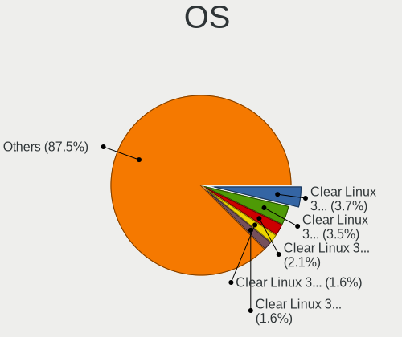

| Name              | Desktops | Percent |
|-------------------|----------|---------|
| Clear Linux 35000 | 11       | 4.15%   |
| Clear Linux 33590 | 8        | 3.02%   |
| Clear Linux 34930 | 6        | 2.26%   |
| Clear Linux 34500 | 6        | 2.26%   |
| Clear Linux 32480 | 5        | 1.89%   |
| Clear Linux 35110 | 4        | 1.51%   |
| Clear Linux 34860 | 4        | 1.51%   |
| Clear Linux 32270 | 4        | 1.51%   |
| Clear Linux 35090 | 3        | 1.13%   |
| Clear Linux 34820 | 3        | 1.13%   |
| Clear Linux 34670 | 3        | 1.13%   |
| Clear Linux 34320 | 3        | 1.13%   |
| Clear Linux 34000 | 3        | 1.13%   |
| Clear Linux 33460 | 3        | 1.13%   |
| Clear Linux 33440 | 3        | 1.13%   |
| Clear Linux 32910 | 3        | 1.13%   |
| Clear Linux 32760 | 3        | 1.13%   |
| Clear Linux 32510 | 3        | 1.13%   |
| Clear Linux 32330 | 3        | 1.13%   |
| Clear Linux 31470 | 3        | 1.13%   |
| Clear Linux       | 3        | 1.13%   |
| Clear Linux 35800 | 2        | 0.75%   |
| Clear Linux 35680 | 2        | 0.75%   |
| Clear Linux 35470 | 2        | 0.75%   |
| Clear Linux 35320 | 2        | 0.75%   |
| Clear Linux 35280 | 2        | 0.75%   |
| Clear Linux 35250 | 2        | 0.75%   |
| Clear Linux 35030 | 2        | 0.75%   |
| Clear Linux 34970 | 2        | 0.75%   |
| Clear Linux 34540 | 2        | 0.75%   |
| Clear Linux 34520 | 2        | 0.75%   |
| Clear Linux 34290 | 2        | 0.75%   |
| Clear Linux 34270 | 2        | 0.75%   |
| Clear Linux 34170 | 2        | 0.75%   |
| Clear Linux 34150 | 2        | 0.75%   |
| Clear Linux 34140 | 2        | 0.75%   |
| Clear Linux 34130 | 2        | 0.75%   |
| Clear Linux 34100 | 2        | 0.75%   |
| Clear Linux 34080 | 2        | 0.75%   |
| Clear Linux 33820 | 2        | 0.75%   |
| Clear Linux 33660 | 2        | 0.75%   |
| Clear Linux 33620 | 2        | 0.75%   |
| Clear Linux 33570 | 2        | 0.75%   |
| Clear Linux 33540 | 2        | 0.75%   |
| Clear Linux 33180 | 2        | 0.75%   |
| Clear Linux 33040 | 2        | 0.75%   |
| Clear Linux 32990 | 2        | 0.75%   |
| Clear Linux 32600 | 2        | 0.75%   |
| Clear Linux 32390 | 2        | 0.75%   |
| Clear Linux 32380 | 2        | 0.75%   |
| Clear Linux 32370 | 2        | 0.75%   |
| Clear Linux 32260 | 2        | 0.75%   |
| Clear Linux 32230 | 2        | 0.75%   |
| Clear Linux 32160 | 2        | 0.75%   |
| Clear Linux 31310 | 2        | 0.75%   |
| Clear Linux 31290 | 2        | 0.75%   |
| Clear Linux 30970 | 2        | 0.75%   |
| Clear Linux 29620 | 2        | 0.75%   |
| Clear Linux 36110 | 1        | 0.38%   |
| Clear Linux 36030 | 1        | 0.38%   |

OS Family
---------

OS without a version

| Name        | Desktops | Percent |
|-------------|----------|---------|
| Clear Linux | 238      | 100%    |

Kernel
------

Version of the Linux kernel

| Version             | Desktops | Percent |
|---------------------|----------|---------|
| 5.13.13-1070.native | 21       | 8.11%   |
| 5.7.13-975.native   | 12       | 4.63%   |
| 5.10.19-1032.native | 12       | 4.63%   |
| 5.5.6-914.native    | 7        | 2.7%    |
| 5.9.12-1004.native  | 6        | 2.32%   |
| 5.4.18-902.native   | 6        | 2.32%   |
| 5.13.8-1065.native  | 6        | 2.32%   |
| 5.12.14-1051.native | 6        | 2.32%   |
| 5.9.16-1009.native  | 3        | 1.16%   |
| 5.7.7-967.native    | 3        | 1.16%   |
| 5.7.6-966.native    | 3        | 1.16%   |
| 5.7.2-962.native    | 3        | 1.16%   |
| 5.6.6-942.native    | 3        | 1.16%   |
| 5.6.10-947.native   | 3        | 1.16%   |
| 5.5.9-918.native    | 3        | 1.16%   |
| 5.5.5-911.native    | 3        | 1.16%   |
| 5.5.4-910.native    | 3        | 1.16%   |
| 5.5.3-908.native    | 3        | 1.16%   |
| 5.4.2-875.native    | 3        | 1.16%   |
| 5.3.5-847.native    | 3        | 1.16%   |
| 5.14.8-1078.native  | 3        | 1.16%   |
| 5.10.18-1027.native | 3        | 1.16%   |
| 5.9.8-1000.native   | 2        | 0.77%   |
| 5.9.13-1006.native  | 2        | 0.77%   |
| 5.9.1-992.native    | 2        | 0.77%   |
| 5.8.14-991.native   | 2        | 0.77%   |
| 5.7.18-980.native   | 2        | 0.77%   |
| 5.7.11-973.native   | 2        | 0.77%   |
| 5.7.10-972.native   | 2        | 0.77%   |
| 5.6.15-957.native   | 2        | 0.77%   |
| 5.6.11-949.native   | 2        | 0.77%   |
| 5.5.2-903.native    | 2        | 0.77%   |
| 5.5.15-930.native   | 2        | 0.77%   |
| 5.4.17-901.native   | 2        | 0.77%   |
| 5.4.16-900.native   | 2        | 0.77%   |
| 5.4.13-895.native   | 2        | 0.77%   |
| 5.4.11-890.native   | 2        | 0.77%   |
| 5.4.100-102.lts2019 | 2        | 0.77%   |
| 5.3.9-863.native    | 2        | 0.77%   |
| 5.3.8-854.native    | 2        | 0.77%   |
| 5.2.8-818.native    | 2        | 0.77%   |
| 5.2.13-832.native   | 2        | 0.77%   |
| 5.15.1-1089.native  | 2        | 0.77%   |
| 5.13.12-1069.native | 2        | 0.77%   |
| 5.12.8-1045.native  | 2        | 0.77%   |
| 5.12.7-1044.native  | 2        | 0.77%   |
| 5.12.5-1041.native  | 2        | 0.77%   |
| 5.12.16-1054.native | 2        | 0.77%   |
| 5.10.5-1012.native  | 2        | 0.77%   |
| 5.10.30-1032.native | 2        | 0.77%   |
| 5.10.17-1026.native | 2        | 0.77%   |
| 5.1.5-770.native    | 2        | 0.77%   |
| 5.0.18-767.native   | 2        | 0.77%   |
| 5.9.15-1008.native  | 1        | 0.39%   |
| 5.9.14-1007.native  | 1        | 0.39%   |
| 5.9.10-1002.native  | 1        | 0.39%   |
| 5.8.9-986.native    | 1        | 0.39%   |
| 5.8.13-990.native   | 1        | 0.39%   |
| 5.7.8-968.native    | 1        | 0.39%   |
| 5.7.4-964.native    | 1        | 0.39%   |

Kernel Family
-------------

Linux kernel without a distro release

| Version | Desktops | Percent |
|---------|----------|---------|
| 5.13.13 | 21       | 8.11%   |
| 5.7.13  | 12       | 4.63%   |
| 5.10.19 | 12       | 4.63%   |
| 5.5.6   | 7        | 2.7%    |
| 5.9.12  | 6        | 2.32%   |
| 5.4.18  | 6        | 2.32%   |
| 5.13.8  | 6        | 2.32%   |
| 5.12.14 | 6        | 2.32%   |
| 5.5.4   | 4        | 1.54%   |
| 5.9.16  | 3        | 1.16%   |
| 5.7.7   | 3        | 1.16%   |
| 5.7.6   | 3        | 1.16%   |
| 5.7.2   | 3        | 1.16%   |
| 5.6.6   | 3        | 1.16%   |
| 5.6.11  | 3        | 1.16%   |
| 5.6.10  | 3        | 1.16%   |
| 5.5.9   | 3        | 1.16%   |
| 5.5.5   | 3        | 1.16%   |
| 5.5.3   | 3        | 1.16%   |
| 5.4.2   | 3        | 1.16%   |
| 5.3.5   | 3        | 1.16%   |
| 5.14.8  | 3        | 1.16%   |
| 5.10.18 | 3        | 1.16%   |
| 5.9.8   | 2        | 0.77%   |
| 5.9.13  | 2        | 0.77%   |
| 5.9.1   | 2        | 0.77%   |
| 5.8.14  | 2        | 0.77%   |
| 5.7.18  | 2        | 0.77%   |
| 5.7.11  | 2        | 0.77%   |
| 5.7.10  | 2        | 0.77%   |
| 5.6.8   | 2        | 0.77%   |
| 5.6.15  | 2        | 0.77%   |
| 5.5.2   | 2        | 0.77%   |
| 5.5.15  | 2        | 0.77%   |
| 5.4.17  | 2        | 0.77%   |
| 5.4.16  | 2        | 0.77%   |
| 5.4.13  | 2        | 0.77%   |
| 5.4.11  | 2        | 0.77%   |
| 5.4.100 | 2        | 0.77%   |
| 5.3.9   | 2        | 0.77%   |
| 5.3.8   | 2        | 0.77%   |
| 5.2.8   | 2        | 0.77%   |
| 5.2.13  | 2        | 0.77%   |
| 5.15.1  | 2        | 0.77%   |
| 5.13.12 | 2        | 0.77%   |
| 5.12.8  | 2        | 0.77%   |
| 5.12.7  | 2        | 0.77%   |
| 5.12.5  | 2        | 0.77%   |
| 5.12.16 | 2        | 0.77%   |
| 5.10.5  | 2        | 0.77%   |
| 5.10.30 | 2        | 0.77%   |
| 5.10.17 | 2        | 0.77%   |
| 5.1.5   | 2        | 0.77%   |
| 5.0.18  | 2        | 0.77%   |
| 5.0.17  | 2        | 0.77%   |
| 5.9.15  | 1        | 0.39%   |
| 5.9.14  | 1        | 0.39%   |
| 5.9.10  | 1        | 0.39%   |
| 5.8.9   | 1        | 0.39%   |
| 5.8.13  | 1        | 0.39%   |

Kernel Major Ver.
-----------------

Linux kernel major version

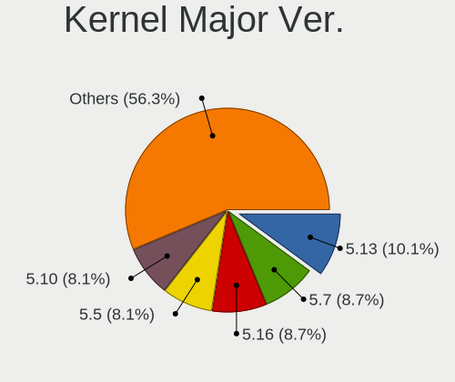

| Version | Desktops | Percent |
|---------|----------|---------|
| 5.13    | 33       | 12.94%  |
| 5.7     | 31       | 12.16%  |
| 5.5     | 29       | 11.37%  |
| 5.4     | 27       | 10.59%  |
| 5.10    | 27       | 10.59%  |
| 5.6     | 21       | 8.24%   |
| 5.9     | 18       | 7.06%   |
| 5.12    | 16       | 6.27%   |
| 5.3     | 11       | 4.31%   |
| 5.16    | 8        | 3.14%   |
| 5.2     | 6        | 2.35%   |
| 5.14    | 6        | 2.35%   |
| 5.1     | 6        | 2.35%   |
| 5.0     | 6        | 2.35%   |
| 5.15    | 5        | 1.96%   |
| 5.8     | 4        | 1.57%   |
| 4.19    | 1        | 0.39%   |

Arch
----

OS architecture (x86_64, i586, etc.)

| Name   | Desktops | Percent |
|--------|----------|---------|
| x86_64 | 238      | 100%    |

DE
--

Desktop Environment

| Name            | Desktops | Percent |
|-----------------|----------|---------|
| GNOME           | 199      | 82.23%  |
| Unknown         | 28       | 11.57%  |
| KDE             | 5        | 2.07%   |
| XFCE            | 4        | 1.65%   |
| GNOME Flashback | 4        | 1.65%   |
| KDE5            | 1        | 0.41%   |
| GNOME-Flashback | 1        | 0.41%   |

Display Server
--------------

X11 or Wayland

| Name    | Desktops | Percent |
|---------|----------|---------|
| X11     | 226      | 94.17%  |
| Wayland | 12       | 5%      |
| Tty     | 2        | 0.83%   |

Display Manager
---------------

SDDM, LightDM, etc.

| Name    | Desktops | Percent |
|---------|----------|---------|
| Unknown | 236      | 99.16%  |
| GDM     | 2        | 0.84%   |

OS Lang
-------

Language

| Lang    | Desktops | Percent |
|---------|----------|---------|
| en_US   | 160      | 65.31%  |
| Unknown | 28       | 11.43%  |
| ru_RU   | 16       | 6.53%   |
| fr_FR   | 7        | 2.86%   |
| it_IT   | 6        | 2.45%   |
| de_DE   | 6        | 2.45%   |
| pl_PL   | 4        | 1.63%   |
| es_MX   | 4        | 1.63%   |
| en_GB   | 3        | 1.22%   |
| pt_BR   | 2        | 0.82%   |
| es_ES   | 2        | 0.82%   |
| zh_TW   | 1        | 0.41%   |
| zh_CN   | 1        | 0.41%   |
| pt_PT   | 1        | 0.41%   |
| nl_BE   | 1        | 0.41%   |
| en_AU   | 1        | 0.41%   |
| de_AT   | 1        | 0.41%   |
| bg_BG   | 1        | 0.41%   |

Boot Mode
---------

EFI or BIOS

| Mode | Desktops | Percent |
|------|----------|---------|
| BIOS | 238      | 100%    |

Filesystem
----------

Type of filesystem

| Type    | Desktops | Percent |
|---------|----------|---------|
| Ext4    | 203      | 83.54%  |
| Unknown | 31       | 12.76%  |
| Xfs     | 5        | 2.06%   |
| Btrfs   | 4        | 1.65%   |

Part. scheme
------------

Scheme of partitioning

| Type    | Desktops | Percent |
|---------|----------|---------|
| Unknown | 233      | 97.9%   |
| GPT     | 5        | 2.1%    |

Dual Boot with Linux/BSD
------------------------

Hosting more than one Linux/BSD

| Dual boot | Desktops | Percent |
|-----------|----------|---------|
| No        | 238      | 100%    |

Dual Boot (Win)
---------------

Hosting Linux and Windows

| Dual boot | Desktops | Percent |
|-----------|----------|---------|
| No        | 236      | 99.16%  |
| Yes       | 2        | 0.84%   |

Board
-----

Vendor
------

Motherboard manufacturer

| Name                | Desktops | Percent |
|---------------------|----------|---------|
| ASUSTek Computer    | 67       | 28.15%  |
| Gigabyte Technology | 43       | 18.07%  |
| ASRock              | 29       | 12.18%  |
| MSI                 | 24       | 10.08%  |
| Hewlett-Packard     | 18       | 7.56%   |
| Dell                | 14       | 5.88%   |
| Lenovo              | 7        | 2.94%   |
| Intel               | 7        | 2.94%   |
| Unknown             | 6        | 2.52%   |
| Acer                | 5        | 2.1%    |
| Shuttle             | 2        | 0.84%   |
| Pegatron            | 2        | 0.84%   |
| Foxconn             | 2        | 0.84%   |
| Biostar             | 2        | 0.84%   |
| SYS                 | 1        | 0.42%   |
| Supermicro          | 1        | 0.42%   |
| MAXSUN              | 1        | 0.42%   |
| iEi                 | 1        | 0.42%   |
| Huanan              | 1        | 0.42%   |
| Hampoo              | 1        | 0.42%   |
| GMK                 | 1        | 0.42%   |
| ECS                 | 1        | 0.42%   |
| AZW                 | 1        | 0.42%   |
| AAEON               | 1        | 0.42%   |

Model
-----

Motherboard model

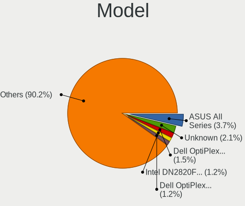

| Name                                                                | Desktops | Percent |
|---------------------------------------------------------------------|----------|---------|
| ASUS All Series                                                     | 12       | 5.04%   |
| Unknown                                                             | 6        | 2.52%   |
| MSI MS-7C02                                                         | 3        | 1.26%   |
| ASRock TRX40 Creator                                                | 3        | 1.26%   |
| HP Compaq 8200 Elite SFF PC                                         | 2        | 0.84%   |
| HP Compaq 6200 Pro SFF PC                                           | 2        | 0.84%   |
| Gigabyte Z97X-UD3H                                                  | 2        | 0.84%   |
| Gigabyte X79-UD3                                                    | 2        | 0.84%   |
| Gigabyte X570 AORUS PRO WIFI                                        | 2        | 0.84%   |
| Gigabyte H61M-DS2                                                   | 2        | 0.84%   |
| Dell XPS 8930                                                       | 2        | 0.84%   |
| Dell OptiPlex 9020                                                  | 2        | 0.84%   |
| Dell OptiPlex 7010                                                  | 2        | 0.84%   |
| ASUS Z170-A                                                         | 2        | 0.84%   |
| ASUS TUF GAMING X570-PLUS                                           | 2        | 0.84%   |
| ASUS ROG Maximus XII FORMULA                                        | 2        | 0.84%   |
| ASUS PRIME B450M-A                                                  | 2        | 0.84%   |
| ASUS H110M-A/M.2                                                    | 2        | 0.84%   |
| SYS BAT-MINI                                                        | 1        | 0.42%   |
| Supermicro SYS-5038A-I                                              | 1        | 0.42%   |
| Shuttle SH67H                                                       | 1        | 0.42%   |
| Shuttle DS81D                                                       | 1        | 0.42%   |
| Pegatron SKLD4-P1                                                   | 1        | 0.42%   |
| Pegatron h8-1400ex                                                  | 1        | 0.42%   |
| MSI MS-7D18                                                         | 1        | 0.42%   |
| MSI MS-7D09                                                         | 1        | 0.42%   |
| MSI MS-7C95                                                         | 1        | 0.42%   |
| MSI MS-7C94                                                         | 1        | 0.42%   |
| MSI MS-7C60                                                         | 1        | 0.42%   |
| MSI MS-7C51                                                         | 1        | 0.42%   |
| MSI MS-7C37                                                         | 1        | 0.42%   |
| MSI MS-7B98                                                         | 1        | 0.42%   |
| MSI MS-7B93                                                         | 1        | 0.42%   |
| MSI MS-7B77                                                         | 1        | 0.42%   |
| MSI MS-7B61                                                         | 1        | 0.42%   |
| MSI MS-7B47                                                         | 1        | 0.42%   |
| MSI MS-7B46                                                         | 1        | 0.42%   |
| MSI MS-7B22                                                         | 1        | 0.42%   |
| MSI MS-7B17                                                         | 1        | 0.42%   |
| MSI MS-7A68                                                         | 1        | 0.42%   |
| MSI MS-7A15                                                         | 1        | 0.42%   |
| MSI MS-7996                                                         | 1        | 0.42%   |
| MSI MS-7916                                                         | 1        | 0.42%   |
| MSI MS-7817                                                         | 1        | 0.42%   |
| MSI MS-7758                                                         | 1        | 0.42%   |
| MAXSUN TA300 Series                                                 | 1        | 0.42%   |
| Lenovo ThinkCentre M93p 10AA0020US                                  | 1        | 0.42%   |
| Lenovo ThinkCentre M93p 10A8S0VN0E                                  | 1        | 0.42%   |
| Lenovo ThinkCentre M83 10E8S00H00                                   | 1        | 0.42%   |
| Lenovo ThinkCentre M710e 10UR001JUS                                 | 1        | 0.42%   |
| Lenovo ThinkCentre M600 10GAS0110B                                  | 1        | 0.42%   |
| Lenovo ThinkCentre E73 10AS00DFUS                                   | 1        | 0.42%   |
| Lenovo 70A50022UK ThinkServer TS140                                 | 1        | 0.42%   |
| Intel X99 V102                                                      | 1        | 0.42%   |
| Intel X79 V2.4E                                                     | 1        | 0.42%   |
| Intel X79 INTEL(INTEL Xeon E5/Core i7 DMI2 - C600/C200 Cipset V3.5B | 1        | 0.42%   |
| Intel DQ77MK AAG39642-500                                           | 1        | 0.42%   |
| Intel DN2820FYB H24582-205                                          | 1        | 0.42%   |
| Intel DH61BE AAG14062-204                                           | 1        | 0.42%   |
| Intel B75                                                           | 1        | 0.42%   |

Model Family
------------

Motherboard model prefix

| Name                   | Desktops | Percent |
|------------------------|----------|---------|
| ASUS ROG               | 17       | 7.14%   |
| ASUS PRIME             | 16       | 6.72%   |
| ASUS All               | 12       | 5.04%   |
| Dell OptiPlex          | 7        | 2.94%   |
| Lenovo ThinkCentre     | 6        | 2.52%   |
| HP Compaq              | 6        | 2.52%   |
| ASUS TUF               | 6        | 2.52%   |
| Unknown                | 6        | 2.52%   |
| Gigabyte X570          | 5        | 2.1%    |
| Acer Aspire            | 5        | 2.1%    |
| Dell Precision         | 4        | 1.68%   |
| ASRock TRX40           | 4        | 1.68%   |
| MSI MS-7C02            | 3        | 1.26%   |
| HP Pavilion            | 3        | 1.26%   |
| Gigabyte Z390          | 3        | 1.26%   |
| Gigabyte Z370          | 3        | 1.26%   |
| Gigabyte B450          | 3        | 1.26%   |
| Intel X79              | 2        | 0.84%   |
| Gigabyte Z97X-UD3H     | 2        | 0.84%   |
| Gigabyte X79-UD3       | 2        | 0.84%   |
| Gigabyte H61M-DS2      | 2        | 0.84%   |
| Gigabyte A320M-S2H     | 2        | 0.84%   |
| Dell XPS               | 2        | 0.84%   |
| ASUS Z170-A            | 2        | 0.84%   |
| ASUS H110M-A           | 2        | 0.84%   |
| ASRock Z390            | 2        | 0.84%   |
| ASRock H110M-DGS       | 2        | 0.84%   |
| ASRock AB350           | 2        | 0.84%   |
| SYS BAT-MINI           | 1        | 0.42%   |
| Supermicro SYS-5038A-I | 1        | 0.42%   |
| Shuttle SH67H          | 1        | 0.42%   |
| Shuttle DS81D          | 1        | 0.42%   |
| Pegatron SKLD4-P1      | 1        | 0.42%   |
| Pegatron h8-1400ex     | 1        | 0.42%   |
| MSI MS-7D18            | 1        | 0.42%   |
| MSI MS-7D09            | 1        | 0.42%   |
| MSI MS-7C95            | 1        | 0.42%   |
| MSI MS-7C94            | 1        | 0.42%   |
| MSI MS-7C60            | 1        | 0.42%   |
| MSI MS-7C51            | 1        | 0.42%   |
| MSI MS-7C37            | 1        | 0.42%   |
| MSI MS-7B98            | 1        | 0.42%   |
| MSI MS-7B93            | 1        | 0.42%   |
| MSI MS-7B77            | 1        | 0.42%   |
| MSI MS-7B61            | 1        | 0.42%   |
| MSI MS-7B47            | 1        | 0.42%   |
| MSI MS-7B46            | 1        | 0.42%   |
| MSI MS-7B22            | 1        | 0.42%   |
| MSI MS-7B17            | 1        | 0.42%   |
| MSI MS-7A68            | 1        | 0.42%   |
| MSI MS-7A15            | 1        | 0.42%   |
| MSI MS-7996            | 1        | 0.42%   |
| MSI MS-7916            | 1        | 0.42%   |
| MSI MS-7817            | 1        | 0.42%   |
| MSI MS-7758            | 1        | 0.42%   |
| MAXSUN TA300           | 1        | 0.42%   |
| Lenovo 70A50022UK      | 1        | 0.42%   |
| Intel X99              | 1        | 0.42%   |
| Intel DQ77MK           | 1        | 0.42%   |
| Intel DN2820FYB        | 1        | 0.42%   |

MFG Year
--------

Motherboard manufacture year

| Year | Desktops | Percent |
|------|----------|---------|
| 2018 | 45       | 18.91%  |
| 2019 | 31       | 13.03%  |
| 2012 | 24       | 10.08%  |
| 2014 | 23       | 9.66%   |
| 2020 | 22       | 9.24%   |
| 2017 | 20       | 8.4%    |
| 2013 | 17       | 7.14%   |
| 2016 | 16       | 6.72%   |
| 2021 | 15       | 6.3%    |
| 2015 | 14       | 5.88%   |
| 2011 | 9        | 3.78%   |
| 2010 | 2        | 0.84%   |

Form Factor
-----------

Physical design of the computer

| Name    | Desktops | Percent |
|---------|----------|---------|
| Desktop | 238      | 100%    |

Secure Boot
-----------

Enabled or disabled

| State    | Desktops | Percent |
|----------|----------|---------|
| Disabled | 238      | 100%    |

Coreboot
--------

Have coreboot on board

| Used | Desktops | Percent |
|------|----------|---------|
| No   | 238      | 100%    |

RAM Size
--------

Total RAM memory

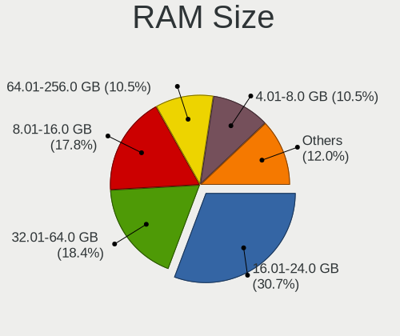

| Size in GB  | Desktops | Percent |
|-------------|----------|---------|
| 16.01-24.0  | 73       | 30.29%  |
| 8.01-16.0   | 45       | 18.67%  |
| 32.01-64.0  | 37       | 15.35%  |
| 4.01-8.0    | 29       | 12.03%  |
| 64.01-256.0 | 29       | 12.03%  |
| 3.01-4.0    | 19       | 7.88%   |
| 24.01-32.0  | 7        | 2.9%    |
| 1.01-2.0    | 2        | 0.83%   |

RAM Used
--------

Used RAM memory

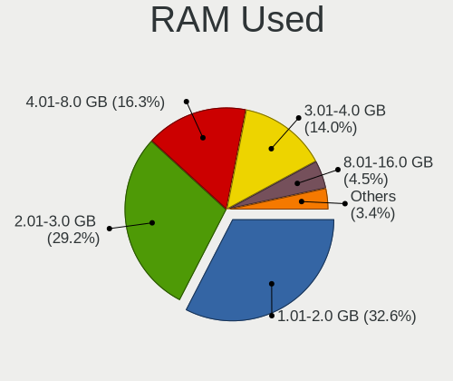

| Used GB     | Desktops | Percent |
|-------------|----------|---------|
| 1.01-2.0    | 97       | 38.19%  |
| 2.01-3.0    | 74       | 29.13%  |
| 4.01-8.0    | 32       | 12.6%   |
| 3.01-4.0    | 29       | 11.42%  |
| 8.01-16.0   | 12       | 4.72%   |
| 0.51-1.0    | 7        | 2.76%   |
| 32.01-64.0  | 1        | 0.39%   |
| 64.01-256.0 | 1        | 0.39%   |
| 16.01-24.0  | 1        | 0.39%   |

Total Drives
------------

Number of drives on board

| Drives | Desktops | Percent |
|--------|----------|---------|
| 1      | 86       | 34.96%  |
| 2      | 71       | 28.86%  |
| 3      | 43       | 17.48%  |
| 4      | 29       | 11.79%  |
| 5      | 11       | 4.47%   |
| 6      | 3        | 1.22%   |
| 7      | 2        | 0.81%   |
| 0      | 1        | 0.41%   |

Has CD-ROM
----------

Has CD-ROM on board

| Presented | Desktops | Percent |
|-----------|----------|---------|
| No        | 172      | 72.27%  |
| Yes       | 66       | 27.73%  |

Has Ethernet
------------

Has Ethernet on board

| Presented | Desktops | Percent |
|-----------|----------|---------|
| Yes       | 235      | 98.74%  |
| No        | 3        | 1.26%   |

Has WiFi
--------

Has WiFi module

| Presented | Desktops | Percent |
|-----------|----------|---------|
| No        | 135      | 56.49%  |
| Yes       | 104      | 43.51%  |

Has Bluetooth
-------------

Has Bluetooth module

| Presented | Desktops | Percent |
|-----------|----------|---------|
| No        | 148      | 61.67%  |
| Yes       | 92       | 38.33%  |

Location
--------

Country
-------

Geographic location (country)

| Country      | Desktops | Percent |
|--------------|----------|---------|
| USA          | 64       | 26.89%  |
| Russia       | 22       | 9.24%   |
| UK           | 16       | 6.72%   |
| Germany      | 13       | 5.46%   |
| Italy        | 11       | 4.62%   |
| France       | 10       | 4.2%    |
| Sweden       | 7        | 2.94%   |
| India        | 7        | 2.94%   |
| Canada       | 7        | 2.94%   |
| Poland       | 6        | 2.52%   |
| Brazil       | 6        | 2.52%   |
| Australia    | 6        | 2.52%   |
| Spain        | 5        | 2.1%    |
| Netherlands  | 5        | 2.1%    |
| Romania      | 4        | 1.68%   |
| Norway       | 4        | 1.68%   |
| Serbia       | 3        | 1.26%   |
| China        | 3        | 1.26%   |
| Argentina    | 3        | 1.26%   |
| Vietnam      | 2        | 0.84%   |
| Ukraine      | 2        | 0.84%   |
| South Africa | 2        | 0.84%   |
| Portugal     | 2        | 0.84%   |
| Latvia       | 2        | 0.84%   |
| Japan        | 2        | 0.84%   |
| Indonesia    | 2        | 0.84%   |
| Bulgaria     | 2        | 0.84%   |
| Belgium      | 2        | 0.84%   |
| Austria      | 2        | 0.84%   |
| Turkey       | 1        | 0.42%   |
| Thailand     | 1        | 0.42%   |
| Taiwan       | 1        | 0.42%   |
| Saudi Arabia | 1        | 0.42%   |
| Myanmar      | 1        | 0.42%   |
| Mexico       | 1        | 0.42%   |
| Lebanon      | 1        | 0.42%   |
| Ireland      | 1        | 0.42%   |
| Hungary      | 1        | 0.42%   |
| Hong Kong    | 1        | 0.42%   |
| Finland      | 1        | 0.42%   |
| Estonia      | 1        | 0.42%   |
| Ecuador      | 1        | 0.42%   |
| Croatia      | 1        | 0.42%   |
| Chile        | 1        | 0.42%   |
| Bahrain      | 1        | 0.42%   |

City
----

Geographic location (city)

| City                      | Desktops | Percent |
|---------------------------|----------|---------|
| Moscow                    | 7        | 2.86%   |
| St Petersburg             | 4        | 1.63%   |
| Brisbane                  | 4        | 1.63%   |
| Toronto                   | 2        | 0.82%   |
| Springfield               | 2        | 0.82%   |
| Shelbyville               | 2        | 0.82%   |
| Sandnes                   | 2        | 0.82%   |
| San Jose                  | 2        | 0.82%   |
| Riga                      | 2        | 0.82%   |
| Portland                  | 2        | 0.82%   |
| Mumbai                    | 2        | 0.82%   |
| Milan                     | 2        | 0.82%   |
| Madrid                    | 2        | 0.82%   |
| Las Vegas                 | 2        | 0.82%   |
| Ho Chi Minh City          | 2        | 0.82%   |
| Groton                    | 2        | 0.82%   |
| Cambridge                 | 2        | 0.82%   |
| Bengaluru                 | 2        | 0.82%   |
| Belgrade                  | 2        | 0.82%   |
| Athens                    | 2        | 0.82%   |
| Yogyakarta                | 1        | 0.41%   |
| Yekaterinburg             | 1        | 0.41%   |
| Yangon                    | 1        | 0.41%   |
| Wolfenbttel           | 1        | 0.41%   |
| Wezep                     | 1        | 0.41%   |
| Wetteren                  | 1        | 0.41%   |
| West Fork                 | 1        | 0.41%   |
| Wabrzych             | 1        | 0.41%   |
| Warrington                | 1        | 0.41%   |
| Voronezh                  | 1        | 0.41%   |
| Villefranche-sur-Sane | 1        | 0.41%   |
| Villa Elisa               | 1        | 0.41%   |
| Vicenza                   | 1        | 0.41%   |
| Vausseroux                | 1        | 0.41%   |
| Usk                       | 1        | 0.41%   |
| Upper Norwood             | 1        | 0.41%   |
| Tyumen                    | 1        | 0.41%   |
| Tustin                    | 1        | 0.41%   |
| Turin                     | 1        | 0.41%   |
| Trivandrum                | 1        | 0.41%   |
| Treviso                   | 1        | 0.41%   |
| Tijuana                   | 1        | 0.41%   |
| The Dalles                | 1        | 0.41%   |
| Tatu                  | 1        | 0.41%   |
| Tallinn                   | 1        | 0.41%   |
| Ta'if                     | 1        | 0.41%   |
| Sydney                    | 1        | 0.41%   |
| Swansea                   | 1        | 0.41%   |
| Stratford                 | 1        | 0.41%   |
| Stockholm                 | 1        | 0.41%   |
| Sterling Heights          | 1        | 0.41%   |
| St. Petersburg            | 1        | 0.41%   |
| Spruce Grove              | 1        | 0.41%   |
| Southlake                 | 1        | 0.41%   |
| South Shields             | 1        | 0.41%   |
| South Jordan              | 1        | 0.41%   |
| Sospel                    | 1        | 0.41%   |
| Sofia                     | 1        | 0.41%   |
| Sliedrech                 | 1        | 0.41%   |
| Skorcz                    | 1        | 0.41%   |

Drives
------

Drive Vendor
------------

Hard drive vendors

| Vendor                      | Desktops | Drives | Percent |
|-----------------------------|----------|--------|---------|
| Seagate                     | 80       | 118    | 17.82%  |
| Samsung Electronics         | 69       | 111    | 15.37%  |
| WDC                         | 54       | 72     | 12.03%  |
| Toshiba                     | 31       | 39     | 6.9%    |
| SanDisk                     | 22       | 28     | 4.9%    |
| Phison                      | 19       | 27     | 4.23%   |
| Unknown                     | 17       | 17     | 3.79%   |
| Kingston                    | 17       | 23     | 3.79%   |
| Intel                       | 17       | 19     | 3.79%   |
| Crucial                     | 16       | 19     | 3.56%   |
| A-DATA Technology           | 11       | 11     | 2.45%   |
| Hitachi                     | 9        | 9      | 2%      |
| SPCC                        | 6        | 7      | 1.34%   |
| Patriot                     | 6        | 6      | 1.34%   |
| HGST                        | 6        | 10     | 1.34%   |
| XPG                         | 4        | 4      | 0.89%   |
| Silicon Motion              | 4        | 5      | 0.89%   |
| Micron/Crucial Technology   | 4        | 5      | 0.89%   |
| JMicron                     | 4        | 4      | 0.89%   |
| Transcend                   | 3        | 3      | 0.67%   |
| Team                        | 3        | 3      | 0.67%   |
| SK Hynix                    | 3        | 4      | 0.67%   |
| PNY                         | 3        | 3      | 0.67%   |
| Micron Technology           | 3        | 6      | 0.67%   |
| LITEONIT                    | 3        | 5      | 0.67%   |
| Yangtze Memory Technologies | 2        | 2      | 0.45%   |
| Realtek Semiconductor       | 2        | 2      | 0.45%   |
| Netac                       | 2        | 2      | 0.45%   |
| MAXTOR                      | 2        | 2      | 0.45%   |
| KIOXIA                      | 2        | 2      | 0.45%   |
| KingDian                    | 2        | 4      | 0.45%   |
| Hewlett-Packard             | 2        | 2      | 0.45%   |
| GOODRAM                     | 2        | 2      | 0.45%   |
| Corsair                     | 2        | 6      | 0.45%   |
| China                       | 2        | 3      | 0.45%   |
| WDC WDS2                    | 1        | 1      | 0.22%   |
| Verbatim                    | 1        | 1      | 0.22%   |
| USB3.0                      | 1        | 1      | 0.22%   |
| PLEXTOR                     | 1        | 1      | 0.22%   |
| OCZ                         | 1        | 2      | 0.22%   |
| KingSpec                    | 1        | 1      | 0.22%   |
| KingFast                    | 1        | 1      | 0.22%   |
| Intenso                     | 1        | 1      | 0.22%   |
| Hoodisk                     | 1        | 2      | 0.22%   |
| HECTRON                     | 1        | 1      | 0.22%   |
| Gigabyte Technology         | 1        | 1      | 0.22%   |
| Fujitsu                     | 1        | 1      | 0.22%   |
| External                    | 1        | 1      | 0.22%   |
| ASMT                        | 1        | 2      | 0.22%   |
| Acer                        | 1        | 1      | 0.22%   |

Drive Model
-----------

Hard drive models

| Model                               | Desktops | Percent |
|-------------------------------------|----------|---------|
| Samsung NVMe SSD Drive 500GB        | 16       | 3.08%   |
| Samsung NVMe SSD Drive 1TB          | 9        | 1.73%   |
| Samsung NVMe SSD Drive 250GB        | 7        | 1.35%   |
| Unknown SD/MMC/MS PRO 32GB          | 6        | 1.16%   |
| Toshiba DT01ACA100 1TB              | 6        | 1.16%   |
| Samsung SSD 850 EVO 250GB           | 6        | 1.16%   |
| Phison NVMe SSD Drive 1TB           | 6        | 1.16%   |
| Toshiba DT01ACA050 500GB            | 5        | 0.96%   |
| Seagate ST1000DM010-2EP102 1TB      | 5        | 0.96%   |
| Unknown MMC Card  64GB              | 4        | 0.77%   |
| Seagate ST1000DM003-1ER162 1TB      | 4        | 0.77%   |
| Sandisk NVMe SSD Drive 500GB        | 4        | 0.77%   |
| Samsung SSD 860 EVO 250GB           | 4        | 0.77%   |
| Samsung NVMe SSD Drive 2TB          | 4        | 0.77%   |
| WDC WD10EZEX-08WN4A0 1TB            | 3        | 0.58%   |
| Toshiba HDWD110 1TB                 | 3        | 0.58%   |
| Toshiba DT01ACA200 2TB              | 3        | 0.58%   |
| Seagate ST6000VN0033-2EE110 6TB     | 3        | 0.58%   |
| Seagate ST500DM002-1BD142 500GB     | 3        | 0.58%   |
| Seagate ST4000DM005-2DP166 4TB      | 3        | 0.58%   |
| Seagate ST4000DM004-2CV104 4TB      | 3        | 0.58%   |
| Seagate ST2000DM008-2FR102 2TB      | 3        | 0.58%   |
| Seagate ST2000DM001-1CH164 2TB      | 3        | 0.58%   |
| Seagate ST1000DM003-1CH162 1TB      | 3        | 0.58%   |
| Samsung SSD 860 QVO 1TB             | 3        | 0.58%   |
| Samsung SSD 850 EVO 500GB           | 3        | 0.58%   |
| Samsung SSD 850 EVO 120GB           | 3        | 0.58%   |
| Samsung SSD 840 EVO 120GB           | 3        | 0.58%   |
| Samsung SSD 830 Series 128GB        | 3        | 0.58%   |
| Samsung NVMe SSD Drive 1024GB       | 3        | 0.58%   |
| Phison NVMe SSD Drive 512GB         | 3        | 0.58%   |
| Phison NVMe SSD Drive 500GB         | 3        | 0.58%   |
| Phison NVMe SSD Drive 240GB         | 3        | 0.58%   |
| JMicron Generic 2TB                 | 3        | 0.58%   |
| Intel NVMe SSD Drive 1024GB         | 3        | 0.58%   |
| Crucial CT240BX500SSD1 240GB        | 3        | 0.58%   |
| XPG NVMe SSD Drive 1024GB           | 2        | 0.39%   |
| WDC WDS500G2B0A-00SM50 500GB SSD    | 2        | 0.39%   |
| WDC WD5000AAKX-00ERMA0 500GB        | 2        | 0.39%   |
| WDC WD10EZEX-60ZF5A0 1TB            | 2        | 0.39%   |
| WDC WD10EZEX-60WN4A0 1TB            | 2        | 0.39%   |
| WDC WD10EARS-00Y5B1 1TB             | 2        | 0.39%   |
| WDC WD1003FZEX-00MK2A0 1TB          | 2        | 0.39%   |
| WDC WD10 JPVX-22JC3T0 1TB           | 2        | 0.39%   |
| Toshiba HDWD120 2TB                 | 2        | 0.39%   |
| Toshiba DT01ACA300 3TB              | 2        | 0.39%   |
| Team T253X1240G 240GB SSD           | 2        | 0.39%   |
| SPCC Solid State Disk 256GB         | 2        | 0.39%   |
| SPCC Solid State Disk 120GB         | 2        | 0.39%   |
| Silicon Motion NVMe SSD Drive 256GB | 2        | 0.39%   |
| Seagate ST500LT012-1DG142 500GB     | 2        | 0.39%   |
| Seagate ST4000DM000-1F2168 4TB      | 2        | 0.39%   |
| Seagate ST3000DM001-1ER166 3TB      | 2        | 0.39%   |
| Seagate ST2000NM0011 2TB            | 2        | 0.39%   |
| Seagate ST2000DX002-2DV164 2TB      | 2        | 0.39%   |
| Seagate ST2000DM006-2DM164 2TB      | 2        | 0.39%   |
| Seagate ST1000LM024 HN-M101MBB 1TB  | 2        | 0.39%   |
| Seagate ST1000DM003-1SB102 1TB      | 2        | 0.39%   |
| Seagate NVMe SSD Drive 2TB          | 2        | 0.39%   |
| Seagate NVMe SSD Drive 1TB          | 2        | 0.39%   |

HDD Vendor
----------

Hard disk drive vendors

| Vendor              | Desktops | Drives | Percent |
|---------------------|----------|--------|---------|
| Seagate             | 75       | 106    | 41.67%  |
| WDC                 | 49       | 64     | 27.22%  |
| Toshiba             | 24       | 32     | 13.33%  |
| Hitachi             | 9        | 9      | 5%      |
| Samsung Electronics | 7        | 7      | 3.89%   |
| Unknown             | 6        | 6      | 3.33%   |
| HGST                | 6        | 10     | 3.33%   |
| MAXTOR              | 2        | 2      | 1.11%   |
| USB3.0              | 1        | 1      | 0.56%   |
| Fujitsu             | 1        | 1      | 0.56%   |

SSD Vendor
----------

Solid state drive vendors

| Vendor              | Desktops | Drives | Percent |
|---------------------|----------|--------|---------|
| Samsung Electronics | 39       | 52     | 23.08%  |
| Kingston            | 16       | 21     | 9.47%   |
| Crucial             | 16       | 19     | 9.47%   |
| SanDisk             | 13       | 14     | 7.69%   |
| A-DATA Technology   | 11       | 11     | 6.51%   |
| Intel               | 9        | 10     | 5.33%   |
| WDC                 | 7        | 8      | 4.14%   |
| SPCC                | 6        | 7      | 3.55%   |
| Patriot             | 6        | 6      | 3.55%   |
| Toshiba             | 5        | 5      | 2.96%   |
| Transcend           | 3        | 3      | 1.78%   |
| Team                | 3        | 3      | 1.78%   |
| PNY                 | 3        | 3      | 1.78%   |
| LITEONIT            | 3        | 5      | 1.78%   |
| JMicron             | 3        | 3      | 1.78%   |
| Seagate             | 2        | 2      | 1.18%   |
| Micron Technology   | 2        | 2      | 1.18%   |
| KingDian            | 2        | 4      | 1.18%   |
| Hewlett-Packard     | 2        | 2      | 1.18%   |
| GOODRAM             | 2        | 2      | 1.18%   |
| Corsair             | 2        | 6      | 1.18%   |
| China               | 2        | 3      | 1.18%   |
| WDC WDS2            | 1        | 1      | 0.59%   |
| Verbatim            | 1        | 1      | 0.59%   |
| Unknown             | 1        | 1      | 0.59%   |
| SK Hynix            | 1        | 2      | 0.59%   |
| PLEXTOR             | 1        | 1      | 0.59%   |
| OCZ                 | 1        | 2      | 0.59%   |
| Netac               | 1        | 1      | 0.59%   |
| KingSpec            | 1        | 1      | 0.59%   |
| Intenso             | 1        | 1      | 0.59%   |
| Hoodisk             | 1        | 2      | 0.59%   |
| Gigabyte Technology | 1        | 1      | 0.59%   |
| Acer                | 1        | 1      | 0.59%   |

Drive Kind
----------

HDD or SSD

| Kind    | Desktops | Drives | Percent |
|---------|----------|--------|---------|
| HDD     | 149      | 238    | 38.5%   |
| SSD     | 135      | 206    | 34.88%  |
| NVMe    | 90       | 144    | 23.26%  |
| Unknown | 7        | 9      | 1.81%   |
| MMC     | 6        | 6      | 1.55%   |

Drive Connector
---------------

SATA, SAS, NVMe, etc.

| Type | Desktops | Drives | Percent |
|------|----------|--------|---------|
| SATA | 204      | 428    | 63.75%  |
| NVMe | 89       | 143    | 27.81%  |
| SAS  | 21       | 26     | 6.56%   |
| MMC  | 6        | 6      | 1.88%   |

Drive Size
----------

Size of hard drive

| Size in TB | Desktops | Drives | Percent |
|------------|----------|--------|---------|
| 0.01-0.5   | 152      | 270    | 52.05%  |
| 0.51-1.0   | 70       | 87     | 23.97%  |
| 1.01-2.0   | 36       | 43     | 12.33%  |
| 3.01-4.0   | 12       | 15     | 4.11%   |
| 4.01-10.0  | 12       | 17     | 4.11%   |
| 2.01-3.0   | 6        | 6      | 2.05%   |
| 10.01-20.0 | 4        | 6      | 1.37%   |

Space Total
-----------

Amount of disk space available on the file system

| Size in GB     | Desktops | Percent |
|----------------|----------|---------|
| 101-250        | 80       | 32.52%  |
| 251-500        | 50       | 20.33%  |
| 501-1000       | 36       | 14.63%  |
| 1001-2000      | 22       | 8.94%   |
| 51-100         | 17       | 6.91%   |
| 2001-3000      | 12       | 4.88%   |
| Unknown        | 11       | 4.47%   |
| More than 3000 | 10       | 4.07%   |
| 21-50          | 7        | 2.85%   |
| 1-20           | 1        | 0.41%   |

Space Used
----------

Amount of used disk space

| Used GB        | Desktops | Percent |
|----------------|----------|---------|
| 1-20           | 104      | 41.77%  |
| 21-50          | 57       | 22.89%  |
| 101-250        | 21       | 8.43%   |
| 51-100         | 20       | 8.03%   |
| 251-500        | 13       | 5.22%   |
| Unknown        | 11       | 4.42%   |
| 501-1000       | 10       | 4.02%   |
| 1001-2000      | 7        | 2.81%   |
| More than 3000 | 4        | 1.61%   |
| 2001-3000      | 2        | 0.8%    |

Malfunc. Drives
---------------

Drive models with a malfunction

| Model                           | Desktops | Drives | Percent |
|---------------------------------|----------|--------|---------|
| Seagate ST500LM030-2E717D 500GB | 1        | 1      | 100%    |

Malfunc. Drive Vendor
---------------------

Vendors of faulty drives

| Vendor  | Desktops | Drives | Percent |
|---------|----------|--------|---------|
| Seagate | 1        | 1      | 100%    |

Malfunc. HDD Vendor
-------------------

Vendors of faulty HDD drives

| Vendor  | Desktops | Drives | Percent |
|---------|----------|--------|---------|
| Seagate | 1        | 1      | 100%    |

Malfunc. Drive Kind
-------------------

Kinds of faulty drives

| Kind | Desktops | Drives | Percent |
|------|----------|--------|---------|
| HDD  | 1        | 1      | 100%    |

Failed Drives
-------------

Failed drive models

Zero info for selected period =(

Failed Drive Vendor
-------------------

Failed drive vendors

Zero info for selected period =(

Drive Status
------------

Number of failed and malfunc. drives

| Status   | Desktops | Drives | Percent |
|----------|----------|--------|---------|
| Detected | 232      | 589    | 97.48%  |
| Works    | 5        | 13     | 2.1%    |
| Malfunc  | 1        | 1      | 0.42%   |

Storage controller
------------------

Storage Vendor
--------------

Storage controller vendors

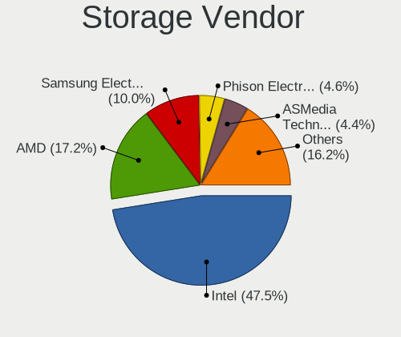

| Vendor                       | Desktops | Percent |
|------------------------------|----------|---------|
| Intel                        | 171      | 47.37%  |
| AMD                          | 65       | 18.01%  |
| Samsung Electronics          | 40       | 11.08%  |
| Phison Electronics           | 19       | 5.26%   |
| ASMedia Technology           | 16       | 4.43%   |
| Sandisk                      | 9        | 2.49%   |
| Marvell Technology Group     | 6        | 1.66%   |
| ADATA Technology             | 6        | 1.66%   |
| Silicon Motion               | 4        | 1.11%   |
| Seagate Technology           | 4        | 1.11%   |
| Micron/Crucial Technology    | 4        | 1.11%   |
| Realtek Semiconductor        | 3        | 0.83%   |
| Yangtze Memory Technologies  | 2        | 0.55%   |
| Toshiba America Info Systems | 2        | 0.55%   |
| SK Hynix                     | 2        | 0.55%   |
| LSI Logic / Symbios Logic    | 2        | 0.55%   |
| KIOXIA                       | 2        | 0.55%   |
| Kingston Technology Company  | 2        | 0.55%   |
| Micron Technology            | 1        | 0.28%   |
| Broadcom / LSI               | 1        | 0.28%   |

Storage Model
-------------

Storage controller models

| Model                                                                            | Desktops | Percent |
|----------------------------------------------------------------------------------|----------|---------|
| AMD FCH SATA Controller [AHCI mode]                                              | 50       | 12.2%   |
| Samsung NVMe SSD Controller SM981/PM981/PM983                                    | 30       | 7.32%   |
| Intel 8 Series/C220 Series Chipset Family 6-port SATA Controller 1 [AHCI mode]   | 24       | 5.85%   |
| Intel 200 Series PCH SATA controller [AHCI mode]                                 | 19       | 4.63%   |
| Intel SATA Controller [RAID mode]                                                | 17       | 4.15%   |
| Intel Q170/Q150/B150/H170/H110/Z170/CM236 Chipset SATA Controller [AHCI Mode]    | 17       | 4.15%   |
| Intel Cannon Lake PCH SATA AHCI Controller                                       | 16       | 3.9%    |
| ASMedia ASM1062 Serial ATA Controller                                            | 16       | 3.9%    |
| Intel 6 Series/C200 Series Chipset Family 6 port Desktop SATA AHCI Controller    | 15       | 3.66%   |
| AMD 400 Series Chipset SATA Controller                                           | 14       | 3.41%   |
| Intel 7 Series/C210 Series Chipset Family 6-port SATA Controller [AHCI mode]     | 13       | 3.17%   |
| Phison E16 PCIe4 NVMe Controller                                                 | 8        | 1.95%   |
| Phison E12 NVMe Controller                                                       | 7        | 1.71%   |
| Intel 9 Series Chipset Family SATA Controller [AHCI Mode]                        | 7        | 1.71%   |
| Intel 500 Series Chipset Family SATA AHCI Controller                             | 7        | 1.71%   |
| Samsung NVMe SSD Controller SM961/PM961/SM963                                    | 6        | 1.46%   |
| ADATA XPG SX8200 Pro PCIe Gen3x4 M.2 2280 Solid State Drive                      | 6        | 1.46%   |
| Sandisk WD PC SN810 / Black SN850 NVMe SSD                                       | 5        | 1.22%   |
| Intel SSD 660P Series                                                            | 5        | 1.22%   |
| AMD SB7x0/SB8x0/SB9x0 SATA Controller [AHCI mode]                                | 5        | 1.22%   |
| AMD 300 Series Chipset SATA Controller                                           | 5        | 1.22%   |
| Seagate FireCuda 520 SSD                                                         | 4        | 0.98%   |
| Samsung NVMe SSD Controller PM9A1/PM9A3/980PRO                                   | 4        | 0.98%   |
| Intel Comet Lake SATA AHCI Controller                                            | 4        | 0.98%   |
| Intel C610/X99 series chipset sSATA Controller [AHCI mode]                       | 4        | 0.98%   |
| Intel C610/X99 series chipset 6-Port SATA Controller [AHCI mode]                 | 4        | 0.98%   |
| Intel C600/X79 series chipset 6-Port SATA AHCI Controller                        | 4        | 0.98%   |
| AMD 500 Series Chipset SATA Controller                                           | 4        | 0.98%   |
| Silicon Motion SM2263EN/SM2263XT SSD Controller                                  | 3        | 0.73%   |
| Realtek Realtek Non-Volatile memory controller                                   | 3        | 0.73%   |
| Marvell Group 88SE9172 SATA 6Gb/s Controller                                     | 3        | 0.73%   |
| Intel Atom/Celeron/Pentium Processor x5-E8000/J3xxx/N3xxx Series SATA Controller | 3        | 0.73%   |
| Intel Atom Processor E3800 Series SATA AHCI Controller                           | 3        | 0.73%   |
| Intel 7 Series/C210 Series Chipset Family 4-port SATA Controller [IDE mode]      | 3        | 0.73%   |
| Intel 7 Series/C210 Series Chipset Family 2-port SATA Controller [IDE mode]      | 3        | 0.73%   |
| AMD RS690 PCI to PCI Bridge (PCI Express Port 3)                                 | 3        | 0.73%   |
| AMD FCH SATA Controller D                                                        | 3        | 0.73%   |
| Yangtze Memory Non-Volatile memory controller                                    | 2        | 0.49%   |
| Toshiba America Info Systems Toshiba America Info Non-Volatile memory controller | 2        | 0.49%   |
| Samsung NVMe SSD Controller SM951/PM951                                          | 2        | 0.49%   |
| Samsung NVMe SSD Controller 980                                                  | 2        | 0.49%   |
| Phison NVMe Storage Controller                                                   | 2        | 0.49%   |
| Micron/Crucial P2 NVMe PCIe SSD                                                  | 2        | 0.49%   |
| Micron/Crucial P1 NVMe PCIe SSD                                                  | 2        | 0.49%   |
| Intel Sunrise Point-LP SATA Controller [AHCI mode]                               | 2        | 0.49%   |
| Intel NVMe Optane Memory Series                                                  | 2        | 0.49%   |
| Intel Comet Lake PCH-H RAID                                                      | 2        | 0.49%   |
| Intel Celeron/Pentium Silver Processor SATA Controller                           | 2        | 0.49%   |
| Intel Alder Lake-S PCH SATA Controller [AHCI Mode]                               | 2        | 0.49%   |
| Intel 7 Series Chipset Family 6-port SATA Controller [AHCI mode]                 | 2        | 0.49%   |
| AMD SB7x0/SB8x0/SB9x0 IDE Controller                                             | 2        | 0.49%   |
| AMD FCH SATA Controller [IDE mode]                                               | 2        | 0.49%   |
| SK Hynix BC511                                                                   | 1        | 0.24%   |
| SK Hynix BC501 NVMe Solid State Drive                                            | 1        | 0.24%   |
| Silicon Motion SM2262/SM2262EN SSD Controller                                    | 1        | 0.24%   |
| Sandisk WD Blue SN550 NVMe SSD                                                   | 1        | 0.24%   |
| Sandisk WD Blue SN500 / PC SN520 NVMe SSD                                        | 1        | 0.24%   |
| Sandisk WD Black SN750 / PC SN730 NVMe SSD                                       | 1        | 0.24%   |
| Sandisk WD Black NVMe SSD                                                        | 1        | 0.24%   |
| Phison E7 NVMe Controller                                                        | 1        | 0.24%   |

Storage Kind
------------

Kind of storage controller (IDE, SATA, NVMe, SAS, ...)

| Kind | Desktops | Percent |
|------|----------|---------|
| SATA | 212      | 62.35%  |
| NVMe | 92       | 27.06%  |
| RAID | 23       | 6.76%   |
| IDE  | 10       | 2.94%   |
| SAS  | 2        | 0.59%   |
| SCSI | 1        | 0.29%   |

Processor
---------

CPU Vendor
----------

Processor vendors

| Vendor | Desktops | Percent |
|--------|----------|---------|
| Intel  | 173      | 72.69%  |
| AMD    | 65       | 27.31%  |

CPU Model
---------

Processor models

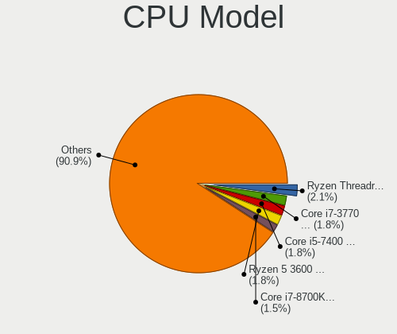

| Model                                          | Desktops | Percent |
|------------------------------------------------|----------|---------|
| Intel Core i5-7400 CPU @ 3.00GHz               | 6        | 2.51%   |
| Intel Core i7-8700K CPU @ 3.70GHz              | 5        | 2.09%   |
| Intel Core i7-8700 CPU @ 3.20GHz               | 5        | 2.09%   |
| AMD Ryzen Threadripper 3960X 24-Core Processor | 5        | 2.09%   |
| AMD Ryzen 5 3600 6-Core Processor              | 5        | 2.09%   |
| Intel Core i7-3770 CPU @ 3.40GHz               | 4        | 1.67%   |
| Intel Core i5-8600K CPU @ 3.60GHz              | 4        | 1.67%   |
| Intel Core i5-3470 CPU @ 3.20GHz               | 4        | 1.67%   |
| AMD Ryzen 9 3900X 12-Core Processor            | 4        | 1.67%   |
| AMD Ryzen 7 2700X Eight-Core Processor         | 4        | 1.67%   |
| AMD Ryzen 5 2600 Six-Core Processor            | 4        | 1.67%   |
| Intel Core i7-9700K CPU @ 3.60GHz              | 3        | 1.26%   |
| Intel Core i7-6700K CPU @ 4.00GHz              | 3        | 1.26%   |
| Intel Core i7-2600K CPU @ 3.40GHz              | 3        | 1.26%   |
| Intel Core i5-9600K CPU @ 3.70GHz              | 3        | 1.26%   |
| Intel Core i5-9400F CPU @ 2.90GHz              | 3        | 1.26%   |
| Intel Core i5-8400 CPU @ 2.80GHz               | 3        | 1.26%   |
| Intel Core i5-4440 CPU @ 3.10GHz               | 3        | 1.26%   |
| Intel Core i3-4130 CPU @ 3.40GHz               | 3        | 1.26%   |
| Intel Core i3-2120 CPU @ 3.30GHz               | 3        | 1.26%   |
| AMD Ryzen Threadripper 3990X 64-Core Processor | 3        | 1.26%   |
| AMD Ryzen 9 5900X 12-Core Processor            | 3        | 1.26%   |
| AMD Ryzen 7 3700X 8-Core Processor             | 3        | 1.26%   |
| Intel Xeon CPU X5675 @ 3.07GHz                 | 2        | 0.84%   |
| Intel Xeon CPU E3-1220 v3 @ 3.10GHz            | 2        | 0.84%   |
| Intel Core i9-9900K CPU @ 3.60GHz              | 2        | 0.84%   |
| Intel Core i9-10900K CPU @ 3.70GHz             | 2        | 0.84%   |
| Intel Core i7-6700 CPU @ 3.40GHz               | 2        | 0.84%   |
| Intel Core i7-4790K CPU @ 4.00GHz              | 2        | 0.84%   |
| Intel Core i7-3770K CPU @ 3.50GHz              | 2        | 0.84%   |
| Intel Core i7-10700 CPU @ 2.90GHz              | 2        | 0.84%   |
| Intel Core i5-6600K CPU @ 3.50GHz              | 2        | 0.84%   |
| Intel Core i5-6500 CPU @ 3.20GHz               | 2        | 0.84%   |
| Intel Core i5-6400 CPU @ 2.70GHz               | 2        | 0.84%   |
| Intel Core i5-4590 CPU @ 3.30GHz               | 2        | 0.84%   |
| Intel Core i5-4460 CPU @ 3.20GHz               | 2        | 0.84%   |
| Intel Core i5-3550 CPU @ 3.30GHz               | 2        | 0.84%   |
| Intel Core i5-2500 CPU @ 3.30GHz               | 2        | 0.84%   |
| Intel Core i5-2400 CPU @ 3.10GHz               | 2        | 0.84%   |
| Intel Core i3-8100 CPU @ 3.60GHz               | 2        | 0.84%   |
| Intel Core i3-4370 CPU @ 3.80GHz               | 2        | 0.84%   |
| Intel Core i3-4170 CPU @ 3.70GHz               | 2        | 0.84%   |
| Intel Celeron J4125 CPU @ 2.00GHz              | 2        | 0.84%   |
| Intel 11th Gen Core i5-11600K @ 3.90GHz        | 2        | 0.84%   |
| Intel 11th Gen Core i5-11400F @ 2.60GHz        | 2        | 0.84%   |
| AMD Ryzen Threadripper 3970X 32-Core Processor | 2        | 0.84%   |
| AMD Ryzen 7 1700X Eight-Core Processor         | 2        | 0.84%   |
| AMD Ryzen 3 1200 Quad-Core Processor           | 2        | 0.84%   |
| AMD FX-8350 Eight-Core Processor               | 2        | 0.84%   |
| AMD Athlon 3000G with Radeon Vega Graphics     | 2        | 0.84%   |
| Intel Xeon CPU E5-2690 0 @ 2.90GHz             | 1        | 0.42%   |
| Intel Xeon CPU E5-2678 v3 @ 2.50GHz            | 1        | 0.42%   |
| Intel Xeon CPU E5-2650 v2 @ 2.60GHz            | 1        | 0.42%   |
| Intel Xeon CPU E5-2640 v3 @ 2.60GHz            | 1        | 0.42%   |
| Intel Xeon CPU E5-2640 0 @ 2.50GHz             | 1        | 0.42%   |
| Intel Xeon CPU E5-1650 v3 @ 3.50GHz            | 1        | 0.42%   |
| Intel Xeon CPU E5-1620 v4 @ 3.50GHz            | 1        | 0.42%   |
| Intel Xeon CPU E5-1620 0 @ 3.60GHz             | 1        | 0.42%   |
| Intel Xeon CPU E3-1270 V2 @ 3.50GHz            | 1        | 0.42%   |
| Intel Xeon CPU E3-1241 v3 @ 3.50GHz            | 1        | 0.42%   |

CPU Model Family
----------------

Processor model prefix

| Model                  | Desktops | Percent |
|------------------------|----------|---------|
| Intel Core i5          | 61       | 25.63%  |
| Intel Core i7          | 42       | 17.65%  |
| Intel Xeon             | 17       | 7.14%   |
| Intel Core i3          | 16       | 6.72%   |
| AMD Ryzen 7            | 13       | 5.46%   |
| AMD Ryzen 5            | 13       | 5.46%   |
| Intel Celeron          | 12       | 5.04%   |
| AMD Ryzen Threadripper | 11       | 4.62%   |
| Other                  | 9        | 3.78%   |
| AMD Ryzen 9            | 8        | 3.36%   |
| Intel Core i9          | 7        | 2.94%   |
| Intel Pentium          | 6        | 2.52%   |
| AMD Ryzen 3            | 5        | 2.1%    |
| AMD FX                 | 5        | 2.1%    |
| AMD Athlon             | 3        | 1.26%   |
| AMD A10                | 3        | 1.26%   |
| Intel Atom             | 2        | 0.84%   |
| AMD A6                 | 2        | 0.84%   |
| Intel Pentium Gold     | 1        | 0.42%   |
| AMD Ryzen 5 PRO        | 1        | 0.42%   |
| AMD A4                 | 1        | 0.42%   |

CPU Cores
---------

Number of processor cores

| Number | Desktops | Percent |
|--------|----------|---------|
| 4      | 95       | 39.92%  |
| 6      | 51       | 21.43%  |
| 2      | 35       | 14.71%  |
| 8      | 26       | 10.92%  |
| 12     | 11       | 4.62%   |
| 24     | 5        | 2.1%    |
| 10     | 4        | 1.68%   |
| 64     | 3        | 1.26%   |
| 16     | 3        | 1.26%   |
| 1      | 3        | 1.26%   |
| 32     | 2        | 0.84%   |

CPU Sockets
-----------

Number of sockets

| Number | Desktops | Percent |
|--------|----------|---------|
| 1      | 235      | 98.74%  |
| 2      | 3        | 1.26%   |

CPU Threads
-----------

Threads per core (Hyper-Threading)

| Number | Desktops | Percent |
|--------|----------|---------|
| 2      | 144      | 60.25%  |
| 1      | 95       | 39.75%  |

CPU Op-Modes
------------

CPU Operation Modes (32-bit, 64-bit)

| Op mode        | Desktops | Percent |
|----------------|----------|---------|
| 32-bit, 64-bit | 216      | 89.63%  |
| Unknown        | 25       | 10.37%  |

CPU Microcode
-------------

Microcode number

| Number  | Desktops | Percent |
|---------|----------|---------|
| Unknown | 225      | 94.14%  |
| 0x506e3 | 4        | 1.67%   |
| 0x906ea | 2        | 0.84%   |
| 0x906e9 | 2        | 0.84%   |
| 0x306c3 | 2        | 0.84%   |
| 0x30678 | 2        | 0.84%   |
| 0x406c4 | 1        | 0.42%   |
| 0x206a7 | 1        | 0.42%   |

CPU Microarch
-------------

Microarchitecture

| Name          | Desktops | Percent |
|---------------|----------|---------|
| KabyLake      | 49       | 20.59%  |
| Haswell       | 39       | 16.39%  |
| Zen 2         | 27       | 11.34%  |
| IvyBridge     | 20       | 8.4%    |
| SandyBridge   | 19       | 7.98%   |
| Zen+          | 13       | 5.46%   |
| Skylake       | 13       | 5.46%   |
| Silvermont    | 9        | 3.78%   |
| CometLake     | 9        | 3.78%   |
| Unknown       | 9        | 3.78%   |
| Piledriver    | 8        | 3.36%   |
| Zen           | 7        | 2.94%   |
| Zen 3         | 6        | 2.52%   |
| Westmere      | 2        | 0.84%   |
| Goldmont plus | 2        | 0.84%   |
| Steamroller   | 1        | 0.42%   |
| Jaguar        | 1        | 0.42%   |
| Goldmont      | 1        | 0.42%   |
| Excavator     | 1        | 0.42%   |
| Bulldozer     | 1        | 0.42%   |
| Broadwell     | 1        | 0.42%   |

Graphics
--------

GPU Vendor
----------

Vendors of graphics cards

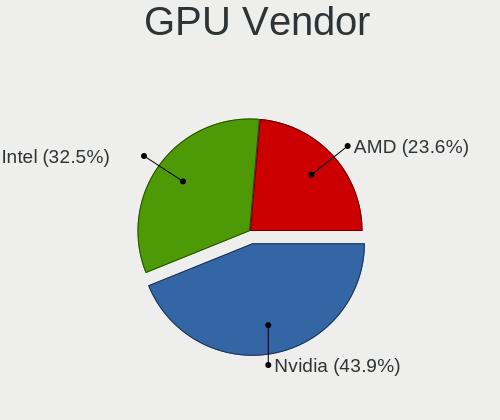

| Vendor | Desktops | Percent |
|--------|----------|---------|
| Nvidia | 119      | 45.59%  |
| Intel  | 78       | 29.89%  |
| AMD    | 64       | 24.52%  |

GPU Model
---------

Graphics card models

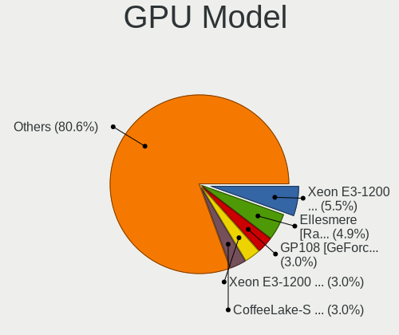

| Model                                                                                    | Desktops | Percent |
|------------------------------------------------------------------------------------------|----------|---------|
| AMD Ellesmere [Radeon RX 470/480/570/570X/580/580X/590]                                  | 18       | 6.79%   |
| Intel Xeon E3-1200 v3/4th Gen Core Processor Integrated Graphics Controller              | 11       | 4.15%   |
| Nvidia GP106 [GeForce GTX 1060 6GB]                                                      | 10       | 3.77%   |
| Intel CoffeeLake-S GT2 [UHD Graphics 630]                                                | 10       | 3.77%   |
| Intel 2nd Generation Core Processor Family Integrated Graphics Controller                | 9        | 3.4%    |
| AMD Navi 10 [Radeon RX 5600 OEM/5600 XT / 5700/5700 XT]                                  | 8        | 3.02%   |
| Intel Xeon E3-1200 v2/3rd Gen Core processor Graphics Controller                         | 7        | 2.64%   |
| Nvidia GP104 [GeForce GTX 1080]                                                          | 6        | 2.26%   |
| Nvidia GP104 [GeForce GTX 1070]                                                          | 6        | 2.26%   |
| Nvidia GP104 [GeForce GTX 1070 Ti]                                                       | 6        | 2.26%   |
| Intel HD Graphics 630                                                                    | 6        | 2.26%   |
| Intel 4th Generation Core Processor Family Integrated Graphics Controller                | 6        | 2.26%   |
| Nvidia GP108 [GeForce GT 1030]                                                           | 5        | 1.89%   |
| Nvidia GP107 [GeForce GTX 1050 Ti]                                                       | 5        | 1.89%   |
| Intel Atom/Celeron/Pentium Processor x5-E8000/J3xxx/N3xxx Integrated Graphics Controller | 5        | 1.89%   |
| Nvidia TU106 [GeForce RTX 2070]                                                          | 4        | 1.51%   |
| Nvidia GM107 [GeForce GTX 750 Ti]                                                        | 4        | 1.51%   |
| Nvidia GK208B [GeForce GT 710]                                                           | 4        | 1.51%   |
| Intel HD Graphics 530                                                                    | 4        | 1.51%   |
| Intel Atom Processor Z36xxx/Z37xxx Series Graphics & Display                             | 4        | 1.51%   |
| Nvidia TU116 [GeForce GTX 1660 Ti]                                                       | 3        | 1.13%   |
| Nvidia GP107 [GeForce GTX 1050]                                                          | 3        | 1.13%   |
| Nvidia GP106 [GeForce GTX 1060 3GB]                                                      | 3        | 1.13%   |
| Nvidia GM204 [GeForce GTX 970]                                                           | 3        | 1.13%   |
| Intel CometLake-S GT2 [UHD Graphics 630]                                                 | 3        | 1.13%   |
| AMD Baffin [Radeon RX 460/560D / Pro 450/455/460/555/555X/560/560X]                      | 3        | 1.13%   |
| Nvidia TU116 [GeForce GTX 1650 SUPER]                                                    | 2        | 0.75%   |
| Nvidia TU106 [GeForce RTX 2060 SUPER]                                                    | 2        | 0.75%   |
| Nvidia TU104 [GeForce RTX 2080 SUPER]                                                    | 2        | 0.75%   |
| Nvidia TU104 [GeForce RTX 2080 Rev. A]                                                   | 2        | 0.75%   |
| Nvidia GP102 [GeForce GTX 1080 Ti]                                                       | 2        | 0.75%   |
| Nvidia GM206 [GeForce GTX 960]                                                           | 2        | 0.75%   |
| Nvidia GM200 [GeForce GTX 980 Ti]                                                        | 2        | 0.75%   |
| Nvidia GM107 [GeForce GTX 750]                                                           | 2        | 0.75%   |
| Nvidia GK208B [GeForce GT 730]                                                           | 2        | 0.75%   |
| Nvidia GK107GL [Quadro K420]                                                             | 2        | 0.75%   |
| Nvidia GK106 [GeForce GTX 660]                                                           | 2        | 0.75%   |
| Nvidia GK104 [GeForce GTX 770]                                                           | 2        | 0.75%   |
| Nvidia GF119 [GeForce GT 610]                                                            | 2        | 0.75%   |
| Nvidia GF114 [GeForce GTX 560]                                                           | 2        | 0.75%   |
| Nvidia GF106GL [Quadro 2000]                                                             | 2        | 0.75%   |
| Nvidia GA104 [GeForce RTX 3070]                                                          | 2        | 0.75%   |
| Intel RocketLake-S GT1 [UHD Graphics 750]                                                | 2        | 0.75%   |
| Intel IvyBridge GT2 [HD Graphics 4000]                                                   | 2        | 0.75%   |
| Intel GeminiLake [UHD Graphics 600]                                                      | 2        | 0.75%   |
| AMD Trinity [Radeon HD 7660D]                                                            | 2        | 0.75%   |
| AMD Raven Ridge [Radeon Vega Series / Radeon Vega Mobile Series]                         | 2        | 0.75%   |
| AMD Picasso/Raven 2 [Radeon Vega Series / Radeon Vega Mobile Series]                     | 2        | 0.75%   |
| AMD Cezanne                                                                              | 2        | 0.75%   |
| AMD Cedar [Radeon HD 5000/6000/7350/8350 Series]                                         | 2        | 0.75%   |
| AMD Caicos [Radeon HD 6450/7450/8450 / R5 230 OEM]                                       | 2        | 0.75%   |
| AMD Baffin [Radeon RX 550 640SP / RX 560/560X]                                           | 2        | 0.75%   |
| Nvidia TU116 [GeForce GTX 1660 SUPER]                                                    | 1        | 0.38%   |
| Nvidia TU106 [GeForce RTX 2070 Rev. A]                                                   | 1        | 0.38%   |
| Nvidia TU106 [GeForce RTX 2060 Rev. A]                                                   | 1        | 0.38%   |
| Nvidia TU102 [TITAN RTX]                                                                 | 1        | 0.38%   |
| Nvidia TU102 [GeForce RTX 2080 Ti Rev. A]                                                | 1        | 0.38%   |
| Nvidia NV44 [GeForce 7100 GS]                                                            | 1        | 0.38%   |
| Nvidia GT218 [GeForce 8400 GS Rev. 3]                                                    | 1        | 0.38%   |
| Nvidia GT218 [GeForce 210]                                                               | 1        | 0.38%   |

GPU Combo
---------

Combinations of graphics cards

| Name                     | Desktops | Percent |
|--------------------------|----------|---------|
| 1 x Nvidia               | 113      | 46.89%  |
| 1 x AMD                  | 60       | 24.9%   |
| 1 x Intel                | 59       | 24.48%  |
| Intel + Nvidia           | 4        | 1.66%   |
| Intel + AMD              | 2        | 0.83%   |
| 2 x Nvidia               | 1        | 0.41%   |
| 2 x AMD + 1 x Nvidia     | 1        | 0.41%   |
| Intel + AMD + 1 x Nvidia | 1        | 0.41%   |

GPU Driver
----------

Free vs proprietary

| Driver      | Desktops | Percent |
|-------------|----------|---------|
| Free        | 220      | 91.67%  |
| Proprietary | 17       | 7.08%   |
| Unknown     | 3        | 1.25%   |

GPU Memory
----------

Total video memory

| Size in GB | Desktops | Percent |
|------------|----------|---------|
| Unknown    | 217      | 90.42%  |
| 7.01-8.0   | 6        | 2.5%    |
| 3.01-4.0   | 6        | 2.5%    |
| 1.01-2.0   | 6        | 2.5%    |
| 5.01-6.0   | 2        | 0.83%   |
| 0.51-1.0   | 2        | 0.83%   |
| 8.01-16.0  | 1        | 0.42%   |

Monitor
-------

Monitor Vendor
--------------

Monitor vendors

| Vendor               | Desktops | Percent |
|----------------------|----------|---------|
| Samsung Electronics  | 55       | 20.3%   |
| Dell                 | 30       | 11.07%  |
| Goldstar             | 29       | 10.7%   |
| Hewlett-Packard      | 18       | 6.64%   |
| AOC                  | 17       | 6.27%   |
| BenQ                 | 16       | 5.9%    |
| Acer                 | 13       | 4.8%    |
| Ancor Communications | 12       | 4.43%   |
| ViewSonic            | 11       | 4.06%   |
| Philips              | 11       | 4.06%   |
| MSI                  | 5        | 1.85%   |
| Sony                 | 4        | 1.48%   |
| Iiyama               | 4        | 1.48%   |
| Hitachi              | 4        | 1.48%   |
| ASUSTek Computer     | 4        | 1.48%   |
| Unknown              | 3        | 1.11%   |
| LG Electronics       | 3        | 1.11%   |
| Vizio                | 2        | 0.74%   |
| Toshiba              | 2        | 0.74%   |
| Sharp                | 2        | 0.74%   |
| Sceptre Tech         | 2        | 0.74%   |
| RTK                  | 2        | 0.74%   |
| Medion               | 2        | 0.74%   |
| Lenovo               | 2        | 0.74%   |
| Insignia             | 2        | 0.74%   |
| Fujitsu Siemens      | 2        | 0.74%   |
| Westinghouse         | 1        | 0.37%   |
| Vestel Elektronik    | 1        | 0.37%   |
| STD                  | 1        | 0.37%   |
| Pixio                | 1        | 0.37%   |
| NEC Computers        | 1        | 0.37%   |
| MStar                | 1        | 0.37%   |
| MiTAC                | 1        | 0.37%   |
| HannStar             | 1        | 0.37%   |
| Gigabyte Technology  | 1        | 0.37%   |
| Eizo                 | 1        | 0.37%   |
| Denver               | 1        | 0.37%   |
| CRO                  | 1        | 0.37%   |
| Belinea              | 1        | 0.37%   |
| Arnos Instruments    | 1        | 0.37%   |

Monitor Model
-------------

Monitor models

| Model                                                                | Desktops | Percent |
|----------------------------------------------------------------------|----------|---------|
| Goldstar IPS FULLHD GSM5AB8 1920x1080 480x270mm 21.7-inch            | 5        | 1.74%   |
| MSI Optix MAG27C MSI1462 1920x1080 598x336mm 27.0-inch               | 3        | 1.05%   |
| Samsung Electronics U28E510 SAM0D63 3840x2160 607x345mm 27.5-inch    | 2        | 0.7%    |
| Samsung Electronics C49RG9x SAM0F9C 3840x1080 1193x336mm 48.8-inch   | 2        | 0.7%    |
| Samsung Electronics C27F390 SAM0D32 1920x1080 598x336mm 27.0-inch    | 2        | 0.7%    |
| Samsung Electronics C24F390 SAM0D2C 1920x1080 521x293mm 23.5-inch    | 2        | 0.7%    |
| Hitachi W240D DVI HIT7D03 1920x1200 520x320mm 24.0-inch              | 2        | 0.7%    |
| Hitachi HISENSE HEC0030 3840x2160 1872x1053mm 84.6-inch              | 2        | 0.7%    |
| Goldstar ULTRAWIDE GSM76F9 2560x1080 531x298mm 24.0-inch             | 2        | 0.7%    |
| Goldstar ULTRAWIDE GSM59F2 2560x1080 798x334mm 34.1-inch             | 2        | 0.7%    |
| Goldstar Ultra HD GSM5B09 3840x2160 600x340mm 27.2-inch              | 2        | 0.7%    |
| Goldstar Ultra HD GSM5B08 3840x2160 600x340mm 27.2-inch              | 2        | 0.7%    |
| Dell P2414H DELA09A 1920x1080 527x297mm 23.8-inch                    | 2        | 0.7%    |
| AOC AG352QG2 AOC3520 2560x1080 820x346mm 35.0-inch                   | 2        | 0.7%    |
| AOC 2276W AOC2276 1920x1080 477x268mm 21.5-inch                      | 2        | 0.7%    |
| AOC 2260WG5 AOC2260 1920x1080 477x268mm 21.5-inch                    | 2        | 0.7%    |
| Acer GN246HL ACR02F9 1920x1080 531x299mm 24.0-inch                   | 2        | 0.7%    |
| Westinghouse WD32HD1390 WET3553 1680x1050 708x398mm 32.0-inch        | 1        | 0.35%   |
| Vizio M322i-B1 VIZ1005 1920x1080 698x392mm 31.5-inch                 | 1        | 0.35%   |
| Vizio LCD Monitor VIZ0026 1360x768 580x320mm 26.1-inch               | 1        | 0.35%   |
| ViewSonic VX3276-QHD VSCE635 2560x1440 698x393mm 31.5-inch           | 1        | 0.35%   |
| ViewSonic VX2450 SERIES VSCE226 1920x1080 525x297mm 23.7-inch        | 1        | 0.35%   |
| ViewSonic VX2363 Series VSC6B2F 1920x1080 509x286mm 23.0-inch        | 1        | 0.35%   |
| ViewSonic VX2239 SERIES VSC5225 1920x1080 480x270mm 21.7-inch        | 1        | 0.35%   |
| ViewSonic VX2039 Series VSCB531 1440x900 419x262mm 19.5-inch         | 1        | 0.35%   |
| ViewSonic VX2035wm VSCAF1E 1680x1050 433x271mm 20.1-inch             | 1        | 0.35%   |
| ViewSonic VA2465 SERIES VSCB730 1920x1080 521x293mm 23.5-inch        | 1        | 0.35%   |
| ViewSonic VA2246 Series VSC6F2E 1920x1080 477x268mm 21.5-inch        | 1        | 0.35%   |
| ViewSonic VA2219 Series VSC7932 1920x1080 477x268mm 21.5-inch        | 1        | 0.35%   |
| ViewSonic LCD Monitor VA2212 Series                                  | 1        | 0.35%   |
| ViewSonic G90fb-2 VSC4907 1920x1440 357x268mm 17.6-inch              | 1        | 0.35%   |
| Vestel Elektronik 22W_LCD_TV VES3700 1920x540                        | 1        | 0.35%   |
| Unknown LCD Monitor Sharp LL-S201A 1920x1080                         | 1        | 0.35%   |
| Unknown LCD Monitor SAMSUNG 3840x2160                                | 1        | 0.35%   |
| Unknown LCD Monitor CHO Smart TV 1920x1080                           | 1        | 0.35%   |
| Toshiba TV TSB1302 1920x1080 885x498mm 40.0-inch                     | 1        | 0.35%   |
| Toshiba TV TSB0108 1360x768 698x393mm 31.5-inch                      | 1        | 0.35%   |
| STD 22"W HDMI STD0016 1680x1050 473x296mm 22.0-inch                  | 1        | 0.35%   |
| Sony TV SNYEE01 1920x1080                                            | 1        | 0.35%   |
| Sony TV SNY2C02 1920x1080 708x398mm 32.0-inch                        | 1        | 0.35%   |
| Sony TV SNY1A02 1920x1080 1600x900mm 72.3-inch                       | 1        | 0.35%   |
| Sony TV  *01 SNYD902 1920x1080 1040x590mm 47.1-inch                  | 1        | 0.35%   |
| Sharp LC55LBU591C SHP4353 3840x2160 800x450mm 36.1-inch              | 1        | 0.35%   |
| Sharp HDMI SHP101E 1920x540                                          | 1        | 0.35%   |
| Sceptre Tech Sceptre P30 SPT0BCC 2560x1080 690x290mm 29.5-inch       | 1        | 0.35%   |
| Sceptre Tech E24 SPT099D 1920x1080 521x293mm 23.5-inch               | 1        | 0.35%   |
| Samsung Electronics U28E850 SAM0CCE 3840x2160 608x345mm 27.5-inch    | 1        | 0.35%   |
| Samsung Electronics U28E850 SAM0CCB 3840x2160 607x345mm 27.5-inch    | 1        | 0.35%   |
| Samsung Electronics U28E590 SAM0C4E 3840x2160 608x345mm 27.5-inch    | 1        | 0.35%   |
| Samsung Electronics U28E590 SAM0C4C 3840x2160 608x345mm 27.5-inch    | 1        | 0.35%   |
| Samsung Electronics U28E510 SAM0D64 1920x1080 608x345mm 27.5-inch    | 1        | 0.35%   |
| Samsung Electronics T24D390 SAM0B6E 1920x1080 520x290mm 23.4-inch    | 1        | 0.35%   |
| Samsung Electronics T24C550 SAM0AA1 1920x1080 521x293mm 23.5-inch    | 1        | 0.35%   |
| Samsung Electronics SyncMaster SAM0608 1920x1080 510x290mm 23.1-inch | 1        | 0.35%   |
| Samsung Electronics SyncMaster SAM058E 1920x1080 477x268mm 21.5-inch | 1        | 0.35%   |
| Samsung Electronics SyncMaster SAM0589 1920x1080 521x293mm 23.5-inch | 1        | 0.35%   |
| Samsung Electronics SyncMaster SAM04D3 1920x1080 531x298mm 24.0-inch | 1        | 0.35%   |
| Samsung Electronics SyncMaster SAM0426 1920x1200                     | 1        | 0.35%   |
| Samsung Electronics SyncMaster SAM041F 2048x1152 510x287mm 23.0-inch | 1        | 0.35%   |
| Samsung Electronics SyncMaster SAM03E3 1680x1050 433x271mm 20.1-inch | 1        | 0.35%   |

Monitor Resolution
------------------

Monitor screen resolution

| Resolution         | Desktops | Percent |
|--------------------|----------|---------|
| 1920x1080 (FHD)    | 126      | 47.91%  |
| 3840x2160 (4K)     | 32       | 12.17%  |
| 2560x1440 (QHD)    | 19       | 7.22%   |
| 1680x1050 (WSXGA+) | 12       | 4.56%   |
| 1280x1024 (SXGA)   | 11       | 4.18%   |
| 3440x1440          | 9        | 3.42%   |
| 2560x1080          | 9        | 3.42%   |
| 1920x1200 (WUXGA)  | 9        | 3.42%   |
| 1440x900 (WXGA+)   | 6        | 2.28%   |
| 1360x768           | 6        | 2.28%   |
| Unknown            | 4        | 1.52%   |
| 1600x900 (HD+)     | 3        | 1.14%   |
| 1366x768 (WXGA)    | 3        | 1.14%   |
| 3840x1080          | 2        | 0.76%   |
| 1920x540           | 2        | 0.76%   |
| 1024x768 (XGA)     | 2        | 0.76%   |
| 5760x2160          | 1        | 0.38%   |
| 4480x1440          | 1        | 0.38%   |
| 3840x1600          | 1        | 0.38%   |
| 3600x1080          | 1        | 0.38%   |
| 3360x1050          | 1        | 0.38%   |
| 2048x1152          | 1        | 0.38%   |
| 1600x1200          | 1        | 0.38%   |
| 1280x720 (HD)      | 1        | 0.38%   |

Monitor Diagonal
----------------

Diagonal size in inches

| Inches  | Desktops | Percent |
|---------|----------|---------|
| 27      | 47       | 17.34%  |
| 24      | 41       | 15.13%  |
| 23      | 31       | 11.44%  |
| 21      | 31       | 11.44%  |
| Unknown | 17       | 6.27%   |
| 34      | 12       | 4.43%   |
| 22      | 11       | 4.06%   |
| 19      | 11       | 4.06%   |
| 20      | 9        | 3.32%   |
| 84      | 8        | 2.95%   |
| 17      | 7        | 2.58%   |
| 31      | 4        | 1.48%   |
| 25      | 4        | 1.48%   |
| 18      | 4        | 1.48%   |
| 72      | 3        | 1.11%   |
| 54      | 3        | 1.11%   |
| 48      | 3        | 1.11%   |
| 35      | 3        | 1.11%   |
| 32      | 3        | 1.11%   |
| 52      | 2        | 0.74%   |
| 40      | 2        | 0.74%   |
| 37      | 2        | 0.74%   |
| 29      | 2        | 0.74%   |
| 26      | 2        | 0.74%   |
| 15      | 2        | 0.74%   |
| 65      | 1        | 0.37%   |
| 55      | 1        | 0.37%   |
| 50      | 1        | 0.37%   |
| 46      | 1        | 0.37%   |
| 43      | 1        | 0.37%   |
| 42      | 1        | 0.37%   |
| 33      | 1        | 0.37%   |

Monitor Width
-------------

Physical width

| Width in mm | Desktops | Percent |
|-------------|----------|---------|
| 501-600     | 105      | 40.38%  |
| 401-500     | 58       | 22.31%  |
| 601-700     | 17       | 6.54%   |
| Unknown     | 17       | 6.54%   |
| 701-800     | 16       | 6.15%   |
| 1001-1500   | 12       | 4.62%   |
| 1501-2000   | 11       | 4.23%   |
| 301-350     | 8        | 3.08%   |
| 801-900     | 7        | 2.69%   |
| 351-400     | 7        | 2.69%   |
| 901-1000    | 2        | 0.77%   |

Aspect Ratio
------------

Proportional relationship between the width and the height

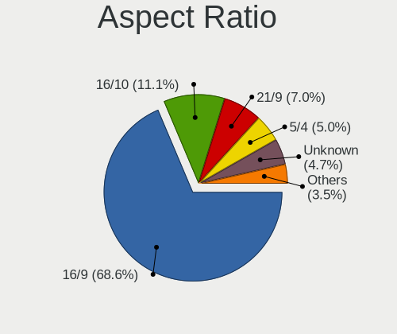

| Ratio   | Desktops | Percent |
|---------|----------|---------|
| 16/9    | 168      | 66.93%  |
| 16/10   | 31       | 12.35%  |
| 21/9    | 18       | 7.17%   |
| Unknown | 14       | 5.58%   |
| 5/4     | 12       | 4.78%   |
| 4/3     | 4        | 1.59%   |
| 32/9    | 2        | 0.8%    |
| 1.96    | 1        | 0.4%    |
| 1.00    | 1        | 0.4%    |

Monitor Area
------------

Area in inch

| Area in inch | Desktops | Percent |
|----------------|----------|---------|
| 201-250        | 90       | 33.96%  |
| 301-350        | 49       | 18.49%  |
| 151-200        | 29       | 10.94%  |
| 351-500        | 23       | 8.68%   |
| More than 1000 | 19       | 7.17%   |
| Unknown        | 17       | 6.42%   |
| 251-300        | 16       | 6.04%   |
| 141-150        | 10       | 3.77%   |
| 501-1000       | 10       | 3.77%   |
| 101-110        | 2        | 0.75%   |

Pixel Density
-------------

Pixels per inch

| Density | Desktops | Percent |
|---------|----------|---------|
| 51-100  | 145      | 57.77%  |
| 101-120 | 56       | 22.31%  |
| Unknown | 17       | 6.77%   |
| 1-50    | 15       | 5.98%   |
| 121-160 | 11       | 4.38%   |
| 161-240 | 7        | 2.79%   |

Multiple Monitors
-----------------

Total monitors connected

| Total | Desktops | Percent |
|-------|----------|---------|
| 1     | 193      | 80.42%  |
| 2     | 38       | 15.83%  |
| 3     | 6        | 2.5%    |
| 0     | 3        | 1.25%   |

Network
-------

Net Controller Vendor
---------------------

Controller vendors

| Vendor                          | Desktops | Percent |
|---------------------------------|----------|---------|
| Realtek Semiconductor           | 128      | 39.02%  |
| Intel                           | 124      | 37.8%   |
| Qualcomm Atheros                | 26       | 7.93%   |
| Aquantia                        | 9        | 2.74%   |
| Ralink Technology               | 6        | 1.83%   |
| Broadcom                        | 6        | 1.83%   |
| Microsoft                       | 4        | 1.22%   |
| TP-Link                         | 3        | 0.91%   |
| Ralink                          | 3        | 0.91%   |
| Samsung Electronics             | 2        | 0.61%   |
| HMD Global                      | 2        | 0.61%   |
| Broadcom Limited                | 2        | 0.61%   |
| Xiaomi                          | 1        | 0.3%    |
| Qualcomm Atheros Communications | 1        | 0.3%    |
| Nordic Semiconductor ASA        | 1        | 0.3%    |
| Microchip Technology            | 1        | 0.3%    |
| Micro Star International        | 1        | 0.3%    |
| MediaTek                        | 1        | 0.3%    |
| Leaflabs                        | 1        | 0.3%    |
| DisplayLink                     | 1        | 0.3%    |
| Digital Equipment               | 1        | 0.3%    |
| D-Link System                   | 1        | 0.3%    |
| D-Link                          | 1        | 0.3%    |
| ASUSTek Computer                | 1        | 0.3%    |
| Apple                           | 1        | 0.3%    |

Net Controller Model
--------------------

Controller models

| Model                                                                                         | Desktops | Percent |
|-----------------------------------------------------------------------------------------------|----------|---------|
| Realtek RTL8111/8168/8411 PCI Express Gigabit Ethernet Controller                             | 109      | 28.24%  |
| Intel I211 Gigabit Network Connection                                                         | 21       | 5.44%   |
| Intel Ethernet Connection (2) I219-V                                                          | 17       | 4.4%    |
| Intel Wi-Fi 6 AX200                                                                           | 15       | 3.89%   |
| Intel 82579LM Gigabit Network Connection (Lewisville)                                         | 14       | 3.63%   |
| Intel Ethernet Connection (7) I219-V                                                          | 12       | 3.11%   |
| Realtek RTL8125 2.5GbE Controller                                                             | 11       | 2.85%   |
| Intel Ethernet Controller I225-V                                                              | 11       | 2.85%   |
| Intel Ethernet Connection I217-LM                                                             | 11       | 2.85%   |
| Aquantia AQC107 NBase-T/IEEE 802.3bz Ethernet Controller [AQtion]                             | 9        | 2.33%   |
| Intel Cannon Lake PCH CNVi WiFi                                                               | 7        | 1.81%   |
| Intel Wi-Fi 6 AX210/AX211/AX411 160MHz                                                        | 5        | 1.3%    |
| Intel Comet Lake PCH CNVi WiFi                                                                | 5        | 1.3%    |
| Intel 82579V Gigabit Network Connection                                                       | 5        | 1.3%    |
| Realtek RTL8821CE 802.11ac PCIe Wireless Network Adapter                                      | 4        | 1.04%   |
| Qualcomm Atheros Killer E220x Gigabit Ethernet Controller                                     | 4        | 1.04%   |
| Qualcomm Atheros AR9485 Wireless Network Adapter                                              | 4        | 1.04%   |
| Qualcomm Atheros AR9287 Wireless Network Adapter (PCI-Express)                                | 4        | 1.04%   |
| Intel Ethernet Connection I217-V                                                              | 4        | 1.04%   |
| Realtek RTL8153 Gigabit Ethernet Adapter                                                      | 3        | 0.78%   |
| Qualcomm Atheros QCA9377 802.11ac Wireless Network Adapter                                    | 3        | 0.78%   |
| Qualcomm Atheros Killer E2400 Gigabit Ethernet Controller                                     | 3        | 0.78%   |
| Intel Wireless-AC 9260                                                                        | 3        | 0.78%   |
| Intel Wireless 8265 / 8275                                                                    | 3        | 0.78%   |
| Intel Wireless 3165                                                                           | 3        | 0.78%   |
| Intel I210 Gigabit Network Connection                                                         | 3        | 0.78%   |
| Intel Ethernet Connection (2) I218-V                                                          | 3        | 0.78%   |
| Intel Ethernet Connection (14) I219-V                                                         | 3        | 0.78%   |
| Intel Dual Band Wireless-AC 3168NGW [Stone Peak]                                              | 3        | 0.78%   |
| Samsung Galaxy series, misc. (tethering mode)                                                 | 2        | 0.52%   |
| Realtek RTL8188EUS 802.11n Wireless Network Adapter                                           | 2        | 0.52%   |
| Ralink RT5370 Wireless Adapter                                                                | 2        | 0.52%   |
| Ralink MT7601U Wireless Adapter                                                               | 2        | 0.52%   |
| Qualcomm Atheros AR8161 Gigabit Ethernet                                                      | 2        | 0.52%   |
| Qualcomm Atheros AR5212/5213/2414 Wireless Network Adapter                                    | 2        | 0.52%   |
| Microsoft XBOX ACC                                                                            | 2        | 0.52%   |
| Intel Wireless 7260                                                                           | 2        | 0.52%   |
| Intel Ethernet Connection (2) I219-LM                                                         | 2        | 0.52%   |
| Intel Centrino Wireless-N 2230                                                                | 2        | 0.52%   |
| Intel 82574L Gigabit Network Connection                                                       | 2        | 0.52%   |
| Intel 82571EB/82571GB Gigabit Ethernet Controller D0/D1 (copper applications)                 | 2        | 0.52%   |
| HMD Global Nokia 2.4                                                                          | 2        | 0.52%   |
| Broadcom BCM4360 802.11ac Wireless Network Adapter                                            | 2        | 0.52%   |
| Xiaomi Mi/Redmi series (RNDIS)                                                                | 1        | 0.26%   |
| TP-Link TL-WN822N Version 4 RTL8192EU                                                         | 1        | 0.26%   |
| TP-Link TL-WN722N v2/v3 [Realtek RTL8188EUS]                                                  | 1        | 0.26%   |
| TP-Link Archer T3U [Realtek RTL8812BU]                                                        | 1        | 0.26%   |
| Realtek RTL8812AU 802.11a/b/g/n/ac 2T2R DB WLAN Adapter                                       | 1        | 0.26%   |
| Realtek RTL8812AE 802.11ac PCIe Wireless Network Adapter                                      | 1        | 0.26%   |
| Realtek RTL8811AU 802.11a/b/g/n/ac WLAN Adapter                                               | 1        | 0.26%   |
| Realtek RTL8723BU 802.11b/g/n WLAN Adapter                                                    | 1        | 0.26%   |
| Realtek RTL8723BE PCIe Wireless Network Adapter                                               | 1        | 0.26%   |
| Realtek RTL8192EE PCIe Wireless Network Adapter                                               | 1        | 0.26%   |
| Realtek RTL8192CU 802.11n WLAN Adapter                                                        | 1        | 0.26%   |
| Realtek RTL8192CE PCIe Wireless Network Adapter                                               | 1        | 0.26%   |
| Realtek RTL8188EE Wireless Network Adapter                                                    | 1        | 0.26%   |
| Realtek RTL8188CUS 802.11n WLAN Adapter                                                       | 1        | 0.26%   |
| Realtek Realtek 8812AU/8821AU 802.11ac WLAN Adapter [USB Wireless Dual-Band Adapter 2.4/5Ghz] | 1        | 0.26%   |
| Realtek 802.11ac NIC                                                                          | 1        | 0.26%   |
| Ralink RT5372 Wireless Adapter                                                                | 1        | 0.26%   |

Wireless Vendor
---------------

Wireless vendors

| Vendor                          | Desktops | Percent |
|---------------------------------|----------|---------|
| Intel                           | 51       | 45.95%  |
| Realtek Semiconductor           | 17       | 15.32%  |
| Qualcomm Atheros                | 16       | 14.41%  |
| Ralink Technology               | 6        | 5.41%   |
| Microsoft                       | 4        | 3.6%    |
| Broadcom                        | 4        | 3.6%    |
| TP-Link                         | 3        | 2.7%    |
| Ralink                          | 3        | 2.7%    |
| Broadcom Limited                | 2        | 1.8%    |
| Qualcomm Atheros Communications | 1        | 0.9%    |
| Micro Star International        | 1        | 0.9%    |
| D-Link System                   | 1        | 0.9%    |
| D-Link                          | 1        | 0.9%    |
| ASUSTek Computer                | 1        | 0.9%    |

Wireless Model
--------------

Wireless models

| Model                                                                                         | Desktops | Percent |
|-----------------------------------------------------------------------------------------------|----------|---------|
| Intel Wi-Fi 6 AX200                                                                           | 15       | 13.39%  |
| Intel Cannon Lake PCH CNVi WiFi                                                               | 7        | 6.25%   |
| Intel Wi-Fi 6 AX210/AX211/AX411 160MHz                                                        | 5        | 4.46%   |
| Intel Comet Lake PCH CNVi WiFi                                                                | 5        | 4.46%   |
| Realtek RTL8821CE 802.11ac PCIe Wireless Network Adapter                                      | 4        | 3.57%   |
| Qualcomm Atheros AR9485 Wireless Network Adapter                                              | 4        | 3.57%   |
| Qualcomm Atheros AR9287 Wireless Network Adapter (PCI-Express)                                | 4        | 3.57%   |
| Qualcomm Atheros QCA9377 802.11ac Wireless Network Adapter                                    | 3        | 2.68%   |
| Intel Wireless-AC 9260                                                                        | 3        | 2.68%   |
| Intel Wireless 8265 / 8275                                                                    | 3        | 2.68%   |
| Intel Wireless 3165                                                                           | 3        | 2.68%   |
| Intel Dual Band Wireless-AC 3168NGW [Stone Peak]                                              | 3        | 2.68%   |
| Realtek RTL8188EUS 802.11n Wireless Network Adapter                                           | 2        | 1.79%   |
| Ralink RT5370 Wireless Adapter                                                                | 2        | 1.79%   |
| Ralink MT7601U Wireless Adapter                                                               | 2        | 1.79%   |
| Qualcomm Atheros AR5212/5213/2414 Wireless Network Adapter                                    | 2        | 1.79%   |
| Microsoft XBOX ACC                                                                            | 2        | 1.79%   |
| Intel Wireless 7260                                                                           | 2        | 1.79%   |
| Intel Centrino Wireless-N 2230                                                                | 2        | 1.79%   |
| Broadcom BCM4360 802.11ac Wireless Network Adapter                                            | 2        | 1.79%   |
| TP-Link TL-WN822N Version 4 RTL8192EU                                                         | 1        | 0.89%   |
| TP-Link TL-WN722N v2/v3 [Realtek RTL8188EUS]                                                  | 1        | 0.89%   |
| TP-Link Archer T3U [Realtek RTL8812BU]                                                        | 1        | 0.89%   |
| Realtek RTL8812AU 802.11a/b/g/n/ac 2T2R DB WLAN Adapter                                       | 1        | 0.89%   |
| Realtek RTL8812AE 802.11ac PCIe Wireless Network Adapter                                      | 1        | 0.89%   |
| Realtek RTL8811AU 802.11a/b/g/n/ac WLAN Adapter                                               | 1        | 0.89%   |
| Realtek RTL8723BU 802.11b/g/n WLAN Adapter                                                    | 1        | 0.89%   |
| Realtek RTL8723BE PCIe Wireless Network Adapter                                               | 1        | 0.89%   |
| Realtek RTL8192EE PCIe Wireless Network Adapter                                               | 1        | 0.89%   |
| Realtek RTL8192CU 802.11n WLAN Adapter                                                        | 1        | 0.89%   |
| Realtek RTL8192CE PCIe Wireless Network Adapter                                               | 1        | 0.89%   |
| Realtek RTL8188EE Wireless Network Adapter                                                    | 1        | 0.89%   |
| Realtek RTL8188CUS 802.11n WLAN Adapter                                                       | 1        | 0.89%   |
| Realtek Realtek 8812AU/8821AU 802.11ac WLAN Adapter [USB Wireless Dual-Band Adapter 2.4/5Ghz] | 1        | 0.89%   |
| Realtek 802.11ac NIC                                                                          | 1        | 0.89%   |
| Ralink RT5372 Wireless Adapter                                                                | 1        | 0.89%   |
| Ralink RT2870/RT3070 Wireless Adapter                                                         | 1        | 0.89%   |
| Ralink RT5392 PCIe Wireless Network Adapter                                                   | 1        | 0.89%   |
| Ralink RT5390R 802.11bgn PCIe Wireless Network Adapter                                        | 1        | 0.89%   |
| Ralink RT2561/RT61 rev B 802.11g                                                              | 1        | 0.89%   |
| Qualcomm Atheros QCA6174 802.11ac Wireless Network Adapter                                    | 1        | 0.89%   |
| Qualcomm Atheros AR9271 802.11n                                                               | 1        | 0.89%   |
| Qualcomm Atheros AR9462 Wireless Network Adapter                                              | 1        | 0.89%   |
| Qualcomm Atheros AR9227 Wireless Network Adapter                                              | 1        | 0.89%   |
| Microsoft Xbox 360 Wireless Adapter                                                           | 1        | 0.89%   |
| Microsoft Wireless XBox Controller Dongle                                                     | 1        | 0.89%   |
| Micro Star International MS-3871 802.11bgn Wireless Module [Ralink RT8070]                    | 1        | 0.89%   |
| Intel Wireless 7265                                                                           | 1        | 0.89%   |
| Intel Gemini Lake PCH CNVi WiFi                                                               | 1        | 0.89%   |
| Intel Dual Band Wireless-AC 3165 Plus Bluetooth                                               | 1        | 0.89%   |
| D-Link System DWA-140 RangeBooster N Adapter(rev.B2) [Ralink RT3072]                          | 1        | 0.89%   |
| D-Link 802.11ac NIC                                                                           | 1        | 0.89%   |
| Broadcom Limited BCM4360 802.11ac Wireless Network Adapter                                    | 1        | 0.89%   |
| Broadcom Limited BCM43224 802.11a/b/g/n                                                       | 1        | 0.89%   |
| Broadcom BCM43228 802.11a/b/g/n                                                               | 1        | 0.89%   |
| Broadcom BCM43142 802.11b/g/n                                                                 | 1        | 0.89%   |
| ASUS USB-N53 802.11abgn Network Adapter [Ralink RT3572]                                       | 1        | 0.89%   |

Ethernet Vendor
---------------

Ethernet vendors

| Vendor                | Desktops | Percent |
|-----------------------|----------|---------|
| Realtek Semiconductor | 122      | 47.1%   |
| Intel                 | 107      | 41.31%  |
| Qualcomm Atheros      | 11       | 4.25%   |
| Aquantia              | 9        | 3.47%   |
| Samsung Electronics   | 2        | 0.77%   |
| HMD Global            | 2        | 0.77%   |
| Broadcom              | 2        | 0.77%   |
| Xiaomi                | 1        | 0.39%   |
| MediaTek              | 1        | 0.39%   |
| DisplayLink           | 1        | 0.39%   |
| Apple                 | 1        | 0.39%   |

Ethernet Model
--------------

Ethernet models

| Model                                                                         | Desktops | Percent |
|-------------------------------------------------------------------------------|----------|---------|
| Realtek RTL8111/8168/8411 PCI Express Gigabit Ethernet Controller             | 109      | 40.37%  |
| Intel I211 Gigabit Network Connection                                         | 21       | 7.78%   |
| Intel Ethernet Connection (2) I219-V                                          | 17       | 6.3%    |
| Intel 82579LM Gigabit Network Connection (Lewisville)                         | 14       | 5.19%   |
| Intel Ethernet Connection (7) I219-V                                          | 12       | 4.44%   |
| Realtek RTL8125 2.5GbE Controller                                             | 11       | 4.07%   |
| Intel Ethernet Controller I225-V                                              | 11       | 4.07%   |
| Intel Ethernet Connection I217-LM                                             | 11       | 4.07%   |
| Aquantia AQC107 NBase-T/IEEE 802.3bz Ethernet Controller [AQtion]             | 9        | 3.33%   |
| Intel 82579V Gigabit Network Connection                                       | 5        | 1.85%   |
| Qualcomm Atheros Killer E220x Gigabit Ethernet Controller                     | 4        | 1.48%   |
| Intel Ethernet Connection I217-V                                              | 4        | 1.48%   |
| Realtek RTL8153 Gigabit Ethernet Adapter                                      | 3        | 1.11%   |
| Qualcomm Atheros Killer E2400 Gigabit Ethernet Controller                     | 3        | 1.11%   |
| Intel I210 Gigabit Network Connection                                         | 3        | 1.11%   |
| Intel Ethernet Connection (2) I218-V                                          | 3        | 1.11%   |
| Intel Ethernet Connection (14) I219-V                                         | 3        | 1.11%   |
| Samsung Galaxy series, misc. (tethering mode)                                 | 2        | 0.74%   |
| Qualcomm Atheros AR8161 Gigabit Ethernet                                      | 2        | 0.74%   |
| Intel Ethernet Connection (2) I219-LM                                         | 2        | 0.74%   |
| Intel 82574L Gigabit Network Connection                                       | 2        | 0.74%   |
| Intel 82571EB/82571GB Gigabit Ethernet Controller D0/D1 (copper applications) | 2        | 0.74%   |
| HMD Global Nokia 2.4                                                          | 2        | 0.74%   |
| Xiaomi Mi/Redmi series (RNDIS)                                                | 1        | 0.37%   |
| Qualcomm Atheros Killer E2500 Gigabit Ethernet Controller                     | 1        | 0.37%   |
| Qualcomm Atheros AR8151 v2.0 Gigabit Ethernet                                 | 1        | 0.37%   |
| MediaTek U FEEL                                                               | 1        | 0.37%   |
| Intel Ethernet Controller I225-LM                                             | 1        | 0.37%   |
| Intel Ethernet Connection (2) I218-LM                                         | 1        | 0.37%   |
| Intel Ethernet Connection (12) I219-V                                         | 1        | 0.37%   |
| Intel Ethernet Connection (11) I219-V                                         | 1        | 0.37%   |
| Intel 82583V Gigabit Network Connection                                       | 1        | 0.37%   |
| Intel 82576 Gigabit Network Connection                                        | 1        | 0.37%   |
| DisplayLink Dell D3100 Docking Station                                        | 1        | 0.37%   |
| Broadcom NetXtreme BCM5764M Gigabit Ethernet PCIe                             | 1        | 0.37%   |
| Broadcom NetXtreme BCM5761 Gigabit Ethernet PCIe                              | 1        | 0.37%   |
| Aquantia AQC100 10G Ethernet MAC controller [AQtion]                          | 1        | 0.37%   |
| Apple iPad 4/Mini1                                                            | 1        | 0.37%   |

Net Controller Kind
-------------------

Ethernet, WiFi or modem

| Kind     | Desktops | Percent |
|----------|----------|---------|
| Ethernet | 237      | 68.7%   |
| WiFi     | 104      | 30.14%  |
| Modem    | 3        | 0.87%   |
| Unknown  | 1        | 0.29%   |

Used Controller
---------------

Currently used network controller

| Kind     | Desktops | Percent |
|----------|----------|---------|
| Ethernet | 234      | 71.78%  |
| WiFi     | 92       | 28.22%  |

NICs
----

Total network controllers on board

| Total | Desktops | Percent |
|-------|----------|---------|
| 1     | 141      | 59.24%  |
| 2     | 75       | 31.51%  |
| 3     | 18       | 7.56%   |
| 4     | 2        | 0.84%   |
| 5     | 1        | 0.42%   |
| 0     | 1        | 0.42%   |

IPv6
----

IPv6 vs IPv4

| Used | Desktops | Percent |
|------|----------|---------|
| No   | 208      | 87.03%  |
| Yes  | 31       | 12.97%  |

Bluetooth
---------

Bluetooth Vendor
----------------

Controller vendors

| Vendor                          | Desktops | Percent |
|---------------------------------|----------|---------|
| Intel                           | 52       | 55.32%  |
| Cambridge Silicon Radio         | 17       | 18.09%  |
| Broadcom                        | 5        | 5.32%   |
| ASUSTek Computer                | 5        | 5.32%   |
| Realtek Semiconductor           | 4        | 4.26%   |
| Qualcomm Atheros Communications | 3        | 3.19%   |
| IMC Networks                    | 3        | 3.19%   |
| Micro Star International        | 1        | 1.06%   |
| HTC (High Tech Computer)        | 1        | 1.06%   |
| Creative Technology             | 1        | 1.06%   |
| Belkin Components               | 1        | 1.06%   |
| Apple                           | 1        | 1.06%   |

Bluetooth Model
---------------

Controller models

| Model                                               | Desktops | Percent |
|-----------------------------------------------------|----------|---------|
| Cambridge Silicon Radio Bluetooth Dongle (HCI mode) | 17       | 18.09%  |
| Intel AX200 Bluetooth                               | 16       | 17.02%  |
| Intel Bluetooth wireless interface                  | 10       | 10.64%  |
| Intel Bluetooth 9460/9560 Jefferson Peak (JfP)      | 8        | 8.51%   |
| Intel AX210 Bluetooth                               | 5        | 5.32%   |
| Intel AX201 Bluetooth                               | 5        | 5.32%   |
| Realtek  Bluetooth 4.2 Adapter                      | 4        | 4.26%   |
| Intel Wireless-AC 3168 Bluetooth                    | 3        | 3.19%   |
| Intel Bluetooth Device                              | 3        | 3.19%   |
| Broadcom BCM20702A0 Bluetooth 4.0                   | 3        | 3.19%   |
| Intel Centrino Bluetooth Wireless Transceiver       | 2        | 2.13%   |
| IMC Networks Bluetooth Device                       | 2        | 2.13%   |
| ASUS Broadcom BCM20702A0 Bluetooth                  | 2        | 2.13%   |
| Qualcomm Atheros  Bluetooth Device                  | 1        | 1.06%   |
| Qualcomm Atheros Bluetooth (AR3011)                 | 1        | 1.06%   |
| Qualcomm Atheros AR3011 Bluetooth                   | 1        | 1.06%   |
| Micro Star International Bluetooth Device           | 1        | 1.06%   |
| IMC Networks Bluetooth Radio                        | 1        | 1.06%   |
| HTC (High Tech Computer) BCM920703 Bluetooth 4.1    | 1        | 1.06%   |
| Creative Bluetooth Audio W2                         | 1        | 1.06%   |
| Broadcom BCM43142 Bluetooth 4.0                     | 1        | 1.06%   |
| Broadcom BCM2035 Bluetooth dongle                   | 1        | 1.06%   |
| Belkin Components F8T012 Bluetooth Adapter          | 1        | 1.06%   |
| ASUS Qualcomm Bluetooth 4.1                         | 1        | 1.06%   |
| ASUS Bluetooth Device                               | 1        | 1.06%   |
| ASUS BCM20702A0                                     | 1        | 1.06%   |
| Apple Bluetooth USB Host Controller                 | 1        | 1.06%   |

Sound
-----

Sound Vendor
------------

Sound card vendors

| Vendor                               | Desktops | Percent |
|--------------------------------------|----------|---------|
| Intel                                | 165      | 37.76%  |
| Nvidia                               | 116      | 26.54%  |
| AMD                                  | 92       | 21.05%  |
| C-Media Electronics                  | 7        | 1.6%    |
| Logitech                             | 6        | 1.37%   |
| ASUSTek Computer                     | 6        | 1.37%   |
| Unknown                              | 4        | 0.92%   |
| SteelSeries ApS                      | 3        | 0.69%   |
| JMTek                                | 3        | 0.69%   |
| Creative Labs                        | 3        | 0.69%   |
| Corsair                              | 3        | 0.69%   |
| Thesycon Systemsoftware & Consulting | 2        | 0.46%   |
| KORG                                 | 2        | 0.46%   |
| Blue Microphones                     | 2        | 0.46%   |
| Yamaha                               | 1        | 0.23%   |
| VIA Technologies                     | 1        | 0.23%   |
| Texas Instruments                    | 1        | 0.23%   |
| TEAC                                 | 1        | 0.23%   |
| Sennheiser Communications            | 1        | 0.23%   |
| Schiit Audio                         | 1        | 0.23%   |
| Samsung Electronics                  | 1        | 0.23%   |
| PreSonus Audio Electronics           | 1        | 0.23%   |
| Plantronics                          | 1        | 0.23%   |
| Micro Star International             | 1        | 0.23%   |
| MAG Technology                       | 1        | 0.23%   |
| Kingston Technology                  | 1        | 0.23%   |
| JBL                                  | 1        | 0.23%   |
| Guillemot                            | 1        | 0.23%   |
| Giga-Byte Technology                 | 1        | 0.23%   |
| Generalplus Technology               | 1        | 0.23%   |
| Focusrite-Novation                   | 1        | 0.23%   |
| Creative Technology                  | 1        | 0.23%   |
| Bose                                 | 1        | 0.23%   |
| BEHRINGER International              | 1        | 0.23%   |
| AudioQuest                           | 1        | 0.23%   |
| Audio-Technica                       | 1        | 0.23%   |
| AKAI Professional M.I.               | 1        | 0.23%   |

Sound Model
-----------

Sound card models

| Model                                                                                             | Desktops | Percent |
|---------------------------------------------------------------------------------------------------|----------|---------|
| AMD Starship/Matisse HD Audio Controller                                                          | 30       | 6.16%   |
| Intel 8 Series/C220 Series Chipset High Definition Audio Controller                               | 24       | 4.93%   |
| Intel 200 Series PCH HD Audio                                                                     | 22       | 4.52%   |
| Nvidia GP104 High Definition Audio Controller                                                     | 18       | 3.7%    |
| Intel Cannon Lake PCH cAVS                                                                        | 18       | 3.7%    |
| Intel 7 Series/C216 Chipset Family High Definition Audio Controller                               | 18       | 3.7%    |
| AMD Ellesmere HDMI Audio [Radeon RX 470/480 / 570/580/590]                                        | 18       | 3.7%    |
| Intel 100 Series/C230 Series Chipset Family HD Audio Controller                                   | 17       | 3.49%   |
| Intel Xeon E3-1200 v3/4th Gen Core Processor HD Audio Controller                                  | 16       | 3.29%   |
| Intel 6 Series/C200 Series Chipset Family High Definition Audio Controller                        | 15       | 3.08%   |
| AMD Family 17h (Models 00h-0fh) HD Audio Controller                                               | 15       | 3.08%   |
| Nvidia GP106 High Definition Audio Controller                                                     | 13       | 2.67%   |
| Nvidia GP107GL High Definition Audio Controller                                                   | 11       | 2.26%   |
| Nvidia TU106 High Definition Audio Controller                                                     | 8        | 1.64%   |
| Intel 9 Series Chipset Family HD Audio Controller                                                 | 8        | 1.64%   |
| AMD Navi 10 HDMI Audio                                                                            | 8        | 1.64%   |
| Nvidia GM107 High Definition Audio Controller [GeForce 940MX]                                     | 7        | 1.44%   |
| Nvidia GK208 HDMI/DP Audio Controller                                                             | 7        | 1.44%   |
| Intel Comet Lake PCH cAVS                                                                         | 7        | 1.44%   |
| AMD Family 17h/19h HD Audio Controller                                                            | 7        | 1.44%   |
| Nvidia TU116 High Definition Audio Controller                                                     | 6        | 1.23%   |
| Intel Tiger Lake-H HD Audio Controller                                                            | 6        | 1.23%   |
| Intel C610/X99 series chipset HD Audio Controller                                                 | 6        | 1.23%   |
| AMD FCH Azalia Controller                                                                         | 6        | 1.23%   |
| Nvidia GP108 High Definition Audio Controller                                                     | 5        | 1.03%   |
| Nvidia GK104 HDMI Audio Controller                                                                | 5        | 1.03%   |
| Intel C600/X79 series chipset High Definition Audio Controller                                    | 5        | 1.03%   |
| ASUSTek Computer USB Audio                                                                        | 5        | 1.03%   |
| AMD Baffin HDMI/DP Audio [Radeon RX 550 640SP / RX 560/560X]                                      | 5        | 1.03%   |
| Unknown USB Audio                                                                                 | 4        | 0.82%   |
| Nvidia TU104 HD Audio Controller                                                                  | 4        | 0.82%   |
| Nvidia GM204 High Definition Audio Controller                                                     | 4        | 0.82%   |
| Nvidia GA104 High Definition Audio Controller                                                     | 4        | 0.82%   |
| Logitech G430 Surround Sound Gaming Headset                                                       | 4        | 0.82%   |
| Intel Atom Processor Z36xxx/Z37xxx Series High Definition Audio Controller                        | 4        | 0.82%   |
| AMD SBx00 Azalia (Intel HDA)                                                                      | 4        | 0.82%   |
| AMD Raven/Raven2/Fenghuang HDMI/DP Audio Controller                                               | 4        | 0.82%   |
| Nvidia GM200 High Definition Audio                                                                | 3        | 0.62%   |
| Nvidia GK107 HDMI Audio Controller                                                                | 3        | 0.62%   |
| Nvidia GK106 HDMI Audio Controller                                                                | 3        | 0.62%   |
| Intel Atom/Celeron/Pentium Processor x5-E8000/J3xxx/N3xxx Series High Definition Audio Controller | 3        | 0.62%   |
| AMD Trinity HDMI Audio Controller                                                                 | 3        | 0.62%   |
| AMD Renoir Radeon High Definition Audio Controller                                                | 3        | 0.62%   |
| SteelSeries ApS Arctis Pro Wireless                                                               | 2        | 0.41%   |
| Nvidia TU102 High Definition Audio Controller                                                     | 2        | 0.41%   |
| Nvidia High Definition Audio Controller                                                           | 2        | 0.41%   |
| Nvidia GP102 HDMI Audio Controller                                                                | 2        | 0.41%   |
| Nvidia GM206 High Definition Audio Controller                                                     | 2        | 0.41%   |
| Nvidia GF119 HDMI Audio Controller                                                                | 2        | 0.41%   |
| Nvidia GF114 HDMI Audio Controller                                                                | 2        | 0.41%   |
| Nvidia GF106 High Definition Audio Controller                                                     | 2        | 0.41%   |
| KORG microKEY-37                                                                                  | 2        | 0.41%   |
| Intel Sunrise Point-LP HD Audio                                                                   | 2        | 0.41%   |
| Intel Celeron/Pentium Silver Processor High Definition Audio                                      | 2        | 0.41%   |
| Intel Alder Lake-S HD Audio Controller                                                            | 2        | 0.41%   |
| Intel 82801JI (ICH10 Family) HD Audio Controller                                                  | 2        | 0.41%   |
| Creative Labs CA0108/CA10300 [Sound Blaster Audigy Series]                                        | 2        | 0.41%   |
| Corsair VOID PRO Wireless Gaming Headset                                                          | 2        | 0.41%   |
| C-Media Electronics KLIM Mantis Audio 7.1                                                         | 2        | 0.41%   |
| C-Media Electronics CMI8738/CMI8768 PCI Audio                                                     | 2        | 0.41%   |

Memory
------

Memory Vendor
-------------

Memory module vendors

| Vendor            | Desktops | Percent |
|-------------------|----------|---------|
| Corsair           | 3        | 50%     |
| Unknown           | 1        | 16.67%  |
| Micron Technology | 1        | 16.67%  |
| Goldkey           | 1        | 16.67%  |

Memory Model
------------

Memory module models

| Model                                                     | Desktops | Percent |
|-----------------------------------------------------------|----------|---------|
| Unknown RAM CL17-17-17 D4-2400 16384MB DIMM DDR4 2400MT/s | 1        | 16.67%  |
| Micron RAM 8KTF51264AZ-1G6E1 4GB DIMM DDR3 1600MT/s       | 1        | 16.67%  |
| Goldkey RAM GKH400SO51208-1333 4GB DIMM DDR3 1333MT/s     | 1        | 16.67%  |
| Corsair RAM CMY32GX3M4A1600C9 8GB DIMM DDR3 1600MT/s      | 1        | 16.67%  |
| Corsair RAM CMK16GX4M2A2400C16 8GB DIMM DDR4 2933MT/s     | 1        | 16.67%  |
| Corsair RAM CM4X16GC3000C15K4 16384MB DIMM DDR4 3000MT/s  | 1        | 16.67%  |

Memory Kind
-----------

Memory module kinds

| Kind | Desktops | Percent |
|------|----------|---------|
| DDR4 | 3        | 50%     |
| DDR3 | 3        | 50%     |

Memory Form Factor
------------------

Physical design of the memory module

| Name | Desktops | Percent |
|------|----------|---------|
| DIMM | 6        | 100%    |

Memory Size
-----------

Memory module size

| Size  | Desktops | Percent |
|-------|----------|---------|
| 16384 | 2        | 33.33%  |
| 8192  | 2        | 33.33%  |
| 4096  | 2        | 33.33%  |

Memory Speed
------------

Memory module speed

| Speed | Desktops | Percent |
|-------|----------|---------|
| 1600  | 2        | 33.33%  |
| 3000  | 1        | 16.67%  |
| 2933  | 1        | 16.67%  |
| 2800  | 1        | 16.67%  |
| 1333  | 1        | 16.67%  |

Printers & scanners
-------------------

Printer Vendor
--------------

Printer device vendors

| Vendor              | Desktops | Percent |
|---------------------|----------|---------|
| Canon               | 5        | 38.46%  |
| Hewlett-Packard     | 4        | 30.77%  |
| Samsung Electronics | 3        | 23.08%  |
| Ricoh               | 1        | 7.69%   |

Printer Model
-------------

Printer device models

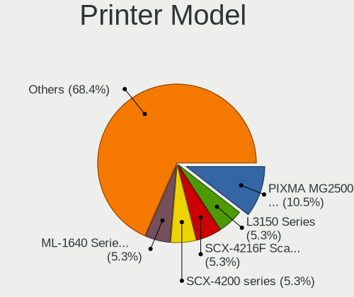

| Model                                | Desktops | Percent |
|--------------------------------------|----------|---------|
| Canon PIXMA MG2500 Series            | 2        | 15.38%  |
| Samsung SCX-4216F Scanner            | 1        | 7.69%   |
| Samsung SCX-4200 series              | 1        | 7.69%   |
| Samsung ML-1640 Series Laser Printer | 1        | 7.69%   |
| Ricoh Printing Support               | 1        | 7.69%   |
| HP ENVY Pro 6400 series              | 1        | 7.69%   |
| HP ENVY 6000 series                  | 1        | 7.69%   |
| HP ENVY 4520 series                  | 1        | 7.69%   |
| HP Deskjet 2540 series               | 1        | 7.69%   |
| Canon LBP6000                        | 1        | 7.69%   |
| Canon iP2700 series                  | 1        | 7.69%   |
| Canon G3010 series                   | 1        | 7.69%   |

Scanner Vendor
--------------

Scanner device vendors

| Vendor          | Desktops | Percent |
|-----------------|----------|---------|
| Canon           | 2        | 66.67%  |
| Hewlett-Packard | 1        | 33.33%  |

Scanner Model
-------------

Scanner device models

| Model                              | Desktops | Percent |
|------------------------------------|----------|---------|
| HP ScanJet 6200c                   | 1        | 33.33%  |
| Canon CanoScan N670U/N676U/LiDE 20 | 1        | 33.33%  |
| Canon CanoScan 8800F               | 1        | 33.33%  |

Camera
------

Camera Vendor
-------------

Camera device vendors

| Vendor                        | Desktops | Percent |
|-------------------------------|----------|---------|
| Logitech                      | 10       | 33.33%  |
| Microsoft                     | 6        | 20%     |
| Samsung Electronics           | 2        | 6.67%   |
| KYE Systems (Mouse Systems)   | 2        | 6.67%   |
| Hewlett-Packard               | 2        | 6.67%   |
| Creative Technology           | 2        | 6.67%   |
| Z-Star Microelectronics       | 1        | 3.33%   |
| Sunplus Innovation Technology | 1        | 3.33%   |
| Microdia                      | 1        | 3.33%   |
| Cubeternet                    | 1        | 3.33%   |
| ARC International             | 1        | 3.33%   |
| Apple                         | 1        | 3.33%   |

Camera Model
------------

Camera device models

| Model                                     | Desktops | Percent |
|-------------------------------------------|----------|---------|
| Logitech Webcam C270                      | 4        | 12.9%   |
| Samsung Galaxy series, misc. (MTP mode)   | 2        | 6.45%   |
| Microsoft LifeCam HD-3000                 | 2        | 6.45%   |
| Logitech HD Pro Webcam C920               | 2        | 6.45%   |
| Z-Star Venus USB2.0 Camera                | 1        | 3.23%   |
| Sunplus Sandberg USB Webcam Pro           | 1        | 3.23%   |
| Microsoft LifeCam VX-7000 (UVC-compliant) | 1        | 3.23%   |
| Microsoft LifeCam VX-700                  | 1        | 3.23%   |
| Microsoft LifeCam Studio                  | 1        | 3.23%   |
| Microsoft LifeCam Cinema                  | 1        | 3.23%   |
| Microdia Sonix USB 2.0 Camera             | 1        | 3.23%   |
| Logitech QuickCam Zoom                    | 1        | 3.23%   |
| Logitech Logitech Webcam C160             | 1        | 3.23%   |
| Logitech Logi 4K Stream Edition           | 1        | 3.23%   |
| Logitech C922 Pro Stream Webcam           | 1        | 3.23%   |
| KYE Systems (Mouse Systems) eFace 2050AF  | 1        | 3.23%   |
| KYE Systems (Mouse Systems) eFace 2025    | 1        | 3.23%   |
| HP Webcam HD 4310                         | 1        | 3.23%   |
| HP Webcam HD 2300                         | 1        | 3.23%   |
| Cubeternet USB2.0 Camera                  | 1        | 3.23%   |
| Creative Live! Cam Sync HD [VF0770]       | 1        | 3.23%   |
| Creative Live! Cam Chat HD [VF0700]       | 1        | 3.23%   |
| ARC International Camera                  | 1        | 3.23%   |
| Apple iPod Touch 5.Gen [A1421]            | 1        | 3.23%   |
| Apple iPhone 5/5C/5S/6/SE                 | 1        | 3.23%   |

Security
--------

Fingerprint Vendor
------------------

Fingerprint sensor vendors

| Vendor    | Desktops | Percent |
|-----------|----------|---------|
| AuthenTec | 1        | 100%    |

Fingerprint Model
-----------------

Fingerprint sensor models

| Model                                | Desktops | Percent |
|--------------------------------------|----------|---------|
| AuthenTec AES2550 Fingerprint Sensor | 1        | 100%    |

Chipcard Vendor
---------------

Chipcard module vendors

| Vendor                | Desktops | Percent |
|-----------------------|----------|---------|
| Gemalto (was Gemplus) | 1        | 100%    |

Chipcard Model
--------------

Chipcard module models

| Model                                             | Desktops | Percent |
|---------------------------------------------------|----------|---------|
| Gemalto (was Gemplus) GemPC Twin SmartCard Reader | 1        | 100%    |

Unsupported
-----------

Unsupported Devices
-------------------

Total unsupported devices on board

| Total | Desktops | Percent |
|-------|----------|---------|
| 0     | 191      | 79.92%  |
| 1     | 42       | 17.57%  |
| 2     | 6        | 2.51%   |

Unsupported Device Types
------------------------

Types of unsupported devices

| Type                  | Desktops | Percent |
|-----------------------|----------|---------|
| Net/wireless          | 15       | 26.79%  |
| Net/ethernet          | 9        | 16.07%  |
| Unassigned class      | 6        | 10.71%  |
| Sound                 | 6        | 10.71%  |
| Graphics card         | 4        | 7.14%   |
| Firewire controller   | 4        | 7.14%   |
| Storage/ide           | 3        | 5.36%   |
| Network               | 2        | 3.57%   |
| Multimedia controller | 2        | 3.57%   |
| Camera                | 2        | 3.57%   |
| Fingerprint reader    | 1        | 1.79%   |
| Chipcard              | 1        | 1.79%   |
| Card reader           | 1        | 1.79%   |

