Clear Linux - Tested Hardware & Statistics (Notebooks)
------------------------------------------------------

A project to collect tested hardware configurations for Clear Linux.

Anyone can contribute to this report by the [hw-probe](https://github.com/linuxhw/hw-probe) tool:

    sudo -E hw-probe -all -upload

Please contribute! Especially if your hardware is rare.

Contents
--------

* [ Test Cases ](#test-cases)

* [ System ](#system)
  - [ OS                       ](#os)
  - [ OS Family                ](#os-family)
  - [ Kernel                   ](#kernel)
  - [ Kernel Family            ](#kernel-family)
  - [ Kernel Major Ver.        ](#kernel-major-ver)
  - [ Arch                     ](#arch)
  - [ DE                       ](#de)
  - [ Display Server           ](#display-server)
  - [ Display Manager          ](#display-manager)
  - [ OS Lang                  ](#os-lang)
  - [ Boot Mode                ](#boot-mode)
  - [ Filesystem               ](#filesystem)
  - [ Part. scheme             ](#part-scheme)
  - [ Dual Boot with Linux/BSD ](#dual-boot-with-linuxbsd)
  - [ Dual Boot (Win)          ](#dual-boot-win)

* [ Board ](#board)
  - [ Vendor                   ](#vendor)
  - [ Model                    ](#model)
  - [ Model Family             ](#model-family)
  - [ MFG Year                 ](#mfg-year)
  - [ Form Factor              ](#form-factor)
  - [ Secure Boot              ](#secure-boot)
  - [ Coreboot                 ](#coreboot)
  - [ RAM Size                 ](#ram-size)
  - [ RAM Used                 ](#ram-used)
  - [ Total Drives             ](#total-drives)
  - [ Has CD-ROM               ](#has-cd-rom)
  - [ Has Ethernet             ](#has-ethernet)
  - [ Has WiFi                 ](#has-wifi)
  - [ Has Bluetooth            ](#has-bluetooth)

* [ Location ](#location)
  - [ Country                  ](#country)
  - [ City                     ](#city)

* [ Drives ](#drives)
  - [ Drive Vendor             ](#drive-vendor)
  - [ Drive Model              ](#drive-model)
  - [ HDD Vendor               ](#hdd-vendor)
  - [ SSD Vendor               ](#ssd-vendor)
  - [ Drive Kind               ](#drive-kind)
  - [ Drive Connector          ](#drive-connector)
  - [ Drive Size               ](#drive-size)
  - [ Space Total              ](#space-total)
  - [ Space Used               ](#space-used)
  - [ Malfunc. Drives          ](#malfunc-drives)
  - [ Malfunc. Drive Vendor    ](#malfunc-drive-vendor)
  - [ Malfunc. HDD Vendor      ](#malfunc-hdd-vendor)
  - [ Malfunc. Drive Kind      ](#malfunc-drive-kind)
  - [ Failed Drives            ](#failed-drives)
  - [ Failed Drive Vendor      ](#failed-drive-vendor)
  - [ Drive Status             ](#drive-status)

* [ Storage controller ](#storage-controller)
  - [ Storage Vendor           ](#storage-vendor)
  - [ Storage Model            ](#storage-model)
  - [ Storage Kind             ](#storage-kind)

* [ Processor ](#processor)
  - [ CPU Vendor               ](#cpu-vendor)
  - [ CPU Model                ](#cpu-model)
  - [ CPU Model Family         ](#cpu-model-family)
  - [ CPU Cores                ](#cpu-cores)
  - [ CPU Sockets              ](#cpu-sockets)
  - [ CPU Threads              ](#cpu-threads)
  - [ CPU Op-Modes             ](#cpu-op-modes)
  - [ CPU Microcode            ](#cpu-microcode)
  - [ CPU Microarch            ](#cpu-microarch)

* [ Graphics ](#graphics)
  - [ GPU Vendor               ](#gpu-vendor)
  - [ GPU Model                ](#gpu-model)
  - [ GPU Combo                ](#gpu-combo)
  - [ GPU Driver               ](#gpu-driver)
  - [ GPU Memory               ](#gpu-memory)

* [ Monitor ](#monitor)
  - [ Monitor Vendor           ](#monitor-vendor)
  - [ Monitor Model            ](#monitor-model)
  - [ Monitor Resolution       ](#monitor-resolution)
  - [ Monitor Diagonal         ](#monitor-diagonal)
  - [ Monitor Width            ](#monitor-width)
  - [ Aspect Ratio             ](#aspect-ratio)
  - [ Monitor Area             ](#monitor-area)
  - [ Pixel Density            ](#pixel-density)
  - [ Multiple Monitors        ](#multiple-monitors)

* [ Network ](#network)
  - [ Net Controller Vendor    ](#net-controller-vendor)
  - [ Net Controller Model     ](#net-controller-model)
  - [ Wireless Vendor          ](#wireless-vendor)
  - [ Wireless Model           ](#wireless-model)
  - [ Ethernet Vendor          ](#ethernet-vendor)
  - [ Ethernet Model           ](#ethernet-model)
  - [ Net Controller Kind      ](#net-controller-kind)
  - [ Used Controller          ](#used-controller)
  - [ NICs                     ](#nics)
  - [ IPv6                     ](#ipv6)

* [ Bluetooth ](#bluetooth)
  - [ Bluetooth Vendor         ](#bluetooth-vendor)
  - [ Bluetooth Model          ](#bluetooth-model)

* [ Sound ](#sound)
  - [ Sound Vendor             ](#sound-vendor)
  - [ Sound Model              ](#sound-model)

* [ Memory ](#memory)
  - [ Memory Vendor            ](#memory-vendor)
  - [ Memory Model             ](#memory-model)
  - [ Memory Kind              ](#memory-kind)
  - [ Memory Form Factor       ](#memory-form-factor)
  - [ Memory Size              ](#memory-size)
  - [ Memory Speed             ](#memory-speed)

* [ Printers & scanners ](#printers--scanners)
  - [ Printer Vendor           ](#printer-vendor)
  - [ Printer Model            ](#printer-model)
  - [ Scanner Vendor           ](#scanner-vendor)
  - [ Scanner Model            ](#scanner-model)

* [ Camera ](#camera)
  - [ Camera Vendor            ](#camera-vendor)
  - [ Camera Model             ](#camera-model)

* [ Security ](#security)
  - [ Fingerprint Vendor       ](#fingerprint-vendor)
  - [ Fingerprint Model        ](#fingerprint-model)
  - [ Chipcard Vendor          ](#chipcard-vendor)
  - [ Chipcard Model           ](#chipcard-model)

* [ Unsupported ](#unsupported)
  - [ Unsupported Devices      ](#unsupported-devices)
  - [ Unsupported Device Types ](#unsupported-device-types)

Test Cases
----------

Total: 721

| Vendor        | Model                       | Probe                                                      | Date         |
|---------------|-----------------------------|------------------------------------------------------------|--------------|
| Acer          | Aspire E5-573G              | [527a92f562](https://linux-hardware.org/?probe=527a92f562) | Dec 31, 2022 |
| HP            | 240 G7 Notebook PC          | [414db30bff](https://linux-hardware.org/?probe=414db30bff) | Dec 30, 2022 |
| Unknown       | Unknown                     | [5e4cb87810](https://linux-hardware.org/?probe=5e4cb87810) | Dec 23, 2022 |
| ASUSTek       | VivoBook_ASUSLaptop X515... | [5ba954d88a](https://linux-hardware.org/?probe=5ba954d88a) | Dec 19, 2022 |
| ASUSTek       | VivoBook_ASUSLaptop X515... | [318b7c1400](https://linux-hardware.org/?probe=318b7c1400) | Dec 19, 2022 |
| Google        | Cyan                        | [fff3502929](https://linux-hardware.org/?probe=fff3502929) | Dec 19, 2022 |
| Lenovo        | G40-30 80FY                 | [1a330e248d](https://linux-hardware.org/?probe=1a330e248d) | Dec 11, 2022 |
| HP            | ProBook 4540s               | [98ed2d6cdf](https://linux-hardware.org/?probe=98ed2d6cdf) | Dec 10, 2022 |
| HP            | ProBook 4540s               | [6b0e2d1aa9](https://linux-hardware.org/?probe=6b0e2d1aa9) | Dec 10, 2022 |
| Lenovo        | ThinkPad T430s 2355C33      | [706e40ed5a](https://linux-hardware.org/?probe=706e40ed5a) | Dec 04, 2022 |
| Lenovo        | ThinkBook 15 G2 ITL 20VE    | [4d33c2ab30](https://linux-hardware.org/?probe=4d33c2ab30) | Dec 02, 2022 |
| Lenovo        | ThinkPad T430s 2355C33      | [aff020417f](https://linux-hardware.org/?probe=aff020417f) | Dec 01, 2022 |
| Dell          | Latitude E6510              | [694a3d79be](https://linux-hardware.org/?probe=694a3d79be) | Nov 26, 2022 |
| Lenovo        | ThinkBook 15 G2 ITL 20VE    | [ad63d86cb9](https://linux-hardware.org/?probe=ad63d86cb9) | Nov 23, 2022 |
| Lenovo        | IdeaPad Y700-17ISK 80Q0     | [adb0e2aa98](https://linux-hardware.org/?probe=adb0e2aa98) | Nov 19, 2022 |
| Lenovo        | IdeaPad Y700-17ISK 80Q0     | [4480153621](https://linux-hardware.org/?probe=4480153621) | Nov 18, 2022 |
| Dell          | Precision 5530              | [9737fe3732](https://linux-hardware.org/?probe=9737fe3732) | Nov 12, 2022 |
| Lenovo        | ThinkBook 14 G4+ ARA 21D... | [4b0ce24e6e](https://linux-hardware.org/?probe=4b0ce24e6e) | Nov 11, 2022 |
| Lenovo        | ThinkBook 14 G4+ ARA 21D... | [86f71fb0e6](https://linux-hardware.org/?probe=86f71fb0e6) | Nov 10, 2022 |
| Lenovo        | ThinkPad P53 20QQS2CY00     | [98e9599ea3](https://linux-hardware.org/?probe=98e9599ea3) | Nov 08, 2022 |
| Chuwi         | GemiBook                    | [9d1fda5ecb](https://linux-hardware.org/?probe=9d1fda5ecb) | Nov 06, 2022 |
| Lenovo        | ThinkPad T470 W10DG 20JN... | [28cc86118e](https://linux-hardware.org/?probe=28cc86118e) | Nov 03, 2022 |
| HP            | Stream Laptop 14-cb1XX      | [18db43ffed](https://linux-hardware.org/?probe=18db43ffed) | Oct 31, 2022 |
| Dell          | Latitude 3120               | [2799c3fe8e](https://linux-hardware.org/?probe=2799c3fe8e) | Oct 24, 2022 |
| HP            | InsydeH2O EFI BIOS          | [0c9c2f85b4](https://linux-hardware.org/?probe=0c9c2f85b4) | Oct 17, 2022 |
| HP            | Pavilion Laptop 15-cw0xx... | [2105a7b1c9](https://linux-hardware.org/?probe=2105a7b1c9) | Oct 07, 2022 |
| HP            | Pavilion Laptop 15-cw0xx... | [eaafe4ad36](https://linux-hardware.org/?probe=eaafe4ad36) | Oct 05, 2022 |
| Lenovo        | ThinkPad T460 20FMS43J0V    | [b31ac1623d](https://linux-hardware.org/?probe=b31ac1623d) | Oct 05, 2022 |
| Lenovo        | ThinkPad T460 20FMS43J0V    | [9eaff58099](https://linux-hardware.org/?probe=9eaff58099) | Oct 05, 2022 |
| Dell          | Latitude 5420               | [e4d629b41b](https://linux-hardware.org/?probe=e4d629b41b) | Oct 04, 2022 |
| Notebook      | NL40_50GU                   | [da07f4c223](https://linux-hardware.org/?probe=da07f4c223) | Sep 23, 2022 |
| Mbenben       | Mai II                      | [2cfb10385b](https://linux-hardware.org/?probe=2cfb10385b) | Sep 22, 2022 |
| ASUSTek       | X455LAB                     | [4a71131e80](https://linux-hardware.org/?probe=4a71131e80) | Sep 19, 2022 |
| ASUSTek       | X455LAB                     | [f7c5412964](https://linux-hardware.org/?probe=f7c5412964) | Sep 19, 2022 |
| Dell          | XPS 15 9500                 | [3074b849bf](https://linux-hardware.org/?probe=3074b849bf) | Sep 19, 2022 |
| Dell          | Latitude 5420               | [2d9d6512bc](https://linux-hardware.org/?probe=2d9d6512bc) | Sep 19, 2022 |
| ASUSTek       | TUF Gaming FX505DY_FX505... | [857c240dc4](https://linux-hardware.org/?probe=857c240dc4) | Sep 17, 2022 |
| Dell          | Venue 11 Pro 7140           | [d6fed8866c](https://linux-hardware.org/?probe=d6fed8866c) | Sep 13, 2022 |
| Dell          | Venue 11 Pro 7140           | [08aadcd875](https://linux-hardware.org/?probe=08aadcd875) | Sep 10, 2022 |
| Lenovo        | ThinkPad T440p 20AWS1QQ0... | [242fae3988](https://linux-hardware.org/?probe=242fae3988) | Sep 08, 2022 |
| Lenovo        | ThinkPad X201 3680IJ9       | [a4fcabd03d](https://linux-hardware.org/?probe=a4fcabd03d) | Sep 04, 2022 |
| Google        | Auron_Paine                 | [19a461dd93](https://linux-hardware.org/?probe=19a461dd93) | Sep 04, 2022 |
| Apple         | MacBookPro8,3               | [934feeca3d](https://linux-hardware.org/?probe=934feeca3d) | Sep 04, 2022 |
| Lenovo        | IdeaPad Y700-17ISK 80Q0     | [fdc3c39ae8](https://linux-hardware.org/?probe=fdc3c39ae8) | Sep 03, 2022 |
| Lenovo        | ThinkPad X220 4286CTO       | [6f2658db8b](https://linux-hardware.org/?probe=6f2658db8b) | Sep 03, 2022 |
| Lenovo        | G570 20079                  | [1dda2df118](https://linux-hardware.org/?probe=1dda2df118) | Aug 18, 2022 |
| Lenovo        | G570 20079                  | [59e3f96082](https://linux-hardware.org/?probe=59e3f96082) | Aug 18, 2022 |
| ASUSTek       | X555UB                      | [db33232b90](https://linux-hardware.org/?probe=db33232b90) | Aug 08, 2022 |
| Unknown       | Unknown                     | [fd8393bd6d](https://linux-hardware.org/?probe=fd8393bd6d) | Aug 07, 2022 |
| Lenovo        | ThinkPad E585 20KV000YUS    | [ddb45bfaff](https://linux-hardware.org/?probe=ddb45bfaff) | Jul 31, 2022 |
| Fujitsu       | STYLISTIC Q702              | [2fe4fe7fe5](https://linux-hardware.org/?probe=2fe4fe7fe5) | Jul 30, 2022 |
| HP            | Stream Laptop 14-cb1XX      | [c5f4ae1ac4](https://linux-hardware.org/?probe=c5f4ae1ac4) | Jul 26, 2022 |
| HUAWEI        | BOD-WXX9                    | [8bf5cae166](https://linux-hardware.org/?probe=8bf5cae166) | Jul 23, 2022 |
| Dell          | Latitude E6320              | [e4104ce925](https://linux-hardware.org/?probe=e4104ce925) | Jul 15, 2022 |
| Dell          | Latitude E6320              | [8b0774a179](https://linux-hardware.org/?probe=8b0774a179) | Jul 15, 2022 |
| Lenovo        | IdeaPad 330-15IKB 81FD      | [2ee086df64](https://linux-hardware.org/?probe=2ee086df64) | Jul 15, 2022 |
| Lenovo        | IdeaPad 300-17ISK 80QH      | [a02c08c229](https://linux-hardware.org/?probe=a02c08c229) | Jul 10, 2022 |
| Dell          | Latitude E6420              | [1747257b56](https://linux-hardware.org/?probe=1747257b56) | Jul 10, 2022 |
| Google        | Cave                        | [fd843b1768](https://linux-hardware.org/?probe=fd843b1768) | Jul 07, 2022 |
| Apple         | MacBookAir7,2               | [f852861149](https://linux-hardware.org/?probe=f852861149) | Jul 06, 2022 |
| Apple         | MacBookAir7,2               | [6b942bfd10](https://linux-hardware.org/?probe=6b942bfd10) | Jul 05, 2022 |
| Medion        | Erazer P6661 MD60303        | [59417db2d7](https://linux-hardware.org/?probe=59417db2d7) | Jul 05, 2022 |
| HP            | Pavilion 15                 | [82bc7e7316](https://linux-hardware.org/?probe=82bc7e7316) | Jun 30, 2022 |
| HP            | Pavilion 15                 | [929cd4988f](https://linux-hardware.org/?probe=929cd4988f) | Jun 26, 2022 |
| HP            | Pavilion 15                 | [cc5c87a20e](https://linux-hardware.org/?probe=cc5c87a20e) | Jun 24, 2022 |
| ASUSTek       | TUF Gaming FX505DY_FX505... | [a4027cc5e4](https://linux-hardware.org/?probe=a4027cc5e4) | Jun 20, 2022 |
| Acer          | Aspire A315-53              | [cdaacd4b95](https://linux-hardware.org/?probe=cdaacd4b95) | Jun 18, 2022 |
| Dell          | Latitude E6510              | [d0ec96cd37](https://linux-hardware.org/?probe=d0ec96cd37) | Jun 14, 2022 |
| HP            | OMEN Notebook PC 15         | [63e26e87be](https://linux-hardware.org/?probe=63e26e87be) | Jun 13, 2022 |
| HP            | OMEN Notebook PC 15         | [52c72a47d9](https://linux-hardware.org/?probe=52c72a47d9) | Jun 09, 2022 |
| Acer          | Aspire E5-511               | [5d777eeb71](https://linux-hardware.org/?probe=5d777eeb71) | Jun 09, 2022 |
| Lenovo        | IdeaPad S145-15IWL 81S9     | [c908e08818](https://linux-hardware.org/?probe=c908e08818) | May 29, 2022 |
| Lenovo        | IdeaPad S145-15IWL 81S9     | [b8a514c650](https://linux-hardware.org/?probe=b8a514c650) | May 29, 2022 |
| Alienware     | 17 R4                       | [0a7c1705c9](https://linux-hardware.org/?probe=0a7c1705c9) | May 27, 2022 |
| Dell          | Inspiron 7559               | [61fe0db491](https://linux-hardware.org/?probe=61fe0db491) | May 26, 2022 |
| Dell          | Inspiron 7559               | [47f48c626a](https://linux-hardware.org/?probe=47f48c626a) | May 26, 2022 |
| HUAWEI        | NBLB-WAX9N                  | [4de838a88c](https://linux-hardware.org/?probe=4de838a88c) | May 25, 2022 |
| HUAWEI        | NBLB-WAX9N                  | [26745bace2](https://linux-hardware.org/?probe=26745bace2) | May 25, 2022 |
| Dell          | Latitude 7480               | [4ba0a0ec3c](https://linux-hardware.org/?probe=4ba0a0ec3c) | May 24, 2022 |
| Dell          | Latitude 7480               | [33c94e6121](https://linux-hardware.org/?probe=33c94e6121) | May 24, 2022 |
| Lenovo        | S21e-20 80M4                | [90d0bb5bc0](https://linux-hardware.org/?probe=90d0bb5bc0) | May 22, 2022 |
| Lenovo        | S21e-20 80M4                | [48047cdaf6](https://linux-hardware.org/?probe=48047cdaf6) | May 22, 2022 |
| Acer          | Aspire ES1-523              | [e856d4589a](https://linux-hardware.org/?probe=e856d4589a) | May 21, 2022 |
| Google        | Celes                       | [ca6be0abba](https://linux-hardware.org/?probe=ca6be0abba) | May 19, 2022 |
| Fujitsu       | LIFEBOOK E746               | [dd9eac2f81](https://linux-hardware.org/?probe=dd9eac2f81) | May 14, 2022 |
| Fujitsu       | LIFEBOOK E746               | [8551aac5e5](https://linux-hardware.org/?probe=8551aac5e5) | May 12, 2022 |
| Lenovo        | ThinkPad X270 20HMS27Q00    | [615d6650a0](https://linux-hardware.org/?probe=615d6650a0) | May 08, 2022 |
| Google        | Lick                        | [60e52e55e1](https://linux-hardware.org/?probe=60e52e55e1) | May 06, 2022 |
| Apple         | MacBookAir6,2               | [d04d5e927d](https://linux-hardware.org/?probe=d04d5e927d) | May 05, 2022 |
| TODOS INDU... | Easytouch_2022_V1           | [efc26220c4](https://linux-hardware.org/?probe=efc26220c4) | May 01, 2022 |
| HP            | EliteBook 8440p             | [31fdda39b1](https://linux-hardware.org/?probe=31fdda39b1) | May 01, 2022 |
| HP            | EliteBook 8440p             | [3782e39a43](https://linux-hardware.org/?probe=3782e39a43) | Apr 30, 2022 |
| Google        | Lick                        | [33d1e6209a](https://linux-hardware.org/?probe=33d1e6209a) | Apr 30, 2022 |
| Dell          | XPS 13 9310                 | [1f95a73d57](https://linux-hardware.org/?probe=1f95a73d57) | Apr 26, 2022 |
| Gateway       | NE570                       | [1cb22c0c86](https://linux-hardware.org/?probe=1cb22c0c86) | Apr 23, 2022 |
| Gateway       | NE570                       | [d4b1bdce70](https://linux-hardware.org/?probe=d4b1bdce70) | Apr 17, 2022 |
| Framework     | Laptop                      | [25577a2915](https://linux-hardware.org/?probe=25577a2915) | Apr 16, 2022 |
| Dell          | Latitude 3550               | [03ed6ab7b4](https://linux-hardware.org/?probe=03ed6ab7b4) | Apr 16, 2022 |
| Fujitsu       | LIFEBOOK E746               | [ae8fe4a156](https://linux-hardware.org/?probe=ae8fe4a156) | Apr 16, 2022 |
| A-DATA Tec... | XENIA 14                    | [839159351b](https://linux-hardware.org/?probe=839159351b) | Apr 16, 2022 |
| A-DATA Tec... | XENIA 14                    | [29a530e6bb](https://linux-hardware.org/?probe=29a530e6bb) | Apr 16, 2022 |
| Framework     | Laptop                      | [84da421304](https://linux-hardware.org/?probe=84da421304) | Apr 16, 2022 |
| MSI           | CX700                       | [b7715b0ff7](https://linux-hardware.org/?probe=b7715b0ff7) | Apr 15, 2022 |
| Gateway       | NE570                       | [3635e5c663](https://linux-hardware.org/?probe=3635e5c663) | Apr 14, 2022 |
| Gateway       | NE570                       | [068d4c39f2](https://linux-hardware.org/?probe=068d4c39f2) | Apr 13, 2022 |
| Fujitsu       | LIFEBOOK E746               | [9380c2aaf9](https://linux-hardware.org/?probe=9380c2aaf9) | Apr 11, 2022 |
| Dell          | Vostro 3560                 | [f29ab972e7](https://linux-hardware.org/?probe=f29ab972e7) | Apr 07, 2022 |
| Dell          | XPS 13 9380                 | [1395229a99](https://linux-hardware.org/?probe=1395229a99) | Apr 04, 2022 |
| HP            | Pavilion g4                 | [5f8c09baeb](https://linux-hardware.org/?probe=5f8c09baeb) | Mar 28, 2022 |
| Lenovo        | ThinkPad T430 2349U4B       | [95526f5b3e](https://linux-hardware.org/?probe=95526f5b3e) | Mar 25, 2022 |
| Teclast       | F6                          | [d4e2f31492](https://linux-hardware.org/?probe=d4e2f31492) | Mar 25, 2022 |
| HUAWEI        | NBLB-WAX9N                  | [76b97dcfe7](https://linux-hardware.org/?probe=76b97dcfe7) | Mar 25, 2022 |
| HUAWEI        | NBLB-WAX9N                  | [ec3089df82](https://linux-hardware.org/?probe=ec3089df82) | Mar 25, 2022 |
| Google        | Falco                       | [77727aa3fe](https://linux-hardware.org/?probe=77727aa3fe) | Mar 24, 2022 |
| Google        | Falco                       | [279dc118ab](https://linux-hardware.org/?probe=279dc118ab) | Mar 22, 2022 |
| Apple         | MacBookPro11,5              | [abc4597fe1](https://linux-hardware.org/?probe=abc4597fe1) | Mar 18, 2022 |
| Dell          | Inspiron 3521               | [781207a46b](https://linux-hardware.org/?probe=781207a46b) | Mar 17, 2022 |
| HP            | Pavilion 15                 | [29ac5f13cd](https://linux-hardware.org/?probe=29ac5f13cd) | Mar 16, 2022 |
| Lenovo        | ThinkPad L14 Gen 2a 20X6... | [11bd4e97e6](https://linux-hardware.org/?probe=11bd4e97e6) | Mar 13, 2022 |
| HP            | Laptop 15-da2xxx            | [d82602f02f](https://linux-hardware.org/?probe=d82602f02f) | Mar 11, 2022 |
| HP            | EliteBook 820 G3            | [c6fa3e547d](https://linux-hardware.org/?probe=c6fa3e547d) | Mar 05, 2022 |
| MSI           | Modern 14 B10MW             | [d4d9841cbe](https://linux-hardware.org/?probe=d4d9841cbe) | Feb 28, 2022 |
| ASUSTek       | ZenBook UX325EA_UX325EA     | [8dfdb07f98](https://linux-hardware.org/?probe=8dfdb07f98) | Feb 24, 2022 |
| Dell          | Inspiron 3501               | [a8c8bdd208](https://linux-hardware.org/?probe=a8c8bdd208) | Feb 23, 2022 |
| Lenovo        | ThinkPad L14 Gen 2a 20X6... | [73c98934ee](https://linux-hardware.org/?probe=73c98934ee) | Feb 23, 2022 |
| Positivo      | W942SW_SW1                  | [4a66255bed](https://linux-hardware.org/?probe=4a66255bed) | Feb 17, 2022 |
| ASUSTek       | ZenBook UX325EA_UX325EA     | [81f2a365be](https://linux-hardware.org/?probe=81f2a365be) | Feb 13, 2022 |
| Lenovo        | ThinkPad T430 2349L38       | [85d1c3705e](https://linux-hardware.org/?probe=85d1c3705e) | Feb 09, 2022 |
| Dell          | Inspiron 5423               | [087f6b0b86](https://linux-hardware.org/?probe=087f6b0b86) | Feb 02, 2022 |
| Dell          | Inspiron 7720               | [ffe5569ab0](https://linux-hardware.org/?probe=ffe5569ab0) | Feb 01, 2022 |
| MSI           | GE60 2OC\2OE                | [dee5b3e5a3](https://linux-hardware.org/?probe=dee5b3e5a3) | Jan 25, 2022 |
| Itautec       | Infoway N8755               | [34a8012b59](https://linux-hardware.org/?probe=34a8012b59) | Jan 25, 2022 |
| HP            | Stream Notebook PC 11       | [c86dafbe5c](https://linux-hardware.org/?probe=c86dafbe5c) | Jan 24, 2022 |
| ASUSTek       | VivoBook_ASUSLaptop X515... | [047f9adb4a](https://linux-hardware.org/?probe=047f9adb4a) | Jan 15, 2022 |
| ASUSTek       | VivoBook_ASUSLaptop X515... | [a0574d0765](https://linux-hardware.org/?probe=a0574d0765) | Jan 14, 2022 |
| ASUSTek       | ASUS EXPERTBOOK B1400CEP... | [7e5c6d4e15](https://linux-hardware.org/?probe=7e5c6d4e15) | Jan 13, 2022 |
| HP            | Pavilion Gaming Laptop 1... | [c781a61663](https://linux-hardware.org/?probe=c781a61663) | Jan 11, 2022 |
| ASUSTek       | VivoBook_ASUSLaptop X515... | [3bf9ad038a](https://linux-hardware.org/?probe=3bf9ad038a) | Jan 09, 2022 |
| Dell          | Inspiron 11-3168            | [cd230f0c61](https://linux-hardware.org/?probe=cd230f0c61) | Jan 08, 2022 |
| Google        | Auron_Paine                 | [0481d53f47](https://linux-hardware.org/?probe=0481d53f47) | Jan 06, 2022 |
| Lenovo        | IdeaPad 110-15ACL 80TJ      | [0e61f69494](https://linux-hardware.org/?probe=0e61f69494) | Jan 05, 2022 |
| Google        | Auron_Paine                 | [141027ba98](https://linux-hardware.org/?probe=141027ba98) | Jan 05, 2022 |
| Dell          | Inspiron 3583               | [4b12ee93be](https://linux-hardware.org/?probe=4b12ee93be) | Jan 02, 2022 |
| Lenovo        | Legion 5 Pro 16ITH6 82JF    | [82cef16846](https://linux-hardware.org/?probe=82cef16846) | Dec 29, 2021 |
| Apple         | MacBookPro8,1               | [44b1bbbb9c](https://linux-hardware.org/?probe=44b1bbbb9c) | Dec 18, 2021 |
| MSI           | GP63 Leopard 8RD            | [332c4bba00](https://linux-hardware.org/?probe=332c4bba00) | Dec 18, 2021 |
| Dell          | XPS 15 9570                 | [448cdcb300](https://linux-hardware.org/?probe=448cdcb300) | Dec 17, 2021 |
| Lenovo        | ThinkPad T420 4236A87       | [74cb9f00a2](https://linux-hardware.org/?probe=74cb9f00a2) | Dec 15, 2021 |
| Apple         | MacBookPro11,5              | [9a09876c14](https://linux-hardware.org/?probe=9a09876c14) | Nov 22, 2021 |
| HP            | Laptop 14-df0xxx            | [767039524f](https://linux-hardware.org/?probe=767039524f) | Nov 19, 2021 |
| Lenovo        | ThinkPad T14 Gen 2i 20W0... | [564ef15a99](https://linux-hardware.org/?probe=564ef15a99) | Nov 16, 2021 |
| Dell          | Inspiron 13-7378            | [e1384fb15b](https://linux-hardware.org/?probe=e1384fb15b) | Nov 12, 2021 |
| Apple         | MacBookPro11,5              | [401da402d8](https://linux-hardware.org/?probe=401da402d8) | Nov 12, 2021 |
| Apple         | MacBookPro11,5              | [7daf6ea0a5](https://linux-hardware.org/?probe=7daf6ea0a5) | Nov 12, 2021 |
| Maibenben     | E5100                       | [26a4ff554a](https://linux-hardware.org/?probe=26a4ff554a) | Nov 11, 2021 |
| Dell          | Inspiron 5558               | [45992e5117](https://linux-hardware.org/?probe=45992e5117) | Nov 11, 2021 |
| Apple         | MacBookPro11,4              | [3ba991c901](https://linux-hardware.org/?probe=3ba991c901) | Nov 10, 2021 |
| Google        | Auron_Paine                 | [1227213ee7](https://linux-hardware.org/?probe=1227213ee7) | Nov 07, 2021 |
| HP            | ProBook 450 G5              | [ecae91dfa5](https://linux-hardware.org/?probe=ecae91dfa5) | Nov 07, 2021 |
| HP            | ProBook 450 G5              | [cc4231496b](https://linux-hardware.org/?probe=cc4231496b) | Nov 07, 2021 |
| Apple         | MacBookPro11,4              | [7cdc55e110](https://linux-hardware.org/?probe=7cdc55e110) | Nov 06, 2021 |
| Dell          | Latitude 7370               | [6bf3c3796e](https://linux-hardware.org/?probe=6bf3c3796e) | Oct 30, 2021 |
| Dell          | Inspiron 3537               | [0812a6b105](https://linux-hardware.org/?probe=0812a6b105) | Oct 29, 2021 |
| Dell          | Inspiron 3537               | [0e2d73ad29](https://linux-hardware.org/?probe=0e2d73ad29) | Oct 29, 2021 |
| Lenovo        | G500 20236                  | [1587d2dbaf](https://linux-hardware.org/?probe=1587d2dbaf) | Oct 23, 2021 |
| ASUSTek       | VivoBook_ASUSLaptop X515... | [f55ca527be](https://linux-hardware.org/?probe=f55ca527be) | Oct 21, 2021 |
| Lenovo        | V110-15IAP 80TG             | [ec77ed1da7](https://linux-hardware.org/?probe=ec77ed1da7) | Oct 16, 2021 |
| ASUSTek       | VivoBook 15 ASUS Laptop ... | [89840aac65](https://linux-hardware.org/?probe=89840aac65) | Oct 13, 2021 |
| ASUSTek       | VivoBook 15 ASUS Laptop ... | [fcc9eab970](https://linux-hardware.org/?probe=fcc9eab970) | Oct 12, 2021 |
| Dell          | Latitude E5470              | [08d4c126fa](https://linux-hardware.org/?probe=08d4c126fa) | Oct 11, 2021 |
| MSI           | Modern 14 B10MW             | [3f23aa5dc4](https://linux-hardware.org/?probe=3f23aa5dc4) | Oct 07, 2021 |
| MSI           | Modern 14 B10MW             | [cef5dd6d30](https://linux-hardware.org/?probe=cef5dd6d30) | Oct 07, 2021 |
| Samsung       | 300E4A/300E5A/300E7A/343... | [77a6cb9eba](https://linux-hardware.org/?probe=77a6cb9eba) | Oct 07, 2021 |
| Samsung       | 300E4A/300E5A/300E7A/343... | [99c08de77b](https://linux-hardware.org/?probe=99c08de77b) | Oct 07, 2021 |
| HP            | Stream Laptop 11-ak0xxx     | [64a01bd96e](https://linux-hardware.org/?probe=64a01bd96e) | Oct 06, 2021 |
| HP            | EliteBook 8460p             | [09f20340ed](https://linux-hardware.org/?probe=09f20340ed) | Oct 05, 2021 |
| HP            | EliteBook 8460p             | [34ce7d14dc](https://linux-hardware.org/?probe=34ce7d14dc) | Oct 04, 2021 |
| Acer          | Aspire E5-571P              | [8fa08d58ef](https://linux-hardware.org/?probe=8fa08d58ef) | Oct 03, 2021 |
| Acer          | Aspire E5-571P              | [6b4706ee1a](https://linux-hardware.org/?probe=6b4706ee1a) | Oct 03, 2021 |
| Dell          | Latitude 5480               | [bd21f22540](https://linux-hardware.org/?probe=bd21f22540) | Sep 28, 2021 |
| Apple         | MacBookPro8,1               | [a08d8ecd94](https://linux-hardware.org/?probe=a08d8ecd94) | Sep 21, 2021 |
| Acer          | Aspire E5-571P              | [3af02e9c48](https://linux-hardware.org/?probe=3af02e9c48) | Sep 19, 2021 |
| Acer          | Aspire E5-571P              | [790a43aecb](https://linux-hardware.org/?probe=790a43aecb) | Sep 16, 2021 |
| Acer          | Aspire E5-571P              | [f5e45f9ef5](https://linux-hardware.org/?probe=f5e45f9ef5) | Sep 16, 2021 |
| Lenovo        | ThinkPad E590 20NB005MUS    | [05f3bfe1fe](https://linux-hardware.org/?probe=05f3bfe1fe) | Sep 14, 2021 |
| Acer          | Aspire E5-571P              | [dfe0340402](https://linux-hardware.org/?probe=dfe0340402) | Sep 04, 2021 |
| HP            | ZHAN 66 Pro 14 G4 Notebo... | [3758bf5026](https://linux-hardware.org/?probe=3758bf5026) | Sep 01, 2021 |
| Acer          | Aspire V5-571G              | [575b7af6a0](https://linux-hardware.org/?probe=575b7af6a0) | Aug 30, 2021 |
| Acer          | Aspire E5-571P              | [9505862c5e](https://linux-hardware.org/?probe=9505862c5e) | Aug 29, 2021 |
| Dell          | Precision 7550              | [42721343a3](https://linux-hardware.org/?probe=42721343a3) | Aug 16, 2021 |
| Samsung       | 300V3A/300V4A/300V5A/200... | [698b26501e](https://linux-hardware.org/?probe=698b26501e) | Aug 15, 2021 |
| Acer          | Aspire F5-573               | [8a33fea383](https://linux-hardware.org/?probe=8a33fea383) | Aug 14, 2021 |
| Acer          | Aspire F5-573               | [cada2d25da](https://linux-hardware.org/?probe=cada2d25da) | Aug 14, 2021 |
| ASUSTek       | X550LD                      | [e879ad305a](https://linux-hardware.org/?probe=e879ad305a) | Aug 12, 2021 |
| ASUSTek       | ZenBook UX431FAC_UX431FA    | [e81b578a28](https://linux-hardware.org/?probe=e81b578a28) | Aug 09, 2021 |
| Lenovo        | ThinkPad T420 4236A87       | [2553632d5d](https://linux-hardware.org/?probe=2553632d5d) | Aug 09, 2021 |
| Lenovo        | ThinkPad T420 4236A87       | [c77c7b6360](https://linux-hardware.org/?probe=c77c7b6360) | Aug 09, 2021 |
| Dell          | XPS 13 9310                 | [b5ab852570](https://linux-hardware.org/?probe=b5ab852570) | Aug 08, 2021 |
| Lenovo        | ThinkPad E590 20NB005MUS    | [18469458d9](https://linux-hardware.org/?probe=18469458d9) | Aug 08, 2021 |
| Lenovo        | ThinkPad E590 20NB005MUS    | [157f15a6de](https://linux-hardware.org/?probe=157f15a6de) | Aug 08, 2021 |
| HP            | Stream Laptop 14-cb1XX      | [a98e8d0283](https://linux-hardware.org/?probe=a98e8d0283) | Aug 02, 2021 |
| Gigabyte      | P57                         | [7a9fa5b7d1](https://linux-hardware.org/?probe=7a9fa5b7d1) | Jul 31, 2021 |
| HP            | ENVY Laptop 17m-cg0xxx      | [c4b65848bf](https://linux-hardware.org/?probe=c4b65848bf) | Jul 28, 2021 |
| ASUSTek       | ROG Zephyrus G15 GA502IU... | [bcdd6f776b](https://linux-hardware.org/?probe=bcdd6f776b) | Jul 28, 2021 |
| HP            | ENVY Laptop 17m-cg0xxx      | [e999c3f146](https://linux-hardware.org/?probe=e999c3f146) | Jul 28, 2021 |
| Lenovo        | ThinkPad X220 4291CF7       | [259e7f5b9c](https://linux-hardware.org/?probe=259e7f5b9c) | Jul 24, 2021 |
| ASUSTek       | TP550LA                     | [2a5843180d](https://linux-hardware.org/?probe=2a5843180d) | Jul 23, 2021 |
| Dell          | Inspiron 3505               | [092ad1b8e7](https://linux-hardware.org/?probe=092ad1b8e7) | Jul 22, 2021 |
| Dell          | Inspiron 5570               | [b07887acc1](https://linux-hardware.org/?probe=b07887acc1) | Jul 18, 2021 |
| Acer          | Aspire A315-23              | [f608273dd1](https://linux-hardware.org/?probe=f608273dd1) | Jul 16, 2021 |
| HP            | EliteBook 8540p             | [720242bd55](https://linux-hardware.org/?probe=720242bd55) | Jul 11, 2021 |
| HP            | EliteBook 8540p             | [0005eb3569](https://linux-hardware.org/?probe=0005eb3569) | Jul 11, 2021 |
| Lenovo        | ThinkPad E15 20RD0086UE     | [5a442d1b82](https://linux-hardware.org/?probe=5a442d1b82) | Jul 09, 2021 |
| MSI           | GS43VR 7RE                  | [93e4c242e8](https://linux-hardware.org/?probe=93e4c242e8) | Jul 09, 2021 |
| Acer          | Aspire ES1-111M             | [40450f88e3](https://linux-hardware.org/?probe=40450f88e3) | Jul 07, 2021 |
| Dell          | XPS 15 9560                 | [9bae1ef315](https://linux-hardware.org/?probe=9bae1ef315) | Jul 07, 2021 |
| Acer          | Aspire ES1-111M             | [7eb7b4a001](https://linux-hardware.org/?probe=7eb7b4a001) | Jul 07, 2021 |
| Dell          | XPS 15 9560                 | [08fad9a114](https://linux-hardware.org/?probe=08fad9a114) | Jul 03, 2021 |
| Dell          | Latitude 3330               | [f6a5d02ff8](https://linux-hardware.org/?probe=f6a5d02ff8) | Jul 02, 2021 |
| Dell          | Inspiron 7773               | [0f2d634052](https://linux-hardware.org/?probe=0f2d634052) | Jul 01, 2021 |
| Lenovo        | ThinkPad E15 20RD0086UE     | [4c4e08cbed](https://linux-hardware.org/?probe=4c4e08cbed) | Jul 01, 2021 |
| ASUSTek       | VivoBook_ASUSLaptop E203... | [2279bef5dc](https://linux-hardware.org/?probe=2279bef5dc) | Jun 27, 2021 |
| ASUSTek       | VivoBook_ASUSLaptop E203... | [6bf8a2ed63](https://linux-hardware.org/?probe=6bf8a2ed63) | Jun 27, 2021 |
| HP            | ZBook 17 G3                 | [bb110af1eb](https://linux-hardware.org/?probe=bb110af1eb) | Jun 24, 2021 |
| HP            | ZBook 17 G3                 | [e118524a10](https://linux-hardware.org/?probe=e118524a10) | Jun 24, 2021 |
| Lenovo        | B590 62743PG                | [83bdc57e22](https://linux-hardware.org/?probe=83bdc57e22) | Jun 24, 2021 |
| HP            | Laptop 17-by2xxx            | [e414cae554](https://linux-hardware.org/?probe=e414cae554) | Jun 18, 2021 |
| Samsung       | 300V3A/300V4A/300V5A/200... | [6ea7ce0821](https://linux-hardware.org/?probe=6ea7ce0821) | Jun 17, 2021 |
| Samsung       | 300V3A/300V4A/300V5A/200... | [2cc70c86d4](https://linux-hardware.org/?probe=2cc70c86d4) | Jun 17, 2021 |
| EVOO          | EVC156-1                    | [a1d5d4829c](https://linux-hardware.org/?probe=a1d5d4829c) | Jun 15, 2021 |
| EVOO          | EVC156-1                    | [3823b50f55](https://linux-hardware.org/?probe=3823b50f55) | Jun 15, 2021 |
| Acer          | Aspire ES1-111M             | [e21a83e794](https://linux-hardware.org/?probe=e21a83e794) | Jun 12, 2021 |
| Google        | Coral                       | [f6cf3ed923](https://linux-hardware.org/?probe=f6cf3ed923) | Jun 11, 2021 |
| ASUSTek       | VivoBook 15_ASUS Laptop ... | [5d0ad3d400](https://linux-hardware.org/?probe=5d0ad3d400) | Jun 08, 2021 |
| Dell          | Inspiron 3558               | [c4cbc7b811](https://linux-hardware.org/?probe=c4cbc7b811) | Jun 08, 2021 |
| MOTILE        | M141                        | [533abc5ae4](https://linux-hardware.org/?probe=533abc5ae4) | Jun 06, 2021 |
| Samsung       | 300V3A/300V4A/300V5A/200... | [fc5e5fb4f1](https://linux-hardware.org/?probe=fc5e5fb4f1) | Jun 05, 2021 |
| Dell          | Latitude 3330               | [0374f02ff3](https://linux-hardware.org/?probe=0374f02ff3) | Jun 03, 2021 |
| Dell          | Inspiron 3501               | [db4f728d1e](https://linux-hardware.org/?probe=db4f728d1e) | May 29, 2021 |
| HP            | Laptop 17-by2xxx            | [47d3f247b0](https://linux-hardware.org/?probe=47d3f247b0) | May 29, 2021 |
| HP            | Laptop 17-by2xxx            | [8477c386b6](https://linux-hardware.org/?probe=8477c386b6) | May 29, 2021 |
| HP            | Laptop 14-dq0xxx            | [bbe9417568](https://linux-hardware.org/?probe=bbe9417568) | May 28, 2021 |
| HP            | Laptop 14-dq0xxx            | [f750a7b519](https://linux-hardware.org/?probe=f750a7b519) | May 28, 2021 |
| ASUSTek       | X550LB                      | [435091e995](https://linux-hardware.org/?probe=435091e995) | May 24, 2021 |
| ASUSTek       | X550LB                      | [fb64646c9b](https://linux-hardware.org/?probe=fb64646c9b) | May 24, 2021 |
| Toshiba       | Satellite C50-A545          | [8a9dc6ab53](https://linux-hardware.org/?probe=8a9dc6ab53) | May 24, 2021 |
| Toshiba       | Satellite L850              | [6beced18da](https://linux-hardware.org/?probe=6beced18da) | May 23, 2021 |
| Acer          | TMP453-MG                   | [07291bacfe](https://linux-hardware.org/?probe=07291bacfe) | May 22, 2021 |
| Dell          | Latitude 3330               | [363f4f7708](https://linux-hardware.org/?probe=363f4f7708) | May 20, 2021 |
| Apple         | MacBookPro11,4              | [12903a99bf](https://linux-hardware.org/?probe=12903a99bf) | May 20, 2021 |
| Toshiba       | Satellite C50-A545          | [34c12e6041](https://linux-hardware.org/?probe=34c12e6041) | May 18, 2021 |
| Acer          | Aspire 7750                 | [ecf8d0fa55](https://linux-hardware.org/?probe=ecf8d0fa55) | May 18, 2021 |
| HP            | Laptop 17-by2xxx            | [6673a828e8](https://linux-hardware.org/?probe=6673a828e8) | May 18, 2021 |
| HP            | Laptop 17-by2xxx            | [3db3d9cb4a](https://linux-hardware.org/?probe=3db3d9cb4a) | May 18, 2021 |
| Toshiba       | Satellite C50-A545          | [d91a5890c9](https://linux-hardware.org/?probe=d91a5890c9) | May 18, 2021 |
| ASUSTek       | ZenBook Pro Duo UX581GV_... | [5343885c32](https://linux-hardware.org/?probe=5343885c32) | May 17, 2021 |
| Samsung       | 760XBE                      | [641aa732da](https://linux-hardware.org/?probe=641aa732da) | May 17, 2021 |
| Toshiba       | Satellite C50-A545          | [d12a52a705](https://linux-hardware.org/?probe=d12a52a705) | May 14, 2021 |
| Dell          | Inspiron 5570               | [2fd333bc52](https://linux-hardware.org/?probe=2fd333bc52) | May 14, 2021 |
| Samsung       | 760XBE                      | [8065c7647a](https://linux-hardware.org/?probe=8065c7647a) | May 14, 2021 |
| Apple         | MacBookPro11,4              | [a100d4cd8a](https://linux-hardware.org/?probe=a100d4cd8a) | May 12, 2021 |
| HP            | 255 G7 Notebook PC          | [e57ab59850](https://linux-hardware.org/?probe=e57ab59850) | May 12, 2021 |
| Dell          | XPS 13 9350                 | [36d2d6ef64](https://linux-hardware.org/?probe=36d2d6ef64) | May 12, 2021 |
| Apple         | MacBookPro11,4              | [23d951aa64](https://linux-hardware.org/?probe=23d951aa64) | May 02, 2021 |
| Dell          | Latitude E5570              | [bba0c4ade9](https://linux-hardware.org/?probe=bba0c4ade9) | May 01, 2021 |
| Samsung       | 300V3A/300V4A/300V5A/200... | [806898fe25](https://linux-hardware.org/?probe=806898fe25) | Apr 29, 2021 |
| Acer          | Aspire ES1-111M             | [aa9bfbf347](https://linux-hardware.org/?probe=aa9bfbf347) | Apr 29, 2021 |
| Acer          | Aspire ES1-111M             | [298d859193](https://linux-hardware.org/?probe=298d859193) | Apr 27, 2021 |
| Dell          | Latitude 5310               | [c308a5a20b](https://linux-hardware.org/?probe=c308a5a20b) | Apr 17, 2021 |
| Dell          | Latitude 5310               | [2eab1c1ad2](https://linux-hardware.org/?probe=2eab1c1ad2) | Apr 16, 2021 |
| Lenovo        | G50-70 20351                | [e8e1b223c6](https://linux-hardware.org/?probe=e8e1b223c6) | Apr 15, 2021 |
| Samsung       | 300V3A/300V4A/300V5A/200... | [5ff30ea7db](https://linux-hardware.org/?probe=5ff30ea7db) | Apr 11, 2021 |
| Dell          | Latitude 7280               | [1c4da429ac](https://linux-hardware.org/?probe=1c4da429ac) | Apr 09, 2021 |
| Dell          | Latitude E7450              | [8d1df1806c](https://linux-hardware.org/?probe=8d1df1806c) | Apr 08, 2021 |
| Dell          | Latitude E7450              | [24492fbd03](https://linux-hardware.org/?probe=24492fbd03) | Apr 07, 2021 |
| HP            | Notebook                    | [e8e5c7f100](https://linux-hardware.org/?probe=e8e5c7f100) | Apr 04, 2021 |
| HP            | ZHAN 66 Pro 14 G4 Notebo... | [7ffd62b3fa](https://linux-hardware.org/?probe=7ffd62b3fa) | Mar 31, 2021 |
| Lenovo        | ThinkPad T430 2347AY1       | [74bcb6eabd](https://linux-hardware.org/?probe=74bcb6eabd) | Mar 29, 2021 |
| Lenovo        | ThinkPad T430 2347AY1       | [453cb24e69](https://linux-hardware.org/?probe=453cb24e69) | Mar 29, 2021 |
| Samsung       | SF311/SF411/SF511           | [fb1261d331](https://linux-hardware.org/?probe=fb1261d331) | Mar 25, 2021 |
| Notebook      | W65_W67RN,RC1,RCY           | [c3d75ecf4f](https://linux-hardware.org/?probe=c3d75ecf4f) | Mar 25, 2021 |
| Apple         | MacBookPro12,1              | [ac590318bb](https://linux-hardware.org/?probe=ac590318bb) | Mar 22, 2021 |
| Mediacom      | Unknown                     | [5dbde592d4](https://linux-hardware.org/?probe=5dbde592d4) | Mar 18, 2021 |
| ASUSTek       | P55VA                       | [b4b0177e41](https://linux-hardware.org/?probe=b4b0177e41) | Mar 18, 2021 |
| ASUSTek       | P55VA                       | [b06371c249](https://linux-hardware.org/?probe=b06371c249) | Mar 18, 2021 |
| Dell          | Latitude E6420              | [b006880df4](https://linux-hardware.org/?probe=b006880df4) | Mar 17, 2021 |
| Lenovo        | IdeaPad 5 15IIL05 81YK      | [ff15d5b8ad](https://linux-hardware.org/?probe=ff15d5b8ad) | Mar 12, 2021 |
| Apple         | MacBookPro12,1              | [e3774fdabc](https://linux-hardware.org/?probe=e3774fdabc) | Mar 09, 2021 |
| Apple         | MacBookPro12,1              | [06bec9c32d](https://linux-hardware.org/?probe=06bec9c32d) | Mar 09, 2021 |
| Dell          | Latitude E6420              | [027c467458](https://linux-hardware.org/?probe=027c467458) | Mar 09, 2021 |
| HP            | Notebook                    | [2a28d46c73](https://linux-hardware.org/?probe=2a28d46c73) | Mar 09, 2021 |
| Lenovo        | IdeaPad 5 15IIL05 81YK      | [77a787d158](https://linux-hardware.org/?probe=77a787d158) | Mar 08, 2021 |
| Lenovo        | IdeaPad 720S-13IKB 81BV     | [21eb2bd6e0](https://linux-hardware.org/?probe=21eb2bd6e0) | Mar 07, 2021 |
| HP            | ZBook 17                    | [065ff8443f](https://linux-hardware.org/?probe=065ff8443f) | Mar 06, 2021 |
| HP            | Laptop 15q-bu1xx            | [008868f177](https://linux-hardware.org/?probe=008868f177) | Feb 28, 2021 |
| Fujitsu       | LIFEBOOK P771               | [2414020b54](https://linux-hardware.org/?probe=2414020b54) | Feb 26, 2021 |
| Fujitsu       | LIFEBOOK P771               | [ae61a5e1fa](https://linux-hardware.org/?probe=ae61a5e1fa) | Feb 26, 2021 |
| Lenovo        | ThinkPad T410 2537VQ4       | [576fa34b0c](https://linux-hardware.org/?probe=576fa34b0c) | Feb 25, 2021 |
| Acer          | Aspire V5-572P              | [61834c786c](https://linux-hardware.org/?probe=61834c786c) | Feb 24, 2021 |
| Dell          | Inspiron 5570               | [4fd5f831b6](https://linux-hardware.org/?probe=4fd5f831b6) | Feb 22, 2021 |
| HP            | ZHAN 66 Pro 14 G4 Notebo... | [93e1220042](https://linux-hardware.org/?probe=93e1220042) | Feb 22, 2021 |
| HP            | ZHAN 66 Pro 14 G4 Notebo... | [78ec6d58ba](https://linux-hardware.org/?probe=78ec6d58ba) | Feb 22, 2021 |
| Lenovo        | IdeaPad Y700-17ISK 80Q0     | [ea79d1d8e0](https://linux-hardware.org/?probe=ea79d1d8e0) | Feb 21, 2021 |
| Lenovo        | IdeaPad Y700-17ISK 80Q0     | [79b6fc3c82](https://linux-hardware.org/?probe=79b6fc3c82) | Feb 19, 2021 |
| Lenovo        | ZHAOYANG E49L 20178         | [bf121d7dcf](https://linux-hardware.org/?probe=bf121d7dcf) | Feb 12, 2021 |
| HP            | ENVY Notebook               | [c951e2abbd](https://linux-hardware.org/?probe=c951e2abbd) | Feb 07, 2021 |
| Lenovo        | ThinkPad X140e 20BLS0040... | [21dd1bcda6](https://linux-hardware.org/?probe=21dd1bcda6) | Feb 07, 2021 |
| ASUSTek       | VivoBook_ASUSLaptop X509... | [2a1e54967b](https://linux-hardware.org/?probe=2a1e54967b) | Feb 05, 2021 |
| ASUSTek       | VivoBook_ASUSLaptop X509... | [656d39b38c](https://linux-hardware.org/?probe=656d39b38c) | Feb 05, 2021 |
| HP            | Pavilion dv6                | [a775a17be3](https://linux-hardware.org/?probe=a775a17be3) | Feb 01, 2021 |
| Acer          | Predator G9-791             | [e498f5aa1d](https://linux-hardware.org/?probe=e498f5aa1d) | Jan 30, 2021 |
| Sony          | SVF14N25CXB                 | [1db1e6aec9](https://linux-hardware.org/?probe=1db1e6aec9) | Jan 28, 2021 |
| MOTILE        | M141                        | [f26f420164](https://linux-hardware.org/?probe=f26f420164) | Jan 28, 2021 |
| MOTILE        | M141                        | [2931763d11](https://linux-hardware.org/?probe=2931763d11) | Jan 28, 2021 |
| Lenovo        | IdeaPad L340-17API 81LY     | [a85ceac13e](https://linux-hardware.org/?probe=a85ceac13e) | Jan 26, 2021 |
| AMI           | Intel                       | [c290895be0](https://linux-hardware.org/?probe=c290895be0) | Jan 23, 2021 |
| Dell          | Latitude E6510              | [bc65564608](https://linux-hardware.org/?probe=bc65564608) | Jan 22, 2021 |
| Dell          | Latitude E6510              | [19035e3a57](https://linux-hardware.org/?probe=19035e3a57) | Jan 22, 2021 |
| Dell          | Vostro 3350                 | [06fb5d662a](https://linux-hardware.org/?probe=06fb5d662a) | Jan 21, 2021 |
| HP            | ZHAN 66 Pro 14 G4 Notebo... | [3d7ce778c6](https://linux-hardware.org/?probe=3d7ce778c6) | Jan 20, 2021 |
| Lenovo        | IdeaPad 5 15IIL05 81YK      | [1883634f7b](https://linux-hardware.org/?probe=1883634f7b) | Jan 18, 2021 |
| Dell          | XPS 13 9380                 | [041ad86a38](https://linux-hardware.org/?probe=041ad86a38) | Jan 12, 2021 |
| Dell          | Latitude E7240              | [17308a75c0](https://linux-hardware.org/?probe=17308a75c0) | Dec 27, 2020 |
| ASUSTek       | ZenBook UX434FLC_UX434FL    | [5b174411b3](https://linux-hardware.org/?probe=5b174411b3) | Dec 26, 2020 |
| ASUSTek       | ZenBook UX434FLC_UX434FL    | [f1ae9f4de0](https://linux-hardware.org/?probe=f1ae9f4de0) | Dec 24, 2020 |
| ASUSTek       | VivoBook_ASUSLaptop X409... | [0c7cdd9f71](https://linux-hardware.org/?probe=0c7cdd9f71) | Dec 23, 2020 |
| Samsung       | 530XBB                      | [7b63094c3e](https://linux-hardware.org/?probe=7b63094c3e) | Dec 18, 2020 |
| Unknown       | Unknown                     | [df193070a4](https://linux-hardware.org/?probe=df193070a4) | Dec 13, 2020 |
| Unknown       | Unknown                     | [7b57f91f5d](https://linux-hardware.org/?probe=7b57f91f5d) | Dec 13, 2020 |
| Unknown       | Unknown                     | [ef997b1269](https://linux-hardware.org/?probe=ef997b1269) | Dec 12, 2020 |
| Unknown       | Unknown                     | [a49b1a585c](https://linux-hardware.org/?probe=a49b1a585c) | Dec 12, 2020 |
| HP            | Pavilion Laptop 15-cw0xx... | [246bca0206](https://linux-hardware.org/?probe=246bca0206) | Dec 02, 2020 |
| HP            | EliteBook 8460p             | [e33b92bbf1](https://linux-hardware.org/?probe=e33b92bbf1) | Dec 01, 2020 |
| HP            | EliteBook 8460p             | [dfd9578421](https://linux-hardware.org/?probe=dfd9578421) | Dec 01, 2020 |
| Lenovo        | Y50-70 20378                | [4a9f777280](https://linux-hardware.org/?probe=4a9f777280) | Nov 30, 2020 |
| HUAWEI        | KLVL-WXX9                   | [e6a375087e](https://linux-hardware.org/?probe=e6a375087e) | Nov 28, 2020 |
| HUAWEI        | KLVL-WXX9                   | [91806f966b](https://linux-hardware.org/?probe=91806f966b) | Nov 28, 2020 |
| HP            | Laptop 14-dk0xxx            | [410ff74e69](https://linux-hardware.org/?probe=410ff74e69) | Nov 28, 2020 |
| Avell High... | A62 LIV                     | [765753e831](https://linux-hardware.org/?probe=765753e831) | Nov 26, 2020 |
| Chuwi         | GemiBook                    | [4b86f47f1e](https://linux-hardware.org/?probe=4b86f47f1e) | Nov 24, 2020 |
| Razer         | Blade 15 Studio Edition ... | [10d20f60df](https://linux-hardware.org/?probe=10d20f60df) | Nov 21, 2020 |
| HP            | EliteBook 840 G1            | [66a2004080](https://linux-hardware.org/?probe=66a2004080) | Nov 12, 2020 |
| ASUSTek       | G551JM                      | [5bf5531f2d](https://linux-hardware.org/?probe=5bf5531f2d) | Nov 08, 2020 |
| HP            | EliteBook 8460p             | [6b3b488150](https://linux-hardware.org/?probe=6b3b488150) | Nov 05, 2020 |
| Dell          | XPS 15 9550                 | [f08f791eaf](https://linux-hardware.org/?probe=f08f791eaf) | Oct 28, 2020 |
| Lenovo        | B50-70 20384                | [cca8e03499](https://linux-hardware.org/?probe=cca8e03499) | Oct 24, 2020 |
| Panasonic     | CF-C2CKFZFCM                | [a6a2539a17](https://linux-hardware.org/?probe=a6a2539a17) | Oct 23, 2020 |
| Samsung       | 300V3A/300V4A/300V5A/200... | [d1194ef869](https://linux-hardware.org/?probe=d1194ef869) | Oct 18, 2020 |
| HP            | 250 G3                      | [100536aea2](https://linux-hardware.org/?probe=100536aea2) | Oct 17, 2020 |
| Dell          | XPS 13 9360                 | [94f16e9c34](https://linux-hardware.org/?probe=94f16e9c34) | Oct 16, 2020 |
| Dell          | XPS 13 9360                 | [c495aa4352](https://linux-hardware.org/?probe=c495aa4352) | Oct 16, 2020 |
| Samsung       | 300V3A/300V4A/300V5A/200... | [5d60295214](https://linux-hardware.org/?probe=5d60295214) | Oct 15, 2020 |
| HP            | Laptop 15q-bu1xx            | [bb0de25ace](https://linux-hardware.org/?probe=bb0de25ace) | Oct 15, 2020 |
| Samsung       | 300V3A/300V4A/300V5A/200... | [4b18f0db05](https://linux-hardware.org/?probe=4b18f0db05) | Oct 14, 2020 |
| Dell          | XPS 15 9560                 | [45a21ef843](https://linux-hardware.org/?probe=45a21ef843) | Oct 14, 2020 |
| Panasonic     | CF-19ADUAEDM                | [67c288d5cc](https://linux-hardware.org/?probe=67c288d5cc) | Oct 08, 2020 |
| Panasonic     | CF-19ADUAEDM                | [a730dd736c](https://linux-hardware.org/?probe=a730dd736c) | Oct 07, 2020 |
| HP            | EliteBook 8460p             | [f4c1b393b4](https://linux-hardware.org/?probe=f4c1b393b4) | Oct 05, 2020 |
| Panasonic     | CF-19ADUAEDM                | [6312d92efd](https://linux-hardware.org/?probe=6312d92efd) | Oct 05, 2020 |
| HP            | EliteBook 8460p             | [e03efe3ba7](https://linux-hardware.org/?probe=e03efe3ba7) | Oct 05, 2020 |
| HP            | EliteBook 8460p             | [8d84313282](https://linux-hardware.org/?probe=8d84313282) | Oct 04, 2020 |
| Lenovo        | Yoga 2 Pro 20266            | [57e753215c](https://linux-hardware.org/?probe=57e753215c) | Oct 04, 2020 |
| Lenovo        | ThinkPad E580 20KS002BCD    | [e89a66365d](https://linux-hardware.org/?probe=e89a66365d) | Sep 29, 2020 |
| Lenovo        | B50-70 20384                | [b2dfec8760](https://linux-hardware.org/?probe=b2dfec8760) | Sep 29, 2020 |
| HP            | Laptop 15q-bu1xx            | [8a2c7d0a65](https://linux-hardware.org/?probe=8a2c7d0a65) | Sep 25, 2020 |
| HP            | Laptop 15q-bu1xx            | [b0f3a8c5f0](https://linux-hardware.org/?probe=b0f3a8c5f0) | Sep 24, 2020 |
| HP            | 250 G3                      | [c0207d3878](https://linux-hardware.org/?probe=c0207d3878) | Sep 24, 2020 |
| Lenovo        | Yoga 300-11IBY 80M0         | [00c43e6a62](https://linux-hardware.org/?probe=00c43e6a62) | Sep 20, 2020 |
| Dell          | XPS 15 9560                 | [0b12ffde57](https://linux-hardware.org/?probe=0b12ffde57) | Sep 17, 2020 |
| Dell          | XPS 15 9560                 | [78aebc9965](https://linux-hardware.org/?probe=78aebc9965) | Sep 14, 2020 |
| Dell          | XPS 13 9343                 | [7414554e2d](https://linux-hardware.org/?probe=7414554e2d) | Sep 10, 2020 |
| MASSCOM VI... | L133                        | [b356f018b2](https://linux-hardware.org/?probe=b356f018b2) | Sep 09, 2020 |
| Dell          | Latitude E7240              | [4834754ce2](https://linux-hardware.org/?probe=4834754ce2) | Sep 09, 2020 |
| Lenovo        | Yoga 300-11IBY 80M0         | [bd721e65ce](https://linux-hardware.org/?probe=bd721e65ce) | Sep 05, 2020 |
| Dell          | XPS 13 9370                 | [783ffb159a](https://linux-hardware.org/?probe=783ffb159a) | Sep 02, 2020 |
| Apple         | MacBookPro9,2               | [a00607ac5f](https://linux-hardware.org/?probe=a00607ac5f) | Sep 01, 2020 |
| Apple         | MacBookPro9,2               | [e76eecbdaa](https://linux-hardware.org/?probe=e76eecbdaa) | Sep 01, 2020 |
| ASUSTek       | VivoBook 15_ASUS Laptop ... | [988ca31973](https://linux-hardware.org/?probe=988ca31973) | Aug 31, 2020 |
| PC Special... | Fusion IV                   | [55da1618ab](https://linux-hardware.org/?probe=55da1618ab) | Aug 30, 2020 |
| ASUSTek       | VivoBook 15_ASUS Laptop ... | [4cd583b4b7](https://linux-hardware.org/?probe=4cd583b4b7) | Aug 30, 2020 |
| Acer          | Aspire 7750G                | [91041cbcfb](https://linux-hardware.org/?probe=91041cbcfb) | Aug 28, 2020 |
| Acer          | Aspire 7750G                | [072119fece](https://linux-hardware.org/?probe=072119fece) | Aug 28, 2020 |
| Lenovo        | G50-45 80E3                 | [44e4d217af](https://linux-hardware.org/?probe=44e4d217af) | Aug 28, 2020 |
| HP            | Laptop 14-dq1xxx            | [f880ed8f66](https://linux-hardware.org/?probe=f880ed8f66) | Aug 20, 2020 |
| Positivo      | C500                        | [71530651bb](https://linux-hardware.org/?probe=71530651bb) | Aug 18, 2020 |
| HP            | Laptop 15s-eq0xxx           | [db484283e2](https://linux-hardware.org/?probe=db484283e2) | Aug 12, 2020 |
| HP            | Laptop 15q-bu1xx            | [bc222c5b5c](https://linux-hardware.org/?probe=bc222c5b5c) | Aug 10, 2020 |
| Sony          | VPCF236FM                   | [44a563d6db](https://linux-hardware.org/?probe=44a563d6db) | Aug 06, 2020 |
| Lenovo        | ThinkPad Helix 37024V8      | [12ef944776](https://linux-hardware.org/?probe=12ef944776) | Aug 05, 2020 |
| Lenovo        | ThinkPad Helix 37024V8      | [8e8e86364e](https://linux-hardware.org/?probe=8e8e86364e) | Aug 05, 2020 |
| Dell          | Latitude E7450              | [e0eee5c0fc](https://linux-hardware.org/?probe=e0eee5c0fc) | Aug 01, 2020 |
| Dell          | Latitude E7450              | [a8695dbee5](https://linux-hardware.org/?probe=a8695dbee5) | Aug 01, 2020 |
| Lenovo        | IdeaPad 5 15IIL05 81YK      | [38442a922b](https://linux-hardware.org/?probe=38442a922b) | Aug 01, 2020 |
| Lenovo        | IdeaPad 5 15IIL05 81YK      | [ef4f365d92](https://linux-hardware.org/?probe=ef4f365d92) | Jul 24, 2020 |
| Lenovo        | IdeaPad 5 15IIL05 81YK      | [6126a00ffc](https://linux-hardware.org/?probe=6126a00ffc) | Jul 24, 2020 |
| Samsung       | 760XBE                      | [1daa9fb781](https://linux-hardware.org/?probe=1daa9fb781) | Jul 23, 2020 |
| Samsung       | 760XBE                      | [fdc5b78be7](https://linux-hardware.org/?probe=fdc5b78be7) | Jul 23, 2020 |
| Sony          | VPCEB18FD                   | [bbd63881ce](https://linux-hardware.org/?probe=bbd63881ce) | Jul 19, 2020 |
| Sony          | VPCEB18FD                   | [2970161a20](https://linux-hardware.org/?probe=2970161a20) | Jul 19, 2020 |
| Lenovo        | ThinkPad E460 20ET0014US    | [92026f05a8](https://linux-hardware.org/?probe=92026f05a8) | Jul 07, 2020 |
| HP            | ProBook 450 G4              | [844578109a](https://linux-hardware.org/?probe=844578109a) | Jul 06, 2020 |
| ASUSTek       | ROG Strix G731GU_G731GU     | [ef35af0360](https://linux-hardware.org/?probe=ef35af0360) | Jul 05, 2020 |
| ASUSTek       | ROG Strix G731GU_G731GU     | [a77123da13](https://linux-hardware.org/?probe=a77123da13) | Jul 05, 2020 |
| Lenovo        | Yoga S740-14IIL 81RS        | [f8b39e4272](https://linux-hardware.org/?probe=f8b39e4272) | Jul 01, 2020 |
| Medion        | Unknown                     | [994978528e](https://linux-hardware.org/?probe=994978528e) | Jun 30, 2020 |
| HP            | ENVY Sleekbook 6 PC         | [aa9335e337](https://linux-hardware.org/?probe=aa9335e337) | Jun 28, 2020 |
| Razer         | Blade 15 Base Model (Ear... | [c7c8369ab1](https://linux-hardware.org/?probe=c7c8369ab1) | Jun 28, 2020 |
| HP            | ENVY Sleekbook 6 PC         | [8502e65ee5](https://linux-hardware.org/?probe=8502e65ee5) | Jun 28, 2020 |
| HP            | Pavilion Gaming Laptop 1... | [aba4b6462f](https://linux-hardware.org/?probe=aba4b6462f) | Jun 27, 2020 |
| Google        | Coral                       | [96a7dea193](https://linux-hardware.org/?probe=96a7dea193) | Jun 26, 2020 |
| HP            | Pavilion Laptop 15-cw1xx... | [326b11f044](https://linux-hardware.org/?probe=326b11f044) | Jun 22, 2020 |
| Dell          | Vostro 7590                 | [9cbd8b38c1](https://linux-hardware.org/?probe=9cbd8b38c1) | Jun 16, 2020 |
| Acer          | Aspire S7-391               | [3bd6e82237](https://linux-hardware.org/?probe=3bd6e82237) | Jun 15, 2020 |
| Dell          | Inspiron 3443               | [a6c281883a](https://linux-hardware.org/?probe=a6c281883a) | Jun 14, 2020 |
| Lenovo        | G500 20236                  | [4eba6cb14f](https://linux-hardware.org/?probe=4eba6cb14f) | Jun 12, 2020 |
| Lenovo        | G500 20236                  | [de91036bf6](https://linux-hardware.org/?probe=de91036bf6) | Jun 12, 2020 |
| HP            | 340S G7                     | [c433639026](https://linux-hardware.org/?probe=c433639026) | Jun 09, 2020 |
| ASUSTek       | X541NA                      | [b8d172d989](https://linux-hardware.org/?probe=b8d172d989) | Jun 08, 2020 |
| ASUSTek       | X541NA                      | [c304a8f6f8](https://linux-hardware.org/?probe=c304a8f6f8) | Jun 08, 2020 |
| Lenovo        | ThinkPad W520 4284V21       | [6c0368dfeb](https://linux-hardware.org/?probe=6c0368dfeb) | Jun 03, 2020 |
| Lenovo        | ThinkPad W520 4284V21       | [3c335f539d](https://linux-hardware.org/?probe=3c335f539d) | Jun 03, 2020 |
| ASUSTek       | X541NA                      | [51258219c2](https://linux-hardware.org/?probe=51258219c2) | Jun 03, 2020 |
| ASUSTek       | X541NA                      | [52d3f1eccd](https://linux-hardware.org/?probe=52d3f1eccd) | Jun 03, 2020 |
| ASUSTek       | X550VX                      | [a651714cc1](https://linux-hardware.org/?probe=a651714cc1) | Jun 03, 2020 |
| Sony          | SVF14N25CXB                 | [2fdd1fc4d3](https://linux-hardware.org/?probe=2fdd1fc4d3) | Jun 02, 2020 |
| Acer          | Aspire A315-51              | [5d042bc26a](https://linux-hardware.org/?probe=5d042bc26a) | May 31, 2020 |
| Acer          | Aspire A315-51              | [5c70b2f02d](https://linux-hardware.org/?probe=5c70b2f02d) | May 31, 2020 |
| HP            | 250 G6 Notebook PC          | [99de8c34ef](https://linux-hardware.org/?probe=99de8c34ef) | May 29, 2020 |
| ASUSTek       | X541NA                      | [3b6f1169ca](https://linux-hardware.org/?probe=3b6f1169ca) | May 29, 2020 |
| Apple         | MacBookPro10,1              | [fcb77c0b07](https://linux-hardware.org/?probe=fcb77c0b07) | May 29, 2020 |
| HP            | 250 G6 Notebook PC          | [e814c4f10a](https://linux-hardware.org/?probe=e814c4f10a) | May 28, 2020 |
| HP            | 250 G6 Notebook PC          | [2c62f7166b](https://linux-hardware.org/?probe=2c62f7166b) | May 28, 2020 |
| HP            | 250 G6 Notebook PC          | [3a6891795b](https://linux-hardware.org/?probe=3a6891795b) | May 28, 2020 |
| Lenovo        | ThinkPad W550s 20E1S0L50... | [f4657ce6c7](https://linux-hardware.org/?probe=f4657ce6c7) | May 27, 2020 |
| ASUSTek       | UX390UAK                    | [0857b4df77](https://linux-hardware.org/?probe=0857b4df77) | May 27, 2020 |
| Lenovo        | Y520-15IKBN 80WK            | [429d0e0895](https://linux-hardware.org/?probe=429d0e0895) | May 25, 2020 |
| ASUSTek       | X541NA                      | [4fb4f4b3c3](https://linux-hardware.org/?probe=4fb4f4b3c3) | May 21, 2020 |
| ASUSTek       | X541NA                      | [3da0141f0b](https://linux-hardware.org/?probe=3da0141f0b) | May 20, 2020 |
| ASUSTek       | X541NA                      | [e5966e4342](https://linux-hardware.org/?probe=e5966e4342) | May 12, 2020 |
| HP            | EliteBook 840 G1            | [f6bc1aa4bf](https://linux-hardware.org/?probe=f6bc1aa4bf) | May 11, 2020 |
| Apple         | MacBookPro10,1              | [11c9e11a07](https://linux-hardware.org/?probe=11c9e11a07) | May 09, 2020 |
| HP            | EliteBook 840 G1            | [10d3d30341](https://linux-hardware.org/?probe=10d3d30341) | May 07, 2020 |
| Toshiba       | Satellite P50-C             | [c8bdff05b8](https://linux-hardware.org/?probe=c8bdff05b8) | May 07, 2020 |
| Toshiba       | Satellite P50-C             | [477e156d9b](https://linux-hardware.org/?probe=477e156d9b) | May 07, 2020 |
| Toshiba       | Satellite P50-C             | [84d5d6098e](https://linux-hardware.org/?probe=84d5d6098e) | May 07, 2020 |
| ASUSTek       | X541NA                      | [0297320c60](https://linux-hardware.org/?probe=0297320c60) | May 06, 2020 |
| ASUSTek       | X541NA                      | [4b9f8bab81](https://linux-hardware.org/?probe=4b9f8bab81) | May 05, 2020 |
| ASUSTek       | X541NA                      | [58254b6315](https://linux-hardware.org/?probe=58254b6315) | May 05, 2020 |
| ASUSTek       | X541NA                      | [902e3ec116](https://linux-hardware.org/?probe=902e3ec116) | May 05, 2020 |
| Alienware     | M14xR2                      | [737a2771cd](https://linux-hardware.org/?probe=737a2771cd) | May 04, 2020 |
| HP            | 15 Notebook PC              | [a3a2e124bf](https://linux-hardware.org/?probe=a3a2e124bf) | May 04, 2020 |
| HP            | EliteBook 2540p             | [48e17c097d](https://linux-hardware.org/?probe=48e17c097d) | May 03, 2020 |
| HP            | EliteBook 2540p             | [8758004d49](https://linux-hardware.org/?probe=8758004d49) | May 03, 2020 |
| Dell          | Inspiron 15-3567            | [37cb5d2749](https://linux-hardware.org/?probe=37cb5d2749) | May 01, 2020 |
| Dell          | Inspiron 15-3567            | [6939bb943e](https://linux-hardware.org/?probe=6939bb943e) | May 01, 2020 |
| Lenovo        | IdeaPad L340-17IRH Gamin... | [d11ba9afbf](https://linux-hardware.org/?probe=d11ba9afbf) | Apr 30, 2020 |
| Lenovo        | IdeaPad L340-17IRH Gamin... | [20f69deb0d](https://linux-hardware.org/?probe=20f69deb0d) | Apr 30, 2020 |
| Sony          | SVP132190X                  | [7bfb045386](https://linux-hardware.org/?probe=7bfb045386) | Apr 30, 2020 |
| Sony          | SVP132190X                  | [ea803349ac](https://linux-hardware.org/?probe=ea803349ac) | Apr 30, 2020 |
| Samsung       | 270E5G/270E5U               | [845ed80d48](https://linux-hardware.org/?probe=845ed80d48) | Apr 26, 2020 |
| Apple         | MacBookPro8,1               | [42636a47b1](https://linux-hardware.org/?probe=42636a47b1) | Apr 26, 2020 |
| Apple         | MacBookPro10,1              | [2d4ce1513b](https://linux-hardware.org/?probe=2d4ce1513b) | Apr 25, 2020 |
| Apple         | MacBookPro10,1              | [45dfee483e](https://linux-hardware.org/?probe=45dfee483e) | Apr 22, 2020 |
| Apple         | MacBookPro10,1              | [685d0ad4e2](https://linux-hardware.org/?probe=685d0ad4e2) | Apr 22, 2020 |
| Lenovo        | ThinkPad X230 Tablet 343... | [ad2959d25b](https://linux-hardware.org/?probe=ad2959d25b) | Apr 20, 2020 |
| HP            | EliteBook 8570p             | [261bb9de80](https://linux-hardware.org/?probe=261bb9de80) | Apr 16, 2020 |
| HP            | 15 Notebook PC              | [3a8175d360](https://linux-hardware.org/?probe=3a8175d360) | Apr 16, 2020 |
| HP            | 15 Notebook PC              | [0712cec075](https://linux-hardware.org/?probe=0712cec075) | Apr 16, 2020 |
| HP            | ENVY Laptop 17-ce1xxx       | [cf98b2c860](https://linux-hardware.org/?probe=cf98b2c860) | Apr 13, 2020 |
| Dell          | Precision M4500             | [919212e67c](https://linux-hardware.org/?probe=919212e67c) | Apr 13, 2020 |
| Acer          | Aspire A314-31              | [3f2fcfaa0f](https://linux-hardware.org/?probe=3f2fcfaa0f) | Apr 09, 2020 |
| HP            | Pavilion Notebook           | [cb3baf1d22](https://linux-hardware.org/?probe=cb3baf1d22) | Apr 08, 2020 |
| Lenovo        | IdeaPad 100-14IBD 80RK      | [bc59639878](https://linux-hardware.org/?probe=bc59639878) | Apr 07, 2020 |
| Lenovo        | IdeaPad 100-14IBD 80RK      | [6943c28c65](https://linux-hardware.org/?probe=6943c28c65) | Apr 07, 2020 |
| Kanji         | KJ-HANA                     | [a9135d6bb0](https://linux-hardware.org/?probe=a9135d6bb0) | Apr 07, 2020 |
| Kanji         | KJ-HANA                     | [a207a4c9bc](https://linux-hardware.org/?probe=a207a4c9bc) | Apr 07, 2020 |
| Kanji         | KJ-HANA                     | [e400ea0d44](https://linux-hardware.org/?probe=e400ea0d44) | Apr 07, 2020 |
| Toshiba       | Satellite L55-C             | [c6f3bbf3dd](https://linux-hardware.org/?probe=c6f3bbf3dd) | Apr 06, 2020 |
| HP            | Notebook                    | [a104da67d3](https://linux-hardware.org/?probe=a104da67d3) | Apr 05, 2020 |
| ASUSTek       | ZenBook UX434FLC_UX434FL    | [1986440abc](https://linux-hardware.org/?probe=1986440abc) | Apr 03, 2020 |
| Acer          | Aspire E5-575G              | [b10c1bd149](https://linux-hardware.org/?probe=b10c1bd149) | Apr 03, 2020 |
| Apple         | MacBookPro8,1               | [429fde3ebd](https://linux-hardware.org/?probe=429fde3ebd) | Apr 02, 2020 |
| Packard Be... | EasyNote TE11HC             | [e7703e79d9](https://linux-hardware.org/?probe=e7703e79d9) | Mar 31, 2020 |
| Toshiba       | PORTEGE R930                | [0dbe97d54b](https://linux-hardware.org/?probe=0dbe97d54b) | Mar 30, 2020 |
| AXIOO         | Mybook Lite                 | [0ec3e1d33f](https://linux-hardware.org/?probe=0ec3e1d33f) | Mar 28, 2020 |
| AXIOO         | Mybook Lite                 | [539bf6ca99](https://linux-hardware.org/?probe=539bf6ca99) | Mar 28, 2020 |
| Dell          | Inspiron 3421               | [982599d139](https://linux-hardware.org/?probe=982599d139) | Mar 27, 2020 |
| Acer          | Aspire S7-391               | [6456153797](https://linux-hardware.org/?probe=6456153797) | Mar 27, 2020 |
| Lenovo        | ThinkPad W541 20EFCTO1WW    | [a0dc23c790](https://linux-hardware.org/?probe=a0dc23c790) | Mar 26, 2020 |
| Lenovo        | ThinkPad W541 20EFCTO1WW    | [7dbae378fe](https://linux-hardware.org/?probe=7dbae378fe) | Mar 26, 2020 |
| Lenovo        | ThinkPad X250 20CM0048US    | [62c976c563](https://linux-hardware.org/?probe=62c976c563) | Mar 25, 2020 |
| Lenovo        | Yoga 2 Pro 20266            | [f08c6424b7](https://linux-hardware.org/?probe=f08c6424b7) | Mar 22, 2020 |
| Lenovo        | Yoga 2 Pro 20266            | [9fe1bc84d4](https://linux-hardware.org/?probe=9fe1bc84d4) | Mar 22, 2020 |
| ASUSTek       | Strix 15 GL503GE            | [069d575f4a](https://linux-hardware.org/?probe=069d575f4a) | Mar 21, 2020 |
| HP            | OMEN by Laptop              | [b5cbaaf3b1](https://linux-hardware.org/?probe=b5cbaaf3b1) | Mar 20, 2020 |
| ASUSTek       | ZenBook UX434FLC_UX434FL    | [92148d6858](https://linux-hardware.org/?probe=92148d6858) | Mar 19, 2020 |
| Sony          | SVS151190X                  | [f8fc1f8146](https://linux-hardware.org/?probe=f8fc1f8146) | Mar 18, 2020 |
| Acidanther... | MacBookPro14,1              | [0e0a45f908](https://linux-hardware.org/?probe=0e0a45f908) | Mar 18, 2020 |
| Acidanther... | MacBookPro14,1              | [738e0603e3](https://linux-hardware.org/?probe=738e0603e3) | Mar 18, 2020 |
| Samsung       | 900X3C/900X3D/900X3E/900... | [1635141ccd](https://linux-hardware.org/?probe=1635141ccd) | Mar 17, 2020 |
| Lenovo        | ThinkBook 13s-IML 20RR      | [ccc20cb679](https://linux-hardware.org/?probe=ccc20cb679) | Mar 16, 2020 |
| Lenovo        | ThinkBook 13s-IML 20RR      | [7b2e2dc41d](https://linux-hardware.org/?probe=7b2e2dc41d) | Mar 15, 2020 |
| Lenovo        | ThinkBook 13s-IML 20RR      | [252c5a9ab3](https://linux-hardware.org/?probe=252c5a9ab3) | Mar 15, 2020 |
| ASUSTek       | ZenBook UX434FLC_UX434FL    | [13a2b3c1cc](https://linux-hardware.org/?probe=13a2b3c1cc) | Mar 14, 2020 |
| Dell          | XPS 15 9570                 | [af9cb6cfaa](https://linux-hardware.org/?probe=af9cb6cfaa) | Mar 14, 2020 |
| MSI           | GL62 7QF                    | [7bec561443](https://linux-hardware.org/?probe=7bec561443) | Mar 13, 2020 |
| MSI           | GL62 7QF                    | [9d475bed43](https://linux-hardware.org/?probe=9d475bed43) | Mar 13, 2020 |
| Lenovo        | ThinkPad Twist 33472HU      | [3dc6c8ab7f](https://linux-hardware.org/?probe=3dc6c8ab7f) | Mar 13, 2020 |
| Lenovo        | ThinkPad Twist 33472HU      | [319e776f86](https://linux-hardware.org/?probe=319e776f86) | Mar 13, 2020 |
| Lenovo        | ThinkPad Twist 33472HU      | [0ee09fe8ae](https://linux-hardware.org/?probe=0ee09fe8ae) | Mar 13, 2020 |
| Samsung       | 900X3C/900X3D/900X3E/900... | [6ca6dcbc34](https://linux-hardware.org/?probe=6ca6dcbc34) | Mar 11, 2020 |
| Lenovo        | ThinkPad X1 Carbon 7th 2... | [d2adad34df](https://linux-hardware.org/?probe=d2adad34df) | Mar 09, 2020 |
| Lenovo        | ThinkPad X1 Carbon 7th 2... | [33bb47db4b](https://linux-hardware.org/?probe=33bb47db4b) | Mar 08, 2020 |
| Lenovo        | ThinkPad T440p 20AWA0850... | [8be67d92a1](https://linux-hardware.org/?probe=8be67d92a1) | Mar 08, 2020 |
| ASUSTek       | ZenBook UX434FLC_UX434FL    | [1bbf1190fe](https://linux-hardware.org/?probe=1bbf1190fe) | Mar 07, 2020 |
| ASUSTek       | ZenBook UX434FLC_UX434FL    | [ad3e9a51c8](https://linux-hardware.org/?probe=ad3e9a51c8) | Mar 07, 2020 |
| ASUSTek       | ZenBook UX431FA_UX431FA     | [cf0ac2c22c](https://linux-hardware.org/?probe=cf0ac2c22c) | Mar 06, 2020 |
| ASUSTek       | ZenBook UX434FLC_UX434FL    | [0af19b1569](https://linux-hardware.org/?probe=0af19b1569) | Mar 04, 2020 |
| Apple         | MacBookAir5,1               | [156f5d46d9](https://linux-hardware.org/?probe=156f5d46d9) | Mar 03, 2020 |
| Acer          | Aspire S7-391               | [9d9274e346](https://linux-hardware.org/?probe=9d9274e346) | Mar 03, 2020 |
| ASUSTek       | VivoBook_ASUSLaptop X420... | [6eac6e2f82](https://linux-hardware.org/?probe=6eac6e2f82) | Mar 02, 2020 |
| ASUSTek       | X510UAR                     | [34798af88e](https://linux-hardware.org/?probe=34798af88e) | Mar 02, 2020 |
| ASUSTek       | X510UAR                     | [b73c34ce17](https://linux-hardware.org/?probe=b73c34ce17) | Mar 02, 2020 |
| HUAWEI        | KPL-W0X                     | [703c788767](https://linux-hardware.org/?probe=703c788767) | Mar 02, 2020 |
| HUAWEI        | KPL-W0X                     | [1159e7a361](https://linux-hardware.org/?probe=1159e7a361) | Mar 02, 2020 |
| MSI           | GS43VR 7RE                  | [3c9524e8eb](https://linux-hardware.org/?probe=3c9524e8eb) | Mar 01, 2020 |
| Lenovo        | ThinkPad X250 20CM0048US    | [62a070c8e8](https://linux-hardware.org/?probe=62a070c8e8) | Feb 29, 2020 |
| Dell          | Latitude E7240              | [2f48128844](https://linux-hardware.org/?probe=2f48128844) | Feb 29, 2020 |
| Apple         | MacBookPro15,2              | [3e260beb60](https://linux-hardware.org/?probe=3e260beb60) | Feb 29, 2020 |
| Apple         | MacBookPro15,2              | [5c56805de1](https://linux-hardware.org/?probe=5c56805de1) | Feb 29, 2020 |
| Lenovo        | ThinkPad E580 20KS001JGE    | [a1279a130c](https://linux-hardware.org/?probe=a1279a130c) | Feb 29, 2020 |
| Dell          | Inspiron 5370               | [dba6ba3410](https://linux-hardware.org/?probe=dba6ba3410) | Feb 29, 2020 |
| Dell          | Inspiron 5370               | [32cbdf058a](https://linux-hardware.org/?probe=32cbdf058a) | Feb 29, 2020 |
| Lenovo        | IdeaPad 110-15ACL 80TJ      | [5843481e1f](https://linux-hardware.org/?probe=5843481e1f) | Feb 28, 2020 |
| Acer          | Aspire A517-51              | [2e94416a6c](https://linux-hardware.org/?probe=2e94416a6c) | Feb 28, 2020 |
| Lenovo        | Y520-15IKBN 80WK            | [08877a0ba8](https://linux-hardware.org/?probe=08877a0ba8) | Feb 28, 2020 |
| HP            | ProBook 450 G1              | [62ecf7a2ec](https://linux-hardware.org/?probe=62ecf7a2ec) | Feb 27, 2020 |
| Samsung       | 900X3C/900X3D/900X3E/900... | [061ac0eac4](https://linux-hardware.org/?probe=061ac0eac4) | Feb 26, 2020 |
| Acer          | Swift SF114-32              | [7990186d76](https://linux-hardware.org/?probe=7990186d76) | Feb 26, 2020 |
| Acer          | Swift SF114-32              | [93865efe48](https://linux-hardware.org/?probe=93865efe48) | Feb 26, 2020 |
| ASUSTek       | VivoBook_ASUSLaptop X571... | [532f40ca67](https://linux-hardware.org/?probe=532f40ca67) | Feb 26, 2020 |
| Samsung       | 300E5K/300E5Q               | [67c70768ec](https://linux-hardware.org/?probe=67c70768ec) | Feb 25, 2020 |
| Lenovo        | Y720-15IKB 80VR             | [120e4beab4](https://linux-hardware.org/?probe=120e4beab4) | Feb 25, 2020 |
| ASUSTek       | X553MA                      | [bcfd516883](https://linux-hardware.org/?probe=bcfd516883) | Feb 25, 2020 |
| ASUSTek       | X553MA                      | [cdb4fe5f65](https://linux-hardware.org/?probe=cdb4fe5f65) | Feb 25, 2020 |
| Lenovo        | IdeaPad U310                | [cb1d9fde08](https://linux-hardware.org/?probe=cb1d9fde08) | Feb 24, 2020 |
| Acer          | Aspire V3-551               | [f0c1e637ba](https://linux-hardware.org/?probe=f0c1e637ba) | Feb 24, 2020 |
| Acer          | Aspire V3-551               | [8f0758b541](https://linux-hardware.org/?probe=8f0758b541) | Feb 24, 2020 |
| Lenovo        | IdeaPad S340-15IWL 81N8     | [9fcac55f4b](https://linux-hardware.org/?probe=9fcac55f4b) | Feb 23, 2020 |
| Apple         | MacBookPro8,2               | [9a958b3260](https://linux-hardware.org/?probe=9a958b3260) | Feb 23, 2020 |
| Dell          | Inspiron 13-5378            | [eaafafb8fc](https://linux-hardware.org/?probe=eaafafb8fc) | Feb 23, 2020 |
| HP            | EliteBook 840 G6            | [0d60789987](https://linux-hardware.org/?probe=0d60789987) | Feb 22, 2020 |
| Alienware     | M14xR2                      | [5a4277e575](https://linux-hardware.org/?probe=5a4277e575) | Feb 22, 2020 |
| Complet       | MY8312                      | [327dd7f3f6](https://linux-hardware.org/?probe=327dd7f3f6) | Feb 22, 2020 |
| Lenovo        | IdeaPad Y500 20193          | [1eaec7e819](https://linux-hardware.org/?probe=1eaec7e819) | Feb 22, 2020 |
| Lenovo        | IdeaPad Y500 20193          | [001a0cca1a](https://linux-hardware.org/?probe=001a0cca1a) | Feb 22, 2020 |
| Acer          | Aspire E5-575               | [f92a4b5c41](https://linux-hardware.org/?probe=f92a4b5c41) | Feb 21, 2020 |
| CyberPower... | Tracer III                  | [1dd6123f5e](https://linux-hardware.org/?probe=1dd6123f5e) | Feb 21, 2020 |
| Bak USA Te... | Atlas                       | [0ad59c321c](https://linux-hardware.org/?probe=0ad59c321c) | Feb 21, 2020 |
| HP            | 250 G6 Notebook PC          | [89dce04e92](https://linux-hardware.org/?probe=89dce04e92) | Feb 20, 2020 |
| HP            | Pavilion Gaming Laptop 1... | [31d470af54](https://linux-hardware.org/?probe=31d470af54) | Feb 20, 2020 |
| Acer          | Aspire F5-573G              | [ddbd784a4c](https://linux-hardware.org/?probe=ddbd784a4c) | Feb 19, 2020 |
| Acer          | Aspire F5-573G              | [b209844e9b](https://linux-hardware.org/?probe=b209844e9b) | Feb 19, 2020 |
| Complet       | MY8312                      | [d5d53a2c14](https://linux-hardware.org/?probe=d5d53a2c14) | Feb 18, 2020 |
| Dell          | Precision 5510              | [0e30ff12b4](https://linux-hardware.org/?probe=0e30ff12b4) | Feb 18, 2020 |
| MSI           | GL63 9SDK                   | [f7631364d8](https://linux-hardware.org/?probe=f7631364d8) | Feb 18, 2020 |
| HP            | Laptop 15-da0xxx            | [b32816d9c9](https://linux-hardware.org/?probe=b32816d9c9) | Feb 17, 2020 |
| HP            | Laptop 15-da0xxx            | [42c2cda85b](https://linux-hardware.org/?probe=42c2cda85b) | Feb 17, 2020 |
| HP            | Pavilion Notebook           | [623dd83832](https://linux-hardware.org/?probe=623dd83832) | Feb 17, 2020 |
| Dell          | XPS 15 9560                 | [b6593ee087](https://linux-hardware.org/?probe=b6593ee087) | Feb 17, 2020 |
| HP            | Pavilion Notebook           | [18539e8a76](https://linux-hardware.org/?probe=18539e8a76) | Feb 16, 2020 |
| HP            | OMEN by Laptop              | [18e1f94ed1](https://linux-hardware.org/?probe=18e1f94ed1) | Feb 16, 2020 |
| Acer          | Aspire VX5-591G             | [3713e69080](https://linux-hardware.org/?probe=3713e69080) | Feb 16, 2020 |
| Complet       | MY8312                      | [64883dadb8](https://linux-hardware.org/?probe=64883dadb8) | Feb 16, 2020 |
| HP            | Stream Laptop 14-cb0XX      | [e8bed3c6b4](https://linux-hardware.org/?probe=e8bed3c6b4) | Feb 15, 2020 |
| HP            | Pavilion Sleekbook 14       | [b90c9066b8](https://linux-hardware.org/?probe=b90c9066b8) | Feb 15, 2020 |
| HP            | Laptop 15-da0xxx            | [2ee5466e30](https://linux-hardware.org/?probe=2ee5466e30) | Feb 15, 2020 |
| Lenovo        | IdeaPad 310-15ISK 80SM      | [ea9968943f](https://linux-hardware.org/?probe=ea9968943f) | Feb 15, 2020 |
| Lenovo        | IdeaPad 310-15ISK 80SM      | [41effd34c7](https://linux-hardware.org/?probe=41effd34c7) | Feb 15, 2020 |
| Lenovo        | IdeaPad 310-15ISK 80SM      | [f6edae1b56](https://linux-hardware.org/?probe=f6edae1b56) | Feb 14, 2020 |
| Google        | Squawks                     | [7595228ca0](https://linux-hardware.org/?probe=7595228ca0) | Feb 14, 2020 |
| HP            | EliteBook Folio 1040 G3     | [e74af3fb1a](https://linux-hardware.org/?probe=e74af3fb1a) | Feb 12, 2020 |
| HP            | Stream Laptop 14-cb0XX      | [e06df1c5e6](https://linux-hardware.org/?probe=e06df1c5e6) | Feb 11, 2020 |
| HP            | Pavilion g6                 | [e00c19c57e](https://linux-hardware.org/?probe=e00c19c57e) | Feb 11, 2020 |
| Lenovo        | ThinkPad T420 4236FJ1       | [8bdbed7f50](https://linux-hardware.org/?probe=8bdbed7f50) | Feb 11, 2020 |
| Lenovo        | ThinkPad T420 4236FJ1       | [21f76eed02](https://linux-hardware.org/?probe=21f76eed02) | Feb 11, 2020 |
| Lenovo        | IdeaPad 130-15AST 81H5      | [17a111f812](https://linux-hardware.org/?probe=17a111f812) | Feb 11, 2020 |
| Dell          | Latitude E7240              | [ec789785f8](https://linux-hardware.org/?probe=ec789785f8) | Feb 11, 2020 |
| Fujitsu       | LIFEBOOK A514               | [699088f30e](https://linux-hardware.org/?probe=699088f30e) | Feb 10, 2020 |
| Acer          | Aspire ES1-411              | [b16a33ccf9](https://linux-hardware.org/?probe=b16a33ccf9) | Feb 10, 2020 |
| Acer          | Aspire ES1-411              | [fb63d11536](https://linux-hardware.org/?probe=fb63d11536) | Feb 10, 2020 |
| Lenovo        | G500 20236                  | [0e27af1b21](https://linux-hardware.org/?probe=0e27af1b21) | Feb 10, 2020 |
| Dell          | Precision 5540              | [3198845d50](https://linux-hardware.org/?probe=3198845d50) | Feb 10, 2020 |
| Dell          | XPS 15 9560                 | [b86c44684a](https://linux-hardware.org/?probe=b86c44684a) | Feb 10, 2020 |
| ASUSTek       | X406UAR                     | [63c393ada5](https://linux-hardware.org/?probe=63c393ada5) | Feb 09, 2020 |
| ASUSTek       | ROG Strix G531GU_G531GU     | [1b16fc0109](https://linux-hardware.org/?probe=1b16fc0109) | Feb 09, 2020 |
| HP            | Notebook                    | [6d3168c352](https://linux-hardware.org/?probe=6d3168c352) | Feb 09, 2020 |
| HP            | OMEN by Laptop              | [b8591238fc](https://linux-hardware.org/?probe=b8591238fc) | Feb 02, 2020 |
| Dell          | Inspiron 5570               | [d218bf5858](https://linux-hardware.org/?probe=d218bf5858) | Feb 01, 2020 |
| HP            | OMEN by Laptop              | [947da231ce](https://linux-hardware.org/?probe=947da231ce) | Jan 31, 2020 |
| Acer          | Aspire V5-561G              | [a646ea611f](https://linux-hardware.org/?probe=a646ea611f) | Jan 29, 2020 |
| Apple         | MacBookPro11,5              | [1954691023](https://linux-hardware.org/?probe=1954691023) | Jan 27, 2020 |
| Acer          | Aspire V5-572PG             | [266cfb5e0b](https://linux-hardware.org/?probe=266cfb5e0b) | Jan 24, 2020 |
| Acer          | Aspire V5-572PG             | [b93df1da27](https://linux-hardware.org/?probe=b93df1da27) | Jan 23, 2020 |
| Acer          | Aspire V3-772G              | [fd1b29510e](https://linux-hardware.org/?probe=fd1b29510e) | Jan 23, 2020 |
| ASUSTek       | Strix 17 GL703GE            | [9eb64d7269](https://linux-hardware.org/?probe=9eb64d7269) | Jan 17, 2020 |
| ASUSTek       | Strix 17 GL703GE            | [8211b13acf](https://linux-hardware.org/?probe=8211b13acf) | Jan 17, 2020 |
| HP            | EliteBook 840 G2            | [3f1a13b63f](https://linux-hardware.org/?probe=3f1a13b63f) | Jan 09, 2020 |
| Compaq        | Presario CQ-21              | [9e818de51b](https://linux-hardware.org/?probe=9e818de51b) | Jan 07, 2020 |
| Acer          | Aspire A315-22              | [9f6abb0023](https://linux-hardware.org/?probe=9f6abb0023) | Jan 06, 2020 |
| Dell          | Inspiron 5520               | [601d03392f](https://linux-hardware.org/?probe=601d03392f) | Jan 05, 2020 |
| Acer          | Predator PH315-51           | [f7fdeaf683](https://linux-hardware.org/?probe=f7fdeaf683) | Dec 28, 2019 |
| HP            | EliteBook 840 G2            | [8279148d8f](https://linux-hardware.org/?probe=8279148d8f) | Dec 26, 2019 |
| Acer          | Aspire V3-574G              | [0bf21968fb](https://linux-hardware.org/?probe=0bf21968fb) | Dec 20, 2019 |
| Acer          | Aspire V3-574G              | [e7b2385fde](https://linux-hardware.org/?probe=e7b2385fde) | Dec 20, 2019 |
| Dell          | Inspiron 3537               | [1795b01ed8](https://linux-hardware.org/?probe=1795b01ed8) | Dec 18, 2019 |
| Acer          | Aspire V5-572PG             | [426c628480](https://linux-hardware.org/?probe=426c628480) | Dec 11, 2019 |
| ASUSTek       | X551CAP                     | [e2d8066257](https://linux-hardware.org/?probe=e2d8066257) | Dec 08, 2019 |
| Acer          | Aspire V5-572PG             | [1169693aca](https://linux-hardware.org/?probe=1169693aca) | Dec 03, 2019 |
| Dell          | Inspiron 3542               | [38da710325](https://linux-hardware.org/?probe=38da710325) | Dec 01, 2019 |
| Lenovo        | IdeaPad 320-15IKB 81BG      | [187a7265f0](https://linux-hardware.org/?probe=187a7265f0) | Dec 01, 2019 |
| HP            | ZBook Studio x360 G5        | [5bced05c28](https://linux-hardware.org/?probe=5bced05c28) | Nov 28, 2019 |
| HP            | ZBook Studio x360 G5        | [fb84a8579b](https://linux-hardware.org/?probe=fb84a8579b) | Nov 27, 2019 |
| Dell          | Latitude E7470              | [3c44de609a](https://linux-hardware.org/?probe=3c44de609a) | Nov 23, 2019 |
| Acer          | Aspire V3-574G              | [a6acdd8e0c](https://linux-hardware.org/?probe=a6acdd8e0c) | Nov 15, 2019 |
| Dell          | Inspiron 3537               | [8861a5ed03](https://linux-hardware.org/?probe=8861a5ed03) | Nov 15, 2019 |
| Lenovo        | IdeaPad 330S-15ARR 81FB     | [d315164f73](https://linux-hardware.org/?probe=d315164f73) | Nov 15, 2019 |
| Lenovo        | IdeaPad 330S-15ARR 81FB     | [f1f961ebf3](https://linux-hardware.org/?probe=f1f961ebf3) | Nov 14, 2019 |
| Dell          | Inspiron 3537               | [f7721d5e6e](https://linux-hardware.org/?probe=f7721d5e6e) | Nov 13, 2019 |
| HP            | Stream Laptop 14-cb1xxx     | [4f9bcf585c](https://linux-hardware.org/?probe=4f9bcf585c) | Nov 12, 2019 |
| Lenovo        | IdeaPad 330S-15ARR 81FB     | [b6fdd30851](https://linux-hardware.org/?probe=b6fdd30851) | Nov 10, 2019 |
| HP            | OMEN by Laptop 15-dc0xxx    | [68e18ae90f](https://linux-hardware.org/?probe=68e18ae90f) | Nov 07, 2019 |
| Dell          | Inspiron 5547               | [3e6e53b421](https://linux-hardware.org/?probe=3e6e53b421) | Nov 06, 2019 |
| ASUSTek       | X555LAB                     | [ff3c39c429](https://linux-hardware.org/?probe=ff3c39c429) | Nov 04, 2019 |
| ASUSTek       | X555LAB                     | [f932476400](https://linux-hardware.org/?probe=f932476400) | Oct 31, 2019 |
| Dell          | XPS 13 9343                 | [eaa6ab03b1](https://linux-hardware.org/?probe=eaa6ab03b1) | Oct 31, 2019 |
| Dell          | XPS 13 9343                 | [193781dfb9](https://linux-hardware.org/?probe=193781dfb9) | Oct 31, 2019 |
| Dell          | G7 7588                     | [2479b39b58](https://linux-hardware.org/?probe=2479b39b58) | Oct 27, 2019 |
| Dell          | XPS 13 9360                 | [3b65e519fc](https://linux-hardware.org/?probe=3b65e519fc) | Oct 23, 2019 |
| ASUSTek       | VivoBook 15_ASUS Laptop ... | [9d9a396447](https://linux-hardware.org/?probe=9d9a396447) | Oct 23, 2019 |
| Acer          | Nitro AN515-53              | [bf41b34238](https://linux-hardware.org/?probe=bf41b34238) | Oct 19, 2019 |
| Acer          | Nitro AN515-53              | [4ab07de556](https://linux-hardware.org/?probe=4ab07de556) | Oct 19, 2019 |
| Toshiba       | Satellite S55-A             | [38b27f2e0f](https://linux-hardware.org/?probe=38b27f2e0f) | Oct 18, 2019 |
| Acer          | Nitro AN515-53              | [86befe6f42](https://linux-hardware.org/?probe=86befe6f42) | Oct 16, 2019 |
| Acer          | Nitro AN515-53              | [51d60ee2a9](https://linux-hardware.org/?probe=51d60ee2a9) | Oct 16, 2019 |
| Acer          | Aspire V3-574G              | [632726f3fc](https://linux-hardware.org/?probe=632726f3fc) | Oct 16, 2019 |
| Acer          | Aspire V3-574G              | [933dfaebec](https://linux-hardware.org/?probe=933dfaebec) | Oct 16, 2019 |
| ASUSTek       | X453MA                      | [2838e72214](https://linux-hardware.org/?probe=2838e72214) | Oct 16, 2019 |
| ASUSTek       | X453MA                      | [6e3d93cb63](https://linux-hardware.org/?probe=6e3d93cb63) | Oct 16, 2019 |
| Acer          | Nitro AN515-53              | [32176223a3](https://linux-hardware.org/?probe=32176223a3) | Oct 15, 2019 |
| ASUSTek       | X453MA                      | [657a6e8e5c](https://linux-hardware.org/?probe=657a6e8e5c) | Oct 15, 2019 |
| Toshiba       | Satellite S55-A             | [07d9125457](https://linux-hardware.org/?probe=07d9125457) | Oct 14, 2019 |
| Dell          | Inspiron 5559               | [f51bffc1ec](https://linux-hardware.org/?probe=f51bffc1ec) | Oct 14, 2019 |
| Dell          | Inspiron 5559               | [65a5673553](https://linux-hardware.org/?probe=65a5673553) | Oct 14, 2019 |
| Toshiba       | Satellite S55-A             | [444cd46637](https://linux-hardware.org/?probe=444cd46637) | Oct 08, 2019 |
| Toshiba       | Satellite S55-A             | [cef009a622](https://linux-hardware.org/?probe=cef009a622) | Oct 08, 2019 |
| Dell          | XPS 13 9360                 | [11cf128e4b](https://linux-hardware.org/?probe=11cf128e4b) | Sep 17, 2019 |
| Lenovo        | Legion Y530-15ICH 81FV      | [45ff155f8e](https://linux-hardware.org/?probe=45ff155f8e) | Sep 15, 2019 |
| Hampoo        | B3W6_NA123C Reserved        | [8129327b0d](https://linux-hardware.org/?probe=8129327b0d) | Sep 14, 2019 |
| Lenovo        | Legion Y530-15ICH 81FV      | [8dbe2671e7](https://linux-hardware.org/?probe=8dbe2671e7) | Sep 14, 2019 |
| Toshiba       | Satellite L855              | [f5d2dffc84](https://linux-hardware.org/?probe=f5d2dffc84) | Sep 13, 2019 |
| Lenovo        | Legion Y530-15ICH 81FV      | [1fb8a35227](https://linux-hardware.org/?probe=1fb8a35227) | Sep 13, 2019 |
| ASUSTek       | X540NA                      | [0091150282](https://linux-hardware.org/?probe=0091150282) | Sep 11, 2019 |
| Apple         | MacBookPro9,2               | [1bd87674b0](https://linux-hardware.org/?probe=1bd87674b0) | Sep 08, 2019 |
| Gigabyte      | X5V6                        | [42d74d3387](https://linux-hardware.org/?probe=42d74d3387) | Sep 07, 2019 |
| ASUSTek       | Strix 17 GL703GE            | [c34161a66d](https://linux-hardware.org/?probe=c34161a66d) | Sep 02, 2019 |
| Dell          | Latitude E6430              | [32e71a014c](https://linux-hardware.org/?probe=32e71a014c) | Aug 25, 2019 |
| Dell          | Latitude E6430              | [c25ea97bb1](https://linux-hardware.org/?probe=c25ea97bb1) | Aug 25, 2019 |
| Dell          | Latitude E6430              | [ba8379b425](https://linux-hardware.org/?probe=ba8379b425) | Aug 25, 2019 |
| Complet       | MY8312                      | [fe23b19e30](https://linux-hardware.org/?probe=fe23b19e30) | Aug 18, 2019 |
| HP            | Stream Laptop 14-cb0XX      | [cd4612107c](https://linux-hardware.org/?probe=cd4612107c) | Aug 14, 2019 |
| Dell          | Latitude E6540              | [c9564bf81b](https://linux-hardware.org/?probe=c9564bf81b) | Aug 10, 2019 |
| Dell          | Latitude E6540              | [8165f7312c](https://linux-hardware.org/?probe=8165f7312c) | Aug 10, 2019 |
| Google        | Celes                       | [fb211eb782](https://linux-hardware.org/?probe=fb211eb782) | Aug 08, 2019 |
| MECHREVO      | X6Ti Series GH5KN51         | [15434c10dd](https://linux-hardware.org/?probe=15434c10dd) | Jul 29, 2019 |
| Lenovo        | G580 2189                   | [f3d7e4e13d](https://linux-hardware.org/?probe=f3d7e4e13d) | Jul 19, 2019 |
| Lenovo        | G580 2189                   | [a75a2e9dae](https://linux-hardware.org/?probe=a75a2e9dae) | Jul 19, 2019 |
| Lenovo        | IdeaPad 330-15ICH 81FK      | [1613715663](https://linux-hardware.org/?probe=1613715663) | Jul 15, 2019 |
| Lenovo        | IdeaPad 330-15ICH 81FK      | [62ebee4d1f](https://linux-hardware.org/?probe=62ebee4d1f) | Jul 15, 2019 |
| Lenovo        | B50-80 80LT                 | [8bb3d800bf](https://linux-hardware.org/?probe=8bb3d800bf) | Jul 04, 2019 |
| Lenovo        | B50-80 80LT                 | [c9470fc4c0](https://linux-hardware.org/?probe=c9470fc4c0) | Jul 04, 2019 |
| MSI           | GT80 2QE                    | [e23b8672e1](https://linux-hardware.org/?probe=e23b8672e1) | Jul 03, 2019 |
| Dell          | Latitude E7240              | [c0c75ef0df](https://linux-hardware.org/?probe=c0c75ef0df) | Jul 03, 2019 |
| Alienware     | 13                          | [3ffc07f627](https://linux-hardware.org/?probe=3ffc07f627) | Jun 22, 2019 |
| MSI           | GT80 2QE                    | [5f8e5c052d](https://linux-hardware.org/?probe=5f8e5c052d) | Jun 17, 2019 |
| MSI           | GT80 2QE                    | [8fd27a6b05](https://linux-hardware.org/?probe=8fd27a6b05) | Jun 12, 2019 |
| ASUSTek       | X302LJ                      | [ca06e39372](https://linux-hardware.org/?probe=ca06e39372) | Jun 11, 2019 |
| ASUSTek       | X302LJ                      | [38ba3bc487](https://linux-hardware.org/?probe=38ba3bc487) | Jun 11, 2019 |
| MSI           | GT80 2QE                    | [65f0553c7c](https://linux-hardware.org/?probe=65f0553c7c) | Jun 08, 2019 |
| MSI           | GT80 2QE                    | [248546b55e](https://linux-hardware.org/?probe=248546b55e) | Jun 06, 2019 |
| Lenovo        | IdeaPad 330-15IKB 81DE      | [70fecd4e42](https://linux-hardware.org/?probe=70fecd4e42) | Jun 04, 2019 |
| ASUSTek       | UX31A                       | [377e8b594a](https://linux-hardware.org/?probe=377e8b594a) | Jun 03, 2019 |
| Dell          | Inspiron 5720               | [9292730fa3](https://linux-hardware.org/?probe=9292730fa3) | Jun 02, 2019 |
| MSI           | GT80 2QE                    | [c46dfa6bb2](https://linux-hardware.org/?probe=c46dfa6bb2) | May 30, 2019 |
| Lenovo        | Unknown                     | [bb521ffe81](https://linux-hardware.org/?probe=bb521ffe81) | May 29, 2019 |
| Lenovo        | Unknown                     | [ded7e33a30](https://linux-hardware.org/?probe=ded7e33a30) | May 29, 2019 |
| MSI           | GT80 2QE                    | [d767391353](https://linux-hardware.org/?probe=d767391353) | May 29, 2019 |
| Lenovo        | ThinkPad T450 20BUS1DH00    | [3686a559e0](https://linux-hardware.org/?probe=3686a559e0) | May 28, 2019 |
| MSI           | GT80 2QE                    | [fd03c73bc7](https://linux-hardware.org/?probe=fd03c73bc7) | May 27, 2019 |
| Acer          | Aspire V3-772G              | [08537101e8](https://linux-hardware.org/?probe=08537101e8) | May 26, 2019 |
| Lenovo        | IdeaPad 120S-11IAP 81A4     | [217dc98a9f](https://linux-hardware.org/?probe=217dc98a9f) | May 26, 2019 |
| Acer          | Aspire V3-772G              | [6f12f62179](https://linux-hardware.org/?probe=6f12f62179) | May 26, 2019 |
| Lenovo        | IdeaPad 120S-11IAP 81A4     | [c94d8180a7](https://linux-hardware.org/?probe=c94d8180a7) | May 26, 2019 |
| ASUSTek       | VivoBook 15_ASUS Laptop ... | [11c13da62b](https://linux-hardware.org/?probe=11c13da62b) | May 23, 2019 |
| Lenovo        | Y520-15IKBM 80YY            | [d814f4eab3](https://linux-hardware.org/?probe=d814f4eab3) | May 21, 2019 |
| HP            | EliteBook 840 G1            | [e038d3c88d](https://linux-hardware.org/?probe=e038d3c88d) | May 21, 2019 |
| Lenovo        | G50-70 20351                | [84c3544bb2](https://linux-hardware.org/?probe=84c3544bb2) | May 20, 2019 |
| MSI           | GT80 2QE                    | [2b30bc8319](https://linux-hardware.org/?probe=2b30bc8319) | May 19, 2019 |
| Acer          | Aspire E5-576G              | [97183f5186](https://linux-hardware.org/?probe=97183f5186) | May 18, 2019 |
| HP            | Pavilion Notebook           | [5048eb8853](https://linux-hardware.org/?probe=5048eb8853) | May 17, 2019 |
| HP            | Laptop 15-bs2xx             | [db976f7ed5](https://linux-hardware.org/?probe=db976f7ed5) | May 15, 2019 |
| ASUSTek       | Strix 17 GL703GE            | [328975f3a5](https://linux-hardware.org/?probe=328975f3a5) | May 15, 2019 |
| MSI           | GT80 2QE                    | [2ccf0b5196](https://linux-hardware.org/?probe=2ccf0b5196) | May 14, 2019 |
| MSI           | GT80 2QE                    | [3856eb3405](https://linux-hardware.org/?probe=3856eb3405) | May 14, 2019 |
| Gigabyte      | M1M3XAP-00                  | [fa543553ec](https://linux-hardware.org/?probe=fa543553ec) | Apr 19, 2019 |
| Acer          | Aspire A515-52G             | [6c5781b14b](https://linux-hardware.org/?probe=6c5781b14b) | Apr 09, 2019 |
| Acer          | Aspire A515-52G             | [83a517d4ed](https://linux-hardware.org/?probe=83a517d4ed) | Apr 09, 2019 |
| Timi          | TM1701                      | [fa7e44951e](https://linux-hardware.org/?probe=fa7e44951e) | Mar 29, 2019 |
| Dell          | Inspiron 15 7000 Gaming     | [882d11658b](https://linux-hardware.org/?probe=882d11658b) | Mar 26, 2019 |
| Lenovo        | ThinkPad X1 Extreme 20MF... | [1e7adbe67a](https://linux-hardware.org/?probe=1e7adbe67a) | Dec 26, 2018 |
| Lenovo        | ThinkPad X1 Extreme 20MF... | [a684d1aeea](https://linux-hardware.org/?probe=a684d1aeea) | Dec 26, 2018 |

...

See full list of test cases in the file [Test_Cases.md](</Dist/Clear_Linux/Notebook/Test_Cases.md>).

System
------

OS
--

Installed operating systems

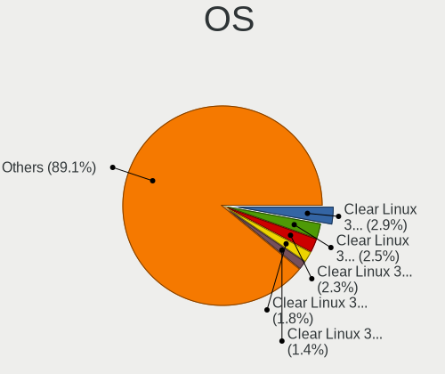

| Name              | Notebooks | Percent |
|-------------------|-----------|---------|
| Clear Linux 36010 | 15        | 3.09%   |
| Clear Linux 35000 | 14        | 2.88%   |
| Clear Linux 32480 | 13        | 2.67%   |
| Clear Linux 32270 | 10        | 2.06%   |
| Clear Linux 34930 | 8         | 1.65%   |
| Clear Linux 32380 | 8         | 1.65%   |
| Clear Linux 32760 | 7         | 1.44%   |
| Clear Linux 32330 | 7         | 1.44%   |
| Clear Linux 34820 | 6         | 1.23%   |
| Clear Linux 33660 | 6         | 1.23%   |
| Clear Linux 33010 | 6         | 1.23%   |
| Clear Linux 34700 | 5         | 1.03%   |
| Clear Linux 33980 | 5         | 1.03%   |
| Clear Linux 36070 | 4         | 0.82%   |
| Clear Linux 34860 | 4         | 0.82%   |
| Clear Linux 34640 | 4         | 0.82%   |
| Clear Linux 34290 | 4         | 0.82%   |
| Clear Linux 32910 | 4         | 0.82%   |
| Clear Linux 32390 | 4         | 0.82%   |
| Clear Linux 32340 | 4         | 0.82%   |
| Clear Linux 37000 | 3         | 0.62%   |
| Clear Linux 36270 | 3         | 0.62%   |
| Clear Linux 36250 | 3         | 0.62%   |
| Clear Linux 36190 | 3         | 0.62%   |
| Clear Linux 35550 | 3         | 0.62%   |
| Clear Linux 35110 | 3         | 0.62%   |
| Clear Linux 34670 | 3         | 0.62%   |
| Clear Linux 34380 | 3         | 0.62%   |
| Clear Linux 34350 | 3         | 0.62%   |
| Clear Linux 34250 | 3         | 0.62%   |
| Clear Linux 34220 | 3         | 0.62%   |
| Clear Linux 33890 | 3         | 0.62%   |
| Clear Linux 33570 | 3         | 0.62%   |
| Clear Linux 33460 | 3         | 0.62%   |
| Clear Linux 33440 | 3         | 0.62%   |
| Clear Linux 33300 | 3         | 0.62%   |
| Clear Linux 32690 | 3         | 0.62%   |
| Clear Linux 32600 | 3         | 0.62%   |
| Clear Linux 32400 | 3         | 0.62%   |
| Clear Linux 32310 | 3         | 0.62%   |

OS Family
---------

OS without a version

| Name        | Notebooks | Percent |
|-------------|-----------|---------|
| Clear Linux | 425       | 100%    |

Kernel
------

Version of the Linux kernel

| Version             | Notebooks | Percent |
|---------------------|-----------|---------|
| 5.16.13-1132.native | 25        | 5.19%   |
| 5.5.6-914.native    | 19        | 3.94%   |
| 5.13.13-1070.native | 19        | 3.94%   |
| 5.4.18-902.native   | 15        | 3.11%   |
| 5.10.19-1032.native | 13        | 2.7%    |
| 5.12.14-1051.native | 10        | 2.07%   |
| 5.5.5-911.native    | 9         | 1.87%   |
| 5.7.13-975.native   | 8         | 1.66%   |
| 5.5.15-930.native   | 7         | 1.45%   |
| 5.5.4-909.native    | 6         | 1.24%   |
| 5.5.3-908.native    | 6         | 1.24%   |
| 5.13.8-1065.native  | 6         | 1.24%   |
| 5.12.8-1045.native  | 6         | 1.24%   |
| 5.9.8-1000.native   | 5         | 1.04%   |
| 5.7.6-966.native    | 5         | 1.04%   |
| 5.6.8-945.native    | 5         | 1.04%   |
| 5.5.8-917.native    | 5         | 1.04%   |
| 5.12.5-1041.native  | 5         | 1.04%   |
| 5.10.10-1017.native | 5         | 1.04%   |
| 5.9.12-1004.native  | 4         | 0.83%   |
| 5.7.7-967.native    | 4         | 0.83%   |
| 5.6.6-942.native    | 4         | 0.83%   |
| 5.5.3-905.native    | 4         | 0.83%   |
| 5.4.6-883.native    | 4         | 0.83%   |
| 5.3.8-854.native    | 4         | 0.83%   |
| 5.17.4-1139.native  | 4         | 0.83%   |
| 5.16.17-1136.native | 4         | 0.83%   |
| 5.14.9-1079.native  | 4         | 0.83%   |
| 5.10.17-1026.native | 4         | 0.83%   |
| 5.1.5-770.native    | 4         | 0.83%   |
| 5.0.18-767.native   | 4         | 0.83%   |
| 5.9.1-992.native    | 3         | 0.62%   |
| 5.8.14-991.native   | 3         | 0.62%   |
| 5.8.12-989.native   | 3         | 0.62%   |
| 5.7.2-962.native    | 3         | 0.62%   |
| 5.7.11-973.native   | 3         | 0.62%   |
| 5.6.16-958.native   | 3         | 0.62%   |
| 5.6.15-957.native   | 3         | 0.62%   |
| 5.5.9-918.native    | 3         | 0.62%   |
| 5.5.13-924.native   | 3         | 0.62%   |

Kernel Family
-------------

Linux kernel without a distro release

| Version | Notebooks | Percent |
|---------|-----------|---------|
| 5.16.13 | 25        | 5.19%   |
| 5.5.6   | 19        | 3.94%   |
| 5.13.13 | 19        | 3.94%   |
| 5.4.18  | 15        | 3.11%   |
| 5.10.19 | 13        | 2.7%    |
| 5.5.3   | 10        | 2.07%   |
| 5.12.14 | 10        | 2.07%   |
| 5.5.5   | 9         | 1.87%   |
| 5.7.13  | 8         | 1.66%   |
| 5.5.15  | 7         | 1.45%   |
| 5.6.8   | 6         | 1.24%   |
| 5.5.4   | 6         | 1.24%   |
| 5.13.8  | 6         | 1.24%   |
| 5.12.8  | 6         | 1.24%   |
| 5.9.8   | 5         | 1.04%   |
| 5.7.6   | 5         | 1.04%   |
| 5.5.8   | 5         | 1.04%   |
| 5.17.9  | 5         | 1.04%   |
| 5.12.5  | 5         | 1.04%   |
| 5.10.10 | 5         | 1.04%   |
| 5.9.12  | 4         | 0.83%   |
| 5.7.7   | 4         | 0.83%   |
| 5.6.6   | 4         | 0.83%   |
| 5.6.15  | 4         | 0.83%   |
| 5.5.9   | 4         | 0.83%   |
| 5.4.6   | 4         | 0.83%   |
| 5.3.8   | 4         | 0.83%   |
| 5.17.4  | 4         | 0.83%   |
| 5.16.17 | 4         | 0.83%   |
| 5.14.9  | 4         | 0.83%   |
| 5.10.17 | 4         | 0.83%   |
| 5.1.5   | 4         | 0.83%   |
| 5.0.18  | 4         | 0.83%   |
| 6.0.0   | 3         | 0.62%   |
| 5.9.1   | 3         | 0.62%   |
| 5.8.14  | 3         | 0.62%   |
| 5.8.12  | 3         | 0.62%   |
| 5.7.2   | 3         | 0.62%   |
| 5.7.11  | 3         | 0.62%   |
| 5.6.4   | 3         | 0.62%   |

Kernel Major Ver.
-----------------

Linux kernel major version

| Version | Notebooks | Percent |
|---------|-----------|---------|
| 5.5     | 67        | 14.44%  |
| 5.10    | 47        | 10.13%  |
| 5.16    | 38        | 8.19%   |
| 5.4     | 34        | 7.33%   |
| 5.12    | 32        | 6.9%    |
| 5.7     | 29        | 6.25%   |
| 5.6     | 29        | 6.25%   |
| 5.13    | 28        | 6.03%   |
| 5.9     | 18        | 3.88%   |
| 5.3     | 18        | 3.88%   |
| 5.0     | 15        | 3.23%   |
| 5.2     | 13        | 2.8%    |
| 6.0     | 12        | 2.59%   |
| 5.17    | 12        | 2.59%   |
| 5.8     | 11        | 2.37%   |
| 5.18    | 11        | 2.37%   |
| 5.14    | 11        | 2.37%   |
| 5.1     | 11        | 2.37%   |
| 5.15    | 10        | 2.16%   |
| 4.19    | 8         | 1.72%   |
| 5.19    | 7         | 1.51%   |
| 6.1     | 3         | 0.65%   |

Arch
----

OS architecture (x86_64, i586, etc.)

| Name   | Notebooks | Percent |
|--------|-----------|---------|
| x86_64 | 425       | 100%    |

DE
--

Desktop Environment

| Name            | Notebooks | Percent |
|-----------------|-----------|---------|
| GNOME           | 347       | 78.86%  |
| Unknown         | 56        | 12.73%  |
| KDE             | 13        | 2.95%   |
| GNOME Flashback | 12        | 2.73%   |
| KDE5            | 7         | 1.59%   |
| XFCE            | 4         | 0.91%   |
| awesome         | 1         | 0.23%   |

Display Server
--------------

X11 or Wayland

| Name    | Notebooks | Percent |
|---------|-----------|---------|
| X11     | 394       | 92.49%  |
| Wayland | 30        | 7.04%   |
| Tty     | 2         | 0.47%   |

Display Manager
---------------

SDDM, LightDM, etc.

| Name    | Notebooks | Percent |
|---------|-----------|---------|
| Unknown | 420       | 98.82%  |
| GDM     | 4         | 0.94%   |
| SDDM    | 1         | 0.24%   |

OS Lang
-------

Language

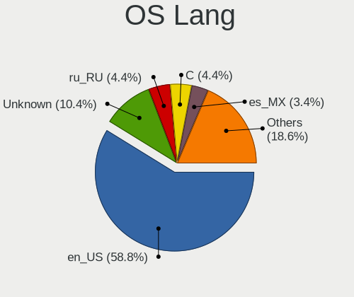

| Lang    | Notebooks | Percent |
|---------|-----------|---------|
| en_US   | 267       | 62.09%  |
| Unknown | 52        | 12.09%  |
| ru_RU   | 20        | 4.65%   |
| de_DE   | 14        | 3.26%   |
| es_MX   | 11        | 2.56%   |
| pt_BR   | 10        | 2.33%   |
| fr_FR   | 8         | 1.86%   |
| it_IT   | 7         | 1.63%   |
| en_GB   | 7         | 1.63%   |
| es_ES   | 5         | 1.16%   |
| pl_PL   | 4         | 0.93%   |
| zh_CN   | 3         | 0.7%    |
| tr_TR   | 3         | 0.7%    |
| en_AU   | 3         | 0.7%    |
| C       | 3         | 0.7%    |
| en_ZA   | 2         | 0.47%   |
| bg_BG   | 2         | 0.47%   |
| sv_SE   | 1         | 0.23%   |
| pt_PT   | 1         | 0.23%   |
| nl_NL   | 1         | 0.23%   |
| nl_BE   | 1         | 0.23%   |
| ka_GE   | 1         | 0.23%   |
| hu_HU   | 1         | 0.23%   |
| fi_FI   | 1         | 0.23%   |
| en_IN   | 1         | 0.23%   |
| ar_SA   | 1         | 0.23%   |

Boot Mode
---------

EFI or BIOS

| Mode | Notebooks | Percent |
|------|-----------|---------|
| BIOS | 425       | 100%    |

Filesystem
----------

Type of filesystem

| Type    | Notebooks | Percent |
|---------|-----------|---------|
| Ext4    | 365       | 84.69%  |
| Unknown | 57        | 13.23%  |
| Xfs     | 5         | 1.16%   |
| Btrfs   | 4         | 0.93%   |

Part. scheme
------------

Scheme of partitioning

| Type    | Notebooks | Percent |
|---------|-----------|---------|
| Unknown | 418       | 97.89%  |
| GPT     | 9         | 2.11%   |

Dual Boot with Linux/BSD
------------------------

Hosting more than one Linux/BSD

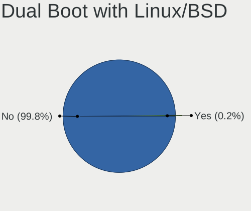

| Dual boot | Notebooks | Percent |
|-----------|-----------|---------|
| No        | 424       | 99.76%  |
| Yes       | 1         | 0.24%   |

Dual Boot (Win)
---------------

Hosting Linux and Windows

| Dual boot | Notebooks | Percent |
|-----------|-----------|---------|
| No        | 421       | 98.83%  |
| Yes       | 5         | 1.17%   |

Board
-----

Vendor
------

Motherboard manufacturer

| Name                | Notebooks | Percent |
|---------------------|-----------|---------|
| Lenovo              | 82        | 19.29%  |
| Dell                | 80        | 18.82%  |
| Hewlett-Packard     | 67        | 15.76%  |
| ASUSTek Computer    | 45        | 10.59%  |
| Acer                | 34        | 8%      |
| Apple               | 20        | 4.71%   |
| Google              | 10        | 2.35%   |
| Samsung Electronics | 9         | 2.12%   |
| MSI                 | 9         | 2.12%   |
| Toshiba             | 7         | 1.65%   |
| Sony                | 5         | 1.18%   |
| HUAWEI              | 5         | 1.18%   |
| Fujitsu             | 4         | 0.94%   |
| Gigabyte Technology | 3         | 0.71%   |
| Complet             | 3         | 0.71%   |
| Alienware           | 3         | 0.71%   |
| Unknown             | 3         | 0.71%   |
| Positivo            | 2         | 0.47%   |
| Panasonic           | 2         | 0.47%   |
| Notebook            | 2         | 0.47%   |
| MOTILE              | 2         | 0.47%   |
| Chuwi               | 2         | 0.47%   |
| TODOS INDUSTRIAL    | 1         | 0.24%   |
| Timi                | 1         | 0.24%   |
| Teclast             | 1         | 0.24%   |
| Razer               | 1         | 0.24%   |
| PC Specialist       | 1         | 0.24%   |
| Packard Bell        | 1         | 0.24%   |
| Medion              | 1         | 0.24%   |
| Mediacom            | 1         | 0.24%   |
| MECHREVO            | 1         | 0.24%   |
| Mbenben             | 1         | 0.24%   |
| MASSCOM VIETNAM     | 1         | 0.24%   |
| Maibenben           | 1         | 0.24%   |
| Kanji               | 1         | 0.24%   |
| Itautec             | 1         | 0.24%   |
| Hampoo              | 1         | 0.24%   |
| Gateway             | 1         | 0.24%   |
| Framework           | 1         | 0.24%   |
| EVOO                | 1         | 0.24%   |

Model
-----

Motherboard model

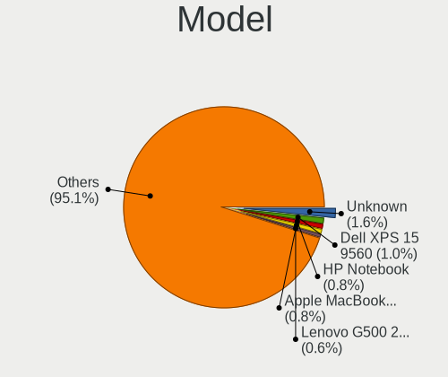

| Name                                       | Notebooks | Percent |
|--------------------------------------------|-----------|---------|
| Unknown                                    | 6         | 1.41%   |
| Dell XPS 15 9560                           | 5         | 1.18%   |
| HP Notebook                                | 4         | 0.94%   |
| Apple MacBookPro11,5                       | 4         | 0.94%   |
| Lenovo G500 20236                          | 3         | 0.71%   |
| HP Pavilion Notebook                       | 3         | 0.71%   |
| HP Pavilion 15                             | 3         | 0.71%   |
| HP EliteBook 8460p                         | 3         | 0.71%   |
| HP EliteBook 840 G1                        | 3         | 0.71%   |
| Dell XPS 13 9360                           | 3         | 0.71%   |
| Dell Inspiron 5570                         | 3         | 0.71%   |
| Complet MY8312                             | 3         | 0.71%   |
| ASUS VivoBook_ASUSLaptop X515DA_M515DA     | 3         | 0.71%   |
| Apple MacBookPro8,1                        | 3         | 0.71%   |
| Apple MacBookPro10,1                       | 3         | 0.71%   |
| Samsung 900X3C/900X3D/900X3E/900X4C/900X4D | 2         | 0.47%   |
| MSI GS43VR 7RE                             | 2         | 0.47%   |
| MOTILE M141                                | 2         | 0.47%   |
| Lenovo IdeaPad 110-15ACL 80TJ              | 2         | 0.47%   |
| Lenovo G50-70 20351                        | 2         | 0.47%   |
| HUAWEI NBLB-WAX9N                          | 2         | 0.47%   |
| HP Stream Laptop 14-cb0XX                  | 2         | 0.47%   |
| HP Pavilion Laptop 15-cw0xxx               | 2         | 0.47%   |
| HP 250 G6 Notebook PC                      | 2         | 0.47%   |
| Google Celes                               | 2         | 0.47%   |
| Google Auron_Paine                         | 2         | 0.47%   |
| Dell XPS 15 9570                           | 2         | 0.47%   |
| Dell XPS 13 9380                           | 2         | 0.47%   |
| Dell XPS 13 9343                           | 2         | 0.47%   |
| Dell XPS 13 9310                           | 2         | 0.47%   |
| Dell Latitude E7450                        | 2         | 0.47%   |
| Dell Latitude E6510                        | 2         | 0.47%   |
| Dell Latitude E6420                        | 2         | 0.47%   |
| Dell Inspiron 5370                         | 2         | 0.47%   |
| Dell Inspiron 3537                         | 2         | 0.47%   |
| Dell Inspiron 3501                         | 2         | 0.47%   |
| Chuwi GemiBook                             | 2         | 0.47%   |
| ASUS X553MA                                | 2         | 0.47%   |
| Apple MacBookPro9,2                        | 2         | 0.47%   |
| Acer Aspire V3-772G                        | 2         | 0.47%   |

Model Family
------------

Motherboard model prefix

| Name               | Notebooks | Percent |
|--------------------|-----------|---------|
| Lenovo ThinkPad    | 34        | 8%      |
| Acer Aspire        | 30        | 7.06%   |
| Dell Inspiron      | 28        | 6.59%   |
| Dell Latitude      | 22        | 5.18%   |
| Lenovo IdeaPad     | 21        | 4.94%   |
| Dell XPS           | 20        | 4.71%   |
| HP Pavilion        | 16        | 3.76%   |
| HP EliteBook       | 14        | 3.29%   |
| ASUS VivoBook      | 14        | 3.29%   |
| HP Laptop          | 8         | 1.88%   |
| Toshiba Satellite  | 6         | 1.41%   |
| HP Stream          | 6         | 1.41%   |
| Unknown            | 6         | 1.41%   |
| Dell Precision     | 5         | 1.18%   |
| ASUS ZenBook       | 5         | 1.18%   |
| Apple MacBookPro8  | 5         | 1.18%   |
| Apple MacBookPro11 | 5         | 1.18%   |
| HP Notebook        | 4         | 0.94%   |
| Lenovo Yoga        | 3         | 0.71%   |
| Lenovo ThinkBook   | 3         | 0.71%   |
| Lenovo G500        | 3         | 0.71%   |
| HP ZBook           | 3         | 0.71%   |
| HP ProBook         | 3         | 0.71%   |
| HP ENVY            | 3         | 0.71%   |
| HP 250             | 3         | 0.71%   |
| Fujitsu LIFEBOOK   | 3         | 0.71%   |
| Dell Vostro        | 3         | 0.71%   |
| Complet MY8312     | 3         | 0.71%   |
| ASUS ROG           | 3         | 0.71%   |
| Apple MacBookPro10 | 3         | 0.71%   |
| Samsung 900X3C     | 2         | 0.47%   |
| MSI GS43VR         | 2         | 0.47%   |
| MOTILE M141        | 2         | 0.47%   |
| Lenovo Legion      | 2         | 0.47%   |
| Lenovo G50-70      | 2         | 0.47%   |
| HUAWEI NBLB-WAX9N  | 2         | 0.47%   |
| HP OMEN            | 2         | 0.47%   |
| Google Celes       | 2         | 0.47%   |
| Google Auron       | 2         | 0.47%   |
| Chuwi GemiBook     | 2         | 0.47%   |

MFG Year
--------

Motherboard manufacture year

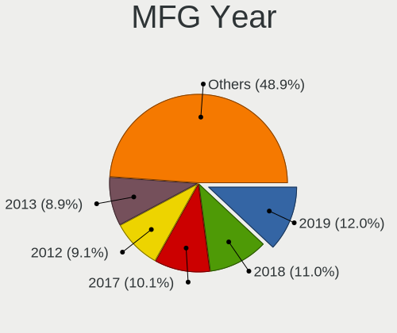

| Year | Notebooks | Percent |
|------|-----------|---------|
| 2018 | 55        | 12.94%  |
| 2019 | 52        | 12.24%  |
| 2013 | 44        | 10.35%  |
| 2015 | 43        | 10.12%  |
| 2017 | 39        | 9.18%   |
| 2016 | 37        | 8.71%   |
| 2020 | 35        | 8.24%   |
| 2012 | 33        | 7.76%   |
| 2014 | 31        | 7.29%   |
| 2011 | 27        | 6.35%   |
| 2021 | 12        | 2.82%   |
| 2010 | 8         | 1.88%   |
| 2022 | 6         | 1.41%   |
| 2009 | 2         | 0.47%   |
| 2008 | 1         | 0.24%   |

Form Factor
-----------

Physical design of the computer

| Name     | Notebooks | Percent |
|----------|-----------|---------|
| Notebook | 425       | 100%    |

Secure Boot
-----------

Enabled or disabled

| State    | Notebooks | Percent |
|----------|-----------|---------|
| Disabled | 425       | 100%    |

Coreboot
--------

Have coreboot on board

| Used | Notebooks | Percent |
|------|-----------|---------|
| No   | 415       | 97.65%  |
| Yes  | 10        | 2.35%   |

RAM Size
--------

Total RAM memory

| Size in GB | Notebooks | Percent |
|------------|-----------|---------|
| 4.01-8.0   | 113       | 26.46%  |
| 16.01-24.0 | 94        | 22.01%  |
| 3.01-4.0   | 91        | 21.31%  |
| 8.01-16.0  | 87        | 20.37%  |
| 32.01-64.0 | 23        | 5.39%   |
| 1.01-2.0   | 11        | 2.58%   |
| 24.01-32.0 | 6         | 1.41%   |
| 2.01-3.0   | 2         | 0.47%   |

RAM Used
--------

Used RAM memory

| Used GB   | Notebooks | Percent |
|-----------|-----------|---------|
| 1.01-2.0  | 185       | 40.48%  |
| 2.01-3.0  | 156       | 34.14%  |
| 3.01-4.0  | 64        | 14%     |
| 4.01-8.0  | 37        | 8.1%    |
| 0.51-1.0  | 9         | 1.97%   |
| 8.01-16.0 | 6         | 1.31%   |

Total Drives
------------

Number of drives on board

| Drives | Notebooks | Percent |
|--------|-----------|---------|
| 1      | 315       | 73.09%  |
| 2      | 95        | 22.04%  |
| 3      | 16        | 3.71%   |
| 0      | 3         | 0.7%    |
| 6      | 1         | 0.23%   |
| 5      | 1         | 0.23%   |

Has CD-ROM
----------

Has CD-ROM on board

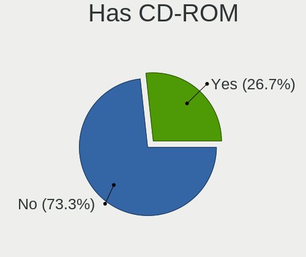

| Presented | Notebooks | Percent |
|-----------|-----------|---------|
| No        | 305       | 71.6%   |
| Yes       | 121       | 28.4%   |

Has Ethernet
------------

Has Ethernet on board

| Presented | Notebooks | Percent |
|-----------|-----------|---------|
| Yes       | 310       | 72.94%  |
| No        | 115       | 27.06%  |

Has WiFi
--------

Has WiFi module

| Presented | Notebooks | Percent |
|-----------|-----------|---------|
| Yes       | 419       | 98.36%  |
| No        | 7         | 1.64%   |

Has Bluetooth
-------------

Has Bluetooth module

| Presented | Notebooks | Percent |
|-----------|-----------|---------|
| Yes       | 351       | 81.82%  |
| No        | 78        | 18.18%  |

Location
--------

Country
-------

Geographic location (country)

| Country      | Notebooks | Percent |
|--------------|-----------|---------|
| USA          | 96        | 22.48%  |
| Russia       | 30        | 7.03%   |
| Brazil       | 26        | 6.09%   |
| Germany      | 23        | 5.39%   |
| UK           | 18        | 4.22%   |
| Canada       | 18        | 4.22%   |
| Italy        | 15        | 3.51%   |
| Poland       | 13        | 3.04%   |
| India        | 13        | 3.04%   |
| Netherlands  | 12        | 2.81%   |
| Australia    | 11        | 2.58%   |
| Mexico       | 10        | 2.34%   |
| Bulgaria     | 9         | 2.11%   |
| Ukraine      | 8         | 1.87%   |
| Romania      | 8         | 1.87%   |
| Turkey       | 7         | 1.64%   |
| France       | 7         | 1.64%   |
| Spain        | 6         | 1.41%   |
| South Africa | 6         | 1.41%   |
| Portugal     | 4         | 0.94%   |
| Hong Kong    | 4         | 0.94%   |
| Vietnam      | 3         | 0.7%    |
| Thailand     | 3         | 0.7%    |
| Switzerland  | 3         | 0.7%    |
| Norway       | 3         | 0.7%    |
| Indonesia    | 3         | 0.7%    |
| Hungary      | 3         | 0.7%    |
| Denmark      | 3         | 0.7%    |
| Colombia     | 3         | 0.7%    |
| China        | 3         | 0.7%    |
| Chile        | 3         | 0.7%    |
| Belgium      | 3         | 0.7%    |
| Austria      | 3         | 0.7%    |
| Argentina    | 3         | 0.7%    |
| Uzbekistan   | 2         | 0.47%   |
| Sweden       | 2         | 0.47%   |
| Singapore    | 2         | 0.47%   |
| Saudi Arabia | 2         | 0.47%   |
| Philippines  | 2         | 0.47%   |
| Ireland      | 2         | 0.47%   |

City
----

Geographic location (city)

| City              | Notebooks | Percent |
|-------------------|-----------|---------|
| Moscow            | 7         | 1.58%   |
| Tucson            | 5         | 1.13%   |
| Rome              | 5         | 1.13%   |
| Berlin            | 5         | 1.13%   |
| Sydney            | 4         | 0.9%    |
| Sofia             | 4         | 0.9%    |
| Sao Paulo         | 4         | 0.9%    |
| Houston           | 4         | 0.9%    |
| Thunder Bay       | 3         | 0.68%   |
| St Petersburg     | 3         | 0.68%   |
| Mexico City       | 3         | 0.68%   |
| Kyiv              | 3         | 0.68%   |
| Johannesburg      | 3         | 0.68%   |
| Curitiba          | 3         | 0.68%   |
| Brooklyn          | 3         | 0.68%   |
| Amsterdam         | 3         | 0.68%   |
| Warsaw            | 2         | 0.45%   |
| Vigneux-sur-Seine | 2         | 0.45%   |
| Vienna            | 2         | 0.45%   |
| Varna             | 2         | 0.45%   |
| Torrance          | 2         | 0.45%   |
| Toronto           | 2         | 0.45%   |
| The Hague         | 2         | 0.45%   |
| Singapore         | 2         | 0.45%   |
| San Francisco     | 2         | 0.45%   |
| Salvador          | 2         | 0.45%   |
| Reutov            | 2         | 0.45%   |
| Nanjing           | 2         | 0.45%   |
| Minsk             | 2         | 0.45%   |
| Miami             | 2         | 0.45%   |
| Madison           | 2         | 0.45%   |
| Kolkata           | 2         | 0.45%   |
| Hawthorn          | 2         | 0.45%   |
| Haskovo           | 2         | 0.45%   |
| Glasgow           | 2         | 0.45%   |
| Fortaleza         | 2         | 0.45%   |
| Fort Worth        | 2         | 0.45%   |
| Dresden           | 2         | 0.45%   |
| Denver            | 2         | 0.45%   |
| Dallas            | 2         | 0.45%   |

Drives
------

Drive Vendor
------------

Hard drive vendors

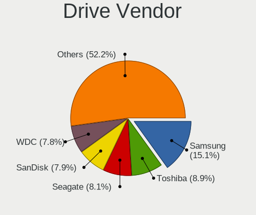

| Vendor              | Notebooks | Drives | Percent |
|---------------------|-----------|--------|---------|
| Samsung Electronics | 83        | 119    | 15.63%  |
| Toshiba             | 54        | 55     | 10.17%  |
| WDC                 | 45        | 51     | 8.47%   |
| Seagate             | 45        | 58     | 8.47%   |
| Unknown             | 44        | 60     | 8.29%   |
| SanDisk             | 39        | 42     | 7.34%   |
| Kingston            | 30        | 34     | 5.65%   |
| SK hynix            | 25        | 27     | 4.71%   |
| HGST                | 17        | 21     | 3.2%    |
| Intel               | 14        | 17     | 2.64%   |
| Apple               | 14        | 15     | 2.64%   |
| Hitachi             | 12        | 15     | 2.26%   |
| Crucial             | 11        | 13     | 2.07%   |
| A-DATA Technology   | 9         | 11     | 1.69%   |
| Micron Technology   | 7         | 8      | 1.32%   |
| JMicron Technology  | 7         | 7      | 1.32%   |
| LITEON              | 5         | 6      | 0.94%   |
| Transcend           | 4         | 4      | 0.75%   |
| SPCC                | 4         | 4      | 0.75%   |
| Silicon Motion      | 4         | 5      | 0.75%   |
| LITEONIT            | 4         | 9      | 0.75%   |
| KIOXIA              | 4         | 7      | 0.75%   |
| KingSpec            | 4         | 5      | 0.75%   |
| FORESEE             | 4         | 4      | 0.75%   |
| Fujitsu             | 3         | 4      | 0.56%   |
| OCZ                 | 2         | 3      | 0.38%   |
| Netac               | 2         | 2      | 0.38%   |
| Hewlett-Packard     | 2         | 2      | 0.38%   |
| China               | 2         | 2      | 0.38%   |
| ADATA Technology    | 2         | 2      | 0.38%   |
| XrayDisk            | 1         | 1      | 0.19%   |
| XPG                 | 1         | 1      | 0.19%   |
| WDC WDS1            | 1         | 1      | 0.19%   |
| W800S               | 1         | 1      | 0.19%   |
| Teclast             | 1         | 1      | 0.19%   |
| Team                | 1         | 1      | 0.19%   |
| TCSUNBOW            | 1         | 1      | 0.19%   |
| SSK                 | 1         | 1      | 0.19%   |
| Smart               | 1         | 1      | 0.19%   |
| SABRENT             | 1         | 1      | 0.19%   |

Drive Model
-----------

Hard drive models

| Model                                  | Notebooks | Percent |
|----------------------------------------|-----------|---------|
| Unknown MMC Card  32GB                 | 21        | 3.84%   |
| Samsung SM963 2.5" NVMe PCIe SSD 256GB | 11        | 2.01%   |
| Toshiba MQ01ABF050 500GB               | 10        | 1.83%   |
| Seagate ST1000LM035-1RK172 1TB         | 9         | 1.65%   |
| Unknown MMC Card  64GB                 | 8         | 1.46%   |
| Seagate ST1000LM024 HN-M101MBB 1TB     | 8         | 1.46%   |
| HGST HTS721010A9E630 1TB               | 8         | 1.46%   |
| Toshiba NVMe SSD Drive 512GB           | 7         | 1.28%   |
| Toshiba NVMe SSD Drive 256GB           | 7         | 1.28%   |
| SanDisk NVMe SSD Drive 512GB           | 7         | 1.28%   |
| Kingston SA400S37240G 240GB SSD        | 7         | 1.28%   |
| Intel NVMe SSD Drive 512GB             | 7         | 1.28%   |
| Toshiba MQ01ABD100 1TB                 | 6         | 1.1%    |
| SK hynix NVMe SSD Drive 512GB          | 6         | 1.1%    |
| Samsung SSD 850 EVO 250GB              | 6         | 1.1%    |
| Samsung NVMe SSD Drive 1024GB          | 6         | 1.1%    |
| JMicron Tech 250GB                     | 6         | 1.1%    |
| Unknown MMC Card  128GB                | 5         | 0.91%   |
| SK hynix NVMe SSD Drive 256GB          | 5         | 0.91%   |
| Seagate ST500LT012-1DG142 500GB        | 5         | 0.91%   |
| SanDisk NVMe SSD Drive 256GB           | 5         | 0.91%   |
| Samsung SSD 860 EVO 500GB              | 5         | 0.91%   |
| Samsung NVMe SSD Drive 512GB           | 5         | 0.91%   |
| WDC WD10SPZX-24Z10 1TB                 | 4         | 0.73%   |
| Toshiba MQ04ABF100 1TB                 | 4         | 0.73%   |
| Samsung NVMe SSD Drive 500GB           | 4         | 0.73%   |
| Micron 1100_MTFDDAV256TBN 256GB SSD    | 4         | 0.73%   |
| HGST HTS725050A7E630 500GB             | 4         | 0.73%   |
| SK hynix SC311 SATA 256GB SSD          | 3         | 0.55%   |
| Seagate ST750LM022 HN-M750MBB 752GB    | 3         | 0.55%   |
| Hitachi HTS545050B9A300 500GB          | 3         | 0.55%   |
| FORESEE 256GB SSD                      | 3         | 0.55%   |
| Apple SSD SM512E 500GB                 | 3         | 0.55%   |
| Apple SSD SM0512G 500GB                | 3         | 0.55%   |
| Apple SSD SM0256G 256GB                | 3         | 0.55%   |
| WDC WDS240G2G0A-00JH30 240GB SSD       | 2         | 0.37%   |
| WDC WD10SPZX-60Z10T0 1TB               | 2         | 0.37%   |
| WDC WD10SPZX-21Z10T0 1TB               | 2         | 0.37%   |
| WDC WD10SPZX-17Z10T1 1TB               | 2         | 0.37%   |
| WDC WD10JPVX-60JC3T0 1TB               | 2         | 0.37%   |

HDD Vendor
----------

Hard disk drive vendors

| Vendor              | Notebooks | Drives | Percent |
|---------------------|-----------|--------|---------|
| Seagate             | 44        | 57     | 31.21%  |
| WDC                 | 33        | 35     | 23.4%   |
| Toshiba             | 28        | 28     | 19.86%  |
| HGST                | 17        | 21     | 12.06%  |
| Hitachi             | 12        | 15     | 8.51%   |
| Unknown             | 2         | 2      | 1.42%   |
| Samsung Electronics | 2         | 2      | 1.42%   |
| Fujitsu             | 2         | 3      | 1.42%   |
| Apple               | 1         | 1      | 0.71%   |

SSD Vendor
----------

Solid state drive vendors

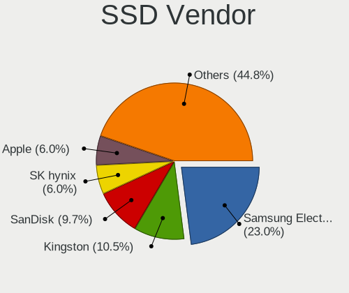

| Vendor              | Notebooks | Drives | Percent |
|---------------------|-----------|--------|---------|
| Samsung Electronics | 54        | 78     | 24.32%  |
| Kingston            | 23        | 23     | 10.36%  |
| SanDisk             | 20        | 21     | 9.01%   |
| WDC                 | 13        | 16     | 5.86%   |
| SK hynix            | 12        | 12     | 5.41%   |
| Apple               | 12        | 13     | 5.41%   |
| Crucial             | 11        | 13     | 4.95%   |
| A-DATA Technology   | 9         | 11     | 4.05%   |
| Toshiba             | 8         | 9      | 3.6%    |
| Micron Technology   | 5         | 6      | 2.25%   |
| LITEON              | 5         | 6      | 2.25%   |
| Transcend           | 4         | 4      | 1.8%    |
| SPCC                | 4         | 4      | 1.8%    |
| LITEONIT            | 4         | 9      | 1.8%    |
| KingSpec            | 4         | 5      | 1.8%    |
| FORESEE             | 4         | 4      | 1.8%    |
| Intel               | 3         | 3      | 1.35%   |
| OCZ                 | 2         | 3      | 0.9%    |
| Netac               | 2         | 2      | 0.9%    |
| Hewlett-Packard     | 2         | 2      | 0.9%    |
| China               | 2         | 2      | 0.9%    |
| WDC WDS1            | 1         | 1      | 0.45%   |
| W800S               | 1         | 1      | 0.45%   |
| Teclast             | 1         | 1      | 0.45%   |
| Team                | 1         | 1      | 0.45%   |
| Smart               | 1         | 1      | 0.45%   |
| PNY                 | 1         | 1      | 0.45%   |
| Plextor             | 1         | 1      | 0.45%   |
| Patriot             | 1         | 1      | 0.45%   |
| MidasForce          | 1         | 1      | 0.45%   |
| Leven               | 1         | 1      | 0.45%   |
| LDLC                | 1         | 1      | 0.45%   |
| KingDian            | 1         | 1      | 0.45%   |
| JMicron Technology  | 1         | 1      | 0.45%   |
| Integral            | 1         | 1      | 0.45%   |
| Hikvision           | 1         | 1      | 0.45%   |
| Fujitsu             | 1         | 1      | 0.45%   |
| Corsair             | 1         | 1      | 0.45%   |
| BIWIN               | 1         | 1      | 0.45%   |
| Apacer              | 1         | 1      | 0.45%   |

Drive Kind
----------

HDD or SSD

| Kind    | Notebooks | Drives | Percent |
|---------|-----------|--------|---------|
| SSD     | 208       | 265    | 40.08%  |
| HDD     | 140       | 164    | 26.97%  |
| NVMe    | 114       | 140    | 21.97%  |
| MMC     | 41        | 56     | 7.9%    |
| Unknown | 16        | 18     | 3.08%   |

Drive Connector
---------------

SATA, SAS, NVMe, etc.

| Type | Notebooks | Drives | Percent |
|------|-----------|--------|---------|
| SATA | 315       | 430    | 64.81%  |
| NVMe | 113       | 139    | 23.25%  |
| MMC  | 41        | 56     | 8.44%   |
| SAS  | 17        | 18     | 3.5%    |

Drive Size
----------

Size of hard drive

| Size in TB | Notebooks | Drives | Percent |
|------------|-----------|--------|---------|
| 0.01-0.5   | 239       | 297    | 70.29%  |
| 0.51-1.0   | 89        | 119    | 26.18%  |
| 1.01-2.0   | 12        | 13     | 3.53%   |

Space Total
-----------

Amount of disk space available on the file system

| Size in GB     | Notebooks | Percent |
|----------------|-----------|---------|
| 101-250        | 171       | 38.95%  |
| 251-500        | 95        | 21.64%  |
| 501-1000       | 52        | 11.85%  |
| 51-100         | 39        | 8.88%   |
| 21-50          | 36        | 8.2%    |
| Unknown        | 31        | 7.06%   |
| 1001-2000      | 10        | 2.28%   |
| 1-20           | 3         | 0.68%   |
| More than 3000 | 1         | 0.23%   |
| 2001-3000      | 1         | 0.23%   |

Space Used
----------

Amount of used disk space

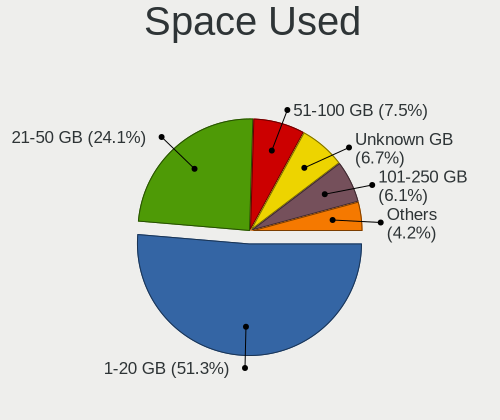

| Used GB   | Notebooks | Percent |
|-----------|-----------|---------|
| 1-20      | 238       | 52.54%  |
| 21-50     | 109       | 24.06%  |
| 51-100    | 32        | 7.06%   |
| Unknown   | 31        | 6.84%   |
| 101-250   | 27        | 5.96%   |
| 251-500   | 11        | 2.43%   |
| 501-1000  | 4         | 0.88%   |
| 1001-2000 | 1         | 0.22%   |

Malfunc. Drives
---------------

Drive models with a malfunction

| Model                      | Notebooks | Drives | Percent |
|----------------------------|-----------|--------|---------|
| Fujitsu MHZ2250BH G1 250GB | 1         | 1      | 100%    |

Malfunc. Drive Vendor
---------------------

Vendors of faulty drives

| Vendor  | Notebooks | Drives | Percent |
|---------|-----------|--------|---------|
| Fujitsu | 1         | 1      | 100%    |

Malfunc. HDD Vendor
-------------------

Vendors of faulty HDD drives

| Vendor  | Notebooks | Drives | Percent |
|---------|-----------|--------|---------|
| Fujitsu | 1         | 1      | 100%    |

Malfunc. Drive Kind
-------------------

Kinds of faulty drives

| Kind | Notebooks | Drives | Percent |
|------|-----------|--------|---------|
| HDD  | 1         | 1      | 100%    |

Failed Drives
-------------

Failed drive models

Zero info for selected period =(

Failed Drive Vendor
-------------------

Failed drive vendors

Zero info for selected period =(

Drive Status
------------

Number of failed and malfunc. drives

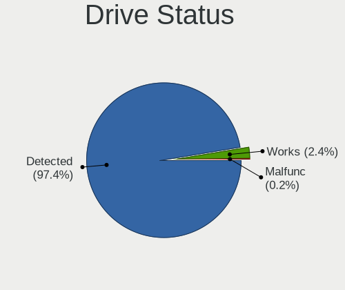

| Status   | Notebooks | Drives | Percent |
|----------|-----------|--------|---------|
| Detected | 420       | 635    | 98.59%  |
| Works    | 5         | 7      | 1.17%   |
| Malfunc  | 1         | 1      | 0.23%   |

Storage controller
------------------

Storage Vendor
--------------

Storage controller vendors

| Vendor                       | Notebooks | Percent |
|------------------------------|-----------|---------|
| Intel                        | 325       | 68.57%  |
| Samsung Electronics          | 41        | 8.65%   |
| AMD                          | 31        | 6.54%   |
| Toshiba America Info Systems | 18        | 3.8%    |
| SanDisk                      | 18        | 3.8%    |
| SK hynix                     | 13        | 2.74%   |
| Kingston Technology Company  | 8         | 1.69%   |
| Silicon Motion               | 4         | 0.84%   |
| KIOXIA                       | 4         | 0.84%   |
| ADATA Technology             | 3         | 0.63%   |
| Micron Technology            | 2         | 0.42%   |
| Marvell Technology Group     | 2         | 0.42%   |
| ASMedia Technology           | 2         | 0.42%   |
| Shenzhen Longsys Electronics | 1         | 0.21%   |
| Micron/Crucial Technology    | 1         | 0.21%   |
| Apple                        | 1         | 0.21%   |

Storage Model
-------------

Storage controller models

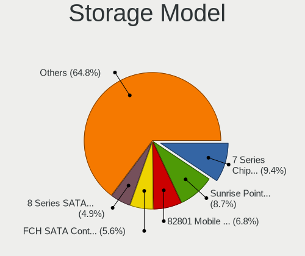

| Model                                                                          | Notebooks | Percent |
|--------------------------------------------------------------------------------|-----------|---------|
| Intel 7 Series Chipset Family 6-port SATA Controller [AHCI mode]               | 50        | 10.14%  |
| Intel Sunrise Point-LP SATA Controller [AHCI mode]                             | 41        | 8.32%   |
| Intel 82801 Mobile SATA Controller [RAID mode]                                 | 34        | 6.9%    |
| AMD FCH SATA Controller [AHCI mode]                                            | 31        | 6.29%   |
| Intel 8 Series SATA Controller 1 [AHCI mode]                                   | 25        | 5.07%   |
| Intel Wildcat Point-LP SATA Controller [AHCI Mode]                             | 24        | 4.87%   |
| Intel 6 Series/C200 Series Chipset Family 6 port Mobile SATA AHCI Controller   | 21        | 4.26%   |
| Intel HM170/QM170 Chipset SATA Controller [AHCI Mode]                          | 20        | 4.06%   |
| Samsung NVMe SSD Controller SM981/PM981/PM983                                  | 18        | 3.65%   |
| Intel Cannon Lake Mobile PCH SATA AHCI Controller                              | 17        | 3.45%   |
| Intel Celeron/Pentium Silver Processor SATA Controller                         | 15        | 3.04%   |
| Intel 8 Series/C220 Series Chipset Family 6-port SATA Controller 1 [AHCI mode] | 15        | 3.04%   |
| Intel Celeron N3350/Pentium N4200/Atom E3900 Series SATA AHCI Controller       | 12        | 2.43%   |
| Intel Atom Processor E3800 Series SATA AHCI Controller                         | 10        | 2.03%   |
| Samsung NVMe SSD Controller SM961/PM961/SM963                                  | 8         | 1.62%   |
| Toshiba America Info Systems XG6 NVMe SSD Controller                           | 7         | 1.42%   |
| Samsung Electronics SATA controller                                            | 7         | 1.42%   |
| Intel SSD 660P Series                                                          | 7         | 1.42%   |
| Intel 5 Series/3400 Series Chipset 6 port SATA AHCI Controller                 | 7         | 1.42%   |
| SanDisk WD Blue SN500 / PC SN520 NVMe SSD                                      | 6         | 1.22%   |
| Intel Cannon Point-LP SATA Controller [AHCI Mode]                              | 6         | 1.22%   |
| Toshiba America Info Systems XG5 NVMe SSD Controller                           | 5         | 1.01%   |
| SK hynix PC401 NVMe Solid State Drive 256GB                                    | 4         | 0.81%   |
| SK hynix Gold P31/PC711 NVMe Solid State Drive                                 | 4         | 0.81%   |
| SanDisk WD Blue SN550 NVMe SSD                                                 | 4         | 0.81%   |
| Samsung NVMe SSD Controller 980                                                | 4         | 0.81%   |
| KIOXIA NVMe SSD Controller BG4                                                 | 4         | 0.81%   |
| Kingston Company U-SNS8154P3 NVMe SSD                                          | 4         | 0.81%   |
| Intel Volume Management Device NVMe RAID Controller                            | 4         | 0.81%   |
| Intel Q170/Q150/B150/H170/H110/Z170/CM236 Chipset SATA Controller [AHCI Mode]  | 4         | 0.81%   |
| Toshiba America Info Systems BG3 NVMe SSD Controller                           | 3         | 0.61%   |
| SK hynix Non-Volatile memory controller                                        | 3         | 0.61%   |
| Silicon Motion SM2262/SM2262EN SSD Controller                                  | 3         | 0.61%   |
| SanDisk WD Black SN750 / PC SN730 NVMe SSD                                     | 3         | 0.61%   |
| Samsung NVMe SSD Controller SM951/PM951                                        | 3         | 0.61%   |
| Kingston Company Company Non-Volatile memory controller                        | 3         | 0.61%   |
| Intel Tiger Lake-LP SATA Controller                                            | 3         | 0.61%   |
| Intel SSD Pro 7600p/760p/E 6100p Series                                        | 3         | 0.61%   |
| Intel Comet Lake SATA AHCI Controller                                          | 3         | 0.61%   |
| Toshiba America Info Systems XG4 NVMe SSD Controller                           | 2         | 0.41%   |

Storage Kind
------------

Kind of storage controller (IDE, SATA, NVMe, SAS, ...)

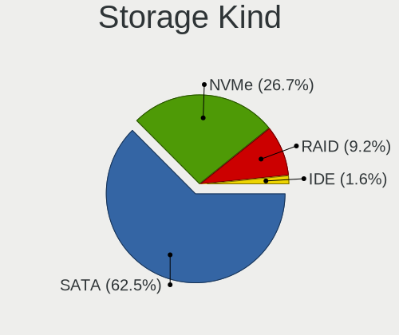

| Kind | Notebooks | Percent |
|------|-----------|---------|
| SATA | 320       | 66.12%  |
| NVMe | 115       | 23.76%  |
| RAID | 40        | 8.26%   |
| IDE  | 9         | 1.86%   |

Processor
---------

CPU Vendor
----------

Processor vendors

| Vendor | Notebooks | Percent |
|--------|-----------|---------|
| Intel  | 387       | 91.06%  |
| AMD    | 38        | 8.94%   |

CPU Model
---------

Processor models

| Model                                         | Notebooks | Percent |
|-----------------------------------------------|-----------|---------|
| Intel Core i5-8250U CPU @ 1.60GHz             | 15        | 3.53%   |
| Intel Core i7-8750H CPU @ 2.20GHz             | 10        | 2.35%   |
| Intel Core i7-7700HQ CPU @ 2.80GHz            | 10        | 2.35%   |
| Intel Core i5-3210M CPU @ 2.50GHz             | 9         | 2.12%   |
| Intel Celeron CPU N2840 @ 2.16GHz             | 9         | 2.12%   |
| Intel Core i7-6700HQ CPU @ 2.60GHz            | 8         | 1.88%   |
| Intel Core i5-8265U CPU @ 1.60GHz             | 8         | 1.88%   |
| Intel Core i5-5200U CPU @ 2.20GHz             | 8         | 1.88%   |
| Intel Core i5-2520M CPU @ 2.50GHz             | 8         | 1.88%   |
| Intel Core i7-8550U CPU @ 1.80GHz             | 7         | 1.65%   |
| Intel Core i5-6300U CPU @ 2.40GHz             | 7         | 1.65%   |
| Intel Core i5-4200U CPU @ 1.60GHz             | 7         | 1.65%   |
| Intel Celeron CPU N3350 @ 1.10GHz             | 7         | 1.65%   |
| Intel Core i7-10510U CPU @ 1.80GHz            | 6         | 1.41%   |
| Intel Core i5-4210U CPU @ 1.70GHz             | 6         | 1.41%   |
| Intel Core i5-3320M CPU @ 2.60GHz             | 6         | 1.41%   |
| Intel Pentium Silver N5000 CPU @ 1.10GHz      | 5         | 1.18%   |
| Intel Pentium CPU N4200 @ 1.10GHz             | 5         | 1.18%   |
| Intel Core i7-4870HQ CPU @ 2.50GHz            | 5         | 1.18%   |
| Intel Core i5-7200U CPU @ 2.50GHz             | 5         | 1.18%   |
| Intel Core i5-6200U CPU @ 2.30GHz             | 5         | 1.18%   |
| Intel Core i5-3337U CPU @ 1.80GHz             | 5         | 1.18%   |
| Intel Core i5-3317U CPU @ 1.70GHz             | 5         | 1.18%   |
| Intel Celeron N4000 CPU @ 1.10GHz             | 5         | 1.18%   |
| Intel 11th Gen Core i5-1135G7 @ 2.40GHz       | 5         | 1.18%   |
| AMD Ryzen 5 3500U with Radeon Vega Mobile Gfx | 5         | 1.18%   |
| Intel Core i7-9750H CPU @ 2.60GHz             | 4         | 0.94%   |
| Intel Core i7-5500U CPU @ 2.40GHz             | 4         | 0.94%   |
| Intel Core i7-4500U CPU @ 1.80GHz             | 4         | 0.94%   |
| Intel Core i5-7300HQ CPU @ 2.50GHz            | 4         | 0.94%   |
| Intel Core i5-5300U CPU @ 2.30GHz             | 4         | 0.94%   |
| Intel Core i5-10210U CPU @ 1.60GHz            | 4         | 0.94%   |
| Intel Core i5 CPU M 560 @ 2.67GHz             | 4         | 0.94%   |
| Intel Celeron CPU N3060 @ 1.60GHz             | 4         | 0.94%   |
| Intel Core i7-8565U CPU @ 1.80GHz             | 3         | 0.71%   |
| Intel Core i7-7500U CPU @ 2.70GHz             | 3         | 0.71%   |
| Intel Core i7-4710HQ CPU @ 2.50GHz            | 3         | 0.71%   |
| Intel Core i7-3720QM CPU @ 2.60GHz            | 3         | 0.71%   |
| Intel Core i7-3630QM CPU @ 2.40GHz            | 3         | 0.71%   |
| Intel Core i7-10750H CPU @ 2.60GHz            | 3         | 0.71%   |

CPU Model Family
----------------

Processor model prefix

| Model                | Notebooks | Percent |
|----------------------|-----------|---------|
| Intel Core i5        | 143       | 33.65%  |
| Intel Core i7        | 119       | 28%     |
| Intel Celeron        | 50        | 11.76%  |
| Intel Core i3        | 33        | 7.76%   |
| Other                | 13        | 3.06%   |
| Intel Pentium        | 13        | 3.06%   |
| AMD Ryzen 5          | 12        | 2.82%   |
| AMD Ryzen 7          | 6         | 1.41%   |
| Intel Pentium Silver | 5         | 1.18%   |
| AMD Ryzen 3          | 5         | 1.18%   |
| AMD A8               | 5         | 1.18%   |
| Intel Atom           | 4         | 0.94%   |
| Intel Core i9        | 3         | 0.71%   |
| AMD E1               | 2         | 0.47%   |
| AMD A6               | 2         | 0.47%   |
| AMD A10              | 2         | 0.47%   |
| Intel Xeon           | 1         | 0.24%   |
| Intel Core m5        | 1         | 0.24%   |
| Intel Core m3        | 1         | 0.24%   |
| Intel Core M         | 1         | 0.24%   |
| AMD Ryzen 7 PRO      | 1         | 0.24%   |
| AMD E2               | 1         | 0.24%   |
| AMD A4               | 1         | 0.24%   |
| AMD A12              | 1         | 0.24%   |

CPU Cores
---------

Number of processor cores

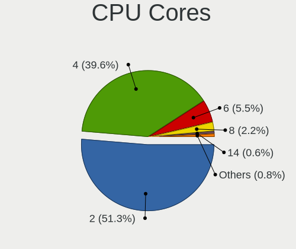

| Number | Notebooks | Percent |
|--------|-----------|---------|
| 2      | 223       | 52.47%  |
| 4      | 172       | 40.47%  |
| 6      | 24        | 5.65%   |
| 8      | 6         | 1.41%   |

CPU Sockets
-----------

Number of sockets

| Number | Notebooks | Percent |
|--------|-----------|---------|
| 1      | 425       | 100%    |

CPU Threads
-----------

Threads per core (Hyper-Threading)

| Number | Notebooks | Percent |
|--------|-----------|---------|
| 2      | 331       | 77.88%  |
| 1      | 94        | 22.12%  |

CPU Op-Modes
------------

CPU Operation Modes (32-bit, 64-bit)

| Op mode        | Notebooks | Percent |
|----------------|-----------|---------|
| 32-bit, 64-bit | 380       | 88.79%  |
| Unknown        | 48        | 11.21%  |

CPU Microcode
-------------

Microcode number

| Number     | Notebooks | Percent |
|------------|-----------|---------|
| Unknown    | 396       | 92.74%  |
| 0x40651    | 5         | 1.17%   |
| 0x806ea    | 4         | 0.94%   |
| 0x306a9    | 4         | 0.94%   |
| 0x906ea    | 3         | 0.7%    |
| 0x706a1    | 3         | 0.7%    |
| 0x306d4    | 2         | 0.47%   |
| 0x906e9    | 1         | 0.23%   |
| 0x806eb    | 1         | 0.23%   |
| 0x806e9    | 1         | 0.23%   |
| 0x706a8    | 1         | 0.23%   |
| 0x506e3    | 1         | 0.23%   |
| 0x506c9    | 1         | 0.23%   |
| 0x406c3    | 1         | 0.23%   |
| 0x40671    | 1         | 0.23%   |
| 0x306c3    | 1         | 0.23%   |
| 0x08108109 | 1         | 0.23%   |

CPU Microarch
-------------

Microarchitecture

| Name          | Notebooks | Percent |
|---------------|-----------|---------|
| KabyLake      | 103       | 24.24%  |
| IvyBridge     | 52        | 12.24%  |
| Haswell       | 47        | 11.06%  |
| Skylake       | 35        | 8.24%   |
| SandyBridge   | 32        | 7.53%   |
| Broadwell     | 28        | 6.59%   |
| Silvermont    | 25        | 5.88%   |
| Goldmont plus | 20        | 4.71%   |
| Zen+          | 14        | 3.29%   |
| Goldmont      | 13        | 3.06%   |
| TigerLake     | 12        | 2.82%   |
| Westmere      | 9         | 2.12%   |
| Puma          | 6         | 1.41%   |
| Zen           | 5         | 1.18%   |
| IceLake       | 5         | 1.18%   |
| Excavator     | 4         | 0.94%   |
| CometLake     | 4         | 0.94%   |
| Piledriver    | 3         | 0.71%   |
| Unknown       | 3         | 0.71%   |
| Zen 3         | 2         | 0.47%   |
| Zen 2         | 2         | 0.47%   |
| Jaguar        | 1         | 0.24%   |

Graphics
--------

GPU Vendor
----------

Vendors of graphics cards

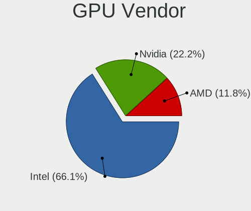

| Vendor | Notebooks | Percent |
|--------|-----------|---------|
| Intel  | 372       | 65.03%  |
| Nvidia | 129       | 22.55%  |
| AMD    | 71        | 12.41%  |

GPU Model
---------

Graphics card models

| Model                                                                                    | Notebooks | Percent |
|------------------------------------------------------------------------------------------|-----------|---------|
| Intel 3rd Gen Core processor Graphics Controller                                         | 48        | 8.3%    |
| Intel 2nd Generation Core Processor Family Integrated Graphics Controller                | 29        | 5.02%   |
| Intel Haswell-ULT Integrated Graphics Controller                                         | 27        | 4.67%   |
| Intel UHD Graphics 620                                                                   | 24        | 4.15%   |
| Intel CoffeeLake-H GT2 [UHD Graphics 630]                                                | 24        | 4.15%   |
| Intel HD Graphics 5500                                                                   | 20        | 3.46%   |
| Intel Skylake GT2 [HD Graphics 520]                                                      | 18        | 3.11%   |
| Intel HD Graphics 630                                                                    | 16        | 2.77%   |
| Intel GeminiLake [UHD Graphics 600]                                                      | 15        | 2.6%    |
| Intel 4th Gen Core Processor Integrated Graphics Controller                              | 15        | 2.6%    |
| Intel Atom Processor Z36xxx/Z37xxx Series Graphics & Display                             | 14        | 2.42%   |
| AMD Picasso/Raven 2 [Radeon Vega Series / Radeon Vega Mobile Series]                     | 14        | 2.42%   |
| Intel HD Graphics 620                                                                    | 13        | 2.25%   |
| Intel HD Graphics 530                                                                    | 12        | 2.08%   |
| Intel CometLake-U GT2 [UHD Graphics]                                                     | 12        | 2.08%   |
| Nvidia GP107M [GeForce GTX 1050 Ti Mobile]                                               | 11        | 1.9%    |
| Intel WhiskeyLake-U GT2 [UHD Graphics 620]                                               | 11        | 1.9%    |
| Intel TigerLake-LP GT2 [Iris Xe Graphics]                                                | 11        | 1.9%    |
| Intel Atom/Celeron/Pentium Processor x5-E8000/J3xxx/N3xxx Integrated Graphics Controller | 11        | 1.9%    |
| Nvidia GP107M [GeForce GTX 1050 Mobile]                                                  | 9         | 1.56%   |
| Intel HD Graphics 500                                                                    | 8         | 1.38%   |
| AMD Topaz XT [Radeon R7 M260/M265 / M340/M360 / M440/M445 / 530/535 / 620/625 Mobile]    | 8         | 1.38%   |
| Nvidia GP106M [GeForce GTX 1060 Mobile]                                                  | 7         | 1.21%   |
| Nvidia GF117M [GeForce 610M/710M/810M/820M / GT 620M/625M/630M/720M]                     | 7         | 1.21%   |
| Intel Core Processor Integrated Graphics Controller                                      | 6         | 1.04%   |
| Nvidia GM107M [GeForce GTX 960M]                                                         | 5         | 0.87%   |
| Intel GeminiLake [UHD Graphics 605]                                                      | 5         | 0.87%   |
| Intel Apollo Lake [HD Graphics 505]                                                      | 5         | 0.87%   |
| AMD Sun XT [Radeon HD 8670A/8670M/8690M / R5 M330 / M430 / Radeon 520 Mobile]            | 5         | 0.87%   |
| AMD Raven Ridge [Radeon Vega Series / Radeon Vega Mobile Series]                         | 5         | 0.87%   |
| Nvidia TU117M [GeForce GTX 1650 Mobile / Max-Q]                                          | 4         | 0.69%   |
| Nvidia TU116M [GeForce GTX 1660 Ti Mobile]                                               | 4         | 0.69%   |
| Nvidia GP108M [GeForce MX150]                                                            | 4         | 0.69%   |
| Nvidia GM107M [GeForce GTX 950M]                                                         | 4         | 0.69%   |
| Nvidia GM107M [GeForce GTX 860M]                                                         | 4         | 0.69%   |
| Intel HD Graphics                                                                        | 4         | 0.69%   |
| Intel CometLake-H GT2 [UHD Graphics]                                                     | 4         | 0.69%   |
| AMD Venus XT [Radeon HD 8870M / R9 M270X/M370X]                                          | 4         | 0.69%   |
| Nvidia GM108M [GeForce 940M]                                                             | 3         | 0.52%   |
| Nvidia GM108M [GeForce 840M]                                                             | 3         | 0.52%   |

GPU Combo
---------

Combinations of graphics cards

| Name           | Notebooks | Percent |
|----------------|-----------|---------|
| 1 x Intel      | 228       | 53.4%   |
| Intel + Nvidia | 117       | 27.4%   |
| 1 x AMD        | 36        | 8.43%   |
| Intel + AMD    | 26        | 6.09%   |
| 1 x Nvidia     | 9         | 2.11%   |
| 2 x AMD        | 6         | 1.41%   |
| AMD + Nvidia   | 3         | 0.7%    |
| Other          | 2         | 0.47%   |

GPU Driver
----------

Free vs proprietary

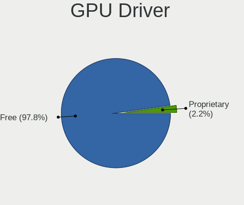

| Driver      | Notebooks | Percent |
|-------------|-----------|---------|
| Free        | 418       | 98.35%  |
| Proprietary | 7         | 1.65%   |

GPU Memory
----------

Total video memory

| Size in GB | Notebooks | Percent |
|------------|-----------|---------|
| Unknown    | 414       | 97.18%  |
| 3.01-4.0   | 3         | 0.7%    |
| 0.51-1.0   | 3         | 0.7%    |
| 5.01-6.0   | 2         | 0.47%   |
| 1.01-2.0   | 2         | 0.47%   |
| 7.01-8.0   | 1         | 0.23%   |
| 2.01-3.0   | 1         | 0.23%   |

Monitor
-------

Monitor Vendor
--------------

Monitor vendors

| Vendor                  | Notebooks | Percent |
|-------------------------|-----------|---------|
| AU Optronics            | 101       | 21.58%  |
| BOE                     | 73        | 15.6%   |
| LG Display              | 70        | 14.96%  |
| Chimei Innolux          | 62        | 13.25%  |
| Samsung Electronics     | 41        | 8.76%   |
| Sharp                   | 22        | 4.7%    |
| Apple                   | 20        | 4.27%   |
| PANDA                   | 17        | 3.63%   |
| Dell                    | 11        | 2.35%   |
| Goldstar                | 8         | 1.71%   |
| Chi Mei Optoelectronics | 7         | 1.5%    |
| Lenovo                  | 6         | 1.28%   |
| Acer                    | 4         | 0.85%   |
| InfoVision              | 3         | 0.64%   |
| BenQ                    | 3         | 0.64%   |
| Panasonic               | 2         | 0.43%   |
| AOC                     | 2         | 0.43%   |
| ZTR                     | 1         | 0.21%   |
| Vizio                   | 1         | 0.21%   |
| Toshiba                 | 1         | 0.21%   |
| Sony                    | 1         | 0.21%   |
| SDC                     | 1         | 0.21%   |
| Philips                 | 1         | 0.21%   |
| MSI                     | 1         | 0.21%   |
| MiTAC                   | 1         | 0.21%   |
| JXC                     | 1         | 0.21%   |
| JRY                     | 1         | 0.21%   |
| ITE                     | 1         | 0.21%   |
| Iiyama                  | 1         | 0.21%   |
| Hewlett-Packard         | 1         | 0.21%   |
| CYX                     | 1         | 0.21%   |
| CSO                     | 1         | 0.21%   |
| Ancor Communications    | 1         | 0.21%   |

Monitor Model
-------------

Monitor models

| Model                                                                    | Notebooks | Percent |
|--------------------------------------------------------------------------|-----------|---------|
| AU Optronics LCD Monitor AUO38ED 1920x1080 344x193mm 15.5-inch           | 6         | 1.28%   |
| AU Optronics LCD Monitor AUO235C 1366x768 256x144mm 11.6-inch            | 6         | 1.28%   |
| AU Optronics LCD Monitor AUO21ED 1920x1080 344x193mm 15.5-inch           | 6         | 1.28%   |
| BOE LCD Monitor BOE0747 1920x1080 344x194mm 15.5-inch                    | 5         | 1.07%   |
| Samsung Electronics LCD Monitor SDC4C48 1920x1080 239x134mm 10.8-inch    | 4         | 0.85%   |
| LG Display LCD Monitor LGD046D 1920x1080 309x174mm 14.0-inch             | 4         | 0.85%   |
| Chimei Innolux LCD Monitor CMN15F5 1920x1080 344x193mm 15.5-inch         | 4         | 0.85%   |
| Apple Color LCD APPA02E 2880x1800 331x207mm 15.4-inch                    | 4         | 0.85%   |
| Sharp LCD Monitor SHP1453 1920x1080 346x194mm 15.6-inch                  | 3         | 0.64%   |
| Samsung Electronics LCD Monitor SEC5441 1366x768 344x194mm 15.5-inch     | 3         | 0.64%   |
| PANDA LCD Monitor NCP0035 1920x1080 309x174mm 14.0-inch                  | 3         | 0.64%   |
| LG Display LCD Monitor LGD0590 1920x1080 344x194mm 15.5-inch             | 3         | 0.64%   |
| LG Display LCD Monitor LGD033A 1366x768 344x194mm 15.5-inch              | 3         | 0.64%   |
| Lenovo LCD Monitor LEN40BA 1920x1080 344x194mm 15.5-inch                 | 3         | 0.64%   |
| Chimei Innolux LCD Monitor CMN14D6 1366x768 309x173mm 13.9-inch          | 3         | 0.64%   |
| Chimei Innolux LCD Monitor CMN1132 1366x768 256x144mm 11.6-inch          | 3         | 0.64%   |
| Chi Mei Optoelectronics LCD Monitor CMO15A7 1366x768 344x193mm 15.5-inch | 3         | 0.64%   |
| BOE LCD Monitor BOE06A9 1920x1080 344x193mm 15.5-inch                    | 3         | 0.64%   |
| BOE LCD Monitor BOE0696 1366x768 309x173mm 13.9-inch                     | 3         | 0.64%   |
| BOE LCD Monitor BOE0675 1366x768 344x194mm 15.5-inch                     | 3         | 0.64%   |
| AU Optronics LCD Monitor AUO70EC 1366x768 344x193mm 15.5-inch            | 3         | 0.64%   |
| AU Optronics LCD Monitor AUO45EC 1366x768 344x193mm 15.5-inch            | 3         | 0.64%   |
| AU Optronics LCD Monitor AUO42EC 1366x768 344x193mm 15.5-inch            | 3         | 0.64%   |
| AU Optronics LCD Monitor AUO2D3C 1366x768 309x173mm 13.9-inch            | 3         | 0.64%   |
| AU Optronics LCD Monitor AUO10EC 1366x768 344x193mm 15.5-inch            | 3         | 0.64%   |
| Apple Color LCD APPA00E 2880x1800 331x207mm 15.4-inch                    | 3         | 0.64%   |
| Sharp LCD Monitor SHP14F9 1920x1200 288x180mm 13.4-inch                  | 2         | 0.43%   |
| Sharp LCD Monitor SHP148D 3840x2160 344x194mm 15.5-inch                  | 2         | 0.43%   |
| Sharp LCD Monitor SHP1476 3840x2160 346x194mm 15.6-inch                  | 2         | 0.43%   |
| Sharp LCD Monitor SHP144A 3200x1800 294x165mm 13.3-inch                  | 2         | 0.43%   |
| Sharp LCD Monitor SHP1449 1920x1080 294x165mm 13.3-inch                  | 2         | 0.43%   |
| Sharp LCD Monitor SHP143E 3840x2160 346x194mm 15.6-inch                  | 2         | 0.43%   |
| Sharp LCD Monitor SHP1420 1920x1080 294x165mm 13.3-inch                  | 2         | 0.43%   |
| Samsung Electronics LCD Monitor SDC354A 1366x768 344x194mm 15.5-inch     | 2         | 0.43%   |
| PANDA LM156LF1L03 NCP001C 1920x1080 344x194mm 15.5-inch                  | 2         | 0.43%   |
| PANDA LC133LF2L03 NCP0015 1920x1080 294x165mm 13.3-inch                  | 2         | 0.43%   |
| Panasonic LCD Monitor MEI96A2 2880x1620 344x193mm 15.5-inch              | 2         | 0.43%   |
| LG Display LCD Monitor LGD053F 1920x1080 344x194mm 15.5-inch             | 2         | 0.43%   |
| LG Display LCD Monitor LGD04A7 1920x1080 344x194mm 15.5-inch             | 2         | 0.43%   |
| LG Display LCD Monitor LGD0469 1920x1080 382x215mm 17.3-inch             | 2         | 0.43%   |

Monitor Resolution
------------------

Monitor screen resolution

| Resolution         | Notebooks | Percent |
|--------------------|-----------|---------|
| 1920x1080 (FHD)    | 199       | 43.74%  |
| 1366x768 (WXGA)    | 160       | 35.16%  |
| 3840x2160 (4K)     | 21        | 4.62%   |
| 1600x900 (HD+)     | 19        | 4.18%   |
| 2880x1800          | 9         | 1.98%   |
| 1280x800 (WXGA)    | 7         | 1.54%   |
| 3200x1800 (QHD+)   | 4         | 0.88%   |
| 2560x1600          | 4         | 0.88%   |
| 2560x1080          | 4         | 0.88%   |
| 1920x1200 (WUXGA)  | 4         | 0.88%   |
| 1440x900 (WXGA+)   | 4         | 0.88%   |
| 2160x1440          | 3         | 0.66%   |
| 1680x1050 (WSXGA+) | 3         | 0.66%   |
| 3840x1080          | 2         | 0.44%   |
| 2560x1440 (QHD)    | 2         | 0.44%   |
| 1360x768           | 2         | 0.44%   |
| 1280x1024 (SXGA)   | 2         | 0.44%   |
| 4093x4093          | 1         | 0.22%   |
| 3840x2400          | 1         | 0.22%   |
| 3840x1100          | 1         | 0.22%   |
| 3440x1440          | 1         | 0.22%   |
| 2736x1824          | 1         | 0.22%   |
| 2256x1504          | 1         | 0.22%   |

Monitor Diagonal
----------------

Diagonal size in inches

| Inches  | Notebooks | Percent |
|---------|-----------|---------|
| 15      | 213       | 45.61%  |
| 13      | 82        | 17.56%  |
| 14      | 47        | 10.06%  |
| 17      | 28        | 6%      |
| 11      | 24        | 5.14%   |
| 12      | 15        | 3.21%   |
| 27      | 11        | 2.36%   |
| 23      | 7         | 1.5%    |
| 21      | 6         | 1.28%   |
| 18      | 6         | 1.28%   |
| 34      | 5         | 1.07%   |
| 24      | 5         | 1.07%   |
| 31      | 4         | 0.86%   |
| 22      | 2         | 0.43%   |
| 16      | 2         | 0.43%   |
| 84      | 1         | 0.21%   |
| 72      | 1         | 0.21%   |
| 52      | 1         | 0.21%   |
| 49      | 1         | 0.21%   |
| 48      | 1         | 0.21%   |
| 46      | 1         | 0.21%   |
| 26      | 1         | 0.21%   |
| 20      | 1         | 0.21%   |
| 10      | 1         | 0.21%   |
| Unknown | 1         | 0.21%   |

Monitor Width
-------------

Physical width

| Width in mm | Notebooks | Percent |
|-------------|-----------|---------|
| 301-350     | 292       | 62.8%   |
| 201-300     | 86        | 18.49%  |
| 351-400     | 32        | 6.88%   |
| 501-600     | 22        | 4.73%   |
| 401-500     | 15        | 3.23%   |
| 601-700     | 6         | 1.29%   |
| 701-800     | 5         | 1.08%   |
| 1001-1500   | 4         | 0.86%   |
| 1501-2000   | 2         | 0.43%   |
| Unknown     | 1         | 0.22%   |

Aspect Ratio
------------

Proportional relationship between the width and the height

| Ratio   | Notebooks | Percent |
|---------|-----------|---------|
| 16/9    | 387       | 88.97%  |
| 16/10   | 30        | 6.9%    |
| 3/2     | 6         | 1.38%   |
| 21/9    | 5         | 1.15%   |
| 4/3     | 2         | 0.46%   |
| 32/9    | 2         | 0.46%   |
| 5/4     | 1         | 0.23%   |
| 3.40    | 1         | 0.23%   |
| Unknown | 1         | 0.23%   |

Monitor Area
------------

Area in inch

| Area in inch | Notebooks | Percent |
|----------------|-----------|---------|
| 101-110        | 213       | 45.51%  |
| 81-90          | 90        | 19.23%  |
| 71-80          | 38        | 8.12%   |
| 121-130        | 26        | 5.56%   |
| 51-60          | 25        | 5.34%   |
| 201-250        | 19        | 4.06%   |
| 61-70          | 15        | 3.21%   |
| 301-350        | 12        | 2.56%   |
| 351-500        | 9         | 1.92%   |
| 141-150        | 7         | 1.5%    |
| More than 1000 | 3         | 0.64%   |
| 111-120        | 3         | 0.64%   |
| 501-1000       | 3         | 0.64%   |
| 151-200        | 2         | 0.43%   |
| 41-50          | 1         | 0.21%   |
| 131-140        | 1         | 0.21%   |
| Unknown        | 1         | 0.21%   |

Pixel Density
-------------

Pixels per inch

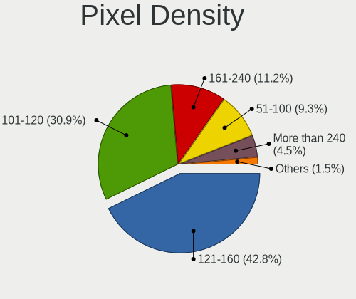

| Density       | Notebooks | Percent |
|---------------|-----------|---------|
| 121-160       | 198       | 42.76%  |
| 101-120       | 147       | 31.75%  |
| 161-240       | 46        | 9.94%   |
| 51-100        | 45        | 9.72%   |
| More than 240 | 22        | 4.75%   |
| 1-50          | 4         | 0.86%   |
| Unknown       | 1         | 0.22%   |

Multiple Monitors
-----------------

Total monitors connected

| Total | Notebooks | Percent |
|-------|-----------|---------|
| 1     | 377       | 88.29%  |
| 2     | 49        | 11.48%  |
| 3     | 1         | 0.23%   |

Network
-------

Net Controller Vendor
---------------------

Controller vendors

| Vendor                            | Notebooks | Percent |
|-----------------------------------|-----------|---------|
| Realtek Semiconductor             | 216       | 33.13%  |
| Intel                             | 215       | 32.98%  |
| Qualcomm Atheros                  | 116       | 17.79%  |
| Broadcom                          | 41        | 6.29%   |
| Broadcom Limited                  | 15        | 2.3%    |
| Ralink Technology                 | 7         | 1.07%   |
| Dell                              | 5         | 0.77%   |
| Ralink                            | 4         | 0.61%   |
| ASUSTek Computer                  | 4         | 0.61%   |
| ASIX Electronics                  | 4         | 0.61%   |
| TP-Link                           | 3         | 0.46%   |
| Motorola PCS                      | 3         | 0.46%   |
| Hewlett-Packard                   | 3         | 0.46%   |
| Huawei Technologies               | 2         | 0.31%   |
| Apple                             | 2         | 0.31%   |
| Xiaomi                            | 1         | 0.15%   |
| Sierra Wireless                   | 1         | 0.15%   |
| Qualcomm Atheros Communications   | 1         | 0.15%   |
| QinHeng Electronics               | 1         | 0.15%   |
| MediaTek                          | 1         | 0.15%   |
| Marvell Technology Group          | 1         | 0.15%   |
| JMicron Technology                | 1         | 0.15%   |
| ICS Advent                        | 1         | 0.15%   |
| Ericsson Business Mobile Networks | 1         | 0.15%   |
| Edimax Technology                 | 1         | 0.15%   |
| DisplayLink                       | 1         | 0.15%   |
| AVM                               | 1         | 0.15%   |

Net Controller Model
--------------------

Controller models

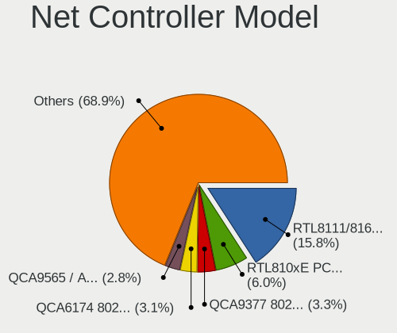

| Model                                                             | Notebooks | Percent |
|-------------------------------------------------------------------|-----------|---------|
| Realtek RTL8111/8168/8411 PCI Express Gigabit Ethernet Controller | 128       | 16.47%  |
| Realtek RTL810xE PCI Express Fast Ethernet controller             | 47        | 6.05%   |
| Qualcomm Atheros QCA9377 802.11ac Wireless Network Adapter        | 26        | 3.35%   |
| Qualcomm Atheros QCA6174 802.11ac Wireless Network Adapter        | 25        | 3.22%   |
| Qualcomm Atheros QCA9565 / AR9565 Wireless Network Adapter        | 22        | 2.83%   |
| Intel 82579LM Gigabit Network Connection (Lewisville)             | 22        | 2.83%   |
| Realtek RTL8821CE 802.11ac PCIe Wireless Network Adapter          | 17        | 2.19%   |
| Intel Wireless 7260                                               | 17        | 2.19%   |
| Intel Wireless 7265                                               | 16        | 2.06%   |
| Intel Wireless 8260                                               | 15        | 1.93%   |
| Intel Cannon Lake PCH CNVi WiFi                                   | 15        | 1.93%   |
| Intel Wireless 3165                                               | 14        | 1.8%    |
| Intel Centrino Advanced-N 6205 [Taylor Peak]                      | 13        | 1.67%   |
| Realtek RTL8153 Gigabit Ethernet Adapter                          | 12        | 1.54%   |
| Qualcomm Atheros AR9485 Wireless Network Adapter                  | 12        | 1.54%   |
| Intel Wireless 8265 / 8275                                        | 12        | 1.54%   |
| Broadcom BCM43142 802.11b/g/n                                     | 12        | 1.54%   |
| Realtek RTL8822BE 802.11a/b/g/n/ac WiFi adapter                   | 11        | 1.42%   |
| Realtek RTL8723BE PCIe Wireless Network Adapter                   | 11        | 1.42%   |
| Qualcomm Atheros AR9462 Wireless Network Adapter                  | 10        | 1.29%   |
| Intel Comet Lake PCH-LP CNVi WiFi                                 | 10        | 1.29%   |
| Intel Wireless 3160                                               | 9         | 1.16%   |
| Intel Wi-Fi 6 AX201                                               | 9         | 1.16%   |
| Intel Dual Band Wireless-AC 3165 Plus Bluetooth                   | 9         | 1.16%   |
| Intel Wi-Fi 6 AX200                                               | 8         | 1.03%   |
| Intel Gemini Lake PCH CNVi WiFi                                   | 8         | 1.03%   |
| Intel 82577LM Gigabit Network Connection                          | 8         | 1.03%   |
| Broadcom NetXtreme BCM57765 Gigabit Ethernet PCIe                 | 7         | 0.9%    |
| Broadcom BCM4331 802.11a/b/g/n                                    | 7         | 0.9%    |
| Realtek RTL8822CE 802.11ac PCIe Wireless Network Adapter          | 6         | 0.77%   |
| Intel Centrino Advanced-N 6235                                    | 6         | 0.77%   |
| Broadcom BCM43602 802.11ac Wireless LAN SoC                       | 6         | 0.77%   |
| Realtek 802.11n WLAN Adapter                                      | 5         | 0.64%   |
| Qualcomm Atheros AR8151 v2.0 Gigabit Ethernet                     | 5         | 0.64%   |
| Intel Ethernet Connection I219-LM                                 | 5         | 0.64%   |
| Intel Ethernet Connection I218-LM                                 | 5         | 0.64%   |
| Intel Ethernet Connection I217-LM                                 | 5         | 0.64%   |
| Intel Ethernet Connection (3) I218-LM                             | 5         | 0.64%   |
| Intel Dual Band Wireless-AC 3168NGW [Stone Peak]                  | 5         | 0.64%   |
| Intel Centrino Ultimate-N 6300                                    | 5         | 0.64%   |

Wireless Vendor
---------------

Wireless vendors

| Vendor                          | Notebooks | Percent |
|---------------------------------|-----------|---------|
| Intel                           | 202       | 45.19%  |
| Qualcomm Atheros                | 100       | 22.37%  |
| Realtek Semiconductor           | 70        | 15.66%  |
| Broadcom                        | 35        | 7.83%   |
| Broadcom Limited                | 13        | 2.91%   |
| Ralink Technology               | 7         | 1.57%   |
| Ralink                          | 4         | 0.89%   |
| Dell                            | 4         | 0.89%   |
| ASUSTek Computer                | 4         | 0.89%   |
| TP-Link                         | 3         | 0.67%   |
| Sierra Wireless                 | 1         | 0.22%   |
| Qualcomm Atheros Communications | 1         | 0.22%   |
| MediaTek                        | 1         | 0.22%   |
| Edimax Technology               | 1         | 0.22%   |
| AVM                             | 1         | 0.22%   |

Wireless Model
--------------

Wireless models

| Model                                                      | Notebooks | Percent |
|------------------------------------------------------------|-----------|---------|
| Qualcomm Atheros QCA9377 802.11ac Wireless Network Adapter | 26        | 5.76%   |
| Qualcomm Atheros QCA6174 802.11ac Wireless Network Adapter | 25        | 5.54%   |
| Qualcomm Atheros QCA9565 / AR9565 Wireless Network Adapter | 22        | 4.88%   |
| Realtek RTL8821CE 802.11ac PCIe Wireless Network Adapter   | 17        | 3.77%   |
| Intel Wireless 7260                                        | 17        | 3.77%   |
| Intel Wireless 7265                                        | 16        | 3.55%   |
| Intel Wireless 8260                                        | 15        | 3.33%   |
| Intel Cannon Lake PCH CNVi WiFi                            | 15        | 3.33%   |
| Intel Wireless 3165                                        | 14        | 3.1%    |
| Intel Centrino Advanced-N 6205 [Taylor Peak]               | 13        | 2.88%   |
| Qualcomm Atheros AR9485 Wireless Network Adapter           | 12        | 2.66%   |
| Intel Wireless 8265 / 8275                                 | 12        | 2.66%   |
| Broadcom BCM43142 802.11b/g/n                              | 12        | 2.66%   |
| Realtek RTL8822BE 802.11a/b/g/n/ac WiFi adapter            | 11        | 2.44%   |
| Realtek RTL8723BE PCIe Wireless Network Adapter            | 11        | 2.44%   |
| Qualcomm Atheros AR9462 Wireless Network Adapter           | 10        | 2.22%   |
| Intel Comet Lake PCH-LP CNVi WiFi                          | 10        | 2.22%   |
| Intel Wireless 3160                                        | 9         | 2%      |
| Intel Wi-Fi 6 AX201                                        | 9         | 2%      |
| Intel Dual Band Wireless-AC 3165 Plus Bluetooth            | 9         | 2%      |
| Intel Wi-Fi 6 AX200                                        | 8         | 1.77%   |
| Intel Gemini Lake PCH CNVi WiFi                            | 8         | 1.77%   |
| Broadcom BCM4331 802.11a/b/g/n                             | 7         | 1.55%   |
| Realtek RTL8822CE 802.11ac PCIe Wireless Network Adapter   | 6         | 1.33%   |
| Intel Centrino Advanced-N 6235                             | 6         | 1.33%   |
| Broadcom BCM43602 802.11ac Wireless LAN SoC                | 6         | 1.33%   |
| Realtek 802.11n WLAN Adapter                               | 5         | 1.11%   |
| Intel Dual Band Wireless-AC 3168NGW [Stone Peak]           | 5         | 1.11%   |
| Intel Centrino Ultimate-N 6300                             | 5         | 1.11%   |
| Intel Cannon Point-LP CNVi [Wireless-AC]                   | 5         | 1.11%   |
| Intel Ice Lake-LP PCH CNVi WiFi                            | 4         | 0.89%   |
| Intel Centrino Wireless-N 2230                             | 4         | 0.89%   |
| Broadcom BCM43224 802.11a/b/g/n                            | 4         | 0.89%   |
| Realtek RTL8821AE 802.11ac PCIe Wireless Network Adapter   | 3         | 0.67%   |
| Realtek RTL8723AE PCIe Wireless Network Adapter            | 3         | 0.67%   |
| Realtek RTL8188CE 802.11b/g/n WiFi Adapter                 | 3         | 0.67%   |
| Ralink MT7601U Wireless Adapter                            | 3         | 0.67%   |
| Intel Wireless-AC 9260                                     | 3         | 0.67%   |
| Intel Comet Lake PCH CNVi WiFi                             | 3         | 0.67%   |
| Intel Centrino Advanced-N 6200                             | 3         | 0.67%   |

Ethernet Vendor
---------------

Ethernet vendors

| Vendor                   | Notebooks | Percent |
|--------------------------|-----------|---------|
| Realtek Semiconductor    | 186       | 59.24%  |
| Intel                    | 69        | 21.97%  |
| Qualcomm Atheros         | 29        | 9.24%   |
| Broadcom                 | 15        | 4.78%   |
| ASIX Electronics         | 4         | 1.27%   |
| Broadcom Limited         | 2         | 0.64%   |
| Apple                    | 2         | 0.64%   |
| Xiaomi                   | 1         | 0.32%   |
| QinHeng Electronics      | 1         | 0.32%   |
| Marvell Technology Group | 1         | 0.32%   |
| JMicron Technology       | 1         | 0.32%   |
| ICS Advent               | 1         | 0.32%   |
| Hewlett-Packard          | 1         | 0.32%   |
| DisplayLink              | 1         | 0.32%   |

Ethernet Model
--------------

Ethernet models

| Model                                                                          | Notebooks | Percent |
|--------------------------------------------------------------------------------|-----------|---------|
| Realtek RTL8111/8168/8411 PCI Express Gigabit Ethernet Controller              | 128       | 40.38%  |
| Realtek RTL810xE PCI Express Fast Ethernet controller                          | 47        | 14.83%  |
| Intel 82579LM Gigabit Network Connection (Lewisville)                          | 22        | 6.94%   |
| Realtek RTL8153 Gigabit Ethernet Adapter                                       | 12        | 3.79%   |
| Intel 82577LM Gigabit Network Connection                                       | 8         | 2.52%   |
| Broadcom NetXtreme BCM57765 Gigabit Ethernet PCIe                              | 7         | 2.21%   |
| Qualcomm Atheros AR8151 v2.0 Gigabit Ethernet                                  | 5         | 1.58%   |
| Intel Ethernet Connection I219-LM                                              | 5         | 1.58%   |
| Intel Ethernet Connection I218-LM                                              | 5         | 1.58%   |
| Intel Ethernet Connection I217-LM                                              | 5         | 1.58%   |
| Intel Ethernet Connection (3) I218-LM                                          | 5         | 1.58%   |
| Broadcom NetXtreme BCM57786 Gigabit Ethernet PCIe                              | 5         | 1.58%   |
| Qualcomm Atheros Killer E2400 Gigabit Ethernet Controller                      | 4         | 1.26%   |
| Qualcomm Atheros Killer E220x Gigabit Ethernet Controller                      | 4         | 1.26%   |
| Qualcomm Atheros QCA8172 Fast Ethernet                                         | 3         | 0.95%   |
| Qualcomm Atheros QCA8171 Gigabit Ethernet                                      | 3         | 0.95%   |
| Qualcomm Atheros Killer E2500 Gigabit Ethernet Controller                      | 3         | 0.95%   |
| Qualcomm Atheros AR8162 Fast Ethernet                                          | 3         | 0.95%   |
| Qualcomm Atheros AR8161 Gigabit Ethernet                                       | 3         | 0.95%   |
| Intel Ethernet Connection (2) I219-LM                                          | 3         | 0.95%   |
| Broadcom NetXtreme BCM57762 Gigabit Ethernet PCIe                              | 3         | 0.95%   |
| Intel Ethernet Connection I219-V                                               | 2         | 0.63%   |
| Intel Ethernet Connection (7) I219-LM                                          | 2         | 0.63%   |
| Broadcom Limited NetLink BCM57780 Gigabit Ethernet PCIe                        | 2         | 0.63%   |
| ASIX AX88179 Gigabit Ethernet                                                  | 2         | 0.63%   |
| Xiaomi Mi/Redmi series (RNDIS)                                                 | 1         | 0.32%   |
| Realtek RTL8152 Fast Ethernet Adapter                                          | 1         | 0.32%   |
| Qualcomm Atheros AR8152 v2.0 Fast Ethernet                                     | 1         | 0.32%   |
| QinHeng CH9200 USB Ethernet Adapter                                            | 1         | 0.32%   |
| Marvell Group Yukon Optima 88E8059 [PCIe Gigabit Ethernet Controller with AVB] | 1         | 0.32%   |
| JMicron JMC250 PCI Express Gigabit Ethernet Controller                         | 1         | 0.32%   |
| Intel Ethernet Connection I217-V                                               | 1         | 0.32%   |
| Intel Ethernet Connection (6) I219-V                                           | 1         | 0.32%   |
| Intel Ethernet Connection (5) I219-LM                                          | 1         | 0.32%   |
| Intel Ethernet Connection (4) I219-V                                           | 1         | 0.32%   |
| Intel Ethernet Connection (4) I219-LM                                          | 1         | 0.32%   |
| Intel Ethernet Connection (3) I218-V                                           | 1         | 0.32%   |
| Intel Ethernet Connection (13) I219-V                                          | 1         | 0.32%   |
| Intel Ethernet Connection (13) I219-LM                                         | 1         | 0.32%   |
| Intel Ethernet Connection (11) I219-LM                                         | 1         | 0.32%   |

Net Controller Kind
-------------------

Ethernet, WiFi or modem

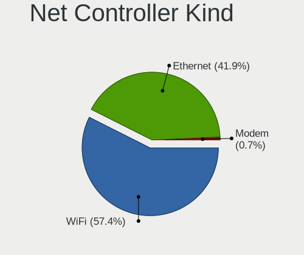

| Kind     | Notebooks | Percent |
|----------|-----------|---------|
| WiFi     | 419       | 56.85%  |
| Ethernet | 309       | 41.93%  |
| Modem    | 5         | 0.68%   |
| Unknown  | 4         | 0.54%   |

Used Controller
---------------

Currently used network controller

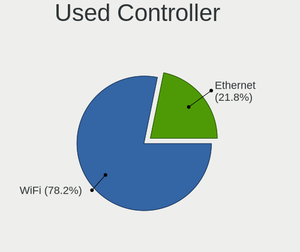

| Kind     | Notebooks | Percent |
|----------|-----------|---------|
| WiFi     | 342       | 77.03%  |
| Ethernet | 102       | 22.97%  |

NICs
----

Total network controllers on board

| Total | Notebooks | Percent |
|-------|-----------|---------|
| 2     | 287       | 67.37%  |
| 1     | 127       | 29.81%  |
| 0     | 10        | 2.35%   |
| 3     | 2         | 0.47%   |

IPv6
----

IPv6 vs IPv4

| Used | Notebooks | Percent |
|------|-----------|---------|
| No   | 372       | 87.12%  |
| Yes  | 55        | 12.88%  |

Bluetooth
---------

Bluetooth Vendor
----------------

Controller vendors

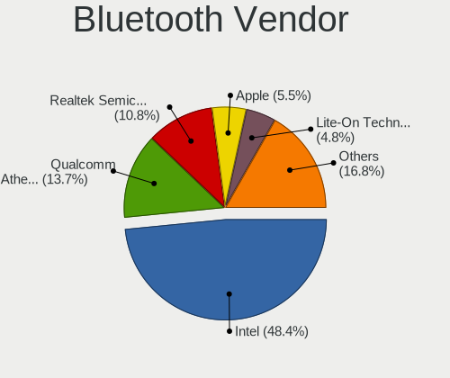

| Vendor                          | Notebooks | Percent |
|---------------------------------|-----------|---------|
| Intel                           | 164       | 46.33%  |
| Qualcomm Atheros Communications | 51        | 14.41%  |
| Realtek Semiconductor           | 38        | 10.73%  |
| Apple                           | 19        | 5.37%   |
| Lite-On Technology              | 17        | 4.8%    |
| Broadcom                        | 17        | 4.8%    |
| IMC Networks                    | 15        | 4.24%   |
| Foxconn / Hon Hai               | 14        | 3.95%   |
| Cambridge Silicon Radio         | 5         | 1.41%   |
| Realtek                         | 3         | 0.85%   |
| Hewlett-Packard                 | 3         | 0.85%   |
| Foxconn International           | 3         | 0.85%   |
| Ralink                          | 2         | 0.56%   |
| Toshiba                         | 1         | 0.28%   |
| Dell                            | 1         | 0.28%   |
| Alps Electric                   | 1         | 0.28%   |

Bluetooth Model
---------------

Controller models

| Model                                               | Notebooks | Percent |
|-----------------------------------------------------|-----------|---------|
| Intel Bluetooth wireless interface                  | 85        | 24.01%  |
| Intel Bluetooth 9460/9560 Jefferson Peak (JfP)      | 36        | 10.17%  |
| Qualcomm Atheros  Bluetooth Device                  | 24        | 6.78%   |
| Realtek Bluetooth Radio                             | 23        | 6.5%    |
| Intel AX201 Bluetooth                               | 19        | 5.37%   |
| Apple Bluetooth Host Controller                     | 14        | 3.95%   |
| Realtek  Bluetooth 4.2 Adapter                      | 12        | 3.39%   |
| Qualcomm Atheros QCA61x4 Bluetooth 4.0              | 12        | 3.39%   |
| Lite-On Qualcomm Atheros QCA9377 Bluetooth          | 9         | 2.54%   |
| Qualcomm Atheros AR3012 Bluetooth 4.0               | 8         | 2.26%   |
| IMC Networks Bluetooth Radio                        | 8         | 2.26%   |
| Intel Centrino Bluetooth Wireless Transceiver       | 7         | 1.98%   |
| Intel AX200 Bluetooth                               | 7         | 1.98%   |
| Foxconn / Hon Hai Bluetooth Device                  | 7         | 1.98%   |
| IMC Networks Bluetooth Device                       | 5         | 1.41%   |
| Cambridge Silicon Radio Bluetooth Dongle (HCI mode) | 5         | 1.41%   |
| Broadcom BCM2045B (BDC-2.1)                         | 5         | 1.41%   |
| Intel Wireless-AC 3168 Bluetooth                    | 4         | 1.13%   |
| Apple Bluetooth USB Host Controller                 | 4         | 1.13%   |
| Realtek Bluetooth Radio                             | 3         | 0.85%   |
| Qualcomm Atheros AR9462 Bluetooth                   | 3         | 0.85%   |
| Lite-On Bluetooth Device                            | 3         | 0.85%   |
| Lite-On Atheros AR3012 Bluetooth                    | 3         | 0.85%   |
| Intel Centrino Advanced-N 6230 Bluetooth adapter    | 3         | 0.85%   |
| HP Broadcom 2070 Bluetooth Combo                    | 3         | 0.85%   |
| Foxconn International BCM43142A0 Bluetooth module   | 3         | 0.85%   |
| Foxconn / Hon Hai BCM20702A0                        | 3         | 0.85%   |
| Broadcom BCM43142A0 Bluetooth Device                | 3         | 0.85%   |
| Broadcom BCM43142 Bluetooth 4.0                     | 3         | 0.85%   |
| Broadcom BCM20702A0                                 | 3         | 0.85%   |
| Realtek RTL8723B Bluetooth                          | 2         | 0.56%   |
| Ralink RT3290 Bluetooth                             | 2         | 0.56%   |
| Qualcomm Atheros Bluetooth USB Host Controller      | 2         | 0.56%   |
| Lite-On Broadcom BCM43142A0 Bluetooth Device        | 2         | 0.56%   |
| Intel Wireless-AC 9260 Bluetooth Adapter            | 2         | 0.56%   |
| Toshiba BCM43142A0                                  | 1         | 0.28%   |
| Realtek RTL8821A Bluetooth                          | 1         | 0.28%   |
| Qualcomm Atheros Bluetooth                          | 1         | 0.28%   |
| Qualcomm Atheros AR3011 Bluetooth                   | 1         | 0.28%   |
| Intel AX210 Bluetooth                               | 1         | 0.28%   |

Sound
-----

Sound Vendor
------------

Sound card vendors

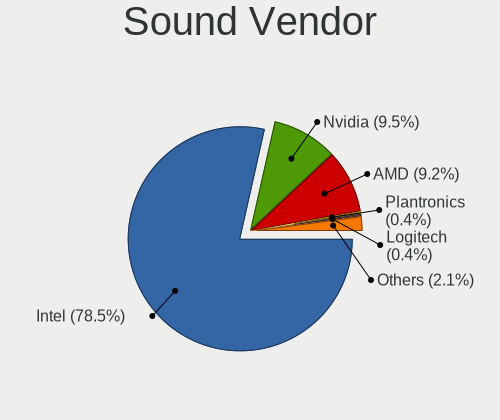

| Vendor                    | Notebooks | Percent |
|---------------------------|-----------|---------|
| Intel                     | 382       | 78.12%  |
| AMD                       | 48        | 9.82%   |
| Nvidia                    | 46        | 9.41%   |
| Logitech                  | 2         | 0.41%   |
| C-Media Electronics       | 2         | 0.41%   |
| SteelSeries ApS           | 1         | 0.2%    |
| Sennheiser Communications | 1         | 0.2%    |
| Realtek Semiconductor     | 1         | 0.2%    |
| Plantronics               | 1         | 0.2%    |
| GN Netcom                 | 1         | 0.2%    |
| Creative Technology       | 1         | 0.2%    |
| BY EDIFIER                | 1         | 0.2%    |
| Barco Display Systems     | 1         | 0.2%    |
| Apple                     | 1         | 0.2%    |

Sound Model
-----------

Sound card models

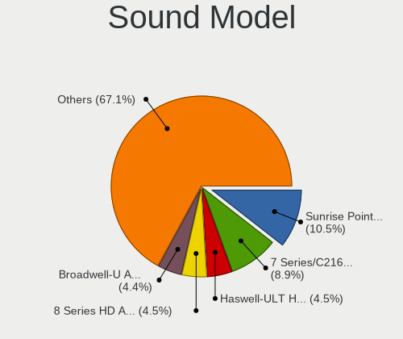

| Model                                                                                             | Notebooks | Percent |
|---------------------------------------------------------------------------------------------------|-----------|---------|
| Intel Sunrise Point-LP HD Audio                                                                   | 58        | 9.78%   |
| Intel 7 Series/C216 Chipset Family High Definition Audio Controller                               | 57        | 9.61%   |
| Intel Broadwell-U Audio Controller                                                                | 28        | 4.72%   |
| Intel Haswell-ULT HD Audio Controller                                                             | 27        | 4.55%   |
| Intel 8 Series HD Audio Controller                                                                | 27        | 4.55%   |
| Intel 6 Series/C200 Series Chipset Family High Definition Audio Controller                        | 27        | 4.55%   |
| Intel Wildcat Point-LP High Definition Audio Controller                                           | 24        | 4.05%   |
| Intel Cannon Lake PCH cAVS                                                                        | 24        | 4.05%   |
| AMD Family 17h/19h HD Audio Controller                                                            | 24        | 4.05%   |
| Intel 8 Series/C220 Series Chipset High Definition Audio Controller                               | 21        | 3.54%   |
| Intel Celeron/Pentium Silver Processor High Definition Audio                                      | 20        | 3.37%   |
| AMD Raven/Raven2/Fenghuang HDMI/DP Audio Controller                                               | 18        | 3.04%   |
| Intel CM238 HD Audio Controller                                                                   | 16        | 2.7%    |
| Intel Xeon E3-1200 v3/4th Gen Core Processor HD Audio Controller                                  | 14        | 2.36%   |
| Intel Atom Processor Z36xxx/Z37xxx Series High Definition Audio Controller                        | 14        | 2.36%   |
| Intel 100 Series/C230 Series Chipset Family HD Audio Controller                                   | 14        | 2.36%   |
| Intel Comet Lake PCH-LP cAVS                                                                      | 13        | 2.19%   |
| Intel Celeron N3350/Pentium N4200/Atom E3900 Series Audio Cluster                                 | 13        | 2.19%   |
| Intel Tiger Lake-LP Smart Sound Technology Audio Controller                                       | 12        | 2.02%   |
| Intel Cannon Point-LP High Definition Audio Controller                                            | 12        | 2.02%   |
| AMD FCH Azalia Controller                                                                         | 10        | 1.69%   |
| Intel 5 Series/3400 Series Chipset High Definition Audio                                          | 9         | 1.52%   |
| AMD Kabini HDMI/DP Audio                                                                          | 9         | 1.52%   |
| Intel Atom/Celeron/Pentium Processor x5-E8000/J3xxx/N3xxx Series High Definition Audio Controller | 7         | 1.18%   |
| Nvidia GK107 HDMI Audio Controller                                                                | 6         | 1.01%   |
| Nvidia TU107 GeForce GTX 1650 High Definition Audio Controller                                    | 5         | 0.84%   |
| Nvidia GP107GL High Definition Audio Controller                                                   | 5         | 0.84%   |
| Nvidia GP106 High Definition Audio Controller                                                     | 5         | 0.84%   |
| Intel Ice Lake-LP Smart Sound Technology Audio Controller                                         | 5         | 0.84%   |
| Nvidia TU116 High Definition Audio Controller                                                     | 4         | 0.67%   |
| Nvidia GF108 High Definition Audio Controller                                                     | 4         | 0.67%   |
| Intel Comet Lake PCH cAVS                                                                         | 4         | 0.67%   |
| AMD Turks HDMI Audio [Radeon HD 6500/6600 / 6700M Series]                                         | 4         | 0.67%   |
| AMD Oland/Hainan/Cape Verde/Pitcairn HDMI Audio [Radeon HD 7000 Series]                           | 4         | 0.67%   |
| AMD Family 15h (Models 60h-6fh) Audio Controller                                                  | 4         | 0.67%   |
| Nvidia GM107 High Definition Audio Controller [GeForce 940MX]                                     | 3         | 0.51%   |
| AMD Trinity HDMI Audio Controller                                                                 | 3         | 0.51%   |
| AMD Renoir Radeon High Definition Audio Controller                                                | 3         | 0.51%   |
| Nvidia TU106 High Definition Audio Controller                                                     | 2         | 0.34%   |
| Nvidia GT216 HDMI Audio Controller                                                                | 2         | 0.34%   |

Memory
------

Memory Vendor
-------------

Memory module vendors

| Vendor              | Notebooks | Percent |
|---------------------|-----------|---------|
| SK hynix            | 6         | 46.15%  |
| Samsung Electronics | 3         | 23.08%  |
| Unknown             | 2         | 15.38%  |
| Micron Technology   | 1         | 7.69%   |
| Crucial             | 1         | 7.69%   |

Memory Model
------------

Memory module models

| Model                                                        | Notebooks | Percent |
|--------------------------------------------------------------|-----------|---------|
| Unknown RAM Module 8GB SODIMM DDR4 3200MT/s                  | 1         | 7.14%   |
| Unknown RAM Module 4096MB SODIMM DDR4 2400MT/s               | 1         | 7.14%   |
| SK hynix RAM HMT451S6MFR6A-PB 4GB SODIMM DDR3 1600MT/s       | 1         | 7.14%   |
| SK hynix RAM HMT41GS6BFR8A-PB 8GB SODIMM DDR3 1600MT/s       | 1         | 7.14%   |
| SK hynix RAM HMA82GS6AFR8N-UH 16GB SODIMM DDR4 2667MT/s      | 1         | 7.14%   |
| SK hynix RAM HMA81GS6DJR8N-XN 8GB SODIMM DDR4 3200MT/s       | 1         | 7.14%   |
| SK hynix RAM HMA81GS6AFR8N-UH 8GB SODIMM DDR4 2667MT/s       | 1         | 7.14%   |
| SK hynix RAM HMA81GS6AFR8N-UH 8GB SODIMM DDR4 2400MT/s       | 1         | 7.14%   |
| Samsung RAM M471B5773CHS-CH9 2GB SODIMM DDR3 4199MT/s        | 1         | 7.14%   |
| Samsung RAM M471B2873FHS-CH9 1GB SODIMM DDR3 1334MT/s        | 1         | 7.14%   |
| Samsung RAM M471B1G73QH0-YK0 8192MB SODIMM DDR3 1600MT/s     | 1         | 7.14%   |
| Samsung RAM K4EBE304EB-EGCG 8GB Row Of Chips LPDDR3 2133MT/s | 1         | 7.14%   |
| Micron RAM MT53E512M32D2NP 2GB LPDDR4 2933MT/s               | 1         | 7.14%   |
| Crucial RAM BLS16G4S26BFSD.16FD 16GB SODIMM DDR4 2667MT/s    | 1         | 7.14%   |

Memory Kind
-----------

Memory module kinds

| Kind   | Notebooks | Percent |
|--------|-----------|---------|
| DDR4   | 6         | 50%     |
| DDR3   | 3         | 25%     |
| SDRAM  | 1         | 8.33%   |
| LPDDR4 | 1         | 8.33%   |
| LPDDR3 | 1         | 8.33%   |

Memory Form Factor
------------------

Physical design of the memory module

| Name         | Notebooks | Percent |
|--------------|-----------|---------|
| SODIMM       | 9         | 81.82%  |
| Row Of Chips | 1         | 9.09%   |
| Unknown      | 1         | 9.09%   |

Memory Size
-----------

Memory module size

| Size  | Notebooks | Percent |
|-------|-----------|---------|
| 8192  | 5         | 41.67%  |
| 4096  | 4         | 33.33%  |
| 16384 | 2         | 16.67%  |
| 2048  | 1         | 8.33%   |

Memory Speed
------------

Memory module speed

| Speed | Notebooks | Percent |
|-------|-----------|---------|
| 2667  | 4         | 30.77%  |
| 2400  | 2         | 15.38%  |
| 1600  | 2         | 15.38%  |
| 4199  | 1         | 7.69%   |
| 3200  | 1         | 7.69%   |
| 2933  | 1         | 7.69%   |
| 2133  | 1         | 7.69%   |
| 1334  | 1         | 7.69%   |

Printers & scanners
-------------------

Printer Vendor
--------------

Printer device vendors

| Vendor      | Notebooks | Percent |
|-------------|-----------|---------|
| Seiko Epson | 3         | 42.86%  |
| Canon       | 2         | 28.57%  |
| MIIIW       | 1         | 14.29%  |
| Kyocera     | 1         | 14.29%  |

Printer Model
-------------

Printer device models

| Model                      | Notebooks | Percent |
|----------------------------|-----------|---------|
| Seiko Epson L220 Series    | 2         | 28.57%  |
| Seiko Epson L355 Series    | 1         | 14.29%  |
| MIIIW MW Keyboard Air Mini | 1         | 14.29%  |
| Kyocera FS-1030D printer   | 1         | 14.29%  |
| Canon PIXMA MG3600 Series  | 1         | 14.29%  |
| Canon PIXMA MG2500 Series  | 1         | 14.29%  |

Scanner Vendor
--------------

Scanner device vendors

Zero info for selected period =(

Scanner Model
-------------

Scanner device models

Zero info for selected period =(

Camera
------

Camera Vendor
-------------

Camera device vendors

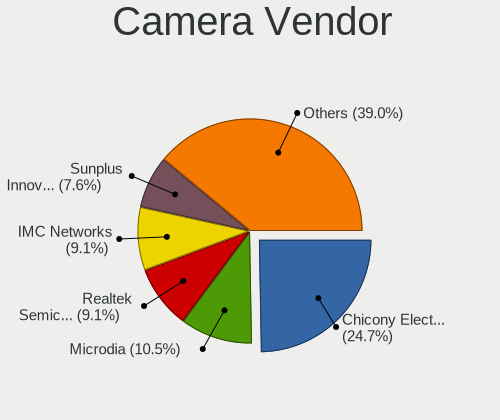

| Vendor                                 | Notebooks | Percent |
|----------------------------------------|-----------|---------|
| Chicony Electronics                    | 97        | 24.87%  |
| Microdia                               | 42        | 10.77%  |
| Realtek Semiconductor                  | 37        | 9.49%   |
| IMC Networks                           | 36        | 9.23%   |
| Acer                                   | 35        | 8.97%   |
| Sunplus Innovation Technology          | 23        | 5.9%    |
| Cheng Uei Precision Industry (Foxlink) | 20        | 5.13%   |
| Quanta                                 | 18        | 4.62%   |
| Apple                                  | 13        | 3.33%   |
| Suyin                                  | 11        | 2.82%   |
| Silicon Motion                         | 10        | 2.56%   |
| Syntek                                 | 9         | 2.31%   |
| Alcor Micro                            | 9         | 2.31%   |
| Lite-On Technology                     | 5         | 1.28%   |
| Samsung Electronics                    | 3         | 0.77%   |
| Luxvisions Innotech Limited            | 3         | 0.77%   |
| Logitech                               | 3         | 0.77%   |
| Ricoh                                  | 2         | 0.51%   |
| Z-Star Microelectronics                | 1         | 0.26%   |
| Y Media                                | 1         | 0.26%   |
| Xiaomi                                 | 1         | 0.26%   |
| Unknown                                | 1         | 0.26%   |
| Tobii Technology AB                    | 1         | 0.26%   |
| Spreadtrum Communications              | 1         | 0.26%   |
| Primax Electronics                     | 1         | 0.26%   |
| Magic Control Technology               | 1         | 0.26%   |
| Lenovo                                 | 1         | 0.26%   |
| Importek                               | 1         | 0.26%   |
| Genesys Logic                          | 1         | 0.26%   |
| Foxconn / Hon Hai                      | 1         | 0.26%   |
| Denron                                 | 1         | 0.26%   |
| ARC International                      | 1         | 0.26%   |

Camera Model
------------

Camera device models

| Model                                                          | Notebooks | Percent |
|----------------------------------------------------------------|-----------|---------|
| Microdia Integrated_Webcam_HD                                  | 28        | 7.12%   |
| Chicony HD WebCam                                              | 17        | 4.33%   |
| Chicony Integrated Camera                                      | 15        | 3.82%   |
| Realtek Integrated_Webcam_HD                                   | 13        | 3.31%   |
| IMC Networks USB2.0 VGA UVC WebCam                             | 10        | 2.54%   |
| IMC Networks USB2.0 HD UVC WebCam                              | 10        | 2.54%   |
| Acer EasyCamera                                                | 8         | 2.04%   |
| Sunplus HD WebCam                                              | 7         | 1.78%   |
| Apple FaceTime HD Camera                                       | 7         | 1.78%   |
| Acer HD Webcam                                                 | 7         | 1.78%   |
| Acer Integrated Camera                                         | 6         | 1.53%   |
| Suyin HP TrueVision HD                                         | 5         | 1.27%   |
| Realtek Lenovo EasyCamera                                      | 5         | 1.27%   |
| Chicony USB2.0 VGA UVC WebCam                                  | 5         | 1.27%   |
| Chicony Lenovo EasyCamera                                      | 5         | 1.27%   |
| Cheng Uei Precision Industry (Foxlink) HP Webcam               | 5         | 1.27%   |
| Alcor Micro USB 2.0 Camera                                     | 5         | 1.27%   |
| Acer Lenovo EasyCamera                                         | 5         | 1.27%   |
| Syntek EasyCamera                                              | 4         | 1.02%   |
| Sunplus Integrated_Webcam_HD                                   | 4         | 1.02%   |
| Quanta HD WebCam                                               | 4         | 1.02%   |
| Microdia Laptop_Integrated_Webcam_HD                           | 4         | 1.02%   |
| IMC Networks Integrated Camera                                 | 4         | 1.02%   |
| Chicony VGA Webcam                                             | 4         | 1.02%   |
| Chicony USB 2.0 Camera                                         | 4         | 1.02%   |
| Apple FaceTime HD Camera (Built-in)                            | 4         | 1.02%   |
| Suyin HD WebCam                                                | 3         | 0.76%   |
| Samsung Galaxy A5 (MTP)                                        | 3         | 0.76%   |
| Quanta USB2.0 VGA UVC WebCam                                   | 3         | 0.76%   |
| Logitech Webcam C270                                           | 3         | 0.76%   |
| Lite-On Integrated Camera                                      | 3         | 0.76%   |
| Chicony USB2.0 HD UVC WebCam                                   | 3         | 0.76%   |
| Chicony TOSHIBA Web Camera - HD                                | 3         | 0.76%   |
| Chicony Lenovo Integrated Camera (0.3MP)                       | 3         | 0.76%   |
| Chicony Integrated Camera (1280x720@30)                        | 3         | 0.76%   |
| Chicony HP Webcam [2 MP Macro]                                 | 3         | 0.76%   |
| Chicony HP Truevision HD camera                                | 3         | 0.76%   |
| Chicony HP HD Camera                                           | 3         | 0.76%   |
| Chicony FJ Camera                                              | 3         | 0.76%   |
| Cheng Uei Precision Industry (Foxlink) HP TrueVision HD Camera | 3         | 0.76%   |

Security
--------

Fingerprint Vendor
------------------

Fingerprint sensor vendors

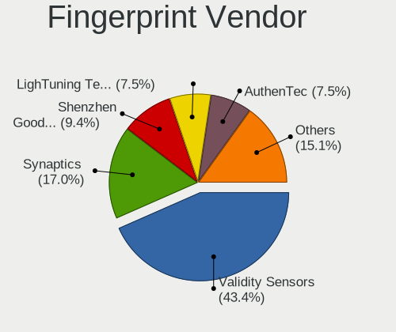

| Vendor                     | Notebooks | Percent |
|----------------------------|-----------|---------|
| Validity Sensors           | 19        | 42.22%  |
| Synaptics                  | 7         | 15.56%  |
| Shenzhen Goodix Technology | 5         | 11.11%  |
| AuthenTec                  | 4         | 8.89%   |
| Upek                       | 3         | 6.67%   |
| Elan Microelectronics      | 3         | 6.67%   |
| Samsung Electronics        | 2         | 4.44%   |
| LighTuning Technology      | 2         | 4.44%   |

Fingerprint Model
-----------------

Fingerprint sensor models

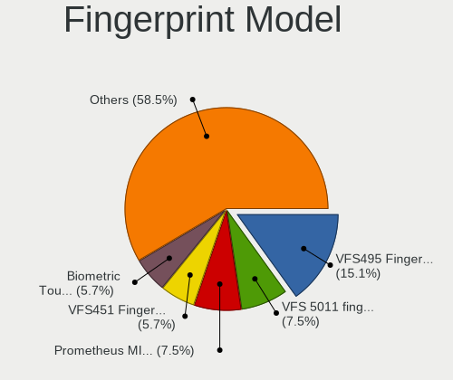

| Model                                                                      | Notebooks | Percent |
|----------------------------------------------------------------------------|-----------|---------|
| Validity Sensors VFS495 Fingerprint Reader                                 | 6         | 13.33%  |
| Validity Sensors VFS 5011 fingerprint sensor                               | 4         | 8.89%   |
| Upek Biometric Touchchip/Touchstrip Fingerprint Sensor                     | 3         | 6.67%   |
| Synaptics Prometheus MIS Touch Fingerprint Reader                          | 3         | 6.67%   |
| Shenzhen Goodix FingerPrint                                                | 3         | 6.67%   |
| Elan ELAN:Fingerprint                                                      | 3         | 6.67%   |
| AuthenTec Fingerprint Sensor                                               | 3         | 6.67%   |
| Validity Sensors VFS5011 Fingerprint Reader                                | 2         | 4.44%   |
| Validity Sensors VFS451 Fingerprint Reader                                 | 2         | 4.44%   |
| Shenzhen Goodix  FingerPrint Device                                        | 2         | 4.44%   |
| Samsung Fingerprint Device                                                 | 2         | 4.44%   |
| Validity Sensors VFS7552 Touch Fingerprint Sensor                          | 1         | 2.22%   |
| Validity Sensors VFS491                                                    | 1         | 2.22%   |
| Validity Sensors Synaptics VFS7552 Touch Fingerprint Sensor with PurePrint | 1         | 2.22%   |
| Validity Sensors Swipe Fingerprint Sensor                                  | 1         | 2.22%   |
| Validity Sensors Fingerprint scanner                                       | 1         | 2.22%   |
| Synaptics  WBDI                                                            | 1         | 2.22%   |
| Synaptics Metallica MOH Touch Fingerprint Reader                           | 1         | 2.22%   |
| Synaptics Metallica MIS Touch Fingerprint Reader                           | 1         | 2.22%   |
| LighTuning ES603 Swipe Fingerprint Sensor                                  | 1         | 2.22%   |
| LighTuning EgisTec Touch Fingerprint Sensor                                | 1         | 2.22%   |
| AuthenTec AES1660 Fingerprint Sensor                                       | 1         | 2.22%   |
| Unknown                                                                    | 1         | 2.22%   |

Chipcard Vendor
---------------

Chipcard module vendors

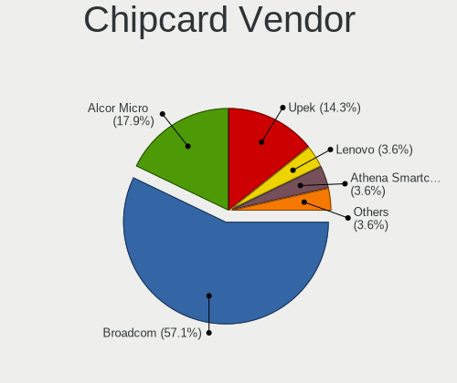

| Vendor                     | Notebooks | Percent |
|----------------------------|-----------|---------|
| Broadcom                   | 12        | 54.55%  |
| Alcor Micro                | 4         | 18.18%  |
| Upek                       | 3         | 13.64%  |
| Lenovo                     | 1         | 4.55%   |
| Athena Smartcard Solutions | 1         | 4.55%   |
| Aladdin Knowledge Systems  | 1         | 4.55%   |

Chipcard Model
--------------

Chipcard module models

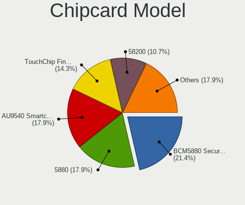

| Model                                                                        | Notebooks | Percent |
|------------------------------------------------------------------------------|-----------|---------|
| Broadcom BCM5880 Secure Applications Processor                               | 6         | 27.27%  |
| Alcor Micro AU9540 Smartcard Reader                                          | 4         | 18.18%  |
| Upek TouchChip Fingerprint Coprocessor (WBF advanced mode)                   | 3         | 13.64%  |
| Broadcom BCM5880 Secure Applications Processor with fingerprint swipe sensor | 2         | 9.09%   |
| Broadcom 5880                                                                | 2         | 9.09%   |
| Broadcom 58200                                                               | 2         | 9.09%   |
| Lenovo Integrated Smart Card Reader                                          | 1         | 4.55%   |
| Athena Smartcard Solutions ASEDrive CCID                                     | 1         | 4.55%   |
| Aladdin Knowledge Systems Token JC                                           | 1         | 4.55%   |

Unsupported
-----------

Unsupported Devices
-------------------

Total unsupported devices on board

| Total | Notebooks | Percent |
|-------|-----------|---------|
| 0     | 249       | 57.51%  |
| 1     | 152       | 35.1%   |
| 2     | 28        | 6.47%   |
| 3     | 4         | 0.92%   |

Unsupported Device Types
------------------------

Types of unsupported devices

| Type                     | Notebooks | Percent |
|--------------------------|-----------|---------|
| Graphics card            | 56        | 24.78%  |
| Fingerprint reader       | 45        | 19.91%  |
| Net/wireless             | 36        | 15.93%  |
| Multimedia controller    | 22        | 9.73%   |
| Firewire controller      | 22        | 9.73%   |
| Chipcard                 | 22        | 9.73%   |
| Camera                   | 5         | 2.21%   |
| Bluetooth                | 4         | 1.77%   |
| Net/ethernet             | 3         | 1.33%   |
| Storage/ide              | 2         | 0.88%   |
| Storage                  | 2         | 0.88%   |
| Sound                    | 2         | 0.88%   |
| Modem                    | 2         | 0.88%   |
| Storage/nvme             | 1         | 0.44%   |
| Network                  | 1         | 0.44%   |
| Communication controller | 1         | 0.44%   |

