Clear Linux - Tested Hardware & Statistics
------------------------------------------

A project to collect tested hardware configurations for Clear Linux.

Anyone can contribute to this report by the [hw-probe](https://github.com/linuxhw/hw-probe) tool:

    sudo -E hw-probe -all -upload

Please contribute! Especially if your hardware is rare.

This is a report for all computer types. See also reports for [desktops](/Dist/Clear_Linux/Desktop/README.md) and [notebooks](/Dist/Clear_Linux/Notebook/README.md).

Contents
--------

* [ Test Cases ](#test-cases)

* [ System ](#system)
  - [ OS                       ](#os)
  - [ OS Family                ](#os-family)
  - [ Kernel                   ](#kernel)
  - [ Kernel Family            ](#kernel-family)
  - [ Kernel Major Ver.        ](#kernel-major-ver)
  - [ Arch                     ](#arch)
  - [ DE                       ](#de)
  - [ Display Server           ](#display-server)
  - [ Display Manager          ](#display-manager)
  - [ OS Lang                  ](#os-lang)
  - [ Boot Mode                ](#boot-mode)
  - [ Filesystem               ](#filesystem)
  - [ Part. scheme             ](#part-scheme)
  - [ Dual Boot with Linux/BSD ](#dual-boot-with-linuxbsd)
  - [ Dual Boot (Win)          ](#dual-boot-win)

* [ Board ](#board)
  - [ Vendor                   ](#vendor)
  - [ Model                    ](#model)
  - [ Model Family             ](#model-family)
  - [ MFG Year                 ](#mfg-year)
  - [ Form Factor              ](#form-factor)
  - [ Secure Boot              ](#secure-boot)
  - [ Coreboot                 ](#coreboot)
  - [ RAM Size                 ](#ram-size)
  - [ RAM Used                 ](#ram-used)
  - [ Total Drives             ](#total-drives)
  - [ Has CD-ROM               ](#has-cd-rom)
  - [ Has Ethernet             ](#has-ethernet)
  - [ Has WiFi                 ](#has-wifi)
  - [ Has Bluetooth            ](#has-bluetooth)

* [ Location ](#location)
  - [ Country                  ](#country)
  - [ City                     ](#city)

* [ Drives ](#drives)
  - [ Drive Vendor             ](#drive-vendor)
  - [ Drive Model              ](#drive-model)
  - [ HDD Vendor               ](#hdd-vendor)
  - [ SSD Vendor               ](#ssd-vendor)
  - [ Drive Kind               ](#drive-kind)
  - [ Drive Connector          ](#drive-connector)
  - [ Drive Size               ](#drive-size)
  - [ Space Total              ](#space-total)
  - [ Space Used               ](#space-used)
  - [ Malfunc. Drives          ](#malfunc-drives)
  - [ Malfunc. Drive Vendor    ](#malfunc-drive-vendor)
  - [ Malfunc. HDD Vendor      ](#malfunc-hdd-vendor)
  - [ Malfunc. Drive Kind      ](#malfunc-drive-kind)
  - [ Failed Drives            ](#failed-drives)
  - [ Failed Drive Vendor      ](#failed-drive-vendor)
  - [ Drive Status             ](#drive-status)

* [ Storage controller ](#storage-controller)
  - [ Storage Vendor           ](#storage-vendor)
  - [ Storage Model            ](#storage-model)
  - [ Storage Kind             ](#storage-kind)

* [ Processor ](#processor)
  - [ CPU Vendor               ](#cpu-vendor)
  - [ CPU Model                ](#cpu-model)
  - [ CPU Model Family         ](#cpu-model-family)
  - [ CPU Cores                ](#cpu-cores)
  - [ CPU Sockets              ](#cpu-sockets)
  - [ CPU Threads              ](#cpu-threads)
  - [ CPU Op-Modes             ](#cpu-op-modes)
  - [ CPU Microcode            ](#cpu-microcode)
  - [ CPU Microarch            ](#cpu-microarch)

* [ Graphics ](#graphics)
  - [ GPU Vendor               ](#gpu-vendor)
  - [ GPU Model                ](#gpu-model)
  - [ GPU Combo                ](#gpu-combo)
  - [ GPU Driver               ](#gpu-driver)
  - [ GPU Memory               ](#gpu-memory)

* [ Monitor ](#monitor)
  - [ Monitor Vendor           ](#monitor-vendor)
  - [ Monitor Model            ](#monitor-model)
  - [ Monitor Resolution       ](#monitor-resolution)
  - [ Monitor Diagonal         ](#monitor-diagonal)
  - [ Monitor Width            ](#monitor-width)
  - [ Aspect Ratio             ](#aspect-ratio)
  - [ Monitor Area             ](#monitor-area)
  - [ Pixel Density            ](#pixel-density)
  - [ Multiple Monitors        ](#multiple-monitors)

* [ Network ](#network)
  - [ Net Controller Vendor    ](#net-controller-vendor)
  - [ Net Controller Model     ](#net-controller-model)
  - [ Wireless Vendor          ](#wireless-vendor)
  - [ Wireless Model           ](#wireless-model)
  - [ Ethernet Vendor          ](#ethernet-vendor)
  - [ Ethernet Model           ](#ethernet-model)
  - [ Net Controller Kind      ](#net-controller-kind)
  - [ Used Controller          ](#used-controller)
  - [ NICs                     ](#nics)
  - [ IPv6                     ](#ipv6)

* [ Bluetooth ](#bluetooth)
  - [ Bluetooth Vendor         ](#bluetooth-vendor)
  - [ Bluetooth Model          ](#bluetooth-model)

* [ Sound ](#sound)
  - [ Sound Vendor             ](#sound-vendor)
  - [ Sound Model              ](#sound-model)

* [ Memory ](#memory)
  - [ Memory Vendor            ](#memory-vendor)
  - [ Memory Model             ](#memory-model)
  - [ Memory Kind              ](#memory-kind)
  - [ Memory Form Factor       ](#memory-form-factor)
  - [ Memory Size              ](#memory-size)
  - [ Memory Speed             ](#memory-speed)

* [ Printers & scanners ](#printers--scanners)
  - [ Printer Vendor           ](#printer-vendor)
  - [ Printer Model            ](#printer-model)
  - [ Scanner Vendor           ](#scanner-vendor)
  - [ Scanner Model            ](#scanner-model)

* [ Camera ](#camera)
  - [ Camera Vendor            ](#camera-vendor)
  - [ Camera Model             ](#camera-model)

* [ Security ](#security)
  - [ Fingerprint Vendor       ](#fingerprint-vendor)
  - [ Fingerprint Model        ](#fingerprint-model)
  - [ Chipcard Vendor          ](#chipcard-vendor)
  - [ Chipcard Model           ](#chipcard-model)

* [ Unsupported ](#unsupported)
  - [ Unsupported Devices      ](#unsupported-devices)
  - [ Unsupported Device Types ](#unsupported-device-types)

Test Cases
----------

Total: 1192

| Vendor        | Model                       | Form-Factor | Probe                                                      | Date         |
|---------------|-----------------------------|-------------|------------------------------------------------------------|--------------|
| Intel         | DN2820FYB H24582-205        | Desktop     | [45175a7f3b](https://linux-hardware.org/?probe=45175a7f3b) | Jun 01, 2022 |
| ASUSTek       | H110M-K                     | Desktop     | [58566ab4b6](https://linux-hardware.org/?probe=58566ab4b6) | May 30, 2022 |
| Lenovo        | IdeaPad S145-15IWL 81S9     | Notebook    | [c908e08818](https://linux-hardware.org/?probe=c908e08818) | May 29, 2022 |
| Lenovo        | IdeaPad S145-15IWL 81S9     | Notebook    | [b8a514c650](https://linux-hardware.org/?probe=b8a514c650) | May 29, 2022 |
| Alienware     | 17 R4                       | Notebook    | [0a7c1705c9](https://linux-hardware.org/?probe=0a7c1705c9) | May 27, 2022 |
| MSI           | TRX40 PRO WIFI              | Desktop     | [36ee0ea60c](https://linux-hardware.org/?probe=36ee0ea60c) | May 27, 2022 |
| ASUSTek       | PRIME B460M-K               | Desktop     | [a6dafabf0c](https://linux-hardware.org/?probe=a6dafabf0c) | May 27, 2022 |
| Gigabyte      | H87-HD3                     | Desktop     | [38875f631e](https://linux-hardware.org/?probe=38875f631e) | May 27, 2022 |
| Intel         | NUC9i7QNB K49245-403        | Mini pc     | [af7e6249f0](https://linux-hardware.org/?probe=af7e6249f0) | May 27, 2022 |
| Intel         | NUC9i7QNB K49245-403        | Mini pc     | [44ceac3592](https://linux-hardware.org/?probe=44ceac3592) | May 27, 2022 |
| Dell          | Inspiron 7559               | Notebook    | [61fe0db491](https://linux-hardware.org/?probe=61fe0db491) | May 26, 2022 |
| Dell          | Inspiron 7559               | Notebook    | [47f48c626a](https://linux-hardware.org/?probe=47f48c626a) | May 26, 2022 |
| ASUSTek       | H110M-K                     | Desktop     | [9c2c8025ed](https://linux-hardware.org/?probe=9c2c8025ed) | May 26, 2022 |
| HUAWEI        | NBLB-WAX9N                  | Notebook    | [4de838a88c](https://linux-hardware.org/?probe=4de838a88c) | May 25, 2022 |
| HUAWEI        | NBLB-WAX9N                  | Notebook    | [26745bace2](https://linux-hardware.org/?probe=26745bace2) | May 25, 2022 |
| Dell          | Latitude 7480               | Notebook    | [4ba0a0ec3c](https://linux-hardware.org/?probe=4ba0a0ec3c) | May 24, 2022 |
| Dell          | Latitude 7480               | Notebook    | [33c94e6121](https://linux-hardware.org/?probe=33c94e6121) | May 24, 2022 |
| ASUSTek       | TUF Gaming X570-PRO         | Desktop     | [5076d170e0](https://linux-hardware.org/?probe=5076d170e0) | May 24, 2022 |
| ASUSTek       | H110M-K                     | Desktop     | [d0d6870830](https://linux-hardware.org/?probe=d0d6870830) | May 23, 2022 |
| Dell          | 01HYR7 A01                  | Desktop     | [2cd1f7fd5e](https://linux-hardware.org/?probe=2cd1f7fd5e) | May 23, 2022 |
| Lenovo        | S21e-20 80M4                | Notebook    | [90d0bb5bc0](https://linux-hardware.org/?probe=90d0bb5bc0) | May 22, 2022 |
| Lenovo        | S21e-20 80M4                | Notebook    | [48047cdaf6](https://linux-hardware.org/?probe=48047cdaf6) | May 22, 2022 |
| Acer          | Aspire ES1-523              | Notebook    | [e856d4589a](https://linux-hardware.org/?probe=e856d4589a) | May 21, 2022 |
| Gigabyte      | AX370M-Gaming 3-CF          | Desktop     | [830532746e](https://linux-hardware.org/?probe=830532746e) | May 20, 2022 |
| Gigabyte      | AX370M-Gaming 3-CF          | Desktop     | [27289062cb](https://linux-hardware.org/?probe=27289062cb) | May 19, 2022 |
| Medion        | MS-7728                     | Desktop     | [72b22a927a](https://linux-hardware.org/?probe=72b22a927a) | May 19, 2022 |
| Intel         | NUC8BEB J72693-309          | Mini pc     | [73bd0df4ae](https://linux-hardware.org/?probe=73bd0df4ae) | May 19, 2022 |
| Google        | Celes                       | Notebook    | [ca6be0abba](https://linux-hardware.org/?probe=ca6be0abba) | May 19, 2022 |
| Intel         | NUC8i7HVB J68196-502        | Mini pc     | [23879a78d3](https://linux-hardware.org/?probe=23879a78d3) | May 18, 2022 |
| Fujitsu       | LIFEBOOK E746               | Notebook    | [dd9eac2f81](https://linux-hardware.org/?probe=dd9eac2f81) | May 14, 2022 |
| ASUSTek       | TUF Gaming X570-PRO         | Desktop     | [fccf22ebe1](https://linux-hardware.org/?probe=fccf22ebe1) | May 14, 2022 |
| Intel         | DN2820FYB H24582-205        | Desktop     | [5af3adc742](https://linux-hardware.org/?probe=5af3adc742) | May 13, 2022 |
| Fujitsu       | LIFEBOOK E746               | Notebook    | [8551aac5e5](https://linux-hardware.org/?probe=8551aac5e5) | May 12, 2022 |
| ASUSTek       | TUF Gaming X570-PRO         | Desktop     | [58c936ec28](https://linux-hardware.org/?probe=58c936ec28) | May 11, 2022 |
| Intel         | DN2820FYB H24582-205        | Desktop     | [ba9835cb43](https://linux-hardware.org/?probe=ba9835cb43) | May 10, 2022 |
| Lenovo        | ThinkPad X270 20HMS27Q00    | Notebook    | [615d6650a0](https://linux-hardware.org/?probe=615d6650a0) | May 08, 2022 |
| Supermicro    | H8QG6                       | Server      | [d341c929e0](https://linux-hardware.org/?probe=d341c929e0) | May 08, 2022 |
| Google        | Lick                        | Notebook    | [60e52e55e1](https://linux-hardware.org/?probe=60e52e55e1) | May 06, 2022 |
| Apple         | MacBookAir6,2               | Notebook    | [d04d5e927d](https://linux-hardware.org/?probe=d04d5e927d) | May 05, 2022 |
| Dell          | 00V62H A01                  | Desktop     | [fc3604980a](https://linux-hardware.org/?probe=fc3604980a) | May 04, 2022 |
| ASRock        | H370 Pro4                   | Desktop     | [ccf085e9dc](https://linux-hardware.org/?probe=ccf085e9dc) | May 02, 2022 |
| TODOS INDU... | Easytouch_2022_V1           | Notebook    | [efc26220c4](https://linux-hardware.org/?probe=efc26220c4) | May 01, 2022 |
| HP            | EliteBook 8440p             | Notebook    | [31fdda39b1](https://linux-hardware.org/?probe=31fdda39b1) | May 01, 2022 |
| HP            | EliteBook 8440p             | Notebook    | [3782e39a43](https://linux-hardware.org/?probe=3782e39a43) | Apr 30, 2022 |
| ASUSTek       | TUF Gaming Z690-PLUS WIF... | Desktop     | [b4d4e52220](https://linux-hardware.org/?probe=b4d4e52220) | Apr 30, 2022 |
| Google        | Lick                        | Notebook    | [33d1e6209a](https://linux-hardware.org/?probe=33d1e6209a) | Apr 30, 2022 |
| Gigabyte      | 970A-DS3P                   | Desktop     | [1fc7423fdf](https://linux-hardware.org/?probe=1fc7423fdf) | Apr 27, 2022 |
| Dell          | 01HYR7 A01                  | Desktop     | [d7757bf097](https://linux-hardware.org/?probe=d7757bf097) | Apr 27, 2022 |
| ASUSTek       | PRIME B660M-A WIFI D4       | Desktop     | [288bb26592](https://linux-hardware.org/?probe=288bb26592) | Apr 27, 2022 |
| Dell          | XPS 13 9310                 | Notebook    | [1f95a73d57](https://linux-hardware.org/?probe=1f95a73d57) | Apr 26, 2022 |
| ASUSTek       | PRIME Z690M-PLUS D4         | Desktop     | [f0aea29124](https://linux-hardware.org/?probe=f0aea29124) | Apr 25, 2022 |
| Intel         | DN2820FYB H24582-205        | Desktop     | [fb612cbcd5](https://linux-hardware.org/?probe=fb612cbcd5) | Apr 24, 2022 |
| Gateway       | NE570                       | Notebook    | [1cb22c0c86](https://linux-hardware.org/?probe=1cb22c0c86) | Apr 23, 2022 |
| HP            | 158B                        | Desktop     | [af3f62d027](https://linux-hardware.org/?probe=af3f62d027) | Apr 22, 2022 |
| Intel         | NUC8BEB J72693-309          | Mini pc     | [d103edc70e](https://linux-hardware.org/?probe=d103edc70e) | Apr 21, 2022 |
| Intel         | NUC8BEB J72693-309          | Mini pc     | [e5d8c4e246](https://linux-hardware.org/?probe=e5d8c4e246) | Apr 21, 2022 |
| Gateway       | NE570                       | Notebook    | [d4b1bdce70](https://linux-hardware.org/?probe=d4b1bdce70) | Apr 17, 2022 |
| Framework     | Laptop                      | Notebook    | [25577a2915](https://linux-hardware.org/?probe=25577a2915) | Apr 16, 2022 |
| Dell          | Latitude 3550               | Notebook    | [03ed6ab7b4](https://linux-hardware.org/?probe=03ed6ab7b4) | Apr 16, 2022 |
| Fujitsu       | LIFEBOOK E746               | Notebook    | [ae8fe4a156](https://linux-hardware.org/?probe=ae8fe4a156) | Apr 16, 2022 |
| A-DATA Tec... | XENIA 14                    | Notebook    | [839159351b](https://linux-hardware.org/?probe=839159351b) | Apr 16, 2022 |
| A-DATA Tec... | XENIA 14                    | Notebook    | [29a530e6bb](https://linux-hardware.org/?probe=29a530e6bb) | Apr 16, 2022 |
| Framework     | Laptop                      | Notebook    | [84da421304](https://linux-hardware.org/?probe=84da421304) | Apr 16, 2022 |
| MSI           | CX700                       | Notebook    | [b7715b0ff7](https://linux-hardware.org/?probe=b7715b0ff7) | Apr 15, 2022 |
| Gateway       | NE570                       | Notebook    | [3635e5c663](https://linux-hardware.org/?probe=3635e5c663) | Apr 14, 2022 |
| Gateway       | NE570                       | Notebook    | [068d4c39f2](https://linux-hardware.org/?probe=068d4c39f2) | Apr 13, 2022 |
| Fujitsu       | LIFEBOOK E746               | Notebook    | [9380c2aaf9](https://linux-hardware.org/?probe=9380c2aaf9) | Apr 11, 2022 |
| Gigabyte      | H97-Gaming 3                | Desktop     | [8ea4ee1c50](https://linux-hardware.org/?probe=8ea4ee1c50) | Apr 11, 2022 |
| Intel         | DN2820FYB H24582-205        | Desktop     | [48e5060f20](https://linux-hardware.org/?probe=48e5060f20) | Apr 10, 2022 |
| Dell          | 0YXT71 A01                  | Desktop     | [ff682e31dc](https://linux-hardware.org/?probe=ff682e31dc) | Apr 09, 2022 |
| Dell          | Vostro 3560                 | Notebook    | [f29ab972e7](https://linux-hardware.org/?probe=f29ab972e7) | Apr 07, 2022 |
| Lenovo        | MIIX 320-10ICR 80XF         | Tablet      | [de86ebaf94](https://linux-hardware.org/?probe=de86ebaf94) | Apr 06, 2022 |
| Intel         | DN2820FYB H24582-205        | Desktop     | [a19db5a006](https://linux-hardware.org/?probe=a19db5a006) | Apr 05, 2022 |
| Lenovo        | MIIX 320-10ICR 80XF         | Tablet      | [45188a0370](https://linux-hardware.org/?probe=45188a0370) | Apr 04, 2022 |
| Dell          | XPS 13 7390 2-in-1          | Convertible | [4ac3657579](https://linux-hardware.org/?probe=4ac3657579) | Apr 04, 2022 |
| Dell          | XPS 13 9380                 | Notebook    | [1395229a99](https://linux-hardware.org/?probe=1395229a99) | Apr 04, 2022 |
| Acer          | Aspire XC-895 V:1.0         | Desktop     | [2671214482](https://linux-hardware.org/?probe=2671214482) | Apr 01, 2022 |
| HP            | 843B                        | Desktop     | [9c9f43770f](https://linux-hardware.org/?probe=9c9f43770f) | Mar 30, 2022 |
| HP            | 843B                        | Desktop     | [84ae0f086f](https://linux-hardware.org/?probe=84ae0f086f) | Mar 30, 2022 |
| HP            | Pavilion g4                 | Notebook    | [5f8c09baeb](https://linux-hardware.org/?probe=5f8c09baeb) | Mar 28, 2022 |
| Dell          | XPS 13 7390 2-in-1          | Convertible | [baaaec9d38](https://linux-hardware.org/?probe=baaaec9d38) | Mar 27, 2022 |
| Dell          | Latitude 7400 2-in-1        | Convertible | [6d9a59620b](https://linux-hardware.org/?probe=6d9a59620b) | Mar 26, 2022 |
| Lenovo        | ThinkPad T430 2349U4B       | Notebook    | [95526f5b3e](https://linux-hardware.org/?probe=95526f5b3e) | Mar 25, 2022 |
| Intel         | DN2820FYB H24582-205        | Desktop     | [87a81b14f0](https://linux-hardware.org/?probe=87a81b14f0) | Mar 25, 2022 |
| Teclast       | F6                          | Notebook    | [d4e2f31492](https://linux-hardware.org/?probe=d4e2f31492) | Mar 25, 2022 |
| HUAWEI        | NBLB-WAX9N                  | Notebook    | [76b97dcfe7](https://linux-hardware.org/?probe=76b97dcfe7) | Mar 25, 2022 |
| HUAWEI        | NBLB-WAX9N                  | Notebook    | [ec3089df82](https://linux-hardware.org/?probe=ec3089df82) | Mar 25, 2022 |
| Google        | Falco                       | Notebook    | [77727aa3fe](https://linux-hardware.org/?probe=77727aa3fe) | Mar 24, 2022 |
| Hampoo        | I1D6_C189A                  | Tablet      | [9deb58b002](https://linux-hardware.org/?probe=9deb58b002) | Mar 23, 2022 |
| Google        | Falco                       | Notebook    | [279dc118ab](https://linux-hardware.org/?probe=279dc118ab) | Mar 22, 2022 |
| MSI           | B560M PRO-VDH               | Desktop     | [b171a344f7](https://linux-hardware.org/?probe=b171a344f7) | Mar 20, 2022 |
| Apple         | MacBookPro11,5              | Notebook    | [abc4597fe1](https://linux-hardware.org/?probe=abc4597fe1) | Mar 18, 2022 |
| Gigabyte      | Z690 GAMING X DDR4          | Desktop     | [8b31578713](https://linux-hardware.org/?probe=8b31578713) | Mar 18, 2022 |
| Dell          | Inspiron 3521               | Notebook    | [781207a46b](https://linux-hardware.org/?probe=781207a46b) | Mar 17, 2022 |
| TrekStor      | Primebook C13               | Convertible | [2c908202fc](https://linux-hardware.org/?probe=2c908202fc) | Mar 17, 2022 |
| HP            | Pavilion 15                 | Notebook    | [29ac5f13cd](https://linux-hardware.org/?probe=29ac5f13cd) | Mar 16, 2022 |
| Lenovo        | ThinkPad L14 Gen 2a 20X6... | Notebook    | [11bd4e97e6](https://linux-hardware.org/?probe=11bd4e97e6) | Mar 13, 2022 |
| HP            | Laptop 15-da2xxx            | Notebook    | [d82602f02f](https://linux-hardware.org/?probe=d82602f02f) | Mar 11, 2022 |
| ASUSTek       | PRIME H510M-K               | Desktop     | [8a97b4f2d3](https://linux-hardware.org/?probe=8a97b4f2d3) | Mar 09, 2022 |
| Intel         | NUC10i7FNB K61360-303       | Mini pc     | [fbd59f7138](https://linux-hardware.org/?probe=fbd59f7138) | Mar 07, 2022 |
| Apple         | Mac-F65AE981FFA204ED Mac... | Mini pc     | [c3a014ca22](https://linux-hardware.org/?probe=c3a014ca22) | Mar 07, 2022 |
| HP            | EliteBook 820 G3            | Notebook    | [c6fa3e547d](https://linux-hardware.org/?probe=c6fa3e547d) | Mar 05, 2022 |
| Dell          | Latitude 7285               | Tablet      | [78f2672479](https://linux-hardware.org/?probe=78f2672479) | Mar 01, 2022 |
| MSI           | Modern 14 B10MW             | Notebook    | [d4d9841cbe](https://linux-hardware.org/?probe=d4d9841cbe) | Feb 28, 2022 |
| ASUSTek       | PRIME Z590M-PLUS            | Desktop     | [4980da013a](https://linux-hardware.org/?probe=4980da013a) | Feb 25, 2022 |
| ASUSTek       | ZenBook UX325EA_UX325EA     | Notebook    | [8dfdb07f98](https://linux-hardware.org/?probe=8dfdb07f98) | Feb 24, 2022 |
| Dell          | Inspiron 3501               | Notebook    | [a8c8bdd208](https://linux-hardware.org/?probe=a8c8bdd208) | Feb 23, 2022 |
| Lenovo        | ThinkPad L14 Gen 2a 20X6... | Notebook    | [73c98934ee](https://linux-hardware.org/?probe=73c98934ee) | Feb 23, 2022 |
| Lenovo        | MIIX 310-10ICR 80SG         | Tablet      | [1b5b236f76](https://linux-hardware.org/?probe=1b5b236f76) | Feb 21, 2022 |
| ASUSTek       | ROG ZENITH II EXTREME AL... | Desktop     | [15efc7df1a](https://linux-hardware.org/?probe=15efc7df1a) | Feb 18, 2022 |
| Positivo      | W942SW_SW1                  | Notebook    | [4a66255bed](https://linux-hardware.org/?probe=4a66255bed) | Feb 17, 2022 |
| Dell          | Latitude 7285               | Tablet      | [f21545dd14](https://linux-hardware.org/?probe=f21545dd14) | Feb 16, 2022 |
| ASUSTek       | H81M-CS                     | Desktop     | [28b9a2b500](https://linux-hardware.org/?probe=28b9a2b500) | Feb 14, 2022 |
| ASUSTek       | ZenBook UX325EA_UX325EA     | Notebook    | [81f2a365be](https://linux-hardware.org/?probe=81f2a365be) | Feb 13, 2022 |
| ASUSTek       | H81M-CS                     | Desktop     | [4f647b985e](https://linux-hardware.org/?probe=4f647b985e) | Feb 12, 2022 |
| Dell          | 0K240Y A04                  | Desktop     | [4342c15fb0](https://linux-hardware.org/?probe=4342c15fb0) | Feb 11, 2022 |
| Gigabyte      | H97-Gaming 3                | Desktop     | [b5ee6e292d](https://linux-hardware.org/?probe=b5ee6e292d) | Feb 10, 2022 |
| Lenovo        | ThinkPad T430 2349L38       | Notebook    | [85d1c3705e](https://linux-hardware.org/?probe=85d1c3705e) | Feb 09, 2022 |
| ECS           | BSWI-DA                     | Desktop     | [2b3dda83e5](https://linux-hardware.org/?probe=2b3dda83e5) | Feb 04, 2022 |
| HP            | 1495                        | Desktop     | [b5cb1ae686](https://linux-hardware.org/?probe=b5cb1ae686) | Feb 03, 2022 |
| Dell          | Inspiron 5423               | Notebook    | [087f6b0b86](https://linux-hardware.org/?probe=087f6b0b86) | Feb 02, 2022 |
| Dell          | Inspiron 7720               | Notebook    | [ffe5569ab0](https://linux-hardware.org/?probe=ffe5569ab0) | Feb 01, 2022 |
| ASUSTek       | A88XM-A                     | Desktop     | [a91c7ce0bd](https://linux-hardware.org/?probe=a91c7ce0bd) | Jan 26, 2022 |
| ASUSTek       | A88XM-A                     | Desktop     | [c6c0f18149](https://linux-hardware.org/?probe=c6c0f18149) | Jan 26, 2022 |
| MSI           | GE60 2OC\2OE                | Notebook    | [dee5b3e5a3](https://linux-hardware.org/?probe=dee5b3e5a3) | Jan 25, 2022 |
| Itautec       | Infoway N8755               | Notebook    | [34a8012b59](https://linux-hardware.org/?probe=34a8012b59) | Jan 25, 2022 |
| MSI           | H81M-P33                    | Desktop     | [5906cdc7bb](https://linux-hardware.org/?probe=5906cdc7bb) | Jan 24, 2022 |
| HP            | Stream Notebook PC 11       | Notebook    | [c86dafbe5c](https://linux-hardware.org/?probe=c86dafbe5c) | Jan 24, 2022 |
| Lenovo        | 3098 SDK0E50510 WIN         | Desktop     | [b6b0ace138](https://linux-hardware.org/?probe=b6b0ace138) | Jan 23, 2022 |
| ASUSTek       | VivoBook_ASUSLaptop X515... | Notebook    | [047f9adb4a](https://linux-hardware.org/?probe=047f9adb4a) | Jan 15, 2022 |
| HP            | 1495                        | Desktop     | [f391be3ce3](https://linux-hardware.org/?probe=f391be3ce3) | Jan 14, 2022 |
| ASUSTek       | VivoBook_ASUSLaptop X515... | Notebook    | [a0574d0765](https://linux-hardware.org/?probe=a0574d0765) | Jan 14, 2022 |
| ASUSTek       | ASUS EXPERTBOOK B1400CEP... | Notebook    | [7e5c6d4e15](https://linux-hardware.org/?probe=7e5c6d4e15) | Jan 13, 2022 |
| HP            | Pavilion Gaming Laptop 1... | Notebook    | [c781a61663](https://linux-hardware.org/?probe=c781a61663) | Jan 11, 2022 |
| ASUSTek       | A88X-PRO                    | Desktop     | [bd78c03781](https://linux-hardware.org/?probe=bd78c03781) | Jan 11, 2022 |
| ASUSTek       | VivoBook_ASUSLaptop X515... | Notebook    | [3bf9ad038a](https://linux-hardware.org/?probe=3bf9ad038a) | Jan 09, 2022 |
| Dell          | Inspiron 11-3168            | Notebook    | [cd230f0c61](https://linux-hardware.org/?probe=cd230f0c61) | Jan 08, 2022 |
| Intel         | NUC10i7FNB K61360-303       | Mini pc     | [0e1dd5f9da](https://linux-hardware.org/?probe=0e1dd5f9da) | Jan 08, 2022 |
| Dell          | 0CRH6C A00                  | Desktop     | [e6e6da8cf0](https://linux-hardware.org/?probe=e6e6da8cf0) | Jan 07, 2022 |
| Google        | Auron_Paine                 | Notebook    | [0481d53f47](https://linux-hardware.org/?probe=0481d53f47) | Jan 06, 2022 |
| Lenovo        | IdeaPad 110-15ACL 80TJ      | Notebook    | [0e61f69494](https://linux-hardware.org/?probe=0e61f69494) | Jan 05, 2022 |
| Google        | Auron_Paine                 | Notebook    | [141027ba98](https://linux-hardware.org/?probe=141027ba98) | Jan 05, 2022 |
| Intel         | NUC5CPYB H61145-408         | Mini pc     | [0e14f8a417](https://linux-hardware.org/?probe=0e14f8a417) | Jan 05, 2022 |
| Dell          | Inspiron 3583               | Notebook    | [4b12ee93be](https://linux-hardware.org/?probe=4b12ee93be) | Jan 02, 2022 |
| Gigabyte      | 990FXA-UD5 R5               | Desktop     | [e80c5b0522](https://linux-hardware.org/?probe=e80c5b0522) | Jan 01, 2022 |
| Lenovo        | Legion 5 Pro 16ITH6 82JF    | Notebook    | [82cef16846](https://linux-hardware.org/?probe=82cef16846) | Dec 29, 2021 |
| ASUSTek       | TUF Gaming X570-PRO         | Desktop     | [7f8ea5d071](https://linux-hardware.org/?probe=7f8ea5d071) | Dec 26, 2021 |
| Intel         | NUC6CAYB J23203-403         | Mini pc     | [f9b23903e3](https://linux-hardware.org/?probe=f9b23903e3) | Dec 25, 2021 |
| Gigabyte      | MKLP3AP-00                  | Mini pc     | [a74c0d09dd](https://linux-hardware.org/?probe=a74c0d09dd) | Dec 24, 2021 |
| Apple         | MacBookPro8,1               | Notebook    | [44b1bbbb9c](https://linux-hardware.org/?probe=44b1bbbb9c) | Dec 18, 2021 |
| MSI           | GP63 Leopard 8RD            | Notebook    | [332c4bba00](https://linux-hardware.org/?probe=332c4bba00) | Dec 18, 2021 |
| Dell          | XPS 15 9570                 | Notebook    | [448cdcb300](https://linux-hardware.org/?probe=448cdcb300) | Dec 17, 2021 |
| Lenovo        | ThinkPad T420 4236A87       | Notebook    | [74cb9f00a2](https://linux-hardware.org/?probe=74cb9f00a2) | Dec 15, 2021 |
| Dell          | XPS 12 9250                 | Tablet      | [ce9a3f2c74](https://linux-hardware.org/?probe=ce9a3f2c74) | Dec 13, 2021 |
| Dell          | XPS 12 9250                 | Tablet      | [877a0414c3](https://linux-hardware.org/?probe=877a0414c3) | Dec 12, 2021 |
| Dell          | XPS 12 9250                 | Tablet      | [c4efae322a](https://linux-hardware.org/?probe=c4efae322a) | Dec 12, 2021 |
| HP            | 21D0                        | Desktop     | [50548c11b7](https://linux-hardware.org/?probe=50548c11b7) | Dec 04, 2021 |
| Intel         | NUC10i7FNB K61360-303       | Mini pc     | [b4bda60130](https://linux-hardware.org/?probe=b4bda60130) | Dec 02, 2021 |
| Intel         | NUC8BEB J72692-303          | Mini pc     | [d4f31ef495](https://linux-hardware.org/?probe=d4f31ef495) | Dec 01, 2021 |
| ASUSTek       | PRIME Z590-P                | Desktop     | [6490a6beba](https://linux-hardware.org/?probe=6490a6beba) | Nov 29, 2021 |
| ASUSTek       | ROG Maximus XIII HERO       | Desktop     | [36fa5a689f](https://linux-hardware.org/?probe=36fa5a689f) | Nov 28, 2021 |
| ASUSTek       | ROG Maximus Z690 HERO       | Desktop     | [f3e1cfcdab](https://linux-hardware.org/?probe=f3e1cfcdab) | Nov 26, 2021 |
| HP            | ENVY x360 Convertible 15... | Convertible | [aad237dc74](https://linux-hardware.org/?probe=aad237dc74) | Nov 25, 2021 |
| MSI           | MAG B550M MORTAR WIFI       | Desktop     | [2879c07a24](https://linux-hardware.org/?probe=2879c07a24) | Nov 23, 2021 |
| Apple         | MacBookPro11,5              | Notebook    | [9a09876c14](https://linux-hardware.org/?probe=9a09876c14) | Nov 22, 2021 |
| Intel         | NUC11TNBv7 K87766-403       | Mini pc     | [b23894b3e4](https://linux-hardware.org/?probe=b23894b3e4) | Nov 20, 2021 |
| ASUSTek       | PRIME B360-PLUS             | Desktop     | [8c90375658](https://linux-hardware.org/?probe=8c90375658) | Nov 20, 2021 |
| ASUSTek       | PRIME B360-PLUS             | Desktop     | [a385b829b0](https://linux-hardware.org/?probe=a385b829b0) | Nov 20, 2021 |
| HP            | Laptop 14-df0xxx            | Notebook    | [767039524f](https://linux-hardware.org/?probe=767039524f) | Nov 19, 2021 |
| Lenovo        | ThinkPad T14 Gen 2i 20W0... | Notebook    | [564ef15a99](https://linux-hardware.org/?probe=564ef15a99) | Nov 16, 2021 |
| HP            | 339A                        | Desktop     | [a30141ff62](https://linux-hardware.org/?probe=a30141ff62) | Nov 14, 2021 |
| HP            | 339A                        | Desktop     | [46b4ce405b](https://linux-hardware.org/?probe=46b4ce405b) | Nov 13, 2021 |
| Dell          | Inspiron 13-7378            | Notebook    | [e1384fb15b](https://linux-hardware.org/?probe=e1384fb15b) | Nov 12, 2021 |
| Apple         | MacBookPro11,5              | Notebook    | [401da402d8](https://linux-hardware.org/?probe=401da402d8) | Nov 12, 2021 |
| Apple         | MacBookPro11,5              | Notebook    | [7daf6ea0a5](https://linux-hardware.org/?probe=7daf6ea0a5) | Nov 12, 2021 |
| Maibenben     | E5100                       | Notebook    | [26a4ff554a](https://linux-hardware.org/?probe=26a4ff554a) | Nov 11, 2021 |
| Dell          | Inspiron 5558               | Notebook    | [45992e5117](https://linux-hardware.org/?probe=45992e5117) | Nov 11, 2021 |
| Dell          | 0CRH6C A00                  | Desktop     | [0741aa1566](https://linux-hardware.org/?probe=0741aa1566) | Nov 10, 2021 |
| Apple         | MacBookPro11,4              | Notebook    | [3ba991c901](https://linux-hardware.org/?probe=3ba991c901) | Nov 10, 2021 |
| MSI           | MPG X570 GAMING PRO CARB... | Desktop     | [640758abea](https://linux-hardware.org/?probe=640758abea) | Nov 09, 2021 |
| Google        | Auron_Paine                 | Notebook    | [1227213ee7](https://linux-hardware.org/?probe=1227213ee7) | Nov 07, 2021 |
| HP            | ProBook 450 G5              | Notebook    | [ecae91dfa5](https://linux-hardware.org/?probe=ecae91dfa5) | Nov 07, 2021 |
| HP            | ProBook 450 G5              | Notebook    | [cc4231496b](https://linux-hardware.org/?probe=cc4231496b) | Nov 07, 2021 |
| Apple         | MacBookPro11,4              | Notebook    | [7cdc55e110](https://linux-hardware.org/?probe=7cdc55e110) | Nov 06, 2021 |
| Pegatron      | SKLD4-P1                    | Desktop     | [c4b1d5c274](https://linux-hardware.org/?probe=c4b1d5c274) | Nov 01, 2021 |
| Pegatron      | SKLD4-P1                    | Desktop     | [715a0f960e](https://linux-hardware.org/?probe=715a0f960e) | Nov 01, 2021 |
| Dell          | 0CRWCR A01                  | All in one  | [f92fa1f111](https://linux-hardware.org/?probe=f92fa1f111) | Oct 31, 2021 |
| Dell          | Latitude 7370               | Notebook    | [6bf3c3796e](https://linux-hardware.org/?probe=6bf3c3796e) | Oct 30, 2021 |
| Dell          | Inspiron 3537               | Notebook    | [0812a6b105](https://linux-hardware.org/?probe=0812a6b105) | Oct 29, 2021 |
| Dell          | Inspiron 3537               | Notebook    | [0e2d73ad29](https://linux-hardware.org/?probe=0e2d73ad29) | Oct 29, 2021 |
| ASUSTek       | ROG STRIX Z390-H GAMING     | Desktop     | [1f0c766b1c](https://linux-hardware.org/?probe=1f0c766b1c) | Oct 27, 2021 |
| ASUSTek       | ROG STRIX Z390-H GAMING     | Desktop     | [51c82ff556](https://linux-hardware.org/?probe=51c82ff556) | Oct 24, 2021 |
| ASUSTek       | PRIME Z270-P                | Desktop     | [5b429fd560](https://linux-hardware.org/?probe=5b429fd560) | Oct 23, 2021 |
| Lenovo        | G500 20236                  | Notebook    | [1587d2dbaf](https://linux-hardware.org/?probe=1587d2dbaf) | Oct 23, 2021 |
| ASUSTek       | VivoBook_ASUSLaptop X515... | Notebook    | [f55ca527be](https://linux-hardware.org/?probe=f55ca527be) | Oct 21, 2021 |
| Dell          | 0DF42J A00                  | Desktop     | [61ad2cb211](https://linux-hardware.org/?probe=61ad2cb211) | Oct 17, 2021 |
| Dell          | 0DF42J A00                  | Desktop     | [16a04162fc](https://linux-hardware.org/?probe=16a04162fc) | Oct 17, 2021 |
| Lenovo        | V110-15IAP 80TG             | Notebook    | [ec77ed1da7](https://linux-hardware.org/?probe=ec77ed1da7) | Oct 16, 2021 |
| ASUSTek       | PRIME Z590-P                | Desktop     | [36e45017ff](https://linux-hardware.org/?probe=36e45017ff) | Oct 14, 2021 |
| ASUSTek       | VivoBook 15 ASUS Laptop ... | Notebook    | [89840aac65](https://linux-hardware.org/?probe=89840aac65) | Oct 13, 2021 |
| ASUSTek       | VivoBook 15 ASUS Laptop ... | Notebook    | [fcc9eab970](https://linux-hardware.org/?probe=fcc9eab970) | Oct 12, 2021 |
| ASUSTek       | PRIME Z590-P                | Desktop     | [36d8e83f29](https://linux-hardware.org/?probe=36d8e83f29) | Oct 11, 2021 |
| Dell          | Latitude E5470              | Notebook    | [08d4c126fa](https://linux-hardware.org/?probe=08d4c126fa) | Oct 11, 2021 |
| Shuttle       | FH67H                       | Desktop     | [fcf20902e3](https://linux-hardware.org/?probe=fcf20902e3) | Oct 10, 2021 |
| HP            | ProLiant DL360p Gen8        | Server      | [7b579629bb](https://linux-hardware.org/?probe=7b579629bb) | Oct 09, 2021 |
| MSI           | Modern 14 B10MW             | Notebook    | [3f23aa5dc4](https://linux-hardware.org/?probe=3f23aa5dc4) | Oct 07, 2021 |
| Gigabyte      | H61M-DS2                    | Desktop     | [62bd532ea6](https://linux-hardware.org/?probe=62bd532ea6) | Oct 07, 2021 |
| ASUSTek       | M5A99X EVO R2.0             | Desktop     | [ee15b6dab0](https://linux-hardware.org/?probe=ee15b6dab0) | Oct 07, 2021 |
| MSI           | Modern 14 B10MW             | Notebook    | [cef5dd6d30](https://linux-hardware.org/?probe=cef5dd6d30) | Oct 07, 2021 |
| Samsung       | 300E4A/300E5A/300E7A/343... | Notebook    | [77a6cb9eba](https://linux-hardware.org/?probe=77a6cb9eba) | Oct 07, 2021 |
| Samsung       | 300E4A/300E5A/300E7A/343... | Notebook    | [99c08de77b](https://linux-hardware.org/?probe=99c08de77b) | Oct 07, 2021 |
| HP            | Stream Laptop 11-ak0xxx     | Notebook    | [64a01bd96e](https://linux-hardware.org/?probe=64a01bd96e) | Oct 06, 2021 |
| ASRock        | H97 Anniversary             | Desktop     | [a73dde5e98](https://linux-hardware.org/?probe=a73dde5e98) | Oct 05, 2021 |
| Dell          | 0XR1GT A00                  | Desktop     | [39257b61d6](https://linux-hardware.org/?probe=39257b61d6) | Oct 05, 2021 |
| Dell          | 0XR1GT A00                  | Desktop     | [b9fef09cfa](https://linux-hardware.org/?probe=b9fef09cfa) | Oct 05, 2021 |
| HP            | EliteBook 8460p             | Notebook    | [09f20340ed](https://linux-hardware.org/?probe=09f20340ed) | Oct 05, 2021 |
| ASRock        | Z590M-ITX/ax                | Desktop     | [90dbdbed7b](https://linux-hardware.org/?probe=90dbdbed7b) | Oct 04, 2021 |
| HP            | EliteBook 8460p             | Notebook    | [34ce7d14dc](https://linux-hardware.org/?probe=34ce7d14dc) | Oct 04, 2021 |
| Acer          | Aspire E5-571P              | Notebook    | [8fa08d58ef](https://linux-hardware.org/?probe=8fa08d58ef) | Oct 03, 2021 |
| Acer          | Aspire E5-571P              | Notebook    | [6b4706ee1a](https://linux-hardware.org/?probe=6b4706ee1a) | Oct 03, 2021 |
| HP            | 843B                        | Desktop     | [66ea3388b1](https://linux-hardware.org/?probe=66ea3388b1) | Oct 01, 2021 |
| Intel         | NUC7i5BNB J31144-310        | Mini pc     | [9a089b5eb3](https://linux-hardware.org/?probe=9a089b5eb3) | Sep 30, 2021 |
| Gigabyte      | Z370 AORUS ULTRA GAMING-... | Desktop     | [2f27c4c6f0](https://linux-hardware.org/?probe=2f27c4c6f0) | Sep 29, 2021 |
| HP            | 843B                        | Desktop     | [3f53b96972](https://linux-hardware.org/?probe=3f53b96972) | Sep 28, 2021 |
| HP            | 843B                        | Desktop     | [8de340a761](https://linux-hardware.org/?probe=8de340a761) | Sep 28, 2021 |
| Dell          | Latitude 5480               | Notebook    | [bd21f22540](https://linux-hardware.org/?probe=bd21f22540) | Sep 28, 2021 |
| Microsoft     | Surface Go                  | Tablet      | [5c64bfd9d4](https://linux-hardware.org/?probe=5c64bfd9d4) | Sep 25, 2021 |
| Microsoft     | Surface Go                  | Tablet      | [f7722f86bc](https://linux-hardware.org/?probe=f7722f86bc) | Sep 25, 2021 |
| Apple         | MacBookPro8,1               | Notebook    | [a08d8ecd94](https://linux-hardware.org/?probe=a08d8ecd94) | Sep 21, 2021 |
| Acer          | Aspire E5-571P              | Notebook    | [3af02e9c48](https://linux-hardware.org/?probe=3af02e9c48) | Sep 19, 2021 |
| Hampoo        | Cherry Trail CR             | Desktop     | [a059116962](https://linux-hardware.org/?probe=a059116962) | Sep 18, 2021 |
| Acer          | Aspire E5-571P              | Notebook    | [790a43aecb](https://linux-hardware.org/?probe=790a43aecb) | Sep 16, 2021 |
| Acer          | Aspire E5-571P              | Notebook    | [f5e45f9ef5](https://linux-hardware.org/?probe=f5e45f9ef5) | Sep 16, 2021 |
| Gigabyte      | B450 AORUS PRO-CF           | Desktop     | [73d4452fc3](https://linux-hardware.org/?probe=73d4452fc3) | Sep 15, 2021 |
| MSI           | MAG B550M BAZOOKA           | Desktop     | [6ddab6806e](https://linux-hardware.org/?probe=6ddab6806e) | Sep 14, 2021 |
| MSI           | MAG B550M BAZOOKA           | Desktop     | [72352cd62b](https://linux-hardware.org/?probe=72352cd62b) | Sep 14, 2021 |
| Lenovo        | ThinkPad E590 20NB005MUS    | Notebook    | [05f3bfe1fe](https://linux-hardware.org/?probe=05f3bfe1fe) | Sep 14, 2021 |
| Gigabyte      | X570 AORUS PRO WIFI         | Desktop     | [a48ec730b7](https://linux-hardware.org/?probe=a48ec730b7) | Sep 13, 2021 |
| ASRock        | B450 Gaming K4              | Desktop     | [356430d4ae](https://linux-hardware.org/?probe=356430d4ae) | Sep 11, 2021 |
| HP            | 1589                        | Desktop     | [0a77f3540b](https://linux-hardware.org/?probe=0a77f3540b) | Sep 08, 2021 |
| ASUSTek       | ROG STRIX X570-I GAMING     | Desktop     | [f8b30bd0cf](https://linux-hardware.org/?probe=f8b30bd0cf) | Sep 04, 2021 |
| Acer          | Aspire E5-571P              | Notebook    | [dfe0340402](https://linux-hardware.org/?probe=dfe0340402) | Sep 04, 2021 |
| HP            | ZHAN 66 Pro 14 G4 Notebo... | Notebook    | [3758bf5026](https://linux-hardware.org/?probe=3758bf5026) | Sep 01, 2021 |
| Acer          | Aspire V5-571G              | Notebook    | [575b7af6a0](https://linux-hardware.org/?probe=575b7af6a0) | Aug 30, 2021 |
| Acer          | Aspire E5-571P              | Notebook    | [9505862c5e](https://linux-hardware.org/?probe=9505862c5e) | Aug 29, 2021 |
| ASUSTek       | ROG STRIX B550-F GAMING     | Desktop     | [596f8a121f](https://linux-hardware.org/?probe=596f8a121f) | Aug 27, 2021 |
| ASRock        | X300M-STX                   | Desktop     | [246709cb9b](https://linux-hardware.org/?probe=246709cb9b) | Aug 27, 2021 |
| ASUSTek       | ROG STRIX TRX40-E GAMING    | Desktop     | [afd5f8b9b1](https://linux-hardware.org/?probe=afd5f8b9b1) | Aug 27, 2021 |
| ASRock        | AB350 Gaming K4             | Desktop     | [f25ecb1f4d](https://linux-hardware.org/?probe=f25ecb1f4d) | Aug 25, 2021 |
| ASRock        | B550M Pro4                  | Desktop     | [6d4b2d1904](https://linux-hardware.org/?probe=6d4b2d1904) | Aug 19, 2021 |
| Unknown       | Intel X79                   | Desktop     | [1c9353265e](https://linux-hardware.org/?probe=1c9353265e) | Aug 17, 2021 |
| Dell          | Precision 7550              | Notebook    | [42721343a3](https://linux-hardware.org/?probe=42721343a3) | Aug 16, 2021 |
| Samsung       | 300V3A/300V4A/300V5A/200... | Notebook    | [698b26501e](https://linux-hardware.org/?probe=698b26501e) | Aug 15, 2021 |
| Acer          | Aspire F5-573               | Notebook    | [8a33fea383](https://linux-hardware.org/?probe=8a33fea383) | Aug 14, 2021 |
| Acer          | Aspire F5-573               | Notebook    | [cada2d25da](https://linux-hardware.org/?probe=cada2d25da) | Aug 14, 2021 |
| Gigabyte      | Z68MA-D2H-B3                | Desktop     | [bf398306f4](https://linux-hardware.org/?probe=bf398306f4) | Aug 12, 2021 |
| ASUSTek       | X550LD                      | Notebook    | [e879ad305a](https://linux-hardware.org/?probe=e879ad305a) | Aug 12, 2021 |
| ASRock        | H470M-STX                   | Desktop     | [73dd46e48a](https://linux-hardware.org/?probe=73dd46e48a) | Aug 11, 2021 |
| Chuwi         | Hi10 X                      | Tablet      | [0e5b41af2a](https://linux-hardware.org/?probe=0e5b41af2a) | Aug 10, 2021 |
| ASUSTek       | ZenBook UX431FAC_UX431FA    | Notebook    | [e81b578a28](https://linux-hardware.org/?probe=e81b578a28) | Aug 09, 2021 |
| Lenovo        | ThinkPad T420 4236A87       | Notebook    | [2553632d5d](https://linux-hardware.org/?probe=2553632d5d) | Aug 09, 2021 |
| Lenovo        | ThinkPad T420 4236A87       | Notebook    | [c77c7b6360](https://linux-hardware.org/?probe=c77c7b6360) | Aug 09, 2021 |
| HP            | 8767 A                      | Desktop     | [5944b600c5](https://linux-hardware.org/?probe=5944b600c5) | Aug 09, 2021 |
| HP            | 8767 A                      | Desktop     | [39a268c1b4](https://linux-hardware.org/?probe=39a268c1b4) | Aug 09, 2021 |
| Gigabyte      | B75M-D3H                    | Desktop     | [dbcb2750e9](https://linux-hardware.org/?probe=dbcb2750e9) | Aug 09, 2021 |
| Dell          | XPS 13 9310                 | Notebook    | [b5ab852570](https://linux-hardware.org/?probe=b5ab852570) | Aug 08, 2021 |
| Lenovo        | ThinkPad E590 20NB005MUS    | Notebook    | [18469458d9](https://linux-hardware.org/?probe=18469458d9) | Aug 08, 2021 |
| Lenovo        | ThinkPad E590 20NB005MUS    | Notebook    | [157f15a6de](https://linux-hardware.org/?probe=157f15a6de) | Aug 08, 2021 |
| Foxconn       | 2ABF                        | Desktop     | [605fe34818](https://linux-hardware.org/?probe=605fe34818) | Aug 06, 2021 |
| Foxconn       | 2ABF                        | Desktop     | [236eefa6a3](https://linux-hardware.org/?probe=236eefa6a3) | Aug 06, 2021 |
| HP            | 8767 A                      | Desktop     | [e3b0eb537d](https://linux-hardware.org/?probe=e3b0eb537d) | Aug 04, 2021 |
| HP            | 8767 A                      | Desktop     | [7b9311366d](https://linux-hardware.org/?probe=7b9311366d) | Aug 03, 2021 |
| ASUSTek       | ROG STRIX X570-F GAMING     | Desktop     | [1bcb4e3744](https://linux-hardware.org/?probe=1bcb4e3744) | Aug 03, 2021 |
| HP            | Stream Laptop 14-cb1XX      | Notebook    | [a98e8d0283](https://linux-hardware.org/?probe=a98e8d0283) | Aug 02, 2021 |
| Gigabyte      | P57                         | Notebook    | [7a9fa5b7d1](https://linux-hardware.org/?probe=7a9fa5b7d1) | Jul 31, 2021 |
| HP            | ENVY Laptop 17m-cg0xxx      | Notebook    | [c4b65848bf](https://linux-hardware.org/?probe=c4b65848bf) | Jul 28, 2021 |
| ASUSTek       | ROG Zephyrus G15 GA502IU... | Notebook    | [bcdd6f776b](https://linux-hardware.org/?probe=bcdd6f776b) | Jul 28, 2021 |
| HP            | ENVY Laptop 17m-cg0xxx      | Notebook    | [e999c3f146](https://linux-hardware.org/?probe=e999c3f146) | Jul 28, 2021 |
| Lenovo        | ThinkPad X220 4291CF7       | Notebook    | [259e7f5b9c](https://linux-hardware.org/?probe=259e7f5b9c) | Jul 24, 2021 |
| ASUSTek       | TP550LA                     | Notebook    | [2a5843180d](https://linux-hardware.org/?probe=2a5843180d) | Jul 23, 2021 |
| ASRock        | H470M-STX                   | Desktop     | [2b06fc5589](https://linux-hardware.org/?probe=2b06fc5589) | Jul 22, 2021 |
| Dell          | Inspiron 3505               | Notebook    | [092ad1b8e7](https://linux-hardware.org/?probe=092ad1b8e7) | Jul 22, 2021 |
| Microsoft     | Surface Book 2              | Tablet      | [490d082b82](https://linux-hardware.org/?probe=490d082b82) | Jul 21, 2021 |
| Dell          | 0YXT71 A03                  | Desktop     | [9f6c5866ae](https://linux-hardware.org/?probe=9f6c5866ae) | Jul 20, 2021 |
| Dell          | 0YXT71 A03                  | Desktop     | [74f54d66b2](https://linux-hardware.org/?probe=74f54d66b2) | Jul 20, 2021 |
| Dell          | Latitude 7400 2-in-1        | Convertible | [dda8f08beb](https://linux-hardware.org/?probe=dda8f08beb) | Jul 19, 2021 |
| MSI           | TRX40 PRO 10G               | Desktop     | [a06646b4da](https://linux-hardware.org/?probe=a06646b4da) | Jul 19, 2021 |
| Dell          | Latitude 7400 2-in-1        | Convertible | [f7dd2b2f25](https://linux-hardware.org/?probe=f7dd2b2f25) | Jul 19, 2021 |
| Dell          | Inspiron 5570               | Notebook    | [b07887acc1](https://linux-hardware.org/?probe=b07887acc1) | Jul 18, 2021 |
| Gigabyte      | H61M-DS2                    | Desktop     | [eda44f6d7c](https://linux-hardware.org/?probe=eda44f6d7c) | Jul 18, 2021 |
| Acer          | Aspire A315-23              | Notebook    | [f608273dd1](https://linux-hardware.org/?probe=f608273dd1) | Jul 16, 2021 |
| ASRock        | H470M-STX                   | Desktop     | [929192be0f](https://linux-hardware.org/?probe=929192be0f) | Jul 14, 2021 |
| HP            | 1497                        | Desktop     | [12f471ea0d](https://linux-hardware.org/?probe=12f471ea0d) | Jul 12, 2021 |
| HP            | EliteBook 8540p             | Notebook    | [720242bd55](https://linux-hardware.org/?probe=720242bd55) | Jul 11, 2021 |
| Chuwi         | Hi10 X                      | Tablet      | [426d32adfa](https://linux-hardware.org/?probe=426d32adfa) | Jul 11, 2021 |
| HP            | EliteBook 8540p             | Notebook    | [0005eb3569](https://linux-hardware.org/?probe=0005eb3569) | Jul 11, 2021 |
| Dell          | 0YXT71 A03                  | Desktop     | [e6d4cd2e90](https://linux-hardware.org/?probe=e6d4cd2e90) | Jul 10, 2021 |
| Lenovo        | ThinkServer TS140           | Desktop     | [ce4504e2f0](https://linux-hardware.org/?probe=ce4504e2f0) | Jul 09, 2021 |
| Lenovo        | ThinkServer TS140           | Desktop     | [927c1f1b83](https://linux-hardware.org/?probe=927c1f1b83) | Jul 09, 2021 |
| Lenovo        | ThinkPad E15 20RD0086UE     | Notebook    | [5a442d1b82](https://linux-hardware.org/?probe=5a442d1b82) | Jul 09, 2021 |
| Lenovo        | MIIX 310-10ICR 80SG         | Tablet      | [1b90aa16a1](https://linux-hardware.org/?probe=1b90aa16a1) | Jul 09, 2021 |
| Lenovo        | MIIX 310-10ICR 80SG         | Tablet      | [97bc068489](https://linux-hardware.org/?probe=97bc068489) | Jul 09, 2021 |
| MSI           | GS43VR 7RE                  | Notebook    | [93e4c242e8](https://linux-hardware.org/?probe=93e4c242e8) | Jul 09, 2021 |
| Lenovo        | Yoga Duet 7 13IML05 82AS    | Tablet      | [f42d2049ab](https://linux-hardware.org/?probe=f42d2049ab) | Jul 09, 2021 |
| Acer          | Aspire ES1-111M             | Notebook    | [40450f88e3](https://linux-hardware.org/?probe=40450f88e3) | Jul 07, 2021 |
| Dell          | XPS 15 9560                 | Notebook    | [9bae1ef315](https://linux-hardware.org/?probe=9bae1ef315) | Jul 07, 2021 |
| Acer          | Aspire ES1-111M             | Notebook    | [7eb7b4a001](https://linux-hardware.org/?probe=7eb7b4a001) | Jul 07, 2021 |
| Dell          | XPS 15 9560                 | Notebook    | [08fad9a114](https://linux-hardware.org/?probe=08fad9a114) | Jul 03, 2021 |
| Dell          | Latitude 3330               | Notebook    | [f6a5d02ff8](https://linux-hardware.org/?probe=f6a5d02ff8) | Jul 02, 2021 |
| Intel         | DQ77MK AAG39642-500         | Desktop     | [e185c99124](https://linux-hardware.org/?probe=e185c99124) | Jul 02, 2021 |
| Dell          | Inspiron 7773               | Notebook    | [0f2d634052](https://linux-hardware.org/?probe=0f2d634052) | Jul 01, 2021 |
| Lenovo        | ThinkPad E15 20RD0086UE     | Notebook    | [4c4e08cbed](https://linux-hardware.org/?probe=4c4e08cbed) | Jul 01, 2021 |
| ASUSTek       | VivoBook_ASUSLaptop E203... | Notebook    | [2279bef5dc](https://linux-hardware.org/?probe=2279bef5dc) | Jun 27, 2021 |
| ASUSTek       | VivoBook_ASUSLaptop E203... | Notebook    | [6bf8a2ed63](https://linux-hardware.org/?probe=6bf8a2ed63) | Jun 27, 2021 |
| ASUSTek       | H110M-A/M.2                 | Desktop     | [fd2d0c3aea](https://linux-hardware.org/?probe=fd2d0c3aea) | Jun 25, 2021 |
| HP            | ZBook 17 G3                 | Notebook    | [bb110af1eb](https://linux-hardware.org/?probe=bb110af1eb) | Jun 24, 2021 |
| HP            | ZBook 17 G3                 | Notebook    | [e118524a10](https://linux-hardware.org/?probe=e118524a10) | Jun 24, 2021 |
| Lenovo        | B590 62743PG                | Notebook    | [83bdc57e22](https://linux-hardware.org/?probe=83bdc57e22) | Jun 24, 2021 |
| ASRock        | Z68 Extreme4 Gen3           | Desktop     | [913c59fc58](https://linux-hardware.org/?probe=913c59fc58) | Jun 21, 2021 |
| ASRock        | Z68 Extreme4 Gen3           | Desktop     | [617842a492](https://linux-hardware.org/?probe=617842a492) | Jun 21, 2021 |
| Unknown       | Unknown                     | Desktop     | [489dc53e4d](https://linux-hardware.org/?probe=489dc53e4d) | Jun 20, 2021 |
| Unknown       | Unknown                     | Desktop     | [077a1849dd](https://linux-hardware.org/?probe=077a1849dd) | Jun 20, 2021 |
| HP            | Laptop 17-by2xxx            | Notebook    | [e414cae554](https://linux-hardware.org/?probe=e414cae554) | Jun 18, 2021 |
| ASUSTek       | ROG ZENITH II EXTREME AL... | Desktop     | [70c81260fe](https://linux-hardware.org/?probe=70c81260fe) | Jun 18, 2021 |
| ASUSTek       | ROG ZENITH II EXTREME AL... | Desktop     | [90f62d9ea2](https://linux-hardware.org/?probe=90f62d9ea2) | Jun 18, 2021 |
| Samsung       | 300V3A/300V4A/300V5A/200... | Notebook    | [6ea7ce0821](https://linux-hardware.org/?probe=6ea7ce0821) | Jun 17, 2021 |
| Samsung       | 300V3A/300V4A/300V5A/200... | Notebook    | [2cc70c86d4](https://linux-hardware.org/?probe=2cc70c86d4) | Jun 17, 2021 |
| EVOO          | EVC156-1                    | Notebook    | [a1d5d4829c](https://linux-hardware.org/?probe=a1d5d4829c) | Jun 15, 2021 |
| EVOO          | EVC156-1                    | Notebook    | [3823b50f55](https://linux-hardware.org/?probe=3823b50f55) | Jun 15, 2021 |
| ASUSTek       | B85M-G                      | Desktop     | [f2d7281431](https://linux-hardware.org/?probe=f2d7281431) | Jun 13, 2021 |
| Acer          | Aspire ES1-111M             | Notebook    | [e21a83e794](https://linux-hardware.org/?probe=e21a83e794) | Jun 12, 2021 |
| Google        | Coral                       | Notebook    | [f6cf3ed923](https://linux-hardware.org/?probe=f6cf3ed923) | Jun 11, 2021 |
| ASUSTek       | VivoBook 15_ASUS Laptop ... | Notebook    | [5d0ad3d400](https://linux-hardware.org/?probe=5d0ad3d400) | Jun 08, 2021 |
| Dell          | Inspiron 3558               | Notebook    | [c4cbc7b811](https://linux-hardware.org/?probe=c4cbc7b811) | Jun 08, 2021 |
| Unknown       | Unknown                     | Desktop     | [fbfc225ce7](https://linux-hardware.org/?probe=fbfc225ce7) | Jun 07, 2021 |
| Unknown       | Unknown                     | Desktop     | [6bad6316a0](https://linux-hardware.org/?probe=6bad6316a0) | Jun 07, 2021 |
| MOTILE        | M141                        | Notebook    | [533abc5ae4](https://linux-hardware.org/?probe=533abc5ae4) | Jun 06, 2021 |
| Samsung       | 300V3A/300V4A/300V5A/200... | Notebook    | [fc5e5fb4f1](https://linux-hardware.org/?probe=fc5e5fb4f1) | Jun 05, 2021 |
| Dell          | Latitude 3330               | Notebook    | [0374f02ff3](https://linux-hardware.org/?probe=0374f02ff3) | Jun 03, 2021 |
| Chuwi         | Hi10 X                      | Tablet      | [b8ca5e61ae](https://linux-hardware.org/?probe=b8ca5e61ae) | Jun 03, 2021 |
| MSI           | Z590 PRO WIFI               | Desktop     | [35b29f391f](https://linux-hardware.org/?probe=35b29f391f) | Jun 01, 2021 |
| ASRock        | B550M Pro4                  | Desktop     | [d5f17bf23f](https://linux-hardware.org/?probe=d5f17bf23f) | Jun 01, 2021 |
| ASUSTek       | TUF Gaming B460-PRO         | Desktop     | [93390ed697](https://linux-hardware.org/?probe=93390ed697) | May 29, 2021 |
| Dell          | Inspiron 3501               | Notebook    | [db4f728d1e](https://linux-hardware.org/?probe=db4f728d1e) | May 29, 2021 |
| HP            | Laptop 17-by2xxx            | Notebook    | [47d3f247b0](https://linux-hardware.org/?probe=47d3f247b0) | May 29, 2021 |
| HP            | Laptop 17-by2xxx            | Notebook    | [8477c386b6](https://linux-hardware.org/?probe=8477c386b6) | May 29, 2021 |
| HP            | Laptop 14-dq0xxx            | Notebook    | [bbe9417568](https://linux-hardware.org/?probe=bbe9417568) | May 28, 2021 |
| HP            | Laptop 14-dq0xxx            | Notebook    | [f750a7b519](https://linux-hardware.org/?probe=f750a7b519) | May 28, 2021 |
| Gigabyte      | Z490I AORUS ULTRA           | Desktop     | [57a08ffceb](https://linux-hardware.org/?probe=57a08ffceb) | May 28, 2021 |
| ASUSTek       | X550LB                      | Notebook    | [435091e995](https://linux-hardware.org/?probe=435091e995) | May 24, 2021 |
| ASUSTek       | X550LB                      | Notebook    | [fb64646c9b](https://linux-hardware.org/?probe=fb64646c9b) | May 24, 2021 |
| Toshiba       | Satellite C50-A545          | Notebook    | [8a9dc6ab53](https://linux-hardware.org/?probe=8a9dc6ab53) | May 24, 2021 |
| Toshiba       | Satellite L850              | Notebook    | [6beced18da](https://linux-hardware.org/?probe=6beced18da) | May 23, 2021 |
| Intel         | NUC7i5BNB J31144-310        | Mini pc     | [ec7f85c26e](https://linux-hardware.org/?probe=ec7f85c26e) | May 22, 2021 |
| MSI           | B450 TOMAHAWK               | Desktop     | [616f23126b](https://linux-hardware.org/?probe=616f23126b) | May 22, 2021 |
| Acer          | TMP453-MG                   | Notebook    | [07291bacfe](https://linux-hardware.org/?probe=07291bacfe) | May 22, 2021 |
| Dell          | Latitude 3330               | Notebook    | [363f4f7708](https://linux-hardware.org/?probe=363f4f7708) | May 20, 2021 |
| Apple         | MacBookPro11,4              | Notebook    | [12903a99bf](https://linux-hardware.org/?probe=12903a99bf) | May 20, 2021 |
| ASUSTek       | PRIME Z390M-PLUS            | Desktop     | [8748a193b6](https://linux-hardware.org/?probe=8748a193b6) | May 19, 2021 |
| Toshiba       | Satellite C50-A545          | Notebook    | [34c12e6041](https://linux-hardware.org/?probe=34c12e6041) | May 18, 2021 |
| Acer          | Aspire 7750                 | Notebook    | [ecf8d0fa55](https://linux-hardware.org/?probe=ecf8d0fa55) | May 18, 2021 |
| HP            | Laptop 17-by2xxx            | Notebook    | [6673a828e8](https://linux-hardware.org/?probe=6673a828e8) | May 18, 2021 |
| HP            | Laptop 17-by2xxx            | Notebook    | [3db3d9cb4a](https://linux-hardware.org/?probe=3db3d9cb4a) | May 18, 2021 |
| Toshiba       | Satellite C50-A545          | Notebook    | [d91a5890c9](https://linux-hardware.org/?probe=d91a5890c9) | May 18, 2021 |
| ASUSTek       | ZenBook Pro Duo UX581GV_... | Notebook    | [5343885c32](https://linux-hardware.org/?probe=5343885c32) | May 17, 2021 |
| Samsung       | 760XBE                      | Notebook    | [641aa732da](https://linux-hardware.org/?probe=641aa732da) | May 17, 2021 |
| Gigabyte      | B365M D2V                   | Desktop     | [887f18105e](https://linux-hardware.org/?probe=887f18105e) | May 17, 2021 |
| Gigabyte      | B365M D2V                   | Desktop     | [644431aa47](https://linux-hardware.org/?probe=644431aa47) | May 17, 2021 |
| Toshiba       | Satellite C50-A545          | Notebook    | [d12a52a705](https://linux-hardware.org/?probe=d12a52a705) | May 14, 2021 |
| Dell          | Inspiron 5570               | Notebook    | [2fd333bc52](https://linux-hardware.org/?probe=2fd333bc52) | May 14, 2021 |
| Samsung       | 760XBE                      | Notebook    | [8065c7647a](https://linux-hardware.org/?probe=8065c7647a) | May 14, 2021 |
| Apple         | MacBookPro11,4              | Notebook    | [a100d4cd8a](https://linux-hardware.org/?probe=a100d4cd8a) | May 12, 2021 |
| HP            | 255 G7 Notebook PC          | Notebook    | [e57ab59850](https://linux-hardware.org/?probe=e57ab59850) | May 12, 2021 |
| Dell          | XPS 13 9350                 | Notebook    | [36d2d6ef64](https://linux-hardware.org/?probe=36d2d6ef64) | May 12, 2021 |
| Unknown       | Unknown                     | Desktop     | [b7dc673e5c](https://linux-hardware.org/?probe=b7dc673e5c) | May 07, 2021 |
| Unknown       | Unknown                     | Desktop     | [9936062c88](https://linux-hardware.org/?probe=9936062c88) | May 07, 2021 |
| AZW           | AP35                        | Desktop     | [ac530e40ad](https://linux-hardware.org/?probe=ac530e40ad) | May 05, 2021 |
| Lenovo        | ThinkPad 10 2nd 20E4S0UD... | Tablet      | [14574d255e](https://linux-hardware.org/?probe=14574d255e) | May 04, 2021 |
| Biostar       | B360MHD PRO2                | Desktop     | [88839213ee](https://linux-hardware.org/?probe=88839213ee) | May 03, 2021 |
| ASUSTek       | Q304UAK                     | Convertible | [7ad86811c5](https://linux-hardware.org/?probe=7ad86811c5) | May 03, 2021 |
| Apple         | MacBookPro11,4              | Notebook    | [23d951aa64](https://linux-hardware.org/?probe=23d951aa64) | May 02, 2021 |
| AZW           | AP35                        | Desktop     | [867223f2cf](https://linux-hardware.org/?probe=867223f2cf) | May 02, 2021 |
| AZW           | AP35                        | Desktop     | [45487d6ab8](https://linux-hardware.org/?probe=45487d6ab8) | May 02, 2021 |
| Intel         | S1200SP H57534-212          | Server      | [98c12554cb](https://linux-hardware.org/?probe=98c12554cb) | May 02, 2021 |
| Dell          | Latitude E5570              | Notebook    | [bba0c4ade9](https://linux-hardware.org/?probe=bba0c4ade9) | May 01, 2021 |
| Samsung       | 300V3A/300V4A/300V5A/200... | Notebook    | [806898fe25](https://linux-hardware.org/?probe=806898fe25) | Apr 29, 2021 |
| Acer          | Aspire ES1-111M             | Notebook    | [aa9bfbf347](https://linux-hardware.org/?probe=aa9bfbf347) | Apr 29, 2021 |
| Acer          | Aspire ES1-111M             | Notebook    | [298d859193](https://linux-hardware.org/?probe=298d859193) | Apr 27, 2021 |
| Acer          | Aspire XC-885 V:1.1         | Desktop     | [5c8af3a6f6](https://linux-hardware.org/?probe=5c8af3a6f6) | Apr 26, 2021 |
| Acer          | Aspire TC-885 V:1.1         | Desktop     | [a0753ae0f8](https://linux-hardware.org/?probe=a0753ae0f8) | Apr 26, 2021 |
| Gigabyte      | Z97X-UD3H-CF                | Desktop     | [c941a697c2](https://linux-hardware.org/?probe=c941a697c2) | Apr 22, 2021 |
| Acer          | Aspire XC-885 V:1.1         | Desktop     | [6d786229f3](https://linux-hardware.org/?probe=6d786229f3) | Apr 21, 2021 |
| Acer          | Aspire XC-885 V:1.1         | Desktop     | [d659fa1ad2](https://linux-hardware.org/?probe=d659fa1ad2) | Apr 21, 2021 |
| ASUSTek       | F2A85-M PRO                 | Desktop     | [285fc011a7](https://linux-hardware.org/?probe=285fc011a7) | Apr 18, 2021 |
| ASUSTek       | F2A85-M PRO                 | Desktop     | [24cda07874](https://linux-hardware.org/?probe=24cda07874) | Apr 18, 2021 |
| Dell          | Latitude 5310               | Notebook    | [c308a5a20b](https://linux-hardware.org/?probe=c308a5a20b) | Apr 17, 2021 |
| Intel         | B75                         | Desktop     | [b87d332f6c](https://linux-hardware.org/?probe=b87d332f6c) | Apr 17, 2021 |
| Gigabyte      | B85M-D3H                    | Desktop     | [a16e9aea15](https://linux-hardware.org/?probe=a16e9aea15) | Apr 17, 2021 |
| Dell          | Latitude 5310               | Notebook    | [2eab1c1ad2](https://linux-hardware.org/?probe=2eab1c1ad2) | Apr 16, 2021 |
| Apple         | Mac-4BC72D62AD45599E Mac... | Mini pc     | [e6cc5fbf7f](https://linux-hardware.org/?probe=e6cc5fbf7f) | Apr 15, 2021 |
| Apple         | Mac-4BC72D62AD45599E Mac... | Mini pc     | [a7b1f80885](https://linux-hardware.org/?probe=a7b1f80885) | Apr 15, 2021 |
| Lenovo        | G50-70 20351                | Notebook    | [e8e1b223c6](https://linux-hardware.org/?probe=e8e1b223c6) | Apr 15, 2021 |
| Lenovo        | SHARKBAY SDK0E50510 WIN     | Desktop     | [4849762adf](https://linux-hardware.org/?probe=4849762adf) | Apr 14, 2021 |
| Unknown       | Unknown                     | Desktop     | [270515effb](https://linux-hardware.org/?probe=270515effb) | Apr 13, 2021 |
| ASUSTek       | X99-E WS                    | Desktop     | [4e03caf1b2](https://linux-hardware.org/?probe=4e03caf1b2) | Apr 13, 2021 |
| Intel         | NUC8BEB J72688-305          | Mini pc     | [b4fb702e4a](https://linux-hardware.org/?probe=b4fb702e4a) | Apr 12, 2021 |
| Samsung       | 300V3A/300V4A/300V5A/200... | Notebook    | [5ff30ea7db](https://linux-hardware.org/?probe=5ff30ea7db) | Apr 11, 2021 |
| Dell          | Latitude 7280               | Notebook    | [1c4da429ac](https://linux-hardware.org/?probe=1c4da429ac) | Apr 09, 2021 |
| Dell          | Latitude E7450              | Notebook    | [8d1df1806c](https://linux-hardware.org/?probe=8d1df1806c) | Apr 08, 2021 |
| Dell          | Latitude E7450              | Notebook    | [24492fbd03](https://linux-hardware.org/?probe=24492fbd03) | Apr 07, 2021 |
| HP            | Notebook                    | Notebook    | [e8e5c7f100](https://linux-hardware.org/?probe=e8e5c7f100) | Apr 04, 2021 |
| AZW           | AP35                        | Desktop     | [d9275d56b3](https://linux-hardware.org/?probe=d9275d56b3) | Apr 02, 2021 |
| HP            | ZHAN 66 Pro 14 G4 Notebo... | Notebook    | [7ffd62b3fa](https://linux-hardware.org/?probe=7ffd62b3fa) | Mar 31, 2021 |
| Lenovo        | ThinkPad T430 2347AY1       | Notebook    | [74bcb6eabd](https://linux-hardware.org/?probe=74bcb6eabd) | Mar 29, 2021 |
| Lenovo        | ThinkPad T430 2347AY1       | Notebook    | [453cb24e69](https://linux-hardware.org/?probe=453cb24e69) | Mar 29, 2021 |
| Intel         | NUC8i5INB K29935-402        | Mini pc     | [985aa77681](https://linux-hardware.org/?probe=985aa77681) | Mar 28, 2021 |
| Intel         | NUC8i5INB K29935-402        | Mini pc     | [39245df30b](https://linux-hardware.org/?probe=39245df30b) | Mar 27, 2021 |
| HP            | 18E4                        | Desktop     | [d97f86a6f8](https://linux-hardware.org/?probe=d97f86a6f8) | Mar 26, 2021 |
| Samsung       | SF311/SF411/SF511           | Notebook    | [fb1261d331](https://linux-hardware.org/?probe=fb1261d331) | Mar 25, 2021 |
| Notebook      | W65_W67RN,RC1,RCY           | Notebook    | [c3d75ecf4f](https://linux-hardware.org/?probe=c3d75ecf4f) | Mar 25, 2021 |
| Apple         | MacBookPro12,1              | Notebook    | [ac590318bb](https://linux-hardware.org/?probe=ac590318bb) | Mar 22, 2021 |
| HP            | ENVY x360 Convertible 15... | Convertible | [f8c5a69d8e](https://linux-hardware.org/?probe=f8c5a69d8e) | Mar 21, 2021 |
| Unknown       | Unknown                     | Desktop     | [f99039c20b](https://linux-hardware.org/?probe=f99039c20b) | Mar 20, 2021 |
| Unknown       | Unknown                     | Desktop     | [3c469f8c33](https://linux-hardware.org/?probe=3c469f8c33) | Mar 20, 2021 |
| Mediacom      | Unknown                     | Notebook    | [5dbde592d4](https://linux-hardware.org/?probe=5dbde592d4) | Mar 18, 2021 |
| ASUSTek       | P55VA                       | Notebook    | [b4b0177e41](https://linux-hardware.org/?probe=b4b0177e41) | Mar 18, 2021 |
| ASUSTek       | P55VA                       | Notebook    | [b06371c249](https://linux-hardware.org/?probe=b06371c249) | Mar 18, 2021 |
| Dell          | Latitude E6420              | Notebook    | [b006880df4](https://linux-hardware.org/?probe=b006880df4) | Mar 17, 2021 |
| GMK           | NucBox                      | Desktop     | [d9c312187f](https://linux-hardware.org/?probe=d9c312187f) | Mar 12, 2021 |
| Lenovo        | IdeaPad 5 15IIL05 81YK      | Notebook    | [ff15d5b8ad](https://linux-hardware.org/?probe=ff15d5b8ad) | Mar 12, 2021 |
| Apple         | MacBookPro12,1              | Notebook    | [e3774fdabc](https://linux-hardware.org/?probe=e3774fdabc) | Mar 09, 2021 |
| Apple         | MacBookPro12,1              | Notebook    | [06bec9c32d](https://linux-hardware.org/?probe=06bec9c32d) | Mar 09, 2021 |
| Dell          | Latitude E6420              | Notebook    | [027c467458](https://linux-hardware.org/?probe=027c467458) | Mar 09, 2021 |
| Intel         | NUC7i5BNB J31144-310        | Mini pc     | [df35c7e959](https://linux-hardware.org/?probe=df35c7e959) | Mar 09, 2021 |
| HP            | Notebook                    | Notebook    | [2a28d46c73](https://linux-hardware.org/?probe=2a28d46c73) | Mar 09, 2021 |
| Lenovo        | IdeaPad 5 15IIL05 81YK      | Notebook    | [77a787d158](https://linux-hardware.org/?probe=77a787d158) | Mar 08, 2021 |
| Intel         | B75                         | Desktop     | [6a917fae14](https://linux-hardware.org/?probe=6a917fae14) | Mar 08, 2021 |
| Lenovo        | IdeaPad 720S-13IKB 81BV     | Notebook    | [21eb2bd6e0](https://linux-hardware.org/?probe=21eb2bd6e0) | Mar 07, 2021 |
| Gigabyte      | B550 AORUS ELITE V2         | Desktop     | [6093659817](https://linux-hardware.org/?probe=6093659817) | Mar 07, 2021 |
| Gigabyte      | B450M DS3H-CF               | Desktop     | [9161109236](https://linux-hardware.org/?probe=9161109236) | Mar 06, 2021 |
| MAXSUN        | TA300 Series                | Desktop     | [efbd8e2910](https://linux-hardware.org/?probe=efbd8e2910) | Mar 06, 2021 |
| HP            | ZBook 17                    | Notebook    | [065ff8443f](https://linux-hardware.org/?probe=065ff8443f) | Mar 06, 2021 |
| Microsoft     | Surface Pro 6               | Tablet      | [aff55f2cad](https://linux-hardware.org/?probe=aff55f2cad) | Mar 05, 2021 |
| Microsoft     | Surface Pro 6               | Tablet      | [0fda599193](https://linux-hardware.org/?probe=0fda599193) | Mar 05, 2021 |
| HP            | 2AF7                        | Desktop     | [32795fb797](https://linux-hardware.org/?probe=32795fb797) | Mar 04, 2021 |
| Intel         | B75                         | Desktop     | [55e99d4728](https://linux-hardware.org/?probe=55e99d4728) | Mar 01, 2021 |
| HP            | Laptop 15q-bu1xx            | Notebook    | [008868f177](https://linux-hardware.org/?probe=008868f177) | Feb 28, 2021 |
| ASUSTek       | B85M-G                      | Desktop     | [cd9d36e77b](https://linux-hardware.org/?probe=cd9d36e77b) | Feb 28, 2021 |
| Fujitsu       | LIFEBOOK P771               | Notebook    | [2414020b54](https://linux-hardware.org/?probe=2414020b54) | Feb 26, 2021 |
| Fujitsu       | LIFEBOOK P771               | Notebook    | [ae61a5e1fa](https://linux-hardware.org/?probe=ae61a5e1fa) | Feb 26, 2021 |
| MSI           | H110M PRO-VD                | Desktop     | [07963851fe](https://linux-hardware.org/?probe=07963851fe) | Feb 26, 2021 |
| Lenovo        | ThinkPad T410 2537VQ4       | Notebook    | [576fa34b0c](https://linux-hardware.org/?probe=576fa34b0c) | Feb 25, 2021 |
| Dell          | XPS 12 9250                 | Tablet      | [229409a8dc](https://linux-hardware.org/?probe=229409a8dc) | Feb 25, 2021 |
| Dell          | XPS 12 9250                 | Tablet      | [336e949796](https://linux-hardware.org/?probe=336e949796) | Feb 24, 2021 |
| Acer          | Aspire V5-572P              | Notebook    | [61834c786c](https://linux-hardware.org/?probe=61834c786c) | Feb 24, 2021 |
| ASUSTek       | H81I-PLUS                   | Desktop     | [b6c7d98eb2](https://linux-hardware.org/?probe=b6c7d98eb2) | Feb 23, 2021 |
| Dell          | Inspiron 5570               | Notebook    | [4fd5f831b6](https://linux-hardware.org/?probe=4fd5f831b6) | Feb 22, 2021 |
| Gigabyte      | Z490 AORUS XTREME           | Desktop     | [78d71ec4a3](https://linux-hardware.org/?probe=78d71ec4a3) | Feb 22, 2021 |
| Gigabyte      | Z490 AORUS XTREME           | Desktop     | [cfc160c199](https://linux-hardware.org/?probe=cfc160c199) | Feb 22, 2021 |
| HP            | ZHAN 66 Pro 14 G4 Notebo... | Notebook    | [93e1220042](https://linux-hardware.org/?probe=93e1220042) | Feb 22, 2021 |
| HP            | ZHAN 66 Pro 14 G4 Notebo... | Notebook    | [78ec6d58ba](https://linux-hardware.org/?probe=78ec6d58ba) | Feb 22, 2021 |
| Dell          | 048DY8 A01                  | Desktop     | [7d749b3ecc](https://linux-hardware.org/?probe=7d749b3ecc) | Feb 21, 2021 |
| Lenovo        | MIIX 310-10ICR 80SG         | Tablet      | [9b1c3d7ac7](https://linux-hardware.org/?probe=9b1c3d7ac7) | Feb 21, 2021 |
| Lenovo        | IdeaPad Y700-17ISK 80Q0     | Notebook    | [ea79d1d8e0](https://linux-hardware.org/?probe=ea79d1d8e0) | Feb 21, 2021 |
| Lenovo        | IdeaPad Y700-17ISK 80Q0     | Notebook    | [79b6fc3c82](https://linux-hardware.org/?probe=79b6fc3c82) | Feb 19, 2021 |
| iEi           | B202 V1.0                   | Desktop     | [3dce687709](https://linux-hardware.org/?probe=3dce687709) | Feb 14, 2021 |
| Unknown       | Unknown                     | Desktop     | [0730e68b60](https://linux-hardware.org/?probe=0730e68b60) | Feb 13, 2021 |
| Lenovo        | ZHAOYANG E49L 20178         | Notebook    | [bf121d7dcf](https://linux-hardware.org/?probe=bf121d7dcf) | Feb 12, 2021 |
| Intel         | NUC5i5RYB H40999-504        | Mini pc     | [9db992e10a](https://linux-hardware.org/?probe=9db992e10a) | Feb 12, 2021 |
| Unknown       | Unknown                     | Desktop     | [5c52adac31](https://linux-hardware.org/?probe=5c52adac31) | Feb 09, 2021 |
| Unknown       | Unknown                     | Desktop     | [fb9143648d](https://linux-hardware.org/?probe=fb9143648d) | Feb 09, 2021 |
| Intel         | NUC7i5BNB J31144-310        | Mini pc     | [ca7a345241](https://linux-hardware.org/?probe=ca7a345241) | Feb 08, 2021 |
| Intel         | NUC7i5BNB J31144-310        | Mini pc     | [db90964fa8](https://linux-hardware.org/?probe=db90964fa8) | Feb 07, 2021 |
| ASUSTek       | TUF Gaming X570-PLUS        | Desktop     | [414df2922d](https://linux-hardware.org/?probe=414df2922d) | Feb 07, 2021 |
| HP            | ENVY Notebook               | Notebook    | [c951e2abbd](https://linux-hardware.org/?probe=c951e2abbd) | Feb 07, 2021 |
| Lenovo        | ThinkPad X140e 20BLS0040... | Notebook    | [21dd1bcda6](https://linux-hardware.org/?probe=21dd1bcda6) | Feb 07, 2021 |
| ASUSTek       | VivoBook_ASUSLaptop X509... | Notebook    | [2a1e54967b](https://linux-hardware.org/?probe=2a1e54967b) | Feb 05, 2021 |
| ASUSTek       | VivoBook_ASUSLaptop X509... | Notebook    | [656d39b38c](https://linux-hardware.org/?probe=656d39b38c) | Feb 05, 2021 |
| Supermicro    | X10DRD-iNT                  | Server      | [21124e85cc](https://linux-hardware.org/?probe=21124e85cc) | Feb 05, 2021 |
| MSI           | B360 GAMING PLUS            | Desktop     | [f409735b4a](https://linux-hardware.org/?probe=f409735b4a) | Feb 01, 2021 |
| HP            | Pavilion dv6                | Notebook    | [a775a17be3](https://linux-hardware.org/?probe=a775a17be3) | Feb 01, 2021 |
| Acer          | Predator G9-791             | Notebook    | [e498f5aa1d](https://linux-hardware.org/?probe=e498f5aa1d) | Jan 30, 2021 |
| Gigabyte      | X570 AORUS MASTER           | Desktop     | [928c36893b](https://linux-hardware.org/?probe=928c36893b) | Jan 29, 2021 |
| Sony          | SVF14N25CXB                 | Notebook    | [1db1e6aec9](https://linux-hardware.org/?probe=1db1e6aec9) | Jan 28, 2021 |
| Intel         | NUC5PPYB H76558-109         | Mini pc     | [5e7f5ea64a](https://linux-hardware.org/?probe=5e7f5ea64a) | Jan 28, 2021 |
| Intel         | NUC5PPYB H76558-109         | Mini pc     | [81aa504e98](https://linux-hardware.org/?probe=81aa504e98) | Jan 28, 2021 |
| MOTILE        | M141                        | Notebook    | [f26f420164](https://linux-hardware.org/?probe=f26f420164) | Jan 28, 2021 |
| MOTILE        | M141                        | Notebook    | [2931763d11](https://linux-hardware.org/?probe=2931763d11) | Jan 28, 2021 |
| Lenovo        | IdeaPad L340-17API 81LY     | Notebook    | [a85ceac13e](https://linux-hardware.org/?probe=a85ceac13e) | Jan 26, 2021 |
| AMI           | Intel                       | Notebook    | [c290895be0](https://linux-hardware.org/?probe=c290895be0) | Jan 23, 2021 |
| Dell          | Latitude E6510              | Notebook    | [bc65564608](https://linux-hardware.org/?probe=bc65564608) | Jan 22, 2021 |
| Dell          | Latitude E6510              | Notebook    | [19035e3a57](https://linux-hardware.org/?probe=19035e3a57) | Jan 22, 2021 |
| Dell          | Vostro 3350                 | Notebook    | [06fb5d662a](https://linux-hardware.org/?probe=06fb5d662a) | Jan 21, 2021 |
| HP            | ZHAN 66 Pro 14 G4 Notebo... | Notebook    | [3d7ce778c6](https://linux-hardware.org/?probe=3d7ce778c6) | Jan 20, 2021 |
| ASUSTek       | ROG STRIX X370-F GAMING     | Desktop     | [8d455bbc9b](https://linux-hardware.org/?probe=8d455bbc9b) | Jan 20, 2021 |
| Lenovo        | IdeaPad 5 15IIL05 81YK      | Notebook    | [1883634f7b](https://linux-hardware.org/?probe=1883634f7b) | Jan 18, 2021 |
| ASUSTek       | ROG STRIX Z390-H GAMING     | Desktop     | [a298dd061d](https://linux-hardware.org/?probe=a298dd061d) | Jan 16, 2021 |
| Pegatron      | 2AD5                        | Desktop     | [e289a86560](https://linux-hardware.org/?probe=e289a86560) | Jan 16, 2021 |
| Acer          | Spin SP111-34N              | Convertible | [5012e25bd9](https://linux-hardware.org/?probe=5012e25bd9) | Jan 12, 2021 |
| Dell          | XPS 13 9380                 | Notebook    | [041ad86a38](https://linux-hardware.org/?probe=041ad86a38) | Jan 12, 2021 |
| ASUSTek       | AM1I-A                      | Desktop     | [ae008b3ccf](https://linux-hardware.org/?probe=ae008b3ccf) | Jan 11, 2021 |
| Gigabyte      | A320M-S2H-CF                | Desktop     | [ee3769c94b](https://linux-hardware.org/?probe=ee3769c94b) | Jan 11, 2021 |
| Microsoft     | Surface Book 2              | Tablet      | [1099ad6dc9](https://linux-hardware.org/?probe=1099ad6dc9) | Jan 10, 2021 |
| ASUSTek       | H110M-E/M.2                 | Desktop     | [cd5fa09ba3](https://linux-hardware.org/?probe=cd5fa09ba3) | Jan 07, 2021 |
| Gigabyte      | X570 AORUS PRO WIFI         | Desktop     | [9f873d681e](https://linux-hardware.org/?probe=9f873d681e) | Jan 07, 2021 |
| Gigabyte      | X570 AORUS PRO WIFI         | Desktop     | [b7f5733608](https://linux-hardware.org/?probe=b7f5733608) | Jan 06, 2021 |
| Lenovo        | SHARKBAY NOK                | Desktop     | [4cf58c8a8c](https://linux-hardware.org/?probe=4cf58c8a8c) | Jan 02, 2021 |
| Dell          | Latitude E7240              | Notebook    | [17308a75c0](https://linux-hardware.org/?probe=17308a75c0) | Dec 27, 2020 |
| ASUSTek       | ZenBook UX434FLC_UX434FL    | Notebook    | [5b174411b3](https://linux-hardware.org/?probe=5b174411b3) | Dec 26, 2020 |
| Microsoft     | Surface 3                   | Tablet      | [186a31d5a9](https://linux-hardware.org/?probe=186a31d5a9) | Dec 25, 2020 |
| MSI           | A320M-A PRO                 | Desktop     | [0edf382cee](https://linux-hardware.org/?probe=0edf382cee) | Dec 25, 2020 |
| MSI           | A320M-A PRO                 | Desktop     | [550ec69d3e](https://linux-hardware.org/?probe=550ec69d3e) | Dec 25, 2020 |
| ASUSTek       | ZenBook UX434FLC_UX434FL    | Notebook    | [f1ae9f4de0](https://linux-hardware.org/?probe=f1ae9f4de0) | Dec 24, 2020 |
| ASUSTek       | VivoBook_ASUSLaptop X409... | Notebook    | [0c7cdd9f71](https://linux-hardware.org/?probe=0c7cdd9f71) | Dec 23, 2020 |
| ASUSTek       | ROG Maximus XII FORMULA     | Desktop     | [656256db83](https://linux-hardware.org/?probe=656256db83) | Dec 22, 2020 |
| Gigabyte      | H310M H                     | Desktop     | [dfa5c13a96](https://linux-hardware.org/?probe=dfa5c13a96) | Dec 22, 2020 |
| HP            | 8459                        | Desktop     | [b5eb47ab31](https://linux-hardware.org/?probe=b5eb47ab31) | Dec 19, 2020 |
| Samsung       | 530XBB                      | Notebook    | [7b63094c3e](https://linux-hardware.org/?probe=7b63094c3e) | Dec 18, 2020 |
| ASUSTek       | VivoBook_ASUSLaptop TP41... | Convertible | [84e8731eff](https://linux-hardware.org/?probe=84e8731eff) | Dec 17, 2020 |
| MSI           | B450 TOMAHAWK MAX           | Desktop     | [1842fb451a](https://linux-hardware.org/?probe=1842fb451a) | Dec 15, 2020 |
| ASRock        | TRX40 Creator               | Desktop     | [dd14b01c46](https://linux-hardware.org/?probe=dd14b01c46) | Dec 13, 2020 |
| Unknown       | Unknown                     | Notebook    | [df193070a4](https://linux-hardware.org/?probe=df193070a4) | Dec 13, 2020 |
| Unknown       | Unknown                     | Notebook    | [7b57f91f5d](https://linux-hardware.org/?probe=7b57f91f5d) | Dec 13, 2020 |
| Unknown       | Unknown                     | Notebook    | [ef997b1269](https://linux-hardware.org/?probe=ef997b1269) | Dec 12, 2020 |
| Unknown       | Unknown                     | Notebook    | [a49b1a585c](https://linux-hardware.org/?probe=a49b1a585c) | Dec 12, 2020 |
| ASUSTek       | PRIME A320M-R               | Desktop     | [653c485c8d](https://linux-hardware.org/?probe=653c485c8d) | Dec 08, 2020 |
| ASUSTek       | PRIME B450-PLUS             | Desktop     | [c381251f06](https://linux-hardware.org/?probe=c381251f06) | Dec 08, 2020 |
| ASUSTek       | VivoBook_ASUSLaptop TP41... | Convertible | [13f3852d03](https://linux-hardware.org/?probe=13f3852d03) | Dec 07, 2020 |
| ASRockRack    | EPC621D8A                   | Server      | [e8d1fe0309](https://linux-hardware.org/?probe=e8d1fe0309) | Dec 03, 2020 |
| ASUSTek       | VivoBook_ASUSLaptop TP41... | Convertible | [d1d2da5f71](https://linux-hardware.org/?probe=d1d2da5f71) | Dec 03, 2020 |
| HP            | 8459                        | Desktop     | [3755e58561](https://linux-hardware.org/?probe=3755e58561) | Dec 03, 2020 |
| ASUSTek       | VivoBook_ASUSLaptop TP41... | Convertible | [8dc7798fa5](https://linux-hardware.org/?probe=8dc7798fa5) | Dec 02, 2020 |
| HP            | Pavilion Laptop 15-cw0xx... | Notebook    | [246bca0206](https://linux-hardware.org/?probe=246bca0206) | Dec 02, 2020 |
| HP            | EliteBook 8460p             | Notebook    | [e33b92bbf1](https://linux-hardware.org/?probe=e33b92bbf1) | Dec 01, 2020 |
| HP            | EliteBook 8460p             | Notebook    | [dfd9578421](https://linux-hardware.org/?probe=dfd9578421) | Dec 01, 2020 |
| ASUSTek       | VivoBook_ASUSLaptop TP41... | Convertible | [733c9bf866](https://linux-hardware.org/?probe=733c9bf866) | Dec 01, 2020 |
| ASUSTek       | VivoBook_ASUSLaptop TP41... | Convertible | [a0855e797f](https://linux-hardware.org/?probe=a0855e797f) | Dec 01, 2020 |
| Lenovo        | Y50-70 20378                | Notebook    | [4a9f777280](https://linux-hardware.org/?probe=4a9f777280) | Nov 30, 2020 |
| HUAWEI        | KLVL-WXX9                   | Notebook    | [e6a375087e](https://linux-hardware.org/?probe=e6a375087e) | Nov 28, 2020 |
| Gigabyte      | Z370 AORUS Gaming 5-CF      | Desktop     | [af0867c0cd](https://linux-hardware.org/?probe=af0867c0cd) | Nov 28, 2020 |
| HUAWEI        | KLVL-WXX9                   | Notebook    | [91806f966b](https://linux-hardware.org/?probe=91806f966b) | Nov 28, 2020 |
| HP            | Laptop 14-dk0xxx            | Notebook    | [410ff74e69](https://linux-hardware.org/?probe=410ff74e69) | Nov 28, 2020 |
| Avell High... | A62 LIV                     | Notebook    | [765753e831](https://linux-hardware.org/?probe=765753e831) | Nov 26, 2020 |
| Gigabyte      | X570 AORUS PRO              | Desktop     | [e9cff0432f](https://linux-hardware.org/?probe=e9cff0432f) | Nov 24, 2020 |
| Chuwi         | GemiBook                    | Notebook    | [4b86f47f1e](https://linux-hardware.org/?probe=4b86f47f1e) | Nov 24, 2020 |
| Razer         | Blade 15 Studio Edition ... | Notebook    | [10d20f60df](https://linux-hardware.org/?probe=10d20f60df) | Nov 21, 2020 |
| Unknown       | CMGB                        | Mini pc     | [66a02f462f](https://linux-hardware.org/?probe=66a02f462f) | Nov 19, 2020 |
| Dell          | 0XDN97 A01                  | Server      | [91ca885cf4](https://linux-hardware.org/?probe=91ca885cf4) | Nov 16, 2020 |
| HP            | EliteBook 840 G1            | Notebook    | [66a2004080](https://linux-hardware.org/?probe=66a2004080) | Nov 12, 2020 |
| Unknown       | Unknown                     | Desktop     | [65fba277e7](https://linux-hardware.org/?probe=65fba277e7) | Nov 11, 2020 |
| Unknown       | Unknown                     | Desktop     | [2a8118e258](https://linux-hardware.org/?probe=2a8118e258) | Nov 11, 2020 |
| ASUSTek       | G551JM                      | Notebook    | [5bf5531f2d](https://linux-hardware.org/?probe=5bf5531f2d) | Nov 08, 2020 |
| Intel         | NUC8i7HVB J68196-503        | Mini pc     | [8a9747401a](https://linux-hardware.org/?probe=8a9747401a) | Nov 07, 2020 |
| HP            | EliteBook 8460p             | Notebook    | [6b3b488150](https://linux-hardware.org/?probe=6b3b488150) | Nov 05, 2020 |
| ASUSTek       | P8Z77-I DELUXE              | Desktop     | [ab463224ae](https://linux-hardware.org/?probe=ab463224ae) | Nov 02, 2020 |
| iEi           | B202 V1.0                   | Desktop     | [ad705b0098](https://linux-hardware.org/?probe=ad705b0098) | Oct 29, 2020 |
| Dell          | XPS 15 9550                 | Notebook    | [f08f791eaf](https://linux-hardware.org/?probe=f08f791eaf) | Oct 28, 2020 |
| ASUSTek       | ProArt Z490-CREATOR 10G     | Desktop     | [511ec72263](https://linux-hardware.org/?probe=511ec72263) | Oct 27, 2020 |
| Lenovo        | B50-70 20384                | Notebook    | [cca8e03499](https://linux-hardware.org/?probe=cca8e03499) | Oct 24, 2020 |
| Panasonic     | CF-C2CKFZFCM                | Notebook    | [a6a2539a17](https://linux-hardware.org/?probe=a6a2539a17) | Oct 23, 2020 |
| ASUSTek       | B85M-K                      | Desktop     | [593f27d247](https://linux-hardware.org/?probe=593f27d247) | Oct 19, 2020 |
| Samsung       | 300V3A/300V4A/300V5A/200... | Notebook    | [d1194ef869](https://linux-hardware.org/?probe=d1194ef869) | Oct 18, 2020 |
| HP            | 250 G3                      | Notebook    | [100536aea2](https://linux-hardware.org/?probe=100536aea2) | Oct 17, 2020 |
| AMI           | Aptio CRB                   | Mini pc     | [6f659f9071](https://linux-hardware.org/?probe=6f659f9071) | Oct 17, 2020 |
| Dell          | XPS 13 9360                 | Notebook    | [94f16e9c34](https://linux-hardware.org/?probe=94f16e9c34) | Oct 16, 2020 |
| Dell          | XPS 13 9360                 | Notebook    | [c495aa4352](https://linux-hardware.org/?probe=c495aa4352) | Oct 16, 2020 |
| AMI           | Aptio CRB                   | Mini pc     | [6c2688ebfc](https://linux-hardware.org/?probe=6c2688ebfc) | Oct 16, 2020 |
| Samsung       | 300V3A/300V4A/300V5A/200... | Notebook    | [5d60295214](https://linux-hardware.org/?probe=5d60295214) | Oct 15, 2020 |
| HP            | Laptop 15q-bu1xx            | Notebook    | [bb0de25ace](https://linux-hardware.org/?probe=bb0de25ace) | Oct 15, 2020 |
| Samsung       | 300V3A/300V4A/300V5A/200... | Notebook    | [4b18f0db05](https://linux-hardware.org/?probe=4b18f0db05) | Oct 14, 2020 |
| Dell          | XPS 15 9560                 | Notebook    | [45a21ef843](https://linux-hardware.org/?probe=45a21ef843) | Oct 14, 2020 |
| ASUSTek       | Z87-PLUS                    | Desktop     | [40a7a6d4ae](https://linux-hardware.org/?probe=40a7a6d4ae) | Oct 13, 2020 |
| ASUSTek       | Z87-PLUS                    | Desktop     | [2b044d627b](https://linux-hardware.org/?probe=2b044d627b) | Oct 13, 2020 |
| Gigabyte      | G1.Sniper Z97               | Desktop     | [204e4aff9e](https://linux-hardware.org/?probe=204e4aff9e) | Oct 13, 2020 |
| ASUSTek       | TUF Gaming X570-PLUS        | Desktop     | [eed7ced527](https://linux-hardware.org/?probe=eed7ced527) | Oct 11, 2020 |
| ASUSTek       | TUF Gaming X570-PLUS        | Desktop     | [9c37b1dfff](https://linux-hardware.org/?probe=9c37b1dfff) | Oct 11, 2020 |
| Panasonic     | CF-19ADUAEDM                | Notebook    | [67c288d5cc](https://linux-hardware.org/?probe=67c288d5cc) | Oct 08, 2020 |
| Gigabyte      | X570 AORUS ELITE            | Desktop     | [968e3c668b](https://linux-hardware.org/?probe=968e3c668b) | Oct 08, 2020 |
| Panasonic     | CF-19ADUAEDM                | Notebook    | [a730dd736c](https://linux-hardware.org/?probe=a730dd736c) | Oct 07, 2020 |
| HP            | EliteBook 8460p             | Notebook    | [f4c1b393b4](https://linux-hardware.org/?probe=f4c1b393b4) | Oct 05, 2020 |
| Panasonic     | CF-19ADUAEDM                | Notebook    | [6312d92efd](https://linux-hardware.org/?probe=6312d92efd) | Oct 05, 2020 |
| HP            | EliteBook 8460p             | Notebook    | [e03efe3ba7](https://linux-hardware.org/?probe=e03efe3ba7) | Oct 05, 2020 |
| HP            | EliteBook 8460p             | Notebook    | [8d84313282](https://linux-hardware.org/?probe=8d84313282) | Oct 04, 2020 |
| Lenovo        | Yoga 2 Pro 20266            | Notebook    | [57e753215c](https://linux-hardware.org/?probe=57e753215c) | Oct 04, 2020 |
| Intel         | NUC7i7BNB J31145-303        | Mini pc     | [13353e2037](https://linux-hardware.org/?probe=13353e2037) | Oct 02, 2020 |
| ASUSTek       | ROG STRIX Z390-E GAMING     | Desktop     | [7f79b48532](https://linux-hardware.org/?probe=7f79b48532) | Sep 30, 2020 |
| Gigabyte      | Z390 UD                     | Desktop     | [1b0a93d73d](https://linux-hardware.org/?probe=1b0a93d73d) | Sep 29, 2020 |
| Lenovo        | ThinkPad E580 20KS002BCD    | Notebook    | [e89a66365d](https://linux-hardware.org/?probe=e89a66365d) | Sep 29, 2020 |
| Lenovo        | B50-70 20384                | Notebook    | [b2dfec8760](https://linux-hardware.org/?probe=b2dfec8760) | Sep 29, 2020 |
| Teclast       | X4                          | Tablet      | [1adea48d3e](https://linux-hardware.org/?probe=1adea48d3e) | Sep 28, 2020 |
| Lenovo        | Aptio CRB SDK0F82993 WIN    | Mini pc     | [462b8c10a5](https://linux-hardware.org/?probe=462b8c10a5) | Sep 27, 2020 |
| Lenovo        | Aptio CRB SDK0F82993 WIN    | Mini pc     | [70099a5fed](https://linux-hardware.org/?probe=70099a5fed) | Sep 27, 2020 |
| HP            | Laptop 15q-bu1xx            | Notebook    | [8a2c7d0a65](https://linux-hardware.org/?probe=8a2c7d0a65) | Sep 25, 2020 |
| ASUSTek       | PRIME TRX40-PRO             | Desktop     | [cf1b29d15f](https://linux-hardware.org/?probe=cf1b29d15f) | Sep 24, 2020 |
| HP            | Laptop 15q-bu1xx            | Notebook    | [b0f3a8c5f0](https://linux-hardware.org/?probe=b0f3a8c5f0) | Sep 24, 2020 |
| HP            | 250 G3                      | Notebook    | [c0207d3878](https://linux-hardware.org/?probe=c0207d3878) | Sep 24, 2020 |
| Intel         | NUC7JYB J67967-404          | Mini pc     | [5e54f25f85](https://linux-hardware.org/?probe=5e54f25f85) | Sep 24, 2020 |
| Lenovo        | MIIX 310-10ICR 80SG         | Tablet      | [77bafd89ba](https://linux-hardware.org/?probe=77bafd89ba) | Sep 21, 2020 |
| Lenovo        | MIIX 310-10ICR 80SG         | Tablet      | [8352a0ac0e](https://linux-hardware.org/?probe=8352a0ac0e) | Sep 20, 2020 |
| Lenovo        | Yoga 300-11IBY 80M0         | Notebook    | [00c43e6a62](https://linux-hardware.org/?probe=00c43e6a62) | Sep 20, 2020 |
| ASUSTek       | ROG Maximus XII FORMULA     | Desktop     | [5152450400](https://linux-hardware.org/?probe=5152450400) | Sep 19, 2020 |
| Microsoft     | Surface Book 2              | Tablet      | [ece1d236b5](https://linux-hardware.org/?probe=ece1d236b5) | Sep 18, 2020 |
| Dell          | XPS 15 9560                 | Notebook    | [0b12ffde57](https://linux-hardware.org/?probe=0b12ffde57) | Sep 17, 2020 |
| Intel         | NUC10i5FNB K61361-303       | Mini pc     | [23c1513c53](https://linux-hardware.org/?probe=23c1513c53) | Sep 15, 2020 |
| Dell          | XPS 15 9560                 | Notebook    | [78aebc9965](https://linux-hardware.org/?probe=78aebc9965) | Sep 14, 2020 |
| Intel         | NUC7i7BNB J31145-303        | Mini pc     | [54e7b188f7](https://linux-hardware.org/?probe=54e7b188f7) | Sep 13, 2020 |
| Dell          | XPS 13 9343                 | Notebook    | [7414554e2d](https://linux-hardware.org/?probe=7414554e2d) | Sep 10, 2020 |
| MASSCOM VI... | L133                        | Notebook    | [b356f018b2](https://linux-hardware.org/?probe=b356f018b2) | Sep 09, 2020 |
| Dell          | Latitude E7240              | Notebook    | [4834754ce2](https://linux-hardware.org/?probe=4834754ce2) | Sep 09, 2020 |
| HP            | 82F2 A01                    | Desktop     | [f01ac2045a](https://linux-hardware.org/?probe=f01ac2045a) | Sep 05, 2020 |
| Lenovo        | Yoga 300-11IBY 80M0         | Notebook    | [bd721e65ce](https://linux-hardware.org/?probe=bd721e65ce) | Sep 05, 2020 |
| Dell          | XPS 13 9370                 | Notebook    | [783ffb159a](https://linux-hardware.org/?probe=783ffb159a) | Sep 02, 2020 |
| Apple         | MacBookPro9,2               | Notebook    | [a00607ac5f](https://linux-hardware.org/?probe=a00607ac5f) | Sep 01, 2020 |
| Apple         | MacBookPro9,2               | Notebook    | [e76eecbdaa](https://linux-hardware.org/?probe=e76eecbdaa) | Sep 01, 2020 |
| ASUSTek       | VivoBook 15_ASUS Laptop ... | Notebook    | [988ca31973](https://linux-hardware.org/?probe=988ca31973) | Aug 31, 2020 |
| PC Special... | Fusion IV                   | Notebook    | [55da1618ab](https://linux-hardware.org/?probe=55da1618ab) | Aug 30, 2020 |
| ASUSTek       | VivoBook 15_ASUS Laptop ... | Notebook    | [4cd583b4b7](https://linux-hardware.org/?probe=4cd583b4b7) | Aug 30, 2020 |
| Acer          | Aspire TC-885G V:1.1        | Desktop     | [4053fd88a8](https://linux-hardware.org/?probe=4053fd88a8) | Aug 29, 2020 |
| Acer          | Aspire 7750G                | Notebook    | [91041cbcfb](https://linux-hardware.org/?probe=91041cbcfb) | Aug 28, 2020 |
| Acer          | Aspire 7750G                | Notebook    | [072119fece](https://linux-hardware.org/?probe=072119fece) | Aug 28, 2020 |
| Lenovo        | G50-45 80E3                 | Notebook    | [44e4d217af](https://linux-hardware.org/?probe=44e4d217af) | Aug 28, 2020 |
| ASUSTek       | M5A78L LE                   | Desktop     | [af37124d62](https://linux-hardware.org/?probe=af37124d62) | Aug 28, 2020 |
| ASRock        | TRX40 Taichi                | Desktop     | [dae871210e](https://linux-hardware.org/?probe=dae871210e) | Aug 23, 2020 |
| ASRock        | TRX40 Taichi                | Desktop     | [d5e4a3484b](https://linux-hardware.org/?probe=d5e4a3484b) | Aug 23, 2020 |
| ASRock        | TRX40 Creator               | Desktop     | [97fdcce42e](https://linux-hardware.org/?probe=97fdcce42e) | Aug 22, 2020 |
| HP            | Laptop 14-dq1xxx            | Notebook    | [f880ed8f66](https://linux-hardware.org/?probe=f880ed8f66) | Aug 20, 2020 |
| Positivo      | C500                        | Notebook    | [71530651bb](https://linux-hardware.org/?probe=71530651bb) | Aug 18, 2020 |
| ASRock        | H410M-HDV/M.2               | Desktop     | [8c6f947041](https://linux-hardware.org/?probe=8c6f947041) | Aug 16, 2020 |
| HP            | Laptop 15s-eq0xxx           | Notebook    | [db484283e2](https://linux-hardware.org/?probe=db484283e2) | Aug 12, 2020 |
| HP            | 802E                        | Desktop     | [653b11eec3](https://linux-hardware.org/?probe=653b11eec3) | Aug 11, 2020 |
| HP            | Laptop 15q-bu1xx            | Notebook    | [bc222c5b5c](https://linux-hardware.org/?probe=bc222c5b5c) | Aug 10, 2020 |
| Apple         | Mac-942B5BF58194151B        | All in one  | [92e76957f9](https://linux-hardware.org/?probe=92e76957f9) | Aug 10, 2020 |
| HP            | 802E                        | Desktop     | [6f32afeb2b](https://linux-hardware.org/?probe=6f32afeb2b) | Aug 10, 2020 |
| HP            | 802E                        | Desktop     | [25d8ddc0bb](https://linux-hardware.org/?probe=25d8ddc0bb) | Aug 10, 2020 |
| ASRock        | TRX40 Creator               | Desktop     | [3e4a555186](https://linux-hardware.org/?probe=3e4a555186) | Aug 10, 2020 |
| HP            | 8459                        | Desktop     | [c0c5068e12](https://linux-hardware.org/?probe=c0c5068e12) | Aug 08, 2020 |
| ASRock        | 970A-G                      | Desktop     | [9fcf5d6433](https://linux-hardware.org/?probe=9fcf5d6433) | Aug 08, 2020 |
| Sony          | VPCF236FM                   | Notebook    | [44a563d6db](https://linux-hardware.org/?probe=44a563d6db) | Aug 06, 2020 |
| Lenovo        | ThinkPad Helix 37024V8      | Notebook    | [12ef944776](https://linux-hardware.org/?probe=12ef944776) | Aug 05, 2020 |
| Lenovo        | ThinkPad Helix 37024V8      | Notebook    | [8e8e86364e](https://linux-hardware.org/?probe=8e8e86364e) | Aug 05, 2020 |
| ASRock        | A300M-STX                   | Desktop     | [b90097a987](https://linux-hardware.org/?probe=b90097a987) | Aug 03, 2020 |
| Dell          | Latitude E7450              | Notebook    | [e0eee5c0fc](https://linux-hardware.org/?probe=e0eee5c0fc) | Aug 01, 2020 |
| Dell          | Latitude E7450              | Notebook    | [a8695dbee5](https://linux-hardware.org/?probe=a8695dbee5) | Aug 01, 2020 |
| ASUSTek       | Maximus VIII IMPACT         | Desktop     | [eba5d19e5f](https://linux-hardware.org/?probe=eba5d19e5f) | Aug 01, 2020 |
| Lenovo        | IdeaPad 5 15IIL05 81YK      | Notebook    | [38442a922b](https://linux-hardware.org/?probe=38442a922b) | Aug 01, 2020 |
| Dell          | 0773VG A01                  | Desktop     | [e423142ac2](https://linux-hardware.org/?probe=e423142ac2) | Jul 28, 2020 |
| Lenovo        | IdeaPad 5 15IIL05 81YK      | Notebook    | [ef4f365d92](https://linux-hardware.org/?probe=ef4f365d92) | Jul 24, 2020 |
| Lenovo        | IdeaPad 5 15IIL05 81YK      | Notebook    | [6126a00ffc](https://linux-hardware.org/?probe=6126a00ffc) | Jul 24, 2020 |
| ASUSTek       | PRIME Z370-P                | Desktop     | [f526c1ab74](https://linux-hardware.org/?probe=f526c1ab74) | Jul 24, 2020 |
| Intel         | NUC8BEB J72692-308          | Mini pc     | [023e756c41](https://linux-hardware.org/?probe=023e756c41) | Jul 23, 2020 |
| Samsung       | 760XBE                      | Notebook    | [1daa9fb781](https://linux-hardware.org/?probe=1daa9fb781) | Jul 23, 2020 |
| Samsung       | 760XBE                      | Notebook    | [fdc5b78be7](https://linux-hardware.org/?probe=fdc5b78be7) | Jul 23, 2020 |
| HP            | 8425                        | Desktop     | [25fd18c4f7](https://linux-hardware.org/?probe=25fd18c4f7) | Jul 19, 2020 |
| Sony          | VPCEB18FD                   | Notebook    | [bbd63881ce](https://linux-hardware.org/?probe=bbd63881ce) | Jul 19, 2020 |
| Sony          | VPCEB18FD                   | Notebook    | [2970161a20](https://linux-hardware.org/?probe=2970161a20) | Jul 19, 2020 |
| Dell          | Latitude 7410               | Convertible | [5c0f317a1d](https://linux-hardware.org/?probe=5c0f317a1d) | Jul 15, 2020 |
| Lenovo        | ThinkPad E460 20ET0014US    | Notebook    | [92026f05a8](https://linux-hardware.org/?probe=92026f05a8) | Jul 07, 2020 |
| HP            | 1497                        | Desktop     | [114fc860bc](https://linux-hardware.org/?probe=114fc860bc) | Jul 06, 2020 |
| HP            | ProBook 450 G4              | Notebook    | [844578109a](https://linux-hardware.org/?probe=844578109a) | Jul 06, 2020 |
| ASUSTek       | ROG Strix G731GU_G731GU     | Notebook    | [ef35af0360](https://linux-hardware.org/?probe=ef35af0360) | Jul 05, 2020 |
| ASUSTek       | ROG Strix G731GU_G731GU     | Notebook    | [a77123da13](https://linux-hardware.org/?probe=a77123da13) | Jul 05, 2020 |
| ASUSTek       | PRIME B450M-A               | Desktop     | [5b37542530](https://linux-hardware.org/?probe=5b37542530) | Jul 03, 2020 |
| Lenovo        | Yoga S740-14IIL 81RS        | Notebook    | [f8b39e4272](https://linux-hardware.org/?probe=f8b39e4272) | Jul 01, 2020 |
| Medion        | Unknown                     | Notebook    | [994978528e](https://linux-hardware.org/?probe=994978528e) | Jun 30, 2020 |
| MSI           | MPG X570 GAMING PLUS        | Desktop     | [77345420dd](https://linux-hardware.org/?probe=77345420dd) | Jun 30, 2020 |
| HP            | ENVY Sleekbook 6 PC         | Notebook    | [aa9335e337](https://linux-hardware.org/?probe=aa9335e337) | Jun 28, 2020 |
| Razer         | Blade 15 Base Model (Ear... | Notebook    | [c7c8369ab1](https://linux-hardware.org/?probe=c7c8369ab1) | Jun 28, 2020 |
| HP            | ENVY Sleekbook 6 PC         | Notebook    | [8502e65ee5](https://linux-hardware.org/?probe=8502e65ee5) | Jun 28, 2020 |
| Gigabyte      | Z390 AORUS ULTRA-CF         | Desktop     | [f61fb65566](https://linux-hardware.org/?probe=f61fb65566) | Jun 27, 2020 |
| ASRock        | X99 Extreme11               | Desktop     | [fa8d061f8f](https://linux-hardware.org/?probe=fa8d061f8f) | Jun 27, 2020 |
| ASRock        | X99 Extreme11               | Desktop     | [2f6eabe3fc](https://linux-hardware.org/?probe=2f6eabe3fc) | Jun 27, 2020 |
| HP            | Pavilion Gaming Laptop 1... | Notebook    | [aba4b6462f](https://linux-hardware.org/?probe=aba4b6462f) | Jun 27, 2020 |
| Google        | Coral                       | Notebook    | [96a7dea193](https://linux-hardware.org/?probe=96a7dea193) | Jun 26, 2020 |
| Foxconn       | 2ABF                        | Desktop     | [ad7aca7798](https://linux-hardware.org/?probe=ad7aca7798) | Jun 25, 2020 |
| HP            | Pavilion Laptop 15-cw1xx... | Notebook    | [326b11f044](https://linux-hardware.org/?probe=326b11f044) | Jun 22, 2020 |
| Intel         | X79 INTEL(INTEL Xeon E5/... | Desktop     | [79099f1375](https://linux-hardware.org/?probe=79099f1375) | Jun 18, 2020 |
| Acer          | Spin SP513-51               | Convertible | [384fc377ab](https://linux-hardware.org/?probe=384fc377ab) | Jun 18, 2020 |
| ASUSTek       | TUF Z370-PLUS GAMING II     | Desktop     | [44fc6290e2](https://linux-hardware.org/?probe=44fc6290e2) | Jun 17, 2020 |
| Dell          | 00V62H A01                  | Desktop     | [a7e9be3818](https://linux-hardware.org/?probe=a7e9be3818) | Jun 16, 2020 |
| Dell          | Vostro 7590                 | Notebook    | [9cbd8b38c1](https://linux-hardware.org/?probe=9cbd8b38c1) | Jun 16, 2020 |
| Acer          | Aspire S7-391               | Notebook    | [3bd6e82237](https://linux-hardware.org/?probe=3bd6e82237) | Jun 15, 2020 |
| Dell          | Inspiron 3443               | Notebook    | [a6c281883a](https://linux-hardware.org/?probe=a6c281883a) | Jun 14, 2020 |
| Acer          | Spin SP513-51               | Convertible | [5a62b3876c](https://linux-hardware.org/?probe=5a62b3876c) | Jun 12, 2020 |
| Acer          | Spin SP513-51               | Convertible | [500d8a55a9](https://linux-hardware.org/?probe=500d8a55a9) | Jun 12, 2020 |
| Lenovo        | G500 20236                  | Notebook    | [4eba6cb14f](https://linux-hardware.org/?probe=4eba6cb14f) | Jun 12, 2020 |
| Lenovo        | G500 20236                  | Notebook    | [de91036bf6](https://linux-hardware.org/?probe=de91036bf6) | Jun 12, 2020 |
| Lenovo        | MIIX 310-10ICR 80SG         | Tablet      | [de0f29b8a1](https://linux-hardware.org/?probe=de0f29b8a1) | Jun 12, 2020 |
| Lenovo        | MIIX 310-10ICR 80SG         | Tablet      | [b59aed06a2](https://linux-hardware.org/?probe=b59aed06a2) | Jun 11, 2020 |
| Lenovo        | MIIX 310-10ICR 80SG         | Tablet      | [601eeac41c](https://linux-hardware.org/?probe=601eeac41c) | Jun 10, 2020 |
| Lenovo        | MIIX 310-10ICR 80SG         | Tablet      | [72e82818d9](https://linux-hardware.org/?probe=72e82818d9) | Jun 10, 2020 |
| Lenovo        | MIIX 310-10ICR 80SG         | Tablet      | [1ef78276ca](https://linux-hardware.org/?probe=1ef78276ca) | Jun 09, 2020 |
| HP            | 340S G7                     | Notebook    | [c433639026](https://linux-hardware.org/?probe=c433639026) | Jun 09, 2020 |
| ASUSTek       | X541NA                      | Notebook    | [b8d172d989](https://linux-hardware.org/?probe=b8d172d989) | Jun 08, 2020 |
| ASUSTek       | X541NA                      | Notebook    | [c304a8f6f8](https://linux-hardware.org/?probe=c304a8f6f8) | Jun 08, 2020 |
| MSI           | Z370 GAMING PLUS            | Desktop     | [b3ae454f4d](https://linux-hardware.org/?probe=b3ae454f4d) | Jun 07, 2020 |
| Lenovo        | ThinkPad W520 4284V21       | Notebook    | [6c0368dfeb](https://linux-hardware.org/?probe=6c0368dfeb) | Jun 03, 2020 |
| Lenovo        | ThinkPad W520 4284V21       | Notebook    | [3c335f539d](https://linux-hardware.org/?probe=3c335f539d) | Jun 03, 2020 |
| Lenovo        | 30C9 SDK0J40697 WIN 3305... | Desktop     | [0bd408c7b1](https://linux-hardware.org/?probe=0bd408c7b1) | Jun 03, 2020 |
| ASUSTek       | X541NA                      | Notebook    | [51258219c2](https://linux-hardware.org/?probe=51258219c2) | Jun 03, 2020 |
| ASUSTek       | X541NA                      | Notebook    | [52d3f1eccd](https://linux-hardware.org/?probe=52d3f1eccd) | Jun 03, 2020 |
| ASUSTek       | X550VX                      | Notebook    | [a651714cc1](https://linux-hardware.org/?probe=a651714cc1) | Jun 03, 2020 |
| Sony          | SVF14N25CXB                 | Notebook    | [2fdd1fc4d3](https://linux-hardware.org/?probe=2fdd1fc4d3) | Jun 02, 2020 |
| Gigabyte      | H110M-S2H-CF                | Desktop     | [4d40264618](https://linux-hardware.org/?probe=4d40264618) | Jun 01, 2020 |
| Acer          | Aspire A315-51              | Notebook    | [5d042bc26a](https://linux-hardware.org/?probe=5d042bc26a) | May 31, 2020 |
| Acer          | Aspire A315-51              | Notebook    | [5c70b2f02d](https://linux-hardware.org/?probe=5c70b2f02d) | May 31, 2020 |
| HP            | 250 G6 Notebook PC          | Notebook    | [99de8c34ef](https://linux-hardware.org/?probe=99de8c34ef) | May 29, 2020 |
| ASUSTek       | X541NA                      | Notebook    | [3b6f1169ca](https://linux-hardware.org/?probe=3b6f1169ca) | May 29, 2020 |
| Apple         | MacBookPro10,1              | Notebook    | [fcb77c0b07](https://linux-hardware.org/?probe=fcb77c0b07) | May 29, 2020 |
| HP            | 250 G6 Notebook PC          | Notebook    | [e814c4f10a](https://linux-hardware.org/?probe=e814c4f10a) | May 28, 2020 |
| HP            | 250 G6 Notebook PC          | Notebook    | [2c62f7166b](https://linux-hardware.org/?probe=2c62f7166b) | May 28, 2020 |
| HP            | 250 G6 Notebook PC          | Notebook    | [3a6891795b](https://linux-hardware.org/?probe=3a6891795b) | May 28, 2020 |
| Lenovo        | ThinkPad W550s 20E1S0L50... | Notebook    | [f4657ce6c7](https://linux-hardware.org/?probe=f4657ce6c7) | May 27, 2020 |
| ASUSTek       | UX390UAK                    | Notebook    | [0857b4df77](https://linux-hardware.org/?probe=0857b4df77) | May 27, 2020 |
| Lenovo        | Y520-15IKBN 80WK            | Notebook    | [429d0e0895](https://linux-hardware.org/?probe=429d0e0895) | May 25, 2020 |
| ASRock        | AB350 Pro4                  | Desktop     | [a83a3c451a](https://linux-hardware.org/?probe=a83a3c451a) | May 25, 2020 |
| Dell          | XPS 13 7390 2-in-1          | Convertible | [5c77a503d6](https://linux-hardware.org/?probe=5c77a503d6) | May 25, 2020 |
| Dell          | XPS 13 7390 2-in-1          | Convertible | [579d40537e](https://linux-hardware.org/?probe=579d40537e) | May 25, 2020 |
| Gigabyte      | TRX40 DESIGNARE             | Desktop     | [2732c1d769](https://linux-hardware.org/?probe=2732c1d769) | May 22, 2020 |
| ASUSTek       | X541NA                      | Notebook    | [4fb4f4b3c3](https://linux-hardware.org/?probe=4fb4f4b3c3) | May 21, 2020 |
| ASUSTek       | X541NA                      | Notebook    | [3da0141f0b](https://linux-hardware.org/?probe=3da0141f0b) | May 20, 2020 |
| ASUSTek       | Z97-A                       | Desktop     | [32fc505cab](https://linux-hardware.org/?probe=32fc505cab) | May 17, 2020 |
| MSI           | B450 TOMAHAWK MAX           | Desktop     | [db8887bb7a](https://linux-hardware.org/?probe=db8887bb7a) | May 13, 2020 |
| Intel         | X79 V2.4E                   | Desktop     | [c95d31e867](https://linux-hardware.org/?probe=c95d31e867) | May 12, 2020 |
| Gigabyte      | H77M-D3H                    | Desktop     | [de237bc9f1](https://linux-hardware.org/?probe=de237bc9f1) | May 12, 2020 |
| ASUSTek       | X541NA                      | Notebook    | [e5966e4342](https://linux-hardware.org/?probe=e5966e4342) | May 12, 2020 |
| HP            | EliteBook 840 G1            | Notebook    | [f6bc1aa4bf](https://linux-hardware.org/?probe=f6bc1aa4bf) | May 11, 2020 |
| Apple         | MacBookPro10,1              | Notebook    | [11c9e11a07](https://linux-hardware.org/?probe=11c9e11a07) | May 09, 2020 |
| ASUSTek       | ROG ZENITH II EXTREME       | Desktop     | [f5152b2ec1](https://linux-hardware.org/?probe=f5152b2ec1) | May 07, 2020 |
| HP            | EliteBook 840 G1            | Notebook    | [10d3d30341](https://linux-hardware.org/?probe=10d3d30341) | May 07, 2020 |
| Toshiba       | Satellite P50-C             | Notebook    | [c8bdff05b8](https://linux-hardware.org/?probe=c8bdff05b8) | May 07, 2020 |
| Toshiba       | Satellite P50-C             | Notebook    | [477e156d9b](https://linux-hardware.org/?probe=477e156d9b) | May 07, 2020 |
| Toshiba       | Satellite P50-C             | Notebook    | [84d5d6098e](https://linux-hardware.org/?probe=84d5d6098e) | May 07, 2020 |
| HP            | 84EF 00100                  | All in one  | [6917c1729b](https://linux-hardware.org/?probe=6917c1729b) | May 06, 2020 |
| HP            | ProLiant DL360e Gen8        | Server      | [0de2cd5337](https://linux-hardware.org/?probe=0de2cd5337) | May 06, 2020 |
| HP            | ProLiant DL360e Gen8        | Server      | [aa3029d253](https://linux-hardware.org/?probe=aa3029d253) | May 06, 2020 |
| ASUSTek       | X541NA                      | Notebook    | [0297320c60](https://linux-hardware.org/?probe=0297320c60) | May 06, 2020 |
| MSI           | Z370 TOMAHAWK               | Desktop     | [9ef1c24681](https://linux-hardware.org/?probe=9ef1c24681) | May 06, 2020 |
| ASUSTek       | X541NA                      | Notebook    | [4b9f8bab81](https://linux-hardware.org/?probe=4b9f8bab81) | May 05, 2020 |
| ASUSTek       | X541NA                      | Notebook    | [58254b6315](https://linux-hardware.org/?probe=58254b6315) | May 05, 2020 |
| ASUSTek       | X541NA                      | Notebook    | [902e3ec116](https://linux-hardware.org/?probe=902e3ec116) | May 05, 2020 |
| ASUSTek       | C8HM70-I/HDMI               | Desktop     | [1bce8d72b4](https://linux-hardware.org/?probe=1bce8d72b4) | May 04, 2020 |
| Hampoo        | I1D6_C189A                  | Tablet      | [4ac6dd88aa](https://linux-hardware.org/?probe=4ac6dd88aa) | May 04, 2020 |
| Alienware     | M14xR2                      | Notebook    | [737a2771cd](https://linux-hardware.org/?probe=737a2771cd) | May 04, 2020 |
| HP            | 15 Notebook PC              | Notebook    | [a3a2e124bf](https://linux-hardware.org/?probe=a3a2e124bf) | May 04, 2020 |
| HP            | EliteBook 2540p             | Notebook    | [48e17c097d](https://linux-hardware.org/?probe=48e17c097d) | May 03, 2020 |
| HP            | EliteBook 2540p             | Notebook    | [8758004d49](https://linux-hardware.org/?probe=8758004d49) | May 03, 2020 |
| ASUSTek       | P8P67 LE                    | Desktop     | [2701a098f7](https://linux-hardware.org/?probe=2701a098f7) | May 02, 2020 |
| Intel         | NUC5i5RYB H40999-504        | Mini pc     | [17a22f880b](https://linux-hardware.org/?probe=17a22f880b) | May 02, 2020 |
| Intel         | NUC5i5RYB H40999-504        | Mini pc     | [862fddb03f](https://linux-hardware.org/?probe=862fddb03f) | May 02, 2020 |
| ASUSTek       | PRIME H270-PRO              | Desktop     | [f2de5c3a83](https://linux-hardware.org/?probe=f2de5c3a83) | May 02, 2020 |
| HP            | 0AECh D                     | Desktop     | [a1b7a080a8](https://linux-hardware.org/?probe=a1b7a080a8) | May 02, 2020 |
| HP            | 0AECh D                     | Desktop     | [80d5a1434e](https://linux-hardware.org/?probe=80d5a1434e) | May 01, 2020 |
| Dell          | Inspiron 15-3567            | Notebook    | [37cb5d2749](https://linux-hardware.org/?probe=37cb5d2749) | May 01, 2020 |
| Dell          | Inspiron 15-3567            | Notebook    | [6939bb943e](https://linux-hardware.org/?probe=6939bb943e) | May 01, 2020 |
| Lenovo        | IdeaPad L340-17IRH Gamin... | Notebook    | [d11ba9afbf](https://linux-hardware.org/?probe=d11ba9afbf) | Apr 30, 2020 |
| Lenovo        | IdeaPad L340-17IRH Gamin... | Notebook    | [20f69deb0d](https://linux-hardware.org/?probe=20f69deb0d) | Apr 30, 2020 |
| Sony          | SVP132190X                  | Notebook    | [7bfb045386](https://linux-hardware.org/?probe=7bfb045386) | Apr 30, 2020 |
| Sony          | SVP132190X                  | Notebook    | [ea803349ac](https://linux-hardware.org/?probe=ea803349ac) | Apr 30, 2020 |
| MSI           | X470 GAMING M7 AC           | Desktop     | [66b75d7bff](https://linux-hardware.org/?probe=66b75d7bff) | Apr 28, 2020 |
| Intel         | NUC8BEB J72688-305          | Mini pc     | [25ca6c8b7f](https://linux-hardware.org/?probe=25ca6c8b7f) | Apr 28, 2020 |
| Intel         | NUC8BEB J72688-305          | Mini pc     | [4c47863388](https://linux-hardware.org/?probe=4c47863388) | Apr 28, 2020 |
| ASUSTek       | PRIME Z370-P                | Desktop     | [7dfa763f99](https://linux-hardware.org/?probe=7dfa763f99) | Apr 28, 2020 |
| Samsung       | 270E5G/270E5U               | Notebook    | [845ed80d48](https://linux-hardware.org/?probe=845ed80d48) | Apr 26, 2020 |
| Apple         | MacBookPro8,1               | Notebook    | [42636a47b1](https://linux-hardware.org/?probe=42636a47b1) | Apr 26, 2020 |
| Apple         | MacBookPro10,1              | Notebook    | [2d4ce1513b](https://linux-hardware.org/?probe=2d4ce1513b) | Apr 25, 2020 |
| ASUSTek       | UX360CAK                    | Convertible | [905bc0c0bc](https://linux-hardware.org/?probe=905bc0c0bc) | Apr 23, 2020 |
| Apple         | MacBookPro10,1              | Notebook    | [45dfee483e](https://linux-hardware.org/?probe=45dfee483e) | Apr 22, 2020 |
| Apple         | MacBookPro10,1              | Notebook    | [685d0ad4e2](https://linux-hardware.org/?probe=685d0ad4e2) | Apr 22, 2020 |
| Lenovo        | ThinkPad X230 Tablet 343... | Notebook    | [ad2959d25b](https://linux-hardware.org/?probe=ad2959d25b) | Apr 20, 2020 |
| ASRock        | B450M-HDV R4.0              | Desktop     | [1ba348dd3d](https://linux-hardware.org/?probe=1ba348dd3d) | Apr 18, 2020 |
| Intel         | NUC8BEB J72688-305          | Mini pc     | [48248ea6f6](https://linux-hardware.org/?probe=48248ea6f6) | Apr 17, 2020 |
| HP            | EliteBook 8570p             | Notebook    | [261bb9de80](https://linux-hardware.org/?probe=261bb9de80) | Apr 16, 2020 |
| HP            | 15 Notebook PC              | Notebook    | [3a8175d360](https://linux-hardware.org/?probe=3a8175d360) | Apr 16, 2020 |
| HP            | 15 Notebook PC              | Notebook    | [0712cec075](https://linux-hardware.org/?probe=0712cec075) | Apr 16, 2020 |
| Dell          | 0Y5DDC A00                  | Desktop     | [a607ebd7d9](https://linux-hardware.org/?probe=a607ebd7d9) | Apr 15, 2020 |
| HP            | ENVY Laptop 17-ce1xxx       | Notebook    | [cf98b2c860](https://linux-hardware.org/?probe=cf98b2c860) | Apr 13, 2020 |
| HP            | 8459                        | Desktop     | [c241c2fa75](https://linux-hardware.org/?probe=c241c2fa75) | Apr 13, 2020 |
| Dell          | Precision M4500             | Notebook    | [919212e67c](https://linux-hardware.org/?probe=919212e67c) | Apr 13, 2020 |
| Acer          | Aspire A314-31              | Notebook    | [3f2fcfaa0f](https://linux-hardware.org/?probe=3f2fcfaa0f) | Apr 09, 2020 |
| HP            | ENVY x360 Convertible 15... | Convertible | [5a14f08bcc](https://linux-hardware.org/?probe=5a14f08bcc) | Apr 09, 2020 |
| Microsoft     | Surface Pro 2               | Tablet      | [279f85d33d](https://linux-hardware.org/?probe=279f85d33d) | Apr 09, 2020 |
| HP            | Pavilion Notebook           | Notebook    | [cb3baf1d22](https://linux-hardware.org/?probe=cb3baf1d22) | Apr 08, 2020 |
| Lenovo        | IdeaPad 100-14IBD 80RK      | Notebook    | [bc59639878](https://linux-hardware.org/?probe=bc59639878) | Apr 07, 2020 |
| Lenovo        | IdeaPad 100-14IBD 80RK      | Notebook    | [6943c28c65](https://linux-hardware.org/?probe=6943c28c65) | Apr 07, 2020 |
| ASUSTek       | PRIME Z370-P                | Desktop     | [ad5a70ea5b](https://linux-hardware.org/?probe=ad5a70ea5b) | Apr 07, 2020 |
| KANJI         | KJ-HANA                     | Notebook    | [a9135d6bb0](https://linux-hardware.org/?probe=a9135d6bb0) | Apr 07, 2020 |
| KANJI         | KJ-HANA                     | Notebook    | [a207a4c9bc](https://linux-hardware.org/?probe=a207a4c9bc) | Apr 07, 2020 |
| KANJI         | KJ-HANA                     | Notebook    | [e400ea0d44](https://linux-hardware.org/?probe=e400ea0d44) | Apr 07, 2020 |
| ASUSTek       | TUF Z390-PRO GAMING         | Desktop     | [de0d4452e5](https://linux-hardware.org/?probe=de0d4452e5) | Apr 06, 2020 |
| ASRock        | Q1900M                      | Desktop     | [11c1c6b498](https://linux-hardware.org/?probe=11c1c6b498) | Apr 06, 2020 |
| Gigabyte      | F2A68HM-HD2                 | Desktop     | [1013dc1d5f](https://linux-hardware.org/?probe=1013dc1d5f) | Apr 06, 2020 |
| Gigabyte      | F2A68HM-HD2                 | Desktop     | [3c115dc0b0](https://linux-hardware.org/?probe=3c115dc0b0) | Apr 06, 2020 |
| Toshiba       | Satellite L55-C             | Notebook    | [c6f3bbf3dd](https://linux-hardware.org/?probe=c6f3bbf3dd) | Apr 06, 2020 |
| HP            | Notebook                    | Notebook    | [a104da67d3](https://linux-hardware.org/?probe=a104da67d3) | Apr 05, 2020 |
| Acer          | Spin SP513-51               | Convertible | [383e8ce104](https://linux-hardware.org/?probe=383e8ce104) | Apr 04, 2020 |
| MSI           | X470 GAMING M7 AC           | Desktop     | [47f06299cb](https://linux-hardware.org/?probe=47f06299cb) | Apr 04, 2020 |
| Gigabyte      | Z97X-UD3H-CF                | Desktop     | [03662c05b2](https://linux-hardware.org/?probe=03662c05b2) | Apr 04, 2020 |
| ASUSTek       | ZenBook UX434FLC_UX434FL    | Notebook    | [1986440abc](https://linux-hardware.org/?probe=1986440abc) | Apr 03, 2020 |
| Acer          | Aspire E5-575G              | Notebook    | [b10c1bd149](https://linux-hardware.org/?probe=b10c1bd149) | Apr 03, 2020 |
| Apple         | MacBookPro8,1               | Notebook    | [429fde3ebd](https://linux-hardware.org/?probe=429fde3ebd) | Apr 02, 2020 |
| Packard Be... | EasyNote TE11HC             | Notebook    | [e7703e79d9](https://linux-hardware.org/?probe=e7703e79d9) | Mar 31, 2020 |
| Toshiba       | PORTEGE R930                | Notebook    | [0dbe97d54b](https://linux-hardware.org/?probe=0dbe97d54b) | Mar 30, 2020 |
| ASUSTek       | PRIME Z390-A                | Desktop     | [cc3bde6b84](https://linux-hardware.org/?probe=cc3bde6b84) | Mar 30, 2020 |
| Microsoft     | Surface Pro 3               | Tablet      | [5502c0f704](https://linux-hardware.org/?probe=5502c0f704) | Mar 29, 2020 |
| Intel         | NUC8BEB J72688-305          | Mini pc     | [15fe758593](https://linux-hardware.org/?probe=15fe758593) | Mar 29, 2020 |
| AXIOO         | Mybook Lite                 | Notebook    | [0ec3e1d33f](https://linux-hardware.org/?probe=0ec3e1d33f) | Mar 28, 2020 |
| AXIOO         | Mybook Lite                 | Notebook    | [539bf6ca99](https://linux-hardware.org/?probe=539bf6ca99) | Mar 28, 2020 |
| Dell          | Inspiron 3421               | Notebook    | [982599d139](https://linux-hardware.org/?probe=982599d139) | Mar 27, 2020 |
| Acer          | Aspire S7-391               | Notebook    | [6456153797](https://linux-hardware.org/?probe=6456153797) | Mar 27, 2020 |
| Lenovo        | ThinkPad W541 20EFCTO1WW    | Notebook    | [a0dc23c790](https://linux-hardware.org/?probe=a0dc23c790) | Mar 26, 2020 |
| Lenovo        | ThinkPad W541 20EFCTO1WW    | Notebook    | [7dbae378fe](https://linux-hardware.org/?probe=7dbae378fe) | Mar 26, 2020 |
| ASUSTek       | ROG Maximus X HERO          | Desktop     | [581217af06](https://linux-hardware.org/?probe=581217af06) | Mar 26, 2020 |
| ASUSTek       | ROG Maximus X HERO          | Desktop     | [e9424adfcc](https://linux-hardware.org/?probe=e9424adfcc) | Mar 26, 2020 |
| Lenovo        | ThinkPad X250 20CM0048US    | Notebook    | [62c976c563](https://linux-hardware.org/?probe=62c976c563) | Mar 25, 2020 |
| ASUSTek       | PRIME Z390-A                | Desktop     | [edd441d5a3](https://linux-hardware.org/?probe=edd441d5a3) | Mar 25, 2020 |
| Intel         | NUC6CAYB J23203-404         | Mini pc     | [1fd7bb6bcc](https://linux-hardware.org/?probe=1fd7bb6bcc) | Mar 24, 2020 |
| Intel         | NUC6CAYB J23203-404         | Mini pc     | [7449a84a25](https://linux-hardware.org/?probe=7449a84a25) | Mar 24, 2020 |
| ASUSTek       | PRIME B350M-A               | Desktop     | [0b821be62a](https://linux-hardware.org/?probe=0b821be62a) | Mar 23, 2020 |
| Lenovo        | Yoga 2 Pro 20266            | Notebook    | [f08c6424b7](https://linux-hardware.org/?probe=f08c6424b7) | Mar 22, 2020 |
| Lenovo        | Yoga 2 Pro 20266            | Notebook    | [9fe1bc84d4](https://linux-hardware.org/?probe=9fe1bc84d4) | Mar 22, 2020 |
| ASUSTek       | Strix 15 GL503GE            | Notebook    | [069d575f4a](https://linux-hardware.org/?probe=069d575f4a) | Mar 21, 2020 |
| HP            | OMEN by Laptop              | Notebook    | [b5cbaaf3b1](https://linux-hardware.org/?probe=b5cbaaf3b1) | Mar 20, 2020 |
| ASUSTek       | PRIME Z390-A                | Desktop     | [f2eec9742e](https://linux-hardware.org/?probe=f2eec9742e) | Mar 20, 2020 |
| ASUSTek       | ZenBook UX434FLC_UX434FL    | Notebook    | [92148d6858](https://linux-hardware.org/?probe=92148d6858) | Mar 19, 2020 |
| ASUSTek       | M5A97 R2.0                  | Desktop     | [ce917a03e4](https://linux-hardware.org/?probe=ce917a03e4) | Mar 18, 2020 |
| Sony          | SVS151190X                  | Notebook    | [f8fc1f8146](https://linux-hardware.org/?probe=f8fc1f8146) | Mar 18, 2020 |
| Acer          | Aspire E5-575               | Notebook    | [0e0a45f908](https://linux-hardware.org/?probe=0e0a45f908) | Mar 18, 2020 |
| Acer          | Aspire E5-575               | Notebook    | [738e0603e3](https://linux-hardware.org/?probe=738e0603e3) | Mar 18, 2020 |
| Samsung       | 900X3C/900X3D/900X3E/900... | Notebook    | [1635141ccd](https://linux-hardware.org/?probe=1635141ccd) | Mar 17, 2020 |
| Dell          | Latitude 5290 2-in-1        | Tablet      | [b1cc9fa911](https://linux-hardware.org/?probe=b1cc9fa911) | Mar 16, 2020 |
| Lenovo        | ThinkBook 13s-IML 20RR      | Notebook    | [ccc20cb679](https://linux-hardware.org/?probe=ccc20cb679) | Mar 16, 2020 |
| Lenovo        | ThinkBook 13s-IML 20RR      | Notebook    | [7b2e2dc41d](https://linux-hardware.org/?probe=7b2e2dc41d) | Mar 15, 2020 |
| Lenovo        | ThinkBook 13s-IML 20RR      | Notebook    | [252c5a9ab3](https://linux-hardware.org/?probe=252c5a9ab3) | Mar 15, 2020 |
| ASUSTek       | TUF B450M-PRO GAMING        | Desktop     | [bdbb9118bc](https://linux-hardware.org/?probe=bdbb9118bc) | Mar 15, 2020 |
| ASUSTek       | ZenBook UX434FLC_UX434FL    | Notebook    | [13a2b3c1cc](https://linux-hardware.org/?probe=13a2b3c1cc) | Mar 14, 2020 |
| Dell          | XPS 15 9570                 | Notebook    | [af9cb6cfaa](https://linux-hardware.org/?probe=af9cb6cfaa) | Mar 14, 2020 |
| MSI           | GL62 7QF                    | Notebook    | [7bec561443](https://linux-hardware.org/?probe=7bec561443) | Mar 13, 2020 |
| MSI           | GL62 7QF                    | Notebook    | [9d475bed43](https://linux-hardware.org/?probe=9d475bed43) | Mar 13, 2020 |
| Lenovo        | ThinkPad Twist 33472HU      | Notebook    | [3dc6c8ab7f](https://linux-hardware.org/?probe=3dc6c8ab7f) | Mar 13, 2020 |
| Lenovo        | ThinkPad Twist 33472HU      | Notebook    | [319e776f86](https://linux-hardware.org/?probe=319e776f86) | Mar 13, 2020 |
| Lenovo        | ThinkPad Twist 33472HU      | Notebook    | [0ee09fe8ae](https://linux-hardware.org/?probe=0ee09fe8ae) | Mar 13, 2020 |
| Gigabyte      | B450 AORUS M                | Desktop     | [3c6e4bca36](https://linux-hardware.org/?probe=3c6e4bca36) | Mar 13, 2020 |
| Samsung       | 900X3C/900X3D/900X3E/900... | Notebook    | [6ca6dcbc34](https://linux-hardware.org/?probe=6ca6dcbc34) | Mar 11, 2020 |
| Lenovo        | ThinkPad X1 Carbon 7th 2... | Notebook    | [d2adad34df](https://linux-hardware.org/?probe=d2adad34df) | Mar 09, 2020 |
| Lenovo        | ThinkPad X1 Carbon 7th 2... | Notebook    | [33bb47db4b](https://linux-hardware.org/?probe=33bb47db4b) | Mar 08, 2020 |
| Lenovo        | ThinkPad T440p 20AWA0850... | Notebook    | [8be67d92a1](https://linux-hardware.org/?probe=8be67d92a1) | Mar 08, 2020 |
| ASUSTek       | ZenBook UX434FLC_UX434FL    | Notebook    | [1bbf1190fe](https://linux-hardware.org/?probe=1bbf1190fe) | Mar 07, 2020 |
| ASUSTek       | ZenBook UX434FLC_UX434FL    | Notebook    | [ad3e9a51c8](https://linux-hardware.org/?probe=ad3e9a51c8) | Mar 07, 2020 |
| ASUSTek       | ZenBook UX431FA_UX431FA     | Notebook    | [cf0ac2c22c](https://linux-hardware.org/?probe=cf0ac2c22c) | Mar 06, 2020 |
| Acer          | Aspire X1935                | Desktop     | [bbfb5f1f3e](https://linux-hardware.org/?probe=bbfb5f1f3e) | Mar 05, 2020 |
| ASUSTek       | ZenBook UX434FLC_UX434FL    | Notebook    | [0af19b1569](https://linux-hardware.org/?probe=0af19b1569) | Mar 04, 2020 |
| Gigabyte      | B450 I AORUS PRO WIFI-CF    | Desktop     | [7ea9f32ae7](https://linux-hardware.org/?probe=7ea9f32ae7) | Mar 04, 2020 |
| Supermicro    | X10SRA                      | Desktop     | [47e52c7012](https://linux-hardware.org/?probe=47e52c7012) | Mar 03, 2020 |
| Apple         | MacBookAir5,1               | Notebook    | [156f5d46d9](https://linux-hardware.org/?probe=156f5d46d9) | Mar 03, 2020 |
| ASRock        | H81M-VG4 R2.0               | Desktop     | [3708a45377](https://linux-hardware.org/?probe=3708a45377) | Mar 03, 2020 |
| Acer          | Aspire S7-391               | Notebook    | [9d9274e346](https://linux-hardware.org/?probe=9d9274e346) | Mar 03, 2020 |
| ASUSTek       | VivoBook_ASUSLaptop X420... | Notebook    | [6eac6e2f82](https://linux-hardware.org/?probe=6eac6e2f82) | Mar 02, 2020 |
| ASUSTek       | X510UAR                     | Notebook    | [34798af88e](https://linux-hardware.org/?probe=34798af88e) | Mar 02, 2020 |
| ASUSTek       | X510UAR                     | Notebook    | [b73c34ce17](https://linux-hardware.org/?probe=b73c34ce17) | Mar 02, 2020 |
| HUAWEI        | KPL-W0X                     | Notebook    | [703c788767](https://linux-hardware.org/?probe=703c788767) | Mar 02, 2020 |
| HUAWEI        | KPL-W0X                     | Notebook    | [1159e7a361](https://linux-hardware.org/?probe=1159e7a361) | Mar 02, 2020 |
| ASUSTek       | ROG STRIX Z390-I GAMING     | Desktop     | [267507fb84](https://linux-hardware.org/?probe=267507fb84) | Mar 01, 2020 |
| ASUSTek       | GL12CM                      | Desktop     | [f094f68a37](https://linux-hardware.org/?probe=f094f68a37) | Mar 01, 2020 |
| ASUSTek       | Z97-A                       | Desktop     | [8bc7b7979a](https://linux-hardware.org/?probe=8bc7b7979a) | Mar 01, 2020 |
| MSI           | GS43VR 7RE                  | Notebook    | [3c9524e8eb](https://linux-hardware.org/?probe=3c9524e8eb) | Mar 01, 2020 |
| Lenovo        | ThinkPad X250 20CM0048US    | Notebook    | [62a070c8e8](https://linux-hardware.org/?probe=62a070c8e8) | Feb 29, 2020 |
| Dell          | Latitude E7240              | Notebook    | [2f48128844](https://linux-hardware.org/?probe=2f48128844) | Feb 29, 2020 |
| Apple         | MacBookPro15,2              | Notebook    | [3e260beb60](https://linux-hardware.org/?probe=3e260beb60) | Feb 29, 2020 |
| Apple         | MacBookPro15,2              | Notebook    | [5c56805de1](https://linux-hardware.org/?probe=5c56805de1) | Feb 29, 2020 |
| Lenovo        | ThinkPad E580 20KS001JGE    | Notebook    | [a1279a130c](https://linux-hardware.org/?probe=a1279a130c) | Feb 29, 2020 |
| Dell          | 0PGKWF A01                  | Desktop     | [cbbf7e3478](https://linux-hardware.org/?probe=cbbf7e3478) | Feb 29, 2020 |
| Dell          | Inspiron 5370               | Notebook    | [dba6ba3410](https://linux-hardware.org/?probe=dba6ba3410) | Feb 29, 2020 |
| Dell          | Inspiron 5370               | Notebook    | [32cbdf058a](https://linux-hardware.org/?probe=32cbdf058a) | Feb 29, 2020 |
| HP            | ENVY x360 m6 Convertible    | Convertible | [c0ed67cf61](https://linux-hardware.org/?probe=c0ed67cf61) | Feb 29, 2020 |
| Lenovo        | IdeaPad 110-15ACL 80TJ      | Notebook    | [5843481e1f](https://linux-hardware.org/?probe=5843481e1f) | Feb 28, 2020 |
| Gigabyte      | J1800M-D3P                  | Desktop     | [803029cff0](https://linux-hardware.org/?probe=803029cff0) | Feb 28, 2020 |
| Gigabyte      | J1800M-D3P                  | Desktop     | [54abb6e16a](https://linux-hardware.org/?probe=54abb6e16a) | Feb 28, 2020 |
| Acer          | Aspire A517-51              | Notebook    | [2e94416a6c](https://linux-hardware.org/?probe=2e94416a6c) | Feb 28, 2020 |
| Lenovo        | Y520-15IKBN 80WK            | Notebook    | [08877a0ba8](https://linux-hardware.org/?probe=08877a0ba8) | Feb 28, 2020 |
| Dell          | 0K240Y A04                  | Desktop     | [f939a0998f](https://linux-hardware.org/?probe=f939a0998f) | Feb 27, 2020 |
| Dell          | 0K240Y A04                  | Desktop     | [2499cafa99](https://linux-hardware.org/?probe=2499cafa99) | Feb 27, 2020 |
| Gigabyte      | J1800M-D3P                  | Desktop     | [8adc425674](https://linux-hardware.org/?probe=8adc425674) | Feb 27, 2020 |
| HP            | ProBook 450 G1              | Notebook    | [62ecf7a2ec](https://linux-hardware.org/?probe=62ecf7a2ec) | Feb 27, 2020 |
| Gigabyte      | Z170-HD3P-CF                | Desktop     | [41cd90fda5](https://linux-hardware.org/?probe=41cd90fda5) | Feb 26, 2020 |
| Samsung       | 900X3C/900X3D/900X3E/900... | Notebook    | [061ac0eac4](https://linux-hardware.org/?probe=061ac0eac4) | Feb 26, 2020 |
| Gigabyte      | Z170-HD3P-CF                | Desktop     | [bd66d1fdd8](https://linux-hardware.org/?probe=bd66d1fdd8) | Feb 26, 2020 |
| Acer          | Swift SF114-32              | Notebook    | [7990186d76](https://linux-hardware.org/?probe=7990186d76) | Feb 26, 2020 |
| Acer          | Swift SF114-32              | Notebook    | [93865efe48](https://linux-hardware.org/?probe=93865efe48) | Feb 26, 2020 |
| ASUSTek       | VivoBook_ASUSLaptop X571... | Notebook    | [532f40ca67](https://linux-hardware.org/?probe=532f40ca67) | Feb 26, 2020 |
| Dell          | 0X9M3X A04                  | Desktop     | [21538fb1e9](https://linux-hardware.org/?probe=21538fb1e9) | Feb 25, 2020 |
| Samsung       | 300E5K/300E5Q               | Notebook    | [67c70768ec](https://linux-hardware.org/?probe=67c70768ec) | Feb 25, 2020 |
| Lenovo        | Y720-15IKB 80VR             | Notebook    | [120e4beab4](https://linux-hardware.org/?probe=120e4beab4) | Feb 25, 2020 |
| ASUSTek       | X553MA                      | Notebook    | [bcfd516883](https://linux-hardware.org/?probe=bcfd516883) | Feb 25, 2020 |
| ASUSTek       | X553MA                      | Notebook    | [cdb4fe5f65](https://linux-hardware.org/?probe=cdb4fe5f65) | Feb 25, 2020 |
| Lenovo        | IdeaPad U310                | Notebook    | [cb1d9fde08](https://linux-hardware.org/?probe=cb1d9fde08) | Feb 24, 2020 |
| HP            | 1497                        | Desktop     | [fe95ac27b8](https://linux-hardware.org/?probe=fe95ac27b8) | Feb 24, 2020 |
| Acer          | Aspire V3-551               | Notebook    | [f0c1e637ba](https://linux-hardware.org/?probe=f0c1e637ba) | Feb 24, 2020 |
| Acer          | Aspire V3-551               | Notebook    | [8f0758b541](https://linux-hardware.org/?probe=8f0758b541) | Feb 24, 2020 |
| Lenovo        | IdeaPad S340-15IWL 81N8     | Notebook    | [9fcac55f4b](https://linux-hardware.org/?probe=9fcac55f4b) | Feb 23, 2020 |
| Acer          | Spin SP513-51               | Convertible | [2711f31541](https://linux-hardware.org/?probe=2711f31541) | Feb 23, 2020 |
| MSI           | Z97A GAMING 7               | Desktop     | [1befa15987](https://linux-hardware.org/?probe=1befa15987) | Feb 23, 2020 |
| MSI           | Z97A GAMING 7               | Desktop     | [f0924024d4](https://linux-hardware.org/?probe=f0924024d4) | Feb 23, 2020 |
| MSI           | Z97A GAMING 7               | Desktop     | [532b9c71a9](https://linux-hardware.org/?probe=532b9c71a9) | Feb 23, 2020 |
| Apple         | MacBookPro8,2               | Notebook    | [9a958b3260](https://linux-hardware.org/?probe=9a958b3260) | Feb 23, 2020 |
| Dell          | Inspiron 13-5378            | Notebook    | [eaafafb8fc](https://linux-hardware.org/?probe=eaafafb8fc) | Feb 23, 2020 |
| HP            | EliteBook 840 G6            | Notebook    | [0d60789987](https://linux-hardware.org/?probe=0d60789987) | Feb 22, 2020 |
| Alienware     | M14xR2                      | Notebook    | [5a4277e575](https://linux-hardware.org/?probe=5a4277e575) | Feb 22, 2020 |
| Complet       | MY8312                      | Notebook    | [327dd7f3f6](https://linux-hardware.org/?probe=327dd7f3f6) | Feb 22, 2020 |
| Lenovo        | IdeaPad Y500 20193          | Notebook    | [1eaec7e819](https://linux-hardware.org/?probe=1eaec7e819) | Feb 22, 2020 |
| Lenovo        | IdeaPad Y500 20193          | Notebook    | [001a0cca1a](https://linux-hardware.org/?probe=001a0cca1a) | Feb 22, 2020 |
| Intel         | X99 V102                    | Desktop     | [d05866e3c1](https://linux-hardware.org/?probe=d05866e3c1) | Feb 21, 2020 |
| Acer          | Aspire E5-575               | Notebook    | [f92a4b5c41](https://linux-hardware.org/?probe=f92a4b5c41) | Feb 21, 2020 |
| Intel         | X99 V102                    | Desktop     | [9b81b3499d](https://linux-hardware.org/?probe=9b81b3499d) | Feb 21, 2020 |
| ASUSTek       | ROG STRIX B450-F GAMING     | Desktop     | [30976e85b2](https://linux-hardware.org/?probe=30976e85b2) | Feb 21, 2020 |
| ASUSTek       | ROG STRIX B450-F GAMING     | Desktop     | [958869cf0f](https://linux-hardware.org/?probe=958869cf0f) | Feb 21, 2020 |
| ASUSTek       | UX360UAK                    | Convertible | [e378eda49c](https://linux-hardware.org/?probe=e378eda49c) | Feb 21, 2020 |
| ASUSTek       | UX360UAK                    | Convertible | [8063e9ef93](https://linux-hardware.org/?probe=8063e9ef93) | Feb 21, 2020 |
| CyberPower... | Tracer III                  | Notebook    | [1dd6123f5e](https://linux-hardware.org/?probe=1dd6123f5e) | Feb 21, 2020 |
| ASRock        | Z170 Gaming K4              | Desktop     | [fb5c561a90](https://linux-hardware.org/?probe=fb5c561a90) | Feb 21, 2020 |
| Bak USA Te... | Atlas                       | Notebook    | [0ad59c321c](https://linux-hardware.org/?probe=0ad59c321c) | Feb 21, 2020 |
| HP            | Spectre x360 Convertible... | Convertible | [5e43fabbd2](https://linux-hardware.org/?probe=5e43fabbd2) | Feb 20, 2020 |
| HP            | Spectre x360 Convertible... | Convertible | [992c986373](https://linux-hardware.org/?probe=992c986373) | Feb 20, 2020 |
| HP            | 250 G6 Notebook PC          | Notebook    | [89dce04e92](https://linux-hardware.org/?probe=89dce04e92) | Feb 20, 2020 |
| HP            | Pavilion Gaming Laptop 1... | Notebook    | [31d470af54](https://linux-hardware.org/?probe=31d470af54) | Feb 20, 2020 |
| Acer          | Aspire F5-573G              | Notebook    | [ddbd784a4c](https://linux-hardware.org/?probe=ddbd784a4c) | Feb 19, 2020 |
| Acer          | Aspire F5-573G              | Notebook    | [b209844e9b](https://linux-hardware.org/?probe=b209844e9b) | Feb 19, 2020 |
| Gigabyte      | X79-UD3                     | Desktop     | [f91e107db3](https://linux-hardware.org/?probe=f91e107db3) | Feb 18, 2020 |
| Complet       | MY8312                      | Notebook    | [d5d53a2c14](https://linux-hardware.org/?probe=d5d53a2c14) | Feb 18, 2020 |
| Dell          | Precision 5510              | Notebook    | [0e30ff12b4](https://linux-hardware.org/?probe=0e30ff12b4) | Feb 18, 2020 |
| MSI           | GL63 9SDK                   | Notebook    | [f7631364d8](https://linux-hardware.org/?probe=f7631364d8) | Feb 18, 2020 |
| HP            | Laptop 15-da0xxx            | Notebook    | [b32816d9c9](https://linux-hardware.org/?probe=b32816d9c9) | Feb 17, 2020 |
| HP            | Laptop 15-da0xxx            | Notebook    | [42c2cda85b](https://linux-hardware.org/?probe=42c2cda85b) | Feb 17, 2020 |
| HP            | Pavilion Notebook           | Notebook    | [623dd83832](https://linux-hardware.org/?probe=623dd83832) | Feb 17, 2020 |
| Dell          | XPS 15 9560                 | Notebook    | [b6593ee087](https://linux-hardware.org/?probe=b6593ee087) | Feb 17, 2020 |
| HP            | Pavilion Notebook           | Notebook    | [18539e8a76](https://linux-hardware.org/?probe=18539e8a76) | Feb 16, 2020 |
| HP            | OMEN by Laptop              | Notebook    | [18e1f94ed1](https://linux-hardware.org/?probe=18e1f94ed1) | Feb 16, 2020 |
| Acer          | Aspire VX5-591G             | Notebook    | [3713e69080](https://linux-hardware.org/?probe=3713e69080) | Feb 16, 2020 |
| ASUSTek       | Z170-A                      | Desktop     | [1ef6222ab2](https://linux-hardware.org/?probe=1ef6222ab2) | Feb 16, 2020 |
| ASUSTek       | Z170-A                      | Desktop     | [c96f9af8a3](https://linux-hardware.org/?probe=c96f9af8a3) | Feb 16, 2020 |
| Complet       | MY8312                      | Notebook    | [64883dadb8](https://linux-hardware.org/?probe=64883dadb8) | Feb 16, 2020 |
| Dell          | 0DF42J A00                  | Desktop     | [315459c675](https://linux-hardware.org/?probe=315459c675) | Feb 16, 2020 |
| ASRock        | X399 Taichi                 | Desktop     | [ceecf1b739](https://linux-hardware.org/?probe=ceecf1b739) | Feb 15, 2020 |
| HP            | Stream Laptop 14-cb0XX      | Notebook    | [e8bed3c6b4](https://linux-hardware.org/?probe=e8bed3c6b4) | Feb 15, 2020 |
| HP            | Pavilion Sleekbook 14       | Notebook    | [b90c9066b8](https://linux-hardware.org/?probe=b90c9066b8) | Feb 15, 2020 |
| HP            | Laptop 15-da0xxx            | Notebook    | [2ee5466e30](https://linux-hardware.org/?probe=2ee5466e30) | Feb 15, 2020 |
| Lenovo        | IdeaPad 310-15ISK 80SM      | Notebook    | [ea9968943f](https://linux-hardware.org/?probe=ea9968943f) | Feb 15, 2020 |
| Lenovo        | IdeaPad 310-15ISK 80SM      | Notebook    | [41effd34c7](https://linux-hardware.org/?probe=41effd34c7) | Feb 15, 2020 |
| Lenovo        | IdeaPad 310-15ISK 80SM      | Notebook    | [f6edae1b56](https://linux-hardware.org/?probe=f6edae1b56) | Feb 14, 2020 |
| Google        | Squawks                     | Notebook    | [7595228ca0](https://linux-hardware.org/?probe=7595228ca0) | Feb 14, 2020 |
| Biostar       | TB85                        | Desktop     | [ee5bd25897](https://linux-hardware.org/?probe=ee5bd25897) | Feb 13, 2020 |
| Huanan        | X99-F8                      | Desktop     | [9a66d849b3](https://linux-hardware.org/?probe=9a66d849b3) | Feb 13, 2020 |
| ASRock        | Z390 Phantom Gaming-ITX/... | Desktop     | [f320068ea4](https://linux-hardware.org/?probe=f320068ea4) | Feb 13, 2020 |
| HP            | EliteBook Folio 1040 G3     | Notebook    | [e74af3fb1a](https://linux-hardware.org/?probe=e74af3fb1a) | Feb 12, 2020 |
| Gigabyte      | Z390 AORUS MASTER-CF        | Desktop     | [a708959c5d](https://linux-hardware.org/?probe=a708959c5d) | Feb 12, 2020 |
| Gigabyte      | Z390 AORUS MASTER-CF        | Desktop     | [8f09b5d8a7](https://linux-hardware.org/?probe=8f09b5d8a7) | Feb 12, 2020 |
| HP            | Stream Laptop 14-cb0XX      | Notebook    | [e06df1c5e6](https://linux-hardware.org/?probe=e06df1c5e6) | Feb 11, 2020 |
| HP            | Pavilion g6                 | Notebook    | [e00c19c57e](https://linux-hardware.org/?probe=e00c19c57e) | Feb 11, 2020 |
| Lenovo        | ThinkPad T420 4236FJ1       | Notebook    | [8bdbed7f50](https://linux-hardware.org/?probe=8bdbed7f50) | Feb 11, 2020 |
| Lenovo        | ThinkPad T420 4236FJ1       | Notebook    | [21f76eed02](https://linux-hardware.org/?probe=21f76eed02) | Feb 11, 2020 |
| Lenovo        | IdeaPad 130-15AST 81H5      | Notebook    | [17a111f812](https://linux-hardware.org/?probe=17a111f812) | Feb 11, 2020 |
| Dell          | Latitude E7240              | Notebook    | [ec789785f8](https://linux-hardware.org/?probe=ec789785f8) | Feb 11, 2020 |
| Fujitsu       | LIFEBOOK A514               | Notebook    | [699088f30e](https://linux-hardware.org/?probe=699088f30e) | Feb 10, 2020 |
| Acer          | Aspire ES1-411              | Notebook    | [b16a33ccf9](https://linux-hardware.org/?probe=b16a33ccf9) | Feb 10, 2020 |
| Acer          | Aspire ES1-411              | Notebook    | [fb63d11536](https://linux-hardware.org/?probe=fb63d11536) | Feb 10, 2020 |
| Lenovo        | G500 20236                  | Notebook    | [0e27af1b21](https://linux-hardware.org/?probe=0e27af1b21) | Feb 10, 2020 |
| HP            | ENVY x360 Convertible 15... | Convertible | [61763227bd](https://linux-hardware.org/?probe=61763227bd) | Feb 10, 2020 |
| HP            | ENVY x360 Convertible 15... | Convertible | [5e2b5da4bd](https://linux-hardware.org/?probe=5e2b5da4bd) | Feb 10, 2020 |
| Dell          | Precision 5540              | Notebook    | [3198845d50](https://linux-hardware.org/?probe=3198845d50) | Feb 10, 2020 |
| Dell          | XPS 15 9560                 | Notebook    | [b86c44684a](https://linux-hardware.org/?probe=b86c44684a) | Feb 10, 2020 |
| ASUSTek       | X406UAR                     | Notebook    | [63c393ada5](https://linux-hardware.org/?probe=63c393ada5) | Feb 09, 2020 |
| ASUSTek       | ROG Strix G531GU_G531GU     | Notebook    | [1b16fc0109](https://linux-hardware.org/?probe=1b16fc0109) | Feb 09, 2020 |
| HP            | Notebook                    | Notebook    | [6d3168c352](https://linux-hardware.org/?probe=6d3168c352) | Feb 09, 2020 |
| MSI           | Z370 SLI PLUS               | Desktop     | [c76ba1a6d0](https://linux-hardware.org/?probe=c76ba1a6d0) | Feb 08, 2020 |
| Intel         | DH61BE AAG14062-204         | Desktop     | [7f2b3ed726](https://linux-hardware.org/?probe=7f2b3ed726) | Feb 08, 2020 |
| Intel         | DH61BE AAG14062-204         | Desktop     | [61ae489c00](https://linux-hardware.org/?probe=61ae489c00) | Feb 08, 2020 |
| Acer          | Aspire TC-885G V:1.1        | Desktop     | [13f5754871](https://linux-hardware.org/?probe=13f5754871) | Feb 08, 2020 |
| ASRock        | B150M-HDV                   | Desktop     | [c08c6d0574](https://linux-hardware.org/?probe=c08c6d0574) | Feb 08, 2020 |
| Shuttle       | FS81                        | Desktop     | [93c00d64e6](https://linux-hardware.org/?probe=93c00d64e6) | Feb 07, 2020 |
| ASUSTek       | PRIME B450M-A               | Desktop     | [f62741949a](https://linux-hardware.org/?probe=f62741949a) | Feb 07, 2020 |
| HP            | OMEN by Laptop              | Notebook    | [b8591238fc](https://linux-hardware.org/?probe=b8591238fc) | Feb 02, 2020 |
| Dell          | Inspiron 5570               | Notebook    | [d218bf5858](https://linux-hardware.org/?probe=d218bf5858) | Feb 01, 2020 |
| HP            | OMEN by Laptop              | Notebook    | [947da231ce](https://linux-hardware.org/?probe=947da231ce) | Jan 31, 2020 |
| Acer          | Aspire V5-561G              | Notebook    | [a646ea611f](https://linux-hardware.org/?probe=a646ea611f) | Jan 29, 2020 |
| Apple         | MacBookPro11,5              | Notebook    | [1954691023](https://linux-hardware.org/?probe=1954691023) | Jan 27, 2020 |
| Dell          | 0PGKWF A01                  | Desktop     | [bee05c475f](https://linux-hardware.org/?probe=bee05c475f) | Jan 25, 2020 |
| HP            | 82F2                        | Desktop     | [74dceabd1d](https://linux-hardware.org/?probe=74dceabd1d) | Jan 24, 2020 |
| Dell          | 0PGKWF A01                  | Desktop     | [a01daae028](https://linux-hardware.org/?probe=a01daae028) | Jan 24, 2020 |
| Acer          | Aspire V5-572PG             | Notebook    | [266cfb5e0b](https://linux-hardware.org/?probe=266cfb5e0b) | Jan 24, 2020 |
| Acer          | Aspire V5-572PG             | Notebook    | [b93df1da27](https://linux-hardware.org/?probe=b93df1da27) | Jan 23, 2020 |
| Acer          | Aspire V3-772G              | Notebook    | [fd1b29510e](https://linux-hardware.org/?probe=fd1b29510e) | Jan 23, 2020 |
| Dell          | 0PGKWF A01                  | Desktop     | [c56b762cab](https://linux-hardware.org/?probe=c56b762cab) | Jan 22, 2020 |
| Acer          | Aspire TC-780               | Desktop     | [409a76b0f1](https://linux-hardware.org/?probe=409a76b0f1) | Jan 21, 2020 |
| AWOW          | NV41                        | Mini pc     | [0f0080b1e7](https://linux-hardware.org/?probe=0f0080b1e7) | Jan 21, 2020 |
| Acer          | Aspire TC-780               | Desktop     | [dcb51adf05](https://linux-hardware.org/?probe=dcb51adf05) | Jan 21, 2020 |
| Gigabyte      | A320M-S2H V2-CF             | Desktop     | [7bf277e620](https://linux-hardware.org/?probe=7bf277e620) | Jan 18, 2020 |
| Gigabyte      | A320M-S2H V2-CF             | Desktop     | [065a2d2ef5](https://linux-hardware.org/?probe=065a2d2ef5) | Jan 18, 2020 |
| ASUSTek       | Strix 17 GL703GE            | Notebook    | [9eb64d7269](https://linux-hardware.org/?probe=9eb64d7269) | Jan 17, 2020 |
| ASUSTek       | Strix 17 GL703GE            | Notebook    | [8211b13acf](https://linux-hardware.org/?probe=8211b13acf) | Jan 17, 2020 |
| Acer          | Spin SP513-51               | Convertible | [c709a9df34](https://linux-hardware.org/?probe=c709a9df34) | Jan 16, 2020 |
| Acer          | Spin SP513-51               | Convertible | [736c2f78a4](https://linux-hardware.org/?probe=736c2f78a4) | Jan 16, 2020 |
| ASUSTek       | PRIME H310M-R R2.0          | Desktop     | [cb5aa49150](https://linux-hardware.org/?probe=cb5aa49150) | Jan 16, 2020 |
| Dell          | 0773VG A01                  | Desktop     | [c4bfa83ca3](https://linux-hardware.org/?probe=c4bfa83ca3) | Jan 15, 2020 |
| HP            | EliteBook 840 G2            | Notebook    | [3f1a13b63f](https://linux-hardware.org/?probe=3f1a13b63f) | Jan 09, 2020 |
| ASUSTek       | G11DF                       | Desktop     | [5e1039a3a1](https://linux-hardware.org/?probe=5e1039a3a1) | Jan 08, 2020 |
| ASUSTek       | G11DF                       | Desktop     | [a76b1d2af6](https://linux-hardware.org/?probe=a76b1d2af6) | Jan 08, 2020 |
| Compaq        | Presario CQ-21              | Notebook    | [9e818de51b](https://linux-hardware.org/?probe=9e818de51b) | Jan 07, 2020 |
| Acer          | Aspire A315-22              | Notebook    | [9f6abb0023](https://linux-hardware.org/?probe=9f6abb0023) | Jan 06, 2020 |
| Dell          | Inspiron 5520               | Notebook    | [601d03392f](https://linux-hardware.org/?probe=601d03392f) | Jan 05, 2020 |
| ASUSTek       | B85M-G                      | Desktop     | [302a15feb4](https://linux-hardware.org/?probe=302a15feb4) | Jan 02, 2020 |
| Dell          | 0PGKWF A01                  | Desktop     | [3b48d2db7d](https://linux-hardware.org/?probe=3b48d2db7d) | Jan 02, 2020 |
| Acer          | Predator PH315-51           | Notebook    | [f7fdeaf683](https://linux-hardware.org/?probe=f7fdeaf683) | Dec 28, 2019 |
| HP            | EliteBook 840 G2            | Notebook    | [8279148d8f](https://linux-hardware.org/?probe=8279148d8f) | Dec 26, 2019 |
| Acer          | Aspire V3-574G              | Notebook    | [0bf21968fb](https://linux-hardware.org/?probe=0bf21968fb) | Dec 20, 2019 |
| Acer          | Aspire V3-574G              | Notebook    | [e7b2385fde](https://linux-hardware.org/?probe=e7b2385fde) | Dec 20, 2019 |
| Gigabyte      | F2A88XM-HD3                 | Desktop     | [328148394f](https://linux-hardware.org/?probe=328148394f) | Dec 19, 2019 |
| Gigabyte      | F2A88XM-HD3                 | Desktop     | [a526c59a72](https://linux-hardware.org/?probe=a526c59a72) | Dec 19, 2019 |
| Chuwi         | Hi10 pro tablet             | Tablet      | [a61df97ccd](https://linux-hardware.org/?probe=a61df97ccd) | Dec 19, 2019 |
| Chuwi         | Hi10 pro tablet             | Tablet      | [4437a2deed](https://linux-hardware.org/?probe=4437a2deed) | Dec 18, 2019 |
| Chuwi         | Hi10 pro tablet             | Tablet      | [edddb5eb5b](https://linux-hardware.org/?probe=edddb5eb5b) | Dec 18, 2019 |
| Dell          | Inspiron 3537               | Notebook    | [1795b01ed8](https://linux-hardware.org/?probe=1795b01ed8) | Dec 18, 2019 |
| Dell          | 0PGKWF A01                  | Desktop     | [e6ff0bd804](https://linux-hardware.org/?probe=e6ff0bd804) | Dec 18, 2019 |
| Intel         | NUC8BEB J72688-303          | Mini pc     | [3a394d2114](https://linux-hardware.org/?probe=3a394d2114) | Dec 18, 2019 |
| ASUSTek       | PRIME B250M-A               | Desktop     | [e8674bffb4](https://linux-hardware.org/?probe=e8674bffb4) | Dec 14, 2019 |
| ASUSTek       | Z97-C                       | Desktop     | [d9048f1428](https://linux-hardware.org/?probe=d9048f1428) | Dec 13, 2019 |
| Acer          | Aspire V5-572PG             | Notebook    | [426c628480](https://linux-hardware.org/?probe=426c628480) | Dec 11, 2019 |
| ASUSTek       | X551CAP                     | Notebook    | [e2d8066257](https://linux-hardware.org/?probe=e2d8066257) | Dec 08, 2019 |
| Lenovo        | SHARKBAY 0B98401 WIN        | Desktop     | [c7d04d3d16](https://linux-hardware.org/?probe=c7d04d3d16) | Dec 05, 2019 |
| Acer          | Aspire V5-572PG             | Notebook    | [1169693aca](https://linux-hardware.org/?probe=1169693aca) | Dec 03, 2019 |
| Dell          | Inspiron 3542               | Notebook    | [38da710325](https://linux-hardware.org/?probe=38da710325) | Dec 01, 2019 |
| Lenovo        | IdeaPad 320-15IKB 81BG      | Notebook    | [187a7265f0](https://linux-hardware.org/?probe=187a7265f0) | Dec 01, 2019 |
| ASUSTek       | Q505UAR                     | Convertible | [a9301396f9](https://linux-hardware.org/?probe=a9301396f9) | Nov 28, 2019 |
| HP            | ZBook Studio x360 G5        | Notebook    | [5bced05c28](https://linux-hardware.org/?probe=5bced05c28) | Nov 28, 2019 |
| HP            | ZBook Studio x360 G5        | Notebook    | [fb84a8579b](https://linux-hardware.org/?probe=fb84a8579b) | Nov 27, 2019 |
| Dell          | Latitude E7470              | Notebook    | [3c44de609a](https://linux-hardware.org/?probe=3c44de609a) | Nov 23, 2019 |
| Intel         | NUC8BEB J72688-303          | Mini pc     | [a2e7a3d3ef](https://linux-hardware.org/?probe=a2e7a3d3ef) | Nov 21, 2019 |
| Intel         | NUC8BEB J72688-303          | Mini pc     | [fbc4946bd1](https://linux-hardware.org/?probe=fbc4946bd1) | Nov 21, 2019 |
| Gigabyte      | F2A68HM-H                   | Desktop     | [b9efdbd9ea](https://linux-hardware.org/?probe=b9efdbd9ea) | Nov 19, 2019 |
| Acer          | Aspire V3-574G              | Notebook    | [a6acdd8e0c](https://linux-hardware.org/?probe=a6acdd8e0c) | Nov 15, 2019 |
| Dell          | Inspiron 3537               | Notebook    | [8861a5ed03](https://linux-hardware.org/?probe=8861a5ed03) | Nov 15, 2019 |
| Lenovo        | IdeaPad 330S-15ARR 81FB     | Notebook    | [d315164f73](https://linux-hardware.org/?probe=d315164f73) | Nov 15, 2019 |
| Lenovo        | IdeaPad 330S-15ARR 81FB     | Notebook    | [f1f961ebf3](https://linux-hardware.org/?probe=f1f961ebf3) | Nov 14, 2019 |
| Dell          | 0PGKWF A01                  | Desktop     | [e0d9d87400](https://linux-hardware.org/?probe=e0d9d87400) | Nov 14, 2019 |
| Dell          | 0PGKWF A01                  | Desktop     | [0db06e6c68](https://linux-hardware.org/?probe=0db06e6c68) | Nov 14, 2019 |
| Dell          | 0PGKWF A01                  | Desktop     | [d9cd3df5f4](https://linux-hardware.org/?probe=d9cd3df5f4) | Nov 13, 2019 |
| Samsung       | 740U5M                      | Convertible | [6e023867e9](https://linux-hardware.org/?probe=6e023867e9) | Nov 13, 2019 |
| Dell          | Inspiron 3537               | Notebook    | [f7721d5e6e](https://linux-hardware.org/?probe=f7721d5e6e) | Nov 13, 2019 |
| iEi           | B202 V1.0                   | Desktop     | [16699afe19](https://linux-hardware.org/?probe=16699afe19) | Nov 13, 2019 |
| HP            | Stream Laptop 14-cb1xxx     | Notebook    | [4f9bcf585c](https://linux-hardware.org/?probe=4f9bcf585c) | Nov 12, 2019 |
| HP            | 805E                        | All in one  | [fdd0a4e977](https://linux-hardware.org/?probe=fdd0a4e977) | Nov 11, 2019 |
| Samsung       | 740U5M                      | Convertible | [274cfc1079](https://linux-hardware.org/?probe=274cfc1079) | Nov 11, 2019 |
| ASUSTek       | M5A97 R2.0                  | Desktop     | [e4e6ac6035](https://linux-hardware.org/?probe=e4e6ac6035) | Nov 10, 2019 |
| Lenovo        | IdeaPad 330S-15ARR 81FB     | Notebook    | [b6fdd30851](https://linux-hardware.org/?probe=b6fdd30851) | Nov 10, 2019 |
| ASUSTek       | M5A97 R2.0                  | Desktop     | [14b215a494](https://linux-hardware.org/?probe=14b215a494) | Nov 10, 2019 |
| Gigabyte      | H77-D3H                     | Desktop     | [ad9349bbff](https://linux-hardware.org/?probe=ad9349bbff) | Nov 10, 2019 |
| Intel         | NUC8BEB J72688-303          | Mini pc     | [b243c93172](https://linux-hardware.org/?probe=b243c93172) | Nov 10, 2019 |
| HP            | OMEN by Laptop 15-dc0xxx    | Notebook    | [68e18ae90f](https://linux-hardware.org/?probe=68e18ae90f) | Nov 07, 2019 |
| ASRock        | H110M-DGS R3.0              | Desktop     | [78d267783c](https://linux-hardware.org/?probe=78d267783c) | Nov 06, 2019 |
| Dell          | Inspiron 5547               | Notebook    | [3e6e53b421](https://linux-hardware.org/?probe=3e6e53b421) | Nov 06, 2019 |
| ASUSTek       | Z170-A                      | Desktop     | [7766dda677](https://linux-hardware.org/?probe=7766dda677) | Nov 04, 2019 |
| ASUSTek       | Z170-A                      | Desktop     | [15aaac44b3](https://linux-hardware.org/?probe=15aaac44b3) | Nov 04, 2019 |
| ASUSTek       | X555LAB                     | Notebook    | [ff3c39c429](https://linux-hardware.org/?probe=ff3c39c429) | Nov 04, 2019 |
| ASUSTek       | X555LAB                     | Notebook    | [f932476400](https://linux-hardware.org/?probe=f932476400) | Oct 31, 2019 |
| Dell          | XPS 13 9343                 | Notebook    | [eaa6ab03b1](https://linux-hardware.org/?probe=eaa6ab03b1) | Oct 31, 2019 |
| Dell          | XPS 13 9343                 | Notebook    | [193781dfb9](https://linux-hardware.org/?probe=193781dfb9) | Oct 31, 2019 |
| Dell          | G7 7588                     | Notebook    | [2479b39b58](https://linux-hardware.org/?probe=2479b39b58) | Oct 27, 2019 |
| iEi           | B202 V1.0                   | Desktop     | [bffdad4a05](https://linux-hardware.org/?probe=bffdad4a05) | Oct 26, 2019 |
| Lenovo        | ThinkPad X1 Yoga 2nd 20J... | Convertible | [3b63ef97dd](https://linux-hardware.org/?probe=3b63ef97dd) | Oct 25, 2019 |
| Dell          | XPS 13 9360                 | Notebook    | [3b65e519fc](https://linux-hardware.org/?probe=3b65e519fc) | Oct 23, 2019 |
| ASUSTek       | VivoBook 15_ASUS Laptop ... | Notebook    | [9d9a396447](https://linux-hardware.org/?probe=9d9a396447) | Oct 23, 2019 |
| Acer          | Nitro AN515-53              | Notebook    | [bf41b34238](https://linux-hardware.org/?probe=bf41b34238) | Oct 19, 2019 |
| Acer          | Nitro AN515-53              | Notebook    | [4ab07de556](https://linux-hardware.org/?probe=4ab07de556) | Oct 19, 2019 |
| Toshiba       | Satellite S55-A             | Notebook    | [38b27f2e0f](https://linux-hardware.org/?probe=38b27f2e0f) | Oct 18, 2019 |
| ASRock        | IMB-170                     | Desktop     | [aeee40220b](https://linux-hardware.org/?probe=aeee40220b) | Oct 17, 2019 |
| ASUSTek       | H81M-PLUS                   | Desktop     | [dab482c9fe](https://linux-hardware.org/?probe=dab482c9fe) | Oct 17, 2019 |
| Acer          | Nitro AN515-53              | Notebook    | [86befe6f42](https://linux-hardware.org/?probe=86befe6f42) | Oct 16, 2019 |
| Acer          | Nitro AN515-53              | Notebook    | [51d60ee2a9](https://linux-hardware.org/?probe=51d60ee2a9) | Oct 16, 2019 |
| Acer          | Aspire V3-574G              | Notebook    | [632726f3fc](https://linux-hardware.org/?probe=632726f3fc) | Oct 16, 2019 |
| Acer          | Aspire V3-574G              | Notebook    | [933dfaebec](https://linux-hardware.org/?probe=933dfaebec) | Oct 16, 2019 |
| ASUSTek       | X453MA                      | Notebook    | [2838e72214](https://linux-hardware.org/?probe=2838e72214) | Oct 16, 2019 |
| ASUSTek       | X453MA                      | Notebook    | [6e3d93cb63](https://linux-hardware.org/?probe=6e3d93cb63) | Oct 16, 2019 |
| Acer          | Nitro AN515-53              | Notebook    | [32176223a3](https://linux-hardware.org/?probe=32176223a3) | Oct 15, 2019 |
| ASUSTek       | X453MA                      | Notebook    | [657a6e8e5c](https://linux-hardware.org/?probe=657a6e8e5c) | Oct 15, 2019 |
| MSI           | Z390-A PRO                  | Desktop     | [7b13483e17](https://linux-hardware.org/?probe=7b13483e17) | Oct 14, 2019 |
| Toshiba       | Satellite S55-A             | Notebook    | [07d9125457](https://linux-hardware.org/?probe=07d9125457) | Oct 14, 2019 |
| ASRock        | H110M-DGS                   | Desktop     | [724931a3b9](https://linux-hardware.org/?probe=724931a3b9) | Oct 14, 2019 |
| Dell          | Inspiron 5559               | Notebook    | [f51bffc1ec](https://linux-hardware.org/?probe=f51bffc1ec) | Oct 14, 2019 |
| Dell          | Inspiron 5559               | Notebook    | [65a5673553](https://linux-hardware.org/?probe=65a5673553) | Oct 14, 2019 |
| Gigabyte      | MKLP3AP-00                  | Mini pc     | [dd56498fbf](https://linux-hardware.org/?probe=dd56498fbf) | Oct 14, 2019 |
| Gigabyte      | MKLP3AP-00                  | Mini pc     | [bf5ab9b927](https://linux-hardware.org/?probe=bf5ab9b927) | Oct 14, 2019 |
| Toshiba       | Satellite S55-A             | Notebook    | [444cd46637](https://linux-hardware.org/?probe=444cd46637) | Oct 08, 2019 |
| Toshiba       | Satellite S55-A             | Notebook    | [cef009a622](https://linux-hardware.org/?probe=cef009a622) | Oct 08, 2019 |
| Supermicro    | X10DRiB                     | Server      | [0f42b6c827](https://linux-hardware.org/?probe=0f42b6c827) | Oct 08, 2019 |
| Lenovo        | ThinkPad X1 Yoga 2nd 20J... | Convertible | [1b9359af6f](https://linux-hardware.org/?probe=1b9359af6f) | Oct 06, 2019 |
| ASRock        | Z77 Pro4-M                  | Desktop     | [7291533e89](https://linux-hardware.org/?probe=7291533e89) | Oct 01, 2019 |
| HP            | Spectre x360 Convertible... | Convertible | [cedc6d5aa8](https://linux-hardware.org/?probe=cedc6d5aa8) | Sep 26, 2019 |
| Intel         | NUC8i7HVB J68196-504        | Mini pc     | [e5c2f79dd5](https://linux-hardware.org/?probe=e5c2f79dd5) | Sep 24, 2019 |
| Intel         | NUC8BEB J72693-303          | Mini pc     | [eb6ccf4e01](https://linux-hardware.org/?probe=eb6ccf4e01) | Sep 19, 2019 |
| Intel         | NUC8i7HVB J68196-504        | Mini pc     | [0c2bec5a3e](https://linux-hardware.org/?probe=0c2bec5a3e) | Sep 18, 2019 |
| Dell          | XPS 13 9360                 | Notebook    | [11cf128e4b](https://linux-hardware.org/?probe=11cf128e4b) | Sep 17, 2019 |
| Lenovo        | Legion Y530-15ICH 81FV      | Notebook    | [45ff155f8e](https://linux-hardware.org/?probe=45ff155f8e) | Sep 15, 2019 |
| MSI           | H270 TOMAHAWK ARCTIC        | Desktop     | [a3e9040cd5](https://linux-hardware.org/?probe=a3e9040cd5) | Sep 15, 2019 |
| Hampoo        | B3W6_NA123C Reserved        | Notebook    | [8129327b0d](https://linux-hardware.org/?probe=8129327b0d) | Sep 14, 2019 |
| Lenovo        | Legion Y530-15ICH 81FV      | Notebook    | [8dbe2671e7](https://linux-hardware.org/?probe=8dbe2671e7) | Sep 14, 2019 |
| Toshiba       | Satellite L855              | Notebook    | [f5d2dffc84](https://linux-hardware.org/?probe=f5d2dffc84) | Sep 13, 2019 |
| Lenovo        | Legion Y530-15ICH 81FV      | Notebook    | [1fb8a35227](https://linux-hardware.org/?probe=1fb8a35227) | Sep 13, 2019 |
| ASUSTek       | H81M-PLUS                   | Desktop     | [91337a6d76](https://linux-hardware.org/?probe=91337a6d76) | Sep 11, 2019 |
| ASUSTek       | X540NA                      | Notebook    | [0091150282](https://linux-hardware.org/?probe=0091150282) | Sep 11, 2019 |
| Intel         | NUC8i7HVB J68196-504        | Mini pc     | [8439bd3c85](https://linux-hardware.org/?probe=8439bd3c85) | Sep 08, 2019 |
| Apple         | MacBookPro9,2               | Notebook    | [1bd87674b0](https://linux-hardware.org/?probe=1bd87674b0) | Sep 08, 2019 |
| Gigabyte      | X5V6                        | Notebook    | [42d74d3387](https://linux-hardware.org/?probe=42d74d3387) | Sep 07, 2019 |
| ASUSTek       | H81M-PLUS                   | Desktop     | [7a8b0b27b5](https://linux-hardware.org/?probe=7a8b0b27b5) | Sep 03, 2019 |
| ASUSTek       | Strix 17 GL703GE            | Notebook    | [c34161a66d](https://linux-hardware.org/?probe=c34161a66d) | Sep 02, 2019 |
| Dell          | Latitude E6430              | Notebook    | [32e71a014c](https://linux-hardware.org/?probe=32e71a014c) | Aug 25, 2019 |
| Dell          | Latitude E6430              | Notebook    | [c25ea97bb1](https://linux-hardware.org/?probe=c25ea97bb1) | Aug 25, 2019 |
| Dell          | Latitude E6430              | Notebook    | [ba8379b425](https://linux-hardware.org/?probe=ba8379b425) | Aug 25, 2019 |
| Complet       | MY8312                      | Notebook    | [fe23b19e30](https://linux-hardware.org/?probe=fe23b19e30) | Aug 18, 2019 |
| Dell          | 0XCR8D A02                  | Desktop     | [ed9cabe6d7](https://linux-hardware.org/?probe=ed9cabe6d7) | Aug 16, 2019 |
| HP            | Stream Laptop 14-cb0XX      | Notebook    | [cd4612107c](https://linux-hardware.org/?probe=cd4612107c) | Aug 14, 2019 |
| MSI           | MPG Z390 GAMING EDGE AC     | Desktop     | [f1c3773063](https://linux-hardware.org/?probe=f1c3773063) | Aug 13, 2019 |
| ASRock        | Z390 Steel Legend           | Desktop     | [416c87c987](https://linux-hardware.org/?probe=416c87c987) | Aug 12, 2019 |
| Intel         | NUC8BEB J72688-303          | Mini pc     | [b71ea2bec1](https://linux-hardware.org/?probe=b71ea2bec1) | Aug 12, 2019 |
| Dell          | Latitude E6540              | Notebook    | [c9564bf81b](https://linux-hardware.org/?probe=c9564bf81b) | Aug 10, 2019 |
| Dell          | Latitude E6540              | Notebook    | [8165f7312c](https://linux-hardware.org/?probe=8165f7312c) | Aug 10, 2019 |
| Google        | Celes                       | Notebook    | [fb211eb782](https://linux-hardware.org/?probe=fb211eb782) | Aug 08, 2019 |
| ASRock        | Z390 Steel Legend           | Desktop     | [e7df22136e](https://linux-hardware.org/?probe=e7df22136e) | Aug 06, 2019 |
| MECHREVO      | X6Ti Series GH5KN51         | Notebook    | [15434c10dd](https://linux-hardware.org/?probe=15434c10dd) | Jul 29, 2019 |
| Intel         | NUC8BEB J72688-303          | Mini pc     | [23dc7c0455](https://linux-hardware.org/?probe=23dc7c0455) | Jul 25, 2019 |
| MSI           | H110M PRO-VH PLUS           | Desktop     | [cdce9b48f0](https://linux-hardware.org/?probe=cdce9b48f0) | Jul 20, 2019 |
| Lenovo        | G580 2189                   | Notebook    | [f3d7e4e13d](https://linux-hardware.org/?probe=f3d7e4e13d) | Jul 19, 2019 |
| Lenovo        | G580 2189                   | Notebook    | [a75a2e9dae](https://linux-hardware.org/?probe=a75a2e9dae) | Jul 19, 2019 |
| Intel         | NUC8BEB J72688-303          | Mini pc     | [0cabb6cfff](https://linux-hardware.org/?probe=0cabb6cfff) | Jul 18, 2019 |
| Lenovo        | IdeaPad 330-15ICH 81FK      | Notebook    | [1613715663](https://linux-hardware.org/?probe=1613715663) | Jul 15, 2019 |
| Lenovo        | IdeaPad 330-15ICH 81FK      | Notebook    | [62ebee4d1f](https://linux-hardware.org/?probe=62ebee4d1f) | Jul 15, 2019 |
| ASUSTek       | PRIME B250M-A               | Desktop     | [6f6ca5ee9d](https://linux-hardware.org/?probe=6f6ca5ee9d) | Jul 06, 2019 |
| ASUSTek       | PRIME B250M-A               | Desktop     | [84a0645101](https://linux-hardware.org/?probe=84a0645101) | Jul 06, 2019 |
| Lenovo        | B50-80 80LT                 | Notebook    | [8bb3d800bf](https://linux-hardware.org/?probe=8bb3d800bf) | Jul 04, 2019 |
| Lenovo        | B50-80 80LT                 | Notebook    | [c9470fc4c0](https://linux-hardware.org/?probe=c9470fc4c0) | Jul 04, 2019 |
| MSI           | GT80 2QE                    | Notebook    | [e23b8672e1](https://linux-hardware.org/?probe=e23b8672e1) | Jul 03, 2019 |
| Dell          | Latitude E7240              | Notebook    | [c0c75ef0df](https://linux-hardware.org/?probe=c0c75ef0df) | Jul 03, 2019 |
| Gigabyte      | Z370 AORUS Gaming K3-CF     | Desktop     | [0f152d6ad7](https://linux-hardware.org/?probe=0f152d6ad7) | Jul 01, 2019 |
| Alienware     | 13                          | Notebook    | [3ffc07f627](https://linux-hardware.org/?probe=3ffc07f627) | Jun 22, 2019 |
| MSI           | GT80 2QE                    | Notebook    | [5f8e5c052d](https://linux-hardware.org/?probe=5f8e5c052d) | Jun 17, 2019 |
| Gigabyte      | Z370N WIFI-CF               | Desktop     | [1920d53d00](https://linux-hardware.org/?probe=1920d53d00) | Jun 14, 2019 |
| MSI           | GT80 2QE                    | Notebook    | [8fd27a6b05](https://linux-hardware.org/?probe=8fd27a6b05) | Jun 12, 2019 |
| ASUSTek       | X302LJ                      | Notebook    | [ca06e39372](https://linux-hardware.org/?probe=ca06e39372) | Jun 11, 2019 |
| ASUSTek       | X302LJ                      | Notebook    | [38ba3bc487](https://linux-hardware.org/?probe=38ba3bc487) | Jun 11, 2019 |
| MSI           | GT80 2QE                    | Notebook    | [65f0553c7c](https://linux-hardware.org/?probe=65f0553c7c) | Jun 08, 2019 |
| MSI           | GT80 2QE                    | Notebook    | [248546b55e](https://linux-hardware.org/?probe=248546b55e) | Jun 06, 2019 |
| Lenovo        | IdeaPad 330-15IKB 81DE      | Notebook    | [70fecd4e42](https://linux-hardware.org/?probe=70fecd4e42) | Jun 04, 2019 |
| AAEON         | UP-CHT01 V0.4               | Desktop     | [90f9bd30f6](https://linux-hardware.org/?probe=90f9bd30f6) | Jun 04, 2019 |
| ASUSTek       | UX31A                       | Notebook    | [377e8b594a](https://linux-hardware.org/?probe=377e8b594a) | Jun 03, 2019 |
| Dell          | Inspiron 5720               | Notebook    | [9292730fa3](https://linux-hardware.org/?probe=9292730fa3) | Jun 02, 2019 |
| MSI           | B75A-G43 GAMING             | Desktop     | [fad87cd401](https://linux-hardware.org/?probe=fad87cd401) | May 31, 2019 |
| MSI           | B75A-G43 GAMING             | Desktop     | [2663832777](https://linux-hardware.org/?probe=2663832777) | May 31, 2019 |
| MSI           | GT80 2QE                    | Notebook    | [c46dfa6bb2](https://linux-hardware.org/?probe=c46dfa6bb2) | May 30, 2019 |
| Lenovo        | Unknown                     | Notebook    | [bb521ffe81](https://linux-hardware.org/?probe=bb521ffe81) | May 29, 2019 |
| Lenovo        | Unknown                     | Notebook    | [ded7e33a30](https://linux-hardware.org/?probe=ded7e33a30) | May 29, 2019 |
| MSI           | GT80 2QE                    | Notebook    | [d767391353](https://linux-hardware.org/?probe=d767391353) | May 29, 2019 |
| ASUSTek       | H110M-A/M.2                 | Desktop     | [6e8096d588](https://linux-hardware.org/?probe=6e8096d588) | May 28, 2019 |
| Lenovo        | ThinkPad T450 20BUS1DH00    | Notebook    | [3686a559e0](https://linux-hardware.org/?probe=3686a559e0) | May 28, 2019 |
| MSI           | GT80 2QE                    | Notebook    | [fd03c73bc7](https://linux-hardware.org/?probe=fd03c73bc7) | May 27, 2019 |
| Acer          | Aspire V3-772G              | Notebook    | [08537101e8](https://linux-hardware.org/?probe=08537101e8) | May 26, 2019 |
| Lenovo        | IdeaPad 120S-11IAP 81A4     | Notebook    | [217dc98a9f](https://linux-hardware.org/?probe=217dc98a9f) | May 26, 2019 |
| Acer          | Aspire V3-772G              | Notebook    | [6f12f62179](https://linux-hardware.org/?probe=6f12f62179) | May 26, 2019 |
| Lenovo        | IdeaPad 120S-11IAP 81A4     | Notebook    | [c94d8180a7](https://linux-hardware.org/?probe=c94d8180a7) | May 26, 2019 |
| Gigabyte      | X79-UD3                     | Desktop     | [2fb24608fb](https://linux-hardware.org/?probe=2fb24608fb) | May 25, 2019 |
| ASUSTek       | VivoBook 15_ASUS Laptop ... | Notebook    | [11c13da62b](https://linux-hardware.org/?probe=11c13da62b) | May 23, 2019 |
| Dell          | 0Y7WYT A00                  | Desktop     | [5e6308d089](https://linux-hardware.org/?probe=5e6308d089) | May 21, 2019 |
| Lenovo        | Y520-15IKBM 80YY            | Notebook    | [d814f4eab3](https://linux-hardware.org/?probe=d814f4eab3) | May 21, 2019 |
| HP            | EliteBook 840 G1            | Notebook    | [e038d3c88d](https://linux-hardware.org/?probe=e038d3c88d) | May 21, 2019 |
| Lenovo        | G50-70 20351                | Notebook    | [84c3544bb2](https://linux-hardware.org/?probe=84c3544bb2) | May 20, 2019 |
| Gigabyte      | Z370 AORUS Gaming K3-CF     | Desktop     | [ab671458e9](https://linux-hardware.org/?probe=ab671458e9) | May 19, 2019 |
| Gigabyte      | Z370 AORUS Gaming K3-CF     | Desktop     | [5e34a31988](https://linux-hardware.org/?probe=5e34a31988) | May 19, 2019 |
| MSI           | GT80 2QE                    | Notebook    | [2b30bc8319](https://linux-hardware.org/?probe=2b30bc8319) | May 19, 2019 |
| Acer          | Aspire E5-576G              | Notebook    | [97183f5186](https://linux-hardware.org/?probe=97183f5186) | May 18, 2019 |
| HP            | Pavilion Notebook           | Notebook    | [5048eb8853](https://linux-hardware.org/?probe=5048eb8853) | May 17, 2019 |
| HP            | Laptop 15-bs2xx             | Notebook    | [db976f7ed5](https://linux-hardware.org/?probe=db976f7ed5) | May 15, 2019 |
| ASUSTek       | Strix 17 GL703GE            | Notebook    | [328975f3a5](https://linux-hardware.org/?probe=328975f3a5) | May 15, 2019 |
| Gigabyte      | X79-UD3                     | Desktop     | [987629983c](https://linux-hardware.org/?probe=987629983c) | May 15, 2019 |
| Gigabyte      | X79-UD3                     | Desktop     | [e361b0b9f1](https://linux-hardware.org/?probe=e361b0b9f1) | May 15, 2019 |
| Gigabyte      | X79-UD3                     | Desktop     | [92399f97c7](https://linux-hardware.org/?probe=92399f97c7) | May 15, 2019 |
| MSI           | GT80 2QE                    | Notebook    | [2ccf0b5196](https://linux-hardware.org/?probe=2ccf0b5196) | May 14, 2019 |
| MSI           | GT80 2QE                    | Notebook    | [3856eb3405](https://linux-hardware.org/?probe=3856eb3405) | May 14, 2019 |
| Lenovo        | 313C SDK0J40697 WIN 3305... | Desktop     | [d6926e4f6c](https://linux-hardware.org/?probe=d6926e4f6c) | May 10, 2019 |
| Gigabyte      | M1M3XAP-00                  | Notebook    | [fa543553ec](https://linux-hardware.org/?probe=fa543553ec) | Apr 19, 2019 |
| Acer          | Aspire A515-52G             | Notebook    | [6c5781b14b](https://linux-hardware.org/?probe=6c5781b14b) | Apr 09, 2019 |
| Acer          | Aspire A515-52G             | Notebook    | [83a517d4ed](https://linux-hardware.org/?probe=83a517d4ed) | Apr 09, 2019 |
| SYS           | BAT-MINI                    | Desktop     | [b4f7b429bf](https://linux-hardware.org/?probe=b4f7b429bf) | Apr 02, 2019 |
| Timi          | TM1701                      | Notebook    | [fa7e44951e](https://linux-hardware.org/?probe=fa7e44951e) | Mar 29, 2019 |
| Dell          | Inspiron 15 7000 Gaming     | Notebook    | [882d11658b](https://linux-hardware.org/?probe=882d11658b) | Mar 26, 2019 |
| Lenovo        | ThinkPad X1 Extreme 20MF... | Notebook    | [1e7adbe67a](https://linux-hardware.org/?probe=1e7adbe67a) | Dec 26, 2018 |
| Lenovo        | ThinkPad X1 Extreme 20MF... | Notebook    | [a684d1aeea](https://linux-hardware.org/?probe=a684d1aeea) | Dec 26, 2018 |

System
------

OS
--

Installed operating systems

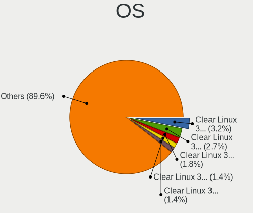

| Name              | Computers | Percent |
|-------------------|-----------|---------|
| Clear Linux 35000 | 29        | 3.5%    |
| Clear Linux 32480 | 19        | 2.29%   |
| Clear Linux 34930 | 15        | 1.81%   |
| Clear Linux 32270 | 15        | 1.81%   |
| Clear Linux 32760 | 13        | 1.57%   |
| Clear Linux 36010 | 12        | 1.45%   |
| Clear Linux 34820 | 12        | 1.45%   |
| Clear Linux 33590 | 12        | 1.45%   |
| Clear Linux 32380 | 11        | 1.33%   |
| Clear Linux 34860 | 10        | 1.21%   |
| Clear Linux 32330 | 10        | 1.21%   |
| Clear Linux 34500 | 9         | 1.09%   |
| Clear Linux 33010 | 9         | 1.09%   |
| Clear Linux 35110 | 8         | 0.97%   |
| Clear Linux 33660 | 8         | 0.97%   |
| Clear Linux 32910 | 8         | 0.97%   |
| Clear Linux 34290 | 7         | 0.84%   |
| Clear Linux 36250 | 6         | 0.72%   |
| Clear Linux 36070 | 6         | 0.72%   |
| Clear Linux 34700 | 6         | 0.72%   |
| Clear Linux 34670 | 6         | 0.72%   |
| Clear Linux 34350 | 6         | 0.72%   |
| Clear Linux 34250 | 6         | 0.72%   |
| Clear Linux 33980 | 6         | 0.72%   |
| Clear Linux 33460 | 6         | 0.72%   |
| Clear Linux 33440 | 6         | 0.72%   |
| Clear Linux 32600 | 6         | 0.72%   |
| Clear Linux 32390 | 6         | 0.72%   |
| Clear Linux       | 6         | 0.72%   |
| Clear Linux 35550 | 5         | 0.6%    |
| Clear Linux 35470 | 5         | 0.6%    |
| Clear Linux 35250 | 5         | 0.6%    |
| Clear Linux 35090 | 5         | 0.6%    |
| Clear Linux 34640 | 5         | 0.6%    |
| Clear Linux 34560 | 5         | 0.6%    |
| Clear Linux 34150 | 5         | 0.6%    |
| Clear Linux 34130 | 5         | 0.6%    |
| Clear Linux 34000 | 5         | 0.6%    |
| Clear Linux 33760 | 5         | 0.6%    |
| Clear Linux 33570 | 5         | 0.6%    |
| Clear Linux 32370 | 5         | 0.6%    |
| Clear Linux 32340 | 5         | 0.6%    |
| Clear Linux 31470 | 5         | 0.6%    |
| Clear Linux 31290 | 5         | 0.6%    |
| Clear Linux 30970 | 5         | 0.6%    |
| Clear Linux 29620 | 5         | 0.6%    |
| Clear Linux 36410 | 4         | 0.48%   |
| Clear Linux 36360 | 4         | 0.48%   |
| Clear Linux 36120 | 4         | 0.48%   |
| Clear Linux 35970 | 4         | 0.48%   |
| Clear Linux 35190 | 4         | 0.48%   |
| Clear Linux 35070 | 4         | 0.48%   |
| Clear Linux 34520 | 4         | 0.48%   |
| Clear Linux 34440 | 4         | 0.48%   |
| Clear Linux 34320 | 4         | 0.48%   |
| Clear Linux 34220 | 4         | 0.48%   |
| Clear Linux 33890 | 4         | 0.48%   |
| Clear Linux 33820 | 4         | 0.48%   |
| Clear Linux 33780 | 4         | 0.48%   |
| Clear Linux 33300 | 4         | 0.48%   |

OS Family
---------

OS without a version

| Name        | Computers | Percent |
|-------------|-----------|---------|
| Clear Linux | 725       | 100%    |

Kernel
------

Version of the Linux kernel

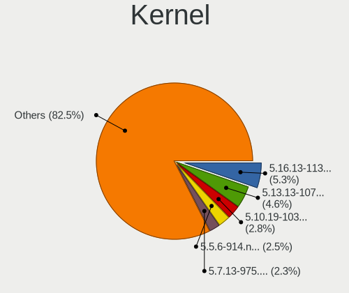

| Version             | Computers | Percent |
|---------------------|-----------|---------|
| 5.13.13-1070.native | 49        | 5.98%   |
| 5.10.19-1032.native | 30        | 3.66%   |
| 5.5.6-914.native    | 27        | 3.3%    |
| 5.7.13-975.native   | 23        | 2.81%   |
| 5.4.18-902.native   | 23        | 2.81%   |
| 5.16.13-1132.native | 21        | 2.56%   |
| 5.12.14-1051.native | 18        | 2.2%    |
| 5.13.8-1065.native  | 13        | 1.59%   |
| 5.5.5-911.native    | 12        | 1.47%   |
| 5.5.15-930.native   | 12        | 1.47%   |
| 5.9.12-1004.native  | 11        | 1.34%   |
| 5.6.6-942.native    | 9         | 1.1%    |
| 5.5.3-908.native    | 9         | 1.1%    |
| 5.12.8-1045.native  | 9         | 1.1%    |
| 5.9.8-1000.native   | 8         | 0.98%   |
| 5.7.7-967.native    | 8         | 0.98%   |
| 5.7.6-966.native    | 8         | 0.98%   |
| 5.5.9-918.native    | 8         | 0.98%   |
| 5.10.17-1026.native | 8         | 0.98%   |
| 5.7.2-962.native    | 7         | 0.85%   |
| 5.6.8-945.native    | 7         | 0.85%   |
| 5.5.4-909.native    | 7         | 0.85%   |
| 5.12.5-1041.native  | 7         | 0.85%   |
| 5.5.8-917.native    | 6         | 0.73%   |
| 5.3.9-863.native    | 6         | 0.73%   |
| 5.3.8-854.native    | 6         | 0.73%   |
| 5.3.5-847.native    | 6         | 0.73%   |
| 5.16.17-1136.native | 6         | 0.73%   |
| 5.12.16-1054.native | 6         | 0.73%   |
| 5.10.18-1027.native | 6         | 0.73%   |
| 5.10.10-1017.native | 6         | 0.73%   |
| 5.1.5-770.native    | 6         | 0.73%   |
| 5.0.18-767.native   | 6         | 0.73%   |
| 5.9.1-992.native    | 5         | 0.61%   |
| 5.8.14-991.native   | 5         | 0.61%   |
| 5.7.11-973.native   | 5         | 0.61%   |
| 5.6.16-958.native   | 5         | 0.61%   |
| 5.6.15-957.native   | 5         | 0.61%   |
| 5.6.10-947.native   | 5         | 0.61%   |
| 5.5.13-924.native   | 5         | 0.61%   |
| 5.4.6-883.native    | 5         | 0.61%   |
| 5.2.13-832.native   | 5         | 0.61%   |
| 5.17.4-1139.native  | 5         | 0.61%   |
| 5.16.18-1137.native | 5         | 0.61%   |
| 5.15.1-1089.native  | 5         | 0.61%   |
| 5.14.9-1079.native  | 5         | 0.61%   |
| 5.14.8-1078.native  | 5         | 0.61%   |
| 5.10.5-1012.native  | 5         | 0.61%   |
| 5.10.12-1021.native | 5         | 0.61%   |
| 5.8.8-984.native    | 4         | 0.49%   |
| 5.8.12-989.native   | 4         | 0.49%   |
| 5.7.18-980.native   | 4         | 0.49%   |
| 5.5.4-910.native    | 4         | 0.49%   |
| 5.5.3-905.native    | 4         | 0.49%   |
| 5.4.16-900.native   | 4         | 0.49%   |
| 5.2.8-818.native    | 4         | 0.49%   |
| 5.17.9-1144.native  | 4         | 0.49%   |
| 5.16.4-1119.native  | 4         | 0.49%   |
| 5.15.11-1110.native | 4         | 0.49%   |
| 5.14.15-1086.native | 4         | 0.49%   |

Kernel Family
-------------

Linux kernel without a distro release

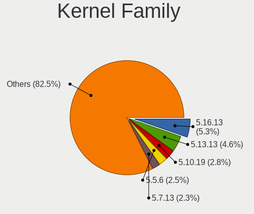

| Version | Computers | Percent |
|---------|-----------|---------|
| 5.13.13 | 49        | 5.98%   |
| 5.10.19 | 30        | 3.66%   |
| 5.5.6   | 27        | 3.3%    |
| 5.7.13  | 23        | 2.81%   |
| 5.4.18  | 23        | 2.81%   |
| 5.16.13 | 21        | 2.56%   |
| 5.12.14 | 18        | 2.2%    |
| 5.5.3   | 13        | 1.59%   |
| 5.13.8  | 13        | 1.59%   |
| 5.5.5   | 12        | 1.47%   |
| 5.5.15  | 12        | 1.47%   |
| 5.9.12  | 11        | 1.34%   |
| 5.5.4   | 11        | 1.34%   |
| 5.6.8   | 10        | 1.22%   |
| 5.6.6   | 9         | 1.1%    |
| 5.5.9   | 9         | 1.1%    |
| 5.12.8  | 9         | 1.1%    |
| 5.9.8   | 8         | 0.98%   |
| 5.7.7   | 8         | 0.98%   |
| 5.7.6   | 8         | 0.98%   |
| 5.10.17 | 8         | 0.98%   |
| 5.7.2   | 7         | 0.85%   |
| 5.16.18 | 7         | 0.85%   |
| 5.12.5  | 7         | 0.85%   |
| 5.6.15  | 6         | 0.73%   |
| 5.5.8   | 6         | 0.73%   |
| 5.5.13  | 6         | 0.73%   |
| 5.3.9   | 6         | 0.73%   |
| 5.3.8   | 6         | 0.73%   |
| 5.3.5   | 6         | 0.73%   |
| 5.17.9  | 6         | 0.73%   |
| 5.16.17 | 6         | 0.73%   |
| 5.12.16 | 6         | 0.73%   |
| 5.10.18 | 6         | 0.73%   |
| 5.10.10 | 6         | 0.73%   |
| 5.1.5   | 6         | 0.73%   |
| 5.0.18  | 6         | 0.73%   |
| 5.9.1   | 5         | 0.61%   |
| 5.8.14  | 5         | 0.61%   |
| 5.7.11  | 5         | 0.61%   |
| 5.6.16  | 5         | 0.61%   |
| 5.6.11  | 5         | 0.61%   |
| 5.6.10  | 5         | 0.61%   |
| 5.4.6   | 5         | 0.61%   |
| 5.2.8   | 5         | 0.61%   |
| 5.2.13  | 5         | 0.61%   |
| 5.17.4  | 5         | 0.61%   |
| 5.15.1  | 5         | 0.61%   |
| 5.14.9  | 5         | 0.61%   |
| 5.14.8  | 5         | 0.61%   |
| 5.10.5  | 5         | 0.61%   |
| 5.10.12 | 5         | 0.61%   |
| 5.0.17  | 5         | 0.61%   |
| 5.8.8   | 4         | 0.49%   |
| 5.8.12  | 4         | 0.49%   |
| 5.7.18  | 4         | 0.49%   |
| 5.6.4   | 4         | 0.49%   |
| 5.6.3   | 4         | 0.49%   |
| 5.6.14  | 4         | 0.49%   |
| 5.4.16  | 4         | 0.49%   |

Kernel Major Ver.
-----------------

Linux kernel major version

| Version | Computers | Percent |
|---------|-----------|---------|
| 5.5     | 105       | 13.36%  |
| 5.10    | 88        | 11.2%   |
| 5.13    | 72        | 9.16%   |
| 5.4     | 67        | 8.52%   |
| 5.7     | 66        | 8.4%    |
| 5.6     | 59        | 7.51%   |
| 5.12    | 53        | 6.74%   |
| 5.16    | 50        | 6.36%   |
| 5.9     | 42        | 5.34%   |
| 5.3     | 37        | 4.71%   |
| 5.2     | 22        | 2.8%    |
| 5.8     | 21        | 2.67%   |
| 5.0     | 21        | 2.67%   |
| 5.15    | 20        | 2.54%   |
| 5.1     | 18        | 2.29%   |
| 5.17    | 17        | 2.16%   |
| 5.14    | 17        | 2.16%   |
| 4.19    | 11        | 1.4%    |

Arch
----

OS architecture (x86_64, i586, etc.)

| Name   | Computers | Percent |
|--------|-----------|---------|
| x86_64 | 725       | 100%    |

DE
--

Desktop Environment

| Name            | Computers | Percent |
|-----------------|-----------|---------|
| GNOME           | 593       | 79.7%   |
| Unknown         | 96        | 12.9%   |
| KDE             | 20        | 2.69%   |
| GNOME Flashback | 18        | 2.42%   |
| XFCE            | 7         | 0.94%   |
| KDE5            | 7         | 0.94%   |
| GNOME-Flashback | 2         | 0.27%   |
| awesome         | 1         | 0.13%   |

Display Server
--------------

X11 or Wayland

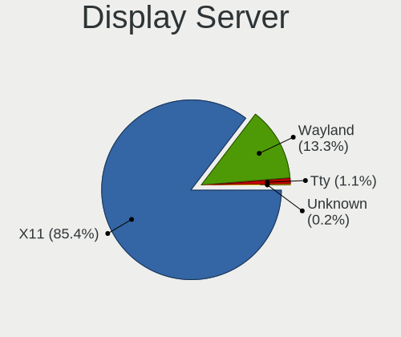

| Name    | Computers | Percent |
|---------|-----------|---------|
| X11     | 679       | 92.89%  |
| Wayland | 42        | 5.75%   |
| Tty     | 8         | 1.09%   |
| Unknown | 2         | 0.27%   |

Display Manager
---------------

SDDM, LightDM, etc.

| Name    | Computers | Percent |
|---------|-----------|---------|
| Unknown | 715       | 98.48%  |
| GDM     | 10        | 1.38%   |
| SDDM    | 1         | 0.14%   |

OS Lang
-------

Language

| Lang    | Computers | Percent |
|---------|-----------|---------|
| en_US   | 468       | 63.5%   |
| Unknown | 90        | 12.21%  |
| ru_RU   | 37        | 5.02%   |
| es_MX   | 22        | 2.99%   |
| de_DE   | 21        | 2.85%   |
| fr_FR   | 15        | 2.04%   |
| it_IT   | 12        | 1.63%   |
| en_GB   | 12        | 1.63%   |
| pt_BR   | 11        | 1.49%   |
| pl_PL   | 10        | 1.36%   |
| es_ES   | 8         | 1.09%   |
| zh_CN   | 6         | 0.81%   |
| en_AU   | 4         | 0.54%   |
| bg_BG   | 3         | 0.41%   |
| zh_TW   | 2         | 0.27%   |
| tr_TR   | 2         | 0.27%   |
| pt_PT   | 2         | 0.27%   |
| nl_BE   | 2         | 0.27%   |
| en_ZA   | 2         | 0.27%   |
| sv_SE   | 1         | 0.14%   |
| nl_NL   | 1         | 0.14%   |
| ka_GE   | 1         | 0.14%   |
| hu_HU   | 1         | 0.14%   |
| fi_FI   | 1         | 0.14%   |
| en_IN   | 1         | 0.14%   |
| de_AT   | 1         | 0.14%   |
| ar_SA   | 1         | 0.14%   |

Boot Mode
---------

EFI or BIOS

| Mode | Computers | Percent |
|------|-----------|---------|
| BIOS | 725       | 100%    |

Filesystem
----------

Type of filesystem

| Type    | Computers | Percent |
|---------|-----------|---------|
| Ext4    | 618       | 83.85%  |
| Unknown | 100       | 13.57%  |
| Xfs     | 10        | 1.36%   |
| Btrfs   | 9         | 1.22%   |

Part. scheme
------------

Scheme of partitioning

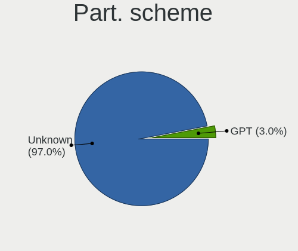

| Type    | Computers | Percent |
|---------|-----------|---------|
| Unknown | 709       | 97.39%  |
| GPT     | 19        | 2.61%   |

Dual Boot with Linux/BSD
------------------------

Hosting more than one Linux/BSD

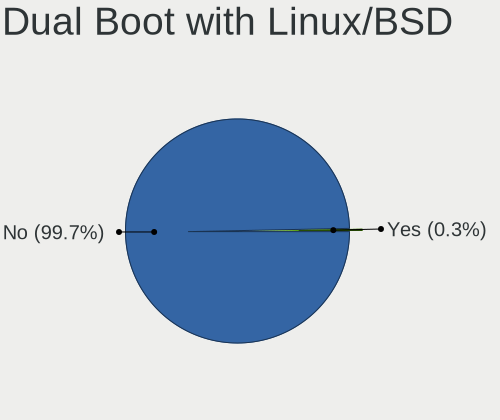

| Dual boot | Computers | Percent |
|-----------|-----------|---------|
| No        | 722       | 99.59%  |
| Yes       | 3         | 0.41%   |

Dual Boot (Win)
---------------

Hosting Linux and Windows

| Dual boot | Computers | Percent |
|-----------|-----------|---------|
| No        | 718       | 98.9%   |
| Yes       | 8         | 1.1%    |

Board
-----

Vendor
------

Motherboard manufacturer

| Name                 | Computers | Percent |
|----------------------|-----------|---------|
| ASUSTek Computer     | 119       | 16.41%  |
| Dell                 | 98        | 13.52%  |
| Hewlett-Packard      | 90        | 12.41%  |
| Lenovo               | 82        | 11.31%  |
| Gigabyte Technology  | 50        | 6.9%    |
| Acer                 | 40        | 5.52%   |
| Intel                | 38        | 5.24%   |
| MSI                  | 34        | 4.69%   |
| ASRock               | 30        | 4.14%   |
| Apple                | 21        | 2.9%    |
| Samsung Electronics  | 10        | 1.38%   |
| Unknown              | 9         | 1.24%   |
| Microsoft            | 8         | 1.1%    |
| Google               | 8         | 1.1%    |
| Toshiba              | 7         | 0.97%   |
| Sony                 | 5         | 0.69%   |
| Supermicro           | 4         | 0.55%   |
| HUAWEI               | 4         | 0.55%   |
| Hampoo               | 4         | 0.55%   |
| Fujitsu              | 3         | 0.41%   |
| Complet              | 3         | 0.41%   |
| Chuwi                | 3         | 0.41%   |
| Alienware            | 3         | 0.41%   |
| Teclast              | 2         | 0.28%   |
| Shuttle              | 2         | 0.28%   |
| Positivo             | 2         | 0.28%   |
| Pegatron             | 2         | 0.28%   |
| Panasonic            | 2         | 0.28%   |
| MOTILE               | 2         | 0.28%   |
| Medion               | 2         | 0.28%   |
| Foxconn              | 2         | 0.28%   |
| Biostar              | 2         | 0.28%   |
| AMI                  | 2         | 0.28%   |
| TrekStor             | 1         | 0.14%   |
| TODOS INDUSTRIAL     | 1         | 0.14%   |
| Timi                 | 1         | 0.14%   |
| SYS                  | 1         | 0.14%   |
| Razer                | 1         | 0.14%   |
| PC Specialist        | 1         | 0.14%   |
| Packard Bell         | 1         | 0.14%   |
| Notebook             | 1         | 0.14%   |
| Mediacom             | 1         | 0.14%   |
| MECHREVO             | 1         | 0.14%   |
| MAXSUN               | 1         | 0.14%   |
| MASSCOM VIETNAM      | 1         | 0.14%   |
| Maibenben            | 1         | 0.14%   |
| KANJI                | 1         | 0.14%   |
| Itautec              | 1         | 0.14%   |
| iEi                  | 1         | 0.14%   |
| Huanan               | 1         | 0.14%   |
| GMK                  | 1         | 0.14%   |
| Gateway              | 1         | 0.14%   |
| Framework            | 1         | 0.14%   |
| EVOO                 | 1         | 0.14%   |
| ECS                  | 1         | 0.14%   |
| CyberPowerPC         | 1         | 0.14%   |
| Compaq               | 1         | 0.14%   |
| Bak USA Technologies | 1         | 0.14%   |
| AZW                  | 1         | 0.14%   |
| AXIOO                | 1         | 0.14%   |

Model
-----

Motherboard model

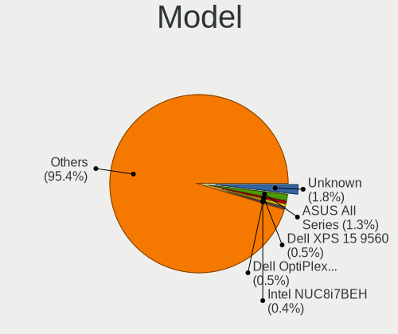

| Name                                       | Computers | Percent |
|--------------------------------------------|-----------|---------|
| ASUS All Series                            | 12        | 1.66%   |
| Unknown                                    | 12        | 1.66%   |
| Dell XPS 15 9560                           | 5         | 0.69%   |
| Intel NUC8i7BEH                            | 4         | 0.55%   |
| Intel DN2820FYB H24582-205                 | 4         | 0.55%   |
| HP Notebook                                | 4         | 0.55%   |
| Apple MacBookPro11,5                       | 4         | 0.55%   |
| MSI MS-7C02                                | 3         | 0.41%   |
| Microsoft Surface Book 2                   | 3         | 0.41%   |
| Lenovo MIIX 310-10ICR 80SG                 | 3         | 0.41%   |
| Lenovo G500 20236                          | 3         | 0.41%   |
| HP Pavilion Notebook                       | 3         | 0.41%   |
| HP EliteBook 8460p                         | 3         | 0.41%   |
| HP EliteBook 840 G1                        | 3         | 0.41%   |
| Dell XPS 13 9360                           | 3         | 0.41%   |
| Dell OptiPlex 9020                         | 3         | 0.41%   |
| Dell OptiPlex 7010                         | 3         | 0.41%   |
| Dell Inspiron 5570                         | 3         | 0.41%   |
| Complet MY8312                             | 3         | 0.41%   |
| ASUS VivoBook_ASUSLaptop X515DA_M515DA     | 3         | 0.41%   |
| ASRock TRX40 Creator                       | 3         | 0.41%   |
| Apple MacBookPro8,1                        | 3         | 0.41%   |
| Apple MacBookPro10,1                       | 3         | 0.41%   |
| Samsung 900X3C/900X3D/900X3E/900X4C/900X4D | 2         | 0.28%   |
| MSI MS-7C60                                | 2         | 0.28%   |
| MSI GS43VR 7RE                             | 2         | 0.28%   |
| MOTILE M141                                | 2         | 0.28%   |
| Lenovo IdeaPad 110-15ACL 80TJ              | 2         | 0.28%   |
| Lenovo G50-70 20351                        | 2         | 0.28%   |
| Intel NUC8i7HVK                            | 2         | 0.28%   |
| Intel NUC8i5BEK                            | 2         | 0.28%   |
| Intel NUC10i7FNH                           | 2         | 0.28%   |
| HUAWEI NBLB-WAX9N                          | 2         | 0.28%   |
| HP Stream Laptop 14-cb0XX                  | 2         | 0.28%   |
| HP ENVY x360 Convertible 15m-ds0xxx        | 2         | 0.28%   |
| HP Compaq 8200 Elite SFF PC                | 2         | 0.28%   |
| HP Compaq 6200 Pro SFF PC                  | 2         | 0.28%   |
| HP 250 G6 Notebook PC                      | 2         | 0.28%   |
| Hampoo I1D6_C189A                          | 2         | 0.28%   |
| Google Celes                               | 2         | 0.28%   |
| Google Auron_Paine                         | 2         | 0.28%   |
| Gigabyte Z97X-UD3H                         | 2         | 0.28%   |
| Gigabyte X79-UD3                           | 2         | 0.28%   |
| Gigabyte X570 AORUS PRO WIFI               | 2         | 0.28%   |
| Gigabyte H61M-DS2                          | 2         | 0.28%   |
| Dell XPS 8930                              | 2         | 0.28%   |
| Dell XPS 15 9570                           | 2         | 0.28%   |
| Dell XPS 13 9380                           | 2         | 0.28%   |
| Dell XPS 13 9343                           | 2         | 0.28%   |
| Dell XPS 13 9310                           | 2         | 0.28%   |
| Dell XPS 13 7390 2-in-1                    | 2         | 0.28%   |
| Dell Latitude E7450                        | 2         | 0.28%   |
| Dell Inspiron 5370                         | 2         | 0.28%   |
| Dell Inspiron 3537                         | 2         | 0.28%   |
| Dell Inspiron 3501                         | 2         | 0.28%   |
| ASUS Z170-A                                | 2         | 0.28%   |
| ASUS X553MA                                | 2         | 0.28%   |
| ASUS TUF Gaming X570-PRO                   | 2         | 0.28%   |
| ASUS TUF Gaming X570-PLUS                  | 2         | 0.28%   |
| ASUS ROG Maximus XII FORMULA               | 2         | 0.28%   |

Model Family
------------

Motherboard model prefix

| Name               | Computers | Percent |
|--------------------|-----------|---------|
| Acer Aspire        | 34        | 4.69%   |
| Dell Inspiron      | 29        | 4%      |
| Lenovo ThinkPad    | 27        | 3.72%   |
| Dell XPS           | 24        | 3.31%   |
| Dell Latitude      | 21        | 2.9%    |
| ASUS ROG           | 20        | 2.76%   |
| Lenovo IdeaPad     | 19        | 2.62%   |
| ASUS PRIME         | 19        | 2.62%   |
| HP Pavilion        | 17        | 2.34%   |
| HP EliteBook       | 14        | 1.93%   |
| ASUS VivoBook      | 14        | 1.93%   |
| ASUS All           | 12        | 1.66%   |
| Unknown            | 12        | 1.66%   |
| Dell OptiPlex      | 10        | 1.38%   |
| Microsoft Surface  | 8         | 1.1%    |
| HP Laptop          | 8         | 1.1%    |
| HP ENVY            | 8         | 1.1%    |
| Dell Precision     | 8         | 1.1%    |
| ASUS TUF           | 7         | 0.97%   |
| Toshiba Satellite  | 6         | 0.83%   |
| Lenovo ThinkCentre | 6         | 0.83%   |
| HP Stream          | 6         | 0.83%   |
| HP Compaq          | 6         | 0.83%   |
| Gigabyte X570      | 5         | 0.69%   |
| ASUS ZenBook       | 5         | 0.69%   |
| Apple MacBookPro11 | 5         | 0.69%   |
| Lenovo Yoga        | 4         | 0.55%   |
| Lenovo MIIX        | 4         | 0.55%   |
| Intel NUC8i7BEH    | 4         | 0.55%   |
| Intel DN2820FYB    | 4         | 0.55%   |
| HP Notebook        | 4         | 0.55%   |
| Dell Vostro        | 4         | 0.55%   |
| ASRock TRX40       | 4         | 0.55%   |
| Apple MacBookPro8  | 4         | 0.55%   |
| MSI MS-7C02        | 3         | 0.41%   |
| Lenovo G500        | 3         | 0.41%   |
| HP ZBook           | 3         | 0.41%   |
| HP 250             | 3         | 0.41%   |
| Gigabyte Z390      | 3         | 0.41%   |
| Gigabyte Z370      | 3         | 0.41%   |
| Gigabyte B450      | 3         | 0.41%   |
| Fujitsu LIFEBOOK   | 3         | 0.41%   |
| Complet MY8312     | 3         | 0.41%   |
| Apple MacBookPro10 | 3         | 0.41%   |
| Samsung 900X3C     | 2         | 0.28%   |
| MSI MS-7C60        | 2         | 0.28%   |
| MSI GS43VR         | 2         | 0.28%   |
| MOTILE M141        | 2         | 0.28%   |
| Lenovo Legion      | 2         | 0.28%   |
| Lenovo G50-70      | 2         | 0.28%   |
| Intel X79          | 2         | 0.28%   |
| Intel NUC8i7HVK    | 2         | 0.28%   |
| Intel NUC8i5BEK    | 2         | 0.28%   |
| Intel NUC10i7FNH   | 2         | 0.28%   |
| HUAWEI NBLB-WAX9N  | 2         | 0.28%   |
| HP Spectre         | 2         | 0.28%   |
| HP ProLiant        | 2         | 0.28%   |
| HP ProBook         | 2         | 0.28%   |
| Hampoo I1D6        | 2         | 0.28%   |
| Google Celes       | 2         | 0.28%   |

MFG Year
--------

Motherboard manufacture year

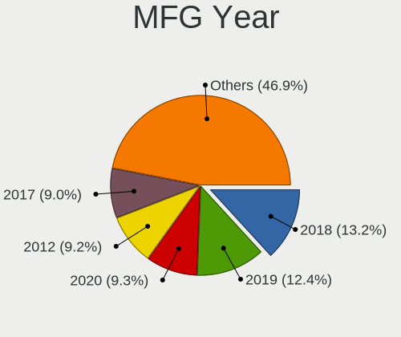

| Year | Computers | Percent |
|------|-----------|---------|
| 2018 | 113       | 15.59%  |
| 2019 | 103       | 14.21%  |
| 2020 | 75        | 10.34%  |
| 2017 | 65        | 8.97%   |
| 2016 | 65        | 8.97%   |
| 2013 | 62        | 8.55%   |
| 2012 | 58        | 8%      |
| 2015 | 56        | 7.72%   |
| 2014 | 53        | 7.31%   |
| 2011 | 35        | 4.83%   |
| 2021 | 25        | 3.45%   |
| 2010 | 8         | 1.1%    |
| 2022 | 5         | 0.69%   |
| 2009 | 1         | 0.14%   |
| 2008 | 1         | 0.14%   |

Form Factor
-----------

Physical design of the computer

| Name        | Computers | Percent |
|-------------|-----------|---------|
| Notebook    | 379       | 52.28%  |
| Desktop     | 258       | 35.59%  |
| Mini pc     | 34        | 4.69%   |
| Tablet      | 21        | 2.9%    |
| Convertible | 21        | 2.9%    |
| Server      | 8         | 1.1%    |
| All in one  | 4         | 0.55%   |

Secure Boot
-----------

Enabled or disabled

| State    | Computers | Percent |
|----------|-----------|---------|
| Disabled | 725       | 100%    |

Coreboot
--------

Have coreboot on board

| Used | Computers | Percent |
|------|-----------|---------|
| No   | 717       | 98.9%   |
| Yes  | 8         | 1.1%    |

RAM Size
--------

Total RAM memory

| Size in GB      | Computers | Percent |
|-----------------|-----------|---------|
| 16.01-24.0      | 184       | 25.14%  |
| 4.01-8.0        | 153       | 20.9%   |
| 8.01-16.0       | 140       | 19.13%  |
| 3.01-4.0        | 123       | 16.8%   |
| 32.01-64.0      | 69        | 9.43%   |
| 64.01-256.0     | 34        | 4.64%   |
| 1.01-2.0        | 13        | 1.78%   |
| 24.01-32.0      | 12        | 1.64%   |
| More than 256.0 | 3         | 0.41%   |
| 2.01-3.0        | 1         | 0.14%   |

RAM Used
--------

Used RAM memory

| Used GB     | Computers | Percent |
|-------------|-----------|---------|
| 1.01-2.0    | 314       | 40.36%  |
| 2.01-3.0    | 251       | 32.26%  |
| 3.01-4.0    | 91        | 11.7%   |
| 4.01-8.0    | 78        | 10.03%  |
| 8.01-16.0   | 23        | 2.96%   |
| 0.51-1.0    | 17        | 2.19%   |
| 16.01-24.0  | 2         | 0.26%   |
| 32.01-64.0  | 1         | 0.13%   |
| 64.01-256.0 | 1         | 0.13%   |

Total Drives
------------

Number of drives on board

| Drives | Computers | Percent |
|--------|-----------|---------|
| 1      | 434       | 58.57%  |
| 2      | 189       | 25.51%  |
| 3      | 62        | 8.37%   |
| 4      | 30        | 4.05%   |
| 5      | 13        | 1.75%   |
| 6      | 5         | 0.67%   |
| 7      | 4         | 0.54%   |
| 0      | 4         | 0.54%   |

Has CD-ROM
----------

Has CD-ROM on board

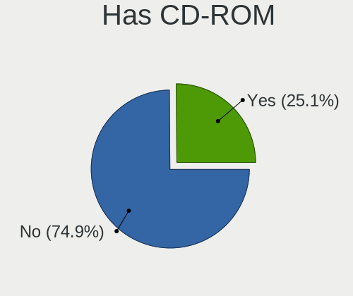

| Presented | Computers | Percent |
|-----------|-----------|---------|
| No        | 536       | 73.93%  |
| Yes       | 189       | 26.07%  |

Has Ethernet
------------

Has Ethernet on board

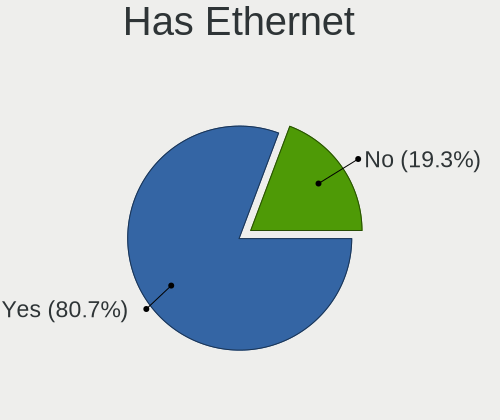

| Presented | Computers | Percent |
|-----------|-----------|---------|
| Yes       | 587       | 80.63%  |
| No        | 141       | 19.37%  |

Has WiFi
--------

Has WiFi module

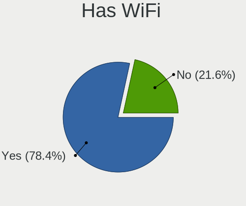

| Presented | Computers | Percent |
|-----------|-----------|---------|
| Yes       | 565       | 77.61%  |
| No        | 163       | 22.39%  |

Has Bluetooth
-------------

Has Bluetooth module

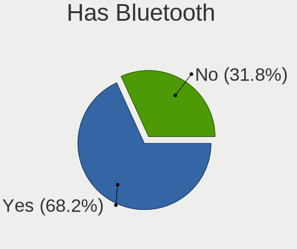

| Presented | Computers | Percent |
|-----------|-----------|---------|
| Yes       | 489       | 66.8%   |
| No        | 243       | 33.2%   |

Location
--------

Country
-------

Geographic location (country)

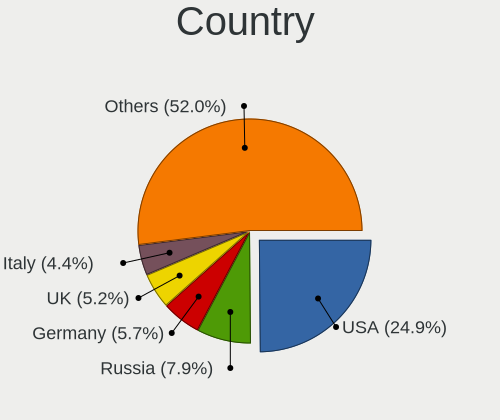

| Country             | Computers | Percent |
|---------------------|-----------|---------|
| USA                 | 180       | 24.73%  |
| Russia              | 52        | 7.14%   |
| UK                  | 42        | 5.77%   |
| Germany             | 39        | 5.36%   |
| Brazil              | 30        | 4.12%   |
| Italy               | 28        | 3.85%   |
| Canada              | 24        | 3.3%    |
| Australia           | 22        | 3.02%   |
| Poland              | 19        | 2.61%   |
| Netherlands         | 18        | 2.47%   |
| India               | 18        | 2.47%   |
| France              | 17        | 2.34%   |
| Spain               | 13        | 1.79%   |
| Romania             | 13        | 1.79%   |
| Mexico              | 12        | 1.65%   |
| Bulgaria            | 12        | 1.65%   |
| Argentina           | 11        | 1.51%   |
| Ukraine             | 10        | 1.37%   |
| Sweden              | 10        | 1.37%   |
| Switzerland         | 8         | 1.1%    |
| South Africa        | 8         | 1.1%    |
| Norway              | 8         | 1.1%    |
| Portugal            | 7         | 0.96%   |
| China               | 7         | 0.96%   |
| Indonesia           | 6         | 0.82%   |
| Turkey              | 5         | 0.69%   |
| Thailand            | 5         | 0.69%   |
| Chile               | 5         | 0.69%   |
| Belgium             | 5         | 0.69%   |
| Vietnam             | 4         | 0.55%   |
| Serbia              | 4         | 0.55%   |
| Hungary             | 4         | 0.55%   |
| Hong Kong           | 4         | 0.55%   |
| Finland             | 4         | 0.55%   |
| Austria             | 4         | 0.55%   |
| Taiwan              | 3         | 0.41%   |
| Saudi Arabia        | 3         | 0.41%   |
| Israel              | 3         | 0.41%   |
| Ireland             | 3         | 0.41%   |
| Estonia             | 3         | 0.41%   |
| Dominican Republic  | 3         | 0.41%   |
| Denmark             | 3         | 0.41%   |
| Uzbekistan          | 2         | 0.27%   |
| Singapore           | 2         | 0.27%   |
| New Zealand         | 2         | 0.27%   |
| Lebanon             | 2         | 0.27%   |
| Latvia              | 2         | 0.27%   |
| Kazakhstan          | 2         | 0.27%   |
| Japan               | 2         | 0.27%   |
| Iran                | 2         | 0.27%   |
| French Polynesia    | 2         | 0.27%   |
| Egypt               | 2         | 0.27%   |
| Ecuador             | 2         | 0.27%   |
| Colombia            | 2         | 0.27%   |
| Bolivia             | 2         | 0.27%   |
| Belarus             | 2         | 0.27%   |
| Trinidad and Tobago | 1         | 0.14%   |
| Sri Lanka           | 1         | 0.14%   |
| Slovenia            | 1         | 0.14%   |
| Slovakia            | 1         | 0.14%   |

City
----

Geographic location (city)

| City              | Computers | Percent |
|-------------------|-----------|---------|
| Moscow            | 14        | 1.84%   |
| Sydney            | 8         | 1.05%   |
| St Petersburg     | 7         | 0.92%   |
| Rome              | 6         | 0.79%   |
| Brisbane          | 6         | 0.79%   |
| Zurich            | 5         | 0.66%   |
| Sofia             | 5         | 0.66%   |
| Sao Paulo         | 5         | 0.66%   |
| Portland          | 5         | 0.66%   |
| Berlin            | 5         | 0.66%   |
| Toronto           | 4         | 0.53%   |
| Mexico City       | 4         | 0.53%   |
| Johannesburg      | 4         | 0.53%   |
| Houston           | 4         | 0.53%   |
| Chicago           | 4         | 0.53%   |
| Warsaw            | 3         | 0.39%   |
| Vigneux-sur-Seine | 3         | 0.39%   |
| Thunder Bay       | 3         | 0.39%   |
| San Jose          | 3         | 0.39%   |
| San Francisco     | 3         | 0.39%   |
| Palermo           | 3         | 0.39%   |
| Mumbai            | 3         | 0.39%   |
| Milan             | 3         | 0.39%   |
| Melbourne         | 3         | 0.39%   |
| Las Vegas         | 3         | 0.39%   |
| Las Condes        | 3         | 0.39%   |
| Kyiv              | 3         | 0.39%   |
| Glasgow           | 3         | 0.39%   |
| Fort Worth        | 3         | 0.39%   |
| Curitiba          | 3         | 0.39%   |
| Covington         | 3         | 0.39%   |
| Cincinnati        | 3         | 0.39%   |
| Buenos Aires      | 3         | 0.39%   |
| Brooklyn          | 3         | 0.39%   |
| Bangkok           | 3         | 0.39%   |
| Athens            | 3         | 0.39%   |
| Zapopan           | 2         | 0.26%   |
| Yogyakarta        | 2         | 0.26%   |
| Wroclaw           | 2         | 0.26%   |
| Villa Elisa       | 2         | 0.26%   |
| Varna             | 2         | 0.26%   |
| Torrance          | 2         | 0.26%   |
| The Hague         | 2         | 0.26%   |
| Tehran            | 2         | 0.26%   |
| Springfield       | 2         | 0.26%   |
| Sorocaba          | 2         | 0.26%   |
| Sliedrecht        | 2         | 0.26%   |
| Singapore         | 2         | 0.26%   |
| Shenzhen          | 2         | 0.26%   |
| Shelbyville       | 2         | 0.26%   |
| Seattle           | 2         | 0.26%   |
| Samara            | 2         | 0.26%   |
| Salvador          | 2         | 0.26%   |
| Salt Lake City    | 2         | 0.26%   |
| Riga              | 2         | 0.26%   |
| Rho               | 2         | 0.26%   |
| Reutov            | 2         | 0.26%   |
| Reading           | 2         | 0.26%   |
| Ramat HaSharon    | 2         | 0.26%   |
| Pune              | 2         | 0.26%   |

Drives
------

Drive Vendor
------------

Hard drive vendors

| Vendor                      | Computers | Drives | Percent |
|-----------------------------|-----------|--------|---------|
| Samsung Electronics         | 168       | 255    | 15.64%  |
| Seagate                     | 140       | 195    | 13.04%  |
| WDC                         | 99        | 124    | 9.22%   |
| Toshiba                     | 92        | 105    | 8.57%   |
| Unknown                     | 79        | 104    | 7.36%   |
| SanDisk                     | 63        | 71     | 5.87%   |
| Kingston                    | 56        | 67     | 5.21%   |
| Intel                       | 35        | 41     | 3.26%   |
| SK Hynix                    | 33        | 38     | 3.07%   |
| Crucial                     | 28        | 33     | 2.61%   |
| HGST                        | 26        | 34     | 2.42%   |
| Phison                      | 22        | 30     | 2.05%   |
| Hitachi                     | 22        | 25     | 2.05%   |
| A-DATA Technology           | 19        | 21     | 1.77%   |
| Apple                       | 14        | 15     | 1.3%    |
| Micron Technology           | 11        | 15     | 1.02%   |
| JMicron                     | 11        | 11     | 1.02%   |
| SPCC                        | 10        | 11     | 0.93%   |
| Patriot                     | 8         | 9      | 0.74%   |
| Transcend                   | 7         | 7      | 0.65%   |
| Silicon Motion              | 7         | 8      | 0.65%   |
| Micron/Crucial Technology   | 7         | 10     | 0.65%   |
| LITEONIT                    | 7         | 14     | 0.65%   |
| XPG                         | 6         | 6      | 0.56%   |
| KIOXIA                      | 6         | 10     | 0.56%   |
| China                       | 6         | 10     | 0.56%   |
| PNY                         | 5         | 5      | 0.47%   |
| KingSpec                    | 5         | 5      | 0.47%   |
| Team                        | 4         | 4      | 0.37%   |
| LITEON                      | 4         | 5      | 0.37%   |
| Hewlett-Packard             | 4         | 4      | 0.37%   |
| FORESEE                     | 4         | 4      | 0.37%   |
| Corsair                     | 4         | 8      | 0.37%   |
| PLEXTOR                     | 3         | 3      | 0.28%   |
| OCZ                         | 3         | 5      | 0.28%   |
| Netac                       | 3         | 3      | 0.28%   |
| KingDian                    | 3         | 5      | 0.28%   |
| Fujitsu                     | 3         | 4      | 0.28%   |
| Yangtze Memory Technologies | 2         | 2      | 0.19%   |
| Teclast                     | 2         | 2      | 0.19%   |
| Realtek Semiconductor       | 2         | 2      | 0.19%   |
| MAXTOR                      | 2         | 2      | 0.19%   |
| Hikvision                   | 2         | 2      | 0.19%   |
| GOODRAM                     | 2         | 2      | 0.19%   |
| Apacer                      | 2         | 2      | 0.19%   |
| ADATA Technology            | 2         | 2      | 0.19%   |
| XrayDisk                    | 1         | 1      | 0.09%   |
| WDC WDS2                    | 1         | 1      | 0.09%   |
| WDC WDS1                    | 1         | 1      | 0.09%   |
| W800S                       | 1         | 1      | 0.09%   |
| Verbatim                    | 1         | 1      | 0.09%   |
| USB3.0                      | 1         | 1      | 0.09%   |
| TO Exter                    | 1         | 1      | 0.09%   |
| TCSUNBOW                    | 1         | 1      | 0.09%   |
| SSK                         | 1         | 1      | 0.09%   |
| SMART                       | 1         | 1      | 0.09%   |
| SABRENT                     | 1         | 1      | 0.09%   |
| OWC                         | 1         | 2      | 0.09%   |
| MyDigitalSSD                | 1         | 2      | 0.09%   |
| MARVELL                     | 1         | 1      | 0.09%   |

Drive Model
-----------

Hard drive models

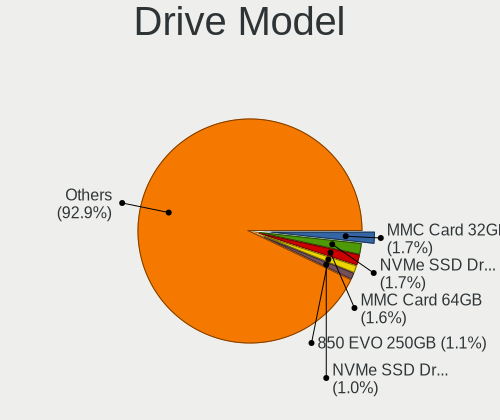

| Model                               | Computers | Percent |
|-------------------------------------|-----------|---------|
| Samsung NVMe SSD Drive 500GB        | 25        | 2.14%   |
| Unknown MMC Card  32GB              | 22        | 1.88%   |
| Unknown MMC Card  64GB              | 21        | 1.8%    |
| Samsung NVMe SSD Drive 256GB        | 14        | 1.2%    |
| Samsung NVMe SSD Drive 1TB          | 14        | 1.2%    |
| Seagate ST1000LM035-1RK172 1TB      | 12        | 1.03%   |
| Samsung SSD 850 EVO 250GB           | 12        | 1.03%   |
| HGST HTS721010A9E630 1TB            | 11        | 0.94%   |
| Unknown MMC Card  128GB             | 10        | 0.86%   |
| Toshiba NVMe SSD Drive 512GB        | 10        | 0.86%   |
| Toshiba KBG30ZMS128G 128GB NVMe SSD | 10        | 0.86%   |
| Seagate ST1000LM024 HN-M101MBB 1TB  | 10        | 0.86%   |
| Kingston SA400S37240G 240GB SSD     | 10        | 0.86%   |
| Unknown SD/MMC/MS PRO 999GB         | 9         | 0.77%   |
| Toshiba MQ01ABF050 500GB            | 9         | 0.77%   |
| Samsung NVMe SSD Drive 1024GB       | 9         | 0.77%   |
| Toshiba DT01ACA100 1TB              | 8         | 0.68%   |
| Seagate ST500LT012-1DG142 500GB     | 8         | 0.68%   |
| Sandisk NVMe SSD Drive 256GB        | 8         | 0.68%   |
| Samsung NVMe SSD Drive 250GB        | 8         | 0.68%   |
| Intel NVMe SSD Drive 512GB          | 8         | 0.68%   |
| Toshiba MQ01ABD100 1TB              | 7         | 0.6%    |
| SK Hynix NVMe SSD Drive 512GB       | 7         | 0.6%    |
| Sandisk NVMe SSD Drive 512GB        | 7         | 0.6%    |
| Samsung NVMe SSD Drive 512GB        | 7         | 0.6%    |
| JMicron Tech 250GB                  | 7         | 0.6%    |
| Intel NVMe SSD Drive 1024GB         | 7         | 0.6%    |
| SK Hynix NVMe SSD Drive 256GB       | 6         | 0.51%   |
| Seagate ST1000DM010-2EP102 1TB      | 6         | 0.51%   |
| Samsung SSD 860 EVO 500GB           | 6         | 0.51%   |
| Samsung SSD 860 EVO 250GB           | 6         | 0.51%   |
| Samsung SSD 850 PRO 256GB           | 6         | 0.51%   |
| Phison NVMe SSD Drive 1TB           | 6         | 0.51%   |
| Toshiba DT01ACA050 500GB            | 5         | 0.43%   |
| Seagate ST500DM002-1BD142 500GB     | 5         | 0.43%   |
| Sandisk NVMe SSD Drive 500GB        | 5         | 0.43%   |
| Samsung SSD 850 EVO 500GB           | 5         | 0.43%   |
| Samsung NVMe SSD Drive 2TB          | 5         | 0.43%   |
| Micron/Crucial NVMe SSD Drive 1TB   | 5         | 0.43%   |
| Kingston SA400S37120G 120GB SSD     | 5         | 0.43%   |
| Toshiba MQ04ABF100 1TB              | 4         | 0.34%   |
| Toshiba HDWD110 1TB                 | 4         | 0.34%   |
| SK Hynix SC311 SATA 256GB SSD       | 4         | 0.34%   |
| Seagate ST500LM030-2E717D 500GB     | 4         | 0.34%   |
| Seagate ST1000DM003-1ER162 1TB      | 4         | 0.34%   |
| SanDisk SSD PLUS 240GB              | 4         | 0.34%   |
| Sandisk NVMe SSD Drive 1TB          | 4         | 0.34%   |
| Samsung SSD 860 QVO 1TB             | 4         | 0.34%   |
| Samsung SSD 850 EVO 120GB           | 4         | 0.34%   |
| Micron 1100_MTFDDAV256TBN 256GB SSD | 4         | 0.34%   |
| JMicron Generic 128GB               | 4         | 0.34%   |
| HGST HTS725050A7E630 500GB          | 4         | 0.34%   |
| Crucial CT500MX500SSD1 500GB        | 4         | 0.34%   |
| China SATA SSD 120GB                | 4         | 0.34%   |
| WDC WDS500G2B0A-00SM50 500GB SSD    | 3         | 0.26%   |
| WDC WDS240G2G0A-00JH30 240GB SSD    | 3         | 0.26%   |
| WDC WD5000AAKX-00ERMA0 500GB        | 3         | 0.26%   |
| WDC WD10SPZX-24Z10 1TB              | 3         | 0.26%   |
| WDC WD10EZEX-08WN4A0 1TB            | 3         | 0.26%   |
| Unknown MMC Card  16GB              | 3         | 0.26%   |

HDD Vendor
----------

Hard disk drive vendors

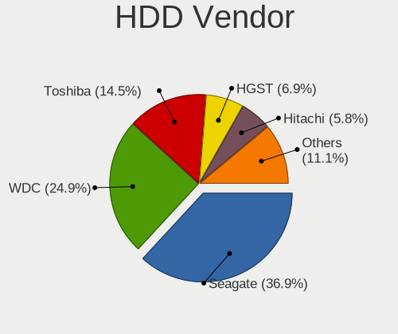

| Vendor              | Computers | Drives | Percent |
|---------------------|-----------|--------|---------|
| Seagate             | 133       | 181    | 38.11%  |
| WDC                 | 82        | 100    | 23.5%   |
| Toshiba             | 57        | 68     | 16.33%  |
| HGST                | 26        | 34     | 7.45%   |
| Hitachi             | 22        | 25     | 6.3%    |
| Unknown             | 9         | 10     | 2.58%   |
| Samsung Electronics | 9         | 9      | 2.58%   |
| Fujitsu             | 3         | 4      | 0.86%   |
| MAXTOR              | 2         | 2      | 0.57%   |
| Apple               | 2         | 2      | 0.57%   |
| USB3.0              | 1         | 1      | 0.29%   |
| SABRENT             | 1         | 1      | 0.29%   |
| MARVELL             | 1         | 1      | 0.29%   |
| ASMT                | 1         | 2      | 0.29%   |

SSD Vendor
----------

Solid state drive vendors

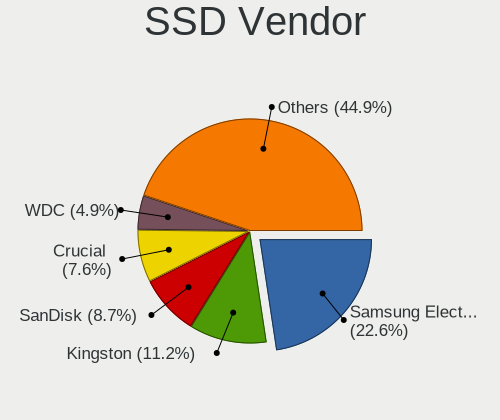

| Vendor              | Computers | Drives | Percent |
|---------------------|-----------|--------|---------|
| Samsung Electronics | 99        | 138    | 23.8%   |
| Kingston            | 47        | 53     | 11.3%   |
| SanDisk             | 34        | 37     | 8.17%   |
| Crucial             | 28        | 33     | 6.73%   |
| WDC                 | 20        | 24     | 4.81%   |
| A-DATA Technology   | 19        | 21     | 4.57%   |
| SK Hynix            | 17        | 21     | 4.09%   |
| Intel               | 12        | 13     | 2.88%   |
| Toshiba             | 11        | 12     | 2.64%   |
| Apple               | 11        | 12     | 2.64%   |
| SPCC                | 10        | 11     | 2.4%    |
| Micron Technology   | 9         | 10     | 2.16%   |
| Patriot             | 8         | 9      | 1.92%   |
| Transcend           | 7         | 7      | 1.68%   |
| LITEONIT            | 7         | 14     | 1.68%   |
| China               | 6         | 10     | 1.44%   |
| PNY                 | 5         | 5      | 1.2%    |
| KingSpec            | 5         | 5      | 1.2%    |
| Team                | 4         | 4      | 0.96%   |
| LITEON              | 4         | 5      | 0.96%   |
| JMicron             | 4         | 4      | 0.96%   |
| Hewlett-Packard     | 4         | 4      | 0.96%   |
| FORESEE             | 4         | 4      | 0.96%   |
| PLEXTOR             | 3         | 3      | 0.72%   |
| OCZ                 | 3         | 5      | 0.72%   |
| KingDian            | 3         | 5      | 0.72%   |
| Corsair             | 3         | 7      | 0.72%   |
| Teclast             | 2         | 2      | 0.48%   |
| Seagate             | 2         | 2      | 0.48%   |
| Netac               | 2         | 2      | 0.48%   |
| Hikvision           | 2         | 2      | 0.48%   |
| GOODRAM             | 2         | 2      | 0.48%   |
| Apacer              | 2         | 2      | 0.48%   |
| WDC WDS2            | 1         | 1      | 0.24%   |
| WDC WDS1            | 1         | 1      | 0.24%   |
| W800S               | 1         | 1      | 0.24%   |
| Verbatim            | 1         | 1      | 0.24%   |
| Unknown             | 1         | 1      | 0.24%   |
| TO Exter            | 1         | 1      | 0.24%   |
| SMART               | 1         | 1      | 0.24%   |
| MyDigitalSSD        | 1         | 2      | 0.24%   |
| Leven               | 1         | 1      | 0.24%   |
| KIOXIA-EXCERIA      | 1         | 1      | 0.24%   |
| Intenso             | 1         | 1      | 0.24%   |
| Integral            | 1         | 1      | 0.24%   |
| Hoodisk             | 1         | 2      | 0.24%   |
| Gigabyte Technology | 1         | 1      | 0.24%   |
| External            | 1         | 1      | 0.24%   |
| BIWIN               | 1         | 1      | 0.24%   |
| Acer                | 1         | 1      | 0.24%   |

Drive Kind
----------

HDD or SSD

| Kind    | Computers | Drives | Percent |
|---------|-----------|--------|---------|
| SSD     | 365       | 507    | 36.68%  |
| HDD     | 313       | 440    | 31.46%  |
| NVMe    | 231       | 316    | 23.22%  |
| MMC     | 62        | 86     | 6.23%   |
| Unknown | 24        | 30     | 2.41%   |

Drive Connector
---------------

SATA, SAS, NVMe, etc.

| Type | Computers | Drives | Percent |
|------|-----------|--------|---------|
| SATA | 551       | 927    | 62.12%  |
| NVMe | 231       | 316    | 26.04%  |
| MMC  | 62        | 86     | 6.99%   |
| SAS  | 43        | 50     | 4.85%   |

Drive Size
----------

Size of hard drive

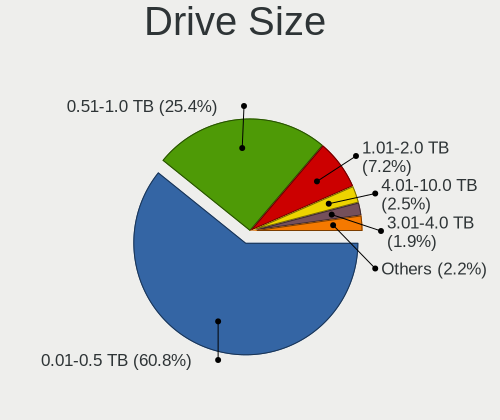

| Size in TB | Computers | Drives | Percent |
|------------|-----------|--------|---------|
| 0.01-0.5   | 413       | 600    | 60.65%  |
| 0.51-1.0   | 179       | 234    | 26.28%  |
| 1.01-2.0   | 49        | 61     | 7.2%    |
| 4.01-10.0  | 16        | 22     | 2.35%   |
| 3.01-4.0   | 13        | 17     | 1.91%   |
| 2.01-3.0   | 7         | 7      | 1.03%   |
| 10.01-20.0 | 4         | 6      | 0.59%   |

Space Total
-----------

Amount of disk space available on the file system

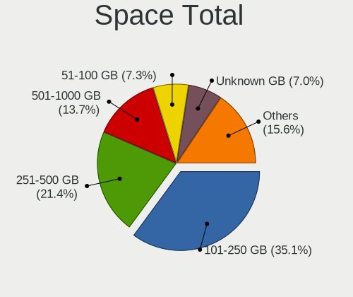

| Size in GB     | Computers | Percent |
|----------------|-----------|---------|
| 101-250        | 268       | 35.64%  |
| 251-500        | 155       | 20.61%  |
| 501-1000       | 101       | 13.43%  |
| 51-100         | 57        | 7.58%   |
| Unknown        | 54        | 7.18%   |
| 21-50          | 45        | 5.98%   |
| 1001-2000      | 37        | 4.92%   |
| More than 3000 | 18        | 2.39%   |
| 2001-3000      | 13        | 1.73%   |
| 1-20           | 4         | 0.53%   |

Space Used
----------

Amount of used disk space

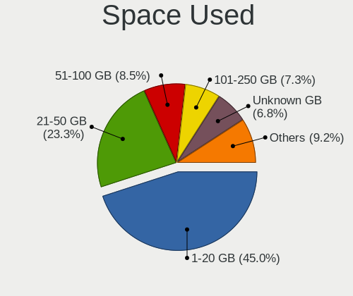

| Used GB        | Computers | Percent |
|----------------|-----------|---------|
| 1-20           | 364       | 47.21%  |
| 21-50          | 169       | 21.92%  |
| 51-100         | 63        | 8.17%   |
| 101-250        | 58        | 7.52%   |
| Unknown        | 54        | 7%      |
| 251-500        | 27        | 3.5%    |
| 501-1000       | 17        | 2.2%    |
| More than 3000 | 8         | 1.04%   |
| 1001-2000      | 8         | 1.04%   |
| 2001-3000      | 3         | 0.39%   |

Malfunc. Drives
---------------

Drive models with a malfunction

| Model                           | Computers | Drives | Percent |
|---------------------------------|-----------|--------|---------|
| Seagate ST500LM030-2E717D 500GB | 1         | 1      | 50%     |
| Fujitsu MHZ2250BH G1 250GB      | 1         | 1      | 50%     |

Malfunc. Drive Vendor
---------------------

Vendors of faulty drives

| Vendor  | Computers | Drives | Percent |
|---------|-----------|--------|---------|
| Seagate | 1         | 1      | 50%     |
| Fujitsu | 1         | 1      | 50%     |

Malfunc. HDD Vendor
-------------------

Vendors of faulty HDD drives

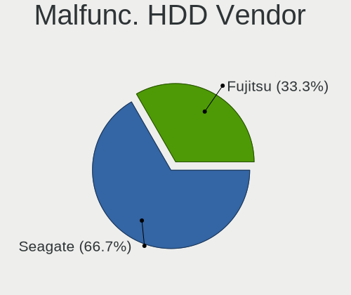

| Vendor  | Computers | Drives | Percent |
|---------|-----------|--------|---------|
| Seagate | 1         | 1      | 50%     |
| Fujitsu | 1         | 1      | 50%     |

Malfunc. Drive Kind
-------------------

Kinds of faulty drives

| Kind | Computers | Drives | Percent |
|------|-----------|--------|---------|
| HDD  | 2         | 2      | 100%    |

Failed Drives
-------------

Failed drive models

Zero info for selected period =(

Failed Drive Vendor
-------------------

Failed drive vendors

Zero info for selected period =(

Drive Status
------------

Number of failed and malfunc. drives

| Status   | Computers | Drives | Percent |
|----------|-----------|--------|---------|
| Detected | 707       | 1352   | 97.79%  |
| Works    | 14        | 25     | 1.94%   |
| Malfunc  | 2         | 2      | 0.28%   |

Storage controller
------------------

Storage Vendor
--------------

Storage controller vendors

| Vendor                       | Computers | Percent |
|------------------------------|-----------|---------|
| Intel                        | 536       | 58.84%  |
| AMD                          | 101       | 11.09%  |
| Samsung Electronics          | 94        | 10.32%  |
| Sandisk                      | 27        | 2.96%   |
| Toshiba America Info Systems | 24        | 2.63%   |
| Phison Electronics           | 22        | 2.41%   |
| ASMedia Technology           | 18        | 1.98%   |
| SK Hynix                     | 16        | 1.76%   |
| Kingston Technology Company  | 11        | 1.21%   |
| ADATA Technology             | 10        | 1.1%    |
| Marvell Technology Group     | 8         | 0.88%   |
| Silicon Motion               | 7         | 0.77%   |
| Micron/Crucial Technology    | 7         | 0.77%   |
| KIOXIA                       | 7         | 0.77%   |
| Broadcom / LSI               | 5         | 0.55%   |
| Seagate Technology           | 4         | 0.44%   |
| Realtek Semiconductor        | 3         | 0.33%   |
| LSI Logic / Symbios Logic    | 3         | 0.33%   |
| Yangtze Memory Technologies  | 2         | 0.22%   |
| Micron Technology            | 2         | 0.22%   |
| Shenzhen Longsys Electronics | 1         | 0.11%   |
| Hewlett-Packard              | 1         | 0.11%   |
| Biwin Storage Technology     | 1         | 0.11%   |
| Apple                        | 1         | 0.11%   |

Storage Model
-------------

Storage controller models

| Model                                                                            | Computers | Percent |
|----------------------------------------------------------------------------------|-----------|---------|
| AMD FCH SATA Controller [AHCI mode]                                              | 84        | 8.49%   |
| Samsung NVMe SSD Controller SM981/PM981/PM983                                    | 57        | 5.76%   |
| Intel Sunrise Point-LP SATA Controller [AHCI mode]                               | 50        | 5.06%   |
| Intel 7 Series Chipset Family 6-port SATA Controller [AHCI mode]                 | 49        | 4.95%   |
| Intel 8 Series/C220 Series Chipset Family 6-port SATA Controller 1 [AHCI mode]   | 38        | 3.84%   |
| Intel 82801 Mobile SATA Controller [RAID mode]                                   | 32        | 3.24%   |
| Intel Q170/Q150/B150/H170/H110/Z170/CM236 Chipset SATA Controller [AHCI Mode]    | 25        | 2.53%   |
| Intel 8 Series SATA Controller 1 [AHCI mode]                                     | 25        | 2.53%   |
| Intel Wildcat Point-LP SATA Controller [AHCI Mode]                               | 22        | 2.22%   |
| Intel SATA Controller [RAID mode]                                                | 20        | 2.02%   |
| Intel HM170/QM170 Chipset SATA Controller [AHCI Mode]                            | 20        | 2.02%   |
| Intel 6 Series/C200 Series Chipset Family 6 port Mobile SATA AHCI Controller     | 19        | 1.92%   |
| Intel 200 Series PCH SATA controller [AHCI mode]                                 | 19        | 1.92%   |
| Samsung NVMe SSD Controller SM961/PM961/SM963                                    | 18        | 1.82%   |
| Intel Celeron/Pentium Silver Processor SATA Controller                           | 18        | 1.82%   |
| Intel Cannon Lake Mobile PCH SATA AHCI Controller                                | 18        | 1.82%   |
| Intel Cannon Lake PCH SATA AHCI Controller                                       | 17        | 1.72%   |
| Intel 6 Series/C200 Series Chipset Family 6 port Desktop SATA AHCI Controller    | 17        | 1.72%   |
| ASMedia ASM1062 Serial ATA Controller                                            | 17        | 1.72%   |
| Intel Atom Processor E3800 Series SATA AHCI Controller                           | 16        | 1.62%   |
| Intel Celeron N3350/Pentium N4200/Atom E3900 Series SATA AHCI Controller         | 15        | 1.52%   |
| Intel Cannon Point-LP SATA Controller [AHCI Mode]                                | 15        | 1.52%   |
| Intel 7 Series/C210 Series Chipset Family 6-port SATA Controller [AHCI mode]     | 15        | 1.52%   |
| AMD 400 Series Chipset SATA Controller                                           | 14        | 1.42%   |
| Intel SSD 660P Series                                                            | 12        | 1.21%   |
| Intel Comet Lake SATA AHCI Controller                                            | 9         | 0.91%   |
| Toshiba America Info Systems Toshiba America Info Non-Volatile memory controller | 8         | 0.81%   |
| Sandisk WD Blue SN500 / PC SN520 NVMe SSD                                        | 8         | 0.81%   |
| Phison E16 PCIe4 NVMe Controller                                                 | 8         | 0.81%   |
| Phison E12 NVMe Controller                                                       | 8         | 0.81%   |
| Intel 500 Series Chipset Family SATA AHCI Controller                             | 8         | 0.81%   |
| ADATA XPG SX8200 Pro PCIe Gen3x4 M.2 2280 Solid State Drive                      | 8         | 0.81%   |
| Toshiba America Info Systems XG6 NVMe SSD Controller                             | 7         | 0.71%   |
| Intel 9 Series Chipset Family SATA Controller [AHCI Mode]                        | 7         | 0.71%   |
| Toshiba America Info Systems BG3 NVMe SSD Controller                             | 6         | 0.61%   |
| Sandisk WD PC SN810 / Black SN850 NVMe SSD                                       | 6         | 0.61%   |
| Samsung NVMe SSD Controller PM9A1/PM9A3/980PRO                                   | 6         | 0.61%   |
| Samsung NVMe SSD Controller 980                                                  | 6         | 0.61%   |
| Samsung Electronics SATA controller                                              | 6         | 0.61%   |
| KIOXIA Non-Volatile memory controller                                            | 6         | 0.61%   |
| Intel C600/X79 series chipset 6-Port SATA AHCI Controller                        | 6         | 0.61%   |
| Intel Atom/Celeron/Pentium Processor x5-E8000/J3xxx/N3xxx Series SATA Controller | 6         | 0.61%   |
| AMD SB7x0/SB8x0/SB9x0 SATA Controller [AHCI mode]                                | 6         | 0.61%   |
| Sandisk WD Blue SN550 NVMe SSD                                                   | 5         | 0.51%   |
| Samsung NVMe SSD Controller SM951/PM951                                          | 5         | 0.51%   |
| Kingston Company U-SNS8154P3 NVMe SSD                                            | 5         | 0.51%   |
| Intel Volume Management Device NVMe RAID Controller                              | 5         | 0.51%   |
| Intel SSD Pro 7600p/760p/E 6100p Series                                          | 5         | 0.51%   |
| Intel C610/X99 series chipset sSATA Controller [AHCI mode]                       | 5         | 0.51%   |
| Intel C610/X99 series chipset 6-Port SATA Controller [AHCI mode]                 | 5         | 0.51%   |
| Intel Alder Lake-S PCH SATA Controller [AHCI Mode]                               | 5         | 0.51%   |
| Intel 5 Series/3400 Series Chipset 6 port SATA AHCI Controller                   | 5         | 0.51%   |
| AMD 300 Series Chipset SATA Controller                                           | 5         | 0.51%   |
| SK Hynix PC401 NVMe Solid State Drive 256GB                                      | 4         | 0.4%    |
| Silicon Motion SM2263EN/SM2263XT SSD Controller                                  | 4         | 0.4%    |
| Seagate FireCuda 520 SSD                                                         | 4         | 0.4%    |
| Intel Tiger Lake-LP SATA Controller [AHCI mode]                                  | 4         | 0.4%    |
| AMD SB7x0/SB8x0/SB9x0 IDE Controller                                             | 4         | 0.4%    |
| AMD 500 Series Chipset SATA Controller                                           | 4         | 0.4%    |
| SK Hynix Non-Volatile memory controller                                          | 3         | 0.3%    |

Storage Kind
------------

Kind of storage controller (IDE, SATA, NVMe, SAS, ...)

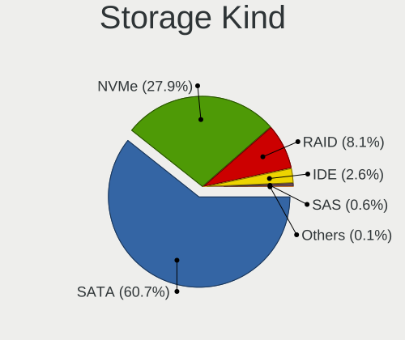

| Kind | Computers | Percent |
|------|-----------|---------|
| SATA | 572       | 63.13%  |
| NVMe | 237       | 26.16%  |
| RAID | 66        | 7.28%   |
| IDE  | 24        | 2.65%   |
| SAS  | 6         | 0.66%   |
| SCSI | 1         | 0.11%   |

Processor
---------

CPU Vendor
----------

Processor vendors

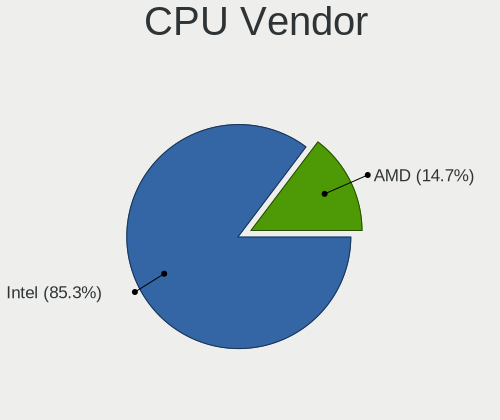

| Vendor | Computers | Percent |
|--------|-----------|---------|
| Intel  | 616       | 84.97%  |
| AMD    | 109       | 15.03%  |

CPU Model
---------

Processor models

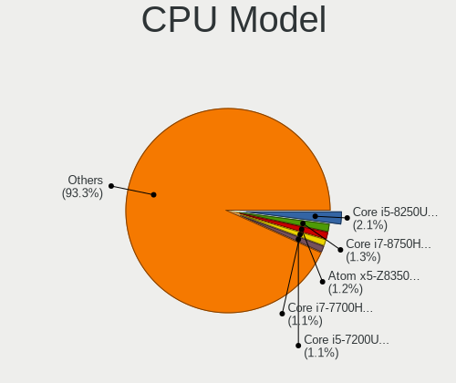

| Model                                          | Computers | Percent |
|------------------------------------------------|-----------|---------|
| Intel Core i5-8250U CPU @ 1.60GHz              | 17        | 2.34%   |
| Intel Atom x5-Z8350 CPU @ 1.44GHz              | 11        | 1.52%   |
| Intel Core i7-8750H CPU @ 2.20GHz              | 10        | 1.38%   |
| Intel Core i7-7700HQ CPU @ 2.80GHz             | 10        | 1.38%   |
| Intel Core i5-8265U CPU @ 1.60GHz              | 9         | 1.24%   |
| Intel Core i5-3210M CPU @ 2.50GHz              | 9         | 1.24%   |
| Intel Core i7-8550U CPU @ 1.80GHz              | 8         | 1.1%    |
| Intel Core i7-6700HQ CPU @ 2.60GHz             | 8         | 1.1%    |
| Intel Core i5-5200U CPU @ 2.20GHz              | 8         | 1.1%    |
| Intel Celeron CPU N3350 @ 1.10GHz              | 8         | 1.1%    |
| Intel Core i7-10510U CPU @ 1.80GHz             | 7         | 0.96%   |
| Intel Core i5-7200U CPU @ 2.50GHz              | 7         | 0.96%   |
| Intel Core i5-4200U CPU @ 1.60GHz              | 7         | 0.96%   |
| Intel Core i5-2520M CPU @ 2.50GHz              | 7         | 0.96%   |
| Intel Celeron CPU N2840 @ 2.16GHz              | 7         | 0.96%   |
| Intel Celeron CPU N2830 @ 2.16GHz              | 7         | 0.96%   |
| Intel Pentium Silver N5000 CPU @ 1.10GHz       | 6         | 0.83%   |
| Intel Core i7-8559U CPU @ 2.70GHz              | 6         | 0.83%   |
| Intel Core i5-7400 CPU @ 3.00GHz               | 6         | 0.83%   |
| AMD Ryzen Threadripper 3960X 24-Core Processor | 6         | 0.83%   |
| AMD Ryzen 5 3500U with Radeon Vega Mobile Gfx  | 6         | 0.83%   |
| Intel Pentium CPU N4200 @ 1.10GHz              | 5         | 0.69%   |
| Intel Core i7-9750H CPU @ 2.60GHz              | 5         | 0.69%   |
| Intel Core i7-8700K CPU @ 3.70GHz              | 5         | 0.69%   |
| Intel Core i7-8700 CPU @ 3.20GHz               | 5         | 0.69%   |
| Intel Core i7-8650U CPU @ 1.90GHz              | 5         | 0.69%   |
| Intel Core i7-4870HQ CPU @ 2.50GHz             | 5         | 0.69%   |
| Intel Core i7-3770 CPU @ 3.40GHz               | 5         | 0.69%   |
| Intel Core i5-6300U CPU @ 2.40GHz              | 5         | 0.69%   |
| Intel Core i5-4210U CPU @ 1.70GHz              | 5         | 0.69%   |
| Intel Core i5-3337U CPU @ 1.80GHz              | 5         | 0.69%   |
| Intel Core i5-3320M CPU @ 2.60GHz              | 5         | 0.69%   |
| Intel Core i5-3317U CPU @ 1.70GHz              | 5         | 0.69%   |
| Intel Core i5-10210U CPU @ 1.60GHz             | 5         | 0.69%   |
| Intel Celeron N4000 CPU @ 1.10GHz              | 5         | 0.69%   |
| AMD Ryzen 5 3600 6-Core Processor              | 5         | 0.69%   |
| Intel Core i7-8565U CPU @ 1.80GHz              | 4         | 0.55%   |
| Intel Core i7-7500U CPU @ 2.70GHz              | 4         | 0.55%   |
| Intel Core i7-4500U CPU @ 1.80GHz              | 4         | 0.55%   |
| Intel Core i7-1065G7 CPU @ 1.30GHz             | 4         | 0.55%   |
| Intel Core i5-8600K CPU @ 3.60GHz              | 4         | 0.55%   |
| Intel Core i5-7300HQ CPU @ 2.50GHz             | 4         | 0.55%   |
| Intel Core i5-6200U CPU @ 2.30GHz              | 4         | 0.55%   |
| Intel Core i5-5300U CPU @ 2.30GHz              | 4         | 0.55%   |
| Intel Core i5-3470 CPU @ 3.20GHz               | 4         | 0.55%   |
| Intel Celeron CPU N3060 @ 1.60GHz              | 4         | 0.55%   |
| AMD Ryzen 9 3900X 12-Core Processor            | 4         | 0.55%   |
| AMD Ryzen 7 3700U with Radeon Vega Mobile Gfx  | 4         | 0.55%   |
| AMD Ryzen 7 2700X Eight-Core Processor         | 4         | 0.55%   |
| AMD Ryzen 5 2600 Six-Core Processor            | 4         | 0.55%   |
| Intel Core i7-9700K CPU @ 3.60GHz              | 3         | 0.41%   |
| Intel Core i7-8809G CPU @ 3.10GHz              | 3         | 0.41%   |
| Intel Core i7-6700K CPU @ 4.00GHz              | 3         | 0.41%   |
| Intel Core i7-3720QM CPU @ 2.60GHz             | 3         | 0.41%   |
| Intel Core i7-3630QM CPU @ 2.40GHz             | 3         | 0.41%   |
| Intel Core i7-3612QM CPU @ 2.10GHz             | 3         | 0.41%   |
| Intel Core i7-2600K CPU @ 3.40GHz              | 3         | 0.41%   |
| Intel Core i7-10750H CPU @ 2.60GHz             | 3         | 0.41%   |
| Intel Core i5-9600K CPU @ 3.70GHz              | 3         | 0.41%   |
| Intel Core i5-9400F CPU @ 2.90GHz              | 3         | 0.41%   |

CPU Model Family
----------------

Processor model prefix

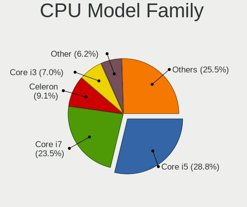

| Model                  | Computers | Percent |
|------------------------|-----------|---------|
| Intel Core i5          | 213       | 29.38%  |
| Intel Core i7          | 178       | 24.55%  |
| Intel Celeron          | 67        | 9.24%   |
| Intel Core i3          | 52        | 7.17%   |
| Intel Xeon             | 26        | 3.59%   |
| AMD Ryzen 5            | 26        | 3.59%   |
| Other                  | 24        | 3.31%   |
| Intel Pentium          | 22        | 3.03%   |
| AMD Ryzen 7            | 19        | 2.62%   |
| Intel Atom             | 14        | 1.93%   |
| AMD Ryzen Threadripper | 12        | 1.66%   |
| AMD Ryzen 3            | 11        | 1.52%   |
| Intel Core i9          | 9         | 1.24%   |
| AMD Ryzen 9            | 9         | 1.24%   |
| AMD FX                 | 7         | 0.97%   |
| Intel Pentium Silver   | 6         | 0.83%   |
| AMD A8                 | 5         | 0.69%   |
| AMD A10                | 5         | 0.69%   |
| AMD A6                 | 4         | 0.55%   |
| AMD Athlon             | 3         | 0.41%   |
| Intel Core m5          | 2         | 0.28%   |
| AMD E1                 | 2         | 0.28%   |
| AMD A4                 | 2         | 0.28%   |
| Intel Xeon Platinum    | 1         | 0.14%   |
| Intel Pentium Gold     | 1         | 0.14%   |
| Intel Core m3          | 1         | 0.14%   |
| AMD Ryzen 7 PRO        | 1         | 0.14%   |
| AMD Ryzen 5 PRO        | 1         | 0.14%   |
| AMD Opteron            | 1         | 0.14%   |
| AMD A12                | 1         | 0.14%   |

CPU Cores
---------

Number of processor cores

| Number | Computers | Percent |
|--------|-----------|---------|
| 4      | 311       | 42.9%   |
| 2      | 260       | 35.86%  |
| 6      | 80        | 11.03%  |
| 8      | 31        | 4.28%   |
| 12     | 14        | 1.93%   |
| 24     | 7         | 0.97%   |
| 10     | 6         | 0.83%   |
| 16     | 5         | 0.69%   |
| 64     | 3         | 0.41%   |
| 32     | 3         | 0.41%   |
| 1      | 3         | 0.41%   |
| 28     | 1         | 0.14%   |
| 20     | 1         | 0.14%   |

CPU Sockets
-----------

Number of sockets

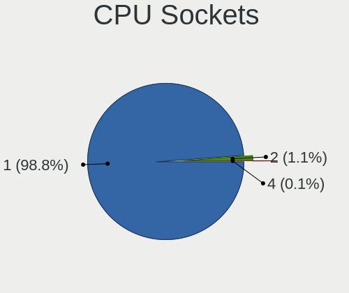

| Number | Computers | Percent |
|--------|-----------|---------|
| 1      | 717       | 98.9%   |
| 2      | 7         | 0.97%   |
| 4      | 1         | 0.14%   |

CPU Threads
-----------

Threads per core (Hyper-Threading)

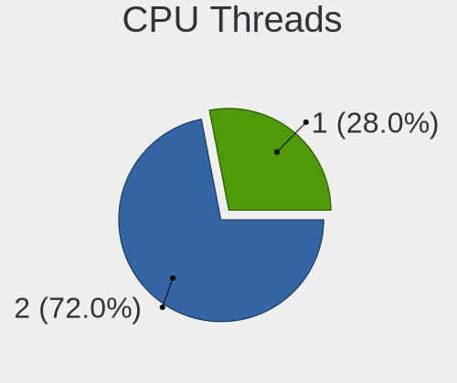

| Number | Computers | Percent |
|--------|-----------|---------|
| 2      | 514       | 70.8%   |
| 1      | 212       | 29.2%   |

CPU Op-Modes
------------

CPU Operation Modes (32-bit, 64-bit)

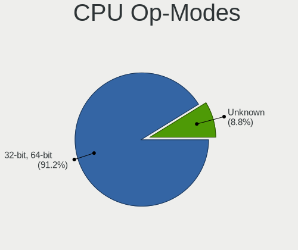

| Op mode        | Computers | Percent |
|----------------|-----------|---------|
| 32-bit, 64-bit | 650       | 88.8%   |
| Unknown        | 82        | 11.2%   |

CPU Microcode
-------------

Microcode number

| Number     | Computers | Percent |
|------------|-----------|---------|
| Unknown    | 678       | 93%     |
| 0x906ea    | 5         | 0.69%   |
| 0x806ea    | 5         | 0.69%   |
| 0x506e3    | 5         | 0.69%   |
| 0x40651    | 5         | 0.69%   |
| 0x306a9    | 5         | 0.69%   |
| 0x906e9    | 3         | 0.41%   |
| 0x706a1    | 3         | 0.41%   |
| 0x306c3    | 3         | 0.41%   |
| 0x30678    | 3         | 0.41%   |
| 0x406c4    | 2         | 0.27%   |
| 0x306d4    | 2         | 0.27%   |
| 0x206a7    | 2         | 0.27%   |
| 0x806ec    | 1         | 0.14%   |
| 0x806eb    | 1         | 0.14%   |
| 0x806e9    | 1         | 0.14%   |
| 0x706a8    | 1         | 0.14%   |
| 0x506c9    | 1         | 0.14%   |
| 0x406c3    | 1         | 0.14%   |
| 0x40671    | 1         | 0.14%   |
| 0x08108109 | 1         | 0.14%   |

CPU Microarch
-------------

Microarchitecture

| Name          | Computers | Percent |
|---------------|-----------|---------|
| KabyLake      | 187       | 25.79%  |
| Haswell       | 87        | 12%     |
| IvyBridge     | 73        | 10.07%  |
| Skylake       | 50        | 6.9%    |
| SandyBridge   | 50        | 6.9%    |
| Silvermont    | 46        | 6.34%   |
| Zen 2         | 31        | 4.28%   |
| Zen+          | 29        | 4%      |
| Broadwell     | 27        | 3.72%   |
| Goldmont plus | 23        | 3.17%   |
| Goldmont      | 17        | 2.34%   |
| CometLake     | 16        | 2.21%   |
| Unknown       | 13        | 1.79%   |
| Zen           | 12        | 1.66%   |
| Piledriver    | 12        | 1.66%   |
| TigerLake     | 11        | 1.52%   |
| Westmere      | 10        | 1.38%   |
| Zen 3         | 9         | 1.24%   |
| IceLake       | 6         | 0.83%   |
| Excavator     | 6         | 0.83%   |
| Puma          | 5         | 0.69%   |
| Jaguar        | 2         | 0.28%   |
| Bulldozer     | 2         | 0.28%   |
| Steamroller   | 1         | 0.14%   |

Graphics
--------

GPU Vendor
----------

Vendors of graphics cards

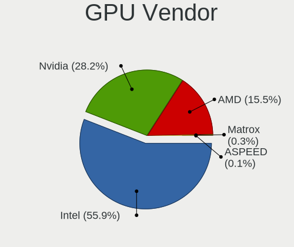

| Vendor                     | Computers | Percent |
|----------------------------|-----------|---------|
| Intel                      | 489       | 54.76%  |
| Nvidia                     | 258       | 28.89%  |
| AMD                        | 143       | 16.01%  |
| Matrox Electronics Systems | 2         | 0.22%   |
| ASPEED Technology          | 1         | 0.11%   |

GPU Model
---------

Graphics card models

| Model                                                                                    | Computers | Percent |
|------------------------------------------------------------------------------------------|-----------|---------|
| Intel 3rd Gen Core processor Graphics Controller                                         | 46        | 5.09%   |
| Intel 2nd Generation Core Processor Family Integrated Graphics Controller                | 35        | 3.88%   |
| Intel UHD Graphics 620                                                                   | 32        | 3.54%   |
| Intel Haswell-ULT Integrated Graphics Controller                                         | 26        | 2.88%   |
| Intel HD Graphics 630                                                                    | 25        | 2.77%   |
| Intel Atom/Celeron/Pentium Processor x5-E8000/J3xxx/N3xxx Integrated Graphics Controller | 25        | 2.77%   |
| Intel CoffeeLake-H GT2 [UHD Graphics 630]                                                | 23        | 2.55%   |
| Intel Atom Processor Z36xxx/Z37xxx Series Graphics & Display                             | 21        | 2.33%   |
| AMD Ellesmere [Radeon RX 470/480/570/570X/580/580X/590]                                  | 20        | 2.21%   |
| Intel HD Graphics 5500                                                                   | 18        | 1.99%   |
| Intel HD Graphics 530                                                                    | 17        | 1.88%   |
| Intel GeminiLake [UHD Graphics 600]                                                      | 17        | 1.88%   |
| AMD Picasso/Raven 2 [Radeon Vega Series / Radeon Vega Mobile Series]                     | 17        | 1.88%   |
| Intel Skylake GT2 [HD Graphics 520]                                                      | 16        | 1.77%   |
| Intel HD Graphics 620                                                                    | 15        | 1.66%   |
| Intel CometLake-U GT2 [UHD Graphics]                                                     | 15        | 1.66%   |
| Intel WhiskeyLake-U GT2 [UHD Graphics 620]                                               | 13        | 1.44%   |
| Intel 4th Gen Core Processor Integrated Graphics Controller                              | 13        | 1.44%   |
| Nvidia GP107M [GeForce GTX 1050 Mobile]                                                  | 12        | 1.33%   |
| Intel HD Graphics 500                                                                    | 12        | 1.33%   |
| Nvidia GP107M [GeForce GTX 1050 Ti Mobile]                                               | 11        | 1.22%   |
| Intel Xeon E3-1200 v3/4th Gen Core Processor Integrated Graphics Controller              | 11        | 1.22%   |
| Nvidia GP106 [GeForce GTX 1060 6GB]                                                      | 10        | 1.11%   |
| Intel TigerLake-LP GT2 [Iris Xe Graphics]                                                | 10        | 1.11%   |
| Intel CoffeeLake-U GT3e [Iris Plus Graphics 655]                                         | 10        | 1.11%   |
| Intel CoffeeLake-S GT2 [UHD Graphics 630]                                                | 10        | 1.11%   |
| Intel Xeon E3-1200 v2/3rd Gen Core processor Graphics Controller                         | 8         | 0.89%   |
| AMD Topaz XT [Radeon R7 M260/M265 / M340/M360 / M440/M445 / 530/535 / 620/625 Mobile]    | 8         | 0.89%   |
| AMD Navi 10 [Radeon RX 5600 OEM/5600 XT / 5700/5700 XT]                                  | 8         | 0.89%   |
| Nvidia GP106M [GeForce GTX 1060 Mobile]                                                  | 7         | 0.78%   |
| Nvidia GP106 [GeForce GTX 1060 3GB]                                                      | 7         | 0.78%   |
| Nvidia GP104 [GeForce GTX 1070]                                                          | 7         | 0.78%   |
| AMD Raven Ridge [Radeon Vega Series / Radeon Vega Mobile Series]                         | 7         | 0.78%   |
| Nvidia GP108 [GeForce GT 1030]                                                           | 6         | 0.66%   |
| Nvidia GP104 [GeForce GTX 1080]                                                          | 6         | 0.66%   |
| Nvidia GP104 [GeForce GTX 1070 Ti]                                                       | 6         | 0.66%   |
| Nvidia GF117M [GeForce 610M/710M/810M/820M / GT 620M/625M/630M/720M]                     | 6         | 0.66%   |
| Intel GeminiLake [UHD Graphics 605]                                                      | 6         | 0.66%   |
| Intel 4th Generation Core Processor Family Integrated Graphics Controller                | 6         | 0.66%   |
| Nvidia GP108M [GeForce MX150]                                                            | 5         | 0.55%   |
| Nvidia GP107 [GeForce GTX 1050 Ti]                                                       | 5         | 0.55%   |
| Nvidia GM107M [GeForce GTX 960M]                                                         | 5         | 0.55%   |
| Nvidia GM107 [GeForce GTX 750 Ti]                                                        | 5         | 0.55%   |
| Nvidia GK208B [GeForce GT 710]                                                           | 5         | 0.55%   |
| Intel Celeron N3350/Pentium N4200/Atom E3900 Series Integrated Graphics Controller       | 5         | 0.55%   |
| AMD Sun XT [Radeon HD 8670A/8670M/8690M / R5 M330 / M430 / Radeon 520 Mobile]            | 5         | 0.55%   |
| Nvidia TU117M [GeForce GTX 1650 Mobile / Max-Q]                                          | 4         | 0.44%   |
| Nvidia TU116M [GeForce GTX 1660 Ti Mobile]                                               | 4         | 0.44%   |
| Nvidia TU106 [GeForce RTX 2070]                                                          | 4         | 0.44%   |
| Nvidia GM107M [GeForce GTX 950M]                                                         | 4         | 0.44%   |
| Intel Iris Plus Graphics G7                                                              | 4         | 0.44%   |
| Intel HD Graphics                                                                        | 4         | 0.44%   |
| Intel Core Processor Integrated Graphics Controller                                      | 4         | 0.44%   |
| Intel CometLake-S GT2 [UHD Graphics 630]                                                 | 4         | 0.44%   |
| AMD Whistler [Radeon HD 6630M/6650M/6750M/7670M/7690M]                                   | 4         | 0.44%   |
| AMD Venus XT [Radeon HD 8870M / R9 M270X/M370X]                                          | 4         | 0.44%   |
| AMD Renoir                                                                               | 4         | 0.44%   |
| AMD Cezanne                                                                              | 4         | 0.44%   |
| Nvidia TU116 [GeForce GTX 1660 Ti]                                                       | 3         | 0.33%   |
| Nvidia GP107 [GeForce GTX 1050]                                                          | 3         | 0.33%   |

GPU Combo
---------

Combinations of graphics cards

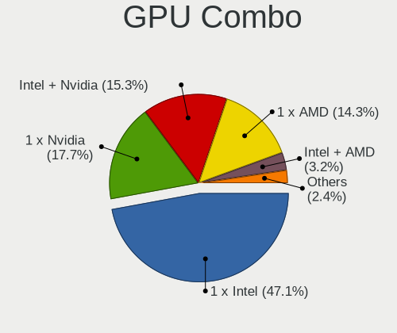

| Name                     | Computers | Percent |
|--------------------------|-----------|---------|
| 1 x Intel                | 331       | 45.34%  |
| 1 x Nvidia               | 135       | 18.49%  |
| Intel + Nvidia           | 115       | 15.75%  |
| 1 x AMD                  | 107       | 14.66%  |
| Intel + AMD              | 25        | 3.42%   |
| 2 x AMD                  | 5         | 0.68%   |
| AMD + Nvidia             | 3         | 0.41%   |
| Other                    | 2         | 0.27%   |
| 2 x Nvidia               | 2         | 0.27%   |
| 2 x AMD + 1 x Nvidia     | 1         | 0.14%   |
| Nvidia + Matrox          | 1         | 0.14%   |
| Intel + AMD + 1 x Nvidia | 1         | 0.14%   |
| 1 x ASPEED               | 1         | 0.14%   |
| AMD + Matrox             | 1         | 0.14%   |

GPU Driver
----------

Free vs proprietary

| Driver      | Computers | Percent |
|-------------|-----------|---------|
| Free        | 698       | 96.01%  |
| Proprietary | 26        | 3.58%   |
| Unknown     | 3         | 0.41%   |

GPU Memory
----------

Total video memory

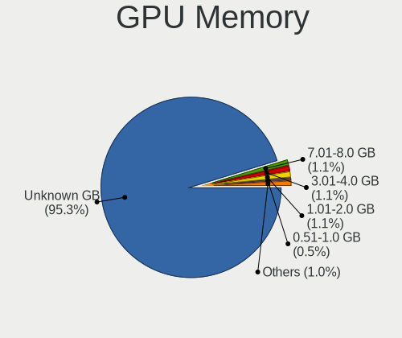

| Size in GB | Computers | Percent |
|------------|-----------|---------|
| Unknown    | 689       | 94.64%  |
| 3.01-4.0   | 10        | 1.37%   |
| 1.01-2.0   | 9         | 1.24%   |
| 7.01-8.0   | 7         | 0.96%   |
| 0.51-1.0   | 5         | 0.69%   |
| 5.01-6.0   | 4         | 0.55%   |
| 8.01-16.0  | 2         | 0.27%   |
| 2.01-3.0   | 1         | 0.14%   |
| 16.01-24.0 | 1         | 0.14%   |

Monitor
-------

Monitor Vendor
--------------

Monitor vendors

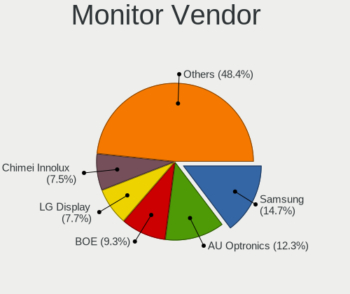

| Vendor                  | Computers | Percent |
|-------------------------|-----------|---------|
| Samsung Electronics     | 108       | 13.65%  |
| AU Optronics            | 96        | 12.14%  |
| BOE                     | 67        | 8.47%   |
| LG Display              | 66        | 8.34%   |
| Chimei Innolux          | 58        | 7.33%   |
| Dell                    | 53        | 6.7%    |
| Goldstar                | 44        | 5.56%   |
| Sharp                   | 31        | 3.92%   |
| Hewlett-Packard         | 25        | 3.16%   |
| AOC                     | 20        | 2.53%   |
| BenQ                    | 19        | 2.4%    |
| Apple                   | 19        | 2.4%    |
| Acer                    | 19        | 2.4%    |
| PANDA                   | 16        | 2.02%   |
| Philips                 | 14        | 1.77%   |
| Ancor Communications    | 14        | 1.77%   |
| ViewSonic               | 12        | 1.52%   |
| MSI                     | 7         | 0.88%   |
| Lenovo                  | 7         | 0.88%   |
| Chi Mei Optoelectronics | 7         | 0.88%   |
| Hitachi                 | 6         | 0.76%   |
| ASUSTek Computer        | 6         | 0.76%   |
| Sony                    | 5         | 0.63%   |
| Panasonic               | 5         | 0.63%   |
| Iiyama                  | 5         | 0.63%   |
| Vizio                   | 4         | 0.51%   |
| Toshiba                 | 4         | 0.51%   |
| LG Electronics          | 4         | 0.51%   |
| InfoVision              | 4         | 0.51%   |
| Unknown                 | 3         | 0.38%   |
| Medion                  | 3         | 0.38%   |
| Sceptre Tech            | 2         | 0.25%   |
| RTK                     | 2         | 0.25%   |
| NEC Computers           | 2         | 0.25%   |
| MiTAC                   | 2         | 0.25%   |
| Insignia                | 2         | 0.25%   |
| Fujitsu Siemens         | 2         | 0.25%   |
| CSO                     | 2         | 0.25%   |
| ZTR                     | 1         | 0.13%   |
| Yuraku                  | 1         | 0.13%   |
| Wincor Nixdorf          | 1         | 0.13%   |
| Westinghouse            | 1         | 0.13%   |
| Vestel Elektronik       | 1         | 0.13%   |
| TSL                     | 1         | 0.13%   |
| STD                     | 1         | 0.13%   |
| SDC                     | 1         | 0.13%   |
| Pixio                   | 1         | 0.13%   |
| PFL                     | 1         | 0.13%   |
| MStar                   | 1         | 0.13%   |
| Medion Akoya            | 1         | 0.13%   |
| JXC                     | 1         | 0.13%   |
| JRY                     | 1         | 0.13%   |
| ITE                     | 1         | 0.13%   |
| IBM                     | 1         | 0.13%   |
| HannStar                | 1         | 0.13%   |
| Gigabyte Technology     | 1         | 0.13%   |
| FHD                     | 1         | 0.13%   |
| Eizo                    | 1         | 0.13%   |
| Denver                  | 1         | 0.13%   |
| CYX                     | 1         | 0.13%   |

Monitor Model
-------------

Monitor models

| Model                                                                    | Computers | Percent |
|--------------------------------------------------------------------------|-----------|---------|
| AU Optronics LCD Monitor AUO38ED 1920x1080 344x193mm 15.5-inch           | 6         | 0.74%   |
| AU Optronics LCD Monitor AUO235C 1366x768 256x144mm 11.6-inch            | 6         | 0.74%   |
| AU Optronics LCD Monitor AUO21ED 1920x1080 344x194mm 15.5-inch           | 6         | 0.74%   |
| Panasonic VVX16T029D00 MEI96A2 2880x1620 344x193mm 15.5-inch             | 5         | 0.62%   |
| MSI Optix MAG27CQ MSI1462 2560x1440 597x336mm 27.0-inch                  | 5         | 0.62%   |
| Goldstar IPS FULLHD GSM5AB8 1920x1080 480x270mm 21.7-inch                | 5         | 0.62%   |
| LG Display LCD Monitor LGD046D 1920x1080 309x174mm 14.0-inch             | 4         | 0.49%   |
| Hitachi HDMI HEC0030 1920x1080 580x330mm 26.3-inch                       | 4         | 0.49%   |
| Chimei Innolux LCD Monitor CMN15F5 1920x1080 344x193mm 15.5-inch         | 4         | 0.49%   |
| BOE LCD Monitor BOE0747 1920x1080 344x194mm 15.5-inch                    | 4         | 0.49%   |
| Apple Color LCD APPA02E 2880x1800 331x207mm 15.4-inch                    | 4         | 0.49%   |
| Sharp LCD Monitor SHP1453 1920x1080 346x194mm 15.6-inch                  | 3         | 0.37%   |
| Samsung Electronics U28E510 SAM0D63 3840x2160 607x345mm 27.5-inch        | 3         | 0.37%   |
| Samsung Electronics LCD Monitor SDC4C48 1920x1080 344x194mm 15.5-inch    | 3         | 0.37%   |
| PANDA LCD Monitor NCP0035 1920x1080 309x174mm 14.0-inch                  | 3         | 0.37%   |
| LG Display LCD Monitor LGD0590 1920x1080 344x194mm 15.5-inch             | 3         | 0.37%   |
| LG Display LCD Monitor LGD033A 1366x768 344x194mm 15.5-inch              | 3         | 0.37%   |
| Goldstar ULTRAWIDE GSM59F2 2560x1080 798x334mm 34.1-inch                 | 3         | 0.37%   |
| Goldstar Ultra HD GSM5B09 3840x2160 600x340mm 27.2-inch                  | 3         | 0.37%   |
| Goldstar LG Ultra HD GSM5B08 3840x2160 600x340mm 27.2-inch               | 3         | 0.37%   |
| Goldstar FULL HD GSM5B55 1920x1080 480x270mm 21.7-inch                   | 3         | 0.37%   |
| Chimei Innolux LCD Monitor CMN14D6 1366x768 309x173mm 13.9-inch          | 3         | 0.37%   |
| Chimei Innolux LCD Monitor CMN14D4 1920x1080 309x173mm 13.9-inch         | 3         | 0.37%   |
| Chimei Innolux LCD Monitor CMN1132 1366x768 256x144mm 11.6-inch          | 3         | 0.37%   |
| Chi Mei Optoelectronics LCD Monitor CMO15A7 1366x768 344x193mm 15.5-inch | 3         | 0.37%   |
| BOE LCD Monitor BOE06A9 1920x1080 344x193mm 15.5-inch                    | 3         | 0.37%   |
| BOE LCD Monitor BOE0675 1366x768 344x194mm 15.5-inch                     | 3         | 0.37%   |
| AU Optronics LCD Monitor AUO70EC 1366x768 344x193mm 15.5-inch            | 3         | 0.37%   |
| AU Optronics LCD Monitor AUO45EC 1366x768 344x193mm 15.5-inch            | 3         | 0.37%   |
| AU Optronics LCD Monitor AUO2D3C 1366x768 309x173mm 13.9-inch            | 3         | 0.37%   |
| AU Optronics LCD Monitor AUO10EC 1366x768 344x193mm 15.5-inch            | 3         | 0.37%   |
| AU Optronics LCD Monitor AUO102D 1920x1080 293x165mm 13.2-inch           | 3         | 0.37%   |
| Apple Color LCD APPA00E 2880x1800 331x207mm 15.4-inch                    | 3         | 0.37%   |
| ViewSonic LCD Monitor VA2212 Series                                      | 2         | 0.25%   |
| Toshiba TV TSB0108 1920x540                                              | 2         | 0.25%   |
| Sharp LCD Monitor SHP14F9 1920x1200 288x180mm 13.4-inch                  | 2         | 0.25%   |
| Sharp LCD Monitor SHP14A8 3840x2400 288x180mm 13.4-inch                  | 2         | 0.25%   |
| Sharp LCD Monitor SHP148D 3840x2160 344x194mm 15.5-inch                  | 2         | 0.25%   |
| Sharp LCD Monitor SHP1476 3840x2160 346x194mm 15.6-inch                  | 2         | 0.25%   |
| Sharp LCD Monitor SHP144A 3200x1800 294x165mm 13.3-inch                  | 2         | 0.25%   |
| Sharp LCD Monitor SHP1449 1920x1080 294x165mm 13.3-inch                  | 2         | 0.25%   |
| Sharp LCD Monitor SHP143E 3840x2160 346x194mm 15.6-inch                  | 2         | 0.25%   |
| Sharp LCD Monitor SHP1420 1920x1080 294x165mm 13.3-inch                  | 2         | 0.25%   |
| Samsung Electronics LCD Monitor SDC354A 1366x768 344x194mm 15.5-inch     | 2         | 0.25%   |
| Samsung Electronics LCD Monitor SAM7017 3840x2160 950x540mm 43.0-inch    | 2         | 0.25%   |
| Samsung Electronics LCD Monitor SAM0F13 3840x2160 1872x1053mm 84.6-inch  | 2         | 0.25%   |
| Samsung Electronics LCD Monitor SAM0B5C 1920x1080 1212x682mm 54.8-inch   | 2         | 0.25%   |
| Samsung Electronics LCD Monitor SAM0A7E 1920x1080 1060x626mm 48.5-inch   | 2         | 0.25%   |
| Samsung Electronics C49RG9x SAM0F9C 3840x1080 1193x336mm 48.8-inch       | 2         | 0.25%   |
| Samsung Electronics C27F390 SAM0D32 1920x1080 598x336mm 27.0-inch        | 2         | 0.25%   |
| Samsung Electronics C24F390 SAM0D2C 1920x1080 521x293mm 23.5-inch        | 2         | 0.25%   |
| Philips PHL 278E8Q PHLC161 1920x1080 598x336mm 27.0-inch                 | 2         | 0.25%   |
| PANDA LM156LF1L03 NCP001C 1920x1080 344x194mm 15.5-inch                  | 2         | 0.25%   |
| PANDA LC133LF2L03 NCP0015 1920x1080 294x165mm 13.3-inch                  | 2         | 0.25%   |
| MiTAC TELEFUNKEN MTC0030 1920x1080 708x398mm 32.0-inch                   | 2         | 0.25%   |
| LG Display LCD Monitor LGD053F 1920x1080 340x190mm 15.3-inch             | 2         | 0.25%   |
| LG Display LCD Monitor LGD04A7 1920x1080 344x194mm 15.5-inch             | 2         | 0.25%   |
| LG Display LCD Monitor LGD0469 1920x1080 382x215mm 17.3-inch             | 2         | 0.25%   |
| LG Display LCD Monitor LGD0456 1366x768 344x194mm 15.5-inch              | 2         | 0.25%   |
| Lenovo LCD Monitor LEN40BA 1920x1080 344x194mm 15.5-inch                 | 2         | 0.25%   |

Monitor Resolution
------------------

Monitor screen resolution

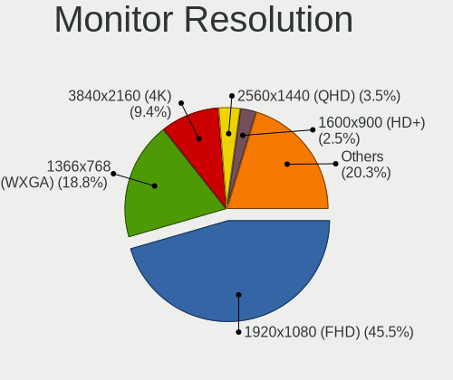

| Resolution         | Computers | Percent |
|--------------------|-----------|---------|
| 1920x1080 (FHD)    | 359       | 46.68%  |
| 1366x768 (WXGA)    | 143       | 18.6%   |
| 3840x2160 (4K)     | 74        | 9.62%   |
| 2560x1440 (QHD)    | 23        | 2.99%   |
| 1600x900 (HD+)     | 22        | 2.86%   |
| 1680x1050 (WSXGA+) | 16        | 2.08%   |
| 1920x1200 (WUXGA)  | 15        | 1.95%   |
| 3440x1440          | 13        | 1.69%   |
| 1280x1024 (SXGA)   | 13        | 1.69%   |
| 2560x1080          | 11        | 1.43%   |
| 1440x900 (WXGA+)   | 9         | 1.17%   |
| 2880x1800          | 8         | 1.04%   |
| 1360x768           | 8         | 1.04%   |
| 1280x800 (WXGA)    | 7         | 0.91%   |
| 3200x1800 (QHD+)   | 6         | 0.78%   |
| Unknown            | 5         | 0.65%   |
| 3840x1080          | 4         | 0.52%   |
| 2560x1600          | 4         | 0.52%   |
| 2160x1440          | 3         | 0.39%   |
| 1920x540           | 3         | 0.39%   |
| 1024x768 (XGA)     | 3         | 0.39%   |
| 5760x2160          | 2         | 0.26%   |
| 3840x2400          | 2         | 0.26%   |
| 3840x1600          | 2         | 0.26%   |
| 2736x1824          | 2         | 0.26%   |
| 4480x1440          | 1         | 0.13%   |
| 3840x1100          | 1         | 0.13%   |
| 3600x1080          | 1         | 0.13%   |
| 3360x1050          | 1         | 0.13%   |
| 2880x1920          | 1         | 0.13%   |
| 2256x1504          | 1         | 0.13%   |
| 2160x1350          | 1         | 0.13%   |
| 2048x1152          | 1         | 0.13%   |
| 1920x1280          | 1         | 0.13%   |
| 1800x1200          | 1         | 0.13%   |
| 1600x1200          | 1         | 0.13%   |
| 1280x720 (HD)      | 1         | 0.13%   |

Monitor Diagonal
----------------

Diagonal size in inches

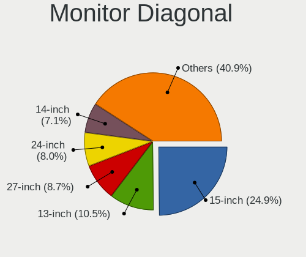

| Inches  | Computers | Percent |
|---------|-----------|---------|
| 15      | 201       | 25.48%  |
| 13      | 83        | 10.52%  |
| 27      | 68        | 8.62%   |
| 24      | 61        | 7.73%   |
| 23      | 48        | 6.08%   |
| 14      | 46        | 5.83%   |
| 21      | 44        | 5.58%   |
| 17      | 36        | 4.56%   |
| Unknown | 22        | 2.79%   |
| 11      | 21        | 2.66%   |
| 34      | 18        | 2.28%   |
| 12      | 16        | 2.03%   |
| 84      | 14        | 1.77%   |
| 22      | 14        | 1.77%   |
| 31      | 11        | 1.39%   |
| 19      | 11        | 1.39%   |
| 18      | 11        | 1.39%   |
| 20      | 10        | 1.27%   |
| 54      | 6         | 0.76%   |
| 72      | 5         | 0.63%   |
| 48      | 4         | 0.51%   |
| 37      | 4         | 0.51%   |
| 25      | 4         | 0.51%   |
| 52      | 3         | 0.38%   |
| 40      | 3         | 0.38%   |
| 35      | 3         | 0.38%   |
| 32      | 3         | 0.38%   |
| 26      | 3         | 0.38%   |
| 10      | 3         | 0.38%   |
| 49      | 2         | 0.25%   |
| 29      | 2         | 0.25%   |
| 16      | 2         | 0.25%   |
| 65      | 1         | 0.13%   |
| 55      | 1         | 0.13%   |
| 50      | 1         | 0.13%   |
| 46      | 1         | 0.13%   |
| 43      | 1         | 0.13%   |
| 42      | 1         | 0.13%   |
| 33      | 1         | 0.13%   |

Monitor Width
-------------

Physical width

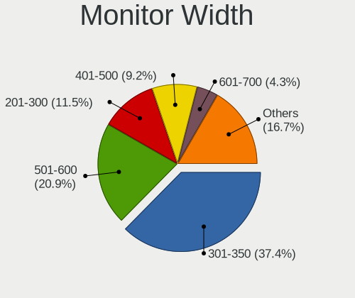

| Width in mm | Computers | Percent |
|-------------|-----------|---------|
| 301-350     | 283       | 36.47%  |
| 501-600     | 162       | 20.88%  |
| 201-300     | 92        | 11.86%  |
| 401-500     | 82        | 10.57%  |
| 351-400     | 37        | 4.77%   |
| 601-700     | 26        | 3.35%   |
| 701-800     | 22        | 2.84%   |
| Unknown     | 22        | 2.84%   |
| 1501-2000   | 19        | 2.45%   |
| 1001-1500   | 19        | 2.45%   |
| 801-900     | 10        | 1.29%   |
| 901-1000    | 2         | 0.26%   |

Aspect Ratio
------------

Proportional relationship between the width and the height

| Ratio   | Computers | Percent |
|---------|-----------|---------|
| 16/9    | 589       | 80.57%  |
| 16/10   | 65        | 8.89%   |
| 21/9    | 25        | 3.42%   |
| Unknown | 18        | 2.46%   |
| 5/4     | 13        | 1.78%   |
| 3/2     | 8         | 1.09%   |
| 4/3     | 6         | 0.82%   |
| 32/9    | 4         | 0.55%   |
| 3.40    | 1         | 0.14%   |
| 1.96    | 1         | 0.14%   |
| 1.00    | 1         | 0.14%   |

Monitor Area
------------

Area in inch

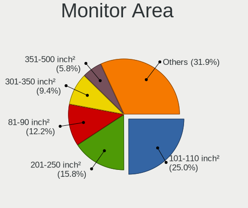

| Area in inch | Computers | Percent |
|----------------|-----------|---------|
| 101-110        | 201       | 25.7%   |
| 201-250        | 135       | 17.26%  |
| 81-90          | 83        | 10.61%  |
| 301-350        | 71        | 9.08%   |
| 71-80          | 46        | 5.88%   |
| 351-500        | 36        | 4.6%    |
| More than 1000 | 32        | 4.09%   |
| 151-200        | 32        | 4.09%   |
| 121-130        | 28        | 3.58%   |
| 51-60          | 22        | 2.81%   |
| Unknown        | 22        | 2.81%   |
| 251-300        | 21        | 2.69%   |
| 141-150        | 18        | 2.3%    |
| 61-70          | 15        | 1.92%   |
| 501-1000       | 15        | 1.92%   |
| 41-50          | 3         | 0.38%   |
| 111-120        | 2         | 0.26%   |

Pixel Density
-------------

Pixels per inch

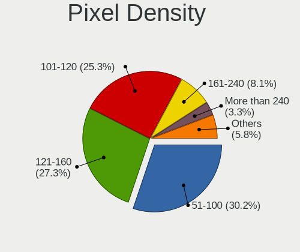

| Density       | Computers | Percent |
|---------------|-----------|---------|
| 51-100        | 222       | 29.06%  |
| 121-160       | 204       | 26.7%   |
| 101-120       | 200       | 26.18%  |
| 161-240       | 64        | 8.38%   |
| More than 240 | 29        | 3.8%    |
| 1-50          | 23        | 3.01%   |
| Unknown       | 22        | 2.88%   |

Multiple Monitors
-----------------

Total monitors connected

| Total | Computers | Percent |
|-------|-----------|---------|
| 1     | 629       | 86.16%  |
| 2     | 88        | 12.05%  |
| 3     | 8         | 1.1%    |
| 0     | 5         | 0.68%   |

Network
-------

Net Controller Vendor
---------------------

Controller vendors

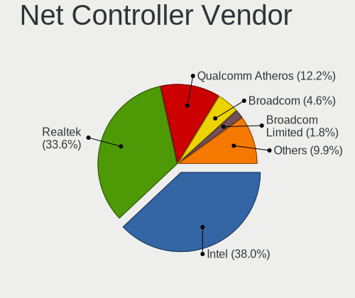

| Vendor                            | Computers | Percent |
|-----------------------------------|-----------|---------|
| Intel                             | 387       | 36.79%  |
| Realtek Semiconductor             | 355       | 33.75%  |
| Qualcomm Atheros                  | 139       | 13.21%  |
| Broadcom                          | 49        | 4.66%   |
| Broadcom Limited                  | 17        | 1.62%   |
| Ralink Technology                 | 13        | 1.24%   |
| Aquantia                          | 9         | 0.86%   |
| TP-Link                           | 7         | 0.67%   |
| Ralink                            | 7         | 0.67%   |
| Microsoft                         | 7         | 0.67%   |
| Marvell Technology Group          | 6         | 0.57%   |
| Dell                              | 5         | 0.48%   |
| ASUSTek Computer                  | 5         | 0.48%   |
| ASIX Electronics                  | 4         | 0.38%   |
| Xiaomi                            | 3         | 0.29%   |
| Samsung Electronics               | 3         | 0.29%   |
| Qualcomm Atheros Communications   | 3         | 0.29%   |
| Motorola PCS                      | 3         | 0.29%   |
| Huawei Technologies               | 3         | 0.29%   |
| Hewlett-Packard                   | 3         | 0.29%   |
| DisplayLink                       | 3         | 0.29%   |
| MediaTek                          | 2         | 0.19%   |
| HMD Global                        | 2         | 0.19%   |
| Edimax Technology                 | 2         | 0.19%   |
| Apple                             | 2         | 0.19%   |
| Sierra Wireless                   | 1         | 0.1%    |
| QinHeng Electronics               | 1         | 0.1%    |
| Nordic Semiconductor ASA          | 1         | 0.1%    |
| Microchip Technology              | 1         | 0.1%    |
| Micro Star International          | 1         | 0.1%    |
| Leaflabs                          | 1         | 0.1%    |
| JMicron Technology                | 1         | 0.1%    |
| ICS Advent                        | 1         | 0.1%    |
| Ericsson Business Mobile Networks | 1         | 0.1%    |
| Digital Equipment                 | 1         | 0.1%    |
| D-Link System                     | 1         | 0.1%    |
| D-Link                            | 1         | 0.1%    |
| AVM                               | 1         | 0.1%    |

Net Controller Model
--------------------

Controller models

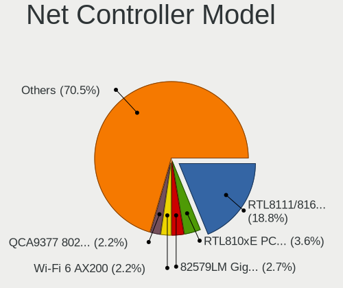

| Model                                                             | Computers | Percent |
|-------------------------------------------------------------------|-----------|---------|
| Realtek RTL8111/8168/8411 PCI Express Gigabit Ethernet Controller | 241       | 19.25%  |
| Realtek RTL810xE PCI Express Fast Ethernet controller             | 45        | 3.59%   |
| Intel 82579LM Gigabit Network Connection (Lewisville)             | 34        | 2.72%   |
| Intel Wi-Fi 6 AX200                                               | 30        | 2.4%    |
| Qualcomm Atheros QCA9377 802.11ac Wireless Network Adapter        | 28        | 2.24%   |
| Qualcomm Atheros QCA6174 802.11ac Wireless Network Adapter        | 27        | 2.16%   |
| Intel Wireless 8265 / 8275                                        | 24        | 1.92%   |
| Intel Wireless 3165                                               | 22        | 1.76%   |
| Intel I211 Gigabit Network Connection                             | 22        | 1.76%   |
| Intel Cannon Lake PCH CNVi WiFi                                   | 22        | 1.76%   |
| Qualcomm Atheros QCA9565 / AR9565 Wireless Network Adapter        | 20        | 1.6%    |
| Realtek RTL8821CE 802.11ac PCIe Wireless Network Adapter          | 18        | 1.44%   |
| Intel Cannon Point-LP CNVi [Wireless-AC]                          | 18        | 1.44%   |
| Realtek RTL8153 Gigabit Ethernet Adapter                          | 17        | 1.36%   |
| Intel Wireless 8260                                               | 17        | 1.36%   |
| Intel Wireless 7265                                               | 17        | 1.36%   |
| Intel Ethernet Connection (2) I219-V                              | 17        | 1.36%   |
| Qualcomm Atheros AR9485 Wireless Network Adapter                  | 16        | 1.28%   |
| Intel Wireless 7260                                               | 16        | 1.28%   |
| Intel Ethernet Connection I217-LM                                 | 16        | 1.28%   |
| Intel Comet Lake PCH-LP CNVi WiFi                                 | 15        | 1.2%    |
| Realtek RTL8822BE 802.11a/b/g/n/ac WiFi adapter                   | 14        | 1.12%   |
| Intel Ethernet Controller I225-V                                  | 13        | 1.04%   |
| Intel Ethernet Connection (7) I219-V                              | 13        | 1.04%   |
| Broadcom BCM43142 802.11b/g/n                                     | 12        | 0.96%   |
| Realtek RTL8125 2.5GbE Controller                                 | 11        | 0.88%   |
| Qualcomm Atheros AR9462 Wireless Network Adapter                  | 11        | 0.88%   |
| Intel Gemini Lake PCH CNVi WiFi                                   | 11        | 0.88%   |
| Intel Ethernet Connection (6) I219-V                              | 11        | 0.88%   |
| Intel Centrino Advanced-N 6205 [Taylor Peak]                      | 11        | 0.88%   |
| Realtek RTL8723BE PCIe Wireless Network Adapter                   | 10        | 0.8%    |
| Intel Dual Band Wireless-AC 3168NGW [Stone Peak]                  | 10        | 0.8%    |
| Intel Ethernet Connection (2) I219-LM                             | 9         | 0.72%   |
| Intel Centrino Wireless-N 2230                                    | 9         | 0.72%   |
| Aquantia AQC107 NBase-T/IEEE 802.3bz Ethernet Controller [AQtion] | 9         | 0.72%   |
| Qualcomm Atheros Killer E220x Gigabit Ethernet Controller         | 8         | 0.64%   |
| Intel Wireless 3160                                               | 8         | 0.64%   |
| Intel Wi-Fi 6 AX201                                               | 8         | 0.64%   |
| Intel Dual Band Wireless-AC 3165 Plus Bluetooth                   | 8         | 0.64%   |
| Intel Comet Lake PCH CNVi WiFi                                    | 8         | 0.64%   |
| Broadcom NetXtreme BCM57765 Gigabit Ethernet PCIe                 | 8         | 0.64%   |
| Qualcomm Atheros Killer E2400 Gigabit Ethernet Controller         | 7         | 0.56%   |
| Intel I210 Gigabit Network Connection                             | 7         | 0.56%   |
| Broadcom BCM4331 802.11a/b/g/n                                    | 7         | 0.56%   |
| Realtek RTL8822CE 802.11ac PCIe Wireless Network Adapter          | 6         | 0.48%   |
| Qualcomm Atheros AR9287 Wireless Network Adapter (PCI-Express)    | 6         | 0.48%   |
| Qualcomm Atheros AR8151 v2.0 Gigabit Ethernet                     | 6         | 0.48%   |
| Intel Wireless-AC 9260                                            | 6         | 0.48%   |
| Intel Wi-Fi 6 AX210/AX211/AX411 160MHz                            | 6         | 0.48%   |
| Intel Centrino Advanced-N 6235                                    | 6         | 0.48%   |
| Intel 82577LM Gigabit Network Connection                          | 6         | 0.48%   |
| Broadcom BCM43602 802.11ac Wireless LAN SoC                       | 6         | 0.48%   |
| Ralink MT7601U Wireless Adapter                                   | 5         | 0.4%    |
| Marvell Group 88W8897 [AVASTAR] 802.11ac Wireless                 | 5         | 0.4%    |
| Intel Ice Lake-LP PCH CNVi WiFi                                   | 5         | 0.4%    |
| Intel Ethernet Connection I218-LM                                 | 5         | 0.4%    |
| Intel Ethernet Connection I217-V                                  | 5         | 0.4%    |
| Intel Ethernet Connection (3) I218-LM                             | 5         | 0.4%    |
| Intel 82579V Gigabit Network Connection                           | 5         | 0.4%    |
| Broadcom NetXtreme BCM57786 Gigabit Ethernet PCIe                 | 5         | 0.4%    |

Wireless Vendor
---------------

Wireless vendors

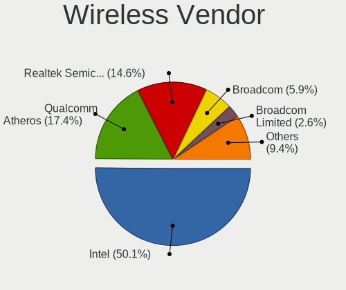

| Vendor                          | Computers | Percent |
|---------------------------------|-----------|---------|
| Intel                           | 292       | 48.5%   |
| Qualcomm Atheros                | 115       | 19.1%   |
| Realtek Semiconductor           | 86        | 14.29%  |
| Broadcom                        | 37        | 6.15%   |
| Broadcom Limited                | 15        | 2.49%   |
| Ralink Technology               | 13        | 2.16%   |
| Ralink                          | 7         | 1.16%   |
| TP-Link                         | 6         | 1%      |
| Microsoft                       | 5         | 0.83%   |
| Marvell Technology Group        | 5         | 0.83%   |
| Dell                            | 5         | 0.83%   |
| ASUSTek Computer                | 5         | 0.83%   |
| Qualcomm Atheros Communications | 3         | 0.5%    |
| Edimax Technology               | 2         | 0.33%   |
| Sierra Wireless                 | 1         | 0.17%   |
| Micro Star International        | 1         | 0.17%   |
| MEDIATEK                        | 1         | 0.17%   |
| D-Link System                   | 1         | 0.17%   |
| D-Link                          | 1         | 0.17%   |
| AVM                             | 1         | 0.17%   |

Wireless Model
--------------

Wireless models

| Model                                                          | Computers | Percent |
|----------------------------------------------------------------|-----------|---------|
| Intel Wi-Fi 6 AX200                                            | 30        | 4.94%   |
| Qualcomm Atheros QCA9377 802.11ac Wireless Network Adapter     | 28        | 4.61%   |
| Qualcomm Atheros QCA6174 802.11ac Wireless Network Adapter     | 27        | 4.45%   |
| Intel Wireless 8265 / 8275                                     | 24        | 3.95%   |
| Intel Wireless 3165                                            | 22        | 3.62%   |
| Intel Cannon Lake PCH CNVi WiFi                                | 22        | 3.62%   |
| Qualcomm Atheros QCA9565 / AR9565 Wireless Network Adapter     | 20        | 3.29%   |
| Realtek RTL8821CE 802.11ac PCIe Wireless Network Adapter       | 18        | 2.97%   |
| Intel Cannon Point-LP CNVi [Wireless-AC]                       | 18        | 2.97%   |
| Intel Wireless 8260                                            | 17        | 2.8%    |
| Intel Wireless 7265                                            | 17        | 2.8%    |
| Qualcomm Atheros AR9485 Wireless Network Adapter               | 16        | 2.64%   |
| Intel Wireless 7260                                            | 16        | 2.64%   |
| Intel Comet Lake PCH-LP CNVi WiFi                              | 15        | 2.47%   |
| Realtek RTL8822BE 802.11a/b/g/n/ac WiFi adapter                | 14        | 2.31%   |
| Broadcom BCM43142 802.11b/g/n                                  | 12        | 1.98%   |
| Qualcomm Atheros AR9462 Wireless Network Adapter               | 11        | 1.81%   |
| Intel Gemini Lake PCH CNVi WiFi                                | 11        | 1.81%   |
| Intel Centrino Advanced-N 6205 [Taylor Peak]                   | 11        | 1.81%   |
| Realtek RTL8723BE PCIe Wireless Network Adapter                | 10        | 1.65%   |
| Intel Dual Band Wireless-AC 3168NGW [Stone Peak]               | 10        | 1.65%   |
| Intel Centrino Wireless-N 2230                                 | 9         | 1.48%   |
| Intel Wireless 3160                                            | 8         | 1.32%   |
| Intel Wi-Fi 6 AX201                                            | 8         | 1.32%   |
| Intel Dual Band Wireless-AC 3165 Plus Bluetooth                | 8         | 1.32%   |
| Intel Comet Lake PCH CNVi WiFi                                 | 8         | 1.32%   |
| Broadcom BCM4331 802.11a/b/g/n                                 | 7         | 1.15%   |
| Realtek RTL8822CE 802.11ac PCIe Wireless Network Adapter       | 6         | 0.99%   |
| Qualcomm Atheros AR9287 Wireless Network Adapter (PCI-Express) | 6         | 0.99%   |
| Intel Wireless-AC 9260                                         | 6         | 0.99%   |
| Intel Wi-Fi 6 AX210/AX211/AX411 160MHz                         | 6         | 0.99%   |
| Intel Centrino Advanced-N 6235                                 | 6         | 0.99%   |
| Broadcom BCM43602 802.11ac Wireless LAN SoC                    | 6         | 0.99%   |
| Ralink MT7601U Wireless Adapter                                | 5         | 0.82%   |
| Marvell Group 88W8897 [AVASTAR] 802.11ac Wireless              | 5         | 0.82%   |
| Intel Ice Lake-LP PCH CNVi WiFi                                | 5         | 0.82%   |
| Realtek RTL8723BU 802.11b/g/n WLAN Adapter                     | 4         | 0.66%   |
| Intel Centrino Ultimate-N 6300                                 | 4         | 0.66%   |
| Broadcom Limited BCM4331 802.11a/b/g/n                         | 4         | 0.66%   |
| Broadcom BCM43224 802.11a/b/g/n                                | 4         | 0.66%   |
| Realtek RTL8821AE 802.11ac PCIe Wireless Network Adapter       | 3         | 0.49%   |
| Realtek RTL8811AU 802.11a/b/g/n/ac WLAN Adapter                | 3         | 0.49%   |
| Realtek RTL8723AE PCIe Wireless Network Adapter                | 3         | 0.49%   |
| Realtek RTL8188EE Wireless Network Adapter                     | 3         | 0.49%   |
| Realtek RTL8188CE 802.11b/g/n WiFi Adapter                     | 3         | 0.49%   |
| Ralink RT5372 Wireless Adapter                                 | 3         | 0.49%   |
| Qualcomm Atheros AR9271 802.11n                                | 3         | 0.49%   |
| Dell DW5811e Snapdragon X7 LTE                           | 3         | 0.49%   |
| Broadcom Limited BCM43228 802.11a/b/g/n                        | 3         | 0.49%   |
| Broadcom BCM43228 802.11a/b/g/n                                | 3         | 0.49%   |
| TP-Link TL-WN722N v2/v3 [Realtek RTL8188EUS]                   | 2         | 0.33%   |
| Realtek RTL8723DE Wireless Network Adapter                     | 2         | 0.33%   |
| Realtek RTL8192EU 802.11b/g/n WLAN Adapter                     | 2         | 0.33%   |
| Realtek RTL8188EUS 802.11n Wireless Network Adapter            | 2         | 0.33%   |
| Realtek RTL8188CUS 802.11n WLAN Adapter                        | 2         | 0.33%   |
| Realtek 802.11n WLAN Adapter                                   | 2         | 0.33%   |
| Realtek 802.11ac NIC                                           | 2         | 0.33%   |
| Ralink RT5370 Wireless Adapter                                 | 2         | 0.33%   |
| Ralink RT2870/RT3070 Wireless Adapter                          | 2         | 0.33%   |
| Ralink RT5392 PCIe Wireless Network Adapter                    | 2         | 0.33%   |

Ethernet Vendor
---------------

Ethernet vendors

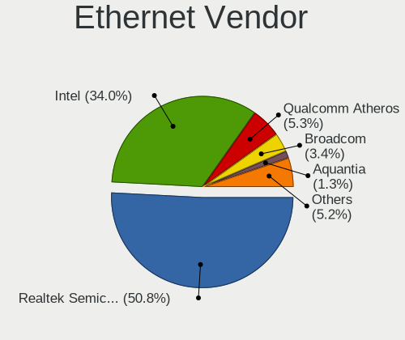

| Vendor                   | Computers | Percent |
|--------------------------|-----------|---------|
| Realtek Semiconductor    | 314       | 50.89%  |
| Intel                    | 206       | 33.39%  |
| Qualcomm Atheros         | 38        | 6.16%   |
| Broadcom                 | 21        | 3.4%    |
| Aquantia                 | 9         | 1.46%   |
| ASIX Electronics         | 4         | 0.65%   |
| Xiaomi                   | 3         | 0.49%   |
| Samsung Electronics      | 3         | 0.49%   |
| DisplayLink              | 3         | 0.49%   |
| Microsoft                | 2         | 0.32%   |
| HMD Global               | 2         | 0.32%   |
| Broadcom Limited         | 2         | 0.32%   |
| Apple                    | 2         | 0.32%   |
| TP-Link                  | 1         | 0.16%   |
| QinHeng Electronics      | 1         | 0.16%   |
| MediaTek                 | 1         | 0.16%   |
| Marvell Technology Group | 1         | 0.16%   |
| JMicron Technology       | 1         | 0.16%   |
| ICS Advent               | 1         | 0.16%   |
| Huawei Technologies      | 1         | 0.16%   |
| Hewlett-Packard          | 1         | 0.16%   |

Ethernet Model
--------------

Ethernet models

| Model                                                                          | Computers | Percent |
|--------------------------------------------------------------------------------|-----------|---------|
| Realtek RTL8111/8168/8411 PCI Express Gigabit Ethernet Controller              | 241       | 38.07%  |
| Realtek RTL810xE PCI Express Fast Ethernet controller                          | 45        | 7.11%   |
| Intel 82579LM Gigabit Network Connection (Lewisville)                          | 34        | 5.37%   |
| Intel I211 Gigabit Network Connection                                          | 22        | 3.48%   |
| Realtek RTL8153 Gigabit Ethernet Adapter                                       | 17        | 2.69%   |
| Intel Ethernet Connection (2) I219-V                                           | 17        | 2.69%   |
| Intel Ethernet Connection I217-LM                                              | 16        | 2.53%   |
| Intel Ethernet Controller I225-V                                               | 13        | 2.05%   |
| Intel Ethernet Connection (7) I219-V                                           | 13        | 2.05%   |
| Realtek RTL8125 2.5GbE Controller                                              | 11        | 1.74%   |
| Intel Ethernet Connection (6) I219-V                                           | 11        | 1.74%   |
| Intel Ethernet Connection (2) I219-LM                                          | 9         | 1.42%   |
| Aquantia AQC107 NBase-T/IEEE 802.3bz Ethernet Controller [AQtion]              | 9         | 1.42%   |
| Qualcomm Atheros Killer E220x Gigabit Ethernet Controller                      | 8         | 1.26%   |
| Broadcom NetXtreme BCM57765 Gigabit Ethernet PCIe                              | 8         | 1.26%   |
| Qualcomm Atheros Killer E2400 Gigabit Ethernet Controller                      | 7         | 1.11%   |
| Intel I210 Gigabit Network Connection                                          | 7         | 1.11%   |
| Qualcomm Atheros AR8151 v2.0 Gigabit Ethernet                                  | 6         | 0.95%   |
| Intel 82577LM Gigabit Network Connection                                       | 6         | 0.95%   |
| Intel Ethernet Connection I218-LM                                              | 5         | 0.79%   |
| Intel Ethernet Connection I217-V                                               | 5         | 0.79%   |
| Intel Ethernet Connection (3) I218-LM                                          | 5         | 0.79%   |
| Intel 82579V Gigabit Network Connection                                        | 5         | 0.79%   |
| Broadcom NetXtreme BCM57786 Gigabit Ethernet PCIe                              | 5         | 0.79%   |
| Qualcomm Atheros Killer E2500 Gigabit Ethernet Controller                      | 4         | 0.63%   |
| Qualcomm Atheros AR8161 Gigabit Ethernet                                       | 4         | 0.63%   |
| Intel Ethernet Connection (4) I219-V                                           | 4         | 0.63%   |
| Intel Ethernet Connection (10) I219-V                                          | 4         | 0.63%   |
| Broadcom NetXtreme BCM57762 Gigabit Ethernet PCIe                              | 4         | 0.63%   |
| Xiaomi Mi/Redmi series (RNDIS)                                                 | 3         | 0.47%   |
| Samsung Galaxy series, misc. (tethering mode)                                  | 3         | 0.47%   |
| Qualcomm Atheros QCA8172 Fast Ethernet                                         | 3         | 0.47%   |
| Qualcomm Atheros QCA8171 Gigabit Ethernet                                      | 3         | 0.47%   |
| Qualcomm Atheros AR8162 Fast Ethernet                                          | 3         | 0.47%   |
| Intel Ethernet Connection I219-V                                               | 3         | 0.47%   |
| Intel Ethernet Connection I219-LM                                              | 3         | 0.47%   |
| Intel Ethernet Connection (2) I218-V                                           | 3         | 0.47%   |
| Intel Ethernet Connection (14) I219-V                                          | 3         | 0.47%   |
| Intel 82574L Gigabit Network Connection                                        | 3         | 0.47%   |
| Realtek RTL8152 Fast Ethernet Adapter                                          | 2         | 0.32%   |
| Microsoft RTL8153 GigE [Surface Ethernet Adapter]                              | 2         | 0.32%   |
| Intel I350 Gigabit Network Connection                                          | 2         | 0.32%   |
| Intel Ethernet Controller I225-LM                                              | 2         | 0.32%   |
| Intel Ethernet Connection (7) I219-LM                                          | 2         | 0.32%   |
| Intel Ethernet Connection (4) I219-LM                                          | 2         | 0.32%   |
| Intel Ethernet Connection (3) I218-V                                           | 2         | 0.32%   |
| Intel Ethernet Connection (17) I219-V                                          | 2         | 0.32%   |
| Intel 82576 Gigabit Network Connection                                         | 2         | 0.32%   |
| Intel 82571EB/82571GB Gigabit Ethernet Controller D0/D1 (copper applications)  | 2         | 0.32%   |
| HMD Global Nokia 8.1                                                           | 2         | 0.32%   |
| DisplayLink USB3.0 5K Graphic Docking                                          | 2         | 0.32%   |
| Broadcom Limited NetLink BCM57780 Gigabit Ethernet PCIe                        | 2         | 0.32%   |
| TP-Link USB 10/100/1000 LAN                                                    | 1         | 0.16%   |
| QinHeng CH9200 USB Ethernet Adapter                                            | 1         | 0.16%   |
| MediaTek Vodafone Smart N10                                                    | 1         | 0.16%   |
| Marvell Group Yukon Optima 88E8059 [PCIe Gigabit Ethernet Controller with AVB] | 1         | 0.16%   |
| JMicron JMC250 PCI Express Gigabit Ethernet Controller                         | 1         | 0.16%   |
| Intel Ethernet Controller 10-Gigabit X540-AT2                                  | 1         | 0.16%   |
| Intel Ethernet Connection X722 for 1GbE                                        | 1         | 0.16%   |
| Intel Ethernet Connection (5) I219-LM                                          | 1         | 0.16%   |

Net Controller Kind
-------------------

Ethernet, WiFi or modem

| Kind     | Computers | Percent |
|----------|-----------|---------|
| Ethernet | 587       | 50.52%  |
| WiFi     | 563       | 48.45%  |
| Modem    | 8         | 0.69%   |
| Unknown  | 4         | 0.34%   |

Used Controller
---------------

Currently used network controller

| Kind     | Computers | Percent |
|----------|-----------|---------|
| WiFi     | 412       | 55.3%   |
| Ethernet | 333       | 44.7%   |

NICs
----

Total network controllers on board

| Total | Computers | Percent |
|-------|-----------|---------|
| 2     | 377       | 51.79%  |
| 1     | 300       | 41.21%  |
| 3     | 26        | 3.57%   |
| 0     | 19        | 2.61%   |
| 4     | 4         | 0.55%   |
| 5     | 2         | 0.27%   |

IPv6
----

IPv6 vs IPv4

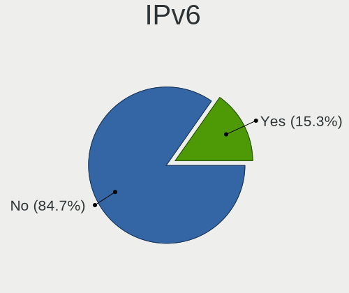

| Used | Computers | Percent |
|------|-----------|---------|
| No   | 645       | 88.36%  |
| Yes  | 85        | 11.64%  |

Bluetooth
---------

Bluetooth Vendor
----------------

Controller vendors

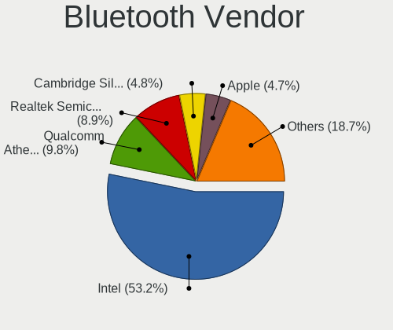

| Vendor                          | Computers | Percent |
|---------------------------------|-----------|---------|
| Intel                           | 261       | 52.83%  |
| Qualcomm Atheros Communications | 54        | 10.93%  |
| Realtek Semiconductor           | 41        | 8.3%    |
| Cambridge Silicon Radio         | 26        | 5.26%   |
| Apple                           | 21        | 4.25%   |
| IMC Networks                    | 17        | 3.44%   |
| Broadcom                        | 17        | 3.44%   |
| Lite-On Technology              | 14        | 2.83%   |
| Foxconn / Hon Hai               | 13        | 2.63%   |
| Marvell Semiconductor           | 6         | 1.21%   |
| ASUSTek Computer                | 5         | 1.01%   |
| Realtek                         | 3         | 0.61%   |
| Hewlett-Packard                 | 3         | 0.61%   |
| Foxconn International           | 3         | 0.61%   |
| Toshiba                         | 2         | 0.4%    |
| Ralink                          | 2         | 0.4%    |
| Micro Star International        | 1         | 0.2%    |
| HTC (High Tech Computer)        | 1         | 0.2%    |
| Dell                            | 1         | 0.2%    |
| Creative Technology             | 1         | 0.2%    |
| Belkin Components               | 1         | 0.2%    |
| Alps Electric                   | 1         | 0.2%    |

Bluetooth Model
---------------

Controller models

| Model                                                                               | Computers | Percent |
|-------------------------------------------------------------------------------------|-----------|---------|
| Intel Bluetooth wireless interface                                                  | 105       | 21.26%  |
| Intel Bluetooth 9460/9560 Jefferson Peak (JfP)                                      | 57        | 11.54%  |
| Intel AX201 Bluetooth                                                               | 33        | 6.68%   |
| Intel AX200 Bluetooth                                                               | 31        | 6.28%   |
| Qualcomm Atheros  Bluetooth Device                                                  | 30        | 6.07%   |
| Cambridge Silicon Radio Bluetooth Dongle (HCI mode)                                 | 26        | 5.26%   |
| Realtek  Bluetooth 4.2 Adapter                                                      | 18        | 3.64%   |
| Realtek Bluetooth Radio                                                             | 16        | 3.24%   |
| Apple Bluetooth Host Controller                                                     | 14        | 2.83%   |
| Qualcomm Atheros QCA61x4 Bluetooth 4.0                                              | 12        | 2.43%   |
| Intel Centrino Bluetooth Wireless Transceiver                                       | 12        | 2.43%   |
| Intel Wireless-AC 3168 Bluetooth                                                    | 9         | 1.82%   |
| Lite-On Qualcomm Atheros QCA9377 Bluetooth                                          | 8         | 1.62%   |
| IMC Networks Bluetooth Radio                                                        | 8         | 1.62%   |
| Qualcomm Atheros AR3012 Bluetooth 4.0                                               | 7         | 1.42%   |
| IMC Networks Bluetooth Device                                                       | 7         | 1.42%   |
| Foxconn / Hon Hai Bluetooth Device                                                  | 7         | 1.42%   |
| Intel AX210 Bluetooth                                                               | 6         | 1.21%   |
| Intel Wireless-AC 9260 Bluetooth Adapter                                            | 5         | 1.01%   |
| Apple Bluetooth USB Host Controller                                                 | 5         | 1.01%   |
| Realtek 802.11ac WLAN Adapter                                                       | 4         | 0.81%   |
| Marvell Bluetooth and Wireless LAN Composite                                        | 4         | 0.81%   |
| Broadcom BCM43142 Bluetooth 4.0                                                     | 4         | 0.81%   |
| Realtek Bluetooth Radio                                                             | 3         | 0.61%   |
| Intel Centrino Advanced-N 6230 Bluetooth adapter                                    | 3         | 0.61%   |
| HP Broadcom 2070 Bluetooth Combo                                                    | 3         | 0.61%   |
| Foxconn International BCM43142A0 Bluetooth module                                   | 3         | 0.61%   |
| Broadcom BCM20702A0 Bluetooth 4.0                                                   | 3         | 0.61%   |
| Broadcom BCM20702A0                                                                 | 3         | 0.61%   |
| Broadcom BCM2045B (BDC-2.1)                                                         | 3         | 0.61%   |
| Toshiba BCM43142A0                                                                  | 2         | 0.4%    |
| Realtek RTL8723B Bluetooth                                                          | 2         | 0.4%    |
| Ralink RT3290 Bluetooth                                                             | 2         | 0.4%    |
| Qualcomm Atheros Bluetooth USB Host Controller                                      | 2         | 0.4%    |
| Qualcomm Atheros AR3011 Bluetooth                                                   | 2         | 0.4%    |
| Marvell Bluetooth and Wireless LAN Composite Device                                 | 2         | 0.4%    |
| Lite-On Broadcom BCM43142A0 Bluetooth Device                                        | 2         | 0.4%    |
| Lite-On Bluetooth Device                                                            | 2         | 0.4%    |
| Lite-On Atheros AR3012 Bluetooth                                                    | 2         | 0.4%    |
| Foxconn / Hon Hai BCM20702A0                                                        | 2         | 0.4%    |
| ASUS Broadcom BCM20702A0 Bluetooth                                                  | 2         | 0.4%    |
| Apple Built-in Bluetooth 2.0+EDR HCI                                                | 2         | 0.4%    |
| Realtek RTL8822BE Bluetooth 4.2 Adapter                                             | 1         | 0.2%    |
| Qualcomm Atheros Bluetooth (AR3011)                                                 | 1         | 0.2%    |
| Micro Star International Bluetooth Device                                           | 1         | 0.2%    |
| IMC Networks Bluetooth USB Host Controller                                          | 1         | 0.2%    |
| IMC Networks Bluetooth                                                              | 1         | 0.2%    |
| HTC (High Tech Computer) Vive Hub Bluetooth 4.1 (Broadcom BCM920703)                | 1         | 0.2%    |
| Foxconn / Hon Hai Wireless_Device                                                   | 1         | 0.2%    |
| Foxconn / Hon Hai Foxconn T77H114 BCM2070 [Single-Chip Bluetooth 2.1 + EDR Adapter] | 1         | 0.2%    |
| Foxconn / Hon Hai Broadcom BCM20702 Bluetooth                                       | 1         | 0.2%    |
| Foxconn / Hon Hai BCM43142A0 broadcom bluetooth                                     | 1         | 0.2%    |
| Dell DW375 Bluetooth Module                                                         | 1         | 0.2%    |
| Creative Bluetooth Audio W2                                                         | 1         | 0.2%    |
| Broadcom HP Portable Bumble Bee                                                     | 1         | 0.2%    |
| Broadcom BCM43142A0 Bluetooth Device                                                | 1         | 0.2%    |
| Broadcom BCM2070 Bluetooth Device                                                   | 1         | 0.2%    |
| Broadcom BCM2035 Bluetooth dongle                                                   | 1         | 0.2%    |
| Belkin Components F8T012 Bluetooth Adapter                                          | 1         | 0.2%    |
| ASUS Qualcomm Bluetooth 4.1                                                         | 1         | 0.2%    |

Sound
-----

Sound Vendor
------------

Sound card vendors

| Vendor                               | Computers | Percent |
|--------------------------------------|-----------|---------|
| Intel                                | 590       | 58.42%  |
| Nvidia                               | 176       | 17.43%  |
| AMD                                  | 153       | 15.15%  |
| C-Media Electronics                  | 13        | 1.29%   |
| Logitech                             | 9         | 0.89%   |
| ASUSTek Computer                     | 7         | 0.69%   |
| Unknown                              | 4         | 0.4%    |
| SteelSeries ApS                      | 4         | 0.4%    |
| JMTek                                | 3         | 0.3%    |
| Creative Technology                  | 3         | 0.3%    |
| Creative Labs                        | 3         | 0.3%    |
| Corsair                              | 3         | 0.3%    |
| Thesycon Systemsoftware & Consulting | 2         | 0.2%    |
| Realtek Semiconductor                | 2         | 0.2%    |
| Plantronics                          | 2         | 0.2%    |
| Micro Star International             | 2         | 0.2%    |
| KORG                                 | 2         | 0.2%    |
| Generalplus Technology               | 2         | 0.2%    |
| Blue Microphones                     | 2         | 0.2%    |
| Yamaha                               | 1         | 0.1%    |
| VIA Technologies                     | 1         | 0.1%    |
| Turtle Beach                         | 1         | 0.1%    |
| Texas Instruments                    | 1         | 0.1%    |
| TEAC                                 | 1         | 0.1%    |
| Sennheiser Communications            | 1         | 0.1%    |
| Schiit Audio                         | 1         | 0.1%    |
| Samsung Electronics                  | 1         | 0.1%    |
| PreSonus Audio Electronics           | 1         | 0.1%    |
| MAG Technology                       | 1         | 0.1%    |
| Kingston Technology                  | 1         | 0.1%    |
| JBL                                  | 1         | 0.1%    |
| GYROCOM C&C                          | 1         | 0.1%    |
| Guillemot                            | 1         | 0.1%    |
| GN Netcom                            | 1         | 0.1%    |
| Giga-Byte Technology                 | 1         | 0.1%    |
| Focusrite-Novation                   | 1         | 0.1%    |
| Dell                                 | 1         | 0.1%    |
| Cooler Master                        | 1         | 0.1%    |
| Conexant Systems                     | 1         | 0.1%    |
| BY EDIFIER                           | 1         | 0.1%    |
| Bose                                 | 1         | 0.1%    |
| BEHRINGER International              | 1         | 0.1%    |
| Barco Display Systems                | 1         | 0.1%    |
| AudioQuest                           | 1         | 0.1%    |
| Audio-Technica                       | 1         | 0.1%    |
| Apple                                | 1         | 0.1%    |
| AKAI Professional M.I.               | 1         | 0.1%    |

Sound Model
-----------

Sound card models

| Model                                                                                             | Computers | Percent |
|---------------------------------------------------------------------------------------------------|-----------|---------|
| Intel 7 Series/C216 Chipset Family High Definition Audio Controller                               | 74        | 6.36%   |
| Intel Sunrise Point-LP HD Audio                                                                   | 73        | 6.28%   |
| Intel 8 Series/C220 Series Chipset High Definition Audio Controller                               | 45        | 3.87%   |
| Intel Cannon Lake PCH cAVS                                                                        | 42        | 3.61%   |
| Intel 6 Series/C200 Series Chipset Family High Definition Audio Controller                        | 40        | 3.44%   |
| Intel 100 Series/C230 Series Chipset Family HD Audio Controller                                   | 34        | 2.92%   |
| AMD Starship/Matisse HD Audio Controller                                                          | 32        | 2.75%   |
| AMD Family 17h/19h HD Audio Controller                                                            | 32        | 2.75%   |
| Intel Xeon E3-1200 v3/4th Gen Core Processor HD Audio Controller                                  | 28        | 2.41%   |
| Intel Haswell-ULT HD Audio Controller                                                             | 27        | 2.32%   |
| Intel 8 Series HD Audio Controller                                                                | 27        | 2.32%   |
| Intel Cannon Point-LP High Definition Audio Controller                                            | 25        | 2.15%   |
| Intel Broadwell-U Audio Controller                                                                | 25        | 2.15%   |
| Intel Celeron/Pentium Silver Processor High Definition Audio                                      | 23        | 1.98%   |
| AMD Raven/Raven2/Fenghuang HDMI/DP Audio Controller                                               | 23        | 1.98%   |
| Nvidia GP106 High Definition Audio Controller                                                     | 22        | 1.89%   |
| Intel Wildcat Point-LP High Definition Audio Controller                                           | 22        | 1.89%   |
| Intel 200 Series PCH HD Audio                                                                     | 22        | 1.89%   |
| Intel Atom Processor Z36xxx/Z37xxx Series High Definition Audio Controller                        | 21        | 1.81%   |
| Nvidia GP104 High Definition Audio Controller                                                     | 20        | 1.72%   |
| AMD Ellesmere HDMI Audio [Radeon RX 470/480 / 570/580/590]                                        | 20        | 1.72%   |
| Intel CM238 HD Audio Controller                                                                   | 19        | 1.63%   |
| Intel Comet Lake PCH-LP cAVS                                                                      | 18        | 1.55%   |
| Nvidia GP107GL High Definition Audio Controller                                                   | 17        | 1.46%   |
| Intel Celeron N3350/Pentium N4200/Atom E3900 Series Audio Cluster                                 | 17        | 1.46%   |
| AMD Family 17h (Models 00h-0fh) HD Audio Controller                                               | 16        | 1.38%   |
| AMD FCH Azalia Controller                                                                         | 15        | 1.29%   |
| Nvidia GM107 High Definition Audio Controller [GeForce 940MX]                                     | 11        | 0.95%   |
| Intel Tiger Lake-LP Smart Sound Technology Audio Controller                                       | 11        | 0.95%   |
| Intel Atom/Celeron/Pentium Processor x5-E8000/J3xxx/N3xxx Series High Definition Audio Controller | 11        | 0.95%   |
| Nvidia TU116 High Definition Audio Controller                                                     | 10        | 0.86%   |
| Nvidia TU106 High Definition Audio Controller                                                     | 10        | 0.86%   |
| Intel Comet Lake PCH cAVS                                                                         | 10        | 0.86%   |
| AMD Kabini HDMI/DP Audio                                                                          | 10        | 0.86%   |
| Nvidia GK208 HDMI/DP Audio Controller                                                             | 9         | 0.77%   |
| Nvidia GK107 HDMI Audio Controller                                                                | 9         | 0.77%   |
| Intel 9 Series Chipset Family HD Audio Controller                                                 | 8         | 0.69%   |
| AMD Navi 10 HDMI Audio                                                                            | 8         | 0.69%   |
| Nvidia GM204 High Definition Audio Controller                                                     | 7         | 0.6%    |
| Intel Tiger Lake-H HD Audio Controller                                                            | 7         | 0.6%    |
| Intel 5 Series/3400 Series Chipset High Definition Audio                                          | 7         | 0.6%    |
| AMD Turks HDMI Audio [Radeon HD 6500/6600 / 6700M Series]                                         | 7         | 0.6%    |
| AMD Renoir Radeon High Definition Audio Controller                                                | 7         | 0.6%    |
| AMD Oland/Hainan/Cape Verde/Pitcairn HDMI Audio [Radeon HD 7000 Series]                           | 7         | 0.6%    |
| Nvidia TU107 GeForce GTX 1650 High Definition Audio Controller                                    | 6         | 0.52%   |
| Nvidia GP108 High Definition Audio Controller                                                     | 6         | 0.52%   |
| Nvidia GK104 HDMI Audio Controller                                                                | 6         | 0.52%   |
| Intel Ice Lake-LP Smart Sound Technology Audio Controller                                         | 6         | 0.52%   |
| Intel C610/X99 series chipset HD Audio Controller                                                 | 6         | 0.52%   |
| Intel C600/X79 series chipset High Definition Audio Controller                                    | 6         | 0.52%   |
| AMD Trinity HDMI Audio Controller                                                                 | 6         | 0.52%   |
| AMD Family 15h (Models 60h-6fh) Audio Controller                                                  | 6         | 0.52%   |
| AMD Baffin HDMI/DP Audio [Radeon RX 550 640SP / RX 560/560X]                                      | 6         | 0.52%   |
| Nvidia GF108 High Definition Audio Controller                                                     | 5         | 0.43%   |
| Logitech G430 Surround Sound Gaming Headset                                                       | 5         | 0.43%   |
| Intel Alder Lake-S HD Audio Controller                                                            | 5         | 0.43%   |
| ASUSTek Computer USB Audio                                                                        | 5         | 0.43%   |
| AMD SBx00 Azalia (Intel HDA)                                                                      | 5         | 0.43%   |
| Unknown USB Audio                                                                                 | 4         | 0.34%   |
| Nvidia TU104 HD Audio Controller                                                                  | 4         | 0.34%   |

Memory
------

Memory Vendor
-------------

Memory module vendors

| Vendor              | Computers | Percent |
|---------------------|-----------|---------|
| SK Hynix            | 7         | 28%     |
| Unknown             | 4         | 16%     |
| Samsung Electronics | 4         | 16%     |
| Corsair             | 4         | 16%     |
| Micron Technology   | 2         | 8%      |
| Kingston            | 1         | 4%      |
| Goldkey             | 1         | 4%      |
| Crucial             | 1         | 4%      |
| A-DATA Technology   | 1         | 4%      |

Memory Model
------------

Memory module models

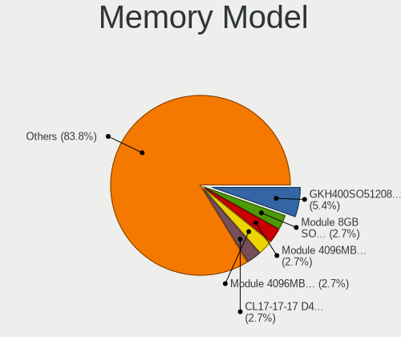

| Model                                                               | Computers | Percent |
|---------------------------------------------------------------------|-----------|---------|
| Unknown RAM Module 8GB SODIMM DDR4 3200MT/s                         | 1         | 4%      |
| Unknown RAM Module 4096MB SODIMM DDR4 2400MT/s                      | 1         | 4%      |
| Unknown RAM Module 4096MB SODIMM DDR3 1600MT/s                      | 1         | 4%      |
| Unknown RAM CL17-17-17 D4-2400 16384MB DIMM DDR4 2400MT/s           | 1         | 4%      |
| SK Hynix RAM HMT451S6MFR6A-PB 4GB SODIMM DDR3 1600MT/s              | 1         | 4%      |
| SK Hynix RAM HMT41GS6BFR8A-PB 8GB SODIMM DDR3 1600MT/s              | 1         | 4%      |
| SK Hynix RAM HMA82GS6AFR8N-UH 16384MB SODIMM DDR4 2667MT/s          | 1         | 4%      |
| SK Hynix RAM HMA81GS6DJR8N-XN 8GB SODIMM DDR4 3200MT/s              | 1         | 4%      |
| SK Hynix RAM HMA81GS6AFR8N-UH 8GB SODIMM DDR4 2667MT/s              | 1         | 4%      |
| SK Hynix RAM HMA81GS6AFR8N-UH 8192MB SODIMM DDR4 2400MT/s           | 1         | 4%      |
| SK Hynix RAM H9CCNNNCLGALAR-NUD 8192MB Row Of Chips LPDDR3 1867MT/s | 1         | 4%      |
| Samsung RAM Module 2GB SODIMM DDR3 1333MT/s                         | 1         | 4%      |
| Samsung RAM M471B1G73QH0-YK0 8192MB SODIMM DDR3 1600MT/s            | 1         | 4%      |
| Samsung RAM M471A2G44AM0-CTD 16GB Row Of Chips DDR4 2667MT/s        | 1         | 4%      |
| Samsung RAM K4EBE304EB-EGCG 8GB Row Of Chips LPDDR3 2133MT/s        | 1         | 4%      |
| Micron RAM MT53E512M32D2NP 2GB LPDDR4 2400MT/s                      | 1         | 4%      |
| Micron RAM 8KTF51264AZ-1G6E1 4096MB DIMM DDR3 1600MT/s              | 1         | 4%      |
| Kingston RAM 99U5428-101.A00LF 8GB DIMM DDR3 1600MT/s               | 1         | 4%      |
| Goldkey RAM GKH400SO51208-1333 4GB DIMM DDR3 1333MT/s               | 1         | 4%      |
| Crucial RAM BLS16G4S26BFSD.16FD 16GB SODIMM DDR4 2667MT/s           | 1         | 4%      |
| Corsair RAM CMY32GX3M4A1600C9 8GB DIMM DDR3 1600MT/s                | 1         | 4%      |
| Corsair RAM CMSX16GX4M1A2400C16 16GB SODIMM DDR4 2400MT/s           | 1         | 4%      |
| Corsair RAM CMK16GX4M2A2400C16 8GB DIMM DDR4 2933MT/s               | 1         | 4%      |
| Corsair RAM CM4X16GC3000C15K4 16GB DIMM DDR4 3000MT/s               | 1         | 4%      |
| A-DATA RAM Module 4096MB SODIMM DDR3 1600MT/s                       | 1         | 4%      |

Memory Kind
-----------

Memory module kinds

| Kind   | Computers | Percent |
|--------|-----------|---------|
| DDR4   | 11        | 47.83%  |
| DDR3   | 9         | 39.13%  |
| LPDDR3 | 2         | 8.7%    |
| LPDDR4 | 1         | 4.35%   |

Memory Form Factor
------------------

Physical design of the memory module

| Name         | Computers | Percent |
|--------------|-----------|---------|
| SODIMM       | 12        | 52.17%  |
| DIMM         | 7         | 30.43%  |
| Row Of Chips | 3         | 13.04%  |
| Unknown      | 1         | 4.35%   |

Memory Size
-----------

Memory module size

| Size  | Computers | Percent |
|-------|-----------|---------|
| 8192  | 9         | 39.13%  |
| 16384 | 6         | 26.09%  |
| 4096  | 6         | 26.09%  |
| 2048  | 2         | 8.7%    |

Memory Speed
------------

Memory module speed

| Speed | Computers | Percent |
|-------|-----------|---------|
| 1600  | 7         | 29.17%  |
| 2667  | 5         | 20.83%  |
| 2400  | 4         | 16.67%  |
| 1333  | 2         | 8.33%   |
| 3200  | 1         | 4.17%   |
| 3000  | 1         | 4.17%   |
| 2933  | 1         | 4.17%   |
| 2800  | 1         | 4.17%   |
| 2133  | 1         | 4.17%   |
| 1867  | 1         | 4.17%   |

Printers & scanners
-------------------

Printer Vendor
--------------

Printer device vendors

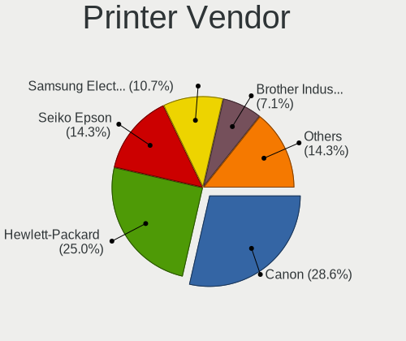

| Vendor              | Computers | Percent |
|---------------------|-----------|---------|
| Canon               | 7         | 30.43%  |
| Hewlett-Packard     | 5         | 21.74%  |
| Seiko Epson         | 4         | 17.39%  |
| Samsung Electronics | 3         | 13.04%  |
| Brother Industries  | 2         | 8.7%    |
| Ricoh               | 1         | 4.35%   |
| Kyocera             | 1         | 4.35%   |

Printer Model
-------------

Printer device models

| Model                                | Computers | Percent |
|--------------------------------------|-----------|---------|
| Canon PIXMA MG2500 Series            | 3         | 13.04%  |
| Seiko Epson L222 Series              | 2         | 8.7%    |
| Seiko Epson L355 Series              | 1         | 4.35%   |
| Seiko Epson ET-2710 Series           | 1         | 4.35%   |
| Samsung SCX-4216F Scanner            | 1         | 4.35%   |
| Samsung SCX-4200 series              | 1         | 4.35%   |
| Samsung ML-1640 Series Laser Printer | 1         | 4.35%   |
| Ricoh Printing Support               | 1         | 4.35%   |
| Kyocera FS-1030D printer             | 1         | 4.35%   |
| HP ENVY Pro 6400 series              | 1         | 4.35%   |
| HP ENVY 6000 series                  | 1         | 4.35%   |
| HP ENVY 4520 series                  | 1         | 4.35%   |
| HP Deskjet 3520 series               | 1         | 4.35%   |
| HP Deskjet 2540 series               | 1         | 4.35%   |
| Canon PIXMA MG3600 Series            | 1         | 4.35%   |
| Canon LBP6000                        | 1         | 4.35%   |
| Canon iP2700 series                  | 1         | 4.35%   |
| Canon G3010 series                   | 1         | 4.35%   |
| Brother HL-L2310D series             | 1         | 4.35%   |
| Brother HL-2240D series              | 1         | 4.35%   |

Scanner Vendor
--------------

Scanner device vendors

| Vendor          | Computers | Percent |
|-----------------|-----------|---------|
| Canon           | 2         | 66.67%  |
| Hewlett-Packard | 1         | 33.33%  |

Scanner Model
-------------

Scanner device models

| Model                              | Computers | Percent |
|------------------------------------|-----------|---------|
| HP ScanJet 6200c                   | 1         | 33.33%  |
| Canon CanoScan N670U/N676U/LiDE 20 | 1         | 33.33%  |
| Canon CanoScan 8800F               | 1         | 33.33%  |

Camera
------

Camera Vendor
-------------

Camera device vendors

| Vendor                                 | Computers | Percent |
|----------------------------------------|-----------|---------|
| Chicony Electronics                    | 89        | 21.55%  |
| Realtek Semiconductor                  | 40        | 9.69%   |
| Microdia                               | 40        | 9.69%   |
| IMC Networks                           | 34        | 8.23%   |
| Acer                                   | 31        | 7.51%   |
| Sunplus Innovation Technology          | 24        | 5.81%   |
| Cheng Uei Precision Industry (Foxlink) | 19        | 4.6%    |
| Logitech                               | 17        | 4.12%   |
| Apple                                  | 16        | 3.87%   |
| Quanta                                 | 15        | 3.63%   |
| Suyin                                  | 12        | 2.91%   |
| Silicon Motion                         | 10        | 2.42%   |
| Alcor Micro                            | 10        | 2.42%   |
| Microsoft                              | 9         | 2.18%   |
| Syntek                                 | 7         | 1.69%   |
| Lite-On Technology                     | 6         | 1.45%   |
| Samsung Electronics                    | 5         | 1.21%   |
| Luxvisions Innotech Limited            | 3         | 0.73%   |
| KYE Systems (Mouse Systems)            | 3         | 0.73%   |
| ARC International                      | 3         | 0.73%   |
| Z-Star Microelectronics                | 2         | 0.48%   |
| Unknown                                | 2         | 0.48%   |
| Ricoh                                  | 2         | 0.48%   |
| Hewlett-Packard                        | 2         | 0.48%   |
| Creative Technology                    | 2         | 0.48%   |
| Tobii Technology AB                    | 1         | 0.24%   |
| Spreadtrum Communications              | 1         | 0.24%   |
| Magic Control Technology               | 1         | 0.24%   |
| Importek                               | 1         | 0.24%   |
| HD WEBCAM                              | 1         | 0.24%   |
| Genesys Logic                          | 1         | 0.24%   |
| Foxconn / Hon Hai                      | 1         | 0.24%   |
| Denron                                 | 1         | 0.24%   |
| Cubeternet                             | 1         | 0.24%   |
| Alcorlink                              | 1         | 0.24%   |

Camera Model
------------

Camera device models

| Model                                                   | Computers | Percent |
|---------------------------------------------------------|-----------|---------|
| Microdia Integrated_Webcam_HD                           | 26        | 6.19%   |
| Chicony HD Webcam                                       | 14        | 3.33%   |
| Realtek Integrated_Webcam_HD                            | 13        | 3.1%    |
| Chicony Integrated Camera                               | 13        | 3.1%    |
| IMC Networks USB2.0 VGA UVC WebCam                      | 9         | 2.14%   |
| IMC Networks USB2.0 HD UVC WebCam                       | 9         | 2.14%   |
| Acer EasyCamera                                         | 8         | 1.9%    |
| Sunplus HD WebCam                                       | 7         | 1.67%   |
| Logitech Webcam C270                                    | 7         | 1.67%   |
| Acer HD Webcam                                          | 7         | 1.67%   |
| Chicony USB2.0 VGA UVC WebCam                           | 6         | 1.43%   |
| Apple FaceTime HD Camera                                | 6         | 1.43%   |
| Samsung Galaxy A5 (MTP)                                 | 5         | 1.19%   |
| Realtek Lenovo EasyCamera                               | 5         | 1.19%   |
| Microdia Laptop_Integrated_Webcam_HD                    | 5         | 1.19%   |
| Chicony VGA Webcam                                      | 5         | 1.19%   |
| Cheng Uei Precision Industry (Foxlink) HP Webcam        | 5         | 1.19%   |
| Apple iPhone 5/5C/5S/6/SE                               | 5         | 1.19%   |
| Apple FaceTime HD Camera (Built-in)                     | 5         | 1.19%   |
| Alcor Micro SHUNCCM2MP                                  | 5         | 1.19%   |
| Suyin HP TrueVision HD                                  | 4         | 0.95%   |
| Sunplus Integrated_Webcam_HD                            | 4         | 0.95%   |
| Quanta HD WebCam                                        | 4         | 0.95%   |
| Lite-On Integrated Camera                               | 4         | 0.95%   |
| IMC Networks Integrated Camera                          | 4         | 0.95%   |
| Chicony USB2.0 HD UVC WebCam                            | 4         | 0.95%   |
| Chicony USB 2.0 Camera                                  | 4         | 0.95%   |
| Chicony Lenovo EasyCamera                               | 4         | 0.95%   |
| Alcor Micro USB2.0 Camera                               | 4         | 0.95%   |
| Acer Lenovo EasyCamera                                  | 4         | 0.95%   |
| Acer Integrated Camera                                  | 4         | 0.95%   |
| Syntek EasyCamera                                       | 3         | 0.71%   |
| Suyin HD WebCam                                         | 3         | 0.71%   |
| Realtek USB2.0 HD UVC WebCam                            | 3         | 0.71%   |
| Realtek HD WebCam                                       | 3         | 0.71%   |
| Realtek Front Camera                                    | 3         | 0.71%   |
| Quanta USB2.0 VGA UVC WebCam                            | 3         | 0.71%   |
| Logitech HD Pro Webcam C920                             | 3         | 0.71%   |
| Chicony TOSHIBA Web Camera - HD                         | 3         | 0.71%   |
| Chicony HP Webcam [2 MP Macro]                          | 3         | 0.71%   |
| Chicony HP HD Camera                                    | 3         | 0.71%   |
| Cheng Uei Precision Industry (Foxlink) HP Truevision HD | 3         | 0.71%   |
| ARC International Camera                                | 3         | 0.71%   |
| Sunplus Laptop Integrated WebCam HD                     | 2         | 0.48%   |
| Sunplus Integrated_Webcam_FHD                           | 2         | 0.48%   |
| Silicon Motion WebCam SCB-1100N                         | 2         | 0.48%   |
| Silicon Motion Webcam SC-13HDL11624N [Namuga Co., Ltd.] | 2         | 0.48%   |
| Silicon Motion Web Camera                               | 2         | 0.48%   |
| Silicon Motion 300k Pixel Camera                        | 2         | 0.48%   |
| Realtek HP Webcam                                       | 2         | 0.48%   |
| Realtek Back Camera                                     | 2         | 0.48%   |
| Quanta HP TrueVision HD Camera                          | 2         | 0.48%   |
| Microsoft LifeCam HD-3000                               | 2         | 0.48%   |
| Microdia Integrated Webcam                              | 2         | 0.48%   |
| Microdia Dell Laptop Integrated Webcam HD               | 2         | 0.48%   |
| Luxvisions Innotech Limited HP TrueVision HD Camera     | 2         | 0.48%   |
| IMC Networks USB2.0 UVC HD Webcam                       | 2         | 0.48%   |
| IMC Networks USB2.0 HD IR UVC WebCam                    | 2         | 0.48%   |
| IMC Networks Lenovo EasyCamera                          | 2         | 0.48%   |
| Chicony USB 2.0 Webcam Device                           | 2         | 0.48%   |

Security
--------

Fingerprint Vendor
------------------

Fingerprint sensor vendors

| Vendor                     | Computers | Percent |
|----------------------------|-----------|---------|
| Validity Sensors           | 18        | 37.5%   |
| Synaptics                  | 10        | 20.83%  |
| Elan Microelectronics      | 6         | 12.5%   |
| Shenzhen Goodix Technology | 4         | 8.33%   |
| AuthenTec                  | 4         | 8.33%   |
| Upek                       | 2         | 4.17%   |
| Samsung Electronics        | 2         | 4.17%   |
| LighTuning Technology      | 2         | 4.17%   |

Fingerprint Model
-----------------

Fingerprint sensor models

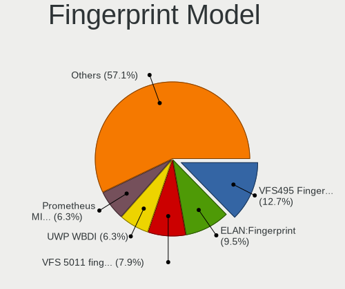

| Model                                                                      | Computers | Percent |
|----------------------------------------------------------------------------|-----------|---------|
| Validity Sensors VFS495 Fingerprint Reader                                 | 6         | 12.5%   |
| Elan ELAN:Fingerprint                                                      | 6         | 12.5%   |
| Unknown                                                                    | 5         | 10.42%  |
| Validity Sensors VFS 5011 fingerprint sensor                               | 3         | 6.25%   |
| Validity Sensors VFS5011 Fingerprint Reader                                | 2         | 4.17%   |
| Validity Sensors VFS451 Fingerprint Reader                                 | 2         | 4.17%   |
| Upek Biometric Touchchip/Touchstrip Fingerprint Sensor                     | 2         | 4.17%   |
| Synaptics Prometheus MIS Touch Fingerprint Reader                          | 2         | 4.17%   |
| Shenzhen Goodix  FingerPrint Device                                        | 2         | 4.17%   |
| Shenzhen Goodix FingerPrint                                                | 2         | 4.17%   |
| Samsung Fingerprint Device                                                 | 2         | 4.17%   |
| AuthenTec Fingerprint Sensor                                               | 2         | 4.17%   |
| Validity Sensors VFS7552 Touch Fingerprint Sensor                          | 1         | 2.08%   |
| Validity Sensors Synaptics WBDI                                            | 1         | 2.08%   |
| Validity Sensors Synaptics VFS7552 Touch Fingerprint Sensor with PurePrint | 1         | 2.08%   |
| Validity Sensors Swipe Fingerprint Sensor                                  | 1         | 2.08%   |
| Validity Sensors Fingerprint scanner                                       | 1         | 2.08%   |
| Synaptics  WBDI                                                            | 1         | 2.08%   |
| Synaptics Metallica MOH Touch Fingerprint Reader                           | 1         | 2.08%   |
| Synaptics Metallica MIS Touch Fingerprint Reader                           | 1         | 2.08%   |
| LighTuning ES603 Swipe Fingerprint Sensor                                  | 1         | 2.08%   |
| LighTuning EgisTec Touch Fingerprint Sensor                                | 1         | 2.08%   |
| AuthenTec AES2550 Fingerprint Sensor                                       | 1         | 2.08%   |
| AuthenTec AES1660 Fingerprint Sensor                                       | 1         | 2.08%   |

Chipcard Vendor
---------------

Chipcard module vendors

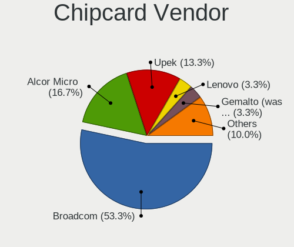

| Vendor                     | Computers | Percent |
|----------------------------|-----------|---------|
| Broadcom                   | 8         | 47.06%  |
| Alcor Micro                | 3         | 17.65%  |
| Upek                       | 2         | 11.76%  |
| Lenovo                     | 1         | 5.88%   |
| Gemalto (was Gemplus)      | 1         | 5.88%   |
| Athena Smartcard Solutions | 1         | 5.88%   |
| Aladdin Knowledge Systems  | 1         | 5.88%   |

Chipcard Model
--------------

Chipcard module models

| Model                                                                        | Computers | Percent |
|------------------------------------------------------------------------------|-----------|---------|
| Broadcom BCM5880 Secure Applications Processor                               | 3         | 17.65%  |
| Alcor Micro AU9540 Smartcard Reader                                          | 3         | 17.65%  |
| Upek TouchChip Fingerprint Coprocessor (WBF advanced mode)                   | 2         | 11.76%  |
| Broadcom BCM5880 Secure Applications Processor with fingerprint swipe sensor | 2         | 11.76%  |
| Broadcom 5880                                                                | 2         | 11.76%  |
| Lenovo Integrated Smart Card Reader                                          | 1         | 5.88%   |
| Gemalto (was Gemplus) GemPC Twin SmartCard Reader                            | 1         | 5.88%   |
| Broadcom 58200                                                               | 1         | 5.88%   |
| Athena Smartcard Solutions ASEDrive CCID                                     | 1         | 5.88%   |
| Aladdin Knowledge Systems Token JC                                           | 1         | 5.88%   |

Unsupported
-----------

Unsupported Devices
-------------------

Total unsupported devices on board

| Total | Computers | Percent |
|-------|-----------|---------|
| 0     | 487       | 66.17%  |
| 1     | 208       | 28.26%  |
| 2     | 37        | 5.03%   |
| 3     | 4         | 0.54%   |

Unsupported Device Types
------------------------

Types of unsupported devices

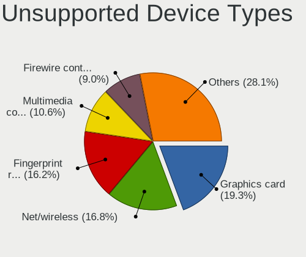

| Type                     | Computers | Percent |
|--------------------------|-----------|---------|
| Net/wireless             | 52        | 17.51%  |
| Graphics card            | 52        | 17.51%  |
| Fingerprint reader       | 48        | 16.16%  |
| Multimedia controller    | 33        | 11.11%  |
| Firewire controller      | 27        | 9.09%   |
| Chipcard                 | 17        | 5.72%   |
| Net/ethernet             | 14        | 4.71%   |
| Sound                    | 10        | 3.37%   |
| Unassigned class         | 9         | 3.03%   |
| Camera                   | 9         | 3.03%   |
| Communication controller | 8         | 2.69%   |
| Storage/ide              | 7         | 2.36%   |
| Bluetooth                | 4         | 1.35%   |
| Storage/nvme             | 2         | 0.67%   |
| Network                  | 2         | 0.67%   |
| Storage                  | 1         | 0.34%   |
| Modem                    | 1         | 0.34%   |
| Card reader              | 1         | 0.34%   |

