Cyber Infra - Tested Hardware & Statistics
------------------------------------------

A project to collect tested hardware configurations for Cyber Infra.

Anyone can contribute to this report by the [hw-probe](https://github.com/linuxhw/hw-probe) tool:

    sudo -E hw-probe -all -upload

Please contribute! Especially if your hardware is rare.

This is a report for all computer types. See also reports for [desktops](/Dist/Cyber_Infra/Desktop/README.md) and [notebooks](/Dist/Cyber_Infra/Notebook/README.md).

Contents
--------

* [ Test Cases ](#test-cases)

* [ System ](#system)
  - [ OS                       ](#os)
  - [ OS Family                ](#os-family)
  - [ Kernel                   ](#kernel)
  - [ Kernel Family            ](#kernel-family)
  - [ Kernel Major Ver.        ](#kernel-major-ver)
  - [ Arch                     ](#arch)
  - [ DE                       ](#de)
  - [ Display Server           ](#display-server)
  - [ Display Manager          ](#display-manager)
  - [ OS Lang                  ](#os-lang)
  - [ Boot Mode                ](#boot-mode)
  - [ Filesystem               ](#filesystem)
  - [ Part. scheme             ](#part-scheme)
  - [ Dual Boot with Linux/BSD ](#dual-boot-with-linuxbsd)
  - [ Dual Boot (Win)          ](#dual-boot-win)

* [ Board ](#board)
  - [ Vendor                   ](#vendor)
  - [ Model                    ](#model)
  - [ Model Family             ](#model-family)
  - [ MFG Year                 ](#mfg-year)
  - [ Form Factor              ](#form-factor)
  - [ Secure Boot              ](#secure-boot)
  - [ Coreboot                 ](#coreboot)
  - [ RAM Size                 ](#ram-size)
  - [ RAM Used                 ](#ram-used)
  - [ Total Drives             ](#total-drives)
  - [ Has CD-ROM               ](#has-cd-rom)
  - [ Has Ethernet             ](#has-ethernet)
  - [ Has WiFi                 ](#has-wifi)
  - [ Has Bluetooth            ](#has-bluetooth)

* [ Location ](#location)
  - [ Country                  ](#country)
  - [ City                     ](#city)

* [ Drives ](#drives)
  - [ Drive Vendor             ](#drive-vendor)
  - [ Drive Model              ](#drive-model)
  - [ HDD Vendor               ](#hdd-vendor)
  - [ SSD Vendor               ](#ssd-vendor)
  - [ Drive Kind               ](#drive-kind)
  - [ Drive Connector          ](#drive-connector)
  - [ Drive Size               ](#drive-size)
  - [ Space Total              ](#space-total)
  - [ Space Used               ](#space-used)
  - [ Malfunc. Drives          ](#malfunc-drives)
  - [ Malfunc. Drive Vendor    ](#malfunc-drive-vendor)
  - [ Malfunc. HDD Vendor      ](#malfunc-hdd-vendor)
  - [ Malfunc. Drive Kind      ](#malfunc-drive-kind)
  - [ Failed Drives            ](#failed-drives)
  - [ Failed Drive Vendor      ](#failed-drive-vendor)
  - [ Drive Status             ](#drive-status)

* [ Storage controller ](#storage-controller)
  - [ Storage Vendor           ](#storage-vendor)
  - [ Storage Model            ](#storage-model)
  - [ Storage Kind             ](#storage-kind)

* [ Processor ](#processor)
  - [ CPU Vendor               ](#cpu-vendor)
  - [ CPU Model                ](#cpu-model)
  - [ CPU Model Family         ](#cpu-model-family)
  - [ CPU Cores                ](#cpu-cores)
  - [ CPU Sockets              ](#cpu-sockets)
  - [ CPU Threads              ](#cpu-threads)
  - [ CPU Op-Modes             ](#cpu-op-modes)
  - [ CPU Microcode            ](#cpu-microcode)
  - [ CPU Microarch            ](#cpu-microarch)

* [ Graphics ](#graphics)
  - [ GPU Vendor               ](#gpu-vendor)
  - [ GPU Model                ](#gpu-model)
  - [ GPU Combo                ](#gpu-combo)
  - [ GPU Driver               ](#gpu-driver)
  - [ GPU Memory               ](#gpu-memory)

* [ Monitor ](#monitor)
  - [ Monitor Vendor           ](#monitor-vendor)
  - [ Monitor Model            ](#monitor-model)
  - [ Monitor Resolution       ](#monitor-resolution)
  - [ Monitor Diagonal         ](#monitor-diagonal)
  - [ Monitor Width            ](#monitor-width)
  - [ Aspect Ratio             ](#aspect-ratio)
  - [ Monitor Area             ](#monitor-area)
  - [ Pixel Density            ](#pixel-density)
  - [ Multiple Monitors        ](#multiple-monitors)

* [ Network ](#network)
  - [ Net Controller Vendor    ](#net-controller-vendor)
  - [ Net Controller Model     ](#net-controller-model)
  - [ Wireless Vendor          ](#wireless-vendor)
  - [ Wireless Model           ](#wireless-model)
  - [ Ethernet Vendor          ](#ethernet-vendor)
  - [ Ethernet Model           ](#ethernet-model)
  - [ Net Controller Kind      ](#net-controller-kind)
  - [ Used Controller          ](#used-controller)
  - [ NICs                     ](#nics)
  - [ IPv6                     ](#ipv6)

* [ Bluetooth ](#bluetooth)
  - [ Bluetooth Vendor         ](#bluetooth-vendor)
  - [ Bluetooth Model          ](#bluetooth-model)

* [ Sound ](#sound)
  - [ Sound Vendor             ](#sound-vendor)
  - [ Sound Model              ](#sound-model)

* [ Memory ](#memory)
  - [ Memory Vendor            ](#memory-vendor)
  - [ Memory Model             ](#memory-model)
  - [ Memory Kind              ](#memory-kind)
  - [ Memory Form Factor       ](#memory-form-factor)
  - [ Memory Size              ](#memory-size)
  - [ Memory Speed             ](#memory-speed)

* [ Printers & scanners ](#printers--scanners)
  - [ Printer Vendor           ](#printer-vendor)
  - [ Printer Model            ](#printer-model)
  - [ Scanner Vendor           ](#scanner-vendor)
  - [ Scanner Model            ](#scanner-model)

* [ Camera ](#camera)
  - [ Camera Vendor            ](#camera-vendor)
  - [ Camera Model             ](#camera-model)

* [ Security ](#security)
  - [ Fingerprint Vendor       ](#fingerprint-vendor)
  - [ Fingerprint Model        ](#fingerprint-model)
  - [ Chipcard Vendor          ](#chipcard-vendor)
  - [ Chipcard Model           ](#chipcard-model)

* [ Unsupported ](#unsupported)
  - [ Unsupported Devices      ](#unsupported-devices)
  - [ Unsupported Device Types ](#unsupported-device-types)

Test Cases
----------

Total: 114

| Vendor        | Model                       | Form-Factor | Probe                                                      | Date         |
|---------------|-----------------------------|-------------|------------------------------------------------------------|--------------|
| Supermicro    | H12SSW-NT                   | Server      | [9139b00806](https://linux-hardware.org/?probe=9139b00806) | Oct 17, 2025 |
| OEM           | T2DM B                      | Server      | [06e821d4bc](https://linux-hardware.org/?probe=06e821d4bc) | Sep 24, 2025 |
| Supermicro    | X11SPM-F                    | Server      | [2e4fd56cbd](https://linux-hardware.org/?probe=2e4fd56cbd) | Sep 01, 2025 |
| ASUSTek       | Z12PP-D32 Series 60SB07F... | Server      | [a30d993ad8](https://linux-hardware.org/?probe=a30d993ad8) | Jul 29, 2025 |
| GOOXI         | G4DEL-B                     | Server      | [b5b30c4c93](https://linux-hardware.org/?probe=b5b30c4c93) | Jun 13, 2025 |
| GOOXI         | G4DEL-B                     | Server      | [ff5ee9986e](https://linux-hardware.org/?probe=ff5ee9986e) | Jun 12, 2025 |
| GOOXI         | G4DEL-B                     | Server      | [47acfe68af](https://linux-hardware.org/?probe=47acfe68af) | Jun 12, 2025 |
| Supermicro    | X11SPM-F                    | Server      | [14cbf46074](https://linux-hardware.org/?probe=14cbf46074) | Apr 10, 2025 |
| Delta Comp... | DSS-C621LTG MBTR.R101.F0... | Server      | [025ecccc99](https://linux-hardware.org/?probe=025ecccc99) | Feb 26, 2025 |
| Supermicro    | X11SPM-F                    | Server      | [4e855cc89a](https://linux-hardware.org/?probe=4e855cc89a) | Feb 06, 2025 |
| Unknown       | Unknown                     | Server      | [a6cfe18b84](https://linux-hardware.org/?probe=a6cfe18b84) | Feb 04, 2025 |
| Supermicro    | H12SSW-NT                   | Server      | [4235f71014](https://linux-hardware.org/?probe=4235f71014) | Nov 29, 2024 |
| Supermicro    | X11SPM-F                    | Server      | [a121b2a2e1](https://linux-hardware.org/?probe=a121b2a2e1) | Nov 25, 2024 |
| Supermicro    | H11SSL-C                    | Server      | [ac82baedee](https://linux-hardware.org/?probe=ac82baedee) | Nov 21, 2024 |
| Supermicro    | H11SSL-C                    | Server      | [b7c2ebcbef](https://linux-hardware.org/?probe=b7c2ebcbef) | Nov 20, 2024 |
| Supermicro    | B11SPE-CPU-TF               | Server      | [3491bad189](https://linux-hardware.org/?probe=3491bad189) | Nov 04, 2024 |
| HP            | ProLiant BL460c Gen8        | Server      | [03ce72541e](https://linux-hardware.org/?probe=03ce72541e) | Oct 24, 2024 |
| HP            | ProLiant BL460c Gen8        | Server      | [2f48ddf276](https://linux-hardware.org/?probe=2f48ddf276) | Oct 24, 2024 |
| Supermicro    | B11SPE-CPU-TF               | Server      | [d810cddf96](https://linux-hardware.org/?probe=d810cddf96) | Oct 15, 2024 |
| 3Logic Gro... | TUNDRA                      | Server      | [731c46b566](https://linux-hardware.org/?probe=731c46b566) | Aug 20, 2024 |
| Supermicro    | X11SPM-F                    | Server      | [7463e5e2f9](https://linux-hardware.org/?probe=7463e5e2f9) | Jul 06, 2024 |
| ASRockRack    | EP2C621D16-4LP              | Server      | [5af2c77246](https://linux-hardware.org/?probe=5af2c77246) | Jul 05, 2024 |
| Supermicro    | X10DRL-i                    | Server      | [ff8c7320cc](https://linux-hardware.org/?probe=ff8c7320cc) | Jun 24, 2024 |
| Supermicro    | X11SPM-F                    | Server      | [b8a7becbee](https://linux-hardware.org/?probe=b8a7becbee) | Jun 20, 2024 |
| Supermicro    | X11DDW-L                    | Server      | [a466d61b44](https://linux-hardware.org/?probe=a466d61b44) | Apr 30, 2024 |
| Supermicro    | X11DDW-L                    | Server      | [35b92be9f4](https://linux-hardware.org/?probe=35b92be9f4) | Apr 29, 2024 |
| Supermicro    | X11DDW-L                    | Server      | [91829f13b3](https://linux-hardware.org/?probe=91829f13b3) | Apr 29, 2024 |
| Supermicro    | X11DDW-L                    | Server      | [26cb0d914d](https://linux-hardware.org/?probe=26cb0d914d) | Apr 29, 2024 |
| Supermicro    | X11DDW-L                    | Server      | [86ec1c52cf](https://linux-hardware.org/?probe=86ec1c52cf) | Apr 29, 2024 |
| Supermicro    | X11DDW-L                    | Server      | [02acab99ca](https://linux-hardware.org/?probe=02acab99ca) | Apr 29, 2024 |
| Supermicro    | X11DDW-L                    | Server      | [2743b737c5](https://linux-hardware.org/?probe=2743b737c5) | Apr 29, 2024 |
| Supermicro    | X11DDW-L                    | Server      | [6f4331e541](https://linux-hardware.org/?probe=6f4331e541) | Apr 29, 2024 |
| Supermicro    | X11DDW-L                    | Server      | [6dfa7a39f0](https://linux-hardware.org/?probe=6dfa7a39f0) | Apr 29, 2024 |
| Supermicro    | X11DDW-L                    | Server      | [c15ca5d532](https://linux-hardware.org/?probe=c15ca5d532) | Apr 29, 2024 |
| Supermicro    | X11DDW-L                    | Server      | [51b1b9f5d9](https://linux-hardware.org/?probe=51b1b9f5d9) | Apr 29, 2024 |
| Supermicro    | X11DDW-L                    | Server      | [4c17dc4de0](https://linux-hardware.org/?probe=4c17dc4de0) | Apr 29, 2024 |
| Supermicro    | X11DDW-L                    | Server      | [5bb24704dd](https://linux-hardware.org/?probe=5bb24704dd) | Apr 29, 2024 |
| Supermicro    | B11SPE-CPU-TF               | Server      | [42f99a1064](https://linux-hardware.org/?probe=42f99a1064) | Mar 20, 2024 |
| Supermicro    | H12SSW-NT                   | Server      | [dcd6765539](https://linux-hardware.org/?probe=dcd6765539) | Mar 20, 2024 |
| Intel         | WHITLEY                     | Server      | [40863a6963](https://linux-hardware.org/?probe=40863a6963) | Mar 20, 2024 |
| Intel         | WHITLEY                     | Server      | [3801d427d7](https://linux-hardware.org/?probe=3801d427d7) | Nov 08, 2023 |
| Intel         | WHITLEY                     | Server      | [1d2875a6fc](https://linux-hardware.org/?probe=1d2875a6fc) | Nov 08, 2023 |
| Intel         | WHITLEY                     | Server      | [b58d16125d](https://linux-hardware.org/?probe=b58d16125d) | Nov 08, 2023 |
| HPE           | ProLiant DL360 Gen10        | Server      | [b8a4774f2c](https://linux-hardware.org/?probe=b8a4774f2c) | Oct 28, 2023 |
| HPE           | ProLiant DL360 Gen10        | Server      | [07d658316a](https://linux-hardware.org/?probe=07d658316a) | Oct 28, 2023 |
| HPE           | ProLiant DL360 Gen10        | Server      | [bb565b917d](https://linux-hardware.org/?probe=bb565b917d) | Oct 28, 2023 |
| Unknown       | R182-N20-UNI                | Server      | [215f8e1d20](https://linux-hardware.org/?probe=215f8e1d20) | Oct 21, 2023 |
| Unknown       | R182-N20-UNI                | Server      | [704c191431](https://linux-hardware.org/?probe=704c191431) | Oct 21, 2023 |
| Unknown       | R182-N20-UNI                | Server      | [3c87db71c6](https://linux-hardware.org/?probe=3c87db71c6) | Oct 21, 2023 |
| Unknown       | R182-N20-UNI                | Server      | [98afec32b2](https://linux-hardware.org/?probe=98afec32b2) | Oct 12, 2023 |
| Unknown       | R182-N20-UNI                | Server      | [d19f06b547](https://linux-hardware.org/?probe=d19f06b547) | Oct 12, 2023 |
| Unknown       | R182-N20-UNI                | Server      | [27dcd3ddcc](https://linux-hardware.org/?probe=27dcd3ddcc) | Oct 12, 2023 |
| Unknown       | R182-N20-UNI                | Server      | [e18aaeccc6](https://linux-hardware.org/?probe=e18aaeccc6) | Oct 12, 2023 |
| Unknown       | R182-N20-UNI                | Server      | [10beb03b80](https://linux-hardware.org/?probe=10beb03b80) | Oct 12, 2023 |
| Dell          | 04V528 A02                  | Server      | [96ef3c9fdd](https://linux-hardware.org/?probe=96ef3c9fdd) | Sep 22, 2023 |
| Dell          | 0JMK61 A00                  | Server      | [e0bd072160](https://linux-hardware.org/?probe=e0bd072160) | Sep 21, 2023 |
| Dell          | 0RGP26 A00                  | Server      | [d35a82a9ec](https://linux-hardware.org/?probe=d35a82a9ec) | Sep 21, 2023 |
| Dell          | 06DKY5 A03                  | Server      | [a86e860c3d](https://linux-hardware.org/?probe=a86e860c3d) | Sep 21, 2023 |
| Supermicro    | H12SSW-NT                   | Server      | [29cabf2b17](https://linux-hardware.org/?probe=29cabf2b17) | Jul 09, 2023 |
| Supermicro    | H12SSW-NT                   | Server      | [471a0154cb](https://linux-hardware.org/?probe=471a0154cb) | Jul 09, 2023 |
| Unknown       | R182-N20-UNI                | Server      | [7f1e769c28](https://linux-hardware.org/?probe=7f1e769c28) | Jul 05, 2023 |
| Unknown       | R182-N20-UNI                | Server      | [6e33251220](https://linux-hardware.org/?probe=6e33251220) | Jul 05, 2023 |
| Unknown       | R182-N20-UNI                | Server      | [da1eee177b](https://linux-hardware.org/?probe=da1eee177b) | Jul 05, 2023 |
| Unknown       | R182-N20-UNI                | Server      | [f9074e4a79](https://linux-hardware.org/?probe=f9074e4a79) | Jul 05, 2023 |
| ASUSTek       | PRIME Z270-A                | Desktop     | [e2531ea6c8](https://linux-hardware.org/?probe=e2531ea6c8) | Jun 16, 2023 |
| Supermicro    | X11DDW-NT                   | Server      | [6e0ca764b5](https://linux-hardware.org/?probe=6e0ca764b5) | Jun 14, 2023 |
| Intel         | M50CYP2SBSTD K42381-351     | Server      | [b1b7037d4f](https://linux-hardware.org/?probe=b1b7037d4f) | Jun 14, 2023 |
| Lenovo        | 7X06CTO1WW                  | Server      | [dc3ea6dbb8](https://linux-hardware.org/?probe=dc3ea6dbb8) | Jun 14, 2023 |
| Supermicro    | X9DRi-LN4+/X9DR3-LN4+       | Server      | [b4eb1cdd06](https://linux-hardware.org/?probe=b4eb1cdd06) | Jun 07, 2023 |
| Supermicro    | H12SSW-NT                   | Server      | [5950749033](https://linux-hardware.org/?probe=5950749033) | Jun 07, 2023 |
| Supermicro    | H12SSW-NT                   | Server      | [f8a6482d0e](https://linux-hardware.org/?probe=f8a6482d0e) | May 29, 2023 |
| Delta Comp... | DSS-C621LTG                 | Server      | [18b2bf9ff4](https://linux-hardware.org/?probe=18b2bf9ff4) | Apr 05, 2023 |
| Delta Comp... | DSS-C621LTG                 | Server      | [844c562cb6](https://linux-hardware.org/?probe=844c562cb6) | Apr 05, 2023 |
| Delta Comp... | DSS-C621LTG                 | Server      | [a7057f367a](https://linux-hardware.org/?probe=a7057f367a) | Apr 05, 2023 |
| Delta Comp... | DSS-C621LTG                 | Server      | [0ce29ba75c](https://linux-hardware.org/?probe=0ce29ba75c) | Apr 05, 2023 |
| Supermicro    | X10DRL-i                    | Server      | [5e92e7fe1e](https://linux-hardware.org/?probe=5e92e7fe1e) | Apr 05, 2023 |
| Supermicro    | X10SRi-FB                   | Server      | [16a0245a41](https://linux-hardware.org/?probe=16a0245a41) | Apr 05, 2023 |
| Supermicro    | X9DRi-LN4+/X9DR3-LN4+       | Server      | [c4b4851a88](https://linux-hardware.org/?probe=c4b4851a88) | Apr 05, 2023 |
| Delta Comp... | DSS-C621LTG                 | Server      | [97e6e94ed2](https://linux-hardware.org/?probe=97e6e94ed2) | Apr 04, 2023 |
| Supermicro    | H12SSW-NT                   | Server      | [3e3cb25241](https://linux-hardware.org/?probe=3e3cb25241) | Mar 09, 2023 |
| Supermicro    | H12SSW-NT                   | Server      | [19fddb0a01](https://linux-hardware.org/?probe=19fddb0a01) | Mar 09, 2023 |
| Supermicro    | H12SSW-NT                   | Server      | [80e5cfeea5](https://linux-hardware.org/?probe=80e5cfeea5) | Mar 09, 2023 |
| Supermicro    | H12SSW-NT                   | Server      | [83ff998a9a](https://linux-hardware.org/?probe=83ff998a9a) | Mar 09, 2023 |
| Supermicro    | H12SSW-NT                   | Server      | [61af44de6d](https://linux-hardware.org/?probe=61af44de6d) | Mar 09, 2023 |
| Supermicro    | H12SSW-NT                   | Server      | [dd8597fd65](https://linux-hardware.org/?probe=dd8597fd65) | Mar 09, 2023 |
| Supermicro    | H12SSW-NT                   | Server      | [090720bc72](https://linux-hardware.org/?probe=090720bc72) | Mar 09, 2023 |
| Supermicro    | H12SSW-NT                   | Server      | [8b83576100](https://linux-hardware.org/?probe=8b83576100) | Feb 28, 2023 |
| Supermicro    | H12SSW-NT                   | Server      | [c33e8fab03](https://linux-hardware.org/?probe=c33e8fab03) | Feb 28, 2023 |
| Supermicro    | H12SSW-NT                   | Server      | [2f3379adb9](https://linux-hardware.org/?probe=2f3379adb9) | Feb 28, 2023 |
| Supermicro    | H12SSW-NT                   | Server      | [efc03f8d68](https://linux-hardware.org/?probe=efc03f8d68) | Feb 27, 2023 |
| Supermicro    | X12DAi-N6                   | Server      | [814fc144ef](https://linux-hardware.org/?probe=814fc144ef) | Feb 03, 2023 |
| Supermicro    | B11SPE-CPU-TF               | Server      | [bdfa203c78](https://linux-hardware.org/?probe=bdfa203c78) | Jan 16, 2023 |
| Supermicro    | X11SSM-F                    | Server      | [b0100c59bb](https://linux-hardware.org/?probe=b0100c59bb) | Dec 12, 2022 |
| Supermicro    | X11SSL-F                    | Server      | [7aa0eb0936](https://linux-hardware.org/?probe=7aa0eb0936) | Dec 12, 2022 |
| Supermicro    | X11SSL-F                    | Server      | [1a5e57e9ef](https://linux-hardware.org/?probe=1a5e57e9ef) | Oct 31, 2022 |
| Supermicro    | X11SSM-F                    | Server      | [c54a576ec0](https://linux-hardware.org/?probe=c54a576ec0) | Oct 31, 2022 |
| Supermicro    | X11SSL-F                    | Server      | [c13d2d5610](https://linux-hardware.org/?probe=c13d2d5610) | Oct 31, 2022 |
| Supermicro    | X11SSL-F                    | Server      | [2de30f0154](https://linux-hardware.org/?probe=2de30f0154) | Aug 30, 2022 |
| Supermicro    | X11SSL-F                    | Server      | [3f8bec5c1b](https://linux-hardware.org/?probe=3f8bec5c1b) | Aug 30, 2022 |
| Supermicro    | X11SSM-F                    | Server      | [f715802815](https://linux-hardware.org/?probe=f715802815) | Aug 30, 2022 |
| Supermicro    | X10DRL-i                    | Server      | [5281defed3](https://linux-hardware.org/?probe=5281defed3) | Aug 15, 2022 |
| Supermicro    | X10DRL-i                    | Server      | [88a4a3d13f](https://linux-hardware.org/?probe=88a4a3d13f) | Aug 04, 2022 |
| Supermicro    | X10DRL-i                    | Server      | [9b4576c901](https://linux-hardware.org/?probe=9b4576c901) | Aug 03, 2022 |
| Supermicro    | B11SPE-CPU-TF               | Server      | [60ec07883b](https://linux-hardware.org/?probe=60ec07883b) | May 15, 2022 |
| Supermicro    | B11SPE-CPU-TF               | Server      | [912e712657](https://linux-hardware.org/?probe=912e712657) | May 15, 2022 |
| Supermicro    | B11SPE-CPU-TF               | Server      | [3229b1f14c](https://linux-hardware.org/?probe=3229b1f14c) | May 15, 2022 |
| Supermicro    | B11SPE-CPU-TF               | Server      | [ad5b15b222](https://linux-hardware.org/?probe=ad5b15b222) | May 15, 2022 |
| Supermicro    | B11SPE-CPU-TF               | Server      | [6539922005](https://linux-hardware.org/?probe=6539922005) | May 15, 2022 |
| Supermicro    | B11SPE-CPU-TF               | Server      | [0c77bbd30d](https://linux-hardware.org/?probe=0c77bbd30d) | May 15, 2022 |
| Supermicro    | B11SPE-CPU-TF               | Server      | [85a5b4c02f](https://linux-hardware.org/?probe=85a5b4c02f) | May 14, 2022 |
| Supermicro    | B11SPE-CPU-TF               | Server      | [d9f3fb8d37](https://linux-hardware.org/?probe=d9f3fb8d37) | May 14, 2022 |
| Supermicro    | B11SPE-CPU-TF               | Server      | [fdf91b6130](https://linux-hardware.org/?probe=fdf91b6130) | May 13, 2022 |
| Supermicro    | B11SPE-CPU-TF               | Server      | [9c97cfa2bc](https://linux-hardware.org/?probe=9c97cfa2bc) | May 13, 2022 |
| Supermicro    | B11SPE-CPU-TF               | Server      | [6f63fd533c](https://linux-hardware.org/?probe=6f63fd533c) | May 13, 2022 |

System
------

OS
--

Installed operating systems

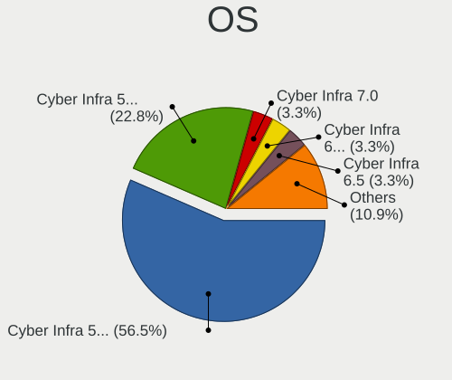

| Name              | Computers | Percent |
|-------------------|-----------|---------|
| Cyber Infra 5.0.1 | 52        | 56.52%  |
| Cyber Infra 5.5.0 | 21        | 22.83%  |
| Cyber Infra 7.0   | 3         | 3.26%   |
| Cyber Infra 6.5.0 | 3         | 3.26%   |
| Cyber Infra 6.5   | 3         | 3.26%   |
| Cyber Infra 6.0.2 | 3         | 3.26%   |
| Cyber Infra 6.7   | 2         | 2.17%   |
| Cyber Infra 6.0.1 | 2         | 2.17%   |
| Cyber Infra 6.0.0 | 2         | 2.17%   |
| Cyber Infra 4.0.1 | 1         | 1.09%   |

OS Family
---------

OS without a version

| Name        | Computers | Percent |
|-------------|-----------|---------|
| Cyber Infra | 83        | 100%    |

Kernel
------

Version of the Linux kernel

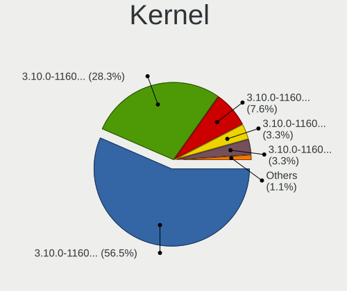

| Version                       | Computers | Percent |
|-------------------------------|-----------|---------|
| 3.10.0-1160.41.1.vz7.183.5    | 52        | 56.52%  |
| 3.10.0-1160.105.1.aip7.214.3  | 26        | 28.26%  |
| 3.10.0-1160.114.2.aip7.222.1  | 7         | 7.61%   |
| 3.10.0-1160.90.1.aip7.200.7.1 | 3         | 3.26%   |
| 3.10.0-1160.129.1.aip7.1      | 3         | 3.26%   |
| 3.10.0-1127.8.2.vz7.158.8     | 1         | 1.09%   |

Kernel Family
-------------

Linux kernel without a distro release

| Version | Computers | Percent |
|---------|-----------|---------|
| 3.10.0  | 83        | 100%    |

Kernel Major Ver.
-----------------

Linux kernel major version

| Version | Computers | Percent |
|---------|-----------|---------|
| 3.10    | 83        | 100%    |

Arch
----

OS architecture (x86_64, i586, etc.)

| Name   | Computers | Percent |
|--------|-----------|---------|
| x86_64 | 83        | 100%    |

DE
--

Desktop Environment

| Name    | Computers | Percent |
|---------|-----------|---------|
| Unknown | 83        | 100%    |

Display Server
--------------

X11 or Wayland

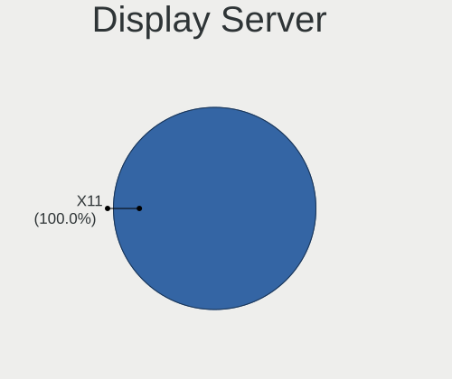

| Name | Computers | Percent |
|------|-----------|---------|
| X11  | 83        | 100%    |

Display Manager
---------------

SDDM, LightDM, etc.

| Name    | Computers | Percent |
|---------|-----------|---------|
| Unknown | 83        | 100%    |

OS Lang
-------

Language

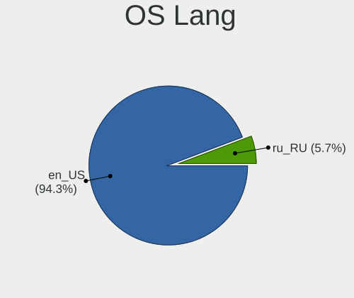

| Lang  | Computers | Percent |
|-------|-----------|---------|
| en_US | 82        | 94.25%  |
| ru_RU | 5         | 5.75%   |

Boot Mode
---------

EFI or BIOS

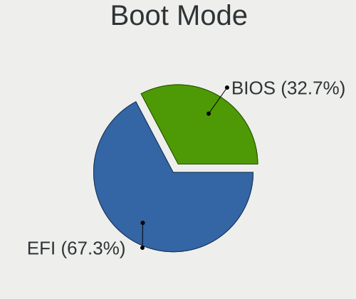

| Mode | Computers | Percent |
|------|-----------|---------|
| EFI  | 51        | 60%     |
| BIOS | 34        | 40%     |

Filesystem
----------

Type of filesystem

| Type | Computers | Percent |
|------|-----------|---------|
| Ext4 | 83        | 100%    |

Part. scheme
------------

Scheme of partitioning

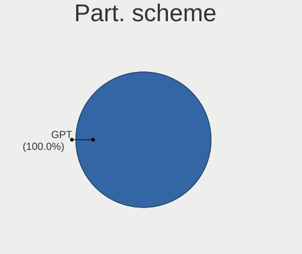

| Type | Computers | Percent |
|------|-----------|---------|
| GPT  | 83        | 100%    |

Dual Boot with Linux/BSD
------------------------

Hosting more than one Linux/BSD

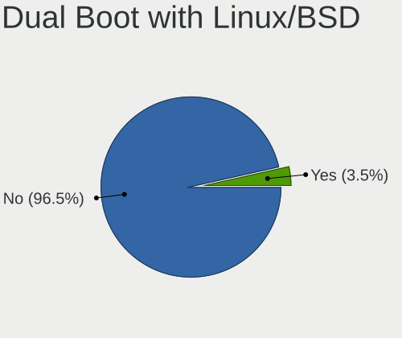

| Dual boot | Computers | Percent |
|-----------|-----------|---------|
| No        | 80        | 94.12%  |
| Yes       | 5         | 5.88%   |

Dual Boot (Win)
---------------

Hosting Linux and Windows

| Dual boot | Computers | Percent |
|-----------|-----------|---------|
| No        | 83        | 100%    |

Board
-----

Vendor
------

Motherboard manufacturer

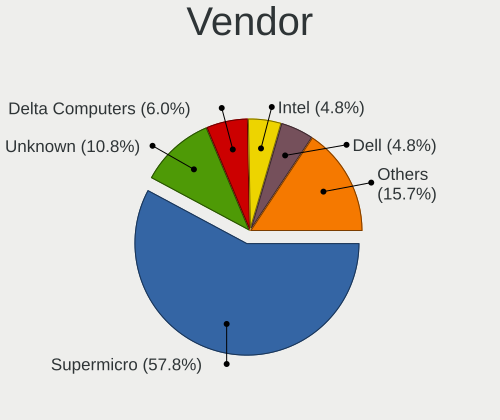

| Name             | Computers | Percent |
|------------------|-----------|---------|
| Supermicro       | 48        | 57.83%  |
| Unknown          | 9         | 10.84%  |
| Delta Computers  | 5         | 6.02%   |
| Intel            | 4         | 4.82%   |
| Dell             | 4         | 4.82%   |
| HPE              | 3         | 3.61%   |
| Hewlett-Packard  | 2         | 2.41%   |
| GOOXI            | 2         | 2.41%   |
| ASUSTek Computer | 2         | 2.41%   |
| OEM              | 1         | 1.2%    |
| Lenovo           | 1         | 1.2%    |
| ASRockRack       | 1         | 1.2%    |
| 3Logic Group     | 1         | 1.2%    |

Model
-----

Motherboard model

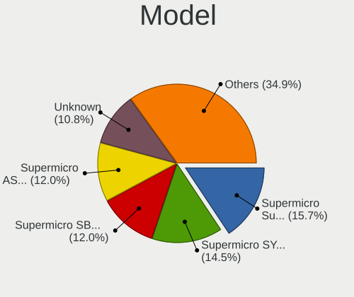

| Name                                    | Computers | Percent |
|-----------------------------------------|-----------|---------|
| Supermicro Super Server                 | 13        | 15.66%  |
| Supermicro SYS-1029P-WTR                | 12        | 14.46%  |
| Supermicro SBI-6119P-T3N                | 10        | 12.05%  |
| Supermicro AS -1014S-WTRT               | 10        | 12.05%  |
| Unknown                                 | 9         | 10.84%  |
| Delta Computers DSS-C621LTG             | 4         | 4.82%   |
| Intel WHITLEY                           | 3         | 3.61%   |
| HPE ProLiant DL360 Gen10                | 3         | 3.61%   |
| HP ProLiant BL460c Gen8                 | 2         | 2.41%   |
| GOOXI SL201-D12R-NV-G4                  | 2         | 2.41%   |
| Supermicro X9DRi-LN4+/X9DR3-LN4+        | 1         | 1.2%    |
| Supermicro X12DAi-N6                    | 1         | 1.2%    |
| Supermicro SYS-6029P-WTRT               | 1         | 1.2%    |
| OEM TU628V2                             | 1         | 1.2%    |
| Lenovo ThinkSystem SR650 -[7X06CTO1WW]- | 1         | 1.2%    |
| Intel M50CYP2SBSTD                      | 1         | 1.2%    |
| Delta Computers Tioga Pass              | 1         | 1.2%    |
| Dell XC640-10 CORE                      | 1         | 1.2%    |
| Dell PowerEdge R750                     | 1         | 1.2%    |
| Dell PowerEdge R740                     | 1         | 1.2%    |
| Dell PowerEdge R640                     | 1         | 1.2%    |
| ASUS RS720-E10-RS12                     | 1         | 1.2%    |
| ASUS PRIME Z270-A                       | 1         | 1.2%    |
| ASRockRack EP2C621D16-4LP               | 1         | 1.2%    |
| 3Logic Group Server Graviton            | 1         | 1.2%    |

Model Family
------------

Motherboard model prefix

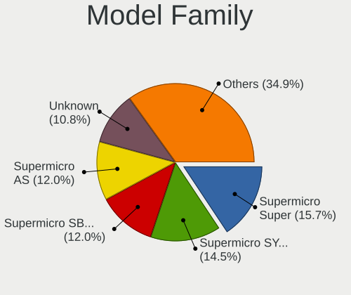

| Name                        | Computers | Percent |
|-----------------------------|-----------|---------|
| Supermicro Super            | 13        | 15.66%  |
| Supermicro SYS-1029P-WTR    | 12        | 14.46%  |
| Supermicro SBI-6119P-T3N    | 10        | 12.05%  |
| Supermicro AS               | 10        | 12.05%  |
| Unknown                     | 9         | 10.84%  |
| Delta Computers DSS-C621LTG | 4         | 4.82%   |
| Intel WHITLEY               | 3         | 3.61%   |
| HPE ProLiant                | 3         | 3.61%   |
| Dell PowerEdge              | 3         | 3.61%   |
| HP ProLiant                 | 2         | 2.41%   |
| GOOXI SL201-D12R-NV-G4      | 2         | 2.41%   |
| Supermicro X9DRi-LN4+       | 1         | 1.2%    |
| Supermicro X12DAi-N6        | 1         | 1.2%    |
| Supermicro SYS-6029P-WTRT   | 1         | 1.2%    |
| OEM TU628V2                 | 1         | 1.2%    |
| Lenovo ThinkSystem          | 1         | 1.2%    |
| Intel M50CYP2SBSTD          | 1         | 1.2%    |
| Delta Computers Tioga       | 1         | 1.2%    |
| Dell XC640-10               | 1         | 1.2%    |
| ASUS RS720-E10-RS12         | 1         | 1.2%    |
| ASUS PRIME                  | 1         | 1.2%    |
| ASRockRack EP2C621D16-4LP   | 1         | 1.2%    |
| 3Logic Group Server         | 1         | 1.2%    |

MFG Year
--------

Motherboard manufacture year

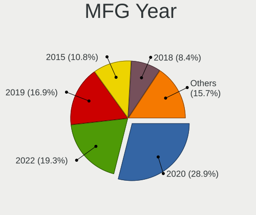

| Year | Computers | Percent |
|------|-----------|---------|
| 2020 | 24        | 28.92%  |
| 2022 | 16        | 19.28%  |
| 2019 | 14        | 16.87%  |
| 2015 | 9         | 10.84%  |
| 2018 | 7         | 8.43%   |
| 2024 | 5         | 6.02%   |
| 2023 | 4         | 4.82%   |
| 2021 | 2         | 2.41%   |
| 2025 | 1         | 1.2%    |
| 2016 | 1         | 1.2%    |

Form Factor
-----------

Physical design of the computer

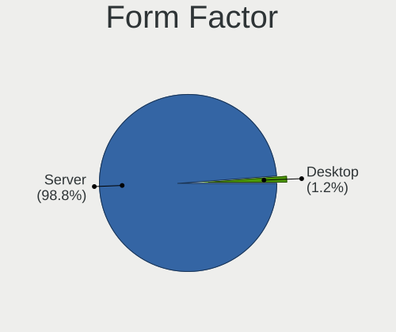

| Name    | Computers | Percent |
|---------|-----------|---------|
| Server  | 82        | 98.8%   |
| Desktop | 1         | 1.2%    |

Secure Boot
-----------

Enabled or disabled

| State    | Computers | Percent |
|----------|-----------|---------|
| Disabled | 83        | 100%    |

Coreboot
--------

Have coreboot on board

| Used | Computers | Percent |
|------|-----------|---------|
| No   | 83        | 100%    |

RAM Size
--------

Total RAM memory

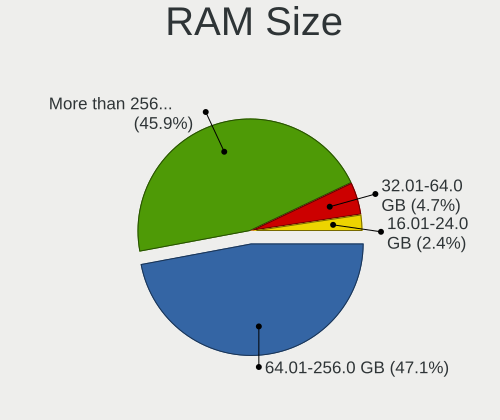

| Size in GB      | Computers | Percent |
|-----------------|-----------|---------|
| 64.01-256.0     | 40        | 47.06%  |
| More than 256.0 | 39        | 45.88%  |
| 32.01-64.0      | 4         | 4.71%   |
| 16.01-24.0      | 2         | 2.35%   |

RAM Used
--------

Used RAM memory

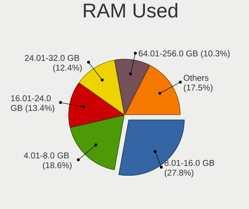

| Used GB     | Computers | Percent |
|-------------|-----------|---------|
| 8.01-16.0   | 27        | 27.84%  |
| 4.01-8.0    | 18        | 18.56%  |
| 16.01-24.0  | 13        | 13.4%   |
| 24.01-32.0  | 12        | 12.37%  |
| 64.01-256.0 | 10        | 10.31%  |
| 32.01-64.0  | 9         | 9.28%   |
| 3.01-4.0    | 5         | 5.15%   |
| 1.01-2.0    | 2         | 2.06%   |
| 2.01-3.0    | 1         | 1.03%   |

Total Drives
------------

Number of drives on board

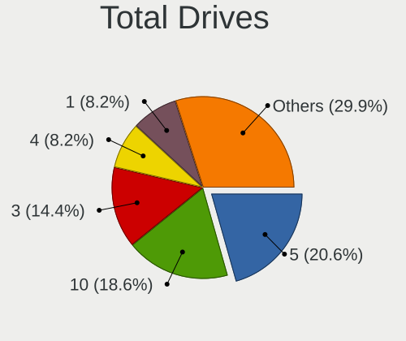

| Drives | Computers | Percent |
|--------|-----------|---------|
| 5      | 20        | 20.62%  |
| 10     | 18        | 18.56%  |
| 3      | 14        | 14.43%  |
| 4      | 8         | 8.25%   |
| 1      | 8         | 8.25%   |
| 9      | 5         | 5.15%   |
| 6      | 5         | 5.15%   |
| 8      | 4         | 4.12%   |
| 34     | 2         | 2.06%   |
| 25     | 2         | 2.06%   |
| 15     | 2         | 2.06%   |
| 13     | 2         | 2.06%   |
| 2      | 2         | 2.06%   |
| 193    | 1         | 1.03%   |
| 36     | 1         | 1.03%   |
| 24     | 1         | 1.03%   |
| 17     | 1         | 1.03%   |
| 14     | 1         | 1.03%   |

Has CD-ROM
----------

Has CD-ROM on board

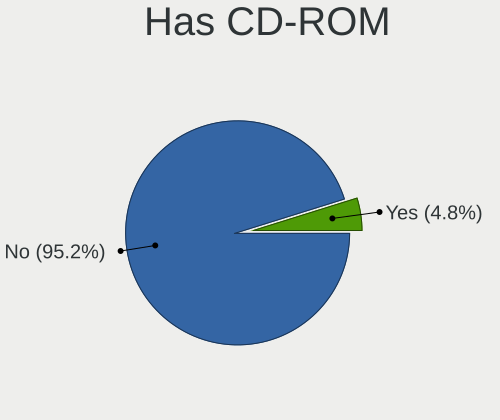

| Presented | Computers | Percent |
|-----------|-----------|---------|
| No        | 79        | 95.18%  |
| Yes       | 4         | 4.82%   |

Has Ethernet
------------

Has Ethernet on board

| Presented | Computers | Percent |
|-----------|-----------|---------|
| Yes       | 83        | 100%    |

Has WiFi
--------

Has WiFi module

| Presented | Computers | Percent |
|-----------|-----------|---------|
| No        | 83        | 100%    |

Has Bluetooth
-------------

Has Bluetooth module

| Presented | Computers | Percent |
|-----------|-----------|---------|
| No        | 83        | 100%    |

Location
--------

Country
-------

Geographic location (country)

| Country | Computers | Percent |
|---------|-----------|---------|
| Russia  | 83        | 100%    |

City
----

Geographic location (city)

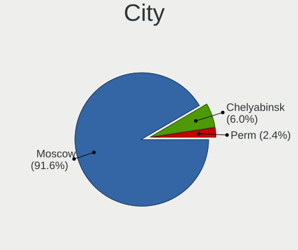

| City        | Computers | Percent |
|-------------|-----------|---------|
| Moscow      | 76        | 91.57%  |
| Chelyabinsk | 5         | 6.02%   |
| Perm        | 2         | 2.41%   |

Drives
------

Drive Vendor
------------

Hard drive vendors

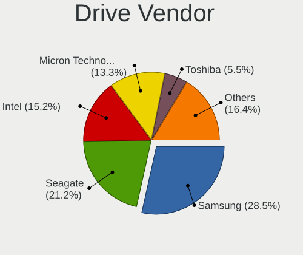

| Vendor              | Computers | Drives | Percent |
|---------------------|-----------|--------|---------|
| Samsung Electronics | 47        | 271    | 28.48%  |
| Seagate             | 35        | 163    | 21.21%  |
| Intel               | 25        | 107    | 15.15%  |
| Micron Technology   | 22        | 94     | 13.33%  |
| Toshiba             | 9         | 94     | 5.45%   |
| HGST                | 6         | 12     | 3.64%   |
| WDC                 | 3         | 9      | 1.82%   |
| HPE                 | 3         | 3      | 1.82%   |
| Hitachi             | 3         | 8      | 1.82%   |
| VSTORAGE            | 2         | 171    | 1.21%   |
| SCST_BIO            | 2         | 6      | 1.21%   |
| Hewlett-Packard     | 2         | 16     | 1.21%   |
| Lenovo              | 1         | 14     | 0.61%   |
| Kingston            | 1         | 1      | 0.61%   |
| HUAWEI              | 1         | 2      | 0.61%   |
| Foxline             | 1         | 2      | 0.61%   |
| DGC                 | 1         | 6      | 0.61%   |
| DELLBOSS            | 1         | 1      | 0.61%   |

Drive Model
-----------

Hard drive models

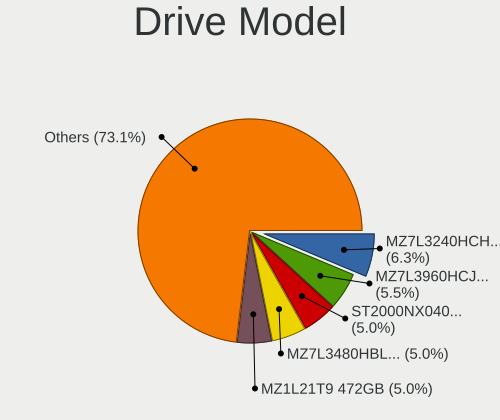

| Model                                                        | Computers | Percent |
|--------------------------------------------------------------|-----------|---------|
| Samsung MZ7L3240HCHQ-00A07 240GB SSD                         | 15        | 6.3%    |
| Samsung MZ7L3960HCJR-00A07 960GB SSD                         | 13        | 5.46%   |
| Seagate ST2000NX0403 2TB                                     | 12        | 5.04%   |
| Samsung MZ7L3480HBLT-00A07 480GB SSD                         | 12        | 5.04%   |
| Samsung MZ1L21T9 472GB                                       | 12        | 5.04%   |
| Seagate ST4000NM000A-2HZ100 4TB                              | 11        | 4.62%   |
| Samsung NVMe SSD Controller PM9A1/PM9A3/980PRO 1TB           | 11        | 4.62%   |
| Intel SSDSC2KG240G8 240GB                                    | 10        | 4.2%    |
| Intel SSDSC2KB960G8 960GB                                    | 10        | 4.2%    |
| Intel NVMe Datacenter SSD [3DNAND, Beta Rock Controller] 3TB | 9         | 3.78%   |
| Seagate ST4000NM0035-1V4107 4TB                              | 6         | 2.52%   |
| Micron 5300_MTFDDAK1T9TDT 2TB SSD                            | 5         | 2.1%    |
| Samsung MZ7L31T9HBLT-00A07 2TB SSD                           | 4         | 1.68%   |
| Micron 7300_MTFDHBE3T8TDF 4TB                                | 4         | 1.68%   |
| Intel PCIe Data Center SSD 2TB                               | 4         | 1.68%   |
| Toshiba MG04ACA400E 4TB                                      | 3         | 1.26%   |
| Samsung MZQL23T8 4TB                                         | 3         | 1.26%   |
| Samsung MZILT3T8HBLS/007 4TB SSD                             | 3         | 1.26%   |
| Samsung MZ7L3480HCHQ-00A07 480GB SSD                         | 3         | 1.26%   |
| Micron 5300_MTFDDAK3T8TDT 4TB SSD                            | 3         | 1.26%   |
| Micron 5300_MTFD 2TB SSD                                     | 3         | 1.26%   |
| HPE LOGICAL VOLUME 5TB SSD                                   | 3         | 1.26%   |
| VSTORAGE VSTOR-DISK 1.2TB                                    | 2         | 0.84%   |
| Toshiba MG03ACA100 1TB                                       | 2         | 0.84%   |
| Toshiba HDWD130 3TB                                          | 2         | 0.84%   |
| Seagate ST4000NM001B 4TB                                     | 2         | 0.84%   |
| Seagate ST20000NM007D-3DJ103 20TB                            | 2         | 0.84%   |
| Seagate ST16000NM001G 00MX141 00MX141LEN 16TB                | 2         | 0.84%   |
| Samsung SSD 850 PRO 512GB                                    | 2         | 0.84%   |
| Samsung MZVL21T0 1TB                                         | 2         | 0.84%   |
| Samsung MZILG960HCHQ/A07 960GB SSD                           | 2         | 0.84%   |
| Samsung MZ1L2960 960GB                                       | 2         | 0.84%   |
| Micron 5300_MTFDDAK7T6TDS 8TB SSD                            | 2         | 0.84%   |
| Micron 5300_MTFDDAK480TDS 480GB SSD                          | 2         | 0.84%   |
| Micron 5200_MTFDDAK480TDN 480GB SSD                          | 2         | 0.84%   |
| Micron 5100_MTFDDAK960TCB 960GB SSD                          | 2         | 0.84%   |
| Micron 1100_MTFDDAK512TBN 512GB SSD                          | 2         | 0.84%   |
| HGST HUS726040ALE614 4TB                                     | 2         | 0.84%   |
| HP HSV340 112GB                                              | 2         | 0.84%   |
| WDC WUH721816ALE6L4 16TB                                     | 1         | 0.42%   |

HDD Vendor
----------

Hard disk drive vendors

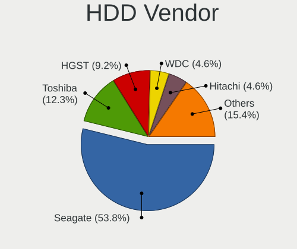

| Vendor          | Computers | Drives | Percent |
|-----------------|-----------|--------|---------|
| Seagate         | 35        | 163    | 53.85%  |
| Toshiba         | 8         | 88     | 12.31%  |
| HGST            | 6         | 12     | 9.23%   |
| WDC             | 3         | 9      | 4.62%   |
| Hitachi         | 3         | 8      | 4.62%   |
| VSTORAGE        | 2         | 171    | 3.08%   |
| SCST_BIO        | 2         | 6      | 3.08%   |
| Hewlett-Packard | 2         | 16     | 3.08%   |
| Lenovo          | 1         | 10     | 1.54%   |
| HUAWEI          | 1         | 2      | 1.54%   |
| DGC             | 1         | 6      | 1.54%   |
| DELLBOSS        | 1         | 1      | 1.54%   |

SSD Vendor
----------

Solid state drive vendors

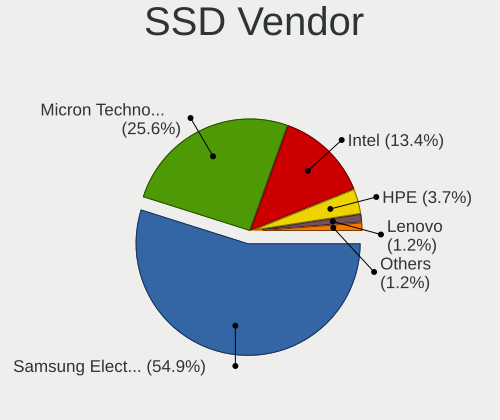

| Vendor              | Computers | Drives | Percent |
|---------------------|-----------|--------|---------|
| Samsung Electronics | 45        | 172    | 54.88%  |
| Micron Technology   | 21        | 73     | 25.61%  |
| Intel               | 11        | 40     | 13.41%  |
| HPE                 | 3         | 3      | 3.66%   |
| Lenovo              | 1         | 4      | 1.22%   |
| Foxline             | 1         | 2      | 1.22%   |

Drive Kind
----------

HDD or SSD

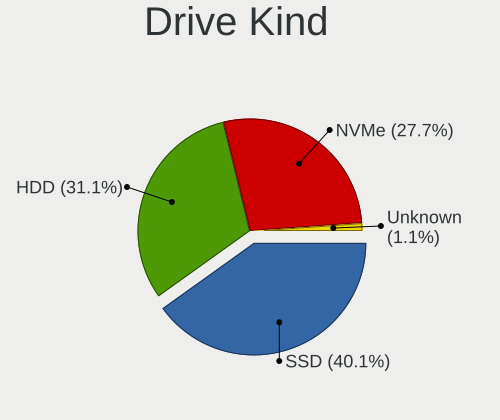

| Kind    | Computers | Drives | Percent |
|---------|-----------|--------|---------|
| SSD     | 71        | 294    | 40.11%  |
| HDD     | 55        | 492    | 31.07%  |
| NVMe    | 49        | 189    | 27.68%  |
| Unknown | 2         | 5      | 1.13%   |

Drive Connector
---------------

SATA, SAS, NVMe, etc.

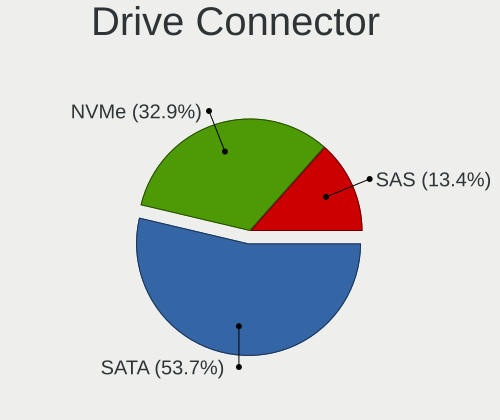

| Type | Computers | Drives | Percent |
|------|-----------|--------|---------|
| SATA | 80        | 719    | 53.69%  |
| NVMe | 49        | 189    | 32.89%  |
| SAS  | 20        | 72     | 13.42%  |

Drive Size
----------

Size of hard drive

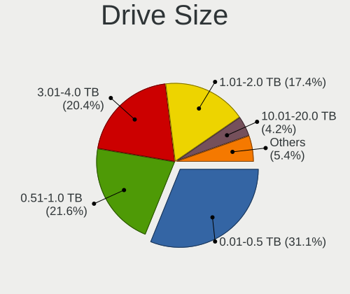

| Size in TB | Computers | Drives | Percent |
|------------|-----------|--------|---------|
| 0.01-0.5   | 52        | 136    | 31.14%  |
| 0.51-1.0   | 36        | 84     | 21.56%  |
| 3.01-4.0   | 34        | 155    | 20.36%  |
| 1.01-2.0   | 29        | 266    | 17.37%  |
| 10.01-20.0 | 7         | 97     | 4.19%   |
| 4.01-10.0  | 6         | 9      | 3.59%   |
| 2.01-3.0   | 3         | 39     | 1.8%    |

Space Total
-----------

Amount of disk space available on the file system

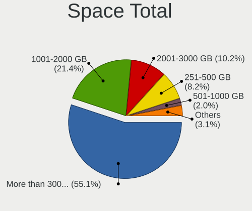

| Size in GB     | Computers | Percent |
|----------------|-----------|---------|
| More than 3000 | 54        | 55.1%   |
| 1001-2000      | 21        | 21.43%  |
| 2001-3000      | 10        | 10.2%   |
| 251-500        | 8         | 8.16%   |
| 501-1000       | 2         | 2.04%   |
| 1-20           | 1         | 1.02%   |
| 51-100         | 1         | 1.02%   |
| Unknown        | 1         | 1.02%   |

Space Used
----------

Amount of used disk space

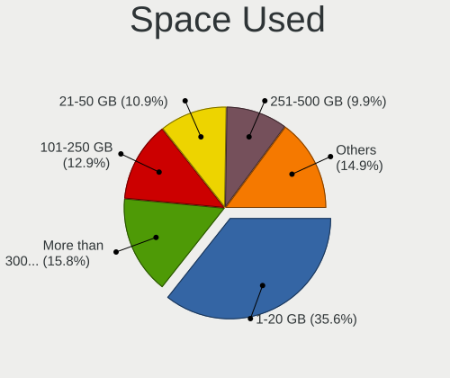

| Used GB        | Computers | Percent |
|----------------|-----------|---------|
| 1-20           | 36        | 35.64%  |
| More than 3000 | 16        | 15.84%  |
| 101-250        | 13        | 12.87%  |
| 21-50          | 11        | 10.89%  |
| 251-500        | 10        | 9.9%    |
| 501-1000       | 5         | 4.95%   |
| 2001-3000      | 4         | 3.96%   |
| 51-100         | 3         | 2.97%   |
| 1001-2000      | 2         | 1.98%   |
| Unknown        | 1         | 0.99%   |

Malfunc. Drives
---------------

Drive models with a malfunction

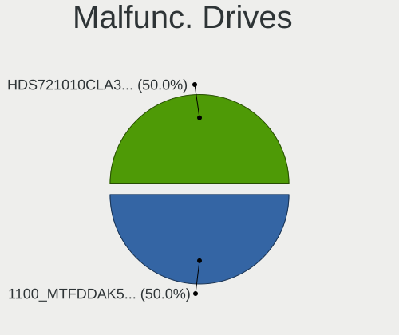

| Model                                          | Computers | Drives | Percent |
|------------------------------------------------|-----------|--------|---------|
| Seagate ST4000NM0035-1V4107 4TB                | 2         | 2      | 28.57%  |
| Micron Technology 5300_MTFDDAK1T9TDT 2TB SSD   | 2         | 8      | 28.57%  |
| Micron Technology 5300_MTFDDAK7T6TDS 8TB SSD   | 1         | 2      | 14.29%  |
| Micron Technology 1100_MTFDDAK512TBN 512GB SSD | 1         | 3      | 14.29%  |
| Hitachi HDS721010CLA330 1TB                    | 1         | 1      | 14.29%  |

Malfunc. Drive Vendor
---------------------

Vendors of faulty drives

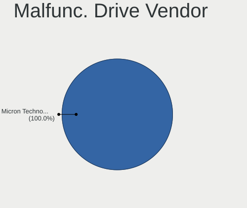

| Vendor            | Computers | Drives | Percent |
|-------------------|-----------|--------|---------|
| Micron Technology | 4         | 13     | 57.14%  |
| Seagate           | 2         | 2      | 28.57%  |
| Hitachi           | 1         | 1      | 14.29%  |

Malfunc. HDD Vendor
-------------------

Vendors of faulty HDD drives

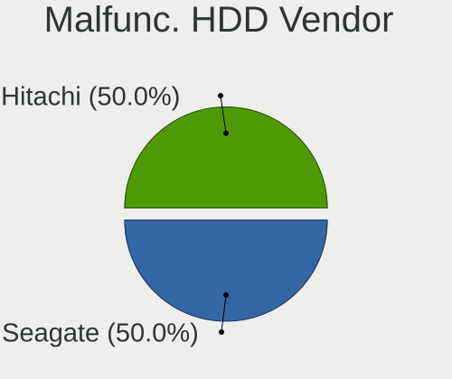

| Vendor  | Computers | Drives | Percent |
|---------|-----------|--------|---------|
| Seagate | 2         | 2      | 66.67%  |
| Hitachi | 1         | 1      | 33.33%  |

Malfunc. Drive Kind
-------------------

Kinds of faulty drives

| Kind | Computers | Drives | Percent |
|------|-----------|--------|---------|
| SSD  | 4         | 13     | 57.14%  |
| HDD  | 3         | 3      | 42.86%  |

Failed Drives
-------------

Failed drive models

Zero info for selected period =(

Failed Drive Vendor
-------------------

Failed drive vendors

Zero info for selected period =(

Drive Status
------------

Number of failed and malfunc. drives

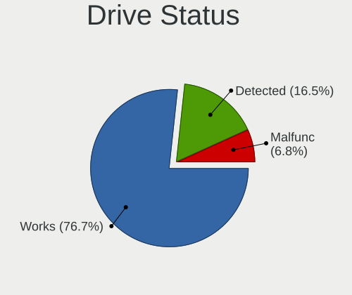

| Status   | Computers | Drives | Percent |
|----------|-----------|--------|---------|
| Works    | 79        | 897    | 76.7%   |
| Detected | 17        | 67     | 16.5%   |
| Malfunc  | 7         | 16     | 6.8%    |

Storage controller
------------------

Storage Vendor
--------------

Storage controller vendors

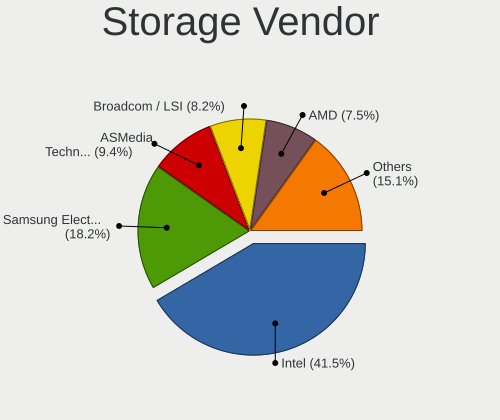

| Vendor                       | Computers | Percent |
|------------------------------|-----------|---------|
| Intel                        | 66        | 41.51%  |
| Samsung Electronics          | 29        | 18.24%  |
| ASMedia Technology           | 15        | 9.43%   |
| Broadcom / LSI               | 13        | 8.18%   |
| AMD                          | 12        | 7.55%   |
| LSI Logic / Symbios Logic    | 10        | 6.29%   |
| Micron Technology            | 5         | 3.14%   |
| Adaptec                      | 3         | 1.89%   |
| Hewlett-Packard              | 2         | 1.26%   |
| Toshiba America Info Systems | 1         | 0.63%   |
| Marvell Technology Group     | 1         | 0.63%   |
| Kingston Technology Company  | 1         | 0.63%   |
| Areca Technology             | 1         | 0.63%   |

Storage Model
-------------

Storage controller models

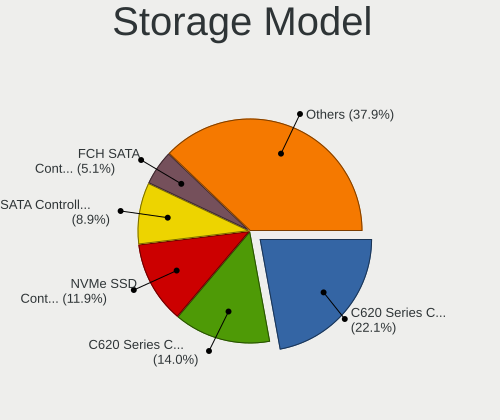

| Model                                                                         | Computers | Percent |
|-------------------------------------------------------------------------------|-----------|---------|
| Intel C620 Series Chipset Family SSATA Controller [AHCI mode]                 | 52        | 22.13%  |
| Intel C620 Series Chipset Family SATA Controller [AHCI mode]                  | 33        | 14.04%  |
| Samsung NVMe SSD Controller PM9A1/PM9A3/980PRO                                | 28        | 11.91%  |
| Intel SATA Controller [RAID Mode]                                             | 21        | 8.94%   |
| AMD FCH SATA Controller [AHCI mode]                                           | 12        | 5.11%   |
| ASMedia ASM1061/ASM1062 Serial ATA Controller                                 | 10        | 4.26%   |
| Intel NVMe Datacenter SSD [3DNAND, Beta Rock Controller]                      | 9         | 3.83%   |
| LSI Logic / Symbios Logic MegaRAID SAS-3 3108 [Invader]                       | 5         | 2.13%   |
| ASMedia 106x SATA/RAID Controller                                             | 5         | 2.13%   |
| Micron 7300 PRO NVMe SSD                                                      | 4         | 1.7%    |
| Intel Q170/Q150/B150/H170/H110/Z170/CM236 Chipset SATA Controller [AHCI Mode] | 4         | 1.7%    |
| Intel PCIe Data Center SSD                                                    | 4         | 1.7%    |
| Intel C610/X99 series chipset sSATA Controller [AHCI mode]                    | 4         | 1.7%    |
| Intel C610/X99 series chipset 6-Port SATA Controller [AHCI mode]              | 4         | 1.7%    |
| LSI Logic / Symbios Logic SAS3008 PCI-Express Fusion-MPT SAS-3                | 3         | 1.28%   |
| Intel Volume Management Device NVMe RAID Controller                           | 3         | 1.28%   |
| Broadcom / LSI SAS3008 PCI-Express Fusion-MPT SAS-3                           | 3         | 1.28%   |
| Broadcom / LSI MegaRAID SAS-3 3108 [Invader]                                  | 3         | 1.28%   |
| Adaptec Smart Storage PQI SAS                                                 | 3         | 1.28%   |
| LSI Logic / Symbios Logic MegaRAID SAS-3 3008 [Fury]                          | 2         | 0.85%   |
| Intel Rapids SATA AHCI Controller                                             | 2         | 0.85%   |
| Intel C740 Series (Emmitsburg) Chipsets SATA0 Controller (AHCI)               | 2         | 0.85%   |
| HP Smart Array Gen8 Controllers                                               | 2         | 0.85%   |
| Broadcom / LSI Fusion-MPT 12GSAS/PCIe Secure SAS38xx                          | 2         | 0.85%   |
| Toshiba America Info Systems XG6 NVMe SSD Controller                          | 1         | 0.43%   |
| Samsung NVMe SSD Controller PM173X                                            | 1         | 0.43%   |
| Micron 7400 PRO NVMe SSD                                                      | 1         | 0.43%   |
| Marvell Group 88SE9230 PCIe 2.0 x2 4-port SATA 6 Gb/s RAID Controller         | 1         | 0.43%   |
| Kingston Company DC1000B NVMe SSD [E12DC]                                     | 1         | 0.43%   |
| Intel NVMe DC SSD [3DNAND, Sentinel Rock Controller]                          | 1         | 0.43%   |
| Intel C602 chipset 4-Port SATA Storage Control Unit                           | 1         | 0.43%   |
| Intel C600/X79 series chipset 6-Port SATA AHCI Controller                     | 1         | 0.43%   |
| Intel 200 Series PCH SATA controller [AHCI mode]                              | 1         | 0.43%   |
| Broadcom / LSI SAS3408 Fusion-MPT Tri-Mode I/O Controller Chip (IOC)          | 1         | 0.43%   |
| Broadcom / LSI MegaRAID Tri-Mode SAS3516                                      | 1         | 0.43%   |
| Broadcom / LSI MegaRAID Tri-Mode SAS3508                                      | 1         | 0.43%   |
| Broadcom / LSI MegaRAID SAS 2208 [Thunderbolt]                                | 1         | 0.43%   |
| Broadcom / LSI MegaRAID 12GSAS/PCIe Secure SAS39xx                            | 1         | 0.43%   |
| Areca ARC-1886 series PCIe 4.0 to NVMe/SAS/SATA 16/12/6Gb RAID Controller     | 1         | 0.43%   |

Storage Kind
------------

Kind of storage controller (IDE, SATA, NVMe, SAS, ...)

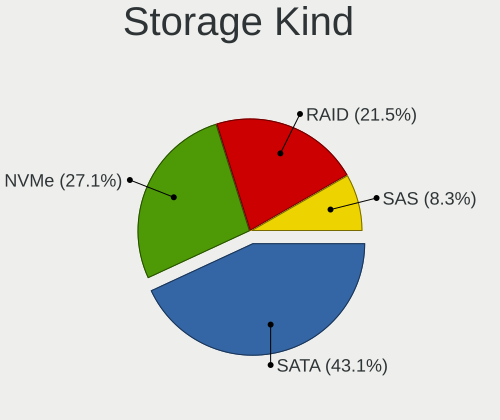

| Kind | Computers | Percent |
|------|-----------|---------|
| SATA | 78        | 43.09%  |
| NVMe | 49        | 27.07%  |
| RAID | 39        | 21.55%  |
| SAS  | 15        | 8.29%   |

Processor
---------

CPU Vendor
----------

Processor vendors

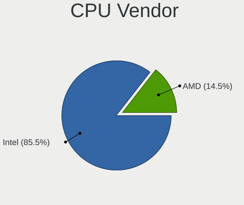

| Vendor | Computers | Percent |
|--------|-----------|---------|
| Intel  | 71        | 85.54%  |
| AMD    | 12        | 14.46%  |

CPU Model
---------

Processor models

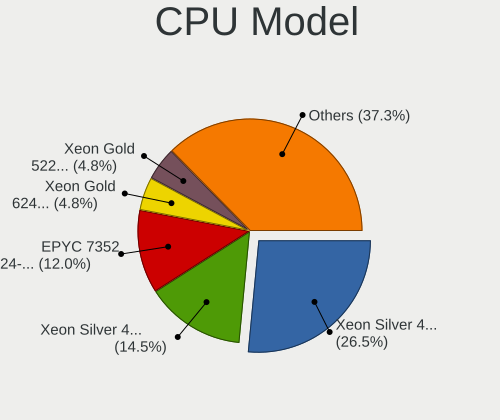

| Model                                 | Computers | Percent |
|---------------------------------------|-----------|---------|
| Intel Xeon Silver 4208 CPU @ 2.10GHz  | 22        | 26.51%  |
| Intel Xeon Silver 4310 CPU @ 2.10GHz  | 12        | 14.46%  |
| AMD EPYC 7352 24-Core Processor       | 10        | 12.05%  |
| Intel Xeon Gold 6248 CPU @ 2.50GHz    | 4         | 4.82%   |
| Intel Xeon Gold 5220R CPU @ 2.20GHz   | 4         | 4.82%   |
| Intel Xeon Silver 4410Y               | 2         | 2.41%   |
| Intel Xeon Silver 4214R CPU @ 2.40GHz | 2         | 2.41%   |
| Intel Xeon CPU E5-2640 v4 @ 2.40GHz   | 2         | 2.41%   |
| Intel Xeon CPU E3-1230 v6 @ 3.50GHz   | 2         | 2.41%   |
| Intel Xeon CPU E3-1230 v5 @ 3.40GHz   | 2         | 2.41%   |
| AMD EPYC 7502P 32-Core Processor      | 2         | 2.41%   |
| Intel Xeon Silver 4314 CPU @ 2.40GHz  | 1         | 1.2%    |
| Intel Xeon Silver 4210R CPU @ 2.40GHz | 1         | 1.2%    |
| Intel Xeon Silver 4210 CPU @ 2.20GHz  | 1         | 1.2%    |
| Intel Xeon Silver 4114 CPU @ 2.20GHz  | 1         | 1.2%    |
| Intel Xeon Gold 6346 CPU @ 3.10GHz    | 1         | 1.2%    |
| Intel Xeon Gold 6342 CPU @ 2.80GHz    | 1         | 1.2%    |
| Intel Xeon Gold 6338 CPU @ 2.00GHz    | 1         | 1.2%    |
| Intel Xeon Gold 6326 CPU @ 2.90GHz    | 1         | 1.2%    |
| Intel Xeon Gold 6238R CPU @ 2.20GHz   | 1         | 1.2%    |
| Intel Xeon Gold 6230R CPU @ 2.10GHz   | 1         | 1.2%    |
| Intel Xeon Gold 6140 CPU @ 2.30GHz    | 1         | 1.2%    |
| Intel Xeon Gold 5220 CPU @ 2.20GHz    | 1         | 1.2%    |
| Intel Xeon Gold 5120 CPU @ 2.20GHz    | 1         | 1.2%    |
| Intel Xeon CPU E5-2680 0 @ 2.70GHz    | 1         | 1.2%    |
| Intel Xeon CPU E5-2670 v2 @ 2.50GHz   | 1         | 1.2%    |
| Intel Xeon CPU E5-2670 0 @ 2.60GHz    | 1         | 1.2%    |
| Intel Xeon CPU E5-2630 v4 @ 2.20GHz   | 1         | 1.2%    |
| Intel Xeon CPU E5-2603 v4 @ 1.70GHz   | 1         | 1.2%    |
| Intel Core i7-7700 CPU @ 3.60GHz      | 1         | 1.2%    |

CPU Model Family
----------------

Processor model prefix

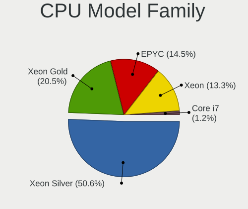

| Model             | Computers | Percent |
|-------------------|-----------|---------|
| Intel Xeon Silver | 42        | 50.6%   |
| Intel Xeon Gold   | 17        | 20.48%  |
| AMD EPYC          | 12        | 14.46%  |
| Intel Xeon        | 11        | 13.25%  |
| Intel Core i7     | 1         | 1.2%    |

CPU Cores
---------

Number of processor cores

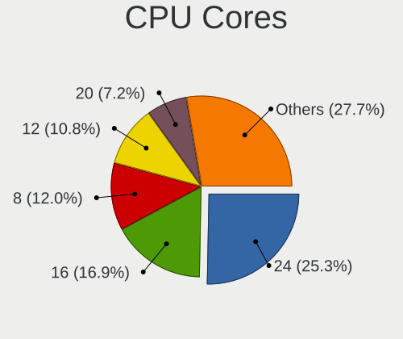

| Number | Computers | Percent |
|--------|-----------|---------|
| 24     | 21        | 25.3%   |
| 16     | 14        | 16.87%  |
| 8      | 10        | 12.05%  |
| 12     | 9         | 10.84%  |
| 20     | 6         | 7.23%   |
| 32     | 5         | 6.02%   |
| 4      | 5         | 6.02%   |
| 40     | 4         | 4.82%   |
| 48     | 2         | 2.41%   |
| 36     | 2         | 2.41%   |
| 64     | 1         | 1.2%    |
| 56     | 1         | 1.2%    |
| 52     | 1         | 1.2%    |
| 28     | 1         | 1.2%    |
| 10     | 1         | 1.2%    |

CPU Sockets
-----------

Number of sockets

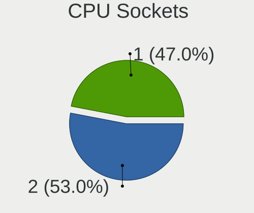

| Number | Computers | Percent |
|--------|-----------|---------|
| 2      | 44        | 53.01%  |
| 1      | 39        | 46.99%  |

CPU Threads
-----------

Threads per core (Hyper-Threading)

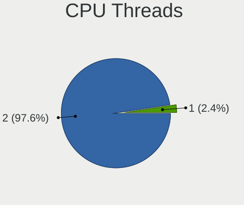

| Number | Computers | Percent |
|--------|-----------|---------|
| 2      | 81        | 97.59%  |
| 1      | 2         | 2.41%   |

CPU Op-Modes
------------

CPU Operation Modes (32-bit, 64-bit)

| Op mode        | Computers | Percent |
|----------------|-----------|---------|
| 32-bit, 64-bit | 83        | 100%    |

CPU Microcode
-------------

Microcode number

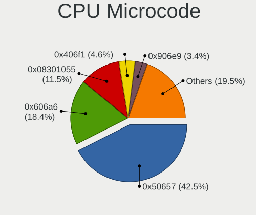

| Number     | Computers | Percent |
|------------|-----------|---------|
| 0x50657    | 37        | 42.53%  |
| 0x606a6    | 16        | 18.39%  |
| 0x08301055 | 10        | 11.49%  |
| 0x406f1    | 4         | 4.6%    |
| 0x906e9    | 3         | 3.45%   |
| 0x50654    | 3         | 3.45%   |
| 0x0830107b | 3         | 3.45%   |
| Unknown    | 3         | 3.45%   |
| 0x806f8    | 2         | 2.3%    |
| 0x506e3    | 2         | 2.3%    |
| 0x206d7    | 2         | 2.3%    |
| 0x306e4    | 1         | 1.15%   |
| 0x0830107c | 1         | 1.15%   |

CPU Microarch
-------------

Microarchitecture

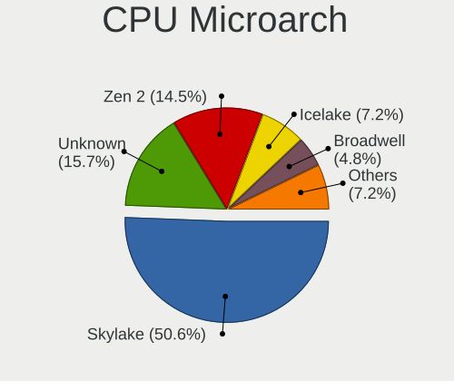

| Name        | Computers | Percent |
|-------------|-----------|---------|
| Skylake     | 42        | 50.6%   |
| Unknown     | 13        | 15.66%  |
| Zen 2       | 12        | 14.46%  |
| Icelake     | 6         | 7.23%   |
| Broadwell   | 4         | 4.82%   |
| KabyLake    | 3         | 3.61%   |
| SandyBridge | 2         | 2.41%   |
| IvyBridge   | 1         | 1.2%    |

Graphics
--------

GPU Vendor
----------

Vendors of graphics cards

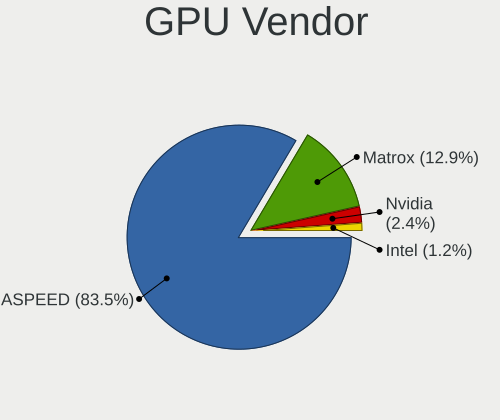

| Vendor                     | Computers | Percent |
|----------------------------|-----------|---------|
| ASPEED Technology          | 71        | 83.53%  |
| Matrox Electronics Systems | 11        | 12.94%  |
| Nvidia                     | 2         | 2.35%   |
| Intel                      | 1         | 1.18%   |

GPU Model
---------

Graphics card models

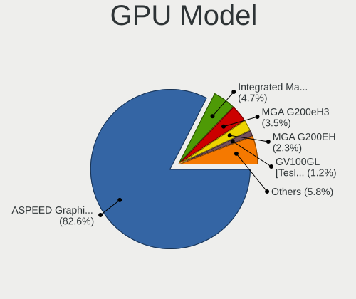

| Model                                                                    | Computers | Percent |
|--------------------------------------------------------------------------|-----------|---------|
| ASPEED Technology ASPEED Graphics Family                                 | 71        | 82.56%  |
| Matrox Electronics Systems Integrated Matrox G200eW3 Graphics Controller | 4         | 4.65%   |
| Matrox Electronics Systems MGA G200eH3                                   | 3         | 3.49%   |
| Matrox Electronics Systems MGA G200EH                                    | 2         | 2.33%   |
| Nvidia GV100GL [Tesla V100 PCIe 32GB]                                    | 1         | 1.16%   |
| Nvidia GA107GL [A2 / A16]                                                | 1         | 1.16%   |
| Nvidia GA100 [A100 PCIe 40GB]                                            | 1         | 1.16%   |
| Matrox Electronics Systems MGA G200eW WPCM450                            | 1         | 1.16%   |
| Matrox Electronics Systems MGA G200e [Pilot] ServerEngines (SEP1)        | 1         | 1.16%   |
| Intel Kaby Lake-S GT2 [HD Graphics 630]                                  | 1         | 1.16%   |

GPU Combo
---------

Combinations of graphics cards

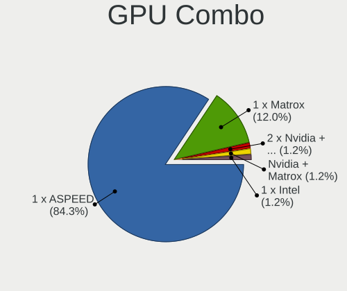

| Name                    | Computers | Percent |
|-------------------------|-----------|---------|
| 1 x ASPEED              | 70        | 84.34%  |
| 1 x Matrox              | 10        | 12.05%  |
| 2 x Nvidia + 1 x ASPEED | 1         | 1.2%    |
| Nvidia + Matrox         | 1         | 1.2%    |
| 1 x Intel               | 1         | 1.2%    |

GPU Driver
----------

Free vs proprietary

| Driver | Computers | Percent |
|--------|-----------|---------|
| Free   | 83        | 100%    |

GPU Memory
----------

Total video memory

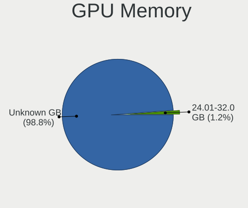

| Size in GB | Computers | Percent |
|------------|-----------|---------|
| Unknown    | 82        | 98.8%   |
| 24.01-32.0 | 1         | 1.2%    |

Monitor
-------

Monitor Vendor
--------------

Monitor vendors

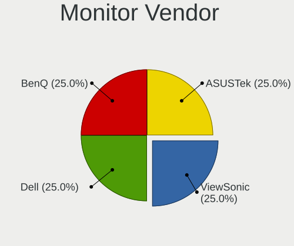

| Vendor           | Computers | Percent |
|------------------|-----------|---------|
| KVM              | 2         | 28.57%  |
| BenQ             | 2         | 28.57%  |
| ViewSonic        | 1         | 14.29%  |
| Dell             | 1         | 14.29%  |
| ASUSTek Computer | 1         | 14.29%  |

Monitor Model
-------------

Monitor models

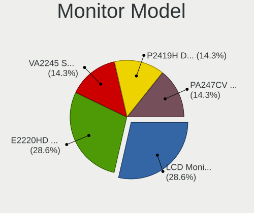

| Model                                                          | Computers | Percent |
|----------------------------------------------------------------|-----------|---------|
| KVM LCD Monitor1919 KVM4308 1280x1024 376x301mm 19.0-inch      | 2         | 28.57%  |
| BenQ E2220HD BNQ7912 1920x1080 477x268mm 21.5-inch             | 2         | 28.57%  |
| ViewSonic VA2245 Series VSCF42E 1920x1080 477x268mm 21.5-inch  | 1         | 14.29%  |
| Dell P2419H DELD0DA 1920x1080 527x296mm 23.8-inch              | 1         | 14.29%  |
| ASUSTek Computer PA247CV AUS2464 1920x1080 527x296mm 23.8-inch | 1         | 14.29%  |

Monitor Resolution
------------------

Monitor screen resolution

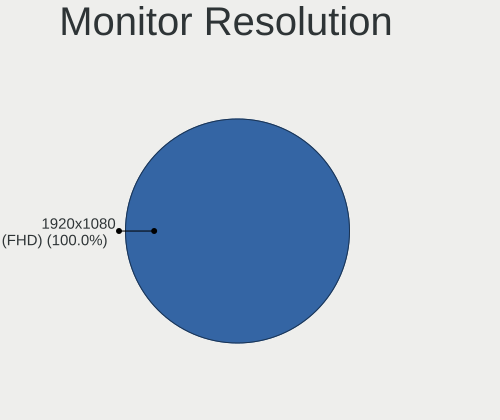

| Resolution       | Computers | Percent |
|------------------|-----------|---------|
| 1920x1080 (FHD)  | 4         | 66.67%  |
| 1280x1024 (SXGA) | 2         | 33.33%  |

Monitor Diagonal
----------------

Diagonal size in inches

| Inches | Computers | Percent |
|--------|-----------|---------|
| 21     | 3         | 42.86%  |
| 19     | 2         | 28.57%  |
| 24     | 1         | 14.29%  |
| 23     | 1         | 14.29%  |

Monitor Width
-------------

Physical width

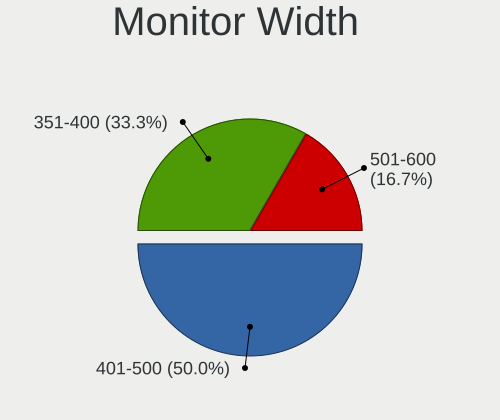

| Width in mm | Computers | Percent |
|-------------|-----------|---------|
| 401-500     | 3         | 50%     |
| 351-400     | 2         | 33.33%  |
| 501-600     | 1         | 16.67%  |

Aspect Ratio
------------

Proportional relationship between the width and the height

| Ratio | Computers | Percent |
|-------|-----------|---------|
| 16/9  | 4         | 66.67%  |
| 5/4   | 2         | 33.33%  |

Monitor Area
------------

Area in inch²

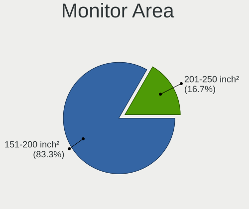

| Area in inch² | Computers | Percent |
|----------------|-----------|---------|
| 151-200        | 5         | 83.33%  |
| 201-250        | 1         | 16.67%  |

Pixel Density
-------------

Pixels per inch

| Density | Computers | Percent |
|---------|-----------|---------|
| 101-120 | 3         | 50%     |
| 51-100  | 3         | 50%     |

Multiple Monitors
-----------------

Total monitors connected

| Total | Computers | Percent |
|-------|-----------|---------|
| 0     | 77        | 91.67%  |
| 1     | 6         | 7.14%   |
| 2     | 1         | 1.19%   |

Network
-------

Net Controller Vendor
---------------------

Controller vendors

| Vendor                | Computers | Percent |
|-----------------------|-----------|---------|
| Intel                 | 74        | 45.12%  |
| Mellanox Technologies | 46        | 28.05%  |
| Broadcom              | 24        | 14.63%  |
| Emulex                | 6         | 3.66%   |
| American Megatrends   | 5         | 3.05%   |
| Broadcom Limited      | 3         | 1.83%   |
| Insyde Software       | 2         | 1.22%   |
| Dell                  | 2         | 1.22%   |
| Netchip Technology    | 1         | 0.61%   |
| IBM                   | 1         | 0.61%   |

Net Controller Model
--------------------

Controller models

| Model                                                                         | Computers | Percent |
|-------------------------------------------------------------------------------|-----------|---------|
| Intel Ethernet Controller E810-XXV for SFP                                    | 34        | 15.81%  |
| Mellanox MT27800 Family [ConnectX-5]                                          | 19        | 8.84%   |
| Intel Ethernet Connection X722 for 1GbE                                       | 18        | 8.37%   |
| Intel I350 Gigabit Network Connection                                         | 15        | 6.98%   |
| Intel I210 Gigabit Network Connection                                         | 15        | 6.98%   |
| Mellanox MT27710 Family [ConnectX-4 Lx]                                       | 14        | 6.51%   |
| Mellanox MT27700 Family [ConnectX-4]                                          | 13        | 6.05%   |
| Intel Ethernet Controller X710 for 10GBASE-T                                  | 13        | 6.05%   |
| Broadcom BCM57412 NetXtreme-E 10Gb RDMA Ethernet Controller                   | 12        | 5.58%   |
| Intel Ethernet Connection X722 for 10GbE backplane                            | 10        | 4.65%   |
| Broadcom BCM57416 NetXtreme-E Dual-Media 10G RDMA Ethernet Controller         | 10        | 4.65%   |
| Emulex OneConnect NIC (Skyhawk)                                               | 5         | 2.33%   |
| American Megatrends Virtual Ethernet.                                         | 5         | 2.33%   |
| Intel 82599ES 10-Gigabit SFI/SFP+ Network Connection                          | 4         | 1.86%   |
| Intel Ethernet Connection X722                                                | 3         | 1.4%    |
| Broadcom Limited BCM57416 NetXtreme-E Dual-Media 10G RDMA Ethernet Controller | 3         | 1.4%    |
| Mellanox MT27500 Family [ConnectX-3]                                          | 2         | 0.93%   |
| Intel Ethernet Controller X710 for 10GbE SFP+                                 | 2         | 0.93%   |
| Intel Ethernet Controller 10-Gigabit X540-AT2                                 | 2         | 0.93%   |
| Insyde Software RNDIS/Ethernet Gadget                                         | 2         | 0.93%   |
| Dell iDRAC Virtual NIC                                                        | 2         | 0.93%   |
| Broadcom Limited NetXtreme BCM5720 Gigabit Ethernet PCIe                      | 2         | 0.93%   |
| Netchip Linux-USB CDC Composite Gadge (Ethernet and ACM)                      | 1         | 0.47%   |
| Intel Ethernet Controller E810-C for SFP                                      | 1         | 0.47%   |
| Intel Ethernet Connection X722 for 10GBASE-T                                  | 1         | 0.47%   |
| Intel Ethernet Connection (2) I219-V                                          | 1         | 0.47%   |
| Intel Ethernet 10G 2P X520 Adapter                                            | 1         | 0.47%   |
| Intel 82571EB/82571GB Gigabit Ethernet Controller D0/D1 (copper applications) | 1         | 0.47%   |
| IBM RNDIS/Ethernet Gadget                                                     | 1         | 0.47%   |
| Emulex OneConnect 10Gb NIC (be3)                                              | 1         | 0.47%   |
| Broadcom NetXtreme II BCM57810 10 Gigabit Ethernet                            | 1         | 0.47%   |
| Broadcom NetXtreme BCM5720 Gigabit Ethernet PCIe                              | 1         | 0.47%   |

Wireless Vendor
---------------

Wireless vendors

Zero info for selected period =(

Wireless Model
--------------

Wireless models

Zero info for selected period =(

Ethernet Vendor
---------------

Ethernet vendors

| Vendor                | Computers | Percent |
|-----------------------|-----------|---------|
| Intel                 | 74        | 47.44%  |
| Mellanox Technologies | 38        | 24.36%  |
| Broadcom              | 24        | 15.38%  |
| Emulex                | 6         | 3.85%   |
| American Megatrends   | 5         | 3.21%   |
| Broadcom Limited      | 3         | 1.92%   |
| Insyde Software       | 2         | 1.28%   |
| Dell                  | 2         | 1.28%   |
| Netchip Technology    | 1         | 0.64%   |
| IBM                   | 1         | 0.64%   |

Ethernet Model
--------------

Ethernet models

| Model                                                                         | Computers | Percent |
|-------------------------------------------------------------------------------|-----------|---------|
| Intel Ethernet Controller E810-XXV for SFP                                    | 34        | 16.43%  |
| Mellanox MT27800 Family [ConnectX-5]                                          | 19        | 9.18%   |
| Intel Ethernet Connection X722 for 1GbE                                       | 18        | 8.7%    |
| Intel I350 Gigabit Network Connection                                         | 15        | 7.25%   |
| Intel I210 Gigabit Network Connection                                         | 15        | 7.25%   |
| Mellanox MT27710 Family [ConnectX-4 Lx]                                       | 14        | 6.76%   |
| Intel Ethernet Controller X710 for 10GBASE-T                                  | 13        | 6.28%   |
| Broadcom BCM57412 NetXtreme-E 10Gb RDMA Ethernet Controller                   | 12        | 5.8%    |
| Intel Ethernet Connection X722 for 10GbE backplane                            | 10        | 4.83%   |
| Broadcom BCM57416 NetXtreme-E Dual-Media 10G RDMA Ethernet Controller         | 10        | 4.83%   |
| Mellanox MT27700 Family [ConnectX-4]                                          | 5         | 2.42%   |
| Emulex OneConnect NIC (Skyhawk)                                               | 5         | 2.42%   |
| American Megatrends Virtual Ethernet.                                         | 5         | 2.42%   |
| Intel 82599ES 10-Gigabit SFI/SFP+ Network Connection                          | 4         | 1.93%   |
| Intel Ethernet Connection X722                                                | 3         | 1.45%   |
| Broadcom Limited BCM57416 NetXtreme-E Dual-Media 10G RDMA Ethernet Controller | 3         | 1.45%   |
| Mellanox MT27500 Family [ConnectX-3]                                          | 2         | 0.97%   |
| Intel Ethernet Controller X710 for 10GbE SFP+                                 | 2         | 0.97%   |
| Intel Ethernet Controller 10-Gigabit X540-AT2                                 | 2         | 0.97%   |
| Insyde Software RNDIS/Ethernet Gadget                                         | 2         | 0.97%   |
| Dell iDRAC Virtual NIC                                                        | 2         | 0.97%   |
| Broadcom Limited NetXtreme BCM5720 Gigabit Ethernet PCIe                      | 2         | 0.97%   |
| Netchip Linux-USB CDC Composite Gadge (Ethernet and ACM)                      | 1         | 0.48%   |
| Intel Ethernet Controller E810-C for SFP                                      | 1         | 0.48%   |
| Intel Ethernet Connection X722 for 10GBASE-T                                  | 1         | 0.48%   |
| Intel Ethernet Connection (2) I219-V                                          | 1         | 0.48%   |
| Intel Ethernet 10G 2P X520 Adapter                                            | 1         | 0.48%   |
| Intel 82571EB/82571GB Gigabit Ethernet Controller D0/D1 (copper applications) | 1         | 0.48%   |
| IBM RNDIS/Ethernet Gadget                                                     | 1         | 0.48%   |
| Emulex OneConnect 10Gb NIC (be3)                                              | 1         | 0.48%   |
| Broadcom NetXtreme II BCM57810 10 Gigabit Ethernet                            | 1         | 0.48%   |
| Broadcom NetXtreme BCM5720 Gigabit Ethernet PCIe                              | 1         | 0.48%   |

Net Controller Kind
-------------------

Ethernet, WiFi or modem

| Kind     | Computers | Percent |
|----------|-----------|---------|
| Ethernet | 83        | 89.25%  |
| Unknown  | 10        | 10.75%  |

Used Controller
---------------

Currently used network controller

| Kind     | Computers | Percent |
|----------|-----------|---------|
| Ethernet | 82        | 98.8%   |
| Unknown  | 1         | 1.2%    |

NICs
----

Total network controllers on board

| Total | Computers | Percent |
|-------|-----------|---------|
| 6     | 23        | 26.74%  |
| 2     | 20        | 23.26%  |
| 4     | 15        | 17.44%  |
| 8     | 14        | 16.28%  |
| 5     | 5         | 5.81%   |
| 10    | 4         | 4.65%   |
| 3     | 4         | 4.65%   |
| 1     | 1         | 1.16%   |

IPv6
----

IPv6 vs IPv4

| Used | Computers | Percent |
|------|-----------|---------|
| No   | 83        | 100%    |

Bluetooth
---------

Bluetooth Vendor
----------------

Controller vendors

Zero info for selected period =(

Bluetooth Model
---------------

Controller models

Zero info for selected period =(

Sound
-----

Sound Vendor
------------

Sound card vendors

| Vendor | Computers | Percent |
|--------|-----------|---------|
| Intel  | 4         | 100%    |

Sound Model
-----------

Sound card models

| Model                                         | Computers | Percent |
|-----------------------------------------------|-----------|---------|
| Intel C740 Series (Emmitsburg) Chipsets Audio | 2         | 50%     |
| Intel C62x HD Audio Controller                | 1         | 25%     |
| Intel 200 Series PCH HD Audio                 | 1         | 25%     |

Memory
------

Memory Vendor
-------------

Memory module vendors

| Vendor              | Computers | Percent |
|---------------------|-----------|---------|
| Samsung Electronics | 50        | 58.14%  |
| Micron Technology   | 14        | 16.28%  |
| Nanya Technology    | 7         | 8.14%   |
| SK hynix            | 5         | 5.81%   |
| Kingston            | 4         | 4.65%   |
| HPE                 | 3         | 3.49%   |
| Unknown             | 2         | 2.33%   |
| Unknown             | 1         | 1.16%   |

Memory Model
------------

Memory module models

| Model                                                  | Computers | Percent |
|--------------------------------------------------------|-----------|---------|
| Samsung RAM M393A8G40AB2-CWE 64GB DIMM DDR4 3200MT/s   | 16        | 18.18%  |
| Samsung RAM M393A8G40BB4-CWE 64GB DIMM DDR4 3200MT/s   | 13        | 14.77%  |
| Micron RAM 36ASF4G72PZ-2G9E2 32GB DIMM DDR4 2933MT/s   | 10        | 11.36%  |
| Samsung RAM M393A2K40DB3-CWE 16GB DIMM DDR4 3200MT/s   | 8         | 9.09%   |
| Nanya RAM NT32GA72D4NBX3P-IX 32GB DIMM DDR4 2933MT/s   | 5         | 5.68%   |
| Samsung RAM M393A4K40EB3-CWE 32GB DIMM DDR4 3200MT/s   | 3         | 3.41%   |
| Samsung RAM M393A2K43FB3-CWE 16GB DIMM DDR4 3200MT/s   | 3         | 3.41%   |
| HPE RAM P03052-091 32GB DIMM DDR4 3200MT/s             | 3         | 3.41%   |
| Unknown RAM Module 16GB DIMM DDR3 1866MT/s             | 2         | 2.27%   |
| Unknown RAM Module 16GB DIMM DDR3 1333MT/s             | 2         | 2.27%   |
| Samsung RAM M393A4K40CB1-CRC 32GB DIMM DDR4 2400MT/s   | 2         | 2.27%   |
| Samsung RAM M321R8GA0BB0-CQKZJ 64GB DIMM DDR5 4800MT/s | 2         | 2.27%   |
| Nanya RAM NT32GA72D4NFX3K-JR 32GB DIMM DDR4 3200MT/s   | 2         | 2.27%   |
| Micron RAM 18ASF2G72AZ-2G3B1 16GB DIMM DDR4 2400MT/s   | 2         | 2.27%   |
| SK hynix RAM HMT42GR7MFR4C-PB 16GB DIMM DDR3 1600MT/s  | 1         | 1.14%   |
| SK hynix RAM HMA84GR7DJR4N-WM 32GB DIMM DDR4 2933MT/s  | 1         | 1.14%   |
| SK hynix RAM HMA84GR7CJR4N-VK 32GB DIMM DDR4 2667MT/s  | 1         | 1.14%   |
| SK hynix RAM HMA84GR7AFR4N-VK 32GB DIMM DDR4 2667MT/s  | 1         | 1.14%   |
| SK hynix RAM HMA82GR7AFR8N-VK 16GB DIMM DDR4 2667MT/s  | 1         | 1.14%   |
| Samsung RAM M393A4K40DB3-CWE 32GB DIMM DDR4 3200MT/s   | 1         | 1.14%   |
| Samsung RAM M393A4K40BB1-CRC 32GB DIMM DDR4 2400MT/s   | 1         | 1.14%   |
| Samsung RAM M378A2G43MX3-CTD 16GB DIMM DDR4 3466MT/s   | 1         | 1.14%   |
| Micron RAM 18ASF2G72PDZ-2G6E1 16GB DIMM DDR4 2667MT/s  | 1         | 1.14%   |
| Micron RAM 18ASF2G72AZ-2G6D1 16GB DIMM DDR4 2667MT/s   | 1         | 1.14%   |
| Kingston RAM 9965742-055.B00G 32GB DIMM DDR4 3200MT/s  | 1         | 1.14%   |
| Kingston RAM 9965669-008.A03G 16GB DIMM DDR4 2134MT/s  | 1         | 1.14%   |
| Kingston RAM 9965640-016.A00G 32GB DIMM DDR4 2133MT/s  | 1         | 1.14%   |
| Kingston RAM 9965516-071.A00LF 16GB DIMM DDR3 1066MT/s | 1         | 1.14%   |
| Unknown                                                | 1         | 1.14%   |

Memory Kind
-----------

Memory module kinds

| Kind | Computers | Percent |
|------|-----------|---------|
| DDR4 | 75        | 90.36%  |
| DRAM | 3         | 3.61%   |
| DDR3 | 3         | 3.61%   |
| DDR5 | 2         | 2.41%   |

Memory Form Factor
------------------

Physical design of the memory module

| Name | Computers | Percent |
|------|-----------|---------|
| DIMM | 83        | 100%    |

Memory Size
-----------

Memory module size

| Size  | Computers | Percent |
|-------|-----------|---------|
| 32768 | 32        | 38.55%  |
| 65536 | 31        | 37.35%  |
| 16384 | 20        | 24.1%   |

Memory Speed
------------

Memory module speed

| Speed | Computers | Percent |
|-------|-----------|---------|
| 3200  | 50        | 57.47%  |
| 2933  | 16        | 18.39%  |
| 2400  | 5         | 5.75%   |
| 2667  | 4         | 4.6%    |
| 4800  | 2         | 2.3%    |
| 1866  | 2         | 2.3%    |
| 1600  | 2         | 2.3%    |
| 1333  | 2         | 2.3%    |
| 3466  | 1         | 1.15%   |
| 2134  | 1         | 1.15%   |
| 2133  | 1         | 1.15%   |
| 1066  | 1         | 1.15%   |

Printers & scanners
-------------------

Printer Vendor
--------------

Printer device vendors

Zero info for selected period =(

Printer Model
-------------

Printer device models

Zero info for selected period =(

Scanner Vendor
--------------

Scanner device vendors

Zero info for selected period =(

Scanner Model
-------------

Scanner device models

Zero info for selected period =(

Camera
------

Camera Vendor
-------------

Camera device vendors

Zero info for selected period =(

Camera Model
------------

Camera device models

Zero info for selected period =(

Security
--------

Fingerprint Vendor
------------------

Fingerprint sensor vendors

Zero info for selected period =(

Fingerprint Model
-----------------

Fingerprint sensor models

Zero info for selected period =(

Chipcard Vendor
---------------

Chipcard module vendors

Zero info for selected period =(

Chipcard Model
--------------

Chipcard module models

Zero info for selected period =(

Unsupported
-----------

Unsupported Devices
-------------------

Total unsupported devices on board

| Total | Computers | Percent |
|-------|-----------|---------|
| 3     | 34        | 40.96%  |
| 0     | 19        | 22.89%  |
| 4     | 18        | 21.69%  |
| 2     | 7         | 8.43%   |
| 5     | 4         | 4.82%   |
| 1     | 1         | 1.2%    |

Unsupported Device Types
------------------------

Types of unsupported devices

| Type                     | Computers | Percent |
|--------------------------|-----------|---------|
| Communication controller | 64        | 47.76%  |
| Unassigned class         | 61        | 45.52%  |
| Graphics card            | 5         | 3.73%   |
| Net/ethernet             | 3         | 2.24%   |
| Storage/raid             | 1         | 0.75%   |

